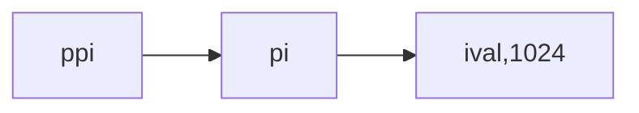

# 第Ⅰ部分-C++基础

介绍 C++ 的基本特征

- 变量和基本类型
- 字符串、向量和数组
- 表达式
- 语句
- 函数
- 类

## 第一章

一些基础内容，只记录一些必要的。

[(27条消息) 如何用CLion快乐刷题，避免CMakeLists.txt 文件带来的，建立cpp文件无法编译运行的痛苦_Xurui_Luo的博客-CSDN博客](https://blog.csdn.net/Xurui_Luo/article/details/107738529?spm=1001.2101.3001.6650.2&utm_medium=distribute.pc_relevant.none-task-blog-2~default~CTRLIST~Rate-2-107738529-blog-105904857.pc_relevant_recovery_v2&depth_1-utm_source=distribute.pc_relevant.none-task-blog-2~default~CTRLIST~Rate-2-107738529-blog-105904857.pc_relevant_recovery_v2&utm_relevant_index=3)

cmake 文件

```cpp
cmake_minimum_required(VERSION 3.10.2)
project(项目名)

set(CMAKE_CXX_STANDARD 11)

# 遍历项目根目录下所有的 .cpp 文件
file (GLOB_RECURSE files *.cpp)
foreach (file ${files})
    string(REGEX REPLACE ".+/(.+)\\..*" "\\1" exe ${file})
    add_executable (${exe} ${file})
    message (\ \ \ \ --\ src/${exe}.cpp\ will\ be\ compiled\ to\ bin/${exe})
endforeach ()
```

### ASCII 表

`a --> 97`，`a --> 65`，`0 --> 48`，`空字符 --> 32`

### 简单的C++程序

返回值 -1 通常被当作程序错误的标识。重新编译并运行你的程序，观察你的系统如何处理main返回的错误标识。将 main 函数的返回值修改为 -1，观察结果。

```cpp
#include<iostream>
using namespace std;

int main(){
    cout<<"modify return value"<<endl;
    return -1;
}
// 控制台提示
// Command executed failed（Exit code 255）
```

### 输入输出

C++ 的 iostream 库包含两个基础类型 istream 和 ostream，分别表示输入流和输出流。

#### 标准IO对象

标准库定义了 4 个 IO 对象。为了处理输入

- 名为 cin（发音为 see-in）的 istream 类型的对象。这个对象被称为标准输入（standard input）。
- 名为 cout（发音为 see-out）的 ostream 类型的对象。此对象被称为标准输出（standard output）。
- 名为 cerr 和 clog（发音分别为 see-err 和 see-log）的 ostream 类型对象。我们通常用 cerr 来输出警告和错误消息，因此它也被称为标准错误（standard error）。而 clog 用来输出程序运行时的一般性信息。系统通常将程序所运行的窗口与这些对象关联起来。

当我们读取 cin，数据将从程序正在运行的窗口读入，当我们向 cout、cerr 和 clog 写入数据时，将会写到同一个窗口。

```cpp
#include<iostream>
using namespace std;

int main(){
    int n1,n2;
    // cout 使用 << 将字符串给定到 cout 对象中
    // endl 将缓冲区的数据刷到设备中。
    std::cout<<"please input two number"<<std::endl;
    // 使用 >> 将控制台的输入给定到 n1,n2 中
    std::cin>>n1>>n2;
    std::cout<<"result is:"<<n1+n2<<std::endl;
    return 0;
}
```

程序使用了 `std::cout` 和 `std::endl`，而不是直接的 cout 和 endl 。前缀 `std::` 指出名字 cout 和 endl 是定义在名为 std 的命名空间（namespace）中的。命名空间可以帮助我们避免不经意的名字定义冲突，以及使用库中相同名字导致的冲突。标准库定义的所有名字都在命名空间 std 中。

习题：解释下面程序是否合法，合法输出什么，不合法原因是什么，如何修改

```cpp
#include<iostream>

// 解释下面程序片段是否合法
int main(){
    int v1,v2;
    std::cout<<"The sum of "<<v1;
    << "and "<< v2;
    << " is "<< v1+v2 <<std::endl;
    return 0;
}
/*
不合法， ; 表示这跳语句终止了，第二条语句的 << 就不知道给定到（流的重定向？）那个对象了。
去掉 v1,v2 后面的 ; 即可
*/
```

使用 setprecision 设置输出的精度，在头文件 `iomanip` 中。刷题要求输出限制精度的时候常用，当然直接用 C 的 `%.4f` 这种限制位数的更直接。

```cpp
#include <stdio.h>
#include<iostream>
#include<iomanip>

using namespace std;

int main() {
    double dv = 10.2356452;
    printf("%.4f", dv); // 10.2356
    cout << setprecision(5) << dv << endl; // 10.236
    // fixed 取小数点后xx位                                                 
    cout << fixed << setprecision(2) << dv << endl; // 10.23
}
```

> C 语言输入输出的控制符

`int: %d`
`float: %f`
`double: %lf`
`char %c`
`long long %lld`

### 注释

两种注释，单行注释和多行注释

```cpp
//
/*
*
*/
```

```cpp
#include<iostream>

// 解释下面程序片段是否合法
int main(){
    int v1,v2;
    std::cout<<"/*"<<std::endl;
    std::cout<<"*/"<<std::endl;
 	
    // 正确
    std::cout<</*"*/" /*"/*"*/<<std::endl;

    return 0;
}
```

### 控制流

if、else、for、while；

读取数量不定的输入数据

```cpp
#include<iostream>

int main(){
    int value=0,sum=0;
    while(std::cin>>value){
        sum+=value;
    }
    std::cout<<sum<<std::endl;
    return 0;
}
/*
Linux 下最后输入 EOF 就可以停止了。
*/
```

当从键盘向程序输入数据时，对于如何指出文件结束，不同操作系统有不同的约定。在 Windows 系统中，输入文件结束符的方法是敲 Ctrl+Z（按住 Ctrl 键的同时按 Z 键），然后按 Enter 或 Return 键。在 UNIX 系统中，包括 Mac OS X 系统中，文件结束符输入是用 Ctrl+D。

### 类介绍

不记

## 第二章-变量和基本类型

C++ 定义了一套包括算术类型（arithmetic type）和空类型（void）在内的基本数据类型。其中算术类型包含了字符、整型数、布尔值和浮点数。空类型不对应具体的值，仅用于一些特殊的场合，例如最常见的是，当函数不返回任何值时使用空类型作为返回类型。

### 基本内置类型

#### 算术类型

| 类型        | 含义              | 最小尺寸         |
| ----------- | ----------------- | ---------------- |
| bool        | 布尔类型          | 未定义           |
| char        | 字符              | 8 位             |
| wchar_t     | 宽字符 16         | _位              |
| char16_t    | Unicode 字符 16   | _位              |
| char32_t    | Unicode 字符 32   | _位              |
| short       | 短整型 16         | _位              |
| int         | 整型 16           | _位              |
| long        | 长整型 32         | _位              |
| long long   | 长整型 64         | _位              |
| float       | 单精度浮点数      | 6-7 位有效数字   |
| double      | 双精度浮点数 10   | 15-16 位有效数字 |
| long double | 扩展精度浮点数 10 | _位有效数字      |

#### 类型转换

> 基本的类型转换

```cpp
#include<iostream>
using namespace std;
int main(){
    bool b = 42; // b 为 true

    int i = b; // i 为 1
    i = 3.14;   // i 为 3
    double p1 = i; // p1 为 3
    unsigned char c = -1; // 假设 char 占 8bit，c 的值为255
    signed char c2 = 256; // 假设 char 占 8bit，c 的值是未定义

    cout<<"b="<<b<<"\n"
        <<"i="<<i<<"\n"
        <<"p1="<<p1<<"\n"
        <<"c="<<int(c)<<"\n"
        <<"c2="<<c2<<"\n";
    return 0;
}
```

由于不同的操作系统数据类型的表现能力不一样，如某些 OS int 是 4 字节，有些则不是 4 字节。因此在进行编程的时候要避免无法预知和依赖于实现环境的行为。

> 含无符号类型的表达式

如果一个有符号的 int 和无符号的 int 进行运算，最后的数据类型会被提升为无符号数据。

```cpp
void test2(){
    int a = -1;
    unsigned int b = 0;
    cout<<a+b<<endl; // 4294967295
}
```

如果一个有符号的 long 和一个无符号的 int 进行运行，最后无符号数据类型会被提升为 long。

```cpp
void test2(){
    long a = -1;
    unsigned int b = -1;
    // b 原先是 1000 ... 0001
    // 提升为 long 后 0000 ... 1000 ... 0001
    cout<<a+b<<endl; // 4294967294
}
```

> 习题，读程序，说结果

```cpp
void test3(){
    // 42 = 32+8+2
    unsigned u = 10,u2 = 42;
    // 0000 ... 0000 0000 1010
    // 0000 ... 0000 0010 1010
    
    // 0000 ... 0000 0010 1001
    cout<< u2-u <<endl; // 32
    
    // 10-42 = -32
    // 借位做减法
    // 0000 ... 0000 0000 1010
    // 0000 ... 0000 0010 1010
    // 1111 ... 1111 1110 0000

    // 1000 ... 0000 0010 0000
    // 负数的补码 = 取反+1（无符号的运算最后还是无符号）
    // 1111 ... 1111 1101 1111 + 1
    // 最后当成无符号数来算出他的值
    // 1111 ... 1111 1110 0000
    cout<< u-u2 <<endl;

    int i = 10,i2 = 42;

    cout<< i2-i <<endl;
    cout<< i-i2 <<endl;
    cout<< i-u <<endl;
    cout<< u-i <<endl;
}
```

#### 字面值常量

> 整型和浮点型字面量

以 0 开头的整数代表八进制数，以 0x 或 0X 开头的代表十六进制数。

```cpp
void test4(){
    // 4*1+2*8 
    // 0 开头八进制
    cout<<024<<endl;

    // 0x 开头十六进制
    // 1*16+2 = 18
    cout<<0x12<<endl;
}
```

浮点型字面值表现为一个小数或以科学计数法表示的指数，其中指数部分用 E 或 e 标识：

```shell
3.14  3.14e0  0.  0e0  .001
```

注意：默认的，浮点型字面值是一个 double。

> 字符和字符串字面量

由单引号括起来的一个字符称为 char 型字面值，双引号括起来的零个或多个字符则构成字符串型字面值。

```c
'a'  // 字符字面量
"Hello" // 字符串字面值
```

> 指定字面量的类型

什么叫指定字面量的类型呢？比如你把字面量 char 指定为 wchar_t 类型的。

| 指定方式 | 说明                                                   |
| -------- | ------------------------------------------------------ |
| L'a'     | 宽字符型字面量，类型是 wchar_t                         |
| u8"hi!"  | utf-8 字符串字面值 (utf8 用 8 位编码一个 Unicode 字符) |
| 42ULL    | 无符号整型字面值，类型 unsigned long long              |
| 1E-3F    |                                                        |
| 3.14158L | long double 类型                                       |

#### 取整规则

向零取整。

```cpp
#include<iostream>

using namespace std;

int main() {
    double dv = 10.23;
    // 10
    cout << (int) dv << endl;
}
```

int 类型的除法也是向零取整

```cpp
#include<iostream>

using namespace std;

int main() {
    int n1 = 5;
    int n2 = -5;
    // 向 0 取整
    cout << n1 / 2 << endl; // 2.5 --> 2
    cout << n2 / 2 << endl; // -2.5 --> -2
}
```

### 变量

#### 变量定义

定义的方式和其他语言类似

```cpp
int a=0,b=0;
```

> 初始值

C++ 中，初始化是一个异常复杂的问题，在 C++ 中，初始化和赋值是两个完全不同的操作。

> 列表初始化

```cpp
void test5(){
    int n = 10;
    // 以下为列表初始化。
    int n1 = {10};
    int n2{10};
    int n3(10);
    // 10:10:10
    cout<<n1<<":"<<n2<<":"<<n3<<endl;    
}
```

<span style="color:orange">列表初始化的好处：如果我们使用列表初始化且初始值存在丢失信息的风险，则编译器将报错。</span>

```cpp
void test5(){
    double n = 10.123;
    int n1 = {n};
    int n2{n};
    int n3(n);
    
    // g++ cast.cpp -o a -std=c++11 会报错
    cout<<n1<<":"<<n2<<":"<<n3<<endl;    
}
/*
cast.cpp: In function ‘void test5()’:
cast.cpp:69:16: warning: narrowing conversion of ‘n’ from ‘double’ to ‘int’ inside { } [-Wnarrowing]
     int n1 = {n};
                ^
cast.cpp:70:13: warning: narrowing conversion of ‘n’ from ‘double’ to ‘int’ inside { } [-Wnarrowing]
     int n2{n};
*/
```

> 默认初始化

如果定义变量时没有指定初值，则变量被默认初始化（default initialized），此时变量被赋予了“默认值”。<span style="color:orange">函数外部的变量会有默认初始化，而函数内部的变量没有默认初始化！如果试图拷贝或以其他形式访问此类值将引发错误。</span>

```cpp
int out;
void test6(){
    int inner; // 没有默认初始化
    cout<<out<<":"<<inner<<endl;
}
// 0:21845
```

> 练习题

```cpp
int i = {3.14}; // C++11 报错
int i = 3.14;   // C++11 不报错
```

#### 变量声明和定义

为了允许把程序拆分成多个逻辑部分来编写，C++ 支持分离式编译（separate compilation）机制，该机制允许将程序分割为若干个文件，每个文件可被独立编译。

如果将程序分为多个文件，则需要有在文件间共享代码的方法。例如，一个文件的代码可能需要使用另一个文件中定义的变量。如 `std::cout` 和 `std::cin`，它们定义于标准库，却能被我们写的程序使用。

为了支持分离式编译，C++ 将声明和定义区分开来。声明（declaration）使得名字为程序所知，一个文件如果想使用别处定义的名字则必须包含对那个名字的声明。<span style="color:red">而定义（definition）负责创建与名字关联的实体。</span>

变量声明规定了变量的类型和名字，在这一点上定义与之相同。但是除此之外，定义还申请存储空间，也可能会为变量赋一个初始值。

<span style="color:red">如果想声明一个变量而非定义它，就在变量名前添加关键字 extern，而且不要显式地初始化变量</span>

```cpp
extern int i; // 声明 i 而非定义 i, 说明此变量 i 在别处定义的，要在此处引用
extern double pi = 3.14; // 声明并定义 pi
int j; // 声明并定义 j
```

在函数体内部，如果试图初始化一个由 extern 关键字标记的变量，将引发错误。

> 使用 extern 引用其他文件的变量

```cpp
// var.cpp
#include <string.h>
using namespace std;

const char *str = "var.cpp 的变量";
```

```cpp
// init.cpp
#include <iostream>
#include "var.cpp"
using namespace std;
// 引用外部变量。
extern const char *str;
int main(){
    cout<<str<<endl;
    return 0;
}
```

变量只能被定义一次，但是可以被声明多次。这样我们就可以将声明和定义分离。变量的定义只出现在一个文件中，需要使用到这个变量的文件就声明变量。

#### 作用域

和其他语言一样，不赘述。

> 习题

```cpp
#include<iostream>
using namespace std;

int i = 42;
int main(){
    int i = 100;
    int j = i; 
    // 100
    cout<<j<<endl;
    return 0;
}
```

```cpp
#include<iostream>
using namespace std;

int main(){
    int i = 100, sum = 0;
    // for 循环内部的 i 是块级作用域。而在 Java 中会报错。
    for(int i=0; i!=10; ++i)
        sum+=i;
    cout<<i<<":"<<sum<<endl;
    return 0;
}
// 100:45
```

### 复合类型

复合类型（compound type）是指基于其他类型定义的类型。C++ 有几种复合类型，本章将介绍其中的两种：引用和指针。

#### 引用

引用（reference）为对象起了另外一个名字。

```cpp
#include<iostream>
using namespace std;
int main(){
    int val = 1024;
    int &refVal = val;
    // int &refVal2; // 报错，引用在定义时必须被初始化
    refVal = 10;
    cout<<val<<endl; // 10
    return -1;
}
```

定义引用时，程序把引用和它的初始值绑定（bind）在一起。一旦初始化完成，引用将和它的初始值对象一直绑定在一起。由于无法让引用重新绑定到另外一个对象，因此引用必须初始化。

注意：引用并非对象，相反的，它只是为一个已经存在的对象所起的另外一个名字。因为引用本身不是一个对象，所以不能定义引用的引用。

```cpp
#include<iostream>
using namespace std;
int main(){
    int &refVal = 10; // 报错，引用类型的初始值必须是一个对象
    double dVal = 3.1;
    int &refValI = dVal; // 报错，引用类型的初始值必须一致，此处必须是 int 型对象
}
```

> 引用定义

```cpp
#include<iostream>
using namespace std;
int main(){
    // ri 是一个引用，与 i 绑定在了一起
    int i, &ri = i;
    i = 5;
    ri = 11; // 为 i 重新赋值了
    // 11, 11
    cout<<i<<" "<<ri<<endl;
    return 0;
}
```

#### 指针

- 指针本身就是一个对象，允许对指针赋值和拷贝，而且在指针的生命周期内它可以先后指向几个不同的对象。
- 指针无须在定义时赋初值。和其他内置类型一样，在块作用域内定义的指针如果没有被初始化，也会有一个不确定的值。

> 指针的定义

```cpp
#include<iostream>
using namespace std;

int main(){
    int *p1,*p2; // p1,p2 都是指针
    double dp1,*dp2; // dp2 是指针
    p1 = new int; // 为指针 p1 分配内存空间
    *p1 = 1; // *p1 解指针，将指针指向的内存空间中的值写为 1
    cout<<*p1<<endl; // *p1 拿到指针指向的内存空间中的值
}
```

指针存的是地址值，所以可以把其他变量的地址值赋值给对应类型的指针。

```cpp
#include<iostream>
using namespace std;

int main(){
    int number = 10;
    int *p = &number; // 将 number 的内存地址赋值给指针 p
    *p = 20; // 修改指针 p 所指向内存地址中的值，即修改了 number 的值
    cout<<number<<endl; // 输出 20
}
```

指针的赋值类型需要匹配，否则会报错

```cpp
#include<iostream>
using namespace std;

int main(){
    int number = 10;
    // error: cannot convert ‘int*’ to ‘double*’ in initialization
    double *p = &number; 
}
```

> 指针的值

指针的值（即地址）应属下列 4 种状态之一：

- 指向一个对象。
- 指向紧邻对象所占空间的下一个位置。
- 空指针，意味着指针没有指向任何对象。
- 无效指针，也就是上述情况之外的其他值。

> 利用指针访问对象

如果指针指向了一个对象，允许使用解引用符（操作符 `*` ）来访问该对象。

```cpp
#include<iostream>
using namespace std;

int main(){
    int number = 10;
    int *p = &number; // 将 number 的内存地址赋值给指针 p
    // *p 所指向的对象就是 number，修改 number 对象的值
    *p = 20; // 修改指针 p 所指向内存地址中的值，即修改了 number 的值
    cout<<number<<endl; // 输出 20
}
```

> 空指针

空指针不指向任何对象。生成空指针的方式如下：

```cpp
#include<iostream>
using namespace std;

int main(){
    // 下面三个都是生成空指针
    int *p1 = nullptr;
    int *p2 = NULL;
    int *p3 = 0; 
}
```

> 其他指针操作

任何非 0 指针对应的条件都是 true。

```cpp
#include<iostream>
using namespace std;

int main(){
    int *p1 = new int;
    int *p2 = 0;
    if(p1){
        cout<<"p1 not zero"<<endl;
    }
    if(p2){
        cout<<"p2 not zero"<<endl;
    }
}
// p1 not zero
```

> void\* 指针

void＊是一种特殊的指针类型，可用于存放任意对象的地址。一个 void＊指针存放着一个地址，这一点和其他指针类似。不同的是，我们对该地址中到底是个什么类型的对象并不了解；使用 void \* 可以实现多态。

> 练习

```cpp
#include<iostream>
using namespace std;

int main(){ 
    int n = 10;
    int *p = &n;
    *p = *p * *p;
    // 100
    cout<<*p<<endl;
    return 0;
}
```

```cpp
int main(){ 
    int i=0;
    double *dp = &i; // 报错，类型不一致
    int *ip = i; // 报错，要给地址值
    int *p = &i;
}
```

下列代码为什么 p 合法而 lp 非法

```cpp
int i = 42;
// 合法，void 类型指针，可以接收所有类型的
void *p = &i;
// 不合法，不能将 int 类型的指针赋值给 long 类型的
// cannot convert ‘int*’ to ‘long int*’
long *lp = &i;
```

#### 理解符合类型声明

在同一条定义语句中，虽然基本数据类型只有一个，但是声明符的形式却可以不同。也就是说，一条定义语句可能定义出不同类型的变量。

```cpp
#include <iostream>
using namespace std;

int main(){
    // i 是一个 int 类型的数，p 是一个 int 型指针，r 是一个 int 型引用
    int i = 1024, *p = &i, &r = i;
    *p = 100;
    cout<<i<<endl;
    r = 1001;
    cout<<i<<endl;
    return 0;
}
```

> 定义多个变量

很多人容易误认为在定义语句中，类型修饰符（＊或 &）作用于本次定义的全部变量，其实不是的，它只会作用于它修饰的一个变量。

```cpp
// 这样非常容易误认为 p1 p2 都是指针类型
// 实际上只有 p1 是指针类型
int* p1,p2 
```

建议写成这样，将变量和类型修饰符（＊或 &）写在一起。

```cpp
int *p1, *p2;
```

> <b style="color:red">二级指针</b>

二级指针，指向指针的指针。

<span style="color:orange">一般来说，声明符中修饰符的个数并没有限制。当有多个修饰符连写在一起时，按照其逻辑关系详加解释即可。以指针为例，指针是内存中的对象，像其他对象一样也有自己的地址，因此允许把指针的地址再存放到另一个指针当中。</span>

```cpp
int val = 10;
int *pi = &val; // pi 指向一个 int 型的数
int **ppi = &pi; // ppi 指向一个 int 型的指针
```



解引用 int 型指针会得到一个 int 型的数，同样，解引用指向指针的指针会得到一个指针。此时为了访问最原始的那个对象，需要对指针的指针做两次解引用。

```cpp
#include <iostream>
using namespace std;

int main()
{
    int val = 10;
    int *pi = &val;  // pi 指向一个 int 型的数
    int **ppi = &pi; // ppi 指向一个 int 型的指针
    cout<<**ppi<<endl; // 10
}
```

> <b style="color:red">指向指针的引用</b>


引用不是一个对象，所以不能定义指向引用的指针。但指针是对象，所以存在对指针的引用。

```cpp
int i= 42;
int *p = &i; 
int *&r = p; // r 是一个对指针 p 的引用
```

如何理解 r 的类型呢？从右向左读。先是 &，表示 r 是一个引用。声明符的其余部分确定 r 引用的类型是什么， \* 说明 r 引用的是一个指针。最后，声明的基本数据类型部分指出 r 引用的是一个 int 指针。

<span style="color:red">面对一条比较复杂的指针或引用的声明语句时，从右向左阅读有助于弄清楚它的真实含义。</span>

> 练习

```c
// ip int 类型的指针，i int 类型的数，r int 类型的引用
int *ip, i, &r=i; 
// int 类型的数 i，int 类型的指针 p，为空指针
int i, *ip=0;
// int 类型的指针 ip1, int 类型的数 ip2
int *ip1, ip2
```

### const限定符

让修饰的变量的值无法被改变。

```cpp
const int bufSize = 512; 
bufSize = 512; // 报错，视图向 const 对象写值
```

因为 const 对象一旦创建后其值就不能再改变，所以 const 对象必须初始化。初始值可以是任意复杂的表达式，但是创建和赋值要一起！不能分开写。

```cpp
#include<iostream>
using namespace std;

int get_size(){
    return 10;
}
int main(){
    const int num1 = get_size();
    const int num2 = 10;
    // const int num3; // 报错，定义和赋值要在一定
    // num3 = 10;
}
```

> <b>初始化和 const</b>

const 修饰的变量只是无法改变，其他操作和普通变量一样。

```cpp
#include<iostream>
using namespace std;

int get_size(){
    return 10;
}
int main(){
    const int num1 = get_size();
    const int num2 = 10;
    if(num1){
        cout<<"num1!=0"<<endl;
    }
    int total = num1+num2;
    cout<<total<<endl;
    return 0;
    // num1!=0
	// 20
}
```

> <b>默认状态下，const 对象仅在文件内有效</b>

当以编译时初始化的方式定义一个 const 对象时，就如对 bufSize 的定义一样 `const int bufSize=512;`

编译器将在编译过程中把用到该变量的地方都替换成对应的值。也就是说，编译器会找到代码中所有用到 bufSize 的地方，然后用 512 替换。

为了执行上述替换，编译器必须知道变量的初始值。如果程序包含多个文件，则每个用了 const 对象的文件都必须得能访问到它的初始值才行。要做到这一点，就必须在每一个用到变量的文件中都有对它的定义。为了支持这一用法，同时避免对同一变量的重复定义，默认情况下，const 对象被设定为仅在文件内有效。<b>当多个文件中出现了同名的 const 变量时，其实等同于在不同文件中分别定义了独立的变量。</b>

某些时候有这样一种 const 变量，它的初始值不是一个常量表达式，但又确实有必要在文件间共享。这种情况下，我们不希望编译器为每个文件分别生成独立的变量。相反，我们想让这类 const 对象像其他（非常量）对象一样工作，也就是说，只在一个文件中定义 const，而在其他多个文件中声明并使用它。

解决的办法是，对于 const 变量不管是声明还是定义都添加 extern 关键字，这样只需定义一次就可以了（多个文件用的是同一个 bufSize，但是有一个文件会对他进行初始化，其他文件用的时候用的是被文件 X 初始化后的值）

```cpp
// file.cpp 定义并初始化了一个常量，该常量能被其他文件访问
extern const int bufSize = get_size();
// file.h 头文件，与 file.cpp 中定义的 bufSize 是同一个
extern const int bufSize;
```

如果想在多个文件之间共享 const 对象，必须在变量的定义之前添加 extern 关键字。

#### const的引用

可以把引用绑定到 const 对象上（对常量的引用）。与普通引用的区别是，对常量的引用不能被用作修改它所绑定的对象。

```cpp
#include<iostream>
using namespace std;

int main(){
    const int c1 = 1;
    const int &r1 = c1;
    // r1 = 42;   // 你不能修改常量 c1 的值
    // error: binding reference of type ‘int&’ to ‘const int’ discards qualifiers
    // int &r2 =c1;  // 不能把 const int 赋值给 int
}
```

C++ 程序员把 “对 const 的引用” 简称为 “常量引用”

> <b>初始化和对 const 的引用</b>

<span style="color:orange">引用的类型必须与其所引用对象的类型一致</span>，<span style="color:red">但是有两个例外。</span>

- 第一种例外情况就是在初始化常量引用时允许用任意表达式作为初始值，只要该表达式的结果能转换成引用的类型即可。尤其，允许为一个常量引用绑定非常量的对象、字面值，甚至是个一般表达式。

```cpp
#include<iostream>
using namespace std;

int main(){
    int i = 42;
    // 只是引用的指向不能更改。但是 i 可以自己修改自己。
    const int &r1 = i;
    const int &r2 = 42;
    const int &r3 = r1*2;
    // int &r4 = r1 * 2; // 错误 r4 只是一个普通的非常量引用
    cout<<r1<<endl; // 42
    i = 56;
    cout<<r1<<endl; // 56
}
```

来看下下面的赋值

```cpp
int main(){
    double dval = 3.14;
    const int &r1 = dval;
    // 实际上是做了这样一个操作
    // const int temp = dval;
    // const int &r1 = temp;
    return 0;
}
```

去掉 const 会报错，因为非 const 引用的目的最终还是为了修改它的值，最后 r1 拿到的是 temp 而非 dval，又如何去修改 dval 的值呢？所以这里需要用 const 修饰。

> <b>对 const 的引用可能引用一个非 const 的对象</b>

```cpp
int main(){
    int i = 42;
    int &r1 = i;
    // 只是无法通过 r2 修改 i 的值而已。
    const int &r2 = i;
    cout<<r2<<endl; // 42
    i = 199;
    cout<<r2<<endl; // 199
    return 0;
}
```

#### 指针和const

可以让指针指向常量和非常量

```cpp
const double pi = 3.14; // pi 是常量，值不能改变
double *ptr = &pi; // 错误，ptr 是个普通指针，不是 const 指针
const doule *cptr = &pi; // 正确，*cptr 指向的内容是常量。
*cptr = 42; // 错误，不能给 *cptr 赋值（不能给 pi 赋值）
```

```cpp
class D{
    public:
        int a = 10;
};

int main(){
    const D *d = new D; // 指针常量，指针指向的对象是常量，不能修改任何东西
    d->a = 10; // 错误，d 是常量，你什么都不能修改！
    cout<<d<<endl;
}
```

所谓指向常量的指针仅仅要求不能通过该指针改变对象的值，而没有规定那个对象的值不能通过其他途径改变。

```cpp
#include<iostream>
using namespace std;

class D{
    public:
        int a = 10;
};

int main(){
    D *obj = new D;
    const D *constObj = obj; 
    // obj 只是一个普通的指针
    obj->a = 90;
    // constObject 被认为是一个指向常量的指针
    // 因此会出现 error，常量不允许被改变
    constObj->a = 100;
}
```

<b style="color:red">注意：可以认为，所谓指向常量的指针或引用，不过是指针或引用自以为是罢了，它们觉得自己指向了常量，所以自觉地不去改变所指的那个指。</b>

> <b>const 指针</b>

指针是对象而引用不是，因此就像其他对象类型一样，允许把指针本身定为常量。常量指针（const pointer）必须初始化，而且一旦初始化完成，则它的值（也就是存放在指针中的那个地址）就不能再改变了。把＊放在 const 关键字之前用以说明指针是一个常量，这样的书写形式隐含着一层意味，即不变的是指针本身的值而非指向的那个值。

```cpp
int errNumb = 0;
int *const curErr = &errNumb; // curErr 将一直指向 errNumb
const double pi = 3.14;
const double *const pip = &pi; // pip 是一个指向常量对象的常量指针
```

从右向左阅读明白声明的含义！

指针本身是一个常量并不意味着不能通过指针修改其所指对象的值，能否这样做完全依赖于所指对象的类型。这个 Java 的 final 修饰类似。

```cpp
class D{
    public:
        int a = 10;
};
int main(){
    D *const d = new D;
    d->a = 100;
    cout<<d->a<<endl; // 100
}
```

做完全依赖于所指对象的类型。例如，pip 是一个指向常量的常量指针，则不论是 pip 所指的对象值还是 pip 自己存储的那个地址都不能改变。相反的，curErr 指向的是一个一般的非常量整数，那么就完全可以用 curErr 去修改 errNumb 的值：

```cpp
void testConstPoint2(){
    const int num1 = 100;
    const int *p = &num1;
    D *const curErr = new D;
    if(curErr){
        cout<<"对象不为空,修改它的值"<<endl;
        curErr->a = 1000;
    }
}
// 对象不为空,修改它的值
```

#### 顶/低层const

顶层 const，指针本身是常量；底层 const，指针所指的对象是常量。

```cpp
#include<iostream>
using namespace std;

int main(){
    int i = 0;
    // const 先修饰左边的，左边没有再修饰右边
    // const 修饰的 *，指针本身不能改，所以是顶层const
    int *const p1 = &i; 
    // const 先作用于int，所以ci的内容不能改。即ci的指向不能改，是顶层const
    const int ci = 42; 
    // const 修饰的 int, 然后 int *p2, 是指针，
    // 指针指向的内容是 const 的不可变，所以是底层const
    const int *p2 = &ci; 
}
```

<b style="color:red">const 先修饰左边的，左边没有再修饰右边</b>

#### constexpr和常量表达式

常量表达式（const expression）是指值不会改变<span style="color:red">并且在编译过程就能得到计算结果的表达式。</span>

一个对象（或表达式）是不是常量表达式由它的数据类型和初始值共同决定，例如

```cpp
const int max_files = 20; // 是
const int limit = max_files + 1; // 是
int staff_size= 27; // 不是
const int szz = get_size(); // 不是
```

尽管 staff_size 的初始值是个字面值常量，但由于它的数据类型只是一个普通 int 而非 const int，所以它不属于常量表达式。另一方面，<span style="color:red">尽管 sz 本身是一个常量，但它的具体值直到运行时才能获取到，所以也不是常量表达式。</span>

> <b>constexpr 变量</b>

C++11 提供的关键字，用于定义常量表达式。

```cpp
#include<iostream>
using namespace std;

int get_size(){
    return 10;
}
// 常量表达式，值在编译时可以确定
constexpr int num = 10;
// 不是，普通函数的返回值不能作为常量表达式的右值。
constexpr int aum = get_size();  
```

但是新标准允许定义一种特殊的 constexpr 函数。这种函数应该足够简单以使得编译时就可以计算其结果，这样就能用 constexpr 函数去初始化 constexpr 变量了。

> <b>指针和 constexpr</b>

一个 constexpr 指针的初始值必须是 nullptr 或者 0，或者是存储于某个固定地址中的对象。

<b style="color:red">在 constexpr 声明中如果定义了一个指针，限定符 constexpr 仅对指针有效，与指针所指的对象无关：</b>

```cpp
// const 先修饰左边再修饰右边，因此这里的是
// 指针 p 指向的内容是常量。
const int *p = nullptr;
// constexpr 只是修饰指针的，因此是指针是常量。
// constexpr 会把 const 提升为顶层 const
constexpr int *q = nullptr;
```

> 练习

```cpp
// *p 的赋值错了，*p 要么给 nullptr(*p=0),或者给变量的地址值
// 即便 null = 0. 也不能 *p=null.
int null = 0,*p=null;
```

### 处理类型

#### 类型别名

有两种方式

- typedef
- using

```cpp
typedef int age;
using age = int;
```

```cpp
typedef int age;
using ages = int;

#include<iostream>
using namespace std;

int main(){
    age a = 18;
    ages c = 10;
    cout<<a<<endl;
    cout<<c<<endl;
    return 0;   
}
// 18
// 10
```

<b>指针、常量和类型别名</b>

```cpp
typedef char *pstring; // pstring 是类型 char* 的别名
const pstring cstr = 0; // cstr 是指向 char 的常量指针
const pstring *ps; // ps 是一个指针，它的对象是指向char的常量指针
```

#### auto

C++11 引入的关键字，自动类型推导。

```cpp
#include<iostream>
using namespace std;

int main(){
    auto i=10,*p=0;
    int c = 10.5;
    return 0;
}
```

#### 自定义数据结构

```cpp
#include<iostream>
using namespace std;
struct varName{
    int n1;
    char n2;
};
int main(){
    varName name;
    cout<<&name<<endl;
    name.n1 = 100;
    name.n2 = 'c';
    cout<<name.n1<<endl; // 100
    cout<<name.n2<<endl; // c
}
```

C++11 新标准规定，可以为数据成员提供一个类内初始值（in-class initializer）。创建对象时，类内初始值将用于初始化数据成员。没有初始值的成员将被默认初始化。

#### 预处理器

使用预处理器，确保头文件制备包含一次。

```cpp
#ifndef NUM
#define NUM 10
// some code....
#endif
```

后面搜其他资料看看。

#### decltype

decltype 根据括号中的内容推断变量的类型，并且只是推断类型，并不会对变量进行初始化。

```cpp
#include<iostream>

using std::cout;
using std::endl;

int main() {
    int a = 3, b = 4;
    decltype(a) c = b; // 单层括号,因此类型和a一样，是int类型
    decltype((a))d = a; // 双层括号，因此是引用类型。
    ++c;
    cout<<"c="<<c<<endl; // c=5
    ++d;
    cout<<"a="<<a<<endl; // a=4
}
```

注意：decltype（（variable））（注意是双层括号）的结果永远是引用，而 decltype（variable）结果只有当 variable 本身就是一个引用时才是引用。

## 第三章-字符串、向量和数组

- 命名空间 using 声明
- 标准库 string，支持可变长字符串，由数组实现
- 标准库 vector，支持可变长序列，由数组实现
- 迭代器，string，vector 的迭代标准接口
- 数组
- 多维数组

### 命名空间using

每个 using 声明引入命名空间中的一个成员。例如，可以把要用到的标准库中的名字都以 using 声明的形式表示出来。

```cpp
#include<iostream>
using std::cout;
using std::endl;
int main(){
    cout<<"hello"<<endl; // hello
}
```

<b>每个名字都需要独立的 using 声明</b>

> <b>头文件不应包含 using 声明</b>

一般来说不应该使用 using 声明。这是因为头文件的内容会拷贝到所有引用它的文件中去，如果头文件里有某个 using 声明，那么每个使用了该头文件的文件就都会有这个声明。对于某些程序来说，由于不经意间包含了一些名字，反而可能产生始料未及的名字冲突。

例如：

```cpp
// one.cpp
#include<iostream>
using std::cout;
using std::endl;

// two.cpp
#include"one.cpp"
int main(){
    cout<<"123"<<endl;
}
```

### 标准库string

标准库类型 string 表示可变长的字符序列，使用 string 类型必须首先包含 string 头文件。作为标准库的一部分，string 定义在命名空间 std 中。

```cpp
#include<string>
using std::string;
```

使用 string 的例子

```cpp
#include<iostream>

using std::string;
using std::cout;
using std::endl;

int main() {
    string str = "hello"; // hello
    cout << str << endl;
}
```

#### 定义和初始化string

string 初始化的方式有多种

| 初始化 string 对象的方式 | 说明                                                     |
| ------------------------ | -------------------------------------------------------- |
| string s1                | 默认初始化，s1 是一个空串                                |
| string s2(s1)            | s2 是 s1 的副本                                          |
| string s2 = s1           | 等价于 s2(s1), s2 是 s1 的副本                           |
| string s3("value")       | s3 是字面值 “value” 的副本, 除了字面值最后的那个空字符外 |
| string s3 = "value"      | 等价于 s3("value"), s3 是字面值 “value” 的副本           |
| string s4(n,'c')         | 把 s4 初始化为由连续 n 个字符 c 组成的串                 |

> <b>直接初始化和拷贝初始化</b>

使用 = 的是拷贝初始化，其他的是直接初始化

```cpp
string s = "hello"; // 拷贝初始化
string s("hello"); // 直接初始化
string s(10,'c'); // 直接初始化，s 的内容是 cccccccccc

string ss = string(10,'c'); // 拷贝初始化
// 相当于
string tmp(10,'c');
string ss = tmp; // 将 tmp 拷贝给 ss
```

#### string对象上的操作

| 操作           | 说明                                                         |
| -------------- | :----------------------------------------------------------- |
| os<<s          | 将 s 写到输出流 os 中，返回 os                               |
| is>>s          | 从 is 中读取字符串赋值给 s，字符串以空白分隔，返回 is        |
| getline(is, s) | 从 is 中读取一行赋值给 s，返回 is                            |
| s.empty()      | s 为空返回 true，否则返回 false                              |
| s.size()       | 返回 s 中字符的个数                                          |
| s[n]           | 返回 s 中第 n 个字符的引用，位置 n 从 0 计算                 |
| s1+s2          | 返回 s1 和 s2 连接后的结果                                   |
| s1=s2          | 用 s2 的副本代替 s1 中原来的字符                             |
| s1==s2         | 如果 s1 和 s2 中所含的字符完全一样，则它们相等；<br>不忽略大小写哦 |
| s1!=s2         | 判断是否不相当，不忽略大小写                                 |
| <, <=, >, >=   | 比较大小，不忽略大小写                                       |

使用上述的多个操作来完成一系列字符串的操作。从键盘读入两个 string，先判断 string 是否为空，不为空则打印字符的个数，并逐个打印每个字符，然后比较字符的大小，并拼接字符串，大的放在前面。

```cpp
#include <iostream>
#include <string>
using std::cin;
using std::cout;
using std::endl;
using std::string;

int main(){
    string s1;
    string s2;

    cout << "请输入第一个字符串" << endl;
    getline(cin, s1);
    cout << "请输入第二个字符串" << endl;
    cin >> s2;
    if (!s1.size() || !s2.size())
    {
        cout << "其中一个字符为空,程序结束" << endl;
        return 0;
    }

    // 输出 string 的大小
    cout << "s1.size=" << s1.size() << " s2.size=" << s2.size() << endl;

    // 逐个输出字符
    for(auto single : s1){
        cout<<single;
    }
    cout<<""<<endl;
    for(auto single : s2){
        cout<<single;
    }

    cout<<(s1>s2?s1+s2:s2+s1)<<endl;
}
```

触发 getline 函数返回的那个换行符实际上被丢弃掉了，得到的 string 对象中并不包含该换行符。

读取未知数量的 string 对象。刷题的时候用得到。

```cpp
int main(){
    string word;
    string ans("");
    while (cin>>word){
        ans.append(word);
    }
    cout<<ans<<endl;
    return 0;
}
```

> <b>一些小细节</b>

- string 类的 size 函数返回值的变量，是 string::size_type 类型的。可以用 auto 来接收 size 的返回值。
- string 用 ==,!=,> 这些比较时，是按逐个字符的字典顺序进行比较的。
- string 的 + 操作会得到一个新的 string 对象，应该是对 + 做了重载。

> <b>易错点</b>

字符串的相加

```cpp
void add(){
    string s1 = "hello",s2 = "world";
    string s3 = s1 + ", " + s2 + '\n';
    string s4 = s1 + ",";
    //  ‘const char [6]’ and ‘const char [3]’ to binary ‘operator+’
    string s5 = "hello" + ", "; // 错误
    string s6 = s1 +", "+ "world";
    //  ‘const char [6]’ and ‘const char [3]’ to binary ‘operator+’
    string s7 = "hello" + ", " + s2; // 错误：不能把字面量值直接相加
}
```

#### 处理string中的字符

如检查是否包含空白，字符大小写转换等。

| 函数        | 说明                                                |
| ----------- | --------------------------------------------------- |
| isalnum(c)  | 当 c 是字母或数字是为 true                          |
| isalpha(c)  | 当 c 是字母时为 true                                |
| iscntrl(c)  | 当 c 是控制字符时为 true                            |
| isdigit(c)  | 当 c 是数字时为 true                                |
| isgraph(c)  | 当 c 不是空格但可以打印时为 true                    |
| islower(c)  | 当 c 是小写字母时为 true                            |
| isprint(c)  | 当 c 是克打印字符时为 true                          |
| ispunct(c)  | 当 c 是标点符号时为 true                            |
| isspace(c)  | 当 c 是空白时为 true                                |
| isupper(c)  | 当 c 是大写字母时为 true                            |
| isxdigit(c) | 当 c 是十六进制数字时为 true                        |
| tolower(c)  | 当 c 是大写字母，输出对应的小写字母；否则原样输出 c |
| toupper(c)  | 当 c 是小写字母，输出对应的大写字母；否则原样输出 c |

使用上述部分函数完成字符串小写转大写，并统计字母的个数。

```cpp
int main(){
    string str("hello world! This is Code!");
    // 小写转大写,并统计字母的个数
    int ans = 0;
    for(auto &single : str){
        single = toupper(single);
        if(isalpha(single)) ans++;
    }
    cout<<str<<endl;
    cout<<"共有："<<ans<<" 个字母"<<endl;
}
```

string 也可以像数组一样使用 '[]' 访问。

```cpp
void access(){
    string str("hello");
    cout<<str<<endl;
    str[0] = 'H';
    cout<<str<<endl;
}
```

像迭代器一样遍历 string 数组。

```cpp
void access(){
    string str("hello");
    // 拿到头指针
    auto start = begin(str);
    // 拿到尾指针，就是 o 后面的那个地址。
    auto last = end(str);
    while (start!=last){
        cout<<*start<<endl;
        start++;
    }
}
```

### 标准库vector

vector 一个可变长的容器。要想使用vector，必须包含适当的头文件。

```cpp
#include<vecotr>
using std::vector;
```

C++ 语言既有类模板（class template），也有函数模板，其中 vector 是一个类模板。模板的具体意义后面再讨论。现在只需要知道，编译器会根据模板创建类或函数，使用模板时，需要指出编译器应把类或函数实例化成何种类型。

```cpp
vector<int> vec1; // 存储 int 类型数据的容器
vector<vector<string>> vec2; // 存储 vector<string> 类型数据的容器
```

<span style="color:red">vector 是模板而非类型，由 vector 生成的类型必须包含 vector 中元素的类型，例如 vector\<int\>。</span>

vector 存储的是对象，而引用不是对象因此不存在包含引用的 vector。C++11 之前的复合 vector 需要这样写 `vector<vector<int> >`，最后两个 > 之间要有一个空格。

#### 定义和初始化vector对象

| 方式                        | 说明                                                         |
| --------------------------- | ------------------------------------------------------------ |
| vector\<T\> v1              | 创建一个元素类型为 T 的空 vector，执行默认初始化，不包含任何元素。 |
| vector\<T\> v2(v1)          | v2 包含 v1 中所有元素的副本                                  |
| vector\<T\> v2 = v1         | 等价于 v2(v1)                                                |
| vector\<T\> v3(n, val)      | v3 包含 n 个重复的元素 val                                   |
| vector\<T\> v4(n)           | v4 包含了 n 个重复执行了值初始化的对象                       |
| vector\<T\> v5{a, b, c...}  | v5 包含了指定值 a, b, c.. 这些元素                           |
| vector\<T\> v5={a, b, c...} | 等价于 v5={a, b, c...}                                       |

<b>列表初始化 vecotr，C++11 提供</b>

```cpp
vector<string> articles = {"a", "an"};
```

<b>值初始化</b>

```cpp
vector<int> vec(10); // 10 个元素，都初始化为 0
```

<b>列表初始值还是元素数量</b>

```cpp
vector<int> v1(10); // v1 有 10 个元素，每个的值都是 0
vector<int> v2{5}; // v2 有一个元素 5

vector<int> v3(10,1); // v3 有 10 个相同的元素 1
vector<int> v4{10,1}; // v4 有两个元素 10 和 1
```

如果用的是圆括号，可以说提供的值是用来构造（construct）vector 对象的。

如果用的是花括号，可以表述成我们想列表初始化（list initialize）该 vector 对象。也就是说，初始化过程会尽可能地把花括号内的值当成是元素初始值的列表来处理，只有在无法执行列表初始化时才会考虑其他初始化方式。

```cpp
vector<string> v5{"hi"}; // 列表初始化：v5 有一个元素
vector<string> v6("hi"); // 错误，不能用字面量构建 vector 对象
vector<string> v7{10}; // v7 有 10 个默认初始化的元素
vector<string> v8{10, "hi"}; // v8 有 10 个值为 "hi" 的元素
```

注意 `vector<string> v8{10, "hi"};` 被解析成了：v8 有 10 个值为 "hi" 的元素，这也符合前面所说的 <span style="color:red">“花括号内的值当成是元素初始值的列表来处理，只有在无法执行列表初始化时才会考虑其他初始化方式。”</span>

```cpp
#include <iostream>
#include <vector>
using std::cin;
using std::cout;
using std::string;
using std::vector;

void init(){
    vector<vector<int>> vec;
    // vector<string> svec = vec; // error 类型不匹配
    vector<string> svec(10, "null");
    for (auto t : svec){
        cout<<t;
    }
}

int main(){
    init();
    return 0;
}
```

> 练习

下列的 vector 对象包含多少个元素？元素的值分别是多少？

```cpp
void practice(){
    vector<int> v1;     // 0 个
    vector<int> v2(10); // 10 个 0
    vector<int> v3(10, 42); // 10 个 42
    vector<int> v4{10}; // 1 个 10
    vector<int> v5{10, 42}; // 2 个，分别是 10，42
    vector<int> v6{10}; // 1 个 10
    vector<string> v7{10, "hi"};    // 10 个 hi

    // cout<<v1.size()<<":"<<v1[0]<<"\t";
    cout<<v2.size()<<":"<<v2[0]<<"\t";
    cout<<v3.size()<<":"<<v3[0]<<"\t";
    cout<<v4.size()<<":"<<v4[0]<<"\t";
    cout<<v5.size()<<":"<<v5[0]<<"\t";
    cout<<v6.size()<<":"<<v6[0]<<"\t";
    cout<<v7.size()<<":"<<v7[0]<<"\t";
}
```

#### 添加元素

push_back，添加到尾部。向 vector 中添加 10 个数字。

```cpp
void push_back(){
    vector<int> ivec{-1,-2};
    for (size_t i = 0; i < 10; i++){
        ivec.push_back(i);
    }
    // 12
    cout<<ivec.size()<<endl;
}
```

<span style="color:red">注意：如果循环体内部包含有向 vector 对象添加元素的语句，则不能使用范围 for 循环。切记，范围 for 语句体内不应改变其所遍历序列的大小。</span>

> 练习

- 编写一段程序，用 cin 读入一组整数并把它们存入一个 vector 对象。
- 编写一段程序，用 cin 读入一组字符串并把它们存入一个 vector 对象。

```cpp
void add1(){
    int num;
    vector<int> ivec;
    while (cin>>num){
        ivec.push_back(num);
    }
    cout<<ivec.size()<<endl;    
}

void add2(){
    string str;
    vector<string>svec;
    while (cin>>str){
        svec.push_back(str);
    }
    cout<<svec.size()<<endl;    
}
```

#### 其他操作

| 操作           | 说明                                                         |
| -------------- | ------------------------------------------------------------ |
| v.empty()      | 如果 v 不含有任何元素，返回 true，否则 false                 |
| v.size()       | 返回 v 中元素的个数                                          |
| v.push_back(t) | 向 v 的尾部添加一个值为 t 的元素                             |
| v[n]           | 返回 v 中第 n 个位置上的元素的引用                           |
| v1=v2          | 用 v2 中元素的拷贝替换 v1 中的元素                           |
| v1={a,b,c....} | 用列表中元素的拷贝替换 v1 中的元素                           |
| v1==v2         | 当元素数量相等，且对应位置元素的值都相同返回 true            |
| v1!=v2         |                                                              |
| <, <=, >, >=   | 按字典顺序比较<br>只有当元素的值可比较时，vector 对象才能被比较。 |

拿到 vector 元素的引用，然后修改它的值

```cpp
void otherOp(){
    vector<string> svec{"hello", "world"};
    string &c = svec[0];
    c = "111";
    cout<<svec[0]<<endl; // 111
}
```

vector 的 empty 和 size 两个成员与 string 的同名成员功能完全一致：empty 检查 vector 对象是否包含元素然后返回一个布尔值；size 则返回 vector 对象中元素的个数，返回值的类型是由 vector 定义的 size_type 类型。

```cpp
vector<int>::size_type; // 正确
vector::size_type; // 错误
```

vector 的比较，只有当 vector 内部的元素可以比较时才行

```cpp
class D{}

void cmp(){
    vector<D> dvec1{new D,new D,new D};
    vector<D> dvec2{new D,new D,new D};
    cout<<(dvec1>dvec2)<<endl; // 错误，D 没有定义比较规则，不能比较
}
```

> <b>可以使用下标访问 vector 内的元素</b>

```cpp
void otherOp(){
    vector<string> svec{"hello", "world"};
    string &c = svec[0];
    c = "111";
    cout<<svec[0]<<endl; // 111
}
```

> <b>不能用下标形式添加元素</b>

```cpp
vector<int> ivec{0,0,0};
ivec[0] = 100; // 正确
ivec[3] = 10; // 错误，不能用 [] 添加元素
cout<<ivec[0]<<endl;
```

> 习题

```cpp
void code(){
    vector<int> ivec;
    int count = 10;
    for (size_t i = 0; i < count; i++){
        ivec.push_back(i*i);
    }

    while (!ivec.empty()){
        ivec.pop_back();
    }
    cout<<ivec.size();
}
```

### 迭代器

用统一的方式去遍历容器中的元素，数组中也可以变相使用迭代器，用 begin、end 函数拿到数组的头尾指针即可。

#### 使用迭代器遍历

> 在数组中使用迭代器

```cpp
#include <iostream>
using std::cout;
using std::endl;
using namespace std;

int main(){
    int arr[] = {1, 2, 34, 5, 6, 7, 7, 8};
    auto start = begin(arr);
    auto last = end(arr);
    while (start != last){
        cout << *start << endl;
        start++;
    }
}
```

> 在 string 中使用迭代器

```cpp
#include <iostream>
#include<string>
using std::cout;
using std::endl;
using std::string;
using namespace std;

int main(){
    string str("hello");
    auto start = str.begin();
    auto last = str.end();
    while (start!=last){
        cout<<*start<<"\t";
        start++;
    }
}
```

> 在 vector 中使用迭代器

```cpp
#include <iostream>
#include<string>
#include<vector>
using std::cout;
using std::endl;
using std::string;
using std::vector;

int main(){
    vector<string> svec{2, "hello"};
    auto start = svec.begin();
    auto last = svec.end();
    while (start!=last){
        cout<<*start<<"\t";
        start++;
    }
}
```

<span style="color:red">注意：因为 end 返回的迭代器并不实际指示某个元素，所以不能对其进行递增或解引用的操作。</span>

#### 迭代器的说明

建议使用迭代器对数组，容器等进行遍历，这样就可以用统一的方式遍历各种元素

```cpp
while(start!=last){
    // some code;
}
```

迭代器类似于指针，可以通过 ++ 移动到下一个元素的位置，使用 \* 来拿到元素。

标准容器迭代器的运算符

| 操作           | 说明                                                         |
| -------------- | ------------------------------------------------------------ |
| *iter          | 返回迭代器 iter 所指元素的引用                               |
| iter->mem      | 解引用 iter 并获取该元素的名为 mem 的成员<br>等价于 (*iter).mem |
| ++iter         | 令 iter 指示容器中的下一个元素                               |
| --iter         | 令 iter 指示容器中的上一个元素                               |
| iter1 == iter2 | 判断两个迭代器是否相等，相等则说明指向的同一个元素           |
| iter1 != iter2 | 判断两个迭代器是否不相等                                     |

> <b>迭代器类型</b>

一般来说我们也不知道（其实是无须知道）迭代器的精确类型。而实际上，那些拥有迭代器的标准库类型使用 iterator 和 const_iterator 来表示迭代器的类型。

```cpp
vector<int>::iterator it1; // it1 能读写 vector<int> 的元素
string::iterator it2;	   // it2 能读写 string 的元素

vector<int>::const_iterator it3; // it3 只能读元素，不能写元素
string::const_iterator it4; 	 // it4 只能读元素，不能写元素
```

> <b>begin 和 end 运算符</b>

begin 和 end 返回的具体类型由对象是否是常量决定，如果对象是常量，begin 和 end 返回 const_iterator；如果对象不是常量，返回 iterator

```cpp
vector<int> v;
const vector<int> cv;

auto it1 = v.begin(); // it1 的类型是 vector<int>::iterator
auto it2 = cv.bengin(); // it2 的类型是 vector<int>::const_iterator
```

> <b>C++11 的 cbegin 和 cend</b>

有时候我们只需要读取元素，且不希望给与它被修改的可能，为了便于专门得到 const_iterator 类型的返回值，C++11 新标准引入了两个新函数，分别是 cbegin 和 cend

```cpp
auto it3 = v.cbegin(); // it3 的类型是 vector<int>::const_iterator
```

类似于 begin 和 end，上述两个新函数也分别返回指示容器第一个元素或最后元素下一位置的迭代器。有所不同的是，不论 vector 对象（或 string 对象）本身是否是常量，返回值都是 const_iterator。

> <b>迭代器的运算</b>

解引用，++，--，+n，iter1 == iter2 之类的，和前面说的类似，不再赘述。

```cpp
// 利用迭代器完成二分查找
auto beg = text.begin(), end = text.end();
auto mid = text.begin() + (end-beg)/2;

while(mid!=end && *mid != sought){
    if(sought < *mid)
        end = mid;
    else
        beg = mid+1;
    mid = beg+(end-beg)/2; // 新的中间点
}
```

### 数组

定义后大小固定的容器，在某些特殊的应用来说程序的运行时性能较好，但是和 vecotr 相比损失了一些灵活性。

#### 定义和初始化内置数组

数组的大小是固定不变的，因此数组的维度必须是一个常量表达式。

```cpp
unsigned cnt = 42;			// 不是常量表达式
constexpr unsigned sz = 42;	// 常量表达式
int arr[10];				// 有 10 个整型的数组
int *parr[sz];				// 含 42 个整型指针的数组
string bad[cnt];			// 错误，cnt 不是常量表达式
string strs[get_size()];	// get_size 为 constexpr 时正确，否则错误
```

```cpp
#include<iostream>
#include<string>

using std::cout;
using std::endl;
using std::string;

int main() {
    int num = 10;
    // 虽然 a 指针是常量，但是指向的内容不是常量，是可以更改的。
    int *const a = &num;
    int arr[*a]={}; 
    cout<<*a<<endl; // 10
    num = 20;
    cout<<*a<<endl; // 20
    cout<<sizeof(arr)/sizeof(int); // 10
}
```

```cpp
int arr[10]; // 有默认初始化 0
int main() {
    int arr2[10]; // 内部的数据值是随机数
    cout<<arr[0]<<endl; // 0
    cout<<arr[0]<<endl; // 2129529664
}
```

和 vector 一样，数组的元素应为对象，因此不存在引用的数组。

> <b>显示初始化数组元素</b>

```cpp
const unsigned sz = 3;
int ial[sz] = {0, 1, 2};	 // 含有三个元素的数组
int a2[] = {0, 1, 2};		 // 维度为 3 的数组
int a3[5] = {0, 1, 2};		 // 等价于 a3={0,1,2,0,0};
string a4[3] = {"hi", "bye"};// 等价于 a4[]={"hi", "byte", ""};
int a5[2] = {0,1,2}; 		// 错误，初始值过多
```

> <b>字符数组的特殊性</b>

```cpp
char a1={'C', '|'}; // 列表初始化，无空字符
char a2={'C', '|', '\0'}; // 列表初始化，含显示的空字符
char a3 = "C++";	// 自动添加表示字符串结束的空字符
const char a4[6] = "Daniel"; // 错误，没有空间可以放空字符！
```

> <b>不允许拷贝和赋值</b>

不能将数组的内容拷贝给其他数组作为其初始值，也不能用数组为其他数组赋值

```cpp
int a[] = {0, 1, 2};
int a2[] = a;	// 错误，不允许使用一个数组初始化令一个数组
a2 = a;	// 错误，不能把一个数组直接赋值给另一个数组
```

```cpp
void copy(){
    int arr[] = {1,2,3,4};
    int arr2[4];
    // error: invalid array assignment
    arr2 = arr;
}
```

> <b>复杂数组</b>

定义存放指针的数组比较简单和直接，但是定义数组的指针或数组的引用就稍微复杂一点了

```cpp
int *ptrs[10];			// ptrs 是含有 10 个整型指针的数组
int &refs[10] = /*?*/;	// 错误，不存在引用数组
int (*Parray)[10] = &arr;	// Parray 指向一个含有 10 个整数的数组
int (&arrRef)[10] = arr; 	// arrRef 引用一个含有 10 个整数的数组
```

由内向外的顺序可帮助我们更好地理解 Parray 的含义：首先是圆括号括起来的部分，＊Parray 意味着 Parray 是个指针，接下来观察右边，可知道 Parray 是个指向大小为 10 的数组的指针，最后观察左边，知道数组中的元素是 int。这样最终的含义就明白无误了，Parray 是一个指针，它指向一个 int 数组，数组中包含10个元素。同理，（&arrRef）表示 arrRef 是一个引用，它引用的对象是一个大小为 10 的数组，数组中元素的类型是 int。

```cpp
int main() {
    int a = 10, b = 20;
    int arr[]={a, b};
   	// Parray 是指向一个含有两个元素的数组的指针。
    int (*Parray)[2] = &arr;
   	// 简单说就是 Parray 指向 arr 的首地址。
    // *Parray 可以拿到 arr 的首地址
    // **Parray 可以拿到首地址的元素
    cout<<**Parray<<"\t"; // 10
    cout<<*(*Parray+1)<<"\t"; // 20
}
```

<span style="color:red">要想理解数组声明的含义，最好的办法是从数组的名字开始按照由内向外的顺序阅读。</span>

#### 访问数组元素

可以通过 `[]` 范围，也可以通过指针来访问。

```cpp
void visited(){
    int arr[] = {1,2,3,4,5,6};
    cout<<arr[0]<<"\t";
    cout<<*(arr+1)<<"\t";
    cout<<*(arr+2)<<"\t";
}
// 1	2	3
```

还可以用增强 for 来遍历，用 begin 和 end 获取数组元素的首尾指针进行遍历。

```cpp
#include<iostream>
#include<string>

using std::cout;
using std::endl;
using std::string;
using std::begin;
using std::end;

int main() {
    int arr[] = {1,2,3,4,5,6};
    for(auto ele : arr){
        cout<<ele<<"\t";
    }
    cout<<""<<endl;
    for (auto beg = begin(arr),last = end(arr); beg!=last; beg++){
        cout<<*beg<<"\t";
    }
}
```

> <b>使用数组初始化 vector 对象</b>

```cpp
#include<iostream>
#include<string>
#include<vector>
using std::vector;
using std::cout;
using std::endl;
using std::string;
using std::begin;
using std::end;

int main(){
    int arr[]={1,2,3,4};
    vector<int> ivec(begin(arr),end(arr));
    cout<<ivec.size()<<"\t"; //4
    return 0;
}
```

### 多维数组

严格来说，C++ 语言中没有多维数组，通常所说的多维数组其实是数组的数组。

对于二维数组来说，常把第一个维度称作行，第二个维度称作列。

> <b>多维数组的初始化</b>

```cpp
int ia[3][4] = {
    {0,1,2,3},  // 第一行的初始值
    {4,5,6,7},	// 第二行的初始值
    {8,9,10,11}	// 第三行的初始值
};
```

其中内层嵌套着的花括号并非必需的

```cpp
int ia[2][2] = {0,1,2,3};
```

如果仅仅想初始化每一行的第一个元素，通过如下的语句即可

```cpp
// 其他未列出的元素执行默认值初始化
int ia[3][4] = {{0}, {4}, {8}};
```

> <b>多维数组的下标引用</b>

可以使用下标运算符来访问多维数组的元素，此时数组的每个维度对应一个下标运算符

```cpp
int ele = arr[0][0];
int (&row)[4] = ia[1]; // 把 row 绑定到 ia 的第二个 4 元素数组上
```

> <b>多层 for 遍历多维数组</b>

和 vector 差不多，就用 leetcode 上的题作为例子了。

```cpp
class Solution {
public:
    bool findNumberIn2DArray(vector<vector<int>>& matrix, 
                             int target) {
        for(auto row: matrix){
            for(auto ele : row){
                if(ele == target) return true;
            }
        }
        return false;
    }
};
```

> <b>指针和多维数组</b>

当程序使用多维数组的名字时，也会自动将其转换成指向数组首元素的指针。

定义指向多维数组的指针时，千万别忘了这个多维数组实际上是数组的数组。

因为多维数组实际上是数组的数组，所以由多维数组名转换得来的指针实际上是指向第一个内层数组的指针

```cpp
int ia[3][4]; 	// 大小为 3 行 4 列的数组
int (*p)[4] = ia;	// p 指向含有 4 个整数的数组
p = &ia[2];			// p 指向 ia 的尾元素
```

在上述声明中，圆括号必不可少

```cpp
int *ip[4];		// 整型指针的数组
int (*ip)[4];	// 指向含有 4 个整数的数组
```

也可使用 begin 和 end。

## 第四章-表达式

C++ 语言提供了一套丰富的运算符，并定义了这些运算符作用于内置类型的运算对象时所执行的操作。对应自己定义的类型，可以使用运算符重载来为它们定义各种运算规则。

### 基础

| -          | -                                                            |
| ---------- | ------------------------------------------------------------ |
| 一元运算符 | 作用于一个运算对象的运算符是一元运算符，如取地址符（&）和解引用符（*） |
| 二元运算符 | 作用于两个运算对象的运算符是二元运算符，如相等运算符（==）和乘法运算符（*） |
| 三元运算符 |                                                              |

> <b>运算对象转换</b>

整数能转换成浮点数，浮点数也能转换成整数，但是指针不能转换成浮点数。

再进行计算的时候，小整数类型（如bool、char、short等）通常会被提升（promoted）成较大的整数类型，主要是 int。可以暂时认为和 Java 的类型提升规则一样。

> <b>重载运算符</b>

C++ 语言定义了运算符作用于内置类型和复合类型的运算对象时所执行的操作。当运算符作用于类类型的运算对象时，用户可以自行定义其含义。

<span style="color:red">典型的运算符重载有：IO 库的 >> 和 << 运算符以及 string 对象、vector 对象和迭代器使用的运算符都是重载的运算符。</span>

> <b>左值和右值</b>

C++ 的表达式要不然是右值（rvalue，读作 “are-value”），要不然就是左值（lvalue，读作 “ell-value”）。这两个名词是从 C 语言继承过来的，原本是为了帮助记忆：左值可以位于赋值语句的左侧，右值则不能。

....

#### 优先级和结合律

使用 `()` 确保正确的优先级。

#### 求值顺序

优先级规定了运算对象的组合方式，但是没有说明运算对象按照什么顺序求值。在大多数情况下，不会明确指定求值的顺序。

```cpp
int i = f1() * f2();
```

我们知道 f1 和 f2 一定会在执行乘法之前被调用，因为毕竟相乘的是这两个函数的返回值。但是我们无法知道到底 f1 在 f2 之前调用还是 f2 在 f1 之前调用。

但是括号的优先结合在这里也是适用的。

```cpp
// 先计算 f1 和 f2 的和，再计算和 f3 的乘积
int i = (f1()+f2()) * f3(); 
```

> <b>建议：处理复合表达式</b>

- 拿不准的时候最好用括号来强制让表达式的组合关系符合程序逻辑的要求。
- 如果改变了某个运算对象的值，在表达式的其他地方不要再使用这个运算对象。

<span style="color:orange">C++ 语言没有明确规定大多数二元运算符的求值顺序，给编译器优化留下了余地。这种策略实际上是在代码生成效率和程序潜在缺陷之间进行了权衡。</span>

### 算术运算符

<div align="center"><h6>算术运算符(左结合律)</h6></div>

| 运算符 | 功能     | 用法         |
| ------ | -------- | ------------ |
| +      | 一元正号 | + expr       |
| -      | 一元负号 | - expr       |
| \*     | 乘法     | expr \* expr |
| /      | 除法     | expr / expr  |
| %      | 求余     | expr % expr  |
| +      | 加法     | expr + expr  |
| -      | 减法     | expr - expr  |

> <b>溢出和其他算术运算异常</b>

算术表达式有可能产生未定义的结果。一部分原因是数学性质本身：例如除数是 0 的情况；另外一部分则源于计算机的特点：例如溢出，当计算的结果超出该类型所能表示的范围时就会产生溢出。

假设某个机器的 short 类型占 16 位，则最大的 short 数值是 32767。在这样一台机器上，下面的复合赋值语句将产生溢出

```cpp
short short_val = 32767;
short_val +=1;
cout<<short_val<<endl;
```

给 short_value 赋值的语句是未定义的，这是因为表示一个带符号数 32768 需要 17 位，但是 short 类型只有 16 位。很多系统在编译和运行时都不报溢出错误，像其他未定义的行为一样，溢出的结果是不可预知的。在我们的系统中，程序的输出结果 `-32768`

### 逻辑和关系运算符

<div align="center"><h6>逻辑运算符和关系运算符</h6></div>

| 结合律  | 运算符 | 功能     | 用法           |
| ------- | ------ | -------- | -------------- |
| 右 !    |        | 逻辑非   | ! expr         |
| 左 <    |        | 小于     | expr < expr    |
| 左 <=   |        | 小于等于 | expr <= expr   |
| 左 >    |        | 大于     | expr > expr    |
| 左 >=   |        | 大于等于 | expr >= expr   |
| 左 ==   |        | 相等     | expr == expr   |
| 左 !=   |        | 不相等   | expr != expr   |
| 左 &&   |        | 逻辑与   | expr && expr   |
| 左 \|\| |        | 逻辑或   | expr \|\| expr |

与其他语言类似。唯一的区别是，C++ 中非 0 的在条件表达式中都表示 true。

```cpp
#include<iostream>
using std::cout;
int main(){
    int a = -1;
    // true
    if(a) cout<<"true";
}
```

```cpp
#include<iostream>
using std::cout;
int main(){
    const char *cp = "hello world";
    // true
    if(cp && *cp) cout<<"true";
}
```

### 赋值运算符

```cpp
int num = 10; // 赋值
```

C++11 新标准允许使用花括号括起来的初始值列表

```cpp
vector<int> vi;
vi = {0, 1, 2, 3, 4};
```

> <b>赋值运算满足右结合律</b>

```cpp
int val1, val2;
val1 = val2 = 0;
```

### 递增和递减运算符

递增运算符（++）和递减运算符（--）为对象的加1和减1操作提供了一种简洁的书写形式。这两个运算符还可应用于迭代器，因为很多迭代器本身不支持算术运算，所以此时递增和递减运算符除了书写简洁外还是必须的。

递增和递减运算符有两种形式：前置版本和后置版本。

```cpp
int i=0, j;
j = ++i; // j = 1, i = 1; 前置版本得到递增之后的值
j = i++; // j = 1, i = 2; 后置版本得到递增之前的值
```

<b>除非必须，否则不用递增递减运算符的后置版本</b>

<b>在一条语句中混用解引用和递增运算符</b>

```cpp
auto pbeg = v.begin();
cout<<*pbeg++<<endl; // 输出当前值并将 pbeg 向前移动一个元素
```

后置递增运算符的优先级高于解引用运算符，<span style="color:red">因此＊pbeg++ 等价于＊（pbeg++）。</span>pbeg++ 把 pbeg 的值加 1，然后返回 pbeg 的初始值的副本作为其求值结果，此时解引用运算符的运算对象是 pbeg 未增加之前的值。最终，这条语句输出 pbeg 开始时指向的那个元素，并将指针向前移动一个位置。

### 成员访问运算符

点运算符和箭头运算符都可用于访问成员，其中，点运算符获取类对象的一个成员；箭头运算符与点运算符有关，表达式 ptr->mem 等价于(*ptr).mem

```cpp
string s1="hello", *p = &s1;
auto n = s1.size();
n = (*p).size();
n = p->size(); // 等价于 (*p).size();
```

### 条件运算符

条件运算符（？ ：）允许我们把简单的 if-else 逻辑嵌入到单个表达式当中，条件运算符按照如下形式使用

```cpp
string ans = (grade < 60) ? "fail" : "pass";
```

嵌套条件运算符

```cpp
string ans = (grade > 90) ? "high pass" 
    						: (grade < 60) ? "fail" : "pass";
```

第一个条件检查成绩是否在 90 分以上，如果是，执行符号 ？后面的表达式，得到 "high pass"；如果否，执行符号：后面的分支。这个分支本身又是一个条件表达式，它检查成绩是否在 60 分以下，如果是，得到 "fail" ；否则得到 "pass"。

### 位运算

<div align="center"><h6>位运算</h6></div>

| 运算符 | 功能   | 用法           |
| ------ | ------ | -------------- |
| ~      | 位求反 | ~ expr         |
| <<     | 左移   | expr1 << expr2 |
| >>     | 右移   | expr1 >> expr2 |
| &      | 位与   | expr & expr    |
| ^      | 位异或 | expr ^ expr    |
| \|     | 位或   | expr \| expr   |

一般来说，如果运算对象是“小整型”，则它的值会被自动提升成较大的整数类型。

<span style="color:red">注意：位运算符如何处理运算对象的“符号位”依赖于机器！因此，强烈建议仅将位运算符用于处理无符号类型。</span>

```cpp
#include<iostream>

using std::cout;
using std::cin;
using std::endl;

// 被移动的数字放位运算符左边，移动的位数在运算符右边
int main() {
    int num = 10;
    // num 右移一位，缩小为原来的 1/2
    cout << (num >> 1) << endl; // 5
	// num 左移一位，扩大为原来的 2 倍
    cout << (num << 1) << endl; // 20
}
```

刷题的时候再补充其他的内容

### sizeof运算符

sizeof 运算符返回一条表达式或一个类型名字所占的字节数。

```cpp
#include<iostream>

using std::cout;
using std::cin;
using std::endl;
using std::begin;
using std::end;

int main() {
    int arr[] = {1, 2, 3, 4, 5, 6, 7, 8, 9};
    char *c = new char;

    cout << sizeof(arr) << endl; // 36 
    cout << sizeof(arr) / sizeof(int) << endl; // 9 计算出它有多少个元素
    cout << sizeof(c) << endl; // 8 字节，指针的大小都是一样的。在我的机器上是 8 字节
}
```

> <b>sizeof 运算符的结果部分地依赖于其作用的类型</b>

- 对 char 或者类型为 char 的表达式执行 sizeof 运算，结果得 1。
- 对引用类型执行 sizeof 运算得到被引用对象所占空间的大小。
- 对指针执行 sizeof 运算得到指针本身所占空间的大小。
- 对解引用指针执行 sizeof 运算得到指针指向的对象所占空间的大小，指针不需有效。
- 对数组执行 sizeof 运算得到整个数组所占空间的大小，等价于对数组中所有的元素各执行一次 sizeof 运算并将所得结果求和。注意，sizeof 运算不会把数组转换成指针来处理。
- 对 string 对象或 vector 对象执行 sizeof 运算只返回该类型固定部分的大小，不会计算对象中的元素占用了多少空间。

因为 sizeof 的返回值是一个常量表达式，所以我们可以用 sizeof 的结果声明数组的维度。

### 类型转换

与 Java 类似。char short 计算时会先提升为 int，再做计算。隐式类型转换也是 “大类型+小类型” 会先都转换成大类型然后再计算。

```cpp
// 先都提升为 double 然后再计算，再把 6.5 赋值给 int
// 编译器可能会警告该运算损失了精度
int val = 3.5 + 3; 
```

> <b>何时发送了隐式类型转换</b>

在下面这些情况下，编译器会自动地转换运算对象的类型：

- 在大多数表达式中，比int类型小的整型值首先提升为较大的整数类型。
- 在条件中，非布尔值转换成布尔类型。
- 初始化过程中，初始值转换成变量的类型；在赋值语句中，右侧运算对象转换成左侧运算对象的类型。
- 如果算术运算或关系运算的运算对象有多种类型，需要转换成同一种类型。
- 函数调用时也会发生类型转换。

#### 算术类型转换

> <b>无符号的类型转换</b>

如果一个运算对象是无符号类型、另外一个运算对象是带符号类型，而且其中的无符号类型不小于带符号类型，那么带符号的运算对象转换成无符号的。例如，假设两个类型分别是 unsigned int 和 int，则 int 类型的运算对象转换成 unsigned int 类型。

> <b>理解算术中的类型转换</b>

```cpp
bool	flag;		char 	cval;
short	sval;		unsigned short	usval;
int ival;			unsigned int uival;
long lval;			unsigned long ulval;
float fval;			double dval;

3.14L + 'a';	// 'a' 提升为 int, int 转成 long double
dval + ival;	// ival 转成 double
dval + fval;	// fval 转成 double
ival = dval;	// dval 转成 int
flag = dval;	// 如果 dval 是 0，则 flag 是 false，否则 flag 是 true
cval + fval;	// cval 提升成 int，然后该 int 值转换成 float
sval + cval;	// sval 和 cval 都提升成 int
cval + lval;	// cval 转换成 long
ival + ulval;	// ival 转换成 unsigned long
usval + ival;	// 根据 unsigned short 和 int 所占空间的大小进行提升
uival + lval;	// 根据 unsigned int 和 long 所占空间的大小进行转换
```

#### 其他隐式类型转换

<b>数组转换成指针：</b>在大多数用到数组的表达式中，数组自动转换成指向数组首元素的指针

```cpp
int ia[10]; // 含有 10 个整数的数组
int* ip = ia;	// ia 转换成指向数组首元素的指针
```

当数组被用作 decltype 关键字的参数，或者作为取地址符（&）、sizeof 及 typeid 等运算符的运算对象时，上述转换不会发生。同样的，如果用一个引用来初始化数组，上述转换也不会发生。

<b>指针的转换：</b>C++ 还规定了几种其他的指针转换方式，包括常量整数值 0 或者字面值 nullptr 能转换成任意指针类型；指向任意非常量的指针能转换成 void＊；指向任意对象的指针能转换成 const void＊。

<b>转换成常量：</b>允许将指向非常量类型的指针转换成指向相应的常量类型的指针，对于引用也是这样。也就是说，如果 T 是一种类型，我们就能将指向 T 的指针或引用分别转换成指向 const T 的指针或引用

```cpp
int i;
const int &j = i;	// 非常量转换成 const int 的引用
const int *p = &i;	// 非常量的地址转换成 const 的地址
int &r = j, *q = p; // 错误，不允许 const 转换成非常量
```

#### 显示转换

显示的将对象强转转换成另一种类型。

```cpp
#include<iostream>

using std::cout;
using std::cin;
using std::endl;
using std::begin;
using std::end;

int main(){
    int i=1,j=3;
    double slope = i/j;
    cout<<slope<<endl; // 0
}
```

<b>命名的强制类型转换</b>

一个命名的强制类型转换具有如下形式 `cast-name<type>(expression);`

其中，type 是转换的目标类型而 expression 是要转换的值。如果 type 是引用类型，则结果是左值。cast-name 是 static_cast、dynamic_cast、const_cast 和 reinterpret_cast 中的一种。dynamic_cast 支持运行时类型识别。

1️⃣static_cast

任何具有明确定义的类型转换，只要不包含底层 const，都可以使用 static_cast。

```cpp
double slope = static_cast<double>(j) / i;
```

static_cast 对于编译器无法自动执行的类型转换也非常有用。例如，我们可以使用 static_cast 找回存在于 void＊指针

```cpp
void *p = &d;
// 将 void* 转换回初始的指针类型，可以用它实现多态吧
double *dp = static_cast<double*>(p);
```

当我们把指针存放在 void＊中，并且使用 static_cast 将其强制转换回原来的类型时，应该确保指针的值保持不变。也就是说，强制转换的结果将与原始的地址值相等，因此我们必须确保转换后所得的类型就是指针所指的类型。类型一旦不符，将产生未定义的后果。

2️⃣const_cast

将常量对象转换为非常量对象，即去掉 const 性质。去掉了某个对象的 const 性质，编译器就不再阻止我们对该对象进行写操作了。

```cpp
#include<iostream>
#include<string>

using std::cout;
using std::cin;
using std::endl;
using std::begin;
using std::end;
using std::string;

int main() {
    const char *cp = "hello";
    // 错误，static_cast 不能转换掉 const 性质
    // char *q = static_cast<char*>(cp);
    // 正确，字符串字面值转换成 string 类型。
    auto sc = static_cast<string>(cp);
    // 正确 const_cast 只改变常量属性
    char *sc2 = const_cast<char *>(cp);
    // 错误 const_cast 只改变常量属性
    string sc3 = const_cast<char *>(cp);
    cout << sc << ":" << sc2 << endl;
}
```

3️⃣reinterpret_cast

reinterpret_cast 通常为运算对象的位模式提供较低层次上的重新解释。不是很理解，但是它是依赖于机器的，尽量不要去使用。除非对涉及的类型和编译器实现转换的过程都非常了解。

## 第五章-语句

### 作用域

定义在控制结构当中的变量只在相应语句的内部可见，一旦语句结束，变量也就超出其作用范围了

```cpp
while(int i = get_num()) // 每次迭代时创建并初始化 1
    cout<< i <<endl;
i = 0; // 错误，在循环外部无法访问 i
```

### 条件语句

if 语句的使用，不赘述。

switch 语句

```cpp
#include<iostream>

using std::cout;
using std::cin;
using std::endl;
using std::begin;
using std::end;

int main() {
    // switch 统计 a-c 字符出现的个数
    char c;
    int ca = 0;
    int cb = 0;
    int cc = 0;
    while (cin >> c) {
        switch (c) {
            case 'a':
                ca++;
                break;
            case 'b':
                cb++;
                break;
            case 'c':
                cc++;
                break;
            default:
                cout << "over";
        }
    }
    cout << "ca=" << ca;
    cout << "cb=" << cb;
    cout << "cc=" << cc;
}
```

switch 的简写，不要省略 break;

```cpp
switch(ch){
    case 'a': case 'e': case 'i': case 'o':
        ++cnt;
        break;
}
```

<b>switch 内部的变量定义</b>

目前不是很明白书里说的，但是在 switch 内部定义变量的话，建议这样做。

```cpp
case true:
	{
        string file_name = get_file_name();
    }
	break;
case false:
	// some code;
```

### 迭代语句

while 循环、for 循环、 范围 for（Java 的增强 for）、do while

### 跳转语句

break：负责终止离它最近的 while、do while、for 或 switch 语句，并从这些语句之后的第一条语句开始继续执行。

continue：终止最近的循环中的当前迭代并立即开始下一次迭代。 continue 语句只能出现在 for、while 和 do while 循环的内部，或者嵌套在此类循环里的语句或块的内部。

goto：从 goto 语句无条件跳转到同一函数内的另一条语句。不要在程序中使用 goto 语句，因为它使得程序既难理解又难修改，这里也就不记怎么用 goto 了。

### try和异常处理

[(27条消息) Ｃ＋＋除零异常_一顿操作猛如虎，啥也不是！的博客-CSDN博客_c++ 除0异常](https://blog.csdn.net/Sayesan/article/details/48442157)

#### throw表达式

抛出异常，throw exception_obj;

```cpp
if(a!=b)
    throw runtime_error("a!=b");
cout<<"a=b"<<endl;
```

类型 runtime_error 是标准库异常类型的一种，定义在 stdexcept 头文件中。后面学异常的时候再讨论。

#### try语句块

try 语句块的通用语法形式是

```cpp
try{
    program-statements
}cache(exception-declaration){
    handler-statements
}catch(exception-declaration){
    handler-statements;
}// ...
```

捕获异常的代码

```cpp
#include<iostream>
#include<string>

using std::cout;
using std::cin;
using std::endl;
using std::begin;
using std::end;
using std::string;
using std::runtime_error;

int main() {
    int item1, item2;
    while (cin >> item1 >> item2) {
        try {
            if (item1 != item2) {
                throw runtime_error("item1!=item2");
            }
        } catch (runtime_error err) {
            cout << err.what() << endl;
            char c;
            cin >> c;
            if (c == 'q') {
                cout << "不继续处理了，退出！";
                break;
            }
        }
    }
}
```

#### 标准异常

C++ 标准库定义了一组类，用于报告标准库函数遇到的问题。这些异常类也可以在用户编写的程序中使用，它们分别定义在 4 个头文件中。

- exception：定义了最通用的异常类 exception。它只报告异常的发生，不提供任何额外信息。
- stdexcept：定义了几种常用的异常类
- new：定义了 bad_alloc 异常类型
- type_info：定义了 bad_cast 异常类型

<div align="center"><h6><stdexcept>定义的异常类</h6></div>

| 异常类型         | 说明                                           |
| ---------------- | ---------------------------------------------- |
| exception        | 最常见的问题                                   |
| runtime_error    | 只有在运行时才能检查出的问题                   |
| range_error      | 运行时错误：生成的结果超出了有意义的值域范围   |
| overflow_error   | 运行时错误：计算上溢                           |
| underflow_error  | 运行时错误：计算下溢                           |
| logic_error      | 程序逻辑错误                                   |
| domain_error     | 逻辑错误：参数对应的结果值不存在               |
| invalid_argument | 逻辑错误：无效参数                             |
| length_error     | 逻辑错误：试图创建一个超出该类型最大长度的对象 |
| out_of_range     | 逻辑错误：使用一个超出有效范围的值             |

我们只能以默认初始化的方式初始化 exception、bad_alloc 和 bad_cast 对象，不允许为这些对象提供初始值。

异常类型只定义了一个 what 的成员函数，该函数没有任何参数，返回值是一个指向 C 风格字符串的 const char＊。可以提供关于异常的一些文本信息。

## 第六章-函数

### 函数基础

函数的调用完成的过程如下

- 一是用实参初始化函数对应的形参
- 二是将控制权转移给被调用函数
- 主调函数（calling function）的执行被暂时中断，被调函数（called function）开始执行。

<b>函数形参实参和返回类型</b>

```cpp
#include<iostream>

using std::cout;
using std::cin;
using std::endl;

void func(int a) {
    cout << a * 10 << endl;
}

int main() {
    func(10);
    // 正确，可以强转成 int
    func(10.2);
    // 正确，可以强转成 int
    func('1');
    // 错误
	// func("hello");
    return 0;
}
```

```cpp
void f1(){} // 隐式定义空形式参数列表
void f2(void){} // 显式定义空形式参数列表
```

大多数类型都能用作函数的返回类型。一种特殊的返回类型是 void，它表示函数不返回任何值。函数的返回类型不能是数组类型或函数类型，<span style="color:red">但可以是指向数组或函数的指针。</span>

#### 局部对象

在 C++ 语言中，名字有作用域，对象有生命周期（lifetime）。形参和函数体内部定义的变量统称为局部变量（local variable）。

> <b>自动对象</b>

对于普通局部变量对应的对象来说，方法调用时运行到定义变量的语句时创建局部变量；当块执行结束后，块中创建的对象的值就变成未定义了。

> <b>局部静态对象</b>

某些时候，有必要令局部变量的生命周期贯穿函数调用及之后的时间。可以将局部变量定义成 static 类型从而获得这样的对象。局部静态对象（local static object）在程序的执行路径第一次经过对象定义语句时初始化，并且直到程序终止才被销毁，在此期间即使对象所在的函数结束执行也不会对它有影响。

统计函数被调用的次数

```cpp
#include<iostream>

using std::cout;
using std::cin;
using std::endl;
using std::runtime_error;

size_t count_calls() {
    static int i = 0;
    return ++i;
}

int main() {
    for (auto i = 0; i < 10; i++) {
        cout << count_calls() << endl;
    }
}
```

#### 函数声明

C/C++ 中可以先声明，在定义。可以把函数的声明统一放到一个头文件中，然后在另一个文件中进行定义；

```cpp
// define.h
#ifndef CPP_PRIMER_DEFINE_H
#define CPP_PRIMER_DEFINE_H
void fun1();
void fun2();
#endif //CPP_PRIMER_DEFINE_H

// define.cc
#include<iostream>
#include"define.h"

using std::cout;
using std::cin;
using std::endl;

void fun1() {
    cout << "fun1";
}

void fun2() {
    cout << "fun2";
}

// main.cc
#include "define.cc"

int main() {
    fun1();
    fun2();
}
```

#### 分离式编译

[【C++】C++中的分离式编译 - HDWK - 博客园 (cnblogs.com)](https://www.cnblogs.com/HDK2016/p/10591690.html)

随着程序越来越复杂，我们希望把程序的各个部分分别存储在不同文件中。而分离式编译允许我们把程序分割到几个文件中去，每个文件独立编译。

而 C++ 的文件一般这样组织：头文件以 .h 为后缀，主要包含类和函数的声明；实现文件以 .cpp/.cc 为后缀。可以这样理解，头文件中包含就是一些接口声明，而实现文件就是对这些接口进行定义。

分离式编译的意思就是，需要用多个文件生成可执行文件，当某个文件发生变动时，只重新编译该文件，然后再重新生成可执行文件。

```shell
# 编译
g++ -c one.cpp two.cpp
# 生成可执行文件
g++ one.o two.o -o main

# 如果 one.cpp 发生了修改，那么只要重新编译 one.cpp
g++ -c one.cpp
# 然后重新生成可执行文件
g++ one.o two.o -o main
```

#### 重复定义

C++ 不允许重复定义，因此需要警惕诸如头文件的重复引入。而 C++ 的 ifndef / pragma once 可以避免重复定义。

<b>ifndef 避免重复定义</b>

```cpp
#ifndef NUM_H
#define NUM_H
// some define
#endif 
```

<b>pragma once 避免重复定义</b>

```cpp
#pragma once
// some define
```

### 参数传递

每次调用函数时都会重新创建它的形参，并用传入的实参对形参进行初始化。<span style="color:red">而形参初始化的机理与变量初始化一样。</span>

<span style="color:red">形参的类型决定了形参和实参交互的方式。如果形参是引用类型，它将绑定到对应的实参上；否则，将实参的值拷贝后赋给形参。如果对象很大，采用拷贝的方式十分占用内存且有很大的复制开销，速度慢；而引用形式的传递没有这种拷贝开销，速度较快。</span>

当形参是引用类型时为引用传递；当实参的值被拷贝给形参时，形参和实参是两个相互独立的对象，我们说这样的实参被值传递。

#### 传值参数

当初始化一个非引用类型的变量时，初始值被拷贝给变量。此时，对变量的改动不会影响初始值

```cpp
int n = 0;
int i = n;
i = 42; // 不会改变 n 的值
```

> <b>指针形参</b>

指针作为形参时，拷贝的是指针的地址值。虽然是两个不同的指针，但是都指向了同一块内存区域，都可以修改所指对象的值。

```cpp
int n = 0, i =42;
int *p = &n, *q = &i;
*p = 42; // n 的值改变，变为 42
p = q; // 
```

编写一个函数，使用指针形参交换两个整数的值。在代码中调用该函数并输出交换后的结果，以此验证函数的正确性

```cpp
#include<iostream>
#include"define.h"

using std::cout;
using std::cin;
using std::endl;


int swap(int *n1, int *n2) {
    int tmp = *n2;
    *n2 = *n1;
    *n1 = tmp;
}

int main() {
    int a = 0, b = 10;
    cout << "a=" << a << "\t b=" << b << endl;
    swap(&a, &b);
    cout << "a=" << a << "\t b=" << b << endl;
}
/*
a=0      b=10
a=10     b=0
*/
```

#### 传引用参数

对于引用的操作实际上是作用在引用所引的对象上，引用只是对象的别名。

```cpp
void reset(int &a) {
    a *= 10;
}

int main() {
    int a = 10;
    reset(a);
    cout << a << endl; // 100
}
```

和其他引用一样，引用形参绑定初始化它的对象。当调用这一版本的 reset 函数时，i绑定我们传给函数的 int 对象，此时改变 a 也就是改变i所引对象的值。此例中，被改变的对象是传入 reset 的实参。

> <b>使用引用避免拷贝</b>

拷贝大的类类型对象或者容器对象比较低效，甚至有的类类型（包括 IO 类型在内）根本就不支持拷贝操作。当某种类型不支持拷贝操作时，函数只能通过引用形参访问该类型的对象。

例如，比较两个大 string 对象的长度，可以使用引用来避免大 string 对象的拷贝。

```cpp
bool cmpShorter(const string &s1, const string &s2){
    return s1.size() < s2.size();
}
```

<span style="color:red">如果函数无须改变引用形参的值，最好将其声明为常量引用。</span>

> <b>使用引用形参返回额外信息</b>

一个函数只能返回一个值，有时函数需要同时返回多个值我们可以通过定义一个新的包含这些数据的类型返回，也可以使用引用形参。

比如，找到一个字符串中某个字符串的出现次数，我们可以使用引用形参

```cpp
#include<iostream>
#include"define.h"
#include <string>

using std::cout;
using std::cin;
using std::endl;
using std::string;

// 返回 char c 第一次出现的位置，并统计出现的次数
string::size_type find_char(const string &str, char c, string::size_type &times) {
    int index = -1;
    times = 0;
    for (int i = 0; i < str.size(); ++i) {
        if (str[i] == c) {
            times++;
            index = index == -1 ? i : index;
        }
    }
    return index;
}

int main() {
    string str = "hello world java";
    char c = 'l';
    string::size_type time = 0;
    // 如果提示类型错误，看看是不是形参和实参的类型不一致导致的
    auto index = find_char(str, c, time);
    // index=2=== times=3
    cout << "index=" << index << "=== times=" << time;
}
```

#### const形参和实参

当用实参初始化形参时会忽略掉顶层 const。换句话说，形参的顶层 const 被忽略掉了。当形参有顶层 const 时，传给它常量对象或者非常量对象都是可以的

```cpp
// 可以读 i，但是不能写。
void fun2(const int i) {
    i = 100;
    // cout << i << endl;
}

int main() {
    // 可以传入非 const 修饰的 i
    int i = 10;
    fun2(i);
}
```

另外一个值得注意的是

```cpp
void func(const int i){}
void func(int i){} // 重复定义了 func，const 会被忽略的。
```

> <b>指针或引用形参与 const</b>

我们可以使用非常量初始化一个底层 const 对象，但是反过来不行；同时一个普通的引用必须用同类型的对象初始化。

```cpp
int i = 42;
const int *cp = &i;		// 正确，但是 cp 不能改变 i
const int &r = i;		// 正确，但是 r 不能改变 i
const int &r2 = 42;		// 正确
int *p = cp;			// 错误，p 的类型和 cp 的不一致
int &r3 = r;			// 错误，r3 的类型和 r 的不一致
int &r4 = 42;			// 错误，不能用以恶字面值初始化一个非常量引用
```

> <b>尽量使用常量引用</b>

- 把函数不会改变的形参定义成常量引用。
- 使用引用而非常量引用也会极大地限制函数所能接受的实参类型，我们不能把 const 对象、字面值或者需要类型转换的对象传递给普通的引用形参。因此尽量使用常量引用。

```cpp
string::size_type find_char(string &str, char c, string::size_type &times) {
    int index = -1;
    times = 0;
    for (int i = 0; i < str.size(); ++i) {
        if (str[i] == c) {
            times++;
            index = index == -1 ? i : index;
        }
    }
    return index;
}
// 会报错，不能把一个字面量作用于 string 对象。
find_char("Hello World", 'l', ctr);
```

> 练习

编写一个函数，判断 string 对象中是否含有大写字母。编写另一个函数，把 string 对象全都改成小写形式。在这两个函数中你使用的形参类型相同吗？为什么？

```cpp
#include<iostream>
#include <cstring>

using std::cout;
using std::cin;
using std::endl;
using std::string;

bool check_is_lower(const string &str) {
    for (auto t: str) {
        if (tolower(t) != t) {
            cout << "有大写字母" << endl;
        }
    }
}

string toUpper(string &str) {
    for (auto &t: str) {
        t = toupper(t);
    }
    return str;
}

int main() {
    check_is_lower("hello");
    string str = "hellO";
    toUpper(str);
    cout << str << endl;
}
```

一个用的 const，一个用的引用；因为 toUpper 需要修改字符串的内容，所以用引用，可以用常量指针。

```cpp
string *const toUpper2(string *const str) {
    // * 解引用，拿到 str 的内容，然后获取 str 内容的头指针
    auto beg = begin(*str);
    auto last = end(*str);
    while (beg != last) {
        *beg = toupper(*beg);
        beg++;
    }
}

int main() {
    string str = "hellO";
    toUpper2(&str);
    // HELLO
    cout << str << endl;
}
```

#### 数组形参

使用数组作用形参时与其他类型的数据有所不同。不允许拷贝数组，并且使用数组时（通常）会将其转换成指针。

<span style="color:orange">因为不能拷贝数组，所以我们无法以值传递的方式使用数组参数。因为数组会被转换成指针，所以当我们为函数传递一个数组时，实际上传递的是指向数组首元素的指针。</span>

尽管不能以值传递的方式传递数组，但是我们可以把形参写成类似数组的形式

```cpp
// 尽管形式不同，但这三个 print 函数是等价的
// 每个函数都有一个 const int* 类型的形参
void print(const int*);
void print(const int[]);
void print(const int[10]); // 这里的维度表示我们期望数组含有多少元素，实际不一定
```

尽管表现形式不同，但上面的三个函数是等价的：每个函数的唯一形参都是 const int＊类型的。当编译器处理对 print 函数的调用时，只检查传入的参数是否是 const int＊类型

```cpp
int i=0, j[2] = {0,1};
print(&i); // &i 是 int*
print(j); // j 转换成 int* 并指向 j[0]
```

如何遍历数组呢？如果是用明确结束符的字符数组，可以使用判空，而更一般的数组可以采用标记标准库规范（begin/end）

```cpp
void print(const int *beg, const int *end) {
    while (beg != end) {
        cout << *beg++ << endl;
    }
}

int main() {
    int parry[10] = {};
    for (int i = 0; i < 10; ++i) {
        parry[i] = i;
    }

    print(begin(parry), end(parry));
}
```

如果是指针呢？那就显示传递数组的大小过去。

```cpp
void print(const int ia[], size_t size) {
    for (int i = 0; i < size; ++i) {
        cout << ia[i] << endl;
    }
}

int main() {
    int *parry = new int[10];
    for (int i = 0; i < 10; ++i) {
        parry[i] = i;
    }
    // const int ia[] 等价于 const int *ia
    print(parry, 10);
}
```

> <b>数组形参和 const</b>

当函数不需要对数组元素执行写操作的时候，数组形参应该是指向 const 的指针

> <b>数组引用形参</b>

C++ 语言允许将变量定义成数组的引用，基于同样的道理，形参也可以是数组的引用。此时，引用形参绑定到对应的实参上，也就是绑定到数组上。

```cpp
void f(int &arr[10]);	 // 错误，将 arr 声明成了引用的数组
void f(int (&arr)[10]);	 // 正确，arr 是具有 10 个整数的整型数组的引用
```

> <b>传递多维数组</b>

前面说过，C++ 的多维数组可以看出一个由更低维元素组成的数组，所以多维数组的传递和一维数组的传递没什么区别。直接解引用的次数更多。

```cpp
// matrix 指向数组首元素，该数组由 10 个元素构成
void print(int (*matrix)[10], int rowSize); 
```

切记，括号不可少 (\*matrix)[10]

#### main处理命令行选项

和 Java 处理命令行的输入是类似的，执行的时候在后面追加参数。

```cpp
int main(int argc, char **argv){
    // argv 指向 char*
}
```

假定 main 是生成的可执行文件

```cpp
int main(int arg, char **avg) {
    cout << avg[0] << endl;
    cout << avg[1] << endl;
    cout << avg[2] << endl;
}

/*
./a.out a b c d
./a.out
a
b
*/
```

#### 可变长形参

有时我们无法提前预知应该向函数传递几个实参，此时就需要可变长参数的支持了。

C++11 新标准提供了两种主要的方法：如果所有的实参类型相同，可以传递一个名为 initializer_list 的标准库类型；如果实参的类型不同，我们可以编写一种特殊的函数，也就是所谓的可变参数模板。

C++还有一种特殊的形参类型（即省略符），可以用它传递可变数量的实参。不过主要用在和 C 函数交互的接口程序。

> <b>initializer_list 形参</b>

<span style="color:orange">initializer_list 类型定义在同名的头文件中，initializer_list 对象中的元素永远是常量值，我们无法改变 initializer_list 对象中元素的值。</span>

| 函数                                  | 说明                                                         |
| ------------------------------------- | ------------------------------------------------------------ |
| initializer_list\<T\> lst             | 默认初始化，T 类型元素的空列表                               |
| initializer_list\<T\> lst{a, b, c...} | lst 的元素数量和初始值一样多；<br>lst 的元素是对应初始值的副本<br>列表中的元素是 const |
| lst2(lst)<b>lst2 = lst                | 拷贝或赋值一个 initializer_list 对象不会拷贝列表中的元素；<br>拷贝后，原始列表和副本共享元素 |
| lst.size()                            | 列表中的元素数量                                             |
| lst.begin()                           | 返回指向 lst 中首元素的指针                                  |
| lst.end()                             | 返回指向 lst 中尾元素下一位置的指针                          |

```cpp
#include<iostream>
#include <cstring>
#include <initializer_list>

using std::cout;
using std::cin;
using std::endl;
using std::string;
using std::begin;
using std::end;

void msg(std::initializer_list <string> ll) {
    auto beg = begin(ll);
    auto last = end(ll);
    while (beg != last) {
        cout << *beg++ << endl;
    }
}

int main() {
	// std::initializer_list <string> ll = {"a", "b", "c", "end"};
    msg({"a", "b", "c", "end"});
    return 0;
}
```

> <b>省略符形参</b>

省略符形参是为了便于 C++ 程序访问某些特殊的 C 代码而设置的，这些代码使用了名为 varargs 的 C 标准库功能。通常，省略符形参不应用于其他目的。你的 C 编译器文档会描述如何使用 varargs。

省略符形参应该仅仅用于 C 和 C++ 通用的类型。特别应该注意的是，大多数类类型的对象在传递给省略符形参时都无法正确拷贝。

省略符形参只能出现在形参列表的最后一个位置，它的形式无外乎以下两种

```cpp
void foo(parm_list, ...);
void foo(...);
```

```cpp
#include <stdio.h>
#include <stdarg.h>

void func(const char *str, ...) {
    va_list ap;

    int n = 3;
    char *a = nullptr;
    int b = 0;
    double c = 0.0;

    // 表示在 str 参数之后获取参数。
    va_start(ap, str);

    a = va_arg(ap, char * );
    b = va_arg(ap, int);
    c = va_arg(ap, double);
    
    // 最后注意要有va_end(ap)。
    va_end(ap);
    printf("%s is %s %d, %f", str, a, b, c);
}

int main() {
    func("Hello", "world", 1, 3.14);
}
```

### 返回类型return

#### 无返回值函数

与其他语言类似，会隐式执行 return，只是可以不写这个隐式的 return。

#### 有返回值函数

要确保一定要有返回值，否则会发生意想不到的错误

```cpp
// 如果省略了最后的 return -1，可能会有意想不到的错误
// 编译器是无法发现这种错误的
int testFor() {
    for (int i = 0; i < 10; ++i) {
        if (i == 15) return 10;
    }
    return -1;
}
```

> <b>不要返回局部对象的引用或指针</b>

C++ 中的局部对象是分配在 stack 里的，方法调用就消失了。这样 return 出去的引用/指针指向的就不再是有效区域了。

```cpp
const string &manip() {
    string ret;
    if (!ret.empty())
        return ret; // 错误写法！返回了局部对象的引用
    else
        return "empty";
}
```

> <b>再谈引用</b>

引用可以作为函数的参数可以作为函数的返回值。

- 作为函数的参数时，我们在定义函数时指定形式参数为引用类型即可。
- 在返回时，我们直接返回数据，然后用引用类型的参数接收即可。

```cpp
string &map(string &str) {
    str = str + ":hell0";
    return str;
}

int main() {
    string str = "nihaoya";
    string &refStr = map(str);
    refStr = "hello";
    cout << str << endl;
    return 0;
}
// hello
```

注意，只有函数的返回值是引用类型，你才可以用引用类型的变量接收函数的返回值。

> <b>引用返回左值</b>

函数的返回类型决定函数调用是否是左值。调用一个返回引用的函数得到左值，其他返回类型得到右值。我们能为返回类型是非常量引用的函数的结果赋值。

```cpp
char &get_char(string &str, string::size_type ix) {
    return str[ix];
}

void test_get_char() {
    string s("hello");
    cout << s << endl;
    // 注意这句话
    get_char(s, 1) = 'A';
    cout << s << endl;
}

int main() {
    test_get_char();
    return 0;
}
// hello
// hAllo
```

> <b>列表初始化返回值</b>

C++11 新标准规定，函数可以返回花括号包围的值的列表。

```cpp
vector<string> process(vector<string> &svec) {
    if (svec.empty()) {
        svec.push_back("hello");
        svec.push_back("world");
        return {"no content", "function add some string"};
    } else {
        return svec;
    }
}

void test_process() {
    vector<string> svec;
    auto ans = process(svec);
    for (auto str: ans) {
        cout << str << "\t";
    }
}
// no content      function add some string
```

> <b>main 函数的返回值</b>

main 函数的返回值可以是 void 也可以是 int。而 main 函数的返回值可以看做是状态指示器。返回 0 表示执行成功，返回其他值表示执行失败。

为了使返回值与机器无关，cstdlib 头文件定义了两个预处理变量，我们可以使用这两个变量分别表示成功与失败。

```cpp
#include<iostream>
#include<cstdlib>

int main() {
	return EXIT_SUCCESS;
}
```

#### 返回数组指针

因为数组不能被拷贝，所以函数不能返回数组。不过，函数可以返回数组的指针或引用。

定义一个返回数组的指针或引用的函数比较烦琐，但是可以使用类型别名简化。

```cpp
typedef int arrT[10]; // arrT 是一个类型别名，它表示的类型是含有 10 个整数的数组
using arrT = int[10]; // arrT 的等价声明
arrT* func(int i); // func 返回一个含有 10 个整数的数组的指针,
				   // 是这个指针指向这个包含10个元素的数组
				   // 不是说数组的首指针
```

数组指针可以这样理解


所以两次解引用后就可以拿到数组的首地址元素了。相当于一个二级指针。

```cpp
#include<iostream>
#include <cstdlib>

using std::cout;
using std::endl;

typedef int arrT1[10];
using arrT2 = int[10];

arrT1 *function(int (*array)[10], size_t size) {
    auto arr = *array;
    // 相当于 int *arr = *array;

    for (int i = 0; i < size; ++i) {
        *arr = *arr + size;
        arr++;
    }
    return array;
}

int main() {
    int arr[10] = {1, 2, 3, 4, 5, 6, 7, 8, 9, 10};
    int (*parr)[10] = &arr;
    function(parr, 10);
    for (auto w: arr) {
        cout << w << "\t";
    }
    return EXIT_SUCCESS;
}
```

> <b>不使用别名，直接返回</b>

`Type (\*function(parameter_list)) [dimension]`

```cpp
// 什么都不用
string (*function(string (*str)[2]))[2] {
    string *tmp = *str;
    for (int i = 0; i < 2; ++i) {
        cout << tmp[i] << endl;
    }
    return str;
}
```

> <b>使用 decltype</b>

```cpp
int odd[] = {1, 3, 5, 7, 9};
int even[] = {2, 4, 6, 8, 10};

// 指向数组 odd 的指针
decltype(odd) *arrPtr(int i) {
    return i % 2 == 0 ? &even : &odd;
}

int main() {
    auto w = arrPtr(2);
    cout << **w << endl; // 2
    return EXIT_SUCCESS;
}
```

decltype 并不负责把数组类型转换成对应的指针，所以 decltype 的结果是个数组，要想表示 arrPtr 返回指针还必须在函数声明时加一个＊符号。

> <b>使用尾置返回类型</b>

```c++
auto func(int i)->int(*)[10]
```

```cpp
// 尾置返回类型
auto function4(string(*str)[2]) -> string(*)[2] {
    string *tmp = *str;
    for (int i = 0; i < 2; ++i) {
        cout << tmp[i] << endl;
    }
    return str;
}
```

> <b>练习</b>

- 编写一个函数的声明，使其返回数组的引用并且该数组包含 10 个 string 对象。不要使用尾置返回类型、decltype 或者类型别名
- 为上一题的函数再写三个声明，一个使用类型别名，另一个使用尾置返回类型，最后一个使用 decltype 关键字。你觉得哪种形式最好？为什么？
- 修改 arrPtr 函数，使其返回数组的引用

```cpp
#include<iostream>
#include <cstdlib>

using std::cout;
using std::endl;
using std::string;
using strA = string[2];

string demo[2];

// 什么都不用
string (*function(string (*str)[2]))[2] {
    string *tmp = *str;
    for (int i = 0; i < 2; ++i) {
        cout << tmp[i] << endl;
    }
    return str;
}

// 类型别名
strA *function2(string(*str)[2]) {
    string *tmp = *str;
    for (int i = 0; i < 2; ++i) {
        cout << tmp[i] << endl;
    }
    return str;
}

decltype(demo) *function3(string(*str)[2]) {
    string *tmp = *str;
    for (int i = 0; i < 2; ++i) {
        cout << tmp[i] << endl;
    }
    return str;
}

// 尾置返回类型
auto function4(string(*str)[2]) -> string(*)[2] {
    string *tmp = *str;
    for (int i = 0; i < 2; ++i) {
        cout << tmp[i] << endl;
    }
    return str;
}


int main() {
    string str[] = {"hello", "world"};
    function(&str);
    function2(&str);
    function3(&str);
    return EXIT_SUCCESS;
}
```

```cpp
int odd[] = {1, 2, 3, 4, 5};

decltype(odd) &arrRef(int i) {
    return odd;
}

int main() {
    int (&tmp)[5] = arrRef(2);
    return EXIT_SUCCESS;
}
```

### 函数重载

如果同一作用域内的几个函数名字相同但形参列表不同，我们称之为重载（overloaded）函数

```cpp
#include<iostream>

void print(const char *cp) {}
void print(const int *beg, const int *end) {}
// 错误，和上面的 const int *beg, const int *end 本质上是一样的
void print(const int ia[], const int ib[]) {}
```

<span style="color:red">注意：main 函数不能重载。</span>

> <b>区分重载的正确性</b>

```cpp
void lookup(const int&); // 可以省略形参
bool lookup(const int&); // 错误，与上一个函数只有返回值不一样，不是重载
```

```cpp
void lookup(const int&); // 可以省略形参
void lookup(const int& a); // 错误，只是省略的形参，不是重载
```

```cpp
// 重载和 const 形参
void lookup(int a);
// 错误，一个拥有顶层const的形参无法和另一个没有顶层const的形参区分开来
void lookup(const int a); 
```

> <b>const_cast 和重载</b>

假定有以下代码

```cpp
const string &shortcmp(const string &s1, const string &s2){
    return s1.size()<=s2.size()? s1:s2;
}
// 将普通引用转为 const 引用是安全的
string &shorter(string &s1, string &s2){
    auto &r = shortcmp(const_cast<const string&>(s1),
                       const_cast<const string&>(s2));
    // 原本就是可修改的，因此从 const 转为 非 const 也是安全的
    return const_cast<string&>(r);
}
```

> <b>重载匹配问题</b>

先匹配最合适的，没有在向上找。

> <b>默认参数</b>

```cpp
#include<iostream>

using std::cout;
using std::endl;

void f(double a, double b = 100) {
    cout << "double,double\t";
    cout << "a+b=" << a + b;
}

int main() {
    f(1);
    return 0;
}
```

### 函数匹配

查找最佳匹配的函数。

```cpp
#include<iostream>

using std::cout;
using std::endl;

void f(int a, int b) { cout << "int,int"; }

void f(double a, double b) { cout << "double,double"; }

int main() {
    // 因为二义性而拒绝调用请求，报错。
    f(1, 2.2);
    return 0;
}
```

其他的和 Java 类似。const 的话，重载的时候顶层 const 会被忽略。

### 函数指针

- 函数指针指向的是函数。指针函数是返回值为指针的函数，`类型名 *函数名(函数参数列表)`，其中 \* 的优先级低于 ()。所以 `int *pfun(int,int)` 等同于 `int *(pfun(int,int))`，声明了一个函数 pfun，函数形参为 int、int，返回值为整型指针。

- 数组指针指向的是数组。指针数组，指针元素的数组，数组里面存的元素是指针；

和其他指针一样，函数指针指向某种特定类型。函数的类型由它的返回类型和形参类型共同决定，与函数名无关。

```cpp
// pf就是一个指向函数的指针，其中该函数的参数是两个const string的引用
// 返回值是bool类型。
bool (*pf)(const string &, const string &);
// 如果不写括号，则pf是一个返回值为 bool 指针的函数
bool *pf(const string &, const string &);
```

> <b>使用函数指针</b>

函数指针是一种<b>特殊的指针，指向函数，函数返回一个类型</b>。

 例如 `int (*add)(int,int)` 定义了一个<b>函数指针 add</b>，指向一个函数，函数形参是 int/int，返回值是 int。

 例如 `int (*pfun)(int,int)`，意味着 pfun 是一个指针，指向一个函数，函数的返回值是 int。

```cpp
#include<iostream>

using std::cout;
using std::endl;
using std::string;

void lengthCompare() {
    cout << "compare" << endl;
}

int func2(int n) {
    return n + 1;
}

int main() {
    int (*pf)(int) = func2;
    void (*pf2)() = lengthCompare;
    cout << pf(2) << endl;
    pf2();
    return EXIT_SUCCESS;
}
// 3
// compare
```

调用函数的话也不需要解引用，可以直接调用

```cpp
int main() {
    void (*pf2)() = lengthCompare;
    void (*pf3)() = &lengthCompare;
    (*pf2)();
    pf3();
    return 0;
}
```

在指向不同函数类型的指针间不存在转换规则，可以指向参数类型匹配的任意函数。

```cpp
#include<iostream>

using std::cout;
using std::endl;
using std::string;

int func2(int n) {
    return n + 1;
}

int func3(int n) {
    return n * n;
}

int main() {
    int (*pf)(int) = func2;
    pf = func3;
    // 100
    cout << pf(10) << endl;
    return EXIT_SUCCESS;
}
```

> <b>重载函数的指针</b>

当我们使用重载函数时，上下文必须清晰地界定到底应该选用那个函数，通过指定参数类型来界定使用那个函数。

```cpp
#include<iostream>

using std::cout;
using std::endl;

void f(int *n) {
    cout << "point" << endl;
}

void f(int n) {
    cout << "int" << endl;
}

int main() {
    void (*pf)(int) = f;
    void (*pff)(int *) = f;
    pf(1);
    int n = 10;
    pff(&n);
    return EXIT_SUCCESS;
}
```

> <b>函数指针形参</b>

和数组类似，虽然不能定义函数类型的形参，但是形参可以是指向函数的指针。此时，形参看起来是函数类型，实际上却是当成指针使用。


```cpp
#include<iostream>

using std::cout;
using std::endl;
using std::string;

bool pf(const string &s1, const string &s2) {
    return s1.size() >= s2.size();
}

void useBigger(const string &s1,
               const string &s2,
               bool pf(const string &, const string &)) {
    cout << pf(s1, s2) << "" << endl;
}
// 等价声明
void useBigger(const string &s1,
               const string &s2,
               bool (*pf)(const string &, const string &)) {
    cout << pf(s1, s2) << "" << endl;
}

int main() {
    string s1 = "hello";
    string s2 = "world";
    useBigger(s1, s2, pf);
    return EXIT_SUCCESS;
}
```

也可以使用形式参数

```cpp
#include<iostream>

using std::cout;
using std::endl;
using std::string;

// pfT 和 pfT2 是函数类型
typedef bool pfT(const string &s1, const string &s2);
typedef decltype(pf) pfT2; // 等价得类型
 
// FuncP 和 FuncP2 是指向函数的指针
typedef bool(*FuncP)(const string &, const string&);
typedef decltype(pf) *FuncP2 // 等价的类型

bool pf(const string &s1, const string &s2) {
    return s1.size() >= s2.size();
}
void useBigger2(const string &s1,
                const string &s2,
                pfT pf) {
    cout << pf(s1, s2) << "" << endl;
}

int main() {
    string s1 = "hello";
    string s2 = "world";
    useBigger2(s1, s2, pf);
    return EXIT_SUCCESS;
}
```

> <b>返回指向函数的指针</b>

虽然不能返回一个函数，但是能返回指向函数类型的指针。然而，我们必须把返回类型写成指针形式，编译器不会自动地将函数返回类型当成对应的指针类型处理。

```cpp
using F = int(int*, int); // F 是函数类型，不是指针
using PF = int(*)(int*, int);; // PF 是指针类型

// f1是指向函数的指针
int (*f1(int))(int*, int);
auto f1(int)->int(*)(int*, int);
```

一个例子

```cpp
#include<iostream>

using std::cout;
using std::endl;
using std::string;

int func2(int n) {
    cout << "f2" << endl;
    return n + 1;
}

using FP = int(int n);

FP *f1(int n) {
    return func2;
}

int main() {
    auto f = f1;
    // f1 的返回值是一个指针，这个指针指向函数
    FP *(*f2)(int) = f1;
    // 先解引用拿到方法f1执行，然后f1的返回值是一个函数，再执行
    // 也可以不解引用，直接调用，一样的（前面说了）
    cout << (*f2)(19)(1) << endl;
    cout << f2(19)(1) << endl;
    return EXIT_SUCCESS;
}
```

auto 和 decltype 同样可以用于函数指针类型。

> <b>练习</b>

编写函数的声明，令其接受两个 int 形参并且返回类型也是 int；然后声明一个 vector 对象，令其元素是指向该函数的指针。

```cpp
#include<iostream>
#include<vector>

using std::cout;
using std::endl;
using std::string;
using std::vector;

using fun = int(int, int);

int f1(int a, int b) {
    return a + b;
}
// 产生函数的函数
fun *createF1() {
    return f1;
}

int main() {
    vector<fun *> fvec;
    for (int i = 0; i < 5; ++i) {
        fvec.push_back(createF1());
    }
    for (int i = 0; i < fvec.size(); ++i) {
        auto temp = fvec.at(i);
        cout << temp(i, i) << "\t";
    }
    return EXIT_SUCCESS;
}
```

## 第七章-类

- 定义抽象数据类型
- 访问控制与封装
- 类的其他特性
- 类的作用域
- 构造函数再探
- 类的静态成员

类的基本思想是数据抽象（data abstraction）和封装。

类要想实现数据抽象和封装，需要首先定义一个抽象数据类型（abstract data type）。在抽象数据类型中，由类的设计者负责考虑类的实现过程；使用该类的程序员则只需要抽象地思考类型做了什么，而无须了解类型的工作细节。

### 定义抽象数据类型

为什么要定义抽象数据类型？当我们设计类的接口时，应该考虑如何才能使得类易于使用；而当我们使用类时，不应该顾及类的实现机理。利用抽象数据类型来定义使用规则，而具体的实现由服务器端程序员自行实现。

#### 设计SalesData类

定义一个图书售卖类

```cpp
#include <iostream>

struct SalesData {
    // 这里const的作用是修改隐式this指针的类型，
    // 默认情况下，this的类型是指向类类型非常量版本的常量指针。
    std::string isbn() const { return bookNo; };

    SalesData& combine(const SalesData &);

    double avePrice() const;

    std::string bookNo;
    unsigned unitsSold = 0;
    double revenue = 0.0;
};

SalesData add(const SalesData &, const SalesData &);

std::ostream &print(std::ostream &, const SalesData);

std::istream &read(std::istream &, SalesData &);
```

C++ 类内部同样有一个隐式的 this，指向当前对象。

> 这里解释下为什么 `isbn() const` 后面要跟着 const。

const 的作用是修改隐式 this 指针的类型。在 SalesData 成员函数中，this 的类型是 `SalesData ＊const`。尽管 this 是隐式的，但它仍然需要遵循初始化规则，意味着（在默认情况下）我们不能把 this 绑定到一个常量对象上。这一情况也就使得我们不能在一个常量对象上调用普通的成员函数。

如果 isbn 是一个普通函数而且 this 是一个普通的指针参数，假如我们不希望在函数内部修改类的成员变量的值，因此我们应该把 this 声明成 const Sales_data ＊const。而且，把 this 设置为指向常量的指针有助于提高函数的灵活性（从何体现？）。

const 表示 this 是一个指向常量的指针。像这样使用 const 的成员函数被称作常量成员函数，类似于这样

```cpp
// 这样的代码是错误的，只是表达下意思
std::string SalesData::isbn(const SalesData *const this){
    return this->isbn;
}
```

> <b>类作用域和成员函数</b>

编译器分两步处理类：首先编译成员的声明，然后才轮到成员函数体（如果有的话）。因此，成员函数体可以随意使用类中的其他成员而无须在意这些成员出现的次序。

> <b>类的外部定义成员函数</b>

在类的外部定义成员函数时，成员函数的定义必须与它的声明匹配。

```cpp
double SalesData::avePrice() const {
    return this->revenue/unitsSold;
}
```

`::` 是作用域运算符，表示该函数被声明在 SalesData 的作用域内。

> <b>返回 this 对象</b>

```cpp
SalesData &SalesData::combine(const SalesData &data) {
    unitsSold += data.unitsSold;
    revenue += data.revenue;
    // 解引用拿到对象
    return *this;
}
```

#### 定义类相关的非成员函数

从上代码可知，add, print, read 不属于类本身，从概念上讲属于类接口的组成部分。

同样，通常把非成员函数的声明和定义分开。函数从概念是属于类，虽然不定义在类型中，也同样与类声明在同一个头文件中。

<span style="color:orange">一般来说，如果非成员函数是类接口的组成部分，则这些函数的声明应该与类放在同一个头文件中</span>

完整代码如下

```cpp
// Sales_data.h
#include <iostream>

using std::cout;
using std::cin;
using std::endl;

struct SalesData {
    // 这里const的作用是修改隐式this指针的类型，
    // 默认情况下，this的类型是指向类类型非常量版本的常量指针。
    std::string isbn() const { return bookNo; };

    SalesData &combine(const SalesData &);

    double avePrice() const;

    std::string bookNo;
    unsigned unitsSold = 0;
    double revenue = 0.0;
};

SalesData add(const SalesData &, const SalesData &);
std::ostream &print(std::ostream &, const SalesData);
std::istream &read(std::istream &, SalesData &);
```


```cpp
// Sales_data.cpp 文件
#include"Sales_data.h"

SalesData &SalesData::combine(const SalesData &data) {
    unitsSold += data.unitsSold;
    revenue += data.revenue;
    // 解引用拿到对象
    return *this;
}

double SalesData::avePrice() const {
    return this->revenue;
}

SalesData add(const SalesData &item1, const SalesData &item2) {
    // 地址不一样，确实是只拷贝数据。
    // 在类中也是一样的，将数据拷贝过去。
    // 但是如果类中含有指针的话，指针指向的会是同一块内存空间！切记！
    cout << &item1 << ":" << &item2 << endl;
    SalesData sum = item1; // 把 item1 的數據拷貝給 sum
    sum.combine(item2);
    return sum;
}

std::ostream &print(std::ostream &os, const SalesData &item) {
    os << item.isbn() << " " << item.unitsSold << " " << item.revenue << " " << item.avePrice();
    return os;
}

std::istream &read(std::istream &is, SalesData &item) {
    double price = 0;
    is >> item.bookNo >> item.unitsSold >> price;
    item.revenue = price * item.unitsSold;
    return is;
}

int main() {
    SalesData data1;
    SalesData data2;
    SalesData data = add(data1, data2);
    cout << data.avePrice() << endl;
}
```

#### 构造函数

构造函数的任务是初始化类对象的数据成员，无论何时只要类的对象被创建，就会执行构造函数。注意：构造函数不能被声明成 const 的。

不定义构造函数的话，会有默认的无参构造函数。编译器在发现类不包含任何构造函数的情况下会替我们生成一个默认的构造函数。这点 Java 与 C++ 一致。

> <b>定义构造函数</b>

```cpp
#include <iostream>
#include <string>

using std::cout;
using std::cin;
using std::endl;
using std::string;

struct SalesData {
	// 定义默认构造函数，要求编译器生成构造函数。
    SalesData() = default;

    SalesData(const std::string &s) : bookNo(s) {}

    std::string isbn() const { return bookNo; };

    SalesData &combine(const SalesData &);

    double avePrice() const;

    std::string bookNo;
    unsigned unitsSold = 0;
    double revenue = 0.0;
};
// some code...
```

<span style="color:orange">注意：在类的内部，则默认构造函数是内联的；如果它在类的外部，则该成员默认情况下不是内联的。</span>

> <b>构造函数初始值列表</b>

`SalesData(const std::string &s) : bookNo(s) {}`

`: bookNo(s)` 赋值的方式为类内初始值，C++11 的特性。

通常，构造函数使用类内初始值是一种好的选择，因为只要这样的初始值存在我们就能确保为成员赋予了一个正确的值。不过，如果所用的编译器不支持类内初始值，则所有构造函数都应该显式地初始化每个内置类型的成员。

没有出现在构造函数初始值列表中的成员将通过相应的类内初始值（如果存在的话）初始化，或者执行默认初始化。在 SalesData 中 bookNo 将被初始化成 s ，而 units_sold 和 revenue 将是 0。

#### 拷贝、赋值和析构

除了定义类的对象如何初始化之外，类还需要控制拷贝、赋值和销毁对象时发生的行为。对象在几种情况下会被拷贝，如我们初始化变量以及以值的方式传递或返回一个对象等。当我们使用了赋值运算符时会发生对象的赋值操作。当对象不再存在时执行销毁的操作，比如一个局部对象会在创建它的块结束时被销毁，当 vector 对象（或者数组）销毁时存储在其中的对象也会被销毁。

<span style="color:orange">如果我们不主动定义这些操作，则编译器会为我们提供默认的方法。一般来说，编译器生成的版本将对对象的每个成员执行拷贝、赋值和销毁操作。</span>

编译器执行如下赋值语句时

```cpp
total = trans; // 处理下一本书的信息
```

它的行为与下面的代码相同

```cpp
// SalesData 的默认赋值操作等价于
total.bookNo = trans.bookNo;
total.unitsSold = trans.unitsSold;
```

> <b>需要时请自己定义这些方法！</b>

尽管编译器能替我们生成拷贝、赋值和销毁的操作，但是必须要清楚的一点是，对于某些类来说生成的版本无法正常工作。特别是，当类需要分配类对象之外的资源时，合成的版本常常会失效。

### 访问控制与封装

使用访问控制修饰符来限制别人对类的使用，达到封装的目的，只将希望别人看到的展示给他。

- public：整个程序内可被访问，我们使用 public 成员定义类的接口，将这些接口暴露给用户程序员。
- private：成员可以被类的成员函数访问，但是不能被使用该类的代码访问，private 部分封装了（即隐藏了）类的实现细节。

使用访问修饰符重新定义 SalesData 类

```cpp
#include <string>

class SalesData2 {
public:
    SalesData2() = default;
    // some code
private:
    std::string bookNo;
    unsigned unitsSold = 0;
    // some code
};
```

#### class和struct

struct 和 class 都可以用于定义类，但是 struct 和 class 的默认访问权限不太一样。

<span style="color:orange">如果我们使用 struct 关键字，则定义在第一个访问说明符之前的成员是 public 的；相反，如果我们使用 class 关键字，默认的访问权限是 private 的。</span>

当我们希望定义的类的所有成员是 public 的时，使用 struct；反之，如果希望成员是 private 的，使用 class。

#### 友元

SalesData 的数据成员是 private 的，我们的 read、print 和 add 函数也就无法正常编译了，这是因为尽管这几个函数是类的接口的一部分，但它们不是类的成员。类可以允许其他类或者函数访问它的非公有成员，方法是令其他类或者函数成为它的友元（friend）。

<span style="color:orange">如果类想把一个函数作为它的友元，只需要增加一条以 friend 关键字开始的函数声明语句即可</span>

```c++
#include <iostream>
#include <string>

using std::cout;
using std::cin;
using std::endl;
using std::string;

class SalesData2 {
    friend SalesData2 add(const SalesData2 &, const SalesData2 &);
    friend std::ostream &print(std::ostream &, const SalesData2);
    friend std::istream &read(std::istream &, SalesData2 &);

public:
    SalesData2() = default;

    SalesData2(const std::string &s) : bookNo(s), unitsSold(0), revenue(0) {}

    std::string isbn() const { return bookNo; };

    SalesData2 &combine(const SalesData2 &);

    unsigned getUnitsSold() {
        return this->unitsSold;
    }

    string getBookNo() {
        return this->bookNo;
    }

    double getRevenue() {
        return this->revenue;
    }

private:
    double avePrice() const;

    std::string bookNo;
    unsigned unitsSold = 0;
    double revenue = 0.0;
};
// SalesData2 接口的非成员组成部分的声明
SalesData2 add(const SalesData2 &, const SalesData2 &);
std::ostream &print(std::ostream &, const SalesData2);
std::istream &read(std::istream &, SalesData2 &);
```

<span style="color:orange">友元的声明仅仅指定了访问的权限，而非一个通常意义上的函数声明。如果我们希望类的用户能够调用某个友元函数，那么我们就必须在友元声明之外再专门对函数进行一次声明！</span>

为了使友元对类的用户可见，我们通常把友元的声明与类本身放置在同一个头文件中。

不同编译器对友元的一些处理也不一样，，，但是上面的写法是统一的。

### 类的其他特性

介绍类的其他特性，包括：类型成员、类的成员的类内初始值、可变数据成员、内联成员函数、从成员函数返回＊this、关于如何定义并使用类类型及友元类的更多知识。

#### 类成员再探

定义两个类，Screen 和 WindowMgr。

```cpp
//
// Created by Admin on 2022/11/29.
//

#ifndef PRIMER_SCREEN_H
#define PRIMER_SCREEN_H

#include <iostream>

using std::string;

class Screen {
public:
    typedef std::string::size_type pos;

    Screen() = default;

    Screen(pos ht, pos wd, char c) :
            height(ht),
            width(wd),
            contents(ht * wd, c) {}

    // 隐式内联
    char get() const { return contents[cursor]; }

    // 显示内联
    inline char get(pos ht, pos wd) const;

    Screen &move(pos r, pos c);

    void count() const;

    size_t getAccessCtr() { return access_ctr; }

private:
    pos cursor = 0;
    pos height = 0, width = 0;
    std::string contents;
    // 即使在一个 const 对象内也可以被修改。用于寄了对象被创建的次数。
    mutable size_t access_ctr;
};

#endif //PRIMER_SCREEN_H
```

```cpp
#include"Screen.h"

inline Screen &Screen::move(pos r, pos c) {
    pos row = r * width;
    cursor = row + c;
    return *this;
}

/*
 * 我们可以在类的内部把inline作为声明的一部分显式地声明成员函数，同样的，也能在类的外部用inline关键字修饰函数的定义：虽然我们无须在声明和定义的地方同时说明inline，但这么做其实是合法的。不过，最好只在类外部定义的地方说明inline，这样可以使类更容易理解。
 * */
char Screen::get(pos r, pos c) const {
    pos row = r * width;
    return contents[row + c];
}

void Screen::count() const {
    this->access_ctr++;
}
```

从代码中可以看出，我们可以在类的内部把 inline 作为声明的一部分显式地声明成员函数，同样的，也能在类的外部用 inline 关键字修饰函数的定义：虽然我们无须在声明和定义的地方同时说明 inline，但这么做其实是合法的。不过，最好只在类外部定义的地方说明 inline，这样可以使类更容易理解。

> <b>可变数据成员</b>

有时（但并不频繁）会发生这样一种情况，我们希望能修改类的某个数据成员，即使是在一个 const 成员函数内。可以通过在变量的声明中加入 mutable 关键字做到这一点。

```cpp
// 测试
using std::cout;
using std::endl;

int main() {
    Screen screen;
    screen.count();
    screen.count();
    screen.count();
    // 3
    cout << screen.getAccessCtr() << endl;
    return 0;
}
```

如果去掉 mutable 修饰符，调用 count 方法时会报错。

```text
error: increment of member ‘Screen::access_ctr’ in read-only 
object this->access_ctr++;
```

> <b>类数据成员的初始值</b>

如果我们希望 WindowMgr 类开始时总是拥有一个默认初始化的 Screen。在 C++11 新标准中，最好的方式就是把这个默认值声明成一个类内初始值

```cpp
class WindowMgr{
private:
	std::vector<Screen> screens{Screen(24,80,' ')};    
}
```

<span style="color:orange">当我们提供一个类内初始值时，必须以符号=或者花括号表示。</span>

#### 返回 \* this 的成员函数

```cpp
inline Screen &Screen::move(pos r, pos c) {
    pos row = r * width;
    cursor = row + c;
    return *this;
}
```

\* this 解引用，拿到指针所指向的对象。返回 \* this 的话，后面可以链式调用成员函数。

假如当初我们定义的返回类型不是引用，则 move 的返回值将是＊this 的副本（对象的副本），因此调用 set 只能改变临时副本，而不能改变 myScreen 的值。

```cpp
screen.move(4,0).set('#');
// 相当于
Screen tmp = screen.move(4,0);
tmp.set('#');
// 修改的是 tmp 这个副本而非原本的对象。
```

> <b>从 const 成员函数返回 \* this</b>

得到的是一个不可变的对象，尝试修改这个对象会发生错误。

> <b>基于 const 的重载</b>

非 const 修饰的可以被转型为 const，反之则不行。const 修饰的兼容性更强。

```cpp
//
// Created by Admin on 2022/11/29.
//

#ifndef PRIMER_SCREEN_H
#define PRIMER_SCREEN_H

#include <iostream>

using std::string;
using std::cout;
using std::cin;
using std::endl;

class Screen {
public:
    typedef std::string::size_type pos;

    Screen() = default;
	
    // const 修饰，则 this 指向的是一个常量对象，
    // 因此 *this 解析出来的是 const 对象，
    // 方法上需要加 const 前缀
    const Screen &display() const {
        doDisplay();
        return *this;
    }

    Screen &display() {
        doDisplay();
        return *this;
    }


private:
    void doDisplay() const {
        cout << "show some message" << endl;
    }
};

#endif //PRIMER_SCREEN_H
```

#### 类类型

```cpp
Screen scr0;
class Screen scr1;// C 语言风格
```

可以仅仅声明不定义

```cpp
int main(){
    class Screen; // Screen 类的声明
    return 0;
}
```

#### 友元类

有点破坏封装的特性了。给类加上 friend 关键字就可以了。

```cpp
#include<iostream>

using std::cout;
using std::cin;

class B; // 类 B 的前向声明
class A {};

// 声明类 A 是 B 的友元类
class B {
    friend class A;
};
```

WindowsMsg 声明为 Screen 的友元类，因此 WindowsMsg 可以访问 Screen 的私有成员。

```cpp
#include <iostream>
#include<vector>

using std::string;
using std::cout;
using std::cin;
using std::endl;
using std::vector;

class Screen {
public:
    typedef std::string::size_type pos;
    friend class WindowsMsg;
    Screen() = default;
    Screen(pos ht, pos wd, char c) :
            height(ht),
            width(wd),
            contents(ht * wd, c) {}
    std::string contents;

private:
    pos cursor = 0;
    pos height = 0, width = 0;
    // 即使在一个 const 对象内也可以被修改。用于寄了对象被创建的次数。
    mutable size_t access_ctr;
};

//==============================
#include "Screen.h" // 引入了 Screen 相当于拿到了 Screen 的定义
class WindowsMsg {
public:
    // 存放的非指针类型，不能用 new
    vector<Screen> screens{Screen(5, 5, 'c')};

    inline void test() {
        cout << screens[0].contents << endl;
    }
};

int main() {
    WindowsMsg msg;
    msg.test();
    return 0;
}
// ccccccccccccccccccccccccc
```

<span style="color:red">注意：友元关系不存在传递性，即朋友的朋友不是朋友。</span>

> <b>仅指定某些成员函数作为友元</b>

可以仅指定某写方法为类 BB 的友元方法。

```cpp
#include<iostream>

using std::cout;
using std::cin;

class BB; // 前向声明类 BB

class AA {
public:
    int func(); // 声明函数成员
};

class BB {
    friend int AA::func(); // 声明类 A 的成员函数 func 为 友元函数
private:
    int bbAge = 10;
};

```

一个完整的示例

```cpp
#include<iostream>
#include <math.h>

using namespace std;

class Point;

class Circle {
public:
    float getArea(Point &p1, Point &p2);

private:
    const float PI = 3.14;
};


class Point {
    // 为 Point 的友元函数
    friend float Circle::getArea(Point &p1, Point &p2);

public:
    Point(float x, float y);

    ~Point();

private:
    float x;
    float y;
};

inline Point::Point(float x, float y) {
    this->x = x;
    this->y = y;
}

inline Point::~Point() {}

// 要放在 Point 类后面定义才行。
// 先知道 Circle::getArea 被声明为了友元函数
// 才可以访问 Point 的私有变量
float Circle::getArea(Point &p1, Point &p2) {
    cout << abs(p1.x - p2.x) * abs(p1.y - p2.y) << endl;
}

int main() {
    Point p1(1, 1);
    Point p2(2, 2);
    Circle circle;
    cout << circle.getArea(p1, p2);
}
```

> <b>友元注意事项</b>

面向对象程序设计来讲，友元破坏了封装的特性。但由于友元简单易用，因此在实际开发中较为常用，如数据操作、类与类之间消息传递等，可以提高访问效率。使用友元需要注意以下几点：

①友元声明位置由程序设计者决定，且不受类中 public、private、protected 权限控制符的影响。

②友元关系是单向的，即类 A 是类 B 的友元，但 B 不是 A 的友元。

③友元关系不具有传递性，即类 C 是类 D 的友元，类 E 是类 C 的友元，但类 E 不是类 D 的友元。

④友元关系不能被继承。

### 类的作用域

一个类就是一个作用域。类内定义的变量，类中的方法都可以访问到，因为它们是同一个作用域。

```cpp
#include <iostream>

using std::cout;
using std::cin;

class Domain {
public:
    typedef int pos;
    Domain() = default;
    Domain(pos px,pos py): x(px),y(py){};
    // 可以访问到类内的成员
    int getX() { return x; }

    pos getY();

private:
    int x, y;
};

// 通过 类::方法，来说明这个方法是在 类的作用域内
// 可以访问类内的成员，由于 pos 也是类内定义的
// 所以返回值也要用 ::
Domain::pos Domain::getY() {
    return y;
}

int main() {
    Domain domain(1,2);
    int x = domain.getX();
    Domain::pos y = domain.getY();
    cout << x << ":" << y;
}
```

#### 变量查找的顺序

如果不同作用域范围内都定义了名字相同的变量，则是从最小的作用域开始找，再一级一级向上找。

如果是类型名的话，则不能在不同作用域内定义相同的名字，会报错。

```cpp
typedef double Money;
class Account{
public:
    // 使用外层作用域的 Money
    Money balance(){ return bal; }
private:
    typedef double Money; // 错误，不能重复定义 Money;
    Money bal;
}
```

### 构造函数再探

与 Java 类似，会进行默认的初始化。

不同点：如果成员是 const、引用，或者属于某种未提供默认构造函数的类类型，我们必须通过构造函数初始值列表为这些成员提供初值。

#### 构造函数初始值列表

变量自身先会进行一个默认的初始化，然后构造方法在对默认初始化后的变量进行赋值。如果成员是 const 、引用或者属于某种未提供默认构造函数的类类型，必须通过构造函数初始列表提供初始值。

下面的赋值方式会出错，为什么会出错呢？就像前面说的，变量自身先会进行一个默认的初始化，然后构造方法在对默认初始化后的变量进行赋值。显然，构造函数赋值要晚于默认初始化，即构造函数赋值的变量要是可修改的（非 const 的），而 const 修饰的 ci 是不可被修改的，因此下面这种方式不行。

```cpp
#include <iostream>

class ConstRef{
public:
    ConstRef(int ii);
private:
    int i;
    const int ci;
    int &ri;
};
// 错误：ci 和 ri 必须被初始化
ConstRef::ConstRef(int ii) {
    i= ii; 	// 正确
    ci = ii;	// 错误：不能给 const 赋值
    ri = i;	// 错误：ri 没有被初始化
}
```

换成以下方式即可

```cpp
ConstRef::ConstRef(int ii) : i(ii), ci(ii), ri(i) {}
```

<span style="color:red">注意，参数初始化顺序与初始化表列出的变量的顺序无关，它只与成员变量在类中声明的顺序有关。</span>

如，下面的初始值是错误的

```cpp
struct X{
    X(int i, int j): base(i), rem(base % j){}
    int rem, base;
};
```

#### 委托构造函数

把它自己的一些（或者全部）职责委托给了其他构造函数。简单说就是调用其他构造函数来初始化。

```cpp
class A{
public:
    A(int i,int j):ii(i),jj(j);
    A():A(0,0){};
private:
    int i,j;
};
```

#### 默认构造函数的注意事项

```cpp
A a(); // 声明了一个函数而非对象
A aa; // 正确，定义了一个对象
```

练习

```cpp
vector<Clazz> vec(10); // 调用的有参构造，定义的是 vector 对象！
```

#### 隐式类型转换

如果构造函数只接受一个对象 A 的实参，那么它会隐式定义一种转换为此类类型的转换机制。通过调用对象 A 的构造方法来创建一个临时的 A 对象传递过去。

下面的代码展示了该隐式类型转换。

```cpp
#include "stdafx.h"
#include <string>
#include <iostream>
using namespace std ;
class BOOK{
    private:
        string _bookISBN ;  //书的ISBN号
        float _price ;    //书的价格

    public:
        //定义了一个成员函数，这个函数即是那个“期待一个实参为类类型的函数”
        //这个函数用于比较两本书的ISBN号是否相同
        bool isSameISBN(const BOOK & other ){
            return other._bookISBN==_bookISBN;
		}

        //类的构造函数，即那个“能够用一个参数进行调用的构造函数”（虽然它有两个形参，但其中一个有默认实参，只用一个参数也能进行调用）
        BOOK(string ISBN,float price=0.0f):_bookISBN(ISBN),_price(price){}
};

int main(){
    BOOK A("A-A-A");
    BOOK B("B-B-B");

    cout<<A.isSameISBN(B)<<endl;   //正经地进行比较，无需发生转换

    cout<<A.isSameISBN(string("A-A-A"))<<endl; //此处即发生一个隐式转换：string类型-->BOOK类型，借助BOOK的构造函数进行转换，以满足isSameISBN函数的参数期待。
    cout<<A.isSameISBN(BOOK("A-A-A"))<<endl;    //显式创建临时对象，也即是编译器干的事情。
    
    system("pause");
}
```

可以使用 explicit 关键字禁止这种隐式转换

```cpp
#include <string>
#include <iostream>
using namespace std ;
class BOOK{
private:
    string _bookISBN ;  //书的ISBN号
    float _price ;    //书的价格

public:
    //定义了一个成员函数，这个函数即是那个“期待一个实参为类类型的函数”
    //这个函数用于比较两本书的ISBN号是否相同
    bool isSameISBN(const BOOK & other ){
        return other._bookISBN==_bookISBN;
    }

    //类的构造函数，即那个“能够用一个参数进行调用的构造函数”（虽然它有两个形参，但其中一个有默认实参，只用一个参数也能进行调用）
    explicit BOOK(string ISBN,float price=0.0f):_bookISBN(ISBN),_price(price){}
};

int main(){
    BOOK A("A-A-A");
    BOOK B("B-B-B");

    cout<<A.isSameISBN(B)<<endl;   //正经地进行比较，无需发生转换
	/*
	No viable conversion from 'std::string' (aka 'basic_string<char>') 
	to 'const BOOK' Book.cpp:17:14: note: explicit constructor is not 
	a candidate Book.cpp:12:34: note: passing argument to parameter 'other' here
	*/
    cout<<A.isSameISBN(string("A-A-A"))<<endl; 
    cout<<A.isSameISBN(BOOK("A-A-A"))<<endl;    //显式创建临时对象，也即是编译器干的事情。
}
```

关键字 explicit 只对一个实参的构造函数有效。需要多个实参的构造函数不能用于执行隐式转换，所以无须将这些构造函数指定为 explicit 的。

> <b>explicit 构造函数只能用于直接初始化</b>

发生隐式转换的一种情况是当我们执行拷贝形式的初始化时（使用=）。此时，我们只能使用直接初始化而不能使用 explicit 构造函数

```cpp
string s = "AAA";
BOOK A(s); // 正确：直接初始化
BOOK b = s; // 错误，不能将 explicit 构造函数用于拷贝形式的初始化过程。
```

不使用 explicit 上面的代码就可以进行

```cpp
#include <string>
#include <iostream>

using namespace std;

class BOOK {
private:
    string _bookISBN;  //书的ISBN号
    float _price;    //书的价格

public:
    void test(){cout<<"hello"<<endl;}
    BOOK(string ISBN, float price = 0.0f) : _bookISBN(ISBN), _price(price) {}
};

int main() {
    BOOK B("B-B-B");
    string s = "!";
    BOOK b = s;
    b.test(); // hello
}
```

> <b>显示的进行类型转换</b>

使用了 explicit 关键字后就不会在进行隐式类型转换了，但是可以显示的进行转换。

```cpp
#include <string>
#include <iostream>

using namespace std;

class BOOK {
private:
    string _bookISBN;  //书的ISBN号

public:
    bool isSameISBN(const BOOK &other) {
        return other._bookISBN == _bookISBN;
    }

    void test() { cout << "jello" << endl; }

    //类的构造函数，即那个“能够用一个参数进行调用的构造函数”（虽然它有两个形参，但其中一个有默认实参，只用一个参数也能进行调用）
    explicit BOOK(string ISBN) : _bookISBN(ISBN) {}
};

int main() {
    BOOK b("hello");
    string str = "hello";
    cout << b.isSameISBN(static_cast<BOOK>(str));
}
```

 #### 字面值常量类

在 C++ 中，定义变量的时候可以指定常量属性，说明这个变量成为常量，无法直接改变；这个使用 const 限定符来限定，例如

```cpp
#include <iostream>
using namespace std;

int main(int args, char* argv[]){
        const int a = args;
        return 0;
}
```

从上面的例子我们可以发现，虽然 a 是一个 const，但是使用一个变量初始化的。

在 C++ 中还有另外一种声明方式，叫做常量表达式（constexpr)，那就需要赋值的表达式为编译期间的常量，例如

```cpp
#include <iostream>
using namespace std;

int main(int args, char* argv[]){
        constexpr int b = args;
        return 0;
}
```

此时编译就会报错，如下

```shell
constexpr.cpp: In function ‘int main(int, char**)’:
constexpr.cpp:6:20: error: ‘args’ is not a constant expression
  constexpr int b = args;
                    ^~~~
```

对于普通变量我们比较好理解，但是 C++ 的类，也能声明成为字面值的常量类。

<b>字面值的常量类有两种定义</b>

- 数据成员都是字面值类型(算术类型，引用和指针，以及字面值常量类)的聚合类是字面值常量类。
- 或者满足如下的定义：
    - 数据成员都必须是字面值类型(算术类型，引用和指针，以及字面值常量类)。
    - 类必须至少含有一个 constexpr 构造函数。
    - 如果一个数据成员含有类内初始值，则内置类型的初始值必须是一条常量表达式。或者如果成员属性某种类类型，则初始值必须使用成员自己的 constexpr 构造函数。
    - 类必须使用析构函数的默认定义，该成员负责销毁类的对象。

例如如下类：

```cpp
#include <iostream>
using namespace std;

class CPoint{
public:
        constexpr CPoint(int xx, int yy) : x(xx), y(yy){}
        void setx(int xx){x = xx;}
        void sety(int yy){y=yy;}
        constexpr int getx() const {return x;}
        constexpr int gety() const {return y;}
private:
        int x;
        int y;
};
int main(int args, char* argv[]){
        constexpr CPoint point(100, 200);
        constexpr int data = point.getx() * point.gety();
        cout << data << endl;
        cout << point.getx() * point.gety() << endl;
        return 0;
}
```

### 类的静态成员

用法与 Java 类似，静态成员与对象无关，可以通过`对象.`访问也可以通过`类::静态`访问，区别在于

- C++ 静态方法的声明只能在类内使用 static 关键字，定义的时候就不能再有 static 关键字了。
- 静态成员函数不能声明成 const 的。
- 可以为静态成员提供 const 整数类型的类内初始值，不过要求静态成员必须是字面值常量类型的 constexpr。

```cpp
#include <iostream>
#include <string>

using namespace std;

class Account {
public:
    static double rate() { return interestRate; };

    static void rate(double);

private:
    std::string owner;
    double amount;
    static double interestRate;
};

// 类外部定义 static 函数不能重复使用 static 关键字
// 成员函数内部使用 static 成员无需使用 :: 符号，
// 因为就是在同一个作用域内
void Account::rate(double n) {
    interestRate = n;
}

int main() {
    Account account;
    account.rate(10.1);
    cout << Account::rate() << endl;
}
```

# 第Ⅱ部分-C++标准库

- IO 库
- 顺序容器
- 泛型算法
- 关联容器
- 动态内存

## 第八章-IO库

### IO类

<div align="center"><h6>IO库类型和头文件</h6></div>

| 头文件   | 类型                                                         | 说明                  |
| -------- | ------------------------------------------------------------ | --------------------- |
| iostream | istream、wistream 从流中读取<br>ostream、wostream 写到流中去<br>iostream、wiostream 可读可写 | 控制台输入输出流      |
| fstream  | ifstream、wifstream 从文件中读取<br>ofstream、wofstream 写到文件中去 | 文件输入输出流        |
| sstream  | istringstream、wistringstream 从 string 对象中读取<br>ostringstream、wostringstream 写到 string 对象中去<br>stringstream、wstringstream 对 string 对象进行读写 | string 对象的输入输出 |

w 开头的表示支持 wchar_t 类型的数据。且三个头文件的接口基本一致。

#### IO对象无拷贝或赋值

```cpp
ofstream out1, out2;	
out1 = out2;				// 错误：不能对流对象赋值
ofstream print(ofstream);	// 错误：参数传递也是一种赋值的过程
out2 = print(out2);			// 错误：不能拷贝流对象
```

读写一个 IO 对象会改变其状态，因此传递和返回的引用不能是 const。

#### 条件状态

IO 类所定义的一些函数和标志，可以帮助我们访问和操纵流的条件状态

<div align="center"><h6>IO库条件状态</h6></div>

| 状态              | 含义                                                         |
| ----------------- | ------------------------------------------------------------ |
| strm::iostate     | strm 是一种 IO 类型。iostate 是一种机器相关的类型，提供了表达条件状态的完整功能 |
| strm::badbit      | 用来指出流已奔溃                                             |
| strm::failbit     | 用来指出 IO 操作失败                                         |
| strm::eofbit      | 用来指出流到达了文件结束                                     |
| strm::goodbit     | 用来指出流末处于错误状态。辞职保证未零                       |
| s.eof()           | 若流 s 的 eofbit 置位，则返回 true                           |
| s.fail()          | 若流 s 的 failbit ，则返回 true                              |
| s.bad()           | 若流 s 的 badbit 置位，则返回 true                           |
| s.good()          | 若流 s 处于有效状态，则返回 true                             |
| s.clear()         | 将流 s 中所有条件状态位复位，将流的状态设置为有效。返回 void。 |
| s.clear(flags)    | 根据给定的 flags 标志位，将流 s 中对应条件状态复位。flags 的类型位 strm::iostate。返回 void。 |
| s.setstate(flags) | 根据给定的 flags 标志位，将流 s 中对应条件状态置位。flags 的类型位 strm::iostate。返回 void。 |
| s.rdstate()       | 返回流 s 的当前条件状态，返回值类型为 strm::iostate          |

```cpp
auto old_state = cin.rdstate();		// 记录当前状态
cin.clear();						// 使 cin 有效
process_input(cin);					// 使用 cin
cin.setstate(old_state);			// 还原状态
```

复位 failbit 和 badbit

```cpp
cin.clear(cin.rdstate() & ~cin.failbit & ~cin.badbit);
```

#### 缓冲区

通过 io 库处理的流可能会立即刷新出去，也可能为暂存到系统缓冲区，缓冲区满时在处理。C++ 的 endl 可以显示的刷新缓冲区。cin 和 cout 交替执行也会触发缓冲区的刷新。

<span style="color:red">如果程序崩溃，输出缓冲区不会被刷新</span>

### 文件输入输出

| -                      | -                                                            |
| ---------------------- | ------------------------------------------------------------ |
| fstream fstrm          | 创建一个未绑定文件的文件流                                   |
| fstream fstrm(s)       | 创建一个文件里，并打开名为 s 的文件。构造函数都是 explicit 的，因此没有隐式转换 |
| fstream fstrm(s, mode) | 指定了打开的模式                                             |
| fstrm.open(s)          | 打开名为 s 的文件                                            |
| fstrm.close()          | 关闭与 fstrm 绑定的文件，返回 void                           |
| fstrm.is_open()        | 返回 bool，指出与 fstrm 关联的文件是否成功打开且未关闭       |

使用文件 IO 打开文件，并写入到另一个文件中去。

```cpp
#include<iostream>
#include <fstream>

void testWrite() {
    std::ofstream fout("/home/xxx/cpp/primer/chapter08/helloc.txt");
    std::string str;
    std::cout << "请输入内容" << std::endl;
    while (std::cin >> str) {
        if (str == "886") {
            break;
        }
        fout << str << std::endl;

    }
    std::cout << "write over!" << std::endl;
}

void testRead() {
    std::ifstream fin("/home/xxx/cpp/primer/chapter08/helloc.txt");
    std::string line;
    if (fin.is_open()) {
        while (getline(fin, line)) std::cout << line << std::endl;
    }
}

int main() {
    testWrite();
    testRead();
}
```

close 方法时关闭当前当前关联的文件，关闭后就可以关联下一个文件了。

```cpp
void testClose() {
    std::ifstream fin("/home/liujiawei/cpp/primer/chapter08/helloc.txt");
    std::string line;
    if (fin.is_open()) {
        while (getline(fin, line)) std::cout << line << std::endl;
    }
    fin.close();
    fin.open("/home/liujiawei/cpp/primer/chapter08/hello.txt");
    if (fin.is_open()) {
        while (getline(fin, line)) std::cout << line << std::endl;
    }
}
```

如果 open 成功，则 open 会设置流的状态，使得 good() 为 true。

一份正确的 IO 流代码应该是考虑了各种错误情况，确保文件可以正常输入、输出的。

#### 文件模式

每个流都有一个关联的文件模式。

| 模式   | 说明                                |
| ------ | ----------------------------------- |
| in     | 读模式                              |
| out    | 写模式，会丢弃现有数据。            |
| app    | 追加写                              |
| ate    | 打开文件时定位到文件末尾            |
| trunc  | 截断文件，把一个文件的尾部砍掉。    |
| binary | 二进制方式进行 IO，适用于非文本数据 |

每次调用 open 时都会确定文件模式，文件隐式地以 out 模式打开。通常情况下，out 模式意味着同时使用 trunc 模式。

### string流

用 IO 的方式来处理 string。即内存 IO。istringstream 从 string 读取数据，ostringstream 向 string 写入数据，而头文件 stringstream 既可从 string 读数据也可向 string 写数据。

| -               | -                                       |
| --------------- | --------------------------------------- |
| sstream strm    | 声明对象，但是没绑定 string             |
| sstream strm(s) | 绑定了 string，构造方法都是 explicit 的 |
| strm.str()      | 返回 strm 保存的 string 的拷贝          |
| strm.str(s)     | 将 string s 拷贝到 strm 中，返回 void   |

istringsteam 和 ostringstream 的具体用处不是很明白，书中只简单说了下<u>"用于读写给定 string 的字符串流"</u>。

```cpp
#include<iostream>
#include <sstream>
#include <vector>

struct PersonInfo {
    std::string name;
    std::vector<std::string> phones;
};

void testOS() {
    std::string line;
    std::ostringstream os;
    while (std::cin >> line) {
        if (line == "886") {
            break;
        }
        os << line;
    }
    std::cout << os.str() << std::endl;
}

void testIS() {
    std::string line, word;
    std::vector<PersonInfo> people;
    while (getline(std::cin, line)) {
        if (line == "886") break;
        PersonInfo info;
        /**
         * 将一个 istringstream 与刚刚读取的文本行进行绑定，
         * 这样就可以在此 istringstream 上使用输入运算符来读取当前记录中的每个元素。
         * 我们首先读取人名，随后用一个 while 循环读取此人的电话号码
         * */
        std::istringstream record(line);
        record >> info.name;
        while (record >> word)
            info.phones.push_back(word);
        people.push_back(info);
    }
}

int main() {
    testOS();
}
```

## 第九章-顺序容器

### 概述

所有顺序容器都提供了快速顺序访问元素的能力。

| 容器类型     | 说明                                                         |
| ------------ | ------------------------------------------------------------ |
| vector       | 可变长数组，在尾部之外的位置插入、删除元素可能很慢。         |
| deque        | 双端队列，支持快速随机访问。头尾插入删除元素很快。           |
| list         | 双向链表，只支持顺序范围，说是说在任意位置插入删除都很快。   |
| forward_list | 单向链表，只支持单向顺序访问，说是说在任意位置插入删除都很快。 |
| array        | 固定大小数组。支持快速随机访问。                             |
| string       | 与 vector 相似，专门用于保存字符。随机访问快。尾部插入/删除快。 |

除了固定大小的 array 外，其他容器都提供高效、灵活的内存管理。我们可以添加和删除元素，扩张和收缩容器的大小。

<b>容器的选取</b>

- 除非你有很好的理由选择其他容器，否则应使用 vector。
- 如果程序有很多小的元素，且空间的额外开销很重要，则不要使用 list 或 forward_list。
- 如果程序要求随机访问元素，应使用 vector 或 deque。
- 如果程序要求在容器的中间插入或删除元素，应使用 list 或 forward_list。
- 如果程序需要在头尾位置插入或删除元素，但不会在中间位置进行插入或删除操作，则使用 deque。

<span style="color:red">如果你不确定应该使用哪种容器，那么可以在程序中只使用 vector 和 list 公共的操作：使用迭代器，不使用下标操作，避免随机访问。这样，在必要时选择使用 vector 或 list 都很方便。</span>

### 操作

### vector增长策略

### string的操作

### 容器适配器

stack、queue、priorty_queue

## 第十章-泛型算法

### 概述

大多数算法定义在头文件 algorithm 中，部分在 numeric 中，这些算法不直接操作容器，而是遍历两个迭代器指定的一个元素范围来进行操作。

算法不会改变容器的大小。

### 初识泛型算法

标准库提供了超过100个算法。

标准库算法都对一个范围内的元素进行操作，此元素范围称为“输入范围”

部分算法从两个序列中读取元素，两个序列不必相同（如 vector 和 list），序列中的元素也不必相同（如 double 和 int），要求是只要能比较两种元素即可。

<b>几种假定</b>

操作两个序列的算法有的接受三个迭代器：前两个表示第一个序列的元素范围，第三个表示第二个序列的元素范围。这种情况假定第二个序列至少与第一个一样长。

向目的位置迭代器写入 n 个数据的算法假定目的位置足够大（大于等于 n）

#### 只读算法

对于只读算法，最好使用 cbegin() 和 cend()。

| 方法                                          | 说明                                                         |
| --------------------------------------------- | ------------------------------------------------------------ |
| accumulate(vec.cbegin(),vec.cend(),val)       | 对输入范围内的元素在 val 的基础上求和。可以对字符串“+”。注意元素是加在 val上，如果元素是 double，val 是 int，和会被转换成 int |
| equal(vec1.cbegin(),vec1,end(),vec2.cbegin()) | 比较两个序列的元素是否全部相等（假定第二个序列至少与第一个序列一样长） |
| find_if(vec.begin(),vec.end(),'一元谓词')     | 查找符合某条件的元素，返回迭代器，如果没有就返回尾迭代器     |

#### 写容器元素算法

| 方法                                             | 说明                                                         |
| ------------------------------------------------ | ------------------------------------------------------------ |
| fill(vec.begin(),vec.end(),val);                 | 将 val 赋予输入序列中的每一个元素                            |
| fill(vec.begin(),vec.begin() + vec.size()/2,10); | 将一个容器的前一半的值写为10                                 |
| fill_n(dest,n,val);                              | 将 val 赋予从 dest 开始的连续 n 个元素。假定 dest 开始的序列有至少 n 个元素 |
| fill_n(vec.begin(),vec.size(),0)                 | 将 vec 的所有元素重置为0                                     |
| for_each(vec.begin(),vec.end(),'可调用对象');    | 对输入范围内的每一个元素执行可调用对象的内容。注意：可调用对象是一元谓词，参数类型是迭代器指向的类型 |

> <b>插入迭代器</b>

插入迭代器是一种向容器中添加元素的迭代器。

当通过插入迭代器向容器赋值时，一个新的元素被添加到容器中。

函数 back_inserter 定义在头文件 iterator 中。

```cpp
vector<int> vec;
auto it = back_inserter(vec);//it 即为vec新加的插入迭代器
*it = 24;//给 it 赋值后，vec 现在有一个元素为 24
```

可以用 back_inserter() 函数的返回值作为算法的目的位置

```cpp
fill_n(back_inserter(vec),10,0);//添加 10 个元素到 vec
```

> <b>拷贝算法</b>

```cpp
//把数组 a1 的内容拷贝给 a2，返回的是目的位置迭代器（递增后）的值
auto ret = copy(begin(a1),end(a1),begin(a2));

//把输入范围内所有值为 0 的元素改为 42
replace(ilst.begin(),ilst.end(),0,42);

//把输入范围内所有值为 0 的元素改为 42 并拷给 dest 开头的序列。
replace_copy(ilst.begin(),ilst.end(),dest,0,42);
```

> <b>重排容器算法</b>

```cpp
//默认按字典序从小到达排列输入范围内的元素。重复的元素会相邻
sort(words.begin(),words.end());

//将输入范围内的元素重排，将重复的元素里不是第一次出现的元素都放到序列的后端。返回指向序列后端重复元素中的第一个重复元素的迭代器。
auto end_unique = unique(words.begin(),words.end());

//删除重复的元素。erase()函数可以接受两个相等的迭代器作为参数。
words.erase(end_unique,words.end());
```

### 特定容器算法

链表类型 list 和 forward_list 定义了几个成员函数形式的算法。它们定义了独有的 sort, merge, remove, reverse 和 unique。

通用版本的 sort 要求随机访问迭代器，而 list 和 forward_list 分别提供双向迭代器和前向迭代器，因此不能用于 list 和 forward_list。

其他链表类型定义的算法的通用版本可以用于链表，但是性能差很多，应该优先使用成员函数版本的算法。

> <b>成员函数版本的算法</b>

```cpp
lst.merge(lst2); // 将 lst2 的元素合并入 lst。两者必须都是有序的，合并后 lst2 将变为空。使用 < 比较元素。
lst.merge(lst2,comp); // 上面的 merge 的重载版本，用给定的 comp 代替 <

lst.remove(val); // 调用 erase 删除掉与给定值相等的每个元素。
lst.remove_if(pred); // pred 是个一元谓词，删除掉 lst 中使 pred 为真的每个元素。

lst.reverse(); // 反转 lst 中元素的顺序。

lst.sort(); // 使用 < 给元素排序
lst.sord(comp); // 重载版本

lst.unique(); // 调用 erase 删除同一个值的连续拷贝。
lst.unique(pred); // pred 是个二元谓词，删除使 pred 为真的连续拷贝。
```

> <b>splice 算法</b>

链表类型定义了 splice 算法，此算法是链表特有的，没有通用版本。

splice 算法用来在两个链表间移动元素或在一个链表中移动元素的位置。

```cpp
lst.splice(p, lst2); flst.splice_after(p, lst2);              // p 是一个指向 lst 中元素的迭代器，或一个指向 flst 首前位置的迭代器。
        // 函数将 lst2 中的所有元素移动到 lst 中 p 之前的位置或 flst  中 p 之后的位置。
lst.splice(p, lst2, p2); flst.splice_after(p, lst2, p2);      // p2 是一个指向 lst2 中位置的迭代器。
        // 函数将 p2 指向的元素移动到 lst 中，或将 p2 之后的元素移动到 flst 中,lst2 可以是与 lst 或 flst 相同的链表。
lst.splice(p, lst2, b, e); flst.splice_after (p, lst2, b, e); // b 和 e 表示 lst2 中的合法范围。
        // 将给定范围中的元素从 lst2 移动到 lst 中。lst2 可以是与 lst 或 flst 相同的链表，但是 p 不能指向 b 和 e 之间的元素。   
```

## 第十一章-关联容器

- 基本使用
- 概述
- 操作
- 无序容器

key-value 形式的容器，有 set 类型（value 为空）和 map 类型。而 C++ 标准库提供了 8 个关联容器。

| 按关键字有序保存元素 | -                           |
| -------------------- | --------------------------- |
| map                  | 关联数组：保存 key-value 对 |
| set                  | 只保存关键字                |
| multimap             | key 可重复的 map            |
| multiset             | 关键字（key）可重复的 set   |
| <b>无序集合</b>      | -                           |
| unordered_map        | 哈希函数组织的 map          |
| unordered_set        | 哈希函数组织的 set          |
| unordered_multimap   | 关键字可重复出现的 set      |
| unordered_multiset   | 关键字可重复出现的 map      |

<span style="color:orange">类型 map 和 multimap 定义在头文件 map 中；set 和 multiset 定义在头文件 set 中；无序容器则定义在头文件 unordered_map 和 unordered_set 中。</span>

### 基本使用

> 使用 map 对字符出现的次数进行计数

当从 map 中提取一个元素时，会得到一个 pair 类型的对象。pair 是一个模板类型，保存两个名为 first 和 second 的（公有）数据成员。map 所使用的 pair 用 first 成员保存关键字，用 second 成员保存对应的值。因此，输出语句的效果是打印每个字符及其关联的计数器。

```cpp
void count(){
    // map 统计字符计数。
    string content = "Hello Hello ollo";
    map<char, int> word_count;
    for (size_t i = 0; i < content.length(); i++){
        ++word_count[content[i]];
    }
    for(const auto &w: word_count){
        cout<<w.first<<":"<<w.second<<endl;
    }
}
/*
 :2
H:2
e:2
l:6
o:4
*/
```

> 使用 set 统计未在 set 中出现的字符

```cpp
void count(){
    string content = "Hello oollH";
    map<char, size_t> word_count;
    set<char> exclude = {' ', 'H'};
    for (size_t i = 0; i < content.size(); i++){
        if(exclude.find(content[i]) == exclude.end()){
            // 不存在则统计
            ++word_count[content[i]];
        }
    }

    for (const auto &w : word_count){
        cout<<w.first<<":"<<w.second<<endl;
    }    
}
/*
e:1
l:4
o:3
*/
```

### 概述

#### 定义关联容器

定义一个 map/set 时，必须既指明数据类型。

- 每个关联容器都定义了一个默认构造函数，负责创建一个指定类型的空容器。
- 也可以将关联容器初始化为另一个同类型容器的拷贝，或是从一个值范围来初始化关联容器，只要这些值可以转化为容器所需类型就可以。
- 在新标准下，我们也可以对关联容器进行值初始化

```cpp
map<char, int> word_count; // 空容器
set<string> exclude = {'H', ' '}; // 值初始化
map<string, string> authors = {
    {"name", "Jack"},
    {"age", "18"}
};
```

当初始化一个 map 时，必须提供关键字类型和值类型。将每个 key-value 对包围在花括号中 `{key, value}`

> <b>初始化 multimap/multiset</b>

map/set 的关键字唯一，而 multimap/multiset 的关键字可以有多个。比如 multimap 可以同时保存。

```cpp
#include<iostream>
#include<map>
#include<string>
using namespace std;

int main(){
    multimap<string,string> map;
    map.insert(make_pair("name","kkx"));
    map.insert(make_pair("name","kkx2"));
    map.insert({"name","kkx3"});
	// first 是 key，second 是 value
    for(auto const &w : map){
        cout<<w.first<<":"<<w.second<<endl;
    }
}
/*
name:kkx
name:kkx2
name:kkx3
*/
```

也可以使用其他容器的内容来进行初始化，此处就用 set 作为示例。multiset 也是一样的。

```cpp
#include<iostream>
#include<vector>
#include<set>
using namespace std;

void test(){
    vector<int> vec;
    for (size_t i = 0; i < 10; i++){
        vec.push_back(i);
    }

    set<int> unique(vec.begin(),vec.end());
    multiset<int> no_unique(vec.begin(),vec.end());
    for(auto const &w : no_unique){
        cout<<w<<endl;
    }
}
```

> <b>习题</b>

- 定义一个 map，关键字是家庭的姓，值是一个 vector，保存家中孩子（们）的名。编写代码，实现添加新的家庭以及向已有家庭中添加新的孩子。
- 编写一个程序，在一个 vector 而不是一个 set 中保存不重复的单词。使用 set 的优点是什么？

#### 关键字类型的要求

对于有序容器——map、multimap、set 以及 multiset，关键字类型必须定义元素比较的方法。

自定义容器的比较器

```cpp
//'比较函数的定义方式'
bool comp(const Sales_data &lhs, const Sales_data &rhs){
    return lhs.isbn() < rhs.isbn();
}
//'定义容器对象'
multiset<Sales_data,decltype(comp)*> bookstore(comp);
```

注意当使用 decltype 获取函数指针时要加上 \* 运算符。

#### pair类型

pair 类型定义在头文件 utility 中，也是一个模板。

> <b>pair 的定义</b>

pair 的默认构造函数对数据成员进行值初始化，因此 string，vector 等类型会默认为空，int 会默认为 0。

```cpp
//'直接定义'
pair<string, int> p;//默认初始化
pair<string, int> p(str, i);
pair<string, int> p{"LiLin", 17};
pair<string, int> p = {"LiLin", 17};

//'使用 make_pair'
auto p = make_pari(v1, v2);//pair 的类型根据 v1 和 v2 的类型推断。
```

> <b>pair 的操作</b>

```cpp
p.first  //返回 p 的第一个成员
p.second //返回 p 的第二个成员
p1 < p2;   //当 p1.first < p2.first && p1.second < p2.second 时为真。
p1<=p2; p1>p2; p1>=p2;
p1 == p2;//当 first 和 second 成员都相等时，两个 pair 相等。
p1 != p2;
```

> <b>创建 pair 类型的返回值</b>

如果一个函数返回一个 pair，可以对返回值进行列表初始化或隐式构造返回值。

```cpp
pair<string,int> process(bool a){
    if(a) 
        return {"LiLin",17};//列表初始化
    else 
        return pair<string,int>();//隐式构造返回值
}
```

### 操作

关联容器除了上面列出的类型别名，还有如下三种

```cpp
'类型别名'
//关键字类型
key_type
//每个关联的类型，只适用于 map
mapped_type
    
//对于 set，与 key_type 相同，
// 对于 map，为 pair<const key_type,mapped_type>
value_type 
```

<span style="color:red">注意：set 的 key_type 类型不是常量，pair 的 first 成员也不是常量，只有 map 的 value_type 中的 first 成员是常量。</span>

#### 迭代器

解引用关联容器迭代器得到的是 value_type 的引用。

> set 的迭代器

set 的关键值与 map 的关键值一样，都是不能改变的。可以用 set 的迭代器读取元素值，但不能修改。

> 关联容器和算法

当对关联容器使用泛型算法时，一般要么把它作为源序列，要么把它作为目的序列。比如从关联容器拷贝元素，向关联容器插入元素等。

#### 添加元素

插入容器中已存在的元素对 map 和 set 没有影响。

> <b>使用 insert 添加元素</b>

关联容器添加元素一般使用 insert 成员，可以添加一个元素也可以添加一个元素范围，或者初始化列表。

```cpp
set<int> s;
// 插入一个元素（s中没有关键字时才插入）。返回一个pair，pair包含一个迭代器指向具有指定关键字的元素，和一个表明是否插入成功的 bool 值
s.insert(10);
// 插入迭代器范围。返回 void
s.insert(vec.begin(), vec.end());
// 插入初始化列表。返回 void
s.insert({1, 2, 3});
// 类似于 insert(10),iter 是一个迭代器，提示从哪里开始搜索新元素应该存储的位置。返回一个迭代器，指向具有制定关键字的元素。
s.insert(iter, 10);
```

> <b>向 map 添加临时构造的元素</b>

```cpp
map<string, int> m;
'四种方法'
m.insert({str, 1});	//最简单的方法，直接使用花括号
m.insert(make_pair(str, 1));
m.insert(pair<string, int>(str, 1)); //pair 类型直接定义
m.insert(map<string, int>::value_type(str, 1));
```

> <b>使用 emplace 添加元素</b>

```cpp
//args用来构造一个元素，其他和 s.insert(10) 相同
s.emplace(args);
//除了 args 其他和 s.insert(iter, 10) 相同
s.emplace(iter, args);
```

使用 `emplace` 的优点是避免产生不必要的临时变量，避免不必要的临时对象的产生，举个例子

```cpp
#include<iostream>
#include<vector>

using namespace std;

struct Foo {
    Foo(int n, double x) {
        cout << "构造方法" << endl;
    }
};

int main() {
    std::vector<Foo> v;
    v.emplace(v.begin(), 42, 32.0);     //<-- 没有临时变量产生
    v.insert(v.begin(), Foo(42, 3.1416)); //<-- 需要产生一个临时变量
    v.insert(v.begin(), {42, 3.1416});    //<-- 需要产生一个临时变量
}
```

 `emplace` 相较于 `insert`，`emplace` 的语法看起来比较特别，*后面两个参数自动用来构造* `vector` 内部的 `Foo` 对象。这是因为其内部利用了 C++11 的两个新特性 —— 变参模板和完美转发。

- [变参模板] 使得 `emplace` 可以接受任意参数，这样就可以适用于任意对象的构建。
- [完美转发] 使得接收下来的参数能够原样完美地传递给对象的构造函数，这带来另一个方便性就是即使是构造函数声明为 `explicit` 它还是可以正常工作，因为它不存在临时变量和隐式转换。

```cpp
struct Bar{
    Bar(int a) {}
    explicit Bar(int a, double b) {} ///< 必须显示调用
};

int main(void){
    vector<Bar> bv;
    bv.push_back(1);      ///< 隐式转换生成临时变量
    bv.push_back(Bar(1)); ///< 显示构造临时变量
    bv.emplace_back(1);   ///< 没有临时变量

    //bv.push_back({1, 2.0}); ///< 无法进行隐式转换
    bv.push_back(Bar(1, 2.0));///< 显示构造临时变量
    bv.emplace_back(1, 2.0);  ///< 没有临时变量

    return 0;
}
```

> <b>检测 insert 的返回值</b>

注意 insert 返回的值不是固定的，依赖于容器类型和参数

1. 对于不重复的 map 和 set，添加的单一元素的 insert 和 emplace 都返回一个 pair，pair 内是具有给定关键字的元素的迭代器和一个 bool 值
2. 对于不重复的 map 和 set，添加多个元素都返回 void

在向 map 或 set 添加元素时，检测 insert 的返回值可以很有用，要灵活使用。

```cpp
while(cin>>word){
    auto ret = word_count.insert({word,1});
    if(ret.second = false)
        ++ret.first->second;
}
```

> <b>向 multiset 或 multimap 添加元素</b>

在 multiset 或 multimap 上调用 insert 总会插入元素。插入单个元素的 insert 返回一个指向新元素的迭代器。

### 无序容器

### 温故知新

<b>问题</b>

1. 关联容器删除元素有哪些方法？
2. 关联容器添加元素有哪些方法？
3. 关联容器定义了哪些类型别名？
4. 如何使用 decltype 获取函数指针类型
5. pair 的默认构造函数对数据成员进行什么初始化
6. 可以使用花括号列表来对 pair 初始化吗
7. 定义一个 pair 类型对象的方式
8. set 的元素可以改变值吗
9. insert 有哪些应用方式
10. 循环删除 map 中元素的方式。
11. map 访问元素的方式？set 访问元素的方式？
12. map 和 set 查找元素的方式
13. 在 multimap 和 multiset 中查找元素的方法
14. 无序容器如何使用

<b>回答</b>

1. 使用 s.erase 删除元素，erase 除了接受迭代器为参数（返回void，不同于顺序容器）外，也可以直接接受关键值作为参数（返回删除的元素数量）。
2. 可以使用 insert 函数和 emplace 函数，map 还可以直接通过索引添加。
3. 迭代器类型、value_type、reference、const_reference、key_type、mapped_type（只用于 map）
4. 后面加上 * 运算符：decltype(comp)*
5. 值初始化
6. 可以，比如 pair p = {"LiLin",17};
7. 直接定义和使用 makr_pair 两种方法
8. 不可以，set 的元素即是关键字又是值。理解：改变关键字实际上就相当于变为了另一个元素，所以不能改变。
9. 两种基础应用是可以直接接受一个元素值或接受一个迭代器范围。注意：添加单一元素的 insert 返回的是一个 pair，这个很有用。其他 insert 都返回 void
10. 循环内删除时使用 m.erase(iter++)。
11. map 可以使用下标和 at() 函数访问元素，注意两者在遇到不包含元素时的不同处理。set 可以使用 at() 函数访问元素，不能使用下标。
12. 可以使用 find 和 count 查找元素，此外还有 lower_bound, upper_bound, equal_range 三个查找大于某个值或等于某个值的元素的方式。
13. 比较麻烦，有三种方法：
14. 默认情况下，无序容器的关键字只能是内置类型、string、智能指针。无序容器也可以使用 find、insert、迭代器。无序容器还有一些桶相关的操作。

## 第十二章-动态内存

到目前为止，我们编写的程序中所使用的对象都有着严格定义的生存期。全局对象在程序启动时分配，在程序结束时销毁。对于局部自动对象，当我们进入其定义所在的程序块时被创建，在离开块时销毁。局部 static 对象在第一次使用前分配，在程序结束时销毁。

除了自动和 static 对象外，C++ 还支持动态分配对象。动态分配的对象的生存期与它们在哪里创建是无关的，只有当显式地被释放时，这些对象才会销毁。动态对象的正确释放被证明是编程中极其容易出错的地方。为了更安全地使用动态对象，标准库定义了两个智能指针类型来管理动态分配的对象。当一个对象应该被释放时，指向它的智能指针可以确保自动地释放它。

静态内存用来保存局部 static 对象、类 static 数据成员以及定义在任何函数之外的变量。栈内存用来保存定义在函数内的非 static 对象。分配在静态或栈内存中的对象由编译器自动创建和销毁。对于栈对象，仅在其定义的程序块运行时才存在；static 对象在使用之前分配，在程序结束时销毁。

除了静态内存和栈内存，每个程序还拥有一个内存池。这部分内存被称作自由空间（free store）或堆（heap）。程序用堆来存储动态分配（dynamically allocate）的对象——即，那些在程序运行时分配的对象。动态对象的生存期由程序来控制，也就是说，当动态对象不再rffgASDFG

使用时，我们的代码必须显式地销毁它们。

### 动态内存和智能指针

C++ 可以使用 new 和 delete 完成动态内存的分配和释放。但是对象释放的时机很难把握，容易忘记释放内存或过早释放内存。为了便于管理动态内存，C++11 引入了智能指针。智能指针可以自动的释放内存。只要合理合规使用智能指针，可以极大避免内存泄漏的问题。

C++ 标准库提供了两种智能指针：shared_ptr 允许多个指针指向同一个对象；unique_ptr 则独占所指向的对象。标准库还定义了一个名未 weak_ptr 的伴随类，它是一种若引用，指向 shared_ptr 所管理的对象。这三中类型均在 memory 头文件中。

#### shared_ptr类

shared_ptr 多个指针指向一个对象。

与 vector 的语法类似，智能指针也是模板。`shared_ptr<string> sp;` 默认初始化的智能指针保存着一个空指针。其用法与普通指针类似，只是增加了自动释放内存的功能。

```cpp
#include<iostream>
#include <memory>

int main() {
    // 智能指针的基本使用
    std::shared_ptr<int> p1;
    std::shared_ptr<std::string> p2;
    if (!p1) {
        std::cout << "p1 is empty" << std::endl;
    }

    if (!p2) {
        std::cout << "p2 is empty" << std::endl;
    }
    return 0;
}
```

<div align="center"><h6>shared_ptr 和 unique_ptr 都支持的操作</h6></div>

| 操作                                     | 说明                                                         |
| ---------------------------------------- | ------------------------------------------------------------ |
| shared_ptr\<T\> sp<br>unique_ptr\<T\> up | 空智能指针，可以指向类型为 T 的对象                          |
| p                                        | 将 p 用作一个条件判断，p 若指向一个对象则为 true             |
| *p                                       | 解引用，得到它指向的对象                                     |
| p->mem                                   | 等价于(*p).mem                                               |
| p.get()                                  | 返回 p 中保存的指针。若智能指针释放了其对象，返回的指针所指向的对象也就消失了 |
| swap(p,q)<br>p.swap(q)                   | 交换 p 和 q 中的指针                                         |

<div align="center"><h6>shared_ptr 独有操作</h6></div>

| 操作                   | 说明rgs                                                      |
| ---------------------- | ------------------------------------------------------------ |
| make_shared\<T\>(args) | 返回一个 shared_ptr，指向一个动态分配的类型为 T 的对象。使用 args 初始化此对象。 |
| shared_ptr\<T\>p(q)    | p 是 shapred_ptr q 的拷贝；此操作会递增 q 中的计数器。 q 中的指针必须能转换为 *T 类型。 |
| p = q                  | p 和 q 都是 shared_ptr，所保存的指针必须能相。<span style="color:orange">此操作会递减 p 的引用计数，递增 q 的引用计数；若 p 计数变为 0，则将其管理的原内存释放。</span> |
| p.unique()             | 若 p.use_count() 为 1，返回 true；否则返回 false             |
| p.use_count()          | 返回与 p 共享对象的智能指针的数量；主要用于调试；            |

> <b>make_shapred 的基本使用</b>

```cpp
void testCount() {
    // 触发构造方法
    Tmp *t = new Tmp;
    // 会触发构造方法吗,不会只是创建了一个指向对象 Tmp 的 shared_ptr 指针。多个指针指向一个对象。
    std::shared_ptr<Tmp *> p2 = std::make_shared<Tmp *>(t);
    {
        // p3 也指向对象 t 了
        auto p3 = p2;
        // 此时引用计数都是 2，因为一共两个指针指向了对象 t
        std::cout << p2.use_count() << std::endl; // 2
        std::cout << p3.use_count() << std::endl; // 2
    }
    // p3 作用域消失了，触发了 shared_ptr 的析构方法，将计数减一，此时计数为1
    std::cout << p2.use_count() << std::endl; // 1
}
```

如何正确使用 shapred_ptr / make_shared 关联动态内存的对象呢？

`shapred_ptr<Foo> f(new Foo)`，此时传递的是指针，不会发生对象的拷贝构造，之后就利用传入的指针，让 shapred_ptr 指向所关联的动态对象的地址。也可以先声明一个空指针，后面再 reset 重新设置关联的对象。

`make_shared<Foo>(foo构造方法所需的参数)`，即便构造方法是 explicit 修饰的可以可以正常创建，或许是用了 `static_cast<Foo>(xx)` 强转。

```cpp
#include<iostream>
#include <memory>

class Foo {
public:

    Foo(int no) {
        this->no = no;
        std::cout << "Foo" << no << std::endl;
    }

    ~Foo() {
        std::cout << "~Foo" << no << std::endl;
    }

    void say() {
        std::cout << "hello" << std::endl;
    }

    int no;
};

void create(Foo arg) {}

int main() {

    // Foo *f = new Foo(1);
    // std::shared_ptr<Foo> s1;
    // s1.reset(f);
    std::shared_ptr<Foo> s1(new Foo(1));

    std::shared_ptr<Foo> s2 = std::make_shared<Foo>(2);
    // 为s设置关联的指针对象
    s1 = s2;
    std::cout << "hello" << std::endl;
}
```

> <b>shared_ptr 的拷贝和赋值</b>

shared_ptr 的拷贝和赋值会是计数器的值发生改变。

```cpp
void testCopy() {
    auto p = std::make_shared<int>(45);
    auto q(p); // 计数变为 2
    std::cout << q.use_count() << std::endl;
}
```

```cpp
void testCopy2() {
    auto p = std::make_shared<int>(45);
    auto q(p); // 计数变为 2
    auto r = std::make_shared<int>(45);
    r = q; // r 原先指向对象的引用计数递减，r 原来指向的对象已经没有引用者会自动释放
    std::cout << r.use_count() << std::endl;
}
```

> <b>shared_ptr 自动销毁所管理的对象</b>

<span style="color:orange">shared_ptr 的析构函数会递减它所指向的对象的引用计数。如果引用计数变为 0，shared_ptr 的析构函数就会销毁对象，并释放它所占用的内存。</span>

此处用的是 C++ 的隐式类型转换构造的对象。

```cpp
#include<iostream>
#include <memory>

class Foo {
public:

    Foo(int no) {
        this->no = no;
        std::cout << "Foo" << no << std::endl;
    }
    ~Foo() {
        std::cout << "~Foo" << no << std::endl;
    }
    int no;
};

std::shared_ptr<Foo> factory(int arg) {
    // 触发隐式类型转换，通过调用 Foo(1) 来创建对象，然后智能指针关联
    // 该对象，相当于 make_shared 内部创建的对象，可以避免构造拷贝。
    return std::make_shared<Foo>(arg);
}

void use_factory(int arg) {
    std::shared_ptr<Foo> p = factory(arg);
} // p 离开作用域会被销毁，调用析构，引用数变为 0，p 关联的对象也会被销毁

int main() {
    use_factory(1); // 析构
}
```

基本上，最后一个 shared_ptr 销毁前内存都不会十分，所以要确保 shared_ptr 在无用之后不再保留。shared_ptr 在无用之后仍然保留的情况之一是：将 shared_ptr 存放在一个容器中，随后重排了容器，从而不再需要某些元素。在这种情况下，你应该确保用 erase 删除那些不再需要的 shared_ptr 元素。

<span style="color:red">因此，如果将 shared_ptr 放到了容器中，如果不再需要使用，一顶要记得用 erase 删除那些无用的元素。</span>

> shared_ptr 练习

假定有这样一个需求，我们希望实现一个容器，当对这个容器对象进行拷贝时不拷贝容器内数据的副本，而是直接共享容器中的数据。

使用 shared_ptr 可以完成该功能。将 vector 定义为 shared_ptr 类型的，然后拷贝的时候 shared_ptr 的引用计数会 ++，当计数为 0 时就会释放对象内存。

```cpp
#include<iostream>
#include <memory>
#include <vector>

class Blob {
public:
    typedef std::vector<std::string>::size_type size;

    Blob() : Blob(new std::vector<std::string>) {};

    Blob(std::vector<std::string> *vec) {
        this->vec.reset(vec);
    }

    Blob(std::initializer_list<std::string> li) : vec(std::make_shared<std::vector<std::string>>(li)) {}

    bool empty() { return vec->empty(); }

    void push_back(const std::string &s) { vec->push_back(s); }

    void pop_back() { vec->pop_back(); }

    size get_size() { return vec->size(); }

    std::string &front() { return vec->front(); };


    std::string &back() {
        if (vec->empty()) {
            throw std::out_of_range("数组越界");
        }
        return vec->back();
    };
private:
    std::shared_ptr<std::vector<std::string>> vec;
};

int main() {
    Blob blob;
    blob.push_back("hello");
    blob.push_back("world");
    Blob blob2 = blob;
    blob2.push_back("ccc");

    Blob b = {"ni", "hao", "ya", "c", "f"};

    std::cout << b.get_size() << std::endl;
    std::cout << blob.get_size() << std::endl;
    std::cout << "============" << std::endl;
}
/*
5
3
=========
*/
```

#### 直接管理内存

> <b>使用 new 动态分配和初始化对象</b>

可以使用 new 和 delete 来直接管理内存。相比于智能指针，它们非常容易出错。

自己直接管理内存的类不能依赖默认合成的拷贝构造函数，通常都需要自己定义。而使用了智能指针的类则可以使用默认拷贝构造函数的版本。

new 无法为分配的对象命名，只是返回一个指针。

默认情况下，动态分配的对象被默认初始化。可以用直接初始化或列表初始化或值初始化初始动态分配的对象。

```cpp
int* p = new int;   //默认初始化
string* sp = new string(10,'g');//直接初始化
vector<int>* vp = new vector<int>{0,1,2,3};//列表初始化
```

> <b>区分值初始化和默认初始化</b>

对于类来说，值初始化与默认初始化没有什么区别，对于内置类型来说，值初始化对象会有一个良好的值，默认初始化对象值未定义。

值初始化只需加括号即可。

```cpp
int* p1 = new int;   // 默认初始化，p1 所指对象的值是未定义的 
int* p2 = new int(); // 值初始化，p2 所指对象的值初始化为 0   
```

建议对动态分配的对象进行值初始化，如同变量初始化一样。

> <b>使用 auto</b>

当用括号提供了单个初始化器，就可以使用 auto（前后都用 auto）

```cpp
auto p1 = new auto(a);        // p1 指向一个与 a 类型相同的对象，该对象用 a 初始化 
auto p1 = new auto{a, b, c};  // 错误，不是单一初始化器，有多个。  
```

> <b>动态分配的 const 对象</b>

可以使用 new 分配 const 对象，前后都要加 const

```cpp
const int* pci = new const int(10); 
```

动态分配的 const 对象必须初始化，类类型可以隐式初始化。

> <b>内存耗尽</b>

如果没有可用内存了，new 就会失败。默认情况下，如果 new 失败，会爆出一个 `bad_alloc` 类型的异常。使用`定位 new` 可以向 new 传递参数，传递 nothrow 可以阻止 new 在分配失败的情况下抛出异常。

<span style="color:red">bad_alloc 和 nothrow 都定义在头文件 new 中</span>

```cpp
int* p = new(nothrow) int;//如果分配失败，返回一个空指针             
```

> <b>释放动态内存</b>

使用 delete 表达式来释放动态内存，包括动态分配的 const 对象也是直接 delete 即可。

delete 执行两个动作：

1. 销毁指针所指对象（但没有销毁指针本身）
2. 释放对应内存

```cpp
delete p; // p 必须指向一个动态分配的对象或是一个空指针
```

释放一个不是动态分配的指针和相同的指针释放多次的行为都是未定义的，即具体的行为由不同的编译器自己决定。

通常编译器不能分辨 delete 的对象是动态还是静态分配的对象，也不能分辨一个指针所指的内存是否已被释放。动态对象直到被显式释放前都是存在的。

> <b>指针和 delete</b>

delete 一个指向局部变量的指针是未定义操作；重复 delete 对象也是未定义操作；但是 delete 一个空指针是正确的

```cpp
int i, *pi = &i, *pi2 = nullptr;
double *pd = new double(33), *pd2 = pd;
delete i; // 错误 i 不是指针
delete pi1; // 未定义，pi1 指向一个局部变量
delete pd; // 正确
delete pd2;	// 未定义 pd2 指向的内存已经被释放了。
delete pi2;	// 正确，释放一个空指针总是没错的。
```

对于这些 delete 表达式，虽然它们是错误的但是大多数编译器会编译通过。

> <b>两种特殊情况</b>

1️⃣指针不在内存还在：当指针是一个局部变量，因超出作用域而被销毁时，其指向的动态内存不会自动释放。当没有指针指向这块内存时，就无法再释放了。这就是忘记 delete 产生的内存泄漏的问题。

2️⃣指针还在内存不在：delete 一个指针后，指针值已经无效，但是指针还是保存着地址，此时就变成了空悬指针。有两个解决方法

- delete 之后将指针置为空指针
- 在指针作用域的末尾 delete

如果有多个指针指向同一块动态内存，只能 delete 一个指针，因为 delete 的是空间，如果 delete 两个指针，可能会破坏自由空间。但必须将多个指针都重置。

使用 new 和 delete 的三个常见错误

1. 忘记 delete 内存：内存泄漏。
2. 使用已释放的的对象。
3. 同一块内存释放两次。

一个会导致内存泄漏的例子

```cpp
bool b() {    
    // p 是一个 int 型指针  
    int* p = new int;   
	// 函数返回值是 bool 类型，将 int 型指针转换为 bool 类型会使内存无法释放，造成内存泄漏 
    return p;
}         
```

动态内存管理非常容易出错。坚持只使用智能指针可以避免所有这些问题，只有在没有任何智能指针指向它的情况下，智能指针才会自动释放它。

#### shared_ptr和new结合使用

可以使用 new 初始化智能指针。但是最好还是用 make_shared。

```cpp
#include<iostream>
#include <memory>

class Demo {
public:
    Demo() {
        std::cout << "构造" << std::endl;
    }

    ~Demo() {
        std::cout << "析构" << std::endl;
    }
};


int main() {
    // std::shared_ptr<Demo> d(new Demo);
    // 隐式转换为智能指针，调用了无参构造
    std::shared_ptr<Demo> dd = std::make_shared<Demo>();
}
```

接受指针参数的智能指针构造参数是 explicit 的，不能将内置指针隐式地转换为智能指针。因此不能使用赋值，只能用直接初始化。

```cpp
shared_ptr<double> p1(new int(42));  // 正确：调用了转换构造函数 
shared_ptr<double> p2 = new int(42); // 错误：转换构造函数是 explicit 的，不能隐式转换           
```

默认情况下用于初始化智能指针的普通指针只能指向动态内存，因为智能指针默认使用 delete 释放对象。

如果将智能指针绑定到一个指向其他类型资源的指针上，要定义自己的删除器(函数) 来代替 delete。

> <b>建议不要混用智能指针和普通指针</b>

shared_ptr 可以协调对象的析构，但仅限于自身的拷贝之间。这就是推荐使用 make_shared 而不是 new 的原因。

使用普通指针（即 new 返回的指针）来创建一个 shared_ptr 有两个易错之处：

1. 使用普通指针创建 shared_ptr 后，又使用该普通指针访问动态对象。普通指针并不知道该对象何时被 shared_ptr 所释放，随时可能变成空悬指针。
2. 使用同一个普通指针创建了多个 shared_ptr ，这就将同一块内存绑定到多个独立创建的 shared_ptr 上了。

当将一个 shared_ptr 绑定到一个普通指针后，就不要再用内置指针来访问所指内存了。

> <b>不要使用 get 初始化另一个智能指针或为智能指针赋值</b>

智能指针的 get 函数返回一个内置指针。

```cpp
shared_ptr<int> p(new int(42)); 
// 这是正确的，但是要极小心地使用，这会非常容易出错。
int* q = p.get();  
```

注意：不要使用 get 初始化另一个智能指针或为智能指针赋值。也不能通过 get 返回的指针来 delete 此指针。

shared_ptr 的关联计数只应用于自己的拷贝，如果使用某智能指针的 get 函数初始化另一个智能指针，两个指针的计数是不关联的，销毁一个就会直接释放内存使另一个成为空悬指针。

一个错误的例子

```cpp
auto sp = make_shared<int>(); 
auto p = sp.get(); 
delete p;   //错误，这会造成 double free。    
```

> <b>其他 shared_ptr 操作</b>

我们可以使用 reset 来将一个新的指针赋予一个 shared_ptr

```cpp
p.reset(new int(10)); // p 指向一个新对象
p = new int(10); // 错误，不能将一个指针赋予 shared_ptr
```

与赋值类似，reset 会更新引用计数，如果需要的话，会释放 p 指向的对象。reset 成员经常与 unique 一起使用，来控制多个 shared_ptr 共享的对象。在改变底层对象之前，我们检查自己是否是当前对象仅有的用户。如果不是，在改变之前要制作一份新的拷贝。

```cpp
if(!p.unique())
    // 让智能指针指向一个拷贝的对象，在拷贝的对象上作操作？
    p.reset(new string(*p)); // 我们不是唯一用户；分配新的拷贝
*p+=newVal; // 我是唯一的用户，可以改变对象的值。
```

#### 智能指针和异常

使用异常处理的程序能在异常发生后令程序流程继续，它需要确保在异常发生后资源能被正确地释放，一种简单的方法是使用智能指针。

使用智能指针时发生异常，智能指针管理的内存会被释放掉，而如果是直接管理内存时，在 new 和 delete 之间发生了异常，则内存不会被释放。

> <b>智能指针和哑类</b>

所有标准库类都定义了析构函数，负责清理对象使用的资源。

但是那些为 C 和 C++ 两种语言设计的类，通常都没有良好定义的析构函数，必须显式释放资源。

如果在资源分配和释放之间发生了异常，或程序员忘记释放资源，程序也会发生资源泄漏。

例如网络连接中的在释放连接前发生了异常，那么连接就不会被释放了。

> <b>使用自己的释放操作</b>

默认情况下，shared_ptr 假定它们指向的是动态内存，在销毁时会使用 delete 操作。

但也可以使用 shared_ptr 管理其他对象，如网络连接，这时就需要定义一个相应的删除器函数来代替 delete。

可以定义一个函数来代替 delete，称为删除器。

```cpp
// deleter 必须是一个接受一个 T* 类型参数的函数
share_ptr<T> p(&t, deleter);  
// 使用 shared_ptr 管理网络连接
// end_connection 是 p 的删除器，它接受一个 connection* 参数
shared_ptr<connection> p(&c, end_connection);         
```

> <b>智能指针陷阱</b>

- <span style="color:red">不使用相同的内置指针值初始化或 reset 多个智能指针</span>
- 不 delete get() 返回的指针
- 不使用 get() 初始化或 reset 另一个智能指针
- 如果使用 get() 返回的指针，当最后一个对应的智能指针被销毁后，指针就变为无效的了
- <span style="color:red">如果智能指针管理的不是 new 分配的内存，记住传递给它一个删除器</span>

#### unique_ptr

同一时刻只能有一个 unique_ptr 指向一个给定对象。当 unique_ptr 被销毁时，指向对象也被销毁。

unique_ptr 没有类似 make_shared 的标准库函数返回一个 unique_ptr。定义一个 unique_ptr 时，需要绑定到一个 new 返回的指针上（不同于 shared_ptr)。c++14 中加入了 make_unique

类似 shared_ptr，初始化 unique_ptr 必须采用直接初始化。（这里指使用 new 初始化）

```cpp
unique_ptr<double> p1; // 可以指向一个 double 的 unique_ptr
unique_ptr<int> p2(new int(42)); // p2 指向一个值为 42 的 int
```

因为 unique_ptr 独有它指向的对象，所有它不支持拷贝和赋值操作。实际上 unique_ptr 的拷贝构造函数被定义为删除的。

```cpp
unique_ptr<string> p1(new string("aaa"));
unique_ptr<string> p2(p1); // 错误，unique_ptr 不支持拷贝
unique_ptr<string> p3;
p3 = p2; // 错误，unique_ptr 不支持赋值
```

unique_ptr 定义和初始化

```cpp
unique_ptr<int> u1;             // 定义一个空 unique_ptr
unique_ptr<int> u1(new int());  // 正确
unique_ptr<int,deleter> u;      // 定义一个空 unqiue，用可调用对象 deleter 代替 delete
unique_ptr<int,deleter> u(d);   // 空 unique，用类型为 deleter 的对象 d 代替delete
unique_ptr<int,decltype(d)*> u(new int(42),d);

unique_ptr<int> u2(u1);         // 错误：不支持拷贝         
```

<span style="color:red">注意：unique_ptr 管理删除器的方式与 shared_ptr 不一样。unique_ptr 将删除器放在尖括号中。</span>

unique_ptr 操作

```cpp
u.get();
u1.swap(u2);swap(u1,u2);

u = nullptr;             // 释放 u 指向的对象并将 u 置为空
auto u2 = u.release();   // u 放弃对指针的控制权，返回 u 中保存的内置指针，并将 u 置为空，注意 u2 的类型是内置指针，而不是 unique_ptr
u.reset();               // 释放 u 指向的对象
u.reset(nullptr);        // 释放 u 指向的对象，并将 u 置为空，等价于 u = nullptr;
u.reset(q);              // 令 u 指向内置指针 q 指向的对象
```

可以通过 release 或 reset 将指针的所有权从一个 unique_ptr 转移给另一个 unique

```cpp
// 控制器转移给 u2，u1 置为空
unique_ptr<int> u2(u1.release());
// 释放 u3 原来指向的内存，u3 接管 u1 指向的对象。  
u3.reset(u1.release());
```

release 的使用

release 返回的指针通常用来初始化其他智能指针或给其他智能指针赋值。release 返回的指针不能空闲，必须有其他指针接管对象。如果是一个内置指针接管了 release 返回的指针，那么程序就要负责资源的释放。

```cpp
// 错误：release 不会释放内存，没有其他指针接管内存。
u.release();
// 正确，但必须记得 delete p
auto u2 = u1.release();
```

> <b>传递 unique_ptr 参数和返回 unique_ptr</b>

不能拷贝 unique_ptr 参数的规则有一个例外：可以拷贝或赋值一个将要被销毁的 unique_ptr。如从函数返回一个 unique_ptr

```cpp
unique_ptr<int> clone(int p) {
    unique_ptr<int> ret(new int(p));
    return ret;
}
```

上面这种情况，编译器知道要返回的对象将要被销毁，在此情况下，编译器执行一种特殊的拷贝。

> <b>向 unique_ptr 传递删除器</b>

类似 shared_ptr，unique_ptr 默认情况下使用 delete 释放它指向的对象。可以重载 unique_ptr 中默认的删除器。

但 unique_ptr 管理删除器的方式与 shared_ptr 不一样。unique_ptr 将删除器放在尖括号中。因为对于 unique_ptr 来说，删除器的类型是构成 unique_ptr 类型的一部分。

auto_ptr 是标准库的较早版本包含的一个类，它具有 unique_ptr 的部分特性。相比于 unique_ptr，不能在容器中保存 auto_ptr，也不能从函数返回 auto_ptr。

错误案例

```cpp
int ix = 1024, *pi = &ix, *pi2 = new int(2048);
unique_ptr<int> p0(ix);      // 错误：从 int 到 unique_ptr<int> 的无效的转换
unique_ptr<int> p1(pi);      // 运行时错误：当 p1 被销毁时会对 pi 调用 delete，这是一个对非动态分配返回的指针调用 delete 的错误。
unique_ptr<int> p2(pi2);     // 不会报错，但当 p2 被销毁后会使 pi2 成为一个悬空指针
unique_ptr<int> p3(new int(2048));   // 正确，推荐的用法
```

#### weak_ptr

weak_ptr 指向一个由 shared_ptr 管理的对象，它不控制所指向对象的生存期。将一个 weak_ptr 绑定到 shared_ptr 不会改变 shared_ptr 的引用计数。

如果 shared_ptr 都被销毁，即使还有 weak_ptr 指向对象，对象依然会释放（因此不能使用 weak_ptr 直接访问对象）。

> <b>weak_ptr 初始化</b>

创建 weak_ptr 时，要用 shared_ptr 来初始化它。

```cpp
// 默认初始化，定义一个空 weak_ptr w，w 可以指向类型为 T 的对象
weak_ptr<T> w;
// p 可以是一个 shared_ptr 或 weak_ptr，赋值后 w 与 p 共享对象
w = p;
// 定义一个与 shared_ptr sp 指向相同对象的 weak_ptr。
// T 必须能转换成 sp 指向的类型（不必相同）
weak_ptr<T> w(sp);
```

> <b>weak_ptr 操作</b>

因为 weak_ptr 的对象可能被释放的，因此不能直接访问对象，必须调用 lock()。lock() 检查 weak_ptr 所指的对象是否仍存在，如果存在，返回一个指向共享对象的 shared_ptr。

理解：返回的这个 shared_ptr 会使引用计数加 1。

```cpp
// p 可以是一个 shared_ptr 或 weak_ptr。赋值后 w 与 p 共享对象。
w = p;
// 将 w 置为空
w.reset();
// 返回与 w 共享对象的 shared_ptr 的数量
w.use_count();
// 若 w.use_count() 为 0，返回 true，否则返回 false。expired 是 “过期的” 意思
w.expired(); 
// 如果 w.expired 为 true，返回一个空 shared_ptr；否则返回一个指向 w 的对象的 shared_ptr
w.lock();     
```

> <b style="color:red">weak_ptr 操作的应用</b>

```cpp
// 如果 np 不为空则条件成立
if(shared_ptr<int> np = wp.lock())  
```

> <b>检查指针类 StrBlobPtr</b> 

作为 weak_ptr 用途的一个展示，我们将为 StrBlob 类定义一个伴随指针类。我们的指针类将命名为 StrBlobPtr，会保存一个 weak_ptr，指向 StrBlob 的 data 成员，这是初始化时提供给它的。通过使用 weak_ptr，不会影响一个给定的 StrBlob 所指向的 vector 的生存期。但是，可以阻止用户访问一个不再存在的 vector 的企图。

StrBlobPtr 会有两个数据成员：wptr，或者为空，或者指向一个 StrBlob 中的 vector；curr，保存当前对象所表示的元素的下标。类似它的伴随类 StrBlob，我们的指针类也有一个 check 成员来检查解引用 StrBlobPtr 是否安全

```cpp
// 对于访问一个不存在的元素的尝试，StrBlobPtr 抛出一个异常
class StrBlobPtr{
public:
    StrBlobPtr() : curr(0) {}
    StrBlobPtr(StrBlob &a, size_t sz = 0) : 
    		wptr(a.data), curr(sz) {} 

    string &deref() const;
    StrBlobPtr &incr();

    bool operator!=(const StrBlobPtr &rhs) const { return this->curr != rhs.curr; }

private:
    shared_ptr<vector<string>> check(std::size_t, const string &msg) const; //不能在 const 成员函数内调用本类的非 const 成员函数，调用的必须也是 const 成员函数

private:
    // 保存一个 weak_ptr 意味着底层 vector 可能会被销毁
    weak_ptr<vector<string>> wptr;
    size_t curr;
};

shared_ptr<vector<string>> StrBlobPtr::check(std::size_t sz, const string &msg) const{
    auto ret = wptr.lock();
    if (!ret) throw std::runtime_error("unbound StrBlobPtr");    //检查 wptr 是否绑定了一个 StrBlob
    if (sz >= ret->size()) throw std::out_of_range("msg");
    return ret;
}

string &StrBlobPtr::deref() const {     //const 成员函数在定义时也要加上 const
    auto p = check(curr, "dereference past end");
    return (*p)[curr];
}

StrBlobPtr &StrBlobPtr::incr(){
    check(curr, "increment past end of StrBlobPtr");
    ++curr;
    return *this;
}      
```

### 动态数组

new 和 delete 运算符一次分配/释放一个对象。C++ 中提供了两种一次分配一个对象数组的方法

1. 使用如 new int[10] 来分配一个对象数组；
2. 使用 allocator 类。allocator 类的优点是可以实现内存分配与对象构造的分离，更灵活地管理内存。

一般不需要使用动态分配的数组，而是使用如 vector 之类的 STL 容器。使用容器的类可以使用默认版本的拷贝、赋值、析构等操作，而分配动态数组的类必须定义自己版本的函数在相关操作时管理内存。

<b style="color:red">在学习完第十三章-拷贝之前不要在类的代码中动态分配内存</b>

#### new和数组

使用方括号来分配一个对象数组，new 分配成功后返回指向第一个对象的指针。方括号中的大小必须是整型，但不必是常量。

```cpp
int *pia = new int[get_size()];   // pia 指向第一个 int           
```

也可以使用一个表示数组类型的类型别名来分配一个数组。

```cpp
typedef int arrT[42];   // arrT 表示 42 个 int 的数组类型。
int *p = new arrT;      //分配一个包含 42 个 int 的数组；p 指向第一个 int      
```

> <b>分配一个数组得到一个元素类型的指针</b>

虽然常把 new T[] 分配的内存叫做动态数组，但是实际上它并不是一个数组，<span style="color:red">而只是返回第一个元素的指针。</span>数组类型是包含其维度的，而 new 分配动态数组时提供的大小不必是常量，这正是因为它并非分配了一个“数组类型”。

<span style="color:orange">因为动态数组不是数组类型所以不能对它调用 begin() 或 end() 函数（这两个函数根据数组维度返回指向首元素和尾后元素的指针），也不能使用范围 for 语句来处理动态数组。</span>

<span style="color:red">切记，动态数组并不是数组类型！</span>

> <b>初始化动态分配对象的数组</b>

默认情况下 new 分配的对象不管是单个的还是动态数组，都是默认初始化的。可以对动态数组进行值初始化和列表初始化，方法是在大小之后跟一对空括号。

```cpp
// 10 个未初始化的 int
int *pia = new int[10];   
// 10 个值初始化为 0 的 int
int *pia2 = new int[10]();
// 前 5 个元素用给定的值初始化，剩余的进行值初始化，一定要給大小！
int *pia3 = new int[10]{0, 1, 2, 3, 4, 5};     
```

虽然我们可以用空括号对数组中的元素进行值初始化，但不能在括号中给出初始化器，因此也不能使用 auto 分配数组。

因为值初始化时不能提供参数，所以没有默认构造函数的类是无法动态分配数组的。

> <b>动态分配一个空数组是合法的</b>

虽然不能创建一个大小为 0 的数组对象，但当 n=0 时，调用 new int[n] 是合法的，它返回一个合法的非空指针。此指针保证与 new 返回的其他任何指针都不相同。

对零长度的数组来说，此指针就像尾后指针一样，不能解引用，但是可以用在循环的终止条件判断中。

```cpp
char arr[0]; // 错误，不能定义长度为 0 的数组
char *cp = new char[0]; // 正确，但 cp 不能解引用
```

> <b>释放动态数组</b>

使用 delete [] 来释放动态数组

```cpp
delete p;		// p 必须指向一个动态分配的对象或为空 
delete [] pa;	// pa 必须指向一个动态分配的数组或为空    
```

使用 delete [] 会将动态数组中的元素按逆序销毁并释放内存。

如果在 delete 一个指向动态数组的指针时忽略了方括号，行为是未定义的，很有可能会在没有任何警告的情况下触发异常。

```cpp
#include<iostream>

using namespace std;

int main() {
    // 一定要在方括号内指定大小
    int *p = new int[6]{1, 2, 3, 4, 5, 6};
    delete[] p;
}
```

> <b>智能指针和动态数组-unique_ptr</b>

标准库提供了一个可以管理 new 分配的数组的 unique_ptr 版本。这一版本的 unique_ptr 自动使用 delete[] 来释放数组。

```cpp
// up 指向一个包含 10 个未初始化 int 的数组
unique_ptr<int[]> up(new int[10]);
// 可以通过 up 使用下标运算符来访问数组中的元素
for(size_t i=0; i!=10; ++i)   
    up[i] = i;
up.release();  // 自动使用 delete[] 销毁其指针
```

指向数组的 unique_ptr 不支持成员访问运算符（点和箭头），但支持通过下标访问数组中的元素。

```cpp
// u 可以指向一个动态分配的数组，数组元素类型为 T
unique_ptr<T[]> u;
// u 指向内置指针 p 所指向的动态分配的数组，p 必须能转换为类型 T*
unique_ptr<T[]> u(p);
// 返回 u 拥有的数组中位置 i 处的对象
u[i]
```

> <b>智能指针和动态数组-shared_ptr</b>

shared_ptr 不支持直接管理动态数组。如果希望使用 shared_ptr 管理动态数组，需要为它提供一个删除器。

```cpp
shared_ptr<int> sp(new int[10], [](int* p) { delete[] p; });
sp.reset();    //使用上面提供的 lambda 释放数组   
```

如果不提供删除器，shared_ptr 将会使用 delete 来销毁动态数组，这种行为是未定义的。

shared_ptr 不直接支持动态数组管理，所以要访问数组中的元素需要使用 get()

```cpp
for(size_t i = 0; i != 10; ++i)
    // 使用 get() 获取一个内置指针，然后来访问元素。
    *(sp.get() + i) = i;         
```

#### allocator类

<span style="orange">new 有一个局限性是它将内存分配和对象构造结合在了一起，对应的 delete 将对象析构和内存释放结合在了一起。</span>

标准库 allocator 类定义在头文件 memory 中，可以实现内存分配与对象构造的分离。

allocator 是一个类模板。定义时需指出这个 allocator 可以分配的对象类型，它会根据对象类型来分配恰当的内存。

> <b>allocator 的定义与操作</b>

下面的 string 可以替换为其他类型。

```cpp
// 定义一个可以分配 string 的 allocator 对象
allocator<string> alloc;
// 分配 n 个未初始化的 string，返回一个 string* 指针
auto const p = alloc.allocate(n);
// p 是一个 string* 指针，指向原始内存。arg 被传递给 string 的构造函数，用来在 p 指向的内存中构造对象。
alloc.construct(p, args);
// p 是一个 string* 指针，此算法对 p 指向的对象执行析构函数 
alloc.destory(p);
// 释放从 p 开始的长度为 n 的内存。p 是一个 allocate() 返回的指针，n 是 p 创建时要求的大小。
// 在 deallocate 之前必须先 destory 掉这块内存中创建的每个对象。  
alloc.deallocate(p, n);
```

理解：定义的 allocator 对象是一个工具，这个工具可以管理指定类型的内存分配、对象构造、对象销毁、内存释放四种操作，且这四种操作是分开的，分别对应一个函数。

> <b>allocator 分配未构造的内存</b>

allocator 分配的内存是未构造的，需要使用 construct 成员函数按需在内存中构造对象。

construct 成员函数接受一个指针和零个或多个额外参数，在给定位置构造一个元素，额外参数用来初始化构造的对象。

```cpp
// 在 q 指向的位置构造一个空字符串并递增 q。q 应该指向最后构造的元素之后的位置。
alloc.construct(q++);
// 在 q 指向的位置构造一个 “ccccc” 并递增 q。
alloc.construct(q++, 5, 'c');
```

<span style="color:red">还未构造对象就使用原始内存的结果是未定义的，可能造成严重后果。</span>

> <b>destory 销毁对象</b>

使用完对象后，必须对每个构造的元素都调用 destory 来摧毁它们。destory 接受一个指针，对指向的对象执行析构函数。注意只能对构造了的元素执行 destory 操作。元素被销毁后可以重新在这块内存构造对象也可以释放掉内存。

construct 和 destory 一次都只能构造或销毁一个对象，要想完成对所有元素的操作，需要通过指针来遍历对每个元素进行操作。

> <b>deallocate 释放内存</b>

传递给 deallocate 的 p 必须指向由 allocate 分配的内存，大小参数 n 必须与 allocate 分配内存时提供的大小参数一样。

```cpp
alloc.deallocate(p, n);  
```

> <b>拷贝和填充未初始化内存的算法</b>

除了使用 construct 构造对象外，标准库还提供了两个伴随算法，定义在头文件 memory 中，他们在给定的位置创建元素。

```cpp
uninitialized_copy(b, e, b2);     // 从迭代器 b 和 e 指定的输入范围中拷贝元素到从迭代器 b2 开始的未构造的原始内存中。b2 指向的内存需要足够大。
uninitialized_copy_n(b, n, b2);   // 从迭代器 b 指向的元素开始，拷贝 n 个元素到 b2 开始的内存中。
uninitialized_fill(b, e, t);      // 在 b 和 e 指定的范围内创建对象，对象均为 t 的拷贝
uninitialized_fill_n(b, n, t);    // 在从 b 开始的 n 个位置创建对象，对象均为 t 的拷贝。    
```

uninitialized_copy 函数返回指向构造的最后一个元素之后位置的指针。

比如希望将一个 vector 拷贝到动态内存中，并对后一半空间用给定值填充。

```cpp
allocator<int> alloc;
auto p = alloc.allocate( v.size() * 2 );
auto q = uninitialized_copy( v.begin(), v.end(), p );
uninitialized_fill_n( q,v.size(),42);           
```

### 使用标准库

文本查询程序要实现的功能：允许用户在一个给定文件中查询单词。查询结果是单词在文件中出现的次数及其所在行的列表（包括行号及对应文本），如果一个单词在一行中出现多次，此行只列出一次。

#### 文本查询程序设计

<b>需求分析</b>

要实现以上功能，此文本查询程序要做的工作：

1. 程序读取输入文件时，需要记住单词出现的每一行，并将每一行分解为独立的单词。
2. 程序生成输出时，需要能提取每个单词关联的行号，行号按升序出现且无重复，且能打印给定行号中的文本。

<b>数据结构设计</b>

使用以下成员存储所需数据：

1. 一个 vector：按行存储从文件中读取的文本，每一个 string 元素代表一行。
2. 使用 istringstraem 来将行文本分解为单词。
3. 一个 map>：存储文件中的每个单词及其对应的行号列表，键 string 为单词，键值 set 为对应的行号列表，set 保证每行只出现一次且行号按升序保存。

<b>类的设计</b>

定义两个类：一个类 TextQuery 负责保存从输入文件读取到的内容，提供 “读取输入文件” 和 “查询内容” 两个接口；

此外，因为我们要的返回结果包含多种内容（单词出现次数、所有关联行号及对应文本），为了一次性地将查询结果返回（而不是一个又一个的变量），还要定义一个类 QueryResult 用来保存所有查询结果。这个类有一个 print 函数，完成结果打印工作。

<b>在类之间共享数据</b>

进一步地设计：

1. QueryResult 要包含的内容包括单词出现次数、所有关联行号及对应文本，如果这些数据都拷贝得话会浪费时间，因此最好通过获取指针来避免拷贝操作。
2. 使用了指针后 QueryResult 就和 TextQuery 共享了数据，这时如果 TextQuery 先销毁了就会导致 QueryResult 引用不存在地数据。因此应该使用 shared_ptr 来共享数据。

<b>使用TextQuery类</b>

设计一个类时，在真正实现类的成员前先编写使用这个类的程序，是一种非常有用的方法。这可以看到类是否具有我们所需要的操作。

```cpp
void runQueries(ifstream& infile) {
    TextQuery tq(infile);  // 用指向文件的输入流初始化类，初始化时完成保存文件、建立查询 map 的工作。
    while(true) {
        cout << "enter word to look for, or q to quit: ";
        string s;
        if(!(cin >> s) || s == "q") break;
        print(cout, tq.query(s)) << endl; // 查询并打印结果
    }
}         
```

#### 文本查询程序类的定义

TextQuery 的定义

```cpp
class TextQuery{
    friend class QueryResult;
    using line_no = std::vector<std::string>::size_type;

public:
    TextQuery(std::ifstream &in_file);
    ~TextQuery() = default;
    
    QueryResult query(const std::string &word) const;

private:
    std::shared_ptr<std::vector<std::string>> text_lines_;
    std::map<std::string, std::shared_ptr<std::set<line_no>>> word_indexs_;
};
```

TextQuery 构造函数

```cpp
TextQuery::TextQuery(std::ifstream &in_file) : 
	text_lines_(std::make_shared<std::vector<std::string>>()){
    std::string line_temp;
    while (std::getline(in_file, line_temp)){
        text_lines_->push_back(line_temp);
        int line_num = text_lines_->size() - 1; // 当前行号

        std::istringstream in_line(line_temp);
        std::string word;
        // 读取空格分隔的单词直接用 >> 运算符即可
        while (in_line >> word) {
            auto &lines = word_indexs_[word];         // lines 是一个 shared_ptr 的引用
            if (!lines)                               // 如果 word_indexs_ 中不存在 word，那么 lines 会是一个空指针
                lines.reset(new std::set<line_no>()); // 分配一个新的 set
            lines->insert(line_num);                  // 插入当前行号
        }
    }
}
```

QueryResult 的定义

```cpp
class QueryResult{
    friend std::ostream &print(std::ostream &os, const QueryResult &qr);
    using line_no = std::vector<std::string>::size_type;

public:
    QueryResult(std::string word,
                std::shared_ptr<std::set<line_no>> word_index,
                std::shared_ptr<std::vector<std::string>> text_lines) : word_(word), word_index_(word_index), text_lines_(text_lines) {}

private:
    std::string word_;
    std::shared_ptr<std::set<line_no>> word_index_;
    std::shared_ptr<std::vector<std::string>> text_lines_;
};
```

query 函数

直接返回 QueryResult 即可，不必将其作为参数传入其中。

```cpp
// 注意：函数定义时也要加 const
QueryResult TextQuery::query(const std::string &word) const {
    if (word_indexs_.find(word) == word_indexs_.end())
        return QueryResult(word, std::make_shared<std::set<line_no>>(), text_lines_);
    else
        return QueryResult(word, word_indexs_.at(word), text_lines_);
}
```

打印结果

print 函数的定义遵循了标准库中 print 函数的惯例，第一个参数和返回值都是流。

```cpp
std::ostream &print(std::ostream &os, const QueryResult &qr){
    os << qr.word_ << " occurs " << qr.word_index_->size() << " times " << std::endl;
    for (auto num : *qr.word_index_)
        os << "\t(line " << num + 1 << ") " << *(qr.text_lines_->begin() + num) << std::endl;
    return os;
}             
```

# 第Ⅲ部分-类设计者的工具