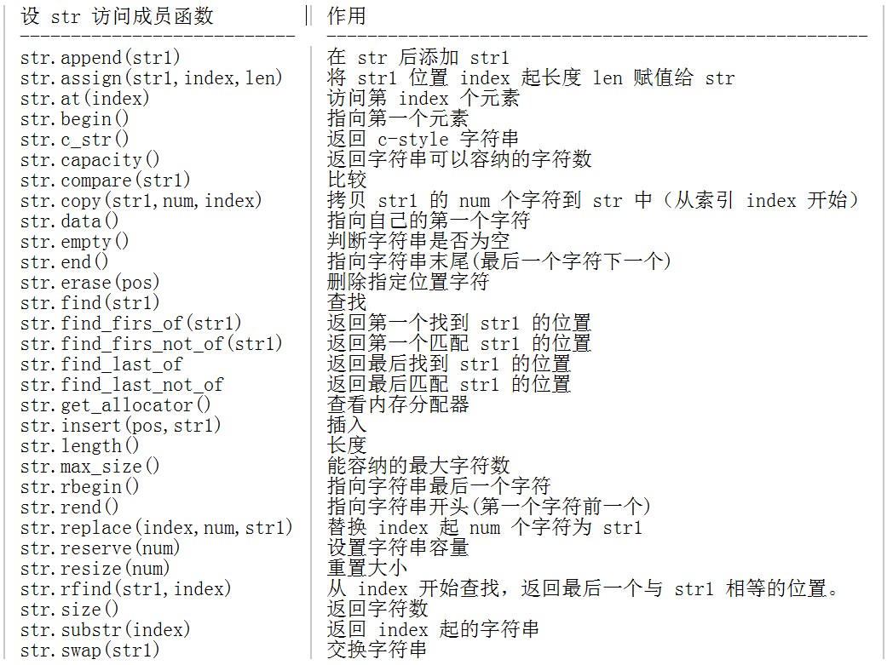

# C++介绍

C++ 语言是在优化 C 语言的基础上为支持面向对象的程序设计而研制的一个通用目的的程序设计语言。在后来的持续研究中，C++ 增加了许多新概念，例如虚函数、重载、继承、标准模板库、异常处理、命名空间等。

## C++的特点

C++ 语言的特点主要表现在两个方面：<b>全面兼容 C 语言和支持面向对象的方法</b>。

由于 C++ 可以全面兼容 C，这就使得部分由 C 语言编写的代码在未经修改的情况下就可以为 C++ 所用，这极大的促进了 C++ 的普及和面向对象技术的广泛应用。

C++ 最具有意义的一面就是支持面向对象的方法。与 C 兼容的特点虽赋予 C++ 双重特点，但 C 和 C++ 在概念上却是两种完全不同的程序设计语言，所以在 C++ 中应注意按照面向对象的思维去编写代码。

此外，C++ 在保持 C 简洁、高效等特点的基础上，对 C 的类型系统进行改革和扩充，因此 C++ 编译环境能检测出的类型错误更多。

## 命名空间

命名空间里面包含了逻辑结构上相互关联的一组类、函数、模板等。命名空间像是一个容器，把某些在逻辑结构上相关的 “ 对象 ” 放在一起并与外界区分。特别的，命名空间里的变量名或类名可以和命名空间外的变量名或类名重名。

使用命名空间的时候，我们可以用<b>花括号</b>把声明块括起来，再以关键字 <b>namespace</b> 开头并命名，其基本格式如下：

```cpp
namespace Names{
    // 声明块
    int x;
    void funA(){
        //...
    }
}
```

## Hello World

```cpp
#include <iostream> //iostream 表示对流运行读写操作。
using namespace std; //使用标准 C++ 库中的所有成员。

int main(){
    cout << "Hello" << endl; //cout 为标准输出流对象；endl 表示插入换行符，并刷新流。
    return 0;
}
```

完成代码编写并成功保存后，在 Linux 终端输入：

```shell
g++ shiyanlou.cpp -o shiyanlou
```

GCC 和 G++ 是由 GNU 开发的编程语言编译器，其中 GCC 用来编译 C 语言程序；G++ 用来编译 C++ 语言程序。

g++ -o 的功能：生成可执行文件，其基本格式为:

```
g++ 需生成可执行文件的源文件名 -o 可执行文件名称
```

所以输入 `g++ shiyanlou.cpp -o shiyanlou` 命令且回车后，我们可以在代码文件浏览区看到生成的可执行文件 Hello。

如果涉及到多文件编译的话

```bash
# g++ 编译 cpp 文件
# https://blog.csdn.net/xuanyu_000001/article/details/127446636
g++  main.cpp swap.cpp -o main
```

在 vscode 里的配置是

```json
{
    "tasks": [
        {
            "type": "cppbuild",
            "label": "C/C++: g++ 生成活动文件",
            "command": "/usr/bin/g++",
            "args": [
                "-fdiagnostics-color=always",
                "-g",
                "${file}",
                "/home/liujiawei/cpp/swap.cpp",  //将需要编译的文件添加到参数中，这样就和上面的命令对应起来了。
                "-o",
                "${fileDirname}/${fileBasenameNoExtension}"
            ],
            "options": {
                "cwd": "${fileDirname}"
            },
            "problemMatcher": [
                "$gcc"
            ],
            "group": {
                "kind": "build",
                "isDefault": true
            },
            "detail": "调试器生成的任务。"
        }
    ],
    "version": "2.0.0"
}
```

# 基本数据类型及表达式

C++ 的数据类型分为基本数据类型和自定义数据类型，其基本数据类型如下：

| 数据类型名     | 长度（字节） | 取值范围                                                     |
| -------------- | ------------ | ------------------------------------------------------------ |
| char           | 1            | -128 ~ 127 或 0 ~ 255                                        |
| bool           | 1            | true, false                                                  |
| signed char    | 1            | -128 ~ 127                                                   |
| unsigned char  | 1            | 0 ~ 255                                                      |
| short          | 2            | -32768 ~ 32767                                               |
| unsigned short | 2            | 0 ~ 65535                                                    |
| int            | 4            | -2147483648 到 2147483647                                    |
| unsigned int   | 4            | 0 ~ 4294967295                                               |
| long           | 8            | -9223372036854775808 到 9223372036854775807                  |
| unsigned long  | 8            | 0 到 18,446,744,073,709,551,615                              |
| float          | 4            | 3.4E-38 ~ 3.4E+38                                            |
| double         | 8            | 1.7E-308 ~ 1.7E+308                                          |
| long double    | 16           | 长双精度型 16 个字节（128 位）内存空间，可提供 18-19 位有效数字。 |

各种类型的存储大小和具体操作系统的位数有关，目前大部分系统为 64 位，与上表基本一致。

由上表可知，C++ 的基本数据类型一般包括：bool、char、int、float 和 double。其中关键字 signed、unsigned、short、long 被称为修饰符。特别的，当用 short 或 long 修饰 int 时，int 可省略不写，表示短整型数据或长整型数据。

## string类

string 是 C++ 标准库的一个重要部分，主要用于字符串的处理，string 类的头文件为：`#include<string>`。使用 string 可以对字符串的对象执行某些操作，例如拼接、查找等。

## struct

struct 是由一系列相同或不同的数据类型组成的数据集合，也称结构体，是一种复合型的数据类型。

```cpp
struct struct_name{
    memberList
}varList
```

其中 `struct` 为结构体的关键字，`struct_name` 为结构体的名字，`memberList` 为结构体成员变量及成员函数的列表，`varList` 为结构体声明的变量。使用 `varList.元素名`可调用结构体中的元素。

```cpp
#include<iostream>
using namespace std;

struct demo{
    int a;
    string info(){ 
        return a+"123"; 
    }
}d;

int main(){
    cout<<"before:"<< d.info()<<endl;
    d.a = 10;
    cout<<d.a<<endl;
}
```

```shell
xx:project/ $ g++ stru.cpp -o stru                                                                             [22:24:33]
xx:project/ $ ./stru                                                                                           [22:24:38]
before:123
10
xx:project/ $      
```

## 变量作用域

局部变量、全局变量和 Java 类似，不赘述。

## 常量

常量声明一般有两种方式，一是使用 `#define` 预处理、二是使用 `const` 关键字。

1️⃣使用 `#define` 预处理

格式：#define name value

```c++
#define PI 3.14159
#define NEWLINE '\n'
```

2️⃣使用 `const` 关键字

格式：const type name = value

```c++
const double pi = 3.14;
const char tab = '\t';
```

# 内存分配

C++ 程序在运行时，计算机内存被分为：<span style="color:red">程序代码区、全局数据区、堆区、栈区</span>四个部分。

- 静态存储分配
- 栈内存分配
- 堆内存分配
- new 关键字和 delete 关键字

## 内存分配的三种方式

不同的内存分配方式，有不同的内存调度机制。C++ 语言的三种内存分配方式分别是：静态存储区分配、栈内存分配和堆内存分配。

### 静态存储区分配

静态分配方式下的内存在程序编译的时候就已经分配好了且存在于程序的整个运行过程。例如 static 变量，其生命周期随程序的结束而结束，而非像一般变量随函数或作用域的结束而结束。

除了 static 变量，还有一种全局对象 static object，也可以存放在静态存储区。

### 栈内存分配

栈内存分配方式下的内存是存在于某作用域的一块空间。例如调用某个函数时，函数内局部变量的存储单元可以在栈上创建，函数执行结束时，这些内存单元会被自动释放。

函数内局部变量的生命周期：起于变量声明，止于函数执行结束。

### 堆内存分配

堆内存分配，也称<b>动态内存分配</b>，通常使用 new 和 delete 关键字进行管理。堆内存空间可由用户手动分配和释放，所以其生存周期由用户指定，较为灵活。但频繁的分配、释放大小不同的堆空间会产生内存碎片。

## 管理堆内存

C 语言中一般使用 malloc() 函数来分配内存空间，free() 函数来释放内存空间。但在 c++ 语言中我们使用 new 关键字来分配内存空间，delete 关键字来释放内存空间。

在学习使用 new 和 delete 关键字之前我们先初步了解一下指针的概念及其一般形式。

指针是一个变量，其值是另一个变量的地址。指针变量声明的一般形式为：

```
type *pointerVar-name
```

其中 `type` 为指针的数据类型，`*` 是定义指针的关键符，`pointerVar-name` 指定指针变量名。

例如：`char *p`，即定义了一个字符型指针变量 p。

指针的另一些基本内容会在后续的实验中详细介绍，本次实验对指针的内容仅做了解。现在我们正式学习 new 关键字和 delete 关键字。

<b>new 关键字</b>用于堆内存的分配，可自动计算所要分配内存空间的大小，其基本使用形式为：

```c++
指针变量名 = new 类型
```

例如：

```c++
int *p; //定义一个整型指针变量
p = new int;
```

其中 `p = new int;` 表示动态分配一个存放整型数据的内存空间，并将其首地址赋给整型指针变量 p，此时省略指针变量 p 前的 `*`。

<b>delete 关键字</b>用于堆内存的释放，其基本形式为：

```
delete 指针变量
```

例如：

```c++
int *p; //定义一个整型指针变量
p = new int;
//省略指针操作过程
delete p;
```

其中 `delete p;` 表示释放指针变量 p 指向的内存空间，此时省略指针变量 p 前的 `*`。

注意：使用 new 获取的内存空间必须使用 delete 进行释放。

我们用实例来加深一下 new 和 delete 关键字的使用方式，新建 `mans.cpp` 文件，输入：

```c++
#include <iostream>
using namespace std;

int main()
{
    int *p; //定义一个整型的指针变量 p。
    p = new int; //动态分配一个存放整型数据的内存空间，并将其首地址赋给整型指针变量 p。
    *p = 6; //为指针指向的内存块赋值为 6。
    cout<<*p<<endl; //输出内存块的赋值。
    delete p;//释放指针变量 p 指向的内存空间。
    return 0;
}
```

程序首先定义了整型指针变量 p，然后使用 new 关键字为其分配 int 型的内存空间，并让指针 p 指向分配的内存空间。随后为内存块赋值为 6，并且输出所赋的值。最后释放指针变量 p。

## new

```cpp
#include<iostream>
using namespace std;
int number;
class demo{
    public:
        int a;
};
int main(){
    demo d; // 栈内存分配，不会内存清零，所以出现的值可能很奇怪。
    cout<<d.a<<endl;
    demo *dd = new demo; // new 对象，会对对象做内存清零的操作，因此内存分配速度比 malloc 慢，malloc 不会做内存清零操作。
    cout<<dd->a<<endl;
}
```

## 存储类

存储类定义 C++ 程序中变量/函数的范围（可见性）和生命周期。这些说明符放置在它们所修饰的类型之前。下面列出 C++ 程序中可用的存储类：

- auto
- register
- static
- extern
- mutable
- thread_local (C++11)

从 C++ 11 开始，auto 关键字不再是 C++ 存储类说明符，且 register 关键字被弃用。

### auto 存储类

自 C++ 11 以来，<b>auto</b> 关键字用于两种情况：声明变量时根据初始化表达式自动推断该变量的类型、声明函数时函数返回值的占位符。

C++98 标准中 auto 关键字用于自动变量的声明，但由于使用极少且多余，在 C++11 中已删除这一用法。

根据初始化表达式自动推断被声明的变量的类型，Java 的 var 与  C++ 的 auto 类似。

### register 存储类

<b>register</b> 存储类用于定义存储在寄存器中而不是 RAM 中的局部变量。这意味着变量的最大尺寸等于寄存器的大小（通常是一个词），且不能对它应用一元的 '&' 运算符（因为它没有内存位置）。

```c++
register int miles;
```

寄存器只用于需要快速访问的变量，比如计数器。还应注意的是，定义 'register' 并不意味着变量将被存储在寄存器中，它意味着变量可能存储在寄存器中，这取决于硬件和实现的限制。

### static 存储类

<b>static</b> 存储类指示编译器在程序的生命周期内保持局部变量的存在，而不需要在每次它进入和离开作用域时进行创建和销毁。因此，使用 static 修饰局部变量可以在函数调用之间保持局部变量的值。

static 修饰符也可以应用于全局变量。当 static 修饰全局变量时，会使变量的作用域限制在声明它的文件内。

在 C++ 中，当 static 用在类数据成员上时，会导致仅有一个该成员的副本被类的所有对象共享。

```
#include <iostream>` `// 函数声明``void` `func(``void``);` `static` `int` `count = ``10``; ``/* 全局变量 */` `int` `main()``{``  ``while``(count--)``  ``{``    ``func();``  ``}``  ``return` `0``;``}``// 函数定义``void` `func( ``void` `)``{``  ``static` `int` `i = ``5``; ``// 局部静态变量``  ``i++;``  ``std::cout << ``"变量 i 为 "` `<< i ;``  ``std::cout << ``" , 变量 count 为 "` `<< count << std::endl;``}
```

当上面的代码被编译和执行时，它会产生下列结果：

```
变量 i 为 ``6` `, 变量 count 为 ``9``变量 i 为 ``7` `, 变量 count 为 ``8``变量 i 为 ``8` `, 变量 count 为 ``7``变量 i 为 ``9` `, 变量 count 为 ``6``变量 i 为 ``10` `, 变量 count 为 ``5``变量 i 为 ``11` `, 变量 count 为 ``4``变量 i 为 ``12` `, 变量 count 为 ``3``变量 i 为 ``13` `, 变量 count 为 ``2``变量 i 为 ``14` `, 变量 count 为 ``1``变量 i 为 ``15` `, 变量 count 为 ``0
```

### extern 存储类

**extern** 存储类用于提供一个全局变量的引用，全局变量对所有的程序文件都是可见的。当您使用 'extern' 时，对于无法初始化的变量，会把变量名指向一个之前定义过的存储位置。

当您有多个文件且定义了一个可以在其他文件中使用的全局变量或函数时，可以在其他文件中使用 *extern* 来得到已定义的变量或函数的引用。可以这么理解，*extern* 是用来在另一个文件中声明一个全局变量或函数。

extern 修饰符通常用于当有两个或多个文件共享相同的全局变量或函数的时候，如下所示：

第一个文件：main.cpp

```c++
#include <iostream>
int count;
extern void write_extern();
int main(){
	count = 5;
	write_extern();
}
```

第二个文件：support.cpp

```c++
#include <iostream>
extern int count;
void write_extern(void){  
	std::cout <<"Count is "<< count << std::endl;
}
```

在这里，第二个文件中的 extern 关键字用于声明已经在第一个文件 main.cpp 中定义的 count。现在 ，编译这两个文件，如下所示：

```
$ g++ main.cpp support.cpp -o write
```

这会产生 <b>write</b> 可执行程序，尝试执行 <b>write</b>，它会产生下列结果：

```
$ ./write``Count is ``5
```

### mutable 存储类

<b>mutable</b> 说明符仅适用于类的对象，这将在本教程的最后进行讲解。它允许对象的成员替代常量。也就是说，mutable 成员可以通过 const 成员函数修改。

### thread_local 存储类

使用 thread_local 说明符声明的变量仅可在它在其上创建的线程上访问。 变量在创建线程时创建，并在销毁线程时销毁。 每个线程都有其自己的变量副本。

thread_local 说明符可以与 static 或 extern 合并。

可以将 thread_local 仅应用于数据声明和定义，thread_local 不能用于函数声明或定义。

以下演示了可以被声明为 thread_local 的变量：

```c++
thread_local 
    int x; 
// 命名空间下的全局变量
class X{  
    static	thread_local std::string s; 
    // 类的static成员变量
};
static thread_local std::string X::s; // X::s 是需要定义的`
void foo(){
    thread_local std::vector<int> v; // 本地变量
}
```

# 函数

if，while，continue 就不记录了。函数这节覆盖的内容是：函数的定义与调用、参数传递及拓展知识。

## 函数的基本用法

- 函数的定义
- 函数的声明与调用
- 参数传递
- 默认参数
- 函数重载

> 函数定义：与其他语言类似

```cpp
#include<iostream>
using namespace std;

int add(int a, int b){
    return a+b;
}

int main(){
    int num1,num2;
    cin>>num1>>num2;
    cout<<add(num1,num2)<<endl;
}
```

> 函数的声明与调用：先声明，再调用，声明要位于调用之前。

```cpp
#include <iostream>
using namespace std;
int add(int a,int b); //函数声明。

int main(){
    int x,y;
    cout<<"input x y:"; //输出提示信息。
    cin>>x>>y; //通过输入的方式给 x y 赋值。
    int c=add(x,y);//在未定义函数前调用函数。将函数的返回结果赋给变量 c。
    cout<<c<<endl;//输出 c 值。
    return 0;
}

int add(int a,int b){
    return a + b;
}//定义函数
```

> 参数传递

复制了 x，y 的变量值传递给 swap，未改变 x，y 指向的内存空间中的值

```cpp
#include<iostream>
using namespace std;

void swap(int a,int b){ // 定义空函数 swap，用于交换 a 和 b 的值。
    int t=a; // 定义中间变量 t，并将 a 的值赋给变量 t。
    a=b; // 将 b 的值赋给 a。
    b=t; // 将 t 的值赋给 b，又因为 t=a，所以把 a 的值赋给 b。
}

int main(){
    int x=3;
    int y=4;
    cout<<"x="<<x<<","<<"y="<<y<<endl; // 输出 x、y。
    swap(x,y); // 调用 swap 函数。
    cout<<"x="<<x<<","<<"y="<<y<<endl; // 输出调用函数后 x、y 的值。
}
```

使用引用可以对 x，y 的值进行修改。

```cpp
#include<iostream>
using namespace std;

void swap(int &a,int &b){ // 定义空函数 swap，用于交换 a 和 b 的值。
    int t=a; // 定义中间变量 t，并将 a 的值赋给变量 t。
    a=b; // 将 b 的值赋给 a。
    b=t; // 将 t 的值赋给 b，又因为 t=a，所以把 a 的值赋给 b。
}

int main(){
    int x=3;
    int y=4;
    cout<<"x="<<x<<","<<"y="<<y<<endl; // 输出 x、y。
    swap(x,y); // 调用 swap 函数。
    cout<<"x="<<x<<","<<"y="<<y<<endl; // 输出调用函数后 x、y 的值。
}
```

> 默认参数，与 Python 中的一样，可以设置参数的默认值，且设置默认值的参数要放在最后。

```cpp
#include<iostream>
using namespace std;

int add(int a,int b = 10){
    return a+b;
}

int add2(int a = 10 ,int b=10){
    return a+b;
}

int main(){
    cout<<add(10)<<endl; // 10
    cout<<add2(10)<<endl; // 20
}
```

> 函数重载：与 Java 一样的重载规则

```cpp
#include<iostream>
using namespace std;

int add(int a,int b){ //定义整型函数 add。
    int c;
    c = a - b;
    return c;
}

double add(double a,double b){ //定义双精度型函数 add。
    double c;
    c = a + b;
    return c;
}

int main()
{//函数重载。
    cout<<"a + b = "<<add(3,4)<<endl;//调用整型函数 add。
    cout<<"a + b = "<<add(3.111,4.222)<<endl;//调用双精度型函数 add。
}
```

## 常见函数

### 数学函数

在 C++ 中，除了可以创建各种函数，还包含了各种有用的函数供您使用。这些函数写在标准 C 和 C++ 库中，叫做<b>内置</b>函数。我们可以在程序中引用这些函数。

C++ 内置了丰富的数学函数，可对各种数字进行运算。下表列出了 C++ 中一些有用的内置的数学函数。

为了利用这些函数，您需要引用数学头文件 。

| 序号 | 函数 & 描述                                                  |
| :--: | :----------------------------------------------------------- |
|  1   | <b>double cos(double);</b> 该函数返回弧度角（double 型）的余弦。 |
|  2   | <b>double sin(double);</b> 该函数返回弧度角（double 型）的正弦。 |
|  3   | <b>double tan(double);</b> 该函数返回弧度角（double 型）的正切。 |
|  4   | <b>double log(double);</b> 该函数返回参数的自然对数。        |
|  5   | <b>double pow(double, double);</b> 假设第一个参数为 x，第二个参数为 y，则该函数返回 x 的 y 次方。 |
|  6   | <b>double hypot(double, double);</b> 该函数返回两个参数的平方总和的平方根，也就是说，参数为一个直角三角形的两个直角边，函数会返回斜边的长度。 |
|  7   | <b>double sqrt(double);</b> 该函数返回参数的平方根。         |
|  8   | <b>int abs(int);</b> 该函数返回整数的绝对值。                |
|  9   | <b>double fabs(double);</b> 该函数返回任意一个浮点数的绝对值。 |
|  10  | <b>double floor(double);</b> 该函数返回一个小于或等于传入参数的最大整数。 |

测试代码

```cpp
#include<iostream>
#include<cmath>
using namespace std;

int main(){
    short s = 10;
    int i = -100;
    long l = 100L;
    float f = 20.4f;
    double d = 200.1;

    cout<<sin(d)<<endl;
    cout<<abs(i)<<endl;
    cout<<floor(f)<<endl; // 20 向 0 取整
    cout<<ceil(f)<<endl;   // 21 向大取整
    cout<<pow(f,s)<<endl;
}
```

### 随机数&时间

- rand 取随机数
- srand 设置随机数种子

```cpp
#include<iostream>
#include<cmath>
#include<ctime>
using namespace std;

int main(){
    // 用当前时间充当随机数种子
    srand(time(NULL));

    cout<<rand()<<endl;
    cout<<rand()<<endl;
}
```

# 数组

## 一维数组

数组的初始化

```cpp
#include<iostream>
using namespace std;

int main(){
    int a[5]; // 声明数组，但是不会初始化，因此数组中的值都是未知的
    cout<<a[0]<<endl; // 4196768
    cout<<a<<endl; // 0x7fff0c7d9730

    int a2[5] = {1,2,3,4,5};
    int *a3 = new int[5]; // 使用new关键字分配内存，会对内存进行清零，有默认的值0
    int a4[5] = {}; // 会有默认初始化值

    // 1==0==0
    cout<<a2[0]<<"=="<<*a3<<"=="<<a4[0]<<endl;
}
```

## 指针数组

```cpp
#include<iostream>
using namespace std;

int main(){
    int balance[5] = {1,3,5,7,8};
    int *p = balance; // balance 是数组的地址值。指针存储地址值。
    for (int i = 0; i < 5; i++){
        cout<<*(p+i)<<endl;
    }
}
/*
1
3
5
7
8
*/
```

## 二维数组

二维数组的初始化 -- 不包括用 new 初始化 

```cpp
#include<iostream>
using namespace std;
// new 初始化 二维数组暂时不记录。
int main(){
    int a[2][2] = {1,2,3,4};
    cout<<a[0][0]<<endl; // 1

    int b[2][2] = {{1,2},{3,4}};
    cout<<b[0][0]<<endl;
}
```

## char数组

定义 char 数组，按照惯例，字符表示的字符串由特殊字符 `null` 结尾，其字面值可以写为 `\0`。注意：`null` 字符不用手动添加，C++ 在编译的时候会自动添加。

```c++
char ch[10]; // 可以存储 10 个字符，包括 '\0'

#include<iostream>
using namespace std;

int main(){
    char ch[10]="Hello";
    int index = 0;
    while(ch[index]!='\0'){
        cout<<ch[index];
        index++;
    }
    cout<<""<<endl;
} 
```

## 从函数返回数组

如何将数组作为函数的返回值返回呢？使用指针即可。

```cpp
#include<iostream>
using namespace std;

int* getRandomArray(){
    int *arr = new int[5]{1,2,3,4,5};
    return arr;
}

int main(){
    int *arr = getRandomArray();
    for (int i = 0; i < 5; i++){
        /* code */
        cout<<arr[i]<<endl;
        cout<<*(arr+i)<<endl;
    }
}
```

C++ 的函数不允许返回整个数组，不支持返回局部变量的地址，除非为 static 变量；int * getRandomArray() 表示返回 int 的指针；arr=getRandomArray()，其中定义 arr 在 main 函数为 int 的指针，这个时候 arr 可以指向数组的第一个值的地址。

## cstring

在 C++ 中有大量用于操作 C-style 字符串的函数，它们集成在头文件 `<cstring>` 中。其常见的函数：

| 函数          | 作用                                                         |
| ------------- | ------------------------------------------------------------ |
| strcpy(s1,s2) | 复制字符串 s2 到 s1，可能会越界写。                          |
| strcat(s1,s2) | 将字符串 s2 连接到 s1 末尾，可能会越界写。                   |
| strlen(s)     | 计算字符串 s 长度                                            |
| strcmp(s1,s2) | 比较字符串 s1 和 s2 的长度，相同为 0；s1<s2 为 -1；s1>s2 为 1 |
| strchr(s1,ch) | 返回一个指针，指向 s1 中字符 ch 第一次出现的位置             |
| strstr(s1,s2) | 返回一个指针，指向 s1 中字符串 s2 第一次出现的位置           |

```cpp
#include<iostream>
#include<cstring>
using namespace std;

int main(){
    char str1[6] = "hello";
    char str2[10] = "world ccc";

    cout<<strlen(str1)<<endl; // 5
    strcat(str1,str2);

    cout<<str1<<","<<strlen(str1)<<endl; // helloworld ccc, 14
    strcpy(str1,str2);

    cout<<str1<<endl; // world ccc
    
    cout<<sizeof(str1)<<endl; // 6
}
```

<span style="color:red">注意：在复制字符串的时候，千万要注意写越界的问题！strcpy 和 strcat 不会自动增加目标字符串的长度；著名的黑客攻击手段--缓冲区溢出，就是根据这个特点产生的。</span>

<span style="color:red">当调用 strcpy(), strcat(), gets(), fgets()... 而传入一段过长的串时，如果程序员未检查源字符串的长度。就会导致紧跟在目标字符串后面的内存被覆盖，如果该内存记录的是函数的返回地址，那么当函数该返回时，程序就会试图跳到该地址内容（为一指针值）所指的地方继续执行。从而造成安全漏洞。</span>

<span style="color:red">解决方法：尽量使用这些函数对应的安全类型函数。如，strncpy(), strncat()..</span>

## string

推荐用 string 而非 `*char`

```cpp
#include<iostream>
using namespace std;
int main(){
    string str1 = "hello";
    string str2 = "world";
    str1.append(" ").append(str2);
    cout<<str1<<endl;
    cout<<str1.length()<<endl; // hello world

    cout<<str1+str2<<endl; // hello worldworld
}
```


<div align="center"></div>

> 两种类型的字符串

C 风格：char str[10]="hello"；一些函数包括 strcpy 复制；strcat 连接；strlen 大小；strcmp 比较；strchr 返回指针；strstr 返回指针

C++ 中的 string 类：string str1="hello" 操作：str3=str； str3=str2+str1； str3.size()

# 指针&引用

指针是 C++ 从 C 中继承的重要数据类型，它提供了一种较为直接的地址操作手段，使用指针可灵活实现动态内存的分配。

## 声明

指针是一种数据类型，具有指针类型的变量称为 <b>指针变量</b>，它用于存放内存地址。在使用指针之前，需对指针进行声明，其一般形式为：

```c++
type *pointer_name;
```

其中 `type` 表示所指对象的数据类型，即说明所指内存单元存放的数据类型；`*` 表示声明一个指针类型的变量；`pointer_name` 表示指针名。

声明三个数据类型不同的指针变量：

```c++
int *p; //声明 int 型的指针变量 p。
float *p1; //声明 float 型的指针变量 p1。
char *p2; //声明 char 型的指针变量 p2。
```

值得注意的是，指针实际存放的是内存地址，不同类型的指针变量用于指向数据类型不同的变量或常量。

C++ 中提供了两个与地址相关的运算符：`*` 和 `&` 。其中 `*` 称为 <b>指针运算符</b>，用于获取指针所指变量的值，例如 `*p` 表示指针 p 所指变量的值；`&` 称为 <b>取地址运算符</b>，用于获取一个对象的地址，例如有变量 i，则 `&i` 表示 i 的存储地址。

```cpp
#include<iostream>
using namespace std;
int main(){
    int *p;
    cout<<sizeof(p)<<endl; // 8 计算的是指针变量的大小，64 位系统是 8 字节，32 位系统是 4 字节
    cout<<sizeof(*p)<<endl; // 4

    char *c;
    cout<<sizeof(c)<<endl; // 8
    cout<<sizeof(*c)<<endl; // 1
}
```

## 赋值和使用

定义指针后我们仅得到了一个用于存储地址的指针变量，若要确定指针变量存放的内存地址，可以通过给指针赋值实现。其基本形式为：

1️⃣在定义指针时为指针赋值：

```c++
type *pointer_name=初始地址;
```

2️⃣在定义指针后为指针赋值：

```c++
type *pointer_name;
pointer_name=初始地址;
```

其中 <b>初始地址</b> 为某个对象的内存地址，一般使用 `&对象名` 获取。

例如将指针 p 指向变量 po1 的地址，其中变量 po1 的值为 6：

```c++
int po1=6; //定义 int 型变量 po1，赋值为 6。
int *p=&po1; //指针变量 p 指向变量 po1 的地址。
```

其等价于：

```c++
int po1=6; //定义 int 型变量 po1，赋值为 6。
int *p; //定义指针变量 p
p=&po1; //指针变量 p 指向变量 po1 的地址。
```

我们通过一个例子加深一下指针的定义和使用，新建 `pointer1.cpp`，输入：

```c++
#include<iostream>
using namespace std;

int main ()
{
    int po1=6; //定义 int 型变量 po1，赋值为 6。
    int *p=&po1; //指针变量 p 指向变量 po1 的地址。

    cout << "获取指针所指变量的值: "<<*p<<endl;
    cout << "获取指针的内存地址: "<<&p<<endl;
    return 0;
}
/**
获取指针所指变量的值: 6
获取指针的内存地址: 0x7fffffffdc10
*/
```

其中 `*p` 运用指针运算符 `*` 获取指针 p 所指变量的值；`&p` 运用取地址运算符 `&` 获取指针 p 的地址。

用指针修改变量所指向内存地址中的数据

```cpp
#include<iostream>
using namespace std;
int main(){
    int p = 6;
    int *pp = &p;
    *pp = 10;
    cout<<p<<endl; // 10
}
```

## 引用

引用是指对已存在的变量别名，我们可以使用引用名来指向对象。

引用与指针主要有三个区别：

- 可以通过 `指针名=0` 描述一个空指针，但不存在空引用。
- 指针可在任何时间进行初始化操作，而引用只能在定义时进行初始化操作。
- 指针变量指向内存的一个存储单元；而引用只不过是原变量的一个别名而已。

声明引用变量的基本格式为：

```c++
type &引用名=被指对象名；
```

`&` 在这里是标识作用，而非取地址运算符。

例如定义引用 x，它是整型变量 i 的引用：

```c++
int &x=i;
```

我们通过 <b>初始化时间</b> 来区别一下指针和引用，新建 `pointer2.cpp` 文件，输入：

```c++
#include<iostream>
using namespace std;

int main ()
{
    int i=3;
    int j=4;

    int &x=i; //定义引用 x，它是整型变量 i 的引用。
    int *s; //定义指针 s。
    s=&j; //指针 s 指向整型变量 j 的地址。

    cout << "初始化引用 x: " << x << endl;
    cout << "初始化指针 s: " << *s << endl;

    return 0;
}
```

其中 `int &x=i;` 表示在 <b>定义引用时</b> 进行的初始化操作。`s=&j;` 表示在 <b>定义指针后</b> 进行的初始化操作。

```cpp
#include<iostream>
using namespace std;

int swap(int &x,int &y){
    int tmp = x;
    x = y;
    y = tmp;
}

int swapByPoint(int *x,int *y){
    // *x 是操作内存中的值。
    int tmp = *x;
    *x = *y;
    *y = tmp;
}

int main(){
    int x = 10,y = 20;
    swap(x,y);
    // 20:10 交换成功
    cout<<x<<":"<<y<<endl;

    int *xp;
    int *yp;
    
    xp = &x;
    yp = &y;
    // 10:20 交换成功
    swapByPoint(xp,yp);
    cout<<x<<":"<<y<<endl;
}
```

引用作为返回值

```cpp
#include <iostream>

using namespace std;

double vals[] = {10.1, 12.6, 33.1, 24.1, 50.0};

double& setValues(int i){
  return vals[i];   // 返回第 i 个元素的引用
}

// 要调用上面定义函数的主函数
int main (){

   cout << "改变前的值" << endl;
   for ( int i = 0; i < 5; i++ ){
       cout << "vals[" << i << "] = ";
       cout << vals[i] << endl;
   }

   setValues(1) = 20.23; // 改变第 2 个元素
   setValues(3) = 70.8;  // 改变第 4 个元素

   cout << "改变后的值" << endl;
   for ( int i = 0; i < 5; i++ )   {
       cout << "vals[" << i << "] = ";
       cout << vals[i] << endl;
   }
   return 0;
}
```

当返回一个引用时，要注意被引用的对象不能超出作用域。所以返回一个对局部变量的引用是不合法的，但是，可以返回一个对静态变量的引用。

```cpp
int& func() {
   int q;
   //! return q; // 在编译时发生错误
   static int x;
   return x;     // 安全，x 在函数作用域外依然是有效的
}
```

# 日期&时间

 介绍 C/C++ 与时间相关的函数的使用，包括如何获取日历时间，如何获取本地时间，如何将得到的时间格式化输出，如何计算时间间隔，最后面的部分介绍了自定义时间格式的相关语法。

## 获取时间戳

time_t 是定义在 time.h 中的一个类型，表示一个日历时间，也就是从 1970 年 1 月 1 日 0 时 0 分 0 秒到此时的秒数，原型是：

```cpp
typedef long time_t; /* time value */
```

可以看出 time_t 其实是一个长整型，由于长整型能表示的数值有限，因此它能表示的最迟时间是 2038 年 1 月 18 日 19 时 14 分 07 秒。

通过函数 time 获取时间戳

```cpp
#include<iostream>
#include<ctime>
using namespace std;

int main(void){ 
    time_t now = time(nullptr);
    cout<<now<<endl; // 1667977365
    return 0;
}
```

## 获取本地时间

time_t 只是一个长整型，不符合我们的使用习惯，需要转换成本地时间，就要用到 tm 结构，time.h 中结构 tm 的原型是：

```cpp
struct tm {
  int tm_sec;   // 秒，正常范围从 0 到 59，但允许至 61
  int tm_min;   // 分，范围从 0 到 59
  int tm_hour;  // 小时，范围从 0 到 23
  int tm_mday;  // 一月中的第几天，范围从 1 到 31
  int tm_mon;   // 月，范围从 0 到 11
  int tm_year;  // 自 1900 年起的年数
  int tm_wday;  // 一周中的第几天，范围从 0 到 6，从星期日算起
  int tm_yday;  // 一年中的第几天，范围从 0 到 365，从 1 月 1 日算起
  int tm_isdst; // 夏令时
}

// 源码注释
/* ISO C `broken-down time' structure.  */
struct tm
{
  int tm_sec;			/* Seconds.	[0-60] (1 leap second) */
  int tm_min;			/* Minutes.	[0-59] */
  int tm_hour;			/* Hours.	[0-23] */
  int tm_mday;			/* Day.		[1-31] */
  int tm_mon;			/* Month.	[0-11] */
  int tm_year;			/* Year	- 1900.  */
  int tm_wday;			/* Day of week.	[0-6] */
  int tm_yday;			/* Days in year.[0-365]	*/
  int tm_isdst;			/* DST.		[-1/0/1]*/

# ifdef	__USE_MISC
  long int tm_gmtoff;		/* Seconds east of UTC.  */
  const char *tm_zone;		/* Timezone abbreviation.  */
# else
  long int __tm_gmtoff;		/* Seconds east of UTC.  */
  const char *__tm_zone;	/* Timezone abbreviation.  */
# endif
};

#endif
```

使用这个结构可以很方便的看到年月日时分秒。

使用 localtime 获取当前系统时间，该函数将 time_t 时间转换为 tm 结构表示的时间，函数原型：

```cpp
struct tm * localtime(const time_t *)
```

使用 gmtime 获取格林尼治时间，函数原型：

```cpp
struct tm * gmtime (const time_t *)
```

使用 localtime 获取当前时间

```cpp
#include<iostream>
#include<ctime>
using namespace std;

int main(){ 
    time_t now = time(nullptr);
    cout<<now<<endl; // 1667977365

    tm *nowtime = localtime(&now);

    cout<<1900+nowtime->tm_year<<"年-";
    cout<<1+nowtime->tm_mon<<"月-";
    cout<<nowtime->tm_mday<<"日";
}
```

# 基本输入输出

|    头文件    | 函数和描述                                                   |
| :----------: | :----------------------------------------------------------- |
| `<iostream>` | 该文件定义了 cin、cout、cerr 和 clog 对象，分别对应于标准输入流、标准输出流、非缓冲标准错误流和缓冲标准错误流。 |
| `<iomanip>`  | 不知道                                                       |
| `<fstream>`  | 不知道                                                       |

后面看书吧。

# 结构体

## 定义结构

使用 struct 关键字来定义结构体。struct 语句定义了一个包含多个成员的新的数据类型，struct 语句的格式如下：

```cpp
struct type_name {
    member_type1 member_name1;
    member_type2 member_name2;
    member_type3 member_name3;
    .
    .
} object_names;
```

type_name 是结构体类型的名称，member_type1 member_name1 是标准的变量定义，比如 int i; 或者 float f; 或者其他有效的变量定义。在结构定义的末尾，最后一个分号之前，可以指定一个或多个结构变量。一个结构体类型 Books，变量为 book：

```cpp
#include<iostream>
#include<cstring>
using namespace std;

struct Books{
    string title;
    string author;
    int bookId;
};
int main(){
    struct Books b;
    b.title = "CPP";
    b.author = "Bruke";
    b.bookId = 1;

    cout<<b.title<<endl;
    cout<<b.author<<endl;
    cout<<b.bookId<<endl;
}
/*
CPP
Bruke
1
*/
```

## 结构作为函数参数

您可以把结构作为函数参数，传参方式与其他类型的变量或指针类似。您可以使用上面实例中的方式来访问结构变量：

```cpp
#include<iostream>
#include<cstring>
using namespace std;

void printBook( struct Books book );

// 声明一个结构体类型 Books 
struct Books{
   string  title;
};

int main( ){
   Books Book1;        // 定义结构体类型 Books 的变量 Book1
   Books Book2;        // 定义结构体类型 Books 的变量 Book2

    Book1.title = "one";
    Book2.title = "two";

   // 输出 Book2 信息
   printBook( Book1 );
   printBook( Book2 );

   return 0;
}
void printBook( struct Books book ){
   cout << "书标题 : " << book.title <<endl;
}
```

当上面的代码被编译和执行时，它会产生下列结果：

```
书标题 : one
书标题 : two
```

## 指向结构的指针

我们也可以定义指向结构的指针，方式与定义指向其他类型变量的指针相似，如下所示：

```cpp
struct Books *struct_pointer;
```

用结构体指针重写上面的代码

```cpp
#include<iostream>
#include<cstring>
using namespace std;

void printBook( struct Books *book );

// 声明一个结构体类型 Books 
struct Books{
   string  title;
};

int main( ){
    Books Book1;        // 定义结构体类型 Books 的变量 Book1
    Books Book2;        // 定义结构体类型 Books 的变量 Book2

    Book1.title = "one";
    Book2.title = "two";

   // 输出 Book2 信息
   printBook(&Book1);
   printBook(&Book2);

   return 0;
}
void printBook( struct Books *book ){
   cout << "书标题 : " << book->title <<endl;
}
```

## C++的结构体

C++ 的结构体本质上就是一个类。只不过所有的字段都是 public 的。

```cpp
#include<iostream>
#include<cstring>
using namespace std;

void printBook( struct Books *book );

// 声明一个结构体类型 Books 
struct Books{
    string  title;
    Books(){};
    Books(string title){
        this->title = title;
    };
};

int main(){
    Books Book1;        // 定义结构体类型 Books 的变量 Book1
    Book1.title = "one";
    Books *b = new Books("struct is a class");
    // 输出 Book2 信息
    printBook(&Book1);
    printBook(b);
    return 0;
}
void printBook( struct Books *book ){
   cout << "书标题 : " << book->title <<endl;
}
/*
书标题 : one
书标题 : struct is a class
*/
```

## typedef 关键字

下面是一种更简单的定义结构的方式，您可以为创建的类型取一个"别名"。例如：

```
typedef struct Books``{``  ``char` `title[``50``];``  ``char` `author[``50``];``  ``char` `subject[``100``];``  ``int`  `book_id;``}Books;
```

现在，您可以直接使用 *Books* 来定义 *Books* 类型的变量，而不需要使用 struct 关键字。下面是实例：

```
Books Book1, Book2;
```

您可以使用 **typedef** 关键字来定义非结构类型，如下所示：

```
typedef ``long` `int` `*pint32;` `pint32 x, y, z;
```

x, y 和 z 都是指向长整型 long int 的指针。

# 类和对象

主要学习最基本的语法

- （抽象）、封装、继承、多态
- 类的定义
- 类成员访问控制
- 对象的声明
- 类的成员函数

## 基本特点

<b>抽象</b>

抽象是指对具体问题或对象进行概括，抽出其公共性质并加以描述的过程。一般情况抽象分为数据抽象和行为抽象，其中数据抽象是指一个对象区别于另一个对象的特征，行为抽象是指某类对象的共同特征。

<b>封装</b>

封装是指将抽象得到的数据和行为相结合，隐藏对象属性和实现细节且仅对外提供公共访问方式的过程。

<b>继承</b>

继承是指通过代码复用在保持原有类特性的基础上对子类进行具体说明的过程，通俗来说继承就是精简重复代码的手段。

<b>多态</b>

多态是指一段程序能够处理多种类型对象的能力，函数重载就是实现多态的一种手段。<b>在 C++ 语言中多态可分为强制多态、重载多态、类型参数化多态和包含多态。</b>

## 类的定义

语法规则

```cpp
class 类的名称{
    public:
        // 外部接口
    protected:
        // 保护性成员
    private:
        // 私有成员
}
```

代码示例

```cpp
#include<iostream>
using namespace std;

class area{
    public:
        double width;
        double length;
    	// this 是一个指向当前对象的指针，c++中指针通过 -> 访问类中的成员
    	// 类的方法可以定义在内部，也可以使用 :: 来定义
        void setName(string name){
            this->name = name;
        };
        string getName(){
            return name;
        };
        double getArea(){
            return width*length;
        };
    private:
        string name;
};

int main(){
    // area obj;// 定义对象。
    area *obj = new area;

    obj->width = 10;
    obj->length = 20;
    obj->setName("圆");
    cout<<obj->getName()<<endl;
    cout<<obj->getArea()<<endl;
}
```

> 符号`.和->`的作用和区别

- A.B 则 A 为对象或者结构体； 点号（.）：左边必须为实体。
- A->B 则 A 为指针，-> 是成员提取，A->B 是提取 A 中的成员 B，A 只能是指向类、结构、联合的指针； 箭头（->）：左边必须为指针；

## 对象

定义了类及其对象后，则可访问对象的成员。访问<b>数据成员</b>基本形式为：

```cpp
#include<iostream>
using namespace std;
// g++ -sdt=c++11 demo.cpp -o demo
class area{
    public: 
    	// c++ 11 才支持非静态字段初始化
        // non-static data member initializers
    	string name="hello";
};
// 类外面定义具体的方法。
void area::say(){
    cout<<"hello"<<endl;
};

int main(){
    area a1; // 这样定义对象使用 . 来访问
    area *a2 = new area; // 指针的话则用 -> 访问
    cout<<a1.name<<endl; // hello
    cout<<a2->name<<endl; // hello
    a2->say(); // hello
}
```

习题，计算体积

```cpp
#include<iostream>
using namespace std;

class volume{
    public:
        double width=3;
        double length=4;
        double high=5.1;
        double getVolume();
};
double volume::getVolume(){
    return this->width*this->length*this->high;
};
int main(){
    volume *v = new volume;
    cout<<v->getVolume()<<endl;
}
```

## 成员函数

类的成员函数是指那些把定义和原型写在类定义内部的函数，就像类定义中的其他变量一样。类成员函数是类的一个成员，它可以操作类的任意对象，可以访问对象中的所有成员。

类的成员函数可以定义在类的内部，或者单独使用 <b>范围解析运算符::</b> 来定义。

> 定义一个 Box 类，包含 len、height 属性和 getArea 方法。

```cpp
#include<iostream>
using namespace std;

class Box
{
private:
    double len;
    double height;
public:
    Box();
    Box(double len,double height);
    ~Box();
    double getArea();
};

Box::Box(){}
Box::Box(double len, double height){
    this->len = len;
    this->height = height;
}

Box::~Box(){
    cout<<"执行了析构函数"<<endl;
}

double Box::getArea(){
    return this->len*this->height;
}

int main(){
    Box b1; // 使用 . 访问成员
    Box *b2 = new Box(10.0,5.0); // 指针则是使用 -> 访问成员
    cout<<b1.getArea()<<endl; // 0，默认初始化为 0
    cout<<b2->getArea()<<endl; // 50
}
```

## 访问权限修饰符

- 使用 <b>public</b> 关键字声明的公有成员可在类外访问，即公有类型成员定义了外部接口。
- 使用 <b>protected</b> 关键字声明的受保护成员可在子类中访问。
- 使用 <b>private</b> 关键字声明的私有成员只能被本类的成员函数访问

> 演示 protected -- 注意，因为 C++ 是多继承的，super 关键字会导致语义不清楚，因此 C++ 中没有 super 关键字，访问父类成员的语法为 `父类::成员`

```cpp
#include<iostream>
using namespace std;

class area{
    protected:
        string name;
};
class sonArea : area{
    public:
        string getName(){
            return area::name;
        };
        void setName(string name){
            area::name = name;
        }
};
int main(){
    sonArea *obj2 = new sonArea;
    obj2->setName("sonArea");
    cout<<obj2->getName()<<endl; // sonArea
}
```

## 构造&析构

<b>构造函数</b>

类的构造函数是类的一种特殊的成员函数，它会在每次创建类的新对象时执行。

构造函数的名称与类的名称是完全相同的，并且不会返回任何类型（实际上会返回创建出的对象的指针），也不会返回 void。构造函数可用于为某些成员变量设置初始值。

构造函数的作用和类型与其他语言类似，没有创建的话会编译器默认创建一个无参构造，自己定义了构造函数就不会创建默认的。

<b>析构函数</b>

在每次删除所创建的对象时执行。析构函数的名称与类的名称是完全相同的，只是在前面加了个波浪号（~）作为前缀，它不会返回任何值，也不能带有任何参数。析构函数有助于在跳出程序（比如关闭文件、释放内存等）前释放资源。

```cpp
#include<iostream>
using namespace std;

class Program{
private:
    /* data */
    void *point;
public:
    Program();
    ~Program();
};

Program::Program(/* args */){
    cout<<"成功申请 300MB 的内存空间"<<endl;
}

Program::~Program(){
    cout<<"释放 300MB 的内存空间"<<endl;
}

int main(){
    Program *program = new Program;
    delete program;
}
```

<span style="color:red">如果程序里没有构造函数和析构函数，编译器在编译的时候会自动生成构造函数和析构函数，只是函数内没有任何操作。</span>

> 析构函数的几种调用情况

①<span style="color:red">在一个函数中定义了一个对象</span>，当函数调用结束时，对象应当被释放，对象释放之前编译器会调用析构函数释放资源。

②对于 static 修饰的对象和全局对象，只有在程序结束时编译器才会调用析构函数。

③对于 new 运算符创建的对象，在调用 delete 释放时，编译器会调用析构函数释放资源

## 拷贝构造函数

和他的名字一样，用于拷贝对象。来看一个简单的例子。

```cpp
#include<iostream>
using namespace std;

class Line{
    private:
        /* data */
    public:
        Line(const Line &obj);
        Line();
        int ptr = 10;
};

Line::Line(const Line &obj){
    cout<<"执行了拷贝构造函数"<<endl;
    this->ptr = 100;
    cout<<this->ptr<<endl;
}

Line::Line(){}

int main(){
    Line line;
    Line line2 = line; // 执行了拷贝构造函数

    // Line *line = new Line; // 效果和上面一样
    // Line *line2 = new Line(*line); // 执行了拷贝构造函数
    /*
    执行了拷贝构造函数
    100
    0x7fffffffdb30:0x7fffffffdb34
    10:100
    */
    cout<<&line<<":"<<&line2<<endl;
    cout<<line.ptr<<":"<<line2.ptr<<endl;
}
```

1）拷贝构造函数的形参必须是该类对象的引用，最好是 const 引用；（否则编译错误，因为会进入死循环）

2）拷贝分为浅拷贝和深拷贝，深拷贝必须重新定义拷贝构造函数。如果类中有指针类型的变量，不重写拷贝构造方法的话，就是多个对象操作的指针变量是同一个。

```cpp
#include<iostream>
using namespace std;

class Object{};

class Line{
    private:
        /* data */
    public:
        Line(const Line &obj);
        Line();
        Object *ptr = new Object;
};

Line::Line(const Line &obj){}
Line::Line(){}

int main(){
    Line *line = new Line;
    Line *line2 = new Line(*line); // 执行了拷贝构造函数
    // line->ptr = new Object;
    cout<<line->ptr<<":"<<line2->ptr<<endl;

    // 重写了拷贝构造函数
    // 0x555555614e90:0x555555614ed0

    // 没有重写拷贝构造函数
    // 0x555555614e90:0x555555614e90
}
```

## 友元函数

类的友元函数是定义在类外部，但有权访问类的所有私有（private）成员和保护（protected）成员。尽管友元函数的原型有在类的定义中出现过，但是友元函数并不是成员函数。

友元可以是一个函数，该函数被称为友元函数；友元也可以是一个类，该类被称为友元类，在这种情况下，整个类及其所有成员都是友元。

如果要声明函数为一个类的友元，需要在类定义中该函数原型前使用关键字 friend，如下所示：

```cpp
#include<iostream>
using namespace std;

class Box{
    private:
        double width = 20.5f;
    public:
        double len;
        friend void printWidth(Box *box);
};

void printWidth(Box *box){
    cout<<box->width<<endl;
}

int main(){
    Box *box = new Box;
    // printWidth(box); // 正常访问 box 的私有成员
    // cout<<box->width<<endl; // 报错，没有访问权限
}
```

## 内敛函数

C++ 内联函数是通常与类一起使用。如果一个函数是内联的，那么在编译时，编译器会把该函数的代码副本放置在每个调用该函数的地方。

对内联函数进行任何修改，都需要重新编译函数的所有客户端，因为编译器需要重新更换一次所有的代码，否则将会继续使用旧的函数。

如果想把一个函数定义为内联函数，则需要在函数名前面放置关键字 `inline`，在调用函数之前需要对函数进行定义。如果已定义的函数多于一行，编译器会忽略 inline 限定符。

在类定义中的定义的函数都是内联函数，即使没有使用 inline 说明符。（确定吗？应该是有限定条件的吧？）

## 静态成员

与 Java 一样。但是 C++ 可以用静态局部变量。

```cpp
#include<iostream>
using namespace std;

void f(){
    static int a = 10;
    a++;
    cout<<a<<endl;
}

int main(){
    f(); // 11 - 没有初始化，则初始化
    f(); // 12 - 初始化了，则用之前的值，在 11 的基础上++
    f(); // 13 - 同上
}
```

# 继承

## 基本语法

继承允许我们依据另一个类来定义一个类，这使得创建和维护一个应用程序变得更容易。这样做，也达到了重用代码功能和提高执行时间的效果。

当创建一个类时，您不需要重新编写新的数据成员和成员函数，只需指定新建的类继承了一个已有的类的成员即可。这个已有的类称为基类，新建的类称为派生类。

语法：`class derived-class: access-specifier base-class`

```cpp
#include<iostream>
using namespace std;

class Shape{
    public:
        void setWidth(int w){
            this->width = w;
        }
    protected:
        int width;
};

// 公有继承
class Rectrangle : public Shape{
    public:
        int getArea(){
            return this->width*20;
        };
};

int main(){
    Rectrangle *r = new Rectrangle;

    r->setWidth(10);
    cout<<r->getArea()<<endl; 
}
```

> 继承的种类

- 公有继承：子类继承父类的所有非私有成员（所继承的成员访问权限和父类的一致），父类的私有成员可以通过父类的非私有方法访问。
- 受保护继承：将父类的所有非私有成员继承，所继承的成员访问权限变为 protected；
- 私有继承：将父类的所有非私有成员继承，所继承的成员访问权限变为 private；

<b>公有继承：可以直接访问父类的非 private 成员，继承到的成员访问权限同父类中声明的一致。</b>

```cpp
#include<iostream>
using namespace std;

class Shape{
    public:
        void setWidth(int w){
            this->width = w;
        }
    protected:
        int width;
};

// Rectrangle 继承了父类 Shape 的 setWidth 方法，依旧为 public 放啊发
// 继承了父类的 width 方法，访问权限依旧为 protected
class Rectrangle : public Shape{
    public:
        int getArea(){
            return this->width*20;
        };
};

int main(){
    Rectrangle *r = new Rectrangle;
    r->setWidth(10);
    // r->width = 20;，报错，无访问权限，无法访问。
    cout<<r->getArea()<<endl; 
}
```

<b>受保护的继承：从父类继承的 public 和 protected 成员统一降级为 protected 访问权限。</b>

```cpp
#include<iostream>
using namespace std;

class Shape{
    public:
        void setWidth(int w){
            this->width = w;
        }
    protected:
        int width;
};

// 继承到了 width 和 setWidth，但是他们的访问权限降级为 protected 了
class Rectrangle : protected Shape{
    public:
        int getArea(){
            return this->width*20;
        };
};

int main(){
    Rectrangle *r = new Rectrangle;
    // r->setWidth(10); // 无法在非本类（非子类）中访问 protected 修饰的成员。
    cout<<r->getArea()<<endl; 
}
```

<b>私有的继承：从父类继承的 public 和 protected 成员统一降级为 private 访问权限。</b>

```cpp
#include<iostream>
using namespace std;

class Shape{
    public:
        void setWidth(int w){
            this->width = w;
        }
    protected:
        int width;
};

class Rectrangle : private Shape{
    public:
        int getArea(){
            return this->width*20;
        };
};

int main(){
    Rectrangle *r = new Rectrangle;
    cout<<r->getArea()<<endl; 
}
```

## 访问控制权限

派生类可以访问基类中所有的非私有成员。因此基类成员如果不想被派生类的成员函数访问，则应在基类中声明为 private。

|   访问   | public | protected | private |
| :------: | :----: | :-------: | :-----: |
| 同一个类 |  yes   |    yes    |   yes   |
|  派生类  |  yes   |    yes    |   no    |
| 外部的类 |  yes   |    no     |   no    |

一个派生类继承了所有的基类方法，但下列情况除外：

- 基类的构造函数、析构函数和拷贝构造函数。
- 基类的重载运算符。
- 基类的友元函数。

## 多继承

C++ 支持多继承，语法如下：

```cpp
#include<iostream>
using namespace std;

class Shape{};

class Color{}

class Rectrangle : public Shape, public Color{};
```

构造函数调用顺序

```cpp
#include<iostream>
using namespace std;

class Shape{
    public:
        Shape(){
            cout<<"Shape"<<endl;
        }
};

class Color{
    public:
        Color(){
            cout<<"Color"<<endl;
        }
};

class Rectrangle : public Shape, public Color{
    public:
        Rectrangle(){
            cout<<"Rectrangle"<<endl;
        }
};

int main(){
    // Shape、Color、Rectrangle；按继承顺序执行的构造函数
    Rectrangle *r = new Rectrangle;
}
```

# 重载

- 允许重载操作符，运算符的重载方式与 Python 类似。
- 允许重载函数，重载方式与 Java 类似

## 函数重载

```cpp
#include<iostream>
using namespace std;

class OverLoadFunction{
    public:
        void consume(int i){ cout<<"consume int"<<endl; };
        void consume(double i){ cout<<"consume double"<<endl; };
        void consume(char i){ cout<<"consume char"<<endl; };
};

int main(){
    OverLoadFunction *obj = new OverLoadFunction;
    obj->consume(1);
    obj->consume(1.1);
    obj->consume('a'); // 识别为 char
}
/*
consume int
consume double
consume char
*/
```

## 操作符重载

C++ 允许重载大多数的内置运算符。例如，重载对象 + 的操作。

```cpp
#include<iostream>
using namespace std;

class OverLoadFunction{
    public:
        void consume(int i){ cout<<"consume int"<<endl; };
        void consume(double i){ cout<<"consume double"<<endl; };
        void consume(char i){ cout<<"consume char"<<endl; };
};


class OverLoadOp{
    public:
        int width = 10;
        OverLoadOp operator+(const OverLoadOp &b){
            OverLoadOp op;
            op.width = this->width + b.width;
            return op;
        }
};

void testOverLoadFunction(){
    OverLoadFunction *obj = new OverLoadFunction;
    obj->consume(1);
    obj->consume(1.1);
    obj->consume('a'); // 识别为 char
}

int main(){
    OverLoadOp op1;
    OverLoadOp op2;
    OverLoadOp op3 = op1+op2;
    cout<<op3.width<<endl; // 20
}
```

可重载的运算符

| 双目算术运算符 |            + (加)，-(减)，*(乘)，/(除)，% (取模)             |
| :------------: | :----------------------------------------------------------: |
|   关系运算符   | ==(等于)，!= (不等于)，< (小于)，> (大于>，<=(小于等于)，>=(大于等于) |
|   逻辑运算符   |             \|\|(逻辑或)，&&(逻辑与)，!(逻辑非)              |
|   单目运算符   |              + (正)，-(负)，*(指针)，&(取地址)               |
| 自增自减运算符 |                      ++(自增)，--(自减)                      |
|    位运算符    | \| (按位或)，& (按位与)，~(按位取反)，^(按位异或),，<< (左移)，>>(右移) |
|   赋值运算符   |       =, +=, -=, *=, /= , % = , &=, \|=, ^=, <<=, >>=        |
| 空间申请与释放 |                new, delete, new[ ] , delete[]                |
|   其他运算符   |     ()(函数调用)，->(成员访问)，**,**(逗号)，\[\](下标)      |

# 多态&接口

## 多态

<b>多态按字面的意思就是多种形态。</b>C++ 多态意味着调用成员函数时，会根据调用函数的对象的类型来执行不同的函数。Java 也分早期绑定和后期绑定，但是 C++ 的早期绑定与 Java 的不一样。

```cpp
#include<iostream>
using namespace std;

class Shape{
    public:
        void say(){ cout<<"sha"<<endl; }
};

class Rectangle : public Shape{
    public:
        void say(){ cout<<"rec"<<endl; }
};

class Triangle : public Shape{
    public:
        void say(){ cout<<"tri"<<endl; }
};
// 静态多态（早期绑定。而 Java 是 static 的才是早期绑定），函数调用在程序执行前就准备好了
int main(){
    Shape *sr = new Rectangle;     
    Shape *st = new Triangle;     
    sr->say(); // sha
    st->say(); // sha
}
```

需要使用 virtual 关键字来实现多态，在父类中使用关键字 <b>virtual</b> 声明的函数。在派生类中重新定义父类中定义的虚函数时，会告诉编译器不要静态链接到该函数。我们想要的是在程序中任意点可以根据所调用的对象类型来选择调用的函数，这种操作被称为<b>动态链接，或后期绑定</b>。

```cpp
#include<iostream>
using namespace std;

class Shape{
    public:
        virtual void say(){ cout<<"sha"<<endl; }
};

class Rectangle : public Shape{
    public:
        void say(){ cout<<"rec"<<endl; }
};

class Triangle : public Shape{
    public:
        void say(){ cout<<"tri"<<endl; }
};

int main(){
    Shape *sr = new Rectangle;     
    Shape *st = new Triangle;     
    sr->say();
    st->say();
}
/*
rec
tri
*/
```

## 纯虚函数

我们可能想要在父类中定义虚函数，以便在子类中重新定义该函数更好地适用于对象，但是在父类中又不能对虚函数给出有意义的实现，这个时候就会用到纯虚函数。

```cpp
#include<iostream>
using namespace std;

class Shape{
    public:
        virtual void say() = 0;
};

class Rectangle : public Shape{
    public:
        void say(){ cout<<"rec"<<endl; }
};

class Triangle : public Shape{
    public:
        void say(){ cout<<"tri"<<endl; }
};


int main(){
    Shape *sr = new Rectangle;     
    Shape *st = new Triangle;     
    sr->say();
    st->say();
}
```

## 接口

接口描述了类的行为和功能，而不需要完成类的特定实现。

C++ 接口是使用<b>抽象类</b>来实现的，抽象类与数据抽象互不混淆，数据抽象是一个把实现细节与相关的数据分离开的概念。

如果类中至少有一个函数被声明为纯虚函数，则这个类就是抽象类。纯虚函数是通过在声明中使用 "= 0" 来指定的，如下所示：

```cpp
class Box{
   public:
      // 纯虚函数
      virtual double getVolume() = 0;
   private:
      double length;      // 长度
      double breadth;     // 宽度
      double height;      // 高度
};
```

设计<b>抽象类</b>（通常称为 ABC）的目的，是为了给其他类提供一个可以继承的适当的基类。抽象类不能被用于实例化对象，它只能作为<b>接口</b>使用。如果试图实例化一个抽象类的对象，会导致编译错误。

因此，如果一个 ABC 的子类需要被实例化，则必须实现每个虚函数，这也意味着 C++ 支持使用 ABC 声明接口。如果没有在派生类中重写纯虚函数，就尝试实例化该类的对象，会导致编译错误。

可用于实例化对象的类被称为<b>具体类</b>。

```cpp
#include <iostream>

using namespace std;

// 基类
class Shape{
    public:
        // 提供接口框架的纯虚函数
        virtual int getArea() = 0;
        void setWidth(int w){
            width = w;
        }
        void setHeight(int h){
            height = h;
        }
    protected:
        int width;
        int height;
};

// 派生类
class Rectangle: public Shape{
public:
   int getArea(){ 
      return (width * height); 
   }
};
class Triangle: public Shape{
public:
   int getArea(){ 
      return (width * height)/2; 
   }
};

int main(void){
   Rectangle Rect;
   Triangle  Tri;

   Rect.setWidth(5);
   Rect.setHeight(7);
   // 输出对象的面积
   cout << "Total Rectangle area: " << Rect.getArea() << endl;

   Tri.setWidth(5);
   Tri.setHeight(7);
   // 输出对象的面积
   cout << "Total Triangle area: " << Tri.getArea() << endl; 

   return 0;
}
/*
Total Rectangle area: 35
Total Triangle area: 17
*/
```

# 高级教程入门

只是简单过下最基本的语法，较为细节的后面看《C++ Primer》

## 文件和流

使用 C++ 中的标准库 fstream 从文件读取流和向文件写入流。要在 C++ 中进行文件处理，必须在 C++ 源代码文件中包含头文件 `<iostream>` 和 `<fstream>`。

| 数据类型 | 描述                                                         |
| :------: | :----------------------------------------------------------- |
| ofstream | 该数据类型表示输出文件流，用于创建文件并向文件写入信息。     |
| ifstream | 该数据类型表示输入文件流，用于从文件读取信息。               |
| fstream  | 该数据类型通常表示文件流，且同时具有 ofstream 和 ifstream 两种功能，这意味着它可以创建文件，向文件写入信息，从文件读取信息。 |

### 打开文件

在从文件读取信息或者向文件写入信息之前，必须先打开文件。<b>ofstream</b> 和 <b>fstream</b> 对象都可以用来打开文件进行写操作，如果只需要打开文件进行读操作，则使用 <b>ifstream</b> 对象。

open() 函数是 fstream、ifstream 和 ofstream 对象的一个成员。open() 函数的标准语法如下：

```cpp
void open(const char *filename, ios::openmode mode);
```

| 模式标志   | 描述                                                         |
| :--------- | :----------------------------------------------------------- |
| ios::app   | 追加模式。所有写入都追加到文件末尾。                         |
| ios::ate   | 文件打开后定位到文件末尾。                                   |
| ios::in    | 打开文件用于读取。                                           |
| ios::out   | 打开文件用于写入。                                           |
| ios::trunc | 如果该文件已经存在，其内容将在打开文件之前被截断，即把文件长度设为 0。 |

在设置模式时可以设置多种模式，如对文件可读可写

```cpp
ifstream  afile;
afile.open("file.dat", ios::out | ios::in );
```

写模式打开文件，如果存在内容则先清空

```cpp
ofstream outfile;
outfile.open("file.dat", ios::out | ios::trunc );
```

### 关闭文件

调用 close() 方法即可。

### 完整例子

```cpp
#include<iostream>
#include<fstream>
using namespace std;

// 写入读取也是用重定向
int main(){
    ofstream writeFile;
    writeFile.open("afile.data");
    cout<<"写入数据"<<endl;
    char data[100];
    cin.getline(data,100);
    writeFile<<data<<endl; // data 的数据重定向到 writeFile 中
    writeFile.close();

    ifstream readFile;
    char data2[100];
    readFile.open("afile.data");
    readFile>>data2; // 读取的数据重定向到 data2
    cout<<data<<endl;
}
```

## 异常处理

C++ 的异常处理的关键字有三个：try、catch、throw

- <b>throw：</b>当问题出现时，程序会抛出一个异常。这是通过使用 throw 关键字来完成的。
- <b>catch：</b>在您想要处理问题的地方，通过异常处理程序捕获异常。catch 关键字用于捕获异常。
- <b>try：</b>try 块中的代码标识将被激活的特定异常。它后面通常跟着一个或多个 catch 块。

```cpp
try{
    
}catch(ExceptionName e1){
    
}catch(ExceptionName e1){
    
}
```

### 抛出异常

由于我们抛出了一个类型为 <b>const char\*</b> 的异常，因此，当捕获该异常时，我们必须在 catch 块中使用 const char\*。

```cpp
#include<iostream>
using namespace std;

double division(int a, int b){
    if(b==0){
        throw "除数不能为0";
    }
    return a/b;
}

int main(void){
    try{
        division(10,0);
    }catch(const char* msg){
        cerr<<msg<<endl;
    }
    return 0;
}
// 除数不能为 0
```

### 自定义异常

<b>what()</b> 是异常类提供的一个公共方法，它已被所有子异常类重载。这将返回异常产生的原因。

```cpp
#include<iostream>
using namespace std;

double division(int a, int b){
    if(b==0){
        throw new bad_alloc;
    }
    return a/b;
}

class MyExecption : public exception{
    public:
    const char* what() const throw(){
        return "自定义的 C++ 异常";
    }
};

void useMyExeception(){
    throw MyExecption();
}

int main(void){
    try{
        useMyExeception();
    }catch(MyExecption& e){
        cerr<<e.what()<<endl; // 自定义的 C++ 异常
    }
    return 0;
}
```

## 动态内存分配

### 普通变量的动态内存分配

C++ 程序的内存分为两部分

- <b>栈：</b>在函数内部声明的所有变量都将占用栈内存。
- <b>堆：</b>这是程序中未使用的内存，在程序运行时可用于动态分配内存。

而 new 关键字就是 C++ 用于动态内存分配的。

```cpp
#include<iostream>
using namespace std;

int main(){
    double *d = nullptr;
    d = new double;
    *d = 123;
    cout<<*d<<endl; // 123
}
```

### 数组的动态内存分配

使用 new 关键字为一维数组分配内存

```cpp
#include<iostream>
using namespace std;

int main(){
    int *arr = nullptr;
    arr = new int[10];
    *(arr) = 1;
    *(arr+1) = 2;
    // 直接用数组形式的下标范围
    cout<<arr[0]<<endl;
    // 计算指针偏移量也可以
    cout<<*(arr)<<endl;
    cout<<*(arr+1)<<endl;
}
```

使用 new 关键字为二维数组分配内存

```cpp
#include<iostream>
using namespace std;

int main(){
    int **array;
    array = new int*[10];
    for(int i=0; i<10; i++){
        array[i] = new int[10];
    }    
    // 二维数组范围。先拿到一维数组的地址，再加上偏移量。
    // 最后从地址中拿数据
    cout<<*(array[0]+0)<<endl;
    cout<<*(array[0]+1)<<endl;
}
```

### 内存释放

普通变量直接 delete 变量名。数组稍微特殊点。

```cpp
int main(){
    int **array;
    array = new int*[10];
    for(int i=0; i<10; i++){
        array[i] = new int[10];
    }    
	
    // 二维数组先释放一维数组，再释放二维数组。
    for (int i = 0; i < 10; i++){
        delete []array[i];
    }
    delete []array;
    
    // cout<<*(array[0]+0)<<endl;
    // cout<<*(array[0]+1)<<endl;
}
```

## 函数模板

函数模板是函数的抽象，它与普通函数相似，唯一的区别就是函数参数的类型是不确定的，函数参数的类型只有在调用过程中才被确定。

```cpp
template<typename 占位符, typename 占位符> 返回值类型 函数名(参数列表){
    // 函数体
}
```

定义一个适用于 int、double、float 的 add 运算函数。

```cpp
#include<iostream>
using namespace std;

template<typename T> T add(T one, T two){
    return one+two;
}

int main(){
    cout<<add(1,1)<<endl;
    cout<<add(1.1,1.2)<<endl;
}
```

函数模板并不是一个函数，它相当于一个模子，定义一次即可使用不同类型的参数来调用该函数模板，这样做可以减少代码的书写，提高代码的复用性和效率。需要注意的是，函数模板不会减少可执行程序的大小，因为编译器会根据调用时的参数类型进行相应的实例化。所谓实例化，就是用类型参数替换模板中的模板参数，生成具体类型的函数。<b>实例化可分为隐式实例化与显式实例化。</b>

### 隐式实例化

隐式实例化是根据函数调用时传入的参数的数据类型确定模板参数 T 的类型，模板参数的类型是隐式确定的。比如调用 add(1,1) 会根据模板实例化出一个 int 类型的函数：

```cpp
int add(int t1,int t2) { 
    return t1 + t2; 
} 
```

每一次调用时都会根据不同的类型实例化出不同类型的函数，最终的可执行程序的大小并不会减少，只是提高了代码的复用性。

### 显示实例化

显示实例化就是显示的创建一个模板的实例。

```cpp
#include<iostream>
using namespace std;

template<typename T> T add(T one, T two){
    return one+two;
}

// 可以省略。
template int add(int t1, int t2);

int main(){
    // 调用显示实例化的模板实例
    cout<<add<int>(1,1)<<endl;
    cout<<add(1.1,1.2)<<endl;
}
```

## 类模板

```cpp
template <typename type> ret-type func-name(parameter list){}
template <typename type, typename tyep> ret-type func-name(parameter list){}
```

定义一个基于模板的含有两个元素的元组。

```cpp
#include<iostream>
using namespace std;

template<class T1,class T2> class Tuple{
    public:
        T1 element1;
        T2 element2;
        Tuple(T1 t1,T2 t2);
        T1 sum(T1 t1, T2 t2);
};
// 构造方法
template<class T1, class T2> Tuple<T1, T2>::Tuple(T1 t1, T2 t2){
    this->element1 = t1;
    this->element2 = t2;
}

// 元组元素求和
template<class T1,class T2> T1 Tuple<T1,T2>::sum(T1 t1, T2 t2){
    return t1+t2;
}

int main(){
    Tuple<int,double> *t = new Tuple<int,double>(10,11.2);  
    cout<<t->sum(1,2)<<endl; // 3
    cout<<t->element1<<endl; // 10
    cout<<t->element2<<endl; // 11.2
}
```

## STL容器

标准模板库（Standard Tem plate Library，STL）是所有 C++ 编译器和操作系统平台都支持的一种模板库。STL 提供了大量的复用软件组织，能让 C++ 程序设计者快速而高效地进行开发。

STL 是惠普实验室开发的一系列标准化组件的统称。1994 年，STL 被纳入 C++ 标准，成为 C++ 库的重要组成部分。

### 介绍

STL主要由六个部分组成：空间配置器（Allocator）、适配器（Adapters）、容器（Containers）、迭代器（Iterator）、仿函数（Functors）和算法（Algorithm）。STL 的一个基本理念就是将数据和操作分离，数据由容器加以管理，操作则由可定制的算法完成，迭代器在两者之间充当“黏合剂”。

> 空间配置器

C++ 标准库采用了空间配置器实现对象内存空间的分配和归还，空间配置器是特殊的内存模型。例如，使用 vector 容器，存储数据的空间由空间配置器完成内存的分配和资源回收。空间配置器本质上是对 new 和 delete 运算符再次封装而成的类模板，对外提供可用的接口，实现内存资源的自动化管理。

> 适配器

适配器主要指容器适配器。容器适配器也是一类容器，它除了能存储普通数据，还可以存储 list、vector、deque 等容器。容器适配器采用特定的数据管理策略，能够使容器在操作数据时表现出另一种行为。例如，使用容器适配器 stack 封装一个 `vector<int>` 容器，使 `vector<int>` 容器在处理数据时，表现出栈这种数据结构的特点（先进后出）。STL 提供了三个容器适配器：stack（栈）、queue（队列）和 priority_queue（优先队列）。适配器体现了 STL 设计的通用性，极大提高了编程效率。

> 迭代器

迭代器是 STL 提供的用于操作容器中元素的类模板，STL 算法利用迭代器遍历容器中的元素，迭代器本身也提供了操作容器元素的方法，使容器元素访问更便捷。迭代器将容器与算法联系起来，起到了“黏合剂”的作用，STL 提供的算法几乎都通过迭代器实现元素访问。STL 提供了输入迭代器、输出迭代器、正向迭代器、双向迭代器和随机访问迭代器五种类型的迭代器，使用迭代器访问容器元素更简单、易用，且代码更加紧凑、简洁。

> 仿函数

仿函数通过重载(）运算符实现，使类具有函数一样的行为。仿函数也称为函数对象，是 STL 很重要的组成部分，它使 STL 的应用更加灵活方便，增强了算法的通用性。大多数 STL 算法可以使用一个仿函数作为参数，以达到某种数据操作的目的。例如，在排序算法中，可以使用仿函数 less 或 greater 作为参数，以实现数据从大到小或从小到大的排序。

> 算法

算法是 STL 定义的一系列函数模板，是 STL 非常重要的一部分内容。算法可以对容器中的元素施加特定操作。STL 算法不依赖于容器的实现细节，只要容器的迭代器符合算法要求，算法就可以通过迭代器处理容器中的元素。（典型的迭代器设计模式）

> STL 容器分类

| 序列容器            | 关联容器 | 无序容器                  |
| ------------------- | -------- | ------------------------- |
| vector              | set      | unordered_set(C++11)      |
| list                | multiset | unordered_multiset(C++11) |
| deque               | map      | multiset_map(C++11)       |
| array(C++11)        | multimap | unordered_multimap(C++11) |
| forward_list(C++11) |          |                           |

### 序列容器

- vector，与 Java 的 ArrayList 类似。也有扩容机制，不过这个扩容是一次变为原先的 2 倍。

#### vector

> 创建容器

vector 模板中定义了多个重载构造函数，因此 vector 容器的创建与初始化也有多种方式。vector 容器的创建方式主要有四种。

```c++
#include <iostream>
#include <vector>
using namespace std;

int main(){
    // 创建初始容量为 5 的 vector
    vector<int> v1(5);
    // 容量为 5，并且有五个初始值为 -1 的元素。
    vector<int> v2(5,-1);

    // 列表初始化
    vector<string> v3 = {"a","aa","aaa"};

    // 空初始化，不指定容量
    vector<int> v4;

    return 0;
}
```

> 获取容量和已有元素个数

capacity，vector 可以容纳多少元素

size，目前已有的元素个数

```cpp
#include <iostream>
#include <vector>
using namespace std;

void get(){
    vector<int> v1(2,0);
    cout<<v1.size()<<endl;
    cout<<v1.capacity()<<endl;

    for (size_t i = 0; i < 10; i++){
        v1.push_back(i+10);
        cout<<"当前元素的数量："<<v1.size()<<"总共可容纳的数量"<<v1.capacity()<<endl;
        /* code */
    }
    
}

int main(){
    get();
    return 0;
}
/*
2
2
当前元素的数量：3总共可容纳的数量4
当前元素的数量：4总共可容纳的数量4
当前元素的数量：5总共可容纳的数量8
当前元素的数量：6总共可容纳的数量8
当前元素的数量：7总共可容纳的数量8
当前元素的数量：8总共可容纳的数量8
当前元素的数量：9总共可容纳的数量16
当前元素的数量：10总共可容纳的数量16
当前元素的数量：11总共可容纳的数量16
当前元素的数量：12总共可容纳的数量16
*/
```

> 访问元素

可以像数组一样访问，也可以用 at 函数访问。

```cpp
void visited(){
    vector<int> v1;
    int count = 10;
    for (int i = 0; i < count; i++){
        v1.push_back(i+4);
    }
    for (int i = 0; i < count; i++){
        cout<<v1[i]<<"=="<<v1.at(i)<<endl;
    }
}
```

> 元素重新赋值

- 单个元素的赋值，`v[i] = 10`
- 批量的元素赋值，

```cpp
void assignTest(){
    vector<int> v1;
    int count = 10;
    for (size_t i = 0; i < count; i++){
        v1.push_back(i);
    }

    v1[2] = 100;
    cout<<v1[2]<<endl; // 100
    
    // ssign(n,element) 将 n 个 element 赋值给 vector
    v1.assign(5,-1);
    cout<<v1[0]<<":"<<v1[6]<<endl; // -1,6
}
```

> 获取头尾元素，从尾部插入删除元素

| 方法              | 说明         |
| ----------------- | ------------ |
| void push_back    | 尾部插入元素 |
| void push_back    | 尾部删除元素 |
| reference front() | 获取头部元素 |
| reference back()  | 获取尾部元素 |

```cpp
void op(){
    vector<int> v1;
    int count = 5;
    for (size_t i = 1; i <= count; i++){
        v1.push_back(i); // 向尾部添加元素。
    }
    // 删除尾部元素
    v1.pop_back();
    
    // 头部元素1-尾部元素4
    cout<<"头部元素"<<v1.front()<<"-尾部元素"<<v1.back()<<endl;
}
```

> 容器迭代

vector 容器提供了迭代器，通过迭代器可以访问、修改容器中的元素。

| 迭代器                 | 说明                                                         |
| ---------------------- | ------------------------------------------------------------ |
| iterator               | 正向遍历容器元素                                             |
| reverse_iterator       | 反向遍历容器元素                                             |
| const_iterator         | 正向遍历容器元素，但通过 const_iterator 只能访问容器元素，不能修改元素的值 |
| const_reverse_iterator | 反向遍历容器元素，但通过只能访问容器元素，不能修改元素的值。 |

| 函数      | 说明                                                         |
| --------- | ------------------------------------------------------------ |
| begin()   | 返回容器的<b>起始位置</b>的迭代器 iterator                   |
| end()     | 返回容器的<b>结束位置</b>的迭代器 iterator                   |
| rbegin()  | 返回以容器<b>结束位置作为起始位置</b>的反向迭代器 reverse_iterator |
| rend()    | 返回以容器<b>起始位置作为结束位置</b>的反向迭代器 reverse_iterator |
| cbegin()  | 返回容器的<b>起始位置</b>的常量迭代器 const_iterator，不能修改迭代器指向的内容（C++11） |
| cend()    | 返回容器的<b>结束位置</b>的常量迭代器 const_iterator，不能修改迭代器指向的内容（C++11） |
| crbegin() | 返回以容器<b>结束位置作为起始位置</b>的反向迭代器 const_reverse_iterator |
| crend()   | 返回以容器<b>起始位置作为结束位置</b>的反向迭代器 const_reverse_iterator |

```cpp
void iter(){
    vector<int> c = {1,2,3};
    vector<int>::iterator iter;
    // 正向迭代
    for (iter = c.begin(); iter != c.end(); iter++){
        cout<<*iter<<"\t";
    }
    cout<<""<<endl;
    vector<int>::reverse_iterator riter;
    // 反向迭代
    for (riter = c.rbegin(); riter!=c.rend(); riter++){
        cout<<*riter<<"\t";
    }
}
/*
1       2       3
3       2       1 
*/
```

<span style="color:red">迭代器失效：vector 容器是一个顺序容器，在内存中是一块连续的内存，当插入或删除一个元素后，内存中的数据会移动，从而保证数据的连续。当插入或删除数据后，其他数据的地址可能会发生变化，迭代器获取容器位置信息的数据不正确，即迭代器失效，会导致访问出错</span>

> 任意位置插入数据 - 只能基于迭代器，不能用纯粹的数字

| 函数                    | 说明                                     |
| ----------------------- | ---------------------------------------- |
| insert(pos, elem)       | 在 pos 位置上插入元素 elem               |
| insert(pos, n, elem)    | 在 pos 位置插入 n 个 elem                |
| insert(pos, begin, end) | 在 pos 位置插入 [begin, end] 区间的数据★ |
| earse(pos)              | 删除 pos 位置的元素                      |
| earse(begin, end)       | 删除 [begin, end] 区间的数据             |

```cpp
void randomInsert(){
    vector<char> v1;
    v1.insert(v1.begin(),'d');
    v1.insert(v1.begin(),'c');
    v1.insert(v1.begin(),'b');
    v1.insert(v1.begin(),'a');

    for (size_t i = 0; i < v1.size(); i++){
        cout<<v1[i]<<"\t";
    }
    cout<<""<<endl;
    // 在 1 位置插入 5 个 ‘0’
    v1.insert(v1.begin()+1,5,'0');

    for (size_t i = 0; i < v1.size(); i++){
        cout<<v1[i]<<"\t";
    }

    cout<<""<<endl;
	
    // 擦除起始到结束的所有数据
    v1.erase(v1.begin(),v1.end());

    for (size_t i = 0; i < v1.size(); i++){
        cout<<v1[i]<<"\t";
    }
    cout<<""<<endl;
}
/*
a       b       c       d
a       0       0       0       0       0       b       c       d
*/
```

#### deque

双端队列，用法与 vector 一样，区别在于，deque 容器不支持 vector 容器的 reserver 函数、capacity 函数和 data 函数，但是新增了 pop_front 和 push_front 函数。

#### array(c++11)

array 大小固定，存储结构和数组的存储结构一样，但是比数组有更多的方法。

```cpp
#include<iostream>
#include<array>
using namespace std;

int main(){
    // 使用时需要声明空间大小
    array<int,10> arr;
    cout<<arr.size()<<endl;

    // 用 10 填充容器
    arr.fill(10);
    arr[0] = 20;
	
    cout<<arr[0]<<endl;
	
    // 用迭代器进行迭代
    array<int,10>::iterator pos;
    for (pos = arr.begin(); pos != arr.end(); pos++){
        cout<<*pos<<endl;
    }
}
```

#### list

双链表实现。用法与 vector 类似。

| 函数                      | 说明                                              |
| ------------------------- | ------------------------------------------------- |
| list\<T\> lt;             | 创建一个空 list                                   |
| list\<T\> lt(n);          | 创建一个初始容量为 n 的 list                      |
| list\<T\> lt(n, elem);    | 创建一个包含 n 个 elem 的 list                    |
| list\<T\> lt(begin, end); | 创建一个 list，用 [begin, end] 区间的值为元素赋值 |
| list\<T\> lt(lt1);        | 用 lt1 初始化一个 list                            |

赋值操作也 vector 一致，插入删除与 vector 一致

#### forward_list

C++11 提供，单链表实现。不支持 insert() 函数和 erase() 函数，但它提供了 insert_after() 函数和 erase_after() 函数用于插入和删除元素

### 关联容器

关联容器中的元素是按关键字来保存和访问的，典型的关联容器有 set 集合和 map 集合。map 与 set 的功能与 Java 中 map、set 的功能基本一致。

C++ 标准库提供了 8 个关联容器。名字包含 multi 的允许重复的关键字，没有包含的则不允许包含重复的关键字。不保持关键字按顺序存储的容器的名字都以单词 unordered 开头。例如：unordered_multi_set 是一个允许重复关键字，元素无序保存的集合。

类型 map 和 multimap 定义在头文件 map 中；set 和 multiset 定义在头文件 set 中；无序容器则定义在头文件 unordered_map 和 unordered_set 中。

| <b>按关键字有序保存元素</b> | -                           |
| --------------------------- | --------------------------- |
| map                         | 关联数组：保存 key-value 对 |
| set                         | 只保存关键字                |
| multimap                    | key 可重复的 map            |
| multiset                    | 关键字（key）可重复的 set   |
| <b>无序集合</b>             | -                           |
| unordered_map               | 哈希函数组织的 map          |
| unordered_set               | 哈希函数组织的 set          |
| unordered_multimap          | 关键字可重复出现的 set      |
| unordered_multiset          | 关键字可重复出现的 map      |

#### 简单示例

<b>set 和 multiset</b>

set 与 multiset 都是集合，用于存储一组相同数据类型的元素。两者的区别是 set 用来存储一组无重复的元素，而 multiset 允许存储有重复的元素。集合支持插入、删除、查找等操作，但集合中的元素值不可以直接修改，因为这些元素都是自动排序的，如果想修改其中某一个元素的值，必须先删除原有的元素，再插入新的元素。

<b>map 和 multimap</b>

map 是单重映射，multimap 是多重映射。map 的一个 key 只能对应一个 value，而 multimap 一个 key 可以对应多个 value.

```cpp
#include<iostream>
#include<map>
using namespace std;

int main(){
    map<char,int> m;
    m['a'] = 1;
    m['a'] = 2;
    // 2, 原先的值 1 被覆盖了。
    cout<<m['a']<<endl;
}
```

map 和 multimap 插入元素的方法与其他容器不太一样。每次插入的是一对元素，参数中的 elem 指的是一对元素。在插入元素时，使用 pair<> 语句或 make_pair() 函数创建一个 pair 对象，将 pair 对象作为 insert() 函数的参数，插入容器中。

```cpp
#include<iostream>
#include<map>

using namespace std;

int main(){
    map<char,int> m;
    m['a'] = 1;
    m['a'] = 2;
    // 2, 原先的值 1 被覆盖了。
    cout<<m['a']<<endl;

    multimap<char, int>mm;
    mm.insert(make_pair('a',1));
    mm.insert(make_pair('a',11));
    mm.insert(make_pair('a',1));
    auto iter = mm.find('a');
    // 同一个 key 的 value 遍历到了末尾值会变成 mm.end()
    for (auto itr = mm.find('a'); itr != mm.end(); itr++){
        cout << itr->first << '\t' << itr->second << '\n'; 
    }
}
/*
2
a       1
a       11
a       1
*/
```

#### 使用关联容器

> 使用 map 对字符出现的次数进行计数

当从 map 中提取一个元素时，会得到一个 pair 类型的对象。pair 是一个模板类型，保存两个名为 first 和 second 的（公有）数据成员。map 所使用的 pair 用 first 成员保存关键字，用 second 成员保存对应的值。因此，输出语句的效果是打印每个字符及其关联的计数器。

```cpp
void count(){
    // map 统计字符计数。
    string content = "Hello Hello ollo";
    map<char, int> word_count;
    for (size_t i = 0; i < content.length(); i++){
        ++word_count[content[i]];
    }
    for(const auto &w: word_count){
        cout<<w.first<<":"<<w.second<<endl;
    }
}
/*
 :2
H:2
e:2
l:6
o:4
*/
```

> 使用 set 统计未在 set 中出现的字符

```cpp
void count(){
    string content = "Hello oollH";
    map<char, size_t> word_count;
    set<char> exclude = {' ', 'H'};
    for (size_t i = 0; i < content.size(); i++){
        if(exclude.find(content[i]) == exclude.end()){
            // 不存在则统计
            ++word_count[content[i]];
        }
    }

    for (const auto &w : word_count){
        cout<<w.first<<":"<<w.second<<endl;
    }    
}
/*
e:1
l:4
o:3
*/
```

#### 关联容器概述

> 定义关联容器

定义一个 map/set 时，必须既指明数据类型。每个关联容器都定义了一个默认构造函数，它创建一个指定类型的空容器。我们也可以将关联容器初始化为另一个同类型容器的拷贝，或是从一个值范围来初始化关联容器，只要这些值可以转化为容器所需类型就可以。在新标准下，我们也可以对关联容器进行值初始化：

```cpp
map<char, int> word_count; // 空容器
set<string> exclude = {'H', ' '};
map<string, string> authors = {
    {"name", "Jack"},
    {"age", "18"}
};
```

当初始化一个 map 时，必须提供关键字类型和值类型。将每个 key-value 对包围在花括号中 `{key, value}`

> 初始化 multimap/multiset

map/set 的关键字唯一，而 multimap/multiset 的关键字可以有多个。比如 multimap 可以同时保存。

```cpp
#include<iostream>
#include<map>
#include<string>
using namespace std;

int main(){
    multimap<string,string> map;
    map.insert(make_pair("name","kkx"));
    map.insert(make_pair("name","kkx2"));
    map.insert({"name","kkx3"});

    for(auto const &w : map){
        cout<<w.first<<":"<<w.second<<endl;
    }
}
/*
name:kkx
name:kkx2
name:kkx3
*/
```

也可以使用其他容器的内容来进行初始化，此处就用 set 作为示例。multiset 也是一样的。

```cpp
#include<iostream>
#include<vector>
#include<set>
using namespace std;

void test(){
    vector<int> vec;
    for (size_t i = 0; i < 10; i++){
        vec.push_back(i);
    }

    set<int> unique(vec.begin(),vec.end());
    multiset<int> no_unique(vec.begin(),vec.end());
    for(auto const &w : no_unique){
        cout<<w<<endl;
    }
}
```

> 习题

- 定义一个 map，关键字是家庭的姓，值是一个 vector，保存家中孩子（们）的名。编写代码，实现添加新的家庭以及向已有家庭中添加新的孩子。
- 编写一个程序，在一个 vector 而不是一个 set 中保存不重复的单词。使用 set 的优点是什么？

#### 关联容器操作

> 获取关联容器的 keyType 和 valueType

```cpp
void getType(){
    map<string,int>::key_type mpaKeyType;
    map<string,int>::value_type mpaKeyType;
    map<string,int>::mapped_type mapType;
}
```

### 栈和队列

创建方法与前面的容器一样。

栈常用方法

| 函数         | 说明                             |
| ------------ | -------------------------------- |
| top()        | 返回栈顶元素引用                 |
| push(val)    | 将 val 入栈                      |
| void pop()   | 元素出站                         |
| swap(s1, s2) | 交换两个 stack 中的元素（C++11） |

队列常用方法

| 函数    | 说明                            |
| ------- | ------------------------------- |
| front() | 返回 queue 中第一个放入的元素   |
| back()  | 返回 queue 中最后一个插入的元素 |

优先队列的接口和普通的队列一样，不过可以多传入一个比较器。

## 多线程

C++11 标准提供了 thread 类模板用于创建线程，该类模板定义在 thread 标准库中，因此在创建线程时，需要包含 thread 头文件。thread 类模板定义了一个无参构造函数和一个变参构造函数，因此在创建线程对象时，可以为线程传入参数，也可以不传入参数。需要注意的是，thread 类模板不提供拷贝构造函数、赋值运算符重载等函数，因此线程对象之间不可以进行拷贝、赋值等操作。

### 创建线程

注意：pthread 不是 Linux 下默认的库，在链接的时候无法找到 pthread 库函数的入口地址，在编译的时候需要加上参数 `-lpthread`，或者修改 VSCode 的配置参数。

```json
{
    "tasks": [
        {
            "type": "cppbuild",
            "label": "C/C++: g++ build active file",
            "command": "/usr/bin/g++",
            "args": [
                "-fdiagnostics-color=always",
                "-g",
                "${file}",
                "-o",
                "${fileDirname}/${fileBasenameNoExtension}",
                "-lpthread"
            ],
            "options": {
                "cwd": "${fileDirname}"
            },
            "problemMatcher": [
                "$gcc"
            ],
            "group": {
                "kind": "build",
                "isDefault": true
            },
            "detail": "Task generated by Debugger."
        }
    ],
    "version": "2.0.0"
}
```

> join 方法

```cpp
#include <iostream>
#include <thread>
using namespace std;
// g++ createThread.cpp -o a -std=c++11 -lpthread
void func(){
    int count = 100;
    for (size_t i = 0; i < count; i++){
        cout << "子线程" + i << endl;
    }
}

int main(){
    cout << "main 线程" << endl;
    thread t(func);
    t.join();
    cout << "main 线程继续" << endl;
    return 0;
}
```

> detach 方法

主线程和当前线程并发执行 ≈ Java Thread 的 start 方法。

```cpp
#include <iostream>
#include <thread>
using namespace std;

void func(){
    int count = 100;
    for (size_t i = 0; i < count; i++){
        cout << "子线程" + i << endl;
    }
}

int main(){
    cout << "main 线程" << endl;
    thread t(func);
    t.detach(); // 主线程和当前线程并发执行。
    int count = 100;
    for (size_t i = 0; i < count; i++){
        cout << "main 线程继续" << endl;
    }
    return 0;
}
```

### 互斥锁

对共享变量加锁解锁。C++11 标准提供了互斥锁 mutex，用于为共享资源加锁，让多个线程互斥访问共享资源。

mutex 是一个类模板，定义在 mutex 标准库中，使用时要包含 mutex 头文件。mutex 类模板定义了三个常用的成员函数：lock() 函数、unlock() 函数和 try_lock() 函数，用于实现上锁、解锁功能。

| 函数     | 说明                             |
| -------- | -------------------------------- |
| lock     | 加锁，拿不到锁就阻塞             |
| unlock   | 释放锁                           |
| try_lock | 尝试获取锁，拿不到锁就返回 false |

```cpp
#include <iostream>
#include <mutex>
#include <thread>
using namespace std;

void testLock(){
    mutex locks;
    // 不可重入锁
    locks.lock();
    locks.lock();
    cout << "拿到锁" << endl;
    locks.unlock();
    cout << "释放锁" << endl;
}

int main(){
    thread t(testLock);
    t.join();
    cout << "main" << endl;
}
```

### this_thread命名空间

| 函数          | 说明                                                         |
| ------------- | ------------------------------------------------------------ |
| get_id()      | 获取当前线程 id                                              |
| yeild()       | 放弃当前线程的执行权。操作系统会调度其他线程执行未用完的时间片。<br>当时间片用完之后，当前线程再与其他线程一起竞争 CPU 资源。 |
| sleep_until() | 让当前线程休眠到某个时间点                                   |
| sleep_for()   | 让当前线程休眠一段时间                                       |


