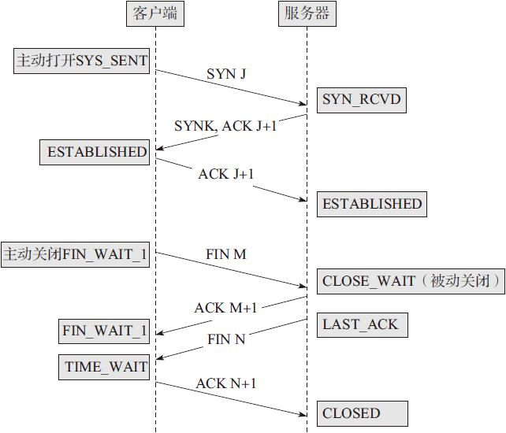

# TCP协议

## 协议分层

网络系统模型：常见的分法有七层模型、五层模型和四层模型。

<div align="center"><h4>七层模型</h4></div>

| 层数 | 名字       | 功能                     | 典型设备                                   |
| ---- | ---------- | ------------------------ | ------------------------------------------ |
| 7    | 应用层     | 提供应用程序间通信       | 应用程序，如 FTP、SMTP、HTTP               |
| 6    | 表示层     | 处理数据格式、数据加密等 | 编码方式、图像编码解码、URL 字段传输编码等 |
| 5    | 会话层     | 建立、维护和关联会话     | 建立会话，如 session 认证、断点续传        |
| 4    | 传输层     | 建立主机端到端连接       | 进程和端口                                 |
| 3    | 网络层     | 寻址和路由选择           | 路由器、防火墙、多层交换机                 |
| 2    | 数据链路层 | 提供介质访问、链路管理   | 网卡、网桥、交换机                         |
| 1    | 物理层     | 比特流传输               | 中继器、集线器、网线和 HUB                 |

<div align="center"><h4>五层模型</h4></div>

| 层数 | 名字       | 功能                                                         |
| ---- | ---------- | ------------------------------------------------------------ |
| 5    | 应用层     | 确定进程之间通信的性质以满足用户需求                         |
| 4    | 运输层     | 负责主机间不同进程的通信，如 TCP 和 UDP                      |
| 3    | 网络层     | 负责分组交换网中不同主机间的通信。<br>作用为：发送数据时，将运输层中的报文段或用户数据报封装成 IP 数据报，并选择合适路由 |
| 2    | 数据链路层 | 负责将网络层的 IP 数据报组装成帧。                           |
| 1    | 物理层     | 透明地传输比特流                                             |

<div align="center"><h4>四层模型</h4></div>

| 层数 | 名字     | 功能                            |
| ---- | -------- | ------------------------------- |
| 4    | 应用层   | DNS、FTP、HTTP、TELENT、SMTP 等 |
| 3    | 传输层   | TCP、UDP                        |
| 2    | 网间层   | TCMP、IP                        |
| 1    | 网络接口 | ARP、RARP                       |

## TCP头部

TCP 头部里每一个字段都为管理 TCP 连接和控制数据流起了重要作用。

<div align="center"></div>

1️⃣16 位端口号（port number）：告知主机该报文段是来自哪里（源端口）以及传给哪个上层协议或应用程序（目的端口）的。进行 TCP 通信时，客户端通常使用系统自动选择的临时端口号，而服务器则使用知名服务端口号。所有知名服务使用的端口号都定义在 `/etc/services` 文件中。

2️⃣32 位序号（sequence number）：一次 TCP 通信（从 TCP 连接建立到断开）过程中某一个传输方向上的字节流的每个字节的编号。假设主机 A 和主机 B 进行 TCP 通信，A 发送给 B 的第一个 TCP 报文段中，序号值被系统初始化为某个随机值 ISN（Initial Sequence Number，初始序号值）。那么在该传输方向上（从 A 到 B），后续的 TCP 报文段中序号值将被系统设置成 ISN 加上该报文段所携带数据的第一个字节在整个字节流中的偏移。例如，某个 TCP 报文段传送的数据是字节流中的第 1025~2048 字节，那么该报文段的序号值就是 ISN+1025。另外一个传输方向（从 B 到 A）的 TCP 报文段的序号值也具有相同的含义。

3️⃣32 位确认号（acknowledgement number）：用作对另一方发送来的 TCP 报文段的响应。其值是收到的 TCP 报文段的序号值加 1。假设主机 A 和主机 B 进行 TCP 通信，那么 A 发送出的 TCP 报文段不仅携带自己的序号，而且包含对 B 发送来的 TCP 报文段的确认号。反之，B 发送出的 TCP 报文段也同时携带自己的序号和对 A 发送来的报文段的确认号。

4️⃣16 位窗口大小（window size）：是 TCP 流量控制的一个手段。这里说的窗口，指的是接收通告窗口（Receiver Window，RWND）。它告诉对方本端的 TCP 接收缓冲区还能容纳多少字节的数据，这样对方就可以控制发送数据的速度。

## TCP状态流转

网络上的传输是没有连接的，TCP 也是一样的。而 TCP 所谓的“连接”，其实只不过是在通信的双方维护一个“连接状态”。

<div align="center"></div>

TCP 连接的建立可以简单地称为 3 次握手，而连接的中止则可以称为 4 次握手。

### 三次握手

1️⃣第一次握手：建立连接时，客户端发送 SYN 包（SYN=J）到服务器，并进入 SYN_SEND 状态，等待服务器确认

2️⃣第二次握手：服务器收到 SYN 包，必须确认客户的 SYN（ACK=J+1），同时自己也发送一个 SYN 包（SYN=K），即 SYN+ACK 包，此时服务器进入 SYN_RECV 状态

3️⃣第三次握手：客户端收到服务器的 SYN＋ACK 包，向服务器发送确认包 ACK（ACK=K+1），此包发送完毕，客户端和服务器进入 ESTABLISHED 状态，完成 3 次握手


对于建连接的 3 次握手，主要是要初始化 Sequence Number 的初始值。通信的双方要互相通知对方自己的初始化的 Sequence Number——所以叫 SYN。这个号要作为以后的数据通信的序号，以保证应用层接收到的数据不会因为网络上的传输问题而乱序（TCP 会用这个序号来拼接数据）。

### 四次挥手

TCP 有一个特别的概念叫作半关闭，这个概念是说，TCP 的连接是全双工（可以同时发送和接收）连接，因此在关闭连接的时候，必须关闭传和送两个方向上的连接。客户机给服务器一个 FIN 的 TCP 报文，然后服务器返回给客户端一个确认 ACK 报文，并且发送一个 FIN 报文，当客户机回复 ACK 报文后（4 次握手），此时，两台主机上用于该连接的所有资源都被释放了。


对于 4 次挥手，其实仔细看则是两次，因为 TCP 是全双工的，所以，发送方和接收方都需要 FIN 和 ACK。只不过，有一方是被动的（客户端主动关闭，服务器端知道该关了也被迫关闭了？），所以看上去就成了所谓的 4 次挥手。如果两边同时断连接，那就会就进入到 CLOSING 状态，然后到达 TIME_WAIT 状态。

## TCP超时重传

1️⃣数据顺利到底对端，对端顺利响应 ACK；

2️⃣数据包中途丢失；<span style="color:red">（异常）</span>

3️⃣数据包顺利到达，但 ACK 报文中途丢失；<span style="color:red">（异常）</span>

4️⃣数据包梳理到达对端，但对端异常未响应 ACK 或被对端丢弃。<span style="color:red">（异常）</span>

TCP 有个超时重传机制。如果长时间没得到对方的正确回应就会重传。而重传超时时间参数非常重要：

- 设长了，重发就慢，没有效率，性能差
- 设短了，重发得就快，会增加网络拥塞，导致更多的超时，更多的超时导致更多的重发

为了设置合适的超时重传时间，TCP 协议使用自适应算法（Adaptive Retransmission Algorithm）以适应互联网分组传输时延的变化。这种算法的基本要点是 TCP 监视每个连接的性能（即传输时延），由每一个 TCP 的连接情况推算出合适的 RTO 值，当连接时延性能变化时，TCP 也能够相应地自动修改 RTO 的设定，以适应这种网络的变化。

为了动态地设置，TCP 引入了 RTT（Round Trip Time），也就是连接往返时间，指发送端从发送 TCP 包开始到接收它的立即响应所耗费的传输时间。

> RTT 的算法有两种

1️⃣RFC793 记录的经典算法

- ①先采样 RTT，记下最近几次的RTT值；
- ②然后做平滑计算 SRTT（Smoothed RTT）；

2️⃣Karn/Partridge 算法

- ①忽略重传，不把重传的 RTT 做采样。但是如果在某一时间，网络出现抖动，突然变慢了，产生了比较大的延时，这个延时导致要重转所有的包（因为之前的 RTO 很小），这会导致 RTO 不会被更新；
- ②为了避免这个 Bug，Karn 算法用了一个取巧的方式——只要一发生重传，就对现有的 RTO 值翻倍；
- 当不再发生报文段的重传时，才根据报文段的往返时延更新平均往返时延 RTT 和重传时间的数值。

## TCP滑动窗口

TCP 的滑动窗口主要有两个作用：一是提供 TCP 的可靠性；二是提供 TCP 的流量控制特性（如果对方接受能力不够就缩小滑动窗口的大小）。

TCP 是双工的协议，会话的双方都可以同时接收、发送数据。TCP 会话的双方都各自维护一个“发送窗口”和一个“接收窗口”。其中各自的“接收窗口”大小取决于应用、系统、硬件的限制（TCP 传输速率不能大于应用的数据处理速率）。

如果 TCP 滑动窗口最边上的数据完成了传输，则窗口会向后滑动，滑动至最后一个没有完成传输的字节上。

应用程序在需要（如内存不足）时，可以通过 API 通知 TCP 协议栈缩小 TCP 的接收窗口。然后 TCP 协议栈在下个时间段发送时包含新的窗口大小通知给对端，对端按通知的窗口来改变发送窗口，以此达到减缓发送速率的目的。但是现代的 OS 可以智能的改变 TCP 窗口的大小，无需手工干预。

## TCP拥塞控制

如果一下接收到太多的数据网络就会发送拥塞，拥塞的结果就是丢包。

注意区分拥塞控制和流量控制。流量控制指点对点通信量的控制。

TCP 的拥塞控制由 4 个核心算法组成：慢开始（Slow Start）、拥塞避免（Congestion Voidance）、快速重传（Fast Retransmit）和快速恢复（Fast Recovery）。

<b>注意区分拥塞窗口和滑动窗口：滑动窗口与拥塞窗口的区别就在于，滑动窗口取决于接收端的缓存大小，拥塞窗口取决于当前网络的负载能力。滑动窗口位于传输层（区别于数据链路层的），拥塞控制更关注网络层。</b>

### 慢开始和拥塞避免

> 拥塞控制算法流程

1️⃣TCP 连接初始化，将拥塞窗口设置为 1

2️⃣执行慢开始算法，cwind 按指数规律增长，直到 cwind=ssthress 时，开始执行拥塞避免算法，cwnd 按线性规律增长。

3️⃣当网络发生拥塞，把 ssthresh 值更新为拥塞前 ssthresh 值的一半，cwnd 重新设置为 1，按照步骤2️⃣执行。

> 为什么这么设计

发送方维持一个叫作拥塞窗口 cwnd（congestion window）的状态变量。拥塞窗口的大小取决于网络的拥塞程度，并且动态地在变化。发送方让自己的发送窗口等于拥塞窗口，另外考虑到接受方的接收能力，发送窗口可能小于拥塞窗口。

慢开始算法的思路就是，不要一开始就发送大量的数据，先探测一下网络的拥塞程度，也就是说由小到大逐渐增加拥塞窗口的大小。

在刚刚开始发送报文段时可先将拥塞窗口 cwnd 设置为一个最大报文段的 MSS 的数值。在每收到一个对新报文段确认后，将拥塞窗口增加至多一个 MSS 的数值，当 rwind 足够大的时候，为了防止拥塞窗口 cwind 的增长引起网络拥塞，还需要另外一个变量，即慢开始门限 ssthresh。

```python
if cwnd<ssthresh:
	使用慢开始算法
elif cwnd>ssthresh:
	使用拥塞避免算法
elif cwnd == sshthresh:
	慢开始算法与拥塞避免算法任选
```

<span style="color:red">拥塞避免算法让拥塞窗口缓慢增长，即每经过一个往返时间 RTT 就把发送方的拥塞窗口 cwnd 加 1，而不是加倍。</span>

### 快重传和快恢复

> 快重传

快重传要求接收方在收到一个失序的报文段后就立即发出重复确认（为的是使发送方及早知道有报文段没有到达对方，不必非得等超时重传定时器），而不要等到自己发送数据时捎带确认。快重传算法规定，发送方只要一连收到 3 个重复确认就应当立即重传对方尚未收到的报文段，而不必继续等待设置的重传计时器时间到期。

> 快恢复算法

1️⃣当发送方连续收到三个重复确认时，就执行“乘法减小”算法，把 ssthresh 门限减半。但是接下去并不执行慢开始算法。

2️⃣考虑到如果网络出现拥塞的话就不会收到好几个重复的确认，所以发送方现在认为网络可能没有出现拥塞。所以此时不执行慢开始算法，而是将 cwnd 设置为 ssthresh 的大小，然后执行拥塞避免。

> 小结

从整体上来讲，TCP 拥塞控制窗口变化的原则是加法增大、乘法减小。可以看出 TCP 的该原则可以较好地保证流之间的公平性，因为一旦出现丢包，那么立即减半退避，可以给其他新建的流留有足够的空间，从而保证整个的公平性。

# 网络IO模型

## 四种网络IO模型

为了解决网络 IO 中的问题，学者们提出了 4 种网络 IO 模型：

①阻塞 IO 模型；

②非阻塞 IO 模型；

③多路 IO 复用模型；

④异步 IO 模型。

### 阻塞IO

阻塞和非阻塞的概念描述的是用户线程调用内核 IO 操作的方式：阻塞是指 IO 操作需要彻底完成后才返回到用户空间；而非阻塞是指 IO 操作被调用后立即返回给用户一个状态值，不需要等到 IO 操作彻底完成。

<div align="center"></div>

### 非阻塞IO

当用户进程发出 read 操作时，如果内核中的数据还没有准备好，那么它并不会 block 用户进程，而是立刻返回一个错误。从用户进程角度讲，它发起一个 read 操作后，并不需要等待，而是马上就得到了一个结果。当用户进程判断结果是一个错误时，它就知道数据还没有准备好，于是它可以再次发送 read 操作。一旦内核中的数据准备好了，并且又再次收到了用户进程的系统调用，那么它马上就将数据复制到了用户内存中，然后返回正确的返回值。

这样需要不断的轮询查看数据是否准备好，也很消耗 CPU 资源。

<div align="center"></div>

### 多路复用IO

多路 IO 复用，有时也称为事件驱动 IO。它的基本原理就是有个函数（如 select）会不断地轮询所负责的所有 socket，当某个 socket 有数据到达了，就通知用户进程

<div align="center"></div>

当用户进程调用了 select，那么整个进程会被阻塞，而同时，内核会“监视”所有 select 负责的 socket，当任何一个 socket 中的数据准备好了，select 就会返回。这个时候用户进程再调用 read 操作，将数据从内核拷贝到用户进程。

这个模型和阻塞 IO 的模型其实并没有太大的不同，事实上还更差一些。因为这里需要使用两个系统调用（select 和 recvfrom），而阻塞 IO 只调用了一个系统调用（recvfrom）。<span style="color:red">但是，用 select 的优势在于它可以同时处理多个连接。所以，如果处理的连接数不是很高的话，使用 select/epoll 的 Web server 不一定比使用多线程的阻塞 IO 的 Web server 性能更好，可能延迟还更大；select/epoll 的优势并不是对于单个连接能处理得更快，而是在于能处理更多的连接。</span>

### 异步IO

用户进程发起 read 操作之后，立刻就可以开始去做其他的事；而另一方面，从内核的角度，当它收到一个异步的 read 请求操作之后，首先会立刻返回，所以不会对用户进程产生任何阻塞。然后，内核会等待数据准备完成，然后将数据拷贝到用户内存中，当这一切都完成之后，内核会给用户进程发送一个信号，返回 read 操作已完成的信息。

<div align="center"></div>

## select/poll/epoll

### C10K问题

新到来一个 TCP 连接，就需要分配一个进程。假如有 C10K，就需要创建 1W 个进程，可想而知单机是无法承受的。那么如何突破单机性能是高性能网络编程必须要面对的问题，进而这些局限和问题就统称为 C10K 问题

### select

```cpp
int select(int maxfdp,
           fd_set *readfds,
           fd_set *writefds,
           fd_set *errorfds,
           struct timeval*timeout);
```

select 实现多路复用的方式是，将已连接的 Socket 都放到一个<b>文件描述符集合</b>，然后调用 select 函数将文件描述符集合拷贝到内核里，让内核来检查是否有网络事件产生（全部都要拷贝到内核里，开销大！），检查的方式很粗暴，就是通过遍历文件描述符集合的方式，当检查到有事件产生后，将此 Socket 标记为可读或可写， 接着再把整个文件描述符集合拷贝回用户态里，然后用户态还需要再通过遍历的方法找到可读或可写的 Socket，然后再对其处理。

所以，对于 select 这种方式，需要进行 2 次「遍历」文件描述符集合，一次是在内核态里，一个次是在用户态里 ，而且还会发生 2 次「拷贝」文件描述符集合，先从用户空间传入内核空间，由内核修改后，再传出到用户空间中。

select 使用固定长度的 BitsMap，表示文件描述符集合，而且所支持的文件描述符的个数是有限制的，在 Linux 系统中，由内核中的 FD_SETSIZE 限制， 默认最大值为 `1024`，只能监听 0~1023 的文件描述符。

### poll

对比 select 进行了改进，poll 不再用 BitsMap 来存储所关注的文件描述符，取而代之用动态数组，以链表形式来组织，突破了 select 的文件描述符个数限制，当然还会受到系统文件描述符限制。

但是 poll 和 select 并没有太大的本质区别，都是使用「线性结构」存储进程关注的 Socket 集合，因此都需要遍历文件描述符集合来找到可读或可写的 Socket，时间复杂度为 O(n)，而且也需要在用户态与内核态之间拷贝文件描述符集合，这种方式随着并发数上来，性能的损耗会呈指数级增长。

<span style="color:red">总结：遍历开销大，用户态与内核态之间拷贝文件描述符集合开销大。</span>

### epoll

epoll 通过两个方面，很好解决了 select/poll 的问题。

- 第一点，epoll 在内核里使用红黑树来跟踪进程所有待检测的文件描述字，把需要监控的 socket 通过 epoll_ctl() 函数加入内核中的红黑树里，红黑树是个高效的数据结构，增删查一般时间复杂度是 O(logn)，通过对这棵黑红树进行操作，这样就不需要像 select/poll 每次操作时都传入整个 socket 集合，只需要传入一个待检测的 socket，减少了内核和用户空间大量的数据拷贝和内存分配。

- 第二点， epoll 使用事件驱动的机制，内核里维护了一个链表来记录就绪事件，当某个 socket 有事件发生时，通过回调函数内核会将其加入到这个就绪事件列表中，当用户调用 epoll_wait() 函数时，只会返回有事件发生的文件描述符的个数，不需要像 select/poll 那样轮询扫描整个 socket 集合，大大提高了检测的效率。

# 网络分析工具

ping、tcpdump、netstat 和 lsof 这 4 个网络分析工具的使用。

## ping

ping 属于一个通信协议，是 TCP/IP 协议的一部分。利用 ping 命令可以检查网络是否连通，可以很好地帮助分析和判定网络故障。

ping 的原理：利用网络上机器 IP 地址的唯一性，给目标 IP 地址发送一个数据包，再要求对方返回一个同样大小的数据包来确定两台网络机器是否连接相通以及时延是多少。

1️⃣使用 ipconfig/all 观察本地网络设置是否正确。

2️⃣ping 127.0.0.1，来检查本地的 TCP/IP 协议有没有设置好。

3️⃣ping 本机 IP 地址，这样是为了检查本机的 IP 地址是否设置有误。

4️⃣ping 本网网关或本网 IP 地址，这样的是为了检查硬件设备是否有问题，也可以检查本机与本地网络连接是否正常。（在非局域网中这一步骤可以忽略）

5️⃣ping 本地 DNS 地址，这样做是为了检查本地 DNS 服务器是否工作正常。

6️⃣ping 远程 IP 地址，这主要是检查本网或本机与外部的连接是否正常。ping 远程 IP 地址还可以用来测试网络延时。

## tcpdump

tcpdump 可以将网络中传送的数据包的“头”完全截获下来提供分析。提供and、or、not 等逻辑语句来帮助去掉无用的信息，是一种免费的网络分析工具。

tcpdump 支持相当多的不同参数，如使用 -i 参数指定 tcpdump 监听的网络界面，这在计算机具有多个网络界面时非常有用；使用 -c 参数指定要监听的数据包数量，使用 -w 参数指定将监听到的数据包写入文件中保存，等等。

```shell
tcpdump [ -adeflnNOpqStvx ] [ -c 数量 ] 
		[ -F 文件名 ][ -i 网络接口 ] 
		[ -r 文件名] [ -s snaplen ]
		[ -T 类型 ] [ -w 文件名 ] 
		[表达式 ]
```

> 截取某主机相关的包

```shell
# linux 下执行 tcpdump
sudo tcpdump host 172.31.181.31

# telnet 下执行建立连接命令
Microsoft Telnet> o 172.31.181.31 1005
```

> 截取多个主机相关的包

在命令行中使用括号时，一定要添加 “\”

```shell
# linux 下执行 tcpdump
sudo tcpdump host 172.31.181.31 and \(171.31.181.31 or 161.31.181.31 \)

# telnet 下执行建立连接命令
Microsoft Telnet> o 172.31.181.31 1005
```

> 截取某端口相关的包

```shell
tcpdump port 6666
```

> 截取网卡 eth0 上通过的包

```shell
tcpdump -ieth0
```

> 获取主机 210.27.48.1 接收或发出的 telnet 包

```shell
tcpdump tcp port 23 host 210.27.48.1
```

## netstat

netstat 命令用于显示与 IP、TCP、UDP 和 ICMP 协议相关的统计数据，一般用于检验本机各端口的网络连接情况。netstat 是在内核中访问网络及相关信息的程序，它能提供 TCP 连接、对 TCP 和 UDP 的监听及获取进程内存管理的相关报告。

```powershell
PS C:\Users\69546> netstat

活动连接

  协议  	本地地址          		外部地址          状态
  TCP    127.0.0.1:10282        xxx:51124        ESTABLISHED
  TCP    127.0.0.1:49677        xxx:49678        ESTABLISHED
  TCP    127.0.0.1:49678        xxx:49677        ESTABLISHED
  TCP    127.0.0.1:49679        xxx:49680        ESTABLISHED
  TCP    127.0.0.1:49680        xxx:49679        ESTABLISHED
  TCP    127.0.0.1:49681        xxx:49682        ESTABLISHED
  TCP    127.0.0.1:49682        xxx:49681        ESTABLISHED
  TCP    127.0.0.1:49693        xxx:65001        ESTABLISHED
  TCP    127.0.0.1:51124        xxx:10282        ESTABLISHED
  TCP    127.0.0.1:65001        xxx:49693        ESTABLISHED
  TCP    192.168.0.129:49820    17.248.165.143:https   CLOSE_WAIT
```

常见参数

```shell
-a (all)显示所有选项，默认不显示LISTEN相关
-t (tcp)仅显示tcp相关选项
-u (udp)仅显示udp相关选项
-n 拒绝显示别名，能显示数字的全部转化成数字。
-l 仅列出有在 Listen (监听) 的服务状态
-p 显示建立相关链接的程序名
-r 显示路由信息，路由表
-e 显示扩展信息，例如uid等
-s 按各个协议进行统计
-c 每隔一个固定时间，执行该netstat命令。提示：LISTEN和LISTENING的状态只有用-a或者-l才能看到
```

## lsof

lsof（list open file）是一个列出当前系统打开文件的工具。在 Linux 环境下，任何事物都以文件的形式存在，通过文件不仅仅可以访问常规数据，还可以访问网络连接和硬件。

应用程序打开文件的描述符列表提供了大量关于这个应用程序本身的信息，因此通过 lsof 工具能够查看这个列表对系统监测以及排错将是很有帮助的。

```shell
lsof  filename 显示打开指定文件的所有进程
lsof -a 表示两个参数都必须满足时才显示结果
lsof -c string   显示COMMAND列中包含指定字符的进程所有打开的文件
lsof -u username  显示所属user进程打开的文件
lsof -g gid 显示归属gid的进程情况
lsof +d /DIR/ 显示目录下被进程打开的文件
lsof +D /DIR/ 同上，但是会搜索目录下的所有目录，时间相对较长
lsof -d FD 显示指定文件描述符的进程
lsof -n 不将IP转换为hostname，缺省是不加上-n参数
lsof -i 用以显示符合条件的进程情况
```

```shell
# 查看 80 端口的运行情况
lsof -i :80

# 查看所属root用户进程所打开的文件，文件类型为.txt
lsof -a -u root -d txt

# 监控打开的文件和设备。查看设备/dev/tty1被哪些进程占用的命令
lsof /dev/tty1

# 监控程序。如查看指定程序server打开的文件
lsof -c server

# 监控用户。比如查看指定用户sharexu打开的文件
lsof -u sharexu
```

# Linux三剑客

[awk 入门教程 - 阮一峰的网络日志 (ruanyifeng.com)](http://www.ruanyifeng.com/blog/2018/11/awk.html)

[Linux awk 命令 | 菜鸟教程 (runoob.com)](https://www.runoob.com/linux/linux-comm-awk.html)

grep、sed、awk，三者的功能都是处理文本，但侧重点各不相同，其中属 awk 功能最强大，但也最复杂。

- grep 更适合单纯的查找或匹配文本
- sed 更适合编辑匹配到的文本
- awk 更适合格式化文本，对文本进行较复杂格式处理。

## grep

grep 可以用正则表达式进行搜索。基本格式如下：

```shell
grep [option] pattern file

# 查询xxx进程
ps -ef | grep xxx
```

grep 常用参数

| 参数         | 实例                                           | 说明                                                         |
| ------------ | ---------------------------------------------- | ------------------------------------------------------------ |
| -A\<行数 x>  | grep -A2 4 a.txt                               | 显示包含数字 4 的那一行内容和 4 后面的 2 行内容。            |
| -B\<行数 x\> | grep -B2 4 a.txt                               | 显示包含数字 4 的那一行内容和 4 前面的 2 行内容。            |
| -C\<行数 x\> | grep -C2 4 a.txt                               | 显示包含数字 4 的那一行内容，并显 4 前后 2 行（1+2+2=5 行）的内容。 |
| -c           | grep -c 1 a.txt<br>grep -c main base_grammar/* | 统计 a.txt 中包含数字 1 的行数<br>统计 bas_grammar 目录下，每个文件包含单词 main 的行数。 |
| -e           | grep -e a -e b a.txt                           | 实现多个选项间的逻辑 or  关系，显示“包含 a 或 b ”的行的内容。 |
| -F           | grep -F 'aa*' a.txt                            | 将 `pattern` 视为固定字符串，显示 a.txt 中包含字符串 ‘aa*’ 的行的内容。'\*' 不代表正则了。 |
| -i           |                                                | 忽略大小写                                                   |
| -o           |                                                | 只显示匹配到的字符串                                         |
| -s           |                                                | 不显示错误信息                                               |
| -v           | grep -v aa* a.txt                              | 显示未被匹配到的行中的内容                                   |
| -w           | grep -w AaA a.txt<br>grep -i -w AaA a.txt      | 匹配整个单词，完全符合（这一行的内容都一样）的单词才会被匹配到。<br>匹配过程忽略大小写。 |

## sed

创建文件 `sed.txt`

```shell
touch sed.txt
# 写入内容
This is a test txt
Hello World
Test sed balabala
```

### 增加内容

```shell
# 在第三行后面追加内容 Hello(第四行追击了内容 Hello)
sed -e 3a\Hello sed.txt
```

但是注意，这个只是将文字处理了，没有写入到文件里，文件里还是之前的内容。

```shell
# 在出现了 Test 的行的后面追加 TTTT
➜ sed -e /Test/a\TTTT sed.txt

# 只在出现了 test(忽略大小写) 的行后面追加 TTTT
➜ sed -e /'[t|T]est'/a\TTTT sed.txt

# 也可以用 ""
➜ sed -e "/Test/a TTTT" sed.txt
This is a test txt
Hello
Hello World
Test sed balabala
TTTT

# 将结果重定向到其他文件中
➜ sed -e "/Test/a TTTT" sed.txt  > newsed.txt
```

### 插入内容

跟 `a` 类似，`sed 3i\TTTT sed.txt` 是在第三行前面插入 `TTTT`:

```bash
➜ sed 3i\TTTT sed.txt
This is a test txt
Hello
TTTT
Hello World
Test sed balabala
```

`sed '/Test/i TTTT' sed.txt` 是在所有匹配到 `test` 的行前面插入：

```bash
➜ sed '/Test/i TTT' sed.txt
This is a test txt
Hello
Hello World
TTT
Test sed balabala
```

可以看出插入的用法和增加很相似。

### 删除内容

```shell
# 删除包含 test 或 Test 的行
➜ sed '/[t|T]est/d' sed.txt
Hello
Hello World
```

### 替换内容

替换则是使用 c，这一行中有一个符合的，那么整行都被替换为 ???

```shell
➜ cat sed.txt
This is a test txt
Hello
Hello World
Test sed balabala

# 将 test/Test 替换为 ????
➜ sed '/[t|T]est/c ???' sed.txt
???
Hello
Hello World
???

➜ sed '/World/c ???' sed.txt
This is a test txt
Hello
???
Test sed balabala

➜ cat new.txt
TestTestTest
Hello
Hello World
TestTestTest

➜ sed '/[t|T]est/c !!!' new.txt
!!!
Hello
Hello World
!!!
```

还有一种替换是 s，`sed 's/old/new/g'`，old 表示想要匹配的字符，new 表示想要替换的字符。这里的 `/g` 的意思是一行中的每一次匹配，因为一行中可能匹配到很多次

```shell
➜ cat new.txt
TestTestTest
Hello
Hello World
TestTestTest

➜ sed 's/Test/test/g' new.txt
testtesttest
Hello
Hello World
testtesttest
```

### 写入文件

使用重定向 '>' 或者是 '-i' 将变动写入文件中。

```shell
➜ cat sed.txt
This is a test txt
Hello
Hello World
Test sed balabala

# c 是这个有匹配的，那么这一行全部修改为 That
➜ sed '/This/c That' -i sed.txt

➜ cat sed.txt
That
Hello
Hello World
Test sed balabala
```

## awk

awk 是把文件逐行的读入，<b>以空格为默认分隔符将每行切片</b>，切开的部分再进行各种分析处理。

### 基本用法

```shell
# 格式
awk 动作 文件名

# 示例,打印 demo.txt 中的所有行 $0 表示当前行
awk '{print $0}' demo.txt
```

简单示例

```shell
# 每行有三个单词，如第一行有单词1、hello、three
➜ cat demo.txt
1 hello three
2 world three
3 awk three
4 what three
5 ？ three

# 打印每行的第一个单词和第三个单词
➜ awk '{print $1,$3}' demo.txt
1 three
2 three
3 three
4 three
5 three
```

指定分隔符

```shell
# 使用 sed 将空格替换为,
➜ sed 's/ /,/g' demo.txt > copy.txt

➜ cat copy.txt
1,hello,three
2,world,three
3,awk,three
4,what,three
5,？,three

➜ awk -F, '{print $1,$3}' copy.txt
1 three
2 three
3 three
4 three
5 three

# 使用空格和逗号两个分隔符
awk -F '[ ,]' xxx

# 指定分隔符示例
➜ cat tmp.txt
HELLO:WORLD

➜ awk -F ':' '{print $1,$2}' tmp.txt
HELLO WORLD
```

### 变量

`awk` 中有不少内置的变量，比如 `$NF` 代表的是分割后的字段数量，相当于取最后一个，`${NF-1}` 表示倒数第二个字段。

```shell
➜ awk '{print $NF}' demo.txt
three
three
three
three
three
```

常见的内置变量

| 变量     | 说明                                               |
| -------- | -------------------------------------------------- |
| FILENAME | 当前文件名                                         |
| FS       | 字段分隔符，默认是空格和制表符                     |
| RS       | 行分隔符，用于分割每一行，默认是换行符             |
| OFS      | 输出字段的分隔符，用于打印时分隔字段，默认为空格   |
| ORS      | 输出记录的分隔符，用于打印时分隔记录，默认为换行符 |
| OFMT     | 数字输出的格式，默认为 `％.6g`                     |

### 函数

```shell
# 将第二行的单词转为大写
➜ awk '{print toupper($2)}' demo.txt
HELLO
WORLD
AWK
WHAT
？
```

常见函数

| 函数    | 说明           |
| ------- | -------------- |
| toupper | 字符转为大写   |
| tolower | 字符转为小写   |
| length  | 返回字符串长度 |
| substr  | 返回子字符串   |
| sin     | 正弦           |
| cos     | 余弦           |
| sqrt    | 平方根         |
| rand    | 随机数         |

### 条件

`awk` 允许指定输出条件，只输出符合条件的行。输出条件要写在动作的前面。

```shell
# awk '条件 动作' 文件名
# 显示不为 ？，所有列第二行单词的大写
➜ awk '{if($2!="？") print toupper($2)}' demo.txt
HELLO
WORLD
AWK
WHAT
```

### 后记

一些无聊的命令练习

- 1️⃣用 echo 输出 hello world，然后用 sed 将 l 替换为 \~，并重定向到 tmp.txt 中
- 2️⃣用 echo 输出 hello world，然后用 awk 将所有的单词变为大写，并重定向到 tmp.txt 中

```shell
# 1️⃣
➜ echo hello world | sed 's/l/~/g' > tmp.txt
➜ cat tmp.txt
he~~o wor~d

# 2️⃣
➜ echo hello world | awk '{print toupper($1),toupper($2)}' > tmp.txt
➜ cat tmp.txt
HELLO WORLD

➜ echo hello world | awk '{print toupper($0)}' > tmp.txt
➜ cat tmp.txt
HELLO WORLD
```


