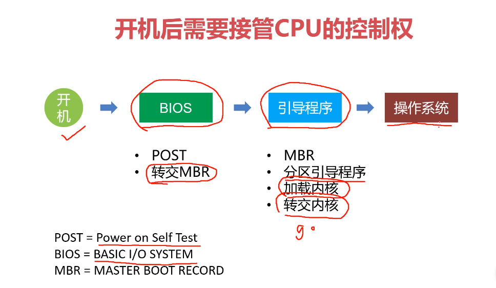
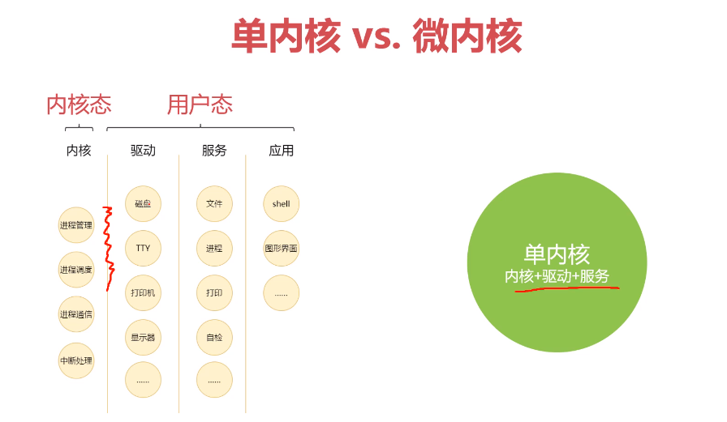

# 引言

## 学什么？

**思想/架构**（抽象、全局的思考）

- 操作系统为什么这么设计
- 多线程为什么这么设计

**实现/算法**

- 并发算法/相关数据结构
- 文件系统如何实现？内存回收如何处理？

**底层**（知其所以然，滴水不漏）

- 内核是怎么工作的？
- 进程/线程/程序在操作系统里是什么？

## 如何学？

- 理解作者的设计意图
  - 为什么要设计它，为什么这样设计，是为了解决什么问题？
- 理解实现方式
  - 如何实现的？
  - 瓶颈在哪里？
  - 如何优化
- 理解底层算法和数据结构
- 理解更底层对硬件的管理和控制
  - 这层，有必要吗？
  - 目前了解的框架，也就Netty考虑到了cache这一层，之后JDK还出了一套结局方案，不用自行编写代码考虑了，这一层面，对普通的应用程序员来说，感觉不是那么必要（2020年10月的看法）

##  资料

《现代操作系统》 -- Andrew S Tanenbaum

## 弱项

之前学OS，文件系统那块的设计不清楚，学的不连贯。

## 个人看法

- 上操作系统课的时候，老师说过一句话，我印象很深。“我们学OS不是为了写出这样的软件，我们也没有能力写出，我们学OS是学习OS发展过程中提出的问题，发现的问题，如何解决的“。OS中的许多设计理念，算法的确很经典，也有不少中间件或多或少的用到了这些思想，这些是十分值得我们学习的。
- 怎么算学到了OS？我不好概括，用举例子的方式说明吧。
  - 有一类数据访问很频繁，你联想到了OS的缓存，于是你把那些访问频繁的数据放到了内存中，避免每次访问都进行IO操作。
  - 数据不仅需要访问，还需要替换。于是，你想到了OS的页面置换策略，你采用LRU算法进行数据的置换。
  - 很多软件的设计理念，算法，在很大程度上是借鉴了操作系统中的设计。

# OS概述

## 什么是OS

不少教程上都有定义，这里不大面积抄书了。

操作系统是管理计算机软硬件资源的系统软件。它负责分配系统资源，对进程/线程进行调度，管理OS中的文件，管理内存等等。OS的出现就是为了合理管理，分配计算机软硬件资源的。将这些资源抽象成服务，供程序使用。

- 管理硬件设备、资源以及应用程序（**管理能力**）
- 将硬件能力、资源抽象成服务让应用程序使用（**抽象能力**）

**开机-->BOIS-->引导程序-->操作系统**




## OS的作用

### 发送/接收 硬件消息

如：键盘缓冲区【类似于环形队列】

### 管理、调度应用

应用之间保持隔离，互不干扰。

软件崩溃了，操作系统不应该崩溃。

交互式的OS需要可以与用户进行交换

## OS的历史

学好安卓要Java，学好Java要C/CPP。

怎么学架构？看OS！

## 内核/内核设计

为什么要抽象出内核这么一个概念？

内核的概念：内核是连接操作系统和硬件、软件的桥梁，掌控着计算机中的一切资源。


## 权限思考

### 没有权限控制

- 用户执行 `rm -rf /`
- 打印驱动程序改写中断向量表
- `QQ`程序帮你关机

### 解决方案

- 权限拆分（端口权限、文件权限、操作权限）
  - 这对设计应用系统有所提示！
- 一个过程多态----区分【内核态】【用户态】

## 单内核VS微内核



## 内核的设计：B/S结构设计


##  微内核的优势

- 内核管的少，其他内容的自由性就强---即扩展性强。如调度算法、文件系统的扩展性

# 进程和多线程

## 基本概念

程序是数据，进程是运行的数据


虚拟机与OS的对比：虚拟机也是在模拟OS，不过VM模拟的范围更大


## 进程的三态&中断响应

###  三态

- 阻塞：进程在等待某个外部信号
- 运行：正在执行的程序
- 就绪：进程在排队等待执行

### 中断响应

- 1   保存当前状态，保证下次可继续执行
- 2   跳转OS处理中断响应的程序
- 3   保存当前寄存器
  - 保存寄存器
  - 中断响应程序
  - 恢复寄存器
- 4   设置新的栈指针
- 5   执行中断服务程序（比如，申请了一个IO读取，则执行这个读取服务）
  - 决定下一次进程
- 6   恢复SP和寄存器
- 7   执行下一个进程

**总结：**

在切换前 保存好状态。

无法指定马上执行那个进程，需要进行排队。

## CPU利用率

CPU工作类别，处理IO & 计算


这里他说的有问题，不是很对。具体去看OS的书，有这种题目和解决方案。

## 线程的概念

进程之间的切换开销太大，如何解决？

引入线程。

一个进程可拥有多个线程，同一个进程中的线程之间共享进程的大部分信息。线程拥有自己的程序指针、堆栈、寄存器、状态字。

- 谁创建了线程
- 谁销毁了线程
- 谁调度线程

类似`RPC`

他这块说的也有问题。Java的线程多数都是一对一模型，需要频繁的进行内核态和用户态的切换。为了解决这种问题，引入了纤程/协程。

## 并发问题

### 基本概念

**竞争条件和临界区**

- 临界区：
  - 访问共享资源的程序片段
  - 且资源不能被同时使用（如打印机）
- 竞争条件
  - 程序的执行结果取决于临界区的精准时序

### 互斥

让程序不会同时进入临界区


这块讲的特别差，特别不清楚，夹在了他太多的废话和不准确的理解，建议自己看书！

## 经典算法

### 互斥算法-严格轮换法

```c
// 初始化
int turn = 0;
// 进程1
while(true){
    while(turn != 0); // 死循环
    // 临界区
    turn = 1;
	// 非临界区
}

// 进程2
while(true){
    while(turn != 1); // 死循环
    // 临界区
    turn = 0;
    // 非临界区
}
```

这块讲的也很不好，还是得自己看书，讲的不清不楚。

# 调度算法

## 概述

多个线程竞争CPU，【需要进行调度】

调度关心什么？

- 被调度任务的特征（计算密集型 VS IO密集型）
- 执行时机
  - 新任务何时执行
  - 如何选择下一个任务，正常执行选择下一个/非正常执行选择下一个【顺序选择还是按优先级进行选择】
  - 发生中断时如何响应
- 调度算法（抢占式、非抢占式）

调度的通用目标

- “公平”
- 按规定策略强制执行
- 平衡 ： 保持系统尽可能忙碌，充分利用计算机的资源（这块废话太多了）

不同系统的不同目标

- 批处理系统（吞吐量、周转时间、CPU利用率）
- 交互式系统（响应性、体验）
- 实时系统（精准、稳定）

## 优先队列

又很多实现方式。数据结构课本中常用堆来实现。

自行看数据结构的书。

##   调度算法选讲

讲的很一般，不如直接看书。

# 内存管理

## 导学

### 分层存储体系

分层存储体系（Memory Hierarchy）

为了解决各级的速度不匹配问题，增加各种缓存。


### 存储器抽象模型

- 本质原因：资源的稀缺
- 解决方案：基地址  +  界限寄存器、交换技术、虚拟化技术
- 学习重点：学习别人是如何思考的

###  垃圾回收

- 引用计数垃圾回收
  - 普通引用计数法
  - 基于图的引用计数方法
- 跟踪垃圾回收
  - mark-sweep算法
  - 三色标记法
- **重点**：理解主流语言（v8，Java，go）为何这样选择

### 需要学好什么

- 深层次理解性能和优化
- 数据结构和算法的运用
- 更好的理解平时用的计算机语言

## 地址空间

### 概述

Address Space

进程内存需要隔离（为了防止互相影响，导致无法正常执行）

- 物理隔离
- 逻辑隔离

为什么不允许应用接触物理内存？

- 防止应用破坏OS
- 防止程序直接互相干扰

内存保护的方式

- 在CPU中设置一对上、下限寄存器，存放用户作业在主存中的下限和上限地址，每当CPU要访问一个地址时，先同他的两个寄存器对比，看是否越界。

- 采用重定位寄存器（基地址寄存器）

  

存在的缺点

- 每次都需要做一次加法（+基地址寄存器）和一次比较（界限寄存器）
- 进程太多内存不够分怎么办（交换或虚拟内存）
- 如何优化

<span style="color:red">他这块说的又有问题。</span>“如果每个线程都有一个核还写什么并发程序”。并发编程是为了高效运行+数据安全，并不只是只有高效这一个点，还要考虑数据的安全性。

### 交换

- 概念：把不在执行的进程存回磁盘，腾出空间给其他进程。
- 问题：占用大量内存的进程如何高效的写入磁盘，高效的从磁盘复原进程？

## 虚拟内存

### 虚拟地址空间

如：将`32kb`的物理内存抽象为`64kb`

页表（虚拟内存）表示`64kb`，页表中的页表项指向物理内存（页框）。

页表是被加载到了物理内存中。我们用一小部分的物理内存存放页表。


page table是虚拟地址

page frame是物理地址

table --> frame 

- page 与 frame 的转换可以通过取余
- offset 直接表示偏移量，可以直接累加

页表项的结构


**举例**


### 内存管理单元

内存管理单元 Memory Management Unit

通过 MMU 可以把虚拟内存映射到物理内存，那么每次都需要把虚拟内存映射到物理内存，性能如何保证？

`MMU` 位于CPU内部，可以通过硬件电路完成内存映射。


### 缺页中断


### 多级页表更省空间

虚拟内存 32位 4GB（每页4KB）

一级页表 4GB/4KB  = 1M个页表项

每个页表项 32位 = 32/8 = 4bit

一级页表占用内存 4bit*1M = 4MB

二级页表 10 10 12

每个页表项 32位 = 32/8 = 4bit

二级页表占用内存 

但是进程大小只有40mb的话，一级页表需要4MB，二级页表可以只用其中的一部分，不用全部加载，所以用不了4MB，大概是这个意思。

# 文件管理

## 文件系统和磁盘

### 常见的文件系统

FAT（File Allocate Table，文件分配表）

- FAT16、FAT32

Ext2（second extended file system）

NTFS（NT File System）日志文件系统，记录发生什么，而不是结果

### 文件和目录

目录是一种特殊的文件，它是用来对文件进行分类的。

- 目录中会有对一个或多个文件的引用。

### 磁盘

- 机械硬盘
- 固态硬盘

### 空闲物理块

基于链表的空闲管理（类比基于链表的内存管理）

基于位图的空闲块管理

### 魔数

用来区分文件类型的。

如 Java.class 文件，开头四个字节是 ： 0xCAFEBABE

DOS 可执行文件开头 0x00004550

## 文件和文件的表示

### 文件

磁盘上信息的一种抽象，把信息抽象成拥有名字的一个集合。

不同文件系统对文件的表示方法不同，但提供相似的操作接口（POSIX标准，Portable Operating System Interface）

### 文件的实现方式

- 连续分配：文件被分成若干个块，在磁盘上连续分配
  - 存在碎片化问题。需要碎片整理
- 链表分配：文件分成多个节点，用链表串起来
  - 节点尾部要存储下一个节点的位置。（这种叫隐式链接吗？）
- 内存中的链表分配（FAT），应该是按 FAT 32 进行计算的
  - 把节点的位置和下一个节点的位置存储在内存中。（这种叫显式链接吗？）
  - 内存中有一个FAT表，类似于数据结构中的静态链表。
  - 1T的硬盘，每个块4K需要多大的FAT表？
    - 1T = 2^30 k
    - 1T / 4k \* FAT32 = 1G 内存。需要的内存太大了。
    - $1T/4k = 表项数$  $表项数*每个表项占的大小（此处为FAT32） = 32MB*32=1024MB=1G$
- index-node（会有文件打开数量限制）
  - 一级索引，二级索引，三级索引，最后指向磁盘块。看OS书！

## 共享文件和目录

目录也是文件！目录记录了文件的一些信息！

如：目录中记录了 文件的长度，属性，文件名，ino

de指针。

文件共享

- 单级目录
- 多级目录

- 链接
  - 硬链接：存指针
  - 软链接：存路径，有寻址过程，效率较低。 