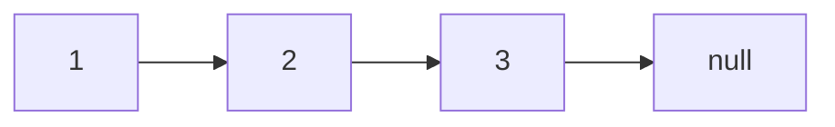

概述

实现基本的数据结构并掌握常用套路。

# 基础知识

## 位运算

得到二进制的最低位吧。

- 如何用位运算得到最低位：x & ((~x)+1) = x 的最低位

    ```shell
    # 假设x是 0111
    ~x = 1000
    ~x + 1 = 1001
    x&(~x)+1 = 1000 & 1001 = 0001 # 与操作，相同才为1
    ```

- 如何用位运算得到最低位：x & (-x) = x 的最低位

    - -x = ~x + 1

- 数状数组

    ```shell
            o
        o    o
    o   o  o  o
    1 2 3 4 5 6 7 8
    ```

    [树状数组详解 - Xenny - 博客园 (cnblogs.com)](https://www.cnblogs.com/xenny/p/9739600.html

# 数组

## 数组基础

- 优点：查询快。scores[2]
- 最好应用于“索引有语意”的情况。
- 但并非所有语义的索引都适用于数组。

## 实现数组

实现一个动态数组，有基本的增删改查功能。

## leetcode

### 剑指offer 03. 数组中重复的数字

在一个长度为 n 的数组 nums 里的所有数字都在 0～n-1 的范围内。数组中某些数字是重复的，但不知道有几个数字重复了，也不知道每个数字重复了几次。请找出数组中任意一个重复的数字。

**示例 1：**

```
输入：
[2, 3, 1, 0, 2, 5, 3]
输出：2 或 3 
```

**限制：**

```
2 <= n <= 100000
```

> 解法

- 法一：先排序，再顺序遍历，看当前元素和下一个元素是否重复；O(NlogN)
- 法二：哈希表判重；O(N)
- 法三：利用题目的特点，数字都在 0~(n-1) 范围内
    - 把0放到0位置，1放到1位置，如果在把n放到n位置上时发现 n ==arr[n] 说明元素重复了

> 法一：排序+遍历

```java
class Solution {
    public int findRepeatNumber(int[] nums) {
        Arrays.sort(nums);
        for(int i=0;i<nums.length-1;i++){
            if(nums[i]==nums[i+1]){
                return nums[i];
            }
        }
        return -1;
    }   
}
```

> 法二：hash 判重

```java
public int useMap(int[] nums) {
    HashSet<Integer> set = new HashSet<>(); // HashSet 判重更方便
    for (int i = 0; i < nums.length; i++) {
        if (!set.add(i)) {
            return nums[i];
        }
    }
    return -1;
}

// 也可以自己开个大数组当 Map
public int map(int[] nums) {
    int[] map = new int[nums.length + 1];
    for (int i = 0; i < nums.length; i++) {
        if (++map[nums[i]] > 1) return nums[i];
    }
    return -1;
}
```

> 法三：利用题目特点，数据的范围都在 0~index 之间

[0,2,1,3,1]  --> [0,2,1,3,1] --> [0,1,2,3,1] -->[0,1,2,3,1] --> [0,1,2,3,1] 1 和 num[1] 发现1重复了。

```java
public int findRepeatNumber(int[] nums) {
    // 遍历，把数据放到合适的位置
    for (int i = 0; i < nums.length; i++) {
        while (nums[i] != i) { // 数据和索引对不少号，则进行交换
            // 拿到数组中的元素i，把这个元素i放到索引i处
            if (nums[i] == nums[nums[i]]) return nums[i];
            else swap(nums, i, nums[i]);
        }
    }
    return -1;
}

private static void swap(int[] x, int a, int b) {
    int t = x[a];
    x[a] = x[b];
    x[b] = t;
}
```

### 03.不修改数组找出重复数字

在一个长度为 n+1 的数组里所有数字都在 1~n 范围内，不修改数组找出重复的数字。

> 思路

- Set 判重
- 开辟新数组，在新数组中进行查找
- 二分查找
    - 数字范围在 1~n 之间，那么重复的数字要么在 1~m 中，要么在 m+1~n 中。
    - 统计 1~m 中 他们在数组中出现的次数，如果出现次数>m，说明 1~m 这个范围内有重复数字，继续分成1\~k,k\~m

```java
/**
 * 在一个长度为 n+1 的数组里所有数字都在 1~n 范围内，不修改数组找出重复的数字。
 */
public int getDup(int[] arr) {
    int start = 1, end = arr.length - 1;
    // 统计 start ~ end / 2 范围内数字出现的次数
    int mid = start + end >> 1;
    while (start < end) {
        // 检索的位置始终是 start 到 mid 若是这个范围，则重置
        // start mid end
        if (search(arr, start, mid) > mid - start + 1) {
            end = mid;
            mid = start + mid >> 1;
        } else {
            // 若没找到，则也重置 start mid end
            start = mid + 1;
            mid = end;
        }
    }
    return end;
}

private int search(int[] arr, int start, int end) {
    int count = 0;
    for (int i = 0; i < arr.length; i++) {
        if (arr[i] >= start && arr[i] <= end) {
            count++;
        }
    }
    return count;
}
```

### 剑指offer 04.二维数组中的查找

在一个 n * m 的二维数组中，每一行都按照从左到右递增的顺序排序，每一列都按照从上到下递增的顺序排序。请完成一个高效的函数，输入这样的一个二维数组和一个整数，判断数组中是否含有该整数。

**示例:**

现有矩阵 matrix 如下：

```shell
[
  [1,   4,  7, 11, 15],
  [2,   5,  8, 12, 19],
  [3,   6,  9, 16, 22],
  [10, 13, 14, 17, 24],
  [18, 21, 23, 26, 30]
]
```


给定 target = 5，返回 true。

给定 target = 20，返回 false。

**限制：**

0 <= n <= 1000

0 <= m <= 1000

# 栈 & 队列

## 栈基础

- 一种线性结构
- 只能从一端（栈顶）添加元素，也只能从一端（栈顶）取出元素
- 后进先出 Last In First Out（LIFO）

> 应用

- Undo 操作（撤销）
- 程序调用的系统栈
- 括号匹配

## 队列基础

- 队列是一种先进先出的数据结构
- First In First Out（FIFO）

> 循环队列

- front == tail 的话，队列就为空。
- （tail + 1）% length == front 的话就队满了。
- 空出一个空间用来区分队空和队满。

```java
public class LoopQueue<E>{
    private E[] data;
    private int front,tail;
    private int size;
    
    // some code.
}
```

# 链表 & 递归

## 链表介绍

- 动态数据结构 
- 具有递归机制
- 辅助组成其他数据结构
- 数据存储在`节点（Node）`中

```java
class Node{
    E e;
    Node next;
}
```



- 优点：真正的动态，不需要处理固定容量的问题。
- 缺点：丧失了随机访问的能力。

## 数组与链表的对比

- 数组最好用于有索引有语意的情况
- 最大优点：支持快速查询
- 链表不适合用于索引有语意的情况
- 最大优点：动态

## 链表的操作

> 插入元素

- head指向当前链表的第一个节点（元素）


`node.next = head`

`head = node`

> 中间插入元素

- 找到待插入索引的前一个结点。
- 如，你要在索引为2的位置插入元素，则你只需要从head走1步，则当前点的next就是索引为2的点。


> 引入虚拟头节点进行操作更方便。

```java
package ds.list;

// 这个链表的实现 无虚拟头节点。
public class LinkedList<E> {
    private int size;
    // 指向链表的第一个元素
    private Node dummy;

    // 开始没有元素，所以是null。
    public LinkedList() {
        dummy = new Node();
        size = 0;
    }

    public int getSize() {
        return size;
    }

    public boolean isEmpty() {
        return size == 0;
    }

    public void addFirst(E e) {
        /**
         Node node = new Node(e);
         node.next = head;
         head = node;
         **/
        add(0, e);
        size++;
    }

    public void add(int index, E element) {
        if (index < 0 || index > this.size) throw new IllegalArgumentException("index should xx");
        // 如果是索引0插入的话。

        Node prev = dummy;
        for (int i = 0; i < index; i++) {
            prev = prev.next;
        }

        prev.next = new Node(element, prev.next);
        size++;
    }

    public void print() {
        Node tmp = dummy;
        while (tmp != null) {
            System.out.format("%d\t", tmp.element);
            tmp = tmp.next;
        }
    }

    public static void main(String[] args) {
        LinkedList<Integer> list = new LinkedList<>();
        list.addFirst(1);
        list.addFirst(2);
        list.add(2, 5);
        list.add(0, -1);
        list.print();
    }

    private class Node {
        public E element;
        public Node next;

        public Node(E element, Node next) {
            this.element = element;
            this.next = next;
        }

        public Node(E e) { this(e, null); }

        public Node() { this(null, null); }

        @Override
        public String toString() {
            return "Node{ element=" + element +", next=" + next +'}';
        }
    }
}
```

## 递归

> 递归

- 本质上，将原来的问题，转化为更小的同一问题。
- 举例：数组求和。
    - Sum( arr[0...n-1] ) = arr[0] + Sum( arr[1...n-1] ) `<--` 更小的同一问题

```java
package ds.recursion;

public class Sum {
    public static int sum(int[] arr) {
        return sum(arr, 0);
    }

    // 计算arr[1...n]这个区间的所有数组的和
    private static int sum(int[] arr, int l) {
        // 递归边界
        if (l == arr.length) return 0;
        // 递归表达式
        return arr[l] + sum(arr, l + 1);
    }

    public static void main(String[] args) {
        int[] arr = {1, 2, 3, 4, 5, 5, 6, 7, 6, 6, 5, 5, 6};
        System.out.println(Sum.sum(arr));
    }
}
```

> 链表具有天然的递归结构


解决链表中删除元素的问题。

```java
class Solution {
    public ListNode removeElements(ListNode head, int val) {
        if (head == null)
            return head;
        // 分为head 和 head后面两部分。
        // 链表 = head + head后面的链表，删除值为val后的链表。一直递归。
        head.next = removeElements(head.next, val);
        return head.val == val ? head.next : head;
    }
}
```

> 递归函数的"微观"解读

递归调用：函数调用 + 系统栈空间

# 二叉树树

## 树结构

- 树结构，高效！
- 二分搜索树
- 平衡二叉树：AVL；红黑树
- 堆：并查集
- 线段树；Trie（字典树，前缀树）


## 二叉树

- 动态数据结构

```java
class Node{
    E e;
    Node left; // 左孩子
    Node right; // 右孩子
}
```

- 二叉树
    - 有唯一的根节点
    - 天然的递归结构，每个节点的左子树也是二叉树，每个节点的右子树也是二叉树
    - 二叉树不一定是满的，一个节点也是二叉树，NULL 空也是二叉树

二叉树遍历模板

```java
// 前序遍历 根左右。 
void pre(TreeNode root){
    if(root!=null){
        System.out.println(root.val); //根
        pre(root.left); // 左
        pre(root.right); // 右
    }
}

// 中序遍历
void in(TreeNode root){
    if(root!=null){
        pre(root.left); // 左
        System.out.println(root.val); //根
        pre(root.right); // 右
    }
}

// 后续遍历
void after(TreeNode root){
    if(root!=null){
        pre(root.left); // 左
        pre(root.right); // 右
        System.out.println(root.val); //根
    }
}

// 层序遍历
// 结点入队，判断其有无左右子树，有则左右子树入队。
// 层序遍历的题一般是从每层数据的输出下手。如打印之字型。
// 要熟悉常用的数据结构。 stack queue hash tree 并查集
void levelOrder(TreeNode root){
    if (root == null) return null;
    Queue<TreeNode> queue = new LinkedList();
    queue.offer(root);
    while (!queue.isEmpty()) {
        TreeNode tree = queue.remove();
        System.out.println(tree.val);
        if (tree.left != null) queue.add(tree.left);
        if (tree.right != null) queue.add(tree.right);
    }
}
```

## 二分搜索树

- 二分搜索树
    - 二分搜索树的每个节点的值大于左子树的所有节点的值，小于其右子树的所有节点的值。【**左边值小，右边值大**】
    - 每一颗子树也是二分搜索树。
    - 存储的元素必须有可比较性。‘
- 代码方面，以递归写法为主，非递归写法自行书写。
- BST 的递归比非递归实现简单。


### 插入

- 默认不包含重复元素！
- 如果想包含重复元素的话，只需要定义：
    - 左子树小于等于节点；或者右子树大于等于节点
    - 注意：之前讲的数组和链表是可以有重复元素的

```java
public void add(E e) {
    root = add(root, e);
}

// 为空时，才创建。这样递归条件就少了。

private Node add(Node node, E e) {
    if (node == null) {
        size++;
        return new Node(e);
    }
    if (e.compareTo(node.e) < 0) {
        node.left = add(node.left, e);
    } else if (e.compareTo(node.e) > 0) {
        node.right = add(node.right, e);
    }
    return node;
}
```

### 查找

```java
public boolean contains(E e) {
    return contains(root, e);
}

private boolean contains(Node node, E e) {
    if (node == null) return false;
    if (e.compareTo(node.e) == 0) return true;
    else if (e.compareTo(node.e) < 0) {
        return contains(node.left, e);
    } else {
        return contains(node.left, e);
    }
}
```

### 遍历

```java
/**
 * 二叉树的前序遍历
 */
public void preOrder(Node node) {
    if (node == null) return;
    if (node != null) {
        System.out.println(node.e);
        preOrder(node.left);
        preOrder(node.right);
    }
}

/**
 * 二叉树的中序遍历
 */
public void midOrder(Node node) {
    if (node != null) {
        midOrder(node.left);
        System.out.println(node.e);
        midOrder(node.right);
    }
}

/**
 * 二叉树的中序遍历
 */
public void afterOrder(Node node) {
    if (node != null) {
        afterOrder(node.left);
        afterOrder(node.right);
        System.out.println(node.e);
    }
}
```

> 遍历图解

每个点都会被访问三次！前序是第一次就遍历！中序是第二次才遍历！后续是第三次才遍历！


前序遍历，第一次访问点时就遍历。中后同理。


### 删除

# 集合和映射

## 集合

- 不能重复添加元素
- 典型应用：客户统计、词汇量统计
- 可以使用二分搜索树作为集合的底层实现。
- Java 中的 Set 底层的数据结构采用的红黑树。

> 有序集合和无序集合

- 有序集合中的元素具有顺序性，<\=\=\=\=\=基于搜索树实现
- 无序集合中的元素没有顺序性，<\=\=\=\=\=基于哈希表实现

## 映射

$f(x)=2*x+1$ 或者称为字典

- 数据库；id---->信息
- 词频统计，单词---->频率
- 存储（键，值）数据对的数据结构
- 根据 key 查找 value

# 优先队列

# DFS&BFS

## 深搜代码模板

```java
// 顶点都从0开始的数字，如果顶点的表示不是数字，则用key--value关联起来即可
// vertex为顶点数组
// arc为边的权值数组
public void DFS(int n){
    int [vertexNum]marked = {0};
    marked[n] = 1; // 设置已访问
    System.out.println(vertex[n]);
    for(int i=0;i<vertexNum;i++){
        // 点n i直接右边 且i未被访问
        if(arc[n][i] == 1 && marked[i] == 0) DFS(i);
    }
}
```

## 广搜代码模板

广搜和二叉树的层序遍历有一点类似，都用到了队列。

```java
// 顶点都从0开始的数字，如果顶点的表示不是数字，则用key--value关联起来即可
// vertex为顶点数组
// arc为边的权值数组
public void BFS(int n){
	Queue<Integer> queue = new ArrayDeque<>();
    System.out.println(n);
    queue.push(n);
    while(!queue.isEmpty()){
        int cur = queue.pop();
        for(遍历cur相邻的边){
            未访问的点 打印，并入队;
        }
    }
}
```

## 经典习题N皇后

```cpp
class Solution {
public:
int totalNQueens(int n) {
	int m = n+1;
    //P[i]存放的是第i行放置皇后的列号 如P[1] = 3 表示第1行的第三列放置了皇后
	int P[m] = {};	
    //记录那些列被使用了。我们逐行遍历，不存在行重复。
    bool hastTable[m] = {};
	int count = 0;
	genPrem(1,n,P,hastTable,count);
	return count;
}
//index 是行 n是皇后个数。为方便散列数组的使用，散列数组大小为n+1 P数组大小同散列数组，方便访问
void genPrem(int index,int n,int P[],bool hastTable[],int &count){
	if(index == n+1){
		count++;
		return;
	}
    //x是列
	for(int x=1; x<=n; x++){
        //hastTable记录每列是否已经放置了元素，保证不同列放置皇后
		if(hastTable[x]==false){
            //该列没有放置元素，我在该列放元素行不行！
         	bool flag = true; 
			//判断当前行这个位置放置皇后是否会冲突！
		   //列举前面的行，我在此行的x列放置元素是否会冲突 
            for(int pre = 1;pre<index;pre++){
				//P[]存放前面行的列号
				// index - pre ==> 我的行号 - 你的行号。
				// x - P[pre] ==> 我的列号 - 你的列号。
				if(abs(index-pre)==abs(x-P[pre])){
					flag = false;
					break;
				}
			}//end for
			if(flag){
				P[index] = x;
				hastTable[x] = true;
				genPrem(index+1,n,P,hastTable,count);
				hastTable[x] = false;
			}
		}
	}
}
};
```

