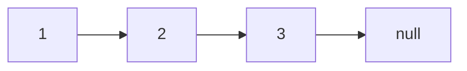
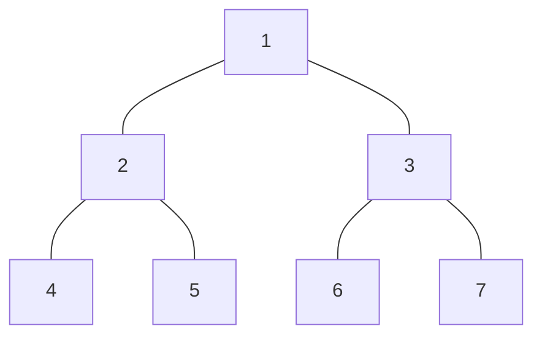

# 概述

实现基本的数据结构并掌握常用套路。

# 基础知识

## 时间复杂度

`O` \=\=\> 最坏情况的时间复杂度
`Θ`\=\=> 平均时间复杂度
`Ω`\=\=> 最好情况的时间复杂度

## 二分查找

### 时间复杂度

一次砍一半。$log_2N$。

### 二分的详细与扩展

- 在一个有序数组中查找某个数是否存在。
- 在一个有序数组中，找>=某个数最左侧的位置。
    - 1 2 2 2 2 2 3 3 3 3 4 4 4 4 5 5 5 6 7 7  找>=3最左侧的位置。依旧是可以二分。二分到某一个范围没有数了，就停。最左侧的就是我们要的。
- 局部最小值问题。
    - arr 无序，相邻的数一定不相等。求局部最小。局部最小：位置n的数，n-1>n; n+1>n
    - 先判断 start 和 end 位置的数据。如果 start 和 end 不是局部最小。意味着 start> start+1  end>end-1。（画一条数据高低的走向箭头）
    - 看那个区域存在局部最小，对这个区域进行二分。

## 位运算

得到二进制的最低位吧。

- 如何用位运算得到最低位：x & ((~x)+1) = x 的最低位

    ```shell
    # 假设x是 0111
    ~x = 1000
    ~x + 1 = 1001
    x&(~x)+1 = 1000 & 1001 = 0001 # 与操作，相同才为1
    ```

- 如何用位运算得到最低位：x & (-x) = x 的最低位

    - -x = ~x + 1

- 数状数组

    ```shell
            o
        o    o
    o   o  o  o
    1 2 3 4 5 6 7 8
    ```

    [树状数组详解 - Xenny - 博客园 (cnblogs.com)](https://www.cnblogs.com/xenny/p/9739600.html

## 异或

### 用法

满足交换律结合律。相同为0，不同为1。
**eg：a ， b 得在不同的内存空间。**
int a = 甲
int b = 乙
a = a ^ b ==> a = 甲^乙
b = a ^ b ==> b = 甲\^乙\^乙 = 甲^0 = 甲
a = a ^ b ==> a = 甲\^乙\^甲 = 乙^0 = 乙

### 习题

- [x] 一种数出现了奇数次，其他的都出现了偶数次，如何找出这个出现奇数次的数。

`1^2^3^3^4^4^4^3^3^4` 就可以了。可以把异或当成无进位加法。

- [x] 数组中两种数出现了奇数次，其他的都出现了偶数次，如何找出这个两种数。（ 时间复杂度O(n) ）

一个数与上自己取反加1，就可以把最右侧的1（二进制表示）拿到了。

## 排序

- [x] 选择排序：从无序序列中选择一个最小（大）的确定它的位置，缩小无序数组的范围。

- [x] 冒泡排序：两两交换，将无序数组中，最小（大）的放到有序序列中。

- [x] 插入排序：0\~0范围有序，0\~1范围有序，0\~2范围有序 ... etc。类似于打扑克，给自己的扑克从大到小排好序。

    - 想在 0~i上有序 for循环
    - 在 0~i 上实现有序 for循环

- [x] 归并排序

- 整体就是一个简单递归，左边排好序，右边排好序，再让整体有序

    ```java
    public static void mergeSort(int[] arr){
        if(arr==null || arr.length<2){
            return;
        }
        process(arr,0,arr.length-1);
    }
    
    public static void process(int[] arr,int L, int R){
        if(L==R) return;
        int mid = L + ((R-L)>>1);
        process(arr,L,mid);
        process(arr,mid+1,R);
        merge(arr,L,mid,R);
    }
    
    public static void merge(int[]arr, int L, int M, int R){
        int[]help = new int[R-L+1];
        int i=0;
        int p1 = L;
        int p2 = M + 1;
        while(p1<=M && p2<=R){
            help[i++] = arr[p1]<=arr[p2]?arr[p1++]:arr[p2++];
        }
        while(p2<=R){
            help[i++] = arr[p2++];
        }
        for(i=0;i<help.length;i++){
            arr[L+i] = help[i];
        }
    }
    ```

    

## 对数器

- 有想测试的方法
- 实现一个复杂度不好，但是容易写出来的方法。
- 实现一个随机样本生成器
- 把方法a和方法b跑同样的随机样本，看结果是不是一样。
- 如果结果不一样，就打印数据，看看哪里出错了。
- 若样本数很多时，对比测试仍然正确，则可以确定方法a是正确的。

# 递归

## 求最大值例题【7.09】

数值溢出。L+（(R-L)>>1）

## 剖析递归行为

用递归方法找一个数组中的最大值，系统上到底怎么做？[17.04]

> master 公式的使用：T(N) = a*T(N/b) + O(N^d)

- [x] $log(b,a) > d$  复杂度为$N^{log(b,a)}$

# 数组

## 数组基础

- 优点：查询快。scores[2]
- 最好应用于“索引有语意”的情况。
- 但并非所有语义的索引都适用于数组。

## 实现数组

实现一个动态数组，有基本的增删改查功能。

## leetcode

### 剑指offer 03. 数组中重复的数字

在一个长度为 n 的数组 nums 里的所有数字都在 0～n-1 的范围内。数组中某些数字是重复的，但不知道有几个数字重复了，也不知道每个数字重复了几次。请找出数组中任意一个重复的数字。

**示例 1：**

```
输入：
[2, 3, 1, 0, 2, 5, 3]
输出：2 或 3 
```

**限制：**

```
2 <= n <= 100000
```

> 解法

- 法一：先排序，再顺序遍历，看当前元素和下一个元素是否重复；O(NlogN)
- 法二：哈希表判重；O(N)
- 法三：利用题目的特点，数字都在 0~(n-1) 范围内
    - 把0放到0位置，1放到1位置，如果在把n放到n位置上时发现 n ==arr[n] 说明元素重复了

> 法一：排序+遍历

```java
class Solution {
    public int findRepeatNumber(int[] nums) {
        Arrays.sort(nums);
        for(int i=0;i<nums.length-1;i++){
            if(nums[i]==nums[i+1]){
                return nums[i];
            }
        }
        return -1;
    }   
}
```

> 法二：hash 判重

```java
public int useMap(int[] nums) {
    HashSet<Integer> set = new HashSet<>(); // HashSet 判重更方便
    for (int i = 0; i < nums.length; i++) {
        if (!set.add(i)) {
            return nums[i];
        }
    }
    return -1;
}

// 也可以自己开个大数组当 Map
public int map(int[] nums) {
    int[] map = new int[nums.length + 1];
    for (int i = 0; i < nums.length; i++) {
        if (++map[nums[i]] > 1) return nums[i];
    }
    return -1;
}
```

> 法三：利用题目特点，数据的范围都在 0~index 之间

[0,2,1,3,1]  --> [0,2,1,3,1] --> [0,1,2,3,1] -->[0,1,2,3,1] --> [0,1,2,3,1] 1 和 num[1] 发现1重复了。

```java
public int findRepeatNumber(int[] nums) {
    // 遍历，把数据放到合适的位置
    for (int i = 0; i < nums.length; i++) {
        while (nums[i] != i) { // 数据和索引对不少号，则进行交换
            // 拿到数组中的元素i，把这个元素i放到索引i处
            if (nums[i] == nums[nums[i]]) return nums[i];
            else swap(nums, i, nums[i]);
        }
    }
    return -1;
}

private static void swap(int[] x, int a, int b) {
    int t = x[a];
    x[a] = x[b];
    x[b] = t;
}
```

### 03.不修改数组找出重复数字

在一个长度为 n+1 的数组里所有数字都在 1~n 范围内，不修改数组找出重复的数字。

> 思路

- Set 判重
- 开辟新数组，在新数组中进行查找
- 二分查找
    - 数字范围在 1~n 之间，那么重复的数字要么在 1~m 中，要么在 m+1~n 中。
    - 统计 1~m 中 他们在数组中出现的次数，如果出现次数>m，说明 1~m 这个范围内有重复数字，继续分成1\~k,k\~m

```java
/**
 * 在一个长度为 n+1 的数组里所有数字都在 1~n 范围内，不修改数组找出重复的数字。
 */
public int getDup(int[] arr) {
    int start = 1, end = arr.length - 1;
    // 统计 start ~ end / 2 范围内数字出现的次数
    int mid = start + end >> 1;
    while (start < end) {
        // 检索的位置始终是 start 到 mid 若是这个范围，则重置
        // start mid end
        if (search(arr, start, mid) > mid - start + 1) {
            end = mid;
            mid = start + mid >> 1;
        } else {
            // 若没找到，则也重置 start mid end
            start = mid + 1;
            mid = end;
        }
    }
    return end;
}

private int search(int[] arr, int start, int end) {
    int count = 0;
    for (int i = 0; i < arr.length; i++) {
        if (arr[i] >= start && arr[i] <= end) {
            count++;
        }
    }
    return count;
}
```

### 剑指offer 04.二维数组中的查找

在一个 n * m 的二维数组中，每一行都按照从左到右递增的顺序排序，每一列都按照从上到下递增的顺序排序。请完成一个高效的函数，输入这样的一个二维数组和一个整数，判断数组中是否含有该整数。

**示例:**

现有矩阵 matrix 如下：

```shell
[
  [1,   4,  7, 11, 15],
  [2,   5,  8, 12, 19],
  [3,   6,  9, 16, 22],
  [10, 13, 14, 17, 24],
  [18, 21, 23, 26, 30]
]
```


给定 target = 5，返回 true。

给定 target = 20，返回 false。

**限制：**

0 <= n <= 1000

0 <= m <= 1000

# 栈 & 队列

## 栈基础

- 一种线性结构
- 只能从一端（栈顶）添加元素，也只能从一端（栈顶）取出元素
- 后进先出 Last In First Out（LIFO）

> 应用

- Undo 操作（撤销）
- 程序调用的系统栈
- 括号匹配

## 队列基础

- 队列是一种先进先出的数据结构
- First In First Out（FIFO）

> 循环队列

- front == tail 的话，队列就为空。
- （tail + 1）% length == front 的话就队满了。
- 空出一个空间用来区分队空和队满。

```java
public class LoopQueue<E>{
    private E[] data;
    private int front,tail;
    private int size;
    
    // some code.
}
```

# 链表 & 递归

## 链表介绍

- 动态数据结构 
- 具有递归机制
- 辅助组成其他数据结构
- 数据存储在`节点（Node）`中

```java
class Node{
    E e;
    Node next;
}
```



- 优点：真正的动态，不需要处理固定容量的问题。
- 缺点：丧失了随机访问的能力。

## 数组与链表的对比

- 数组最好用于有索引有语意的情况
- 最大优点：支持快速查询
- 链表不适合用于索引有语意的情况
- 最大优点：动态

## 链表的操作

> 插入元素

- head指向当前链表的第一个节点（元素）


`node.next = head`

`head = node`

> 中间插入元素

- 找到待插入索引的前一个结点。
- 如，你要在索引为2的位置插入元素，则你只需要从head走1步，则当前点的next就是索引为2的点。


> 引入虚拟头节点进行操作更方便。

```java
package ds.list;

// 这个链表的实现 无虚拟头节点。
public class LinkedList<E> {
    private int size;
    // 指向链表的第一个元素
    private Node dummy;

    // 开始没有元素，所以是null。
    public LinkedList() {
        dummy = new Node();
        size = 0;
    }

    public int getSize() {
        return size;
    }

    public boolean isEmpty() {
        return size == 0;
    }

    public void addFirst(E e) {
        /**
         Node node = new Node(e);
         node.next = head;
         head = node;
         **/
        add(0, e);
        size++;
    }

    public void add(int index, E element) {
        if (index < 0 || index > this.size) throw new IllegalArgumentException("index should xx");
        // 如果是索引0插入的话。

        Node prev = dummy;
        for (int i = 0; i < index; i++) {
            prev = prev.next;
        }

        prev.next = new Node(element, prev.next);
        size++;
    }

    public void print() {
        Node tmp = dummy;
        while (tmp != null) {
            System.out.format("%d\t", tmp.element);
            tmp = tmp.next;
        }
    }

    public static void main(String[] args) {
        LinkedList<Integer> list = new LinkedList<>();
        list.addFirst(1);
        list.addFirst(2);
        list.add(2, 5);
        list.add(0, -1);
        list.print();
    }

    private class Node {
        public E element;
        public Node next;

        public Node(E element, Node next) {
            this.element = element;
            this.next = next;
        }

        public Node(E e) { this(e, null); }

        public Node() { this(null, null); }

        @Override
        public String toString() {
            return "Node{ element=" + element +", next=" + next +'}';
        }
    }
}
```

## 思路

- 笔试：时间复杂度低，一切为了时间复杂度。
- 面试：时间复杂度低，空间复杂度尽可能的低。
- 额外数据结构记录：哈希表
- 快慢指针

## 水题

- 反转单链表和双链表

## 非水题

代码【4-1：32：31】

- [x] 打印两个有序链表的公共部分 
- 链表有序，有头指针 head1 head2，打印他们的公共部分。时间复杂度 O(N) 空间复杂度 O(1)
- [x] 判断链表是否是回文链表（以Node为最小单位）
- 笔试直接用 stack 解题。
- 空间尽可能低。快慢指针。只把链表的一半数据入栈。
- 只用有限的几个变量。双指针，中间 Node 的 next 指向空，后半部分的next指针指向前面的元素。遍历判断回文串的时候，在把 next 指针复原。
- [x] 将单链表按某值划分成左边小，中间相等，右边大的形式。
- 把单链表的 Node 放到数组里去，在数组里进行操作。
- 开几个哑节点。small_start, small_end; eq_start, eq_end; big_start, big_end; 再把这三个链表连起来。注意边界问题，不一定有大于某值的。
- [x] 复制含义随机指针节点的链表。leetcode 138。【1：51：15】
- `map<oldNode,newNode>`存起来，然后再遍历map的值，通过oldNode的指针关系设置newNode的指针关系。
- 不用额外空间呢？old-->new-->old-->new-->old-->new 然后在设置 new 节点的 random 指针。
- [x] 两个链表相交（共用节点）
- 判断有环无环：快慢指针、哈希表
- 找出入环的第一个节点：

    - 哈希表，判重即可。第一个遇到遍历两次的点就是入口节点。
    - 快慢指针，快指针每次走两步，慢指针每次走一步，快慢指针相遇后，快指针回到开头，然后！两个指针在走！每次都只走一步！相遇的那个点就是第一个入口节点！【看过就会】
- 额外空间：两个 stack，然后出 stack 对比。

## 递归

> 递归

- 本质上，将原来的问题，转化为更小的同一问题。
- 举例：数组求和。
    - Sum( arr[0...n-1] ) = arr[0] + Sum( arr[1...n-1] ) `<--` 更小的同一问题

```java
package ds.recursion;

public class Sum {
    public static int sum(int[] arr) {
        return sum(arr, 0);
    }

    // 计算arr[1...n]这个区间的所有数组的和
    private static int sum(int[] arr, int l) {
        // 递归边界
        if (l == arr.length) return 0;
        // 递归表达式
        return arr[l] + sum(arr, l + 1);
    }

    public static void main(String[] args) {
        int[] arr = {1, 2, 3, 4, 5, 5, 6, 7, 6, 6, 5, 5, 6};
        System.out.println(Sum.sum(arr));
    }
}
```

> 链表具有天然的递归结构


解决链表中删除元素的问题。

```java
class Solution {
    public ListNode removeElements(ListNode head, int val) {
        if (head == null)
            return head;
        // 分为head 和 head后面两部分。
        // 链表 = head + head后面的链表，删除值为val后的链表。一直递归。
        head.next = removeElements(head.next, val);
        return head.val == val ? head.next : head;
    }
}
```

> 递归函数的"微观"解读

递归调用：函数调用 + 系统栈空间

# 二叉树

## 树结构

- 树结构，高效！
- 二分搜索树
- 平衡二叉树：AVL；红黑树
- 堆：并查集
- 线段树；Trie（字典树，前缀树）


## 二叉树

- 动态数据结构

```java
class Node{
    E e;
    Node left; // 左孩子
    Node right; // 右孩子
}
```

- 二叉树
    - 有唯一的根节点
    - 天然的递归结构，每个节点的左子树也是二叉树，每个节点的右子树也是二叉树
    - 二叉树不一定是满的，一个节点也是二叉树，NULL 空也是二叉树

### 二叉树的遍历

用递归序理解二叉树的前、中、后遍历。



1, 2, 4, 4, 4, 2, 5, 5, 5, 2, 1, 3, 6, 6, 6, 3, 7, 7, 7, 3, 1

- [x] 先序（头左右）第一次遍历到节点就打印的，叫先序遍历==>1, 2, 4, 5, 3, 6, 7
- [x] 中序（左头右）第二次遍历到节点才打印的，叫中序遍历==>4, 2, 5, 1, 6, 3, 7
- [x] 后序（左右头）第三次遍历到节点才打印的，叫后序遍历==>4, 5, 2, 6, 7, 3, 1

#### 递归遍历模板

```java
public static void preOrderRecur(Node head){
    if(head == null) return;
    System.out.println(head.value+" ");
    preOrderRecur(head.left);
    preOrderRecur(head.right);
}

public static void inOrderRecur(Node head){
    if(head == null) return;
    inOrderRecur(head.left);
    System.out.println(head.value+" ");
    inOrderRecur(head.right);
}

public static void posOrderRecur(Node head){
    if(head == null) return;
    afterOrderRecur(head.left);
    afterOrderRecur(head.right);
    System.out.println(head.value+" ");
}

// 层序遍历
// 结点入队，判断其有无左右子树，有则左右子树入队。
// 层序遍历的题一般是从每层数据的输出下手。如打印之字型。
// 要熟悉常用的数据结构。 stack queue hash tree 并查集
public static void levelOrder(TreeNode root){
    if (root == null) return null;
    Queue<TreeNode> queue = new LinkedList();
    queue.offer(root);
    while (!queue.isEmpty()) {
        TreeNode tree = queue.remove();
        System.out.println(tree.val);
        if (tree.left != null) queue.add(tree.left);
        if (tree.right != null) queue.add(tree.right);
    }
}
```

#### 非递归遍历模板

- [x] 前序遍历
- 先把一个节点压栈
- 从栈中弹出一个节点 cur
- 打印（处理）cur
- 先压右再压左（如果有）==>为什么是先右再左呢？因为是头左右。先压入右，再压入左，那么就是左先遍历。
- 周而复始

- [x] 中序遍历（中序’ ：头右左）
- 每棵子树整棵树左边界入栈
- 依次弹出的过程中，打印节点并对弹出节点右子树周而复始。
- 为什么这样就是中序呢？
    - 按左边界对数进行了分解。左头右（左头右（左头右））
- [x] 后序遍历
- 有两个 stack，一个 stackA，一个 stackB（收集栈）。
- 从 stackA 中弹出 cur（当前节点）
- 把 cur 放入 stackB 中，并且，按先左再右的顺序把 cur 的left 和right 压入 stackA
    - 从 stackA 弹出来的时候，把弹出来的元素放入 stackB，然后把弹出元素的 left，right 放入 stackA 中。
    - 第二次会先拿到 right ，把 right 放入 stackB，....后才会把 left 放入 stackB。
    - 最后 cur、left、right 的遍历顺序是 left-->right-->cur ( 左右根 )
    - 后序遍历

> 代码模板

```java
public void preOrder(Node head){
    if(head!=null){
        Stack<Node> stack = new Stack<Node>();
        stack.push(head);
        while(!stack.isEmpty()){
            cur = stack.pop();
            System.out.println(cur.value);
            if(cur.right != null){
                stack.push(cur.right);
            }
            if(cur.left != null){
                stack.push(cur.left);
            }
        }
    }
}


public void posOrder(Node head){
    if(head!=null){
		Stack<Node> stack1 = new Stack<Node>();
		Stack<Node> stack2 = new Stack<Node>();
        stack1.push(head);
        while(!s1.isEmpty()){
            Node cur = stack1.pop();
        	stack2.push(cur);
            if(cur.left!=null) stack1.push(cur.left);
            if(cur.right!=null) stack1.push(cur.right);
        }
        while(!stack2.isEmpty()){
            System.out.println(stack2.pop().value+" ");
        }
    }
}

public void inOrder(Node head){
    if(head!=null){
        Stack<Node> stack = new Stack<Node>();
    	while(!stack.isEmpty() || head !=null){
            if(head!=null){
                stack.push(head);
                head = head.left;
            }else{
                head = stack.pop();
                System.out.print(head.value+" ");
            	head = head.rigth;
            }
        }
    }
}
```

### 水题

- [x] 二叉树的前、中、后、层序遍历

- [x] 求二叉树的宽度

- 用队列，先放左再放右，弹出就打印。下面这棵二叉树最大宽度为3。

- 记录每层的节点数目即可。

    - 法一. hashmap 记录节点属于第几层。
    - 自己想，也挺简单的。为 Node 添加一个 level 属性即可。再加点逻辑。

    ```mermaid
    graph
    1---2
    1---3
    2---4
    2---5
    3---6
    3---null
    5---7
    ```

## 二分搜索树

- 二分搜索树
    - 二分搜索树的每个节点的值大于左子树的所有节点的值，小于其右子树的所有节点的值。【**左边值小，右边值大**】
    - 每一颗子树也是二分搜索树。
    - 存储的元素必须有可比较性。‘
- 代码方面，以递归写法为主，非递归写法自行书写。
- BST 的递归比非递归实现简单。


### 插入

- 默认不包含重复元素！
- 如果想包含重复元素的话，只需要定义：
    - 左子树小于等于节点；或者右子树大于等于节点
    - 注意：之前讲的数组和链表是可以有重复元素的

```java
public void add(E e) {
    root = add(root, e);
}

// 为空时，才创建。这样递归条件就少了。

private Node add(Node node, E e) {
    if (node == null) {
        size++;
        return new Node(e);
    }
    if (e.compareTo(node.e) < 0) {
        node.left = add(node.left, e);
    } else if (e.compareTo(node.e) > 0) {
        node.right = add(node.right, e);
    }
    return node;
}
```

### 查找

```java
public boolean contains(E e) {
    return contains(root, e);
}

private boolean contains(Node node, E e) {
    if (node == null) return false;
    if (e.compareTo(node.e) == 0) return true;
    else if (e.compareTo(node.e) < 0) {
        return contains(node.left, e);
    } else {
        return contains(node.left, e);
    }
}
```

### 遍历

```java
/**
 * 二叉树的前序遍历
 */
public void preOrder(Node node) {
    if (node == null) return;
    if (node != null) {
        System.out.println(node.e);
        preOrder(node.left);
        preOrder(node.right);
    }
}

/**
 * 二叉树的中序遍历
 */
public void midOrder(Node node) {
    if (node != null) {
        midOrder(node.left);
        System.out.println(node.e);
        midOrder(node.right);
    }
}

/**
 * 二叉树的中序遍历
 */
public void afterOrder(Node node) {
    if (node != null) {
        afterOrder(node.left);
        afterOrder(node.right);
        System.out.println(node.e);
    }
}
```

> 遍历图解

每个点都会被访问三次！前序是第一次就遍历！中序是第二次才遍历！后续是第三次才遍历！


前序遍历，第一次访问点时就遍历。中后同理。


### 删除

# 图

## 存储

- [x] 邻接表，数组存链表，链表存储相邻节点。
- [x] 邻接矩阵，用矩阵存储点与点之间的距离（边集）。

用熟悉的结构，把图的算法实现一遍。然后刷题遇到图的题时，把题目中的存储方式转换为自己经常用的。

```java
public class Graph{
    public HashMap<Integer,Node> nodes; // key 表示点的编号，Node 表示实际的点。
    public HashSet<Edge> edges;
    
    public Graph(){
        nodes = new HashMap<>();
        edges = new HashSet<>();
    }
}

public class Node{
    public int value;
    public int in; // 点的入度
    public int out; // 点的出度
    public ArrayList<Node> nexts; // 该 Node 的直接邻居有那些点
    public ArrayList<Edge> edges; // 属于 Node 的边。就是 A-->B 那么这条边就属于A，不属于B
    
    public Node(int value){
        this.value = value;
        in = 0;
        out = 0;
        nexts = new ArrayList<>();
        edges = new ArrayList<>();
    }
}

public class Edge{
    public int weight;
    public Node from;
    public Node to;
    
    public Edge(int weight, Node from, Node to){
        this.weight = weight;
        this.from = from;
        this.to = to;
    }
}

public static Graph createGraph(Integer[][] matrix){
    Graph graph = new Graph();
    for(int i=0;i<matrix.length;i++){
        Integer from = matrix[i][0];
        Integer to = matrix[i][1];
        Integer weight = matrix[i][2];
        if(!graph.nodes.containsKey(from)){
            graph.nodes.put(from,new Node(from));
        }
        if(!graph.nodes.containsKey(to)){
            graph.nodes.put(to,new Node(to));
        }
        Node fromNode = graph.nodes.get(from);
        Node toNode = graph.nodes.get(from);
        Edge newEdge  = new Edge(from,to,weight);
        fromNode.nexts.add(toNode);
        fromNode.out++;
        toNode.in++;
        fromNode.edges.add(newEdge);
        graph.edges.add(newEdge);
    }
    return graph;
}
```

## 遍历

- [x] 图的宽度优先遍历，一个点出来的时候处理。
- 利用队列实现
- 从源节点开始依次按照宽度进队列，然后弹出
- 每弹出一个节点，把该节点所有没有进入队列的邻接点放入队列
- 直到队列变空

```java
public void BFS(Node node){
    if(node==null) break;
    HashSet<Node> marked = new HashSet<>();
    Queue<Node> queue = new LinkedList<>();
   	queue.add(node);
    marked.add(node);
    while(!queue.isEmpty()){
        Node cur = queue.poll();
        System.out.println(cur.value);
        for(Node next : cur.nexts){
            if(!marked.contains(next)){
                set.add(next);
                queue.add(next);
            }
        }
    }
}
```

- [x] 深度优先遍历，一个点进出的时候处理。
- 利用栈实现
- 从源节点开始把节点按照深度放入栈，然后弹出
- 每弹出一个节点，把该节点下一个没有进过栈的邻接点放入栈
- 直到栈变空

```java
public void DFS(Node node){
    HashSet<Node> marked = new HashSet<>();
    Stack<Node> stack = new Stack<>();
    stack.add(node);
    marked.add(node);
    System.out.println(node.value);
    while(!stack.isEmpty()){
        Node cur = stack.pop();
        for(Node next:cur.nexts){
            if(!marked.containsKey(t)){
                stack.push(cur); // 重新把A压回去，因为A可能还存在其他邻居。（后面A没有邻居了，A就被直接pop，不会做任何操作）
                stack.push(next); // 再把邻居压入
                set.add(next);
                System.out.println(next.value); // 处理邻居
                break;
            }
        }
    }
}
```

## 拓扑排序

适用于：要求有向图，且入度为0的节点，且没有环。

具体应用：编译顺序。避免循环依赖/引用。

先看那个点是入度为0的点。把入读为0的点A，及它的影响擦掉。这样就会有下一个入度为0的点。继续擦掉这个点和它的影响。

```java
public static List<Node> srotedTopology(Graph graph){
    // key: 某一个node
    // value：剩余的入度
    HashMap<Node,Integer> inMap = new HashMap<>();
    // 入度为0的点，才能进这个队列
    Queue<Node> zeroInQueue = new LinkedList<>();
    for(Node node:graph.nodes.values()){
        inMap.put(node,node.in);
        if(node.in == 0){
            zeroInQueue.add(node);
        }
    }
    // 拓扑排序的结果，依次加入result
    List<Node> result = new ArrayList<>();
    while(!zeroInQueue.isEmpty()){
        Node cur = zeroInQueue.poll();
        result.add(cur);
        for(Node next:cur.nexts){//每一个点擦除影响，后代可能会变为入度为0，可以继续擦除。
            imMap.put(next,inMap.get(next)-1); //cur邻居的入度-1
            if(inMap.get(index)==0){
                zeroInQueue.add(next);
            }
        }
    }
    return result;
}
```

## 最小生成树（无向图）

### kruskal

```shell
A-------B
|  \  / |  
|  /  \	|	 
C-------D
```

以边的角度出发，对边排序，每次找最小的边。加入边后没有形成环就加上。如果形成了环，就抛弃这个边，再看剩下的边。

- 对边排序，用堆，或直接排序。
- 判断是否形成环？用并查集。

```java
public static Set<Edge> kruskalMST(Graph graph){
    UnionFind unionFind = new UnionFind();
    unionFind.makeSets(graph.nodes.values());
    PriporityQueue<Edge> queue = new PriporityQueue<>(new EdgeComparator());
    for(Edge edge : graph.edges){ // 边入优先队列
        queue.add(edge);
    }
    Set<Edge> result = new HashSet<>();
    while(!queue.isEmpty()){
        Edge edge = quue.poll();
        if(unionFind.isSameSet(edge.from,edge.to)){
            resutl.add(edge);
            unionFind.union(edge.from,edge,to);
        }
    }
    return result;
}
```

### prim

以点开始，找和这个点相邻的最短边，解锁边和边上的点。
未被解锁的点和边			被解锁的点和边（手动模拟下就清楚了。）

```java
public static Set<Edge> primMST(Graph graph){
    PriorityQueue<Edge> queue = new PriorityQueue<>(new EdgeComparator());
    HashSet<Node> set = new HashSet<>(); // 没有出现再这个set里面的，就是新的点
    Set<Node> result = new HashSet<>(); // 依次挑选 边再result 里
    for(Node node : graph.nodes.values()){//随便选一个点 (防止输入的图不是连通的)
        
        // node 是开始点
        if(!set.contains(node)){
            set.add(node);
            for(Edge edge : node.edges){ // 由一个点，解锁所有相连的边
                queue.add(edge);
            }
            while(!queue.isEmpty()){
                Edge edge = queue.poll();// 弹出解锁的边钟，最小的边
                Node toNode = edge.to; // 可能的一个新的点
                if(!set.contains(toNode)){ // 不含有的时候，就是新的点
                    set.add(toNode);
                    result.add(edge);
                    for(Edge nextEdge : toNode.edges){ 
                        queue.add(nextEdge)
                    }
                }
            }
        }
    }
    return result;
}
```

## Dijsktra

单源最短路径算法，适用于没有权值为负数的环。一定要规定出发点。

# 前缀树

举例：一个字符串类型的数组 arr1，另一个字符串类型的数组 arr2。
arr2 中有那些字符，是 arr1 中出现的？请打印。
arr2 中有那些字符，是作为 arr1 中某个字符串前缀出现的？请打印。
arr2 中有那些字符，是作为 arr1 中某个字符串前缀出现的？请打印 arr2 中出现次数最大的前缀。

经典的前缀树，字符是放在路上。


> 前缀树数据结构

```java
public class TrieNode{
    public int pass;
    public int end;
    public TrieNode[] nexts; // HashMap<Char,Node> nexts;

    public TreeNode(){
        pass = 0;
        end = 0;
        /*
         nexts[0] == null 没有走向 ‘a’ 的路
         nexts[0] != null 有走向 ‘a’ 的路
         ...
         nexts[25] == null 没有走向 ‘z’ 的路
        */
        nexts = new TrieNode[26];
    }
}
```

> 前缀树代码

```java
public class Trie{
    private TrieNode root;
    public Trie(){
        root = new TrieNode();
    }
    public void insert(String word){
        if(word == null) return;
        char[]chs = word.toCharArray();
        TrieNode node = root;
        node.pass++; // 前缀为xx的字符串有多少的意思。
        int index = 0;
        for(int i=0;i<chs.length;i++){ // 从左往右遍历字符
            index = chs[i]-'a'; // 由字符，对应走向那条路
            if(node.nexts[index] == null) node.nexts[index] = new TrieNode();
            node = node.nexts[index]; // 拿到下一条路。通过这个 word 把这条路建完。
            node.pass++;
        }
        node.end++;
    }

    public void delete(String word){
		if(search(word)==0) return; // 不存在
        char[]chs = word.toCharArray();
        TrieNode node = root;
        node.pass--;
        int index = 0;
        // 遍历字符word，沿途的pass值--，最后的end值--
        for(int i=0;i<chs.length;i++){
            index = chs[i] - 'a';
            if(--node.nexts[index].pass == 0){ // pass 值为0了，意味着后面也没数据了，可以整体释放掉，设置为 null
                node.nexts[index] = null; // 直接下级节点标空。返回。
                return;
            }
            node = node.nexts[index];
        }
        node.end--;
    }
    
    // word 这个单词之前加入过几次
    public int search(String word){
        if(word==null) return 0;
        char[]chs = word.toCharArray();
        TrieNode node = root;
        int index = 0;
        for(int i=0;i<chs.length;i++){
            index = chs[i]-'a';
            if(node.nexts[index]==null) return 0; // 只存在这个的单词的一部分，return 0;
            node = node.nexts[index];
        }
        return node.end;
    }
    
    public int prefixNumber(String word){
        if(word == null) return 0;
        char[]chs = word.toCharArray();
        TrieNode node = root;
        int index = 0;
        for(int i=0;i<chs.length;i++){
            index = chs[i]-'a';
            if(node.nexts[index]==null){
                return 0;
            }
            node  = node.nexts[index];
        }
        return node.pass;
    }
}
```

# 贪心算法

在某一标准下，优先考虑最满足标准的样本，最后考虑最不满足标准的样本，最终得到一个答案的算法。不从整体最优上加以考虑，所以做出的是某种意义上的局部最优解。
如何证明：局部最优 --?--> 整体最优。

## 解题套路

- 实现一个不依靠贪心策略的解法X
- 脑补出贪心策略A、B、C（可能就是重新写下比较器 + 用个堆）
- 用解法X和对数器，去验证每一个贪心策略，用实验测出来，看那个策略是对的。
- 不要纠结证明

## 贪心的证明

- 具有传递性，即
    - a. b ≤ b. a
    - b. c ≤ c.b
    - 则 a. c  ≤ c. a

## 常见习题

- [x] 一些项目要占用一个会议室宣讲，会议室不能同时容纳两个项目的宣讲。给你每一个项目开始的时间和结束的时间，你来安排宣讲的日程，**要求会议室进行的宣讲的场次最多**。返回这个最多的宣讲场次。

```java
class BestArrange{
	static class Program{
        int start;
        int end;
    }
    public Program(int start, int end){
        this.start = start;
        this.end = end;
    }
    
    static class ProgramComparator implements Comparator<Program>{
        @Overried
        public int compare(Program o1,Program o2){
            return o1.end-o2.end;
        }
    }
    
    public static int bestArrange(Program[] programs, int timePoint){
        Arrays.sort(programs,new ProgramComparator());
        int result = 0;
        for(int i=0;i<programs.length;i++){
            if(timePoint<=programs[i].start){
                result++;
                timePoint = programs[i].end;
            }
        }
        return result;
    }
}
```

- [x] 一块金条切成两半，是需要花费和长度数值一样的铜板的。比如，长度为20的金条，不管切成长度多大的两半，都要花费20个铜板。
    一群人想要分整块金条，怎么分最省铜板？
    eg：给定数组 [10,20,30], 代表一共三个人，整块金条长度为 10 + 20 +30 = 60. 金条要分成 10，20，30三个部分。如果先把长度 60 的金条分成 10 和 50，花费 60；再把长度50的金条分成20和30，花费 50；一共花费 110 铜板。但是如果先把长度 60 的金条分成 30 和 30，花费60；再把长度 30 的金条分成 10 和 20，花费30；一共花费 90 铜板；输入一个数组，返回分割的最小代价。

【2，3，4，7，9，2】Huffman 树。【8.暴力递归1：58：00】

- [x] 输入：正数数组 costs；正数数组 profits；正数数组 k；正数数组 m；
    含义：

    - consts[i] 表示 i 项目的花费
    - profits[i] 表示 i 号项目在扣除花费之后还能挣到的钱（利润）
    - k 表示你只能串行的最多做 k 个项目
    - m 表示你的初始资金

    说明：每做完一个项目，马上获得的收益，可以支持你去做下一个项目。
    输出：你最后获得的最大利润【8.暴力递归2：14：00】

- [x] 一个数据流中，随时剋取得中位数。大根堆+小根堆

- [x] N皇后问题。在`N*N`的棋盘上要摆N个皇后，要求任何两个皇后不同行、不同列，也不在同一条斜线上。给定一个整数n，返回n皇后的摆法有多少种。
    n=1，返回1
    n=2或3，2皇后和3皇后问题无论怎么摆都不行，返回0
    n=8，返回92

    ```java
    // 这个速度很慢
    public class NQueens{
        public static int num1(int n){
            if(n<1) return 0;
            // 记录第 i 行 皇后放的位置（如：放在第i行的第j列）
            int[]record = new int[n];
            return process1(0,record,n);
        }
    	
        // record[0...i-1]的皇后，任何两个皇后一定都不共行，不共列，不共斜线
        public static int process1(int i,int[]record,int n){
            if(i==n) return 1; // 找到了一种合理的摆法。即record[0...n-1]的皇后，任何两个皇后一定都不共行，不共列，不共斜线。
            int res = 0;
            for(int j=0;j<n;j++){
                // 当前 i 行的皇后，放在 j 列，会不会和之前 （0...i-1）的皇后，共行共列或共斜线。
                // 如果是，认为无效；如果不是，认为有效。
                if(isValid(record,i,j)){
                    record[i] = j;
                    res += process1(i+1,record,n);
                }
            }
            return res;
        }
        
        public static boolean isValid(int[] record,int i,int j){
            for(int k=0;k<i;k++){
                // 是不是共列，是不是共斜线。
                if(j==record[k] || Math.abs(record[k]-j)== Math.abs(i-k)){
                    return false;
                }
            }
            return true;
        }
    }
    ```

    优化【8.暴力递归3：06：00】

# 暴力递归

暴力递归就是尝试
1、把问题转化为规模缩小了的同类问题的子问题
2、有明确的不需要继续进行递归的条件（base case）
3、有当得到了子问题的结果之后的决策过程
一定要学会如何去尝试，在局部下拆解的问题是对的就行，不要全局想怎么处理的。

## 常见习题

- [x] 汉诺塔问题：打印汉诺塔从最左边移动到最右边的全部过程。
    1）1~i-1  from-->other，
    2）i	from --> to  先想办法把最后一个挪到 to 上去。
    3）1~i-1 other-->to

    ```java
    public static void hanoi(int n){
        if(n>0){
            func(n,"左","右","中");
        }
    }
    
    public static void func(int i.String start, String end, String other){
        if(i==1){
            System.out.println("Move 1 from"+start+" to "+end);
        }else{
            func(i-1,start,other,end);
            System.out.println("Move "+ i +" from"+start+" to "+end);
            func(i-1,other,end,start);
        }
    }
    ```

    

# 集合和映射

## 集合

- 不能重复添加元素
- 典型应用：客户统计、词汇量统计
- 可以使用二分搜索树作为集合的底层实现。
- Java 中的 Set 底层的数据结构采用的红黑树。

> 有序集合和无序集合

- 有序集合中的元素具有顺序性，<\=\=\=\=\=基于搜索树实现
- 无序集合中的元素没有顺序性，<\=\=\=\=\=基于哈希表实现

## 映射

$f(x)=2*x+1$ 或者称为字典

- 数据库；id---->信息
- 词频统计，单词---->频率
- 存储（键，值）数据对的数据结构
- 根据 key 查找 value

# 优先队列

# DFS & BFS

## 深搜代码模板

```java
// 顶点都从0开始的数字，如果顶点的表示不是数字，则用key--value关联起来即可
// vertex为顶点数组
// arc为边的权值数组
public void DFS(int n){
    int [vertexNum]marked = {0};
    marked[n] = 1; // 设置已访问
    System.out.println(vertex[n]);
    for(int i=0;i<vertexNum;i++){
        // 点n i直接右边 且i未被访问
        if(arc[n][i] == 1 && marked[i] == 0) DFS(i);
    }
}
```

## 广搜代码模板

广搜和二叉树的层序遍历有一点类似，都用到了队列。

```java
// 顶点都从0开始的数字，如果顶点的表示不是数字，则用key--value关联起来即可
// vertex为顶点数组
// arc为边的权值数组
public void BFS(int n){
	Queue<Integer> queue = new ArrayDeque<>();
    System.out.println(n);
    queue.push(n);
    while(!queue.isEmpty()){
        int cur = queue.pop();
        for(遍历cur相邻的边){
            未访问的点 打印，并入队;
        }
    }
}
```

## 经典习题N皇后

```cpp
class Solution {
public:
int totalNQueens(int n) {
	int m = n+1;
    //P[i]存放的是第i行放置皇后的列号 如P[1] = 3 表示第1行的第三列放置了皇后
	int P[m] = {};	
    //记录那些列被使用了。我们逐行遍历，不存在行重复。
    bool hastTable[m] = {};
	int count = 0;
	genPrem(1,n,P,hastTable,count);
	return count;
}
//index 是行 n是皇后个数。为方便散列数组的使用，散列数组大小为n+1 P数组大小同散列数组，方便访问
void genPrem(int index,int n,int P[],bool hastTable[],int &count){
	if(index == n+1){
		count++;
		return;
	}
    //x是列
	for(int x=1; x<=n; x++){
        //hastTable记录每列是否已经放置了元素，保证不同列放置皇后
		if(hastTable[x]==false){
            //该列没有放置元素，我在该列放元素行不行！
         	bool flag = true; 
			//判断当前行这个位置放置皇后是否会冲突！
		   //列举前面的行，我在此行的x列放置元素是否会冲突 
            for(int pre = 1;pre<index;pre++){
				//P[]存放前面行的列号
				// index - pre ==> 我的行号 - 你的行号。
				// x - P[pre] ==> 我的列号 - 你的列号。
				if(abs(index-pre)==abs(x-P[pre])){
					flag = false;
					break;
				}
			}//end for
			if(flag){
				P[index] = x;
				hastTable[x] = true;
				genPrem(index+1,n,P,hastTable,count);
				hastTable[x] = false;
			}
		}
	}
}
};
```

