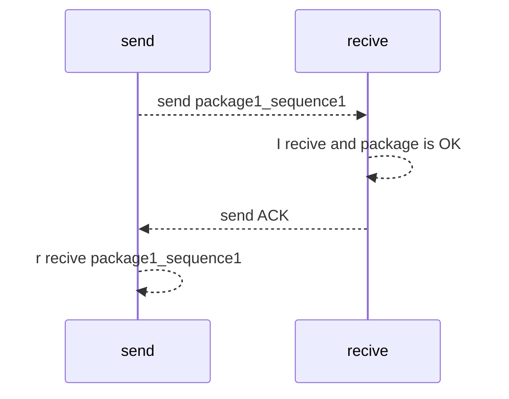
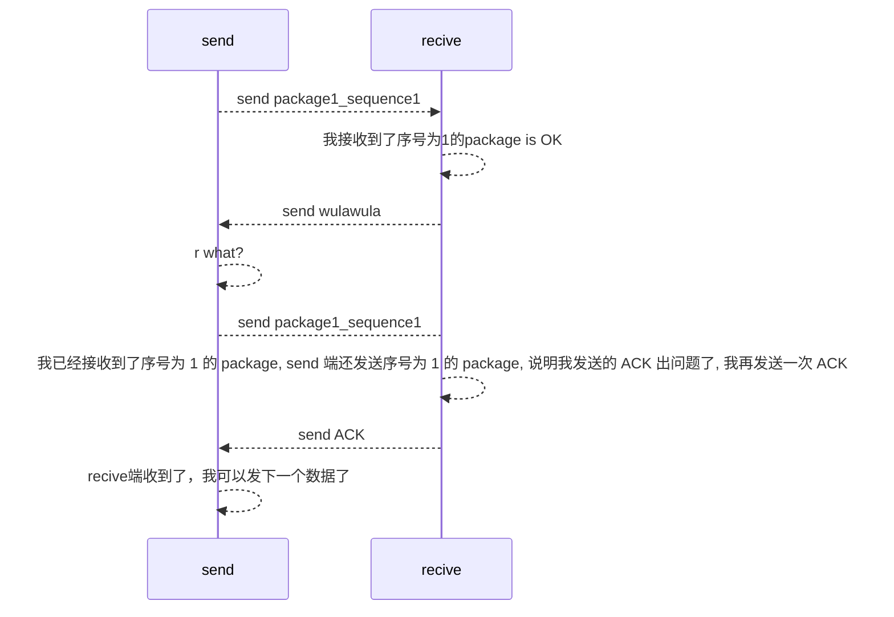
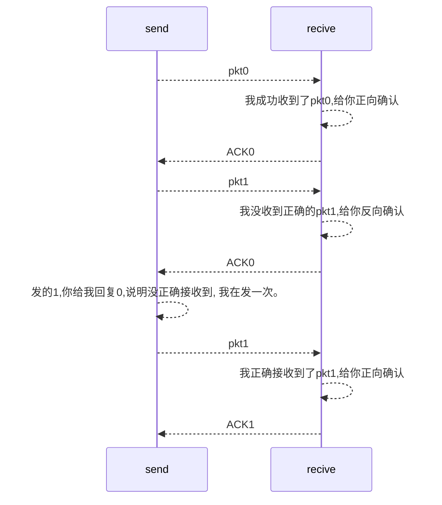
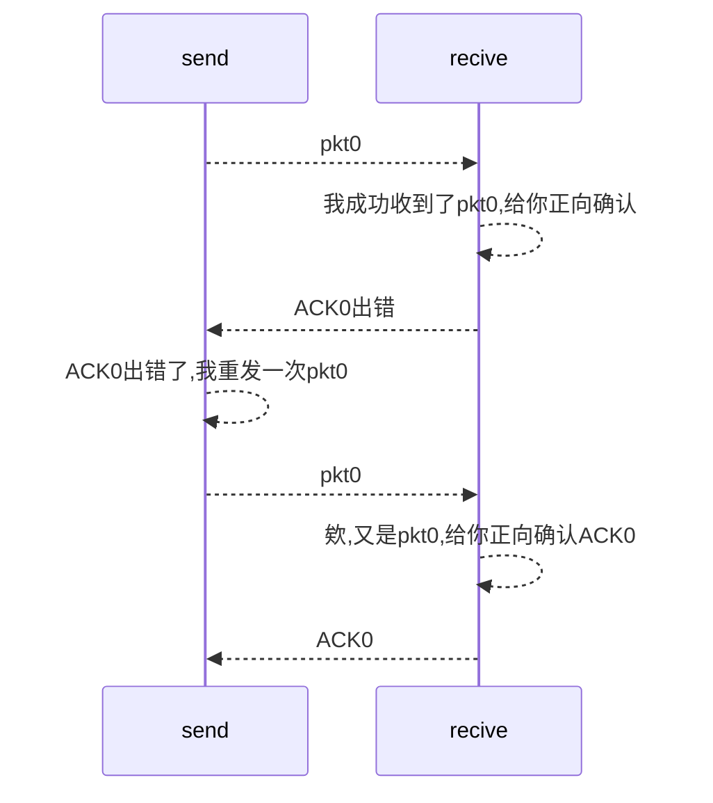
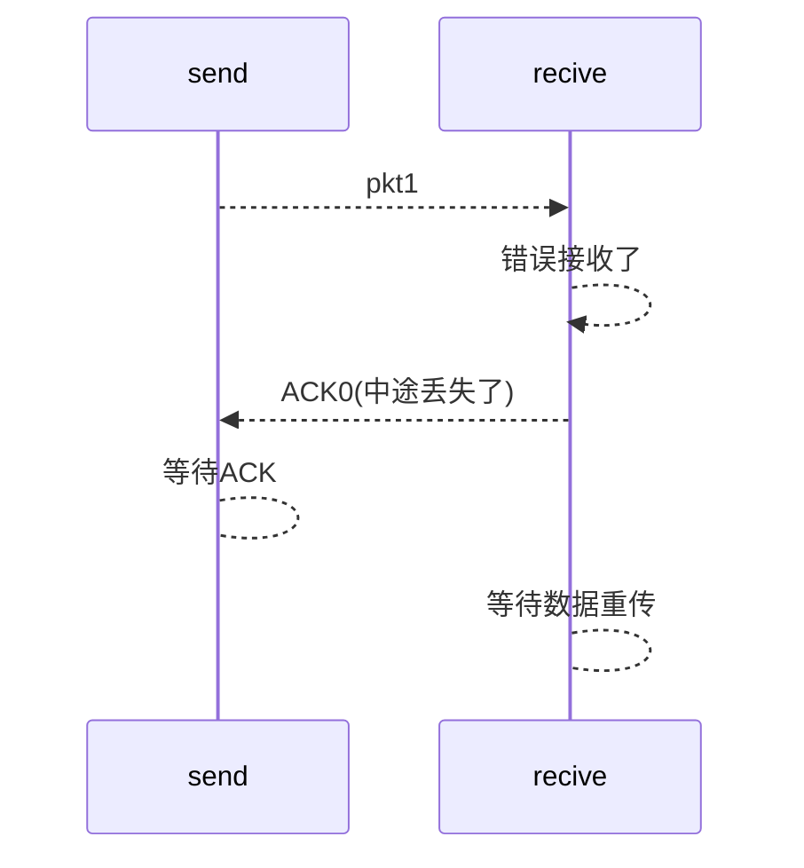
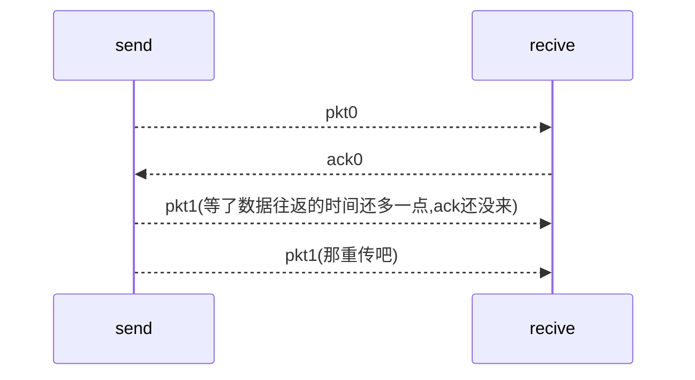
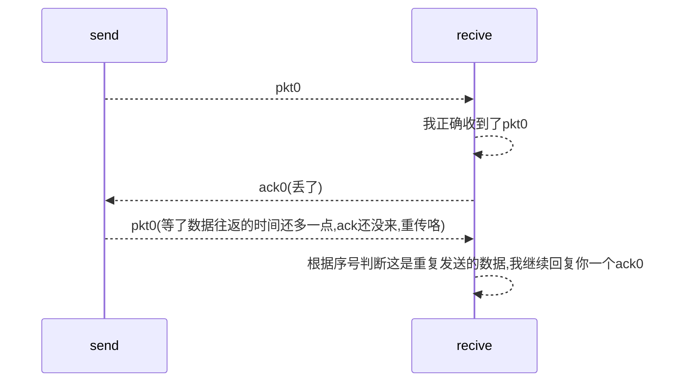
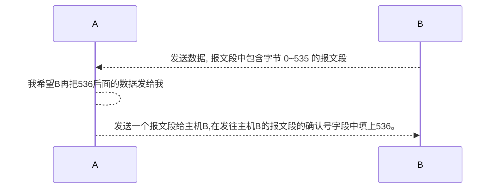
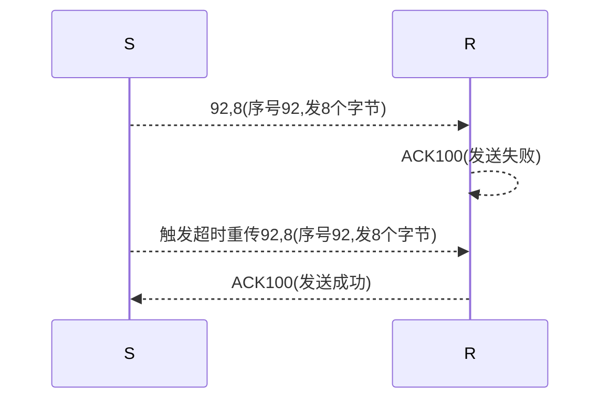
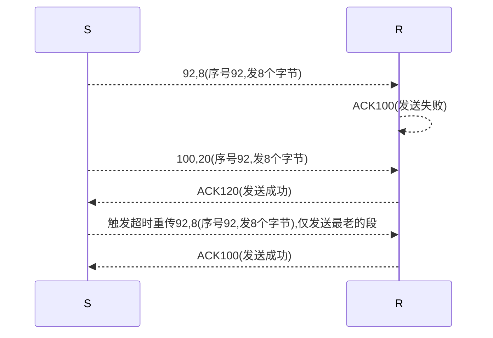

# 计算机网络自顶向下方法

计算机网络自顶向下方法读书笔记（2~3章）

# 第三章-运输层

- TCP 多路复用和多路分解。
- TCP 的运作流程

## 拥塞控制

- 拥塞控制：**就是在网络中发生拥塞时，减少向网络中发送数据的速度，防止造成恶性循环；同时在网络空闲时，提高发送数据的速度，最大限度地利用网络资源**
    - TCP 有拥塞控制
    - UDP 无拥塞控制
    - UDP 没有拥塞控制，但是我们又需要拥塞控制来预防网络进入一种拥塞状态，然而在拥塞控制中我们可以做的工作很少。
    - 考虑这样一种场景，大家看直播，都开启蓝光看视频且不使用任何拥塞控制的话，就会使路由器出现大量的分组溢出，以至于只有非常少的 UDP 分组可以成功达到目的地。且，无控制的 UDP 发送方引入的高丢包率将引起 TCP 发送方大大减小它们的速率。因此， UDP 中缺乏拥塞控制能够导致 UDP 发送方和接收方之间的高丢包率，并挤垮 TCP 会话。
    - 简而言之：UDP 无拥塞控制可能会导致路由器出现大量的分组溢出，然后发送方和接收方出现大量的丢包，同时也会影响使用了这些路由器的 TCP。因为TCP 拥有拥塞控制，TCP 会减小发送的速率，最终将导致 UDP 挤跨了 TCP。
    - 好在，很多研究人员提出了一些新的机制，可以促使所用的数据源（包括 UDP）执行自适应的拥塞控制。
    - 注意：UDP 是可以实现可靠数据传输的，不过需要在应用程序中建立这种可靠性机制，比如 Chrome 中使用的 QUIC 协议，QUIC 协议在 UDP 之上的应用层协议上实现了可靠性。

## 一般场景下的可靠数据传输原理

- 一般场景下的可靠数据传输原理：此处的理论适用于一般的计算机网络，而不是只适用于英特网运输层，所以不采用运输层报文段的说法，而是用分组的说法。
    - 此处始终假设，分组将以它们发送的次序进行交付（底层信道也不会对分组重排序），某些分组可能会丢失。

### rdt1.0可靠数据传输

- 假设底层信道都是安全可靠的，数据传输过程中不会出现错误。
- rdt 发送端只通过 rdt_send(data) 事件接收来自较高层的数据，产生一个包含该数据的分组，并将分组发送到信道中。
- 接收端，rdt 通过 rdt_rcv(package) 事件从底层信道接收一个分组，从分组中去除数据，并将数据上传给较高层。
- 在这里，我们假定了接收方数据的速率与发送方发送数据的速率一样快。

### rdt2.0具有比特差错信道的可靠数据传输

- 底层信道更为实际的模型是分组中的比特可能受损的模型。在分组的传输、传播或缓存的过程中，这种比特差错通常会出现在网络的物理部件中。
- 我们仍然假定所有发送的分组还是按发送顺序被接收，但是某些比特可能受损。
- 先通过实际案例思考下，我们遇到没听懂的话会怎么处理。
- 我们打电话通话，A、B 两个人进行交流。A 对 B 说话，如果听清楚了，记下来了回复 Over，没听清回复“请重述一遍”。带比特差错的数据传输也是类似的。收到了数据，检查是否有损坏，有损坏让发送端再发一次，没有损坏告诉发送端 OK，我收到了。
- 在计算机网络环境中，基于这样重传机制的可靠数据传输协议称为**自动重传请求协议（Automatic Repeat ReQuest，ARQ）**。
- ARQ 协议需要三种协议功能处理存在比特差错的情况
    - 差错检测：校验发送过来的数据是否有损坏。
    - 接收方反馈：如果有损坏则告诉发送方，请你再发送一次。如果无损坏，就告诉发送方，我正常接收了。可以用一个 bit 位来表示，0 表示肯定确认（ACK），1 表示否定确认（NAK）。
    - 错误重传：接收方收到有查错的分组是，发送方将重传该分组。
    - 先前我写的一个数据传输，和上面的流程一样。
- 需要注意的是，发送方处于等待 ACK、NCK 的状态时，它不能从上层获得更多的数据，需要先处理完当前数据，才能继续处理其他数据。

### rdt 2.1ACK/NCK 受损的传输

- 上述的 rdt 2.0 存在一个很严重的缺陷：ACK、NCK 可能受损。如何解决这个问题？**我们需要在 ACK 或 NAK 分组中添加校验和比特以检测这样的差错，这样就知道 ACK/NAK 有没有受损**，问题是，如何纠正 ACK/NAK 中的差错，即我们到底是按 ACK 处理问题还是按 NAK 重新发一遍数据？因为，如果 ACK/NAK 分组受损，发送方都无法知道接收方是否收到了它发送的数据。
- 我们考虑下受损 ACK/NAK 的 3 种解决办法。
    - 我们可以规定某种规则，接收方将发送方发送的数据复述一遍，表示我接收到了。但是如果发送方说的是“你说什么？”，接收方也回复“你说什么？”容易造成混淆。（想象一下两个人打电话，这么复述对方的话。）
    -  增加足够的校验和比特，使发送方不仅可以检测差错，还可以恢复差错。对于会产生差错但不丢失分组的信道，这就可以直接解决问题。
- 解决这个问题的办法是：在数据分组中添加一个新的字段，让发送方对其数据分组编号，即将发送数据分组的序号放在该字段。于是，接收方只需要检查序号就可以确定收到的分组是否一次重传。
- package 中携带一个分组编号。接收方正确/错误接收到消息后，发送 ACK/NAK，如果 ACK/NAK 损坏了（校验和判断是否受损），那么发送方再次发送这个分组（分组中有序号），接收方发现，欸，怎么又是同样的序号，看来是我发送的 ACK/NAK 出错了，我重新发一遍。加入序号后的协议机制，是完备了。（rdt 2.1）==> 这种前面的确认没有到的情况下，不发送其他的，我们称之为停止等待协议。
    - 接收方 ACK 发送错误，给发送方回复的”乌拉乌拉“，接收方收到”乌拉乌拉“，不知道正确接收了还是错误了，于是又发了一次这个带序号的分组，接收方接收到数据，发送这个序号前面遇到过啊，说明自己发送的 ACK 出现了错误，于是又发送了一次 ACK。（虽然重复发送了数据，但是有序号，接收是可以检查出是否重复的。）
    - 接收方 NAK 发送错误，给发送方回复的”乌拉乌拉“，接收方收到”乌拉乌拉“，不知道正确接收了还是错误了，于是又发了一次这个带序号的分组，接收方接收到数据，而这个正好是需要重发的数，接收方接收到正确的数据后，回复给发送方 ACK。

正常发送 ACK 的场景



发送 ACK 出错的场景



对于这种停止等待的场景，我们用 1bit 表示序号就行，新 package 还是老 package。

### rtd2.2无NAK的的传输

- rdt 2.2，无 NAK 的协议，只有 ACK。为从停止等待协议升级到流水线协议做准备。
    - 一次发送多个数据的话，如果每个应答都有 ACK/NAK 很麻烦。我们可以使用对前一个数据单位的 ACK 替代本数据单位的 NAK，这样确认信息减少一半，协议处理起来简单。
    - 当前分组的反向确认（先前的NAK）用上一个分组的正向确认（ACK）替代：如当前分组发送 ACK1 表示正确接收了，发送 ACK0 表示错误接收了。





### rtd3.0 具有比特差错和分组丢失的信道

新的假设：下层信道可能会丢失分组（数组或ACK都可能丢失），如果继续沿用 rtd 2.2，可能会产生死锁，双方一直干等



解决办法：发送方等待 ACK 一段合理的时间。

- 发送端超时重传，如果等了一定时间还没有收到ACK就重传

问题：如果分组（或ACK）只是超时了，重传会导致数据重复，但可以利用序号处理这个问题





但是 rtd 3.0 一次只发送一个，对信道的利用率极低。

### 流水线可靠数据传输协议

 rtd 3.0 是一个功能正确的协议，但并非人人都对它的性能满意，特别是在今天的高速网络中更是如此。 rtd 3.0 问题的核心在于它是一个停等协议。 为了评价该停等行为对性能的影响，可考虑一种具有两台主机的理想化场合，一台主机位于美国西海岸，另一台位于美国东海岸。在这两个端系统之间的光速往返传播时延 RTT 大约为30毫秒。假定彼此通过一条发送速率 R 为 1Gbps （每秒$10^9$比特）的信道相连。包括首部字段和数据的分组长 L 为1000字节（8000比特），发送一个分组进入 1Gbps 链路实际所需时间是：
$$
t_{trans} = \frac{L}{R} = \frac{8000 bit/pkt}{ 10^9/bits}=8\mu s/pkt
$$
信道利用率
$$
U_{sender} = \frac{L/R}{RTT+L/R}=\frac{0.008}{30.008} = 0.000 27
$$
即发送方只有万分之 2.7 时间是忙的。从其他角度来看，发送方在 30.008ms 内只能发送 1000 字节，有效的吞吐量仅为 267kbps ,即使有 1Gbps 的链路可用也是如此! 购买了一条千兆比容量的链路，但他仅能得到 267kbps 吞吐量！

这种特殊的性能问题的一个简单解决方法是：不以停等方式运行，允许发送方发送多个分组而无须等待确认.


流水线技术对可靠数据传输协议可带来如下影响

- 必须增加序号范围，因为每个输送中的分组（不计算重传的）必须有一个唯一的 序号，而且也许有多个在输送中的未确认报文。
- 协议的发送方和接收方两端也许不得不缓存多个分组。**发送方最低限度应当能缓冲那些已发送但没有确认的分组**。如下面讨论的那样，**接收方或许也需要缓存那些已正确接收的分组**。
- 所需序号范围和对缓冲的要求取决于数据传输协议如何处理丢失、损坏及延时过 大的分组。解决流水线的差错恢复有两种基本方法是：回退/V步(Go Back N, GBN)和选择重传(Selective Repeat, SR)

一次发送多个未经确认的分组，需要用多个bit位来表示每个分组的序号。用 n bit 表示的话，一共可以表示 $2^n$ 个序号。发送方需要一个缓冲区缓冲发送的数据，以便超时重发或错误重发；接收方的缓冲区是为了防止发送和接收的速度不一样，先用缓冲区缓存，在逐一处理。

### slide window 协议

滑动窗口协议：sw=1，rw=1时是停止等待协议。

| slide window 大小 | recive window 大小 | 协议               |
| ----------------- | ------------------ | ------------------ |
| sw=1              | rw=1               | 停止等待协议       |
| sw>1              | rw=1               | 回退N步协议（GBN） |
| sw>1              | rw>1               | 滑动窗口协议（SR） |

发送缓冲区：

- 形式：内存中的一个区域，落入缓冲区的分组可以发送
- 功能：用于存放已发送，但是还没确认的分组
- 必要性：需要重发时可用

发送缓冲区大小：一次最多可以发送多少个未经确认的分组

- 停止等待协议=1
- 流水线协议>1, 需要设置成一个合理的值，不能过大，链路利用率不能狗超过 100%

发送缓冲区中的分组

- 未发送的：落入发送缓冲区的分组，可以连续发送出去；
- 已经发送出去的，等待对方确认的分组：发送缓冲区的分组只有得到确认才能删除。

发送窗口：采用相对移动方式表示，分组不同；可缓冲范围移动，代表一段可以发送的权力。


接收窗口：

```shell
# 假设开始有1-8需要正确接收，窗口大小为5（index0~index4）
1 2 3 4 5 6 7 8
# 接收窗口中的数据
1 2 3 4 5
# 接收到了1给ACK1的确认，接收窗口向前滑动一格（index1~index5）
2 3 4 5 6
# 接收到了3给ACK3，接收窗口不移动。
2 3 4 5 6
# 接收到了2给ACK2，接收窗口移动。
4 5 6 7 8 
```

如果接收窗口大小为1，我们称之为 GBN（回退N步协议） 协议，只能顺序接收。


### 回退N步协议

在回退 N 步（GBN）协议中，允许发送方发送多个分组（当有多个分组可用时）而不需等待确认，但它也受限于在流水线中未确认的分组数不能超过某个最大允许数 N。【这个N其实就是窗口的大小】

为什么要限制窗口大小？限制窗口大小可以对发送方施加限制，控制发送的流量。

GBN发送方必须响应三种类型的事件：

- 上层的调用。当上层调用 rdt.send() 时，发送方首先检查发送窗口是否已满，即是 否有 N 个已发送但未被确认的分组。如果窗口未满，则产生一个分组并将其发送, 并相应地更新变量。如果窗口已满，发送方只需将数据返回给上层，隐式地指示上层该窗口已满。然后上层可能会过一会儿再试。在实际实现中，发送方更可能缓存（并不立刻发送）这些数据，或者使用同步机制（如一个信号量或标志）允许上层在仅当窗口不满时才调用rdt.send()
- 收到一个ACK。在 GBN 协议中，对序号为 n 的分组的确认采取累积确认（cumulative acknowledgment）的方式，表明接收方已正确接收到序号 <=n 的分组。
- 超时事件。协议的名字“回退N步”来源于出现丢失和时延过长分组时发送方的行为。就像在停等协议中那样，定时器将再次用于恢复数据或确认分组的丢失。 如果出现超时，发送方重传所有已发送但还未被确认过的分组。如果收到一个ACK,但仍有已发送但未被确认的分组，则定时器被重新启动。如果没有已发送但未被确认的分组，停止该定时器

在GBN中，接收方的动作也很简单。如果一个序号为 n 的分组被正确接收到，并且按序（即上次交付给上层的数据是序号为 n-1 的分组），则接收方为分组 n 发送一个 ACK,并将该分组中的数据部分交付到上层。在所有其他情况下，接收方丢弃该分组，并为最近按序接收的分组重新发送 ACK。注意到因为一次交付给上层一个分组，如果分组 k 已接收并交付，则所有序号比 k 小的分组也已经交付。因此，使用累积确认是 GBN —个自然的选择。

在GBN协议中，接收方丢弃所有失序分组。尽管丢弃一个正确接收（但失序）的分组有点愚蠢和浪费，但这样做是有理由的。前面讲过，接收方必须按序将数据交付给上层。假定现在期望接收分组 n 而分组 n+1 却到了。因为数据必须按序交付，接收方可能缓存（保存）分组 n+ 1，然后，在它收到并交付分组 n 后，再将该分组交付到上层。然而，如果分组 n 丢失，则该分组及分组 n + 1 最终将在发送方根据 GBN 重传规则而被重传。因此，接收方只需丢弃分组 n+1 即可。不需要缓存任何失序分组。因此，虽然发送方必须维护窗口的上下边界及 nextseqnum 在该窗口中的位置，但是接收方需要维护的唯一信息就是下一个按序接收的分组的序号。该值保存在 expectedseqnum 变量中。丢弃一个正确接收的分组的缺点是随后对该分组的重传也许会丢失或出错，因此甚至需要更多的重传。

GBN协议运行示意图：按序接收，序号不对的直接丢弃。


### 选择重传协议

GBN 协议允许发送方用多个分组“填充流水线”，避免了停止等协议中所提到的信道利用率问题。然而，GBN本身也有一些情况存在着性能问题。尤其是当窗口长度和带宽时延积都很大时，在流水线中会有很多分组更是如此。单个分组的差错就能够引起 GBN 重传大量分组，许多分组根本没有必要重传。随着信道差错率的增加, 流水线可能会被这些不必要重传的分组所充斥。想象一下，在我们口述消息的例子中，如果每次有一个单词含糊不清，其前后1000个单词（例如，窗口长度为1000个单词）不得不被重传的情况。此次口述会由于这些反复述说的单词而变慢。

顾名思义，选择重传（SR）协议通过让发送方仅重传那些它怀疑在接收方出错（即丢失或受损）的分组而避免了不必要的重传。这种个别的、按需的重传要求接收方逐个地确认正确接收的分组。再次用窗口长度 N 来限制流水线中未完成、未被确认的分组数。然 而，与 GBN 不同的是，发送方已经收到了对窗口中某些分组的 ACK。

发送方有一个长度为 N 的窗口，接收方也有一个长度为 N 的窗口。


SR 接收方将确认一个正确接收的分组而不管其是否按序。失序的分组将被缓存直到所有丢失分组（即序号更小的分组）皆被收到为止，这时才可以将一批分组按序交付给上 层。

> SR发送方的事件与动作

- 从上层收到数据。当从上层接收到数据后，SR发送方检查下一个可用于该分组的序号。如果序号位于发送方的窗口内，则将数据打包并发送；否则就像在GBN中一样，要么将数据缓存，要么将其返回给上层以便以后传输。 
- 超时。定时器再次被用来防止丢失分组。然而，现在每个分组必须拥有其自己的逻辑定时器，因为超时发生后只能发送一个分组。**可以使用单个硬件定时器模拟多个逻辑定时器的操作**［Varghese 1997］。 
- 收到ACK。如果收到ACK,倘若该分组序号在窗口内，则SR发送方将那个被确认的分组标记为已接收。如果该分组的序号等于 send_base, 则窗口基序号向前移动到具有最小序号的未确认分组处。如果窗口移动了并且 有序号落在窗口内的未发送分组，则发送这些分组。

> SR接收方的事件与动作

- 序号在［rcv_base, rcv_base+N-1 ］内的分组被正确接收口在此情况下，收到的分组落在接收方的窗口内，一个选择 AC K被回送给发送方。如果该分组以前没收到过，则缓存该分组。如果该分组的序号等于接收窗口的基序号则该分组以及以前缓存的序号连续的（起始于rcv_base的）分组交付给上层。 然后, 接收窗口按向前移动分组的编号向上交付这些分组。
- 序号在［rcv_base-N, rcv_base - 1］内的分组被正确收到。**在此情况下，必须产生一个ACK,即使该分组是接收方以前已确认过的分组。** (这个确认十分关键，接收方必须要告诉发送方，我们确实是收到了数据)
- 其他情况。忽略该分组。


## TCP

前面学习了可靠数据传输的基本原理，现在开始正式学习TCP。TCP是因特网运输层的面向连接的可靠的运输协议。为了提供可靠数据传 输，TCP依赖于前面讨论的许多基本原理，其中包括差错检测、重传、累积确认、定 时器以及用于序号和确认号的首部字段。TCP定义在RFC 793、RFC 1122、RFC 1323、 RFC 2018 以及 RFC 2581 中。

> TCP/IP 的历史事件

在20世纪70年代早期，分组交换网开始飞速增长，而因特网的前身 ARPAnet 也只是当时众多分组交换网中的一个。这些网络都有它们各自的协议。两个研究人员 Vinton Cerf 和 Robert Kahn 认识到互联这些网络的重要性，发明了沟通网络的  TCP/IP协议，该协议代表传输控制协议/网际协议(Transmission Control Protocol/Internet Protocol) 。**虽然 Cerf 和 Kahn 开始时把该协议看成是单一的实体，但是后来将它分成单独运行的两个部分：TCP 和 IP**。Cerf 和 Kahn 在 1974 年 5 月的《IEEE Transactions on Communications Technology》杂志上发表了一篇关于 TCP/IP 的论文［Cerf 1974］。 

TCP/IP 协议是当今因特网的支柱性协议，但它的发明先于 PC、工作站、智能手机 和平板电脑，先于以太网、电缆、DSL、WiFi和其他接入网技术的激增，先于Web、社 交媒体和流式视频等。Cerf和Kahn预见到了对于联网协议的需求，一方面为行将定义 的应用提供广泛的支持，另一方面允许任何主机与链路层协议互操作。

2004年，Cerf 和 Kahn由于“联网方面的开创性工作（包括因特网的基本通信协议 TCP/IP的设计和实现）以及联网方面富有才能的领导”而获得 ACM 图灵奖，该奖项被认为是“计算机界的诺贝尔奖” 。

### 概述

TCP 协议具有以下特点

- 点对点：一个发送方，一个接收方
- 可靠的、按顺序的字节流：没有报文边界
- 管道化（流水线）：TCP 拥塞控制和流量控制设置窗口大小
- 全双工数据：在同一连接中数据流双向流动；MSS：最大报文段大小
- 面向连接：在数据交换之前，通过握手（交换控制报文） 初始化发送方、接收方的状态变量
- 有流量控制：发送方不会淹没接收方

### TCP 连接

TCP被称为是面向连接的（connection.oriented）,这是因为在一个应用进程可以开始向另一个应用进程发送数据之前，这两个进程必须先相互“握手” ，即它们必须相互发送某些预备报文段，以建立确保数据传输的参数。作为TCP连接建立的一部分，连接的双方 都将初始化与TCP连接相关的许多TCP状态变量。

TCP 连接是一个逻辑上的概念，TCP 协议只在端系统中运行，而不在中间的网络元素（路由器和链路层交换机）中运行，所以中间的网络元素不会维持 TCP 连接状态。事实上，中间路由器对 TCP 连接完全视而不见，它们看到的是数据报，而非连接。

TCP 是点对点通信，在单个发送 方与单个接收方之间的连接。TCP 的连接过程如下：客户首先发送一个特殊的TCP报文段，服务器用 另一个特殊的TCP报文段来响应，最后，客户再用第三个特殊报文段作为响应。前两个报文段不承载“有效载荷” ，也就是不包含应用层数据；而第三个报文段可以承载有效载荷。 由于在这两台主机之间发送了 3个报文段，所以这种连接建立过程常被称为三次握手。

**最大报文长度（Maximum Segment Size，MMS）MSS** 通常根据最初确定的由本地发送主机发送的最大链路层帧长度（即所谓的最大传输单元（Maximum Transmission Unit, MTU））来设置。设置该 MSS 要保证一个TCP 报文段（当封装在一个IP数据报中）加上TCP/IP首部长度（通常40字节）将适合单个链路层帧。以太网和 PPP 链路层协议都具有 1500 字节的 MTU, 因此 MSS 的典型值为 1460 字节。
$$
MTU = MMS + TCP/IP首部长度,\\
其中 TCP/IP 首部长度 20+20=40。
$$

#### TCP 报文段结构

TCP 报文段由首部字段和一个数据字段组成。数据字段包含一块应用数据。如前所述，MSS 限制了报文段数据字段的最大长度。

当 TCP 发送一个大文件，例如某 Web 页面上的一个图像时，TCP 通常是将该文件划分成长度为 MSS 的若干块(最 32 比特后一块除外，它通常小于MSS)

**TCP报文段结构如下：**


- 32 比特的序号字段和 32 比特的确认号字段。这些字段被 TCP 发送方和接收方用来实现可靠数据传输服务。
- 16 比特的接收窗口字段，该字段用于流量控制。
- 4 比特的首部长度字段，该字段指示了以32比特的字为单位 的TCP首部长度。由于TCP选项字段的原因，TCP首部的长度是可变的。(通常, 选项字段为空，所以TCP首部的典型长度是20字节。
- 可选与变长的选项字段，该字段用于发送方与接收方协商最大报文段长度(MSS)时，或在高速网络环境下用作窗口调节因子时使用。首部字段中还定义了一个时间戳选项。
- 6 比特的标志字段，ACK比特用于指示确认字段中的值是有效的，即 该报文段包括一个对已被成功接收报文段的确认。

#### 序号和确认号

- 序号：报文段首字节的在字节流的编号。（我的从xx开始）
- 确认号：期望从另一方收到的下一个字节的序号（你的从yy开始）

序列号和确认号是 TCP 可靠传输服务的关键部分。TCP 把数据看成一个无结构的、有序的字节流。—个报文段的序号(sequence number for a segment) 是建立在传送的字节流之上的，举例来说：

假设主机A上的一个进程想通过一条TCP连接向主机B上的一个进程发送一 个数据流。主机A中的TCP将隐式地对数据流中的每一个字节编号。假定数据流由一个包含500 000字节的文件组成，其MSS（Maximum Segment Size，最大报文段长度）为1000字节，数据流的首字节编号是0。该 TCP 将为该数据流构建 500 个报文段。给第一个报文段分配序号 0 ,第二个报文段分配序号 1000, 第三个报文段分配序号 2000, 以此类推。每一个序号被填入到相应 TCP 报文段首部的序号字段中。


我们再来看看确认号是怎么得来的



我们可以假定初始序号为0。但实际上，一条 TCP 连接的双方均可随机地选择初始序号。**这样做可以减少将那些仍在网络中存在的来自两台主机之间先前已终止的连接的报文段，误认为是后来这两台主机之间新建连接所产生的有效报文段的可能性**（它碰巧 与旧连接使用了相同的端口号），简而言之，就是随机初始化，避免原先已经终止连接的报文段，被误认为是当前连接的报文段。

#### 序号和确认号的学习案例


A发给B，序号从42开始，我希望你给我发的序号是从79开始。

B发给A，序号从79开始（你之前希望的），我希望你给我的序号是从43开始。

#### 往返时间的估计与超时

往返延迟的时间设置是动态的自适应的，定期去测量往返时间。超时时间=往返时间+4倍的标准差。

#### 可靠数据传输

TCP 在 IP 不可靠服务的基础上建立了 rdt。

- 管道化（piple line）的报文段 GBN or SR
- 累积确认（像 GBN）
- 单个重传定时器（像 GBN）
- 是否可以接收乱序的，并没有相应的规范

通过以下事件触发重传

- 超时（只重发那个最早未确认段：SR）
- 重复确认：如收到了 ACK50 后又收到了 3 个 ACK50.

先考虑下简化的 TCP 发送方

- 忽略重复的确认
- 忽略流量控制和拥塞控制



1



#### 快速重传

假设数据发送方是这样的，要发如下几个数据段

`40~49`	`50~59`	`60~69`	`70~79`	`80~89`

`40~49`	成功发送了，服务器回复 ACK50

`60~69`	成功发送了，服务器回复 ACK50

`70~79`	成功发送了，服务器回复 ACK50

`80~89`	成功发送了，服务器回复 ACK50

......

接收方连续给了我三个冗余的 ACK，但是超时定时器还没到时间，这样我可以在超时定时器到时之前发送数据段，比超时定时器启动的时机来的更早一些。

> 快速重传示意图&算法伪代码

```java
//事件：收到ACK,具有ACK字段值y
if (y > SendBase） {
    SendBase=y
    If (当前仍无任何应答报文段)
    	启动定时器 
}
else {/*快对已经确认的报文段的一个冗余ACK */
    对y收到的冗余ACK数加1
    if (对y==3收到的冗余ACK数)
        /*TCP快速重传*/ 
        重新发送具有序号y的报文段
}
break;
```


#### 流量控制

捎带技术
