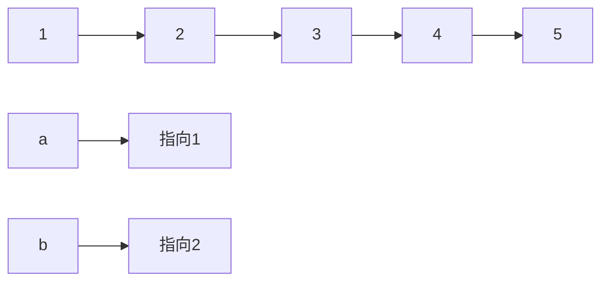

# 剑指专项练习

## 整数

### 整数除法

给定两个整数 `a` 和 `b` ，求它们的除法的商 `a/b` ，要求不得使用乘号 `'*'`、除号 `'/'` 以及求余符号 `'%'` 。

注意：

整数除法的结果应当截去（truncate）其小数部分，例如：truncate(8.345) = 8 以及 truncate(-2.7335) = -2
假设我们的环境只能存储 32 位有符号整数，其数值范围是 [$−2^{31}$, $2^{31}$−1]。本题中，如果除法结果溢出，则返回 231 − 1

#### 解题思路

- 注意边界条件。int 的最小负数 / -1 会爆 int 的max。
- O(N)的解法，直接用减法的话，复杂度太高
- O(logN)的解法：
    - a 减去 $b*2^n$ 的整数倍数，得到部分的商。
    - $a-b*2^n$  的结果继续减去 $b*2^n$ 的整数倍数，得到部分的商。

#### 代码

```java
// 暴力解题 out of time。
public int divide(int a,int b){
    if(a == Integer.MIN_VALUE && b == -1) return Integer.MAX_VALUE;
    int neg = 2;
    if(a>0){
        a = -a;neg--;
    }
    if(b>0){
        b=-b;neg--;
    }
    int retVal = 0;
    while(a<=b){
        a-=b;
        retVal++;
    }
    return neg%2==0?retVal:-retVal;
}
```

```java
// longN的解法 
// 先考虑 a 是 b 的多少偶数倍（2^n）。然后在 a = a - b*2^n，继续考虑
class Solution {
    public int divide(int a,int b){
        if(a == Integer.MIN_VALUE && b == -1) return Integer.MAX_VALUE;
        int neg = 2;
        if(a>0){
            a = -a;neg--;
        }
        if(b>0){
            b=-b;neg--;
        }
        int retVal = divideCore(a,b);
        return neg % 2 ==0?retVal:-retVal;
    }

    public int divideCore(int a,int b){
        int retVal = 0; // 商的结果
        while(a<=b){
            int position = 1;
            int tmp = b;
            while(tmp>(Integer.MIN_VALUE>>1) &&a<=tmp+tmp){
                position = position<<1;
                tmp = tmp<<1;
            }
            a=a-tmp;
            retVal+=position;
        }
        return retVal;
    }
}
```

### 二进制加法

给定两个 01 字符串 `a` 和 `b` ，请计算它们的和，并以二进制字符串的形式输出。

输入为 **非空** 字符串且只包含数字 `1` 和 `0`。

#### 解题思路

- 按位相加记录进位
- 没加完的，后面for循环继续加。
- 累加的时候记得加上进位

#### 代码

```java
class Solution {
    public String addBinary(String a, String b) {
        // 字符串最后一位是低位。位数短的，高位补0
        // 从低位向高位加。记录进位。
        int add = 0;
        int aindex = a.length() - 1;
        int bindex = b.length() - 1;
        StringBuffer sb = new StringBuffer();
        while(aindex>=0 || bindex>=0){
            int n1 = aindex>=0?a.charAt(aindex--)-'0':0;
            int n2 = bindex>=0?b.charAt(bindex--)-'0':0;
            int tmp = n1+n2+add;
            add = tmp>=2?1:0;
            sb.append(tmp%2);
        }
        if(add==1) sb.append(add);
        return sb.reverse().toString();
    }
}
```

### 前n个数字二进制中1的个数

给定一个非负整数 `n` ，请计算 `0` 到 `n` 之间的每个数字的二进制表示中 1 的个数，并输出一个数组。

```shell
输入: n = 2
输出: [0,1,1]
解释: 
0 --> 0
1 --> 1
2 --> 10
```

#### 解题思路

- 法一：暴力循环，求出每个数字1的个数。
    - 如何求1的数量？
    - 1.数字的每位一次 & 1，统计。
    - 2.直接数1的个数。 n & (n-1)可以做到。
        - n= 0111；n-1 = 0110
        - n & (n-1) = 0111 & 0110 = 0110 直接把最后一位的1去掉了。
        - 如果最后 n == 0，则说明没有1了。 
- 法二：发现 n 比 n & (n-1) 多一个1！！ 

#### 代码

```java
// 暴力求解 KlogN
class Solution {
    public int[] countBits(int n) {
        int[]nums = new int[n+1];
        for(int i=1;i<=n;i++){
            int tmp = i;
            while(tmp>0){
                if((tmp & 1)==1){
                    nums[i]++;
                }
                tmp = tmp>>1; 
            }
        }
        return nums;
    }
}
```

```java
// O(N)
class Solution {
    public int[] countBits(int n) {
        int nums[]=new int[n+1];
        for(int i=1;i<=n;i++){
            nums[i] = nums[i&(i-1)]+1;
        }
        return nums;
    }
}
```

### 只出现一次的数字

给你一个整数数组 `nums` ，除某个元素仅出现**一次**外，其余每个元素都恰出现**三次 。**请你找出并返回那个只出现了一次的元素。

#### 解题思路

- 哈希表判重
- 根据数字的 bit 位来判断。
    - 统计所有数字每个 bit 位出现 1 的次数。
    - 如果，该 bit 位出现的次数是 3 的倍数，则说明只出现一次的元素该 bit 位是 0，否则是 1。

#### 解法

```java
// hash 暴力解题
class Solution {
    public int singleNumber(int[] nums) {
        HashMap<Integer, Integer> map = new HashMap<>();
        for (int i = 0; i < nums.length; i++) {
            if (map.containsKey(nums[i])) {
                map.replace(nums[i], map.get(nums[i]) + 1);
            } else {
                map.put(nums[i], 1);77\\\7
                
            }
        }
        Set<Integer> integers = map.keySet();
        Iterator<Integer> iterator = integers.iterator();
        while (iterator.hasNext()) {
            Integer key = iterator.next();
            if (map.get(key) == 1) {
                return key;
            }
        }
        return -1;
    }
}
```

```java
// bit 位 统计，还原，怎么计算出原数字的不明白。
class Solution {
    public int singleNumber(int[] nums) {
        // 统计每个bit出现1的次数
        int res = 0;
        int[] cnt = new int[32];
        for(int num : nums){
            for(int i = 0; i < 32; i++){
                cnt[i] += (num >> i) & 1;
            }
        }
        for(int i = 31; i >= 0; i--){
            // 如果t=0 说明这位是0
            int t = cnt[i] % 3 == 0 ? 0 : 1;
            res = (res << 1) + t;
        }
        return res;
    }
}
```

### 单词长度的最大乘积

给定一个字符串数组 words，请计算当两个字符串 words[i] 和 words[j] 不包含相同字符时，它们长度的乘积的最大值。假设字符串中只包含英语的小写字母。如果没有不包含相同字符的一对字符串，返回 0。

#### 解题思路

- 都是双重 for 循环判断那几个字符串不同。
- 问题在于如何判断是否不同
    - 法一：map 判重。
    - 法二：用位运算判重；字符串中存在 a 则第 0 个位置的 bit 设置为 1，存在 b 则第 1 个位置的 bit 设置为 1。最后判断两个字符串是否有相同的字符，做一次 & 运算就知道了

#### 代码

```java
class Solution {
    public  int maxProduct(String... words) {
        // for 循环找出两两不同的，然后找max 会超时
        int max = 0;
        for (int i = 0; i < words.length; i++) {
            for (int j = i + 1; j < words.length; j++) {
                // 判断 i j 是否包含相同的字符
                if (!judge(words[i], words[j])) {
                    max = max > words[i].length() * words[j].length() ? max : words[i].length() * words[j].length();
                }
            }
        }
        return max;
    }

    public static boolean judge(String a, String b) {
        boolean[]c = new boolean[26];
        for (int i = 0; i < a.length(); i++) {
            c[a.charAt(i)-'a']=true;
        }

        for (int i = 0; i < b.length(); i++) {
            if(c[b.charAt(i)-'a']){
                return true;
            }
        }
        return false;
    }
}
```

```java
// 位运算判重
class Solution {
    public  int maxProduct(String... words) {
        int[] flags = new int[words.length];
        for (int i = 0; i < words.length; i++) {
            String word = words[i];
            for (int j = 0; j < word.length(); j++) {
                flags[i]|=1<< (word.charAt(j)-'a'); // 比如一个字符串中可能有多个 e e e，我们想把e对应的1放到flags中，所以用|，因为有多个，所以不用+
            }
        }
        int max = 0;
        for (int i = 0; i <words.length ; i++) {
            for (int j = i+1; j <words.length ; j++) {
                if((flags[i] & flags[j])==0){
                    int curlen = words[i].length()*words[j].length();
                    max = Math.max(max,curlen);
                }
            }
        }
        return max;
    }
}
```

## 数组

### 排序数组中两个数字之和

给定一个已按照 升序排列  的整数数组 numbers ，请你从数组中找出两个数满足相加之和等于目标数 target 。

函数应该以长度为 2 的整数数组的形式返回这两个数的下标值。numbers 的下标 从 0 开始计数 ，所以答案数组应当满足 0 <= answer[0] < answer[1] < numbers.length 。

假设数组中存在且只存在一对符合条件的数字，同时一个数字不能使用两次。

#### 解题思路

- 双指针。

#### 代码

```java
class Solution {
    public int[] twoSum(int[] numbers, int target) {
        for (int start = 0, end = numbers.length - 1; start < end; ) {
            if (numbers[start] + numbers[end] == target) return new int[]{start, end};
            if (numbers[start] + numbers[end] > target) {
                end--;
            } else {
                start++;
            }
        }
        return null;
    }
}
```

### ★数组中和为0的三个数

给定一个包含 n 个整数的数组 nums，判断 nums 中是否存在三个元素 a ，b ，c ，使得 a + b + c = 0 ？请找出所有和为 0 且不重复的三元组。

#### 解题思路

- 法一：固定一个数字，在其他数字中找是否存在 a = -(b+c) 的数
- 法二：先排序，在固定一个数，双指针查找其余两个数

#### 代码

```java
class Solution {
    public List<List<Integer>> threeSum(int[] nums) {
        List<List<Integer>> res = new ArrayList<>();
        int len = nums.length;
        if(len < 3) return res;
        Arrays.sort(nums);
        // 三元组的下标 i, j , k
        for(int i = 0; i < len-2; i++){
            int a = nums[i];
            int j = i + 1, k = len - 1;
            // 固定 a ,等价于 b + c 两数之和为 -a
            while(j < k){
                int b = nums[j], c = nums[k];
                if(a + b + c > 0){
                    k--;
                }else if (a + b + c < 0){
                    j++;
                }else{
                    res.add(Arrays.asList(a, b, c));
                    // 保证不重复的三元组
                    while(j < k && nums[j] == b){
                        j++;
                    }
                }
            }
            // 保证不重复的三元组
            while(i < len - 2 && nums[i + 1] == a){
                i++;
            }
        }
        return res;
    }
}
```

### ★和大于等于 target 的最短子数组

给定一个含有 n 个正整数的数组和一个正整数 target 。

找出该数组中满足其和 ≥ target 的长度最小的连续子数组 [numsl, numsl+1, ..., numsr-1, numsr] ，并返回其长度。如果不存在符合条件的子数组，返回 0 。

#### 解题思路

- 法一：双指针。判断指针区域内的数组和是否符合条件，符合则更新长度。时间复杂度较高。可以继续优化。
- 法二：对法一进行优化。记录先前

#### 代码

```java
class Solution {
    public int minSubArrayLen(int s, int[] nums) {
        int n = nums.length;
        if (n == 0) {
            return 0;
        }
        int ans = Integer.MAX_VALUE;
        int[] sums = new int[n + 1]; 
        // 为了方便计算，令 size = n + 1 
        // sums[0] = 0 意味着前 0 个元素的前缀和为 0
        // sums[1] = A[0] 前 1 个元素的前缀和为 A[0]
        // 以此类推
        for (int i = 1; i <= n; i++) {
            sums[i] = sums[i - 1] + nums[i - 1];
        }
        for (int i = 1; i <= n; i++) {
            int target = s + sums[i - 1];
            int bound = Arrays.binarySearch(sums, target);
            if (bound < 0) {
                bound = -bound - 1;
            }
            if (bound <= n) {
                ans = Math.min(ans, bound - (i - 1));
            }
        }
        return ans == Integer.MAX_VALUE ? 0 : ans;
    }
}
```

### ★乘积小于k的子数组

给定一个正整数数组 `nums`和整数 `k` ，请找出该数组内乘积小于 `k` 的连续的子数组的个数。

#### 解题思路

双指针的思路，求出双指针范围内数组的乘积。right-left+1

比如某次遍历符合题意的子数组为 ABCX，那么在该条件下符合条件的有X，CX，BCX，ABCX共四个（可以进行多个例子，发现个数符合right-left+1）
我们可能会有疑问：AB，BC也算，为什么不算进去？
记住一点我们是以最右边的X为必要条件，进行计算符合条件的子数组，否则会出现重复的！
比如在X为右侧边界时（ABCX），我们把BC算进去了，可是我们在C为最右侧时（ABC），BC已经出现过，我们重复加了BC这个子数组两次！
换言之，我们拆分子数组时，让num[right]存在，能避免重复计算。

#### 代码

```java
class Solution {
    public int numSubarrayProductLessThanK(int[] nums, int k) {
        int ret = 0;
        int total = 1;
        int left = 0;
        for(int right=0;right<nums.length;right++){
            total*=nums[right];
            while(total>=k && left<=right){
                total/=nums[left++];
            }
            ret+= (right>=left?right-left+1:0);
        }
        return ret;
    }
}
```

### 和为k的子数组

给定一个整数数组和一个整数 `k` **，**请找到该数组中和为 `k` 的连续子数组的个数。

#### 解题思路

由于数字并非是正数数组，所以双指针的思路行不通。最简单的办法是 双重for，暴力求解。
比较高效的解法是：用hash表记录前面累加的和。查找前面有多少满足 sum-k=0 的。就是（？~k范围内）符合要求的子数组个数。

#### 代码

```java
class Solution {
    public int subarraySum(int[] nums, int k) {
        /**
        存在负数。所以不能用双指针。
        用hash表记录前面累加的和。
         */
        HashMap<Integer,Integer> map = new HashMap<>();
        int sum = 0;
        int countNumber=0;
        map.put(0, 1);
        for(int i=0;i<nums.length;i++){
            sum+=nums[i];
            countNumber+=map.getOrDefault(sum-k,0);
            map.put(sum,map.getOrDefault(sum,0)+1);
        }
        return countNumber;
    }
}
```

### 0和1个数相同的子数组

#### 解题思路

把0改成-1，解题思路就和上面的一样了。求和为0的子数组的个数。

#### 代码

```java
class Solution {
    public int findMaxLength(int[] nums) {
        HashMap<Integer, Integer> map = new HashMap<>();
        map.put(0, -1);
        int sum = 0;
        int ret = 0;
        int tmp = 0;
        for(int i=0;i<nums.length;i++){
            sum+=nums[i]==0?-1:1;
            // 存储上一次出现 sum-k 数字出现的最远的距离
            tmp = map.getOrDefault(-sum,i);
            if(!map.containsKey(-sum)){
                map.put(-sum,i);
            }
            ret = Math.max(ret,i-tmp);
        }
        return ret;
    }
}
```

### 左右两边子数组的和相等

给你一个整数数组 nums ，请计算数组的中心下标 。

数组中心下标是数组的一个下标，其左侧所有元素相加的和等于右侧所有元素相加的和。

如果中心下标位于数组最左端，那么左侧数之和视为 0 ，因为在下标的左侧不存在元素。这一点对于中心下标位于数组最右端同样适用。

如果数组有多个中心下标，应该返回最靠近左边的那一个。如果数组不存在中心下标，返回 -1 。

#### 解题思路

先求出数组的总和sum。然后在遍历一次数组，统计当前遍历过的数字的总和curSum，如果curSum-cur = sum - curSum，则找到了中心下标。 

#### 代码

```java
class Solution {
    public int pivotIndex(int[] nums) {
        /**
        先求出total
        在扫描数组，判断 cur 前面的数据和 和 cur 后面的数据和是不是一样
         */
         int total = 0;
         for(int i=0;i<nums.length;i++){
             total+=nums[i];
         }
         int sum = 0;
         for(int i=0;i<nums.length;i++){
             sum+=nums[i];
             if(total-sum == sum-nums[i]) return i;
         }
         return -1;
    }
}
```

### ★★二维子矩阵的和

不会

## 字符串

### 字符串中的变位词

给定两个字符串 `s1` 和 `s2`，写一个函数来判断 `s2` 是否包含 `s1` 的某个变位词。

换句话说，第一个字符串的排列之一是第二个字符串的 **子串** 。

```shell
输入: s1 = "ab" s2 = "eidbaooo"
输出: True
解释: s2 包含 s1 的排列之一 ("ba").
```

#### 解题思路

主要是要明白题目的意思。比如 s1="ab", 如果s2中的子串包含 “ab” 或 “ba”，那就是有变位词。

先统计 s1 中字符串的频率（大数组当hash表）。在用双指针遍历 s2 中的字符串，统计字符出现的次数。如果当前范围内，所有字符出现的频率都一样，则这个范围内的字符串是变位词。

#### 代码

```java
class Solution {
    /**
    很简单，就是判断 s1 是否是 s2 其中一个连续子串的全排列。
    存在特殊的边界条件嘛？
    - s1.length > s2.length
    两个map记录。mapA 记录 s1的词频，map2记录当前s2子串的词频。对比看词频是否一样。
     */

    public boolean checkInclusion(String s1, String s2) {
        if(s1.length()>s2.length()) return false;
        int[]map1 = new int[26];
        int[]map2 = new int[26];
        for(int i=0;i<s1.length();i++){
            map1[s1.charAt(i)-'a']++;
            map2[s2.charAt(i)-'a']++;
        }
        if(s1.length()==s2.length()) return judege(map1,map2);
        // 不符合要求，则继续查找
        for(int pre=0,next=s1.length()-1;next<s2.length()-1;){
            if(judege(map1,map2)) return true;
            map2[s2.charAt(pre++)-'a']--;
            map2[s2.charAt(++next)-'a']++;
        }
        return judege(map1,map2);
    }

    public boolean judege(int[]map1,int[]map2){
        for(int i=0;i<26;i++){
            if(map1[i]!=map2[i]) return false;
        }
        return true;
    }
}
```

### 字符串中的所有变位词

给定两个字符串 s 和 p，找到 s 中所有 p 的变位词的子串，返回这些子串的起始索引。不考虑答案输出的顺序。

变位词指字母相同，但排列不同的字符串。

```shell
输入: s = "cbaebabacd", p = "abc"
输出: [0,6]
解释:
起始索引等于 0 的子串是 "cba", 它是 "abc" 的变位词。
起始索引等于 6 的子串是 "bac", 它是 "abc" 的变位词。
```

#### 解题思路

和上一题类似，不过需要遍历完字符串。边界条件需要注意下。

#### 代码

```java
class Solution {
    public List<Integer> findAnagrams(String s, String p) {
        List<Integer> list = new ArrayList<Integer>();
        if(p.length()>s.length()) return list;
        int[]map1 = new int[26];
        int[]map2 = new int[26];
        for(int i=0;i<p.length();i++){
            map1[p.charAt(i)-'a']++;
            map2[s.charAt(i)-'a']++;
        }
        if(s.length()==p.length()) {
            if(juedge(map1,map2)) list.add(0);
            return list;
        }
        if(juedge(map1,map2)) list.add(0);
        for(int pre=0,next=p.length()-1;next<s.length()-1;){
            map2[s.charAt(pre++)-'a']--;
            map2[s.charAt(++next)-'a']++;
            if(juedge(map1,map2)) list.add(pre);
        }
        return list;
    }
    private boolean juedge(int[]map1,int []map2){
        for(int i=0;i<26;i++){
            if(map1[i]!=map2[i]) return false;
        }
        return true;
    }
}
```

### 不含重复字符串的最长子字符串

给定一个字符串 `s` ，请你找出其中不含有重复字符的 **最长连续子字符串** 的长度。

```shell
输入: s = "abcabcbb"
输出: 3 
解释: 因为无重复字符的最长子字符串是 "abc"，所以其长度为 3。
```

#### 解题思路

双指针，hash表判重

#### 代码

```java
class Solution {
    public int lengthOfLongestSubstring(String s) {
        // 双指针
        if(s.length()==0 || s.length()==1) return s.length();
        int[]map = new int[128];
        int ret = 0;
        int pre = 0,next=1;
        map[s.charAt(pre)]+=1;
        while(next<s.length()){
            map[s.charAt(next)]+=1;
            // 加完后，看是否重复
            if(map[s.charAt(next)]>1){
                while(map[s.charAt(next)]>1){
                    map[s.charAt(pre++)]-=1;
                }
            }
            ret = Math.max(ret,next-pre+1);
            next++;
        }
        return ret;
    }
}
```

### ★含有所有字符的最短字符串

直接放弃

### 有效回文

给定一个字符串 `s` ，验证 `s` 是否是 **回文串** ，只考虑字母和数字字符，可以忽略字母的大小写。

本题中，将空字符串定义为有效的 **回文串** 。

```shell
输入: s = "A man, a plan, a canal: Panama"
输出: true
解释："amanaplanacanalpanama" 是回文串
```

#### 解题思路

双指针，start，end 移动。唯一的问题是需要过滤掉非数组和字母的字符，考察 API `Character.isLetterOrDigit` 的使用。

#### 代码

```java
class Solution {
    public boolean isPalindrome(String s) {
        for (int start = 0, end = s.length() - 1; start < end; ) {
            int startChar = s.charAt(start);
            int endChar = s.charAt(end);
            if (Character.isLetterOrDigit(startChar) && Character.isLetterOrDigit(endChar)) {
                if(Character.toLowerCase(startChar)!=Character.toLowerCase((endChar))) return false;
                start++;end--;
            }
            while (!Character.isLetterOrDigit(s.charAt(start)) && start<end) start++;
            while (!Character.isLetterOrDigit(s.charAt(end))&&end>0) end--;
        }
        return true;
    }
}
```

### 最多删除一个字符得到回文

给定一个非空字符串 `s`，请判断如果 **最多** 从字符串中删除一个字符能否得到一个回文字符串。

```shell
输入: s = "abca"
输出: true
解释: 可以删除 "c" 字符 或者 "b" 字符

输入: s = "abc"
输出: false
```

#### 解题思路

也是用双指针去做。如果发现，start 和 end 两个字符不相等，则考虑是去除 start 的字符还是去除 end 的字符。两者都试一试，继续判断剩下还未判断的，只要有一个为 true，那就是true。

#### 代码

```java
class Solution {
    public boolean validPalindrome(String s) {
        /**
        也是双指针。
        start,end
        如果发现当前的start!=end 则考虑是删除start 还是 end。
         */
         int start=0,end=s.length()-1;
         while(start<end){
             if(s.charAt(start)!=s.charAt(end)) break;
             start++;end--;
         }
        return judeg(start+1,end,s) || judeg(start,end-1,s);
    }

    public boolean judeg(int start,int end,String s){
        while(start<end){
            if(s.charAt(start)!=s.charAt(end)) return false;
            start++;end--;
        }
        return true;
    }
}
```

### 回文字符串的个数

给定一个字符串 `s` ，请计算这个字符串中有多少个回文子字符串。

具有不同开始位置或结束位置的子串，即使是由相同的字符组成，也会被视作不同的子串。

```shell
输入：s = "abc"
输出：3
解释：三个回文子串: "a", "b", "c"

输入：s = "aaa"
输出：6
解释：6个回文子串: "a", "a", "a", "aa", "aa", "aaa"
```

#### 解题思路

这个题的思路是：找到每个可能是回文串的中心点，发散开来找回文串。
如：以index=0为中心的找回文串，以index=1为中心的找回文串，以index=2为中心的找回文串...

#### 代码

```java
class Solution {
    public int countSubstrings(String s) {
        if(s.length()==0 || s.length()==1) return s.length();
        int count = 0;
        for(int i=0;i<s.length();i++){
            count += counter(i,i,s);
            count += counter(i,i+1,s);
        }
        return count;
    }

    private int counter(int start,int end, String s){
        int ret = 0;
        while(start>=0 && end<s.length() && s.charAt(start)==s.charAt(end)){
            start--;
            end++;
            ret++;
        }
        return ret;
    }

    //从字符串的第start位置向左，end位置向右，比较是否为回文并计数
    private int countPalindrome(String s, int start, int end) {
        int count = 0;
        while (start >= 0 && end < s.length() && s.charAt(start) == s.charAt(end)) {
            count++;
            start--;
            end++;
        }
        return count;
    }
}
```

## 链表

### 删除链表的倒数第n个结点

给定一个链表，删除链表的倒数第 `n` 个结点，并且返回链表的头结点


```shell
输入：head = [1,2,3,4,5], n = 2
输出：[1,2,3,5]
```

#### 解题思路

设置一个哑节点（方便删除第一个node）+快慢指针。具体块指针多走几步，举个例子算下就知道了。

#### 代码

```java
/**
 * Definition for singly-linked list.
 * public class ListNode {
 *     int val;
 *     ListNode next;
 *     ListNode() {}
 *     ListNode(int val) { this.val = val; }
 *     ListNode(int val, ListNode next) { this.val = val; this.next = next; }
 * }
 */
class Solution {
    // 典型的双指针。
    public ListNode removeNthFromEnd(ListNode head, int n) {
        // 快慢指针，快指针比慢指针领先 n 步骤。
        // 特殊情况为删除头节点
        if(head.next==null && n==1) return null;
        ListNode dummy = new ListNode(-1,head);
        ListNode fast=dummy,slow=dummy;
        while(n>0){
            fast = fast.next;
            n--;
        }
        while(fast.next!=null){
            slow = slow.next;
            fast = fast.next;
        }
        slow.next = slow.next.next;
        return dummy.next;
    }
}
```

### 链表中环的入口节点

给定一个链表，返回链表开始入环的第一个节点。 从链表的头节点开始沿着 next 指针进入环的第一个节点为环的入口节点。如果链表无环，则返回 null。

为了表示给定链表中的环，我们使用整数 pos 来表示链表尾连接到链表中的位置（索引从 0 开始）。 如果 pos 是 -1，则在该链表中没有环。注意，pos 仅仅是用于标识环的情况，并不会作为参数传递到函数中。

说明：不允许修改给定的链表


```shell
输入：head = [3,2,0,-4], pos = 1
输出：返回索引为 1 的链表节点
解释：链表中有一个环，其尾部连接到第二个节点。
```

#### 解题思路

- 直接上 hash 表判重。第一个遇到的重复的节点就是环的入口节点
- 快慢指针。发现有环后，快指针重新指向头节点，然后快慢指针每次都直走一步。快慢指针相遇的节点就是环的入口节点（这题刷过就会，不刷就不会）

#### 代码

```java
public class Solution {
    public ListNode detectCycle(ListNode head) {
        HashMap<ListNode,Boolean> map = new HashMap<>();
        while(head!=null){
            if(!map.getOrDefault(head,false)) map.put(head,true);
            else return head;
            head = head.next;
        }
        return null;
    }
}
```


### 两个链表的第一个重合节点

给定两个单链表的头节点 `headA` 和 `headB` ，请找出并返回两个单链表相交的起始节点。如果两个链表没有交点，返回 `null` 。

#### 解题思路

- 法一：哈希表判重
- 法二：stack 存入，然后同时出栈对比是否是同一个节点。

#### 代码

```java
// 法一：哈希表判重
public class Solution {
    public ListNode getIntersectionNode(ListNode headA, ListNode headB) {
        // 法一：hashmap。判断。
        if(headA == null || headB == null) return null;
        HashMap<ListNode,Object> map = new HashMap<>();
        while(headA!=null){
            map.put(headA,new Object());
            headA = headA.next;
        }
        while(headB!=null){
            if(map.containsKey(headB)) return headB;
            headB = headB.next;
        }
        return null;
    }
}
```

```java
// stack
public class Solution {
    public ListNode getIntersectionNode(ListNode headA, ListNode headB) {
        if(headA == null || headB == null) return null;
        LinkedList<ListNode> s1 = new LinkedList<>();
        LinkedList<ListNode> s2 = new LinkedList<>();
        while(headA!=null){
            s1.push(headA);
            headA = headA.next;
        }
        while(headB!=null){
            s2.push(headB);
            headB = headB.next;
        }
        ListNode lastNode = null;
        while(!s1.isEmpty() && !s2.isEmpty()){
            ListNode t1 = s1.pop();
            ListNode t2 = s2.pop();
            if(t1==t2) lastNode = t1;
        }
        return lastNode;
    }
}
```

### 反转链表

给定单链表的头节点 `head` ，请反转链表，并返回反转后的链表的头节点。

#### 解题思路

- 哑节点，头插法，先插入的数据在后面。
- 用 stack。
- 双指针？

#### 代码

```java
class Solution {
    public ListNode reverseList(ListNode head) {
        // 虚拟头节点。头插法
        if(head == null || head.next == null) return head;
        ListNode dummy = new ListNode(-1);
        while(head!=null){
            // 头插
            ListNode tmp = head;
            head = head.next;
            tmp.next = dummy.next;
            dummy.next = tmp;
        }
        return dummy.next;
    }
}
```

### 链表中的两数相加

给定两个 非空链表 l1和 l2 来代表两个非负整数。数字最高位位于链表开始位置。它们的每个节点只存储一位数字。将这两数相加会返回一个新的链表。

可以假设除了数字 0 之外，这两个数字都不会以零开头。

#### 解题思路

- 链表中的数据分别放入，两个 stack，然后出stack，计算，创建节点。

#### 代码

```java
class Solution {
    public ListNode addTwoNumbers(ListNode l1, ListNode l2) {
        LinkedList<Integer> s1 = new LinkedList<>();
        LinkedList<Integer> s2 = new LinkedList<>();
        // 链表的数据入栈7 --> 2 --> 4 --> 3 依次入栈
        while(l1!=null){
            s1.push(l1.val); // 高位就在下面了
            l1 = l1.next;
        }
        while(l2!=null){
            s2.push(l2.val);
            l2 = l2.next;
        }
        int add = 0;
        ListNode dummy = new ListNode(-1);
        ListNode cur = dummy;
        while(!s1.isEmpty() || !s2.isEmpty()){
            int n1 = s1.isEmpty()?0:s1.pop();    
            int n2 = s2.isEmpty()?0:s2.pop();
            System.out.println(n1+":"+n2+":"+add);
            dummy.next = new ListNode((n1+n2+add)%10,dummy.next);
            add = (n1+n2+add)>=10?1:0;
        }
        if(add==1)dummy.next = new ListNode(1,dummy.next);
        return dummy.next;
    }
}
```

### 回文链表

给定一个链表的<b>头节点</b>`head` **，**请判断其是否为回文链表。

如果一个链表是回文，那么链表节点序列从前往后看和从后往前看是相同的。

#### 解题思路

- 法一：数组存储数据，双指针判断
- 法二：扫一遍链表，找到中间位置，再把后面的链表反转，前半部分和后半部分分别比较，后半部分比较的时候，再将链表反转

#### 代码

```java
class Solution {
    public boolean isPalindrome(ListNode head) {
        int[]arr = new int[100000];
        int countsNode = -1;
        while(head!=null){
            arr[++countsNode] = head.val;
            head = head.next; 
        }
        for(int start=0,end = countsNode;start<=end;){
            if(arr[start++]!=arr[end--]) return false;
        }
        return true;
    }
}
```

### 展平多级链表

这题真的有难度。

多级双向链表中，除了指向下一个节点和前一个节点指针之外，它还有一个子链表指针，可能指向单独的双向链表。这些子列表也可能会有一个或多个自己的子项，依此类推，生成多级数据结构，如下面的示例所示。

给定位于列表第一级的头节点，请扁平化列表，即将这样的多级双向链表展平成普通的双向链表，使所有结点出现在单级双链表中

> 解题思路


- 先搞清楚展平规则
- node.next = child; child.pre = node; child.next = node.next; node.next.pre = child.
- 搞清楚展平规则后就是想怎么做了。
- 可以看出，这是一个递归的结构。展平 3 的子链表。如果 3 的子链表有子链表，那就先展平 3 子链表的子链表。


```java
/*
// Definition for a Node.
class Node {
    public int val;
    public Node prev;
    public Node next;
    public Node child;
};
*/

class Solution {
    public Node flatten(Node head) {
        flattenGetTail(head);
        return head;
    }

    // 返回 尾部指针，用户展平
    private Node flattenGetTail(Node head){
        // 展平链表
        Node node = head;
        Node tail = null;
        while(node!=null){
            Node next = node.next;
            if(node.child!=null){ // 如果有子链表就展平
                Node child = node.child;
                Node childTail = flattenGetTail(child); // 递归展平子链表

                node.child = null; // child 需要置空奥

                node.next = child; // next 指向 child，child 的尾指针指向node 的next节点
                child.prev = node; 

                childTail.next = next; // 子链表的 next 指向 node 的 next。
                if(next!=null){ // 达成双链表
                    next.prev = childTail;
                }
                tail = childTail;
            }else{
                // 如果没有 child的话，尾部指针就是
                tail = node;
            }
            node = next;
        }
        return tail;
    }
}
```

### 排序的循环链表

[剑指 Offer II 029. 排序的循环链表 - 力扣（LeetCode） (leetcode-cn.com)](https://leetcode-cn.com/problems/4ueAj6/)

给定循环单调非递减列表中的一个点，写一个函数向这个列表中插入一个新元素 insertVal ，使这个列表仍然是循环升序的。

给定的可以是这个列表中任意一个顶点的指针，并不一定是这个列表中最小元素的指针。

如果有多个满足条件的插入位置，可以选择任意一个位置插入新的值，插入后整个列表仍然保持有序。

如果列表为空（给定的节点是 null），需要创建一个循环有序列表并返回这个节点。否则。请返回原先给定的节点。

#### 解题思路

先看特殊情况。链表为 null 和 链表中只有一个节点。

- 为 null，则创建一个循环链表
- 只有一个节点，即 cur == cur.next 则插入位置随意，然后返回给你的 head 节点，即 cur。

再看常规情况。

常规情况下，需要分三种情况进行考虑

- ①当 min <= inertVal <= max 时，满足 cur <= insertVal <= cur.next 即可插入
- ②当 inertVal > max 时，插入到 max 的后面即可
- ③当 insertVal < min 时，插入到 max 的后面即可

注意，我们需要找到 biggest，并且在查找情况①的时候需要一个合适的条件跳出循环，这个条件就是情况① + next!=head

#### 代码

```java
class Solution {
    public Node insert(Node head, int insertVal) {
        if(head == null){
            Node cur = new Node(insertVal);
            cur.next = cur;
            return cur;
        }
        if(head == head.next){
            head.next = new Node(insertVal,head);
            return head;
        }
        Node biggest = head;
        Node cur = head;
        Node next = cur.next;
        while( !(cur.val<=insertVal && next.val>=insertVal) && next!=head){
            cur = next;
            next = next.next;
            biggest = cur.val>=biggest.val?cur:biggest;
        }
        if(cur.val<=insertVal && next.val>=insertVal){
            cur.next = new Node(insertVal,next);
        }else{
           biggest.next = new Node(insertVal,biggest.next);
        }
        return head;
    }
}
```

## 哈希表

### 插入、删除和随机访问都是O(1)的容器

[剑指 Offer II 030. 插入、删除和随机访问都是 O(1) 的容器 - 力扣（LeetCode） (leetcode-cn.com)](https://leetcode-cn.com/problems/FortPu/)

设计一个支持在平均时间复杂度 O(1) 下，执行以下操作的数据结构：

insert(val)：当元素 val 不存在时返回 true ，并向集合中插入该项，否则返回 false 。
remove(val)：当元素 val 存在时返回 true ，并从集合中移除该项，否则返回 false 。
getRandom：随机返回现有集合中的一项。每个元素应该有相同的概率 被返回。

#### 解题思路

平均时间复杂度 O(1) 的存取，很自然的想到用 HashMap 来做。但是 getRandom 又该怎么做呢？

它要求随机返回集合中的一项，那么可以使用随机数来获取 index，然后拿到对应 index 的数据。此处使用 ArrayList 存储数据，来随机获取集合中的一项。至于 O(1) 的 remove，可以将末尾的元素直接覆盖掉需要被异常的元素。

- 用 ArrayList 实现随机返回集合中的一项
- 用 HashMap 实现快速判断元素是否存在。key\=\=>待插入的元素，val\=\=>插入的索引位置
- 注意，remove 的时候，需要更新元素的索引。且顺序有讲究，不能乱。

#### 代码

```java
class RandomizedSet {
    public static void main(String[] args) {
        RandomizedSet randomizedSet = new RandomizedSet();
        randomizedSet.getRandom();
    }

    ArrayList<Integer> save;
    HashMap<Integer, Integer> numToIndex;
    Random random;

    /**
    * Initialize your data structure here.
    */
    public RandomizedSet() {
        save = new ArrayList<>();
        numToIndex = new HashMap<>();
        random = new Random();
    }

    /**
    * Inserts a value to the set. Returns true if the set did not already contain the specified element.
    */
    public boolean insert(int val) {
        if (numToIndex.containsKey(val)) {
            // 如果包含该元素
            return false;
        }
        numToIndex.put(val, save.size());
        save.add(val);
        return true;
    }

    /**
    * Removes a value from the set. Returns true if the set contained the specified element.
    * 边界条件
    */
    public boolean remove(int val) {
        // 如果包含
        if (numToIndex.containsKey(val)) {
            int index = numToIndex.remove(val);
            numToIndex.put(save.get(save.size() - 1), index);
            numToIndex.remove(val);
            save.set(index, save.get(save.size() - 1));
            save.remove(save.size() - 1);
            return true;
        }
        return false;
    }

    /**
    * Get a random element from the set.
    */
    public int getRandom() {
        int i = random.nextInt(save.size());
        return save.get(i);
    }
}
```

### 最近最少使用缓存

[剑指 Offer II 031. 最近最少使用缓存 - 力扣（LeetCode） (leetcode-cn.com)](https://leetcode-cn.com/problems/OrIXps/)

运用所掌握的数据结构，设计和实现一个  LRU (Least Recently Used，最近最少使用) 缓存机制 。

实现 LRUCache 类：

LRUCache(int capacity) 以正整数作为容量 capacity 初始化 LRU 缓存
int get(int key) 如果关键字 key 存在于缓存中，则返回关键字的值，否则返回 -1 。
void put(int key, int value) 如果关键字已经存在，则变更其数据值；如果关键字不存在，则插入该组「关键字-值」。当缓存容量达到上限时，它应该在写入新数据之前删除最久未使用的数据值，从而为新的数据值留出空间。

#### 解题思路

#### 代码

### 有效的变位词

[剑指 Offer II 032. 有效的变位词 - 力扣（LeetCode） (leetcode-cn.com)](https://leetcode-cn.com/problems/dKk3P7/)

给定两个字符串 s 和 t ，编写一个函数来判断它们是不是一组变位词（字母异位词）。

注意：若 s 和 t 中每个字符出现的次数都相同且字符顺序不完全相同，则称 s 和 t 互为变位词（字母异位词）。

#### 解题思路

哈希表统计两个字符串中每个字符出现的次数，然后比较。如果所有字符的频次都相同则为变位词。需要注意一个边界条件，顺序相同的不是变位词。

#### 代码

```java
public class Offer032IsAnagram {
    public boolean isAnagram(String s, String t) {
        if (s.length() != t.length() || s.equals(t)) return false;
        int[] map1 = new int[26];
        int[] map2 = new int[26];
        for (int i = 0; i < s.length(); i++) {
            map1[s.charAt(i) - 'a']++;
            map2[t.charAt(i) - 'a']++;
        }
        for (int i = 0; i < map1.length; i++) {
            if (map1[i] != map2[i]) return false;
        }
        return true;
    }
}
```

### 有效的变位词组

[剑指 Offer II 033. 变位词组 - 力扣（LeetCode） (leetcode-cn.com)](https://leetcode-cn.com/problems/sfvd7V/submissions/)

给定一个字符串数组 `strs` ，将<b>变位词</b>组合在一起。 可以按任意顺序返回结果列表。

<b>注意：</b>若两个字符串中每个字符出现的次数都相同，则称它们互为变位词。

#### 解题思路

变位词组和变位词有些不一样。变位词组只要字符出现次数都相同就行，“a”与“a”也是一对变位词组。

可以像上一题那样，逐个判断是否是变位词。这里我采用的方法是，HashMap+排序。

字符串排序后的结果作为 key；LinkedList 作为 value。

- 当前字符串排序后，key 存在于 map 中，则将原始字符串加入 key 对应的 LinkedList 中
- 当前字符串排序后，key 不在 map 中，则先添加 key，value，然后将原始字符串加入 key 对应的 LinkedList 中。

#### 代码

```java
public class Offer033GroupAnagrams {

    // 一对变位词组
    public List<List<String>> groupAnagrams(String[] strs) {
        HashMap<String, LinkedList<String>> map = new HashMap<>();
        for (String str : strs) {
            char[] cur = str.toCharArray();
            Arrays.sort(cur);
            // 如果不存在该 key，则把 value LinkedList 放进去。存在该 key 的话，就不放
            LinkedList<String> list = map.putIfAbsent(String.valueOf(cur), new LinkedList<>());
            list.add(str);
        }
        return new LinkedList<>(map.values());
    }
}
```

### 外星语言是否排序

[剑指 Offer II 034. 外星语言是否排序 - 力扣（LeetCode） (leetcode-cn.com)](https://leetcode-cn.com/problems/lwyVBB/)

某种外星语也使用英文小写字母，但可能顺序 order 不同。字母表的顺序（order）是一些小写字母的排列。

给定一组用外星语书写的单词 words，以及其字母表的顺序 order，只有当给定的单词在这种外星语中按字典序排列时，返回 true；否则，返回 false。

 #### 解题思路

比较数组中，单词之间的顺序是否符合指定字典序即可。

考虑到快速得到字典序，可以采用哈希表进行快速查找。然后再借用哈希表比较每个单词对应字符的大小即可。

#### 代码

```java
class Solution {
    public boolean isAlienSorted(String[] words, String order) {
        int[] map = new int[26];
        for (int i = 0; i < order.length(); i++) {
            map[order.charAt(i) - 'a'] = i;
        }
        // 判断是排序，前一个比后一个小就行
        for (int i = 0; i < words.length - 1; i++) {
            if (!preSmallNext(words[i], words[i + 1], map)) return false;
        }
        return true;
    }

    public boolean preSmallNext(String pre, String next, int[] map) {
        int length = Math.min(pre.length(), next.length());
        // 比较两个单词的大小。如果相等则继续比较，如果不相等则返回比较结果
        for (int i = 0; i < length; i++) {
            int preChar = map[pre.charAt(i) - 'a'];
            int nextChar = map[next.charAt(i) - 'a'];
            if (preChar < nextChar) return true;
            if (preChar > nextChar) return false;
        }
        // 前缀全部相同，则len短的小
        if (pre.length() <= next.length()) return true;
        return false;
    }
}
```

### 最小时间差

[剑指 Offer II 035. 最小时间差 - 力扣（LeetCode） (leetcode-cn.com)](https://leetcode-cn.com/problems/569nqc/)

给定一个 24 小时制（小时:分钟 "HH:MM"）的时间列表，找出列表中任意两个时间的最小时间差并以分钟数表示。

示例 1：
输入：timePoints = ["23:59","00:00"]
输出：1

示例 2：
输入：timePoints = ["00:00","23:59","00:00"]
输出：0

#### 解题思路

<b>法一，排序</b>：把字符串的时间转成数字，然后对数字进行排序，计算相邻两个数的值，找出 min。最后为了防止出现 ["00:00","12:22","23:30"] 这种情况，首位再进行一次减法+60*24，才能找出 min。

<b>法二，鸽巢原理</b>：一天最多有 1440 分钟。把每个时间映射到对应的位置，那么就需要 1440 个位置。如果有重复的，那么设置对应的位置为 true。映射结束后，扫描哈希表，如果发现有位置的值为 true，则说明最小值为 0。

#### 代码

排序做法

```java
public class Offer035FindMinDifference {
    public int findMinDifference(List<String> timePoints) {
        int[] nums = new int[timePoints.size()];
        for (int i = 0; i < timePoints.size(); i++) {
            String[] cur = timePoints.get(i).split(":");
            nums[i] = Integer.parseInt(cur[0]) * 60 + Integer.parseInt(cur[1]);
        }
        Arrays.sort(nums);
        int min = 0xfffff;
        for (int i = 0; i < nums.length - 1; i++) {
            min = Math.min(Math.abs(nums[i] - nums[i + 1]), min);
        }
        // 首位时间差
        min = Math.min(min, nums[0] - nums[nums.length - 1] + 60 * 24);
        return min;
    }

    public static void main(String[] args) {
        Offer035FindMinDifference solution = new Offer035FindMinDifference();
        int minDifference = solution.findMinDifference(Arrays.asList("00:00", "23:59"));
        System.out.println(minDifference);
    }
}
```

哈希表/鸽巢原理做法

```java
package com.payphone.offer2;

import java.util.Arrays;
import java.util.List;

public class Offer035FindMinDifference {
    
    public int findMinDifference(List<String> timePoints) {
        if (timePoints.size() > 1440) return 0;
        boolean[] map = new boolean[1440];
        for (int i = 0; i < timePoints.size(); i++) {
            String[] split = timePoints.get(i).split(":");
            int indexOf = Integer.parseInt(split[0]) * 60 + Integer.parseInt(split[1]);
            if (map[indexOf]) return 0;
            map[indexOf] = true;
        }
        return helper(map);
    }

    private int helper(boolean[] flag) {
        int minDiff = flag.length;
        int pre = -1; // 上一次时间出现的位置
        int first = minDiff; // 第一个时间出现的位置
        int last = -1; // 最后一个时间出现的位置
        for (int i = 0; i < flag.length; i++) {
            if (flag[i]) {
                if (pre >= 0) minDiff = Math.min(i - pre, minDiff);
                pre = i; // 更新 pre
                first = Math.min(i, first);
                last = Math.max(i, last);
            }
        }
        minDiff = Math.min(first + flag.length - last, minDiff);
        return minDiff;
    }

    public static void main(String[] args) {
        Offer035FindMinDifference solution = new Offer035FindMinDifference();
        int minDifference = solution.findMinDifference(Arrays.asList("01:01", "02:01"));
        System.out.println(minDifference);
    }
}
```

## 栈的应用

### 后缀表达式

[剑指 Offer II 036. 后缀表达式 - 力扣（LeetCode） (leetcode-cn.com)](https://leetcode-cn.com/problems/8Zf90G/)

根据[ 逆波兰表示法](https://baike.baidu.com/item/逆波兰式/128437)，求该后缀表达式的计算结果。

有效的算符包括 `+`、`-`、`*`、`/` 。每个运算对象可以是整数，也可以是另一个逆波兰表达式。

#### 解题思路

根据后缀表达式的计算规则简单模拟栈就行。eg：

tokens = ["2","1","+","3","*"]

- 遇到数字就一直入栈
- 遇到符号的话，就弹出栈中的两个元素进行对应的运算，再将运算结果压栈。

这个代码可以写的很丑，也可以写的比较漂亮。

#### 代码

```java
package com.payphone.offer2;

import java.util.Stack;

/**
 * 后缀表达式
 */
public class Offer036EvalRPN {
    public int evalRPN(String[] tokens) {
        Stack<Integer> stack = new Stack<>();
        for (int i = 0; i < tokens.length; i++) {
            switch (tokens[i]) {
                case "+":
                case "-":
                case "*":
                case "/":
                    Integer ele1 = stack.pop();
                    Integer ele2 = stack.pop();
                    int result = calculate(ele1, ele2, tokens[i]);
                    stack.push(result);
                    break;
                default:
                    stack.push(Integer.parseInt(tokens[i]));
            }
        }
        return stack.pop();
    }

    private int calculate(Integer ele1, Integer ele2, String express) {
        switch (express) {
            case "+":
                return ele1 + ele2;
            case "-":
                return ele2 + ele1;
            case "*":
                return ele2 * ele1;
            case "/":
                return ele2 / ele1;
        }
        return -1;
    }
}
```

### 小行星碰撞

[剑指 Offer II 037. 小行星碰撞 - 力扣（LeetCode） (leetcode-cn.com)](https://leetcode-cn.com/problems/XagZNi/)

给定一个整数数组 asteroids，表示在同一行的小行星。

对于数组中的每一个元素，其绝对值表示小行星的大小，正负表示小行星的移动方向（正表示向右移动，负表示向左移动）。每一颗小行星以相同的速度移动。

找出碰撞后剩下的所有小行星。碰撞规则：两个行星相互碰撞，较小的行星会爆炸。如果两颗行星大小相同，则两颗行星都会爆炸。两颗移动方向相同的行星，永远不会发生碰撞

#### 解题思路

也是一个典型的 stack 的题。

题目中规定的是正向右移动，负向左移动。前面一个向左的后面一个向右的就会发生碰撞。即 pre = 正 ，next = 负，就会发生碰撞。其他情况不会发生碰撞。

- stack 为空，元素 push stack
- stack 不为空，看 cur 和 stack.peek 是否满足碰撞的条件，满足则碰撞，不满足则 push stack。
- 碰撞条件比较绕，具体看代码。

#### 代码

```java
class Solution {
    public int[] asteroidCollision(int... asteroids) {
        Stack<Integer> stack = new Stack<>();
        for (int as : asteroids) {
            // 栈顶元素是否需要弹出
            while (!stack.isEmpty() && stack.peek() > 0 && stack.peek() < -as) {
                stack.pop();
            }
            // as 元素是否需要消除，as < 0 这个条件是为了避免误判
            if (!stack.isEmpty() && stack.peek() == -as && as < 0) {
                stack.pop();
            } else if (as > 0 || stack.isEmpty() || stack.peek() < 0) {
                // as 不用消除，需要添加到 stack 的情况 && 正常添加元素的情况。
                // as > 0 属于普通情况，需要入 stack
                // stack.isEmpty 属于第一次加元素和as让栈中的所有元素都出栈
                // stack.peek 属于普通情况，需要入栈，即 as 和 peek 同号，不会发生碰撞的情况
                stack.push(as);
            }
        }
        int[]ans = new int[stack.size()];
        for (int i = 0; i <ans.length ; i++) {
            ans[i] = stack.get(i);
        }
        return ans;
    }
}
```

### 每日温度

[剑指 Offer II 038. 每日温度 - 力扣（LeetCode） (leetcode-cn.com)](https://leetcode-cn.com/problems/iIQa4I/)

请根据每日气温列表 temperatures ，重新生成一个列表，要求其对应位置的输出为：要想观测到更高的气温，至少需要等待的天数。如果气温在这之后都不会升高，请在该位置用 0 来代替。

示例 1:
输入: temperatures = [73,74,75,71,69,72,76,73]
输出: [1,1,4,2,1,1,0,0]

示例 2:
输入: temperatures = [30,40,50,60]
输出: [1,1,1,0]

#### 解题思路

null

#### 代码

null

## 队列的应用

### 滑动窗口的平均值

[剑指 Offer II 041. 滑动窗口的平均值 - 力扣（LeetCode） (leetcode-cn.com)](https://leetcode-cn.com/problems/qIsx9U/)

给定一个整数数据流和一个窗口大小，根据该滑动窗口的大小，计算滑动窗口里所有数字的平均值。

实现 MovingAverage 类：

- MovingAverage(int size) 用窗口大小 size 初始化对象。
- double next(int val) 成员函数 next 每次调用的时候都会往滑动窗口增加一个整数，请计算并返回数据流中最后 size 个值的移动平均值，即滑动窗口里所有数字的平均值。

```java
输入：
inputs = ["MovingAverage", "next", "next", "next", "next"]
inputs = [[3], [1], [10], [3], [5]]
输出：
[null, 1.0, 5.5, 4.66667, 6.0]

解释：
MovingAverage movingAverage = new MovingAverage(3);
movingAverage.next(1); // 返回 1.0 = 1 / 1
movingAverage.next(10); // 返回 5.5 = (1 + 10) / 2
movingAverage.next(3); // 返回 4.66667 = (1 + 10 + 3) / 3
movingAverage.next(5); // 返回 6.0 = (10 + 3 + 5) / 3
```

#### 解题思路

指定滑动窗口的大小，计算窗口内数字的均值。可以用队列来做

- 队列元素没满，则持续入队。
- 队列元素满了，则出队一个元素再入队。
- 为什么要队列？为了方便拿到队首的元素。也可以不用队列来做，用变量记录队首的元素也可。

#### 代码

```java
class MovingAverage {
    LinkedList<Integer> queue;
    int size;
    double ans = 0;
    public MovingAverage(int size) {
        queue = new LinkedList<>();
        this.size = size;
    }

    public double next(int val) {
        if (queue.size() < size) {
            queue.add(val);
            ans += val;
        } else {
            ans -= queue.remove();
            queue.add(val);
            ans += val;
        }
        return ans / queue.size();
    }
}
```

### 最近请求次数

[剑指 Offer II 042. 最近请求次数 - 力扣（LeetCode） (leetcode-cn.com)](https://leetcode-cn.com/problems/H8086Q/)

写一个 RecentCounter 类来计算特定时间范围内最近的请求。

请实现 RecentCounter 类：

- RecentCounter() 初始化计数器，请求数为 0 。
- int ping(int t) 在时间 t 添加一个新请求，其中 t 表示以毫秒为单位的某个时间，并返回过去 3000 毫秒内发生的所有请求数（包括新请求）。确切地说，返回在 [t-3000, t] 内发生的请求数。保证每次对 ping 的调用都使用比之前更大的 t 值

#### 解题思路

用队列来做，队列记录每次请求的时间。

- 当有新请求来时，将队首中，与新请求的差值大于 3000ms 的请求移除队列。

#### 代码

```java
import java.util.LinkedList;

public class Offer042RecentCounter {
    static class RecentCounter {
        private LinkedList<Integer> queue;

        public RecentCounter() {
            queue = new LinkedList<>();
        }

        // 在 t 时刻发送了一个请求。并返回最近 3000ms 内的请求总数。
        public int ping(int t) {
            while (!queue.isEmpty() && t - queue.getFirst() > 3000) {
                queue.pop();
            }
            queue.addLast(t);
            return queue.size();
        }
    }

    public static void main(String[] args) {
        RecentCounter soultion = new RecentCounter();
        soultion.ping(1);
        soultion.ping(100);
        soultion.ping(3001);
        soultion.ping(3002);
    }
}
```

### 二叉树的广度优先搜索

[102. 二叉树的层序遍历 - 力扣（LeetCode） (leetcode-cn.com)](https://leetcode-cn.com/problems/binary-tree-level-order-traversal/)

给你二叉树的根节点 `root` ，返回其节点值的<b>层序遍历</b> 。 （即逐层地，从左到右访问所有节点）。


二叉树的广度优先搜索即二叉树的层序遍历。可利用队列完成。

输入：root = [3,9,20,null,null,15,7]
输出：[[3],[9,20],[15,7]]

#### 解题思路

可以用一个队列完成简单的层序遍历。也可用两个队列完成。

#### 代码

一个队列完成层序遍历

```java
public class Leetcode102LevelOrder {

    // 二叉树的层序遍历
    public List<List<Integer>> levelOrder(TreeNode root) {
        List<List<Integer>> ans = new LinkedList<>();
        if (root == null) return ans;

        Queue<TreeNode> queue = new LinkedList<>();
        queue.add(root);

        while (!queue.isEmpty()) {
            // 得到当前层元素的个数，进行遍历
            int size = queue.size();
            List<Integer> curLevel = new LinkedList<>();
            for (int i = 0; i < size; i++) {
                TreeNode poll = queue.poll();
                curLevel.add(poll.val);
                if (poll.left != null) queue.add(poll.left);
                if (poll.right != null) queue.add(poll.right);
            }

            ans.add(curLevel);
        }
        return ans;
    }
}
```

### 往完全二叉树添加节点

[Loading Question... - 力扣（LeetCode） (leetcode-cn.com)](https://leetcode-cn.com/problems/NaqhDT/)

完全二叉树是每一层（除最后一层外）都是完全填充（即，节点数达到最大，第 n 层有 2n-1 个节点）的，并且所有的节点都尽可能地集中在左侧。

设计一个用完全二叉树初始化的数据结构 CBTInserter，它支持以下几种操作：

- CBTInserter(TreeNode root) 使用根节点为 root 的给定树初始化该数据结构；
- CBTInserter.insert(int v)  向树中插入一个新节点，节点类型为 TreeNode，值为 v 。使树保持完全二叉树的状态，并返回插入的新节点的父节点的值；
- CBTInserter.get_root() 将返回树的根节点。

示例 1：
输入：inputs = ["CBTInserter","insert","get_root"], inputs = [[[1]],[2],[]]
输出：[null,1,[1,2]]

示例 2：
输入：inputs = ["CBTInserter","insert","insert","get_root"], inputs = [[[1,2,3,4,5,6]],[7],[8],[]]
输出：[null,3,4,[1,2,3,4,5,6,7,8]]

#### 解题思路

就是一个用层序遍历。构造函数中会传递一个树的根节点，利用层序遍历将该二叉树中左右孩子节点为 null，存入队列。

后期添加元素的时候，一旦结点的左右子树都不为空了就出队。

#### 代码

```java
class CBTInserter {

    private TreeNode root;
    private Queue<TreeNode> queue;

    // root 是一棵树
    public CBTInserter(TreeNode root) {
        this.root = root;
        queue = new LinkedList<>();
        // 把 root 中左右子树不全的加入队列
        Queue<TreeNode> tmp = new LinkedList<>();
        tmp.add(root);
        while (!tmp.isEmpty()) {
            TreeNode poll = tmp.poll();
            if (poll.left != null) tmp.add(poll.left);
            if (poll.right != null) tmp.add(poll.right);
            if (poll.left == null || poll.right == null) queue.add(poll);
        }
    }

    public int insert(int v) {
        TreeNode curNode = new TreeNode(v);
        TreeNode peek = queue.peek();
        if (peek.left == null) {
            peek.left = curNode;
        } else if (peek.right == null) {
            peek.right = curNode;
            queue.remove();
        }
        queue.add(curNode);
        return peek.val;
    }

    public TreeNode get_root() {
        return this.root;
    }
}
```

### 二叉树每层的最大值

[剑指 Offer II 044. 二叉树每层的最大值 - 力扣（LeetCode） (leetcode-cn.com)](https://leetcode-cn.com/problems/hPov7L/)

给定一棵二叉树的根节点 `root` ，请找出该二叉树中每一层的最大值。

```shell
输入: root = [1,3,2,5,3,null,9]
输出: [1,3,9]
解释:
          1
         / \
        3   2
       / \   \  
      5   3   9 
```

#### 解题思路

层序遍历，找出每层的最大值即可。

#### 代码

一个队列的层序遍历找出每层的 Max

```java
public class Offer044LargestValues {

    public List<Integer> largestValues(TreeNode root) {
        List<Integer> ans = new LinkedList<>();
        if (root == null) return ans;

        Queue<TreeNode> queue = new LinkedList<>();
        queue.add(root);
        while (!queue.isEmpty()) {
            int curLevelSize = queue.size();
            int curLevelMax = Integer.MIN_VALUE;
            for (int i = 0; i < curLevelSize; i++) {
                TreeNode curNode = queue.remove();
                curLevelMax = Math.max(curLevelMax, curNode.val);
                if (curNode.left != null) queue.add(curNode.left);
                if (curNode.right != null) queue.add(curNode.right);
            }
            ans.add(curLevelMax);
        }
        return ans;
    }
}
```

### 二叉树最底层最左边的值

[剑指 Offer II 045. 二叉树最底层最左边的值 - 力扣（LeetCode） (leetcode-cn.com)](https://leetcode-cn.com/problems/LwUNpT/)

给定一个二叉树的 **根节点** `root`，请找出该二叉树的 **最底层 最左边** 节点的值。

假设二叉树中至少有一个节点。

 

```shell
输入: [1,2,3,4,null,5,6,null,null,7]
输出: 7
```

#### 解题思路

<b>层序遍历</b>：要找最底层，最左边的结点。就是找最后一层最左边的结点。一个层序遍历就行。用一个变量，存储每层最左边的结点即可。最后该变量存储的一定是最后一层最左边的点。最右边的点也是同理。

#### 代码

```java
public class Offer045FindBottomLeftValue {
    public int findBottomLeftValue(TreeNode root) {
        Queue<TreeNode> queue = new LinkedList<>();
        queue.add(root);
        int curLevelLeftValue = -1;
        while (!queue.isEmpty()) {
            int size = queue.size();
            for (int i = 0; i < size; i++) {
                TreeNode curNode = queue.remove();
                if (i == 0) curLevelLeftValue = curNode.val;
                if (curNode.left != null) queue.add(curNode.left);
                if (curNode.right != null) queue.add(curNode.right);
            }
        }
        return curLevelLeftValue;
    }
}
```

### 二叉树的右侧视图

[剑指 Offer II 046. 二叉树的右侧视图 - 力扣（LeetCode） (leetcode-cn.com)](https://leetcode-cn.com/problems/WNC0Lk/)

给定一个二叉树的<b>根节点</b> `root`，想象自己站在它的右侧，按照从顶部到底部的顺序，返回从右侧所能看到的节点值。


```shell
输入: [1,2,3,null,5,null,4]
输出: [1,3,4]
```

#### 解题思路

层序遍历，将每层最后一个结点保存起来就行。

#### 代码

```java
public class Offer046RightSideView {

    public List<Integer> rightSideView(TreeNode root) {
        List<Integer> ans = new LinkedList<>();
        if (root == null) return ans;
        Queue<TreeNode> queue = new LinkedList<>();
        while (!queue.isEmpty()) {
            int size = queue.size();
            for (int i = 0; i < size; i++) {
                TreeNode curNode = queue.remove();
                System.out.println(curNode.val);
                if (i == size - 1) {
                    ans.add(curNode.val);
                    System.out.println(curNode.val);
                }
                if (curNode.left != null) queue.add(curNode.left);
                if (curNode.right != null) queue.add(curNode.right);
            }
        }
        return ans;
    }
}
```

## 树

### 树的基础知识

#### 中序遍历模板

递归代码

```java
// 二叉树的中序遍历
public List<Integer> inorderTraversal(TreeNode root) {
    List<Integer> nodes = new LinkedList<>();
    dfs(root, nodes);
    return nodes;
}

private void dfs(TreeNode root, List<Integer> nodes) {
    if (root != null) {
        dfs(root.left, nodes); // 访问结点
        nodes.add(root.val);
        dfs(root.right, nodes);
    }
}
```

非递归

把递归代码改成迭代的代码通常需要用到栈，改写中序遍历的代码也是一样的。二叉树的遍历总是从根节点开始的，但当第 1 次到达根节点时，并不是马上遍历根节点，而是顺着指向左子节点的指针向下直到叶节点，也就是找到第 1 个真正被遍历的节点。

```java
public List<Integer> inorderTraversalUn(TreeNode root) {
    List<Integer> nodes = new LinkedList<>();
    Stack<TreeNode> stack = new Stack<>();
    TreeNode cur = root;
    while (cur != null || !stack.isEmpty()) {
        while (cur != null) {
            stack.push(cur);
            cur = cur.left;
        }
        cur = stack.pop();
        nodes.add(cur.val);
        cur = cur.right;
    }
    return nodes;
}
```

#### 前序遍历模板

递归，简单易懂

```java
public List<Integer> preorderTraversal(TreeNode root) {
    List<Integer> nodes = new LinkedList<>();
    dfs(root, nodes);
    return nodes;
}

private void dfs(TreeNode root, List<Integer> nodes) {
    if (root != null) {
        nodes.add(root.val); // 访问结点
        dfs(root.left, nodes);
        dfs(root.right, nodes);
    }
}
```

非递归

前序遍历的迭代代码和中序遍历的迭代代码也很类似。它们之间唯一的区别是在顺着指向左子节点的指针向下移动时，前序遍历将遍历遇到的每个节点并将它添加在栈中。这是由前序遍历的顺序决定的，前序遍历是先遍历根节点再遍历它的左子节点。二叉树前序遍历的迭代代码如下所示：

这代码属实是漂亮。

```java
public List<Integer> preorderTraversal(TreeNode root) {
    List<Integer> nodes = new LinkedList<>();
    Stack<TreeNode> stack = new Stack<>();
    TreeNode cur = root;
    while (cur != null || !stack.isEmpty()) {
        while (cur != null) {
            nodes.add(cur.val);
            stack.push(cur);
            cur = cur.left;
        }
        cur = stack.pop();
        cur = cur.right;
    }
    return nodes;
}
```

#### 后序遍历模板

递归版本，最后访问 root。

```java
public List<Integer> preorderTraversal(TreeNode root) {
    List<Integer> nodes = new LinkedList<>();
    dfs(root, nodes);
    return nodes;
}

private void dfs(TreeNode root, List<Integer> nodes) {
    if (root != null) {
        dfs(root.left, nodes);
        dfs(root.right, nodes);
        nodes.add(root.val); // 访问结点
    }
}
```

非递归版本

```java
// 双 stack 后续遍历，漂亮
public void posOrder(Node head) {
    if (head != null) {
        Stack<Node> stack1 = new Stack<Node>();
        Stack<Node> stack2 = new Stack<Node>();
        stack1.push(head);
        while (!s1.isEmpty()) {
            Node cur = stack1.pop();
            stack2.push(cur);
            if (cur.left != null) stack1.push(cur.left);
            if (cur.right != null) stack1.push(cur.right);
        }
        while (!stack2.isEmpty()) {
            System.out.println(stack2.pop().value + " ");
        }
    }
}
```

### 二叉树剪枝

给定一个二叉树 根节点 root ，树的每个节点的值要么是 0，要么是 1。请剪除该二叉树中所有节点的值为 0 的子树。

节点 node 的子树为 node 本身，以及所有 node 的后代。

输入: [1,1,0,1,1,0,1,0]
输出: [1,1,0,1,1,null,1]
解释: 


#### 解题思路

如果子树的所有结点都是 0，则剪去这个子树。有什么遍历可以做到呢？后续遍历可以先遍历左右子树再遍历 root，可以做到。

递归的思考问题。从最低层开始考虑。如果当前结点的左右子树为空且当前结点的值为 0 则让当前结点的父节点指向 null。

#### 代码

```java
public class Offer047PruneTree {
    public TreeNode pruneTree(TreeNode root) {
        return dfs(root);
    }

    private TreeNode dfs(TreeNode root) {
        if (root == null) return root;
        root.left = pruneTree(root.left); // 左子树重新赋值
        root.right = pruneTree(root.right); // 右子树重新赋值
        // 如果符合条件就把该树的父节点对应的子树值为 null
        if (root.left == null && root.right == null && root.val == 0) {
            return null;
        }
        return root;
    }
}
```

### 序列化二叉树

#### 解题思路

用层序遍历保存节点进行序列化，然后遍历保存的节点，重建树，进行反序列化。重建树的时候需要仔细想下如何重建。

- 假设序列化的结果是 `1,2,3,#,#,4,5,#,#`
- 把需要关联左右子树的节点加入队列。
- 元素出队，根据数组中的值判断是否有左右子树，不论是否有左右子树，数组索引都 ++。（不理解就手动模拟一下）

#### 代码

```java
/**
 * Definition for a binary tree node.
 * public class TreeNode {
 *     int val;
 *     TreeNode left;
 *     TreeNode right;
 *     TreeNode(int x) { val = x; }
 * }
 */
public class Codec {
    public String serialize(TreeNode root) {
        if (root == null) return "";
        StringBuffer treeStr = new StringBuffer(root.val+"");
        LinkedList<TreeNode> queue = new LinkedList<>();
        queue.addLast(root);
        while (!queue.isEmpty()) {
            TreeNode treeNode = queue.removeFirst();
            if (treeNode.left != null) {
                queue.addLast(treeNode.left);  
            } 
            treeStr.append(",").append(treeNode.left!=null?treeNode.left.val:"#");
            if (treeNode.right != null) {
                queue.addLast(treeNode.right);
            } 
            treeStr.append(",").append(treeNode.right!=null?treeNode.right.val:"#");
        }
        return treeStr.toString();
    }

    // Decodes your encoded data to tree.
    public TreeNode deserialize(String data) {
        if("".equals(data)) return null; 
        String[] split = data.split(",");
        int index = 0;
        TreeNode root = new TreeNode(Integer.parseInt(split[index++]));
        LinkedList<TreeNode> queue = new LinkedList<>();
        queue.addLast(root);
        while (index < split.length && !queue.isEmpty()) {
            TreeNode cur = queue.removeFirst();
            if (!"#".equals(split[index])) {
                cur.left = new TreeNode(Integer.parseInt(split[index]));
                queue.addLast(cur.left);
            }
            index++;
            if (!"#".equals(split[index])) {
                cur.right = new TreeNode(Integer.parseInt(split[index]));
                queue.addLast(cur.right);
            }
            index++;
        }
        return root;
    }
}
```

### 从根结点到叶结点的路径数字之和

给定一个二叉树的根节点 root ，树中每个节点都存放有一个 0 到 9 之间的数字。

每条从根节点到叶节点的路径都代表一个数字：

- 例如，从根节点到叶节点的路径 1 -> 2 -> 3 表示数字 123 。计算从根节点到叶节点生成的 所有数字之和 。

叶节点是指没有子节点的节点


输入：root = [4,9,0,5,1]
输出：1026
解释：
从根到叶子节点路径 4->9->5 代表数字 495
从根到叶子节点路径 4->9->1 代表数字 491
从根到叶子节点路径 4->0 代表数字 40
因此，数字总和 = 495 + 491 + 40 = 1026

#### 解题思路

可以从题目中看出规律，我们需要先拿到根结点的值，然后依次拿到它字节的值，从而构成一个完整的数字。可以采用前序遍历。

#### 代码

```java
public class Offer049SumNumbers {

    public int sumNumbers(TreeNode root) {
        return dfs(root, 0);
    }

    private int dfs(TreeNode root, int path) {
        if (root == null) return 0;
        path = path * 10 + root.val;
        // 这是一个叶子结点，那么所有的值就计算完毕了，返回
        if (root.left == null && root.right == null) return path;
        // 否则递归计算
        return dfs(root.left, path) + dfs(root.right, path);
    }
}
```

## 堆


## 前缀树


## 二分查找

### 二分查找模板

如果数组符合二分的性质，符合某种规律（如递增，递减）那么可以采用二分查找进行优化。

```java
public class BinarySearch {
    public int binarySearch(int target, int... nums) {
        int left = 0, right = nums.length - 1;
        while (left <= right) {
            // 注意，别爆 int
							 int mid = left+(right-left)/2;
            if (nums[mid] == target) return mid;
            if (nums[mid] > target) {
                right = mid - 1;
            } else {
                left = mid + 1;
            }
        }
        return -1;
    }

    public static void main(String[] args) {
        BinarySearch binarySearch = new BinarySearch();
        int i = binarySearch.binarySearch(9, 1, 2, 3, 4, 5, 6);
        System.out.println(i);
    }
}

```

### 查找插入位置

给定一个排序的整数数组 nums 和一个整数目标值 target ，请在数组中找到 target ，并返回其下标。如果目标值不存在于数组中，返回它将会被按顺序插入的位置。

请必须使用时间复杂度为 O(log n) 的算法。

示例 1:
输入: nums = [1,3,5,6], target = 5
输出: 2

示例 2:
输入: nums = [1,3,5,6], target = 2
输出: 1

> 题解

典型的二分查找题，如果找到了数据就返回 index，如果不存在呢？如果不存在，最后一定是 left>right，left 的位置就是被插入元素的位置。

```java
public int searchInsert(int[] nums, int target) {
    int left = 0, right = nums.length - 1;
    while (left <= right) {
					int mid = left+(right-left)/2;
        if(nums[mid]==target) return mid;
        if(nums[mid]>target){
            right = mid-1;
        }else{
            left = mid+1;
        }
    }
    return left;
}
```

### 山峰数组的顶部

前面的数据是递增的，后面的数据是递减的。

示例 1：
输入：arr = [0,1,0]
输出：1

示例 2：
输入：arr = [1,3,5,4,2]
输出：2

示例 3：
输入：arr = [0,10,5,2]
输出：1

> 题解

二分查找变种题。mid 位置的数据一定是这两种情况之一。

- mid 比它左右两边的数都大
- mid 左右两边有且只有一个数大于 mid \=\=> 继续二分。

继续二分的条件是，如果 mid 的数字的左边和右边有比它大的，就继续二分。

- left = 1，right = nums.length - 2，可以避免越界问题
- mid = (left + right) / 2
- mid-1 < mid < mid + 1 ，mid 就是我们要找的数字
- arr[mid] > arr[mid - 1，left = mid + 1. 
- arr[mid] < arr[mid - 1，right = mid - 1

```java
public int peakIndexInMountainArray(int[] arr) {
    int left = 1, right = arr.length - 2;
    while (left <= right) {
					int mid = left+(right-left)/2;
        if ((arr[mid] > arr[mid - 1] && arr[mid] > arr[mid + 1]))
            return mid;
        if (arr[mid] > arr[mid - 1]) {
            left = mid + 1;
        } else {
            right = mid - 1;
        }
    }
    return -1;
}
```

### 数组中只出现一次的数字

给定一个只包含整数的有序数组 nums ，每个元素都会出现两次，唯有一个数只会出现一次，请找出这个唯一的数字。

示例 1:
输入: nums = [1,1,2,3,3,4,4,8,8]
输出: 2

示例 2:
输入: nums =  [3,3,7,7,10,11,11]
输出: 10

> 题解

两个数字分为一组，因为每个数字都出现了两次，只有一个数字是只出现了一次，所以在那个只出现一次的数字出现前，每组的数字都是相同的，即只出现一次的数字会破坏分组的规律。如：

(1,1) (2,3) (3,4) (4,8) (8)  3 的出现破坏了分组的规律【组内的元素相同】。可以用二分查找来查找第一个组内元素不同的分组，该组元素的第一个元素就是我们要查找的数字。

- 将数据分为 nums.length / 2 组。
- left = 0，right = nums.length / 2
- mid  = （left + right) / 2
- 如果 mid 该组的元素值不同，
    - 如果 mid = 0，即为第一组，那么这组的第一个元素就是我们要查找的元素。返回数据。
    - 如果 mid !=0，但是 mid 前一组的数据相同，则 mid 这组的第一个元素就是我们要查找的数据。返回数据。
    - right = mid -1
- 如果 mid 该组的元素值相同，则不是我们要查找的范围
    - left = mid + 1
- 如果二分没找到，则数组的最后一个元素就是我们要查找的。

```java
class Solution {
    // 二分查找
    public int singleNonDuplicate(int... nums) {
        int left = 0, right = nums.length / 2;
        while (left <= right) {
            int mid = (left + right) / 2;
            int i = mid * 2;
            if (i < nums.length - 1 && nums[i] != nums[i + 1]) {
                right = mid - 1;
                if (mid == 0 || nums[i - 1] == nums[i - 2]) return nums[i];
            } else {
                left = mid + 1;
            }
            // 找到二分的条件
        }
        return nums[nums.length - 1];
    }
}
```

### 按权重生成随机数

这个题目看着费劲，先鸽了

### 求平方根

给定一个非负整数 x ，计算并返回 x 的平方根，即实现 int sqrt(int x) 函数。

正数的平方根有两个，只输出其中的正数平方根。

如果平方根不是整数，输出只保留整数的部分，小数部分将被舍去。

示例 1:
输入: x = 4
输出: 2

示例 2:
输入: x = 8
输出: 2
解释: 8 的平方根是 2.82842...，由于小数部分将被舍去，所以返回 2

> 题解

典型的二分查找，从 1~ x 进行二分查找，查找合适的数据。

```java
public int mySqrt(int x) {
    int left = 1;
    int right = x ;
    while (left <= right) {
					int mid = left+(right-left)/2;
        if (mid <= x/mid && (mid + 1) > x/(mid+1)) return mid;
        if (mid > x/mid) right = mid - 1;
        else left = mid + 1;
    }
    return 0;
}
```

```java
// 剑指 offer 里的代码
public int mySqrt(int n){
    int left = 1;
    int right = n;
    while(left<=right){
        int mid = left+(right-left)/2; // 写法更佳
        if(mid<=n / mid){
            if((mid+1)>n / (mid+1)){
                return mid;
            }
            left = mid + 1;
        }else{
            right = mid - 1;
        }
    }
}
```

### 狒狒吃香蕉

狒狒喜欢吃香蕉。这里有 N 堆香蕉，第 i 堆中有 piles[i] 根香蕉。警卫已经离开了，将在 H 小时后回来。

狒狒可以决定她吃香蕉的速度 K （单位：根/小时）。每个小时，她将会选择一堆香蕉，从中吃掉 K 根。如果这堆香蕉少于 K 根，她将吃掉这堆的所有香蕉，然后这一小时内不会再吃更多的香蕉，下一个小时才会开始吃另一堆的香蕉。  

狒狒喜欢慢慢吃，但仍然想在警卫回来前吃掉所有的香蕉。

返回她可以在 H 小时内吃掉所有香蕉的最小速度 K（K 为整数）。

示例 1：
输入: piles = [3,6,7,11], H = 8
输出: 4

示例 2：
输入: piles = [30,11,23,4,20], H = 5
输出: 30

示例 3：
输入: piles = [30,11,23,4,20], H = 6
输出: 23

> 题解

求吃香蕉的最小速度 K。虽然我们不知道狒狒一小时要吃几根香蕉才行，但是我们知道它吃香蕉的速度的范。数组的 1~max。我们在这个范围内进行二分，每找到一个 mid 就判断下，用这个速度吃完要花几个小时。

- 如果时间 > H (规定时间)，则继续在 mid+1 ~ max 直接查找
- 如果时间 < H，则判断下这个是不是最慢速度。
    - 如果 mid-1 的速度不能吃完，则 mid 就是最慢速度。
    - 如果可以吃完，就继续在 1~mid-1 进行二分。

```java
public int minEatingSpeed(int[] piles, int h) {
    int left = 1;
    int right = -1;
    for (int pile : piles) {
        right = Math.max(right, pile);
    }
    while (left <= right) {
        int mid = left + ((right - left) >> 1);
        if (getHours(piles, mid) <=h) {
            // 看下是不是符合要求
            if (mid==1 || getHours(piles, mid - 1) > h) return mid;
            right = mid - 1;
        } else {
            left = mid + 1;
        }
    }
    return -1;
}

// 计算吃的速度
private int getHours(int[] piles, int speed) {
    int hours = 0;
    for (int pile : piles) {
        hours += pile / speed;
        hours += pile % speed > 0 ? 1 : 0;
    }
    return hours;
}
```

```java
// 优秀题解
class Solution {

    private int[] piles;
    public int minEatingSpeed(int[] piles, int h) {
        this.piles = piles;
        // 获取最大速度, 由于一次最多只能吃一堆香蕉, 所以最大速度为最大一堆香蕉的数量
        int maxSpeed = Integer.MIN_VALUE;
        for(int pile : piles){
            maxSpeed = Math.max(maxSpeed, pile);
        }
        // 左指针是最小速度, 右指针是最大速度
        int left = 1, right = maxSpeed;
        while (left < right){
            int mid = left + (right - left) / 2;
            if(getEattingHour(mid) > h){
                // 当以 mid 速度吃完香蕉的时间 > h , 则提速要提升, left 指针右移
                left = mid + 1;
            }else{
                // 当以 mid 速度吃完香蕉的时间 <= h , 则最低吃香蕉速度可能为 mid, 或者 比 mid 小 ,
                // 所以, right = mid , 而不是 mid - 1
                right = mid;
            }
        }
        // 最终 left == right, 指向就是最小速度
        return left;
    }

    // 计算以 speed 的速度吃完香蕉的时间
    private int getEattingHour(int speed){
        int hour = 0;
        // 由于,每次最多吃一堆, 所以吃完香蕉的总时间需要 计算每堆香蕉吃完的时间
        for(int pile : piles){
            // 每堆香蕉吃完的时间 = 这一堆香蕉数/吃的速度, 结果向上取整
            hour += (pile + speed - 1) / speed;
        }
        return hour;
    }
}
```

# 老版剑指offer

## **二维数组中的查找**

- [x] 矩阵有序
- 基本思路就是给矩阵降低阶数
- 第一行最右边的那个元素A是此行最大的，是此列最小的
- 如果A>target说明这一列都大于target的，就可以把这一列都移除不进行比较
- 如果A<target说明这一行都是小于target的，就可以把这一行都移除不进行比较
- 移除的策略是限定二维数字行列的坐标
- 列的下标最后会趋于0
- 行的下标最后会趋于length-1
```java
public boolean Find(int target, int[][] array) {
	boolean find = false;
	if (array[0].length > 0 && array.length > 0) {
		int row = 0;
		int col = array.length - 1;
		while (row <= array[0].length-1 && col >= 0) {
			if (array[row][col] == target) {
				return true;
			} else if (array[row][col] > target) {
				col--;
			} else {
				row++;
			}
		}
	}
	return find;
}
```

## **替换空格**

- [x] 建立队列，元素全部入队再出队拼接字符串，空格用"%20"替代。
- [x] 先扫描数组的长度，统计空字符串的数目，确定好新数组的大小，在遍历替换存入数组
- [x] 以上方法都不优，未考虑内存消耗。
```java
public String replaceSpace(StringBuffer str) {
	String s = "";
	for(int i=0;i<str.length();i++) {
		if(str.charAt(i)==' ') {
			s+="%20";
		}else {
			s+=str.charAt(i);
		}
	}
	return s;
}
```

## 从头到尾打印链表

- [x] 用堆栈
- [x] 单链表逆置再输出
```java
public ArrayList<Integer> printList(ListNode listNode) {
	ArrayList<Integer> arrayList = new ArrayList<Integer>();
	//定义一个哑结点 方便操作
	ListNode head = new ListNode(-1);
	ListNode cur = listNode;
	while(cur!=null) {
		ListNode temp = cur.next;
		cur.next = head.next;
		head.next = cur;
		cur = temp;
	}
	head = head.next;
	while(head!=null) {
		arrayList.add(head.val);
		head = head.next;
	}
	return arrayList;
}
```
## 前序中序重建二叉树

- [x] 递归建立左右子树
- 先获取前序发现根元素，在遍历中序序列得到它的左右子树
- 找到了就对这个左右子树进行递归在确定左右子树
- 下面的代码挺好理解但是效率不行
```java
int index = 0;
public TreeNode reConstructBinaryTree(int [] pre,int [] in) {
    return helper(pre, in, 0, in.length - 1);
}

TreeNode helper(int[] preorder, int[] inorder, int inStart, int inEnd){
    if(inStart > inEnd) return null;
    int val = preorder[index++];//获取根节点
    for(int i = inStart; i <= inEnd; i++){
    //在中序序列中找到左右子树
        if(inorder[i] == val){//如果找到根了
            TreeNode root = new TreeNode(val);//建立根节点
            root.left = helper(preorder, inorder, inStart, i - 1);//递归创建其左子树
            root.right = helper(preorder, inorder, i + 1, inEnd);//递归创建其右子树
            return root;//返回root给上一级做子树
        }
    }
    return null;
}
```
## 用两个栈实现队列

- [x] 题目思路
- stack1负责元素入栈。stack2负责元素出栈
- 1 2 3 4 5入栈 栈顶是5
- 然后输出队列元素。先把stack1的所有元素移动到到stack2中
- 5 4 3 2 1 栈顶是1
- 1 2 3 4 5入队 1 2 3 4 5出队 ok！
```java
Stack<Integer> stack1 = new Stack<Integer>();
Stack<Integer> stack2 = new Stack<Integer>();

public void push(int node) {
	stack1.push(node);
}

public int pop() {
	if (!stack2.isEmpty())
		return stack2.pop();
	else {
		while (!stack1.isEmpty())
			stack2.push(stack1.pop());
		return stack2.pop();
	}
}
```
## 旋转数组的最小数字

>题目描述：

把一个数组最开始的若干个元素搬到数组的末尾，我们称之为数组的旋转。 输入一个非减排序的数组的一个旋转，输出旋转数组的最小元素。 例如数组{3,4,5,1,2}为{1,2,3,4,5}的一个旋转，该数组的最小值为1。 NOTE：给出的所有元素都大于0，若数组大小为0，请返回0。
- [x] 暴力解
- 旋转数组是从小到大的序列的。
- 遍历时若发现 array[pre]>array[next] 说明旋转数组的被旋转部分的起始找到了，就是最小的那个元素
- [x] 二分查找 left mid right
- 我们把数组分为A B两部分。A部分的值都大于B部分的值
- **我们采用二分查找，==当mid.val>left.val是left=mid+1==。**
    - 此时mid肯定是A部分的【因为mid.val>left.val】
    - 但是mid+1不一定，所以需要与right.val比较，如果恰好小于则说明要找的元素就是mid+1.val。【因为mid+1是第一个不满足条件的】
- **如果mid.val<left.val。**
    - 说明找到了B部分的元素，此时right=mid【不取mid-1是因为怕mid正好是要找的元素】
    - 然后继续在left和mid中查找。
- **==当left和right相邻时，计算中位数，mid还是指向left。==**
    - left.val不小于mid.val
    - right.val不大于mid.val
    - left++。left==right,元素找到。
- **对于若A B两部分出现了重复的元素，如 ==[1 1 1 0 1 1]==** 
    - left.val = 1 ; mid.val = 1 ; right.val = 1;
    - 我们无法进行二分查找，因为不知道mid是在A部分还是在B部分
    - 此时只能进行顺序查找，移动left【这样也和前面移动left统一起来了】
```java
//暴力解
public int minNumberInRotateArray(int[] array) {
	int len = array.length;
	if (len == 0)
		return 0;
	for(int i=0;i<len-1;i++) {
		if(array[i]>array[i+1])
			return array[i+1];
	}
	return 0;
}

//二分查找
public int minNumberInRotateArray(int[] array) {
	int len = array.length-1;
	int left = 0;
	int right = len;
	while(left<right) {
		if(array[left]<array[right])
			return array[left];
		int mid = left + (right-left)/2;
		if(array[left]<array[mid])
			left = mid+1;
		else if(array[mid]<array[right])
			right = mid;
		else
			left++;//遇到相同的数
	}
	return array[left];
}
//牛客上的测试结果 我的暴力解答速度更快。
```
## 斐波那契数列

- [x] 递归太慢
- [x] 循环计算 速度可以
```java
public int Fibonacci(int n) {
    if(n==0) return 0;
    if(n==1) return 1;
    int f1 = 0;
    int f2 = 1;
    int fn = 0;
    for(int i=2;i<=n;i++){
        fn = f1+f2;
        f1 = f2;
        f2 = fn;
    }
    return fn;
}

public int F(int n) {
	if(n==0) return 0;
	if(n==1) return 1;
	return F(n-1)+F(n-2);
}
```

## 跳台阶

一只青蛙一次可以跳上1级台阶，也可以跳上2级。求该青蛙跳上一个n级的台阶总共有多少种跳法（先后次序不同算不同的结果）。
- [x] 这是一个斐波那契的变形题。
- 递归分析 f(n) = f(n-1) + f(n-2)
- 青蛙跳上第n个条件的方式有2中，第一种 从n-1跳到n，第二种，从n-2跳到n。
- 从上述表达式看出，这是一个斐波那契数列问题
```java
public int JumpFloor(int n) {
    if(n==1) return 1;
    if(n==2) return 2;
    int f1 = 1;
    int f2 = 2;
    int fn = 0;
    for(int i=3;i<=n;i++){
        fn = f1+f2;
        f1 = f2;
        f2 = fn;
    }
    return fn;
}
```
## 变态跳台阶

- [x] fn = f1+f2+f3+...fn
- 计算就行
- [x] 官方题解 数学归纳证明出了 2^(n-1)种跳法

>**矩形覆盖**
>用2x1的矩阵覆盖2xn的矩阵有多少种方法
- [x] 画图看看
- 发现还是斐波那契数列
```java
public int RectCover(int n) {
    if(n==1) return 1;//竖着放只有一种
    if(n==2) return 2;//横着放有两种
    int f1 = 1;
    int f2 = 2;
    int fn = 0;
    for(int i=3;i<=n;i++){
        fn = f1+f2;
        f1 = f2;
        f2 = fn;
    }
    return fn;
}
```

## 链表中倒数第k个结点

- [x] 双指针。
- 设置快慢指针。快指针比慢指针多走k个结点
```java
public ListNode FindKthToTail(ListNode head,int k) {
	ListNode node = new ListNode(-1);
	node.next = head;
	ListNode pre = node;
	ListNode rear = node;
	while(k!=0&&rear!=null) {
		rear = rear.next;
		k--;
	}
	if(k>=0&&rear==null) return null;
	while(rear!=null) {
		pre=pre.next;rear = rear.next;
	}
	return pre;
}
```
## 反转链表

- [x] 头插法
    - [ ] 头插法主要是要拿到 next 节点，然后把这个 next 节点从链表中移除。

```java
public ListNode ReverseList(ListNode head) {
	ListNode node = new ListNode(-1);
	ListNode cur = head;
	while(cur!=null) {
		ListNode temp = cur.next;//保存next结点 防止丢失
        //下面是插入
		cur.next = node.next;
		node.next = cur;
		cur = temp;
	}
	return node.next;
}
```

- [x] 不用 dummy 节点，直接两两交换
    - [ ] 需要注意，在两两交换前需要将 pre 的 next 指针置空，避免循环指针（将头节点的置 null 即可，后面的节点，next 指针在反转过程中不会出现循环链表）



```java
public ListNode reverseList(ListNode head) {
    if(head==null || head.next == null) return head;
    ListNode pre = head;
    ListNode next = head.next;
    pre.next = null;
    while(next!=null){
        ListNode tmp = next.next;
        next.next = pre;
        pre = next;
        next = tmp;
    }
    return pre;
}
```


## 合并两个排序的链表

```java
public ListNode Merge(ListNode list1, ListNode list2) {
	ListNode head = new ListNode(-1);//定义一个哑结点方便操作
	ListNode cur = head;
	while(list1!=null&&list2!=null) {
		if(list1.val<list2.val) {
			cur.next = list1;
            cur = cur.next;
			list1 = list1.next;
		}else {
			cur.next = list2;
            cur = cur.next;
			list2 = list2.next;
		}
	}
	if(list1!=null) cur.next = list1;
	if(list2!=null) cur.next = list2;
	return head.next;
}
```

## 从上往下打印二叉树

- [x] 层序遍历
```java
public ArrayList<Integer> PrintFromTopToBottom(TreeNode root) {
	ArrayList<Integer> arrayList = new ArrayList<Integer>();
	Queue<TreeNode> queue = new LinkedBlockingQueue<TreeNode>();
	if(root==null) return arrayList;
	queue.add(root);
	while (!queue.isEmpty()) {
		root = queue.poll();
		arrayList.add(root.val);
		if (root.left != null)
			queue.add(root.left);
		if(root.right!=null)
			queue.add(root.right);
	}
	return arrayList;
}
```

## 二叉搜索树的后序遍历序列

```java
public boolean VerifySquenceOfBST(int [] sequence) {
    return Verify(sequence,0,sequence.length);
}

public boolean Verify(int[] sequence, int start, int end) {
    if (sequence == null || end == 0)
        return false;
    int root = sequence[end - 1];
    int i = 0;
    for (; i < end - 1; i++) {
        if (sequence[i] > root) {
            break;
        }
    }
    int j = i;
    for (; j < end - 1; j++) {
        if (sequence[j] < root)
            return false;
    }
    boolean left = true;
    boolean right = true;
    if (i > 0) {
        left = Verify(sequence, 0, i);
    }
    if (i < end - 1)
        right = Verify(sequence, i, end - 1);
    return (left && right);
}
```

## 二叉树的下一个结点

题目描述
给定一个二叉树和其中的一个结点，请找出中序遍历顺序的下一个结点并且返回。
注意，树中的结点不仅包含左右子结点，同时包含指向父结点的指针。
我是看不懂他到底想求什么结点的下一个结点。
也没有提输入输出。

最后还是看懂了。方法中给出的参数A，我们要求的就是A的下一个结点
下面是结构体

```java
public class TreeLinkNode {
    int val;
    TreeLinkNode left = null;
    TreeLinkNode right = null;
    TreeLinkNode next = null;

    TreeLinkNode(int val) {
        this.val = val;
    }
}
```
- [x] 解法一
- 先获得根结点。再求中序遍历。假如我们要求A的下一个结点
- 设置temp = null 标识有没有发现A
- 在中序遍历时，发现结点A，我们用temp=A
- 在出栈时发现temp!=null,则当前出栈的结点就是我们要的结点。
- [x] 解法二
实际上 最后两种情况是一样的。
```java
//采用解法一进行解题
public TreeLinkNode GetNext(TreeLinkNode pNode) {
	TreeLinkNode temp = null;
	int val = pNode.val;// 我们要找到中序遍历val的下一个点
	// 找到根结点 好进行中序遍历
	while (pNode.next != null) {
		pNode = pNode.next;
	}
	TreeLinkNode root = pNode;
	Stack<TreeLinkNode> stack = new Stack<TreeLinkNode>();
	while (root != null || !stack.isEmpty()) {
		while (root != null) {
			stack.push(root);
			root = root.left;
		}
		if (!stack.isEmpty()) {
			root = stack.pop();
			if (temp != null) {
				return root;
			}
			if (root.val == val)
				temp = root;
			root = root.right;
		}
	}
	return null;
}
//采用解法二进行解题
TreeLinkNode GetNext(TreeLinkNode node) {
	if (node == null)
		return null;
	if (node.right != null) { // 如果有右子树，则找右子树的最左节点
		node = node.right;
		while (node.left != null)
			node = node.left;
		return node;
	}
	while (node.next != null) { // 没右子树，则找第一个当前节点是父节点左孩子的节点
		if (node.next.left == node)
			return node.next;
		node = node.next;
	}
	return null; // 退到了根节点仍没找到，则返回null
}
```
>**PS 我想不到解法二 太强了！**

## 最小的k个数

- [x] 优先队列 == Max(O(KlongN),O(N)) 建堆时间最优是O(N)
- [x] 先快排 在输出 == NlongN + K
```java
public ArrayList<Integer> GetLeastNumbers_Solution(int [] input, int k) {
	//Java中默认是小顶堆
    ArrayList<Integer> list = new ArrayList<Integer>();
    if(k>input.length){
        return list;
    }
    PriorityQueue<Integer> queue = new PriorityQueue<Integer>();
    for(int i=0;i<input.length;i++) {
    	queue.add(input[i]);
    }
    
    while(k>0&&!queue.isEmpty()) {
    	list.add(queue.remove());
    	k--;
    }
    return list;
}
```

## 二进制中1的个数

> 位运算知识点

```cpp
class Solution {
public:
    int NumberOf1(int n) {
        unsigned int flag = 1;
        int count = 0;
        for( int i=0; i<32; i++){
            if ( n & flag ) count++;
            flag = flag << 1;
        }
        return count;
    }
};
```

```java
public int NumberOf1(int n) {
    int flag = 1;
    int count = 0;
    for (int i = 0; i < 32; i++) {
        // 与运算，不同就为0，flag只有需要判断的最高位才是1，所以只要结果不是0，那么当前需要判断的位的数值就是1
        if ((n & flag) != 0) {
            count++;
        }
        flag = flag << 1;
    }
    return count;
}
```

## 旋转数组的最小值

> 按他的最佳思路，时间更慢。应该是程序的局部性原理。

```java
public int minArray(int[] numbers) {
    int min = 0X7fffffff;
    for (int i = 0; i < numbers.length; i++) {
        min = numbers[i] > min ? min : numbers[i];
    }
    return min;
}
```

## 数值的整数次方

```java
public double myPow(double x, int n) {
    if (n == 0) return 1;
    if (n == 1) return x;
    if (n == -1) return 1 / x;
    // 奇数就是 2次half * 多余的mod
    double half = myPow(x, n >> 1);
    double mod = myPow(x, n % 2);
    return half * half * mod;
}
```

# CodeTop

## 无重复字符的最长子串

```shell
输入: s = "abcabcbb"
输出: 3 
解释: 因为无重复字符的最长子串是 "abc"，所以其长度为 3。
```

- [x] 思路很简单，就是双指针移动 + hash 判断当前字符是不是重复了。
- 如果 hash 判断当前字符是重复的，则 pre 指针向前移动，知道改字符不再重复。
- 如果不重复，则 next 指针继续后移，hash 表继续统计字符出现的次数

```java
class Solution {
    public int lengthOfLongestSubstring(String s) {
        int[]map = new int[128];
        int ans = 0;
        for(int pre=0,next=0;next<s.length();next++){
            map[s.charAt(next)]++;
            while(map[s.charAt(next)]>1){
                map[s.charAt(pre++)]--;
            }
            ans = ans>(next-pre+1)?ans:(next-pre+1);
        }
        return ans;
    }
}
```

# 每日一题

## 旋转字符串

[796. 旋转字符串 - 力扣（LeetCode） (leetcode-cn.com)](https://leetcode-cn.com/problems/rotate-string/)

给定两个字符串, s 和 goal。如果在若干次旋转操作之后，s 能变成 goal ，那么返回 true 。

s 的旋转操作就是将 s 最左边的字符移动到最右边。 

- 例如, 若 s = 'abcde'，在旋转一次之后结果就是 'bcdea' 。

### 解题思路

abcde+abcde 然后查找 bcdea 是否存在于 abcde+abcde 中

### 代码

```java
public class _796_RotateString {
    public boolean rotateString(String s, String goal) {
        String str = s + s;
        return s.length() == goal.length() && str.contains(goal);
    }
}
```

## N叉树的层序遍历

[429. N 叉树的层序遍历 - 力扣（LeetCode） (leetcode-cn.com)](https://leetcode-cn.com/problems/n-ary-tree-level-order-traversal/)

给定一个 N 叉树，返回其节点值的*层序遍历*。（即从左到右，逐层遍历）。树的序列化输入是用层序遍历，每组子节点都由 null 值分隔（参见示例）。


```
输入：root = [1,null,3,2,4,null,5,6]
输出：[[1],[3,2,4],[5,6]]
```

### 解题思路

使用队列完成树的层序遍历模板题。

### 代码

```java
public List<List<Integer>> levelOrder(Node root) {
    List<List<Integer>> ans = new LinkedList<>();
    if(root == null) return ans;

    Queue<Node> queue = new LinkedList<>();
    queue.add(root);
    while (!queue.isEmpty()) {
        int curLevelCount = queue.size();
        List<Integer> level = new LinkedList<>();
        for (int i = 0; i < curLevelCount; i++) {
            Node cur = queue.poll();
            level.add(cur.val);
            for (int j = 0; j < cur.children.size(); j++) {
                queue.add(cur.children.get(j));
            }
        }
        ans.add(level);
    }
    return ans;
}
```

## 唯一摩尔斯密码词

[804. 唯一摩尔斯密码词 - 力扣（LeetCode） (leetcode-cn.com)](https://leetcode-cn.com/problems/unique-morse-code-words/)

国际摩尔斯密码定义一种标准编码方式，将每个字母对应于一个由一系列点和短线组成的字符串， 比如:

- 'a' 对应 ".-" ，
- 'b' 对应 "-..." ，
- 'c' 对应 "-.-." ，以此类推。

为了方便，所有 26 个英文字母的摩尔斯密码表如下：

[".-","-...","-.-.","-..",".","..-.","--.","....","..",".---","-.-",".-..","--","-.","---",".--.","--.-",".-.","...","-","..-","...-",".--","-..-","-.--","--.."]
给你一个字符串数组 words ，每个单词可以写成每个字母对应摩尔斯密码的组合。

- 例如，"cab" 可以写成 "-.-..--..." ，(即 "-.-." + ".-" + "-..." 字符串的结合)。我们将这样一个连接过程称作 单词翻译 。

对 words 中所有单词进行单词翻译，返回不同 单词翻译 的数量。

### 解题思路

一个简单的模拟题。将单词转换成摩尔斯密码，然后用哈希表判重计数。

- 遍历所有单词，将单词逐一转为摩尔斯密码，然后查询哈希表中是否存在该摩尔斯密码
- 不存在则计数++
- 存在则不进行计数

### 代码

```java
public class _804_UniqueMorseRepresentations {
    public int uniqueMorseRepresentations(String... words) {
        String[] password = {".-", "-...", "-.-.", "-..", ".", "..-.", "--.", "....", "..", ".---", "-.-", ".-..", "--", "-.", "---", ".--.", "--.-", ".-.", "...", "-", "..-", "...-", ".--", "-..-", "-.--", "--.."};
        HashMap<String, Boolean> map = new HashMap<>();
        int count = 0;
        for (int i = 0; i < words.length; i++) {
            // 存在的话会返回 value，不存在会返回 null，不存在，计数器++
            if (map.putIfAbsent(toPassword(words[i], password), true) == null) {
                count++;
            }
        }
        return count;
    }

    private String toPassword(String str, String[] password) {
        StringBuilder retVal = new StringBuilder();
        for (int i = 0; i < str.length(); i++) {
            retVal.append(password[str.charAt(i) - 'a']);
        }
        return retVal.toString();
    }
}
```


## 统计各位数字都不同的数字的个数

[357. 统计各位数字都不同的数字个数 - 力扣（LeetCode） (leetcode-cn.com)](https://leetcode-cn.com/problems/count-numbers-with-unique-digits/)

给你一个整数 `n` ，统计并返回各位数字都不同的数字 `x` 的个数，其中 `0 <= x < 10n` 。

```
输入：n = 2
输出：91
解释：答案应为除去 11、22、33、44、55、66、77、88、99 外，在 0 ≤ x < 100 范围内的所有数字。 
```

### 解题思路

要求的是各个数字都不同的数字的个数。一个典型排列组合题。

考虑首位不为0，第一位能选 1~9，9个，第二位能选 0~9 中处了第一位以外的 9 个，第三位 8 个。。以此类推

考虑首位为 0，相当于 n-1 的情况，在前面已经计算过了

所以最终结果就是两者相加

n = 0 ：1
n = 1 ：9 + 1（前面的加上当前的）
n = 2 ：9\*9 + 10
n = 3 ：9\*9\*8 + 91
...

### 代码

```java
class Solution {
    public int countNumbersWithUniqueDigits(int n) {
        int ans = 1;
        int product = 9;
        for (int i = 1; i <= n; i++) {
            ans += product;
            product *= (10-i);
        }
        return ans;
    }
}
```

DFS 也可以做

```java
public class _357_CountNumbersWithUniqueDigits {
    static int[] map = new int[10];
    static int count = 0;

    public int countNumbersWithUniqueDigits(int n) {
        if (n == 0) return 1;
        dfs(n, 0);
        return ++count;
    }

    /**
     * 能不能 dfs 来做
     * n = 0 return 1
     * n = 1,只有一位。return 10
     * n = 2,两位的数字。第一位可以放 1~9，第二位可以放 0~9
     * 最后 return count 的时候要 ++，因为漏掉了 0 这个数字
     */
    private void dfs(int n, int curIndex) {
        if (curIndex >= n) return;
        int i = 0;
        if (curIndex == 0) i = 1;
        // 最高位只能为 1~9
        for (; i <= 9; i++) {
            if (map[i] == 0) {
                count++;
                map[i] = 1;
                dfs(n, curIndex + 1);
                map[i] = 0;
            }
        }
    }

    public static void main(String[] args) {
        _357_CountNumbersWithUniqueDigits ans = new _357_CountNumbersWithUniqueDigits();
        System.out.println(ans.countNumbersWithUniqueDigits(3));
    }
}
```


## 写字符串需要的行数

[806. 写字符串需要的行数 - 力扣（LeetCode） (leetcode-cn.com)](https://leetcode-cn.com/problems/number-of-lines-to-write-string/)

我们要把给定的字符串 S 从左到右写到每一行上，每一行的最大宽度为 100个单位，如果我们在写某个字母的时候会使这行超过了 100 个单位，那么我们应该把这个字母写到下一行。我们给定了一个数组 widths ，这个数组 widths[0] 代表 'a' 需要的单位， widths[1] 代表 'b' 需要的单位，...， widths[25] 代表 'z' 需要的单位。

现在回答两个问题：至少多少行能放下 S，以及最后一行使用的宽度是多少个单位？将你的答案作为长度为 2 的整数列表返回。

### 解题思路

如果当前行写的数字>100，则需要的行数加加，且最后一行的长度更新为使当前行写的宽度超过 100 的那个字母的长度。

### 代码

```java
public class _806_NumberOfLines {

    public int[] numberOfLines(int[] widths, String s) {
        int[] ans = new int[2];
        // 写上这个字母，不超过 100 行就写，超过了就下一行。
        for (int i = 0; i < s.length(); i++) {
            ans[1] += widths[s.charAt(i) - 'a'];
            // 长度超过 100，就换行。且 currentWidth 重置为 currentWidth+num > 100 的那个 num
            if (ans[1] > 100) {
                ans[0]++;
                ans[1] = widths[s.charAt(i) - 'a'];
            }
        }
        if (ans[1] != 0) ans[0]++;
        return ans;
    }
}
```

# 心血来潮

## 寻找两个正序数组的中位数

[4. 寻找两个正序数组的中位数 - 力扣（LeetCode） (leetcode-cn.com)](https://leetcode-cn.com/problems/median-of-two-sorted-arrays/)

给定两个大小分别为 m 和 n 的正序（从小到大）数组 nums1 和 nums2。请你找出并返回这两个正序数组的中位数 。

算法的时间复杂度应该为 O(log (m+n)) 。

```
输入：nums1 = [1,3], nums2 = [2]
输出：2.00000
解释：合并数组 = [1,2,3] ，中位数 2
```

### 解题思路

笑死，根本不知道怎么达到 $O(long(m+n))$。暴力归并排序。

### 代码

```java
public double findMedianSortedArrays(int[] nums1, int[] nums2) {
    int len = nums1.length + nums2.length;
    // 空间也可以优化下
    int[] arr = new int[len];
    int index1 = 0, index2 = 0;
    int arrIndex = 0;
    // 可以优化下，找到 mid 就不找了
    while (index1 < nums1.length || index2 < nums2.length) {
        if (index1 < nums1.length && index2 < nums2.length) {
            int cur = nums1[index1] < nums2[index2] ? nums1[index1++] : nums2[index2++];
            arr[arrIndex++] = cur;
        } else if (index1 < nums1.length) {
            arr[arrIndex++] = nums1[index1++];
        } else {
            arr[arrIndex++] = nums2[index2++];
        }
    }
    if (len % 2 == 0) {
        return (arr[len / 2] + arr[len / 2 - 1]) * 1.0 / 2;
    } else {
        return arr[len / 2];
    }
}
```

优化后的代码

```java
public double findMedianSortedArrays(int[] nums1, int[] nums2) {
    int len = nums1.length + nums2.length;
    int[] arr = new int[len / 2 + 2];
    int index1 = 0, index2 = 0;
    int arrIndex = 0;
    while (index1 < nums1.length || index2 < nums2.length) {
        if (index1 < nums1.length && index2 < nums2.length) {
            int cur = nums1[index1] < nums2[index2] ? nums1[index1++] : nums2[index2++];
            arr[arrIndex++] = cur;
        } else if (index1 < nums1.length) {
            arr[arrIndex++] = nums1[index1++];
        } else {
            arr[arrIndex++] = nums2[index2++];
        }
        if (arrIndex > len / 2) {
            if (len % 2 == 0) {
                return (arr[len / 2] + arr[len / 2 - 1]) * 1.0 / 2;
            } else {
                return arr[len / 2];
            }
        }
    }
    return 0;
}

```

## Z字形变换

[6. Z 字形变换 - 力扣（LeetCode） (leetcode-cn.com)](https://leetcode-cn.com/problems/zigzag-conversion/)

将一个给定字符串 s 根据给定的行数 numRows ，以从上往下、从左到右进行 Z 字形排列。

比如输入字符串为 "PAYPALISHIRING" 行数为 3 时，排列如下：

P   A   H   N
A P L S I I G
Y   I   R
之后，你的输出需要从左往右逐行读取，产生出一个新的字符串，比如："PAHNAPLSIIGYIR"。

请你实现这个将字符串进行指定行数变换的函数：

string convert(string s, int numRows);

### 解题思路

一道模拟题，找出规律即可。如果 numRows = 2，那么 P 后面跟的字母是 arr[numRows*2+1],...依次类推。

- P 后面补充字符的规则为 arr[numRows*2+1]，如果超出了索引，则继续补充紧挨着 P 后面的字符 

### 代码

```java

```


