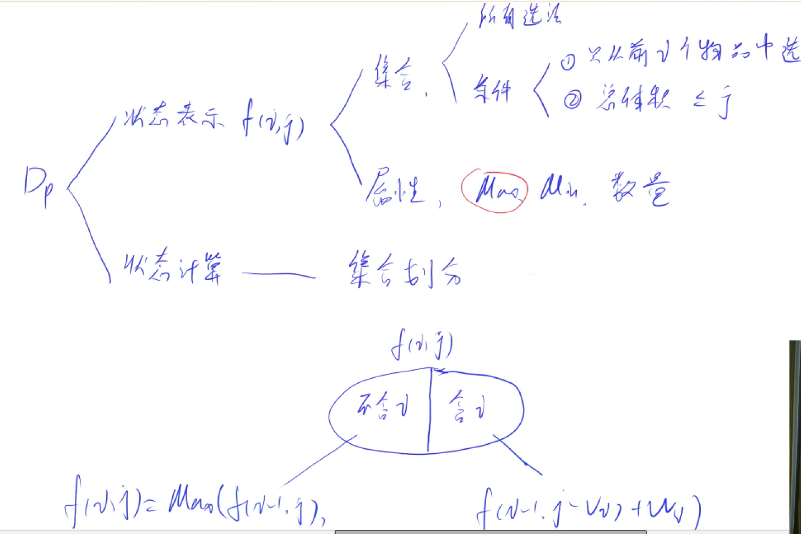
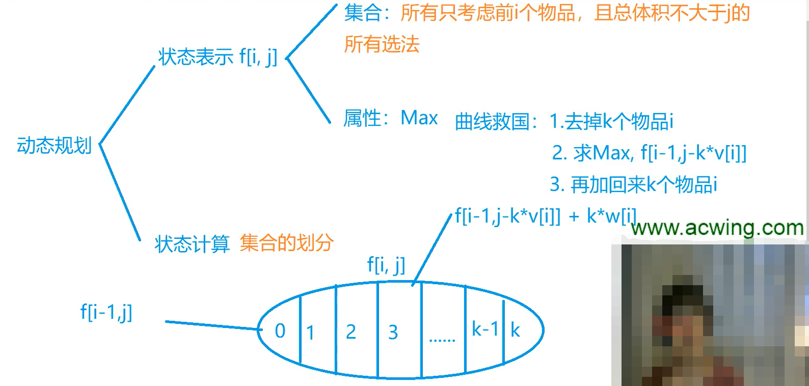
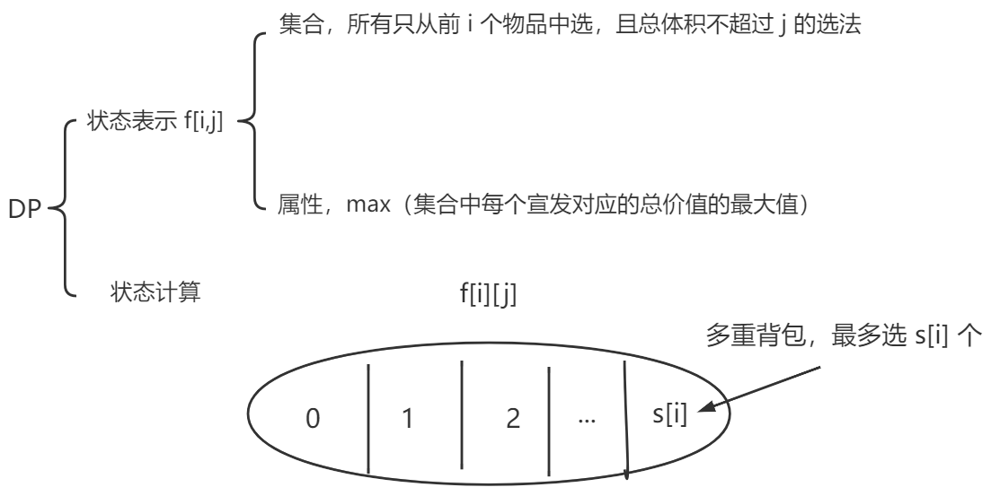
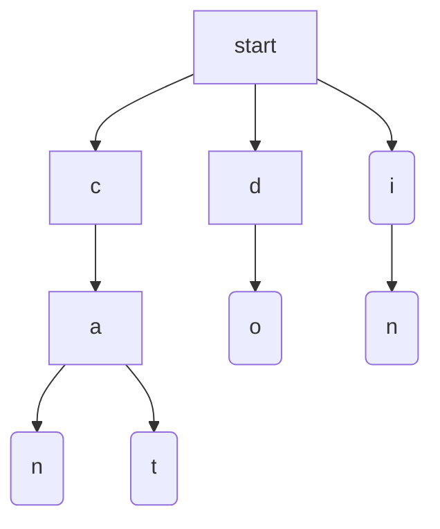
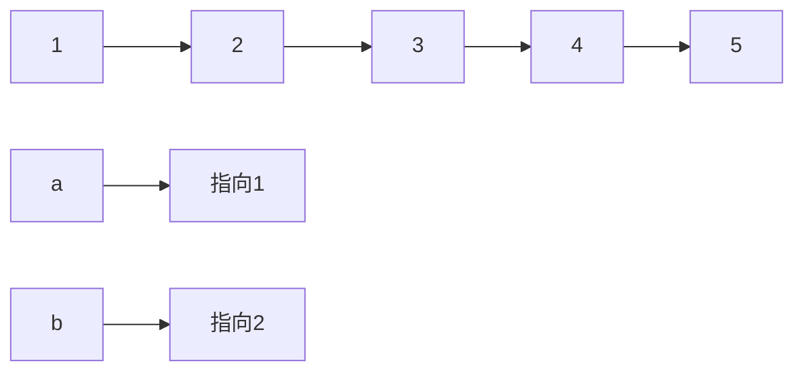

# 说明

## 推荐

先复习常见数据结构算法然后再刷剑指 Offer 里的题和 CodeTop 里的题。常用的模板要搞熟悉。

## 题目

不记录那些太水的题，除非非常具有代表性。

# 常见算法

## 动态规划

- 背包问题
- 线性 DP
- 区间 DP
- 计数类 DP
- 数位统计 DP
- 状态压缩 DP
- 树形 DP
- 记忆化搜索

> 做题步骤

和闫总的做题思路是类似的

- 确定 DP 数组以及下标的含义
- 确定递推公式
- DP 数组如何初始化
- 确定遍历顺序
- 举例推导 DP 数组

### 背包问题

#### 0-1背包

n 个物品，容量为 v 的背包。每个物品有两个属性，体积 $v_i$ 和价值 $w_i$ 每个物品最多只能用一次。选出的物品的总价值要最大，问最大值是多少。



- DP
  - 状态表示 f(i,j)
    - 属性：f(i,j) 表示的是什么属性？即 f(i,j) 表示什么意思。max？min？数量？
    - 集合：
      - 所有选法
      - 条件：①从前 i 个物品中选（不一定会选第 i 个物品），②总体积 `≤j`
  - 状态计算--具体做法
    - 集合划分，把当前的集合用更小的集合来表示。
    - 含 i，不包含 i，两种选法，两个子集；f(i-1,j) f(i,j)。
      - f(i,j) = f(i-1,j-wi) + i 不选 i 且体积足够容纳 i 的选法。

```cpp
#include<iostream>
using namespace std;
const int N = 1e3 + 10;
// v 表示体积，w 表示价值
int v[N], w[N], f[N][N];

int main(){
    int n, m;
    scanf("%d%d", &n, &m);
    for(int i = 1; i <= n; i++) scanf("%d%d", &v[i], &w[i]);
    
    for(int i = 1; i <= n; i++)
        for(int j = 0; j <= m; j++){
            f[i][j] = f[i - 1][j];
            if(j >= v[i]) f[i][j] = max(f[i][j], f[i - 1][j - v[i]] + w[i]); 
        }
    printf("%d\n", f[n][m]);
    return 0;
}
```

#### 完全背包

每个物品有无限个。（枚举第 i 组物品，选几个）



朴素版解法

```cpp
#include <iostream>
#include <algorithm>

using namespace std;

const int N = 1010;
int n, m;
int v[N], w[N];
int f[N][N];

int main(){
    cin >> n >> m;
    for (int i = 1; i <= n; i ++ ) cin >> v[i] >> w[i];

    for (int i = 1; i <= n; i ++ )
        for (int j = 0; j <= m; j ++ )
            for(int k = 0; k * v[i] <= j; k ++)
                f[i][j] = max(f[i][j],f[i - 1][j - v[i] * k] + w[i] * k);
    cout << f[n][m] << endl;
    return 0;
}
```

完全背包可以优化成两维的。
$$
f[i][j] = Max(f[i-1][j], f[i-1][j-v]+w,f[i-1][j-v]+2w,...) \\
f[i][j-v] =  Max(f[i-1][j-v], f[i-1][j-2v]+w,f[i-1][j-3v]+2w,...) \\
$$
我们发现，$f[i][j]$ 的状态和 $f[i][j-v]$ 很像。
$$
f[i][j] = Max(f[i-1][j],f[i][j-v]+w) \ \ f[i][j-v] \ 表示什么意思?
$$

```cpp
#include <iostream>
#include <algorithm>

using namespace std;

const int N = 1010;
int n, m;
int v[N], w[N];
int f[N][N];

int main(){
    cin >> n >> m;
    for (int i = 1; i <= n; i ++ ) cin >> v[i] >> w[i];

    for (int i = 1; i <= n; i ++ )
        for (int j = 0; j <= m; j ++ ){
            f[i][j] = f[i - 1][j];
            if(j>=v[i]) f[i][j] = max(f[i][j],f[i - 1][j - v[i]] + w[i]);
        }
    cout << f[n][m] << endl;
    return 0;
}
```

采用滚动数组，如何变形呢？
$$
f[i][j] = Max(f[i-1][j], \ \ f[i-1,j-v]+w) \ \ 0-1背包 \\
f[i][j] = Max(f[i-1][j], \ \ f[i,j-v]+w) \ \ 完全背包
$$
0-1 背包都是从第 i-1 层转移过来的，完全背包是从 i-1 和 i 转移过来的。

```cpp
#include <iostream>
#include <algorithm>
// 直接删除一维，且没有 0-1 背包的那个问题。
// f[j - v[i]] 是小于 f[j] 的，在算 f[j] 之前，f[j - v[i]] 就已经算过了，所以相当于 f[j - v[i]] 
using namespace std;

const int N = 1010;
int n, m;
int v[N], w[N];
int f[N];

int main(){
    cin >> n >> m;
    for (int i = 1; i <= n; i ++ ) cin >> v[i] >> w[i];

    for (int i = 1; i <= n; i ++ )
        for (int j = v[i]; j <= m; j ++ )
            f[j] = max(f[j], f[j - v[i]] + w[i]);

    cout << f[m] << endl;
    return 0;
}
```

#### 0-1和完全

0-1 背包的循环是从大到小循环，完全背包问题是从小到大循环。

#### 多重背包

每个物品有 $s_i$ 个，每个物品的价值都不一样。


$$
f[i][j] = max(f[i-1][j-v[i]*k]+w[i]*k)
$$

```cpp
#include <iostream>
#include <algorithm>

using namespace std;

const int N = 110;
int n, m;
// v 表示体积，w 表示价值，s 表示个数
int v[N], w[N], s[N];
int f[N][N];

int main(){
    cin >> n >> m;
			// 数据赋值是从 1 开始的
    for (int i = 1; i <= n; i ++ ) cin >> v[i] >> w[i] >> s[i];

    for (int i = 1; i <= n; i ++ )
        for (int j = 0; j <= m; j ++ )
            for (int k = 0; k <= s[i] && k * v[i] <= j; k ++ ) // 所需物体的总体积不能超过 j
                f[i][j] = max(f[i][j], f[i - 1][j - v[i] * k] + w[i] * k);

    cout << f[n][m] << endl;
    return 0;
}
```

优化思路，能否和完全背包一样优化呢？我们来看下 $f[i][j-v] \ 和 \ f[i][j]$ 的关系
$$
f[i,j] = max(f[i-1,j],f[i-1,j-v]+w,f[i-1,j-2v]+2w,...,f[i-1,j-sv]+sw)
$$

$$
f[i,j-v] = max(f[i-1,j-v],f[i-1,j-2v]+w,...,f[i-1,j-sv]+(s-1)w,f[i-1,j-(s+1)v]+sw)
$$

不能和完全背包一样进行优化，那么如何进行优化呢？采用二进制优化。

假定，我们想去枚举 0~1023，我们可以把若干个物品打包在一起考虑。比如我们把数据分为 10 组

$1,2,4,8,16,32,...,512$，

- 第一组只有一个第 i 个物品
- 第二组只有两个第 i 个物品
- ....
- 第十组只有 512 个第 i 个物品

我们是否可以用这十组拼凑出 0~1023 中的任意一个数字呢？可以！每组只选一次。相当于用 10 个新的物品来表示原来的第 i 个物品，可以看成一个 0-1 背包问题，选这组，不选这组。本来要枚举 1024 次，分组后只需要枚举 10 次了。

s=200 时，$1,2,4,8,16,32,64,73$ 因为 128 不能要，但是我们又要凑出 200，$200-1-2-4-8-16-32-64=73$，所以最后补了一个 73。

怎么凑物品呢？$1+2+4+8+...+2^k+k^{k+1}>s$ 的话，那么就 2 的次幂就只能选到 $2^k$

```cpp
#include <iostream>
#include <algorithm>

using namespace std;
// 用一维来优化
const int N = 12010, M = 2010;

int n, m;
int v[N], w[N];
int f[M];

int main(){
    cin >> n >> m;

    int cnt = 0;
    for (int i = 1; i <= n; i ++ ){
        int a, b, s;
        cin >> a >> b >> s;
        int k = 1; // 每次把 k 个第 i 个物品打包在一起
        while (k <= s){
            cnt ++ ;
            v[cnt] = a * k; // k 个物品的体积
            w[cnt] = b * k; // k 个物品的价值
            s -= k; // 什么意思？还剩 s 个需要打包
            k *= 2;
        }
        // 还剩下一些需要补上
        if (s > 0){
            cnt ++ ;
            v[cnt] = a * s; 
            w[cnt] = b * s;
        }
    }
		// 什么意思？cnt 记录的是转换成 0-1 背包后，一共多少物品
    n = cnt;
		
    // 做一遍 0-1 背包
    for (int i = 1; i <= n; i ++ )
        for (int j = m; j >= v[i]; j -- )
            f[j] = max(f[j], f[j - v[i]] + w[i]);

    cout << f[m] << endl;

    return 0;
}
```

#### 分组背包问题

物品有 n 组，每组中有若干个，每组中最多选一个物品。（枚举第 i 组物品，选那个）

PS：如果状态用的是上一层的状态就从大到小枚举体积，如果是用的本层的，就从小到大枚举体积。


```cpp
#include <iostream>
#include <algorithm>

using namespace std;

const int N = 110;

int n, m;
int v[N][N], w[N][N], s[N];
int f[N];

int main(){
    cin >> n >> m;

    for (int i = 1; i <= n; i ++ ){
        cin >> s[i];
        for (int j = 0; j < s[i]; j ++ )
            cin >> v[i][j] >> w[i][j];
    }
	
    for (int i = 1; i <= n; i ++ )
        for (int j = m; j >= 0; j -- )
            for (int k = 0; k < s[i]; k ++ )
                if (v[i][k] <= j) // 体积小，才可以用，需要更新
                    f[j] = max(f[j], f[j - v[i][k]] + w[i][k]);

    cout << f[m] << endl;

    return 0;
}
```

### 线性DP

求 DP 时，有个明显的线性关系。

#### 数字三角形

[剑指 Offer II 100. 三角形中最小路径之和 - 力扣（LeetCode） (leetcode-cn.com)](https://leetcode-cn.com/problems/IlPe0q/)


如果下标涉及到 i-1，i 最好是从 1 开始。

$DP 时间复杂度 = 状态数量 * 转移的计算量$

#### 最长上升子序列

[300. 最长递增子序列 - 力扣（LeetCode） (leetcode-cn.com)](https://leetcode-cn.com/problems/longest-increasing-subsequence/)

```
输入：nums = [10,9,2,5,3,7,101,18]
输出：4
解释：最长递增子序列是 [2,3,7,101]，因此长度为 4 。
```


```java
class Solution {
    public int lengthOfLIS(int[] nums) {
        if (nums.length == 0) {
            return 0;
        }
        int[] dp = new int[nums.length];
        dp[0] = 1;
        int maxans = 1;
        for (int i = 1; i < nums.length; i++) {
            dp[i] = 1;
            for (int j = 0; j < i; j++) {
                if (nums[i] > nums[j]) {
                    dp[i] = Math.max(dp[i], dp[j] + 1);
                }
            }
            maxans = Math.max(maxans, dp[i]);
        }
        return maxans;
    }
}
```

#### 最长公共子序列

[1143. 最长公共子序列 - 力扣（LeetCode） (leetcode-cn.com)](https://leetcode-cn.com/problems/longest-common-subsequence/)

```
输入：text1 = "abcde", text2 = "ace" 
输出：3  
解释：最长公共子序列是 "ace" ，它的长度为 3 。
```


```java
class Solution {
    public int longestCommonSubsequence(String s1, String s2) {
        int n = s1.length(), m = s2.length();
        char[] cs1 = s1.toCharArray(), cs2 = s2.toCharArray();
        int[][] f = new int[n + 1][m + 1]; 
        for (int i = 1; i <= n; i++) {
            for (int j = 1; j <= m; j++) {
                if (cs1[i - 1] == cs2[j - 1]) {
                    f[i][j] = f[i - 1][j - 1] + 1;
                } else {
                    f[i][j] = Math.max(f[i - 1][j], f[i][j - 1]);
                }
            }
        }
        return f[n][m];
    }
}
```

### 区间DP

# 剑指Offer专项突破

## 整数

### 整数除法

给定两个整数 `a` 和 `b` ，求它们的除法的商 `a/b` ，要求不得使用乘号 `'*'`、除号 `'/'` 以及求余符号 `'%'` 。

注意

整数除法的结果应当截去（truncate）其小数部分，例如：truncate(8.345) = 8 以及 truncate(-2.7335) = -2
假设我们的环境只能存储 32 位有符号整数，其数值范围是 [$−2^{31}$, $2^{31}$−1]。本题中，如果除法结果溢出，则返回 $2^{31} − 1$

#### 解题思路

- 注意边界条件。int 的最小负数 / -1 会爆 int 的 max。
- O(N) 的解法，直接用减法的话，复杂度太高
- O(logN) 的解法：
    - a 减去 $b*2^n$ 的整数倍数，得到部分的商。
    - $a-b*2^n$  的结果继续减去 $b*2^n$ 的整数倍数，得到部分的商。

#### 代码

```java
// 暴力解题 out of time。
public int divide(int a,int b){
    if(a == Integer.MIN_VALUE && b == -1) return Integer.MAX_VALUE;
    int neg = 2;
    if(a>0){
        a = -a;neg--;
    }
    if(b>0){
        b=-b;neg--;
    }
    int retVal = 0;
    while(a<=b){
        a-=b;
        retVal++;
    }
    return neg%2==0?retVal:-retVal;
}
```

```java
// longN的解法 
// 先考虑 a 是 b 的多少偶数倍（2^n）。然后在 a = a - b*2^n，继续考虑
class Solution {
    public int divide(int a,int b){
        if(a == Integer.MIN_VALUE && b == -1) return Integer.MAX_VALUE;
        int neg = 2;
        if(a>0){
            a = -a;neg--;
        }
        if(b>0){
            b=-b;neg--;
        }
        int retVal = divideCore(a,b);
        return neg % 2 ==0?retVal:-retVal;
    }

    public int divideCore(int a,int b){
        int retVal = 0; // 商的结果
        while(a<=b){
            int position = 1;
            int tmp = b;
            while(tmp>(Integer.MIN_VALUE>>1) &&a<=tmp+tmp){
                position = position<<1;
                tmp = tmp<<1;
            }
            a=a-tmp;
            retVal+=position;
        }
        return retVal;
    }
}
```

### 二进制加法

给定两个 01 字符串 `a` 和 `b` ，请计算它们的和，并以二进制字符串的形式输出。

输入为 **非空** 字符串且只包含数字 `1` 和 `0`。

#### 解题思路

- 按位相加记录进位
- 没加完的，后面 for 循环继续加。
- 累加的时候记得加上进位

#### 代码

```java
class Solution {
    public String addBinary(String a, String b) {
        // 字符串最后一位是低位。位数短的，高位补0
        // 从低位向高位加。记录进位。
        int add = 0;
        int aindex = a.length() - 1;
        int bindex = b.length() - 1;
        StringBuffer sb = new StringBuffer();
        while(aindex>=0 || bindex>=0){
            int n1 = aindex>=0?a.charAt(aindex--)-'0':0;
            int n2 = bindex>=0?b.charAt(bindex--)-'0':0;
            int tmp = n1+n2+add;
            add = tmp>=2?1:0;
            sb.append(tmp%2);
        }
        if(add==1) sb.append(add);
        return sb.reverse().toString();
    }
}
```

### 前n个数字二进制中1的个数

给定一个非负整数 `n` ，请计算 `0` 到 `n` 之间的每个数字的二进制表示中 1 的个数，并输出一个数组。

```shell
输入: n = 2
输出: [0,1,1]
解释: 
0 --> 0
1 --> 1
2 --> 10
```

#### 解题思路

- 法一：暴力循环，求出每个数字1的个数。
    - 如何求1的数量？
    - 1.数字的每位一次 & 1，统计。
    - 2.直接数1的个数。 n & (n-1)可以做到。
        - n= 0111；n-1 = 0110
        - n & (n-1) = 0111 & 0110 = 0110 直接把最后一位的1去掉了。
        - 如果最后 n == 0，则说明没有1了。 
- 法二：发现 n 比 n & (n-1) 多一个1！！ 

#### 代码

```java
// 暴力求解 KlogN
class Solution {
    public int[] countBits(int n) {
        int[]nums = new int[n+1];
        for(int i=1;i<=n;i++){
            int tmp = i;
            while(tmp>0){
                if((tmp & 1)==1){
                    nums[i]++;
                }
                tmp = tmp>>1; 
            }
        }
        return nums;
    }
}
```

```java
// O(N)
class Solution {
    public int[] countBits(int n) {
        int nums[]=new int[n+1];
        for(int i=1;i<=n;i++){
            nums[i] = nums[i&(i-1)]+1;
        }
        return nums;
    }
}
```

### 只出现一次的数字

给你一个整数数组 `nums` ，除某个元素仅出现**一次**外，其余每个元素都恰出现**三次 。**请你找出并返回那个只出现了一次的元素。

#### 解题思路

- 哈希表判重
- 根据数字的 bit 位来判断。
    - 统计所有数字每个 bit 位出现 1 的次数。
    - 如果，该 bit 位出现的次数是 3 的倍数，则说明只出现一次的元素该 bit 位是 0，否则是 1。

#### 解法

```java
// hash 暴力解题
class Solution {
    public int singleNumber(int[] nums) {
        HashMap<Integer, Integer> map = new HashMap<>();
        for (int i = 0; i < nums.length; i++) {
            if (map.containsKey(nums[i])) {
                map.replace(nums[i], map.get(nums[i]) + 1);
            } else {
                map.put(nums[i], 1);77\\\7
                
            }
        }
        Set<Integer> integers = map.keySet();
        Iterator<Integer> iterator = integers.iterator();
        while (iterator.hasNext()) {
            Integer key = iterator.next();
            if (map.get(key) == 1) {
                return key;
            }
        }
        return -1;
    }
}
```

```java
// bit 位 统计，还原，怎么计算出原数字的不明白。
class Solution {
    public int singleNumber(int[] nums) {
        // 统计每个bit出现1的次数
        int res = 0;
        int[] cnt = new int[32];
        for(int num : nums){
            for(int i = 0; i < 32; i++){
                cnt[i] += (num >> i) & 1;
            }
        }
        for(int i = 31; i >= 0; i--){
            // 如果t=0 说明这位是0
            int t = cnt[i] % 3 == 0 ? 0 : 1;
            res = (res << 1) + t;
        }
        return res;
    }
}
```

### 单词长度的最大乘积

给定一个字符串数组 words，请计算当两个字符串 words[i] 和 words[j] 不包含相同字符时，它们长度的乘积的最大值。假设字符串中只包含英语的小写字母。如果没有不包含相同字符的一对字符串，返回 0。

#### 解题思路

- 都是双重 for 循环判断那几个字符串不同。
- 问题在于如何判断是否不同
    - 法一：map 判重。
    - 法二：用位运算判重；字符串中存在 a 则第 0 个位置的 bit 设置为 1，存在 b 则第 1 个位置的 bit 设置为 1。最后判断两个字符串是否有相同的字符，做一次 & 运算就知道了

#### 代码

```java
class Solution {
    public  int maxProduct(String... words) {
        // for 循环找出两两不同的，然后找max 会超时
        int max = 0;
        for (int i = 0; i < words.length; i++) {
            for (int j = i + 1; j < words.length; j++) {
                // 判断 i j 是否包含相同的字符
                if (!judge(words[i], words[j])) {
                    max = max > words[i].length() * words[j].length() ? max : words[i].length() * words[j].length();
                }
            }
        }
        return max;
    }

    public static boolean judge(String a, String b) {
        boolean[]c = new boolean[26];
        for (int i = 0; i < a.length(); i++) {
            c[a.charAt(i)-'a']=true;
        }

        for (int i = 0; i < b.length(); i++) {
            if(c[b.charAt(i)-'a']){
                return true;
            }
        }
        return false;
    }
}
```

```java
// 位运算判重
class Solution {
    public  int maxProduct(String... words) {
        int[] flags = new int[words.length];
        for (int i = 0; i < words.length; i++) {
            String word = words[i];
            for (int j = 0; j < word.length(); j++) {
                flags[i]|=1<< (word.charAt(j)-'a'); // 比如一个字符串中可能有多个 e e e，我们想把e对应的1放到flags中，所以用|，因为有多个，所以不用+
            }
        }
        int max = 0;
        for (int i = 0; i <words.length ; i++) {
            for (int j = i+1; j <words.length ; j++) {
                if((flags[i] & flags[j])==0){
                    int curlen = words[i].length()*words[j].length();
                    max = Math.max(max,curlen);
                }
            }
        }
        return max;
    }
}
```

## 数组

### 排序数组中两个数字之和

[剑指 Offer II 006. 排序数组中两个数字之和 - 力扣（LeetCode） (leetcode-cn.com)](https://leetcode-cn.com/problems/kLl5u1/)

给定一个已按照升序排列的整数数组 numbers ，请你从数组中找出两个数满足相加之和等于目标数 target 。

函数应该以长度为 2 的整数数组的形式返回这两个数的下标值。numbers 的下标 从 0 开始计数 ，所以答案数组应当满足 0 <= answer[0] < answer[1] < numbers.length 。

假设数组中存在且只存在一对符合条件的数字，同时一个数字不能使用两次。

#### 解题思路

- 双指针，start 和 end
  - nums[start] + nums[end] >0 ，end--；
  - nums[start] + nums[end] <0 ，start++;

#### 代码

```java
class Solution {
    public int[] twoSum(int[] numbers, int target) {
        for (int start = 0, end = numbers.length - 1; start < end; ) {
            if (numbers[start] + numbers[end] == target) return new int[]{start, end};
            if (numbers[start] + numbers[end] > target) {
                end--;
            } else {
                start++;
            }
        }
        return null;
    }
}
```

### 数组中和为0的三个数

[剑指 Offer II 007. 数组中和为 0 的三个数 - 力扣（LeetCode） (leetcode-cn.com)](https://leetcode-cn.com/problems/1fGaJU/)

给定一个包含 n 个整数的数组 nums，判断 nums 中是否存在三个元素 a ，b ，c ，使得 a + b + c = 0 ？请找出所有和为 0 且<b>不重复</b>的三元组。

#### 解题思路

- 先排序，在固定一个数，双指针查找是否存在 a = -(b+c) 的数。
- 在查找的时候要注意排除重复的数字。
  - 固定的那个数字需要排除重复的数字。
  - 双指针查找 b、c 的时候也要注意排除 b、c 的重复数字。

#### 代码

```java
class Solution {
    public List<List<Integer>> threeSum(int[] nums) {
        Arrays.sort(nums);
        List<List<Integer>> ans = new LinkedList<>();
        for (int i = 0; i < nums.length; i++) {
            if (i > 0 && nums[i] == nums[i - 1]) continue; // 当前的元素和上一个重复了，直接跳过
            int start = i + 1, end = nums.length - 1;
            while (start < end) {
                int sum = nums[i] + nums[start] + nums[end];
                if (sum == 0) {
                    ans.add(Arrays.asList(nums[i], nums[start], nums[end]));
                    // 排除重复的 start
                    while (start < end && nums[start] == nums[start + 1]) start++;
                    // 排除重复的 end
                    while (start < end && nums[end] == nums[end - 1]) end--;
                    // 尝试寻找下一组符合条件的数据
                    start++; end--;
                } else if (sum > 0) {
                    end--;
                } else {
                    start++;
                }
            }
        }
        return ans;
    }
}
```

### 和大于等于 target 的最短子数组

[剑指 Offer II 008. 和大于等于 target 的最短子数组 - 力扣（LeetCode） (leetcode-cn.com)](https://leetcode-cn.com/problems/2VG8Kg/)

给定一个含有 n 个正整数的数组和一个正整数 target 。

找出该数组中满足其和 ≥ target 的长度最小的连续子数组 $[nums_l, nums_{l+1}, ..., nums_{r-1}, nums_r]$ ，并返回其长度。如果不存在符合条件的子数组，返回 0 。

#### 解题思路

- 法一：双指针。判断指针区域内的数组和是否符合条件，符合则更新长度。时间复杂度较高。可以继续优化。
- 法二：对法一进行优化。记录先前

#### 代码

```java
class Solution {
    public int minSubArrayLen(int s, int[] nums) {
        int n = nums.length;
        if (n == 0) {
            return 0;
        }
        int ans = Integer.MAX_VALUE;
        int[] sums = new int[n + 1]; 
        // 为了方便计算，令 size = n + 1 
        // sums[0] = 0 意味着前 0 个元素的前缀和为 0
        // sums[1] = A[0] 前 1 个元素的前缀和为 A[0]
        // 以此类推
        for (int i = 1; i <= n; i++) {
            sums[i] = sums[i - 1] + nums[i - 1];
        }
        for (int i = 1; i <= n; i++) {
            int target = s + sums[i - 1];
            int bound = Arrays.binarySearch(sums, target);
            if (bound < 0) {
                bound = -bound - 1;
            }
            if (bound <= n) {
                ans = Math.min(ans, bound - (i - 1));
            }
        }
        return ans == Integer.MAX_VALUE ? 0 : ans;
    }
}
```

### 乘积小于k的子数组

给定一个正整数数组 `nums` 和整数 `k` ，请找出该数组内乘积小于 `k` 的连续的子数组的个数。

#### 解题思路

双指针的思路，求出双指针范围内数组的乘积。right-left+1

比如某次遍历符合题意的子数组为 ABCX，那么在该条件下符合条件的有 X，CX，BCX，ABCX 共四个（可以进行多个例子，发现个数符合 right-left+1）
我们可能会有疑问：AB，BC 也算，为什么不算进去？
记住一点我们是以最右边的 X 为必要条件，进行计算符合条件的子数组，否则会出现重复的！
比如在X为右侧边界时（ABCX），我们把 BC 算进去了，可是我们在 C 为最右侧时（ABC），BC 已经出现过，我们重复加了 BC 这个子数组两次！
换言之，我们拆分子数组时，让 num[right] 存在，能避免重复计算。

#### 代码

```java
class Solution {
    public int numSubarrayProductLessThanK(int[] nums, int k) {
        int ret = 0;
        int total = 1;
        int left = 0;
        for(int right=0;right<nums.length;right++){
            total*=nums[right];
            while(total>=k && left<=right){
                total/=nums[left++];
            }
            ret+= (right>=left?right-left+1:0);
        }
        return ret;
    }
}
```

### 和为k的子数组

给定一个整数数组和一个整数 `k` **，**请找到该数组中和为 `k` 的连续子数组的个数。

#### 解题思路

由于数字并非是正数数组，所以双指针的思路行不通。最简单的办法是 双重for，暴力求解。
比较高效的解法是：用 hash 表记录前面累加的和。查找前面有多少满足 sum-k=0 的。就是（？~k 范围内）符合要求的子数组个数。

#### 代码

```java
class Solution {
    public int subarraySum(int[] nums, int k) {
        /**
        存在负数。所以不能用双指针。
        用hash表记录前面累加的和。
         */
        HashMap<Integer,Integer> map = new HashMap<>();
        int sum = 0;
        int countNumber=0;
        map.put(0, 1);
        for(int i=0;i<nums.length;i++){
            sum+=nums[i];
            countNumber+=map.getOrDefault(sum-k,0);
            map.put(sum,map.getOrDefault(sum,0)+1);
        }
        return countNumber;
    }
}
```

### 0和1个数相同的子数组

#### 解题思路

把 0 改成 -1，解题思路就和上面的一样了。求和为 0 的子数组的个数。

#### 代码

```java
class Solution {
    public int findMaxLength(int[] nums) {
        HashMap<Integer, Integer> map = new HashMap<>();
        map.put(0, -1);
        int sum = 0;
        int ret = 0;
        int tmp = 0;
        for(int i=0;i<nums.length;i++){
            sum+=nums[i]==0?-1:1;
            // 存储上一次出现 sum-k 数字出现的最远的距离
            tmp = map.getOrDefault(-sum,i);
            if(!map.containsKey(-sum)){
                map.put(-sum,i);
            }
            ret = Math.max(ret,i-tmp);
        }
        return ret;
    }
}
```

### 左右两边子数组的和相等

给你一个整数数组 nums ，请计算数组的中心下标 。

数组中心下标是数组的一个下标，其左侧所有元素相加的和等于右侧所有元素相加的和。

如果中心下标位于数组最左端，那么左侧数之和视为 0 ，因为在下标的左侧不存在元素。这一点对于中心下标位于数组最右端同样适用。

如果数组有多个中心下标，应该返回最靠近左边的那一个。如果数组不存在中心下标，返回 -1 。

#### 解题思路

先求出数组的总和 sum。然后在遍历一次数组，统计当前遍历过的数字的总和 curSum，如果 curSum-cur = sum - curSum，则找到了中心下标。 

#### 代码

```java
class Solution {
    public int pivotIndex(int[] nums) {
        /**
        先求出total
        在扫描数组，判断 cur 前面的数据和 和 cur 后面的数据和是不是一样
         */
         int total = 0;
         for(int i=0;i<nums.length;i++){
             total+=nums[i];
         }
         int sum = 0;
         for(int i=0;i<nums.length;i++){
             sum+=nums[i];
             if(total-sum == sum-nums[i]) return i;
         }
         return -1;
    }
}
```

### 二维子矩阵的和

这是一道典型的二维数组前缀和的题目。

#### 解题思路

乍一看，咦，不就是二维数组求和吗。一顿操作猛如虎，一看击败 5%。所有这题的做法应该是：前缀和。请看高票题解。

<a href="https://leetcode-cn.com/problems/range-sum-query-2d-immutable/solution/xia-ci-ru-he-zai-30-miao-nei-zuo-chu-lai-ptlo/">题解</a>

- 典型的二维前缀和，求解二维矩阵中的矩形区域求和问题。
- 二维前缀和数组中的每一个格子记录的是「以当前位置为右下角的区域和(即，【0，0】~【i，j】这个矩形区域的和)」
- 如何求指定区域的面积呢？比如求 $arr[1][1]~arr[3][4]$ 的面积？
  - 小学数学题。A-B+C+D。具体请看下图。


#### 代码

```java
class NumMatrix {
    private int[][] sum;

    public NumMatrix(int[][] matrix) {
        int n = matrix.length, m = (n == 0 ? 0 : matrix[0].length);
        sum = new int[n + 1][m + 1]; // 比如求arr[1][1] ~ arr[2][2] 处的元素 sum[3][3] - sum[2][3] - sim[3][2] + arr[2][2]
        for (int i = 1; i <= n; i++) {
            for (int j = 1; j <= m; j++) {
                sum[i][j] = sum[i - 1][j] + sum[i][j - 1] - sum[i - 1][j - 1] + matrix[i - 1][j - 1];
            }
        }
    }

    public int sumRegion(int row1, int col1, int row2, int col2) {
        return sum[row2 + 1][col2 + 1] - sum[row2 + 1][col1] - sum[row1][col2 + 1] + sum[row1][col1];
    }
}
```

## 字符串

### 字符串中的变位词

给定两个字符串 `s1` 和 `s2`，写一个函数来判断 `s2` 是否包含 `s1` 的某个变位词。

换句话说，第一个字符串的排列之一是第二个字符串的 **子串** 。

```shell
输入: s1 = "ab" s2 = "eidbaooo"
输出: True
解释: s2 包含 s1 的排列之一 ("ba").
```

#### 解题思路

主要是要明白题目的意思。比如 s1="ab", 如果 s2 中的子串包含“ab”或 “ba”，那就是有变位词。

先统计 s1 中字符串的频率（大数组当 hash 表）。在用双指针遍历 s2 中的字符串，统计字符出现的次数。如果当前范围内，所有字符出现的频率都一样，则这个范围内的字符串是变位词。

#### 代码

```java
class Solution {
    /**
    很简单，就是判断 s1 是否是 s2 其中一个连续子串的全排列。
    存在特殊的边界条件嘛？
    - s1.length > s2.length
    两个map记录。mapA 记录 s1的词频，map2记录当前s2子串的词频。对比看词频是否一样。
     */

    public boolean checkInclusion(String s1, String s2) {
        if(s1.length()>s2.length()) return false;
        int[]map1 = new int[26];
        int[]map2 = new int[26];
        for(int i=0;i<s1.length();i++){
            map1[s1.charAt(i)-'a']++;
            map2[s2.charAt(i)-'a']++;
        }
        if(s1.length()==s2.length()) return judege(map1,map2);
        // 不符合要求，则继续查找
        for(int pre=0,next=s1.length()-1;next<s2.length()-1;){
            if(judege(map1,map2)) return true;
            map2[s2.charAt(pre++)-'a']--;
            map2[s2.charAt(++next)-'a']++;
        }
        return judege(map1,map2);
    }

    public boolean judege(int[]map1,int[]map2){
        for(int i=0;i<26;i++){
            if(map1[i]!=map2[i]) return false;
        }
        return true;
    }
}
```

### 字符串中的所有变位词

给定两个字符串 s 和 p，找到 s 中所有 p 的变位词的子串，返回这些子串的起始索引。不考虑答案输出的顺序。

变位词指字母相同，但排列不同的字符串。

```shell
输入: s = "cbaebabacd", p = "abc"
输出: [0,6]
解释:
起始索引等于 0 的子串是 "cba", 它是 "abc" 的变位词。
起始索引等于 6 的子串是 "bac", 它是 "abc" 的变位词。
```

#### 解题思路

和上一题类似，不过需要遍历完字符串。边界条件需要注意下。

#### 代码

```java
class Solution {
    public List<Integer> findAnagrams(String s, String p) {
        List<Integer> list = new ArrayList<Integer>();
        if(p.length()>s.length()) return list;
        int[]map1 = new int[26];
        int[]map2 = new int[26];
        for(int i=0;i<p.length();i++){
            map1[p.charAt(i)-'a']++;
            map2[s.charAt(i)-'a']++;
        }
        if(s.length()==p.length()) {
            if(juedge(map1,map2)) list.add(0);
            return list;
        }
        if(juedge(map1,map2)) list.add(0);
        for(int pre=0,next=p.length()-1;next<s.length()-1;){
            map2[s.charAt(pre++)-'a']--;
            map2[s.charAt(++next)-'a']++;
            if(juedge(map1,map2)) list.add(pre);
        }
        return list;
    }
    private boolean juedge(int[]map1,int []map2){
        for(int i=0;i<26;i++){
            if(map1[i]!=map2[i]) return false;
        }
        return true;
    }
}
```

### 不含重复字符串的最长子字符串

给定一个字符串 `s` ，请你找出其中不含有重复字符的<b>最长连续子字符串</b>的长度。

```shell
输入: s = "abcabcbb"
输出: 3 
解释: 因为无重复字符的最长子字符串是 "abc"，所以其长度为 3。
```

#### 解题思路

双指针，hash 表判重

#### 代码

```java
class Solution {
    public int lengthOfLongestSubstring(String s) {
        // 双指针
        if(s.length()==0 || s.length()==1) return s.length();
        int[]map = new int[128];
        int ret = 0;
        int pre = 0,next=1;
        map[s.charAt(pre)]+=1;
        while(next<s.length()){
            map[s.charAt(next)]+=1;
            // 加完后，看是否重复
            if(map[s.charAt(next)]>1){
                while(map[s.charAt(next)]>1){
                    map[s.charAt(pre++)]-=1;
                }
            }
            ret = Math.max(ret,next-pre+1);
            next++;
        }
        return ret;
    }
}
```

### 含有所有字符的最短字符串

直接放弃

### 有效回文

给定一个字符串 `s` ，验证 `s` 是否是<b>回文串</b>，只考虑字母和数字字符，可以忽略字母的大小写。

本题中，将空字符串定义为有效的回文串。

```shell
输入: s = "A man, a plan, a canal: Panama"
输出: true
解释："amanaplanacanalpanama" 是回文串
```

#### 解题思路

双指针，start，end 移动。唯一的问题是需要过滤掉非数组和字母的字符，考察 API `Character.isLetterOrDigit` 的使用。

#### 代码

```java
class Solution {
    public boolean isPalindrome(String s) {
        for (int start = 0, end = s.length() - 1; start < end; ) {
            int startChar = s.charAt(start);
            int endChar = s.charAt(end);
            if (Character.isLetterOrDigit(startChar) && Character.isLetterOrDigit(endChar)) {
                if(Character.toLowerCase(startChar)!=Character.toLowerCase((endChar))) return false;
                start++;end--;
            }
            while (!Character.isLetterOrDigit(s.charAt(start)) && start<end) start++;
            while (!Character.isLetterOrDigit(s.charAt(end))&&end>0) end--;
        }
        return true;
    }
}
```

### 最多删除一个字符得到回文

给定一个非空字符串 `s`，请判断如果最多从字符串中删除一个字符能否得到一个回文字符串。

```shell
输入: s = "abca"
输出: true
解释: 可以删除 "c" 字符 或者 "b" 字符

输入: s = "abc"
输出: false
```

#### 解题思路

也是用双指针去做。如果发现，start 和 end 两个字符不相等，则考虑是去除 start 的字符还是去除 end 的字符。两者都试一试，继续判断剩下还未判断的，只要有一个为 true，那就是 true。

#### 代码

```java
class Solution {
    public boolean validPalindrome(String s) {
        /**
        也是双指针。
        start,end
        如果发现当前的start!=end 则考虑是删除start 还是 end。
         */
         int start=0,end=s.length()-1;
         while(start<end){
             if(s.charAt(start)!=s.charAt(end)) break;
             start++;end--;
         }
        return judeg(start+1,end,s) || judeg(start,end-1,s);
    }

    public boolean judeg(int start,int end,String s){
        while(start<end){
            if(s.charAt(start)!=s.charAt(end)) return false;
            start++;end--;
        }
        return true;
    }
}
```

### 回文字符串的个数

给定一个字符串 `s` ，请计算这个字符串中有多少个回文子字符串。

具有不同开始位置或结束位置的子串，即使是由相同的字符组成，也会被视作不同的子串。

```shell
输入：s = "abc"
输出：3
解释：三个回文子串: "a", "b", "c"

输入：s = "aaa"
输出：6
解释：6个回文子串: "a", "a", "a", "aa", "aa", "aaa"
```

#### 解题思路

这个题的思路是：找到每个可能是回文串的中心点，发散开来找回文串。
如：以 index=0 为中心的找回文串，以 index=1 为中心的找回文串，以 index=2 为中心的找回文串...

#### 代码

```java
class Solution {
    public int countSubstrings(String s) {
        if(s.length()==0 || s.length()==1) return s.length();
        int count = 0;
        for(int i=0;i<s.length();i++){
            count += counter(i,i,s);
            count += counter(i,i+1,s);
        }
        return count;
    }

    private int counter(int start,int end, String s){
        int ret = 0;
        while(start>=0 && end<s.length() && s.charAt(start)==s.charAt(end)){
            start--;
            end++;
            ret++;
        }
        return ret;
    }

    //从字符串的第start位置向左，end位置向右，比较是否为回文并计数
    private int countPalindrome(String s, int start, int end) {
        int count = 0;
        while (start >= 0 && end < s.length() && s.charAt(start) == s.charAt(end)) {
            count++;
            start--;
            end++;
        }
        return count;
    }
}
```

### 找到字符串中所有字母异位词

[438. 找到字符串中所有字母异位词 - 力扣（LeetCode） (leetcode-cn.com)](https://leetcode-cn.com/problems/find-all-anagrams-in-a-string/)

给定两个字符串 s 和 p，找到 s 中所有 p 的异位词的子串，返回这些子串的起始索引。不考虑答案输出的顺序。

异位词指由相同字母重排列形成的字符串（包括相同的字符串）。

```
输入: s = "cbaebabacd", p = "abc"
输出: [0,6]
解释:
起始索引等于 0 的子串是 "cba", 它是 "abc" 的异位词。
起始索引等于 6 的子串是 "bac", 它是 "abc" 的异位词。
```

#### 解题思路

- 暴力枚举。逐一暴力判断 `0~len，1~len+1` 的字符串是否符合要求。
- 用 hash 表记录以 index 结尾，长度为 len 的字符串字符出现的频率。
  - 比如，最开始 hash 中记录的是 $0 \to len$ 范围内字符出现的频率。
  - 然后指针后移，记录 $1 \to len+1$ 范围内字符出现的频率。
  - 每次后移后，该 map 中字符出现的频率是否和 p 中字符的频率一样。

如何编写代码呢？

- 首先记录 s 和 p 前 s.len 长度的字符出现的频率，smap 和 pmap。
- 继续遍历 s 中的字符。并维护 smap。smap 仅记录以 $cur\_index$ 结尾前 s.len 个字符的频率。
- 每向前移动一个字符，就减去之前的一个字符的频率（使用双指针），并比较 smap 和 pmap 中的值是否相等。

#### 代码

```java
public List<Integer> findAnagrams(String s, String p) {
    List<Integer> ans = new ArrayList<>();
    if (s.length() < p.length()) return ans;
    int[] map = new int[26];
    int[] count = new int[26];

    // 预先记录一些字符的出现频率
    for (int i = 0; i < p.length(); i++) {
        map[p.charAt(i) - 'a']++; // 0 1 2
        count[s.charAt(i) - 'a']++; // 0 1 2
    }
    if (Arrays.equals(map, count)) {
        ans.add(0);
    }
    // 继续检索还未记录的。使用双指针。start 指向最前面那个即将被移除的，i 指向即将被加入的
    for (int i = p.length(), start = 0; i < s.length(); i++, start++) {
        count[s.charAt(i) - 'a']++;
        count[s.charAt(start) - 'a']--;
        if (Arrays.equals(map, count)) {
            ans.add(i - p.length() + 1);
        }
    }
    return ans;
}
```

## 链表

### 删除链表的倒数第n个结点

给定一个链表，删除链表的倒数第 `n` 个结点，并且返回链表的头结点


```shell
输入：head = [1,2,3,4,5], n = 2
输出：[1,2,3,5]
```

#### 解题思路

设置一个哑节点（方便删除第一个node）+快慢指针。具体块指针多走几步，举个例子算下就知道了。

#### 代码

```java
/**
 * Definition for singly-linked list.
 * public class ListNode {
 *     int val;
 *     ListNode next;
 *     ListNode() {}
 *     ListNode(int val) { this.val = val; }
 *     ListNode(int val, ListNode next) { this.val = val; this.next = next; }
 * }
 */
class Solution {
    // 典型的双指针。
    public ListNode removeNthFromEnd(ListNode head, int n) {
        // 快慢指针，快指针比慢指针领先 n 步骤。
        // 特殊情况为删除头节点
        if(head.next==null && n==1) return null;
        ListNode dummy = new ListNode(-1,head);
        ListNode fast=dummy,slow=dummy;
        while(n>0){
            fast = fast.next;
            n--;
        }
        while(fast.next!=null){
            slow = slow.next;
            fast = fast.next;
        }
        slow.next = slow.next.next;
        return dummy.next;
    }
}
```

### 链表中环的入口节点

给定一个链表，返回链表开始入环的第一个节点。 从链表的头节点开始沿着 next 指针进入环的第一个节点为环的入口节点。如果链表无环，则返回 null。

为了表示给定链表中的环，我们使用整数 pos 来表示链表尾连接到链表中的位置（索引从 0 开始）。 如果 pos 是 -1，则在该链表中没有环。注意，pos 仅仅是用于标识环的情况，并不会作为参数传递到函数中。

说明：不允许修改给定的链表


```shell
输入：head = [3,2,0,-4], pos = 1
输出：返回索引为 1 的链表节点
解释：链表中有一个环，其尾部连接到第二个节点。
```

#### 解题思路

- 直接上 hash 表判重。第一个遇到的重复的节点就是环的入口节点
- 快慢指针。发现有环后，快指针重新指向头节点，然后快慢指针每次都直走一步。快慢指针相遇的节点就是环的入口节点（这题刷过就会，不刷就不会）

#### 代码

```java
public class Solution {
    public ListNode detectCycle(ListNode head) {
        HashMap<ListNode,Boolean> map = new HashMap<>();
        while(head!=null){
            if(!map.getOrDefault(head,false)) map.put(head,true);
            else return head;
            head = head.next;
        }
        return null;
    }
}
```

### 两个链表的第一个重合节点

给定两个单链表的头节点 `headA` 和 `headB` ，请找出并返回两个单链表相交的起始节点。如果两个链表没有交点，返回 `null` 。

#### 解题思路

- 法一：哈希表判重
- 法二：stack 存入，然后同时出栈对比是否是同一个节点。

#### 代码

```java
// 法一：哈希表判重
public class Solution {
    public ListNode getIntersectionNode(ListNode headA, ListNode headB) {
        // 法一：hashmap。判断。
        if(headA == null || headB == null) return null;
        HashMap<ListNode,Object> map = new HashMap<>();
        while(headA!=null){
            map.put(headA,new Object());
            headA = headA.next;
        }
        while(headB!=null){
            if(map.containsKey(headB)) return headB;
            headB = headB.next;
        }
        return null;
    }
}
```

```java
// stack
public class Solution {
    public ListNode getIntersectionNode(ListNode headA, ListNode headB) {
        if(headA == null || headB == null) return null;
        LinkedList<ListNode> s1 = new LinkedList<>();
        LinkedList<ListNode> s2 = new LinkedList<>();
        while(headA!=null){
            s1.push(headA);
            headA = headA.next;
        }
        while(headB!=null){
            s2.push(headB);
            headB = headB.next;
        }
        ListNode lastNode = null;
        while(!s1.isEmpty() && !s2.isEmpty()){
            ListNode t1 = s1.pop();
            ListNode t2 = s2.pop();
            if(t1==t2) lastNode = t1;
        }
        return lastNode;
    }
}
```

### 反转链表

[剑指 Offer 24. 反转链表 - 力扣（LeetCode） (leetcode-cn.com)](https://leetcode-cn.com/problems/fan-zhuan-lian-biao-lcof/submissions/)

给定单链表的头节点 `head` ，请反转链表，并返回反转后的链表的头节点。

```java
输入: 1->2->3->4->5->NULL
输出: 5->4->3->2->1->NULL
```

#### 解题思路

- 哑节点，头插法，先插入的数据在后面。
- 遍历链表，让链表的后一个结点指向前一个结点。

#### 代码

头插法

```java
class Solution {
    public ListNode reverseList(ListNode head) {
        // 头插法，每次把摘除的结点放到头部。直到 head 为 空。
        ListNode dummy = new ListNode(-1);
        while(head!=null){
            ListNode cur = head;
            head = head.next;
            cur.next = dummy.next;
            dummy.next = cur;
        }
        return dummy.next;
    }
}
```

后一个结点指向前一个结点

```java
class Solution {
    // 遍历链表，并把后一个结点指向前一个结点
    public ListNode reverseList(ListNode head) {
        /**
        1->2->3->4->5->6
        1<-2
        1<-2<-3
        1<-2<-3<-4
        拿到后一个结点，然后一个结点指向前一个结点。
        从 1 开始。1 的前一个是null，2 的前一个是 1
         */
        ListNode pre = null;
        while(head!=null){
            ListNode headNext = head.next;
            head.next = pre;
            pre = head;
            head = headNext;
        }
        return pre;
    }
}
```

### 链表中的两数相加

给定两个非空链表 l1和 l2 来代表两个非负整数。数字最高位位于链表开始位置。它们的每个节点只存储一位数字。将这两数相加会返回一个新的链表。

可以假设除了数字 0 之外，这两个数字都不会以零开头。

#### 解题思路

链表中的数据分别放入，两个 stack，然后出 stack，计算，创建节点。

#### 代码

```java
class Solution {
    public ListNode addTwoNumbers(ListNode l1, ListNode l2) {
        LinkedList<Integer> s1 = new LinkedList<>();
        LinkedList<Integer> s2 = new LinkedList<>();
        // 链表的数据入栈7 --> 2 --> 4 --> 3 依次入栈
        while(l1!=null){
            s1.push(l1.val); // 高位就在下面了
            l1 = l1.next;
        }
        while(l2!=null){
            s2.push(l2.val);
            l2 = l2.next;
        }
        int add = 0;
        ListNode dummy = new ListNode(-1);
        ListNode cur = dummy;
        while(!s1.isEmpty() || !s2.isEmpty()){
            int n1 = s1.isEmpty()?0:s1.pop();    
            int n2 = s2.isEmpty()?0:s2.pop();
            System.out.println(n1+":"+n2+":"+add);
            dummy.next = new ListNode((n1+n2+add)%10,dummy.next);
            add = (n1+n2+add)>=10?1:0;
        }
        if(add==1)dummy.next = new ListNode(1,dummy.next);
        return dummy.next;
    }
}
```

### 回文链表

给定一个链表的<b>头节点</b>`head` **，**请判断其是否为回文链表。

如果一个链表是回文，那么链表节点序列从前往后看和从后往前看是相同的。

#### 解题思路

- 法一：数组存储数据，双指针判断
- 法二：扫一遍链表，找到中间位置，再把后面的链表反转，前半部分和后半部分分别比较，后半部分比较的时候，再将链表反转

#### 代码

```java
class Solution {
    public boolean isPalindrome(ListNode head) {
        int[]arr = new int[100000];
        int countsNode = -1;
        while(head!=null){
            arr[++countsNode] = head.val;
            head = head.next; 
        }
        for(int start=0,end = countsNode;start<=end;){
            if(arr[start++]!=arr[end--]) return false;
        }
        return true;
    }
}
```

### 展平多级链表

这题真的有难度。

多级双向链表中，除了指向下一个节点和前一个节点指针之外，它还有一个子链表指针，可能指向单独的双向链表。这些子列表也可能会有一个或多个自己的子项，依此类推，生成多级数据结构，如下面的示例所示。

给定位于列表第一级的头节点，请扁平化列表，即将这样的多级双向链表展平成普通的双向链表，使所有结点出现在单级双链表中

> 解题思路


- 先搞清楚展平规则
- node.next = child; child.pre = node; child.next = node.next; node.next.pre = child.
- 搞清楚展平规则后就是想怎么做了。
- 可以看出，这是一个递归的结构。展平 3 的子链表。如果 3 的子链表有子链表，那就先展平 3 子链表的子链表。


```java
/*
// Definition for a Node.
class Node {
    public int val;
    public Node prev;
    public Node next;
    public Node child;
};
*/
class Solution {
    public Node flatten(Node head) {
        flattenGetTail(head);
        return head;
    }

    // 返回 尾部指针，用户展平
    private Node flattenGetTail(Node head){
        // 展平链表
        Node node = head;
        Node tail = null;
        while(node!=null){
            Node next = node.next;
            if(node.child!=null){ // 如果有子链表就展平
                Node child = node.child;
                Node childTail = flattenGetTail(child); // 递归展平子链表

                node.child = null; // child 需要置空奥

                node.next = child; // next 指向 child，child 的尾指针指向node 的next节点
                child.prev = node; 

                childTail.next = next; // 子链表的 next 指向 node 的 next。
                if(next!=null){ // 达成双链表
                    next.prev = childTail;
                }
                tail = childTail;
            }else{
                // 如果没有 child的话，尾部指针就是
                tail = node;
            }
            node = next;
        }
        return tail;
    }
}
```

### 排序的循环链表

[剑指 Offer II 029. 排序的循环链表 - 力扣（LeetCode） (leetcode-cn.com)](https://leetcode-cn.com/problems/4ueAj6/)

给定循环单调非递减列表中的一个点，写一个函数向这个列表中插入一个新元素 insertVal ，使这个列表仍然是循环升序的。

给定的可以是这个列表中任意一个顶点的指针，并不一定是这个列表中最小元素的指针。

如果有多个满足条件的插入位置，可以选择任意一个位置插入新的值，插入后整个列表仍然保持有序。

如果列表为空（给定的节点是 null），需要创建一个循环有序列表并返回这个节点。否则。请返回原先给定的节点。

#### 解题思路

先看特殊情况。链表为 null 和 链表中只有一个节点。

- 为 null，则创建一个循环链表
- 只有一个节点，即 cur == cur.next 则插入位置随意，然后返回给你的 head 节点，即 cur。

再看常规情况。

常规情况下，需要分三种情况进行考虑

- ①当 min <= inertVal <= max 时，满足 cur <= insertVal <= cur.next 即可插入
- ②当 inertVal > max 时，插入到 max 的后面即可
- ③当 insertVal < min 时，插入到 max 的后面即可

注意，我们需要找到 biggest，并且在查找情况①的时候需要一个合适的条件跳出循环，这个条件就是情况① + next!=head

#### 代码

```java
class Solution {
    public Node insert(Node head, int insertVal) {
        if(head == null){
            Node cur = new Node(insertVal);
            cur.next = cur;
            return cur;
        }
        if(head == head.next){
            head.next = new Node(insertVal,head);
            return head;
        }
        Node biggest = head;
        Node cur = head;
        Node next = cur.next;
        while( !(cur.val<=insertVal && next.val>=insertVal) && next!=head){
            cur = next;
            next = next.next;
            biggest = cur.val>=biggest.val?cur:biggest;
        }
        if(cur.val<=insertVal && next.val>=insertVal){
            cur.next = new Node(insertVal,next);
        }else{
           biggest.next = new Node(insertVal,biggest.next);
        }
        return head;
    }
}
```

## 哈希表

### 插入、删除和随机访问都是O(1)的容器

[剑指 Offer II 030. 插入、删除和随机访问都是 O(1) 的容器 - 力扣（LeetCode） (leetcode-cn.com)](https://leetcode-cn.com/problems/FortPu/)

设计一个支持在平均时间复杂度 O(1) 下，执行以下操作的数据结构：

insert(val)：当元素 val 不存在时返回 true ，并向集合中插入该项，否则返回 false 。
remove(val)：当元素 val 存在时返回 true ，并从集合中移除该项，否则返回 false 。
getRandom：随机返回现有集合中的一项。每个元素应该有相同的概率 被返回。

#### 解题思路

平均时间复杂度 O(1) 的存取，很自然的想到用 HashMap 来做。但是 getRandom 又该怎么做呢？

它要求随机返回集合中的一项，那么可以使用随机数来获取 index，然后拿到对应 index 的数据。此处使用 ArrayList 存储数据，来随机获取集合中的一项。至于 O(1) 的 remove，可以将末尾的元素直接覆盖掉需要被异常的元素。

- 用 ArrayList 实现随机返回集合中的一项
- 用 HashMap 实现快速判断元素是否存在。key\=\=>待插入的元素，val\=\=>插入的索引位置
- 注意，remove 的时候，需要更新元素的索引。且顺序有讲究，不能乱。

#### 代码

```java
class RandomizedSet {
    public static void main(String[] args) {
        RandomizedSet randomizedSet = new RandomizedSet();
        randomizedSet.getRandom();
    }

    ArrayList<Integer> save;
    HashMap<Integer, Integer> numToIndex;
    Random random;

    /**
    * Initialize your data structure here.
    */
    public RandomizedSet() {
        save = new ArrayList<>();
        numToIndex = new HashMap<>();
        random = new Random();
    }

    /**
    * Inserts a value to the set. Returns true if the set did not already contain the specified element.
    */
    public boolean insert(int val) {
        if (numToIndex.containsKey(val)) {
            // 如果包含该元素
            return false;
        }
        numToIndex.put(val, save.size());
        save.add(val);
        return true;
    }

    /**
    * Removes a value from the set. Returns true if the set contained the specified element.
    * 边界条件
    */
    public boolean remove(int val) {
        // 如果包含
        if (numToIndex.containsKey(val)) {
            int index = numToIndex.remove(val);
            numToIndex.put(save.get(save.size() - 1), index);
            numToIndex.remove(val);
            save.set(index, save.get(save.size() - 1));
            save.remove(save.size() - 1);
            return true;
        }
        return false;
    }

    /**
    * Get a random element from the set.
    */
    public int getRandom() {
        int i = random.nextInt(save.size());
        return save.get(i);
    }
}
```

### 最近最少使用缓存

[剑指 Offer II 031. 最近最少使用缓存 - 力扣（LeetCode） (leetcode-cn.com)](https://leetcode-cn.com/problems/OrIXps/)

运用所掌握的数据结构，设计和实现一个  LRU (Least Recently Used，最近最少使用) 缓存机制 。

实现 LRUCache 类：

- LRUCache(int capacity) 以正整数作为容量 capacity 初始化 LRU 缓存
- int get(int key) 如果关键字 key 存在于缓存中，则返回关键字的值，否则返回 -1 。
- void put(int key, int value) 如果关键字已经存在，则变更其数据值；如果关键字不存在，则插入该组「关键字-值」。当缓存容量达到上限时，它应该在写入新数据之前删除最久未使用的数据值，从而为新的数据值留出空间。

要求再 O(1) 时间复杂度内完成操作。

#### 解题思路

要在 O(1) 时间内获取到元素的话可以使用哈希表记录缓存中的每个元素。put 元素的话。

如何实现最近最少使用的被移除？

- 我们假定元素从尾部插入，从头部出。所以，最近最少用的元素应该出现在链表头部。
- 插入一个元素时
  - 如果数据已经存在，找到该元素，移除元素将其移动到末尾
  - 如果数据不存在
    - 如果容量够，则直接从尾部插入
    - 如果容量不够，则先移除元素，再从尾部插入（哈希表中也要移除、添加对应的元素）
- 删除一个元素时，直接从尾部删除即可。同时移除哈希表中的元素

#### 代码

```java
// 双向链表节点
class Node {
    int val;
    int key;
    Node next;
    Node pre;

    public Node() {
    }

    public Node(int key, int val, Node pre, Node next) {
        this.key = key;
        this.val = val;
        this.pre = pre;
        this.next = next;
    }
}

class LRUCache {
    private Map<Integer, Node> map;
    private Node head;//双链表头节点
    private Node tail;//双链表，尾节点
    private int capacity;
    private int curSize;

    public LRUCache(int capacity) {
        this.capacity = capacity;
        this.curSize = 0;
        map = new HashMap<>();
        head = new Node(-1, -1, null, null);
        tail = head;
    }

    public int get(int key) {
        Node node = map.get(key);
        if (node != null) {
            // 存在，则得到值，并把节点移动到末尾。
            moveToTail(node);
            return node.val;
        }
        return -1;
    }

    private void moveToTail(Node node) {
        remove(node);
        addNode(node);
    }

    public void put(int key, int value) {
        Node node = map.get(key);
        if (node != null) {
            // 存在，则找到节点然后移动,size 不变
            node.val = value;
            map.put(key, node);
            moveToTail(node);
        } else { // 不存在
            Node waitInsert = new Node(key, value, null, null);
            map.put(key, waitInsert);
            if (curSize < capacity) { // 没有超过容量，直接添加
                addNode(waitInsert);
                curSize++;
            } else { // 超过容量，先移除，再添加
                map.remove(head.next.key);
                remove(head.next); // 移除头部的元素
                addNode(waitInsert);
            }
        }
    }

    private void remove(Node node) {
        // 移除双链表中的节点
        Node head = node.pre;
        if (node.next == null) {
            // 说明 node 是尾部节点
            head.next = null;
            tail = head;
        } else {
            node.next.pre = head;
            head.next = node.next;
        }
    }

    private void addNode(Node insert) {
        insert.pre = tail;
        insert.next = null;
        tail.next = insert;
        tail = insert;
    }
}
```


### 有效的变位词

[剑指 Offer II 032. 有效的变位词 - 力扣（LeetCode） (leetcode-cn.com)](https://leetcode-cn.com/problems/dKk3P7/)

给定两个字符串 s 和 t ，编写一个函数来判断它们是不是一组变位词（字母异位词）。

注意：若 s 和 t 中每个字符出现的次数都相同且字符顺序不完全相同，则称 s 和 t 互为变位词（字母异位词）。

#### 解题思路

哈希表统计两个字符串中每个字符出现的次数，然后比较。如果所有字符的频次都相同则为变位词。需要注意一个边界条件，顺序相同的不是变位词。

#### 代码

```java
public class Offer032IsAnagram {
    public boolean isAnagram(String s, String t) {
        if (s.length() != t.length() || s.equals(t)) return false;
        int[] map1 = new int[26];
        int[] map2 = new int[26];
        for (int i = 0; i < s.length(); i++) {
            map1[s.charAt(i) - 'a']++;
            map2[t.charAt(i) - 'a']++;
        }
        for (int i = 0; i < map1.length; i++) {
            if (map1[i] != map2[i]) return false;
        }
        return true;
    }
}
```

### 有效的变位词组

[剑指 Offer II 033. 变位词组 - 力扣（LeetCode） (leetcode-cn.com)](https://leetcode-cn.com/problems/sfvd7V/submissions/)

给定一个字符串数组 `strs` ，将<b>变位词</b>组合在一起。 可以按任意顺序返回结果列表。

<b>注意：</b>若两个字符串中每个字符出现的次数都相同，则称它们互为变位词。

#### 解题思路

变位词组和变位词有些不一样。变位词组只要字符出现次数都相同就行，“a”与“a”也是一对变位词组。

可以像上一题那样，逐个判断是否是变位词。这里我采用的方法是，HashMap+排序。

字符串排序后的结果作为 key；LinkedList 作为 value。

- 当前字符串排序后，key 存在于 map 中，则将原始字符串加入 key 对应的 LinkedList 中
- 当前字符串排序后，key 不在 map 中，则先添加 key，value，然后将原始字符串加入 key 对应的 LinkedList 中。

#### 代码

```java
public class Offer033GroupAnagrams {
    // 一对变位词组
    public List<List<String>> groupAnagrams(String[] strs) {
        HashMap<String, LinkedList<String>> map = new HashMap<>();
        for (String str : strs) {
            char[] cur = str.toCharArray();
            Arrays.sort(cur);
            // 如果不存在该 key，则把 value LinkedList 放进去。存在该 key 的话，就不放
            LinkedList<String> list = map.putIfAbsent(String.valueOf(cur), new LinkedList<>());
            list.add(str);
        }
        return new LinkedList<>(map.values());
    }
}
```

### 外星语言是否排序

[剑指 Offer II 034. 外星语言是否排序 - 力扣（LeetCode） (leetcode-cn.com)](https://leetcode-cn.com/problems/lwyVBB/)

某种外星语也使用英文小写字母，但可能顺序 order 不同。字母表的顺序（order）是一些小写字母的排列。

给定一组用外星语书写的单词 words，以及其字母表的顺序 order，只有当给定的单词在这种外星语中按字典序排列时，返回 true；否则，返回 false。

 #### 解题思路

比较数组中，单词之间的顺序是否符合指定字典序即可。

考虑到快速得到字典序，可以采用哈希表进行快速查找。然后再借用哈希表比较每个单词对应字符的大小即可。

#### 代码

```java
class Solution {
    public boolean isAlienSorted(String[] words, String order) {
        int[] map = new int[26];
        for (int i = 0; i < order.length(); i++) {
            map[order.charAt(i) - 'a'] = i;
        }
        // 判断是排序，前一个比后一个小就行
        for (int i = 0; i < words.length - 1; i++) {
            if (!preSmallNext(words[i], words[i + 1], map)) return false;
        }
        return true;
    }

    public boolean preSmallNext(String pre, String next, int[] map) {
        int length = Math.min(pre.length(), next.length());
        // 比较两个单词的大小。如果相等则继续比较，如果不相等则返回比较结果
        for (int i = 0; i < length; i++) {
            int preChar = map[pre.charAt(i) - 'a'];
            int nextChar = map[next.charAt(i) - 'a'];
            if (preChar < nextChar) return true;
            if (preChar > nextChar) return false;
        }
        // 前缀全部相同，则len短的小
        if (pre.length() <= next.length()) return true;
        return false;
    }
}
```

### 最小时间差

[剑指 Offer II 035. 最小时间差 - 力扣（LeetCode） (leetcode-cn.com)](https://leetcode-cn.com/problems/569nqc/)

给定一个 24 小时制（小时:分钟 "HH:MM"）的时间列表，找出列表中任意两个时间的最小时间差并以分钟数表示。

示例 1：
输入：timePoints = ["23:59","00:00"]
输出：1

示例 2：
输入：timePoints = ["00:00","23:59","00:00"]
输出：0

#### 解题思路

<b>法一，排序</b>：把字符串的时间转成数字，然后对数字进行排序，计算相邻两个数的值，找出 min。最后为了防止出现 ["00:00","12:22","23:30"] 这种情况，首位再进行一次减法+60*24，才能找出 min。

<b>法二，鸽巢原理</b>：一天最多有 1440 分钟。把每个时间映射到对应的位置，那么就需要 1440 个位置。如果有重复的，那么设置对应的位置为 true。映射结束后，扫描哈希表，如果发现有位置的值为 true，则说明最小值为 0。

#### 代码

排序做法

```java
public class Offer035FindMinDifference {
    public int findMinDifference(List<String> timePoints) {
        int[] nums = new int[timePoints.size()];
        for (int i = 0; i < timePoints.size(); i++) {
            String[] cur = timePoints.get(i).split(":");
            nums[i] = Integer.parseInt(cur[0]) * 60 + Integer.parseInt(cur[1]);
        }
        Arrays.sort(nums);
        int min = 0xfffff;
        for (int i = 0; i < nums.length - 1; i++) {
            min = Math.min(Math.abs(nums[i] - nums[i + 1]), min);
        }
        // 首位时间差
        min = Math.min(min, nums[0] - nums[nums.length - 1] + 60 * 24);
        return min;
    }

    public static void main(String[] args) {
        Offer035FindMinDifference solution = new Offer035FindMinDifference();
        int minDifference = solution.findMinDifference(Arrays.asList("00:00", "23:59"));
        System.out.println(minDifference);
    }
}
```

哈希表/鸽巢原理做法

```java
package com.payphone.offer2;

import java.util.Arrays;
import java.util.List;

public class Offer035FindMinDifference {
    
    public int findMinDifference(List<String> timePoints) {
        if (timePoints.size() > 1440) return 0;
        boolean[] map = new boolean[1440];
        for (int i = 0; i < timePoints.size(); i++) {
            String[] split = timePoints.get(i).split(":");
            int indexOf = Integer.parseInt(split[0]) * 60 + Integer.parseInt(split[1]);
            if (map[indexOf]) return 0;
            map[indexOf] = true;
        }
        return helper(map);
    }

    private int helper(boolean[] flag) {
        int minDiff = flag.length;
        int pre = -1; // 上一次时间出现的位置
        int first = minDiff; // 第一个时间出现的位置
        int last = -1; // 最后一个时间出现的位置
        for (int i = 0; i < flag.length; i++) {
            if (flag[i]) {
                if (pre >= 0) minDiff = Math.min(i - pre, minDiff);
                pre = i; // 更新 pre
                first = Math.min(i, first);
                last = Math.max(i, last);
            }
        }
        minDiff = Math.min(first + flag.length - last, minDiff);
        return minDiff;
    }

    public static void main(String[] args) {
        Offer035FindMinDifference solution = new Offer035FindMinDifference();
        int minDifference = solution.findMinDifference(Arrays.asList("01:01", "02:01"));
        System.out.println(minDifference);
    }
}
```

## 栈的应用

### 后缀表达式

[剑指 Offer II 036. 后缀表达式 - 力扣（LeetCode） (leetcode-cn.com)](https://leetcode-cn.com/problems/8Zf90G/)

根据[ 逆波兰表示法](https://baike.baidu.com/item/逆波兰式/128437)，求该后缀表达式的计算结果。

有效的算符包括 `+`、`-`、`*`、`/` 。每个运算对象可以是整数，也可以是另一个逆波兰表达式。

#### 解题思路

根据后缀表达式的计算规则简单模拟栈就行。eg：

tokens = ["2","1","+","3","*"]

- 遇到数字就一直入栈
- 遇到符号的话，就弹出栈中的两个元素进行对应的运算，再将运算结果压栈。

这个代码可以写的很丑，也可以写的比较漂亮。

#### 代码

```java
package com.payphone.offer2;

import java.util.Stack;

/**
 * 后缀表达式
 */
public class Offer036EvalRPN {
    public int evalRPN(String[] tokens) {
        Stack<Integer> stack = new Stack<>();
        for (int i = 0; i < tokens.length; i++) {
            switch (tokens[i]) {
                case "+":
                case "-":
                case "*":
                case "/":
                    Integer ele1 = stack.pop();
                    Integer ele2 = stack.pop();
                    int result = calculate(ele1, ele2, tokens[i]);
                    stack.push(result);
                    break;
                default:
                    stack.push(Integer.parseInt(tokens[i]));
            }
        }
        return stack.pop();
    }

    private int calculate(Integer ele1, Integer ele2, String express) {
        switch (express) {
            case "+":
                return ele1 + ele2;
            case "-":
                return ele2 + ele1;
            case "*":
                return ele2 * ele1;
            case "/":
                return ele2 / ele1;
        }
        return -1;
    }
}
```

### 小行星碰撞

[剑指 Offer II 037. 小行星碰撞 - 力扣（LeetCode） (leetcode-cn.com)](https://leetcode-cn.com/problems/XagZNi/)

给定一个整数数组 asteroids，表示在同一行的小行星。

对于数组中的每一个元素，其绝对值表示小行星的大小，正负表示小行星的移动方向（正表示向右移动，负表示向左移动）。每一颗小行星以相同的速度移动。

找出碰撞后剩下的所有小行星。碰撞规则：两个行星相互碰撞，较小的行星会爆炸。如果两颗行星大小相同，则两颗行星都会爆炸。两颗移动方向相同的行星，永远不会发生碰撞

#### 解题思路

也是一个典型的 stack 的题。

题目中规定的是正向右移动，负向左移动。前面一个向左的后面一个向右的就会发生碰撞。即 pre = 正 ，next = 负，就会发生碰撞。其他情况不会发生碰撞。

- stack 为空，元素 push stack
- stack 不为空，看 cur 和 stack.peek 是否满足碰撞的条件，满足则碰撞，不满足则 push stack。
- 碰撞条件比较绕，具体看代码。

#### 代码

```java
class Solution {
    public int[] asteroidCollision(int... asteroids) {
        Stack<Integer> stack = new Stack<>();
        for (int as : asteroids) {
            // 栈顶元素是否需要弹出
            while (!stack.isEmpty() && stack.peek() > 0 && stack.peek() < -as) {
                stack.pop();
            }
            // as 元素是否需要消除，as < 0 这个条件是为了避免误判
            if (!stack.isEmpty() && stack.peek() == -as && as < 0) {
                stack.pop();
            } else if (as > 0 || stack.isEmpty() || stack.peek() < 0) {
                // as 不用消除，需要添加到 stack 的情况 && 正常添加元素的情况。
                // as > 0 属于普通情况，需要入 stack
                // stack.isEmpty 属于第一次加元素和as让栈中的所有元素都出栈
                // stack.peek 属于普通情况，需要入栈，即 as 和 peek 同号，不会发生碰撞的情况
                stack.push(as);
            }
        }
        int[]ans = new int[stack.size()];
        for (int i = 0; i <ans.length ; i++) {
            ans[i] = stack.get(i);
        }
        return ans;
    }
}
```

### 每日温度

[剑指 Offer II 038. 每日温度 - 力扣（LeetCode） (leetcode-cn.com)](https://leetcode-cn.com/problems/iIQa4I/)

请根据每日气温列表 temperatures ，重新生成一个列表，要求其对应位置的输出为：要想观测到更高的气温，至少需要等待的天数。如果气温在这之后都不会升高，请在该位置用 0 来代替。

示例 1:
输入: temperatures = [73,74,75,71,69,72,76,73]
输出: [1,1,4,2,1,1,0,0]

示例 2:
输入: temperatures = [30,40,50,60]
输出: [1,1,1,0]

#### 解题思路

null

#### 代码

null

## 队列的应用

### 滑动窗口的平均值

[剑指 Offer II 041. 滑动窗口的平均值 - 力扣（LeetCode） (leetcode-cn.com)](https://leetcode-cn.com/problems/qIsx9U/)

给定一个整数数据流和一个窗口大小，根据该滑动窗口的大小，计算滑动窗口里所有数字的平均值。

实现 MovingAverage 类：

- MovingAverage(int size) 用窗口大小 size 初始化对象。
- double next(int val) 成员函数 next 每次调用的时候都会往滑动窗口增加一个整数，请计算并返回数据流中最后 size 个值的移动平均值，即滑动窗口里所有数字的平均值。

```java
输入：
inputs = ["MovingAverage", "next", "next", "next", "next"]
inputs = [[3], [1], [10], [3], [5]]
输出：
[null, 1.0, 5.5, 4.66667, 6.0]

解释：
MovingAverage movingAverage = new MovingAverage(3);
movingAverage.next(1); // 返回 1.0 = 1 / 1
movingAverage.next(10); // 返回 5.5 = (1 + 10) / 2
movingAverage.next(3); // 返回 4.66667 = (1 + 10 + 3) / 3
movingAverage.next(5); // 返回 6.0 = (10 + 3 + 5) / 3
```

#### 解题思路

指定滑动窗口的大小，计算窗口内数字的均值。可以用队列来做

- 队列元素没满，则持续入队。
- 队列元素满了，则出队一个元素再入队。
- 为什么要队列？为了方便拿到队首的元素。也可以不用队列来做，用变量记录队首的元素也可。

#### 代码

```java
class MovingAverage {
    LinkedList<Integer> queue;
    int size;
    double ans = 0;
    public MovingAverage(int size) {
        queue = new LinkedList<>();
        this.size = size;
    }

    public double next(int val) {
        if (queue.size() < size) {
            queue.add(val);
            ans += val;
        } else {
            ans -= queue.remove();
            queue.add(val);
            ans += val;
        }
        return ans / queue.size();
    }
}
```

### 最近请求次数

[剑指 Offer II 042. 最近请求次数 - 力扣（LeetCode） (leetcode-cn.com)](https://leetcode-cn.com/problems/H8086Q/)

写一个 RecentCounter 类来计算特定时间范围内最近的请求。

请实现 RecentCounter 类：

- RecentCounter() 初始化计数器，请求数为 0 。
- int ping(int t) 在时间 t 添加一个新请求，其中 t 表示以毫秒为单位的某个时间，并返回过去 3000 毫秒内发生的所有请求数（包括新请求）。确切地说，返回在 [t-3000, t] 内发生的请求数。保证每次对 ping 的调用都使用比之前更大的 t 值

#### 解题思路

用队列来做，队列记录每次请求的时间。

- 当有新请求来时，将队首中，与新请求的差值大于 3000ms 的请求移除队列。

#### 代码

```java
import java.util.LinkedList;

public class Offer042RecentCounter {
    static class RecentCounter {
        private LinkedList<Integer> queue;

        public RecentCounter() {
            queue = new LinkedList<>();
        }

        // 在 t 时刻发送了一个请求。并返回最近 3000ms 内的请求总数。
        public int ping(int t) {
            while (!queue.isEmpty() && t - queue.getFirst() > 3000) {
                queue.pop();
            }
            queue.addLast(t);
            return queue.size();
        }
    }

    public static void main(String[] args) {
        RecentCounter soultion = new RecentCounter();
        soultion.ping(1);
        soultion.ping(100);
        soultion.ping(3001);
        soultion.ping(3002);
    }
}
```

### 二叉树的广度优先搜索

[102. 二叉树的层序遍历 - 力扣（LeetCode） (leetcode-cn.com)](https://leetcode-cn.com/problems/binary-tree-level-order-traversal/)

给你二叉树的根节点 `root` ，返回其节点值的<b>层序遍历</b> 。 （即逐层地，从左到右访问所有节点）。


二叉树的广度优先搜索即二叉树的层序遍历。可利用队列完成。

输入：root = [3,9,20,null,null,15,7]
输出：[[3],[9,20],[15,7]]

#### 解题思路

可以用一个队列完成简单的层序遍历。也可用两个队列完成。

#### 代码

一个队列完成层序遍历

```java
public class Leetcode102LevelOrder {

    // 二叉树的层序遍历
    public List<List<Integer>> levelOrder(TreeNode root) {
        List<List<Integer>> ans = new LinkedList<>();
        if (root == null) return ans;

        Queue<TreeNode> queue = new LinkedList<>();
        queue.add(root);

        while (!queue.isEmpty()) {
            // 得到当前层元素的个数，进行遍历
            int size = queue.size();
            List<Integer> curLevel = new LinkedList<>();
            for (int i = 0; i < size; i++) {
                TreeNode poll = queue.poll();
                curLevel.add(poll.val);
                if (poll.left != null) queue.add(poll.left);
                if (poll.right != null) queue.add(poll.right);
            }

            ans.add(curLevel);
        }
        return ans;
    }
}
```

### 往完全二叉树添加节点

[Loading Question... - 力扣（LeetCode） (leetcode-cn.com)](https://leetcode-cn.com/problems/NaqhDT/)

完全二叉树是每一层（除最后一层外）都是完全填充（即，节点数达到最大，第 n 层有 2n-1 个节点）的，并且所有的节点都尽可能地集中在左侧。

设计一个用完全二叉树初始化的数据结构 CBTInserter，它支持以下几种操作：

- CBTInserter(TreeNode root) 使用根节点为 root 的给定树初始化该数据结构；
- CBTInserter.insert(int v)  向树中插入一个新节点，节点类型为 TreeNode，值为 v 。使树保持完全二叉树的状态，并返回插入的新节点的父节点的值；
- CBTInserter.get_root() 将返回树的根节点。

示例 1：
输入：inputs = ["CBTInserter","insert","get_root"], inputs = [[[1]],[2],[]]
输出：[null,1,[1,2]]

示例 2：
输入：inputs = ["CBTInserter","insert","insert","get_root"], inputs = [[[1,2,3,4,5,6]],[7],[8],[]]
输出：[null,3,4,[1,2,3,4,5,6,7,8]]

#### 解题思路

就是一个用层序遍历。构造函数中会传递一个树的根节点，利用层序遍历将该二叉树中左右孩子节点为 null，存入队列。

后期添加元素的时候，一旦结点的左右子树都不为空了就出队。

#### 代码

```java
class CBTInserter {

    private TreeNode root;
    private Queue<TreeNode> queue;

    // root 是一棵树
    public CBTInserter(TreeNode root) {
        this.root = root;
        queue = new LinkedList<>();
        // 把 root 中左右子树不全的加入队列
        Queue<TreeNode> tmp = new LinkedList<>();
        tmp.add(root);
        while (!tmp.isEmpty()) {
            TreeNode poll = tmp.poll();
            if (poll.left != null) tmp.add(poll.left);
            if (poll.right != null) tmp.add(poll.right);
            if (poll.left == null || poll.right == null) queue.add(poll);
        }
    }

    public int insert(int v) {
        TreeNode curNode = new TreeNode(v);
        TreeNode peek = queue.peek();
        if (peek.left == null) {
            peek.left = curNode;
        } else if (peek.right == null) {
            peek.right = curNode;
            queue.remove();
        }
        queue.add(curNode);
        return peek.val;
    }

    public TreeNode get_root() {
        return this.root;
    }
}
```

### 二叉树每层的最大值

[剑指 Offer II 044. 二叉树每层的最大值 - 力扣（LeetCode） (leetcode-cn.com)](https://leetcode-cn.com/problems/hPov7L/)

给定一棵二叉树的根节点 `root` ，请找出该二叉树中每一层的最大值。

```shell
输入: root = [1,3,2,5,3,null,9]
输出: [1,3,9]
解释:
          1
         / \
        3   2
       / \   \  
      5   3   9 
```

#### 解题思路

层序遍历，找出每层的最大值即可。

#### 代码

一个队列的层序遍历找出每层的 Max

```java
public class Offer044LargestValues {

    public List<Integer> largestValues(TreeNode root) {
        List<Integer> ans = new LinkedList<>();
        if (root == null) return ans;

        Queue<TreeNode> queue = new LinkedList<>();
        queue.add(root);
        while (!queue.isEmpty()) {
            int curLevelSize = queue.size();
            int curLevelMax = Integer.MIN_VALUE;
            for (int i = 0; i < curLevelSize; i++) {
                TreeNode curNode = queue.remove();
                curLevelMax = Math.max(curLevelMax, curNode.val);
                if (curNode.left != null) queue.add(curNode.left);
                if (curNode.right != null) queue.add(curNode.right);
            }
            ans.add(curLevelMax);
        }
        return ans;
    }
}
```

### 二叉树最底层最左边的值

[剑指 Offer II 045. 二叉树最底层最左边的值 - 力扣（LeetCode） (leetcode-cn.com)](https://leetcode-cn.com/problems/LwUNpT/)

给定一个二叉树的 **根节点** `root`，请找出该二叉树的 **最底层 最左边** 节点的值。

假设二叉树中至少有一个节点。

 

```shell
输入: [1,2,3,4,null,5,6,null,null,7]
输出: 7
```

#### 解题思路

<b>层序遍历</b>：要找最底层，最左边的结点。就是找最后一层最左边的结点。一个层序遍历就行。用一个变量，存储每层最左边的结点即可。最后该变量存储的一定是最后一层最左边的点。最右边的点也是同理。

#### 代码

```java
public class Offer045FindBottomLeftValue {
    public int findBottomLeftValue(TreeNode root) {
        Queue<TreeNode> queue = new LinkedList<>();
        queue.add(root);
        int curLevelLeftValue = -1;
        while (!queue.isEmpty()) {
            int size = queue.size();
            for (int i = 0; i < size; i++) {
                TreeNode curNode = queue.remove();
                if (i == 0) curLevelLeftValue = curNode.val;
                if (curNode.left != null) queue.add(curNode.left);
                if (curNode.right != null) queue.add(curNode.right);
            }
        }
        return curLevelLeftValue;
    }
}
```

### 二叉树的右侧视图

[剑指 Offer II 046. 二叉树的右侧视图 - 力扣（LeetCode） (leetcode-cn.com)](https://leetcode-cn.com/problems/WNC0Lk/)

给定一个二叉树的<b>根节点</b> `root`，想象自己站在它的右侧，按照从顶部到底部的顺序，返回从右侧所能看到的节点值。


```shell
输入: [1,2,3,null,5,null,4]
输出: [1,3,4]
```

#### 解题思路

层序遍历，将每层最后一个结点保存起来就行。

#### 代码

```java
public class Offer046RightSideView {

    public List<Integer> rightSideView(TreeNode root) {
        List<Integer> ans = new LinkedList<>();
        if (root == null) return ans;
        Queue<TreeNode> queue = new LinkedList<>();
        while (!queue.isEmpty()) {
            int size = queue.size();
            for (int i = 0; i < size; i++) {
                TreeNode curNode = queue.remove();
                System.out.println(curNode.val);
                if (i == size - 1) {
                    ans.add(curNode.val);
                    System.out.println(curNode.val);
                }
                if (curNode.left != null) queue.add(curNode.left);
                if (curNode.right != null) queue.add(curNode.right);
            }
        }
        return ans;
    }
}
```

## 树

### 树的基础知识

#### 中序遍历模板

递归代码

```java
// 二叉树的中序遍历
public List<Integer> inorderTraversal(TreeNode root) {
    List<Integer> nodes = new LinkedList<>();
    dfs(root, nodes);
    return nodes;
}

private void dfs(TreeNode root, List<Integer> nodes) {
    if (root != null) {
        dfs(root.left, nodes); // 访问结点
        nodes.add(root.val);
        dfs(root.right, nodes);
    }
}
```

非递归

把递归代码改成迭代的代码通常需要用到栈，改写中序遍历的代码也是一样的。二叉树的遍历总是从根节点开始的，但当第 1 次到达根节点时，并不是马上遍历根节点，而是顺着指向左子节点的指针向下直到叶节点，也就是找到第 1 个真正被遍历的节点。

```java
public List<Integer> inorderTraversalUn(TreeNode root) {
    List<Integer> nodes = new LinkedList<>();
    Stack<TreeNode> stack = new Stack<>();
    TreeNode cur = root;
    while (cur != null || !stack.isEmpty()) {
        while (cur != null) {
            stack.push(cur);
            cur = cur.left;
        }
        cur = stack.pop();
        nodes.add(cur.val);
        cur = cur.right;
    }
    return nodes;
}
```

#### 前序遍历模板

递归，简单易懂

```java
public List<Integer> preorderTraversal(TreeNode root) {
    List<Integer> nodes = new LinkedList<>();
    dfs(root, nodes);
    return nodes;
}

private void dfs(TreeNode root, List<Integer> nodes) {
    if (root != null) {
        nodes.add(root.val); // 访问结点
        dfs(root.left, nodes);
        dfs(root.right, nodes);
    }
}
```

非递归

前序遍历的迭代代码和中序遍历的迭代代码也很类似。它们之间唯一的区别是在顺着指向左子节点的指针向下移动时，前序遍历将遍历遇到的每个节点并将它添加在栈中。这是由前序遍历的顺序决定的，前序遍历是先遍历根节点再遍历它的左子节点。二叉树前序遍历的迭代代码如下所示：

这代码属实是漂亮。

```java
public List<Integer> preorderTraversal(TreeNode root) {
    List<Integer> nodes = new LinkedList<>();
    Stack<TreeNode> stack = new Stack<>();
    TreeNode cur = root;
    while (cur != null || !stack.isEmpty()) {
        while (cur != null) {
            nodes.add(cur.val);
            stack.push(cur);
            cur = cur.left;
        }
        cur = stack.pop();
        cur = cur.right;
    }
    return nodes;
}
```

#### 后序遍历模板

递归版本，最后访问 root。

```java
public List<Integer> preorderTraversal(TreeNode root) {
    List<Integer> nodes = new LinkedList<>();
    dfs(root, nodes);
    return nodes;
}

private void dfs(TreeNode root, List<Integer> nodes) {
    if (root != null) {
        dfs(root.left, nodes);
        dfs(root.right, nodes);
        nodes.add(root.val); // 访问结点
    }
}
```

非递归版本

```java
// 双 stack 后续遍历，漂亮
public void posOrder(Node head) {
    if (head != null) {
        Stack<Node> stack1 = new Stack<Node>();
        Stack<Node> stack2 = new Stack<Node>();
        stack1.push(head);
        while (!s1.isEmpty()) {
            Node cur = stack1.pop();
            stack2.push(cur);
            if (cur.left != null) stack1.push(cur.left);
            if (cur.right != null) stack1.push(cur.right);
        }
        while (!stack2.isEmpty()) {
            System.out.println(stack2.pop().value + " ");
        }
    }
}
```

### 二叉树剪枝

给定一个二叉树 根节点 root ，树的每个节点的值要么是 0，要么是 1。请剪除该二叉树中所有节点的值为 0 的子树。

节点 node 的子树为 node 本身，以及所有 node 的后代。

输入: [1,1,0,1,1,0,1,0]
输出: [1,1,0,1,1,null,1]
解释: 


#### 解题思路

如果子树的所有结点都是 0，则剪去这个子树。有什么遍历可以做到呢？后续遍历可以先遍历左右子树再遍历 root，可以做到。

递归的思考问题。从最低层开始考虑。如果当前结点的左右子树为空且当前结点的值为 0 则让当前结点的父节点指向 null。

#### 代码

```java
public class Offer047PruneTree {
    public TreeNode pruneTree(TreeNode root) {
        return dfs(root);
    }

    private TreeNode dfs(TreeNode root) {
        if (root == null) return root;
        root.left = pruneTree(root.left); // 左子树重新赋值
        root.right = pruneTree(root.right); // 右子树重新赋值
        // 如果符合条件就把该树的父节点对应的子树值为 null
        if (root.left == null && root.right == null && root.val == 0) {
            return null;
        }
        return root;
    }
}
```

### 序列化二叉树

#### 解题思路

用层序遍历保存节点进行序列化，然后遍历保存的节点，重建树，进行反序列化。重建树的时候需要仔细想下如何重建。

- 假设序列化的结果是 `1,2,3,#,#,4,5,#,#`
- 把需要关联左右子树的节点加入队列。
- 元素出队，根据数组中的值判断是否有左右子树，不论是否有左右子树，数组索引都 ++。（不理解就手动模拟一下）

#### 代码

```java
/**
 * Definition for a binary tree node.
 * public class TreeNode {
 *     int val;
 *     TreeNode left;
 *     TreeNode right;
 *     TreeNode(int x) { val = x; }
 * }
 */
public class Codec {
    public String serialize(TreeNode root) {
        if (root == null) return "";
        StringBuffer treeStr = new StringBuffer(root.val+"");
        LinkedList<TreeNode> queue = new LinkedList<>();
        queue.addLast(root);
        while (!queue.isEmpty()) {
            TreeNode treeNode = queue.removeFirst();
            if (treeNode.left != null) {
                queue.addLast(treeNode.left);  
            } 
            treeStr.append(",").append(treeNode.left!=null?treeNode.left.val:"#");
            if (treeNode.right != null) {
                queue.addLast(treeNode.right);
            } 
            treeStr.append(",").append(treeNode.right!=null?treeNode.right.val:"#");
        }
        return treeStr.toString();
    }

    // Decodes your encoded data to tree.
    public TreeNode deserialize(String data) {
        if("".equals(data)) return null; 
        String[] split = data.split(",");
        int index = 0;
        TreeNode root = new TreeNode(Integer.parseInt(split[index++]));
        LinkedList<TreeNode> queue = new LinkedList<>();
        queue.addLast(root);
        while (index < split.length && !queue.isEmpty()) {
            TreeNode cur = queue.removeFirst();
            if (!"#".equals(split[index])) {
                cur.left = new TreeNode(Integer.parseInt(split[index]));
                queue.addLast(cur.left);
            }
            index++;
            if (!"#".equals(split[index])) {
                cur.right = new TreeNode(Integer.parseInt(split[index]));
                queue.addLast(cur.right);
            }
            index++;
        }
        return root;
    }
}
```

### 从根结点到叶结点的路径数字之和

给定一个二叉树的根节点 root ，树中每个节点都存放有一个 0 到 9 之间的数字。

每条从根节点到叶节点的路径都代表一个数字：

- 例如，从根节点到叶节点的路径 1 -> 2 -> 3 表示数字 123 。计算从根节点到叶节点生成的 所有数字之和 。

叶节点是指没有子节点的节点


输入：root = [4,9,0,5,1]
输出：1026
解释：
从根到叶子节点路径 4->9->5 代表数字 495
从根到叶子节点路径 4->9->1 代表数字 491
从根到叶子节点路径 4->0 代表数字 40
因此，数字总和 = 495 + 491 + 40 = 1026

#### 解题思路

可以从题目中看出规律，我们需要先拿到根结点的值，然后依次拿到它字节的值，从而构成一个完整的数字。可以采用前序遍历。

#### 代码

```java
public class Offer049SumNumbers {

    public int sumNumbers(TreeNode root) {
        return dfs(root, 0);
    }

    private int dfs(TreeNode root, int path) {
        if (root == null) return 0;
        path = path * 10 + root.val;
        // 这是一个叶子结点，那么所有的值就计算完毕了，返回
        if (root.left == null && root.right == null) return path;
        // 否则递归计算
        return dfs(root.left, path) + dfs(root.right, path);
    }
}
```

### 两颗二叉搜索树中的所有元素

[1305. 两棵二叉搜索树中的所有元素 - 力扣（LeetCode） (leetcode-cn.com)](https://leetcode-cn.com/problems/all-elements-in-two-binary-search-trees/)

给你 `root1` 和 `root2` 这两棵二叉搜索树。请你返回一个列表，其中包含两棵树中的所有整数并按升序排序。

#### 解题思路

- 最简单的思路：遍历两棵二叉树，存储它们的序列，然后再排序。时间复杂度 $O(NlogN)$ N 是所有元素的个数。
- 稍好一点的思路：用两个集合分别存储两颗树的中序序列，然后进行归并排序。时间复杂度 $O(m+n)$ m 和 n 分别是两颗树的元素个数。

#### 代码

暴力求解：遍历+无脑排序

```java
class Solution {
    public List<Integer> getAllElements(TreeNode root1, TreeNode root2) {
        List<Integer> ans = new ArrayList<Integer>();
        helper(root1,ans);
        helper(root2,ans);
        Collections.sort(ans);
        return ans;
    }

    public void helper(TreeNode root,List<Integer> ans){
        if(root == null) return;
        helper(root.left,ans);
        ans.add(root.val);
        helper(root.right,ans);
    }
}
```

两个集合存储，然后进行归并排序。（实际速度比快排慢，且优化后 [提取变量后] 和快排的速度差不多）

```java
class Solution {
    public List<Integer> getAllElements(TreeNode root1, TreeNode root2) {
        List<Integer> ans = new ArrayList<Integer>();
        List<Integer> list1 = new ArrayList<Integer>();
        List<Integer> list2 = new ArrayList<Integer>();

        helper(root1,list1);
        helper(root2,list2);
        // 归并排序
        int i=0,j=0;
        while(i<list1.size() && j<list2.size()){
            if(list1.get(i)==list2.get(j)){
                ans.add(list1.get(i++));
                ans.add(list2.get(j++));
            }else if(list1.get(i)>list2.get(j)){
                ans.add(list2.get(j++));
            }else{
                ans.add(list1.get(i++));
            }
        }
        while(i<list1.size()){
            ans.add(list1.get(i++));
        }
        while(j<list2.size()){
            ans.add(list2.get(j++));
        }
        return ans;
    }

    public void helper(TreeNode root,List<Integer> ans){
        if(root == null) return;
        helper(root.left,ans);
        ans.add(root.val);
        helper(root.right,ans);
    }
}
```

### 合并二叉树

给你两棵二叉树： root1 和 root2 。

想象一下，当你将其中一棵覆盖到另一棵之上时，两棵树上的一些节点将会重叠（而另一些不会）。你需要将这两棵树合并成一棵新二叉树。合并的规则是：如果两个节点重叠，那么将这两个节点的值相加作为合并后节点的新值；否则，不为 null 的节点将直接作为新二叉树的节点。

返回合并后的二叉树。

注意: 合并过程必须从两个树的根节点开始。


#### 解题思路

可以使用前序遍历来做。最终的结果构建在 root1 上。

- root1 为 null 则 root2 作为 root1 根节点的子树
- root2 为 null，则 root1 作为 root1 根节点的子树
- 都不会空，则 root1.val = root1.val+root2.val;
  - 再递归合并 root1 和 root2 的左子树。合并的结果作为 root1 的左子树
  - 合并右子树的方式同上

#### 代码

```java
class Solution {
    public TreeNode mergeTrees(TreeNode root1, TreeNode root2) {
        return merge(root1, root2);
    }

    private TreeNode merge(TreeNode root1, TreeNode root2) {
        if (root1 == null) return root2;
        if (root2 == null) return root1;
        // 合并左右子树
        root1.val += root2.val;
        root1.left = merge(root1.left, root2.left);
        root1.right = merge(root1.right, root2.right);
        return root1;
    }
}
```


## 堆

### 数据流的第K大数字

[剑指 Offer II 059. 数据流的第 K 大数值 - 力扣（LeetCode） (leetcode-cn.com)](https://leetcode-cn.com/problems/jBjn9C/)

设计一个找到数据流中第 k 大元素的类（class）。注意是排序后的第 k 大元素，不是第 k 个不同的元素。

请实现 KthLargest 类：

KthLargest(int k, int[] nums) 使用整数 k 和整数流 nums 初始化对象。
int add(int val) 将 val 插入数据流 nums 后，返回当前数据流中第 k 大的元素。

```
输入：
["KthLargest", "add", "add", "add", "add", "add"]
[[3, [4, 5, 8, 2]], [3], [5], [10], [9], [4]]
输出：
[null, 4, 5, 5, 8, 8]

解释：
KthLargest kthLargest = new KthLargest(3, [4, 5, 8, 2]);
kthLargest.add(3);   // return 4
kthLargest.add(5);   // return 5
kthLargest.add(10);  // return 5
kthLargest.add(9);   // return 8
kthLargest.add(4);   // return 8
```

#### 解题思路

使用 minHeap 小顶堆，存储 K 个最大的数。

#### 代码

```java
class KthLargest {
    PriorityQueue<Integer> minHeap;
    int size;

    public KthLargest(int k, int[] nums) {
        minHeap = new PriorityQueue<>();
        size = k;
        for (int i = 0; i < nums.length; i++) {
            add(nums[i]);
        }
    }

    public int add(int val) {
        if (minHeap.size() < size) {
            minHeap.offer(val);
        } else if (val > minHeap.peek()) {
            minHeap.poll();
            minHeap.offer(val);
        }
        return minHeap.peek();
    }
}
```

### 数据流的中位数

[295. 数据流的中位数 - 力扣（LeetCode） (leetcode-cn.com)](https://leetcode-cn.com/problems/find-median-from-data-stream/)

中位数是有序列表中间的数。如果列表长度是偶数，中位数则是中间两个数的平均值。

例如，

[2,3,4] 的中位数是 3

[2,3] 的中位数是 (2 + 3) / 2 = 2.5

设计一个支持以下两种操作的数据结构：

- void addNum(int num) - 从数据流中添加一个整数到数据结构中。
- double findMedian() - 返回目前所有元素的中位数。

```
addNum(1)
addNum(2)
findMedian() -> 1.5
addNum(3) 
findMedian() -> 2
```

#### 解题思路

- 每次都使用快排找中位数
- 使用两个优先队列，大顶堆+小顶堆
  - 小顶堆，保存较大的一半
  - 大顶堆，保存较小的一半
  - 如果 $small.size = big.size$ 则两个堆顶元素的均值就是中位数
  - 如果 $small.size = big.size+1$，则 small 堆顶的元素就是中位数（这里我把多余的一个数字放到 smallHeap 中）
  - 那么如何确保小顶堆，保存较大的一半，大顶堆，保存较小的一半呢？
  - 如，需要将元素保存到小顶堆的话，先把元素加入 bigHeap，再把 bigHeap 中最大的加入到 smallHeap 中。反之亦然。

#### 代码

```java
class MedianFinder {
    Queue<Integer> smallHeap, bigHeap;

    public MedianFinder() {
        // small 中多存一个
        smallHeap = new PriorityQueue<>(); // 小顶堆，保存较大的一半
        bigHeap = new PriorityQueue<>((x, y) -> (y - x)); // 大顶堆，保存较小的一半
    }

    public void addNum(int num) {
        // small = big+1,，然后又有新元素要插入
        // 则向 bigHeap 里插入一个。
        if (smallHeap.size() == bigHeap.size()+1) {
            smallHeap.add(num);
            bigHeap.add(smallHeap.poll());
        } else {
            // small size= big size. 说明为奇数。
            // 则把元素插入大堆里，再把大堆的最大值插入到 small 里。
            // 相当于在 small 里插入了一个。small 就比 big 多一个
            bigHeap.add(num);
            smallHeap.add(bigHeap.poll());
        }
    }

    public double findMedian() {
        return smallHeap.size() != bigHeap.size() ? smallHeap.peek() : (smallHeap.peek() + bigHeap.peek()) / 2.0;
    }
}
```

### 出现频率最高的K个数字

[剑指 Offer II 060. 出现频率最高的 k 个数字 - 力扣（LeetCode）](https://leetcode.cn/problems/g5c51o/)

给定一个整数数组 `nums` 和一个整数 `k` ，请返回其中出现频率前 `k` 高的元素。可以按任意顺序返回答案。

```
输入: nums = [1,1,1,2,2,3], k = 2
输出: [1,2]

输入: nums = [1], k = 1
输出: [1]
```

#### 解题思路

出现频率最高的 K 个数字，显而易见，可以使用优先队列。

- 先用 Map 统计出元素出现的频率
- 在将 Map 中的 entry 加入优先队列，并限制队列的大小，即可得到出现频率最高的 K 个数字

#### 代码

Java 的话，这代码有点考 API 使用的意思。

```java
public int[] topKFrequent(int[] nums, int k) {
    int[] ans = new int[k];
    Map<Integer, Integer> numToCount = new HashMap<>();
    PriorityQueue<Map.Entry<Integer, Integer>> minHeap = new PriorityQueue<>((e1, e2) -> {
        return e1.getValue() - e2.getValue();
    });

    for (int i = 0; i < nums.length; i++) {
        numToCount.put(nums[i], numToCount.getOrDefault(nums[i], 0) + 1);
    }
    Set<Map.Entry<Integer, Integer>> entries = numToCount.entrySet();
    for (Map.Entry<Integer, Integer> entry : entries) {
        if (minHeap.size() < k) {
            minHeap.offer(entry);
        } else {
            if (entry.getValue() > minHeap.peek().getValue()) {
                minHeap.poll();
                minHeap.offer(entry);
            }
        }
    }

    for (int i = 0, len = minHeap.size(); i < len; i++) {
        ans[i] = minHeap.poll().getKey();
    }
    return ans;
}
```

### 和最小的K个数对

[剑指 Offer II 061. 和最小的 k 个数对 - 力扣（LeetCode）](https://leetcode.cn/problems/qn8gGX/)

给定两个以升序排列的整数数组 nums1 和 nums2 , 以及一个整数 k 。

定义一对值 (u,v)，其中第一个元素来自 nums1，第二个元素来自 nums2 。

请找到和最小的 k 个数对 (u1,v1),  (u2,v2)  ...  (uk,vk) 。

```
输入: nums1 = [1,7,11], nums2 = [2,4,6], k = 3
输出: [1,2],[1,4],[1,6]
解释: 返回序列中的前 3 对数：
    [1,2],[1,4],[1,6],[7,2],[7,4],[11,2],[7,6],[11,4],[11,6]

输入: nums1 = [1,1,2], nums2 = [1,2,3], k = 2
输出: [1,1],[1,1]
解释: 返回序列中的前 2 对数：
     [1,1],[1,1],[1,2],[2,1],[1,2],[2,2],[1,3],[1,3],[2,3]

输入: nums1 = [1,2], nums2 = [3], k = 3 
输出: [1,3],[2,3]
解释: 也可能序列中所有的数对都被返回:[1,3],[2,3]
```

#### 解题思路

组合出所有可能的数对，然后加入 bigHeap 中。

- 如果 Heap 中元素没有超过 k 个，则有数对就加入。
- 如果 Heap 中元素个数 == k，则判断 peek 的数对和 cur 数对的大小
  - cur 数对小则移除 peek，将 cur 加入。
  - cur 数对大则不做任何操作。

#### 代码

这题的测试用例，感觉不太好，后期如果增加了数据这个答案可能过不去？

```java
public void addToQueue(PriorityQueue<List<Integer>> queue, List<Integer> ele, int size) {
    if (queue.size() < size) {
        queue.add(ele);
    } else if (ele.get(0) + ele.get(1) < queue.peek().get(0) + queue.peek().get(1)) {
        queue.poll();
        queue.add(ele);
    }
}

public List<List<Integer>> kSmallestPairs(int[] nums1, int[] nums2, int k) {

    List<List<Integer>> ans = new LinkedList<>();
    PriorityQueue<List<Integer>> queue = new PriorityQueue<>((e1, e2) -> {
        return -(e1.get(0) + e1.get(1) - e2.get(0) - e2.get(1));
    });
    for (int i = 0; i < nums1.length; i++) {
        for (int j = 0; j < nums2.length; j++) {
            List<Integer> tmp = Arrays.asList(nums1[i], nums2[j]);
            addToQueue(queue, tmp, k);
        }
    }

    for (int i = 0, len = queue.size(); i < len; i++) {
        ans.add(queue.poll());
    }
    return ans;
}
```

## 前缀树

### 基本知识

前缀树，也称字典树，是用一个树状的数据结构存储一个字典中的所有单词。一颗包含 'can','cat','do','i','in' 的字典树。圆角表示是一个单词的结尾。



一个单词的结尾是会有一个特殊标记，用于判断是否是一个完整的字符串。刷题时，一般都是默认小写英文字母。

### 实现前缀树

请设计实现一颗前缀树 Trie，它有如下操作

- 函数 insert，在前缀树中添加一个字符串。
- 函数 search，查找字符串。如果包含则返回 true，不包含则返回 false。
- 函数 startWith，查找字符串前缀。如果前缀树中包含以该前缀开头的字符串，则返回 true，否则返回 false。

#### 解题思路

先要构建前缀树结点的数据结构。

```java
class Trie{
    static class TrieNode{
        TrieNode children[];
        boolean isWord;
        public TreiNode(){
            children = new TrieNode[26];
        }
    }
    private TrieNode root;
    public Trie(){
        root = new TrieNode();
    }
}
```

#### 代码

```java
class Trie {
    static class TrieNode {
        TrieNode children[];
        boolean isWord;

        public TrieNode() {
            children = new TrieNode[26];
        }
    }

    private TrieNode root;


    /**
     * Initialize your data structure here.
     */
    public Trie() {
        root = new TrieNode();
    }

    /**
     * Inserts a word into the trie.
     */
    public void insert(String word) {
        TrieNode node = root;
        for (char ch : word.toCharArray()) {
            if (node.children[ch - 'a'] == null) {
                node.children[ch - 'a'] = new TrieNode();
            }
            node = node.children[ch - 'a'];
        }
        node.isWord = true;
    }

    /**
     * Returns if the word is in the trie.
     */
    public boolean search(String word) {
        TrieNode node = root;
        for (char ch : word.toCharArray()) {
            if (node.children[ch - 'a'] == null) {
                return false;
            }
            node = node.children[ch - 'a'];
        }
        return node.isWord;
    }

    /**
     * Returns if there is any word in the trie that starts with the given prefix.
     */
    public boolean startsWith(String prefix) {
        TrieNode node = root;
        for (char ch : prefix.toCharArray()) {
            if (node.children[ch - 'a'] == null) {
                return false;
            }
            node = node.children[ch - 'a'];
        }
        return true;
    }
}
```


## 二分查找

### 二分查找模板

如果数组符合二分的性质，符合某种规律（如递增，递减）那么可以采用二分查找进行优化。

```java
public class BinarySearch {
    public int binarySearch(int target, int... nums) {
        int left = 0, right = nums.length - 1;
        while (left <= right) {
            // 注意，别爆 int
							 int mid = left+(right-left)/2;
            if (nums[mid] == target) return mid;
            if (nums[mid] > target) {
                right = mid - 1;
            } else {
                left = mid + 1;
            }
        }
        return -1;
    }

    public static void main(String[] args) {
        BinarySearch binarySearch = new BinarySearch();
        int i = binarySearch.binarySearch(9, 1, 2, 3, 4, 5, 6);
        System.out.println(i);
    }
}

```

### 查找插入位置

给定一个排序的整数数组 nums 和一个整数目标值 target ，请在数组中找到 target ，并返回其下标。如果目标值不存在于数组中，返回它将会被按顺序插入的位置。

请必须使用时间复杂度为 O(log n) 的算法。

示例 1:
输入: nums = [1,3,5,6], target = 5
输出: 2

示例 2:
输入: nums = [1,3,5,6], target = 2
输出: 1

> 题解

典型的二分查找题，如果找到了数据就返回 index，如果不存在呢？如果不存在，最后一定是 left>right，left 的位置就是被插入元素的位置。

```java
public int searchInsert(int[] nums, int target) {
    int left = 0, right = nums.length - 1;
    while (left <= right) {
					int mid = left+(right-left)/2;
        if(nums[mid]==target) return mid;
        if(nums[mid]>target){
            right = mid-1;
        }else{
            left = mid+1;
        }
    }
    return left;
}
```

### 山峰数组的顶部

前面的数据是递增的，后面的数据是递减的。

示例 1：
输入：arr = [0,1,0]
输出：1

示例 2：
输入：arr = [1,3,5,4,2]
输出：2

示例 3：
输入：arr = [0,10,5,2]
输出：1

> 题解

二分查找变种题。mid 位置的数据一定是这两种情况之一。

- mid 比它左右两边的数都大
- mid 左右两边有且只有一个数大于 mid \=\=> 继续二分。

继续二分的条件是，如果 mid 的数字的左边和右边有比它大的，就继续二分。

- left = 1，right = nums.length - 2，可以避免越界问题
- mid = (left + right) / 2
- mid-1 < mid < mid + 1 ，mid 就是我们要找的数字
- arr[mid] > arr[mid - 1，left = mid + 1. 
- arr[mid] < arr[mid - 1，right = mid - 1

```java
public int peakIndexInMountainArray(int[] arr) {
    int left = 1, right = arr.length - 2;
    while (left <= right) {
					int mid = left+(right-left)/2;
        if ((arr[mid] > arr[mid - 1] && arr[mid] > arr[mid + 1]))
            return mid;
        if (arr[mid] > arr[mid - 1]) {
            left = mid + 1;
        } else {
            right = mid - 1;
        }
    }
    return -1;
}
```

### 数组中只出现一次的数字

给定一个只包含整数的有序数组 nums ，每个元素都会出现两次，唯有一个数只会出现一次，请找出这个唯一的数字。

示例 1:
输入: nums = [1,1,2,3,3,4,4,8,8]
输出: 2

示例 2:
输入: nums =  [3,3,7,7,10,11,11]
输出: 10

> 题解

两个数字分为一组，因为每个数字都出现了两次，只有一个数字是只出现了一次，所以在那个只出现一次的数字出现前，每组的数字都是相同的，即只出现一次的数字会破坏分组的规律。如：

(1,1) (2,3) (3,4) (4,8) (8)  3 的出现破坏了分组的规律【组内的元素相同】。可以用二分查找来查找第一个组内元素不同的分组，该组元素的第一个元素就是我们要查找的数字。

- 将数据分为 nums.length / 2 组。
- left = 0，right = nums.length / 2
- mid  = （left + right) / 2
- 如果 mid 该组的元素值不同，
    - 如果 mid = 0，即为第一组，那么这组的第一个元素就是我们要查找的元素。返回数据。
    - 如果 mid !=0，但是 mid 前一组的数据相同，则 mid 这组的第一个元素就是我们要查找的数据。返回数据。
    - right = mid -1
- 如果 mid 该组的元素值相同，则不是我们要查找的范围
    - left = mid + 1
- 如果二分没找到，则数组的最后一个元素就是我们要查找的。

```java
class Solution {
    // 二分查找
    public int singleNonDuplicate(int... nums) {
        int left = 0, right = nums.length / 2;
        while (left <= right) {
            int mid = (left + right) / 2;
            int i = mid * 2;
            if (i < nums.length - 1 && nums[i] != nums[i + 1]) {
                right = mid - 1;
                if (mid == 0 || nums[i - 1] == nums[i - 2]) return nums[i];
            } else {
                left = mid + 1;
            }
            // 找到二分的条件
        }
        return nums[nums.length - 1];
    }
}
```

### 按权重生成随机数

这个题目看着费劲，先鸽了

### 求平方根

给定一个非负整数 x ，计算并返回 x 的平方根，即实现 int sqrt(int x) 函数。

正数的平方根有两个，只输出其中的正数平方根。

如果平方根不是整数，输出只保留整数的部分，小数部分将被舍去。

示例 1:
输入: x = 4
输出: 2

示例 2:
输入: x = 8
输出: 2
解释: 8 的平方根是 2.82842...，由于小数部分将被舍去，所以返回 2

> 题解

典型的二分查找，从 1~ x 进行二分查找，查找合适的数据。

```java
public int mySqrt(int x) {
    int left = 1;
    int right = x ;
    while (left <= right) {
					int mid = left+(right-left)/2;
        if (mid <= x/mid && (mid + 1) > x/(mid+1)) return mid;
        if (mid > x/mid) right = mid - 1;
        else left = mid + 1;
    }
    return 0;
}
```

```java
// 剑指 offer 里的代码
public int mySqrt(int n){
    int left = 1;
    int right = n;
    while(left<=right){
        int mid = left+(right-left)/2; // 写法更佳
        if(mid<=n / mid){
            if((mid+1)>n / (mid+1)){
                return mid;
            }
            left = mid + 1;
        }else{
            right = mid - 1;
        }
    }
}
```

### 狒狒吃香蕉

狒狒喜欢吃香蕉。这里有 N 堆香蕉，第 i 堆中有 piles[i] 根香蕉。警卫已经离开了，将在 H 小时后回来。

狒狒可以决定她吃香蕉的速度 K （单位：根/小时）。每个小时，她将会选择一堆香蕉，从中吃掉 K 根。如果这堆香蕉少于 K 根，她将吃掉这堆的所有香蕉，然后这一小时内不会再吃更多的香蕉，下一个小时才会开始吃另一堆的香蕉。  

狒狒喜欢慢慢吃，但仍然想在警卫回来前吃掉所有的香蕉。

返回她可以在 H 小时内吃掉所有香蕉的最小速度 K（K 为整数）。

示例 1：
输入: piles = [3,6,7,11], H = 8
输出: 4

示例 2：
输入: piles = [30,11,23,4,20], H = 5
输出: 30

示例 3：
输入: piles = [30,11,23,4,20], H = 6
输出: 23

> 题解

求吃香蕉的最小速度 K。虽然我们不知道狒狒一小时要吃几根香蕉才行，但是我们知道它吃香蕉的速度的范。数组的 1~max。我们在这个范围内进行二分，每找到一个 mid 就判断下，用这个速度吃完要花几个小时。

- 如果时间 > H (规定时间)，则继续在 mid+1 ~ max 直接查找
- 如果时间 < H，则判断下这个是不是最慢速度。
    - 如果 mid-1 的速度不能吃完，则 mid 就是最慢速度。
    - 如果可以吃完，就继续在 1~mid-1 进行二分。

```java
public int minEatingSpeed(int[] piles, int h) {
    int left = 1;
    int right = -1;
    for (int pile : piles) {
        right = Math.max(right, pile);
    }
    while (left <= right) {
        int mid = left + ((right - left) >> 1);
        if (getHours(piles, mid) <=h) {
            // 看下是不是符合要求
            if (mid==1 || getHours(piles, mid - 1) > h) return mid;
            right = mid - 1;
        } else {
            left = mid + 1;
        }
    }
    return -1;
}

// 计算吃的速度
private int getHours(int[] piles, int speed) {
    int hours = 0;
    for (int pile : piles) {
        hours += pile / speed;
        hours += pile % speed > 0 ? 1 : 0;
    }
    return hours;
}
```

```java
// 优秀题解
class Solution {

    private int[] piles;
    public int minEatingSpeed(int[] piles, int h) {
        this.piles = piles;
        // 获取最大速度, 由于一次最多只能吃一堆香蕉, 所以最大速度为最大一堆香蕉的数量
        int maxSpeed = Integer.MIN_VALUE;
        for(int pile : piles){
            maxSpeed = Math.max(maxSpeed, pile);
        }
        // 左指针是最小速度, 右指针是最大速度
        int left = 1, right = maxSpeed;
        while (left < right){
            int mid = left + (right - left) / 2;
            if(getEattingHour(mid) > h){
                // 当以 mid 速度吃完香蕉的时间 > h , 则提速要提升, left 指针右移
                left = mid + 1;
            }else{
                // 当以 mid 速度吃完香蕉的时间 <= h , 则最低吃香蕉速度可能为 mid, 或者 比 mid 小 ,
                // 所以, right = mid , 而不是 mid - 1
                right = mid;
            }
        }
        // 最终 left == right, 指向就是最小速度
        return left;
    }

    // 计算以 speed 的速度吃完香蕉的时间
    private int getEattingHour(int speed){
        int hour = 0;
        // 由于,每次最多吃一堆, 所以吃完香蕉的总时间需要 计算每堆香蕉吃完的时间
        for(int pile : piles){
            // 每堆香蕉吃完的时间 = 这一堆香蕉数/吃的速度, 结果向上取整
            hour += (pile + speed - 1) / speed;
        }
        return hour;
    }
}
```

## 回溯法

### 分割回文子串

[剑指 Offer II 086. 分割回文子字符串 - 力扣（LeetCode） (leetcode-cn.com)](https://leetcode-cn.com/problems/M99OJA/)

给定一个字符串 s ，请将 s 分割成一些子串，使每个子串都是回文串，返回 s 所有可能的分割方案。

回文串是正着读和反着读都一样的字符串。

 示例 1：
输入：s = "google"
输出：[["g","o","o","g","l","e"],["g","oo","g","l","e"],["goog","l","e"]]

示例 2：
输入：s = "aab"
输出：[["a","a","b"],["aa","b"]]

示例 3：
输入：s = "a"
输出：[["a"]]

#### 解题思路

枚举所有的情况，判断是否符合题目的要求。那么如何进行枚举呢？枚举的过程中能否剪枝？

- 'g','go','goo','goog','googl','google' 开头
- 如果以 'g' 为第一个串，则判断是否是回文串，是的话继续枚举后面的情况。后面的枚举方式和枚举 g 开头的类似，'o','oo','oog','oogl','oogle'。
- 剪枝的方式就是每次枚举一个串时，判断它是否是回文串，是的话就继续枚举后面的，不是的话就不再枚举。

核心思路：枚举+剪枝，注意枚举的策略。

#### 代码

```java
class Solution {
    public String[][] partition(String s) {
        // LinkedList 会超时
        List<List<String>> result = new ArrayList<>();
        helper(s, 0, new ArrayList<>(), result);
        // result 转 String
        String[][] ans = new String[result.size()][];
        for (int i = 0; i < result.size(); i++) {
            String[] tmp = new String[result.get(i).size()];
            result.get(i).toArray(tmp);
            ans[i] = tmp;
        }
        return ans;
    }

    /**
     * start 这次从那个下标的字符开始枚举
     * cur 当前记录的部分解
     * result 返回的结果
     */
    private void helper(String s, int start, List<String> single, List<List<String>> result) {
        if (start == s.length()) {
            // 符合要求，拷贝一份，加入 result
            result.add(new LinkedList<>(single));
            return;
        }
        // 因为要枚举 g~google 所s以需要 for
        for (int i = start; i < s.length(); i++) {
            if (isP(s, start, i)) {
                single.add(s.substring(start, i + 1));
                helper(s, i + 1, single, result);
                single.remove(single.size() - 1); // 回溯后复原
            }
        }
    }

    // 判断回文串
    private boolean isP(String str, int start, int end) {
        while (start < end) {
            if (str.charAt(start++) != str.charAt(end--)) return false;
        }
        return true;
    }
}
```

## 动态规划

适用于动态规划的问题，都存在若干步，且每个步骤都面临若干选择。如果要求列出所有选择，考虑使用回溯法；如果只要求最优解，则可能适合用动态规划。

DP 的题做过，才会做，没做过类似的套路，基本就是不会做。

### 爬楼梯的最少成本

[剑指 Offer II 088. 爬楼梯的最少成本 - 力扣（LeetCode） (leetcode-cn.com)](https://leetcode-cn.com/problems/GzCJIP/)

数组的每个下标作为一个阶梯，第 i 个阶梯对应着一个非负数的体力花费值 cost[i]（下标从 0 开始）。

每当爬上一个阶梯都要花费对应的体力值，一旦支付了相应的体力值，就可以选择向上爬一个阶梯或者爬两个阶梯。

请找出达到楼层顶部的最低花费。在开始时，你可以选择从下标为 0 或 1 的元素作为初始阶梯。 

```
示例 1：
输入：cost = [10, 15, 20]
输出：15
解释：最低花费是从 cost[1] 开始，然后走两步即可到阶梯顶，一共花费 15 。

示例 2：
输入：cost = [1, 100, 1, 1, 1, 100, 1, 1, 100, 1]
输出：6
解释：最低花费方式是从 cost[0] 开始，逐个经过那些 1 ，跳过 cost[3] ，一共花费 6 。
```

#### 解题思路

斐波那契数列的既视感。这题要求求出最优解考虑使用动态规划。动态规划的话需要我们找出递推式。分析题目，支付了当前的拦路费，就可以向上走一级或两级。
$$
f[i] = Min(f[i-1],f[i-2])+cost[i]
$$
递推式出来了，就可以写代码了。

- 可以用递归实现 -- 超时
- 带记忆的递归 - 不超时
- 可以用迭代实现
  - 需要开一个数据，存储先前的计算结果。
- 可以思考，能够压缩空间（滚动数组？）
  - 因为只有前两个值对当前值有影响，因此用两个变量保存值即可。

#### 代码

递归实现，超时了，测了几组数据，没啥问题。

```java
class Solution {
    public int minCostClimbingStairs(int... cost) {
        return Math.min(helper(cost, cost.length - 1), helper(cost, cost.length - 2));
    }

    private int helper(int[] cost, int cur) {
        if (cur == 0 || cur == 1) return cost[cur];
        return Math.min(helper(cost, cur - 1), helper(cost, cur - 2)) + cost[cur];
    }
}
```

带记忆的递归，不超时

```java
class Solution {
    public int minCostClimbingStairs(int... cost) {
        int len = cost.length;
        int[] dp = new int[len];
        for (int i = 0; i <len ; i++) {
            dp[i] = -1;
        }
        dp[0] = cost[0];
        dp[1] = cost[1];
        helper(cost, len - 1, dp);
        return Math.min(dp[len - 1], dp[len - 2]);
    }

    private void helper(int[] cost, int cur, int[] dp) {
        if (dp[cur] == -1) {
            helper(cost, cur - 1, dp);
            helper(cost, cur - 2, dp);
            dp[cur] = Math.min(dp[cur - 1], dp[cur - 2]) + cost[cur];
        }
    }
}
```

迭代

```java
public int minCostClimbingStairs(int... cost) {
    int len = cost.length;
    int[] dp = new int[len];
    Arrays.fill(dp, -1);
    dp[0] = cost[0];
    dp[1] = cost[1];
    for (int i = 2; i < len; i++) {
        dp[i] = Math.min(dp[i - 1], dp[i - 2]) + cost[i];
    }
    return Math.min(dp[len - 1], dp[len - 2]);
}
```

压缩空间

```java
public int minCostClimbingStairs(int... cost) {
    int len = cost.length;
    int f1 = cost[0], f2 = cost[1];
    for (int i = 2; i < len; i++) {
        int tmp = Math.min(f1, f2) + cost[i];
        f1 = f2;
        f2 = tmp;
    }
    return Math.min(f1, f2);
}
```

### 房屋偷盗

[剑指 Offer II 089. 房屋偷盗 - 力扣（LeetCode） (leetcode-cn.com)](https://leetcode-cn.com/problems/Gu0c2T/)

一个专业的小偷，计划偷窃沿街的房屋。每间房内都藏有一定的现金，影响小偷偷窃的唯一制约因素就是相邻的房屋装有相互连通的防盗系统，如果两间相邻的房屋在同一晚上被小偷闯入，系统会自动报警。

给定一个代表每个房屋存放金额的非负整数数组 nums ，请计算不触动警报装置的情况下 ，一夜之内能够偷窃到的最高金额。

```
输入：nums = [1,2,3,1]
输出：4
解释：偷窃 1 号房屋 (金额 = 1) ，然后偷窃 3 号房屋 (金额 = 3)。
     偷窃到的最高金额 = 1 + 3 = 4 。

输入：nums = [2,7,9,3,1]
输出：12
解释：偷窃 1 号房屋 (金额 = 2), 偷窃 3 号房屋 (金额 = 9)，接着偷窃 5 号房屋 (金额 = 1)。
     偷窃到的最高金额 = 2 + 9 + 1 = 12 。
```

#### 解题思路

假定 $f(i)$ 是从 $0~i$ 可以偷盗到最大值。状态转移方程和上一题类似。（差点往背包问题上想了）

- 偷 $f(i)$，$cur = f(i-2) + nums[i]$
- 不偷 $f(i)$，$cur=f(i-1)$

$$
f(i) = max(f(i-2)+nums[i],f(i-1))
$$

- 递归
- 带记忆的递归
- 迭代
- 压缩空间的迭代

#### 代码

递归的代码--超时

```java
class Solution {
    public int rob(int... nums) {
        int len = nums.length;
        if(len==1) return nums[0];
        if(len == 2) return Math.max(nums[0],nums[1]);
        return Math.max(helper(nums, len-1), helper(nums, len - 3) + nums[len - 1]);
    }

    // fi = Max(fi-2+nums[i],fi-1)
    // 死递归
    public int helper(int[] nums, int cur) {
        // 注意递归的终止条件，要返回符合条件的值，可偷盗的最大值
        if (cur == 0) return nums[0];
        if(cur == 1) return Math.max(nums[0],nums[1]);
        return Math.max(helper(nums, cur - 2) + nums[cur], helper(nums, cur-1));
    }
}
```

带记忆的递归

```java
class Solution {
    public int rob(int... nums) {
        int len = nums.length;
        if (len == 1) return nums[0];
        if (len == 2) return Math.max(nums[0], nums[1]);
        int[] dp = new int[len];
        Arrays.fill(dp, -1);
        dp[0] = nums[0];
        dp[1] = Math.max(nums[0], nums[1]);
        helper(nums, len - 1, dp);
        return dp[len - 1];
    }

    // fi = Max(fi-2+nums[i],fi-1)
    // 死递归
    public void helper(int[] nums, int cur, int[] dp) {
        if (dp[cur] == -1) {
            helper(nums, cur - 2, dp);
            helper(nums, cur - 1, dp);
            dp[cur] = Math.max(dp[cur - 2] + nums[cur], dp[cur - 1]);
        }
    }
}
```

迭代

```java
public int rob(int... nums) {
    int len = nums.length;
    if (len == 1) return nums[0];
    if (len == 2) return Math.max(nums[0], nums[1]);
    int[] dp = new int[len];
    Arrays.fill(dp, -1);
    dp[0] = nums[0];
    dp[1] = Math.max(nums[0], nums[1]);
    for (int i = 2; i < len; i++) {
        dp[i] = Math.max(dp[i - 2] + nums[i], dp[i - 1]);
    }
    return dp[len - 1];
}
```

压缩空间

```java
// 和上一题类似。也是只与其中的两个值相关，用两个变量保存相关的值即可。
public int rob(int... nums) {
    int len = nums.length;
    if (len == 1) return nums[0];
    if (len == 2) return Math.max(nums[0], nums[1]);
    int f1 = nums[0];
    int f2 = Math.max(nums[0], nums[1]);
    for (int i = 2; i < len; i++) {
        int tmp = Math.max(f1 + nums[i], f2);
        f1 = f2;
        f2 = tmp;
    }
    return f2;
}
```

### 环形房屋偷盗

[剑指 Offer II 090. 环形房屋偷盗 - 力扣（LeetCode） (leetcode-cn.com)](https://leetcode-cn.com/problems/PzWKhm/)

一个专业的小偷，计划偷窃一个环形街道上沿街的房屋，每间房内都藏有一定的现金。这个地方所有的房屋都 围成一圈 ，这意味着第一个房屋和最后一个房屋是紧挨着的。同时，相邻的房屋装有相互连通的防盗系统，如果两间相邻的房屋在同一晚上被小偷闯入，系统会自动报警 。

给定一个代表每个房屋存放金额的非负整数数组 nums ，请计算 在不触动警报装置的情况下 ，今晚能够偷窃到的最高金额。

```
输入：nums = [2,3,2]
输出：3
解释：你不能先偷窃 1 号房屋（金额 = 2），然后偷窃 3 号房屋（金额 = 2）, 因为他们是相邻的。

输入：nums = [1,2,3,1]
输出：4
解释：你可以先偷窃 1 号房屋（金额 = 1），然后偷窃 3 号房屋（金额 = 3）。
     偷窃到的最高金额 = 1 + 3 = 4 。
```

#### 解题思路

环形的房屋，假设编号是从 $0 \to n$ 那么偷盗的方式就有这几种了。

- $0 \to n-1$
- $1 \to n$

#### 代码

压缩空间的 dp。

```java
class Solution {
    public int rob(int... nums) {
        int len = nums.length;
        if (len == 1) return nums[0];
        if (len == 2) return Math.max(nums[0], nums[1]);
        int left = _rob(nums, 0, len - 1);
        int right = _rob(nums, 1, len);
        return Math.max(left, right);
    }

    public int _rob(int[] nums, int from, int to) {
        if (to - from == 0) return 0;
        if (to - from == 1) return Math.max(nums[from], nums[to]);
        int f1 = nums[from];
        int f2 = Math.max(nums[from], nums[from + 1]);
        for (int i = from + 2; i < to; i++) {
            int tmp = Math.max(f1 + nums[i], f2);
            f1 = f2;
            f2 = tmp;
        }
        return f2;
    }
}
```

### 粉刷房子

[剑指 Offer II 091. 粉刷房子 - 力扣（LeetCode） (leetcode-cn.com)](https://leetcode-cn.com/problems/JEj789/)

假如有一排房子，共 n 个，每个房子可以被粉刷成红色、蓝色或者绿色这三种颜色中的一种，你需要粉刷所有的房子并且使其相邻的两个房子颜色不能相同。

当然，因为市场上不同颜色油漆的价格不同，所以房子粉刷成不同颜色的花费成本也是不同的。每个房子粉刷成不同颜色的花费是以一个 n x 3 的正整数矩阵 costs 来表示的。

例如，$costs[0][0]$ 表示第 0 号房子粉刷成红色的成本花费；$costs[1][2]$ 表示第 1 号房子粉刷成绿色的花费，以此类推。

请计算出粉刷完所有房子最少的花费成本。

输入: costs = [[17,2,17],[16,16,5],[14,3,19]]
输出: 10
解释: 将 0 号房子粉刷成蓝色，1 号房子粉刷成绿色，2 号房子粉刷成蓝色。最少花费: 2 + 5 + 3 = 10。

输入: costs = [[7,6,2]]
输出: 2

#### 解题思路

先理解题目意思。第一个测试用例，`costs = [[17,2,17],[16,16,5],[14,3,19]]` 表示需要粉刷三个房子，

- 第一个房子的粉刷费用从 `[17,2,17]` 里算，
- 第二个房子的粉刷费用从 `[16,16,5]` 里算，
- 第三个房子的粉刷费用从 `[14,3,19]` 里算；

下面就是找状态转移方程了。

因为相邻的房子不能被粉刷成相同的颜色，所以在粉刷标号为 $i$ 的房子时，需要考虑 $i-1$ 的颜色。因此需要三个表达式，$r(i),g(i),b(i)$，分别表示将标号为 i 的房子粉刷成红、绿、蓝时的最小成本。
$$
标号为i的房子被刷成红色 \ r(i)=min(g(i-1),b(i-1))+cost[i][0] \\
标号为i的房子被刷成绿色 \ g(i)=min(b(i-1),r(i-1))+cost[i][1] \\
标号为i的房子被刷成蓝色 \ b(i)=min(r(i-1),g(i-1))+cost[i][2] \\
$$

- 用一个二维数组记录状态。
- 或者做空间压缩，用一个空间大小为 $3*2$ 的数组，记录 pre 的状态。

以后遇到带多种条件的 dp 题，可以考虑是不是和这题类似。

#### 代码

不做空间压缩。

```java
public int minCost(int[][] costs) {
    int len = costs.length;
    int dp[][] = new int[len][3];
    dp[0][0] = costs[0][0];
    dp[0][1] = costs[0][1];
    dp[0][2] = costs[0][2];
    for (int i = 1; i < len; i++) {
        for (int j = 0; j < 3; j++) {
            dp[i][j] = Math.min(dp[i - 1][(j + 1) % 3], dp[i - 1][(j + 2) % 3]) + costs[i][j];
        }
    }
    return Math.min(dp[len - 1][0], Math.min(dp[len - 1][1], dp[len - 1][2]));
}
```

做空间压缩呢？由于 $r(i),g(i),b(i)$ 计算时只需用到 $r(i-1),g(i-1),b(i-1)$，因此不用完整保存整个计算过程，用一个 $3*2$ 的数组即可。

```java
public int minCost(int[][] costs) {
    int len = costs.length;
    int dp[][] = new int[2][3];
    dp[0][0] = costs[0][0];
    dp[0][1] = costs[0][1];
    dp[0][2] = costs[0][2];
    for (int i = 1; i < len; i++) {
        for (int j = 0; j < 3; j++) {
            dp[i % 2][j] = Math.min(dp[(i - 1) % 2][(j + 1) % 3], dp[(i - 1) % 2][(j + 2) % 3]) + costs[i][j];
        }
    }
    // i 循环了 len-1 次，实在不行，就举例子，n=2，n=3 时的结果
    int last = (len - 1) % 2;
    return Math.min(dp[last][0], Math.min(dp[last][1], dp[last][2]));
}
```

### 翻转字符串

[剑指 Offer II 092. 翻转字符 - 力扣（LeetCode） (leetcode-cn.com)](https://leetcode-cn.com/problems/cyJERH/)

如果一个由 '0' 和 '1' 组成的字符串，是以一些 '0'（可能没有 '0'）后面跟着一些 '1'（也可能没有 '1'）的形式组成的，那么该字符串是单调递增的。

我们给出一个由字符 '0' 和 '1' 组成的字符串 s，我们可以将任何 '0' 翻转为 '1' 或者将 '1' 翻转为 '0'。

返回使 s 单调递增的最小翻转次数。

```
输入：s = "00110"
输出：1
解释：我们翻转最后一位得到 00111.

输入：s = "010110"
输出：2
解释：我们翻转得到 011111，或者是 000111。

输入：s = "00011000"
输出：2
解释：我们翻转得到 00000000。
```

#### 解题思路

这题，我从直觉上看，想不到用 dp 来做。暴力枚举的话，我也不一定做得出。

$f(i)$ 单调递增旋转的最小次数=前一个串单调递增的最小次数+当前的操作。因为有 +1 和 +0 两种情况，所以需要开辟一个大小为 $len*2$ 的数组，$f[i][0]$ 表示当前字符置为 0 的话，最小操作次数，$f[i][i]$ 表示当前字符置为 1 的话，最小操作次数，所以状态转移方程应该是
$$
f[i][0] = f[i-1][0]+ isNeedPlusOne \\
f[i][1] = Min(f[i-1][0],f[i-1][1]) + isNeedPlusOne
$$

#### 代码

直接 dp，不压缩空间

```java
// DP 题，一遍 AC！
public int minFlipsMonoIncr(String s) {
    char[] chars = s.toCharArray();
    // 直接统计即可
    int[][] dp = new int[s.length()][2];
    dp[0][0] = (chars[0] == '1' ? 1 : 0);
    dp[0][1] = (chars[0] == '0' ? 1 : 0);
    for (int i = 1; i < chars.length; i++) {
        dp[i][0] = dp[i - 1][0] + (chars[i] == '1' ? 1 : 0);
        dp[i][1] = Math.min(dp[i - 1][0], dp[i - 1][1]) + (chars[i] == '1' ? 0 : 1);
    }
    return Math.min(dp[chars.length - 1][0], dp[chars.length - 1][1]);
}
```

压缩空间的话，该怎么压缩呢？滚动数组，对 2 取模

```java
// DP 题，一遍 AC！
public int minFlipsMonoIncr(String s) {
    char[] chars = s.toCharArray();
    // 直接统计即可
    int[][] dp = new int[2][2];
    dp[0][0] = (chars[0] == '1' ? 1 : 0);
    dp[0][1] = (chars[0] == '0' ? 1 : 0);
    for (int i = 1; i < chars.length; i++) {
        dp[i%2][0] = dp[(i - 1)%2][0] + (chars[i] == '1' ? 1 : 0);
        dp[i%2][1] = Math.min(dp[(i - 1)%2][0], dp[(i - 1)%2][1]) + (chars[i] == '1' ? 0 : 1);
    }
    int last = (chars.length-1)%2;
    return Math.min(dp[last][0], dp[last][1]);
}
```

### 最长斐波那契数列

[剑指 Offer II 093. 最长斐波那契数列 - 力扣（LeetCode） (leetcode-cn.com)](https://leetcode-cn.com/problems/Q91FMA/)

如果序列 $X_1, X_2, ..., X_n$ 满足下列条件，就说它是斐波那契式的：

- $n >= 3$
- 对于所有 $i + 2 <= n$，都有 $X_i + X_{i+1} = X_{i+2}$

给定一个严格递增的正整数数组形成序列 arr ，找到 arr 中最长的斐波那契式的子序列的长度。如果一个不存在，返回 0。（回想一下，子序列是从原序列 arr 中派生出来的，它从 arr 中删掉任意数量的元素（也可以不删），而不改变其余元素的顺序。例如， [3, 5, 8] 是 [3, 4, 5, 6, 7, 8] 的一个子序列）

```
输入: arr = [1,2,3,4,5,6,7,8]
输出: 5
解释: 最长的斐波那契式子序列为 [1,2,3,5,8] 。

输入: arr = [1,3,7,11,12,14,18]
输出: 3
解释: 最长的斐波那契式子序列有 [1,11,12]、[3,11,14] 以及 [7,11,18] 。
```

#### 解题思路

找出最长的子序列，要求一个最优值。考虑用动态规划做。状态转移方程又是什么呢？看了下书和 leetcode 题解，还是书上的写的好。

- 以 $A[i]$ 结尾的数列的长度依赖于它前一个数字 $A[j]$，不同的 $A[j]$ 可以和 $A[i]$ 形成不同的数列，长度也可能不同。我们用 $f(i,j)$ 表示 i 为最后一个数字，j 为倒数第二个数字的数列长度。
  - 如果存在数字 k 使得 $A[i] = A[j]+A[k]$，那么 A[i] 的序列长度就等于在 A[k] 序列长度的基础上 +1。
  - 如果不存在，则 A[i] 的序列长度为 2.

$$
存在 \ \ \ f[i][j] = f[j][k] + 1 \\
不存在 \ \ f[i][j] = 2
$$

#### 代码

```java
public int lenLongestFibSubseq(int[] arr) {
    Map<Integer, Integer> map = new HashMap<>();
    int len = arr.length;
    for (int i = 0; i < len; i++) {
        map.put(arr[i], i); // 缓存 value 对应的 index
    }
    int[][] dp = new int[len][len];
    int ans = 2; // 至少要是 3
    for (int i = 1; i < len; i++) {
        for (int j = 0; j < i; j++) {
            int key = map.getOrDefault(arr[i] - arr[j], -1);
            if (key > -1 && key < j) { // key 存在且合法的话
                dp[i][j] = dp[j][key] + 1;
            } else {
                dp[i][j] = 2;
            }
            ans = Math.max(dp[i][j], ans);
        }
    }
    return ans > 2 ? ans : 0;
}
```


# 老版剑指offer

## 04.二维数组中的查找

[剑指 Offer 04. 二维数组中的查找 - 力扣（LeetCode） (leetcode-cn.com)](https://leetcode-cn.com/problems/er-wei-shu-zu-zhong-de-cha-zhao-lcof/)

在一个 n * m 的二维数组中，每一行都按照从左到右递增的顺序排序，每一列都按照从上到下递增的顺序排序。请完成一个高效的函数，输入这样的一个二维数组和一个整数，判断数组中是否含有该整数。

### 解题思路

矩阵有序

- 基本思路就是给矩阵降低阶数
- 第一行最右边的那个元素 A 是此行最大的，是此列最小的
- 如果 A>target 说明这一列都大于 target 的，就可以把这一列都移除不进行比较
- 如果 A<target 说明这一行都是小于 target 的，就可以把这一行都移除不进行比较
- 移除的策略是限定二维数字行列的坐标
- 列的下标最后会趋于 0
- 行的下标最后会趋于 length-1

### 代码

```java
public boolean Find(int target, int[][] array) {
	boolean find = false;
	if (array[0].length > 0 && array.length > 0) {
		int row = 0;
		int col = array.length - 1;
		while (row <= array[0].length-1 && col >= 0) {
			if (array[row][col] == target) {
				return true;
			} else if (array[row][col] > target) {
				col--;
			} else {
				row++;
			}
		}
	}
	return find;
}
```


## 05.替换空格

[剑指 Offer 05. 替换空格 - 力扣（LeetCode） (leetcode-cn.com)](https://leetcode-cn.com/problems/ti-huan-kong-ge-lcof/)

请实现一个函数，把字符串 `s` 中的每个空格替换成"%20"

### 解题思路

- 建立队列，元素全部入队再出队拼接字符串，空格用"%20"替代。
- 先扫描数组的长度，统计空字符串的数目，确定好新数组的大小，在遍历替换存入数组.
- Java 直接拼接字符串。

### 代码

直接拼接字符串

```java
public String replaceSpace(StringBuffer str) {
	String s = "";
	for(int i=0;i<str.length();i++) {
		if(str.charAt(i)==' ') {
			s+="%20";
		}else {
			s+=str.charAt(i);
		}
	}
	return s;
}
```

## 06.从头到尾打印链表

[剑指 Offer 06. 从尾到头打印链表 - 力扣（LeetCode） (leetcode-cn.com)](https://leetcode-cn.com/problems/cong-wei-dao-tou-da-yin-lian-biao-lcof/)

### 解题思路

- 用堆栈
- 单链表逆置再输出

### 代码

```java
public ArrayList<Integer> printList(ListNode listNode) {
	ArrayList<Integer> arrayList = new ArrayList<Integer>();
	//定义一个哑结点 方便操作
	ListNode head = new ListNode(-1);
	ListNode cur = listNode;
	while(cur!=null) {
		ListNode temp = cur.next;
		cur.next = head.next;
		head.next = cur;
		cur = temp;
	}
	head = head.next;
	while(head!=null) {
		arrayList.add(head.val);
		head = head.next;
	}
	return arrayList;
}
```

## 07.重建二叉树

[剑指 Offer 07. 重建二叉树 - 力扣（LeetCode） (leetcode-cn.com)](https://leetcode-cn.com/problems/zhong-jian-er-cha-shu-lcof/)

输入某二叉树的前序遍历和中序遍历的结果，请构建该二叉树并返回其根节点。

假设输入的前序遍历和中序遍历的结果中都不含重复的数字。

### 解题思路

- [x] 递归建立左右子树
- 先获取前序发现根元素，在遍历中序序列得到它的左右子树
- 找到了就对这个左右子树进行递归在确定左右子树

### 代码

- 下面的代码挺好理解但是效率不行

```java
int index = 0;
public TreeNode reConstructBinaryTree(int [] pre,int [] in) {
    return helper(pre, in, 0, in.length - 1);
}

TreeNode helper(int[] preorder, int[] inorder, int inStart, int inEnd){
    if(inStart > inEnd) return null;
    int val = preorder[index++];//获取根节点
    for(int i = inStart; i <= inEnd; i++){
    //在中序序列中找到左右子树
        if(inorder[i] == val){//如果找到根了
            TreeNode root = new TreeNode(val);//建立根节点
            root.left = helper(preorder, inorder, inStart, i - 1);//递归创建其左子树
            root.right = helper(preorder, inorder, i + 1, inEnd);//递归创建其右子树
            return root;//返回root给上一级做子树
        }
    }
    return null;
}
```

## 09.用两个栈实现队列

[剑指 Offer 09. 用两个栈实现队列 - 力扣（LeetCode） (leetcode-cn.com)](https://leetcode-cn.com/problems/yong-liang-ge-zhan-shi-xian-dui-lie-lcof/)

用两个栈实现一个队列。队列的声明如下，请实现它的两个函数 appendTail 和 deleteHead ，分别完成在队列尾部插入整数和在队列头部删除整数的功能。(若队列中没有元素，deleteHead 操作返回 -1 )

```
输入：
["CQueue","appendTail","deleteHead","deleteHead"]
[[],[3],[],[]]
输出：[null,null,3,-1]
```

### 解题思路

- stack1 负责元素入栈。stack2 负责元素出栈
- 1 2 3 4 5入栈，栈顶是 5
- 然后输出队列元素。先把 stack1 的所有元素移动到到 stack2 中
- 5 4 3 2 1 栈顶是 1
- 1 2 3 4 5 入队 1 2 3 4 5 出队。

### 代码

```java
class CQueue {
    Stack<Integer> stack1;
    Stack<Integer> stack2;
    public CQueue() {
        stack1 = new Stack<>();
        stack2 = new Stack<>();
    }

    // s1 中入
    public void appendTail(int value) {
        stack1.push(value);
    }

    public int deleteHead() {
        if (stack2.isEmpty()) {
            while (!stack1.isEmpty()) {
                stack2.push(stack1.pop());
            }
        }
        if(stack2.isEmpty()) return -1;
        return stack2.pop();
    }
}
```

## 12.矩阵中的路径

[剑指 Offer 12. 矩阵中的路径 - 力扣（LeetCode） (leetcode-cn.com)](https://leetcode-cn.com/problems/ju-zhen-zhong-de-lu-jing-lcof/)

给定一个 m x n 二维字符网格 board 和一个字符串单词 word 。如果 word 存在于网格中，返回 true ；否则，返回 false 。

单词必须按照字母顺序，通过相邻的单元格内的字母构成，其中“相邻”单元格是那些水平相邻或垂直相邻的单元格。同一个单元格内的字母不允许被重复使用。

例如，在下面的 3×4 的矩阵中包含单词 "ABCCED"（单词中的字母已标出）。


### 解题思路

感觉就是一个枚举的过程。不断的枚举，直到不满足条件或找到了符合条件的数据。

枚举二维数组中所有可能的点，以该点为起始点进行枚举。

- 枚举的方向只能是水平或垂直，即上下左右四个方向。
  - 当枚举的字符和目标字符不等，则返回 false。
  - 当枚举的字符个数=对应的目标字符，则继续搜索

如何编写代码呢？

- 首先，我们考虑以二维数组中是每个点为起始点进行枚举，需要双重 for 循环。
- 递归终止条件是当前字符和目标字符不相等，或查找范围超出了解析、
- 当前检索的是最后一个字符的话，且最后一个字符相等，则返回 true。

### 代码

```java
class Solution {
    public boolean exist(char[][] board, String word) {
        boolean ans = false;
        char []ch = word.toCharArray();
        for (int i = 0; i < board.length; i++) {
            for (int j = 0; j < board[0].length; j++) {
                if(helper(board, ch, i, j, 0)) return true;
            }
        }
        return ans;
    }

    private boolean helper(char[][] board, char[] word, int col, int row, int index) {
        // 上下左右四个方向进行枚举。
        if (col < 0 || row < 0 || col >= board.length || row >= board[0].length || board[col][row] != word[index])
            return false;
        if (index == word.length - 1) return true;
        board[col][row] = '\0';
        // 这样更快，有一个是 false 都不会在进行后面的递归。
        boolean ans =  helper(board, word, col + 1, row, index + 1) 
            || helper(board, word, col - 1, row, index + 1) 
            || helper(board, word, col, row + 1, index + 1) 
            || helper(board, word, col, row - 1, index + 1);
        board[col][row] = word[index];
        return ans;
    }
}
```

## 14.剪绳子★

[剑指 Offer 14- I. 剪绳子 - 力扣（LeetCode） (leetcode-cn.com)](https://leetcode-cn.com/problems/jian-sheng-zi-lcof/)

给你一根长度为 n 的绳子，请把绳子剪成整数长度的 m 段（m、n 都是整数，n>1 并且 m>1），每段绳子的长度记为 $k[0],k[1]...k[m-1]$。请问 $k[0]*k[1]*...*k[m-1]$ 可能的最大乘积是多少？例如，当绳子的长度是 8 时，我们把它剪成长度分别为 2、3、3 的三段，此时得到的最大乘积是 18。

```
输入: 2
输出: 1
解释: 2 = 1 + 1, 1 × 1 = 1

输入: 10
输出: 36
解释: 10 = 3 + 3 + 4, 3 × 3 × 4 = 36
```

### 解题思路

先 pass

## 27.二叉树的镜像

[剑指 Offer 27. 二叉树的镜像 - 力扣（LeetCode） (leetcode-cn.com)](https://leetcode-cn.com/problems/er-cha-shu-de-jing-xiang-lcof/)

请完成一个函数，输入一个二叉树，该函数输出它的镜像。

    例如输入：
    			4
        /   \
      2     7
     / \   / \
    1   3 6   9
    
    镜像输出：
     			4
        /   \
      7     2
     / \   / \
    9   6 3   1
```
输入：root = [4,2,7,1,3,6,9]
输出：[4,7,2,9,6,3,1]
```

### 解题思路

一个简单的遍历即可完成。此处采用前序遍历递归算法。遍历到一个节点时：

- 如果结点存在子树，则交换左右孩子。
- 如果不存在，则结束递归。

### 代码

```java
class Solution {
    public TreeNode mirrorTree(TreeNode root) {
        preOrder(root);
        return root;
    }

    private void preOrder(TreeNode root){
        if(root==null || root.left == root.right) return;
        TreeNode tmp = root.left;
        root.left = root.right;
        root.right = tmp;
        preOrder(root.left);
        preOrder(root.right);
    }
}
```

## 28.对称的二叉树

[剑指 Offer 28. 对称的二叉树 - 力扣（LeetCode） (leetcode-cn.com)](https://leetcode-cn.com/problems/dui-cheng-de-er-cha-shu-lcof/)

请实现一个函数，用来判断一棵二叉树是不是对称的。如果一棵二叉树和它的镜像一样，那么它是对称的。

```
例如，二叉树 [1,2,2,3,4,4,3] 是对称的。
    1
   / \
  2   2
 / \ / \
3  4 4  3

但是下面这个 [1,2,2,null,3,null,3] 则不是镜像对称的:
    1
   / \
  2   2
   \   \
   3    3
```

### 解题思路

剑指 Offer：找出一种和前序遍历的对称的遍历方式。

- 前序遍历：根左右。
- 对称遍历：根右左。

使用递归进行遍历。要理解递归的含义！当前点是否符合要求？符合则递归判断其他点。

- 如果 root1，root2 都为 null，return true；
- 如果 root1，root2 有一个不为 null，return false；
- 如果 root1 的值不等于 root2 的值，return false，反之 true

### 代码

```java
class Solution {
    public boolean isSymmetric(TreeNode root) {
        return isSymmetric(root,root);
    }

    private boolean isSymmetric(TreeNode root1,TreeNode root2){
        if(root1== null && null == root2) return true;
        if(root1==null || root2==null) return false;
        if(root1.val!=root2.val) return false;
        // 符合要求，再递归判断，其他结点
        return isSymmetric(root1.left,root2.right) && isSymmetric(root1.right,root2.left);
    }
}
```

## 31.栈的压入、弹出序列

输入两个整数序列，第一个序列表示栈的压入顺序，请判断第二个序列是否为该栈的弹出顺序。假设压入栈的所有数字均不相等。例如，序列 {1,2,3,4,5} 是某栈的压栈序列，序列 {4,5,3,2,1} 是该压栈序列对应的一个弹出序列，但 {4,3,5,1,2} 就不可能是该压栈序列的弹出序列

```
输入：pushed = [1,2,3,4,5], popped = [4,5,3,2,1]
输出：true
解释：我们可以按以下顺序执行：
push(1), push(2), push(3), push(4), pop() -> 4,
push(5), pop() -> 5, pop() -> 3, pop() -> 2, pop() -> 1

输入：pushed = [1,2,3,4,5], popped = [4,3,5,1,2]
输出：false
解释：1 不能在 2 之前弹出。
```

### 解题思路

根据栈的特点来解题。判断合不合法，用一个辅助栈

- 把压栈的元素按顺序压入，当栈顶元素和出栈的第一个元素相同，则将该元素弹出。
- 最后判断出栈列表指针是否指向出栈列表的末尾即可。

### 代码

```java
public boolean validateStackSequences(int[] pushed, int[] popped) {
    Stack<Integer> stack = new Stack<>();
    for (int i = 0, j = 0; i < pushed.length; i++) {
        stack.push(pushed[i]);
        while (!stack.isEmpty() && stack.peek() == popped[j]) {
            stack.pop();
            j++;
        }
    }
    return stack.size() == 0;
}
```

## 32.从上到下打印二叉树

[剑指 Offer 32 - I. 从上到下打印二叉树 - 力扣（LeetCode） (leetcode-cn.com)](https://leetcode-cn.com/problems/cong-shang-dao-xia-da-yin-er-cha-shu-lcof/)

从上到下打印出二叉树的每个节点，同一层的节点按照从左到右的顺序打印。

之字形打印。

### 解题思路

- 普通打印：层序遍历
- 之字形打印
  - 每次加入的时候判断下是否需要逆序，需要就逆序一下。
  - 或者是用两个 stack，并且判断下每次用那个 stack，元素是左右入，还是右左入。
  - 或者是用一个 stack，一个队列。入队的顺序还是和常规的层序遍历一样，加入 path 的时候判断下是头插法还是尾插法。

### 代码

```java
public int[] levelOrder(TreeNode root) {
    if (root == null) return new int[0];
    List<Integer> ans = new ArrayList<>();
    Queue<TreeNode> queue = new LinkedList<>();
    queue.add(root);
    while (!queue.isEmpty()) {
        TreeNode poll = queue.poll();
        ans.add(poll.val);
        if (poll.left != null) queue.add(poll.left);
        if (poll.right != null) queue.add(poll.right);
    }
    int[] ret = new int[ans.size()];
    for (int i = 0; i < ans.size(); i++) {
        ret[i] = ans.get(i);
    }
    return ret;
}
```

ZigZa

```java
class Solution {
    public List<List<Integer>> levelOrder(TreeNode root) {
        Queue<TreeNode> queue = new LinkedList<>();
        List<List<Integer>> res = new ArrayList<>();
        if(root != null) queue.add(root);
        while(!queue.isEmpty()) {
            List<Integer> tmp = new ArrayList<>();
            for(int i = queue.size(); i > 0; i--) {
                TreeNode node = queue.poll();
                tmp.add(node.val);
                if(node.left != null) queue.add(node.left);
                if(node.right != null) queue.add(node.right);
            }
            if(res.size() % 2 == 1) Collections.reverse(tmp);
            res.add(tmp);
        }
        return res;
    }
}
```

## 33.二叉搜索树的后续遍历序列

输入一个整数数组，判断该数组是不是某二叉搜索树的后序遍历结果。如果是则返回 `true`，否则返回 `false`。假设输入的数组的任意两个数字都互不相同。

参考以下这颗二叉搜索树：

         5
        / \
       2   6
      / \
     1   3
     
    输入: [1,6,3,2,5]
    输出: false
    
    输入: [1,3,2,6,5]
    输出: true
### 解题思路

根据后续遍历+二叉搜索树的规则来判断是否符合要求。

- 后续遍历的最后一个节点是 root 节点。找出 root 的左右子树范围
  - 判断左子树的节点是否都小于 root。
  - 判断右子树的节点是否都大于 root。
- 如果左右子树都符合规则，则递归判断左/右边
- 子树序列是否是二叉搜索的后续遍历序列

递归代码该怎么写呢？

- 终止条件，没有节点，或只有一个节点，return true 结束递归。
- 左右子树有一个不符合要求 return false。
- 这题需要考虑比较多的边界问题。
  - 找 left/right 的终止位置的时候要注意 root 节点
  - 进行递归的时候，右子树传入的节点范围要记得排除 root 节点。

### 代码

```java
class Solution {
    public boolean verifyPostorder(int... postorder) {
        return verify(postorder, 0, postorder.length - 1);
    }

    private boolean verify(int[] postorder, int start, int end) {
        if (start >= end - 1) return true;
        int root = postorder[end];
        int left = -1, right;
        // 找到 left 的位置
        for (int i = start; i < end; i++) {
            if (postorder[i] > root) break;
            left = i;
        }
        if (left == -1) right = start;
        else right = left + 1;
        // 判断 right 的位置是否都符合要求
        for (int i = right; i < end; i++) {
            if (postorder[i] < root) return false;
        }

        return verify(postorder, start, left) && verify(postorder, right, end-1);
    }
}
```

大佬解法，简洁明了

```java
class Solution {
    public boolean verifyPostorder(int[] postorder) {
        return verifyPostorder(postorder, 0, postorder.length - 1);
    }
    
    private boolean verifyPostorder(int[]postorder,int start,int end){
        if(start>=end) return true;
        int point = start;
        // 找左子树范围
        while(postorder[point]<postorder[end]) point++;
        int mid = point; // 找到了左子树的 end+1 位置
        while(postorder[point]>postorder[end]) point++;
					// 如果右子树的 end+1 的位置正好是 root 的位置，说明从 mid~end-1 都是大于 root 的，符合要求，继续进行递归。 
        return point == end && verifyPostorder(postorder,start,mid-1) && verifyPostorder(postorder,mid,end-1);
    }
}
```

## 34.二叉树种和为某一值的路径

给你二叉树的根节点 root 和一个整数目标和 targetSum ，找出所有从根节点到叶子节点路径总和等于给定目标和的路径。

叶子节点是指没有子节点的节点


```
输入：root = [5,4,8,11,null,13,4,7,2,null,null,5,1], targetSum = 22
输出：[[5,4,11,2],[5,8,4,5]]
```

### 解题思路

题目限制了从 root->leaf。采用前序遍历，如果遍历到了 leaf，且当前的和等于 target 就保存。

递归代码该怎么写？

- 终止条件，遍历到了叶节点。判断是否符合要求，符合要求就加入，然后 return，不符合直接 return。
- 如何保存路径？用一个 list 保存，回溯的时候重置状态。遍历到末尾时复制链接。

### 代码

累加到 sum == target 的写法

```java
class Solution {
    List<List<Integer>> ans = new ArrayList<>();

    public List<List<Integer>> pathSum(TreeNode root, int target) {
        helper(root, target, 0, new LinkedList<>());
        return ans;
    }

    private void helper(TreeNode root, int target, int sum, LinkedList<Integer> path) {
        // 会重复检索
        if (root == null) return;
        path.add(root.val);
        sum +=root.val;
        if (root.left == null && root.right == null && target == sum) {
            ans.add(new LinkedList<Integer>(path));
        }
        helper(root.left, target, sum, path);
        helper(root.right, target, sum, path);
        path.removeLast();
    }
}
```

减到 target == 0 的写法

```java
class Solution {
    List<List<Integer>> ans = new ArrayList<>();

    public List<List<Integer>> pathSum(TreeNode root, int target) {
        helper(root, target, new LinkedList<>());
        return ans;
    }

    private void helper(TreeNode root, int target, LinkedList<Integer> path) {
        // 会重复检索
        if (root == null) return;
        path.add(root.val);
        target -=root.val;
        if (root.left == null && root.right == null && target == 0) {
            ans.add(new LinkedList<Integer>(path));
        }
        helper(root.left, target, path);
        helper(root.right, target, path);
        path.removeLast();
    }
}
```


## 36.二叉搜索树与双向链表

输入一棵二叉搜索树，将该二叉搜索树转换成一个排序的循环双向链表。要求不能创建任何新的节点，只能调整树中节点指针的指向。

 以下面的二叉搜索树为例：


我们希望将这个二叉搜索树转化为双向循环链表。链表中的每个节点都有一个前驱和后继指针。对于双向循环链表，第一个节点的前驱是最后一个节点，最后一个节点的后继是第一个节点。

下图展示了上面的二叉搜索树转化成的链表。“head” 表示指向链表中有最小元素的节点。


### 解题思路

二叉搜索树转为双链表，且有序。很明显使用中序遍历即可。关键在于指针的重新赋值。

假定遍历到了 Node(1). 假定 left 指向前驱，right 指向后继。

- Node(1).right= Node(2)
- Node(2).left = Node(1)
- Node(2).right = Node(3)
- Node(3).left = Node(2)
- ...
- Node(5).right = ?
- Node(5).left = Node(4)

我们用 pre 记录前一个结点。用 head 记录值最小的那个结点。在遍历完成之后，最后/最大结点的 next 应该指向最小结点。最小结点的 pre 应该指向最大的元素。

- next ~ right
- pre ~ left

### 代码

```java
class Solution {
    Node pre = null;
    Node head = null;

    public Node treeToDoublyList(Node root) {
        if(root==null) return null;
        head = root;
        dfs(root);
        head.left = pre;
        pre.right = head;
        return head;
    }

    private void dfs(Node root) {
        if(root==null) return;
        if(head.val>root.val) head = root; 
        dfs(root.left);
        if (pre != null) {
            pre.right = root;
            root.left = pre;
        }
        pre = root;
        dfs(root.right);
    }
}
```


## 40.最小的K个数

[剑指 Offer 40. 最小的k个数 - 力扣（LeetCode） (leetcode-cn.com)](https://leetcode-cn.com/problems/zui-xiao-de-kge-shu-lcof/submissions/)

输入整数数组 `arr` ，找出其中最小的 `k` 个数。例如，输入4、5、1、6、2、7、3、8这8个数字，则最小的4个数字是1、2、3、4。

### 解题思路

要求最小的 k 个数，使用大顶堆。

- 还未找到所有的，则直接入堆
- 如果堆满了，则比较待加入的元素和大顶堆堆顶的元素
  - cur<堆顶，说明堆顶元素不符合要求，移除堆顶元素，并将 cur 加入
  - cur>堆顶，说明 cur 不符合要求，跳过。

### 代码

```java
class Solution {
    public int[] getLeastNumbers(int[] input, int k) {
        int[]ans = new int[k];
        if(k>input.length){
            return input;
        }
        PriorityQueue<Integer> queue = new PriorityQueue<Integer>();
        for(int i=0;i<input.length;i++) {
            queue.add(input[i]);
        }
        
        while(k>0&&!queue.isEmpty()) {
            ans[--k] = queue.remove();
        }
        return ans;
    }
}
```

## 41.数据流中的中位数

[剑指 Offer 41. 数据流中的中位数 - 力扣（LeetCode） (leetcode-cn.com)](https://leetcode-cn.com/problems/shu-ju-liu-zhong-de-zhong-wei-shu-lcof/)

中位数是有序列表中间的数。如果列表长度是偶数，中位数则是中间两个数的平均值。

例如，

[2,3,4] 的中位数是 3

[2,3] 的中位数是 (2 + 3) / 2 = 2.5

设计一个支持以下两种操作的数据结构：

- void addNum(int num) - 从数据流中添加一个整数到数据结构中。
- double findMedian() - 返回目前所有元素的中位数。

```
addNum(1)
addNum(2)
findMedian() -> 1.5
addNum(3) 
findMedian() -> 2
```

### 解题思路

- 每次都使用快排找中位数
- 使用两个优先队列，大顶堆+小顶堆
  - 小顶堆，保存较大的一半
  - 大顶堆，保存较小的一半
  - 如果 $small.size = big.size$ 则两个堆顶元素的均值就是中位数
  - 如果 $small.size = big.size+1$，则 small 堆顶的元素就是中位数（这里我把多余的一个数字放到 smallHeap 中）
  - 那么如何确保小顶堆，保存较大的一半，大顶堆，保存较小的一半呢？
  - 如，需要将元素保存到小顶堆的话，先把元素加入 bigHeap，再把 bigHeap 中最大的加入到 smallHeap 中。反之亦然。

### 代码

```java
class MedianFinder {
    Queue<Integer> smallHeap, bigHeap;

    public MedianFinder() {
        // small 中多存一个
        smallHeap = new PriorityQueue<>(); // 小顶堆，保存较大的一半
        bigHeap = new PriorityQueue<>((x, y) -> (y - x)); // 大顶堆，保存较小的一半
    }

    public void addNum(int num) {
        // small = big+1,，然后又有新元素要插入
        // 则向 bigHeap 里插入一个。
        if (smallHeap.size() == bigHeap.size()+1) {
            smallHeap.add(num);
            bigHeap.add(smallHeap.poll());
        } else {
            // small size= big size. 说明为奇数。
            // 则把元素插入大堆里，再把大堆的最大值插入到 small 里。
            // 相当于在 small 里插入了一个。small 就比 big 多一个
            bigHeap.add(num);
            smallHeap.add(bigHeap.poll());
        }
    }

    public double findMedian() {
        return smallHeap.size() != bigHeap.size() ? smallHeap.peek() : (smallHeap.peek() + bigHeap.peek()) / 2.0;
    }
}
```

## 42.连续子数组的最大和

[剑指 Offer 42. 连续子数组的最大和 - 力扣（LeetCode） (leetcode-cn.com)](https://leetcode-cn.com/problems/lian-xu-zi-shu-zu-de-zui-da-he-lcof/)

输入一个整型数组，数组中的一个或连续多个整数组成一个子数组。求所有子数组的和的最大值。

要求时间复杂度为O(n)

```
输入: nums = [-2,1,-3,4,-1,2,1,-5,4]
输出: 6
解释: 连续子数组 [4,-1,2,1] 的和最大，为 6。
```

### 解题思路

动态规划题。我们需要找状态转移方程。假定 $f[i]$ 记录的是以索引 i 结尾的最大的连续子数组和。

- 对于 nums[i] 而言，以它结尾的子数组分两种情况
  - nums[i] 自己作为独立子数组
  - nums[i] 和之前的数值组成子数组
- 取两种情况的 max 即可。

$$
f[i] = Max(nums[i],f[i-1]+nums[i])
$$

### 代码

```java
class Solution {
    public int maxSubArray(int... nums) {
        int ans = nums[0];
        int pre = nums[0];
        for (int i = 1; i < nums.length; i++) {
            pre = Math.max(pre + nums[i], nums[i]);
            ans = Math.max(ans, pre);
        }
        return ans;
    }
}
```

## 53.在排序数组中查找数字

统计一个数字在排序数组中出现的次数。

### 解题思路

- 遍历一次，暴力求解。
- 两次二分查找。第一次二分查找，找到 target 第一次出现的位置；第二次二分查找，找到 target 第二次出现的位置。
  - 查找左边的逻辑 cur>=target, right=mid-1
    - 最后 return left，left 会多
  - 查找右边的逻辑 cur<=target, left=mid+1

### 代码

遍历一次，暴力求解。

```java
class Solution {
    public int search(int[] nums, int target) {
        int count = 0;
        for(int i=0;i<nums.length;i++){
            if(nums[i]>target) return count;
            else if(nums[i]==target) count++;
        }
        return count;
    }
}
```

二分查找

```java
public class Offer053Search {
    public int search(int[] nums, int target) {
        return searchRight(nums, target) - searchLeft(nums, target);
    }

    private int searchLeft(int[] nums, int target) {
        int left = 0, right = nums.length - 1;
        while (left <= right) {
            int mid = (right + left) >>> 1;
            if (nums[mid] >= target) {
                right = mid - 1;
            } else {
                left = mid + 1;
            }
        }
        return left;
    }

    private int searchRight(int[] nums, int target) {
        int left = 0, right = nums.length - 1;
        while (left <= right) {
            int mid = (right + left) >>> 1;
            if (nums[mid] <= target) {
                left = mid + 1; // 可以找到 target 右边的一个数
            } else {
                right = mid - 1;
            }
        }
        return left;
    }
}
```

## 54.0~n-1中缺失的数字

[剑指 Offer 53 - II. 0～n-1中缺失的数字 - 力扣（LeetCode） (leetcode-cn.com)](https://leetcode-cn.com/problems/que-shi-de-shu-zi-lcof/)

一个长度为n-1的递增排序数组中的所有数字都是唯一的，并且每个数字都在范围0～n-1之内。在范围0～n-1内的n个数字中有且只有一个数字不在该数组中，请找出这个数字。

```
输入: [0,1,3]
输出: 2

输入: [0,1,2,3,4,5,6,7,9]
输出: 8
```

### 解题思路

- 暴力求解，直接遍历一次，看 pre,next 直接的差值是否是 1，如果不是 1，那么缺失的数字就是 $(pre+next)/2$
- 再仔细思考下？似乎可以用二分查找？
  - $if(num[left]+num[right]>left+right)$ 说明这里存在缺失的值？发现规律了。
  - $if(nums[left]+nums[mid]>left+mid)$ 说明缺失的数字在[left,mid] 区间内，继续进行二分
  - 右半边同理。
- 特判一下缺失的是不是 0 和 nums.length;
- 不是的话则说明缺失的是中间值，`return (nums[left]+nums[right])/2`

### 代码

```java
class Solution {
    public int missingNumber(int... nums) {
        if(nums[0]!=0) return 0;
        if(nums[nums.length-1]!=nums.length) return nums.length;
        int left = 0, right = nums.length - 1;
        while (left <= right) {
            int mid = (left + right) >>> 1;
            if (nums[left] + nums[mid] > left + mid) { // 说明缺失的数字就在这里
                right = mid - 1;
            } else {
                left = mid + 1;
            }
        }
        return (nums[left]+nums[right])/2;
    }
}
```

## 55.二叉树的深度

[剑指 Offer 55 - I. 二叉树的深度 - 力扣（LeetCode） (leetcode-cn.com)](https://leetcode-cn.com/problems/er-cha-shu-de-shen-du-lcof/)

此题要求最大深度，最大深度即左右子树的最大深度。可用后续遍历来做

### 解题思路

- 求二叉树的深度可以直接用后续遍历来做

如何编写递归代码呢？

- 递归的终止条件是什么？当节点为 null 时，结束递归。
- 当前二叉树的深度 = max(right,left)+1;

### 代码

求二叉树的深度

```java
class Solution {
    public int maxDepth(TreeNode root) {
        return dfs(root);
    }

    private int dfs(TreeNode root){
        if(root == null) return 0;
        int left = dfs(root.left);
        int right = dfs(root.right);
        return Math.max(left,right)+1;
    }
}
```

## 55.平衡二叉树

[剑指 Offer 55 - II. 平衡二叉树 - 力扣（LeetCode） (leetcode-cn.com)](https://leetcode-cn.com/problems/ping-heng-er-cha-shu-lcof/)

输入一棵二叉树的根节点，判断该树是不是平衡二叉树。如果某二叉树中任意节点的左右子树的深度相差不超过 1，那么它就是一棵平衡二叉树。

```
给定二叉树 [3,9,20,null,null,15,7]

    3
   / \
  9  20
    /  \
   15   7
true

给定二叉树 [1,2,2,3,3,null,null,4,4]
       1
      / \
     2   2
    / \
   3   3
  / \
 4   4
 false
```

### 解题思路

判断是否是 AVL 需要计算左右子树的深度差。得到左子树的深度，右子树的深度，如果差值大于 1，说明不是 AVL。因为需要得到左右子树的深度，所以可以采用后序遍历。

如果编写递归代码呢？

- 使用一个 flag 记录是否是平衡二叉树。
  - 如果当前节点为 null，return 0，
  - 如果当前的二叉树不是平衡二叉树，为 flag 设置为 false；return 当前节点的最大深度
- 上述的做法存在一个问题，进行了多余的递归，可以进行剪枝，如果已经判定了不是 AVL，则不用继续遍历了。

### 代码

```java
class Solution {
    boolean ans = true;
    public boolean isBalanced(TreeNode root) {
        helper(root);
        return ans;
    }

    private int helper(TreeNode root){
        if(root == null) return 0;
        int left = helper(root.left);
        int right = helper(root.right);
        if(Math.abs(left-right)>1) ans = false;
        return Math.max(left,right)+1;
    }
}
```

剪枝，避免不必要的遍历。

```java
class Solution {
    boolean ans = true;
    public boolean isBalanced(TreeNode root) {
        helper(root);
        return ans;
    }

    private int helper(TreeNode root){
        if(root == null || !ans) return 0;
        int left = helper(root.left);
        int right = helper(root.right);
        if(Math.abs(left-right)>1) ans = false;
        return Math.max(left,right)+1;
    }
}
```

有没有办法，不用成员遍历 ans 来做？我们可以为返回值设置一个标记，如果返回值是某个值，说明已经判定不是平衡二叉树了，可以不必继续递归下去了。我们取这个值我为 -1。

```java
class Solution {
    public boolean isBalanced(TreeNode root) {
        return -1!=helper(root);
    }

    private int helper(TreeNode root){
        if(root == null) return 0;
        int left = helper(root.left);
        int right = helper(root.right);
        if(left==-1 || right == -1 || Math.abs(left-right)>1) return -1;
        return Math.max(left,right)+1;
    }
}
```


## 54.二叉搜索树的第K大节点

[剑指 Offer 54. 二叉搜索树的第k大节点 - 力扣（LeetCode） (leetcode-cn.com)](https://leetcode-cn.com/problems/er-cha-sou-suo-shu-de-di-kda-jie-dian-lcof/)

给定一棵二叉搜索树，请找出其中第 `k` 大的节点的值。

### 解题思路

典型的中序遍历问题。问题在于如何查找第 K 大的节点？我们可以用一个小顶堆存储 K 个最大的元素，这样，遍历结束后，堆顶的元素就是第 K 大的值。

### 代码

```java
public class Offer054KthLargest {
    PriorityQueue<Integer> minHeap = new PriorityQueue<>();

    public int kthLargest(TreeNode root, int k) {
        dfs(root, k);
        return minHeap.peek();
    }

    public void dfs(TreeNode root, int k) {
        if (root == null) return;
        dfs(root.left, k);
        if (minHeap.size() < k) {
            minHeap.offer(root.val);
        } else if (minHeap.peek() < root.val) {
            minHeap.poll();
            minHeap.offer(root.val);
        }
        dfs(root.right, k);
    }
}
```

## 56.数组中数字出现的次数

[剑指 Offer 56 - I. 数组中数字出现的次数 - 力扣（LeetCode） (leetcode-cn.com)](https://leetcode-cn.com/problems/shu-zu-zhong-shu-zi-chu-xian-de-ci-shu-lcof/)

一个整型数组 `nums` 里除两个数字之外，其他数字都出现了两次。请写程序找出这两个只出现一次的数字。要求时间复杂度是O(n)，空间复杂度是 O(1)。

### 解题思路

map 统计，但是空间复杂度要求的是 $O(N)$

谁能想到用 bit 位来做呢？

- 假定数据是 `[10,10,2,2,5,5,3,1]`
- 只有两个数字是只出现一次，其他数字都是出现两次。可以先进行异或，得到只出现两次数字的异或结果。这个结果肯定不是零。
- 异或后得到 `3^1 = 11 ^01=10`。第二个 bit 位为 0，说明这两个数字第二个 bit 位是不一样的。同样的数字，bit 位一定完全一样，如果我们按 bit 位来将数组分成两份，那么就可以把只出现一次的数字给拆散了。
- 再分别对分开的数组进行异或，即可得到两个只出现一次的数字。

如何获取到一个为 1 的 bit 位？如果数字不是偶数，则将数字右移，直到数字为奇数才停止，这样就可以直到第几个 bit 位值为 1。也可以直接用 toBinaryString，然后遍历得到不为 0 的 bit 位的 index。

<span style="color:red">注意：比如最后异或的结果是 1000，第 4 个 bit 位是 1，那么我们求的得 bit=4，在进行判断第四个 bit 位是否为 1 时，我们用 cur&(1<<(bit-1)) 来判断，记得 -1.</span>

### 代码

```java
class Solution {
    public int[] singleNumbers(int[] nums) {

        // 异或，不同为 1 相同为 0。0 和任何数异或都是数字本身
        int ans = 0;
        for (int i = 0; i < nums.length; i++) {
            ans ^= nums[i];
        }
        // 看 ans 那个 bit 位是 1.
        //
        int bit = 1;
        // 100
        while ((ans & 1) != 1) {
            ans = ans >> 1;
            bit++;
        }
        bit--; // 1 只需要移动 bit-1 位，因此 bit--
        int an1 = 0, an2 = 0;
        for (int i = 0; i < nums.length; i++) {
            if ((nums[i] & (1 << bit)) != 0) {
                an1 ^= nums[i];
            } else {
                an2 ^= nums[i];
            }
        }
        // 8+2 1010
        // 2   0010
        // 1   1000
        return new int[]{an1, an2};
    }
}
```

## 56.数组中数字出现的次数Ⅱ

[剑指 Offer 56 - II. 数组中数字出现的次数 II - 力扣（LeetCode） (leetcode-cn.com)](https://leetcode-cn.com/problems/shu-zu-zhong-shu-zi-chu-xian-de-ci-shu-ii-lcof/)

在一个数组 `nums` 中除一个数字只出现一次之外，其他数字都出现了三次。请找出那个只出现一次的数字。

```
输入：nums = [3,4,3,3]
输出：4

输入：nums = [9,1,7,9,7,9,7]
输出：1
```

### 解题思路

和上一题的做法也是很类似的。也是统计 bit 位的。

- 我们将所有的数字统一转换为 bit 位表示。用一个 32 位的数组统计每个 bit 位出现的次数。
- 然后遍历数组，如果某个 bit 位出现的次数不是 3 的倍数，说明只出现一次的数字，它的这个 bit 位值是 1；如果是 3 个倍数，说明它的这个 bit 位值是 0。这样就可以还原数字的值了。

### 代码

```java
public int singleNumber(int... nums) {
    int[] bits = new int[31]; // 存储 bit 位为 1 的个数。
    // 怎么统计 bit 位呢？看最低的 bit 位是不是 1，看完后再右移动
    for (int i = 0; i < nums.length; i++) {
        int cur = nums[i];
        int bit = 0;
        // 拿到 nums 所有 bit 位的值。
        while (cur != 0) { // 说明还有 bit 为 1的位置
            if ((cur & 1) == 1) { // 说明当前 bit 为 1
                bits[bit]+=(cur & 1);
            }
            cur >>= 1;
            bit++;
        }
    }
    int ans = 0;
    for (int i = 0; i < bits.length; i++) {
        if (bits[i] % 3 != 0) {
            ans += (1 << i);
        }
    }
    return ans;
}
```

leetcode 精简的代码

```java
class Solution {
    public int singleNumber(int[] nums) {
        int[] counts = new int[32];
        for(int num : nums) {
            for(int j = 0; j < 32; j++) {
                counts[j] += num & 1;
                num >>>= 1;
            }
        }
        int res = 0, m = 3;
        for(int i = 0; i < 32; i++) {
            res <<= 1;
            res |= counts[31 - i] % m;
        }
        return res;
    }
}
```

## 58.左旋转字符串

[剑指 Offer 58 - II. 左旋转字符串 - 力扣（LeetCode） (leetcode-cn.com)](https://leetcode-cn.com/problems/zuo-xuan-zhuan-zi-fu-chuan-lcof/)

字符串的左旋转操作是把字符串前面的若干个字符转移到字符串的尾部。请定义一个函数实现字符串左旋转操作的功能。比如，输入字符串 "abcdefg" 和数字 2，该函数将返回左旋转两位得到的结果 "cdefgab"。

```
输入: s = "abcdefg", k = 2
输出: "cdefgab"

输入: s = "lrloseumgh", k = 6
输出: "umghlrlose"
```

### 解题思路

- 一个简单的方法是，把 new_str = s+s，然后截取 k~k+s.length 位置的字符串。
- ？？

### 代码

```java
public class Offer058ReverseLeftWords {
    public String reverseLeftWords(String s, int n) {
        int len = s.length();
        s = s + s;
        return s.substring(n, len + n);
    }
}
```


## 旋转数组的最小数字

>题目描述：

把一个数组最开始的若干个元素搬到数组的末尾，我们称之为数组的旋转。 输入一个非减排序的数组的一个旋转，输出旋转数组的最小元素。 例如数组{3,4,5,1,2}为{1,2,3,4,5}的一个旋转，该数组的最小值为1。 NOTE：给出的所有元素都大于0，若数组大小为0，请返回0。
- [x] 暴力解
- 旋转数组是从小到大的序列的。
- 遍历时若发现 array[pre]>array[next] 说明旋转数组的被旋转部分的起始找到了，就是最小的那个元素
- [x] 二分查找 left mid right
- 我们把数组分为A B两部分。A部分的值都大于B部分的值
- **我们采用二分查找，==当mid.val>left.val是left=mid+1==。**
    - 此时mid肯定是A部分的【因为mid.val>left.val】
    - 但是mid+1不一定，所以需要与right.val比较，如果恰好小于则说明要找的元素就是mid+1.val。【因为mid+1是第一个不满足条件的】
- **如果mid.val<left.val。**
    - 说明找到了B部分的元素，此时right=mid【不取mid-1是因为怕mid正好是要找的元素】
    - 然后继续在left和mid中查找。
- **==当left和right相邻时，计算中位数，mid还是指向left。==**
    - left.val不小于mid.val
    - right.val不大于mid.val
    - left++。left==right,元素找到。
- **对于若A B两部分出现了重复的元素，如 ==[1 1 1 0 1 1]==** 
    - left.val = 1 ; mid.val = 1 ; right.val = 1;
    - 我们无法进行二分查找，因为不知道mid是在A部分还是在B部分
    - 此时只能进行顺序查找，移动left【这样也和前面移动left统一起来了】
```java
//暴力解
public int minNumberInRotateArray(int[] array) {
	int len = array.length;
	if (len == 0)
		return 0;
	for(int i=0;i<len-1;i++) {
		if(array[i]>array[i+1])
			return array[i+1];
	}
	return 0;
}

//二分查找
public int minNumberInRotateArray(int[] array) {
	int len = array.length-1;
	int left = 0;
	int right = len;
	while(left<right) {
		if(array[left]<array[right])
			return array[left];
		int mid = left + (right-left)/2;
		if(array[left]<array[mid])
			left = mid+1;
		else if(array[mid]<array[right])
			right = mid;
		else
			left++;//遇到相同的数
	}
	return array[left];
}
//牛客上的测试结果 我的暴力解答速度更快。
```
## 斐波那契数列

- [x] 递归太慢
- [x] 循环计算 速度可以
```java
public int Fibonacci(int n) {
    if(n==0) return 0;
    if(n==1) return 1;
    int f1 = 0;
    int f2 = 1;
    int fn = 0;
    for(int i=2;i<=n;i++){
        fn = f1+f2;
        f1 = f2;
        f2 = fn;
    }
    return fn;
}

public int F(int n) {
	if(n==0) return 0;
	if(n==1) return 1;
	return F(n-1)+F(n-2);
}
```

## 跳台阶

一只青蛙一次可以跳上1级台阶，也可以跳上2级。求该青蛙跳上一个n级的台阶总共有多少种跳法（先后次序不同算不同的结果）。
- [x] 这是一个斐波那契的变形题。
- 递归分析 f(n) = f(n-1) + f(n-2)
- 青蛙跳上第n个条件的方式有2中，第一种 从n-1跳到n，第二种，从n-2跳到n。
- 从上述表达式看出，这是一个斐波那契数列问题
```java
public int JumpFloor(int n) {
    if(n==1) return 1;
    if(n==2) return 2;
    int f1 = 1;
    int f2 = 2;
    int fn = 0;
    for(int i=3;i<=n;i++){
        fn = f1+f2;
        f1 = f2;
        f2 = fn;
    }
    return fn;
}
```
## 变态跳台阶

- [x] fn = f1+f2+f3+...fn
- 计算就行
- [x] 官方题解 数学归纳证明出了 2^(n-1)种跳法

>**矩形覆盖**
>用2x1的矩阵覆盖2xn的矩阵有多少种方法
- [x] 画图看看
- 发现还是斐波那契数列
```java
public int RectCover(int n) {
    if(n==1) return 1;//竖着放只有一种
    if(n==2) return 2;//横着放有两种
    int f1 = 1;
    int f2 = 2;
    int fn = 0;
    for(int i=3;i<=n;i++){
        fn = f1+f2;
        f1 = f2;
        f2 = fn;
    }
    return fn;
}
```

## 链表中倒数第k个结点

- [x] 双指针。
- 设置快慢指针。快指针比慢指针多走k个结点
```java
public ListNode FindKthToTail(ListNode head,int k) {
	ListNode node = new ListNode(-1);
	node.next = head;
	ListNode pre = node;
	ListNode rear = node;
	while(k!=0&&rear!=null) {
		rear = rear.next;
		k--;
	}
	if(k>=0&&rear==null) return null;
	while(rear!=null) {
		pre=pre.next;rear = rear.next;
	}
	return pre;
}
```
## 反转链表

- [x] 头插法
    - [ ] 头插法主要是要拿到 next 节点，然后把这个 next 节点从链表中移除。

```java
public ListNode ReverseList(ListNode head) {
	ListNode node = new ListNode(-1);
	ListNode cur = head;
	while(cur!=null) {
		ListNode temp = cur.next;//保存next结点 防止丢失
        //下面是插入
		cur.next = node.next;
		node.next = cur;
		cur = temp;
	}
	return node.next;
}
```

- [x] 不用 dummy 节点，直接两两交换
    - [ ] 需要注意，在两两交换前需要将 pre 的 next 指针置空，避免循环指针（将头节点的置 null 即可，后面的节点，next 指针在反转过程中不会出现循环链表）



```java
public ListNode reverseList(ListNode head) {
    if(head==null || head.next == null) return head;
    ListNode pre = head;
    ListNode next = head.next;
    pre.next = null;
    while(next!=null){
        ListNode tmp = next.next;
        next.next = pre;
        pre = next;
        next = tmp;
    }
    return pre;
}
```

## 合并两个排序的链表

```java
public ListNode Merge(ListNode list1, ListNode list2) {
	ListNode head = new ListNode(-1);//定义一个哑结点方便操作
	ListNode cur = head;
	while(list1!=null&&list2!=null) {
		if(list1.val<list2.val) {
			cur.next = list1;
            cur = cur.next;
			list1 = list1.next;
		}else {
			cur.next = list2;
            cur = cur.next;
			list2 = list2.next;
		}
	}
	if(list1!=null) cur.next = list1;
	if(list2!=null) cur.next = list2;
	return head.next;
}
```

## 两个链表的第一个公共结点

哈希表判重，空间复杂度 $O(N)$

```java
public ListNode getIntersectionNode(ListNode headA, ListNode headB) {
    HashMap<ListNode, Boolean> map = new HashMap<>();
    while (headA != null) {
        map.put(headA, true);
        headA = headA.next;
    }
    while (headB != null) {
        if (map.getOrDefault(headB, false)) return headB;
        headB = headB.next;
    }
    return null;
}
```

## 数据流中的中位数

用两个堆，大顶堆+小顶堆。

- 大顶堆中存储较小的一半元素
- 小顶堆中存储较大的一半元素
- $bigHeap.size() = smallHeap.size()$，则中位数为两个堆顶元素的均值。
- $bigHeap.size() != smallHeap.size()$，我们在 smallHeap 中多存储一个元素，则中位数为 smallHeap 的堆顶元素。

```java
public class Offer041MedianFinder {
    class MedianFinder {
        Queue<Integer> smallHeap, bigHeap;

        public MedianFinder() {
            // small 中多存一个
            smallHeap = new PriorityQueue<>(); // 小顶堆，保存较大的一半
            bigHeap = new PriorityQueue<>((x, y) -> (y - x)); // 大顶堆，保存较小的一半
        }

        public void addNum(int num) {
            // small = big+1,，然后又有新元素要插入
            // 则向 bigHeap 里插入一个。
            if (smallHeap.size() == bigHeap.size()+1) {
                smallHeap.add(num);
                bigHeap.add(smallHeap.poll());
            } else {
                // small size= big size. 说明为奇数。
                // 则把元素插入大堆里，再把大堆的最大值插入到 small 里。
                // 相当于在 small 里插入了一个。small 就比 big 多一个
                bigHeap.add(num);
                smallHeap.add(bigHeap.poll());
            }
        }

        public double findMedian() {
            return smallHeap.size() != bigHeap.size() ? smallHeap.peek() : (smallHeap.peek() + bigHeap.peek()) / 2.0;
        }
    }
}
```


## 从上往下打印二叉树

- [x] 层序遍历
```java
public ArrayList<Integer> PrintFromTopToBottom(TreeNode root) {
	ArrayList<Integer> arrayList = new ArrayList<Integer>();
	Queue<TreeNode> queue = new LinkedBlockingQueue<TreeNode>();
	if(root==null) return arrayList;
	queue.add(root);
	while (!queue.isEmpty()) {
		root = queue.poll();
		arrayList.add(root.val);
		if (root.left != null)
			queue.add(root.left);
		if(root.right!=null)
			queue.add(root.right);
	}
	return arrayList;
}
```

## 二叉搜索树的后序遍历序列

```java
public boolean VerifySquenceOfBST(int [] sequence) {
    return Verify(sequence,0,sequence.length);
}

public boolean Verify(int[] sequence, int start, int end) {
    if (sequence == null || end == 0)
        return false;
    int root = sequence[end - 1];
    int i = 0;
    for (; i < end - 1; i++) {
        if (sequence[i] > root) {
            break;
        }
    }
    int j = i;
    for (; j < end - 1; j++) {
        if (sequence[j] < root)
            return false;
    }
    boolean left = true;
    boolean right = true;
    if (i > 0) {
        left = Verify(sequence, 0, i);
    }
    if (i < end - 1)
        right = Verify(sequence, i, end - 1);
    return (left && right);
}
```

## 二叉树的下一个结点

题目描述
给定一个二叉树和其中的一个结点，请找出中序遍历顺序的下一个结点并且返回。
注意，树中的结点不仅包含左右子结点，同时包含指向父结点的指针。
我是看不懂他到底想求什么结点的下一个结点。
也没有提输入输出。

最后还是看懂了。方法中给出的参数A，我们要求的就是A的下一个结点
下面是结构体

```java
public class TreeLinkNode {
    int val;
    TreeLinkNode left = null;
    TreeLinkNode right = null;
    TreeLinkNode next = null;

    TreeLinkNode(int val) {
        this.val = val;
    }
}
```
- [x] 解法一
- 先获得根结点。再求中序遍历。假如我们要求A的下一个结点
- 设置temp = null 标识有没有发现A
- 在中序遍历时，发现结点A，我们用temp=A
- 在出栈时发现temp!=null,则当前出栈的结点就是我们要的结点。
- [x] 解法二
实际上 最后两种情况是一样的。
```java
//采用解法一进行解题
public TreeLinkNode GetNext(TreeLinkNode pNode) {
	TreeLinkNode temp = null;
	int val = pNode.val;// 我们要找到中序遍历val的下一个点
	// 找到根结点 好进行中序遍历
	while (pNode.next != null) {
		pNode = pNode.next;
	}
	TreeLinkNode root = pNode;
	Stack<TreeLinkNode> stack = new Stack<TreeLinkNode>();
	while (root != null || !stack.isEmpty()) {
		while (root != null) {
			stack.push(root);
			root = root.left;
		}
		if (!stack.isEmpty()) {
			root = stack.pop();
			if (temp != null) {
				return root;
			}
			if (root.val == val)
				temp = root;
			root = root.right;
		}
	}
	return null;
}
//采用解法二进行解题
TreeLinkNode GetNext(TreeLinkNode node) {
	if (node == null)
		return null;
	if (node.right != null) { // 如果有右子树，则找右子树的最左节点
		node = node.right;
		while (node.left != null)
			node = node.left;
		return node;
	}
	while (node.next != null) { // 没右子树，则找第一个当前节点是父节点左孩子的节点
		if (node.next.left == node)
			return node.next;
		node = node.next;
	}
	return null; // 退到了根节点仍没找到，则返回null
}
```
>**PS 我想不到解法二 太强了！**

## 最小的k个数

- [x] 优先队列 == Max(O(KlongN),O(N)) 建堆时间最优是O(N)
- [x] 先快排 在输出 == NlongN + K
```java
public ArrayList<Integer> GetLeastNumbers_Solution(int [] input, int k) {
	//Java中默认是小顶堆
    ArrayList<Integer> list = new ArrayList<Integer>();
    if(k>input.length){
        return list;
    }
    PriorityQueue<Integer> queue = new PriorityQueue<Integer>();
    for(int i=0;i<input.length;i++) {
    	queue.add(input[i]);
    }
    
    while(k>0&&!queue.isEmpty()) {
    	list.add(queue.remove());
    	k--;
    }
    return list;
}
```

## 二进制中1的个数

> 位运算知识点

```cpp
class Solution {
public:
    int NumberOf1(int n) {
        unsigned int flag = 1;
        int count = 0;
        for( int i=0; i<32; i++){
            if ( n & flag ) count++;
            flag = flag << 1;
        }
        return count;
    }
};
```

```java
public int NumberOf1(int n) {
    int flag = 1;
    int count = 0;
    for (int i = 0; i < 32; i++) {
        // 与运算，不同就为0，flag只有需要判断的最高位才是1，所以只要结果不是0，那么当前需要判断的位的数值就是1
        if ((n & flag) != 0) {
            count++;
        }
        flag = flag << 1;
    }
    return count;
}
```

## 旋转数组的最小值

> 按他的最佳思路，时间更慢。应该是程序的局部性原理。

```java
public int minArray(int[] numbers) {
    int min = 0X7fffffff;
    for (int i = 0; i < numbers.length; i++) {
        min = numbers[i] > min ? min : numbers[i];
    }
    return min;
}
```

## 数值的整数次方

```java
public double myPow(double x, int n) {
    if (n == 0) return 1;
    if (n == 1) return x;
    if (n == -1) return 1 / x;
    // 奇数就是 2次half * 多余的mod
    double half = myPow(x, n >> 1);
    double mod = myPow(x, n % 2);
    return half * half * mod;
}
```

## 不用加减乘除做加法

```java
class Solution {
    public int add(int a, int b) {
        while(b != 0) { // 当进位为 0 时跳出
            int c = (a & b) << 1;  // c = 进位
            a ^= b; // a = 非进位和
            b = c; // b = 进位
        }
        return a;
    }
}
```


# CodeTop

## 无重复字符的最长子串

```shell
输入: s = "abcabcbb"
输出: 3 
解释: 因为无重复字符的最长子串是 "abc"，所以其长度为 3。
```

- [x] 思路很简单，就是双指针移动 + hash 判断当前字符是不是重复了。
- 如果 hash 判断当前字符是重复的，则 pre 指针向前移动，知道改字符不再重复。
- 如果不重复，则 next 指针继续后移，hash 表继续统计字符出现的次数

```java
class Solution {
    public int lengthOfLongestSubstring(String s) {
        int[]map = new int[128];
        int ans = 0;
        for(int pre=0,next=0;next<s.length();next++){
            map[s.charAt(next)]++;
            while(map[s.charAt(next)]>1){
                map[s.charAt(pre++)]--;
            }
            ans = ans>(next-pre+1)?ans:(next-pre+1);
        }
        return ans;
    }
}
```

# 每日一题

## 旋转字符串

[796. 旋转字符串 - 力扣（LeetCode） (leetcode-cn.com)](https://leetcode-cn.com/problems/rotate-string/)

给定两个字符串, s 和 goal。如果在若干次旋转操作之后，s 能变成 goal ，那么返回 true 。

s 的旋转操作就是将 s 最左边的字符移动到最右边。 

- 例如, 若 s = 'abcde'，在旋转一次之后结果就是 'bcdea' 。

### 解题思路

abcde+abcde 然后查找 bcdea 是否存在于 abcde+abcde 中

### 代码

```java
public class _796_RotateString {
    public boolean rotateString(String s, String goal) {
        String str = s + s;
        return s.length() == goal.length() && str.contains(goal);
    }
}
```

## N叉树的层序遍历

[429. N 叉树的层序遍历 - 力扣（LeetCode） (leetcode-cn.com)](https://leetcode-cn.com/problems/n-ary-tree-level-order-traversal/)

给定一个 N 叉树，返回其节点值的*层序遍历*。（即从左到右，逐层遍历）。树的序列化输入是用层序遍历，每组子节点都由 null 值分隔（参见示例）。


```
输入：root = [1,null,3,2,4,null,5,6]
输出：[[1],[3,2,4],[5,6]]
```

### 解题思路

使用队列完成树的层序遍历模板题。

### 代码

```java
public List<List<Integer>> levelOrder(Node root) {
    List<List<Integer>> ans = new LinkedList<>();
    if(root == null) return ans;

    Queue<Node> queue = new LinkedList<>();
    queue.add(root);
    while (!queue.isEmpty()) {
        int curLevelCount = queue.size();
        List<Integer> level = new LinkedList<>();
        for (int i = 0; i < curLevelCount; i++) {
            Node cur = queue.poll();
            level.add(cur.val);
            for (int j = 0; j < cur.children.size(); j++) {
                queue.add(cur.children.get(j));
            }
        }
        ans.add(level);
    }
    return ans;
}
```

## 唯一摩尔斯密码词

[804. 唯一摩尔斯密码词 - 力扣（LeetCode） (leetcode-cn.com)](https://leetcode-cn.com/problems/unique-morse-code-words/)

国际摩尔斯密码定义一种标准编码方式，将每个字母对应于一个由一系列点和短线组成的字符串， 比如:

- 'a' 对应 ".-" ，
- 'b' 对应 "-..." ，
- 'c' 对应 "-.-." ，以此类推。

为了方便，所有 26 个英文字母的摩尔斯密码表如下：

[".-","-...","-.-.","-..",".","..-.","--.","....","..",".---","-.-",".-..","--","-.","---",".--.","--.-",".-.","...","-","..-","...-",".--","-..-","-.--","--.."]
给你一个字符串数组 words ，每个单词可以写成每个字母对应摩尔斯密码的组合。

- 例如，"cab" 可以写成 "-.-..--..." ，(即 "-.-." + ".-" + "-..." 字符串的结合)。我们将这样一个连接过程称作 单词翻译 。

对 words 中所有单词进行单词翻译，返回不同 单词翻译 的数量。

### 解题思路

一个简单的模拟题。将单词转换成摩尔斯密码，然后用哈希表判重计数。

- 遍历所有单词，将单词逐一转为摩尔斯密码，然后查询哈希表中是否存在该摩尔斯密码
- 不存在则计数++
- 存在则不进行计数

### 代码

```java
public class _804_UniqueMorseRepresentations {
    public int uniqueMorseRepresentations(String... words) {
        String[] password = {".-", "-...", "-.-.", "-..", ".", "..-.", "--.", "....", "..", ".---", "-.-", ".-..", "--", "-.", "---", ".--.", "--.-", ".-.", "...", "-", "..-", "...-", ".--", "-..-", "-.--", "--.."};
        HashMap<String, Boolean> map = new HashMap<>();
        int count = 0;
        for (int i = 0; i < words.length; i++) {
            // 存在的话会返回 value，不存在会返回 null，不存在，计数器++
            if (map.putIfAbsent(toPassword(words[i], password), true) == null) {
                count++;
            }
        }
        return count;
    }

    private String toPassword(String str, String[] password) {
        StringBuilder retVal = new StringBuilder();
        for (int i = 0; i < str.length(); i++) {
            retVal.append(password[str.charAt(i) - 'a']);
        }
        return retVal.toString();
    }
}
```


## 统计各位数字都不同的数字的个数

[357. 统计各位数字都不同的数字个数 - 力扣（LeetCode） (leetcode-cn.com)](https://leetcode-cn.com/problems/count-numbers-with-unique-digits/)

给你一个整数 `n` ，统计并返回各位数字都不同的数字 `x` 的个数，其中 `0 <= x < 10n` 。

```
输入：n = 2
输出：91
解释：答案应为除去 11、22、33、44、55、66、77、88、99 外，在 0 ≤ x < 100 范围内的所有数字。 
```

### 解题思路

要求的是各个数字都不同的数字的个数。一个典型排列组合题。

考虑首位不为0，第一位能选 1~9，9个，第二位能选 0~9 中处了第一位以外的 9 个，第三位 8 个。。以此类推

考虑首位为 0，相当于 n-1 的情况，在前面已经计算过了

所以最终结果就是两者相加

n = 0 ：1
n = 1 ：9 + 1（前面的加上当前的）
n = 2 ：9\*9 + 10
n = 3 ：9\*9\*8 + 91
...

### 代码

```java
class Solution {
    public int countNumbersWithUniqueDigits(int n) {
        int ans = 1;
        int product = 9;
        for (int i = 1; i <= n; i++) {
            ans += product;
            product *= (10-i);
        }
        return ans;
    }
}
```

DFS 也可以做

```java
public class _357_CountNumbersWithUniqueDigits {
    static int[] map = new int[10];
    static int count = 0;

    public int countNumbersWithUniqueDigits(int n) {
        if (n == 0) return 1;
        dfs(n, 0);
        return ++count;
    }

    /**
     * 能不能 dfs 来做
     * n = 0 return 1
     * n = 1,只有一位。return 10
     * n = 2,两位的数字。第一位可以放 1~9，第二位可以放 0~9
     * 最后 return count 的时候要 ++，因为漏掉了 0 这个数字
     */
    private void dfs(int n, int curIndex) {
        if (curIndex >= n) return;
        int i = 0;
        if (curIndex == 0) i = 1;
        // 最高位只能为 1~9
        for (; i <= 9; i++) {
            if (map[i] == 0) {
                count++;
                map[i] = 1;
                dfs(n, curIndex + 1);
                map[i] = 0;
            }
        }
    }

    public static void main(String[] args) {
        _357_CountNumbersWithUniqueDigits ans = new _357_CountNumbersWithUniqueDigits();
        System.out.println(ans.countNumbersWithUniqueDigits(3));
    }
}
```


## 写字符串需要的行数

[806. 写字符串需要的行数 - 力扣（LeetCode） (leetcode-cn.com)](https://leetcode-cn.com/problems/number-of-lines-to-write-string/)

我们要把给定的字符串 S 从左到右写到每一行上，每一行的最大宽度为 100个单位，如果我们在写某个字母的时候会使这行超过了 100 个单位，那么我们应该把这个字母写到下一行。我们给定了一个数组 widths ，这个数组 widths[0] 代表 'a' 需要的单位， widths[1] 代表 'b' 需要的单位，...， widths[25] 代表 'z' 需要的单位。

现在回答两个问题：至少多少行能放下 S，以及最后一行使用的宽度是多少个单位？将你的答案作为长度为 2 的整数列表返回。

### 解题思路

如果当前行写的数字>100，则需要的行数加加，且最后一行的长度更新为使当前行写的宽度超过 100 的那个字母的长度。

### 代码

```java
public class _806_NumberOfLines {

    public int[] numberOfLines(int[] widths, String s) {
        int[] ans = new int[2];
        // 写上这个字母，不超过 100 行就写，超过了就下一行。
        for (int i = 0; i < s.length(); i++) {
            ans[1] += widths[s.charAt(i) - 'a'];
            // 长度超过 100，就换行。且 currentWidth 重置为 currentWidth+num > 100 的那个 num
            if (ans[1] > 100) {
                ans[0]++;
                ans[1] = widths[s.charAt(i) - 'a'];
            }
        }
        if (ans[1] != 0) ans[0]++;
        return ans;
    }
}
```

## 迷你语法分析器

[385. 迷你语法分析器 - 力扣（LeetCode） (leetcode-cn.com)](https://leetcode-cn.com/problems/mini-parser/)

给定一个字符串 s 表示一个整数嵌套列表，实现一个解析它的语法分析器并返回解析的结果 NestedInteger 。

列表中的每个元素只可能是整数或整数嵌套列表

```
示例 1：
输入：s = "324",
输出：324
解释：你应该返回一个 NestedInteger 对象，其中只包含整数值 324。

示例 2：
输入：s = "[123,[456,[789]]]",
输出：[123,[456,[789]]]
解释：返回一个 NestedInteger 对象包含一个有两个元素的嵌套列表：

1. 一个 integer 包含值 123
2. 一个包含两个元素的嵌套列表：
   i.  一个 integer 包含值 456
   ii. 一个包含一个元素的嵌套列表
        a. 一个 integer 包含值 789
```

### 解题思路

没看懂题目意思。

### 代码

## 最大回文数乘积

[479. 最大回文数乘积 - 力扣（LeetCode） (leetcode-cn.com)](https://leetcode-cn.com/problems/largest-palindrome-product/)

给定一个整数 n ，返回 可表示为两个 n 位整数乘积的最大回文整数 。因为答案可能非常大，所以返回它对 1337 取余 。

```
示例 1:
输入：n = 2
输出：987
解释：99 x 91 = 9009, 9009 % 1337 = 987

示例 2:
输入： n = 1
输出： 9
```

### 解题思路

先模拟出可能的回文数字，然后判断回文数字能否拆成两个数字的乘积。

- 用 max ~ 0 来模拟回文数字。假设 max 是 999，那么模拟出的第一个回文数字是 999.999。
- 取值为 998 时，模拟出来的第二个回文数字时 998899，怎么模拟呢？
  - $998*10+998的个位 = 998*10+8=9988$
  - $9988*10+998的十位=99889$
  - $99889*10+998的百位=998899$

### 代码

模拟求解

```java
class Solution {
    public int largestPalindrome(int n) {
        if (n == 1) return 9;
        int max = (int) (Math.pow(10, n) - 1);

        // 构造回文数
        for (int i = max; i >= 0; i--) {
            long pre = i, next = i;
            // 开始构造回文数，为什么是 next!=0 而不是 next%10!=0,
            // 因为 next 可能回取到 10. 10%10=0，不会再算后面的？
            while (next != 0) {
                pre = pre * 10 + next % 10;
                next /= 10;
            }
            // 这个判断是否是符合要求的回文数的循环终止条件可以好好看看。
            // 从大到小枚举。枚举到根号pre。因为最理想的情况下就是 j*j = pre 两个数一样大，不然就是 大的数*小的数
            for (long j = max; j * j >= pre; j--) {
                if (pre % j == 0) return (int) (pre % 1337);
            }
        }
        // 判断回文数
        return -1;
    }
}
```

打表

```java
class Solution {
    public int largestPalindrome(int n) {
        int[]s = {0, 9, 987, 123, 597, 677, 1218, 877, 475};
        return s[n];
    }
}
```

## 最常见的单词

[819. 最常见的单词 - 力扣（LeetCode） (leetcode-cn.com)](https://leetcode-cn.com/problems/most-common-word/)

给定一个段落 (paragraph) 和一个禁用单词列表 (banned)。返回出现次数最多，同时不在禁用列表中的单词。题目保证至少有一个词不在禁用列表中，而且答案唯一。

禁用列表中的单词用小写字母表示，不含标点符号。段落中的单词不区分大小写。答案都是小写字母。

```
示例：
输入: 
paragraph = "Bob hit a ball, the hit BALL flew far after it was hit."
banned = ["hit"]
输出: "ball"
解释: 
"hit" 出现了3次，但它是一个禁用的单词。
"ball" 出现了2次 (同时没有其他单词出现2次)，所以它是段落里出现次数最多的，且不在禁用列表中的单词。 
注意，所有这些单词在段落里不区分大小写，标点符号需要忽略（即使是紧挨着单词也忽略， 比如 "ball,"）， 
"hit"不是最终的答案，虽然它出现次数更多，但它在禁用单词列表中。
```

### 解题思路

字符串模拟题。遍历一遍字符串，记录每个单词出现的次数。然后移除那些存在于 banned 中的键值对，然后统计剩余键值对中的 max。

### 代码

```java
class Solution {
    public String mostCommonWord(String s, String[] banned) {
        Set<String> set = new HashSet<>();
        for (String b : banned) set.add(b);
        char[] cs = s.toCharArray();
        int n = cs.length;
        String ans = null;
        Map<String, Integer> map = new HashMap<>();
        
        for (int i = 0; i < n; ) {
            // 找出第一个是字母的字符
            if (!Character.isLetter(cs[i]) && ++i >= 0) continue;
            int j = i;
            // 定位字符串的范围
            while (j < n && Character.isLetter(cs[j])) j++;
            // 截取字符串
            String sub = s.substring(i, j).toLowerCase();
            i = j + 1;
            // 存在于 banned 中则不统计
            if (set.contains(sub)) continue;
            map.put(sub, map.getOrDefault(sub, 0) + 1);
            if (ans == null || map.get(sub) > map.get(ans)) ans = sub;
        }
        return ans;
    }
}
```

## 字典序排序

[386. 字典序排数 - 力扣（LeetCode） (leetcode-cn.com)](https://leetcode-cn.com/problems/lexicographical-numbers/)

给你一个整数 n，按字典序返回范围 [1, n] 内所有整数。你必须设计一个时间复杂度为 O(n) 且使用 O(1) 额外空间的算法。

```shell
示例 1：
输入：n = 13
输出：[1,10,11,12,13,2,3,4,5,6,7,8,9]

示例 2：
输入：n = 2
输出：[1,2]
```

### 解题思路

先来个暴力解题。

- 开辟一个长度为 n 的字符串数组，把所有的数据转成字符串，进行排序，然后再转回数字。

时间复杂度为 $O(N)$ 的解法怎么做呢？

- 按规律进行枚举。先枚举 1 开头的数字，再枚举 2 开头的数字，再，枚举 3 开头的数字。
- 假设数字是 1~110 位的，枚举规则就是：
  - 1、10、100、101、102、103、...、109、11
  - 如果 cur % 9 == 0 说明要退回上一位了。同时要满足数字不能超过 n，即 $cur + 1 <= n$

### 代码

暴力求解

```java
class Solution {
    public List<Integer> lexicalOrder(int n) {
        List<Integer> ans = new ArrayList();
        String[] str = new String[n];
        for (int i = 1; i <= n; i++) {
            str[i - 1] = String.valueOf(i);
        }
        Arrays.sort(str);
        for (int i = 0; i < str.length; i++) {
            ans.add(Integer.parseInt(str[i]));
        }
        return ans;
    }
}
```

时间复杂度为 $O(N)$

```java
class Solution {
    public List<Integer> lexicalOrder(int n) {
        List<Integer> ans = new ArrayList<>();
        for(int i=0,j=1;i<n;i++){
            ans.add(j); // 确保计算的j不超过 i
            // 进位
            if(j*10<=n) j*=10;
            else{
                // 什么情况下退位？109 --> 11. 109%10==9 退位，退到10，然后++。1099 退到哪里？推到 10 然后 ++，11 110 1100.
                // 所以是退位到 %10!=9 为止
                while(j%10==9 || j+1>n) j/=10;
                j++; // 退到合适的位置，++
            }
        }
        return ans;
    }
}
```


## 字符串的最短距离

[821. 字符的最短距离 - 力扣（LeetCode） (leetcode-cn.com)](https://leetcode-cn.com/problems/shortest-distance-to-a-character/)

给你一个字符串 s 和一个字符 c ，且 c 是 s 中出现过的字符。返回一个整数数组 answer ，其中 answer.length == s.length 且 answer[i] 是 s 中从下标 i 到离它最近的字符 c 的距离 。两个下标 i 和 j 之间的 距离为 abs(i - j) ，其中 abs 是绝对值函数。

```
示例 1：
输入：s = "loveleetcode", c = "e"
输出：[3,2,1,0,1,0,0,1,2,2,1,0]
解释：字符 'e' 出现在下标 3、5、6 和 11 处（下标从 0 开始计数）。
距下标 0 最近的 'e' 出现在下标 3 ，所以距离为 abs(0 - 3) = 3 。
距下标 1 最近的 'e' 出现在下标 3 ，所以距离为 abs(1 - 3) = 2 。
对于下标 4 ，出现在下标 3 和下标 5 处的 'e' 都离它最近，但距离是一样的 abs(4 - 3) == abs(4 - 5) = 1 。
距下标 8 最近的 'e' 出现在下标 6 ，所以距离为 abs(8 - 6) = 2 。

示例 2：
输入：s = "aaab", c = "b"
输出：[3,2,1,0]
```

### 解题思路

只想到暴力解法。

- 先遍历字符串，拿到所有 e 的位置。
- 在遍历一次字符串，遍历每个字符的时候，找出距离它最近的 e。
- 时间复杂度 $O(KN)$，K 是 e 的个数。

### 代码

```java
class Solution {
    public int[] shortestToChar(String s, char c) {
        char[] chars = s.toCharArray();
        int[] ans = new int[chars.length];

        ArrayList<Integer> arrayList = new ArrayList();
        for (int i = 0; i < chars.length; i++) {
            if (chars[i] == c) arrayList.add(i);
        }
        for (int i = 0; i < chars.length; i++) {
            int minShort = findMinShort(i, arrayList);
            ans[i] = minShort;
        }
        return ans;
    }
		// find 这部分可以优化一下。可以优化为二分查找。
    private int findMinShort(int index, ArrayList<Integer> local) {
        int minShort = Integer.MAX_VALUE;
        for (int i = 0; i < local.size(); i++) {
            minShort = Math.min(minShort, Math.abs(local.get(i) - index));
        }
        return minShort;
    }
}
```

## 山羊拉丁文

给你一个由若干单词组成的句子 sentence ，单词间由空格分隔。每个单词仅由大写和小写英文字母组成。

请你将句子转换为“山羊拉丁文（Goat Latin）”（一种类似于猪拉丁文 - Pig Latin 的虚构语言）。山羊拉丁文的规则如下：

- 如果单词以元音开头（'a', 'e', 'i', 'o', 'u'），在单词后添加"ma"。
  例如，单词 "apple" 变为 "applema" 。
- 如果单词以辅音字母开头（即，非元音字母），移除第一个字符并将它放到末尾，之后再添加"ma"。
  - 例如，单词 "goat" 变为 "oatgma" 。
- 根据单词在句子中的索引，在单词最后添加与索引相同数量的字母'a'，索引从 1 开始。
  - 例如，在第一个单词后添加 "a" ，在第二个单词后添加 "aa" ，以此类推。

返回将 sentence 转换为山羊拉丁文后的句子。

### 解题思路

扫描一遍单词

- 遇到元音字母开头，进行相应处理
- 遇到非元音字母开头，进行相应处理
- 处理完一个单词后，再追加后缀 'a'

### 代码

```java
class Solution {
    /**
     * 简而言之，根据单词的特点，对单词进行变形 "Imaa peaksmaa oatGmaaa atinLmaaaa"
     */
    public String toGoatLatin(String sentence) {
        String[] s = sentence.split(" ");
        char[] helper = {'a', 'e', 'i', 'o', 'u'};
        StringBuilder ans = new StringBuilder();
        StringBuilder suffix = new StringBuilder("a");
        transformer(ans, s[0], helper, suffix.toString());
        for (int i = 1; i < s.length; i++) {
            ans.append(" ");
            suffix.append("a");
            transformer(ans, s[i], helper, suffix.toString());
        }
        return ans.toString();
    }

    /**
     * 1.元音字母开头，在单词后加 ma
     * 2.辅音字母开头，移除第一个字符串，并放到末尾，然后加 ma
     * 3.最后追加一个suffix
     */
    private void transformer(StringBuilder ans, String word, char[] helper, String suffix) {
        int length = ans.length();
        // 元开头
        for (int i = 0; i < helper.length; i++) {
            if (Character.toLowerCase(word.charAt(0)) == helper[i]) {
                ans.append(word).append("ma");
            }
        }
        // 辅开头
        if (length == ans.length()) {
            ans.append(word.substring(1)).append(word.charAt(0)).append("ma");
        }
        ans.append(suffix);
    }
}
```

## 随机数索引

[398. 随机数索引 - 力扣（LeetCode） (leetcode-cn.com)](https://leetcode-cn.com/problems/random-pick-index/)

给定一个可能含有重复元素的整数数组，要求随机输出给定的数字的索引。 您可以假设给定的数字一定存在于数组中。

注意：
数组大小可能非常大。 使用太多额外空间的解决方案将不会通过测试。

```
示例:
int[] nums = new int[] {1,2,3,3,3};
Solution solution = new Solution(nums);

// pick(3) 应该返回索引 2,3 或者 4。每个索引的返回概率应该相等。
solution.pick(3);

// pick(1) 应该返回 0。因为只有nums[0]等于1。
solution.pick(1);
```

### 解题思路

- 先考虑用哈希表进行模拟。
  - key 存数字的值，value 存数字的索引。随机返回的话就取随机数获取指定下标的数据。此处没有规定时间复杂度，只是特地说明了可能会爆内存，在内存使用上可能需要进行优化。先尝试用最暴力的解法做一下。
- 再思考下有没有更好的做法？评论区，蓄水池算法。
  - 对于每个 $nums[i] = target$ 执行「是否要将 $i$ 作为最新答案候选」的操作。
  - 假定共有 m 个下标满足 $nums[i] == target$，我们需要使得每个数据返回的概率都是 $\frac{1}{m}$。
  - 如果我们对遇到的第 k 个数取随机值，当随机结果为 0 是就将它<span style="color:red">作为候选答案</span>，则这个的概率是 $\frac{1}{k}$。注意，第 1 个数，取的概率是 1！
  - 对遇到的每个数都做这样的操作，那么第 k 个是最终答案的概率是 $\frac{1}{k} * (1-\frac{1}{k+1})*(1- \frac{1}{k+2})*((1- \frac{1}{m})) = \frac{1}{m}$

### 代码

哈希表暴力求解。执行用时 70ms。

```java
class Solution {
    HashMap<Integer, List<Integer>> numToIndexs;
    Random random;

    public Solution(int[] nums) {
        random = new Random();
        numToIndexs = new HashMap<>();
        for (int i = 0; i < nums.length; i++) {
            if (!numToIndexs.containsKey(nums[i])) {
                numToIndexs.put(nums[i], new ArrayList<>());
            }
            numToIndexs.get(nums[i]).add(i);
        }
    }

    public int pick(int target) {
        if (numToIndexs.containsKey(target)) {
            List<Integer> indexs = numToIndexs.get(target);
            int i = random.nextInt(indexs.size());
            return indexs.get(i);
        }
        return -1;
    }
}
```

蓄水池算法

```java
class Solution {
    Random random;
    private int[] nums;

    public Solution(int[] nums) {
        this.nums = nums;
        random = new Random();
    }

    public int pick(int target) {
        int meetCount = 0, ans = -1;
        for (int i = 0; i < nums.length; i++) {
            if (nums[i] == target) {
                meetCount++;
                if (random.nextInt(meetCount) == 0) ans = nums[i];
            }
        }
        return ans;
    }
}
```

## 三维形体投影面积

在 $n * n$ 的网格 grid 中，我们放置了一些与 x，y，z 三轴对齐的 $1 * 1 * 1$ 立方体。

每个值 $v = grid[i][j]$ 表示 v 个正方体叠放在单元格 (i, j) 上。

现在，我们查看这些立方体在 xy 、yz 和 zx 平面上的投影。

投影就像影子，将三维形体映射到一个二维平面上。从顶部、前面和侧面看立方体时，我们会看到“影子”。

返回所有三个投影的总面积。


```
输入：[[1,2],[3,4]]
输出：17
解释：这里有该形体在三个轴对齐平面上的三个投影(“阴影部分”)。

输入：grid = [[2]]
输出：5

输入：[[1,0],[0,2]]
输出：8
```

### 解题思路

这是一个找规律的题。我们需要从三个角度去看投影的面积。

- 从顶部，投影面积等于非 0 元素的个数。
- 从前面看，投影面积等于每列元素的最大值的累加和。
- 从侧面看，投影面积等于每行元素的最大值的累加和。

因此我们只要找到非 0 元素的个数，找到每列元素的最大值，每行元素的最大值即可。

- 非 0 元素的统计遍历一次即可。
- 每列元素的最大值，在正常遍历二维数组的每个一维子数组时，以这种形式访问 $arr[col][row]$ 可找到。
- 每行元素的最大值，在正常遍历二维数组的每个一维子数组时，可找到。

### 代码

```java
public int projectionArea(int[][] grid) {
    int noZero = 0;
    int rowMaxSum = 0;
    int colMaxSum = 0;
    for (int i = 0; i < grid.length; i++) {
        int rowMax = 0;
        int colMax = 0;

        for (int j = 0; j < grid[i].length; j++) {
            if (grid[i][j] != 0) noZero++;
            rowMax = Math.max(rowMax, grid[i][j]);
            colMax = Math.max(colMax, grid[j][i]);
        }
        rowMaxSum += rowMax;
        colMaxSum += colMax;
    }
    return noZero + rowMaxSum + colMaxSum;
}
```

## 太平洋大西洋水流问题★

[417. 太平洋大西洋水流问题 - 力扣（LeetCode） (leetcode-cn.com)](https://leetcode-cn.com/problems/pacific-atlantic-water-flow/)

题目说的很绕，实际上就是一个一个二维平面回溯算法的题目。

算了，太难了。明天做。

## 建立四叉树

[427. 建立四叉树 - 力扣（LeetCode） (leetcode-cn.com)](https://leetcode-cn.com/problems/construct-quad-tree/)

题意：如果范围内所有节点的值都一样，则合并成一个子节点。

### 解题思路

<a href="https://leetcode-cn.com/problems/construct-quad-tree/solution/jian-li-si-cha-shu-by-leetcode-solution-gcru/"> 请看官方题解</a>

递归构建四叉树。

- 每次将矩阵划分为 4 个区域，分别处理这四个区域的数据。如果值都相同则合并成一个节点。
- 如果有不同的值，则递归继续划分这四个区域。
- 时间复杂度 $O(n^2logn)$

如何编写代码呢？

- 因为划定区域，所以我们要给出 row 和 col 的范围。
- 递归何时结束？当区域内所有节点的值都相同就停止递归，否则继续递归四个区域。区域划分的代码手动算一下。
- 最后一层递归一定是 $col_{start} = col_{end},row_{start}=row_{end}$ 一定是叶子节点。

### 代码

递归构建四叉树代码

```java
class Solution {
    public Node construct(int[][] grid) {
        return helper(grid,0,0,grid.length);
    }
		// offset 表示计算的范围
    public Node helper(int[][]grid,int row,int col,int offset){
        boolean isSame = true;
        int cur = -1;
        // 只有一个点的话，必定是叶子节点，也无需遍历了
        for(int i=row;i<row+offset;i++){
            for(int j=col;j<col+offset;j++){
                if(grid[row][col]!=grid[i][j]){
                    isSame = false; break;
                }
            }
        }
        if(isSame){
            // 相同的话，就合并成同一个叶子节点
             return new Node(grid[row][col]==1, true,null,null,null,null);
        }else{
            // 不相同的话，就递归创建
            return new Node(
                false,false,
                helper(grid,row,col,offset/2),
                helper(grid,row,col+offset/2,offset/2),
                helper(grid,row+offset/2,col,offset/2),
                helper(grid,row+offset/2,col+offset/2,offset/2)
            );
        }
    }
}
```

精简版本

```java
class Solution {
    public Node construct(int[][] grid) {
        return helper(grid,0,0,grid.length);
    }

    public Node helper(int[][]grid,int row,int col,int offset){
        boolean isSame = true;
        int cur = -1;
        // 只有一个点的话，必定是叶子节点，也无需遍历了
        for(int i=row;i<row+offset;i++){
            for(int j=col;j<col+offset;j++){
                if(grid[row][col]!=grid[i][j]){
                    // 不相同的话，就递归创建
                    return new Node(
                        false,false,
                        helper(grid,row,col,offset/2),
                        helper(grid,row,col+offset/2,offset/2),
                        helper(grid,row+offset/2,col,offset/2),
                        helper(grid,row+offset/2,col+offset/2,offset/2)
                    );
                }
            }
        }
        // 相同的话，就合并成同一个叶子节点
        return new Node(grid[row][col]==1, true,null,null,null,null);
    }
}
```

## 二维区域和检索-矩阵不可变

[304. 二维区域和检索 - 矩阵不可变 - 力扣（LeetCode） (leetcode-cn.com)](https://leetcode-cn.com/problems/range-sum-query-2d-immutable/)

给定一个二维矩阵 matrix，以下类型的多个请求：

- 计算其子矩形范围内元素的总和，该子矩阵的左上角为 (row1, col1) ，右下角为 (row2, col2) 。

实现 $NumMatrix$ 类：

- NumMatrix(int[][] matrix) 给定整数矩阵 matrix 进行初始化
- int sumRegion(int row1, int col1, int row2, int col2) 返回左上角 (row1, col1) 、右下角 (row2, col2) 所描述的子矩阵的元素总和 。

### 解题思路

乍一看，咦，不就是二维数组求和吗。一顿操作猛如虎，一看击败 5%。所有这题的做法应该是：前缀和。请看高票题解。

<a href="https://leetcode-cn.com/problems/range-sum-query-2d-immutable/solution/xia-ci-ru-he-zai-30-miao-nei-zuo-chu-lai-ptlo/">题解</a>

- 典型的二维前缀和，求解二维矩阵中的矩形区域求和问题。
- 二维前缀和数组中的每一个格子记录的是「以当前位置为右下角的区域和(即，【0，0】~【i，j】这个矩形区域的和)」
- 如何求指定区域的面积呢？比如求 $arr[1][1]~arr[3][4]$ 的面积？小学数学题。A-B+C+D。具体请看下图。


### 代码

```java
class NumMatrix {
    private int[][] sum;

    public NumMatrix(int[][] matrix) {
        int n = matrix.length, m = (n == 0 ? 0 : matrix[0].length);
        sum = new int[n + 1][m + 1]; // 比如求arr[1][1] ~ arr[2][2] 处的元素 sum[3][3] - sum[2][3] - sim[3][2] + arr[2][2]
        for (int i = 1; i <= n; i++) {
            for (int j = 1; j <= m; j++) {
                sum[i][j] = sum[i - 1][j] + sum[i][j - 1] - sum[i - 1][j - 1] + matrix[i - 1][j - 1];
            }
        }
    }

    public int sumRegion(int row1, int col1, int row2, int col2) {
        return sum[row2 + 1][col2 + 1] - sum[row2 + 1][col1] - sum[row1][col2 + 1] + sum[row1][col1];
    }
}
```

## 重新排列日志文件

[937. 重新排列日志文件 - 力扣（LeetCode） (leetcode-cn.com)](https://leetcode-cn.com/problems/reorder-data-in-log-files/)

给你一个日志数组 `logs`。每条日志都是以空格分隔的字串，其第一个字为字母与数字混合的<b>标识符</b>。

有两种不同类型的日志：

- <b>字母日志</b>：除标识符之外，所有字均由小写字母组成
- <b>数字日志</b>：除标识符之外，所有字均由数字组成

请按下述规则将日志重新排序：

- 所有字母日志都排在数字日志之前。
- 字母日志在内容不同时，忽略标识符后，按内容字母顺序排序；在内容相同时，按标识符排序。
- 数字日志应该保留原来的相对顺序。

返回日志的最终顺序。

### 解题思路

一个按指定规则对字符串进行排序的题，可通过重写比较器实现。比较器的比较规则如下：

- 数字都在字母后面
- 数字的相对顺序要保持不变
- 如果是字母的话，则按字母的正常字典序进行比较

如何编写代码呢？

重写 Arrays.sort() 中的比较器。

- 传入里两个待比较的对象。
- 去除两个对象的标识符，比较标识符后面的内容
  - 数字始终在字符后面
  - 都是字符的话按字典序进行排序
    - 如果标识符后面的内容大小相等，则按标识符进行排序。
  - 都是数字的话，保持原来的相对顺序。

### 代码

```java
public String[] reorderLogFiles(String[] logs) {
    Arrays.sort(logs, (log1, log2) -> {
        // 重写比较器
        String sub1 = log1.substring(log1.indexOf(' ') + 1);
        String sub2 = log2.substring(log2.indexOf(' ') + 1);
        // 都是数字开头，保持不变
        if (Character.isDigit(sub1.charAt(0)) && Character.isDigit(sub2.charAt(0))) {
            return 0;
        } else if (Character.isDigit(sub1.charAt(0))) {
            return 1;
        } else if (Character.isDigit(sub2.charAt(0))) {
            return -1;
        }
        // 都是字符串
        int i = sub1.compareTo(sub2);
        return i == 0 ? log1.compareTo(log2) : i;
    });
    Arrays.stream(logs).forEach(System.out::println);
    return logs;
}
```

# 心血来潮

## 寻找两个正序数组的中位数

[4. 寻找两个正序数组的中位数 - 力扣（LeetCode） (leetcode-cn.com)](https://leetcode-cn.com/problems/median-of-two-sorted-arrays/)

给定两个大小分别为 m 和 n 的正序（从小到大）数组 nums1 和 nums2。请你找出并返回这两个正序数组的中位数 。

算法的时间复杂度应该为 O(log (m+n)) 。

```
输入：nums1 = [1,3], nums2 = [2]
输出：2.00000
解释：合并数组 = [1,2,3] ，中位数 2
```

### 解题思路

笑死，根本不知道怎么达到 $O(long(m+n))$。暴力归并排序。

### 代码

```java
public double findMedianSortedArrays(int[] nums1, int[] nums2) {
    int len = nums1.length + nums2.length;
    // 空间也可以优化下
    int[] arr = new int[len];
    int index1 = 0, index2 = 0;
    int arrIndex = 0;
    // 可以优化下，找到 mid 就不找了
    while (index1 < nums1.length || index2 < nums2.length) {
        if (index1 < nums1.length && index2 < nums2.length) {
            int cur = nums1[index1] < nums2[index2] ? nums1[index1++] : nums2[index2++];
            arr[arrIndex++] = cur;
        } else if (index1 < nums1.length) {
            arr[arrIndex++] = nums1[index1++];
        } else {
            arr[arrIndex++] = nums2[index2++];
        }
    }
    if (len % 2 == 0) {
        return (arr[len / 2] + arr[len / 2 - 1]) * 1.0 / 2;
    } else {
        return arr[len / 2];
    }
}
```

优化后的代码

```java
public double findMedianSortedArrays(int[] nums1, int[] nums2) {
    int len = nums1.length + nums2.length;
    int[] arr = new int[len / 2 + 2];
    int index1 = 0, index2 = 0;
    int arrIndex = 0;
    while (index1 < nums1.length || index2 < nums2.length) {
        if (index1 < nums1.length && index2 < nums2.length) {
            int cur = nums1[index1] < nums2[index2] ? nums1[index1++] : nums2[index2++];
            arr[arrIndex++] = cur;
        } else if (index1 < nums1.length) {
            arr[arrIndex++] = nums1[index1++];
        } else {
            arr[arrIndex++] = nums2[index2++];
        }
        if (arrIndex > len / 2) {
            if (len % 2 == 0) {
                return (arr[len / 2] + arr[len / 2 - 1]) * 1.0 / 2;
            } else {
                return arr[len / 2];
            }
        }
    }
    return 0;
}

```

## 字符串转整数(atoi)

[8. 字符串转换整数 (atoi) - 力扣（LeetCode） (leetcode-cn.com)](https://leetcode-cn.com/problems/string-to-integer-atoi/)

请你来实现一个 myAtoi(string s) 函数，使其能将字符串转换成一个 32 位有符号整数（类似 C/C++ 中的 atoi 函数）。

题目太长了，点击链接查看吧。

### 解题思路

模拟题，先移除空格，在判断符号，再计算数字值。为了避免爆 int，用 long long。

也可以有限状态机。


## Z字形变换

[6. Z 字形变换 - 力扣（LeetCode） (leetcode-cn.com)](https://leetcode-cn.com/problems/zigzag-conversion/)

将一个给定字符串 s 根据给定的行数 numRows ，以从上往下、从左到右进行 Z 字形排列。

比如输入字符串为 "PAYPALISHIRING" 行数为 3 时，排列如下：

P   A   H   N
A P L S I I G
Y   I   R
之后，你的输出需要从左往右逐行读取，产生出一个新的字符串，比如："PAHNAPLSIIGYIR"。

请你实现这个将字符串进行指定行数变换的函数：

string convert(string s, int numRows);

### 解题思路

一道模拟题，需要找出规律。

```
1	7		13		
2	6	8	12		14
3	5	9	11		15
4		10			 16
```

头尾都是等差数列。差值为 $2n-2$。
中间的数据是两个等差数列差值为 $2n-2$。如：`2,8,14`;`6,12`; 两个等差数列之间的距离是 $2n-2i$，$i$ 表示行数，从 1 开始。
怎么写代码呢？n 行的话，就是枚举 1~n 行里面的所有情况。算出值来即可。

### 代码

```java
class Solution {
    public String convert(String s, int numRows) {
        if(numRows==1) return s;
        char[] chars = s.toCharArray();
        int space = 2 * (numRows - 1);
        StringBuilder ans = new StringBuilder();
        for (int i = 0; i < numRows; i++) {
            if (i == 0 || i == numRows - 1) {
                int index = i;
                while (index < chars.length) {
                    ans.append(chars[index]);
                    index = index + space;
                }
            } else {
                int pre = i;
                int end = 2 * numRows - i - 2;
                while (pre < chars.length || end < chars.length) {
                    if (pre < chars.length) ans.append(chars[pre]);
                    if (end < chars.length) ans.append(chars[end]);
                    pre += space;
                    end += space;
                }
            }
        }
        return ans.toString();
    }
}
```

## 实现Str

[28. 实现 strStr() - 力扣（LeetCode） (leetcode-cn.com)](https://leetcode-cn.com/problems/implement-strstr/submissions/)

```java
class Solution {
    // 暴力求解。
    // 一个一个比
    public int strStr(String haystack, String needle) {
        if (haystack.equals("") && needle.equals("")) return 0;
        for (int i = 0; i < haystack.length() - needle.length()+1; i++) {
            boolean isOk = true;
            for (int j = 0; j < needle.length(); j++) {
                if (haystack.charAt(i + j) != needle.charAt(j)) {
                    isOk = false;
                    break;
                }
            }
            if (isOk) return i;
        }
        return -1;
    }
}
```

## 验证回文串

[125. 验证回文串 - 力扣（LeetCode） (leetcode-cn.com)](https://leetcode-cn.com/problems/valid-palindrome/)

给定一个字符串，验证它是否是回文串，只考虑字母和数字字符，可以忽略字母的大小写。

说明：本题中，我们将空字符串定义为有效的回文串。

示例 1:
输入: "A man, a plan, a canal: Panama"
输出: true
解释："amanaplanacanalpanama" 是回文串

示例 2:
输入: "race a car"
输出: false
解释："raceacar" 不是回文串

### 解题思路

首位指针两头扫描，遇到非字符数字就跳过，比较的时候注意大小写即可。时间复杂度$O(N)$,空间复杂度$O(1)$.

也可以构造一个新的 String，遇到数字，字母就加入这个 String，然后再判断 String 是否是回文.

### 代码

```java
class Solution {
    public boolean isPalindrome(String s) {
        char[] chars = s.toCharArray();
        int start = 0, end = chars.length - 1;
        while (start < end) {
            if (Character.isLetterOrDigit(chars[start]) && Character.isLetterOrDigit(chars[end])) {
                // 大小写转换。
                if (Character.toLowerCase(chars[start]) != Character.toLowerCase(chars[end])) return false;
                start++;
                end--;
            } else if (!Character.isLetterOrDigit(chars[start])) {
                start++;
            } else if (!Character.isLetterOrDigit(chars[end])) {
                end--;
            }
        }
        return true;
    }
}
```

## 全排列

[46. 全排列 - 力扣（LeetCode） (leetcode-cn.com)](https://leetcode-cn.com/problems/permutations/)

给定一个不含重复数字的数组 nums ，返回其所有可能的全排列 。你可以 按任意顺序返回答案。

示例 1：
输入：nums = [1,2,3]
输出：[[1,2,3],[1,3,2],[2,1,3],[2,3,1],[3,1,2],[3,2,1]]

示例 2：
输入：nums = [0,1]
输出：[[0,1],[1,0]]

示例 3：
输入：nums = [1]
输出：[[1]]

### 解题思路

每次选一个，选的时候又有若干种选择，并且要得到所有的全排列，典型的回溯法。那么如何进行回溯呢？

每次都有选择，选择当前的元素和不选择当前的元素。选完后就继续递归，选择下一个元素。递归的终止条件是，选择的元素个数==nums.length。

此处选择的策略为，每次确定一个 index 上的元素。第一次确定 index = 0 处的元素（有 n 种选择），第二次确定 index = 1 处的元素（有 n-1 种选择）。

### 代码

```java
class Solution{
        public List<List<Integer>> permute(int... nums) {
        List<List<Integer>> ans = new ArrayList<>();
        helper(nums, 0, ans);
        return ans;
    }

    // start 表示那些0~start-1 的 index 都确定了
    private void helper(int[] nums, int start, List<List<Integer>> ans) {
        if (start == nums.length) {
            ArrayList<Integer> tmp = new ArrayList<>();
            for (int num : nums) tmp.add(num);
            ans.add(tmp);
            return;
        }
        for (int i = start; i < nums.length; i++) {
            swap(nums, start, i);
            helper(nums, start + 1, ans);
            swap(nums, start, i);
        }
    }

    private void swap(int[] nums, int from, int to) {
        if (from == to) return;
        int tmp = nums[from];
        nums[from] = nums[to];
        nums[to] = tmp;
    }
}
```

## 全排列Ⅱ

[47. 全排列 II - 力扣（LeetCode） (leetcode-cn.com)](https://leetcode-cn.com/problems/permutations-ii/)

给定一个可包含重复数字的序列 nums ，按任意顺序返回所有不重复的全排列。

示例 1：
输入：nums = [1,1,2]
输出：
[[1,1,2],
 [1,2,1],
 [2,1,1]]

示例 2：
输入：nums = [1,2,3]
输出：[[1,2,3],[1,3,2],[2,1,3],[2,3,1],[3,1,2],[3,2,1]]

### 解题思路

这题与上一题不同，这题存在重复的数字。关键在于如果跳过重复的序列。

法一：还是全排列，需要去重。

法二：想办法不重复选择数据。什么办法呢？如果我们已经把值为 i 的放到了 index 上，就不要再把值为 i 的放到 index 上了。

### 代码

```java
class Solution {
    public List<List<Integer>> permuteUnique(int[] nums) {
        List<List<Integer>> ans = new ArrayList<>();
        helper(nums, 0, ans);
        return ans;
    }

    // start 表示那些0~start-1 的 index 都确定了
    private void helper(int[] nums, int start, List<List<Integer>> ans) {
        if (start == nums.length) {
            ArrayList<Integer> tmp = new ArrayList<>();
            for (int num : nums) tmp.add(num);
            ans.add(tmp);
            return;
        }
        Set<Integer> set = new HashSet<>();
        // 如果放过了这个值，那就不再放了
        for (int i = start; i < nums.length; i++) {
            if (!set.contains(nums[i])) {
                set.add(nums[i]);
                swap(nums, start, i);
                helper(nums, start + 1, ans);
                swap(nums, start, i);
            }
        }
    }

    private void swap(int[] nums, int from, int to) {
        if (from == to) return;
        int tmp = nums[from];
        nums[from] = nums[to];
        nums[to] = tmp;
    }
}
```


## 旋转图像

[48. 旋转图像 - 力扣（LeetCode） (leetcode-cn.com)](https://leetcode-cn.com/problems/rotate-image/)

给定一个 n × n 的二维矩阵 matrix 表示一个图像。请你将图像顺时针旋转 90 度。

你必须在原地旋转图像，这意味着你需要直接修改输入的二维矩阵。请不要使用另一个矩阵来旋转图像。

### 解题思路

好家伙，直接先根据 x 轴对称交换，再根据主对角线'\\',交换。

对角线'\\'交换需要解释下公式。我们可以认为是要将'|\\'这个三角形的数据遍历一次，并交换。所以是遍历所有的行，而列遍历到对角线前一个元素即可。所有 row 取 `0~n`，col 取 `0~row-1` 

### 代码

```java
class Solution {
    public void rotate(int[][] matrix) {
        // 先按水平对称交换。
        for (int i = 0, j = matrix.length - 1; i < j; i++, j--) {
            for (int k = 0; k < matrix[i].length; k++) {
                int tmp = matrix[i][k];
                matrix[i][k] = matrix[j][k];
                matrix[j][k] = tmp;
            }
        }

        // 在对角线交换
        for (int i = 0; i < matrix.length; i++) {
            for (int j = 0; j < i; j++) {
                int tmp = matrix[i][j];
                matrix[i][j] = matrix[j][i];
                matrix[j][i] = tmp;
            }
        }
    }
}
```

## 对称二叉树

[101. 对称二叉树 - 力扣（LeetCode） (leetcode-cn.com)](https://leetcode-cn.com/problems/symmetric-tree/)

给你一个二叉树的根节点 `root` ， 检查它是否轴对称。

### 解题思路

<b>迭代</b>：层序遍历，拿到每层的结点，判断是否对称。注意，不管结点是 null 还是不是 null，都要在当前结点数组值中填充一个值。

<b>迭代</b>：看下 leetcode 题解。可以每次把 root 入队两次，每次取两个结点并比较它们的值。队列中每两个连续的结点应该是相等的，而且它们的子树互为镜像。然后将两个结点的左右子结点按相反的顺序插入队列中。当队列为空时，或者我们检测到树不对称（即从队列中取出两个不相等的连续结点）时，该算法结束。


<b>递归</b>：定义一种和二叉树前序遍历对称的遍历方式，然后比较这两个遍历方式每次遍历的 node 的 val 是否相同。


### 代码

迭代

```java
class Solution {
    public boolean isSymmetric(TreeNode root) {
        return helper(root);
    }

    public boolean isSymmetric(TreeNode root) {
        return helper(root);
    }

    private boolean helper(TreeNode root) {
        Queue<TreeNode> queue = new LinkedList<>();
        queue.offer(root);
        while (!queue.isEmpty()) {
            int[] curlevel = new int[queue.size()];
            int size = queue.size();
            for (int i = 0; i < size; i++) {
                TreeNode poll = queue.poll();
                if (poll != null) {
                    queue.offer(poll.left);
                    queue.offer(poll.right);
                }
                curlevel[i] = poll == null ? -10086 : poll.val;
            }
            System.out.println(Arrays.toString(curlevel));
            for (int i = 0, j = curlevel.length - 1; i < j; i++) {
                if (curlevel[i] != curlevel[j]) return false;
            }
        }
        return true;
    }
    
    // 每次入队元素两次，每次也拿两个，比较它们的值是否 same
    private boolean helper3(TreeNode root1, TreeNode root2) {
        Queue<TreeNode> q = new LinkedList<>();
        q.offer(root1);
        q.offer(root2);
        while (!q.isEmpty()) {
            root1 = q.poll();
            root2 = q.poll();
            if (root1 == null && null == root2) continue;
            if ((root1 == null || root2 == null) || (root1.val != root2.val)) return false;
            q.offer(root1.left);
            q.offer(root2.right);

            q.offer(root1.right);
            q.offer(root2.left);
        }
        return true;
    }
}
```

递归，找一个和前序对称的遍历方式，然后比较它们的值。

```java
class Solution {
    public boolean isSymmetric(TreeNode root) {
        return helper2(root,root);
    }

    private boolean helper2(TreeNode p1, TreeNode p2) {
        if (p1 == null && p2 == null) return true;
        if ((p1 == null && p2 != null) || (p1 != null && p2 == null)) return false;
        if (p1.val != p2.val) return false;
        return helper2(p1.left, p2.right) && helper2(p1.right, p2.left);
    }
}
```

## 相同的树

[100. 相同的树 - 力扣（LeetCode） (leetcode-cn.com)](https://leetcode-cn.com/problems/same-tree/)

给你两棵二叉树的根节点 `p` 和 `q` ，编写一个函数来检验这两棵树是否相同。

如果两个树在结构上相同，并且节点具有相同的值，则认为它们是相同的。

### 解题思路

同时遍历两棵树，比较它们对应结点的值是否相同。

### 代码

```java
class Solution {
    public boolean isSameTree(TreeNode p, TreeNode q) {
        return hepler(p, q);
    }

    private boolean hepler(TreeNode p, TreeNode q) {
        if (q == null && p == null) return true;
        // 一定有点不为空。如果有一个不为空，|| 都不为空 且 val 不等
        if ((q == null || p == null) || (q.val != p.val)) return false;
        return hepler(p.left, q.left) && hepler(p.right, q.right);
    }
}
```

## 二叉树的锯齿形层序遍历

[103. 二叉树的锯齿形层序遍历 - 力扣（LeetCode） (leetcode-cn.com)](https://leetcode-cn.com/problems/binary-tree-zigzag-level-order-traversal/)

给你二叉树的根节点 `root` ，返回其节点值的<b>锯齿形层序遍历</b> 。（即先从左往右，再从右往左进行下一层遍历，以此类推，层与层之间交替进行）。


```
输入：root = [3,9,20,null,null,15,7]
输出：[[3],[20,9],[15,7]]
```

### 解题思路

题目要求「先从左往右，再从右往左」交替打印，可以用双端队列来维护当前层结点得输出顺序。

- 从第二层结点形成的遍历序列开始考虑。
- 第二层，利用头插法，
  - 先插入 9，形成 `head->9`
  - 再插入 10，形成 `head->20->9`
- 第三层，利用尾插法，
  - 先插入 15，形成 `head->15`
  - 再插入 7，形成 `head->15->7`
- 最终结果为
  - `[[3],[20,9],[15,7]]`

### 代码

```java
class Solution {
    public List<List<Integer>> zigzagLevelOrder(TreeNode root) {
        List<List<Integer>> ans = new LinkedList<>();
        if(root==null) return ans;
        Queue<TreeNode> queue = new LinkedList<>();
        queue.offer(root);
        boolean isHeadInsert = false;
        while (!queue.isEmpty()) {
            int size = queue.size();
            LinkedList<Integer> cur = new LinkedList<>();
            for (int i = 0; i < size; i++) {
                TreeNode poll = queue.poll();
                if (isHeadInsert) {
                    cur.addFirst(poll.val);
                } else {
                    cur.addLast(poll.val);
                }
                if (poll.left != null) queue.offer(poll.left);
                if (poll.right != null) queue.offer(poll.right);
            }
            isHeadInsert = !isHeadInsert;
            ans.add(cur);
        }
        return ans;
    }
}
```

## 按奇偶排序数组

[905. 按奇偶排序数组 - 力扣（LeetCode） (leetcode-cn.com)](https://leetcode-cn.com/problems/sort-array-by-parity/)

给你一个整数数组 `nums`，将 `nums` 中的的所有偶数元素移动到数组的前面，后跟所有奇数元素。

返回满足此条件的任一数组作为答案。

```
输入：nums = [3,1,2,4]
输出：[2,4,3,1]
解释：[4,2,3,1]、[2,4,1,3] 和 [4,2,1,3] 也会被视作正确答案。
```

### 解题思路

一个典型的双指针的题。start 指针和 end 指针

- 当 start 找到了一个奇数，end 找到一个偶数时
  - 若 start < end，则交换元素
  - 若 start >= end，则跳出循环

### 代码

```java
public int[] sortArrayByParity(int[] nums) {
    for(int start=0,end=nums.length-1;start<end;){
        while(start<end && ((nums[start] & 1) == 0)) start++;
        while(end>start && ((nums[end] & 1) ==1)) end--;
        if(start<end){
            int tmp = nums[start];
            nums[start] = nums[end];
            nums[end] = tmp;
        }else{
            break;
        }
    }
    return nums;
}
```

## 最小差值Ⅰ

[908. 最小差值 I - 力扣（LeetCode） (leetcode-cn.com)](https://leetcode-cn.com/problems/smallest-range-i/)

给你一个整数数组 nums，和一个整数 k 。

在一个操作中，您可以选择 $0 <= i < nums.length$ 的任何索引 i 。将 nums[i] 改为 nums[i] + x ，其中 x 是一个范围为 [-k, k] 的整数。对于每个索引 i ，最多只能应用一次此操作。

nums 的分数是 nums 中最大和最小元素的差值。 

在对 nums 中的每个索引最多应用一次上述操作后，返回 nums 的最低分数。

### 解题思路

在做改变前，$result=max-min$。做改变后呢？

- 原本 max  和 min 的差距如果在 2k 以内的话，min 和 max 的差值会变成 0。$max-某个数$，$min+某个数$。
- 如果差距在 $2k$ 以上的话，$result = max-min-2k$。 

### 代码

```java
class Solution {
    public int smallestRangeI(int[] nums, int k) {
        int min=10001,max=-1;
        for(int i=0;i<nums.length;i++){
            min = Math.min(min,nums[i]);
            max = Math.max(max,nums[i]);
        }
        return max-min<= 2*k?0:max-min-2*k;
    }
}
```

## 单词规律

[290. 单词规律 - 力扣（LeetCode） (leetcode-cn.com)](https://leetcode-cn.com/problems/word-pattern/)

给定一种规律 pattern 和一个字符串 s ，判断 s 是否遵循相同的规律。

这里的遵循指完全匹配，例如， pattern 里的每个字母和字符串 str 中的每个非空单词之间存在着双向连接的对应规律。

```
输入: pattern = "abba", str = "dog cat cat dog"
输出: true

输入:pattern = "abba", str = "dog cat cat fish"
输出: false

输入: pattern = "aaaa", str = "dog cat cat dog"
输出: false
```

### 解题思路

首先我们要找到这题的规律。通过测试用例可以发现，我们需要做到的是确保 `key -- value` 都是我只和你对应，你只和我对应。这种映射关系可以使用哈希表来实现。

由于是 a 只能对应 b，b 只能对应 a，一个哈希表够吗？不够！只用一个哈希表的话，a 可以对应 b，c 也可以对应 b。所以需要两个哈希表。

- 哈希表1，维护 pattern --> str 的关系
- 哈希表2，维护 str--> pattern 的关系
- 如果两个哈希表 1 中没有 pattern 的 key，哈希表 2 没有 str 的 key，则向两个哈希表中添加数据。
- 如果有一个哈希表中有 key，则判断这两个哈希表 pattern <--> str 的关系是否一一对应。

### 代码

```java
class Solution {
    public boolean wordPattern(String pattern, String s) {
        String[] text = s.split(" ");
        if(pattern.length() != text.length) return false;
        Map<String, Character> strToChar = new HashMap<>();
        Map<Character, String> charToStr = new HashMap<>();
        for (int i = 0; i < text.length; i++) {
            // 都不包含，则添加.
            if (!strToChar.containsKey(text[i]) && !charToStr.containsKey(pattern.charAt(i))) {
                strToChar.put(text[i], pattern.charAt(i));
                charToStr.put(pattern.charAt(i), text[i]);
            } else {
                // 有包含的，看是否 str->char  char->str 能否对应上
                // getOrDefault 防止用包装类比较时出现 NPE。
                Character character = strToChar.getOrDefault(text[i],'*');
                String s1 = charToStr.get(pattern.charAt(i));
                if (character != pattern.charAt(i) || !text[i].equals(s1)) {
                    return false;
                }
            }
        }
        return true;
    }
}
```

高票题解的解法，仅用一个哈希表就完成了这个操作。只要 key -- value 互相都是一一对应的，那么我们 put(key,index) put(value,index) 它们返回的各自的 oldVale 应该是一样的。 

```
dog cat cat dog
abba

a-->0 return 0	dog-->0 return 0
b-->0 return 1	dog-->1 return 1
b-->0 return 2	dog-->2 return 2
a-->0 return 3	dog-->3 return 3  // true

dog cat cat fish
abba

a-->0 return 0	dog-->0 return 0
b-->0 return 1	dog-->1 return 1
b-->0 return 2	dog-->2 return 2
a-->0 return 3	fish-->3 return 0  // false
```

代码如下

```java
class Solution {
    public boolean wordPattern(String pattern, String str) {
        String[] text = str.split(" ");
        if (text.length != pattern.length()) return false;
        Map<Object, Integer> map = new HashMap<>();
        // 注意 要用 Integer，这样才可以确保，当 i>127 时，map 中存放
        // 的 Integer 对象是同一个
        for (Integer i = 0; i < text.length; i++) {
            if (map.put(text[i], i) != map.put(pattern.charAt(i), i)) {
                return false;
            }
        }
        return true;
    }
}
```

