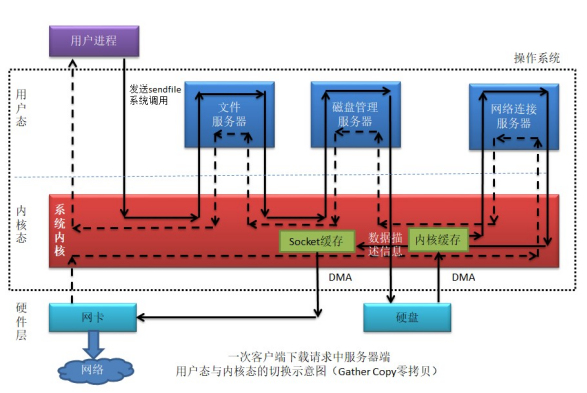
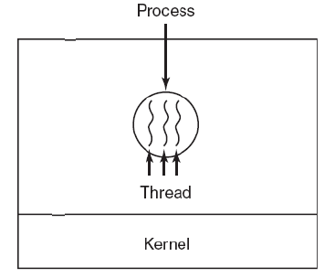
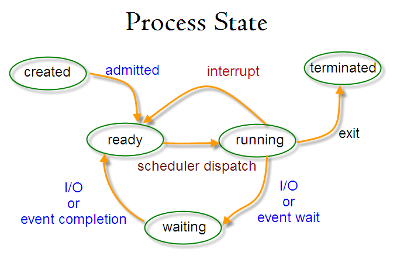
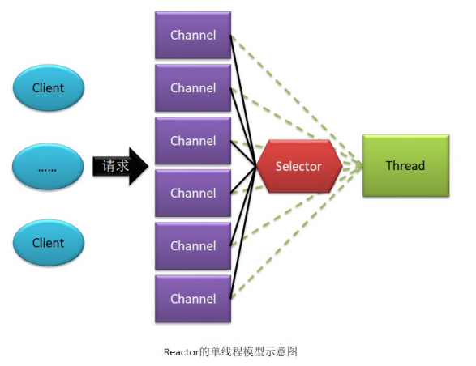
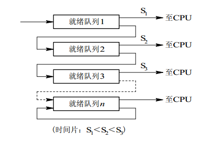

# 计算机操作系统

## 目录

- [概述](#概述)
- [进程管理](进程管理.md)
- [内存管理](md)
- [设备管理](md)
- [链接](md)
- [文件管理]()
- [IO管理]()

## 参考资料

- 汤子瀛, 哲凤屏, 汤小丹. 计算机操作系统
- [慕课网课程大学计算机必修课新讲--编译原理+操作系统+图形学_课程 (imooc.com)](https://coding.imooc.com/learn/list/432.html)
- 深入理解计算机系统

# 概述

* 基本概念
* 基本特征
  * 并发
  * 共享
  * 虚拟
  * 异步
* 基本分类（了解）
* 基本功能
  * 进程管理
  * 内存管理
  * 文件管理
  * 设备管理
* 系统调用
* 大内核和微内核
  * 大内核
  * 微内核
* 中断分类
  * 外中断
  * 异常
  * 陷入

## 基本概念

### 操作系统基本概念

* 控制和管理整个计算机系统的硬件和软件资源
* 并合理地组织调度计算机地工作和资源地分配，
* 以提供给用户和其他软件方便的接口和环境，
* 是计算机系统中最基本的系统软件

### 功能和目标

- 管理系统资源：硬件资源+软件资源


- 作为用户和计算机硬件之间的接口


* 作为最接近硬件的层次
* 对硬件机器的扩展
* 方便用户使用

## 基本特征

### 并发

并发是指宏观上在一段时间内能同时运行多个程序，而并行则指同一时刻能运行多个指令。

并行需要硬件支持，如多流水线、多核处理器或者分布式计算系统。

操作系统通过引入进程和线程，使得程序能够并发运行。而并发这个特性使得 OS 能有效提高系统中资源的利用率，增加系统的吞吐量。

<b>并发与并行的区分</b>

* 并发是一个时间段内交替执行
* 并行是一个时间点内同时执行

### 共享

共享是指系统中的资源可以被多个并发进程共同使用。当系统中资源数量少于多个进程对资源的需求数量时，就会形成对共享资源的争夺。根据进程对资源复用方式的不同，目前主要实现资源共享的方式有两种：<span style="color:orange">互斥共享和同时共享。互斥共享的资源称为临界资源.</span>

* 互斥共享方式：一段时间只允许一个进程访问，该进程访问完后才允许下一个访问。例如打印机等，虽然可供多个进程使用，但在一段时间内，只允许一个进程访问，需要用同步机制来实现互斥访问。
* 同时共享方式：宏观上同时，微观上交替执行，如磁盘。

<b>并发和共享的关系</b>

* 没有程序的并发执行，一次只能执行一个程序，也就没有必要共享资源了。反正一次就一个程序，可以随意独占资源
* 没有资源的共享，程序的并发也很难进行。不能共享 CPU，程序无法执行，不能共享需要的必要资源，程序无法正常运行。
* 没有离开共享的并发，也没有无并发的共享。

### 虚拟

虚拟技术把一个物理实体转换为多个逻辑实体。`物理-->逻辑`的映射。主要有两种虚拟技术：

- 时（时间）分复用技术
  - 利用某设备为一用户服务的空闲时间，转去为其他用户服务；尽量不让设备空闲。
- 空（空间）分复用技术
  - 利用存储器的空闲空间分区域存放和运行其他多道程序，以此提高内存的利用率；尽量不让空间空闲。

<span style="color:orange">多个进程能在同一个处理器上并发执行使用了时分复用技术</span>，让每个进程轮流占用处理器，每次只执行一小个时间片并快速切换。

<span style="color:orange">虚拟内存中内存的换入换出使用了空分复用技术。</span>它将物理内存抽象为地址空间，每个进程都有各自的地址空间。地址空间的页被映射到物理内存，地址空间的页并不需要全部在物理内存中，当使用到一个没有在物理内存的页时，执行页面置换算法，将该页置换到内存中。

<b>Doubble 中的虚拟化</b>

这种“虚拟化”思想，在开发中也经常用到，可以解决很多不方便解决的问题。例如，Dubbo 在采用一致性 Hash 算法实现负载均衡时会出现一个问题：提供者 Server 的增减，仅对某个提供者的负载状态有影响，对其它提供者没有任何帮助。Dubbo 使用“虚拟化思想”对该算进行了优化，默认将一台物理提供者虚拟为了 360 个，解决了原来的问题。

### 异步

异步指进程不是一次性执行完毕，而是走走停停，以不可知的速度向前推进。（不知道何时完成）

### 总结

- 并发和共享是最基本的特征
- 理解并发和并行的区别
- 并发和共享互为存在条件
- 没有并发和共享，就谈不上虚拟和异步，因此并发和共享是 OS 的两个最基本的特征

## 发展历程（了解）

### 手工阶段

没有操作系统阶段，所有工作要人干预，用户独占全机。人机矛盾（处理程序的速度和资源利用率之间的矛盾）越来越大

### 批处理阶段

为解决人机矛盾及 CPU 和 IO 设备之间的速度不匹配问题出现了批处理操作系统。

* 单道批处理：
  * 目的：缓解人机矛盾
  * 优点：缓解了一定程度的人机速度矛盾，资源利用率有所提升
  * 缺点：内存中仅能有一道程序运行，只有该程序运行结束之后才能调入下一道程序。CPU 有大量的时间是在空闲等待 IO 完成，资源利用率依然很低
* 多道批处理：
  * 目的：为进一步提高资源的利用率和系统吞吐量
  * 优点：
    * 多道程序并发执行，共享计算机资源。资源利用率大幅提升
    * CPU 和其他资源保持忙碌状态，系统吞吐量增大。
  * 缺点：用户响应时间过长，不提供人机交互能力
* 多道批处理需要解决的问题
  * 处理机争用问题
  * 内存分配和保护问题
  * IO 设备分配问题
  * 文件的组织和管理问题
  * 用户与系统接口问题

### 分时操作系统

* 目的：提供人机交互
* 技术：采用的分时技术：时间片
* 缺点：不能优先处理一些紧急任务。
* 特征：同时性，交互性，独立性，及时性

### 实时操作系统

* 目的：为了能在某个时间限制内完成某些紧急任务而不需要时间片排队（十分注重及时性）
* 可分为软硬两种
  * 软实时操作系统：允许偶尔错过任务截至时间
  * 硬实时操作系统：不允许错过任务截至时间
* 如：飞行自动控制系统；飞机订票系统；银行管理系统

### 网络操作系统

网络中各种资源共享，各台计算机之间的通信

### 分布式操作系统

分布式和并行，若干台计算机相互协同完成某一任务

### 个人计算机操作系统

* 单用户单任务操作系统
* 单用户多任务操作系统
  * 只允许一个用户上机，但允许用户把程序分为若干个任务并发执行
* 多用户多任务操作系统
  * 允许多个用户通过终端共享资源，每个用户程序又可进一步分为多个任务，增加系统吞吐量。

## 系统调用

系统调用是操作系统提供给应用程序使用的接口，可理解为一种可供应用程序调用的特殊函数，应用程序通过系统调用请求来获得操作系统的服务。

如果一个进程在用户态需要使用内核态的功能，就进行系统调用从而陷入内核，由操作系统代为完成。

<div align="center"></div>

<b>系统调用按功能分类可分为如下几类：</b>

* 设备管理：完成设备的请求、释放、启动等功能
* 文件管理：完成文件的读、写、创建、删除等功能
* 进程控制：完成进程的创建、撤销、阻塞、唤醒等功能
* 进程通信：完成进程之间的消息传递、信号传递等功能
* 内存管理：完成内存的分配、回收等功能

<b>Linux 的系统调用主要有以下这些：</b>

|   Task   | Commands                    |
| :------: | --------------------------- |
| 进程控制 | fork(); exit(); wait();     |
| 进程通信 | pipe(); shmget(); mmap();   |
| 文件操作 | open(); read(); write();    |
| 设备操作 | ioctl(); read(); write();   |
| 信息维护 | getpid(); alarm(); sleep(); |
|   安全   | chmod(); umask(); chown();  |

<b>系统调用和库函数的区别</b>

* 系统调用是操作系统向上层提供的接口
* 有的库函数是对系统调用的进一步封装
* 当今编写的应用程序大多是通过高级语言提供的库函数间接地进行系统调用

<b>系统调用的具体过程</b>

系统调用发生在用户态。是用户向系统请求调用，所以是发生在用户态。对系统调用的处理发生在核心态。是 OS 对调用进行处理，分配资源等。执行陷入指令会产生内中断，使处理器从用户态进入核心态。

* 传递系统调用参数
* 执行陷入指令
* 执行系统调用相应服务程序
* 返回用户程序

## 大内核和微内核

### 大内核

大内核是将操作系统功能作为一个紧密结合的整体放到内核。

由于各模块共享信息，因此有很高的性能。但是由于内核代码庞大，结构相对混乱，难以维护。

### 微内核

由于操作系统不断复杂，因此将一部分操作系统功能移出内核，从而降低内核的复杂性。移出的部分根据分层的原则划分成若干服务，相互独立。

在微内核结构下，操作系统被划分成小的、定义良好的模块，只有微内核这一个模块运行在内核态，其余模块运行在用户态。内核态的模块和用户态的模块通信的话，需要频繁的在用户态和核心态之间进行切换，所以会有一定的性能损失。但是内核功能少，结构清晰，方便维护。

<div align="center"></div>

<b>机制与策略分离原理</b>

在现代操作系统的结构设计中，经常采用“机制与策略分离原理”来构造 OS。

- 机制：实现某一功能的具体执行机构。
- 策略：在机制基础上借助某些参数和算法来实现对该功能的优化。

机制处于系统的低层，而策略处于系统的高层。在微内核 OS 中，通常将机制放在微内核中，策略放在微内核外围的服务进程中。

>例如，进程管理中设置一些进程优先级队列，然后就可以按照优先级从队列中取出进程，为之分配*CPU*让其运行。这一部分调度功能属于机制问题。而进程优先级算法就属于策略问题。 
>
>再如，对于 虚拟存储器管理，将用户空间中的逻辑页地址转换为内存空间中的物理块地址，需要页表机制与地址转换机制，应在内核中实现。而页面转换所采用的算法，内存分配与回收等策略，应在内核的外置（服务进程）中实现。

<b>Dubbo 中的微内核</b>

微内核设计模式，在开发中也很常见。例如，RPC 框架 Dubbo。 

>SPI，Service Provider Interface，服务提供者接口，是一种服务发现机制。 

Dubbo 作为一个优秀的 RPC 框架，Apache 的顶级项目，其最大的亮点之一就是其优秀的无限开放性设计架构——“微内核+插件”的架构设计思想，使得其几乎所有组件均可方便的进行扩展、增强、替换。内核只负责组装插件（扩展点），Dubbo 的功能都是由插件实现的。

## 支撑功能

### 中断处理

中断机制的诞生目的是为了实现多道程序并发执行。中断处理是内核最基本的功能，是整个 OS 工作的基础，没有中断处理就没有 OS 的并发，OS 中的许多重要活动无不依赖于中断。

当中断发生时，CPU 立即进入核心态；当中断发生后，当前运行的进程暂停运行，并由 OS 内核对中断进行处理；对于不同的中断信号，会进行不同的处理。

为了减少 CPU 中断的时间，提高程序执行的并发性，内核也只是对中断进行“短暂处理”，继而转入相关其它进程去完成后续工作。

<b>ZK、Nacos、Apollo 中的“中断”</b>

中断处理的思想，反映到同一 JVM 中的开发中，其实就是监听机制。反映到分布式开发中，其实就是发布/订阅模式。

关于监听机制 Listener 十分基础，应用广泛，这里就不举例了。分布式开发中的发布/订阅模式的应用也较多。例如，Zookeeper 的 Watcher 机制、Zookeeper 作为注册中心时的服务注册与订阅、Zookeeper、Nacos、Apollo 作为配置中心时微服务对配置文件的订阅、消费者对 Kafka、RocketMQ 等消息中间件中相关主题消息的订阅

<b>中断可分为：外中断、异常、陷入（trap）</b>

> 外中断

由 CPU 执行指令以外的事件引起，如 I/O 完成中断，表示设备输入/输出处理已经完成，处理器能够发送下一个输入/输出请求。此外还有时钟中断、控制台中断等。

<b>外中断的处理过程如下</b>

* 每条指令执行结束后，CPU 检查是否有外部中断信号
* 若有外部中断信号，则需要保护被中断进程的 CPU 环境
* 根据中断信号类型转入相应的中断处理程序
* 恢复原进程的 CPU 环境并退出中断，返回原进程继续往下执行

> 异常

由 CPU 执行指令的内部事件引起，如非法操作码、地址越界、算术溢出等。

> 陷入

在用户程序中使用系统调用。

### 时钟管理

时钟管理是内核的一项基本功能，在 OS 中的许多功能都需要它的支撑。例如，时间片轮转调度中，每当时间片用完，时钟管理就会产生一个中断信号，使调度程序重新进行调度。

### 原语操作

原语操作，由一组指令构成，用于完成某一特定功能。这组操作中的指令具有的一个特征是，要么全做，要么全不做，即原子性。它们的执行过程是不允许被中断的。原语操作在系统态下执行，常驻内存。

## 零拷贝

<b>什么是零拷贝?</b>

零拷贝指的是，从一个存储区域到另一个存储区域的 copy 任务无需 CPU 参与就可完成。零拷贝的底层是通过 DMA 总线技术实现的。零拷贝与具体的编程语言无关，完全依赖于 OS，OS 支持就可使用，不支持设置了也不起作用。

DMA（Direct Memory Access，直接内存访问）是一种计算机系统内部的数据传输技术，需要 DMA 总线（硬件的体系结构）的硬件支持。其整个数据传输过程是在 DMA 控制器下完成的。

零拷贝在计算机内部数据拷贝及网络传输中都大量使用，用于减少 CPU 消耗和内存带宽占用，减少用户空间与内核空间的拷贝过程，减少用户态与内核态间的切换次数，提高系统效率，提升系统性能。例如远程服务器处理客户端浏览器的主页打开请求过程，就是一个零拷贝在网络传输中的典型应用。下面全部以该场景为例进行分析。

<b>传统拷贝方式</b>

站在服务器角度，服务器操作系统经历了以下过程：

<div align="center"></div>

该拷贝方式共进行了 16 次用户空间与内核空间的上下文切换，以及 4 次数据拷贝，其中两次拷贝存在 CPU 参与。

<b>零拷贝方式</b>

<div align="center"></div>

该拷贝方式共进行了 14 次用户空间与内核空间的上下文切换，以及 3 次数据拷贝，但整个拷贝过程均没有 CPU 的参与，这就是零拷贝。

<b>Gather Copy 零拷贝</b>

该拷贝方式是由 DMA 完成，当然，需要当前主机的 DMA 支持 Gather Copy 方式。

<div align="center"></div>

该方式中没有数据拷贝到socket buffer。取而代之的是只是将 kernel buffer 中的数据描述信息写到了 socket buffer 中。数据描述信息包含了两方面的信息：kernel buffer 中数据的地址及偏移量。该拷贝方式共进行了 14 次用户空间与内核空间的上下文切换，以及 2 次数据拷贝，并且整个拷贝过程均没有 CPU 的参与。

<b>mmap 零拷贝</b>

mmap，Memory Map，存储映射。mmap 零拷贝是对零拷贝的改进。当然，若当前主机的 DMA 支持Gather Copy，mmap 同样可以实现 Gather Copy DMA 的零拷贝。

<div align="center"></div>

该方式与普通零拷贝的唯一区别是，应用程序与内核共享了 Kernel buffer。由于是共享，所以应用程序也就可以操作该 buffer了。当然，应用程序对于 Kernel buffer 的操作，就会引发用户空间与内核空间的相互切换。

# 进程管理

- 进程的引入
- 进程与线程
- 进程状态的切换
- 进程调度算法
- 进程同步
- 经典同步问题
- 进程通信

## 进程的引入

为什么要引入进程？引入进程是为了更好地描述控制程序的并发执行，实现操作系统的并发性和共享性。

## 进程与线程

### 进程

* ①进程是程序的一次执行过程，是资源分配的基本单位。
* ②进程是一个程序及其数据在处理机上顺序执行时所发生的活动。
* ③进程是具有独立功能的程序在一个数据集合上运行的过程，是系统进行资源分配和调度的一个基本单位。这里的系统资源是指处理机、存储器、和其他设备服务于某进程的“时间”。

进程控制块 (Process Control Block, PCB) 描述进程的基本信息和运行状态，进而控制和管理进程。所谓的创建进程和撤销进程，都是指对 PCB 的操作。

PCB 数据结构中共包含四大类信息：进程状态信息、处理器状态信息、进程调度信息，进程控制信息。

<div align="center"></div>

下图显示了 4 个程序创建了 4 个进程，这 4 个进程可以并发地执行。

<div align="center"></div>

> 扩展内容 PCB

PCB，常驻内存，是进程实体的一部分，进程存在的唯一标志。创建进程实际上就是创建 PCB

<b>PCB 的组成</b>

* 进程描述信息：进程标识符 PID、用户标识符 UID
* 进程控制和管理信息：进程当前在状态、进程优先级
* 资源分配清单：程序段指针、数阶段指针、键盘、鼠标
* 处理机相关信息：各种寄存器

<b>PCB 在进程切换中的作用</b>

系统就是根据 PCB 来感知进程的存在的。PCB 在进程切换过程中起着非常重要的作用，操作系统可以通过对 PCB 的修改来达到对进程的控制。

<div align="center"></div>

<b>PCB 组成方式</b>

粗略理解的话，无论是就绪队列，还是各种阻塞队列，其队列元素都是 PCB。

不同应用可以产生很多异类进程，一个应用可以产生很多同类进程。无论是何类进程，其会按照它们的状态将它们组织到一起。常见的组织方式有两种：

<span style="color:orange">链表方式</span>：同一状态的进程的 PCB 组成一个链表，所以多种状态的进程 PCB 组成多个链表。此时就会产生诸如就绪链表、阻塞链表等不同链表。

<span style="color:orange">索引表方式</span>：所有 PCB 都放入同一链表，再为每种状态创建出不同的 PCB 索引链表，其中存放的就是该状态的所有 PCB 的索引。

<div align="center"></div>

> 进程的特征

- 动态性：进程是程序的一次执行过程，是动态地产生、变化和消亡地
- 并发性：内存中有多个进程实体，各进程可并发执行
- 独立性：进程是能独立运行、独立获得资源、独立接受调度的基本单位
- 异步性：各进程按各自独立的、不可预知的速度向前推进，操作系统要提供进程同步机制来解决异步问题
- 结构性：每个进程都会配置一个 PCB。结构上看，进程由程序段、数据段、PCB 组成

> 其他内容

程序段是指能被进程调度程序调度到 CPU 执行的程序代码，它可被多个进程共享，即多个进程可运行同一个程序。

数据段是指进程对应的程序加工处理的原始数据，也可以是程序执行时产生的中间结果或最终结果。

### 线程

线程是独立调度的基本单位。

一个进程中可以有多个线程，它们共享进程资源。

QQ 和浏览器是两个进程，浏览器进程里面有很多线程，例如 HTTP 请求线程、事件响应线程、渲染线程等等，线程的并发执行使得在浏览器中点击一个新链接从而发起 HTTP 请求时，浏览器还可以响应用户的其它事件。

<div align="center"></div>

### 区别

Ⅰ 拥有资源

进程是资源分配的基本单位，但是线程不拥有资源，线程可以访问隶属进程的资源。

Ⅱ 调度

线程是独立调度的基本单位，在同一进程中，线程的切换不会引起进程切换，从一个进程中的线程切换到另一个进程中的线程时，会引起进程切换。

Ⅲ 系统开销

由于创建或撤销进程时，系统都要为之分配或回收资源，如内存空间、I/O 设备等，所付出的开销远大于创建或撤销线程时的开销。类似地，在进行进程切换时，涉及当前执行进程 CPU 环境的保存及新调度进程 CPU 环境的设置，而线程切换时只需保存和设置少量寄存器内容，开销很小。

Ⅳ 通信方面

线程间可以通过直接读写同一进程中的数据进行通信，但是进程通信需要借助 IPC。

### 实现方式

<b>用户级线程</b>：所有工作都由应用程序完成，内核意识不到线程的存在。

<b>内核级线程</b>：所有工作由内核完成，应用程序没有进行线程管理的代码。

多线程模型

* 多对一模型：
  * 特点：多个用户级线程映射到一个内核级线程
  * 优点：线程管理在用户空间进行，不需要切换到核心态，线程管理的系统开销小，效率高。
  * 缺点：当一个用户级线程被阻塞后，整个进程都会被阻塞，并发度不高。多个线程不可在多核处理机上并发运行【一个线程被阻塞，其余的也被阻塞了】
* 一对一模型：
  * 特点：每个用户级线程映射到一个内核级线程
  * 优点：并发能力强
  * 缺点：创建线程开销大，影响性能
* 多对多模型：
  * 特点：集二者之长，n 个用户级映射到 m 个内核级（n>m）
  * 优点：克服了多对一模型并发度不高的缺点；克服了一对一模型中一个用户进程占用太多内核级线程，开销太大的缺点。

## 进程状态的切换

<div align="center"></div>

<div align="center"></div>

- 就绪状态（ready）：已经具备运行条件，但是缺少 CPU 资源
- 运行状态（running）：占有 CPU，并在 CPU 上运行
- 阻塞状态（waiting）：因等待某一事件而暂停不能运行，如等待 IO

应该注意以下内容：

- 只有就绪态和运行态可以相互转换，其它的都是单向转换。就绪状态的进程通过调度算法从而获得 CPU 时间，转为运行状态；而运行状态的进程，在分配给它的 CPU 时间片用完之后就会转为就绪状态，等待下一次调度。
- 阻塞状态是缺少需要的资源从而由运行状态转换而来，但是该资源不包括 CPU 时间，缺少 CPU 时间会从运行态转换为就绪态。

## 进程控制

进程控制是进程管理中最基本的功能。如，进程的创建与终止、进程状态转换等。进程控制一般是由 OS 内核中的原语实现的。

### 进程的创建 

<b>父子进程</b>

 在 OS 中，进程一般由 OS 内核创建，但也是允许使用一个用户进程去创建另一个进程的。此时的创建进程称为父进程，被创建进程称为子进程。当然子进程还可以再创建出更多的孙子进程。这种创建与被创建关系，很自然可以形成树型层次结构。例如，Unix、Linux 系统。

对于具有层次结构的父子进程，在 PCB 中设置了专门的家族关系表项，以标明自己的父进程及所有子进程。这种父子进程间的关系十分紧密：

- 子进程可以继承父进程的所有资源，且父进程不能拒绝子进程的继承权。当子进程终止时，会将其从父进程获取到的资源全部归还给父进程。
- 父进程可以管理子进程的生命周期。例如，父进程可以终止子进程，父进程可以挂起和激活子进程，父进程在终止时会将其所有子进程全部终止。

但并不是所有 OS 中的这种创建与被创建关系的父子进程间就一定会形成树型层次结构。例如，Windows 系统。在 Windows 系统中父子进程间是不存在层级结构的，所有进程间具有同等的地位。但父进程在创建子进程时会获得了子进程句柄，可以实现对子进程的控制。不过，这种控制句柄是可以传递的，没有父子关系的进程间也可以通过控制句柄实现控制关系。

<b>Nginx、Redis、Dubbo 中的父子进程</b>

在开发中，父进程 fork 出子进程的应用非常广泛。

>在 Linux 系统中父进程创建出子进程的过程是通过系统调用 fork() 完成的，所以一般称父进程创建子进程为父进程 fork 出子进程。

例如，Nginx 中的 worker 进程就是由 master 进程 fork 出的，然后父子进程各司其职。当然，master 进程可以 fork 出多少 worker 进程，可以在配置文件中指定。再如，对于 Redis 默认的 RDB 持久化，在进行 bgsave 持久化时，redis-server 进程会 fork 出一个子进程，由该子进程以异步方式负责完成持久化。而在持久化过程中，redis-server 进程不会阻塞，其会继续接收和处理用户请求。再有，在 Dubbo 的 forking 集群容错策略中，消费者对于同一服务会 fork 出多个子进程（线程）去并行调用多个提供者服务器，只要有一个成功即调用结束并返回结果。通常用于实时性要求较高的读操作，但其会浪费较多的服务器资源。

<b>进程创建事件</b>

一个进程可以由系统内核创建，也可以由另一个进程创建。发生进程创建的典型事件有三类：

- 用户登录：在分时系统中，用户登录后，系统内核会为该用户创建一个进程。
- 作业调度：在多道批处理系统中，当作业调度程序调度到某作业后，会将其装入内存，并由系统内核为该作业创建一个进程。
- 请求处理：当某进程在运行过程中提出某种请求后，系统内核或主进程将会创建一个相应的子进程来处理该请求，以使主进程与子进程可以并发执行。例如，用户进程提交了一个文件打印请求后，系统内核会创建一个打印进程来处理该请求。

<b>进程创建过程</b>

无论是 OS 内核创建进程，还是用户进程创建子进程，都是调用了进程创建原语完成的。进程创建原语的创建过程如下：

- 生成进程标识符 PID，这是一个数字标识符，用于区分系统中的所有进程，在系统中具有唯一性。
- 申请空白 PCB。
- 为进程分配其运行所需的一切资源（除 CPU 外）这些资源要么从 OS 直接获得，要么从父进程获得。
- 初始化 PCB。这些初始化信息包括自己的 PID 及父进程的 PID，当前处理器的状态数据，进程的状态数据。
- 将进程写入就绪队列或静止就绪队列。

### 进程终止

<b>进程终止事件</b>

引起进程终止的事件典型的有三类：

- 正常结束：进程的任务正常执行完毕后的进程终止。当进程的任务执行完毕后，进程会发出一条终止指令，此时会产生一个中断，以通知 OS 进程马上终止。
- 异常结束：进程在运行过程中发生了某种异常事件，导致进程无法继续运行。
- 外界干预：进程被外界干预终止。外界干预主要指三方面：用户直接终止，OS 终止，父进程终止。

常见的异常事件有：访问越界 、非法指令、权限异常、运行超时、等待超时、运算异常、IO 异常。

<b>进程终止过程</b>

系统中发生进程终止事件，OS 就会调用进程终止原语去终止进程。进程终止原语的终止过程如下

- 根据被终止进程的 PID，找出其 PCB。

-  从 PCB 中读取其状态，若该进程处于执行态，则立即终止其执行，并置调度标志为真，用于标志该进程可被重新调度。

- 从 PCB 中读取其子进程 PID，若该进程还有子进程，则要将其所有子进程全部终止。

- 从 PCB 中读取其所拥有的全部资源，并全部释放，归还给其父进程或系统。

    - 这个资源释放的过程主要包含两步： 

        将其 PCB 赋值为 null

        在其父进程或系统的资源数量上增加相应释放的数量

- 将该进程的 PCB 从 PCB 队列或链表中移出。
- 释放该 PCB 空间。

### 进程的阻塞与唤醒

<b>引发进程阻塞的事件</b>

进程发生阻塞是由于正在执行的进程突然发生执行条件缺失事件，进而暂停执行等待条件的满足；而阻塞进程被唤醒则是由于发生了某些事件，从而具备了执行条件，到达了执行时机。典型的引发进程阻塞的事件有以下四类：

<b>等待资源</b>

进程在运行过程中需要某种资源，但由于系统中的该类资源已被其它进程所使用，暂无足够的资源分配给它，那么该进程只能等待，即由运行态转为阻塞态。当其它进程释放了足够的资源时，系统会唤醒由于缺乏该资源而阻塞的进程。此时进程由阻塞态转为就绪态。

> 无论是临界资源还是共享资源，只要其需要的数量不够，就会阻塞。例如，打印机（临界资源）、缓存（共享资源）

<b>等待 IO 完成</b>

当进程启动某 IO 操作后，如果该进程必须在该 IO 操作完成后才能继续执行，则会先将该进程阻塞，以等待 IO 操作的完成。IO 操作完成后，再由中断处理程序将该进程唤醒。

例如，Redis 的 RDB 持久化的 save 方式持久化过程；再如，下面的 C 语言代码的执行，只有输入结束后，才会完成主进程中的输出。

```c
#include<stdio.h>
int main(void){
    int a;
    printf("please input a num:");
    scanf("%d",&a);
    printf("a=%d",a);
    return 0;
}
```

<b>等待数据到达</b>

对于相互合作的进程，如果一个进程专门用于处理由其它进程提供的数据的，那么在其它进程提供的数据未到达之前，该进程就处于阻塞态。当其所需要的数据全部到齐后，该进程就会被唤醒。

<b>等待任务到达</b>

在某些系统中，特别是在分布式系统环境中，往往设置一些特定功能的进程，每当完成特定任务后就会把自己阻塞起来，等待新任务的到来。而当新任务到来后，会立即唤醒这些进程。例如，MQ 中的消息发送进程与消息接收进程。 

<b>进程阻塞过程</b>

阻塞是进程自身的一种主动行为。当系统中发生进程阻塞事件后，进程自己会调用进程阻塞原语将自己阻塞。进程阻塞原语的阻塞过程如下：

- 立即暂停 CPU 的执行，保留当前 CPU 的现场。
- 将 PCB 中的状态由执行态修改为阻塞态。
- 将 PCB 写入到相应阻塞原因的阻塞队列。
- 启动调度程序进行重新调度，即将 CPU 分配给另一就绪进程。
- 按照新进程的 PCB 设置 CPU 新的环境。

<b>进程唤醒过程</b>

当被阻塞进程所期待的事件发生时，由“相关进程（促使执行条件满足的进程）”调用唤醒原语，将阻塞进程唤醒（唤醒是进程的被动行为）。进程唤醒原语的唤醒过程如下：

- 将该进程的 PCB 从阻塞队列移出。
- 修改 PCB 中的状态由阻塞变为就绪。
- 将 PCB 插入到就绪队列。

### 进程同步

单独拿出来讲

## 进程同步

为协调进程之间的相互制约关系，引入进程同步的概念。

### 临界区

对临界资源进行访问的那段代码称为临界区。

为了互斥访问临界资源，每个进程在进入临界区之前，需要先进行检查。

```c
do{
	entry section 			//进入区
	critical section		//临界区
	exit section			//退出区
	remainder section	//剩余区
}while(true)	
```

* 把一次仅允许一个进程使用的资源称为临界资源
* 许多物理设备都属于临界资源
* 对临界资源都必须互斥进行，访问临界资源的那段代码叫临界区

### 同步与互斥

- 同步：描述进程间的关系，也叫直接制约关系，源于进程间的相互合作，同步会使进程有一定的先后执行关系。
- 互斥：描述资源的使用，也叫间接制约关系。多个进程在同一时刻只有一个进程能进入临界区。

### 同步机制准则

同步机制的制定需要遵循四条准则：

- 空闲让进：若临界资源处于空闲状态，则应允许一个进程进入临界区访问临界资源
- 忙则等待：若已有进程进入临界区访问临界资源，则其它需要访问临界资源的进程必须等待，以实现对临界资源的互斥访问
- 有限等待：对临界资源进行等待的进程，应在有限时间内能进入临界区，以免陷入死等状态
- 让权等待：若进程由于无法进入临界区而发生等待，则应立即释放处理器，以免陷入忙等状态

### 信号量机制

信号量（Semaphore）是一个整型变量，可以对其执行 down 和 up 操作，也就是常见的 P 和 V 操作。

-   <b>down</b>：如果信号量大于 0 ，执行 -1 操作；如果信号量等于 0，进程睡眠，等待信号量大于 0；
-   <b>up</b>：对信号量执行 +1 操作，唤醒睡眠的进程让其完成 down 操作。

down 和 up 操作需要被设计成原语，不可分割，通常的做法是在执行这些操作的时候屏蔽中断。

如果信号量的取值只能为 0 或者 1，那么就成为了<b>互斥量（Mutex）</b>，0 表示临界区已经加锁，1 表示临界区解锁。

生产者消费者系列的问题在实际开发中推荐使用同步阻塞队列完成。

### 管程

使用信号量机制实现的生产者消费者问题编程很麻烦且容易出错，因此引入管程来简化代码的编写。而管程是一种面向对象思想的体现。其由一组共享数据结构及对这些数据的一组操作构成。

> 管程的组成

* 共享数据结构
* 对数据结构初始化的语句
* 一组可以用来访问数据结果的过程(函数)

> 基本特征

* 各外部进程\线程只能通过管程提供的特点入口才能访问共享数据
* 每次仅允许一个进程在管程内执行某个内部过程

> 补充

* 管程必须互斥访问管程的特性是由编译器实现的
* 可在管程中设置条件变量及等待、唤醒操作以解决同步问题

### 分布式同步

如果实现同步的进程分布在不同的服务器中，那么此时的进程同步需要用到分布式技术。可以实现分布式同步的分布式技术很多，例如 Redis、Zookeeper 等中间件。

分布式同步，也称为分布式协调，是分布式系统中不可缺少的环节，是将不同的分布式组件有机结合起来的关键。对于一个在多台机器上运行的应用而言，通常需要一个协调者来控制整个系统的运行流程，例如执行的先后顺序，或执行与不执行等，这种控制机制就称为分布式同步。

一种简单的分布式同步想法：专门维护一个服务用于给其他机器分配锁。加锁时，向该服务发送加锁的申请，解锁时向该服务发送解锁的申请。将分布式同步转化为多台机器向同一台机器 A 发送请求，A 中通过并发控制有序处理各个请求。

## 进程通信

进程通信即进程之间的信息交互。进程同步与进程通信很容易混淆，它们的区别在于：

- 进程同步：控制多个进程按一定顺序执行；
- 进程通信：进程间传输信息。

进程通信是一种手段，而进程同步是一种目的。也可以说，为了能够达到进程同步的目的，需要让进程进行通信，传输一些进程同步所需要的信息。

> 问题：为什么会有进程通信，不能直接访问吗？

* 不能，进程是分配系统资源的单位（包括内存地址空间）因此各进程拥有内存地址空间相互独立。
* 为保证安全，一个进程不能直接访问另一个进程的地址空间
* 但是为了让他们可以安全通信，OS 提供了一些方法

### 管道

管道是通过调用 pipe 函数创建的，fd[0] 用于读，fd[1] 用于写。

```c
#include <unistd.h>
int pipe(int fd[2]);
```

具体做法

* 设置一个特殊的共享文件（管道），其实就是一个缓冲区。
* 一个管道只能实现半双共通信。
* 实现双向同时通信要建立两个管道。
* 各进程要互斥访问管道。
* 写满时，不能再写，读空时，不能再读。
* 没写满，不能读，没读空，不能写。
* 必须提供的协调能力：互斥，同步和确定对方存在。

管道通信的限制：

- 只支持半双工通信（单向交替传输）；
- 只能在父子进程或者兄弟进程中使用。

<div align="center"></div>

### FIFO

也称为命名管道，去除了管道只能在父子进程中使用的限制。

```c
#include <sys/stat.h>
int mkfifo(const char *path, mode_t mode);
int mkfifoat(int fd, const char *path, mode_t mode);
```

FIFO 常用于客户-服务器应用程序中，FIFO 用作汇聚点，在客户进程和服务器进程之间传递数据。

<div align="center"></div>

### 消息队列

相比于 FIFO，消息队列具有以下优点：

- 消息队列可以独立于读写进程存在，从而避免了 FIFO 中同步管道的打开和关闭时可能产生的困难；
- 避免了 FIFO 的同步阻塞问题，不需要进程自己提供同步方法；
- 读进程可以根据消息类型有选择地接收消息，而不像 FIFO 那样只能默认地接收。

### 信号量

它是一个计数器，用于为多个进程提供对共享数据对象的访问。

### 共享存储

允许多个进程共享一个给定的存储区。因为数据不需要在进程之间复制，所以这是最快的一种 IPC。

需要使用信号量用来同步对共享存储的访问。

多个进程可以将同一个文件映射到它们的地址空间从而实现共享内存。另外 XSI 共享内存不是使用文件，而是使用内存的匿名段。

### 套接字

可用于不同机器间的进程通信。

### 进程通信案例

#### Netty 中的 NIO 通信

NettyClient 与 NettyServer 间的通信是全双工通道通信，因为它们都向彼此创建了一个通道 Channel，并且都是 NIO 的 Channel。只不过客户端是 NioSocketChannel，服务端是 NioServerSocketChannel。即它们的底层通信采用的都是 NIO 通信，即 Socket 通信。

#### 一致性通信模型

一致性通信模型，是为了实现数据一致性目的而构建的一种通信模型。为了了解“数据一致性”，先来了解一下“拜占庭将军问题”。 

<b>拜占庭将军问题</b>

拜占庭将军问题是由 Paxos 算法作者莱斯利·兰伯特 (Leslie Lamport) 提出的点对点通信中的基本问题。该问题要说明的意思是，在不可靠信道上试图通过消息传递的方式达到一致性是不可能的。

<b>两种通信模型</b>

一般情况下，分布式系统为实现节点中数据的一致性，各节点间通常采用两种一致性通信模型：星形通信模型与网状通信模型。无论哪种模型，其实现一致性的前提是，不存在拜占庭将军问题，即信道是安全的、可靠的，集群节点间传递的消息是不会被篡改的。paxos 算法采用的网状通信模型。

<div align="center"></div>

#### Reactor 通信模型

在高性能的网络通信设计中，有两个比较著名的网络通信模型 Reactor 和 Proactor 模式，其中 Reactor 模式属于同步非阻塞 I/O 的网络通信模型，而 Proactor 运属于异步非阻塞 I/O 的网络通信模型。

<b>Reactor 单线程模型</b>

<div align="center"></div>

Reactor 单线程模型，指的是当前的主机会为每一个通信对端形成一个 Channel，而所有这些 Channel 都会与一个线程相绑定，该线程用于完成它们间的所有通信处理。

>就绪事件分为四类： 
>
>- 连接就绪：SelectionKey.OP_CONNECT。
>- 接收连接就绪：SelectionKey.OP_ACCEPT。 
>- 读就绪：SelectionKey.OP_READ。 
>- 写就绪：SelectionKey.OP_WRITE。 

<b>Reactor 线程池模型</b>

<div align="center"></div>

Reactor 单线程模型中使用一个线程处理所有通信对端的所有请求，在高并发场景中会严重影响系统性能。所以，就将单线程模型中的这一个线程替换为了一个线程池。大大提高了系统性能。

<b>Reactor 多线程池模型</b>

<div align="center"></div>

若在高并发场景下（请求连接的并发量是数以百万计的），且 IO 操作还比较耗时，此时的 Server 即使采用的是 Reactor 线程池模型，系统性能也会急剧下降。此时，可以将连接操作与 IO 操作分开处理，形成 Reactor 的多线程模型。

当客户端通过处理连接请求的 Channel 连接上 Server 后，系统会为该客户端再生成一个子 Channel 专门用于处理该客户端的 IO 请求。这两类不同的 Channel 连接着两类不同的线程池。而线程池中的线程数量，可以根据需求分别设置。提高了系统性能。

<b>Netty 中的 Reactor</b>

NettyServer 与 NettyClient 都是采用了 Reactor 通信模型与客户端进行通信，但并不完全相同。

<div align="center"></div>

Netty-Server 采用了多线程模型。不过线程池是由 EventLoopGroup 充当。EventLoopGroup 中的每一个 EventLoop 都绑定着一个线程，用于处理该 Channel 与当前 Server 间的操作。一个 Channel 只能与一个 EventLoop 绑定，但一个 EventLoop 可以绑定多个 Channel。即 Channel 与 EventLoop 间的关系是 n:1。所以每一个 EventLoop 就需要一个 Selector，用于选择其来处理哪个 channel 中的请求。

<div align="center"></div>

Netty-Client 采用的是线程池模型。因为其只需要与 Server 连接一次即可，无需区分连接请求与 IO 请求。

#### Proactor 通信模型

由于 Reactor 模式属于同步非阻塞 I/O 的网络通信模型，其同步性导致其处理高耗时 IO 时性能会较低。于是就产生了异步非阻塞 I/O 的网络通信模型 Proactor。

<b>Reactor 模型的 IO</b>

下面以网络 IO 中的读操作请求为例来分析整个执行过程。

<div align="center"></div>

当 IO 调用线程（主线程）发起了 read() 调用后，系统会创建一个 Channel，并会将其注册到 Selector，并注册“读就绪”事件 OPS_READ，然后该线程会不停的查看 User Buffer 中是否有了数据。即 IO 调用线程在等待 IO 期间并未发生阻塞，所以 Reader 模型属于非阻塞 IO。 

当 selector 接收到这个注册后，其就会不停的查看该 Channel 所关联的网卡缓存中是否具有了数据。当 Selector 发现到该网卡缓存中具有了数据后，该读操作就绪。此时与该 Selector 绑定的线程，即 IO 执行线程，会发起 system call，将网卡缓存中的数据读取到 User Buffer。 

当 User Buffer 中出现数据后，会被 IO 调用线程发现，其会使用 User  Buffer 中的数据继续执行 read() 后面的逻辑。即 IO 后面逻辑的执行是在 IO 完成后才进行的，所以 Reactor 模型属于同步IO，即 Reactor 模型属于“同步非阻塞 IO ”模型。

<b>Proactor 模型的 IO</b>

下面仍以网络 IO 中的读操作请求为例来分析整个执行过程。

<div align="center"></div>

当 IO 调用线程（主线程）调用了异步的 read() 操作后，系统会创建一个 Channel，并会将其注册到 Proactor 实例，并注册“读结束”事件 ReadComplete，然后该线程会继续执行 read() 后的逻辑而不会等待 IO 的完成。所以，Proactor 模型属于“异步非阻塞 IO ”模型。

在 Proactor 模型中，一个 Channel 的所有 IO 操作共享一个 Proactor 实例。或者说，一个 Proactor 实例处理同一 Channel 中所有的 IO 请求。这个 Proactor 实例是在 Channel 创建时完成的初始化。每个 Proactor 实例具有一个绑定的线程，用于执行相关 IO 操作。这个绑定的线程就是 IO 执行线程。

当 Proactor 实例接收了 read() 操作的注册后，其会为网卡缓存注册一个监听。若网卡缓存中有了数据，则马上通过 DMA 将数据写入到 User Buffer 中。一旦数据写入 User Buffer 完成，则该 IO 操作完毕，产生 ReadComplete 事件。此时会将该事件写入到 Proactor 所维护的一个队列。Proactor 实例会将队列中的事件逐个发送给各个 IO 调用者线程，触发这些 IO 调用者线程相应的回调。

#### 对比

- Proactor 的异步性使其并发处理能力要强于 Reactor
- Proactor 在处理高耗时 IO 时性能要高于 Ractor
- Proactor 的实现逻辑复杂，其编码成本较 Ractor 高很多
- Proactor 的异步性依赖于 OS 对异步的支持

## 进程调度算法

调度是为了合理处理计算机软硬件资源。

### 调度概念

对处理机进行分配，从就绪队列中，按一定的算法（公平，高效）选择一个进程将处理机分配给它，实现进程并发执行。

操作系统的调度分为如下三大类：

* 作业（高级）调度：内存与辅存之间的调度，面向作业的，发生频率低。
* 中级（内存）调度：为了提高内存利用率，将暂时不用运行的进程从内存中调出，将需要运行调入内存。面向进程的，发生频率中等。
* 进程（低级）调度：操作系统中最基本的调度，调度频率很高。

作业调度是为进程活动做准备，进程调度使进程正常活动起来，中级调度将暂时不能运行的进程挂起，中级调度处于作业调度和进程调度之间。

* 为减轻系统负载，提高资源利用率，暂时不执行的进程会被调到外存从而变成“挂起态”
* 七状态模型：在五状态模型的基础上加入了<b>“就绪挂起”</b>和“<b>阻塞挂起”</b>两种状态

抢占式调度和非抢制式调度

* 剥夺调度方式（抢占式），如果有更重要或更紧迫的进程需要使用处理机时，则立即停止当前执行的进程
* 非剥夺调度方式（非抢制式）
    * 只允许进程主动放弃处理机
    * 优先权、短进程优先、时间片原则
    * 对提高系统吞吐率和响应效率都有明显的好处

不同环境的调度算法目标不同，因此需要针对不同环境来讨论调度算法。

### 批处理系统

批处理系统没有太多的用户操作，在该系统中，调度算法目标是保证吞吐量和周转时间（从提交到终止的时间）。

<b>先来先服务 first-come first-serverd（FCFS）</b> 

非抢占式的调度算法，按照请求的顺序进行调度。

有利于长作业，但不利于短作业，因为短作业必须一直等待前面的长作业执行完毕才能执行，而长作业又需要执行很长时间，造成了短作业等待时间过长。

<b>短作业优先 shortest job first（SJF）</b>  

非抢占式的调度算法，按估计运行时间最短的顺序进行调度。

长作业有可能会饿死，处于一直等待短作业执行完毕的状态。因为如果一直有短作业到来，那么长作业永远得不到调度。另外作业/进程的运行时间由用户提供的，并不一定真实，不一定能做到真正的短作业优先。

<b>最短剩余时间优先 shortest remaining time next（SRTN）</b>

最短作业优先的抢占式版本，按剩余运行时间的顺序进行调度。 当一个新的作业到达时，其整个运行时间与当前进程的剩余时间作比较。如果新的进程需要的时间更少，则挂起当前进程，运行新的进程。否则新的进程等待。

SJF 和 SRTN 都会导致饥饿，如果有源源不断地短作业/进程来到，可能使长作业/进程长时间得不到服务，导致饥饿。

### 交互式系统

交互式系统有大量的用户交互操作，在该系统中调度算法的目标是快速地进行响应。

<b>时间片轮转</b>  

将所有就绪进程按 FCFS 的原则排成一个队列，每次调度时，把 CPU 时间分配给队首进程，该进程可以执行一个时间片。当时间片用完时，由计时器发出时钟中断，调度程序便停止该进程的执行，并将它送往就绪队列的末尾，同时继续把 CPU 时间分配给队首的进程。

时间片轮转算法是一个抢占式的，由时钟装置发出时钟中断来通知 CPU 时间片已到。

时间片轮转算法的效率和时间片的大小有很大关系：

- 因为进程切换都要保存进程的信息并且载入新进程的信息，如果时间片太小，会导致进程切换得太频繁，在进程切换上就会花过多时间。
- 而如果时间片过长，那么实时性就不能得到保证。

<div align="center">  </div>

<b>优先级调度</b>  

为每个进程分配一个优先级，根据任务的紧急程度来决定处理顺序。

为了防止低优先级的进程永远等不到调度，可以随着时间的推移增加等待进程的优先级。一般情况下，系统进程优先级高于用户进程；前台进程优先级高于后台进程；OS 更偏好 IO 型进程

<b>多级反馈队列</b>  

一个进程需要执行 100 个时间片，如果采用时间片轮转调度算法，那么需要交换 100 次。而多级反馈队列是时间片轮转和优先级调度的综合。

算法思想：

* 设置多个就绪队列，不同优先级，第一级优先级最高。每次进程执行完后就挂到下一级的队尾。
* 各个队列的时间片也不同。如第一级最短，第二级是第一级的 2 倍，依此类推。

<div align="center">  </div>

多级反馈队列对各类型进程相对公平，每个新到达的进程都可以很快就得到响应，短进程只用较少的时间就可以完成。并且不必事先估计进程的运行时间可以防止用户作假，可灵活地调整对各类进程地偏好程度。

如同时处理 CPU 密集型进程和 IO 密集型进程时，可以将因 IO 而阻塞地进程重新放回原队列，这样 IO 型进程就可以保持较高优先级。

### 实时系统

实时系统要求一个请求在一个确定时间内得到响应。

分为硬实时和软实时，前者必须满足绝对的截止时间，后者可以容忍一定的超时。

# 线程

任何新技术的出现都是不凭空创造出来的，都是有其历史需求的。线程就是因为 SMP（对称多处理机）与计算机体系结构的发展，使得进程生命周期过程中系统开销显得越来越大，形成了大量资源浪费。

<b>SMP</b>

随着 VLSI（超大规模集成电路）技术和计算机体系结构的发展，出现了 SMP（对称多处理机）计算机系统。在 SMP 系统中，对于传统进程（单线程进程），一个进程只能运行在一个处理器上，形成大量处理器浪费。

## 线程基础

### 系统开销

进程生命周期中包含三个很重要的过程：创建、销毁与切换。而这三个过程的系统开销非常大，它们大量的执行会大大降低系统性能与吞吐量。

- 进程创建：系统在创建一个进程时，必须为其分配其所需地的除处理器之外的所有资源（内存、IO 设备等），并为之建立相应 PCB。
- 进程销毁：系统在销毁一个进程时，会先对其所占有的资源进行回收，然后再销毁其对应的 PCB。
- 进程切换：进程进行上下文切换时，需保留当前进程的 CPU 环境，设置新进程的 CPU 环境，而这个过程需消耗大量的处理器时间。

在进程的创建、销毁与切换过程中，系统需要为之付出较大的时空开销，所以也就限制了系统中进程的数量，且进程切换不宜过于频繁。而这就限制了并发度的进一步提高。

### 引入线程的目的

如果说，在 OS 中引入进程的目的是为了使多个程序能并发执行，以提高资源利用率和系统吞吐量，那么，在 OS 中再引入线程，则是为了减少程序在并发执行时所付出的时空开销，使 OS 具有更好的并发性。

### 线程是什么

线程也称为进程元。对于传统的进程，其相当于只有一个线程的任务。对于线程，并没有一个十分明确的概念定义，可以通过与传统进程在以下几点的对比来理解。

<b>拥有资源</b>

进程仍为资源分配的基本单位。而线程除了拥有一些为保证独立运行所必须的资源外，会与其它线程共享它们所隶属进程所拥有的所有资源。所以，同一进程中的线程会拥有共享的内存空间，线程间通信的实现就简单了很多。

<b>独立性</b>

传递 OS 中的进程独立性很强，拥有的独立的地址空间及资源。线程的独立性较之进程要弱很多。同一个进程中的线程共享该进程的所有资源，这些共享的资源使它们失去了独立性。

<b>调度单位</b>

传统 OS 中进程是一个独立的执行单位，即其是一个独立调度和分派的基本单位。进程的切换，系统开销很大。

引入线程后，线程作为调度和分派的基本单位。线程的切换，仅需保存和设置少量寄存器数据，切换代价远低于进程切换。

<b>并发性</b>

传统 OS 中可以并发执行的只能是进程，可以是同一应用的多个进程，也可以是不同应用的进程。

引入线程后，并发执行的进程是通过并发执行的线程实现的。这个并行运行，不仅可以是不同进程中的线程，也可以是同一个进程中的线程。对于同一个进程中的线程，可以是不同任务的线程，也可以是相同任务的线程。

<b>系统开销</b>

进程的创建、销毁与切换，系统开销非常大，因为其中涉及到大量的资源分配、回收。

线程的创建、销毁与切换，较之进程要小很多，因为涉及到的资源分配、回收很少，大部分资源是所有线程共享的，无需进行任何操作。

<b>SMP 支持</b>

在传统 OS 中，无论有多少处理器，一个进程只能运行在一个处理器上。

引入线程后，一个进程可以同时运行在多个处理器上并行执行。提高了运行速度。

<b>状态</b>

对传统 OS 中进程的状态描述，对于线程也是成立的。即线程也具有执行态、就绪态、阻塞态等，也可以挂起。

<b>系统感知标识</b>

系统对于进程的感知标识是进程控制块 PCB。系统对于线程的感知标识是线程控制块 TCB。在 TCB 中通常包含：

- 线程唯一标识符
- 一组寄存器，用于存放程序计数器和堆栈指针
- 线程状态，是就绪态、阻塞态等
- 优先级
- 线程专有存储区，用于保存线程切换时的现场数据及与当前线程相关的统计数据等
- 堆栈，用于保存线程的局部变量等

## 线程实现

线程已经在现代绝大多数 OS 实现了，但各系统的实现方式并不完全相同。有些系统完全使用内核支持线程实现，如 Mac 系统；有些系统完全使用用户级线程实现，如 Infomix 数据库管理系统；而大多数操作系统则是通过两种线程相结合的方式实现，如 Windows、Unix、Linux、Solaris 等。

### 内核支持线程 KST

<b>KST 系统特征</b>

内核支持线程，Kernel Supported Thread，简称 KST。该类型线程的创建、阻塞、切换、同步、通信、撤消等都是在内核空间完成的，其线程控制块 TCB 也是在内核空间的。(注意，内核支持线程，不等同于内核线程。内核线程是内核进程生成的线程。)

KST 线程具有以下特征：

- KST 线程具有很小的数据结构和堆栈，线程切换较快，切换开销小
- KST 线程系统的调度是以线程为单位进行的
- 在多处理机系统中，内核可以同时调度同一进程的多个KST线程并行执行
- 若进程中的某一 KST 线程被阻塞了，内核可以调度该进程中的其它 KST 线程使用处理器。当然，也可以运行其它进程中的线程
- 对用户线程（用户进程生成的线程）的管理，需要在用户空间与内核空间中进行切换，系统开销较大，但对系统资源的调用效率很高

<b>KST 系统实现</b>

在仅支持 KST 线程的 OS 中，系统会为每个要创建的进程在内核空间分配一个任务数据区(Per Tast Data Area，PTDA)，其中包括若干空白 TCB。当进程需要创建一个线程时会按照以下步骤进行。

- 查看 PTDA 中是否存在空白 TCB，不同的结果执行不同的操作。
- 若存在空白 TCB，则为该新建线程分配一个，并填入新建线程的信息。
- 若不存在空白 TCB，则立即查看当前 PTDA 中 TCB 的数量是否达到了系统的最大允许数量（阈值）。不同的结果执行不同的操作。
- 若没有超过阈值，则为该新建线程分配一个新的 TCB 空间，并填入新建线程的 TCB 数据。
- 若已经达到阈值，则等待其它线程撤消时释放出 TCB。
- 线程执行完毕需要撤消时，系统不会回收其所占有的资源与 TCB，以使后期新建线程使用。

任务数据区，就类似于线程池。

### 用户级线程 KST

<b>ULT 系统特征</b>

用户级线程，User Level Threads，简称 ULT。该类型线程的创建、阻塞、切换、同步、通信、撤消等都是在用户空间完成的，其线程控制块 TCB 及线程相关的数据结构也是在用户空间的。

ULT 线程具有以下特征：

- 线程切换无需转换到内核空间，从而大大节省了线程切换的开销
- ULT 线程的实现与 OS 无关，因为线程管理的代码属于用户程序，内核无需知晓。URL 线程甚至可以运行在不支持线程的 OS 平台之上
- 调度算法可以是进程专用的。在不干扰 OS 调度的情况下，不同的进程可以根据需求选择不同的进程调度算法，对自己的线程进行管理和调度
- ULT 线程系统的调度是以进程为单位进行的
- ULT 线程系统中的系统调用会阻塞调用进程的所有线程
    - 在以线程为调度单位的系统中，系统调用是以线程调度方式出现的，系统调用会阻塞调用它的线程。
    - 在以进程为调度单位的系统中，系统调用是以进程调度方式出现的，系统调用会阻塞调 用它的进程。 
- ULT 线程系统无法利用多处理机系统进行并发处理。由于 URL 系统的调度单位是进程，所以其处理器分配单位也是进程。也就是说，一个进程只能运行在一个处理机上，即如果一个进程生成了很多的 ULT 线程，这些 ULT 线程也只能运行在这一个处理器上。不过需要注意，在这一个处理器上，这些 ULT 线程也是可以并发执行的。

<b>ULT 系统实现</b>

纯 ULT 系统的运行也是需要获取到系统内核的支持的。由于 ULT 的运行与管理都在用户空间，那么其是如何获取到系统内核的支持的呢？其是通过运行时系统实现的。

运行时系统，Runtime System，简称 RS，是一组管理和控制线程的函数过程集合（函数库），其中包括线程的创建、阻塞、切换、同步、通信、撤消等函数过程，以及线程调度的函数。这些函数作为 ULT 线程与内核间的接口，但都是运行在用户空间。

当 ULT 线程需要系统资源时，其需要将资源请求通过运行时系统 RS 发送给内核。

### KST&ULT结合

**系统特征**

大多数 OS 采用的是 KST 与 ULT 相结合方式，采用了它们各自的优点，避开了它们各自的不足。

该实现方式的系统调度单位是线程。用户进程创建的是 ULT 线程，系统进程创建的是 KST 线程。在无需系统资源时，各自管理各自。当 ULT 线程需要系统资源时，其会连接相应的 KST 线程，由 KST 线程为其服务，来完成系统调用。

<div align="center"></div>

根据 ULT 线程与 KST 线程连接方式的不同，可以分为三种模型：

1️⃣多对一模型：一个用户进程的所有ULT线程映射到一个 KST 线程。每次只允许一个 ULT 线程映射。该模型的优点是，线程管理开销小，效率高。缺点是，如果 ULT 通过 KST 访问内核时发生阻塞，则整个进程都会被阻塞，且即使在多处理机系统中，也只能有一个 ULT 在使用处理机。

2️⃣一对一模型：每个 ULT 线程都有一个与之对应的 KST 线程为其服务。每个 ULT 可以随时与 KST 进行映射连接。该模型的优点是，对于单处理器系统，当一个线程阻塞时，允许其它线程运行，即可以实现并发运行；对于多处理器系统，可以实现多线程真正的并行运行。缺点是，需要为每个 ULT 创建一个 KST，系统开销较大。

3️⃣多对多模型：让 m 个 ULT 线程映射到 n 个 KST 线程，其中 m>n。该模型结合了前面两种模型的优点，克服了它们的缺点。

<b>系统实现</b>

对于上述三种模型，ULT 与 KST 是如何实现连接的，是直接相连的吗？不是，是通过内核控制线程连接到一起的。


内核控制线程也称为轻型进程，Light Weight Process，简称 LWP。LWP 是隶属于某个具体进程的，可共享进程的所有资源，一个进程可以拥有多个 LWP。每个 LWP 也像其它线程一样都具有自己的数据结构，如 TCP、栈、局部存储区等，只不过它们都存在于用户区。但 LWP 并不是用户级线程 ULT，其可进行系统调用，通过系统调用可连接到 KST 线程。

在一个系统中，ULT 线程数量可能会很大，为了节省系统开销，一般并不会设置太多的 LWP，即 ULT 与 LWP 的关系并不会是一对一，而是多对多，ULT 的数量要大于 LWP 的数量。为了进一步节省系统开销，一个进程会将其所有 LWP 建成一个 LWP 线程池。任一 ULT 线程需要连接 KST 线程时，就从 LWP 线程池中拿出一条 LWP 线程与 KST 相连接。如果 LWP 线程池中没有可用的 LWP 线程，则 ULT 线程阻塞，等待其它 ULT 线程释放 LWP 到线程池。

LWP 实现了 ULT 与系统内核的隔离，从而使 ULT 与内核无关。

# 死锁

死锁是在并发环境下，各进程因竞争资源而造成的一种互相等待对方手里的资源，导致各进程都阻塞，无法向前推进的现象。

## 必要条件

死锁的产生需要满足以下四个必要条件，缺一不可。

* <b>互斥条件</b>：资源需要互斥使用
* <b>不剥夺条件</b>：进程所获得的资源在未使用完之前不能由其他进程强行夺走，只能主动释放
* <b>请求和保持条件</b>：进程已经保持了至少一个资源，但又提出了新的资源请求，对自己的资源又不释放。
* <b>循环等待条件</b>：注意！发生死锁时一定有循环等待，但是发生循环等待时未必有死锁

发生死锁的情况

* 对系统资源的进程
* 进程推进顺序非法
* 信号量的使用不当
* 总结：对不可剥夺资源的不合理分配可能导致死锁

## 处理策略

* 鸵鸟策略：不处理死锁。
* 死锁预防：破坏死锁产生的四个必要条件。
* 死锁避免：避免系统进入不安全状态【银行家算法】。
* 死锁的检测和恢复：允许死锁发生，系统负责检测出死锁并解除。

### 鸵鸟策略

把头埋在沙子里，假装根本没发生问题。

因为解决死锁问题的代价很高，因此鸵鸟策略这种不采取任务措施的方案会获得更高的性能。

当发生死锁时不会对用户造成多大影响，或发生死锁的概率很低，可以采用鸵鸟策略。

大多数操作系统，包括 Unix，Linux 和 Windows，处理死锁问题的办法仅仅是忽略它。

### 死锁预防

在程序运行之前预防发生死锁。

<b>破坏互斥条件</b>：允许互斥资源可以共享，如共享打印机。但是不是所有的资源都可以改造成共享的，有些资源必须保护这种互斥性。

<b>破坏不可剥夺条件</b>：进程的资源可被剥夺

- 方案一：进程申请新的资源得不到满足，则释放保持的所有资源
- 方案二：某个进程需要的资源被其他进程占有时，操作系统选择好进程进行资源剥夺。
- 缺点：实现起来比较复杂；释放资源会导致进程前面的工作无效；反复申请和释放资源会增加系统开销，降低系统吞吐量；采用方案一可能导致进程饥饿，一直被剥夺资源，得不到执行。

<b>破坏请求和保持条件</b>：采用静态分配方法，进程在运行前一次申请完他所需要的全部资源，资源未得到满足时不让它投入运行。缺点是，可能会导致某些进程饥饿，某些资源进程只需要使用很少的时间，整个运行期间却一直保持，资源利用率极低。

<b>破坏循环等待条件</b>：给资源编号，必须按编号从小到大的顺序申请资源。缺点是不方便增加新设备；会导致资源浪费；用户编程麻烦。

### 死锁避免

在程序运行时避免发生死锁。

* 安全序列：系统按照这种序列分配资源，则每个进程都能顺利完成。
* 银行家算法：将资源分配给你后不会产生死锁，则分配资源给你，否则不分配。

#### 安全状态

<div align="center">  </div>

图 a 的第二列 Has 表示已拥有的资源数，第三列 Max 表示总共需要的资源数，Free 表示还有可以使用的资源数。从图 a 开始出发，先让 B 拥有所需的所有资源（图 b），运行结束后释放 B，此时 Free 变为 5（图 c）；接着以同样的方式运行 C 和 A，使得所有进程都能成功运行，因此可以称图 a 所示的状态时安全的。

定义：如果没有死锁发生，并且即使所有进程突然请求对资源的最大需求，也仍然存在某种调度次序能够使得每一个进程运行完毕，则称该状态是安全的。

安全状态的检测与死锁的检测类似，因为安全状态必须要求不能发生死锁。下面的银行家算法与死锁检测算法非常类似，可以结合着做参考对比。

#### 单个资源的银行家算法

一个小城镇的银行家，他向一群客户分别承诺了一定的贷款额度，算法要做的是判断对请求的满足是否会进入不安全状态，如果是，就拒绝请求；否则予以分配。

<div align="center">  </div>

上图 c 为不安全状态，因此算法会拒绝之前的请求，从而避免进入图 c 中的状态。

#### 多个资源的银行家算法

<div align="center">  </div>

上图中有五个进程，四个资源。左边的图表示已经分配的资源，右边的图表示还需要分配的资源。最右边的 E、P 以及 A 分别表示：总资源、已分配资源以及可用资源，注意这三个为向量，而不是具体数值，例如 A=(1020)，表示 4 个资源分别还剩下 1/0/2/0。

检查一个状态是否安全的算法如下：

- 查找右边的矩阵是否存在一行小于等于向量 A。如果不存在这样的行，那么系统将会发生死锁，状态是不安全的。
- 假若找到这样一行，将该进程标记为终止，并将其已分配资源加到 A 中。
- 重复以上两步，直到所有进程都标记为终止，则状态时安全的。

如果一个状态不是安全的，需要拒绝进入这个状态。

### 死锁的检测和恢复

不试图阻止死锁，而是当检测到死锁发生时，采取措施进行恢复。

#### 每种类型一个资源的死锁检测

<div align="center">  </div>

上图为资源分配图，其中方框表示资源，圆圈表示进程。资源指向进程表示该资源已经分配给该进程，进程指向资源表示进程请求获取该资源。

图 a 可以抽取出环，如图 b，它满足了环路等待条件，因此会发生死锁。

每种类型一个资源的死锁检测算法是通过检测有向图是否存在环来实现，从一个节点出发进行深度优先搜索，对访问过的节点进行标记，如果访问了已经标记的节点，就表示有向图存在环，也就是检测到死锁的发生。

#### 每种类型多个资源的死锁检测

<div align="center">  </div>

上图中，有三个进程四个资源，每个数据代表的含义如下：

- E 向量：资源总量
- A 向量：资源剩余量
- C 矩阵：每个进程所拥有的资源数量，每一行都代表一个进程拥有资源的数量
- R 矩阵：每个进程请求的资源数量

进程 P<sub>1</sub> 和 P<sub>2</sub> 所请求的资源都得不到满足，只有进程 P<sub>3</sub> 可以，让 P<sub>3</sub> 执行，之后释放 P<sub>3</sub> 拥有的资源，此时 A = (2 2 2 0)。P<sub>2</sub> 可以执行，执行后释放 P<sub>2</sub> 拥有的资源，A = (4 2 2 1) 。P<sub>1</sub> 也可以执行。所有进程都可以顺利执行，没有死锁。

算法总结如下：

每个进程最开始时都不被标记，执行过程有可能被标记。当算法结束时，任何没有被标记的进程都是死锁进程。

1. 寻找一个没有标记的进程 P<sub>i</sub>，它所请求的资源小于等于 A。
2. 如果找到了这样一个进程，那么将 C 矩阵的第 i 行向量加到 A 中，标记该进程，并转回 1。
3. 如果没有这样一个进程，算法终止。

#### 死锁恢复

- 资源剥夺法
- 撤销进程法
- 进程回退法

## 活锁

活锁指的是执行进程没有被阻塞，但由于某些条件没有满足，导致一直重复“尝试—失败—尝试—失败”的过程。处于活锁的实体是在不断的改变状态，活锁有可能自行解开。

Paxos 算法存在活锁问题，Fast Paxos 算法对 Paxos 算法进行了改进：只允许一个进程提交提案，即该进程具有对 N 的唯一操作权。该方式解决了“活锁”问题。

# 内存管理

## 内存管理的必要性

多道程序的并发执行，进程之间还共享了主存储器。共享主存储器会带来一些挑战，不对内存进行管理，容易导致内存数据的混乱，所以为了更好的支持多道程序并发执行，必须进行内存管理。

## 内存的基础知识

进程运行的基本原理

程序的三种链接方式：

- 静态链接：
  - 在程序运行之前就将各个目标模块及它们所需的库函数连接成一个完整的可执行文件，之后不再拆开
- 装入时动态链接：
  - 将各目标模块装入内存时，边装入边链接的链接方式
- 运行时动态链接：
  - 在程序执行中需要该目标模块时，才对它进行链接。
  - 优点是便于修改和更新，便于实现对目标模块的共享
  - 用不到的模块不需要装入内存

三种装入方式：

- 绝对装入：
  - 按照装入模块中的地址将程序和数据装入内存
  - 程序中的逻辑地址和实际内存地址完全相同
  - 只适用于单道程序
- 静态重定位【可重定位装入】：
  - 装入时对地址进行重定位，将逻辑地址变为物理地址【地址变换是在装入时一次完成的】
  - 特点：
    - 在一个作业装入内存时，必须分配其要求的全部内存空间
    - 若没有足够的内存则不能装入该作业。
    - 作业一旦进入内存后，在运行期间就不能再移动，也不能再申请内存空间
- 动态重定位：
  - 装入程序把装入模块装入内存后，并不会立即把逻辑地址转换为物理地址，而是把地址转换推迟到程序真正要执行时才进行
  - 需要重定位寄存器的支持
  - 采用动态重定位时允许程序在内存中发生移动：
    - 程序的内容整体平移
    - 重定位寄存器的值也设置好具体的偏移量即可

## 虚拟内存管理

<b>思考</b>

- 为什么要引入虚拟内存？因为内存不够用。
- 虚拟内存空间的大小由什么决定？
  - 虚存的大小 ≤ 内存容量和外存容量之和。
  - 虚存的大小 ≤ 计算机地址位数能容纳的最大容量（若 32 位地址，一地址代表 1B 则虚存大小 ≤ 4GB）。
- 虚拟内存怎么解决问题的？会带来什么问题？
  - 使用外存扩充了内存。
  - 调换页面需要访问外存，会导致平均访问内存时间下降。

<b>基本概念</b>

传统存储方式作业必须一次全部装入内存，才能运行。作业被装入内存后，就一直停留在内存中。然而运行中的进程会因 IO 阻塞等，长期处于等待状态，如果一直占着这部分内存空间的话，系统的内存将会被这个进程一直占据，知道进程执行完毕。

程序的运行有一个局部性原理：时间局部性和空间局部性。时间局部性是指，执行了某条指令，不久后该指令很可能再次执行。空间局部性是指一旦访问了某个存储单元，不久后其附近的存储单元也很有可能被访问。局部性原理的典型应用有 CPU 的 Cache 缓存和后面即将讨论的快表。

虚拟内存管理正是利用了程序的局部性原理，将程序的部分内容装入内存，其余留在外存，当访问的信息不存在时便从外存中调入。

虚拟存储器的大小是由计算机地址结构决定。虚拟内存的最大容量是由计算机的地址结构【CPU寻址范围】确定的。虚拟内存的实际容量 = min（内存和外存容量之和，CPU寻址范围）

例题：某计算机地址结构为 32 位，按字节编址。计算机的内存大小为 512MB，外存大小为 2G。

- $虚拟内存的最大容量为 2^{32}B = 4GB$
- $虚拟内存的实际容量 = min（2^{32}B,512MB+2GB）= 2GB + 512MB$

虚拟内存有三个主要特性：多次性，程序无需一次全部装入，可多次装入；对换性，无需作业运行时一直常驻内存，运行在运行时进行换进换出；虚拟性从逻辑上扩充内存，使用户看到的内存容量，远大于实际的容量。

<b>目的</b>

虚拟内存的目的是为了让物理内存扩充成更大的逻辑内存，从而让程序获得更多的可用内存。

为了更好的管理内存，操作系统将内存抽象成地址空间。每个程序拥有自己的地址空间，这个地址空间被分割成多个块，每一块称为一页。这些页被映射到物理内存，但不需要映射到连续的物理内存，也不需要所有页都必须在物理内存中。当程序引用到不在物理内存中的页时，由硬件执行必要的映射，将缺失的部分装入物理内存并重新执行失败的指令。

从上面的描述中可以看出，虚拟内存允许程序不用将地址空间中的每一页都映射到物理内存，也就是说一个程序不需要全部调入内存就可以运行，这使得有限的内存运行大程序成为可能。例如有一台计算机可以产生 16 位地址，那么一个程序的地址空间范围是 0\~64K。该计算机只有 32KB 的物理内存，虚拟内存技术允许该计算机运行一个 64K 大小的程序。

<div align="center"></div>

比如，我们玩 GTA5，这个游戏有几十 G，如果没有虚拟内存，我们就无法启动这个游戏。

那么虚拟内存是如何映射到物理内存的呢？是通过内存管理单元（MMU）进行虚拟内存和物理内存映射的


## 分页系统地址映射

内存管理单元（MMU，CPU 上的硬件）管理着地址空间和物理内存的转换，其中的页表（Page table）存储着页（程序地址空间）和页框（物理内存空间）的映射表。

对一台内存为 256MB 的 32bit x86 主机，其虚拟地址空间范围是 `0~0xffff ffff (8GB)` 而物理地址空间范围是 `0~0x0fff ffff (256MB)`。在没有使用虚拟存储器的机器上，地址被直接送到内存中序上，使用具有童谣地址的物理存储器读写；使用了虚拟存储器的情况下，虚拟地址先被送到 MMU，然后进行内存映射。

CPU 是如何得到虚拟存储地址的呢？编译器将代码编译成机器码时，给变量的地址是家地址，CPU 所指向的指令里面包含的就是虚拟地址。

一个虚拟地址分成两个部分，一部分存储页面号，一部分存储偏移量。

下图的页表存放着 16 个页，这 16 个页需要用 4 个比特位来进行索引定位。例如对于虚拟地址（0010 000000000100），前 4 位是存储页面号 2，读取表项内容为（110 1），页表项最后一位表示是否存在于内存中，1 表示存在。后 12 位存储偏移量。这个页对应的页框的地址为 （110 000000000100）。

<div align="center">  </div>

### 快表

程序的运行是具备局部性原理的。时间局部性：如果某个数据被访问过，不久之后该数据很可能再次被访问，因为程序中存在大量的循环；空间局部性：一旦程序访问了某个存储单元，在不久之后，其附近的存储单元也很有可能被访问，因为很多数据都在内存中是连续存放的。

页表的读取也符合程序的局部性原理，因此引入快表来加速页面的查找。快表是一种硬件，在具有快表的计算机中，查询页面是否存在是先查快表再查页（或同时查快表和页表）。

单级页表的问题：

- 问题 1：页表必须连续存放，因此当页表很大时，需要占用很多个连续的页框。
- 问题 2：没有必要让整个页表常驻内存，因此进程在一段时间内可能只需要访问某几个特定的页面。

引入多级页表

## 页面置换算法

在程序运行过程中，如果要访问的页面不在内存中，就发生缺页中断从而将该页调入内存中。此时如果内存已无空闲空间，系统必须从内存中调出一个页面到磁盘对换区中来腾出空间。

页面置换算法和缓存淘汰策略类似，可以将内存看成磁盘的缓存。在缓存系统中，缓存的大小有限，当有新的缓存到达时，需要淘汰一部分已经存在的缓存，这样才有空间存放新的缓存数据。

页面置换算法的主要目标是使页面置换频率最低（也可以说缺页率最低）。

### 最佳页面置换算法

> OPT, Optimal replacement algorithm

所选择的被换出的页面将是最长时间内不再被访问，通常可以保证获得最低的缺页率。

是一种理论上的算法，因为无法知道一个页面多长时间不再被访问。

举例：一个系统为某进程分配了三个物理块，并有如下页面引用序列：

```html
7，0，1，2，0，3，0，4，2，3，0，3，2，1，2，0，1，7，0，1
```

开始运行时，先将 7, 0, 1 三个页面装入内存。当进程要访问页面 2 时，产生缺页中断，会将页面 7 换出，因为页面 7 再次被访问的时间最长。

### 最近最久未使用算法

> LRU, Least Recently Used

虽然无法知道将来要使用的页面情况，但是可以知道过去使用页面的情况。LRU 将最近最久未使用的页面换出。

为了实现 LRU，需要在内存中维护一个所有页面的链表。当一个页面被访问时，将这个页面移到链表表头。这样就能保证链表表尾的页面是最近最久未访问的。

因为每次访问都需要更新链表，因此这种方式实现的 LRU 代价很高。

```html
4，7，0，7，1，0，1，2，1，2，6
```

<div align="center">  </div>

### 最近未使用算法

> NRU, Not Recently Usedv

每个页面都有两个状态位：R 与 M，当页面被访问时设置页面的 R=1，当页面被修改时设置 M=1。其中 R 位会定时被清零。可以将页面分成以下四类：

- R=0，M=0
- R=0，M=1
- R=1，M=0
- R=1，M=1

当发生缺页中断时，NRU 算法随机地从类编号最小的非空类中挑选一个页面将它换出。

NRU 优先换出已经被修改的脏页面（R=0，M=1），而不是被频繁使用的干净页面（R=1，M=0）。

### 先进先出算法

> FIFO, First In First Out

选择换出的页面是最先进入的页面。

该算法会将那些经常被访问的页面也被换出，从而使缺页率升高，违法程序的局部性原理。

### 第二次机会算法

FIFO 算法可能会把经常使用的页面置换出去，为了避免这一问题，对该算法做一个简单的修改：

当页面被访问 (读或写) 时设置该页面的 R 位为 1。需要替换的时候，检查最老页面的 R 位。如果 R 位是 0，那么这个页面既老又没有被使用，可以立刻置换掉；如果是 1，就将 R 位清 0，并把该页面放到链表的尾端，修改它的装入时间使它就像刚装入的一样，然后继续从链表的头部开始搜索。

<div align="center">  </div>

### 时钟算法

> Clock

第二次机会算法需要在链表中移动页面，降低了效率。时钟算法使用环形链表将页面连接起来，再使用一个指针指向最老的页面。

<div align="center">  </div>

## 分段系统地址映射管理

分段是指将地址空间按照程序自身的逻辑关系划分为若干个段，每段从0开始编址，每个段在内存中占据连续空间，但各段之间可以不相邻，其逻辑地址结构为：（段号，段内地址）

段表记录逻辑段到实际存储地址的映射关系，每个段对应一个段表项。各段表项长度相同，由段号【隐含】、段长、基址组成

<b>分段 VS 分页</b>

- 分页对用户是不可见的，分段对用户可见
- 分页的地址空间是一维的，分段的地址空间是二维的。
- 分段更容易实现信息的共享和保护【纯代码/可重入代码可以共享】
- 分页【单级页表】、分段访问一个逻辑地址都需要两次访存。分段存储中也可以引入快表机构

## 段页式系统地址映射管理

分页管理内存利用率高，不会产生外部碎片，只会有少量的页内碎片但是不方便按照逻辑模块实现信息的共享和保护。

分段管理方便按照逻辑模块实现信息的共享和保护。但是，如果段长过大，为其分配很大的连续空间会很不方便。另外，段式管理会产生外部碎片，虽然分段管理中产生的外部碎片也可以采用紧凑来解决，但是要付出较大的时间代价

而段页式管理则是一种折中策略。程序的地址空间划分成多个拥有独立地址空间的段，每个段上的地址空间划分成大小相同的页。这样既拥有分段系统的共享和保护，又拥有分页系统的虚拟内存功能。

## 分页与分段的比较

- 对程序员的透明性：分页透明，但是分段需要程序员显式划分每个段。

- 地址空间的维度：分页是一维地址空间，分段是二维的。

- 大小是否可以改变：页的大小不可变，段的大小可以动态改变。

- 出现的原因：分页主要用于实现虚拟内存，从而获得更大的地址空间；分段主要是为了使程序和数据可以被划分为逻辑上独立的地址空间并且有助于共享和保护。

# 设备管理

重点内容在磁盘调度算法

## 磁盘结构

- 盘面（Platter）：一个磁盘有多个盘面；
- 磁道（Track）：盘面上的圆形带状区域，一个盘面可以有多个磁道；
- 扇区（Track Sector）：磁道上的一个弧段，一个磁道可以有多个扇区，它是最小的物理储存单位，目前主要有 512 bytes 与 4 K 两种大小；
- 磁头（Head）：与盘面非常接近，能够将盘面上的磁场转换为电信号（读），或者将电信号转换为盘面的磁场（写）；
- 制动手臂（Actuator arm）：用于在磁道之间移动磁头；
- 主轴（Spindle）：使整个盘面转动。

<div align="center">  </div><br>

## 磁盘读/写

$一次磁盘读/写操作所需要的时间=寻道时间+延迟时间+传输时间$

* 寻找时间（寻道时间）：启动磁头臂时间 + 移动磁头时间
  * 启动磁头臂--耗时 s
  * 移动磁头--跨越一条磁道耗时 m，共要跨 n 条
* 延迟时间：
  * 旋转磁盘，使磁头移动到指定扇区所需要的时间。--转速 r，平均所需的延迟时间 Tr = 1/2r。转半圈的时间。平摊分析。
* 传输时间：
  * 从磁盘读出或写入数据所需的时间
  * 假设磁盘转速为 r，此次读写字节数为 b，每个磁道上的字节数为 N
  * Tr = b/rN
    * b 个字节存储在 b/N 个磁道上
    * 每读写一个磁道所需的时间刚好是转一圈所需的时间 1/r

## 磁盘调度算法

常见的磁盘调度算法有这几种：先来先服务（FCFS）、最短寻找时间优先（SSTF）、扫描算法（SCAN）、循环扫描算法（C-SCAN）

而读写一个磁盘块的时间的影响因素有：

- 旋转时间（主轴转动盘面，使得磁头移动到适当的扇区上）
- 寻道时间（制动手臂移动，使得磁头移动到适当的磁道上）
- 实际的数据传输时间

其中，寻道时间最长，因此磁盘调度算法的主要目标是使磁盘的平均寻道时间最短。

### 先来先服务

> FCFS, First Come First Served

按照磁盘请求的顺序进行调度。

优点是公平和简单。缺点也很明显，因为未对寻道做任何优化，访问的磁道比较分散时，寻道时间长，性能差，平均寻道时间可能较长。

### 最短寻道时间优先

> SSTF, Shortest Seek Time First

优先处理离磁头最近的磁道，只选眼前最优。可能会产饥饿。

虽然平均寻道时间比较低，但是不够公平。如果新到达的磁道请求总是比一个在等待的磁道请求近，那么在等待的磁道请求会一直等待下去，也就是出现饥饿现象。具体来说，两端的磁道请求更容易出现饥饿现象。

<div align="center">  </div>

### 电梯算法

> SCAN

类似于电梯。只向一头移动，要移动到最外侧，即便是没有要处理的磁道请求，也要移动到最边上。考虑了移动方向，所有的磁盘请求都会被满足，解决了 SSTF 的饥饿问题。

<div align="center">  </div>

SCAN 有几个改进版本

> LOOK 调度算法（SCAN 的改进）

没有请求了，就直接掉头

> 循环扫描算法 C-SCAN：

SCAN 算法的改进，掉头过程中不进行磁道处理（也是没有请求了直接掉头）

> C-LOOK 算法（循环 C-SCAN 的改进）

循环 C-SCAN 的改进，掉头时不必到另一侧的最边上，到最边上的第一个需要处理的磁道即可。

## 减少延迟时间的方法

* 如果磁盘连续编号。我们又要读取连续的磁盘的 2、3 号扇区
  * 磁盘需要一定的时间处理一块内容，不能连续不断的处理数据
  * 读完 2 号后，需要一定的时间处理数据，会错过读取 3 号扇区（磁头转过去了）
* 交替编号（逻辑相邻，物理不相邻）
  * 在物理上有一定的间隔，给予处理数据的时间
* 磁盘地址结构的设计
  * 思考？为什么磁盘的物理地址时（柱面号、盘面号、扇区号）而不是（盘面号、柱面号、扇区号）
  * 可以减少磁头移动，<b>不同盘面的同一扇区记录文件，找下一个扇区时就不用移动磁头臂了，只要激活对应的磁头即可。</b>
* 错位命名（减少延迟时间），就是给予充分的时间处理数据，不错过下一个扇区（即便是不同盘块也一样）

## 磁盘管理

* 磁盘初始化：
  * 低级格式化：将磁盘的磁道划分为扇区。采用特殊的数据结构，包括校验码
  * 磁盘分区：C、D、E 盘
  * 逻辑格式化：建立文件系统（建立根目录文件，建立用于存储空间管理的数据结构）
* 引导块：
  * 计算机启动时需要运行初始化程序（自举程序）来完成初始化
  * ROM 中存放很小的自举程序
  * 完整的自举程序放在初始块（引导块）中
* 坏块：
  * 简单的磁盘：逻辑格式化时将坏块标记出来
  * 复杂的磁盘：磁盘控制器维护一个坏块链，并管理备用扇区
  * <b>对坏块处理的实质是使系统不去使用坏块</b>

# 链接

## 编译系统


以下是一个 hello.c 程序：

```c
#include <stdio.h>

int main()
{
    printf("hello, world\n");
    return 0;
}
```

在 Unix 系统上，由编译器把源文件转换为目标文件。

```bash
gcc -o hello hello.c
```

这个过程大致如下：

<div align="center">  </div>

- 预处理阶段：处理以 # 开头的预处理命令；
- 编译阶段：翻译成汇编文件；
- 汇编阶段：将汇编文件翻译成可重定位目标文件；
- 链接阶段：将可重定位目标文件和 printf.o 等单独预编译好的目标文件进行合并，得到最终的可执行目标文件。

## 静态链接

静态链接器以一组可重定位目标文件为输入，生成一个完全链接的可执行目标文件作为输出。链接器主要完成以下两个任务：

- 符号解析：每个符号对应于一个函数、一个全局变量或一个静态变量，符号解析的目的是将每个符号引用与一个符号定义关联起来。
- 重定位：链接器通过把每个符号定义与一个内存位置关联起来，然后修改所有对这些符号的引用，使得它们指向这个内存位置。

<div align="center">  </div>

## 目标文件

- 可执行目标文件：可以直接在内存中执行；
- 可重定位目标文件：可与其它可重定位目标文件在链接阶段合并，创建一个可执行目标文件；
- 共享目标文件：这是一种特殊的可重定位目标文件，可以在运行时被动态加载进内存并链接；

## 动态链接

静态库有以下两个问题：

- 当静态库更新时那么整个程序都要重新进行链接；
- 对于 printf 这种标准函数库，如果每个程序都要有代码，这会极大浪费资源。

共享库是为了解决静态库的这两个问题而设计的，在 Linux 系统中通常用 .so 后缀来表示，Windows 系统上它们被称为 DLL。它具有以下特点：

- 在给定的文件系统中一个库只有一个文件，所有引用该库的可执行目标文件都共享这个文件，它不会被复制到引用它的可执行文件中；
- 在内存中，一个共享库的 .text 节（已编译程序的机器代码）的一个副本可以被不同的正在运行的进程共享。

<div align="center">  </div>

# 文件管理

## 索引文件

* 索引表中包含索引号，记录长度，记录所在磁盘的首地址
* 可直接通过指针找到对应的数据，通过长度，找到结束位置。
* 文件中的记录可以是离散存储的，因为我指针可以直接指向他们。每个记录抱持连续即可。
* 若索引表按关键字排序，则可支持快速检索（二分查找）
* 解决了顺序文件不方便增删记录的问题，同时让不定长记录的文件实现了随机存储，但是索引表可能占用很多空间

## 索引顺序文件

* 为文件建立索引表，但是是一组记录对应一个索引表项
  * 真题中设计逻辑结构、物理结构。逻辑结构上，按姓名建立索引顺序文件
  * 索引表中顺序查找，逻辑文件中顺序查找。10000 的分成两个 100 的
  * 查找从 $(1+10000)/2$ 变到了 $(1+100)/2 * 2$
* 如果文件数目过大，可以采用多级索引顺序文件，减少查找次数
* 检索记录时先顺序查找索引表、找到分组、再顺序查找分组。

## 目录结构

文件控制块【实现文件目录的关键数据结构】，实现按名存取

目录结构可分为单级目录、两级目录、多级目录和无环图这四种。

* 单级目录：整个系统中只建立一张目录表，每个文件占一个目录项，实现了按名存取，但是不允许重命名。
* 两级目录：分为主目录和用户目录，允许不同用户目录重命名。
* 多级（树形目录结构）：每次从根目录开始查找效率很低，可以设置当前目录，想要访问文件时从当前目录出发。多级目录方便分类，层次清晰，能有效地进行文件管理和保护，但是不便于实现文件共享。
* 无环图：用不同地文件名指向同一个文件【甚至是目录，共享同一目录下的所有内容】，为每个共享结点设置一个共享计数器，计数器减为 0 时才删除结点。

## 文件共享

文件的共享方式有两种，一种是基于索引结点（硬链接）的共享，另一种是利用符号链（软链接）来实现的共享

### 基于索引结点（硬链接）

* 各用户目录项指向同一个索引结点
* 索引结点中需要有链接计数 count
* 某用户想删除文件时，只是删除该用户的目录项，且 count--
* 只有 count==0 时才能真正删除文件数据和索引结点，否则会导致指针悬空

### 利用符号链实现（软链接）

* 在一个 Link 型的文件记录中共享文件的存放路径
* 操作系统根据路径一层一层查找目录，最终找到共享文件
* 即使软链接指向的共享文件被删除，Link 文件依然在，通过 Link 中的路径去查找共享文件会失败
* 访问共享文件时需要查询多级目录，会有多次磁盘 IO，速度比硬链接慢。【硬链接直接找到对应物理块？】

## 文件保护

文件保护的方式有三种：口令保护、加密保护、访问控制保护。

> 口令保护

* 为文件设置一个口令，用户想要访问文件时需要提供口令，由系统验证口令是否正确
* 实现开销小，但口令一般存放在 FCB 或索引结点中（也就是存放在系统中）不太安全

> 加密保护

* 用一个密码对文件加密，访问时需要解密
* 安全性高，但加密解密需要耗费时间【异或加密】

> 访问控制

* 用一个访问控制表（ACL）记录用户对文件的访问权
* 对文件的访问类型可分为：读、写、执行、删除等
* 实现灵活，可实现复杂的文件保护功能
* 即便 ACL 太大也可以进行缩减

