#  计算机网络自顶向下方法

计算机网络自顶向下方法读书笔记（2~3 章）

<a href="https://mp.weixin.qq.com/s?__biz=Mzk0MjE3NDE0Ng==&mid=2247489907&idx=1&sn=a296cb42467cab6f0a7847be32f52dae&chksm=c2c663def5b1eac84b664c8c1cadf1c8ec23ea2e57e48e04add9b833c841256fc9449b62c0ec&cur_album_id=1700901576128643073&scene=190#rd">值得一看的博客</a>

## 常见面试题汇总

> 简述 OSI 七层协议 

OSI 七层协议包括：物理层，数据链路层，网络层，运输层，会话层，表示层， 应用层 

> 简述 TCP/IP 五层协议 

TCP/IP 五层协议包括：物理层，数据链路层，网络层，运输层，应用层 

> 物理层有什么作用 

主要解决两台物理机之间的通信，通过二进制比特流的传输来实现，二进制数据表现为电流电压上的强弱，到达目的地再转化为二进制机器码。网卡、集线器工作在这一层。 

> 数据链路层有什么作用 

在不可靠的物理介质上提供可靠的传输，接收来自物理层的位流形式的数据，并封装成帧，传送到上一 层；同样，也将来自上层的数据帧，拆装为位流形式的数据转发到物理层。这一层在物理层提供的比特流的基础上，通过差错控制、流量控制方法，使有差错的物理线路变为无差错的数据链路。提供物理地 址寻址功能。交换机工作在这一层。 

> 网络层有什么作用 

将网络地址翻译成对应的物理地址，并决定如何将数据从发送方路由到接收方，通过路由选择算法为分组通过通信子网选择最佳路径。路由器工作在这一层。 

> 传输层有什么作用 

传输层提供了进程间的逻辑通信，传输层向高层用户屏蔽了下面网络层的核心细节，使应用程序看起来像是在两个传输层实体之间有一条端到端的逻辑通信信道。 

> 会话层有什么作用 

建立会话：身份验证，权限鉴定等； 保持会话：对该会话进行维护，在会话维持期间两者可以随时使用这条会话传输局； 断开会话：当应用程序或应用层规定的超时时间到期后，OSI 会话层才会释放这条会话。 

> 表示层有什么作用 

对数据格式进行编译，对收到或发出的数据根据应用层的特征进行处理，如处理为文字、图片、音频、 视频、文档等，还可以对压缩文件进行解压缩、对加密文件进行解密等。 

> 应用层有什么作用 

提供应用层协议，如 HTTP 协议，FTP 协议等等，方便应用程序之间进行通信。 

> TCP 与 UDP 区别 

TCP 作为面向流的协议，提供可靠的、面向连接的运输服务，并且提供点对点通信；UDP 作为面向报文的协议，不提供可靠交付，并且不需要连接，不仅仅对点对点，也支持多播和广播 

> 为何 TCP 可靠 

TCP 有三次握手建立连接，四次挥手关闭连接的机制。 除此之外还有滑动窗口和拥塞控制算法。最最关键的是还保留超时重传的机制。 对于每份报文也存在校验，保证每份报文可靠性。 

> 为何 UDP 不可靠

UDP 面向数据报无连接的，数据报发出去，就不保留数据备份了。 仅仅在 IP 数据报头部加入校验和复用。 UDP 没有服务器和客户端的概念。 UDP 报文过长的话是交给 IP 切成小段，如果某段报废报文就废了。 

> 简述 TCP 粘包现象 

TCP 是面向流协议，发送的单位是字节流，因此会将多个小尺寸数据被封装在一个 tcp 报文中发出去的可能性。

可以简单的理解成客户端调用了两次 send，服务器端一个 recv 就把信息都读出来了。 

> TCP 粘包现象处理方法

固定发送信息长度，或在两个信息之间加入分隔符。结合 netty 说下？

> 简述 TCP 协议的滑动窗口 

滑动窗口是传输层进行流量控制的一种措施，接收方通过通告发送方自己的窗口大小，从而控制发送方的发送速度，防止发送方发送速度过快而导致自己被淹没。 

> 简述 TCP 协议的拥塞控制 

拥塞是指一个或者多个交换点的数据报超载，TCP 又会有重传机制，导致过载。 

为了防止拥塞窗口 cwnd 增长过大引起网络拥塞，还需要设置一个慢开始门限 ssthresh 状态变量

当 cwnd < ssthresh 时，使用慢开始算法。

当 cwnd > ssthresh 时，停止使用慢开始算法而改用拥塞避免算法。

当 cwnd = ssthresh 时，即可使用慢开始算法，也可使用拥塞避免算法。

慢开始：由小到大逐渐增加拥塞窗口的大小，每接一次报文，cwnd 指数增加。 

拥塞避免：cwnd 缓慢地增大，即每经过一个往返时间 RTT 就把发送方的拥塞窗口 cwnd 加 1。

快恢复之前的策略：发送方判断网络出现拥塞，就把 ssthresh 设置为出现拥塞时发送方窗口值的一半， 继续执行慢开始，之后进行拥塞避免。 

快恢复：发送方判断网络出现拥塞，就把 ssthresh 设置为出现拥塞时发送方窗口值的一半，并把 cwnd 设置为 ssthresh 的一半，之后进行拥塞避免。 

> 简述快重传 

如果在超时重传定时器溢出之前，接收到连续的三个重复冗余 ACK，发送端便知晓哪个报文段在传输过程中丢失了，于是重发该报文段，不需要等待超时重传定时器溢出再发送该报文。 

> TCP 三次握手过程

第一次握手：客户端将标志位 SYN 置为 1，随机产生一个值序列号 seq=x，并将该数据包发送给服务端，客户端进入 syn_sent 状态，等待服务端确认。 

第二次握手：服务端收到数据包后由标志位 SYN=1 知道客户端请求建立连接，服务端将标志位 SYN 和 ACK 都置为1，ack=x+1,随机产生一个值 seq=y，并将该数据包发送给客户端以确认连接请求，服务端进入 syn_rcvd 状态。

第三次握手：客户端收到确认后检查,如果正确则将标志位 ACK 为 1，ack=y+1，并将该数据包发送给服务端，服务端进行检查如果正确则连接建立成功，客户端和服务端进入 established 状态，完成三次握手，随后客户端和服务端之间可以开始传输数据了。

> 为什么 TCP 握手需要三次，两次行不行？ 

不行。TCP 进行可靠传输的关键就在于维护一个序列号，三次握手的过程即是通信双方相互告知序列号起始值， 并确认对方已经收到了序列号起始值。 

如果只是两次握手， 至多只有客户端的起始序列号能被确认， 服务器端的序列号则得不到确认。 

> 简述半连接队列 

TCP 握手中，当服务器处于 SYN_RCVD 状态，服务器会把此种状态下请求连接放在一个队列里，该队列称为半连接队列。

> 简述 SYN 攻击

SYN 攻击即利用 TCP 协议缺陷，通过发送大量的半连接请求，占用半连接队列，耗费 CPU 和内存资源。

优化方式： 

- 缩短 SYN Timeout 时间
- 记录 IP，若连续受到某个 IP 的重复 SYN 报文，从这个 IP 地址来的包会被一概丢弃。 

> TCP 四次挥手过程

第一次挥手：客户端发送一个 FIN，用来关闭客户端到服务端的数据传送，客户端进入 fin_wait_1 状态。

第二次挥手：服务端收到 FIN 后，发送一个 ACK 给客户端，确认序号为收到序号 +1，服务端进入 Close_wait 状态。此时 TCP 连接处于半关闭状态，即客户端已经没有要发送的数据了，但服务端若 发送数据，则客户端仍要接收。

第三次挥手：服务端发送一个 FIN，用来关闭服务端到客户端的数据传送，服务端进入 Last_ack 状态。

第四次挥手：客户端收到 FIN 后，客户端进入 Time_wait 状态，接着发送一个 ACK 给服务端，确认后，服务端进入 Closed 状态，完成四次挥手。 

> 为什么 TCP 挥手需要 4 次

主要原因是当服务端收到客户端的 FIN 数据包后，服务端可能还有数据没发完，不会立即 close。 

所以服务端会先将 ACK 发过去告诉客户端我收到你的断开请求了，但请再给我一点时间，这段时间用来发送剩下的数据报文，发完之后再将 FIN 包发给客户端表示现在可以断了。之后客户端需要收到 FIN 包后发送 ACK 确认断开信息给服务端。 

> 为什么四次挥手释放连接时需要等待 2MSL

MSL 即报文最大生存时间。设置 2MSL 可以保证上一次连接的报文已经在网络中消失，不会出现与新 TCP 连接报文冲突的情况。 

> 简述 DNS 协议

DNS 协议是基于 UDP 的应用层协议，它的功能是根据用户输入的域名，解析出该域名对应的 IP 地址，从而给客户端进行访问。 

> 简述 DNS 解析过程 

1、客户机发出查询请求，在本地计算机缓存查找，若没有找到，就会将请求发送给 dns 服务器

2、本地 dns 服务器会在自己的区域里面查找，找到即根据此记录进行解析，若没有找到，就会在本地的缓存里面查找

3、本地服务器没有找到客户机查询的信息，就会将此请求发送到根域名 dns 服务器

4、根域名服务器解析客户机请求的根域部分，它把包含的下一级的dns服务器的地址返回到客户机的 dns 服务器地址

5、客户机的 dns 服务器根据返回的信息接着访问下一级的 dns 服务器 

6、这样递归的方法一级一级接近查询的目标，最后在有目标域名的服务器上面得到相应的IP信息

7、客户机的本地的 dns 服务器会将查询结果返回给我们的客户机

8、客户机根据得到的 ip 信息访问目标主机，完成解析过程 

> 简述 HTTP 协议 

http 协议是超文本传输协议。它是基于 TCP 协议的应用层传输协议，即客户端和服务端进行数据传输的一种规则。该协议本身 HTTP 是一种无状态的协议。 

> 简述 cookie 

HTTP 协议本身是无状态的，为了使其能处理更加复杂的逻辑，HTTP/1.1 引入 Cookie 来保存状态信息。

Cookie 是由服务端产生的，再发送给客户端保存，当客户端再次访问的时候，服务器可根据 Cookie 辨识客户端是哪个，以此可以做个性化推送，免账号密码登录等等。 

> 简述 session 

session 用于标记特定客户端信息，存在在服务器的一个文件里。

一般客户端带 Cookie 对服务器进行访问，可通过 cookie 中的 session id 从整个 session 中查询到服务器记录的关于客户端的信息。 

> 简述 http 状态码和对应的信息 

1XX：接收的信息正在处理 

2XX：请求正常处理完毕 

3XX：重定向 

4XX：客户端错误 

5XX：服务端错误常见错误码： 

301：永久重定向 

302：临时重定向 

304：资源没修改，用之前缓存就行 

400：客户端请求的报文有错误 

403：表示服务器禁止访问资源 

404：表示请求的资源在服务器上不存在或未找到 

> 转发和重定向的区别 

转发是服务器行为。服务器直接向目标地址访问 URL, 将相应内容读取之后发给浏览器，用户浏览器地址栏 URL 不变，转发页面和转发到的页面可以共享 request 里面的数据。 

重定向是利用服务器返回的状态码来实现的，如果服务器返回 301 或者 302，浏览器收到新的消息后自动跳转到新的网址重新请求资源。用户的地址栏 url 会发生改变，而且不能共享数据。 

> 简述 http1.0 

规定了请求头和请求尾，响应头和响应尾（get post） 每一个请求都是一个单独的连接，做不到连接的复用 

> 简述 http1.1 的改进 

HTTP1.1 默认开启长连接，在一个 TCP 连接上可以传送多个 HTTP 请求和响应。使用 TCP 长连接的方式 改善了 HTTP/1.0 短连接造成的性能开销。 

支持管道（pipeline）网络传输，只要第一个请求发出去了，不必等其回来，就可以发第二个请求出去，可以减少整体的响应时间。 

服务端无法主动 push 

> 简述 HTTP 短连接与长连接区别

HTTP 中的长连接短连接指 HTTP 底层 TCP 的连接。 

短连接： 客户端与服务器进行一次 HTTP 连接操作，就进行一次 TCP 连接，连接结束 TCP 关闭连接。 

长连接：如果 HTTP 头部带有参数 keep-alive，即开启长连接网页完成打开后，底层用于传输数据的 TCP 连接不会直接关闭，会根据服务器设置的保持时间保持连接，保持时间过后连接关闭。 

> 简述 HTTP2.0 的改进 

提出多路复用。多路复用前，文件时串行传输的，请求 a 文件，b 文件只能等待，并且连接数过多。引入多路复用，a 文件 b 文件可以同时传输。 引入了二进制数据帧。其中帧对数据进行顺序标识，有了序列 id，服务器就可以进行并行传输数据。 

> HTTP 与 HTTPS 的区别 

http 所有传输的内容都是明文，并且客户端和服务器端都无法验证对方的身份。 https 具有安全性的 ssl 加密传输协议，加密采用对称加密， https 协议需要到 ca 申请证书，一般免费证书很少，需要交费。 

> 简述 TLS/SSL, HTTP, HTTPS 的关系

SSL 全称为 Secure Sockets Layer 即安全套接层，其继任为 TLSTransport Layer Security 传输层安全协议，均用于在传输层为数据通讯提供安全支持。 可以将 HTTPS 协议简单理解为 HTTP 协议＋TLS/SSL

> https 的连接过程 

①浏览器将支持的加密算法信息发给服务器

②服务器选择一套浏览器支持的加密算法，以证书的形式回发给浏览器 

③客户端 (SSL/TLS) 解析证书验证证书合法性，生成对称加密的密钥，我们将该密钥称之为 client key，即客户端密钥，用服务器的公钥对客户端密钥进行非对称加密。 

④客户端会发起 HTTPS 中的第二个 HTTP 请求，将加密之后的客户端对称密钥发送给服务器

⑤服务器接收到客户端发来的密文之后，会用自己的私钥对其进行非对称解密，解密之后的明文就是客户端密钥，然后用客户端密钥对数据进行对称加密，这样数据就变成了密文。

⑥服务器将加密后的密文发送给客户端

⑦客户端收到服务器发送来的密文，用客户端密钥对其进行对称解密，得到服务器发送的数据。这样 HTTPS 中的第二个 HTTP 请求结束，整个 HTTPS 传输完成 

> Get 与 Post 区别 

- Get：指定资源请求数据，刷新无害，Get 请求的数据会附加到 URL 中，传输数据的大小受到 URL 的限制。 
- Post：向指定资源提交要被处理的数据。刷新会使数据会被重复提交。post 在发送数据前会先将请求头发送给服务器进行确认，然后才真正发送数据。 

> Get 方法参数有大小限制吗

HTTP 协议里并不限制参数大小限制。但一般由于 GET 请求是直接附加到地址栏里面的，由于浏览器地址栏有长度限制，因此使 GET 请求在浏览器实现层面上看会有长度限制。 

> 了解 REST API 吗 

REST API 全称为表述性状态转移（Representational State Transfer，REST）即利用 HTTP 中 get、 post、put、delete 以及其他的 HTTP 方法构成 REST 中数据资源的增删改查操作： 

Create：POST 

Read：GET 

Update：PUT/PATCH 

Delete：DELETE 

> 浏览器中输入一个网址后，具体发生了什么 

① 进行 DNS 解析操作，根据 DNS 解析的结果查到服务器 IP 地址

② 通过 ip 寻址和 arp，找到服务器，并利用三次握手建立 TCP 连接

③ 浏览器生成 HTTP 报文，发送 HTTP 请求，等待服务器响应

④ 服务器处理请求，并返回给浏览器

⑤ 根据 HTTP 是否开启长连接，进行 TCP 的挥手过程

⑥ 浏览器根据收到的静态资源进行页面渲染

# 第二章-应用层

应用层常见协议

| 应用         | 应用层协议 | 支撑的运输协议 |
| ------------ | ---------- | -------------- |
| 电子邮件     | SMTP       | TCP            |
| 远程终端访问 | Telnet     | TCP            |
| Web          | HTTP       | TCP            |
| 文件传输     | FTP        | TCP            |
| 流式多媒体   | HTTP       | TCP            |
| 因特网电话   | SIP、RTP   | TCP 或 UDP     |

## HTTP协议概述

HTTP 协议是基于 TCP 的，由 TCP 实现数据的可靠传输，是 Web 的核心。HTTP 协议由两个程序实现：客户程序和服务程序。客户程序和服务程序运行在不同的端系统中，通过交换 HTTP 报文进行通信。HTTP 定义了这些报文的规则。

`HTTP` 请求的资源一般是一个 `Web` 页面或单纯的 `JSON` 数据，而一个 `Web` 页面是由一个或多个<b>对象</b>组成的，这个对象可能是一个 `html` 文件，一张图片，甚至是一段视频或者小程序。对于 `HTTP` 来说，组成一个 `Web` 页面的这些对象并不属于同一个资源，每一个对象都是一个单独的资源，`需要逐一请求`。假设我们向服务器请求一个 `Web` 页面，这个页面由一个 `html` 文件以及 `5` 张图片组成（`html` 通过路径引用图片），则这个页面共有 `6` 个对象，当服务器接收到客户端对页面的请求后，将 `html` 文件通过响应报文返回，而客户端接收到响应的 `html` 文件后，发现它还引用了 `5` 张图片，这时客户端将再次发送 `5` 个 `HTTP` 请求，来分别请求这 `5` 张图片。

服务器向客户端发送被请求的文件，但是不记录任何客户的信息，所以当你连续向服务器请求同一份资源两次时，服务器也会给你响应两次，不会因为你已经请求过就不给你响应了。因为 `HTTP` 不记录客户的任何信息，所以说它是一个<b>无状态协议</b>。

在 HTTP 通信过程中，一旦客户向它的套接字接口发送了一个请求报文，该报文就脱离了客户控制并进入 TCP 的控制；此处体现了分层体系最大的优点，HTTP 协议不用担心数据丢失，也不用关注 TCP 从网络的数据丢失和乱序故障中恢复的细节。

## 持续/非持续连接的HTTP

客户端与服务器端的连接可以是长时间的连接通信，也可以是一次请求/响应对是一个单独的连接。应用程序在开发时需要决定，每个请求/响应对是经一个单独的 TCP 连接发送还是所有的请求响应对经相同的 TCP 连接发送。多次请求/响应使用同一个 `TCP` 连接的被称为<b>持续连接</b>，而每个请求/响应单独使用一个 `TCP` 连接，则被称为<b>非持续连接</b>。而 `HTTP` 默认使用的是持续连接，但是也可以通过配置，改用非持续连接。

### 非持续连接

非持续连接表示对于每一个请求/响应，都将单独建立一个 `TCP` 连接来进行。假设我们还是以之前说过的例子来讲解：我们向服务器请求一个包含 `10` 张图片的页面，而页面的路径假设是 www.xxx.xx.cn/index，当我们请求这个路径时，将发生以下情况：

1. `HTTP` 客户进程通过 80 端口向服务器 www.xxx.xx.cn/index 发起一个 TCP 连接，80 端口时 `HTTP` 的默认端口；
2. `HTTP` 客户进程通过套接字向服务器发送一个请求报文，请求资源的路径为 `/index`；
3. `HTTP` 服务器进程通过套接字接收到该请求，从它的存储器（如：RAM）中搜索 www.xxx.xx.cn/index 这个资源，生成一份响应报文，并将 `html` 页面封装进响应报文中，并通过套接字将此报文回送给客户端；
4. `HTTP `服务器通知 `TCP` 断开连接（但是直到 `TCP` 确认客户端已经接收到完整的报文后，才会将连接断开）；
5. `HTTP` 客户进程完整的接收到响应报文，`TCP` 连接断开。客户端解析响应报文后，发现封装的对象是一个 `html` 文件，且 `html` 文件包含 10 张图片的引用；
6. 重复上面步骤 `1-4`，请求页面包含的 10 张图片；

非持续连接的缺点很明显，那就是对于每一个请求/响应都需要建立 `TCP` 连接，这样将导致服务器需要维护的连接大大增加，在本例中，一个页面需要产生 11 个 TCP 连接，这样将给服务器造成巨大的压力。而好处就是，多个连接可以同时建立（一个浏览器一般可以同时建立 `5-10` 个连接），表示有多个通道，通道之间传输数据是并行的，多个请求/响应可以同时进行，这样就不会造成排队的情况，效率较高。

### 持续连接

<b>非持续连接的缺点</b>

- 必须为每一个请求的对象建立和维护一个全新的连接。对于每个这样的连接，在客户和服务器中都要分配 TCP 缓冲区和保持 TCP 变量，这个 Web 服务器带来了严重的负担，一台 Web 服务器可能同时服务于数以百计不同客户的请求。
- 每一个对象都要经历两倍的 RTT 的交付时延，一个 RTT 用于创建 TCP（客户端向服务器发送一个小 TCP 报文段，服务器用一个小 TCP 报文段做出确认和响应），另一个 RTT 用于请求和接收一个对象（第三次握手时顺带发送报文信息，这称为捎带技术，服务器收到信息后在把客户端要的数据响应过去，占一个 RTT）。

<b>持续连接可以解决非持续连接的一些缺点，而持续连接可分为两种</b>

- 不带流水线的持续连接：请求响应对一个一个排队执行，执行完一个请求响应对后才可以执行下一个。
- 带流水线的持续连接：对对象的请求可以一个个发出，而不需要等未完成的请求结束（但不是完全并行）；

对于长时间未使用的连接，`HTTP` 会将它关闭，而这个超时时间也可以进行配置。持续连接的好处也很明显，那就是节省资源，多个请求共用一个连接；但是缺点就是效率可能相对要低一些。<b>HTTP 的默认模式就是带流水线的持续连接</b>。

## HTTP报文格式

`HTTP` 的报文分为请求报文和响应报文

### 请求报文

<div align="center">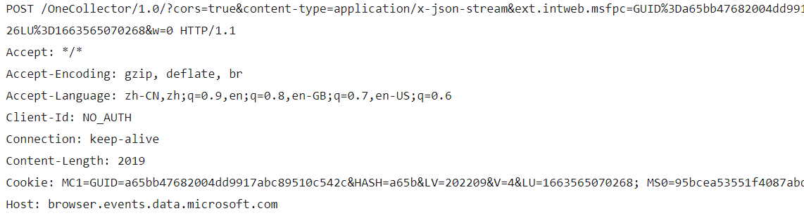</div>

`HTTP` 请求报文的第一行为<b>请求行</b>，剩下的都叫<b>首部行</b>

首先是第一行，也就是请求行，它包含三部分内容：<b>请求方法，资源路径，HTTP 协议版本</b>，它们三者由空格隔开。第一部分的请求方法表示客户端向浏览器发送的请求的类别，我们常用的请求方式是 `GET` 和 `POST` 请求：

- GET：向服务器请求资源，服务器将请求的资源返回；
- POST：向服务器提交数据并请求处理（比如说提交表单），数据被包含在请求体中。`POST` 请求可能会导致新的资源的建立和/或已有资源的修改；

上面两个请求方式都是 `HTTP1.0` 中定义的，而 `HTTP1.0` 除了上面两个请求方法，还有一个 `HEAD` 请求：

- HEAD：类似于 GET 请求，只不过返回的响应中没有具体的内容，用于获取报头；

在 `HTTP1.1` 中，又新增了六种请求，分别是 `OPTIONS`、`PUT`、`PATCH`、`DELETE`、`TRACE` 和 `CONNECT` 方法。[HTTP 请求方法](https://www.runoob.com/http/http-methods.html)。

紧随请求方法之后的是资源在`HTTP`服务器上的路径，这之后的 `HTTP1.1` 表示的就是这次请求使用的 `HTTP` 的版本了。

请求行下面的都是首部行，而首部行都是 `name:value` 格式的，`name` 表示这个首部的名字，而 `value` 就是首部的具体值了。

- `Host` 表示的是 `HTTP` 服务器所在的地址；
- `Connection`，这个表示的就是我们上面提到的 `HTTP` 的连接类型，而它的值是 `keep-alive`，就是告诉服务器，使用的是持续连接，若值为 close，表示的就是非持续连接。
- `Accept` 的作用告诉服务器自己希望接收的资源的类型，若服务器响应的资源与此不一致，将会报错。

图片中未出现的常见的首部行

- `User-Agent` 的作用就是指明用户代理，也就是告诉服务器，发送这次 HTTP 请求的浏览器的类型。
- `Referer` 的作用是用来防止恶意请求，提高访问资源的安全性
- `Accept-Encoding` 的作用是告知服务器，当前浏览器支持的编码类型。
- `Accept-Language` 的作用是告知 `HTTP` 服务器客户端想要获取资源的语言版本，若服务器中不包含此语言版本，则将回送默认版本。

请求报文的通用格式如下

<div align="center"></div>

### 响应报文

```
HTTP/1.1	200		OK
Accept-Ranges: bytes
Connection: close
Date: True, 18 xxxx
Server: Apache/2.2.3 (CentOS)
Las-Modified: True, xxx
Content-Length: 6821
(data data data data ....)
```

响应报文也是由三部分组成的：状态行、首部行、实体体（entity body），实体体是报文的主要部分，包含了所请求的数据。

响应报文的第一段由两部分组成，分别是 <b>HTTP 版本以及状态码</b>，上面的报文中，`HTTP` 的版本为 `1.1`，与请求的版本相同，之后紧跟的状态码为 `200`，这是最常见的状态码，表示请求成功。

- 200 - 请求成功；
- 301 - 资源（网页等）被永久转移到其它 URL；
- 400 - 一个通用的错误代码，表示请求不能被服务器理解
- 403 - 禁止访问
- 404 - 请求的资源（网页等）不存在；
- 500 - 内部服务器错误；
- 505 - 服务器不支持请求报文使用的 HTTP 协议版本

第一行之后的这些行，被称为<b>首部行</b>，与请求报文中的首部行类似，也是 `name:value`。

- 第一个首部行的名称叫做 `Accept-Ranges`，它的作用是告知客户端，此资源是否支持范围请求，而范围请求可以支持<b>断点续传</b>和<b>多线程分片下载</b>，`bytes` 表示支持，而 `none` 表示不支持。
- `Last-Modified` 的作用后面说缓存时单独拿出来说。
- `Content-type` 的作用就是标识资源的类型，
- `Content-Length` 表示资源的字节数，
- 最后一个 `Date` 的作用就是表示服务器发送该响应报文的日期时间。

下面这一张是 `HTTP` 响应报文的标准格式，可以看到，在最后面还有一个叫<b>实体</b>的部分，这里就是用来放服务器回送的资源的，例如请求的图片。

<div align="center">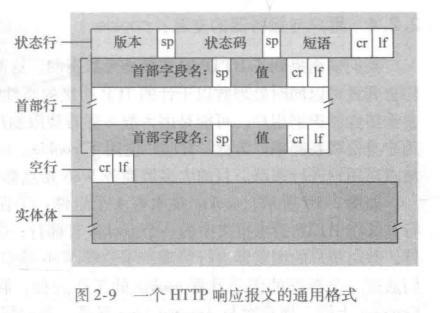</div>

## Cookie

HTTP 是无服务的，但是 Web 网站常常又希望可以识别用户。cookie 可以完成这个功能。

cookie 可以用于标识一个用户。用户首次访问一个站点时，提供一个用户标识符。在后续会话中，浏览器向服务器传递一个 cookie 首部，服务器存储这个 cookie 的信息，服务器就标识了用户。用户每次请求时把用户信息（存储在 cookie 中）也发出去，因此 cookie 可以在无状态的 HTTP 上建立一个用户会话层。

## Web 缓存

<b>Web 缓存器也叫代理服务器</b>，它在某些情况下可以代替 `HTTP` 服务器满足客户的需求。`Web` 缓存器有自己的存储空间，并保存有最近被请求资源的副本。它的作用故名思意，就是提供缓存机制的。若部署了 Web 缓存器，则可以配置浏览器，使得浏览器的 `HTTP` 请求首先发送至 `Web` 缓存器，下面我们通过一个例子来讲解 `Web` 缓存器的机制。

假设我现在要请求 www.xx.cn 这个服务器上的 `img.png` 这张图片，结果将发生以下情况：

1. `HTTP` 客户端创建一个到 `Web` 缓存器的 `TCP` 连接，并向 `Web` 缓存器发送一个请求报文；
2. `Web` 缓存器接收到请求报文，查看自己的本地是否包含被请求资源的副本，若包含，则由 `Web` 缓存器创建响应报文，并将此副本通过响应报文返回给 `HTTP` 客户端；
3. 若 `Web` 缓存器中不包含此资源的副本，则 `Web` 缓存器将向 `HTTP` 服务器（这里指的就是 www.xx.cn）发起一个 `TCP` 连接，并向服务器请求客户端需要的资源；
4. 服务器创建响应报文，将请求的资源响应给缓存器，缓存器接收到响应报文，解析响应报文携带的资源，并复制一份副本存储在本地，然后重新创建一份响应报文，并将副本封装进其中，发送给最初请求资源的客户端；

通过上面的步骤我们可以看到，`Web` 缓存器在这个过程中，既充当服务器的角色，又充当客户端的角色。而部署了 `Web` 缓存器后，将大大减少服务器响应资源的时间。

<span style="color:orange">为什么说 Web 缓存器可以大大减少服务器响应资源的时间呢？因为 Web 缓存器一般都是部署在一个小的局域网内，这个内网的带宽我们可以设置得很大（比连接公网的便宜很多，并且假定 Web 缓存器是 100mb，公网速率是 10mb）；所有的请求先打在 Web 缓存器上，Web 缓存器有的话就是以 100mb 的速度把数据分发给客户端，可比直接访问公网用 10mb 的速度分发数据快多了。不在 Web 缓存器的话就 Web 缓存器先请求数据并缓存，请求到后再分发，也比一堆请求直接访问公网的平均时间快很多。</span>

那么我们如何保证 Web 缓存器上的资源是最新的呢？若服务器上的资源被更新，而我们请求获得的却是缓存器上没有被改变的旧资源怎么办？`HTTP` 自然是有办法解决这个问题，这时候就要用到响应报文中的首部行 Last-Modified 了，而这种机制叫做<b>条件 GET</b>。

## 条件GET方法

高速缓存能减少用户感受到的响应时间，但也引入了一个新的问题，存放再缓存器中的对象副本可能是陈旧的，原服务器的数据已经被更改了。HTTP 协议有一种机制，允许缓存器检查自己缓存的数据是否是最新的。

`Last-Modified` 首部行记录的是<b>当前被请求的资源，在服务器上最后被修改的时间</b>。当我们请求一个 `Web` 缓存器上没有的资源时，`Web` 缓存器向 `HTTP` 服务器转发该请求，而服务器响应缓存器，同时在响应报文中包含 `Last-Modified` 首部行。`Web` 缓存器在存储资源的副本时，同时也将 `Last-Modified` 的值存了下来。当下一次有客户端请求此资源时，`Web` 缓存器会发送一个条件 `GET` 请求到服务器，请求中包含这个时间值，且此时的命名为 `Last-Modified-Since`。服务器接收到这个时间值后，将它与服务器本地记录的这个资源的最后修改时间进行比较，若两者相等，表示上次请求到这次请求之间，这个资源并未更新，服务器将告知 `Web` 缓存可以直接使用它存储的副本；若两者不相同，则服务器会将最新的资源，以及新的 `Last-Modified` 发送至 `Web` 缓存器，`Web` 缓存器更新本地的副本，并响应给客户端。

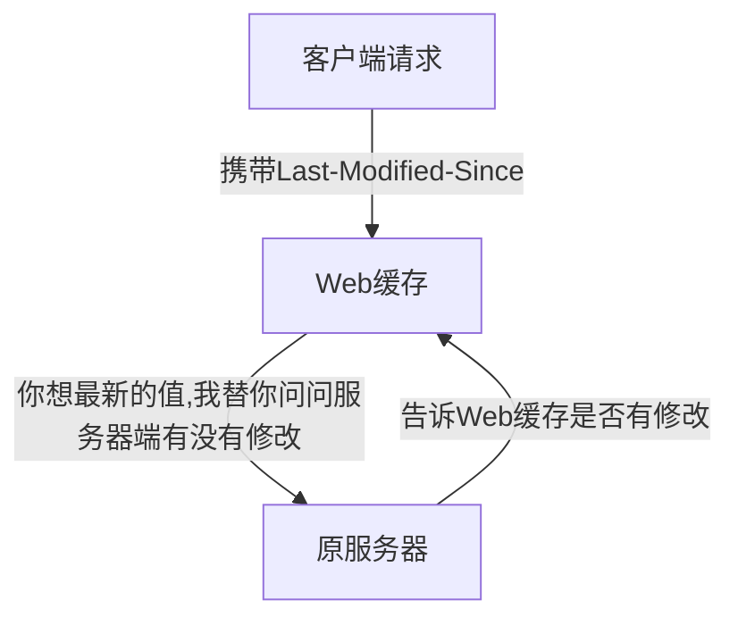
```mermaid
graph 
客户端请求-->|携带Last-Modified-Since|Web缓存-->|你想最新的值,我替你问问服务器端有没有修改|原服务器-->|告诉Web缓存是否有修改|Web缓存
```

有修改的话，就把修改后的值拉取并缓存到 Web 缓存中。

# 第三章-运输层

- TCP 多路复用和多路分解。
- TCP 的运作流程。

## 多路复用与多路分解

运输层的多路复用与多路分解。

- `多路复用`：在数据的发送端，传输层收集各个套接字中需要发送的数据，将它们封装上首部信息后（之后用于分解），交给网络层；即统一收集，然后再发送。
- `多路分解`：在数据的接收端，传输层接收到网络层的报文后，将它交付到正确的套接字上；

多路复用，在源主机从不同套接字中收集数据块，并为每个数据块封装上首部信息 (这将在以后用于分解) 从而生成报文段，然后将报文段传递到网络层，所有这些工作称为多路复用。

## UDP

UDP 的主要特点是

1️⃣UDP 是无连接的，即发送数据之前不需要建立连接（当然，发送数据结束时也没有连接可释放），因此减少了开销和发送数据之前的时延。

2️⃣UDP 使用尽最大努力交付，即不保证可靠交付，因此主机不需要维持复杂的连接状态表（这里面有许多参数）。而且接收进程的报文数据也可能是乱序到达。

3️⃣UDP 是面向报文的。发送方的 UDP 对应用程序交下来的报文，在添加首部后就向下交付 IP 层。UDP 对应用层交下来的报文，既不合并，也不拆分，而是保留这些报文的边界。这就是说，应用层交给 UDP 多长的报文，UDP 就照样发送，即一次发送一个报文。在接收方的 UDP，对 IP 层交上来的 UDP 用户数据报，在去除首部后就原封不动地交付上层的应用进程。也就是说，UDP 一次交付一个完整的报文。因此，应用程序必须选择合适大小的报文。若报文太长，UDP 把它交给 IP 层后，IP 层在传送时可能要进行分片，这会降低 IP 层的效率。反之，若报文太短，UDP 把它交给 IP 层后，会使 IP 数据报的首部的相对长度太大，这也降低了 IP 层的效率。

<div align="center">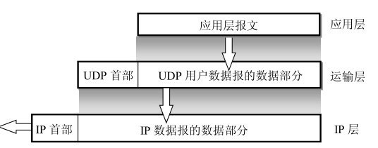</div>

4️⃣<b>UDP 没有拥塞控制，因此网络出现的拥塞不会使源主机的发送速率降低。这对某些实时应用是很重要的</b>。很多的实时应用（如 IP 电话、实时视频会议等）要求源主机以恒定的速率发送数据，并且允许在网络发生拥塞时丢失一些数据，但却不允许数据有太大的时延。UDP 正好适合这种要求。

5️⃣UDP 支持一对一、一对多、多对一和多对多的交互通信。

6️⃣<b>UDP 的首部开销小，只有 8 个字节，比 TCP 的 20 个字节的首部要短</b>

虽然某些实时应用需要使用没有拥塞控制的 UDP，但当很多的源主机同时都向网络发送高速率的实时视频流时，网络就有可能发生拥塞，结果大家都无法正常接收。因此，不使用拥塞控制功能的 UDP 有可能会引起网络产生严重的拥塞问题。还有一些使用 UDP 的实时应用，需要对 UDP 的不可靠的传输进行适当的改进，以减少数据的丢失。在这种情况下，应用进程本身可以在不影响应用的实时性的前提下，增加一些提高可靠性的措施，如采用前向纠错或重传已丢失的报文。

## 可靠数据传输原理

- 一般场景下的可靠数据传输原理：此处的理论适用于一般的计算机网络，而不是只适用于英特网运输层，所以不采用运输层报文段的说法，而是用分组的说法。
    - 此处始终假设，分组将以它们发送的次序进行交付（底层信道也不会对分组重排序），某些分组可能会丢失。

### rdt1.0可靠数据传输

- 假设底层信道都是安全可靠的，数据传输过程中不会出现错误。
- rdt 发送端只通过 rdt_send(data) 事件接收来自较高层的数据，产生一个包含该数据的分组，并将分组发送到信道中。
- 接收端，rdt 通过 rdt_rcv(package) 事件从底层信道接收一个分组，从分组中去除数据，并将数据上传给较高层。
- <span style="color:orange">在这里，我们假定了接收方数据的速率与发送方发送数据的速率一样快。</span>

### rdt2.0具有比特差错信道的可靠数据传输

- 底层信道更为实际的模型是分组中的比特可能受损的模型。在分组的传输、传播或缓存的过程中，这种比特差错通常会出现在网络的物理部件中。
- 我们仍然假定所有发送的分组还是按发送顺序被接收，但是某些比特可能受损。
- 先通过实际案例思考下，我们遇到没听懂的话会怎么处理。
- 我们打电话通话，A、B 两个人进行交流。A 对 B 说话，如果听清楚了，记下来了回复 Over，没听清回复“请重述一遍”。带比特差错的数据传输也是类似的。收到了数据，检查是否有损坏，有损坏让发送端再发一次，没有损坏告诉发送端 OK，我收到了。
- 在计算机网络环境中，基于这样重传机制的可靠数据传输协议称为<b>自动重传请求协议（Automatic Repeat Request，ARQ）</b>。
- ARQ 协议需要三种协议功能处理存在比特差错的情况
    - 差错检测：校验发送过来的数据是否有损坏。
    - 接收方反馈：如果有损坏则告诉发送方，请你再发送一次。如果无损坏，就告诉发送方，我正常接收了。可以用一个 bit 位来表示，0 表示肯定确认（ACK），1 表示否定确认（NAK）。
    - 错误重传：接收方收到有查错的分组时发送方将重传该分组。
    - 先前我写的一个数据传输，和上面的流程一样。
- 需要注意的是，发送方处于等待 ACK、NCK 的状态时，它不能从上层获得更多的数据，需要先处理完当前数据，才能继续处理其他数据。

### rdt 2.1ACK/NCK 受损的传输

- 上述的 rdt 2.0 存在一个很严重的缺陷：ACK、NCK 可能受损。如何解决这个问题？<b>我们需要在 ACK 或 NAK 分组中添加校验和比特以检测这样的差错，这样就知道 ACK/NAK 有没有受损</b>，问题是，如何纠正 ACK/NAK 中的差错？我们到底是按 ACK 处理问题还是按 NAK 重新发一遍数据？因为，如果 ACK/NAK 分组受损，发送方都无法知道接收方是否收到了它发送的数据。
- 我们考虑下受损 ACK/NAK 的 3 种解决办法。
    - 我们可以规定某种规则，接收方将发送方发送的数据复述一遍，表示我接收到了。但是如果发送方说的是“你说什么？”，接收方也回复“你说什么？”容易造成混淆。（想象一下两个人打电话，这么复述对方的话。并且这样做，网络开销也大！）
    - 增加足够的校验和比特，使发送方不仅可以检测差错，还可以恢复差错。对于会产生差错但不丢失分组的信道，这就可以直接解决问题。
- 解决这个问题的办法是：在数据分组中添加一个新的字段，让发送方对其数据分组编号，即将发送数据分组的序号放在该字段。于是，接收方只需要检查序号就可以确定收到的分组是否一次重传。
- package 中携带一个分组编号。接收方正确/错误接收到消息后，发送 ACK/NAK，如果 ACK/NAK 损坏了（校验和判断是否受损），那么发送方再次发送这个分组（分组中有序号），接收方发现，欸，怎么又是同样的序号，看来是我发送的 ACK/NAK 出错了，我重新发一遍。加入序号后的协议机制，是完备了。（rdt 2.1）==> 这种前面的确认没有到的情况下，不发送其他的，我们称之为停止等待协议。
    - 接收方 ACK 发送错误，给发送方回复的”乌拉乌拉“，接收方收到”乌拉乌拉“，不知道正确接收了还是错误了，于是又发了一次这个带序号的分组，接收方接收到数据，发送这个序号前面遇到过啊，说明自己发送的 ACK 出现了错误，于是又发送了一次 ACK。（虽然重复发送了数据，但是有序号，接收是可以检查出是否重复的。）
    - 接收方 NAK 发送错误，给发送方回复的”乌拉乌拉“，接收方收到”乌拉乌拉“，不知道正确接收了还是错误了，于是又发了一次这个带序号的分组，接收方接收到数据，而这个正好是需要重发的数，接收方接收到正确的数据后，回复给发送方 ACK。

正常发送 ACK 的场景

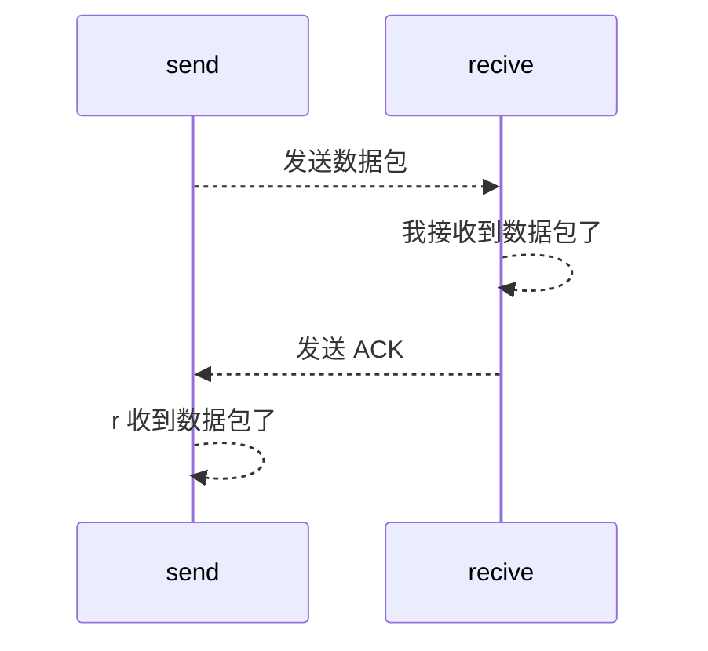
```mermaid
sequenceDiagram
participant s as send 
participant r as recive
s-->>r:发送数据包
r-->>r:我接收到数据包了
r-->>s:发送 ACK
s-->>s:r 收到数据包了
```

发送 ACK 出错的场景

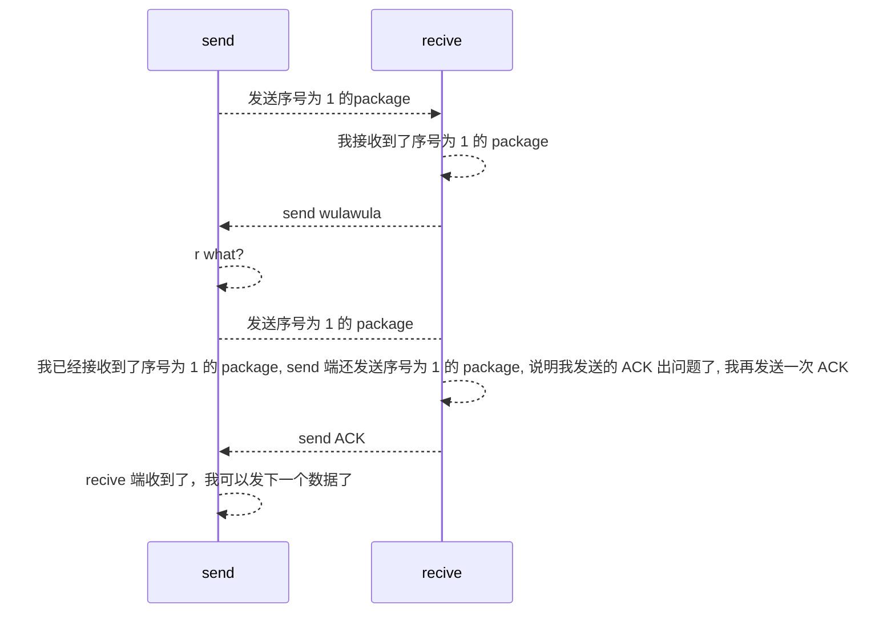
```mermaid
sequenceDiagram
participant s as send 
participant r as recive
s-->>r:发送序号为 1 的package
r-->>r:我接收到了序号为 1 的 package
r-->>s:send wulawula
s-->>s:r what?
s-->r:发送序号为 1 的 package
r-->>r:我已经接收到了序号为 1 的 package, send 端还发送序号为 1 的 package, 说明我发送的 ACK 出问题了, 我再发送一次 ACK
r-->>s:send ACK
s-->>s:recive 端收到了，我可以发下一个数据了
```

对于这种停止等待的场景，我们用 1bit 表示序号就行，新 package 还是老 package。

### rtd2.2无NAK的的传输

- rdt 2.2，无 NAK 的协议，只有 ACK。为从<b>停止等待协议升级到流水线协议</b>做准备。
    - 一次发送多个数据的话，如果每个应答都有 ACK/NAK 很麻烦。我们可以使用对前一个数据单位的 ACK 替代本数据单位的 NAK，这样确认信息减少一半，协议处理起来简单。
    - 当前分组的反向确认（先前的 NAK）<span style="color:red">用上一个分组的正向确认（ACK）替代</span>：如当前分组发送 ACK1 表示正确接收了，发送 ACK0 表示错误接收了。

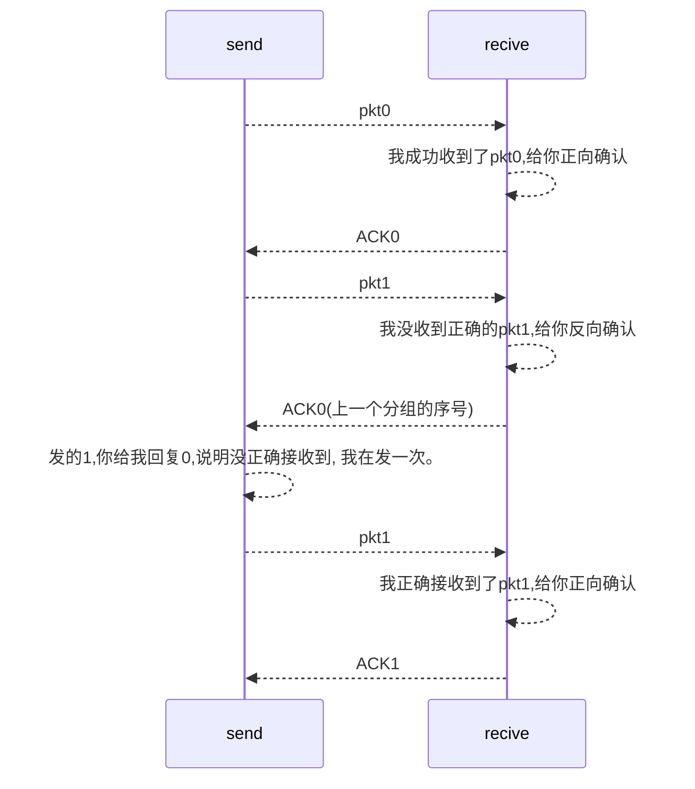
```mermaid
sequenceDiagram
participant s as send
participant r as recive
s-->>r:pkt0
r-->>r:我成功收到了pkt0,给你正向确认
r-->>s:ACK0
s-->>r:pkt1
r-->>r:我没收到正确的pkt1,给你反向确认
r-->>s:ACK0(上一个分组的序号)
s-->>s:发的1,你给我回复0,说明没正确接收到, 我在发一次。
s-->>r:pkt1
r-->>r:我正确接收到了pkt1,给你正向确认
r-->>s:ACK1
```

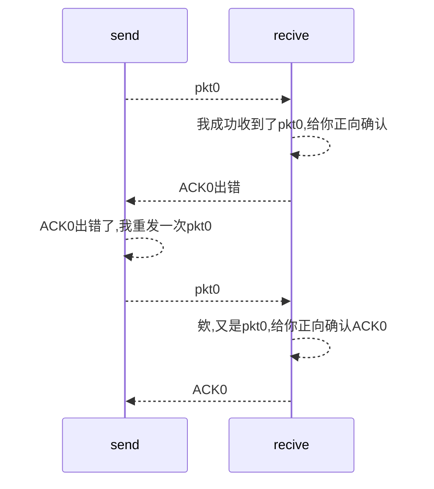
```mermaid
sequenceDiagram
participant s as send
participant r as recive
s-->>r:pkt0
r-->>r:我成功收到了pkt0,给你正向确认
r-->>s:ACK0出错
s-->>s:ACK0出错了,我重发一次pkt0
s-->>r:pkt0
r-->>r:欸,又是pkt0,给你正向确认ACK0
r-->>s:ACK0
```

### rtd3.0 具有比特差错和分组丢失的信道

<span style="color:red">新的假设：下层信道可能会丢失分组（数组或 ACK 都可能丢失），如果继续沿用 rtd 2.2，可能会产生死锁，双方一直干等。</span>

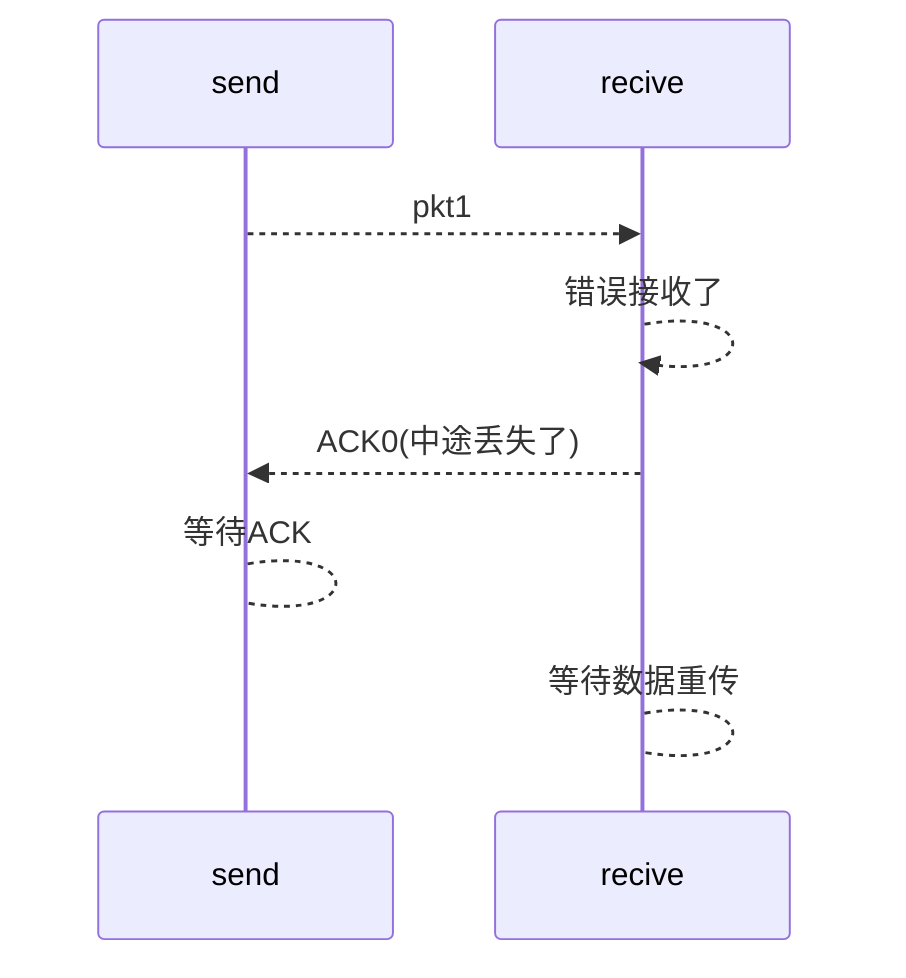
```mermaid
sequenceDiagram
participant s as send
participant r as recive
s-->>r:pkt1
r-->>r:错误接收了
r-->>s:ACK0(中途丢失了)
s-->s:等待ACK
r-->r:等待数据重传
```

解决办法：发送方等待 ACK 一段合理的时间（往返时延+处理一个分组的时间再多一点）。

- 发送端超时重传，如果等了一定时间还没有收到 ACK 就重传（重传的话需要定时器，超过给定时间后就重传数据）
- 每次发送一个分组（包括第一次分组和重传分组）时，便启动一个定时器
- 响应定时器中断
- 终止定时器

<span style="color:red">问题：如果分组（或 ACK）只是超时了，重传会导致数据重复，但可以利用序号处理这个问题</span>

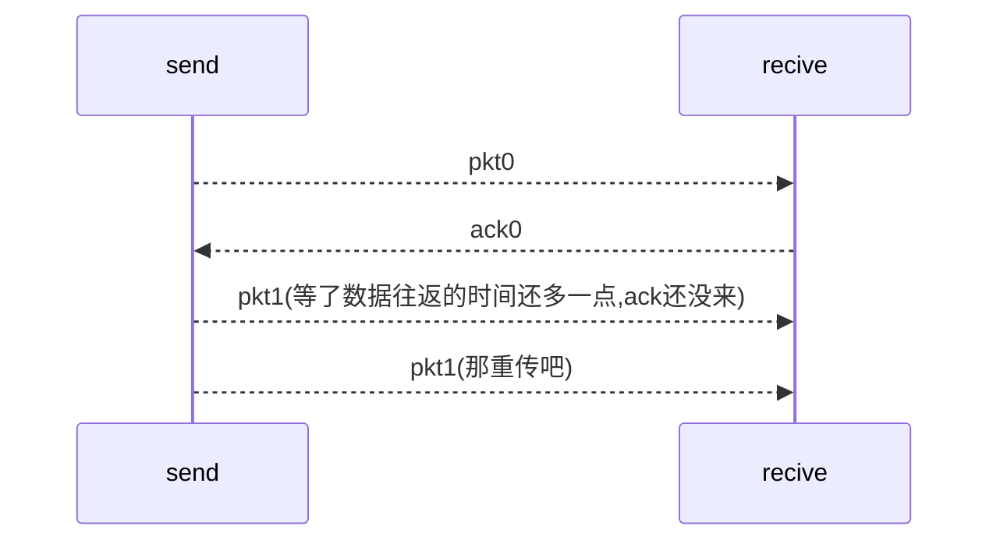
```mermaid
sequenceDiagram
participant s as send
participant r as recive
s-->>r:pkt0
r-->>s:ack0
s-->>r:pkt1(等了数据往返的时间还多一点,ack还没来)
s-->>r:pkt1(那重传吧)
```

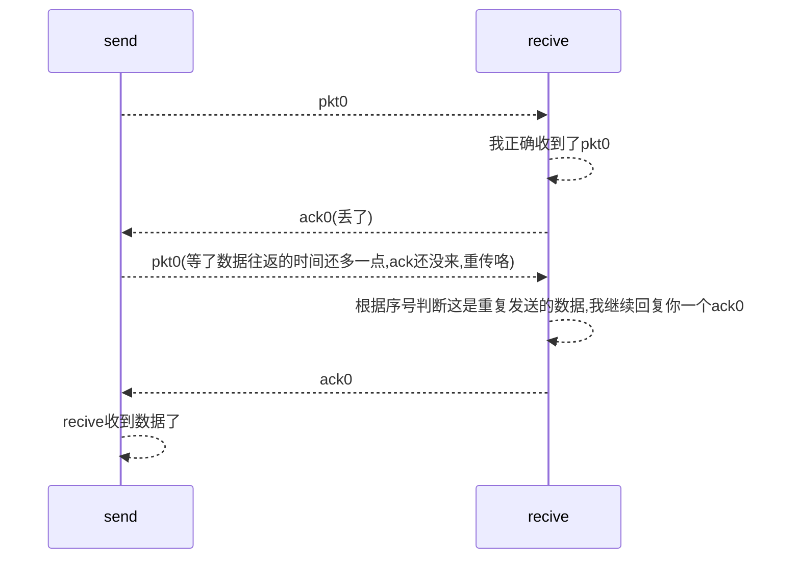
```mermaid
sequenceDiagram
participant s as send
participant r as recive
s-->>r:pkt0
r-->>r:我正确收到了pkt0
r-->>s:ack0(丢了)
s-->>r:pkt0(等了数据往返的时间还多一点,ack还没来,重传咯)
r-->>r:根据序号判断这是重复发送的数据,我继续回复你一个ack0
r-->>s:ack0
s-->>s:recive收到数据了
```

但是 rtd 3.0 一次只发送一个，对信道的利用率极低。

### 流水线可靠数据传输协议

 rtd 3.0 是一个功能正确的协议，但并非人人都对它的性能满意，特别是在今天的高速网络中更是如此。 rtd 3.0 问题的核心在于它是一个停等协议。 为了评价该停等行为对性能的影响，可考虑一种具有两台主机的理想化场合，一台主机位于美国西海岸，另一台位于美国东海岸。在这两个端系统之间的光速往返传播时延 RTT 大约为 30 毫秒。假定彼此通过一条发送速率 R 为 1Gbps （每秒 $10^9$ 比特）的信道相连。包括首部字段和数据的分组长 L 为 1000 字节（8000 比特），发送一个分组进入 1Gbps 链路实际所需时间是：
$$
t_{trans} = \frac{L}{R} = \frac{8000 bit/pkt}{ 10^9/bits}=8\mu s/pkt
$$
信道利用率
$$
U_{sender} = \frac{L/R}{RTT+L/R}=\frac{0.008}{30.008} = 0.000 27
$$
即发送方只有万分之 2.7 时间是忙的。从其他角度来看，发送方在 30.008ms 内只能发送 1000 字节，有效的吞吐量仅为 267kbps ,即使有 1Gbps 的链路可用也是如此! 购买了一条千兆比容量的链路，但他仅能得到 267kbps 吞吐量！

<span style="color:red">这种特殊的性能问题的一个简单解决方法是：不以停等方式运行，允许发送方发送多个分组而无须等待确认。</span>


<div align="center">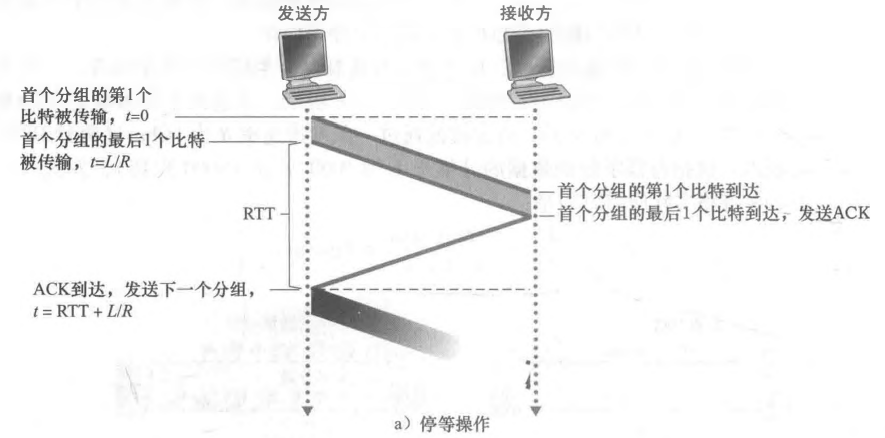</div>

<div align="center"></div>

流水线技术对可靠数据传输协议可带来如下影响

- 必须增加序号范围，因为每个输送中的分组（不计算重传的）必须有一个唯一的序号，而且也许有多个在输送中的未确认报文。
- 协议的发送方和接收方两端也许不得不缓存多个分组。<b>发送方最低限度应当能缓冲那些已发送但没有确认的分组</b>。如下面讨论的那样，<b>接收方或许也需要缓存那些已正确接收的分组</b>。
- 所需序号范围和对缓冲的要求取决于数据传输协议如何处理丢失、损坏及延时过大的分组。解决流水线的差错恢复有两种基本方法是：<b>回退 N 步</b> (Go Back N, GBN) 和选择重传 (Selective Repeat, SR)

一次发送多个未经确认的分组，需要用多个 bit 位来表示每个分组的序号。用 $n\ bit$ 表示的话，一共可以表示 $2^n$ 个序号。<b>发送方需要一个缓冲区缓冲发送的数据，以便超时重发或错误重发</b>；<b>接收方的缓冲区是为了防止发送和接收的速度不一样，先用缓冲区缓存，在逐一处理。</b>

### slide window 协议

滑动窗口协议

| slide window 大小 | recive window 大小 | 协议                 |
| ----------------- | ------------------ | -------------------- |
| sw=1              | rw=1               | 停止等待协议         |
| sw>1              | rw=1               | 回退 N 步协议（GBN） |
| sw>1              | rw>1               | 滑动窗口协议（SR）   |

<b>发送缓冲区</b>

- 形式：内存中的一个区域，落入缓冲区的分组可以发送
- 功能：用于存放已发送，但是还没确认的分组
- 必要性：需要重发时可用

<b>发送缓冲区大小：</b>一次最多可以发送多少个未经确认的分组

- 停止等待协议=1
- 流水线协议>1, 需要设置成一个合理的值，不能过大，链路利用率不能超过 100%

<b>发送缓冲区中的分组</b>

- 未发送的：落入发送缓冲区的分组，可以连续发送出去；
- 已经发送出去的，等待对方确认的分组：发送缓冲区的分组只有得到确认才能删除。

发送窗口：采用相对移动方式表示，分组不同；可缓冲范围移动，代表一段可以发送的权力。

<div align="center">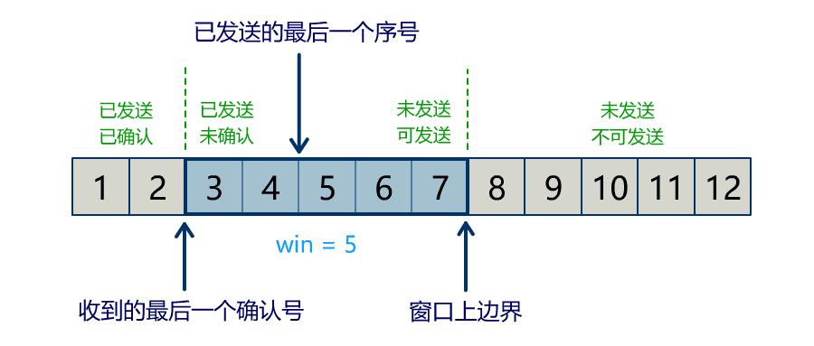</div>

<div align="center">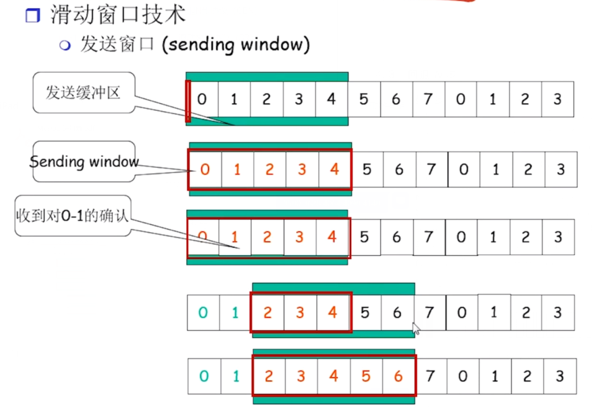</div>

接收窗口：

```shell
# 假设开始有1-8需要正确接收，窗口大小为5（index0~index4）
1 2 3 4 5 6 7 8
# 接收窗口中的数据
1 2 3 4 5
# 接收到了1给ACK1的确认，接收窗口向前滑动一格（index1~index5）
2 3 4 5 6
# 接收到了3给ACK3，接收窗口不移动。
2 3 4 5 6
# 接收到了2给ACK2，接收窗口移动。
4 5 6 7 8 
```

如果接收窗口大小为 1，我们称之为 GBN（回退 N 步协议） 协议，只能顺序接收。

<div align="center">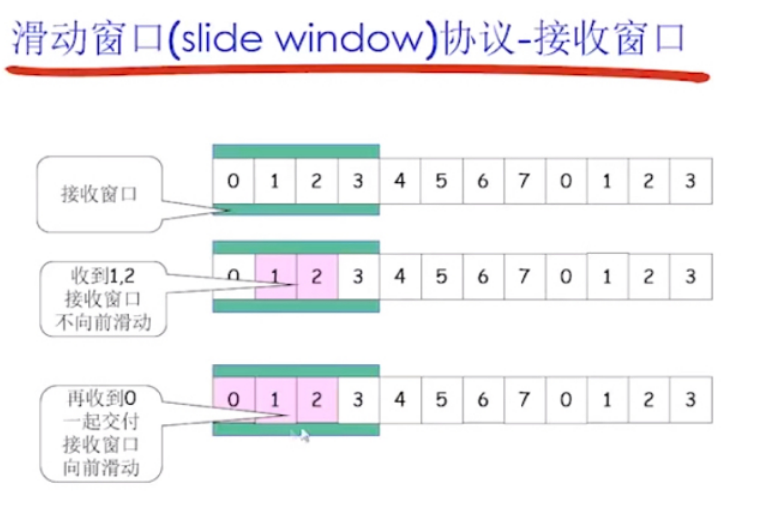</div>

### 回退 N 步协议

按顺到达的，给正确的 ACK，乱序达到的给错误的 ACK，让发送方重新发送符合顺序的数据包。

在回退 N 步（GBN）协议中，允许发送方发送多个分组（当有多个分组可用时）而不需等待确认，但它也受限于在流水线中未确认的分组数不能超过某个最大允许数 N。【这个 N 其实就是窗口的大小】

为什么要限制窗口大小？限制窗口大小可以对发送方施加限制，控制发送的流量。

<b>GBN 发送方必须响应三种类型的事件</b>

- 上层的调用。当上层调用 `rdt.send()` 时，发送方首先检查发送窗口是否已满，即是否有 N 个已发送但未被确认的分组。如果窗口未满，则产生一个分组并将其发送，并相应地更新变量。如果窗口已满，发送方只需将数据返回给上层，隐式地指示上层该窗口已满。然后上层可能会过一会儿再试。在实际实现中，发送方更可能缓存（并不立刻发送）这些数据，或者使用同步机制（如一个信号量或标志）允许上层在仅当窗口不满时才调用 `rdt.send()`
- 收到一个 ACK。在 GBN 协议中，对序号为 n 的分组的确认采取累积确认（cumulative acknowledgment）的方式，表明接收方已正确接收到序号 <=n 的分组。
- 超时事件。协议的名字 "回退 N 步" 来源于出现丢失和时延过长分组时发送方的行为。就像在停等协议中那样，定时器将再次用于恢复数据或确认分组的丢失。 <b>如果出现超时，发送方重传所有已发送但还未被确认过的分组</b>。如果收到一个 ACK, 但仍有已发送但未被确认的分组，则定时器被重新启动。如果没有已发送但未被确认的分组，停止该定时器

在 GBN 中，接收方的动作也很简单。如果一个序号为 n 的分组被正确接收到，并且按序（即上次交付给上层的数据是序号为 n-1 的分组），则接收方为分组 n 发送一个 ACK, 并将该分组中的数据部分交付到上层。<b>在所有其他情况下，接收方丢弃该分组，并为最近按序接收的分组重新发送 ACK</b>。注意到因为一次交付给上层一个分组，如果分组 k 已接收并交付，则所有序号比 k 小的分组也已经交付。因此，使用累积确认是 GBN —个自然的选择。<span style="color:blue">( 简单说就是，ACK0,1,2,3,4 都正常接收了，然后 7 到了，接收方回复你一个 ACK4，让接收方发 5 和 5 后面的数据过来 )</span>

在 GBN 协议中，接收方丢弃所有失序分组。尽管丢弃一个正确接收（但失序）的分组有点浪费，但这样做是有理由的。前面讲过，接收方必须按序将数据交付给上层。假定现在期望接收分组 n 而分组 n+1 却到了。因为数据必须按序交付，接收方可能缓存（保存）分组 n+ 1，然后，在它收到并交付分组 n 后，再将该分组交付到上层。然而，如果分组 n 丢失，则该分组及分组 n + 1 最终将在发送方根据 GBN 重传规则而被重传。因此，接收方只需丢弃分组 n+1 即可。不需要缓存任何失序分组。因此，虽然发送方必须维护窗口的上下边界及 nextseqnum 在该窗口中的位置，但是接收方需要维护的唯一信息就是下一个按序接收的分组的序号。该值保存在 expectedseqnum 变量中。丢弃一个正确接收的分组的缺点是随后对该分组的重传也许会丢失或出错，因此甚至需要更多的重传。

<b>GBN 协议运行示意图：按序接收，序号不对的直接丢弃。</b>

<div align="center">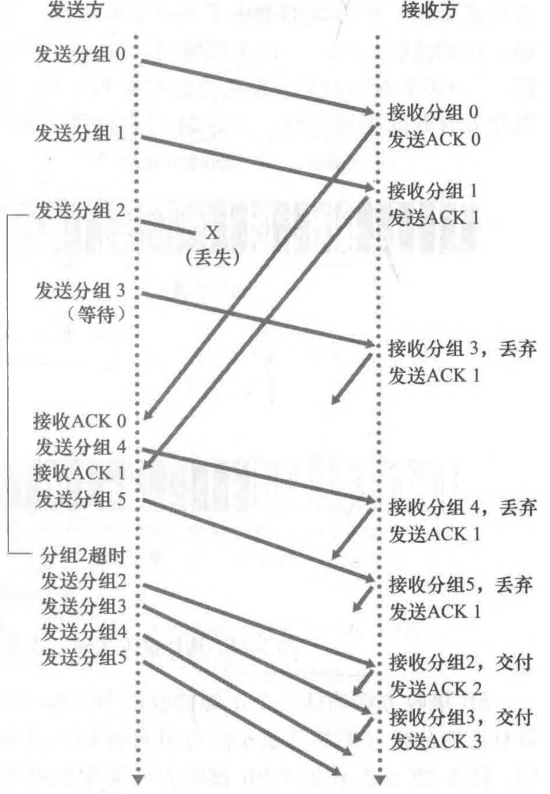</div>

### 选择重传协议

选择重传协议：只重传那些可能出错的分组。

GBN 协议允许发送方用多个分组 "填充流水线"，避免了停止等协议中所提到的信道利用率问题。<b>然而，GBN 本身也有一些情况存在着性能问题。</b>尤其是当窗口长度和带宽时延积都很大时，在流水线中会有很多分组更是如此。单个分组的差错就能够引起 GBN 重传大量分组，许多分组根本没有必要重传。<b>随着信道差错率的增加, 流水线可能会被这些不必要重传的分组所充斥</b>。想象一下，在我们口述消息的例子中，如果每次有一个单词含糊不清，其前后 1000 个单词（例如，窗口长度为 1000 个单词）不得不被重传的情况。此次口述会由于这些反复述说的单词而变慢。

顾名思义，<b>选择重传（SR）协议通过让发送方仅重传那些它怀疑在接收方出错（即丢失或受损）的分组而避免了不必要的重传</b>。这种个别的、按需的重传要求接收方逐个地确认正确接收的分组。<b>再次用窗口长度 N 来限制流水线中未完成、未被确认的分组数。</b>然而，与 GBN 不同的是，发送方已经收到了对窗口中某些分组的 ACK。

发送方有一个长度为 N 的窗口，接收方也有一个长度为 N 的窗口。

<div align="center">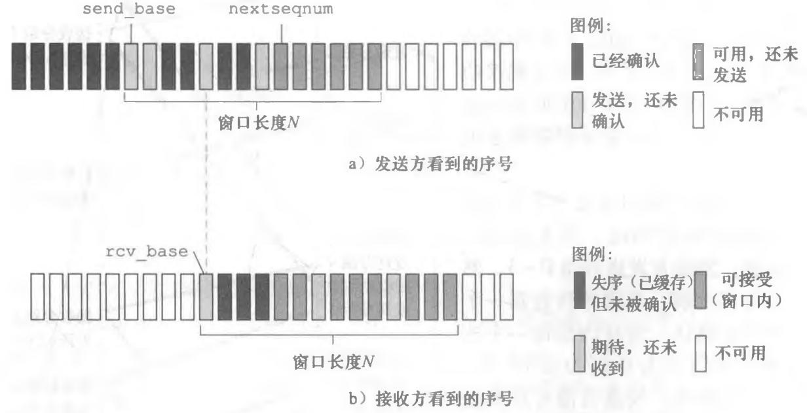</div>

SR 的接收方会缓存那些被确认的分组（包括无序的分组）。失序的分组将被缓存直到所有丢失分组（即序号更小的分组）皆被收到为止，都收到后就将这批分组交付给上层。

> SR 发送方的事件与动作

- 从上层收到数据。当从上层接收到数据后，SR 发送方检查下一个可用于该分组的序号。如果序号位于发送方的窗口内，则将数据打包并发送；否则就像在 GBN 中一样，要么将数据缓存，要么将其返回给上层以便以后传输。 
- 超时。定时器再次被用来防止丢失分组。然而，现在每个分组必须拥有其自己的逻辑定时器，因为超时发生后只能发送一个分组。<b>可以使用单个硬件定时器模拟多个逻辑定时器的操作</b>［Varghese 1997］。 
- 收到 ACK。收到 ACK 后，如果这个分组序号在窗口内，则 SR 发送方将那个被确认的分组标记为已接收。如果该分组的序号等于 send_base, 则窗口基序号向前移动到序号最小的未确认分组处。如果窗口移动了并且有序号落在窗口内的未发送分组，则发送这些分组。

> SR 接收方的事件与动作

- 序号在［rcv_base, rcv_base+N-1 ］内的分组被正确接收口在此情况下，收到的分组落在接收方的窗口内，一个选择 ACK 被回送给发送方。如果该分组以前没收到过，则缓存该分组。如果该分组的序号等于接收窗口的基序号则该分组以及以前缓存的序号连续的（起始于 rcv_base 的）分组交付给上层。 然后, 接收窗口按向前移动分组的编号向上交付这些分组。
- 序号在［rcv_base-N, rcv_base - 1］内的分组被正确收到。<b>在此情况下，必须产生一个 ACK，即使该分组是接收方以前已确认过的分组。</b> (这个确认十分关键，接收方必须要告诉发送方，我们确实是收到了数据)
- 其他情况。忽略该分组。

<div align="center">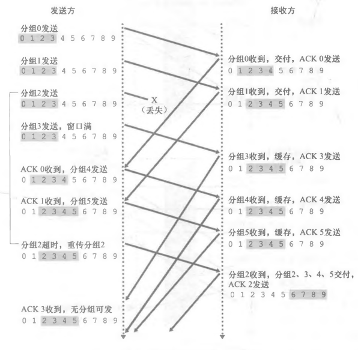</div>

<div align="center">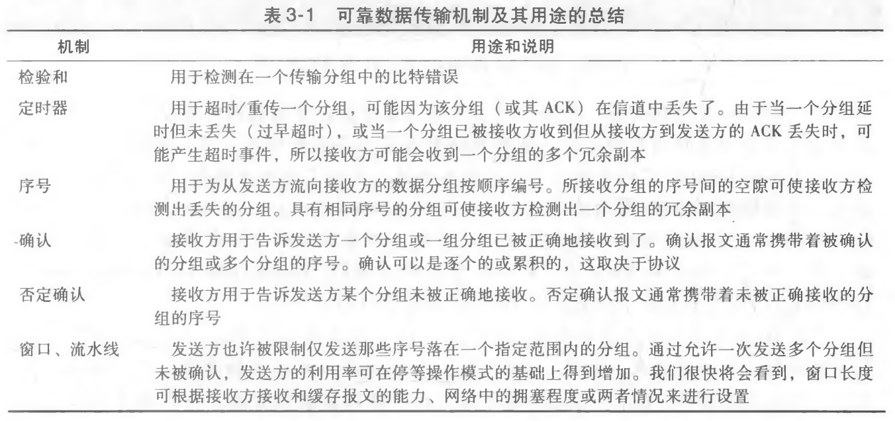</div>

## TCP

TCP 是因特网运输层的面向连接的可靠的运输协议。为了提供可靠数据传输，TCP 依赖于前面讨论的许多基本原理，<b>其中包括差错检测、重传、累积确认、定时器以及用于序号和确认号的首部字段</b>。TCP 定义在 RFC 793、RFC 1122、RFC 1323、 RFC 2018 以及 RFC 2581 中。

> TCP/IP 的历史事件

在 20 世纪 70 年代早期，分组交换网开始飞速增长，而因特网的前身 ARPAnet 也只是当时众多分组交换网中的一个。这些网络都有它们各自的协议。两个研究人员 Vinton Cerf 和 Robert Kahn 认识到互联这些网络的重要性，发明了沟通网络的  TCP/IP协议，该协议代表传输控制协议/网际协议(Transmission Control Protocol/Internet Protocol) 。<b>虽然 Cerf 和 Kahn 开始时把该协议看成是单一的实体，但是后来将它分成单独运行的两个部分：TCP 和 IP</b>。Cerf 和 Kahn 在 1974 年 5 月的《IEEE Transactions on Communications Technology》杂志上发表了一篇关于 TCP/IP 的论文［Cerf 1974］。 

TCP/IP 协议是当今因特网的支柱性协议，但它的发明先于 PC、工作站、智能手机 和平板电脑，先于以太网、电缆、DSL、WiFi 和其他接入网技术的激增，先于 Web、社交媒体和流式视频等。Cerf 和 Kahn 预见到了对于联网协议的需求，一方面为行将定义 的应用提供广泛的支持，另一方面允许任何主机与链路层协议互操作。

2004 年，Cerf 和 Kahn 由于 "联网方面的开创性工作（包括因特网的基本通信协议 TCP/IP 的设计和实现）以及联网方面富有才能的领导" 而获得 ACM 图灵奖，该奖项被认为是“计算机界的诺贝尔奖” 。

### 概述

TCP 协议具有以下特点

- 点对点：一个发送方，一个接收方
- 可靠的、按顺序的字节流：没有报文边界
- 管道化（流水线）：TCP 拥塞控制和流量控制设置窗口大小
- 全双工数据：在同一连接中数据流双向流动；MSS：最大报文段大小
- 面向连接：在数据交换之前，通过握手（交换控制报文） 初始化发送方、接收方的状态变量
- 有流量控制：发送方不会淹没接收方

### TCP连接

TCP 被称为是面向连接的（connection-oriented），因为在一个应用进程在向另一个应用进程发送数据之前，这两个进程必须先相互"握手" ，即它们必须相互发送某些预备报文段，以建立确保数据传输的参数。作为 TCP 连接建立的一部分，连接的双方都将初始化与 TCP 连接相关的许多 TCP 状态变量。

<b>TCP 连接是一个逻辑上的概念，TCP 协议只在端系统中运行</b>，而不在中间的网络元素（路由器和链路层交换机）中运行，所以中间的网络元素不会维持 TCP 连接状态。事实上，中间路由器对 TCP 连接完全视而不见，它们看到的是数据报，而非连接。

<b>TCP 是点对点通信</b>，在单个发送方与单个接收方之间的连接。TCP 的连接过程如下：客户首先发送一个特殊的 TCP 报文段，服务器用另一个特殊的 TCP 报文段来响应，最后，客户再用第三个特殊报文段作为响应。前两个报文段不承载"有效载荷"，也就是不包含应用层数据；<b>而第三个报文段可以承载有效载荷(包含应用层数据)</b>。 由于在这两台主机之间发送了 3 个报文段，所以这种连接建立过程常被称为三次握手。

<b>最大报文长度（Maximum Segment Size，MMS）MSS</b> 通常根据最初确定的由本地发送主机发送的最大链路层帧长度（即所谓的最大传输单元，Maximum Transmission Unit, MTU）来设置。设置该 MSS 要保证一个TCP 报文段（当封装在一个 IP 数据报中）加上 TCP/IP 首部长度（通常 40 字节）将适合单个链路层帧。以太网和 PPP 链路层协议都具有 1500 字节的 MTU, 因此 MSS 的典型值为 1460 字节。
$$
MTU = MMS + TCP/IP首部长度,\\
其中 TCP/IP 首部长度 20+20=40。
$$

<div align="center">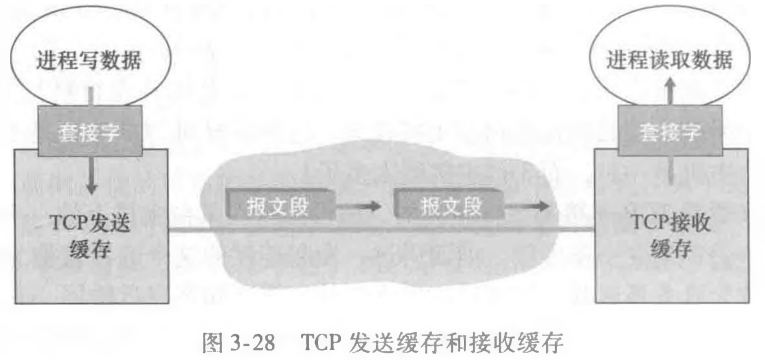</div>

### TCP报文段结构

TCP 报文段由<b>首部字段和一个数据字段</b>组成。数据字段包含一块应用数据。如前所述，MSS（最大报文长度） 限制了报文段数据字段的最大长度。

当 TCP 发送一个大文件，例如某 Web 页面上的一个图像时，TCP 通常是将该文件划分成长度为 MSS（最大报文长度） 的若干块(最后一块除外，它通常小于 MSS)

<b>TCP 报文段结构如下：</b>

<div align="center">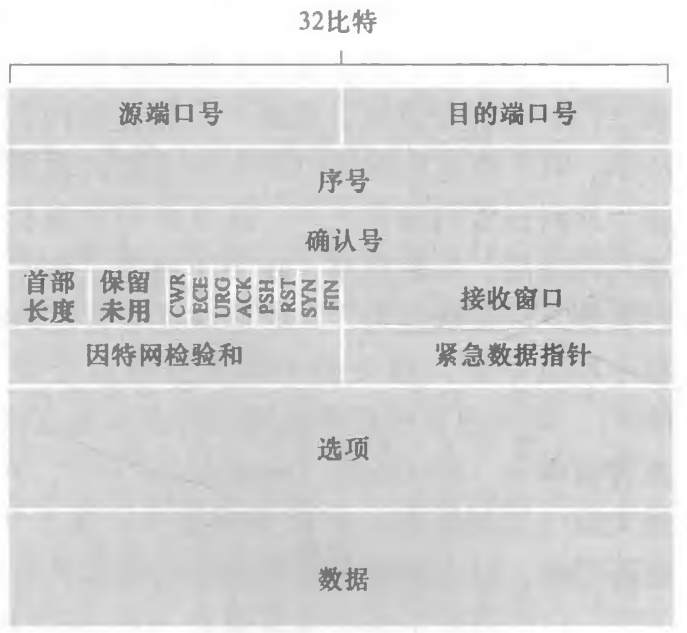</div>

- 32 比特的序号字段和 32 比特的确认号字段。这些字段被 TCP 发送方和接收方用来实现可靠数据传输服务。
- 16 比特的接收窗口字段，该字段用于流量控制。
- 4 比特的首部长度字段，该字段指示了以 32 比特的字为单位的 TCP 首部长度。由于 TCP 选项字段的原因，TCP 首部的长度是可变的。(通常, 选项字段为空，所以 TCP 首部的典型长度是 20 字节。
- 可选与变长的选项字段，该字段用于发送方与接收方协商最大报文段长度 (MSS) 时，或在高速网络环境下用作窗口调节因子时使用。首部字段中还定义了一个时间戳选项。
- 6 比特的标志字段，ACK 比特用于指示确认字段中的值是有效的，即该报文段包括一个对已被成功接收报文段的确认。

### 序号和确认号

- 序号：报文段首字节的在字节流的编号。（我的从 xx 开始）
- 确认号：期望从另一方收到的下一个字节的序号（你的从 yy 开始）

序列号和确认号是 TCP 可靠传输服务的关键部分。TCP 把数据看成一个无结构的、有序的字节流。—个报文段的序号 (sequence number for a segment) 是建立在传送的字节流之上的，举例来说：

<span style="color:orange">假设主机 A 上的一个进程想通过一条 TCP 连接主机 B 上的一个进程并发送一个数据流。主机 A 中的 TCP 将隐式地对数据流中的每一个字节编号。假定数据流由一个包含 500_000 字节的文件组成，其 MSS（Maximum Segment Size，最大报文段长度）为 1000 字节，数据流的首字节编号是 0。该 TCP 将为该数据流构建 500 个报文段。给第一个报文段分配序号 0 ,第二个报文段分配序号 1000, 第三个报文段分配序号 2000, 以此类推。每一个序号被填入到相应 TCP 报文段首部的序号字段中。</span>

<div align="center">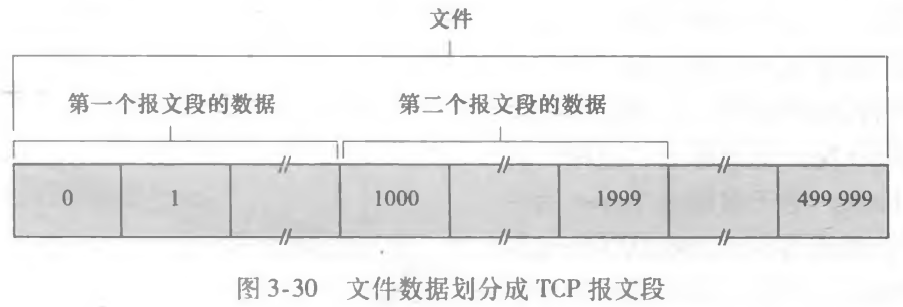</div>

我们再来看看确认号是怎么得来的

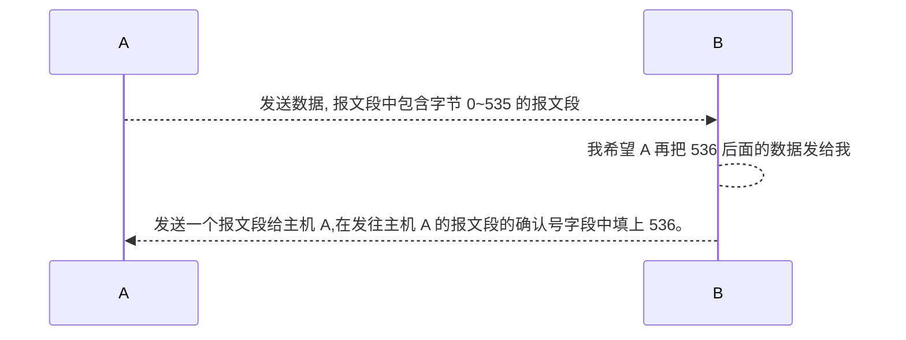
```mermaid
sequenceDiagram
participant A as A
participant B as B
A-->>B:发送数据, 报文段中包含字节 0~535 的报文段
B-->B:我希望 A 再把 536 后面的数据发给我
B-->>A:发送一个报文段给主机 A,在发往主机 A 的报文段的确认号字段中填上 536。
```

我们可以假定初始序号为 0。但实际上，一条 TCP 连接的双方均可随机地选择初始序号。这样做可以减少将那些仍在网络中存在的来自两台主机之间先前已终止的连接的报文段，误认为是后来这两台主机之间新建连接所产生的有效报文段的可能性（它碰巧与旧连接使用了相同的端口号），<b>简而言之，就是随机初始化，避免原先已经终止连接的报文段，被误认为是当前连接的报文段。</b>

#### 序号和确认号的学习案例

- 序号：报文段首字节的在字节流的编号。（我的从 xx 开始）
- 确认号：期望从另一方收到的下一个字节的序号（你的从 yy 开始）

假设客户和服务器的起始号分别是 42 和 79. 第一次主机 A 明确了自己的序号是 42. 第二次，服务器明确了自己的序号是 79.

<div align="center">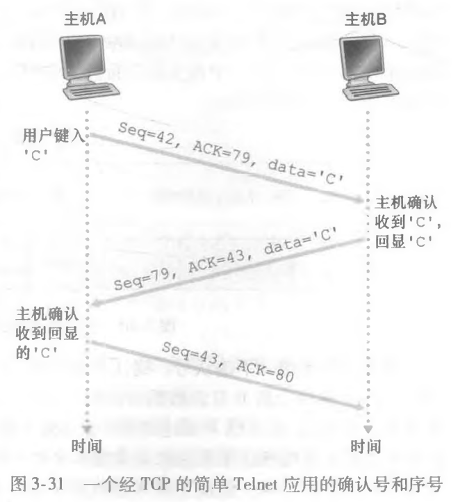</div>

客户端 A 的起始序号是 42，服务器 B 的起始序号是 79。

A 发给 B，序号从 42 开始，A 希望 B 发给它的序号是从 79 开始。

B 发给 A，序号从 79 开始（你之前希望的），我希望你给我的序号是从 43 开始。

### TCP三次握手

<div align="center">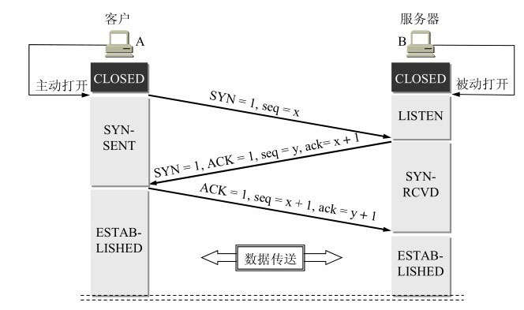</div>

<span style="color:orange">简单说就是为了避免老连接的数据对新连接的数据造成干扰。A、B 都会生成一个初始序号。A 给 B 发送自己的序号，B 回应 A 自己收到了也把自己的初始序号发送给 A，然后 A 再确认一下（三次握手）</span>

<b style="color:orange">复杂来说就是下面这样的：</b>

- A 的 TCP 客户进程也是首先创建传输控制模块 TCB，然后向 B 发出连接请求报文段，这时首部中的同步位 SYN = 1，<span style="color:orange">同时随机选择一个初始序号 seq=x。如果采用固定的初始序号，会发生老的连接的数据对新的连接造成干扰。</span>TCP 规定，SYN 报文段（即 SYN = 1 的报文段）不能携带数据，但要消耗掉一个序号。这时，TCP 客户进程进入 SYN-SENT（同步已发送）状态。
- B 收到连接请求报文段后，如同意建立连接，则向 A 发送确认。在确认报文段中应把 SYN 位和 ACK 位都置 1，确认号是 ack = x + 1，同时也为自己选择一个初始序号 seq = y。<b>请注意，这个报文段也不能携带数据，但同样要消耗掉一个序号</b>。这时 TCP 服务器进程进入 SYN-RCVD（同步收到）状态。
- TCP 客户进程收到 B 的确认后，还要向 B 给出确认。确认报文段的 ACK 置 1，确认号 ack = y + 1，而自己的序号 seq = x + 1。TCP 的标准规定，ACK 报文段可以携带数据。但如果不携带数据则不消耗序号，在这种情况下，下一个数据报文段的序号仍是 seq = x + 1。这时，TCP 连接已经建立，A 进入 ESTABLISHED（已建立连接）状态。当 B 收到 A 的确认后，也进入ESTABLISHED 状态

<b>为什么 A 还要发送一次确认呢？</b>

首先我们要明确，两次握手是必要的。第一次握手，客户端将 `SYN` 报文发送到服务器，服务器接收到报文后，即可确认客户端到服务器是可达的；而服务器向客户端发送响应的 `SYNACK` 报文，客户端接收到后，即可确认服务器到客户端也是可达的。至此，连接已经算是建立，那为什么还要有第三次握手呢？

> 两次连接可能会出现这种情况

- <span style="color:orange">只在服务器端维护一个半连接。</span>考虑一种异常情况，即 A 发出的第一个连接请求报文段并没有丢失，而是在某些网络结点长时间滞留了，以致延误到连接释放以后的某个时间才到达 B，然后 A 由于等不到 B 的回复，又发了一个请求过去，这个请求被 B 收到并确认了。但 B 收到那个失效的连接请求报文段，误认为 A 又发出一次新的连接请求。于是就向 A 发出确认报文段，同意建立连接，但此时 A 不在理会这些数据，这样，这个请求就变成半连接了，<span style="color:orange">服务器要维护这些虚假的半连接，浪费服务器的资源。</span>（简而言之，如果是两次握手，就是请求、响应。如果中间超时或者阻塞了，导致重发数据，那么服务器会认为再次建立连接就出现了半连接。）
- <span style="color:orange">老连接的数据被当成新连接的数据接受了。如 A 发数据给 B，先申请建立连接，超时，于是再次发送建立连接的请求。此时老请求建立成功了。A 发数据给 B，超时了，于是数据一重传，此时超时的数据一被 B 收到了，B 给了回执，连接结束。此时 A 重写发起的建立请求的新连接成功建立了！A 老连接超时重传发送的数据也成功到到达了，此时老连接重传的数据一被新连接接收到了。</span>

> 3 次握手解决：半连接和把老连接数据当成新连接数据来接收的问题。

客户端和服务器的握手过程，不仅仅是确认互相可达的过程，更重要的是一个<b>同步</b>的过程，`SYN` 就是同步（Synchronize）的缩写。对于 `TCP` 报文段来说，<b>序号</b>是一个至关重要的部分，它保证了 `TCP` 传输数据的完整性。`TCP` 报文的初始序号不是从 `0` 开始的，而是一个随机的序号，<b>而所谓的同步，就是 `TCP` 客户端和服务器互相同步初始序号的过程</b>。第一次握手，客户端发送 `SYN` 报文，将自己的初始序号发送到了服务器，服务器接收到后，向客户端发送 `SYNACK` 报文段，告诉客户端已经收到了它的初始序号，同时在这个报文段中带上了自己的初始序号。这个时候，第三次握手的作用就出来了：<b>第三次握手实际上就是客户端在告诉服务器，自己已经收到了它的初始序号，完成了同步，可以开始相互传输数据了</b>。若没有第三次握手，服务器将无法保证序号的同步，即无法保证客户端正确接收到了服务器端的 `SYNACK` 报文段，若此时 `SYNACK` 报文段丢失，客户端不知道服务器的初始序号，将无法处理之后到达客户端的数据。

- 老数据接收的问题，由于序号对不上，会丢弃数据。当然，有非常小的概率，序号对上了。
- 半连接问题，A 申请和 B 建立连接请求，因为超时未响应就发送了两次连接请求。后面老的连接请求的回应来了，建立连接，发送数据 balabala，关闭连接。后面新连接的建立连接请求回应来了，但是 A 发现回应过来的请求和它之前建立连接的请求的序号不一样，知道它是旧连接，然后把这个旧连接关闭掉。

### TCP四次挥手

有个两军问题（通过反证法证明了，无法找到一个有限的通信次数，达到在一个不可靠的通信链路上达成一致）。

> <b>四次挥手过程</b>

`TCP` 在断开连接时，客户端与服务器之间要交换四次报文，所以，`TCP` 的断开连接也叫四次挥手。

- 第一步：客户端进程发出断开连接指令，这将导致客户端的 `TCP` 程序创建一个特殊的 `TCP` 报文段，发送到服务器。这个报文段的 `FIN` 字段被置为 1，表示这是一条断开连接的报文；
- 第二步：服务器接收到客户端发来的断开连接报文，向客户端回送这个报文的确认报文（`ACK` 字段为 `1`），告诉服务器已经接收到 `FIN` 报文，并允许断开连接；
- 第三步：服务器发送完确认报文后，服务器的 `TCP` 程序创建一条自己的断开连接报文，此报文的 `FIN` 字段被置为 `1`，然后发往客户端；
- 第四步：客户端接收到服务器发来的 `FIN` 报文段，则产生一条确认报文（`ACK` 为 `1`），发送给服务器，告知服务器已经接收到了它的断开报文。服务器接收到这条 `ACK` 报文段后，释放 `TCP` 连接相关的资源（缓存和变量），而客户端等待一段时间后（半分钟、一分钟或两分钟），也释放处于客户端的缓存和变量；

以上就是四次挥手的过程，相对建立连接来说要简单一些。以上是以客户端请求断开连接来举例，但其实也可以由服务器断开连接。

<div align="center">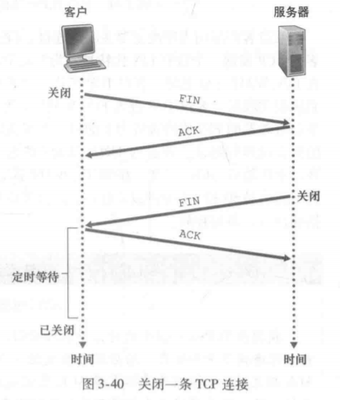</div>

> <b>客户端为什么要等待一段时间再释放资源</b>

看完上面四次挥手的过程，可能有的人会有疑问，四次挥手之后，连接不是已经断开了吗，为什么客户端还要等待一段时间再释放资源呢？原因有两个：

<b>原因一：</b>客户端接收到服务器发送的 `FIN` 报文后（第三次挥手），会回送一条确认报文（第四次挥手），但是，客户端并不知道这条确认报文是否可以顺利到达服务器。若这条确认报文在传送到服务器的过程中损坏、丢失或超时，将引起服务器重新发送 `FIN` 报文，客户端接收到后，将需要再次发送一条确认报文，直到服务器正确接收。但是，客户端发送确认报文后，立刻释放资源，将导致无法处理重传的 `FIN` 报文，所以客户端需要等待一段时间，直到确认没有出现上述情况出现再释放资源。

<b>原因二：</b>`TCP` 四次挥手完成后，理论上已经断开了连接，但是这不代表之前通过这条连接发送的所有数据都处理完毕了，有些可能还在网络中传输。若在四次挥手后，立即释放客户端的资源，然后客户端立即以同一个源端口，向服务器的同一个目的端口再次建立一个 `TCP` 连接，这个连接和上一个的源端口+源 `IP`+目的端口+目的 `IP` 都一模一样，此时将会产生问题。若上一次连接遗留在网络中的报文此时到达，将会被当做新连接传输的数据处理，于是可能会产生一些不可预估的错误。所以，客户端在断开连接后，需要等待一段时间，直到网络中遗留的数据都死掉，才释放资源，而在资源没有被释放前，是不允许建立一个 源端口+源 `IP`+目的端口+目的 `IP` 都一模一样的 `TCP` 连接的（因为 `TCP` 套接字由这四部分标识）。

> <b>断开连接为什么需要四次挥手</b>

有的人可能也会想，断开连接为什么是四次挥手，不能是两次呢？其中一方请求断开连接，另一方确认即可，为什么这个过程需要两边各发起一次？原因就是：<b>TCP 连接是全双工的</b>。什么是全双工，即 `A` 与 `B` 建立连接，则 `A` 可以向 `B` 发送数据，而 `B` 也可以向 `A` 发送数据。

我们知道断开连接的请求什么时候发起？当然就是在不再有数据需要发送时。我们依旧以客户端向服务器断开连接为例。假设客户端和服务器建立了一个`TCP` 连接，在客户端需要向服务器发送的数据都发送完后，客户端就可以向服务器发送一个 `FIN` 报文段，请求断开连接；服务器接收到后，将会回送一个 `ACK` 报文，告诉客户端，自己已经收到了它断开连接的请求。若只有两次挥手，这个时候连接就算是断开了。但是这样真的合理吗？答案当然是否定的。

客户端发送完数据后，告诉服务器，我没有数据了，可以和你断开，但是不代表服务器没有数据需要发送到客户端了呀。`TCP` 是一个全双工的连接，代表服务器也有可能有数据需要发送到客户端。所以，只有当两端的数据都发送完毕，连接才能安全的断开。因此，服务器接收到了客户端的 `FIN` 报文段，他会等到自己所有的数据发送完，然后也向客户端发送一个 `FIN` 报文，告诉客户端我也没数据了，这时候连接才能真正断开，两端各自释放资源。

### 往返时间的估计与超时

往返延迟的时间设置是动态的自适应的，定期去测量往返时间。超时时间=往返时间+4倍的标准差。

### 可靠数据传输

TCP 在 IP 不可靠服务的基础上建立了 rdt。

- 管道化（piple line）的报文段 GBN or SR
- 累积确认（像 GBN）
- 单个重传定时器（像 GBN）
- 是否可以接收乱序的，并没有相应的规范

通过以下事件触发重传

- 超时（只重发那个最早未确认段：SR）
- 重复确认：如收到了 ACK50 后又收到了 3 个 ACK50.

先考虑下简化的 TCP 发送方

- 忽略重复的确认
- 忽略流量控制和拥塞控制

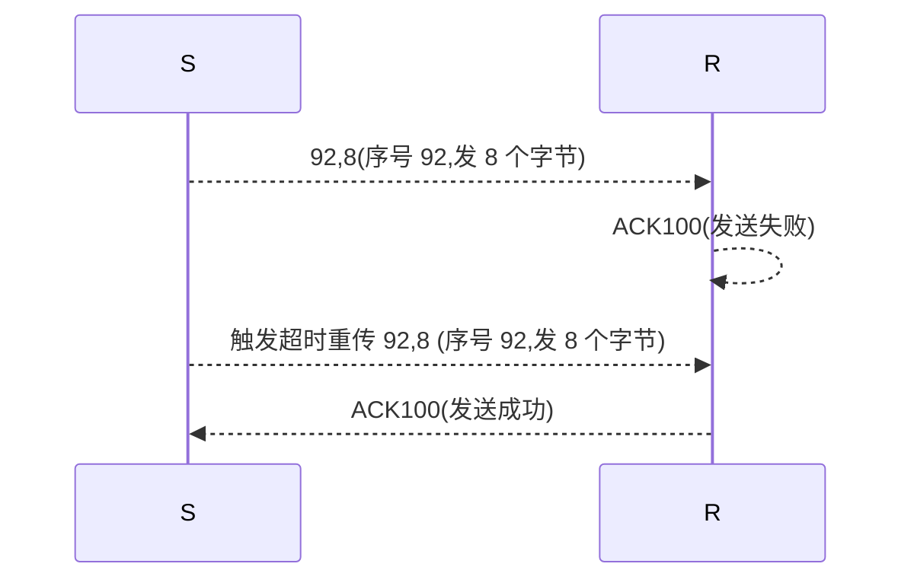
```mermaid
sequenceDiagram
participant S
participant R
S-->>R:92,8(序号 92,发 8 个字节)
R-->>R:ACK100(发送失败)
S-->>R:触发超时重传 92,8 (序号 92,发 8 个字节)
R-->>S:ACK100(发送成功)
```

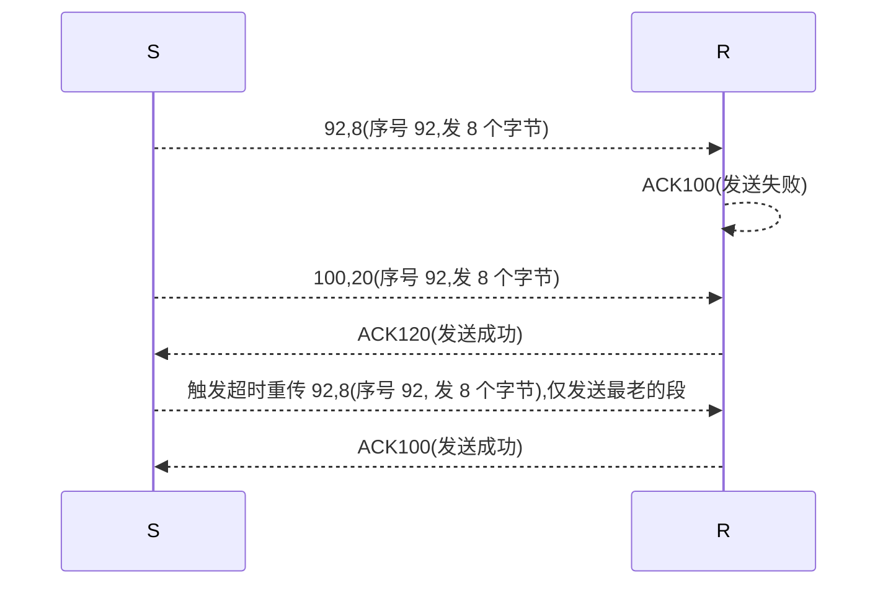
```mermaid
sequenceDiagram
participant S
participant R
S-->>R:92,8(序号 92,发 8 个字节)
R-->>R:ACK100(发送失败)
S-->>R:100,20(序号 92,发 8 个字节)
R-->>S:ACK120(发送成功)
S-->>R:触发超时重传 92,8(序号 92, 发 8 个字节),仅发送最老的段
R-->>S:ACK100(发送成功)
```

### 快速重传

假设数据发送方是这样的，要发如下几个数据段

`40~49`	`50~59`	`60~69`	`70~79`	`80~89`

`40~49`	成功发送了，服务器回复 ACK50

`60~69`	成功发送了，服务器回复 ACK50

`70~79`	成功发送了，服务器回复 ACK50

`80~89`	成功发送了，服务器回复 ACK50

......

<span style="color:red">接收方连续给了我三个冗余的 ACK，但是超时定时器还没到时间，这样我可以在超时定时器到时之前发送数据段，比超时定时器启动的时机来的更早一些。</span>

> 快速重传示意图&算法伪代码

```java
//事件：收到ACK,具有ACK字段值y
if (y > SendBase） {
    SendBase=y
    If (当前仍无任何应答报文段)
    	启动定时器 
}
else {/*快对已经确认的报文段的一个冗余ACK */
    对y收到的冗余ACK数加1
    if (对y==3收到的冗余ACK数)
        /*TCP快速重传*/ 
        重新发送具有序号y的报文段
}
break;
```

<div align="center">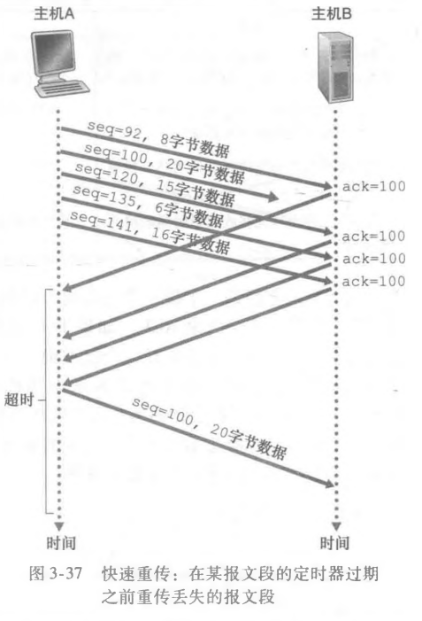</div>

### 流量控制

一条 TCP 连接的主机为连接设置了接收缓存。TCP 接收到正确（无差错、按序）的数据后会将数据放在缓存里。如果接收方接收能力太弱，发送方发的又太多，会导致缓存溢出。TCP 为它的应用程序提供了流量控制，避免缓存溢出。<span style="color:red">所谓流量控制 (flow control) 就是让发送方的发送速率不要太快，要让接收方来得及接收。</span>

利用滑动窗口机制可以很方便地在 TCP 连接上实现对发送方的流量控制。

设 A 向 B 发送数据。在连接建立时，B 告诉了 A："我的接收窗口 $rwnd=400$"（这里 rwnd 表示 receiver window）。因此，发送方的发送窗口不能超过接收方给出的接收窗口的数值。TCP 的窗口单位是字节，不是报文段。假设每一个报文段为 100 字节长，而数据报文段序号的初始值设为 1（第一个箭头上面的序号 seq = 1）。图中箭头上面大写 ACK 表示首部中的确认位 ACK，小写 ack 表示确认字段的值。

<div align="center">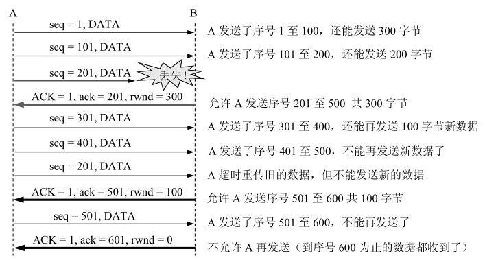</div>

接收方的主机 B 进行了三次流量控制。第一次把窗口减小到 rwnd=300，第二次又减到 rwnd=100，最后减到 rwnd=0，即不允许发送方再发送数据了。这种使发送方暂停发送的状态将持续到主机 B 重新发出一个新的窗口值为止。我们还应注意到，B 向 A 发送的三个报文段都设置了 ACK=1，只有在 ACK=1 时确认号字段才有意义。

- <span style="color:red">接收方控制发送方，不让发送方发送太多、太快以至于让接收方的缓冲区溢出。</span>
- <span style="color:red">接收方通过捎带技术，把自己缓冲区的大小告诉发送方，然后发送方知道接收方的空闲大小是多少，就不会超过对方的处理能力。（通过告诉发送方 rwnd 的大小，告诉发送方还可以发多少数据过来）</span>

<b>捎带技术：</b>如果数据和 ack 分开发送的话，是这样的。很麻烦。既然双方都会发送数据，为什么不在传输数据的时候带上 ack 呢？

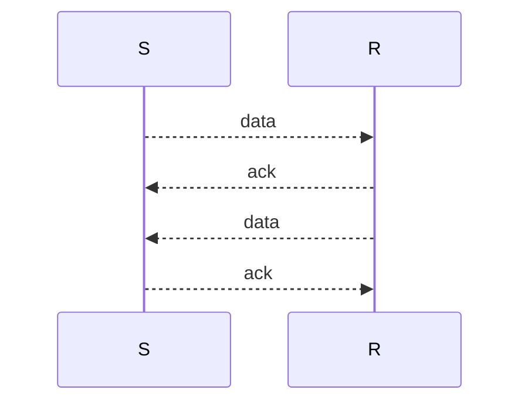
```mermaid
sequenceDiagram
participant S 
participant R
S-->>R:data
R-->>S:ack
R-->>S:data
S-->>R:ack
```

发送数据时带上 ack，这就是捎带技术。

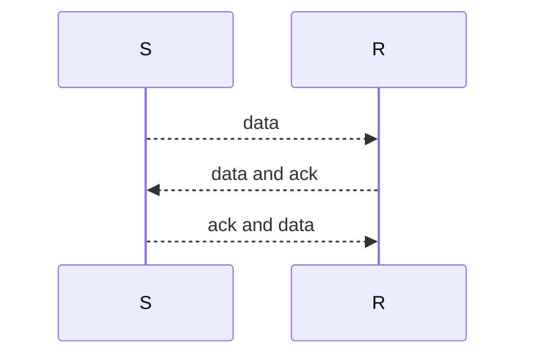
```mermaid
sequenceDiagram
participant S 
participant R
S-->>R:data
R-->>S:data and ack
S-->>R:ack and data
```

### TCP连接管理

在正式交换数据之前，发送方和接收方握手建立通信关系

- 同意建立连接（每一方都知道对方愿意建立连接）
- 同意连接参数

需要特别注意的是，许多常见的网络攻击（如 SYN 洪泛攻击）利用了 TCP 连接管理中的弱点。

<b>X，Y 的值是随机的。为什么要设置成随机的呢？是为了避免和老的连接发送的数据干扰，避免老连接的数据被误认为是当前连接发送的数据。</b>

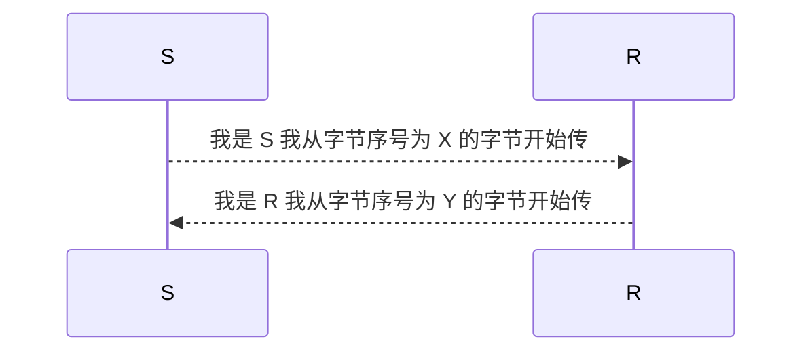
```mermaid
sequenceDiagram
participant S 
participant R
S-->>R:我是 S 我从字节序号为 X 的字节开始传
R-->>S:我是 R 我从字节序号为 Y 的字节开始传
```

为什么是三次握手呢？

- A 要告诉 B 一些信息（一次确认）；
- B 要告诉 A 一些信息，包括我收到了你的确认（二次确认）；
- A 又要告诉 B 一些信息，我也收到了你的确认，这样就可以确保双方都知道了（三次确认）；

两次握手可以吗？

- 两次握手失败的场景
    - 半连接，服务器维护了一个半连接。浪费了资源。
    - 老的数据被当成新的数据接受了。（这点不是很理解）

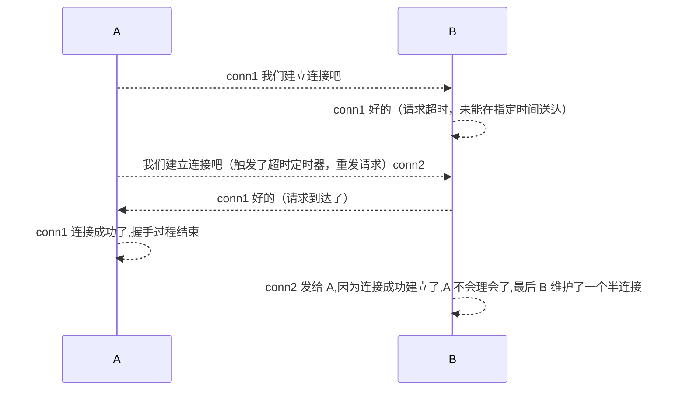
```mermaid
sequenceDiagram
participant A
participant B
A-->>B:conn1 我们建立连接吧
B-->>B:conn1 好的（请求超时，未能在指定时间送达）
A-->>B:我们建立连接吧（触发了超时定时器，重发请求）conn2
B-->>A:conn1 好的（请求到达了）
A-->>A:conn1 连接成功了,握手过程结束
B-->>B:conn2 发给 A,因为连接成功建立了,A 不会理会了,最后 B 维护了一个半连接
```

<b>三次握手的过程示意图：</b>

<div align="center">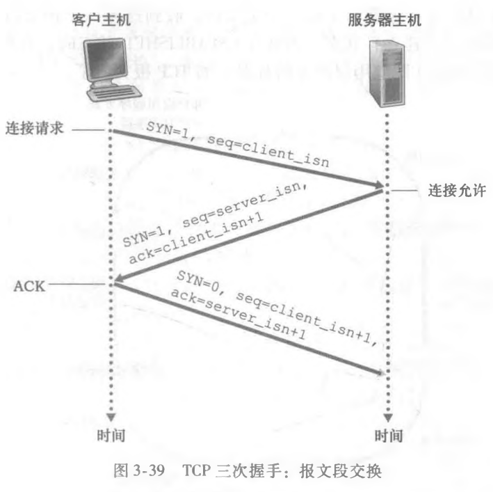</div>

- <b>第一步：</b>客户端的 TCP 首先向服务器端的 TCP 发送一个特殊的 TCP 报文段。该报文段中不包含应用层数据。但是在报文段的首部中的一个标志位 （SYN 比特）被置为 1。因此，这个特殊报文段被称为 SYN 报文段。另外，客户会随机地选择一个初始序号（client_isn）,并将此编号放置于该起始的 TCP SYN 报文段的序号字段中。该报文段会被封装在一个 IP 数据报中，并发送给服务器。 为了避免某些安全性攻击，在适当地随机化选择 client_isn 方面有着不少有趣的研究［CERT 2001 ・09 ]

- <b>第二步：</b>一旦包含 TCP SYN 报文段的 IP 数据报到达服务器主机（假定它的确到达了）, 服务器会从该数据报中提取出 TCP SYN 报文段，为该 TCP 连接分配 TCP 缓存和变量，并向该客户 TCP 发送允许连接的报文段。（在完成三次握手的第三步之前分配这些缓存和变量，使得 TCP 易于受到称为 SYN 洪泛的拒绝服务攻击）这个允许连接的报文段也不包含应用层数据。但是，在报文段的首部却包含 3 个重要的信息。首先，SYN 比特被置为 1。其次，该 TCP 报文段首部的确认号字段被置为 client _ isn + 1. 最后，服务器选择自己的初始序号 （server_isn）,并将其放置到 TCP 报文段首部的序号字段中。这个允许连接的报文段实际上表明了： “我收到了你发起建立连接的 SYN 分组，该分组带有初始序号 client_isn+1 我同意建立该连接。我自己的初始序号是 server_isn 该允许连接的报文段被称为 SYNACK 报文段（SYNACK segment）。 
- <b>第三步：</b>在收到 SYNACK 报文段后，客户也要给该连接分配缓存和变量。客户主机则向服务器发送另外一个报文段；这最后一个报文段对服务器的允许连接的报文段进行了确认（该客户通过将值 server_isn+1 放置到 TCP 报文段首部的确认字段中来完成此项工作）。因为连接已经建立了，所以该 SYN 比特被置为 0。该三次握手的第三个阶段可以在报文段负载中携带客户到服务器的数据。

一旦完成这 3 个步骤，客户和服务器主机就可以相互发送包括数据的报文段了。在 以后每一个报文段中，SYN 比特都将被置为 0。注意到为了创建该连接，在两台主机之间发送了 3 个分组，故称之为三次握手。

## 拥塞控制原理

<b>什么是拥塞？</b>

网络中的数据太多，导致某个路由器处理不过来或处理地太慢，这就是`网络拥塞`。

<b>网络拥塞举例</b>

路由器的内存是有限的，若同一时间到达某个路由器的数据太多，这个路由器将无法接收所有的数据，只能将一部分丢弃；或者同一台路由器数据太多，后面到达的数据将要等待较长的时间才会被转发。

一般，当网络变得拥塞时，会出现丢包的现象，这是由于路由器缓存溢出引起的。我们可以将分组重传作为网络拥塞的征兆（丢包了或超时了才需要重传）。有太多源相以过高的速度发送数据，但是目标端口又无法及时处理这些发送过来的数据。为了处理网络拥塞，我们需要一些机制使得在面对网络拥塞时遏制发送方发送数据的速度。

- 这里我们考虑一般情况下的拥塞控制问题；
- 分析为什么网络拥塞是一件坏事情；
- 网络拥塞是如何在上层应用得到的服务性能中明确地显露出来的；
- 如何用各种方法来避免网络拥塞或对它做出反应； 

### 拥塞控制概述

<b>拥塞控制：就是在网络中发生拥塞时，减少向网络中发送数据的速度，防止造成恶性循环；同时在网络空闲时，提高发送数据的速度，最大限度地利用网络资源</b>

- TCP 有拥塞控制
- UDP 无拥塞控制
- UDP 没有拥塞控制，但是我们又需要拥塞控制来预防网络进入一种拥塞状态，然而在拥塞控制中我们可以做的工作很少。
- 考虑这样一种场景，大家看直播，都开启蓝光看视频且不使用任何拥塞控制的话，就会使路由器出现大量的分组溢出，以至于只有非常少的 UDP 分组可以成功达到目的地。且，无控制的 UDP 发送方引入的高丢包率将引起 TCP 发送方大大减小它们的速率。因此， UDP 中缺乏拥塞控制能够导致 UDP 发送方和接收方之间的高丢包率，并挤垮 TCP 会话。
- 简而言之：UDP 无拥塞控制可能会导致路由器出现大量的分组溢出，然后发送方和接收方出现大量的丢包，同时也会影响使用了这些路由器的 TCP。因为 TCP 拥有拥塞控制，TCP 会减小发送的速率，最终将导致 UDP 挤跨了 TCP。
- 好在，很多研究人员提出了一些新的机制，可以促使所用的数据源（包括 UDP）执行自适应的拥塞控制。
- 注意：UDP 是可以实现可靠数据传输的，不过需要在应用程序中建立这种可靠性机制，比如 Chrome 中使用的 QUIC 协议，QUIC 协议在 UDP 之上的应用层协议上实现了可靠性。

### 拥塞原因与代价

拥塞控制与流量控制有些像，但流量控制是受 B 的接收能力影响，而拥塞控制是受<b>网络环境</b>的影响。

### 解决办法

拥塞控制的解决办法依然是通过设置一定的窗口大小，限制发送方的发送能力。只不过，流量控制的窗口大小是 B（接收端） 直接告诉 A（发送端） 的，<span style="color:red">但是拥塞控制的窗口大小按理说就应该是网络环境主动告诉 A。但网络环境怎么可能主动告诉 A 呢？只能 A 单方面通过试探，不断感知网络环境的好坏，进而确定自己的拥塞窗口的大小。</span>

<div align="center">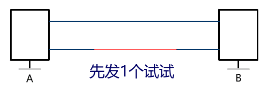</div>

<b>在理论上，拥塞控制的实现方式有两种：</b>

- 端到端的拥塞控制：在这种拥塞控制方法中，由发送数据的端系统自己来判断是否拥塞，然后调整传输速率。比如说发送的数据已经超时却还没有接收到确认报文，数据往返时延过高，接收到对同一个数据段的重复确认......都可以认为是网络拥塞的现象；若发送端检测到这种现象，就应该降低发送数据的速率，若没有，则可以慢慢提高速率；
- 网络辅助的拥塞控制：由网络中的路由器来告诉发送方，网络的拥塞情况。一般有两种方式：
    - （1）路由器直接向发送端发送报文，告知网络拥塞情况；
    - （2）路由器更改数据段中的某个标志，来提示网络中的拥塞情况，然后数据将这个标志携带到目的主机，再由目的主机根据这个标志，向发送端发送报文，告知拥塞情况（被包含在确认报文中）；


<b>拥塞窗口大小的计算有很多复杂的算法，就不展开了，假如拥塞窗口的大小为  cwnd，上一部分流量控制的滑动窗口的大小为 rwnd</b>，那么窗口的右边界受这两个值共同的影响，需要取它俩的最小值。
$$
窗口大小 = min(cwnd, rwnd)
$$
含义很容易理解，当 B 的接受能力比较差时，即使网络非常通畅，A 也需要根据 B 的接收能力限制自己的发送窗口。当网络环境比较差时，即使 B 有很强的接收能力，A 也要根据网络的拥塞情况来限制自己的发送窗口。

### TCP拥塞控制方法

因为网络层不会提供拥塞的反馈信息，所以<span style="color:orange"> TCP 协议采用的是第一种方式——自己判断网络的拥塞情况</span>。当 `TCP` 检测到网络拥塞，则降低数据的发送速率，否则增加数据的发送速率。这里就将面临三个问题：

- `TCP` 如何限制数据的发送速率；
- `TCP` 如何检测网络中是否拥塞；
- `TCP` 采用什么算法来调整速率（什么时候调整，调整多少）

<b>TCP 如何限制数据的发送速率</b>

`TCP` 发送数据时会维护一个发送窗口，所有序号位于这个窗口内的数据段都会被一次性发送，而不需要等待之前发送的数据段被确认。而每当最早发送出去的数据段被确认，窗口就会向前移动，直到移动到第一个没有被确认的序号，这时候又会有新的数据段序号被包含在窗口中，然后被发送出去。所以限制数据发送速率最好的方式就是<b>限制窗口的大小</b>。

发送方的 `TCP` 程序会跟踪和维护一个叫做<b>拥塞窗口</b>的变量，用来进行拥塞控制。拥塞窗口被称为 `cwnd`。在 `TCP` 发送端，所有被发送但是还没收到确认的数据段必须落在这个窗口中，所有，当网络拥塞时，TCP 程序将减小 `cwnd`，而网络通畅时，增大 `cwnd`，以此来控制数据发送的速率。

<b>TCP 如何检测网络中是否拥塞</b>

`TCP` 程序将通过数据发送的一些现象来推测网络是否拥塞，比如：

- 若发送一条数据段后，成功接收到了接收方的确认报文，则可以认为网络没有拥塞；
- 若发送出一条数据段后，在规定时间内没有收到确认报文（丢失或时延太大），则可以认为网络出现了拥塞；
- 若连续收到接收方对同一条报文的三次冗余确认（也就是四次确认），则可以推测那条报文丢失，即发生了拥塞；<span style="color:red">(涉及到快速重传, 当发送方连续收到三个冗余 ACK 但超时定时器还没有到时间时，可以认为丢包了，进行重传，即快速重传。)</span>

总的来说，TCP 检测网络是否拥塞是通过数据是否丢包判断的。

<b>TCP 拥塞控制算法</b>

拥塞算法一共包括三个部分：①慢启动、②拥塞避免、③快恢复。

## 拥塞控制算法

拥塞算法一共包括三个部分：①慢启动、②拥塞避免、③快恢复。

### 慢启动

- <b>MSS：</b>最大报文段长度，`TCP` 双方发送的报文段中，包含的数据部分的最大字节数；
- <b>cwnd：</b>拥塞窗口，`TCP` 发送但还没有得到确认的报文的序号都在这个区间；
- <b>RTT：</b>往返时间，发送方发送一个报文，到接收这个报文的确认报文所经历的时间；
- <b>ssthresh：</b>慢启动阈值，慢启动阶段，若 `cwnd` 的大小达到这个值，将转换到拥塞避免模式；

慢启动是建立 `TCP` 连接后，采用的第一个调整发送速率的算法，目的是尽快找到 cwnd 的上限大小。在这个阶段，`cwnd` 通常被初始化为 `1MSS`，这个值比较小，在这个时候，网络一般还有足够的富余，发送方每接收到一个确认报文，就会将 `cwnd` 翻一倍，于是：

- 初始 `cwnd=1MSS`，所以可以发送一个 `TCP` 最大报文段，成功确认后，`cwnd = 2MSS`；
- 此时可以发送两个 `TCP` 最大报文段，成功接收后，`cwnd = 4 MSS`；
- 此时可以发送四个 `TCP` 最大报文段，成功接收后，`cwnd = 8 MSS`......

<b style="color:red">由于 TCP 是一次性将窗口内的所有报文发出，所以所有报文都到达并被确认的时间，近似的等于一个 RTT（记住这个结论，后面所述的 RTT 都是基于这个结论）</b>。那这个过程什么时候改变呢，可分为三种情况。

- 第一种：若在慢启动的过程中，发生了数据传输超时，则此时 `TCP` 将 `ssthresh` 的值设置为 `cwnd/2`，然后将 `cwnd` 重新设置为 `1MSS`，重新开始慢启动过程，这个过程可以理解为试探上限；
- 第二种：第一步试探出来的上限 `ssthresh` 将用在此处。若 `cwnd` 的值增加到 `>= ssthresh` 时，此时若继续使用慢启动的翻倍增长方式可能有些鲁莽，所以这个时候结束慢启动，改为拥塞避免模式；
- 第三种：若发送方接收到了某个报文的三次冗余确认（即触发了快速重传的条件），则进入到快速恢复阶段；同时，`ssthresh = cwnd / 2`，毕竟发生快速重传也可以认为是发生拥塞导致的丢包，然后 `cwnd = ssthresh + 3MSS`；

### 拥塞避免

一旦进入拥塞避免状态，cwnd 的值大约是上次遇到拥塞时的值的一半，距离拥塞也不遥远。因此，TCP 不能每过一个 RTT 就将 cwnd 的值翻倍了，而是采用了一种比较保守的办法，每个 RTT 只将 cwnd 的值增加一个 MSS。这能够以几种方式完成。一种通用的方法是对于 TCP 发送方无论何时到达一个新的确认，就将 cwnd 增加一个 MSS（MSS/cwnd）字节。

例如，如果 MSS 是 1460 字节并且 cwnd 是 14600 字节，则在一个 RTT 内发送 10 个报文段。每个到达 ACK（假定每个报文段一个 ACK）增加 1/10 MSS 的拥塞窗口长度，因此在收到对所有 10 个报文段的确认后（一个 RTT？），拥塞窗口的值增加了一个 MSS。

这个线性增长的过程什么时候结束，分为两种情况：

- 第一种：在这个过程中，发生了超时，则表示网络拥塞，这时候， `ssthresh` 被修改为 `cwnd/2`，然后 `cwnd` 被置为 `1MSS`，并进入慢启动阶段；
- 第二种：若发送方接收到了某个报文的三次冗余确认（即触发了快速重传的条件），此时也认为发生了拥塞，则，`ssthresh` 被修改为 `cwnd/2`（还是可以接收到消息的，说明拥塞的不是很严重），然后 `cwnd` 被置为 `ssthresh+3MSS`（为了使测量结果更好，已收到的 3 个冗余的 ACK 要加上 3 个 MSS），并进入快速恢复模式；

### 快速恢复

快速恢复和上面两种模式不太一样，这种模式在 TCP 规范中并没有强制要求实现，只是一种推荐实现的模式。在快速恢复阶段，每接收到一个冗余的确认报文，`cwnd` 就增加 `1MSS`，其余不变，而当发生以下两种情况时，将退出快速恢复模式：

- 第一种：在快速恢复过程中，计时器超时，这时候，`ssthresh` 被修改为  `cwnd/2`，然后 `cwnd` 被置为 `1MSS`，并进入慢启动阶段；
- 第二种：若发送方接收到一条新的确认报文（不是冗余确认），则 `cwnd` 被置为 `ssthresh`，然后进入到拥塞避免模式；

## 运输层总结

- 运输层提供应用进程间的逻辑通信，也就是说，运输层之间的通信并不是真正在两个运输层之间直接传送数据。运输层向应用层屏蔽了下面网络的细节（如网络拓扑、所采用的路由选择协议等），它使应用进程看见的就是好像在两个运输层实体之间有一条端到端的逻辑通信信道。
- 网络层为主机之间提供逻辑通信，而运输层为应用进程之间提供端到端的逻辑通信。
- 运输层有两个主要的协议：TCP 和 UDP。它们都有复用和分用，以及检错的功能。当运输层采用面向连接的 TCP 协议时，尽管下面的网络是不可靠的（只提供尽最大努力服务），但这种逻辑通信信道就相当于一条全双工通信的可靠信道。当运输层采用无连接的 UDP 协议时，这种逻辑通信信道仍然是一条不可靠信道。
- 运输层用一个 16 位端口号来标志一个端口。端口号只具有本地意义，它只是为了标志本计算机应用层中的各个进程在和运输层交互时的层间接口。在因特网的不同计算机中，相同的端口号是没有关联的。
- 两台计算机中的进程要互相通信，不仅要知道对方的 IP 地址（为了找到对方的计算机），而且还要知道对方的端口号（为了找到对方计算机中的应用进程）。
- 运输层的端口号分为服务器端使用的端口号（0～1023 指派给熟知端口，1024～49151 是登记端口号）和客户端暂时使用的端口号（49152～65535）。
- UDP 的主要特点是：(1) 无连接；(2) 尽最大努力交付；(3) 面向报文；(4)无拥塞控制；(5) 支持一对一、一对多、多对一和多对多的交互通信；(6) 首部开销小（只有四个字段：源端口、目的端口、长度、检验和）。
- TCP 的主要特点是：(1) 面向连接；(2) 每一条TCP连接只能是点对点的（一对一）；(3) 提供可靠交付的服务；(4) 提供全双工通信；(5) 面向字节流。
- TCP 用主机的 IP 地址加上主机上的端口号作为 TCP 连接的端点。这样的端点就叫做套接字（socket）或插口。套接字用（IP 地址：端口号）来表示。
- 停止等待协议能够在不可靠的传输网络上实现可靠的通信。每发送完一个分组就停止发送，等待对方的确认。在收到确认后再发送下一个分组。分组需要进行编号。
- 超时重传是指只要超过了一段时间仍然没有收到确认，就重传前面发送过的分组（认为刚才发送的分组丢失了）。因此每发送完一个分组需要设置一个超时计时器，其重传时间应比数据在分组传输的平均往返时间更长一些。这种自动重传方式常称为自动重传请求 ARQ。
- 在停止等待协议中，若接收方收到重复分组，就丢弃该分组，但同时还要发送确认。
- 连续 ARQ 协议可提高信道利用率。发送方维持一个发送窗口，凡位于发送窗口内的分组都可连续发送出去，而不需要等待对方的确认。接收方一般采用累积确认，对按序到达的最后一个分组发送确认，表明到这个分组为止的所有分组都已正确收到了。
- TCP 报文段首部的前 20 个字节是固定的，后面有 4N 字节是根据需要而增加的选项（N 是整数）。在一个 TCP 连接中传送的字节流中的每一个字节都按顺序编号。首部中的序号字段值则指的是本报文段所发送的数据的第一个字节的序号。
- TCP 首部中的确认号是期望收到对方下一个报文段的第一个数据字节的序号。若确认号为 N，则表明：到序号 N-1 为止的所有数据都已正确收到。
- TCP 首部中的窗口字段指出了现在允许对方发送的数据量。窗口值是经常在动态变化着的。
- TCP 使用滑动窗口机制。发送窗口里面的序号表示允许发送的序号。发送窗口后沿的后面部分表示已发送且已收到了确认，而发送窗口前沿的前面部分表示不允许发送的。发送窗口后沿的变化情况有两种可能，即不动（没有收到新的确认）和前移（收到了新的确认）。发送窗口前沿通常是不断向前移动的。
- 流量控制就是让发送方的发送速率不要太快，要让接收方来得及接收。
- 在某段时间，若对网络中某一资源的需求超过了该资源所能提供的可用部分，网络的性能就要变坏。这种情况就叫做拥塞。拥塞控制就是防止过多的数据注入到网络中，这样可以使网络中的路由器或链路不致过载。
- 流量控制是一个端到端的问题，是接收端抑制发送端发送数据的速率，以便使接收端来得及接收。拥塞控制是一个全局性的过程，涉及到所有的主机、所有的路由器，以及与降低网络传输性能有关的所有因素。
- 为了进行拥塞控制，TCP 的发送方要维持一个拥塞窗口 cwnd 的状态变量。拥塞窗口的大小取决于网络的拥塞程度，并且动态地在变化。发送方让自己的发送窗口取为拥塞窗口和接收方的接收窗口中较小的一个。
- TCP 的拥塞控制采用了四种算法，即慢开始、拥塞避免、快重传和快恢复。在网络层，也可以使路由器采用适当的分组丢弃策略（如随机早期检测 RED），以减少网络拥塞的发生。
- 运输连接有三个阶段，即：连接建立、数据传送和连接释放。
- 主动发起 TCP 连接建立的应用进程叫做客户，而被动等待连接建立的应用进程叫做服务器。TCP 的连接建立采用三次握手机制。服务器要确认客户的连接请求，然后客户要对服务器的确认进行确认。
- TCP 的连接释放采用四次握手机制。任何一方都可以在数据传送结束后发出连接释放的通知，待对方确认后就进入半关闭状态。当另一方也没有数据再发送时，则发送连接释放通知，对方确认后就完全关闭了 TCP 连接。

## 安全问题

TCP 和 UDP 都是明文传输数据的，这可能导致，数据在某一中间链路中被拦截，不太安全。而 SSL 则是一种加强版的 TCP，这种加强是在应用层上实现的。SSL 有自己的套接字 API，其具体工作流程如下：


```mermaid
graph LR
进程-->|发送明文数据|SSL-->|传送加密数据|TCP-->|传输数据|TCP2-->|传输数据|SSL2-->|数据解密数据|进程2
```

# 扩展

## QUIC协议

- 概述
- TCP 及 UDP 之上的应用开发
- HTTP 协议及 QUIC 的历史
- 在协议栈中的位置和主要特性
- QUIC 主要工作原理
- QUIC 应用及效果简介

