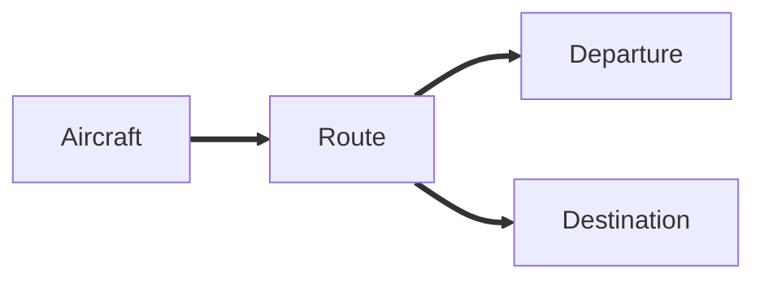
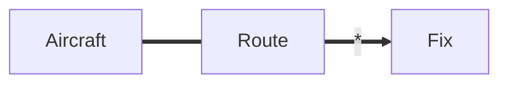
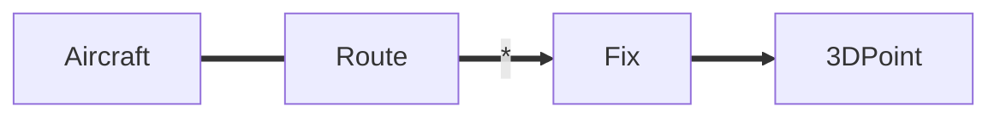
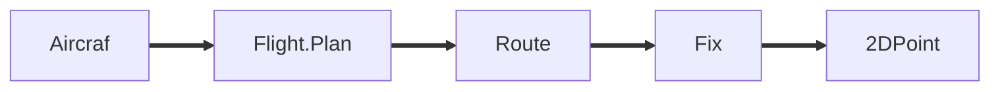

# 引言

多数的软件开发过程运用的都是贫血模型，把他当作面向过程来操作的。贫血模型开发方便，对开发人员的要求低。如`JavaEE`开发，开发人员熟悉三层架构后便可进行开发。

Spring、Hibernate 等鼓励使用贫血模型，因为理解了三层架构后，上手就很快。

PS：三层架构

- `Controller`
- `Service`：多数的业务代码都集中在Service中，其他两层代码少，贫血模型。
- `JavaBean`

我们倾向于把业务放在service中。对于简单的项目贫血模型是可以的，但是对于大型的软件架构这种方式是不合适的。

PS：一种解决办法是，采用领域模型，即运用设计模式。

软件开发不是一蹴而就的事情，我们不可能在不了解产品（或行业领域）的前提下进行软件开发，在开发前需要进行大量的业务知识梳理，而后到达软件设计的层面，最后才是开发。在梳理业务的过程中，我们必然会形成某个领域知识，根据领域知识来一步一步驱动软件设计。

领域驱动设计的核心就在于建立正确的领域驱动模型！

# 领域驱动设计

应对软件复杂性之道。

## 假设以下问题

假设某公司出售三种产品：文字处理软件、数据库、电子表格。其中：

文字处理软件当天入账

电子表格当天入1/3， 30天后再如1/3， 剩下的90天后再入账

数据库当天入1/3， 30天后再如1/3， 60天后再入账1/3

---

## 使用贫血模型

先来表设计

再利用三层架构，写代码。

为什么叫贫血模型？

- `JavaBean`中只有数据字段，`set/get`方法，无其他行为。
- 而充血模型`JavaBean`中是存在行为的~

优点：

- 简单、开发迅速、易于理解。
- 对于那些代码书写并不复杂的算法模型，采用贫血模型是很适合的。对于大型的工程化的代码，是否使用贫血模型有待考察。

缺点：

- 无法良好的应对复杂逻辑。
- 例如：在4月1号之前签订的合同要使用莫规则....和欧洲签订的合同使用另外一个规则..... 业务逻辑越复杂，service层的代码也会越来越多，而其他层的代码不会有明显的变化，两头轻，中间（service）大。

**贫血模型对于业务逻辑不复杂的项目来说是值得选择的，不能完全排斥。**

## 使用领域模型

**PS：领域与业务密切相关**

只执行自己的职责。对象之间相互协作。

充血模型。【使用设计模式，让类与类直接协作起来，避免贫血？】

阅读面向对象项目代码的时候，经常需要从一个类跳到另一个类，因为职责被细化了。

service只处理业务，具体的操作交给领域对象去做。

听到这里，感觉是在复杂的业务中运用了设计模式，抽象出各个类的职责，类与类之间进行协作，完成各种业务。

领域与业务密切相关，不同领域涉及的业务差别很大。业务是学习不完的，故采用领域的方式抽象出模型。

- 【现在的感觉是，外科医生式团队。高 层人员交流，设计出领域模型，普通开发人员根据领域模型进行开发，减少开发成本。】
- 【2020-11-30：按照领域驱动设计一书中所说的：领域与业务之间需要交流，人员之间的交流存在障碍，需要突破这层障碍。】

### 特点

- 对业务领域做了建模
  - 细粒度的类，易于扩展，容易复用
  - 可以应对复杂的业务逻辑
  - 需要经验才可以掌握
- 简单的领域模型
  - 几乎和数据库中的表一一对应
- 复杂的领域模型
  - 使用了继承、组合，设计模式等各种手段

领域驱动开发一开始并不考虑数据库表，先找业务领域中那些东西可以成为领域对象，领域实体。

业务简单的话，贫血模型更具优势~

# 正菜开始

## Domain Driven Design

**书籍推荐：**《领域驱动设计：软件核心复杂性应对之道》

DDD：DDD是一种以领域为核心的设计和开发理念。DDD通过维护一个深度反应领域概念的模型，以及提供了可行的经过实践检验的大量模式来应对领域的复杂性。

## 领域是什么？

**领域**

- “收入确认”，“机票预订”，“电信业务处理”

没有丰富的领域知识，做不了复杂的软件系统。我们必须向熟悉该领域知识的人请教

## 领域模型

- 不是一个具体的图，而是那个图要传递的思想。
- 不是领域专家头脑中的知识，而是一个经过**严格组织并进行选择性抽象**的知识。
- 不是要建立一个尽可能符合“现实”的模型。

## 通用语言

避免鸡同鸭讲

需要领域专家参与，仅靠用户文档是无法很好完成的~

### 用谁的语言来沟通？

- 专家有自己的行话
- 技术人员有自己的术语

需要一种通用的语言，让团队在交流时能达到一致。

## 例子：空中交通监控项目

**开发人员：**我们想监考空中交通，应该从哪里开始？

**专家：**让我们从最基础的开始吧。所有交通由**飞机**组成。每架飞机从一个**出发点**起飞，并在一个**目的地**点着陆。

**开发人员：**飞行时，飞行员按照驾驶员的意愿选择任何空中路线吗？

**专家：**不，驾驶员需要按照他们收到的规定路径行驶。

**开发人员：****飞机是直线飞行吗**？

**专家：**不是直线飞行，你可以想象成是一系列的**线段**组成的。每个线段的两端都是**方位**，所以模型应该这样：

**开发人员：**这样一来，出发地和目的地也包含在一个个**方位**中了。

**专家：**是的。

**开发人员：**把路线考虑成空中的3D线路。如果我们使用笛卡尔系统坐标，那么一条飞行路线会被简化成一系列的3D的点。

**专家：**笛卡尔？？

**开发人员：**。。。。

**专家：**实际上我们不会这样看待**飞行路线**。飞行路线是飞机预期的空中线路在地面上的映射。飞行路线会穿过一系列**地面上的点**，而这些点我们可以用经度和纬度来决定。

**开发人员：**哦，都是地球表面的点？我们用一些列2D的点来描述线路。

**开发人员：**飞机的飞行高度是否可以自行选择？

**专家：**不行。飞机在一个特定的**海拔高度**，会在**飞行计划**中有规定

**开发人员：**飞行计划？新名词？

**专家：**在离开机场之前，驾驶员会接到一个详细的**飞行计划**，包括所有关于此次飞行的信息：**飞行路线**，巡航高度、巡航速度和飞机的类型，甚至是机组成员的信息。

**开发人员：**飞行计划相当重要~

领域模型就建立起来了~

先建立通用语言，画出通用图，双方讨论，理解对方的意思。

## DDD的构造块

## DDD分层架构

### 每层说明

| 层              | 说明                                                         |
| --------------- | ------------------------------------------------------------ |
| 用户界面/展现层 | 负责向用户展现信息以及解释用户命令                           |
| 应用层          | 很薄的一层，用来协调应用的活动。不包含业务逻辑。不保留业务对象的状态，但它保有应用任务的进度状态。 |
| 领域层          | 包含关于领域的信息。是业务软件的核心所在，在这里保留业务对象的状态，对业务对象和它们状态的持久化被委托给了基础设施层。 |
| 基础设施层      | 本层作为其他层的支撑库存在。它提供了层间的通信，实现对业务对象的持久化，包含对用户界面层的支撑库等作用。 |

贫血模型是各种领域的操作可能集中在一个servcie中进行。

充血模型是每个领域只关注自己的事。把原来service中的逻辑移到领域中去了，不过领域要设计好才行~

### 领域层有什么？

- 实体（Entity）【不懂】
  - 对象不是由属性定义的，而是标志定义的~
  - 对象内容的变化不会影响标识符
  - 无论保存到硬盘，装入内存，通过网络发送，标识符都不变。

PS：实体有丰富的业务行为~

- 除了标识外，那些东西应该成为实体的属性？

  - 抓住实体对象定义的**最基本特征**，**用于识别，查找或匹配**对象的特征
  - **只添加那些对概念至关重要的行为和这些行为所需的属性**

- 领域服务【还是不懂】

  - 有些**领域逻辑是动词**，表示了一种重要的行为很难映射为对象，无法归结到实体和值对象当中。
  - 例如：转账

  