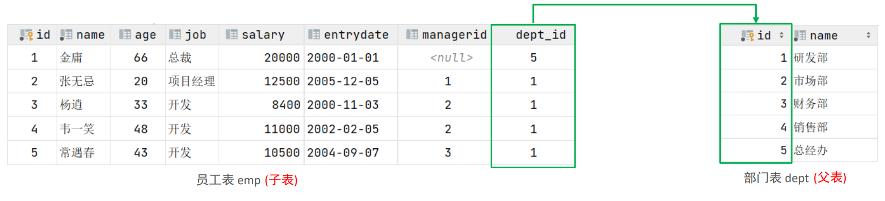
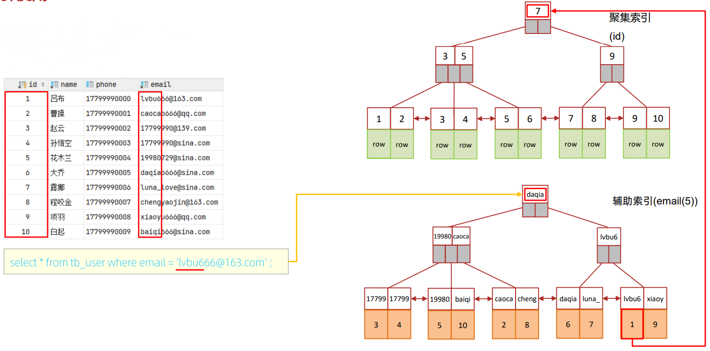
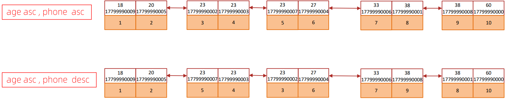

# 概览

[TOC]

## 常见面试题

- <b>什么是事务，以及事务的四大特性</b>
    - <span style="color:red">事务</span>是一组操作的集合，将所有的操作作为一个整体一起向系统提交或撤销操作请求，即这些操作<span style="color:red">要么同时成功，要么同时失败。</span>
    - ACID 四大特性。

- <b>事务的隔离级别有哪些, MySQL 默认是哪个</b>
    - <span style="color:orange">读未提交、读已提交、可重复读、可串行化。MySQL 默认是可重复读。</span>
- <b>内连接与左外连接的区别是什么 </b>
    - <span style="color:orange">内连接只返回两个表中连接字段相等的行。</span>
    - <span style="color:orange">左外连接返回包括左表中的所有记录和右表中连接字段相等的记录。</span>
- <b>InnoDB 与 MyISAM 的区别</b>
    - <span style="color:orange">InnoDB 支持事务，支持行级锁，支持外键。</span>
    - <span style="color:orange">MyISAM 不支持事务，不支持行级锁，不支持外键。</span>
- <b>MySQL 默认 InnoDB 引擎的索引是什么数据结构</b>
    - <span style="color:orange">采用的 B+Tree 数据结构。采用这种数据结构，一个数据块中保存的结点数就多少，查找数据所需要的 IO 次数就少，查找效率高。</span>
- <b>如何查看 MySQL 的执行计划 </b>
    - <span style="color:orange">每次我们提交一个 SQL 查询语句给 MySQL，他内核里的查询优化器，都会针对这个 SQL 语句的语义去生成一个执行计划，这个执行计划就代表了，他会怎么查各个表，用哪些索引，如何做排序和分组。</span>
    - <span style="color:orange">可以使用 explain sql 语句或者 desc sql 语句来查看执行计划。</span>
- <b>索引失效的情况有哪些 </b>
    - <span style="color:orange">联合索引中，出现范围查询 (>,<)，范围查询右侧的列索引失效。条件允许的话，尽量用 >=,<=。</span>
    - <span style="color:orange">用 or 分隔开的条例，如果 or 前面条件中的列有索引，后面的没有索引，那么涉及到的索引都会失效。可以将 or 中的所有字段都设置为索引。</span>
    - <span style="color:orange">字符串类型的字段使用时不加引号，索引会失效。</span>
    - <span style="color:orange">不符合索引的最左前缀法则的话，索引会失效。如  like '%d' 这种模糊匹配。</span>
    - <span style="color:orange">如果 MySQL 优化器评估发现走索引慢，就不会走索引。</span>
- <b>什么是回表查询</b>
    - <span style="color:orange">回表查询是指，当我们使用非聚集索引时，需要索引中没有完全包含我们需要检索的字段，需要根据当前索引查询到的主键 id，进行回表，通过主键 id 再查询一次数据库。</span>
- <b>什么是 MVCC</b>
    - <span style="color:orange">全称 Multi-Version Concurrency Control，即多版本并发控制，主要是为了提高数据库的并发性能。以下文章都是围绕 InnoDB 引擎来讲，因为 MyLASM 不支持事务。</span>
    - <span style="color:orange">MVCC 是“维持一个数据的多个版本，使读写操作没有冲突”的一个抽象概念。</span>
    - <span style="color:orange">它的实现原理主要是版本链，undo 日志，Read View 来实现的。</span>
- <b>MySQL 主从复制的原理是什么</b>
    - 主从复制中分为<b>「主服务器 (master) 「和」从服务器 (slave) 」，「主服务器负责写，而从服务器负责读」</b>，MySQL 的主从复制的过程是一个「异步的过程」。这样读写分离的过程能够是整体的服务性能提高，即使写操作时间比较长，也不影响读操作的进行。
    - 主从复制中主要有三个线程：master(binlog dump thread )、slave(I/O thread、SQL thread)，Master 一条线程，Slave 两条线程。
    - master 的 binlog dump thread 负责主库中有数据更新时，按照 binlong 格式将更新的事件类型写入到主库。并且 Master 会趁机 log dump 线程通知 Slave 主库存在数据更新。Slave 中会创建 IO thread 用于请求 Master 的 binlog，将信息更新到 relay log 中。当 Slave 发现 relay log 有更新是，就创建 SQL 线程将更新的内容同步到 Slave 数据库中。
- <b>主从复制之后的读写分离如何实现</b>
- <b>数据库的分库分表如何实现</b>

## 内容规划

### 基础复习

- MySQL 概述
- SQL-DDL
- SQL-DML
- SQL-DQL
- SQL-DCL
- MySQL 函数
- 约束
- 多表查询
- 事务

### 原理进阶

- MySQL 体系结构
- MySQL 存储引擎
- 索引
- SQL 优化
- 视图
- 存储过程\函数
- 触发器
- 锁
- InnoDB 存储引擎
- MySQL 管理

### 运维相关

- MySQL 日志
- MySQL 复制
- MyCat 概述
- 分片相关概念
- 分片配置
- 分配规则
- 读写分离

# 基础

## 概述

数据库：Database，简称 DB。按照一定的数据结构来组织、存储和管理数据的仓库。

数据库管理系统：Database Management System，一种操纵和管理数据库的大型软件，用于创建、使用和维护数据库，简称 DBMS。

### 数据库相关概念

数据库：存储数据的仓库

数据库管理系统：Database Management System，操纵和管理数据库的大型软件，简称 DBMS。

<b>关系型数据库 (RDBMS)</b>

- 概念：关系型数据库，是建立在关系模型基础上，由多张相互连接的二维表组成的数据库。 

- 特点： 
    1. 使用表存储数据，格式统一，便于维护
    2. 使用 SQL 语句操作，标准统一，使用方便； 
    3. 数据存储在磁盘中，安全

<b>非关系型数据库 (NoSQL)</b>

- 概念：Not-Only SQL，泛指非关系型数据库，是对关系型数据库的补充。 
- 特点：数据结构灵活；伸缩性强。


SQL：操作关系型数据库的编程语言，是一套标准。

### MySQL数据库

<b>版本</b>

MySQL 官方提供了两种不同的版本: 

- 社区版 (MySQL Community Server)  免费，MySQL 不提供任何技术支持
- 商业版 (MySQL Enterprise Edition)  收费，可以试用 30 天，官方提供技术支持

<b>安装</b>

[MySQL安装指南_技术交流_牛客网 (nowcoder.com)](https://www.nowcoder.com/discuss/825171?type=all&order=recall&pos=&page=1&ncTraceId=&channel=-1&source_id=search_all_nctrack&gio_id=649BB42AA30733488E2E468CA0F7721F-1642732433430)

<b>启动与停止</b>

```shell
# 启动
net start mysql80
# 停止
net stop mysql80
```

<b>客户端连接</b>

- 用 MySQL 提供的 MySQL 8.0 Command Line Client
- 用系统自带的命令窗口，执行指令 `mysql -h 127.0.0.1 -P 3306 -u root -p password`

## SQL

### SQL通用语法

1. SQL 语句可以单行或多行书写，以分号结尾。 

2. SQL 语句可以使用空格/缩进来增强语句的可读性。 

3. MySQL 数据库的 SQL 语句不区分大小写，关键字建议使用大写。 

4. 注释：

    单行注释：-- 注释内容或 # 注释内容 (MySQL 特有) 

    多行注释： /* 注释内容 */

### SQL分类

| 分类 | 全称                       | 说明                                                   |
| ---- | -------------------------- | ------------------------------------------------------ |
| DDL  | Data Definition Language   | 数据定义语言，用来定义数据库对象 (数据库，表，字段)    |
| DML  | Data Manipulation Language | 数据操作语言，用来对数据库表中的数据进行增删改         |
| DQL  | Data Query Language        | 数据查询语言，用来查询数据库中表的记录                 |
| DCL  | Data Control Language      | 数据控制语言，用来创建数据库用户、控制数据库的访问权限 |

### DDL

<b>数据库操作</b>

| 操作                      | 解释                        |
| ------------------------- | --------------------------- |
| show databases;           | 显示所有的数据库            |
| create database 数据库名; | 创建数据库                  |
| use 数据库名;             | 使用数据库/切换为 xx 数据库 |
| select database();        | 查询当前数据库名称          |
| drop database 数据库名;   | 删除数据库                  |

<b>表操作</b>

| 操作                                             | 解释                     |
| ------------------------------------------------ | ------------------------ |
| show tables;                                     | 显示当前数据库中的所有表 |
| create table 表名(字段 字段类型, 字段 字段类型); | 创建数据库表             |
| desc 表名;                                       | 查看表结构               |
| show create table 表名;                          | 查看建表语句             |
| alter table 表名 add/modify/drop/rename;         | 修改表结构               |
| alter table 表名 add/modify/drop/rename;         | 删除表                   |

#### 数据库操作

<b>查询</b>

查询所有数据库 `show databases;`

查询当前数据库 `select database();`

<b>创建</b>

```mysql
create database [IF NOT EXISTS] 数据库名 [DEFAULT CHARSET 字符集] [COLLATE 排序规则];
# mysql数据库中 utf8 字符集存储的长度是三个字节，有些特殊字符占四个字节 
# mb4则支持四个字节的 (语言表达有问题) ，默认好像就是utf8mb4
create database if not exists demo default charset utf8mb4;
```

<b>删除</b>

```mysql
drop database 数据库名;
drop database demo;
```

<b>使用</b>

```mysql
use 数据库名;
use demo;
```

#### 表操作-创建

```mysql
create table 表名(
    字段1 字段类型 [comment 字段1注释],
    字段2 字段类型 [comment 字段2注释],
)[comment 表注释];

create database demo;
use demo;

drop table if esists tb_user; # 存在则先删除
create table `tb_user` (
    `id` int primary key auto_increment comment '主键',
    `name` varchar(50) not null comment '用户名',
    `phone` varchar(11) not null comment '手机号',
    `email` varchar(100) default null comment '邮箱',
    `profession` varchar(11) default null comment '专业',
    `age` tinyint unsigned default null comment '年龄',
    `gender` char(1) default null comment '性别 , 1: 男, 2: 女',
    `status` char(1) default null comment '状态',
    `createtime` datetime default null comment '创建时间',
)my
```

#### 表操作-查询

查询当前数据库所有表 `show tables`

查询表结构 `desc 表名`

查询指定表的建表语句 `show create table 表名`

```mysql
mysql> show create table tb_user\G;
*************************** 1. row ***************************
       Table: tb_user
Create Table: CREATE TABLE `tb_user` (
  `id` bigint unsigned NOT NULL AUTO_INCREMENT COMMENT '主键',
  `phone` varchar(11) CHARACTER SET utf8mb4 COLLATE utf8mb4_general_ci NOT NULL COMMENT '手机号码',
  `password` varchar(128) CHARACTER SET utf8mb4 COLLATE utf8mb4_general_ci DEFAULT '' COMMENT '密码，加密存储',
  `nick_name` varchar(32) CHARACTER SET utf8mb4 COLLATE utf8mb4_general_ci DEFAULT '' COMMENT '昵称，默认是用户id',
  `icon` varchar(255) CHARACTER SET utf8mb4 COLLATE utf8mb4_general_ci DEFAULT '' COMMENT '人物头像',
  `create_time` timestamp NOT NULL DEFAULT CURRENT_TIMESTAMP COMMENT '创建时间',
  `update_time` timestamp NOT NULL DEFAULT CURRENT_TIMESTAMP ON UPDATE CURRENT_TIMESTAMP COMMENT '更新时间',
  PRIMARY KEY (`id`) USING BTREE,
  UNIQUE KEY `uniqe_key_phone` (`phone`) USING BTREE
) ENGINE=InnoDB AUTO_INCREMENT=1010 DEFAULT CHARSET=utf8mb4 COLLATE=utf8mb4_general_ci ROW_FORMAT=COMPACT
1 row in set (0.01 sec)
```

#### 数据类型

MySQL 中的数据类型有很多，主要分为三类：数值类型、字符串类型、日期时间类型。

<div style="text-align:center;"><h4>数值类型</h4></div>

| 类型           | 大小     | 有符号(SIGNED)范围                                    | 无符号(UNSIGNED)范围                                       | 描述               |
| -------------- | -------- | ----------------------------------------------------- | ---------------------------------------------------------- | ------------------ |
| TINYINT        | 1  byte  | (-128，127)                                           | (0，255)                                                   | 小整数值           |
| SMALLINT       | 2  bytes | (-32768，32767)                                       | (0，65535)                                                 | 大整数值           |
| MEDIUMINT      | 3  bytes | (-8388608，8388607)                                   | (0，16777215)                                              | 大整数值           |
| INT 或 INTEGER | 4  bytes | (-2147483648，2147483647)                             | (0，4294967295)                                            | 大整数值           |
| BIGINT         | 8  bytes | ($-2^{63},2^{63}-1$)                                  | (0，$2^{64}-1$)                                            | 极大整数值         |
| FLOAT          | 4  bytes | (-3.402823466 E+38，3.402823466351 E+38)              | 0 和 (1.175494351  E-38，3.402823466 E+38)                 | 单精度浮点数值     |
| DOUBLE         | 8  bytes | (-1.7976931348623157 E+308，1.7976931348623157 E+308) | 0 和  (2.2250738585072014 E-308，1.7976931348623157 E+308) | 双精度浮点数值     |
| DECIMAL        | -        | 依赖于 M (精度)和 D (标度)的值                        | 依赖于 M (精度)和 D (标度)的值                             | 小数值(精确定点数) |

<div style="text-align:center;"><h4>字符串类型</h4></div>

| 分类类型   | 大小                  | 描述                          |
| ---------- | --------------------- | ----------------------------- |
| CHAR       | 0-255 bytes           | 定长字符串                    |
| VARCHAR    | 0-65535 bytes         | 变长字符串                    |
| TINYBLOB   | 0-255 bytes           | 不超过 255 个字符的二进制数据 |
| TINYTEXT   | 0-255 bytes           | 短文本字符串                  |
| BLOB       | 0-65 535 bytes        | 二进制形式的长文本数据        |
| TEXT       | 0-65 535 bytes        | 长文本数据                    |
| MEDIUMBLOB | 0-16 777 215 bytes    | 二进制形式的中等长度文本数据  |
| MEDIUMTEXT | 0-16 777 215 bytes    | 中等长度文本数据              |
| LONGBLOB   | 0-4 294 967 295 bytes | 二进制形式的极大文本数据      |
| LONGTEXT   | 0-4 294 967 295 bytes | 极大文本数据                  |

<span style="color:orange">char 性能较好，varchar 性能较差；varchar 需要数一下字符串多长，但是相比 char 更节省空间，varchar 是字符串是多大就用多大的空间，char 是不管字符串多长，都用设定好的大小去存储一个字符串。</span>

<div style="text-align:center;"><h3>时间类型</h3></div>

| 类型      | 大小 | 范围                                       | 格式                | 描述                     |
| --------- | ---- | ------------------------------------------ | ------------------- | ------------------------ |
| DATE      | 3    | 1000-01-01 至  9999-12-31                  | YYYY-MM-DD          | 日期值                   |
| TIME      | 3    | -838:59:59 至  838:59:59                   | HH:MM:SS            | 时间值或持续时间         |
| YEAR      | 1    | 1901 至 2155                               | YYYY                | 年份值                   |
| DATETIME  | 8    | 1000-01-01 00:00:00 至 9999-12-31 23:59:59 | YYYY-MM-DD HH:MM:SS | 混合日期和时间值         |
| TIMESTAMP | 4    | 1970-01-01 00:00:01 至 2038-01-19 03:14:07 | YYYY-MM-DD HH:MM:SS | 混合日期和时间值，时间戳 |

#### 习题

根据需求创建表 (设计合理的数据类型、长度) 设计一张员工信息表，要求如下： 

1. 编号 (纯数字)  
2. 员工工号 (字符串类型，长度不超过 10 位) 
3. 员工姓名 (字符串类型，长度不超过 10 位)  
4. 性别 (男/女，存储一个汉字)  
5. 年龄 (正常人年龄，不可能存储负数)  
6. 身份证号 (二代身份证号均为 18 位，身份证中有 X 这样的字符)  
7. 入职时间 (取值年月日即可) 

```sql
create table tb_emp(
	id int primary key, -- 主键索引
    number varchar(10),
    name varchar(10),
    sex char(1),
    age tinyint unsigned, -- 无符号整数，范围正常。
    id_card char(18),
    emyloyee_time date
) engine=INNODB charset utf8mb4;
```

#### 表操作-修改

<b>添加字段--add</b>

`alter table 表名 add 字段名 类型(长度) [comment 注释] [约束];`

`alter table tb_emp add nickname varchar(20) comment '昵称';`

```shell
mysql> alter table tb_emp add nickname varchar(20) comment "昵称";
Query OK, 0 rows affected (0.04 sec)
Records: 0  Duplicates: 0  Warnings: 0

mysql> desc tb_emp;
+---------------+------------------+------+-----+---------+-------+
| Field         | Type             | Null | Key | Default | Extra |
+---------------+------------------+------+-----+---------+-------+
| id            | int              | NO   | PRI | NULL    |       |
| number        | varchar(10)      | YES  |     | NULL    |       |
| name          | varchar(10)      | YES  |     | NULL    |       |
| sex           | char(1)          | YES  |     | NULL    |       |
| age           | tinyint unsigned | YES  |     | NULL    |       |
| id_card       | char(18)         | YES  |     | NULL    |       |
| emyloyee_time | date             | YES  |     | NULL    |       |
| nickname      | varchar(20)      | YES  |     | NULL    |       |
+---------------+------------------+------+-----+---------+-------+
8 rows in set (0.00 sec)
```

<b>修改数据类型--modify</b>

`alter table 表名 modify 字段名 新数据类型(长度);`

`alter table tb_emp modify nickname char;`

```shell
mysql> alter table tb_emp modify nickname char(20);
Query OK, 0 rows affected (0.07 sec)
Records: 0  Duplicates: 0  Warnings: 0

mysql> desc tb_emp;
+---------------+------------------+------+-----+---------+-------+
| Field         | Type             | Null | Key | Default | Extra |
+---------------+------------------+------+-----+---------+-------+
| id            | int              | NO   | PRI | NULL    |       |
| number        | varchar(10)      | YES  |     | NULL    |       |
| name          | varchar(10)      | YES  |     | NULL    |       |
| sex           | char(1)          | YES  |     | NULL    |       |
| age           | tinyint unsigned | YES  |     | NULL    |       |
| id_card       | char(18)         | YES  |     | NULL    |       |
| emyloyee_time | date             | YES  |     | NULL    |       |
| nickname      | char(20)         | YES  |     | NULL    |       |
+---------------+------------------+------+-----+---------+-------+
8 rows in set (0.00 sec)
```

<b>修改字段名和字段类型--change</b>

`alter table 表名 change 旧字段名 新字段名 类型(长度) [comment 注释] [约束]`

`alter table tb_emp change nickname username varchar(30) comment '用户名' not null;`

```shell
mysql> alter table tb_emp change nickname username varchar(30) comment '用户名' not null;
Query OK, 0 rows affected (0.06 sec)
Records: 0  Duplicates: 0  Warnings: 0

mysql> desc tb_emp;
+---------------+------------------+------+-----+---------+-------+
| Field         | Type             | Null | Key | Default | Extra |
+---------------+------------------+------+-----+---------+-------+
| id            | int              | NO   | PRI | NULL    |       |
| number        | varchar(10)      | YES  |     | NULL    |       |
| name          | varchar(10)      | YES  |     | NULL    |       |
| sex           | char(1)          | YES  |     | NULL    |       |
| age           | tinyint unsigned | YES  |     | NULL    |       |
| id_card       | char(18)         | YES  |     | NULL    |       |
| emyloyee_time | date             | YES  |     | NULL    |       |
| username      | varchar(30)      | NO   |     | NULL    |       |
+---------------+------------------+------+-----+---------+-------+
8 rows in set (0.01 sec)
```

<b>删除字段</b>

`alter table 表名 drop 字段名;`

`alter table tb_emp drop username;`

<b>修改表名</b>

`alter table 表名 rename to 新表名;`

`alter table tb_emp rename emp;`

#### 表操作-删除

删除表 `drop table [if exists] 表名`

删除指定表，并重新创建该表 `truncate table 表名;`

表删除效率比较

- drop：删除内容和定义，释放空间。简单来说就是<b>把整个表去掉</b>。以后要新增数据是不可能的，除非新增一个表
- truncate：只是清空表数据，会保留表的数据结构。
- delete：删除整个表的数据，但是是系统一行一行地删，效率比 truncate 低。delete 语句每次删除一行，会在事务日志中为所删除的每行记录一项。所以可以对 delete 操作进行 roll back，效率也低。

### DML

Data Manipulation Language (数据操作语言)，用来对数据库中表的数据记录进行增删改操作。

- 添加数据：`insert into 表名 (字段名1, 字段名2) values(值1, 值2), (值1, 值2), (值1,值2);`
- 修改数据：`update 表名 set 字段名1=值1, 字段名2=值2,.... [where 条件];`
- 删除数据：`delete from 表名 [where 条件]`

添加数据 (INSERT) ；修改数据 (UPDATE) ；删除数据 (DELETE) 

#### 添加数据

<b>给指定字段添加数据</b>
insert into table_name (字段 1, 字段 2, ...) values (值 1, 值 2);

<b>给全部字段添加数据</b>
insert to 表名 values(值 1,值 2,...)

<b>批量添加</b>
insert into 表名 (字段名 1, 字段名 2) values(值 1, 值 2), (值 1, 值 2), (值 1,值 2);
insert into 表名 (字段名 1, 字段名 2,...) values(值 1, 值 2,...), (值 1, 值 2,...), (值 1,值 2,...);

<b style="color:red">注意：</b>插入数据时，指定的字段顺序需要与值的顺序是一一对应的。字符串和日期型数据应该包含在引号中。插入的数据大小，应该在字段的规定范围内

#### 修改数据

`update 表名 set 字段名1=值1, 字段名2=值2,.... [where 条件];`

<b style="color:red">注意：</b>修改语句的条件可以有，也可以没有，如果没有条件，则会修改整张表的所有数据。删除数据时可能会造成页合并，因此可采用逻辑删除的方法，然后启动定时任务，定时删除那些逻辑删除的数据。

#### 删除数据

`delete from 表名 [where 条件]`

<span style="color:red"><b>注意：</b></span>DELETE 语句的条件可以有，也可以没有，如果没有条件，则会删除整张表的所有数据。 DELETE 语句不能删除某一个字段的值(可以使用 UPDATE)。

### DQL

Data Query Language (数据查询语言)，数据查询语言，用来查询数据库中表的记录。

查询的基本语法如下：

```sql
select
	字段列表
from
	表名列表
where
	条件列表
group by
	分组字段列表
having
	分组后条件列表
order by
	排序字段列表
limit
	分页参数
```

- 基本查询
- 条件查询 (where) 
- 聚合函数 (count、max、min、avg、sum) 
- 分组查询 (group by) 
- 排序查询 (order by) 
- 分页查询 (limit)

<b style="color:red">PS：MySQL 不支持子查询中使用 limit。</b>

#### 基本查询

```sql
select * from tb_emp;
select name from tb_emp;
```

#### 条件查询

```sql
select 字段列表 from 表名 where 条件列表;
```

<div style="text-align:center;"><h4>条件</h4></div>

| 比较运算符          | 功能                                       |
| ------------------- | ------------------------------------------ |
| >, >=               | 大于，大于等于                             |
| <, <=               | 小于，小于等于                             |
| =                   | 等于                                       |
| <> 或 !=            | 不等于                                     |
| between ... and ... | 在某个范围之内 (含最小、最大值)            |
| in (...)            | 在 in 之后的列表中的值，多选一             |
| like 占位符         | 模糊匹配 (_ 匹配单个字符，% 匹配任意字符)  |
| is null             | 是 null                                    |
| <b>逻辑运算符</b>   | <b>功能</b>                                |
| and 或 &&           | 并且 (多个条件同时成立)                    |
| or 或 \|\|          | 或者 (多个条件任意一个成立)                |
| not 或 !            | 非，不是                                   |

> <b>示例</b>

```sql
# 表数据
create table dept(
    id   int auto_increment comment 'ID' primary key,
    name varchar(50) not null comment '部门名称'
)comment '部门表';
INSERT INTO dept (id, name) VALUES (1, '研发部'), (2, '市场部'),(3, '财务部'), (4, '销售部');

create table emp(
    id  int auto_increment comment 'ID' primary key,
    name varchar(50) not null comment '姓名',
    age  int comment '年龄',
    idcard char(18) default '120235681203256878',
    dept_id int comment '部门ID'
)comment '员工表';
INSERT INTO emp (id, name, age, dept_id) VALUES (1, '张无忌', 20, 1),(2, '杨逍', 33, 1),(3, '赵敏', 18, 2), (4, '常遇春', 43, 2),(5, '小昭', 19, 3),(6, '韦一笑', 48, 3);
```

```sql
-- 1. 查询年龄 =88 的员工信息
select * from emp where age = 88;

-- 2. 查询年龄 <20 的员工信息
select * from emp where age < 20;

-- 3. 查询年龄 <=20 的员工信息
select * from emp where age <= 20;

-- 4. 查询没有身份证号的员工信息
select * from emp where idcard is null;

-- 5. 查询有身份证号的员工信息
select * from emp where idcard is not null;

-- 6. 查询年龄不等于 88 的员工信息
select * from emp where age != 88;
select * from emp where age <> 88;

-- 7. 查询年龄在 15<=age<=20 的员工信息
select * from emp where age between 15 and 20;
select * from emp where age>=15 && age<=20;
select * from emp where age>=15 and age<=20;

-- 8. 查询性别为 女 且年龄小于25的员工信息
select * from emp where sex='女' and age<25;

-- 9. 查询年龄 为18 或 20 或 40 的员工信息
select * from emp where age=18 or age=20 or age=40;
select * from emp where age in (18,20,40);

-- 10. 查询姓名为两个字的员工信息
select * from emp where name like '__';

-- 11. 查询身份证号最后一位是X的员工信息
select * from emp where name like '_________________X';
select * from emp where name like '%X';
```

#### 聚合函数

将一列数据作为一个整体，进行纵向计算。常见聚合函数如下。

| 函数  | 功能     |
| ----- | -------- |
| count | 统计数量 |
| max   | 最大值   |
| min   | 最小值   |
| avg   | 平均值   |
| sum   | 求和     |

语法：`select 聚合函数(字段列表) from 表名;`

<b style="color:red">注意：null 值不参与聚合函数运算。</b>

#### count函数

- COUNT(字段) 会统计该字段在表中出现的次数，<span style="color:orange">每次会判断下字段是否为 null，不为 null 才会计数。</span>
- COUNT(\*) 则不同，它执行时返回检索到的行数的计数，<span style="color:orange">不管这些行是否包含 null 值，即不会额外判断是否为 null。</span>
- COUNT(1) 跟 COUNT(\*) 类似，在统计结果的时候，不会忽略列值为 NULL 的行，即不会判断字段是否为 NULL。

COUNT(字段) 会有一个 NULL 判断，效率低。COUNT(1) 和 COUNT(\*) 没有这个判断，效率高。又 COUNT(\*) 是 SQL92 定义的标准统计数的语法，<b>建议使用 COUNT(\*)。</b>

<b>效率：</b>COUNT(\*) ≈ COUNT(1) > COUNT(字段)

#### 分组查询

`select 字段列表 from 表名 [where 条件] group by 分组字段名 [having 分组后过滤条件]`

<b style="color:red">where 和 having 的区别：</b>

- 执行时机不同：where 是分组之前进行过滤，不满足 where 条件，不参与分组；<u>而 having 是分组之后的结果进行过滤。</u>
- 判断条件不同：where 不能对聚合函数进行判断，而 having 可以。

```sql
-- 分组查询
-- 1.根据性别分组，统计男性员工和女性员工的数量
select sex,count(*) from emp group by sex;

-- 2.根据年龄分组，统计男性员工和女性员工的平均年龄
select sex,avg(age) from emp group by sex;

-- 3.查询年龄小于45的员工，并根据工作地址分组，获取员工数量大于等于3的工作地址
select workaddress,count(*) as address_count from emp where age<45 group by workaddress having address_count>=3;
```

<b>注意：</b>

-  执行顺序: where > 聚合函数 > having 。 
- 分组之后，查询的字段一般为聚合函数和分组字段，查询其他字段无任何意义。
- “where” 是一个约束声明，使用 where 来约束来自数据库的数据，<u>where 是在结果返回之前起作用的</u>，且 where 中不能使用聚合函数。

    “Having” 是一个过滤声明，是<u>在查询返回结果集以后对查询结果进行的过滤操作</u>，在 having 中可以使用聚合函数。

<b>为什么 where 不能对聚合函数进行判断？</b>

简而言之，聚集函数是针对结果集操作的，而 where 条件不是在查询出结果集之后允许的（是用来筛选出结果集合？）所有聚集函数不能放在 where 条件后。

看看 Linux 管道这部分的内容，感觉非常相似。

聚合函数的实现，是基于完整数据的。例如，求和，统计数据总数，最大值，最小值，必须保证所有列的数据全部用到。如果聚合函数出现在 where 子句中，它就要受到 where 语句的限制，因为这条语句最终是需要对数据进行筛选的，也就是说整条 sql 语句产生的结果将会是在 where 字句过滤后得到的数据的基础上筛选的，而不是全部的完整数据。<u>这与聚合函数实现的前提——完整的所有数据是相悖的，因此，聚合函数不能出现在 where 子句中。</u>

[(28条消息) 在MYSQL数据库中，为什么聚合函数不能出现在where子句中_Huya天涯过客的博客-CSDN博客_聚合不应该出现在where子句中](https://blog.csdn.net/weixin_44734925/article/details/89483264?spm=1001.2101.3001.6650.1&utm_medium=distribute.pc_relevant.none-task-blog-2~default~CTRLIST~Rate-1-89483264-blog-7903765.pc_relevant_multi_platform_whitelistv4&depth_1-utm_source=distribute.pc_relevant.none-task-blog-2~default~CTRLIST~Rate-1-89483264-blog-7903765.pc_relevant_multi_platform_whitelistv4&utm_relevant_index=2)

#### 排序查询

`select 字段列表 from 表名 order by 字段1 排序方式1，字段2 排序方式2;`

- 排序方式：ASC 升序 (默认值) ；DESC 降序
- 注意：如果是多字段排序，当第一个字段值相同时，才会根据第二个字段进行排序。

#### 分页查询

`select 字段列表 from 表名 limit 起始索引, 查询记录数;`

```sql
select * from emp limit 0,5;
```

<b style="color:red">注意：</b>

- 起始索引从 0 开始，起始索引 =  (查询页码 - 1) * 每页显示记录数。
- <u>分页查询是数据库的方言，不同的数据库有不同的实现，MySQL 中是 LIMIT。</u>
- 如果查询的是第一页数据，起始索引可以省略，直接简写为 limit 10。

#### 其他

[1873. 计算特殊奖金 - 力扣 (LeetCode)  (leetcode-cn.com)](https://leetcode-cn.com/problems/calculate-special-bonus/)

```mysql
# 如果 id 是奇数 且 name 不是 M 开头，则 salary 保持不变，否则设置为 0
select 
    employee_id,
    if (employee_id %2 = 1 and left(name,1)!='M', salary, 0) as bonus
from Employees

# 如果 id 是奇数 且 name 不是 M 开头，则 salary 保持不变，否则设置为 0
select 
    employee_id,
    case
        when employee_id % 2= 1 and left(name,1)!='M' then salary
        else 0
    end bonus
from Employees
```

[627. 变更性别 - 力扣 (LeetCode)  (leetcode-cn.com)](https://leetcode-cn.com/problems/swap-salary/submissions/)

```mysql
update Salary set sex = if(sex ='m','f','m');

update Salary 
    set sex =  CASE 
    when sex = 'm' 
    then 'f' 
    else 'm'
end
```

[196. 删除重复的电子邮箱 - 力扣 (LeetCode)  (leetcode-cn.com)](https://leetcode-cn.com/problems/delete-duplicate-emails/submissions/)

```mysql
# 先找出符合条件的邮箱
# select * from person as p1,person as p2 where p1.email = p2.email and p1.id>p2.id,p1 中的数据就是需要删除的。

# 执行速度似乎较慢
DELETE P1.* 
FROM PERSON AS P1, PERSON AS P2
WHERE P1.EMAIL=P2.EMAIL AND P1.ID>P2.ID

# 不能同时对同一个表中的数据进行查询和删除。更多 SQL 查询细节请看 SQL 专项一章。
DELETE from Person
WHERE id NOT IN #不在满足条件内的肯定就是不满足的，直接删除
(
    SELECT ID #先把满足条件的找出来
    From
    (
     SELECT  MIN(id) as ID
     From Person
     Group by Email
    )t
)
```

[1667. 修复表中的名字 - 力扣 (LeetCode)  (leetcode-cn.com)](https://leetcode-cn.com/problems/fix-names-in-a-table/submissions/)

```mysql
select user_id,concat(upper(left(name,1)),lower(right(name,length(name)-1))) name from Users order by user_id;
```

#### 习题

按照需求完成如下 DQL 语句编写 

1. 查询年龄为 20,21,22,23 岁的员工信息。 
2. 查询性别为男 ，并且年龄在 20-40 岁(含)以内的姓名为三个字的员工。 
3. 统计员工表中, 年龄小于 60 岁的 , 男性员工和女性员工的人数。 
4. 查询所有年龄小于等于 35 岁员工的姓名和年龄，并对查询结果按年龄升序排序，如果年龄相同按入职时间降序排序。 
5. 查询性别为男，且年龄在 20-40 岁(含)以内的前 5 个员工信息，对查询的结果按年龄升序排序，年龄相同按入职时间升序排序。

```sql
select * from emp where age in(20,21,22,23);

select sex,age,name 
from emp 
where sex='男' and (age between 20 and 40) and name like '___';

select sex,count(*) 
from emp 
where age<60 
group by sex;

select name,age 
from emp 
where age<=35 
order by age asc,entrydate desc;

select * from emp 
where sex='男' and age between 20 and 40 
order by age asc,entrydate desc 
limit 0,5;
```

#### 执行顺序

<div align="center"></div>

### DCL

DCL 英文全称是 Data Control Language (数据控制语言)，用来管理数据库用户 、控制数据库的访问权限。

| 用户管理命令                                                 | 权限控制命令                                             |
| ------------------------------------------------------------ | -------------------------------------------------------- |
| `create user '用户'@'主机名' identified by '密码';`          | `grant 权限列表 on 数据库名.表名 to '用户'@'主机名';`    |
| `alter user '用户'@'主机名' identified  with mysql_native_password by '密码';` | `revoke 权限列表 on 数据库名.表名 from '用户'@'主机名';` |
| `drop user '用户'@'主机名';`                                 |                                                          |

#### 管理用户

查询用户

```sql
use mysql;
select * from user;
```

创建用户

```sql
create user '用户名'@'主机名' identified by '密码';
# 虽然创建了用户 user2 但是没有对数据库的访问权限，只能登录
create user 'user2'@'localhost' identified by 'root';
# 任意主机都可以登录。 % 是通配符，表示任意
create user 'user2'@'%' identified by 'root';
```

修改用户密码

```sql
alter user '用户名'@'主机名' identified with mysql_native_password by '新密码';

alter user 'user2'@'localhost' identified with mysql_native_password by '1234'
```

删除用户

```sql
drop user 'user2'@'localhost';
```

<b>注意：</b> 

- 主机名可以使用 % 通配。
- 这类 SQL 开发人员操作的比较少，主要是 DBA ( Database Administrator 数据库管理员) 使用。

#### 权限控制

MySQL 中定义了很多种权限，<a href="https://dev.mysql.com/doc/refman/8.0/en/privileges-provided.html#priv_all">官方文档</a> ，但是常用的就以下几种：

| 权限                | 说明               |
| ------------------- | ------------------ |
| ALL, ALL PRIVILEGES | 所有权限           |
| SELECT              | 查询数据           |
| INSERT              | 插入数据           |
| UPDATE              | 修改数据           |
| DELETE              | 删除数据           |
| ALTER               | 修改表             |
| DROP                | 删除数据库/表/视图 |
| CREATE              | 创建数据库/表      |

查询权限

```sql
show grants for '用户名'@'主机';
```

授予权限

```sql
grant 权限列表 on 数据库名.表名 to '用户名'@'主机';
# 授予 user2 用户demo数据库所有表的所有权限。
grant all on demo.* to 'user2'@'%'; 
```

撤销权限

```sql
revoke 权限列表 on 数据库名.表名 to '用户名'@'主机';

revoke all on demo.* to 'user2'@'%';
```

## 函数

| 函数分类   | 常见函数                                               |
| ---------- | ------------------------------------------------------ |
| 字符串函数 | `concat,lower,upper,lpad,rpad,trim,substring`          |
| 数值函数   | `ceil,floor,mod,rand,round`                            |
| 日期函数   | `curdate,curtime,now,year,month,day,date_add,datediff` |
| 流程函数   | `if,ifnull,case[...] when... then... else... end`      |

### 字符串函数

| 函数                     | 功能                                                         |
| ------------------------ | ------------------------------------------------------------ |
| concat(s1,s2,...sn)      | 字符串拼接，将 s1,s2,...sn 拼接成一个字符串                  |
| lower(str)               | 将字符串 str 全部转为小写                                    |
| upper(str)               | 将字符串 str 全部转为大写                                    |
| LPAD(str,n,pad)          | 左填充，用字符串 pad 对 str 的左边进行填充，达到 n 个字符串长度 |
| RPAD(str,n,pad)          | 右填充，用字符串 pad 对 str 的右边进行填充，达到 个字符串长度 |
| TRIM(str)                | 去掉字符串头部和尾部的空格 (LTRIM、RTRIM)                    |
| SUBSTRING(str,start,len) | 返回从字符串 str 从 start 位置起的 len 个长度的字符串        |

```sql
mysql> select concat('s1','asf','demo');
+---------------------------+
| concat('s1','asf','demo') |
+---------------------------+
| s1asfdemo								 |
+---------------------------+
1 row in set (0.00 sec)

mysql> select lower("BIG");
+--------------+
| lower("BIG") |
+--------------+
| big       |
+--------------+
1 row in set (0.01 sec)

mysql> select upper("small");
+----------------+
| upper("small") |
+----------------+
| SMALL       |
+----------------+
1 row in set (0.00 sec)

mysql> select LPAD('00101',32,'0');
+----------------------------------+
| LPAD('00101',32,'0')						 |
+----------------------------------+
| 00000000000000000000000000000101 |
+----------------------------------+
1 row in set (0.01 sec)

mysql> select RPAD('320.0',6,'0');
+---------------------+
| RPAD('320.0',6,'0') |
+---------------------+
| 320.00						|
+---------------------+
1 row in set (0.07 sec)

mysql> select trim('   hello world  ');
+--------------------------+
| trim('   hello world  ')	|
+--------------------------+
| hello world							|
+--------------------------+
1 row in set (0.01 sec)

mysql> select substring('hello world java','2','3');
+---------------------------------------+
| substring('hello world java','2','3') |
+---------------------------------------+
| ell																|
+---------------------------------------+
1 row in set (0.00 sec)


# 由于业务需求变更，企业员工的工号，统一为5位数，目前不足5位数的全部在前面补0。比如： 1号员
# 工的工号应该为00001
update emp set workernumber=lpad(workernumber,5,'0');
```

### 数值函数

| 函数       | 功能                                   |
| ---------- | -------------------------------------- |
| CELL(x)    | 向上取整                               |
| FLOOR(x)   | 向下取整                               |
| MOD(x,y)   | 返回 x/y 的模                          |
| RAND()     | 返回 0~1 内的随机数                    |
| ROUND(x,y) | 求参数 x 的四舍五入的值，保留 y 位小数 |

```mysql
-- 通过数据库的函数，生成一个六位数的随机验证码
mysql> select LPAD(ROUND(rand()*1000000),6,'0');
+-----------------------------------+
| LPAD(ROUND(rand()*1000000),6,'0') |
+-----------------------------------+
| 429655                            |
+-----------------------------------+
1 row in set (0.00 sec)

mysql> select LPAD(ROUND(rand()*1000000),6,'0');
+-----------------------------------+
| LPAD(ROUND(rand()*1000000),6,'0') |
+-----------------------------------+
| 063800                            |
+-----------------------------------+
1 row in set (0.00 sec)

mysql> select LPAD(ROUND(rand()*1000000),6,'0');
+-----------------------------------+
| LPAD(ROUND(rand()*1000000),6,'0') |
+-----------------------------------+
| 030035                            |
+-----------------------------------+
1 row in set (0.00 sec)
```

### 日期函数

| 函数                              | 功能                                               |
| --------------------------------- | -------------------------------------------------- |
| CURDATE()                         | 返回当前日期                                       |
| CURTIME()                         | 返回当前时间                                       |
| NOW()                             | 返回当前日期和时间                                 |
| YEAR(date)                        | 获取指定 date 的年份                               |
| MONTH(date)                       | 获取指定 date 的月份                               |
| DAY(date)                         | 获取指定 date 的日期                               |
| DATE_ADD(date,INTERVAL expr type) | 返回一个日期时间值加上一个时间间隔 expr 后的时间值 |
| DATEDIFF(date1,date2)             | 返回起始时间 date1 和结束时间 data2 之间的天数     |

```SQL
mysql> select curdate();
+------------+
| curdate()  |
+------------+
| 2022-02-01 |
+------------+
1 row in set (0.01 sec)

mysql> select curtime();
+-----------+
| curtime() |
+-----------+
| 14:41:15  |
+-----------+
1 row in set (0.01 sec)

mysql> select now();
+---------------------+
| now()               |
+---------------------+
| 2022-02-01 14:41:28 |
+---------------------+
1 row in set (0.00 sec)

mysql> select year(now());
+-------------+
| year(now()) |
+-------------+
|        2022 |
+-------------+
1 row in set (0.00 sec)

mysql> select year('2021-11-11 12:22');
+--------------------------+
| year('2021-11-11 12:22') |
+--------------------------+
|                     2021 |
+--------------------------+
1 row in set (0.00 sec)

mysql> select date_add(now(),interval 70 day);
+---------------------------------+
| date_add(now(),interval 70 day) |
+---------------------------------+
| 2022-04-12 14:43:23             |
+---------------------------------+
1 row in set (0.00 sec)

mysql> select date_add(now(),interval 70 month);
+-----------------------------------+
| date_add(now(),interval 70 month) |
+-----------------------------------+
| 2027-12-01 14:43:29               |
+-----------------------------------+
1 row in set (0.00 sec)

mysql> select date_add(now(),interval 70 hour);
+----------------------------------+
| date_add(now(),interval 70 hour) |
+----------------------------------+
| 2022-02-04 12:43:36              |
+----------------------------------+
1 row in set (0.00 sec)

mysql> select datediff('2022-2-1','2021-1-1');
+---------------------------------+
| datediff('2022-2-1','2021-1-1') |
+---------------------------------+
|                             396 |
+---------------------------------+
1 row in set (0.01 sec)

mysql> select datediff('2022-2-1','2023-1-1');
+---------------------------------+
| datediff('2022-2-1','2023-1-1') |
+---------------------------------+
|                            -334 |
+---------------------------------+
1 row in set (0.00 sec)
```

```sql
-- 查询所有员工的入职天数，并根据入职天数倒序排序。
select name, datediff(curdate(),entrydate) ddiff from emp order by ddiff desc;
```

### 流程函数

在 SQL 语句中实现条件筛选，从而提高语句的效率。用好流程函数可以极大的简化 SQL 的编写难度。

| 函数                                                       | 功能                                                         |
| ---------------------------------------------------------- | ------------------------------------------------------------ |
| IF(value, ans1, ans2)                                      | 如果 value 为 true，则返回 ans1，否则返回 ans2               |
| IFNULL(value1, value2)                                     | 如果 value 不为空，返回 value1，否则返 value2                |
| CASE WHEN [val1] THEN [res1] ... ELSE [default] END        | 如果 val1 为 true，返回 res1，... 否则返回 default 默认值    |
| CASE [expr] WHEN [val1] THEN [res1] ... ELSE [default] END | 如果 expr 的值等于 val，返回 res1 ， 否则返回 default 默认值 |

```mysql
mysql> select ifnull('','Default');
+----------------------+
| ifnull('','Default') |
+----------------------+
|                      |
+----------------------+
1 row in set (0.00 sec)

mysql> select ifnull(null,'Default');
+------------------------+
| ifnull(null,'Default') |
+------------------------+
| Default                |
+------------------------+
1 row in set (0.00 sec)
-- case when then else end
-- 查询emp表的员工，姓名和工作地址(北京/上海 ---> 一线城市，其他 ---> 二线城市)
select name,
	(case workaddress 
     	when '北京' then '一线城市'
		when '上海' then '一线城市'
		else '二线城市' end) as 工作地址
from emp;
```

```mysql
- 统计班级各个学员的成绩，展示的规则如下：
- • >= 85，展示优秀
- • >= 60，展示及格
- • 否则，展示不及格
create table score(
	id int comment 'ID',
    name varchar(20) comment '姓名',
    math int comment '数学',
    english int comment '英语',
    chinese int comment '语文'
);
insert into score(id,name,math,english,chinese) 
  values(1,'tom',67,88,95),
        (2,'rose',23,66,90),
        (3,'jack',56,98,76);

select id,
name,
(case when math>=85 then '优秀' when math>=60 then '及格' else '不及格' end) '数学',
(case when english>=85 then '优秀' when english>=60 then '及格' else '不及格' end) '英语',
(case when chinese>=85 then '优秀' when chinese>=60 then '及格' else '不及格' end) '语文'
from score;
```

## 约束

- 非空约束：NOT NULL 
- 唯一约束：UNIQUE 
- 主键约束：PRIMARY KEY (自增：AUTO_INCREMENT)
-  默认约束：DEFAULT 
- 检查约束：CHECK 
- 外键约束：FOREIGN KEY

### 概念

- 概念：约束是作用于表中字段上的规则，用于限制存储在表中的数据。
- 目的：保证数据库中数据的正确、有效性和完整性。

| 约束                     | 描述                                                     | 关键字      |
| ------------------------ | -------------------------------------------------------- | ----------- |
| 非空约束                 | 限制该字段的数据不能为 NULL                              | NOT NULL    |
| 唯一约束                 | 保证该字段的所有数据都是唯一、不重复的                   | UNIQUE      |
| 主键约束                 | 主键是一行数据的唯一标识，要求非空且唯一                 | PRIMARY KEY |
| 默认约束                 | 保存数据时，如果未指定该字段的值，则采用默认值           | DEFAULT     |
| 检测约束(8.0.16版本之后) | 保证字段值满足某一个条件                                 | CHECK       |
| 外键约束                 | 用来让两张表的数据之间建立连接，保证数据的一致性和完整性 | FOREIGN KEY |

<span style="color:red"><b>注意：约束是作用于表中字段上的，可以在创建表/修改表的时候添加约束。</b></span>

### 演示

根据需求，完成表结构的创建

| 字段名 | 字段含义    | 字段类型    | 约束条件                   |
| ------ | ----------- | ----------- | -------------------------- |
| id     | ID 唯一标识 | int         | 主键，且自动增长           |
| name   | 姓名        | varchar(10) | 不为空，且唯一             |
| age    | 年龄        | int         | 大于 0，并且小于等于 120   |
| status | 状态        | char(1)     | 如果没有指定该值，默认为 1 |
| gender | 性别        | char(2)     | 无                         |

```sql
create table tb_user(
    id int AUTO_OMCRE,EMT PRIMARY KEY COMMENT '',
    name varchar(10) NOT NULL UNIQUE COMMENT '',
    age int check(age>0 && age<=120) COMMENT '',
    status char(1) default '1' COMMENT '',
    gender char(1) COMMENT ''
);
```

### 外键约束

外键用来让两张表的数据之间建立连接，从而保证数据的一致性和完整性。

<div align="center"></div>

注意：目前上述的两张表，在数据库层面，并未建立外键关联，所以是无法保证数据的一致性和完整性的。

```sql
create table 表名(
	字段名 数据类型,
    ...
    [constraint] [外键名] foreign key (外键字段名) references 主表(主表列名)
);
alter table 表名 add constraint 外键名称 foreign key(外键字段名) references 主表(主表列名);

-- 删除外键
alter table 表名 drop foreign key 外键名称;
```

| 行为        | 说明                                                         |
| ----------- | ------------------------------------------------------------ |
| NO ACTION   | 当在父表中删除/更新对应记录时。首先检查是否有对应外键，如果有则不允许删除/更新 (与 RESTRICT 一致)  |
| RESTRICT    | 当在父表中删除/更新对应记录时。首先检查是否有对应外键，如果有则不允许删除/更新 (与 NO ACTION 一致)  |
| CASCADE     | 当在父表中删除/更新对应记录时。首先检查是否有对应外键，如果有，则也删除/更新外键在子表中的记录 |
| SET NULL    | 当在父表中删除对应记录时，首先检查该记录是否有对应外键，如果有则设置子表中该外键值为 null (这要求允许外键为 null)  |
| SET DEFAULT | 父表有变更时，子表将外键列设置成一个默认的值 (Innodb 不支持)  |

```sql
alter table 表名 add constraint 外键名称 foreign key(外键字段名) references 主表(主表字段名)
on update cascade on delete cascade;
```

### 演示

```mysql
-- ------------------------------------------------------------------- 约束演示 ----------------------------------------------
create table user(
    id int primary key auto_increment comment '主键',
    name varchar(10) not null unique comment '姓名',
    age int check ( age > 0 && age <= 120 ) comment '年龄',
    status char(1) default '1' comment '状态',
    gender char(1) comment '性别'
) comment '用户表';

-- 插入数据
insert into user(name,age,status,gender) values ('Tom1',19,'1','男'),('Tom2',25,'0','男');
insert into user(name,age,status,gender) values ('Tom3',19,'1','男');

insert into user(name,age,status,gender) values (null,19,'1','男');
insert into user(name,age,status,gender) values ('Tom3',19,'1','男');

insert into user(name,age,status,gender) values ('Tom4',80,'1','男');
insert into user(name,age,status,gender) values ('Tom5',-1,'1','男');
insert into user(name,age,status,gender) values ('Tom5',121,'1','男');

insert into user(name,age,gender) values ('Tom5',120,'男');

-- --------------------------------------------- 约束 (外键) -------------------------------------
-- 准备数据
create table dept(
    id   int auto_increment comment 'ID' primary key,
    name varchar(50) not null comment '部门名称'
)comment '部门表';
INSERT INTO dept (id, name) VALUES (1, '研发部'), (2, '市场部'),(3, '财务部'), (4, '销售部'), (5, '总经办');


create table emp(
    id  int auto_increment comment 'ID' primary key,
    name varchar(50) not null comment '姓名',
    age  int comment '年龄',
    job varchar(20) comment '职位',
    salary int comment '薪资',
    entrydate date comment '入职时间',
    managerid int comment '直属领导ID',
    dept_id int comment '部门ID'
)comment '员工表';

INSERT INTO emp (id, name, age, job,salary, entrydate, managerid, dept_id) VALUES
            (1, '金庸', 66, '总裁',20000, '2000-01-01', null,5),(2, '张无忌', 20, '项目经理',12500, '2005-12-05', 1,1),
            (3, '杨逍', 33, '开发', 8400,'2000-11-03', 2,1),(4, '韦一笑', 48, '开发',11000, '2002-02-05', 2,1),
            (5, '常遇春', 43, '开发',10500, '2004-09-07', 3,1),(6, '小昭', 19, '程序员鼓励师',6600, '2004-10-12', 2,1);

-- 添加外键
alter table emp add constraint fk_emp_dept_id foreign key (dept_id) references dept(id);

-- 删除外键
alter table emp drop foreign key fk_emp_dept_id;

-- 外键的删除和更新行为
alter table emp add constraint fk_emp_dept_id foreign key (dept_id) references dept(id) on update cascade on delete cascade ;

alter table emp add constraint fk_emp_dept_id foreign key (dept_id) references dept(id) on update set null on delete set null ;

-- -------------------------------- 多表关系 演示 ---------------------------------------------

-- 多对多 ----------------
create table student(
    id int auto_increment primary key comment '主键ID',
    name varchar(10) comment '姓名',
    no varchar(10) comment '学号'
) comment '学生表';
insert into student values (null, '黛绮丝', '2000100101'),(null, '谢逊', '2000100102'),(null, '殷天正', '2000100103'),(null, '韦一笑', '2000100104');


create table course(
    id int auto_increment primary key comment '主键ID',
    name varchar(10) comment '课程名称'
) comment '课程表';
insert into course values (null, 'Java'), (null, 'PHP'), (null , 'MySQL') , (null, 'Hadoop');

create table student_course(
    id int auto_increment comment '主键' primary key,
    studentid int not null comment '学生ID',
    courseid  int not null comment '课程ID',
    constraint fk_courseid foreign key (courseid) references course (id),
    constraint fk_studentid foreign key (studentid) references student (id)
)comment '学生课程中间表';

insert into student_course values (null,1,1),(null,1,2),(null,1,3),(null,2,2),(null,2,3),(null,3,4);

-- --------------------------------- 一对一 ---------------------------
create table tb_user(
    id int auto_increment primary key comment '主键ID',
    name varchar(10) comment '姓名',
    age int comment '年龄',
    gender char(1) comment '1: 男 , 2: 女',
    phone char(11) comment '手机号'
) comment '用户基本信息表';

create table tb_user_edu(
    id int auto_increment primary key comment '主键ID',
    degree varchar(20) comment '学历',
    major varchar(50) comment '专业',
    primaryschool varchar(50) comment '小学',
    middleschool varchar(50) comment '中学',
    university varchar(50) comment '大学',
    userid int unique comment '用户ID',
    constraint fk_userid foreign key (userid) references tb_user(id)
) comment '用户教育信息表';

insert into tb_user(id, name, age, gender, phone) values
        (null,'黄渤',45,'1','18800001111'),
        (null,'冰冰',35,'2','18800002222'),
        (null,'码云',55,'1','18800008888'),
        (null,'李彦宏',50,'1','18800009999');

insert into tb_user_edu(id, degree, major, primaryschool, middleschool, university, userid) values
        (null,'本科','舞蹈','静安区第一小学','静安区第一中学','北京舞蹈学院',1),
        (null,'硕士','表演','朝阳区第一小学','朝阳区第一中学','北京电影学院',2),
        (null,'本科','英语','杭州市第一小学','杭州市第一中学','杭州师范大学',3),
        (null,'本科','应用数学','阳泉第一小学','阳泉区第一中学','清华大学',4);
```

## 多表查询

<b>多表关系：</b>一对一、一对多、多对多

<b>多表查询</b>

- 笛卡儿积：两个集合的所有的组合情况。
- 连接查询：
    - 左外连接：查询左表所有数据，以及两张表交集部分数据
    - 右外连接：查询右表所有数据，以及两张表交集部分数据
    - 自连接：当前表与自身的连接查询，自连接必须使用表别名
    - 内连接：相当于查询 A、B 交集部分数据

- 子查询：标量子查询 (子查询结果为单个值) ；列子查询 (子查询结果为一列)；行子查询 (子查询结果为一行)；表子查询 (子查询结果为多行多列)

 ### 多表关系

项目开发中，在进行数据库表结构设计时，会根据业务需求及业务模块之间的关系，分析并设计表结构，由于业务之间相互关联，所以各个表结构之间也存在着各种联系，基本上分为三种：一对多(多对一) ；多对多；一对一。

<b>一对多 (多对一)</b>

案例：部门与员工的关系。

关系：一个部门对应多个员工，一个员工对应一个部门。

实现：在多的一方建立外键，指向一的一方的主键。

<div align="center"></div>

<b>多对多</b>

案例：学生与课程的关系 

关系：一个学生可以选修多门课程，一门课程也可以供多个学生选择 

实现：建立第三张中间表，中间表至少包含两个外键，分别关联两方主键

<div align="center"></div>

<b>一对一</b>

案例：用户与用户详情的关系 

关系：一对一关系，多用于单表拆分，将一张表的基础字段放在一张表中，其他详情字段放在另一张表中，以提升操作效率

实现：在任意一方加入外键，关联另外一方的主键，并且设置外键为唯一的 (UNIQUE)

<div align="center"></div>

### 多表查询

多表查询：指从多张表中查询数据 

笛卡尔积：笛卡尔乘积是指在数学中，两个集合 A 集合和 B 集合的所有组合情况。(在多表查询时，需要消除无效的笛卡尔积) 

<div align="center"></div>

### 内连接 

<b>内连接查询的是两张表交集的部分。</b>

隐式内连接，用 where 连接字段

```sql
select 字段列表 
from table1,table2 
where 条件...;
```

显示内连接，用 [inner] join 连接字段

```sql
select 字段列表 
from table1 [INNER] JOIN table2
ON 连接条件...;
```

### 外连接 

<b>使用场景</b>

如果我们需要包含某个表的所有数据时，请使用左外连接。如多表查询所有人的部门信息，即便这个人没有部门。这时候就使用左外连接查询出所有人员，然后查询出右表中的部门信息。

左外连接，查询左表的所有数据和右表中符合条件的数据然后将数据进行连接（如加一列字段信息）。

```sql
select 字段列表 
from table1 LEFT [INNER] JOIN table2
ON 连接条件...;
```

<span style="color:red">相当于查询表 1 (左表)的所有数据包含表 1 和表 2 交集部分的数据</span>

右外连接

```sql
select 字段列表 
from table1 RIGHT [INNER] JOIN table2
ON 连接条件...;
```

<span style="color:red">相当于查询表 2 (右表)的所有数据包含表1 和表 2 交集部分的数据</span>

### 自连接

自己连接自己进行查询。

```sql
select 字段列表
from tableA 别名A
JOIN tableA 别名B
ON 条件...;
```

<span style="color:red">自连接查询的语法，可以是内连接查询，也可以是外连接查询。</span>

### 联合查询-union,union all

对于 union 查询，就是把多次查询的结果合并起来，形成一个新的查询结果集。

```sql
select 字段列表 from tableA...;
UNION [ALL]
select 字段列表 from tableB...;
```

对于联合查询的多张表的列数必须保持一致，字段类型也需要保持一致。 union all 会将全部的数据直接合并在一起；union 会对合并之后的数据去重。union 去重操作 (distanct) 的开销比较大，可以的话就不要进行去重了。

### 子查询 

概念：SQL 语句中嵌套 SELECT 语句，称为嵌套查询，又称子查询。

```sql
select * from t1 
where column1 = (select column1 from t2);
```

子查询外部的语句可以是 INSERT / UPDATE / DELETE / SELECT 的任何一个。

<b>根据子查询结果不同，可分为四类</b>

- 标量子查询 (子查询结果为单个值) 
- 列子查询 (子查询结果为一列)
- 行子查询 (子查询结果为一行)
- 表子查询 (子查询结果为多行多列)

根据子查询位置，分为：WHERE 之后 、FROM 之后、SELECT 之后。

#### 标量子查询

子查询返回的结果是单个值 (数字、字符串、日期等) ，最简单的形式，这种子查询成为标量子查询。 

常用的操作符：= <> > >= < <=

#### 列子查询

子查询返回的结果是一列 (可以是多行) ，这种子查询称为列子查询。 

常用的操作符：IN 、NOT IN 、 ANY 、SOME 、 ALL

| 操作符 | 描述                                   |
| ------ | -------------------------------------- |
| IN     | 在指定的集合范围之内，多选一           |
| NOT IN | 在指定的集合范围之内，多选一           |
| ANY    | 子查询返回列表中，有任意一个满足即可   |
| SOME   | 与 ANY 等同，使用 的地方都可以使用 ANY |
| ALL    | 子查询返回列表的所有值都必须满足       |

#### 行子查询

子查询返回的结果是一行 (可以是多列) ，这种子查询称为行子查询。 

常用的操作符：= 、<> 、IN 、NOT IN

#### 表子查询

子查询返回的结果是多行多列，这种子查询称为表子查询。 

常用的操作符：IN

### 多表查询案例

1 .查询员工的姓名、年龄、职位、部门信息。 

2 .查询年龄小于 30 岁的员工姓名、年龄、职位、部门信息。

3 .查询拥有员工的部门 ID、部门名称。

4 .查询所有年龄大于 40 岁的员工, 及其归属的部门名称; 如果员工没有分配部门, 也需要展示出来。

5 .查询所有员工的工资等级。

6 .查询 "研发部" 所有员工的信息及工资等级。

7 .查询 "研发部" 员工的平均工资。

8 .查询工资比 "灭绝" 高的员工信息。

9 .查询比平均薪资高的员工信息。

10.查询低于本部门平均工资的员工信息。

11.查询所有的部门信息, 并统计部门的员工人数。

12.查询所有学生的选课情况, 展示出学生名称, 学号, 课程名称

```sql
-- 准备数据
create database mydb1;
use mydb1;
create table dept(
    id   int auto_increment comment 'ID' primary key,
    name varchar(50) not null comment '部门名称'
)comment '部门表';

create table emp(
    id  int auto_increment comment 'ID' primary key,
    name varchar(50) not null comment '姓名',
    age  int comment '年龄',
    job varchar(20) comment '职位',
    salary int comment '薪资',
    entrydate date comment '入职时间',
    managerid int comment '直属领导ID',
    dept_id int comment '部门ID'
)comment '员工表';

create table salgrade(
    grade int,
    losal int,
    hisal int
) comment '薪资等级表';
```

```sql
-- 插入数据
insert into salgrade values (1,0,3000);
insert into salgrade values (2,3001,5000);
insert into salgrade values (3,5001,8000);
insert into salgrade values (4,8001,10000);
insert into salgrade values (5,10001,15000);
insert into salgrade values (6,15001,20000);
insert into salgrade values (7,20001,25000);
insert into salgrade values (8,25001,30000);

INSERT INTO dept (id, name) VALUES (1, '研发部'), 
(2, '市场部'),
(3, '财务部'), 
(4, '销售部'),
(5, '总经办'), 
(6, '人事部');
INSERT INTO emp (id, name, age, job,salary, entrydate, managerid, dept_id) 
VALUES(1, '金庸', 66, '总裁',20000, '2000-01-01', null,5),
(2, '张无忌', 20, '项目经理',12500, '2005-12-05', 1,1),
(3, '杨逍', 33, '开发', 8400,'2000-11-03', 2,1),
(4, '韦一笑', 48, '开发',11000, '2002-02-05', 2,1),
(5, '常遇春', 43, '开发',10500, '2004-09-07', 3,1),
(6, '小昭', 19, '程序员鼓励师',6600, '2004-10-12', 2,1),

(7, '灭绝', 60, '财务总监',8500, '2002-09-12', 1,3),
 (8, '周芷若', 19, '会计',48000, '2006-06-02', 7,3),
(9, '丁敏君', 23, '出纳',5250, '2009-05-13', 7,3),

(10, '赵敏', 20, '市场部总监',12500, '2004-10-12', 1,2),
(11, '鹿杖客', 56, '职员',3750, '2006-10-03', 10,2),
(12, '鹤笔翁', 19, '职员',3750, '2007-05-09', 10,2),
(13, '方东白', 19, '职员',5500, '2009-02-12', 10,2),

(14, '张三丰', 88, '销售总监',14000, '2004-10-12', 1,4),
(15, '俞莲舟', 38, '销售',4600, '2004-10-12', 14,4),
(16, '宋远桥', 40, '销售',4600, '2004-10-12', 14,4),
(17, '陈友谅', 42, null,2000, '2011-10-12', 1,null);
```

```sql
-- 1 .查询员工的姓名、年龄、职位、部门信息。 (隐式内连接) 
-- 表: emp , dept
-- 连接条件: emp.dept_id = dept.id
-- 这种会漏掉没有部门信息的人
select e.name, e.age, e.job, d.name
from emp e,
     dept d
where e.dept_id = d.id;
-- 这种不会（查询左表的所有数据，和右表的符合条件的字段信息）
select e.name, e.age, e.job, d.name
from emp e left join dept d on d.id = e.dept_id;


-- 2 .查询年龄小于30岁的员工姓名、年龄、职位、部门信息。
-- 表: emp , dept
-- 连接条件: emp.dept_id = dept.id
-- 左外连接，会完全包含左边表的数据（会使用 where 条件进行过滤，所以左表的数据是所有小于30岁的人员）
select e.name, e.age, e.job, d.name
from emp e
left join dept d on d.id = e.dept_id 
where e.age<30;

-- 3 .查询拥有员工的部门ID、部门名称。
-- 表: emp , dept
-- 连接条件: emp.dept_id = dept.id
select distinct d.id , d.name 
from emp e , dept d 
where e.dept_id = d.id;

select d.* 
from dept d 
where d.id in (select emp.dept_id from emp group by emp.dept_id);


-- 4 .查询所有年龄大于40岁的员工, 及其归属的部门名称; 如果员工没有分配部门, 也需要展示出来。
-- 表: emp , dept
-- 连接条件: emp.dept_id = dept.id
-- 需要用外连接
select e.*,d.name 
from emp e 
left join dept d on d.id = e.dept_id 
where e.age>40;


-- 5 .查询所有员工的工资等级。
-- 表: emp , salgrade
-- 连接条件 : emp.salary >= salgrade.losal and emp.salary <= salgrade.hisal
select e.name,e.salary,s.grade 
from emp e,salgrade s 
where e.salary between s.losal and s.hisal;


-- 6 .查询 "研发部" 所有员工的信息及工资等级。
-- 表: emp , salgrade , dept
-- 连接条件 : emp.salary between salgrade.losal and salgrade.hisal , emp.dept_id = dept.id
-- 查询条件 : dept.name = '研发部'
select e.name,d.name,e.salary,s.grade 
from emp e,salgrade s,dept d 
where e.dept_id=1 and e.dept_id=d.id and (e.salary between s.losal and s.hisal);


-- 7. 查询 "研发部" 员工的平均工资
-- 表: emp , dept
-- 连接条件 :  emp.dept_id = dept.id
select avg(e.salary) 
from emp e, dept d 
where e.dept_id = d.id and d.name = '研发部';


-- 8. 查询工资比 "灭绝" 高的员工信息。
-- a. 查询 "灭绝" 的薪资
select salary from emp where name = '灭绝';

-- b. 查询比她工资高的员工数据
select * from emp where salary > ( select salary from emp where name = '灭绝' );


-- 9. 查询比平均薪资高的员工信息
-- a. 查询员工的平均薪资
select avg(salary) from emp;

-- b. 查询比平均薪资高的员工信息
select * from emp where salary > ( select avg(salary) from emp );


-- 10. 查询低于本部门平均工资的员工信息

-- a. 查询指定部门平均薪资  1
select avg(e1.salary) from emp e1 where e1.dept_id = 1;
select avg(e1.salary) from emp e1 where e1.dept_id = 2;

-- b. 查询低于本部门平均工资的员工信息
select * from emp e2 
where e2.salary < ( select avg(e1.salary) from emp e1 where e1.dept_id = e2.dept_id );


-- 11. 查询所有的部门信息, 并统计部门的员工人数
select d.id, d.name , ( select count(*) from emp e where e.dept_id = d.id ) '人数' 
from dept d;

select count(*) from emp where dept_id = 1;
```

## 事务

- 简介：事务是一组操作的集合，这组操作，要么全部执行成功，要么全部执行失败。
- 操作：
    - `start transaction; -- 开启事务`
    - `commit / rollback;-- 提交/回滚事务`
- 四大特性：原子性、一致性、隔离性、持久性
- <span style="color:orange">并发事务问题：脏读、不可重复读、幻读</span>
- 隔离级别：READ INCOMMITED、READ COMMITED、REPEATABLE READ、SERIALIZABLE。

### 事务简介

<span style="color:red">事务</span>是一组操作的集合，它是一个不可分割的工作单位，事务会把所有的操作作为一个整体一起向系统提交或撤销操作请求，即这些操作<span style="color:red">要么同时成功，要么同时失败。</span>

<div align="center"></div>

<span style="color:red">默认 MySQL 的事务是自动提交的，也就是说，当执行一条 DML 语句，MySQL 会立即隐式的提交事务。</span>

### 事务操作

查看/设置事务提交方式

```sql
select @@autocommit; -- 1 表示事务默认自动提交。
+--------------+
| @@autocommit |
+--------------+
|            1 |
+--------------+
1 row in set (0.00 sec)

set @@autocommit = 0;
```

提交事务

```sql
commit
```

回滚事务

```mysql
rollbak
```

开启事务

```sql
start TRANSACTION 或 BEGIN
```

案例

```sql
create table account(
	id int auto_increment primary key,
    name varchar(10),
    momeny int
);
insert into account(id,name,momeny) value(null,'张三',2000),(null,'李四',2000);

-- 转账操作 张三给李四转账1000
-- 1.查询张三的用户

-- 2. 张三用户-1000
-- 程序抛出异常，事务回滚。
-- 3. 李四用户+1000
```

### 事务四大特性(ACID)

- 原子性 (Atomicity) ：事务是不可分割的最小操作单元，要么全部成功，要么全部失败。 
- <span style="color:orange">一致性 (Consistency) ：隔离执行事务时 (就是说没有其他事务并发执行的情况下) 使所有的数据都保持一致状态。</span>
- <span style="color:orange">隔离性 (Isolation) ：数据库系统提供的隔离机制，保证事务在不受外部并发操作影响的独立环境下运行。</span> 
- 持久性 (Durability) ：事务一旦提交或回滚，它对数据库中的数据的改变就是永久的。 (一般，事务提交后，会把数据持久化到磁盘里，这个持久化时机是可以设置的) 

<b>感觉一致性是事务的最终目的，原子性、隔离性、持久性都是为了实现一致性。</b>

### 并发事务问题

| 问题       | 描述                                                         |
| ---------- | ------------------------------------------------------------ |
| 脏读       | 一个事务读到另一个事务还没提交的数据                         |
| 不可重复读 | 一个事务先后读取同一条记录，但两次读取的数据不同，称之为不可重复读。<br>事务 A 多次读取同一数据，事务 B 在事务 A 多次读取的过程中，对数据作了<b>更新并提交事务</b>，<b>导致事务 A 多次读取同一数据时，结果不一致。</b><br>MySQL默认采用的是可重复读，通过快照实现的可重复读。 |
| 幻读       | 一个事务按照条件查询数据时，没有对应的数据行，但是在插入数据时，又发现这行数据已经存在，好像出现了幻影 。 |

<div align="center"></div>

<div align="center"></div>

<div align="center"></div>

<b>总结：</b>不可重复读的和幻读很容易混淆，<b>不可重复读侧重于修改，幻读侧重于新增或删除</b>

### 事务隔离级别

- 读未提交 read uncommitted
- 读已提交 read committed
- 可以重复读 repeatable read
- 串行化 serializable

[彻底搞懂 MySQL 事务的隔离级别-阿里云开发者社区 (aliyun.com)](https://developer.aliyun.com/article/743691)

| 隔离级别                     | 脏读 | 不可重复读 | 幻读 |
| ---------------------------- | ---- | ---------- | ---- |
| Read uncommitted             | √    | √          | √    |
| Read committed (Oracle 默认) | ×    | √          | √    |
| Repeatable Read (MySQL 默认) | ×    | ×          | √    |
| Serializable                 | ×    | ×          | ×    |

```sql
-- 查看事务隔离级别
select @@TRANSACTION_ISOLATION;

-- 设置事务隔离级别
SET [SESSION|GLOBAL] TRANSATION ISOLATION LEVEL [READ UNCOMMITED | READ COMMITED | SERIALIZABLE]
```

注意：事务隔离级别越高，数据越安全，但是性能越低。

### 演示

```mysql
-- ---------------------------- 事务操作 ----------------------------
-- 数据准备
create table account(
    id int auto_increment primary key comment '主键ID',
    name varchar(10) comment '姓名',
    money int comment '余额'
) comment '账户表';
insert into account(id, name, money) VALUES (null,'张三',2000),(null,'李四',2000);


-- 恢复数据
update account set money = 2000 where name = '张三' or name = '李四';


select @@autocommit;

set @@autocommit = 0; -- 设置为手动提交

-- 转账操作 (张三给李四转账1000)
-- 1. 查询张三账户余额
select * from account where name = '张三';

-- 2. 将张三账户余额-1000
update account set money = money - 1000 where name = '张三';

程序执行报错 ...

-- 3. 将李四账户余额+1000
update account set money = money + 1000 where name = '李四';


-- 提交事务
commit;

-- 回滚事务
rollback ;


-- 方式二
-- 转账操作 (张三给李四转账1000)
start transaction ;

-- 1. 查询张三账户余额
select * from account where name = '张三';

-- 2. 将张三账户余额-1000
update account set money = money - 1000 where name = '张三';

程序执行报错 ...

-- 3. 将李四账户余额+1000
update account set money = money + 1000 where name = '李四';


-- 提交事务
commit;

-- 回滚事务
rollback;


-- 查看事务隔离级别
select @@transaction_isolation;

-- 设置事务隔离级别
set session transaction isolation level read uncommitted ;

set session transaction isolation level repeatable read ;
```

# SQL专项

## SQL查询错误

> You can't specify target table 'Person' for update in FROM clause
>
> `delete from person where id not in ( select min(id) from person);`

报错原因：在 MySQL 中不能在同一条 SQL 中查询出一张表的某些值，再直接用这些值更新这张表。

解决方案：将查询出的结果用 SELECT 再查询一次，得到一张额外的临时表，再用临时表的值做更新。

```mysql
delete from person where id not in 
	(select id from 
     (select min(id) as id from person group by email)tmp
  );
  
  
# 窗口函数解法
delete from person where id in(
    select id from (
        # 按 emial 进行分区，根据 id 进行排序
        select id, dense_rank() over(partition by email order by id) as `rank` from person
    ) as tmp
    # 查询出同一分区 id 不是最大的数据（即需要被删除的记录）
    where tmp.rank > 1
)
```

## 窗口函数

以记录 leetcode 和 nowcode 中的题目为主。

# 进阶

## 安装

MySQL8.0.26-Linux版安装

WSL-Ubuntu 安装 [怎样在 Ubuntu Linux 上安装 MySQL - 知乎 (zhihu.com)](https://zhuanlan.zhihu.com/p/64080934)

<b>准备一台 Linux 服务器</b>

云服务器或者虚拟机都可以; 

Linux 的版本为 CentOS 7;

<b>下载Linux版MySQL安装包</b>

https://downloads.mysql.com/archives/community/

<div align="center"></div>

<b>上传 MySQL 安装包</b>

<div align="center"></div>

<b>创建目录,并解压</b>

```shell
mkdir mysql

tar -xvf mysql-8.0.26-1.el7.x86_64.rpm-bundle.tar -C mysql
```

<b>安装MySQL的安装包</b>

```shell
cd mysql

rpm -ivh mysql-community-common-8.0.26-1.el7.x86_64.rpm 

rpm -ivh mysql-community-client-plugins-8.0.26-1.el7.x86_64.rpm 

rpm -ivh mysql-community-libs-8.0.26-1.el7.x86_64.rpm 

rpm -ivh mysql-community-libs-compat-8.0.26-1.el7.x86_64.rpm

yum install openssl-devel

rpm -ivh  mysql-community-devel-8.0.26-1.el7.x86_64.rpm

rpm -ivh mysql-community-client-8.0.26-1.el7.x86_64.rpm

rpm -ivh  mysql-community-server-8.0.26-1.el7.x86_64.rpm
```

<b>启动 MySQL 服务</b>

```shell
systemctl start mysqld

systemctl restart mysqld

systemctl stop mysqld
```

<b>查询自动生成的 root 用户密码</b>

```shell
grep 'temporary password' /var/log/mysqld.log
```

命令行执行指令 

```shell
mysql -u root -p
```

然后输入上述查询到的自动生成的密码, 完成登录。

<b>修改 root 用户密码</b>

登录到 MySQL 之后，需要将自动生成的不便记忆的密码修改了，修改成自己熟悉的便于记忆的密码。

```
ALTER  USER  'root'@'localhost'  IDENTIFIED BY '1234';
```

执行上述的 SQL 会报错，原因是因为设置的密码太简单，密码复杂度不够。我们可以设置密码的复杂度为简单类型，密码长度为 4。

```
set global validate_password.policy = 0;
set global validate_password.length = 4;
```

降低密码的校验规则之后，再次执行上述修改密码的指令。

<b>创建用户</b>

默认的 root 用户只能当前节点 localhost 访问，是无法远程访问的，我们还需要创建一个 root 账户，用户远程访问

```
create user 'root'@'%' IDENTIFIED WITH mysql_native_password BY '1234';
```

<b>并给 root 用户分配权限</b>

```
grant all on *.* to 'root'@'%';
```

<b>重新连接 MySQL</b>

```
mysql -u root -p
```

然后输入密码

## 存储引擎

- MySQL 体系结构：连接层、服务层、引擎层、存储层
- 存储引擎介绍
- 存储引擎的特点：INNODB 与 MyISAM 相比，INNODB 支持事务，外键和行级锁。
- 存储引擎选择
    - INNODB：存储业务系统中对于事务、数据完整性要求较高的核心数据。
    - MyISAM：存储业务系统的非核心事务。


### MySQL体系结构

<div align="center"></div>

<b>连接层：</b>最上层是一些客户端和链接服务，主要完成一些类似于连接处理、授权认证、及相关的安全方案。服务器也会为安全接入的每个客户端验证它所具有的操作权限。

<b>服务层：</b>第二层架构主要完成大多数的核心服务功能，如 SQL 接口，并完成缓存的查询，SQL 的分析和优化，部分内置函数的执行。所有跨存储引擎的功能也在这一层实现，如过程、函数等。 

<b>引擎层：</b>存储引擎真正的负责了 MySQL 中数据的存储和提取，服务器通过 API 和存储引擎进行通信。不同的存储引擎具有不同的功能，这样我们可以根据自己的需要，来选取合适的存储引擎。 

<b>存储层：</b>主要是将数据存储在文件系统之上，并完成与存储引擎的交互。

>SQL 语句在 MySQL 的各个功能模块中的执行过程。

<div align="center"></div>

MySQL 可大致分为 Server 层和存储引擎层两部分。

- <b>连接器：</b>`mysql -h$ip -P$port -u$user -p`，连接上数据库。
    - 用户名或密码不对会提示 `Access denied for user`，连接成功则会到权限表查出用户所拥有的权限。之后，你对数据库的所有操作，都会在这个连接里面进行权限判断，是否允许此操作。
    - 如果修改了用户权限，也不会影响已经存在连接的权限。修改完成后，只有再新建的连接才会使用新的权限设置。
    - 连接完成后，如果你没有后续的动作，这个连接就处于空闲状态，可以用 `show processlist` 命令中看到连接的是否空闲。
    - 客户端如果太长时间没动静，连接器就会自动将它断开。这个时间是由参数 `wait_timeout` 控制的，默认值是 8 小时。到时间了，会自动断开连接。
    - 建立连接比较费事，建议使用长连接。
    - 长连接的问题： MySQL 在执行过程中临时使用的内存是管理在连接对象里面的。这些资源会在连接断 开的时候才释放。所以如果长连接累积下来，可能导致内存占用太大。需要我们定期断开长连接或通过 `mysql_rese_connection` 来重新初始化连接资源。
- <b>查询缓存：</b>如果是 SELECT 语句，在解析查询之前，服务器会先检查查询缓存，如果能在其中找到对应的查询，服务器就不必执行查询解析、优化和执行的整个过程，而是直接返回查询缓存中命中的结果。即有缓存查缓存，没缓存就分析。但是缓存的命中率很低，一般不用。MySQL 8.0 则是直接把缓存模块删除了。
- <b>分析器：</b>对 SQL 语句做词法分析和语法分析。
- <b>优化器：</b>分析 SQL 的性能。用关系表达式分析，计算每种方式的计算量，评估后选择一个最优的策略 (数据库系统概论中有计算不同方式的计算量) 
- <b>执行器：</b>先判断有无权限，有权限则打开表继续执行。打开表的时候，执行器就会根据表的引擎定义，去使用这个引擎提供的接口。
- <b>存储引擎：</b>插拔式。默认是 InnoDB。

### 存储引擎简介

存储引擎是 MySQL 的核心；存储引擎就是存储数据、建立索引、更新/查询数据等技术的实现方式 。<b>存储引擎是基于表的，而不是基于库的</b>，所以存储引擎也可被称为表类型。

在创建表时，指定存储引擎

```mysql
create table tb_user(
	id int,
    name varchar(80)
) ENGINE = INNODB;
```

查看当前数据库支持的存储引擎

```mysql
show engines;

+--------------------+---------+----------------------------------------------------------------+--------------+------+------------+
| Engine             | Support | Comment                                                        | Transactions | XA   | Savepoints |
+--------------------+---------+----------------------------------------------------------------+--------------+------+------------+
| MEMORY             | YES     | Hash based, stored in memory, useful for temporary tables      | NO           | NO   | NO         |
| MRG_MYISAM         | YES     | Collection of identical MyISAM tables                          | NO           | NO   | NO         |
| CSV                | YES     | CSV storage engine                                             | NO           | NO   | NO         |
| FEDERATED          | NO      | Federated MySQL storage engine                                 | NULL         | NULL | NULL       |
| PERFORMANCE_SCHEMA | YES     | Performance Schema                                             | NO           | NO   | NO         |
| MyISAM             | YES     | MyISAM storage engine                                          | NO           | NO   | NO         |
| InnoDB             | DEFAULT | Supports transactions, row-level locking, and foreign keys     | YES          | YES  | YES        |
| BLACKHOLE          | YES     | /dev/null storage engine (anything you write to it disappears) | NO           | NO   | NO         |
| ARCHIVE            | YES     | Archive storage engine                                         | NO           | NO   | NO         |
+--------------------+---------+----------------------------------------------------------------+--------------+------+------------+
```

### 存储引擎特点

<b>InnoDB</b>

- InnoDB 是一种兼顾高可靠性和高性能的通用存储引擎，在 MySQL 5.5 之后，InnoDB 是默认的 MySQL 存储引擎。
- 特点：
    - DML 操作遵循 ACID 模型，支持事务
    - 行级锁，提高并发访问性能
    - 支持 FOREIGN KEY 约束，保证数据的完整性和正确性；
- 文件：xxx.ibd 中的 xxx 代表的是表名，innoDB 引擎的每张表都会对应这样一个表空间文件，存储该表的表结构 (frm、sdi) 、数据和索引。 参数：innodb_file_per_table
- 表空间由一个一个的段组成，而段又由区组成。一个区 (Extent) 默认大小是 1MB，Extent 又由 Page 组成，一个 Page 的大小为 16KB。

<div align="center"></div>

<b>MyISAM</b>

- MyISAM 是 MySQL 早期的默认存储引擎。 
- 特点：不支持事务，不支持外键，支持表锁，不支持行锁，访问速度快 
- 文件：xxx.sdi 中存储表结构信息；xxx.MYD 中存储数据；xxx.MYI 中存储索引

<b>Memory</b>

- Memory 引擎的表数据时存储在内存中的，由于受到硬件问题、或断电问题的影响，只能将这些表作为临时表或缓存使用。
- 特点：内存存放；默认使用 hash 索引
- 文件 xxx.sdi 中存储表结构信息

<b>存储引擎对比</b>

| 特点                                        | InnoDB             | MyISAM | Menory |
| ------------------------------------------- | ------------------ | ------ | ------ |
| <span style="color:red">存储引擎</span>     | 64 TB              | 有     | 有     |
| <span style="color:red">事务安全</span>     | 支持               | -      | -      |
| <span style="color:red">锁机制</span>       | 行锁               | 表锁   | 表锁   |
| <span style="color:red">B+tree 索引</span>  | 支持               | 支持   | 支持   |
| <span style="color:red">Hash 索引</span>    | -                  | -      | 支持   |
| <span style="color:red">全文索引</span>     | 支持 (5.6 版本后)  | 支持   | -      |
| <span style="color:red">空间使用</span>     | 高                 | 低     | N/A    |
| <span style="color:red">内存使用</span>     | 高                 | 低     | 中等   |
| <span style="color:red">批量插入速度</span> | 低                 | 高     | 高     |
| <span style="color:red">支持外键</span>     | 支持               | -      | -      |

<b style="color:orange">InnoDB 与 MyISAM 之间的区别：InnoDB 支持事务、锁机制为行级锁、支持外键。</b>

### 存储引擎选择

在选择存储引擎时，应该根据应用系统的特点选择合适的存储引擎。对于复杂的应用系统，还可以根据实际情况选择多种存储引擎进行组合。 

InnoDB：是 MySQL 的默认存储引擎，支持事务、外键。如果应用对事务的完整性有比较高的要求，在并发条件下要求数据的一致性，数据操作除了插入和查询之外，还包含很多的更新、删除操作，那么 InnoDB 存储引擎是比较合适的选择。 

MyISAM：如果应用是以读操作和插入操作为主，只有很少的更新和删除操作，并且对事务的完整性、并发性要求不是很高，那么选择这个存储引擎是非常合适的。 【一般会选 MongoDB】

MEMORY：将所有数据保存在内存中，访问速度快，通常用于临时表及缓存。MEMORY 的缺陷就是对表的大小有限制，太大的表无法缓存在内存中，而且无法保障数据的安全性。 【一般会选 Redis】

### 总结

- [x] 体系结构
- 连接层、服务层、引擎层、存储层
- [x] 存储引擎简介
- [x] 存储引擎特点
- INNODB 与 MyISAM：事务、外键、行级锁
- [x] 存储引擎应用
- INNODB 存储业务系统中对于事务、数据完整性要求较高的核心数据
- MyISAM 存储业务系统的非核心事务。

## 索引

- <span style="color:orange">索引概述：高效查询数据的数据结构</span>

- 索引结构：MySQL 中索引用到的数据结构主要是 B+Tree、Hash

- 索引分类 ：主键索引、唯一索引、常规索引、全文索引、聚集索引、二级索引。

- 索引语法 

    ```sql
    create [unique] index xxx on xxx(xxx);
    -- 为 tb_user 表的 name 字段创建索引
    create index idx_user_name on tb_user(name);
    
    show index from xxx;
    -- 显示 tb_user 中的所有索引
    show index from tb_user;
    
    drop index xxx on xxxx;
    -- 删除 tb_user 中的 idx_user_name 索引
    drop index idx_user_name on tb_user;
    ```

- SQL 性能分析：执行频次、慢查询日志、profile、explain

- 索引使用：联合索引、索引失效、SQL 提示、覆盖索引、前缀索引、单列/联合索引。

- 索引设计原则：表、字段、索引。遵循最左前缀法则。

<b>索引的优点总结</b>

- 索引大大减少了服务器需要扫描的数据量
- 索引可以帮助服务器避免排序和临时表
- 索引可以将随机 I/O 变为顺序 I/O

<b>索引的三星原则</b>

- 索引将相关的记录放到一起则获得一星
- 索引中的数据顺序核查找中的排序顺序一致则获得二星
- 索引中包含了查询需要的全部列则获得三星

### 概述

<b>索引 (index) 是帮助 MySQL 高效获取数据的数据结构 (有序) </b>。在数据之外，数据库系统还维护着满足特定查找算法的数据结构，<b>这些数据结构以某种方式引用 (指向) 数据</b>， 这样就<b>可以在这些数据结构上实现高级查找算法</b>，这种数据结构就是索引。

索引一般采用 B+Tree / Hash 这种数据结构。

| 优点                                                         | 缺点                                                         |
| ------------------------------------------------------------ | ------------------------------------------------------------ |
| 提高数据检索的效率，降低数据库的 IO 成本                     | 索引列也是要占用空间的。                                     |
| 通过索引列对数据进行排序，降低数据排序的成本，降低 CPU 的消耗。 | 索引大大提高了查询效率，同时却也降低更新表的速度，如对表进行 INSERT、UPDATE、DELETE 时，效率降低。 |

### 索引结构

| 索引           | InnoDB                                          | MyISAM | Memory |
| -------------- | ----------------------------------------------- | ------ | ------ |
| B+tree 索引    | <span style="color:red">支持</span>             | 支持   | 支持   |
| Hash 索引      | 不支持                                          | 不支持 | 支持   |
| R-tree 索引    | 不支持                                          | 支持   | 不支持 |
| Full-text 索引 | <span style="color:red">5.6 版本之后支持</span> | 支持   | 不支持 |

<b style="color:red">我们平常所说的索引，如果没有特别指明，都是指 B+Tree 结构组织的索引。</b>

剖析各种平衡树结构做索引的优缺点

<div align="center"></div>

二叉树缺点：顺序插入时，会形成一个链表，查询性能大大降低。 大数据量情况下，层级较深，检索速度慢。 

红黑树：大数据量情况下，层级较深，检索速度慢。

> <b>B-Tree/B 杠树 (多路平衡查找树) </b>

以一颗最大度数 (max-degree) 为 5 (5 阶) 的 B-tree 为例 (每个节点最多存储 4 个 key，5 个指针)

<div align="center"></div>

<span style="color:orange">B-Tree，相对于二叉树 (二叉排序树，平衡二叉树，红黑树等) ，通过增加内部的节点数据个数来减少磁盘的 IO 操作。</span>具体动态变化的过程可以参考网站: https://www.cs.usfca.edu/~galles/visualization/BTree.html

> <b>B+Tree</b>

以一颗最大度数 (max-degree) 为 4 (4 阶) 的 B+tree 为例

<div align="center"></div>

<span style="color:red">MySQL 索引数据结构对经典的 B+Tree 进行了优化。在原 B+Tree 的基础上，增加一个指向相邻叶子节点的链表指针，就形成了带有顺序指针的 B+Tree，提高区间访问的性能。且 B+Tree 的数据都是顺序存储在叶子结点上的，方便范围查找。</span>

<div align="center"></div>

> <b>B-Tree 和 B+Tree 的区别</b>

- B+Tree 所有的数据都会出现在叶子节点
- 叶子节点形成一个单向链表
- B+Tree 所有的叶子节点可以形成一个链表，方便范围查找；而 B-Tree 数据是存在每个节点上的，范围查找十分不方便 (IO 次数可能很多) 。

B+Tree 索引如果不是按照索引最左列开始查找，则无法使用索引。如果查询中有某个列的范围查询，则其右边所有列都无法使用索引优化查找，如有查询【假定 last_name，first_name，dob 是一个联合索引】 `where last_name='smith' and first_name like 'j%' and dob='1997-10-23';` 这个查询只能使用到索引的前两列 last_name 和 first_name，因为 like 是一个范围查询，like 后面的无法使用到索引。

> <b>哈希索引</b>

哈希索引，哈希索引就是采用一定的 hash 算法，将键值换算成新的 hash 值，映射到对应的槽位上，然后存储在 hash 表中。 如果两个(或多个)键值，映射到一个相同的槽位上，他们就产生了 hash 冲突 (也称为 hash 碰撞) ，可以通过链表来解决。

<div align="center"></div>

哈希索引只有精确匹配索引所有列的查询才有效。对于每一行数据，存储引擎都会对所有的索引列计算一个哈希码，哈希码是一个较小的值，且不同键值的行计算出的哈希码也不一样。

哈希索引将所有的哈希码存储在索引中，同时在哈希表中保存指向每个数据行的指针。

哈希索引查找的例子：`select lname from testhash where fname='Peter'`

MySQL 先计算 Peter 的哈希值，并使用该值查找对应的记录指针。找到指针后，比较值是否相同，确保是要查找的行。

哈希索引只需要存储对应的哈希值，所以索引的结构十分紧凑，这让哈希索引的查找速度十分快，同时也给哈希索引带来了诸多限制。哈希索引的特点如下：

- 哈希索引只包含哈希值和行指针，而不存储字段值，所以不能使用索引中的值来避免读取行。不过，访问内存中的行的速度很快，所以大部分情况下这一点对性能的影响并不明显。
- 哈希索引数据并不是按照索引值顺序存储的，所以也无法用于排序。
- 哈希索引也不支持部分索引列匹配查找，因为哈希索引始终是使用索引列的全部内容来计算哈希值的。如，在数据列 (A，B) 上简历哈希索引，如果查询只有数据列 A，则无法使用该索引。
- 哈希索引只支持等值比较，包括\=，IN(),\<\=\>，也不支持任何范围查询 (between，>，< ，...) 
- 访问哈希索引的数据非常快，除非有很多哈希冲突，出现哈希冲突后，需要遍历链表中的所有指针才能找到元素。
- 如果哈希冲突很多，一些索引维护操作的代价也很高，如在某个选择性很低 (哈希冲突多) 的列上简历哈希索引，那么表中删除一行时，存储引擎需要遍历对应哈希值的链表中的每一行，找到并删除对应行的引用，冲突越多，代价越大。

存储引擎支持：在 MySQL 中，支持 hash 索引的是 Memory 引擎，而 InnoDB 中具有自适应 hash 功能，hash 索引是存储引擎根据 B+Tree 索引在指定条件下自动构建的，这个自适应哈希的行为是自动的。

### 问题辨析

<b style="color:red">为什么 InnoDB 存储引擎选择使用 B+tree 索引结构？</b>

①相对于二叉树，层级更少，搜索效率高； 

②对于 B-Tree，无论是叶子节点还是非叶子节点，都会保存数据，这样导致一页中存储的键值减少，指针跟着减少，要同样保存大量数据，只能增加树的高度，导致性能降低；且 B-Tree 不利于范围查找。

③相对 Hash 索引，B+tree 支持范围匹配及排序操作；

<b>B- Tree 不利于范围查找示意图</b>

假设我们要查找 [15,36] 直接的数据，那么需要访问 7 个磁盘块

<div align="center"></div>

### 索引分类

<b span style="color:red">一般按：聚集索引和非聚集索引进行区分</b>

| 分类     | 含义                                                 | 特点                     | 关键字   |
| -------- | ---------------------------------------------------- | ------------------------ | -------- |
| 主键索引 | 针对于表中主键创建的索引                             | 默认自动创建, 只能有一个 | PRIMARY  |
| 唯一索引 | 避免同一个表中某数据列中的值重复                     | 可以有多个               | UNIQUE   |
| 常规索引 | 快速定位特定数据                                     | 可以有多个               |          |
| 全文索引 | 全文索引查找的是文本中的关键词，而不是比较索引中的值 | 可以有多个               | FULLTEXT |

<span style="color:red">在 InnoDB 存储引擎中，根据索引的存储形式，又可以分为以下两种：</span>

| 分类                       | 含义                                                       | 特点                 |
| -------------------------- | ---------------------------------------------------------- | -------------------- |
| 聚集索引 (Clustered Index) | 将数据存储与索引放到了一块，索引结构的叶子节点保存了行数据 | 必须有，而且只有一个 |
| 二级索引 (Secondary Index) | 将数据与索引分开存储，索引结构的叶子节点关联的是对应的主键 | 可以存在多个         |

> <b>聚集索引选取规则</b>
>
> - 如果存在主键，主键索引就是聚集索引。 
> - 如果不存在主键，将使用第一个唯一 (UNIQUE) 索引作为聚集索引。 
> - 如果表没有主键，或没有合适的唯一索引，则 InnoDB 会自动生成一个 rowid 作为隐藏的聚集索引。【隐藏字段：`rowid，trx_id，roback_id`，如果没有可选择的聚集索引，就会有 `rowid` 这个隐藏字段】

假定聚集索引是 id, 非聚集索引是 name。`select * from user where name='Arm';` 的查询流程如下：先在二级索引/非聚集索引上查询一次，发现查询的索引中未覆盖所有的字段，于是进行回表查询，继续查询一次聚集索引。

<div align="center"></div>

<span style="color:red">二级索引可能会存在一个回表查询。二级索引中存储的是二级索引和主键 (此处是 name 和 id) ，如果需要查询的数据不止 name 和 id，则会触发一次回表查询，根据主键 id，再查询一次数据，拿到需要的字段值。</span>

#### 特点总结

每个表有且一定会有一个聚集索引 (MySQL 中也称为主键索引) ，整个表的数据存储在聚集索引中。MySQL 索引是采用 B+Tree 结构保持在文件中，叶子节点存储主键值以及对应记录的数据，非叶子节点不存储记录的数据，值存储主键的值。当表中未指定主键时，MySQL 内部会自动给每天记录添加一个隐的 rowid 字段 (默认四字节) 作为主键，用 rowid 构建聚集索引。

InnoDB 存储引擎中的非聚集索引也是 B+Tree 结构的，但是非聚集索引叶子节点只存储索引字段的值和主键的值，其他节点只存储索引字段的值。使用非聚集索引进行数据的查找时，如果只用查找主键和使用的索引字段值，则只用查询非聚集索引，如果非聚集索引中不包含要查找的其他数据，则会根据主键 id ，在聚集索引中再查找一次，这种查找叫回表查询。

MyISAM 引擎中的非聚集索引叶子节点存储的是记录的地址。而 InnoDB 存储引擎中的非聚集索引叶子节点存储的是主键值。为什么 InnoDB 中的聚集索引不像 MyISAM 那样存储记录的地址？

表中的数据发生变更的时候，会影响其它记录地址的变化，如果非聚集索引中记录数据的地址，索引字段的数据一旦更改，索引会受影响。而主键的值基本不会更新，当页中的记录发生地址变更的时候，对辅助索引是没有影响的。

#### <span style="color:red">思考题</span>

InnoDB 主键索引的 B+tree 高度为多高？

假设：一行数据大小为 $1k$，一页中可以存储 16 行这样的数据。InnoDB 的指针用 6 个字节的空间，主键即使为 bigint，占用字节数为 8。

一页的大小：$16*1k=16k$。一页可以存多少个索引项和指针？

5 个索引项需要 6 个指针。故计算方式如下：

高度为 2：$n*8+(n+1)*6=16*1024$，n 大约是 1170。1170 个点，即可以存储 1171 个指针，所以可以存储 $1171*16=18736$ 条记录 (1 页 16KB，一行数据 1KB) 。

高度为 3：$1171*1171*16=21939856$

### 索引语法

#### 基本语法

<b>创建、查看、删除索引</b>

```sql
-- 创建索引，如果索引只关联了一个字段，称为单列索引；如果关联了多个字段，称为组合索引。
create [unique][fulltext] index index_name on table_name (index_col_name,...);
-- 查看索引
show index from table_name;
-- 删除索引
drop index index_name on table_name;
```

#### 练习

<b>按照如下需求，完成索引的创建</b>

- name 字段为姓名字段，该字段的值可能会重复，为该字段创建索引。
- phone 手机号字段的值，是非空，且唯一的，为该字段创建唯一索引。
- 为 profession、age、status 创建联合索引。
- 为 email 建立合适的索引来提升查询效率。

```sql
-- 表结构
create table tb_user(
	id int primary key auto_increment comment '主键',
	name varchar(50) not null comment '用户名',
	phone varchar(11) not null comment '手机号',
	email varchar(100) comment '邮箱',
	profession varchar(11) comment '专业',
	age tinyint unsigned comment '年龄',
	gender char(1) comment '性别 , 1: 男, 2: 女',
	status char(1) comment '状态',
	createtime datetime comment '创建时间'
) comment '系统用户表';

INSERT INTO tb_user (name, phone, email, profession, age, gender, status, createtime) VALUES ('吕布', '17799990000', 'lvbu666@163.com', '软件工程', 23, '1', '6', '2001-02-02 00:00:00');
INSERT INTO tb_user (name, phone, email, profession, age, gender, status, createtime) VALUES ('曹操', '17799990001', 'caocao666@qq.com', '通讯工程', 33, '1', '0', '2001-03-05 00:00:00');
INSERT INTO tb_user (name, phone, email, profession, age, gender, status, createtime) VALUES ('赵云', '17799990002', '17799990@139.com', '英语', 34, '1', '2', '2002-03-02 00:00:00');
INSERT INTO tb_user (name, phone, email, profession, age, gender, status, createtime) VALUES ('孙悟空', '17799990003', '17799990@sina.com', '工程造价', 54, '1', '0', '2001-07-02 00:00:00');
INSERT INTO tb_user (name, phone, email, profession, age, gender, status, createtime) VALUES ('花木兰', '17799990004', '19980729@sina.com', '软件工程', 23, '2', '1', '2001-04-22 00:00:00');
INSERT INTO tb_user (name, phone, email, profession, age, gender, status, createtime) VALUES ('大乔', '17799990005', 'daqiao666@sina.com', '舞蹈', 22, '2', '0', '2001-02-07 00:00:00');
INSERT INTO tb_user (name, phone, email, profession, age, gender, status, createtime) VALUES ('露娜', '17799990006', 'luna_love@sina.com', '应用数学', 24, '2', '0', '2001-02-08 00:00:00');
INSERT INTO tb_user (name, phone, email, profession, age, gender, status, createtime) VALUES ('程咬金', '17799990007', 'chengyaojin@163.com', '化工', 38, '1', '5', '2001-05-23 00:00:00');
INSERT INTO tb_user (name, phone, email, profession, age, gender, status, createtime) VALUES ('项羽', '17799990008', 'xiaoyu666@qq.com', '金属材料', 43, '1', '0', '2001-09-18 00:00:00');
INSERT INTO tb_user (name, phone, email, profession, age, gender, status, createtime) VALUES ('白起', '17799990009', 'baiqi666@sina.com', '机械工程及其自动化', 27, '1', '2', '2001-08-16 00:00:00');
INSERT INTO tb_user (name, phone, email, profession, age, gender, status, createtime) VALUES ('韩信', '17799990010', 'hanxin520@163.com', '无机非金属材料工程', 27, '1', '0', '2001-06-12 00:00:00');
INSERT INTO tb_user (name, phone, email, profession, age, gender, status, createtime) VALUES ('荆轲', '17799990011', 'jingke123@163.com', '会计', 29, '1', '0', '2001-05-11 00:00:00');
INSERT INTO tb_user (name, phone, email, profession, age, gender, status, createtime) VALUES ('兰陵王', '17799990012', 'lanlinwang666@126.com', '工程造价', 44, '1', '1', '2001-04-09 00:00:00');
INSERT INTO tb_user (name, phone, email, profession, age, gender, status, createtime) VALUES ('狂铁', '17799990013', 'kuangtie@sina.com', '应用数学', 43, '1', '2', '2001-04-10 00:00:00');
INSERT INTO tb_user (name, phone, email, profession, age, gender, status, createtime) VALUES ('貂蝉', '17799990014', '84958948374@qq.com', '软件工程', 40, '2', '3', '2001-02-12 00:00:00');
INSERT INTO tb_user (name, phone, email, profession, age, gender, status, createtime) VALUES ('妲己', '17799990015', '2783238293@qq.com', '软件工程', 31, '2', '0', '2001-01-30 00:00:00');
INSERT INTO tb_user (name, phone, email, profession, age, gender, status, createtime) VALUES ('芈月', '17799990016', 'xiaomin2001@sina.com', '工业经济', 35, '2', '0', '2000-05-03 00:00:00');
INSERT INTO tb_user (name, phone, email, profession, age, gender, status, createtime) VALUES ('嬴政', '17799990017', '8839434342@qq.com', '化工', 38, '1', '1', '2001-08-08 00:00:00');
INSERT INTO tb_user (name, phone, email, profession, age, gender, status, createtime) VALUES ('狄仁杰', '17799990018', 'jujiamlm8166@163.com', '国际贸易', 30, '1', '0', '2007-03-12 00:00:00');
INSERT INTO tb_user (name, phone, email, profession, age, gender, status, createtime) VALUES ('安琪拉', '17799990019', 'jdodm1h@126.com', '城市规划', 51, '2', '0', '2001-08-15 00:00:00');
INSERT INTO tb_user (name, phone, email, profession, age, gender, status, createtime) VALUES ('典韦', '17799990020', 'ycaunanjian@163.com', '城市规划', 52, '1', '2', '2000-04-12 00:00:00');
INSERT INTO tb_user (name, phone, email, profession, age, gender, status, createtime) VALUES ('廉颇', '17799990021', 'lianpo321@126.com', '土木工程', 19, '1', '3', '2002-07-18 00:00:00');
INSERT INTO tb_user (name, phone, email, profession, age, gender, status, createtime) VALUES ('后羿', '17799990022', 'altycj2000@139.com', '城市园林', 20, '1', '0', '2002-03-10 00:00:00');
INSERT INTO tb_user (name, phone, email, profession, age, gender, status, createtime) VALUES ('姜子牙', '17799990023', '37483844@qq.com', '工程造价', 29, '1', '4', '2003-05-26 00:00:00');
```

创建索引

```sql
create index idx_user_name on tb_user(name);
create unique index idx_user_phone on tb_user(phone);
create index idx_p_a_s on tb_user(profession,age,status);
create index idx_email on tb_user(email);
```

### SQL性能分析

> <b>SQL 执行频率</b>

MySQL 客户端连接成功后，通过 `show [session|global] status` 命令可以提供服务器状态信息。通过如下指令，可以查看当前数据库的 INSERT、UPDATE、DELETE、SELECT 的访问频次。

```mysql
show global status like 'Com_______' # 七个下划线
mysql> show global status like 'Com_______';
+---------------+-------+
| Variable_name | Value |
+---------------+-------+
| Com_binlog    | 0     |
| Com_commit    | 4     |
| Com_delete    | 0     |
| Com_import    | 0     |
| Com_insert    | 0     |
| Com_repair    | 0     |
| Com_revoke    | 0     |
| Com_select    | 15    |
| Com_signal    | 0     |
| Com_update    | 2     |
| Com_xa_end    | 0     |
+---------------+-------+
11 rows in set (0.00 sec)
```

> <b>慢查询日志</b>

```mysql
show variables like 'slow_query_log' # 查询是否开启慢日志
```

慢查询日志记录了所有执行时间超过指定参数 (long_query_time，单位：秒，默认 10 秒) 的所有 SQL 语句的日志。MySQL 的慢查询日志默认没有开启，需要在 MySQL 的配置文件 (/etc/my.cnf) 中配置如下信息：

```shell
# 开启 MySQL 慢日志查询开关
slow_query_log=1
# 设置慢日志的时间为 2 秒， 语句执行时间超过 2 秒，就会视为慢查询，记录慢查询日志
long_query_time=2
```

配置完毕之后，通过以下指令重新启动 MySQL 服务器进行测试，查看慢日志文件中记录的信息 `/var/lib/mysql/localhost-slow.log`，Windows 下是 `xx\xx\MySQL\MySQL Server 8.0 的 my.ini`

> <b>profile 详情【了解】</b>

show profiles 能够在做 SQL 优化时帮助我们了解时间都耗费到哪里去了。通过 have_profiling 参数，能够看到当前 MySQL 是否支持

profile 操作：`select @@have_profiling;`

默认 profiling 是关闭的，可以通过 set 语句在 session/global 级别开启 profiling `set profiling=1`

执行一系列的业务 SQL 操作，然后通过如下指令查看指令的执行耗时：

```shell
# 开启 profiling
set profiling=1

# 查看当前会话每一条 SQL 的耗时基本情况
show profiles;

# 查看指定 query_id 的 SQL 语句各个阶段的耗时情况
show profile for query query_id;

# 查看指定 query_id 的 SQL 语句 CPU 的使用情况
show profile cpu for query query_id;
```

> <b style="color:red">explain 执行计划【重点掌握】</b>

EXPLAIN 或者 DESC 命令获取 MySQL 如何执行 SELECT 语句的信息，包括在 SELECT 语句执行过程中<span style="color:orange">表如何连接和连接的顺序</span>。

```mysql
explain select xxx from xxx; # 分析 SQL 语句的性能
```

EXPLAIN 执行计划各字段含义：

- <span style="color:orange">id：select 查询的序列号，表示查询中执行 select 子句或者是操作表的顺序</span>
  - id 相同，执行顺序从上到下 【比如多表联合查询，这些表的 id 都相同，不过有执行的先后顺序】；
  - id 不同，值越大，越先执行。 
- <span style="color:orange">select_type：表示 SELECT 的类型</span>，常见的取值有 SIMPLE (简单表，即不使用表连接或者子查询) 、PRIMARY (主查询，即外层的查询) 、 UNION (UNION 中的第二个或者后面的查询语句) 、SUBQUERY (SELECT/WHERE 之后包含了子查询) 等 
- <span style="color:orange">type：表示连接类型</span>，
  - 性能由好到差的连接类型为 NULL、system、const、eq_ref、ref、range、 index、all。
  - system：该表只有一行 (相当于系统表) ，system 是 const 类型的特例。
  - const：针对主键或唯一索引的等值查询扫描, 最多只返回一行数据。const 查询速度非常快, 因为它仅仅读取一次即可。
  - eq_ref：当使用了索引的全部组成部分，并且索引是 PRIMARY KEY 或 UNIQUE NOT NULL 才会使用该类型，性能仅次于 system 及 const。
  - ref：当满足最左前缀规则的索引，或者索引不是主键也不是唯一索引时才会发生。如果使用的索引只会匹配到少量的行，性能也是不错的。
  - range：范围扫描，表示检索了指定范围的行，主要用于有限制的索引扫描。
  - index：全索引扫描
  - all：全表扫描，性能最差。
- <span style="color:orange">possible_key：显示可能应用在这张表上的索引，一个或多个。</span>
- <span style="color:orange">Key：实际使用的索引</span>，如果为 NULL，则没有使用索引。 
- <span style="color:orange">Key_len：表示索引中使用的字节数</span>， 该值为索引字段最大可能长度，并非实际使用长度，在不损失精确性的前提下， 长度越短越好 。 
- <span style="color:orange">rows：MySQL 认为必须要执行查询的行数</span>，在 innodb 引擎的表中，是一个估计值，可能并不总是准确的。
- <span style="color:orange">filtered：表示返回结果的行数占需读取行数的百分比</span>， filtered 的值越大越好
- extra：额外的信息

### 索引使用

#### 验证索引效率

在未建立索引之前，执行如下 SQL 语句，查看 SQL 的耗时。`select * from tb_sku where sn='100000003145001';`

针对字段创建索引 `create index idx_sku_sn_on tb_sku(sn);`

然后再次执行相同的 SQL 语句，再次查看 SQL 的耗时。`select * from tb_sku where sn='100000003145001'`

#### 最左前缀法则

如果索引了多列 (联合索引) ，要遵守最左前缀法则。<span style="color:red">最左前缀法则指的是查询从索引的最左列开始，并且不跳过索引中的列。 如果跳跃某一列，索引将部分失效 (后面的字段索引失效)。</span>如果你并没有跳索引中的列，只是摆放的顺序不一样，索引并不会失效。

```mysql
# 索引全部有效
explain select * from tb_user where profession = '软件工程' and age = 31 and status = '0';

# profession 和 age 有效，中间未跳过索引
explain select * from tb_user where profession = '软件工程' and age = 31;

# profession 有效
explain select * from tb_user where profession = '软件工程'

# 索引失效，跳过了 profession
explain select * from tb_user where age = 31 and status = '0';

# 索引失效，跳过了 profession
explain select * from tb_user where status = '0';
```

摆放的顺序不一样，索引不失效的例子

```mysql
# 假定索引为 idx_user_pro_age_sta，共三个字段，顺序为 profession、age、status 
explain select * from tb_user where age = 10 and status='0' and profession='软件工程' # 索引是有效的
```

### 索引失效

<b style="color:orange">in 不会导致索引失效，我用 MySQL 8.0 测试过。 </b>

假定索引为 `idx_user_pro_age_sta`，共三个字段，顺序为 profession、age、status (`create index on tb_user(profession,age,status)`) 

> <b>范围查询</b>

<span style="color:red">联合索引中，出现范围查询 (>,<)，范围查询右侧的列索引失效。</span>

```mysql
# status 索引失效。只会走 profession 和 age 这两个字段的索引，因此 key_len = 38
# 仅仅是 profession 和 age 这两个字段失效了
explain select * from tb_user where profession='软件工程' and age > 10 and status='0'
```

条件允许的话，尽量用 `>=` `<=`

```mysql
# 三个字段的索引都有效，ken_len = 42
explain select * from tb_user where profession='软件工程' and age >= 10 and status='0'
```

> <b>索引列运算</b>

<span style="color:red">不要在索引列上进行运算操作，进行运算的话，索引会失效，如果比较的是最前面的一部分字符呢？也会导致索引失效！<b>只要是运算就会导致索引失效！</b></span>

```mysql
# 索引失效
explain select * from users where substring(phone,10,2)='15'

# 这样的话，索引就部分有效了，满足最左前缀法则
explain select * from tb_user where  phone like '15%';
```

> <b>字符串不加引号</b>

字符串类型字段使用时，不加引号， 索引将失效。

```mysql
# phone 字段是字符串类型的，但是由于没有加引号，所以索引失效了。
# prossible_keys:idx_user_phone    key:null
explain select * from tb_user where  phone = 17799990019;

# 加了引号，不会失效
# prossible_keys:idx_user_phone    key:idx_user_phone
explain select * from tb_user where  phone = '17799990019';
```

> <b>模糊查询</b>

如果仅仅是尾部模糊匹配，索引不会失效。如果是头部模糊匹配，索引失效。

```mysql
# 索引失效
explain select * from tb_user where  tb_user.profession like '%工程';

# 前缀模糊查询，索引有效
explain select * from tb_user where  tb_user.profession like '软件%';
```

> <b>or 连接的条件</b>

用 or 分割开的条件， 如果 or 前的条件中的列有索引，而后面的列中没有索引，那么涉及的索引都不会被用到。

```mysql
# id 有索引，age 没有索引。最后 id 的索引也没用到
explain select * from tb_user where id=10 or age = 23;
```

由于 age 没有索引，所以即使 id、phone 有索引，索引也会失效。所以需要针对于 age 也要建立索引。

```mysql
create index idx_age on tb_user (age);
# 使用到了索引 PRIMARY 和 idx_age
explain select * from tb_user where id=10 or age = 23;
```

> <b>数据分布影响</b>

在执行 MySQL 语句的时候，如果 MySQL 的优化器评估发现，使用索引比全表更慢，则不会使用索引。

```mysql
# 手机号码的最小值是 17799990000
# 评估发现不如直接全表扫描，就不会走索引了
explain select * from tb_user where phone>='17799990000';
```

### 使用规则

> <b>SQL 提示</b>

SQL 提示，是优化数据库的一个重要手段，简单来说，就是在 SQL 语句中加入一些人为的提示来达到优化操作的目的。

如果有多个索引可以满足需求，会自动选择一个合适的索引。我们可以自己指定索引，给 MySQL 提示，用那个索引。

<span style="color:orange">use index：告诉数据库，建议使用我们提供的索引，只是建议，可能不会接受我们的建议。</span>

```mysql
explain select * from tb_user use index(idx_user_pro) where profession = '软件工程'
```

<span style="color:orange">ignore index：告诉数据库，不要使用那个索引。</span>

```mysql
explain select * from tb_user ignore index(idx_user_pro) where profession = '软件工程'
```

<span style="color:orange">force index：告诉数据库，必须使用这个索引。</span>

```mysql
explain select * from tb_user force index(idx_user_pro) where profession = '软件工程'
```

> <b>覆盖索引</b>

尽量使用覆盖索引 (查询使用了索引，并且需要返回的列，在该索引中已经全部能够找到) ，减少 `select *` 。

<b>注意</b>

- <span style="color:red">using index condition：查找使用了索引，但是需要回表查询数据 using where;</span> 
- using index：查找使用了索引，但是需要的数据都在索引列中能找到，所以不需要回表查询数据。

### 思考

一张表, 有四个字段 (id, username, password, status),  由于数据量大, 需要对以下 SQL 语句进行优化, 该如何进行才是最优方案。

`select id,username,password from tb_user where username='itcast';`

建立 username 和 password 的联合索引，可以避免回表查询。

### 前缀索引

当字段类型为字符串 (varchar，text 等) 时，<span style="color:orange">有时候需要索引很长的字符串，这会让索引变得很大，查询时，浪费大量的磁盘 IO， 影响查询效率。</span>此时可以只将字符串的一部分前缀，建立索引，这样可以大大节约索引空间，从而提高索引效率。<span style="color:red"> (解决索引字段体积过于庞大的问题) </span>

语法：

```mysql
create index idx_xxx on table_name(column(n));
```

前缀长度：可以根据索引的选择性来决定，而选择性是指不重复的索引值 (基数) 和数据表的记录总数的比值，索引选择性越高则查询效率越高，唯一索引的选择性是 1，这是最好的索引选择性，性能也是最好的。

```mysql
# 查看选择性。
select count(distinct email)/count(*) from tb_user;
select count(distinct substring(email,1,5))/count(*) from tb_user;
```

> <b>前缀索引查询流程</b>

先查辅助索引 (截取指定长度的前缀进行匹配) ，前缀匹配了，还要进行回表查询，回表查询拿到数据行后，还要对比 email 的值是否相同。

<div align="center"></div>

### 单列索引与联合索引

<span style="color:orange">单列索引：即一个索引只包含单个列。</span>

<span style="color:orange">联合索引：即一个索引包含了多个列。</span>

在业务场景中，如果存在多个查询条件，考虑针对于查询字段建立索引时，建议建立联合索引，而非单列索引。 

单列索引情况：`explain select id,phone,name from tb_user where phone='17799990010;'`

多条件联合查询时， 优化器会评估哪个字段的索引效率更高，会选择该索引完成本次查询

<div align="center"></div>

### 索引设计原则

- ①针对于数据量较大，且查询比较频繁的表建立索引。 
- ②针对于常作为查询条件 (where) 、排序 (order by) 、分组 (group by) 操作的字段建立索引。 
- ③尽量选择区分度高的列作为索引，尽量建立唯一索引，区分度越高，使用索引的效率越高。 
- ④如果是字符串类型的字段，字段的长度较长，可以针对于字段的特点，建立前缀索引。 
- ⑤尽量使用联合索引，减少单列索引，查询时，联合索引很多时候可以覆盖索引，节省存储空间，避免回表，提高查询效率。 
- ⑥要控制索引的数量，索引并不是多多益善，索引越多，维护索引结构的代价也就越大，会影响增删改的效率。 
- ⑦如果索引列不能存储 NULL 值，请在创建表时使用 NOT NULL 约束它。当优化器知道每列是否包含 NULL 值时，它可以更好地确定哪个索引最有效地用于查询。

## SQL优化

所用的数据表[索引语法](###索引语法)。优化的思路是，减少通信开销和磁盘 IO 次数。

- <span style="color:orange">插入数据</span>：insert 批量插入、手动控制事务、主键顺序插入避免页分裂、大批量插入使用 `load data local infile`
- <span style="color:orange">主键优化</span>：主键长度尽量短、尽量顺序插入，推荐 auto_increment 而不是使用 UUID。auto_increment 可以避免页分裂。
- <span style="color:orange">order by 优化</span>：
    - using index，直接通过索引返回数据，查询性能高
    - using filesort，需要将返回的结果在排序缓冲区排序【为什么？】
- <span style="color:orange">group by 优化</span>：索引，多字段分组满足最左前缀法则
- <span style="color:orange">limit 优化</span>：覆盖索引+子查询【为什么用子查询？】
- <span style="color:orange">count 优化</span>：性能 count(字段)<count(主键 id)<count(1)≈count(\*)。count 字段会有一个检查是否为空的操作。
- <span style="color:orange">update 优化</span>：尽量根据主键/索引字段进行数据更新

### insert

一条一条执行，每次执行都需要与数据库进行网络传输。

```mysql
insert into tb_test values(1,'tom1');
insert into tb_test values(2,'tom2');
insert into tb_test values(3,'tom3');
insert into tb_test values(4,'tom4');
....
```

①建议批量插入。但是每次插入的数据不要超过 1000 条。一般一次插入 500\~1000 条是比较合适的。

```mysql
insert into tb_test values(1,'tom1'),(2,'tom1'),(3,'tom1');
```

②手动事务提交。MySQL 默认是自动提交事务。每执行一条 insert 都需要开启事务，提交事务，通信开销比较大。建议手动控制事务。

```mysql
start transaction;
insert into tb_test values(10,'com1'),(11,'com1');
insert into tb_test values(12,'com1'),(13,'com1');
insert into tb_test values(14,'com1'),(15,'com1');
commit;
```

③主键顺序插入。主键插入可以避免页分裂。

```shell
主键乱序插入：8 1 23 64 461 556 1616 00 25 56
主键顺序插入：1 2 3 6 7 8 9 11 12 15 158
```

④大批量插入数据。如果一次性需要插入大批量数据，使用 insert 语句插入性能较低，此时可以使用 MySQL 数据库提供的 load 指令进行插入。操作如下：

```mysql
# 客户端连接服务器时，加上参数 --local-infile
mysql --local-infile -u root -p
# 设置全局参数 local_infile 为 1，开启从本地加载文件导入数据的开关
set global local_infile = 1;
# 执行 load 指令将准备好的数据，加载到表结构中
# 加载本地的 sql.log 文件到 tb_user 表中，字段采用 , 进行分割，记录直接采用 \n 进行分割
load data local infile '/xx/xx/xx/sql.log' into table 'tb_user' fields terminated by ',' lines terminated by '\n';
```

### primary key

> <b>数据的组织方式</b>

在 InnoDB 存储引擎中，表数据都是根据主键顺序组织存放的，这种存储方式的表称为索引组织表 (<span style="color:red">index organized table IOT</span>) 

主键顺序插入对比乱序插入，可以尽量避免页分裂。

> <b>主键设计原则</b>

- 满足业务需求的情况下，尽量降低主键的长度。主键较长的话，若二级索引过多 (二级索引中存了主键) 会导致索引占大量的磁盘，查询的时候会进行大量 I/O。
- 插入数据时，尽量选择顺序插入，选择使用 AUTO_INCREMENT 自增主键。乱序插入会导致页分裂。
- 尽量不要使用 UUID 做主键或者是其他自然主键，如身份证号。ID 长，I/O 也多，乱序插入也容易导致页分裂。
- 业务操作时，避免对主键的修改。

### order by

order by 优化主要是优化数据的排序方式。

- ①Using filesort，通过表的索引或全表扫描，读取满足条件的数据行，然后在排序缓冲区中完成排序操作，<b>所有不是通过索引直接返回排序结果的排序都叫 filesort 排序。</b>
- ②Using index，通过有序索引顺序扫描直接返回有序数据，这种情况即为 using index，<b>不需要额外排序，操作效率高。</b>

> <b>order by 语句优化示例</b>

```mysql
# 未创建索引进行排序
explain select id,age,phone from tb_user order by age,phone;

# 创建索引
create index idx_user_age_phone on tb_user(age,phone);

# 创建索引后的排序，全表扫描，但是叶子节点的数据是有序的，无需进行额外的排序
explain select id,age,phone from tb_user order by age,phone;

# 创建索引后，降序排序，
# 用上了索引，没有有额外的排序，但是使用了 Backward index scan，反向扫描索引。
# age 升序排，phone 升序排；desc 的话，就要从后向前数。
explain select id,age,phone from tb_user order by age desc,phone desc;

# 违背索引的最左前缀法则。Using index; Using filesort
explain select id,age,phone from tb_user order by phone,age;

# 根据 age, phone 进行排序，一个升序一个降序
# Using index; Using filesort
explain select id,age,phone from tb_user order by age asc,phone desc;

# 创建索引，优化查询
create index idx_user_age_phone_ad on tb_user(age asc,phone desc);

# use index
explain select id,age,phone from tb_user order by age asc,phone desc;
```

<div align="center"></div>

- ①根据排序字段建立合适的索引，多字段排序时，也遵循最左前缀法则。
- ②尽量使用覆盖索引。
- ③多字段排序 一个升序一个降序，此时需要注意联合索引在创建时的规则 (ASC/DESC)。
- ④如果不可避免的出现 filesort，大数据量排序时，可以适当增大排序缓冲区大小 sort_buffer_size 默认 。

### group by

如何优化 group by 查询。

```mysql
# 删除掉目前的联合索引
# 执行分组操作，根据字段分组
# 全表扫描，未使用任何索引，使用了临时表，效率比较低 Using temporary
explain select profession,count(*) from tb_user group by profession;

# 创建索引
create index idx_user_pro_age_sta on tb_user(profession,age,status); 

# 执行分组操作，根据字段分组，profession 是索引，group by 走的索引，速度快。
explain select profession,count(*) from tb_user group by profession;

# 执行分组操作，根据 段分组 Using index
explain select profession,count(*) from tb_user group by profession,age;

# 执行分组操作，使用到了索引 Using index，where 后面的满足最左前缀法则
# 先匹配 profession，在按 group by 后面的字段进行分组。
explain select age,count(*) from tb_user where profession='软件工程' group by age;
```

- 在分组操作时，可以通过索引来提高效率。
- 分组操作时，索引的使用也是满足最左前缀法则的。

### limit

一个常见又非常头疼的问题就是 `limit 2000000,10`，此时需要 MySQL 排序前 2000010 记录，仅仅返回 2000000 - 2000010 的记录，其他记录丢弃，查询排序的代价非常大。

```mysql
select * from tb_user limit 2400000,20; # 查询耗时 1.3s~1.4s
```

<span style="color:orange">官方给的优化方案是：尽可能地使用索引覆盖扫描，而不是查询所有的列。然后再根据需要做一次关联操作再返回需要的列。即通过<b>覆盖索引+子查询</b>的方式进行优化。</span>

先顺序拿到需要查询的 id，然后将查询的结果作为一个表，进行连表查询。

```mysql
# 比直接 limit 快一点。
explain 
select * 
from tb_user t,(select id from tb_user order by id limit 2000000,10) a 
where t.id = a.id;
```

我们来分析下上面的 SQL 为什么可以减少扫描的页面。子查询 `select id from tb_user order by id limit 2000000,10` 是只查询了主键的信息，而主键索引所占据的页面数量与所有数据所占据的页面数量相比小非常多。然后再结合子查询的结果对需要的数据进行条件筛选，这样也可以减少扫描的页面。

如果 id 是有序的，可以先拿到最小的 id，然后 where id > limit 10.

```mysql
select * from tb_user where id > (select id from tb_user order by id limit 2000000,1 ) limit 0,10;
```

### count

```mysql
explain select count(*) from tb_user;
```

- MyISAM 引擎把一个表的总行数存在了磁盘上，因此执行 count(*) 的时候会直接返回这个数，效率很高;
- InnoDB 引擎就麻烦了，它执行 count(*) 的时候，需要把数据一行一行地从引擎里面读出来，然后累积计数。

<b>优化思路：自己计数，再内存中维护计数器，计算有多少条数据(Redis 缓存)；如果只是需要一个大致的数不必太准确，可以使用 explain `explian select count(*) from xxx `。</b>

> <b>count 的几种用法</b>

- count() 是一个聚合函数，对于返回的结果集，一行行地判断，如果 count 函数的参数不是 NULL，累计值就加 1，否则不加，最后返回累计值。 
- 用法：count(\*)、count(主键)、count(字段)、count(1)
- <span style="color:blue">count (主键)  InnoDB 引擎会遍历整张表，把每一行的主键 id 值都取出来，返回给服务层。服务层拿到主键后，直接按行进行累加 (主键不可能为 null)  。</span>
- <b>count(字段) 没有 not null 约束</b> : InnoDB 引擎会遍历整张表把每一行的字段值都取出来，返回给服务层，服务层判断是否为 null，不为 null，计数累加 。<b>有 not null 约束：</b>InnoDB 引擎会遍历整张表把每一行的字段值都取出来，返回给服务层，直接按行进行累加。【要看字段的约束了】
- count(1) InnoDB 引擎遍历整张表，但不取值。服务层对于返回的每一行，放一个数字“1”进去，直接按行进行累加。 
- count(\*) InnoDB 引擎并不会把全部字段取出来，而是专门做了优化，不取值，服务层直接按行进行累加。

<span style="color:red">按照效率排序的话，count(字段) < count(主键 id) < count(1) ≈ count(\*)，所以尽量使用 count(\*)。</span>

### update

用 update 进行更新数据的时候，会加锁。InnoDB 的行锁是针对索引加的锁，不是针对记录加的锁，并且该索引不能失效，否则会从行锁升级为表锁。

update 没啥优化的，这个要放在具体业务里面，就是优化大事务，然后冲突多的放在后面更新。

## 视图/存储过程/触发器

- 视图：虚拟存在的表，不保存查询结果，只保存查询的 SQL 逻辑。
    - 简单、安全、数据独立
    - 效率低，如果视图是多表联合查询的结果，那么即便是一个简单的单表字段查询，也需要进行联表查询。
- 存储过程
    - 事先定义并存储在数据库中的一段 SQL 语句集合。
    - 减少网络交互，提高性能、封装重用。
    - 变量、if、case、参数(in/out/inout)、while、repeat、loop、cursor、handler

- 存储函数
    - 存储函数是有返回值的存储过程，参数类型只能为 in 类型。
    - 存储函数可以被存储过程替代。
- 触发器
    - 可以在表数据进行 insert、update、delete 之前或之后触发。
    - 保证数据完整性、日志记录、数据校验。

### 视图

数据库表

```mysql
-- 多对多 ----------------
create table student(
    id int auto_increment primary key comment '主键ID',
    name varchar(10) comment '姓名',
    no varchar(10) comment '学号'
) comment '学生表';
insert into student values (1, '站五个', '2000100108'),(11, '黛绮丝', '2000100101'),
						   (10, '谢逊', '2000100102'),(25, '殷天正', '2000100103'),(15, '韦一笑', '2000100104');
```

#### 介绍

视图 (View) 是一种虚拟存在的表。视图中的数据并不在数据库中实际存在，行和列数据来自定义视图的查询中使用的表，并且是在使用视图时动态生成的。 

通俗的讲，<span style="color:orange">视图只保存了查询的 SQL 逻辑，不保存查询结果。</span>所以我们在创建视图的时候，主要的工作就落在创建这条 SQL 查询语句上。

#### 基本语法

> <b>创建视图</b>

```mysql
-- 要替换视图的话就假设 OR REPLACE
create [OR REPLACE] VIEW 视图名称(列名列表) AS SELECT 语句 [WITH [ CASCADED | LOCAL ] CHECK OPTION ]

create view stu_v_1 as select id from tb_user;
create view stu_v_2 as select phone from tb_user;
```

> <b>查询，和查基本表一样。</b>

```mysql
-- 查看创建视图语句：SHOW CREATE VIEW 视图名称;
-- 查看视图数据：SELECT * FROM 视图名称......;

create or replace view stu_v_1 as select * from tb_user where id<100;
select * from stu_v_1;


insert into stu_v_1(id,name,phone,email) values(0,"23","11","11");
insert into stu_v_1(id,name,phone,email) values(209,"23","11","11");
# 可以查到 key 为 0的
select * from stu_v_1 where  id = 0;

# 查不到插入的key为209的数据，因为视图里规定的是，id<100.如何解决呢？
select * from stu_v_1 where  id = 209;

# 可以使用级联检查 with cascaded check option
create or replace view stu_v_1 as select * from tb_user where id<100 with cascaded check option ;

# 报错，check option failed demo.stu_v_1 插入的数据违法了视图的规则 id 需要小于 100
insert into stu_v_1(id,name,phone,email) values(209,"23","11","11");
```

> <b>修改</b>

```mysql
-- 法一，直接替换视图：CREATE [OR REPLACE] VIEW 视图名称(列名列表) AS SELECT 语句 [WITH [ CASCADED | LOCAL ] CHECK OPTION ]
-- 法二，修改视图：ALTER VIEW 视图名称(列名列表) AS SELECT 语句 [WITH [ CASCADED | LOCAL ] CHECK OPTION ]

create or replace view stu_v_1 as select id,name from tb_user where id<100;
select * from stu_v_1;
```

> <b>删除</b>

```mysql
DROP VIEW [IF EXISTS] 视图名称 [,视图名称]
drop view stu_v_1,stu_v_2;
```

#### 视图的检查选项

<span style="color:orange">当使用 WITH CHECK OPTION 子句创建视图时，MySQL 会通过视图检查正在更改的每个行，例如插入，更新，删除，以使其符合视图的定义。如果不符合，则会报错。</span> MySQL 允许基于另一个视图创建视图，它还会检查依赖视图中的规则以保持一致性。<span style="color:red">为了确定检查的范围，MySQL 提供了两个选项：CASCADED 和 LOCAL ，默认值为 CASCADED。 </span>

> <b style="color:orange">CASCADED：级联检查</b>

<span style="color:red">类似于继承，子类有 with cascaded check option，那么他的父类也会被隐式的添加  with cascaded check option。</span>

- 创建视图 v1，没有添加 with cascaded check option 条件。
- 基于视图 v1 创建 v2，添加了 with cascaded check option 条件。
- 基于视图 v2 创建 v3，没有添加 with cascaded check option 条件。
- 在查询视图 v2 的时候，会检查是否满足 v2 的条件，是否满足 v1 的条件。<b>相当于</b>在 v1 后面加了 with cascaded check option 条件。

<div align="center"></div>

```mysql
create or replace view v1 as select id,name from student where id<=20;
create or replace view v2 as select id,name from v1 where id>=10 with cascaded check option;
create or replace view v3 as select id,name from v2 where id<=15;

insert into v1 (id, name) values (255,"nb"); # 插入成功，MySQL 不会检查

insert into v2 (id, name) values (14,"nb"); # 插入成功，满足 v2 不满足 v1
insert into v2 (id, name) values (33,"nb"); # 插入失败，满足 v2 不满足 v1

insert into v3 (id, name) values (2,"nb2"); # 插入失败，满足 v3，不满足 v2
insert into v3 (id, name) values (17,"nb2"); # 插入成功，不满足 v3 因为 v3 没有加检查选项，没得事，满足 v2，v1
```

> <b style="color:orange">LOCAL：只会检查是否满足加了 local 的视图。如果父类加了条件，那么也会检查</b>

<span style="color:red">只有带 with xx 的才会检查，不带的不会检查。v2 加了 local 检查，v1 没有加检查，所以在 v2 插入的时候只会检查是否 >=10；v3 插入的时候</span>

- 创建视图 v1
- 基于视图 v1 创建 v2
- 基于视图 v2 创建 v3

<div align="center"></div>


```mysql
create or replace view v1 as select id,name from student where id<=15;
create or replace view v2 as select id,name from v1 where id>=10 with local check option;
create or replace view v3 as select id,name from v2 where id <20;

insert into v1 (id, name) values (255,"nb"); # 插入成功，MySQL 不会检查

insert into v2 (id, name) values (14,"nb"); # 插入成功，满足 v2 不满足 v1
insert into v2 (id, name) values (33,"nb"); # 插入成功，满足 v1 即可

insert into v3 (id, name) values (2,"nb2"); # 插入失败，满足 v3，不满足 v2
insert into v3 (id, name) values (22,"nb2"); # 插入成功，满足 v2 即可
insert into v3 (id, name) values (17,"nb2"); # 插入成功，满足 v2 即可
```

#### 视图更新

要使视图可更新，视图中的行与基础表中的行之间必须存在一对一的关系。如果视图包含以下任何一项，则该视图不可更新： 

1. 聚合函数或窗口函数 (SUM()、 MIN()、 MAX()、 COUNT() 等 
2. DISTINCT 
3. GROUP BY
4. HAVING
5. UNION 或者 UNION ALL

#### 作用

- <b style="color:red">简单：</b>视图不仅可以简化用户对数据的理解，也可以简化他们的操作。那些被经常使用的查询可以被定义为视图，从而使得用户不必为以后的操作每次指定全部的条件。
- <b style="color:red">安全：</b>数据库可以授权，但不能授权到数据库特定行和特定的列上。通过视图用户只能查询和修改他们所能见到的数据。
- <b style="color:red">数据独立：</b>视图可帮助用户屏蔽真实表结构变化带来的影响。
- <b style="color:red">效率低：</b>如果是多表组成的视图的话，基本是对视图的一个简单查询，也会涉及到多表联查，这样会降低查询效率。

<b>案例</b>

1. 为了保证数据库表的安全性，开发人员在操作 tb_user 表时，只能看到的用户的基本字段，屏蔽手机号和邮箱两个字段。 
2. 查询每个学生所选修的课程 (三张表联查) ，这个功能在很多的业务中都有使用到，为了简化操作，定义一个视图。

### 存储过程

#### 介绍

<span style="color:orange">存储过程是事先经过编译并存储在数据库中的一段 SQL 语句的集合</span>，调用存储过程可以简化应用开发人员的很多工作，减少数据在数据库和应用服务器之间的传输，对于提高数据处理的效率是有好处的。 存储过程思想上很简单，就是数据库 SQL 语言层面的代码封装与重用。

<b>特点</b>

- 封装，复用
- 可以接收参数，也可以返回数据
- 减少网络交互，效率提升

#### 基本语法

创建

```mysql
create procedure 存储过程名称([参数列表])
begin
	-- SQL 语句
end;

# 示例
create procedure p1()
begin
    select * from student;
end;
```

调用

```mysql
call 名称([参数]);

# 示例
call p1();
```

查看

```mysql
select * from information_schema.routines where routine_schema='xx'; -- 查询指定数据库的存储过程及状态信息
show create procedure 存储过程名称; -- 查询某个存储过程的定义

# 查询 demo 数据库中有哪些存储过程
select * from information_schema.ROUTINES where ROUTINE_SCHEMA='demo';
# 查询存储过程 p1 的定义
show create procedure p1;
```

删除

```mysql
drop procedure [if exists] 存储过程名称;

drop procedure if exists p1;
```

<span style="color:red">注意：在命令行中，执行创建存储过程的 SQL 时，需要通过关键字  delimiter 指定 SQL 语句的结束符。</span>

```mysql
delimiter $$ # SQL 语句以两个 $ 符号结束
```

#### 变量

><b>系统变量</b>

系统变量是 MySQL 服务器提供，不是用户定义的，属于服务器层面。分为全局变量 (GLOBAL) 、会话变量 (SESSION) 。

- GLOBAL 所有会话都有效，但是服务器重启后就失效了。
- SESSION 仅当前会话有效。

查看系统变量

```mysql
show [session|global] variables; -- 查看所有系统变量
show [session|global] variables like '...' -- 可以通过 like 模糊匹配方式查找变量
select @@[session|global].系统变量名; -- 查看指定变量的值

show session variables like 'auto%';
select @@session.autocommit;
```

设置系统变量

```mysql
select [session|global] 系统变量名=值;
select @@ [session|global] 系统变量名=值;
set session autocommit=0 -- 关闭自动提交
```

<b>注意</b>

如果没有指定 SESSION/GLOBAL，默认是 SESSION，会话变量。

MySQL 服务重新启动之后，所设置的全局参数会失效，要想不失效，可以在 /etc/my.cnf 中配置。

> <b>用户变量</b>

用户定义变量是用户根据需要自己定义的变量，用户变量不用提前声明，在用的时候直接用“@变量名”使用就可以。其作用域为当前连接/当前会话。

赋值

```mysql
set @var_name=expr [,@var_name=expr]...;
set @var_name:=expr [,@var_name:=expr]...; -- 推荐用 :=

select @var_name:=expr[,@var_name:=expr]...; 
select 字段名 into @var_name from 表名; -- 把从表中查到的字段的值赋值给变量
```

使用

```mysql
select @var_name;
```

注意：用户定义的变量无需对其声明或初始化，只不过获取到的值为 NULL。

```mysql
set @myname :='asf';
set @myage :=10;
set @h=10,@w=20;
select @myname,@myage,@h,@w;

# 将查询的结果赋值给变量
select count(1) into @count from student;
select @count;
```

> <b>局部变量</b>

局部变量是根据需要定义的在局部生效的变量，访问之前，需要 DECLARE 声明。可用作存储过程内的局部变量和输入参数，局部变量的范围是在其内声明的 BEGIN ... END 块。

声明

```mysql
declare 变量名 变量类型[DEFAULT...];
# 变量类型就是数据库字段类型：int、bigint、char、varchar、date、time 等。
```

赋值

```mysql
set 变量名=值;
set 变量名:=值;
select 字段名 into 变量名 from 表名...;
```

在存储过程中使用局部变量

```mysql
create procedure  p2()
begin
    declare counts int default 0;
    select count(1) into counts from student;
    select counts;
end;

call p2();
```

#### if判断

> <b>if 条件判断</b>

```mysql
if 条件1 then
...
elseif 条件2 then -- 可选
...
else			-- 可选
...
end if;
```

<b>练习：根据定义的分数 score 变量，判定当前分数对应的分数等级。</b>

- score >= 85 分，等级为优秀。 
- score >= 60 分且 score < 85 分，等级为及格。
- score < 60 分，等级为不及格。

```mysql
create procedure p3()
begin
    declare score int default 100;
    declare result varchar(10) default 'ball';
    if score >= 85 then
        set result := '优秀';
    elseif score >= 60 then
        set result := '及格';
    else
        set result := '不及格';
    end if;
    select result; -- 在控制台显示 result 值。
end;

call p3();
```

#### 参数

| 类型  | 含义                                         | 备注 |
| ----- | -------------------------------------------- | ---- |
| in    | 该类参数作为输入，也就是需要调用时传入值     | 默认 |
| out   | 该类参数作为输出，也就是该参数可以作为返回值 |      |
| inout | 既可以作为输入参数，也可以作为输出参数       |      |

用法

```mysql
create procedure 存储过程名称([in/out/inout 参数名 参数类型])
begin
	-- SQL 语句
end;
```

<b>练习：定义存储过程，完成如下需求</b>

根据定义的分数 score 变量，判定当前分数对应的分数等级。

- score >= 85 分，等级为优秀。 
- score >= 60 分且 score < 85 分，等级为及格。
- score < 60 分，等级为不及格。

```mysql
create procedure p4(in score int, out result char(10))
begin
    if score >= 85 then
        set result = '优秀';
    elseif score >= 60 then
        set result = '及格';
    else
        set result = '不及格';
    end if;
end;

call p4(100,@result); -- result 输出，因此 result 得是用户自定义变量，因此传入 @result
select @result;
```

将传入的 200 分制的分数,进行换算,换算成百分制 , 然后返回。

```mysql
create procedure p5(inout score int)
begin
    set score := score / 200 * 100;
end;

-- score 是输入也是输出，且输出得是用户变量，因此先定义用户变量 @score 并赋值，然后再传递过去。
set @score = 158;
call p5(@score);
select @score;
```

#### CASE

```mysql
# 语法1
case case_value
	 when when_value1 then statement_list1
	[when when_value1 then statement_list2]...
	[else statement_list]
end case;

# 语法2
case
	 when when_condition1 then statement_list1
	[when when_condition2 then statement_list2]...
	[else statement_list]
end case;
```

<b>练习</b>

根据传入的月份，判定月份所属的季节 (要求采用 case 结构) 。

- 1-3 月份，为第一季度
- 4-6 月份，为第二季度
- 7-9 月份，为第三季度
- 10-12月份，为第四季度

```mysql
create procedure p6(in month int)
begin
    declare ans varchar(10) default '未知';
    case
        when month >= 1 and month <= 3 then
            set ans = '1季度';
        when month >= 4 and month <= 6 then
            set ans = '2季度';
        when month >= 7 and month <= 9 then
            set ans = '3季度';
        when month >= 10 and month <= 12 then
            set ans = '4季度';
        else
            set ans = '11';
        end case;
    select concat('输入的月份为：', month, '所属季度为：', ans);
end;

call p6(13);u
```

#### while

while 循环是有条件的循环控制语句。满足条件后，再执行循环体中的 SQL 语句。具体语法为：

```mysql
# 先判定条件，如果条件为 true，则执行逻辑，否则，不执行逻辑
while 条件 do
	SQL逻辑
end while;
```

<b>练习</b>

计算从 1 累加到 n 的值，n 为传入的参数值

```mysql
create procedure p7(in n int)
begin
    declare total int default 0;
    while n > 0
        do
            set total := total + n;
            set n := n - 1;
        end while;
    select total;
end;

call p7(100)
```

#### repeat/loop

repeat 是有条件的循环控制语句，当满足条件的时候退出循环。具体语法为：

```mysql
-- 先执行一次逻辑，然后判定逻辑是否满足，如果满足，则退出，如果不满足，则继续下一次循环。
repeat
	SQL 逻辑...
	UNTIL 条件
end repeat;
```

<b>练习</b>

计算从 1 累加到 n 的值，n 为传入的参数值

```mysql
create procedure p8(in n int)
begin
    declare total int default 0;
    repeat
        set total := total + n;
        set n := n - 1;
    until n <= 0 -- 知道小于等于0，退出
        end repeat;
    select total;
end;

call p8(100)
```

loop 实现简单的循环，如果不在 SQL 逻辑中增加退出循环的条件，可以用来实现简单的死循环。loop 可以配合以下两个语句使用：

- leave：配合循环使用，退出循环
- iterate：必须用在循环中，作用是跳过当前循环剩下的语句，直接进入下一次循环。

```mysql
begin_label: loop
	SQL逻辑...
end loop [end_label];

leave label; -- 退出指定标记的循环体
iterate label; -- 直接进入下一次循环
```

计算从 1 累加到 n 的值，n 为传入的参数值

计算 1~n 直接的偶数累加和

```mysql
create procedure p9(in n int)
begin
    declare total int default 0;
    c:
    loop
        if n <= 0 then
            leave c;
        end if;
        set total := total + n;
        set n := n - 1;
    end loop;
    select total;
end;

call p9(100);
```

```mysql
create procedure p10(in n int)
begin
    declare total int default 0;
    c:
    loop
        if n <= 0 then
            leave c;
        elseif n % 2 = 0 then
            set total := total + n;
        end if;
        set n := n - 1;
    end loop;
    select total;
end;

call p10(100);
```

#### 游标

<span style="color:red">游标 (cursor) 是用来存储查询结果集的数据类型</span>，在存储过程中和函数中可以使用游标对结果集进行循环处理。游标的使用包括游标的声明、open、fetch 和 close。

> <b>基本语法</b>

声明游标

```mysql
declare 游标名称 cursor for 查询语句;
```

打开游标

```mysql
open 游标名称;
```

获取游标级联

```mysql
fetch 游标名称 into 变量[,变量];
```

关闭游标

```mysql
close 游标名称;
```

<b>定义存储过程，实现下列需求</b>

根据传入的参数 uage，来查询用户表 tb_user 中，所有的用户年龄小于等于 uage 的用户姓名 (name) 和专业 (profession) ，并将用户的姓名和专业插入到所创建的一张新表 (id，name，profession) 中。

```mysql
create procedure p11(in uage int)
begin
    declare _name varchar(100);
    declare _profession varchar(100);
    declare ans cursor for select name, profession from tb_user where age < uage;

    drop table if exists new_tb;
    create table new_tb
    (
        id         int primary key auto_increment,
        name       varchar(50),
        profession varchar(100)
    );
    open ans;


    while true do -- 死循环。
            fetch ans into _name,_profession; -- 
            insert into new_tb(name, profession) values (_name, _profession);
        end while;
    close ans;
end;

call p11(20); -- 会报错，游标中没有数据了还继续拿，报错。
```

如何处理这种异常？使用 MySQL 提供的条件处理程序可以解决。

#### 条件处理程序

条件处理程序 (Handler) 可以用来定义在流程控制结构执行过程中遇到问题时相应的处理步骤，具体语法为：

```mysql
declare handler_action handler for condition_value [,condition_value]... statement;

handler_action
	continue:继续执行当前程序
	exit:终止执行当前程序
condition_value
	sqlstate sqlstate_value:状态码,如 02000
	sqlwarning:所有01开头的 sqlstate 代码的简写
	not fount:所有 02 开头的 sqlstate 代码的简写
	sqlexecption:所有没有被 sqlwarning 或 not found 捕获的 sqlstate 代码的简写
```

使用条件处理程序更改游标存储过程的代码

```mysql
drop procedure p11;
create procedure p11(in uage int)
begin
    declare _name varchar(100);
    declare _profession varchar(100);
    declare ans cursor for select name, profession from tb_user where age < uage;
    declare exit handler for not found close ans; -- 触发了无数据可拿的异常，就关闭游标

    drop table if exists new_tb;
    create table new_tb
    (
        id         int primary key auto_increment,
        name       varchar(50),
        profession varchar(100)
    );
    open ans;

    while true
        do
            -- 死循环。
            fetch ans into _name,_profession; -- 如果拿不到数据，会报异常，然后触发 handler
            insert into new_tb(name, profession) values (_name, _profession);
        end while;
    close ans;
end;

call p11(20); -- 会报错，游标中没有数据了还继续拿，报错。
```

### 存储函数

<span style="color:red">用的不多，一般用存储过程。 </span>

存储函数是有返回值的存储过程，存储函数的参数只能是 in 类型的。具体语法如下：

```mysql
create function 存储函数名称([参数列表])
returns type [characteristic...]
begin
	-- SQL 语句
	return...;
end;
```

characteristic 说明

- deterministic：相同的输入参数总是产生相同的结果
- no sql：不包含 sql 语句
- reads sql data：包含读取数据的语句，但不包含写入数据的语句

<b>计算从 1 累加到 n 的值，n 为传入的参数值</b>

```mysql
create function p12(n int)
    returns int deterministic
begin
    declare total int default 0;
    while n > 0
        do
            set total := total + n;
            set n := n - 1;
        end while;
    return total;
end;

select p12(100);
```

### 触发器

#### 介绍

触发器是与表有关的数据库对象。触发器指的是，在 insert/update/delete 操作之前或之后，触发并执行触发器中定义的 SQL 语句集合。触发器的这种特点可以协助应用在数据库端确保数据的完整性，日志级联，数据校验等操作。

使用别名 old 和 new 来引用触发器中发送变化的记录内容，这与其他的数据库是相似的。<span style="color:orange">现在触发器还只支持行级触发</span>，不支持语句级触发。

| 触发器类型      | new 和 old                                                   |
| --------------- | ------------------------------------------------------------ |
| insert 型触发器 | new 表示将要或者已经<span style="color:orange">新增</span>的数据 |
| update 型触发器 | old 表示修改之前的数据，new 表示将要或已经<span style="color:orange">修改</span>后的数据 |
| delete 型触发器 | old 表示将要或已经<span style="color:orange">删除</span>后的数据 |

#### insert类型

创建

```mysql
create trigger tigger_name
before/after insert/update/delete
on tbl_name for each row -- 行级触发器
begin
	trigger_stmt;
end;
```

查看

```msyql
show trigger;
```

删除

```mysql
drop trigger [schema_name.]trigger_name; -- 如果没有指定 schema_name,默认为当前数据库。
```

<b>通过触发器记录 tb_user 表的数据变更日志，将变更日志插入到日志表 user_logs 中，包含增加，修改，删除。</b>

```mysql
create table user_logs(
	id int(11) not null auto_increment,
    operation varchar(20) not null comment '操作类型,insert/update/delete',
    operation_time datetime not null,
    operation_id int not null comment '操作id',
    operation_params varchar(500) comment '操作参数',
    primary key(`id`) -- 不是 '' 是 ``
);
```

```mysql
drop trigger if exists log_trigger;
create trigger log_trigger
    after insert
    on tb_user
    for each row
begin
    insert into user_logs(id, operation, operation_time, operation_id, operation_params)
    values (null, 'insert', now(), new.id, concat('插入的数据信息为:', 'name=', new.name, ',phone=', new.phone));
end;


insert into tb_user(id, name, phone)
values (0, 'demo1', '1324859785');
```

#### update类型

写法和 insert 类型的相似。

```mysql
create trigger update_trig
    after update
    on tb_user
    for each row
begin
    insert into user_logs(id, operation, operation_time, operation_id, operation_params)
    values (null, 'update', now(), new.id, concat('更新前的数据：', old.name, old.phone, ' 更新后的数据', new.name, new.phone));
end;

update tb_user set name='111' ,phone='111' where id=10086;
```

#### delete类型

写法和 insert 类型的相似。

```mysql
drop trigger if exists delete_trg;
create trigger delete_trg
    after delete
    on tb_user
    for each row
begin
    insert into user_logs(id, operation, operation_time, operation_id, operation_params)
    values (null, 'delete', now(), old.id, concat('删除的数据信息为:', 'name=', old.name, ',phone=', old.phone));
end;

delete from tb_user where id = 10085
```

## 数据库锁

锁是计算机协调多个进程或线程并发访问某一资源的机制。在数据库中，除传统的计算资源 (CPU、RAM、I/O) 的争用以外，数据也是一种供许多用户共享的资源。如何保证数据并发访问的一致性、有效性是所有数据库必须解决的一个问题，锁冲突也是影响数据库并发访问性能的一个重要因素。从这个角度来说，锁对数据库而言显得尤其重要，也更加复杂。

- <span style="color:orange">概述：在并发访问时，解决数据访问的一致性、有效性问题；可分为全局锁、表级锁、行级锁。</span>
- <span style="color:orange">全局锁：对整个数据库实例加锁，加锁后整个实例就处于只读状态；性能较差，数据逻辑备份时使用。</span>
- <span style="color:orange">表级锁：操作锁住整张表，锁定粒度大，发生锁冲突的概率高；表锁、元数据锁、意向锁。</span>
- <span style="color:orange">行级锁：操作锁住对应的行数据，锁定粒度最小，发生锁冲突的概率最低；行锁、间隙锁、临键。</span>

### 概述

MySQL 中的锁，按照锁的粒度分，分为以下三类： 

- 全局锁：锁定数据库中的所有表。 
- 表级锁：每次操作锁住整张表。 
- 行级锁：每次操作锁住对应的行数据。

### 全局锁

全局锁就是对整个数据库实例加锁，加锁后整个实例就处于只读状态，后续的 DML 的写语句，DDL 语句，已经更新操作的事务提交语句都将被阻塞。典型的使用场景是做全库的逻辑备份，对所有的表进行锁定，从而获取一致性视图，保证数据的完整性。

<div align="center"></div>

从备份开始到结束，只能读数据。

> <b>演示</b>

<div align="center"></div>

> <b>特点</b>

数据库中加全局锁，是一个比较重的操作，存在以下问题： 

- 如果在主库上备份，那么在备份期间都不能执行更新，业务基本上就得停摆。
- 如果在从库上备份，那么在备份期间从库不能执行主库同步过来的二进制日志 (binlog) ，会导致主从延迟。 

在 InnoDB 引擎中，我们可以在备份时加上参数 --single-transaction 参数来完成不加锁的一致性数据备份。【这点如何做到的？通过快照读来实现的】

```shell
mysqldump --single-transaction -uroot -p123456 demo>demo.sql
```

### 表级锁

表级锁，每次操作锁住整张表。锁定粒度大，发生锁冲突的概率最高，并发度最低。应用在 MyISAM、InnoDB、BDB 等存储引擎中。

#### 分类

<b>对于表级锁，主要分为以下三类</b>

- 表锁：表共享读锁 (read lock) ，表独占写锁 (write lock) 
- 元数据锁 (meta data lock，MDL) 
- 意向锁

#### 表锁

加锁：lock tables 表名... read/write。

释放锁：unlock tables / 客户端断开连接。后面不用跟表名。

<div align="center"></div>

<span style="color:red">读锁不会阻塞其他客户端的读，但是会阻塞写。写锁既会阻塞其他客户端的读，又会阻塞其他客户端的写。</span>

#### 元数据锁

MDL 加锁过程是系统自动控制，无需显式使用，在访问一张表的时候会自动加上。MDL 锁主要作用是维护表元数据的数据一致性，在表上有活动事务的时候 (有事务未提交时，不允许更改表结构) ，不可以对元数据进行写入操作 (<b>就是不允许修改表结构，不允许修改表字段，用来维护表结构的一致性</b>) 。为了避免 DML 与 DDL 冲突，保证读写的正确性。

在 MySQL5.5 中引入了 MDL，当对一张表进行增删改查的时候，加 MDL 读锁(共享锁)；当对表结构进行变更操作的时候，加 MDL 写锁(排他锁)。

| 对应 SQL                                      | 锁类型                                  | 说明                                                 |
| --------------------------------------------- | --------------------------------------- | ---------------------------------------------------- |
| lock tables xxx read / write                  | shared_read_only / shared_no_read_write |                                                      |
| select、select ... lock in share mode         | shared_read                             | 与 shared_read、shared_write 兼容，与 exclusive 互斥 |
| insert、update、delete、select ... for update | shared_write                            | 与 shared_read、shared_write 兼容，与 exclusive 互斥 |
| alter table ...                               | exclusive                               | 与其他的 MDL 都互斥                                  |

#### 意向锁

为了避免 DML 在执行时，加的行锁与表锁的冲突，在 InnoDB 中引入了意向锁，使得表锁不用检查每行数据是否加锁，使用意向锁来减少表锁的检查，从而提高性能。

- 意向共享锁 (IS) ：由语句 select ... lock in share mode添加。
- 意向排他锁 (IX) ：由insert、update、delete、select ... for update 添加

可以通过以下 SQL，查看意向锁及行锁的加锁情况

```mysql
select object_schema,object_name,index_name,lock_type,lock_mode,lock_data 
from performance_schema.data_locks;
```

### 行级锁

#### 介绍

行级锁，每次操作锁住对应的行数据。锁定粒度最小，发生锁冲突的概率最低，并发度最高。应用在 InnoDB 存储引擎中。

InnoDB 的数据是基于索引组织的，行锁是对索引上的索引项加锁，而非对记录加锁。对于行级锁，主要分为以下三类： 

- 行锁 (Record Lock) ：锁定单个行记录的锁，防止其他事务对此行进行 update 和 delete。在 RC、RR 隔离级别下都支持，(RC：Read Commit，RR：Read Repate)。
- 间隙锁 (Gap Lock) ：锁定索引记录间隙 (不含该记录) ，确保索引记录间隙不变，防止其他事务在这个间隙进行 insert，产生幻读。在 RR 隔离级别下都支持。 
- 临键锁 (Next-Key Lock) ：行锁和间隙锁组合，同时锁住数据，并锁住数据前面的间隙 Gap。在 RR 隔离级别下支持。可简单理解为<b>行锁+间隙锁</b>

<div align="center"></div>

#### 行锁

InnoDB 实现了以下两种类型的行锁： 

- 共享锁 (S) ：允许一个事务去读一行，阻止其他事务获得相同数据集的排它锁。 
- 排他锁 (X) ：允许获取排他锁的事务更新数据，阻止其他事务获得相同数据集的共享锁和排他锁。

| 当前锁类型(下方) \ 请求锁类型(右侧) | S (共享锁)  | X (排它锁)  |
| ----------------------------------- | ----------- | ----------- |
| S (共享锁)                          | 兼容        | 冲突        |
| X (排它锁)                          | 冲突        | 冲突        |

> <b>数据库语句触发的锁类型</b>

----

| SQL                           | 行锁类型   | 说明                                        |
| ----------------------------- | ---------- | ------------------------------------------- |
| INSERT ...                    | 排它锁     | 自动加锁                                    |
| UPDATE ...                    | 排它锁     | 自动加锁                                    |
| DELETE ...                    | 排它锁     | 自动加锁                                    |
| SELECT (正常)                 | 不加任何锁 |                                             |
| SELECT ... LOCK IN SHARE MODE | 共享锁     | 需要手动在 SELECT 之后加 LOCK IN SHARE MODE |
| SELECT ... FOR UPDATE         | 排它锁     | 需要手动在 SELECT 之后加 FOR UPDATE         |

> <b>行锁的变种--MVCC</b>

为了提升并发性能，许多数据库都实现了 MVCC，可以认为 MVCC 是行级锁的一个变种，但是它在很多情况下都避免了加锁操作，开销更低。

MVCC 的实现，是通过保存数据在某个时间点的快照来实现的。也就是说，不管需要执行多长时间，每个事务看到的数据都是一致的。根据事务开始的时间不同，每个事务对同一张表，同一时刻看到的数据可能是不一样的。

不同存储引擎的 MVCC 实现是不同的，典型的有乐观 (optimistic) 并发控制和悲观 (pessimistic) 并发控制。

<u>InnoDB 的 MVCC，是通过在每行记录后面保存两个隐藏的列来实现的。这两个列，一个保存了行的创建时间，一个保存行的过期时间 (或删除时间) 。当然存储的并不是实际的时间值，而是系统版本号 (system version number) 。每开始一个新的事务，系统版本号都会自动递增。事务开始时刻的系统版本号会作为事务的版本号，用来和查询到的每行记录的版本号进行比较。</u>

在 REPEATABLE READ 隔离级别下，MVCC 具体的操作如下：

| 操作   | 说明                                                         |
| ------ | ------------------------------------------------------------ |
| SELECT | InnoDB 会根据以下两个条件检查每行记录<br>①InnoDB 只查找版本早于当前事务版本的数据行 (也就是，行的系统版本号小于或等于事务的系统版本号) ，这样可以确保事务读取的行，要么是在事务开始前已经存在的，要么是事务自身插入或者修改过的。<br>②行的删除版本要么未定义，要么大于当前事务版本号。这可以确保事务读取到的行，在事务开始之前未被删除。<br>只有符合上述两个条件的记录，才能返回作为查询结果。 |
| INSERT | InnoDB 为新插入的每一行保存当前系统版本号作为行版本号。      |
| DELETE | InnoDB 为删除的每一行保存当前系统版本号作为行删除标识。      |
| UPDATE | InnoDB 为插入一行新记录，保存当前系统版本号作为行版本号，同时保存当前系统版本号到原来的行作为行删除标识。 |

保存这两个额外系统版本号，使大多数读操作都可以不用加锁。这样设计使得读数据操作很简单，性能很好，并且也能保证只会读取到符合标准的行。不足之处是每行记录都需要额外的存储空间，需要做更多的行检查工作，以及一些额外的维护工作。

MVCC 只在 REPEATABLE READ 和 READ COMMITTED 两个隔离级别下工作。其他两个隔离级别都和 MVCC 不兼容，因为 READ UNCOMMITTED 总是读取最新的数据行，而不是符合当前事务版本的数据行。而 SERIALIZABLE 则会对所有读取的行都加锁。

#### 行锁-演示

默认情况下，InnoDB 在 REPEATABLE READ 事务隔离级别运行，InnoDB 使用 next-key 锁进行搜索和索引扫描，以防止幻读。 

- 针对唯一索引进行检索时，对已存在的记录进行等值匹配时，将会自动优化为行锁。 
- InnoDB 的行锁是针对于索引加的锁，不通过索引条件检索数据，那么 InnoDB 将对表中的所有记录加锁，此时就会升级为表锁。

可以通过以下 SQL，查看意向锁及行锁的加锁情况：

```mysql
select object_schema,object_name,index_name,lock_type,lock_mode,lock_data 
from performance_schema.data_locks;
```

> <b>再复习下脏读和幻读</b>

<b>脏读：</b>脏读就是指当一个事务正在访问数据，并且对数据进行了修改，而这种修改还没有提交到数据库中，这时，另外一个事务也访问这个数据，然后使用了这个数据。<span style="color:red">读到了未提交事务的数据。</span>

<b>幻读：</b>幻读指的是当某个事务在读取某个范围内的记录时，另一个事务又在该范围内插入了新的记录，当之前的事务再次读取该范围的记录时会产生幻行。InnoDB 通过 MVCC 解决了幻读的问题。

#### 间隙锁/临键锁-演示

默认情况下，InnoDB 在 REPEATABLE READ 事务隔离级别运行，InnoDB 使用 next-key 锁进行搜索和索引扫描，以防止幻读。 

- 索引上的等值查询(唯一索引)，给不存在的记录加锁时，优化为间隙锁 。
- 索引上的等值查询(普通索引)，向右遍历时最后一个值不满足查询需求时，next-key lock 退化为间隙锁。 
- 索引上的范围查询(唯一索引) -- 会访问到不满足条件的第一个值为止。

<div align="center"></div>

<span style="color:red">注意：间隙锁唯一目的是防止其他事务插入间隙。间隙锁可以共存，一个事务采用的间隙锁不会阻止另一个事务在同一间隙上采用间隙锁。</span>

## InnoDB引擎

- 逻辑存储结构：表空间、段、区、页、行
- 架构：内存结构、磁盘结构
- 事务原理：
  - 原子性 - undo log；
  - 持久性 - redo log；
  - 一致性 - undo log + redo log；
  - 隔离性 - 锁 + MVCC；
- MVCC：记录隐藏字段、undo log 版本链、readview；

### 逻辑存储结构

<div align="center"></div>

<div align="center"></div>

### 架构

MySQL5.5 版本开始，默认使用 InnoDB 存储引擎，它擅长事务处理，具有崩溃恢复特性，在日常开发中使用非常广泛。下面是 InnoDB 架构图，左侧为内存结构，右侧为磁盘结构。

<div align="center"></div>

#### 内存结构

<div align="center"></div>

<div align="center"></div>

对于主键索引和唯一索引，是不会操作 change buffer 的。感觉 change buffer 和 buffer pool 差不多，只是 change buffer 里会对数据按索引进行排序，然后再把排序后的数据刷新到 buffer pool 里，等待数据刷回磁盘。

<div align="center"></div>
<div align="center"></div>

<div align="center"></div>

#### 磁盘结构

<div align="center"></div>
<div align="center"></div>
<div align="center"></div>

<div align="center"></div>

#### 后台线程

Master Thread 核心后台线程，负责调度其他线程，还负责将缓冲池中的数据异步刷新到磁盘中, 保持数据的一致性， 还包括脏页的刷新、合并插入缓存、undo 页的回收。

IO Thread 在 InnoDB 存储引擎中大量使用了 AIO 来处理 IO 请求, 这样可以极大地提高数据库的性能，而 IO Thread 主要负责这些 IO 请求的回调。

| 线程类型             | 默认个数 | 职责                         |
| -------------------- | -------- | ---------------------------- |
| Read thread          | 4        | 负责读操作                   |
| Write thread         | 4        | 负责写操作                   |
| Log thread           | 1        | 负责将日志缓冲区刷新到磁盘   |
| Insert buffer thread | 1        | 负责将写缓冲区内容刷新到磁盘 |

Purge Thread 主要用于回收事务已经提交了的 undo log，在事务提交之后， undo log 可能不用了，就用它来回收。 

Page Cleaner Thread，协助 Master Thread 刷新脏页到磁盘的线程，它可以减轻 Master Thread 的工作压力，减少阻塞。

<div align="center"></div>

### 事务原理

事务是一组操作的集合，它是一个不可分割的工作单位，事务会把所有的操作作为一个整体一起向系统提交或撤销操作请求，即这些操作要么同时成功，要么同时失败。

<b>事务的特点</b>

- <span style="color:red">原子性 (Atomicity) ：事务是不可分割的最小操作单元，要么全部成功，要么全部失败。</span> 
- <span style="color:red">一致性 (Consistency) ：隔离执行事务时 (就是说没有其他事务并发执行的情况下) 使所有的数据都保持一致状态。</span>
- <span style="color:red">隔离性 (Isolation) ：数据库系统提供的隔离机制，保证事务在不受外部并发操作影响的独立环境下运行。</span>
- <span style="color:red">持久性 (Durability) ：事务一旦提交或回滚，它对数据库中的数据的改变就是永久的。</span>

#### 实现原理

<span style="color:red">原子性、一致性和持久性通过 redo log 和 undo log 实现的。隔离性通过锁和 MVCC 实现的。</span>

<div align="center"></div>

#### redo log实现持久性

<span style="color:red">redo log 重做日志，记录了事务提交时需要对那些数据页进行物理修改。如果事务提示提交成功，但是磁盘写入时失败 (不等待磁盘写入数据成功后再提示事务提交成功是为了提高数据库的性能) ，可以使用 redo log 中记录的内容再次写入数据，确保事务的持久性。</span>

该日志文件由两部分组成：重做日志缓冲 (redo log buffer) 以及重做日志文件 (redo log file) ，前者是在内存中，后者在磁盘中。当事务提交之后会把所有修改信息都存到该日志文件中。在刷新脏页到磁盘，发生错误时，可以用日志文件进行数据恢复。【redo log file 的写入速度会比直接写磁盘快很多，因为是顺序写入，不用花费大量的时间查找写入的位置，直接追加写入就行】

<div align="center"></div>

Buffer Pool 缓存了数据页的信息。进行 update 时，会先操纵缓存区。如果缓冲区没有数据，会通过后台线程，把数据读取到缓冲区，然后在缓冲区进行修改。这种被修改的数据页我们称为脏页，且脏页中的数据需要同步到磁盘中。

如果脏页中的数据在同步到磁盘的时候出错了，而你此时显示事务提交成功，这样就会丢失数据。 (你不能写完数据在提示事务成功了吗？如果这样做的话，执行完一个事务就需要比较长的时间，性能低。那有什么其他的办法吗？--> 使用 redo log) 

数据记录在 redo log buffer 中。事务提交时，把 redo log buffer 数据页变化的数据写入到磁盘。这样，进行脏页刷新时，如果出错了就可以通过 redo log 进行恢复。

<span style="color:orange">直接把脏页刷进磁盘的话，性能较低。因为你插入的数据它要维持索引的一个有序性，且插入的记录还是多条，是随机磁盘 IO，IO 压力比较大。采用 redo log 的话，数据是直接追加写入到 redo log 里的，是顺序磁盘 IO，磁盘的 IO 压力较小。</span>

当脏页的数据顺利刷新到磁盘的话 (写入数据库表) ，redo log 中记录的数据变更也就不需要了，我们每隔一段时间会清理 redo log，且 redo log 是循环写的，并不需要我们手动清理。

#### undo log实现原子性

<span style="color:red">回滚日志，用于记录数据被修改前的信息，即记录数据被修改前的样子。作用包含两个：提供回滚和 MVCC (多版本并发控制) 。</span>

<span style="color:red">undo log 和 redo log 记录物理日志不一样，undo log 是逻辑日志。</span>可以认为当 delete 一条记录时，undo log 中会记录一条对应的 insert 记录，反之亦然，当 update 一条记录时，它记录一条对应相反的 update 记录。当执行 rollback 时<span style="color:orange"> (回滚是确保要么全部成功，要么全部失败) </span>，就可以从 undo log 中的逻辑记录读取到相应的内容并进行回滚。

Undo log 销毁：undo log 在事务执行时产生，事务提交时，并不会立即删除 undo log，因为这些日志可能还用于 MVCC。 

Undo log 存储：undo log 采用段的方式进行管理和记录，存放在前面介绍的 rollback segment 回滚段中，内部包含 1024 个 undo log  segment。

### MVCC

#### 基本概念

<b>当前读：</b>读取的是记录的最新版本，读取时还要保证其他并发事务不能修改当前记录，会对读取的记录进行加锁。对于我们日常的操作，如：<span style="color:orange">select ... lock in share mode(共享锁)，select ... for update、update、insert、delete (排他锁) 都是一种当前读。</span>

<b>快照读：</b>简单的 select (不加锁) 就是快照读，快照读，读取的是记录数据的可见版本，有可能是历史数据，不加锁，是非阻塞读。

- Read Committed：每次 select，都生成一个快照读。
- Repeatable Read：开启事务后第一个 select 语句才是快照读的地方。 
- Serializable：快照读会退化为当前读。

- <span style="color:red">MVCC：全称 Multi-Version Concurrency Control，多版本并发控制。指维护一个数据的多个版本，使得读写操作没有冲突，快照读为 MySQL 实现  MVCC 提供了一个非阻塞读功能。MVCC 的具体实现，还需要依赖于数据库记录中的三个隐式字段、undo log 日志、readView。</span>

#### 实现原理

> <b style="color:red">记录中的隐藏字段</b>

<div align="center"></div>

| 隐藏字段    | 含义                                                         |
| ----------- | ------------------------------------------------------------ |
| DB_TRX_ID   | 最近修改事务 ID，记录插入这条记录或最后一次修改该记录的事务 ID。 |
| DB_ROLL_PTR | 回滚指针，指向这条记录的上一个版本，用于配合 undo log，指向上一个版本。 |
| DB_ROW_ID   | 隐藏主键，如果表结构没有指定主键，将会生成该隐藏字段。       |

我们可以进入 MySQL 存放表空间结构的目录中用命令 `idb2sdi tablename.ibd` 查看表中到底有那些字段。

> <b style="color:red">undo log</b>

回滚日志，在 insert、update、delete 操作时产生的便于数据回滚的日志。事务一旦提交或回滚，undo log 日志是可以被删除的，但是不会立即删除。那什么时候可以立即删除，什么时候又不会呢？ 

- 当 insert 的时候，产生的 undo log 日志只在回滚时需要，在事务提交后，可被立即删除。
- 而 update、delete 的时候，产生的 undo log 日志不仅在回滚时需要，在快照读时也需要，不会立即被删除。【为什么快照读会需要？】

> <b style="color:red">undo log 版本链</b>

在事务中对记录进行操作时，undo log 日志中会记录数据被修改前的内容。事务 `DB_TRX_ID` 会自增。

<div align="center"></div>
<div align="center"></div>
<div align="center"></div>

<b>不同事务或相同事务对同一条记录进行修改，会导致该记录的 undo log 生成一条记录版本链表，链表的头部是最新的旧记录，链表尾部是最早的旧记录。</b>

> <b>readview，决定读取那个版本的历史记录。</b>

快照的读取数据的时候，不一定是读最新的数据，也可能读的是历史版本。快照读到底读取那个历史记录是由 ReadView 决定的。

ReadView (读视图) 是快照读 SQL 执行时 MVCC 提取数据的依据，<b>记录并维护系统当前活跃的事务 (未提交的) id</b>。 ReadView 中包含了四个核心字段。

| 字段             | 含义                                                     |
| ---------------- | -------------------------------------------------------- |
| `m_ids`          | 当前活跃的事务 ID 集合                                   |
| `min_trx_id`     | 最小活跃事务 ID                                          |
| `max_trx_id`     | 预分配事务 ID，当前最大事务 ID+1 (因为事务 ID 是自增的)  |
| `creator_trx_id` | ReadView 创建者的事务 ID                                 |

<div align="center"></div>

<span style="color:red">不同的隔离级别，生成 ReadView 的时机不同：</span>

- <span style="color:red">READ COMMITTED ：在事务中每一次执行快照读时生成 ReadView。 </span>
- <span style="color:red">REPEATABLE READ：仅在事务中第一次执行快照读时生成 ReadView，后续复用该 ReadView</span>

Read Committed 隔离级别下，在事务中每一次执行快照读时生成 ReadView。

<div align="center"></div>

上面的这两次事务，在读取的时候提取的到底是那个版本？【<span style="color:orange">其实规则很简单，快照读只能读取到最近一条已经提交事务的数据或者是这个未提交的事务就是自己</span>】

<div align="center"></div>

最上边那条事务 `m_ids:{3,4,5} 这个` 将 undo log 中的记录与右边的比较规则进行比较，发现当记录为 `30 3 A30 2` 时，符合右边的规则。所以读取到的记录是 `30 3 A30 2` 

<div align="center"></div>

下边那条事务 `m_ids:{4,5} 这个` 将 undo log 中的记录与右边的比较规则进行比较，发现当记录为 `30 3 A30 2` 时，符合右边的规则。所以读取到的记录是 `30 3 A30 2`。

<span style="color:red">RR 隔离级别下，仅在事务中第一次执行快照读时生成 ReadView，后续复用该 ReadView。ReadView 一样，那么查找版本链的时候，查找到的版本数据也是一样的，这样就实现了可重复读。</span>

> <b>汇总图</b>

<div align="center"></div>

MySQL 事务的隔离级别默认是可重复读。

MySQL 的事务是通过 redo log 日志保证持久性。

update\delete 等操作先回到 buffer pool 里，然后把变化写入到 redo log buffer，redo log buffer 再写入 redo log 里。

为什么不直接 buffer pool 将脏页刷新到磁盘里？因为 update、delete 这些的数据极大可能是随机写入磁盘的，效率低，效率低的话，出现问题中断它写入的可能性就大。而 redo log 里的则是顺序写入，一条一条写进去写入速度很快，出现问题中断它的几率小很多。如果 buffer pool 写入 `.ibd` 文件时出错了，可以通过 redo log 里的数据进行恢复。

## MySQL管理

- 系统数据库
- 常用工具

### 常用工具

- mysqladmin：MySQL 管理工具
- mysqlbinlog：二进制日志查看工具
- mysqlshow：查看数据库、表、字段的统计信息
- mysqldump：数据库备份工具
- mysqlimport/source：数据库导入工具

# 运维

- 日志
- 主从复制
- 分库分表
- 读写分离

# 分布式锁

使用 MySQL 实现一个分布式锁。\=\=> Spring Session 实现分布式锁，Redis 实现分布式锁 (为用户创建一个 token，用户每次访问都携带这个 token，从 redis 中查询 token 对应的信息，以确认用户是否登录了) 

## 分布式锁的功能

- ①分布式锁使用者位于不同的机器中，锁获取成功后，才可以对共享资源进行操作。
- ②锁具有重入的功能，一个使用者可以多次获取同一个锁。
- ③锁具有超时的功能，在指定的时间内去尝试获取锁，超过了时间，如果还未获取到锁，则获取失败，不在尝试获取锁。
- ④具备自动容错的机制。如：A 机器获取锁 lockA 之后，在释放 lockA 之前，A 机器挂了，导致锁 lockA 为释放，这样 lockA 会一直被 A 机器占有；遇到这种情况，分布式锁要可以自动解决 (限时持有，超过了时间就自动释放锁) 

## 乐观锁

查下高性能 MySQL。

大致意思是，为数据库表新增一行 `version` 来记录数据更新的版本号。每次更新数据时将 version 作为条件，并且每次更新时 version+1。
