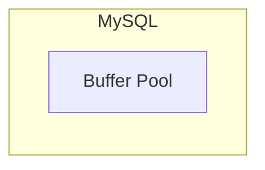
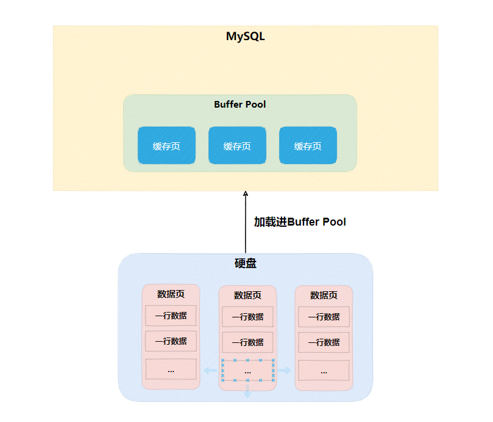
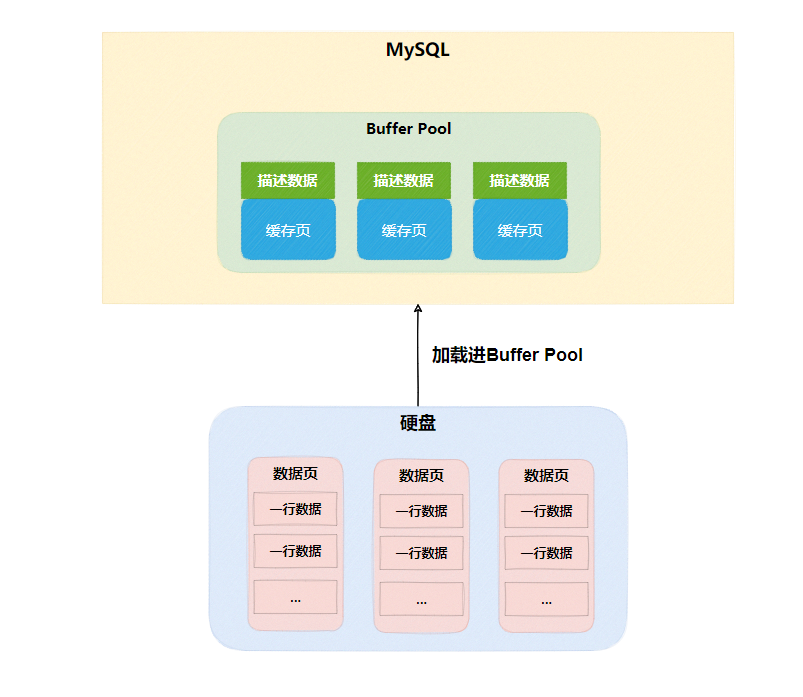
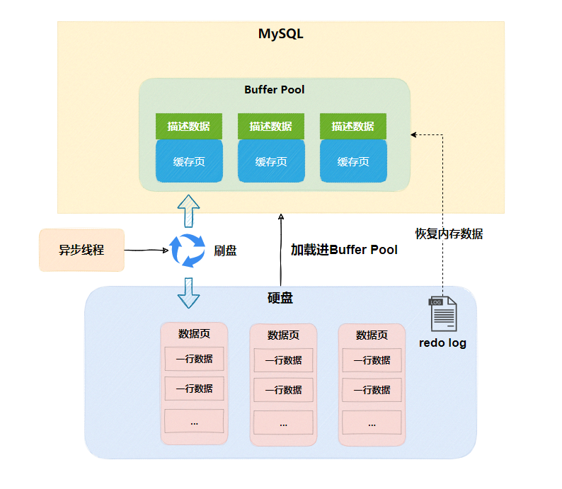

# 基础篇

## 基础架构

<b>一条 SQL 查询语句是如何执行的</b>

### 介绍

观察示意图中 SQL 语句在 MySQL 的各个功能模块中的执行过程。

<div align="center"></div>

MySQL 可大致分为 Server 层和存储引擎层两部分。

Server 层包括连接器、查询缓存、分析器、优化器、执行器等，涵盖 MySQL 的大多数核心服务功能，以及所有的内置函数（如日期、时间、数学和加密函数等），所有跨存储引擎的功能都在这一层实现，比如存储过程、触发器、视图等。

而存储引擎层负责数据的存储和提取。其架构模式是插件式的，支持 InnoDB、MyISAM、Memory 等多个存储引擎。现在最常用的存储引擎是 InnoDB，它从 MySQL 5.5.5 版本开始成为了默认存储引擎。执行建表语句的时候，如果不指定引擎类型，默认使用的就是 InnoDB。

<b>连接器</b>

`mysql -h$ip -P$port -u$user -p`，连接上数据库。

- 用户名或密码不对会提示 `Access denied for user`，连接成功则会到权限表查出用户所拥有的权限。之后，我们对数据库的所有操作，都会在这个连接里面进行权限判断，是否允许此操作。
- 如果修改了用户权限，也不会影响已经存在连接的权限。修改完成后，只有再新建的连接才会使用新的权限设置。

连接完成后，如果没有后续的动作，这个连接就处于空闲状态，可以用 show processlist 命令中看到连接的是否空闲。

```shell
+----+-----------------+-----------------+------+---------+-------+------------------------+------------------+
| Id | User            | Host            | db   | Command | Time  | State                  | Info             |
+----+-----------------+-----------------+------+---------+-------+------------------------+------------------+
|  5 | event_scheduler | localhost       | NULL | Daemon  | 25378 | Waiting on empty queue | NULL             |
|  8 | root            | localhost:57470 | NULL | Query   |     0 | init                   | show processlist |
+----+-----------------+-----------------+------+---------+-------+------------------------+------------------+
```

客户端如果太长时间没动静，连接器就会自动将它断开。这个时间是由参数 wait_timeout 控制的，默认值是 8 小时。到时间了，会自动断开连接，再发请求就会告知错误，需要重新建立连接。

建立连接比较费事，建议使用长连接。但是长连接也存在一些问题。

- 长连接的问题： MySQL 在执行过程中临时使用的内存是管理在连接对象里面的。这些资源会在连接断开的时候才释放。所以如果长连接累积下来，可能导致内存占用太大。
    - 需要我们定期断开长连接
    - 或通过 mysql_rese_connection 来重新初始化连接资源。

<b>查询缓存</b>

- 查询缓存：有缓存查缓存，没缓存就分析。但是缓存的命中率很低，一般不用。MySQL 8.0 则是直接把缓存模块删除了。

8.0 以下的版本，可以通过将参数 query_cache_type 设置成 DEMAND，这样对于默认的 SQL 语句都不使用查询缓存。而对于确定要使用查询缓存的语句，可以用 SQL_CACHE 显式指定，像下面这个语句一样：

```shell
select SQL_CACHE * from T where ID = 10;
```

<b>分析器</b>

分析器：对 SQL 语句做词法分析和语法分析。

<b>优化器</b>

优化器：分析 SQL 的性能。用关系表达式分析，计算每种方式的计算量，评估后选择一个最优的策略（数据库系统概论中有计算不同方式的计算量）。最典型的场景有下面两种：

- 表里面有多个索引的时候，决定使用哪个索引
- 在一个语句有多表关联（join）的时候，决定各个表的连接顺序。

疑问：优化器是怎么选索引的，会不会选错？后面再分析这个问题。

<b>执行器</b>

执行器：先判断有无权限，有权限则打开表继续执行。打开表的时候，执行器就会根据表的引擎定义，去使用这个引擎提供的接口。MySQL 的存储引擎是插拔式的，默认就是 InnoDB。

### 问题

如果表 T 中没有字段 k，而你执行了这个语句 select * from T where k=1, 那肯定是会报“不存在这个列”的错误： “Unknown column ‘k’ in ‘where clause’”。这个错误是上面提到的哪个阶段报出来的？

分析器阶段报出来的。我们用工具写 SQL 的时候，会提示我们这些表有那些字段，而提示的功能应该是依靠词法分析语法分析来提示的，因此大胆猜想分析器阶段就会报错。

《高性能 MySQL》里提到解析器和预处理器。 解析器处理语法和解析查询, 生成一棵对应的解析树。 预处理器进一步检查解析树的合法。比如: 数据表和数据列是否存在，别名是否有歧义等。答案是分析器。

##  日志系统

<b>一条 SQL 更新语句是如何执行的</b>

MySQL 可以恢复到半个月内任意一秒的状态，这是怎样做到的呢？==> redo log 和 binlog

### redo log

SQL 的更新操作与查询操作也是类似的，都要经过那几个步骤，但是更新流程还涉及到两个重要的日志模块，redo log（重做日志）和 binlog（归档日志）。

redo log（重做日志）是 InnoDB 存储引擎独有的，它让 MySQL 拥有了崩溃恢复能力。比如 MySQL 实例挂了或宕机了，重启时，InnoDB 存储引擎会使用 redo log 恢复数据，保证数据的持久性与完整性。

当有一条记录需要更新的时候，InnoDB 引擎就会先把记录写到 redo log（不是记录数据页“更新之后的状态”，而是记录这个页 “做了什么改动”，比如我把 xx 页的 xx 偏移量处的值改为了 oo，具体查阅下高性能 MySQL 确定下。） 里面，并更新内存，这个时候更新就算完成了。同时，InnoDB 引擎会在适当的时候， 将这个操作记录更新到磁盘里面，而这个更新往往是在系统比较空闲的时候做。

InnoDB 的 redo log 是固定大小的，比如可以配置为一组 4 个文件，每个文件的大小是 1GB，那么总共就可以记录 4GB 的操作。从头开始写，写到末尾就又回到开头循环写，如下面这个图所示

<div align="center"></div>

write pos 是当前记录的位置，一边写一边后移，写到第 3 号文件末尾后就回到 0 号文件开头。checkpoint 是当前要擦除的位置，也是往后推移并且循环的，擦除记录前要把记录更新到数据文件。如果 write pos 追上 checkpoint，表示文件满了，这时候不能再执行新的更新，得停下来先擦掉一些记录，把 checkpoint 推进一下。

有了 redo log，InnoDB 就可以保证即使数据库发生异常重启，之前提交的记录都不会丢失，这个能力称为 <b>crash-safe</b>。

### binlog

redo log 是 InnoDB 引擎特有的日志，而 Server 层也有自己的日志，称为 binlog（归档日志）。

<b>为什么会有两份日志？</b>

因为最开始 MySQL 里并没有 InnoDB 引擎。MySQL 自带的引擎是 MyISAM，但是 MyISAM 没有 crash-safe 的能力，binlog 日志只能用于归档。而 InnoDB 是另一个公司以插件形式引入 MySQL 的，既然只依靠 binlog 是没有 crash-safe 能力的，所以 InnoDB 使用另外一套日志系统——也就是 redo log 来实现 crash-safe 能力。

这两种日志有以下三点不同。

- redo log 是 InnoDB 引擎特有的；而 binlog 是 MySQL 的 Server 层实现的，所有引擎都可以使用。
- redo log 是物理日志，记录的是“在某个数据页上做了什么修改”；binlog 是逻辑日志，记录的是这个语句的原始逻辑，比如“给 ID=2 这一行的 c 字段加 1 ”。【redo log ，一行记录可能就占几十 Byte ，只包含表空间号、数据页号、磁盘文件偏移量、更新值，再加上是顺序写，所以刷盘速度很快。】

 update 语句的执行流程图，图中浅色框表示是在 InnoDB 内部执行的， 深色框表示是在执行器中执行的。

<div align="center"></div>

- 执行器先找引擎取 ID=2 这一行。ID 是主键，引擎直接用树搜索找到这一行。如果 ID=2 这一行所在的数据页本来就在内存中，就直接返回给执行器；否则，需要先从磁盘读入内存，然后再返回。
- 执行器拿到引擎给的行数据，把这个值加上 1，比如原来是 N，现在就是 N+1，得到新的一行数据，再调用引擎接口写入这行新数据。
- 引擎将这行新数据更新到内存中，同时将这个更新操作记录到 redo log 里面，此时 redo log 处于 prepare 状态。然后告知执行器执行完成了，随时可以提交事务。
- 执行器生成这个操作的 binlog，并把 binlog 写入磁盘。
- 执行器调用引擎的提交事务接口，引擎把刚刚写入的 redo log 改成提交（commit）状态，更新完成。

将 redo log 的写入拆成了两个步骤：prepare 和 commit，这就是"两阶段提交"。【InnoDB 在写 redo log时，并不是一次性写完的，而有两个阶段，Prepare 与 Commit 阶段（提交事务，InnoDB 写 redo log 并标记为 Commit）】

### 两阶段提交

分布式事务中也有两阶段提交的过程，MySQL 也有，它们都是为了保证事务的一致性和可靠性。MySQL 的两阶段提交是为了让两份日志之间的逻辑一致。先看问题：<b>怎样让数据库恢复到半个月内任意一秒的状态？</b>

binlog 会记录所有的逻辑操作，并且是采用“追加写”的形式。如果你的 DBA 承诺说半个月内可以恢复，那么备份系统中一定会保存最近半个月的所有 binlog，同时系统会定期做整库备份。这里的“定期”取决于系统的重要性，可以是一天一备，也可以是一周一备。

当需要恢复到指定的某一秒时，比如某天下午两点发现中午十二点有一次误删表，需要找回数据，可以这么做：

- 首先，找到最近的一次全量备份，如果你运气好，可能就是昨天晚上的一个备份，从这个备份恢复到临时库；
- 然后，从备份的时间点开始，将备份的 binlog 依次取出来，重放到中午误删表之前的那个时刻。

这样临时库就跟误删之前的线上库一样了，然后就可以把表数据从临时库取出来，按需要恢复到线上库去。

<b>为什么要两阶段提交？</b>

用前面的 update 语句来做例子。假设当前 ID=2 的行，字段 c 的值是 0，再假设执行 update 语句过程中在写完第一个日志后，第二个日志还没有写完期间发生了 crash，会出现什么情况呢？

```sql
# sql 语句
update T set c = c+1 where ID=2;
```

- 假定不采用阶段提交
    - 先写 redo log，再写 binlog：redo log 写成功了，此时数据库宕机，后面的 binlog 写失败了，利用 redo log 进行恢复。但是由于 binlog 没写完就 crash 了，这时候 binlog 里面就没有记录这个语句。因此，之后备份日志的时候，binlog 里面就没有这条语句。如果需要用这个 binlog 来恢复临时库的话，由于这个语句的 binlog 丢失，这个临时库就会少了这一次更新，恢复出来的这一行 c 的值就是 0，与原库的值不同。
    - 先写 binlog，再写 redo log：binlog 写成功了，此时数据库宕机，后面的 redo log 写失败了。由于 redo log 还没写，崩溃恢复以后这个事务无效，所以这一行 c 的值是 0。利用 binlog 进行恢复，就会相对于利用 redo log 恢复，会多出一条记录。
- 因此，如果不使用“两阶段提交”，那么数据库的状态就有可能和用它的日志恢复出来的库的状态不一致。

<span style="color:orange">简单说，redo log 和 binlog 都可以用于表示事务的提交状态，而两阶段提交就是让这两个状态保持逻辑上的一致。</span>

### 两阶段提交中的疑问

<b>为什么需要 redo log + binlog，一个 redo log 或 binlog 不就可以了吗？</b>

- 只使用 binlog 行不行？binlog 设计之初就没有崩溃恢复的能力。
- 只使用 redolog 行不行？redo log 只有 InnoDB有，别的引擎没有，而且，InnoDB 在作为 MySQL 的插件加入 MySQL 引擎家族之前，就已经是一个提供了崩溃恢复和事务支持的引擎了。如果只从崩溃恢复的角度来讲是可以的。可以把 binlog 关掉，这样就没有两阶段提交了，但系统依然是 crash-safe 的。但是！redo log 是循环写的，写到末尾是要回到开头继续写的。这样历史日志没法保留，redo log 也就起不到归档的作用。即，binlog 的“归档”这个功能，redo log 是不具备的。另一个问题是 MySQL 系统依赖于 binlog。binlog 作为 MySQL 一开始就有的功能，被用在了很多地方。其中，MySQL 系统高可用的基础，就是 binlog 复制。
- 综上所述，不能只用一个。

<b>两阶段提交如何实现奔溃恢复？</b>

- 如果 redo log 里面的事务是完整的，也就是已经有了 commit 标识，则直接提交；
- 如果 redo log 里面的事务只有完整的 prepare，则判断对应的事务 binlog 是否存在并完整
    - 如果是，则提交事务
    - 否则，回滚事务。

<b>redo log 和 binlog 是怎么关联起来的</b>

它们有一个共同的数据字段，叫 XID。崩溃恢复的时候，会按顺序扫描 redo log

- 如果碰到既有 prepare、又有 commit 的 redo log，就直接提交
- 如果碰到只有 parepare、而没有 commit 的 redo log，就拿着 XID 去 binlog 找对应的事务

在写入 redo log 时，会顺便记录 XID，即当前事务 id。在写入 binlog 时，也会写入 XID。如果在写入 redo log 之前崩溃，那么此时 redo log 与 binlog 中都没有，是一致的情况，崩溃也无所谓。如果在写入 redo log prepare 阶段后立马崩溃，之后会在崩恢复时，由于 redo log 没有被标记为 commit。于是拿着 redo log 中的 XID 去 binlog 中查找，此时肯定是找不到的，那么执行回滚操作。如果在写入 binlog 后立马崩溃，在恢复时，由 redo log 中的 XID 可以找到对应的 binlog，这个时候直接提交即可。

总的来说，在崩溃恢复后，只要 redo log 不是处于 commit 阶段，那么就拿着 redo log 中的 XID 去 binlog 中寻找，找得到就提交，否则就回滚。在这样的机制下，两阶段提交能在崩溃恢复时，能够对提交中断的事务进行补偿，来确保 redo log 与 binlog 的数据一致性。

<b>redo log 一般设置多大？</b>

redo log 太小的话，会导致很快就被写满，然后不得不强行刷 redo log，这样 WAL 机制的能力就发挥不出来了。如果是现在常见的几个 TB 的磁盘的话，可以直接将 redo log 设置为 4 个文件、每个文件 1GB。

## 事务隔离

<b>为什么你改了我还看不见</b>

事务就是要保证一组数据库操作，要么全部成功，要么全部失败。以 InnoDB 存储引擎为例，分析事务的隔离。

### 隔离性与隔离级别

事务的四大特性 ACID

- ACID（Atomicity、Consistency、Isolation、Durability）
- 原子性、一致性、隔离性、持久性。个人认为，ACID 都是为了解决“一致性”，实现“一个事务执行之前和执行之后都必须处于一致性状态”。一致性是最终目的。

当数据库上有多个事务同时执行的时候，就可能出现脏读（dirty read）、不可重复读 （non-repeatable read）、幻读（phantom read）的问题，为了解决这些问题，就有了“隔离级别”的概念。

><b>脏读（dirty read）、不可重复读 （non-repeatable read）、幻读（phantom read）</b>

- 脏读，A 事务读到了 B 事务没有提交的数据。

> <b>隔离级别：隔离级别越高，效率越低。</b>

- 读未提交（read uncommitted）、读提交（read committed）、可重复读（repeatable read）和串行化
- 读未提交是指，一个事务还没提交时，它做的变更就能被别的事务看到。 
- 读提交是指，一个事务提交之后，它做的变更才会被其他事务看到。<b>Oracle 默认的是读提交。</b>
- 可重复读是指，<b>一个事务执行过程中看到的数据，总是跟这个事务在启动时看到的数据是一致的（MySQL的可重复的是通过快照实现的）</b>。当然在可重复读隔离级别下，未提交变更对其他事务也是不可见的。 <b>MySQL 默认是可重复读。</b>
- 串行化，顾名思义是对于同一行记录，“写”会加“写锁”，“读”会加“读锁”。当出现读写锁冲突的时候，后访问的事务必须等前一个事务执行完成，才能继续执行。

> <b>隔离级别的实现方式</b>

在实现上，数据库里面会创建一个视图，访问的时候以视图的逻辑结果为准。在“可重复读”隔离级别下，这个视图（快照）是在事务启动时创建的，整个事务存在期间都用这个视图（快照）。 在“读提交”隔离级别下，这个视图（快照）是在每个 SQL 语句开始执行的时候创建的。这里需要注意的是，“读未提交”隔离级别下直接返回记录上的最新值，没有视图概念；而“串行 化”隔离级别下直接用加锁的方式来避免并行访问。

> <b>隔离级别的设置</b>

将启动参数 transaction-isolation 的值设置成 READ-COMMITTED。

```bash
mysql> show variables like 'transaction_isolation';
+-----------------------+-----------------+
| Variable_name         | Value           |
+-----------------------+-----------------+
| transaction_isolation | REPEATABLE-READ |
+-----------------------+-----------------+
1 row in set, 1 warning (0.00 sec)
```

> <b>什么时候需要“可重复读”</b>

假设你在管理一个个人银行账户表。一个表存了每个月月底的余额，一个表存了账单明细。 这时候你要做数据校对，也就是判断上个月的余额和当前余额的差额，是否与本月的账单明细一致。你一定希望在校对过程中，即使有用户发生了一笔新的交易，也不影响你的校对结果。 

这时候使用“可重复读”隔离级别就很方便。事务启动时的视图可以认为是静态的，不受其他事务更新的影响。

### 事务隔离的实现

在 MySQL 中，实际上每条记录在更新的时候都会同时记录一条回滚操作。记录上的最新值，通过回滚操作，都可以得到前一个状态的值。假设一个值从 1 被按顺序改成了 2、3、4，在回滚日志里面就会有类似下面的记录。

<div align="center"></div>

当前值是 4，但是在查询这条记录的时候，不同时刻启动的事务会有不同的 read-view。如图中看到的，在视图 A、B、C 里面，这一个记录的值分别是 1、2、4，同一条记录在系统中可以存在多个版本，就是数据库的多版本并发控制（MVCC）。对于 read-view A，要得到 1，就必须将当前值依次执行图中所有的回滚操作得到。

同时你会发现，即使现在有另外一个事务正在将 4 改成 5，这个事务跟 read-view A、B、C 对应的事务是不会冲突的。

回滚日志不能一直保存，不然会占据很大的存储空间，在不需要的时候会进行删除。当没有事务再需要用到回滚日志时，系统会将回滚日志删除。

> <b>回滚日志的删除时机</b>

当系统里没有比这个回滚日志更早的 read-view 的时候，可以删除。【当回滚日志中没有比当前 read-view 更早的记录时，说明当前的 read-view 已经包含了所有已经提交的事务，因此读取的数据是一致的。换句话说，当前的 read-view 是数据库中最新的一致性视图。简单来说就是，事务提交了，可以考虑日志是否满足上面的情况，删除对应的日志】

> <b>长事务中的回滚日志</b>

长事务会导致占用大量存储空间，因为在提交前必须保留可能用到的回滚记录。在 MySQL 5.5 及以前的版本，回滚日志和数据字典一起存储在 ibdata 文件中，即使长事务提交后回滚段被清理，文件也不会变小。长事务还会占用锁资源，可能导致整个库崩溃。因此，尽量不要使用长事务。

### 事务的启动方式

MySQL 默认自动提交事务。

- 显式启动事务语句， begin 或 start transaction。配套的提交语句是 commit，回滚语句是 rollback。
- set autocommit=0，将当前线程的自动提交关闭。意味着如果你只执行一个 select 语句，这个事务就启动了，而且并不会自动提交。这个事务持续存在直到你主动执行 commit 或 rollback 语句，或者断开连接。

多次开启、提交事务会有一定的通信开销。对于一个需要频繁使用事务的业务，如果选择手动开启、提交事务，不需要主动执行一次 “begin”，减少了语句的交互次数。如果是考虑到通信开销使用手动开启、提交事务，可以使用 commit work and chain 语法。如果执行 commit work and chain，则是提交事务并自动启动下一个事务，这样也省去了再次执行 begin 语句的开销。同时带来的好处是从程序开发的角度明确地知道每个语句是否处于事务中。

<b>思考，Java 的 JDBC 提交事务采用的是 commit work and chain 吗？</b>

## 深入浅出索引

索引就是为了提高查询效率。

### 数据结构

索引的出现是为了提高查询效率，实现索引的方式有很多种，主要介绍哈希表，有序数组和搜索树。

#### 哈希表

哈希表是一种以键-值（key-value）存储数据的结构，通过 key 计算出 value 存储的位置从而找到 value。如果出现冲突，则采用拉链法处理冲突。哈希表的缺点是：<b>哈希表这种结构适用于只有等值查询的场景，无法用于范围查询。</b>

#### 有序数组

有序数组在等值查询和范围查询场景中的性能就都非常优秀，用二分查找可快速定位出查询的范围，但是，在需要更新数据的时候就麻烦了，你往中间插入一个记录就必须得挪动后面所有的记录，成本太高。

#### 二叉搜索树

<div align="center"></div>

二叉搜索树的特点是：每个节点的左儿子小于父节点，父节点又小于右儿子。这样如果你要查 ID_card_n2 的话，按照图中的搜索顺序就是按照 UserA -> UserC -> UserF -> User2 这个路径得到。这个时间复杂度是 O(log(N))。

当然为了维持 O(log(N)) 的查询复杂度，你就需要保持这棵树是平衡二叉树。为了做这个保证，更新的时间复杂度也是 O(log(N))。

树可以有二叉，也可以有多叉。多叉树就是每个节点有多个儿子，儿子之间的大小保证从左到右递增。二叉树是搜索效率最高的，但是实际上大多数的数据库存储却并不使用二叉树。其原因是，索引不止存在内存中，还要写到磁盘上。

你可以想象一下一棵 100 万节点的平衡二叉树，树高 20。一次查询可能需要访问 20 个数据块。在机械硬盘时代，从磁盘随机读一个数据块需要 10 ms 左右的寻址时间。也就是说，对于一个 100 万行的表，如果使用二叉树来存储，单独访问一个行可能需要 20 个 10 ms 的时间，这个查询可真够慢的。

为了让一个查询尽量少地读磁盘，就必须让查询过程访问尽量少的数据块。那么，我们就不应该使用二叉树，而是要使用“N 叉”树。这里，“N 叉”树中的“N”取决于数据块的大小。

以 InnoDB 的一个整数字段索引为例，这个 N 差不多是 1200。这棵树高是 4 的时候，就可以存 1200 的 3 次方个值，这已经 17 亿了。考虑到树根的数据块总是在内存中的，一个 10 亿行的表上一个整数字段的索引，查找一个值最多只需要访问 3 次磁盘。其实，树的第二层也有很大概率在内存中，那么访问磁盘的平均次数就更少了。

N 叉树由于在读写上的性能优点，以及适配磁盘的访问模式，已经被广泛应用在数据库引擎中了。

### InnoDB 索引模型

在 InnoDB 中，表都是根据主键顺序以索引的形式存放的，这种存储方式的表称为索引组织表。InnoDB 使用了 B+Tree 索引模型，所以数据都是存储在 B+Tree 中的。每一个索引在 InnoDB 里面对应一棵 B+Tree。

<div align="center"></div>

根据叶子节点的内容，索引类型分为主键索引和非主键索引。

主键索引的叶子节点存的是整行数据。在 InnoDB 里，主键索引也被称为聚簇索引（clustered index）。

非主键索引的叶子节点内容是主键的值（InnoDB 中是这样实现的）。在 InnoDB 里，非主键索引也被称为二级索引（secondary index）。

<b>基于主键索引和普通索引的查询有什么区别？</b>

- 如果语句是 select * from T where ID=500，即主键查询方式，则只需要搜索 ID 这棵 B+ 树；
- 如果语句是 select * from T where k=5，即普通索引查询方式，则需要先搜索 k 索引树，得到 ID 的值为 500，再到 ID 索引树搜索一次。这个过程称为回表。

也就是说，基于非主键索引的查询需要多扫描一棵索引树。因此，我们在应用中应该尽量使用主键查询。

### 索引维护

B+Tree 为了维护索引有序性，在插入新值的时候需要做必要的维护。以上面这个图为例，如果插入新的行 ID 值为 700，则只需要在 R5 的记录后面插入一个新记录。如果新插入的 ID 值为 400，就相对麻烦了，需要逻辑上挪动后面的数据，空出位置。

而更糟的情况是，如果 R5 所在的数据页已经满了，根据 B+Tree 的算法，这时候需要申请一个新的数据页，然后挪动部分数据过去。这个过程称为页分裂。在这种情况下，性能自然会受影响。

除了性能外，页分裂操作还影响数据页的利用率。原本放在一个页的数据，现在分到两个页中，整体空间利用率降低大约 50%。

当然有分裂就有合并。当相邻两个页由于删除了数据，利用率很低之后，会将数据页做合并。合并的过程，可以认为是分裂过程的逆过程。使用自增主键的话，每次插入一条新记录，都是追加操作，都不涉及到挪动其他记录，也不会触发叶子节点的分裂。

> 什么时候适合用非自增主键？

当业务场景为：只有一个索引；该索引必须是唯一索引时，由于没有其他索引，所以也就不用考虑其他索引的叶子节点大小的问题。“尽量使用主键查询”原则，直接将这个索引设置为主键，可以避免每次查询需要搜索两棵树。

### 覆盖索引

在查询中，查询使用的索引“覆盖了”我们的查询需求，称为覆盖索引。

select * from T where k between 3 and 5；需要回表查询

select ID from T where k between 3 and 5；无需回表查询，索引覆盖了我们的查询需求

```mysql
create table T (
ID int primary key,
k int NOT NULL DEFAULT 0, 
s varchar(16) NOT NULL DEFAULT '',
index k(k))
engine=InnoDB;
 
insert into T values
(100,1, 'aa'),(200,2,'bb'),
(300,3,'cc'),(500,5,'ee'),
(600,6,'ff'),(700,7,'gg');
```

<div align="center"></div>

<b>覆盖索引可以减少树的搜索次数，显著提升查询性能，所以使用覆盖索引是一个常用的性能优化手段</b>

### 最左前缀法则

> 联合索引中，索引字段的排序顺序。

<b>建立索引时，如果通过调整顺序，可以少维护一个索引，那么这个顺序往往就是需要优先考虑采用的。</b>

### 索引下推

以市民表的联合索引（name, age）为例。如果现在有一个需求：检索出表中“名字第一个字是张，而且年龄是 10 岁的所有男孩”。那么，SQL 语句是这么写的：

```mysql
select * 
from tuser 
where name like '张 %' and age=10 and ismale=1;
```

这个语句在搜索索引树的时候，只能用 “张”，找到第一个满足条件的记录 ID3。然后在判断是否满足其他查询条件。

在 MySQL 5.6 之前，只能从 ID3 开始一个个回表。到主键索引上找出数据行，再对比字段值。

而 MySQL 5.6 引入的索引下推优化（index condition pushdown)， 可以在索引遍历过程中，对索引中包含的字段先做判断，直接过滤掉不满足条件的记录，减少回表次数。例如我们在数据库中查询到了 name = ‘张三' 的用户，在没有索引下推优化的 MySQL 中，会把所有查到的 name like '张%' 的人进行回表，有索引下推的话会只会处理符合要求的数据，不符合直接 pass，减少了不必要的数据传递。

<b>GPT 的回答</b>

MySQL 的索引下推（Index Condition Pushdown）是一种优化技术，它可以将 WHERE 子句中的条件下推到存储引擎层级进行过滤，减少了在 MySQL 服务器层级的数据传输和处理，从而提高了查询性能。

具体来说，索引下推将 WHERE 子句中的条件与索引的过滤条件合并，然后在存储引擎层级进行过滤，只有符合条件的行才会被传输到 MySQL 服务器层级进行处理。这种技术可以减少服务器层级的数据传输和处理，避免了不必要的磁盘 I/O 和 CPU 计算，提高了查询性能。

需要注意的是，索引下推只适用于某些类型的查询，如 SELECT 语句中的 WHERE 子句包含 AND 或 OR 条件，以及在联接查询中使用的索引。对于其他类型的查询，索引下推可能不起作用，甚至会降低查询性能。

## 全局锁和表锁

根据加锁的范围，MySQL 里面的锁大致可以分成全局锁、表级锁和行锁三类。

### 全局锁

全局锁就是对整个数据库实例加锁。Flush tables with read lock (FTWRL) 可以开启 MySQL 的全局锁。当你需要让整个库处于只读状态的时候，可以使用这个命令，之后其他线程的以下语句会被阻塞：数据更新语句（数据的增删改）、数据定义语句（包括建表、修改表结构等）和更新类事务的提交语句。

<b>全局锁的典型使用场景是，做全库逻辑备份。</b>也就是把整库每个表都 select 出来存成文本。

# 实践篇

## 普通索引和唯一索引

在不同的业务场景下，应该选择普通索引，还是唯一索引？

业务场景：我们在维护一个市民系统，每个人都有一个唯一的身份证号，而且业务代码已经保证了不会写入两个重复的身份证号。如果市民系统需要按照身份证号查姓名，为了加速查询，我们为 id_card 创建了索引。（没有用 id_card 当主键，因为它太长了）。

从性能的角度考虑，你选择唯一索引还是普通索引呢？选择的依据是什么呢？

### 查询过程

假设，执行查询的语句是 select id from T where k=5。

- 唯一索引在查找的时候找到一条记录就停下来了。
- 普通索引在查找到满足条件的第一个记录 (5,500) 后，需要查找下一个记录，直到碰到第一个不满足 k=5 条件的记录。

这两者带来的性能差距微乎其微。InnoDB 按数据页读写数据，每个数据页默认大小为 16KB。当找到记录时，同一数据页的记录也加载到了内存中，“查找和判断下一条记录”的操作，就只需要一次指针寻找和一次计算。如果记录在数据页末尾，需要读取下一个数据页，但这情况概率低，可忽略不计。

### Buffer Pool

[InnoDB 对 Buffer Pool 的奇思妙想 (qq.com)](https://mp.weixin.qq.com/s?__biz=MzAwMDg2OTAxNg==&mid=2652054938&idx=1&sn=3cf39464e9589caf9c1c34053372b8cd&scene=21#wechat_redirect)

在介绍更新过程之前，需要先了解下 MySQL 的 change buffer，而了解 change buffer 之前先要了解下 buffer pool。

MySQL 在启动成功后，会向内存申请一块内存空间，这块内存空间称为  Buffer Pool。



Buffer Pool 内维护了很多内容，比如<b>缓存页、各种链表、redo log buff、change buffer 等等</b>。

#### 缓存页

`MySQL` 数据是以页为单位，每页默认 `16KB`，称为数据页，在 `Buffer Pool` 里面会划分出<b>若干个缓存页</b>与数据页对应。


<div align="center"></div>

我们如何知道缓存页对应那个数据页呢

#### 描述数据

因此还需要缓存页的元数据信息，可以称为**描述数据**，它与缓存页一一对应，包含一些所属表空间、数据页的编号、`Buffer Pool` 中的地址等等

<div align="center"></div>

后续对数据的增删改查都是在 `Buffer Pool` 里操作

- 查询：从磁盘加载到缓存，后续直接查缓存
- 插入：直接写入缓存
- 更新删除：缓存中存在直接更新，不存在加载数据页到缓存更新

因为 InnoDB 提供了 WAL 技术（Write-Ahead Logging），通过 redo log 让 MySQL 拥有了崩溃恢复的能力。

再配合空闲时，会有异步线程做缓存页刷盘，保证数据的持久性与完整性。

<div align="center"></div>

其中，直接更新数据的缓存页称为<b>脏页</b>，缓存页刷盘后称为<b>干净页</b>

#### Change Buffer 的作用

InnoDB 开创性的设计了 Insert Buffer，对于非聚集索引的插入或更新操作，不是每一次直接插入到索引页中，而是先判断插入的非聚集索引是否在缓存池中，若在，则直接插入（然后等后台线程将缓存池中的数据刷新到磁盘上）；若不在，则先放到一个 Insert Buffer 对象中。然后再以一定频率和情况进行 Insert Buffer 和辅助索引页子节点的 merge 操作，这时通常可以将多个插入操作合并到一个操作中（因为在一个索引页中），大大提高了对于非聚集索引插入的性能。

而 Change Buffer 则可以视为 Insert Buffer 的加强版，可以对 `insert、delete、update` 都进行缓冲（insert buffer、delete buffer、update buffer）。

<b>Insert Buffer、Change Buffer 都只能用于非唯一的辅助索引。</b>

以更新操作为例：当非唯一索引字段内容发生更新时（`update、insert、delete`），要更新对应的<b>索引页</b>，如果<b>索引页</b>在 `Buffer Pool` 里命中的话，就直接更新<b>缓存页</b>。否则，`InnoDB` 会将这些更新操作缓存在 `change buffer` 中，而不是直接更新真正的索引，这样就无需从硬盘读入<b>索引页</b>，节省了随机读 IO 的开销了（这就是 change buffer 的作用）。

<b>Change Buffer 的数据结构</b>

`Change Buffer` 是一颗 B+ 树，如果需要插入的记录的辅助索引项不再缓冲池（Buffer Pool）中，那么就会及那个辅助索引记录首先插入到 `Change Buffer` 这棵 B+ 树中。并且，Change Buffer 也是可以进行持久化的，如果分配的内存不够用，它会将数据持久化到磁盘中，需要将这些数据更新到真正的索引上时，再读取出来，刷新到真正的索引上。

<b>那么，Change Buffer 中的数据什么时候合并到真正的辅助索引中呢？</b>

- 辅助索引页被读取到缓冲池时；
- Master Thread。

第一种情况为当辅助索引页被读取到缓冲池中时，例如这在执行正常的 SELECT 查询操作，这时需要检查 Insert Buffer Bitmap 页，然后确认该辅助索引页是否有记录存放于 Insert Buffer B+树中。若有，则将 Insert Buffer B+树中该页的记录插入到该辅助索引页中。可以看到对该页多次的记录操作通过一次操作合并到了原有的辅助索引页中，因此性能会有大幅提高。

第二种情况，在 Master Thread 线程中每秒或每 10 秒会进行一次 Merge Insert Buffer 的操作。

### 更新过程

了解了 Change Buffer 后，就可以判断唯一索引和非唯一索引快了。大多数情况下，唯一索引慢，非唯一索引快。

- 对于唯一索引来说，需要将索引的数据页读入内存，判断到没有发生唯一性冲突，没有发生冲突则插入这个值，语句执行结束；
- 对于普通索引来说，则是将更新记录在 change buffer，语句执行就结束了。

将数据从磁盘读入内存涉及随机 IO 的访问，是数据库里面成本最高的操作之一。change buffer 因为减少了随机磁盘访问，所以对更新性能的提升非常明显的。

为什么说是大多数情况<b>唯一索引慢，非唯一索引快。</b>因为要考虑具体的业务。

### 业务场景

[InnoDB原理篇：Change Buffer是如何提升索引性能的？ - 知乎 (zhihu.com)](https://zhuanlan.zhihu.com/p/484772808)

继续上面的问题，使用 `change buffer` 一定可以起到加速作用吗？

`merge` 的时候是将 `change buffer` 记录的操作应用到索引页。所以索引页 `merge` 之前，`change buffer` 记录的越多收益就越大。因此对于写多读少的业务场景，索引页在写完以后马上被访问到的概率很小，此时 `change buffer` 的收益最高。

相反，读多写少的业务场景，更新完马上做查询，则会触发 `change buff` 立即 `merge`, 不但硬盘随机 `IO` 没有减少，还增加 `change buffer` 的维护成本。

因此 `change buff` 适合写多读少的业务场景。如果所有的更新后面，都马上伴随着对这个记录的查询，应该关闭 `change buffer`。而在其他情况下，``change buffer` 都能提升更新性能。

在实际使用中，普通索引和 change buffer 的配合使用，对于数据量大的表的更新优化十分明显。

<b>PS：</b>redo log 节省的是随机写，change buffer 更多的是节省随机读。

## MySQL选错索引

### 问题场景

```mysql
# sql 语句
# 建表
CREATE TABLE `t` (
  `id` int(11) NOT NULL,
  `a` int(11) DEFAULT NULL,
  `b` int(11) DEFAULT NULL,
  PRIMARY KEY (`id`),
  KEY `a` (`a`),
  KEY `b` (`b`)
) ENGINE=InnoDB;

# 存储过程产生批量数据
delimiter ;;
create procedure idata()
begin
  declare i int;
  set i=1;
  while(i<=100000)do
    insert into t values(i, i, i);
    set i=i+1;
  end while;
end;;
delimiter ;
call idata();

# 执行的 sql
select * from t where a between 10000 and 20000;
```

<b>执行流程</b>

| sessionA                                  | sessionB                                                |
| ----------------------------------------- | ------------------------------------------------------- |
| start transaction with consistnt snapshot |                                                         |
|                                           | delete from t; <br>call idata();                        |
|                                           |                                                         |
|                                           | explain select \* from where a between 10000 and 20000; |
| commit；                                  |                                                         |

执行上述流程可以发现，select 语句并没有正确使用索引。即，MySQL 有时会选错索引，导致 SQL 执行缓慢。可以通过使用 force index(a) 来让优化器强制使用索引 a。

```shell
explain select * from t force index(a) where a between 10000 and 20000;
```

MySQL 选错索引是因为错误估计了数据查询的成本。

一般，扫描行数越少，磁盘 IO 次数也就越少，CPU 的消耗也越少。但是，扫描行数并不是唯一的判断标准，优化器还会结合是否使用临时表、是否排序等因素进行综合判断。目前这个简单的查询语句并没有涉及到临时表和排序，所以 MySQL 选错索引肯定是在判断扫描行数的时候出问题了。

### 扫描行数的判断

MySQL 是根据统计信息来预估当前条件的记录有多少的。这个统计信息就是索引的“区分度”。一个索引上不同的值越多，索引的区分度就越好。而一个索引上不同的值的个数，我们称之为“基数”（cardinality）。即，基数越大，索引的区分度越好。

```shell
mysql> show index from t;
+-------+------------+----------+--------------+-------------+-----------+-------------+----------+--------+------+------------+---------+---------------+---------+------------+
| Table | Non_unique | Key_name | Seq_in_index | Column_name | Collation | Cardinality | Sub_part | Packed | Null | Index_type | Comment | Index_comment | Visible | Expression |
+-------+------------+----------+--------------+-------------+-----------+-------------+----------+--------+------+------------+---------+---------------+---------+------------+
| t     |          0 | PRIMARY  |            1 | id          | A         |       90230 |     NULL |   NULL |      | BTREE      |         |               | YES     | NULL       |
| t     |          1 | a        |            1 | a           | A         |       92443 |     NULL |   NULL | YES  | BTREE      |         |               | YES     | NULL       |
| t     |          1 | b        |            1 | b           | A         |       95674 |     NULL |   NULL | YES  | BTREE      |         |               | YES     | NULL       |
+-------+------------+----------+--------------+-------------+-----------+-------------+----------+--------+------+------------+---------+---------------+---------+------------+
```

可以看到，三个索引的区分度都是差不多的，那为什么 MySQL 会选错索引？

索引统计只是一个输入，对于一个具体的语句来说，优化器还要判断，执行这个语句本身要扫描多少行。看看优化器预估的，这两个语句的扫描行数是多少

```shell
mysql> explain select * from t where a between 10000 and 20000;
+----+-------------+-------+------------+------+---------------+------+---------+------+-------+----------+-------------+
| id | select_type | table | partitions | type | possible_keys | key  | key_len | ref  | rows  | filtered | Extra       |
+----+-------------+-------+------------+------+---------------+------+---------+------+-------+----------+-------------+
|  1 | SIMPLE      | t     | NULL       | ALL  | a             | NULL | NULL    | NULL | 97993 |    10.21 | Using where |
+----+-------------+-------+------------+------+---------------+------+---------+------+-------+----------+-------------+


mysql> explain select * from t force index(a) where a between 10000 and 20000;
+----+-------------+-------+------------+-------+---------------+------+---------+------+-------+----------+-----------------------+
| id | select_type | table | partitions | type  | possible_keys | key  | key_len | ref  | rows  | filtered | Extra                 |
+----+-------------+-------+------------+-------+---------------+------+---------+------+-------+----------+-----------------------+
|  1 | SIMPLE      | t     | NULL       | range | a             | a    | 5       | NULL | 20745 |   100.00 | Using index condition |
+----+-------------+-------+------------+-------+---------------+------+---------+------+-------+----------+-----------------------+
```

虽然统计的信息并不准确。但是，为什么化器放着扫描 37000 行的执行计划不用，却选择了扫描行数是 100000 的执行计划呢？

这是因为，如果使用索引 a，每次从索引 a 上拿到一个值，都要回到主键索引上查出整行数据，这个代价优化器也要算进去的。如果选择扫描 10 万行，是直接在主键索引上扫描的，没有额外的代价。优化器会估算这两个选择的代价，从结果看来，优化器认为直接扫描主键索引更快。当然，从执行时间看来，这个选择并不是最优的。

最终还是归咎到没能准确地判断出扫描行数。analyze table t 命令，可以用来重新统计索引信息。

```shell
mysql> analyze table t; # 可能要多执行几次，修正后的结果才正确
+----------+---------+----------+----------+
| Table    | Op      | Msg_type | Msg_text |
+----------+---------+----------+----------+
| test45.t | analyze | status   | OK       |
+----------+---------+----------+----------+
1 row in set (0.05 sec)


mysql> explain select * from t where a between 10000 and 20000;
+----+-------------+-------+------------+-------+---------------+------+---------+------+-------+----------+-----------------------+
| id | select_type | table | partitions | type  | possible_keys | key  | key_len | ref  | rows  | filtered | Extra                 |
+----+-------------+-------+------------+-------+---------------+------+---------+------+-------+----------+-----------------------+
|  1 | SIMPLE      | t     | NULL       | range | a             | a    | 5       | NULL | 10001 |   100.00 | Using index condition |
+----+-------------+-------+------------+-------+---------------+------+---------+------+-------+----------+-----------------------+
```

### 索引选择异常和处理

大多数时候优化器都能找到正确的索引，但是如果选错了，我们可以使用以下三种方式来处理。

- 采用 force index 强行选择一个索引（虽然存在迁移问题和索引名称更新后需要重写 SQL 语句，但是我还是觉得这个最实用。）
- 考虑修改语句，引导 MySQL 使用我们期望的索引（得 SQL 功底不错才有这个水平，而且，还是受场景局限）
- 在有些场景下，我们可以新建一个更合适的索引，来提供给优化器做选择，或删掉误用的索引

### 如何得到索引的基数（扩展）

MySQL 通过采样统计预估的数据总数（直接统计数据成本太高了）。

采样统计的时候，InnoDB 默认会选择 N 个数据页，统计这些页面上的不同值，得到一个平均值，然后乘以这个索引的页面数，就得到了这个索引的基数。

而数据表是会持续更新的，索引统计信息也不会固定不变。所以，当变更的数据行数超过 1/M 的时候，会自动触发重新做一次索引统计。

在 MySQL 中，有两种存储索引统计的方式，可以通过设置参数 innodb_stats_persistent 的值来选择：

- 设置为 on 的时候，表示统计信息会持久化存储。这时，默认的 N 是 20，M 是 10。
- 设置为 off 的时候，表示统计信息只存储在内存中。这时，默认的 N 是 8，M 是 16。

由于是采样统计，所以不管 N 是 20 还是 8，这个基数都是很容易不准的。

## 给字符串加索引

### 问题场景

我们在维护一个支持邮箱登录的系统，用户表如下

```mysql
mysql> create table SUser(
ID bigint unsigned primary key,
email varchar(64), 
... 
)engine=innodb;
```

由于要使用邮箱登录，所以业务代码中一定会出现类似于这样的语句

```mysql
select f1, f2 from SUser where email='xxx';
```

不给 email 加索引会出现全表扫描，加的话由于 email 太长了，一般会使用前缀索引，只使用字符串的一部分作为索引。那么，这个长度该如何界定？

### 前缀索引的代价

如果使用的是 index2（即 email(6) 索引结构），执行顺序是这样的：

1. 从 index2 索引树找到满足索引值是’zhangs’的记录，找到的第一个是 ID1；
2. 到主键上查到主键值是 ID1 的行，判断出 email 的值不是’zhangssxyz@xxx.com’，这行记录丢弃；
3. 取 index2 上刚刚查到的位置的下一条记录，发现仍然是’zhangs’，取出 ID2，再到 ID 索引上取整行然后判断，这次值对了，将这行记录加入结果集；
4. 重复上一步，直到在 idxe2 上取到的值不是’zhangs’时，循环结束。

要回主键索引取 4 次数据，也就是扫描了 4 行。<b>在这个场景下，使用前缀索引后，查询语句读数据的次数变多了。</b>

但是，如果前缀索引的区分度够好，前缀对应的 email 恰好只有一个，就能直接查到 ID2，扫描一行就结束了。因此，<b>使用前缀索引，定义好长度，就可以做到既节省空间，又不用额外增加太多的查询成本。</b>

长度选取的方式也比较简单，就是自行统计，看取前几个字段的区分度最佳。

```mysql
#1. 统计列上不同值的个数
select count(distinct email) as L from SUser;
#2.依次选取不同长度的前缀来看这个值
select 
  count(distinct left(email,4)）as L4,
  count(distinct left(email,5)）as L5,
  count(distinct left(email,6)）as L6,
  count(distinct left(email,7)）as L7,
from SUser;
```

一般会选取区分度在 90~95 的长度。

### 前缀索引对覆盖索引的影响

使用前缀索引就用不上覆盖索引对查询性能的优化了。即便查询出的数据已经包含了所有的信息，但 InnoDB 还是要回到 id 索引再查一下，因为系统并不确定前缀索引的定义是否截断了完整信息。

### 身份证ID存储实战

对于类似于邮箱这样的字段来说，使用前缀索引的效果可能还不错。但是，遇到前缀的区分度不够好的，如身份证该怎么办？

我们国家的身份证号，一共 18 位，其中前 6 位是地址码，所以同一个县的人的身份证号前 6 位一般会是相同的。如果对身份证号做长度为 6 的前缀索引的话，这个索引的区分度就非常低了。这时，可能你需要创建长度为 12 以上的前缀索引，才能够满足区分度要求。但是，索引选取的越长，占用的磁盘空间就越大，相同的数据页能放下的索引值就越少，搜索的效率也就会越低。

<b>解决办法如下</b>

- 倒序存储，区分度会高一些。由于身份证号的最后 6 位没有地址码这样的重复逻辑，所以最后这 6 位很可能就提供了足够的区分度。具体，还要使用 count(distinct) 方法去做个验证

- 使用 hash 字段。在表上再创建一个整数字段，来保存身份证的校验码，同时在这个字段上创建索引。（还是得判断下是否精准相同，害怕哈希冲突）

    ```mysql
    select field_list from t where id_card_crc=crc32('input_id_card_string') and id_card='input_id_card_string'
    ```

<b>方法对比</b>

- 都不支持范围查询：倒序存储的字段上创建的索引是按照倒序字符串的方式排序的，已经没有办法利用索引方式查出身份证号码在 [ID_X, ID_Y] 的所有市民了。同样地，hash 字段的方式也只能支持等值查询。
- 从占用的额外空间来看，倒序存储方式在主键索引上，不会消耗额外的存储空间，而 hash 字段方法需要增加一个字段。当然，倒序存储方式使用 4 个字节的前缀长度应该是不够的，如果再长一点，这个消耗跟额外这个 hash 字段也差不多抵消了。
- 在 CPU 消耗方面，倒序方式每次写和读的时候，都需要额外调用一次 reverse 函数，而 hash 字段的方式需要额外调用一次 crc32() 函数。如果只从这两个函数的计算复杂度来看的话，reverse 函数额外消耗的 CPU 资源会更小些。
- 从查询效率上看，使用 hash 字段方式的查询性能相对更稳定一些。因为 crc32 算出来的值虽然有冲突的概率，但是概率非常小，可以认为每次查询的平均扫描行数接近 1。而倒序存储方式毕竟还是用的前缀索引的方式，也就是说还是会增加扫描行数。

## 刷脏页


## 自增ID用完了

MySQL 里面的几种自增 id 值达到上限以后，会出现什么情况？

- <b>自增主键 id：</b>表定义的自增值达到上限后的逻辑是，再申请下一个 id 时，得到的值保持不变。
- <b>InnoDB 系统自增 row_id：</b>创建的 InnoDB 表没有指定主键，那么 InnoDB 会给你创建一个不可见的，长度为 6 个字节的 row_id。写入表的 row_id 是从 0 开始到 $2^{48}-1$。达到上限后，下一个值就是 0，然后继续循环。

在代码实现时 row_id 是一个长度为 8 字节的无符号长整型 (bigint unsigned)。但是，InnoDB 在设计时，给 row_id 留的只是 6 个字节的长度，这样写到数据表中时只放了最后 6 个字节，所以 row_id 能写到数据表中的值，就有两个特征：

- row_id 写入表中的值范围，是从 0 到 $2^{48}-1$；
- 当 dict_sys.row_id=$2^{48}$ 时，如果再有插入数据的行为要来申请 row_id，拿到以后再取最后 6 个字节的话就是 0。


