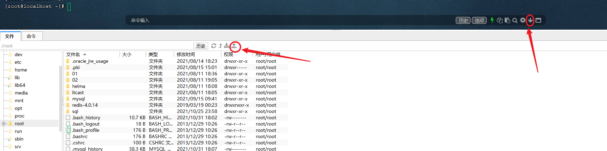

# 概览

## 常见面试题

- 什么是事务,以及事务的四大特性? 
- 事务的隔离级别有哪些,MySQL默认是哪个? 
- 内连接与左外连接的区别是什么? 
- 常用的存储引擎？InnoDB与MyISAM的区别？ 
- MySQL默认InnoDB引擎的索引是什么数据结构? 
- 如何查看MySQL的执行计划? 
- 索引失效的情况有哪些? 
- 什么是回表查询? 
- 什么是MVCC? 
- MySQL主从复制的原理是什么? 
- 主从复制之后的读写分离如何实现? 
- 数据库的分库分表如何实现?

## 规划

### 基础复习

- MySQL 概述
- SQL-DDL
- SQL-DML
- SQL-DQL
- SQL-DCL
- MySQL函数
- 约束
- 多表查询
- 事务

### 原理进阶

- MySQL体系结构
- MySQL存储引擎
- 索引
- SQL优化
- 视图
- 存储过程\函数
- 触发器
- 锁
- InnoDB存储引擎
- MySQL管理

### 运维

- MySQL日志
- MySQL复制
- MyCat概述
- 分片相关概念
- 分片配置
- 分配规则
- 读写分离

# 基础复习

## MySQL概述

> 数据库：Database，简称DB。按照一定的数据结构来组织、存储和管理数据的仓库。

> 数据库管理系统：Database Management System，一种操纵和管理数据库的大型软件，用于创建、使用和维护数据库，简称DBMS。

### 数据库相关概念

- [x] 数据库：存储数据的仓库

- [x] 数据库管理系统：Database Management System，操纵和管理数据库的大型软件，简称 DBMS。

- 关系型数据库（RDBMS）

    - 概念： 关系型数据库，是建立在关系模型基础上，由多张相互连接的二维表组成的数据库。 

    - 特点： 
        1. 使用表存储数据，格式统一，便于维护 ；

        2. 使用SQL语句操作，标准统一，使用方便； 
        3. 数据存储在磁盘中，安全

- 非关系型数据库(NoSQL)

    - 概念：Not-Only SQL，泛指非关系型数据库，是对关系型数据库的补充。 
    - 特点： 1. 数据结构灵活；2. 伸缩性强

- [x] SQL：操作关系型数据库的编程语言，是一套标准。

### MySQL数据库

> 版本

MySQL官方提供了两种不同的版本: 

- 社区版（MySQL Community Server） 免费，MySQL不提供任何技术支持
- 商业版（MySQL Enterprise Edition） 收费，可以试用30天，官方提供技术支持

> 安装

[MySQL安装指南_技术交流_牛客网 (nowcoder.com)](https://www.nowcoder.com/discuss/825171?type=all&order=recall&pos=&page=1&ncTraceId=&channel=-1&source_id=search_all_nctrack&gio_id=649BB42AA30733488E2E468CA0F7721F-1642732433430)

> 启动与停止

```shell
# 启动
net start mysql80
# 停止
net stop mysql80
```

> 客户端连接

- 用 MySQL 提供的 MySQL 8.0 Command Line Client
- 用系统自带的命令窗口，执行指令 `mysql -h 127.0.0.1 -P 3306 -u root -p password`

## SQL

### SQL通用语法

### SQL分类

### DDL

### DML

### DQL

### DCL


## 函数

## 约束

## 多表查询

## 事务

# 进阶

## MySQL8.0.26-Linux版安装

WSL-Ubuntu 安装 [怎样在 Ubuntu Linux 上安装 MySQL - 知乎 (zhihu.com)](https://zhuanlan.zhihu.com/p/64080934)

### 1. 准备一台Linux服务器

云服务器或者虚拟机都可以; 

Linux的版本为 CentOS7;

### 2. 下载Linux版MySQL安装包

https://downloads.mysql.com/archives/community/

 

### 3. 上传MySQL安装包

 

### 4. 创建目录,并解压

```
mkdir mysql

tar -xvf mysql-8.0.26-1.el7.x86_64.rpm-bundle.tar -C mysql
```

### 5. 安装mysql的安装包

```
cd mysql

rpm -ivh mysql-community-common-8.0.26-1.el7.x86_64.rpm 

rpm -ivh mysql-community-client-plugins-8.0.26-1.el7.x86_64.rpm 

rpm -ivh mysql-community-libs-8.0.26-1.el7.x86_64.rpm 

rpm -ivh mysql-community-libs-compat-8.0.26-1.el7.x86_64.rpm

yum install openssl-devel

rpm -ivh  mysql-community-devel-8.0.26-1.el7.x86_64.rpm

rpm -ivh mysql-community-client-8.0.26-1.el7.x86_64.rpm

rpm -ivh  mysql-community-server-8.0.26-1.el7.x86_64.rpm

```

### 6. 启动MySQL服务

```
systemctl start mysqld
```

```
systemctl restart mysqld
```

```
systemctl stop mysqld
```

### 7. 查询自动生成的root用户密码

```
grep 'temporary password' /var/log/mysqld.log
```

命令行执行指令 :

```
mysql -u root -p
```

然后输入上述查询到的自动生成的密码, 完成登录 .

### 8. 修改root用户密码

登录到MySQL之后，需要将自动生成的不便记忆的密码修改了，修改成自己熟悉的便于记忆的密码。

```
ALTER  USER  'root'@'localhost'  IDENTIFIED BY '1234';
```

执行上述的SQL会报错，原因是因为设置的密码太简单，密码复杂度不够。我们可以设置密码的复杂度为简单类型，密码长度为4。

```
set global validate_password.policy = 0;
set global validate_password.length = 4;
```

降低密码的校验规则之后，再次执行上述修改密码的指令。

### 9. 创建用户

默认的root用户只能当前节点localhost访问，是无法远程访问的，我们还需要创建一个root账户，用户远程访问

```
create user 'root'@'%' IDENTIFIED WITH mysql_native_password BY '1234';
```

### 10. 并给root用户分配权限

```
grant all on *.* to 'root'@'%';
```

### 11. 重新连接MySQL

```
mysql -u root -p
```

然后输入密码

### 12. 通过DataGrip远程连接MySQL

## 存储引擎

- MySQL体系结构
- 存储引擎介绍
- 存储引擎的特点
- 存储引擎选择

### MySQL体系结构


**连接层**：最上层是一些客户端和链接服务，主要完成一些类似于连接处理、授权认证、及相关的安全方案。服务器也会为安全接入的每个客户 端验证它所具有的操作权限。

**服务层**：第二层架构主要完成大多数的核心服务功能，如SQL接口，并完成缓存的查询，SQL的分析和优化，部分内置函数的执行。所有跨存 储引擎的功能也在这一层实现，如 过程、函数等。 

**引擎层**：存储引擎真正的负责了MySQL中数据的存储和提取，服务器通过API和存储引擎进行通信。不同的存储引擎具有不同的功能，这样我 们可以根据自己的需要，来选取合适的存储引擎。 

**存储层**：主要是将数据存储在文件系统之上，并完成与存储引擎的交互。

### 存储引擎简介

存储引擎是MySQL的核心；存储引擎就是存储数据、建立索引、更新/查询数据等技术的实现方式 。**存储引擎是基于表的，而不是基于库的**，所以存储引擎也可被称为表类型。

- 在创建表时，指定存储引擎

```mysql
create table tb_user(
	id int,
    name varchar(80)
) ENGINE = INNODB;
```

- 查看当前数据库支持的存储引擎

```mysql
show ENGINES;
```

### 存储引擎特点

> **InnoDB**

- 介绍：InnoDB是一种兼顾高可靠性和高性能的通用存储引擎，在 MySQL 5.5 之后，InnoDB是默认的 MySQL 存储引擎。
- 特点：
    - DML操作遵循ACID模型，支持事务
    - 行级锁，提高并发访问性能
    - 支持 FOREIGN KEY约束，保证数据的完整性和正确性；
- 文件：xxx.ibd：xxx代表的是表名，innoDB引擎的每张表都会对应这样一个表空间文件，存储该表的表结构（frm、sdi）、数据和索引。 参数：innodb_file_per_table


> MyISAM

介绍：MyISAM是MySQL早期的默认存储引擎。 

特点：不支持事务，不支持外键 支持表锁，不支持行锁，访问速度快 

文件：xxx.sdi中存储表结构信息；xxx.MYD中存储数据；xxx.MYI中存储索引

> Memory

介绍：Memory引擎的表数据时存储在内存中的，由于受到硬件问题、或断电问题的影响，只能将这些表作为临时表或缓存使用。

特点：内存存放；默认使用hash索引

文件 xxx.sdi中存储表结构信息


InnoDB 与 MyISAM 直接的区别：InnoDB支持事务、锁机制为行级锁、支持外键。

### 存储引擎选择

在选择存储引擎时，应该根据应用系统的特点选择合适的存储引擎。对于复杂的应用系统，还可以根据实际情况选择多种存储引擎进行组合。 

➢ InnoDB: 是Mysql的默认存储引擎，支持事务、外键。如果应用对事务的完整性有比较高的要求，在并发条件下要求数据的一致 性，数据操作除了插入和查询之外，还包含很多的更新、删除操作，那么InnoDB存储引擎是比较合适的选择。 

➢ MyISAM ： 如果应用是以读操作和插入操作为主，只有很少的更新和删除操作，并且对事务的完整性、并发性要求不是很高，那么选择这个存储引擎是非常合适的。 【一般会选MongoDB】

➢ MEMORY：将所有数据保存在内存中，访问速度快，通常用于临时表及缓存。MEMORY的缺陷就是对表的大小有限制，太大的表无法缓存在内存中，而且无法保障数据的安全性。 【一般会选Redis】

### 总结

- [x] 体系结构
- 连接层、服务层、引擎层、存储层
- [x] 存储引擎简介
- [x] 存储引擎特点
- INNODB 与 MyISAM：事务、外键、行级锁
- [x] 存储引擎应用
- INNODB 存储业务系统中对于事务、数据完整性要求较高的核心数据
- MyISAM 存储业务系统的非核心事务。

## 索引

- 索引概述
- 索引结构
- 索引分类 
- 索引语法 
- SQL性能分析
- 索引使用
- 索引设计原则

## SQL优化

## 视图/存储过程/触发器

## 锁

## InnoDB引擎

## MySQL管理

