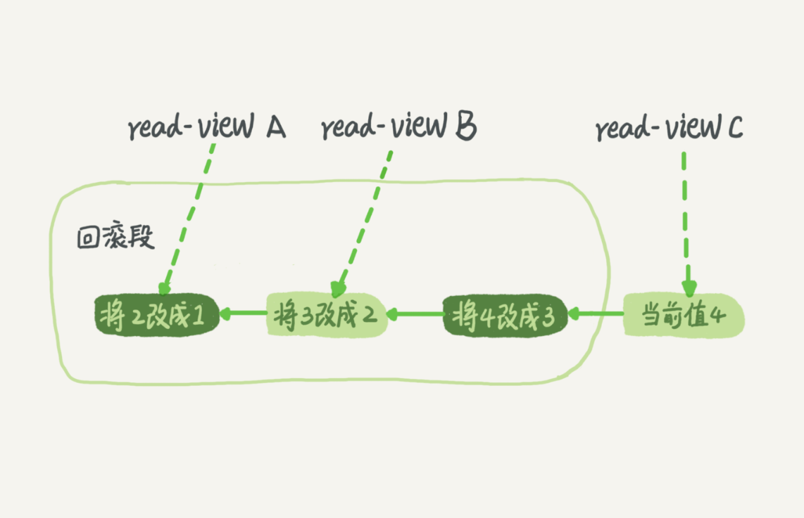
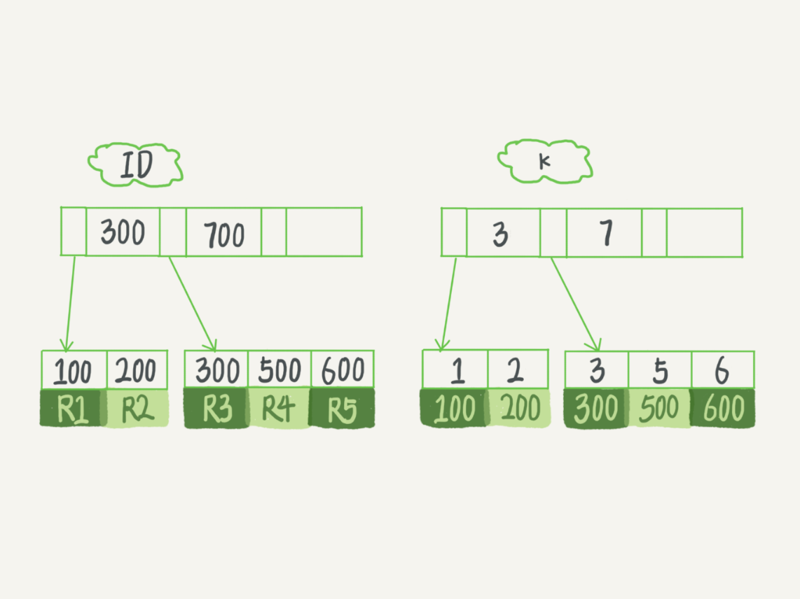

# 基础篇

## 基础架构：一条SQL查询语句是如何执行的

### 架构图&介绍

观察示意图中 SQL 语句在 MySQL 的各个功能模块中的执行过程。


- MySQL 可大致分为 Server 层和存储引擎层两部分。
- 连接器：`mysql -h$ip -P$port -u$user -p`，连接上数据库。
    - 用户名或密码不对会提示 `Access denied for user`，连接成功则会到权限表查出用户所拥有的权限。之后，你对数据库的所有操作，都会在这个连接里面进行权限判断，是否允许此操作。
    - 如果修改了用户权限，也不会影响已经存在连接的权限。修改完成后，只有再新建的连接才会使用新的权限设置。
    - 连接完成后，如果你没有后续的动作，这个连接就处于空闲状态，可以用 show processlist 命令中看到连接的是否空闲。
    - 客户端如果太长时间没动静，连接器就会自动将它断开。这个时间是由参数 wait_timeout 控制的，默认值是 8 小时。到时间了，会自动断开连接。
    - 建立连接比较费事，建议使用长连接。
    - 长连接的问题： MySQL 在执行过程中临时使用的内存是管理在连接对象里面的。这些资源会在连接断 开的时候才释放。所以如果长连接累积下来，可能导致内存占用太大。需要我们定期断开长连接或通过 mysql_rese_connection 来重新初始化连接资源。
- 查询缓存：有缓存查缓存，没缓存就分析。但是缓存的命中率很低，一般不用。MySQL 8.0 则是直接把缓存模块删除了。
- 分析器：对 SQL 语句做词法分析和语法分析。
- 优化器：分析 SQL 的性能。用关系表达式分析，计算每种方式的计算量，评估后选择一个最优的策略（数据库系统概论中有计算不同方式的计算量）
- 执行器：先判断有无权限，有权限则打开表继续执行。打开表的时候，执行器就会根据表的引擎定义，去使用这 个引擎提供的接口。
- 存储引擎：插拔式。默认是 InnoDB。

### 问题

如果表 T 中没有字段 k，而你执行了这个语句 select * from T where k=1, 那肯定是会报“不存在这个列”的错误： “Unknown column ‘k’ in ‘where clause’”。这个错误是上面提到的哪个阶段报出来的？

分析器阶段报出来的。我们用工具写 SQL 的时候，会提示我们这些表有那些字段，而提示的功能应该是依靠词法分析语法分析来提示的，因此大胆猜想分析器阶段就会报错。

《高性能mysql》里提到解析器和预处理器。 解析器处理语法和解析查询, 生成一课对应的解析树。 预处理器进一步检查解析树的合法。比如: 数据表和数据列是否存在, 别名是否有歧义等。答案是分析器。

##  日志系统：一条SQL更新语句是如何执行的

之前你可能经常听 DBA 同事说，MySQL 可以恢复到半个月内任意一秒的状态，惊叹的同 时，你是不是心中也会不免会好奇，这是怎样做到的呢？

### redo log

SQL 的更新操作与查询操作也是类似的，都要经过那几个步骤，但是更新流程还涉及到两个重要的日志模块，它redo log（重做日志）和 binlog（归档日志）。

redo log（重做日志）是 InnoDB 存储引擎独有的，它让 MySQL 拥有了崩溃恢复能力。比如 MySQL 实例挂了或宕机了，重启时，InnoDB 存储引擎会使用 redo log 恢复数据，保证数据的持久性与完整性。

当有一条记录需要更新的时候，InnoDB 引擎就会先把记录写到 redo log（不是记录数据页“更新之后的状态”，而是记录这个页 “做了什么改动”，比如我把xx页的xx偏移量处的值改为了oo，具体查阅下高性能 MySQL 确定下。） 里面，并更新内存，这个时候更新就算完成了。同时，InnoDB 引擎会在适当的时候， 将这个操作记录更新到磁盘里面，而这个更新往往是在系统比较空闲的时候做。InnoDB 的 redo log 是固定大小的，比如可以配置为一组 4 个文件，每个文件的大小是 1GB，那么总共就可以记录 4GB 的操作。从头开始写，写到末尾就又回到开头循环写，如下面这个图所示


write pos 是当前记录的位置，一边写一边后移，写到第 3 号文件末尾后就回到 0 号文件开头。checkpoint 是当前要擦除的位置，也是往后推移并且循环的，擦除记录前要把记录更新到数据文件。如果 write pos 追上 checkpoint，表示文件满了，这时候不能再执行新的更新，得停下来先擦掉一些记录，把 checkpoint 推进一下。

有了 redo log，InnoDB 就可以保证即使数据库发生异常重启，之前提交的记录都不会丢失，这个能力称为**crash-safe**。

### binlog

redo log 是 InnoDB 引擎特有的日志，而 Server 层也有自己的日志，称为 binlog（归档日志）。为什么会有两份日志？

因为最开始 MySQL 里并没有 InnoDB 引擎。MySQL 自带的引擎是 MyISAM，但是 MyISAM 没有 crash-safe 的能力，binlog 日志只能用于归档。而 InnoDB 是另一个公司以插件形式引入 MySQL 的，既然只依靠 binlog 是没有 crash-safe 能力的，所以 InnoDB 使用另外一套日志系统——也就是 redo log 来实现 crash-safe 能力。

这两种日志有以下三点不同。

- redo log 是 InnoDB 引擎特有的；binlog 是 MySQL 的 Server 层实现的，所有引擎都可以使用。
- redo log 是物理日志，记录的是“在某个数据页上做了什么修改”；binlog 是逻辑日志，记录的是这个语句的原始逻辑，比如“给 ID=2 这一行的 c 字段加 1 ”。【redo log ，一行记录可能就占几十 Byte ，只包含表空间号、数据页号、磁盘文件偏移量、更新值，再加上是顺序写，所以刷盘速度很快。】

 update 语句的执行流程图，图中浅色框表示是在 InnoDB 内部执行的， 深色框表示是在执行器中执行的。


- 执行器先找引擎取 ID=2 这一行。ID 是主键，引擎直接用树搜索找到这一行。如果 ID=2 这一行所在的数据页本来就在内存中，就直接返回给执行器；否则，需要先从磁盘读入内存，然后再返回。
- 执行器拿到引擎给的行数据，把这个值加上 1，比如原来是 N，现在就是 N+1，得到新的一行数据，再调用引擎接口写入这行新数据。
- 引擎将这行新数据更新到内存中，同时将这个更新操作记录到 redo log 里面，此时 redo log 处于 prepare 状态。然后告知执行器执行完成了，随时可以提交事务。
- 执行器生成这个操作的 binlog，并把 binlog 写入磁盘。
- 执行器调用引擎的提交事务接口，引擎把刚刚写入的 redo log 改成提交（commit）状态，更新完成。

### 两阶段提交

为什么必须有“两阶段提交”呢？这是为了让两份日志之间的逻辑一致。先看问题：**怎样让数据库恢复到半个月内任意一秒的状态？**

binlog 会记录所有的逻辑操作，并且是采用“追加写”的形式。如果你的 DBA 承诺说半个月内可以恢复，那么备份系统中一定会保存最近半个月的所有 binlog，同时系统会定期做整库备份。这里的“定期”取决于系统的重要性，可以是一天一备，也可以是一周一备。

当需要恢复到指定的某一秒时，比如某天下午两点发现中午十二点有一次误删表，需要找回数据，那你可以这么做：

- 首先，找到最近的一次全量备份，如果你运气好，可能就是昨天晚上的一个备份，从这个备份恢复到临时库；
- 然后，从备份的时间点开始，将备份的 binlog 依次取出来，重放到中午误删表之前的那个时刻。

这样你的临时库就跟误删之前的线上库一样了，然后你可以把表数据从临时库取出来，按需要恢复到线上库去。

如果不使用“两阶段提交”，redo log 和 binlog 分别写入磁盘，不同时写入磁盘，可能在写 redo log 或 binlog 时，宕机了，造成 redo log 和 binlog 中的状态不一致，那么数据库的状态就有可能和用它的日志恢复出来的库的状态不一致。**简单说，redo log 和 binlog 都可以用于表示事务的提交状态，而两阶段提交就是让这两个状态保持逻辑上的一致。**

## 事务隔离：为什么你改了我还看不见

事务就是要保证一组数据库操作，要么全部成功，要么全部失败。以 InnoDB 存储引擎为例，分析事务的隔离。

### 隔离性与隔离级别

事务的四大特性 ACID

- ACID（Atomicity、Consistency、Isolation、Durability）
- 原子性、一致性、隔离性、持久性

当数据库上有多个事务同时执行的时候，就可能出现脏读（dirty read）、不可重复读 （non-repeatable read）、幻读（phantom read）的问题，为了解决这些问题，就有 了“隔离级别”的概念。

>脏读（dirty read）、不可重复读 （non-repeatable read）、幻读（phantom read）

- 脏读，A 事务读到了 B 事务没有提交的数据。

> 隔离级别：隔离级别越高，效率越低。

- 读未提交（read uncommitted）、读提交（read committed）、可重复读（repeatable read）和串行化
- 读未提交是指，一个事务还没提交时，它做的变更就能被别的事务看到。 
- 读提交是指，一个事务提交之后，它做的变更才会被其他事务看到。**Oracle 默认的是读提交。**
- 可重复读是指，**一个事务执行过程中看到的数据，总是跟这个事务在启动时看到的数据是一致的（MySQL的可重复的是通过快照实现的）**。当然在可重复读隔离级别下，未提交变更对其他事务也是不可见的。 **MySQL 默认是可重复读。**
- 串行化，顾名思义是对于同一行记录，“写”会加“写锁”，“读”会加“读锁”。当出现读写锁冲突的时候，后访问的事务必须等前一个事务执行完成，才能继续执行。

> 隔离级别的实现方式

在实现上，数据库里面会创建一个视图，访问的时候以视图的逻辑结果为准。在“可重复读”隔离级别下，这个视图（快照）是在事务启动时创建的，整个事务存在期间都用这个视图（快照）。 在“读提交”隔离级别下，这个视图（快照）是在每个 SQL 语句开始执行的时候创建的。这里需要注意的是，“读未提交”隔离级别下直接返回记录上的最新值，没有视图概念；而“串行 化”隔离级别下直接用加锁的方式来避免并行访问。

> 隔离级别的设置

将启动参数 transaction-isolation 的值设置成 READ-COMMITTED。

```bash
mysql> show variables like 'transaction_isolation';
+-----------------------+-----------------+
| Variable_name         | Value           |
+-----------------------+-----------------+
| transaction_isolation | REPEATABLE-READ |
+-----------------------+-----------------+
1 row in set, 1 warning (0.00 sec)
```

> 什么时候需要“可重复读”

假设你在管理一个个人银行账户表。一个表存了每个月月底的余额，一个表存了账单明细。 这时候你要做数据校对，也就是判断上个月的余额和当前余额的差额，是否与本月的账单明细一致。你一定希望在校对过程中，即使有用户发生了一笔新的交易，也不影响你的校对结果。 这时候使用“可重复读”隔离级别就很方便。事务启动时的视图可以认为是静态的，不受其他事务更新的影响。

### 事务隔离的实现

在 MySQL 中，实际上每条记录在更新的时候都会同时记录一条回滚操作。记录上的最新值，通过回滚操作，都可以得到前一个状态的值。假设一个值从 1 被按顺序改成了 2、3、4，在回滚日志里面就会有类似下面的记录。



当前值是 4，但是在查询这条记录的时候，不同时刻启动的事务会有不同的 read-view。如图中看到的，在视图 A、B、C 里面，这一个记录的值分别是 1、2、4，同一条记录在系统中可以存在多个版本，就是数据库的多版本并发控制（MVCC）。对于 read-view A，要得到 1，就必须将当前值依次执行图中所有的回滚操作得到。

同时你会发现，即使现在有另外一个事务正在将 4 改成 5，这个事务跟 read-view A、B、C 对应的事务是不会冲突的。

回滚日志不能一直保存，不然会占据很大的存储空间，在不需要的时候会进行删除。当没有事务再需要用到回滚日志时，系统会将回滚日志删除。

> 回滚日志的删除时机

### 事务的启动方式

MySQL 默认自动提交事务。

- 显式启动事务语句， begin 或 start transaction。配套的提交语句是 commit，回滚语句是 rollback。
- set autocommit=0，将当前线程的自动提交关闭。意味着如果你只执行一个 select 语句，这个事务就启动了，而且并不会自动提交。这个事务持续存在直到你主动执行 commit 或 rollback 语句，或者断开连接。

## 深入浅出索引

索引：为了提高查询效率。

### 数据结构

索引的出现是为了提高查询效率，实现索引的方式有很多种，主要介绍哈希表，有序数组和搜索树。

#### 哈希表

哈希表是一种以键-值（key-value）存储数据的结构，通过 key 计算出 value 存储的位置从而找到 value。如果出现冲突，则采用拉链法处理冲突。哈希表的缺点是：**哈希表这种结构适用于只有等值查询的场景**

#### 有序数组

有序数组在等值查询和范围查询场景中的性能就都非常优秀，用二分查找可快速定位出查询的范围，但是，在需要更新数据的时候就麻烦了，你往中间插入一个记录就必须得挪动后面所有的记录，成本太高。

#### 二叉搜索树


二叉搜索树的特点是：每个节点的左儿子小于父节点，父节点又小于右儿子。这样如果你要查 ID_card_n2 的话，按照图中的搜索顺序就是按照 UserA -> UserC -> UserF -> User2 这个路径得到。这个时间复杂度是 O(log(N))。

当然为了维持 O(log(N)) 的查询复杂度，你就需要保持这棵树是平衡二叉树。为了做这个保证，更新的时间复杂度也是 O(log(N))。

树可以有二叉，也可以有多叉。多叉树就是每个节点有多个儿子，儿子之间的大小保证从左到右递增。二叉树是搜索效率最高的，但是实际上大多数的数据库存储却并不使用二叉树。其原因是，索引不止存在内存中，还要写到磁盘上。

你可以想象一下一棵 100 万节点的平衡二叉树，树高 20。一次查询可能需要访问 20 个数据块。在机械硬盘时代，从磁盘随机读一个数据块需要 10 ms 左右的寻址时间。也就是说，对于一个 100 万行的表，如果使用二叉树来存储，单独访问一个行可能需要 20 个 10 ms 的时间，这个查询可真够慢的。

为了让一个查询尽量少地读磁盘，就必须让查询过程访问尽量少的数据块。那么，我们就不应该使用二叉树，而是要使用“N 叉”树。这里，“N 叉”树中的“N”取决于数据块的大小。

以 InnoDB 的一个整数字段索引为例，这个 N 差不多是 1200。这棵树高是 4 的时候，就可以存 1200 的 3 次方个值，这已经 17 亿了。考虑到树根的数据块总是在内存中的，一个 10 亿行的表上一个整数字段的索引，查找一个值最多只需要访问 3 次磁盘。其实，树的第二层也有很大概率在内存中，那么访问磁盘的平均次数就更少了。

N 叉树由于在读写上的性能优点，以及适配磁盘的访问模式，已经被广泛应用在数据库引擎中了。

### InnoDB 索引模型

在 InnoDB 中，表都是根据主键顺序以索引的形式存放的，这种存储方式的表称为索引组织表。InnoDB 使用了 B+ 树索引模型，所以数据都是存储在 B+ 树中的。每一个索引在 InnoDB 里面对应一棵 B+ 树。



根据叶子节点的内容，索引类型分为主键索引和非主键索引。

主键索引的叶子节点存的是整行数据。在 InnoDB 里，主键索引也被称为聚簇索引（clustered index）。

非主键索引的叶子节点内容是主键的值（InnoDB 中是这样实现的）。在 InnoDB 里，非主键索引也被称为二级索引（secondary index）。

**基于主键索引和普通索引的查询有什么区别？**

- 如果语句是 select * from T where ID=500，即主键查询方式，则只需要搜索 ID 这棵 B+ 树；
- 如果语句是 select * from T where k=5，即普通索引查询方式，则需要先搜索 k 索引树，得到 ID 的值为 500，再到 ID 索引树搜索一次。这个过程称为回表。

也就是说，基于非主键索引的查询需要多扫描一棵索引树。因此，我们在应用中应该尽量使用主键查询。

### 索引维护

B+ 树为了维护索引有序性，在插入新值的时候需要做必要的维护。以上面这个图为例，如果插入新的行 ID 值为 700，则只需要在 R5 的记录后面插入一个新记录。如果新插入的 ID 值为 400，就相对麻烦了，需要逻辑上挪动后面的数据，空出位置。

而更糟的情况是，如果 R5 所在的数据页已经满了，根据 B+ 树的算法，这时候需要申请一个新的数据页，然后挪动部分数据过去。这个过程称为页分裂。在这种情况下，性能自然会受影响。

除了性能外，页分裂操作还影响数据页的利用率。原本放在一个页的数据，现在分到两个页中，整体空间利用率降低大约 50%。

当然有分裂就有合并。当相邻两个页由于删除了数据，利用率很低之后，会将数据页做合并。合并的过程，可以认为是分裂过程的逆过程。使用自增主键的话，每次插入一条新记录，都是追加操作，都不涉及到挪动其他记录，也不会触发叶子节点的分裂。

> 什么时候适合用非自增主键？

当业务场景为：只有一个索引；该索引必须是唯一索引时，由于没有其他索引，所以也就不用考虑其他索引的叶子节点大小的问题。“尽量使用主键查询”原则，直接将这个索引设置为主键，可以避免每次查询需要搜索两棵树。

### 覆盖索引

在查询中，查询使用的索引“覆盖了”我们的查询需求，称为覆盖索引。

如： 
select * from T where k between 3 and 5；需要回表查询
select ID from T where k between 3 and 5；无需回表查询，索引覆盖了我们的查询需求

```mysql
create table T (
ID int primary key,
k int NOT NULL DEFAULT 0, 
s varchar(16) NOT NULL DEFAULT '',
index k(k))
engine=InnoDB;
 
insert into T values
(100,1, 'aa'),(200,2,'bb'),
(300,3,'cc'),(500,5,'ee'),
(600,6,'ff'),(700,7,'gg');
```


**覆盖索引可以减少树的搜索次数，显著提升查询性能，所以使用覆盖索引是一个常用的性能优化手段**

### 最左前缀法则

> 联合索引中，索引字段的排序顺序。

**建立索引时，如果通过调整顺序，可以少维护一个索引，那么这个顺序往往就是需要优先考虑采用的。**

### 索引下推

以市民表的联合索引（name, age）为例。如果现在有一个需求：检索出表中“名字第一个字是张，而且年龄是 10 岁的所有男孩”。那么，SQL 语句是这么写的：

```mysql
select * from tuser where name like '张 %' and age=10 and ismale=1;
```

这个语句在搜索索引树的时候，只能用 “张”，找到第一个满足条件的记录 ID3。然后在判断是否满足其他查询条件。

在 MySQL 5.6 之前，只能从 ID3 开始一个个回表。到主键索引上找出数据行，再对比字段值。

而 MySQL 5.6 引入的索引下推优化（index condition pushdown)， 可以在索引遍历过程中，对索引中包含的字段先做判断，直接过滤掉不满足条件的记录，减少回表次数。

## 全局锁和表锁

根据加锁的范围，MySQL 里面的锁大致可以分成全局锁、表级锁和行锁三类

