# IDEA 调试技巧

PyCharm 的所有操作与 IDEA 相同

## 条件断点

循环中和条件判断中可以用到这个技巧，比如：遍历一个大集合，想拿到特定值的元素。

<div align="center">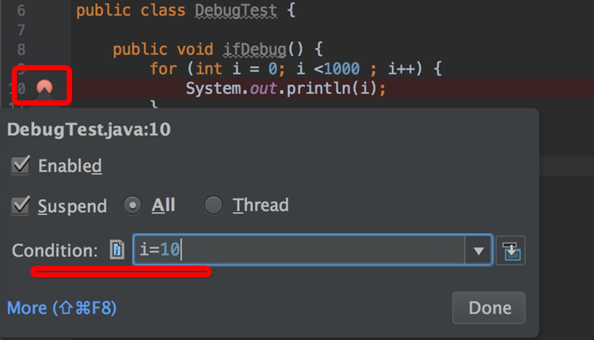</div>

参考上图，在断点的位置，右击断点旁边的小红点，会出来⼀个界⾯，在 Condition 这⾥填⼊断点条件即可，这样调试时，就会自动停在 i=10 的位置。

<div align="center">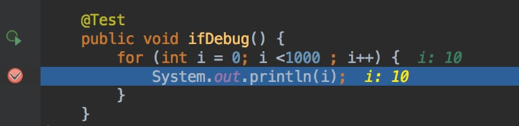</div>

## 回到“上一步”

该技巧最适合特别复杂的⽅法套⽅法的场景，好不容易跑起来，一不小心手抖，断点过去了，想回过头看看刚才的变量值，如果不知道该技巧，只能再跑⼀遍。

<div align="center">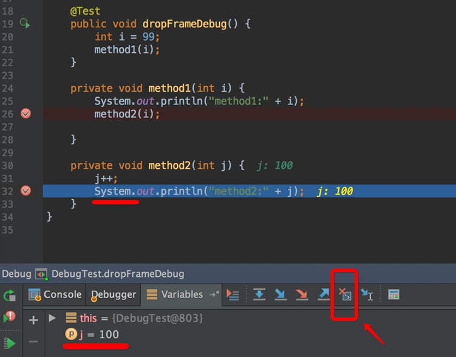</div>

参考上图，method1 ⽅法调⽤ method2，当前断点的位置 j=100，点击上图红⾊箭头位置的 Drop Frame 图标后，时间穿越了回到了 method1 刚开始调用的时候，变量 i 变成了 99

<div align="center">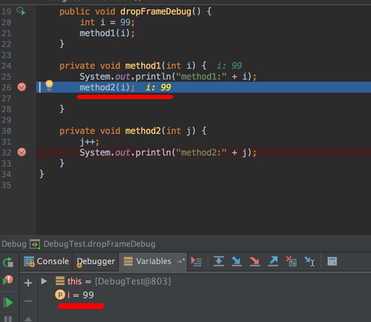</div>

为啥这个功能叫 Drop Frame，⽽不是类似 Back To Previous 之类的，可以去翻翻 JVM 的书，JVM 内部以栈帧为单位保存线程的运行状态， drop frame 即扔掉当前运⾏的栈帧，这样当前“指针”的位置，就自然到了上⼀帧的位置。

## 多线程调试

<div align="center">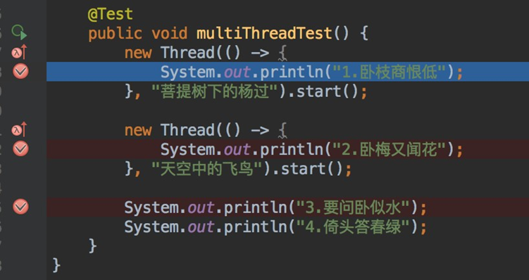</div>

多线程同时运行时，谁先执行，谁后执行，完全是看 CPU 调度的，⽆法控制先后，运行时可能没什么问题，但是调试时就比较麻烦了，最明显的就是断点乱跳，一会儿停这个线程，一会儿停在另⼀个线程，比如下图：如果想希望下⼀个断点位置是第 2 句诗句，可能要失望了：

<div align="center">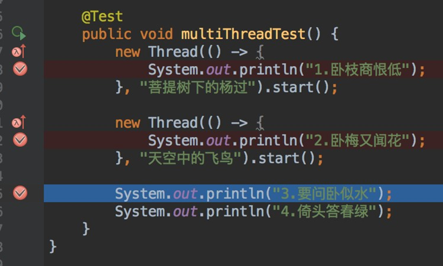</div>

如果想让线程在调试时，想按自己的愿意来，让它停在哪个线程就停在哪个线程，可以在图中 3 个断点的小红点上右击，

<div align="center">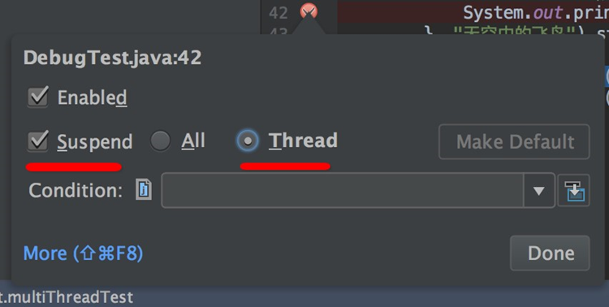</div>

即：Suspend 挂起的条件是按每个线程来，而非 All。把这 3 个断点都这么设置后，再来⼀发试试注意上图中的红框位置，断点停下来时，这个下拉框可以看到各个线程（注：给线程起个容易识别的名字是个好习惯！），我们可以选择线程“天空中的飞鸟“

<div align="center">
    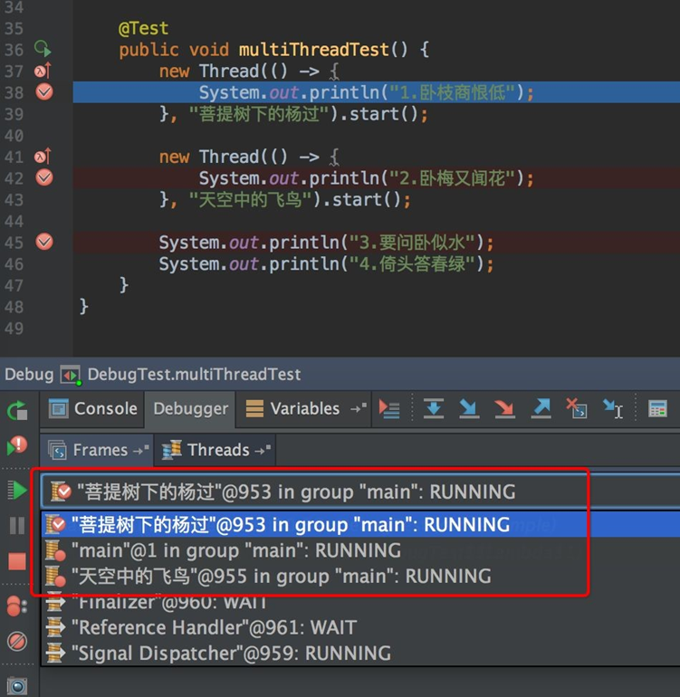
	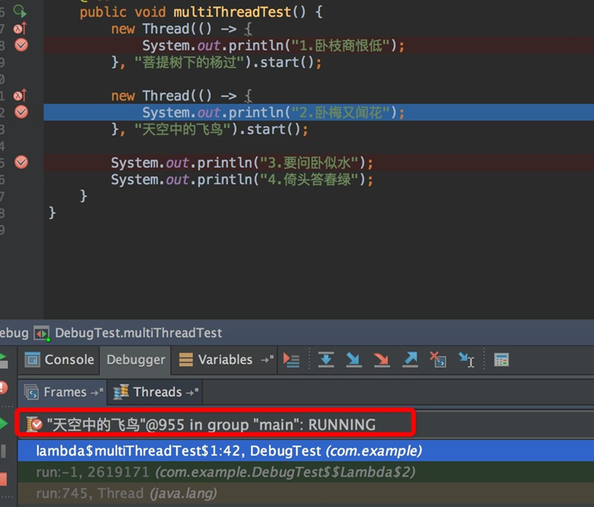
</div>

断点如愿停在了第 2 句。

## 远程调试

本机不用启动项目，只要有源代码，可以在本机直接远程调试服务器上的代码，打开姿势如下

```shell
java -agentlib:jdwp=transport=dt_socket,server=y,suspend=n,address=5005 -jar remote-debug-v1.0.jar
```

- -Xdebug 通知 JVM 工作在 DEBUG 模式下。
- -Xrunjdwp 通知 JVM 使用 (Java debug wire protocol) 运行调试环境。该参数同时包含了一系列的调试选项。
- transport 指定了调试数据的传送方式，dt_socket 是指用 SOCKET 模式，另有 dt_shmem 指用共享内存方式，其中，dt_shmem 只适用于 Windows 平台；
- address 调试服务器的端口号，客户端用来连接服务器的端口号；
- server=y/n VM 是否需要作为调试服务器执行；
- suspend=y/n 是否在调试客户端建立连接之后启动 VM；

远程调试从技术上讲，就是在本机与远程建立 scoket 通讯，所以端⼝不要冲突，⽽且本机要允许访问远程端⼝，另外这⼀段参数，放要在 -jar 或 ${main_class} 的前⾯

<b>IDEA 中设置远程调试</b>

<div align="center">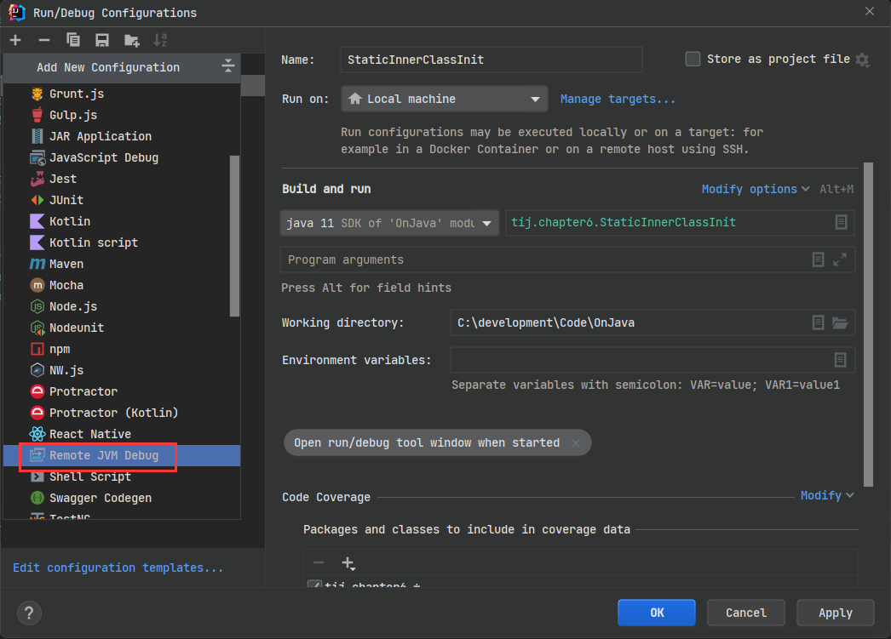</div>

<div align="center">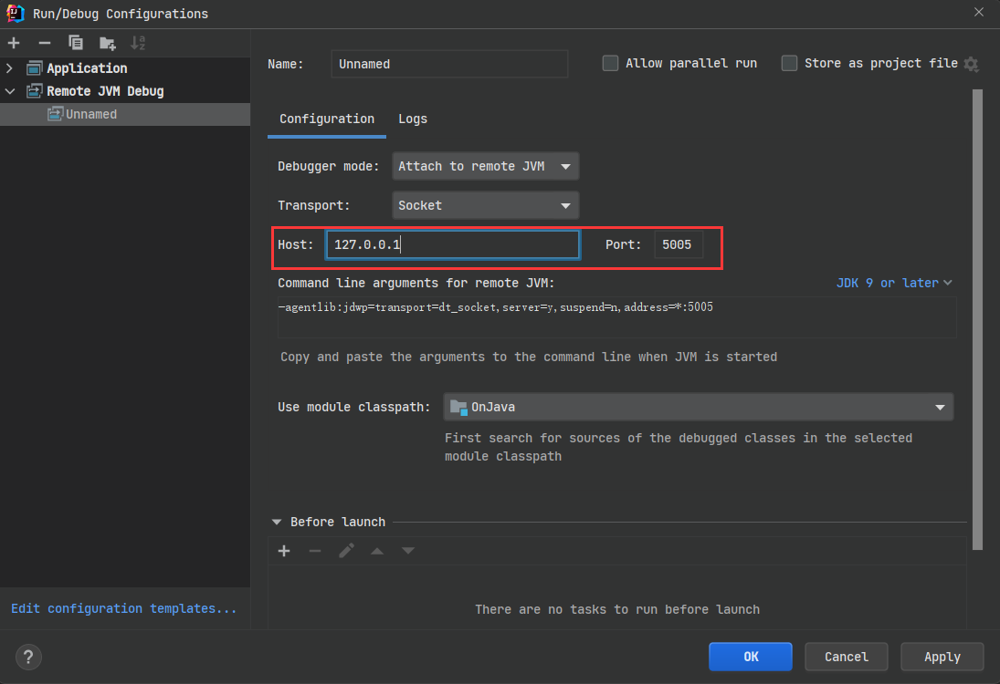</div>

然后就可以调试了,前提是本机有项目的源代码 ，在需要的地⽅打个断点，然后访问⼀个远程的url试试，断点就会停下来。

## 临时执行表达式

调试时，可以临时执⾏⼀些表达式，参考下图

<div align="center">
    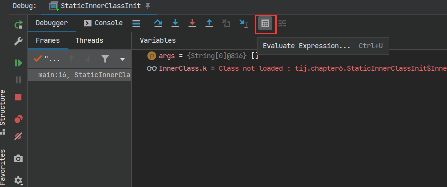
</div>

如果调试时，想动态修改变量的值，也很容易，在变量上右击，然后选择 Set Value

<div align="center">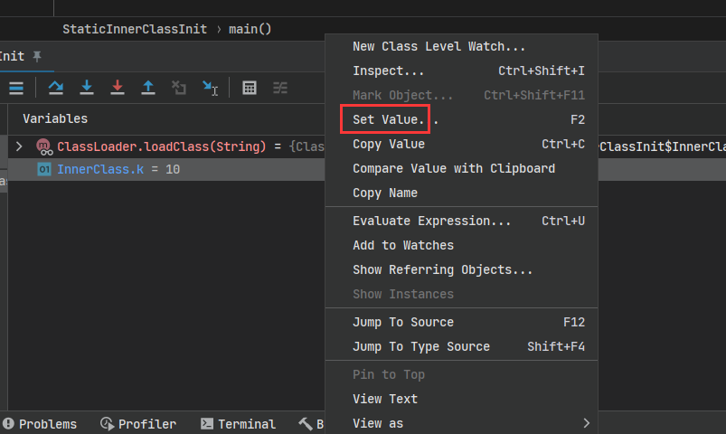</div>

在深度学习代码调试中用这个去观察 ground truth 的标签，自己的数据输入格式否正确，看自己的损失函数是否写正确了非常有用。

# 调试经验

程序运行过程中遇到错误怎么办？

- 1️⃣一定一定看好好看完错误信息，这是定位 bug 的关键所在！
- 2️⃣错误信息会告诉你，第几行代码出错了，但是出现错误的原因不一定就是这行代码，需要查看该代码前几行代码/调用代码所再方法的代码。
    - 比如：方法 A 调用了方法 B；
    - 执行方法 A 的时候，方法 A 的第五行代码出错了
    - 我们可能需要检查方法 A 第 5 行代码和第 5 行前面的代码。
    - 如果方法 B 会影响方法 A 的结果，可能也需要检查下方法 B 中的代码逻辑。

代码举例：A 方法调用了 B 方法，并对 B 方法的返回值进行一系列的操作，由于 B 方法的处理逻辑有问题，导致 A 方法调用出错。

```python
def A():
    print("some code")
    need_deal_str = B()
    for item in need_deal_str:
        tmp = item.split(".")[1]
        print(tmp)

def B():
    # 假定 retval 是经过若干步骤处理所得的结果,期望的结果是 retval 中所有的字符串都是以 . 结尾
    retval = ["hello.c","world.java","demo.cs","kkx"]
    return retval

A()

"""
some code
c
java
cs
Traceback (most recent call last):
  File "C:/development/Code/reactor/alog/Demo.py", line 13, in <module>
    A()
  File "C:/development/Code/reactor/alog/Demo.py", line 5, in A
    tmp = item.split(".")[1]
IndexError: list index out of range
"""
```

报错信息给我们定位的是 line 5，list index out of range。item.split(".")[1] 这边出错了。我们可以看看是循环中的第几行数据导致的错误；查看的方式多种多样，可以通过抛出异常，找到是第几个数据出现的问题

```python
def A():
    print("some code")
    need_deal_str = B()
    for item in need_deal_str:
        try:
            tmp = item.split(".")[1]
            print(tmp)
        except Exception as e:
            print(f"是这个{item}报错的,错误信息是{e}") # 是这个kkx报错的,错误信息是list index out of range

def B():
    # 假定 retval 是经过若干步骤处理所得的结果,期望的结果是 retval 中所有的字符串都是以 . 结尾
    retval = ["hello.c","world.java","demo.cs","kkx"]
    return retval

A()
```

如果这部分的操作比较复杂，我们可以设置条件断点查看这个 item 的具体操作细节，一步一步调试，看到底那个步骤出错的。


然后我们可以发现，是 kkx 这个字符串无法通过 split('.') 进行分割，所以报错。

- 如果异常数据无所谓，那么直接捕获异常，pass 就行
- 如果不允许有异常数据，需要追本溯源，看看need_deal_str 数据是怎么被处理的，那个处理环节出了错误。

# 项目部署了，如何调试?

巧用日志记录错误信息。平时写代码可以再控制台看到报错信息，但是一旦程序打包运行了，就不能这样看错误信息了。我们可以使用 try-cache\try-exception 来捕获异常，把异常信息写入到日志中。

- 如何使用，需要自行查阅怎么在 xx 语言中使用日志。
- 此处我以 python 的日志举例。

```python
import logging
import pathlib

logger = logging.Logger('debug')
logger.setLevel(level=logging.DEBUG)
logger.handlers = []
BASIC_FORMAT = "%(asctime)s, %(levelname)s:%(name)s:%(message)s"
DATE_FORMAT = '%Y-%m-%d %H:%M:%S'

formatter = logging.Formatter(BASIC_FORMAT, DATE_FORMAT)
chlr = logging.StreamHandler()
chlr.setFormatter(formatter)
chlr.setLevel(level=logging.DEBUG)
BASEDIR = pathlib.Path.cwd()

fhlr = logging.FileHandler(str(pathlib.Path.cwd()) + "/error.txt")
fhlr.setFormatter(formatter)
logger.addHandler(chlr)
logger.addHandler(fhlr)

def A():
    print("some code")
    need_deal_str = B()
    for item in need_deal_str:
        try:
            tmp = item.split(".")[1]
            print(tmp)
        except Exception as e:
            # 将具体的错误信息和出错的内容记录到日志中，后期可以通过查看日志中的信息来排查错误。
            # 当然，具体需要记录什么内容，需要自己判断
            logger.info(f"是这个{item}报错的,错误信息是{e}") 

def B():
    # 假定 retval 是经过若干步骤处理所得的结果,期望的结果是 retval 中所有的字符串都是以 . 结尾
    retval = ["hello.c","world.java","demo.cs","kkx"]
    return retval

if __name__ == '__main__':
	A()
```

如何合理使用日志记录错误呢？我觉得可以参考下这几点：

- 对于程序的核心功能，为它加上 try-cache，并把异常信息写入日志中
- 如果害怕有些会出错的地方没有 try-cache 到，你就在 main 方法这里加一个 try-cache，捕获程序运行过程中所有可能出现的异常。
- 如何合理使用异常 Exception 记录错误信息，追踪错误发生的路径？这需要你去了解并熟悉语言异常机制，结合自己的实际经验来判断。

```python
# 省略了日志的配置信息
def A():
    print("some code")
    need_deal_str = B()
    for item in need_deal_str:
        tmp = item.split(".")[1]
        # print(f"是这个{item}报错的,错误信息是{e}")


def B():
    # 假定 retval 是经过若干步骤处理所得的结果,期望的结果是 retval 中所有的字符串都是以 . 结尾
    retval = ["hello.c", "world.java", "demo.cs", "kkx"]
    return retval


if __name__ == '__main__':
    try:
        A()
    except Exception as e:
        logger.info(f"错误信息是{e}")
```

