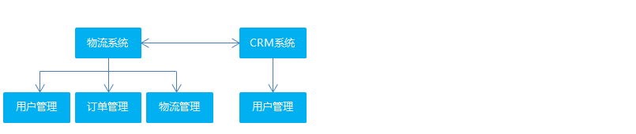
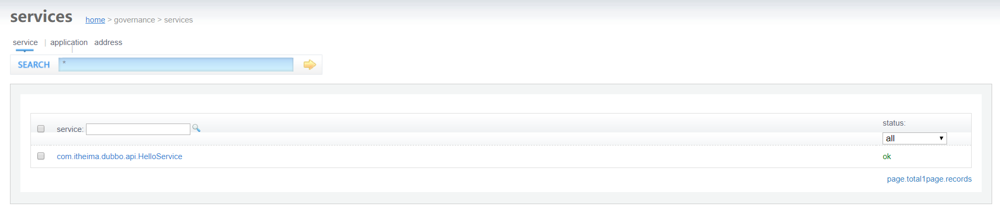
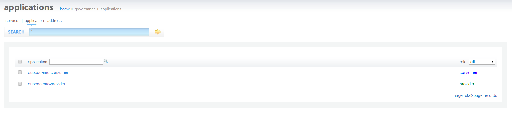
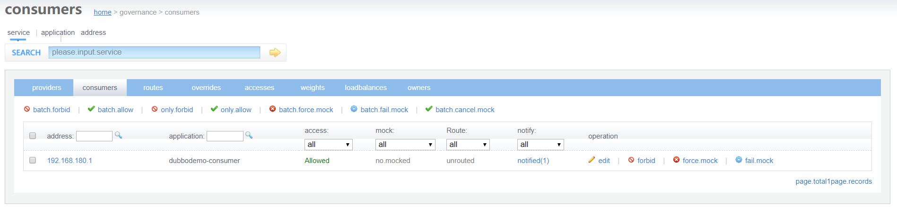
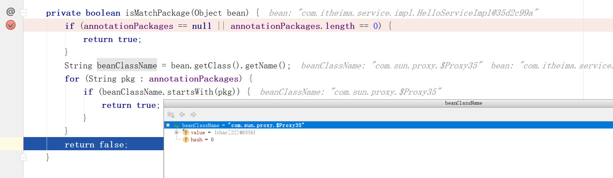
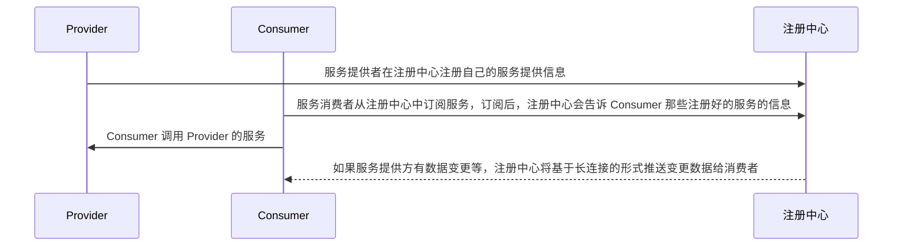
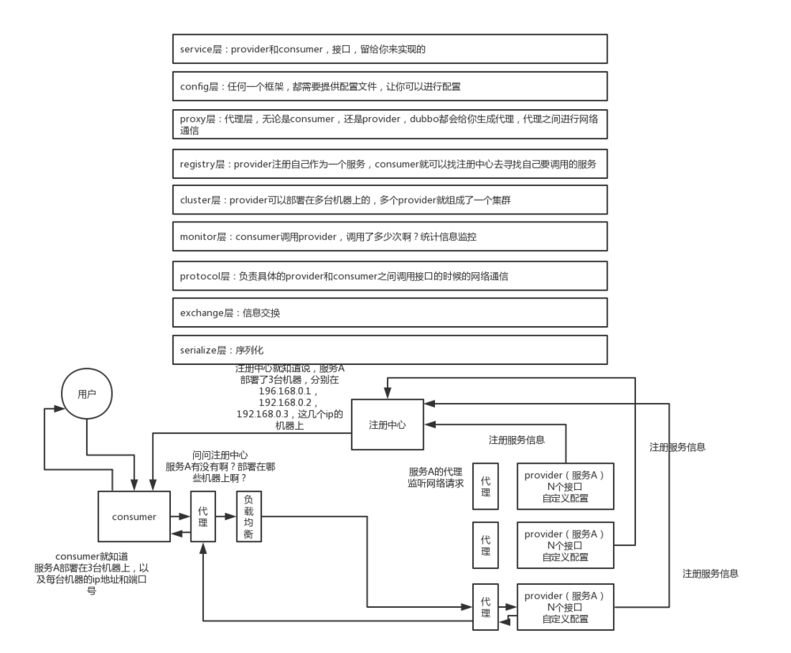

# 分布式RPC框架Apache Dubbo 

## 软件架构的演进过程

软件架构的发展经历了由单体架构、垂直架构、SOA 架构到微服务架构的演进过程，下面我们分别了解一下这几个架构。

### 单体架构


**架构说明：**全部功能集中在一个项目内（All in one）。

**架构优点：**架构简单，前期开发成本低、开发周期短，适合小型项目。

**架构缺点：**

- 全部功能集成在一个工程中，对于大型项目不易开发、扩展和维护。
- 技术栈受限，只能使用一种语言开发。
- 系统性能扩展只能通过扩展集群节点，成本高。

### 垂直架构



**架构说明：**按照业务进行切割，形成小的单体项目。

**架构优点：**

- 技术栈可扩展（不同的系统可以用不同的编程语言编写）。
- 系统拆分实现了流量分担，解决了并发问题
- 可以针对不同的模块进行优化
- 方便水平扩展，负载均衡，容错率提高
- 系统间相互独立，互不影响，新的业务迭代时更加高效

**架构缺点：**

- 功能集中在一个项目中，不利于开发、扩展、维护。
- 系统扩张只能通过集群的方式。
- 项目之间功能冗余、数据冗余、耦合性强。

### SOA 架构

SOA 全称为 Service-Oriented Architecture，即面向服务的架构。它可以根据需求通过网络对松散耦合的粗粒度应用组件(服务)进行分布式部署、组合和使用。一个服务通常以独立的形式存在于操作系统进程中。

站在功能的角度，把业务逻辑抽象成可复用的服务，通过服务的编排实现业务的快速再生，目的：把原先固有的业务功能转变为通用的业务服务，实现业务逻辑的快速复用。


**架构说明：**将重复功能或模块抽取成组件的形式，对外提供服务，在项目与服务之间使用ESB（企业服务总线）的形式作为通信的桥梁。

**架构优点：**重复功能或模块抽取为服务，提高开发效率。可重用性高。可维护性高。

**架构缺点：**

- 各系统之间业务不同，很难确认功能或模块是重复的。
- 抽取服务的粒度大。
- 系统和服务之间耦合度高。

### 微服务架构


**架构说明：**

- 将系统服务层完全独立出来，抽取为一个一个的微服务。
- 抽取的粒度更细，遵循单一原则。
- 采用轻量级框架协议传输。

**架构优点：**

- 服务拆分粒度更细，有利于提高开发效率。 
- 可以针对不同服务制定对应的优化方案。
- 适用于互联网时代，产品迭代周期更短。

**架构缺点：**

- 粒度太细导致服务太多，维护成本高。
- 分布式系统开发的技术成本高，对团队的挑战大。

## Apache Dubbo 概述

### Dubbo 简介

Apache Dubbo 是一款高性能的 Java RPC 框架。其前身是阿里巴巴公司开源的一个高性能、轻量级的开源 Java RPC 框架，可以和 Spring 框架无缝集成。

**什么是RPC？**

RPC 全称为 remote procedure call，即**远程过程调用**。比如两台服务器 A 和 B，A 服务器上部署一个应用，B 服务器上部署一个应用，A 服务器上的应用想调用 B 服务器上的应用提供的方法，由于两个应用不在一个内存空间，不能直接调用，所以需要通过网络来表达调用的语义和传达调用的数据。

需要注意的是 RPC 并不是一个具体的技术，而是指整个网络远程调用过程。

RPC 是一个泛化的概念，严格来说一切远程过程调用手段都属于 RPC 范畴。各种开发语言都有自己的 RPC 框架。Java 中的 RPC 框架比较多，广泛使用的有 RMI、Hessian、Dubbo等。

Dubbo 官网地址：http://dubbo.apache.org

**Dubbo 提供了三大核心能力：面向接口的远程方法调用，智能容错和负载均衡，以及服务自动注册和发现。**

### Dubbo架构

Dubbo 架构图（Dubbo官方提供）如下：


节点角色说明：

| 节点        | 角色名称                |
| --------- | ------------------- |
| Provider  | 暴露服务的服务提供方          |
| Consumer  | 调用远程服务的服务消费方        |
| Registry  | 服务注册与发现的注册中心        |
| Monitor   | 统计服务的调用次数和调用时间的监控中心 |
| Container | 服务运行容器              |

虚线都是异步访问，实线都是同步访问。

- 蓝色虚线：在启动时完成的功能
- 红色虚线(实线)：都是程序运行过程中执行的功能

调用关系说明:

0. 服务容器负责启动，加载，运行服务提供者。
1. 服务提供者在启动时，向**注册中心**注册自己提供的服务。
2. 服务消费者在启动时，向**注册中心**订阅自己所需的服务。
3. 注册中心返回服务提供者地址列表给消费者，如果有变更，注册中心将基于长连接推送变更数据给消费者。
4. 服务消费者，从提供者地址列表中，基于**软负载均衡算法**，选一台提供者进行调用，如果调用失败，再选另一台调用。
    1. 软负载均衡算法：软件负载均衡算法，常见的软件负载均衡算法如下：
    2. 平均分配（轮询），加权轮询；ip hash；fair（最小值负载均衡）

5. 服务消费者和提供者，在内存中累计调用次数和调用时间，定时每分钟发送一次统计数据到监控中心。

## 服务注册中心 Zookeeper

通过前面的 Dubbo 架构图可以看到，Registry（服务注册中心）在其中起着至关重要的作用。Dubbo 官方推荐使用 Zookeeper 作为服务注册中心。

### Zookeeper介绍

Zookeeper 是 Apache Hadoop 的子项目，是一个**树型的目录服务，支持变更推送**，适合作为 Dubbo 服务的注册中心，工业强度较高，可用于生产环境，并推荐使用 。

为了便于理解 Zookeeper 的树型目录服务，我们先来看一下我们电脑的文件系统(也是一个树型目录结构)：


我的电脑可以分为多个盘符（例如C、D、E等），每个盘符下可以创建多个目录，每个目录下面可以创建文件，也可以创建子目录，最终构成了一个树型结构。通过这种树型结构的目录，我们可以将文件分门别类的进行存放，方便我们后期查找。而且磁盘上的每个文件都有一个唯一的访问路径，例如：C:\Windows\itcast\hello.txt。

Zookeeper 树型目录服务：


流程说明：

- 服务提供者(Provider)启动时: 向 **/dubbo/com.foo.BarService/providers** 目录下写入自己的 URL 地址
- 服务消费者(Consumer)启动时: 订阅 **/dubbo/com.foo.BarService/providers** 目录下的提供者 URL 地址。并向 **/dubbo/com.foo.BarService/consumers** 目录下写入自己的 URL 地址
- 监控中心(Monitor)启动时: 订阅 **/dubbo/com.foo.BarService** 目录下的所有提供者和消费者 URL 地址

### 安装Zookeeper

下载地址：http://archive.apache.org/dist/zookeeper/

本课程使用的Zookeeper版本为3.4.6，下载完成后可以获得名称为zookeeper-3.4.6.tar.gz的压缩文件。

安装步骤：

第一步：安装 jdk（略）
第二步：把 zookeeper 的压缩包（zookeeper-3.4.6.tar.gz）上传到 linux 系统
第三步：解压缩压缩包，使用命令 tar -zxvf zookeeper-3.4.6.tar.gz 解压
第四步：进入 zookeeper-3.4.6 目录，创建 data 目录 mkdir data
第五步：进入conf目录 ，把zoo_sample.cfg 改名为zoo.cfg
​	cd conf
​	mv zoo_sample.cfg zoo.cfg
第六步：打开 zoo.cfg 文件,  修改 data 属性：dataDir=/root/zookeeper-3.4.6/data

### 启动、停止Zookeeper

进入Zookeeper的bin目录，启动服务命令 **./zkServer.sh start**

停止服务命令 **./zkServer.sh stop**

查看服务状态：**./zkServer.sh status**

## Dubbo快速入门

**Dubbo 作为一个 RPC 框架，其最核心的功能就是要实现跨网络的远程调用。**本小节就是要创建两个应用，一个作为服务的提供方，一个作为服务的消费方。**通过 Dubbo 来实现服务消费方远程调用服务提供方的方法。**

### 服务提供方开发

开发步骤：

（1）创建maven工程（打包方式为war）dubbodemo_provider，在pom.xml文件中导入如下坐标

~~~xml
<properties>
  <project.build.sourceEncoding>UTF-8</project.build.sourceEncoding>
  <maven.compiler.source>1.8</maven.compiler.source>
  <maven.compiler.target>1.8</maven.compiler.target>
  <spring.version>5.0.5.RELEASE</spring.version>
</properties>
<dependencies>
  <dependency>
    <groupId>org.springframework</groupId>
    <artifactId>spring-context</artifactId>
    <version>${spring.version}</version>
  </dependency>
  <dependency>
    <groupId>org.springframework</groupId>
    <artifactId>spring-beans</artifactId>
    <version>${spring.version}</version>
  </dependency>
  <dependency>
    <groupId>org.springframework</groupId>
    <artifactId>spring-webmvc</artifactId>
    <version>${spring.version}</version>
  </dependency>
  <dependency>
    <groupId>org.springframework</groupId>
    <artifactId>spring-jdbc</artifactId>
    <version>${spring.version}</version>
  </dependency>
  <dependency>
    <groupId>org.springframework</groupId>
    <artifactId>spring-aspects</artifactId>
    <version>${spring.version}</version>
  </dependency>
  <dependency>
    <groupId>org.springframework</groupId>
    <artifactId>spring-jms</artifactId>
    <version>${spring.version}</version>
  </dependency>
  <dependency>
    <groupId>org.springframework</groupId>
    <artifactId>spring-context-support</artifactId>
    <version>${spring.version}</version>
  </dependency>
  <!-- dubbo相关 -->
  <dependency>
    <groupId>com.alibaba</groupId>
    <artifactId>dubbo</artifactId>
    <version>2.6.0</version>
  </dependency>
  <dependency>
    <groupId>org.apache.zookeeper</groupId>
    <artifactId>zookeeper</artifactId>
    <version>3.4.7</version>
  </dependency>
  <dependency>
    <groupId>com.github.sgroschupf</groupId>
    <artifactId>zkclient</artifactId>
    <version>0.1</version>
  </dependency>
  <dependency>
    <groupId>javassist</groupId>
    <artifactId>javassist</artifactId>
    <version>3.12.1.GA</version>
  </dependency>
  <dependency>
    <groupId>com.alibaba</groupId>
    <artifactId>fastjson</artifactId>
    <version>1.2.47</version>
  </dependency>
</dependencies>
<build>
  <plugins>
    <plugin>
      <groupId>org.apache.maven.plugins</groupId>
      <artifactId>maven-compiler-plugin</artifactId>
      <version>2.3.2</version>
      <configuration>
        <source>1.8</source>
        <target>1.8</target>
      </configuration>
    </plugin>
    <plugin>
      <groupId>org.apache.tomcat.maven</groupId>
      <artifactId>tomcat7-maven-plugin</artifactId>
      <configuration>
        <!-- 指定端口 -->
        <port>8081</port>
        <!-- 请求路径 -->
        <path>/</path>
      </configuration>
    </plugin>
  </plugins>
</build>
~~~

（2）配置web.xml文件

~~~xml
<!DOCTYPE web-app PUBLIC
 "-//Sun Microsystems, Inc.//DTD Web Application 2.3//EN"
 "http://java.sun.com/dtd/web-app_2_3.dtd" >
<web-app>
  <display-name>Archetype Created Web Application</display-name>
  <context-param>
    <param-name>contextConfigLocation</param-name>
    <param-value>classpath:applicationContext*.xml</param-value>
  </context-param>
  <listener>
    <listener-class>org.springframework.web.context.ContextLoaderListener</listener-class>
  </listener>
</web-app>
~~~

（3）创建服务接口

~~~java
package com.itheima.service;
public interface HelloService {
    public String sayHello(String name);
}
~~~

（4）创建服务实现类

~~~java
package com.itheima.service.impl;
import com.alibaba.dubbo.config.annotation.Service;
import com.itheima.service.HelloService;

@Service
public class HelloServiceImpl implements HelloService {
    public String sayHello(String name) {
        return "hello " + name;
    }
}
~~~

注意：服务实现类上使用的 Service 注解是 Dubbo 提供的，用于对外发布服务

（5）在 src/main/resources 下创建 applicationContext-service.xml 

~~~xml
<?xml version="1.0" encoding="UTF-8"?>
<beans xmlns="http://www.springframework.org/schema/beans"
		xmlns:xsi="http://www.w3.org/2001/XMLSchema-instance"
	    xmlns:p="http://www.springframework.org/schema/p"
		xmlns:context="http://www.springframework.org/schema/context"
		xmlns:dubbo="http://code.alibabatech.com/schema/dubbo"
	    xmlns:mvc="http://www.springframework.org/schema/mvc"
		xsi:schemaLocation="http://www.springframework.org/schema/beans
		http://www.springframework.org/schema/beans/spring-beans.xsd
         http://www.springframework.org/schema/mvc
         http://www.springframework.org/schema/mvc/spring-mvc.xsd
         http://code.alibabatech.com/schema/dubbo
         http://code.alibabatech.com/schema/dubbo/dubbo.xsd
         http://www.springframework.org/schema/context
         http://www.springframework.org/schema/context/spring-context.xsd">
	<!-- 当前应用名称，用于注册中心计算应用间依赖关系，注意：消费者和提供者应用名不要一样 -->
	<dubbo:application name="dubbodemo_provider" />
	<!-- 连接服务注册中心zookeeper ip为zookeeper所在服务器的ip地址-->
	<dubbo:registry address="zookeeper://192.168.134.129:2181"/>
	<!-- 注册  协议和port   端口默认是20880 -->
	<dubbo:protocol name="dubbo" port="20881"></dubbo:protocol>
	<!-- 扫描指定包，加入@Service注解的类会被发布为服务  -->
	<dubbo:annotation package="com.itheima.service.impl" />
</beans>
~~~

（6）启动服务，tomcat7:run

### 4.2 服务消费方开发

开发步骤：

（1）创建maven工程（打包方式为 war）dubbodemo_consumer，pom.xml 配置和上面服务提供者相同，只需要将 Tomcat 插件的端口号改为 8082 即可

（2）配置 web.xml 文件

~~~xml
<!DOCTYPE web-app PUBLIC
 "-//Sun Microsystems, Inc.//DTD Web Application 2.3//EN"
 "http://java.sun.com/dtd/web-app_2_3.dtd" >
<web-app>
  <display-name>Archetype Created Web Application</display-name>
  <servlet>
    <servlet-name>springmvc</servlet-name>
    <servlet-class>org.springframework.web.servlet.DispatcherServlet</servlet-class>
    <!-- 指定加载的配置文件 ，通过参数 contextConfigLocation 加载 -->
    <init-param>
      <param-name>contextConfigLocation</param-name>
      <param-value>classpath:applicationContext-web.xml</param-value>
    </init-param>
    <load-on-startup>1</load-on-startup>
  </servlet>
  <servlet-mapping>
    <servlet-name>springmvc</servlet-name>
    <url-pattern>*.do</url-pattern>
  </servlet-mapping>
</web-app>
~~~

（3）将服务提供者工程中的 HelloService 接口复制到当前工程

（4）编写 Controller

~~~java
package com.itheima.controller;
import com.alibaba.dubbo.config.annotation.Reference;
import com.itheima.service.HelloService;
import org.springframework.stereotype.Controller;
import org.springframework.web.bind.annotation.RequestMapping;
import org.springframework.web.bind.annotation.ResponseBody;

@Controller
@RequestMapping("/demo")
public class HelloController {
    @Reference
    private HelloService helloService;

    @RequestMapping("/hello")
    @ResponseBody
    public String getName(String name){
        //远程调用
        String result = helloService.sayHello(name);
        System.out.println(result);
        return result;
    }
}
~~~

注意：Controller 中注入 HelloService 使用的是 Dubbo 提供的 @Reference 注解

（5）在 src/main/resources下创建 applicationContext-web.xml

~~~xml
<?xml version="1.0" encoding="UTF-8"?>
<beans xmlns="http://www.springframework.org/schema/beans"
	xmlns:xsi="http://www.w3.org/2001/XMLSchema-instance"
	xmlns:p="http://www.springframework.org/schema/p"
	xmlns:context="http://www.springframework.org/schema/context"
	xmlns:dubbo="http://code.alibabatech.com/schema/dubbo"
	xmlns:mvc="http://www.springframework.org/schema/mvc"
	xsi:schemaLocation="http://www.springframework.org/schema/beans
			http://www.springframework.org/schema/beans/spring-beans.xsd
			http://www.springframework.org/schema/mvc
			http://www.springframework.org/schema/mvc/spring-mvc.xsd
			http://code.alibabatech.com/schema/dubbo
			http://code.alibabatech.com/schema/dubbo/dubbo.xsd
			http://www.springframework.org/schema/context
			http://www.springframework.org/schema/context/spring-context.xsd">

	<!-- 当前应用名称，用于注册中心计算应用间依赖关系，注意：消费者和提供者应用名不要一样 -->
	<dubbo:application name="dubbodemo-consumer" />
	<!-- 连接服务注册中心zookeeper ip为zookeeper所在服务器的ip地址-->
	<dubbo:registry address="zookeeper://192.168.134.129:2181"/>
	<!-- 扫描的方式暴露接口  -->
	<dubbo:annotation package="com.itheima.controller" />
</beans>
~~~

（6）运行测试，tomcat7:run启动，在浏览器输入http://localhost:8082/demo/hello.do?name=Jack，查看浏览器输出结果

**思考一：**上面的 Dubbo 入门案例中我们是将 HelloService 接口从服务提供者工程(dubbodemo_provider)复制到服务消费者工程(dubbodemo_consumer)中，这种做法是否合适？还有没有更好的方式？

**答：**这种做法显然是不好的，同一个接口被复制了两份，不利于后期维护。更好的方式是单独创建一个 maven 工程，将此接口创建在这个 maven 工程中。需要依赖此接口的工程只需要在自己工程的 pom.xml 文件中引入 maven 坐标即可。

**思考二：**在服务消费者工程(dubbodemo_consumer)中只是引用了 HelloService 接口，并没有提供实现类，Dubbo 是如何做到远程调用的？

**答：**Dubbo 底层是基于代理技术为 HelloService 接口创建代理对象，远程调用是通过此代理对象完成的。可以通过开发工具的 debug 功能查看此代理对象的内部结构。另外，Dubbo 实现网络传输底层是基于 Netty 框架完成的。

**思考三：**上面的 Dubbo 入门案例中我们使用 Zookeeper 作为服务注册中心，服务提供者需要将自己的服务信息注册到 Zookeeper，服务消费者需要从 Zookeeper 订阅自己所需要的服务，此时 Zookeeper 服务就变得非常重要了，那如何防止 Zookeeper 单点故障呢？

**答：**Zookeeper 其实是支持集群模式的，可以配置 Zookeeper 集群来达到 Zookeeper 服务的高可用，防止出现单点故障。

## Dubbo管理控制台

我们在开发时，需要知道 Zookeeper 注册中心都注册了哪些服务，有哪些消费者来消费这些服务。我们可以通过部署一个管理中心来实现。其实管理中心就是一个 web 应用，部署到tomcat 即可。

### 安装

安装步骤：

（1）将资料中的 dubbo-admin-2.6.0.war 文件复制到 tomcat 的 webapps 目录下

（2）启动 tomcat，此 war 文件会自动解压

（3）修改 WEB-INF 下的 dubbo.properties 文件，注意 dubbo.registry.address 对应的值需要对应当前使用的 Zookeeper 的 ip 地址和端口号

​	dubbo.registry.address=zookeeper://192.168.134.129:2181
​	dubbo.admin.root.password=root
​	dubbo.admin.guest.password=guest

（4）重启 tomcat

### 5.2 使用

操作步骤：

（1）访问 http://localhost:8080/dubbo-admin-2.6.0/，输入用户名(root)和密码(root)


（2）启动服务提供者工程和服务消费者工程，可以在查看到对应的信息








## Dubbo相关配置说明

### 包扫描

```xml
<dubbo:annotation package="com.itheima.service" />
```

服务提供者和服务消费者都需要配置，表示包扫描，作用是扫描指定包(包括子包)下的类。

如果不使用包扫描，也可以通过如下配置的方式来发布服务：

```xml
<bean id="helloService" class="com.itheima.service.impl.HelloServiceImpl" />
<dubbo:service interface="com.itheima.api.HelloService" ref="helloService" />
```

作为服务消费者，可以通过如下配置来引用服务：

```xml
<!-- 生成远程服务代理，可以和本地bean一样使用helloService -->
<dubbo:reference id="helloService" interface="com.itheima.api.HelloService" />
```

上面这种方式发布和引用服务，一个配置项(<dubbo:service>、<dubbo:reference>)只能发布或者引用一个服务，如果有多个服务，这种方式就比较繁琐了。推荐使用包扫描方式。

### 协议

```xml
<dubbo:protocol name="dubbo" port="20880"/>
```

一般在服务提供者一方配置，可以指定使用的协议名称和端口号。

其中 Dubbo 支持的协议有：dubbo、rmi、hessian、http、webservice、rest、redis 等。

推荐使用的是dubbo 协议。

**dubbo 协议采用单一长连接和 NIO 异步通讯，适合于小数据量大并发的服务调用，以及服务消费者机器数远大于服务提供者机器数的情况。不适合传送大数据量的服务，比如传文件，传视频等，除非请求量很低。**

也可以在同一个工程中配置多个协议，不同服务可以使用不同的协议，例如：

```xml
<!-- 多协议配置 -->
<dubbo:protocol name="dubbo" port="20880" />
<dubbo:protocol name="rmi" port="1099" />
<!-- 使用dubbo协议暴露服务 -->
<dubbo:service interface="com.itheima.api.HelloService" ref="helloService" protocol="dubbo" />
<!-- 使用rmi协议暴露服务 -->
<dubbo:service interface="com.itheima.api.DemoService" ref="demoService" protocol="rmi" /> 
```

### 启动时检查

```xml
<dubbo:consumer check="false"/>
```

上面这个配置需要配置在服务消费者一方，如果不配置默认 check 值为 true。Dubbo 缺省会在启动时检查依赖的服务是否可用，不可用时会抛出异常，阻止 Spring 初始化完成，以便上线时，能及早发现问题。可以通过将 check 值改为 false 来关闭检查。

建议在开发阶段将 check 值设置为 false，在生产环境下改为 true。

### 负载均衡

负载均衡（Load Balance）：其实就是将请求分摊到多个操作单元上进行执行，从而共同完成工作任务。

在集群负载均衡时，Dubbo 提供了多种均衡策略（包括随机、轮询、最少活跃调用数、一致性Hash），缺省为 random 随机调用。

配置负载均衡策略，既可以在服务提供者一方配置，也可以在服务消费者一方配置，如下：

```java
@Controller
@RequestMapping("/demo")
public class HelloController {
    //在服务消费者一方配置负载均衡策略
    @Reference(check = false,loadbalance = "random")
    private HelloService helloService;

    @RequestMapping("/hello")
    @ResponseBody
    public String getName(String name){
        //远程调用
        String result = helloService.sayHello(name);
        System.out.println(result);
        return result;
    }
}
```

```java
//在服务提供者一方配置负载均衡
@Service(loadbalance = "random")
public class HelloServiceImpl implements HelloService {
    public String sayHello(String name) {
        return "hello " + name;
    }
}
```

可以通过启动多个服务提供者来观察 Dubbo 负载均衡效果。

注意：因为我们是在一台机器上启动多个服务提供者，所以需要修改 tomcat 的端口号和 Dubbo 服务的端口号来防止端口冲突。

在实际生产环境中，多个服务提供者是分别部署在不同的机器上，所以不存在端口冲突问题。

## 解决Dubbo无法发布被事务代理的Service问题

前面我们已经完成了 Dubbo 的入门案例，通过入门案例我们可以看到通过 Dubbo 提供的标签配置就可以进行包扫描，扫描到 @Service 注解的类就可以被发布为服务。

但是我们如果在服务提供者类上加入 @Transactional 事务控制注解后，服务就发布不成功了。原因是事务控制的底层原理是为服务提供者类创建代理对象，而默认情况下Spring是基于JDK 动态代理方式创建代理对象，而此代理对象的完整类名为 com.sun.proxy.$Proxy42（最后两位数字不是固定的），导致 Dubbo 在发布服务前进行包匹配时无法完成匹配，进而没有进行服务的发布。

### 问题展示

在入门案例的服务提供者 dubbodemo_provider 工程基础上进行展示，操作步骤如下：

（1）在 pom.xml 文件中增加 maven 坐标

~~~xml
<dependency>
  <groupId>mysql</groupId>
  <artifactId>mysql-connector-java</artifactId>
  <version>5.1.47</version>
</dependency>
<dependency>
  <groupId>com.alibaba</groupId>
  <artifactId>druid</artifactId>
  <version>1.1.6</version>
</dependency>
<dependency>
  <groupId>org.mybatis</groupId>
  <artifactId>mybatis-spring</artifactId>
  <version>1.3.2</version>
</dependency>
~~~

（2）在 applicationContext-service.xml 配置文件中加入数据源、事务管理器、开启事务注解的相关配置

~~~xml
<!--数据源-->
<bean id="dataSource" class="com.alibaba.druid.pool.DruidDataSource" destroy-method="close">
  <property name="username" value="root" />
  <property name="password" value="root" />
  <property name="driverClassName" value="com.mysql.jdbc.Driver" />
  <property name="url" value="jdbc:mysql://localhost:3306/test" />
</bean>
<!-- 事务管理器  -->
<bean id="transactionManager" 
      class="org.springframework.jdbc.datasource.DataSourceTransactionManager">
  <property name="dataSource" ref="dataSource"/>
</bean>
<!--开启事务控制的注解支持-->
<tx:annotation-driven transaction-manager="transactionManager"/>
~~~

上面连接的数据库可以自行创建

（3）在 HelloServiceImpl 类上加入 @Transactional 注解

（4）启动服务提供者和服务消费者，并访问


上面的错误为没有可用的服务提供者

查看dubbo管理控制台发现服务并没有发布，如下：


可以通过断点调试的方式查看 Dubbo 执行过程，Dubbo 通过 AnnotationBean 的 postProcessAfterInitialization 方法进行处理




### 解决方案

通过上面的断点调试可以看到，在 HelloServiceImpl 类上加入事务注解后，Spring 会为此类基于 JDK 动态代理技术创建代理对象，创建的代理对象完整类名为com.sun.proxy.$Proxy35，导致 Dubbo 在进行包匹配时没有成功（因为我们在发布服务时扫描的包为 com.itheima.service），所以后面真正发布服务的代码没有执行。

解决方式操作步骤：

（1）修改 applicationContext-service.xml 配置文件，开启事务控制注解支持时指定 proxy-target-class 属性，值为 true。其作用是使用 cglib 代理方式为 Service 类创建代理对象

~~~xml
<!--开启事务控制的注解支持-->
<tx:annotation-driven transaction-manager="transactionManager" proxy-target-class="true"/>
~~~


（2）修改 HelloServiceImpl 类，在 Service 注解中加入 interfaceClass 属性，值为 HelloService.class，作用是指定服务的接口类型

~~~java
@Service(interfaceClass = HelloService.class)
@Transactional
public class HelloServiceImpl implements HelloService {
    public String sayHello(String name) {
        return "hello " + name;
    }
}
~~~

此处也是必须要修改的，否则会导致发布的服务接口为 SpringProxy，而不是 HelloService 接口，如下：


# 对 Dubbo 的一些思考

Dubbo 是一个 RCP 框架，实现服务之间的远程调用。用 Netty 实现的。

## Dubbo 的工作原理

Dubbo 里有服务提供者、服务消费者、负载均衡算法、序列化方式等。其大致的工作流程如下：



原理图如下：<a href="https://img-blog.csdnimg.cn/20190308103242996.png?x-oss-process=image/watermark,type_ZmFuZ3poZW5naGVpdGk,shadow_10,text_aHR0cHM6Ly9ibG9nLmNzZG4ubmV0L3lnbDE5OTIwMTE5,size_16,color_FFFFFF,t_70">来源</a>



## 注册中心挂了可以继续通信吗？

如果每次 Consumer 请求的服务都要从注册中心查下，那么是不可以继续通信的。但是从执行流程中，我们知道，如果 Provider 发生了变更，注册中心会把变更的信息推送给 Consumer，所以 Consumer 其实是会在本地缓存 Provider 的信息的，所以注册中心挂了可以继续通信。

且注册中心是对等集群，任意一台宕机后，将会切换到另一台；注册中心全部宕机后，服务的提供者和消费者仍能通过本地缓存通讯。服务提供者无状态，任一台宕机后，不影响使用；服务提供者全部宕机，服务消费者会无法使用，并无限次重连等待服务者恢复；挂掉是不要紧的，但前提是你没有增加新的服务，如果你要调用新的服务，则是不能办到的。

## Dubbo 如何保证调用的安全

a.在有注册中心的情况下,可以通过 dubbbo admin 中的路由规则，来指定固定ip的消费方来访问
b.在直连的情况下，通过在服务的提供方中设置密码(令牌) token，消费方需要在消费时也输入这 个密码，才能够正确使用。
Dubbo 添加服务 IP 白名单，防止不法调用

## **Dubbo的心跳机制**

> 心跳机制的作用

心跳机制就是客户端会开启一个**定时任务**，定时对已经建立连接的对端应用发送请求，服务端则需要特殊处理该请求，返回响应。如果心跳持续多次没有收到响应，客户端会认为连接不可用，主动断开连接。

Dubbo 的心跳机制是为了维持 Provider 和 Consumer 之间的长连接（心跳机制大多是这个目的）。Dubbo 心跳时间 heartbeat 默认是 60s，超过 heartbeat 时间没有收到消息，就发送心跳消息(provider，consumer一样)，如果连着 3 次 (heartbeatTimeout 为 heartbeat*3) 没有收到心跳响应，provider 会关闭 channel，而 consumer 会进行重连；不论是 provider 还是 consumer 的心跳检测都是通过启动定时任务的方式实现。

## **Duubo中如何保证分布式事务？**

一般情况下，我们尽量将需要事务的方法放在一个 service 中，从而避开分步式事务。Dubbo 用的是 Socket，Socket 通信是一个全双工的方式，如果有多个线程同时进行远程方法调用，这时建立在 client 和 server 之间的 socket 连接上会有很多双方发送的消息传递，前后顺序也可能是乱七八糟的，server 处理完结果后，将结果消息发送给 client，client 收到很多消息，怎么知道哪个消息结果是原先哪个线程调用的？可以使用一个ID，让其唯一，然后传递给服务端，再服务端又回传回来，这样就知道结果是原先哪个线程的了。