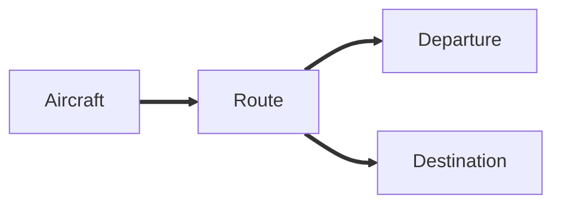
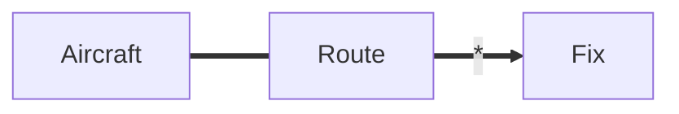
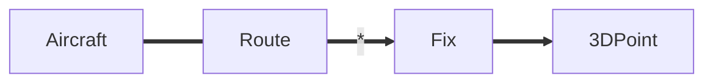
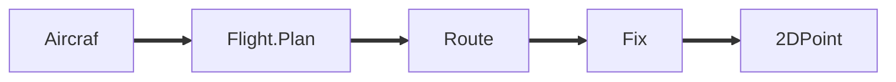

# 引言

这本书看了几十页了，真的看不懂，但是就是感觉很牛皮。一种说不上的感觉。建议第一遍看不懂的直接跳，别细读，第二遍再细读。

虽然只看了前几十页，但是里面说的一些东西的确是有所感悟，先记录下来。

> **消化知识**

这部分的重点是，面对自己陌生的领域，需要为这个领域开发一款软件，该如何学习、面对这个领域内庞大的知识。

- 建模
- 通过建模简化领域内的知识，对其进行抽象【不懂这个领域又怎么抽象？】书中的观点就是，建模可以简化领域内的业务，抽象出一个业务模型，根据这个业务模型进行交流开发【第一遍没读太懂】。

> **交流与语言的使用**

你是一名软件工程师，他是一名硬件工程师，现在要设计一个类似于PCB的软件，两者的知识体系相差这么大，如何交流？

设计一种通用的语言，用该种语言进行交流。

交流的过程中由于双方的知识体系不同，同一个术语其含义可能相差甚远，如何解决这种差异。定义通用的交流方式进行交流。

## 举例

多数的软件开发过程运用的都是贫血模型，把他当作面向过程来操作的。贫血模型开发方便，对开发人员的要求低。如  `JavaEE` 开发，开发人员熟悉三层架构后便可进行开发。主流的开发框架 Spring、Hibernate 等都鼓励使用贫血模型，因为理解了三层架构后，上手编码很快。

> 三层架构

- `Controller` 对外暴露服务接口。（doGet，doPost 通过等方式暴露服务接口，提供功能）
- `Service` 多数的业务代码都集中在 Service 中，其他两层代码少，属于贫血模型。大量的代码累积在 Service 层中，后期改动、维护、扩展相当不易，抽取的可重用组件也较少。
- `JavaBean` 可重用组件，但是在三层架构中仅仅是作为存储数据的对象。

我们倾向于把业务放在 Service 中。对于简单的项目用贫血模型是可以的，但是对于大型的软件架构这种方式是不合适的。

> 一种解决办法是，采用领域模型，即运用设计模式。

软件开发不是一蹴而就的事情，我们不可能在不了解产品（或行业领域）的前提下进行软件开发，在开发前需要进行大量的业务知识梳理，而后到达软件设计的层面，最后才是开发。在梳理业务的过程中，我们必然会形成某个领域知识，根据领域知识来一步一步驱动软件设计。领域驱动设计的核心就在于建立正确的领域驱动模型！

- 业务知识梳理：形成领域知识
- 软件设计：根据获取到的领域知识，驱动软件设计
- 开发：根据软件设计开发系统

**正如书名：领域驱动设计，应对软件复杂性之道。**

### 问题假设

假设某公司出售三种产品：文字处理软件、数据库、电子表格。其中：

- 文字处理软件当天入账
- 电子表格当天入1/3， 30天后再如1/3， 剩下的90天后再入账
- 数据库当天入1/3， 30天后再如1/3， 60天后再入账1/3

### 贫血模型

先来表设计，再利用三层架构，写代码。

> 为什么叫贫血模型？

- `JavaBean`中只有数据字段，`set/get`方法，无其他行为。
- 而充血模型`JavaBean`中是存在行为的~

> 优点：

- 简单、开发迅速、易于理解。
- 对于那些代码书写并不复杂的算法模型，采用贫血模型是很适合的。对于大型的工程化的代码，是否使用贫血模型有待考察。

> 缺点：

- 无法良好的应对复杂逻辑。
- 例如：在4月1号之前签订的合同要使用什么规则....和欧洲签订的合同使用另外一个规则..... 业务逻辑越复杂，service 层的代码也会越来越多，而其他层的代码不会有明显的变化，两头轻，中间（service）大。

**贫血模型对于业务逻辑不复杂的项目来说是值得选择的，不能完全排斥。**

### 领域驱动模型

DDD：DDD 是一种以领域为核心的设计和开发理念。DDD 通过维护一个深度反应领域概念的模型，以及提供了可行的经过实践检验的大量模式来应对领域的复杂性。

#### 领域模型

- 不是一个具体的图，而是那个图要传递的思想。
- 不是领域专家头脑中的知识，而是一个经过**严格组织并进行选择性抽象**的知识。
- 不是要建立一个尽可能符合“现实”的模型。

领域与业务密切相关，不同领域涉及的业务差别很大。业务是学习不完的，故采用领域的方式抽象出模型。领域与业务之间需要交流，人员之间的交流存在障碍，需要突破这层障碍。【现在的感觉是，外科医生式团队。高层人员交流，设计出领域模型，普通开发人员根据领域模型进行开发，减少开发成本。】

#### 通用语言

需要领域专家参与，仅靠用户文档是无法很好完成的~

- 专家有自己的行话
- 技术人员有自己的术语

我们需要一种通用的语言，让团队在交流时能达到一致。

#### 特点

- 对业务领域做了建模
    - 细粒度的类，易于扩展，容易复用
    - 可以应对复杂的业务逻辑
    - 需要经验才可以掌握
- 简单的领域模型
    - 几乎和数据库中的表一一对应
- 复杂的领域模型
    - 使用了继承、组合，设计模式等各种手段

领域驱动开发一开始并不考虑数据库表，先找业务领域中那些东西可以成为领域对象，领域实体。

业务简单的话，贫血模型更具优势~

## 空中交通监控项目

**开发人员：**我们想监考空中交通，应该从哪里开始？

**专家：**让我们从最基础的开始吧。所有交通由**飞机**组成。每架飞机从一个**出发点**起飞，并在一个**目的地**点着陆。

**开发人员：**飞行时，飞行员按照驾驶员的意愿选择任何空中路线吗？

**专家：**不，驾驶员需要按照他们收到的规定路径行驶。

**开发人员：**飞机是直线飞行吗？

**专家：**不是直线飞行，你可以想象成是一系列的**线段**组成的。每个线段的两端都是**方位**，所以模型应该这样：

**开发人员：**这样一来，出发地和目的地也包含在一个个**方位**中了。

**专家：**是的。

**开发人员：**把路线考虑成空中的3D线路。如果我们使用笛卡尔系统坐标，那么一条飞行路线会被简化成一系列的3D的点。

**专家：**笛卡尔？？

**开发人员：**。。。。

**专家：**实际上我们不会这样看待**飞行路线**。飞行路线是飞机预期的空中线路在地面上的映射。飞行路线会穿过一系列**地面上的点**，而这些点我们可以用经度和纬度来决定。

**开发人员：**哦，都是地球表面的点？我们用一些列2D的点来描述线路。

**开发人员：**飞机的飞行高度是否可以自行选择？

**专家：**不行。飞机在一个特定的**海拔高度**，会在**飞行计划**中有规定

**开发人员：**飞行计划？新名词？

**专家：**在离开机场之前，驾驶员会接到一个详细的**飞行计划**，包括所有关于此次飞行的信息：**飞行路线**，巡航高度、巡航速度和飞机的类型，甚至是机组成员的信息。

**开发人员：**飞行计划相当重要~

领域模型就建立起来了~

先建立通用语言，画出通用图，双方讨论，理解对方的意思。

## DDD分层架构

### 分层结构

| 层              | 说明                                                         |
| --------------- | ------------------------------------------------------------ |
| 用户界面/展现层 | 负责向用户展现信息以及解释用户命令                           |
| 应用层          | 很薄的一层，用来协调应用的活动。不包含业务逻辑。不保留业务对象的状态，但它保有应用任务的进度状态。 |
| 领域层          | 包含关于领域的信息。是业务软件的核心所在，在这里保留业务对象的状态，对业务对象和它们状态的持久化被委托给了基础设施层。 |
| 基础设施层      | 本层作为其他层的支撑库存在。它提供了层间的通信，实现对业务对象的持久化，包含对用户界面层的支撑库等作用。 |

贫血模型是各种领域的操作可能集中在一个 servcie 中进行。充血模型是每个领域只关注自己的事。把原来 service 中的逻辑移到领域中去了，不过领域要设计好才行~

### 领域层有什么

- 实体（Entity）【实体有丰富的业务行为~】
    - 对象不是由属性定义的，而是标志定义的~
    - 对象内容的变化不会影响标识符
    - 无论保存到硬盘，装入内存，通过网络发送，标识符都不变。

- 除了标识外，那些东西应该成为实体的属性？

    - 抓住实体对象定义的**最基本特征**，**用于识别，查找或匹配**对象的特征
    - **只添加那些对概念至关重要的行为和这些行为所需的属性**

- 领域服务

    - 有些**领域逻辑是动词**，表示了一种重要的行为很难映射为对象，无法归结到实体和值对象当中。
    - 例如：转账

    

# 运用领域模型

## 开篇

开篇主要是普及一些概念，并举例进行说明，便于读者理解。

- 模型：忽略细节，抽象出解决问题的方式（你要找出最大的十个数，排序->找数，而不是说明具体用何种排序，这种意思吗？）
- 软件程序：程序是为了解决用户的需求，用户应用软件的问题区域就是软件的领域。
- 软件的开发难免会涉及的自己不熟悉的业务。但只有了解这些业务知识才能开发好这些软件，这些业务知识缺过于庞大，令人望而生畏。
- 领域建模：出于某种目的而概括的反应现实。

领域驱动设计的三个基本用途

- 模型和设计的核心相互影响
- 模型是团队所有成员使用的通用语言中枢。尽管所用的语言可能千差万别，但是可以用模型这个通用的语言进行合适的交流。
- 模型是浓缩的知识

软件的核心

- 软件的核心说到底是为用户解决特定领域的一些问题。

下面的话，好真实，引起不适。

- 多数有才能的程序员，不会取学习工作相关的领域知识，而是去钻研技术，试图用技术解决领域问题。
  - 领域问题，这让我想起了淘宝技术这10年中的一个技术的演变。开始淘宝并没有特定的文件系统，后来由于业务的迅速增长，文件系统的问题愈发变的突出，只得自己研发合适的文件系统。这算不算技术解决领域问题？

**故事环节**

技术人员在意技术，可拓展性；用户在意便利性，两者之间可能存在某种冲突。

​	一部电影中的精彩片段，差点因为一个剪辑师的“专业性”而被删除。这中导演和剪辑师专业性的差异，在现代的软件开发中或许是很常见的。技术人员在意的是技术上的问题，如何更加高效，拓展性更强，而用户在意的确实使用方式和是否便利。这种差异性让开发人员和用户直接的矛盾显得特别的突出。我们要理解领域模型，理解领域核心的领导者可以将项目带回到正确的轨道上。

---

开发人员可以采用一些系统性的思考方法来透彻地理解领域并开发出有效的模型

---

## 消化知识

交流，抓住重点，设计或使用一种通用的描述语言进行交流。【理解方面也会存在偏差吧。】

### 问题

> **不同技术人员的专业技能上的差异，带来交流上的困难。**

几年前，我着手设计一个用于设计印制电路板（PCB）的专用软件工具。但有一个问题，我对电子硬件一无所知。当然，我也曾拜访过一些PCB设计师，但用不了3分钟，他们就令我晕头转向。如何才能了解足够多的知识，以便开始编写这个软件呢？当然，我并不打算在交付期限到来之前成为电子工程师。

他们可能是个硬件高手，但是对软件他们的知识可能很匮乏。

### 解决过程

- 从报告中看到希望，以此为突破口进行交流。
- 对不清楚的地方，存在错误的地方进行询问和校正。
  - 在交流和校正的过程中，学习他们的知识，以便后面更好的交流。
  - 反复尝试和修改，给出模型，交流模型中的错误和不足。
  - 那些问题当前必须考虑，那些问题可暂时搁置。
- 头脑风暴式的讨论，精化模型，双方在讨论中对领域的理解逐渐加深。
  - 头脑风暴：汇聚会议中不同人的观点，从中产生新的创意点。
- 当PCB工程师提出新的功能需求时，我就让他们带我走查对象交互的场景。当模型对象无法清楚地表达某个重要场景时，我们就通过头脑风暴活动创建新的模型对象或者修改原有的模型对象，并消化理解这些模型对象中的知识。在我们精化模型的过程中，代码也随之一步步演进。几个月后，PCB工程师们得到了一个远远超乎他们期望的功能丰富的工具

### 有效建模的要素

- 模型和实现的绑定。
- 建立了一种基于模型的语言，可通过这种语言无阻碍的交流。
  - 这种语言的建立所花费的时间经历？
  - UML？
- 开发一个蕴含丰富知识的模型
- 提炼模型：重要概念不断加入到模型，不使用 不重要的概念从模型中慢慢移除。
- 头脑风暴 + 实验

