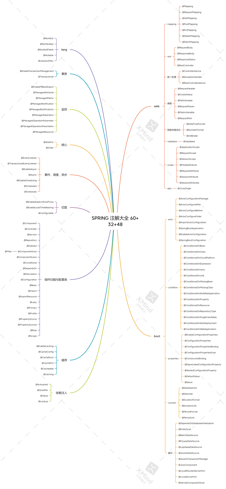

# 杂记

## bitmap

[Bitmap简介 - 废物大师兄 - 博客园 (cnblogs.com)](https://www.cnblogs.com/cjsblog/p/11613708.html)

- 开源实现
    - jdk 的 java.util.Bitset
    - 谷歌的 EWAHCompressedBitmap
    - redis 的 bitmap
- 优点
    - 排序、查找、去重等运算效率高
    - 占用内存空间低
- 缺点
    - 结果数据不能重复，相当于就是去重过的数据
    - 如果数据只有两个：1和1008611 使用bitmap回浪费空间。只有当数据比较密集的时候才有优势。

## 判断数据是否存在

如何判断一个数是否在40亿个整数中 / 如何从2亿个手机号中判断某个手机号是否存在。

- set 判断，耗内存，需要大内存的机器或多台机器。
- bitmap，40依个不重复的int，一个int4字节，开$2^{32}$次个位的bitmap。用位的值0还是1表示值为该索引的整数在不在。内存占用上，$2^{32}方个位，相当于2^{29}次方个字节大概500mb$

# 网络

自顶向下；看书补充

> OSI开发式互联参考模型


# 数据库

## 如何设计一个关系型数据库


## 索引模块

### 为什么要使用索引

- 加快数据的检索。

> 什么信息可以作为索引

# Redis

> Redis 如何实现分布式锁

不知道网上是怎么实现的，这里给出一个我个人的想法：

- Redis 是一个高性能的单线程非关系型数据库，单线程也意味着没有并发操作，Redis 内部的操作都是线程安全的。
- 我们可以在 Redis 中设置某些标记作为分布式锁的标记；多个服务器同时向 Redis 发送请求。
- 比如：此时 10 台服务器争抢分布式锁，这 10 台服务器同时向 Redis 发送一个设置 key 的命令，第一个设置成功的就是拿到分布式锁的，没设置成功的就是没拿到分布式锁的。
- 拿到了锁，又如何释放呢？
    - 法一：拿到锁的服务器，再发送一次 设置 key 的命令，将锁状态置为未加锁。
    - 法而：直接给 key 设置过期时间，过期了就表示锁被释放了，可以重新竞争

> Redis 如何实现异步消息队列

用 `Redis` 的 list 数据结构先进先出的特点，可以实现一个消息队列，`rpush` 生产消息，`lpop` 消费消息。

- 当 `lpop` 没拿到消息，说明没有消息了；没有等待队列有值就直接消费
- 可以通过在应用层加入 sleep 机制去调用 `lpop` 重试。也可以 `blpop` 阻塞直到队列有消息或者超时。
- 缺点：每个消息只能供一个消费者消费。

`Redis` 的 pub/sub 模式可以实现一对多的消费队列。

- 发送者（pub）发送消息，订阅者（sub）接收消息
- 订阅者可以订阅任意数量的频道
- 缺点：消息的发布是无状态的，无法保证可达。


> Redis 持久化

RDB（快照）持久化：保存某个时间点的全量数据快照。

```shell
save 900 1 # 900s 有一条写入 就备份
save 300 10 # 300s 有十条写入 就备份
save 60 10000 # 60s 有一万条写入 就备份 多个配置是怕数据的写入不规律，为了平衡性能和数据安全。

stop-writes-on-bgsave-error yes # 如果备份出现错误，主线程就停止接收新的写入操作

rdbcompression yes # 先压缩，再备份。一般我们是选择 no
```

> Redis 集群原理

- 分片：按照某种规则去划分数据，分散存储在多个节点上。
- 常规的按照哈希划分无法实现节点的动态增减（当增加或减少一个节点时，会造成大量的 key 无法被命中）
- 一致性哈希算法：对 2^32 取模。将哈希值空间组织成虚拟的圆环。

将多台服务器，计算 hash 值后，分布在这个哈希环中。数据也进行 hash 计算，看数据顺时针走，将数据存储在距离最近的服务器上。这样会有一个问题，可能大量的数据都堆积在了一台服务器上。这种情况，为每台服务器设置多个 node 节点即可。

> Redis 的 Pipeline

- Pipeline 和 Linux 的管道类似；批量执行成千上万的命令。
- `Redis` 基于请求\响应模型，单个请求处理需要一一应答
- Pipeline 批量执行指令，节省多次 IO 往返时间（就是，批量发送多条命令，最后将批量的结果返回）
- 有顺序依赖的指令建议分批发送。

> Redis 的同步机制

**主动同步原理**

- 一个 Master 写，多个 Slave 读。数据之间是弱一致性的，但是最终会趋于同步（最终一致性）。
- 全量同步
    - Salve 发送 sync 命令到 Master
    - Master 启动一个后台进程，将 Redis 中的数据快照保存到文件中
    - Master 将保存数据快照期间接收到的写命令缓存起来（就是缓存增量数据）
    - Master 完成写文件操作后，将该文件发送给 Salve
    - 使用新的 AOF 文件替换旧的 AOF 文件。
    - Master 将这期间收集的增量写命令发送给 Salve 端
- 增量同步过程
    - Master 接收到用户的操作指令，判断是否需要传播到 Slave
    - 将操作记录追加到 AOF 文件
    - 将操作传播到其他 Slave：1、对齐主从库；2、往响应缓存写入指令
    - 将缓存中的数据发送给 Slave
- Redis Sentinel：解决主从同步 Master 宕机后的主从切换问题，发现 Master 宕机后可以进行自动切换
    - 监控：检查主从服务器是否运行正常
    - 提醒：通过 API 向管理员或者其他应用程序发送故障通知
    - 自动故障迁移：主从切换，将一个从服务器升级为主服务器；将原来的 Slave 改为复制新的 Master；当集群试图连接宕机的主服务器时，会返回一个新的 Master 给他。
- 流言协议 Gossip：在杂乱无章中寻求一致
    - 每个节点都随机地与对方通信，最终所有节点的状态达成一致。
    - 种子阶段定期随机向其他节点发送节点列表以及需要传播的消息。
    - 不保证信息一定会传递给所有节点，但是最终会趋于一致。

# Linux

## Linux的体系结构


## 指令

- `man 2 syscalls` 查看所有的系统调用
- `which ls` 查看 ls 所在的位置
- `less 文件` 查看部分文件
- `cat /etc/shells` 查看支持哪些 shells 版本
- `chsh -s shell 路径`，切换为某个 shell

> 查找文件

`find path [options] params` 在指定目录查找文件

```bash
find -name "target.java" # 当前目录为根目录进行搜索

find / -name "target.java" # 全局搜索  / 表示根目录

find ~ -name "target*" # 当前用户 home 目录 以 target 打头的文件

find ~ -iname "target*" # 不区分文件大小写查找
```

> 检索文件内容

`grep [options] pattern file`

- 全称：Global Regular Expression Print
- 作用：查找文件里符合条件的字符串，只会筛选目标字符所在的行。

```bash
grep "moo" target* # 在 target 开头的文件中 查找 moo；默认在当前目录查找
```


> 管道操作符 |

- 可将指令连接起来，前一个指令的输出作为后一个指令的输入；只处理前一个命令的正确输出，不处理错误输出。

- 如：查找文件中，文件名包含 h 的文件

    

- 从日志中筛选信息
- `grep 'demo\[true\]' de.log` 从日志中筛选 demo[true] 的数据 
- `grep -o 'engine\[[0-9a-z]*\]'` 筛选出正则表达式中的内容
- `grep -v 'grep'` 过滤掉包含 `grep` 的内容

> 对文件内容做统计

`awk [option] 'cmd' file`

- 一次读取一行文件，按输入分隔符进行切片，切成多个组成部分
- 将切片直接保存在内建的变量中，`$1$2...（$0表示行的全部）`
- 支持对单个切片的判断，支持循环判断，默认分隔符为空格

```bash
# 查看 demo.txt 中 第一列 和 第三列的信息
awk '{print $1,$3}' demo.txt

# 打印第一列等于 TCP，第三列等于 sf 的第0列的信息
awk '$1=="tcp" && $3=="sf" {print $0}' demo.txt 

# 对内容逐行做统计操作
```

> 批量替换文本内容

`sed [option] 'sed command' filename`

- 全名 stream editor，流编辑器
- 适合用于对文本内容进行处理

```bash
# 将 replace.java 中的 Str 开头的替换为 String，默认时把替换的结果输出到控制台
sed 's/^Str/String/' replace.java

# -i 则会将文本中的内容替换
sed -i 's/^Str/String/' replace.java

# 筛选出 . 结尾的行，并将 . 替换为 ;
sed -i 's/\.$/\;/' replace.java

# 筛选出包含 Jack 的字符串行，并将 Jack 替换为 me g表示全局替换，即所有的 Jack 都替换为 me
sed -i 's/Jack/me/g' replace.java

# 删除文本中的 Integer 所在的行
sed -i '/Integer/d' replace.java
```

# Java SE

## Java 的理解

- 平台无关
    - Java 代码 --> 字节码 --> 不同OS的JVM进行解析；用的同一套解析规则 --> JVM 将字节码转成具体平台上的机器指令
- GC
- 语言特性
    - 泛型、反射、lambda
- 面向对象
    - 继承、封装、多态
- 类库
    - 集合、JUC、IO、NIO
- 异常处理

## loadClass 和 forName 的区别

Class.forName 得到的 class 是已经初始化完成的。

Classloader.loadClass 得到的 class 是还没有链接的。

可以用 静态代码块进行验证。

```java
public class ClassDemo {

    public static void main(String[] args) throws ClassNotFoundException {
        // 输出 init
        Class<?> aClass = Class.forName("com.payphone.Demo");
    }
}

class Demo {
    static {
        System.out.println("init");
    }
}
```

```java
public class ClassDemo {

    public static void main(String[] args) throws ClassNotFoundException, InstantiationException, IllegalAccessException {
        ClassLoader classLoader = Demo.class.getClassLoader();
        Class<?> aClass = classLoader.loadClass("com.payphone.Demo"); // 不会打印数据
        // Spring IOC 在资源加载器获取要加载的资源时，获取 bean 的配置信息的时候，如果是以 classpath 的方式来加载，就需要使用 loadClass 延迟加载，加快加载速度。
        // 为了加快加载速度，Spring IOC 使用了 loadClass，这样不会加载类，节省了时间，需要使用时，再进行类的加载。
    }
}

class Demo {
    static {
        System.out.println("init");
    }
}
```

## 二分查找

**要求**

* 能够用自己语言描述二分查找算法
* 能够手写二分查找代码
* 能够解答一些变化后的考法

**算法描述**

1. 前提：有已排序数组 A（假设已经做好）

2. 定义左边界 L、右边界 R，确定搜索范围，循环执行二分查找（3、4两步）

3. 获取中间索引 M = Floor((L+R) /2)

4. 中间索引的值  A[M] 与待搜索的值 T 进行比较

    ① A[M] == T 表示找到，返回中间索引

    ② A[M] > T，中间值右侧的其它元素都大于 T，无需比较，中间索引左边去找，M - 1 设置为右边界，重新查找

    ③ A[M] < T，中间值左侧的其它元素都小于 T，无需比较，中间索引右边去找， M + 1 设置为左边界，重新查找

5. 当 L > R 时，表示没有找到，应结束循环

> *更形象的描述请参考：binary_search.html*

**算法实现**

```java
public static int binarySearch(int[] a, int t) {
    int l = 0, r = a.length - 1, m;
    while (l <= r) {
        m = (l + r) / 2;
        if (a[m] == t) {
            return m;
        } else if (a[m] > t) {
            r = m - 1;
        } else {
            l = m + 1;
        }
    }
    return -1;
}
```

**测试代码**

```java
public static void main(String[] args) {
    int[] array = {1, 5, 8, 11, 19, 22, 31, 35, 40, 45, 48, 49, 50};
    int target = 47;
    int idx = binarySearch(array, target);
    System.out.println(idx);
}
```

**解决整数溢出问题**

当 l 和 r 都较大时，`l + r` 有可能超过整数范围，造成运算错误，解决方法有两种：

```java
int m = l + (r - l) / 2;
```

还有一种是：

```java
int m = (l + r) >>> 1;
```

**其它考法**

1. 有一个有序表为 1,5,8,11,19,22,31,35,40,45,48,49,50 当二分查找值为 48 的结点时，查找成功需要比较的次数 

2. 使用二分法在序列 1,4,6,7,15,33,39,50,64,78,75,81,89,96 中查找元素 81 时，需要经过（   ）次比较

3. 在拥有128个元素的数组中二分查找一个数，需要比较的次数最多不超过多少次

对于前两个题目，记得一个简要判断口诀：奇数二分取中间，偶数二分取中间靠左。对于后一道题目，需要知道公式：

$$n = log_2N = log_{10}N/log_{10}2$$

其中 n 为查找次数，N 为元素个数

## 冒泡排序

**要求**

* 能够用自己语言描述冒泡排序算法
* 能够手写冒泡排序代码
* 了解一些冒泡排序的优化手段

**算法描述**

1. 依次比较数组中相邻两个元素大小，若 a[j] > a[j+1]，则交换两个元素，两两都比较一遍称为一轮冒泡，结果是让最大的元素排至最后
2. 重复以上步骤，直到整个数组有序

> *更形象的描述请参考：bubble_sort.html*

**算法实现**

```java
public static void bubble(int[] a) {
    for (int j = 0; j < a.length - 1; j++) {
        // 一轮冒泡
        boolean swapped = false; // 是否发生了交换
        for (int i = 0; i < a.length - 1 - j; i++) {
            System.out.println("比较次数" + i);
            if (a[i] > a[i + 1]) {
                Utils.swap(a, i, i + 1);
                swapped = true;
            }
        }
        System.out.println("第" + j + "轮冒泡"
                           + Arrays.toString(a));
        if (!swapped) {
            break;
        }
    }
}
```

* 优化点1：每经过一轮冒泡，内层循环就可以减少一次
* 优化点2：如果某一轮冒泡没有发生交换，则表示所有数据有序，可以结束外层循环

**进一步优化**

```java
public static void bubble_v2(int[] a) {
    int n = a.length - 1;
    while (true) {
        int last = 0; // 表示最后一次交换索引位置
        for (int i = 0; i < n; i++) {
            System.out.println("比较次数" + i);
            if (a[i] > a[i + 1]) {
                Utils.swap(a, i, i + 1);
                last = i;
            }
        }
        n = last;
        System.out.println("第轮冒泡"
                           + Arrays.toString(a));
        if (n == 0) {
            break;
        }
    }
}
```

* 每轮冒泡时，最后一次交换索引可以作为下一轮冒泡的比较次数，如果这个值为零，表示整个数组有序，直接退出外层循环即可

## 选择排序

**要求**

* 能够用自己语言描述选择排序算法
* 能够比较选择排序与冒泡排序
* 理解非稳定排序与稳定排序

**算法描述**

1. 将数组分为两个子集，排序的和未排序的，每一轮从未排序的子集中选出最小的元素，放入排序子集

2. 重复以上步骤，直到整个数组有序

> *更形象的描述请参考：selection_sort.html*

**算法实现**

```java
public static void selection(int[] a) {
    for (int i = 0; i < a.length - 1; i++) {
        // i 代表每轮选择最小元素要交换到的目标索引
        int s = i; // 代表最小元素的索引
        for (int j = s + 1; j < a.length; j++) {
            if (a[s] > a[j]) { // j 元素比 s 元素还要小, 更新 s
                s = j;
            }
        }
        if (s != i) {
            swap(a, s, i);
        }
        System.out.println(Arrays.toString(a));
    }
}
```

* 优化点：为减少交换次数，每一轮可以先找最小的索引，在每轮最后再交换元素

**与冒泡排序比较**

1. 二者平均时间复杂度都是 $O(n^2)$

2. 选择排序一般要快于冒泡，因为其交换次数少

3. 但如果集合有序度高，冒泡优于选择

4. 冒泡属于稳定排序算法，而选择属于不稳定排序
    * 稳定排序指，按对象中不同字段进行多次排序，不会打乱同值元素的顺序
    * 不稳定排序则反之

**稳定排序与不稳定排序**

```java
System.out.println("=================不稳定================");
Card[] cards = getStaticCards();
System.out.println(Arrays.toString(cards));
selection(cards, Comparator.comparingInt((Card a) -> a.sharpOrder).reversed());
System.out.println(Arrays.toString(cards));
selection(cards, Comparator.comparingInt((Card a) -> a.numberOrder).reversed());
System.out.println(Arrays.toString(cards));

System.out.println("=================稳定=================");
cards = getStaticCards();
System.out.println(Arrays.toString(cards));
bubble(cards, Comparator.comparingInt((Card a) -> a.sharpOrder).reversed());
System.out.println(Arrays.toString(cards));
bubble(cards, Comparator.comparingInt((Card a) -> a.numberOrder).reversed());
System.out.println(Arrays.toString(cards));
```

都是先按照花色排序（♠♥♣♦），再按照数字排序（AKQJ...）

* 不稳定排序算法按数字排序时，会打乱原本同值的花色顺序

    ```
    [[♠7], [♠2], [♠4], [♠5], [♥2], [♥5]]
    [[♠7], [♠5], [♥5], [♠4], [♥2], [♠2]]
    ```

    原来 ♠2 在前 ♥2 在后，按数字再排后，他俩的位置变了

* 稳定排序算法按数字排序时，会保留原本同值的花色顺序，如下所示 ♠2 与 ♥2 的相对位置不变

    ```
    [[♠7], [♠2], [♠4], [♠5], [♥2], [♥5]]
    [[♠7], [♠5], [♥5], [♠4], [♠2], [♥2]]
    ```


## 插入排序

**要求**

* 能够用自己语言描述插入排序算法
* 能够比较插入排序与选择排序

**算法描述**

1. 将数组分为两个区域，排序区域和未排序区域，每一轮从未排序区域中取出第一个元素，插入到排序区域（需保证顺序）

2. 重复以上步骤，直到整个数组有序

> *更形象的描述请参考：insertion_sort.html*

**算法实现**

```java
// 修改了代码与希尔排序一致
public static void insert(int[] a) {
    // i 代表待插入元素的索引
    for (int i = 1; i < a.length; i++) {
        int t = a[i]; // 代表待插入的元素值
        int j = i;
        System.out.println(j);
        while (j >= 1) {
            if (t < a[j - 1]) { // j-1 是上一个元素索引，如果 > t，后移
                a[j] = a[j - 1];
                j--;
            } else { // 如果 j-1 已经 <= t, 则 j 就是插入位置
                break;
            }
        }
        a[j] = t;
        System.out.println(Arrays.toString(a) + " " + j);
    }
}
```

**与选择排序比较**

1. 二者平均时间复杂度都是 $O(n^2)$

2. 大部分情况下，插入都略优于选择

3. 有序集合插入的时间复杂度为 $O(n)$

4. 插入属于稳定排序算法，而选择属于不稳定排序

**提示**

> *插入排序通常被同学们所轻视，其实它的地位非常重要。小数据量排序，都会优先选择插入排序*

## 希尔排序

**要求**

* 能够用自己语言描述希尔排序算法

**算法描述**

1. 首先选取一个间隙序列，如 (n/2，n/4 … 1)，n 为数组长度

2. 每一轮将间隙相等的元素视为一组，对组内元素进行插入排序，目的有二

    ① 少量元素插入排序速度很快

    ② 让组内值较大的元素更快地移动到后方

3. 当间隙逐渐减少，直至为 1 时，即可完成排序

> *更形象的描述请参考：shell_sort.html*

**算法实现**

```java
private static void shell(int[] a) {
    int n = a.length;
    for (int gap = n / 2; gap > 0; gap /= 2) {
        // i 代表待插入元素的索引
        for (int i = gap; i < n; i++) {
            int t = a[i]; // 代表待插入的元素值
            int j = i;
            while (j >= gap) {
                // 每次与上一个间隙为 gap 的元素进行插入排序
                if (t < a[j - gap]) { // j-gap 是上一个元素索引，如果 > t，后移
                    a[j] = a[j - gap];
                    j -= gap;
                } else { // 如果 j-1 已经 <= t, 则 j 就是插入位置
                    break;
                }
            }
            a[j] = t;
            System.out.println(Arrays.toString(a) + " gap:" + gap);
        }
    }
}
```

**参考资料**

* https://en.wikipedia.org/wiki/Shellsort

## 快速排序

**要求**

* 能够用自己语言描述快速排序算法
* 掌握手写单边循环、双边循环代码之一
* 能够说明快排特点
* 了解洛穆托与霍尔两种分区方案的性能比较

**算法描述**

1. 每一轮排序选择一个基准点（pivot）进行分区
    1. 让小于基准点的元素的进入一个分区，大于基准点的元素的进入另一个分区
    2. 当分区完成时，基准点元素的位置就是其最终位置
2. 在子分区内重复以上过程，直至子分区元素个数少于等于 1，这体现的是分而治之的思想 （[divide-and-conquer](https://en.wikipedia.org/wiki/Divide-and-conquer_algorithm)）
3. 从以上描述可以看出，一个关键在于分区算法，常见的有洛穆托分区方案、双边循环分区方案、霍尔分区方案

> *更形象的描述请参考：quick_sort.html*

**单边循环快排（lomuto 洛穆托分区方案）**

1. 选择最右元素作为基准点元素

2. j 指针负责找到比基准点小的元素，一旦找到则与 i 进行交换

3. i 指针维护小于基准点元素的边界，也是每次交换的目标索引

4. 最后基准点与 i 交换，i 即为分区位置

```java
public static void quick(int[] a, int l, int h) {
    if (l >= h) {
        return;
    }
    int p = partition(a, l, h); // p 索引值
    quick(a, l, p - 1); // 左边分区的范围确定
    quick(a, p + 1, h); // 左边分区的范围确定
}

private static int partition(int[] a, int l, int h) {
    int pv = a[h]; // 基准点元素
    int i = l;
    for (int j = l; j < h; j++) {
        if (a[j] < pv) {
            if (i != j) {
                swap(a, i, j);
            }
            i++;
        }
    }
    if (i != h) {
        swap(a, h, i);
    }
    System.out.println(Arrays.toString(a) + " i=" + i);
    // 返回值代表了基准点元素所在的正确索引，用它确定下一轮分区的边界
    return i;
}
```

**双边循环快排（不完全等价于 hoare 霍尔分区方案）**

1. 选择最左元素作为基准点元素
2. j 指针负责从右向左找比基准点小的元素，i 指针负责从左向右找比基准点大的元素，一旦找到二者交换，直至 i，j 相交
3. 最后基准点与 i（此时 i 与 j 相等）交换，i 即为分区位置

要点

1. 基准点在左边，并且要先 j 后 i

2. while( **i** **< j** && a[j] > pv ) j-- 
3. while ( **i** **< j** && a[i] **<=** pv ) i++

```java
private static void quick(int[] a, int l, int h) {
    if (l >= h) {
        return;
    }
    int p = partition(a, l, h);
    quick(a, l, p - 1);
    quick(a, p + 1, h);
}

private static int partition(int[] a, int l, int h) {
    int pv = a[l];
    int i = l;
    int j = h;
    while (i < j) {
        // j 从右找小的
        while (i < j && a[j] > pv) {
            j--;
        }
        // i 从左找大的
        while (i < j && a[i] <= pv) {
            i++;
        }
        swap(a, i, j);
    }
    swap(a, l, j);
    System.out.println(Arrays.toString(a) + " j=" + j);
    return j;
}
```

**快排特点**

1. 平均时间复杂度是 $O(nlog_2⁡n )$，最坏时间复杂度 $O(n^2)$

2. 数据量较大时，优势非常明显

3. 属于不稳定排序

**洛穆托分区方案 vs 霍尔分区方案**

* 霍尔的移动次数平均来讲比洛穆托少3倍
* https://qastack.cn/cs/11458/quicksort-partitioning-hoare-vs-lomuto

> ***补充代码说明***
>
> * day01.sort.QuickSort3 演示了空穴法改进的双边快排，比较次数更少
> * day01.sort.QuickSortHoare 演示了霍尔分区的实现
> * day01.sort.LomutoVsHoare 对四种分区实现的移动次数比较

## `ArrayList` 扩容规则

### 扩容规则

- ArrayList() 会使用长度为零的数组。即：使用空参构造方法初始化 ArrayList 时，不会创建数组，第一次添加元素时，才会创建一个容量为 10 的数组。
- ArrayList(int initialCapacity) 会使用指定容量的数组。
- public ArrayList(Collection<? extends E> c) 会使用 c 的大小作为数组容量。
- add(Object o) 首次扩容为10，再次扩容为上次容量的 1.5 倍
- addAll(Collection c) 首次扩容为 Math.max(10, 实际元素个数)
- addAll(Collection c) 再次扩容（有元素时）为 Math.max(原容量 1.5 倍, 实际元素个数)
    - 举例：容量为10，已有10个元素，addAll(三个)，最后会在13 和 15 之间选个最大值。（coding）
    - `list.addAll(list.of(1,2,3,4,5,6,7,8,9,10,11));` ，最后会在 11 和 10 直接选个最大值（如果是无参构造创建`ArrayList`,则第一次扩容是直接扩容成10）。
- fail-fast 与 fail-safe
    - ArrayList 是 fail-fast 的典型代表，遍历的同时不能修改，尽快失败
    - CopyOnWriteArrayList 是 fail-safe 的典型代表，遍历的同时可以修改，原理是读写分离。

### 迭代遍历

Iterator FailFast FailSafe

- fail-fast 一旦发现遍历的同时其他人来修改，则立刻抛异常。【ArrayList 演示】
- fail-safe 发现遍历的同时其它人来修改，应当能有对应策略，例如牺牲一致性来让整个遍历运行完成。【CopyOnWriteArrayList 演示】

通过判断循环开始时和循环遍历过程中，数组的修改次数是否一致，不一致说明被修改了，抛出并发修改异常。

### fail-fast 的实现

ArrayList 内部维护了一个 modCount，记录了 ArrayList 被操作了多少次。Iterator 内部也维护了一个 expectedModCount，初始值为 modCount。如果迭代的过程中发现 expectedModCount 和 modCount 不一样，说明被修改了，抛出并发修改异常。

### fail-safe 的实现

遍历的同时可以修改，实现原理是读写分离；遍历是一个数组，添加又是另一个数组。（CopyOnWriter）

## LinkedList

### ArrayList vs LinkedList

- ArrayList
    - 基于数组，需要连续内存
    - 随机访问快
    - 尾部插入、删除性能可以；其他部分插入、删除都会移动数据，性能低
    - 可以利用 CPU 缓存，局部性原理
- LinkedList
    - 基于双向链表，无需内存连续
    - 随机访问慢（要沿着链表遍历）
    - 头尾插入删除性能高
    - 占用内存多

## HashMap

**要求**

* 掌握 HashMap 的基本数据结构
* 掌握树化
* 理解索引计算方法、二次 hash 的意义、容量对索引计算的影响
* 掌握 put 流程、扩容、扩容因子
* 理解并发使用 HashMap 可能导致的问题
* 理解 key 的设计

### 基本数据结构

> 底层数据结构，1.7 & 1.8

- 1.7：数组+链表
- 1.8：数组+（链表 | 红黑树）

> 为何要用红黑树，为何一上来不树化，树化阈值为何是8，何时被树化，何时会退化为链表？

链表短的时候，性能是比红黑树要高的。而且红黑树节点占用的内存也较大。

### 树化与退化

**树化意义**

* 红黑树用来避免 DoS 攻击，防止链表超长时性能下降，树化应当是偶然情况，是保底策略
* hash 表的查找，更新的时间复杂度是 $O(1)$，而红黑树的查找，更新的时间复杂度是 $O(log_2⁡n )$，TreeNode 占用空间也比普通 Node 的大，如非必要，尽量还是使用链表
* hash 值如果足够随机，则在 hash 表内按泊松分布，在负载因子 0.75 的情况下，长度超过 8 的链表出现概率是 0.00000006，树化阈值选择 8 就是为了让树化几率足够小

**树化规则**

* 当链表长度超过树化阈值 8 时，先尝试扩容来减少链表长度，如果数组容量已经 >=64，才会进行树化。
* 链表长度为8，数组容量<64，不会树化，会扩容数组。链表长度为8，且数组容量已经>=64，会进行树化。

**退化规则**

* 情况1：在扩容时如果拆分树时，树元素个数 <= 6 则会退化链表
* 情况2：remove 树节点时，若 root、root.left、root.right、root.left.left 有一个为 null ，也会退化为链表

### 索引计算

**索引计算方法**

* 首先，计算对象的 hashCode()
* 再进行调用 HashMap 的 hash() 方法进行二次哈希
    * 二次 hash() 是为了综合高位数据，让哈希分布更为均匀
* 最后 & (capacity – 1) 得到索引

**为什么要二次哈希**

- 为了尽可能的确保数据不聚集在一起，让数据的分布经可能的均匀。

**数组容量为何是 2 的 n 次幂**

1. 计算索引时效率更高：如果是 2 的 n 次幂可以使用位与运算代替取模
2. 扩容时重新计算索引效率更高： hash & oldCap == 0 的元素留在原来位置 ，否则新位置 = 旧位置 + oldCap

**注意**

* 二次 hash 是为了配合 **容量是 2 的 n 次幂** 这一设计前提，如果 hash 表的容量不是 2 的 n 次幂，则不必二次 hash
* **容量是 2 的 n 次幂** 这一设计计算索引效率更好，但 hash 的分散性就不好，需要二次 hash 来作为补偿，没有采用这一设计的典型例子是 Hashtable。
* 比如：1000个偶数，放到容量为16的 hashmap中，无论怎么取模，定位到的 index 都不可能是奇数。而容量为11 13 15 就不会存在这种情况。
* <span style="color:red">如果希望效率高，那么map数组容量取2的n次幂；如果希望hash分布性较好，那么map数组的容量应该尽量取一个较好的质数。</span>

### put 与扩容

**put 流程**

1. HashMap 是懒惰创建数组的，首次使用才创建数组
2. 计算索引（桶下标）
3. 如果桶下标还没人占用，创建 Node 占位返回
4. 如果桶下标已经有人占用
    1. 已经是 TreeNode 走红黑树的添加或更新逻辑
    2. 是普通 Node，走链表的添加或更新逻辑，如果链表长度超过树化阈值，走树化逻辑
5. 返回前检查容量是否超过阈值，一旦超过进行扩容（添加完元素后再扩容，然后再重新计算元素的下标，进行迁移。）

**1.7 与 1.8 的区别**

1. 链表插入节点时，1.7 是头插法，1.8 是尾插法

2. 1.7 是大于等于阈值且没有空位（计算的index下已经有数据的意思，不是所有index下都有数据。）时才扩容，而 1.8 是大于阈值就扩容

3. 1.8 在扩容计算 Node 索引时，会优化

**扩容（加载）因子为何默认是 0.75f**

1. 在空间占用与查询时间之间取得较好的权衡
2. 大于这个值，空间节省了，但链表就会比较长，影响性能
3. 小于这个值，冲突减少了，但扩容就会更频繁，空间占用也更多

### 并发问题

**扩容死链（1.7 会存在）**

1.7 源码如下：

```java
void transfer(Entry[] newTable, boolean rehash) {
    int newCapacity = newTable.length;
    for (Entry<K,V> e : table) {
        while(null != e) {
            Entry<K,V> next = e.next;
            if (rehash) {
                e.hash = null == e.key ? 0 : hash(e.key);
            }
            int i = indexFor(e.hash, newCapacity);
            e.next = newTable[i];
            newTable[i] = e;
            e = next;
        }
    }
}
```

* e 和 next 都是局部变量，用来指向当前节点和下一个节点
* 线程1（绿色）的临时变量 e 和 next 刚引用了这俩节点，还未来得及移动节点，发生了线程切换，由线程2（蓝色）完成扩容和迁移


* 线程2 扩容完成，由于头插法，链表顺序颠倒。但线程1 的临时变量 e 和 next 还引用了这俩节点，还要再来一遍迁移


* 第一次循环
    * 循环接着线程切换前运行，注意此时 e 指向的是节点 a，next 指向的是节点 b
    * e 头插 a 节点，注意图中画了两份 a 节点，但事实上只有一个（为了不让箭头特别乱画了两份）
    * 当循环结束是 e 会指向 next 也就是 b 节点


* 第二次循环
    * next 指向了节点 a
    * e 头插节点 b
    * 当循环结束时，e 指向 next 也就是节点 a


* 第三次循环
    * next 指向了 null
    * e 头插节点 a，**a 的 next 指向了 b**（之前 a.next 一直是 null），b 的 next 指向 a，死链已成
    * 当循环结束时，e 指向 next 也就是 null，因此第四次循环时会正常退出


**数据错乱（1.7，1.8 都会存在）**

* 代码参考 `day01.map.HashMapMissData`，具体调试步骤参考视频

### key 的设计

**key 的设计要求**

1. HashMap 的 key 可以为 null，但 Map 的其他实现则不然
2. 作为 key 的对象，必须实现 hashCode 和 equals，并且 key 的内容不能修改（不可变）
3. key 的 hashCode 应该有良好的散列性

如果 key 可变，例如修改了 age 会导致再次查询时查询不到

```java
public class HashMapMutableKey {
    public static void main(String[] args) {
        HashMap<Student, Object> map = new HashMap<>();
        Student stu = new Student("张三", 18);
        map.put(stu, new Object());

        System.out.println(map.get(stu));

        stu.age = 19;
        System.out.println(map.get(stu));
    }

    static class Student {
        String name;
        int age;

        public Student(String name, int age) {
            this.name = name;
            this.age = age;
        }

        public String getName() {
            return name;
        }

        public void setName(String name) {
            this.name = name;
        }

        public int getAge() {
            return age;
        }

        public void setAge(int age) {
            this.age = age;
        }

        @Override
        public boolean equals(Object o) {
            if (this == o) return true;
            if (o == null || getClass() != o.getClass()) return false;
            Student student = (Student) o;
            return age == student.age && Objects.equals(name, student.name);
        }

        @Override
        public int hashCode() {
            return Objects.hash(name, age);
        }
    }
}
```

**String 对象的 hashCode() 设计**

* 目标是达到较为均匀的散列效果，每个字符串的 hashCode 足够独特
* 字符串中的每个字符都可以表现为一个数字，称为 $S_i$，其中 i 的范围是 0 ~ n - 1 
* 散列公式为： $S_0∗31^{(n-1)}+ S_1∗31^{(n-2)}+ … S_i ∗ 31^{(n-1-i)}+ …S_{(n-1)}∗31^0$
* 31 代入公式有较好的散列特性，并且 31 * h 可以被优化为 
    * 即 $32 ∗h -h $
    * 即 $2^5  ∗h -h$
    * 即 $h≪5  -h$

## 单例模式

**要求**

* 掌握五种单例模式的实现方式，问哪里用到了单例设计模式尽量说源码中的。
* 理解为何 DCL 实现时要使用 volatile 修饰静态变量
* 了解 jdk 中用到单例的场景

### 实现方式

- 饿汉式
- 枚举饿汉式
- 懒汉式
- 双检锁懒汉式
- 内部类懒汉式

**饿汉式**

```java
public class Singleton1 implements Serializable {
    private Singleton1() {
        // 禁止反射重复创建对象。
        if (INSTANCE != null) {
            throw new RuntimeException("单例对象不能重复创建");
        }
        System.out.println("private Singleton1()");
    }

    private static final Singleton1 INSTANCE = new Singleton1();

    public static Singleton1 getInstance() {
        return INSTANCE;
    }

    public static void otherMethod() {
        System.out.println("otherMethod()");
    }

    // 禁止反序列化破环单例
    public Object readResolve() {
        return INSTANCE;
    }
}
```

* 构造方法抛出异常是防止反射破坏单例
* `readResolve()` 是防止反序列化破坏单例

**枚举饿汉式**

```java
public enum Singleton2 {
    INSTANCE;

    private Singleton2() {
        System.out.println("private Singleton2()");
    }

    @Override
    public String toString() {
        return getClass().getName() + "@" + Integer.toHexString(hashCode());
    }

    public static Singleton2 getInstance() {
        return INSTANCE;
    }

    public static void otherMethod() {
        System.out.println("otherMethod()");
    }
}
```

* 枚举饿汉式能天然防止反射、反序列化破坏单例

**懒汉式**

```java
public class Singleton3 implements Serializable {
    private Singleton3() {
        System.out.println("private Singleton3()");
    }

    private static Singleton3 INSTANCE = null;

    // Singleton3.class
    public static synchronized Singleton3 getInstance() {
        if (INSTANCE == null) {
            INSTANCE = new Singleton3();
        }
        return INSTANCE;
    }

    public static void otherMethod() {
        System.out.println("otherMethod()");
    }

}
```

* 其实只有首次创建单例对象时才需要同步，但该代码实际上每次调用都会同步
* 因此有了下面的双检锁改进

**双检锁懒汉式**

```java
public class Singleton4 implements Serializable {
    private Singleton4() {
        System.out.println("private Singleton4()");
    }

    private static volatile Singleton4 INSTANCE = null; // 可见性，有序性

    public static Singleton4 getInstance() {
        if (INSTANCE == null) {
            synchronized (Singleton4.class) {
                if (INSTANCE == null) {
                    INSTANCE = new Singleton4();
                }
            }
        }
        return INSTANCE;
    }

    public static void otherMethod() {
        System.out.println("otherMethod()");
    }
}
```

为何必须加 volatile：

* `INSTANCE = new Singleton4()` 不是原子的，分成 3 步：创建对象、调用构造、给静态变量赋值，其中后两步可能被指令重排序优化，变成先赋值、再调用构造
* 如果线程1 先执行了赋值，线程2 执行到第一个 `INSTANCE == null` 时发现 INSTANCE 已经不为 null，此时就会返回一个未完全构造的对象

**内部类懒汉式**

把对象的创建放入静态代码块里，对象的创建就是安全的，这种安全性由 JVM 保证。

```java
public class Singleton5 implements Serializable {
    private Singleton5() {
        System.out.println("private Singleton5()");
    }

    private static class Holder {
        static Singleton5 INSTANCE = new Singleton5();
    }

    public static Singleton5 getInstance() {
        return Holder.INSTANCE;
    }

    public static void otherMethod() {
        System.out.println("otherMethod()");
    }
}
```

* 避免了双检锁的缺点

### JDK 中单例的体现

* Runtime 体现了饿汉式单例
* Console 体现了双检锁懒汉式单例
* Collections 中的 EmptyNavigableSet 内部类懒汉式单例
* ReverseComparator.REVERSE_ORDER 内部类懒汉式单例
* Comparators.NaturalOrderComparator.INSTANCE 枚举饿汉式单例

# 并发编程

## 线程状态

**要求**

* 掌握 Java 线程六种状态
* 掌握 Java 线程状态转换
* 能理解五种状态与六种状态两种说法的区别

**六种状态及转换，Java内部定义的六种状态**


分别是

* 新建
    * 当一个线程对象被创建，但还未调用 start 方法时处于**新建**状态
    * 此时未与操作系统底层线程关联
* 可运行
    * 调用了 start 方法，就会由**新建**进入**可运行**
    * 此时与底层线程关联，由操作系统调度执行
* 终结
    * 线程内代码已经执行完毕，由**可运行**进入**终结**
    * 此时会取消与底层线程关联
* 阻塞
    * 当获取锁失败后，由**可运行**进入 Monitor 的阻塞队列**阻塞**，此时不占用 cpu 时间
    * 当持锁线程释放锁时，会按照一定规则唤醒阻塞队列中的**阻塞**线程，唤醒后的线程进入**可运行**状态
* 等待
    * 当获取锁成功后，但由于条件不满足，调用了 wait() 方法，此时从**可运行**状态释放锁进入 Monitor 等待集合**等待**，同样不占用 cpu 时间
    * 当其它持锁线程调用 notify() 或 notifyAll() 方法，会按照一定规则唤醒等待集合中的**等待**线程，恢复为**可运行**状态
* 有时限等待
    * 当获取锁成功后，但由于条件不满足，调用了 wait(long) 方法，此时从**可运行**状态释放锁进入 Monitor 等待集合进行**有时限等待**，同样不占用 cpu 时间
    * 当其它持锁线程调用 notify() 或 notifyAll() 方法，会按照一定规则唤醒等待集合中的**有时限等待**线程，恢复为**可运行**状态，并重新去竞争锁
    * 如果等待超时，也会从**有时限等待**状态恢复为**可运行**状态，并重新去竞争锁
    * 还有一种情况是调用 sleep(long) 方法也会从**可运行**状态进入**有时限等待**状态，但与 Monitor 无关，不需要主动唤醒，超时时间到自然恢复为**可运行**状态

> ***其它情况（只需了解）***
>
> * 可以用 interrupt() 方法打断**等待**、**有时限等待**的线程，让它们恢复为**可运行**状态
> * park，unpark 等方法也可以让线程等待和唤醒

**五种状态**

五种状态的说法来自于操作系统层面的划分


* 运行态：分到 cpu 时间，能真正执行线程内代码的
* 就绪态：有资格分到 cpu 时间，但还未轮到它的
* 阻塞态：没资格分到 cpu 时间的
    * 涵盖了 java 状态中提到的**阻塞**、**等待**、**有时限等待**
    * 多出了阻塞 I/O，指线程在调用阻塞 I/O 时，实际活由 I/O 设备完成，此时线程无事可做，只能干等
* 新建与终结态：与 java 中同名状态类似，不再啰嗦

## 线程池

**要求**

* 掌握线程池的 7 大核心参数

**七大参数**

1. corePoolSize 核心线程数目 - 池中会保留的最多线程数
2. maximumPoolSize 最大线程数目 - 核心线程+救急线程的最大数目
3. keepAliveTime 生存时间 - 救急线程的生存时间，生存时间内没有新任务，此线程资源会释放
4. unit 时间单位 - 救急线程的生存时间单位，如秒、毫秒等
5. workQueue - 用来缓冲任务，当没有空闲核心线程时，新来任务会加入到此队列排队，队列满会创建救急线程执行任务
6. threadFactory 线程工厂 - 可以定制线程对象的创建，例如设置线程名字、是否是守护线程等
7. handler 拒绝策略 - 当所有线程都在繁忙，workQueue 也放满时，会触发拒绝策略
    1. 抛异常 java.util.concurrent.ThreadPoolExecutor.**AbortPolicy**
    2. 由调用者执行任务 java.util.concurrent.ThreadPoolExecutor.**CallerRunsPolicy**
    3. 丢弃任务 java.util.concurrent.ThreadPoolExecutor.**DiscardPolicy**
    4. 丢弃最早排队任务 java.util.concurrent.ThreadPoolExecutor.**DiscardOldestPolicy**


> **代码说明**

```java
// 线程池参数
public class ThreadPoolDemo {
    public static void main(String[] args) {
        AtomicInteger c = new AtomicInteger();
        ThreadPoolExecutor threadPoolExecutor = new ThreadPoolExecutor(
                5,
                10,
                60,
                TimeUnit.SECONDS,
                new ArrayBlockingQueue<Runnable>(2),
                // lambda 表达式。
                r -> new Thread(r, "mythread" + c.getAndIncrement()),
                new ThreadPoolExecutor.AbortPolicy()
        );
    }
}
```

## wait vs sleep

**要求**

* 能够说出二者区别

**一个共同点，三个不同点**

共同点

- wait() ，wait(long) 和 sleep(long) 的效果都是让当前线程暂时放弃 CPU 的使用权，进入阻塞状态

不同点

* 方法归属不同
    * ①sleep(long) 是 Thread 的静态方法
    * ②而 wait()，wait(long) 都是 Object 的成员方法，每个对象都有

* 醒来时机不同
    * ①执行 sleep(long) 和 wait(long) 的线程都会在等待相应毫秒后醒来
    * ②wait(long) 和 wait() 还可以被 notify 唤醒，wait() 如果不唤醒就一直等下去
    * ③它们都可以被打断唤醒

* 锁特性不同（重点）
    * ①wait 方法的调用必须先获取 wait 对象的锁，否则会抛出监视器状态非法异常，而 sleep 则无此限制
    * ②wait 方法执行后会释放对象锁，允许其它线程获得该对象锁（我放弃 cpu，但你们还可以用）
    * ③而 sleep 如果在 synchronized 代码块中执行，并不会释放对象锁（我放弃 cpu，你们也用不了）

## lock vs synchronized

**要求**

* 掌握 lock 与 synchronized 的区别
* 理解 ReentrantLock 的公平、非公平锁
* 理解 ReentrantLock 中的条件变量

**三个层面**

不同点

* 语法层面
    * synchronized 是关键字，源码在 jvm 中，用 c++ 语言实现
    * Lock 是接口，源码由 jdk 提供，用 java 语言实现
    * 使用 synchronized 时，退出同步代码块锁会自动释放，而使用 Lock 时，需要手动调用 unlock 方法释放锁
* 功能层面
    * 二者均属于悲观锁、都具备基本的互斥、同步、锁重入功能
    * <span style="color:blue">Lock 提供了许多 synchronized 不具备的功能，例如获取等待状态、公平锁、可打断、可超时、多条件变量</span>
        * synchronized 只支持非公平锁，不支持多条件变量，无法获取等待状态，且无法获得那些线程被阻塞了。
        * Lock 支持公平锁、非公平锁，支持多条件变量，可以获取等待状态，可以获取那些线程被阻塞了。
    * Lock 有适合不同场景的实现，如 ReentrantLock， ReentrantReadWriteLock
* 性能层面
    * 在没有竞争时，synchronized 做了很多优化，如偏向锁、轻量级锁，性能不赖
    * 在竞争激烈时，Lock 的实现通常会提供更好的性能

**公平锁**

* 公平锁的公平体现
    * **已经处在阻塞队列**中的线程（不考虑超时）始终都是公平的，先进先出
    * 公平锁是指**未处于阻塞队列**中的线程来争抢锁，如果队列不为空，则老实到队尾等待
    * 非公平锁是指**未处于阻塞队列**中的线程来争抢锁，与队列头唤醒的线程去竞争，谁抢到算谁的
* 公平锁会降低吞吐量，一般不用

**条件变量**

* ReentrantLock 中的条件变量功能类似于普通 synchronized 的 wait，notify，用在当线程获得锁后，发现条件不满足时，<span style="color:blue">临时等待的链表结构</span>
* 与 synchronized 的等待集合不同之处在于，ReentrantLock 中的条件变量可以有多个，可以实现更精细的等待、唤醒控制

> **代码说明**

```java
package day02;

import java.io.IOException;
import java.lang.reflect.Field;
import java.util.*;
import java.util.concurrent.TimeUnit;
import java.util.concurrent.locks.AbstractQueuedSynchronizer;
import java.util.concurrent.locks.Condition;
import java.util.concurrent.locks.ReentrantLock;
import java.util.stream.Collectors;
import java.util.stream.IntStream;
import java.util.stream.Stream;

import static day02.LoggerUtils.*;

// --add-opens java.base/java.util.concurrent=ALL-UNNAMED --add-opens java.base/java.util.concurrent.locks=ALL-UNNAMED
public class TestReentrantLock {
    static final MyReentrantLock LOCK = new MyReentrantLock(true);

    static Condition c1 = LOCK.newCondition("c1");
    static Condition c2 = LOCK.newCondition("c2");

    static volatile boolean stop = false;

    public static void main(String[] args) throws InterruptedException, IOException {
        learnLock();
    }

    private static void learnLock() throws InterruptedException {
        System.out.println(LOCK);
        new MyThread(() -> {
            LOCK.lock();
            get("t").debug("acquire lock...");
        }, "t1").start();

        Thread.sleep(100);
        new MyThread(() -> {
            LOCK.lock();
            get("t").debug("acquire lock...");
        }, "t2").start();

        Thread.sleep(100);
        new MyThread(() -> {
            LOCK.lock();
            get("t").debug("acquire lock...");
        }, "t3").start();

        Thread.sleep(100);
        new MyThread(() -> {
            LOCK.lock();
            get("t").debug("acquire lock...");
        }, "t4").start();
    }

    private static void fairVsUnfair() throws InterruptedException {
        new MyThread(() -> {
            LOCK.lock();
            get("t").debug("acquire lock...");
            sleep1s();
            LOCK.unlock();
        }, "t1").start();

        Thread.sleep(100);
        new MyThread(() -> {
            LOCK.lock();
            get("t").debug("acquire lock...");
            sleep1s();
            LOCK.unlock();
        }, "t2").start();

        Thread.sleep(100);
        new MyThread(() -> {
            LOCK.lock();
            get("t").debug("acquire lock...");
            sleep1s();
            LOCK.unlock();
        }, "t3").start();

        Thread.sleep(100);
        new MyThread(() -> {
            LOCK.lock();
            get("t").debug("acquire lock...");
            sleep1s();
            LOCK.unlock();
        }, "t4").start();

        get("t").debug("{}", LOCK);

        while (!stop) {
            new Thread(() -> {
                try {
                    boolean b = LOCK.tryLock(10, TimeUnit.MILLISECONDS);
                    if (b) {
                        System.out.println(Thread.currentThread().getName() + " acquire lock...");
                        stop = true;
                        sleep1s();
                        LOCK.unlock();
                    }
                } catch (InterruptedException e) {
                    e.printStackTrace();
                }
            }).start();
        }
    }

    private static void sleep1s() {
        try {
            Thread.sleep(1000);
        } catch (InterruptedException e) {
            e.printStackTrace();
        }
    }

    private static class MyReentrantLock extends ReentrantLock {
        private final Map<String, Condition> conditions = new HashMap<>();

        public MyReentrantLock(boolean fair) {
            super(fair);
        }

        public Condition newCondition(String name) {
            Condition condition = super.newCondition();
            conditions.put(name, condition);
            return condition;
        }

        @Override
        public String toString() {
            StringBuilder sb = new StringBuilder(512);
            String queuedInfo = getQueuedInfo();
            List<String> all = new ArrayList<>();
            all.add(String.format("| owner[%s] state[%s]", this.getOwner(), this.getState()));
            all.add(String.format("| blocked queue %s", queuedInfo));
            for (Map.Entry<String, Condition> entry : this.conditions.entrySet()) {
                String waitingInfo = getWaitingInfo(entry.getValue());
                all.add(String.format("| waiting queue [%s] %s", entry.getKey(), waitingInfo));
            }
            int maxLength = all.stream().map(String::length).max(Comparator.naturalOrder()).orElse(100);
            for (String s : all) {
                sb.append(s);
                String space = IntStream.range(0, maxLength - s.length() + 7).mapToObj(i -> " ").collect(Collectors.joining(""));
                sb.append(space).append("|\n");
            }
            sb.deleteCharAt(sb.length() - 1);
            String line1 = IntStream.range(0, maxLength ).mapToObj(i -> "-").collect(Collectors.joining(""));
            sb.insert(0, String.format("%n| Lock %s|%n", line1));
            maxLength += 6;
            String line3 = IntStream.range(0, maxLength).mapToObj(i -> "-").collect(Collectors.joining(""));
            sb.append(String.format("%n|%s|", line3));
            return sb.toString();
        }

        private Object getState() {
            try {
                Field syncField = ReentrantLock.class.getDeclaredField("sync");
                Class<?> aqsClass = Class.forName("java.util.concurrent.locks.AbstractQueuedSynchronizer");
                Field stateField = aqsClass.getDeclaredField("state");
                syncField.setAccessible(true);
                AbstractQueuedSynchronizer sync = (AbstractQueuedSynchronizer) syncField.get(this);
                stateField.setAccessible(true);
                return stateField.get(sync);
            } catch (Exception e) {
                e.printStackTrace();
                throw new RuntimeException(e);
            }
        }

        private String getWaitingInfo(Condition condition) {
            List<String> result = new ArrayList<>();
            try {
                Field firstWaiterField = AbstractQueuedSynchronizer.ConditionObject.class.getDeclaredField("firstWaiter");
                Class<?> conditionNodeClass = Class.forName("java.util.concurrent.locks.AbstractQueuedSynchronizer$ConditionNode");
                Class<?> nodeClass = Class.forName("java.util.concurrent.locks.AbstractQueuedSynchronizer$Node");
                Field waiterField = nodeClass.getDeclaredField("waiter");
                Field statusField = nodeClass.getDeclaredField("status");
                Field nextWaiterField = conditionNodeClass.getDeclaredField("nextWaiter");
                firstWaiterField.setAccessible(true);
                waiterField.setAccessible(true);
                statusField.setAccessible(true);
                nextWaiterField.setAccessible(true);
                Object fistWaiter = firstWaiterField.get(condition);
                while (fistWaiter != null) {
                    Object waiter = waiterField.get(fistWaiter);
                    Object status = statusField.get(fistWaiter);
                    result.add(String.format("([%s]%s)", status, waiter));
                    fistWaiter = nextWaiterField.get(fistWaiter);
                }
            } catch (Exception e) {
                e.printStackTrace();
            }
            return String.join("->", result);
        }

        private String getQueuedInfo() {
            List<String> result = new ArrayList<>();
            try {
                Field syncField = ReentrantLock.class.getDeclaredField("sync");
                Field headField = AbstractQueuedSynchronizer.class.getDeclaredField("head");
                Class<?> nodeClass = Class.forName("java.util.concurrent.locks.AbstractQueuedSynchronizer$Node");
                Field waiterField = nodeClass.getDeclaredField("waiter");
                Field statusField = nodeClass.getDeclaredField("status");
                Field nextField = nodeClass.getDeclaredField("next");
                syncField.setAccessible(true);
                AbstractQueuedSynchronizer sync = (AbstractQueuedSynchronizer) syncField.get(this);
                waiterField.setAccessible(true);
                statusField.setAccessible(true);
                nextField.setAccessible(true);
                headField.setAccessible(true);
                Object head = headField.get(sync);
                while (head != null) {
                    Object waiter = waiterField.get(head);
                    Object status = statusField.get(head);
                    result.add(String.format("({%s}%s)", status, waiter));
                    head = nextField.get(head);
                }
            } catch (Exception e) {
                e.printStackTrace();
            }
            return String.join("->", result);
        }
    }

    static class MyThread extends Thread {
        public MyThread(Runnable target, String name) {
            super(target, name);
        }

        @Override
        public String toString() {
            return this.getName();
        }
    }
}
```

## volatile

**要求**

* 掌握线程安全要考虑的三个问题
* 掌握 volatile 能解决哪些问题

volatile 能否保证线程安全？

1. 线程安全要考虑三个方面：可见性、有序性、原子性
    ①可见性指，一个线程对共享变量修改，另一个线程能看到最新的结果。
    ②有序性指，一个线程内代码按照编写顺序执行。（指令重排序的影响）
    ③原子性指，一个线程内多行代码以一个整体运行，期间不能有其他线程的代码插队。

2. volatile 能够保证共享变量的可见性与有序性，但并不能保证原子性

    ①原子性举例

    ②可见性举例

    ③有序性举例

**原子性**

* 起因：多线程下，不同线程的**指令发生了交错**导致的共享变量的读写混乱
* 解决：用悲观锁或乐观锁解决，volatile 并不能解决原子性

**可见性**

* 起因：由于**编译器优化、或缓存优化、或 CPU 指令重排序优化**导致的对共享变量所做的修改另外的线程看不到
* 解决：用 volatile 修饰共享变量，能够防止编译器等优化发生，让一个线程对共享变量的修改对另一个线程可见

```java
// 停不下来的循环
public class ForeverLoop {
    static boolean stop = false;

    public static void main(String[] args) throws InterruptedException {
        new Thread(() -> {
            while (!stop) {
            }
        }).start();
        TimeUnit.SECONDS.sleep(1);
        stop = true;
    }
}
```

网上的说法时把 stop 重新赋值后，只是在线程的工作内存中更新，没有同步到主存，所以读不到。这种说法是错误的。

```java
// 添加 VM 指令。 -Xint
public class ForeverLoop {
    static boolean stop = false;

    public static void main(String[] args) throws InterruptedException {
        new Thread(() -> {
            while (!stop) { // 实际上被优化成了 if(!stop) while(true)
            }
        }).start();
        TimeUnit.SECONDS.sleep(1);
        stop = true;
        
        new Thread(() -> {
            System.out.println(stop); // 可以读到 stop 的值是 true
        }).start();
        TimeUnit.SECONDS.sleep(1);
    }
}
```

其实是 JIT 的原因。访问主存的速度是比较慢的，大概需要几百纳秒，JIT 发现while 循环在 1s 内执行的次数大于了某个阈值，为了执行效率，直接把 while(!stop) 替换为了 while(true)。【JIT 也有办法把替换回来的】可以通过禁用 JIT 进行测试。循环次数不够多，就不会发生代码替换了（替换成机器码）也会停下来。给 stop 加上 volatile 也可以，不会对 while(!stop) 进行 JIT 优化了

**有序性**

* 起因：由于**编译器优化、或缓存优化、或 CPU 指令重排序优化**导致指令的实际执行顺序与编写顺序不一致
* 解决：用 volatile 修饰共享变量会在读、写共享变量时加入不同的屏障，阻止其他读写操作越过屏障，从而达到阻止重排序的效果
* 注意：
    * **volatile 变量写**加的屏障是阻止上方其它写操作越过屏障排到 **volatile 变量写**之下
    * **volatile 变量读**加的屏障是阻止下方其它读操作越过屏障排到 **volatile 变量读**之上
    * volatile 读写加入的屏障只能防止同一线程内的指令重排

> ***代码说明***
>
> * day02.threadsafe.AddAndSubtract 演示原子性
> * day02.threadsafe.ForeverLoop 演示可见性
>     * 注意：本例经实践检验是编译器优化导致的可见性问题
> * day02.threadsafe.Reordering 演示有序性
>     * 需要打成 jar 包后测试
> * 请同时参考视频讲解

```java
package day02.threadsafe;


import static day02.LoggerUtils.get;

// 可见性例子
// -Xint
public class ForeverLoop {
    static volatile boolean stop = false;

    public static void main(String[] args) {
        new Thread(() -> {
            try {
                Thread.sleep(100);
            } catch (InterruptedException e) {
                e.printStackTrace();
            }
            stop = true;
            get().debug("modify stop to true...");
        }).start();

        new Thread(() -> {
            try {
                Thread.sleep(200);
            } catch (Interru9ptedException e) {
                e.printStackTrace();
            }
            get().debug("{}", stop);
        }).start();

        new Thread(() -> {
            try {
                Thread.sleep(200);
            } catch (InterruptedException e) {
                e.printStackTrace();
            }
            get().debug("{}", stop);
        }).start();

        foo();
    }

    static void foo() {
        int i = 0;
        // JIT 优化会直接把代码优化成 while(!false) 。所以循环停不下来。
        // 不使用 JIT 或者 while 训练的次数不够多，就不触发 JIT。
        // 或者用 volatile 修饰，不让 JIT 进行优化。
        while (!stop) {
            i++;
        }
        get().debug("stopped... c:{}", i);
    }
}
```

## 悲观锁 vs 乐观锁

**要求**

* 掌握悲观锁和乐观锁的区别

**对比悲观锁与乐观锁**

* 悲观锁的代表是 synchronized 和 Lock 锁
    * 其核心思想是【线程只有占有了锁，才能去操作共享变量，每次只有一个线程占锁成功，获取锁失败的线程，都得停下来等待】
    * 线程从运行到阻塞、再从阻塞到唤醒，涉及线程上下文切换，如果频繁发生，影响性能
    * **实际上，线程在获取 synchronized 和 Lock 锁时，如果锁已被占用，都会做几次重试操作，减少阻塞的机会**

* 乐观锁的代表是 AtomicInteger，使用 cas 来保证原子性
    * 其核心思想是【无需加锁，每次只有一个线程能成功修改共享变量，其它失败的线程不需要停止，不断重试直至成功】
    * 由于线程一直运行，不需要阻塞，因此不涉及线程上下文切换
    * 它需要多核 cpu 支持，且线程数不应超过 cpu 核数（即，有独立的 cpu 来执行重试的代码）
    * Java 的 CAS 一般需要配合 Java 的 volatile 使用，要保证 CAS 操作的变量的可见性。

> **代码说明**
>
> * day02.SyncVsCas 演示了分别使用乐观锁和悲观锁解决原子赋值

```java
package day02;
import jdk.internal.misc.Unsafe;
// --add-opens java.base/jdk.internal.misc=ALL-UNNAMED
public class SyncVsCas {
    static final Unsafe U = Unsafe.getUnsafe();
    static final long BALANCE = U.objectFieldOffset(Account.class, "balance");

    static class Account {
        volatile int balance = 10;
    }

    private static void showResult(Account account, Thread t1, Thread t2) {
        try {
            t1.start();
            t2.start();
            t1.join();
            t2.join();
            LoggerUtils.get().debug("{}", account.balance);
        } catch (InterruptedException e) {
            e.printStackTrace();
        }
    }

    public static void sync(Account account) {
        Thread t1 = new Thread(() -> {
            synchronized (account) {
                int old = account.balance;
                int n = old - 5;
                account.balance = n;
            }
        },"t1");

        Thread t2 = new Thread(() -> {
            synchronized (account) {
                int o = account.balance;
                int n = o + 5;
                account.balance = n;
            }
        },"t2");

        showResult(account, t1, t2);
    }

    public static void cas(Account account) {
        Thread t1 = new Thread(() -> {
            while (true) {
                int o = account.balance;
                int n = o - 5;
                if (U.compareAndSetInt(account, BALANCE, o, n)) { // 能保证操作是原子的。
                    break;
                }
            }
        },"t1");

        Thread t2 = new Thread(() -> {
            while (true) {
                int o = account.balance;
                int n = o + 5;
                if (U.compareAndSetInt(account, BALANCE, o, n)) {
                    break;
                }
            }
        },"t2");

        showResult(account, t1, t2);
    }

    private static void basicCas(Account account) {
        while (true) {
            int o = account.balance;
            int n = o + 5;
            if(U.compareAndSetInt(account, BALANCE, o, n)){
                break;
            }
        }
        System.out.println(account.balance);
    }

    public static void main(String[] args) {
        Account account = new Account();
        cas(account);
    }
}
```

## Hashtable vs ConcurrentHashMap

面试题：Hashtable vs ConcurrentHashMap

1. Hashtable 与 ConcurrentHashMap 都是线程安全的 Map 集合。
2. Hashtable 并发度低，整个 Hashtable 都对应一把锁，同一时刻，只能有一个线程操作它
3. 1.8 之前 ConcurrentHashMap 使用了 Segment + 数组 + 链表的结构，每个 Segment 对应一把锁，如果多个线程访问不同的 Segment（Segment数组里会套一个小数组），则不会冲突。
4. 1.8 开始 ConcurrentHashMap  将数组的每个头节点作为锁，如果多个线程访问的头节点不同，则不会冲突。
    1. 并发 put
    2. 扩容，三个问题 forwardingNode，扩容时的 get，扩容的 put

**要求**.

* 掌握 Hashtable 与 ConcurrentHashMap 的区别
* 掌握 ConcurrentHashMap 在不同版本的实现区别

> 更形象的演示，见资料中的 hash-demo.jar，运行需要 jdk14 以上环境，进入 jar 包目录，执行下面命令
>
> ```shell
> java -jar --add-exports java.base/jdk.internal.misc=ALL-UNNAMED hash-demo.jar
> ```

**Hashtable 对比 ConcurrentHashMap**

* Hashtable 与 ConcurrentHashMap 都是线程安全的 Map 集合
* Hashtable 并发度低，整个 Hashtable 对应一把锁，同一时刻，只能有一个线程操作它
* ConcurrentHashMap 并发度高，整个 ConcurrentHashMap 对应多把锁，只要线程访问的是不同锁，那么不会冲突

**ConcurrentHashMap 1.7**

* 数据结构：`Segment(大数组) + HashEntry(小数组) + 链表`，每个 Segment 对应一把锁，如果多个线程访问不同的 Segment，则不会冲突
* 并发度：Segment 数组大小即并发度，决定了同一时刻最多能有多少个线程并发访问。Segment 数组不能扩容，意味着并发度在 ConcurrentHashMap 创建时就固定了。容量（capacity） / 并发度（Segment）= 每个 Segment 里的小数组的容量。
* 索引计算
    * 假设大数组长度是 $2^m$，key 在大数组内的索引是 key 的二次 hash 值的高 m 位
    * 假设小数组长度是 $2^n$，key 在小数组内的索引是 key 的二次 hash 值的低 n 位
* 扩容：每个小数组的扩容相对独立，**小数组在超过扩容因子时会触发扩容，每次扩容翻倍**，小数组各扩各的。
* Segment[0] 原型（饿汉式初始化 Segment[0] 数组。）：首次创建其它小数组时，会以此原型为依据，数组长度，扩容因子都会以原型为准。如果 Segment[0] 扩容了，那么新创建的数组的大小会和 扩容后的Segment[0] 一样。体现了原型设计模式。

**ConcurrentHashMap 1.8**

* 数据结构：`Node 数组 + 链表或红黑树`，数组的每个头节点作为锁，如果多个线程访问的头节点不同，则不会冲突。首次生成头节点时如果发生竞争，利用 cas 而非 syncronized，进一步提升性能。
* 构造参数含义：`public ConcurrentHashMap(int initialCapacity, float loadFactor, int concurrencyLevel) `
    * initialCapacity：不再对应数组的长度，对应的是将来要放 initialCapacity 个元素，数组的长度看着办。
    * loadFactor：负载因子，只会在第一次构造用到，后面的扩容还是按$3/4$ 来扩容的。
    * concurrencyLevel：
    * eg：initialCapacity=12，loadFactor=0.75；此时数组的长度会是 32。为什么不是16？因为$16* 3/4 = 12，又要扩容$所以直接是32。
    * eg：initialCapacity=11，loadFactor=0.75；此时数组的长度会是 16。

* 并发度：Node 数组有多大，并发度就有多大，与 1.7 不同，Node 数组可以扩容
* 扩容条件：Node 数组满 3/4 时就会扩容
* 扩容单位：以链表为单位从后向前迁移链表，迁移完成的将旧数组头节点替换为 ForwardingNode
* 扩容时并发 get
    * 根据是否为 ForwardingNode 来决定是在新数组查找还是在旧数组查找，不会阻塞
    * 如果链表长度超过 1，则需要对节点进行复制（创建新节点），怕的是节点迁移后 next 指针改变
    * 如果链表最后几个元素扩容后索引不变，则节点无需复制
* 扩容时并发 put
    * 如果 put 的线程与扩容线程操作的链表是同一个，put 线程会阻塞
    * 如果 put 的线程操作的链表还未迁移完成，即头节点不是 ForwardingNode，则可以并发执行
    * 如果 put 的线程操作的链表已经迁移完成，即头结点是 ForwardingNode，则可以协助扩容
* 与 1.7 相比是懒惰初始化
* capacity 代表预估的元素个数，capacity / factory 来计算出初始数组大小，需要贴近 $2^n$ 
* loadFactor 只在计算初始数组大小时被使用，之后扩容固定为 3/4
* 超过树化阈值时的扩容问题，如果容量已经是 64，直接树化，否则在原来容量基础上做 3 轮扩容

## ThreadLocal

面试题：谈一谈对 ThreadLocal 的理解。

1. ThreadLocal 可以实现 [资源对象] 的线程隔离，让每个线程各用各的 [资源对象] ，避免征用引发的线程安全问题.
2. ThreadLocal 同时实现了线程内的资源共享 (局部变量可以保证资源隔离,但是无法共享,ThreadLoca既可以隔离,又可以共享)

**要求**

* 掌握 ThreadLocal 的作用与原理
* 掌握 ThreadLocal 的内存释放时机

**作用**

* ThreadLocal 可以实现【资源对象】的线程隔离，让每个线程各用各的【资源对象】，避免争用引发的线程安全问题
* ThreadLocal 同时实现了线程内的资源共享

**原理**

每个线程内有一个 ThreadLocalMap 类型的成员变量，用来存储资源对象. ThreadLocal 只是关联这些资源对象的.

* 调用 set 方法，就是以 ThreadLocal 自己作为 key，资源对象作为 value，放入当前线程的 ThreadLocalMap 集合中
* 调用 get 方法，就是以 ThreadLocal 自己作为 key，到当前线程中查找关联的资源值
* 调用 remove 方法，就是以 ThreadLocal 自己作为 key，移除当前线程关联的资源值

ThreadLocalMap 的一些特点

* key 的 hash 值统一分配
* 初始容量 16，扩容因子 2/3，扩容容量翻倍
* key 索引冲突后用开放寻址法解决冲突

**弱引用 key**

ThreadLocalMap 中的 key 被设计为弱引用，原因如下

* Thread 可能需要长时间运行（如线程池中的线程），如果 key 不再使用，需要在内存不足（GC）时释放其占用的内存

**内存释放时机**

* 被动 GC 释放 key
    * 仅是让 key 的内存释放，关联 value 的内存并不会释放
* 懒惰被动释放 value
    * get key 时，发现是 null key，则释放其 value 内存
    * set key 时，会使用启发式扫描，清除临近的 null key 的 value 内存，启发次数与元素个数，是否发现 null key 有关
* 主动 remove 释放 key，value
    * 会同时释放 key，value 的内存，也会清除临近的 null key 的 value 内存
    * 推荐使用它，因为一般使用 ThreadLocal 时都把它作为静态变量（即强引用），因此无法被动依靠 GC 回收

# 虚拟机篇

## JVM 内存结构

**要求**

* 掌握 JVM 内存结构划分
* 尤其要知道方法区、永久代、元空间的关系

**结合一段 java 代码的执行理解内存划分**


* 执行 javac 命令编译源代码为字节码
* 执行 java 命令
    1. 创建 JVM，调用类加载子系统加载 class，将类的信息存入**方法区**
    2. 创建 main 线程，使用的内存区域是 **JVM 虚拟机栈**，开始执行 main 方法代码
    3. 如果遇到了未见过的类，会继续触发类加载过程，同样会存入**方法区**
    4. 需要创建对象，会使用**堆**内存来存储对象
    5. 不再使用的对象，会由**垃圾回收器**在内存不足时回收其内存
    6. 调用方法时，方法内的局部变量、方法参数所使用的是  **JVM 虚拟机栈**中的栈帧内存
    7. 调用方法时，先要到**方法区**获得到该方法的字节码指令，由**解释器**将字节码指令解释为机器码执行
    8. 调用方法时，会将要执行的指令行号读到**程序计数器**，这样当发生了线程切换，恢复时就可以从中断的位置继续
    9. 对于非 java 实现的方法调用，使用内存称为**本地方法栈**（见说明）
    10. 对于热点方法调用，或者频繁的循环代码，由 **JIT 即时编译器**将这些代码编译成机器码缓存，提高执行性能

**说明**

* 加粗字体代表了 JVM 虚拟机组件
* 对于 Oracle 的 Hotspot 虚拟机实现，不区分虚拟机栈和本地方法栈

**会发生内存溢出的区域**

* 不会出现内存溢出的区域 – 程序计数器
* 出现 OutOfMemoryError 的情况
    * 堆内存耗尽 – 对象越来越多，又一直在使用，不能被垃圾回收
    * 方法区内存耗尽 – 加载的类越来越多，很多框架都会在运行期间动态产生新的类
    * 虚拟机栈累积 – 每个线程最多会占用 1 M 内存，线程个数越来越多，而又长时间运行不销毁时
* 出现 StackOverflowError 的区域
    * JVM 虚拟机栈，原因有方法递归调用未正确结束、反序列化 json 时循环引用, 导致线程内的 1M 内存耗尽.

**方法区、永久代、元空间**

* **方法区**是 JVM 规范中定义的一块内存区域，用来存储类元数据、方法字节码、即时编译器需要的信息等
* **永久代**是 Hotspot 虚拟机对 JVM 规范的实现（1.8 之前）
* **元空间**是 Hotspot 虚拟机对 JVM 规范的另一种实现（1.8 以后），使用本地内存作为这些信息的存储空间


从这张图学到三点

* 当第一次用到某个类是，由类加载器将 class 文件的类元信息读入，并存储于元空间
* X，Y 的类元信息是存储于元空间中，无法直接访问
* 可以用 X.class，Y.class 间接访问类元信息，它们俩属于 java 对象，我们的代码中可以使用


从这张图可以学到

* 堆内存中：当一个**类加载器对象**，这个类加载器对象加载的所有**类对象**，这些类对象对应的所有**实例对象**都没人引用时，GC 时就会对它们占用的对内存进行释放
* 元空间中：内存释放**以类加载器为单位**，当堆中类加载器内存释放时，对应的元空间中的类元信息也会释放

## JVM 内存参数

**要求** 

* 熟悉常见的 JVM 参数，尤其和大小相关的

**堆内存，按大小设置**


解释：

* -Xms 最小堆内存（包括新生代和老年代）
* -Xmx 最大对内存（包括新生代和老年代）
* 通常建议将 -Xms 与 -Xmx 设置为大小相等，即不需要保留内存，不需要从小到大增长，这样性能较好
* -XX:NewSize 与 -XX:MaxNewSize 设置新生代的最小与最大值，但一般不建议设置，由 JVM 自己控制
* -Xmn 设置新生代大小，相当于同时设置了 -XX:NewSize 与 -XX:MaxNewSize 并且取值相等
* 保留是指，一开始不会占用那么多内存，随着使用内存越来越多，会逐步使用这部分保留内存。下同

**堆内存，按比例设置**


解释：

* -XX:NewRatio=2:1 表示老年代占两份，新生代占一份
* -XX:SurvivorRatio=4:1 表示新生代分成六份，伊甸园占四份，from 和 to 各占一份

**元空间内存设置**


解释：

* class space 存储类的基本信息，最大值受 -XX:CompressedClassSpaceSize 控制
* non-class space 存储除类的基本信息以外的其它信息（如方法字节码、注解等）
* class space 和 non-class space 总大小受 -XX:MaxMetaspaceSize 控制

注意：

* 这里 -XX:CompressedClassSpaceSize 这段空间还与是否开启了指针压缩有关，这里暂不深入展开，可以简单认为指针压缩默认开启

**代码缓存内存设置**


解释：

* 如果 -XX:ReservedCodeCacheSize < 240m，所有优化机器代码不加区分存在一起
* 否则，分成三个区域（图中笔误 mthod 拼写错误，少一个 e）
    * non-nmethods - JVM 自己用的代码
    * profiled nmethods - 部分优化的机器码
    * non-profiled nmethods - 完全优化的机器码

**线程内存设置**


> ***官方参考文档***
>
> * https://docs.oracle.com/en/java/javase/11/tools/java.html#GUID-3B1CE181-CD30-4178-9602-230B800D4FAE

## JVM 垃圾回收

**要求**

* 掌握垃圾回收算法
* 掌握分代回收思想
* 理解三色标记及漏标处理
* 了解常见垃圾回收器

**三种垃圾回收算法**

标记清除法


解释：

1. 找到 GC Root 对象，即那些一定不会被回收的对象，如正执行方法内局部变量引用的对象、静态变量引用的对象
2. 标记阶段：沿着 GC Root 对象的引用链找，直接或间接引用到的对象加上标记
3. 清除阶段：释放未加标记的对象占用的内存

要点：

* 标记速度与存活对象线性关系
* 清除速度与内存大小线性关系
* 缺点是会产生内存碎片

标记整理法


解释：

1. 前面的标记阶段、清理阶段与标记清除法类似
2. 多了一步整理的动作，将存活对象向一端移动，可以避免内存碎片产生

特点：

* 标记速度与存活对象线性关系

* 清除与整理速度与内存大小成线性关系
* 缺点是性能上较慢

标记复制法


解释：

1. 将整个内存分成两个大小相等的区域，from 和 to，其中 to 总是处于空闲，from 存储新创建的对象
2. 标记阶段与前面的算法类似
3. 在找出存活对象后，会将它们从 from 复制到 to 区域，复制的过程中自然完成了碎片整理
4. 复制完成后，交换 from 和 to 的位置即可

特点：

* 标记与复制速度与存活对象成线性关系
* 缺点是会占用成倍的空间

**GC 与分代回收算法**

GC 的目的在于实现无用对象内存自动释放，减少内存碎片、加快分配速度

GC 要点：

* 回收区域是**堆内存**，不包括虚拟机栈
* 判断无用对象，使用**可达性分析算法**，**三色标记法**标记存活对象，回收未标记对象
* GC 具体的实现称为**垃圾回收器**
* GC 大都采用了**分代回收思想**
    * 理论依据是大部分对象朝生夕灭，用完立刻就可以回收，另有少部分对象会长时间存活，每次很难回收
    * 根据这两类对象的特性将回收区域分为**新生代**和**老年代**，新生代采用标记复制法、老年代一般采用标记整理法
* 根据 GC 的规模可以分成 **Minor GC**，**Mixed GC**，**Full GC**

**分代回收**

1. 伊甸园 eden，最初对象都分配到这里，与幸存区 survivor（分成 from 和 to）合称新生代，


2. 当伊甸园内存不足，标记伊甸园与 from（现阶段没有）的存活对象


3. 将存活对象采用复制算法复制到 to 中，复制完毕后，伊甸园和 from 内存都得到释放


4. 将 from 和 to 交换位置


5. 经过一段时间后伊甸园的内存又出现不足


6. 标记伊甸园与 from（现阶段没有）的存活对象


7. 将存活对象采用复制算法复制到 to 中


8. 复制完毕后，伊甸园和 from 内存都得到释放


9. 将 from 和 to 交换位置


10. 老年代 old，当幸存区对象熬过几次回收（最多15次），晋升到老年代（幸存区内存不足或大对象会导致提前晋升）

**GC 规模**

* Minor GC 发生在新生代的垃圾回收，暂停时间短

* Mixed GC 新生代 + 老年代部分区域的垃圾回收，G1 收集器特有

* Full GC 新生代 + 老年代完整垃圾回收，暂停时间长，**应尽力避免**

**三色标记**

即用三种颜色记录对象的标记状态

* 黑色 – 已标记
* 灰色 – 标记中
* 白色 – 还未标记

1. 起始的三个对象还未处理完成，用灰色表示


2. 该对象的引用已经处理完成，用黑色表示，黑色引用的对象变为灰色


3. 依次类推


4. 沿着引用链都标记了一遍


5. 最后为标记的白色对象，即为垃圾


**并发漏标问题**

比较先进的垃圾回收器都支持**并发标记**，即在标记过程中，用户线程仍然能工作。但这样带来一个新的问题，如果用户线程修改了对象引用，那么就存在漏标问题。例如：

1. 如图所示标记工作尚未完成


2. 用户线程同时在工作，断开了第一层 3、4 两个对象之间的引用，这时对于正在处理 3 号对象的垃圾回收线程来讲，它会将 4 号对象当做是白色垃圾


3. 但如果其他用户线程又建立了 2、4 两个对象的引用，这时因为 2 号对象是黑色已处理对象了，因此垃圾回收线程不会察觉到这个引用关系的变化，从而产生了漏标


4. 如果用户线程让黑色对象引用了一个新增对象，一样会存在漏标问题


因此对于**并发标记**而言，必须解决漏标问题，也就是要记录标记过程中的变化。有两种解决方法：

1. Incremental Update 增量更新法，CMS 垃圾回收器采用
    * 思路是拦截每次赋值动作，只要赋值发生，被赋值的对象就会被记录下来，在重新标记阶段再确认一遍
2. Snapshot At The Beginning，SATB 原始快照法，G1 垃圾回收器采用
    * 思路也是拦截每次赋值动作，不过记录的对象不同，也需要在重新标记阶段对这些对象二次处理
    * 新加对象会被记录
    * 被删除引用关系的对象也被记录

**垃圾回收器 - Parallel GC**

* eden 内存不足发生 Minor GC，采用标记复制算法，需要暂停用户线程
* old 内存不足发生 Full GC，采用标记整理算法，需要暂停用户线程

* **注重吞吐量**

**垃圾回收器 - ConcurrentMarkSweep GC**

* 它是工作在 old 老年代，支持**并发标记**的一款回收器，采用**并发清除**算法
    * 并发标记时不需暂停用户线程
    * 重新标记时仍需暂停用户线程

* 如果并发失败（即回收速度赶不上创建新对象速度），会触发 Full GC

* **注重响应时间**

**垃圾回收器 - G1 GC**

* **响应时间与吞吐量兼顾**
* 划分成多个区域，每个区域都可以充当 eden，survivor，old， humongous，其中 humongous 专为大对象准备
* 分成三个阶段：新生代回收、并发标记、混合收集
* 如果并发失败（即回收速度赶不上创建新对象速度），会触发 Full GC

**G1 回收阶段 - 新生代回收**

1. 初始时，所有区域都处于空闲状态


2. 创建了一些对象，挑出一些空闲区域作为伊甸园区存储这些对象


3. 当伊甸园需要垃圾回收时，挑出一个空闲区域作为幸存区，用复制算法复制存活对象，需要暂停用户线程


4. 复制完成，将之前的伊甸园内存释放


5. 随着时间流逝，伊甸园的内存又有不足


6. 将伊甸园以及之前幸存区中的存活对象，采用复制算法，复制到新的幸存区，其中较老对象晋升至老年代


7. 释放伊甸园以及之前幸存区的内存


**G1 回收阶段 - 并发标记与混合收集**

1. 当老年代占用内存超过阈值后，触发并发标记，这时无需暂停用户线程


2. 并发标记之后，会有重新标记阶段解决漏标问题，此时需要暂停用户线程。这些都完成后就知道了老年代有哪些存活对象，随后进入混合收集阶段。此时不会对所有老年代区域进行回收，而是根据**暂停时间目标**优先回收价值高（存活对象少）的区域（这也是 Gabage First 名称的由来）。


3. 混合收集阶段中，参与复制的有 eden、survivor、old，下图显示了伊甸园和幸存区的存活对象复制


4. 下图显示了老年代和幸存区晋升的存活对象的复制


5. 复制完成，内存得到释放。进入下一轮的新生代回收、并发标记、混合收集


## 内存溢出

**要求**

* 能够说出几种典型的导致内存溢出的情况

**典型情况**

* 误用线程池导致的内存溢出
    * 参考 day03.TestOomThreadPool
* 查询数据量太大导致的内存溢出
    * 参考 day03.TestOomTooManyObject
* 动态生成类导致的内存溢出
    * 参考 day03.TestOomTooManyClass

## 类加载

**要求**

* 掌握类加载阶段
* 掌握类加载器
* 理解双亲委派机制

**类加载过程的三个阶段**

1. 加载

    1. 将类的字节码载入方法区，并创建类.class 对象 (方法区的字节码是由 CPP 表示的, Java 无法直接访问. .class 对象是一个对象,存放在堆中)

    2. 如果此类的父类没有加载，先加载父类
    3. 加载是懒惰执行, 用到类的才会加载.

2. 链接
    1. 验证 – 验证类是否符合 Class 规范，合法性、安全性检查
    2. 准备 – 为 static 变量分配空间，设置默认值. ( 不会进行赋值操作,赋值操作是在初始化阶段进行的. )
    3. 解析 – 将常量池的符号引用解析为直接引用

3. 初始化
    1. 静态代码块、static 修饰的变量赋值、static final 修饰的引用类型变量赋值，会被合并成一个 `<cinit>` 方法，在初始化时被调用
    2. **static final 修饰的基本类型变量赋值，在链接阶段就已完成**
    3. 初始化是懒惰执行

> ***验证手段***
>
> * 使用 jps 查看进程号
> * 使用 jhsdb 调试，执行命令 `jhsdb.exe hsdb` 打开它的图形界面
>     * Class Browser 可以查看当前 jvm 中加载了哪些类
>     * 控制台的 universe 命令查看堆内存范围
>     * 控制台的 g1regiondetails 命令查看 region 详情
>     * `scanoops 起始地址 结束地址 对象类型` 可以根据类型查找某个区间内的对象地址
>     * 控制台的 `inspect 地址` 指令能够查看这个地址对应的对象详情
> * 使用 javap 命令可以查看 class 字节码

>***代码说明***
>
>* day03.loader.TestLazy - 验证类的加载是懒惰的，用到时才触发类加载
>* day03.loader.TestFinal - 验证使用 final 修饰的变量不会触发类加载

**jdk 8 的类加载器**

| **名称**                | **加载哪的类**        | **说明**                       |
| ----------------------- | --------------------- | ------------------------------ |
| Bootstrap ClassLoader   | JAVA_HOME/jre/lib     | 无法直接访问                   |
| Extension ClassLoader   | JAVA_HOME/jre/lib/ext | 上级为 Bootstrap，显示为  null |
| Application ClassLoader | classpath             | 上级为 Extension               |
| 自定义类加载器          | 自定义                | 上级为 Application             |

**双亲委派机制**

所谓的双亲委派，就是指优先委派上级类加载器进行加载，如果上级类加载器

* 能找到这个类，由上级加载，加载后该类也对下级加载器可见
* 找不到这个类，则下级类加载器才有资格执行加载

双亲委派的目的有两点

1. 让上级类加载器中的类对下级共享（反之不行），即能让你的类能依赖到 jdk 提供的核心类

2. 让类的加载有优先次序，保证核心类优先加载

**对双亲委派的误解**

下面面试题的回答是错误的


错在哪了？

* 自己编写类加载器就能加载一个假冒的 java.lang.System 吗? 答案是不行。

* 假设你自己的类加载器用双亲委派，那么优先由启动类加载器加载真正的 java.lang.System，自然不会加载假冒的

* 假设你自己的类加载器不用双亲委派，那么你的类加载器加载假冒的 java.lang.System 时，它需要先加载父类 java.lang.Object，而你没有用委派，找不到 java.lang.Object 所以加载会失败

* **以上也仅仅是假设**。事实上操作你就会发现，自定义类加载器加载以 java. 打头的类时，会抛安全异常，在 jdk9 以上版本这些特殊包名都与模块进行了绑定，更连编译都过不了

>***代码说明***
>
>* day03.loader.TestJdk9ClassLoader - 演示类加载器与模块的绑定关系

## 四种引用

**要求**

* 掌握四种引用

**强引用**

1. 普通变量赋值即为强引用，如 A a = new A();

2. 通过 GC Root 的引用链，如果强引用不到该对象，该对象才能被回收


**软引用（SoftReference）**

1. 例如：SoftReference a = new SoftReference(new A());

2. 如果仅有软引用该对象时，首次垃圾回收不会回收该对象，如果内存仍不足，再次回收时才会释放对象

3. 软引用自身需要配合引用队列来释放

4. 典型例子是反射数据


**弱引用（WeakReference）**

1. 例如：WeakReference a = new WeakReference(new A());

2. 如果仅有弱引用引用该对象时，只要发生垃圾回收，就会释放该对象

3. 弱引用自身需要配合引用队列来释放

4. 典型例子是 ThreadLocalMap 中的 Entry 对象


**虚引用（PhantomReference）**

1. 例如： PhantomReference a = new PhantomReference(new A(), referenceQueue);

2. 必须配合引用队列一起使用，当虚引用所引用的对象被回收时，由 Reference Handler 线程将虚引用对象入队，这样就可以知道哪些对象被回收，从而对它们关联的资源做进一步处理

3. 典型例子是 Cleaner 释放 DirectByteBuffer 关联的直接内存


>***代码说明***
>
>* day03.reference.TestPhantomReference - 演示虚引用的基本用法
>* day03.reference.TestWeakReference - 模拟 ThreadLocalMap, 采用引用队列释放 entry 内存

## finalize

**要求**

* 掌握 finalize 的工作原理与缺点

**finalize**

* 它是 Object 中的一个方法，如果子类重写它，垃圾回收时此方法会被调用，可以在其中进行资源释放和清理工作
* 将资源释放和清理放在 finalize 方法中非常不好，非常影响性能，严重时甚至会引起 OOM，从 Java9 开始就被标注为 @Deprecated，不建议被使用了

**finalize 原理**

1. 对 finalize 方法进行处理的核心逻辑位于 java.lang.ref.Finalizer 类中，它包含了名为 unfinalized 的静态变量（双向链表结构），Finalizer 也可被视为另一种引用对象（地位与软、弱、虚相当，只是不对外，无法直接使用）
2. 当重写了 finalize 方法的对象，在构造方法调用之时，JVM 都会将其包装成一个 Finalizer 对象，并加入 unfinalized 链表中


3. Finalizer 类中还有另一个重要的静态变量，即 ReferenceQueue 引用队列，刚开始它是空的。当狗对象可以被当作垃圾回收时，就会把这些狗对象对应的 Finalizer 对象加入此引用队列
4. 但此时 Dog 对象还没法被立刻回收，因为 unfinalized -> Finalizer 这一引用链还在引用它嘛，为的是【先别着急回收啊，等我调完 finalize 方法，再回收】
5. FinalizerThread 线程会从 ReferenceQueue 中逐一取出每个 Finalizer 对象，把它们从链表断开并真正调用 finallize 方法


6. 由于整个 Finalizer 对象已经从 unfinalized 链表中断开，这样没谁能引用到它和狗对象，所以下次 gc 时就被回收了

**finalize 缺点**

* 无法保证资源释放：FinalizerThread 是守护线程，代码很有可能没来得及执行完，线程就结束了
* 无法判断是否发生错误：执行 finalize 方法时，会吞掉任意异常（Throwable）
* 内存释放不及时：重写了 finalize 方法的对象在第一次被 gc 时，并不能及时释放它占用的内存，因为要等着 FinalizerThread 调用完 finalize，把它从 unfinalized 队列移除后，第二次 gc 时才能真正释放内存
* 有的文章提到【Finalizer 线程会和我们的主线程进行竞争，不过由于它的优先级较低，获取到的CPU时间较少，因此它永远也赶不上主线程的步伐】这个显然是错误的，FinalizerThread 的优先级较普通线程更高，原因应该是 finalize 串行执行慢等原因综合导致

> ***代码说明***
>
> * day03.reference.TestFinalize - finalize 的测试代码

#  框架

## Spring refresh 流程

**要求**

* 掌握 refresh 的 12 个步骤

ApplicationContext 只是一个外部的容器，核心功能还是要交给  BeanFactory 容器。

### 概述

refresh 是 AbstractApplicationContext 中的一个方法，负责初始化 ApplicationContext 容器，容器必须调用 refresh 才能正常工作。它的内部主要会调用 12 个方法，我们把它们称为 refresh 的 12 个步骤：

- 准备工作
    - prepareRefresh
- 创建和准备 BeanFactory  对象
    - obtainFreshBeanFactory
    - prepareBeanFactory
    - postProcessBeanFactory
    - invokeBeanFactoryPostProcessors
    - registerBeanPostProcessors
- 准备 ApplicationContext
    - initMessageSource
    - initApplicationEventMulticaster
    - onRefresh
    - registerListeners
    - **finishBeanFactoryInitialization**  创建单例对象（初始化 BeanFactory 中非延迟单例 bean）
    - finishRefresh

### 每步的功能

- prepareRefresh -- 做好准备工作：创建一个 Eventivorment 对象，为 Spring 后续的运行准备键值信息。
- obtainFreshBeanFactory -- 创建或获取 BeanFactory：
- prepareBeanFactory -- 准备 BeanFactory：为 BeanFactory 准备各个成员变量，如 EL 表达式的解析器，类型转换器，内置的 BeanPostProcessor
- postProcessBeanFactory -- 子类扩展 BeanFactory
- invokeBeanFactoryPostProcessors -- 后处理器扩展 BeanFactory，比较重要的有 ConfigurationClassPostProcessor 可以解析各种配置信息的注解。
- registerBeanPostProcessors -- 准备 Bean 后处理器，常见的有 解析 Autowired 注解的，解析 Resource 注解的，创建代理类的。
- initMessageSource -- 为 ApplicationContext 提供国际化功能
- initApplicationEventMulticaster -- 为 ApplicationContext  提供事件发布器
- onRefresh -- 留给子类扩展
- registerListeners -- 为 ApplicationContext  准备监听器
- **finishBeanFactoryInitialization**  -- 初始化所有非延迟单例 Bean，执行 Bean 后处理器扩展
- finishRefresh -- 准备生命周期管理器，发布 ContextRefreshed 事件。

```java
@Override
// 用到了模板方法。定义流程规则，具体实现由子类实现。
public void refresh() throws BeansException, IllegalStateException {
   synchronized (this.startupShutdownMonitor) {
      // Prepare this context for refreshing.
      prepareRefresh();

      // Tell the subclass to refresh the internal bean factory.
      ConfigurableListableBeanFactory beanFactory = obtainFreshBeanFactory();

      // Prepare the bean factory for use in this context.
      prepareBeanFactory(beanFactory);

      try {
         // Allows post-processing of the bean factory in context subclasses.
         postProcessBeanFactory(beanFactory);

         // Invoke factory processors registered as beans in the context.
         invokeBeanFactoryPostProcessors(beanFactory);

         // Register bean processors that intercept bean creation.
         registerBeanPostProcessors(beanFactory);

         // Initialize message source for this context.
         initMessageSource();

         // Initialize event multicaster for this context.
         initApplicationEventMulticaster();

         // Initialize other special beans in specific context subclasses.
         onRefresh();

         // Check for listener beans and register them.
         registerListeners();

         // Instantiate all remaining (non-lazy-init) singletons.
         finishBeanFactoryInitialization(beanFactory);

         // Last step: publish corresponding event.
         finishRefresh();
      }

      catch (BeansException ex) {
         if (logger.isWarnEnabled()) {
            logger.warn("Exception encountered during context initialization - " +
                  "cancelling refresh attempt: " + ex);
         }

         // Destroy already created singletons to avoid dangling resources.
         destroyBeans();

         // Reset 'active' flag.
         cancelRefresh(ex);

         // Propagate exception to caller.
         throw ex;
      }

      finally {
         // Reset common introspection caches in Spring's core, since we
         // might not ever need metadata for singleton beans anymore...
         resetCommonCaches();
      }
   }
}
```

### prepareRefresh

- 创建和准备 Environment 对象
- 理解 Environment 对象的作用
    - 提供一些键值信息，管理各种键值信息。
    - systemProperties
    - systemEnvironment
    - 自定义 PropertySource

Environment  的作用之一就是为后续@Value，值注入时提供键值。

Environment 分成三个主要部分

* systemProperties - 保存 java 环境键值
* systemEnvironment - 保存系统环境键值
* 自定义 PropertySource - 保存自定义键值，例如来自于 *.properties 文件的键值


### obtainFreshBeanFactory

- 获取（或创建）BeanFactory
- 理解 BeanFactory 的作用
- 理解 BeanDefinition 的作用
- BeanDefinition 从何而来

BeanFactory 会包含这几个信息

- beanDefinitionMap - 初始化了
- beanExpressionResolver
- propertyEditorRegistrars
- resolvableDependencies
- beanPostProcessors
- conversionService
- embeddedValueResolvers
- singletonObjects

* 这一步获取（或创建） BeanFactory，它也是作为 ApplicationContext 的一个成员变量
* BeanFactory 的作用是负责 bean 的创建、依赖注入和初始化，bean 的各项特征由 BeanDefinition 定义
    * BeanDefinition 作为 bean 的设计蓝图，规定了 bean 的特征，如单例多例、依赖关系、初始销毁方法等
    * BeanDefinition 的来源有多种多样，可以是通过 xml 获得、配置类获得、组件扫描获得，也可以是编程添加
* 所有的 BeanDefinition 会存入 BeanFactory 中的 beanDefinitionMap 集合


###  prepareBeanFactory

准备 bean 工厂。即把成员变量初始化好。

- 这一步会进一步完善 BeanFactory，为它的各项成员变量赋值
- beanExpressionResolver 用来解析 SpEL，常见实现为 StandardBeanExpressionResolver
- propertyEditorRegistrars 会注册类型转换器
    * 它在这里使用了 ResourceEditorRegistrar 实现类
    * 并应用 ApplicationContext 提供的 Environment 完成 ${ } 解析
- registerResolvableDependency 来注册 beanFactory 以及 ApplicationContext，让它们也能用于依赖注入
- beanPostProcessors 是 bean 后处理器集合，会工作在 bean 的生命周期各个阶段，此处会添加两个：
    * ApplicationContextAwareProcessor 用来解析 Aware 接口
    * ApplicationListenerDetector 用来识别容器中 ApplicationListener 类型的 bean


### postProcessBeanFactory

- 空方法，留给子类扩展
- 用到了模板方法设计模式
- 一般 Web 环境的  ApplicationContext 都要利用它注册新的 Scope，完善 Web 下的  BeanFactory

### invokeBeanFactoryPostProcessors

- 这一步会调用 beanFactory 后处理器
- beanFactory 后处理器，充当 beanFactory 的扩展点，可以用来补充或修改 BeanDefinition
- 常见的 beanFactory 后处理器有
    * ConfigurationClassPostProcessor – 解析 @Configuration、@Bean、@Import、@PropertySource 等
    * PropertySourcesPlaceHolderConfigurer – 替换 BeanDefinition 中的 ${ }
    * MapperScannerConfigurer – 补充 Mapper 接口对应的 BeanDefinition


### registerBeanPostProcessors

对 bean 做后处理增强。就是那些需要增强的对象。这些 bean 后处理器都是在 beanDefinitionMap 中搜索，看看有没有人实现了 beanPostProcessors 接口。有的话就创建出来，加入到 beanPostProcessors 集合中。bean 创建时就需要用到这些  bean 后置处理器了。

- 默认的 BeanFactory 是没有这么多功能的。如：没有处理依赖的功能，没有切面增强的功能，需要我们加入后置处理器。
- bean 后处理器，充当 bean 的扩展点，可以工作在 bean 的实例化、依赖注入、初始化阶段
- AutowiredAnnotationBeanPostProcessor 功能有：解析 @Autowired，@Value 注解
- CommonAnnotationBeanPostProcessor 功能有：解析 @Resource，@PostConstruct，@PreDestroy
- AnnotationAwareAspectJAutoProxyCreator 功能有：为符合切点的目标 bean 自动创建代理，从而进行功能增强。
- 在 bean 创建的过程中，才会使用到这些后置处理器。


###  initMessageSource

- 这一步是为 ApplicationContext 添加 messageSource 成员，实现国际化功能
- 去 beanFactory 内找名为 messageSource 的 bean，如果没有，则提供空的 MessageSource 实现


### initApplicationEventMulticaster

收发事件。Multicaster用来发事件。监听器负责收事件。也是先到 beanDefinitionMap 中找，有就拿，没有就创建一个默认的。

- 用来发布事件给监听器
- 可以从容器中找名为 applicationEventMulticaster 的 bean 作为事件广播器，若没有，也会新建默认的事件广播器
- 可以调用 ApplicationContext.publishEvent(事件对象) 来发布事件。


### onRefresh

- 空实现，留给子类扩展
- Spring Boot 中有很多内嵌的 web 容器，其实就是扩展了 onRefresh 这个方法。创建了一些 内嵌web 容器
- 体现的是模板方法设计模式

### registerListeners

- 这一步会从多种途径找到事件监听器，并添加至 applicationEventMulticaster
- 事件监听器顾名思义，用来接收事件广播器发布的事件，有如下来源
    * 事先编程添加的
    * 来自容器中的 bean
    * 来自于 @EventListener 的解析
- 要实现事件监听器，只需要实现 ApplicationListener 接口，重写其中 onApplicationEvent(E e) 方法即可


### finishBeanFactoryInitialization

- 包含三个内容：conversionService、embeddedValueResolvers、singletonObjects
- 这一步会将 beanFactory 的成员补充完毕，并初始化所有非延迟单例 bean
- conversionService 也是一套转换机制，作为对 PropertyEditor 的补充
- embeddedValueResolvers 即内嵌值解析器，用来解析 @Value 中的 ${ }，借用的是 Environment 的功能
- singletonObjects 即单例池，缓存所有单例对象
    * 对象的创建都分三个阶段，每一阶段都有不同的 bean 后处理器参与进来，扩展功能


### finishRefresh

- 用来控制容器内需要生命周期管理的 bean。
- 这一步会为 ApplicationContext 添加 lifecycleProcessor 成员，用来控制容器内需要生命周期管理的 bean
- 如果容器中有名称为 lifecycleProcessor 的 bean 就用它，否则创建默认的生命周期管理器
- 准备好生命周期管理器，就可以实现
    * 调用 context 的 start，即可触发所有实现 LifeCycle 接口 bean 的 start
    * 调用 context 的 stop，即可触发所有实现 LifeCycle 接口 bean 的 stop
- 发布 ContextRefreshed 事件，整个 refresh 执行完成


## Spring Bean 的生命周期

**要求**

* 掌握 Spring bean 的生命周期

**bean 生命周期 概述**

bean 的生命周期从调用 beanFactory 的 getBean 开始，到这个 bean 被销毁，可以总结为以下七个阶段：

Bean 从创建到销毁主要做了那些事情。

```java
protected <T> T doGetBean(
    String name, @Nullable Class<T> requiredType, @Nullable Object[] args, boolean typeCheckOnly)
```

- 阶段1：处理名称，检查缓存
- 阶段2：检查父工厂
- 阶段3：检查 DependsOn
- 阶段4：按 Scope 创建 Bean

    - 创建 singleton
    - 创建 prototype
    - 创建其他 scope
- 阶段5：创建 bean

- 阶段6：类型转换处理
- 阶段7：销毁 bean

> ***注意***
>
> - 划分的阶段和名称并不重要，重要的是理解整个过程中做了哪些事情

**1. 处理名称，检查缓存**

* 这一步会处理别名，将别名解析为实际名称
* 对 FactoryBean 也会特殊处理，如果以 & 开头表示要获取 FactoryBean 本身，否则表示要获取其产品
* 这里针对单例对象会检查一级、二级、三级缓存
    * singletonFactories 三级缓存，存放单例工厂对象
    * earlySingletonObjects 二级缓存，存放单例工厂的产品对象
        * 如果发生循环依赖，产品是代理；无循环依赖，产品是原始对象
    * singletonObjects 一级缓存，存放单例成品对象

**2. 处理父子容器**

* 如果当前容器根据名字找不到这个 bean，此时若父容器存在，则执行父容器的 getBean 流程
* 父子容器的 bean 名称可以重复

**3. 处理 dependsOn**

* 如果当前 bean 有通过 dependsOn 指定了非显式依赖的 bean，这一步会提前创建这些 dependsOn 的 bean 
* 所谓非显式依赖，就是指两个 bean 之间不存在直接依赖关系，但需要控制它们的创建先后顺序

**4. 选择 scope 策略**

* 对于 singleton scope，首先到单例池去获取 bean，如果有则直接返回，没有再进入创建流程
* 对于 prototype scope，每次都会进入创建流程
* 对于自定义 scope，例如 request，首先到 request 域获取 bean，如果有则直接返回，没有再进入创建流程

**5.1 创建 bean - 创建 bean 实例**

| **要点**                             | **总结**                                                     |
| ------------------------------------ | ------------------------------------------------------------ |
| 有自定义 TargetSource 的情况         | 由 AnnotationAwareAspectJAutoProxyCreator 创建代理返回       |
| Supplier 方式创建 bean 实例          | 为 Spring 5.0 新增功能，方便编程方式创建  bean  实例         |
| FactoryMethod 方式  创建 bean  实例  | ① 分成静态工厂与实例工厂；② 工厂方法若有参数，需要对工厂方法参数进行解析，利用  resolveDependency；③ 如果有多个工厂方法候选者，还要进一步按权重筛选 |
| AutowiredAnnotationBeanPostProcessor | ① 优先选择带  @Autowired  注解的构造；② 若有唯一的带参构造，也会入选 |
| mbd.getPreferredConstructors         | 选择所有公共构造，这些构造之间按权重筛选                     |
| 采用默认构造                         | 如果上面的后处理器和 BeanDefiniation 都没找到构造，采用默认构造，即使是私有的 |

**5.2 创建 bean - 依赖注入**

| **要点**                             | **总结**                                                     |
| ------------------------------------ | ------------------------------------------------------------ |
| AutowiredAnnotationBeanPostProcessor | 识别   @Autowired  及 @Value  标注的成员，封装为  InjectionMetadata 进行依赖注入 |
| CommonAnnotationBeanPostProcessor    | 识别   @Resource  标注的成员，封装为  InjectionMetadata 进行依赖注入 |
| resolveDependency                    | 用来查找要装配的值，可以识别：① Optional；② ObjectFactory 及 ObjectProvider；③ @Lazy  注解；④ @Value  注解（${  }, #{ }, 类型转换）；⑤ 集合类型（Collection，Map，数组等）；⑥ 泛型和  @Qualifier（用来区分类型歧义）；⑦ primary  及名字匹配（用来区分类型歧义） |
| AUTOWIRE_BY_NAME                     | 根据成员名字找 bean 对象，修改 mbd 的 propertyValues，不会考虑简单类型的成员 |
| AUTOWIRE_BY_TYPE                     | 根据成员类型执行 resolveDependency 找到依赖注入的值，修改  mbd 的 propertyValues |
| applyPropertyValues                  | 根据 mbd 的 propertyValues 进行依赖注入（即xml中 `<property name ref|value/>`） |

**5.3 创建 bean - 初始化**

| **要点**              | **总结**                                                     |
| --------------------- | ------------------------------------------------------------ |
| 内置 Aware 接口的装配 | 包括 BeanNameAware，BeanFactoryAware 等                      |
| 扩展 Aware 接口的装配 | 由 ApplicationContextAwareProcessor 解析，执行时机在  postProcessBeforeInitialization |
| @PostConstruct        | 由 CommonAnnotationBeanPostProcessor 解析，执行时机在  postProcessBeforeInitialization |
| InitializingBean      | 通过接口回调执行初始化                                       |
| initMethod            | 根据 BeanDefinition 得到的初始化方法执行初始化，即 `<bean init-method>` 或 @Bean(initMethod) |
| 创建 aop 代理         | 由 AnnotationAwareAspectJAutoProxyCreator 创建，执行时机在  postProcessAfterInitialization |

**5.4 创建 bean - 注册可销毁 bean**

在这一步判断并登记可销毁 bean

* 判断依据
    * 如果实现了 DisposableBean 或 AutoCloseable 接口，则为可销毁 bean
    * 如果自定义了 destroyMethod，则为可销毁 bean
    * 如果采用 @Bean 没有指定 destroyMethod，则采用自动推断方式获取销毁方法名（close，shutdown）
    * 如果有 @PreDestroy 标注的方法
* 存储位置
    * singleton scope 的可销毁 bean 会存储于 beanFactory 的成员当中
    * 自定义 scope 的可销毁 bean 会存储于对应的域对象当中
    * prototype scope 不会存储，需要自己找到此对象销毁
* 存储时都会封装为 DisposableBeanAdapter 类型对销毁方法的调用进行适配

**6. 类型转换处理**

* 如果 getBean 的 requiredType 参数与实际得到的对象类型不同，会尝试进行类型转换

**7. 销毁 bean**

* 销毁时机
    * singleton bean 的销毁在 ApplicationContext.close 时，此时会找到所有 DisposableBean 的名字，逐一销毁
    * 自定义 scope bean 的销毁在作用域对象生命周期结束时
    * prototype bean 的销毁可以通过自己手动调用 AutowireCapableBeanFactory.destroyBean 方法执行销毁
* 同一 bean 中不同形式销毁方法的调用次序
    * 优先后处理器销毁，即 @PreDestroy
    * 其次 DisposableBean 接口销毁
    * 最后 destroyMethod 销毁（包括自定义名称，推断名称，AutoCloseable 接口 多选一）

  ## 3. Spring bean 循环依赖

**要求**

* 掌握单例 set 方式循环依赖的原理
* 掌握其它循环依赖的解决方法

**循环依赖的产生**

* 首先要明白，bean 的创建要遵循一定的步骤，必须是创建、注入、初始化三步，这些顺序不能乱


* set 方法（包括成员变量）的循环依赖如图所示

    * 可以在【a 创建】和【a set 注入 b】之间加入 b 的整个流程来解决
    * 【b set 注入 a】 时可以成功，因为之前 a 的实例已经创建完毕

    * a 的顺序，及 b 的顺序都能得到保障


* 构造方法的循环依赖如图所示，显然无法用前面的方法解决


**构造循环依赖的解决**

* 思路1
    * a 注入 b 的代理对象，这样能够保证 a 的流程走通
    * 后续需要用到 b 的真实对象时，可以通过代理间接访问


* 思路2
    * a 注入 b 的工厂对象，让 b 的实例创建被推迟，这样能够保证 a 的流程先走通
    * 后续需要用到 b 的真实对象时，再通过 ObjectFactory 工厂间接访问


* 示例1：用 @Lazy 为构造方法参数生成代理

```java
public class App60_1 {

    static class A {
        private static final Logger log = LoggerFactory.getLogger("A");
        private B b;

        public A(@Lazy B b) {
            log.debug("A(B b) {}", b.getClass());
            this.b = b;
        }

        @PostConstruct
        public void init() {
            log.debug("init()");
        }
    }

    static class B {
        private static final Logger log = LoggerFactory.getLogger("B");
        private A a;

        public B(A a) {
            log.debug("B({})", a);
            this.a = a;
        }

        @PostConstruct
        public void init() {
            log.debug("init()");
        }
    }

    public static void main(String[] args) {
        GenericApplicationContext context = new GenericApplicationContext();
        context.registerBean("a", A.class);
        context.registerBean("b", B.class);
        AnnotationConfigUtils.registerAnnotationConfigProcessors(context.getDefaultListableBeanFactory());
        context.refresh();
        System.out.println();
    }
}
```

* 示例2：用 ObjectProvider 延迟依赖对象的创建

```java
public class App60_2 {

    static class A {
        private static final Logger log = LoggerFactory.getLogger("A");
        private ObjectProvider<B> b;

        public A(ObjectProvider<B> b) {
            log.debug("A({})", b);
            this.b = b;
        }

        @PostConstruct
        public void init() {
            log.debug("init()");
        }
    }

    static class B {
        private static final Logger log = LoggerFactory.getLogger("B");
        private A a;

        public B(A a) {
            log.debug("B({})", a);
            this.a = a;
        }

        @PostConstruct
        public void init() {
            log.debug("init()");
        }
    }

    public static void main(String[] args) {
        GenericApplicationContext context = new GenericApplicationContext();
        context.registerBean("a", A.class);
        context.registerBean("b", B.class);
        AnnotationConfigUtils.registerAnnotationConfigProcessors(context.getDefaultListableBeanFactory());
        context.refresh();

        System.out.println(context.getBean(A.class).b.getObject());
        System.out.println(context.getBean(B.class));
    }
}
```

* 示例3：用 @Scope 产生代理

```java
public class App60_3 {

    public static void main(String[] args) {
        GenericApplicationContext context = new GenericApplicationContext();
        ClassPathBeanDefinitionScanner scanner = new ClassPathBeanDefinitionScanner(context.getDefaultListableBeanFactory());
        scanner.scan("com.itheima.app60.sub");
        context.refresh();
        System.out.println();
    }
}
```


```java
@Component
class A {
    private static final Logger log = LoggerFactory.getLogger("A");
    private B b;

    public A(B b) {
        log.debug("A(B b) {}", b.getClass());
        this.b = b;
    }

    @PostConstruct
    public void init() {
        log.debug("init()");
    }
}
```


```java
@Scope(proxyMode = ScopedProxyMode.TARGET_CLASS)
@Component
class B {
    private static final Logger log = LoggerFactory.getLogger("B");
    private A a;

    public B(A a) {
        log.debug("B({})", a);
        this.a = a;
    }

    @PostConstruct
    public void init() {
        log.debug("init()");
    }
}
```


* 示例4：用 Provider 接口解决，原理上与 ObjectProvider 一样，Provider 接口是独立的 jar 包，需要加入依赖

```xml
<dependency>
    <groupId>javax.inject</groupId>
    <artifactId>javax.inject</artifactId>
    <version>1</version>
</dependency>
```


```java
public class App60_4 {

    static class A {
        private static final Logger log = LoggerFactory.getLogger("A");
        private Provider<B> b;

        public A(Provider<B> b) {
            log.debug("A({}})", b);
            this.b = b;
        }

        @PostConstruct
        public void init() {
            log.debug("init()");
        }
    }

    static class B {
        private static final Logger log = LoggerFactory.getLogger("B");
        private A a;

        public B(A a) {
            log.debug("B({}})", a);
            this.a = a;
        }

        @PostConstruct
        public void init() {
            log.debug("init()");
        }
    }

    public static void main(String[] args) {
        GenericApplicationContext context = new GenericApplicationContext();
        context.registerBean("a", A.class);
        context.registerBean("b", B.class);
        AnnotationConfigUtils.registerAnnotationConfigProcessors(context.getDefaultListableBeanFactory());
        context.refresh();

        System.out.println(context.getBean(A.class).b.get());
        System.out.println(context.getBean(B.class));
    }
}
```

## 解决 set 循环依赖的原理

**一级缓存**


作用是保证单例对象仅被创建一次

* 第一次走 `getBean("a")` 流程后，最后会将成品 a 放入 singletonObjects 一级缓存
* 后续再走 `getBean("a")` 流程时，先从一级缓存中找，这时已经有成品 a，就无需再次创建

**一级缓存与循环依赖**


一级缓存无法解决循环依赖问题，分析如下

* 无论是获取 bean a 还是获取 bean b，走的方法都是同一个 getBean 方法，假设先走 `getBean("a")`
* 当 a 的实例对象创建，接下来执行 `a.setB()` 时，需要走 `getBean("b")` 流程，红色箭头 1
* 当 b 的实例对象创建，接下来执行 `b.setA()` 时，又回到了 `getBean("a")` 的流程，红色箭头 2
* 但此时 singletonObjects 一级缓存内没有成品的 a，陷入了死循环

**二级缓存**


解决思路如下：

* 再增加一个 singletonFactories 缓存
* 在依赖注入前，即 `a.setB()` 以及 `b.setA()` 将 a 及 b 的半成品对象（未完成依赖注入和初始化）放入此缓存
* 执行依赖注入时，先看看 singletonFactories 缓存中是否有半成品的对象，如果有拿来注入，顺利走完流程

对于上面的图

* `a = new A()` 执行之后就会把这个半成品的 a 放入 singletonFactories 缓存，即 `factories.put(a)`
* 接下来执行 `a.setB()`，走入 `getBean("b")` 流程，红色箭头 3
* 这回再执行到 `b.setA()` 时，需要一个 a 对象，有没有呢？有！
* `factories.get()` 在 singletonFactories  缓存中就可以找到，红色箭头 4 和 5
* b 的流程能够顺利走完，将 b 成品放入 singletonObject 一级缓存，返回到 a 的依赖注入流程，红色箭头 6

**二级缓存与创建代理**


二级缓存无法正确处理循环依赖并且包含有代理创建的场景，分析如下

* spring 默认要求，在 `a.init` 完成之后才能创建代理 `pa = proxy(a)`
* 由于 a 的代理创建时机靠后，在执行 `factories.put(a)` 向 singletonFactories 中放入的还是原始对象
* 接下来箭头 3、4、5 这几步 b 对象拿到和注入的都是原始对象

**三级缓存**


简单分析的话，只需要将代理的创建时机放在依赖注入之前即可，但 spring 仍然希望代理的创建时机在 init 之后，只有出现循环依赖时，才会将代理的创建时机提前。所以解决思路稍显复杂：

* 图中 `factories.put(fa)` 放入的既不是原始对象，也不是代理对象而是工厂对象 fa
* 当检查出发生循环依赖时，fa 的产品就是代理 pa，没有发生循环依赖，fa 的产品是原始对象 a
* 假设出现了循环依赖，拿到了 singletonFactories 中的工厂对象，通过在依赖注入前获得了 pa，红色箭头 5
* 这回 `b.setA()` 注入的就是代理对象，保证了正确性，红色箭头 7
* 还需要把 pa 存入新加的 earlySingletonObjects 缓存，红色箭头 6
* `a.init` 完成后，无需二次创建代理，从哪儿找到 pa 呢？earlySingletonObjects 已经缓存，蓝色箭头 9

当成品对象产生，放入 singletonObject 后，singletonFactories 和 earlySingletonObjects 就中的对象就没有用处，清除即可


## Spring 事务失效

**要求**

* 掌握事务失效的八种场景

**1. 抛出检查异常导致事务不能正确回滚**

```java
@Service
public class Service1 {

    @Autowired
    private AccountMapper accountMapper;

    @Transactional
    public void transfer(int from, int to, int amount) throws FileNotFoundException {
        int fromBalance = accountMapper.findBalanceBy(from);
        if (fromBalance - amount >= 0) {
            accountMapper.update(from, -1 * amount);
            new FileInputStream("aaa");
            accountMapper.update(to, amount);
        }
    }
}
```

* 原因：Spring 默认只会回滚非检查异常

* 解法：配置 rollbackFor 属性
    * `@Transactional(rollbackFor = Exception.class)`


**2. 业务方法内自己 try-catch 异常导致事务不能正确回滚**

```java
@Service
public class Service2 {

    @Autowired
    private AccountMapper accountMapper;

    @Transactional(rollbackFor = Exception.class)
    public void transfer(int from, int to, int amount)  {
        try {
            int fromBalance = accountMapper.findBalanceBy(from);
            if (fromBalance - amount >= 0) {
                accountMapper.update(from, -1 * amount);
                new FileInputStream("aaa");
                accountMapper.update(to, amount);
            }
        } catch (FileNotFoundException e) {
            e.printStackTrace();
        }
    }
}
```

* 原因：事务通知只有捉到了目标抛出的异常，才能进行后续的回滚处理，如果目标自己处理掉异常，事务通知无法知悉

* 解法1：异常原样抛出
    * 在 catch 块添加 `throw new RuntimeException(e);`

* 解法2：手动设置 TransactionStatus.setRollbackOnly()
    * 在 catch 块添加 `TransactionInterceptor.currentTransactionStatus().setRollbackOnly();`


**3. aop 切面顺序导致导致事务不能正确回滚**

```java
@Service
public class Service3 {

    @Autowired
    private AccountMapper accountMapper;

    @Transactional(rollbackFor = Exception.class)
    public void transfer(int from, int to, int amount) throws FileNotFoundException {
        int fromBalance = accountMapper.findBalanceBy(from);
        if (fromBalance - amount >= 0) {
            accountMapper.update(from, -1 * amount);
            new FileInputStream("aaa");
            accountMapper.update(to, amount);
        }
    }
}
```


```java
@Aspect
public class MyAspect {
    @Around("execution(* transfer(..))")
    public Object around(ProceedingJoinPoint pjp) throws Throwable {
        LoggerUtils.get().debug("log:{}", pjp.getTarget());
        try {
            return pjp.proceed();
        } catch (Throwable e) {
            e.printStackTrace();
            return null;
        }
    }
}
```

* 原因：事务切面优先级最低，但如果自定义的切面优先级和他一样，则还是自定义切面在内层，这时若自定义切面没有正确抛出异常…

* 解法1、2：同情况2 中的解法:1、2
* 解法3：调整切面顺序，在 MyAspect 上添加 `@Order(Ordered.LOWEST_PRECEDENCE - 1)` （不推荐）


**4. 非 public 方法导致的事务失效**

```java
@Service
public class Service4 {

    @Autowired
    private AccountMapper accountMapper;

    @Transactional
    void transfer(int from, int to, int amount) throws FileNotFoundException {
        int fromBalance = accountMapper.findBalanceBy(from);
        if (fromBalance - amount >= 0) {
            accountMapper.update(from, -1 * amount);
            accountMapper.update(to, amount);
        }
    }
}
```

* 原因：Spring 为方法创建代理、添加事务通知、前提条件都是该方法是 public 的

* 解法1：改为 public 方法
* 解法2：添加 bean 配置如下（不推荐）

```java
@Bean
public TransactionAttributeSource transactionAttributeSource() {
    return new AnnotationTransactionAttributeSource(false);
}
```


**5. 父子容器导致的事务失效**

```java
package day04.tx.app.service;

// ...

@Service
public class Service5 {

    @Autowired
    private AccountMapper accountMapper;

    @Transactional(rollbackFor = Exception.class)
    public void transfer(int from, int to, int amount) throws FileNotFoundException {
        int fromBalance = accountMapper.findBalanceBy(from);
        if (fromBalance - amount >= 0) {
            accountMapper.update(from, -1 * amount);
            accountMapper.update(to, amount);
        }
    }
}
```

控制器类

```java
package day04.tx.app.controller;

// ...

@Controller
public class AccountController {

    @Autowired
    public Service5 service;

    public void transfer(int from, int to, int amount) throws FileNotFoundException {
        service.transfer(from, to, amount);
    }
}
```

App 配置类

```java
@Configuration
@ComponentScan("day04.tx.app.service")
@EnableTransactionManagement
// ...
public class AppConfig {
    // ... 有事务相关配置
}
```

Web 配置类

```java
@Configuration
@ComponentScan("day04.tx.app")
// ...
public class WebConfig {
    // ... 无事务配置
}
```

现在配置了父子容器，WebConfig 对应子容器，AppConfig 对应父容器，发现事务依然失效

* 原因：子容器扫描范围过大，把未加事务配置的 service 扫描进来

* 解法1：各扫描各的，不要图简便

* 解法2：不要用父子容器，所有 bean 放在同一容器


**6. 调用本类方法导致传播行为失效**

```java
@Service
public class Service6 {

    @Transactional(propagation = Propagation.REQUIRED, rollbackFor = Exception.class)
    public void foo() throws FileNotFoundException {
        LoggerUtils.get().debug("foo");
        bar();
    }

    @Transactional(propagation = Propagation.REQUIRES_NEW, rollbackFor = Exception.class)
    public void bar() throws FileNotFoundException {
        LoggerUtils.get().debug("bar");
    }
}
```

* 原因：本类方法调用不经过代理，因此无法增强

* 解法1：依赖注入自己（代理）来调用

* 解法2：通过 AopContext 拿到代理对象，来调用

* 解法3：通过 CTW，LTW 实现功能增强

解法1

```java
@Service
public class Service6 {

	@Autowired
	private Service6 proxy; // 本质上是一种循环依赖

    @Transactional(propagation = Propagation.REQUIRED, rollbackFor = Exception.class)
    public void foo() throws FileNotFoundException {
        LoggerUtils.get().debug("foo");
		System.out.println(proxy.getClass());
		proxy.bar();
    }

    @Transactional(propagation = Propagation.REQUIRES_NEW, rollbackFor = Exception.class)
    public void bar() throws FileNotFoundException {
        LoggerUtils.get().debug("bar");
    }
}
```

解法2，还需要在 AppConfig 上添加 `@EnableAspectJAutoProxy(exposeProxy = true)`

```java
@Service
public class Service6 {
    
    @Transactional(propagation = Propagation.REQUIRED, rollbackFor = Exception.class)
    public void foo() throws FileNotFoundException {
        LoggerUtils.get().debug("foo");
        ((Service6) AopContext.currentProxy()).bar();
    }

    @Transactional(propagation = Propagation.REQUIRES_NEW, rollbackFor = Exception.class)
    public void bar() throws FileNotFoundException {
        LoggerUtils.get().debug("bar");
    }
}
```


**7. @Transactional 没有保证原子行为**

```java
@Service
public class Service7 {

    private static final Logger logger = LoggerFactory.getLogger(Service7.class);

    @Autowired
    private AccountMapper accountMapper;

    @Transactional(rollbackFor = Exception.class)
    public void transfer(int from, int to, int amount) {
        int fromBalance = accountMapper.findBalanceBy(from);
        logger.debug("更新前查询余额为: {}", fromBalance);
        if (fromBalance - amount >= 0) {
            accountMapper.update(from, -1 * amount);
            accountMapper.update(to, amount);
        }
    }

    public int findBalance(int accountNo) {
        return accountMapper.findBalanceBy(accountNo);
    }
}
```

上面的代码实际上是有 bug 的，假设 from 余额为 1000，两个线程都来转账 1000，可能会出现扣减为负数的情况

* 原因：事务的原子性仅涵盖 insert、update、delete、select … for update 语句，select 方法并不阻塞


* 如上图所示，红色线程和蓝色线程的查询都发生在扣减之前，都以为自己有足够的余额做扣减


**8. @Transactional 方法导致的 synchronized 失效**

针对上面的问题，能否在方法上加 synchronized 锁来解决呢？

```java
@Service
public class Service7 {

    private static final Logger logger = LoggerFactory.getLogger(Service7.class);

    @Autowired
    private AccountMapper accountMapper;

    @Transactional(rollbackFor = Exception.class)
    public synchronized void transfer(int from, int to, int amount) {
        int fromBalance = accountMapper.findBalanceBy(from);
        logger.debug("更新前查询余额为: {}", fromBalance);
        if (fromBalance - amount >= 0) {
            accountMapper.update(from, -1 * amount);
            accountMapper.update(to, amount);
        }
    }

    public int findBalance(int accountNo) {
        return accountMapper.findBalanceBy(accountNo);
    }
}
```

答案是不行，原因如下：

* synchronized 保证的仅是目标方法的原子性，环绕目标方法的还有 commit 等操作，它们并未处于 sync 块内
* 可以参考下图发现，蓝色线程的查询只要在红色线程提交之前执行，那么依然会查询到有 1000 足够余额来转账


* 解法1：synchronized 范围应扩大至代理方法调用

* 解法2：使用 select … for update 替换 select


## Spring MVC 执行流程

**要求**

* 掌握 Spring MVC 的执行流程
* 了解 Spring MVC 的重要组件的作用

**概要**

我把整个流程分成三个阶段

* 准备阶段
* 匹配阶段
* 执行阶段

**准备阶段**

1. 在 Web 容器第一次用到 DispatcherServlet 的时候，会创建其对象并执行 init 方法

2. init 方法内会创建 Spring Web 容器，并调用容器 refresh 方法

3. refresh 过程中会创建并初始化 SpringMVC 中的重要组件， 例如 MultipartResolver，HandlerMapping，HandlerAdapter，HandlerExceptionResolver、ViewResolver 等

4. 容器初始化后，会将上一步初始化好的重要组件，赋值给 DispatcherServlet 的成员变量，留待后用


**匹配阶段**

1. 用户发送的请求统一到达前端控制器 DispatcherServlet

2. DispatcherServlet 遍历所有 HandlerMapping ，找到与路径匹配的处理器

    ① HandlerMapping 有多个，每个 HandlerMapping 会返回不同的处理器对象，谁先匹配，返回谁的处理器。其中能识别 @RequestMapping 的优先级最高

    ② 对应 @RequestMapping 的处理器是 HandlerMethod，它包含了控制器对象和控制器方法信息

    ③ 其中路径与处理器的映射关系在 HandlerMapping 初始化时就会建立好


3. 将 HandlerMethod 连同匹配到的拦截器，生成调用链对象 HandlerExecutionChain 返回


4. 遍历HandlerAdapter 处理器适配器，找到能处理 HandlerMethod 的适配器对象，开始调用


**调用阶段**

1. 执行拦截器 preHandle


2. 由 HandlerAdapter 调用 HandlerMethod

    ① 调用前处理不同类型的参数

    ② 调用后处理不同类型的返回值


3. 第 2 步没有异常

    ① 返回 ModelAndView

    ② 执行拦截器 postHandle 方法

    ③ 解析视图，得到 View 对象，进行视图渲染


4. 第 2 步有异常，进入 HandlerExceptionResolver 异常处理流程


5. 最后都会执行拦截器的 afterCompletion 方法

6. 如果控制器方法标注了 @ResponseBody 注解，则在第 2 步，就会生成 json 结果，并标记 ModelAndView 已处理，这样就不会执行第 3 步的视图渲染


## Spring 注解

**要求**

* 掌握 Spring 常见注解

> ***提示***
>
> * 注解的详细列表请参考：面试题-spring-注解.xmind
> * 下面列出了视频中重点提及的注解，考虑到大部分注解同学们已经比较熟悉了，仅对个别的作简要说明

**事务注解**

* @EnableTransactionManagement，会额外加载 4 个 bean
    * BeanFactoryTransactionAttributeSourceAdvisor 事务切面类
    * TransactionAttributeSource 用来解析事务属性
    * TransactionInterceptor 事务拦截器
    * TransactionalEventListenerFactory 事务监听器工厂
* @Transactional

**核心**

* @Order

**切面**

* @EnableAspectJAutoProxy
    * 会加载 AnnotationAwareAspectJAutoProxyCreator，它是一个 bean 后处理器，用来创建代理
    * 如果没有配置 @EnableAspectJAutoProxy，又需要用到代理（如事务）则会使用 InfrastructureAdvisorAutoProxyCreator 这个 bean 后处理器

**组件扫描与配置类**

* @Component

* @Controller

* @Service

* @Repository

* @ComponentScan

* @Conditional 

* @Configuration

    * 配置类其实相当于一个工厂, 标注 @Bean 注解的方法相当于工厂方法
    * @Bean 不支持方法重载, 如果有多个重载方法, 仅有一个能入选为工厂方法
    * @Configuration 默认会为标注的类生成代理, 其目的是保证 @Bean 方法相互调用时, 仍然能保证其单例特性
    * @Configuration 中如果含有 BeanFactory 后处理器, 则实例工厂方法会导致 MyConfig 提前创建, 造成其依赖注入失败，解决方法是改用静态工厂方法或直接为 @Bean 的方法参数依赖注入, 针对 Mapper 扫描可以改用注解方式

* @Bean

* @Import 

    * 四种用法

        ① 引入单个 bean

        ② 引入一个配置类

        ③ 通过 Selector 引入多个类

        ④ 通过 beanDefinition 注册器

    * 解析规则

        * 同一配置类中, @Import 先解析  @Bean 后解析
        * 同名定义, 默认后面解析的会覆盖前面解析的
        * 不允许覆盖的情况下, 如何能够让 MyConfig(主配置类) 的配置优先? (虽然覆盖方式能解决)
        * 采用 DeferredImportSelector，因为它最后工作, 可以简单认为先解析 @Bean, 再 Import

* @Lazy

    * 加在类上，表示此类延迟实例化、初始化
    * 加在方法参数上，此参数会以代理方式注入

* @PropertySource

**依赖注入**

* @Autowired
* @Qualifier
* @Value

**mvc mapping**

* @RequestMapping，可以派生多个注解如 @GetMapping 等

**mvc rest**

* @RequestBody
* @ResponseBody，组合 @Controller =>  @RestController
* @ResponseStatus

**mvc 统一处理**

* @ControllerAdvice，组合 @ResponseBody => @RestControllerAdvice
* @ExceptionHandler

**mvc 参数**

* @PathVariable

**mvc ajax**

* @CrossOrigin

**boot auto**

* @SpringBootApplication
* @EnableAutoConfiguration
* @SpringBootConfiguration

**boot condition**

* @ConditionalOnClass，classpath 下存在某个 class 时，条件才成立
* @ConditionalOnMissingBean，beanFactory 内不存在某个 bean 时，条件才成立
* @ConditionalOnProperty，配置文件中存在某个 property（键、值）时，条件才成立

**boot properties**

* @ConfigurationProperties，会将当前 bean 的属性与配置文件中的键值进行绑定
* @EnableConfigurationProperties，会添加两个较为重要的 bean
    * ConfigurationPropertiesBindingPostProcessor，bean 后处理器，在 bean 初始化前调用下面的 binder
    * ConfigurationPropertiesBinder，真正执行绑定操作

## SpringBoot 自动配置原理

**要求**

* 掌握 SpringBoot 自动配置原理

**自动配置原理**

@SpringBootConfiguration 是一个组合注解，由 @ComponentScan、@EnableAutoConfiguration 和 @SpringBootConfiguration 组成

1. @SpringBootConfiguration 与普通 @Configuration 相比，唯一区别是前者要求整个 app 中只出现一次
2. @ComponentScan
    * excludeFilters - 用来在组件扫描时进行排除，也会排除自动配置类

3. @EnableAutoConfiguration 也是一个组合注解，由下面注解组成
    * @AutoConfigurationPackage – 用来记住扫描的起始包
    * @Import(AutoConfigurationImportSelector.class) 用来加载 `META-INF/spring.factories` 中的自动配置类

**为什么不使用 @Import 直接引入自动配置类**

有两个原因：

1. 让主配置类和自动配置类变成了强耦合，主配置类不应该知道有哪些从属配置
2. 直接用 `@Import(自动配置类.class)`，引入的配置解析优先级较高，自动配置类的解析应该在主配置没提供时作为默认配置

因此，采用了 `@Import(AutoConfigurationImportSelector.class)`

* 由 `AutoConfigurationImportSelector.class` 去读取 `META-INF/spring.factories` 中的自动配置类，实现了弱耦合。
* 另外 `AutoConfigurationImportSelector.class` 实现了 DeferredImportSelector 接口，让自动配置的解析晚于主配置的解析

## Spring 中的设计模式

**要求**

* 掌握 Spring 中常见的设计模式

**1. Spring 中的 Singleton**

请大家区分 singleton pattern 与 Spring 中的 singleton bean

* 根据单例模式的目的 *Ensure a class only has one instance, and provide a global point of access to it* 
* 显然 Spring 中的 singleton bean 并非实现了单例模式，singleton bean 只能保证每个容器内，相同 id 的 bean 单实例
* 当然 Spring 中也用到了单例模式，例如
    * org.springframework.transaction.TransactionDefinition#withDefaults
    * org.springframework.aop.TruePointcut#INSTANCE
    * org.springframework.aop.interceptor.ExposeInvocationInterceptor#ADVISOR
    * org.springframework.core.annotation.AnnotationAwareOrderComparator#INSTANCE
    * org.springframework.core.OrderComparator#INSTANCE

**2. Spring 中的 Builder**

定义 *Separate the construction of a complex object from its representation so that the same construction process can create different representations* 

它的主要亮点有三处：

1. 较为灵活的构建产品对象

2. 在不执行最后 build 方法前，产品对象都不可用

3. 构建过程采用链式调用，看起来比较爽

Spring 中体现 Builder 模式的地方：

* org.springframework.beans.factory.support.BeanDefinitionBuilder

* org.springframework.web.util.UriComponentsBuilder

* org.springframework.http.ResponseEntity.HeadersBuilder

* org.springframework.http.ResponseEntity.BodyBuilder

**3. Spring 中的 Factory Method**

定义 *Define an interface for creating an object, but let subclasses decide which class to instantiate. Factory Method lets a class defer instantiation to subclasses* 

根据上面的定义，Spring 中的 ApplicationContext 与 BeanFactory 中的 getBean 都可以视为工厂方法，它隐藏了 bean （产品）的创建过程和具体实现

Spring 中其它工厂：

* org.springframework.beans.factory.FactoryBean

* @Bean 标注的静态方法及实例方法

* ObjectFactory 及 ObjectProvider

前两种工厂主要封装第三方的 bean 的创建过程，后两种工厂可以推迟 bean 创建，解决循环依赖及单例注入多例等问题

**4. Spring 中的 Adapter**

定义 *Convert the interface of a class into another interface clients expect. Adapter lets classes work together that couldn't otherwise because of incompatible interfaces* 

典型的实现有两处：

* org.springframework.web.servlet.HandlerAdapter – 因为控制器实现有各种各样，比如有
    * 大家熟悉的 @RequestMapping 标注的控制器实现
    * 传统的基于 Controller 接口（不是 @Controller注解啊）的实现
    * 较新的基于 RouterFunction 接口的实现
    * 它们的处理方法都不一样，为了统一调用，必须适配为 HandlerAdapter 接口
* org.springframework.beans.factory.support.DisposableBeanAdapter – 因为销毁方法多种多样，因此都要适配为 DisposableBean 来统一调用销毁方法 

**5. Spring 中的 Composite**

定义 *Compose objects into tree structures to represent part-whole hierarchies. Composite lets clients treat individual objects and compositions of objects uniformly* 

典型实现有：

* org.springframework.web.method.support.HandlerMethodArgumentResolverComposite
* org.springframework.web.method.support.HandlerMethodReturnValueHandlerComposite
* org.springframework.web.servlet.handler.HandlerExceptionResolverComposite
* org.springframework.web.servlet.view.ViewResolverComposite

composite 对象的作用是，将分散的调用集中起来，统一调用入口，它的特征是，与具体干活的实现实现同一个接口，当调用 composite 对象的接口方法时，其实是委托具体干活的实现来完成

**6. Spring 中的 Decorator**

定义 *Attach additional responsibilities to an object dynamically. Decorators provide a flexible alternative to subclassing for extending functionality* 

典型实现：

* org.springframework.web.util.ContentCachingRequestWrapper

**7. Spring 中的 Proxy**

定义 *Provide a surrogate or placeholder for another object to control access to it* 

装饰器模式注重的是功能增强，避免子类继承方式进行功能扩展，而代理模式更注重控制目标的访问

典型实现：

* org.springframework.aop.framework.JdkDynamicAopProxy
* org.springframework.aop.framework.ObjenesisCglibAopProxy

**8. Spring 中的 Chain of Responsibility**

定义 *Avoid coupling the sender of a request to its receiver by giving more than one object a chance to handle the request. Chain the receiving objects and pass the request along the chain until an object handles it* 

典型实现：

* org.springframework.web.servlet.HandlerInterceptor

**9. Spring 中的 Observer**

定义 *Define a one-to-many dependency between objects so that when one object changes state, all its dependents are notified and updated automatically* 

典型实现：

* org.springframework.context.ApplicationListener
* org.springframework.context.event.ApplicationEventMulticaster
* org.springframework.context.ApplicationEvent

**10. Spring 中的 Strategy**

定义 *Define a family of algorithms, encapsulate each one, and make them interchangeable. Strategy lets the algorithm vary independently from clients that use it* 

典型实现：

* org.springframework.beans.factory.support.InstantiationStrategy
* org.springframework.core.annotation.MergedAnnotations.SearchStrategy
* org.springframework.boot.autoconfigure.condition.SearchStrategy

**11. Spring 中的 Template Method**

定义 *Define the skeleton of an algorithm in an operation, deferring some steps to subclasses. Template Method lets subclasses redefine certain steps of an algorithm without changing the algorithm's structure* 

典型实现：

* 大部分以 Template 命名的类，如 JdbcTemplate，TransactionTemplate
* 很多以 Abstract 命名的类，如 AbstractApplicationContext

# Spring 注解大全

