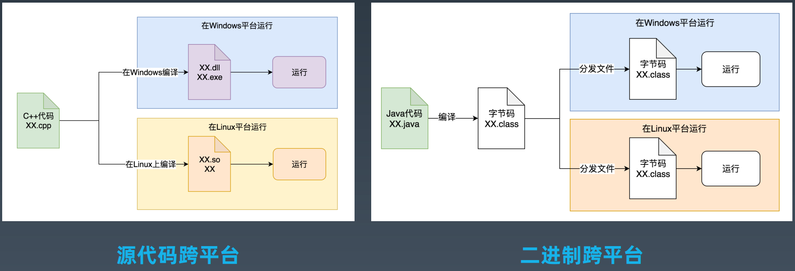
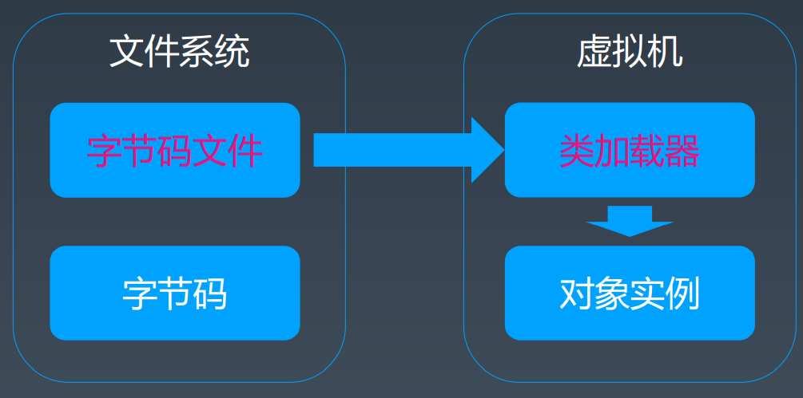

# 第一周学习 JVM核心技术

字节码、类加载加载字节码、内存模型、常用参数

## JVM基础知识

- JVM 基础知识
- Java 字节码技术
- JVM 类加载器
- JVM 内存模型
- JVM 启动参数

### 编程语言跨平台

### 字节码、类加载器、虚拟机

### 字节码技术

一般，研究代码写法不同，但是结果一样；可以通过字节码去研究它们到底哪里不一样，找到根本原因。
