# 杂记

## bitmap

[Bitmap简介 - 废物大师兄 - 博客园 (cnblogs.com)](https://www.cnblogs.com/cjsblog/p/11613708.html)

- 开源实现
    - jdk 的 java.util.Bitset
    - 谷歌的 EWAHCompressedBitmap
    - redis 的 bitmap
- 优点
    - 排序、查找、去重等运算效率高
    - 占用内存空间低
- 缺点
    - 结果数据不能重复，相当于就是去重过的数据
    - 如果数据只有两个：1 和 1008611 使用 bitmap 十分浪费空间。<b>只有当数据比较密集的时候使用 bitmap 才有优势。</b>

## 判断数据是否存在

如何判断一个数是否在 40 亿个整数中 / 如何从 2 亿个手机号中判断某个手机号是否存在。

- set 判断，耗内存，需要大内存的机器或多台机器。
- bitmap，40 亿个不重复的 int，一个 int 4 字节，开 $2^{32}$ 位的 bitmap。用位的值 0 还是 1 表示值为该索引的整数在不在。内存占用上，$2^{32}$ 个 bit，相当于 $2^{29}$ 个字节大概 500mb

# CPP

## CPP基础语法

### static关键字

首先，无论是全局静态变量还是局部静态变量，只要是初始化了的就在 .data 区，未初始化的就在 .bss 区。使用 static 的场景可以分为以下 5类 ：

1️⃣全局静态变量：全局变量前面加一个 static 即全局静态变量，作用域为其所在的文件，即它对其它文件是不可见的。

2️⃣局部静态变量：在函数体中声明的静态变量，其虽然不会随函数的结束而销毁，但是其作用域和函数体中其它变量一样，在函数外是不可见的。当下一次调用同样的函数时，其值会保持和上次一样。

3️⃣静态函数：在函数名前面加一个 static 即为静态函数，作用域为其所在的文件。

4️⃣类中的静态成员：类中的静态成员需要在类外初始化，它不属于具体的一个该类对象，而是属于整个类，所以使用它也不需要 this 指针。

5️⃣类中的静态函数：类中的静态函数也是属于整个类的，调用它也不需要传入 this 指针，所以函数体中也不能使用类的非静态成员。

局部静态变量代码示例

```cpp
#include<iostream>
using namespace std;
int say(){
    static int i = 0;
    cout<<i++<<endl;
}

int main(){
    say();
    say();
}
/**
0
1
*/
```

### const在内存哪里

被 const 变量修饰的是常量，不可修改，其约束的是编译器的行为，所以它在内存中的布局和普通变量一样在普通的变量区。

### int\*const和const int\*

总的来说的就是 const 在 \* 前面还是后面，当 const 在 \* 前面的时候，const 修饰的是解引用之后的内容，即指针指向的对象是 const 的；当 const 在\*后面的时候，const 修饰的是指针本身，即指针地址是不可修改的。

### 成员函数后面加const

在成员函数后面加 const 是防止该成员函数体内对成员对象进行了修改。这与没有加 const 的函数属于重载，目的是让 const 对象调用 const 方法，非 const 对象调用没加 const 的方法。

### extern

extern 关键字表示其修饰的变量或函数的定义在其它源文件中。

extern “C” 表示接下来的内容按 C 的规则进行编译。比如 C++ 编译器通过修改所有函数的名字实现函数重载机制，C 则是按函数原本的名字进行编译的。

### restrict

restrict，C 语言中的一种类型[限定符](https://baike.baidu.com/item/限定符/1924249)（Type Qualifiers），用于告诉编译器，对象已经被指针所引用，不能通过除该指针外所有其他直接或间接的方式修改该对象的内容。

### C++四种类型转换

1️⃣reinterpret_cast：这个和 C 中的强转一样，没有任何限制。

2️⃣static_cast：用于各种隐式转换，用于 void\* 与其它类型指针之间的相互转化，可用于多态父子类之间的转化但结果未知。

3️⃣dynamic_cast：用于父类指针和子类指针，父类引用和子类引用之间的转化，若目标指针并非父类的子类，则会返回空，它是通过运行时类型推断实现的。

4️⃣const_cast：用于将 const 转为非 const 类型。

### 隐式转换

没有显示类型转换的转换都是隐式转换，如内置类型低精度的变量赋值给高精度的变量会发生隐式转换，如传给一个类的构造函数的变量若不是该类构造函数规定的参数类型的话也可能发生隐式转换。

### new/delete和malloc/free的区别

new/delete 是 C++ 关键字，需要 C++ 编译器支持。malloc/free 是 C 标准库函数，需要包含相应的头文件。

new 实际分为两步，第一步分配内存，第二步调用类的构造函数；delete 同理，第一步调用类的析构函数，第二步释放内存。这里分配和释放内存底层很多时候是用 malloc/free 实现的。而 malloc/free 只是分配和释放内存。

new 返回的是对象的指针。而 malloc 返回的是 void 型指针。

new 失败后会抛出 bad_alloc 异常，并且可以使用 set_new_handler 设置 new 失败时会调用的回调函数。而 malloc 失败后会返回空指针。

### class和struct区别

class 的默认访问权限和默认继承权限都是 private，struct 的默认访问权限和默认继承权限都是 public。

### C++类可以定义引用数据成员吗

可以，必须使用初始化列表初始化。

### 为什么用成员初始化列表会快一些

对于内置类型而言，效率没有区别；

对于用户定义的类而言，因为进入构造函数体后，所有对象都需要已经构造好，所以在之前会调用一次默认构造函数，然后在构造函数体内再调用一次特定构造函数，这就会造成多调用了一次构造函数，损失效率。

## CPP思想

### C++和C的区别

从设计思想上来说，C++ 是面向对象的语言，C 是面向过程的语言。从语法上来说，C++ 具有面向对象的封装，继承，多态特性；增加了许多类型安全机制，如四种类型强制转换；支持泛型编程，如模板类，函数模板。

### 面向对象

通俗来说，面向过程就是一件事该怎么做，面向对象就是什么事交给谁做，举个例子，面向过程编程就是造一台电脑，面向对象编程就是组装一台电脑。面向对象有三个特性，封装，继承和多态。封装就是将数据和对这些数据的操作集合在一起，并只对外暴露一些接口；继承可以让另一个类获得某一个类的属性和方法；多态则可以让同一个操作在不同的对象上表现出不同的效果。

### 面向对象三大特性

封装：封装就是将数据和对这些数据的操作集合在一起，将实现与对外只暴露一些接口。

继承：可以让某一个类获得另一个类的属性和方法，增加了代码的可重用性。

多态：同一个操作在不同对象上表现出不同的效果，使用虚函数实现。在 C++ 中就是用虚函数实现的多态。虚函数调用是一种只知道部分信息完成工作的机制，用户只需知道接口而无需知道具体对象，其实现依赖的是虚函数表，有虚函数的类中会有一个指向虚函数表的指针，当一个派生类自己实现了父亲的虚函数后，会将该函数在继承到的虚函数表中的地址改写为其重写的虚函数的地址。

## 指针

### 指针和引用的区别

指针是对象内存的地址，引用是对象的别名。

### 指针和数组的区别

指针是某一对象在内存中的地址，数组是相同类型数据的集合，数组名指向集合的首地址。

### 野指针

也叫悬挂指针，指向的是已经被释放的内存空间。

### 函数指针

C 在编译的时候所有函数都有一个入口地址，函数指针指向的则是某一个函数的入口地址。可用于调用函数或作为函数的参数传递。

### 虚表指针初始化

虚表指针在构造函数中初始化。

## C++11

### 四种智能指针

1️⃣auto_ptr：C++98 标准的方案，已经弃用。

2️⃣unique_ptr：独占指针，不允许将一个 unique_ptr 的左值对象赋给另一个 unique_ptr 对象，但是右值可以。

3️⃣shared_ptr：共享指针，多个 shared_ptr 对象可以指向同一对象，其中一个 shared_ptr 对象销毁时并不会销毁其指向对象，而是将引用计数-1，当引用计数为 0 时，才真正销毁所指向的对象。

4️⃣weak_ptr：这是一种不控制对象生命周期的智能指针，其指向一个shared_ptr 管理的对象，但是它的构造和析构不会使 shared_ptr 的引用计数增减。设计这种智能指针的目是为了解决两个类中使用 shared_ptr 交叉引用造成的内存泄漏的问题。

### std::weak_ptr::lock存在的意义

获得一个可用的 shared_ptr 对象，因为 weak_ptr 是一个观测者的身份，并没有重载 \* 和 ->，如果引用计数为 0 则返回一个空的 shared_ptr 对象。

### 左值和右值

右值一般指表达式结束就会消亡的对象，如临时变量。左值一般指表达式结束还会存在的变量。

右值无法取址而左值可以；右值无法赋值而左值可以。

C++11 引入右值引用主要是为了转移语义，消除两个对象交互时的不必要拷贝。

### C++11新特性

常用的：auto 关键字，nullptr 关键字，智能指针，右值引用，多线程，lambda 表达式，可变长模板。

### lambda表达式原理

编译器通过创建匿名类并重载()操作符实现，捕获列表则通过私有成员实现，将捕获列表参数作为私有成员保存。

### 原子变量fetch_add接口

原子变量的 fetch_add 接口是利用 CAS 实现的，CAS 是一项乐观锁技术。乐观锁是指认为数据访问不会冲突，只有在更新数据的时候才去检查冲突。CAS 底层则是汇编代码 cmpxchg。

### std::move和std::forward

首先是引用折叠，对于左值 T（A&），不管T后面加多少个 & 都会被折叠成左值，对于右值 T（A&&），T 后面加奇数个 & 会被折叠成左值，加偶数个 && 会被折叠成右值。

因此，move 作用是将左值转成右值，它首先使用 remove_reference 利用偏特化获得去除 & 后的原始类型，然后用 static_cast 转换成右值。

而 forward 用作完美转发，直接 static_cast<T&&> 即可，左值 T（A&）折叠成左值，右值 T（A&&）折叠成右值。

## 函数

### 多态和虚函数

<span style="color:orange">多态就是同一个操作作用于不同的对象可以产生不同的效果</span>，在 C++ 中就是用虚函数实现的多态。虚函数调用是一种只知道部分信息完成工作的机制，用户只需知道接口而无需知道具体对象，其实现依赖的是虚函数表，有虚函数的类中会有一个指向虚函数表的指针，当一个派生类自己实现了父亲的虚函数后，会将该函数在继承到的虚函数表中的地址改写为其重写的虚函数的地址。

### 怎么用C实现虚函数

仿照 Linux 中虚拟文件系统的做法，结构体中有一个 op 对象，里面都是各种函数指针，不同的文件系统实现不同的函数，然后赋值给该函数指针。

### 析构函数为何必须是虚函数，C++默认的为何不是虚函数

将可能会被继承的父类的析构函数设置为虚函数，可以保证当我们 new 一个子类，然后使用基类指针指向该子类对象，释放基类指针时可以释放掉子类的空间，防止内存泄漏。

C++ 默认的析构函数不是虚函数是因为虚函数需要额外的虚函数表和虚表指针，占用额外的内存。而对于不会被继承的类来说，其析构函数如果是虚函数，就会浪费内存。因此 C++ 默认的析构函数不是虚函数，而是只有当需要当作父类时，设置为虚函数。

简而言之：delete 父类指针时必须要调用子类的析构函数。若默认是虚函数则每个类都需要引入虚函数表，没有必要。

### 重写重载和隐藏

重载：函数名和返回值相同，参数列表不同。

重写：不同层级的类中实现的不同的虚函数。

隐藏：不同层级的类中实现的同名函数。

### 析构函数

当一个对象生命期结束的时候会调用它的析构函数，析构函数的调用顺序为：派生类的析构函数->成员对象的析构函数->父类的析构函数。

且析构函数可以是纯虚函数。

### C语言如何进行函数调用

将函数参数压栈；C 参数的压栈顺序是从右往左

将函数返回值压栈；

将栈帧指针（ebp 寄存器值）压栈；

移动栈顶和栈帧指针，为函数创建一个新的栈帧。

### 为什么从右往左压栈

对于可变长参数，从左往右压栈编译器难以确定明确参数的地址，而从右往左，则最左的参数地址就是栈帧指针加上一个返回值的长度。

### C++如何处理返回值

生成一个临时对象返回。不过现代编译器大多有RVO机制，直接在函数返回处构造对象

### 获取某一成员偏移量

```cpp
#define  offsetof(TYPE,MEMBER) ((size_t)&((TYPE*)0) ->MEMBER)
```

## C++模型

### 虚函数表实现多态

子类继承父类之后，如果重新实现了虚函数，会替换掉虚函数表中的相应的函数指针，从而实现多态。

### memory_order

```cpp
{
    memory_order_relaxed, //不对执行顺序做保证
    memory_order_acquire, //本线程中,所有后续的读操作必须在本条原子操作完成后执行
    memory_order_release, // 本线程中,所有之前的写操作完成后才能执行本条原子操作
    memory_order_acq_rel, //同时包含 memory_order_acquire 和 memory_order_release
    memory_order_consume,// 本线程中,所有后续的有关本原子类型的操作,必须在本条原子操作完成之后执行
    memory_order_seq_cst // 全部存取都按顺序执行
 } memory_order;
```

## STL

STL 的组成：容器，迭代器，分配器，算法，仿函数，配接器六个部分。

### vector和list区别

都是线性容器，但是 vector 是顺序表，list是链表。vector 支持随机访问，list 只支持顺序访问。vector 插入数据的时间复杂度为 O(n)，list 插入数据的时间复杂度为 O(1)。

### map和set的区别

区别：map 是键值对容器；set 是数据集合。map 的迭代器 key 是不可修改的，value 可修改；set 的迭代器是不可修改的。

实现：底层都是使用红黑树实现的，set 的 key 就是 value。因为都是使用红黑树实现的，所以数据都是有序的，也所以 set 的迭代器是 const 型的，map 的迭代器的 key 是 const 的，因为修改 key 值会影响红黑树的有序性。

### STL的allocator

是 STL 中广泛使用的对象配置器，提高了对象创建和销毁的效率。

在 C++ 中，new 实际分为两步，第一步分配内存，第二步调用构造函数，delete 也分为两步，第一步调用析构函数，第二步释放内存。STL 为了分工精细，使用配置器分配内存，使用 construct 函数和 destroy 函数处理对象的构造和析构。配置器分为两层，当所需内存大于 128Byte 时使用第一层配置器，使用标准库中的 malloc，realloc，free 等函数；小于等于 128Byte 时使用第二级配置器，其使用了内存池技术，以 8Byte 为单位分为了 16 种大小的槽位，每个槽位管理一个空闲链表，当空闲链表中没有空闲内存块时则从内存池中取一定数量的内存块放到空闲链表中。这里的空闲链表并没有多占用一点内存，其将 next 指针和内存块的头数据放在一个 union 中，避免了内存浪费。

### map释放内存

因为小于 128Byte 的数据内存是用二级配置器申请的，使用完后会放回内存池，并没有真正释放，所以需要和临时空 map 对象 swap 后销毁临时 map 对象。

### 迭代器的作用

迭代器的主要目的是将容器和算法分离，迭代器让容器的数据访问和遍历操作一致，这样算法使用迭代器对数据进行操作和遍历，就不需要关心具体的容器类型，适用性也就更强。

### STL迭代器删除元素

STL 使用 erase 删除迭代器内容。对于序列容器来说，erase 返回所删除的迭代器的下一迭代器，但删除迭代器元素会导致后面迭代器均失效。对于关联容器来说，erase 会导致被删除的迭代器失效，但是其它迭代器内容不失效。对于 list 来说，erase 会返回迭代器的下一迭代器，且其它迭代器均不是失效。

[STL 中 使用迭代器删除元素的问题 - mengmee - 博客园 (cnblogs.com)](https://www.cnblogs.com/liumeng-blog/p/7573692.html)

### resize和reserve

resize 改变的是 size 值，变小则后面的元素舍弃掉，变大则后面的元素默认初始化；

reserve 改变的是容量 capacity，不增加元素。

## 编译

### C++源文件到可执行文件

C++源文件—>（<b>预处理阶段</b>）—>宏展开后的源文件—>（<b>编译阶段</b>）—>汇编文件—>（<b>汇编阶段</b>）—>可重定位的二进制文件—>（<b>链接阶段</b>）—>可执行文件

### include中“”和<>的区别

预处理阶段寻找头文件的目录不同。

使用双引号会先从当前目录寻找头文件，然后从编译器指定目录寻找头文件，最后从标准库目录下寻找头文件。

使用尖括号则只会从编译器指定目录和标准库目录下寻找头文件。

标准库目录一般是 usr/include。

### G++和GCC的区别

1️⃣.c 文件被 gcc 当做 C 文件编译，g++ 当做 C++ 文件编译；.cpp 文件都会被当做 C++ 文件编译。

2️⃣g++ 在编译阶段调用的是 gcc，链接则由自己完成。

3️⃣如果后缀是 .c，使用 gcc 编译器，才不会定义 __cplusplus 宏。

4️⃣extern “C” 与 gcc 和 g++ 无关。

## 标准库

### malloc 原理

大于 128k 时候从 mmap 区申请内存，free 直接归还内存。

申请小于 128k 的时候首先会从空闲链表中寻找合适的内存块，glibc 的 malloc 管理三组链表，fast bins，unsorted bins 和 bins，fast bins 存放的是小内存块，一般是小于 64Byte 的，如果 fast bins 中没有的话就去 unsorted bins 中找，还没有则在 bins 中找，再没有就使用 brk 系统调用从堆区中申请内存。

# 网络

自顶向下；看书补充

> OSI开发式互联参考模型

<div align="center"></div>

## 网络编程

### Reactor 模型

一般来说，Reactor 模型有三种角色，一个是 accptor，一个是 reactor，一个是 handler。通过 acceptor 向 reactor 注册关注的事件，当事件发生时，reactor 将事件交给相应的 handler 处理执行相关业务逻辑。本质上就是将关注的事件与相应回调函数关联，事件发生时执行相应回调函数。

与 Proactor 的核心区别就是 Reactor 处理的是未完成 IO 的事件，而 Proactor 处理的是已完成 IO 的事件或信号。

### UDP socket 编程主要函数

服务端：socket(), bind(), recvfrom(), sendto(), close()

客户端：socket(), sendto(), recvfrom(), close()

### UDP 的 connect 函数

<span style="color:orange">TCP 的 connect 函数用来三次握手建立 TCP 连接，而 UDP 的套接字使用 connect 函数作用仅仅是记录对端的 IP 和端口号。</span>

### TCP 的 connect 函数

TCP 中的 connect 函数用于三次握手建立 TCP 连接。

阻塞方法：发送 SYN 报文段，收到 SYN, ACK 报文段后，发送 ACK 报文段然后返回。

非阻塞方法：首先判断返回值，-1 的话检查错误码，如果是 EINTR，则重新 connect，如果是 EINPROGRESS，则说明正在连接中，其余错误码则说明连接出现错误。之后使用 epoll 检查是否有写事件发生（accept 检查的是读事件），有的话使用 getsockopt 检查错误，没有错误则连接建立成功。

### read 和 write

一、read

1、阻塞与非阻塞：

阻塞的 read 在有数据时返回，没有数据时阻塞；

非阻塞的 read 在没有数据时返回 -1，错误码为 EAGAIN 或 EWOULDBLOCK（其实这个就是 EAGAIN，数值一样 #define EWOULDBLOCK EAGAIN）；

2、返回值：

返回值大于 0，正常；

返回值等于零，读到 FIN，一般关闭连接；

返回值小于零，错误码 EINTR 表示被信号中断，一般会重新调用 read；错误码EAGAIN 或 EWOULDBLOCK 表示当前没有数据。

二、write

1、阻塞与非阻塞：

阻塞的 write 在缓冲区空间足以发送所有数据时才返回；

非阻塞的 write 在缓冲区空间不够时只写一部分，然后返回写了的长度，之后再调用则返回 -1，错误码 EAGAIN 或 EWOULDBLOCK。

2、返回值：

返回值大于 0，正常；

返回值等于 0，套接字已经关闭；

返回值小于 0，错误码 EINTR 表示被信号中断，一般会重新调用 write；错误码EAGAIN 或 EWOULDBLOCK 表示当前缓冲区没有空间。

## TCP/UDP/IP

### TCP 可靠数据传输

保证数据没有在传输中变化：校验和

保证数据的送达：序号和确认号，超时重传

保证接收方缓存足够接收数据：流量控制

保证数据发送不引起网络拥堵：拥塞控制算法，包含慢启动，拥塞避免，快恢复

保证连接和断开时的可靠：三次握手，四次挥手

### 拥塞控制

慢启动：将拥塞窗口大小设为 1 个 MSS，每个确认报文段到来时，将拥塞窗口大小 +1 个 MSS。该状态拥塞窗口呈指数增大，每个 RTT 增大一倍。超时时重新开始慢启动，拥塞窗口设为 1，收到三个冗余 ACK 时启动快恢复，拥塞窗口减半，这两种情况将慢启动阈值设为拥塞窗口的一半。当拥塞窗口等于慢启动阈值时进入拥塞避免状态。

拥塞避免：每过一个 RTT 将拥塞窗口 +1 个 MSS。超时时重新开始慢启动，拥塞窗口设为 1，收到三个冗余 ACK 时启动快恢复，拥塞窗口减半，这两种情况将慢启动阈值设为拥塞窗口的一半。

快恢复：实际是相对慢启动而言的，拥塞窗口不是从 1 开始，而是从当前窗口的一半开始执行拥塞避免算法。

### 三次握手，四次挥手

三次握手：客户端首先发送一个 SYN 报文段，进入 SYN_SENT 状态，服务端收到后回送一个 SYN, ACK 报文段，进入 SYN_RCVD 状态，客户端收到后回送一个 ACK 报文段同时可以开始发送数据并进入 ESTABLISH 状态，服务端收到 ACK 报文段后也进入 ESTABLISH 状态。

四次挥手：客户端首先发送一个 FIN 报文段，进入 FIN_WAIT1 状态，服务端回送一个 ACK 报文段进入 CLOSE_WAIT 状态，客户端收到 ACK 后进入 FIN_WAIT2 状态，然后服务端数据发送完后回送一个 FIN 报文段进入 LAST_ACK 状态，客户端收到后发送一个 ACK 报文段然后进入 TIME_WAIT 状态，等待一定时长后关闭连接，服务端则在收到 ACK 报文段后断开连接。

> TCP 为什么不可以两次握手

两次握手意味着服务端收到 SYN 报文段后即认为连接已经建立，并为其维护相关系统资源。但客户端在发送 SYN 报文段后可能由于网络原因服务端的 SYN, ACK 报文段并没有送达客户端，此时客户端不认为连接已经建立也不会发送数据，服务端则将维护相关系统资源一段比较长的时间，造成浪费。

>TCP 握手为什么不用四次

TCP 是全双工通信，原本的握手模型确实应该像挥手一样进行四次的，但是服务端回复 ACK 和发送 SYN 之间并没有联系，所以可以合并为一次发送，故 TCP 握手只需要三次。

> TCP 三次握手初始序列号为什么不用固定值

防止串话，防止上一个连接的分组在本次连接建立后才传来并且在同一个窗口中。

### TCP 的 Keepalive

服务端每过一段时间（两小时）会发送一个心跳包（ACK 报文段，序号为当前序号 -1）；	正常情况下客户端回送一个 ACK 报文段；

客户端异常掉线（断电之类的），则服务端每过一定时间（默认 1000ms）发送一次心跳包，重复一定次数后关闭连接；

客户端断电之后 OS 又重启了，则 OS 会帮助回送一个 RST 报文段。

### SYN 洪泛攻击

攻击者发送大量的 SYN 报文段，而不完成第三次握手的步骤。随着这种 SYN 报文段纷至沓来，服务器不断为这些半开连接分配资源，导致服务器的连接资源被消耗殆尽。现在有一种有效的防御系统，称为 SYN cookie。

当服务器收到一个 SYN 报文段时，服务器不会为该报文段生成一个半开连接。相反，服务器生成一个初始 TCP 序列号，该序列号是 SYN 报文段的源和目的 IP 地址与端口号通过仅有服务器知道的哈希函数算得。重要的是，服务器并不记忆该 cookie 或任何对应与 SYN 的其它状态信息。（之前三次握手讲的方法分配了缓存和变量，即记录了状态信息）

如果客户是合法的，那么它将返回一个 ACK 报文段，当服务器收到 ACK，需要验证该 ACK 是否与前面发送的某些 SYN 相对应（之前三次握手讲的方法分配了缓存和变量所以不需要验证）。做法是将 SYNACK 报文段中的源和目的地IP地址与端口号执行同样的哈希函数，如果结果 +1 与 SYNACK 报文段中的确认号相同的话，则认为该 ACK 对应于较早的 SYN 报文段，因此它是合法的，生成一个具有套接字的全开的连接。

### TIME_WAIT 的作用

确保最后一个 ACK 报文段成功发给服务端。

确保网络中迷途的报文段消逝，防止串话。因为有的网路可能出现问题，导致之前的一些分组没有成功送达，然后触发超时重传。而后当前连接断开后又重新建立了一个新连接，此时之前的分组可能会发送过来，造成串话。等待一个 2MSL 时间，是因为IP数据报中有一个生存时间，当数据报在网络中传输了一定跳数还没到达目的地的话就会丢弃该数据报，等待 2MSL 时间可以确保分组已经被网络丢弃。

Linux 可以用 netstat 命令查看

可以修改 sysctl.conf 配置文件：

net.ipv4.tcp_tw_reuse = 1, TIME_WAIT 状态套接字可立即用于建立新连接；

net.ipv4.tcp_tw_recycle = 1, 操作系统加快 TIME_WAIT 状态套接字的回收；

net.ipv4.tcp_fin_timeout = 30, 设置 time_wait 等待时间。

### 出现大量 CLOSE_WAIT 状态的原因及解决办法

CLOSE_WAIT 状态出现于收到FIN报文段但一直没有回送 FIN 报文段的时候，一般是因为服务端处于忙读等状态，所以要处理好断开连接的情况，在 read 返回值为 0 或 read 返回值小于零查 errno 不是 EAGAIN 就断开连接。

### 路由选择算法

Dijkstra；

距离向量算法：不时地像相邻节点发送自己的距离向量副本，收到副本的节点使用 Bellman-Ford 方程更新自己的距离向量副本。

### 端口号最大值

端口号最大为 65535，因为运输层报文段头部存放端口号的字段占 16 位。

### MTU 和 MSS

MTU：Max Transmit Unit，是数据链路层的特性，限制了网络层每次最大的传输数据大小。

MSS：Max Segment Size，是传输层对应用层每次最大传输数据大小的限制，不包含 TCP 和 IP 头部，若 MTU 为 1500，则 MSS 为 1500-20-20=1460.

### 网络层分片

数据链路层有 MTU 的限制，若 IP 数据报比 MTU 要大，则需要分片传输。

实现上，有一个标识位，表示原始报文段的序号；有一个标志为，表示当前分片是否为最后一个分片；有一个分片偏移，表示当前分片在原始报文段的位置。

## HTTP

### HTTP 协议

HTTP 协议是一种基于 TCP 的，无状态的应用层传输协议。它基于 B-S 和 C-S 架构，定义了一种文件传输格式：请求报文包含请求行，请求头，和请求包体；响应报文包含状态行，响应头，和响应包体。

### HTTP 1.0/1.1

HTTP 1.1：

- 默认长连接；
- 增加管线化，可以同时发出多个请求，无需一个个等待响应；
- 完善 cache 机制，过期的页面不会删除，而是改为 stale 对象，与服务器重新激活；
- 增加断点续传；
- 增加错误码；

### HTTP 返回码

1xx：信息性状态码	 100：continue

2xx：成功状态码    200：OK

3xx：重定向状态码

4xx：客户端错误状态码   404：页面不存在

5xx：服务端错误状态码   503：服务不可用

### HTTP 和 HTTPS 的区别

HTTPS 并不是新的协议，而是 HTTP 先与 SSL 通信，然后再和 TCP 通信。

使用 HTTP 的话，因为是明文传输，所以内容可能被窃听；也无法保证内容完整性，即无法保证内容没有被第三方篡改；没有验证对方身份，因而可能遭遇伪装。

HTTPS 的网站用 HTTP 打开会怎么样？一般的网站会返回301重定向响应报文。

### HTTPS 原理

1、浏览器向服务器 443 端口发送请求，并携带浏览器支持的哈希算法和加密算法。

2、服务器选择一种哈希算法和加密算法，然后将数字证书发给浏览器。

3、浏览器从内置的可靠机构列表中找到相应机构的公钥，解密数字证书，获得服务器公钥，然后生成随机数，使用服务器公钥加密发给服务器。

4、服务器使用私钥解密后使用随机数生成公钥，然后之后使用对称加密与浏览器进行通信。

 ### GET 和 POST 区别

1、语义上，GET 用于获取服务器资源，POST 用于向服务器修改或提交数据，比如 restful 风格中就规范了 POST 的使用，只用于新建而 GET 用于查询数据，不改变数据的状态。

2、限制上，浏览器一般会限制 GET 方法的 url 长度，而 POST 方法的 url 在请求包体中。（<span style="color:orange">注意，是浏览器限制了 GET 方法的 url 长度</span>）

3、速度上，GET 方法更快，因为 GET 方法和 POST 方法请求流程不同，GET 方法是将头和包体一次发给服务端，然后服务端回复一个 200 OK；而 POST 方法是先发送头部，服务端回复一个 100 continue，然后浏览器再继续发送包体，最后服务端回复一个 200 OK。另外，GET 方法会被浏览器缓存，进一步提高了速度。

### Restful

Restful 是一套 web api 设计风格，不是标准，它的核心是面向资源而不是面向操作，所以 restful api 的设计风格是使用 URL 定位资源，使用 HTTP 动词（GET,PUT,POST,DELETE 等）描述操作。

如果以操作为中心，容易设计出需要前置操作的操作，这种操作多了系统就乱了，而以资源为中心的话就很容易切断这些关联，并且以资源为中心也更容易设计缓存系统和规范一致的 URL。

### Cookie 被禁用怎么实现 HTTP 的状态化

对于会话 coockie 来说：URL 重写，在后面加上 sessionID；

### XSS

过分信任服务器发来的代码,让服务器代码随意在浏览器上执行.

反射型：伪造出恶意 URL，服务器根据该 URL 修改页面的某些内容并发过来,而这部分内容会造成攻击.

存储型：向服务器提交有恶意代码的内容(如论坛内容)，之后的人访问就会被攻击.

# Linux

## 体系结构

<div align="center"></div>

## 指令

- `man 2 syscalls` \=\=\> 查看所有的系统调用
- `which ls` 查看 ls \=\=\> 所在的位置
- `less 文件` \=\=\> 查看部分文件
- `cat /etc/shells` \=\=\> 查看支持哪些 shells 版本
- `chsh -s shell ==> 路径`，切换为某个 shell

> 查找文件

`find path [options] params` 在指定目录查找文件

```bash
find -name "target.java" # 当前目录为根目录进行搜索

find / -name "target.java" # 全局搜索  / 表示根目录

find ~ -name "target*" # 当前用户 home 目录 以 target 打头的文件

find ~ -iname "target*" # 不区分文件大小写查找
```

> 检索文件内容

`grep [options] pattern file`

- 全称：Global Regular Expression Print
- 作用：查找文件里符合条件的字符串，只会筛选目标字符所在的行。

```bash
grep "moo" target* # 在 target 开头的文件中 查找 moo；默认在当前目录查找
```

<div align="center"></div>

<div align="center"></div>

> 管道操作符 `|`

- 可将指令连接起来，前一个指令的输出作为后一个指令的输入；只处理前一个命令的正确输出，不处理错误输出。

- 如：查找文件中，文件名包含 h 的文件

    <div align="center"></div>

- 从日志中筛选信息
- `grep 'demo\[true\]' de.log` 从日志中筛选 demo[true] 的数据 
- `grep -o 'engine\[[0-9a-z]*\]'` 筛选出正则表达式中的内容
- `grep -v 'grep'` 过滤掉包含 `grep` 的内容

> 对文件内容做统计

`awk [option] 'cmd' file`

- 一次读取一行文件，按输入分隔符进行切片，切成多个组成部分
- 将切片直接保存在内建的变量中，`$1$2...（$0表示行的全部）`
- 支持对单个切片的判断，支持循环判断，默认分隔符为空格

```bash
# 查看 demo.txt 中 第一列 和 第三列的信息
awk '{print $1,$3}' demo.txt

# 打印第一列等于 TCP，第三列等于 sf 的第0列的信息
awk '$1=="tcp" && $3=="sf" {print $0}' demo.txt 

# 对内容逐行做统计操作
```

> 批量替换文本内容

`sed [option] 'sed command' filename`

- 全名 stream editor，流编辑器
- 适合用于对文本内容进行处理

```bash
# 将 replace.java 中的 Str 开头的替换为 String，默认时把替换的结果输出到控制台
sed 's/^Str/String/' replace.java

# -i 则会将文本中的内容替换
sed -i 's/^Str/String/' replace.java

# 筛选出 . 结尾的行，并将 . 替换为 ;
sed -i 's/\.$/\;/' replace.java

# 筛选出包含 Jack 的字符串行，并将 Jack 替换为 me g表示全局替换，即所有的 Jack 都替换为 me
sed -i 's/Jack/me/g' replace.java

# 删除文本中的 Integer 所在的行
sed -i '/Integer/d' replace.java
```

> stat 查看文件时间

mtime（modify）最后一次修改的时间；

atime（access）最后一次访问的时间；

ctime（change）最后一次修改状态的时间，如使用 chmod 修改权限；

```shell
xxxx@xxxx:~$ stat nohup.out
  File: nohup.out
  Size: 106445          Blocks: 216        IO Block: 4096   regular file
Device: 810h/2064d      Inode: 33866       Links: 1
Access: (0600/-rw-------)  Uid: ( 1000/rootuser)   Gid: ( 1000/rootuser)
Access: 2022-02-25 17:17:26.586083900 +0800
Modify: 2022-02-25 23:12:31.006083900 +0800
Change: 2022-02-25 23:12:31.006083900 +0800
 Birth: -
```

> 网络相关

netstat -anp | grep 端口号 查看端口号状态。

nload 监控网络带宽；

## 启动过程

<b>1️⃣BIOS 开机自检</b>

对基础硬件环境进行开机自检，如：CPU，HDD，Memory，主板等， 根据启动顺序（默认硬盘启动）进行启动，只有自检通过才会进行下一步动作

<b>2️⃣启动引导过程</b>

系统启动后，会从硬盘 0 柱面 0 磁头 1 扇区（MBR 主引导程序）读取引导启动程序（Boot loader）用于引导操作系统启动，当 MBR 加载到内存之后，BIOS 将控制权交给 MBR（MBR 中最主要的功能就是存储启动引导程序）

MBR（Master Boot Record）主引导程序，占用一个扇区大小共 512 字节，其中启动引导程序（linux 启动引导程序 GRUB2）占用 446 字节，分区表占用 64 字节（每个分区项占用 16 字节，这也是为什么硬盘最大只能分四个主分区的原因），最后还有 2 字节的结束标识

<b>3️⃣加载内核及函数模块（驱动）</b>

linux 内核是以压缩的形成保存在启动系统的 /boot 目录下（被启动引导程序调用加载在内存中），内核会先在内存中进行解压缩，解压缩完成之后，内核会再执行一次自检（linux 一般更信任内核自检）内核的自检过程会记录在 "/var/log/dmesg" 文件中，启动引导程序加载内核之后，就需要内核加载硬件的驱动程序，一般情况下 IDE 接口的硬盘驱动都保存在内核中，可以直接调用（IDE 硬盘基本淘汰）这时候有一个问题，如果内核加载了所有的驱动程序，那么内核会非常大，linux 的解决方案是把常用的驱动加载在内核中，把不常用的驱动做成函数模块加载放在 /boot/lib/modules 文件中，需要的时候进行调用。

<b>4️⃣调用 init 进程</b>

在硬件驱动成功后，Kernel 会主动调用 init 进程（/sbin/init），而 init 会取得 runlevel 信息；

init 执行 /etc/rc.d/rc.sysinit 文件来准备软件的操作环境（如网络、时区等）；

init 执行 runlevel 的各个服务的启动（script 方式）；

init 执行 /etc/rc.d/rc.local 文件；

<b>5️⃣登陆</b>

init 执行终端机模拟程序 mingetty 来启动 login 程序，最后等待用户登录。

## 进程

### 进程启动过程

当你在 shell 中敲入一个命令要执行时，内核会帮我们创建一个新的进程，它会先在新进程的进程空间里面加载进可执行程序的代码段和数据段，然后加载进动态连接器（在 Linux 里面通常就是 /lib/ld-linux.so 符号链接所指向的那个程序，它本省就是一个动态库）的代码段和数据。在这之后，内核将控制传递给动态链接库里面的代码。动态连接器接下来负责加载该命令应用程序所需要使用的各种动态库。加载完毕，动态连接器才将控制传递给应用程序的 main 函数。如此，你的应用程序才得以运行。(过程链接表（PLT）,  Global Offset Table（GOT）)

### 可执行文件结构

主要分为：.bss 数据，.data 数据，.text 数据。

### fork

fork 是用于创建子进程的系统调用，其调用一次但是返回两次。返回值大于 0 的为父进程，返回值等于 0 的为子进程，并且各自从 fork 函数处继续执行（在 fork 过程中会有短暂的阻塞）。

子进程基本完全复制父进程：子进程 id 不同，文件描述符有自己的一份拷贝（引用计数会 +1），超时时钟会清零，

另外 linux 在此处使用了copy on write 的技术。

### fork和vfork

fork 是创建子进程的系统调用，子进程会完全复制父进程包括堆栈，它们只是 pid 不同。vfork 也是创建子进程的系统调用，但是其创建的子进程是与父进程共享地址空间的，并且父进程会一直阻塞直至子进程调用 exec 或 exit。

### wait和waitpid

wait 会一直阻塞直到某一子进程终止。waitpid 则可以等待指定子进程终止，还可以设置为非阻塞。

waitpid 中 pid 的含义依据其具体值而变：

- pid==-1 等待任何一个子进程，此时 waitpid 的作用与 wait 相同
- pid >0  等待进程 ID 与 pid 值相同的子进程
- pid==0  等待与调用者进程组 ID 相同的任意子进程
- pid<-1  等待进程组 ID 与 pid 绝对值相等的任意子进程

### 进程和线程

1、启动一个新的进程必须分配给它独立的地址空间，建立众多的数据表来维护它的代码段、堆栈段和数据段，系统开销比较大，而线程不一样，它们彼此之间使用相同的地址空间，共享大部分数据，切换速度也比进程快，效率高，linux 中线程和进程是共用一个数据结构 struct_task 的，所以 linux 中线程也就是 lwp，开一个线程和进程底层都是使用的 clone 函数，只是共享的数据不同，线程共享大部分数据。

2、<span style="color:orange">由于进程之间独立的特点，使得进程安全性比较高</span>，也因为进程有独立的地址空间，一个进程崩溃后，在保护模式下不会对其它进程产生影响，而线程只是一个进程中的不同执行路径。一个线程死掉回收堆空间往往导致连锁反应让整个进程死掉。

3、体现在通信机制上面，正因为进程之间互不干扰，相互独立，进程的通信机制相对很复杂，譬如管道，信号，消息队列，共享内存，套接字等通信机制，而线程由于共享数据段所以通信机制很方便。

> 进程与线程的选择取决以下几点

1、需要频繁创建销毁的优先使用线程；因为对进程来说创建和销毁一个进程代价是很大的。

2、因为对 CPU 系统的效率使用上线程更占优，所以可能要发展到多机分布的用进程，多核分布用线程；

3、需要更稳定安全时，适合选择进程；需要速度时，选择线程更好。

### 线程崩溃一定会导致进程崩溃吗

不一定，一般是因为共享地址空间带来的连锁反应，比如某一个线程堆栈溢出崩溃了，然后线程结束需要回收堆资源，导致其它共享地址空间的线程使用相应数据又发生了堆栈溢出。

### 线程间的共享和私有数据

> 共享数据：

1. <b>文件描述符表</b>（重点）

2. 每种信号的处理方式（SIG_IGN、SIG_DFL 或者自定义的信号处理函数） 

3. 当前工作目录 

4. 用户 id 和组 id

5. 地址空间

> 私有数据：

1. 线程 id 

2. <b>上下文信息，包括各种寄存器的值、程序计数器和栈指针</b>（重点） 

3. <b>栈空间（临时变量存储在栈空间中）</b>（重点）

4. errno 变量 

5. 信号屏蔽字 

6. 调度优先级

### 僵死进程，孤儿进程，守护进程

<b>僵死进程</b>：Linux 中当一个进程结束后还会保留一定的信息，直到告知父进程自己终止了之后才会清除，所以当父进程一直不获取已经终止的子进程的状态时，该子进程就是一个僵尸进程，已经终止但还占用着一定的系统资源。

<b>孤儿进程</b>：父进程已经终止但是子进程还在运行，则这些子进程为孤儿进程，孤儿进程会由 init 进程收养并完成终止状态收集。

<b>守护进程</b>：在后台运行的进程，特点是独立于控制终端，周期性地执行某一任务或等待某一事件发生。

可以通过 top 指令发现僵尸进程，然后 kill。

### 创建守护进程

1、fork 然后 exit 退出父进程，目的是让自己不是进程组组长，以成功调用 setsid。

2、setsid 成为新会话的头头，目的是独立于终端。

3、chdir 修改工作目录

4、重新设置文件权限掩码

5、关闭文件描述符

### 进程调度算法

FCFS（First Come First Serve）：先来先服务。

时间片轮转算法

多级反馈队列算法

Linux 的 CFS 算法

### 抢占进程

可以，两种情况：

1、有进程进入 TASK_RUNNING 状态，可以检查动态优先级进行抢占。

2、时间片到期时也可以被抢占。

### 实时操作系统与非实时操作系统

实时操作系统的内核是内核可抢占，高优先级的任务立刻执行。非实时操作系统的内核是不可被抢占的。

### 线程同步方式

信号量：若信号量为 0 则挂起该线程，否则原子地减一。使用完资源后将信号量原子地加一，若有挂起的线程则将其唤醒。

互斥量：又叫互斥锁，进入临界区需要加锁，离开临界区需要解锁。

条件变量：用于线程间同步共享数据，当某个数据达到指定条件时，唤醒等待这个数据的一个或多个线程。

### 进程通信方式

1️⃣管道（pipe）：管道是一种半双工的通信方式，数据只能单向流动，而且只能在具有亲缘关系的进程间使用。进程的亲缘关系通常是指父子进程关系。

优点：简单方便。

缺点：局限于单向通信的工作方式．并且只能在创建它的进程及其子孙进程之间实现管道的共享。

2️⃣命名管道（FIFO）：有名管道也是半双工的通信方式，但是它允许无亲缘关系进程间的通信。

优点：可以提供给任意关系的进程使用。

缺点：由于其长期存在于系统之中，使用不当容易出错。

3️⃣信号量：信号量是一个计数器，可以用来控制多个线程对共享资源的访问。它不是用于交换大批数据, 常作为一种锁机制,防止某进程在访问资源时其它进程也访问该资源，因此 , 主要作为进程间以及同一个进程内不同线程之间的同步手段。

优点：可作为同步手段。

缺点：无法传递数据。

4️⃣消息队列（message queue）： 消息队列是由消息的链表，存放在内核中并由消息队列标识符标识。消息队列克服了信号传递信息少、管道只能承载无格式字节流以及缓冲区大小受限等缺点。(优先级，大小)

优点：允许任意进程通过共享消息队列来实现进程间通信．并由系统调用函数来实现消息发送和接收之间的同步，从而使得用户在使用消息缓冲进行通信时不再需要考虑同步问题，使用方便。

缺点：信息的复制需要额外消耗 CPU 的时间．不适宜于信息量大或操作频繁的场合。

5️⃣共享内存（shared memory）：共享内存就是映射一段能被其他进程所访问的内存，这段共享内存由一个进程创建，但多个进程都可以访问。共享内存是最快的 IPC 方式，它是针对其他进程间通信方式运行效率低而专门设计的。它往往与其他通信机制，如信号量，配合使用，来实现进程间的同步和通信。

优点：快

缺点：需要用户保证同步

6️⃣信号 ( sinal ) ： 信号是一种比较复杂的通信方式，用于通知接收进程某个事件已经发生，常见的信号。

7️⃣套接字( socket ) ： 套套接字也是一种进程间通信机制，与其他通信机制不同的是，它可用于不同机器间的进程通信。

优点：可以多机间通信。

### 单核CPU多线程程序是否需要考虑加线程锁

需要，单核CPU也可以并发执行多线程程序，也存在同步与互斥场景。

### 死锁发生条件和解除方法

<span style="color:red">死锁发生的四个条件：</span>

- <b>互斥条件</b>：一个资源只能被一个进程使用。
- <b>请求与保持条件</b>：一个进程拥有一个资源，同时又请求另一资源，而另一资源被其它进程占有而使得该进程睡眠，却还保持着原有资源。
- <b>不可剥夺条件</b>：当一个资源被一个进程占有时，另一进程不能抢夺该资源。
- <b>循环等待条件</b>：若干进程形成首尾相接的资源等待关系。

<span style="color:red">解除方法：</span>

- 针对互斥条件：不可破坏
- 针对请求与保持条件：一次分配所有所需资源。
- 针对不可剥夺条件：不可破坏
- 针对循环等待条件：采用合理的资源分配算法，使进程请求资源不形成环路。如给所有资源编号，只有进程获得了编号较小的资源才能请求编号较大的资源。

<span style="color:red">排查死锁：</span>

使用 pstack 工具，查看当前程序各线程栈情况，是不是存在某两个线程一直处于等锁状态。

### 互斥锁，递归锁，读写锁，自旋锁，RCU

1️⃣互斥锁：当需要访问互斥资源时，尝试获取锁，获取失败则睡眠，资源使用完后解锁，然后唤醒睡眠的线程。

2️⃣递归锁（可重入锁）：同一线程可以多次获取一个锁资源，而当所有次数都被释放，其它线程才能获取该锁资源。

3️⃣读写锁：读写锁有三种状态，读状态加锁，写状态加锁，未加锁。读状态锁可以由多个进程占有，而写状态锁只能由一个进程占有且当前没有进程占有读状态锁。

4️⃣自旋锁：当一个线程尝试获取某一锁资源失败时，它不会睡眠，而是忙等待该锁被其他线程释放。好处是效率高，少了睡眠唤醒的开销，缺点是占用 CPU 资源。

5️⃣RCU：Read-Copy-Updata，读数据不需要加锁，需要修改数据时，先拷贝一份，然后等到时机合适的时候通过回调机制将修改后的数据写回原处。

### 用户态和内核态

用户态和内核态是进程运行的两种级别，用户态拥有最低的运行权限，内核态拥有最高的运行权限。

用户态到内核态转变的方式：系统调用，异常，中断。

为什么要区分用户态和内核态？因为用户程序是不可信的，比如对一些硬件进行操作，若操作不当将导致整个系统崩溃，所以这些操作需要交由内核完成。

### gdb常用命令

r-bin 重新开始运行可执行文件

b+num 在第 num 行下断点

n 逐过程单步调试

s 逐语句单步调试

l-num 查看第 num 行开始的原代码

c 继续运行

bt 查看函数调用堆栈

q 退出

### 系统调用开销大的原因

1、上下文切换

2、缓存局部性差

3、回到用户态的时候伴随一次任务调度

4、参数资源安全性检查

## 内存

访问非法内存区域时会发生段错误。

### 页式管理

将内存分成大小一样的页框，以页框为单位进行管理，进程启动的时候只会加载一部分页进物理内存，当某个虚拟内存数据真正被使用的时候才会产生缺页中断将相应的页加载进物理内存中。进行页式管理需要有一个页表进行虚拟地址到物理地址的转换，根据虚拟地址的高位找到相应的页所在的地址，然后根据低位找到数据所在位置。

优点是没有外内存碎片，每个碎片大小不超过一个页。

缺点是缺页中断的产生和选择淘汰页面等都要求有相应的硬件支持。

### 段式管理

将程序的逻辑分成不同的部分，每个部分为一个段，把进程的所有分段都存放在辅存中，进程运行时先把当前需要的一段或者几段装入主存，在执行过程中访问到不在主存的段时再把他们动态装入；

优点是可以分开编写和编译，针对不同的段采取不同的保护策略。

缺点是会产生碎片。

### 段页式管理

段式管理和页式管理的综合，每个段维护了一个页表结构。

缺点：复杂，效率低。

### 检查内存泄漏

内存泄漏就是当分配的内存不再使用后没有得到释放。一般是 new/malloc 后没 delete/free，或系统资源如 socket 没有 close，或基类析构函数没有定义为虚函数。

使用一些工具如 linux 下的 mtrace，或者对 new/malloc 进行统计监测，看 delete/free 次数是否一致。

### 虚拟地址

虚拟内存是计算机系统内存管理的一种技术。虚拟内存技术让每个进程都仿佛自己占用了系统的所有内存空间，而实际上所有进程共享物理内存，每个进程只是把当前需要使用的虚拟内存空间映射到了物理内存上，当实际访问数据时才会触发缺页中断拷贝数据。

这样做的好处是操作系统能更方便更公平地管理内存，每个进程都有相同的虚拟内存大小；其次是扩大了地址空间，每个进程都仿佛自己占用了所有内存空间；然后是在程序需要连续空间时不需要连续的物理空间，只需要连续的虚拟空间即可。

这样做的代价是虚拟地址到物理地址的转换带来了时间消耗；其次页面的换入换出涉及到磁盘 IO，效率很低。

### 页表寻址

页式内存管理就是将内存分成一个个固定长度的页片，操作系统维护一个虚拟内存地址到物理地址映射关系的数据结构，叫做页表。先通过虚拟地址的高位找到页基地址，然后根据低位地址偏移到实际的物理地址。现代操作系统一般都采用多级页表，好处是可以离散存储页表，并且除非4G内存都用满了，否则相比线性页表节省空间；代价是增加了寻址次数。

### 缺页中断

内存分配函数实际只是分配虚拟地址空间，并没有建立与物理内存的映射，当进程访问这些没有建立映射的虚拟地址时，会产生一个缺页中断，中断处理流程则和其它中断一样，缺页中断的处理函数会将相应的页加载到物理内存中。

### 页面置换算法

> 局部页面置换算法：

FIFO：简单，有 belady（抖动） 现象

LRU：效果最好，页面替换开销比较大

CLOCK：效果折中，页面替换开销比较小。将候选替换集合看作一个环形缓冲区，使用某一页面时候将其标志位置1，当需要替换一页时，从当前指针往后走，路过的页面标志位均置为 0，直至遇到第一个标志位为 0 的页面，将其换出。

> 全局页面置换算法：

工作集算法：使用一个时间窗口来表示工作集长度

页面错误高频算法：根据缺页率动态调整工作集长度

### 伙伴系统

Linux 的伙伴系统是为避免外内存碎片而设计的算法，用于管理分配一组连续的物理页框。Linux 中有 11 个页块链表，分别存放 $2^i$ 个连续页框的页块，申请的物理内存会向上取 $2^i$，然后在对应链表中寻找空闲页块，若该链表没有，则去下一个链表寻找，找到后将页块拆分，一部分下放给较小的页块链表，一部分分配使用。称为伙伴有三个条件，页块大小一样，物理地址连续，块必须是从同一个大块中分离出来的；若是伙伴，则可以合并为一个更大的块。

### Linux slab层

Linux 的 slab 缓存是其分配对象的一种机制，其会预先分配好一块块大内存，其中存放缓存对象，申请对象的时候从此处分配，释放对象的时候返还给 slab 层而不归还给伙伴系统。它做了这么几个优化：

（1）会做内存对齐，根据标志设置为缓存行大小对齐，或按指针大小对齐。

（2）以不同的偏移量给缓存着色，使得各个 slab 对象的偏移量不同，在不同的缓存行。

（3）优先使用刚释放的对象，该对象大概率还在缓存中，提高命中率。

### Linux malloc 大内存

Linux malloc 大内存有两种方法，

1️⃣扩展 swap 区：

创建用于交换的磁盘文件；设置 swap 区文件；

2️⃣设置 overcommit：

设置内存分配方式：overcommit_memory 是内核对内存分配的一种策略，它有三个可选值：0、1、2。

- 0 表示内核将检查是否有足够的可用内存供应用进程使用；如果有足够的可用内存，内存申请允许；否则，内存申请失败，并把错误返回给应用进程。
- 1 表示内核允许分配所有的物理内存，而不管当前的内存状态如何。
- 2 表示内核允许分配超过所有物理内存和交换空间总和的内存；

### 字节对齐

字节对齐的原因是很多 CPU 都只从对齐的地址开始加载数据，外部总线每次读取数据也不是一字节一字节地读取的，而是每次读取 4 字节或更多。这样一个 int 型变量若放在奇数地址，那么 CPU 需要读取两次才能解析出这个变量。

### 内存对齐规则

内存对齐有三条规则：

- 每个成员变量在其对齐数的整数倍地址处；
- 每个成员变量的对齐数为编译器默认对齐数和该成员大小的较小值，若该成员为结构体，则其对齐数为该结构体的最大对齐数；
- 结构体的大小为其最大对齐数的整数倍。

\#pragma pack(n) 相关预编译指令可以修改默认对齐数。

### 对象内存分配

A\*a = new A; a->i = 10；在内核中的内存分配上发生了什么？

在栈区分配一个指针大小的空间给 a，然后在堆区分配 A 大小的空间并将分配的空间地址赋值给变量 a，然后根据 a 记录的地址和 i 在类 A 中的偏移量找到 i 的地址，并在该地址上给 i 赋值。

> 一个类，里面有 static，virtual 之类的，来说一说这个类的内存分布？

静态成员：初始化了的在 .data 段，未初始化的在 .bss 段。

函数：在代码段。

虚函数表：在 .rodata 只读数据段。

普通成员：在实例化的对象中按声明顺序排列。

### 大端和小端

大端：低位字节放在高位地址

小端：低位字节放在低位地址

网络字节流：大端

判断方法：使用联合体，union T{int i; char c;}; T t;t.i = 1;判断 t.c 是否为 1，为 1 则为小端。

## IO

### 五种 IO 模型

阻塞 IO：IO 函数处阻塞，什么也不做

非阻塞 IO：IO 函数处立即返回，需要用户轮询是否有数据

IO 多路复用：内核来轮询多个非阻塞 IO 函数，有数据才真正地执行 IO 操作

信号驱动：当数据准备好时，内核发送信号通知用户处理

异步 IO：当有数据时，内核完成 IO 操作，然后通知用户

### select 和 epoll

select 和 epoll 都是 IO 多路复用机制，本质都是同步 IO，select 需要每次进行轮询所有关注的 fd（文件描述符） 来获取被激活的 fd，epoll 则每次只会返回被激活的 fd。

Linux 可以通过 ulimit -n xxx 来修改 fd 上限。

### epoll 原理

epoll 有三个函数：

首先是 epoll_create，这个函数会做两件事，一是分配一块连续的物理空间初始化eventpoll 对象，eventpoll 中包含一颗红黑树，一条准备就绪链表和一条溢出链表；二是获取一个匿名文件，分配 struct file 对象和与之对应的 fd，将 eventpoll 对象放在 struct file 中的 private 成员中，这样就可以通过 fd 找到 struct file 从而找到 eventpoll 对象，实现 unix 的一切皆文件。

其次是 epoll_ctl，这个函数可以用于添加，修改和移除事件，以添加为例，首先搜索红黑树判断新添加的 fd 是否已经存在，若不存在则从 slab 层分配一个 epitem 对象挂在红黑树上，然后根据 epitem 创建一个 epoll_entry 对象挂在相应设备的等待队列上，并设置事件发生时的回调函数。回调函数内容为将被激活的事件挂在 eventpoll 的就绪队列或溢出队列上，然后唤醒 epoll_wait。

最后是 epoll_wait，检查就绪队列，是否为空，若不为空则先处理就绪队列，逐个拷贝到用户空间，然后将溢出队列对象挂到就绪队列上；若使用了 LT 模式，则会将拷贝到用户空间的 epitem 再次挂到就绪队列上，下次处理就绪队列时，若发现没有新事件则不拷贝到用户空间。

### epoll 的 ET 模式为什么一定要使用非阻塞 IO

ET 模式下，有读事件的时候必须要将所有数据读完，所以要 read 到返回 EAGAIN 错误。而如果使用阻塞 IO，这个时候线程就会阻塞。

### 为什么要有 page cache，操作系统怎么设计的 page cache

page cache 是将一部分磁盘文件缓存到内存中进行读写，从而减少磁盘 IO。当要读取文件时，先从 page cache 中查找是否有所需文件，若没有命中才到磁盘中读取。写过的内存页会被标记为 dirty page，操作系统会周期性地将 dirty page 回写到磁盘中。

### 软链接和硬链接

硬链接：多个文件项指向同一文件（inode，元数据）

软链接：多个文件项指向不同的文件（不同的 inode 和元数据），但是所指的文件内容是同一文件的路径。

### Linux 定时器

2.6.16 之前使用的是基于系统周期性时钟中断的多级时间轮，精度不高，只能到时钟中断的频率级别。

2.6.16 之后推出了高精度的定时器，使用的是红黑树，利用高精度时钟硬件设置下次中断触发的时间。

### Linux下文件的 cp 和 mv

cp 拷贝了一份文件。在相同的文件系统下，mv 只是修改了几个指针，并没有实质性的拷贝删除文件，所以速度很快；在不同的文件系统下，mv 则拷贝删除了文件，和 cp 等价。

### rm一个正在被使用的文件会发生什么

Linux 每个文件对应有两个计数器，在 inode 结构体中分别是 i_nlink 和 i_count，rm 只会将 i_nlink 减一，所以使用 ls 看不到文件信息，但是正在使用该文件的进程还能操作该文件，因为该文件并没有真正的被删除，当进程关闭该文件资源后，i_count 减一，当这两个计数器均为 0 后才会真正删除该文件。

### 文件 IO 与标准 IO

文件 IO 也叫不带缓冲区的 IO，直接调用 OS 的 IO 系统调用，与特定的 OS 绑定。

标准 IO 是 ANSI C 建立的标准 IO 模型，Linux 下使用的是 GLIBC 库中的 IO 函数，它会为 IO 操作建立一个缓冲区，以减少系统调用的次数。

### 零拷贝

零拷贝的核心是取消内核空间与用户空间之间的拷贝，如 Linux 的 sendfile 系统调用：

<div align="center"><b>2.4 之前</b></div>
<div align="center"><image src="img/image-20220610014321249.png"></div>

<div align="center"><b>2.4 之后</b></div>
<div align="center"></div>

2.4 之后取消了页缓存到 socket 缓存的拷贝，直接传送地址和偏移。

# 数据库

## 如何设计一个关系型数据库

<div align="center"></div>

## 索引模块

### 为什么要使用索引

- 加快数据的检索。

> 什么信息可以作为索引

# Redis

## 缓存雪崩/穿透/击穿

穿透：请求到了不存在的 key。可以换成 null 值，定期失效。

雪崩：大量的 key 失效，为 key 设置过期时间是加上一个随机数，避免大量 key 同时失效。

击穿：一个 key 或一些 key 热点 key

## 大 Key 热点 Key 的处理

## 单线程的 redis 为什么这么快

- redis 在内存中操作，持久化只是数据的备份，正常情况下内存和硬盘不会频繁 swap
- 多机主从，集群数据扩展
- maxmemory 的设置+淘汰策略
- 数据结构简单，有压缩处理，是专门设计的
- 单线程没有锁，没有多线程的切换和调度，不会死锁，没有性能消耗
- 使用 I/O 多路复用模型，非阻塞 IO；
- 构建了多种通信模式，进一步提升性能
- 进行持久化的时候会以子进程的方式执行，主进程不阻塞

## Redis 为什么是单线程的，优点

- 代码更清晰，处理逻辑更简单 不用去考虑各种锁的问题，
- 不存在加锁释放锁操作，没有因为可能出现死锁而导致的性能消耗
- 不存在多进程或者多线程导致的切换而消耗 CPU

## Redis 如何实现分布式锁？

不知道网上是怎么实现的，这里给出一个我个人的想法：

- Redis 是一个高性能的单线程非关系型数据库，单线程也意味着没有并发操作，Redis 内部的操作都是线程安全的。
- 我们可以在 Redis 中设置某些标记作为分布式锁的标记；多个服务器同时向 Redis 发送请求。
- 比如：此时 10 台服务器争抢分布式锁，这 10 台服务器同时向 Redis 发送一个设置 key 的命令，第一个设置成功的就是拿到分布式锁的，没设置成功的就是没拿到分布式锁的。
- 拿到了锁，又如何释放呢？
    - 法一：拿到锁的服务器，再发送一次<b>设置 key 的命令</b>，将锁状态置为未加锁。
    - 法二：直接给 key 设置过期时间，过期了就表示锁被释放了，可以重新竞争。
    - 法一和法二都存在一些问题~

## Redis 如何实现异步消息队列

用 `Redis` 的 list 数据结构先进先出的特点，可以实现一个消息队列，`rpush` 生产消息，`lpop` 消费消息。

- 当 `lpop` 没拿到消息，说明没有消息了；没有等待队列有值就直接消费
- 可以通过在应用层加入 sleep 机制去调用 `lpop` 重试。也可以 `blpop` 阻塞直到队列有消息或者超时。
- 缺点：每个消息只能供一个消费者消费。

`Redis` 的 pub/sub 模式可以实现一对多的消费队列。

- 发送者（pub）发送消息，订阅者（sub）接收消息
- 订阅者可以订阅任意数量的频道
- 缺点：消息的发布是无状态的，无法保证可达。

<div align="center"></div>

## Redis 持久化

RDB（快照）持久化：保存某个时间点的全量数据快照。

```shell
save 900 1 # 900s 有一条写入 就备份
save 300 10 # 300s 有十条写入 就备份
save 60 10000 # 60s 有一万条写入 就备份 多个配置是怕数据的写入不规律，为了平衡性能和数据安全。

stop-writes-on-bgsave-error yes # 如果备份出现错误，主线程就停止接收新的写入操作

rdbcompression yes # 先压缩，再备份。一般我们是选择 no
```

## Redis 集群原理

- 分片：按照某种规则去划分数据，分散存储在多个节点上。
- 常规的按照哈希划分无法实现节点的动态增减（当增加或减少一个节点时，会造成大量的 key 无法被命中）
- 一致性哈希算法：对 $2^{32}$ 取模。将哈希值空间组织成虚拟的圆环。

有多台服务器，为没台服务器计算 hash 值，将服务器分布在一个哈希环中。数据进行存取是，也对数据进行 hash 计算，将数据存储在距离最近的服务器上。这样会有一个问题，可能大量的数据都堆积在了一台服务器上。解决办法是：为每台服务器设置多个 node 节点即可。

## Redis 的 Pipeline

- Pipeline 和 Linux 的管道类似；批量执行成千上万的命令。
- `Redis` 基于请求\响应模型，单个请求处理需要一一应答
- Pipeline 批量执行指令，节省多次 IO 往返时间（就是，批量发送多条命令，最后将批量的结果返回）
- 有顺序依赖的指令建议分批发送。

## Redis 的同步机制

<b>主动同步原理</b>

- 一个 Master 写，多个 Slave 读。数据之间是弱一致性的，但是最终会趋于同步（最终一致性）。
- 全量同步
    - Salve 发送 sync 命令到 Master
    - Master 启动一个后台进程，将 Redis 中的数据快照保存到文件中
    - Master 将保存数据快照期间接收到的写命令缓存起来（就是缓存增量数据）
    - Master 完成写文件操作后，将该文件发送给 Salve
    - 使用新的 AOF 文件替换旧的 AOF 文件。
    - Master 将这期间收集的增量写命令发送给 Salve 端
- 增量同步过程
    - Master 接收到用户的操作指令，判断是否需要传播到 Slave
    - 将操作记录追加到 AOF 文件
    - 将操作传播到其他 Slave：1、对齐主从库；2、往响应缓存写入指令
    - 将缓存中的数据发送给 Slave
- Redis Sentinel：解决主从同步 Master 宕机后的主从切换问题，发现 Master 宕机后可以进行自动切换
    - 监控：检查主从服务器是否运行正常
    - 提醒：通过 API 向管理员或者其他应用程序发送故障通知
    - 自动故障迁移：主从切换，将一个从服务器升级为主服务器；将原来的 Slave 改为复制新的 Master；当集群试图连接宕机的主服务器时，会返回一个新的 Master 给他。
- 流言协议 Gossip：在杂乱无章中寻求一致
    - 每个节点都随机地与对方通信，最终所有节点的状态达成一致。
    - 种子阶段定期随机向其他节点发送节点列表以及需要传播的消息。
    - 不保证信息一定会传递给所有节点，但是最终会趋于一致。

# JavaSE

## Java 的理解

- 平台无关：Java 代码 --> 字节码 --> 不同 OS 的 JVM 进行解析；用的同一套解析规则 --> JVM 将字节码转成具体平台上的机器指令
- GC
- 语言特性：泛型、反射、lambda
- 面向对象：继承、封装、多态
- 类库：集合、JUC、IO、NIO
- 异常处理

## loadClass 和 forName 的区别

Class.forName 得到的 class 是已经初始化完成的。

Classloader.loadClass 得到的 class 是还没有“链接”的。

可以用静态代码块进行验证。

```java
public class ClassDemo {

    public static void main(String[] args) throws ClassNotFoundException {
        // 输出 init
        Class<?> aClass = Class.forName("com.payphone.Demo");
    }
}

class Demo {
    static { System.out.println("init");}
}
```

```java
public class ClassDemo {

    public static void main(String[] args) throws ClassNotFoundException, InstantiationException, IllegalAccessException {
        ClassLoader classLoader = Demo.class.getClassLoader();
        Class<?> aClass = classLoader.loadClass("com.payphone.Demo"); // 不会打印数据
        // Spring IOC 在资源加载器获取要加载的资源时，获取 bean 的配置信息的时候，如果是以 classpath 的方式来加载，就需要使用 loadClass 延迟加载，加快加载速度。
        // 为了加快加载速度，Spring IOC 使用了 loadClass，这样不会加载类，节省了时间，需要使用时，再进行类的加载。
    }
}

class Demo {
    static {
        System.out.println("init");
    }
}
```

## 二分查找

<b>要求</b>

* 能够用自己语言描述二分查找算法
* 能够手写二分查找代码
* 能够解答一些变化后的考法

<b>算法描述</b>

1. 前提：有已排序数组 A（假设已经做好）

2. 定义左边界 L、右边界 R，确定搜索范围，循环执行二分查找（3、4两步）

3. 获取中间索引 M = Floor((L+R) /2)

4. 中间索引的值  A[M] 与待搜索的值 T 进行比较

    ① A[M] == T 表示找到，返回中间索引

    ② A[M] > T，中间值右侧的其它元素都大于 T，无需比较，中间索引左边去找，M - 1 设置为右边界，重新查找

    ③ A[M] < T，中间值左侧的其它元素都小于 T，无需比较，中间索引右边去找， M + 1 设置为左边界，重新查找

5. 当 L > R 时，表示没有找到，应结束循环

<b>算法实现</b>

```java
public static int binarySearch(int[] a, int t) {
    int l = 0, r = a.length - 1, m;
    while (l <= r) {
        m = (l + r) / 2;
        if (a[m] == t) {
            return m;
        } else if (a[m] > t) {
            r = m - 1;
        } else {
            l = m + 1;
        }
    }
    return -1;
}
```

<b>测试代码</b>

```java
public static void main(String[] args) {
    int[] array = {1, 5, 8, 11, 19, 22, 31, 35, 40, 45, 48, 49, 50};
    int target = 47;
    int idx = binarySearch(array, target);
    System.out.println(idx);
}
```

<b>解决整数溢出问题</b>

当 l 和 r 都较大时，`l + r` 有可能超过整数范围，造成运算错误，解决方法有两种：

```java
int m = l + (r - l) / 2;
```

还有一种是：

```java
int m = (l + r) >>> 1;
```

<b>其它考法</b>

1. 有一个有序表为 1,5,8,11,19,22,31,35,40,45,48,49,50 当二分查找值为 48 的结点时，查找成功需要比较的次数 

2. 使用二分法在序列 1,4,6,7,15,33,39,50,64,78,75,81,89,96 中查找元素 81 时，需要经过（   ）次比较

3. 在拥有 128 个元素的数组中二分查找一个数，需要比较的次数最多不超过多少次

对于前两个题目，记得一个简要判断口诀：奇数二分取中间，偶数二分取中间靠左。对于后一道题目，需要知道公式：

$$n = log_2N = log_{10}N/log_{10}2$$

其中 n 为查找次数，N 为元素个数

## 排序

### 冒泡排序

<b>要求</b>

* 能够用自己语言描述冒泡排序算法
* 能够手写冒泡排序代码
* 了解一些冒泡排序的优化手段

<b>算法描述</b>

1. 依次比较数组中相邻两个元素大小，若 a[j] > a[j+1]，则交换两个元素，两两都比较一遍称为一轮冒泡，结果是让最大的元素排至最后
2. 重复以上步骤，直到整个数组有序

<b>算法实现</b>

```java
public static void bubble(int[] a) {
    for (int j = 0; j < a.length - 1; j++) {
        // 一轮冒泡
        boolean swapped = false; // 是否发生了交换
        for (int i = 0; i < a.length - 1 - j; i++) {
            System.out.println("比较次数" + i);
            if (a[i] > a[i + 1]) {
                Utils.swap(a, i, i + 1);
                swapped = true;
            }
        }
        System.out.println("第" + j + "轮冒泡" + Arrays.toString(a));
        if (!swapped) {
            break;
        }
    }
}
```

* 优化点 1：每经过一轮冒泡，内层循环就可以减少一次
* 优化点 2：如果某一轮冒泡没有发生交换，则表示所有数据有序，可以结束外层循环

<b>进一步优化</b>

```java
public static void bubble_v2(int[] a) {
    int n = a.length - 1;
    while (true) {
        int last = 0; // 表示最后一次交换索引位置
        for (int i = 0; i < n; i++) {
            System.out.println("比较次数" + i);
            if (a[i] > a[i + 1]) {
                Utils.swap(a, i, i + 1);
                last = i;
            }
        }
        n = last;
        System.out.println("第轮冒泡" + Arrays.toString(a));
        if (n == 0) {
            break;
        }
    }
}
```

* 每轮冒泡时，最后一次交换索引可以作为下一轮冒泡的比较次数，如果这个值为零，表示整个数组有序，直接退出外层循环即可

### 选择排序

<b>要求</b>

* 能够用自己语言描述选择排序算法
* 能够比较选择排序与冒泡排序
* 理解非稳定排序与稳定排序

<b>算法描述</b>

1. 将数组分为两个子集，排序的和未排序的，每一轮从未排序的子集中选出最小的元素，放入排序子集

2. 重复以上步骤，直到整个数组有序

<b>算法实现</b>

```java
public static void selection(int[] a) {
    for (int i = 0; i < a.length - 1; i++) {
        // i 代表每轮选择最小元素要交换到的目标索引
        int s = i; // 代表最小元素的索引
        for (int j = s + 1; j < a.length; j++) {
            if (a[s] > a[j]) { // j 元素比 s 元素还要小, 更新 s
                s = j;
            }
        }
        if (s != i) {
            swap(a, s, i);
        }
        System.out.println(Arrays.toString(a));
    }
}
```

* 优化点：为减少交换次数，每一轮可以先找最小的索引，在每轮最后再交换元素

<b>与冒泡排序比较</b>

1. 二者平均时间复杂度都是 $O(n^2)$

2. 选择排序一般要快于冒泡，因为其交换次数少

3. 但如果集合有序度高，冒泡优于选择

4. 冒泡属于稳定排序算法，而选择属于不稳定排序
    * 稳定排序指，按对象中不同字段进行多次排序，不会打乱同值元素的顺序
    * 不稳定排序则反之

<b>稳定排序与不稳定排序</b>

```java
System.out.println("=================不稳定================");
Card[] cards = getStaticCards();
System.out.println(Arrays.toString(cards));
selection(cards, Comparator.comparingInt((Card a) -> a.sharpOrder).reversed());
System.out.println(Arrays.toString(cards));
selection(cards, Comparator.comparingInt((Card a) -> a.numberOrder).reversed());
System.out.println(Arrays.toString(cards));

System.out.println("=================稳定=================");
cards = getStaticCards();
System.out.println(Arrays.toString(cards));
bubble(cards, Comparator.comparingInt((Card a) -> a.sharpOrder).reversed());
System.out.println(Arrays.toString(cards));
bubble(cards, Comparator.comparingInt((Card a) -> a.numberOrder).reversed());
System.out.println(Arrays.toString(cards));
```

都是先按照花色排序（♠♥♣♦），再按照数字排序（AKQJ...）

* 不稳定排序算法按数字排序时，会打乱原本同值的花色顺序

    ```
    [[♠7], [♠2], [♠4], [♠5], [♥2], [♥5]]
    [[♠7], [♠5], [♥5], [♠4], [♥2], [♠2]]
    ```

    原来 ♠2 在前 ♥2 在后，按数字再排后，他俩的位置变了

* 稳定排序算法按数字排序时，会保留原本同值的花色顺序，如下所示 ♠2 与 ♥2 的相对位置不变

    ```
    [[♠7], [♠2], [♠4], [♠5], [♥2], [♥5]]
    [[♠7], [♠5], [♥5], [♠4], [♠2], [♥2]]
    ```

### 插入排序

<b>要求</b>

* 能够用自己语言描述插入排序算法
* 能够比较插入排序与选择排序

<b>算法描述</b>

1. 将数组分为两个区域，排序区域和未排序区域，每一轮从未排序区域中取出第一个元素，插入到排序区域（需保证顺序）

2. 重复以上步骤，直到整个数组有序

<b>算法实现</b>

```java
// 修改了代码与希尔排序一致
public static void insert(int[] a) {
    // i 代表待插入元素的索引
    for (int i = 1; i < a.length; i++) {
        int t = a[i]; // 代表待插入的元素值
        int j = i;
        System.out.println(j);
        while (j >= 1) {
            if (t < a[j - 1]) { // j-1 是上一个元素索引，如果 > t，后移
                a[j] = a[j - 1];
                j--;
            } else { // 如果 j-1 已经 <= t, 则 j 就是插入位置
                break;
            }
        }
        a[j] = t;
        System.out.println(Arrays.toString(a) + " " + j);
    }
}
```

<b>与选择排序比较</b>

1. 二者平均时间复杂度都是 $O(n^2)$

2. 大部分情况下，插入都略优于选择

3. 有序集合插入的时间复杂度为 $O(n)$

4. 插入属于稳定排序算法，而选择属于不稳定排序

<b>提示</b>

> 插入排序通常被同学们所轻视，其实它的地位非常重要。小数据量排序，都会优先选择插入排序

### 希尔排序

<b>要求</b>

* 能够用自己语言描述希尔排序算法

<b>算法描述</b>

1. 首先选取一个间隙序列，如 (n/2，n/4 … 1)，n 为数组长度

2. 每一轮将间隙相等的元素视为一组，对组内元素进行插入排序，目的有二

    ① 少量元素插入排序速度很快

    ② 让组内值较大的元素更快地移动到后方

3. 当间隙逐渐减少，直至为 1 时，即可完成排序

<b>算法实现</b>

```java
private static void shell(int[] a) {
    int n = a.length;
    for (int gap = n / 2; gap > 0; gap /= 2) {
        // i 代表待插入元素的索引
        for (int i = gap; i < n; i++) {
            int t = a[i]; // 代表待插入的元素值
            int j = i;
            while (j >= gap) {
                // 每次与上一个间隙为 gap 的元素进行插入排序
                if (t < a[j - gap]) { // j-gap 是上一个元素索引，如果 > t，后移
                    a[j] = a[j - gap];
                    j -= gap;
                } else { // 如果 j-1 已经 <= t, 则 j 就是插入位置
                    break;
                }
            }
            a[j] = t;
            System.out.println(Arrays.toString(a) + " gap:" + gap);
        }
    }
}
```

<b>参考资料</b>

* https://en.wikipedia.org/wiki/Shellsort

### 快速排序

<b>要求</b>

* 能够用自己语言描述快速排序算法
* 掌握手写单边循环、双边循环代码之一
* 能够说明快排特点
* 了解洛穆托与霍尔两种分区方案的性能比较

<b>算法描述</b>

1. 每一轮排序选择一个基准点（pivot）进行分区
    1. 让小于基准点的元素的进入一个分区，大于基准点的元素的进入另一个分区
    2. 当分区完成时，基准点元素的位置就是其最终位置
2. 在子分区内重复以上过程，直至子分区元素个数少于等于 1，这体现的是分而治之的思想 （[divide-and-conquer](https://en.wikipedia.org/wiki/Divide-and-conquer_algorithm)）
3. 从以上描述可以看出，一个关键在于分区算法，常见的有洛穆托分区方案、双边循环分区方案、霍尔分区方案

<b>单边循环快排（lomuto 洛穆托分区方案）</b>

1. 选择最右元素作为基准点元素

2. j 指针负责找到比基准点小的元素，一旦找到则与 i 进行交换

3. i 指针维护小于基准点元素的边界，也是每次交换的目标索引

4. 最后基准点与 i 交换，i 即为分区位置

```java
public static void quick(int[] a, int l, int h) {
    if (l >= h) {
        return;
    }
    int p = partition(a, l, h); // p 索引值
    quick(a, l, p - 1); // 左边分区的范围确定
    quick(a, p + 1, h); // 左边分区的范围确定
}

private static int partition(int[] a, int l, int h) {
    int pv = a[h]; // 基准点元素
    int i = l;
    for (int j = l; j < h; j++) {
        if (a[j] < pv) {
            if (i != j) {
                swap(a, i, j);
            }
            i++;
        }
    }
    if (i != h) {
        swap(a, h, i);
    }
    System.out.println(Arrays.toString(a) + " i=" + i);
    // 返回值代表了基准点元素所在的正确索引，用它确定下一轮分区的边界
    return i;
}
```

<b>双边循环快排（不完全等价于 hoare 霍尔分区方案）</b>

1. 选择最左元素作为基准点元素
2. j 指针负责从右向左找比基准点小的元素，i 指针负责从左向右找比基准点大的元素，一旦找到二者交换，直至 i，j 相交
3. 最后基准点与 i（此时 i 与 j 相等）交换，i 即为分区位置

要点

1. 基准点在左边，并且要先 j 后 i

2. while( i < j && a[j] > pv ) j-- 
3. while ( i < j && a[i] <= pv ) i++

```java
private static void quick(int[] a, int l, int h) {
    if (l >= h) {
        return;
    }
    int p = partition(a, l, h);
    quick(a, l, p - 1);
    quick(a, p + 1, h);
}

private static int partition(int[] a, int l, int h) {
    int pv = a[l];
    int i = l;
    int j = h;
    while (i < j) {
        // j 从右找小的
        while (i < j && a[j] > pv) {
            j--;
        }
        // i 从左找大的
        while (i < j && a[i] <= pv) {
            i++;
        }
        swap(a, i, j);
    }
    swap(a, l, j);
    System.out.println(Arrays.toString(a) + " j=" + j);
    return j;
}
```

<b>快排特点</b>

1. 平均时间复杂度是 $O(nlog_2⁡n )$，最坏时间复杂度 $O(n^2)$

2. 数据量较大时，优势非常明显

3. 属于不稳定排序

<b>洛穆托分区方案 vs 霍尔分区方案</b>

* 霍尔的移动次数平均来讲比洛穆托少3倍
* https://qastack.cn/cs/11458/quicksort-partitioning-hoare-vs-lomuto

> <b>补充代码说明</b>
>
> * day01.sort.QuickSort3 演示了空穴法改进的双边快排，比较次数更少
> * day01.sort.QuickSortHoare 演示了霍尔分区的实现
> * day01.sort.LomutoVsHoare 对四种分区实现的移动次数比较

## ArrayList 扩容规则

### 扩容规则

- ArrayList() 会使用长度为零的数组。<span style="color:blue">即：使用空参构造方法初始化 ArrayList 时，不会创建数组，第一次添加元素时，才会创建一个容量为 10 的数组。</span>

    ```java
    private static final Object[] DEFAULTCAPACITY_EMPTY_ELEMENTDATA = {};
    public ArrayList() {
        this.elementData = DEFAULTCAPACITY_EMPTY_ELEMENTDATA;
    }
    ```

- ArrayList(int initialCapacity) 会使用指定容量的数组。

    ```java
    public ArrayList(int initialCapacity) {
        if (initialCapacity > 0) {
            this.elementData = new Object[initialCapacity];
        } else if (initialCapacity == 0) {
            this.elementData = EMPTY_ELEMENTDATA;
        } else {
            throw new IllegalArgumentException("Illegal Capacity: " + initialCapacity);
        }
    }
    ```

- public ArrayList(Collection<? extends E> c) 会使用 c 的大小作为数组容量。

- add(Object o) 首次扩容为10，再次扩容为上次容量的 1.5 倍

- addAll(Collection c) 首次扩容为 Math.max(10, 实际元素个数)

- addAll(Collection c) 再次扩容（有元素时）为 Math.max(原容量 1.5 倍, 实际元素个数)
    - 举例：容量为10，已有 10 个元素，addAll(三个)，最后会在 13 和 15 之间选个最大值。(coding)
    - `list.addAll(list.of(1,2,3,4,5,6,7,8,9,10,11));` ，最后会在 11 和 10 直接选个最大值（如果是无参构造创建 `ArrayList`，则第一次扩容是直接扩容成 10）。
    
- fail-fast 与 fail-safe
    - ArrayList 是 fail-fast 的典型代表，遍历的同时不能修改，尽快失败
    - CopyOnWriteArrayList 是 fail-safe 的典型代表，遍历的同时可以修改，原理是读写分离。

### 迭代遍历

Iterator FailFast FailSafe

- fail-fast 一旦发现遍历的同时其他人来修改，则立刻抛异常。【ArrayList 演示】
- fail-safe 发现遍历的同时其它人来修改，应当能有对应策略，例如牺牲一致性来让整个遍历运行完成。【CopyOnWriteArrayList 演示】

通过判断循环开始时和循环遍历过程中，数组的修改次数是否一致，不一致说明被修改了，抛出并发修改异常。modCount 用了 volatile 修饰吗？

### fail-fast 的实现

ArrayList 内部维护了一个 modCount，记录了 ArrayList 被操作了多少次。Iterator 内部也维护了一个 expectedModCount，初始值为 modCount。如果迭代的过程中发现 expectedModCount 和 modCount 不一样，说明被修改了，抛出并发修改异常。

### fail-safe 的实现

遍历的同时可以修改，实现原理是读写分离 (需要修改时复制原数组，然后修改复制的数组)；遍历是一个数组，添加又是另一个数组（CopyOnWriter）

## LinkedList

### ArrayList vs LinkedList

- ArrayList
    - 基于数组，需要连续内存
    - 随机访问快
    - 尾部插入、删除性能可以；其他部分插入、删除都会移动数据，性能低
    - 可以利用 CPU 缓存，局部性原理
- LinkedList
    - 基于双向链表，无需内存连续
    - 随机访问慢（要沿着链表遍历）
    - 头尾插入删除性能高
    - 占用内存多

## HashMap

<b>要求</b>

* 掌握 HashMap 的基本数据结构
* 掌握树化
* 理解索引计算方法、二次 hash 的意义、容量对索引计算的影响
* 掌握 put 流程、扩容、扩容因子
* 理解并发使用 HashMap 可能导致的问题
* 理解 key 的设计

### 基本数据结构

> 底层数据结构，1.7 & 1.8

- 1.7：数组+链表
- 1.8：数组+(链表 / 红黑树)

> 为何要用红黑树？为何一上来不树化？树化阈值为何是 8？何时被树化？何时会退化为链表？

链表短的时候，性能是比红黑树要高的。而且红黑树节点占用的内存也较大。

### 树化与退化

<b>树化意义</b>

* 红黑树是用来避免 DoS 攻击，防止链表超长时性能下降，树化应当是偶然情况，是保底策略
* hash 表的查找，更新的时间复杂度是 $O(1)$，而红黑树的查找、更新的时间复杂度是 $O(log_2⁡n )$，TreeNode 占用的空间也比普通 Node 的大，如非必要，尽量还是使用链表
* hash 值如果足够随机，则在 hash 表内按泊松分布，在负载因子 0.75 的情况下，长度超过 8 的链表出现概率是 0.00000006，<span style="color:orange">树化阈值选择 8 就是为了让树化几率足够小</span>

<b>树化规则</b>

* 当链表长度超过树化阈值 8 时，先尝试扩容来减少链表长度，如果数组容量已经 >=64，才会进行树化。
* 链表长度为 8，数组容量 <64，不会树化，会扩容数组。链表长度为8，且数组容量已经 >=64，会进行树化。

<b>退化规则</b>

* 情况 1：在扩容时如果拆分树时，树元素个数 <= 6 则会退化链表
* 情况 2：remove 树节点时，若 root、root.left、root.right、root.left.left 有一个为 null ，也会退化为链表

### 索引计算

<b>索引计算方法</b>

* 首先，计算对象的 hashCode()
* 再进行调用 HashMap 的 hash() 方法进行二次哈希
    * <span  style="color:orange">二次 hash() 是为了综合高位数据，让哈希分布更为均匀</span>
* 最后 & (capacity – 1) 得到索引

<b>为什么要二次哈希</b>

- 为了尽可能的确保数据不聚集在一起，让数据的分布经可能的均匀。

<b>数组容量为何是 2 的 n 次幂</b>

1. 计算索引（桶下标）时效率更高：如果是 2 的 n 次幂可以使用位与运算代替取模
2. 扩容时重新计算索引效率更高： hash & oldCap == 0 的元素留在原来位置 ，否则新位置 = 旧位置 + oldCap

为什么可以这么做，不理解。

<b>注意</b>

* 二次 hash 是为了配合<b>容量是 2 的 n 次幂</b> 这一设计前提，如果 hash 表的容量不是 2 的 n 次幂，则不必二次 hash
* <span  style="color:orange">容量是 2 的 n 次幂这一设计计算索引效率更好，但 hash 的分散性就不好，需要二次 hash 来作为补偿，没有采用这一设计的典型例子是 Hashtable。</span>
* 比如：1000 个偶数，放到容量为 16 的 hashmap 中，无论怎么取模，定位到的 index 都不可能是奇数。而容量为 11、13、15 的话就不会存在这种情况。
* <span style="color:red">如果希望效率高，那么 map 数组容量取 2 的 n 次幂；如果希望 hash 分布性较好，那么 map 数组的容量应该尽量取一个较好的质数。</span>

### put 与扩容

<b>put 流程</b>

1. HashMap 是懒惰创建数组的，首次使用才创建数组
2. 计算索引（桶下标）
3. 如果桶下标还没人占用，创建 Node 占位返回
4. 如果桶下标已经有人占用
    1. 已经是 TreeNode 走红黑树的添加或更新逻辑
    2. 是普通 Node，走链表的添加或更新逻辑，如果链表长度超过树化阈值，走树化逻辑
5. 返回前检查容量是否超过阈值，一旦超过进行扩容 <span style="color:orange">(添加完元素后再扩容，然后再重新计算元素的下标，进行迁移)</span>

<b>1.7 与 1.8 的区别</b>

1. 链表插入节点时，1.7 是头插法，1.8 是尾插法

2. 1.7 是大于等于阈值且没有空位（计算出的 index 位置有数据的意思，不是所有 index 下都有数据。）时才扩容，而 1.8 是大于阈值就扩容

3. 1.8 在扩容计算 Node 索引时，会优化

<b>扩容（加载）因子为何默认是 0.75f</b>

1. 在空间占用与查询时间之间取得较好的权衡
2. 大于这个值，空间节省了，但链表就会比较长，影响性能
3. 小于这个值，冲突减少了，但扩容就会更频繁，空间占用也更多

### 并发问题

<b>扩容死链（1.7 会存在）再对着视频刷一遍</b>

1.7 源码如下：

```java
void transfer(Entry[] newTable, boolean rehash) {
    int newCapacity = newTable.length;
    for (Entry<K,V> e : table) {
        while(null != e) {
            Entry<K,V> next = e.next;
            if (rehash) {
                e.hash = null == e.key ? 0 : hash(e.key);
            }
            int i = indexFor(e.hash, newCapacity);
            e.next = newTable[i];
            newTable[i] = e;
            e = next;
        }
    }
}
```

简单说就是：两个线程同时对一个桶进行扩容。线程 1 和线程 2 都拿到了指针。线程 2 先头插法完成了扩容。然后线程 1 被唤醒了，再次用头插法执行扩容，形成了环状的死链。

* e 和 next 都是局部变量，用来指向当前节点和下一个节点
* 线程 1（绿色）的临时变量 e 和 next 刚引用了这俩节点，还未来得及移动节点，发生了线程切换，由线程 2（蓝色）完成扩容和迁移

<div align="center"></div>

* 线程 2 扩容完成，由于头插法，链表顺序颠倒。但线程 1 的临时变量 e 和 next 还引用了这俩节点，还要再来一遍迁移

<div align="center"></div>

* 第一次循环
    * 循环接着线程切换前运行，注意此时 e 指向的是节点 a，next 指向的是节点 b
    * e 头插 a 节点，注意图中画了两份 a 节点，但事实上只有一个（为了不让箭头特别乱画了两份）
    * 当循环结束时 e 会指向 next 也就是 b 节点

<div align="center">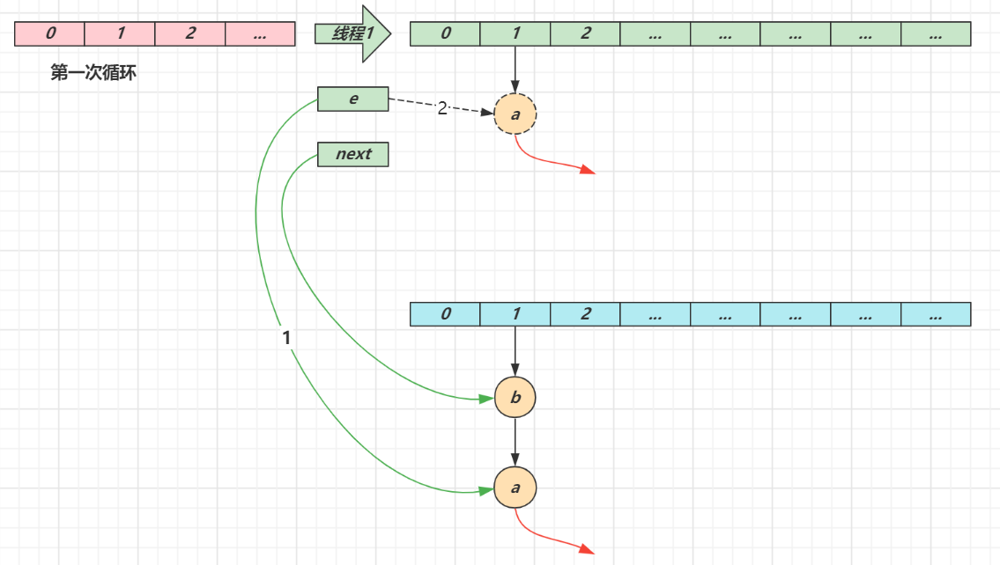</div>

* 第二次循环
    * next 指向了节点 a
    * e 头插节点 b
    * 当循环结束时，e 指向 next 也就是节点 a

<div align="center"></div>

* 第三次循环
    * next 指向了 null
    * e 头插节点 a，<b>a 的 next 指向了 b</b>（之前 a.next 一直是 null），b 的 next 指向 a，死链已成
    * 当循环结束时，e 指向 next 也就是 null，因此第四次循环时会正常退出

<div align="center"></div>

<b>数据错乱（1.7，1.8 都会存在）</b>

* 代码参考 `day01.map.HashMapMissData`，具体调试步骤参考视频

### key 的设计

<b>key 的设计要求</b>

1. HashMap 的 key 可以为 null，但 Map 的其他实现则不然
2. 作为 key 的对象，必须实现 hashCode 和 equals，并且 key 的内容不能修改（不可变）
3. key 的 hashCode 应该有良好的散列性

如果 key 可变，例如修改了 age 会导致再次查询时查询不到

```java
public class HashMapMutableKey {
    public static void main(String[] args) {
        HashMap<Student, Object> map = new HashMap<>();
        Student stu = new Student("张三", 18);
        map.put(stu, new Object());

        System.out.println(map.get(stu));
        stu.age = 19;
        System.out.println(map.get(stu));
    }

    static class Student {
        String name;
        int age;

        public Student(String name, int age) {
            this.name = name;
            this.age = age;
        }
		// 省略 setter getter
        @Override
        public boolean equals(Object o) {
            if (this == o) return true;
            if (o == null || getClass() != o.getClass()) return false;
            Student student = (Student) o;
            return age == student.age && Objects.equals(name, student.name);
        }

        @Override
        public int hashCode() {
            return Objects.hash(name, age);
        }
    }
}
```

<b>String 对象的 hashCode() 设计</b>

* 目标是达到较为均匀的散列效果，每个字符串的 hashCode 足够独特
* 字符串中的每个字符都可以表现为一个数字，称为 $S_i$，其中 i 的范围是 0 ~ n - 1 
* 散列公式为： $S_0∗31^{(n-1)}+ S_1∗31^{(n-2)}+ … S_i ∗ 31^{(n-1-i)}+ …S_{(n-1)}∗31^0$
* 31 代入公式有较好的散列特性，并且 31 * h 可以被优化为 
    * 即 $32 ∗h -h $
    * 即 $2^5  ∗h -h$
    * 即 $h≪5-h$

## 单例模式

<b>要求</b>

* 掌握五种单例模式的实现方式，问哪里用到了单例设计模式尽量说源码中的。
* 理解为何 DCL 实现时要使用 volatile 修饰静态变量
* 了解 JDK 中用到单例的场景

### 实现方式

- 饿汉式
- 枚举饿汉式
- 懒汉式
- 双检锁懒汉式
- 内部类懒汉式

<b>饿汉式</b>

```java
public class Singleton1 implements Serializable {
    private Singleton1() {
        // 禁止反射重复创建对象。
        if (INSTANCE != null) {
            throw new RuntimeException("单例对象不能重复创建");
        }
        System.out.println("private Singleton1()");
    }

    private static final Singleton1 INSTANCE = new Singleton1();

    public static Singleton1 getInstance() {
        return INSTANCE;
    }

    public static void otherMethod() {
        System.out.println("otherMethod()");
    }

    // 禁止反序列化破环单例
    public Object readResolve() {
        return INSTANCE;
    }
}
```

* 构造方法抛出异常是防止反射破坏单例
* `readResolve()` 是防止反序列化破坏单例

<b>枚举饿汉式</b>

```java
public enum Singleton2 {
    INSTANCE;

    private Singleton2() {
        System.out.println("private Singleton2()");
    }

    @Override
    public String toString() {
        return getClass().getName() + "@" + Integer.toHexString(hashCode());
    }

    public static Singleton2 getInstance() {
        return INSTANCE;
    }

    public static void otherMethod() {
        System.out.println("otherMethod()");
    }
}
```

* 枚举饿汉式能天然防止反射、反序列化破坏单例

<b>懒汉式</b>

```java
public class Singleton3 implements Serializable {
    private Singleton3() {
        System.out.println("private Singleton3()");
    }

    private static Singleton3 INSTANCE = null;

    // Singleton3.class
    public static synchronized Singleton3 getInstance() {
        if (INSTANCE == null) {
            INSTANCE = new Singleton3();
        }
        return INSTANCE;
    }

    public static void otherMethod() {
        System.out.println("otherMethod()");
    }

}
```

* 其实只有首次创建单例对象时才需要同步，但该代码实际上每次调用都会同步
* 因此有了下面的双检锁改进

<b>双检锁懒汉式</b>

```java
public class Singleton4 implements Serializable {
    private Singleton4() {
        System.out.println("private Singleton4()");
    }

    private static volatile Singleton4 INSTANCE = null; // 可见性，有序性

    public static Singleton4 getInstance() {
        if (INSTANCE == null) {
            synchronized (Singleton4.class) {
                if (INSTANCE == null) {
                    INSTANCE = new Singleton4();
                }
            }
        }
        return INSTANCE;
    }

    public static void otherMethod() {
        System.out.println("otherMethod()");
    }
}
```

为何必须加 volatile：

* `INSTANCE = new Singleton4()` 不是原子性操作，分成 3 步：创建对象、调用构造、给静态变量赋值，<span style="color:orange">其中后两步可能被指令重排序优化，变成先赋值、再调用构造</span>
* 如果线程 1 先执行了赋值，线程 2 执行到第一个 `INSTANCE == null` 时发现 INSTANCE 已经不为 null，此时就会返回一个未完全构造的对象

<b>内部类懒汉式</b>

<b style="color:orange">把对象的创建放入静态代码块里，对象的创建就是安全的，这种安全性由 JVM 保证。</b>

```java
public class Singleton5 implements Serializable {
    private Singleton5() {
        System.out.println("private Singleton5()");
    }

    private static class Holder {
        static Singleton5 INSTANCE = new Singleton5();
    }

    public static Singleton5 getInstance() {
        return Holder.INSTANCE;
    }

    public static void otherMethod() {
        System.out.println("otherMethod()");
    }
}
```

* 避免了双检锁的缺点

### JDK 中单例的体现

* Runtime 体现了饿汉式单例
* Console 体现了双检锁懒汉式单例
* Collections 中的 EmptyNavigableSet 内部类懒汉式单例
* ReverseComparator.REVERSE_ORDER 内部类懒汉式单例
* Comparators.NaturalOrderComparator.INSTANCE 枚举饿汉式单例

# 并发编程

## 线程状态

<b>要求</b>

* 掌握 Java 线程六种状态
* 掌握 Java 线程状态转换
* 能理解五种状态与六种状态两种说法的区别

<b>六种状态及转换，Java内部定义的六种状态</b>

<div align="center"></div>

分别是

* 新建
    * 当一个线程对象被创建，但还未调用 start 方法时处于新建状态
    * 此时未与操作系统底层线程关联
* 可运行
    * 调用了 start 方法，就会由新建进入可运行
    * 此时与底层线程关联，由操作系统调度执行
* 终结
    * 线程内代码已经执行完毕，由可运行进入终结
    * 此时会取消与底层线程关联
* 阻塞
    * 当获取锁失败后，由可运行进入 Monitor 的阻塞队列阻塞，此时不占用 CPU 时间
    * 当持锁线程释放锁时，会按照一定规则唤醒阻塞队列中的阻塞线程，唤醒后的线程进入可运行状态
* 等待
    * 当获取锁成功后，但由于条件不满足，调用了 wait() 方法，此时从可运行状态释放锁进入 Monitor 等待集合等待，同样不占用 CPU 时间
    * 当其它持锁线程调用 notify() 或 notifyAll() 方法，会按照一定规则唤醒等待集合中的等待线程，恢复为可运行状态
* 有时限等待
    * 当获取锁成功后，但由于条件不满足，调用了 wait(long) 方法，此时从可运行状态释放锁进入 Monitor 等待集合进行有时限等待，同样不占用 CPU 时间
    * 当其它持锁线程调用 notify() 或 notifyAll() 方法，会按照一定规则唤醒等待集合中的有时限等待线程，恢复为可运行状态，并重新去竞争锁
    * 如果等待超时，也会从有时限等待状态恢复为可运行状态，并重新去竞争锁
    * 还有一种情况是调用 sleep(long) 方法也会从可运行状态进入有时限等待状态，但与 Monitor 无关，不需要主动唤醒，超时时间到自然恢复为可运行状态

> <b>其它情况（只需了解）</b>
>
> * 可以用 interrupt() 方法打断等待、有时限等待的线程，让它们恢复为可运行状态
> * park，unpark 等方法也可以让线程等待和唤醒

<b>五种状态</b>

五种状态的说法来自于操作系统层面的划分

<div align="center"></div>

* 运行态：分到 CPU 时间，能真正执行线程内代码的
* 就绪态：有资格分到 CPU 时间，但还未轮到它的
* 阻塞态：没资格分到 CPU 时间的
    * 涵盖了 Java 状态中提到的<b>阻塞、等待、有时限等待</b>
    * 多出了阻塞 I/O，指线程在调用阻塞 I/O 时，实际的任务由 I/O 设备完成，此时线程无事可做，只能干等
* 新建与终结态：与 Java 中同名状态类似

## 线程池

<b>要求</b>

* 掌握线程池的 7 大核心参数

<b>七大参数</b>

1. corePoolSize 核心线程数目 - 池中会保留的最多线程数
2. maximumPoolSize 最大线程数目 - 核心线程+救急线程的最大数目
3. keepAliveTime 生存时间 - 救急线程的生存时间，生存时间内没有新任务，此线程资源会释放
4. unit 时间单位 - 救急线程的生存时间单位，如秒、毫秒等
5. workQueue - 用来缓冲任务，当没有空闲核心线程时，新来任务会加入到此队列排队，队列满会创建救急线程执行任务
6. threadFactory 线程工厂 - 可以定制线程对象的创建，例如设置线程名字、是否是守护线程等
7. handler 拒绝策略 - 当所有线程都在繁忙，workQueue 也放满时，会触发拒绝策略
    1. 抛异常 java.util.concurrent.ThreadPoolExecutor.AbortPolicy
    2. 由调用者执行任务 java.util.concurrent.ThreadPoolExecutor.CallerRunsPolicy
    3. 丢弃任务 java.util.concurrent.ThreadPoolExecutor.DiscardPolicy
    4. 丢弃最早排队任务 java.util.concurrent.ThreadPoolExecutor.DiscardOldestPolicy

<div align="center"></div>

> <b>代码说明</b>

```java
// 线程池参数
public class ThreadPoolDemo {
    public static void main(String[] args) {
        AtomicInteger c = new AtomicInteger();
        ThreadPoolExecutor threadPoolExecutor = new ThreadPoolExecutor(
                5,
                10,
                60,
                TimeUnit.SECONDS,
                new ArrayBlockingQueue<Runnable>(2),
                // lambda 表达式。
                r -> new Thread(r, "mythread" + c.getAndIncrement()),
                new ThreadPoolExecutor.AbortPolicy()
        );
    }
}
```

## wait vs sleep

<b>要求</b>

* 能够说出二者区别

一个共同点，三个不同点

共同点

- wait()，wait(long) 和 sleep(long) 的效果都是让当前线程暂时放弃 CPU 的使用权，进入阻塞状态

不同点

* 方法归属不同
    * ①sleep(long) 是 Thread 的静态方法
    * ②而 wait()，wait(long) 都是 Object 的成员方法，每个对象都有

* 醒来时机不同
    * ①执行 sleep(long) 和 wait(long) 的线程都会在等待相应毫秒后醒来
    * ②wait(long) 和 wait() 还可以被 notify 唤醒，wait() 如果不唤醒就一直等下去
    * ③它们都可以被打断唤醒

* 锁特性不同（重点）
    * ①wait 方法的调用必须先获取 wait 对象的锁，否则会抛出监视器状态非法异常，而 sleep 则无此限制
    * ②wait 方法执行后会释放对象锁，允许其它线程获得该对象锁（我放弃 CPU，但你们还可以用）
    * ③而 sleep 如果在 synchronized 代码块中执行，并不会释放对象锁（我放弃 CPU，你们也用不了）

## lock vs synchronized

<b>要求</b>

* 掌握 lock 与 synchronized 的区别
* 理解 ReentrantLock 的公平、非公平锁
* 理解 ReentrantLock 中的条件变量

<b>三个层面</b>

不同点

* 语法层面
    * synchronized 是关键字，源码在 jvm 中，用 c++ 语言实现
    * Lock 是接口，源码由 jdk 提供，用 java 语言实现
    * 使用 synchronized 时，退出同步代码块锁会自动释放，而使用 Lock 时，需要手动调用 unlock 方法释放锁
* 功能层面
    * 二者均属于悲观锁、都具备基本的互斥、同步、锁重入功能
    * <span style="color:blue">Lock 提供了许多 synchronized 不具备的功能，例如获取等待状态、公平锁、可打断、可超时、多条件变量</span>
        * synchronized 只支持非公平锁，不支持多条件变量，无法获取等待状态，且无法获得那些线程被阻塞了。
        * Lock 支持公平锁、非公平锁，支持多条件变量，可以获取等待状态，可以获取那些线程被阻塞了。
    * Lock 有适合不同场景的实现，如 ReentrantLock， ReentrantReadWriteLock
* 性能层面
    * 在没有竞争时，synchronized 做了很多优化，如偏向锁、轻量级锁，性能不赖
    * 在竞争激烈时，Lock 的实现通常会提供更好的性能

<b>公平锁</b>

* 公平锁的公平体现
    * 已经处在阻塞队列中的线程（不考虑超时）始终都是公平的，先进先出
    * 公平锁是指未处于阻塞队列中的线程来争抢锁，如果队列不为空，则老实到队尾等待
    * 非公平锁是指未处于阻塞队列中的线程来争抢锁，与队列头唤醒的线程去竞争，谁抢到算谁的
* 公平锁会降低吞吐量，一般不用. synchronized 默认是非公平锁

<b>条件变量</b>

* ReentrantLock 中的条件变量功能类似于普通 synchronized 的 wait，notify，用在当线程获得锁后，发现条件不满足时，<span style="color:blue">临时等待的链表结构</span>
* 与 synchronized 的等待集合不同之处在于，ReentrantLock 中的条件变量可以有多个，可以实现更精细的等待、唤醒控制

> <b>代码说明</b>

```java
package day02;

import java.io.IOException;
import java.lang.reflect.Field;
import java.util.*;
import java.util.concurrent.TimeUnit;
import java.util.concurrent.locks.AbstractQueuedSynchronizer;
import java.util.concurrent.locks.Condition;
import java.util.concurrent.locks.ReentrantLock;
import java.util.stream.Collectors;
import java.util.stream.IntStream;
import java.util.stream.Stream;

import static day02.LoggerUtils.*;

// --add-opens java.base/java.util.concurrent=ALL-UNNAMED --add-opens java.base/java.util.concurrent.locks=ALL-UNNAMED
public class TestReentrantLock {
    static final MyReentrantLock LOCK = new MyReentrantLock(true);

    static Condition c1 = LOCK.newCondition("c1");
    static Condition c2 = LOCK.newCondition("c2");

    static volatile boolean stop = false;

    public static void main(String[] args) throws InterruptedException, IOException {
        learnLock();
    }

    private static void learnLock() throws InterruptedException {
        System.out.println(LOCK);
        new MyThread(() -> {
            LOCK.lock();
            get("t").debug("acquire lock...");
        }, "t1").start();

        Thread.sleep(100);
        new MyThread(() -> {
            LOCK.lock();
            get("t").debug("acquire lock...");
        }, "t2").start();

        Thread.sleep(100);
        new MyThread(() -> {
            LOCK.lock();
            get("t").debug("acquire lock...");
        }, "t3").start();

        Thread.sleep(100);
        new MyThread(() -> {
            LOCK.lock();
            get("t").debug("acquire lock...");
        }, "t4").start();
    }

    private static void fairVsUnfair() throws InterruptedException {
        new MyThread(() -> {
            LOCK.lock();
            get("t").debug("acquire lock...");
            sleep1s();
            LOCK.unlock();
        }, "t1").start();

        Thread.sleep(100);
        new MyThread(() -> {
            LOCK.lock();
            get("t").debug("acquire lock...");
            sleep1s();
            LOCK.unlock();
        }, "t2").start();

        Thread.sleep(100);
        new MyThread(() -> {
            LOCK.lock();
            get("t").debug("acquire lock...");
            sleep1s();
            LOCK.unlock();
        }, "t3").start();

        Thread.sleep(100);
        new MyThread(() -> {
            LOCK.lock();
            get("t").debug("acquire lock...");
            sleep1s();
            LOCK.unlock();
        }, "t4").start();

        get("t").debug("{}", LOCK);

        while (!stop) {
            new Thread(() -> {
                try {
                    boolean b = LOCK.tryLock(10, TimeUnit.MILLISECONDS);
                    if (b) {
                        System.out.println(Thread.currentThread().getName() + " acquire lock...");
                        stop = true;
                        sleep1s();
                        LOCK.unlock();
                    }
                } catch (InterruptedException e) {
                    e.printStackTrace();
                }
            }).start();
        }
    }

    private static void sleep1s() {
        try {
            Thread.sleep(1000);
        } catch (InterruptedException e) {
            e.printStackTrace();
        }
    }

    private static class MyReentrantLock extends ReentrantLock {
        private final Map<String, Condition> conditions = new HashMap<>();

        public MyReentrantLock(boolean fair) {
            super(fair);
        }

        public Condition newCondition(String name) {
            Condition condition = super.newCondition();
            conditions.put(name, condition);
            return condition;
        }

        @Override
        public String toString() {
            StringBuilder sb = new StringBuilder(512);
            String queuedInfo = getQueuedInfo();
            List<String> all = new ArrayList<>();
            all.add(String.format("| owner[%s] state[%s]", this.getOwner(), this.getState()));
            all.add(String.format("| blocked queue %s", queuedInfo));
            for (Map.Entry<String, Condition> entry : this.conditions.entrySet()) {
                String waitingInfo = getWaitingInfo(entry.getValue());
                all.add(String.format("| waiting queue [%s] %s", entry.getKey(), waitingInfo));
            }
            int maxLength = all.stream().map(String::length).max(Comparator.naturalOrder()).orElse(100);
            for (String s : all) {
                sb.append(s);
                String space = IntStream.range(0, maxLength - s.length() + 7).mapToObj(i -> " ").collect(Collectors.joining(""));
                sb.append(space).append("|\n");
            }
            sb.deleteCharAt(sb.length() - 1);
            String line1 = IntStream.range(0, maxLength ).mapToObj(i -> "-").collect(Collectors.joining(""));
            sb.insert(0, String.format("%n| Lock %s|%n", line1));
            maxLength += 6;
            String line3 = IntStream.range(0, maxLength).mapToObj(i -> "-").collect(Collectors.joining(""));
            sb.append(String.format("%n|%s|", line3));
            return sb.toString();
        }

        private Object getState() {
            try {
                Field syncField = ReentrantLock.class.getDeclaredField("sync");
                Class<?> aqsClass = Class.forName("java.util.concurrent.locks.AbstractQueuedSynchronizer");
                Field stateField = aqsClass.getDeclaredField("state");
                syncField.setAccessible(true);
                AbstractQueuedSynchronizer sync = (AbstractQueuedSynchronizer) syncField.get(this);
                stateField.setAccessible(true);
                return stateField.get(sync);
            } catch (Exception e) {
                e.printStackTrace();
                throw new RuntimeException(e);
            }
        }

        private String getWaitingInfo(Condition condition) {
            List<String> result = new ArrayList<>();
            try {
                Field firstWaiterField = AbstractQueuedSynchronizer.ConditionObject.class.getDeclaredField("firstWaiter");
                Class<?> conditionNodeClass = Class.forName("java.util.concurrent.locks.AbstractQueuedSynchronizer$ConditionNode");
                Class<?> nodeClass = Class.forName("java.util.concurrent.locks.AbstractQueuedSynchronizer$Node");
                Field waiterField = nodeClass.getDeclaredField("waiter");
                Field statusField = nodeClass.getDeclaredField("status");
                Field nextWaiterField = conditionNodeClass.getDeclaredField("nextWaiter");
                firstWaiterField.setAccessible(true);
                waiterField.setAccessible(true);
                statusField.setAccessible(true);
                nextWaiterField.setAccessible(true);
                Object fistWaiter = firstWaiterField.get(condition);
                while (fistWaiter != null) {
                    Object waiter = waiterField.get(fistWaiter);
                    Object status = statusField.get(fistWaiter);
                    result.add(String.format("([%s]%s)", status, waiter));
                    fistWaiter = nextWaiterField.get(fistWaiter);
                }
            } catch (Exception e) {
                e.printStackTrace();
            }
            return String.join("->", result);
        }

        private String getQueuedInfo() {
            List<String> result = new ArrayList<>();
            try {
                Field syncField = ReentrantLock.class.getDeclaredField("sync");
                Field headField = AbstractQueuedSynchronizer.class.getDeclaredField("head");
                Class<?> nodeClass = Class.forName("java.util.concurrent.locks.AbstractQueuedSynchronizer$Node");
                Field waiterField = nodeClass.getDeclaredField("waiter");
                Field statusField = nodeClass.getDeclaredField("status");
                Field nextField = nodeClass.getDeclaredField("next");
                syncField.setAccessible(true);
                AbstractQueuedSynchronizer sync = (AbstractQueuedSynchronizer) syncField.get(this);
                waiterField.setAccessible(true);
                statusField.setAccessible(true);
                nextField.setAccessible(true);
                headField.setAccessible(true);
                Object head = headField.get(sync);
                while (head != null) {
                    Object waiter = waiterField.get(head);
                    Object status = statusField.get(head);
					result.add("{"+status+"}"+ waiter);
                    head = nextField.get(head);
                }
            } catch (Exception e) {
                e.printStackTrace();
            }
            return String.join("->", result);
        }
    }

    static class MyThread extends Thread {
        public MyThread(Runnable target, String name) {
            super(target, name);
        }

        @Override
        public String toString() {
            return this.getName();
        }
    }
}
```

## volatile

<b>要求</b>

* 掌握线程安全要考虑的三个问题
* 掌握 volatile 能解决哪些问题

volatile 能否保证线程安全？

1. 线程安全要考虑三个方面：可见性、有序性、原子性
    ①可见性指，一个线程对共享变量修改，另一个线程能看到最新的结果。
    ②有序性指，一个线程内代码按照编写顺序执行。（指令重排序的影响）
    ③原子性指，一个线程内多行代码以一个整体运行，期间不能有其他线程的代码插队。

2. volatile 能够保证共享变量的可见性与有序性，但并不能保证原子性

    ①原子性举例

    ②可见性举例

    ③有序性举例

<b>原子性</b>

* 起因：多线程下，不同线程的指令发生了交错导致的共享变量的读写混乱
* 解决：用悲观锁或乐观锁解决，volatile 并不能解决原子性

<b>可见性</b>

* 起因：由于编译器优化、或缓存优化、或 CPU 指令重排序优化导致的对共享变量所做的修改另外的线程看不到
* 解决：<span style="color:orange">用 volatile 修饰共享变量，能够防止编译器等优化发生</span>，让一个线程对共享变量的修改对另一个线程可见

```java
// 停不下来的循环
public class ForeverLoop {
    static boolean stop = false;

    public static void main(String[] args) throws InterruptedException {
        new Thread(() -> {
            while (!stop) {
            }
        }).start();
        TimeUnit.SECONDS.sleep(1);
        stop = true;
    }
}
```

网上的说法是：把 stop 重新赋值后，只是在线程的工作内存中更新，没有同步到主存，所以读不到。这种说法是错误的。下面的代码验证了这种说法是错误的。

```java
// 添加 VM 指令。 -Xint
public class ForeverLoop {
    static boolean stop = false;

    public static void main(String[] args) throws InterruptedException {
        new Thread(() -> {
            while (!stop) { // 实际上被优化成了 if(!stop) while(true)
            }
        }).start();
        TimeUnit.SECONDS.sleep(1);
        stop = true;
        
        new Thread(() -> {
            System.out.println(stop); // 可以读到 stop 的值是 true
        }).start();
        TimeUnit.SECONDS.sleep(1);
    }
}
```

其实是 JIT 的原因。访问主存的速度是比较慢的，大概需要几百纳秒，JIT 发现 while 循环在 1s 内执行的次数大于了某个阈值，为了执行效率，直接把 while(!stop) 替换为了 while(true)。【JIT 也有办法把替换回来的】可以通过禁用 JIT 进行测试。循环次数不够多，就不会发生代码替换（替换成机器码）也就会停下来了。给 stop 加上 volatile 也可以，加上 volatile 后就不会对 while(!stop) 进行 JIT 优化了。

<b>有序性</b>

* 起因：由于编译器优化、或缓存优化、或 CPU 指令重排序优化导致指令的实际执行顺序与编写顺序不一致 (可以看下多级流水线指令理解下重排序优化)
* 解决：<span style="color:orange">用 volatile 修饰共享变量会在读、写共享变量时加入不同的屏障，阻止其他读写操作越过屏障，从而达到阻止重排序的效果</span>
* 注意：
    * volatile 变量写操作，加的屏障是阻止上方其它写操作越过屏障排到 volatile 变量写之下（volatile 变量先写，其他指令不能比我先写）
    * volatile 变量读操作，加的屏障是阻止下方其它读操作越过屏障排到 volatile 变量读之上（volatile 变量先读，其他指令不能比我先读）
    * volatile 读写操作，加入的屏障只能防止同一线程内的指令重排

> <b>代码说明</b>
>
> * day02.threadsafe.AddAndSubtract 演示原子性
> * day02.threadsafe.ForeverLoop 演示可见性
>     * 注意：本例经实践检验是编译器优化导致的可见性问题
> * day02.threadsafe.Reordering 演示有序性
>     * 需要打成 jar 包后测试
> * 请同时参考视频讲解

```java
package day02.threadsafe;

import static day02.LoggerUtils.get;

// 可见性例子
// -Xint
public class ForeverLoop {
    static volatile boolean stop = false;

    public static void main(String[] args) {
        new Thread(() -> {
            try {
                Thread.sleep(100);
            } catch (InterruptedException e) {
                e.printStackTrace();
            }
            stop = true;
            get().debug("modify stop to true...");
        }).start();

        new Thread(() -> {
            try {
                Thread.sleep(200);
            } catch (Interru9ptedException e) {
                e.printStackTrace();
            }
            get().debug("{}", stop);
        }).start();

        new Thread(() -> {
            try {
                Thread.sleep(200);
            } catch (InterruptedException e) {
                e.printStackTrace();
            }
            get().debug("{}", stop);
        }).start();

        foo();
    }

    static void foo() {
        int i = 0;
        // JIT 优化会直接把代码优化成 while(!false) 。所以循环停不下来。
        // 不使用 JIT 或者 while 训练的次数不够多，就不触发 JIT。
        // 或者用 volatile 修饰，不让 JIT 进行优化。
        while (!stop) {
            i++;
        }
        get().debug("stopped... c:{}", i);
    }
}
```

## 悲观锁 vs 乐观锁

<b>要求</b>

* 掌握悲观锁和乐观锁的区别

<b>对比悲观锁与乐观锁</b>

* 悲观锁的代表是 synchronized 和 Lock 锁
    * 其核心思想是【线程只有占有了锁，才能去操作共享变量，每次只有一个线程占锁成功，获取锁失败的线程，都得停下来等待】
    * 线程从运行到阻塞、再从阻塞到唤醒，涉及线程上下文切换，如果频繁发生，影响性能
    * 实际上，线程在获取 synchronized 和 Lock 锁时，如果锁已被占用，都会做几次重试操作，减少阻塞的机会

* 乐观锁的代表是 AtomicInteger，使用 CAS 来保证原子性
    * 其核心思想是【无需加锁，每次只有一个线程能成功修改共享变量，其它失败的线程不需要停止，不断重试直至成功】
    * 由于线程一直运行，不需要阻塞，因此不涉及线程上下文切换
    * 它需要多核 CPU 支持，且线程数不应超过 CPU 核数（有独立的 CPU 来执行重试的代码）
    * Java 的 CAS 一般需要配合 Java 的 volatile 使用，要保证 CAS 操作的变量的可见性。

> <b>代码说明</b>
>
> * day02.SyncVsCas 演示了分别使用乐观锁和悲观锁解决原子赋值

```java
package day02;
import jdk.internal.misc.Unsafe;
// --add-opens java.base/jdk.internal.misc=ALL-UNNAMED
public class SyncVsCas {
    static final Unsafe U = Unsafe.getUnsafe();
    static final long BALANCE = U.objectFieldOffset(Account.class, "balance");

    static class Account {
        volatile int balance = 10;
    }

    private static void showResult(Account account, Thread t1, Thread t2) {
        try {
            t1.start();
            t2.start();
            t1.join();
            t2.join();
            LoggerUtils.get().debug("{}", account.balance);
        } catch (InterruptedException e) {
            e.printStackTrace();
        }
    }

    public static void sync(Account account) {
        Thread t1 = new Thread(() -> {
            synchronized (account) {
                int old = account.balance;
                int n = old - 5;
                account.balance = n;
            }
        },"t1");

        Thread t2 = new Thread(() -> {
            synchronized (account) {
                int o = account.balance;
                int n = o + 5;
                account.balance = n;
            }
        },"t2");

        showResult(account, t1, t2);
    }

    public static void cas(Account account) {
        Thread t1 = new Thread(() -> {
            while (true) {
                int o = account.balance;
                int n = o - 5;
                if (U.compareAndSetInt(account, BALANCE, o, n)) { // 能保证操作是原子的。
                    break;
                }
            }
        },"t1");

        Thread t2 = new Thread(() -> {
            while (true) {
                int o = account.balance;
                int n = o + 5;
                if (U.compareAndSetInt(account, BALANCE, o, n)) {
                    break;
                }
            }
        },"t2");

        showResult(account, t1, t2);
    }

    private static void basicCas(Account account) {
        while (true) {
            int o = account.balance;
            int n = o + 5;
            if(U.compareAndSetInt(account, BALANCE, o, n)){
                break;
            }
        }
        System.out.println(account.balance);
    }

    public static void main(String[] args) {
        Account account = new Account();
        cas(account);
    }
}
```

## Hashtable vs ConcurrentHashMap

面试题：Hashtable vs ConcurrentHashMap

1. Hashtable 与 ConcurrentHashMap 都是线程安全的 Map 集合。
2. Hashtable 并发度低，整个 Hashtable 都对应一把锁，同一时刻，只能有一个线程操作它
3. 1.8 之前 ConcurrentHashMap 使用了 Segment + 数组 + 链表的结构，每个 Segment 对应一把锁，如果多个线程访问不同的 Segment（Segment 数组里会套一个小数组），则不会冲突。
4. 1.8 开始 ConcurrentHashMap  将数组的每个头节点作为锁，如果多个线程访问的头节点不同，则不会冲突。
    1. 并发 put
    2. 扩容，三个问题 forwardingNode，扩容时的 get，扩容的 put

<b>要求</b>

* 掌握 Hashtable 与 ConcurrentHashMap 的区别
* 掌握 ConcurrentHashMap 在不同版本的实现区别

> 更形象的演示，见资料中的 hash-demo.jar，运行需要 jdk14 以上环境，进入 jar 包目录，执行下面命令
>
> ```shell
> java -jar --add-exports java.base/jdk.internal.misc=ALL-UNNAMED hash-demo.jar
> ```

<b>Hashtable 对比 ConcurrentHashMap</b>

* Hashtable 与 ConcurrentHashMap 都是线程安全的 Map 集合
* Hashtable 并发度低，整个 Hashtable 对应一把锁，同一时刻，只能有一个线程操作它
* ConcurrentHashMap 并发度高，整个 ConcurrentHashMap 对应多把锁，只要线程访问的是不同锁，那么不会冲突

<b>ConcurrentHashMap 1.7</b>

* 数据结构：`Segment(大数组) + HashEntry(小数组) + 链表`，每个 Segment 对应一把锁，如果多个线程访问不同的 Segment，则不会冲突
* 并发度：Segment 数组大小即并发度，决定了同一时刻最多能有多少个线程并发访问。Segment 数组不能扩容，意味着并发度在 ConcurrentHashMap 创建时就固定了。容量（capacity） / 并发度（Segment）= 每个 Segment 里的小数组的容量。
* 索引计算
    * 假设大数组长度是 $2^m$，key 在大数组内的索引是 key 的二次 hash 值的高 m 位
    * 假设小数组长度是 $2^n$，key 在小数组内的索引是 key 的二次 hash 值的低 n 位
* <span style="color:orange">扩容：每个小数组的扩容相对独立，小数组在超过扩容因子时会触发扩容，每次扩容翻倍，小数组各扩各的。</span>
* Segment[0] 原型（饿汉式初始化 Segment[0] 数组。）：首次创建其它小数组时，会以此原型为依据，数组长度，扩容因子都会以原型为准。如果 Segment[0] 扩容了，那么新创建的数组的大小会和 扩容后的 Segment[0] 一样。体现了原型设计模式。

<b>ConcurrentHashMap 1.8</b>

* 数据结构：`Node 数组 + 链表或红黑树`，数组的每个头节点作为锁，如果多个线程访问的头节点不同，则不会冲突。首次生成头节点时如果发生竞争，利用 CAS 而非 syncronized，进一步提升性能。
* 构造参数含义：`public ConcurrentHashMap(int initialCapacity, float loadFactor, int concurrencyLevel) `
    * initialCapacity：不再对应数组的长度，对应的是将来要放 initialCapacity 个元素，数组的长度看着办。
    * loadFactor：负载因子，只会在第一次构造用到，后面的扩容还是按$3/4$ 来扩容的。
    * concurrencyLevel：
    * eg：initialCapacity=12，loadFactor=0.75；此时数组的长度会是 32。为什么不是16？因为$16* 3/4 = 12，又要扩容$所以直接是32。
    * eg：initialCapacity=11，loadFactor=0.75；此时数组的长度会是 16。

* 并发度：Node 数组有多大，并发度就有多大，与 1.7 不同，Node 数组可以扩容
* 扩容条件：Node 数组满 $\frac{3}{4}$ 时就会扩容
* 扩容单位：以链表为单位从后向前迁移链表，迁移完成的将旧数组头节点替换为 ForwardingNode
* 扩容时并发 get
    * 根据是否为 ForwardingNode 来决定是在新数组查找还是在旧数组查找，不会阻塞
    * 如果链表长度超过 1，则需要对节点进行复制（创建新节点），怕的是节点迁移后 next 指针改变
    * 如果链表最后几个元素扩容后索引不变，则节点无需复制
* 扩容时并发 put
    * 如果 put 的线程与扩容线程操作的链表是同一个，put 线程会阻塞
    * 如果 put 的线程操作的链表还未迁移完成，即头节点不是 ForwardingNode，则可以并发执行
    * 如果 put 的线程操作的链表已经迁移完成，即头结点是 ForwardingNode，则可以协助扩容
* 与 1.7 相比是懒惰初始化
* capacity 代表预估的元素个数，capacity / factory 来计算出初始数组大小，需要贴近 $2^n$ 
* loadFactor 只在计算初始数组大小时被使用，之后扩容固定为 3/4
* 超过树化阈值时的扩容问题，如果容量已经是 64，直接树化，否则在原来容量基础上做 3 轮扩容

## ThreadLocal

面试题：谈一谈对 ThreadLocal 的理解。

1. ThreadLocal 可以实现 [资源对象] 的线程隔离，让每个线程各用各的 [资源对象] ，避免征用引发的线程安全问题.
2. ThreadLocal 同时实现了线程内的资源共享 (局部变量可以保证资源隔离,但是无法共享, ThreadLoca 既可以隔离,又可以共享)

<b>要求</b>

* 掌握 ThreadLocal 的作用与原理
* 掌握 ThreadLocal 的内存释放时机

<b>作用</b>

* ThreadLocal 可以实现【资源对象】的线程隔离，让每个线程各用各的【资源对象】，避免争用引发的线程安全问题
* ThreadLocal 同时实现了线程内的资源共享

<b>原理</b>

每个线程内有一个 ThreadLocalMap 类型的成员变量，用来存储资源对象. ThreadLocal 只是关联这些资源对象的.

* 调用 set 方法，就是以 ThreadLocal 自己作为 key，资源对象作为 value，放入当前线程的 ThreadLocalMap 集合中
* 调用 get 方法，就是以 ThreadLocal 自己作为 key，到当前线程中查找关联的资源值
* 调用 remove 方法，就是以 ThreadLocal 自己作为 key，移除当前线程关联的资源值

ThreadLocalMap 的一些特点

* key 的 hash 值统一分配
* 初始容量 16，扩容因子 2/3，扩容容量翻倍
* key 索引冲突后用开放寻址法解决冲突

<b>弱引用 key</b>

ThreadLocalMap 中的 key 被设计为弱引用，原因如下

* Thread 可能需要长时间运行（如线程池中的线程），如果 key 不再使用，需要在内存不足（GC）时释放其占用的内存

<b>内存释放时机</b>

* 被动 GC 释放 key
    * 仅是让 key 的内存释放，关联 value 的内存并不会释放
* 懒惰被动释放 value
    * get key 时，发现是 null key，则释放其 value 内存
    * set key 时，会使用启发式扫描，清除临近的 null key 的 value 内存，启发次数与元素个数，是否发现 null key 有关
* 主动 remove 释放 key，value
    * 会同时释放 key，value 的内存，也会清除临近的 null key 的 value 内存
    * 推荐使用它，因为一般使用 ThreadLocal 时都把它作为静态变量（即强引用），因此无法被动依靠 GC 回收

# 虚拟机篇

## JVM 内存结构

<b>要求</b>

* 掌握 JVM 内存结构划分
* 尤其要知道方法区、永久代、元空间的关系

<b>结合一段 Java 代码的执行理解内存划分</b>

<div align="center"></div>

* 执行 javac 命令编译源代码为字节码
* 执行 java 命令
    1. 创建 JVM，调用类加载子系统加载 class，将类的信息存入<b>方法区</b>
    2. 创建 main 线程，使用的内存区域是 <b>JVM 虚拟机栈</b>，开始执行 main 方法代码
    3. 如果遇到了未见过的类，会继续触发类加载过程，同样会存入<b>方法区</b>
    4. 需要创建对象，会使用<b>堆</b>内存来存储对象
    5. 不再使用的对象，会由<b>垃圾回收器</b>在内存不足时回收其内存
    6. 调用方法时，方法内的局部变量、方法参数所使用的是  <b>JVM 虚拟机栈</b>中的栈帧内存
    7. 调用方法时，先要到<b>方法区</b>获得到该方法的字节码指令，由<b>解释器</b>将字节码指令解释为机器码执行
    8. 调用方法时，会将要执行的指令行号读到<b>程序计数器</b>，这样当发生了线程切换，恢复时就可以从中断的位置继续
    9. 对于非 java 实现的方法调用，使用内存称为<b>本地方法栈</b>（见说明）
    10. 对于热点方法调用，或者频繁的循环代码，由 <b>JIT 即时编译器</b>将这些代码编译成机器码缓存，提高执行性能

<b>说明</b>

* 加粗字体代表了 JVM 虚拟机组件
* 对于 Oracle 的 Hotspot 虚拟机实现，不区分虚拟机栈和本地方法栈

<b>会发生内存溢出的区域</b>

* 不会出现内存溢出的区域 – 程序计数器
* 出现 OutOfMemoryError 的情况
    * 堆内存耗尽 – 对象越来越多，又一直在使用，不能被垃圾回收
    * 方法区内存耗尽 – 加载的类越来越多，很多框架都会在运行期间动态产生新的类
    * 虚拟机栈累积 – 每个线程最多会占用 1 M 内存，线程个数越来越多，而又长时间运行不销毁时
* 出现 StackOverflowError 的区域
    * JVM 虚拟机栈，原因有方法递归调用未正确结束、反序列化 json 时循环引用, 导致线程内的 1M 内存耗尽.

<b>方法区、永久代、元空间</b>

* <b>方法区</b>是 JVM 规范中定义的一块内存区域，用来存储类元数据、方法字节码、即时编译器需要的信息等
* <b>永久代</b>是 Hotspot 虚拟机对 JVM 规范的实现（1.8 之前）
* <b>元空间</b>是 Hotspot 虚拟机对 JVM 规范的另一种实现（1.8 以后），使用本地内存作为这些信息的存储空间

<div align="center"></div>

从这张图学到三点

* 当第一次用到某个类是，由类加载器将 class 文件的类元信息读入，并存储于元空间
* X，Y 的类元信息是存储于元空间中，无法直接访问
* 可以用 X.class，Y.class 间接访问类元信息，它们俩属于 java 对象，我们的代码中可以使用

<div align="center"></div>

从这张图可以学到

* 堆内存中：当一个<b>类加载器对象</b>，这个类加载器对象加载的所有<b>类对象</b>，这些类对象对应的所有<b>实例对象</b>都没人引用时，GC 时就会对它们占用的对内存进行释放
* 元空间中：内存释放<b>以类加载器为单位</b>，当堆中类加载器内存释放时，对应的元空间中的类元信息也会释放

## JVM 内存参数

<b>要求</b> 

* 熟悉常见的 JVM 参数，尤其和大小相关的

<b>堆内存，按大小设置</b>

<div align="center"></div>

解释：

* -Xms 最小堆内存（包括新生代和老年代）
* -Xmx 最大对内存（包括新生代和老年代）
* 通常建议将 -Xms 与 -Xmx 设置为大小相等，即不需要保留内存，不需要从小到大增长，这样性能较好
* -XX:NewSize 与 -XX:MaxNewSize 设置新生代的最小与最大值，但一般不建议设置，由 JVM 自己控制
* -Xmn 设置新生代大小，相当于同时设置了 -XX:NewSize 与 -XX:MaxNewSize 并且取值相等
* 保留是指，一开始不会占用那么多内存，随着使用内存越来越多，会逐步使用这部分保留内存。下同

<b>堆内存，按比例设置</b>

<div align="center"></div>

解释：

* -XX:NewRatio=2:1 表示老年代占两份，新生代占一份
* -XX:SurvivorRatio=4:1 表示新生代分成六份，伊甸园占四份，from 和 to 各占一份

<b>元空间内存设置</b>

<div align="center">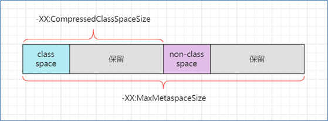</div>

解释：

* class space 存储类的基本信息，最大值受 -XX:CompressedClassSpaceSize 控制
* non-class space 存储除类的基本信息以外的其它信息（如方法字节码、注解等）
* class space 和 non-class space 总大小受 -XX:MaxMetaspaceSize 控制

注意：

* 这里 -XX:CompressedClassSpaceSize 这段空间还与是否开启了指针压缩有关，这里暂不深入展开，可以简单认为指针压缩默认开启

<b>代码缓存内存设置</b>

<div align="center"></div>

解释：

* 如果 -XX:ReservedCodeCacheSize < 240m，所有优化机器代码不加区分存在一起
* 否则，分成三个区域（图中笔误 mthod 拼写错误，少一个 e）
    * non-nmethods - JVM 自己用的代码
    * profiled nmethods - 部分优化的机器码
    * non-profiled nmethods - 完全优化的机器码

<b>线程内存设置</b>

<div align="center"></div>

> <b>官方参考文档</b>
>
> * https://docs.oracle.com/en/java/javase/11/tools/java.html#GUID-3B1CE181-CD30-4178-9602-230B800D4FAE

## JVM 垃圾回收

<b>要求</b>

* 掌握垃圾回收算法
* 掌握分代回收思想
* 理解三色标记及漏标处理
* 了解常见垃圾回收器

<b>三种垃圾回收算法</b>

标记清除法

<div align="center">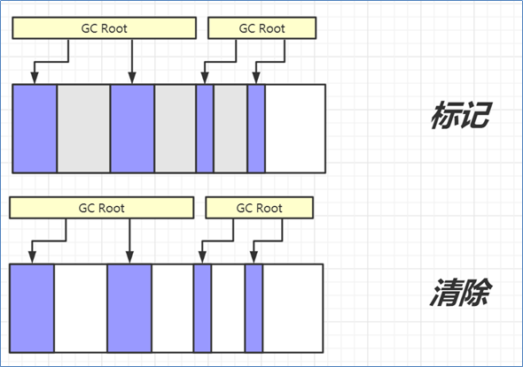</div>

解释：

1. 找到 GC Root 对象，即那些一定不会被回收的对象，如正执行方法内局部变量引用的对象、静态变量引用的对象
2. 标记阶段：沿着 GC Root 对象的引用链找，直接或间接引用到的对象加上标记
3. 清除阶段：释放未加标记的对象占用的内存

要点：

* 标记速度与存活对象线性关系
* 清除速度与内存大小线性关系
* 缺点是会产生内存碎片

标记整理法

<div align="center"></div>

解释：

1. 前面的标记阶段、清理阶段与标记清除法类似
2. 多了一步整理的动作，将存活对象向一端移动，可以避免内存碎片产生

特点：

* 标记速度与存活对象线性关系

* 清除与整理速度与内存大小成线性关系
* 缺点是性能上较慢

标记复制法

<div align="center"></div>

解释：

1. 将整个内存分成两个大小相等的区域，from 和 to，其中 to 总是处于空闲，from 存储新创建的对象
2. 标记阶段与前面的算法类似
3. 在找出存活对象后，会将它们从 from 复制到 to 区域，复制的过程中自然完成了碎片整理
4. 复制完成后，交换 from 和 to 的位置即可

特点：

* 标记与复制速度与存活对象成线性关系
* 缺点是会占用成倍的空间

<b>GC 与分代回收算法</b>

GC 的目的在于实现无用对象内存自动释放，减少内存碎片、加快分配速度

GC 要点：

* 回收区域是<b>堆内存</b>，不包括虚拟机栈
* 判断无用对象，使用<b>可达性分析算法</b>，<b>三色标记法</b>标记存活对象，回收未标记对象
* GC 具体的实现称为<b>垃圾回收器</b>
* GC 大都采用了<b>分代回收思想</b>
    * 理论依据是大部分对象朝生夕灭，用完立刻就可以回收，另有少部分对象会长时间存活，每次很难回收
    * 根据这两类对象的特性将回收区域分为<b>新生代</b>和<b>老年代</b>，新生代采用标记复制法、老年代一般采用标记整理法
* 根据 GC 的规模可以分成 <b>Minor GC，Mixed GC，Full GC</b>

<b>分代回收</b>

1. 伊甸园 eden，最初对象都分配到这里，与幸存区 survivor（分成 from 和 to）合称新生代，

<div align="center"></div>

2. 当伊甸园内存不足，标记伊甸园与 from（现阶段没有）的存活对象

<div align="center">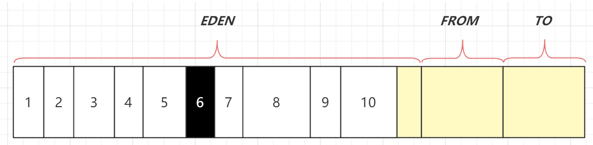</div>

3. 将存活对象采用复制算法复制到 to 中，复制完毕后，伊甸园和 from 内存都得到释放

<div align="center"></div>

4. 将 from 和 to 交换位置

<div align="center"></div>

5. 经过一段时间后伊甸园的内存又出现不足

<div align="center"></div>

6. 标记伊甸园与 from（现阶段没有）的存活对象

<div align="center"></div>

7. 将存活对象采用复制算法复制到 to 中

<div align="center">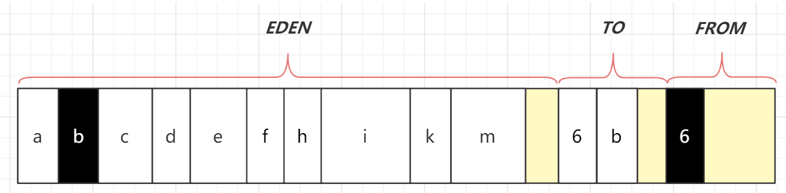</div>

8. 复制完毕后，伊甸园和 from 内存都得到释放

<div align="center"></div>

9. 将 from 和 to 交换位置

<div align="center">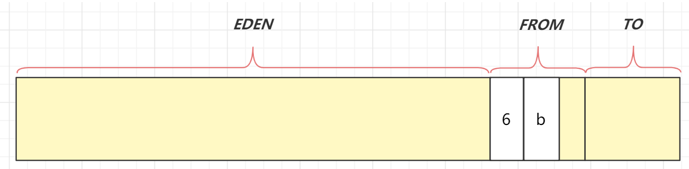</div>

10. 老年代 old，当幸存区对象熬过几次回收（最多15次），晋升到老年代（幸存区内存不足或大对象会导致提前晋升）

<b>GC 规模</b>

* Minor GC 发生在新生代的垃圾回收，暂停时间短

* Mixed GC 新生代 + 老年代部分区域的垃圾回收，G1 收集器特有

* Full GC 新生代 + 老年代完整垃圾回收，暂停时间长，<b>应尽力避免</b>

<b>三色标记</b>

即用三种颜色记录对象的标记状态

* 黑色 – 已标记
* 灰色 – 标记中
* 白色 – 还未标记

1. 起始的三个对象还未处理完成，用灰色表示

<div align="center"></div>

2. 该对象的引用已经处理完成，用黑色表示，黑色引用的对象变为灰色

<div align="center"></div>

3. 依次类推

<div align="center"></div>

4. 沿着引用链都标记了一遍

<div align="center"></div>

5. 最后为标记的白色对象，即为垃圾

<div align="center"></div>

<b>并发漏标问题</b>

比较先进的垃圾回收器都支持<b>并发标记</b>，即在标记过程中，用户线程仍然能工作。但这样带来一个新的问题，如果用户线程修改了对象引用，那么就存在漏标问题。例如：

1. 如图所示标记工作尚未完成

<div align="center"></div>

2. 用户线程同时在工作，断开了第一层 3、4 两个对象之间的引用，这时对于正在处理 3 号对象的垃圾回收线程来讲，它会将 4 号对象当做是白色垃圾

<div align="center"></div>

3. 但如果其他用户线程又建立了 2、4 两个对象的引用，这时因为 2 号对象是黑色已处理对象了，因此垃圾回收线程不会察觉到这个引用关系的变化，从而产生了漏标

<div align="center"></div>

4. 如果用户线程让黑色对象引用了一个新增对象，一样会存在漏标问题

<div align="center">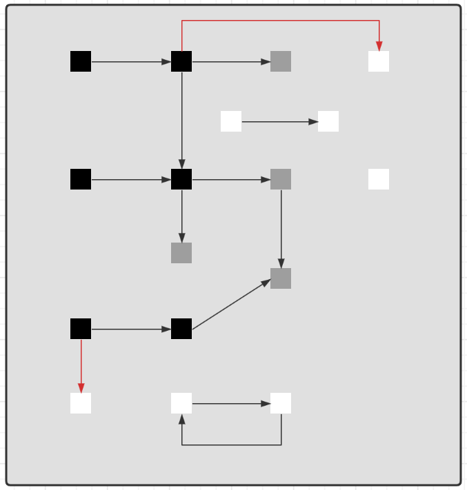</div>

因此对于<b>并发标记</b>而言，必须解决漏标问题，也就是要记录标记过程中的变化。有两种解决方法：

1. Incremental Update 增量更新法，CMS 垃圾回收器采用
    * 思路是拦截每次赋值动作，只要赋值发生，被赋值的对象就会被记录下来，在重新标记阶段再确认一遍
2. Snapshot At The Beginning，SATB 原始快照法，G1 垃圾回收器采用
    * 思路也是拦截每次赋值动作，不过记录的对象不同，也需要在重新标记阶段对这些对象二次处理
    * 新加对象会被记录
    * 被删除引用关系的对象也被记录

<b>垃圾回收器 - Parallel GC</b>

* eden 内存不足发生 Minor GC，采用标记复制算法，需要暂停用户线程
* old 内存不足发生 Full GC，采用标记整理算法，需要暂停用户线程

* <b>注重吞吐量</b>

<b>垃圾回收器 - ConcurrentMarkSweep GC</b>

* 它是工作在 old 老年代，支持<b>并发标记</b>的一款回收器，采用<b>并发清除</b>算法
    * 并发标记时不需暂停用户线程
    * 重新标记时仍需暂停用户线程

* 如果并发失败（即回收速度赶不上创建新对象速度），会触发 Full GC

* <b>注重响应时间</b>

<b>垃圾回收器 - G1 GC</b>

* <b>响应时间与吞吐量兼顾</b>
* 划分成多个区域，每个区域都可以充当 eden，survivor，old， humongous，其中 humongous 专为大对象准备
* 分成三个阶段：新生代回收、并发标记、混合收集
* 如果并发失败（即回收速度赶不上创建新对象速度），会触发 Full GC

<b>G1 回收阶段 - 新生代回收</b>

1. 初始时，所有区域都处于空闲状态

<div align="center"></div>

2. 创建了一些对象，挑出一些空闲区域作为伊甸园区存储这些对象

<div align="center"></div>

3. 当伊甸园需要垃圾回收时，挑出一个空闲区域作为幸存区，用复制算法复制存活对象，需要暂停用户线程

<div align="center"></div>

4. 复制完成，将之前的伊甸园内存释放

<div align="center">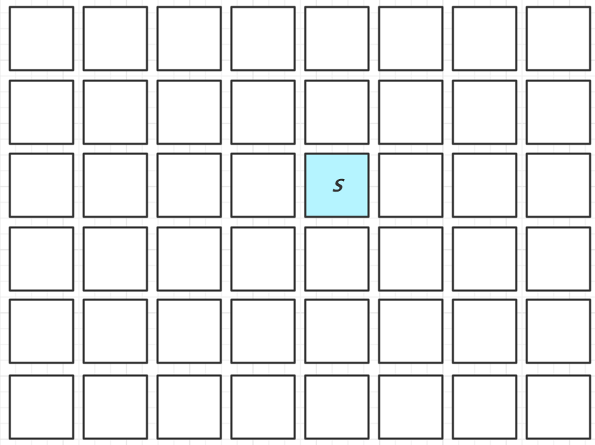</div>

5. 随着时间流逝，伊甸园的内存又有不足

<div align="center"></div>

6. 将伊甸园以及之前幸存区中的存活对象，采用复制算法，复制到新的幸存区，其中较老对象晋升至老年代

<div align="center"></div>

7. 释放伊甸园以及之前幸存区的内存

<div align="center"></div>

<b>G1 回收阶段 - 并发标记与混合收集</b>

1. 当老年代占用内存超过阈值后，触发并发标记，这时无需暂停用户线程

<div align="center"></div>

2. 并发标记之后，会有重新标记阶段解决漏标问题，此时需要暂停用户线程。这些都完成后就知道了老年代有哪些存活对象，随后进入混合收集阶段。此时不会对所有老年代区域进行回收，而是根据<b>暂停时间目标</b>优先回收价值高（存活对象少）的区域（这也是 Gabage First 名称的由来）。

<div align="center"></div>

3. 混合收集阶段中，参与复制的有 eden、survivor、old，下图显示了伊甸园和幸存区的存活对象复制

<div align="center"></div>

4. 下图显示了老年代和幸存区晋升的存活对象的复制

<div align="center"></div>

5. 复制完成，内存得到释放。进入下一轮的新生代回收、并发标记、混合收集

<div align="center"></div>

## 内存溢出

<b>要求</b>

* 能够说出几种典型的导致内存溢出的情况

<b>典型情况</b>

* 误用线程池导致的内存溢出
    * 参考 day03.TestOomThreadPool
* 查询数据量太大导致的内存溢出
    * 参考 day03.TestOomTooManyObject
* 动态生成类导致的内存溢出
    * 参考 day03.TestOomTooManyClass

## 类加载

<b>要求</b>

* 掌握类加载阶段
* 掌握类加载器
* 理解双亲委派机制

<b>类加载过程的三个阶段</b>

1. 加载

    1. 将类的字节码载入方法区，并创建类.class 对象 (方法区的字节码是由 CPP 表示的, Java 无法直接访问. .class 对象是一个对象,存放在堆中)

    2. 如果此类的父类没有加载，先加载父类
    3. 加载是懒惰执行, 用到类的才会加载.

2. 链接
    1. 验证 – 验证类是否符合 Class 规范，合法性、安全性检查
    2. 准备 – 为 static 变量分配空间，设置默认值. ( 不会进行赋值操作,赋值操作是在初始化阶段进行的. )
    3. 解析 – 将常量池的符号引用解析为直接引用

3. 初始化
    1. 静态代码块、static 修饰的变量赋值、static final 修饰的引用类型变量赋值，会被合并成一个 `<cinit>` 方法，在初始化时被调用
    2. <b>static final 修饰的基本类型变量赋值，在链接阶段就已完成</b>
    3. 初始化是懒惰执行

> <b>验证手段</b>
>
> * 使用 jps 查看进程号
> * 使用 jhsdb 调试，执行命令 `jhsdb.exe hsdb` 打开它的图形界面
>     * Class Browser 可以查看当前 jvm 中加载了哪些类
>     * 控制台的 universe 命令查看堆内存范围
>     * 控制台的 g1regiondetails 命令查看 region 详情
>     * `scanoops 起始地址 结束地址 对象类型` 可以根据类型查找某个区间内的对象地址
>     * 控制台的 `inspect 地址` 指令能够查看这个地址对应的对象详情
> * 使用 javap 命令可以查看 class 字节码

><b>代码说明</b>
>
>* day03.loader.TestLazy - 验证类的加载是懒惰的，用到时才触发类加载
>* day03.loader.TestFinal - 验证使用 final 修饰的变量不会触发类加载

<b>jdk8 的类加载器</b>

| <b>名称</b>             | <b>加载哪的类</b>     | <b>说明</b>                    |
| ----------------------- | --------------------- | ------------------------------ |
| Bootstrap ClassLoader   | JAVA_HOME/jre/lib     | 无法直接访问                   |
| Extension ClassLoader   | JAVA_HOME/jre/lib/ext | 上级为 Bootstrap，显示为  null |
| Application ClassLoader | classpath             | 上级为 Extension               |
| 自定义类加载器          | 自定义                | 上级为 Application             |

<b>双亲委派机制</b>

所谓的双亲委派，就是指优先委派上级类加载器进行加载，如果上级类加载器

* 能找到这个类，由上级加载，加载后该类也对下级加载器可见
* 找不到这个类，则下级类加载器才有资格执行加载

双亲委派的目的有两点

1. 让上级类加载器中的类对下级共享（反之不行），即能让你的类能依赖到 jdk 提供的核心类

2. 让类的加载有优先次序，保证核心类优先加载

<b>对双亲委派的误解</b>

下面面试题的回答是错误的

<div align="center"></div>

错在哪了？

* 自己编写类加载器就能加载一个假冒的 java.lang.System 吗? 答案是不行。

* 假设你自己的类加载器用双亲委派，那么优先由启动类加载器加载真正的 java.lang.System，自然不会加载假冒的

* 假设你自己的类加载器不用双亲委派，那么你的类加载器加载假冒的 java.lang.System 时，它需要先加载父类 java.lang.Object，而你没有用委派，找不到 java.lang.Object 所以加载会失败

* <b>以上也仅仅是假设</b>。事实上操作你就会发现，自定义类加载器加载以 java. 打头的类时，会抛安全异常，在 jdk9 以上版本这些特殊包名都与模块进行了绑定，更连编译都过不了

><b>代码说明</b>
>
>* day03.loader.TestJdk9ClassLoader - 演示类加载器与模块的绑定关系

## 四种引用

<b>要求</b>

* 掌握四种引用

<b>强引用</b>

1. 普通变量赋值即为强引用，如 A a = new A();

2. 通过 GC Root 的引用链，如果强引用不到该对象，该对象才能被回收

<div align="center">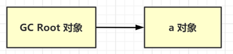</div>

<b>软引用（SoftReference）</b>

1. 例如：SoftReference a = new SoftReference(new A());

2. 如果仅有软引用该对象时，首次垃圾回收不会回收该对象，如果内存仍不足，再次回收时才会释放对象

3. 软引用自身需要配合引用队列来释放

4. 典型例子是反射数据

<div align="center"></div>

<b>弱引用（WeakReference）</b>

1. 例如：WeakReference a = new WeakReference(new A());

2. 如果仅有弱引用引用该对象时，只要发生垃圾回收，就会释放该对象

3. 弱引用自身需要配合引用队列来释放

4. 典型例子是 ThreadLocalMap 中的 Entry 对象

<div align="center"></div>

<b>虚引用（PhantomReference）</b>

1. 例如： PhantomReference a = new PhantomReference(new A(), referenceQueue);

2. 必须配合引用队列一起使用，当虚引用所引用的对象被回收时，由 Reference Handler 线程将虚引用对象入队，这样就可以知道哪些对象被回收，从而对它们关联的资源做进一步处理

3. 典型例子是 Cleaner 释放 DirectByteBuffer 关联的直接内存

<div align="center"></div>

><b>代码说明</b>
>
>* day03.reference.TestPhantomReference - 演示虚引用的基本用法
>* day03.reference.TestWeakReference - 模拟 ThreadLocalMap, 采用引用队列释放 entry 内存

## finalize

<b>要求</b>

* 掌握 finalize 的工作原理与缺点

<b>finalize</b>

* 它是 Object 中的一个方法，如果子类重写它，垃圾回收时此方法会被调用，可以在其中进行资源释放和清理工作
* 将资源释放和清理放在 finalize 方法中非常不好，非常影响性能，严重时甚至会引起 OOM，从 Java9 开始就被标注为 @Deprecated，不建议被使用了

<b>finalize 原理</b>

1. 对 finalize 方法进行处理的核心逻辑位于 java.lang.ref.Finalizer 类中，它包含了名为 unfinalized 的静态变量（双向链表结构），Finalizer 也可被视为另一种引用对象（地位与软、弱、虚相当，只是不对外，无法直接使用）
2. 当重写了 finalize 方法的对象，在构造方法调用之时，JVM 都会将其包装成一个 Finalizer 对象，并加入 unfinalized 链表中

<div align="center"></div>

3. Finalizer 类中还有另一个重要的静态变量，即 ReferenceQueue 引用队列，刚开始它是空的。当狗对象可以被当作垃圾回收时，就会把这些狗对象对应的 Finalizer 对象加入此引用队列
4. 但此时 Dog 对象还没法被立刻回收，因为 unfinalized -> Finalizer 这一引用链还在引用它嘛，为的是【先别着急回收啊，等我调完 finalize 方法，再回收】
5. FinalizerThread 线程会从 ReferenceQueue 中逐一取出每个 Finalizer 对象，把它们从链表断开并真正调用 finallize 方法

<div align="center"></div>

6. 由于整个 Finalizer 对象已经从 unfinalized 链表中断开，这样没谁能引用到它和狗对象，所以下次 gc 时就被回收了

<b>finalize 缺点</b>

* 无法保证资源释放：FinalizerThread 是守护线程，代码很有可能没来得及执行完，线程就结束了
* 无法判断是否发生错误：执行 finalize 方法时，会吞掉任意异常（Throwable）
* 内存释放不及时：重写了 finalize 方法的对象在第一次被 gc 时，并不能及时释放它占用的内存，因为要等着 FinalizerThread 调用完 finalize，把它从 unfinalized 队列移除后，第二次 gc 时才能真正释放内存
* 有的文章提到【Finalizer 线程会和我们的主线程进行竞争，不过由于它的优先级较低，获取到的CPU时间较少，因此它永远也赶不上主线程的步伐】这个显然是错误的，FinalizerThread 的优先级较普通线程更高，原因应该是 finalize 串行执行慢等原因综合导致

> <b>代码说明</b>
>
> * day03.reference.TestFinalize - finalize 的测试代码

#  框架

## Spring refresh 流程

<b>要求</b>

* 掌握 refresh 的 12 个步骤

ApplicationContext 只是一个外部的容器，核心功能还是要交给  BeanFactory 容器。

### 概述

refresh 是 AbstractApplicationContext 中的一个方法，负责初始化 ApplicationContext 容器，容器必须调用 refresh 才能正常工作。它的内部主要会调用 12 个方法，我们把它们称为 refresh 的 12 个步骤：

- 准备工作
    - prepareRefresh
- 创建和准备 BeanFactory  对象
    - obtainFreshBeanFactory
    - prepareBeanFactory
    - postProcessBeanFactory
    - invokeBeanFactoryPostProcessors
    - registerBeanPostProcessors
- 准备 ApplicationContext
    - initMessageSource
    - initApplicationEventMulticaster
    - onRefresh
    - registerListeners
    - <b>finishBeanFactoryInitialization</b> 创建单例对象（初始化 BeanFactory 中非延迟单例 bean）
    - finishRefresh

### 每步的功能

- prepareRefresh -- 做好准备工作：创建一个 Eventivorment 对象，为 Spring 后续的运行准备键值信息。
- obtainFreshBeanFactory -- 创建或获取 BeanFactory：
- prepareBeanFactory -- 准备 BeanFactory：为 BeanFactory 准备各个成员变量，如 EL 表达式的解析器，类型转换器，内置的 BeanPostProcessor
- postProcessBeanFactory -- 子类扩展 BeanFactory
- invokeBeanFactoryPostProcessors -- 后处理器扩展 BeanFactory，比较重要的有 ConfigurationClassPostProcessor 可以解析各种配置信息的注解。
- registerBeanPostProcessors -- 准备 Bean 后处理器，常见的有 解析 Autowired 注解的，解析 Resource 注解的，创建代理类的。
- initMessageSource -- 为 ApplicationContext 提供国际化功能
- initApplicationEventMulticaster -- 为 ApplicationContext  提供事件发布器
- onRefresh -- 留给子类扩展
- registerListeners -- 为 ApplicationContext  准备监听器
- <b>finishBeanFactoryInitialization</b> -- 初始化所有非延迟单例 Bean，执行 Bean 后处理器扩展
- finishRefresh -- 准备生命周期管理器，发布 ContextRefreshed 事件。

```java
@Override
// 用到了模板方法。定义流程规则，具体实现由子类实现。
public void refresh() throws BeansException, IllegalStateException {
   synchronized (this.startupShutdownMonitor) {
      // Prepare this context for refreshing.
      prepareRefresh();

      // Tell the subclass to refresh the internal bean factory.
      ConfigurableListableBeanFactory beanFactory = obtainFreshBeanFactory();

      // Prepare the bean factory for use in this context.
      prepareBeanFactory(beanFactory);

      try {
         // Allows post-processing of the bean factory in context subclasses.
         postProcessBeanFactory(beanFactory);

         // Invoke factory processors registered as beans in the context.
         invokeBeanFactoryPostProcessors(beanFactory);

         // Register bean processors that intercept bean creation.
         registerBeanPostProcessors(beanFactory);

         // Initialize message source for this context.
         initMessageSource();

         // Initialize event multicaster for this context.
         initApplicationEventMulticaster();

         // Initialize other special beans in specific context subclasses.
         onRefresh();

         // Check for listener beans and register them.
         registerListeners();

         // Instantiate all remaining (non-lazy-init) singletons.
         finishBeanFactoryInitialization(beanFactory);

         // Last step: publish corresponding event.
         finishRefresh();
      }

      catch (BeansException ex) {
         if (logger.isWarnEnabled()) {
            logger.warn("Exception encountered during context initialization - " +
                  "cancelling refresh attempt: " + ex);
         }

         // Destroy already created singletons to avoid dangling resources.
         destroyBeans();

         // Reset 'active' flag.
         cancelRefresh(ex);

         // Propagate exception to caller.
         throw ex;
      }

      finally {
         // Reset common introspection caches in Spring's core, since we
         // might not ever need metadata for singleton beans anymore...
         resetCommonCaches();
      }
   }
}
```

### prepareRefresh

- 创建和准备 Environment 对象
- 理解 Environment 对象的作用
    - 提供一些键值信息，管理各种键值信息。
    - systemProperties
    - systemEnvironment
    - 自定义 PropertySource

Environment  的作用之一就是为后续 @Value，值注入时提供键值。

Environment 分成三个主要部分

* systemProperties - 保存 java 环境键值
* systemEnvironment - 保存系统环境键值
* 自定义 PropertySource - 保存自定义键值，例如来自于 *.properties 文件的键值

<div align="center"></div>

### obtainFreshBeanFactory

- 获取（或创建）BeanFactory
- 理解 BeanFactory 的作用
- 理解 BeanDefinition 的作用
- BeanDefinition 从何而来

BeanFactory 会包含这几个信息

- beanDefinitionMap - 初始化了
- beanExpressionResolver
- propertyEditorRegistrars
- resolvableDependencies
- beanPostProcessors
- conversionService
- embeddedValueResolvers
- singletonObjects

* 这一步获取（或创建） BeanFactory，它也是作为 ApplicationContext 的一个成员变量
* BeanFactory 的作用是负责 bean 的创建、依赖注入和初始化，bean 的各项特征由 BeanDefinition 定义
    * BeanDefinition 作为 bean 的设计蓝图，规定了 bean 的特征，如单例多例、依赖关系、初始销毁方法等
    * BeanDefinition 的来源有多种多样，可以是通过 xml 获得、配置类获得、组件扫描获得，也可以是编程添加
* 所有的 BeanDefinition 会存入 BeanFactory 中的 beanDefinitionMap 集合

<div align="center"></div>

###  prepareBeanFactory

准备 bean 工厂。即把成员变量初始化好。

- 这一步会进一步完善 BeanFactory，为它的各项成员变量赋值
- beanExpressionResolver 用来解析 SpEL，常见实现为 StandardBeanExpressionResolver
- propertyEditorRegistrars 会注册类型转换器
    * 它在这里使用了 ResourceEditorRegistrar 实现类
    * 并应用 ApplicationContext 提供的 Environment 完成 ${ } 解析
- registerResolvableDependency 来注册 beanFactory 以及 ApplicationContext，让它们也能用于依赖注入
- beanPostProcessors 是 bean 后处理器集合，会工作在 bean 的生命周期各个阶段，此处会添加两个：
    * ApplicationContextAwareProcessor 用来解析 Aware 接口
    * ApplicationListenerDetector 用来识别容器中 ApplicationListener 类型的 bean

<div align="center"></div>

### postProcessBeanFactory

- 空方法，留给子类扩展
- 用到了模板方法设计模式
- 一般 Web 环境的  ApplicationContext 都要利用它注册新的 Scope，完善 Web 下的  BeanFactory

### invokeBeanFactoryPostProcessors

- 这一步会调用 beanFactory 后处理器
- beanFactory 后处理器，充当 beanFactory 的扩展点，可以用来补充或修改 BeanDefinition
- 常见的 beanFactory 后处理器有
    * ConfigurationClassPostProcessor – 解析 @Configuration、@Bean、@Import、@PropertySource 等
    * PropertySourcesPlaceHolderConfigurer – 替换 BeanDefinition 中的 ${ }
    * MapperScannerConfigurer – 补充 Mapper 接口对应的 BeanDefinition

<div align="center"></div>

### registerBeanPostProcessors

对 bean 做后处理增强。就是那些需要增强的对象。这些 bean 后处理器都是在 beanDefinitionMap 中搜索，看看有没有人实现了 beanPostProcessors 接口。有的话就创建出来，加入到 beanPostProcessors 集合中。bean 创建时就需要用到这些  bean 后置处理器了。

- 默认的 BeanFactory 是没有这么多功能的。如：没有处理依赖的功能，没有切面增强的功能，需要我们加入后置处理器。
- bean 后处理器，充当 bean 的扩展点，可以工作在 bean 的实例化、依赖注入、初始化阶段
- AutowiredAnnotationBeanPostProcessor 功能有：解析 @Autowired，@Value 注解
- CommonAnnotationBeanPostProcessor 功能有：解析 @Resource，@PostConstruct，@PreDestroy
- AnnotationAwareAspectJAutoProxyCreator 功能有：为符合切点的目标 bean 自动创建代理，从而进行功能增强。
- 在 bean 创建的过程中，才会使用到这些后置处理器。

<div align="center">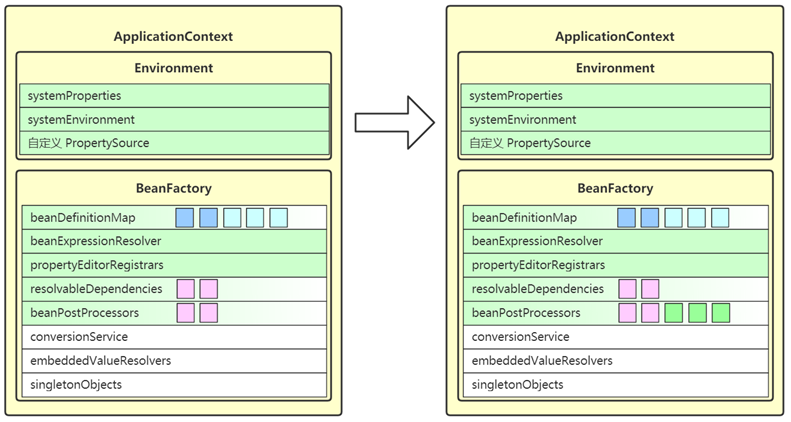</div>

###  initMessageSource

- 这一步是为 ApplicationContext 添加 messageSource 成员，实现国际化功能
- 去 beanFactory 内找名为 messageSource 的 bean，如果没有，则提供空的 MessageSource 实现

<div align="center"></div>

### initApplicationEventMulticaster

收发事件。Multicaster用来发事件。监听器负责收事件。也是先到 beanDefinitionMap 中找，有就拿，没有就创建一个默认的。

- 用来发布事件给监听器
- 可以从容器中找名为 applicationEventMulticaster 的 bean 作为事件广播器，若没有，也会新建默认的事件广播器
- 可以调用 ApplicationContext.publishEvent(事件对象) 来发布事件。

<div align="center"></div>

### onRefresh

- 空实现，留给子类扩展
- Spring Boot 中有很多内嵌的 web 容器，其实就是扩展了 onRefresh 这个方法。创建了一些 内嵌web 容器
- 体现的是模板方法设计模式

### registerListeners

- 这一步会从多种途径找到事件监听器，并添加至 applicationEventMulticaster
- 事件监听器顾名思义，用来接收事件广播器发布的事件，有如下来源
    * 事先编程添加的
    * 来自容器中的 bean
    * 来自于 @EventListener 的解析
- 要实现事件监听器，只需要实现 ApplicationListener 接口，重写其中 onApplicationEvent(E e) 方法即可

<div align="center"></div>

### finishBeanFactoryInitialization

- 包含三个内容：conversionService、embeddedValueResolvers、singletonObjects
- 这一步会将 beanFactory 的成员补充完毕，并初始化所有非延迟单例 bean
- conversionService 也是一套转换机制，作为对 PropertyEditor 的补充
- embeddedValueResolvers 即内嵌值解析器，用来解析 @Value 中的 ${ }，借用的是 Environment 的功能
- singletonObjects 即单例池，缓存所有单例对象
    * 对象的创建都分三个阶段，每一阶段都有不同的 bean 后处理器参与进来，扩展功能

<div align="center"></div>

### finishRefresh

- 用来控制容器内需要生命周期管理的 bean。
- 这一步会为 ApplicationContext 添加 lifecycleProcessor 成员，用来控制容器内需要生命周期管理的 bean
- 如果容器中有名称为 lifecycleProcessor 的 bean 就用它，否则创建默认的生命周期管理器
- 准备好生命周期管理器，就可以实现
    * 调用 context 的 start，即可触发所有实现 LifeCycle 接口 bean 的 start
    * 调用 context 的 stop，即可触发所有实现 LifeCycle 接口 bean 的 stop
- 发布 ContextRefreshed 事件，整个 refresh 执行完成

<div align="center"></div>

## Spring Bean 的生命周期

<b>要求</b>

* 掌握 Spring bean 的生命周期

<b>bean 生命周期概述</b>

bean 的生命周期从调用 beanFactory 的 getBean 开始，到这个 bean 被销毁，可以总结为以下七个阶段：

Bean 从创建到销毁主要做了那些事情。

```java
protected <T> T doGetBean(
    String name, @Nullable Class<T> requiredType, @Nullable Object[] args, boolean typeCheckOnly)
```

- 阶段1：处理名称，检查缓存
- 阶段2：检查父工厂
- 阶段3：检查 DependsOn
- 阶段4：按 Scope 创建 Bean

    - 创建 singleton
    - 创建 prototype
    - 创建其他 scope
- 阶段5：创建 bean

- 阶段6：类型转换处理
- 阶段7：销毁 bean

> <b>注意</b>
>
> - 划分的阶段和名称并不重要，重要的是理解整个过程中做了哪些事情

<b>1. 处理名称，检查缓存</b>

* 这一步会处理别名，将别名解析为实际名称
* 对 FactoryBean 也会特殊处理，如果以 & 开头表示要获取 FactoryBean 本身，否则表示要获取其产品
* 这里针对单例对象会检查一级、二级、三级缓存
    * singletonFactories 三级缓存，存放单例工厂对象
    * earlySingletonObjects 二级缓存，存放单例工厂的产品对象
        * 如果发生循环依赖，产品是代理；无循环依赖，产品是原始对象
    * singletonObjects 一级缓存，存放单例成品对象

<b>2. 处理父子容器</b>

* 如果当前容器根据名字找不到这个 bean，此时若父容器存在，则执行父容器的 getBean 流程
* 父子容器的 bean 名称可以重复

<b>3. 处理 dependsOn</b>

* 如果当前 bean 有通过 dependsOn 指定了非显式依赖的 bean，这一步会提前创建这些 dependsOn 的 bean 
* 所谓非显式依赖，就是指两个 bean 之间不存在直接依赖关系，但需要控制它们的创建先后顺序

<b>4. 选择 scope 策略</b>

* 对于 singleton scope，首先到单例池去获取 bean，如果有则直接返回，没有再进入创建流程
* 对于 prototype scope，每次都会进入创建流程
* 对于自定义 scope，例如 request，首先到 request 域获取 bean，如果有则直接返回，没有再进入创建流程

<b>5.1 创建 bean - 创建 bean 实例</b>

| 要点                                 | 总结                                                         |
| ------------------------------------ | ------------------------------------------------------------ |
| 有自定义 TargetSource 的情况         | 由 AnnotationAwareAspectJAutoProxyCreator 创建代理返回       |
| Supplier 方式创建 bean 实例          | 为 Spring 5.0 新增功能，方便编程方式创建  bean  实例         |
| FactoryMethod 方式  创建 bean  实例  | ① 分成静态工厂与实例工厂；② 工厂方法若有参数，需要对工厂方法参数进行解析，利用  resolveDependency；③ 如果有多个工厂方法候选者，还要进一步按权重筛选 |
| AutowiredAnnotationBeanPostProcessor | ① 优先选择带  @Autowired  注解的构造；② 若有唯一的带参构造，也会入选 |
| mbd.getPreferredConstructors         | 选择所有公共构造，这些构造之间按权重筛选                     |
| 采用默认构造                         | 如果上面的后处理器和 BeanDefiniation 都没找到构造，采用默认构造，即使是私有的 |

<b>5.2 创建 bean - 依赖注入</b>

| 要点                                 | 总结                                                         |
| ------------------------------------ | ------------------------------------------------------------ |
| AutowiredAnnotationBeanPostProcessor | 识别   @Autowired  及 @Value  标注的成员，封装为  InjectionMetadata 进行依赖注入 |
| CommonAnnotationBeanPostProcessor    | 识别   @Resource  标注的成员，封装为  InjectionMetadata 进行依赖注入 |
| resolveDependency                    | 用来查找要装配的值，可以识别：① Optional；② ObjectFactory 及 ObjectProvider；③ @Lazy  注解；④ @Value  注解（${  }, #{ }, 类型转换）；⑤ 集合类型（Collection，Map，数组等）；⑥ 泛型和  @Qualifier（用来区分类型歧义）；⑦ primary  及名字匹配（用来区分类型歧义） |
| AUTOWIRE_BY_NAME                     | 根据成员名字找 bean 对象，修改 mbd 的 propertyValues，不会考虑简单类型的成员 |
| AUTOWIRE_BY_TYPE                     | 根据成员类型执行 resolveDependency 找到依赖注入的值，修改  mbd 的 propertyValues |
| applyPropertyValues                  | 根据 mbd 的 propertyValues 进行依赖注入（即xml中 `<property name ref|value/>`） |

<b>5.3 创建 bean - 初始化</b>

| 要点                  | 总结                                                         |
| --------------------- | ------------------------------------------------------------ |
| 内置 Aware 接口的装配 | 包括 BeanNameAware，BeanFactoryAware 等                      |
| 扩展 Aware 接口的装配 | 由 ApplicationContextAwareProcessor 解析，执行时机在  postProcessBeforeInitialization |
| @PostConstruct        | 由 CommonAnnotationBeanPostProcessor 解析，执行时机在  postProcessBeforeInitialization |
| InitializingBean      | 通过接口回调执行初始化                                       |
| initMethod            | 根据 BeanDefinition 得到的初始化方法执行初始化，即 `<bean init-method>` 或 @Bean(initMethod) |
| 创建 aop 代理         | 由 AnnotationAwareAspectJAutoProxyCreator 创建，执行时机在  postProcessAfterInitialization |

<b>5.4 创建 bean - 注册可销毁 bean</b>

在这一步判断并登记可销毁 bean

* 判断依据
    * 如果实现了 DisposableBean 或 AutoCloseable 接口，则为可销毁 bean
    * 如果自定义了 destroyMethod，则为可销毁 bean
    * 如果采用 @Bean 没有指定 destroyMethod，则采用自动推断方式获取销毁方法名（close，shutdown）
    * 如果有 @PreDestroy 标注的方法
* 存储位置
    * singleton scope 的可销毁 bean 会存储于 beanFactory 的成员当中
    * 自定义 scope 的可销毁 bean 会存储于对应的域对象当中
    * prototype scope 不会存储，需要自己找到此对象销毁
* 存储时都会封装为 DisposableBeanAdapter 类型对销毁方法的调用进行适配

<b>6. 类型转换处理</b>

* 如果 getBean 的 requiredType 参数与实际得到的对象类型不同，会尝试进行类型转换

<b>7. 销毁 bean</b>

* 销毁时机
    * singleton bean 的销毁在 ApplicationContext.close 时，此时会找到所有 DisposableBean 的名字，逐一销毁
    * 自定义 scope bean 的销毁在作用域对象生命周期结束时
    * prototype bean 的销毁可以通过自己手动调用 AutowireCapableBeanFactory.destroyBean 方法执行销毁
* 同一 bean 中不同形式销毁方法的调用次序
    * 优先后处理器销毁，即 @PreDestroy
    * 其次 DisposableBean 接口销毁
    * 最后 destroyMethod 销毁（包括自定义名称，推断名称，AutoCloseable 接口 多选一）


## Spring bean 循环依赖

<b>要求</b>

* 掌握单例 set 方式循环依赖的原理
* 掌握其它循环依赖的解决方法

<b>循环依赖的产生</b>

* 首先要明白，bean 的创建要遵循一定的步骤，必须是创建、注入、初始化三步，这些顺序不能乱

<div align="center"></div>

* set 方法（包括成员变量）的循环依赖如图所示

    * 可以在【a 创建】和【a set 注入 b】之间加入 b 的整个流程来解决
    * 【b set 注入 a】 时可以成功，因为之前 a 的实例已经创建完毕

    * a 的顺序，及 b 的顺序都能得到保障

<div align="center">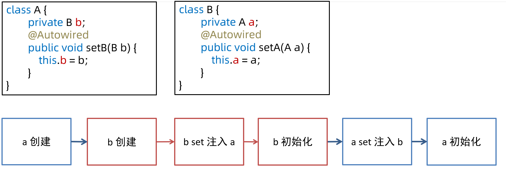</div>

* 构造方法的循环依赖如图所示，显然无法用前面的方法解决

<div align="center"></div>

<b>构造循环依赖的解决</b>

* 思路1
    * a 注入 b 的代理对象，这样能够保证 a 的流程走通
    * 后续需要用到 b 的真实对象时，可以通过代理间接访问

<div align="center"></div>

* 思路2
    * a 注入 b 的工厂对象，让 b 的实例创建被推迟，这样能够保证 a 的流程先走通
    * 后续需要用到 b 的真实对象时，再通过 ObjectFactory 工厂间接访问

<div align="center"></div>

* 示例1：用 @Lazy 为构造方法参数生成代理

```java
public class App60_1 {

    static class A {
        private static final Logger log = LoggerFactory.getLogger("A");
        private B b;

        public A(@Lazy B b) {
            log.debug("A(B b) {}", b.getClass());
            this.b = b;
        }

        @PostConstruct
        public void init() {
            log.debug("init()");
        }
    }

    static class B {
        private static final Logger log = LoggerFactory.getLogger("B");
        private A a;

        public B(A a) {
            log.debug("B({})", a);
            this.a = a;
        }

        @PostConstruct
        public void init() {
            log.debug("init()");
        }
    }

    public static void main(String[] args) {
        GenericApplicationContext context = new GenericApplicationContext();
        context.registerBean("a", A.class);
        context.registerBean("b", B.class);
        AnnotationConfigUtils.registerAnnotationConfigProcessors(context.getDefaultListableBeanFactory());
        context.refresh();
        System.out.println();
    }
}
```

* 示例2：用 ObjectProvider 延迟依赖对象的创建

```java
public class App60_2 {

    static class A {
        private static final Logger log = LoggerFactory.getLogger("A");
        private ObjectProvider<B> b;

        public A(ObjectProvider<B> b) {
            log.debug("A({})", b);
            this.b = b;
        }

        @PostConstruct
        public void init() {
            log.debug("init()");
        }
    }

    static class B {
        private static final Logger log = LoggerFactory.getLogger("B");
        private A a;

        public B(A a) {
            log.debug("B({})", a);
            this.a = a;
        }

        @PostConstruct
        public void init() {
            log.debug("init()");
        }
    }

    public static void main(String[] args) {
        GenericApplicationContext context = new GenericApplicationContext();
        context.registerBean("a", A.class);
        context.registerBean("b", B.class);
        AnnotationConfigUtils.registerAnnotationConfigProcessors(context.getDefaultListableBeanFactory());
        context.refresh();

        System.out.println(context.getBean(A.class).b.getObject());
        System.out.println(context.getBean(B.class));
    }
}
```

* 示例3：用 @Scope 产生代理

```java
public class App60_3 {

    public static void main(String[] args) {
        GenericApplicationContext context = new GenericApplicationContext();
        ClassPathBeanDefinitionScanner scanner = new ClassPathBeanDefinitionScanner(context.getDefaultListableBeanFactory());
        scanner.scan("com.itheima.app60.sub");
        context.refresh();
        System.out.println();
    }
}
```

```java
@Component
class A {
    private static final Logger log = LoggerFactory.getLogger("A");
    private B b;

    public A(B b) {
        log.debug("A(B b) {}", b.getClass());
        this.b = b;
    }

    @PostConstruct
    public void init() {
        log.debug("init()");
    }
}
```

```java
@Scope(proxyMode = ScopedProxyMode.TARGET_CLASS)
@Component
class B {
    private static final Logger log = LoggerFactory.getLogger("B");
    private A a;

    public B(A a) {
        log.debug("B({})", a);
        this.a = a;
    }

    @PostConstruct
    public void init() {
        log.debug("init()");
    }
}
```

* 示例4：用 Provider 接口解决，原理上与 ObjectProvider 一样，Provider 接口是独立的 jar 包，需要加入依赖

```xml
<dependency>
    <groupId>javax.inject</groupId>
    <artifactId>javax.inject</artifactId>
    <version>1</version>
</dependency>
```

```java
public class App60_4 {

    static class A {
        private static final Logger log = LoggerFactory.getLogger("A");
        private Provider<B> b;

        public A(Provider<B> b) {
            log.debug("A({}})", b);
            this.b = b;
        }

        @PostConstruct
        public void init() {
            log.debug("init()");
        }
    }

    static class B {
        private static final Logger log = LoggerFactory.getLogger("B");
        private A a;

        public B(A a) {
            log.debug("B({}})", a);
            this.a = a;
        }

        @PostConstruct
        public void init() {
            log.debug("init()");
        }
    }

    public static void main(String[] args) {
        GenericApplicationContext context = new GenericApplicationContext();
        context.registerBean("a", A.class);
        context.registerBean("b", B.class);
        AnnotationConfigUtils.registerAnnotationConfigProcessors(context.getDefaultListableBeanFactory());
        context.refresh();

        System.out.println(context.getBean(A.class).b.get());
        System.out.println(context.getBean(B.class));
    }
}
```

## 解决 set 循环依赖的原理

<b>一级缓存</b>

<div align="center"></div>

作用是保证单例对象仅被创建一次

* 第一次走 `getBean("a")` 流程后，最后会将成品 a 放入 singletonObjects 一级缓存
* 后续再走 `getBean("a")` 流程时，先从一级缓存中找，这时已经有成品 a，就无需再次创建

<b>一级缓存与循环依赖</b>

<div align="center"></div>

一级缓存无法解决循环依赖问题，分析如下

* 无论是获取 bean a 还是获取 bean b，走的方法都是同一个 getBean 方法，假设先走 `getBean("a")`
* 当 a 的实例对象创建，接下来执行 `a.setB()` 时，需要走 `getBean("b")` 流程，红色箭头 1
* 当 b 的实例对象创建，接下来执行 `b.setA()` 时，又回到了 `getBean("a")` 的流程，红色箭头 2
* 但此时 singletonObjects 一级缓存内没有成品的 a，陷入了死循环

<b>二级缓存</b>

<div align="center"></div>

解决思路如下：

* 再增加一个 singletonFactories 缓存
* 在依赖注入前，即 `a.setB()` 以及 `b.setA()` 将 a 及 b 的半成品对象（未完成依赖注入和初始化）放入此缓存
* 执行依赖注入时，先看看 singletonFactories 缓存中是否有半成品的对象，如果有拿来注入，顺利走完流程

对于上面的图

* `a = new A()` 执行之后就会把这个半成品的 a 放入 singletonFactories 缓存，即 `factories.put(a)`
* 接下来执行 `a.setB()`，走入 `getBean("b")` 流程，红色箭头 3
* 这回再执行到 `b.setA()` 时，需要一个 a 对象，有没有呢？有！
* `factories.get()` 在 singletonFactories  缓存中就可以找到，红色箭头 4 和 5
* b 的流程能够顺利走完，将 b 成品放入 singletonObject 一级缓存，返回到 a 的依赖注入流程，红色箭头 6

<b>二级缓存与创建代理</b>

<div align="center"></div>

二级缓存无法正确处理循环依赖并且包含有代理创建的场景，分析如下

* spring 默认要求，在 `a.init` 完成之后才能创建代理 `pa = proxy(a)`
* 由于 a 的代理创建时机靠后，在执行 `factories.put(a)` 向 singletonFactories 中放入的还是原始对象
* 接下来箭头 3、4、5 这几步 b 对象拿到和注入的都是原始对象

<b>三级缓存</b>

<div align="center"></div>

简单分析的话，只需要将代理的创建时机放在依赖注入之前即可，但 spring 仍然希望代理的创建时机在 init 之后，只有出现循环依赖时，才会将代理的创建时机提前。所以解决思路稍显复杂：

* 图中 `factories.put(fa)` 放入的既不是原始对象，也不是代理对象而是工厂对象 fa
* 当检查出发生循环依赖时，fa 的产品就是代理 pa，没有发生循环依赖，fa 的产品是原始对象 a
* 假设出现了循环依赖，拿到了 singletonFactories 中的工厂对象，通过在依赖注入前获得了 pa，红色箭头 5
* 这回 `b.setA()` 注入的就是代理对象，保证了正确性，红色箭头 7
* 还需要把 pa 存入新加的 earlySingletonObjects 缓存，红色箭头 6
* `a.init` 完成后，无需二次创建代理，从哪儿找到 pa 呢？earlySingletonObjects 已经缓存，蓝色箭头 9

当成品对象产生，放入 singletonObject 后，singletonFactories 和 earlySingletonObjects 就中的对象就没有用处，清除即可

## Spring 事务失效

<b>要求</b>

* 掌握事务失效的八种场景

<b>1. 抛出检查异常导致事务不能正确回滚</b>

```java
@Service
public class Service1 {

    @Autowired
    private AccountMapper accountMapper;

    @Transactional
    public void transfer(int from, int to, int amount) throws FileNotFoundException {
        int fromBalance = accountMapper.findBalanceBy(from);
        if (fromBalance - amount >= 0) {
            accountMapper.update(from, -1 * amount);
            new FileInputStream("aaa");
            accountMapper.update(to, amount);
        }
    }
}
```

* 原因：Spring 默认只会回滚非检查异常

* 解法：配置 rollbackFor 属性
    * `@Transactional(rollbackFor = Exception.class)`

<b>2. 业务方法内自己 try-catch 异常导致事务不能正确回滚</b>

```java
@Service
public class Service2 {

    @Autowired
    private AccountMapper accountMapper;

    @Transactional(rollbackFor = Exception.class)
    public void transfer(int from, int to, int amount)  {
        try {
            int fromBalance = accountMapper.findBalanceBy(from);
            if (fromBalance - amount >= 0) {
                accountMapper.update(from, -1 * amount);
                new FileInputStream("aaa");
                accountMapper.update(to, amount);
            }
        } catch (FileNotFoundException e) {
            e.printStackTrace();
        }
    }
}
```

* 原因：事务通知只有捉到了目标抛出的异常，才能进行后续的回滚处理，如果目标自己处理掉异常，事务通知无法知悉

* 解法1：异常原样抛出
    * 在 catch 块添加 `throw new RuntimeException(e);`

* 解法2：手动设置 TransactionStatus.setRollbackOnly()
    * 在 catch 块添加 `TransactionInterceptor.currentTransactionStatus().setRollbackOnly();`

<b>3. aop 切面顺序导致导致事务不能正确回滚</b>

```java
@Service
public class Service3 {

    @Autowired
    private AccountMapper accountMapper;

    @Transactional(rollbackFor = Exception.class)
    public void transfer(int from, int to, int amount) throws FileNotFoundException {
        int fromBalance = accountMapper.findBalanceBy(from);
        if (fromBalance - amount >= 0) {
            accountMapper.update(from, -1 * amount);
            new FileInputStream("aaa");
            accountMapper.update(to, amount);
        }
    }
}
```

```java
@Aspect
public class MyAspect {
    @Around("execution(* transfer(..))")
    public Object around(ProceedingJoinPoint pjp) throws Throwable {
        LoggerUtils.get().debug("log:{}", pjp.getTarget());
        try {
            return pjp.proceed();
        } catch (Throwable e) {
            e.printStackTrace();
            return null;
        }
    }
}
```

* 原因：事务切面优先级最低，但如果自定义的切面优先级和他一样，则还是自定义切面在内层，这时若自定义切面没有正确抛出异常…

* 解法1、2：同情况2 中的解法:1、2
* 解法3：调整切面顺序，在 MyAspect 上添加 `@Order(Ordered.LOWEST_PRECEDENCE - 1)` （不推荐）

<b>4. 非 public 方法导致的事务失效</b>

```java
@Service
public class Service4 {

    @Autowired
    private AccountMapper accountMapper;

    @Transactional
    void transfer(int from, int to, int amount) throws FileNotFoundException {
        int fromBalance = accountMapper.findBalanceBy(from);
        if (fromBalance - amount >= 0) {
            accountMapper.update(from, -1 * amount);
            accountMapper.update(to, amount);
        }
    }
}
```

* 原因：Spring 为方法创建代理、添加事务通知、前提条件都是该方法是 public 的

* 解法1：改为 public 方法
* 解法2：添加 bean 配置如下（不推荐）

```java
@Bean
public TransactionAttributeSource transactionAttributeSource() {
    return new AnnotationTransactionAttributeSource(false);
}
```

<b>5. 父子容器导致的事务失效</b>

```java
package day04.tx.app.service;

// ...

@Service
public class Service5 {

    @Autowired
    private AccountMapper accountMapper;

    @Transactional(rollbackFor = Exception.class)
    public void transfer(int from, int to, int amount) throws FileNotFoundException {
        int fromBalance = accountMapper.findBalanceBy(from);
        if (fromBalance - amount >= 0) {
            accountMapper.update(from, -1 * amount);
            accountMapper.update(to, amount);
        }
    }
}
```

控制器类

```java
package day04.tx.app.controller;

// ...

@Controller
public class AccountController {

    @Autowired
    public Service5 service;

    public void transfer(int from, int to, int amount) throws FileNotFoundException {
        service.transfer(from, to, amount);
    }
}
```

App 配置类

```java
@Configuration
@ComponentScan("day04.tx.app.service")
@EnableTransactionManagement
// ...
public class AppConfig {
    // ... 有事务相关配置
}
```

Web 配置类

```java
@Configuration
@ComponentScan("day04.tx.app")
// ...
public class WebConfig {
    // ... 无事务配置
}
```

现在配置了父子容器，WebConfig 对应子容器，AppConfig 对应父容器，发现事务依然失效

* 原因：子容器扫描范围过大，把未加事务配置的 service 扫描进来

* 解法1：各扫描各的，不要图简便

* 解法2：不要用父子容器，所有 bean 放在同一容器

<b>6. 调用本类方法导致传播行为失效</b>

```java
@Service
public class Service6 {

    @Transactional(propagation = Propagation.REQUIRED, rollbackFor = Exception.class)
    public void foo() throws FileNotFoundException {
        LoggerUtils.get().debug("foo");
        bar();
    }

    @Transactional(propagation = Propagation.REQUIRES_NEW, rollbackFor = Exception.class)
    public void bar() throws FileNotFoundException {
        LoggerUtils.get().debug("bar");
    }
}
```

* 原因：本类方法调用不经过代理，因此无法增强

* 解法1：依赖注入自己（代理）来调用

* 解法2：通过 AopContext 拿到代理对象，来调用

* 解法3：通过 CTW，LTW 实现功能增强

解法1

```java
@Service
public class Service6 {

	@Autowired
	private Service6 proxy; // 本质上是一种循环依赖

    @Transactional(propagation = Propagation.REQUIRED, rollbackFor = Exception.class)
    public void foo() throws FileNotFoundException {
        LoggerUtils.get().debug("foo");
		System.out.println(proxy.getClass());
		proxy.bar();
    }

    @Transactional(propagation = Propagation.REQUIRES_NEW, rollbackFor = Exception.class)
    public void bar() throws FileNotFoundException {
        LoggerUtils.get().debug("bar");
    }
}
```

解法2，还需要在 AppConfig 上添加 `@EnableAspectJAutoProxy(exposeProxy = true)`

```java
@Service
public class Service6 {
    
    @Transactional(propagation = Propagation.REQUIRED, rollbackFor = Exception.class)
    public void foo() throws FileNotFoundException {
        LoggerUtils.get().debug("foo");
        ((Service6) AopContext.currentProxy()).bar();
    }

    @Transactional(propagation = Propagation.REQUIRES_NEW, rollbackFor = Exception.class)
    public void bar() throws FileNotFoundException {
        LoggerUtils.get().debug("bar");
    }
}
```

<b>7. @Transactional 没有保证原子行为</b>

```java
@Service
public class Service7 {

    private static final Logger logger = LoggerFactory.getLogger(Service7.class);

    @Autowired
    private AccountMapper accountMapper;

    @Transactional(rollbackFor = Exception.class)
    public void transfer(int from, int to, int amount) {
        int fromBalance = accountMapper.findBalanceBy(from);
        logger.debug("更新前查询余额为: {}", fromBalance);
        if (fromBalance - amount >= 0) {
            accountMapper.update(from, -1 * amount);
            accountMapper.update(to, amount);
        }
    }

    public int findBalance(int accountNo) {
        return accountMapper.findBalanceBy(accountNo);
    }
}
```

上面的代码实际上是有 bug 的，假设 from 余额为 1000，两个线程都来转账 1000，可能会出现扣减为负数的情况

* 原因：事务的原子性仅涵盖 insert、update、delete、select … for update 语句，select 方法并不阻塞

<div align="center"></div>

* 如上图所示，红色线程和蓝色线程的查询都发生在扣减之前，都以为自己有足够的余额做扣减

<b>8. @Transactional 方法导致的 synchronized 失效</b>

针对上面的问题，能否在方法上加 synchronized 锁来解决呢？

```java
@Service
public class Service7 {

    private static final Logger logger = LoggerFactory.getLogger(Service7.class);

    @Autowired
    private AccountMapper accountMapper;

    @Transactional(rollbackFor = Exception.class)
    public synchronized void transfer(int from, int to, int amount) {
        int fromBalance = accountMapper.findBalanceBy(from);
        logger.debug("更新前查询余额为: {}", fromBalance);
        if (fromBalance - amount >= 0) {
            accountMapper.update(from, -1 * amount);
            accountMapper.update(to, amount);
        }
    }

    public int findBalance(int accountNo) {
        return accountMapper.findBalanceBy(accountNo);
    }
}
```

答案是不行，原因如下：

* synchronized 保证的仅是目标方法的原子性，环绕目标方法的还有 commit 等操作，它们并未处于 sync 块内
* 可以参考下图发现，蓝色线程的查询只要在红色线程提交之前执行，那么依然会查询到有 1000 足够余额来转账

<div align="center"></div>

* 解法1：synchronized 范围应扩大至代理方法调用

* 解法2：使用 select … for update 替换 select

## Spring MVC 执行流程

<b>要求</b>

* 掌握 Spring MVC 的执行流程
* 了解 Spring MVC 的重要组件的作用

<b>概要</b>

我把整个流程分成三个阶段

* 准备阶段
* 匹配阶段
* 执行阶段

<b>准备阶段</b>

1. 在 Web 容器第一次用到 DispatcherServlet 的时候，会创建其对象并执行 init 方法

2. init 方法内会创建 Spring Web 容器，并调用容器 refresh 方法

3. refresh 过程中会创建并初始化 SpringMVC 中的重要组件， 例如 MultipartResolver，HandlerMapping，HandlerAdapter，HandlerExceptionResolver、ViewResolver 等

4. 容器初始化后，会将上一步初始化好的重要组件，赋值给 DispatcherServlet 的成员变量，留待后用

<div align="center"></div>

<b>匹配阶段</b>

1. 用户发送的请求统一到达前端控制器 DispatcherServlet

2. DispatcherServlet 遍历所有 HandlerMapping ，找到与路径匹配的处理器

    ① HandlerMapping 有多个，每个 HandlerMapping 会返回不同的处理器对象，谁先匹配，返回谁的处理器。其中能识别 @RequestMapping 的优先级最高

    ② 对应 @RequestMapping 的处理器是 HandlerMethod，它包含了控制器对象和控制器方法信息

    ③ 其中路径与处理器的映射关系在 HandlerMapping 初始化时就会建立好

<div align="center"></div>

3. 将 HandlerMethod 连同匹配到的拦截器，生成调用链对象 HandlerExecutionChain 返回

<div align="center"></div>

4. 遍历HandlerAdapter 处理器适配器，找到能处理 HandlerMethod 的适配器对象，开始调用

<div align="center"></div>

<b>调用阶段</b>

1. 执行拦截器 preHandle

<div align="center"></div>


2. 由 HandlerAdapter 调用 HandlerMethod

    ① 调用前处理不同类型的参数

    ② 调用后处理不同类型的返回值

<div align="center"></div>

3. 第 2 步没有异常

    ① 返回 ModelAndView

    ② 执行拦截器 postHandle 方法

    ③ 解析视图，得到 View 对象，进行视图渲染

<div align="center"></div>

4. 第 2 步有异常，进入 HandlerExceptionResolver 异常处理流程

<div align="center"></div>

5. 最后都会执行拦截器的 afterCompletion 方法

6. 如果控制器方法标注了 @ResponseBody 注解，则在第 2 步，就会生成 json 结果，并标记 ModelAndView 已处理，这样就不会执行第 3 步的视图渲染

## Spring 注解

<b>要求</b>

* 掌握 Spring 常见注解

> <b>提示</b>
>
> * 注解的详细列表请参考：面试题-spring-注解.xmind
> * 下面列出了视频中重点提及的注解，考虑到大部分注解同学们已经比较熟悉了，仅对个别的作简要说明

<b>事务注解</b>

* @EnableTransactionManagement，会额外加载 4 个 bean
    * BeanFactoryTransactionAttributeSourceAdvisor 事务切面类
    * TransactionAttributeSource 用来解析事务属性
    * TransactionInterceptor 事务拦截器
    * TransactionalEventListenerFactory 事务监听器工厂
* @Transactional

<b>核心</b>

* @Order

<b>切面</b>

* @EnableAspectJAutoProxy
    * 会加载 AnnotationAwareAspectJAutoProxyCreator，它是一个 bean 后处理器，用来创建代理
    * 如果没有配置 @EnableAspectJAutoProxy，又需要用到代理（如事务）则会使用 InfrastructureAdvisorAutoProxyCreator 这个 bean 后处理器

<b>组件扫描与配置类</b>

* @Component

* @Controller

* @Service

* @Repository

* @ComponentScan

* @Conditional 

* @Configuration

    * 配置类其实相当于一个工厂, 标注 @Bean 注解的方法相当于工厂方法
    * @Bean 不支持方法重载, 如果有多个重载方法, 仅有一个能入选为工厂方法
    * @Configuration 默认会为标注的类生成代理, 其目的是保证 @Bean 方法相互调用时, 仍然能保证其单例特性
    * @Configuration 中如果含有 BeanFactory 后处理器, 则实例工厂方法会导致 MyConfig 提前创建, 造成其依赖注入失败，解决方法是改用静态工厂方法或直接为 @Bean 的方法参数依赖注入, 针对 Mapper 扫描可以改用注解方式

* @Bean

* @Import 

    * 四种用法

        ① 引入单个 bean

        ② 引入一个配置类

        ③ 通过 Selector 引入多个类

        ④ 通过 beanDefinition 注册器

    * 解析规则

        * 同一配置类中, @Import 先解析  @Bean 后解析
        * 同名定义, 默认后面解析的会覆盖前面解析的
        * 不允许覆盖的情况下, 如何能够让 MyConfig(主配置类) 的配置优先? (虽然覆盖方式能解决)
        * 采用 DeferredImportSelector，因为它最后工作, 可以简单认为先解析 @Bean, 再 Import

* @Lazy

    * 加在类上，表示此类延迟实例化、初始化
    * 加在方法参数上，此参数会以代理方式注入

* @PropertySource

<b>依赖注入</b>

* @Autowired
* @Qualifier
* @Value

**mvc mapping**

* @RequestMapping，可以派生多个注解如 @GetMapping 等

**mvc rest**

* @RequestBody
* @ResponseBody，组合 @Controller =>  @RestController
* @ResponseStatus

<b>mvc 统一处理</b>

* @ControllerAdvice，组合 @ResponseBody => @RestControllerAdvice
* @ExceptionHandler

<b>mvc 参数</b>

* @PathVariable

**mvc ajax**

* @CrossOrigin

<b>boot auto</b>

* @SpringBootApplication
* @EnableAutoConfiguration
* @SpringBootConfiguration

<b>boot condition</b>

* @ConditionalOnClass，classpath 下存在某个 class 时，条件才成立
* @ConditionalOnMissingBean，beanFactory 内不存在某个 bean 时，条件才成立
* @ConditionalOnProperty，配置文件中存在某个 property（键、值）时，条件才成立

<b>boot properties</b>

* @ConfigurationProperties，会将当前 bean 的属性与配置文件中的键值进行绑定
* @EnableConfigurationProperties，会添加两个较为重要的 bean
    * ConfigurationPropertiesBindingPostProcessor，bean 后处理器，在 bean 初始化前调用下面的 binder
    * ConfigurationPropertiesBinder，真正执行绑定操作

## SpringBoot 自动配置原理

<b>要求</b>

* 掌握 SpringBoot 自动配置原理

<b>自动配置原理</b>

@SpringBootConfiguration 是一个组合注解，由 @ComponentScan、@EnableAutoConfiguration 和 @SpringBootConfiguration 组成

1. @SpringBootConfiguration 与普通 @Configuration 相比，唯一区别是前者要求整个 app 中只出现一次
2. @ComponentScan
    * excludeFilters - 用来在组件扫描时进行排除，也会排除自动配置类

3. @EnableAutoConfiguration 也是一个组合注解，由下面注解组成
    * @AutoConfigurationPackage – 用来记住扫描的起始包
    * @Import(AutoConfigurationImportSelector.class) 用来加载 `META-INF/spring.factories` 中的自动配置类

<b>为什么不使用 @Import 直接引入自动配置类</b>

有两个原因：

1. 让主配置类和自动配置类变成了强耦合，主配置类不应该知道有哪些从属配置
2. 直接用 `@Import(自动配置类.class)`，引入的配置解析优先级较高，自动配置类的解析应该在主配置没提供时作为默认配置

因此，采用了 `@Import(AutoConfigurationImportSelector.class)`

* 由 `AutoConfigurationImportSelector.class` 去读取 `META-INF/spring.factories` 中的自动配置类，实现了弱耦合。
* 另外 `AutoConfigurationImportSelector.class` 实现了 DeferredImportSelector 接口，让自动配置的解析晚于主配置的解析

## Spring 中的设计模式

<b>要求</b>

* 掌握 Spring 中常见的设计模式

<b>1. Spring 中的 Singleton</b>

请大家区分 singleton pattern 与 Spring 中的 singleton bean

* 根据单例模式的目的 *Ensure a class only has one instance, and provide a global point of access to it* 
* 显然 Spring 中的 singleton bean 并非实现了单例模式，singleton bean 只能保证每个容器内，相同 id 的 bean 单实例
* 当然 Spring 中也用到了单例模式，例如
    * org.springframework.transaction.TransactionDefinition#withDefaults
    * org.springframework.aop.TruePointcut#INSTANCE
    * org.springframework.aop.interceptor.ExposeInvocationInterceptor#ADVISOR
    * org.springframework.core.annotation.AnnotationAwareOrderComparator#INSTANCE
    * org.springframework.core.OrderComparator#INSTANCE

<b>2. Spring 中的 Builder</b>

定义 *Separate the construction of a complex object from its representation so that the same construction process can create different representations* 

它的主要亮点有三处：

1. 较为灵活的构建产品对象

2. 在不执行最后 build 方法前，产品对象都不可用

3. 构建过程采用链式调用，看起来比较爽

Spring 中体现 Builder 模式的地方：

* org.springframework.beans.factory.support.BeanDefinitionBuilder

* org.springframework.web.util.UriComponentsBuilder

* org.springframework.http.ResponseEntity.HeadersBuilder

* org.springframework.http.ResponseEntity.BodyBuilder

<b>3. Spring 中的 Factory Method</b>

定义 *Define an interface for creating an object, but let subclasses decide which class to instantiate. Factory Method lets a class defer instantiation to subclasses* 

根据上面的定义，Spring 中的 ApplicationContext 与 BeanFactory 中的 getBean 都可以视为工厂方法，它隐藏了 bean （产品）的创建过程和具体实现

Spring 中其它工厂：

* org.springframework.beans.factory.FactoryBean

* @Bean 标注的静态方法及实例方法

* ObjectFactory 及 ObjectProvider

前两种工厂主要封装第三方的 bean 的创建过程，后两种工厂可以推迟 bean 创建，解决循环依赖及单例注入多例等问题

<b>4. Spring 中的 Adapter</b>

定义 *Convert the interface of a class into another interface clients expect. Adapter lets classes work together that couldn't otherwise because of incompatible interfaces* 

典型的实现有两处：

* org.springframework.web.servlet.HandlerAdapter – 因为控制器实现有各种各样，比如有
    * 大家熟悉的 @RequestMapping 标注的控制器实现
    * 传统的基于 Controller 接口（不是 @Controller注解啊）的实现
    * 较新的基于 RouterFunction 接口的实现
    * 它们的处理方法都不一样，为了统一调用，必须适配为 HandlerAdapter 接口
* org.springframework.beans.factory.support.DisposableBeanAdapter – 因为销毁方法多种多样，因此都要适配为 DisposableBean 来统一调用销毁方法 

<b>5. Spring 中的 Composite</b>

定义 *Compose objects into tree structures to represent part-whole hierarchies. Composite lets clients treat individual objects and compositions of objects uniformly* 

典型实现有：

* org.springframework.web.method.support.HandlerMethodArgumentResolverComposite
* org.springframework.web.method.support.HandlerMethodReturnValueHandlerComposite
* org.springframework.web.servlet.handler.HandlerExceptionResolverComposite
* org.springframework.web.servlet.view.ViewResolverComposite

composite 对象的作用是，将分散的调用集中起来，统一调用入口，它的特征是，与具体干活的实现实现同一个接口，当调用 composite 对象的接口方法时，其实是委托具体干活的实现来完成

<b>6. Spring 中的 Decorator</b>

定义 *Attach additional responsibilities to an object dynamically. Decorators provide a flexible alternative to subclassing for extending functionality* 

典型实现：

* org.springframework.web.util.ContentCachingRequestWrapper

<b>7. Spring 中的 Proxy</b>

定义 *Provide a surrogate or placeholder for another object to control access to it* 

装饰器模式注重的是功能增强，避免子类继承方式进行功能扩展，而代理模式更注重控制目标的访问

典型实现：

* org.springframework.aop.framework.JdkDynamicAopProxy
* org.springframework.aop.framework.ObjenesisCglibAopProxy

<b>8. Spring 中的 Chain of Responsibility</b>

定义 *Avoid coupling the sender of a request to its receiver by giving more than one object a chance to handle the request. Chain the receiving objects and pass the request along the chain until an object handles it* 

典型实现：

* org.springframework.web.servlet.HandlerInterceptor

<b>9. Spring 中的 Observer</b>

定义 *Define a one-to-many dependency between objects so that when one object changes state, all its dependents are notified and updated automatically* 

典型实现：

* org.springframework.context.ApplicationListener
* org.springframework.context.event.ApplicationEventMulticaster
* org.springframework.context.ApplicationEvent

<b>10. Spring 中的 Strategy</b>

定义 *Define a family of algorithms, encapsulate each one, and make them interchangeable. Strategy lets the algorithm vary independently from clients that use it* 

典型实现：

* org.springframework.beans.factory.support.InstantiationStrategy
* org.springframework.core.annotation.MergedAnnotations.SearchStrategy
* org.springframework.boot.autoconfigure.condition.SearchStrategy

<b>11. Spring 中的 Template Method</b>

定义 *Define the skeleton of an algorithm in an operation, deferring some steps to subclasses. Template Method lets subclasses redefine certain steps of an algorithm without changing the algorithm's structure* 

典型实现：

* 大部分以 Template 命名的类，如 JdbcTemplate，TransactionTemplate
* 很多以 Abstract 命名的类，如 AbstractApplicationContext

## Spring 注解大全

<div align="center"></div>