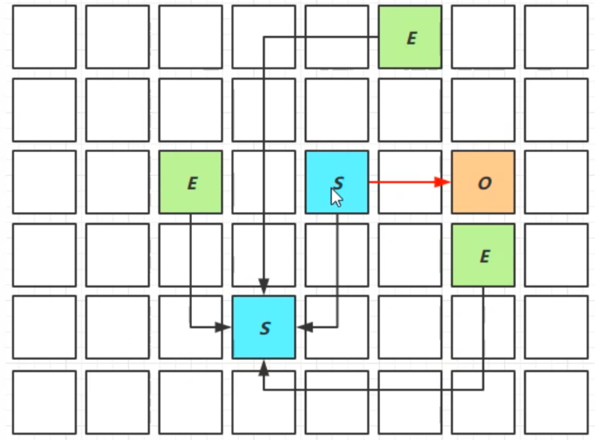
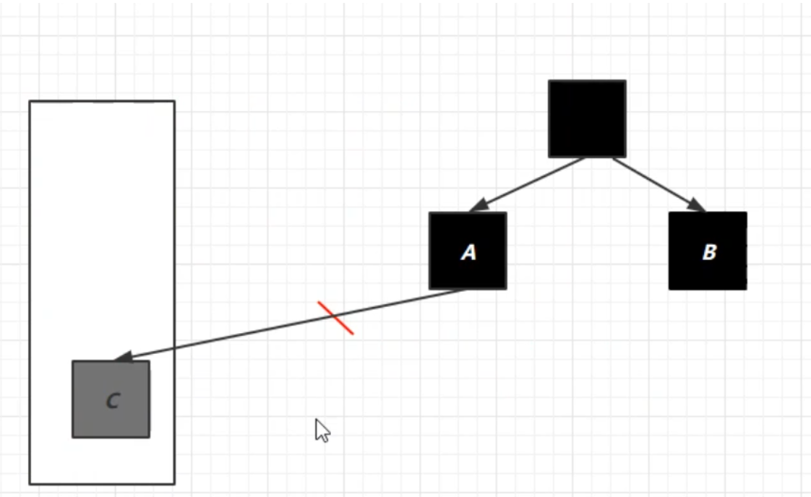

# 垃圾回收

> 概述

- 如何判断对象可以回收
- 垃圾回收算法
- 分代垃圾回收
- 垃圾回收器
- 垃圾回收调优

<span style="color:red">老年代的 GC 叫 Full GC，新生代的 GC 叫 Minor GC</span>

> 需要思考的问题

- 那些内存需要回收：JVM 中堆内存和方法区这两个区域需要回收。
- 什么时候可以回收：内存空间不足时，需要进行回收。
- 如何回收：垃圾回收算法，标记清除、标记整理 etc.

## 如何判断对象可以回收

### 引用计数法

<span style="color:red">判断方式</span>：给对象中添加一个引用计数器，每当有一个地方引用它时，计数器值就加1；当引用失效时，计数器值就减1；任何时刻计数器为0的对象就是不可能再被使用的。

<span style="color:red">弊端：</span>循环引用时，两个对象的计数都为1，导致两个对象都无法被释放。不过可以用图论的算法判断是否有环，有就破环，解决循环引用。(需要配合大量额外处理才能保证正确的工作)


> Java 循环引用GC回收

```java
public class ReferenceCountingGC {
    public Object instance = null;

    private static final int _1MB = 1024 * 1024;

    private byte[] bigSize = new byte[2 * _1MB];

    public static void main(String[] args) {
        ReferenceCountingGC objA = new ReferenceCountingGC();
        ReferenceCountingGC objB = new ReferenceCountingGC();
        objA.instance = null;
        objB.instance = null;
        System.gc();
    }
}
```

GC 日志如下

```shell
[GC (System.gc()) [PSYoungGen: 9302K->4936K(75776K)] 9302K->4944K(249344K), 0.0019684 secs] [Times: user=0.00 sys=0.00, real=0.00 secs] 
[Full GC (System.gc()) [PSYoungGen: 4936K->0K(75776K)] [ParOldGen: 8K->4700K(173568K)] 4944K->4700K(249344K), [Metaspace: 3188K->3188K(1056768K)], 0.0041073 secs] [Times: user=0.00 sys=0.00, real=0.00 secs] 
Heap
 PSYoungGen      total 75776K, used 1951K [0x000000076b600000, 0x0000000770a80000, 0x00000007c0000000)
  eden space 65024K, 3% used [0x000000076b600000,0x000000076b7e7c68,0x000000076f580000)
  from space 10752K, 0% used [0x000000076f580000,0x000000076f580000,0x0000000770000000)
  to   space 10752K, 0% used [0x0000000770000000,0x0000000770000000,0x0000000770a80000)
 ParOldGen       total 173568K, used 4700K [0x00000006c2200000, 0x00000006ccb80000, 0x000000076b600000)
  object space 173568K, 2% used [0x00000006c2200000,0x00000006c2697138,0x00000006ccb80000)
 Metaspace       used 3212K, capacity 4496K, committed 4864K, reserved 1056768K
  class space    used 352K, capacity 388K, committed 512K, reserved 1048576K
```

### 可达性分析算法

- JVM 中的垃圾回收器通过**可达性分析**来探索所有存活的对象。
- 扫描堆中的对象，看是否能沿着以 GC Roots 对象**为起点**的引用链找到该对象，如果**找不到，则表示可以回收。**
- 那些对象可以作为 GC Roots？
  - 虚拟机栈（栈帧中的本地变量表）中引用的对象，如 Java 类的引用类型静态变量。
  - 方法区中类静态属性引用的对象。
  - 方法区中常量引用的对象。
  - 本地方法栈中JNI（即一般说的Native方法）引用的对象。
  - Java 虚拟机内部的引用，如基本类型对应的  Class 对象，还有一些常驻的异常、系统类加载器
  - 所有被同步锁（synchronized 关键字）持有的对象
  - 反映 Java 虚拟机内部情况的 JMXBean、JVMTI 中注册的回调、本地代码缓存等。
  - 还有一些其他对象可以“临时性”加入 GC Roots（主要是可能存在跨代引用，要确保跨代引用也没有，才可以回收）


通过代码和工具查看那些对象可以作为 GC Root

- Eclipse Memory Analyzer 工具，eclipse 官网的
- `jmap -dump:format=b,live,file=1.bin PID` live 表示在转储前会进行一次 gc。1.bin 是转出文件名。
  - gc roots
    - System Class
    - Native Stack
    - Thread：主线程的局部变量，主线程局部变量引用的对象。
    - Busy Monitor

### 五种引用

- **强引用** 只有所有 GC Roots 对象都不通过【强引用】引用该对象，该对象才能被垃圾回收 
- **软引用**（SoftReference） 仅有软引用引用该对象时，在垃圾回收后，内存仍不足时会再次出发垃圾回收，回收软引用对象，可以配合引用队列来释放软引用自身
- **弱引用**（WeakReference） 仅有弱引用引用该对象时，在垃圾回收时，无论内存是否充足，都会回收弱引用对象，可以配合引用队列来释放弱引用自身
- **虚引用**（PhantomReference） 必须配合引用队列使用，主要配合 ByteBuffer 使用，被引用对象回收时，会将虚引用入队， 由 Reference Handler 线程调用虚引用相关方法释放直接内存
- **终结器引用**（FinalReference） 无需手动编码，但其内部配合引用队列使用，在垃圾回收时，终结器引用入队（被引用对象暂时没有被回收），再由 Finalizer 线程通过终结器引用找到被引用对象并调用它的 finalize 方法，第二次 GC 时才能回收被引用对象

实线箭头表示强引用。


#### 强引用

只有 GC Root **都不引用**该对象时，才会回收**强引用**对象

- 如上图B、C对象都不引用A1对象时，A1对象才会被回收

####  软引用

没有其它强引用引用它，且**内存不足时**，会**回收软引用所引用的对象**

- 如上图如果B对 象不再引用A2对象且内存不足时，软引用所引用的A2对象就会被回收

```java
public class Demo1 {
	public static void main(String[] args) {
		final int _4M = 4*1024*1024;
		//使用软引用对象 list和SoftReference是强引用，而SoftReference和byte数组则是软引用
		List<SoftReference<byte[]>> list = new ArrayList<>();
		SoftReference<byte[]> ref= new SoftReference<>(new byte[_4M]);
	}
}
```

如果在垃圾回收时发现内存不足，在回收软引用所指向的对象时，**软引用本身不会被清理**

如果想要**清理软引用**，需要使**用引用队列**

```java
public class Demo1 {
    // -Xmx20m -XX:+PrintGCDetails -verbose:gc
	public static void main(String[] args) {
		final int _4M = 4*1024*1024;
		//使用引用队列，用于移除引用为空的软引用对象
		ReferenceQueue<byte[]> queue = new ReferenceQueue<>();
		//使用软引用对象 list和SoftReference是强引用，而SoftReference和byte数组则是软引用
		List<SoftReference<byte[]>> list = new ArrayList<>();
		SoftReference<byte[]> ref= new SoftReference<>(new byte[_4M]);

		//遍历引用队列，如果有元素，则移除
		Reference<? extends byte[]> poll = queue.poll();
		while(poll != null) {
			//引用队列不为空，则从集合中移除该元素
			list.remove(poll);
			//移动到引用队列中的下一个元素
			poll = queue.poll();
		}
	}
}
```

**大概思路为：**查看引用队列中有无软引用，如果有，则将该软引用从存放它的集合中移除（这里为一个list集合）

> 软引用的 GC 日志

```shell
[B@677327b6
1
[B@14ae5a5
2
[B@7f31245a
3
# 进行了一次小范围的 gc，把 新生代从 1719k 的使用变为了 488k
[GC (Allocation Failure) [PSYoungGen: 1719K->488K(6144K)] 14007K->12920K(19968K), 0.0013064 secs] [Times: user=0.00 sys=0.00, real=0.00 secs] 
[B@6d6f6e28
4
# 进行了一次小范围的 gc，未回收到什么内存，后面触发了 full gc
[GC (Allocation Failure) --[PSYoungGen: 4809K->4809K(6144K)] 17241K->17241K(19968K), 0.0019607 secs] [Times: user=0.00 sys=0.00, real=0.00 secs] 
# Full GC 不关回收新生代 还回收 老年代
# PS：元空间用的本地内存 就是 OS内存，不经过JVM
# 这次 Full GC失败了，于是触发了回收 softref 的gc
[Full GC (Ergonomics) [PSYoungGen: 4809K->4592K(6144K)] [ParOldGen: 12432K->12406K(13824K)] 17241K->16998K(19968K), [Metaspace: 3273K->3273K(1056768K)], 0.0048990 secs] [Times: user=0.00 sys=0.00, real=0.01 secs] 
[GC (Allocation Failure) --[PSYoungGen: 4592K->4592K(6144K)] 16998K->17034K(19968K), 0.0007563 secs] [Times: user=0.00 sys=0.00, real=0.00 secs] 
# 回收 软引用，其实就是把前面4个软引用都回收了，然后放着第五个软引用
[Full GC (Allocation Failure) [PSYoungGen: 4592K->0K(6144K)] [ParOldGen: 12442K->596K(8704K)] 17034K->596K(14848K), [Metaspace: 3273K->3273K(1056768K)], 0.0047863 secs] [Times: user=0.09 sys=0.00, real=0.01 secs] 
[B@135fbaa4
5
循环结束：5
[GC (Allocation Failure) [PSYoungGen: 5632K->320K(6144K)] 6228K->5020K(14848K), 0.0012147 secs] [Times: user=0.00 sys=0.00, real=0.00 secs] 
[Full GC (Ergonomics) [PSYoungGen: 320K->0K(6144K)] [ParOldGen: 4700K->4875K(13824K)] 5020K->4875K(19968K), [Metaspace: 3995K->3995K(1056768K)], 0.0079850 secs] [Times: user=0.00 sys=0.00, real=0.01 secs] 
null
null
null
null
[B@135fbaa4
Heap
 PSYoungGen      total 6144K, used 668K [0x00000000ff980000, 0x0000000100000000, 0x0000000100000000)
  eden space 5632K, 11% used [0x00000000ff980000,0x00000000ffa270f0,0x00000000fff00000)
  from space 512K, 0% used [0x00000000fff80000,0x00000000fff80000,0x0000000100000000)
  to   space 512K, 0% used [0x00000000fff00000,0x00000000fff00000,0x00000000fff80000)
 ParOldGen       total 13824K, used 4875K [0x00000000fec00000, 0x00000000ff980000, 0x00000000ff980000)
  object space 13824K, 35% used [0x00000000fec00000,0x00000000ff0c2e00,0x00000000ff980000)
 Metaspace       used 4183K, capacity 4716K, committed 4992K, reserved 1056768K
  class space    used 466K, capacity 532K, committed 640K, reserved 1048576K
```

软引用也占用内存，那么如何清除软引用呢？

```java
//使用引用队列，用于移除引用为空的软引用对象
ReferenceQueue<byte[]> queue = new ReferenceQueue<>();
```

```java
static int _4MB = 4 * 1024 * 1024;    
public static void soft() {
    ReferenceQueue<byte[]> queue = new ReferenceQueue<>();
    List<SoftReference<byte[]>> list = new ArrayList<>();
    for (int i = 0; i < 5; i++) {
        // 关联了软引用队列，当软引用所关联的 byte[] 被回收时，软引用自己会加入软引用队列中取去。
        SoftReference<byte[]> soft = new SoftReference<byte[]>(new byte[_4MB],queue);
        System.out.println(soft.get());
        list.add(soft);
        System.out.println(list.size());
    }
    // 从队列中获取无用的 软引用对象，并移除
    Reference<? extends byte[]> poll = queue.poll();
    while (poll != null) {
        list.remove(poll);
        poll = queue.poll();
    }

    System.out.println("循环结束：" + list.size());
    for (SoftReference<byte[]>reference:list){
        System.out.println(reference.get());
    }
}
```

#### 弱引用

只有弱引用引用该对象时，在垃圾回收时，**无论内存是否充足**，都会回收弱引用所引用的对象

- 如上图如果B对象不再引用A3对象，则A3对象会被回收

**弱引用的使用和软引用类似**，只是将 **SoftReference 换为了 WeakReference**

PS：大对象直接进入老年代

```java
package jvm.ref;import java.lang.ref.Reference;import java.lang.ref.ReferenceQueue;import java.lang.ref.SoftReference;import java.lang.ref.WeakReference;import java.util.ArrayList;import java.util.List;// -Xmx20m -XX:+PrintGCDetails -verbose:gcpublic class WeakReferenceDemo {    static int _4MB = 4 * 1024 * 1024;    public static void strongRef() {        List<byte[]> list = new ArrayList<>();        for (int i = 0; i < 5; i++) {            list.add(new byte[_4MB]);        }    }    public static void weak() {        ReferenceQueue<byte[]> queue = new ReferenceQueue<>();        List<WeakReference<byte[]>> list = new ArrayList<>();        for (int i = 0; i < 5; i++) {            // 关联了软引用队列，当软引用所关联的 byte[] 被回收时，软引用自己会加入软引用队列中取去。            WeakReference<byte[]> weak = new WeakReference<byte[]>(new byte[_4MB],queue);            System.out.println(weak.get());            list.add(weak);            System.out.println(list.size());        }        // 从队列中获取无用的 软引用对象，并移除        Reference<? extends byte[]> poll = queue.poll();        while (poll != null) {            list.remove(poll);            poll = queue.poll();        }        System.out.println("循环结束：" + list.size());        for (WeakReference<byte[]>reference:list){            System.out.println(reference.get());        }    }    public static void main(String[] args) {//        strongRef();        weak();    }}
```

####  **虚引用**

直接内存不在 jvm 中，没有办法垃圾回收，因此虚引用关联，当 ByteBuffer 被回收时，虚引用直接进入引用队列，本地方法随即根据引用队列中的相关信息调用 unsafe 清楚本地方法的内存。

当虚引用对象所引用的对象被回收以后，虚引用对象就会被放入引用队列中，调用虚引用的方法

- 虚引用的一个体现是**释放直接内存所分配的内存**，当引用的对象ByteBuffer被垃圾回收以后，虚引用对象Cleaner就会被放入引用队列中，然后调用Cleaner的clean方法来释放直接内存
- 如上图，B对象不再引用ByteBuffer对象，ByteBuffer就会被回收。但是直接内存中的内存还未被回收。这时需要将虚引用对象Cleaner放入引用队列中，然后调用它的clean方法来释放直接内存

#### 终结器引用

所有的类都继承自Object类，Object类有一个finalize方法。当对象重写了终结方法，并且没有强引用引用对象了，它就可以被当成垃圾进行回收。当对象被垃圾回收时，会先将终结器引用对象放入引用队列中，然后根据终结器引用对象找到它所引用的对象，然后调用该对象的finalize方法。调用以后，该对象就可以被垃圾回收了

- 如上图，B对象不再引用A4对象。这是终结器对象就会被放入引用队列中，引用队列会根据它，找到它所引用的对象。然后调用被引用对象的finalize方法。调用以后，该对象就可以被垃圾回收了

####  引用队列

- 软引用和弱引用**可以配合**引用队列
  - 在**弱引用**和**虚引用**所引用的对象被回收以后，会将这些引用放入引用队列中，方便一起回收这些软/弱引用对象
- 虚引用和终结器引用**必须配合**引用队列
  - 虚引用和终结器引用在使用时会关联一个引用队列

## 回收方法区

方法区GC的性价比低，回收的条件严格，回收成果很低。

> 方法区回收的内容

- 废弃的常量：没有任何字符串对象应用常量池中的 xxx 常量，那么就可以回收这个常量了。
- 不在使用的类型
    - 该类所有的实例都被回收了（不存在该类的实例，该类子类的实例）
    - 加载该类的类加载器已经被回收了
    - 该类对应的 java.lang.Class 对象没有在任何地方被引用（无法在任何地方可以通过反射访问该类的方法）

## 垃圾回收算法

### 分代收集理论

> 分代假说

- 弱分代假说：多数对象都是朝生夕死的
- 强分代假说：熬过越多次 GC 过程的对象越难消亡
- 跨代引用假说：很少会有跨代引用（<span style="color:green">**若新对象引用了老对象，则 GC 的遍历开销很大，故又有了跨代引用假说。书里给的解释是：存在互相引用关系的两个对象应该倾向于同时生存或同时消亡**</span>）
    - 依据这个假设，GC判断对象是否可回收时，就不应该再为了少量的跨代引用去扫描整个老年代。
    - 只需在新生代上建立一个全局的数据结构（“记忆集”，RememberedSet），这个结构把老年代划分成若干小块，标识出老年代的哪一块内存会存在跨代引用。
    - 此后当发生Minor GC时，只有包含了跨代引用的小块内存里的对象才会被加入到GC Roots进行扫描。

如果一个区域中大多数对象都是朝生夕灭，难以熬过垃圾收集过程的话，那么把它们集中放在一起，每次回收时只关注如何保留少量存活而不是去标记那些大量将要被回收的对象，就能以较低代价回收到大量的空间；如果剩下的都是难以消亡的对象，那把它们集中放在一块，虚拟机便可以使用较低的频率来回收这个区域，这就同时兼顾了垃圾收集的时间开销和内存的空间有效利用。


### 标记-清除

适用于老年代，因为老年代需要标记的对象不多。

**定义**：标记清除算法顾名思义，分为标记和清除两个阶段。在虚拟机执行垃圾回收的过程中，先采用标记算法确定可回收对象，然后垃圾收集器根据标识清除相应的内容。

- 这里的腾出内存空间并不是将内存空间的字节清0，而是记录下这段内存的起始结束地址，下次分配内存的时候，会直接**覆盖**这段内存

**缺点**：

- **容易产生大量的内存碎片**，可能无法满足大对象的内存分配，一旦导致无法分配对象，那就会导致jvm启动gc，一旦启动gc，我们的应用程序就会暂停，这就导致应用的响应速度变慢。
- 执行效率不太稳定。如果Java堆中包含大量对象，而且其中大部分是需要被回收的，这时必须进行大量标记和清除的动作，导致标记和清除两个过程的执行效率都随对象数量增长而降低。


### 标记-复制

适用于新生代，因为老年代要赋值的对象太多，划不来。

将内存分为等大小的两个区域，FROM 和 TO（TO中为空）。先将被 GC Root 引用的对象从 FROM 放入 TO 中，再回收不被 GC Root 引用的对象。然后交换 FROM 和 TO。这样也可以避免内存碎片的问题，但是会占用双倍的内存空间。

实现简单，但是空间浪费太大。


实际上, JVM 中的垃圾回收算法并没有采用对半分的策略，而是采用了 Appel 式回收。

> Appel 式回收

- 把新时代分为一块较大的 Eden 空间和较小的 Survivor 空间。
- 每次分配只是用 Eden 和其中一块 Survivor 空间上，然后直接清理掉 Eden 和 已用过的那块 Survivor 空间。
- 如果 Survivor 空间不足以容纳一次 Minor GC 之后存活的对象式，就需要依赖其他区域（如：老年代）进行分配担保。

###  标记-整理

存活对象都向内存空间一端移动，然后直接清理边界以外的内存。适用于老年代。

“标记-整理”会将不被 GC Root 引用的对象回收，清除其占用的内存空间。然后整理剩余的对象，可以有效避免因内存碎片而导致的问题，但是整理需要消耗一定的时间，所以效率较低。


标记整理的过程需要移动存活的对象，并更新所有引用这些对象的地方，这是一种很重的负担，而且这种对象移动操作必须全部暂停用户应用程序才能进行。

但是移动对象和不移动对象都有缺点，有优点

- 从垃圾收集的停顿时间来看，不移动对象停顿时间会更短
- 从程序的吞吐量来看，移动对象会更好。（内存分配的开销要小很多）

折中的做法：先不考虑内存碎片，采用“标记-清除”，当内存空间碎片化程度已经打到影像对象分配时，再采用标记-整理算法收集一次。

## 分代回收


- 对象首先分配在伊甸园区域
- 新生代空间不足时，触发 minor gc，伊甸园和 from 存活的对象使用 copy 复制到 to 种，存活的对年龄+1并且交换 from to。
- minor gc 会引发 stop the world，暂停其他用户的线程，等垃圾回收结束，用户线程才恢复运行。
  - 因为 gc 的时候需要 copy 对象，为了避免对象的应用被改变导致的问题，所以要 STW。
- 当对象寿命超过阈值时，会晋升到老年代，最大寿命时 15。寿命是用 4bit 存的，所以最大是15. 【查查书】
- 当老年代空间不足，会尝试触发 minor gc，如果之后空间仍不足，那么触发 full gc。【有疑问？】
- from 和 to 每次都要留一个空的，空间不足就触发 gc，还不足就会触发提前晋升老年代，老年代如果放不下先触发 full gc 然后再尝试提前晋升，还不行就直接 gen。？？？

### JVM 参数

| 含义               | 参数                                                         |
| ------------------ | ------------------------------------------------------------ |
| 堆初始大小         | -Xms                                                         |
| 堆最大大小         | -Xmx 或 -XX:MaxHeapSize=size                                 |
| 新生代大小         | -Xmn 或 (-XX:NewSize=size + -XX:MaxNewSize=size ) -Xmn是初始和最大同时指定 |
| 幸存区比例（动态） | -XX:InitialSurvivorRatio=ratio 和 -XX:+UseAdaptiveSizePolicy  初始化比例 和 调整策略 |
| 幸存区比例         | -XX:SurvivorRatio=ratio 默认是8 比如新生代内存是10m 则 8m会划给伊甸园。剩下的 1m 给 from 1m 给 to |
| 晋升阈值           | -XX:MaxTenuringThreshold=threshold                           |
| 晋升详情           | -XX:+PrintTenuringDistribution                               |
| GC详情             | -XX:+PrintGCDetails -verbose:gc                              |
| Full GC 前 MinorGC | -XX:+ScavengeBeforeFullGC  这样做的话，可以看是否可以避免full gc |

###  GC 分析

#### 大对象处理策略

当遇到一个**较大的对象**时，就算新生代的**伊甸园**为空，也**无法容纳该对象**时，老年代可以容纳，该对象**直接晋升为老年代**

#### 线程内存溢出

某个线程的内存溢出了而抛异常（out of memory），不会让其他的线程结束运行

这是因为当一个线程**抛出OOM异常后**，**它所占据的内存资源会全部被释放掉**，从而不会影响其他线程的运行，**进程依然正常**

## 垃圾回收器概述

> 串行

- 单线程
- 适用于堆内存较小，适合个人电脑

> 吞吐量

- 多线程
- 适用于堆内存较大，多核CPU
- 单位时间内，STW（stop the world，停掉其他所有工作线程）时间最短 0.2 0.2 = 0.4 总时间少，但是单次时间长

> 响应时间优先

- 多线程
- 适用于堆内存较大，多核CPU
- 尽可能让单次STW时间变短（尽量不影响其他线程运行） 0.1 0.1 0.1 0.1 0.1 = 0.5 总时间长，但是单次时间短

> 相关概念

**并行收集**：指多条垃圾收集线程并行工作，但此时**用户线程仍处于等待状态**。

**并发收集**：指用户线程与垃圾收集线程**同时工作**（不一定是并行的可能会交替执行）。**用户程序在继续运行**，而垃圾收集程序运行在另一个CPU上

**吞吐量**：即CPU用于**运行用户代码的时间**与CPU**总消耗时间**的比值（吞吐量 = 运行用户代码时间 / ( 运行用户代码时间 + 垃圾收集时间 )），也就是。例如：虚拟机共运行100分钟，垃圾收集器花掉1分钟，那么吞吐量就是99%

## 串行垃圾收集器

- Serial 采用的复制算法。用于新生代
- SerialOld 采用标记-整理算法。  用于老年代


- 触发垃圾回收的时候，要让线程在一个安全点停下来（垃圾回收的过程中对象的地址可能会发生改变，停下来可以确保安全的使用对象地址），因为是串行的，所以只有一个垃圾回收线程。且在该线程执行回收工作时，其他线程进入**阻塞**状态
  - **安全点**：让其他线程都在这个点停下来，以免垃圾回收时移动对象地址，使得其他线程找不到被移动的对象

## 吞吐量优先垃圾收集器

`-XX:+UseParallelGC ~ -XX:+UseParallelOldGC`  开启其中的一个，会把另一个也开启。即你开启了 ParallelGC 就会自动开启 ParallelOldGC

`-XX:+UseAdaptiveSizePolicy` 采用自适应的大小调整策略，自适应的调整 新生代 的大小（伊甸园 和 from、to的比例）

`-XX:GCTimeRatio=ratio`  **调整吞吐量的目标（垃圾回收时间和总时间的占比 1/（1+ratio））ratio 默认99，一般是设置成 19。**

`-XX:MaxGCPauseMillis=ms`  最大暂停毫秒数 默认200ms。 ratio 和 ms 是冲突的。调整 ratio 一般会把堆变大 吞吐量就提升了，每次垃圾回收的时间就会变长；调整 ms 一般会把堆变小，垃圾回收的时间就变短，这样吞吐量就下来了。

`-XX:ParallelGCThreads=n` 控制垃圾回收的线程数


垃圾回收器会开启多个垃圾回收线程进行 GC。垃圾回收线程和 CPU 核数相关。Parallel GC 会根据我们的设定目标来尝试去调整堆的大小，来达到我们期望的目标。

## 响应时间优先垃圾收集器

- 多线程
- 堆内存较大，多核CPU
- 尽可能让单次STW时间变短（尽量不影响其他线程运行）

> CMS 收集器

Concurrent Mark Sweep，一种以获取**最短回收停顿时间**为目标的**老年代**收集器

**特点**：基于**标记-清除算法**实现。并发收集、低停顿，但是会产生内存碎片。因为是并行的，在清理的时候会尝试浮动垃圾，不能等待内存不足了在进行 GC ，不然这些浮动垃圾就没地方放了。CMS 存在并发失败的问题，并发失败的话就会退化成 SerialOld。

**应用场景**：适用于注重服务的响应速度，希望系统停顿时间最短，给用户带来更好的体验等场景下。如web程序、b/s服务

> **ParNewGC 收集器**

ParNewGC 新生代的基于复制算法的垃圾回收器。

----

> JVM 参数

`-XX:+UseConcMarkSweepGC ~ -XX:+UseParNewGC ~ SerialOld`  

`-XX:ParallelGCThreads=n ~ -XX:ConcGCThreads=threads`   ParallelGCThreads 一般与 CPU 核心数一致 ConcGCThreads一般设置为 ParallelGCThreads 的 1/4 

`-XX:CMSInitiatingOccupancyFraction=percent`  何时执行CMS，内存占比为多少是进行 GC。默认为 60% 

`-XX:+CMSScavengeBeforeRemark` 有可能新生代的对象会引用老年代的对象，这样重新标记的时候必须扫描整个堆。可以开启这个，先对新生代做一个GC，这样要扫描的对象就少了。


垃圾回收线程 和 用户线程可以并发执行，可以进一步减少 STW 时间，在垃圾回收的部分阶段是不用进行 STW 的。

> **CMS收集器的运行过程分为下列4步：**

**初始标记**：只列举根对象，因此速度很快但是 **Stop The World 时间很短**，用户线程需要阻塞。

**并发标记**：进行 GC Roots Tracing 的过程，找出存活对象且用户线程可并发执行

**重新标记**：为了**修正并发标记期间**因用户程序继续运行而导致标记产生变动的那一部分对象的标记记录。仍然存在Stop The World问题

**并发清除**：对标记的对象进行清除回收。

CMS收集器的内存回收过程是与用户线程一起**并发执行**的

## G1 垃圾收集器

### 概述

> **定义**：Garbage First

- 2004 论文发布 
- 2009 JDK 6u14 体验 
- 2012 JDK 7u4 官方支持 
- 2017 JDK 9 默认 

> 适用场景 

- 同时注重吞吐量（Throughput）和低延迟（Low latency），默认的暂停目标是 200 ms 
- 超大堆内存，==会将堆划分为多个大小相等的 Region==，每个Region 都可以独立的作为伊甸园 suriver区 和老年代
- 整体上是 **标记+整理** 算法，两个区域之间是 **复制** 算法 

> 相关 JVM 参数 

`-XX:+UseG1GC` 

`-XX:G1HeapRegionSize=size` 

`-XX:MaxGCPauseMillis=time` 默认 200 ms，如果吞吐量要求更高，可以把这个值设置大一些。

JDK 9以后默认使用，而且替代了CMS 收集器

### G1垃圾回收阶段


参考 Oracle JVM工程师 和 深入理解Java虚拟机；

第一阶段：Young Collection，对新生代进行垃圾回收

第二阶段：Young Collection + Concurrent Mark，新生代进行垃圾回收+并发标记

第三阶段： Minxed Collection，混合收集。

这三个阶段是一个循环的过程。

新生代伊甸园垃圾回收—–>内存不足，新生代回收+并发标记—–>回收新生代伊甸园、幸存区、老年代内存——>新生代伊甸园垃圾回收(重新开始)

### Young Collection

> **分区算法region**

分代是按对象的生命周期划分，分区则是将堆空间划分连续几个不同小区间，每一个小区间独立回收，可以控制一次回收多少个小区间，方便控制 GC 产生的停顿时间，图中的 **E代表伊甸园**；**S代表幸存区**；**O代表老年代**

> 回收过程

会STW；每个区域都可以作为 伊甸园，Surivier区，老年代。


新生代的垃圾回收会把幸存的对象，用 copy 算法复制到 S区。


幸存区的对象比较多时，或幸存区的对象年龄超过阈值，S就触发垃圾回收，S区的一部分对象会晋升到老年代，不够年龄的会拷贝到另一个幸存取空间中去。



### Young Collection + CM

CM：并发标记

- 在 Young GC 时会进行 GC Root 的初始标记，找到根对象（GC Root）。
- 在老年代**占用堆内存的比例**达到阈值时，进行并发标记（不会STW），阈值可以根据用户来进行设定，由下面的 JVM 参数决定：
- `-XX:InitiatingHeapOccupancyPercent=percent` （默认45%）


### Mixed Collection

会对 E、S、O 进行**全面的回收**

- 最终标记（Remark）会 STW（防止浮动垃圾吗？）
- **拷贝**存活（Evacuation）会 STW（防止浮动垃圾吗？）

-XX:MaxGCPauseMills:xxx 用于指定最长的停顿时间


新生代 E GC后，幸存的对象会被复制到 S 中。

另一些 老年代S 中不够年龄进不来 O 的也会被复制到 S 中。年龄够的会被复制到 O 中。

老年代 GC 后一些幸存的对象会把 老年代O中的复制到O中。

> 为什么有的老年代被拷贝了，有的没拷贝？

因为指定了最大停顿时间，如果对所有老年代都进行回收，耗时可能过高。为了保证时间不超过设定的停顿时间，会**回收最有价值的老年代**（回收后，能够得到更多内存），如果要复制的对象不是很多，暂停时间可以达到，那么就会回收所有的老年代。【==都是为了达到暂停时间短这个目标==】

### Full GC

> SerialGC 

- 新生代内存不足发生的垃圾收集 - minor gc 
- 老年代内存不足发生的垃圾收集 - full gc 

> ParallelGC 

- 新生代内存不足发生的垃圾收集 - minor gc 

- 老年代内存不足发生的垃圾收集 - full gc 

> CMS 

- 新生代内存不足发生的垃圾收集 - minor gc 
- 老年代内存不足 

> G1 

- 新生代内存不足发生的垃圾收集 - minor gc 
- 老年代内存不足 

G1在老年代内存不足时（老年代所占内存超过阈值）

- 如果垃圾产生速度慢于垃圾回收速度，不会触发Full GC，还是并发地进行清理
- 如果垃圾产生速度快于垃圾回收速度，便会触发Full GC

### Young Collection 跨代引用

- 新生代回收的跨代引用（老年代引用新生代）问题；根对象有一部分来自于老年代。**如果遍历老年代来查找根对象，那么效率会很低。JVM 采用的是卡表的技术！** 


> 卡表技术

把老年代的对象进行细分，分成一个个的 card，每个 card 512k，如果有老年代中的对象引用了新生代的对象，那么对象所在的 card 就被标记为脏卡。这样找 GC Root 的时候，老年代找脏卡就行，提高了查找效率。

> 脏卡

- 卡表与Remembered Set。新生代中会有 Remembered Set，记录外部对自己的引用，就是有那些脏卡。
  - 先通过 Remembered Set 知道有那些脏卡
  - 再遍历脏卡区，找到 GC Root
- 在引用变更时通过post-write barried + dirty card queue
  - 通过写屏障，在对象引用发送变更时，去更新脏卡。（异步操作，不会立即完成赞卡的更新，会把更新操作放在一个脏卡队列中，由一个线程完成脏卡的更新操作）
- concurrent refinement threads 更新 Remembered Set


### Remark

CMS 和 G1 都有 并发标记-->重新标记，这里介绍下 重新标记阶段。

> 并发标记阶段，对象的处理状态

- 黑色：已被处理，且有引用在引用他们，结束时会被保留，存活的对象

- 灰色：正在处理中的 

- 白色：还未处理的


> pre-write barrier + satb_mark_queue 写屏障技术

 在对象引用改变前，把这个对象加入队列，表示这个对象未被处理，队列的名称叫 satb_mark_queue 。将来 remark 阶段就可以配合这些对象进行进一步的判断。



### JDK 8u20 字符串去重

- 优点：节省了大量内存

- 确定：导致略微多占用CPU时间，新生代回收时间略微增加

> 相关 JVM 参数

`-XX:+UseStringDeduplication`  开启字符串去重功能。

```java
String s1 = new String("hello"); // char[]{'h','e','l','l','o'}
String s2 = new String("hello"); // char[]{'h','e','l','l','o'}
```

我们可以手动用 intern 方法去重，而 G1收集器可以这样做

- 将所有新分配的字符串（底层是char[]）放入一个队列
- 当新生代回收时，G1并发检查是否有重复的字符串
- 如果字符串的值一样，就让他们**引用同一个字符串对象**
  - <span style="color:red">注意，是内部的 char 一样，而不是这两个对象一样。【这是一个疑问】</span>
- 注意，其与String.intern的区别
  - intern关注的是字符串对象
  - 字符串去重关注的是char[]
  - 在JVM内部，使用了不同的字符串标

### JDK 8u40 并发标记类卸载

所有对象都经过并发标记后，就能知道哪些类不再被使用，当一个类加载器的所有类都不再使用，则卸载它所加载的所有类。

注意：JDK 的类加载器是不会卸载的，卸载的知识我们自定义的类加载器。

`-XX:+ClassUnloadingWithConcurrentMark` 默认启用。

### JDK 8u60 回收巨型对象

- 一个对象大于region的一半时，就称为巨型对象
- G1不会对巨型对象进行拷贝
- 回收时被优先考虑
- G1会跟踪老年代所有 incoming 引用，如果老年代 incoming 引用为0的巨型对象就==可以在新生代垃圾回收时处理掉==


### JDK 9 并发标记起始时间的调整

- 并发标记必须在堆空间占满前完成，否则退化为 FullGC 
- JDK 9 之前需要使用 -XX:InitiatingHeapOccupancyPercent 
- JDK 9 可以动态调整 
  - -XX:InitiatingHeapOccupancyPercent 用来设置初始值 
  - 进行数据采样并动态调整 
  - 总会添加一个安全的空档空间

### JDK 9 更高效的回收 

- 250+增强 
- 180+bug修复 
- https://docs.oracle.com/en/java/javase/12/gctuning