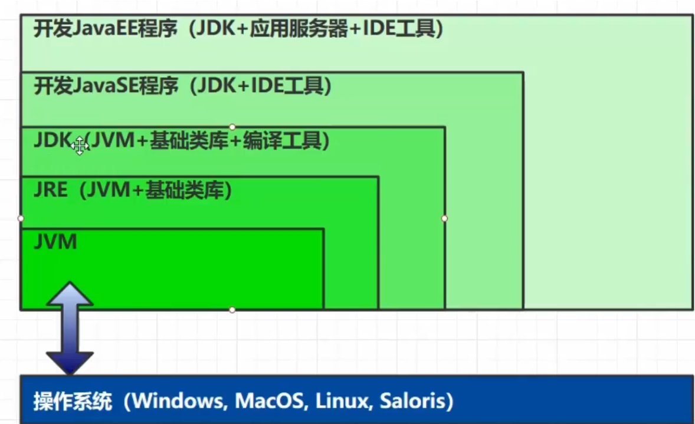
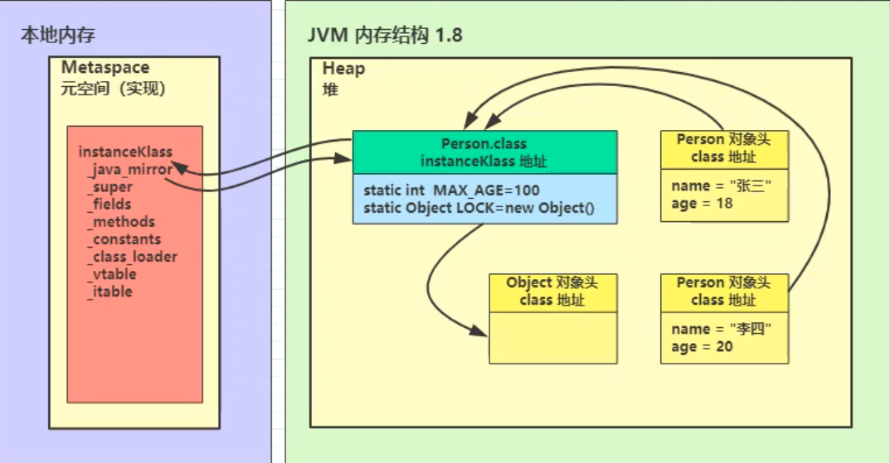

# JVM概述

参考视频：[**解密JVM【黑马程序员出品】**](https://www.bilibili.com/video/BV1yE411Z7AP)

参考书籍：深入理解Java虚拟机、Java虚拟机规范（Java8）

GC文档：https://docs.oracle.com/en/java/javase/12/gctuning/

调优文档：https://docs.oracle.com/en/java/javase/11/tools/java.html

JCStress：https://www.jb51.net/article/209076.htm

JMH：http://openjdk.java.net/projects/code-tools/jmh/ 

> 定义

Java Virtual Machine，JAVA程序的**运行环境**（JAVA二进制字节码的运行环境）

> 好处

- 一次编写，到处运行
- 自动内存管理，垃圾回收机制
- 数组下标越界检查，C语言是没有数组下表越界检查的。
- 多态。使用虚方法调用的机制实现了多态。

> 用处

- 理解底层的实现原理
- 必备技能

> **常见的JVM**


> **比较：JVM JRE JDK的区别**



> **学习路线**


# 内存结构

## 程序计数器

**定义：**Program Counter Register 程序计数器（寄存器）

**作用：**记住下一条 jvm 指令的执行地址

**特点：**是线程私有的，每个线程都有专属于自己的程序计数器 ； 不会存在内存溢出

> JVM指令=> 解释器 解释为机器码=>交给CPU执行。

```java
0: getstatic #20 // PrintStream out = System.out;
3: astore_1 // --
4: aload_1 // out.println(1);
5: iconst_1 // --
6: invokevirtual #26 // --
9: aload_1 // out.println(2);
10: iconst_2 // --
11: invokevirtual #26 // --
14: aload_1 // out.println(3);
15: iconst_3 // --
16: invokevirtual #26 // --
19: aload_1 // out.println(4);
20: iconst_4 // --
21: invokevirtual #26 // --
24: aload_1 // out.println(5);
25: iconst_5 // --
26: invokevirtual #26 // --
29: return
```

- 线程私有
  - CPU会为每个线程分配时间片，当当前线程的时间片使用完以后，CPU就会去执行另一个线程中的代码
  - 程序计数器是**每个线程**所**私有**的，当另一个线程的时间片用完，又返回来执行当前线程的代码时，通过程序计数器可以知道应该执行哪一句指令
- 不会存在内存溢出

> **注意：**

- 一般情况下，程序计数器 是行号；但如果正在执行的方法是native方法，则程序计数器的值 undefined。
- 程序计数器 **是唯一一个 不会 产生 “内存溢出”的区域。**

goto的本质就是改变的 程序计数器的值（java中没有goto，goto在java中的保留字）

## 虚拟机栈

Java Virtual Machine Stacks ( Java 虚拟机栈 )

- 每个**线程**运行需要的内存空间，称为**虚拟机栈**
- 每个栈由多个**栈帧**组成，对应着每次调用方法时所占用的内存
- 每个线程只能有**一个活动栈帧**，对应着**当前正在执行的方法**

### 问题辨析

- 垃圾回收是否涉及栈内存？
  - **不需要**。因为虚拟机栈中是由一个个栈帧组成的，在方法执行完毕后，对应的栈帧就会被弹出栈。所以无需通过垃圾回收机制去回收内存。
- 栈内存的分配越大越好吗？
  - 不是。因为**物理内存是一定的**，栈内存越大，可以支持更多的递归调用，但是可执行的线程数就会越少。
  - 一个线程，它使用的是栈内存，一个线程用了 1MB 内存，总共的物理内存 500MB，理论上可以有500个线程同时运行。若线程占用变为 2MB ，则理论上只有 250 个线程可以同时运行。
  - 不推荐设置过大的栈内存，一般推荐使用系统默认的 **栈内存** 大小
- 方法内的局部变量是否是线程安全的？
  - 如果方法内**局部变量没有逃离方法的作用范围**，则是**线程安全**的
  - 如果如果**局部变量引用了对象**，并**逃离了方法的作用范围**，则需要考虑线程安全问题

> PS：Linux/macOS 64bit 默认栈内存是 1024kb；Windows 是依赖于虚拟内存决定的。

### 栈内存溢出

- 栈帧过多导致栈内存溢出。
- 栈帧过大导致栈内存溢出。

> 场景演示

**Exception in thread "main" java.lang.StackOverflowError**

```java
public class OutOfStack {
    private static int count = 0;

    public static void main(String[] args) {
        try {
            testStackOverFlowError();
        } catch (Throwable e) {
            e.printStackTrace();
        }finally {
            System.out.println(count);
        }
    }

    private static void testStackOverFlowError() {
        count++;
        testStackOverFlowError();
    }
}
```

类与类之间的循环引用。转 JSON 的时候，会出现 StackOverFlowError。对循环引用的熟悉，加上 `@JsonIgnore`即可。

### 线程运行诊断

> CPU占用过高

- Linux环境下运行某些程序的时候，可能导致CPU的占用过高，这时需要定位占用CPU过高的线程

  - **top** 命令，查看是哪个 **进程** 占用CPU过高
  - **ps H -eo pid, tid（线程id）, %cpu | grep 刚才通过top查到的进程号** 通过ps命令进一步查看是哪个线程占用CPU过高
    - H 打印进程的进程数。
    - eo 要输出那些感兴趣的内容

  ```shell
  ps -eo pid,tid,%cpu
  
    PID   TID %CPU
      1     1  0.1
      8     8  0.0
      9     9  0.3
     43    43  0.0
  ```

  ```shell
   ps -eo pid,tid,%cpu | grep 9
     PID   TID %CPU
       9     9  0.1
  ```

  - **jstack 进程id** 
    - 可以通过查看进程中的线程的nid，进一步定位到问题代码的源代码行号，来发现问题。
    - 注意jstack查找出的线程id是**16进制的**，**需要转换**。

> 程序运行很长时间没有结果

死锁了。

## 本地方法栈

带**native关键字**的方法就是需要JAVA去调用本地的C或者C++方法，因为JAVA有时候没法直接和操作系统底层交互，所以需要用到本地方法

## 堆

Heap 堆

- 通过new关键字**创建的对象**都会被放在堆内存

特点

- **所有线程共享**，堆内存中的对象都需要**考虑线程安全问题**
- 有垃圾回收机制

### 堆内存溢出

> 场景演示

**java.lang.OutofMemoryError** ：java heap space. 堆内存溢出

```java
/**
 * VM option: -Xmx50m -Xms10m
 */
public class OOM {
    public static void main(String[] args) {
        int i = 0;
        try {
            ArrayList<Object> list = new ArrayList<>();
            String a = "hello";
            while (true) {
                list.add(a);
                a = a + a;
                i++;
            }
        } catch (Throwable e) {
            e.printStackTrace();
            System.out.println(i);
        }
    }
}
```

### 堆内存诊断

> jps 工具

查看当前系统中有那些 Java 进程

> jmap 工具

查看堆内存占用情况

Java8：`jmap -heap 进程id`

Java11：`jhsdb jmap --heap --pid 15372`

可以看出 Java 11 的默认GC是G1收集器

```shell
Attaching to process ID 15372, please wait...
Debugger attached successfully.
Server compiler detected.
JVM version is 11+28

using thread-local object allocation.
Garbage-First (G1) GC with 8 thread(s)

Heap Configuration:
   MinHeapFreeRatio         = 40
   MaxHeapFreeRatio         = 70
   MaxHeapSize              = 52428800 (50.0MB)
   NewSize                  = 1363144 (1.2999954223632812MB)
   MaxNewSize               = 31457280 (30.0MB)
   OldSize                  = 5452592 (5.1999969482421875MB)
   NewRatio                 = 2
   SurvivorRatio            = 8
   MetaspaceSize            = 21807104 (20.796875MB)
   CompressedClassSpaceSize = 1073741824 (1024.0MB)
   MaxMetaspaceSize         = 17592186044415 MB
   G1HeapRegionSize         = 1048576 (1.0MB)

Heap Usage:
G1 Heap:
   regions  = 50
   capacity = 52428800 (50.0MB)
   used     = 2097152 (2.0MB)
   free     = 50331648 (48.0MB)
   4.0% used
G1 Young Generation:
Eden Space:
   regions  = 2
   capacity = 5242880 (5.0MB)
   used     = 2097152 (2.0MB)
   free     = 3145728 (3.0MB)
   40.0% used
Survivor Space:
   regions  = 0
   capacity = 0 (0.0MB)
   used     = 0 (0.0MB)
   free     = 0 (0.0MB)
   0.0% used
G1 Old Generation:
   regions  = 0
   capacity = 5242880 (5.0MB)
   used     = 0 (0.0MB)
   free     = 5242880 (5.0MB)
   0.0% used
```

> jconsole 工具

图形界面的，多功能的监测工具，可以连续监测

> jvirsalvm 工具

**案例**

垃圾回收后，内存占用仍然很高。

jvirsalvm dump 出最大的 n 个对象。然后查看是那些对象占用的内存过大。

## 方法区

方法区是一种规范。而永久代，元空间这些说法，只是方法区的某种实现而已。以Hotspot vm为例，Java 8 以前，方法区用永久代（用的一部分堆内存作为永久代）实现的，Java 8后，方法区用元空间（直接用OS的内存作为元空间的内存）实现的。方法区的结构如下：


### 内存溢出

- 1.8以前会导致**永久代**内存溢出
- 1.8以后会导致**元空间**内存溢出

需要 Java 8, Java11 好像不行

```java
package java.meta;

import jdk.internal.org.objectweb.asm.ClassWriter;
import jdk.internal.org.objectweb.asm.Opcodes;

// 演示元空间溢出
public class Demo1_8 extends ClassLoader { // 继承 ClassLoader 可以用来加载类的二进制字节码
    public static void main(String[] args) {
        int j = 0;
        Demo1_8 demo1_8 = new Demo1_8();
        try {
            for (int i = 0; i < 10000; i++, j++) {
                // ClassWriter 作用是生成类的二进制字节码
                ClassWriter cw = new ClassWriter(0);
                // 版本号 public 类名 包名 父类 接口
                cw.visit(Opcodes.V1_8,
                        Opcodes.ACC_PUBLIC,
                        "Class" + i,
                        null,
                        "java/lang/Object",
                        null);
                // 返回 byte[]
                byte[] code = cw.toByteArray();
                // 执行了类的加载
                demo1_8.defineClass("Class" + i, code, 0, code.length);
            }
        } catch (Throwable e) {
            e.printStackTrace();
        } finally {
            System.out.println(j);
        }
    }
}
```

### 常量池

二进制字节码的组成：类的基本信息、常量池、类的方法定义（包含了虚拟机指令），常量池在哪里？

自从在 **JDK7** 以后，就已经把 **运行时常量池** 和 **静态常量池** 转移到了 **堆** 内存中进行存储。**到了JDK 8，终于完全废弃了永久代的概念，改用与 JRockit、J9 一样在本地内存中实现的元空间（Meta-space）来代替，把 JDK 7 中永久代还剩余的内容（主要是类型信息）全部移到元空间中。**对于 **物理分区** 来说 **运行时常量池** 和 **静态常量池** 就属于堆。==（逻辑分区和物理实际存储的位置是不一样的）==


**通过反编译来查看类的信息**

`javap -v xxx.class` -p 显示反编译后的详细信息

```shell
Classfile /D:/Code/JavaEE/JVM/target/classes/jvm/s/HelloWorld.class // 类文件
  Last modified 2021年7月25日; size 545 bytes 
  MD5 checksum b4dbb0d80dc3884f9aea8ad2536afcdb // 签名
  Compiled from "HelloWorld.java"
public class jvm.s.HelloWorld
  minor version: 0
  major version: 52
  flags: (0x0021) ACC_PUBLIC, ACC_SUPER
  this_class: #5                          // jvm/s/HelloWorld
  super_class: #6                         // java/lang/Object
  interfaces: 0, fields: 0, methods: 2, attributes: 1
----------------
Constant pool: // 常量池  指令内容的详细信息存储在常量池中
----------------
   #1 = Methodref          #6.#20         // java/lang/Object."<init>":()V
   #2 = Fieldref           #21.#22        // java/lang/System.out:Ljava/io/PrintStream;
   #3 = String             #23            // Hello world
   #4 = Methodref          #24.#25        // java/io/PrintStream.println:(Ljava/lang/String;)V
   #5 = Class              #26            // jvm/s/HelloWorld
   #6 = Class              #27            // java/lang/Object
   #7 = Utf8               <init>
   #8 = Utf8               ()V
   #9 = Utf8               Code
  #10 = Utf8               LineNumberTable
  #11 = Utf8               LocalVariableTable
  #12 = Utf8               this
  #13 = Utf8               Ljvm/s/HelloWorld;
  #14 = Utf8               main
  #15 = Utf8               ([Ljava/lang/String;)V
  #16 = Utf8               args
  #17 = Utf8               [Ljava/lang/String;
  #18 = Utf8               SourceFile
  #19 = Utf8               HelloWorld.java
  #20 = NameAndType        #7:#8          // "<init>":()V
  #21 = Class              #28            // java/lang/System
  #22 = NameAndType        #29:#30        // out:Ljava/io/PrintStream;
  #23 = Utf8               Hello world
  #24 = Class              #31            // java/io/PrintStream
  #25 = NameAndType        #32:#33        // println:(Ljava/lang/String;)V
  #26 = Utf8               jvm/s/HelloWorld
  #27 = Utf8               java/lang/Object
  #28 = Utf8               java/lang/System
  #29 = Utf8               out
  #30 = Utf8               Ljava/io/PrintStream;
  #31 = Utf8               java/io/PrintStream
  #32 = Utf8               println
  #33 = Utf8               (Ljava/lang/String;)V
{
  public jvm.s.HelloWorld(); // 默认构造
    descriptor: ()V
    flags: (0x0001) ACC_PUBLIC
    Code:
      stack=1, locals=1, args_size=1
         0: aload_0
         1: invokespecial #1                  // Method java/lang/Object."<init>":()V
         4: return
      LineNumberTable:
        line 4: 0
      LocalVariableTable:
        Start  Length  Slot  Name   Signature
            0       5     0  this   Ljvm/s/HelloWorld;

  public static void main(java.lang.String[]);
    descriptor: ([Ljava/lang/String;)V
    flags: (0x0009) ACC_PUBLIC, ACC_STATIC
    Code:
      stack=2, locals=1, args_size=1
         0: getstatic     #2                  // Field java/lang/System.out:Ljava/io/PrintStream; 获取静态遍历 #2 用于查表翻译，查常量池表
         3: ldc           #3                  // String Hello world ==> 找到 #3 这个地址 加载 Hello world 这个参数
         5: invokevirtual #4                  // Method java/io/PrintStream.println:(Ljava/lang/String;)V  执行一次虚方法调用
         8: return
      LineNumberTable:
        line 6: 0
        line 7: 8
      LocalVariableTable:
        Start  Length  Slot  Name   Signature
            0       9     0  args   [Ljava/lang/String;
}
SourceFile: "HelloWorld.java"
```

### 运行时常量池

- 常量池
  - 就是一张表，虚拟机指令根据这张常量表找到要执行的类名、方法名、参数类型、字面量信息
- 运行时常量池
  - 常量池是*.class文件中的，当该**类被加载以后**，它的常量池信息就会**放入运行时常量池**，并把里面的**符号地址变为真实地址**。我们自己在看信息时，是根据#1,#2 来找的，但是运行期间，会把 #1，#2 这些变成真正的内存地址。

### StringTable

StringTable 是一个 hash 表。长度是固定的。

---

> 开胃小菜

常量池中的信息，都会被加载到运行时常量池中，但这是a b ab 仅是常量池中的符号，**还没有成为java字符串**

```java
public class StringTable {
    public static void main(String[] args) {
        String s1 = "a";
        String s2 = "b";
        String s3 = "ab";
    }
}
```

---

```shell
0: ldc           #2                  // String a
2: astore_1
3: ldc           #3                  // String b
5: astore_2
6: ldc           #4                  // String ab
8: astore_3
9: return
```

当执行到 ldc #2 时，会把符号 a 变为 “a” 字符串对象，**并放入串池中**

当执行到 ldc #3 时，会把符号 b 变为 “b” 字符串对象，并放入串池中

当执行到 ldc #4 时，会把符号 ab 变为 “ab” 字符串对象，并放入串池中

最终 **StringTable [“a”, “b”, “ab”]**  （**hashtable 的结构 不可扩容**）

----

> 开胃小菜

```java
public class StringTable {
    public static void main(String[] args) {
        String s1 = "a";
        String s2 = "b";
        String s3 = "ab";
        String s4 = s1 + s2;
        System.out.println(s3 == s4); // new StringBuilder().append("a").append("b").toString() new String("ab")  false
        String s5 = "a" + "b"; // javac 在编译器的优化，都是常量，拼接的结果是确定的，是 ab。
    }
}
```

> 测试字符串延迟加载


### StringTable 的特性

- 常量池中的字符串仅是符号，**第一次用到时才会转化为对象**
- 利用串池的机制，来避免重复创建字符串对象
- 字符串**变量**拼接的原理是 **StringBuilder**（1.8）
- 字符串**常量**拼接的原理是**编译器优化**
- 可以使用 **intern方法**，主动将串池中还没有的字符串对象放入串池中
  - 1.8 将这个字符串对象尝试放入串池，如果有则并不会放入，==如果没有则放入串池==，会把串池中的对象返回。
  - 1.6 将这个字符串对象尝试放入串池，如果有则并不会放入，==如果没有则会把此对象复制一份放入串池==，会把串池中的对象返回。**注意**：此时无论调用intern方法成功与否，串池中的字符串对象和堆内存中的字符串对象**都不是同一个对象**
- **注意**：无论是串池还是堆里面的字符串，都是对象

> **面试题**

```java
String s1 = "a";
String s2 = "b";
String s3 = "a" + "b";
String s4 = s1 + s2; // StringBuilder操作的 ab 对象
String s5 = "ab";
String s6 = s4.intern(); // jdk1.8 尝试把s4放入 StringTable 发现有了，放入失败，返回StringTable中的 “ab” 
// 问
System.out.println(s3 == s4); // false 
System.out.println(s3 == s5); // true
System.out.println(s3 == s6); // true
String x2 = new String("c") + new String("d");
String x1 = "cd";
x2.intern();  // cd 在常量池中，尝试把x2放入常量池中失败。
// 问，如果调换了【最后两行代码】的位置呢，如果是jdk1.6呢
System.out.println(x1 == x2); // false
```

### StringTable 的位置


> 验证代码

```java
/**
 * jdk8设置：-Xmx10m -XX:-UseGCOverheadLimit
 * jdk6设置：-XX:MaxPermSie=10m
 */
public class StringTableLocal {
    /**
     * Java 11 报异常：OutOfMemoryError: Java heap space 堆内存溢出了。说明StringTable在 heap 里面
     * @param args
     */
    public static void main(String[] args) {
        ArrayList<String> table = new ArrayList<>();
        int i = 0;
        try {
            for (int j = 0; j < 260000000; j++) {
                String.valueOf(j).intern();
                i++;
            }
        } catch (Throwable e) {
            e.printStackTrace();
        } finally {
            System.out.println(i);
        }
    }
}
```

Java.lang.OutOfMemoryError: GC overhead limit exceeded => 超过 98% 的时间花在了GC上，但是回收了不到 2% 的 heap 内存，抛出此异常。

### StringTable 垃圾回收

也会受到垃圾回收的管理。在内存紧张的时候，未被引用的字符串常量回被 gc。

jvm 参数：`-Xmx10m -XX:+PrintStringTableStatistics -XX:+PrintGCDetails -verbose:gc`

### StringTable调优

- 因为StringTable是由HashTable实现的，所以可以**适当增加HashTable桶的个数**，来减少字符串放入串池所需要的时间

  ```
  -XX:StringTableSize=xxxxCopy
  ```

- 如果应用里有大量字符串并且存在很多重复的字符串，可以考虑使用intern()方法将字符串入池，而不是都存在Eden区中，这样字符串仅会占用较少的空间。

```java
import java.io.BufferedReader;
import java.io.FileInputStream;
import java.io.IOException;
import java.io.InputStreamReader;
import java.util.ArrayList;
import java.util.List;

/**
 * 演示 intern 减少内存占用
 * -XX:StringTableSize=200000 -XX:+PrintStringTableStatistics
 * -Xsx500m -Xmx500m -XX:+PrintStringTableStatistics -XX:StringTableSize=200000
 */
public class StringTableBest2 {

    public static void main(String[] args) throws IOException {

        List<String> address = new ArrayList<>();
        System.in.read();
        // 重复放10次，这样就会有很多字符串
        for (int i = 0; i < 10; i++) {
            try (BufferedReader reader = new BufferedReader(new InputStreamReader(new FileInputStream("linux.words"), "utf-8"))) {
                String line = null;
                long start = System.nanoTime();
                while (true) {
                    line = reader.readLine();
                    if (line == null) {
                        break;
                    }
                    // 一个不调用intern，一个调用intern放入池中。
                    address.add(line.intern());
                }
                System.out.println("cost:" + (System.nanoTime() - start) / 1000000);
            }
        }
        System.in.read();

    }
}
```

### 直接内存

- 属于操作系统，常见于NIO操作时，**用于数据缓冲区**
- 分配回收成本较高，但读写性能高
- 不受JVM内存回收管理

## 直接内存

- 属于操作系统，常见于NIO操作时，**用于数据缓冲区**
- 分配回收成本较高，但读写性能高
- 不受JVM内存回收管理

### 文件读写


**使用DirectBuffer**


直接内存是操作系统和Java代码**都可以访问的一块区域**，无需将代码从系统内存复制到Java堆内存，从而提高了效率

### 演示直接内存溢出

```java

/**
 * 演示直接内存溢出
 */
public class Demo1_10 {
    static int _100Mb = 1024 * 1024 * 100;

    public static void main(String[] args) {
        List<ByteBuffer> list = new ArrayList<>();
        int i = 0;
        try {
            while (true) {
                ByteBuffer byteBuffer = ByteBuffer.allocateDirect(_100Mb);
                list.add(byteBuffer);
                i++;
            }
        } finally {
            System.out.println(i);
        }
        // 方法区是jvm规范， jdk6 中对方法区的实现称为永久代
        //                  jdk8 对方法区的实现称为元空间
    }
}
```

### 释放直接内存

ByteBuffer 的实现内部使用了 Cleaner（虚引用）来检测 ByteBuffer。一旦 ByteBuffer 被垃圾回收，那么会由 ReferenceHandler 来调用 Cleaner的clean 方法调用freeMemory来释放内存，进而实现 堆外内存的回收。

```java
import java.io.IOException;
import java.nio.ByteBuffer;

/**
 * 禁用显式回收对直接内存的影响
 */
public class Demo1_26 {
    static int _1Gb = 1024 * 1024 * 1024;

    /*
     * -XX:+DisableExplicitGC 显式的
     */
    public static void main(String[] args) throws IOException {
        ByteBuffer byteBuffer = ByteBuffer.allocateDirect(_1Gb);
        System.out.println("分配完毕...");
        System.in.read();
        System.out.println("开始释放...");
        byteBuffer = null;
        System.gc(); // 显式的垃圾回收，Full GC
        System.in.read();
    }
}
```

通过 unsafe 类显示回收内存，高版本 JDK 不支持 unsafe 类。

```java
import sun.misc.Unsafe;

import java.io.IOException;
import java.lang.reflect.Field;

/**
 * 直接内存分配的底层原理：Unsafe
 */
public class Demo1_27 {
    static int _1Gb = 1024 * 1024 * 1024;

    public static void main(String[] args) throws IOException {
        Unsafe unsafe = getUnsafe();
        // 分配内存
        long base = unsafe.allocateMemory(_1Gb);
        unsafe.setMemory(base, _1Gb, (byte) 0);
        System.in.read();

        // 释放内存
        unsafe.freeMemory(base);
        System.in.read();
    }

    public static Unsafe getUnsafe() {
        try {
            Field f = Unsafe.class.getDeclaredField("theUnsafe");
            f.setAccessible(true);
            Unsafe unsafe = (Unsafe) f.get(null);
            return unsafe;
        } catch (NoSuchFieldException | IllegalAccessException e) {
            throw new RuntimeException(e);
        }
    }
}
```

### 释放原理

堆外内存不归 JVM GC 管。所以需要手动释放。释放的方式有两种。

- ByteBuffer的实现内部使用了Cleaner（虚引用）来检测ByteBuffer。一旦ByteBuffer被垃圾回收，那么会由ReferenceHandler来调用Cleaner的clean方法调用freeMemory来释放内存，进而实现 堆外内存的回收。
- 直接通过 unsafe 类进行堆外内存的申请和释放。
  - 申请内存：`unsafe.allocateMemory( );`
  - 释放内存：`unsafe.freeMemory( );`

> 源码分析

- `ByteBuffer.allocateDirect( )`

```java
public static ByteBuffer allocateDirect(int capacity) {
    return new DirectByteBuffer(capacity);
}
```

- `DirectByteBuffer( )`

```java
DirectByteBuffer(int cap) {
    super(-1, 0, cap, cap);
    boolean pa = VM.isDirectMemoryPageAligned();
    int ps = Bits.pageSize();
    long size = Math.max(1L, (long)cap + (long)(pa ? ps : 0));
    Bits.reserveMemory(size, cap);
    long base = 0L;

    try {
        // 完成对内存的分配
        base = UNSAFE.allocateMemory(size);
    } catch (OutOfMemoryError var9) {
        Bits.unreserveMemory(size, cap);
        throw var9;
    }

    UNSAFE.setMemory(base, size, (byte)0);
    if (pa && base % (long)ps != 0L) {
        this.address = base + (long)ps - (base & (long)(ps - 1));
    } else {
        this.address = base;
    }
	// 关联了一个回调任务对象。 Cleaner是虚引用类型。
    // public class Cleaner extends PhantomReference<Object> {/* ... */}
    this.cleaner = Cleaner.create(this, new DirectByteBuffer.Deallocator(base, size, cap));
    this.att = null;
}
```

- 回调任务对象里有个 run 方法，进行内存释放。

```java
public void run() {
    if (this.address != 0L) {
        Buffer.UNSAFE.freeMemory(this.address);
        this.address = 0L;
        Bits.unreserveMemory(this.size, this.capacity);
    }
}
```

- 禁用显示的垃圾回收
  - -XX:+DisableExplicitGC 关闭显示的垃圾回收，但是这样会影响 直接内存的回收，这样就只
  - System.g() 就是显示的垃圾回收。触发的是 full gc。

直接内存的回收不是通过JVM的垃圾回收来释放的，而是通过 **unsafe.freeMemory** 来手动释放

```java
//通过ByteBuffer申请1M的直接内存
ByteBuffer byteBuffer = ByteBuffer.allocateDirect(_1M);
```

申请直接内存，但JVM并不能回收直接内存中的内容，它是如何实现回收的呢？

**allocateDirect的实现**

```java
public static ByteBuffer allocateDirect(int capacity) {
    return new DirectByteBuffer(capacity);
}
```

DirectByteBuffer类

```java
DirectByteBuffer(int cap) {   // package-private
   
    super(-1, 0, cap, cap);
    boolean pa = VM.isDirectMemoryPageAligned();
    int ps = Bits.pageSize();
    long size = Math.max(1L, (long)cap + (pa ? ps : 0));
    Bits.reserveMemory(size, cap);

    long base = 0;
    try {
        base = unsafe.allocateMemory(size); //申请内存
    } catch (OutOfMemoryError x) {
        Bits.unreserveMemory(size, cap);
        throw x;
    }
    unsafe.setMemory(base, size, (byte) 0);
    if (pa && (base % ps != 0)) {
        // Round up to page boundary
        address = base + ps - (base & (ps - 1));
    } else {
        address = base;
    }
    cleaner = Cleaner.create(this, new Deallocator(base, size, cap)); //通过虚引用，来实现直接内存的释放，this为虚引用的实际对象
    att = null;
}
```

这里调用了一个Cleaner的create方法，且后台线程还会对虚引用的对象监测，如果虚引用的实际对象（这里是DirectByteBuffer）被回收以后，就会调用Cleaner的clean方法，来清除直接内存中占用的内存

```java
public void clean() {
    if (remove(this)) {
        try {
            this.thunk.run(); //调用run方法
        } catch (final Throwable var2) {
            AccessController.doPrivileged(new PrivilegedAction<Void>() {
                public Void run() {
                    if (System.err != null) {
                        (new Error("Cleaner terminated abnormally", var2)).printStackTrace();
                    }

                    System.exit(1);
                    return null;
                }
            });
        }
    }
}
```

对应对象的run方法

```java
public void run() {
    if (address == 0) {
        // Paranoia
        return;
    }
    unsafe.freeMemory(address); //释放直接内存中占用的内存
    address = 0;
    Bits.unreserveMemory(size, capacity);
}
```

#### 直接内存的回收机制总结

- 使用了Unsafe类来完成直接内存的分配回收，回收需要主动调用freeMemory方法
- ByteBuffer的实现内部使用了Cleaner（虚引用）来检测ByteBuffer。一旦ByteBuffer被垃圾回收，那么会由ReferenceHandler来调用Cleaner的clean方法调用freeMemory来释放内存

# 垃圾回收

> 概述

- 如何判断对象可以回收
- 垃圾回收算法
- 分代垃圾回收
- 垃圾回收器
- 垃圾回收调优

老年代的 GC 叫 F

ull GC，新生代的 GC 叫 Minor GC

## 如何判断对象可以回收

### 引用计数法

弊端：循环引用时，两个对象的计数都为1，导致两个对象都无法被释放。不过可以用图论的算法判断是否有环，有就破环，解决循环引用。


### 可达性分析算法

- JVM中的垃圾回收器通过**可达性分析**来探索所有存活的对象
- 扫描堆中的对象，看是否能沿着 GC Root 对象**为起点**的引用链找到该对象，如果**找不到，则表示可以回收**
- 那些对象可以作为 GC Root？
  - 虚拟机栈（栈帧中的本地变量表）中引用的对象。　
  - 方法区中类静态属性引用的对象
  - 方法区中常量引用的对象
  - 本地方法栈中JNI（即一般说的Native方法）引用的对象

通过代码和工具查看那些对象可以作为 GC Root

- Eclipse Memory Analyzer 工具，eclipse 官网的
- `jmap -dump:format=b,live,file=1.bin PID` live 表示在转储前会进行一次 gc。1.bin 是转出文件名。
  - gc roots
    - System Class
    - Native Stack
    - Thread：主线程的局部变量，主线程局部变量引用的对象。
    - Busy Monitor

### 五种引用

- **强引用** 只有所有 GC Roots 对象都不通过【强引用】引用该对象，该对象才能被垃圾回收 
- **软引用**（SoftReference） 仅有软引用引用该对象时，在垃圾回收后，内存仍不足时会再次出发垃圾回收，回收软引用 对象 可以配合引用队列来释放软引用自身
- **弱引用**（WeakReference） 仅有弱引用引用该对象时，在垃圾回收时，无论内存是否充足，都会回收弱引用对象 可以配合引用队列来释放弱引用自身
- **虚引用**（PhantomReference） 必须配合引用队列使用，主要配合 ByteBuffer 使用，被引用对象回收时，会将虚引用入队， 由 Reference Handler 线程调用虚引用相关方法释放直接内存
- **终结器引用**（FinalReference） 无需手动编码，但其内部配合引用队列使用，在垃圾回收时，终结器引用入队（被引用对象 暂时没有被回收），再由 Finalizer 线程通过终结器引用找到被引用对象并调用它的 finalize 方法，第二次 GC 时才能回收被引用对象

实线箭头表示强引用。


#### 强引用

只有GC Root**都不引用**该对象时，才会回收**强引用**对象

- 如上图B、C对象都不引用A1对象时，A1对象才会被回收

####  软引用

没有其它强引用引用它，且**内存不足时**，会**回收软引用所引用的对象**

- 如上图如果B对象不再引用A2对象且内存不足时，软引用所引用的A2对象就会被回收

```java
public class Demo1 {
	public static void main(String[] args) {
		final int _4M = 4*1024*1024;
		//使用软引用对象 list和SoftReference是强引用，而SoftReference和byte数组则是软引用
		List<SoftReference<byte[]>> list = new ArrayList<>();
		SoftReference<byte[]> ref= new SoftReference<>(new byte[_4M]);
	}
}
```

如果在垃圾回收时发现内存不足，在回收软引用所指向的对象时，**软引用本身不会被清理**

如果想要**清理软引用**，需要使**用引用队列**

```java
public class Demo1 {
    // -Xmx20m -XX:+PrintGCDetails -verbose:gc
	public static void main(String[] args) {
		final int _4M = 4*1024*1024;
		//使用引用队列，用于移除引用为空的软引用对象
		ReferenceQueue<byte[]> queue = new ReferenceQueue<>();
		//使用软引用对象 list和SoftReference是强引用，而SoftReference和byte数组则是软引用
		List<SoftReference<byte[]>> list = new ArrayList<>();
		SoftReference<byte[]> ref= new SoftReference<>(new byte[_4M]);

		//遍历引用队列，如果有元素，则移除
		Reference<? extends byte[]> poll = queue.poll();
		while(poll != null) {
			//引用队列不为空，则从集合中移除该元素
			list.remove(poll);
			//移动到引用队列中的下一个元素
			poll = queue.poll();
		}
	}
}
```

**大概思路为：**查看引用队列中有无软引用，如果有，则将该软引用从存放它的集合中移除（这里为一个list集合）

> 软引用的 GC 日志

```shell
[B@677327b6
1
[B@14ae5a5
2
[B@7f31245a
3
# 进行了一次小范围的 gc，把 新生代从 1719k 的使用变为了 488k
[GC (Allocation Failure) [PSYoungGen: 1719K->488K(6144K)] 14007K->12920K(19968K), 0.0013064 secs] [Times: user=0.00 sys=0.00, real=0.00 secs] 
[B@6d6f6e28
4
# 进行了一次小范围的 gc，未回收到什么内存，后面触发了 full gc
[GC (Allocation Failure) --[PSYoungGen: 4809K->4809K(6144K)] 17241K->17241K(19968K), 0.0019607 secs] [Times: user=0.00 sys=0.00, real=0.00 secs] 
# Full GC 不关回收新生代 还回收 老年代
# PS：元空间用的本地内存 就是 OS内存，不经过JVM
# 这次 Full GC失败了，于是触发了回收 softref 的gc
[Full GC (Ergonomics) [PSYoungGen: 4809K->4592K(6144K)] [ParOldGen: 12432K->12406K(13824K)] 17241K->16998K(19968K), [Metaspace: 3273K->3273K(1056768K)], 0.0048990 secs] [Times: user=0.00 sys=0.00, real=0.01 secs] 
[GC (Allocation Failure) --[PSYoungGen: 4592K->4592K(6144K)] 16998K->17034K(19968K), 0.0007563 secs] [Times: user=0.00 sys=0.00, real=0.00 secs] 
# 回收 软引用，其实就是把前面4个软引用都回收了，然后放着第五个软引用
[Full GC (Allocation Failure) [PSYoungGen: 4592K->0K(6144K)] [ParOldGen: 12442K->596K(8704K)] 17034K->596K(14848K), [Metaspace: 3273K->3273K(1056768K)], 0.0047863 secs] [Times: user=0.09 sys=0.00, real=0.01 secs] 
[B@135fbaa4
5
循环结束：5
[GC (Allocation Failure) [PSYoungGen: 5632K->320K(6144K)] 6228K->5020K(14848K), 0.0012147 secs] [Times: user=0.00 sys=0.00, real=0.00 secs] 
[Full GC (Ergonomics) [PSYoungGen: 320K->0K(6144K)] [ParOldGen: 4700K->4875K(13824K)] 5020K->4875K(19968K), [Metaspace: 3995K->3995K(1056768K)], 0.0079850 secs] [Times: user=0.00 sys=0.00, real=0.01 secs] 
null
null
null
null
[B@135fbaa4
Heap
 PSYoungGen      total 6144K, used 668K [0x00000000ff980000, 0x0000000100000000, 0x0000000100000000)
  eden space 5632K, 11% used [0x00000000ff980000,0x00000000ffa270f0,0x00000000fff00000)
  from space 512K, 0% used [0x00000000fff80000,0x00000000fff80000,0x0000000100000000)
  to   space 512K, 0% used [0x00000000fff00000,0x00000000fff00000,0x00000000fff80000)
 ParOldGen       total 13824K, used 4875K [0x00000000fec00000, 0x00000000ff980000, 0x00000000ff980000)
  object space 13824K, 35% used [0x00000000fec00000,0x00000000ff0c2e00,0x00000000ff980000)
 Metaspace       used 4183K, capacity 4716K, committed 4992K, reserved 1056768K
  class space    used 466K, capacity 532K, committed 640K, reserved 1048576K
```

软引用也占用内存，那么如何清除软引用呢？

```java
//使用引用队列，用于移除引用为空的软引用对象
ReferenceQueue<byte[]> queue = new ReferenceQueue<>();
```

```java
static int _4MB = 4 * 1024 * 1024;    
public static void soft() {
    ReferenceQueue<byte[]> queue = new ReferenceQueue<>();
    List<SoftReference<byte[]>> list = new ArrayList<>();
    for (int i = 0; i < 5; i++) {
        // 关联了软引用队列，当软引用所关联的 byte[] 被回收时，软引用自己会加入软引用队列中取去。
        SoftReference<byte[]> soft = new SoftReference<byte[]>(new byte[_4MB],queue);
        System.out.println(soft.get());
        list.add(soft);
        System.out.println(list.size());
    }
    // 从队列中获取无用的 软引用对象，并移除
    Reference<? extends byte[]> poll = queue.poll();
    while (poll != null) {
        list.remove(poll);
        poll = queue.poll();
    }

    System.out.println("循环结束：" + list.size());
    for (SoftReference<byte[]>reference:list){
        System.out.println(reference.get());
    }
}
```

#### 弱引用

只有弱引用引用该对象时，在垃圾回收时，**无论内存是否充足**，都会回收弱引用所引用的对象

- 如上图如果B对象不再引用A3对象，则A3对象会被回收

**弱引用的使用和软引用类似**，只是将 **SoftReference 换为了 WeakReference**

PS：大对象直接进入老年代

```java
package jvm.ref;

import java.lang.ref.Reference;
import java.lang.ref.ReferenceQueue;
import java.lang.ref.SoftReference;
import java.lang.ref.WeakReference;
import java.util.ArrayList;
import java.util.List;
// -Xmx20m -XX:+PrintGCDetails -verbose:gc
public class WeakReferenceDemo {
    static int _4MB = 4 * 1024 * 1024;

    public static void strongRef() {
        List<byte[]> list = new ArrayList<>();
        for (int i = 0; i < 5; i++) {
            list.add(new byte[_4MB]);
        }
    }

    public static void weak() {
        ReferenceQueue<byte[]> queue = new ReferenceQueue<>();
        List<WeakReference<byte[]>> list = new ArrayList<>();
        for (int i = 0; i < 5; i++) {
            // 关联了软引用队列，当软引用所关联的 byte[] 被回收时，软引用自己会加入软引用队列中取去。
            WeakReference<byte[]> weak = new WeakReference<byte[]>(new byte[_4MB],queue);
            System.out.println(weak.get());
            list.add(weak);
            System.out.println(list.size());
        }
        // 从队列中获取无用的 软引用对象，并移除
        Reference<? extends byte[]> poll = queue.poll();
        while (poll != null) {
            list.remove(poll);
            poll = queue.poll();
        }

        System.out.println("循环结束：" + list.size());
        for (WeakReference<byte[]>reference:list){
            System.out.println(reference.get());
        }
    }

    public static void main(String[] args) {
//        strongRef();
        weak();
    }
}
```

####  **虚引用**★

直接内存不在 jvm 中，没有办法垃圾回收，因此虚引用关联，当 ByteBuffer 被回收时，虚引用直接进入引用队列，本地方法随即根据引用队列中的相关信息调用 unsafe 清楚本地方法的内存。

当虚引用对象所引用的对象被回收以后，虚引用对象就会被放入引用队列中，调用虚引用的方法

- 虚引用的一个体现是**释放直接内存所分配的内存**，当引用的对象ByteBuffer被垃圾回收以后，虚引用对象Cleaner就会被放入引用队列中，然后调用Cleaner的clean方法来释放直接内存
- 如上图，B对象不再引用ByteBuffer对象，ByteBuffer就会被回收。但是直接内存中的内存还未被回收。这时需要将虚引用对象Cleaner放入引用队列中，然后调用它的clean方法来释放直接内存

#### 终结器引用

所有的类都继承自Object类，Object类有一个finalize方法。当对象重写了终结方法，并且没有强引用引用对象了，它就可以被当成垃圾进行回收。当对象被垃圾回收时，会先将终结器引用对象放入引用队列中，然后根据终结器引用对象找到它所引用的对象，然后调用该对象的finalize方法。调用以后，该对象就可以被垃圾回收了

- 如上图，B对象不再引用A4对象。这是终结器对象就会被放入引用队列中，引用队列会根据它，找到它所引用的对象。然后调用被引用对象的finalize方法。调用以后，该对象就可以被垃圾回收了

####  引用队列

- 软引用和弱引用**可以配合**引用队列
  - 在**弱引用**和**虚引用**所引用的对象被回收以后，会将这些引用放入引用队列中，方便一起回收这些软/弱引用对象
- 虚引用和终结器引用**必须配合**引用队列
  - 虚引用和终结器引用在使用时会关联一个引用队列

## 垃圾回收算法

### 标记-清除


**定义**：标记清除算法顾名思义，是指在虚拟机执行垃圾回收的过程中，先采用标记算法确定可回收对象，然后垃圾收集器根据标识清除相应的内容，给堆内存腾出相应的空间

- 这里的腾出内存空间并不是将内存空间的字节清0，而是记录下这段内存的起始结束地址，下次分配内存的时候，会直接**覆盖**这段内存

**缺点**：**容易产生大量的内存碎片**，可能无法满足大对象的内存分配，一旦导致无法分配对象，那就会导致jvm启动gc，一旦启动gc，我们的应用程序就会暂停，这就导致应用的响应速度变慢

###  标记-整理


标记-整理 会将不被GC Root引用的对象回收，清除其占用的内存空间。然后整理剩余的对象，可以有效避免因内存碎片而导致的问题，但是整理需要消耗一定的时间，所以效率较低

### 复制


将内存分为等大小的两个区域，FROM和TO（TO中为空）。先将被GC Root引用的对象从FROM放入TO中，再回收不被GC Root引用的对象。然后交换FROM和TO。这样也可以避免内存碎片的问题，但是会占用双倍的内存空间。

## 分代回收


- 对象首先分配在伊甸园区域
- 新生代空间不足时，触发 minor gc，伊甸园和 from 存活的对象使用 copy 复制到 to 种，存活的对年龄+1并且交换 from to。
- minor gc 会引发 stop the world，暂停其他用户的线程，等垃圾回收结束，用户线程才恢复运行。
  - 因为 gc 的时候 需要 copy 对象，为了避免对象的应用被改变导致的问题，所以要 STW。
- 当对象寿命超过阈值时，会晋升到老年代，最大寿命时 15。寿命是用 4bit 存的，所以最大是15. 【查查书】
- 当老年代空间不足，会尝试触发 minor gc，如果之后空间仍不足，那么触发 full gc。【有疑问？】
- from 和 to 每次都要留一个空的，空间不足就触发 gc，还不足就会触发提前晋升老年代，老年代如果放不下先触发 full gc 然后再尝试提前晋升，还不行就直接 gen。？？？

### JVM 参数

| 含义               | 参数                                                         |
| ------------------ | ------------------------------------------------------------ |
| 堆初始大小         | -Xms                                                         |
| 堆最大大小         | -Xmx 或 -XX:MaxHeapSize=size                                 |
| 新生代大小         | -Xmn 或 (-XX:NewSize=size + -XX:MaxNewSize=size ) -Xmn是初始和最大同时指定 |
| 幸存区比例（动态） | -XX:InitialSurvivorRatio=ratio 和 -XX:+UseAdaptiveSizePolicy  初始化比例 和 调整策略 |
| 幸存区比例         | -XX:SurvivorRatio=ratio 默认是8 比如新生代内存是10m 则 8m会划给伊甸园。剩下的 1m 给 from 1m 给 to |
| 晋升阈值           | -XX:MaxTenuringThreshold=threshold                           |
| 晋升详情           | -XX:+PrintTenuringDistribution                               |
| GC详情             | -XX:+PrintGCDetails -verbose:gc                              |
| Full GC 前 MinorGC | -XX:+ScavengeBeforeFullGC  这样做的话，可以看是否可以避免full gc |

###  GC 分析

#### 大对象处理策略

当遇到一个**较大的对象**时，就算新生代的**伊甸园**为空，也**无法容纳该对象**时，老年代可以容纳，该对象**直接晋升为老年代**

#### 线程内存溢出

某个线程的内存溢出了而抛异常（out of memory），不会让其他的线程结束运行

这是因为当一个线程**抛出OOM异常后**，**它所占据的内存资源会全部被释放掉**，从而不会影响其他线程的运行，**进程依然正常**

## 垃圾回收器概述

> 串行

- 单线程
- 适用于堆内存较小，适合个人电脑

> 吞吐量

- 多线程
- 适用于堆内存较大，多核CPU
- 单位时间内，STW（stop the world，停掉其他所有工作线程）时间最短 0.2 0.2 = 0.4 总时间少，但是单次时间长

> 响应时间优先

- 多线程
- 适用于堆内存较大，多核CPU
- 尽可能让单次STW时间变短（尽量不影响其他线程运行） 0.1 0.1 0.1 0.1 0.1 = 0.5 总时间长，但是单次时间短

> 相关概念

**并行收集**：指多条垃圾收集线程并行工作，但此时**用户线程仍处于等待状态**。

**并发收集**：指用户线程与垃圾收集线程**同时工作**（不一定是并行的可能会交替执行）。**用户程序在继续运行**，而垃圾收集程序运行在另一个CPU上

**吞吐量**：即CPU用于**运行用户代码的时间**与CPU**总消耗时间**的比值（吞吐量 = 运行用户代码时间 / ( 运行用户代码时间 + 垃圾收集时间 )），也就是。例如：虚拟机共运行100分钟，垃圾收集器花掉1分钟，那么吞吐量就是99%

## 串行垃圾收集器

- Serial 采用的复制算法。用于新生代
- SerialOld 采用标记-整理算法。  用于老年代


- 触发垃圾回收的时候，要让线程在一个安全点停下来（垃圾回收的过程中对象的地址可能会发生改变，停下来可以确保安全的使用对象地址），因为是串行的，所以只有一个垃圾回收线程。且在该线程执行回收工作时，其他线程进入**阻塞**状态
  - **安全点**：让其他线程都在这个点停下来，以免垃圾回收时移动对象地址，使得其他线程找不到被移动的对象

## 吞吐量优先垃圾收集器

`-XX:+UseParallelGC ~ -XX:+UseParallelOldGC`  开启其中的一个，会把另一个也开启。即你开启了 ParallelGC 就会自动开启 ParallelOldGC

`-XX:+UseAdaptiveSizePolicy` 采用自适应的大小调整策略，自适应的调整 新生代 的大小（伊甸园 和 from、to的比例）

`-XX:GCTimeRatio=ratio`  **调整吞吐量的目标（垃圾回收时间和总时间的占比 1/（1+ratio））ratio 默认99，一般是设置成 19。**

`-XX:MaxGCPauseMillis=ms`  最大暂停毫秒数 默认200ms。 ratio 和 ms 是冲突的。调整 ratio 一般会把堆变大 吞吐量就提升了，每次垃圾回收的时间就会变长；调整 ms 一般会把堆变小，垃圾回收的时间就变短，这样吞吐量就下来了。

`-XX:ParallelGCThreads=n` 控制垃圾回收的线程数


垃圾回收器会开启多个垃圾回收线程进行 GC。垃圾回收线程和 CPU 核数相关。Parallel GC 会根据我们的设定目标来尝试去调整堆的大小，来达到我们期望的目标。

## 响应时间优先垃圾收集器

- 多线程
- 堆内存较大，多核CPU
- 尽可能让单次STW时间变短（尽量不影响其他线程运行）

> CMS 收集器

Concurrent Mark Sweep，一种以获取**最短回收停顿时间**为目标的**老年代**收集器

**特点**：基于**标记-清除算法**实现。并发收集、低停顿，但是会产生内存碎片。因为是并行的，在清理的时候会尝试浮动垃圾，不能等待内存不足了在进行 GC ，不然这些浮动垃圾就没地方放了。CMS 存在并发失败的问题，并发失败的话就会退化成 SerialOld。

**应用场景**：适用于注重服务的响应速度，希望系统停顿时间最短，给用户带来更好的体验等场景下。如web程序、b/s服务

> **ParNewGC 收集器**

ParNewGC 新生代的基于复制算法的垃圾回收器。

----

> JVM 参数

`-XX:+UseConcMarkSweepGC ~ -XX:+UseParNewGC ~ SerialOld`  

`-XX:ParallelGCThreads=n ~ -XX:ConcGCThreads=threads`   ParallelGCThreads 一般与 CPU 核心数一致 ConcGCThreads一般设置为 ParallelGCThreads 的 1/4 

`-XX:CMSInitiatingOccupancyFraction=percent`  何时执行CMS，内存占比为多少是进行 GC。默认为 60% 

`-XX:+CMSScavengeBeforeRemark` 有可能新生代的对象会引用老年代的对象，这样重新标记的时候必须扫描整个堆。可以开启这个，先对新生代做一个GC，这样要扫描的对象就少了。


垃圾回收线程 和 用户线程可以并发执行，可以进一步减少 STW 时间，在垃圾回收的部分阶段是不用进行 STW 的。

> **CMS收集器的运行过程分为下列4步：**

**初始标记**：只列举根对象，因此速度很快但是 **Stop The World 时间很短**，用户线程需要阻塞。

**并发标记**：进行 GC Roots Tracing 的过程，找出存活对象且用户线程可并发执行

**重新标记**：为了**修正并发标记期间**因用户程序继续运行而导致标记产生变动的那一部分对象的标记记录。仍然存在Stop The World问题

**并发清除**：对标记的对象进行清除回收。

CMS收集器的内存回收过程是与用户线程一起**并发执行**的

## G1 垃圾收集器

### 概述

> **定义**：Garbage First

- 2004 论文发布 
- 2009 JDK 6u14 体验 
- 2012 JDK 7u4 官方支持 
- 2017 JDK 9 默认 

> 适用场景 

- 同时注重吞吐量（Throughput）和低延迟（Low latency），默认的暂停目标是 200 ms 
- 超大堆内存，==会将堆划分为多个大小相等的 Region==，每个Region 都可以独立的作为伊甸园 suriver区 和老年代
- 整体上是 **标记+整理** 算法，两个区域之间是 **复制** 算法 

> 相关 JVM 参数 

`-XX:+UseG1GC` 

`-XX:G1HeapRegionSize=size` 

`-XX:MaxGCPauseMillis=time` 默认 200 ms，如果吞吐量要求更高，可以把这个值设置大一些。

JDK 9以后默认使用，而且替代了CMS 收集器

### G1垃圾回收阶段


参考 Oracle JVM工程师 和 深入理解Java虚拟机；

第一阶段：Young Collection，对新生代进行垃圾回收

第二阶段：Young Collection + Concurrent Mark，新生代进行垃圾回收+并发标记

第三阶段： Minxed Collection，混合收集。

这三个阶段是一个循环的过程。

新生代伊甸园垃圾回收—–>内存不足，新生代回收+并发标记—–>回收新生代伊甸园、幸存区、老年代内存——>新生代伊甸园垃圾回收(重新开始)

### Young Collection

> **分区算法region**

分代是按对象的生命周期划分，分区则是将堆空间划分连续几个不同小区间，每一个小区间独立回收，可以控制一次回收多少个小区间，方便控制 GC 产生的停顿时间，图中的 **E代表伊甸园**；**S代表幸存区**；**O代表老年代**

> 回收过程

会STW；每个区域都可以作为 伊甸园，Surivier区，老年代。


新生代的垃圾回收会把幸存的对象，用 copy 算法复制到 S区。


幸存区的对象比较多时，或幸存区的对象年龄超过阈值，S就触发垃圾回收，S区的一部分对象会晋升到老年代，不够年龄的会拷贝到另一个幸存取空间中去。


### Young Collection + CM

CM：并发标记

- 在 Young GC 时会进行 GC Root 的初始标记，找到根对象（GC Root）。
- 在老年代**占用堆内存的比例**达到阈值时，进行并发标记（不会STW），阈值可以根据用户来进行设定，由下面的 JVM 参数决定：
- `-XX:InitiatingHeapOccupancyPercent=percent` （默认45%）


### Mixed Collection

会对 E、S、O 进行**全面的回收**

- 最终标记（Remark）会 STW（防止浮动垃圾吗？）
- **拷贝**存活（Evacuation）会 STW（防止浮动垃圾吗？）

-XX:MaxGCPauseMills:xxx 用于指定最长的停顿时间


新生代 E GC后，幸存的对象会被复制到 S 中。

另一些 老年代S 中不够年龄进不来 O 的也会被复制到 S 中。年龄够的会被复制到 O 中。

老年代 GC 后一些幸存的对象会把 老年代O中的复制到O中。

> 为什么有的老年代被拷贝了，有的没拷贝？

因为指定了最大停顿时间，如果对所有老年代都进行回收，耗时可能过高。为了保证时间不超过设定的停顿时间，会**回收最有价值的老年代**（回收后，能够得到更多内存），如果要复制的对象不是很多，暂停时间可以达到，那么就会回收所有的老年代。【==都是为了达到暂停时间短这个目标==】

### Full GC

> SerialGC 

- 新生代内存不足发生的垃圾收集 - minor gc 
- 老年代内存不足发生的垃圾收集 - full gc 

> ParallelGC 

- 新生代内存不足发生的垃圾收集 - minor gc 

- 老年代内存不足发生的垃圾收集 - full gc 

> CMS 

- 新生代内存不足发生的垃圾收集 - minor gc 

老年代内存不足 

> G1 

- 新生代内存不足发生的垃圾收集 - minor gc 
- 老年代内存不足 

G1在老年代内存不足时（老年代所占内存超过阈值）

- 如果垃圾产生速度慢于垃圾回收速度，不会触发Full GC，还是并发地进行清理
- 如果垃圾产生速度快于垃圾回收速度，便会触发Full GC

### Young Collection 跨代引用

- 新生代回收的跨代引用（老年代引用新生代）问题；根对象有一部分来自于老年代。**如果遍历老年代来查找根对象，那么效率会很低。JVM 采用的是卡表的技术！** 


> 卡表技术

把老年代的对象进行细分，分成一个个的 card，每个 card 512k，如果有老年代中的对象引用了新生代的对象，那么对象所在的 card 就被标记为脏卡。这样找 GC Root 的时候，老年代找脏卡就行，提高了查找效率。

> 脏卡

- 卡表与Remembered Set。新生代中会有 Remembered Set，记录外部对自己的引用，就是有那些脏卡。
  - 先通过 Remembered Set 知道有那些脏卡
  - 再遍历脏卡区，找到 GC Root
- 在引用变更时通过post-write barried + dirty card queue
  - 通过写屏障，在对象引用发送变更时，去更新脏卡。（异步操作，不会立即完成赞卡的更新，会把更新操作放在一个脏卡队列中，由一个线程完成脏卡的更新操作）
- concurrent refinement threads 更新 Remembered Set


### Remark

CMS 和 G1 都有 并发标记-->重新标记，这里介绍下 重新标记阶段。

> 并发标记阶段，对象的处理状态

- 黑色：已被处理，且有引用在引用他们，结束时会被保留，存活的对象

- 灰色：正在处理中的 

- 白色：还未处理的


> pre-write barrier + satb_mark_queue 写屏障技术

 在对象引用改变前，把这个对象加入队列，表示这个对象未被处理，队列的名称叫 satb_mark_queue 。将来 remark 阶段就可以配合这些对象进行进一步的判断。


### JDK 8u20 字符串去重

- 优点：节省了大量内存

- 确定：导致略微多占用CPU时间，新生代回收时间略微增加

> 相关 JVM 参数

`-XX:+UseStringDeduplication`  开启字符串去重功能。

```java
String s1 = new String("hello"); // char[]{'h','e','l','l','o'}
String s2 = new String("hello"); // char[]{'h','e','l','l','o'}
```

我们可以手动用 intern 方法去重，而 G1收集器可以这样做

- 将所有新分配的字符串（底层是char[]）放入一个队列
- 当新生代回收时，G1并发检查是否有重复的字符串
- 如果字符串的值一样，就让他们**引用同一个字符串对象**
  - <span style="color:red">注意，是内部的 char 一样，而不是这两个对象一样。【这是一个疑问】</span>
- 注意，其与String.intern的区别
  - intern关注的是字符串对象
  - 字符串去重关注的是char[]
  - 在JVM内部，使用了不同的字符串标

### JDK 8u40 并发标记类卸载

所有对象都经过并发标记后，就能知道哪些类不再被使用，当一个类加载器的所有类都不再使用，则卸载它所加载的所有类。

注意：JDK 的类加载器是不会卸载的，卸载的知识我们自定义的类加载器。

`-XX:+ClassUnloadingWithConcurrentMark` 默认启用。

### JDK 8u60 回收巨型对象

- 一个对象大于region的一半时，就称为巨型对象
- G1不会对巨型对象进行拷贝
- 回收时被优先考虑
- G1会跟踪老年代所有 incoming 引用，如果老年代 incoming 引用为0的巨型对象就==可以在新生代垃圾回收时处理掉==


### JDK 9 并发标记起始时间的调整

- 并发标记必须在堆空间占满前完成，否则退化为 FullGC 
- JDK 9 之前需要使用 -XX:InitiatingHeapOccupancyPercent 
- JDK 9 可以动态调整 
  - -XX:InitiatingHeapOccupancyPercent 用来设置初始值 
  - 进行数据采样并动态调整 
  - 总会添加一个安全的空档空间

### JDK 9 更高效的回收 

- 250+增强 
- 180+bug修复 
- https://docs.oracle.com/en/java/javase/12/gctuning

# GC 调优

## 概述

> 预备知识

- 掌握 GC 相关的 VM 参数，会基本的空间调整 掌握相关工具。
- 掌握相关工具
- 明白一点：调优跟应用、环境有关，没有放之四海而皆准的法则。

> 查看虚拟机参数命令

```shell
"F:\JAVA\JDK8.0\bin\java" -XX:+PrintFlagsFinal -version | findstr "GC"
```

```shell
PS C:\Users\Administrator> java -XX:+PrintFlagsFinal -version | findStr "GC"
java version "1.8.0_301"
Java(TM) SE Runtime Environment (build 1.8.0_301-b09)
Java HotSpot(TM) 64-Bit Server VM (build 25.301-b09, mixed mode)
    uintx AdaptiveSizeMajorGCDecayTimeScale         = 10                                  {product}
    uintx AutoGCSelectPauseMillis                   = 5000                                {product}
     bool BindGCTaskThreadsToCPUs                   = false                               {product}
    uintx CMSFullGCsBeforeCompaction                = 0                                   {product}
    uintx ConcGCThreads                             = 0                                   {product}
     bool DisableExplicitGC                         = false                               {product}
     bool ExplicitGCInvokesConcurrent               = false                               {product}
     bool ExplicitGCInvokesConcurrentAndUnloadsClasses  = false                               {product}
    uintx G1MixedGCCountTarget                      = 8                                   {product}
    uintx GCDrainStackTargetSize                    = 64                                  {product}
    uintx GCHeapFreeLimit                           = 2                                   {product}
    uintx GCLockerEdenExpansionPercent              = 5                                   {product}
     bool GCLockerInvokesConcurrent                 = false                               {product}
    uintx GCLogFileSize                             = 8192                                {product}
    uintx GCPauseIntervalMillis                     = 0                                   {product}
    uintx GCTaskTimeStampEntries                    = 200                                 {product}
    uintx GCTimeLimit                               = 98                                  {product}
    uintx GCTimeRatio                               = 99                                  {product}
     bool HeapDumpAfterFullGC                       = false                               {manageable}
     bool HeapDumpBeforeFullGC                      = false                               {manageable}
    uintx HeapSizePerGCThread                       = 87241520                            {product}
    uintx MaxGCMinorPauseMillis                     = 4294967295                          {product}
    uintx MaxGCPauseMillis                          = 4294967295                          {product}
    uintx NumberOfGCLogFiles                        = 0                                   {product}
     intx ParGCArrayScanChunk                       = 50                                  {product}
    uintx ParGCDesiredObjsFromOverflowList          = 20                                  {product}
     bool ParGCTrimOverflow                         = true                                {product}
     bool ParGCUseLocalOverflow                     = false                               {product}
    uintx ParallelGCBufferWastePct                  = 10                                  {product}
    uintx ParallelGCThreads                         = 8                                   {product}
     bool ParallelGCVerbose                         = false                               {product}
     bool PrintClassHistogramAfterFullGC            = false                               {manageable}
     bool PrintClassHistogramBeforeFullGC           = false                               {manageable}
     bool PrintGC                                   = false                               {manageable}
     bool PrintGCApplicationConcurrentTime          = false                               {product}
     bool PrintGCApplicationStoppedTime             = false                               {product}
     bool PrintGCCause                              = true                                {product}
     bool PrintGCDateStamps                         = false                               {manageable}
     bool PrintGCDetails                            = false                               {manageable}
     bool PrintGCID                                 = false                               {manageable}
     bool PrintGCTaskTimeStamps                     = false                               {product}
     bool PrintGCTimeStamps                         = false                               {manageable}
     bool PrintHeapAtGC                             = false                               {product rw}
     bool PrintHeapAtGCExtended                     = false                               {product rw}
     bool PrintJNIGCStalls                          = false                               {product}
     bool PrintParallelOldGCPhaseTimes              = false                               {product}
     bool PrintReferenceGC                          = false                               {product}
     bool ScavengeBeforeFullGC                      = true                                {product}
     bool TraceDynamicGCThreads                     = false                               {product}
     bool TraceParallelOldGCTasks                   = false                               {product}
     bool UseAdaptiveGCBoundary                     = false                               {product}
     bool UseAdaptiveSizeDecayMajorGCCost           = true                                {product}
     bool UseAdaptiveSizePolicyWithSystemGC         = false                               {product}
     bool UseAutoGCSelectPolicy                     = false                               {product}
     bool UseConcMarkSweepGC                        = false                               {product}
     bool UseDynamicNumberOfGCThreads               = false                               {product}
     bool UseG1GC                                   = false                               {product}
     bool UseGCLogFileRotation                      = false                               {product}
     bool UseGCOverheadLimit                        = true                                {product}
     bool UseGCTaskAffinity                         = false                               {product}
     bool UseMaximumCompactionOnSystemGC            = true                                {product}
     bool UseParNewGC                               = false                               {product}
     bool UseParallelGC                            := true                                {product}
     bool UseParallelOldGC                          = true                                {product}
     bool UseSerialGC                               = false                               {product}
```

## 调优领域

- 内存
- 锁竞争
- CPU占用
- IO
- GC

## 确定目标

科学计算：追求高吞吐量，响应时间长点没事。

互联网项目：响应时间很重要。

低延迟/高吞吐量？ 选择合适的GC

- CMS、G1、ZGC（响应时间优先，CMS用的比较多。）
- ParallelGC
- Zing 虚拟机，0停顿。几乎没有 STW 时间。

## 最快的GC是不发生GC

首先排除减少因为自身编写的代码而引发的内存问题

查看Full GC前后的内存占用，考虑以下几个问题
- 数据是不是太多？如：`resultSet = statement.executeQuery("select * from 大表 limit n")`
- 数据表示是否太臃肿
  - 对象图，数据不需要全部都用，用到哪个查哪个
  - 对象大小
    -  `new Object() 占16个字节` 
    - 包装对象 如 Integer 的一个对象头就 16 个字节。Integer 好像占 24 字节
    - 能有基本类型就用基本类型？
- 是否存在内存泄漏
  - static Map map = 不断放对象，不溢出。
  - 建议用软、弱引用
  - 缓存数据不太推荐用 Java 的，用三方缓存实现。
  - Redis

## 新生代调优

==内存调优建议从新生代开始。==

> **新生代的特点**

- 所有的new操作分配内存都是非常廉价的
  - TLAB thread-local allocation buffer
  - new 的时候先检查 TLAB 中是否有可用内存，有就优先在这块内存区域进行对象的分配。对象的内存分配也有线程安全的问题。TLAB让每个线程用自己私有的那块伊甸园区进行对象的分配。**这还有TLAB，私有内存？看看JVM书，查查文档。**
- 死亡对象回收零代价
- 大部分对象用过即死（朝生夕死）
- MInor GC 所用时间远小于Full GC

> 新生代内存越大越好么？

- 不是
- 新生代内存太小：频繁触发Minor GC，会STW，会使得吞吐量下降
- 新生代内存太大：老年代内存占比有所降低，会更频繁地触发Full GC。而且触发Minor GC时，清理新生代所花费的时间会更长
- Oracle 官方推荐，25%Heap < young generation < 50%Heap
- **新生代内存设置为内容纳 [并发量 \* (请求-响应)] 的数据为宜**

> 幸存区

- 幸存区需要能够保存 **当前活跃对象**+**需要晋升的对象**
- 晋升阈值配置得当，让长时间存活的对象尽快晋升

`-XX:MaxTenuringThreshold=threshold`   晋升阈值

`-XX:+PrintTenuringDistribution`  打印信息

```shell
Desired survivor size 48286924 bytes, new threshold 10 (max 10) 
- age 1: 28992024 bytes, 28992024 total 
- age 2: 1366864 bytes, 30358888 total 
- age 3: 1425912 bytes, 31784800 total ...
```

## 老年代调优

以 CMS 为例 

- CMS 的老年代内存越大越好 
- 先尝试不做调优，如果没有 Full GC 那么已经...，否则先尝试调优新生代 
- 观察发生 Full GC 时老年代内存占用，将老年代内存预设调大 1/4 ~ 1/3 
  - -XX:CMSInitiatingOccupancyFraction=percent 一般设置为75%~80%

## 案例

> 案例1 Full GC 和 Minor GC频繁 

大量频繁的 GC 说明空间紧张，究竟是那部分空间紧张。如果是新生代的空间紧张，大量的对象被创建，很快就把新生代塞满了。幸存区空间紧张，对象的晋升值减低，很多本来生存周期很短的对象也晋升到老年代去，这样就进一步恶化了。进而触发老年代的 Full GC。

- 先试着增大新生代内存，垃圾回收就变得不那么频繁了。
- 增加幸存区的空间 和 晋升的阈值，让很多生命周期较短的对象留在新生代，进一步让老年代的 Full GC 不那么频繁。

> 案例2 请求高峰期发生 Full GC，，单次暂停时间特别长 （CMS） 【业务需求是低延时】

到底是那一部分耗费的时间长？

垃圾回收使用的CMS。

查看CMS的日志，看CMS的哪个阶段耗时长。发现重新标记阶段耗时长！

重新标记的时候会扫描整个堆内存（new + old），如果业务高峰，新生代对象比较多，那么扫描时间就很长。在重新标记前先对新生代对象做一次 GC，减少新生代对象的遍历数量。`-XX:+CMSScavengeBeforeRemark`

==**回顾CMS的几个阶段**==

- 初始标记：仅仅标记 GC Roots的对象，并且 STW
- 并发标记：使用 GC Roots Tracing 算法，进行跟踪标记，不 STW
- 重新标记：因为之前并发标记，其他用户线程不暂停，可能产生了新垃圾，所以重新标记，STW。
  - 重新标记的过程值追踪在并发标记过程中产生的变动的对象。

> 案例3 老年代充裕的情况下，发生 Full GC （CMS jdk1.7）

GC 日志里没有竞争失败，并发失败，碎片过多的错误提示。说明老年代的空间是充裕的。后来发现应用部署在 jdk1.7里。在 1.7 里，永久代空间的不足也会导致 Full GC，1.8 以后改成了元空间（用的本地内存）不会导致 Full GC。

# 类加载与字节码技术

## 概述

> 学习内容

- 类文件结构
- 字节码指令
- 编译期处理
- 类加载阶段
- 类加载器
- 运行期优化


## 类文件结构

这块基本就是带你查表看 16 进制数据的意思，没什么好记的。

> 魔数

u4   magic

魔数：标识文件的类型。

0~3 字节，表示它是否是【class】类型的文件。

0000000 **ca fe ba be** 00 00 00 34 00 23 0a 00 06 00 15 09

> 版本

u2 minor_version; u2 major_version

4~7 字节，表示类的版本 00 34（52） 表示是 Java 8

0000000 ca fe ba be **00 00 00 34** 00 23 0a 00 06 00 15 09

## 字节码指令

可参考 https://docs.oracle.com/javase/specs/jvms/se8/html/jvms-6.html#jvms-6.5

public cn.itcast.jvm.t5.HelloWorld(); 构造方法的字节码指令

```shell
2a b7 00 01 b1
```

- 2a => aload_0 加载 slot 0 的局部变量 加载到操作数栈上，即 this，做为下面的 invokespecial 构造方法调用的参数
- b7 => invokespecial 预备调用构造方法，哪个方法呢？
- 00 01 引用常量池中 #1 项，即【 Method java/lang/Object."":()V 】
- b1 表示返回 return = 177 (0xb1)

另一个是 public static void main(java.lang.String[]); 主方法的字节码指令

```shell
b2 00 02 12 03 b6 00 04 b1
```

- b2 => getstatic 用来加载静态变量，哪个静态变量呢？ 
- 00 02 引用常量池中 #2 项，即【Field java/lang/System.out:Ljava/io/PrintStream;】 
- 12 => ldc 加载参数，哪个参数呢？ 
- 03 引用常量池中 #3 项，即 【String hello world】 
- b6 => invokevirtual 预备调用成员方法，哪个方法呢？ 
- 00 04 引用常量池中 #4 项，即【Method java/io/PrintStream.println:(Ljava/lang/String;)V】 
- b1 表示返回

### javap工具

Oracle 提供了 **javap** 工具来反编译 class 文件

```java
javap -v HelloWorld.class
Classfile /xx/xx/HelloWorld.class
  Last modified 2021年8月1日; size 472 bytes
  MD5 checksum ff4f83d433d0b2f25721b0ae24d93d54
  Compiled from "HelloWorld.java"
public class jvm.clazz.HelloWorld
  minor version: 0
  major version: 55
  flags: (0x0021) ACC_PUBLIC, ACC_SUPER
  this_class: #5                          // jvm/clazz/HelloWorld
  super_class: #6                         // java/lang/Object
  interfaces: 0, fields: 0, methods: 2, attributes: 1
Constant pool:
   #1 = Methodref          #6.#17         // java/lang/Object."<init>":()V
   #2 = Fieldref           #18.#19        // java/lang/System.out:Ljava/io/PrintStream;
   #3 = String             #20            // Hello World
   #4 = Methodref          #21.#22        // java/io/PrintStream.println:(Ljava/lang/String;)V
   #5 = Class              #23            // jvm/clazz/HelloWorld
   #6 = Class              #24            // java/lang/Object
   #7 = Utf8               <init>
   #8 = Utf8               ()V
   #9 = Utf8               Code
  #10 = Utf8               LineNumberTable
  #11 = Utf8               main
  #12 = Utf8               ([Ljava/lang/String;)V
  #13 = Utf8               MethodParameters
  #14 = Utf8               args
  #15 = Utf8               SourceFile
  #16 = Utf8               HelloWorld.java
  #17 = NameAndType        #7:#8          // "<init>":()V
  #18 = Class              #25            // java/lang/System
  #19 = NameAndType        #26:#27        // out:Ljava/io/PrintStream;
  #20 = Utf8               Hello World
  #21 = Class              #28            // java/io/PrintStream
  #22 = NameAndType        #29:#30        // println:(Ljava/lang/String;)V
  #23 = Utf8               jvm/clazz/HelloWorld
  #24 = Utf8               java/lang/Object
  #25 = Utf8               java/lang/System
  #26 = Utf8               out
  #27 = Utf8               Ljava/io/PrintStream;
  #28 = Utf8               java/io/PrintStream
  #29 = Utf8               println
  #30 = Utf8               (Ljava/lang/String;)V
{
  public jvm.clazz.HelloWorld();
    descriptor: ()V
    flags: (0x0001) ACC_PUBLIC
    Code:
      stack=1, locals=1, args_size=1
         0: aload_0
         1: invokespecial #1                  // Method java/lang/Object."<init>":()V
         4: return
      LineNumberTable:
        line 3: 0 // 3 代表的是 java代码的行号 0 代表的是字节码中的行号

  public static void main(java.lang.String[]);
    descriptor: ([Ljava/lang/String;)V
    flags: (0x0009) ACC_PUBLIC, ACC_STATIC
    Code:
      stack=2, locals=1, args_size=1
         0: getstatic     #2                  // Field java/lang/System.out:Ljava/io/PrintStream;
         3: ldc           #3                  // String Hello World
         5: invokevirtual #4                  // Method java/io/PrintStream.println:(Ljava/lang/String;)V
         8: return
      LineNumberTable:
        line 5: 0
        line 6: 8
    MethodParameters:
      Name                           Flags
      args
}
SourceFile: "HelloWorld.java"
```

### 图解方法执行流程

源代码

```java
public class Demo3_1 {
    /**
     * 演示 字节码指令 和 操作数栈、常量池的关系
     */
	public static void main(String[] args) {        
		int a = 10;        
		int b = Short.MAX_VALUE + 1;     // 本来是存在字节码里的，但是一旦超过了 Short的最大值，就会存储在常量池中。   我验证了下，还真的是这样的。
		int c = a + b;        
		System.out.println(c);   
    } 
}
```

字节码

```shell
public class jvm.clazz.Demo3_1
  minor version: 0
  major version: 52
  flags: (0x0021) ACC_PUBLIC, ACC_SUPER
  this_class: #6                          // jvm/clazz/Demo3_1
  super_class: #7                         // java/lang/Object
  interfaces: 0, fields: 0, methods: 2, attributes: 1
Constant pool:
   #1 = Methodref          #7.#25         // java/lang/Object."<init>":()V
   #2 = Class              #26            // java/lang/Short
   #3 = Integer            32768
   #4 = Fieldref           #27.#28        // java/lang/System.out:Ljava/io/PrintStream;
   #5 = Methodref          #29.#30        // java/io/PrintStream.println:(I)V
   #6 = Class              #31            // jvm/clazz/Demo3_1
   #7 = Class              #32            // java/lang/Object
   #8 = Utf8               <init>
   #9 = Utf8               ()V
  #10 = Utf8               Code
  #11 = Utf8               LineNumberTable
  #12 = Utf8               LocalVariableTable
  #13 = Utf8               this
  #14 = Utf8               Ljvm/clazz/Demo3_1;
  #15 = Utf8               main
  #16 = Utf8               ([Ljava/lang/String;)V
  #17 = Utf8               args
  #18 = Utf8               [Ljava/lang/String;
  #19 = Utf8               a
  #20 = Utf8               I
  #21 = Utf8               b
  #22 = Utf8               c
  #23 = Utf8               SourceFile
  #24 = Utf8               Demo3_1.java
  #25 = NameAndType        #8:#9          // "<init>":()V
  #26 = Utf8               java/lang/Short
  #27 = Class              #33            // java/lang/System
  #28 = NameAndType        #34:#35        // out:Ljava/io/PrintStream;
  #29 = Class              #36            // java/io/PrintStream
  #30 = NameAndType        #37:#38        // println:(I)V
  #31 = Utf8               jvm/clazz/Demo3_1
  #32 = Utf8               java/lang/Object
  #33 = Utf8               java/lang/System
  #34 = Utf8               out
  #35 = Utf8               Ljava/io/PrintStream;
  #36 = Utf8               java/io/PrintStream
  #37 = Utf8               println
  #38 = Utf8               (I)V
{
  public jvm.clazz.Demo3_1();
    descriptor: ()V
    flags: (0x0001) ACC_PUBLIC
    Code:
      stack=1, locals=1, args_size=1
         0: aload_0
         1: invokespecial #1                  // Method java/lang/Object."<init>":()V
         4: return
      LineNumberTable:
        line 3: 0
      LocalVariableTable:
        Start  Length  Slot  Name   Signature
            0       5     0  this   Ljvm/clazz/Demo3_1;

  public static void main(java.lang.String[]);
    descriptor: ([Ljava/lang/String;)V
    flags: (0x0009) ACC_PUBLIC, ACC_STATIC
    Code:
      stack=2, locals=4, args_size=1
         0: bipush        10
         2: istore_1
         3: ldc           #3                  // int 32768
         5: istore_2
         6: iload_1
         7: iload_2
         8: iadd
         9: istore_3
        10: getstatic     #4                  // Field java/lang/System.out:Ljava/io/PrintStream;
        13: iload_3
        14: invokevirtual #5                  // Method java/io/PrintStream.println:(I)V
        17: return
      LineNumberTable:
        line 5: 0
        line 6: 3
        line 7: 6
        line 8: 10
        line 9: 17
      LocalVariableTable:
        Start  Length  Slot  Name   Signature
            0      18     0  args   [Ljava/lang/String;
            3      15     1     a   I
            6      12     2     b   I
           10       8     3     c   I
}
SourceFile: "Demo3_1.java"
```

#### **常量池载入运行时常量池**

常量池的数据会放入运行时常量池这个地方。运行时常量池，是属于方法区的一个部分，因为比较特殊，所以这里单独提了出来。


#### **方法字节码载入方法区**

字节码指令放入方法区。


#### main 线程开始运行，分配栈帧内存

（stack=2，locals=4）

- 绿色：局部变量表，locals = 4，因为就四个局部变量
- 蓝色：操作数栈，stack 深度 = 2，因为就两个方法，main 和 print


#### **执行引擎开始执行字节码**

**bipush 10**：将一个 byte 压入操作数栈（其长度会补齐 4 个字节）

- 将一个 byte 压入操作数栈（其长度会补齐 4 个字节），类似的指令还有

- sipush 将一个 short 压入操作数栈（其长度会补齐 4 个字节）
- ldc 将一个 int 压入操作数栈
- ldc2_w 将一个 long 压入操作数栈（**分两次压入**，因为 long 是 8 个字节）
- 这里小的数字都是和字节码指令存在一起，**超过 short 范围的数字存入了常量池**


**istore 1**

- 将操作数栈栈顶元素弹出，放入局部变量表的slot 1中


**ldc #3**

- 读取运行时常量池中#3，即32768(超过short最大值范围的数会被放到运行时常量池中)，将其加载到操作数栈中

- 注意 Short.MAX_VALUE 是 32767，所以 32768 = Short.MAX_VALUE + 1 实际是在编译期间计算好的


**istore 2**

将操作数栈中的元素弹出，放到局部变量表的2号位置


**iload1 iload2**

- 将局部变量表中1号位置和2号位置的元素放入操作数栈中

- ==只能在操作数栈中执行运算操作==
- iload1 把 1 槽位的值读取到操作数栈上
- iload2 把 2 槽位的值读取到操作数栈上


**iadd**

将操作数栈中的两个元素**弹出栈**并相加，结果在压入操作数栈中


**istore 3**

将操作数栈中的元素弹出，放入局部变量表的3号位置


**getstatic #4**

- 在运行时常量池中找到#4，发现是一个对象

- 在堆内存中找到该对象，并将其**引用**放入操作数栈中


**iload 3**

将局部变量表中3号位置的元素压入操作数栈中


**invokevirtual 5**

找到常量池 #5 项，定位到方法区 java/io/PrintStream.println:(I)V 方法

生成新的栈帧（分配 locals、stack等）

传递参数，执行新栈帧中的字节码


- 执行完毕，弹出栈帧

- 清除 main 操作数栈内容


**return**
完成 main 方法调用，弹出 main 栈帧，程序结束

### 字节码指令分析问题

> 分析 a++

```java
public class Demo3_2 {
    public static void main(String[] args) {
        int a = 10;
        // 10 + 12
        // 22 + 12
        int b = a++ + ++a + a--;
        System.out.println(a);
        System.out.println(b);
    }
}

```

```shell
public class jvm.clazz.Demo3_2
  minor version: 0
  major version: 52
  flags: (0x0021) ACC_PUBLIC, ACC_SUPER
  this_class: #4                          // jvm/clazz/Demo3_2
  super_class: #5                         // java/lang/Object
  interfaces: 0, fields: 0, methods: 2, attributes: 1
Constant pool:
   #1 = Methodref          #5.#22         // java/lang/Object."<init>":()V
   #2 = Fieldref           #23.#24        // java/lang/System.out:Ljava/io/PrintStream;
   #3 = Methodref          #25.#26        // java/io/PrintStream.println:(I)V
   #4 = Class              #27            // jvm/clazz/Demo3_2
   #5 = Class              #28            // java/lang/Object
   #6 = Utf8               <init>
   #7 = Utf8               ()V
   #8 = Utf8               Code
   #9 = Utf8               LineNumberTable
  #10 = Utf8               LocalVariableTable
  #11 = Utf8               this
  #12 = Utf8               Ljvm/clazz/Demo3_2;
  #13 = Utf8               main
  #14 = Utf8               ([Ljava/lang/String;)V
  #15 = Utf8               args
  #16 = Utf8               [Ljava/lang/String;
  #17 = Utf8               a
  #18 = Utf8               I
  #19 = Utf8               b
  #20 = Utf8               SourceFile
  #21 = Utf8               Demo3_2.java
  #22 = NameAndType        #6:#7          // "<init>":()V
  #23 = Class              #29            // java/lang/System
  #24 = NameAndType        #30:#31        // out:Ljava/io/PrintStream;
  #25 = Class              #32            // java/io/PrintStream
  #26 = NameAndType        #33:#34        // println:(I)V
  #27 = Utf8               jvm/clazz/Demo3_2
  #28 = Utf8               java/lang/Object
  #29 = Utf8               java/lang/System
  #30 = Utf8               out
  #31 = Utf8               Ljava/io/PrintStream;
  #32 = Utf8               java/io/PrintStream
  #33 = Utf8               println
  #34 = Utf8               (I)V
{
  public jvm.clazz.Demo3_2();
    descriptor: ()V
    flags: (0x0001) ACC_PUBLIC
    Code:
      stack=1, locals=1, args_size=1
         0: aload_0
         1: invokespecial #1                  // Method java/lang/Object."<init>":()V
         4: return
      LineNumberTable:
        line 3: 0
      LocalVariableTable:
        Start  Length  Slot  Name   Signature
            0       5     0  this   Ljvm/clazz/Demo3_2;

  public static void main(java.lang.String[]);
    descriptor: ([Ljava/lang/String;)V
    flags: (0x0009) ACC_PUBLIC, ACC_STATIC
    Code:
      stack=2, locals=3, args_size=1
         0: bipush        10
         2: istore_1			# 给 a 赋值为 10
         3: iload_1				# 把 a 的值 放入操作数栈
         4: iinc          1, 1  # 槽位，自增几。是对槽位中的数据自增，不是操作数栈。
         7: iinc          1, 1
        10: iload_1
        11: iadd
        12: iload_1
        13: iinc          1, -1
        16: iadd
        17: istore_2
        18: getstatic     #2                  // Field java/lang/System.out:Ljava/io/PrintStream;
        21: iload_1
        22: invokevirtual #3                  // Method java/io/PrintStream.println:(I)V
        25: getstatic     #2                  // Field java/lang/System.out:Ljava/io/PrintStream;
        28: iload_2
        29: invokevirtual #3                  // Method java/io/PrintStream.println:(I)V
        32: return
      LineNumberTable:
        line 5: 0
        line 6: 3
        line 7: 18
        line 8: 25
        line 9: 32
      LocalVariableTable:
        Start  Length  Slot  Name   Signature
            0      33     0  args   [Ljava/lang/String;
            3      30     1     a   I
           18      15     2     b   I
}
SourceFile: "Demo3_2.java"
```

分析：

- 注意 iinc 指令是直接在局部变量 slot 上进行运算
- istore 是从操作数栈中弹出数据存入 局部变量 slot 中
- iload 是把 局部变量 slot 的数据 存入 操作数栈中
- a++ 和 ++a 的区别是先执行 iload 还是先执行 iinc
- 看着这个图思考就好

==比如：a--，是先把 局部变量表 中的 a 的值加载到 操作数栈，然后 局部变量表 中的 a 再减减==

++a，是先


> x = x++

代码

```java
public class Demo2 {
	public static void main(String[] args) {
		int i=0;
		int x=0;
		while(i<10) {
			x = x++;
			i++;
		}
		System.out.println(x); // 结果为0
	}
}
```

为什么最终的x结果为0呢？ 

x 代表局部变量表中的一个槽位，

x++ 对应 

- iload_x 把 0 读进操作数栈 此时 x = 0
- iinc x 1 自增的结果 x = 1，自增完成后又执行了赋值操作。
- 把操作数栈中的值取出来再覆盖掉本地变量表中的x。 

通过分析字节码指令即可知晓

```java
Code:
     stack=2, locals=3, args_size=1	//操作数栈分配2个空间，局部变量表分配3个空间
        0: iconst_0	// 准备一个常数0
        1: istore_1	// 将常数0放入局部变量表的1号槽位 i=0
        2: iconst_0	// 准备一个常数0
        3: istore_2	// 将常数0放入局部变量的2号槽位 x=0	
        4: iload_1	// 将局部变量表1号槽位的数放入操作数栈中
        5: bipush 10 // 将数字10放入操作数栈中，此时操作数栈中有2个数
        7: if_icmpge  21 //比较操作数栈中的两个数，如果下面的数大于上面的数，就跳转到21。这里的比较是将两个数做减法。因为涉及运算操作，所以会将两个数弹出操作数栈来进行运算。运算结束后操作数栈为空
       10: iload_2	  // 将局部变量2号槽位的数放入操作数栈中，放入的值是0
       11: iinc 2, 1 // 将局部变量2号槽位的数加1，自增后，槽位中的值为1
       14: istore_2	 // 将操作数栈中的数放入到局部变量表的2号槽位，2号槽位的值又变为了0
       15: iinc 1, 1 // 1号槽位的值自增1
       18: goto 4 // 跳转到第4条指令
       21: getstatic #2 // Field java/lang/System.out:Ljava/io/PrintStream;
       24: iload_2
       25: invokevirtual #3 // Method java/io/PrintStream.println:(I)V
       28: return
```

> 条件判断

和以前学的汇编差不多。不特别记了。

- byte，short，char 都会按 int 比较，因为操作数栈都是 4 字节
- goto 用来进行跳转到指定行号的字节码

```java
public class EQ {
    public static void main(String[] args) {
        int a = 0;
        if (a == 0) {
            a = 10;
        } else {
            a = 20;
        }
    }
}
```

```shell
stack=1, locals=2, args_size=1
    0: iconst_0
    1: istore_1
    2: iload_1
    3: ifne          12 # 不等于就跳到12行
    6: bipush        10
    8: istore_1
    9: goto          15
    12: bipush        20
    14: istore_1
    15: return
```

以上比较指令中没有 long，float，double 的比较，那么它们要比较怎 么办？ 

参考 https://docs.oracle.com/javase/specs/jvms/se7/html/jvms-6.html#jvms-6.5.lcmp

> 循环控制

while 和 for 的字节码是一样的。

```java
public class While {
    public static void main(String[] args) {
        int a = 0;
        while (a < 10) {
            a++;
        }
    }
}
```

```shell
0: iconst_0
1: istore_1		# 存储数据到 局部变量表中
2: iload_1		# 把局部变量 a 的值读取到操作数栈中。
3: bipush        10
5: if_icmpge     14
8: iinc          1, 1
11: goto          2
14: return
```

### 构造方法

#### cinit()V

每个类的构造方法

```java
public class Demo3 {
	static int i = 10;

	static {
		i = 20;
	}

	static {
		i = 30;
	}

	public static void main(String[] args) {
		System.out.println(i); //结果为30
	}
}
```

<span style="color:green">**编译器会按**从上至下**的顺序，收集所有 static 静态代码块和静态成员赋值的代码，**合并**为一个特殊的方法 cinit()V ：**</span>

```shell
stack=1, locals=0, args_size=0
         0: bipush        10
         2: putstatic     #3                  // Field i:I
         5: bipush        20
         7: putstatic     #3                  // Field i:I
        10: bipush        30
        12: putstatic     #3                  // Field i:I
        15: returnCopy
```

#### init()V

每个实例对象的构造方法

```java
public class Demo4 {
	private String a = "s1";

	{ b = 20; }

	private int b = 10;

	{ a = "s2"; }

	public Demo4(String a, int b) {
		this.a = a;
		this.b = b;
	}

	public static void main(String[] args) {
		Demo4 d = new Demo4("s3", 30);
		System.out.println(d.a);
		System.out.println(d.b);
	}
}
```

编译器会按**从上至下**的顺序，收集所有 {} 代码块和成员变量赋值的代码，**形成新的构造方法**，但**原始构造方法**内的代码**总是在后**

```shell
Code:
     stack=2, locals=3, args_size=3
        0: aload_0
        1: invokespecial #1                  // Method java/lang/Object."<init>":()V
        4: aload_0
        5: ldc           #2                  // <- "s1"
        7: putfield      #3                  // -> this.a
       10: aload_0
       11: bipush        20					 // <- 20
       13: putfield      #4                  //  -> this.b
       16: aload_0
       17: bipush        10					 // <- 10
       19: putfield      #4                  // -> this.b
       22: aload_0
       23: ldc           #5                  // <- "s2"
       25: putfield      #3                  // -> this.a
       //原始构造方法在最后执行
       28: aload_0							// -------------------------
       29: aload_1							// <- slot 1(a) "s3"
       30: putfield      #3                 // -> this.a
       33: aload_0							
       34: iload_2							// <- slot 2(b) 30
       35: putfield      #4                 // -> this.b 															// -------------------------
       38: return
```

### 方法调用

```java
public class Method {
    public Method() {
    }

    private void test1() {
    }

    private final void test2() {
    }

    public void test3() {
    }

    public static void test4() {
    }

    public static void main(String[] args) {
        Method m = new Method();
        m.test1();
        m.test2();
        m.test3();
        m.test4();
        Method.test4();
    }
}
```

不同方法在调用时，对应的虚拟机指令有所区别

- 私有、构造、被final修饰的方法，在调用时都使用**invokespecial**指令
- 普通成员方法在调用时，使用invokespecial指令。因为编译期间无法确定该方法的内容，只有在运行期间才能确定
- 静态方法在调用时使用invokestatic指令

```shell
0: new           #2                  // class jvm/clazz/Method
3: dup
4: invokespecial #3                  // Method "<init>":()V
7: astore_1
8: aload_1
9: invokespecial #4                  // Method test1:()V
12: aload_1
13: invokespecial #5                  // Method test2:()V
16: aload_1
17: invokevirtual #6                  // Method test3:()V
20: aload_1
21: pop
22: invokestatic  #7                  // Method test4:()V
25: invokestatic  #7                  // Method test4:()V
28: return
```

- new 是创建【对象】，给对象分配堆内存，执行成功会将【**对象引用**】压入操作数栈
- dup 是赋值操作数栈栈顶的内容，本例即为【**对象引用**】，为什么需要两份引用呢，一个是要配合 invokespecial 调用该对象的构造方法 “init”:()V （会消耗掉栈顶一个引用），另一个要 配合 astore_1 赋值给局部变量
- 最终方法（final），私有方法（private），构造方法都是由 invokespecial 指令来调用，属于==静态绑定==，可以直接找到方法代码的执行地址，效率更高
- 普通成员方法是由 invokevirtual 调用，属于**动态绑定**，即支持多态 
- 成员方法与静态方法调用的另一个区别是，执行方法前是否需要【对象引用】
- **比较有意思的是 m.test4(); 是通过【对象引用】调用一个静态方法，可以看到在调用 invokestatic 之前执行了 pop 指令，把【对象引用】从操作数栈弹掉了**
- 还有一个执行 invokespecial 的情况是通过 super 调用父类方法

### 多态原理

#### 运行代码

停止在 System.in.read() 方法上，这时运行 jps 获取进程 id

```java
/**
 *  禁用指针压缩 方便查看地址。
 *  -XX:-UseCompressedOops -XX:-UseCompressedClassPointers
 */
public class Demo3_3 {
    public static void test(Animal animal) {
        animal.eat();
        System.out.println(animal.toString());
    }

    public static void main(String[] args) throws IOException {
        test(new Cat());
        test(new Dog());
        System.in.read();
    }
}

abstract class Animal {
    public abstract void eat();

    @Override
    public String toString() {
        return "我是" + this.getClass().getSimpleName();
    }
}

class Dog extends Animal {
    @Override
    public void eat() {
        System.out.println("啃骨头");
    }
}

class Cat extends Animal {
    @Override
    public void eat() {
        System.out.println("吃鱼");
    }
}
```

#### 运行 HSDB 工具

HSDB位于C:\Program Files\Java\jdk1.8.0_212\lib里面，接下来启动HSDB；进入 JDK 安装目录，执行；

PS：报错了，少dll文件，下载过来就行。

```shell
PS D:\Program Files\Java\jdk1.8.0_301\lib> java -cp .\sa-jdi.jar sun.jvm.hotspot.HSDB
```

----

#### 使用 HSDB

- 根据 jps 的 id 链接Java程序

- tool --> Find Object by Query 
  - `select d from jvm.clazz.Dog d `
  - 查询 jvm.clazz包下的 Dog 类。 前后两个 d 应该是别名，要保持一致。
- windows-->console
  - 执行命令 `mem 0x000001c3710b83e0 2` 回车执行
  - 以xx开始，查看 2 个 word 的数据

Dog 对象的表示


因为普通成员方法需要在运行时才能确定具体的内容，所以虚拟机需要调用**invokevirtual**指令

在执行invokevirtual指令时，经历了以下几个步骤

- 先通过栈帧中对象的引用找到对象
- 分析对象头，找到对象实际的Class
- Class结构中有**vtable**
- 查询vtable找到方法的具体地址
- 执行方法的字节码

### 异常处理

#### try-catch

```java
public class Demo1 {
	public static void main(String[] args) {
		int i = 0;
		try {
			i = 10;
		}catch (Exception e) {
			i = 20;
		}
	}
}
```

对应字节码指令

```shell
Code:
     stack=1, locals=3, args_size=1
        0: iconst_0
        1: istore_1
        2: bipush        10
        4: istore_1
        5: goto          12
        8: astore_2
        9: bipush        20
       11: istore_1
       12: return
     //多出来一个异常表
     Exception table:
        from    to  target type
            2     5     8   Class java/lang/Exception
```

- 可以看到多出来一个 Exception table 的结构，[from, to) 是**前闭后开**（也就是检测2~4行）的检测范围，一旦这个范围内的字节码执行出现异常，则通过 type 匹配异常类型，如果一致，进入 target 所指示行号
- 8行的字节码指令 astore_2 是将异常对象引用存入局部变量表的2号位置（为e）

#### 多个single-catch

```java
public class Demo1 {
	public static void main(String[] args) {
		int i = 0;
		try {
			i = 10;
		}catch (ArithmeticException e) {
			i = 20;
		}catch (Exception e) {
			i = 30;
		}
	}
}
```

对应的字节码

```shell
Code:
     stack=1, locals=3, args_size=1
        0: iconst_0
        1: istore_1
        2: bipush        10
        4: istore_1
        5: goto          19
        8: astore_2
        9: bipush        20
       11: istore_1
       12: goto          19
       15: astore_2
       16: bipush        30
       18: istore_1
       19: return
     Exception table:
        from    to  target type
            2     5     8   Class java/lang/ArithmeticException
            2     5    15   Class java/lang/Exception
```

- 因为异常出现时，**只能进入** Exception table 中**一个分支**，所以局部变量表 slot 2 位置**被共用**

#### multi-catch

#### finally

```java
public class Demo2 {
	public static void main(String[] args) {
		int i = 0;
		try {
			i = 10;
		} catch (Exception e) {
			i = 20;
		} finally {
			i = 30;
		}
	}
}
```

对应字节码

```java
Code:
     stack=1, locals=4, args_size=1
        0: iconst_0
        1: istore_1
        //try块
        2: bipush        10
        4: istore_1
        //try块执行完后，会执行finally    
        5: bipush        30
        7: istore_1
        8: goto          27
       //catch块     
       11: astore_2 //异常信息放入局部变量表的2号槽位
       12: bipush        20
       14: istore_1
       //catch块执行完后，会执行finally        
       15: bipush        30
       17: istore_1
       18: goto          27
       //出现异常，但未被Exception捕获，会抛出其他异常，这时也需要执行finally块中的代码   
       21: astore_3
       22: bipush        30
       24: istore_1
       25: aload_3
       26: athrow  //抛出异常
       27: return
     Exception table:
        from    to  target type
            2     5    11   Class java/lang/Exception
            2     5    21   any
           11    15    21   any
```

可以看到 finally 中的代码被**复制了 3 份**，分别放入 try 流程，catch 流程以及 catch剩余的异常类型流程

**注意**：虽然从字节码指令看来，每个块中都有finally块，但是finally块中的代码**只会被执行一次**

#### finally中的return

```java
public class Demo3 {
	public static void main(String[] args) {
		int i = Demo3.test();
        //结果为20
		System.out.println(i);
	}

	public static int test() {
		int i;
		try {
			i = 10;
			return i;
		} finally {
			i = 20;
			return i;
		}
	}
}
```

对应字节码

```shell
Code:
     stack=1, locals=3, args_size=0
        0: bipush        10
        2: istore_0
        3: iload_0
        4: istore_1  //暂存返回值
        5: bipush        20
        7: istore_0
        8: iload_0
        9: ireturn	//ireturn会返回操作数栈顶的整型值20
       //如果出现异常，还是会执行finally块中的内容，没有抛出异常
       10: astore_2
       11: bipush        20
       13: istore_0
       14: iload_0
       15: ireturn	//这里没有athrow了，也就是如果在finally块中如果有返回操作的话，且try块中出现异常，会吞掉异常！
     Exception table:
        from    to  target type
            0     5    10   any
```

- 由于 finally 中的 **ireturn** 被插入了所有可能的流程，因此返回结果肯定以finally的为准
- 至于字节码中第 2 行，似乎没啥用，且留个伏笔，看下个例子
- 跟上例中的 finally 相比，发现**没有 athrow 了**，这告诉我们：如果在 finally 中出现了 return，会**吞掉异常**
- 所以**不要在finally中进行返回操作**

#### 被吞掉的异常

```java
public class Demo3 {
   public static void main(String[] args) {
      int i = Demo3.test();
      //最终结果为20
      System.out.println(i);
   }

   public static int test() {
      int i;
      try {
         i = 10;
         //这里应该会抛出异常
         i = i/0;
         return i;
      } finally {
         i = 20;
         return i;
      }
   }
}
```

会发现打印结果为20，并未抛出异常

#### finally不带return

```java
public class Demo4 {
	public static void main(String[] args) {
		int i = Demo4.test();
		System.out.println(i);
	}

	public static int test() {
		int i = 10;
		try {
			return i;
		} finally {
			i = 20;
		}
	}
}
```

对应字节码

```shell
Code:
     stack=1, locals=3, args_size=0
        0: bipush        10
        2: istore_0 //赋值给i 10
        3: iload_0	//加载到操作数栈顶
        4: istore_1 //加载到局部变量表的1号位置
        5: bipush        20
        7: istore_0 //赋值给i 20
        8: iload_1 //加载局部变量表1号位置的数10到操作数栈
        9: ireturn //返回操作数栈顶元素 10
       10: astore_2
       11: bipush        20
       13: istore_0
       14: aload_2 //加载异常
       15: athrow //抛出异常
     Exception table:
        from    to  target type
            3     5    10   any
```

### Synchronized

> **方法级别的 synchronized 不会在字节码指令中有所体现**

```java
public class Demo5 {
	public static void main(String[] args) {
		int i = 10;
		Lock lock = new Lock();
		synchronized (lock) {
			System.out.println(i);
		}
	}
}
class Lock{}
```

对应字节码

```java
public static void main(java.lang.String[]);
descriptor: ([Ljava/lang/String;)V
flags: ACC_PUBLIC, ACC_STATIC
Code:
    stack=2, locals=4, args_size=1
        0: new #2 // new Object
        3: dup
        4: invokespecial #1 // invokespecial <init>:()V
        7: astore_1 // lock引用 -> lock
        8: aload_1 // <- lock （synchronized开始）
        9: dup
        10: astore_2 // lock引用 -> slot 2
        11: monitorenter // monitorenter(lock引用)
        12: getstatic #3 // <- System.out
        15: ldc
        北京市昌平区建材城西路金燕龙办公楼一层 电话：400-618-9090
        #4 // <- "ok"
        注意
        方法级别的 synchronized 不会在字节码指令中有所体现
        17: invokevirtual #5 // invokevirtual println:
        (Ljava/lang/String;)V
        20: aload_2 // <- slot 2(lock引用)
        21: monitorexit // monitorexit(lock引用)
        22: goto 30
        25: astore_3 // any -> slot 3
        26: aload_2 // <- slot 2(lock引用)
        27: monitorexit // monitorexit(lock引用)
        28: aload_3
        29: athrow
        30: return
    Exception table:
        from to target type
            12 22 25 any
            25 28 25 any
    LineNumberTable: ...
    LocalVariableTable:
        Start Length Slot Name Signature
            0 31 0 args [Ljava/lang/String;
            8 23 1 lock Ljava/lang/Object;
    StackMapTable: ...
MethodParameters: ...
```


```shell
Code:
     stack=2, locals=5, args_size=1
        0: bipush        10
        2: istore_1
        3: new           #2                  // class com/nyima/JVM/day06/Lock
        6: dup //复制一份对象引用，放到操作数栈顶，用于构造函数消耗
        7: invokespecial #3                  // Method com/nyima/JVM/day06/Lock."<init>":()V
       10: astore_2 //剩下的一份放到局部变量表的2号位置
       11: aload_2 //加载到操作数栈
       12: dup //复制一份，放到操作数栈，用于加锁时消耗
       13: astore_3 //将操作数栈顶元素弹出，暂存到局部变量表的三号槽位。这时操作数栈中有一份对象的引用
       14: monitorenter //加锁
       //锁住后代码块中的操作    
       15: getstatic     #4                  // Field java/lang/System.out:Ljava/io/PrintStream;
       18: iload_1
       19: invokevirtual #5                  // Method java/io/PrintStream.println:(I)V
       //加载局部变量表中三号槽位对象的引用，用于解锁    
       22: aload_3    
       23: monitorexit //解锁
       24: goto          34
       //异常操作    
       27: astore        4
       29: aload_3
       30: monitorexit //解锁
       31: aload         4
       33: athrow
       34: return
     //可以看出，无论何时出现异常，都会跳转到27行，将异常放入局部变量中，并进行解锁操作，然后加载异常并抛出异常。      
     Exception table:
        from    to  target type
           15    24    27   any
           27    31    27   any
```

## 编译期处理

所谓的 **语法糖** ，其实就是指 java 编译器把 *.java 源码编译为 \*.class 字节码的过程中，**自动生成**和**转换**的一些代码，主要是为了减轻程序员的负担，算是 java 编译器给我们的一个额外福利

**注意**，以下代码的分析，借助了 javap 工具，idea 的反编译功能，idea 插件 **jclasslib** 等工具。另外， 编译器转换的**结果直接就是 class 字节码**，只是为了便于阅读，给出了 几乎等价 的 java 源码方式，并不是编译器还会转换出中间的 java 源码，切记。

### 默认构造函数

```java
public class Candy1 {
}
```

经过编译期优化后

```java
public class Candy1 {
   //这个无参构造器是java编译器帮我们加上的
   public Candy1() {
      //即调用父类 Object 的无参构造方法，即调用 java/lang/Object." <init>":()V
      super();
   }
}
```

### 自动拆装箱

基本类型和其包装类型的相互转换过程，称为拆装箱

在JDK 5以后，它们的转换可以在编译期自动完成

```java
public class Demo2 {
   public static void main(String[] args) {
      Integer x = 1;
      int y = x;
   }
}
```

转换过程如下

```java
public class Demo2 {
   public static void main(String[] args) {
      //基本类型赋值给包装类型，称为装箱
      Integer x = Integer.valueOf(1);
      //包装类型赋值给基本类型，称谓拆箱
      int y = x.intValue();
   }
}
```

### 泛型集合取值

泛型也是在 JDK 5 开始加入的特性，但 java 在**编译泛型代码后**会执行 **泛型擦除** 的动作，即泛型信息在编译为字节码之后就**丢失**了，实际的类型都当做了 **Object** 类型来处理：

```java
public class Demo3 {
   public static void main(String[] args) {
      List<Integer> list = new ArrayList<>();
      list.add(10);
      Integer x = list.get(0);
   }
}
```

所以在取值时，编译器真正生成的字节码中，还要额外做一个类型转换的操作：

```java
// 需要将 Object 转为 Integer
Integer x = (Integer)list.get(0);
```

如果前面的 x 变量类型修改为 int 基本类型那么最终生成的字节码是：

```java
// 需要将 Object 转为 Integer, 并执行拆箱操作
int x = ((Integer)list.get(0)).intValue()
```

擦除的是字节码上的泛型信息，可以看到 LocalVariableTypeTable 仍然保留了方法参数泛型的信息

```shell
Code:
    stack=2, locals=3, args_size=1
       0: new           #2                  // class java/util/ArrayList
       3: dup
       4: invokespecial #3                  // Method java/util/ArrayList."<init>":()V
       7: astore_1
       8: aload_1
       9: bipush        10
      11: invokestatic  #4                  // Method java/lang/Integer.valueOf:(I)Ljava/lang/Integer;
      // 这里进行了泛型擦除，实际调用的是add(Objcet o)
      14: invokeinterface #5,  2            // InterfaceMethod java/util/List.add:(Ljava/lang/Object;)Z

      19: pop
      20: aload_1
      21: iconst_0
      // 这里也进行了泛型擦除，实际调用的是get(Object o)   
      22: invokeinterface #6,  2            // InterfaceMethod java/util/List.get:(I)Ljava/lang/Object;
	  // checkcast 强制类型转换，将Object转换成了Integer
      27: checkcast     #7                  // class java/lang/Integer
      30: astore_2
      31: return
```

### 泛型反射

```java
public class CandyReflect {

    public static void main(String[] args) throws Exception {
        List<Integer> list = new ArrayList<>();
        list.add(10); // 实际调用的是 List.add(Object e)
        Integer x = list.get(0); // 实际调用的是 Object obj = List.get(int index);

        Method test = CandyReflect.class.getMethod("test", List.class, Map.class);
        Type[] types = test.getGenericParameterTypes();
        for (Type type : types) {
            if (type instanceof ParameterizedType) {
                ParameterizedType parameterizedType = (ParameterizedType) type;
                System.out.println("原始类型 - " + parameterizedType.getRawType());
                Type[] arguments = parameterizedType.getActualTypeArguments();
                for (int i = 0; i < arguments.length; i++) {
                    System.out.printf("泛型参数[%d] - %s\n", i, arguments[i]);
                }
            }

        }
    }

    public Set<Integer> test(List<String> list, Map<Integer, Object> map) {
        return null;
    }
}
```


### 可变参数

```java
public class Demo4 {
   public static void foo(String... args) {
      //将args赋值给arr，可以看出String...实际就是String[] 
      String[] arr = args;
      System.out.println(arr.length);
   }

   public static void main(String[] args) {
      foo("hello", "world");
   }
}
```

可变参数 **String…** args 其实是一个 **String[]** args ，从代码中的赋值语句中就可以看出来。 同 样 java 编译器会在编译期间将上述代码变换为：

```java
public class Demo4 {
   public Demo4 {}

   public static void foo(String[] args) {
      String[] arr = args;
      System.out.println(arr.length);
   }

   public static void main(String[] args) {
      foo(new String[]{"hello", "world"});
   }
}
```

注意，如果调用的是foo()，即未传递参数时，等价代码为foo(new String[]{})，**创建了一个空数组**，而不是直接传递的null

### foreach

> 数组使用 foreach

```java
public class Demo5 {
	public static void main(String[] args) {
        //数组赋初值的简化写法也是一种语法糖。
		int[] arr = {1, 2, 3, 4, 5};
		for(int x : arr) {
			System.out.println(x);
		}
	}
}
```

编译器会帮我们转换为

```java
public class Demo5 {
    public Demo5 {}

	public static void main(String[] args) {
		int[] arr = new int[]{1, 2, 3, 4, 5};
		for(int i=0; i<arr.length; ++i) {
			int x = arr[i];
			System.out.println(x);
		}
	}
}
```

> 集合使用foreach

虽然 foreach 的遍历最后会变成 迭代器 遍历，但是你调用 list.remove 移除元素，这个不会优化成 迭代器移除元素！

```java
public class Demo5 {
   public static void main(String[] args) {
      List<Integer> list = Arrays.asList(1, 2, 3, 4, 5);
      for (Integer x : list) {
         System.out.println(x);
      }
   }
}
```

集合要使用foreach，需要该集合类实现了**Iterable接口**，因为集合的遍历需要用到**迭代器Iterator**

```java
public class Demo5 {
    public Demo5 {}
    
   public static void main(String[] args) {
      List<Integer> list = Arrays.asList(1, 2, 3, 4, 5);
      //获得该集合的迭代器
      Iterator<Integer> iterator = list.iterator();
      while(iterator.hasNext()) {
         Integer x = iterator.next();
         System.out.println(x);
      }
   }
}
```

### switch字符串

> 大致原理

字符串的会变成两个 switch。

第一个 switch 用 字符串的 哈希码对 flag 进行赋值用，然年第二个 switch 根据 flag 判断执行何种代码。

```java
public class Demo6 {
   public static void main(String[] args) {
      String str = "hello";
      switch (str) {
         case "hello" :
            System.out.println("h");
            break;
         case "world" :
            System.out.println("w");
            break;
         default:
            break;
      }
   }
}
```

在编译器中执行的操作

```java
public class Demo6 {
   public Demo6() {
      
   }
   public static void main(String[] args) {
      String str = "hello";
      int x = -1;
      //通过字符串的hashCode+value来判断是否匹配
      switch (str.hashCode()) {
         //hello的hashCode
         case 99162322 :
            //再次比较，因为字符串的hashCode有可能相等
            if(str.equals("hello")) {
               x = 0;
            }
            break;
         //world的hashCode
         case 11331880 :
            if(str.equals("world")) {
               x = 1;
            }
            break;
         default:
            break;
      }

      //用第二个switch在进行输出判断
      switch (x) {
         case 0:
            System.out.println("h");
            break;
         case 1:
            System.out.println("w");
            break;
         default:
            break;
      }
   }
}
```

可以看到，执行了两遍 switch，第一遍是根据字符串的 hashCode 和 equals 将字符串的转换为相应 byte 类型，第二遍才是利用 byte 执行进行比较。 

为什么第一遍时必须既比较 hashCode，又利用 equals 比较呢？hashCode 是为了提高效率，减少可 能的比较；而 equals 是为了防止 hashCode 冲突，例如 BM 和 C. 这两个字符串的hashCode值都是 2123

### switch枚举

```java
public class Demo7 {
   public static void main(String[] args) {
      SEX sex = SEX.MALE;
      switch (sex) {
         case MALE:
            System.out.println("man");
            break;
         case FEMALE:
            System.out.println("woman");
            break;
         default:
            break;
      }
   }
}

enum SEX {
   MALE, FEMALE;
}
```

编译器中执行的代码如下

```java
public class Demo7 {
   /**     
    * 定义一个合成类（仅 jvm 使用，对我们不可见）     
    * 用来映射枚举的 ordinal 与数组元素的关系     
    * 枚举的 ordinal 表示枚举对象的序号，从 0 开始     
    * 即 MALE 的 ordinal()=0，FEMALE 的 ordinal()=1     
    */ 
   static class $MAP {
      //数组大小即为枚举元素个数，里面存放了case用于比较的数字
      static int[] map = new int[2];
      static {
         //ordinal即枚举元素对应所在的位置，MALE为0，FEMALE为1
         map[SEX.MALE.ordinal()] = 1;
         map[SEX.FEMALE.ordinal()] = 2;
      }
   }

   public static void main(String[] args) {
      SEX sex = SEX.MALE;
      //将对应位置枚举元素的值赋给x，用于case操作
      int x = $MAP.map[sex.ordinal()];
      switch (x) {
         case 1:
            System.out.println("man");
            break;
         case 2:
            System.out.println("woman");
            break;
         default:
            break;
      }
   }
}

enum SEX {
   MALE, FEMALE;
}
```

### 枚举类

补一下枚举类的用法。

```java
enum SEX {
   MALE, FEMALE;
}
```

转换后的代码

```java
public final class Sex extends Enum<Sex> {   
   //对应枚举类中的元素
   public static final Sex MALE;    
   public static final Sex FEMALE;    
   private static final Sex[] $VALUES;
   
    static {       
    	//调用构造函数，传入枚举元素的值及ordinal
    	MALE = new Sex("MALE", 0);    
        FEMALE = new Sex("FEMALE", 1);   
        $VALUES = new Sex[]{MALE, FEMALE}; 
   }
 	
   //调用父类中的方法
    private Sex(String name, int ordinal) {     
        super(name, ordinal);    
    }
   
    public static Sex[] values() {  
        return $VALUES.clone();  
    }
    public static Sex valueOf(String name) { 
        return Enum.valueOf(Sex.class, name);  
    } 
   
}
```

### try-with-resources

JDK 7 开始新增了对需要关闭的资源处理的特殊语法 try-with-resources`：

```java
try(资源变量 = 创建资源对象){
    
} catch( ) {
    
}
```

其中资源对象需要实现 AutoCloseable 接口，例如 InputStream 、 OutputStream 、 Connection 、 Statement 、 ResultSet 等接口都实现了 AutoCloseable ，使用 try-withresources 可以不用写 finally 语句块，编译器会帮助生成关闭资源代码，例如：

```java
public class Candy9 {
    public static void main(String[] args) {
        try (InputStream is = new FileInputStream("d:\\1.txt")) {
            System.out.println(is);
        } catch (IOException e) {
            e.printStackTrace();
        }
    }
}
```

after

```java
public class Candy9 {
    public Candy9() {
    }
    public static void main(String[] args) {
        try {
            FileInputStream is = new FileInputStream("d:\\1.txt");
            try {
                System.out.println(is);
            } catch (Throwable var5) {
                try {
                    is.close();
                } catch (Throwable var4) {
                    // 如果 close 出现异常，作为被压制异常添加。这样两个异常都不会丢
                    var5.addSuppressed(var4);
                }
                throw var5;
            }
            is.close();
        } catch (IOException var6) {
            var6.printStackTrace();
        }
    }
}
```


### 方法重写是的桥接方法

我们都知道，方法重写时对返回值分两种情况： 

- 父子类的返回值完全一致 
- 子类返回值可以是父类返回值的子类（比较绕口，见下面的例子）

```java
class A {
    public Number m() {
        return 1;
    }
}

class B extends A {
    @Override
// 子类 m 方法的返回值是 Integer 是父类 m 方法返回值 Number 的子类
    public Integer m() {
        return 2;
    }
}
```

对于子类，Java 编译器会做如下处理

```java
class B extends A {
    public Integer m() {
        return 2;
    }
    // 此方法才是真正重写了父类 public Number m() 方法
    public synthetic bridge Number m() {
	// 调用 public Integer m()
        return m();
    }
}
```

其中桥接方法比较特殊，仅对 java 虚拟机可见，并且与原来的 public Integer m() 没有命名冲突，可以 用下面反射代码来验证：

```java
public static void main(String[] args) {
    for (Method m : B.class.getDeclaredMethods()) {
        System.out.println(m);
    }
}
/**
 * public java.lang.Integer jvm.candy.B.m()
 * public java.lang.Number jvm.candy.B.m()
 */
```

### 匿名内部类

```java
public class Demo8 {
   public static void main(String[] args) {
      Runnable runnable = new Runnable() {
         @Override
         public void run() {
            System.out.println("running...");
         }
      };
   }
}
```

转换后的代码

```java
public class Demo8 {
   public static void main(String[] args) {
      //用额外创建的类来创建匿名内部类对象
      Runnable runnable = new Demo8$1();
   }
}

//创建了一个额外的类，实现了Runnable接口
final class Demo8$1 implements Runnable {
   public Demo8$1() {}

   @Override
   public void run() {
      System.out.println("running...");
   }
}
```

如果匿名内部类中引用了**局部变量**

```java
public class Demo8 {
   public static void main(String[] args) {
      int x = 1;
      Runnable runnable = new Runnable() {
         @Override
         public void run() {
            System.out.println(x);
         }
      };
   }
}
```

转化后代码

```java
public class Demo8 {
   public static void main(String[] args) {
      int x = 1;
      Runnable runnable = new Runnable() {
         @Override
         public void run() {
            System.out.println(x);
         }
      };
   }
}

final class Demo8$1 implements Runnable {
   //多创建了一个变量
   int val$x;
   //变为了有参构造器
   public Demo8$1(int x) {
      this.val$x = x;
   }

   @Override
   public void run() {
      System.out.println(val$x);
   }
}
```

为什么匿名内部类引用局部变量时，局部变量必须是 final 的：因为在创建 Candy11\$1 对象时，将 x 的值赋值给了 Candy11​\$1 对象的 val 属 性 ， 

## 类加载阶段

### 加载

- 将类的字节码载入方法区（1.8后为元空间实现方法区，在本地内存中）中，内部采用 C++ 的 instanceKlass 描述 java 类，它的重要 field 有：

  - _java_mirror 即 java 的类镜像，例如对 String 来说，它的镜像类就是 String.class，作用是把 klass 暴露给 java 使用。【Java 不能直接访问 instanceKlass对象，只能是先找到 String.class，String.class 实际上就是 instanceKlass 的镜像，两者相互持有对方的指针】
  - _super 即父类
  - _fields 即成员变量
  - _methods 即方法
  - _constants 即常量池
  - _class_loader 即类加载器
  - _vtable 虚方法表
  - _itable 接口方法

- 如果这个类还有父类没有加载，**先加载父类**

- 加载和链接可能是**交替运行**的



==**注意：**==

- instanceKlass 这样的【元数据】是存储在方法区（1.8后方法区由元空间实现），但_java_mirror则是保存在**堆内存**中
- 可以通过 HSDB 工具查看
- InstanceKlass和*.class(JAVA镜像类)互相保存了对方的地址*
- *类的对象在对象头中保存了*.class的地址。让对象可以通过其找到方法区中的instanceKlass，从而获取类的各种信息

### 链接

- 验证：验证类是否符合 JVM 规范，安全性检查。
  - 就是看字节码的格式是否正确。
  - 比如我们修改了字节码的魔数，那么这个 字节码文件就无法通过验证阶段了。

#### 准备

为 static 变量分配空间，设置默认值

- static变量在JDK 7以前是存储于 instanceKlass 末尾。但在 JDK 7 以后就存储在_java_mirror 末尾了
- static 变量在分配空间和赋值是在两个阶段完成的。<span style="color:green">**分配空间在准备阶段完成，赋值在初始化阶段完成**</span>
- 如果 static 变量是 final 的**基本类型**，以及**字符串常量**，那么编译阶段值就确定了，**赋值在准备阶段完成**
- 如果 static 变量是 final 的，但属于**引用类型**，那么赋值也会在**初始化阶段完成**

#### 解析

> **解析的含义**

将常量池中的符号引用解析为直接引用

- 未解析时，常量池中的看到的对象仅是符号，未真正的存在于内存中

```java
public class Load2{
   public static void main(String[] args) throws IOException, ClassNotFoundException {
      ClassLoader loader = Load2.class.getClassLoader();
      //只加载不解析
      Class<?> c = loader.loadClass("jvm.load.C");
      System.in.read();
   }
}

class C {
   D d = new D();
}

class D {
}
```

### 初始化

初始化阶段就是**执行类构造器clinit()方法的过程**，虚拟机会保证这个类的『构造方法』的线程安全

- clinit()方法是由编译器自动收集类中的所有类变量的**赋值动作和静态语句块**（static{}块）中的语句合并产生的

**注意**

编译器收集的顺序是由语句在源文件中**出现的顺序决定**的，静态语句块中只能访问到定义在静态语句块之前的变量，定义在它**之后**的变量，在前面的静态语句块**可以赋值，但是不能访问**，如

[](https://nyimapicture.oss-cn-beijing.aliyuncs.com/img/20201118204542.png)

#### 发生时机

**类的初始化的懒惰的**，以下情况会初始化

- main 方法所在的类，总会被首先初始化
- 首次访问这个类的静态变量或静态方法时
- 子类初始化，如果父类还没初始化，会引发
- 子类访问父类的静态变量，只会触发父类的初始化
- Class.forName
- new 会导致初始化

以下情况不会初始化

- 访问类的 static final 静态常量（基本类型和字符串）不会触发初始化。它是在类链接的准备阶段初始化的。
- 类对象.class 不会触发初始化
- 创建该类对象的数组
- 类加载器的.loadClass方法
- Class.forNamed的参数2为false时

**验证类是否被初始化，可以看该类的静态代码块是否被执行**

```java
package jvm.load;

class A {
    static int a = 0;

    static {
        System.out.println("a init");
    }
}

class B extends A {
    final static double b = 5.0;
    static boolean c = false;

    static {
        System.out.println("b init");
    }
}

public class Load3 {
    static {
        System.out.println("main init");
    }

    public static void main(String[] args) throws ClassNotFoundException {
// 1. 静态常量（基本类型和字符串）不会触发初始化
        System.out.println(B.b);
// 2. 类对象.class 不会触发初始化
        System.out.println(B.class);
// 3. 创建该类的数组不会触发初始化
        System.out.println(new B[0]);
// 4. 不会初始化类 B，但会加载 B、A
        ClassLoader cl = Thread.currentThread().getContextClassLoader();
        cl.loadClass("cn.itcast.jvm.t3.B");
// 5. 不会初始化类 B，但会加载 B、A
        ClassLoader c2 = Thread.currentThread().getContextClassLoader();
        Class.forName("cn.itcast.jvm.t3.B", false, c2);
// 1. 首次访问这个类的静态变量或静态方法时
        System.out.println(A.a);
// 2. 子类初始化，如果父类还没初始化，会引发
        System.out.println(B.c);
// 3. 子类访问父类静态变量，只触发父类初始化
        System.out.println(B.a);
// 4. 会初始化类 B，并先初始化类 A
        Class.forName("cn.itcast.jvm.t3.B");
    }
}
```

#### 练习

> 练习1

```java
package jvm.load;

public class Load4 {
    public static void main(String[] args) {
        System.out.println(E.a); // 不会初始化
        System.out.println(E.b); // 不会初始化
        System.out.println(E.c); // 会初始化
        // 看看字节 可以知道为什么会这样。
    }
}

class E {
    public static final int a = 10;
    public static final String b = "hello";
    public static final Integer c = 20;

    static {
        System.out.println("init E");
    }
}
```

---

```shell
{
  public static final int a;
    descriptor: I
    flags: (0x0019) ACC_PUBLIC, ACC_STATIC, ACC_FINAL
    ConstantValue: int 10

  public static final java.lang.String b;
    descriptor: Ljava/lang/String;
    flags: (0x0019) ACC_PUBLIC, ACC_STATIC, ACC_FINAL
    ConstantValue: String hello

  public static final java.lang.Integer c;
    descriptor: Ljava/lang/Integer;
    flags: (0x0019) ACC_PUBLIC, ACC_STATIC, ACC_FINAL

  jvm.load.E();
    descriptor: ()V
    flags: (0x0000)
    Code:
      stack=1, locals=1, args_size=1
         0: aload_0
         1: invokespecial #1                  // Method java/lang/Object."<init>":()V
         4: return
      LineNumberTable:
        line 11: 0
      LocalVariableTable:
        Start  Length  Slot  Name   Signature
            0       5     0  this   Ljvm/load/E;

	# init 方法，初始化 c
  static {};
    descriptor: ()V
    flags: (0x0008) ACC_STATIC
    Code:
      stack=2, locals=0, args_size=0
         0: bipush        20
         2: invokestatic  #2                  // Method java/lang/Integer.valueOf:(I)Ljava/lang/Integer;
         5: putstatic     #3                  // Field c:Ljava/lang/Integer;
         8: getstatic     #4                  // Field java/lang/System.out:Ljava/io/PrintStream;
        11: ldc           #5                  // String init E
        13: invokevirtual #6                  // Method java/io/PrintStream.println:(Ljava/lang/String;)V
        16: return
      LineNumberTable:
        line 14: 0
        line 17: 8
        line 18: 16
}
SourceFile: "Load4.java"
```

> 练习2

```java
package jvm.load;

public class Load9 {
    public static void main(String[] args) {
        // 单纯调用这个方法，不会触发 INSTANCE 的初始化，因为是懒加载，用到是才初始化。
        // Singleton.test();
        // 第一次用到了，所以会触发 加载 链接 初始化
        Singleton.getInstance();

    }
}
// 懒汉式 线程安全，静态内部类的初始化由类加载器保证的线程安全。
class Singleton {
    public static void test() {
        System.out.println("test");
    }

    private Singleton() {
    }

    private static class LazyHolder {
        private static final Singleton INSTNACE = new Singleton();

        static {
            System.out.println("LazyHolder init");
        }
    }

    public static Singleton getInstance() {
        return LazyHolder.INSTNACE;
    }
}
```

## 类加载器

Java虚拟机设计团队有意把类加载阶段中的**“通过一个类的全限定名来获取描述该类的二进制字节流”**这个动作放到Java虚拟机外部去实现，以便让应用程序自己决定如何去获取所需的类。实现这个动作的代码被称为**“类加载器”**（ClassLoader）

### 类与类加载器

类加载器虽然只用于实现类的加载动作，但它在Java程序中起到的作用却远超类加载阶段

对于任意一个类，都必须由加载它的**类加载器**和这个**类本身**一起共同确立其在Java虚拟机中的唯一性，每一个类加载器，都拥有一个独立的类名称空间。这句话可以表达得更通俗一些：**比较两个类是否“相等”，只有在这两个类是由同一个类加载器加载的前提下才有意义**，否则，即使这两个类来源于同一个Class文件，被同一个Java虚拟机加载，只要加载它们的类加载器不同，那这两个类就必定不相等

以JDK 8为例

| **名称**                                  | 加载的类              | 说明                            |
| ----------------------------------------- | --------------------- | ------------------------------- |
| Bootstrap ClassLoader（启动类加载器）     | JAVA_HOME/jre/lib     | 无法直接访问                    |
| Extension ClassLoader(拓展类加载器)       | JAVA_HOME/jre/lib/ext | 上级为Bootstrap，**显示为null** |
| Application ClassLoader(应用程序类加载器) | classpath             | 上级为Extension                 |
| 自定义类加载器                            | 自定义                | 上级为Application               |

### 启动类加载器

用 Bootstrap 类加载器加载类

```java
public class F {
    static {
        System.out.println("bootstrap F init");
    }
}
```

```java
public class Load5_1 {
    public static void main(String[] args) throws ClassNotFoundException {
        Class<?> aClass = Class.forName("jvm.load.F");
        System.out.println(aClass.getClassLoader());
    }
}
```

- D:\Code\JavaEE\JVM\target\classes 是字节码的目录
- D:\Code\JavaEE\JVM\target\classes\jvm\load 是 class 所在的目录
- 其中 jvm.load 是包名

```shell
D:\Code\JavaEE\JVM\target\classes>java -Xbootclasspath/a:. jvm.load.Load5
bootstrap F init
null
```

- Xbootclasspath 表示设置 bootclasspath 
- 其中 /a:. 表示将当前目录追加至 bootclasspath 之后 
- 可以用这个办法替换核心类 
  - java -Xbootclasspath: \<new bootclasspath\>  直接用新的替换
  - java -Xbootclasspath/a:<追加路径>  在前面追加
  - java -Xbootclasspath/p:<追加路径>  在后面追加

### 拓展类加载器

如果 classpath 和 JAVA_HOME/jre/lib/ext 下有同名类，加载时会使用**拓展类加载器**加载。当应用程序类加载器发现拓展类加载器已将该同名类加载过了，则不会再次加载。

打 jar 包的命令

```shell
jar -cvf my.jar xx/xx/xx.class # 只把某个类打到 jar 里
jar -cvf my.jar xx/xx/ # 把这个目录下的都打到 jar 里
```

- 把类打成jar 放到 ext 下就好

### 双亲委派模式

双亲委派模式，就是调用类加载器 ClassLoader 的 loadClass 方法时，查找类的规则

==注意：这里的双亲，翻译为上级应该更合适，因为它们并没有继承关系。==

> **loadClass源码**

```java
protected Class<?> loadClass(String name, boolean resolve)
    throws ClassNotFoundException
{
    synchronized (getClassLoadingLock(name)) {
        // 1.检查该类是否已经加载
        Class<?> c = findLoadedClass(name);
        //如果没有被加载过
        if (c == null) {
            long t0 = System.nanoTime();
            try {
                if (parent != null) {
                    // 2.有上级，就委托上级的 loadClass 进行加载
                    c = parent.loadClass(name, false);
                } else {
                    // 3.如果没有上级，就委派 BootstrapClassLoader
                    c = findBootstrapClassOrNull(name);
                }
            } catch (ClassNotFoundException e) {
                // ClassNotFoundException thrown if class not found
                // from the non-null parent class loader
                //捕获异常，但不做任何处理
            }

            if (c == null) {
                long t1 = System.nanoTime();
                // 4.每一层找不到，调用 findClass 方法（每个类加载器自己扩展）来加载
                c = findClass(name);
                sun.misc.PerfCounter.getParentDelegationTime().addTime(t1 - t0);
                sun.misc.PerfCounter.getFindClassTime().addElapsedTimeFrom(t1);
                sun.misc.PerfCounter.getFindClasses().increment();
            }
        }
        if (resolve) {
            resolveClass(c);
        }
        return c;
    }
}
```

### 线程上下文类加载器

我们在使用 JDBC 时，都需要加载 Driver 驱动，不知道你注意到没有，不写`Class.forName("com.mysql.jdbc.Driver")` 也能正确工作，让我们追踪一下源码：

```java
public class DriverManager {
	// 注册驱动的集合
	private final static CopyOnWriteArrayList<DriverInfo> registeredDrivers = new CopyOnWriteArrayList<>();
	// 初始化驱动
    static {
    	loadInitialDrivers();
    	println("JDBC DriverManager initialized");
    }
}
```

DriverManager 是 rt.jar 包下的，是启动类路径下的，所以它的类加载器实际上是 BootstrapClassLoader，会到 JAVA_HOME/jre/lib 下搜索类，但 JAVA_HOME/jre/lib 下显然没有 mysql-connector-java-5.1.47.jar 包，这样问题来了，在 DriverManager 的静态代码块中，怎么能正确加载 com.mysql.jdbc.Driver 呢？

继续看 ensureDriversInitialized() 方法：

- 问题就是 DriverManager 类加载器是 BootstrapClassLoad，但是 数据库 驱动包不在 rt.jar 下，那我们如何获得驱动？只能打破委派机制了。（的确是打破嘛？有争论，我们知道原理就好）

```java
private static void ensureDriversInitialized() {
        if (driversInitialized) {
            return;
        }

        synchronized (lockForInitDrivers) {
            if (driversInitialized) {
                return;
            }
            String drivers;
            try {
                drivers = AccessController.doPrivileged(new PrivilegedAction<String>() {
                    public String run() {
                        return System.getProperty(JDBC_DRIVERS_PROPERTY);
                    }
                });
            } catch (Exception ex) {
                drivers = null;
            }
            // 1、使用 ServiceLoader 机制来加载驱动，即 SPI
            AccessController.doPrivileged(new PrivilegedAction<Void>() {
                public Void run() {

                    ServiceLoader<Driver> loadedDrivers = ServiceLoader.load(Driver.class);
                    Iterator<Driver> driversIterator = loadedDrivers.iterator();
                    try {
                        while (driversIterator.hasNext()) {
                            driversIterator.next();
                        }
                    } catch (Throwable t) {
                        // Do nothing
                    }
                    return null;
                }
            });

            println("DriverManager.initialize: jdbc.drivers = " + drivers);

            // 2、使用 jdbc.drivers 定义的驱动名加载驱动
            if (drivers != null && !drivers.equals("")) {
                String[] driversList = drivers.split(":");
                println("number of Drivers:" + driversList.length);
                for (String aDriver : driversList) {
                    try {
                        println("DriverManager.Initialize: loading " + aDriver);
                        // 这里的 ClassLoader.getSystemClassLoader() 就是应用程序类加载器
                        Class.forName(aDriver, true,
                                ClassLoader.getSystemClassLoader());
                    } catch (Exception ex) {
                        println("DriverManager.Initialize: load failed: " + ex);
                    }
                }
            }

            driversInitialized = true;
            println("JDBC DriverManager initialized");
        }
    }
}
```

先看 2）发现它最后是使用 Class.forName 完成类的加载和初始化，关联的是应用程序类加载器，因此 可以顺利完成类加载 

再看 1）它就是大名鼎鼎的 Service Provider Interface （SPI） 约定如下，在 jar 包的 META-INF/services 包下，以接口全限定名名为文件，文件内容是实现类名称


按照这个约定去设计 jar 包，那么就可以配合 ServiceLoad 配合接口来找到它的实现类，并加以实例化。以此实现解耦。

这样就可以使用

```java
// load 会找到接口的所有实现类。
ServiceLoader<接口类型> allImpls = ServiceLoader.load(接口类型.class);
Iterator<接口类型> iter = allImpls.iterator();
while(iter.hasNext()) {
	iter.next();
}
```

来得到实现类，体现的是【面向接口编程+解耦】的思想，在下面一些框架中都运用了此思想： 

- JDBC 
- Servlet 初始化器 
- Spring 容器 
- Dubbo（对 SPI 进行了扩展） 

接着看 ServiceLoader.load 方法：

```java
public static <S> ServiceLoader<S> load(Class<S> service) {
	// 获取线程上下文类加载器。
	ClassLoader cl = Thread.currentThread().getContextClassLoader();
	return ServiceLoader.load(service, cl);
}
```

==线程上下文类加载器是当前线程使用的类加载器，默认就是应用程序类加载器==，它内部又是由 Class.forName 调用了线程上下文类加载器完成类加载，具体代码在 ServiceLoader 的内部类 LazyIterator 中：

### 自定义类加载器

#### 使用场景

- 想加载非 classpath 随意路径中的类文件
- 通过接口来使用实现，希望解耦时，常用在框架设计
- 这些类希望予以隔离，不同应用的同名类都可以加载，不冲突，常见于 tomcat 容器
  - 一个类有多种不同的版本，希望新旧版本可以同时工作。

#### 步骤

- 继承ClassLoader父类
- 要遵从双亲委派机制，重写 findClass 方法
  - 不是重写loadClass方法，否则不会走双亲委派机制
- 读取类文件的字节码
- 调用父类的 defineClass 方法来加载类
- 使用者调用该类加载器的 loadClass 方法

```java
package jvm.load;

import java.io.ByteArrayOutputStream;
import java.io.IOException;
import java.nio.file.Files;
import java.nio.file.Paths;

public class Load7 {
    public static void main(String[] args) throws ClassNotFoundException {
        MyClassLoader myClassLoader = new MyClassLoader();
        myClassLoader.loadClass("类名");

    }
}

class MyClassLoader extends ClassLoader {
    @Override
    protected Class<?> findClass(String name) throws ClassNotFoundException {
        String path = "";
        try {
            ByteArrayOutputStream os = new ByteArrayOutputStream();
            Files.copy(Paths.get(path), os);
            byte[] bytes = os.toByteArray();
            return defineClass(name, bytes, 0, bytes.length);
        } catch (IOException e) {
            e.printStackTrace();
            throw new ClassNotFoundException("类文件未找到", e);
        }
    }
}
```


认为类是否完全一致：全限定类名和类加载器都一样

### 破坏双亲委派模式

- 双亲委派模型的第一次“被破坏”其实发生在双亲委派模型出现之前——即JDK1.2面世以前的“远古”时代
  - 建议用户重写findClass()方法，在类加载器中的loadClass()方法中也会调用该方法
- 双亲委派模型的第二次“被破坏”是由这个模型自身的缺陷导致的
  - 如果有基础类型又要调用回用户的代码，此时也会破坏双亲委派模式
- 双亲委派模型的第三次“被破坏”是由于用户对程序动态性的追求而导致的
  - 这里所说的“动态性”指的是一些非常“热”门的名词：代码热替换（Hot Swap）、模块热部署（Hot Deployment）等

## 运行期优化

### 分层编译

> 看个代码示例

```java
public class JIT1 {
    public static void main(String[] args) {
        for (int i = 0; i < 200; i++) {
            long start = System.nanoTime();
            for (int j = 0; j < 1000; j++) {
                new Object();
            }
            long end = System.nanoTime();
            System.out.printf("%d\t%d\n", i, (end - start));
        }
    }
}
```

```shell
0	27099
1	29000
2	47500
3	30000
4	27200
5	27499
6	24100
7	51500
......
190	599
191	500
192	2200
193	600
194	499
195	500
196	501
197	600
198	501
199	600
```

JVM 将执行状态分成了 5 个层次：

- 0层：解释执行，用解释器将字节码翻译为机器码
- 1层：使用 C1 **即时编译器**编译执行（不带 profiling）
- 2层：使用 C1 即时编译器编译执行（带基本的profiling）
- 3层：使用 C1 即时编译器编译执行（带完全的profiling）
- 4层：使用 C2 即时编译器编译执行

profiling 是指在运行过程中收集一些程序执行状态的数据，例如【方法的调用次数】，【循环的 回边次数】等

> **即时编译器（JIT）与解释器的区别**

- 解释器
  - 将字节码**解释**为机器码，下次即使遇到相同的字节码，仍会执行重复的解释
  - 是将字节码解释为针对所有平台都通用的机器码
- 即时编译器
  - 将一些字节码**编译**为机器码，**并存入 Code Cache**，下次遇到相同的代码，直接执行，无需再编译
  - 根据平台类型，生成平台特定的机器码

对于大部分的不常用的代码，我们无需耗费时间将其编译成机器码，而是采取解释执行的方式运行；另一方面，对于仅占据小部分的热点代码，我们则可以将其编译成机器码，以达到理想的运行速度。 执行效率上简单比较一下 Interpreter < C1 < C2，总的目标是发现热点代码（hotspot名称的由来），并优化这些热点代码。==C1提升5倍左右，C2提升10-100倍左右。==

> 逃逸分析

逃逸分析（Escape Analysis）简单来讲就是，Java Hotspot 虚拟机可以分析新创建对象的使用范围，并决定是否在 Java 堆上分配内存的一项技术。

没有逸出线程栈时，对象的分配在栈上而不是在堆上，这样对象跟随栈消亡。栈上分配，确定逃逸的对象通过”标量替换“将该对象分解在栈上分配内存。

逃逸分析的 JVM 参数如下：

- 开启逃逸分析：-XX:+DoEscapeAnalysis
- 关闭逃逸分析：-XX:-DoEscapeAnalysis
- 显示分析结果：-XX:+PrintEscapeAnalysis

**逃逸分析技术在 Java SE 6u23+ 开始支持，并默认设置为启用状态，可以不用额外加这个参数**

**对象逃逸状态**

**全局逃逸（GlobalEscape）**

- 即一个对象的作用范围逃出了当前方法或者当前线程，有以下几种场景：
  - 对象是一个静态变量
  - 对象是一个已经发生逃逸的对象
  - 对象作为当前方法的返回值

**参数逃逸（ArgEscape）**

- 即一个对象被作为方法参数传递或者被参数引用，但在调用过程中不会发生全局逃逸，这个状态是通过被调方法的字节码确定的

**没有逃逸**

- 即方法中的对象没有发生逃逸

**逃逸分析优化**

针对上面第三点，当一个对象**没有逃逸**时，可以得到以下几个虚拟机的优化

**锁消除**

我们知道线程同步锁是非常牺牲性能的，当编译器确定当前对象只有当前线程使用，那么就会移除该对象的同步锁

例如，StringBuffer 和 Vector 都是用 synchronized 修饰线程安全的，但大部分情况下，它们都只是在当前线程中用到，这样编译器就会优化移除掉这些锁操作

锁消除的 JVM 参数如下：

- 开启锁消除：-XX:+EliminateLocks
- 关闭锁消除：-XX:-EliminateLocks

锁消除在 JDK8 中都是默认开启的，并且锁消除都要建立在逃逸分析的基础上

**标量替换**

首先要明白标量和聚合量，**基础类型**和**对象的引用**可以理解为**标量**，它们不能被进一步分解。而能被进一步分解的量就是聚合量，比如：对象

对象是聚合量，它又可以被进一步分解成标量，将其成员变量分解为分散的变量，这就叫做**标量替换**。

这样，如果一个对象没有发生逃逸，那压根就不用创建它，只会在栈或者寄存器上创建它用到的成员标量，节省了内存空间，也提升了应用程序性能

标量替换的 JVM 参数如下：

- 开启标量替换：-XX:+EliminateAllocations
- 关闭标量替换：-XX:-EliminateAllocations
- 显示标量替换详情：-XX:+PrintEliminateAllocations

标量替换同样在 JDK8 中都是默认开启的，并且都要建立在逃逸分析的基础上

**栈上分配**

当对象没有发生逃逸时，该**对象**就可以通过标量替换分解成成员标量分配在**栈内存**中，和方法的生命周期一致，随着栈帧出栈时销毁，减少了 GC 压力，提高了应用程序性能

### 方法内联

>**内联函数**

内联函数就是在程序编译时，编译器将程序中出现的内联函数的调用表达式用内联函数的函数体来直接进行替换，减少了调用方法栈的开销。

```java
private static int square(final int i) {
	return i * i;
}
```

```java
System.out.println(square(9));
```

如果发现 square 是热点方法，并且长度不太长时，会进行内联，所谓的内联就是把方法内代码拷贝、 粘贴到调用者的位置：

```java
System.out.println(9 * 9); // 还能够进行常量折叠（constant folding）的优化
```

实验

```java
public class JIT2 {
    // -XX:+UnlockDiagnosticVMOptions -XX:+PrintInlining （解锁隐藏参数）打印 inlining 信息 -XX:CompileCommand=dontinline,*JIT2.square 禁止某个方法 inlining
    // -XX:+PrintCompilation 打印编译信息
    public static void main(String[] args) {
        int x = 0;
        for (int i = 0; i < 500; i++) {
            long start = System.nanoTime();
            for (int j = 0; j < 1000; j++) {
                x = square(9);
            }
            long end = System.nanoTime();
            System.out.printf("%d\t%d\t%d\n", i, x, (end - start));
        }
    }

    private static int square(final int i) {
        return i * i;
    }
}
```

- `-XX:CompileCommand=dontinline,*JIT2.square`  禁止任意包下的 JIT2这个类中的 square 方法内联 

> **JVM内联函数**

C++是否为内联函数由自己决定，Java由**编译器决定**。Java不支持直接声明为内联函数的，如果想让他内联，你只能够向编译器提出请求: 关键字**final修饰** 用来指明那个函数是希望被JVM内联的。

总的来说，一般的函数都不会被当做内联函数，只有声明了final后，编译器才会考虑是不是要把你的函数变成内联函数。

高版本 JDK @ForceInline 注解的方法（仅限于 JDK 内部方法），会被强制内联

### 字段优化

JMH 基准测试请参考：http://openjdk.java.net/projects/code-tools/jmh/ 

- `@Warmup(iterations = 2, time = 1)`  程序预热
- `@Measurement(iterations = 5, time = 1)`  进行几轮测试
- `@State(Scope.Benchmark)` 

创建 maven 工程，添加依赖如下

```xml
<?xml version="1.0" encoding="UTF-8"?>
<project xmlns="http://maven.apache.org/POM/4.0.0"
         xmlns:xsi="http://www.w3.org/2001/XMLSchema-instance"
         xsi:schemaLocation="http://maven.apache.org/POM/4.0.0 http://maven.apache.org/xsd/maven-4.0.0.xsd">
    <modelVersion>4.0.0</modelVersion>

    <groupId>org.example</groupId>
    <artifactId>JVM</artifactId>
    <version>1.0-SNAPSHOT</version>
    <properties>
        <project.build.sourceEncoding>UTF-8</project.build.sourceEncoding>
        <encoding>UTF-8</encoding>
        <java.version>1.8</java.version>
        <maven.compiler.source>1.8</maven.compiler.source>
        <maven.compiler.target>1.8</maven.compiler.target>
        <project.build.sourceEncoding>UTF-8</project.build.sourceEncoding>
        <jmh.version>1.21</jmh.version>
        <uberjar.name>benchmarks</uberjar.name>
    </properties>
    <dependencies>
        <dependency>
            <groupId>org.openjdk.jmh</groupId>
            <artifactId>jmh-core</artifactId>
            <version>${jmh.version}</version>
        </dependency>
        <dependency>
            <groupId>org.openjdk.jmh</groupId>
            <artifactId>jmh-generator-annprocess</artifactId>
            <version>${jmh.version}</version>
            <scope>provided</scope>
        </dependency>
    </dependencies>
</project>
```

编写基准测试代码：

```java
package jvm.jit;

import org.openjdk.jmh.annotations.*;
import org.openjdk.jmh.runner.Runner;
import org.openjdk.jmh.runner.RunnerException;
import org.openjdk.jmh.runner.options.Options;
import org.openjdk.jmh.runner.options.OptionsBuilder;

import java.util.Random;
import java.util.concurrent.ThreadLocalRandom;

@Warmup(iterations = 2, time = 1)
@Measurement(iterations = 5, time = 1)
@State(Scope.Benchmark)
public class JMH {
    int[] elements = randomInts(1_000);

    private static int[] randomInts(int size) {
        Random random = ThreadLocalRandom.current();
        int[] values = new int[size];
        for (int i = 0; i < size; i++) {
            values[i] = random.nextInt();
        }
        return values;
    }

    // 直接循环
    @Benchmark
    public void test1() {
        for (int i = 0; i < elements.length; i++) {
            doSum(elements[i]);
        }
    }
	
    
    // 拷贝一份遍历
    @Benchmark
    public void test2() {
        int[] local = this.elements;
        for (int i = 0; i < local.length; i++) {
            doSum(local[i]);
        }
    }

    // 增强 for 遍历
    @Benchmark
    public void test3() {
        for (int element : elements) {
            doSum(element);
        }
    }

    static int sum = 0;

    @CompilerControl(CompilerControl.Mode.INLINE)
    static void doSum(int x) {
        sum += x;
    }

    public static void main(String[] args) throws RunnerException {
        Options opt = new OptionsBuilder()
                .include(Benchmark1.class.getSimpleName())
                .forks(1)
                .build();
        new Runner(opt).run();
    }
}
```

首先启用 doSum 的方法内联，测试结果如下（每秒吞吐量，分数越高的更好）：

```shell
Benchmark Mode Samples Score Score error Units
t.Benchmark1.test1 thrpt 5 2420286.539 390747.467 ops/s
t.Benchmark1.test2 thrpt 5 2544313.594 91304.136 ops/s
t.Benchmark1.test3 thrpt 5 2469176.697 450570.647 ops/s
```

接下来禁用 doSum 方法内联

```java
@CompilerControl(CompilerControl.Mode.DONT_INLINE)
static void doSum(int x) {
	sum += x;
}
```

测试结果如下：

```shell
Benchmark Mode Samples Score Score error Units
t.Benchmark1.test1 thrpt 5 296141.478 63649.220 ops/s
t.Benchmark1.test2 thrpt 5 371262.351 83890.984 ops/s
t.Benchmark1.test3 thrpt 5 368960.847 60163.391 ops/s
```

分析： 在刚才的示例中，doSum 方法是否内联会影响 elements 成员变量读取的优化： 如果 doSum 方法内联了，刚才的 test1 方法会被优化成下面的样子（伪代码）：

```java
@Benchmark
public void test1() {
    // elements.length 首次读取会缓存起来 -> int[] local
    for (int i = 0; i < elements.length; i++) { // 后续 999 次 求长度 <- local
    	sum += elements[i]; // 1000 次取下标 i 的元素 <- local
    }
}
```

可以节省 1999 次 Field 读取操作 

但如果 doSum 方法没有内联，则不会进行上面的优化 

练习：在内联情况下将 elements 添加 volatile 修饰符，观察测试结果

```shell
Benchmark   Mode  Cnt        Score       Error  Units
JMH.test1  thrpt    5   763325.521 ±  3321.309  ops/s
JMH.test2  thrpt    5  3900578.659 ± 69077.379  ops/s
JMH.test3  thrpt    5  3927754.284 ±  4166.415  ops/s
```

### 反射优化

> 前置知识

arthas-boot.jar 的使用。<a href="https://github.com/alibaba/arthas">github链接</a>

jdk 版本要符合使用要求。开始我用 jdk 11 运行代码，它就报错，jdk 不匹配。

`java -jar arthas-boot.jar` 启动

`help` 查看使用帮助

`jad sun.reflect.GeneratedMethodAccessor1`  生成字节码

> 反射优化示例

```java
public class Reflect1 {
   public static void foo() {
      System.out.println("foo...");
   }

   public static void main(String[] args) throws NoSuchMethodException, InvocationTargetException, IllegalAccessException {
      Method foo = Demo3.class.getMethod("foo");
      for(int i = 0; i<=16; i++) {
         foo.invoke(null);
      }
   }
}
```

前16次调用（0~15）性能比较低。但是第17次调用开始，性能开始变高。

foo.invoke 前面 0 ~ 15 次调用使用的是 MethodAccessor 的 NativeMethodAccessorImpl 实现

invoke方法源码

```java
@CallerSensitive
public Object invoke(Object obj, Object... args)
    throws IllegalAccessException, IllegalArgumentException,
       InvocationTargetException
{
    if (!override) {
        if (!Reflection.quickCheckMemberAccess(clazz, modifiers)) {
            Class<?> caller = Reflection.getCallerClass();
            checkAccess(caller, clazz, obj, modifiers);
        }
    }
    // MethodAccessor是一个接口，有3个实现类，其中有一个是抽象类
    MethodAccessor ma = methodAccessor;             // read volatile
    if (ma == null) {
        ma = acquireMethodAccessor();
    }
    return ma.invoke(obj, args);
}
```

会由DelegatingMehodAccessorImpl去调用NativeMethodAccessorImpl

NativeMethodAccessorImpl源码

```java
class NativeMethodAccessorImpl extends MethodAccessorImpl {
    private final Method method;
    private DelegatingMethodAccessorImpl parent;
    private int numInvocations;

    NativeMethodAccessorImpl(Method var1) {
        this.method = var1;
    }
	
	//每次进行反射调用，会让numInvocation与ReflectionFactory.inflationThreshold的值（15）进行比较，并使使得numInvocation的值加一
	//如果numInvocation>ReflectionFactory.inflationThreshold，则会调用本地方法invoke0方法
    public Object invoke(Object var1, Object[] var2) throws IllegalArgumentException, InvocationTargetException {
        if (++this.numInvocations > ReflectionFactory.inflationThreshold() && !ReflectUtil.isVMAnonymousClass(this.method.getDeclaringClass())) {
            // // 使用 ASM 动态生成的新实现代替本地实现，速度较本地实现快 20 倍左右
            MethodAccessorImpl var3 = (MethodAccessorImpl)(new MethodAccessorGenerator()).generateMethod(this.method.getDeclaringClass(), this.method.getName(), this.method.getParameterTypes(), this.method.getReturnType(), this.method.getExceptionTypes(), this.method.getModifiers());
            this.parent.setDelegate(var3);
        }
		// 调用本地实现
        return invoke0(this.method, var1, var2);
    }

    void setParent(DelegatingMethodAccessorImpl var1) {
        this.parent = var1;
    }

    private static native Object invoke0(Method var0, Object var1, Object[] var2);
}
//ReflectionFactory.inflationThreshold()方法的返回值
private static int inflationThreshold = 15;
```

- 一开始 if 条件不满足，就会调用本地方法 invoke0，本地方法的调用性能较低。
- 随着numInvocation的增大，当它大于ReflectionFactory.inflationThreshold的值16时，就会本地方法访问器替换为一个运行时动态生成的访问器，来提高效率
  - 这时会从反射调用变为**正常调用**，即直接调用 Reflect1.foo()


# 内存模型

## Java 内存模型

Java 内存模型是 Java Memory Model（JMM）的意思。 关于它的权威解释，请<a href="https://download.oracle.com/otn-pub/jcp/memory_model-1.0-pfd-spec-oth-JSpec/memory_model-1_0-pfd-spec.pdf?AuthParam=1562811549_4d4994cbd5b59d964cd2907ea22ca08b">参考</a>

 

简单的说，JMM 定义了一套在多线程读写共享数据时（成员变量、数组）时，对数据的可见性、有序 性、和原子性的规则和保障 

### 原子性

两个线程对初始值为 0 的静态变量一个做自增，一个做自减，各做 5000 次，结果是 0 吗？ 

### 问题分析

以上的结果可能是正数、负数、零。为什么呢？因为 Java 中对静态变量的自增，自减并不是原子操作。

例如对于 i++ 而言（i 为静态变量），实际会产生如下的 JVM 字节码指令：

```shell
getstatic i 		// 获取静态变量i的值
iconst_1 			// 准备常量1
iadd 				// 加法
putstatic i 		// 将修改后的值存入静态变量i
```

 而对应 i-- 也是类似： 

```shell
getstatic i 	// 获取静态变量i的值
iconst_1 		// 准备常量1
isub 			// 减法
putstatic i 	// 将修改后的值存入静态变量i
```

而 Java 的内存模型如下，完成静态遍历的自增。自减需要在主存和线程内存中进行数据交互。


如果是单线程以上 8 行代码是顺序执行（不会交错）没有问题：

```java
// 假设i的初始值为0
getstatic i 		// 线程1-获取静态变量i的值 线程内i=0
iconst_1 			// 线程1-准备常量1
iadd 				// 线程1-自增 线程内i=1
putstatic i 		// 线程1-将修改后的值存入静态变量i 静态变量i=1
getstatic i 		// 线程1-获取静态变量i的值 线程内i=1
iconst_1 			// 线程1-准备常量1
isub 				// 线程1-自减 线程内i=0
putstatic i 		// 线程1-将修改后的值存入静态变量i 静态变量i=0
```

但多线程下这 8 行代码可能交错运行（为什么会交错？思考一下）： 出现负数的情况：

```java
// 假设i的初始值为0
getstatic i 		// 线程1-获取静态变量i的值 线程内i=0
getstatic i 		// 线程2-获取静态变量i的值 线程内i=0
iconst_1 			// 线程1-准备常量1
iadd 				// 线程1-自增 线程内i=1
putstatic i 		// 线程1-将修改后的值存入静态变量i 静态变量i=1
iconst_1 			// 线程2-准备常量1
isub 				// 线程2-自减 线程内i=-1
putstatic i 		// 线程2-将修改后的值存入静态变量i 静态变量i=-1
```

出现正数的情况：

```java
// 假设i的初始值为0
getstatic i 		// 线程1-获取静态变量i的值 线程内i=0
getstatic i 		// 线程2-获取静态变量i的值 线程内i=0
iconst_1 			// 线程1-准备常量1
iadd 				// 线程1-自增 线程内i=1
iconst_1 			// 线程2-准备常量1
isub 				// 线程2-自减 线程内i=-1
putstatic i 		// 线程2-将修改后的值存入静态变量i 静态变量i=-1
putstatic i 		// 线程1-将修改后的值存入静态变量i 静态变量i=1
```

### 解决方法

```java
synchronized( 对象 ) {
	//要作为原子操作代码
}
```

用 synchronized 解决并发问题：

```java
static int i = 0;
static Object obj = new Object();
public static void main(String[] args) throws InterruptedException {
	Thread t1 = new Thread(() -> {
		for (int j = 0; j < 5000; j++) {
			synchronized (obj) {
				i++;
			}
		}
	});
    Thread t2 = new Thread(() -> {
        for (int j = 0; j < 5000; j++) {
            synchronized (obj) {
                i--;
            }
    	}
    });
    t1.start();
    t2.start();
    t1.join();
    t2.join();
	System.out.println(i);
}
```

如何理解呢：你可以把 obj 想象成一个房间，线程 t1，t2 想象成两个人。 

当线程 t1 执行到 synchronized(obj) 时就好比 t1 进入了这个房间，并反手锁住了门，在门内执行 count++ 代码。 

这时候如果 t2 也运行到了 synchronized(obj) 时，它发现门被锁住了，只能在门外等待。 

当 t1 执行完 synchronized{} 块内的代码，这时候才会解开门上的锁，从 obj 房间出来。t2 线程这时才 可以进入 obj 房间，反锁住门，执行它的 count-- 代码。 

> 注意：上例中 t1 和 t2 线程必须用 synchronized 锁住同一个 obj 对象，如果 t1 锁住的是 m1 对 象，t2 锁住的是 m2 对象，就好比两个人分别进入了两个不同的房间，没法起到同步的效果。

## 可见行

### 退不出的循环

先来看一个现象，main 线程对 run 变量的修改对于 t 线程不可见，导致了 t 线程无法停止：

```java
static boolean run = true;
public static void main(String[] args) throws InterruptedException {
    Thread t = new Thread(()->{
        while(run){
        // ....
        }
    });
    t.start();
    Thread.sleep(1000);
    run = false; // 线程t不会如预想的停下来
}
```

为什么呢？分析一下： 

初始状态， t 线程刚开始从主内存读取了 run 的值到工作内存。


因为 t 线程要频繁从主内存中读取 run 的值，JIT 编译器会将 run 的值缓存至自己工作内存中的高速缓存中，减少对主存中 run 的访问，提高效率


1 秒之后，main 线程修改了 run 的值，并同步至主存，而 t 是从自己工作内存中的高速缓存中读 取这个变量的值，结果永远是旧值。

### 解决办法

> volatile（可变的，易变的）

它可以用来修饰成员变量和静态成员变量，他==可以避免线程从自己的工作缓存中查找变量的值，必须到主存中获取它的值==，线程操作 volatile 变量都是直接操作主存。

### 可见性

前面例子体现的实际就是可见性，它保证的是在多个线程之间，一个线程对 volatile 变量的修改对另一 个线程可见， 不能保证原子性，==仅用在一个写线程，多个读线程的情况==： 上例从字节码理解是这样的：

```shell
getstatic run // 线程 t 获取 run true
getstatic run // 线程 t 获取 run true
getstatic run // 线程 t 获取 run true
getstatic run // 线程 t 获取 run true
putstatic run // 线程 main 修改 run 为 false， 仅此一次
getstatic run // 线程 t 获取 run false
```

比较一下之前我们将线程安全时举的例子：两个线程一个 i++ 一个 i-- ，只能保证看到最新值，不能解 决指令交错

```shell
getstatic i // 线程1-获取静态变量i的值 线程内i=0
getstatic i // 线程2-获取静态变量i的值 线程内i=0
iconst_1 // 线程1-准备常量1
iadd // 线程1-自增 线程内i=1
putstatic i // 线程1-将修改后的值存入静态变量i 静态变量i=1
iconst_1 // 线程2-准备常量1
isub // 线程2-自减 线程内i=-1
putstatic i // 线程2-将修改后的值存入静态变量i 静态变量i=-1
```

注意 synchronized 语句块既可以保证代码块的原子性，也同时保证代码块内变量的可见性。但 缺点是synchronized是属于重量级操作，性能相对更低 

如果在前面示例的死循环中加入 System.out.println() 会发现即使不加 volatile 修饰符，线程 t 也 能正确看到对 run 变量的修改了，想一想为什么？

```java
public class WhileTrue {
    static boolean run = true;

    public static void main(String[] args) throws InterruptedException {
        Thread t = new Thread(() -> {
            while (run) {
                System.out.println(1);
            }
        });
        t.start();
        Thread.sleep(1000);
        run = false; // 线程t不会如预想的停下来
    }
}
```

原因是 sout 方法加了 sync 关键字，sync 可以防止当前线程 从高速缓存中获取数据，强制让 t 线程读取主存中的数据。

## 有序性

### 诡异的结果

```java
package jvm.concurrence;

public class Demo2 {
    int num = 0;
    boolean ready = false;

    // 线程1 执行此方法
    public void actor1(I_Result r) {
        if (ready) {
            r.r1 = num + num;
        } else {
            r.r1 = 1;
        }
    }

    // 线程2 执行此方法
    public void actor2(I_Result r) {
        num = 2;
        ready = true;
    }
}
```

I_Result 是一个对象，有一个属性 r1 用来保存结果，问，可能的结果有几种？ 

有同学这么分析 

情况1：线程1 先执行，这时 ready = false，所以进入 else 分支结果为 1 

情况2：线程2 先执行 num = 2，但没来得及执行 ready = true，线程1 执行，还是进入 else 分支，结 果为1 

情况3：线程2 执行到 ready = true，线程1 执行，这回进入 if 分支，结果为 4（因为 num 已经执行过 了）

**结果还可能是0，原因是指令重排序**，是 JIT 编译器在运行时的一些优化，这个现象需要通过大量测试才能复现： 借助 java 并发压测工具 jcstress https://wiki.openjdk.java.net/display/CodeTools/jcstress

创建 maven 项目，导入maven 依赖，并提供如下测试类。

```xml
<dependencies>
    <!-- jcstress 核心包 -->
    <dependency>
        <groupId>org.openjdk.jcstress</groupId>
        <artifactId>jcstress-core</artifactId>
        <version>0.3</version>
    </dependency>
    <!-- jcstress测试用例包 -->
    <dependency>
        <groupId>org.openjdk.jcstress</groupId>
        <artifactId>jcstress-samples</artifactId>
        <version>0.3</version>
    </dependency>
</dependencies>
```


```java
package jvm.concurrence;

import org.openjdk.jcstress.annotations.*;
import org.openjdk.jcstress.infra.results.I_Result;

@JCStressTest
// 检查感兴趣的结果。如果结果是 1 和 4 那么分类未 Expect.ACCEPTABLE
@Outcome(id = {"1", "4"}, expect = Expect.ACCEPTABLE, desc = "ok")
@Outcome(id = "0", expect = Expect.ACCEPTABLE_INTERESTING, desc = "!!!!")
@State
public class ConcurrencyTest {
    int num = 0;
    boolean ready = false;

    @Actor
    public void actor1(I_Result r) {
        if (ready) {
            r.r1 = num + num;
        } else {
            r.r1 = 1;
        }
    }

    @Actor
    public void actor2(I_Result r) {
        num = 2;
        ready = true;
    }
}
```

> maven 方式执行

```shell
mvn clean install
java -jar target/jcstress.jar
```

会输出我们感兴趣的结果，摘录其中一次结果：

```shell
*** INTERESTING tests
Some interesting behaviors observed. This is for the plain curiosity.
2 matching test results.
[OK] test.ConcurrencyTest
(JVM args: [-XX:-TieredCompilation])
Observed state Occurrences Expectation Interpretatio
```

可以看到，出现结果为 0 的情况有 638 次，虽然次数相对很少，但毕竟是出现了。

> IDEA 配置方式执行

配置程序的主类，`org.openjdk.jcstress.Main`是JCStress自带的一个启动类；然后可以配置-t参数设置需要测试的类，当然 -t 后面也可以指定包名，表示执行指定包下的所有测试类。如果不指定-t参数，默认会扫描项目下所有包的类。


```shell
Observed state   Occurrences        Expectation  		Interpretation                                              
  0			       89,788   	ACCEPTABLE_INTERESTING  	!!!!                                                        
  1   			141,923,559			ACCEPTABLE  			ok                                                          
  4    			60,659,403			ACCEPTABLE  			ok 
```

0 这个结果出现了 89788 次。

加上 volatile 就不会受指令重排序的影响了。

### 解决办法

volatile 修饰的变量，可以禁用指令重排

> DCL

```java
public final class Singleton {
    private Singleton() { }
    private static Singleton INSTANCE = null;
    public static Singleton getInstance() {
        // 实例没创建，才会进入内部的 synchronized代码块
        if (INSTANCE == null) {
        	synchronized (Singleton.class) {
        		// 也许有其它线程已经创建实例，所以再判断一次
        		if (INSTANCE == null) {
        			INSTANCE = new Singleton();
        		}
        	}
        }
        return INSTANCE;
    }
}
```

以上的实现特点是： 

- 懒惰实例化 
- 首次使用 getInstance() 才使用 synchronized 加锁，后续使用时无需加锁 

但在多线程环境下，上面的代码是有问题的， INSTANCE = new Singleton() 对应的字节码为：

```shell
17: new           #3                  // class jvm/concurrence/DCL
20: dup
21: invokespecial #4                  // Method "<init>":()V
24: putstatic     #2                  // Field INSTANCE:Ljvm/concurrence/DCL;
```

21 和 24 的执行顺序是不确定的，也许 jvm 会优化未：先将引用地址赋值给 INSTANCE 变量后，再执行构造方法，如果两个线程 t1，t2 按如下时间序列执行：

```shell
时间1 t1 线程执行到 INSTANCE = new Singleton();
时间2 t1 线程分配空间，为Singleton对象生成了引用地址（0 处）
时间3 t1 线程将引用地址赋值给 INSTANCE，这时 INSTANCE != null（7 处）
时间4 t2 线程进入getInstance() 方法，发现 INSTANCE != null（synchronized块外），直接
返回 INSTANCE
时间5 t1 线程执行Singleton的构造方法（4 处）
```

这时 t1 还未完全将构造方法执行完毕，如果在构造方法中要执行很多初始化操作，那么 t2 拿到的是将 是一个未初始化完毕的单例 

对 INSTANCE 使用 volatile 修饰即可，可以禁用指令重排，但要注意在 JDK 5 以上的版本的 volatile 才 会真正有效

### happens-before

happens-before 规定了哪些写操作对其它线程的读操作可见，它是可见性与有序性的一套规则总结， 抛开以下 happens-before 规则，JMM 并不能保证一个线程对共享变量的写，对于其它线程对该共享变 量的读可见

- 线程解锁 m 之前对变量的写，对于接下来对 m 加锁的其它线程对该变量的读可见

```java
static int x;
static Object m = new Object();
new Thread(()->{
    synchronized(m) {
    	x = 10;
    }
},"t1").start();
new Thread(()->{
    synchronized(m) {
    	System.out.println(x);
    }
},"t2").start();
```

- 线程对 volatile 变量的写，对接下来其它线程对该变量的读可见

```java
volatile static int x;
new Thread(()->{
    x = 10;
},"t1").start();
new Thread(()->{
    System.out.println(x);
},"t2").start();
```

## synchronized 优化

Java HotSpot 虚拟机中，每个对象都有对象头（包括 class 指针和 Mark Word）。Mark Word 平时存 储这个对象的 哈希码 、 分代年龄 ，当加锁时，这些信息就根据情况被替换为 标记位 、 线程锁记录指 针 、 重量级锁指针 、 线程ID 等内容

### 轻量级锁

 如果一个对象虽然有多线程访问，但多线程访问的时间是错开的（也就是没有竞争），那么可以使用轻 量级锁来优化。这就好比： 

学生（线程 A）用课本占座，上了半节课，出门了（CPU时间到），回来一看，发现课本没变，说明没 有竞争，继续上他的课。 如果这期间有其它学生（线程 B）来了，会告知（线程A）有并发访问，线程 A 随即升级为重量级锁，进入重量级锁的流程。 

而重量级锁就不是那么用课本占座那么简单了，可以想象线程 A 走之前，把座位用一个铁栅栏围起来 

假设有两个方法同步块，利用同一个对象加锁

```java
static Object obj = new Object();
public static void method1() {
	synchronized( obj ) {
        // 同步块 A
        method2();
    }
}
public static void method2() {
    synchronized( obj ) {
    // 同步块 B
    }
}
```

每个线程都的栈帧都会包含一个锁记录的结构，内部可以存储锁定对象的 Mark Word。

Mark Word 有 8 个字节，对 Mark Word 加锁后需要把旧的信息存起来。存到那里？就存到栈帧的锁记录结构中。解锁的时候，再把暂存的 Mark Word 信息给它恢复回去。

| 线程1                                         | 对象 Mark Word                                | 线程2                                       |
| --------------------------------------------- | --------------------------------------------- | ------------------------------------------- |
| 访问同步块 A ， 把 Mark 复制到线程 1 的锁记录 | 01（无锁）==【加锁时先考虑锁的状态】          | -                                           |
| CAS 修改 Mark 为线程 1 锁记录地址             | 01（无锁）                                    | -                                           |
| 成功（加锁）                                  | 00（轻量级锁）线程 1 锁记录地址               | -                                           |
| 执行同步块 A                                  | 00（轻量级锁）线程 1 锁记录地址               | -                                           |
| 访问同步块 B，把 Mark 复制到线程 1 的锁记录   | 00（轻量级锁）线程 1 锁记录地址               | -                                           |
| CAS 修改 Mark 为线程 1 锁记录地址             | 00（轻量级锁）线程 1 锁记录地址               | -                                           |
| 失败（发现是自己的锁）                        | 00（轻量级锁）线程 1 锁记录地址               | -                                           |
| 锁重入                                        | 00（轻量级锁）线程 1 锁记录地址               | -                                           |
| 执行同步块 B                                  | 00（轻量级锁）线程 1 锁记录地址               | -                                           |
| 同步块 B 执行完毕                             | 00（轻量级锁）线程 1 锁记录地址               | -                                           |
| 同步块 A 执行完毕                             | 00（轻量级锁）线程 1 锁记录地址               | -                                           |
| 成功（解锁）                                  | 01（无锁）                                    | -                                           |
| -                                             | 01（无锁）                                    | 访问同步块 A，把 Mark 复制到线程 2 的锁记录 |
| -                                             | 01（无锁）                                    | CAS 修改 Mark 为线程 2 锁记录地址           |
| -                                             | 00（轻量级锁）线程 2 锁记录地址  成功（加锁） |                                             |
| -                                             | ...                                           | ...                                         |

### 锁膨胀

如果在尝试加轻量级锁的过程中，CAS 操作无法成功，这时一种情况就是有其它线程为此对象加上了轻 量级锁（有竞争），这时需要进行锁膨胀，将轻量级锁变为重量级锁。

```java
static Object obj = new Object();
public static void method1(){
    synchronized(obj){
        // 同步块
    }
}
```

重量锁指针的作用：为了将来线程解锁的时候，可以去唤醒阻塞中的线程。

| 线程1                                            | 对象 Mark Word                  | 线程2                            |
| ------------------------------------------------ | ------------------------------- | -------------------------------- |
| 访问同步块 A ， 把 Mark 复制到线程 1 的锁记录    | 01（无锁）                      | -                                |
| CAS 修改 Mark 为线程 1 锁记录地址                | 01（无锁）                      | -                                |
| 成功（加锁）                                     | 00（轻量级锁）线程 1 锁记录地址 | -                                |
| 执行同步块                                       | 00（轻量级锁）线程 1 锁记录地址 | -                                |
| 执行同步块                                       | 00（轻量级锁）线程 1 锁记录地址 | 访问同步块，把 Mark 复制到线程 2 |
| 执行同步块                                       | 00（轻量级锁）线程 1 锁记录地址 | CAS 修改 Mark 为线程 2 锁记录    |
| 执行同步块                                       | 00（轻量级锁）线程 1 锁记录地址 | 失败（发现别人已经占锁）         |
| 执行同步块                                       | 00（轻量级锁）线程 1 锁记录地址 | CAS 修改 Mark 为 重量锁          |
| 执行同步块                                       | 10（重量级锁）重量锁指针        | 阻塞中                           |
| 执行同步块                                       | 10（重量级锁）重量锁指针        | 阻塞中                           |
| 执行完毕                                         | 10（重量级锁）重量锁指针        | 阻塞中                           |
| 失败（解锁）【告诉线程现在不是轻锁，是重锁】     | 10（重量级锁）重量锁指针        | 阻塞中                           |
| 释放重量锁，唤起阻塞线程竞争【按重锁的方式解锁】 | 01（无锁）                      | 阻塞中                           |
| -                                                | 10（重量级锁）                  | 竞争重量锁                       |
| -                                                | 10（重量级锁）                  | 成功（加锁）                     |
| -                                                | ...                             | ...                              |

### 重量锁

==重量级锁竞争的时候，还可以使用自旋来进行优化==，如果当前线程自旋成功（即这时候持锁线程已经退 出了同步块，释放了锁），这时当前线程就可以避免阻塞。

在 Java 6 之后自旋锁是自适应的，<span style="color:green">**比如对象刚刚的一次自旋操作成功过，那么认为这次自旋成功的可能 性会高，就多自旋几次；反之，就少自旋甚至不自旋，总之，比较智能。**</span>

-  自旋会占用 CPU 时间，单核 CPU 自选就是浪费，多核 CPU 自旋才能发挥优势
- Java 7 之后不能控制是否开启自旋功能

自旋重试成功的情况

| 线程1（cpu 1 上）        | 对象 Mark              | 线程2（cpu 2 上）                      |
| ------------------------ | ---------------------- | -------------------------------------- |
| -                        | 10（重量锁）           | -                                      |
| 访问同步块，获取 monitor | 10（重量锁）重量锁指针 | -                                      |
| 成功（加锁）             | 10（重量锁）重量锁指针 | -                                      |
| 执行同步块               | 10（重量锁）重量锁指针 | -                                      |
| 执行同步块               | 10（重量锁）重量锁指针 | 访问同步块，获取 monitor               |
| 执行同步块               | 10（重量锁）重量锁指针 | 自旋重试（先不直接阻塞，而是尝试自旋） |
| 执行完毕                 | 10（重量锁）重量锁指针 | 自旋重试                               |
| 成功（解锁）             | 01（无锁）             | 自旋重试                               |
| -                        | 10（重量锁）重量锁指针 | 成功（加锁）                           |
| -                        | 10（重量锁）重量锁指针 | 执行同步块                             |
| -                        | ...                    | ...                                    |

自旋重试失败的情况：尝试了几次自旋，自选失败就阻塞了。

| 线程1（cpu 1 上）        | 对象 Mark              | 线程2（cpu 2 上）        |
| ------------------------ | ---------------------- | ------------------------ |
| -                        | 10（重量锁）           | -                        |
| 访问同步块，获取 monitor | 10（重量锁）重量锁指针 | -                        |
| 成功（加锁）             | 10（重量锁）重量锁指针 | -                        |
| 执行同步块               | 10（重量锁）重量锁指针 | -                        |
| 执行同步块               | 10（重量锁）重量锁指针 | 访问同步块，获取 monitor |
| 执行同步块               | 10（重量锁）重量锁指针 | 自旋重试                 |
| 执行同步块               | 10（重量锁）重量锁指针 | 自旋重试                 |
| 执行同步块               | 10（重量锁）重量锁指针 | 自旋重试                 |
| 执行同步块               | 10（重量锁）重量锁指针 | 阻塞                     |
| -                        | ...                    | ...                      |

### 偏向锁

轻量级锁再没有竞争时（就自己这个线程抢资源），每次重入仍需要执行 CAS 操作。Java 6 引入了 偏向锁 来做进一步的优化：只有第一次使用 CAS 将线程 ID 设置到对象的 Mark Word头，之后发现这个线程 ID 是自己的就表示没有竞争，不用重新 CAS。

- 撤销偏向需要将持锁线程升级为轻量级锁，这个过程中所有线程需要暂停（STW） 
- 访问对象的 hashCode 也会撤销偏向锁 如果对象虽然被多个线程访问，但没有竞争，这时偏向了线程 T1 的对象仍有机会重新偏向 T2， 重偏向会重置对象的 Thread ID 
- 撤销偏向和重偏向都是批量进行的，以类为单位 
- 如果撤销偏向到达某个阈值，整个类的所有对象都会变为不可偏向的 
- 可以主动使用 -XX:-UseBiasedLocking 禁用偏向锁

以参考这篇论文：https://www.oracle.com/technetwork/java/biasedlocking-oopsla2006-wp149958.pdf 

假设有两个方法同步块，利用同一个对象加锁

```java
static Object obj = new Object();
public static void method1() {
    synchronized( obj ) {
        // 同步块 A
        method2();
    }
}
public static void method2() {
    synchronized( obj ) {
        // 同步块 B
    }
}
```

| 线程1                                       | 对象 Mark                      |
| ------------------------------------------- | ------------------------------ |
| 访问同步块 A，检查 Mark 中是否有线程 ID     | 101（无锁可偏向）              |
| 尝试加偏向锁                                | 101（无锁可偏向）对象 hashCode |
| 成功                                        | 101（无锁可偏向）线程ID        |
| 执行同步块 A                                | 101（无锁可偏向）线程ID        |
| 访问同步块 B，检查 Mark 中是否有线程 ID     | 101（无锁可偏向）线程ID        |
| 是自己的线程 ID，锁是自己的，无需做更多操作 | 101（无锁可偏向）线程ID        |
| 执行同步块 B                                | 101（无锁可偏向）线程ID        |
| 执行完毕                                    | 101（无锁可偏向）对象 hashCode |

### 其他优化

> 减少上锁时间 

同步代码块中尽量短

> 减少锁的粒度

 将一个锁拆分为多个锁提高并发度，例如：

- ConcurrentHashMap
- LongAdder 分为 base 和 cells 两部分。没有并发争用的时候或者是 cells 数组正在初始化的时候，会使用 CAS 来累加到 base，用并发争用，会初始化 cells 数组，数组有多少个 cell，就运行有多少线程并行修改，最后将数组重每个 cell 累加，再加上 base 就是最终的值。
- LinkedBlockingQueue 入队和出队使用不同的锁，相对于 LinkedBlockingArray 只有一个锁而言，效率更高。

> 锁粗化

多次循环进入同步块不如同步块内多次循环 

另外 JVM 可能会做如下优化，把多次 append 的加锁操作 粗化为一次（因为都是对同一个对象加锁，没必要重入多次）

```java
new StringBuffer().append("a").append("b").append("c")
```

> 锁消除

JVM 会进行代码的逃逸分析，例如某个加锁对象是方法内局部变量，不会被其它线程所访问到，这时候就会被即时编译器忽略掉所有同步操作。

> 读写分离

`CopyOnWriteArrayList ConyOnWriteSet`

参考： 

https://wiki.openjdk.java.net/display/HotSpot/Synchronization 

http://luojinping.com/2015/07/09/java锁优化/ 

https://www.infoq.cn/article/java-se-16-synchronized 

https://www.jianshu.com/p/9932047a89be 

https://www.cnblogs.com/sheeva/p/6366782.html 

https://stackoverflow.com/questions/46312817/does-java-ever-rebias-an-individual-lock
