# JVM简介

JVM = <span style="color:green">**Java vritua Machine**</span>

jdk中包含了jvm和“屏蔽操作系统差异的组件”

- jvm各个操作系统之上是一致的
- “屏蔽操作系统差异的组件：在各个PC上各不相同（回忆下载jdk，不同系统需要下载不同版本的jdk；**jdk不同，但是jdk提供的操作方式是一致的,屏蔽了操作系统之间的差异！JVM牛！**）

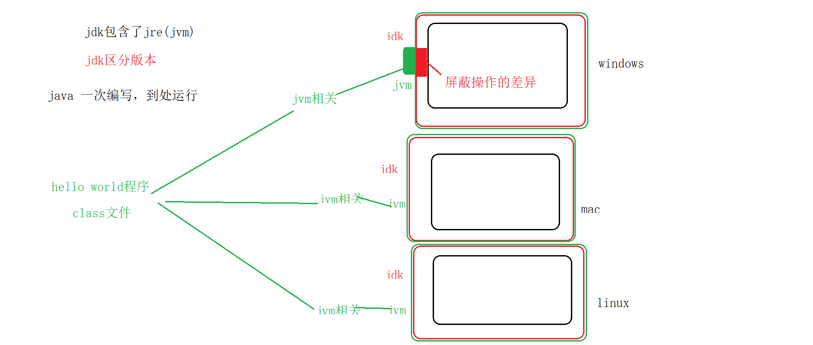

----

## 类的生命周期

<span style="color:green">**生命周期： 类的加载->连接->初始化->使用->卸载**</span>

-  **类的加载**

  - 查找并加载类的二进制数据（class文件）

  - 把硬盘上的class文件加载到jvm内存中

- **连接** ：确定类与类之间的关系  ； student.setAddress( address ); 

  - 验证：`*.class` 正确性校验，回忆下类加载器

  - 准备

    static静态变量分配内存，并赋初始化默认值【这是准备阶段做的事】

    static int num =  10 ;  在准备阶段，会把num=0，之后（初始化阶段）再将0修改为10

    在准备阶段，JVM中只有类，没有对象。

    初始化顺序： static ->非static ->构造方法

    ```java
  public class Student{
        
    	static int age; //在准备阶段，将age = 0 ; 在初始化阶段会重新赋值的~~
    	String name;  
    }
    ```
    
  - 解析：把类中符号引用，转为直接引用
  
  前期阶段，还不知道类的具体内存地址，只能使用“com.yanqun.pojo.Student ”来替代Student类，“com.yanqun.pojo.Student ”就称为符号引用；
  
  在解析阶段，JVM就可以将 “com.yanqun.pojo.Student ”映射成实际的内存地址，会后就用 内存地址来代替Student，这种使用 内存地址来使用 类的方法 称为直接引用。
  
 - **初始化**：给static变量 赋予正确的值

    - static int num =  10 ;  在连接的准备阶段，会把num=0，之后（初始化阶段）再将0修改为10

 - **使用：** 对象的初始化、对象的垃圾回收、对象的销毁

 - **卸载：**class的卸载条件非常严格！

<span style="color:green">**JVM结束生命周期的时机：**</span>

- **正常结束**
- **异常结束/错误**  
- **System.exit()**
- **操作系统异常**

## JMM

### JMM划分

**JVM内存模型（Java Memoery Model，简称JMM），用于定义（所有线程的共享变量， 不能是局部变量）变量的访问规则，屏蔽各种硬件和OS的内存访问差异，以实现让Java程序在各种平台下都达到一致的内存访问效果**

**PS：**主流程序语言（C / CPP等）直接使用物理硬件和OS的内存模型，由于不同平台上内存模型的差异，可能会导致程序在一套平台上并发完全正常，在另一套平台上并发访问经常出错。为了获取更好的执行效能，Java内存模型并没有限制执行引擎使用处理器的特定寄存器或缓存来和主内存进行交互，也没有限制即时编译器是否要进行调整代码执行顺序这类优化措施。

<span style="color:green">**JMM内存划分：主内存区、工作内存区**</span>

**PS：**Java内存区域和JMM不是同一层次的内存划分，两者基本上没有任何关系。如果非要对应起来，那么对应【】中的内容。

- 主内存区 ：真实存放变量【主内存主要对应Java堆中的对象实例数据部分】
- 工作内存区：主内存中变量的副本，供各个线程所使用【工作内存对应于虚拟机栈中的部分区域】
- <u>*再基础一些，主内存直接对应物理硬件内存，为了更好的效率，可能会让工作内存优先存储于寄存器和高速缓存中*。</u>

**注意：**

- 各个线程只能访问自己私有的工作内存（不能访问其他线程的工作内存，也不能访问主内存）
- 不同线程之间，可以通过主内存 简介的访问其他线程的工作内存

<span style="color:red">**都是双向箭头**</span>

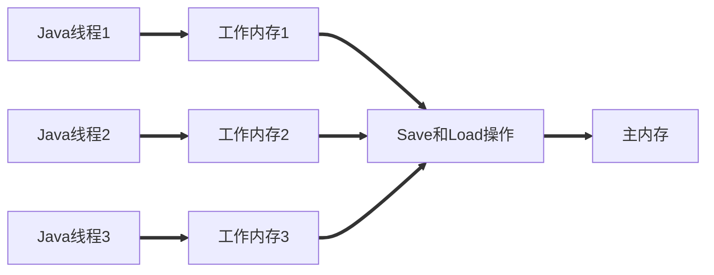

### 内存间交互操作

主内存与工作内存之间具体的交互协议。变量如何再工作内存和主内存之间相互交互。

<span style="color:green">**记忆型内容，无法测试**</span>

完整的研究：不同线程之间交互数据时 经历的步骤：

- **Lock：**将主内存中的变量，表示为一条线程的独占状态
- **Unlock：**解决线程的独占状态，把处于锁定状态的变量释放出来。
- **Read**：将主内存中的变量，读取到工作内存中【主内存---->工作内存】
- **Load：**将read操作从主内存中得到的变量存放到工作内存的变量副本中。【**把主内存读到的数据，存入工作内存，read读数据，load存数据**】
- **Use：**把工作内存中的变量副本，传递给线程去使用【得到数据是为了use】
- **Assign：**把线程正在使用的变量，传递给工作内存中的变量副本中
- **Store：**将工作内存中变量副本的值，传递到主内存中【工作内存----->主内存】
- **Write：**将变量副本作为一个主内存中的变量进行存储【**把工作内存读到的数据，存入主内存，Store拿到要存的数据，Write存数据**】

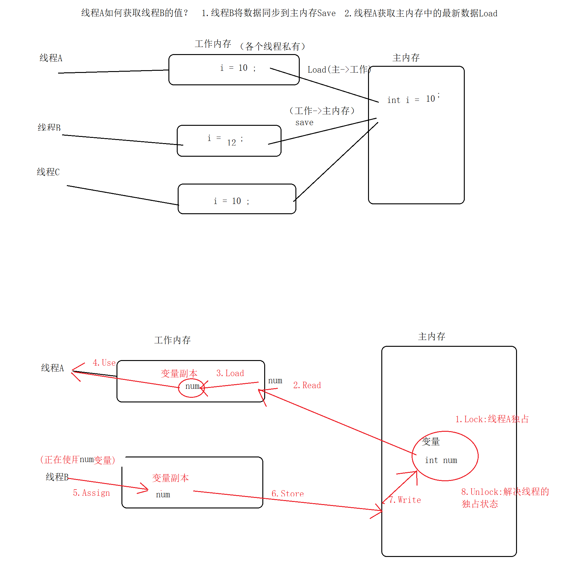

### 针对long和double型变量的特殊规则

JVM要求以上的8个动作必须是原子性的；JVM但是对于64位的数据类型（long double）有些非原子性协议。说明什么问题：在执行以上8个操作时，可能会出现 只读取（写入等）了半个long/double数据，因此出现错误。如何避免？ 

- 商用JVM已经充分考虑了此问题，无需我们操作  
- 可以通过**volatile**避免此类问题（读取半个数据的问题）   volatile double num ;

我们只需要关注Java内存模型的定义即可，不用考虑上述8个动作的并发问题，Java将上述的操作简化成了read、write、lock、unlock四种，与上述的8种操作是等价的~~

<span style="color:green">**等效判断原则-----先行发生原则，用来确定一个操作在并发环境下是否安全**</span>

### volatile 

#### 概念

JVM提供的一个轻量级的同步机制（可以说是最轻量级的同步机制）

当一个变量被声明为volatile时，线程在写入变量时不会包值缓存在寄存器或者其他地方，而是会把值刷新会主存。

volatile可以防止指令重排序

<span style="color:green">**请详细阅读汇编代码和对应的解释！**</span>

-----

volatile只是保证你读取的时候一定是从主内存中拿数据.

但是在操作的时候,不保证这个值是与主内存中同步更新的.

且Java的一些操纵如:+ - * /不是原子性的,所以可能会出现并发问题.

请看下方的部分汇编代码

**附上汇编代码**

```java
javap -c 字节码指令

public static void increase():
	Code:
		Stack=2, Locals=0, Args_size=0
        0:	getstatic  #13;  //Field race:I
		3:  iconst_1
		4:  iadd
		5:  putstatic #13;  //Field race:I
		8:  return
    LineNumberTable:
		line 14: 0
        line 15: 8
```

当getstatic指令把race的值渠道操作栈顶时，volatile关键字保证了race的值是正确的，但是在执行iconst_1、iadd这些指令的时候，其他线程可能已经把race的值改变了，而操作栈顶的值就变成了过期的数据，所以putstatic指令执行后就可能把较小的race值同步回主内存中。

使用字节码分析并发问题并不严谨,因为字节码指令也不一定是原子性的.但是这里用字节码足以说明问题了!

#### 特性

- 此变量对所有线程的可见性。一条线程修改了这个变量的值，新值对于其他线程来说是可以立即得知的。【它给的原因是Java里面的运算符操作并非原子性的，而volatile不能保证操作的原子性】
- 可防止指令重排序

```java
/**
 * volatile非原子性的测试
 */
public class VolatileTest {
    public static volatile int race = 0;
    private static final int THREAD_COUNT = 20;

    public static void increase() {
        race++;
    }

    public static void main(String[] args) {
        Thread[] threads = new Thread[THREAD_COUNT];
        for (int i = 0; i < THREAD_COUNT; i++) {
            threads[i] = new Thread(() -> {
                for (int j = 0; j < 100000; j++) {
                    increase();
                    System.out.println(race);
                }
            });
            threads[i].start();
        }
       //current thread will to yield当前线程让步，当前线程为main线程
        while (Thread.activeCount() > 1)
            Thread.yield();
    }
}
```

#### 适用场景

- 防止JVM对long/double等64位的非原子性协议进行的误操作（读取半个数据）

- 可以使变量对所有的线程立即可见（某一个线程如果修改了 工作内存中的变量副本，那么加上volatile 之后，该变量就会立刻同步到其他线程的工作内存中）【立即可见还是不是很清楚。大概就是，工作内存修改完变量后会**立刻**同步到主内存中。】

- 禁止指令的“重排序”优化

#### 经典代码

> <span style="color:green">**单例模式DCL**</span>

重排序：比如`Object obj = new Object()`假设这个操作分为三个原子性操作，则排序的对象就是这三个原子性操作。重排序的目的是为了提高执行效率，优化.【CPU的流水线操作？】

```java
int a = 10 ; //1    int a ; a = 10 ; 先把操作拆成原子性的，再对原子性操作进行排序
int b ;//2
b = 20 ;//3
int c = a * b ;//4
```

重排序“不会影响**单线程**的执行结果”，因此以上程序在经过重排序后，可能的执行结果：1,2,3,4 ；2,3,1,4

```java
//2 3 1 4
int b ;
b = 20 ;
int a  =10 ;
int c = a * b ;
```

但是以下代码可能会有问题【】

```java
/**
 * 经典DCL 为什么要volatile？
 * 防止指令重排序
 * 可以看下 即时编译的汇编代码，如何获得，我不知道
 */
public class DCL {
    // 没有用volatile修饰
    private static DCL instance;

    public static DCL getInstance() {
        // 这个null是为了提高效率，如果实例化了，就不走锁这步了。
        if (instance == null) { 
            // class字节码锁，字节码对象一般唯一
            synchronized (DCL.class) {
                if (instance == null) {
                    instance = new DCL(); // 非原子性操作！
                }
            }
        }
        return instance;
    }
}
```

以上代码可能会出现问题，原因 instance = new Singleton() 不是一个原子性操作，会在执行时**拆分成以下动作**：

- JVM会分配内存地址、内存空间
- 使用构造方法实例化对象
- instance = 第1步分配好的内存地址

根据重排序的知识，可知，以上3个动作在真正执行时可能1、2、3，也可能是1、3、2

**如果在多线程环境下，使用1、3、2可能出现问题**：

假设线程A刚刚执行完以下步骤（即刚执行 1、3，但还没有执行2，先分配内存空间，它就不是null了，然后再进行实例化。）

1正常0x123 ,  ...

3 instance=0x123

此时，线程B进入单例程序的if，直接会得到Instance对象（注意，此instance是刚才线程A并没有new的对象）,就去使用该对象，例如instance.xxx() 则必然报错。解决方案，就是 禁止此程序使用1 3 2 的重排序顺序。解决办法：

```java
// 加volatile 禁止对象初始化的时候 进行重排序。
// 那么问题来了，volatile是对Java的一步操作 禁止重排序吗？
private volatile static Singleton instance = null ;
```

**volatile是通过“内存屏障”防止重排序问题：**

- 在volatile写操作前，插入StoreStore屏障
- 在volatile写操作后，插入StoreLoad屏障
- 在volatile读操作后，插入LoadLoad屏障
- 在volatile读操作后，插入LoadStore屏障

***volatile***是否能保证原子性、保证线程安全？不能！

要想保证原子性/线程安全，可以使用原子包java.util.cocurrent.aotmic中的类，该类能够保证原子性的核心，是因为提供了compareAndSet()方法，该方法提供了 cas算法（无锁算法）。

### 原子性、可见性与有序性

#### 原子性（Atomicity）

由Java内存模型来直接保证的原子性变量操作包括read、load、assign、use、store和write这六个。大致可以认为基本数据类型的访问、读、写都是具备原子性的（例外就是long和double的非原子性协定）。

Java提供了更高层的字节码指令monitorenter和monitorexit保证更大范围的原子性操作。（synchronized的底层就是monitorxxx）

#### 可见性（Visibility）

- **volatile**
- **synchronized**
- **final**

都可保证可见性

一个线程修改了共享变量的值是，其他线程能够立即得知这个修改。JMM是通过在变量修改后将值同步回主内存。volatile保证了新值能立即同步过去，而普通变量无法保证。（是因为volatile禁止了重排序吗？）

#### 有序性（Ordering）

本线程内观察，所有操作都是有序的；如果在一个线程中观察另一个线程，所有操作都是无序的。

### 先行发生原则

不知道写些什么。

## JVM运行时的内存区域

将JVM在运行时的内存，划分为了5个部分，如图所示。

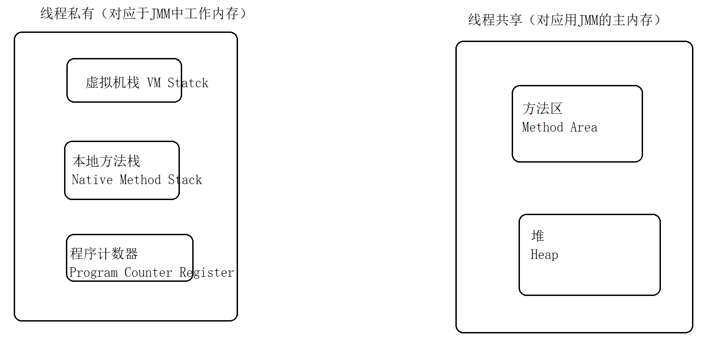

### 程序计数器

程序计数器：行号指示器，指向当前线程所执行的字节码指令的地址。像不像编译原理中的一个东西。

Test.java -> Test.class

```java
int num = 1;   //1
int num2 = 2 ; //2
if(num1>num2){//3
...//4-10
}else //11
{
    ...
}
while(...)
{
    
}
```

简单的可以理解为：class文件中的行号

> **注意：**

- 一般情况下，程序计数器 是行号；但如果正在执行的方法是native方法，则程序计数器的值 undefined。
- 程序计数器 **是唯一一个 不会 产生 “内存溢出”的区域。**

goto的本质就是改变的 程序计数器的值（java中没有goto，goto在java中的保留字）

### 虚拟机栈

定义：描述 方法执行的内存模型

- 方法在执行的同时，会在虚拟机栈中创建一个栈帧
- 栈帧中包含：方法的局部变量表，操作数据栈、动态链接、方法出口信息等


当方法太多时，就可能发生 栈溢出异常StackOverflowError，或者内存溢出异常OutOfMemoryError

```java
public static void main(String[] args) {
    main(new String[]{"abc","abc"});
}
```

### 本地方法栈

原理和结构与虚拟机栈一致，不同点： 虚拟机栈中存放的 jdk或我们自己编写的方法，而本地方法栈调用的 操作系统底层的方法。【感觉在看编译原理】

先在操作数栈中放10，在把10传递到局部变量表中。

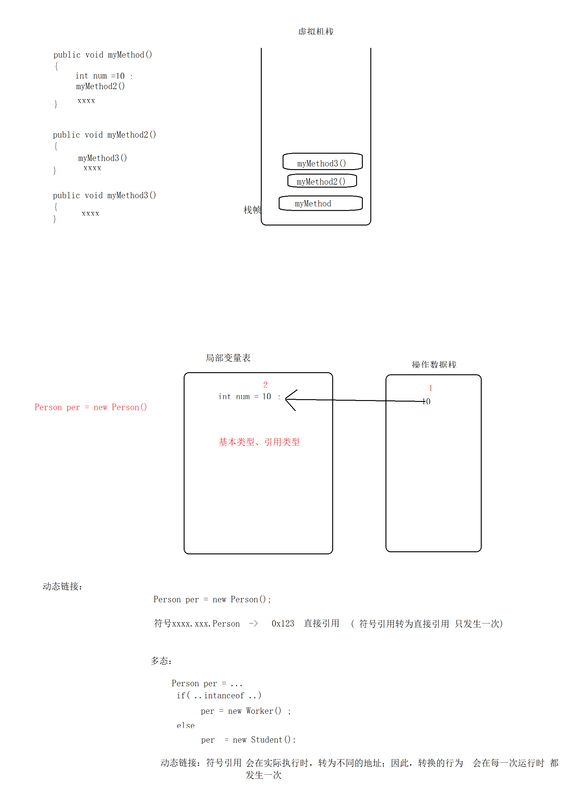

### 堆

从回收内存的角度看，由于现代垃圾收集器大部分都是基于分代收集理论设计的，所以Java堆中经常会出现“新生代”“老年代”“永久代”“Eden空间”“From Survivor空间”“To Survivor空间”等名词.

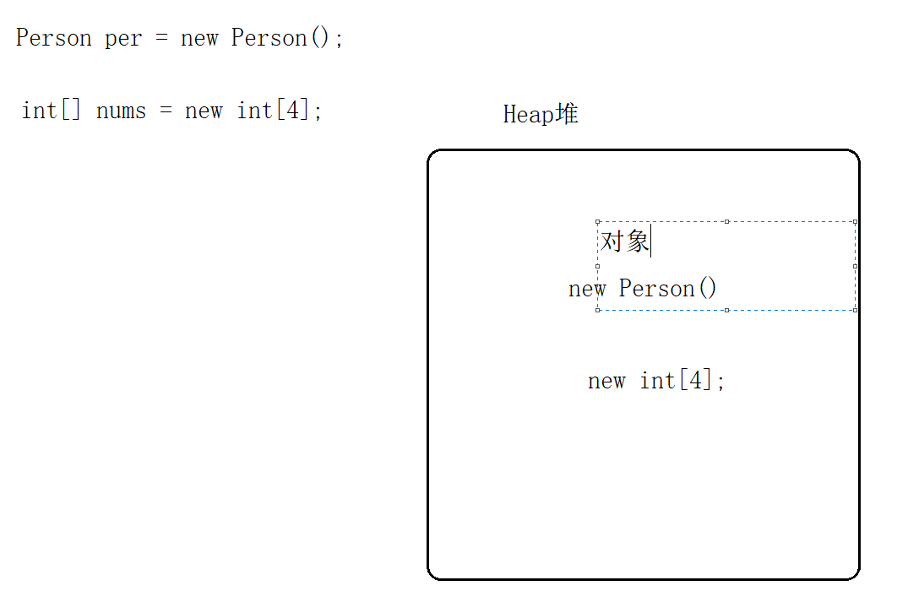

- 存放对象实例（数组、对象）

- 堆是jvm区域中最大的一块，在jvm启动时就已经创建完毕

- GC主要管理的区域

- 堆本身是线程共享，**但在堆内部可以划分出多个线程私有的缓冲区**【线程缓冲区】

- 堆允许物理空间不连续，只要逻辑连续即可

- 堆可以分 新生代、老生代 。大小比例，新生代：老生代= 1:2  

- 新生代中 包含eden、s0、s1 = 8:1:1  

- 新生代的使用率一般在90%。 在使用时，只能使用 一个eden和一块s区间(s0或s1)

- 新生代：存放 1.生命周期比较短的对象  2.小的对象；反之，存放在老生代中。对象的大小，可以通过参数设置 -XX：PretenureSizeThredshold 。一般而言，大对象一般是 集合、数组、字符串。生命周期： -XX:MaxTenuringThredshold

  新生代、老生代中年龄：MinorGC回收新生代中的对象。**如果Eden区中的对象在一次回收后仍然存活，就会被转移到 s区中；之后，如果MinorGC再次回收，已经在s区中的对象仍然存活，则年龄+1。如果年龄增长一定的数字，则对象会被转移到 老生代中。**简言之：在新生代中的对象，每经过一次MinorGC，有三种可能：1从eden --> s区   2.（已经在s区中）年龄+1  3.转移到老生代中

  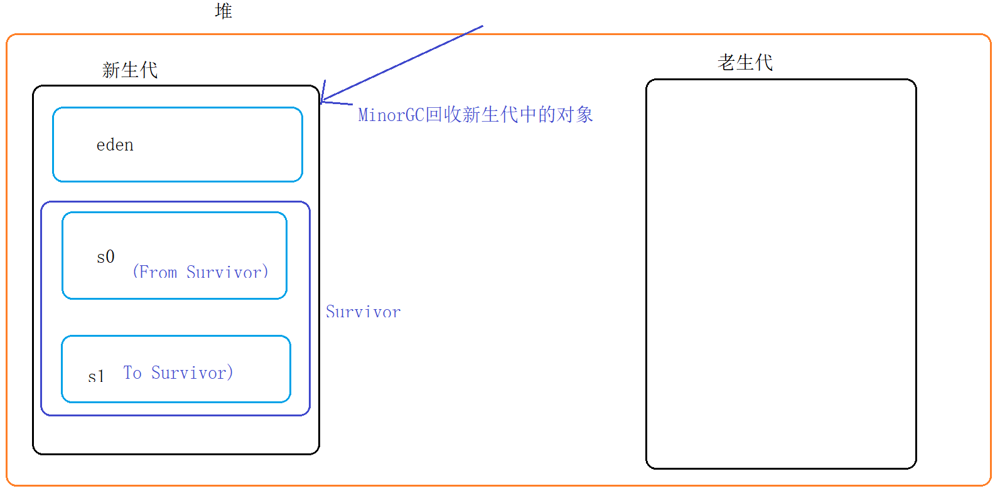

  

  新生代在使用时，只能同时使用一个s区：**底层采用的是复制算法，为了避免碎片产生**。只同时使用一个s区。如s0在用着，回收后s0的对象不是连续存放了，于是把存活的复制到s1中，让他们重新连续起来。空间连续的话，寻址方便。

  老生代： 1.生命周期比较长的对象  2.大的对象； 使用的回收器 MajorGC\FullGC

  新生代特点： 

  - 大部分对象都存在于新生代
- 新生代的回收频率高、效率高
  
  老生代特点：

  - 空间大、
- 增长速度慢
  - 频率低
  
  意义：可以根据项目中 对象大小的数量，设置新生代或老生代的空间容量，从提高GC的性能。


如果对象太多，也可能导致内存异常。

虚拟机参数：JDK版本不同，虚拟参数也有所出入。具体情况看Oracle官方文档。

-Xms128m ：JVM启动时的大小

 -Xmn32m：新生代大小

 -Xmx128：总大小

jvm总大小= 新生代 + 老生代  JDK1.8一起有个叫永久代【存放元数据，比如说类的一些加载信息】的，现在已经不存在了。

堆内存溢出的示例：java.lang.OutOfMemoryError: Java heap space

```java
package com.yanqun;

import java.util.ArrayList;
import java.util.List;

public class TestHeap {
    public static void main(String[] args) {

        List list = new ArrayList() ;
        while(true){
            list.add(  new int[1024*1024]) ;
        }

    }
}

```

### 方法区

永久代从堆转到了方法区

存放：类的元数据（描述类的信息）、常量池、方法信息（方法数据、方法代码）

gc：类的元数据（描述类的信息）、常量池

方法区中数据如果太多，也会抛异常OutOfMemory异常


图：方法区与其他区域的调用关系【<不是很明白】

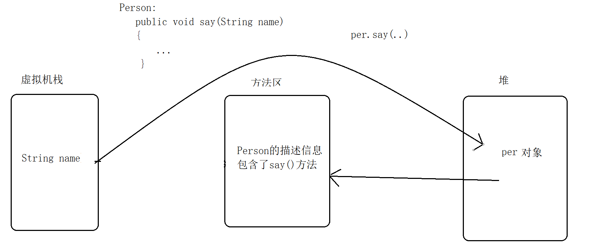

常量池：存放编译期间产生的 字面量("abc")、**符号引用**。【字符串常量池只是其中的一部分】

<span style="color:green">**注意： 导致内存溢出的异常OutOfMemoryError，除了虚拟机中的4个区域以外，还可能是直接内存。在NIO技术中会使用到直接内存。直接内存，直接操作OS的内存**</span>

那么直接内存如何回收？

## 类的使用方式

类的初始化：JVM只会在**“首次主动使用”**一个类/接口时，才会初始化它们，初始化类哦！不是初始化对象！这里说的好像是类加载器中的那个类~~【查查资料！】 。

### 主动使用

- new 构造类的使用  这个例子不恰当啊！

```java
package init;

public class Test1 {

    static{
        System.out.println("Test1...");
    }

    public static void main(String[] args) {
        new Test1();//首次主动使用
        new Test1();
    }
}
```

结果：Test1...

- 访问类/接口的 静态成员（属性、方法）

```java
package init;
class A{
    static int i  = 10;

    static{
        System.out.println("A...");
    }

     static void method(){
        System.out.println("A method...");
    }
}

public class Test2 {
    public static void main(String[] args) {

//        A.i = 1 ;
//        A.i = 1 ;
//        System.out.println(A.i);
        A.method();
    }
}
```

注：main()本身也是一个静态方法，也此main()的所在类 也会在执行被初始化

<span style="color:green">**特殊情况：**</span>

- 如果成员变量既是static，又是final ，即常量，则不会被初始化
- 上一种情况中，如果常量的值 是一个随机值，则会被初始化 (为了安全)

- 使用Class.forName("init.B")执行反射时使用的类（B类）

- 初始化一个子类时，该子类的父类也会被初始化

```java
public class Son extends Father {
    public static void main(String[] args) {
        new Son();
    }
}
```

- 动态语言在执行所涉及的类 也会被初始化（动态代理）

### 被动使用

除了主动以外，其他都是被动使用。

```java
package init;
class BD{
    
    static {
        System.out.println("BD...");
    }
}

public class BeiDong {
    
    public static void main(String[] args) {
        BD[] bds = new BD[3];
    }
}

```

以上代码，不属于主动使用类，因此不会被初始化。

### 主动使用中的静态成员问题

```java
class B{
    /**
     final static 称为常量
     常量产生的时机：
     	时间：编译期间
     	地点：（调用这个常量的方法 所在类【Test2】）常量池
     **/
    final static int i = 10;
    
    static{
        System.out.println("A....")
    }
}
public class Test2{
    // Test2中调用的A的常量，所以A中产生的常量保存在Test2的常量池中
    public static void main(String[] args){
        System.out.println(A.i);
    }
}
```

```java
class Father{
    public static int i = 10;
    static{
        system.out.println("father");
    }
}
class Son extends Father{
    static{
        System.out.println("son...");
    }
}

public class Test{
    public static void main(String[] args){
        System.out.println(Son.i)
    	// 将会输出 father...
        // 10
        // 因为 i是Father里的
    }
}
```


## 助记符

<span style="color:green">**Java的bin目录下常用的命令**</span>

- java 运行字节码
- javac 把` *.java`编译成` *.class`
- javap 把字节码文件反编译

反编译： cd到class目录中， javap -c class文件名


Test.java  ->                    javap -c Test.java

javap反编译的是class文件

应该：xx.java -> xx.class ->javap


aload_0: 装载了一个引用类型

 Invokespecial:  init,  private  , super.method() :  \<init\>存放的是初始化代码的位置

getstatic ：获取静态成员

bipush ： 整数范围 -128  -- 127之内  (8位带符号的整数),放到栈顶

sipush:    >127   (16个带符号的整数),放到栈顶

注意：无论是定义int或short 等，只要在 -128 --127以内 都是bipush，否则是sipush.

注意：特殊：-1  -- 5不是bipush

​		 iconst_m1（-1）  iconst_0   iconst_1 ....  iconst_5


ldc  : int  float String 常量 ,放到栈顶

ldc2_w :long  double常量,放到栈顶


## JVM四种引用级别

- **Reference：**
  - 直接new的 强引用
  - SoftReference 软引用
  - WeakReference 弱引用
  - PhantomReference 虚引用
- **虚拟机内存大小设置：**
  - -Xmx128m 最大128m
  - -Xms64m  启动时64m
  - 示例：`-Xmx128m  -Xms64m`

如果一个对象存在着指向它的引用，那么这个对象就不会被GC回收？  -- 局限性 【循环引用！JVM用的可达性分析！】

Object obj = new Object() ; --强引用

<span style="color:green">**根据引用的强弱关系： 强引用>软引用>弱引用>虚引用；强软弱虚 四大引用**</span>

### 强引用

Object obj = new Object() ;

**约定：**引用 obj，引用对象new Object()

强引用对象什么失效？

- 生命周期结束（作用域失效）

```java
public void method(){
	Object obj = new Object() ;
}
//当方法执行完毕后，强引用指向的 引用而对象new Object()就会等待被GC回收
```

- 引用被置为null，引用对象可以被GC回收

```java
obj = null ;
//此时，没有任何引用指向new Object() 因此，new Object() 就会等待被GC回收
```

- 除了以上两个情况以外，其他任何时候GC都不会回收强引用对象。宁愿内存溢出，也不会随便回收强引用对象！

### 软引用

<a href="bilibili.com/video/BV1d54y1z792?p=13">p13视频补充（DT课堂）</a>

**可以做缓存**

根据JVM内存情况： 如果内存充足，GC不会随便的回收软引用对象；如果JVM内存不足，则GC就会主动的回收软引用对象。

各种引用的出处：

强引用:new

软引用 弱引用 虚引用 （最终引用）：都是Reference的子类

软引用：java.lang.ref.SoftReference

Reference中有一个get()方法，用于返回 所引用的对象【**<span style="color:green">软引用包裹一下对象。</span>**】

```java
SoftReference<SoftObject> softRef = new SoftReference<>(new SoftObject() );
```

softRef.get()  -->返回引用所指向的SoftObject对象本身

```java
package ref;

import java.lang.ref.SoftReference;
import java.util.ArrayList;
import java.util.List;

//软引用对象
class SoftObject{}
public class SoftReferenceDemo {
    public static void main(String[] args) throws Exception {
        //softRef  -->SoftObject  设计模式中的：装饰模式
        SoftReference<SoftObject> softRef = new SoftReference<>(new SoftObject() );
        List<byte[]> list = new ArrayList<>();

        //开启一个线程，监听 是否有软引用已经被回收
        new Thread(  ()->{
        while(true) {
            //软引用对象
            if (softRef.get() == null){
                System.out.println("软引用对象已被回收..");
                System.exit(0);
            }
        }
       }  ,"线程A" ) .start();     //lambda

        //不断的往集合中 存放数据，模拟内存不足
        while(true){
//          Thread.sleep(10);
            if(softRef.get() != null)
                list.add(new byte[1024*1024]) ;//每次向list中增加1m内容
        }
    }
}
```

### 弱引用

回收的时机：只要GC执行，就会将弱引用对象进行回收。

`java.lang.ref.WeakReference<T>`

```java
package ref;

import java.lang.ref.WeakReference;

public class WeakReferenceDemo {
    public static void main(String[] args) throws Exception {

        WeakReference<Object> weakRef = new WeakReference<>(new Object());
        //weakRef->Object
        System.out.println( weakRef.get()==null?"已被回收":"没被回收");
        System.gc();//建议GC执行一次回收（存在概率）
        Thread.sleep(100);
        System.out.println( weakRef.get()==null?"已被回收":"没被回收");
    }
}
```

### 虚引用（幻影引用或者幽灵引用）

java.lang.ref.PhantomReference\<T\>

是否使用虚引用，和引用对象本身 没有任何关系； 无法通过虚引用来获取对象本身.

引用get() -> 引用对象

虚引用get() -> null

虚引用不会单独使用，一般会和 引用队列（java.lang.ref.ReferenceQueue）一起使用。

价值： 当gc回收一个对象，如果gc发现 此对象还有一个虚引用，就会将虚引用放入到 引用队列中，之后（当虚引用出队之后）再去回收该对象。因此，我们可以使用 虚引用+引用对象 实现：在对象被gc之前，进行一些额外的其他操作。

 GC ->如果有虚引用->虚引用入队->虚引用出队-> 回收对象 【<span style="color:green">**在被回收前，可以进行一些操作**</span>】

```java
package ref;

import java.lang.ref.PhantomReference;
import java.lang.ref.ReferenceQueue;

class MyObject {
}

public class PhantomReferenceDemo {

    public static void main(String[] args) throws Exception {
        MyObject obj = new MyObject();
        //引用队列
        ReferenceQueue queue = new ReferenceQueue();

        //虚引用+引用队列
        PhantomReference<MyObject> phantomRef = new PhantomReference<>(obj, queue);

        //让gc执行一次回收操作
        obj = null;
        System.gc();
        Thread.sleep(30);
        System.out.println("GC执行...");

        //GC-> 虚引用->入队->出队->     obj
        System.out.println(queue.poll());
    }
}
```

<span style="color:green">**特殊情况：如果虚引用对象重写了finalize()，那么JVM会延迟 虚引用的入队时间。**</span>

```java
package ref;

import java.lang.ref.PhantomReference;
import java.lang.ref.ReferenceQueue;

class MyObject3 {
    @Override
    protected void finalize() throws Throwable {
        super.finalize();
        System.out.println("即将被回收之前...");
    }
}

public class PhantomReferenceDemo2 {

    public static void main(String[] args) throws Exception {
        MyObject3 obj = new MyObject3();
        // 引用队列
        ReferenceQueue queue = new ReferenceQueue();

        // 虚引用+引用队列
        PhantomReference<MyObject3> phantomRef = new PhantomReference<>(obj, queue);

        // 让gc执行一次回收操作
        obj = null;

        System.gc();
		// Thread.sleep(30);
        System.out.println("GC执行...");

        // GC-> 虚引用->入队->出队->     obj
        System.out.println(queue.poll());//虚引用并没有入队

        System.gc();
		// Thread.sleep(30);
        System.out.println("GC执行...");

        // GC-> 虚引用->入队->出队->     obj
        System.out.println(queue.poll());//虚引用延迟到了第二次gc时入队

        System.gc();
		// Thread.sleep(30);
        System.out.println("GC执行...");

        // GC-> 虚引用->入队->出队->     obj
        System.out.println(queue.poll());

        System.gc();
        Thread.sleep(30);
        System.out.println("GC执行...");

        // GC-> 虚引用->入队->出队->     obj
        System.out.println(queue.poll());
    }
}
```

final class Finalizer extends FinalReference：最终引用

构造方法()  -> 析构函数()，在java中存在Finalizer  可以帮我们自动的回收一些不需要的对象，因此不需要写析构函数。   

jvm能够直接操作的是：非直接内存 

直接内存：native （操作系统中的内存，而不是jvm内存）

jvm不能操作 直接内存（非jvm操作的内容）时，而恰好 此区域的内容 又忘了关闭，此时Finalizer就会将这些内存进行回收。

### 使用软引用实现缓存的淘汰策略

常见的淘汰策略见OS缓存那一块：

- FIFO：先进先出
- LIFO：后进先出
- LRU：近期最少用★★★★★
- OPT：最佳置换算法，无法实现，理论上的而已，只用做和其他算法做比较。

java ->缓存( 90% ->60%)  ->   db(iphone)

LRU

一般的淘汰策略：

根据容量/缓存个数 + LRU 进行淘汰。

在java中 还可以用引用实现 淘汰策略。

MyObject obj = new MyObject();//强引用，不会被GC回收

map.put( id   ,   obj ) ;

Map.put(id,  软引用(obj) )；//当jvm内存不足时，会主动回收。

```java
package ref;

import java.lang.ref.SoftReference;
import java.util.HashMap;
import java.util.Map;

class MyObject10{}

public class SoftDemo {

    //map: key:id  ,value:对象的软引用  （拿对象： 对象的软引用 .get() ）
    Map<String, SoftReference<MyObject10>> caches = new HashMap<>();
    //java -> caches -> db
    //set: db->caches
    //get: java->cache

    void setCaches(String id,MyObject10 obj){
        caches.put( id,   new SoftReference<MyObject10>(obj) );

    }

    MyObject10 getCache(String id){
        SoftReference<MyObject10> softRef = caches.get(id) ;
       return  softRef == null ?  null : softRef.get()  ;
    }
    //优势：当jvm内存不足时，gc会自动回收软引用。因此本程序 无需考虑 OOM问题。
}
```

## 双亲委派

前置：类的加载

```java
package com.yanqun.parents;
class MyClass{
    
    static int num1 = 100 ;

    static MyClass myClass = new MyClass();
    public MyClass(){
        num1 = 200 ;
        num2 = 200 ;
    }
    static int num2 = 100 ;
    public static MyClass getMyClass(){
        return myClass ;
    }

    @Override
    public String toString() {
        return this.num1 + "\t" + this.num2 ;
    }
}

public class MyClassLoader {
    public static void main(String[] args) {
        MyClass myc =  MyClass.getMyClass() ;
        System.out.println(myc);

    }
}
```

分析

```java
    static int num1 = 100 ;     【 0 】-> 【100】->【200】

    static MyClass myClass = new MyClass();【null】 ->【引用地址0x112231】
    public MyClass(){
        num1 = 200 ;
        num2 = 200 ;
    }
    static int num2 = 100 ;  【0】->【200】->【100】

连接：static静态变量并赋默认值

初始化：给static变量 赋予正确的值
```

总结：在类中 给静态变量的初始化值问题，一定要注意顺序问题（静态变量 和构造方法的顺序问题）

双亲委派： JVM自带的加载器（在JVM的内部所包含，C++）、用户自定义的加载器（独立于JVM之外的加载器,Java）

-  JVM自带的加载器

  - 根加载器,Bootstrap   : 加载 jre\lib\rt.jar （包含了平时编写代码时 大部分jdk api）；指定加载某一个jar（ -Xbootclasspath=a.jar）
  - 扩展类加载器，Extension：C:\Java\jdk1.8.0_101\jre\lib\ext\\\*.jar ;指定加载某一个jar(-Djava.ext.dirs= ....)
  - AppClassLoader/SystemClassLoader，系统加载器（应用加载器）：加载classpath；指定加载（-Djava.class.path= 类/jar）

- 用户自定义的加载器

  - 都是抽象类java.lang.ClassLoader的子类


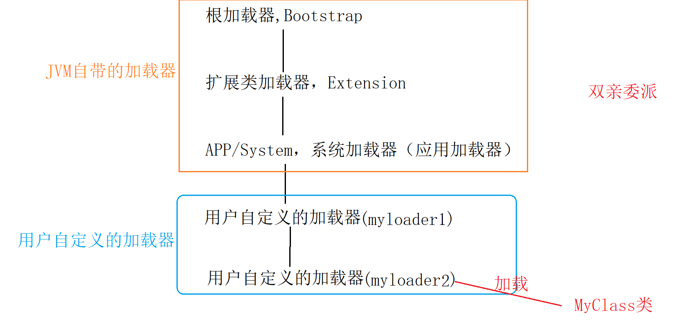

双亲委派：当一个加载器要加载类的时候，自己先不加载，而是逐层向上交由双亲去加载；当双亲中的某一个加载器 加载成功后，再向下返回成功。如果所有的双亲和自己都无法加载，则报异常。

```java
package com.yanqun.parents;
//classpath: .; ..lib，其中“.”代表当前（自己写的类）
class MyClass2{
}

public class TestParentsClassLoader {


    public static void main(String[] args) throws Exception {
       Class myClass1 =  Class.forName("java.lang.Math") ;
        ClassLoader classLoader1 = myClass1.getClassLoader();
        System.out.println(classLoader1);
        /* JDK中的官方说明：
            Some implementations may use null to represent the bootstrap class loader
         */
       Class myClass2 =  Class.forName("com.yanqun.parents.MyClass2") ;
        ClassLoader classLoader2 = myClass2.getClassLoader();
        System.out.println(classLoader2);
    }
}
/**
* null
* sun.misc.Launcher$AppClassLoader@18b4aac2
* 注意：
* /
```

小结：如果类是 rt.jar中的，则该类是被 bootstrap（根加载器）加载；如果是classpath中的类（自己编写的类），则该类是被AppClassLoader加载。

定义类加载：最终实际加载类的 加载器  

初始化类加载类：直接面对加载任务的类

```java
package com.yanqun.parents;

import java.net.URL;
import java.util.Enumeration;

class MyCL{
}
public class JVMParentsCL {
    public static void main(String[] args) throws Exception {
        Class<?> myCL = Class.forName("com.yanqun.parents.MyCL");
        ClassLoader classLoader = myCL.getClassLoader();
        System.out.println(classLoader);
        System.out.println("---");
        ClassLoader systemClassLoader = ClassLoader.getSystemClassLoader();
        System.out.println(systemClassLoader);

        ClassLoader parent1 = systemClassLoader.getParent();
        System.out.println(parent1);
        ClassLoader parent2 = parent1.getParent();
        System.out.println(parent2);

        System.out.println("----");

        ClassLoader appClassLoader = ClassLoader.getSystemClassLoader();
        Enumeration<URL> resources = appClassLoader.getResources("com/yanqun/parents/MyCL.class");// a/b/c.txt
        while(resources.hasMoreElements()){
            URL url = resources.nextElement();
            System.out.println(url);
        }
    }
}
/*
 * sun.misc.Launcher$AppClassLoader@18baac2
 * ---
 * sun.misc.Launcher$AppClassLoader@18baac2
 * sun.misc.Launcher$ExtClassLoader@4554617c
 * null
 * ----
 * file:/D:/github/JavaCore/%xsfsfxasfas/MyJVM/out/production/MyJVM/com/yanqun/parents/MyCL.class
*/
```

值得考究的API：

- `getResource(String name) return URL`
- `getResourceAsStream(String...) return InputStream`

### 自定义类的加载器

二进制名binary names:

```java
"java.lang.String"
"javax.swing.JSpinner$DefaultEditor"
"java.security.KeyStore$Builder$FileBuilder$1"
"java.net.URLClassLoader$3$1"
```

$代表内部类：

$数字：第几个匿名内部类

```
The class loader for an array class, as returned by {@link* Class#getClassLoader()} is the same as the class loader for its element* type; if the element type is a primitive type, then the array class has no* class loader.
```

- 数组的加载器类型  和数组元素的加载器类型 是相同

- 原声类型的数组 是没有类加载器的  

如果加载的结果是null：  可能是此类没有加载器(int[]) ， 也可能是 加载类型是“根加载器”

```
<p> However, some classes may not originate from a file; they may originate* from other sources, such as the network, or they could be constructed by an* application.  The method {@link #defineClass(String, byte[], int, int)* <tt>defineClass</tt>} converts an array of bytes into an instance of class* <tt>Class</tt>. Instances of this newly defined class can be created using* {@link Class#newInstance <tt>Class.newInstance</tt>}.
```

xxx.class文件可能是在本地存在，也可能是来自于网络 或者在运行时动态产生(jsp)

```java
<p> The network class loader subclass must define the methods {@link
 * #findClass <tt>findClass</tt>} and <tt>loadClassData</tt> to load a class
 * from the network.  Once it has downloaded the bytes that make up the class,
 * it should use the method {@link #defineClass <tt>defineClass</tt>} to
 * create a class instance.  A sample implementation is:
 *
 * <blockquote><pre>
 *     class NetworkClassLoader extends ClassLoader {
 *         String host;
 *         int port;
 *
 *         public Class findClass(String name) {
 *             byte[] b = loadClassData(name);
 *             return defineClass(name, b, 0, b.length);
 *         }
 *
 *         private byte[] loadClassData(String name) {
 *             // load the class data from the connection
 *             &nbsp;.&nbsp;.&nbsp;.
 *         }
 *     }
```

如果class文件来自原Network，则加载器中必须重写findClas()和loadClassData().

自定义类加载器的实现

重写findClas()和loadClassData()

```java
package com.yanqun.parents;

import java.io.ByteArrayOutputStream;
import java.io.File;
import java.io.FileInputStream;
import java.io.FileNotFoundException;

//public class MyException extends Exception{...}
public class MyClassLoaderImpl  extends ClassLoader{
        //优先使用的类加载器是：getSystemClassLoader()
        public MyClassLoaderImpl(){
            // 无参 默认调用的系统类加载器
            super();
        }

        public MyClassLoaderImpl(ClassLoader parent){//扩展类加载器
            super(parent);
        }
        //com.yq.xx.class
        public Class findClass(String name) {
            System.out.println(name);
              byte[] b = loadClassData(name);
              return defineClass(name, b, 0, b.length);
          }

          //“com/yq/xxx.class” ->  byte[]  把字符串变成字节数组就行了
          private byte[] loadClassData(String name)  {

              name =  dotToSplit("out.production.MyJVM."+name)+".class" ;
              byte[] result = null ;
              FileInputStream inputStream = null ;
              ByteArrayOutputStream output = null ;
              try {
                 inputStream = new FileInputStream( new File(  name)  );
                //inputStream -> byte[]
                 output = new ByteArrayOutputStream();

                byte[] buf = new byte[2];
                int len = -1;
                while ((len = inputStream.read(buf)) != -1) {
                    output.write(buf, 0, len);
                }
                result = output.toByteArray();
            }catch (Exception e){
                    e.printStackTrace(); ;
            }finally {
                  try {
                      if(inputStream != null )inputStream.close();
                      if(output != null ) output.close();
                  }catch (Exception e){
                      e.printStackTrace();
                  }
            }
            return result ;
          }

    public static void main(String[] args) throws Exception{
        //自定义加载器的对象
        //默认在双亲委派时，会根据正规流程：系统 —> 扩展 -> 根
        MyClassLoaderImpl myClassLoader = new MyClassLoaderImpl();
		//MyClassLoaderImpl myClassLoader = new MyClassLoaderImpl();
        //要干预的话 直接指定某个 具体的的委派
        Class<?> aClass = null;
        aClass  = myClassLoader.loadClass("com.yanqun.parents.MyDefineCL");
        System.out.println(aClass.getClassLoader());
        MyDefineCL myDefineCL =  (MyDefineCL)(aClass.newInstance() );
        myDefineCL.say();
    }

    public static String dotToSplit(String clssName){
        return clssName.replace(".","/") ;
    }
}

class MyDefineCL{
    public void say(){
        System.out.println("Say...");
    }
}
```

**实现流程：**

- public class MyClassLoaderImpl  extends ClassLoader

- findClass(String name){...} ：直接复制文档中的NetworkClassLoader中的即可

- loadClassData(String name){...} ：name所代表的文件内容->byte[] 

**细节：**

- loadClassData(String name)： 是文件形式的字符串a/b/c.class，并且开头out.production..

- findClass(String name):是全类名的形式  a.b.c.class，并且开头 是： 包名.类名.class

**操作思路：**

要先将 .class文件从classpath中删除，之后才可能用到 自定义类加载器；否在classpath中的.class会被 APPClassLoader加载

```java
package com.yanqun.parents;

import java.io.ByteArrayOutputStream;
import java.io.File;
import java.io.FileInputStream;
import java.io.FileNotFoundException;

//public class MyException extends Exception{...}
public class MyClassLoaderImpl  extends ClassLoader{
    private String path ; //null
        //优先使用的类加载器是：getSystemClassLoader()
        public MyClassLoaderImpl(){
            super();
        }

        public MyClassLoaderImpl(ClassLoader parent){//扩展类加载器
            super(parent);
        }
        //com.yq.xx.class
        public Class findClass(String name) {
            System.out.println("findClass...");
              byte[] b = loadClassData(name);
              return defineClass(name, b, 0, b.length);
          }

          //“com/yq/xxx.class” ->  byte[]
          private byte[] loadClassData(String name)  {
              System.out.println("加载loadClassData...");
              if(path != null){//name: com.yanqun.parents.MyDefineCL
                  name = path+ name.substring(name.lastIndexOf(".")+1)+".class" ;
              }else{
                  //classpath ->APPClassLoader
                  name =  dotToSplit("out.production.MyJVM."+name)+".class" ;
              }

              byte[] result = null ;
              FileInputStream inputStream = null ;
              ByteArrayOutputStream output = null ;
              try {
                inputStream = new FileInputStream(new File(name));
                //inputStream -> byte[]
                output = new ByteArrayOutputStream();

                byte[] buf = new byte[2];
                int len = -1;
                while ((len = inputStream.read(buf)) != -1) {
                    output.write(buf, 0, len);
                }
                result = output.toByteArray();
            }catch (Exception e){
                    e.printStackTrace(); ;
            }finally {
                  try {
                      if(inputStream != null )inputStream.close();
                      if(output != null ) output.close();
                  }catch (Exception e){
                      e.printStackTrace();
                  }
            }
            return result ;
          }

    public static void main(String[] args) throws Exception {
        System.out.println("main...");
        //自定义加载器的对象
        //默认在双亲委派时，会根据正规流程：系统—>扩展->根
        MyClassLoaderImpl myClassLoader = new MyClassLoaderImpl();
        myClassLoader.path = "d:/" ;

        //MyClassLoaderImpl myClassLoader = new MyClassLoaderImpl();
        //直接指定某个 具体的的委派
        Class<?> aClass = null;
        aClass = myClassLoader.loadClass("com.yanqun.parents.MyDefineCL");
        System.out.println(aClass.getClassLoader());
		// MyDefineCL myDefineCL = (MyDefineCL)(aClass.newInstance()) ;
    }

    public static String dotToSplit(String clssName){  
        return clssName.replace(".","/") ;  
    }
}


class MyDefineCL{
    public void say(){
        System.out.println("Say...");
    }
}
```

代码流程：

```
loadClass() ->findClass()->loadClassData()
```

一般而言，启动类加载loadClass()；

**实现自定义加载器，只需要：**

- **继承ClassLoader**

- **重写的 findClass()**

情况一：用APPClassLoader

classpath中的MyDefineCL.class文件：

1163157884
1163157884

d盘中的MyDefineCL.class文件：

356573597

说明，类加载器 只会把同一个类 加载一次； 同一个class文件  加载后的位置

结论：

自定义加载器 加载.class文件的流程：

先委托APPClassLoader加载，APPClassLoader会在classpath中寻找是否存在，如果存在 则直接加载；如果不存在，才有可能交给 自定义加载器加载。

```java
package com.yanqun.parents;

import java.io.ByteArrayOutputStream;
import java.io.File;
import java.io.FileInputStream;
import java.io.FileNotFoundException;

//public class MyException extends Exception{...}
public class MyClassLoaderImpl  extends ClassLoader{
    private String path ; //null
        //优先使用的类加载器是：getSystemClassLoader()
        public MyClassLoaderImpl(){
            super();
        }

        public MyClassLoaderImpl(ClassLoader parent){//扩展类加载器
            super(parent);
        }
        //com.yq.xx.class
        public Class findClass(String name) {
//            System.out.println("findClass...");
              byte[] b = loadClassData(name);
              return defineClass(name, b, 0, b.length);
          }

          //“com/yq/xxx.class” ->  byte[]
          private byte[] loadClassData(String name)  {
			// System.out.println("加载loadClassData...");
              if(path != null){//name: com.yanqun.parents.MyDefineCL
				// System.out.println("去D盘加载;;");
                  name = path+ name.substring(name.lastIndexOf(".")+1)+".class";
              }

              byte[] result = null ;
              FileInputStream inputStream = null ;
              ByteArrayOutputStream output = null ;
              try {
                 inputStream = new FileInputStream( new File(  name)  );
                //inputStream -> byte[]
                 output = new ByteArrayOutputStream();

                byte[] buf = new byte[2];
                int len = -1;
                while ((len = inputStream.read(buf)) != -1) {
                    output.write(buf, 0, len);
                }
                result = output.toByteArray();
            }catch (Exception e){
                    e.printStackTrace(); ;
            }finally {
                  try {
                      if(inputStream != null )inputStream.close();
                      if(output != null ) output.close();
                  }catch (Exception e){
                      e.printStackTrace();
                  }
            }
            return result ;
          }

    public static void main(String[] args) throws Exception {
        // System.out.println("main...");
        // 自定义加载器的对象
        // MyClassLoaderImpl myClassLoader = new MyClassLoaderImpl();
        // 默认在双亲委派时，会根据正规流程：系统—>扩展->根
        // myClassLoader.path = "d:/" ;
        // Class<?> aClass = null
        // aClass = myClassLoader.loadClass("com.yanqun.parents.MyDefineCL");
        // System.out.println(aClass.hashCode());
        //默认在双亲委派时，会根据正规流程：系统—>扩展->根
        MyClassLoaderImpl myClassLoader2 = new MyClassLoaderImpl();
        Class<?> aClass2 = myClassLoader2.loadClass("com.yanqun.parents.MyDefineCL");
        System.out.println(aClass2.hashCode());
        // System.out.println(aClass.getClassLoader());
        // MyDefineCL myDefineCL = (MyDefineCL)( aClass.newInstance());
    }

    public static String dotToSplit(String clssName){  
        return clssName.replace(".","/"); 
    }
}

class MyDefineCL{
    public void say(){
        System.out.println("Say...");
    }
}
```

通过以下源码可知，在双亲委派体系中，“下面”的加载器 是通过parent引用 “上面”的加载器。即在双亲委派体系中，各个加载器之间不是继承关系。

```java
public abstract class ClassLoader {

    private static native void registerNatives();
    static {
        registerNatives();
    }

    // The parent class loader for delegation
    // Note: VM hardcoded the offset of this field, thus all new fields
    // must be added *after* it.
    private final ClassLoader parent;
```

ClassLoader源码解读

```java
    protected Class<?> loadClass(String name, boolean resolve)
        throws ClassNotFoundException{
        synchronized (getClassLoadingLock(name)) {
            // First, check if the class has already been loaded
            Class<?> c = findLoadedClass(name);
            if (c == null) {
                long t0 = System.nanoTime();
                try {
                   //如果“父类”不为空，则委托“父类”加载
                    if (parent != null) {
                        c = parent.loadClass(name, false);
                    } else {
                        //如果“父类”为空，说明是双亲委派的顶层了，就调用顶层的加载器（BootstrapClassLoader）
                        c = findBootstrapClassOrNull(name);
                    }
                } catch (ClassNotFoundException e) {
                    // ClassNotFoundException thrown if class not found
                    // from the non-null parent class loader
                }
				//如果“父类”加载失败，则只能自己加载（自定义加载器中的findClass()方法）
                if (c == null) {
                    // If still not found, then invoke findClass in order
                    // to find the class.
                    long t1 = System.nanoTime();
                    c = findClass(name);

                    // this is the defining class loader; record the stats
                    sun.misc.PerfCounter.getParentDelegationTime().addTime(t1 - t0);
                    sun.misc.PerfCounter.getFindClassTime().addElapsedTimeFrom(t1);
                    sun.misc.PerfCounter.getFindClasses().increment();
                }
            }
            if (resolve) {
                resolveClass(c);
            }
            return c;
        }
    }
```

**双亲委派机制优势：** 可以防止用户自定义的类 和 rt.jar中的类重名，而造成的混乱

自定义一个java.lang.Math(和jdk中rt.jar中的类重名)

```java
package java.lang;

public class Math {
    public static void main(String[] args) {
        System.out.println("hello Math...");
    }
}

```

**运行结果：**

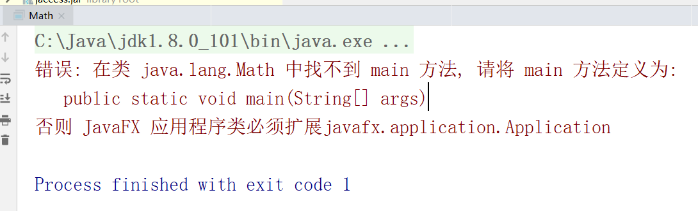

**原因：**根据双亲委派， 越上层的加载器越优先执行。最顶层的加载器是 根加载器，根加载器就会加载rt.jar中的类。因此rt.jar中的Math会被优先加载。 即程序最终加载的是不是我们自己写的Math，而是jdk/rt.jar中 内置的Math;而内置的Math根本没有提供main()方法，因此报 无法找到main()。

实验：将相关联的类A.class和B.class分别用 不同的类加载器加载

**A和B是继承关系**

```java
public class B{
    public B(){
        System.out.println("B被加载了，加载器是:"+                  this.getClass().getClassLoader());
        //对象使用之前，必然先把此对象对应的类加载
    }
}

public class A extends  B{
    public A(){
        super();
        System.out.println("A被加载了，加载器是："+
                           this.getClass().getClassLoader());
        //对象使用之前，必然先把此对象对应的类加载
    }
}

//AppClassLoader.class : TestMyClassLoader2
//自定义加载器: A.class/B.class
public class TestMyClassLoader2 {
    public static void main(String[] args) throws Exception{
        MyClassLoaderImpl myClassLoader = new MyClassLoaderImpl() ;
        //自定义加载路径
        myClassLoader.path = "d:/";
        Class<?> aClass = myClassLoader.loadClass("com.yanqun.parents.A");
        //newInstance()会调用 该类的构造方法(new 构造方法())
        Object aObject = aClass.newInstance();
        System.out.println(aObject);
    }
}
```

**A和B不是继承关系**

```java
public class Y {
    public Y(){
        System.out.println("Y被加载了，加载器是： "+ this.getClass().getClassLoader());//对象使用之前，必然先把此对象对应的类加载
    }
}
public class X {
    public X(){
        new Y() ;//加载Y（系统加载器）
        System.out.println("X被加载了，加载器是： "+ this.getClass().getClassLoader());//对象使用之前，必然先把此对象对应的类加载
    }
}

//AppClassLoader.class : TestMyClassLoader2
//自定义加载器: A.class/B.class
public class TestMyClassLoader3 {
    public static void main(String[] args) throws Exception{
        MyClassLoaderImpl myClassLoader = new MyClassLoaderImpl() ;
        //自定义加载路径
        myClassLoader.path = "d:/" ;
        //程序第一次加载时（X），使用的是  自定义加载器
        Class<?> aClass = null;
        aClass = myClassLoader.loadClass("com.yanqun.parents.X");

		//newInstance()会调用 该类的构造方法(new 构造方法())
        Object aObject = aClass.newInstance();
        System.out.println(aObject);
    }
}
```


```markdown
存在继承关系

A.class:  classpath
B.class:   classpath
原因
同一个AppClassLoader 会同时加载A.class和B.class

-------

A.class:   d:\
B.class:   classpath
抛出异常 IllegalAccess
原因：
A.class：自定义加载器加载
B.class：被AppClassLoader加载
因此，加载A.class和B.class的不是同一个加载器

---

A.class:    classpath
B.class:    d:\	
NoClassDefFoundError
原因:
A.class: 被AppClassLoader加载  
B.class: 自定义加载器加载
因此，加载A.class和B.class的不是同一个加载器

--

A.class	d:\
B.class d:\
TestMyClassLoader2 can not access a member of class com.yanqun.parents.A with modifiers "public"
A.class/B.class: 自定义加载器加载
原因是 main()方法所在类在 工程中（APPClassLoader），而A和B不在工程中（自定义加载器）。
造成这些异常的核心原因： 命名空间（不是由同一个类加载器所加载）

----

没有继承关系
X.class:  D:		自定义加载器
Y.class:  classpath	系统加载器

Y被加载了，加载器是： sun.misc.Launcher$AppClassLoader@18b4aac2
X被加载了，加载器是： com.yanqun.parents.MyClassLoaderImpl@74a14482

---

X.class:  classpath  系统加载器
Y.class:  D:	    自定义加载器
java.lang.NoClassDefFoundError: com/yanqun/parents/Y

---

```

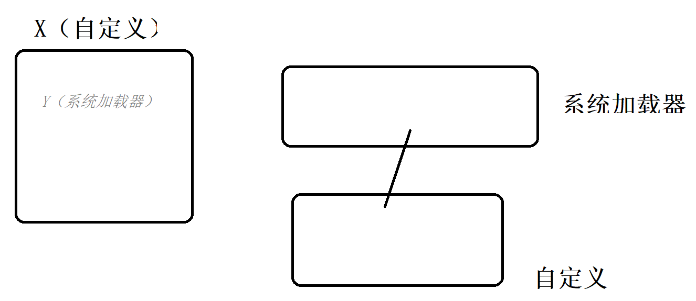

如果存在继承关系： 继承的双方（父类、子类）都必须是同一个加载器，否则出错；

如果不存在继承关系： 子类加载器可以访问父类加载器加载的类（自定义加载器，可以访问到 系统加载器加载的Y类）；反之不行（父类加载器 不能访问子类加载器）

核心： 双亲委派

如果都在同一个加载器 ，则不存在加载问题； 如果不是同一个，就需要双亲委派。

如果想实现各个加载器之间的自定义依赖，可以使用ogsi规范

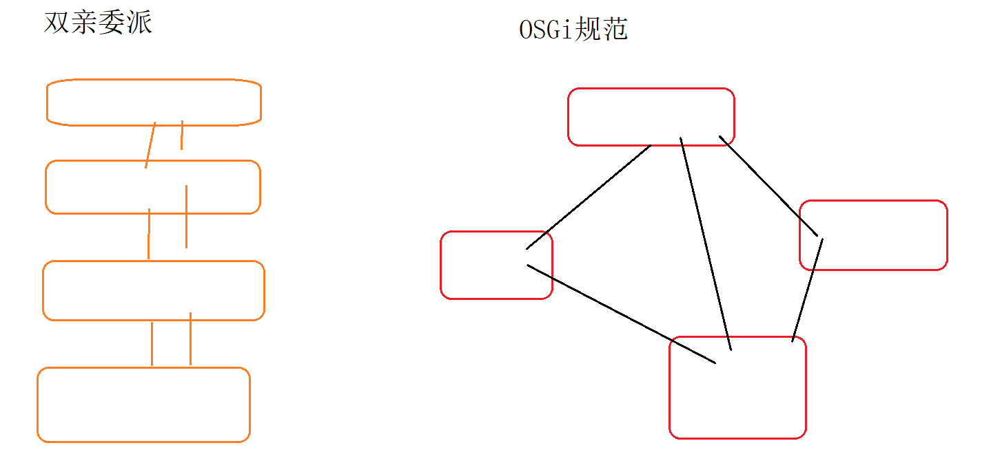

OSGi：

- 网状结构的加载结构

- 屏蔽掉硬件的异构性。例如，可以将项目部署在网络上，可以在A节点上 远程操作B节点。在操作上，可以对硬件无感。也可以在A节点上 对B节点上的项目进行运维、部署，并且立项情况下  在维护的期间，不需要暂时、重启。【热部署？】

Java可以实现热部署，单不是很方便，（不是Java擅长的。）但是用OSGI模型的话，它天然支持。

> **RPC远程调用**

### 类的卸载

- 系统自带（系统加载器、扩展加载器、根加载器）：这些加载器加载的类  是不会被卸载。

- 用户自定义的加载器，会被GC卸载GC

-----

## JVM监测工具

一般排查问题是要用命令行的。

jps: 查看Java进程 （java命令）

- jps 查看java进程的名字和对应id值 

jstat:只能查看当前时刻的内存情况；可以查看到 新生代、老年代中的内存使用情况

- `jstat -gcutil java进程id`

jmap：查看堆内存的占用情况；也可以执行dump操作

- `jmap -heap java进程id`

jconsole: 图形的监控界面

​	例如：如果通过jconsole中的"执行gc"按钮发现 GC回收的内存太少，就说明当前进程是存在问题的（至少是可以被优化的）

jvisualvm:  监视 - 堆Dump -查找最大对象，从中可以发现 当前进程中是哪个对象 占据了最大的内存，从而对这个对象进行分析。

`jmap -dump:file=d:\abc java进程id`

通过VM参数实现： 当内存溢出时，自动将溢出时刻的内存dump下来。

```shell
-Xmx100m
-Xms100m
-XX:+HeapDumpOnOutOfMemoryError `On OutOfMemoryError 当内存溢出的时候把内存dump下来`
```

## GC调优

Java开发者为什么不把所有的参数调到最优？非得让我们手工去调？【这话说的】

取舍。

调优实际是是一种取舍，以xx换xx的策略。因此在调优之前，必须明确方向：低延迟？高吞吐量呢？

有两种情况需要考虑：

-  在已知条件相同的前提下， 牺牲低延迟 来换取 高吞吐量，或者反之。

- 随着软件硬件技术的发展，可能 二者都升高。

GC的发展：

JVM自身在GC上进行了很多次的改进升级：

JVM默认的GC:  CMS GC（在jdk9以后被逐步废弃） -> G1 GC(jdk9) -> Z GC(jdk11)

- Serial GC:

  串行GC，是一种在单核环境下的串行回收器。当GC回收的时刻，其他线程必须等待。一般不会使用。

- Parallel GC：

  在Serial 的基础上，使用 了多线程技术。 提高吞吐量。

- CMS GC

  CMS使用了多线程技术，使用“标记-清除”算法，可以极大提升效率 （尤其在低延迟上有很大的提升）。繁琐，参数太多，对开发者的经验要求太高。

- G1 GC

  jdk9开始使用的默认GC。特点：将堆内存划分为很多大小相等region，并会对这些区域的使用状态进行标记。以便GC在回收时，能够快速的定位出哪些region是空闲的，哪些是有垃圾对象，从而提升GC的效率。G1使用的算法是“标记-整理”算法。

- ZGC

  jdk11开始提供全新的GC。回收TB级别的垃圾 在毫秒范围。

**常用的垃圾回收算法：（JVM书）**

如果从生命周期角度划分，GC也可以划分成：Minor GC，和Full GC

- Minor GC：回收新生代中的对象
- Full  GC：回收整个堆空间（新生代、老年代）

案例：

如果通过监测工具发现： Minor GC和Full GC都在频繁的回收，如何优化？

Minor GC为什么会频繁执行？因为 新生代中的对象太多了  Minor GC->短生命周期的对象太多了->造成逃逸到老年代中的对象越多->  新生代多+老年代多->Full GC 【新生代多，幸存的就多（概率上），老年代对象就多！Full GC就触发的多！】

Minor GC:可以尝试调大 新生代的最大空间

再调大 新生代晋升到老年代的阈值，从而降低  短生命周期的对象 从新生代转移到老年代的概率。