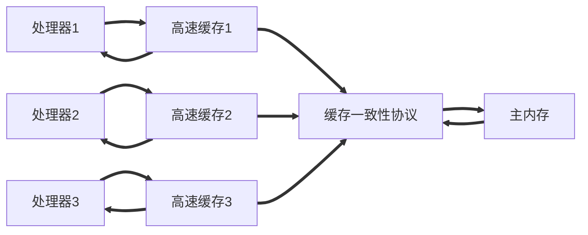
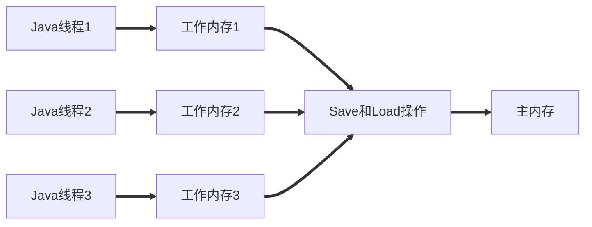
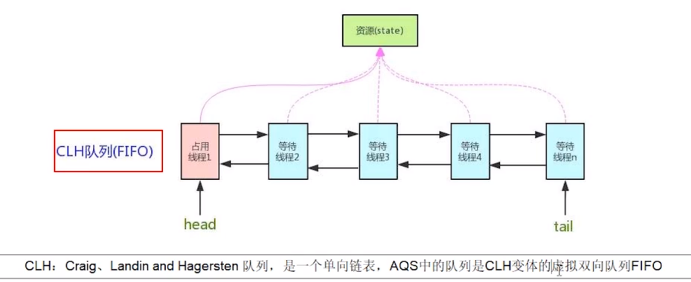
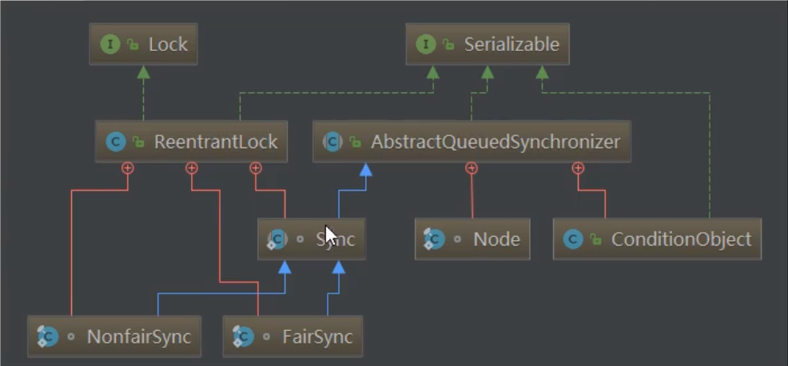

# Java多线程

- 线程的基本用法
- 线程池
- juc
- 死锁&常见错误加锁
- JMM
- ThreadLocal

----

**参考书籍：《实战Java高并发程序设计》、《Java并发编程之美》、《Java并发编程实战》、《Java 编程思想》**

---

> **JMH 用法 Demo**

```xml
<dependency>
    <groupId>org.openjdk.jmh</groupId>
    <artifactId>jmh-core</artifactId>
    <version>1.23</version>
</dependency>
<dependency>
    <groupId>org.openjdk.jmh</groupId>
    <artifactId>jmh-generator-annprocess</artifactId>
    <version>1.23</version>
    <scope>provided</scope>
</dependency>
```

```java
package monitor;

import org.openjdk.jmh.annotations.*;
import org.openjdk.jmh.runner.Runner;
import org.openjdk.jmh.runner.RunnerException;
import org.openjdk.jmh.runner.options.Options;
import org.openjdk.jmh.runner.options.OptionsBuilder;

import java.util.concurrent.TimeUnit;

@Fork(1)
@BenchmarkMode(Mode.AverageTime)
@Warmup(iterations = 3)
@Measurement(iterations = 5)
@OutputTimeUnit(TimeUnit.NANOSECONDS)
public class WipeLock {
    public static void main(String[] args) throws RunnerException {
        Options opt = new OptionsBuilder()
                .include(WipeLock.class.getSimpleName())
                .forks(1)
                .build();
        new Runner(opt).run();
    }

    static int x = 0;

    @Benchmark
    public void a() throws Exception {
        x++;
    }

    @Benchmark
    public void b() throws Exception {
        Object o = new Object();
        synchronized (o) {
            x++;
        }
    }
}
```

> **jcstress 用法 Demo**

```xml
<!-- jcstress 核心包 -->
<dependency>
    <groupId>org.openjdk.jcstress</groupId>
    <artifactId>jcstress-core</artifactId>
    <version>0.3</version>
</dependency>
<!-- jcstress测试用例包 -->
<dependency>
    <groupId>org.openjdk.jcstress</groupId>
    <artifactId>jcstress-samples</artifactId>
    <version>0.3</version>
</dependency>
```

IDEA 配置运行的主类 `org.openjdk.jcstress.Main`


```java
import org.openjdk.jcstress.annotations.*;
import org.openjdk.jcstress.infra.results.I_Result;

@JCStressTest
// 检查感兴趣的结果。如果结果是 1 和 4 那么分类未 Expect.ACCEPTABLE
@Outcome(id = {"1"}, expect = Expect.ACCEPTABLE, desc = "ok")
@Outcome(id = {"0"}, expect = Expect.ACCEPTABLE_INTERESTING, desc = "!!!!")
@State
public class ConcurrencyTest {
    int num = 2;
    @Actor
    public void actor1(I_Result r) {
        if (DCL.getInstance() == DCL.getInstance()) {
            r.r1 = 1;
        } else {
            r.r1 = 0;
        }
    }
    @Actor
    public void actor2(I_Result r) {
        num = 2;
    }
}
```

## 几个概念

### 同步和异步

#### 概念解析

==同步方法==调用一旦开始，调用者必须等到方法调用返回后，才能继续后续的行为。

==异步方法==调用更像一个消息传递，一旦开始，方法调用就会立即返回，调用者就可以继续后续的操作。而异步方法通常回在另一个线程中“真实”地执行，整个过程，不会阻碍调用者的工作。

> 从方法调用的角度：

- 需要等待结果返回，才能运行的就是同步
- 不需要等待结果返回，就能继续运行的就是异步。

`多线程是异步的一种实现方式`

### 并发和并行

并发偏重于多个任务交替执行，而多个任务之间有可能还是串行的，而并行是真正意义上的“同时执行”

### 管程

管程在 Java 中的体现就是字节码指令 **Monitor（监视器）** ， 就是我们所说的**锁**

监视器是一种同步机制，保证同一时间，只有一个线程访问被保护的数据或代码。

JVM 同步是基于进入和退出的，而进入和退出是使用管程对象实现的。

### 临界区

临界区用来表示一种公共资源或者说共享数据，可以被多个线程使用。但是每一次，只能有一个线程使用它，一旦临界区资源被占用，其他线程要想使用这个资源就必须等待。

如：打印机一次只能让一个人使用。

### 阻塞和非阻塞

一个线程占用了临界区资源，那么其他所有需要这个资源的线程就必须在这个临界区中等待。等待会导致线程挂起，这种情况就是阻塞。

非阻塞的意思与之相反，它强调没有一个线程可以妨碍其他线程执行，所有的线程都会尝试不断前向执行。

### 死锁、饥饿、活锁

==死锁==是多个线程彼此牵制都无法正常推进。

==饥饿==是指某一个或者多个线程因为种种原因无法获得所需要的资源，导致一直无法执行。

==活锁==是指资源不断地在两个线程间跳动，而没有一个线程可以同时拿到所有资源正常执行。

### 可重入锁

可重入锁就是递归锁

指的是同一线程外层函数获得锁之后，内层递归函数仍然能获取到该锁的代码，在同一线程在外层方法获取锁的时候，在进入内层方法会自动获取锁

也就是说：`线程可以进入任何一个它已经拥有的锁所同步的代码块`

ReentrantLock / Synchronized 就是一个典型的可重入锁

> 示例

可重入锁就是，在一个method1方法中加入一把锁，方法2也加锁了，那么他们拥有的是同一把锁

```java
public synchronized void method1() {
    method2();
}

public synchronized void method2() {

}
```

也就是说我们只需要进入method1后，那么它也能直接进入method2方法，因为他们所拥有的锁，是同一把。

> 作用

可重入锁的最大作用就是避免死锁

## 并发级别

阻塞、无饥饿、无障碍、无锁、无等待

### 阻塞

一个线程是阻塞的，那么在其他线程释放资源之前，当前线程无法继续执行

### 无饥饿

在一定时间内所有线程可以得到执行 [ 个人看法 ]

### 无障碍

无障碍：最弱的非阻塞调度。

大家都可以进入临界区，一起修改共享数据。若数据改坏了，会立即对自己所做的修改进行回滚，确保数据安全。`当临界区中存在严重的冲突时，所有的线程可能都会不断地回滚自己的操作，而没有一个线程可以走出临界区`

阻塞是一种悲观策略，非阻塞调度是一种乐观策略。

### 无锁

所有的线程都能尝试对临界区进行访问，但是无锁的并发保证必==有一个线程能在有限步内完成操作离开临界区。==

### 无等待

==所有的线程都必须在有限步内完成==。典型的有CopyOnWrite。可以多个线程同时读数据，这个就是无等待的。写数据时上锁，保证读写互斥，写写互斥。

## 定律

- Amdahl定律：`定义了串行系统并行化后的加速比的计算公式和理论上限`
    - 加速比 = 优化前系统耗时 / 优化后系统耗时
- Gustafson定律：`处理器个数、串行化比例和加速比之间的关系`

## JMM

### 什么是JMM

Java的内存模型 Java Memory Model，简称JMM，本身是一种抽象的概念，实际上并不存在，它描述的是一组规则或规范，通过这组规范定义了程序中各个变量（包括实例字段，静态字段和构成数组对象的元素）的访问方式

JMM关于同步的规定：

- 线程解锁前，必须把共享变量的值刷新回主内存
- 线程加锁前，必须读取主内存的最新值，到自己的工作内存
- 加锁和解锁是同一把锁

#### JMM三大特性

JMM的三大特性，volatile只保证了两个，即可见性和有序性，不满足原子性

- 可见性
- 原子性
- 有序性

### 缓存一致性

为什么这里主线程中某个值被更改后，其它线程能马上知晓呢？其实这里是用到了总线嗅探技术

在说嗅探技术之前，首先谈谈缓存一致性的问题，就是当多个处理器运算任务都涉及到同一块主内存区域的时候，将可能导致各自的缓存数据不一。

为了解决缓存一致性的问题，需要各个处理器访问缓存时都遵循一些协议，在读写时要根据协议进行操作，这类协议主要有MSI、MESI等等。

#### MESI

当CPU写数据时，如果发现操作的变量是共享变量，即在其它CPU中也存在该变量的副本，会发出信号通知其它CPU将该内存变量的缓存行设置为无效，因此当其它CPU读取这个变量的时，发现自己缓存该变量的缓存行是无效的，那么它就会从内存中重新读取。

#### 总线嗅探

那么是如何发现数据是否失效呢？

这里是用到了总线嗅探技术，就是每个处理器通过嗅探在总线上传播的数据来检查自己缓存值是否过期了，当处理器发现自己的缓存行对应的内存地址被修改，就会将当前处理器的缓存行设置为无效状态，当处理器对这个数据进行修改操作的时候，会重新从内存中把数据读取到处理器缓存中。

#### 总线风暴

总线嗅探技术有哪些缺点？

由于Volatile的MESI缓存一致性协议，需要不断的从主内存嗅探和CAS循环，无效的交互会导致总线带宽达到峰值。因此不要大量使用volatile关键字，至于什么时候使用volatile、什么时候用锁以及Syschonized都是需要根据实际场景的。

### 原子性

原子性是指一个操作是不可中断的，一气呵成。

### 可见性

当一个线程修改了某一个共享变量的值时，其他线程是否能够立即知道这个修改。volatile保证了可见性。

举例：4核CPU，每个核都有一个自己独立的缓存。这4个核共享一个变量。操作完数据后把数据放入自己核的缓存里，其他核不能及时得知修改。除非你把其他核的缓存也刷新了。

> 可见性验证代码

```java
public class TestVolatile {

    public static void main(String[] args) {
        ResourceClass resourceClass = new ResourceClass();
        new Thread(() -> {
            try {
                TimeUnit.SECONDS.sleep(3);
                resourceClass.addToSix();
                System.out.println("resourceClass.number=" + resourceClass.number);
            } catch (Exception e) {
            }
        }).start();
        // 如果resourceClass.number==60 则说明数据被刷回了主内存，且被main线程感知到了。
        while (resourceClass.number == 0) ;
        // 如果没有执行最后的这句sout 说明number的值没有被刷新回主内存，更新的值main线程未感知到。
        System.out.println("main thread is over");
    }
}

class ResourceClass {

    // 加了volatile保证了可见性。
    volatile int number = 0;

    public void addToSix() {
        number = 60;
    }
}
```

### 有序性

程序在执行时，可能会进行指令重排，重排后的指令与原指令的顺序未必一致。

提了下指令的执行步骤，指令流水线。

### 那些指令不能重排序

HappenBefore规则

- 程序顺序原则：一个线程内保证语义的串行性。
- volatile规则：volatile变量的写先于读发生，这保证了volatile变量的可见性。
- 锁规则：解锁（unlock）必然发生在随后的加锁（lock）前。
- 传递性：A先于B，B先于C，那么A必然先于C。
- 线程的start()方法先于它的每一个动作。
- 线程的所有操作先于线程的终结（Thread.join()）。
- 线程的中断（interrupt()）先于被中断线程的代码。
- 对象的构造函数的执行、结束先于finalize()方法。

## Java与线程

并发不一定要依赖多线程（如`PHP`中很常见的多进程并发），但是在Java里面谈论并发，基本上都与线程脱不开关系.

### 线程的实现

主流的操作系统都提供了线程实现，Java语言则提供了在不同硬件和操作系统平台下对线程操作的统一处理.

实现线程主要有三种方式：

- 使用内核线程实现（`1：1`实现），
- 使用用户线程实现（`1：N`实现），
- 使用用户线程加轻量级进程混合实现（`N：M`实现）

### Java与协程

Java的线程大多数都是1-1模型,切换成本高!在当今的局势下,劣势很明显!以前可能是长连接,长时间使用,现在分布式,负载均衡,有些是短时间的连接,线程间的切换开销十分大!

## 线程安全与锁优化

方法级别的锁：普通成员方法上加synchronized，锁的是this对象，静态方法上加synchronized锁的是字节码对象!

### 线程安全

可将Java语言中各种操作共享的数据分为以下五类：

- 不可变
    - 只要一个不可变的对象被正确地构建出来（即没有发生this引用逃逸的情况），那其外部的可见状态永远都不会改变，永远都不会看到它在多个线程之中处于不一致的状态。“不可变”带来的安全性是最直接、最纯粹的。
- 绝对线程安全:
    - vector方法上加的是 synchronized 锁的是this对象
    - 静态方法上的synchronized 锁的是字节码对象
- 相对线程安全、
- 线程兼容和线程对立。


### 锁升级

锁的4中状态：无锁状态、偏向锁状态、轻量级锁状态、重量级锁状态（级别从低到高）

> 这几种锁的优缺点（偏向锁、轻量级锁、重量级锁）


### 锁粗化

按理来说，同步块的作用范围应该尽可能小，仅在共享数据的实际作用域中才进行同步，这样做的目的是为了使需要同步的操作数量尽可能缩小，缩短阻塞时间，如果存在锁竞争，那么等待锁的线程也能尽快拿到锁。 
但是加锁解锁也需要消耗资源，如果存在一系列的连续加锁解锁操作，可能会导致不必要的性能损耗。 
锁粗化就是将多个连续的加锁、解锁操作连接在一起，扩展成一个范围更大的锁，避免频繁的加锁解锁操作。

### 锁消除

Java虚拟机在JIT编译时(可以简单理解为当某段代码即将第一次被执行时进行编译，又称即时编译)，通过对运行上下文的扫描，经过逃逸分析，去除不可能存在共享资源竞争的锁，通过这种方式消除没有必要的锁，可以节省毫无意义的请求锁时间。

# 线程应用概述

## 异步调用

以调用方角度来讲，如果 

- 需要等待结果返回，才能继续运行就是同步 
- 不需要等待结果返回，就能继续运行就是异步

### 设计

多线程可以让方法执行变为异步的（即不要巴巴干等着）比如说读取磁盘文件时，假设读取操作花费了 5 秒钟，如 果没有线程调度机制，这 5 秒 cpu 什么都做不了，其它代码都得暂停...

### 结论

- 比如在项目中，视频文件需要转换格式等操作比较费时，这时开一个新线程处理视频转换，避免阻塞主线程 
- tomcat 的异步 servlet 也是类似的目的，让用户线程处理耗时较长的操作，避免阻塞 tomcat 的工作线程 
- ui 程序中，开线程进行其他操作，避免阻塞 ui 线程

## 提高效率

充分利用多核 cpu 的优势，提高运行效率。想象下面的场景，执行 3 个计算，最后将计算结果汇总

```shell
计算 1 花费 10 ms
计算 2 花费 11 ms
计算 3 花费 9 ms
汇总需要 1 ms
```

- 如果是串行执行，那么总共花费的时间是 10 + 11 + 9 + 1 = 31ms 
- 但如果是四核 cpu，各个核心分别使用线程 1 执行计算 1，线程 2 执行计算 2，线程 3 执行计算 3，那么 3 个 线程是并行的，花费时间只取决于最长的那个线程运行的时间，即 11ms 最后加上汇总时间只会花费 12ms

**注意：**需要在多核 cpu 才能提高效率，单核仍然时是轮流执行

### 设计

> 多核 CPU 下总花费的时间会远低于 31 ms

```java
/**
 * 多核 CPU 多线程 提高效率。
 */
public class ThreadApplication {
    public static volatile int flag1 = 0;
    public static volatile int flag2 = 0;
    public static volatile int flag3 = 0;

    public static void main(String[] args) throws InterruptedException {
        // 3个线程，3个操作。
        Thread th1 = new Thread(() -> {
            try {
                TimeUnit.MILLISECONDS.sleep(10);
                flag1 = 1;
            } catch (InterruptedException e) {

            }
        });

        Thread th2 = new Thread(() -> {
            try {
                TimeUnit.MILLISECONDS.sleep(11);
                flag2 = 1;
            } catch (InterruptedException e) {

            }
        });
        Thread th3 = new Thread(() -> {
            try {
                TimeUnit.MILLISECONDS.sleep(9);
                flag3 = 1;
            } catch (InterruptedException e) {

            }
        });
        long start = System.currentTimeMillis();
        th1.start();
        th2.start();
        th3.start();
        th1.join();
        th2.join();
        th3.join();

        while (flag1 + flag3 + flag2 == 3) {
            TimeUnit.MILLISECONDS.sleep(1);
            System.out.println(System.currentTimeMillis() - start);
            return;
        }
    }
}
```

### 结论

- 单核 cpu 下，多线程不能实际提高程序运行效率，只是为了能够在不同的任务之间切换，不同线程轮流使用 cpu ，不至于一个线程总占用 cpu，别的线程没法干活 
- 多核 cpu 可以并行跑多个线程，但能否提高程序运行效率还是要分情况的 
  - 有些任务，经过精心设计，将任务拆分，并行执行，当然可以提高程序的运行效率。但不是所有计算任 务都能拆分（参考后文的【阿姆达尔定律】） 
  - 也不是所有任务都需要拆分，任务的目的如果不同，谈拆分和效率没啥意义 
- IO 操作不占用 cpu，只是我们一般拷贝文件使用的是【阻塞 IO】，这时相当于线程虽然不用 cpu，但需要一 直等待 IO 结束，没能充分利用线程。所以才有后面的【非阻塞 IO】和【异步 IO】优化

# 线程基础

基本 `API` 的使用和基本原理

## 创建线程

- 继承Thread
- 实现Runnable
- Callable&FutureTask [ Callable结合FutureTask使用 ]
    - 定义类MyCallable实现Callable接口
    - `FutureTask task = new FutureTask(new MyCallable())`
    - `new Thread(task).start()`

- 线程池
    - jdk 提供的线程池（自带的线程池它的阻塞队列大小太大，容易 OOM ）
    - 自定义线程池（一般用自定义线程池）

### 继承Thread

```java
package create_thread;

import lombok.extern.slf4j.Slf4j;

@Slf4j(topic = "c.CreateByThread")
public class CreateByThread {
    public static void main(String[] args) {
        Thread t1 = new Thread("t1") {
            @Override
            // run 方法内实现了要执行的任务
            public void run() {
                log.debug("run");
            }
        };
        t1.start();
    }
}
```

### Runnable

把【线程】和【任务】（要执行的代码）分开 

- Thread 代表线程 
- Runnable 可运行的任务（线程要执行的代码）

```java
@Slf4j(topic = "c.CreateByRunnable")
public class CreateByRunnable {
    public static void main(String[] args) {
        Runnable task = () -> {
            log.debug("run");
        };
        new Thread(task,"t1").start();
    }
}
```

### Runnable 和 Thread 的关系

分析 Thread 的源码，理清它与 Runnable 的关系 

```java
@Override
public void run() {
    // target 就是传入的 Runnable
    if (target != null) {
        target.run();
    }
}
```

**start 与 run：**start 是开启线程，启动线程后，JVM 会回调 run 方法

> 小结 

- 方法1 是把线程和任务合并在了一起，方法2 是把线程和任务分开了 
- 用 Runnable 更容易与线程池等高级 API 配合 
- 用 Runnable 让任务类脱离了 Thread 继承体系，更灵活

### FutureTask

FutureTask 能够接收 Callable 类型的参数，用来处理有返回结果的情况

```java
@Slf4j(topic = "c.CreateByFutureTask")
public class CreateByFutureTask {
    public static void main(String[] args) throws ExecutionException, InterruptedException {
        FutureTask<String> task = new FutureTask<String>(() -> {
            TimeUnit.SECONDS.sleep(2);
            return "Hello";
        });
        Thread th1 = new Thread(task);
        th1.start();
        // 任务完成前，会阻塞。
        String retVal = task.get();
        log.debug(retVal);
        log.debug("main over!");
    }
}
```

----

因为多数代码都比较简单，所以只写用的少的那部分。

> 线程代码编写示例

线程应该与资源分离：一般按下面两个步骤走

- 创建资源类，创建属性和操作方法
- 在资源类操作方法
  - 判断：判断是否符合条件
  - 干活：符合就干活
  - 通知：干完就通知，如 `notifyAll()`
- 创建多线程调用资源类的方法

```java
import java.util.concurrent.TimeUnit;

class Ticket {
    private int count = 100;

    public int getCount() {
        return count;
    }

    public void setCount(int count) {
        this.count = count;
    }

    public Ticket(int count) {
        this.count = count;
    }

    public Ticket() {

    }

    public synchronized void sale() {
        if (this.count > 0) {
            System.out.println("current Thread " + Thread.currentThread().getName() + " 还有" + (--count) + "张票");
            try {
                TimeUnit.MILLISECONDS.sleep(100);
            } catch (InterruptedException e) {
                e.printStackTrace();
            }
        }
    }
}

public class SaleTick {
    public static void main(String[] args) {
        Ticket ticket = new Ticket(1000);
        Thread th1 = new Thread(() -> {
            while (ticket.getCount() > 0)
                ticket.sale();
        }, "卖票窗口1");
        Thread th2 = new Thread(() -> {
            while (ticket.getCount() > 0)
                ticket.sale();
        }, "卖票窗口2");

        th1.start();
        th2.start();
    }
}
```

### 线程池

> 线程池创建

具体用法后期线程池这章中会具体阐述。

jdk提供好的线程池有如下几个：

- ==newFixedThreadPool()方法：==`返回一个固定线程数量的线程池`。`线程池中的线程数量始终不变`。有新的任务提交时,`若有空闲线程，则立即执行`。`若没有，则任务被暂存在一个任务队列中`，待有线程空闲时，再处理任务队列中的任务。
- ==newSingleThreadExecutor()方法：==返回一个`只有一个线程的线程池`。多余任务被提交到该线程池时会被保存在一个任务队列中，`待线程空闲，按先入先出的顺序执行队列中的任务。`
- ==newCachedThreadPool()方法：==`返回一个可根据实际情况调整线程数量的线程池`。线程池的线程数量不确定，但若有空闲线程可以复用，则会优先使用可复用的线程。若所有线程均在工作，又有新的任务提交，则会创建新的线程处理任务。所有线程在当前任务执行完毕后，将返回线程池进行复用。
- ==newSingleThreadScheduledExecutor()方法：==返回一个ScheduledExecutorService对象，线程池大小为1。定时器，如在某个固定的延时之后执行，或者周期性执行某个任务。
- ==newScheduledThreadPool()方法：==返回一个ScheduledExecutorService对象，但该线程池可以指定线程数量。

> 线程池

java自带的线程池，但是一般不用。因为自带的线程池设置的阻塞队列的大小实在是太大了，容易出问题，一般都是自定义线程池。

```java
import java.util.concurrent.*;

/**
 * 线程池可以复用线程、控制最大并发数、管理线程。
 * 线程池中有可以用的线程，就拿线程出来用，没有就先暂时阻塞任务，等待有线程了在执行那些任务。
 * 使用线程池在一定程度上可以减少上下文切换的开销。
 */
public class ThreadPoolDemo {

    public static void main(String[] args) throws InterruptedException {
        ScheduledThreadPool();
        // new 一个线程，传入实现Runnable接口的对象。调用thread对象的start方法，从而调用Runnable的run方法
        // 实现线程调用方法。我们把Runnable对象改了就可以实现线程复用？
    }

    /**
     * Executors.newFixedThreadPool(int i) ：创建一个拥有 i 个线程的线程池
     * 执行长期的任务，性能好很多
     * 创建一个定长线程池，可控制线程数最大并发数，超出的线程会在队列中等待
     */
    public static void FixedThreadPool() {
        ExecutorService fixedThreadPool = Executors.newFixedThreadPool(5);
        // 循环100次，让5个线程处理100个业务
        for (int i = 0; i < 100; i++) {
            final int ii = i;
            fixedThreadPool.execute(() -> {
                try {
                    System.out.println(Thread.currentThread().getName() + "\t 给用户" + ii + "办理业务");
                    TimeUnit.SECONDS.sleep((int) (Math.random() * 15));
                    System.out.println(Thread.currentThread().getName() + "\t 给用户" + ii + "办理业务结束");
                } catch (InterruptedException e) {
                    e.printStackTrace();
                } finally {
                    // 执行完成后，关闭当前线程的服务，归还给线程池
                    fixedThreadPool.shutdown();
                }
            });
        }
    }

    /**
     * Executors.newSingleThreadExecutor：创建一个只有1个线程的 单线程池
     * 一个任务一个任务执行的场景
     * 创建一个单线程化的线程池，它只会用唯一的工作线程来执行任务，保证所有任务按照指定顺序执行
     */
    public static void SingleThreadPool() {

    }

    /**
     * Executors.newCacheThreadPool(); 创建一个可扩容的线程池
     * 执行很多短期异步的小程序或者负载教轻的服务器
     * 创建一个可缓存线程池，如果线程长度超过处理需要，可灵活回收空闲线程，如无可回收，则新建新线程
     */
    public static void CacheThreadPool() {

    }

    /**
     * Executors.newScheduledThreadPool(int corePoolSize)：
     * 线程池支持定时以及周期性执行任务，创建一个corePoolSize为传入参数，最大线程数为整型的最大数的线程池
     */
    public static void ScheduledThreadPool() {
        ScheduledExecutorService scheduledThreadPool = Executors.newScheduledThreadPool(3);
        // 周期执行。
        ScheduledFuture<?> schedule1 = scheduledThreadPool.scheduleAtFixedRate(() -> {
            System.out.println(1);
        }, 10, 10, TimeUnit.SECONDS);

        // 只执行一次
        ScheduledFuture<?> schedule2 = scheduledThreadPool.schedule(() -> {
            System.out.println(2);
        }, 10, TimeUnit.SECONDS);
    }
}
```

> 自定义线程池写法

```java
import java.util.concurrent.Executors;
import java.util.concurrent.LinkedBlockingQueue;
import java.util.concurrent.ThreadPoolExecutor;
import java.util.concurrent.TimeUnit;

/**
 * 线程资源必须通过线程池提供，不允许在应用中自行显式创建线程
 * - 使用线程池的好处是减少在创建和销毁线程上所消耗的时间以及系统资源的开销，解决资源不足的问题，如果不使用线程池，有可能造成系统创建大量同类线程而导致消耗完内存或者“过度切换”的问题
 * 线程池不允许使用Executors去创建，而是通过 ThreadPoolExecutor 的方式，这样的处理方式让写的同学更加明确线程池的运行规则，规避资源耗尽的风险
 * - Executors返回的线程池对象弊端如下：
 * - FixedThreadPool和SingleThreadPool：
 * ---- 运行的请求队列长度为：Integer.MAX_VALUE，可能会堆积大量的请求，从而导致OOM
 * - CacheThreadPool和ScheduledThreadPool
 * ---- 运行的请求队列长度为：Integer.MAX_VALUE，可能会堆积大量的请求，从而导致OOM
 */
public class DefineThreadPool {
    /**
     * 手写线程池
     * -从上面我们知道，因为默认的Executors创建的线程池，底层都是使用LinkBlockingQueue作为阻塞队列的，而LinkBlockingQueue虽然是有界的，但是它的界限是 Integer.MAX_VALUE 大概有20多亿，可以相当是无界的了，因此我们要使用ThreadPoolExecutor自己手动创建线程池，然后指定阻塞队列的大小
     * 下面我们创建了一个 核心线程数为2，最大线程数为5，并且阻塞队列数为3的线程池
     */

    public static void AbortPolicy() {
        final Integer corePoolSize = 2;
        final Integer maximumPoolSize = 5;
        final long keepAliveTime = 1L;

        ThreadPoolExecutor threadPoolExecutor = new ThreadPoolExecutor(
                corePoolSize,
                maximumPoolSize,
                keepAliveTime,
                TimeUnit.SECONDS,
                new LinkedBlockingQueue<>(3),
                Executors.defaultThreadFactory(),
                new ThreadPoolExecutor.AbortPolicy()
        );
        try {
            // maximumPoolSize +  LinkedBlockingQueue的大小 = 5+3 = 8； 运行的+阻塞的  最多8个任务。
            for (int i = 0; i < 15; i++) {
                final int tmp = i;
                threadPoolExecutor.execute(() -> {
                    System.out.println(Thread.currentThread().getName() + "\t 给用户:" + tmp + " 办理业务");
                });
            }
        } catch (Exception e) {
            e.printStackTrace();
        } finally {
            threadPoolExecutor.shutdown();
        }
    }

    public static void CallerRunsPolicy() {
        final Integer corePoolSize = 2;
        final Integer maximumPoolSize = 5;
        final long keepAliveTime = 1L;

        ThreadPoolExecutor threadPoolExecutor = new ThreadPoolExecutor(
                corePoolSize,
                maximumPoolSize,
                keepAliveTime,
                TimeUnit.SECONDS,
                new LinkedBlockingQueue<>(3),
                Executors.defaultThreadFactory(),
                new ThreadPoolExecutor.CallerRunsPolicy()
        );
        try {
            // maximumPoolSize +  LinkedBlockingQueue的大小 = 5+3 = 8； 运行的+阻塞的  最多8个任务
            for (int i = 0; i < 150; i++) {
                final int tmp = i;
                // 我们发现，输出的结果里面出现了main线程，因为线程池出发了拒绝策略，把任务回退到main线程，然后main线程对任务进行处理
                threadPoolExecutor.execute(() -> {
                    System.out.println(Thread.currentThread().getName() + "\t 给用户:" + tmp + " 办理业务");
                });
            }
        } catch (Exception e) {
            e.printStackTrace();
        } finally {
            threadPoolExecutor.shutdown();
        }
    }

    // 直接丢弃任务，不报异常。
    public static void DiscardPolicy() {
        final Integer corePoolSize = 2;
        final Integer maximumPoolSize = 5;
        final long keepAliveTime = 1L;

        ThreadPoolExecutor threadPoolExecutor = new ThreadPoolExecutor(
                corePoolSize,
                maximumPoolSize,
                keepAliveTime,
                TimeUnit.SECONDS,
                new LinkedBlockingQueue<>(3),
                Executors.defaultThreadFactory(),
                new ThreadPoolExecutor.DiscardPolicy()
        );
        try {
            // maximumPoolSize +  LinkedBlockingQueue的大小 = 5+3 = 8； 运行的+阻塞的  最多8个任务
            for (int i = 0; i < 150; i++) {
                final int tmp = i;
                // 我们发现，输出的结果里面出现了main线程，因为线程池出发了拒绝策略，把任务回退到main线程，然后main线程对任务进行处理
                threadPoolExecutor.execute(() -> {
                    System.out.println(Thread.currentThread().getName() + "\t 给用户:" + tmp + " 办理业务");
                });
            }
        } catch (Exception e) {
            e.printStackTrace();
        } finally {
            threadPoolExecutor.shutdown();
        }
    }

    /**
     * <div>线程池的合理参数</div>
     * 生产环境中如何配置 corePoolSize 和 maximumPoolSize <br>
     * 这个是根据具体业务来配置的，分为CPU密集型和IO密集型 <br>
     * - CPU密集型 <br>
     * CPU密集的意思是该任务需要大量的运算，而没有阻塞，CPU一直全速运行 <br>
     * CPU密集任务只有在真正的多核CPU上才可能得到加速（通过多线程） <br>
     * 而在单核CPU上，无论你开几个模拟的多线程该任务都不可能得到加速，因为CPU总的运算能力就那些 <br>
     * CPU密集型任务配置尽可能少的线程数量： <br>
     * 一般公式：CPU核数 + 1个线程数 <br>
     * - IO密集型 <br>
     * 由于IO密集型任务线程并不是一直在执行任务，则可能多的线程，如 CPU核数 * 2 <br>
     * IO密集型，即该任务需要大量的IO操作，即大量的阻塞 <br>
     * 在单线程上运行IO密集型的任务会导致浪费大量的CPU运算能力花费在等待上 <br>
     * 所以IO密集型任务中使用多线程可以大大的加速程序的运行，即使在单核CPU上，这种加速主要就是利用了被浪费掉的阻塞时间。 <br>
     * IO密集时，大部分线程都被阻塞，故需要多配置线程数： <br>
     * 参考公式：CPU核数 / (1 - 阻塞系数) 阻塞系数在0.8 ~ 0.9左右 <br>
     * 例如：8核CPU：8/ (1 - 0.9) = 80个线程数 <br>
     */
    public static void note(){

    }

    public static void main(String[] args) {
        DiscardPolicy();
    }
}
```

> 对比总结

- 继承Thread
    - Java是单继承，继承Thread后就不能继承其他类了，有很强的局限性。
- 实现Runnable接口
    - 对比继承Thread来说更为灵活
- FutureTask
    - 对比Runnable来说，允许线程执行完后，给与一个返回值。
- 线程池
    - 线程复用。频繁的创建，销毁线程和消耗系统资源，线程池可解决该类问题。
    - 但是Java内置的线程池并不好用，因为自带的线程池设置的阻塞队列的大小实在是太大了，容易出问题，一般都是自定义线程池。

```java
public class CreateByThreadPool {

    public static void fixedThreadPool() {
        // 创建固定大小的线程池。允许最多执行2个任务，多余的任务会放入阻塞队列中。
        // 阻塞队列的大小为 Integer.MAX_VALUE
        ExecutorService executorService = Executors.newFixedThreadPool(2);
        executorService.execute(() -> {
            while (true) {
                System.out.println(Thread.currentThread().getName());
                try {
                    TimeUnit.SECONDS.sleep(1);
                } catch (InterruptedException e) {
                    e.printStackTrace();
                }
            }
        });

        executorService.execute(() -> {
            while (true) {
                System.out.println(Thread.currentThread().getName());
                try {
                    TimeUnit.SECONDS.sleep(1);
                } catch (InterruptedException e) {
                    e.printStackTrace();
                }
            }
        });
    }

    public static void cachedThreadPool() {
        ExecutorService executorService = Executors.newCachedThreadPool();
        executorService.execute(() -> {
            System.out.println(123);
        });
        executorService.shutdown();
    }

    public static void scheduledThreadPool() {
        ScheduledExecutorService scheduledThreadPool = Executors.newScheduledThreadPool(10);
        // 周期执行。
        ScheduledFuture<?> schedule1 = scheduledThreadPool.scheduleAtFixedRate(() -> {
            System.out.println(1);
        }, 10, 10, TimeUnit.SECONDS);
    }


    public static void main(String[] args) {
        scheduledThreadPool();
    }
}
```

## 查看进程线程

### windows

- 任务管理器可以查看进程和线程数，也可以用来杀死进程 
- tasklist 查看进程 
- taskkill 杀死进程

### linux

- ps -fe 查看所有进程 
- ps -fT -p  查看某个进程（PID）的所有线程 
- kill 杀死进程 top 按大写 H 切换是否显示线程 
- top -H -p  查看某个进程（PID）的所有线程

### Java

- jps 命令查看所有 Java 进程 
- jstack  查看某个 Java 进程（PID）的所有线程状态 
  - jstack 查看线程信息，不过只是抓一个快照，不能实时。
- jconsole 来查看某个 Java 进程中线程的运行情况（图形界面）
  - service iptables stop 停止防火墙

> jconsole 远程监控配置

- jconsole 远程监控配置

```shell
java -Djava.rmi.server.hostname=`ip地址` -Dcom.sun.management.jmxremote -
Dcom.sun.management.jmxremote.port=`连接端口` -Dcom.sun.management.jmxremote.ssl=是否安全连接 -
Dcom.sun.management.jmxremote.authenticate=是否认证 java类
```

- 修改 /etc/hosts 文件将 127.0.0.1 映射至主机名 

如果要认证访问，还需要做如下步骤 

- 复制 jmxremote.password 文件 
- 修改 jmxremote.password 和 jmxremote.access 文件的权限为 600 即文件所有者可读写 
- 连接时填入 controlRole（用户名），R&D（密码）

## 线程原理★

### 栈与栈帧

Java Virtual Machine Stacks （Java 虚拟机栈） 

我们都知道 JVM 中由堆、栈、方法区所组成，其中栈内存是给谁用的呢？其实就是线程，==每个线程启动后，虚拟机就会为其分配一块栈内存。 ==

- 每个栈由多个栈帧（Frame）组成，对应着每次方法调用时所占用的内存
- 每个线程只能有一个活动栈帧，对应着当前正在执行的那个方法

### 线程上下文切换（Thread Context Switch）

因为以下一些原因导致 cpu 不再执行当前的线程，转而执行另一个线程的代码 

- 线程的 cpu 时间片用完 
- 垃圾回收 
- 有更高优先级的线程需要运行 
- 线程自己调用了 sleep、yield、wait、join、park、synchronized、lock 等方法 

当 Context Switch 发生时，需要由操作系统保存当前线程的状态，并恢复另一个线程的状态，Java 中对应的概念 就是程序计数器（Program Counter Register），它的作用是记住下一条 jvm 指令的执行地址，是线程私有的 

- 状态包括程序计数器、虚拟机栈中每个栈帧的信息，如局部变量、操作数栈、返回地址等 
- Context Switch 频繁发生会影响性能

### 图解线程

𣏾以线程为单位分配相互独⽴, 每个 栈的栈内存相互独⽴。


## 线程API

### 常用汇总

> 常用 API

| 方法                                        | 说明         |注意|
| ------------------------------------------- | ------------------------------------------------------------ | ---- |
| public void start()                         | 启动一个新线程；Java虚拟机回调run方法                        | start 方法只是让线程进入就绪，里面代码不一定立刻 运行（CPU 的时间片还没分给它）。每个线程对象的 start方法只能调用一次，如果调用了多次会出现 IllegalThreadStateException |
| public void run()                           | 线程启动后调用该方法                                         | 如果在构造 Thread 对象时传递了 Runnable 参数，则 线程启动后会调用 Runnable 中的 run 方法，否则默 认不执行任何操作。但可以创建 Thread 的子类对象， 来覆盖默认行为 |
| public void setName(String name)            | 给当前线程取名字                                             |      |
| public void getName()                       | 获取当前线程的名字 线程存在默认名称：子线程是Thread-索引，主线程是main |      |
| public static Thread currentThread()        | 获取当前线程对象，代码在哪个线程中执行                       |      |
| public static void sleep(long time)         | 让当前线程休眠多少毫秒再继续执行 **Thread.sleep(0)** : 让操作系统立刻重新进行一次cpu竞争 |      |
| public static native void yield()           | 提示线程调度器让出当前线程对CPU的使用                        | 主要是为了测试和调试 |
| public final int getPriority()              | 返回此线程的优先级                                           |      |
| public final void setPriority(int priority) | 更改此线程的优先级                               | java中规定线程优先级是1~10 的整数，较大的优先级 能提高该线程被 CPU 调度的机率 |
| public void interrupt()                     | 打断线程                               | 如果被打断线程正在 sleep，wait，join 会导致被打断 的线程抛出 InterruptedException，并清除 打断标 记 ；如果打断的正在运行的线程，则会设置 打断标 记 ；park 的线程被打断，也会设置 打断标记 |
| public static boolean interrupted()         | 判断当前线程是否被打断                         | 清除打断标记 |
| public boolean isInterrupted()              | 判断当前线程是否被打断，不清除打断标记                       | 不会清除 打断标记 |
| public final void join()                    | 等待这个线程结束                                             | x.join()  就是等待 x 线程执行结束。 |
| public final void join(long millis)         | 等待这个线程死亡millis毫秒，0意味着永远等待                  |      |
| public final native boolean isAlive()       | 线程是否存活（还没有运行完毕）                               |      |
| public final void setDaemon(boolean on)     | 将此线程标记为守护线程或用户线程                             |      |

### start与run

- 直接调用 run 是在主线程中执行了 run，没有启动新的线程 
- 使用 start 是启动新的线程，通过新的线程间接执行 run 中的代码

### sleep与yield

#### sleep 

- 调用 sleep 会让当前线程从 Running 进入 Timed Waiting 状态（阻塞） 
- 其它线程可以使用 interrupt 方法打断正在睡眠的线程，这时 sleep 方法会抛出 InterruptedException 
- 睡眠结束后的线程未必会立刻得到执行 
- 建议用 TimeUnit 的 sleep 代替 Thread 的 sleep 来获得更好的可读性 

#### yield

- 调用 yield 会让当前线程从 Running 进入 Runnable 就绪状态，然后调度执行其它线程
- 具体的实现依赖于操作系统的任务调度器
- **会放弃 CPU 资源，锁资源不会释放**

#### 线程优先级

- 线程优先级会提示（hint）调度器优先调度该线程，但它仅仅是一个提示，调度器可以忽略它 
- 如果 cpu 比较忙，那么优先级高的线程会获得更多的时间片，但 cpu 闲时，优先级几乎没作用

### join 方法详解

查阅 join 的源码可知 其原理为：调用者轮询检查线程 alive 状态，

```java
public final synchronized void join(long millis)
    throws InterruptedException {
    long base = System.currentTimeMillis();
    long now = 0;

    if (millis < 0) {
        throw new IllegalArgumentException("timeout value is negative");
    }

    if (millis == 0) {
        while (isAlive()) {
            wait(0);
        }
    } else {
        while (isAlive()) {
            long delay = millis - now;
            if (delay <= 0) {
                break;
            }
            wait(delay);
            now = System.currentTimeMillis() - base;
        }
    }
}
```

- join 方法是被 synchronized 修饰的，本质上是一个对象锁，其内部的 wait 方法调用也是释放锁的，但是**释放的是当前线程的对象锁，而不是外面的锁**
- t1 会强占 CPU 资源，直至线程执行结束，当调用某个线程的 join 方法后，该线程抢占到 CPU 资源，就不再释放，直到线程执行完毕

线程同步：

- join 实现线程同步，因为会阻塞等待另一个线程的结束，才能继续向下运行
  - 需要外部共享变量，不符合面向对象封装的思想
  - 必须等待线程结束，不能配合线程池使用
- Future 实现（同步）：get() 方法阻塞等待执行结果
  - main 线程接收结果
  - get 方法是让调用线程同步等待

### interrupt 方法详解

- **打断 sleep、wait、join  的线程  会清空打断状态，打断状态会为 false**（你打断了，打断状态本该为 true，清空后就为 false 了）
- **打断正常运行的线程，打断状态为 true**
- 两阶段终止模式
  - **在线程 T1 中优雅的终止线程 T2.**
- park
  - park 作用类似 sleep，打断 park 线程，不会清空打断状态（true）
  - 如果打断标记已经是 true, 则 park 会失效，
  - 可以使用 `Thread.interrupted()` 清除打断状态

#### 打断 sleep、wait、join  的线程

这几个方法都会让线程进入阻塞状态 打断 sleep、wait、join 的线程, 会清空打断状态，以 sleep 为例

```java
@Slf4j(topic = "c.InterruptSleep")
public class InterruptSleep {
    public static void main(String[] args) throws InterruptedException {
        Thread th1 = new Thread(() -> {
            try {
                log.debug("sleep");
                TimeUnit.SECONDS.sleep(40);
            } catch (InterruptedException e) {
                e.printStackTrace();
            }
        });
        th1.start();
        // 确保 th1 线程开始运行
        TimeUnit.SECONDS.sleep(1);
        log.debug("interrupt");
        th1.interrupt(); 
        log.debug("打断标记:{}", th1.isInterrupted()); // false  打断标记被置为了 false
    }
}
```

以wait 为例

```java
@Slf4j(topic = "c.InterruptSleep")
public class InterruptWait {
    static Object lock = new Object();

    public static void main(String[] args) throws InterruptedException {
        Thread th1 = new Thread(() -> {
            synchronized (lock) {
                try {
                    log.debug("wait");
                    lock.wait();
                } catch (InterruptedException e) {
                    e.printStackTrace();
                }
            }
        });

        th1.start();
        TimeUnit.SECONDS.sleep(1);
        th1.interrupt();
        log.debug(String.valueOf(th1.isInterrupted())); // false  打断标记被置为了 false
    }

}
```

#### 打断正常运行的线程

**打断正常运行的线程：不会清空打断状态（true）**

```java
@Slf4j(topic = "c.InterruptNormal")
public class InterruptNormal {
    static Object lock = new Object();

    public static void main(String[] args) throws InterruptedException {
        // 线程被打断后就不在运行
        Thread th1 = new Thread(() -> {
            while (!Thread.currentThread().isInterrupted()) ;
        });

        th1.start();
        TimeUnit.SECONDS.sleep(5);
        th1.interrupt();
        log.debug(String.valueOf(th1.isInterrupted())); // true
    }

}
```

#### 打断park

打断 park 线程, 不会清空打断状态；如果打断标记已经是 true, 则 park 会失效

#### 两阶段终止模式

> 模式示意图


> Coding

我们可以在任意时间打断线程，但是终止线程需要确定好何时终止。比如资源读取类线程，被打断了，我们不能立即终止线程，应该在资源读取完毕后，在根据打断标记决定是否终止。

```java
/**
 * 两阶段终止模式。日志监控 Demo
 */
@Slf4j(topic = "c.TwoPhaseTermination")
public class TwoPhaseTermination {
    public static void main(String[] args) throws InterruptedException {
        TwoPhaseTermination twoPhaseTermination = new TwoPhaseTermination();
        twoPhaseTermination.start();
        TimeUnit.SECONDS.sleep(10);
        twoPhaseTermination.stop();
    }

    private Thread monitor;

    public void stop() {
        monitor.interrupt();
    }

    public void start() {
        monitor = new Thread(() -> {
            log.debug("start logging~~");
            Thread current = Thread.currentThread();
            while (true) {
                if (current.isInterrupted()) {
                    log.debug("over！");
                    return;
                }
                try {
                    TimeUnit.SECONDS.sleep(2);
                    log.debug("start logging~~");
                } catch (InterruptedException e) {
                    // 睡眠过程中被打断。会走 exception。然后将打断标记置为  true。打断完一次 sleep 后再打断就是打断正常线程了。
                    current.interrupt();
                    log.debug("料理后事");
                    e.printStackTrace();
                }
            }
        });
        monitor.start();
    }
}
```


### 废弃方法

> 这些方法已过时，容易破坏同步代码块，造成线程死锁

| 方法                        | 功能                 |
| --------------------------- | -------------------- |
| public final void stop()    | 停止线程运行         |
| public final void suspend() | 挂起（暂停）线程运行 |
| public final void resume()  | 恢复线程运行         |

> suspend & resume

使用不当会造成死锁，且死锁后的线程状态还是Runnable！！这个才是最坑的，我觉得就是因为这个才被废弃的！！

`suspend挂起线程，不释放资源！！resume唤醒线程！！；需要获得监视器monitor，简单说就是要像sync加锁;且suspend 在导致线程暂停的同时，并不会去释放任何资源。`

`如果resume()方法操作意外地在suspend()方法前就执行了，那么被挂起的线程可能很难有机会被继续执行。而且！！对于被挂起的线程，从它的线程状态上看，居然还是Runnable，这会严重影响我们对系统当前状态的判断。`

> stop

暴力终止线程，会存在很多问题！

### 主线程与守护线程

默认情况下，Java 进程需要等待所有线程都运行结束，才会结束。有一种特殊的线程叫做守护线程，只要其它非守 护线程运行结束了，即使守护线程的代码没有执行完，也会强制结束。

- 垃圾回收器线程就是一种守护线程
- Tomcat 中的 Acceptor 和 Poller 线程都是守护线程，所以 Tomcat 接收到 shutdown 命令后，不会等 待它们处理完当前请求

## 线程的状态

### 五种状态

> 从 OS 层面来描述


- 【初始状态】仅是在语言层面创建了线程对象，还未与操作系统线程关联 
- 【可运行状态】（就绪状态）指该线程已经被创建（与操作系统线程关联），可以由 CPU 调度执行 
- 【运行状态】指获取了 CPU 时间片运行中的状态 
  - 当 CPU 时间片用完，会从【运行状态】转换至【可运行状态】，会导致线程的上下文切换 
- 【阻塞状态】 
  - 如果调用了阻塞 API，如 BIO 读写文件，这时该线程实际不会用到 CPU，会导致线程上下文切换，进入 【阻塞状态】 
  - 等 BIO 操作完毕，会由操作系统唤醒阻塞的线程，转换至【可运行状态】 
  - 与【可运行状态】的区别是，对【阻塞状态】的线程来说只要它们一直不唤醒，调度器就一直不会考虑 调度它们 
- 【终止状态】表示线程已经执行完毕，生命周期已经结束，不会再转换为其它状态

### 六种状态

> 这是从 Java API 层面来描述的 

根据 Thread.State 枚举，分为六种状态；

`PS：从NEW状态出发后，线程不能再回到NEW状态，同理，处于TERMINATED状态的线程也不能再回到RUNNABLE状态。`

```java
 public enum State {
	// 表示刚刚创建的线程，这种线程还没开始执行。等到线程的start()方法调用时，才表示线程开始执行
        NEW,
	// 线程所需的一切资源都已经准备好了
        RUNNABLE,
	// 线程阻塞，暂停执行
        BLOCKED,
	// WAITING会进入一个无时间限制的等待
        WAITING,
	// TIMED_WAITING会进行一个有时限的等待
        TIMED_WAITING,
	// 当线程执行完毕后，则进入TERMINATED状态，表示结束。
        TERMINATED;
}
```


- NEW 线程刚被创建，但是还没有调用 start() 方法 
- RUNNABLE 当调用了 start() 方法之后，注意，Java API 层面的 RUNNABLE 状态涵盖了 操作系统 层面的 【可运行状态】、【运行状态】和【阻塞状态】（**由于 BIO 导致的线程阻塞，在 Java 里无法区分，仍然认为 是可运行**） 
- **BLOCKED ， WAITING ， TIMED_WAITING 都是 Java API 层面对【阻塞状态】的细分**
  - Blocked(锁阻塞)：当一个线程试图获取一个对象锁，而该对象锁被其他的线程持有，则该线程进入 Blocked 状态；当该线程持有锁时，该线程将变成 Runnable 状态。Blocked的线程是进入了 EntryList 等待队列。
  - Waiting(无限等待)：一个线程在等待另一个线程执行一个（唤醒）动作时，该线程进入 Waiting 状态，进入这个状态后不能自动唤醒，必须等待另一个线程调用 notify 或者 notifyAll 方法才能唤醒。Waiting的线程是进入了 WaitSet 等待队列，WaitSet队列排队结束后，重新进入 EntryList 队列对锁进行竞争。
  - TIMED_WAITING ：有几个方法有超时参数，调用将进入 Timed Waiting 状态，这一状态将一直保持到超时期满或者接收到唤醒通知。带有超时参数的常用方法有 Thread.sleep 、Object.wait
- TERMINATED 当线程代码运行结束

## 重点回顾

### 终止线程

终止线程的方式如下：

`stop()：废弃。`

- Thread.stop()方法在结束线程时，会直接终止线程，并立即释放这个线程所持有的锁，而这些锁恰恰是用来维持对象一致性的。
- stop()方法过于暴力，强行把执行到一半的线程终止，可能会引起一些数据不一致的问题。
    - 如 数组新增元素，添加了，但是size还没++，就stop了，数据就有问题了！
- interrupt中断线程【只是设置一个中断的标记，非立即中断】
    - <span style="color:green">在一个线程中调用另一个线程的interrupt()方法，即会向那个线程发出信号——线程中断状态已被设置。我们可以通过判断这个标记确定线程需不需要被中断，至于何时中断就由我们自己写代码决定了！</span>优于stop。

### 线程中断

stop强行结束线程可能会引起数据不一致。如过我们把线程执行到一个安全点后再终止则可避免这种问题。线程中断就是这种思想。设置线程需要被中断的标记，具体何时中断由我们自己控制。==所以，严格来讲：线程中断并不会使线程立即退出，而是给线程发送一个通知，告知目标线程，有人希望你退出。==

Thread.sleep()方法由于中断而抛出异常，此时，它会清除中断标记，需要后置处理。

> API

- `public void Thread.interrupt() // 中断线程`
- `public boolean Thread.isInterrupted() // 判断线程是否被中断`
- `public static boolean Thread.interrupted() //  判断线程是否被中断，并清除当前中断状态`

`线程中断并不会使线程立即退出，而是给线程发送一个通知，告知目标线程，有人希望你退出啦！至于目标线程接到通知后如何处理，则完全由目标线程自行决定。这点很重要，如果中断后，线程立即无条件退出，我们就又会遇到stop()方法的老问题。`

> interrupt方法

一个实例方法。它通知目标线程中断，也就是设置中断标志位。`仅仅是设置一个标志位~`并不会导致线程停止，想要线程停止可对标志位进行判断，然后进行其他操作

```java
public class InterruptDemo {
    public static void testInterrupt() throws InterruptedException {
        Thread thread = new Thread(() -> {
            while (true)
                Thread.yield();
        });
        thread.start();
        Thread.sleep(2000);
        // thread.interrupt() 仅仅只是设置中断标志位
        thread.interrupt();
    }

    public static void main(String[] args) throws InterruptedException {
        // 死循环。
        testInterrupt();
    }
}
```

> Thread.isInterrupted()方法

一个静态方法。判断当前线程是被设置了中断状态。所以我们可以对设置了中断状态的线程进行需要的操作，`如：当前线程被设置了中断状态，那么在某个时刻，我们就让线程退出执行！`

```java
import java.util.concurrent.TimeUnit;

    public static void testIsInterrupted() throws InterruptedException {
        Thread thread = new Thread(() -> {
            int count = 0;
            while (true) {
                count = (int) (Math.random() * 100_000);
                System.out.println(count);
                if (Thread.currentThread().isInterrupted() && count > 99_997) {
                    System.out.println("break current thread");
                    break;
                }
                // 放弃cpu执行权限
                Thread.yield();
            }
        });
        thread.start();
        thread.interrupt();
    }

    public static void main(String[] args) throws InterruptedException {
        testIsInterrupted();
    }
}
```

>Thread.interrupted()方法

判断线程是否被中断，并清除当前中断状态

### 优雅退出

* stop方法可暴力终止线程，但是可能会使一些清理性工作无法完成！造成数据不完整！
* 而interrupt可以在run中进行逻辑判断，需要中断了，在抛出中断异常之前，把扫尾工作完成！
* ==推荐 interrupt + throw excetion的组合方式。检测到设置了中断标记，合理退出线程后抛出异常。==

## 小结

重点在于

- 线程创建 
- 线程重要 api，如 start，run，sleep，join，interrupt 等 
- 线程状态 
- 应用方面 
  - 异步调用：主线程执行期间，其它线程异步执行耗时操作 
  - 提高效率：并行计算，缩短运算时间 
  - 同步等待：join 
  - 统筹规划：合理使用线程，得到最优效果 
- 原理方面 
  - 线程运行流程：栈、栈帧、上下文切换、程序计数器 
  - Thread 两种创建方式 的源码 
- 模式方面 
  - 终止模式之两阶段终止

>>>>>>> 8ba13810db4028bb31c8aad18209151b3e9a6b81
# 管程

## 线程安全问题

两个线程对初始值为 0 的静态变量一个做自增，一个做自减，各做 10000 次，结果是 0 吗？

```java
@Slf4j(topic = "c.IncrementAndDecrement")
public class IncrementAndDecrement {
    static volatile int count = 0;

    public static void main(String[] args) throws InterruptedException {
        Thread th2 = new Thread(() -> {
            for (int i = 0; i < 10000; i++) {
                count++;
            }
        });
        Thread th1 = new Thread(() -> {
            for (int i = 0; i < 10000; i++) {
                count--;
            }
        });

        th1.start();
        th2.start();
        th1.join();
        th2.join();
        log.debug("{}", count);
    }
}
```

### 问题分析 

以上的结果可能是正数、负数、零。为什么呢？因为 Java 中对静态变量的自增，自减并不是原子操作，要彻底理 解，必须从字节码来进行分析 

例如对于 i++ 而言（i 为静态变量），实际会产生如下的 JVM 字节码指令：

```shell
getstatic i // 获取静态变量i的值
iconst_1 // 准备常量1
iadd // 自增
putstatic i // 将修改后的值存入静态变量i
```

而对应 i-- 也是类似：

```shell
getstatic i // 获取静态变量i的值
iconst_1 // 准备常量1
isub // 自减
putstatic i // 将修改后的值存入静态变量i
```

**而 Java 的内存模型如下，完成静态变量的自增，自减需要在主存和工作内存中进行数据交换：**


如果是单线程以上 8 行代码是顺序执行（不会交错）没有问题：


多线程下可能会出问题


### 临界区 Critical Section

- 一个程序运行多个线程本身是没有问题的 
- 问题出在多个线程访问共享资源 
  - 多个线程读共享资源其实也没有问题 
  - 在多个线程对共享资源读写操作时发生指令交错，就会出现问题 
- 一段代码块内如果存在对共享资源的多线程读写操作，称这段代码块为临界区

```java
static int counter = 0;
static void increment() 
// 临界区
{ 
 counter++;
}
static void decrement() 
// 临界区
{ 
 counter--;
}
```


### 竞态条件 Race Condition

多个线程在临界区内执行，由于代码的执行序列不同而导致结果无法预测，称之为发生了竞态条件

## synchronized 解决方案

### 解决手段

为了避免临界区的竞态条件发生，有多种手段可以达到目的。

- 阻塞式的解决方案：synchronized，Lock
- 非阻塞式的解决方案：原子变量

此处使用阻塞式的解决方案：**synchronized**，来解决上述问题，即俗称的**【对象锁】**，它采用互斥的方式让同一 时刻至多只有一个线程能持有【对象锁】，其它线程再想获取这个【对象锁】时就会阻塞住(blocked)。这样就能保证拥有锁的线程可以安全的执行临界区内的代码，不用担心线程上下文切换。

> ==注意：== 

虽然 java 中互斥和同步都可以采用 synchronized 关键字来完成，但它们还是有区别的： 互斥是保证临界区的竞态条件发生，同一时刻只能有一个线程执行临界区代码 同步是由于线程执行的先后、顺序不同、需要一个线程等待其它线程运行到某个点

### synchronized 语法

```java
synchronized(对象) {
	//临界区
}
```

```java
static int counter = 0; 
//创建一个公共对象，作为对象锁的对象
static final Object room = new Object();
 
public static void main(String[] args) throws InterruptedException {    
	Thread t1 = new Thread(() -> {        
    for (int i = 0; i < 5000; i++) {            
        synchronized (room) {     
        counter++;            
       	 }       
 	   }    
    }, "t1");
 
    Thread t2 = new Thread(() -> {       
        for (int i = 0; i < 5000; i++) {         
            synchronized (room) {            
            counter--;          
            }    
        } 
    }, "t2");
 
    t1.start();    
    t2.start(); 
    t1.join();   
    t2.join();    
    log.debug("{}",counter); 
}
```


思考 

synchronized 实际是用**对象锁**保证了**临界区内代码的原子性**，临界区内的代码对外是不可分割的，不会被线程切换所打断。 

请思考下面的问题

- 如果把 synchronized(obj) 放在 for 循环的外面，如何理解？-- 强调的原子性。
  - 锁粒度加大了。5000循环操作变为了一个原子性操作。
  - 放在 for 循环外面，则会一次性执行完 加/减 在执行减/加。

- 如果 t1 synchronized(obj1) 而 t2 synchronized(obj2) 会怎样运作？-- 强调的锁对象 
  - 会出现并发问题，因为不是同一把锁，互不干扰。

- 如果 t1 synchronized(obj) 而 t2 没有加会怎么样？如何理解？-- 强调的锁对象
  - 不加 synchronized 的方法相当于违规进入。

逃逸分析 逃出了作用域的范围。

### synchronized 锁的内容

`public synchronized void eat()`  -- 锁的实例对象

`public static synchronized void eat()`  -- 锁的字节码对象

`synchronized ` -- 锁的都是对象哦，他是在对象头上加了标记的。

```java
class Test{
 public synchronized void test() {
 
 }
}
等价于
class Test{
 public void test() {
 synchronized(this) {
 
 }
 }
}
//===============
class Test{
 public synchronized static void test() {
 }
}
等价于
class Test{
 public static void test() {
 synchronized(Test.class) {
 
 }
 }
}
```

### 不加 synchronized 的方法 

不加 synchronzied 的方法就好比不遵守规则的人，不去老实排队（好比翻窗户进去的）

### 线程八锁

> 是考察 synchronized 锁住的是哪个对象

网上找吧，没啥难度。

## 变量的线程安全分析

### 成员变量&静态变量

- 如果它们没有共享，则线程安全
- 如果它们被共享了，根据它们的状态是否能够改变，又分两种情况
  - 如果只有读操作，则线程安全
  - 如果有读写操作，则这段代码是临界区，需要考虑线程安全

> 成员变量线程不安全示例

```java
/**
 * 测试线程安全问题
 */
public class TestThreadSafe {
    /**
     * Index 0 out of bounds for length 0.
     * add 了两次相同的位置，然后remove了两次，造成的索引越界
     */
    public static void main(String[] args) {
        TestSafe testSafe = new TestSafe();
        for (int i = 0; i < 2; i++) {
            new Thread(() -> {
                testSafe.method1();
            }).start();
        }
    }
}

class TestSafe {
    static int LOOP = 200;
    private ArrayList<String> list = new ArrayList<>();

    public void method1() {
        for (int i = 0; i < LOOP; i++) {
            add();
            remove();
        }
    }

    public void add() {
        list.add("1");
    }

    public void remove(){
        list.remove(0);
    }
}
```

### 局部变量

- 局部变量是线程安全的
- 但局部变量引用的对象则未必 （要看该对象是否被共享且被执行了读写操作）
  - 如果该对象没有逃离方法的作用范围，它是线程安全的
  - 如果该对象逃离方法的作用范围，需要考虑线程安全
- 局部变量是线程安全的——每个方法都在对应线程的栈中创建栈帧，不会被其他线程共享
- 访问修饰符，用 private 修饰，那么子类就不能用了，这样就可以避免子类开多线程调用这个方法，可以在一定程度上避免并发问题。

### 常见线程安全类

- String
- Integer
- StringBuffer
- Random
- Vector （List的线程安全实现类）
- Hashtable （Hash的线程安全实现类）
- java.util.concurrent 包下的类

这里说它们是线程安全的是指，多个线程调用它们**同一个实例的某个方法时**，是线程安全的

- 它们的每个方法是原子的（都被加上了synchronized）
- 但注意它们**多个方法的组合不是原子的**，所以可能会出现线程安全问题。

#### 线程安全类的组合

```java
Hashtable table = new HashTable();
if( table.get("key")==null ){
    table.put("key",value);
}
// 多个线程调用 这部分代码。
// A 执行到了 if；B 执行到了 if
// A put 了，B if 判断结束了，也 put了 ，B的put不符合条件！
// 我们把 if 改为 while！
```


#### 不可变类

String、Integer 等都是**不可变类**，因为其内部的状态不可以改变，因此它们的方法都是线程安全的

有同学或许有疑问，String 有 replace，substring 等方法【可以】改变值啊，那么这些方法又是如何保证线程安 全的呢？

这是因为这些方法的返回值都**创建了一个新的对象**，而不是直接改变String、Integer对象本身。

> 以 String 的 substring 为例子进行分析

如果 beginIndex 是0，就返回原来的字符串，如果不是则新建一个字符串对象！

```java
public String substring(int beginIndex, int endIndex) {
    int length = length();
    checkBoundsBeginEnd(beginIndex, endIndex, length);
    int subLen = endIndex - beginIndex;
    if (beginIndex == 0 && endIndex == length) {
        return this;
    }
    return isLatin1() ? StringLatin1.newString(value, beginIndex, subLen)
        : StringUTF16.newString(value, beginIndex, subLen);
}
```

返回新建字符串对象的时候，它是Copy的原来的字符串！字符串是不可变的！所以这个源头不会变！Copy的时候也不会有安全问题！

```java
public static String newString(byte[] val, int index, int len) {
    if (String.COMPACT_STRINGS) {
        byte[] buf = compress(val, index, len);
        if (buf != null) {
            return new String(buf, LATIN1);
        }
    }
    int last = index + len;
    return new String(Arrays.copyOfRange(val, index << 1, last << 1), UTF16);
}
```

### 实例分析

> 例1

```java
public class MyServlet extends HttpServlet {
    // 是否安全？ 不安全
    Map<String, Object> map = new HashMap<>();
    // 是否安全？ 安全
    String S1 = "...";
    // 是否安全？ 安全
    final String S2 = "...";
    // 是否安全？ 不安全
    Date D1 = new Date();
    // 是否安全？ 不安全
    final Date D2 = new Date();

    public void doGet(HttpServletRequest request, HttpServletResponse response) {
        // 使用上述变量
    }
}
```

> 例2

```java
public class MyServlet extends HttpServlet {
    // 是否安全？ 不安全。 Servlet 是单的，独一份。所以是多个线程 操作同一个 userService 实例
    private UserService userService = new UserServiceImpl();

    public void doGet(HttpServletRequest request, HttpServletResponse response) {
        userService.update(...);
    }
}

public class UserServiceImpl implements UserService {
    // 记录调用次数
    private int count = 0;

    public void update() {
        // ...
        count++;
    }
}
```

> 例3

```java
@Aspect
@Component
public class MyAspect { // Spring 不指定多例 默认都是单例
    // 是否安全？ 不安全，存在并发修改问题
    private long start = 0L;

    @Before("execution(* *(..))")
    public void before() {
        start = System.nanoTime();
    }

    @After("execution(* *(..))")
    public void after() {
        long end = System.nanoTime();
        System.out.println("cost time:" + (end - start));
    }
}
```

> 例4

```java
public class MyServlet extends HttpServlet {
    // 是否安全
    private UserService userService = new UserServiceImpl();

    public void doGet(HttpServletRequest request, HttpServletResponse response) {
        userService.update(...);
    }
}

public class UserServiceImpl implements UserService {
    // 是否安全
    private UserDao userDao = new UserDaoImpl();

    public void update() {
        userDao.update();
    }
}

public class UserDaoImpl implements UserDao {
    public void update() {
        String sql = "update user set password = ? where username = ?";
        // 是否安全
        try (Connection conn = DriverManager.getConnection("", "", "")) {
            // ...
        } catch (Exception e) {
            // ...
        }
    }
}
```

> 例5

```java
public class MyServlet extends HttpServlet {
    // 是否安全  线程安全的，update 方法是独立的
    private UserService userService = new UserServiceImpl();

    public void doGet(HttpServletRequest request, HttpServletResponse response) {
        userService.update(...);
    }
}

public class UserServiceImpl implements UserService {
    // 是否安全
    private UserDao userDao = new UserDaoImpl();

    public void update() {
        userDao.update();
    }
}

public class UserDaoImpl implements UserDao {
    // 是否安全
    private Connection conn = null;

    public void update() throws SQLException {
        String sql = "update user set password = ? where username = ?";
        conn = DriverManager.getConnection("", "", "");
        // ...
        conn.close();
    }
}
```

> 例6

```java
public class MyServlet extends HttpServlet {
    // 是否安全
    private UserService userService = new UserServiceImpl();

    public void doGet(HttpServletRequest request, HttpServletResponse response) {
        userService.update(...);
    }
}

public class UserServiceImpl implements UserService {
    public void update() {
        // 线程安全，每次都是不同对象。局部变量，且没有逃逸。
        UserDao userDao = new UserDaoImpl();
        userDao.update();
    }
}

public class UserDaoImpl implements UserDao {
    // 是否安全
    private Connection =null;

    public void update() throws SQLException {
        String sql = "update user set password = ? where username = ?";
        conn = DriverManager.getConnection("", "", "");
        // ...
        conn.close();
    }
}
```

> 例7

不想暴露的就设置成私有 或 final

```java
public abstract class Test {

    public void bar() {
        // 是否安全 不安全。
        SimpleDateFormat sdf = new SimpleDateFormat("yyyy-MM-dd HH:mm:ss");
        foo(sdf);
    }

    public abstract foo(SimpleDateFormat sdf);


    public static void main(String[] args) {
        new Test().bar();
    }
}
```

其中 foo 的行为是不确定的，可能导致不安全的发生，被称之为外星方法

```java
public void foo(SimpleDateFormat sdf) {
    String dateStr = "1999-10-11 00:00:00";
    for (int i = 0; i < 20; i++) {
        new Thread(() -> {
            try {
                sdf.parse(dateStr);
            } catch (ParseException e) {
                e.printStackTrace();
            }
        }).start();
    }
}
```

> 例8

```java
private static Integer i = 0;

public static void main(String[] args) throws InterruptedException {
    List<Thread> list = new ArrayList<>();
    for (int j = 0; j < 2; j++) {
        Thread thread = new Thread(() -> {
            for (int k = 0; k < 5000; k++) {
                synchronized (i) {
                    i++;
                }
            }
        }, "" + j);
        list.add(thread);
    }
    list.stream().forEach(t -> t.start());
    list.stream().forEach(t -> {
        try {
            t.join();
        } catch (InterruptedException e) {
            e.printStackTrace();
        }
    });
    log.debug("{}", i);
}
```

## Monitor 概念

Java 对象由对象头和成员变量啥的组成的。这个看看JVM。

int 4字节

Integer 8+4 字节

### Java 对象头

以 32 位 vm 为例

> 普通对象

`kclass` 指针指向对象所从属的 class


> 数组对象


其中 Mark Word 结构为

- age：垃圾回收的分代年龄，年龄大于一定值就放入老年代。
- biased_lock 偏向锁状态
- 01 表示加锁


64 位虚拟机 Mark Word


==参考资料：== <a href="https://stackoverflow.com/questions/26357186/what-is-in-java-object-header">资料</a>

32 位 vm，  int 占 4 个字节

Integer 占 8+4 = 12 个字节

64 位 vm 会启用指针压缩

### Monitor原理

Monitor 被翻译为监视器或管程

每个 Java 对象都可以关联一个 Monitor 对象，如果使用 synchronized 给对象上锁（重量级）之后，该对象头的 Mark Word 中就被设置指向 Monitor 对象的指针

Monitor 结构如下：


- 刚开始 Monitor 中 Owner 为 null
- 当 Thread-2 执行 synchronized(obj) 就会将 Monitor 的所有者 Owner 置为 Thread-2，Monitor 中只能有一个 Owner
- 在 Thread-2 上锁的过程中，如果 Thread-3，Thread-4，Thread-5 也来执行 synchronized(obj)，就会进入 EntryListBLOCKED
- Thread-2 执行完同步代码块的内容，然后唤醒 EntryList 中等待的线程来竞争锁，竞争是非公平的
- 图中 WaitSet 中的 Thread-0，Thread-1 是之前获得过锁，但条件不足进入 WAITING 状态的线程，具体分析看 wait-notify
  - WaitSet 是因为 wait 而阻塞的，notify 唤醒后会重新进入 EntryList ，然后重新竞争锁。

> **注意**

- synchronized 必须是进入同一个对象的 monitor 才有上述的效果。
- 不加 synchronized  的对象不会关联监视器，不遵从以上规则。

### synchronized 原理

- monitorenter  将 lock对象 MarkWord 置为 Monitor 指针

```java
public static void main(String[] args) {
    Object lock = new Object();
    synchronized (lock) {
        System.out.println("ok");
    }
}
```

```shell
public static void main(java.lang.String[]);
	descriptor: ([Ljava/lang/String;)V
    flags: (0x0009) ACC_PUBLIC, ACC_STATIC
    Code:
      stack=2, locals=4, args_size=1
		0: 	new				#2		// new Object
        3: 	dup
        4: 	invokespecial 	#1 		// invokespecial <init>:()V，非虚方法
        7: 	astore_1 				// lock引用 -> lock,存一份，用于以后的解锁
        8: 	aload_1					// lock （synchronized开始）
        9: 	dup						// 一份用来初始化，一份用来引用
        10: astore_2 				// lock引用 -> slot 2
        11: monitorenter 			// 将 lock对象 MarkWord 置为 Monitor 指针
        12: getstatic 		#3		// System.out
        15: ldc 			#4		// "ok"
        17: invokevirtual 	#5 		// invokevirtual println:(Ljava/lang/String;)V
        20: aload_2 				// slot 2(lock引用)
        21: monitorexit 			// 将 lock对象 MarkWord 重置, 唤醒 EntryList。原来对象头存储的 hashcode，上锁后mark word 就不是hashcode了，是monitor指针了。
        22: goto 30
        25: astore_3 				// any -> slot 3
        26: aload_2 				// slot 2(lock引用)
        27: monitorexit 			// 将 lock对象 MarkWord 重置, 唤醒 EntryList
        28: aload_3
        29: athrow
        30: return
        Exception table: # 监测的范围内出现了异常，就会处理。
            from to target type
              12 22 25 		any
              25 28 25 		any
        LineNumberTable: ...
        LocalVariableTable:
            Start Length Slot Name Signature
                0 	31 		0 args [Ljava/lang/String;
                8 	23 		1 lock Ljava/lang/Object;
```

**说明：**

- 通过异常 **try-catch 机制**，确保一定会被解锁
- 方法级别的 synchronized 不会在字节码指令中有所体现

### 小故事

- 老王 - JVM  nhu7
- 小南 - 线程 
- 小女 - 线程 
- 房间 - 对象 
- 房间门上 - 防盗锁 - Monitor 
- 房间门上 - 小南书包 - 轻量级锁 
- 房间门上 - 刻上小南大名 - 偏向锁 
- 批量重刻名 - 一个类的偏向锁撤销到达 20 阈值 
- 不能刻名字 - 批量撤销该类对象的偏向锁，设置该类不可偏向

小南要使用房间保证计算不被其它人干扰（原子性），最初，他用的是防盗锁，当上下文切换时，锁住门。这样， 即使他离开了，别人也进不了门，他的工作就是安全的。

但是，很多情况下没人跟他来竞争房间的使用权。小女是要用房间，但使用的时间上是错开的，小南白天用，小女 晚上用。每次上锁太麻烦了，有没有更简单的办法呢？

小南和小女商量了一下，约定不锁门了，而是谁用房间，谁把自己的书包挂在门口，但他们的书包样式都一样，因 此每次进门前得翻翻书包，看课本是谁的，如果是自己的，那么就可以进门，这样省的上锁解锁了。万一书包不是 自己的，那么就在门外等，并通知对方下次用锁门的方式。

后来，小女回老家了，很长一段时间都不会用这个房间。小南每次还是挂书包，翻书包，虽然比锁门省事了，但仍 然觉得麻烦。

于是，小南干脆在门上刻上了自己的名字：【小南专属房间，其它人勿用】，下次来用房间时，只要名字还在，那 么说明没人打扰，还是可以安全地使用房间。如果这期间有其它人要用这个房间，那么由使用者将小南刻的名字擦 掉，升级为挂书包的方式。

同学们都放假回老家了，小南就膨胀了，在 20 个房间刻上了自己的名字，想进哪个进哪个。后来他自己放假回老 家了，这时小女回来了（她也要用这些房间），结果就是得一个个地擦掉小南刻的名字，升级为挂书包的方式。老 王觉得这成本有点高，提出了一种批量重刻名的方法，他让小女不用挂书包了，可以直接在门上刻上自己的名字

后来，刻名的现象越来越频繁，老王受不了了：算了，这些房间都不能刻名了，只能挂书包

### synchronized 原理进阶

#### 轻量级锁

轻量级锁的使用场景：如果一个对象虽然有多线程要加锁，但加锁的时间是错开的（也就是没有竞争），那么可以 使用轻量级锁来优化。

轻量级锁对使用者是透明的，即语法仍然是 synchronized

假设有两个方法同步块，利用同一个对象加锁

```java
static final Object obj = new Object();

public static void method1() {
    synchronized (obj) {
        // 同步块 A
        method2();
    }
}

public static void method2() {
    synchronized (obj) {
        // 同步块 B
    }
}
```

- 创建锁记录（Lock Record）对象，每个线程都的栈帧都会包含一个锁记录【JVM层面的】的结构，内部可以存储锁定对象的 Mark Word。
  - <span style="color:green">**lock record**</span>记录要加锁对象的 markword，便于后面还原
  - Object reference 对象指针


- 让锁记录中 Object reference 指向锁对象，并尝试用 cas（原子性操作） 替换 Object 的 mark word，将 mark word 的值存入锁记录。【00代表轻量级锁】
  - 如果是 00 <--> 01 则交换会成功


- 如果 cas 替换成功，对象头中存储了锁记录地址和状态 00，表示由该线程给对象加锁，这时图示如下：


- 如果 cas 失败，有两种情况
  - 如果是其他线程已经持有了该 Object 的轻量级锁，这时表明有竞争，进入锁膨胀过程。
  - 如果是自己指向了 synchronized 锁重入，那么再添加一条 Lock Record 作为重入的计数。

第二个方法调用，也加锁，Object reference 指向 Object，但是 cas 失败了，因为锁已经被持有的，但是这种失败没事，因为发现是同一个线程操作的，没有问题！


- 当退出 synchronized 代码块（解锁是）如果有取值为 null 的锁记录，表示有重入，这时重置锁记录，表示重入计数减一。


- 当退出 synchronized 代码块（解锁时）锁记录的值不为 null，这时使用 cas 将 Mark Word 的值恢复给对象头 
  - 成功，则解锁成功 
  - 失败，说明轻量级锁进行了锁膨胀或已经升级为重量级锁，进入重量级锁解锁流程

#### 锁膨胀

如果在尝试加轻量级锁的过程种，CAS 操作无法成功，这时一种情况就是有其他线程为此对象加上了轻量级锁（有竞争），这时需要进行锁膨胀，将轻量级锁变成重量级锁。

```java
static Object obj = new Object();
public static void method1(){
    synchronized(obj){
        // 同步块
    }
}
```

- 当 Thread-1 进行轻量级加锁时，Thread-0 已经对该对象加了轻量级锁


- 这时 Thread-1 加轻量级锁失败，进入锁膨胀流程 
  - 即为 Object 对象申请 Monitor 锁，让 Object 指向重量级锁地址 
  - 然后自己进入 Monitor 的 EntryList BLOCKED


- 当 Thread-0 退出同步块解锁时，使用 cas 将 Mark Word 的值恢复给对象头，失败。这时会进入重量级解锁 流程，即按照 Monitor 地址找到 Monitor 对象，设置 Owner 为 null，唤醒 EntryList 中 BLOCKED 线程

#### 自旋优化

重量级锁竞争的时候，还可以使用自旋来进行优化，如果当前线程自旋成功（即这时候持锁线程已经退出了同步 块，释放了锁），**这时当前线程就可以避免阻塞**。 【暂时不阻塞，进行几次循环】

> 自旋重试成功的情况

| 线程1（core1上）         | 对象 Mark              | 线程2（core2上）         |
| ------------------------ | ---------------------- | ------------------------ |
| \-                       | 10（重量锁）           | -                        |
| 访问同步块，获取 monitor | 10（重量锁）重量锁指针 | -                        |
| 成功（加锁）             | 10（重量锁）重量锁指针 | -                        |
| 执行同步块               | 10（重量锁）重量锁指针 | -                        |
| 执行同步块               | 10（重量锁）重量锁指针 | 访问同步块，获取 monitor |
| 执行同步块               | 10（重量锁）重量锁指针 | 自旋重试                 |
| 执行完毕                 | 10（重量锁）重量锁指针 | 自旋重试                 |
| 成功（解锁）             | 01（无锁）             | 自旋重试                 |
| -                        | 10（重量锁）重量锁指针 | 成功（加锁）             |
| -                        | 10（重量锁）重量锁指针 | 执行同步块               |
| ...                      | ...                    | ...                      |

> 自旋重试失败的情况

| 线程1（core1上）         | 对象 Mark              | 线程2（core2上）         |
| ------------------------ | ---------------------- | ------------------------ |
| \-                       | 10（重量锁）           | -                        |
| 访问同步块，获取 monitor | 10（重量锁）重量锁指针 | -                        |
| 成功（加锁）             | 10（重量锁）重量锁指针 | -                        |
| 执行同步块               | 10（重量锁）重量锁指针 | -                        |
| 执行同步块               | 10（重量锁）重量锁指针 | 访问同步块，获取 monitor |
| 执行同步块               | 10（重量锁）重量锁指针 | 自旋重试                 |
| 执行同步块               | 10（重量锁）重量锁指针 | 自旋重试                 |
| 执行同步块               | 10（重量锁）重量锁指针 | 自旋重试                 |
| 执行同步块               | 10（重量锁）重量锁指针 | 阻塞                     |
| ...                      | ...                    | ...                      |

- **自旋会占用 CPU 时间，单核 CPU 自旋就是浪费，多核 CPU 自旋才能发挥优势。** 
- 在 Java 6 之后自旋锁是自适应的，比如对象刚刚的一次自旋操作成功过，那么认为这次自旋成功的可能性会 高，就多自旋几次；反之，就少自旋甚至不自旋，总之，比较智能。 
- Java 7 之后不能控制是否开启自旋功能

#### 偏向锁

轻量级锁在没有竞争时（就自己这个线程），每次重入仍然需要执行 CAS 操作。 

Java 6 中引入了偏向锁来做进一步优化：**只有第一次使用 CAS 将==线程 ID==设置到对象的 Mark Word 头**，之后发现 这个线程 ID 是自己的就表示没有竞争，不用重新 CAS。以后只要不发生竞争，这个对象就归该线程所有 

例如：同一个线程对同一个对象反复加锁。

```java
static final Object obj = new Object();

public static void m1(){
    synchronize(obj){
        m2();// 同步块A
    }
}

public static void m2(){
    synchronize(obj){
        m3();// 同步块B
    }
}

public static void m3(){
    synchronize(obj){
        // 同步块C
    }
}
```

CAS 底层对应的也是以 lock 打头的指令，也会影响一定的性能。


#### 偏向状态

> 对象头格式


- Normal 和 Biased 是通过 biased_lock 判断的

- Lightweight locked 和 Heavyweight Locked 是通过 01、11 判断的
- epoch 是通过批量重定向和批量撤销用的。

一个对象创建时： 

- 如果开启了偏向锁（默认开启），那么对象创建后，**markword 值为 0x05 即最后 3 位为 101**（二进制数据的存储顺序？人工读阅读的顺序？），这时它的 thread、epoch、age 都为 0 
- **偏向锁是默认是延迟的，不会在程序启动时立即生效，如果想避免延迟，可以加 VM 参数 -XX:BiasedLockingStartupDelay=0 来禁用延迟** 
- 如果没有开启偏向锁，那么对象创建后，markword 值为 0x01 即最后 3 位为 001，这时它的 hashcode、 age 都为 0，第一次用到 hashcode 时才会赋值

> **测试延迟特性**

利用 jol 第三方工具来查看对象头信息

```xml
<dependency>
    <groupId>org.openjdk.jol</groupId>
    <artifactId>jol-core</artifactId>
    <version>0.14</version>
</dependency>
```

```java
package monitor;

import lombok.extern.slf4j.Slf4j;
import org.openjdk.jol.info.ClassLayout;

import java.io.IOException;
import java.util.concurrent.TimeUnit;

class Dog {
}

@Slf4j(topic = "c.TestBiased")
public class TestBiased {
    // 添加虚拟机参数 -XX:BiasedLockingStartupDelay=0
    public static void main(String[] args) throws IOException, InterruptedException {
        // 要解析的对象
        log.debug(ClassLayout.parseInstance(new Object()).toPrintable());
        TimeUnit.SECONDS.sleep(4);
        log.debug(ClassLayout.parseInstance(new Object()).toPrintable());
    }
}
```

输出：

一开始，偏向锁没有开启 0 0 1 \==> Normal

程序运行几秒后，偏向锁开启了 <span style="color:red">**1**</span> 0 1\==> Biased

````shell
21:02:22.539 c.TestBiased [main] - java.lang.Object object internals:
 OFFSET  SIZE   TYPE DESCRIPTION                               VALUE
      0     4        (object header)                           01 00 00 00 (00000001 00000000 00000000 00000000) (1)
      4     4        (object header)                           00 00 00 00 (00000000 00000000 00000000 00000000) (0)
      8     4        (object header)                           e5 01 00 f8 (11100101 00000001 00000000 11111000) (-134217243)
     12     4        (loss due to the next object alignment)
Instance size: 16 bytes
Space losses: 0 bytes internal + 4 bytes external = 4 bytes total

21:02:26.543 c.TestBiased [main] - java.lang.Object object internals:
 OFFSET  SIZE   TYPE DESCRIPTION                               VALUE
      0     4        (object header)                           05 00 00 00 (00000101 00000000 00000000 00000000) (5)
      4     4        (object header)                           00 00 00 00 (00000000 00000000 00000000 00000000) (0)
      8     4        (object header)                           e5 01 00 f8 (11100101 00000001 00000000 11111000) (-134217243)
     12     4        (loss due to the next object alignment)
Instance size: 16 bytes
Space losses: 0 bytes internal + 4 bytes external = 4 bytes total
````

**注意** 处于偏向锁的对象解锁后，线程 id 仍存储于对象头中。

> **测试禁用**

在上面测试代码运行时在添加 VM 参数 -XX:-UseBiasedLocking 禁用偏向锁。输出：

```shell
21:16:13.603 c.TestBiased [main] - java.lang.Object object internals:
 OFFSET  SIZE   TYPE DESCRIPTION                               VALUE
      0     4        (object header)                           01 00 00 00 (00000001 00000000 00000000 00000000) (1)
      4     4        (object header)                           00 00 00 00 (00000000 00000000 00000000 00000000) (0)
      8     4        (object header)                           e5 01 00 f8 (11100101 00000001 00000000 11111000) (-134217243)
     12     4        (loss due to the next object alignment)
Instance size: 16 bytes
Space losses: 0 bytes internal + 4 bytes external = 4 bytes total

21:16:17.606 c.TestBiased [main] - java.lang.Object object internals:
 OFFSET  SIZE   TYPE DESCRIPTION                               VALUE
      0     4        (object header)                           01 00 00 00 (00000001 00000000 00000000 00000000) (1)
      4     4        (object header)                           00 00 00 00 (00000000 00000000 00000000 00000000) (0)
      8     4        (object header)                           e5 01 00 f8 (11100101 00000001 00000000 11111000) (-134217243)
     12     4        (loss due to the next object alignment)
Instance size: 16 bytes
Space losses: 0 bytes internal + 4 bytes external = 4 bytes total
```

> **测试 hashCode**

正常状态对象一开始是没有 hashCode 的，第一次调用才生成。，同时我们开启偏向锁无延迟。

> **撤销-调用对象 hashCode**

调用了对象的 hashCode，但偏向锁的对象 MarkWord 中存储的是线程 id，如果调用 hashCode 会导致偏向锁被撤销 

- 轻量级锁会在锁记录中记录 hashCode 
- 重量级锁会在 Monitor 中记录 hashCode 

在调用 hashCode 后使用偏向锁，记得去掉 -XX:-UseBiasedLocking

**代码**

```java
package monitor;

import lombok.extern.slf4j.Slf4j;
import org.openjdk.jol.info.ClassLayout;

import java.io.IOException;
import java.util.concurrent.TimeUnit;

class Dog {
}

@Slf4j(topic = "c.TestBiased")
public class TestBiased {
    // 测试hashCode -XX:+UseCompressedOops -XX:BiasedLockingStartupDelay=0
    public static void main(String[] args) throws IOException, InterruptedException {
        // 要解析的对象
        Object obj = new Object();
        obj.hashCode();
        log.debug(ClassLayout.parseInstance(obj).toPrintable());
    }
}
```

**输出**

```java
21:20:34.687 c.TestBiased [main] - java.lang.Object object internals:
 OFFSET  SIZE   TYPE DESCRIPTION                               VALUE
      0     4        (object header)                           01 9b 29 7d (00000001 10011011 00101001 01111101) (2099878657)
      4     4        (object header)                           56 00 00 00 (01010110 00000000 00000000 00000000) (86)
      8     4        (object header)                           e5 01 00 f8 (11100101 00000001 00000000 11111000) (-134217243)
     12     4        (loss due to the next object alignment)
Instance size: 16 bytes
Space losses: 0 bytes internal + 4 bytes external = 4 bytes total
```

> **撤销-其他线程使用对象**

当有其它线程使用偏向锁对象时，会将偏向锁升级为轻量级锁

> **撤销-调用 wait/notify**

> **批量重偏向**

如果对象虽然被多个线程访问，但没有竞争，这时偏向了线程 T1 的对象仍有机会重新偏向 T2，重偏向会重置对象 的 Thread ID

当撤销偏向锁阈值超过 20 次后，jvm 会这样觉得，我是不是偏向错了呢，于是会在给这些对象加锁时重新偏向至 加锁线程

> **批量撤销**

当撤销偏向锁阈值超过 40 次后，jvm 会这样觉得，自己确实偏向错了，根本就不该偏向。于是整个类的所有对象 都会变为不可偏向的，新建的对象也是不可偏向的

> **锁消除**

```java
package monitor;

import org.openjdk.jmh.annotations.*;
import org.openjdk.jmh.runner.Runner;
import org.openjdk.jmh.runner.RunnerException;
import org.openjdk.jmh.runner.options.Options;
import org.openjdk.jmh.runner.options.OptionsBuilder;

import java.util.concurrent.TimeUnit;

@Fork(1)
@BenchmarkMode(Mode.AverageTime)
@Warmup(iterations = 3)
@Measurement(iterations = 5)
@OutputTimeUnit(TimeUnit.NANOSECONDS)
public class WipeLock {
    public static void main(String[] args) throws RunnerException {
        Options opt = new OptionsBuilder()
                .include(WipeLock.class.getSimpleName())
                .forks(1)
                .build();
        new Runner(opt).run();
    }

    static int x = 0;

    @Benchmark
    public void a() throws Exception {
        x++;
    }

    @Benchmark
    public void b() throws Exception {
        Object o = new Object();
        synchronized (o) {
            x++;
        }
    }
}
```

测试结果：性能差不多，虽然 b 方法加了锁，但是有锁消除，所以性能是差不多的！

```shell
Benchmark   Mode  Cnt  Score   Error  Units
WipeLock.a  avgt    5  1.304 ± 0.014  ns/op
WipeLock.b  avgt    5  1.295 ± 0.029  ns/op
```


锁粗化；对相同对象多次加锁，导致线程发生多次重入，可以使用锁粗化方式来优化，这不同于之前讲的细分锁的粒度。

参考资料 

https://github.com/farmerjohngit/myblog/issues/12 

https://www.cnblogs.com/LemonFive/p/11246086.html 

https://www.cnblogs.com/LemonFive/p/11248248.html 

<a href="https://www.oracle.com/technetwork/java/biasedlocking-oopsla2006-wp-149958.pdf">偏向锁论文</a>

## wait/notify

### 原理

> 基本概念

- wait：阻塞线程并释放锁。
  - 如果一个线程调用了object.wait()方法，那么它就会进入object对象的等待队列。这个等待队列中，可能会有多个线程，因为系统运行多个线程同时等待某一个对象。
- notify：唤醒阻塞队列中的某个线程。
  - 当object.notify()方法被调用时，它就会从这个等待队列中随机选择一个线程，并将其唤醒。
  - PS：选择唤醒某个线程，这个选择是不公平的，完全随机！
- notifyAll：唤醒阻塞队列中的所有线程。
- `注意：Thread.sleep是不会释放锁的！`

> 原理


- Owner 线程发现条件不满足，调用 wait 方法，即可进入 WaitSet 变为 WAITING 状态 
- BLOCKED 和 WAITING 的线程都处于阻塞状态，不占用 CPU 时间片 
- BLOCKED 线程会在 Owner 线程释放锁时唤醒 
- WAITING 线程会在 Owner 线程调用 notify 或 notifyAll 时唤醒，但唤醒后并不意味者立刻获得锁，仍需进入 EntryList 重新竞争

### API

- `obj.wait()` 让进入 object 监视器的线程到 `waitSet` 等待 
- `obj.notify()` 在 object 上正在 `waitSet` 等待的线程中挑一个唤醒 
- `obj.notifyAll()` 让 object 上正在 `waitSet` 等待的线程全部唤醒

它们都是线程之间进行协作的手段，都属于 Object 对象的方法。必须获得此对象的锁，才能调用这几个方法

wait() 方法会释放对象的锁，进入 WaitSet 等待区，从而让其他线程就机会获取对象的锁。无限制等待，直到 notify 为止 

wait(long n) 有时限的等待, 到 n 毫秒后结束等待，或是被 notify

### 案例

**描述：**

- 小南，有烟干活，没烟，休息 2s。
- 送烟人：送烟给小南。
- 其他人：任何时候都可以干活。
- 干活地点都是同一个。一次只能小南，其他人中的一个干活

## 保护暂停

### 定义

即 Guarded Suspension，用在一个线程等待另一个线程的执行结果 

要点 

- 有一个结果需要从一个线程传递到另一个线程，让他们关联同一个 GuardedObject ，用 GuardedObject  协调两个线程的结果。如果有源源不断的结果送过来，那么就得用消息队列。
  - response 是用来保存结果的。
- 如果有结果不断从一个线程到另一个线程那么可以使用消息队列（见生产者/消费者） 
- JDK 中，join 的实现、Future 的实现，采用的就是此模式 
- 因为要等待另一方的结果，因此归类到同步模式


### 实现

> 保护性暂停模式

```java
package application;

import lombok.extern.slf4j.Slf4j;

import java.io.BufferedReader;
import java.io.IOException;
import java.io.InputStreamReader;
import java.net.HttpURLConnection;
import java.net.URL;
import java.nio.charset.StandardCharsets;
import java.util.ArrayList;
import java.util.List;

@Slf4j(topic = "c.GuardedSuspension")
public class GuardedSuspension {

    public static void main(String[] args) {
        // 两个线程用同一个对象进行交互。
        GuardedObject guardedObject = new GuardedObject();
        Thread th1 = new Thread(() -> {
            log.debug("等待结果");
            List<String> list = (List<String>) guardedObject.get();// 等待结果
            log.debug("结果大小：{}", list.size());
        }, "th1");

        Thread th2 = new Thread(() -> {
            log.debug("执行下载");
            List<String> response = DownLoad.downLoad();
            log.debug("download complete");
            guardedObject.complete(response);
        }, "th2");
        th1.start();
        th2.start();
    }
}

class GuardedObject {
    // 等待的数据
    private Object response;

    public Object get() {
        synchronized (this) {
            try {
                // 没有结果就一直等待；while 防止虚假唤醒。
                while (response == null)
                    this.wait();
            } catch (InterruptedException e) {
                e.printStackTrace();
            }
            return response;
        }
    }

    // 产生结果
    public void complete(Object response) {
        synchronized (this) {
            this.response = response;
            this.notifyAll();
        }
    }
}

class DownLoad {
    public static final List<String> downLoad() {
        HttpURLConnection conn = null;
        ArrayList<String> lines = new ArrayList<>();
        try {
            conn = (HttpURLConnection) new URL("https://www.baidu.com/").openConnection();
            try (BufferedReader reader = new BufferedReader(new InputStreamReader(conn.getInputStream(), StandardCharsets.UTF_8))) {
                String line;
                while ((line = reader.readLine()) != null) {
                    lines.add(line);
                }
            }
        } catch (IOException e) {
            e.printStackTrace();
        }
        return lines;
    }
}
```

> join 实现

```java
static  List<String> data = null;

public static void joinTest() {
    Object o = new Object();

    Thread th1 = new Thread(() -> {
        synchronized (o) {
            log.debug("等待结果");
            while (data == null) {
                try {
                    o.wait();
                } catch (InterruptedException e) {
                    e.printStackTrace();
                }
            }
            log.debug("拿到了结果！大小为 {}", data.size());
        }
    });

    Thread th2 = new Thread(() -> {
        synchronized (o) {
            log.debug("执行下载");
            List<String> strings = DownLoad.downLoad();
            data = strings;
            log.debug("下载完成");
            o.notifyAll();
        }
    });

    th1.start();
    th2.start();
}
```

我感觉 保护暂停性模式 对比 join 就是封装了下变量，交互的变量不是全局的了，而是对象封装的。其他的还没什么感觉。

### 增加超时

等待时间那里，仔细看看为什么这么写！

```java
@Slf4j(topic = "c.GuardedSuspension")
public class GuardedSuspension {

    public static void main(String[] args) {
        // 两个线程用同一个对象进行交互。
        GuardedObject guardedObject = new GuardedObject();
        Thread th1 = new Thread(() -> {
            log.debug("等待结果");
            Object response = guardedObject.get(2000);// 等待结果
            log.debug("结果是{}", response);
        }, "th1");

        Thread th2 = new Thread(() -> {
            log.debug("执行下载");
            try {
                TimeUnit.SECONDS.sleep(1);
                guardedObject.complete(null);
            } catch (InterruptedException e) {
                e.printStackTrace();
            }
        }, "th2");
        th1.start();
        th2.start();
    }
}

class GuardedObject {
    // 等待的数据
    private Object response;

    // timeout 总共等几秒
    public Object get(long timeout) {
        synchronized (this) {
            // 开始时间
            long begin = System.currentTimeMillis();
            // 经历的时间
            long passedTime = 0;
            try {
                // 没有结果就一直等待；while 防止虚假唤醒。
                while (response == null) {
                    // 经历的时间超过了最大等待时间
                    if (passedTime >= timeout) break;
                    // 等了 passedTime 秒了，再等 timeout - passedTime 就可以了
                    this.wait(timeout - passedTime);
                    passedTime = System.currentTimeMillis() - begin;
                }
            } catch (InterruptedException e) {
                e.printStackTrace();
            }
            return response;
        }
    }

    // 产生结果
    public void complete(Object response) {
        synchronized (this) {
            this.response = response;
            this.notifyAll();
        }
    }
}
```

### join 原理

join 应用了保护性暂停模式，暂停就是条件不满足时，进行 wait 等待。不过 join 是等待一个线程的结束，而我们写的是等待结果。

```java
public final synchronized void join(long millis)
    throws InterruptedException {
    long base = System.currentTimeMillis();
    long now = 0;

    if (millis < 0) {
        throw new IllegalArgumentException("timeout value is negative");
    }

    if (millis == 0) {
        // 如果线程还存活，就一直等待。
        while (isAlive()) {
            wait(0);
        }
    } else {
        // 大于0的话，这不就是上面写的 保护性暂停模式的超时增强吗
        while (isAlive()) {
            long delay = millis - now;
            if (delay <= 0) {
                break;
            }
            wait(delay);
            now = System.currentTimeMillis() - base;
        }
    }
}
```

### 扩展-解耦等待和生产

asf

# synchronized

### 概述

> 作用

synchronized修饰的代码，里面的变量即可保证可见性，又可保证同步！简而言之，synchronized包裹的代码可以保证原子性。

JDK1.5还是1.6后synchronized的效率得到了极大的提升，即sync有锁升级这个过程了【JVM优化了这个关键字】

> 特点

- 可见性：synchronized可以，volatile也可以确保变量可见【可见性就是，被那两个修饰的变量，会强制从公共内存读取变量的值。】
- 原子性：被同步的代码块在同一时间只有一个线程在执行
- 禁止代码重排序：synchronized可以，volatile也可以（synchronized真的可以禁止重排序嘛，感觉不用欸，感觉里面的操作重排序也没啥）
- sync是可重入锁。同一线程中的锁可以被多次拿到。
    - 有obj对象有A B C三个加锁修饰的方法。A内部调用了B方法，B内部调用了C方法，C B A这三个方法都可以正常执行。因为A拿到了锁，这个锁可以给B用【可重入】，B拿到了A的锁，这个锁又可以给C用！
- 父类方法sync修饰，子类重写了没用sync修饰，则子类的该方法调用时不会获取锁，即不是同部方法。`简而言之，只有明确用sync修饰的方法才是同步方法`

> `使用场景：`

- 想要变量的值被修改时，让其他线程能取到最新的值时，就要对变量使用volatile
- 多个线程操作一个实例对象时，想要确保线程安全，可使用synchronized关键字

### 同步方法

#### 线程不安全

并发访问可能会造成数据的`“脏读”`【读不到期待的数据】

共享的数据可能会有线程安全问题，非共享的数据不会出现线程安全问题！

如：一个实例对象的成员变量被多个线程访问，这样可能会出现线程安全问题。 

####  synchronized原理

synchronized锁的是当前对象，或字节码对象！是用monitor实现的。

<span style="color:red">方法级别的锁，采用了flag标记ACC_SYNCHRONIZED。如果方法设置了ACC_SYNCHRONIZED标记则执行线程先持有同步锁，再执行方法，方法完成时再释放锁！</span>

```java
 public static synchronized void say();
    descriptor: ()V
    flags: (0x0029) ACC_PUBLIC, ACC_STATIC, ACC_SYNCHRONIZED
    Code:
      stack=0, locals=0, args_size=0
         0: return
      LineNumberTable:
        line 11: 0
```

<span style="color:red">同步代码块的锁。使用的时monitorenter和monitorexit指令进行同步处理</span>

```java
public static void hello();
    descriptor: ()V
    flags: (0x0009) ACC_PUBLIC, ACC_STATIC
    Code:
      stack=2, locals=2, args_size=0
         0: new           #2                  // class java/lang/Object
         3: dup
         4: invokespecial #1                  // Method java/lang/Object."<init>":()V
         7: dup
         8: astore_0
         9: monitorenter
        10: getstatic     #3                  // Field java/lang/System.out:Ljava/io/PrintStream;
        13: ldc           #4                  // String hello
        15: invokevirtual #5                  // Method java/io/PrintStream.println:(Ljava/lang/String;)V
        18: aload_0
        19: monitorexit
        20: goto          28
        23: astore_1
        24: aload_0
        25: monitorexit // 有两个exit是怕 第一个无法退出！
        26: aload_1
        27: athrow  // 这边抛出异常了
        28: return
      Exception table:
         from    to  target type
            10    20    23   any
            23    26    23   any
      .......
```

> PS:`多个线程多个锁`

多个对象多个锁，不同锁的线程互不影响噢！

####  带锁和不带锁的

不带synchronized方法的运行不受带synchronized方法的影响！【两者是异步的！不必一前一后！不会因为A的阻塞，导致B无法运行】

带锁的和不带锁的他们之间的运行是异步的。带锁的方法在运行，突然带锁的方法CPU时间到了，给不带锁的方法了！这个不带锁的可以正常运行！因为他的运行不需要拿锁！请看代码！

----

- A线程先持有obj对象的Lock锁，B线程可异步调用obj对象的非synchronized方法
- A线程先持有obj对象的Lock锁，B线程调用obj对象的synchronized方法，需要等待，等到A线程释放锁，B拿到锁了才可以运行！这就是同步！
- 方法声明处添加synchronized锁的不是方法而是当前类的对象！
- 静态方法声明处加了锁的话，锁的是字节码对象！【简而言之，这个类的所有实例用的都是同一把锁！】

> 脏读

在读取变量时，此值被其他线程更改过了！

#### 锁重入支持继承

子类的锁声明方法可以调用父类锁声明的方法，调用过程中不会出现阻塞！

#### 出现异常锁自动释放

synchronized方法调用过程中出现异常，是会释放锁的

注意：sleep()方法和suspend()方法被调用后不释放锁

```java
//  线程挂起的demo，不会释放锁！
public class ReleaseLock extends Thread {

    public synchronized void say() {
        while (true) {
            System.out.println("say~~~~~~~~");
        }
    }

    public synchronized void hello() {
        System.out.println("hello~~~~~~~~~");

    }

    public static void main(String[] args) throws InterruptedException {
        ReleaseLock releaseLock = new ReleaseLock();
        
        Thread thread1 = new Thread(() -> {
            releaseLock.say();
        });
        
        thread1.start();
        Thread.sleep(2000);
        thread1.suspend();

        Thread thread2 = new Thread(() -> {
            releaseLock.hello();
        });
        thread2.start();
    }
}
```

### 同步语句块

直接锁方法，锁的内容可能太多了，方法内的代码需要执行的时间越长，锁的时间就越长，其他同步方法等待的时间就越久。故可采用同步语句块缩小锁的范围。

PS：==同步代码块中的方法同步执行，非同步代码块中的方法异步执行！==

### 一些细节

> synchronized同步代码块的一些细节

- synchronized使用的对象监视器是同一个，即使用的锁是同一个！

- synchronized(this)中的this是当前对象！

- 也可以使用任意的对象作为(obj)，只要保证对象是一致的就可以了。
- 方法之间的锁不同的话，它们之间的调用是异步的。

> 何时需要同步?

当多线程调用的方法之间有严格的执行顺序，则需要进行同步操作。

操作需要一气呵成，不能被其他程序插入执行的时候，需要锁住他！

####  各方面的比较

> this与obj.class

```java
synchronized(this) 是把当前对象当锁来用
synchronized(Obj.class) 是把字节码对象当锁来用。

    this!= obj.class

public class ThisAndClass {

    public static void main(String[] args) {
        Object o1 = new Object();
        Object o2 = new Object();
        System.out.println(o1==o1.getClass()); // false
        System.out.println(o2==o2.getClass()); // false
        System.out.println(o1.getClass()==o2.getClass()); // true
        System.out.println(Object.class==o1.getClass()); // true
    }
}
```

> synchronized（this）

锁的是当前实例对象的方法。

> synchronized(obj.class)

锁的是Obj字节码对象的方法。与this 不是同一把锁。

`obj.class`可以被多个实例对象使用。即，这个类的多个实例对象，都用字节码对象这把锁，多个对象共用一把锁。

> 静态与非静态修饰

```java
public static synchronized void say(){} // 这个是把字节码对象当锁【有static关键字】
public synchronized void say(){} // 这个是把当前实例对象当锁【普通方法】
```

#  Lock 锁

对比 synchronized 而言，lock 锁更灵活。

### sync 回顾

synchronized 是 Java 中的关键字，是一种同步锁。它修饰的对象有以下几种：

- 修饰一个代码块，被修饰的代码块称为同步语句块，其作用的范围是大括号{} 括起来的代码，作用的对象是调用这个代码块的对象；
- 修饰一个方法，被修饰的方法称为同步方法，其作用的范围是整个方法，作用 的对象是调用这个方法的对象；
  - 虽然可以使用 synchronized 来定义方法，但 synchronized 并不属于方法定 义的一部分，因此，synchronized 关键字不能被继承。如果在父类中的某个方 法使用了 synchronized 关键字，而在子类中覆盖了这个方法，在子类中的这 个方法默认情况下并不是同步的，而必须显式地在子类的这个方法中加上 synchronized 关键字才可以。当然，还可以在子类方法中调用父类中相应的方 法，这样虽然子类中的方法不是同步的，但子类调用了父类的同步方法，因此， 子类的方法也就相当于同步了。
- 修改一个静态的方法，其作用的范围是整个静态方法，作用的对象是这个类的 所有对象；
- 修改一个类，其作用的范围是 synchronized 后面括号括起来的部分，作用主 的对象是这个类的所有对象。

----

如果一个代码块被 synchronized 修饰了，当一个线程获取了对应的锁，并执 行该代码块时，其他线程便只能一直等待，等待获取锁的线程释放锁，而这里 获取锁的线程释放锁只会有两种情况：

- 获取锁的线程执行完了该代码块，然后线程释放对锁的占有； 
- 线程执行发生异常，此时 JVM 会让线程自动释放锁。

获取锁的线程执行完了该代码块，然后线程释放对锁的占有； 2）线程执行发生异常，此时 JVM 会让线程自动释放锁。

因此就需要有一种机制可以不让等待的线程一直无期限地等待下去（比如只等 待一定的时间或者能够响应中断），通过 Lock 就可以办到。

### 什么是Lock

Lock 锁实现提供了比使用同步方法和语句可以获得的更广泛的锁操作。它们允 许更灵活的结构，可能具有非常不同的属性，并且可能支持多个关联的条件对 象。Lock 提供了比 synchronized 更多的功能。

> Lock 和 sync 的区别

- Lock 不是 Java 语言内置的，synchronized 是 Java 语言的关键字，因此是内 置特性。Lock 是一个类，通过这个类可以实现同步访问； 
-  Lock 和 synchronized 有一点非常大的不同，采用 synchronized 不需要用户 去手动释放锁，当 synchronized 方法或者 synchronized 代码块执行完之后， 系统会自动让线程释放对锁的占用；而 Lock 则必须要用户去手动释放锁，如 果没有主动释放锁，就有可能导致出现死锁现象。

> Lock 接口

```java
public interface Lock {
    void lock();
    void lockInterruptibly() throws InterruptedException;
    boolean tryLock();
    boolean tryLock(long time, TimeUnit unit) throws InterruptedException;
    void unlock();
    Condition newCondition();
}
```

> Lock 买票代码

```java
package com.baobao.demo5;

import java.util.concurrent.locks.ReentrantLock;

class LockTicket {
    private final ReentrantLock lock = new ReentrantLock();
    private int count = 100;

    public int getCount() {
        return count;
    }

    public void setCount(int count) {
        this.count = count;
    }

    public LockTicket(int count) {
        this.count = count;
    }

    public void sale() {
        try {
            lock.lock();
            if (this.count > 0) {
                System.out.println("current Thread " + Thread.currentThread().getName() + " 还有" + (--count) + "张票");
            }
        } finally {
            lock.unlock();
        }
    }
}

public class LockSaleTicket {
    public static void main(String[] args) {
        LockTicket ticket = new LockTicket(1000);
        Thread th1 = new Thread(() -> {
            while (ticket.getCount() > 0)
                ticket.sale();
        }, "卖票窗口1");
        Thread th2 = new Thread(() -> {
            while (ticket.getCount() > 0)
                ticket.sale();
        }, "卖票窗口2");

        th1.start();
        th2.start();
    }
}
```

# 线程提高

高级点的 `API` 使用，原理，及并发编程写法。

## 虚假唤醒

虚假唤醒，意思就是唤醒了不满足条件的线程。下面是一个虚假唤醒的案例。

incr  确保 number 为1；decr 确保 number 为0。

- 线程A：incr 执行 此时 number !=0；等待
- 线程B：decr 执行，此时 number = 0；
- 线程C：incr 执行，此时 number ==0；number++，最后number = 1
- 线程A：incr 恢复执行，此时 number == 1，但是由于是 if 判断，if 只会执行一次，所以恢复执行后不会再进行条件判断，此时 number = 2；不是我们想要的数据。

解决虚假唤醒 将 if 判断改为 while 判断即可。

```java
package com.baobao.demo5;

class Resource {
    private int number = 0;

    public synchronized void incr() throws InterruptedException {
        if (number != 0) {
            this.wait();
        }
        number++;
        System.out.println(Thread.currentThread().getName() + "I am incr my number should be 1 but number=" + number);
        this.notifyAll();
    }

    public synchronized void decr() throws InterruptedException {
        if (number != 1) {
            this.wait();
        }
        number--;
        System.out.println(Thread.currentThread().getName() + "I am decr my number should be 0 but number=" + number);
        this.notifyAll();
    }
}

public class FakeWake {
    public static void main(String[] args) {
        Resource resource = new Resource();
        Thread th1 = new Thread(() -> {
            for (int i = 0; i < 50; i++) {
                try {
                    resource.incr();
                } catch (InterruptedException e) {
                    e.printStackTrace();
                }
            }
        });

        Thread th2 = new Thread(() -> {
            for (int i = 0; i < 50; i++) {
                try {
                    resource.decr();
                } catch (InterruptedException e) {
                    e.printStackTrace();
                }
            }
        });
        Thread th3 = new Thread(() -> {
            for (int i = 0; i < 50; i++) {
                try {
                    resource.decr();
                } catch (InterruptedException e) {
                    e.printStackTrace();
                }
            }
        });

        th1.start();
        th2.start();
        th3.start();
    }
}
```

## 线程间定制化通信

> 启动三个线程，按照如下要求：

AA 打印 5 次，BB 打印 10 次，CC 打印 15 次

AA 打印 5 次，BB 打印 10 次，CC 打印 15 次

.....

进行 10 轮

> 思路

- 设置 flag，1，2，3，分别代表允许哪个线程打印数据。
- `ReentrantLock` 的 Condition 精准唤醒

> 代码

```java
package com.baobao.demo5;

import java.util.concurrent.locks.Condition;
import java.util.concurrent.locks.ReentrantLock;

/**
 * 精准唤醒
 */
class AccWakeResource {
    private ReentrantLock lock = new ReentrantLock();
    private Condition c1 = lock.newCondition();
    private Condition c2 = lock.newCondition();
    private Condition c3 = lock.newCondition();
    private int flag = 1;

    // 打印5次 AA
    public void print5(int loop) throws InterruptedException {
        try {
            lock.lock();
            while (flag != 1) {
                c1.await();
            }
            for (int i = 1; i <= 5; i++) {
                System.out.println(Thread.currentThread().getName() + "第" + loop + "轮 ::AA");
            }
            flag = 2;
            c2.signal(); // 通知 B线程
        } finally {
            lock.unlock();
        }
    }

    // 打印 10 次 BB
    public void print10(int loop) throws InterruptedException {
        try {
            lock.lock();
            while (flag != 2) {
                c2.await();
            }
            for (int i = 1; i <= 10; i++) {
                System.out.println(Thread.currentThread().getName() + "第" + loop + "轮 ::BB");
            }
            flag = 3;
            c3.signal(); // 通知 C 线程
        } finally {
            lock.unlock();
        }
    }

    // 打印 10 次 BB
    public void print15(int loop) throws InterruptedException {
        try {
            lock.lock();
            while (flag != 3) {
                c3.await();
            }
            for (int i = 1; i <= 15; i++) {
                System.out.println(Thread.currentThread().getName() + "第" + loop + "轮 ::CC");
            }
            flag = 1;
            c1.signal(); // 通知 A 线程
        } finally {
            lock.unlock();
        }
    }
}

public class AccWake {
    public static void main(String[] args) {
        AccWakeResource resource = new AccWakeResource();
        Thread th1 = new Thread(() -> {
            for (int i = 0; i < 10; i++) {
                try {
                    resource.print5(i);
                } catch (InterruptedException e) {
                    e.printStackTrace();
                }
            }
        });
        Thread th2 = new Thread(() -> {
            for (int i = 0; i < 10; i++) {
                try {
                    resource.print10(i);
                } catch (InterruptedException e) {
                    e.printStackTrace();
                }
            }
        });
        Thread th3 = new Thread(() -> {
            for (int i = 0; i < 10; i++) {
                try {
                    resource.print15(i);
                } catch (InterruptedException e) {
                    e.printStackTrace();
                }
            }
        });

        th1.start();
        th2.start();
        th3.start();
    }
}
```


## volatile&JMM

### volatile

#### 概述

volatile：可变的，易变的。

- <span style="color:green">Java虚拟机提供的轻量级同步机制，能保证数据的可见性和有序性，</span>但是<span style="color:red">无法保证原子性</span>
- <span style="color:green">可禁止指令重排序</span>

- 当你用关键字volatile声明一个变量时，就等于告诉了虚拟机，这个变量极有可能会被某些程序或者线程修改。为了确保这个变量被修改后，应用程序范围内的所有线程都能够“看到”这个改动，<span style="color:green">虚拟机就必须采用一些特殊的手段，保证这个变量的可见性等特点。</span>而这个手段就是：
  - A线程修改了值，<span style="color:green">这个值改变后会立即更新到主内存中，其他线程工作内存中的这个值会失效，要再次使用时只能从主内存中拿数据，把数据copy到自己的工作内存中，</span>这样就保证了变量对其他线程来说是可见的了。

#### 防止重排序

> 指令重排序

```
public void mySort() {
    int x = 11;
    int y = 12;
    x = x + 5;
    y = x * x;
}Copy to clipboardErrorCopied
```

按照正常单线程环境，执行顺序是 1 2 3 4

但是在多线程环境下，可能出现以下的顺序：

- 2 1 3 4
- 1 3 2 4

上述的过程就可以当做是指令的重排，即内部执行顺序，和我们的代码顺序不一样

但是指令重排也是有限制的，即不会出现下面的顺序

- 4 3 2 1

因为处理器在进行重排时候，必须考虑到指令之间的数据依赖性

因为步骤 4：需要依赖于 y的申明，以及x的申明，故因为存在数据依赖，无法首先执行

Volatile实现禁止指令重排优化，从而避免了多线程环境下程序出现乱序执行的现象。

> volatile禁止指令重排序

Volatile实现禁止指令重排优化，从而避免了多线程环境下程序出现乱序执行的现象

首先了解一个概念，<span style="color:green">内存屏障（Memory Barrier）</span>又称内存栅栏，是一个CPU指令，它的作用有两个：

- 保证特定操作的顺序
- 保证某些变量的内存可见性（利用该特性实现volatile的内存可见性）

由于编译器和处理器都能执行指令重排的优化，如果在指令间插入一条Memory Barrier则会告诉编译器和CPU，不管什么指令都不能和这条Memory Barrier指令重排序，也就是说 `通过插入内存屏障禁止在内存屏障前后的指令执行重排序优化`。 内存屏障另外一个作用是刷新出各种CPU的缓存数，因此任何CPU上的线程都能读取到这些数据的最新版本。


也就是过在Volatile的写 和 读的时候，加入屏障，防止出现指令重排的

#### volatile举例

> 假定i被volatile修饰

```mermaid
graph LR
线程1工作内存,副本i=0==>主内存i=0
线程2工作内存,副本i=0==>主内存i=0
```

线程1把i自增到1，然后写入主内存。

线程2因为是在线程1把数据写入到主内存前就拿到了数据，所以不会被强制刷新数据。volatile保证的是，数据写回主内存，其他线程工作内存中的值失效！其他线程要用这个数据时，不得不重新拿过！但是这里的线程2是数据已经压栈进行操作了！！不用从自己的工作内存中拿值了，i值失效了也没关系！

线程2把i自增到1，然后写入主内存。

正确结果应该是2，最后的结果却是1.

> 简而言之

volatile只是保证你读取的时候一定是从主内存中拿数据.

但是在操作的时候,不保证这个值是与主内存中同步更新的.

且Java的一些操纵如:+ - * /不是原子性的,所以可能会出现并发问题.

> 请看下方的部分汇编代码

```java
javap -c 字节码指令

public static void increase():
	Code:
		Stack=2, Locals=0, Args_size=0
        0:	getstatic  #13;  //Field race:I   就是数据压栈！
		3:  iconst_1
		4:  iadd
		5:  putstatic #13;  //Field race:I
		8:  return
    LineNumberTable:
		line 14: 0
        line 15: 8
```

使用字节码分析并发问题并不严谨,因为字节码指令也不一定是原子性的.但是这里用字节码足以说明问题了!

<span style="color:green">volatile保证了getstatic取值到栈顶的时候数据是正确的，但是在执行iconst_1、iadd这些指令的时候，其他线程可能已经把数据的值增大了，栈顶的数据也就变成了过期的数据。</span>

#### 使用场景

由于volatile变量只能保证可见性，在不符合以下两条规则的运算场景中，我们仍然要通过加锁（使用synchronized、java.util.concurrent中的锁或原子类）来保证原子性：

- 运算结果并不依赖变量的当前值，或者能够确保只有单一的线程修改变量的值。
- 变量不需要与其他的状态变量共同参与不变约束。

```java
volatile boolean shutdownRequested;

public void shutdown(){
    shutdownRequest = true;
}

public void doWork(){
    while(!shutdownRequested){
        // 代码业务逻辑
    }
}
```

#### DCL

DCL（双重锁检查），很丑陋的一种单例模式的写法。

> DCL代码

```java
public static SingletonDemo getInstance() {
    if(instance == null) { // 假设instance未用volatile修饰
        // 同步代码段的时候，进行检测
        synchronized (SingletonDemo.class) {
            if(instance == null) {
                instance = new SingletonDemo();
            }
        }
    }
    return instance;
}
```

从输出结果来看，确实能够保证单例模式的正确性，但是上面的方法还是存在问题的

DCL（双端检锁）机制不一定是线程安全的，原因是有指令重排的存在，加入volatile可以禁止指令重排

原因是在某一个线程执行到第一次检测的时候，读取到 instance 不为null，instance的引用对象可能没有完成实例化。因为 instance = new SingletonDemo()；可以分为以下三步进行完成：

- memory = allocate(); // 1、分配对象内存空间
- instance(memory); // 2、初始化对象
- instance = memory; // 3、设置instance指向刚刚分配的内存地址，此时instance != null

但是我们通过上面的三个步骤，能够发现，步骤2 和 步骤3之间不存在 数据依赖关系，而且无论重排前 还是重排后，程序的执行结果在单线程中并没有改变，因此这种重排优化是允许的。

- memory = allocate(); // 1、分配对象内存空间
- instance = memory; // 3、设置instance指向刚刚分配的内存地址，此时instance != null，但是对象还没有初始化完成
- instance(memory); // 2、初始化对象

这样就会造成什么问题呢？

也就是当我们执行到重排后的步骤2，试图获取instance的时候，会得到null，因为对象的初始化还没有完成，而是在重排后的步骤3才完成，因此执行单例模式的代码时候，就会重新在创建一个instance实例

```
指令重排只会保证串行语义的执行一致性（单线程），但并不会关系多线程间的语义一致性
```

所以当一条线程访问instance不为null时，由于instance实例未必已初始化完成，这就造成了线程安全的问题

所以需要引入volatile，来保证出现指令重排的问题，从而保证单例模式的线程安全性

```java
private static volatile SingletonDemo instance = null;
```

> 为什么单例要用volatile

volatile可以防止指令重排序。防止对象的初始化赋值 重排序，先给对象赋值，再初始化对象这种操作，导致对象不为空，非synchronized方法判断它不会空可以获取了，实际上对象的值还没初始化！拿到的数据不正确！volatile可以避免这种现象！

但是一般不会写饿汉式，，除非你真的在乎这一个对象的内存！

> PS：volatile修饰引用，引用指向的对象中的值改变了是不能立即察觉的！

### JMM


#### 科普

衡量服务器性能的高低好坏：每秒事务处理数（Transactions Per Second，`TPS`）

高速缓存一定程度上解决了速度不匹配问题，但是又引入了缓存一致性的问题。

为了解决一致性的问题，需要各个处理器访问缓存时都遵循一些协议，在读写时要根据协议来进行操作。这类协议有：

- `MSI`
- `MESI`
- `MOSI`
- `Synapse`
- `Firefly`
- `Dragon Protocol`



处理器内部的运算单元能尽量被充分利用，处理器可能会对输入代码进行乱序执行（Out-Of-Order Execution）优化，处理器会在计算之后将乱序执行的结果重组，保证该结果与顺序执行的结果是一致的，但并不保证程序中各个语句计算的先后顺序与输入代码中的顺序一致

CPU现在多采用流水线执行的方式，会发生指令重排序的问题，目的是为了提高硬件资源的使用效率，但是有时候重排序会导致线程不安全（Java的`DCL`要使用volatile的原因，可以防止指令重排序。）

#### 概述

Java Memory Model（`JMM`），用以屏蔽掉各种硬件和操作系统的内存访问差异。以实现Java程序在各种平台下都能达到一致的内存访问效果。比`C/CPP`等使用硬件和OS自身的内存模型而言，编程人员无需考虑不同OS的不同内存模型，一套`JMM`可用于多种OS。JMM本身是一种抽象的概念，实际上并不存在，它描述的是一组规则或规范，通过这组规范定义了程序中各个变量（包括实例字段，静态字段和构成数组对象的元素）的访问方式

JMM关于同步的规定：

- 线程解锁前，必须把共享变量的值刷新回主内存
- 线程加锁前，必须读取主内存的最新值，到自己的工作内存
- 加锁和解锁是同一把锁

#### JMM三大特性

JMM的三大特性

- 可见性
- 原子性
- 有序性

volatile只保证了两个，即可见性和有序性，不满足原子性

#### 主内存与工作内存

`Java内存模型规定了所有的变量都存储在主内存中`。每条`线程都有自己的工作内存`。`线程的工作内存保存了被该线程使用到的变量的主内存副本拷贝`，线程对变量的所有操作（读取，赋值等）都必须在工作内存中进行，不能直接读写主内存中的变量【分主内存，工作内存（每条线程有自己的工作内存），主内存数据赋值到工作内存后，线程才可对变量进行各种操作】

PS：`JVM`规范规定了volatile变量依旧有工作内存的拷贝，当由于他特殊的操作顺序规定，看起来如同直接在主存中读写访问一样。

<span style="color:red">都是双向箭头</span>



这里所讲的主内存、工作内存与第2章所讲的Java内存区域中的Java堆、栈、方法区等并不是同一个层次的对内存的划分，这两者基本上是没有任何关系的。如果两者一定要勉强对应起来，那么从变量、主内存、工作内存的定义来看，<span style="color:red">主内存主要对应于Java堆中的对象实例数据部分</span>，而<span style="color:red">工作内存则对应于虚拟机栈中的部分区域</span>。从更基础的层次上说，主内存直接对应于物理硬件的内存，而<span style="color:red">为了获取更好的运行速度，虚拟机（或者是硬件、操作系统本身的优化措施）可能会让工作内存优先存储于寄存器和高速缓存中，因为程序运行时主要访问的是工作内存。</span>

## CAS

这个放这里感觉过分了，但是想一想，这不是给啥都不会的人看的，也就觉得不过分了。

### 概念

CAS的全称是Compare-And-Swap，它是CPU并发原语

它的功能是判断内存某个位置的值是否为预期值，如果是则更改为新的值，这个过程是原子的

CAS并发原语体现在Java语言中就是sun.misc.Unsafe类的各个方法。调用UnSafe类中的CAS方法，JVM会帮我们实现出CAS汇编指令，这是一种完全依赖于硬件的功能，通过它实现了原子操作，再次强调，由于CAS是一种系统原语，原语属于操作系统用于范畴，是由若干条指令组成，用于完成某个功能的一个过程，并且原语的执行必须是连续的，在执行过程中不允许被中断，也就是说CAS是一条CPU的原子指令，不会造成所谓的数据不一致的问题，也就是说CAS是线程安全的。

### 代码使用

首先调用AtomicInteger创建了一个实例， 并初始化为5

```java
// 创建一个原子类
AtomicInteger atomicInteger = new AtomicInteger(5);
```

然后调用CAS方法，企图更新成2019，这里有两个参数，一个是5，表示期望值，java第二个就是我们要更新的值

```java
atomicInteger.compareAndSet(5, 2019)
```

然后再次使用了一个方法，同样将值改成1024

```java
atomicInteger.compareAndSet(5, 1024)
```

完整代码如下：

```java
public class CASDemo {
    public static void main(String[] args) {
        // 创建一个原子类
        AtomicInteger atomicInteger = new AtomicInteger(5);

        /**
         * 一个是期望值，一个是更新值，但期望值和原来的值相同时，才能够更改
         * 假设三秒前，我拿的是5，也就是expect为5，然后我需要更新成 2019
         */
        System.out.println(atomicInteger.compareAndSet(5, 2019) + "\t current data: " + atomicInteger.get());

        System.out.println(atomicInteger.compareAndSet(5, 1024) + "\t current data: " + atomicInteger.get());
    }java
}Copy to clipboardErrorCopied
```

上面代码的执行结果为


这是因为我们执行第一个的时候，期望值和原本值是满足的，因此修改成功，但是第二次后，主内存的值已经修改成了2019，不满足期望值，因此返回了false，本次写入失败


这个就类似于SVN或者Git的版本号，如果没有人更改过，就能够正常提交，否者需要先将代码pull下来，合并代码后，然后提交

### CAS底层原理

首先我们先看看 atomicInteger.getAndIncrement()方法的源码


从这里能够看到，底层又调用了一个unsafe类的getAndAddInt方法

#### unsafe类


Unsafe是CAS的核心类，由于Java方法无法直接访问底层系统，需要通过本地（Native）方法来访问，Unsafe相当于一个后门，基于该类可以直接操作特定的内存数据。Unsafe类存在sun.misc包中，其内部方法操作可以像C的指针一样直接操作内存，因为Java中的CAS操作的执行依赖于Unsafe类的方法。

```
注意Unsafe类的所有方法都是native修饰的，也就是说unsafe类中的方法都直接调用操作系统底层资源执行相应的任务
```

为什么Atomic修饰的包装类，能够保证原子性，依靠的就是底层的unsafe类

#### 变量valueOffset

表示该变量值在内存中的偏移地址，因为Unsafe就是根据内存偏移地址获取数据的。


从这里我们能够看到，通过valueOffset，直接通过内存地址，获取到值，然后进行加1的操作

#### 变量value用volatile修饰

保证了多线程之间的内存可见性


var5：就是我们从主内存中拷贝到工作内存中的值(每次都要从主内存拿到最新的值到自己的本地内存，然后执行compareAndSwapInt()在再和主内存的值进行比较。因为线程不可以直接越过高速缓存，直接操作主内存，所以执行上述方法需要比较一次，在执行加1操作)

那么操作的时候，需要比较工作内存中的值，和主内存中的值进行比较

假设执行 compareAndSwapInt返回false，那么就一直执行 while方法，直到期望的值和真实值一样

- val1：AtomicInteger对象本身
- var2：该对象值得引用地址
- var4：需要变动的数量
- var5：用var1和var2找到的内存中的真实值
  - 用该对象当前的值与var5比较
  - 如果相同，更新var5 + var4 并返回true
  - 如果不同，继续取值然后再比较，直到更新完成

这里没有用synchronized，而用CAS，这样提高了并发性，也能够实现一致性，是因为每个线程进来后，进入的do while循环，然后不断的获取内存中的值，判断是否为最新，然后在进行更新操作。

假设线程A和线程B同时执行getAndInt操作（分别跑在不同的CPU上）

1. AtomicInteger里面的value原始值为3，即主内存中AtomicInteger的 value 为3，根据JMM模型，线程A和线程B各自持有一份价值为3的副本，分别存储在各自的工作内存
2. 线程A通过getIntVolatile(var1 , var2) 拿到value值3，这是线程A被挂起（该线程失去CPU执行权）
3. 线程B也通过getIntVolatile(var1, var2)方法获取到value值也是3，此时刚好线程B没有被挂起，并执行了compareAndSwapInt方法，比较内存的值也是3，成功修改内存值为4，线程B打完收工，一切OK
4. 这是线程A恢复，执行CAS方法，比较发现自己手里的数字3和主内存中的数字4不一致，说明该值已经被其它线程抢先一步修改过了，那么A线程本次修改失败，只能够重新读取后在来一遍了，也就是在执行do while
5. 线程A重新获取value值，因为变量value被volatile修饰，所以其它线程对它的修改，线程A总能够看到，线程A继续执行compareAndSwapInt进行比较替换，直到成功。

Unsafe类 + CAS思想： 也就是自旋，自我旋转

#### 底层汇编

Unsafe类中的compareAndSwapInt是一个本地方法，该方法的实现位于unsafe.cpp中

- 先想办法拿到变量value在内存中的地址
- 通过Atomic::cmpxchg实现比较替换，其中参数X是即将更新的值，参数e是原内存的值

#### CAS缺点

CAS不加锁，保证一次性，但是需要多次比较

- 循环时间长，开销大（因为执行的是do while，如果比较不成功一直在循环，最差的情况，就是某个线程一直取到的值和预期值都不一样，这样就会无限循环）
- 只能保证一个共享变量的原子操作
  - 当对一个共享变量执行操作时，我们可以通过循环CAS的方式来保证原子操作
  - 但是对于多个共享变量操作时，循环CAS就无法保证操作的原子性，这个时候只能用锁来保证原子性
- 引出来ABA问题？

#### ABA问题

解决办法（版本号 AtomicStampedReference），基础类型简单值不需要版本号【这个功能比较鸡肋】

### 总结

CAS是compareAndSwap，比较当前工作内存中的值和主物理内存中的值，如果相同则执行规定操作，否者继续比较直到主内存和工作内存的值一致为止

CAS有3个操作数，内存值V，旧的预期值A，要修改的更新值B。当且仅当预期值A和内存值V相同时，将内存值V修改为B，否者什么都不做

是实现偏向锁、自旋锁的关键

## 锁机制

### 锁优化

- 减小锁粒度：竞争不激烈时，尽量减少锁粒度。
- 增加锁粒度：锁竞争激烈，意思就是很多小锁，频繁的加锁解锁很消耗资源，可以考虑将锁粗化。

## 锁升级过程

无锁 -> 偏向锁 -> 轻量级锁 （自旋锁，自适应自旋）-> 重量级锁

偏向锁和轻量级锁用到了对象的内存布局中的对象头信息。

HotSpot对象头分为两部分信息：

- 存储对象自身的运行时数据
  - 哈希码
  - GC分代年龄
  - 这部分数据在32位和64位vm中分别为32bit和64bit。<span style="color:green">官方称为`mark word`【实现偏向锁和轻量级锁的关键】</span>
- 存储指向方法区对象类型数据的指针

---

对象头信息与对象自身定义的数据无关，属额外的存储成本。考虑VM的空间效率，Mark Word被设计为一个非固定数据结构以便在极小的空间内存储尽量多的信息，它会根据对象的状态复用自己的存储空间。

32bit hotspot vm中对象未被锁定的状态下，Mark Word的32bit空间中的25bit用于存储对象哈希码（HashCode），4bit用于存储对象分代年龄，2bit用于存储锁标志位，1bit固定为0，在其他状态（轻量级锁定、重量级锁定、GC标记、可偏向）

| 存储内容                             | 标志位 | 状态               |
| ------------------------------------ | ------ | ------------------ |
| 对象哈希码、对象分代年龄             | 01     | 未锁定             |
| 指向锁记录的指针                     | 00     | 轻量级锁定         |
| 指向重量级锁的指针                   | 10     | 膨胀（重量级锁定） |
| 空、不需要记录信息                   | 11     | GC标记             |
| 偏向线程ID、偏向时间戳、对象分代年龄 | 01     | 可偏向             |

用CAS更新Mark Word的标记位。

### 无锁

>`典型的无锁算法有CAS算法`

- 大多数的机器都支持CAS操作（CAS是原子性操作，硬件保证的）

- `CAS操作需要三个操作数`，内存位置（V表示）、旧的预期值（A表示）、新值（B表示）；CAS指令执行时，当且仅当V（`对应内存位置中的值`）符合旧预期值A时，处理器用新值B更新V的值。

- CAS操作只有启动类加载器（Bootstrap ClassLoader）加载的Class才能访问它。不采用反射的话，只能通过Java API间接使用

  ```java
  // AtomicInteger调用了CAS操作的代码
  public final int incrementAndGet() {
      return U.getAndAddInt(this, VALUE, 1) + 1;
  }
  
  @HotSpotIntrinsicCandidate // hot spot vm热点代码候选（JIT）
  public final int getAndAddInt(Object o, long offset, int delta) {
      int v;
      do {
          v = getIntVolatile(o, offset);
      } while (!weakCompareAndSetInt(o, offset, v, v + delta));
      return v;
  }
  ```

CAS有个ABA问题。准备赋值检测时是A，中途被改为了B，后来有被改回了A。

J.U.C.的`AtomicStampedReference`带有标记，可解决这个问题。

### 偏向锁

偏向锁：如果资源被加锁了，但是实际上没有资源竞争的情况，则==采用偏向锁，并且不会对该资源的访问进行加锁，解决开销。如果后期存在资源竞争则进行加锁。==

> 偏向锁有存在的意义吗？

Java类库的不少代码都加了锁，但是多数情况下他们是在一个线程中运行，不存在线程安全问题。这样仍进行加锁解锁的话，会导致效率低下，因此偏向锁的存在是有意义的！

`被加锁却无资源竞争，将重量级锁弱化为偏向锁！【JDK编译优化，不是锁降级】`

偏向锁由于有锁撤销的过程revoke，会消耗系统资源，所以，在锁争用特别激烈的时候，用偏向锁未必效率高。还不如直接使用轻量级锁。

默认情况 偏向锁有个时延，默认是4秒
why? <u>因为JVM虚拟机自己有一些默认启动的线程，里面有好多sync代码，这些sync代码启动时就知道肯定会有竞争，如果使用偏向锁，就会造成偏向锁不断的进行锁撤销和锁升级的操作，效率较低。</u>

```shell
-XX:BiasedLockingStartupDelay=0
```

`轻量级锁是<u>执行在用户态的</u>，本质是一个while循环，看自己的值和xx的值是否一致，如果不一样，就一致while直到一样了，就停止自旋，如果自旋次数超过指定次数，锁就升级了！CAS`

### 轻量级锁

<span style="color:green">轻量级锁的实现应该是这两种：自旋锁与自适应锁</span>

- 自适应锁是jdk1.6提供的。

`轻量级锁是<u>执行在用户态的</u>，本质是一个while循环，看自己的值和xx的值是否一致，如果不一样，就一致while直到一样了，就停止自旋，如果自旋次数超过指定次数，锁就升级了！CAS`

#### 自旋锁

挂起线程和恢复线程的操作都需要转入内核态中完成，这些操作给系统的并发性能带来了很大的压力。如果共享数据的锁定状态只会持续很短的一段时间，不放弃处理器的执行时间，看持有锁是否很快就会释放，为了让线程等待，只需要让线程执行一个忙循环（自旋）`-->自旋锁`

不加锁，采用自旋的方式，不停的访问看是否为期待值，这个过程叫自旋。如果自旋超过一定的次数则升级为重量级锁（synchronized）。

自旋等待本身虽然避免了线程切换的开销，但它是要占用处理器时间的，因此，如果锁被占用的时间很短，自旋等待的效果就会非常好，反之，如果锁被占用的时间很长，那么自旋的线程只会白白消耗处理器资源，而不会做任何有用的工作，反而会带来性能上的浪费。

自旋等待的时间必须要有一定的限度，超过指定自旋次数仍未获得锁应使用传统的方式去挂起线程。

自旋默认次数为10，可通过-XX:PreBlockSpin来更改。

#### 自适应锁

在JDK 1.6中引入了自适应的自旋锁。自适应意味着自旋的时间不再固定了，而是由前一次在同一个锁上的自旋时间及锁的拥有者的状态来决定。如果在同一个锁对象上，自旋等待刚刚成功获得过锁，并且持有锁的线程正在运行中，那么虚拟机就会认为这次自旋也很有可能再次成功，进而它将允许自旋等待持续相对更长的时间，比如100个循环。另外，如果对于某个锁，自旋很少成功获得过，那在以后要获取这个锁时将可能省略掉自旋过程，以避免浪费处理器资源。有了自适应自旋，随着程序运行和性能监控信息的不断完善，虚拟机对程序锁的状况预测就会越来越准确，虚拟机就会变得越来越“聪明”了。

### 升级过程梳理

1. 如果有线程上锁
   上偏向锁，指的就是，把markword的线程ID改为自己线程ID的过程
   偏向锁不可重偏向 批量偏向 批量撤销
2. ==如果有线程竞争==
   撤销偏向锁，升级轻量级锁
   线程在自己的线程栈生成LockRecord ，用CAS操作将markword设置为指向自己这个线程的LR的指针，设置成功者得到锁
3. 如果竞争加剧
   竞争加剧：有线程超过10次自旋， -XX:PreBlockSpin， 或者自旋线程数超过CPU核数的一半， 1.6之后，加入自适应自旋 Adapative Self Spinning ， JVM自己控制
   升级重量级锁：-> 向操作系统申请资源，linux mutex , CPU从3级-0级系统调用，线程挂起，进入等待队列，等待操作系统的调度，然后再映射回用户空间。**JVM线程模型现在采用的多对多的线程模型；其实还是要看运行在上面操作系统上！**

(以上实验环境是JDK11，打开就是偏向锁，而JDK8默认对象头是无锁)

偏向锁默认是打开的，但是有一个时延，如果要观察到偏向锁，应该设定参数

----

偏向锁 - markword 上记录当前线程指针，下次同一个线程加锁的时候，不需要争用，只需要判断线程指针是否同一个，所以，偏向锁，偏向加锁的第一个线程 。hashCode备份在线程栈上 线程销毁，锁降级为无锁

有争用 - 锁升级为轻量级锁 - 每个线程有自己的LockRecord在自己的线程栈上，用CAS去争用markword的LR的指针，指针指向哪个线程的LR，哪个线程就拥有锁

自旋超过10次，升级为重量级锁 - 如果太多线程自旋 CPU消耗过大，不如升级为重量级锁，进入等待队列（不消耗CPU）-XX:PreBlockSpin

自旋锁在 JDK1.4.2 中引入，使用 -XX:+UseSpinning 来开启。JDK 6 中变为默认开启，并且引入了自适应的自旋锁（适应性自旋锁）。

自适应自旋锁意味着自旋的时间（次数）不再固定，而是由前一次在同一个锁上的自旋时间及锁的拥有者的状态来决定。如果在同一个锁对象上，自旋等待刚刚成功获得过锁，并且持有锁的线程正在运行中，那么虚拟机就会认为这次自旋也是很有可能再次成功，进而它将允许自旋等待持续相对更长的时间。如果对于某个锁，自旋很少成功获得过，那在以后尝试获取这个锁时将可能省略掉自旋过程，直接阻塞线程，避免浪费处理器资源。

偏向锁由于有锁撤销的过程revoke，会消耗系统资源，所以，在锁争用特别激烈的时候，用偏向锁未必效率高。还不如直接使用轻量级锁。

## 杂七杂八

### AQS

`AQS（AbstractQueuedSynchronizer）`抽象队列同步器。先知道有这么个东西。后面具体解释。

### markword

class字节码默认是采用8位对齐的。不够8位的话需要补齐。

> markword 8个字节；class pointer 4个字节【压缩后】；默认开启了指针压缩。没有指针压缩的话，就不用花费4个字节对齐了，还是16个字节，算引用的话，共20个字节

new Object() 占16个字节 引用Object o占4个字节【指针压缩从8-->4】共20个字节

### JOL 

JOL = Java Object Layout

```xml
<dependencies>
    <!-- https://mvnrepository.com/artifact/org.openjdk.jol/jol-core -->
    <dependency>
        <groupId>org.openjdk.jol</groupId>
        <artifactId>jol-core</artifactId>
        <version>0.9</version>
    </dependency>
</dependencies>
```

#  常见对比分析

## start与run

- start是异步调用，是另外一个线程执行噢，start内部会调用run方法，但是run的调用时机未知。
- run是同步调用，它只会在当前线程中，串行执行run()中的代码。
- jdk源码中，只要当前线程的状态不是以0状态进行调用start，都会抛出IllegalThreadStateException异常，`所以start只能调用一次，多次调用会抛出异常`
  - 第一次调用后状态改变，不是0（NEW）了，第二次调用就抛出异常了！

```java
public class StartAndRun {
    public static void main(String[] args) {
        StartAndRunThread startAndRunThread = new StartAndRunThread();
        Thread thread = new Thread(startAndRunThread);
        thread.start();
    }
}

class StartAndRunThread implements Runnable{
    @Override
    public void run() {
        System.out.println("I am run!");
        System.out.println("当前线程为："+Thread.currentThread().getName());
    }
}

// out put
I am run!
当前线程为：Thread-0

// 调用run 将上述代码xxx.start()改成xxx.run()即可
I am run!
当前线程为：main
```

## resume与suspend

- 暂停线程用 `suspend()`
- 恢复线程用`resume()`
- `两个 API 是过期的，也就是不建议使用的。`
  - suspend() 在导致线程暂停的同时，并不会去释放任何锁资源。其他线程都无法访问被它占用的锁。
  - 对应的线程执行 resume() 方法后，被挂起的线程才能继续，从而其它被阻塞在这个锁的线程才可以继续执行。
  - 如果 resume() 操作出现在 suspend() 之前执行，那么线程将一直处于挂起状态，同时一直占用锁，这就产生了死锁。`而且，对于被挂起的线程，它的线程状态居然还是 Runnable，不好排查问题！！`

都是独占资源的，可能会导致死锁。都是过期方法，不推荐使用。线程的暂停恢复推荐使用：

- `wait`
- `notify`
- `notifyAll`

## wait与notify

一种线程通信机制。

notify和wait都只能在`synchronzied`修饰的代码中使用。且在使用前都必须要保证已经获取到锁！获取到了锁才能执行notify/wait方法

wait（）使当前指向wait()方法的线程等待！在wait所在的代码行处暂停执行并释放锁。直到接到通知或被中断。

notify释放锁需要执行完synchronized修饰的代码才会释放锁！

notifyAll唤醒线程的顺序是未知的（随机的）

wait(long)等待long这么长的时间，在继续执行。注意，wait(long)也是会释放锁的，在过来long时间后，它想继续执行需要重新获得锁，才可以。

## join(long)与sleep(long)

x.join(long)法的内部用的是wait来实现的。当线程x执行完long毫秒后，会调用wait释放锁。<br/>
sleep则是通过synchronized来实现的，不会释放锁。

这个可以深究一下

```java
// 网上的解释 是 this 指的是main线程。传入参数为0时，main线程不断放弃锁，想办法让one执行
public final synchronized void join(long millis) throws InterruptedException {
    long base = System.currentTimeMillis();
    long now = 0L;
    if (millis < 0L) {
        throw new IllegalArgumentException("timeout value is negative");
    } else {
        if (millis == 0L) {
            // 如果this所在的线程如果Alive 则一直释放锁，让其他线程执行
            while(this.isAlive()) {
                this.wait(0L); //理解释放锁？
            }
        } else {
            while(this.isAlive()) {
                long delay = millis - now;
                if (delay <= 0L) {
                    break;
                }
                this.wait(delay); // 等待 delay毫秒后释放锁
                now = System.currentTimeMillis() - base;
            }
        }
    }
}
```

## println的安全问题

```java
/**
 * @author payphone
 * @date 2020/6/12 19:15
 * @Description system.out.println()
 */
public class Other {
    public static void main(String[] args) {
        int i = 10;
        // 非线程安全 只会打印方法，i自减这个操作不在锁的范围内
        System.out.println(--i);
        // 非线程安全 先进入打印方法，i自减这个操作不在锁的范围内
        System.out.println(i--);
    }
}

// System.out.println源码
public void println(int x) {
    synchronized(this) {
        this.print(x);
        this.newLine();
    }
}
```

## wait与sleep

- sleep 是 Thread 的静态方法，wait 是 Object 的方法，任何对象实例都能调用。

- sleep 不会释放锁，它也不需要占用锁。

- wait 会释放锁，但调用它的前提是当前显存占用锁（即代码要在 synchronized 中）

- 它们都可以被 interrupted 方法中断。

> 来自不同的类

wait==>Object

sleep==>Thread

> 关于锁的释放

wait会释放锁，sleep是不会释放锁。

> 使用范围不同

wait必须在同步代码块中

sleep可以在任何地方使用

## Lock与synchronized

> Lock锁和synchronized的区别

1、synchronized 内置的Java关键字，Lock是一个类

2、synchronized无法判断获取锁的状态，Lock可以判断是否获取到了锁

3、synchronized可以自动释放锁，Lock必须要手动释放锁，如果不释放，可能会死锁。

4、Synchronized 线程 1（获得锁，阻塞）、线程2（等待，傻傻的等）；Lock锁就不一定会等待下 去； 

> tryLock 是防止自锁的一个重要方式。tryLock()方法是有返回值的，它表示用来尝试获取锁，如果获取成功，则返回true，如果获取失败（即锁已被其他线程获取），则返回false，这个方法无论如何都会立即返回。在拿不到锁时不会一直在那等待。

5、Synchronized 可重入锁，不可以中断的，非公平；Lock ，可重入锁，可以 判断锁，非公平（可以 自己设置）；

> 什么是 “可重入”，可重入就是说某个线程已经获得某个锁，可以再次获取锁而不会出现死锁。

 6、Synchronized 适合锁少量的代码同步问题，Lock 适合锁大量的同步代码！

> **锁是什么，如何判断锁的是谁**

“ 锁 ” 的 本 质 其 实 是 `monitorenter` 和 `monitorexit` 字 节 码 指 令 的 一个 Reference 类 型 的 参 数 ， 即 要 锁 定 和 解 锁 的 对 象 。 我 们 知 道 ， 使 用Synchronized 可 以 修 饰 不 同 的 对 象 ， 因 此 ， 对 应 的 对 象 锁 可 以 这 么 确定 。

查看synchronized的汇编代码，可以发现，synchronized会被解释为`monitorenter` 和`monitorexit` 

> synchronized vs Lock (CAS)

```
 在高争用 高耗时的环境下synchronized效率更高
 在低争用 低耗时的环境下CAS效率更高
 synchronized到重量级之后是等待队列（不消耗CPU）
 CAS（等待期间消耗CPU）
 
 一切以实测为准
```

> 参考资料

http://openjdk.java.net/groups/hotspot/docs/HotSpotGlossary.html

----

JVM是解释执行，翻译一句执行一句。

JIT，直接把热点代码编译成机器语言，不在解释，提高效率。

缓存对齐，访问速度会更快！NIO框架 netty采用的策略，高版本Java可用注解直接实现缓存行对齐。

## 一篇优秀的博客

**为什么wait,notify和notifyAll要与synchronized一起使用？**

`Object.wait(),Object.notify(),Object.notifyAll()`都是Object的方法，换句话说，就是每个类里面都有这些方法。

`Object.wait()`：释放当前对象锁，并进入阻塞队列
`Object.notify()`：唤醒当前对象阻塞队列里的任一线程（并不保证唤醒哪一个）
`Object.notifyAll()`：唤醒当前对象阻塞队列里的所有线程
**为什么这三个方法要与synchronized一起使用呢？解释这个问题之前，我们先要了解几个知识点**

==每一个对象都有一个与之对应的监视器==
===每一个监视器里面都有一个该对象的锁和一个等待队列和一个同步队列==
**wait()方法的语义有两个，一是释放当前对象锁，另一个是进入阻塞队列**，可以看到，这些操作都是与监视器相关的，当然要指定一个监视器才能完成这个操作了

notify()方法也是一样的，用来唤醒一个线程，你要去唤醒，首先你得知道他在哪儿，所以必须先找到该对象，也就是获取该对象的锁，当获取到该对象的锁之后，才能去该对象的对应的等待队列去唤醒一个线程。值得注意的是，只有当执行唤醒工作的线程离开同步块，即释放锁之后，被唤醒线程才能去竞争锁。

notifyAll()方法和notify()一样，只不过是唤醒等待队列中的所有线程

**因wait()而导致阻塞的线程是放在阻塞队列中的，因竞争失败导致的阻塞是放在同步队列中的，notify()/notifyAll()实质上是把阻塞队列中的线程放到同步队列中去**

为了便于理解，你可以把线程想象成一个个列车，对象想象成车站，每一个车站每一次能跑一班车，这样理解起来就比较容易了。

> 值得提的一点是，synchronized是一个非公平的锁，如果竞争激烈的话，可能导致某些线程一直得不到执行。

版权声明：本文为CSDN博主「Crazy丶Mark」的原创文章，遵循 CC 4.0 BY-SA 版权协议，转载请附上原文出处链接及本声明。
原文链接：https://blog.csdn.net/qq_39907763/article/details/79301813

# JUC同步锁

## 概述

- `ReentrantLock`:可重入锁，利用Condition（每个Condition都有一个阻塞队列）精准唤醒。
- `CountDownLatch`：等待多少线程结束，线程结束后调用await后面的代码。
- `CyclicBarrier`：集齐七颗龙珠召唤神龙
- `Phaser`：未知
- `ReadWriteLock`：读写锁，提高读写效率。
- `Semaphore`：一是用于多个共享资源的互斥使用，二是用于并发线程数的控制（限流）
- `Exchanger`：交换两个线程的数据
- `LockSupport`
- `手写自旋锁`

## ReentrantLock

> lock与synchronized一一对应的关系

- `lock.newCondition();`
- `newCondition.await(); 替代wait`
- `newCondition.signal(); 替代notify`
- 每个Condition内部都维护了一个阻塞队列。即，一个lokc，它只建立了一个Condition则只有一个阻塞队列；建立了5个Condition，就一共有5个阻塞队列。

lock替代了synchronized完成加锁解锁的操作

lock的`newCondition()`对象替代放弃锁权限，唤醒所有进程的操作

JUC实现多生产者，消费者。【生产容量为10】

```java
/**
 * 最多持有10个资源
 */
public class Resource {
    private int count = 0;
    private Lock lock = new ReentrantLock();
    private Condition condition = lock.newCondition();

    public void increment() {
        lock.lock();
        // 有产品，可以唤醒消费者
        while (count >= 10) {
            try {
                // 放弃得到的锁，并把自身阻塞
                condition.await();
            } catch (InterruptedException e) {
                e.printStackTrace();
            }
        }
        System.out.printf("当前线程的名字%s，当前count=%d\n", Thread.currentThread().getName(),++count);
        // 唤醒所有进程
        condition.signalAll();
        lock.unlock();
    }

    public void decrement() {
        lock.lock();
        // 没有产品，无法消费了，唤醒生产者
        while (count <= 0) {
            try {
                // 放弃得到的锁，并把自身阻塞
                condition.await();
            } catch (InterruptedException e) {
                e.printStackTrace();
            }
        }
        System.out.printf("当前线程的名字%s，当前count=%d\n", Thread.currentThread().getName(),--count);
        // 唤醒所有进程
        condition.signalAll();
        lock.unlock();
    }
}

public class MainDemo {
    public static void main(String[] args) {
        Resource resource = new Resource();
        new Thread(() -> {
            for (int i = 0; i < 66; i++)
                resource.increment();
        }, "A").start();

        new Thread(() -> {
            for (int i = 0; i < 66; i++)
                resource.increment();
        }, "AA").start();

        new Thread(() -> {
            for (int i = 0; i < 66; i++)
                resource.decrement();
        }, "B").start();
        new Thread(() -> {
            for (int i = 0; i < 66; i++)
                resource.decrement();
        }, "BB").start();
    }
}
```

----

## CountDownLatch

计数。初始化数值为多少。然后根据条件进行countDown()

调用await方法，只要计数不是0，await这个栓就会锁着。直到计数为0，这个拴才会解锁。

等待多少线程结束，线程结束后做await后面的代码。

> 原理：目的是为了简化开发！

 CountDownLatch主要有两个方法，当一个或多个线程调用await方法时，这些线程会阻塞。

其它线程调用countDown方法会将计数器减1(调用countDown方法的线程不会阻塞)，

当计数器的值变为0时，因await方法阻塞的线程会被唤醒，继续执行。

```java
/**
 * 
 * @Description: *让一些线程阻塞直到另一些线程完成一系列操作后才被唤醒。
 * 
 *               CountDownLatch主要有两个方法，当一个或多个线程调用await方法时，这些线程会阻塞。
 *               其它线程调用countDown方法会将计数器减1(调用countDown方法的线程不会阻塞)，
 *               当计数器的值变为0时，因await方法阻塞的线程会被唤醒，继续执行。
 * 
 *               解释：6个同学陆续离开教室后值班同学才可以关门。
 * 
 *               main主线程必须要等前面6个线程完成全部工作后，自己才能开干
 */
public class CountDownLatchDemo {
    public static void main(String[] args) throws InterruptedException {
        CountDownLatch countDownLatch = new CountDownLatch(6);
        for (int i = 1; i <= 6; i++) {
            new Thread(() -> {
                System.out.println(Thread.currentThread().getName() + "\t 号同学离开教室");
                // 这个方法，当计数为0时，会唤醒被wait阻塞的线程。
                countDownLatch.countDown();
            }, String.valueOf(i)).start();
        }
        //阻塞当前正在运行的线程
        countDownLatch.await();
        System.out.println(Thread.currentThread().getName() + "\t****** 班长关门走人，main线程是班长");
    }
}
```

## CyclicBarrier

回环屏障

满足条件就运行

```java
public class CyclicBarrier {
    public static void main(String[] args) {

        // await了20个线程后，执行run方法，这里用的lambda表达式！
        java.util.concurrent.CyclicBarrier barrier = new java.util.concurrent.CyclicBarrier(20, () -> System.out.println("满人"));

        for (int i = 0; i < 100; i++) {
            new Thread(() -> {
                // 输出20个start后，输出了满人
                System.out.println("start");
                try {
                    barrier.await();
                } catch (InterruptedException e) {
                    e.printStackTrace();
                } catch (BrokenBarrierException e) {
                    e.printStackTrace();
                }
            }).start();
        }
    }
}
```

## Phaser

> 分阶段执行：这个挺难的。

```java
public class T08_TestPhaser {
    static Random r = new Random();
    static MarriagePhaser phaser = new MarriagePhaser();

    static void milliSleep(int milli) {
        try {
            TimeUnit.MILLISECONDS.sleep(milli);
        } catch (InterruptedException e) {
            e.printStackTrace();
        }
    }

    public static void main(String[] args) {

        phaser.bulkRegister(5);

        for(int i=0; i<5; i++) {
            final int nameIndex = i;
            new Thread(()->{

                Person p = new Person("person " + nameIndex);
                p.arrive();
                phaser.arriveAndAwaitAdvance();

                p.eat();
                phaser.arriveAndAwaitAdvance();

                p.leave();
                phaser.arriveAndAwaitAdvance();
            }).start();
        }

    }

    static class MarriagePhaser extends Phaser {
        @Override
        protected boolean onAdvance(int phase, int registeredParties) {

            switch (phase) {
                case 0:
                    System.out.println("所有人到齐了！");
                    return false;
                case 1:
                    System.out.println("所有人吃完了！");
                    return false;
                case 2:
                    System.out.println("所有人离开了！");
                    System.out.println("婚礼结束！");
                    return true;
                default:
                    return true;
            }
        }
    }

    static class Person {
        String name;

        public Person(String name) {
            this.name = name;
        }

        public void arrive() {
            milliSleep(r.nextInt(1000));
            System.out.printf("%s 到达现场！\n", name);
        }

        public void eat() {
            milliSleep(r.nextInt(1000));
            System.out.printf("%s 吃完!\n", name);
        }

        public void leave() {
            milliSleep(r.nextInt(1000));
            System.out.printf("%s 离开！\n", name);
        }

    }
}
```

## Semaphore

> 信号量，可用来限流，可以用来多个共享资源的互斥使用。

```java
 Semaphore s = new Semaphore(2, true);
```

AQS  AbstractQueueSynchronizer

> 在信号量上我们定义两种操作：

- acquire（获取） 当一个线程调用acquire操作时，它要么通过成功获取信号量（信号量减1），要么一直等下去，直到有线程释放信号量，或超时。

- release（释放）实际上会将信号量的值加1，然后唤醒等待的线程。

> 代码示例：

我们模拟一个抢车位的场景，假设一共有6个车，3个停车位

```java
package com.atguigu.thread;
import java.util.Random;
import java.util.concurrent.Semaphore;
import java.util.concurrent.TimeUnit;
/**
 * 
 * @Description: TODO(这里用一句话描述这个类的作用)  
 * 
 * 在信号量上我们定义两种操作：
 * acquire（获取） 当一个线程调用acquire操作时，它要么通过成功获取信号量（信号量减1），
 *             要么一直等下去，直到有线程释放信号量，或超时。
 * release（释放）实际上会将信号量的值加1，然后唤醒等待的线程。
 * 
 * 信号量主要用于两个目的，一个是用于多个共享资源的互斥使用，另一个用于并发线程数的控制。
 */
public class SemaphoreDemo {

    public static void main(String[] args) {

        /**
         * 初始化一个信号量为3，默认是false 非公平锁， 模拟3个停车位
         */
        Semaphore semaphore = new Semaphore(3, false);

        // 模拟6部车
        for (int i = 0; i < 6; i++) {
            new Thread(() -> {
                try {
                    // 代表一辆车，已经占用了该车位
                    semaphore.acquire(); // 抢占

                    System.out.println(Thread.currentThread().getName() + "\t 抢到车位");

                    // 每个车停3秒
                    try {
                        TimeUnit.SECONDS.sleep(3);
                    } catch (InterruptedException e) {
                        e.printStackTrace();
                    }

                    System.out.println(Thread.currentThread().getName() + "\t 离开车位");

                } catch (InterruptedException e) {
                    e.printStackTrace();
                } finally {
                    // 释放停车位
                    semaphore.release();
                }
            }, String.valueOf(i)).start();
        }
    }
}
```

运行结果

```
0     抢到车位
2     抢到车位
1     抢到车位
2     离开车位
1     离开车位
3     抢到车位
0     离开车位
4     抢到车位
5     抢到车位
4     离开车位
3     离开车位
5     离开车位
```

看运行结果能够发现，0 2 1 车辆首先抢占到了停车位，然后等待3秒后，离开，然后后面 3 4 5 又抢到了车位

## ReadWriteLock

读：共享锁

写：排他锁

读频繁，写不频繁，读写锁好！

```java
ReentrantReadWriteLock lock = new ReentrantReadWriteLock();
ReadLock readLock = lock.readLock();
WriteLock writeLock = lock.writeLock();
```

`ReentrantReadWriteLock`

- 读-读 可以共存！

- 读-写 不能共存！

- 写-写 不能共存！

```java
package com.bbxx.callable;

import java.util.HashMap;
import java.util.Map;
import java.util.concurrent.locks.Lock;
import java.util.concurrent.locks.ReadWriteLock;
import java.util.concurrent.locks.ReentrantLock;
import java.util.concurrent.locks.ReentrantReadWriteLock;

/**
 * 独占锁（写锁） 一次只能被一个线程占有 
   共享锁（读锁） 多个线程可以同时占有 ReadWriteLock 
     读-读 可以共存！ 
     读-写 不能共存！ 
     写-写 不能共存！
 */
public class ReadWriteLockDemo {
  public static void main(String[] args) {
    MyCache myCache = new MyCache();
    // 写入
    for (int i = 1; i <= 5; i++) {
      final int temp = i;
      new Thread(() -> {
        myCache.put(temp + "", temp + "");
      }, String.valueOf(i)).start();
    }
    // 读取
    for (int i = 1; i <= 5; i++) {
      final int temp = i;
      new Thread(() -> {
        myCache.get(temp + "");
      }, String.valueOf(i)).start();
    }
  }
}

// 加锁的
class MyCacheLock {
  private volatile Map<String, Object> map = new HashMap<>();
  // 读写锁： 更加细粒度的控制
  private ReadWriteLock readWriteLock = new ReentrantReadWriteLock();
  private Lock lock = new ReentrantLock();

  // 存，写入的时候，只希望同时只有一个线程写
  public void put(String key, Object value) {
    readWriteLock.writeLock().lock();
    try {
      System.out.println(Thread.currentThread().getName() + "写入" + key);
      map.put(key, value);
      System.out.println(Thread.currentThread().getName() + "写入OK");
    } catch (Exception e) {
      e.printStackTrace();
    } finally {
      readWriteLock.writeLock().unlock();
    }
  }

  // 取，读，所有人都可以读！
  public void get(String key) {
    // readLock是为为了防止 写数据
    readWriteLock.readLock().lock();
    try {
      System.out.println(Thread.currentThread().getName() + "读取" + key);
      Object o = map.get(key);
      System.out.println(Thread.currentThread().getName() + "读取OK");
    } catch (Exception e) {
      e.printStackTrace();
    } finally {
      readWriteLock.readLock().unlock();
    }
  }
}

/**
 * 自定义缓存
 */
class MyCache {
  private volatile Map<String, Object> map = new HashMap<>();

  // 存，写
  public void put(String key, Object value) {
    System.out.println(Thread.currentThread().getName() + "写入" + key);
    map.put(key, value);
    System.out.println(Thread.currentThread().getName() + "写入OK");
  }

  // 取，读
  public void get(String key) {
    System.out.println(Thread.currentThread().getName() + "读取" + key);
    Object o = map.get(key);
    System.out.println(Thread.currentThread().getName() + "读取OK");
  }
}
```

## Exchanger

```java
Exchanger<String> objectExchanger = new Exchanger<>();
不同线程进行交换数据【两个线程之间的数据交换】
    public class Exchange {
        static Exchanger<String> exchanger = new Exchanger<>();

        public static void main(String[] args) {
            new Thread(()->{
                String s = "T1";
                try {
                    s = exchanger.exchange(s);
                } catch (InterruptedException e) {
                    e.printStackTrace();
                }
                System.out.println(Thread.currentThread().getName() + " " + s);
            }, "t1").start();


            new Thread(()->{
                String s = "T2";
                try {
                    s = exchanger.exchange(s);
                } catch (InterruptedException e) {
                    e.printStackTrace();
                }
                System.out.println(Thread.currentThread().getName() + " " + s);

            }, "t2").start();
        }
    }

```

## LockSupport

### 概述

- 为什么要学：
    - JUC--->AQS--->(前置知识。可重入锁、LocSupport)
    - AQS是jdk自带的。
- 是什么
    - 用于创建锁和其他同步类的基本线程阻塞原语。所以它的主要作用就是挂起和唤醒线程，是创建锁和其他同步工具类的基础。
    - 线程等待唤醒机制（wait/notify）
- `LockSupport`类与每个使用它的线程都会关联一个许可证，默认情况下调用`LockSupport`类是不持有许可证的。`LockSupport`是使用Unsafe类实现的。
- 存在的方法
    - `void park`：<span style="color:green">申请拿许可证，拿不到就阻塞。（阻塞线程）</span>
    - `void unpark`：如果参数thread线程没有持有thread与`LockSupport`类关联的许可证，则让thread线程持有。如果thread之前因调用park而被挂起，则调用`unpark`后会被唤醒。<span style="color:green">简单说就是给你许可证；（解除阻塞线程）</span>
- `LockSupport`类使用许可这种概念来做到阻塞和唤醒线程的功能，<span style="color:green">许可（Permit）只有两个值1和0，默认是0</span>

`LockSupport`的通知可以在阻塞之前，因为他是按许可证的数量来决定阻塞还是不阻塞的。故可以先唤醒后等待。且`Park`无需锁化。归根结底，`LockSupport`调用的是`Unsafe`的`native`方法

`ReentrantLock`和基本的wait，notify则不是这样。他们只能先有等待的线程，然后唤醒等待的线程。

<span style="color:red">这种part拿许可证用的是轮询的方式看是否可以拿到锁吗？</span>

### 线程阻塞唤醒的方法

- 使用`Object`中的 `wait()`方法让线程等待，使用Object中的`notify()`方法唤醒线程
- 使用`JUC`包中`Condition`的`await()`方法让线程等待，使用`signal()`方法唤醒线程
- `LockSupport`类可以阻塞当前线程以及唤醒指定被阻塞的线程

-----

`RenntrantLock`是可重入锁，有多少lock就要有多少unlock，不然会无法释放锁。

`RenntrantLock`的`Condition`不满足条件时会进入该条件的阻塞队列。

```java
ReentrantLock lock = new ReentrantLock();
Condition empty = lock.newCondition();
Condition full = lock.newCondition();
empty.await();//当前线程进入empty对象的阻塞队列
full.await();//当前线程进入full对象的阻塞对立

// 具体的测试代码，可运行的。debug看每个条件阻塞队列中有那些线程就可以了~
public void test3() throws InterruptedException {
    ReentrantLock lock = new ReentrantLock();
    Condition empty = lock.newCondition();
    Condition full = lock.newCondition();

    Thread t1 = new Thread(() -> {
        try {
            lock.lock();
            empty.await();
        } catch (Exception e) {
        } finally {
            lock.unlock();
        }
    });

    Thread t2 = new Thread(() -> {
        try {
            lock.lock();
            empty.await();
        } catch (Exception e) {
        } finally {
            lock.unlock();
        }
    });

    Thread t3 = new Thread(() -> {
        try {
            lock.lock();
            empty.await();
        } catch (Exception e) {
        } finally {
            lock.unlock();
        }
    });


    Thread t4 = new Thread(() -> {
        try {
            lock.lock();
            full.await();
        } catch (Exception e) {
        } finally {
            lock.unlock();
        }
    });


    Thread t5 = new Thread(() -> {
        try {
            lock.lock();
            full.await();
        } catch (Exception e) {
        } finally {
            lock.unlock();
        }
    });

    t1.start();
    t2.start();
    t3.start();
    t4.start();
    t5.start();

    TimeUnit.SECONDS.sleep(10);

    System.out.println("123");
    for (; ; ) {

    }
}
```

## Spinlock

自旋锁：spinlock，是指尝试获取锁的线程不会立即阻塞，而是采用循环的方式去尝试获取锁，这样的好处是减少线程上下文切换的消耗，缺点是循环会消耗CPU

原来提到的比较并交换，底层使用的就是自旋，自旋就是多次尝试，多次访问，不会阻塞的状态就是自旋。

### 优缺点

优点：循环比较获取直到成功为止，没有类似于wait的阻塞

缺点：当不断自旋的线程越来越多的时候，会因为执行while循环不断的消耗CPU资源

### 手写自旋锁

通过CAS操作完成自旋锁，A线程先进来调用myLock方法自己持有锁5秒，B随后进来发现当前有线程持有锁，不是null，所以只能通过自旋等待，直到A释放锁后B随后抢到

```java

/**
 * 手写一个自旋锁
 *
 * 循环比较获取直到成功为止，没有类似于wait的阻塞
 *
 * 通过CAS操作完成自旋锁，A线程先进来调用myLock方法自己持有锁5秒，B随后进来发现当前有线程持有锁，不是null，所以只能通过自旋等待，直到A释放锁后B随后抢到
 * @author: 陌溪
 * @create: 2020-03-15-15:46
 */
public class SpinLockDemo {

    // 现在的泛型装的是Thread，原子引用线程
    AtomicReference<Thread>  atomicReference = new AtomicReference<>();

    public void myLock() {
        // 获取当前进来的线程
        Thread thread = Thread.currentThread();
        System.out.println(Thread.currentThread().getName() + "\t come in ");

        // 开始自旋，期望值是null，更新值是当前线程，如果是null，则更新为当前线程，否者自旋
        while(!atomicReference.compareAndSet(null, thread)) {

        }
    }

    /**
     * 解锁
     */
    public void myUnLock() {

        // 获取当前进来的线程
        Thread thread = Thread.currentThread();

        // 自己用完了后，把atomicReference变成null
        atomicReference.compareAndSet(thread, null);

        System.out.println(Thread.currentThread().getName() + "\t invoked myUnlock()");
    }

    public static void main(String[] args) {

        SpinLockDemo spinLockDemo = new SpinLockDemo();

        // 启动t1线程，开始操作
        new Thread(() -> {

            // 开始占有锁
            spinLockDemo.myLock();


            try {
                TimeUnit.SECONDS.sleep(5);
            } catch (InterruptedException e) {
                e.printStackTrace();
            }

            // 开始释放锁
            spinLockDemo.myUnLock();

        }, "t1").start();


        // 让main线程暂停1秒，使得t1线程，先执行
        try {
            TimeUnit.SECONDS.sleep(1);
        } catch (InterruptedException e) {
            e.printStackTrace();
        }

        // 1秒后，启动t2线程，开始占用这个锁
        new Thread(() -> {

            // 开始占有锁
            spinLockDemo.myLock();
            // 开始释放锁
            spinLockDemo.myUnLock();

        }, "t2").start();

    }
}
```

最后输出结果

```
t1 come in
.....一秒后.....
t2 come in
.....五秒后.....
t1 invoked myUnlock()
t2 invoked myUnlock()
```

首先输出的是 t1 come in

然后1秒后，t2线程启动，发现锁被t1占有，所有不断的执行 compareAndSet方法，来进行比较，直到t1释放锁后，也就是5秒后，t2成功获取到锁，然后释放


# 高级`API`

> **`CopyOnWriteArrayList`**

写时复制技术。并发读，独立写。

写的时候复制一份数据，然后在复制的数据上写入新内容，然后再把新内容复制给旧引用。这个过程会加锁。独立写，意思就是一次只有一个人可以写数据。

```java
// jdk1.8 用的 ReentrantLock 实现的。我用的 Java11 改为 sync 了。
public boolean add(E e) {
    synchronized(this.lock) {
        Object[] es = this.getArray();
        int len = es.length;
        es = Arrays.copyOf(es, len + 1);
        es[len] = e;
        this.setArray(es);
        return true; 
    }
}
```


## ThreadLocal                                              

### 简述

我们软件复杂度设计的核心往往是数据的不一致。我们要保证单一数据源，确保数据保持一致，避免数据不一致带来的各种问题。典型的是并发问题！

保持数据的一致性有很多种方法：加锁，数据只读，统一更改等【操作系统&组成原理中有相应策略】

一致性问题的解决办法

- 排队（例如：锁、互斥量、管程）
- 投票（例如：Paxos，Raft等）

初中级 了解基本概念、原理（再别人做好的基础上进行开发）

高级 应对不同场景、正确使用、到达预期结果（了解每种数据结构合适的使用场景，理解为什么要这样用）

高专 深度掌握原理、本质，对不满足自身需求的可以进行改进，扩展（为什么要有这种数据结构，为什么要这样实现）

### 开篇

ThreadLocal，线程局部变量，每个线程都绑定了自己的值，互不干扰。

场景介绍。【每个线程都会有自己的ThreadLocal，不同的线程访问的ThreadLocal是不一样的！】

- 资源持有
- 线程安全
- 线程一致
- 并发计算

### 实现原理


### API用法

- set

- get

- `initialValue`.在获取时，若发现没有数据，则会调用`initalValue`方法,`initalValue`方法源码如下：

  ```java
  protected T initialValue() {
      return null;
  }
  ```

- ThreadLocal的内部结构如下：

- ThreadLocal

  - ThreadLocalMap：静态内部类，多线程共享。为什么是安全的？

    ```java
    static class ThreadLocalMap {
    
            /**
             * The entries in this hash map extend WeakReference, using
             * its main ref field as the key (which is always a
             * ThreadLocal object).  Note that null keys (i.e. entry.get()
             * == null) mean that the key is no longer referenced, so the
             * entry can be expunged from table.  Such entries are referred to
             * as "stale entries" in the code that follows.
             */
            static class Entry extends WeakReference<ThreadLocal<?>> {
                /** The value associated with this ThreadLocal. */
                Object value;
    
                Entry(ThreadLocal<?> k, Object v) {
                    super(k);
                    value = v;
                }
            }
    }
    ```

    

### 使用场景

> 保证数据一致

工具 apache2-util

```java
static Integer c = 0;

@RequestMapping("/start")
public Integer stat(){
    retur c;
}

@RequestMapping("/add")
public Integer add(){
    c++;
    return c;
}
```

在并发场景中，数据不一致。

ThreadLocal可以保证数据安全的操作，但是不同线程的ThreadLocal是不一样的。因为一个线程可能有多个ThreadLocal变量，所以需要一个数据结构进行维护这些ThreadLocal，Map是一个不错的选择。每个ThreadLocal内部都持有一个ThreadLocalMap静态类，一个线程，ThreadLocalMap只会被实例化一次，所以可以做到维护多个ThreadLocal。

如何解决？

让每个线程进行安全的计算，在获取的时候，获取所有线程的值进行累加！我们用ThreadLocal安全的操作每个线程处理的变量，在返回值的时候，对所有ThreadLocal进行累加。可以采用静态的Set集合，存储所有ThreadLocal中的值，但是，在Set存入值的时候可能会出现并发问题，Set.add()方法需要进行加锁。

从大面积的加锁，转向了小面积的加锁！

- 完全避免同步（难）
- 缩小同步范围（简单）+ThreadLocal解决问题

> MyBatis中的ThreadLocal

`MyBatis`的`SqlSessionFactor`是将连接存入到`ThreadLocal`中，获取也是直接从`ThreadLocal`中获取，从而保证拿到的是同一个连接。

## AQS

`AQS（AbstractQueuedSynchronizer）`抽象队列同步器

### 前置知识

- 公平锁非公平锁
- 可重入锁
- `LockSupport`
- 自旋锁
- 数据结构链表
- 模板设计模式

### 概念普及

技术解释：`AQS`是用来构建锁或者其它同步器组件的重量级基础框架及整个<span style="color:red">`JUC`体系的基石</span>，通过内置的FIFO队列来完成资源获取线程的排队工作，<span style="color:red">并通过一个int型变量表示持有锁的状态。</span>



<span style="color:green">`AQS`是`JUC`内容中最重要的基石</span>

- 与`AQS`有关的

  - `ReentrantLock`

  - `CountDownLatch`

  - `ReentraantReadWriteLock`

  - `Semaphore`

  - `CyclicBarrier`

    ```java
    // 这几个里面都有一个内部类Sync 继承了AQS
    // 内部类 Sync
    abstract static class Sync extends AbstractQueuedSynchronizer {
        
    }
    ```

<span style="color:green">进一步理解锁和同步器的关系</span>

- 锁，面向锁的<span style="color:red">使用者</span>，用户层面的`API`
- 同步器，面向锁的<span style="color:red">实现者</span>，
  - 比如`DougLee`，提出统一规范并简化了锁的实现，屏蔽了同步状态管理、阻塞线程排队和通知、唤醒机制等。

### 作用

加锁会导致阻塞，有阻塞就需要排队，实现排队必然需要有某种形式的队列来进行管理。

----

抢到资源的线程直接处理业务逻辑，抢占不到资源的线程的必然涉及一种排队等候机制，抢占资源失败的线程继续去等待(类似办理窗口都满了，暂时没有受理窗口的顾客只能去候客区排队等候)，仍然保留获取锁的可能且获取锁流程仍在继续(候客区的顾客也在等着叫号，轮到了再去受理窗口办理业务）。

既然说到了<span  style="color:red">排队等候机制</span>，那么就一定会有某种队列形成，这样的队列是什么数据结构呢?

如果共享资源被占用，<span style="color:red">就需要一定的阻塞等待唤醒机制来保证锁分配</span>。这个机制主要用的是CLH队列的变体实现的，将暂时获取不到锁的线程加入到队列中，这个队列就是**AQS**的抽象表现。它将请求共享资源的线程封装成队列的结点(Node) ，**通过CAS、自旋以及LockSuport.park()的方式，维护state变量的状态，使并发达到同步的效果**。                 


### AQS体系



**AQS自身**

AQS = state + CLH队列

- AQS的int变量：

  - AQS的同步状态State成员变量

    ```java
    /**
     * The synchronization state.
     */
    private volatile int state;
    ```

  - 举例：银行办理业务的受理窗口状态；零就是没人，自由状态可以办理；大于等于1，有人占用窗口，等着去

- `AQS`的`CLH`队列

  - `CLH`队列（三个大牛的名字组成），为一个双向队列
  - 举例：银行侯客区的等待顾客

- 小结：

  - 有阻塞就需要排队，实现排队必然需要队列
  - `state变量+CLH`双端Node队列

**`AQS`的内部类Node**

- Node的int变量
  - Node的等待状态`waitState`成员变量；`volatile int waitStatus `
  - 举例：等候区其它顾客(其它线程)的等待状态；队列中每个排队的个体就是一个Node.

**`AQS`是怎么排队的：**是用`LockSupport.pork()`来进行排队的


### 源码解析

建议看一下Java并发编程实战的第14章。

#### `ReentrantLock`原理

`ReentrantLock`的lock，unlock调用的是它内部那个继承了`AQS`的内部类`Sync`的方法。

`ReentrantLock`可设置是公平锁还是非公平锁，那两个类也是`ReentrantLock`的内部类。

```java
/**
 * Sync object for non-fair locks
*/
static final class NonfairSync extends Sync {
    private static final long serialVersionUID = 7316153563782823691L;
    protected final boolean tryAcquire(int acquires) {
        return nonfairTryAcquire(acquires);
    }
}
```

公平锁和非公平锁的区别在哪里？

```java
// 公平锁
static final class FairSync extends Sync {
    private static final long serialVersionUID = -3000897897090466540L;
    /**
     * Fair version of tryAcquire.  Don't grant access unless
     * recursive call or no waiters or is first.
     */
    @ReservedStackAccess
    protected final boolean tryAcquire(int acquires) {
        final Thread current = Thread.currentThread();
        int c = getState();
        if (c == 0) {
            // 公平锁，先来后到，看阻塞队列中是否有
            if (!hasQueuedPredecessors() &&
                compareAndSetState(0, acquires)) {
                setExclusiveOwnerThread(current);
                return true;
            }
        }
        else if (current == getExclusiveOwnerThread()) {
            int nextc = c + acquires;
            if (nextc < 0)
                throw new Error("Maximum lock count exceeded");
            setState(nextc);
            return true;
        }
        return false;
    }
}
```

```java
static final class NonfairSync extends Sync {
    private static final long serialVersionUID = 7316153563782823691L;
    protected final boolean tryAcquire(int acquires) {
        return nonfairTryAcquire(acquires);
    }
}

// nonfairTryAcquire的代码
/**
  * Performs non-fair tryLock.  tryAcquire is implemented in
  * subclasses, but both need nonfair try for trylock method.
  */
@ReservedStackAccess
final boolean nonfairTryAcquire(int acquires) {
    final Thread current = Thread.currentThread();
    int c = getState();
    if (c == 0) {
        if (compareAndSetState(0, acquires)) {
            setExclusiveOwnerThread(current);
            return true;
        }
    }
    else if (current == getExclusiveOwnerThread()) {
        int nextc = c + acquires;
        if (nextc < 0) // overflow
            throw new Error("Maximum lock count exceeded");
        setState(nextc);
        return true;
    }
    return false;
}
```

#### `ReentrantLock`源码

一步一步看下去【基于jdk11，和jdk8有出入~~】

```java
public void test1() {
    ReentrantLock lock = new ReentrantLock(true);
    lock.lock();
}
```

点进lock里面一看,调用了内部类Sync的一个acquire方法。因为我们默认用的`ReentrantLock`的非公平锁。所以看非公平锁的`acquire`的源码

```java
public void lock() {
    sync.acquire(1);
}
```

点进`acqurie`方法一看，直接跳到了`AQS`类里。

```java
public final void acquire(int arg) {
    if (!tryAcquire(arg) &&
        acquireQueued(addWaiter(Node.EXCLUSIVE), arg))
        selfInterrupt();
}
```

去`tryAcquire`方法里看具体代码。这代码不对劲！模板方法！！！ 落地的实现交给子类来处理。

我们真实调用的是子类`NonfairSync`的方法，所以我们要找子类`NonfairSync`的`tryAcquire`方法

```java
protected boolean tryAcquire(int arg) {
    throw new UnsupportedOperationException();
}
```

看下子类`NonfairSync`的`tryAcquire`方法

```java
protected final boolean tryAcquire(int acquires) {
    return nonfairTryAcquire(acquires);
}
```

点进`nonfairTryAcquire`方法一看

```java
@ReservedStackAccess
final boolean nonfairTryAcquire(int acquires) {
    final Thread current = Thread.currentThread();
    int c = getState();
    // 如果当前的锁还没被其他线程拿到的话，去拿锁。
    if (c == 0) {
        // CAS操作了
        if (compareAndSetState(0, acquires)) {
            // 设置当前线程独占
            setExclusiveOwnerThread(current);
            return true;
        }
    }//如果请求锁的线程和持有锁的线程是同一个线程。这不就是可重入锁吗
    else if (current == getExclusiveOwnerThread()) {
        int nextc = c + acquires;
        if (nextc < 0) // overflow
            throw new Error("Maximum lock count exceeded");
        setState(nextc);
        return true;
    }// 未能拿到锁
    return false;
}
```

拿不到锁的话就，return false，会执行&&后面的语句

```java
/**
获取处于独占模式，忽略中断。通过调用至少一次tryAcquire，成功后返回来实现。否则，线程将排队，可能会反复阻塞和解除阻塞，调用tryAcquire直到成功。此方法可用于实现方法Lock.lock。
*/
public final void acquire(int arg) {
    // 假设无法获取到锁，那么
    // tryAcquire返回的是false， 取反后就是true。然后就执行addWaiter方法了~
    if (!tryAcquire(arg) &&
        acquireQueued(addWaiter(Node.EXCLUSIVE), arg))
        selfInterrupt();
}
```

`addWaiter`方法，放入队列等待？

```java
addWaiter(Node.EXCLUSIVE)

/** Marker to indicate a node is waiting in exclusive mode */
/** 指示节点以排他模式等待的标记 */
static final Node EXCLUSIVE = null;
```

```java
/**
* Creates and enqueues node for current thread and given mode.
*
* @param mode Node.EXCLUSIVE for exclusive, Node.SHARED for shared
* @return the new node
*/
private Node addWaiter(Node mode) {
    Node node = new Node(mode);
	// 节点入阻塞队列操作
    for (;;) {
        // 这个是伪节点
        Node oldTail = tail;
        if (oldTail != null) {
            node.setPrevRelaxed(oldTail);
            // 比较并设置头，和jdk1.8比起来好像减小了粒度
            if (compareAndSetTail(oldTail, node)) {
                oldTail.next = node;
                return node;
            }
        } else {
            // 没有元素就初始化阻塞队列
            initializeSyncQueue();
        }
    }
}
```

#  不安全集合

##  `ArrayList`

> 小知识

如果要在普通for循环里对集合元素进行删除操作，可能会出现问题，如果需要边遍历边删除则用迭代器进行遍历！

> **ArrayList的扩容策略是：扩容为原来的1.5倍**

```java
private void grow(int minCapacity) {
    // overflow-conscious code
    int oldCapacity = elementData.length;
    // 扩容为原来的1.5倍
    int newCapacity = oldCapacity + (oldCapacity >> 1);
    if (newCapacity - minCapacity < 0)
        newCapacity = minCapacity;
    if (newCapacity - MAX_ARRAY_SIZE > 0)
        newCapacity = hugeCapacity(minCapacity);
    // minCapacity is usually close to size, so this is a win:
    elementData = Arrays.copyOf(elementData, newCapacity);
}
```

`java.util.ConcurrentModificationException`

`ArrayList`在迭代的时候如果同时对其进行修改就会抛出`java.util.ConcurrentModificationException`异常==>并发修改异常

解决方案有：

- Vector：线程安全的集合
- Collections：将不安全的变为安全的
- `CopyOnWriterArrayList`：写时复制

```java
public class ListTest {
    public static void main(String[] args) {
        // 并发下 ArrayList 不安全的吗，Synchronized；
        /**
         * 解决方案； 1、List<String> list = new Vector<>(); 2、List<String> list =
         * Collections.synchronizedList(new ArrayList<> ()); 3、List<String> list = new
         * CopyOnWriteArrayList<>()；
         */
        // CopyOnWrite 写入时复制 COW 计算机程序设计领域的一种优化策略；
        // 就是我要写入的时候，copy一份副本，在副本中写入，然后把副本设置为本体！读和写的不是同一个容器，写后新容器替换了旧容器！
        // CopyOnWriteArrayList 比 Vector Nb 在哪里？
        List<String> list = new CopyOnWriteArrayList<>();
        for (int i = 1; i <= 10; i++) {
            new Thread(() -> {
                list.add(UUID.randomUUID().toString().substring(0, 5));
                System.out.println(list);
            }, String.valueOf(i)).start();
        }
    }
}

// 看源码可以知道CopyOnWriteArrayList写入 设置新数组时是加了锁的。适合读频繁，写入不频繁的操作。
public boolean add(E e) {
    final ReentrantLock lock = this.lock;
    lock.lock();
    try {
        Object[] elements = getArray();
        int len = elements.length;
        Object[] newElements = Arrays.copyOf(elements, len + 1);
        newElements[len] = e;
        setArray(newElements);
        return true;
    } finally {
        lock.unlock();
    }
}
```

## `HashSet`

Set set = new HashSet();//线程不安全

Set set = new CopyOnWriteArraySet();//线程安全

HashSet底层数据结构是什么？

HashMap ?

但HashSet的add是放一个值，而HashMap是放K、V键值对

public HashSet() { map = new HashMap();} HashMap();}

private static final Object *PRESENT* = new Object();

public boolean add(E e) { return map.put(e, *PRESENT*)==null;} ;}

## `HashMap`

```java
Map map = new HashMap();//线程不安全
Map map = new ConcurrentHashMap();//线程安全
```

# 线程八锁问题

1 标准访问，先打印短信还是邮件

2 停4秒在短信方法内，先打印短信还是邮件

3 普通的hello方法，是先打短信还是hello

4 现在有两部手机，先打印短信还是邮件

5 两个静态同步方法，1部手机，先打印短信还是邮件

6 两个静态同步方法，2部手机，先打印短信还是邮件

7 1个静态同步方法，1个普通同步方法，1部手机，先打印短信还是邮件

8 1个静态同步方法，1个普通同步方法，2部手机，先打印短信还是邮件

运行答案：

1、短信 

2、短信

3、Hello

4、邮件

5、短信6、短信 5、短信6、短信

7、邮件

8、邮件

----

A 一个对象里面如果有多个synchronized方法，某一个时刻内，只要一个线程去调用其中的一个synchronized方法了，

其它的线程都只能等待，换句话说，某一个时刻内，只能有唯一一个线程去访问这些synchronized方法

锁的是当前对象this，被锁定后，其它的线程都不能进入到当前对象的其它的synchronized方法

加个普通方法后发现和同步锁无关

换成两个对象后，不是同一把锁了，情况立刻变化。

synchronized实现同步的基础：Java中的每一个对象都可以作为锁。

具体表现为以下3种形式。

对于普通同步方法，锁是当前实例对象。

对于静态同步方法，锁是当前类的Class对象。

对于同步方法块，锁是Synchonized括号里配置的对象

当一个线程试图访问同步代码块时，它首先必须得到锁，退出或抛出异常时必须释放锁。

也就是说如果一个实例对象的非静态同步方法获取锁后，该实例对象的其他非静态同步方法必须等待获取锁的方法释放锁后才能获取锁，

可是别的实例对象的非静态同步方法因为跟该实例对象的非静态同步方法用的是不同的锁，

所以毋须等待该实例对象已获取锁的非静态同步方法释放锁就可以获取他们自己的锁。

所有的静态同步方法用的也是同一把锁——类对象本身，

这两把锁是两个不同的对象，所以静态同步方法与非静态同步方法之间是不会有竞态条件的。

但是一旦一个静态同步方法获取锁后，其他的静态同步方法都必须等待该方法释放锁后才能获取锁，

而不管是同一个实例对象的静态同步方法之间，

还是不同的实例对象的静态同步方法之间，只要它们同一个类的实例对象！

```java
package com.atguigu.thread;

import java.util.concurrent.TimeUnit;

class Phone {
    public synchronized void sendSMS() throws Exception {
        System.out.println("------sendSMS");
    }

    public synchronized void sendEmail() throws Exception {
        System.out.println("------sendEmail");
    }

    public void getHello() {
        System.out.println("------getHello");
    }
}

/**
 * 
 * @Description: 8锁
 * 
             1 标准访问，先打印短信还是邮件 
 			2 停4秒在短信方法内，先打印短信还是邮件 
 			3 新增普通的hello方法，是先打短信还是hello 
 			4 现在有两部手机，先打印短信还是邮件 
 			5 两个静态同步方法，1部手机，先打印短信还是邮件 
 			6 两个静态同步方法，2部手机，先打印短信还是邮件 
 			7 1个静态同步方法,1个普通同步方法，1部手机，先打印短信还是邮件 
 			8 1个静态同步方法,1个普通同步方法，2部手机，先打印短信还是邮件
             ---------------------------------
 */
public class Lock_8 {
    public static void main(String[] args) throws Exception {
        Phone phone = new Phone();
        Phone phone2 = new Phone();
        new Thread(() -> {
            try {
                phone.sendSMS();
            } catch (Exception e) {
                e.printStackTrace();
            }
        }, "AA").start();
        Thread.sleep(100);
        new Thread(() -> {
            try {
                phone.sendEmail();
                // phone.getHello();
                // phone2.sendEmail();
            } catch (Exception e) {
                e.printStackTrace();
            }
        }, "BB").start();
    }
}
```


# 强软弱虚

## 强引用

没有引用指向该对象了，就会被垃圾回收了！

重写finalize（）会出现OOM问题。

## 软引用

```java
SoftReference<byte[]> m = new SoftReference<>(new byte[1024 * 1024 * 10]);
m --> Softxxx ~~~> byte
    byte是软引用
    m是强引用
```

软引用主要用于缓存！当内存不够时，会把软引用gc了，腾出空间给其他。如果内存够，则软就存活，用作缓存！

## 弱引用

```java
WeakReference<Object> weakReference = new WeakReference<>(new Object());
new Object()是弱引用
weakReference.get()是get得到的
```

垃圾回收一看到就回收。弱引用是起到一次性的作用哦！ThreadLocal用到了弱引用，确保不要时，把它置为null，gc一定会进行回收。

## 虚引用

get()不到！也随时被回收！有什么用？

管理堆外内存。堆外内存会和jvm内存中的对象关联，当jvm中的对象被回收时，把该对象写入虚引用队列中，虚引用回收时，也回收掉对应的堆外内存


我们现在来看一下自定义了（override）finalize()的对象（或是某个父类override finalize()）是怎样被GC回收的，首先需要注意的是，含有override finalize()的对象A创建要经历以下3个步骤：

- 创建对象A实例
- 创建java.lang.ref.Finalizer对象实例F1，F1指向A和一个reference queue
  (引用关系，F1—>A，F1—>ReferenceQueue，ReferenceQueue的作用先卖个关子)
- 使java.lang.ref.Finalizer的类对象引用F1
  (这样可以保持F1永远不会被回收，除非解除Finalizer的类对象对F1的引用)

经过上述三个步骤，我们建立了这样的一个引用关系：

java.lang.ref.Finalizer–>F1–>A，F1–>ReferenceQueue。GC过程如下所示：

[](https://simg.open-open.com/show/1e05719ead843db7c45e095d36bcc9b7.png)

有override finalize()对象的minor gc

如 上图所示，在发生minor gc时，即便一个对象A不被任何其他对象引用，只要它含有override finalize()，就会最终被java.lang.ref.Finalizer类的一个对象F1引用，等等，如果新生代的对象都含有override finalize()，那岂不是无法GC？没错，这就是finalize()的第一个风险所在，对于刚才说的情况，minor gc会把所有活跃对象以及被java.lang.ref.Finalizer类对象引用的（实际）垃圾对象拷贝到下一个survivor区域，如果拷贝溢 出，就将溢出的数据晋升到老年代，极端情况下，老年代的容量会被迅速填满，于是让人头痛的full gc就离我们不远了。

那 么含有override finalize()的对象什么时候被GC呢？例如对象A，当第一次minor gc中发现一个对象只被java.lang.ref.Finalizer类对象引用时，GC线程会把指向对象A的Finalizer对象F1塞入F1所引 用的ReferenceQueue中，java.lang.ref.Finalizer类对象中包含了一个运行级别很低的deamon线程 finalizer来异步地调用这些对象的finalize()方法，调用完之后，java.lang.ref.Finalizer类对象会清除自己对 F1的引用。这样GC线程就可以在下一次minor gc时将对象A回收掉。

也就是说一次minor gc中实际至少包含两个操作：

- 将活跃对象拷贝到survivor区域中
- 以Finalizer类对象为根，遍历所有Finalizer对象，将只被Finalizer对象引用的对象（对应的Finalizer对象）塞入Finalizer的ReferenceQueue中

可见Finalizer对象的多少也会直接影响minor gc的快慢。

包含有自定义finalizer方法的对象回收过程总结下来，有以下三个风险：

- 如果随便一个finalize()抛出一个异常，finallize线程会终止，很快地会由于f queue的不断增长导致OOM
- finalizer线程运行级别很低，有可能出现finalize速度跟不上对象创建速度，最终可能还是会OOM，实际应用中一般会有富裕的CPU时间，所以这种OOM情况可能不太常出现
- 含有override finalize()的对象至少要经历两次GC才能被回收，严重拖慢GC速度，运气不好的话直接晋升到老年代，可能会造成频繁的full gc，进而影响这个系统的性能和吞吐率。

以上的三点还没有考虑minor gc时为了分辨哪些对象只被java.lang.ref.Finalizer类对象引用的开销，讲完了finalize()原理，我们回头看看最初的那句话：JVM能够保证一个对象在回收以前一定会调用一次它的finalize()方法。

含 有override finalize()的对象在会收前必然会进入F QUEUE，但是JVM本身无法保证一个对象什么时候被回收，因为GC的触发条件是需要GC，所以JVM方法不保证finalize()的调用点，如果对 象一直不被回收，就一直不调用，而调用了finalize()，也不代表对象就被回收了，只有到了下一次GC时该对象才能真正被回收。另外一个关键点是一 次，在调用过一次对象A的finalize()之后，就解除了Finalizer类对象和对象F1之间的引用关系，如果在finalize()中又将对象 本身重新赋给另外一个引用（对象拯救），那这个对象在真正被GC前是不会再次调用finalize()的。

总结一下finalize()的两个个问题：

- 没有析构函数那样明确的语义，调用时间由JVM确定，一个对象的生命周期中只会调用一次
- 拉长了对象生命周期，拖慢GC速度，增加了OOM风险

回 到最初的问题，对于那些需要释放资源的操作，我们应该怎么办？effective java告诉我们，最好的做法是提供close()方法，并且告知上层应用在不需要该对象时一掉要调用这类接口，可以简单的理解这类接口充当了析构函数。 当然，在某些特定场景下，finalize()还是非常有用的，例如实现一个native对象的伙伴对象，这种伙伴对象提供一个类似close()接口可 能不太方便，或者语义上不够友好，可以在finalize()中去做native对象的析构。不过还是那句话，fianlize()永远不是必须的，千万 不要把它当做析构函数，对于一个对性能有相当要求的应用或服务，从一开始就杜绝使用finalize()是最好的选择。

#### 总结

override finalize()的主要风险在于Finalizer的Deamon线程运行的是否够快，它本身是个级别较低的线程，若应用程序中CPU资源吃紧，很可 能出现Finalizer线程速度赶不上新对象产生的速度，如果出现这种情况，那程序很快会朝着“GC搞死你”的方向发展。当然，如果能确保CPU的性能 足够好，以及应用程序的逻辑足够简单，是不用担心这个问题的。例如那个再现问题的小程序，在我自己i7的笔记本上跑，就没有任何GC问题，CPU占用率从 未超过25%（硬件上的东西不太懂，为什么差距会这么多？），出现问题的是在我的办公机上，CPU使用率维持在90%左右。

当 然，互联网应用，谁能保障自己的服务器在高峰期不会资源吃紧？无论如何，我们都需要慎重使用override finalize()。至于JDBC Connector/J中应不应该override finalize()，出于保险考虑，我认为是应该的，但若是公司内部服务，例如网易DDB实现的JDBC DBI（分布式JDBC），Connection完全没必要做这层考虑，如果应用程序忘了调close()，测试环境会很快发现问题，及时更改即可。

---

# 生产者消费者

**线程之间通信的典型问题。**

==**解决思路：判断，干活，通知**==

> ==常见面试==：单例模式、排序、生产者和消费者、死锁

## 2.1 sale tickets

为防止虚假唤醒，应该使用while判断是否wait.

if只判断一次流水线状态，while每次都判断？

synchronized锁的对象是方法的调用者。

> **synchronized锁的是当前的对象。一次只需要这个对象的一个synchronized方法进入**，可以把被sy修饰的方法当作原子性的方法。无法其他方法插入执行。

```java
// 资源类
public class SalePerson {
    public int number = 100;

    public synchronized void sale() {
        if (number > 0)
            System.out.println("当前线程为" + Thread.currentThread().getName() + "还剩" + (--number) + "张票");
    }

}

public class MainDemo {
    public static void main(String[] args) {
        SalePerson sp = new SalePerson();
        new Thread( ()->{ while(true) { sp.sale(); } }, "A").start();
        new Thread( ()->{ while(true) { sp.sale(); } }, "AA").start();
        new Thread( ()->{ while(true) { sp.sale(); } }, "AAA").start();
        new Thread( ()->{ while(true) { sp.sale(); } }, "AAAA").start();
        new Thread( ()->{ while(true) { sp.sale(); } }, "AAAAA").start();
        new Thread( ()->{ while(true) { sp.sale(); } }, "AAAAAA").start();
    }
}
```

> **在需要保证原子性操作的代码中加锁 解锁**

```java
// 资源类 JUC写法入门
public class JUCPerson {
    private int number = 100;

    private Lock lock = new ReentrantLock();

    public void sale() {
        try {
            lock.lock();
            if (number > 0)
                number--;
        } finally {
            System.out.printf(Thread.currentThread().getName() + ":还剩%d张票\n", number);
            lock.unlock();
        }
    }
}

public class JUCDemo {
    public static void main(String[] args) {
        JUCPerson jucPerson = new JUCPerson();
        new Thread( ()->{ while(true){ jucPerson.sale(); } } ,"A").start();
        new Thread( ()->{ while(true){ jucPerson.sale(); } } ,"AA").start();
        new Thread( ()->{ while(true){ jucPerson.sale(); } } ,"AAA").start();
        new Thread( ()->{ while(true){ jucPerson.sale(); } } ,"AAAA").start();
    }
}
```


## 2.2 多生产者/消费者

> **wait方法会释放当前持有的锁。**多线程并发条件判断==一定要用while！！！==

```java
/**
 * 只准持有一个资源
 */
public class Resource {
    private int count = 0;

    public synchronized void increment() {
        while (count != 0) {
            try {
                this.wait();
            } catch (InterruptedException e) {
                e.printStackTrace();
            }
        }
        count++;
        System.out.printf("当前线程为%s；count数值为%d\n", Thread.currentThread().getName(), count);
        this.notifyAll();
    }

    public synchronized void decrement() {
        while (count <= 0) {
            try {
                this.wait();
            } catch (InterruptedException e) {
                e.printStackTrace();
            }
        }
        count--;
        System.out.printf("当前线程为%s；count数值为%d\n", Thread.currentThread().getName(), count);
        this.notifyAll();
    }
}

public class MainDemo {
    public static void main(String[] args) {
        Resource resource = new Resource();
        new Thread(() -> {
            for (int i = 0; i < 66; i++)
                resource.increment();
        }, "A").start();

        new Thread(() -> {
            for (int i = 0; i < 66; i++)
                resource.increment();
        }, "AA").start();

        new Thread(() -> {
            for (int i = 0; i < 66; i++)
                resource.decrement();
        }, "B").start();
        new Thread(() -> {
            for (int i = 0; i < 66; i++)
                resource.decrement();
        }, "BB").start();
    }
}
```

## 2.3  思考，为什么不用notify?

生产者P1 P2  消费者 C1 C2。缓冲区最大为1.
C1 C2 P1在阻塞队列。 缓冲区为0。
P2拿到锁  生产并唤醒P1。**（此时缓冲区为1 非阻塞对象有P1，P2）**
P1拿了到锁 ，打算生产，发现缓冲区满了，于是阻塞自己，并放弃锁。**（此时缓冲区为1 非阻塞对象有P2）**
此时的就绪队列只有P2，P2拿到锁发现缓冲区为1，也阻塞了自己，造成死锁。**（此时缓冲区为C1 C2 P1 P2全部被阻塞了）**

用notify编写无死锁的程序难度大，推荐用notifyAll。

> **如何达成 C1 C2 P1在阻塞队列且缓冲区为0？**

初始缓冲区为0.
C1 想拿 没有  C1阻塞
C2 想拿 没有  C2阻塞
P1 生产 唤醒 C1  缓冲区为1
P2 拿到锁，生产 发现无法生产  P2阻塞。（此时P1，C1未阻塞，缓冲区为1）
P1 拿到锁，生产 发现无法生产  P1阻塞（C1未阻塞，缓冲区为1）
C1 想拿，有，缓冲区为0，并释放P2，此时只有P2未阻塞，且缓冲区为0。

# 附录

## 字节码指令表

该表引用自：https://segmentfault.com/a/1190000008722128

| 字节码 | 助记符          | 指令含义                                                     |
| ------ | --------------- | ------------------------------------------------------------ |
| 0x00   | nop             | None，空操作，用于指令流水线的填补                           |
| 0x01   | aconst_null     | 将null推送至栈顶                                             |
| 0x02   | iconst_m1       | 将int型-1推送至栈顶                                          |
| 0x03   | iconst_0        | 将int型0推送至栈顶                                           |
| 0x04   | iconst_1        | 将int型1推送至栈顶                                           |
| 0x05   | iconst_2        | 将int型2推送至栈顶                                           |
| 0x06   | iconst_3        | 将int型3推送至栈顶                                           |
| 0x07   | iconst_4        | 将int型4推送至栈顶                                           |
| 0x08   | iconst_5        | 将int型5推送至栈顶                                           |
| 0x09   | lconst_0        | 将long型0推送至栈顶                                          |
| 0x0a   | lconst_1        | 将long型1推送至栈顶                                          |
| 0x0b   | fconst_0        | 将float型0推送至栈顶                                         |
| 0x0c   | fconst_1        | 将float型1推送至栈顶                                         |
| 0x0d   | fconst_2        | 将float型2推送至栈顶                                         |
| 0x0e   | dconst_0        | 将double型0推送至栈顶                                        |
| 0x0f   | dconst_1        | 将double型1推送至栈顶                                        |
| 0x10   | bipush          | 将单字节的常量值(-128~127)推送至栈顶                         |
| 0x11   | sipush          | 将一个短整型常量(-32768~32767)推送至栈顶                     |
| 0x12   | ldc             | 将int,float或String型常量值从常量池中推送至栈顶              |
| 0x13   | ldc_w           | 将int,float或String型常量值从常量池中推送至栈顶(宽索引)      |
| 0x14   | ldc2_w          | 将long或double型常量值从常量池中推送至栈顶(宽索引)           |
| 0x15   | iload           | 将指定的int型本地变量推送至栈顶                              |
| 0x16   | lload           | 将指定的long型本地变量推送至栈顶                             |
| 0x17   | fload           | 将指定的float型本地变量推送至栈顶                            |
| 0x18   | dload           | 将指定的double型本地变量推送至栈顶                           |
| 0x19   | aload           | 将指定的引用类型本地变量推送至栈顶                           |
| 0x1a   | iload_0         | 将第一个int型本地变量推送至栈顶                              |
| 0x1b   | iload_1         | 将第二个int型本地变量推送至栈顶                              |
| 0x1c   | iload_2         | 将第三个int型本地变量推送至栈顶                              |
| 0x1d   | iload_3         | 将第四个int型本地变量推送至栈顶                              |
| 0x1e   | lload_0         | 将第一个long型本地变量推送至栈顶                             |
| 0x1f   | lload_1         | 将第二个long型本地变量推送至栈顶                             |
| 0x20   | lload_2         | 将第三个long型本地变量推送至栈顶                             |
| 0x21   | lload_3         | 将第四个long型本地变量推送至栈顶                             |
| 0x22   | fload_0         | 将第一个float型本地变量推送至栈顶                            |
| 0x23   | fload_1         | 将第二个float型本地变量推送至栈顶                            |
| 0x24   | fload_2         | 将第三个float型本地变量推送至栈顶                            |
| 0x25   | fload_3         | 将第四个float型本地变量推送至栈顶                            |
| 0x26   | dload_0         | 将第一个double型本地变量推送至栈顶                           |
| 0x27   | dload_1         | 将第二个double型本地变量推送至栈顶                           |
| 0x28   | dload_2         | 将第三个double型本地变量推送至栈顶                           |
| 0x29   | dload_3         | 将第四个double型本地变量推送至栈顶                           |
| 0x2a   | aload_0         | 将第一个引用类型本地变量推送至栈顶                           |
| 0x2b   | aload_1         | 将第二个引用类型本地变量推送至栈顶                           |
| 0x2c   | aload_2         | 将第三个引用类型本地变量推送至栈顶                           |
| 0x2d   | aload_3         | 将第四个引用类型本地变量推送至栈顶                           |
| 0x2e   | iaload          | 将int型数组指定索引的值推送至栈顶                            |
| 0x2f   | laload          | 将long型数组指定索引的值推送至栈顶                           |
| 0x30   | faload          | 将float型数组指定索引的值推送至栈顶                          |
| 0x31   | daload          | 将double型数组指定索引的值推送至栈顶                         |
| 0x32   | aaload          | 将引用类型数组指定索引的值推送至栈顶                         |
| 0x33   | baload          | 将boolean或byte型数组指定索引的值推送至栈顶                  |
| 0x34   | caload          | 将char型数组指定索引的值推送至栈顶                           |
| 0x35   | saload          | 将short型数组指定索引的值推送至栈顶                          |
| 0x36   | istore          | 将栈顶int型数值存入指定本地变量                              |
| 0x37   | lstore          | 将栈顶long型数值存入指定本地变量                             |
| 0x38   | fstore          | 将栈顶float型数值存入指定本地变量                            |
| 0x39   | dstore          | 将栈顶double型数值存入指定本地变量                           |
| 0x3a   | astore          | 将栈顶引用类型数值存入指定本地变量                           |
| 0x3b   | istore_0        | 将栈顶int型数值存入第一个本地变量                            |
| 0x3c   | istore_1        | 将栈顶int型数值存入第二个本地变量                            |
| 0x3d   | istore_2        | 将栈顶int型数值存入第三个本地变量                            |
| 0x3e   | istore_3        | 将栈顶int型数值存入第四个本地变量                            |
| 0x3f   | lstore_0        | 将栈顶long型数值存入第一个本地变量                           |
| 0x40   | lstore_1        | 将栈顶long型数值存入第二个本地变量                           |
| 0x41   | lstore_2        | 将栈顶long型数值存入第三个本地变量                           |
| 0x42   | lstore_3        | 将栈顶long型数值存入第四个本地变量                           |
| 0x43   | fstore_0        | 将栈顶float型数值存入第一个本地变量                          |
| 0x44   | fstore_1        | 将栈顶float型数值存入第二个本地变量                          |
| 0x45   | fstore_2        | 将栈顶float型数值存入第三个本地变量                          |
| 0x46   | fstore_3        | 将栈顶float型数值存入第四个本地变量                          |
| 0x47   | dstore_0        | 将栈顶double型数值存入第一个本地变量                         |
| 0x48   | dstore_1        | 将栈顶double型数值存入第二个本地变量                         |
| 0x49   | dstore_2        | 将栈顶double型数值存入第三个本地变量                         |
| 0x4a   | dstore_3        | 将栈顶double型数值存入第四个本地变量                         |
| 0x4b   | astore_0        | 将栈顶引用型数值存入第一个本地变量                           |
| 0x4c   | astore_1        | 将栈顶引用型数值存入第二个本地变量                           |
| 0x4d   | astore_2        | 将栈顶引用型数值存入第三个本地变量                           |
| 0x4e   | astore_3        | 将栈顶引用型数值存入第四个本地变量                           |
| 0x4f   | iastore         | 将栈顶int型数值存入指定数组的指定索引位置                    |
| 0x50   | lastore         | 将栈顶long型数值存入指定数组的指定索引位置                   |
| 0x51   | fastore         | 将栈顶float型数值存入指定数组的指定索引位置                  |
| 0x52   | dastore         | 将栈顶double型数值存入指定数组的指定索引位置                 |
| 0x53   | aastore         | 将栈顶引用型数值存入指定数组的指定索引位置                   |
| 0x54   | bastore         | 将栈顶boolean或byte型数值存入指定数组的指定索引位置          |
| 0x55   | castore         | 将栈顶char型数值存入指定数组的指定索引位置                   |
| 0x56   | sastore         | 将栈顶short型数值存入指定数组的指定索引位置                  |
| 0x57   | pop             | 将栈顶数值弹出(数值不能是long或double类型的)                 |
| 0x58   | pop2            | 将栈顶的一个(对于非long或double类型)或两个数值(对于非long或double的其他类型)弹出 |
| 0x59   | dup             | 复制栈顶数值并将复制值压入栈顶                               |
| 0x5a   | dup_x1          | 复制栈顶数值并将两个复制值压入栈顶                           |
| 0x5b   | dup_x2          | 复制栈顶数值并将三个(或两个)复制值压入栈顶                   |
| 0x5c   | dup2            | 复制栈顶一个(对于long或double类型)或两个(对于非long或double的其他类型)数值并将复制值压入栈顶 |
| 0x5d   | dup2_x1         | dup_x1指令的双倍版本                                         |
| 0x5e   | dup2_x2         | dup_x2指令的双倍版本                                         |
| 0x5f   | swap            | 将栈顶最顶端的两个数值互换(数值不能是long或double类型)       |
| 0x60   | iadd            | 将栈顶两int型数值相加并将结果压入栈顶                        |
| 0x61   | ladd            | 将栈顶两long型数值相加并将结果压入栈顶                       |
| 0x62   | fadd            | 将栈顶两float型数值相加并将结果压入栈顶                      |
| 0x63   | dadd            | 将栈顶两double型数值相加并将结果压入栈顶                     |
| 0x64   | isub            | 将栈顶两int型数值相减并将结果压入栈顶                        |
| 0x65   | lsub            | 将栈顶两long型数值相减并将结果压入栈顶                       |
| 0x66   | fsub            | 将栈顶两float型数值相减并将结果压入栈顶                      |
| 0x67   | dsub            | 将栈顶两double型数值相减并将结果压入栈顶                     |
| 0x68   | imul            | 将栈顶两int型数值相乘并将结果压入栈顶                        |
| 0x69   | lmul            | 将栈顶两long型数值相乘并将结果压入栈顶                       |
| 0x6a   | fmul            | 将栈顶两float型数值相乘并将结果压入栈顶                      |
| 0x6b   | dmul            | 将栈顶两double型数值相乘并将结果压入栈顶                     |
| 0x6c   | idiv            | 将栈顶两int型数值相除并将结果压入栈顶                        |
| 0x6d   | ldiv            | 将栈顶两long型数值相除并将结果压入栈顶                       |
| 0x6e   | fdiv            | 将栈顶两float型数值相除并将结果压入栈顶                      |
| 0x6f   | ddiv            | 将栈顶两double型数值相除并将结果压入栈顶                     |
| 0x70   | irem            | 将栈顶两int型数值作取模运算并将结果压入栈顶                  |
| 0x71   | lrem            | 将栈顶两long型数值作取模运算并将结果压入栈顶                 |
| 0x72   | frem            | 将栈顶两float型数值作取模运算并将结果压入栈顶                |
| 0x73   | drem            | 将栈顶两double型数值作取模运算并将结果压入栈顶               |
| 0x74   | ineg            | 将栈顶int型数值取负并将结果压入栈顶                          |
| 0x75   | lneg            | 将栈顶long型数值取负并将结果压入栈顶                         |
| 0x76   | fneg            | 将栈顶float型数值取负并将结果压入栈顶                        |
| 0x77   | dneg            | 将栈顶double型数值取负并将结果压入栈顶                       |
| 0x78   | ishl            | 将int型数值左移指定位数并将结果压入栈顶                      |
| 0x79   | lshl            | 将long型数值左移指定位数并将结果压入栈顶                     |
| 0x7a   | ishr            | 将int型数值右(带符号)移指定位数并将结果压入栈顶              |
| 0x7b   | lshr            | 将long型数值右(带符号)移指定位数并将结果压入栈顶             |
| 0x7c   | iushr           | 将int型数值右(无符号)移指定位数并将结果压入栈顶              |
| 0x7d   | lushr           | 将long型数值右(无符号)移指定位数并将结果压入栈顶             |
| 0x7e   | iand            | 将栈顶两int型数值"按位与"并将结果压入栈顶                    |
| 0x7f   | land            | 将栈顶两long型数值"按位与"并将结果压入栈顶                   |
| 0x80   | ior             | 将栈顶两int型数值"按位或"并将结果压入栈顶                    |
| 0x81   | lor             | 将栈顶两long型数值"按位或"并将结果压入栈顶                   |
| 0x82   | ixor            | 将栈顶两int型数值"按位异或"并将结果压入栈顶                  |
| 0x83   | lxor            | 将栈顶两long型数值"按位异或"并将结果压入栈顶                 |
| 0x84   | iinc            | 将指定int型变量增加指定值(如i++, i--, i+=2等)                |
| 0x85   | i2l             | 将栈顶int型数值强制转换为long型数值并将结果压入栈顶          |
| 0x86   | i2f             | 将栈顶int型数值强制转换为float型数值并将结果压入栈顶         |
| 0x87   | i2d             | 将栈顶int型数值强制转换为double型数值并将结果压入栈顶        |
| 0x88   | l2i             | 将栈顶long型数值强制转换为int型数值并将结果压入栈顶          |
| 0x89   | l2f             | 将栈顶long型数值强制转换为float型数值并将结果压入栈顶        |
| 0x8a   | l2d             | 将栈顶long型数值强制转换为double型数值并将结果压入栈顶       |
| 0x8b   | f2i             | 将栈顶float型数值强制转换为int型数值并将结果压入栈顶         |
| 0x8c   | f2l             | 将栈顶float型数值强制转换为long型数值并将结果压入栈顶        |
| 0x8d   | f2d             | 将栈顶float型数值强制转换为double型数值并将结果压入栈顶      |
| 0x8e   | d2i             | 将栈顶double型数值强制转换为int型数值并将结果压入栈顶        |
| 0x8f   | d2l             | 将栈顶double型数值强制转换为long型数值并将结果压入栈顶       |
| 0x90   | d2f             | 将栈顶double型数值强制转换为float型数值并将结果压入栈顶      |
| 0x91   | i2b             | 将栈顶int型数值强制转换为byte型数值并将结果压入栈顶          |
| 0x92   | i2c             | 将栈顶int型数值强制转换为char型数值并将结果压入栈顶          |
| 0x93   | i2s             | 将栈顶int型数值强制转换为short型数值并将结果压入栈顶         |
| 0x94   | lcmp            | 比较栈顶两long型数值大小, 并将结果(1, 0或-1)压入栈顶         |
| 0x95   | fcmpl           | 比较栈顶两float型数值大小, 并将结果(1, 0或-1)压入栈顶; 当其中一个数值为`NaN`时, 将-1压入栈顶 |
| 0x96   | fcmpg           | 比较栈顶两float型数值大小, 并将结果(1, 0或-1)压入栈顶; 当其中一个数值为`NaN`时, 将1压入栈顶 |
| 0x97   | dcmpl           | 比较栈顶两double型数值大小, 并将结果(1, 0或-1)压入栈顶; 当其中一个数值为`NaN`时, 将-1压入栈顶 |
| 0x98   | dcmpg           | 比较栈顶两double型数值大小, 并将结果(1, 0或-1)压入栈顶; 当其中一个数值为`NaN`时, 将1压入栈顶 |
| 0x99   | ifeq            | 当栈顶int型数值等于0时跳转                                   |
| 0x9a   | ifne            | 当栈顶int型数值不等于0时跳转                                 |
| 0x9b   | iflt            | 当栈顶int型数值小于0时跳转                                   |
| 0x9c   | ifge            | 当栈顶int型数值大于等于0时跳转                               |
| 0x9d   | ifgt            | 当栈顶int型数值大于0时跳转                                   |
| 0x9e   | ifle            | 当栈顶int型数值小于等于0时跳转                               |
| 0x9f   | if_icmpeq       | 比较栈顶两int型数值大小, 当结果等于0时跳转                   |
| 0xa0   | if_icmpne       | 比较栈顶两int型数值大小, 当结果不等于0时跳转                 |
| 0xa1   | if_icmplt       | 比较栈顶两int型数值大小, 当结果小于0时跳转                   |
| 0xa2   | if_icmpge       | 比较栈顶两int型数值大小, 当结果大于等于0时跳转               |
| 0xa3   | if_icmpgt       | 比较栈顶两int型数值大小, 当结果大于0时跳转                   |
| 0xa4   | if_icmple       | 比较栈顶两int型数值大小, 当结果小于等于0时跳转               |
| 0xa5   | if_acmpeq       | 比较栈顶两引用型数值, 当结果相等时跳转                       |
| 0xa6   | if_acmpne       | 比较栈顶两引用型数值, 当结果不相等时跳转                     |
| 0xa7   | goto            | 无条件跳转                                                   |
| 0xa8   | jsr             | 跳转至指定的16位offset位置, 并将jsr的下一条指令地址压入栈顶  |
| 0xa9   | ret             | 返回至本地变量指定的index的指令位置(一般与jsr或jsr_w联合使用) |
| 0xaa   | tableswitch     | 用于switch条件跳转, case值连续(可变长度指令)                 |
| 0xab   | lookupswitch    | 用于switch条件跳转, case值不连续(可变长度指令)               |
| 0xac   | ireturn         | 从当前方法返回int                                            |
| 0xad   | lreturn         | 从当前方法返回long                                           |
| 0xae   | freturn         | 从当前方法返回float                                          |
| 0xaf   | dreturn         | 从当前方法返回double                                         |
| 0xb0   | areturn         | 从当前方法返回对象引用                                       |
| 0xb1   | return          | 从当前方法返回void                                           |
| 0xb2   | getstatic       | 获取指定类的静态域, 并将其压入栈顶                           |
| 0xb3   | putstatic       | 为指定类的静态域赋值                                         |
| 0xb4   | getfield        | 获取指定类的实例域, 并将其压入栈顶                           |
| 0xb5   | putfield        | 为指定类的实例域赋值                                         |
| 0xb6   | invokevirtual   | 调用实例方法                                                 |
| 0xb7   | invokespecial   | 调用超类构建方法, 实例初始化方法, 私有方法                   |
| 0xb8   | invokestatic    | 调用静态方法                                                 |
| 0xb9   | invokeinterface | 调用接口方法                                                 |
| 0xba   | invokedynamic   | 调用动态方法                                                 |
| 0xbb   | new             | 创建一个对象, 并将其引用引用值压入栈顶                       |
| 0xbc   | newarray        | 创建一个指定的原始类型(如int, float, char等)的数组, 并将其引用值压入栈顶 |
| 0xbd   | anewarray       | 创建一个引用型(如类, 接口, 数组)的数组, 并将其引用值压入栈顶 |
| 0xbe   | arraylength     | 获取数组的长度值并压入栈顶                                   |
| 0xbf   | athrow          | 将栈顶的异常抛出                                             |
| 0xc0   | checkcast       | 检验类型转换, 检验未通过将抛出 ClassCastException            |
| 0xc1   | instanceof      | 检验对象是否是指定类的实际, 如果是将1压入栈顶, 否则将0压入栈顶 |
| 0xc2   | monitorenter    | 获得对象的锁, 用于同步方法或同步块                           |
| 0xc3   | monitorexit     | 释放对象的锁, 用于同步方法或同步块                           |
| 0xc4   | wide            | 扩展本地变量的宽度                                           |
| 0xc5   | multianewarray  | 创建指定类型和指定维度的多维数组(执行该指令时, 操作栈中必须包含各维度的长度值), 并将其引用压入栈顶 |
| 0xc6   | ifnull          | 为null时跳转                                                 |
| 0xc7   | ifnonnull       | 不为null时跳转                                               |
| 0xc8   | goto_w          | 无条件跳转(宽索引)                                           |
| 0xc9   | jsr_w           | 跳转至指定的32位offset位置, 并将jsr_w的下一条指令地址压入栈顶 |