# 管程

此部分内容为 Java 管程相关的内容。

# 线程安全问题

两个线程对初始值为 0 的静态变量一个做自增，一个做自减，各做 10000 次，结果是 0 吗？

```java
@Slf4j(topic = "c.IncrementAndDecrement")
public class IncrementAndDecrement {
    static volatile int count = 0;

    public static void main(String[] args) throws InterruptedException {
        Thread th2 = new Thread(() -> {
            for (int i = 0; i < 10000; i++) { count++; }
        });
        Thread th1 = new Thread(() -> {
            for (int i = 0; i < 10000; i++) { count--; }
        });

        th1.start();
        th2.start();
        th1.join();
        th2.join();
        log.debug("{}", count);
    }
}
```

## 问题分析 

以上的结果可能是正数、负数、零。为什么呢？因为 Java 中对静态变量的自增、自减并不是原子操作，要彻底理解，可以从字节码来进行分析。

例如对于 i++ 而言（i 为静态变量），实际会产生如下的 JVM 字节码指令：

```shell
getstatic i # 获取静态变量i的值
iconst_1 	# 准备常量1
iadd 		# 自增
putstatic i # 将修改后的值存入静态变量i
```

而对应 i-- 也是类似：

```shell
getstatic i # 获取静态变量i的值
iconst_1 	# 准备常量1
isub 		# 自减
putstatic i # 将修改后的值存入静态变量i
```

**Java 的内存模型如下，完成静态变量的自增，自减需要在主存和工作内存中进行数据交换：**

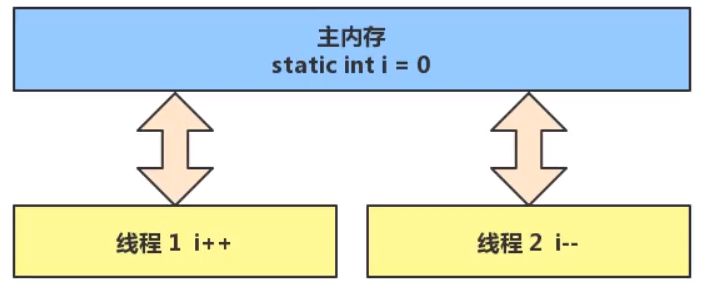

如果是单线程操作，上面的 8 行代码是顺序执行的（不会交错）不会出问题：

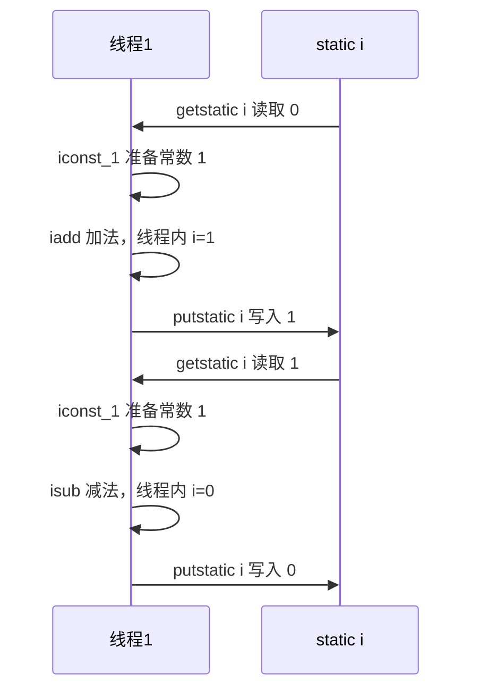

多线程下可能会出问题

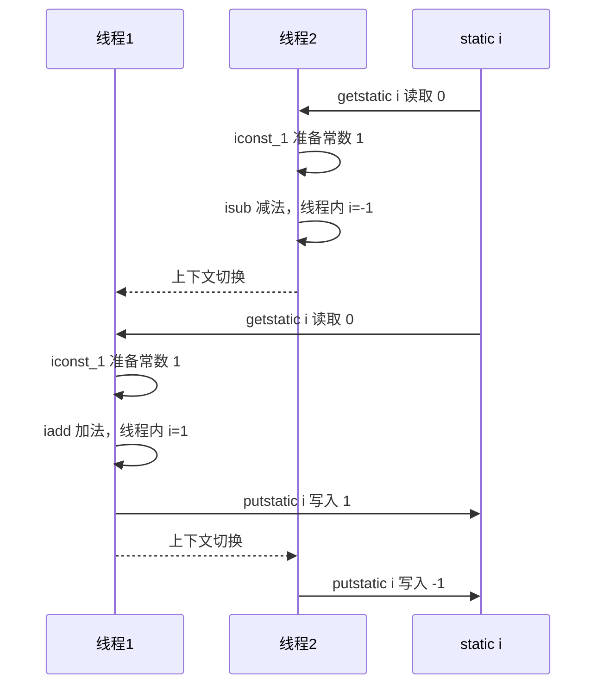

## 临界区

Critical Section

- 一个程序运行多个线程本身是没有问题的 
- 问题出在多个线程访问共享资源
  - 多个线程读共享资源其实也没有问题 
  - 在多个线程对共享资源读写操作时发生指令交错，就会出现问题 
- 一段代码块内如果存在对共享资源的多线程读写操作，称这段代码块为临界区

```java
static int counter = 0;
static void increment() 
// 临界区
{ 
 counter++;
}
static void decrement() 
// 临界区
{ 
 counter--;
}
```

## 竞态条件

Race Condition：多个线程在临界区内执行，由于代码的执行序列不同而导致结果无法预测，称之为发生了竞态条件。

# synchronized

## 解决手段

为了避免临界区的竞态条件发生，有多种手段可以达到目的。

- 阻塞式的解决方案：synchronized，Lock
- 非阻塞式的解决方案：原子变量

此处使用阻塞式的解决方案：**synchronized**，来解决上述问题，即俗称的**【对象锁】**，它采用互斥的方式让同一 时刻至多只有一个线程能持有【对象锁】，其它线程再想获取这个【对象锁】时就会阻塞住(blocked)。这样就能保证拥有锁的线程可以安全的执行临界区内的代码，不用担心线程上下文切换。

> **注意**：虽然 Java 中互斥和同步都可以采用 synchronized 关键字来完成，但它们还是有区别的： 互斥是保证临界区的竞态条件发生，同一时刻只能有一个线程执行临界区代码；同步是由于线程执行的先后、顺序不同、需要一个线程等待其它线程运行到某个点。

## synchronized 语法

```java
synchronized(对象) {
	//临界区
}
```

```java
static int counter = 0; 
//创建一个公共对象，作为对象锁的对象
static final Object room = new Object();
 
public static void main(String[] args) throws InterruptedException {    
    Thread t1 = new Thread(() -> {        
        for (int i = 0; i < 5000; i++) {            
            synchronized (room) {     
                counter++;            
            }       
        }    
    }, "t1");
 
    Thread t2 = new Thread(() -> {       
        for (int i = 0; i < 5000; i++) {         
            synchronized (room) {            
                counter--;          
            }    
        } 
    }, "t2");
 
    t1.start();    
    t2.start(); 
    t1.join();   
    t2.join();    
    log.debug("{}",counter); 
}
```

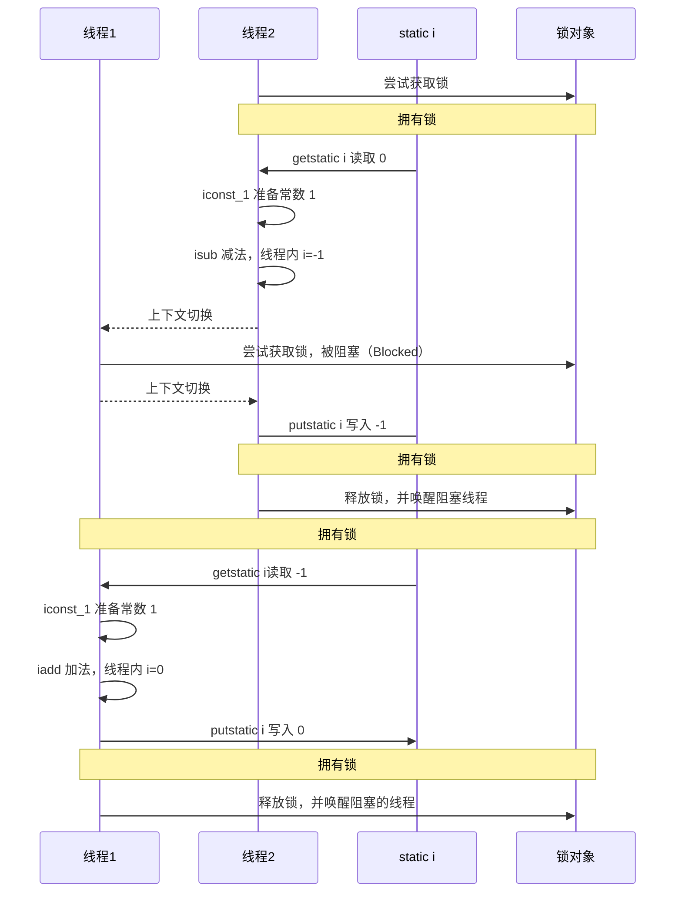

思考：synchronized 实际是用**对象锁**保证了**临界区内代码的原子性**，临界区内的代码对外是不可分割的，不会被线程切换所打断。 

请思考下面的问题

- 如果把 synchronized(obj) 放在 for 循环的外面，如何理解？-- 强调的原子性。
  - 锁粒度加大了。5000循环操作变为了一个原子性操作。
  - 放在 for 循环外面，则会一次性执行完 加/减 在执行减/加。

- 如果 t1 synchronized(obj1) 而 t2 synchronized(obj2) 会怎样运作？-- 强调的锁对象 
  - 会出现并发问题，因为不是同一把锁，互不干扰。

- 如果 t1 synchronized(obj) 而 t2 没有加会怎么样？如何理解？-- 强调的锁对象
  - 不加 synchronized 的方法相当于违规进入。

> 逃逸分析：逃出了作用域的范围。

## synchronized 锁的内容

public synchronized void eat()  -- 锁的实例对象

public static synchronized void eat()  -- 锁的字节码对象

synchronized -- <span style="color:red">**锁的都是对象哦，他是在对象头上加了标记的，所以说锁的是对象。**</span>

```java
class Test {
    public synchronized void test() {}
}
//等价于
class Test {
    public void test() {
        synchronized (this) {}
    }
}

//===============
class Test {
    public synchronized static void test() {}
}
//等价于
class Test {
    public static void test() {
        synchronized (Test.class) {}
    }
}
```

## 不加 synchronized 的方法 

不加 synchronized 的方法就好比不遵守规则的人，不去老实排队（翻窗户进去的）。

## synchronized 内存语义

synchronized 中使用到的变量会从工作内存中清除，要用时直接从主内存中获取。

> 加锁和释放锁的语义

- 当获取锁后，会清空锁块里，本地内存中将会被用到的一些共享变量，在使用这些共享变量时从主内存中进行加载。
- 在释放锁时将本地内存中修改的共享变量刷新到主内存。

## 线程八锁

> 是考察 synchronized 锁住的是哪个对象

网上找吧，没啥难度。

# 变量的线程安全分析

## 成员变量&静态变量

- 如果它们没有共享，则线程安全
- 如果它们被共享了，根据它们的状态是否能够改变，又分两种情况
  - 如果只有读操作，则线程安全
  - 如果有读写操作，则这段代码是临界区，需要考虑线程安全

> 成员变量线程不安全示例

```java
/**
 * 测试线程安全问题
 */
public class TestThreadSafe {
    /**
     * Index 0 out of bounds for length 0.
     * add 了两次相同的位置，然后remove了两次，造成的索引越界
     */
    public static void main(String[] args) {
        TestSafe testSafe = new TestSafe();
        for (int i = 0; i < 2; i++) {
            new Thread(() -> { testSafe.method1(); }).start();
        }
    }
}

class TestSafe {
    static int LOOP = 200;
    private ArrayList<String> list = new ArrayList<>();

    public void method1() {
        for (int i = 0; i < LOOP; i++) {
            add();
            remove();
        }
    }

    public void add() { list.add("1"); }
    public void remove(){ list.remove(0); }
}
```

## 局部变量

- 局部变量是线程安全的
- 但局部变量引用的对象则未必 （要看该对象是否被共享且被执行了读写操作）
  - 如果该对象没有逃离方法的作用范围，它是线程安全的
  - 如果该对象逃离方法的作用范围，需要考虑线程安全
- 局部变量是线程安全的——每个方法都在对应线程的栈中创建栈帧，不会被其他线程共享
- 访问修饰符，用 private 修饰，那么子类就不能用了，这样就可以避免子类开多线程调用这个方法，可以在一定程度上避免并发问题。

## 常见线程安全类

- String
- Integer
- StringBuffer
- Random
- Vector （List的线程安全实现类）
- Hashtable （Hash的线程安全实现类）
- java.util.concurrent 包下的类

这里说它们是线程安全的是指，多个线程调用它们<span style="color:red">**同一个实例的某个方法时**</span>，是线程安全的

- 它们的每个方法是原子的（都被加上了synchronized）
- 但注意它们<span style="color:red">**多个方法的组合不是原子的**</span>，所以可能会出现线程安全问题。

### 线程安全类的组合

```java
Hashtable table = new HashTable();
if( table.get("key")==null ){
    table.put("key",value);
}
// 多个线程调用 这部分代码。
// A 执行到了 if；B 执行到了 if
// A put 了，B if 判断结束了，也 put了 ，B的put不符合条件！
// 我们把 if 改为 while！
```

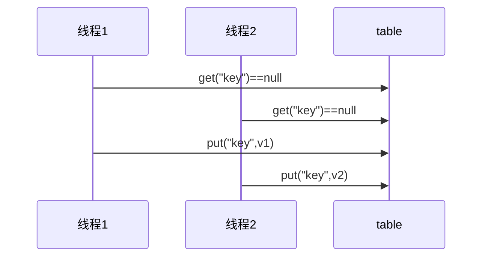

### 不可变类

String、Integer 等都是**不可变类**，因为其内部的状态不可以改变，因此它们的方法都是线程安全的

有同学或许有疑问，String 有 replace，substring 等方法【可以】改变值啊，那么这些方法又是如何保证线程安全的呢？

这是因为这些方法的返回值都**创建了一个新的对象**，而不是直接改变String、Integer对象本身。

> 以 String 的 substring 为例子进行分析

如果 beginIndex 是0，就返回原来的字符串，如果不是则新建一个字符串对象！

```java
public String substring(int beginIndex, int endIndex) {
    int length = length();
    checkBoundsBeginEnd(beginIndex, endIndex, length);
    int subLen = endIndex - beginIndex;
    if (beginIndex == 0 && endIndex == length) {
        return this;
    }
    return isLatin1() ? StringLatin1.newString(value, beginIndex, subLen)
        : StringUTF16.newString(value, beginIndex, subLen);
}
```

返回新建字符串对象的时候，它是Copy的原来的字符串！字符串是不可变的！所以这个源头不会变！Copy的时候也不会有安全问题！

```java
public static String newString(byte[] val, int index, int len) {
    if (String.COMPACT_STRINGS) {
        byte[] buf = compress(val, index, len);
        if (buf != null) {
            return new String(buf, LATIN1);
        }
    }
    int last = index + len;
    return new String(Arrays.copyOfRange(val, index << 1, last << 1), UTF16);
}
```

## 实例分析

> 例1

```java
public class MyServlet extends HttpServlet {
    // 是否安全？ 不安全
    Map<String, Object> map = new HashMap<>();
    // 是否安全？ 安全
    String S1 = "...";
    // 是否安全？ 安全
    final String S2 = "...";
    // 是否安全？ 不安全
    Date D1 = new Date();
    // 是否安全？ 不安全
    final Date D2 = new Date();

    public void doGet(HttpServletRequest request, HttpServletResponse response) {
        // 使用上述变量
    }
}
```

> 例2

```java
public class MyServlet extends HttpServlet {
    // 是否安全？ 不安全。 Servlet 是单的，独一份。所以是多个线程 操作同一个 userService 实例
    private UserService userService = new UserServiceImpl();

    public void doGet(HttpServletRequest request, HttpServletResponse response) {
        userService.update(...);
    }
}

public class UserServiceImpl implements UserService {
    // 记录调用次数
    private int count = 0;

    public void update() {
        // ...
        count++;
    }
}
```

> 例3

```java
@Aspect
@Component
public class MyAspect { // Spring 不指定多例 默认都是单例
    // 是否安全？ 不安全，存在并发修改问题
    private long start = 0L;

    @Before("execution(* *(..))")
    public void before() {
        start = System.nanoTime();
    }

    @After("execution(* *(..))")
    public void after() {
        long end = System.nanoTime();
        System.out.println("cost time:" + (end - start));
    }
}
```

> 例4

```java
public class MyServlet extends HttpServlet {
    // 是否安全
    private UserService userService = new UserServiceImpl();

    public void doGet(HttpServletRequest request, HttpServletResponse response) {
        userService.update(...);
    }
}

public class UserServiceImpl implements UserService {
    // 是否安全
    private UserDao userDao = new UserDaoImpl();

    public void update() {
        userDao.update();
    }
}

public class UserDaoImpl implements UserDao {
    public void update() {
        String sql = "update user set password = ? where username = ?";
        // 是否安全
        try (Connection conn = DriverManager.getConnection("", "", "")) {
            // ...
        } catch (Exception e) {
            // ...
        }
    }
}
```

> 例5

```java
public class MyServlet extends HttpServlet {
    // 是否安全  线程安全的，update 方法是独立的
    private UserService userService = new UserServiceImpl();

    public void doGet(HttpServletRequest request, HttpServletResponse response) {
        userService.update(...);
    }
}

public class UserServiceImpl implements UserService {
    // 是否安全
    private UserDao userDao = new UserDaoImpl();

    public void update() {
        userDao.update();
    }
}

public class UserDaoImpl implements UserDao {
    // 是否安全
    private Connection conn = null;

    public void update() throws SQLException {
        String sql = "update user set password = ? where username = ?";
        conn = DriverManager.getConnection("", "", "");
        // ...
        conn.close();
    }
}
```

> 例6

```java
public class MyServlet extends HttpServlet {
    // 是否安全
    private UserService userService = new UserServiceImpl();

    public void doGet(HttpServletRequest request, HttpServletResponse response) {
        userService.update(...);
    }
}

public class UserServiceImpl implements UserService {
    public void update() {
        // 线程安全，每次都是不同对象。局部变量，且没有逃逸。
        UserDao userDao = new UserDaoImpl();
        userDao.update();
    }
}

public class UserDaoImpl implements UserDao {
    // 是否安全
    private Connection =null;

    public void update() throws SQLException {
        String sql = "update user set password = ? where username = ?";
        conn = DriverManager.getConnection("", "", "");
        // ...
        conn.close();
    }
}
```

> 例7

不想暴露的就设置成私有或 final

```java
public abstract class Test {

    public void bar() {
        // 是否安全 不安全。
        SimpleDateFormat sdf = new SimpleDateFormat("yyyy-MM-dd HH:mm:ss");
        foo(sdf);
    }

    public abstract foo(SimpleDateFormat sdf);


    public static void main(String[] args) {
        new Test().bar();
    }
}
```

其中 foo 的行为是不确定的，可能导致不安全的发生，被称之为外星方法

```java
public void foo(SimpleDateFormat sdf) {
    String dateStr = "1999-10-11 00:00:00";
    for (int i = 0; i < 20; i++) {
        new Thread(() -> {
            try {
                sdf.parse(dateStr);
            } catch (ParseException e) {
                e.printStackTrace();
            }
        }).start();
    }
}
```

> 例8

```java
private static Integer i = 0;

public static void main(String[] args) throws InterruptedException {
    List<Thread> list = new ArrayList<>();
    for (int j = 0; j < 2; j++) {
        Thread thread = new Thread(() -> {
            for (int k = 0; k < 5000; k++) {
                synchronized (i) {
                    i++;
                }
            }
        }, "" + j);
        list.add(thread);
    }
    list.stream().forEach(t -> t.start());
    list.stream().forEach(t -> {
        try {
            t.join();
        } catch (InterruptedException e) {
            e.printStackTrace();
        }
    });
    log.debug("{}", i);
}
```

# Monitor 概念

Java 对象由对象头和成员变量啥的组成的。这个看看JVM。

**杂记：**int 类型占4字节；Integer 对象占 8+4 字节。

## Java 对象头

> hotspot vm 源码 markOop.hpp 中描述了 Java 对象头的格式，如下

- markOop.hpp 描述了对象头信息
- 对象头采用的大端布局
  - 大端布局：高位字节数据存放在低地址处，低位数据存放在高地址处；

```java
// The markOop describes the header of an object.
//
// Note that the mark is not a real oop but just a word.
// It is placed in the oop hierarchy for historical reasons.
//
// Bit-format of an object header (most significant first, big endian layout below):
//
//  32 bits:
//  --------
//             hash:25 ------------>| age:4    biased_lock:1 lock:2 (normal object)
//             JavaThread*:23 epoch:2 age:4    biased_lock:1 lock:2 (biased object)
//             size:32 ------------------------------------------>| (CMS free block)
//             PromotedObject*:29 ---------->| promo_bits:3 ----->| (CMS promoted object)
//
//  64 bits:
//  --------
//  unused:25 hash:31 -->| unused:1   age:4    biased_lock:1 lock:2 (normal object)
//  JavaThread*:54 epoch:2 unused:1   age:4    biased_lock:1 lock:2 (biased object)
//  PromotedObject*:61 --------------------->| promo_bits:3 ----->| (CMS promoted object)
//  size:64 ----------------------------------------------------->| (CMS free block)
//
//  unused:25 hash:31 -->| cms_free:1 age:4    biased_lock:1 lock:2 (COOPs && normal object)
//  JavaThread*:54 epoch:2 cms_free:1 age:4    biased_lock:1 lock:2 (COOPs && biased object)
//  narrowOop:32 unused:24 cms_free:1 unused:4 promo_bits:3 ----->| (COOPs && CMS promoted object)
//  unused:21 size:35 -->| cms_free:1 unused:7 ------------------>| (COOPs && CMS free block)
//
//  - hash contains the identity hash value: largest value is
//    31 bits, see os::random().  Also, 64-bit vm's require
//    a hash value no bigger than 32 bits because they will not
//    properly generate a mask larger than that: see library_call.cpp
//    and c1_CodePatterns_sparc.cpp.
//
//  - the biased lock pattern is used to bias a lock toward a given
//    thread. When this pattern is set in the low three bits, the lock
//    is either biased toward a given thread or "anonymously" biased,
//    indicating that it is possible for it to be biased. When the
//    lock is biased toward a given thread, locking and unlocking can
//    be performed by that thread without using atomic operations.
//    When a lock's bias is revoked, it reverts back to the normal
//    locking scheme described below.
//
//    Note that we are overloading the meaning of the "unlocked" state
//    of the header. Because we steal a bit from the age we can
//    guarantee that the bias pattern will never be seen for a truly
//    unlocked object.
//
//    Note also that the biased state contains the age bits normally
//    contained in the object header. Large increases in scavenge
//    times were seen when these bits were absent and an arbitrary age
//    assigned to all biased objects, because they tended to consume a
//    significant fraction of the eden semispaces and were not
//    promoted promptly, causing an increase in the amount of copying
//    performed. The runtime system aligns all JavaThread* pointers to
//    a very large value (currently 128 bytes (32bVM) or 256 bytes (64bVM))
//    to make room for the age bits & the epoch bits (used in support of
//    biased locking), and for the CMS "freeness" bit in the 64bVM (+COOPs).
//
//    [JavaThread* | epoch | age | 1 | 01]       lock is biased toward given thread
//    [0           | epoch | age | 1 | 01]       lock is anonymously biased
//
//  - the two lock bits are used to describe three states: locked/unlocked and monitor.
//
//    [ptr             | 00]  locked             ptr points to real header on stack
//    [header      | 0 | 01]  unlocked           regular object header
//    [ptr             | 10]  monitor            inflated lock (header is wapped out)
//    [ptr             | 11]  marked             used by markSweep to mark an object
//                                               not valid at any other time
//
//    We assume that stack/thread pointers have the lowest two bits cleared.
```

以 32 位 vm 为例

> 普通对象

`kclass` 指针指向对象所从属的 class


> 数组对象

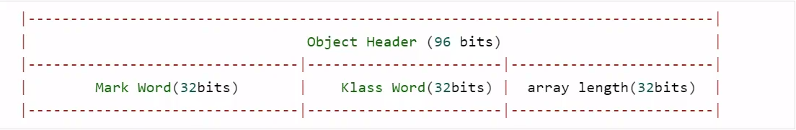

其中 Mark Word 结构为

- age：垃圾回收的分代年龄，年龄大于一定值就放入老年代。
- biased_lock 偏向锁状态
- 01 表示加锁

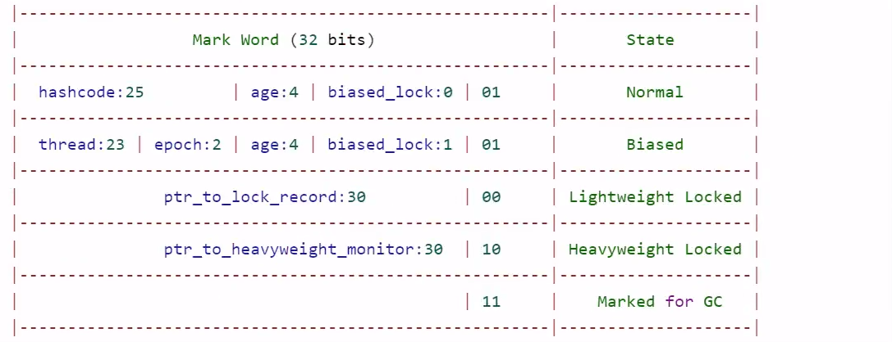

64 位虚拟机 Mark Word

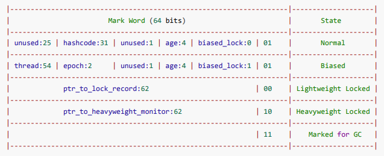

参考资料： <a href="https://stackoverflow.com/questions/26357186/what-is-in-java-object-header">资料</a>

32 位 vm，  int 占 4 个字节

Integer 占 8+4 = 12 个字节

64 位 vm 会启用指针压缩

## Monitor原理

Monitor 被翻译为监视器或管程

每个 Java 对象都可以关联一个 Monitor 对象，如果使用 synchronized 给对象上锁（重量级）之后，该对象头的 Mark Word 中就被设置指向 Monitor 对象的指针

Monitor 结构如下：

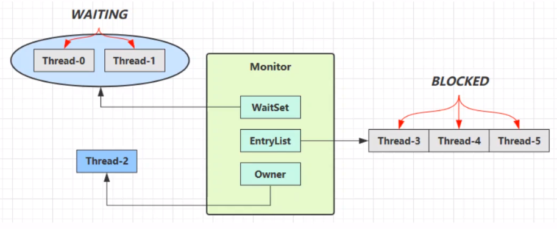

- 刚开始 Monitor 中 Owner 为 null
- 当 Thread-2 执行 **synchronized(obj)** 就会将 Monitor 的所有者 Owner 置为 Thread-2，Monitor 中只能有一个 Owner
- 在 Thread-2 上锁的过程中，如果 Thread-3，Thread-4，Thread-5 也来执行 synchronized(obj)，就会进入 **EntryListBLOCKED**
- Thread-2 执行完同步代码块的内容，然后唤醒 **EntryList** 中等待的线程来竞争锁，竞争是非公平的
- 图中 **WaitSet** 中的 Thread-0，Thread-1 是之前获得过锁，但条件不足进入 **WAITING** 状态的线程，具体分析看 wait-notify
  - **WaitSet** 是因为 wait 而阻塞的，notify 唤醒后会重新进入 **EntryList** ，然后重新竞争锁。

> **注意**

- synchronized 必须是进入同一个对象的 monitor 才有上述的效果。
- 不加 synchronized  的对象不会关联监视器，不遵从以上规则。

## synchronized 原理

- monitorenter  将 lock对象 MarkWord 置为 Monitor 指针

```java
public static void main(String[] args) {
    Object lock = new Object();
    synchronized (lock) {
        System.out.println("ok");
    }
}
```

```shell
stack=2, locals=4, args_size=1
    0: 	new				#2		// new Object
    3: 	dup
    4: 	invokespecial 	#1 		// invokespecial <init>:()V，非虚方法
    7: 	astore_1 				// lock引用 -> lock,存一份，用于以后的解锁
    8: 	aload_1					// lock （synchronized开始）
    9: 	dup						// 一份用来初始化，一份用来引用
    10: astore_2 				// lock引用 -> slot 2
    11: monitorenter 			// 将 lock对象 MarkWord 置为 Monitor 指针
    12: getstatic 		#3		// System.out
    15: ldc 			#4		// "ok"
    17: invokevirtual 	#5 		// invokevirtual println:(Ljava/lang/String;)V
    20: aload_2 				// slot 2(lock引用)
    21: monitorexit 			// 将 lock 对象 MarkWord 重置, 唤醒 EntryList。原来对象头存储的 hashcode，上锁后mark word 就不是hashcode了，是monitor指针了。
    22: goto 30
    25: astore_3 				// any -> slot 3
    26: aload_2 				// slot 2(lock引用)
    27: monitorexit 			// 将 lock对象 MarkWord 重置, 唤醒 EntryList
    28: aload_3
    29: athrow
    30: return
    Exception table: # 监测的范围内出现了异常，就会处理。
    	from to target type
        12 22 25 		any
        25 28 25 		any
	LineNumberTable: ...
	LocalVariableTable:
		Start Length Slot Name Signature
        	0 	31 		0 args [Ljava/lang/String;
        	8 	23 		1 lock Ljava/lang/Object;
```

**说明：**

- 通过异常 **try-catch 机制**，确保一定会被解锁
- 方法级别的 synchronized 不会在字节码指令中有所体现

## 小故事

- 老王 - JVM  nhu7
- 小南 - 线程 
- 小女 - 线程 
- 房间 - 对象 
- 房间门上 - 防盗锁 - Monitor 
- 房间门上 - 小南书包 - 轻量级锁 
- 房间门上 - 刻上小南大名 - 偏向锁 
- 批量重刻名 - 一个类的偏向锁撤销到达 20 阈值 
- 不能刻名字 - 批量撤销该类对象的偏向锁，设置该类不可偏向

小南要使用房间保证计算不被其它人干扰（原子性），最初，他用的是防盗锁，当上下文切换时，锁住门。这样， 即使他离开了，别人也进不了门，他的工作就是安全的。

但是，很多情况下没人跟他来竞争房间的使用权。小女是要用房间，但使用的时间上是错开的，小南白天用，小女 晚上用。每次上锁太麻烦了，有没有更简单的办法呢？

小南和小女商量了一下，约定不锁门了，而是谁用房间，谁把自己的书包挂在门口，但他们的书包样式都一样，因 此每次进门前得翻翻书包，看课本是谁的，如果是自己的，那么就可以进门，这样省的上锁解锁了。万一书包不是 自己的，那么就在门外等，并通知对方下次用锁门的方式。

后来，小女回老家了，很长一段时间都不会用这个房间。小南每次还是挂书包，翻书包，虽然比锁门省事了，但仍 然觉得麻烦。

于是，小南干脆在门上刻上了自己的名字：【小南专属房间，其它人勿用】，下次来用房间时，只要名字还在，那 么说明没人打扰，还是可以安全地使用房间。如果这期间有其它人要用这个房间，那么由使用者将小南刻的名字擦 掉，升级为挂书包的方式。

同学们都放假回老家了，小南就膨胀了，在 20 个房间刻上了自己的名字，想进哪个进哪个。后来他自己放假回老 家了，这时小女回来了（她也要用这些房间），结果就是得一个个地擦掉小南刻的名字，升级为挂书包的方式。老 王觉得这成本有点高，提出了一种批量重刻名的方法，他让小女不用挂书包了，可以直接在门上刻上自己的名字

后来，刻名的现象越来越频繁，老王受不了了：算了，这些房间都不能刻名了，只能挂书包

## synchronized 原理进阶

### 轻量级锁

轻量级锁的使用场景：如果一个对象虽然有多线程要加锁，但加锁的时间是错开的（也就是没有竞争），那么可以 使用轻量级锁来优化。

轻量级锁对使用者是透明的，即语法仍然是 synchronized

假设有两个方法同步块，利用同一个对象加锁

```java
static final Object obj = new Object();

public static void method1() {
    synchronized (obj) {
        // 同步块 A
        method2();
    }
}

public static void method2() {
    synchronized (obj) {
        // 同步块 B
    }
}
```

- 创建锁记录（Lock Record）对象，每个线程都的栈帧都会包含一个锁记录【JVM层面的】的结构，内部可以存储锁定对象的 Mark Word。
  - <span style="color:green">**lock record**</span>记录要加锁对象的 markword，便于后面还原
  - Object reference 对象指针

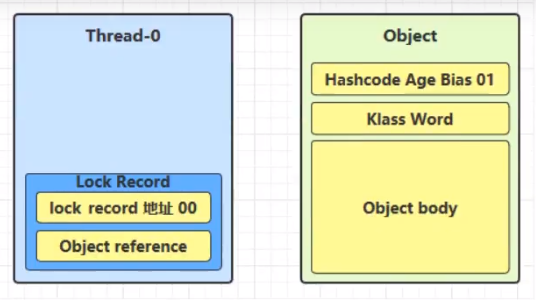

- 让锁记录中 Object reference 指向锁对象，并尝试用 cas（原子性操作） 替换 Object 的 mark word，将 mark word 的值存入锁记录。【00代表轻量级锁】
  - 如果是 00 <--> 01 则交换会成功

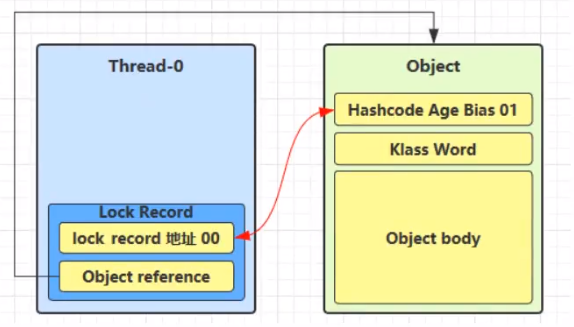

- 如果 cas 替换成功，对象头中存储了锁记录地址和状态 00，表示由该线程给对象加锁，这时图示如下：

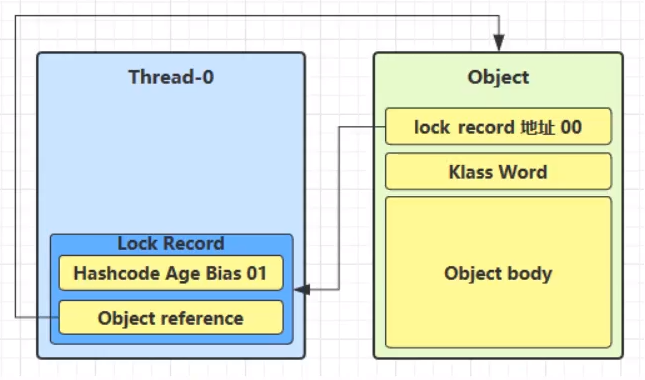

- 如果 cas 失败，有两种情况
  - 如果是其他线程已经持有了该 Object 的轻量级锁，这时表明有竞争，进入锁膨胀过程。
  - 如果是自己指向了 synchronized 锁重入，那么再添加一条 Lock Record 作为重入的计数。

第二个方法调用，也加锁，Object reference 指向 Object，但是 cas 失败了，因为锁已经被持有的，但是这种失败没事，因为发现是同一个线程操作的，没有问题！

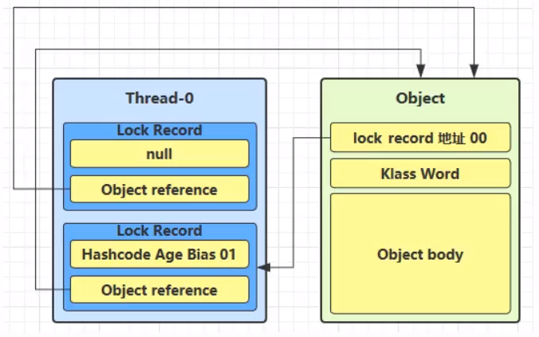

- 当退出 synchronized 代码块（解锁是）如果有取值为 null 的锁记录，表示有重入，这时重置锁记录，表示重入计数减一。

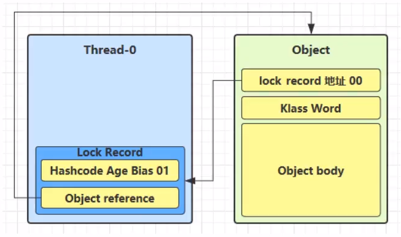

- 当退出 synchronized 代码块（解锁时）锁记录的值不为 null，这时使用 cas 将 Mark Word 的值恢复给对象头 
  - 成功，则解锁成功 
  - 失败，说明轻量级锁进行了锁膨胀或已经升级为重量级锁，进入重量级锁解锁流程

### 锁膨胀

如果在尝试加轻量级锁的过程种，CAS 操作无法成功，这时一种情况就是有其他线程为此对象加上了轻量级锁（有竞争），这时需要进行锁膨胀，将轻量级锁变成重量级锁。

```java
static Object obj = new Object();
public static void method1(){
    synchronized(obj){
        // 同步块
    }
}
```

- 当 Thread-1 进行轻量级加锁时，Thread-0 已经对该对象加了轻量级锁

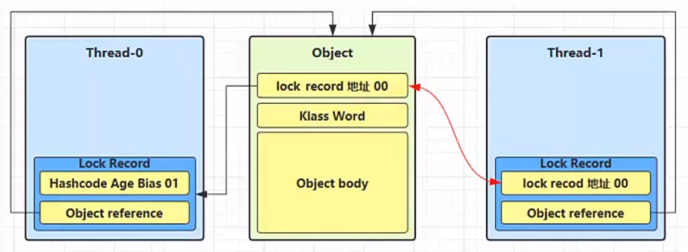

- 这时 Thread-1 加轻量级锁失败，进入锁膨胀流程 
  - 即为 Object 对象申请 Monitor 锁，让 Object 指向重量级锁地址 
  - 然后自己进入 Monitor 的 EntryList BLOCKED

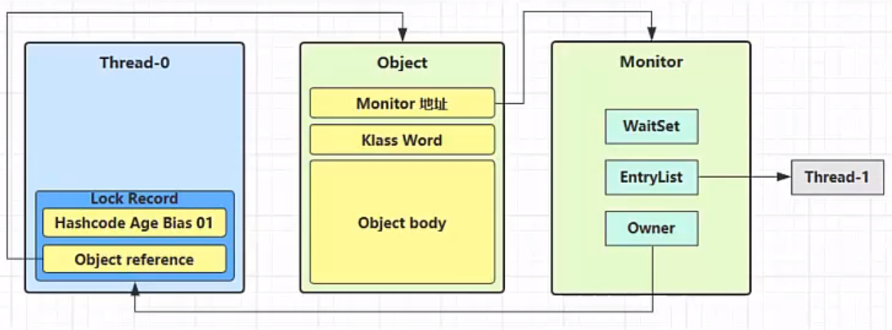

- 当 Thread-0 退出同步块解锁时，使用 cas 将 Mark Word 的值恢复给对象头，失败。这时会进入重量级解锁 流程，即按照 Monitor 地址找到 Monitor 对象，设置 Owner 为 null，唤醒 EntryList 中 BLOCKED 线程

### 自旋优化

重量级锁竞争的时候，还可以使用自旋来进行优化，如果当前线程自旋成功（即这时候持锁线程已经退出了同步 块，释放了锁），**这时当前线程就可以避免阻塞**。 【暂时不阻塞，进行几次循环】

> 自旋重试成功的情况

| 线程1（core1上）         | 对象 Mark              | 线程2（core2上）         |
| ------------------------ | ---------------------- | ------------------------ |
| \-                       | 10（重量锁）           | -                        |
| 访问同步块，获取 monitor | 10（重量锁）重量锁指针 | -                        |
| 成功（加锁）             | 10（重量锁）重量锁指针 | -                        |
| 执行同步块               | 10（重量锁）重量锁指针 | -                        |
| 执行同步块               | 10（重量锁）重量锁指针 | 访问同步块，获取 monitor |
| 执行同步块               | 10（重量锁）重量锁指针 | 自旋重试                 |
| 执行完毕                 | 10（重量锁）重量锁指针 | 自旋重试                 |
| 成功（解锁）             | 01（无锁）             | 自旋重试                 |
| -                        | 10（重量锁）重量锁指针 | 成功（加锁）             |
| -                        | 10（重量锁）重量锁指针 | 执行同步块               |
| ...                      | ...                    | ...                      |

> 自旋重试失败的情况

| 线程1（core1上）         | 对象 Mark              | 线程2（core2上）         |
| ------------------------ | ---------------------- | ------------------------ |
| \-                       | 10（重量锁）           | -                        |
| 访问同步块，获取 monitor | 10（重量锁）重量锁指针 | -                        |
| 成功（加锁）             | 10（重量锁）重量锁指针 | -                        |
| 执行同步块               | 10（重量锁）重量锁指针 | -                        |
| 执行同步块               | 10（重量锁）重量锁指针 | 访问同步块，获取 monitor |
| 执行同步块               | 10（重量锁）重量锁指针 | 自旋重试                 |
| 执行同步块               | 10（重量锁）重量锁指针 | 自旋重试                 |
| 执行同步块               | 10（重量锁）重量锁指针 | 自旋重试                 |
| 执行同步块               | 10（重量锁）重量锁指针 | 阻塞                     |
| ...                      | ...                    | ...                      |

- **自旋会占用 CPU 时间，单核 CPU 自旋就是浪费，多核 CPU 自旋才能发挥优势。** 
- 在 Java 6 之后自旋锁是自适应的，比如对象刚刚的一次自旋操作成功过，那么认为这次自旋成功的可能性会 高，就多自旋几次；反之，就少自旋甚至不自旋，总之，比较智能。 
- Java 7 之后不能控制是否开启自旋功能

### 偏向锁

轻量级锁在没有竞争时（就自己这个线程），每次重入仍然需要执行 CAS 操作。 

Java 6 中引入了偏向锁来做进一步优化：**只有第一次使用 CAS 将线程 ID设置到对象的 Mark Word 头**，之后发现 这个线程 ID 是自己的就表示没有竞争，不用重新 CAS。以后只要不发生竞争，这个对象就归该线程所有 

例如：同一个线程对同一个对象反复加锁。

```java
static final Object obj = new Object();

public static void m1(){
    synchronize(obj){
        m2();// 同步块A
    }
}

public static void m2(){
    synchronize(obj){
        m3();// 同步块B
    }
}

public static void m3(){
    synchronize(obj){
        // 同步块C
    }
}
```

CAS 底层对应的也是以 lock 打头的指令，也会影响一定的性能。

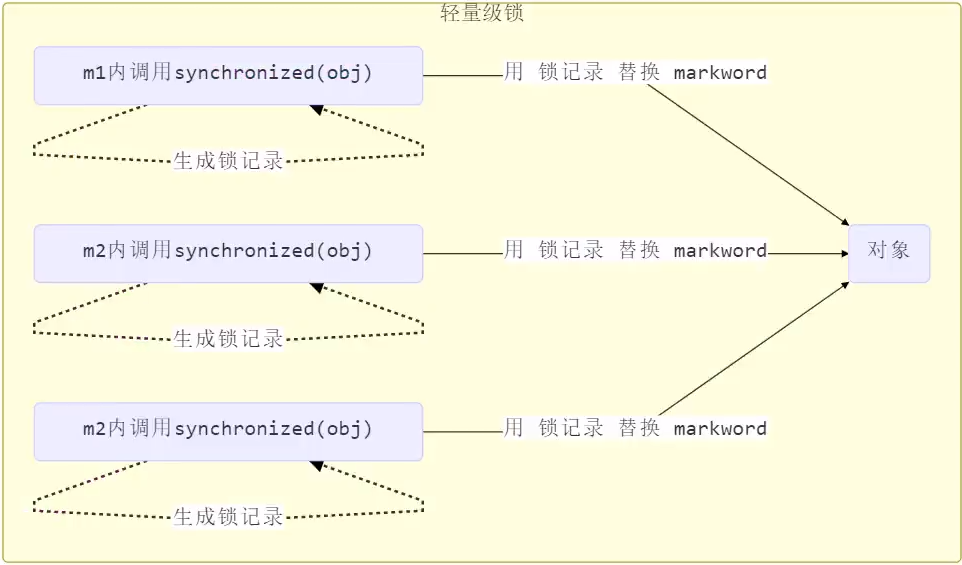

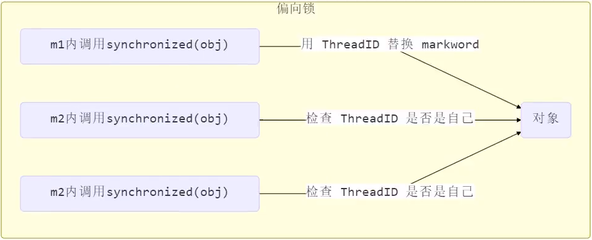

### 偏向状态

> 对象头格式


- Normal 和 Biased 是通过 biased_lock 判断的

- Lightweight locked 和 Heavyweight Locked 是通过 01、11 判断的
- epoch 是通过批量重定向和批量撤销用的。

一个对象创建时： 

- 如果开启了偏向锁（默认开启），那么对象创建后，**markword 值为 0x05 即最后 3 位为 101**（二进制数据的存储顺序？人工读阅读的顺序？），这时它的 thread、epoch、age 都为 0 
- **偏向锁是默认是延迟的，不会在程序启动时立即生效，如果想避免延迟，可以加 VM 参数 -XX:BiasedLockingStartupDelay=0 来禁用延迟** 
- 如果没有开启偏向锁，那么对象创建后，markword 值为 0x01 即最后 3 位为 001，这时它的 hashcode、 age 都为 0，第一次用到 hashcode 时才会赋值

> **测试延迟特性**

利用 JOL 第三方工具来查看对象头信息

```xml
<dependency>
    <groupId>org.openjdk.jol</groupId>
    <artifactId>jol-core</artifactId>
    <version>0.14</version>
</dependency>
```

```java
package monitor;

import lombok.extern.slf4j.Slf4j;
import org.openjdk.jol.info.ClassLayout;

import java.io.IOException;
import java.util.concurrent.TimeUnit;

class Dog {}

@Slf4j(topic = "c.TestBiased")
public class TestBiased {
    // 添加虚拟机参数 -XX:BiasedLockingStartupDelay=0
    public static void main(String[] args) throws IOException, InterruptedException {
        // 要解析的对象
        log.debug(ClassLayout.parseInstance(new Object()).toPrintable());
        TimeUnit.SECONDS.sleep(4);
        log.debug(ClassLayout.parseInstance(new Object()).toPrintable());
    }
}
```

输出：

一开始，偏向锁没有开启 0 0 1 \==> Normal

程序运行几秒后，偏向锁开启了 <span style="color:red">**1**</span> 0 1\==> Biased

````shell
21:02:22.539 c.TestBiased [main] - java.lang.Object object internals:
 OFFSET  SIZE   TYPE DESCRIPTION                               VALUE
      0     4        (object header)                           01 00 00 00 (00000001 00000000 00000000 00000000) (1)
      4     4        (object header)                           00 00 00 00 (00000000 00000000 00000000 00000000) (0)
      8     4        (object header)                           e5 01 00 f8 (11100101 00000001 00000000 11111000) (-134217243)
     12     4        (loss due to the next object alignment)
Instance size: 16 bytes
Space losses: 0 bytes internal + 4 bytes external = 4 bytes total

21:02:26.543 c.TestBiased [main] - java.lang.Object object internals:
 OFFSET  SIZE   TYPE DESCRIPTION                               VALUE
      0     4        (object header)                           05 00 00 00 (00000101 00000000 00000000 00000000) (5)
      4     4        (object header)                           00 00 00 00 (00000000 00000000 00000000 00000000) (0)
      8     4        (object header)                           e5 01 00 f8 (11100101 00000001 00000000 11111000) (-134217243)
     12     4        (loss due to the next object alignment)
Instance size: 16 bytes
Space losses: 0 bytes internal + 4 bytes external = 4 bytes total
````

**注意** 处于偏向锁的对象解锁后，线程 id 仍存储于对象头中。

> **测试禁用**

在上面测试代码运行时在添加 **VM 参数 -XX:-UseBiasedLocking** 禁用偏向锁。输出：

```shell
21:16:13.603 c.TestBiased [main] - java.lang.Object object internals:
 OFFSET  SIZE   TYPE DESCRIPTION                               VALUE
      0     4        (object header)                           01 00 00 00 (00000001 00000000 00000000 00000000) (1)
      4     4        (object header)                           00 00 00 00 (00000000 00000000 00000000 00000000) (0)
      8     4        (object header)                           e5 01 00 f8 (11100101 00000001 00000000 11111000) (-134217243)
     12     4        (loss due to the next object alignment)
Instance size: 16 bytes
Space losses: 0 bytes internal + 4 bytes external = 4 bytes total

21:16:17.606 c.TestBiased [main] - java.lang.Object object internals:
 OFFSET  SIZE   TYPE DESCRIPTION                               VALUE
      0     4        (object header)                           01 00 00 00 (00000001 00000000 00000000 00000000) (1)
      4     4        (object header)                           00 00 00 00 (00000000 00000000 00000000 00000000) (0)
      8     4        (object header)                           e5 01 00 f8 (11100101 00000001 00000000 11111000) (-134217243)
     12     4        (loss due to the next object alignment)
Instance size: 16 bytes
Space losses: 0 bytes internal + 4 bytes external = 4 bytes total
```

> **测试 hashCode**

正常状态对象一开始是没有 **hashCode** 的，第一次调用才生成。同时我们开启偏向锁无延迟。

> **撤销-调用对象 hashCode**

调用了对象的 **hashCode**，但偏向锁的对象 **MarkWord** 中存储的是线程 id，如果调用 **hashCode** 会导致偏向锁被撤销 

- 轻量级锁会在锁记录中记录 **hashCode** 
- 重量级锁会在 Monitor 中记录 **hashCode** 

在调用 **hashCode** 后使用偏向锁，记得去掉 **-XX:-UseBiasedLocking**

**代码**

```java
package monitor;

import lombok.extern.slf4j.Slf4j;
import org.openjdk.jol.info.ClassLayout;

import java.io.IOException;
import java.util.concurrent.TimeUnit;

class Dog {}

@Slf4j(topic = "c.TestBiased")
public class TestBiased {
    // 测试hashCode -XX:+UseCompressedOops -XX:BiasedLockingStartupDelay=0
    public static void main(String[] args) throws IOException, InterruptedException {
        // 要解析的对象
        Object obj = new Object();
        obj.hashCode();
        log.debug(ClassLayout.parseInstance(obj).toPrintable());
    }
}
```

**输出**

```java
21:20:34.687 c.TestBiased [main] - java.lang.Object object internals:
 OFFSET  SIZE   TYPE DESCRIPTION                               VALUE
      0     4        (object header)                           01 9b 29 7d (00000001 10011011 00101001 01111101) (2099878657)
      4     4        (object header)                           56 00 00 00 (01010110 00000000 00000000 00000000) (86)
      8     4        (object header)                           e5 01 00 f8 (11100101 00000001 00000000 11111000) (-134217243)
     12     4        (loss due to the next object alignment)
Instance size: 16 bytes
Space losses: 0 bytes internal + 4 bytes external = 4 bytes total
```

> **撤销-其他线程使用对象**

当有其它线程使用偏向锁对象时，会将偏向锁升级为轻量级锁

> **撤销-调用 wait/notify**

> **批量重偏向**

如果对象虽然被多个线程访问，但没有竞争，这时偏向了线程 T1 的对象仍有机会重新偏向 T2，重偏向会重置对象的 Thread ID。

当撤销偏向锁阈值超过 20 次后，JVM 会这样觉得，我是不是偏向错了呢，于是会在给这些对象加锁时重新偏向至加锁线程。

> **批量撤销**

当撤销偏向锁阈值超过 40 次后，JVM 会这样觉得，自己确实偏向错了，根本就不该偏向。于是整个类的所有对象都会变为不可偏向的，新建的对象也是不可偏向的。

> **锁消除**

```java
package monitor;

import org.openjdk.jmh.annotations.*;
import org.openjdk.jmh.runner.Runner;
import org.openjdk.jmh.runner.RunnerException;
import org.openjdk.jmh.runner.options.Options;
import org.openjdk.jmh.runner.options.OptionsBuilder;

import java.util.concurrent.TimeUnit;

@Fork(1)
@BenchmarkMode(Mode.AverageTime)
@Warmup(iterations = 3)
@Measurement(iterations = 5)
@OutputTimeUnit(TimeUnit.NANOSECONDS)
public class WipeLock {
    public static void main(String[] args) throws RunnerException {
        Options opt = new OptionsBuilder()
                .include(WipeLock.class.getSimpleName())
                .forks(1)
                .build();
        new Runner(opt).run();
    }

    static int x = 0;

    @Benchmark
    public void a() throws Exception { x++; }

    @Benchmark
    public void b() throws Exception {
        Object o = new Object();
        synchronized (o) { x++; }
    }
}
```

测试结果：性能差不多，虽然 b 方法加了锁，但是有锁消除，所以性能是差不多的！

```shell
Benchmark   Mode  Cnt  Score   Error  Units
WipeLock.a  avgt    5  1.304 ± 0.014  ns/op
WipeLock.b  avgt    5  1.295 ± 0.029  ns/op
```

锁粗化；对相同对象多次加锁，导致线程发生多次重入，可以使用锁粗化方式来优化，这不同于之前讲的细分锁的粒度。

参考资料 

https://github.com/farmerjohngit/myblog/issues/12 

https://www.cnblogs.com/LemonFive/p/11246086.html 

https://www.cnblogs.com/LemonFive/p/11248248.html 

<a href="https://www.oracle.com/technetwork/java/biasedlocking-oopsla2006-wp-149958.pdf">偏向锁论文</a>

# wait/notify

## 原理

> 基本概念

- wait：阻塞线程并释放锁。
  - 如果一个线程调用了 object.wait() 方法，那么它就会进入object对象的等待队列。这个等待队列中，可能会有多个线程，因为系统运行多个线程同时等待某一个对象。

- notify：唤醒阻塞队列中的某个线程。
  - 当 object.notify() 方法被调用时，它就会从这个等待队列中随机选择一个线程，并将其唤醒。
  - PS：选择唤醒某个线程，这个选择是不公平的，完全随机！

- notifyAll：唤醒阻塞队列中的所有线程。
- 注意：Thread.sleep是不会释放锁的！

----

> 原理

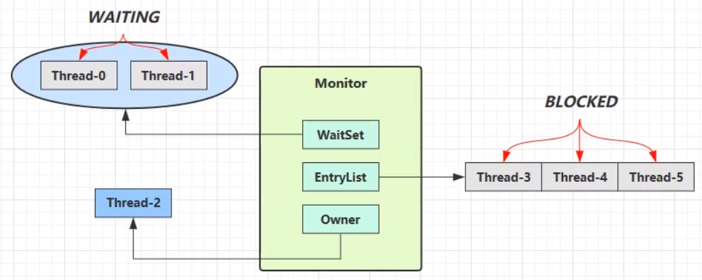

- Owner 线程发现条件不满足，调用 wait 方法，即可进入 **WaitSet** 变为 WAITING 状态 
- BLOCKED 和 WAITING 的线程都处于阻塞状态，不占用 CPU 时间片 
- BLOCKED 线程会在 Owner 线程释放锁时唤醒 
- WAITING 线程会在 Owner 线程调用 notify 或 notifyAll 时唤醒，但唤醒后并不意味者立刻获得锁，仍需进入 EntryList 重新竞争

## API

- obj.wait() 让进入 object 监视器的线程到 waitSet 等待 
- obj.notify() 在 object 上正在 waitSet 等待的线程中挑一个唤醒 
- obj.notifyAll() 让 object 上正在 waitSet 等待的线程全部唤醒

它们都是线程之间进行协作的手段，都属于 Object 对象的方法。必须获得此对象的锁，才能调用这几个方法

wait() 方法会释放对象的锁，进入 WaitSet 等待区，从而让其他线程就机会获取对象的锁。无限制等待，直到 notify 为止 

wait(long n) 有时限的等待, 到 n 毫秒后结束等待，或是被 notify

## 案例

**描述：**

- 小南，有烟干活，没烟，休息 2s。
- 送烟人：送烟给小南。
- 其他人：任何时候都可以干活。
- 干活地点都是同一个。一次只能小南，其他人中的一个干活

单生产者，多消费者

多生产者，单消费者

多生产者，多消费者

# 保护暂停

## 定义

即 Guarded Suspension，用在一个线程等待另一个线程的执行结果 

要点 

- 有一个结果需要从一个线程传递到另一个线程，让他们关联同一个 GuardedObject ，用 GuardedObject  协调两个线程的结果。如果有源源不断的结果送过来，那么就得用消息队列。
  - response 是用来保存结果的。
- 如果有结果不断从一个线程到另一个线程那么可以使用消息队列（见生产者/消费者） 
- JDK 中，join 的实现、Future 的实现，采用的就是此模式 
- 因为要等待另一方的结果，因此归类到同步模式

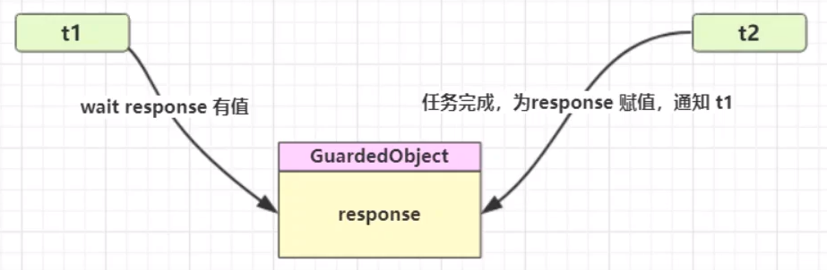

## 实现

> 保护性暂停模式

```java
package application;

import lombok.extern.slf4j.Slf4j;

import java.io.BufferedReader;
import java.io.IOException;
import java.io.InputStreamReader;
import java.net.HttpURLConnection;
import java.net.URL;
import java.nio.charset.StandardCharsets;
import java.util.ArrayList;
import java.util.List;

@Slf4j(topic = "c.GuardedSuspension")
public class GuardedSuspension {

    public static void main(String[] args) {
        // 两个线程用同一个对象进行交互。
        GuardedObject guardedObject = new GuardedObject();
        Thread th1 = new Thread(() -> {
            log.debug("等待结果");
            List<String> list = (List<String>) guardedObject.get();// 等待结果
            log.debug("结果大小：{}", list.size());
        }, "th1");

        Thread th2 = new Thread(() -> {
            log.debug("执行下载");
            List<String> response = DownLoad.downLoad();
            log.debug("download complete");
            guardedObject.complete(response);
        }, "th2");
        th1.start();
        th2.start();
    }
}

class GuardedObject {
    // 等待的数据
    private Object response;

    public Object get() {
        synchronized (this) {
            try {
                // 没有结果就一直等待；while 防止虚假唤醒。
                while (response == null) this.wait();
            } catch (InterruptedException e) {
                e.printStackTrace();
            }
            return response;
        }
    }

    // 产生结果
    public void complete(Object response) {
        synchronized (this) {
            this.response = response;
            this.notifyAll();
        }
    }
}

class DownLoad {
    public static final List<String> downLoad() {
        HttpURLConnection conn = null;
        ArrayList<String> lines = new ArrayList<>();
        try {
            conn = (HttpURLConnection) new URL("https://www.baidu.com/").openConnection();
            try (BufferedReader reader = new BufferedReader(new InputStreamReader(conn.getInputStream(), StandardCharsets.UTF_8))) {
                String line;
                while ((line = reader.readLine()) != null) {
                    lines.add(line);
                }
            }
        } catch (IOException e) {
            e.printStackTrace();
        }
        return lines;
    }
}
```

> join 实现

```java
static  List<String> data = null;

public static void joinTest() {
    Object o = new Object();

    Thread th1 = new Thread(() -> {
        synchronized (o) {
            log.debug("等待结果");
            while (data == null) {
                try {
                    o.wait();
                } catch (InterruptedException e) {
                    e.printStackTrace();
                }
            }
            log.debug("拿到了结果！大小为 {}", data.size());
        }
    });

    Thread th2 = new Thread(() -> {
        synchronized (o) {
            log.debug("执行下载");
            List<String> strings = DownLoad.downLoad();
            data = strings;
            log.debug("下载完成");
            o.notifyAll();
        }
    });

    th1.start();
    th2.start();
}
```

我感觉 保护暂停性模式对比 join 就是封装了下变量，交互的变量不是全局的了，而是对象封装的。其他的还没什么感觉。

## 增加超时

等待时间那里，仔细看看为什么这么写！

```java
@Slf4j(topic = "c.GuardedSuspension")
public class GuardedSuspension {

    public static void main(String[] args) {
        // 两个线程用同一个对象进行交互。
        GuardedObject guardedObject = new GuardedObject();
        Thread th1 = new Thread(() -> {
            log.debug("等待结果");
            Object response = guardedObject.get(2000);// 等待结果
            log.debug("结果是{}", response);
        }, "th1");

        Thread th2 = new Thread(() -> {
            log.debug("执行下载");
            try {
                TimeUnit.SECONDS.sleep(1);
                guardedObject.complete(null);
            } catch (InterruptedException e) {
                e.printStackTrace();
            }
        }, "th2");
        th1.start();
        th2.start();
    }
}

class GuardedObject {
    // 等待的数据
    private Object response;

    // timeout 总共等几秒
    public Object get(long timeout) {
        synchronized (this) {
            // 开始时间
            long begin = System.currentTimeMillis();
            // 经历的时间
            long passedTime = 0;
            try {
                // 没有结果就一直等待；while 防止虚假唤醒。
                while (response == null) {
                    // 经历的时间超过了最大等待时间
                    if (passedTime >= timeout) break;
                    // 等了 passedTime 秒了，再等 timeout - passedTime 就可以了
                    this.wait(timeout - passedTime);
                    passedTime = System.currentTimeMillis() - begin;
                }
            } catch (InterruptedException e) {
                e.printStackTrace();
            }
            return response;
        }
    }

    // 产生结果
    public void complete(Object response) {
        synchronized (this) {
            this.response = response;
            this.notifyAll();
        }
    }
}
```

## join 原理

join 应用了保护性暂停模式，暂停就是条件不满足时，进行 wait 等待。不过 join 是等待一个线程的结束，而我们写的是等待结果。

```java
public final synchronized void join(long millis)
    throws InterruptedException {
    long base = System.currentTimeMillis();
    long now = 0;

    if (millis < 0) {
        throw new IllegalArgumentException("timeout value is negative");
    }

    if (millis == 0) {
        // 如果线程还存活，就一直等待。
        while (isAlive()) {
            wait(0);
        }
    } else {
        // 大于0的话，这不就是上面写的 保护性暂停模式的超时增强吗
        // 调用者线程进入 t1 的 waitSet 等待, 直到 t1 运行结束
        while (isAlive()) {
            long delay = millis - now;
            if (delay <= 0) {
                break;
            }
            wait(delay);
            now = System.currentTimeMillis() - base;
        }
    }
}
```

## 扩展-解耦等待和生产

图中 Futures 就好比居民楼一层的信箱（每个信箱有房间编号），左侧的 t0，t2，t4 就好比等待邮件的居民，右 侧的 t1，t3，t5 就好比邮递员 

如果需要在多个类之间使用 GuardedObject 对象，作为参数传递不是很方便，因此设计一个用来解耦的中间类， 这样不仅能够解耦【结果等待者】和【结果生产者】，还能够同时支持多个任务的管理


新增 id 用来标识 Guarded Object

RPC 框架中常用。这块代码好好理解。大致就是：依旧是 GuardedObject 当中间商，但是由于有多个 GuardedObject，所以又抽象出一个 Mailboxes 类存放多个中间商。

可以解耦结果产生者和结果消费者。实际上 Mail 是一个通用的类，可以重用，只是为了方便理解所以这么取名。

```java
import lombok.extern.slf4j.Slf4j;

import java.util.Map;
import java.util.Set;
import java.util.concurrent.ConcurrentHashMap;
import java.util.concurrent.TimeUnit;

@Slf4j(topic = "c.GuardedFutures")
public class GuardedFutures {
    public static void main(String[] args) throws InterruptedException {
        for (int i = 0; i < 5; i++) {
            new Thread(new People(), "收信" + i).start();
        }
        TimeUnit.SECONDS.sleep(2);
        for (Integer id : Mailboxes.getIds()) {
            new Thread(new PostMan(id, "内容" + id)).start();
        }
    }
}

@Slf4j(topic = "c.People")
class People implements Runnable {

    @Override
    public void run() {
        GuardedObject2 guardedObject = Mailboxes.createGuardedObject();
        log.debug("开始收信id:{}", guardedObject.getId());
        Object mail = guardedObject.get(5000);
        log.debug("收到信id:{},内容{}", guardedObject.getId(), mail);
    }
}

@Slf4j(topic = "c.PostMan")
class PostMan implements Runnable {
    private int id;
    private String mail;

    public PostMan(int id, String mail) {
        this.id = id;
        this.mail = mail;
    }

    @Override
    public void run() {
        GuardedObject2 guardedObject = Mailboxes.getGuardedObjectById(id);
        log.debug("送信id：{}，内容{}", id, mail);
        guardedObject.complete(mail);
    }
}

class Mailboxes {
    private static Map<Integer, GuardedObject2> boxes = new ConcurrentHashMap<>();
    private static int id = 1;

    public static synchronized int generateId() { return id++;}

    // 创建对象 放入map
    public static GuardedObject2 createGuardedObject() {
        GuardedObject2 go = new GuardedObject2(generateId());
        boxes.put(go.getId(), go);
        return go;
    }

    public static Set<Integer> getIds() {
        return boxes.keySet();
    }

    public static GuardedObject2 getGuardedObjectById(int id) {
        // 需要移除，避免太多对象导致 OOM
        return boxes.remove(id);
    }

}

class GuardedObject2 {
    private int id;

    public int getId() {
		return this.id;
    }

    public GuardedObject2(int id) {
        this.id = id;
    }

    private Object response;

    // 限时等待
    public Object get(long timeout) {
        synchronized (this) {
            long start = System.currentTimeMillis();
            long passedTime = 0;
            try {
                while (response == null) {
                    if (passedTime >= timeout) break;
                    this.wait(timeout - passedTime);
                    passedTime = System.currentTimeMillis() - start;
                }
            } catch (InterruptedException e) {
                e.printStackTrace();
            }
        }
        return response;
    }

    public void complete(Object response) {
        synchronized (this) {
            this.response = response;
            this.notifyAll();
        }
    }
}
```

## 异步模式-生产者/消费者

### 定义

- 与前面的保护性暂停中的 GuardObject 不同，不需要产生结果和消费结果的线程一一对应 
- 消费队列可以用来平衡生产和消费的线程资源 
- 生产者仅负责产生结果数据，不关心数据该如何处理，而消费者专心处理结果数据 
- 消息队列是有容量限制的，满时不会再加入数据，空时不会再消耗数据 
- JDK 中各种阻塞队列，采用的就是这种模式

**通过消息队列进行解耦**


```java
package application;

import lombok.Getter;
import lombok.extern.slf4j.Slf4j;

import java.util.LinkedList;
import java.util.concurrent.TimeUnit;

@Slf4j(topic = "c.ProductConsume")
public class ProductConsume {
    public static void main(String[] args) {
        MessageQueue messageQueue = new MessageQueue(3);
        // 3个消费者
        for (int i = 0; i < 3; i++) {
            new Thread(() -> {
                try {
                    while (true) {
                        TimeUnit.MICROSECONDS.sleep(200);
                        Message take = messageQueue.take();
                    }
                } catch (InterruptedException e) {
                    e.printStackTrace();
                }
            }, "消费者" + i).start();
        }
        Thread product = new Thread(() -> {
            while (true) {
                try {
                    double number = Math.random() * 100;
                    messageQueue.put(new Message((int) number, "" + number));
                } catch (InterruptedException e) {
                    e.printStackTrace();
                }
            }
        }, "生产者");
        product.start();
    }
}

@Slf4j(topic = "c.MessageQueue")
class MessageQueue {
    private LinkedList<Message> list = new LinkedList<>();
    // 队列容量
    private int capcity;

    public MessageQueue(int capcity) {
        this.capcity = capcity;
    }

    // put 和 get 总有一个会满足
    public void put(Message message) throws InterruptedException {
        synchronized (list) {
            while (list.size() == capcity) {
                list.wait();
            }
            // 将消息加入队列尾部
            list.addLast(message);
            log.debug("生产者{} 生产{}", Thread.currentThread().getName(), message);
            list.notifyAll();
        }
    }

    // 存入消息。线程通信之间 id 和重要，通过 id 识别线程？
    public Message take() throws InterruptedException {
        synchronized (list) {
            while (list.isEmpty()) {
                list.wait();
            }
            // 从队列头部获取消息
            Message message = list.removeFirst();
            log.debug("消费者{} 消费{}", Thread.currentThread(), message);
            list.notifyAll();
            return message;
        }
    }
}

@Getter
class Message {
    private int id;
    private Object value;

    public Message(int id, Object value) {
        this.id = id;
        this.value = value;
    }

    @Override
    public String toString() {
        return "Message{" + "id=" + id + ", value=" + value + '}';
    }
}
```

# Park & Unpark

## 基本使用

是 LockSupport 类中的方法

```java
// 暂停当前线程
LockSupport.part();
// 恢复某个线程的运行
LockSupport.unpart(暂停线程对象);
```

先 park 再 unpark

```java
@Slf4j(topic = "c.LockSupportDemo")
public class LockSupportDemo {
    public static void main(String[] args) throws InterruptedException {
        Thread th1 = new Thread(() -> {
            log.debug("尬住了~~");
            LockSupport.park();
            log.debug("又运行了~~");
        });
        Thread th2 = new Thread(() -> {
            log.debug("别怕，我来救你！");
            LockSupport.unpark(th1);
        });

        th1.start();
        TimeUnit.SECONDS.sleep(2);
        th2.start();
    }
}
// 12:46:49.847 c.LockSupportDemo [Thread-0] - 尬住了~~
// 12:46:51.852 c.LockSupportDemo [Thread-1] - 别怕，我来救你！
// 12:46:51.852 c.LockSupportDemo [Thread-0] - 又运行了~~
```

先 unpark再 park。程序运行没有问题。可以在暂停前调用 unpark，运行到 park 时就不会暂停了。

```java

@Slf4j(topic = "c.LockSupportDemo")
public class LockSupportDemo {
    public static void main(String[] args) throws InterruptedException {
        Thread th1 = new Thread(() -> {
            try {
                TimeUnit.SECONDS.sleep(5);
            } catch (InterruptedException e) {
                e.printStackTrace();
            }
            log.debug("开始运行了");
            LockSupport.park();
            log.debug("又运行了~~");
        });
        Thread th2 = new Thread(() -> {
            log.debug("别怕，我来救你！");
            LockSupport.unpark(th1);
        });

        th1.start();
        TimeUnit.SECONDS.sleep(1);
        th2.start();
    }
}
// 12:51:18.692 c.LockSupportDemo [Thread-1] - 别怕，我来救你！
// 12:51:22.691 c.LockSupportDemo [Thread-0] - 开始运行了
// 12:51:22.691 c.LockSupportDemo [Thread-0] - 又运行了~~
```

## 特点

特点 与 Object 的 wait & notify 相比 

- wait，notify 和 notifyAll 必须配合 Object Monitor 一起使用，而 park，unpark 不必
- **park & unpark 是以线程为单位来【阻塞】和【唤醒】线程**，而 notify 只能随机唤醒一个等待线程，notifyAll  是唤醒所有等待线程，就不那么【精确】 
- <span style="color:red">**park & unpark 可以先 unpark，而 wait & notify 不能先 notify**</span>

## 原理

底层由 C 代码实现。

每个线程都有自己的一个 Parker 对象，由三部分组成 _counter ， \_cond 和 \_mutex 打个比喻

- 线程就像一个旅人，Parker 就像他随身携带的背包，条件变量（\_cond）就好比背包中的帐篷。\_counter 就好比背包中的备用干粮（0 为耗尽，1 为充足） 
- 调用 park 就是要看需不需要停下来歇息 
  - 如果备用干粮耗尽，那么钻进帐篷（\_cond）歇息 
  - 如果备用干粮充足，那么不需停留，继续前进 
- 调用 unpark，就好比令干粮充足 
  - 如果这时线程还在帐篷，就唤醒让他继续前进
  -  如果这时线程还在运行，那么下次他调用 park 时，仅是消耗掉备用干粮，不需停留继续前进 
    - 因为背包空间有限，多次调用 unpark 仅会补充一份备用干粮

----


- 当前线程调用 Unsafe.park() 方法 
- 检查 \_counter ，本情况为 0，这时，获得 \_mutex 互斥锁 
- 线程进入 \_cond 条件变量阻塞 
- 设置 \_counter = 0

----


- 调用 Unsafe.unpark(Thread_0) 方法，设置 _counter 为 1 
- 唤醒 _cond 条件变量中的 Thread_0 
- Thread_0 恢复运行 
- 设置 _counter 为 0

----


- 调用 Unsafe.unpark(Thread_0) 方法，设置 _counter 为 1 
- 当前线程调用 Unsafe.park() 方法 
- 检查 _counter ，本情况为 1，这时线程无需阻塞，继续运行 
- 设置 _counter 为 0

# 理解线程状态转换

## 转换图

RUNNABLE 里的阻塞是在等 IO 资源。


## 举例

假设有线程 Thread t 

> 情况 1 NEW --> RUNNABLE 

当调用 t.start() 方法时，由 NEW --> RUNNABLE 

> 情况 2 RUNNABLE <--> WAITING 

- t 线程用 synchronized(obj) 获取了对象锁后 调用 obj.wait() 方法时，t 线程从 RUNNABLE --> WAITING 
- 调用 obj.notify() ， obj.notifyAll() ， t.interrupt() 时（**进入 EntryList，等锁释放开了，和其他线程一起竞争**）
  - 竞争锁成功，t 线程从 WAITING --> RUNNABLE 
  - 竞争锁失败，t 线程从 WAITING --> BLOCKED
  - 竞争编程 BLOCKED 不需要中间经历 RUNNABLE 吗？不需要，都经历了，不就成直接到 RUNNABLE 了，那还是直接到 BLOCKED

IDEA debug 看线程的状态。

```java
@Slf4j(topic = "c.TestWaitNotify")
public class TestWaitNotify {
    final static Object obj = new Object();

    public static void main(String[] args) throws InterruptedException {
        Thread th1 = new Thread(() -> {
            try {
                synchronized (obj) {
                    log.debug("执行");
                    obj.wait();
                    log.debug("其他代码");
                }
            } catch (InterruptedException e) {
                e.printStackTrace();
            }
        }, "t1");
        Thread th2 = new Thread(() -> {
            try {
                synchronized (obj) {
                    log.debug("执行");
                    obj.wait();
                    log.debug("其他代码");
                }
            } catch (InterruptedException e) {
                e.printStackTrace();
            }
        }, "t2");
        th1.start();
        th2.start();
        TimeUnit.SECONDS.sleep(1);
        log.debug("唤醒 obj 上其他线程");
        synchronized (obj) {
            obj.notifyAll();
        }
    }
}
```


拿到锁就是 MONITOR，RUNNABLE 对应的是 RUNNING

> 情况 3 RUNNABLE <--> WAITING 

- 当前线程调用 t.join() 方法时，当前线程从 RUNNABLE --> WAITING 
  - 注意是当前线程在t 线程对象的监视器上等待 
- t 线程运行结束，或调用了当前线程的 interrupt() 时，当前线程从 WAITING --> RUNNABLE 

> 情况 4 RUNNABLE <--> WAITING 

- 当前线程调用 LockSupport.park() 方法会让当前线程从 RUNNABLE --> WAITING 
- 调用 LockSupport.unpark(目标线程) 或调用了线程 的 interrupt() ，会让目标线程从 WAITING -->  RUNNABLE

> 情况 5 RUNNABLE <--> TIMED_WAITING

t 线程用 synchronized(obj) 获取了对象锁后 

- 调用 obj.wait(long n) 方法时，t 线程从 RUNNABLE --> TIMED_WAITING 
- t 线程等待时间超过了 n 毫秒，或调用 obj.notify() ， obj.notifyAll() ， t.interrupt() 时 
  - 竞争锁成功，t 线程从 TIMED_WAITING --> RUNNABLE 
  - 竞争锁失败，t 线程从 TIMED_WAITING --> BLOCKED

> 情况 6 RUNNABLE <--> TIMED_WAITING 

- 当前线程调用 t.join(long n) 方法时，当前线程从 RUNNABLE --> TIMED_WAITING 
  - 注意是当前线程在t 线程对象的监视器上等待 
- 当前线程等待时间超过了 n 毫秒，或t 线程运行结束，或调用了当前线程的 interrupt() 时，当前线程从 TIMED_WAITING --> RUNNABLE 

> 情况 7 RUNNABLE <--> TIMED_WAITING 

- 当前线程调用 Thread.sleep(long n) ，当前线程从 RUNNABLE --> TIMED_WAITING 
- 当前线程等待时间超过了 n 毫秒，当前线程从 TIMED_WAITING --> RUNNABLE 

> 情况 8 RUNNABLE <--> TIMED_WAITING 

- 当前线程调用 LockSupport.parkNanos(long nanos) 或 LockSupport.parkUntil(long millis) 时，当前线程从 RUNNABLE --> TIMED_WAITING 
- 调用 LockSupport.unpark(目标线程) 或调用了线程 的 interrupt() ，或是等待超时，会让目标线程从 TIMED_WAITING--> RUNNABLE 

> 情况 9 RUNNABLE <--> BLOCKED 

- t 线程用 synchronized(obj) 获取了对象锁时如果竞争失败，从 RUNNABLE --> BLOCKED 
- 持 obj 锁线程的同步代码块执行完毕，**会唤醒该对象上所有 BLOCKED 的线程重新竞争**，如果其中 t 线程竞争 成功，从 BLOCKED --> RUNNABLE ，其它失败的线程仍然 BLOCKED 

> 情况 10 RUNNABLE <--> TERMINATED 

当前线程所有代码运行完毕，进入 TERMINATED

# 多把锁

## 多把不相干的锁

一间大屋子有两个功能：睡觉、学习，互不相干。 

现在小南要学习，小女要睡觉，但如果只用一间屋子（一个对象锁）的话，那么并发度很低 

解决方法是准备多个房间（多个对象锁）

```java
package monitor;

import lombok.extern.slf4j.Slf4j;

import java.util.concurrent.TimeUnit;

@Slf4j(topic = "c.MultiLock")
public class MultiLock {
    public static void main(String[] args) {
        MultiLock multiLock = new MultiLock();
        Thread th1 = new Thread(() -> {
            multiLock.study();
        });
        Thread th2 = new Thread(() -> {
            multiLock.sleep();
        });
        th1.start();
        th2.start();
    }

    private final Object studyRoom = new Object();
    private final Object bedRoom = new Object();

    public static void sleeper(int timeout) {
        try {
            TimeUnit.SECONDS.sleep(timeout);
        } catch (InterruptedException e) {
            e.printStackTrace();
        }
    }

    public void sleep() {
        synchronized (bedRoom) {
            log.debug("sleeping 2 小时");
            sleeper(10);
        }
    }

    public void study() {
        synchronized (studyRoom) {
            log.debug("study 1 小时");
            sleeper(5);
        }
    }
}
```

将锁的粒度细分 

- 好处，是可以增强并发度 
- 坏处，如果一个线程需要同时获得多把锁，就容易发生死锁

# 活跃性

## 死锁

有这样的情况：一个线程需要同时获取多把锁，这时就容易发生死锁 

t1 线程 获得 A对象 锁，接下来想获取 B对象 的锁 t2 线程 获得 B对象 锁，接下来想获取 A对象 的锁 例：

```java
package monitor;

import lombok.extern.slf4j.Slf4j;

@Slf4j(topic = "c.DeathLock")
public class DeathLock {
    public static void main(String[] args) {
        Object lockA = new Object();
        Object lockB = new Object();
        Thread th1 = new Thread(() -> {
            synchronized (lockA){
                log.debug("拿到了 lockA");
                Sleeper.sleep(2);
                synchronized (lockB){
                    log.debug("拿到了 lockA --> lockB");
                }
            }
        });

        Thread th2 = new Thread(() -> {
            synchronized (lockB){
                log.debug("拿到了 lockB");
                Sleeper.sleep(1);
                synchronized (lockA){
                    log.debug("拿到了 lockA --> lockB");
                }
            }
        });

        th1.start();
        th2.start();
    }
}
```

## 定位死锁

检测死锁可以使用 jconsole工具，或者使用 jps 定位进程 id，再用 jstack 定位死锁：

避免死锁要注意加锁顺序 

另外如果由于某个线程进入了死循环，导致其它线程一直等待，对于这种情况 linux 下可以通过 top 先定位到 CPU 占用高的 Java 进程，再利用 top -Hp 进程id 来定位是哪个线程，最后再用 jstack 排查

- DeathLock.java:15 和 DeathLock.java:25 发生了死锁

```shell
Java stack information for the threads listed above:
===================================================
"Thread-0":
        at monitor.DeathLock.lambda$main$0(DeathLock.java:15)
        - waiting to lock <0x0000000711520970> (a java.lang.Object)
        - locked <0x0000000711520960> (a java.lang.Object)
        at monitor.DeathLock$$Lambda$30/0x00000008000d5040.run(Unknown Source)
        at java.lang.Thread.run(java.base@11/Thread.java:834)
"Thread-1":
        at monitor.DeathLock.lambda$main$1(DeathLock.java:25)
        - waiting to lock <0x0000000711520960> (a java.lang.Object)
        - locked <0x0000000711520970> (a java.lang.Object)
        at monitor.DeathLock$$Lambda$31/0x00000008000d5440.run(Unknown Source)
        at java.lang.Thread.run(java.base@11/Thread.java:834)

Found 1 deadlock.
```

## 哲学家就餐问题


有五位哲学家，围坐在圆桌旁。 

- 他们只做两件事，思考和吃饭，思考一会吃口饭，吃完饭后接着思考。 
- 吃饭时要用两根筷子吃，桌上共有 5 根筷子，每位哲学家左右手边各有一根筷子。 
- 如果筷子被身边的人拿着，自己就得等待

```java
package application;

import lombok.extern.slf4j.Slf4j;

import java.util.concurrent.TimeUnit;

public class PhilosopherDinner {
    public static void main(String[] args) {
        Chopstick c1 = new Chopstick("1");
        Chopstick c2 = new Chopstick("2");
        Chopstick c3 = new Chopstick("3");
        Chopstick c4 = new Chopstick("4");
        Chopstick c5 = new Chopstick("5");
        new Philosopher("A", c1, c2).start();
        new Philosopher("B", c2, c3).start();
        new Philosopher("C", c3, c4).start();
        new Philosopher("D", c4, c5).start();
        new Philosopher("E", c5, c1).start();
    }
}

@Slf4j(topic = "c.Philosopher")
class Philosopher extends Thread {
    private String name;
    Chopstick left, right;

    public Philosopher(String name, Chopstick left, Chopstick right) {
        this.name = name;
        this.left = left;
        this.right = right;
    }

    @Override
    public void run() {
        synchronized (this.right) {
            try {
                TimeUnit.SECONDS.sleep(1);
            } catch (InterruptedException e) {
                e.printStackTrace();
            }
            synchronized (this.left) {
                eat();
            }
        }
    }

    public void eat() {
        log.debug("哲学家 {} 吃饭", name);
    }

}

class Chopstick {
    private String name;

    public Chopstick(String name) {
        this.name = name;
    }

    @Override
    public String toString() {
        return "Chopstick{" +
                "name='" + name + '\'' +
                '}';
    }
}
```

jstack 查看线程情况

```shell
Java stack information for the threads listed above:
===================================================
"Thread-0":
        at application.Philosopher.run(PhilosopherDinner.java:42)
        - waiting to lock <0x0000000711c11528> (a application.Chopstick)
        - locked <0x0000000711c11568> (a application.Chopstick)
"Thread-4":
        at application.Philosopher.run(PhilosopherDinner.java:42)
        - waiting to lock <0x0000000711c11628> (a application.Chopstick)
        - locked <0x0000000711c11528> (a application.Chopstick)
"Thread-3":
        at application.Philosopher.run(PhilosopherDinner.java:42)
        - waiting to lock <0x0000000711c115e8> (a application.Chopstick)
        - locked <0x0000000711c11628> (a application.Chopstick)
"Thread-2":
        at application.Philosopher.run(PhilosopherDinner.java:42)
        - waiting to lock <0x0000000711c115a8> (a application.Chopstick)
        - locked <0x0000000711c115e8> (a application.Chopstick)
"Thread-1":
        at application.Philosopher.run(PhilosopherDinner.java:42)
        - waiting to lock <0x0000000711c11568> (a application.Chopstick)
        - locked <0x0000000711c115a8> (a application.Chopstick)

Found 1 deadlock.
```

这种线程没有按预期结束，执行不下去的情况，归类为【活跃性】问题，除了死锁以外，还有活锁和饥饿者两种情 况

## 活锁

活锁出现在两个线程互相改变对方的结束条件，最后谁也无法结束，例如

```java
@Slf4j(topic = "c.TestLiveLock")
public class TestLiveLock {
    static volatile int count = 10;
    static final Object lock = new Object();

    public static void main(String[] args) {
        Thread th1 = new Thread(() -> {
            while (count > 0) {
                TestLiveLock.sleeps(1);
                count--;
                log.debug("{}", count);

            }
        }, "increment");

        Thread th2 = new Thread(() -> {
            while (count < 20) {
                TestLiveLock.sleeps(1);
                count++;
                log.debug("{}", count);
            }
        }, "decrement");
        th1.start();
        th2.start();
    }

    public static void sleeps(long time) {
        try {
            TimeUnit.SECONDS.sleep(time);
        } catch (InterruptedException e) {
            e.printStackTrace();
        }
    }
}
```

## 饥饿

很多教程中把饥饿定义为，一个线程由于优先级太低，始终得不到 CPU 调度执行，也不能够结束，饥饿的情况不 易演示，讲读写锁时会涉及饥饿问题 

下面我讲一下我遇到的一个线程饥饿的例子，先来看看使用顺序加锁的方式解决之前的死锁问题

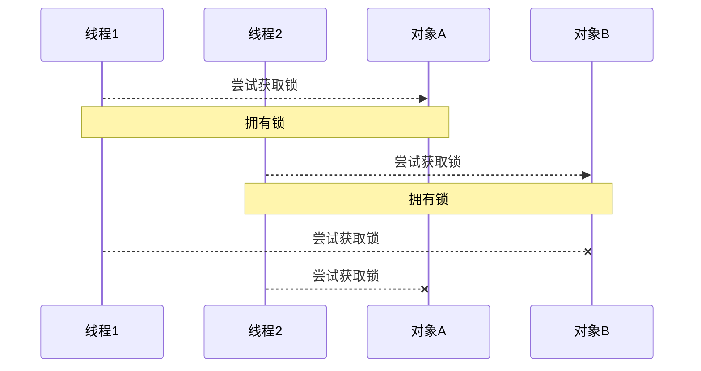

可以通过顺序加锁的方式解决

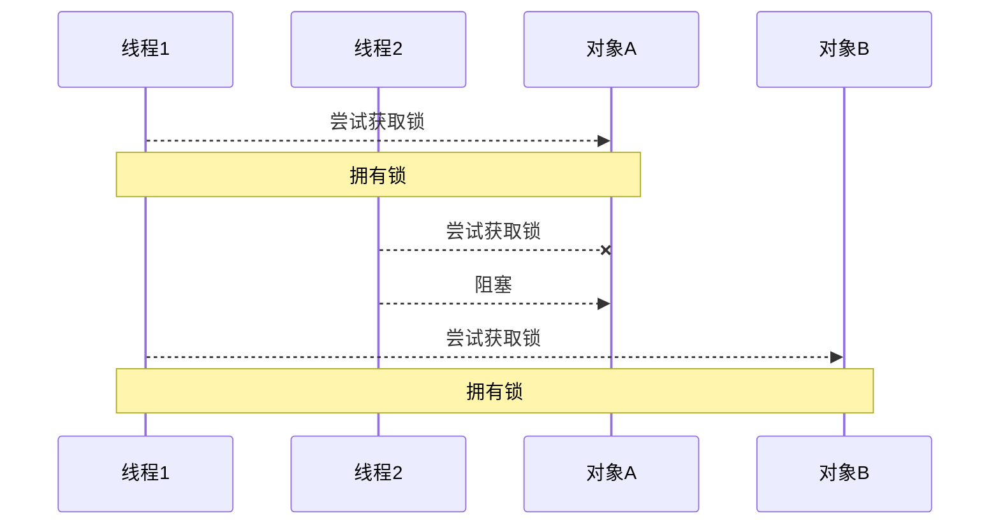

# ReentrantLock

相对于 synchronized 它具备如下特点 

- 可中断，而 synchronized 不可中断。 
- 可以设置超时时间 
- 可以设置为公平锁 
- 支持多个条件变量 

与 synchronized 一样，都支持可重入 基本语法如下：

```java
// 获取锁
reentrantLock.lock();
try {
 // 临界区
} finally {
 // 释放锁
 reentrantLock.unlock();
}
```

## 可重入

可重入是指同一个线程如果首次获得了这把锁，那么因为它是这把锁的拥有者，因此有权利再次获取这把锁。如果是不可重入锁，那么第二次获得锁时，自己也会被锁挡住。

```java
package monitor.reentrant;

import java.util.concurrent.locks.ReentrantLock;

public class ReentrantDemo {
    static ReentrantLock lock = new ReentrantLock();

    public static void main(String[] args) {
        ReentrantDemo re = new ReentrantDemo();
        Thread th = new Thread(() -> {
            re.m1();
        });
        th.start();
    }

    public void m1() {
        try {
            lock.lock();
            System.out.println("m1");
            m2();
        } finally {
            lock.unlock();
        }
    }

    public void m2() {
        try {
            lock.lock();
            System.out.println("m2");
        } finally {
            lock.unlock();
        }
    }
}
```

## 可打断

注意如果是不可中断模式，那么即使使用了 interrupt 也不会让等待中断。可打断可以避免死等，死等了，那就打断它！（被动避免死等）

```java
package monitor.reentrant;

import java.util.concurrent.TimeUnit;
import java.util.concurrent.locks.ReentrantLock;

public class InterruptiblyDemo {
    public static void main(String[] args) {
        ReentrantLock lock = new ReentrantLock();
        Thread th = new Thread(() -> {
            try {
                lock.lockInterruptibly();
                TimeUnit.SECONDS.sleep(5);
            } catch (Exception e) {
                System.out.println("被打断的 Exception");
            } finally {
                lock.unlock();
            }
        });
        th.start();
        // 打断 lock 锁
        th.interrupt();
    }
}
```

## 锁超时

主动避免死等。tryLock 尝试获得锁，获取不到就放弃等待。注意：tryLock不会引起当前线程阻塞，所以如果 tryLock 返回 false 我们可以直接退出获取锁的代码，从而避免死锁 <span style="color:red">**tryLock 感觉要看看书，他讲的我有些东西还是不明白**</span>

```java
package monitor.reentrant;

import lombok.extern.slf4j.Slf4j;

import java.util.concurrent.locks.ReentrantLock;

@Slf4j(topic = "c.TryLockDemo")
public class TryLockDemo {
    public static void main(String[] args) {
        ReentrantLock lock = new ReentrantLock();
        Thread th = new Thread(() -> {
            try {
                if (!lock.tryLock()) {
                    log.debug("拿不到锁");
                    return;
                }
                log.debug("获取到了锁");
            } finally {
                lock.unlock();
            }
        }, "线程1");
        Thread th2 = new Thread(() -> {
            try {
                if (!lock.tryLock()) {
                    log.debug("拿不到锁");
                    return;
                }
                log.debug("获取到了锁");
            } finally {
                lock.unlock();
            }
        }, "线程2");
        th.start();
        th2.start();
    }
}
```

## 哲学家就餐

使用 ReentrantLock 实现哲学家就餐。

```java
package application;

import lombok.extern.slf4j.Slf4j;

import java.util.concurrent.TimeUnit;
import java.util.concurrent.locks.ReentrantLock;

public class PhilosopherDinner {
    public static void main(String[] args) {
        Chopstick c1 = new Chopstick("1");
        Chopstick c2 = new Chopstick("2");
        Chopstick c3 = new Chopstick("3");
        Chopstick c4 = new Chopstick("4");
        Chopstick c5 = new Chopstick("5");
        new Philosopher("A", c1, c2).start();
        new Philosopher("B", c2, c3).start();
        new Philosopher("C", c3, c4).start();
        new Philosopher("D", c4, c5).start();
        new Philosopher("E", c5, c1).start();
    }
}

@Slf4j(topic = "c.Philosopher")
class Philosopher extends Thread {
    private String name;
    Chopstick left, right;

    public Philosopher(String name, Chopstick left, Chopstick right) {
        this.name = name;
        this.left = left;
        this.right = right;
    }

    public void sleeper() {
        try {
            TimeUnit.SECONDS.sleep(1);
        } catch (InterruptedException e) {
            e.printStackTrace();
        }
    }

    @Override
    public void run() {
        while (true) {
            // 尝试获取左手筷子
            if (left.tryLock()) {
                try {
                    if (right.tryLock()) {// 成功获取到了到时候需要释放锁
                        try {
                            eat();
                            this.sleeper();
                        } finally {
                            right.tryLock();
                        }
                    }
                } finally {
                    left.unlock();
                }
            }
        }
    }

    public void eat() { log.debug("哲学家 {} 吃饭", name); }

}

class Chopstick extends ReentrantLock {
    private String name;

    public Chopstick(String name) {
        this.name = name;
    }

    @Override
    public String toString() {
        return "Chopstick{" + "name='" + name + '\'' + '}';
    }
}
```

## 公平锁

ReentrantLock 默认是不公平的。

```java
// fair 默认是 false，非公平锁。
public ReentrantLock(boolean fair) {
    sync = fair ? new FairSync() : new NonfairSync();
}
```

公平锁本意是为了解决饥饿，但是公平锁的维护需要一定的成本，降低并发度，所以一般用非公平锁。

## 条件变量

synchronized 中也有条件变量，就是我们讲原理时那个 waitSet 休息室，当条件不满足时进入 waitSet 等待 

ReentrantLock 的条件变量比 synchronized 强大之处在于，它是支持多个条件变量的，这就好比 

- synchronized 是那些不满足条件的线程都在一间休息室等消息 
- 而 ReentrantLock 支持多间休息室，有专门等烟的休息室、专门等早餐的休息室、唤醒时也是按休息室来唤 醒 

使用要点： 

- await 前需要获得锁 
- await 执行后，会释放锁，进入 conditionObject 等待 
- await 的线程被唤醒（或打断、或超时）取重新
- 竞争 lock 锁 竞争 lock 锁成功后，从 await 后继续执行

# 同步模式-顺序控制

## 固定运行顺序

比如，必须先 2 后 1 打印

```java
// 先打印2，在打印1
@Slf4j(topic = "c.GuDingShunXu01")
public class GuDingShunXu01 {
    // 表示 t2 是否运行过
    static volatile boolean t2Run = false;

    public static void main(String[] args) {
        Thread th1 = new Thread(() -> {
            while (!t2Run) ;
            log.debug("1");
        }, "th1");
        Thread th2 = new Thread(() -> {
            log.debug("2");
            t2Run = true;
        }, "th2");
        th2.start();
        th1.start();
    }
}
```

### wait/notify

```java
// 先打印2，在打印1
@Slf4j(topic = "c.GuDingShunXu01")
public class GuDingShunXu01 {
    static Object lock = new Object();
    // 表示 t2 是否运行过
    static boolean t2Run = false;

    public static void main(String[] args) {
        Thread th1 = new Thread(() -> {
            synchronized (lock) {
                while (!t2Run) {
                    try {
                        lock.wait();
                    } catch (InterruptedException e) {
                        e.printStackTrace();
                    }
                }
            }
            log.debug("1");
        }, "th1");
        Thread th2 = new Thread(() -> {
            synchronized (lock) {
                log.debug("2");
                t2Run = true;
                lock.notifyAll();
            }
        }, "th2");
        th2.start();
        th1.start();
    }
}
```

### park/unpark

可以看到，实现上很麻烦： 

- 首先，需要保证先 wait 再 notify，否则 wait 线程永远得不到唤醒。因此使用了『运行标记』来判断该不该 wait 
- 第二，如果有些干扰线程错误地 notify 了 wait 线程，条件不满足时还要重新等待，使用了 while 循环来解决 此问题 
- 最后，唤醒对象上的 wait 线程需要使用 notifyAll，因为『同步对象』上的等待线程可能不止一个 

可以使用 LockSupport 类的 park 和 unpark 来简化上面的题目：

```java
// 先打印2，在打印1
@Slf4j(topic = "c.GuDingShunXu02")
public class GuDingShunXu02 {

    public static void main(String[] args) throws InterruptedException {
        Thread th1 = new Thread(() -> {
            LockSupport.park();
            log.debug("1");
        });
        Thread th2 = new Thread(() -> {
            log.debug("2");
            LockSupport.unpark(th1);
        });

        th1.start();
        TimeUnit.SECONDS.sleep(2);
        th2.start();
    }
}
```

park 和 unpark 方法比较灵活，他俩谁先调用，谁后调用无所谓。并且是以线程为单位进行『暂停』和『恢复』， 不需要『同步对象』和『运行标记』

## 交替输出

线程 1 输出 a 5 次，线程 2 输出 b 5 次，线程 3 输出 c 5 次。现在要求输出 abcabcabcabcabc 怎么实现

```java
/**
 * 线程 1 输出 a 5 次，线程 2 输出 b 5 次，线程 3 输出 c 5 次。现在要求输出 abcabcabcabcabc
 */
@Slf4j(topic = "c.AlternateDemo")
public class AlternateDemo {
    static Object lock = new Object();

    public static void main(String[] args) {
        new PrintThread(lock).start();
        new PrintThread(lock).start();
        new PrintThread(lock).start();
    }
}

class PrintThread extends Thread {
    private Object lock;
    private static int flag = 0;

    public PrintThread(Object lock) {
        this.lock = lock;
    }

    @Override
    public void run() {
        for (int i = 0; i < 5; i++) {
            synchronized (lock) {
                if (flag == 0) {
                    System.out.print("a");
                } else if (flag == 1) {
                    System.out.print("b");
                } else if (flag == 2) {
                    System.out.print("c");
                }
                flag = (flag + 1) % 3;
            }
        }
    }
}
```

### wait/notify

自己写。业务和线程分离。

### Lock 条件变量版

自己写。业务和线程分离。

### park/unpark 版

# 小结

本章我们需要重点掌握的是 

- 分析多线程访问共享资源时，哪些代码片段属于临界区 
- 使用 synchronized 互斥解决临界区的线程安全问题 
  - 掌握 synchronized 锁对象语法 
  - 掌握 synchronzied 加载成员方法和静态方法语法 
  - 掌握 wait/notify 同步方法 
- 使用 lock 互斥解决临界区的线程安全问题 
  - 掌握 lock 的使用细节：可打断、锁超时、公平锁、条件变量 
- 学会分析变量的线程安全性、掌握常见线程安全类的使用 
- 了解线程活跃性问题：死锁、活锁、饥饿 
- 应用方面 
  - 互斥：使用 synchronized 或 Lock 达到共享资源互斥效果 
  - 同步：使用 wait/notify 或 Lock 的条件变量来达到线程间通信效果 
- 原理方面 
  - monitor、synchronized 、wait/notify 原理 
  - synchronized 进阶原理 
  - park & unpark 原理 
- 模式方面 
  - 同步模式之保护性暂停 
  - 异步模式之生产者消费者 
  - 同步模式之顺序控制

