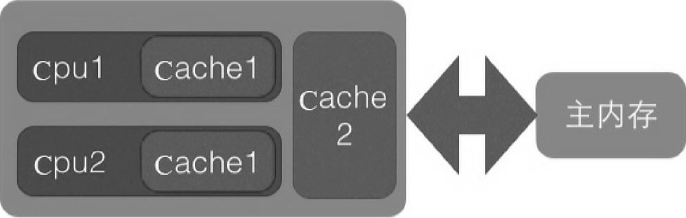
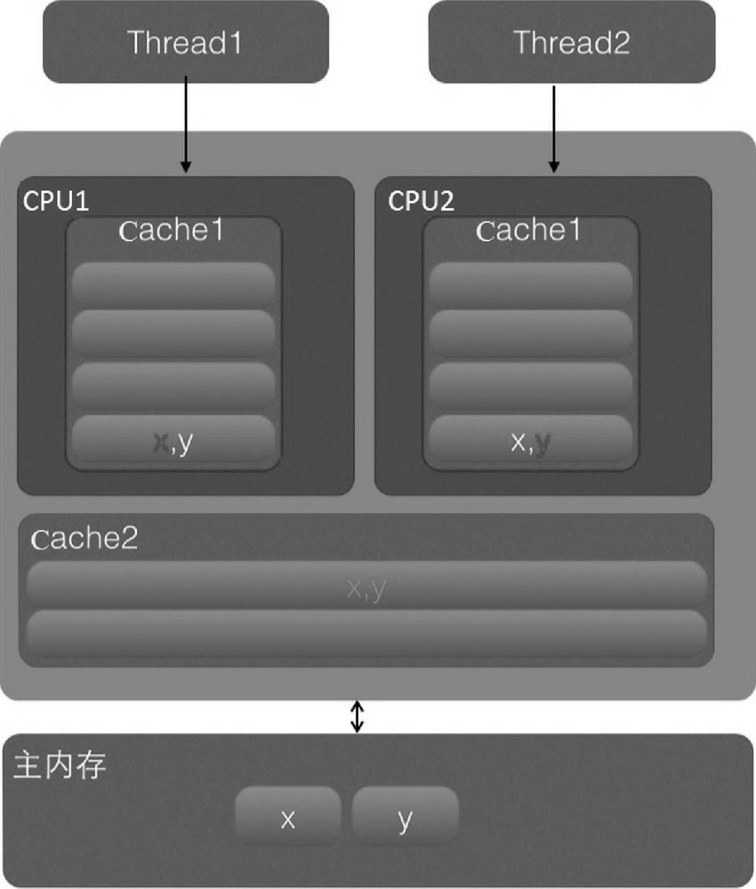

# 共享模型之内存

> 本章内容 

上一章讲解的 Monitor 主要关注的是访问共享变量时，保证临界区代码的原子性，这一章我们进一步深入学习共享变量在多线程间的【可见性】问题与多条指令执行时的【有序性】问题。

# 内存模型

JMM 即 Java Memory Model，它定义了主存、工作内存抽象概念，底层对应着 CPU 寄存器、缓存、硬件内存、 CPU 指令优化等。 

JMM 体现在以下几个方面 

- 原子性 - 保证指令不会受到线程上下文切换的影响 
- 可见性 - 保证指令不会受 CPU 缓存的影响 
- 有序性 - 保证指令不会受 CPU 指令并行优化的影响

# 可见性

## 退不出的循环

先来看一个现象，main 线程对 run 变量的修改**对于 t 线程来说是不可见**，这导致了 t 线程无法探测到 run 变量的修改，也就无法停止了：

```java
package jmm;

import java.util.concurrent.TimeUnit;

public class UnableBreak {
    static boolean run = true;

    public static void main(String[] args) throws InterruptedException {
        Thread t = new Thread(() -> {
            while (run) {
                // ....
            }
        });
        t.start();
        TimeUnit.SECONDS.sleep(1);
        run = false; // 线程t不会如预想的停下来
    }
}
```

为什么呢？分析一下： 

初始状态， t 线程刚开始从主内存读取了 run 的值到工作内存。


因为 t 线程要频繁从主内存中读取 run 的值，JIT 编译器会将 run 的值缓存至自己工作内存中的高速缓存中（编译成机器码，将机器码缓村，底层用的 CPU 的高速缓存，即 Cache）实际上是优化成了 **if run while(true)**， 减少对主存中 run 的访问，提高效率。


1 秒之后，main 线程修改了 run 的值，并同步至主存，而 t 是从自己工作内存中的高速缓存中读取这个变量的值，结果永远是旧值


怎么可以让他停下来：

- while(true) 里休眠，这样就不会触发  JIT 缓存了。
- 用 VM 参数 -Xint 解释器，也会停止运行（是 JIT 热点代码的原因？）
- while(true) 里随便加一个打印语句。

## 解决办法

volatile（易变关键字） 

**它可以用来修饰成员变量和静态成员变量**，<span style="color:green">**他可以避免线程从自己的工作缓存中查找变量的值**</span>，必须到主存中获取它的值，线程操作 volatile 变量都是直接操作主存。

## 可见性VS原子性

前面例子体现的实际就是可见性，它保证的是在多个线程之间，一个线程对 volatile 变量的修改对另一个线程可 见， 不能保证原子性，仅用在一个写线程，多个读线程的情况： 上面这个例从字节码角度理解是这样的：

```shell
getstatic run // 线程 t 获取 run true 
getstatic run // 线程 t 获取 run true 
getstatic run // 线程 t 获取 run true 
getstatic run // 线程 t 获取 run true 
putstatic run // 线程 main 修改 run 为 false， 仅此一次
getstatic run // 线程 t 获取 run false 
```

比较一下之前我们将线程安全时举的例子：两个线程一个 i++ 一个 i-- ，只能保证看到最新值，不能解决指令交错

```shell
// 假设i的初始值为0 
getstatic i // 线程2-获取静态变量i的值 线程内i=0 
getstatic i // 线程1-获取静态变量i的值 线程内i=0 
iconst_1 // 线程1-准备常量1 
iadd // 线程1-自增 线程内i=1 
putstatic i // 线程1-将修改后的值存入静态变量i 静态变量i=1 
iconst_1 // 线程2-准备常量1 
isub // 线程2-自减 线程内i=-1 
putstatic i // 线程2-将修改后的值存入静态变量i 静态变量i=-1 
```

注意 synchronized 语句块既可以保证代码块的原子性，也同时保证代码块内变量的可见性。但缺点是 synchronized 是属于重量级操作，性能相对更低 

如果在前面示例的死循环中加入 System.out.println() 会发现即使不加 volatile 修饰符，线程 t 也能正确看到 对 run 变量的修改了，想一想为什么？

> **sout 源码**，加了锁，对当前对象加了锁。

synchronized 对一个类或对象加锁时，一个线程如果要访问该类或对象必须先获得它的锁，而这个锁的状态对于其他任何线程都是可见的，并且在释放锁之前会将对变量的修改刷新到主存当中，保证资源变量的可见性。锁了当前对象，所以<span style="color:red">**当前对象变量的更改在释放锁之前会刷新到主存中**</span>，而 sync 保证了可见性<span style="color:green">**【可见性就是，被那两个修饰的变量，会强制从公共内存读取变量的值。】**</span>

```java
private void newLine() {
    try {
        synchronized (this) {
            ensureOpen();
            textOut.newLine();
            textOut.flushBuffer();
            charOut.flushBuffer();
            if (autoFlush)
                out.flush();
        }
    }
    catch (InterruptedIOException x) {
        Thread.currentThread().interrupt();
    }
    catch (IOException x) {
        trouble = true;
    }
}
```

## 原理-CPU缓存结构

为了解决计算机系统中主内存与 CPU 之间运行速度差问题，会在 CPU 与主内存之间添加一级或者多级高速缓冲存储器（Cache）。这个 Cache 一般是被集成到 CPU 内部的，所以也叫 CPU Cache。



在 Cache 内部是按行存储的，其中每一行称为一个 Cache 行。Cache 行是 Cache 与主内存进行数据交换的单位，Cache 行的大小一般为 2 的幂次数字节。


当 CPU 访问某个变量时，首先会去看 CPU Cache 内是否有该变量，如果有则直接从中获取，否则就去主内存里面获取该变量，然后把该变量所在内存区域的一个 Cache 行大小的内存复制到 Cache 中。<span style="color:red">由于存放到 Cache行的是内存块而不是单个变量，所以可能会把多个变量存放到一个 Cache 行中。</span><span style="color:green">当多个线程同时修改一个缓存行里面的多个变量时，由于同时只能有一个线程操作缓存行，所以相比将每个变量放到一个缓存行，性能会有所下降，这就是伪共享。</span>



在该图中，变量 x 和 y 同时被放到了 CPU 的一级和二级缓存，当线程 1 使用 CPU1 对变量 x 进行更新时，首先会修改 CPU1 的一级缓存变量 x 所在的缓存行，这时候在缓存一致性协议下，CPU2 中变量 x 对应的缓存行失效。那么线程2在写入变量 x 时就只能去二级缓存里查找，这就破坏了一级缓存。而一级缓存比二级缓存更快，这也说明了多个线程不可能同时去修改自己所使用的 CPU 中相同缓存行里面的变量。更坏的情况是，如果 CPU 只有一级缓存，则会导致频繁地访问主内存。

<span style="color:green">**JDK 8提供了一个sun.misc.Contended注解，用来解决伪共享问题。**</span>

注意：<span style="color:red">在默认情况下，@Contended注解只用于 Java 核心类，比如 rt 包下的类</span>。如果用户类路径下的类需要使用这个注解，则需要添加JVM参数：**-XX:-RestrictContended**。填充的宽度默认为128，要自定义宽度则可以设置**-XX:ContendedPaddingWidth**参数。

先前版本的 Netty 就是采用填充对齐的方式解决伪共享。

## 模式之两阶段终止

用 volatile 实现

```java
package application;

import lombok.extern.slf4j.Slf4j;

import java.util.concurrent.TimeUnit;

/**
 * 两阶段终止模式。日志监控 Demo
 */
@Slf4j(topic = "c.TwoPhaseTermination")
public class TwoPhaseTermination2 {
    public static void main(String[] args) throws InterruptedException {
        TwoPhaseTermination2 twoPhaseTermination = new TwoPhaseTermination2();
        twoPhaseTermination.start();
        TimeUnit.SECONDS.sleep(10);
        twoPhaseTermination.stop();
    }

    private volatile boolean stop = false;

    public void stop() {
        stop = true;
    }

    public void start() {
        new Thread(() -> {
            log.debug("start logging~~");
            Thread current = Thread.currentThread();
            while (true) {
                if (stop) {
                    log.debug("over！");
                    return;
                }
                try {
                    TimeUnit.SECONDS.sleep(2);
                    log.debug("start logging~~");
                } catch (InterruptedException e) {
                    // 睡眠过程中被打断。会走 exception。然后将打断标记置为  true。打断完一次 sleep 后再打断就是打断正常线程了。
                    current.interrupt();
                    log.debug("料理后事");
                    e.printStackTrace();
                }
            }
        }).start();
    }
}
```

## 模式之  Balking

犹豫模式；Balking （犹豫）模式用在一个线程发现另一个线程或本线程已经做了某一件相同的事，那么本线程就无需再做 了，直接结束返回；

对比一下保护性暂停模式：保护性暂停模式用在一个线程等待另一个线程的执行结果，当条件不满足时线程等待。

### 示例

保证监控模式只启动一次

```java
package application;

import lombok.extern.slf4j.Slf4j;

import java.util.concurrent.TimeUnit;

public class Balking {
    public static void main(String[] args) throws InterruptedException {
        MyBalking myBalking = new MyBalking();
        myBalking.start();
        myBalking.start();
        TimeUnit.SECONDS.sleep(5);
        myBalking.stop();
    }
}

@Slf4j(topic = "c.MyBalking")
class MyBalking {
    private Thread monitor;
    private boolean first = true;

    public void stop() {
        monitor.interrupt();
    }

    // 执行监控
    public void start() {
        synchronized (this) {
            if (!first) {
                log.debug("已经开启过了！！");
                return;
            }
            first = false;
        }
        monitor = new Thread(() -> {
            Thread current = Thread.currentThread();

            while (true) {
                if (current.isInterrupted()) {
                    log.debug("over!");
                    return;
                }
                try {
                    TimeUnit.SECONDS.sleep(2);
                    log.debug("开始监控！！");
                } catch (InterruptedException e) {
                    current.interrupt();
                    log.debug("处理杂事");
                    e.printStackTrace();
                }
            }
        });
        monitor.start();
    }
}
```

### 应用

# 有序性

JVM 会在不影响正确性的前提下，可以调整语句的执行顺序，思考下面一段代码

```java
static int i;
static int j;
// 在某个线程内执行如下赋值操作
i = ...; 
j = ...; 
```

可以看到，至于是先执行 i 还是 先执行 j ，对最终的结果不会产生影响。所以，上面代码真正执行时，既可以是

```shell
i = ...; 
j = ...;
```

也可以是

```java
j = ...;
i = ...; 
```

这种特性称之为『指令重排』，多线程下『指令重排』会影响正确性。为什么要有重排指令这项优化呢？从 CPU 执行指令的原理来理解一下吧

## 原理-指令级并行

### 名词

#### Clock Cycle Time

 CPU 的 Clock Cycle Time（时钟周期时间），等于主频的倒数，意思是 CPU 能 够识别的最小时间单位，比如说 4G 主频的 CPU 的 Clock Cycle Time 就是 0.25 ns，作为对比，我们墙上挂钟的 Cycle Time 是 1s 

例如，运行一条加法指令一般需要一个时钟周期时间 

#### CPI 

有的指令需要更多的时钟周期时间，所以引出了 CPI （Cycles Per Instruction）指令平均时钟周期数 

#### IPC 

IPC（Instruction Per Clock Cycle） 即 CPI 的倒数，表示每个时钟周期能够运行的指令数 

#### CPU 执行时间 

程序的 CPU 执行时间，即我们前面提到的 user + system 时间，可以用下面的公式来表示 ：$程序CPU执行时间 = 指令数 * CPI * Clock \ Cycle \ Time $

### 指令重排序优化

现代处理器会设计为一个时钟周期完成一条执行时间最长的 CPU 指令。为什么这么做呢？可以想到指令 还可以再划分成一个个更小的阶段，例如，每条指令都可以分为： 

<span style="color:green">**取指令 - 指令译码 - 执行指令 - 内存访问 - 数据 写回 这 5 个阶段**</span>


术语参考： 

- instruction fetch (IF) 
- instruction decode (ID) 
- execute (EX) 
- memory access (MEM) 
- register write back (WB)

在不改变程序结果的前提下，这些指令的各个阶段可以通过重排序和组合来实现指令级并行，这一技术在 80's 中 叶到 90's 中叶占据了计算架构的重要地位。

**提示：** 分阶段，分工是提升效率的关键

指令重排的前提是，重排指令不能影响结果，例如

```java
// 可以重排的例子
int a = 10; // 指令1
int b = 20; // 指令2
System.out.println( a + b );
// 不能重排的例子
int a = 10; // 指令1
int b = a - 5; // 指令2
```

参考： Scoreboarding and the Tomasulo algorithm (which is similar to scoreboarding but makes use of register renaming) are two of the most common techniques for implementing out-of-order execution and instruction-level parallelism.

### 支持流水线的处理器

现代 CPU 支持**多级指令流水线**，例如支持同时执行 **取指令 - 指令译码 - 执行指令 - 内存访问 - 数据写回**的处理器，就可以称之为**五级指令流水线**。这时 CPU 可以在一个时钟周期内，同时运行五条指令的不同阶段（相当于一 条执行时间最长的复杂指令），IPC = 1，本质上，**流水线技术并不能缩短单条指令的执行时间，但它变相地提高了 指令地吞吐率。**

**提示：** 奔腾四（Pentium 4）支持高达 35 级流水线，但由于功耗太高被废弃


###  SuperScalar 处理器

大多数处理器包含多个执行单元，并不是所有计算功能都集中在一起，可以再细分为整数运算单元、浮点数运算单元等，这样可以把多条指令也可以做到并行获取、译码等，CPU 可以在一个时钟周期内，执行多于一条指令，IPC > 1

## 诡异的结果

```java
package jvm.concurrence;

public class Demo2 {
    int num = 0;
    boolean ready = false;

    // 线程1 执行此方法
    public void actor1(I_Result r) {
        if (ready) {
            r.r1 = num + num;
        } else {
            r.r1 = 1;
        }
    }

    // 线程2 执行此方法
    public void actor2(I_Result r) {
        num = 2;
        ready = true;
    }
}
```

I_Result 是一个对象，有一个属性 r1 用来保存结果，问，可能的结果有几种？ 

有同学这么分析 

情况1：线程1 先执行，这时 ready = false，所以进入 else 分支结果为 1 

情况2：线程2 先执行 num = 2，但没来得及执行 ready = true，线程1 执行，还是进入 else 分支，结 果为1 

情况3：线程2 执行到 ready = true，线程1 执行，这回进入 if 分支，结果为 4（因为 num 已经执行过 了）

**结果还可能是0，原因是指令重排序**，是 JIT 编译器在运行时的一些优化，这个现象需要通过大量测试才能复现： 借助 java 并发压测工具 jcstress https://wiki.openjdk.java.net/display/CodeTools/jcstress

创建 maven 项目，导入maven 依赖，并提供如下测试类。

```xml
<dependencies>
    <!-- jcstress 核心包 -->
    <dependency>
        <groupId>org.openjdk.jcstress</groupId>
        <artifactId>jcstress-core</artifactId>
        <version>0.3</version>
    </dependency>
    <!-- jcstress测试用例包 -->
    <dependency>
        <groupId>org.openjdk.jcstress</groupId>
        <artifactId>jcstress-samples</artifactId>
        <version>0.3</version>
    </dependency>
</dependencies>
```

----

```java
package jvm.concurrence;

import org.openjdk.jcstress.annotations.*;
import org.openjdk.jcstress.infra.results.I_Result;

@JCStressTest
// 检查感兴趣的结果。如果结果是 1 和 4 那么分类为 Expect.ACCEPTABLE
@Outcome(id = {"1", "4"}, expect = Expect.ACCEPTABLE, desc = "ok")
@Outcome(id = "0", expect = Expect.ACCEPTABLE_INTERESTING, desc = "!!!!")
@State
public class ConcurrencyTest {
    int num = 0;
    boolean ready = false;

    @Actor
    public void actor1(I_Result r) {
        if (ready) {
            r.r1 = num + num;
        } else {
            r.r1 = 1;
        }
    }

    @Actor
    public void actor2(I_Result r) {
        num = 2;
        ready = true;
    }
}
```

> maven 方式执行

```shell
mvn clean install
java -jar target/jcstress.jar
```

会输出我们感兴趣的结果，摘录其中一次结果：

```shell
*** INTERESTING tests
Some interesting behaviors observed. This is for the plain curiosity.
2 matching test results.
[OK] test.ConcurrencyTest
(JVM args: [-XX:-TieredCompilation])
Observed state Occurrences Expectation Interpretatio
```

可以看到，出现结果为 0 的情况有 638 次，虽然次数相对很少，但毕竟是出现了。

> IDEA 配置方式执行

配置程序的主类，org.openjdk.jcstress.Main 是 JCStress 自带的一个启动类；然后可以配置 -t 参数设置需要测试的类，当然 -t 后面也可以指定包名，表示执行指定包下的所有测试类。如果不指定 -t 参数，默认会扫描项目下所有包的类。


```shell
Observed state   Occurrences        Expectation  		Interpretation                                              
  0			       89,788   	ACCEPTABLE_INTERESTING  	!!!!                                                        
  1   			141,923,559			ACCEPTABLE  			ok                                                          
  4    			60,659,403			ACCEPTABLE  			ok 
```

0 这个结果出现了 89788 次。加上 volatile 就不会受指令重排序的影响了。

## 解决办法

volatile 修饰的变量，可以禁用指令重排

```java
package jvm.concurrence;

import org.openjdk.jcstress.annotations.*;
import org.openjdk.jcstress.infra.results.I_Result;

@JCStressTest
// 检查感兴趣的结果。如果结果是 1 和 4 那么分类未 Expect.ACCEPTABLE
@Outcome(id = {"1", "4"}, expect = Expect.ACCEPTABLE, desc = "ok")
@Outcome(id = "0", expect = Expect.ACCEPTABLE_INTERESTING, desc = "!!!!")
@State
public class ConcurrencyTest {
    int num = 0;
    boolean volatile ready = false;

    @Actor
    public void actor1(I_Result r) {
        if (ready) {
            r.r1 = num + num;
        } else {
            r.r1 = 1;
        }
    }

    @Actor
    public void actor2(I_Result r) {
        num = 2;
        // ready 加了就可以。ready 在下面，num 在上面，在ready 加了 volatile 可以防止它之前的代码被重排序。（加了一个写屏障）
        ready = true;
    }
}
```

> DCL

```java
public final class Singleton {
    private Singleton() { }
    private static Singleton INSTANCE = null;
    public static Singleton getInstance() {
        // 实例没创建，才会进入内部的 synchronized代码块
        if (INSTANCE == null) {
        	synchronized (Singleton.class) {
        		// 也许有其它线程已经创建实例，所以再判断一次
        		if (INSTANCE == null) {
        			INSTANCE = new Singleton();
        		}
        	}
        }
        return INSTANCE;
    }
}
```

以上的实现特点是： 

- 懒惰实例化 
- 首次使用 getInstance() 才使用 synchronized 加锁，后续使用时无需加锁 

但在多线程环境下，上面的代码是有问题的， INSTANCE = new Singleton() 对应的字节码为：

```shell
17: new           #3                  // class jvm/concurrence/DCL
20: dup
21: invokespecial #4                  // Method "<init>":()V
24: putstatic     #2                  // Field INSTANCE:Ljvm/concurrence/DCL;
```

21 和 24 的执行顺序是不确定的，也许 jvm 会优化为：先将引用地址赋值给 INSTANCE 变量后，再执行构造方法，如果两个线程 t1，t2 按如下时间序列执行：

- **时间1**==> t1 线程执行到 INSTANCE = new Singleton();
- **时间2**==> t1 线程分配空间，为Singleton对象生成了引用地址（0 处）
- **时间3**==> t1 线程将引用地址赋值给 INSTANCE，这时 INSTANCE != null（7 处）
- **时间4**==> t2 线程进入getInstance() 方法，发现 INSTANCE != null（synchronized块外），直接返回 INSTANCE
- **时间5**==> t1 线程执行Singleton的构造方法（4 处）

这时 t1 还未完全将构造方法执行完毕，如果在构造方法中要执行很多初始化操作，那么 t2 拿到的是将是一个未初始化完毕的单例。

对 INSTANCE 使用 volatile 修饰即可禁用指令重排，但要注意在 JDK 5 以上的版本的 volatile 才 会真正有效

## happens-before

看并发编程的艺术这本书。

happens-before 规定了哪些写操作对其它线程的读操作可见，它是可见性与有序性的一套规则总结， 抛开以下 happens-before 规则，JMM 并不能保证一个线程对共享变量的写，对于其它线程对该共享变量的读可见

- 线程解锁 m 之前对变量的写，对于接下来对 m 加锁的其它线程对该变量的读可见

```java
static int x;
static Object m = new Object();
new Thread(()->{
    synchronized(m) {
    	x = 10;
    }
},"t1").start();
new Thread(()->{
    synchronized(m) {
    	System.out.println(x);
    }
},"t2").start();
```

- 线程对 volatile 变量的写，对接下来其它线程对该变量的读可见

```java
volatile static int x;
new Thread(()->{
    x = 10;
},"t1").start();
new Thread(()->{
    System.out.println(x);
},"t2").start();
```

# volatile

volatile 的底层实现原理是内存屏障，Memory Barrier（Memory Fence） 

- 对 volatile 变量的写指令后会加入写屏障 
- 对 volatile 变量的读指令前会加入读屏障

## 如何保证可见性

- 写屏障（sfence）保证在该屏障之前的，对共享变量的改动，都同步到主存当中

```java
public void actor2(I_Result r) {
    num = 2;
    ready = true; // ready 是 volatile 赋值带写屏障
    // 写屏障
}
```

- 而读屏障（lfence）保证在该屏障之后，对共享变量的读取，加载的是主存中最新数据；【读之前，会设置一个读屏障，读屏障保证，读屏障之后的读取代码都是从主存中读数据，不会从工作内存中读了。】

```java
public void actor1(I_Result r) {
    // 读屏障
    // ready 是 volatile 读取值带读屏障
    if(ready) {
        r.r1 = num + num;
    } else {
        r.r1 = 1;
    }
}
```


## 如何保证有序性

- 写屏障会确保指令重排序时，不会将写屏障之前的代码排在写屏障之后。【不会将写屏障前面的代码 重排到 s写屏障后面】

```java
public void actor2(I_Result r) {
    num = 2;
    ready = true; // ready 是 volatile 赋值带写屏障
    // 写屏障
}
```

- 读屏障会确保指令重排序时，不会将读屏障之后的代码排在读屏障之前

```java
public void actor1(I_Result r) {
    // 读屏障
    // ready 是 volatile 读取值带读屏障
    if(ready) {
        r.r1 = num + num;
    } else {
        r.r1 = 1;
    }
}
```


还是那句话，不能解决指令交错： 

- 写屏障仅仅是保证之后的读能够读到最新的结果，但不能保证读跑到它前面去 
- 而有序性的保证**也只是保证了本线程内相关代码不被重排序**

## double-checked locking

synchronized 不能阻止重排序，volatile 才能阻止重排序。但是，如果变量完全被 sync 包裹了，它是不会发生原子、有序、可见性问题。

重排序是，代码串行的结果和不排序的结果是一样的。

```java
public final class Singleton {
    private Singleton() { }
    private static Singleton INSTANCE = null;
    public static Singleton getInstance() { 
        if(INSTANCE == null) { // t2
            // 首次访问会同步，而之后的使用没有 synchronized
            synchronized(Singleton.class) {
                if (INSTANCE == null) { // t1
                    INSTANCE = new Singleton();
                } 
            }
        }
        return INSTANCE;
    }
}
```

以上的实现特点是： 

- 懒惰实例化 
- 首次使用 getInstance() 才使用 synchronized 加锁，后续使用时无需加锁 
- 有隐含的，但很关键的一点：第一个 if 使用了 INSTANCE 变量，是在同步块之外

但在多线程环境下，上面的代码是有问题的，getInstance 方法对应的字节码为：

```shell
0: getstatic #2 // Field INSTANCE:Lcn/itcast/n5/Singleton;
3: ifnonnull 37
6: ldc #3 // class cn/itcast/n5/Singleton
8: dup
9: astore_0
10: monitorenter
11: getstatic #2 // Field INSTANCE:Lcn/itcast/n5/Singleton;
14: ifnonnull 27
17: new #3 // class cn/itcast/n5/Singleton
20: dup
21: invokespecial #4 // Method "<init>":()V
24: putstatic #2 // Field INSTANCE:Lcn/itcast/n5/Singleton;
27: aload_0
28: monitorexit
29: goto 37
32: astore_1
33: aload_0
34: monitorexit
35: aload_1
36: athrow
37: getstatic #2 // Field INSTANCE:Lcn/itcast/n5/Singleton;
40: areturn
```

其中 

- 17 表示创建对象，将对象引用入栈 // new Singleton 
- 20 表示复制一份对象引用 // 引用地址 
- 21 表示利用一个对象引用，调用构造方法 
- 24 表示利用一个对象引用，赋值给 static INSTANCE 

也许 jvm 会优化为：先执行 24（赋值引用），再执行 21（初始化）。如果两个线程 t1，t2 按如下时间序列执行：


关键在于 0: getstatic 这行代码在 monitor 控制之外，它就像之前举例中不守规则的人，可以越过 monitor 读取 INSTANCE 变量的值 

这时 t1 还未完全将构造方法执行完毕，如果在构造方法中要执行很多初始化操作，那么 t2 拿到的是将是一个未初 始化完毕的单例 

对 INSTANCE 使用 volatile 修饰即可，可以禁用指令重排，但要注意在 JDK 5 以上的版本的 volatile 才会真正有效

## double-checked locking 解决

```java
public final class Singleton {
    private Singleton() { }
    private static volatile Singleton INSTANCE = null;
    public static Singleton getInstance() {
        // 实例没创建，才会进入内部的 synchronized代码块
        if (INSTANCE == null) { // 假设两个线程都 if 判定为空了。那么都会准备开始执行 synchronized 里面的代码
            synchronized (Singleton.class) { // t2
                // 也许有其它线程已经创建实例，所以再判断一次
                if (INSTANCE == null) { // t1
                    INSTANCE = new Singleton();
                }
            }
        }
        return INSTANCE;
    }
}
```

字节码上看不出来 volatile 指令的效果

```shell
// -------------------------------------> 加入对 INSTANCE 变量的读屏障
0: getstatic #2 // Field INSTANCE:Lcn/itcast/n5/Singleton;
3: ifnonnull 37
6: ldc #3 // class cn/itcast/n5/Singleton
8: dup
9: astore_0
10: monitorenter -----------------------> 保证原子性、可见性
11: getstatic #2 // Field INSTANCE:Lcn/itcast/n5/Singleton;
14: ifnonnull 27
17: new #3 // class cn/itcast/n5/Singleton
20: dup
21: invokespecial #4 // Method "<init>":()V
24: putstatic #2 // Field INSTANCE:Lcn/itcast/n5/Singleton;
// -------------------------------------> 加入对 INSTANCE 变量的写屏障
27: aload_0
28: monitorexit ------------------------> 保证原子性、可见性
29: goto 37
32: astore_1
33: aload_0
34: monitorexit
35: aload_1
36: athrow
37: getstatic #2 // Field INSTANCE:Lcn/itcast/n5/Singleton;
40: areturn
```

如上面的注释内容所示，读写 volatile 变量时会加入内存屏障（Memory Barrier（Memory Fence）），保证下面 两点： 

- 可见性 
  - 写屏障（sfence）保证在该屏障之前的 t1 对共享变量的改动，都同步到主存当中 
  - 而读屏障（lfence）保证在该屏障之后 t2 对共享变量的读取，加载的是主存中最新数据 
- 有序性 
  - 写屏障会确保指令重排序时，不会将写屏障之前的代码排在写屏障之后 
  - 读屏障会确保指令重排序时，不会将读屏障之后的代码排在读屏障之前 
- 更底层是读写变量时使用 lock 指令来多核 CPU 之间的可见性与有序性


# 习题

## balking 习题

希望 doInit() 方法仅被调用一次，下面的实现是否有问题，为什么？

```java
public class TestVolatile {
    volatile boolean initialized = false;
    void init() {
        if (initialized) { 
            return;
        } 
        doInit();
        initialized = true;
    }
    private void doInit() {
    }
} 
```

不对，volatile 只能保证可进行，不能保证执行的原子性。

## 线程安全单例习题 

单例模式有很多实现方法，饿汉、懒汉、静态内部类、枚举类，试分析每种实现下获取单例对象（即调用 getInstance）时的线程安全，并思考注释中的问题

- 饿汉式：类加载就会导致该单实例对象被创建 
- 懒汉式：类加载不会导致该单实例对象被创建，而是首次使用该对象时才会创建

> 实现1

反序列化破坏单例模式。反序列化的时候  JAVA 会调用 readResovle()，如果有这个方法的话。

```java
// 问题1：为什么加 final
// 问题2：如果实现了序列化接口, 还要做什么来防止反序列化破坏单例
public final class Singleton implements Serializable {
    // 问题3：为什么设置为私有? 是否能防止反射创建新的实例? 不能阻止。
    private Singleton() {
    }

    // 问题4：这样初始化是否能保证单例对象创建时的线程安全?  类加载阶段完成静态成员初始化，类加载的线程安全由JVM保证，所以是线程安全的。（类加载的时候有加锁？）
    private static final Singleton INSTANCE = new Singleton();

    // 问题5：为什么提供静态方法而不是直接将 INSTANCE 设置为 public, 说出你知道的理由
    // 提供更好的封装性，提供懒惰初始化。
    // 创建单例对象时有更多的控制
    // 可以提供泛型的支持
    public static Singleton getInstance() {
        return INSTANCE;
    }
    // 反序列化，如果发现了 readResolve 方法，就会采用你返回的对象，而不是用字节码生成的对象当结果
    public Object readResolve() {
        return INSTANCE;
    }
}
```

> 实现2

```java
// 问题1：枚举单例是如何限制实例个数的
// 问题2：枚举单例在创建时是否有并发问题
// 问题3：枚举单例能否被反射破坏单例
// 问题4：枚举单例能否被反序列化破坏单例
// 问题5：枚举单例属于懒汉式还是饿汉式
// 问题6：枚举单例如果希望加入一些单例创建时的初始化逻辑该如何做
enum Singleton {
    INSTANCE;
}
```

- 问题1：枚举单例是如何限制实例个数的

  - 枚举，定义时有几个对象，那么就有几个对象。看下 枚举类 反编译的结果（ASM插件）

- 问题2：枚举单例在创建时是否有并发问题

  - 没有，静态成员变量，线程安全性由类加载阶段完成。

- 问题3：枚举单例能否被反射破坏单例

  - 不能

- 问题4：枚举单例能否被反序列化破坏单例

  - 枚举默认都是实现了序列化接口的。
  - 但是枚举类在实现时，考虑了反序列化破坏单例的情况，所以**可以避免**反序列化中的问题。

- 问题5：枚举单例属于懒汉式还是饿汉式

  - 懒汉式，类加载的，用到才加载。

- 问题6：枚举单例如果希望加入一些单例创建时的初始化逻辑该如何做

  - 加一个构造方法就行。

> 实现3

```java
public final class Singleton {
    private Singleton() {
    }

    private static Singleton INSTANCE = null;

    // 分析这里的线程安全, 并说明有什么缺点
    public static synchronized Singleton getInstance() {
        if (INSTANCE != null) {
            return INSTANCE;
        }
        INSTANCE = new Singleton();
        return INSTANCE;
    }
}
```

- 分析这里的线程安全, 并说明有什么缺点
  - 安全，锁粒度太大了，性能低。

> 实现4

```java
public final class Singleton {
    private Singleton() {
    }

    // 问题1：解释为什么要加 volatile ?
    private static volatile Singleton INSTANCE = null;

    // 问题2：对比实现3, 说出这样做的意义
    public static Singleton getInstance() {
        if (INSTANCE != null) {
            return INSTANCE;
        }
        synchronized (Singleton.class) {
            // 问题3：为什么还要在这里加为空判断, 之前不是判断过了吗
            if (INSTANCE != null) { // t2
                return INSTANCE;
            }
            INSTANCE = new Singleton();
            return INSTANCE;
        }
    }
}
```

- 问题1：解释为什么要加 volatile ?
  - 防止指令重排序。【避免先复制（obj = sf）对象再初始化。】
- 问题2：对比实现3, 说出这样做的意义
  - sync 锁粒度小。
- 问题3：为什么还要在这里加为空判断, 之前不是判断过了吗
  - 为了防止首次创建对象时的并发问题。

> 实现5

```java
public final class Singleton {
    private Singleton() {
    }

    // 问题1：属于懒汉式还是饿汉式。懒汉式。
    private static class LazyHolder {
        static final Singleton INSTANCE = new Singleton();
    }

    // 问题2：在创建时是否有并发问题
    public static Singleton getInstance() {
        return LazyHolder.INSTANCE;
    }
}
```

问题一：懒汉式，类加载是懒惰的，第一次被用时才会触发类的加载操作。使用到了 LazyHolder 时才会进行类加载，静态成员才会被初始化。

问题二：不存在并发问题，类加载是线程安全的，由 JVM 保证

#  小结

重点讲解了 JMM 中的 

- 可见性 - 由 JVM 缓存优化引起 
- 有序性 - 由 JVM 指令重排序优化引起 
- happens-before 规则 ：访问共享变量时，写入对其他线程是否可见。
- 原理方面 
  - CPU 指令并行 
  - volatile ：读写屏障避免指令重排，避免缓存的优化。（sync volatile 可以避免优化）
- 模式方面 
  - 两阶段终止模式的 volatile 改进 
  - 同步模式之 balking：适用于源代码只执行一次的情况。