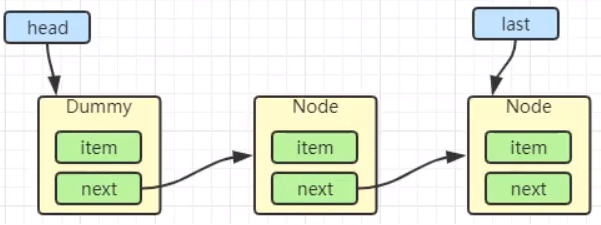

# 基本使用快速入门

[JUC整理笔记四之梳理VarHandle(上)_Java_JFound_InfoQ写作平台](https://xie.infoq.cn/article/18c57e1a23f347a922547177b)

## ReentrantLock

可重入锁，与 `synchroized` 类似，但是可以用 `Condition` 精准唤醒某个线程。

> 多生产者，多消费者

库存容量为 10

```java
/**
 * 最多持有10个资源
 */
public class Resource {
    private int count = 0;
    private Lock lock = new ReentrantLock();
    private Condition condition = lock.newCondition();

    public void increment() {
        lock.lock();
        // 有产品，可以唤醒消费者
        while (count >= 10) {
            try {
                // 放弃得到的锁，并把自身阻塞
                condition.await();
            } catch (InterruptedException e) {
                e.printStackTrace();
            }
        }
        System.out.printf("当前线程的名字%s，当前count=%d\n", Thread.currentThread().getName(),++count);
        // 唤醒所有进程
        condition.signalAll();
        lock.unlock();
    }

    public void decrement() {
        lock.lock();
        // 没有产品，无法消费了，唤醒生产者
        while (count <= 0) {
            try {
                // 放弃得到的锁，并把自身阻塞
                condition.await();
            } catch (InterruptedException e) {
                e.printStackTrace();
            }
        }
        System.out.printf("当前线程的名字%s，当前count=%d\n", Thread.currentThread().getName(),--count);
        // 唤醒所有进程
        condition.signalAll();
        lock.unlock();
    }
}


public class MainDemo {
    public static void main(String[] args) {
        Resource resource = new Resource();
        new Thread(() -> {
            for (int i = 0; i < 66; i++)
                resource.increment();
        }, "A").start();

        new Thread(() -> {
            for (int i = 0; i < 66; i++)
                resource.increment();
        }, "AA").start();

        new Thread(() -> {
            for (int i = 0; i < 66; i++)
                resource.decrement();
        }, "B").start();
        new Thread(() -> {
            for (int i = 0; i < 66; i++)
                resource.decrement();
        }, "BB").start();
    }
}
```

## CountDownLatch

CountDownLatch主要有两个方法，当一个或多个线程调用await方法时，这些线程会阻塞。

其它线程调用countDown方法会将计数器减1(调用countDown方法的线程不会阻塞)，

当计数器的值变为0时，因await方法阻塞的线程会被唤醒，继续执行。

```java
/**
 * 
 * @Description: *让一些线程阻塞直到另一些线程完成一系列操作后才被唤醒。
 * 
 *               CountDownLatch主要有两个方法，当一个或多个线程调用await方法时，这些线程会阻塞。
 *               其它线程调用countDown方法会将计数器减1(调用countDown方法的线程不会阻塞)，
 *               当计数器的值变为0时，因await方法阻塞的线程会被唤醒，继续执行。
 * 
 *               解释：6个同学陆续离开教室后值班同学才可以关门。
 * 
 *               main主线程必须要等前面6个线程完成全部工作后，自己才能开干
 */
public class CountDownLatchDemo {
    public static void main(String[] args) throws InterruptedException {
        CountDownLatch countDownLatch = new CountDownLatch(6);
        for (int i = 1; i <= 6; i++) {
            new Thread(() -> {
                System.out.println(Thread.currentThread().getName() + "\t 号同学离开教室");
                // 这个方法，当计数为0时，会唤醒被wait阻塞的线程。
                countDownLatch.countDown();
            }, String.valueOf(i)).start();
        }
        //阻塞当前正在运行的线程
        countDownLatch.await();
        System.out.println(Thread.currentThread().getName() + "\t****** 班长关门走人，main线程是班长");
    }
}
```

## CyclicBarrier

满足条件就运行

CyclicBarrier的字面意思是可循环（Cyclic）使用的屏障（Barrier）。它要做的事情是，**让一组线程到达一个屏障（也可以叫同步点）时被阻塞，直到最后一个线程到达屏障时，屏障才会开门**，所有被屏障拦截的线程才会继续干活。线程进入屏障通过CyclicBarrier的await()方法。

```java
/**
 * CyclicBarrier
 * 的字面意思是可循环（Cyclic）使用的屏障（Barrier）。它要做的事情是，
 * 让一组线程到达一个屏障（也可以叫同步点）时被阻塞，
 * 直到最后一个线程到达屏障时，屏障才会开门，所有
 * 被屏障拦截的线程才会继续干活。
 * 线程进入屏障通过CyclicBarrier的await()方法。
 * 
 * 集齐7颗龙珠就可以召唤神龙
 */
public class CyclicBarrierDemo{
  private static final int NUMBER = 7;

  public static void main(String[] args) {
    // CyclicBarrier(int parties, Runnable barrierAction)
    CyclicBarrier cyclicBarrier = new CyclicBarrier(NUMBER, () -> System.out.println("召唤神龙"));
    for (int i = 1; i <= 7; i++)
      new Thread(() -> {
        try {
          System.out.println(Thread.currentThread().getName() + "\t 星龙珠被收集 ");
          cyclicBarrier.await();
        } catch (InterruptedException | BrokenBarrierException e) {
          e.printStackTrace();
        }
      }, String.valueOf(i)).start();
  }
}
```

## Semaphore

信号量，可用来限流。

在信号量上我们定义两种操作：

- acquire（获取） 当一个线程调用acquire操作时，它要么通过成功获取信号量（信号量减1），要么一直等下去，直到有线程释放信号量，或超时
- release（释放）实际上会将信号量的值加1，然后唤醒等待的线程。
- 信号量主要用于两个目的，一个是用于多个共享资源的互斥使用，另一个用于并发线程数的控制。

```java
package com.atguigu.thread;
import java.util.Random;
import java.util.concurrent.Semaphore;
import java.util.concurrent.TimeUnit;
/**
 * 
 * @Description: TODO(这里用一句话描述这个类的作用)  
 * 
 * 在信号量上我们定义两种操作：
 * acquire（获取） 当一个线程调用acquire操作时，它要么通过成功获取信号量（信号量减1），
 *             要么一直等下去，直到有线程释放信号量，或超时。
 * release（释放）实际上会将信号量的值加1，然后唤醒等待的线程。
 * 
 * 信号量主要用于两个目的，一个是用于多个共享资源的互斥使用，另一个用于并发线程数的控制。
 */
public class SemaphoreDemo
{
  public static void main(String[] args)
  {
     Semaphore semaphore = new Semaphore(3);//模拟3个停车位
     for (int i = 1; i 
     {
       new Thread(() -> {
          try 
          {
            semaphore.acquire();
            System.out.println(Thread.currentThread().getName()+"\t 抢到了车位");
            TimeUnit.SECONDS.sleep(new Random().nextInt(5));
            System.out.println(Thread.currentThread().getName()+"\t------- 离开");
          } catch (InterruptedException e) {
            e.printStackTrace();
          }finally {
            semaphore.release();
          }
       }, String.valueOf(i)).start();
     }
  }
}
```

## Exchanger

两个线程交换数据

```java
// 不同线程进行交换数据【两个线程之间的数据交换】
public class Exchange {
    static Exchanger<String> exchanger = new Exchanger<>();

    public static void main(String[] args) {
        new Thread(()->{
            String s = "T1";
            try {
                s = exchanger.exchange(s);
            } catch (InterruptedException e) {
                e.printStackTrace();
            }
            System.out.println(Thread.currentThread().getName() + " " + s);
        }, "t1").start();


        new Thread(()->{
            String s = "T2";
            try {
                s = exchanger.exchange(s);
            } catch (InterruptedException e) {
                e.printStackTrace();
            }
            System.out.println(Thread.currentThread().getName() + " " + s);

        }, "t2").start();
    }
}

```


## ReentrantReadWriterLock

- 读-读 可以共存
- 读-写 不能共存
- 写-写 不能共存

```java
package com.bbxx.callable;

import java.util.HashMap;
import java.util.Map;
import java.util.concurrent.locks.Lock;
import java.util.concurrent.locks.ReadWriteLock;
import java.util.concurrent.locks.ReentrantLock;
import java.util.concurrent.locks.ReentrantReadWriteLock;

/**
 * 独占锁（写锁） 一次只能被一个线程占有 
   共享锁（读锁） 多个线程可以同时占有 ReadWriteLock 
     读-读 可以共存！ 
     读-写 不能共存！ 
     写-写 不能共存！
 */
public class ReadWriteLockDemo {
  public static void main(String[] args) {
    MyCache myCache = new MyCache();
    // 写入
    for (int i = 1; i <= 5; i++) {
      final int temp = i;
      new Thread(() -> {
        myCache.put(temp + "", temp + "");
      }, String.valueOf(i)).start();
    }
    // 读取
    for (int i = 1; i <= 5; i++) {
      final int temp = i;
      new Thread(() -> {
        myCache.get(temp + "");
      }, String.valueOf(i)).start();
    }
  }
}

// 加锁的
class MyCacheLock {
  private volatile Map<String, Object> map = new HashMap<>();
  // 读写锁： 更加细粒度的控制
  private ReadWriteLock readWriteLock = new ReentrantReadWriteLock();
  private Lock lock = new ReentrantLock();

  // 存，写入的时候，只希望同时只有一个线程写
  public void put(String key, Object value) {
    readWriteLock.writeLock().lock();
    try {
      System.out.println(Thread.currentThread().getName() + "写入" + key);
      map.put(key, value);
      System.out.println(Thread.currentThread().getName() + "写入OK");
    } catch (Exception e) {
      e.printStackTrace();
    } finally {
      readWriteLock.writeLock().unlock();
    }
  }

  // 取，读，所有人都可以读！
  public void get(String key) {
    // readLock是为为了防止 写数据
    readWriteLock.readLock().lock();
    try {
      System.out.println(Thread.currentThread().getName() + "读取" + key);
      Object o = map.get(key);
      System.out.println(Thread.currentThread().getName() + "读取OK");
    } catch (Exception e) {
      e.printStackTrace();
    } finally {
      readWriteLock.readLock().unlock();
    }
  }
}

/**
 * 自定义缓存
 */
class MyCache {
  private volatile Map<String, Object> map = new HashMap<>();

  // 存，写
  public void put(String key, Object value) {
    System.out.println(Thread.currentThread().getName() + "写入" + key);
    map.put(key, value);
    System.out.println(Thread.currentThread().getName() + "写入OK");
  }

  // 取，读
  public void get(String key) {
    System.out.println(Thread.currentThread().getName() + "读取" + key);
    Object o = map.get(key);
    System.out.println(Thread.currentThread().getName() + "读取OK");
  }
}
```

# 深入理解

## `AQS` 原理

### 概述

全称是 AbstractQueuedSynchronizer，是阻塞式锁和相关的同步器工具的框架。UML 图如下：


- 由图中 AQS 的内部类 Node 可以看出， AQS 是一个 FIFO 的双向队列。
- Node 类中：
    - SHARED：标记该线程是获取共享资源时被阻塞挂起后放入 AQS 队列的
    - EXCLUSIVE： 标记线程是获取独占资源时被挂起后放入AQS队列的
    - waitStatus：记录当前线程等待状态
        - CANCELLED： 线程被取消了
        - SIGNAL： 线程需要被唤醒
        - CONDITION：  线程在条件队列里面等待
        - PROPAGAE：释放共享资源时需要通知其他节点
- AQS 类中
    - state：维持了一个单一的状态信息；不同类 state 代表的含义不同。
    - ConditionObject：用来结合锁实现线程同步

> 特点总结

- 用 state 属性来表示资源的状态（分独占模式和共享模式，比如0代表xx，1代表oo，这都是由子类自己维护的），子类需要定义如何维护这个状态，控制如何获取锁和释放锁 
    - `getState` - 获取 state 状态 
    - `setState` - 设置 state 状态 
    - `compareAndSetState - cas` 机制设置 state 状态。**保证 state 赋值时的原子性。**
    - 独占模式是只有一个线程能够访问资源，而共享模式可以允许多个线程访问资源 
- 提供了基于 FIFO 的等待队列，类似于 Monitor 的 `EntryList` 
- 条件变量来实现等待、唤醒机制，支持多个条件变量（ConditionObject），类似于 Monitor 的 `WaitSet`

> 子类主要实现这样一些方法（默认抛出 `UnsupportedOperationException`）

- `tryAcquire` 
- `tryRelease` 
- `tryAcquireShared` 
- `tryReleaseShared` 
- `isHeldExclusively`

<span style="color:red">**获取锁**</span>

```java
// 如果获取锁失败
if (!tryAcquire(arg)) {
     // 入队, 可以选择阻塞当前线程 用 park unpark 进行阻塞，恢复线程的
}
```

<span style="color:red">**释放锁**</span>

```java
// 如果释放锁成功
if (tryRelease(arg)) {
     // 让阻塞线程恢复运行
}
```

### AQS - state

#### 回顾

用 state 属性来表示资源的状态，具体的含义需要 AQS 的子类自行定义。state 可以通过 getState、setState、compareAndSetState 函数修改其值。

#### state 代表的含义

> 对于 ReentrantLock 的实现来说

state 表示当前线程获取锁的可重入次数；当一个线程获取了 ReentrantLock 的锁后，在 AQS 内部会首先使用 CAS 操作把 state 状态值从0变为1，然后设置当前锁的持有者为当前线程，当该线程再次获取锁时发现它就是锁的持有者，则会把状态值从1变为2，也就是设置可重入次数，而当另外一个线程获取锁时发现自己并不是该锁的持有者就会被放入 AQS 阻塞队列后挂起。

> 对于读写锁 ReentrantReadWriteLock 来说

- state 的高16位表示读状态，也就是**获取该读锁的次数**，
- 低16位表示获取到写锁的线程的**可重入次数**；

> 对于 semaphore 来说

state 用来表示**当前可用信号的个数**；每 acquire 一次，state 值就减一

> 对于 CountDownlatch 来说

state 用来表示**计数器当前的值**；每 countDown 一次，state 值就加一

### 阻塞队列

对于竞争锁失败的线程，AQS 会将线程放入阻塞队列。<span style="color:red">而线程的阻塞与唤醒是通过 LockSupport 这个工具类来实现的。</span>

对于 **独占/共享** 方式获取锁的线程，获取失败会将失败的线程封装为类型为 **Node.EXCLUSIVE/Node.SHARED** 的 Node 节点插入 AQS 队列的尾部。

> AQS 入队操作

```java
/**
     * Inserts node into queue, initializing if necessary. See picture above.
     * @param node the node to insert
     * @return node's predecessor
     */
private Node enq(final Node node) {
    for (;;) {
        Node t = tail;
        if (t == null) { // Must initialize
            // 共享变量的修改操作 用 CAS 保证
            if (compareAndSetHead(new Node()))
                tail = head; // CAS 设置一个哨兵节点为头节点
        } else {
            node.prev = t;
            // 共享变量的修改操作 用 CAS 保证
            if (compareAndSetTail(t, node)) { 
                t.next = node;
                return t;
            }
        }
    }
}
```


### 条件变量

synchronized 同时只能与一个共享变量的 notify 或 wait 方法实现同步，而 AQS 的一个锁可以对应多个条件变量 ConditionObject。

每个 ConditionObject 对象都有 await()、signal() 方法和属于自己的条件队列。因条件不满足而阻塞的会存放在条件队列中。等满足条件了（调用了 signal）会就从条件队列移除，放入到 AQS 阻塞队列中，然后激活（`LockSupport.unpark`）这个线程。

### 实现不可重入锁 

#### 自定义同步器

```java
// 同步器类
class MySync extends AbstractQueuedSynchronizer {

    protected boolean tryAcquire(int arg) {
        if (this.compareAndSetState(0, 1)) {
            setExclusiveOwnerThread(Thread.currentThread());
            return true;
        }
        return false;
    }

    // 这个arg 没用到
    protected boolean tryRelease(int arg) {
        // state 是 volatile 修饰的，可以防止指令重排序。保证在state之前的设置，对线程可见。即 exclusiveOwnerThread 也会对线程可见。
        setState(0);
        setExclusiveOwnerThread(null);
        return true;
    }

    // 是否持有独占锁
    protected boolean isHeldExclusively() {
        return getState() == 1;
    }

    public Condition newCondition() {
        return new ConditionObject();
    }
}
```

#### 自定义锁

有了自定义同步器，很容易复用 AQS ，实现一个功能完备的自定义锁

```java
// 自定义锁
class MyLock implements Lock {

    // 同步器类
    class MySync extends AbstractQueuedSynchronizer {
		// some code
    }

    private MySync sync = new MySync();

    @Override
    public void lock() {
        // 加锁，不成功会进入等待队列
        sync.acquire(1);
    }

    // 加锁，可打断
    @Override
    public void lockInterruptibly() throws InterruptedException {
        sync.acquireInterruptibly(1);
    }

    @Override
    public boolean tryLock() {
        // 这边随便0 1 2都可。但是 ReentrantLock 传入的是1，用来 state - 1 的，因为 ReentrantLock 是重入锁。state - 1 表示重入数少1
        return sync.tryAcquire(1);
    }

    @Override
    public boolean tryLock(long time, TimeUnit unit) throws InterruptedException {
        return sync.tryAcquireNanos(1, unit.toNanos(time));
    }

    @Override
    public void unlock() {
        sync.release(1);
    }

    @Override
    public Condition newCondition() {
        return sync.newCondition();
    }
}
```

测试一下

```java
public static void main(String[] args) {
    MyLock myLock = new MyLock();
    Thread th1 = new Thread(() -> {
        try {
            myLock.lock();
            log.debug("上锁成功");
            TimeUnit.SECONDS.sleep(10);
        } catch (InterruptedException e) {
            e.printStackTrace();
        } finally {
            log.debug("解锁成功");
            myLock.unlock();
        }
    }, "线程A");
    Thread th2 = new Thread(() -> {
        try {
            myLock.lock();
            log.debug("上锁成功");
        } finally {
            log.debug("解锁成功");
            myLock.unlock();
        }
    }, "线程B");

    th1.start();
    th2.start();
}
```

输出

```shell
01:25:18.109 c.TestMyLock [线程A] - 上锁成功
01:25:28.119 c.TestMyLock [线程A] - 解锁成功
01:25:28.119 c.TestMyLock [线程B] - 上锁成功
01:25:28.119 c.TestMyLock [线程B] - 解锁成功
```

不可重入测试 ：如果改为下面代码，会发现自己也会被挡住（只会打印一次 locking）

```java
lock.lock();
log.debug("locking...");
lock.lock();
log.debug("locking...");
```

### 心得

> 起源

早期程序员会自己通过一种同步器去实现另一种相近的同步器，例如用可重入锁去实现信号量，或反之。这显然不够优雅，于是在 JSR166（Java 规范提案）中创建了 AQS，提供了这种通用的同步器机制。

> 目标

AQS 要实现的功能目标 

- 阻塞版本获取锁 acquire 和非阻塞的版本尝试获取锁 tryAcquire 
- 获取锁超时机制
- 通过打断取消机制 
- 独占机制及共享机制 
- 条件不满足时的等待机制

要实现的性能目标：

Instead, the primary performance goal here is scalability: to predictably maintain efficiency even, or especially, when synchronizers are contended.

> 设计

`AQS` 的基本思想其实很简单

```java
// 获取锁的逻辑
while(state 状态不允许获取) {
     if(队列中还没有此线程) {
         入队并阻塞
     }
}
当前线程出队
```

## `ReentrantLock` 

### 用法

> lock与synchronized一一对应的关系

- `lock.newCondition();`
- `newCondition.await(); 替代wait`
- `newCondition.signal(); 替代notify`
- 每个Condition内部都维护了一个阻塞队列。即，一个lokc，它只建立了一个Condition则只有一个阻塞队列；建立了5个Condition，就一共有5个阻塞队列。

lock替代了synchronized完成加锁解锁的操作

lock的`newCondition()`对象替代放弃锁权限，唤醒所有进程的操作

`JUC` 实现多生产者，消费者。【生产容量为10】

```java
/**
 * 最多持有10个资源
 */
public class Resource {
    private int count = 0;
    private Lock lock = new ReentrantLock();
    private Condition condition = lock.newCondition();

    public void increment() {
        lock.lock();
        // 有产品，可以唤醒消费者
        while (count >= 10) {
            try {
                // 放弃得到的锁，并把自身阻塞
                condition.await();
            } catch (InterruptedException e) {
                e.printStackTrace();
            }
        }
        System.out.printf("当前线程的名字%s，当前count=%d\n", Thread.currentThread().getName(),++count);
        // 唤醒所有进程
        condition.signalAll();
        lock.unlock();
    }

    public void decrement() {
        lock.lock();
        // 没有产品，无法消费了，唤醒生产者
        while (count <= 0) {
            try {
                // 放弃得到的锁，并把自身阻塞
                condition.await();
            } catch (InterruptedException e) {
                e.printStackTrace();
            }
        }
        System.out.printf("当前线程的名字%s，当前count=%d\n", Thread.currentThread().getName(),--count);
        // 唤醒所有进程
        condition.signalAll();
        lock.unlock();
    }
}

public class MainDemo {
    public static void main(String[] args) {
        Resource resource = new Resource();
        new Thread(() -> {
            for (int i = 0; i < 66; i++)
                resource.increment();
        }, "A").start();

        new Thread(() -> {
            for (int i = 0; i < 66; i++)
                resource.increment();
        }, "AA").start();

        new Thread(() -> {
            for (int i = 0; i < 66; i++)
                resource.decrement();
        }, "B").start();
        new Thread(() -> {
            for (int i = 0; i < 66; i++)
                resource.decrement();
        }, "BB").start();
    }
}
```

### 原理


#### 加锁解锁流程 1.8

先从构造器开始看，默认为非公平锁实现

```java
public ReentrantLock() {
    sync = new NonfairSync();
}
```

NonfairSync 继承自 AQS。

我们看下非公平锁的加锁操作。

```java
final void lock() {
    // 视图把0改成1，进行加锁。
    if (compareAndSetState(0, 1))
        setExclusiveOwnerThread(Thread.currentThread());
    else
        acquire(1);
}
```

没有竞争时


第一个竞争出现时，若加锁失败（state 修改），则走 else 语句的 `acquire(1)`

```java
public final void acquire(int arg) {
    if (!tryAcquire(arg) && // 再重试加锁一次
        acquireQueued(addWaiter(Node.EXCLUSIVE), arg)) // 尝试创建一个节点对象，并加入到等待队列中去。
        selfInterrupt();
}
```


Thread-1 执行了

- CAS 尝试调用 lock 方法，将 state 由 0 改为 1，结果失败，运行 else 语句块 `acquire(1);`
- 运行方法 `acquire(1);` 执行里面的 if 判断 进入`tryAcquire`逻辑，这时 state 已经是 1，结果仍然失败
- 接下来进入 addwaiter 逻辑，构造 Node 队列（首次创建的时候会创建一个哑元）
    - 图中黄色三角表示该 Node 的 waitStatus 状态，其中 0 为默认正常状态
    - Node 的创建时懒惰的
    - 其中第一个 Node 称为 Dummy（哑元）或哨兵，用来占位，并不关联线程


当前线程进入 acquireQueued 逻辑

```java
final boolean acquireQueued(final Node node, int arg) {
    boolean failed = true;
    try {
        boolean interrupted = false;
        for (;;) { // 1. 死循环
            final Node p = node.predecessor(); // 2. 前驱节点
            if (p == head && tryAcquire(arg)) { // 3. 如果前驱是 占位 节点，就说明当前节点是第二个，还是有机会获得锁。tryAcquire 继续尝试，由于我们调用的 lock 不会释放锁，所以获取又失败了，进入下一个 if
                setHead(node);
                p.next = null; // help GC
                failed = false;
                return interrupted;
            }
            if (shouldParkAfterFailedAcquire(p, node) && // 4. 尝试获取锁失败的时候，是否应该阻塞住。 true 的话就执行 parkAndCheckInterrupt()。 false 的话就 进行下一轮的循环。
                parkAndCheckInterrupt())
                interrupted = true;
        }
    } finally {
        if (failed)
            cancelAcquire(node);
    }
}
```

- acquireQueued 会在一个死循环中不断尝试获得锁，失败后进入 park 阻塞 
- 如果自己是紧邻着 head（排第二位），那么再次 tryAcquire 尝试获取锁，当然这时 state 仍为 1，失败
- 进入 shouldParkAfterFailedAcquire 逻辑，将前驱 node，即 head 的 waitStatus 改为 -1，这次返回 false。（-1表示有责任唤醒它的后继节点。你这个 Thread 尝试好几遍都没获取到锁，应该阻塞了，你要阻塞，那得有个节点唤醒你，那就是自己的前驱节点）


- shouldParkAfterFailedAcquire 执行完毕回到 acquireQueued ，再次 tryAcquire 尝试获取锁，当然这时 state 仍为 1，失败 
- 当再次进入 shouldParkAfterFailedAcquire 时，这时因为其前驱 node 的 waitStatus 已经是 -1，这次返回 true 
- 进入 parkAndCheckInterrupt， Thread-1 park（灰色表示）`就是 LockSupport.part(this)`。ReentrantLock 用 LockSupport 实现的，所以需要一个线程来唤醒 它，


再次有多个线程经历上述过程竞争失败，变成这个样子。


Thread-0 释放锁，进入 tryRelease 流程，如果成功

```java
public final boolean release(int arg) {
    if (tryRelease(arg)) {
        Node h = head;
        if (h != null && h.waitStatus != 0) // head是不是不为空，head的waitStatys是不是不为空，
            unparkSuccessor(h); // 唤醒后继节点
        return true;
    }
    return false;
}

protected final boolean tryRelease(int releases) {
    int c = getState() - releases;
    if (Thread.currentThread() != getExclusiveOwnerThread())
        throw new IllegalMonitorStateException();
    boolean free = false;
    if (c == 0) {
        free = true;
        setExclusiveOwnerThread(null);
    }
    setState(c);
    return free;
}
```

- 设置 exclusiveOwnerThread 为 null
- state = 0


- 当前队列不为 null，并且 head 的 waitStatus = -1，进入 unparkSuccessor 流程 
- 找到队列中离 head 最近的一个 Node（没取消的），unpark 恢复其运行，本例中即为 Thread-1 
- 回到 Thread-1 的 acquireQueued 流程


如果加锁成功（没有竞争），会设置 

- exclusiveOwnerThread 为 Thread-1，state = 1 
- head 指向刚刚 Thread-1 所在的 Node，该 Node 清空 Thread 
- 原本的 head 因为从链表断开，而可被垃圾回收 

如果这时候有其它线程来竞争（非公平的体现），例如这时有 Thread-4 来了


如果不巧又被 Thread-4 占了先

- Thread-4 被设置为 exclusiveOwnerThread，state = 1 
- Thread-1 再次进入 acquireQueued 流程，获取锁失败，重新进入 park 阻塞

#### 可重入 1.8

可重入原理，基于JDK 1.8 源码

```java
static final class NonfairSync extends Sync {
    // Sync的方法，方便阅读 放过来的。
    final boolean nonfairTryAcquire(int acquires) {
        final Thread current = Thread.currentThread();
        int c = getState();
        if (c == 0) { // 没人获得锁，试图从0变成1
            if (compareAndSetState(0, acquires)) {
                setExclusiveOwnerThread(current);
                return true;
            }
        }
        // 如果已经获得锁了，当前线程是 持有锁的线程的话，就 state ++
        else if (current == getExclusiveOwnerThread()) {
            int nextc = c + acquires;
            if (nextc < 0) // overflow
                throw new Error("Maximum lock count exceeded");
            setState(nextc);
            return true;
        }
        return false;
    }
    
     // Sync的方法，方便阅读 放过来的。
    protected final boolean tryRelease(int releases) {
        int c = getState() - releases;
        if (Thread.currentThread() != getExclusiveOwnerThread())
            throw new IllegalMonitorStateException();
        boolean free = false;
        // 支持锁重入，只有 state 减为 0 ，才释放成功
        if (c == 0) {
            free = true;
            setExclusiveOwnerThread(null);
        }
        setState(c);
        return free;
    }
}
```

#### 可打断

> 不可打断模式：就是获取到锁之后，打断才生效？

在此模式下，即使它被打断，仍会驻留在 AQS 队列中，一直要等到获得锁后方能得知自己被打断了

```java
static final class NonfairSync extends Sync {
    
    // AQS 的方法，只是为了方便阅读，所有记在这里
    private final boolean parkAndCheckInterrupt() {
        // 如果打断标记已经是 true，
        LockSupport.park(this);
        // interrupted 会清除打断标记
        return Thread.interrupted();
    }
    
    // AQS 的方法，只是为了方便阅读，所有记在这里
    final boolean acquireQueued(final Node node, long arg) {
        boolean failed = true;
        try {
            boolean interrupted = false;
            for (;;) {
                final Node p = node.predecessor();
                if (p == head && tryAcquire(arg)) {
                    setHead(node);
                    p.next = null; // help GC
                    failed = false;
                    // 还是需要获得锁后, 才能返回打断状态
                    return interrupted;
                }
                if (shouldParkAfterFailedAcquire(p, node) &&
                    parkAndCheckInterrupt()) // 这块是真的，就会进入 if 块
                    // 如果是因为 interrupt 被唤醒, 返回打断状态为 true
                    interrupted = true;  // 什么时候会用到这个打断标记？只有你获取到锁的时候 才会用到这个打断标记
            }
        } finally {
            if (failed)
                cancelAcquire(node);
        }
    }
}
```

>可打断模式

```java
static final class NonfairSync extends Sync {
    
    
    public final void acquireInterruptibly(long arg)
            throws InterruptedException {
        if (Thread.interrupted())
            throw new InterruptedException();
        // 如果没有获得锁，进入（-）
        if (!tryAcquire(arg))
            doAcquireInterruptibly(arg);
    }
    
    // (-) 可打断的获取锁流程
    private void doAcquireInterruptibly(long arg)
        throws InterruptedException {
        final Node node = addWaiter(Node.EXCLUSIVE);
        boolean failed = true;
        try {
            for (;;) {
                final Node p = node.predecessor();
                if (p == head && tryAcquire(arg)) {
                    setHead(node);
                    p.next = null; // help GC
                    failed = false;
                    return;
                }
                if (shouldParkAfterFailedAcquire(p, node) &&
                    parkAndCheckInterrupt())
                    // park 后直接抛出异常。不会进入 for 等待了，不会再 AQS 里等了。
                    throw new InterruptedException();
            }
        } finally {
            if (failed)
                cancelAcquire(node);
        }
    }
}
```

#### 公平锁

公平锁的实现主要在于 tryAcquire 方法的实现。先检查队列中有没有节点，有就先用队列中的，而不是过来竞争的Thread。

```java
static final class FairSync extends Sync {
    private static final long serialVersionUID = -3000897897090466540L;

    final void lock() {
        acquire(1);
    }

    // AQS 继承过来的方法, 方便阅读, 放在此处
    public final void acquire(int arg) {
        if (
                !tryAcquire(arg) &&
                        acquireQueued(addWaiter(Node.EXCLUSIVE), arg)
        ) {
            selfInterrupt();
        }
    }

    // 与非公平锁主要区别在于 tryAcquire 方法的实现
    protected final boolean tryAcquire(int acquires) {
        final Thread current = Thread.currentThread();
        int c = getState();
        if (c == 0) {
            // 先检查 AQS 队列中是否有前驱节点, 没有才去竞争
            if (!hasQueuedPredecessors() &&
                    compareAndSetState(0, acquires)) {
                setExclusiveOwnerThread(current);
                return true;
            }
        } else if (current == getExclusiveOwnerThread()) {
            int nextc = c + acquires;
            if (nextc < 0)
                throw new Error("Maximum lock count exceeded");
            setState(nextc);
            return true;
        }
        return false;
    }

    // ㈠ AQS 继承过来的方法, 方便阅读, 放在此处
    public final boolean hasQueuedPredecessors() {
        Node t = tail;
        Node h = head;
        Node s;
        // h != t 时表示队列中有 Node
        return h != t &&
                (
                        // (s = h.next) == null 表示队列中还有没有老二
                        (s = h.next) == null || // 或者队列中老二线程不是此线程
                                s.thread != Thread.currentThread()
                );
    }
}

```

#### 条件变量

每个条件变量其实就对应着一个等待队列，其实现类是 ConditionObject

> await 流程 

开始 Thread-0 持有锁，调用 await，进入 ConditionObject 的 addConditionWaiter 流程 

创建新的 Node 状态为 -2（Node.CONDITION），关联 Thread-0，加入等待队列尾部


接下来进入 AQS 的 fullyRelease 流程，释放同步器上的锁


unpark AQS 队列中的下一个节点，竞争锁，假设没有其他竞争线程，那么 Thread-1 竞争成功


park 阻塞 Thread-0


> singal 流程

假设 Thread-1 要来唤醒 Thread-0


进入 ConditionObject 的 doSignal 流程，取得等待队列中第一个 Node，即 Thread-0 所在 Node


执行 transferForSignal 流程，将该 Node 加入 AQS 队列尾部，将 Thread-0 的 waitStatus 改为 0，Thread-3 的 waitStatus 改为 -1


Thread-1 释放锁，进入 unlock 流程，略

> 源码

```java
public class ConditionObject implements Condition, java.io.Serializable {
    private static final long serialVersionUID = 1173984872572414699L;

    // 第一个等待节点
    private transient Node firstWaiter;

    // 最后一个等待节点
    private transient Node lastWaiter;

    public ConditionObject() {
    }

    // ㈠ 添加一个 Node 至等待队列
    private Node addConditionWaiter() {
        Node t = lastWaiter;
        // 所有已取消的 Node 从队列链表删除, 见 ㈡
        if (t != null && t.waitStatus != Node.CONDITION) {
            unlinkCancelledWaiters();
            t = lastWaiter;
        }
        // 创建一个关联当前线程的新 Node, 添加至队列尾部
        Node node = new Node(Thread.currentThread(), Node.CONDITION);
        if (t == null)
            firstWaiter = node;
        else
            t.nextWaiter = node;
        lastWaiter = node;
        return node;
    }

    // 唤醒 - 将没取消的第一个节点转移至 AQS 队列
    private void doSignal(Node first) {
        do {
            // 已经是尾节点了
            if ((firstWaiter = first.nextWaiter) == null) {
                lastWaiter = null;
            }
            first.nextWaiter = null;
        } while (
            // 将等待队列中的 Node 转移至 AQS 队列, 不成功且还有节点则继续循环 ㈢
                !transferForSignal(first) &&
                        // 队列还有节点
                        (first = firstWaiter) != null
        );
    }

    // 外部类方法, 方便阅读, 放在此处
    // ㈢ 如果节点状态是取消, 返回 false 表示转移失败, 否则转移成功
    final boolean transferForSignal(Node node) {
        // 如果状态已经不是 Node.CONDITION, 说明被取消了
        if (!compareAndSetWaitStatus(node, Node.CONDITION, 0))
            return false;
        // 加入 AQS 队列尾部
        Node p = enq(node);
        int ws = p.waitStatus;
        if (
            // 上一个节点被取消
                ws > 0 ||
                        // 上一个节点不能设置状态为 Node.SIGNAL
                        !compareAndSetWaitStatus(p, ws, Node.SIGNAL)
        ) {
            // unpark 取消阻塞, 让线程重新同步状态
            LockSupport.unpark(node.thread);
        }
        return true;
    }

    // 全部唤醒 - 等待队列的所有节点转移至 AQS 队列
    private void doSignalAll(Node first) {
        lastWaiter = firstWaiter = null;
        do {
            Node next = first.nextWaiter;
            first.nextWaiter = null;
            transferForSignal(first);
            first = next;
        } while (first != null);
    }

    // ㈡
    private void unlinkCancelledWaiters() {
        // ...
    }

    // 唤醒 - 必须持有锁才能唤醒, 因此 doSignal 内无需考虑加锁
    public final void signal() {
        if (!isHeldExclusively())
            throw new IllegalMonitorStateException();
        Node first = firstWaiter;
        if (first != null)
            doSignal(first);
    }

    // 全部唤醒 - 必须持有锁才能唤醒, 因此 doSignalAll 内无需考虑加锁
    public final void signalAll() {
        if (!isHeldExclusively())
            throw new IllegalMonitorStateException();
        Node first = firstWaiter;
        if (first != null)
            doSignalAll(first);
    }

    // 不可打断等待 - 直到被唤醒
    public final void awaitUninterruptibly() {
        // 添加一个 Node 至等待队列, 见 ㈠
        Node node = addConditionWaiter();
        // 释放节点持有的锁, 见 ㈣
        int savedState = fullyRelease(node);
        boolean interrupted = false;
        // 如果该节点还没有转移至 AQS 队列, 阻塞
        while (!isOnSyncQueue(node)) {
            // park 阻塞
            LockSupport.park(this);
            // 如果被打断, 仅设置打断状态
            if (Thread.interrupted())
                interrupted = true;
        }
        // 唤醒后, 尝试竞争锁, 如果失败进入 AQS 队列
        if (acquireQueued(node, savedState) || interrupted)
            selfInterrupt();
    }

    // 外部类方法, 方便阅读, 放在此处
    // ㈣ 因为某线程可能重入，需要将 state 全部释放
    final int fullyRelease(Node node) {
        boolean failed = true;
        try {
            int savedState = getState();
            if (release(savedState)) {
                failed = false;
                return savedState;
            } else {
                throw new IllegalMonitorStateException();
            }
        } finally {
            if (failed)
                node.waitStatus = Node.CANCELLED;
        }
    }

    // 打断模式 - 在退出等待时重新设置打断状态
    private static final int REINTERRUPT = 1;
    // 打断模式 - 在退出等待时抛出异常
    private static final int THROW_IE = -1;

    // 判断打断模式
    private int checkInterruptWhileWaiting(Node node) {
        return Thread.interrupted() ?
                (transferAfterCancelledWait(node) ? THROW_IE : REINTERRUPT) :
                0;
    }

    // ㈤ 应用打断模式
    private void reportInterruptAfterWait(int interruptMode)
            throws InterruptedException {
        if (interruptMode == THROW_IE)
            throw new InterruptedException();
        else if (interruptMode == REINTERRUPT)
            selfInterrupt();
    }

    // 等待 - 直到被唤醒或打断
    public final void await() throws InterruptedException {
        if (Thread.interrupted()) {
            throw new InterruptedException();
        }
        // 添加一个 Node 至等待队列, 见 ㈠
        Node node = addConditionWaiter();
        // 释放节点持有的锁
        int savedState = fullyRelease(node);
        int interruptMode = 0;
        // 如果该节点还没有转移至 AQS 队列, 阻塞
        while (!isOnSyncQueue(node)) {
            // park 阻塞
            LockSupport.park(this);
// 如果被打断, 退出等待队列
            if ((interruptMode = checkInterruptWhileWaiting(node)) != 0)
                break;
        }
        // 退出等待队列后, 还需要获得 AQS 队列的锁
        if (acquireQueued(node, savedState) && interruptMode != THROW_IE)
            interruptMode = REINTERRUPT;
        // 所有已取消的 Node 从队列链表删除, 见 ㈡
        if (node.nextWaiter != null)
            unlinkCancelledWaiters();
        // 应用打断模式, 见 ㈤
        if (interruptMode != 0)
            reportInterruptAfterWait(interruptMode);
    }

    // 等待 - 直到被唤醒或打断或超时
    public final long awaitNanos(long nanosTimeout) throws InterruptedException {
        if (Thread.interrupted()) {
            throw new InterruptedException();
        }
        // 添加一个 Node 至等待队列, 见 ㈠
        Node node = addConditionWaiter();
        // 释放节点持有的锁
        int savedState = fullyRelease(node);
        // 获得最后期限
        final long deadline = System.nanoTime() + nanosTimeout;
        int interruptMode = 0;
        // 如果该节点还没有转移至 AQS 队列, 阻塞
        while (!isOnSyncQueue(node)) {
            // 已超时, 退出等待队列
            if (nanosTimeout <= 0L) {
                transferAfterCancelledWait(node);
                break;
            }
            // park 阻塞一定时间, spinForTimeoutThreshold 为 1000 ns
            if (nanosTimeout >= spinForTimeoutThreshold)
                LockSupport.parkNanos(this, nanosTimeout);
            // 如果被打断, 退出等待队列
            if ((interruptMode = checkInterruptWhileWaiting(node)) != 0)
                break;
            nanosTimeout = deadline - System.nanoTime();
        }
        // 退出等待队列后, 还需要获得 AQS 队列的锁
        if (acquireQueued(node, savedState) && interruptMode != THROW_IE)
            interruptMode = REINTERRUPT;
        // 所有已取消的 Node 从队列链表删除, 见 ㈡
        if (node.nextWaiter != null)
            unlinkCancelledWaiters();
        // 应用打断模式, 见 ㈤
        if (interruptMode != 0)
            reportInterruptAfterWait(interruptMode);
        return deadline - System.nanoTime();
    }

    // 等待 - 直到被唤醒或打断或超时, 逻辑类似于 awaitNanos
    public final boolean awaitUntil(Date deadline) throws InterruptedException {
        // ...
    }

    // 等待 - 直到被唤醒或打断或超时, 逻辑类似于 awaitNanos
    public final boolean await(long time, TimeUnit unit) throws InterruptedException {
        // ...
    }
    // 工具方法 省略 ...
}
```

## `ReentrantReadWriteLock`

读写锁。当读操作远远高于写操作时，这时候使用 读写锁 让 读-读 可以并发，提高性能。 类似于数据库中的 select ... from ... lock in share mode 

提供一个 数据容器类，内部分别使用读锁保护数据的 read() 方法，写锁保护数据的 write() 方法

### 基本用法

```java
package utils;

import lombok.extern.slf4j.Slf4j;

import java.util.concurrent.TimeUnit;
import java.util.concurrent.locks.ReentrantReadWriteLock;

@Slf4j(topic = "c.DataContainer")
// 读读并发，写写互斥
public class DataContainer {

    private Object data;
    private ReentrantReadWriteLock rw = new ReentrantReadWriteLock();
    private ReentrantReadWriteLock.ReadLock r = rw.readLock();
    private ReentrantReadWriteLock.WriteLock w = rw.writeLock();

    public Object read() {
        log.debug("获取读锁...");
        r.lock();
        try {
            log.debug("读取");
            TimeUnit.SECONDS.sleep(1);
            return data;
        } catch (InterruptedException e) {
            e.printStackTrace();
        } finally {
            log.debug("释放读锁...");
            r.unlock();
        }
        return data;
    }

    public void write() {
        log.debug("获取写锁...");
        w.lock();
        try {
            log.debug("写入");
            TimeUnit.SECONDS.sleep(1);
        } catch (InterruptedException e) {
            e.printStackTrace();
        } finally {
            log.debug("释放写锁...");
            w.unlock();
        }
    }

    public static void main(String[] args) {
        DataContainer dataContainer = new DataContainer();
        new Thread(dataContainer::read, "t1").start();
        new Thread(dataContainer::read, "t2").start();
        new Thread(dataContainer::read, "t2").start();
        new Thread(dataContainer::write, "t2").start();
    }
}
```

### 注意事项

- 读锁不支持条件变量；
- 重入时升级不支持：即持有读锁的情况下去获取写锁，会导致获取写锁永久等待
- 重入时降级支持：即持有写锁的情况下去获取读锁

```java
class CachedData {
    Object data; // 要缓存的数据
    volatile boolean cacheValid; // 缓存数据是否有效，如果失效，需要重新计算 data
    final ReentrantReadWriteLock rwl = new ReentrantReadWriteLock();

    void processCachedData() {
        rwl.readLock().lock(); // 加读锁
        if (!cacheValid) { // 缓存数据失效 （这个if 不受写锁保护）
            // 获取写锁前必须释放读锁
            rwl.readLock().unlock();
            rwl.writeLock().lock();
            try {
                // 判断是否有其它线程已经获取了写锁、更新了缓存, 避免重复更新
                if (!cacheValid) { // 因此进行双重锁检查
                    data = ...
                    cacheValid = true;
                }
                // 降级为读锁, 释放写锁, 这样能够让其它线程读取缓存（我释放前也想拿到读锁）
                rwl.readLock().lock();
            } finally {
                rwl.writeLock().unlock();
            }
        }
        // 自己用完数据, 释放读锁
        try {
            use(data);
        } finally {
            rwl.readLock().unlock();
        }
    }
}
```

### 应用-缓存

可以把读写锁用到缓存上去，保证缓存与数据库的一致性。

实现一个 SQL 查询的缓存功能。

#### 缓存更新策略

更新时，先是清除缓存还是先更新数据库。

<span style="color:red">**先清除缓存的话：可能会查询到过时数据！！！造成数据库和缓存数据的不一致！！！**</span>


<span style="color:red">**先更新数据库的话：也可能造成数据库和缓存数据的不一致！！！但是持续的时间比较短，可以纠正过来。所以最后采取先更新库，再清空缓存**</span>


<span style="color:red">**最后！加锁，保证安全！**</span>

### 读写锁原理

#### 图解流程

读写锁用的是同一个 Sycn 同步器，因此等待队列、state 等也是同一个

> **`t1 w.lock，t2 r.lock`**

1）t1 成功上锁，流程与 ReentrantLock 加锁相比没有特殊之处，不同是写锁状态占了 state 的低 16 位，而读锁 使用的是 state 的高 16 位。结合写锁的加锁代码看看

```java
// WriteLock 的 lock 代码
public void lock() {
    sync.acquire(1);
}

// acquire 代码
public final void acquire(int arg) {
    if (!tryAcquire(arg) && // 尝试加锁
        acquireQueued(addWaiter(Node.EXCLUSIVE), arg)) // 尝试加锁失败就尝试进入队列
        selfInterrupt();
}

// tryAcquire 代码 和 之前的ReentrantLock 就不一样了。【写锁的加锁代码！！】
protected final boolean tryAcquire(int acquires) {
    /*
    * Walkthrough:
    * 1. If read count nonzero or write count nonzero
    *    and owner is a different thread, fail.
    * 2. If count would saturate, fail. (This can only
    *    happen if count is already nonzero.)
    * 3. Otherwise, this thread is eligible for lock if
    *    it is either a reentrant acquire or
    *    queue policy allows it. If so, update state
    *    and set owner.
    */
    Thread current = Thread.currentThread();
    int c = getState();
    int w = exclusiveCount(c);
    if (c != 0) { // 1.不等于0表示，可能是读锁 或 写锁
        // (Note: if c != 0 and w == 0 then shared count != 0)
        if (w == 0 || current != getExclusiveOwnerThread()) // w=0说不加的不是读锁，加的是写锁。因为是重入锁，所以要判断，当前线程是不是锁的所有者，不是自己的也返回 false。加锁失败 
            return false; // 读写互斥 返回 false
        if (w + exclusiveCount(acquires) > MAX_COUNT) // 超过写锁的最大数目，抛出异常。
            throw new Error("Maximum lock count exceeded");
        // Reentrant acquire
        setState(c + acquires);
        return true;
    }
    // 2.等于0，说明还没加锁，看我能不能加锁成功
    if (writerShouldBlock() || // 3.如果是非公平锁，那么总会返回 false。公平锁的话，会检查队列，看队列中有没有需要获得锁的线程。我们假设是非公平锁。
        !compareAndSetState(c, c + acquires)) // 4.把写锁 从0 改成 1
        return false;
    setExclusiveOwnerThread(current); // 5.加锁成功 就设置 锁的所有者
    return true;
}

```


2）t2 执行 r.lock，这时进入读锁的 sync.acquireShared(1) 流程，首先会进入 tryAcquireShared 流程。如果有写 锁占据，那么 tryAcquireShared 返回 -1 表示失败，结合读锁的加锁代码 lock 看看。

```java
public void lock() {
    sync.acquireShared(1);
}

public final void acquireShared(int arg) {
    if (tryAcquireShared(arg) < 0) // 尝试获取读锁。
        doAcquireShared(arg);
}
```

tryAcquireShared 返回值表示

- -1 表示失败
- 0 表示成功，但后继节点不会继续唤醒
- 正数表示成功，而且数值是还有几个后继节点需要唤醒，读写锁返回 1

3）这时会进入 sync.doAcquireShared(1) 流程，首先也是调用 addWaiter 添加节点，不同之处在于节点被设置为 Node.SHARED 模式而非 Node.EXCLUSIVE 模式，注意此时 t2 仍处于活跃状态


4）t2 会看看自己的节点是不是老二，如果是，还会再次调用 tryAcquireShared(1) 来尝试获取锁 

5）如果没有成功，在 doAcquireShared 内 for (;;) 循环一次，把前驱节点的 waitStatus 改为 -1，再 for (;;) 循环一 次尝试 tryAcquireShared(1) 如果还不成功，那么在 parkAndCheckInterrupt() 处 park。


> **`t3 r.lock，t4 w.lock`**

 这种状态下，假设又有 t3 加读锁和 t4 加写锁，这期间 t1 仍然持有锁，就变成了下面的样子：

t2、t3加的读锁，所以状态是共享的，t4是写锁（Ex 独占）。-1代表它有职责唤醒后继节点。


> **`t1 w.unlock`**

<span style="color:red">**写锁解锁的时候，会唤醒所有的读锁线程！！！**</span>

这时会走到写锁的 `sync.release(1)` 流程，调用 `sync.tryRelease(1)`成功，变成下面的样子。


接下来执行唤醒流程 sync.unparkSuccessor，即让老二恢复运行，这时 t2 在 doAcquireShared 内 parkAndCheckInterrupt() 处恢复运行 

这回再来一次 for (;;) 执行 tryAcquireShared 成功则让读锁计数加一


这时 t2 已经恢复运行，接下来 t2 调用 setHeadAndPropagate(node, 1)，它原本所在节点被置为头节点


事情还没完，在 `setHeadAndPropagate` 方法内还会检查下一个节点是否是 shared，如果是则调用 `doReleaseShared()` 将 head 的状态从 -1 改为 0 并唤醒老二，这时 `t3` 在 `doAcquireShared` 内 `parkAndCheckInterrupt()` 处恢复运行


这回再来一次 for (;;) 执行 tryAcquireShared 成功则让读锁计数加一


这时 t3 已经恢复运行，接下来 t3 调用 setHeadAndPropagate(node, 1)，它原本所在节点被置为头节点


下一个节点不是 shared 了，因此不会继续唤醒 t4 所在节点

> t2 r.unlock，t3 r.unlock

<span style="color:red">**读锁释放需要用 cas 控制 state 的减少，不然 state的操作 会有并发安全问题**</span>

t2 进入 sync.releaseShared(1) 中，调用 tryReleaseShared(1) 让计数减一，但由于计数还不为零


t3 进入 sync.releaseShared(1) 中，调用 tryReleaseShared(1) 让计数减一，这回计数为零了，进入 doReleaseShared() 将头节点从 -1 改为 0 并唤醒老二，即


之后 t4 在 acquireQueued 中 parkAndCheckInterrupt 处恢复运行，再次 for (;;) 这次自己是老二，并且没有其他 竞争，tryAcquire(1) 成功，修改头结点，流程结束


#### 源码分析

> 写锁上锁流程

```java
static final class NonfairSync extends Sync {
    // ... 省略无关代码

    // 外部类 WriteLock 方法, 方便阅读, 放在此处
    public void lock() {
        sync.acquire(1);
    }

    // AQS 继承过来的方法, 方便阅读, 放在此处
    public final void acquire(int arg) {
        if (
            // 尝试获得写锁失败
                !tryAcquire(arg) &&
                        // 将当前线程关联到一个 Node 对象上, 模式为独占模式
                        // 进入 AQS 队列阻塞
                        acquireQueued(addWaiter(Node.EXCLUSIVE), arg)
        ) {
            selfInterrupt();
        }
    }

    // Sync 继承过来的方法, 方便阅读, 放在此处
    protected final boolean tryAcquire(int acquires) {
        // 获得低 16 位, 代表写锁的 state 计数
        Thread current = Thread.currentThread();
        int c = getState();
        int w = exclusiveCount(c);

        if (c != 0) {
            if (
                // c != 0 and w == 0 表示有读锁, 或者
                    w == 0 ||
                            // 如果 exclusiveOwnerThread 不是自己
                            current != getExclusiveOwnerThread()
            ) {
                // 获得锁失败
                return false;
            }
            // 写锁计数超过低 16 位, 报异常
            if (w + exclusiveCount(acquires) > MAX_COUNT)
                throw new Error("Maximum lock count exceeded");
            // 写锁重入, 获得锁成功
            setState(c + acquires);
            return true;
        }
        if (
            // 判断写锁是否该阻塞, 或者
                writerShouldBlock() ||
                        // 尝试更改计数失败
                        !compareAndSetState(c, c + acquires)
        ) {
            // 获得锁失败
            return false;
        }
        // 获得锁成功
        setExclusiveOwnerThread(current);
        return true;
    }

    // 非公平锁 writerShouldBlock 总是返回 false, 无需阻塞
    final boolean writerShouldBlock() {
        return false;
    }
}
```

> 写锁释放流程

```java
static final class NonfairSync extends Sync {
    // ... 省略无关代码

    // WriteLock 方法, 方便阅读, 放在此处
    public void unlock() {
        sync.release(1);
    }

    // AQS 继承过来的方法, 方便阅读, 放在此处
    public final boolean release(int arg) {
        // 尝试释放写锁成功
        if (tryRelease(arg)) {
            // unpark AQS 中等待的线程
            Node h = head;
            if (h != null && h.waitStatus != 0)
                unparkSuccessor(h);
            return true;
        }
        return false;
    }

    // Sync 继承过来的方法, 方便阅读, 放在此处
    protected final boolean tryRelease(int releases) {
        if (!isHeldExclusively())
            throw new IllegalMonitorStateException();
        int nextc = getState() - releases;
        // 因为可重入的原因, 写锁计数为 0, 才算释放成功
        boolean free = exclusiveCount(nextc) == 0;
        if (free) {
            setExclusiveOwnerThread(null);
        }
        setState(nextc);
        return free;
    }
}
```

> 读锁上锁流程

```java
static final class NonfairSync extends Sync {

    // ReadLock 方法, 方便阅读, 放在此处
    public void lock() {
        sync.acquireShared(1);
    }

    // AQS 继承过来的方法, 方便阅读, 放在此处
    public final void acquireShared(int arg) {
        // tryAcquireShared 返回负数, 表示获取读锁失败
        if (tryAcquireShared(arg) < 0) {
            doAcquireShared(arg);
        }
    }

    // Sync 继承过来的方法, 方便阅读, 放在此处
    protected final int tryAcquireShared(int unused) {
        Thread current = Thread.currentThread();
        int c = getState();
        // 如果是其它线程持有写锁, 获取读锁失败
        if (
                exclusiveCount(c) != 0 &&
                        getExclusiveOwnerThread() != current
        ) {
            return -1;
        }
        int r = sharedCount(c);
        if (
            // 读锁不该阻塞(如果老二是写锁，读锁该阻塞), 并且
                !readerShouldBlock() &&
                        // 小于读锁计数, 并且
                        r < MAX_COUNT &&
                        // 尝试增加计数成功
                        compareAndSetState(c, c + SHARED_UNIT)
        ) {
            // ... 省略不重要的代码
            return 1;
        }
        return fullTryAcquireShared(current);
    }

    // 非公平锁 readerShouldBlock 看 AQS 队列中第一个节点是否是写锁
    // true 则该阻塞, false 则不阻塞
    final boolean readerShouldBlock() {
        return apparentlyFirstQueuedIsExclusive();
    }

    // AQS 继承过来的方法, 方便阅读, 放在此处
    // 与 tryAcquireShared 功能类似, 但会不断尝试 for (;;) 获取读锁, 执行过程中无阻塞
    final int fullTryAcquireShared(Thread current) {
        HoldCounter rh = null;
        for (; ; ) {
            int c = getState();
            if (exclusiveCount(c) != 0) {
                if (getExclusiveOwnerThread() != current)
                    return -1;
            } else if (readerShouldBlock()) {
                // ... 省略不重要的代码
            }
            if (sharedCount(c) == MAX_COUNT)
                throw new Error("Maximum lock count exceeded");
            if (compareAndSetState(c, c + SHARED_UNIT)) {
                // ... 省略不重要的代码
                return 1;
            }
        }
    }

    // AQS 继承过来的方法, 方便阅读, 放在此处
    private void doAcquireShared(int arg) {
        // 将当前线程关联到一个 Node 对象上, 模式为共享模式
        final Node node = addWaiter(Node.SHARED);
        boolean failed = true;
        try {
            boolean interrupted = false;
            for (; ; ) {
                final Node p = node.predecessor();
                if (p == head) {
// 再一次尝试获取读锁
                    int r = tryAcquireShared(arg);
                    // 成功
                    if (r >= 0) {
                        // ㈠
// r 表示可用资源数, 在这里总是 1 允许传播
                        //（唤醒 AQS 中下一个 Share 节点）
                        setHeadAndPropagate(node, r);
                        p.next = null; // help GC
                        if (interrupted)
                            selfInterrupt();
                        failed = false;
                        return;
                    }
                }
                if (
                    // 是否在获取读锁失败时阻塞（前一个阶段 waitStatus == Node.SIGNAL）
                        shouldParkAfterFailedAcquire(p, node) &&
                                // park 当前线程
                                parkAndCheckInterrupt()
                ) {
                    interrupted = true;
                }
            }
        } finally {
            if (failed)
                cancelAcquire(node);
        }
    }

    // ㈠ AQS 继承过来的方法, 方便阅读, 放在此处
    private void setHeadAndPropagate(Node node, int propagate) {
        Node h = head; // Record old head for check below
        // 设置自己为 head
        setHead(node);

        // propagate 表示有共享资源（例如共享读锁或信号量）
        // 原 head waitStatus == Node.SIGNAL 或 Node.PROPAGATE
        // 现在 head waitStatus == Node.SIGNAL 或 Node.PROPAGATE
        if (propagate > 0 || h == null || h.waitStatus < 0 ||
                (h = head) == null || h.waitStatus < 0) {
            Node s = node.next;
            // 如果是最后一个节点或者是等待共享读锁的节点
            if (s == null || s.isShared()) {
                // 进入 ㈡
                doReleaseShared();
            }
        }
    }

    // ㈡ AQS 继承过来的方法, 方便阅读, 放在此处
    private void doReleaseShared() {
        // 如果 head.waitStatus == Node.SIGNAL ==> 0 成功, 下一个节点 unpark
        // 如果 head.waitStatus == 0 ==> Node.PROPAGATE, 为了解决 bug, 见后面分析
        for (; ; ) {
            Node h = head;
            // 队列还有节点
            if (h != null && h != tail) {
                int ws = h.waitStatus;
                if (ws == Node.SIGNAL) {
                    if (!compareAndSetWaitStatus(h, Node.SIGNAL, 0))
                        continue; // loop to recheck cases
                    // 下一个节点 unpark 如果成功获取读锁
                    // 并且下下个节点还是 shared, 继续 doReleaseShared
                    unparkSuccessor(h);
                } else if (ws == 0 &&
                        !compareAndSetWaitStatus(h, 0, Node.PROPAGATE))
                    continue; // loop on failed CAS
            }
            if (h == head) // loop if head changed
                break;
        }
    }
}
```

> 读锁释放流程

```java
static final class NonfairSync extends Sync {

    // ReadLock 方法, 方便阅读, 放在此处
    public void unlock() {
        sync.releaseShared(1);
    }

    // AQS 继承过来的方法, 方便阅读, 放在此处
    public final boolean releaseShared(int arg) {
        if (tryReleaseShared(arg)) {
            doReleaseShared();
            return true;
        }
        return false;
    }

    // Sync 继承过来的方法, 方便阅读, 放在此处
    protected final boolean tryReleaseShared(int unused) {
        // ... 省略不重要的代码
        for (; ; ) {
            int c = getState();
            int nextc = c - SHARED_UNIT;
            if (compareAndSetState(c, nextc)) {
                // 读锁的计数不会影响其它获取读锁线程, 但会影响其它获取写锁线程
                // 计数为 0 才是真正释放
                return nextc == 0;
            }
        }
    }

    // AQS 继承过来的方法, 方便阅读, 放在此处
    private void doReleaseShared() {
        // 如果 head.waitStatus == Node.SIGNAL ==> 0 成功, 下一个节点 unpark
        // 如果 head.waitStatus == 0 ==> Node.PROPAGATE
        for (; ; ) {
            Node h = head;
            if (h != null && h != tail) {
                int ws = h.waitStatus;
                // 如果有其它线程也在释放读锁，那么需要将 waitStatus 先改为 0
                // 防止 unparkSuccessor 被多次执行
                if (ws == Node.SIGNAL) {
                    if (!compareAndSetWaitStatus(h, Node.SIGNAL, 0))
                        continue; // loop to recheck cases
                    unparkSuccessor(h);
                }
                // 如果已经是 0 了，改为 -3，用来解决传播性，见后文信号量 bug 分析
                else if (ws == 0 &&
                        !compareAndSetWaitStatus(h, 0, Node.PROPAGATE))
                    continue; // loop on failed CAS
            }
            if (h == head) // loop if head changed
                break;
        }
    }
}
```

## `StampedLock`

<span style="color:red">**注意 **</span>

- StampedLock 不支持条件变量 
- StampedLock 不支持可重入

也是读写锁，jdk8 提供，是为了进一步优化读性能，它的特点是在使用读锁、写锁时都必须配合【戳】使用

加解读锁

```java
long stamp = lock.readLock();
lock.unlockRead(stamp);
```

加解写锁

```java
long stamp = lock.writeLock();
lock.unlockWrite(stamp);
```

乐观读，StampedLock 支持 tryOptimisticRead() 方法（乐观读），读取完毕后需要做一次 戳校验 如果校验通 过，表示这期间确实没有写操作，数据可以安全使用，如果校验没通过，需要重新获取读锁，保证数据安全。

```java
long stamp = lock.tryOptimisticRead(); // 这是一个无锁的方法！
// 验戳，比如 读线程怕有写线程 影响数据，进行验戳
if(!lock.validate(stamp)){ 
 // 如果戳旧了，就进行锁升级（开始加锁）
}

// tryOptimisticRead 源码，没加锁
public long tryOptimisticRead() {
    long s;
    return (((s = state) & WBIT) == 0L) ? (s & SBITS) : 0L;
}
```

提供一个 数据容器类 内部分别使用读锁保护数据的 read() 方法，写锁保护数据的 write() 方法

```java
class DataContainerStamped {
    private int data;
    private final StampedLock lock = new StampedLock();

    public DataContainerStamped(int data) {
        this.data = data;
    }

    public int read(int readTime) {
        long stamp = lock.tryOptimisticRead();
        log.debug("optimistic read locking...{}", stamp);
        sleep(readTime);
        if (lock.validate(stamp)) {
            log.debug("read finish...{}, data:{}", stamp, data);
            return data;
        }
        // 锁升级 - 读锁
        log.debug("updating to read lock... {}", stamp);
        try {
            stamp = lock.readLock();
            log.debug("read lock {}", stamp);
            sleep(readTime);
            log.debug("read finish...{}, data:{}", stamp, data);
            return data;
        } finally {
            log.debug("read unlock {}", stamp);
            lock.unlockRead(stamp);
        }
    }

    public void write(int newData) {
        long stamp = lock.writeLock();
        log.debug("write lock {}", stamp);
        try {
            sleep(2);
            this.data = newData;
        } finally {
            log.debug("write unlock {}", stamp);
            lock.unlockWrite(stamp);
        }
    }
}
```

测试 读-读 可以优化

```java
public static void main(String[] args) {
    DataContainerStamped dataContainer = new DataContainerStamped(1);
    new Thread(() -> {
        dataContainer.read(1);
    }, "t1").start();
    sleep(0.5);
    new Thread(() -> {
        dataContainer.read(0);
    }, "t2").start();
}
```

输出结果，可以看到实际没有加读锁

```java
15:58:50.217 c.DataContainerStamped [t1] - optimistic read locking...256 
15:58:50.717 c.DataContainerStamped [t2] - optimistic read locking...256 
15:58:50.717 c.DataContainerStamped [t2] - read finish...256, data:1 
15:58:51.220 c.DataContainerStamped [t1] - read finish...256, data:1 
```

测试 读-写 时优化读补加读锁

```java
public static void main(String[] args) {
    DataContainerStamped dataContainer = new DataContainerStamped(1);
    new Thread(() -> {
        dataContainer.read(1);
    }, "t1").start();
    sleep(0.5);
    new Thread(() -> {
        dataContainer.write(100);
    }, "t2").start();
}
```

输出结果

```shell
15:57:00.219 c.DataContainerStamped [t1] - optimistic read locking...256 
15:57:00.717 c.DataContainerStamped [t2] - write lock 384 
15:57:01.225 c.DataContainerStamped [t1] - updating to read lock... 256 
15:57:02.719 c.DataContainerStamped [t2] - write unlock 384 
15:57:02.719 c.DataContainerStamped [t1] - read lock 513 
15:57:03.719 c.DataContainerStamped [t1] - read finish...513, data:1000 
15:57:03.719 c.DataContainerStamped [t1] - read unlock 513 
```


## `Semaphore`

### 用法

>  信号量，用来限制能同时访问共享资源的线程上限。，可用来限流，可以用来多个共享资源的互斥使用。

```java
 Semaphore s = new Semaphore(2, true);
```

AQS  AbstractQueueSynchronizer

> 在信号量上我们定义两种操作：

- acquire（获取） 当一个线程调用acquire操作时，它要么通过成功获取信号量（信号量减1），要么一直等下去，直到有线程释放信号量，或超时。

- release（释放）实际上会将信号量的值加1，然后唤醒等待的线程。

> 代码示例：

我们模拟一个抢车位的场景，假设一共有6个车，3个停车位

```java
package com.atguigu.thread;
import java.util.Random;
import java.util.concurrent.Semaphore;
import java.util.concurrent.TimeUnit;
/**
 * 
 * @Description: TODO(这里用一句话描述这个类的作用)  
 * 
 * 在信号量上我们定义两种操作：
 * acquire（获取） 当一个线程调用acquire操作时，它要么通过成功获取信号量（信号量减1），
 *             要么一直等下去，直到有线程释放信号量，或超时。
 * release（释放）实际上会将信号量的值加1，然后唤醒等待的线程。
 * 
 * 信号量主要用于两个目的，一个是用于多个共享资源的互斥使用，另一个用于并发线程数的控制。
 */
public class SemaphoreDemo {

    public static void main(String[] args) {

        /**
         * 初始化一个信号量为3，默认是false 非公平锁， 模拟3个停车位
         */
        Semaphore semaphore = new Semaphore(3, false);

        // 模拟6部车
        for (int i = 0; i < 6; i++) {
            new Thread(() -> {
                try {
                    // 代表一辆车，已经占用了该车位
                    semaphore.acquire(); // 抢占

                    System.out.println(Thread.currentThread().getName() + "\t 抢到车位");

                    // 每个车停3秒
                    try {
                        TimeUnit.SECONDS.sleep(3);
                    } catch (InterruptedException e) {
                        e.printStackTrace();
                    }

                    System.out.println(Thread.currentThread().getName() + "\t 离开车位");

                } catch (InterruptedException e) {
                    e.printStackTrace();
                } finally {
                    // 释放停车位
                    semaphore.release();
                }
            }, String.valueOf(i)).start();
        }
    }
}
```

运行结果

```
0     抢到车位
2     抢到车位
1     抢到车位
2     离开车位
1     离开车位
3     抢到车位
0     离开车位
4     抢到车位
5     抢到车位
4     离开车位
3     离开车位
5     离开车位
```

看运行结果能够发现，0 2 1 车辆首先抢占到了停车位，然后等待3秒后，离开，然后后面 3 4 5 又抢到了车位

### 应用

semaphore 实现，限制对共享资源的使用。（资源数和线程数一致的时候，用semaphore 比较合适）

- 使用 Semaphore 限流，在访问高峰期时，让请求线程阻塞，高峰期过去再释放许可，当然它只适合限制单机 线程数量，并且仅是限制线程数，而不是限制资源数（例如连接数，请对比 Tomcat LimitLatch 的实现） 
- 用 Semaphore 实现简单连接池，对比『享元模式』下的实现（用wait notify），性能和可读性显然更好， 注意下面的实现中线程数和数据库连接数是相等的

```java
// 用 Semaphore 代码可读性提高了很多。
@Slf4j(topic = "c.Pool")
class Pool {
    // 1. 连接池大小
    private final int poolSize;
    // 2. 连接对象数组
    private Connection[] connections;
    // 3. 连接状态数组 0 表示空闲， 1 表示繁忙
    private AtomicIntegerArray states;
    private Semaphore semaphore;

    // 4. 构造方法初始化
    public Pool(int poolSize) {
        this.poolSize = poolSize;
        // 让许可数与资源数一致
        this.semaphore = new Semaphore(poolSize);
        this.connections = new Connection[poolSize];
        this.states = new AtomicIntegerArray(new int[poolSize]);
        for (int i = 0; i < poolSize; i++) {
            connections[i] = new MockConnection("连接" + (i + 1));
        }
    }

    // 5. 借连接
    public Connection borrow() {// t1, t2, t3
        // 获取许可
        try {
            semaphore.acquire(); // 没有许可的线程，在此等待
        } catch (InterruptedException e) {
            e.printStackTrace();
        }
        for (int i = 0; i < poolSize; i++) {
            // 获取空闲连接
            if (states.get(i) == 0) {
                if (states.compareAndSet(i, 0, 1)) {
                    log.debug("borrow {}", connections[i]);
                    return connections[i];
                }
            }
        }
        // 不会执行到这里
        return null;
    }

    // 6. 归还连接
    public void free(Connection conn) {
        for (int i = 0; i < poolSize; i++) {
            if (connections[i] == conn) {
                states.set(i, 0);
                log.debug("free {}", conn);
                semaphore.release();
                break;
            }
        }
    }
}
```

### 原理

Semaphore 的 premits 是赋值给了 state 变量。

#### 加锁解锁

Semaphore 有点像一个停车场，permits 就好像停车位数量，当线程获得了 permits 就像是获得了停车位，然后 停车场显示空余车位减一 

刚开始，permits（state）为 3，这时 5 个线程来获取资源


假设其中 Thread-1，Thread-2，Thread-4 cas 竞争成功，而 Thread-0 和 Thread-3 竞争失败，进入 AQS 队列 park 阻塞


这时 Thread-4 释放了 permits，状态如下


接下来 Thread-0 竞争成功，permits 再次设置为 0，设置自己为 head 节点，断开原来的 head 节点，unpark 接 下来的 Thread-3 节点，但由于 permits 是 0，因此 Thread-3 在尝试不成功后再次进入 park 状态


## `CountDownLatch`

用来进行线程同步协作，等待所有线程完成倒计时。 

其中构造参数用来初始化等待计数值，await() 用来等待计数归零，countDown() 用来让计数减一

### 用法

- 计数。初始化数值为多少。然后根据条件进行countDown()
- 调用await方法，只要计数不是0，await这个栓就会锁着。直到计数为0，这个拴才会解锁。
- 等待多少线程结束，线程结束后做await后面的代码。

---

 CountDownLatch主要有两个方法，当一个或多个线程调用await方法时，这些线程会阻塞。

其它线程调用countDown方法会将计数器减1(调用countDown方法的线程不会阻塞)，

当计数器的值变为0时，因await方法阻塞的线程会被唤醒，继续执行。

```java
package utils;

import java.util.concurrent.CountDownLatch;

/**
 * @Description: *让一些线程阻塞直到另一些线程完成一系列操作后才被唤醒。
 * <p>
 * CountDownLatch主要有两个方法，当一个或多个线程调用await方法时，这些线程会阻塞。
 * 其它线程调用countDown方法会将计数器减1(调用countDown方法的线程不会阻塞)，
 * 当计数器的值变为0时，因await方法阻塞的线程会被唤醒，继续执行。
 * <p>
 * 解释：6个同学陆续离开教室后值班同学才可以关门。
 * <p>
 * main主线程必须要等前面6个线程完成全部工作后，自己才能开干
 */
public class CountDownLatchDemo {
    public static void main(String[] args) throws InterruptedException {
        CountDownLatch countDownLatch = new CountDownLatch(6);
        for (int i = 1; i <= 6; i++) {
            new Thread(() -> {
                System.out.println(Thread.currentThread().getName() + "\t 号同学离开教室");
                // 这个方法，当计数为0时，会唤醒被wait阻塞的线程。
                countDownLatch.countDown();
                System.out.println(Thread.currentThread().getName() + "\t 我被放出来了！！");
            }, String.valueOf(i)).start();
        }
        //阻塞当前正在运行的线程
        countDownLatch.await();
        System.out.println(Thread.currentThread().getName() + "\t 班长关门走人，main线程是班长");
    }
}
```

输出

```shell
1	 号同学离开教室
4	 号同学离开教室
4	 我被放出来了！！
3	 号同学离开教室
6	 号同学离开教室
6	 我被放出来了！！
5	 号同学离开教室
5	 我被放出来了！！
2	 号同学离开教室
3	 我被放出来了！！
1	 我被放出来了！！
main	 班长关门走人，main线程是班长
2	 我被放出来了！！
```

### 原理

CountDownLatch 使用 AQS 的方式与 Semaphore 很相似：在同步状态中保存的是当前的计数值。countDown 方法调用 release，从而导致计数值递减，并且当计数值为0时，解除所有线程的阻塞。awaite 调用 acquire，当计数器为0时，acquire 将立即返回，否则将阻塞。

## `CyclicBarrier`

循环栅栏，用来进行线程写作，等待线程满足某个计数。构造时设置**计数个数**，每个线程执行到某个需要“同步”的时刻调用 await() 方法进行等待，当等待的线程数满足 **计数个数** 时，继续执行。

`CyclicBarrier` 与 `CountDownLatch` 的主要区别在于 `CyclicBarrier` 是可以重用的 `CyclicBarrier` 可以被比 喻为『人满发车』

### 用法

`CountDownLatch` 实现3次等人发车。

<span style="color:red">**注意：**</span>要清楚线程数和`CyclicBarrier` 与 `CountDownLatch`的计数值到底要不要一样。这里的这个 demo 是需要保持一致的，这样才可以确保多次循环时，是这次循环的线程让计数值-1的。

```java
public static void CountDownLatch() throws InterruptedException {
    ExecutorService executor = Executors.newFixedThreadPool(3);
    for (int i = 0; i < 3; i++) {
        log.debug("第{}次演习！", i + 1);
        CountDownLatch latch = new CountDownLatch(3);
        executor.submit(() -> {
            log.debug("1号上车了！");
            latch.countDown();
        });
        executor.submit(() -> {
            try {
                TimeUnit.SECONDS.sleep(3);
                log.debug("2号上车了！");
                latch.countDown();
            } catch (InterruptedException e) {
                e.printStackTrace();
            }
        });
        executor.submit(() -> {
            log.debug("3号上车了！");
            latch.countDown();
        });
        latch.await();
        log.debug("大家都上车了！发车！");
    }
    executor.shutdown();
}
```

`CyclicBarrier` 实现3次等人发车。

```java
public static void CyclicBarrier() throws InterruptedException {
    ExecutorService executor = Executors.newFixedThreadPool(3);
    CyclicBarrier barrier = new CyclicBarrier(3, () -> {
        log.debug("大家都上车了！发车！");
    });
    for (int i = 0; i < 3; i++) {
        executor.submit(() -> {
            try {
                log.debug("1号上车了！");
                barrier.await();
            } catch (InterruptedException | BrokenBarrierException e) {
                e.printStackTrace();
            }
        });
        executor.submit(() -> {
            try {
                TimeUnit.SECONDS.sleep(3);
                log.debug("2号上车了！");
                barrier.await();
            } catch (InterruptedException | BrokenBarrierException e) {
                e.printStackTrace();
            }
        });
        executor.submit(() -> {
            try {
                log.debug("3号上车了！");
                barrier.await();
            } catch (InterruptedException | BrokenBarrierException e) {
                e.printStackTrace();
            }
        });
    }
    executor.shutdown();
}
```

`CountDownLatch`对象需要创建三次；而`CyclicBarrier` 对象只需要创建一次，可以重用。

### 原理

`CyclicBarrier`，回环屏障。让一组线程全部达到一个状态后再全部同时执行。回环的原理是，当所有等待线程执行完毕，并重置 `CyclicBarrier` 的状态后它可以被重用。

await 是对 count（记录栅栏数的） 变量进行减一。

## 线程安全集合类概述


线程安全集合类可以分为三大类： 

- 遗留的线程安全集合如 Hashtable ， Vector 
- 使用 Collections 装饰的线程安全集合，如： 
    - Collections.synchronizedCollection 
    - Collections.synchronizedList 
    - Collections.synchronizedMap 
    - Collections.synchronizedSet 
    - Collections.synchronizedNavigableMap 
    - Collections.synchronizedNavigableSet  
    - Collections.synchronizedSortedMap 
    - Collections.synchronizedSortedSet
- java.util.concurrent.* 

重点介绍 `java.util.concurrent.*` 下的线程安全集合类，可以发现它们有规律，里面包含三类关键词： `Blocking`、`CopyOnWrite`、`Concurrent` 

- `Blocking` 大部分实现基于锁，并提供用来阻塞的方法 
- `CopyOnWrite` 之类容器修改开销相对较重 ，适用于读多写少的场景。
- `Concurrent` 类型的容器 
    - 内部很多操作使用 `cas` 优化，一般可以提供较高吞吐量 
    - 弱一致性 
        - 遍历时弱一致性，例如，当利用迭代器遍历时，如果容器发生修改，迭代器仍然可以继续进行遍 历，这时内容是旧的 
        - 求大小弱一致性，size 操作未必是 100% 准确 
        - 读取弱一致性

**遍历时如果发生了修改，对于非安全容器来讲，使用 fail-fast 机制也就是让遍历立刻失败，抛出 `ConcurrentModificationException`，不再继续遍历**

## `ConcurrentHashMap`

### 概述

- 并发编程中 `HashMap` 可能出现死循环（JDK7中有，因为JDK7用的头插法插入数据），JDK8已经修复了死循环，不过依旧有线程不安全

    ```java
    public static void testDeadLoop() throws InterruptedException {
        HashMap<String, String> map = new HashMap<>(2);
        Thread ftf = new Thread(() -> {
            for (int i = 0; i < 10000; i++) {
                new Thread(() -> {
                    map.put(UUID.randomUUID().toString(), "");
                }, "ftf" + i).start();
            }
        }, "ftf");
        ftf.start();
        ftf.join();
    }
    ```

    `HashMap` 在并发执行 put 操作时会引起死循环，因为多线程会导致 HashMap 的 Entry 链表形成环型结构，一旦成环，Entry 的 next 就永远不为空。

- `HashTable` 线程安全但是效率低下

- `ConcurrentHashMap` 锁分段技术可以提升并发访问效率。

    - `HashTable` 效率低是，所有访问它的线程竞争的是同一把锁。而 `ConcurrentHashMap`  将数据分为一段一段，每一段数据分配一把锁，当线程占用其中一个段数据是，其他段也能被其他线程访问。

### 用法示例

```java
package utils;

import java.io.BufferedReader;
import java.io.FileInputStream;
import java.io.IOException;
import java.io.InputStreamReader;
import java.util.ArrayList;
import java.util.List;
import java.util.Map;
import java.util.concurrent.ConcurrentHashMap;
import java.util.concurrent.atomic.LongAdder;
import java.util.function.BiConsumer;
import java.util.function.Function;
import java.util.function.Supplier;
import java.util.stream.Collectors;
import java.util.stream.IntStream;

public class ConcurrentHashMapDemo {
    public static void main(String[] args) {
        demo(
                // 创建 map 集合
                // 创建 ConcurrentHashMap 对不对？
                () -> new ConcurrentHashMap<String, LongAdder>(8, 0.75f, 8),

                (map, words) -> {
                    for (String word : words) {

                        // 如果缺少一个 key，则计算生成一个 value , 然后将  key value 放入 map
                        //                  a      0
                        LongAdder value = map.computeIfAbsent(word, (key) -> new LongAdder());
                        // 执行累加
                        value.increment(); // 2

                        /*// 检查 key 有没有
                        Integer counter = map.get(word);
                        int newValue = counter == null ? 1 : counter + 1;
                        // 没有 则 put
                        map.put(word, newValue);*/
                    }
                }
        );
    }


    private static void demo2() {

        Map<String, Integer> collect = IntStream.range(1, 27).parallel()
                .mapToObj(idx -> readFromFile(idx))
                .flatMap(list -> list.stream())
                .collect(Collectors.groupingBy(Function.identity(), Collectors.summingInt(w -> 1)));
        System.out.println(collect);
    }

    private static <V> void demo(Supplier<Map<String, V>> supplier, BiConsumer<Map<String, V>, List<String>> consumer) {
        Map<String, V> counterMap = supplier.get();
        // key value
        // a   200
        // b   200
        List<Thread> ts = new ArrayList<>();
        for (int i = 1; i <= 26; i++) {
            int idx = i;
            Thread thread = new Thread(() -> {
                List<String> words = readFromFile(idx);
                consumer.accept(counterMap, words);
            });
            ts.add(thread);
        }

        ts.forEach(t -> t.start());
        ts.forEach(t -> {
            try {
                t.join();
            } catch (InterruptedException e) {
                e.printStackTrace();
            }
        });

        System.out.println(counterMap);
    }

    public static List<String> readFromFile(int i) {
        ArrayList<String> words = new ArrayList<>();
        try (BufferedReader in = new BufferedReader(new InputStreamReader(new FileInputStream("src/main/tmp/" + i + ".txt")))) {
            while (true) {
                String word = in.readLine();
                if (word == null) {
                    break;
                }
                words.add(word);
            }
            return words;
        } catch (IOException e) {
            throw new RuntimeException(e);
        }
    }
}
```

### JDK8

#### 重要属性和内部类

```java
// 默认为 0
// 当初始化时, 为 -1
// 当扩容时, 为 -(1 + 扩容线程数)
// 当初始化或扩容完成后，为 下一次的扩容的阈值大小
private transient volatile int sizeCtl;
// 整个 ConcurrentHashMap 就是一个 Node[]
static class Node<K,V> implements Map.Entry<K,V> {}
// hash 表
transient volatile Node<K,V>[] table;
// 扩容时的 新 hash 表
private transient volatile Node<K,V>[] nextTable;
// 扩容时如果某个 bin 迁移完毕, 用 ForwardingNode 作为旧 table bin 的头结点
static final class ForwardingNode<K,V> extends Node<K,V> {}
// 用在 compute 以及 computeIfAbsent 时, 用来占位, 计算完成后替换为普通 Node
static final class ReservationNode<K,V> extends Node<K,V> {}
// 作为 treebin 的头节点, 存储 root 和 first
static final class TreeBin<K,V> extends Node<K,V> {}
// 作为 treebin 的节点, 存储 parent, left, right
static final class TreeNode<K,V> extends Node<K,V> {}
```

#### 重要方法

```java
// 获取 Node[] 中第 i 个 Node
static final <K,V> Node<K,V> tabAt(Node<K,V>[] tab, int i)
 
// cas 修改 Node[] 中第 i 个 Node 的值, c 为旧值, v 为新值
static final <K,V> boolean casTabAt(Node<K,V>[] tab, int i, Node<K,V> c, Node<K,V> v)
 
// 直接修改 Node[] 中第 i 个 Node 的值, v 为新值
static final <K,V> void setTabAt(Node<K,V>[] tab, int i, Node<K,V> v)
```

#### 构造器分析

可以看到实现了懒惰初始化，在构造方法中仅仅计算了 table 的大小，以后在第一次使用时才会真正创建

```java
public ConcurrentHashMap(int initialCapacity,
                         float loadFactor, int concurrencyLevel) {
    if (!(loadFactor > 0.0f) || initialCapacity < 0 || concurrencyLevel <= 0)
        throw new IllegalArgumentException();
    if (initialCapacity < concurrencyLevel)   // Use at least as many bins
        initialCapacity = concurrencyLevel;   // as estimated threads
    long size = (long)(1.0 + (long)initialCapacity / loadFactor);
    // tableSizeFor 仍然是保证计算的大小是 2^n, 即 16,32,64 ... 
    int cap = (size >= (long)MAXIMUM_CAPACITY) ?
        MAXIMUM_CAPACITY : tableSizeFor((int)size);
    this.sizeCtl = cap;
}
```

#### get 流程

```java
public V get(Object key) {
    Node<K,V>[] tab; Node<K,V> e, p; int n, eh; K ek;
     // spread 方法能确保返回结果是正数
    int h = spread(key.hashCode());
    if ((tab = table) != null && (n = tab.length) > 0 &&
        (e = tabAt(tab, (n - 1) & h)) != null) {
        // 如果头结点已经是要查找的 key
        if ((eh = e.hash) == h) {
            if ((ek = e.key) == key || (ek != null && key.equals(ek)))
                return e.val;
        }
        // hash 为负数表示该 bin 在扩容中或是 treebin, 这时调用 find 方法来查找
        else if (eh < 0)
            return (p = e.find(h, key)) != null ? p.val : null;
         // 正常遍历链表, 用 equals 比较
        while ((e = e.next) != null) {
            if (e.hash == h &&
                ((ek = e.key) == key || (ek != null && key.equals(ek))))
                return e.val;
        }
    }
    return null;
}
```

#### put 流程

以下数组简称（table），链表简称（bin）

```java
public V put(K key, V value) {
    return putVal(key, value, false);
}

final V putVal(K key, V value, boolean onlyIfAbsent) {
    if (key == null || value == null) throw new NullPointerException();
    // 其中 spread 方法会综合高位低位, 具有更好的 hash 性
    int hash = spread(key.hashCode());
    int binCount = 0;
    for (Node<K, V>[] tab = table; ; ) {
        // f 是链表头节点
        // fh 是链表头结点的 hash
        // i 是链表在 table 中的下标
        Node<K, V> f;
        int n, i, fh;
        // 要创建 table
        if (tab == null || (n = tab.length) == 0)
            // 初始化 table 使用了 cas, 无需 synchronized 创建成功, 进入下一轮循环
            tab = initTable();
        // 要创建链表头节点
        else if ((f = tabAt(tab, i = (n - 1) & hash)) == null) {
            // 添加链表头使用了 cas, 无需 synchronized
            if (casTabAt(tab, i, null,
                         new Node<K, V>(hash, key, value, null)))
                break;
        }
        // 帮忙扩容
        else if ((fh = f.hash) == MOVED)
            // 帮忙之后, 进入下一轮循环
            tab = helpTransfer(tab, f);
        else {
            V oldVal = null;
            // 锁住链表头节点
            synchronized (f) {
                // 再次确认链表头节点没有被移动
                if (tabAt(tab, i) == f) {
                    // 链表
                    if (fh >= 0) {
                        binCount = 1;
                        // 遍历链表
                        for (Node<K, V> e = f; ; ++binCount) {
                            K ek;
                            // 找到相同的 key
                            if (e.hash == hash &&
                                ((ek = e.key) == key ||
                                 (ek != null && key.equals(ek)))) {
                                oldVal = e.val;
                                // 更新
                                if (!onlyIfAbsent)
                                    e.val = value;
                                break;
                            }
                            Node<K, V> pred = e;
                            // 已经是最后的节点了, 新增 Node, 追加至链表尾
                            if ((e = e.next) == null) {
                                pred.next = new Node<K, V>(hash, key,
                                                           value, null);
                                break;
                            }
                        }
                    }
                    // 红黑树
                    else if (f instanceof TreeBin) {
                        Node<K, V> p;
                        binCount = 2;
                        // putTreeVal 会看 key 是否已经在树中, 是, 则返回对应的 TreeNode
                        if ((p = ((TreeBin<K, V>) f).putTreeVal(hash, key,
                                                                value)) != null) {
                            oldVal = p.val;
                            if (!onlyIfAbsent)
                                p.val = value;
                        }
                    }
                }
                // 释放链表头节点的锁
            }

            if (binCount != 0) {
                if (binCount >= TREEIFY_THRESHOLD)
                    // 如果链表长度 >= 树化阈值(8), 进行链表转为红黑树
                    treeifyBin(tab, i);
                if (oldVal != null)
                    return oldVal;
                break;
            }
        }
    }
    // 增加 size 计数
    addCount(1L, binCount);
    return null;
}

private final Node<K, V>[] initTable() {
    Node<K, V>[] tab;
    int sc;
    while ((tab = table) == null || tab.length == 0) {
        if ((sc = sizeCtl) < 0)
            Thread.yield();
        // 尝试将 sizeCtl 设置为 -1（表示初始化 table）
        else if (U.compareAndSwapInt(this, SIZECTL, sc, -1)) {
            // 获得锁, 创建 table, 这时其它线程会在 while() 循环中 yield 直至 table 创建
            try {
                if ((tab = table) == null || tab.length == 0) {
                    int n = (sc > 0) ? sc : DEFAULT_CAPACITY;
                    Node<K, V>[] nt = (Node<K, V>[]) new Node<?, ?>[n];
                    table = tab = nt;
                    sc = n - (n >>> 2);
                }
            } finally {
                sizeCtl = sc;
            }
            break;
        }
    }
    return tab;
}

// check 是之前 binCount 的个数
private final void addCount(long x, int check) {
    CounterCell[] as;
    long b, s;
    if (
        // 已经有了 counterCells, 向 cell 累加
        (as = counterCells) != null ||
        // 还没有, 向 baseCount 累加
        !U.compareAndSwapLong(this, BASECOUNT, b = baseCount, s = b + x)
    ) {
        CounterCell a;
        long v;
        int m;
        boolean uncontended = true;
        if (
            // 还没有 counterCells
            as == null || (m = as.length - 1) < 0 ||
            // 还没有 cell
            (a = as[ThreadLocalRandom.getProbe() & m]) == null ||
            // cell cas 增加计数失败
            !(uncontended = U.compareAndSwapLong(a, CELLVALUE, v = a.value, v + x))
        ) {
            // 创建累加单元数组和cell, 累加重试
            fullAddCount(x, uncontended);
            return;
        }
        if (check <= 1)
            return;
        // 获取元素个数
        s = sumCount();
    }
    if (check >= 0) {
        Node<K, V>[] tab, nt;
        int n, sc;
        while (s >= (long) (sc = sizeCtl) && (tab = table) != null &&
               (n = tab.length) < MAXIMUM_CAPACITY) {
            int rs = resizeStamp(n);
            if (sc < 0) {
                if ((sc >>> RESIZE_STAMP_SHIFT) != rs || sc == rs + 1 ||
                    sc == rs + MAX_RESIZERS || (nt = nextTable) == null ||
                    transferIndex <= 0)
                    break;
                // newtable 已经创建了，帮忙扩容
                if (U.compareAndSwapInt(this, SIZECTL, sc, sc + 1))
                    transfer(tab, nt);
            }
            // 需要扩容，这时 newtable 未创建
            else if (U.compareAndSwapInt(this, SIZECTL, sc,
                                         (rs << RESIZE_STAMP_SHIFT) + 2))
                transfer(tab, null);
            s = sumCount();
        }
    }
}

```

#### size 计算流程

size 计算实际发生在 put，remove 改变集合元素的操作之中

- 没有竞争发生，向 baseCount 累加计数
- 有竞争发生，新建 counterCells，向其中的一个 cell 累加计数
    - counterCells 初始有两个 cell
    - 如果计数竞争比较激烈，会创建新的 cell 来累加计数

```java
public int size() {
    long n = sumCount();
    return ((n < 0L) ? 0 :
            (n > (long) Integer.MAX_VALUE) ? Integer.MAX_VALUE :
            (int) n);
}

final long sumCount() {
    CounterCell[] as = counterCells;
    CounterCell a;
    // 将 baseCount 计数与所有 cell 计数累加
    long sum = baseCount;
    if (as != null) {
        for (int i = 0; i < as.length; ++i) {
            if ((a = as[i]) != null)
                sum += a.value;
        }
    }
    return sum;
}
```

**Java 8** 数组（Node） +（ 链表 Node | 红黑树 TreeNode ） 以下数组简称（table），链表简称（bin）

- 初始化，使用 cas 来保证并发安全，懒惰初始化 table
- 树化，当 table.length < 64 时，先尝试扩容，超过 64 时，并且 bin.length > 8 时，会将链表树化，树化过程会用 synchronized 锁住链表头
- put，如果该 bin 尚未创建，只需要使用 cas 创建 bin；如果已经有了，锁住链表头进行后续 put 操作，元素添加至 bin 的尾部
- get，无锁操作仅需要保证可见性，扩容过程中 get 操作拿到的是 ForwardingNode 它会让 get 操作在新table 进行搜索
- 扩容，扩容时以 bin 为单位进行，需要对 bin 进行 synchronized，但这时妙的是其它竞争线程也不是无事可做，它们会帮助把其它 bin 进行扩容，扩容时平均只有 1/6 的节点会把复制到新 table 中
- size，元素个数保存在 baseCount 中，并发时的个数变动保存在 CounterCell[] 当中。最后统计数量时累加即可

**源码分析** http://www.importnew.com/28263.html

**其它实现** https://github.com/boundary/high-scale-lib


### JDK7

- 由 `Segment` 数组和 `HashEntry` 数组结构组成，每个 segment 对应一把锁。

- segment 数组的长度是通过 `concurrentcyLevel` 计算得来的。为了能够通过按位与的散列算法定位 segments 数组的索引，必须保证长度为 2。`segment.length >= concurrentcyLevel` 的最小的 2的n次方

    ```java
    private void writeObject(java.io.ObjectOutputStream s)
        throws java.io.IOException {
        // For serialization compatibility
        // Emulate segment calculation from previous version of this class
        int sshift = 0;
        int ssize = 1;
        while (ssize < DEFAULT_CONCURRENCY_LEVEL) {
            ++sshift;
            ssize <<= 1;
        }
        int segmentShift = 32 - sshift; // 用于定位 参与散列运行的位数
        int segmentMask = ssize - 1; // 散列运算的掩码？？ ssize = 1111111 这种，用来做位运算。
        @SuppressWarnings("unchecked")
        // 初始化 Segment 数组
        Segment<K,V>[] segments = (Segment<K,V>[])
            new Segment<?,?>[DEFAULT_CONCURRENCY_LEVEL];
        for (int i = 0; i < segments.length; ++i)
            segments[i] = new Segment<K,V>(LOAD_FACTOR);
        s.putFields().put("segments", segments);
        s.putFields().put("segmentShift", segmentShift);
        s.putFields().put("segmentMask", segmentMask);
        s.writeFields();
    
        Node<K,V>[] t;
        if ((t = table) != null) {
            Traverser<K,V> it = new Traverser<K,V>(t, t.length, 0, t.length);
            for (Node<K,V> p; (p = it.advance()) != null; ) {
                s.writeObject(p.key);
                s.writeObject(p.val);
            }
        }
        s.writeObject(null);
        s.writeObject(null);
        segments = null; // throw away
    }
    ```

- 定位 Segment。会进行再散列，减少散列冲突。尽量保证数据均匀分布在各个 segment 段中。

- get 操作。先进行再散列，然后使用这个散列值通过散列运算定位到 Segment，再通过散列算法定位到元素。

- put 操作。先定位到 Segment，然后执行插入。插入前先判断是否要扩容，在定位添加元素的位置，然后放入数据。

- size 操作。先尝试 2 次通过不锁柱 Segment 的方式来统计各个 Segment大小。如果统计过程中，容器的 count 发生了变化，则再采用加锁的方式来统计所有 segment 的大小。判断 count 是否发生变化时通过在 size 前后比较 `modCount` 是否发生变化。

> 优缺点

- 优点：如果多个线程访问不同的 segment，实际是没有冲突的，这与 `jdk8` 中是类似的
- 缺点：Segments 数组默认大小为16，这个容量初始化指定后就不能改变了，并且不是懒惰初始化

#### 构造器分析

```java
public ConcurrentHashMap(int initialCapacity, float loadFactor, int concurrencyLevel) {
    if (!(loadFactor > 0) || initialCapacity < 0 || concurrencyLevel <= 0)
        throw new IllegalArgumentException();
    if (concurrencyLevel > MAX_SEGMENTS)
        concurrencyLevel = MAX_SEGMENTS;
    // ssize 必须是 2^n, 即 2, 4, 8, 16 ... 表示了 segments 数组的大小
    int sshift = 0;
    int ssize = 1;
    while (ssize < concurrencyLevel) {
        ++sshift;
        ssize <<= 1;
    }
    // segmentShift 默认是 32 - 4 = 28
    this.segmentShift = 32 - sshift;
    // segmentMask 默认是 15 即 0000 0000 0000 1111
    this.segmentMask = ssize - 1;
    if (initialCapacity > MAXIMUM_CAPACITY)
        initialCapacity = MAXIMUM_CAPACITY;
    int c = initialCapacity / ssize;
    if (c * ssize < initialCapacity)
        ++c;
    int cap = MIN_SEGMENT_TABLE_CAPACITY;
    while (cap < c)
        cap <<= 1;
    // 创建 segments and segments[0]
    Segment<K, V> s0 =
        new Segment<K, V>(loadFactor, (int) (cap * loadFactor),
                          (HashEntry<K, V>[]) new HashEntry[cap]);
    Segment<K, V>[] ss = (Segment<K, V>[]) new Segment[ssize];
    UNSAFE.putOrderedObject(ss, SBASE, s0); // ordered write of segments[0]
    this.segments = ss;
}
```

构造完成，如下图所示


可以看到 `ConcurrentHashMap` 没有实现懒惰初始化，空间占用不友好

其中 `this.segmentShift` 和 `this.segmentMask` 的作用是决定将 key 的 hash 结果匹配到哪个 segment

例如，根据某一 hash 值求 segment 位置，先将高位向低位移动 `this.segmentShift` 位


结果再与 `this.segmentMask` 做位于运算，最终得到 1010 即下标为 10 的 segment


#### put流程

```java
public V put(K key, V value) {
    Segment<K, V> s;
    if (value == null)
        throw new NullPointerException();
    int hash = hash(key);
    // 计算出 segment 下标
    int j = (hash >>> segmentShift) & segmentMask;

    // 获得 segment 对象, 判断是否为 null, 是则创建该 segment
    if ((s = (Segment<K, V>) UNSAFE.getObject
         (segments, (j << SSHIFT) + SBASE)) == null) {
        // 这时不能确定是否真的为 null, 因为其它线程也发现该 segment 为 null,
        // 因此在 ensureSegment 里用 cas 方式保证该 segment 安全性
        s = ensureSegment(j);
    }
    // 进入 segment 的put 流程
    return s.put(key, hash, value, false);
}
```

segment 继承了可重入锁（ReentrantLock），它的 put 方法为

```java
final V put(K key, int hash, V value, boolean onlyIfAbsent) {
    // 尝试加锁
    HashEntry<K, V> node = tryLock() ? null :
    // 如果不成功, 进入 scanAndLockForPut 流程
    // 如果是多核 cpu 最多 tryLock 64 次, 进入 lock 流程
    // 在尝试期间, 还可以顺便看该节点在链表中有没有, 如果没有顺便创建出来
    scanAndLockForPut(key, hash, value);

    // 执行到这里 segment 已经被成功加锁, 可以安全执行
    V oldValue;
    try {
        HashEntry<K, V>[] tab = table;
        int index = (tab.length - 1) & hash;
        HashEntry<K, V> first = entryAt(tab, index);
        for (HashEntry<K, V> e = first; ; ) {
            if (e != null) {
                // 更新
                K k;
                if ((k = e.key) == key ||
                    (e.hash == hash && key.equals(k))) {
                    oldValue = e.value;
                    if (!onlyIfAbsent) {
                        e.value = value;
                        ++modCount;
                    }
                    break;
                }
                e = e.next;
            } else {
                // 新增
                // 1) 之前等待锁时, node 已经被创建, next 指向链表头
                if (node != null)
                    node.setNext(first);
                else
                    // 2) 创建新 node
                    node = new HashEntry<K, V>(hash, key, value, first);
                int c = count + 1;
                // 3) 扩容
                if (c > threshold && tab.length < MAXIMUM_CAPACITY)
                    rehash(node);
                else
                    // 将 node 作为链表头
                    setEntryAt(tab, index, node);
                ++modCount;
                count = c;
                oldValue = null;
                break;
            }
        }
    } finally {
        unlock();
    }
    return oldValue;
}
```

#### rehash 流程

发生在 put 中，因为此时已经获得了锁，因此 rehash 时不需要考虑线程安全

```java
private void rehash(HashEntry<K, V> node) {
    HashEntry<K, V>[] oldTable = table;
    int oldCapacity = oldTable.length;
    int newCapacity = oldCapacity << 1;
    threshold = (int) (newCapacity * loadFactor);
    HashEntry<K, V>[] newTable =
        (HashEntry<K, V>[]) new HashEntry[newCapacity];
    int sizeMask = newCapacity - 1;
    for (int i = 0; i < oldCapacity; i++) {
        HashEntry<K, V> e = oldTable[i];
        if (e != null) {
            HashEntry<K, V> next = e.next;
            int idx = e.hash & sizeMask;
            if (next == null) // Single node on list
                newTable[idx] = e;
            else { // Reuse consecutive sequence at same slot
                HashEntry<K, V> lastRun = e;
                int lastIdx = idx;
                // 过一遍链表, 尽可能把 rehash 后 idx 不变的节点重用
                for (HashEntry<K, V> last = next;
                     last != null;
                     last = last.next) {
                    int k = last.hash & sizeMask;
                    if (k != lastIdx) {
                        lastIdx = k;
                        lastRun = last;
                    }
                }
                newTable[lastIdx] = lastRun;
                // 剩余节点需要新建
                for (HashEntry<K, V> p = e; p != lastRun; p = p.next) {
                    V v = p.value;
                    int h = p.hash;
                    int k = h & sizeMask;
                    HashEntry<K, V> n = newTable[k];
                    newTable[k] = new HashEntry<K, V>(h, p.key, v, n);
                }
            }
        }
    }
    // 扩容完成, 才加入新的节点
    int nodeIndex = node.hash & sizeMask; // add the new node
    node.setNext(newTable[nodeIndex]);
    newTable[nodeIndex] = node;

    // 替换为新的 HashEntry table
    table = newTable;
}
```

附，调试代码

```java
public static void main(String[] args) {
    ConcurrentHashMap<Integer, String> map = new ConcurrentHashMap<>();
    for (int i = 0; i < 1000; i++) {
        int hash = hash(i);
        int segmentIndex = (hash >>> 28) & 15;
        if (segmentIndex == 4 && hash % 8 == 2) {
            System.out.println(i + "\t" + segmentIndex + "\t" + hash % 2 + "\t" + hash % 4 +
                               "\t" + hash % 8);
        }
    }
    map.put(1, "value");
    map.put(15, "value"); // 2 扩容为 4 15 的 hash%8 与其他不同
    map.put(169, "value");
    map.put(197, "value"); // 4 扩容为 8
    map.put(341, "value");
    map.put(484, "value");
    map.put(545, "value"); // 8 扩容为 16
    map.put(912, "value");
    map.put(941, "value");
    System.out.println("ok");
}

private static int hash(Object k) {
    int h = 0;
    if ((0 != h) && (k instanceof String)) {
        return sun.misc.Hashing.stringHash32((String) k);
    }
    h ^= k.hashCode();
    // Spread bits to regularize both segment and index locations,
    // using variant of single-word Wang/Jenkins hash.
    h += (h << 15) ^ 0xffffcd7d;
    h ^= (h >>> 10);
    h += (h << 3);
    h ^= (h >>> 6);
    h += (h << 2) + (h << 14);
    int v = h ^ (h >>> 16);
    return v;
}
```

#### get 流程

get 时并未加锁，用了 UNSAFE 方法保证了可见性，扩容过程中，get 先发生就从旧表取内容，get 后发生就从新表取内容

```java
public V get(Object key) {
    Segment<K, V> s; // manually integrate access methods to reduce overhead
    HashEntry<K, V>[] tab;
    int h = hash(key);
    // u 为 segment 对象在数组中的偏移量
    long u = (((h >>> segmentShift) & segmentMask) << SSHIFT) + SBASE;
    // s 即为 segment
    if ((s = (Segment<K, V>) UNSAFE.getObjectVolatile(segments, u)) != null &&
        (tab = s.table) != null) {
        for (HashEntry<K, V> e = (HashEntry<K, V>) UNSAFE.getObjectVolatile
             (tab, ((long) (((tab.length - 1) & h)) << TSHIFT) + TBASE);
             e != null; e = e.next) {
            K k;
            if ((k = e.key) == key || (e.hash == h && key.equals(k)))
                return e.value;
        }
    }
    return null;
}
```

#### size 计算流程

- 计算元素个数前，先不加锁计算两次，如果前后两次结果如一样，认为个数正确返回 
- 如果不一样，进行重试，重试次数超过 3，将所有 segment 锁住，重新计算个数返回

```java
public int size() {
    // Try a few times to get accurate count. On failure due to
    // continuous async changes in table, resort to locking.
    final Segment<K, V>[] segments = this.segments;
    int size;
    boolean overflow; // true if size overflows 32 bits
    long sum; // sum of modCounts
    long last = 0L; // previous sum
    int retries = -1; // first iteration isn't retry
    try {
        for (; ; ) {
            if (retries++ == RETRIES_BEFORE_LOCK) {
                // 超过重试次数, 需要创建所有 segment 并加锁
                for (int j = 0; j < segments.length; ++j)
                    ensureSegment(j).lock(); // force creation
            }
            sum = 0L;
            size = 0;
            overflow = false;
            for (int j = 0; j < segments.length; ++j) {
                Segment<K, V> seg = segmentAt(segments, j);
                if (seg != null) {
                    sum += seg.modCount;
                    int c = seg.count;
                    if (c < 0 || (size += c) < 0)
                        overflow = true;
                }
            }
            if (sum == last)
                break;
            last = sum;
        }
    } finally {
        if (retries > RETRIES_BEFORE_LOCK) {
            for (int j = 0; j < segments.length; ++j)
                segmentAt(segments, j).unlock();
        }
    }
    return overflow ? Integer.MAX_VALUE : size;
}
```

#### JDK7 并发死链

> 测试代码

注意：需要在 jdk7 下运行。JDK7 是头插法。

```java
package test;

import java.util.HashMap;

public class TestDeadLink {
    public static void main(String[] args) {
        // 测试 java 7 中哪些数字的 hash 结果相等
        System.out.println("长度为16时，桶下标为1的key");
        for (int i = 0; i < 64; i++) {
            if (hash(i) % 16 == 1) {
                System.out.println(i);
            }
        }
        System.out.println("长度为32时，桶下标为1的key");
        for (int i = 0; i < 64; i++) {
            if (hash(i) % 32 == 1) {
                System.out.println(i);
            }
        }
        // 1, 35, 16, 50 当大小为16时，它们在一个桶内
        final HashMap<Integer, Integer> map = new HashMap<Integer, Integer>();
        // 放 12 个元素
        map.put(2, null);
        map.put(3, null);
        map.put(4, null);
        map.put(5, null);
        map.put(6, null);
        map.put(7, null);
        map.put(8, null);
        map.put(9, null);
        map.put(10, null);
        map.put(16, null);
        map.put(35, null);
        map.put(1, null);

        System.out.println("扩容前大小[main]:"+map.size());
        new Thread() {
            @Override
            public void run() {
                // 放第 13 个元素, 发生扩容
                map.put(50, null);
                System.out.println("扩容后大小[Thread-0]:"+map.size());
            }
        }.start();
        new Thread() {
            @Override
            public void run() {
                // 放第 13 个元素, 发生扩容
                map.put(50, null);
                System.out.println("扩容后大小[Thread-1]:"+map.size());
            }
        }.start();
    }

    final static int hash(Object k) {
        int h = 0;
        if (0 != h && k instanceof String) {
            return sun.misc.Hashing.stringHash32((String) k);
        }
        h ^= k.hashCode();
        h ^= (h >>> 20) ^ (h >>> 12);
        return h ^ (h >>> 7) ^ (h >>> 4);
    }
}
```

> 死锁复现

调试工具使用 idea

在 HashMap 源码 590 行加断点

`int newCapacity = newTable.length;`

断点的条件如下，目的是让 HashMap 在扩容为 32 时，并且线程为 Thread-0 或 Thread-1 时停下来

```java
newTable.length == 32 &&
    (
    Thread.currentThread().getName().equals("Thread-0") ||
     Thread.currentThread().getName().equals("Thread-1")
)
```

断点暂停方式选择 Thread，否则在调试 Thread-0时，Thread-1 无法恢复运行

运行代码，程序在预料的断点位置停了下来，输出

```shell
长度为16时，桶下标为1的key 
1 
16 
35 
50 
长度为32时，桶下标为1的key 
1 
35 
扩容前大小[main]:12
```

接下来进入扩容流程调试

在 HashMap 源码 594 行加断点

```java
Entry<K,V> next = e.next; // 593
if (rehash) // 594
// ...
```

这是为了观察 e 节点和 next 节点的状态，Thread-0 单步执行到 594 行，再 594 处再添加一个断点（`条件Thread.currentThread().equals("Thread-0")`)

这时可以在 Variables 面板观察到 e 和 next 变量，使用 `view as -->Object` 查看节点状态

```shell
e (1)->(35)->(16)->null 
next (35)->(16)->null
```

在 Threads 面板选中 Thread-1 恢复运行，可以看到控制台输出新的内容如下，Thread-1 扩容已完成`newTable[1] (35)->(1)->null 扩容后大小：13`

这时 Thread-0 还停在 594 处， Variables 面板变量的状态已经变化为

```shell
e 		   (1)->null 
next (35)->(1)->null
```

为什么呢，因为 Thread-1 扩容时链表也是后加入的元素放入链表头，因此链表就倒过来了，但 Thread-1 虽然结果正确，但它结束后 Thread-0 还要继续运行

接下来就可以单步调试（F8）观察死链的产生了

下一轮循环到 594，将 e 搬迁到 newTable 链表头

```shell
newTable[1] (1)->null 
e (35)->(1)->null 
next (1)->null
```

下一轮循环到 594，将 e 搬迁到 newTable 链表头

```shell
newTable[1] (35)->(1)->null 
e (1)->null 
next null
```

再看看源码

```java
e.next = newTable[1];
// 这时 e (1,35)
// 而 newTable[1] (35,1)->(1,35) 因为是同一个对象
newTable[1] = e; 
// 再尝试将 e 作为链表头, 死链已成
e = next;
// 虽然 next 是 null, 会进入下一个链表的复制, 但死链已经形成了
```

> 源码分析

HashMap 的并发死链发生在扩容时

```java
// 将 table 迁移至 newTable
void transfer(Entry[] newTable, boolean rehash) {
    int newCapacity = newTable.length;
    for (Entry<K, V> e : table) {
        while (null != e) {
            Entry<K, V> next = e.next;
            // 1 处
            if (rehash) {
                e.hash = null == e.key ? 0 : hash(e.key);
            }
            int i = indexFor(e.hash, newCapacity);
            // 2 处
            // 将新元素加入 newTable[i], 原 newTable[i] 作为新元素的 next
            e.next = newTable[i];
            newTable[i] = e;
            e = next;
        }
    }
}
```

假设 map 中初始元素是

```shell
原始链表，格式：[下标] (key,next) [1] (1,35)->(35,16)->(16,null)
线程 a 执行到 1 处 ，此时局部变量 e 为 (1,35)，而局部变量 next 为 (35,16) 线程 a 挂起
线程 b 开始执行
第一次循环
[1] (1,null)
第二次循环
[1] (35,1)->(1,null)
第三次循环
[1] (35,1)->(1,null) [17] (16,null)
切换回线程 a，此时局部变量 e 和 next 被恢复，引用没变但内容变了：e 的内容被改为 (1,null)，而 next 的内
容被改为 (35,1) 并链向 (1,null)
第一次循环
[1] (1,null)
第二次循环，注意这时 e 是 (35,1) 并链向 (1,null) 所以 next 又是 (1,null) [1] (35,1)->(1,null)
第三次循环，e 是 (1,null)，而 next 是 null，但 e 被放入链表头，这样 e.next 变成了 35 （2 处）
[1] (1,35)->(35,1)->(1,35)
已经是死链了
```

> **小结**

- 究其原因，是因为在多线程环境下使用了非线程安全的 map 集合
- JDK 8 虽然将扩容算法做了调整，不再将元素加入链表头（而是保持与扩容前一样的顺序），但仍不意味着能够在多线程环境下能够安全扩容，还会出现其它问题（如扩容丢数据）

## `LinkedBlockingQueue`

### 基本的入队出队

#### 入队操作

```java
public class LinkedBlockingQueue<E> extends AbstractQueue<E>
        implements BlockingQueue<E>, java.io.Serializable {
    static class Node<E> {
        E item;
        /**
         * 下列三种情况之一
         * - 真正的后继节点
         * - 自己, 发生在出队时
         * - null, 表示是没有后继节点, 是最后了
         */
        Node<E> next;

        Node(E x) {
            item = x;
        }
    }
}
```

初始化链表 `last = head = new Node<E>(null);` Dummy 节点用来占位，item 为 null


当一个节点入队，`last = last.next = node;`


再来一个节点入队 `last = last.next = node`



#### 出队操作

```java
Node<E> h = head;
Node<E> first = h.next; h.next = h; // help GC
head = first; E x = first.item;
first.item = null;
return x;
```

`h = head`


`first = h.next`


`h.next = h` 发生在出队时会自己指向自己，主要是不让 next 乱指向其他节点，保证可以安全的被 GC，Help GC。


`head = first`


```java
E x = first.item;
first.item = null; // 相当于 first 变成 dummy，用来占位了！
return x;
```


### 加锁分析

==高明之处==在于用了两把锁和 dummy 节点

- 用一把锁，同一时刻，最多只允许有一个线程（生产者或消费者，二选一）执行
- 用两把锁，同一时刻，可以允许两个线程同时（一个生产者与一个消费者）执行
    - 消费者与消费者线程仍然串行。所有的消费者用一把锁。
    - 生产者与生产者线程仍然串行。所有的生产者用一把锁。

线程安全分析

- 当节点总数大于 2 时（包括 dummy 节点），putLock 保证的是last 节点的线程安全，takeLock 保证的是head 节点的线程安全。两把锁保证了入队和出队没有竞争。**因为你节点总数大于2的！**
- 当节点总数等于 2 时（即一个 dummy 节点，一个正常节点）这时候，仍然是两把锁锁两个对象，不会竞争
- 当节点总数等于 1 时（就一个 dummy 节点）这时 take 线程会被 notEmpty 条件阻塞，有竞争，会阻塞

```java
// 用于 put(阻塞) offer(非阻塞)
private final ReentrantLock putLock = new ReentrantLock();
// 用户 take(阻塞) poll(非阻塞)
private final ReentrantLock takeLock = new ReentrantLock();
```

put 操作

```java
public void put(E e) throws InterruptedException {
    if (e == null) throw new NullPointerException();
    int c = -1;
    Node<E> node = new Node<E>(e);
    final ReentrantLock putLock = this.putLock;
    // count 用来维护元素计数
    final AtomicInteger count = this.count;
    putLock.lockInterruptibly();
    try {
        // 满了等待
        while (count.get() == capacity) {
            // 倒过来读就好: 等待 notFull
            notFull.await();
        }
        // 有空位, 入队且计数加一
        enqueue(node);
        c = count.getAndIncrement();
        // 除了自己 put 以外, 队列还有空位, 由自己叫醒其他 put 线程
        if (c + 1 < capacity)
            notFull.signal();
    } finally {
        putLock.unlock();
    }
    // 如果队列中有一个元素, 叫醒 take 线程
    if (c == 0)
        // 这里调用的是 notEmpty.signal() 而不是 notEmpty.signalAll() 是为了减少竞争
        signalNotEmpty();
}
```

take 操作

```java
public E take() throws InterruptedException {
    E x;
    int c = -1;
    final AtomicInteger count = this.count;
    final ReentrantLock takeLock = this.takeLock;
    takeLock.lockInterruptibly();
    try {
        while (count.get() == 0) {
            notEmpty.await();
        }
        x = dequeue();
        c = count.getAndDecrement();
        if (c > 1)
            notEmpty.signal();
    } finally {
        takeLock.unlock();
    }
    // 如果队列中只有一个空位时, 叫醒 put 线程
    // 如果有多个线程进行出队, 第一个线程满足 c == capacity, 但后续线程 c < capacity
    if (c == capacity)
        // 这里调用的是 notFull.signal() 而不是 notFull.signalAll() 是为了减少竞争
        signalNotFull()
    return x;
}
```

由 put 唤醒 put 是为了避免信号不足

### 性能比较

主要列举 LinkedBlockingQueue 与 ArrayBlockingQueue 的性能比较

- Linked 支持有界，Array 强制有界
- Linked 实现是链表，Array 实现是数组
- Linked 是懒惰的，而 Array 需要提前初始化 Node 数组
- Linked 每次入队会生成新 Node，而 Array 的 Node 是提前创建好的
- Linked 两把锁，Array一把锁

## `ConcurrentLinkedQueue`

### 用法

ConcurrentLinkedQueue 的设计与 LinkedBlockingQueue 非常像，也是 

- 两把【锁】，同一时刻，可以允许两个线程同时（一个生产者与一个消费者）执行 
- dummy 节点的引入让两把【锁】将来锁住的是不同对象，避免竞争 
- 只是这【锁】使用了 cas 来实现 

事实上，ConcurrentLinkedQueue 应用还是非常广泛的 

例如之前讲的 Tomcat 的 Connector 结构时，Acceptor 作为生产者向 Poller 消费者传递事件信息时，正是采用了 ConcurrentLinkedQueue 将 SocketChannel 给 Poller 使用


### 原理

##  `CopyOnWriteArrayList`

有弱一致性问题

### 用法

`CopyOnWriteArraySet` 是它的底层实现采用了写入时拷贝的思想，<span style="color:red">增删改</span>操作会将底层数组拷贝一份，更改操作在新数组上执行，这时不影响其它线程的并发读，读写分离。 以新增为例：

```java
public boolean add(E e) {
    final ReentrantLock lock = this.lock;
    lock.lock();
    try {
        // 获取旧的数组
        Object[] elements = getArray();
        int len = elements.length;
        // 拷贝新的数组（这里比较耗时，但不影响其他读线程）
        Object[] newElements = Arrays.copyOf(elements, len + 1);
        // 添加新元素
        newElements[len] = e;
        // 替换旧的数组
        setArray(newElements);
        return true;
    } finally {
        lock.unlock();
    }
}
```

> JDK11 用的 sync 锁的。

其它读操作并未加锁，例如：

```java
public void forEach(Consumer<? super E> action) {
    if (action == null) throw new NullPointerException();
    Object[] elements = getArray();
    int len = elements.length;
    for (int i = 0; i < len; ++i) {
        @SuppressWarnings("unchecked") E e = (E) elements[i];
        action.accept(e);
    }
}
```

适合『读多写少』的应用场景

### 原理

#### get 弱一致性


| 时间点 | 操作                        |
| ------ | --------------------------- |
| 1      | Thread-0 getArray()         |
| 2      | Thread-1 getArray()         |
| 3      | Thread-1 setArray(arrayCopy |
| 4      | Thread-0 array[index]       |

> 不容易测试，但问题确实存在

#### 迭代器弱一致性

```java
public static void main(String[] args) {
    CopyOnWriteArrayList<Integer> list = new CopyOnWriteArrayList<>();
    list.add(1);
    list.add(2);
    list.add(3);
    Iterator<Integer> iter = list.iterator();
    new Thread(() -> {
        list.remove(0);
        System.out.println(list);
    }).start();
    sleep1s();
    while (iter.hasNext()) {
        System.out.println(iter.next());
    }
}
```

<span style="color:red">**不要觉得弱一致性就不好**</span>

- 数据库的 MVCC 都是弱一致性的表现 
- 并发高和一致性是矛盾的，需要权衡
