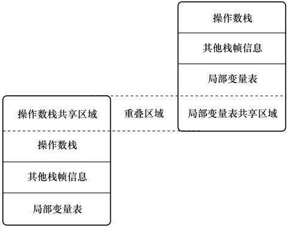
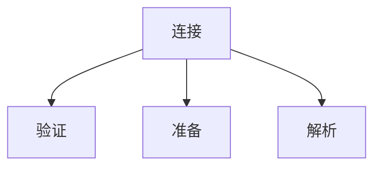
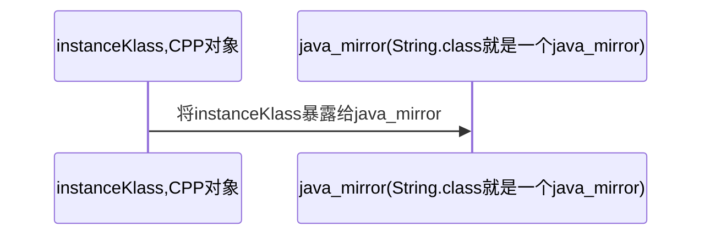
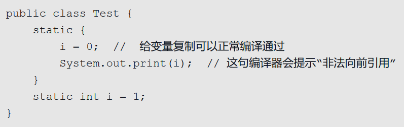
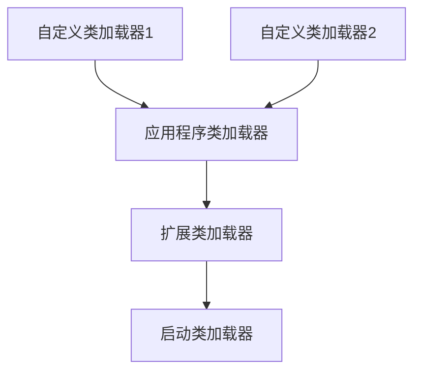
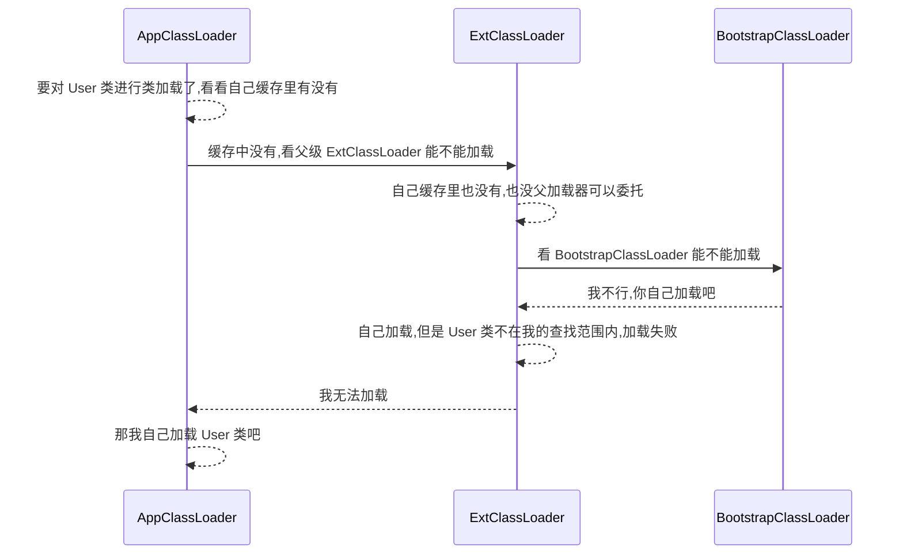
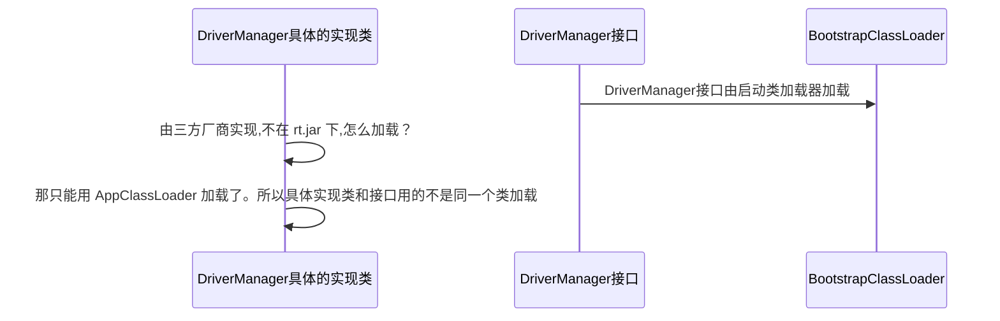
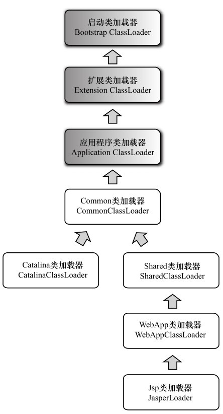
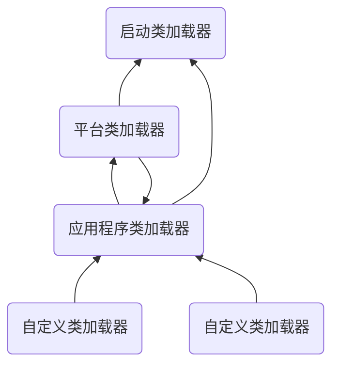

# 类加载与字节码技术

## 概述

> 学习内容

- 类文件结构
- 字节码指令
- 编译期处理
- 类加载阶段
- 类加载器
- 运行期优化


## 类文件结构

这块基本就是带你查表看 16 进制数据的意思，没什么好记的。

> 魔数

u4   magic

魔数：标识文件的类型。

0~3 字节，表示它是否是【class】类型的文件。

0000000 **ca fe ba be** 00 00 00 34 00 23 0a 00 06 00 15 09

> 版本

u2 minor_version; u2 major_version

4~7 字节，表示类的版本 00 34（52） 表示是 Java 8

0000000 ca fe ba be **00 00 00 34** 00 23 0a 00 06 00 15 09

## 字节码指令

可参考 https://docs.oracle.com/javase/specs/jvms/se8/html/jvms-6.html#jvms-6.5

public cn.itcast.jvm.t5.HelloWorld(); 构造方法的字节码指令

```shell
2a b7 00 01 b1
```

- 2a => aload_0 加载 slot 0 的局部变量 加载到操作数栈上，即 this，做为下面的 invokespecial 构造方法调用的参数
- b7 => invokespecial 预备调用构造方法，哪个方法呢？
- 00 01 引用常量池中 #1 项，即【 Method java/lang/Object."":()V 】
- b1 表示返回 return = 177 (0xb1)

另一个是 public static void main(java.lang.String[]); 主方法的字节码指令

```shell
b2 00 02 12 03 b6 00 04 b1
```

- b2 => getstatic 用来加载静态变量，哪个静态变量呢？ 
- 00 02 引用常量池中 #2 项，即【Field java/lang/System.out:Ljava/io/PrintStream;】 
- 12 => ldc 加载参数，哪个参数呢？ 
- 03 引用常量池中 #3 项，即 【String hello world】 
- b6 => invokevirtual 预备调用成员方法，哪个方法呢？ 
- 00 04 引用常量池中 #4 项，即【Method java/io/PrintStream.println:(Ljava/lang/String;)V】 
- b1 表示返回

### 字节码指令简介

参考自《深入理解 Java 虚拟机（第三版）》--- 周志明

指令由操作数和操作码组成与汇编语言的指令组成类似。Java 虚拟机操作码的长度被限制为了一个字节（0~255），指令集的操作码总数最多为 256 条。

Java 虚拟机的解释器可以通过下面这段伪代码来理解（不考虑异常）

```c
do{
    自定计算PC寄存器的值+1
	根据PC寄存器指示的位置，从字节码流中取出操作码
	if(字节码存在操作数) 从字节码流取出操作数
    执行操作码所定义的操作
}while(字节码流长度>0)
```

#### 对象创建指令

- 创建类实例：new

- 创建数组实例：newarray，anewarray，multianewarray

- 访问类字段（static 字段，在其他语言中被称为类字段）和实例字段（实例变量）：getfield、putfield、getstatic、putstatic

- 加载数组元素到操作数栈：baload、caload ...

- 取数组长度：arraylength

- 检查类实例类型：instanceof、checkcast

#### 操作数栈管理指令

- 弹出操作数栈栈顶的一个或两个元素：pop、pop2
- 复制操作数栈栈顶的一个或两个元素，并将复制值重新压入栈顶：dup、dup2、dup_x1、dup_x2。
- 将栈顶最顶端两个数值互换：swap

#### 方法调用和返回指令

- invokevirtual：调用对象方法
- invokeinterface：调用接口方法，在运行时会搜索一个实现了这个接口方法的对象，找出适合的方法进行调用
- invokespecial：用于调用一些需要特殊处理的实例方法，包括实例初始化方法、私有方法和父类方法
- invokestatic：用于调用类静态方法
- invokedynamic：用于在运行时动态解析出调用点限定符所引用的方法并执行。

#### 异常指令

- athrow 指令

#### 同步指令

Java 虚拟机支持方法级同步和方法内部一段指令序列的同步。这两种同步都是用 Monitor 来实现的。

```java
public synchronized void say1(){} // 方法级同步
public void say2(){
    System.out.println("12313");
    synchronized(this){
        // 同步代码块
    }
}
```

方法级别的同步是隐式的，不用通过字节码指令来控制。它实现在方法调用和返回操作中。如果设置了方法级的同步，方法的结构中会包含 ACC_SYNCHRONIZED 访问标志。当方法调用时，调用指令会检查方法的 ACC_SYNCHRONIZED 标志是否被设置，如果设置了，执行线程就要求先持有管程才能执行方法。如果方法内部出现了异常，并且方法无法处理这种异常，那同步方法所持有的管程将在异常抛出到同步方法边界之外时自动释放。（抛出异常后释放锁）

```java
stack=2, locals=4, args_size=1
	0: aload_0
	1: dup
	2: astore_1
	3: monitorenter // 同步
	4: iconst_0
	5: istore_2
	6: aload_1
	7: monitorexit // 正常退出同步
	8: goto          16
	11: astore_3
	12: aload_1
	13: monitorexit // 异常退出同步
	14: aload_3
	15: athrow // 抛出异常给方法的调用者
	16: return
Exception table:
	from    to  target type
		4     8    11   any
		11    14    11   any
```

### javap工具

Oracle 提供了 **javap** 工具来反编译 class 文件。

**问题：**使用 **javac** 命令编译 **.java** 文件，再通过 **javap** 查看 **.class** 详细信息，却没有显示局部变量表 **LocalVariableTable**。

**解决办法：**先使用 **javac -g:vars ShowThis.java** 重新编译，再 **javap -v ShowThis.class** 重新查看字节码信息

```java
javap -v HelloWorld.class
Classfile /xx/xx/HelloWorld.class
  Last modified 2021年8月1日; size 472 bytes
  MD5 checksum ff4f83d433d0b2f25721b0ae24d93d54
  Compiled from "HelloWorld.java"
public class jvm.clazz.HelloWorld
  minor version: 0
  major version: 55
  flags: (0x0021) ACC_PUBLIC, ACC_SUPER
  this_class: #5                          // jvm/clazz/HelloWorld
  super_class: #6                         // java/lang/Object
  interfaces: 0, fields: 0, methods: 2, attributes: 1
Constant pool:
   #1 = Methodref          #6.#17         // java/lang/Object."<init>":()V
   #2 = Fieldref           #18.#19        // java/lang/System.out:Ljava/io/PrintStream;
   #3 = String             #20            // Hello World
   #4 = Methodref          #21.#22        // java/io/PrintStream.println:(Ljava/lang/String;)V
   #5 = Class              #23            // jvm/clazz/HelloWorld
   #6 = Class              #24            // java/lang/Object
   #7 = Utf8               <init>
   #8 = Utf8               ()V
   #9 = Utf8               Code
  #10 = Utf8               LineNumberTable
  #11 = Utf8               main
  #12 = Utf8               ([Ljava/lang/String;)V
  #13 = Utf8               MethodParameters
  #14 = Utf8               args
  #15 = Utf8               SourceFile
  #16 = Utf8               HelloWorld.java
  #17 = NameAndType        #7:#8          // "<init>":()V
  #18 = Class              #25            // java/lang/System
  #19 = NameAndType        #26:#27        // out:Ljava/io/PrintStream;
  #20 = Utf8               Hello World
  #21 = Class              #28            // java/io/PrintStream
  #22 = NameAndType        #29:#30        // println:(Ljava/lang/String;)V
  #23 = Utf8               jvm/clazz/HelloWorld
  #24 = Utf8               java/lang/Object
  #25 = Utf8               java/lang/System
  #26 = Utf8               out
  #27 = Utf8               Ljava/io/PrintStream;
  #28 = Utf8               java/io/PrintStream
  #29 = Utf8               println
  #30 = Utf8               (Ljava/lang/String;)V
{
  public jvm.clazz.HelloWorld();
    descriptor: ()V
    flags: (0x0001) ACC_PUBLIC
    Code:
      stack=1, locals=1, args_size=1
         0: aload_0
         1: invokespecial #1                  // Method java/lang/Object."<init>":()V
         4: return
      LineNumberTable:
        line 3: 0 // 3 代表的是 java代码的行号 0 代表的是字节码中的行号

  public static void main(java.lang.String[]);
    descriptor: ([Ljava/lang/String;)V
    flags: (0x0009) ACC_PUBLIC, ACC_STATIC
    Code:
      stack=2, locals=1, args_size=1
         0: getstatic     #2                  // Field java/lang/System.out:Ljava/io/PrintStream;
         3: ldc           #3                  // String Hello World
         5: invokevirtual #4                  // Method java/io/PrintStream.println:(Ljava/lang/String;)V
         8: return
      LineNumberTable:
        line 5: 0
        line 6: 8
    MethodParameters:
      Name                           Flags
      args
}
SourceFile: "HelloWorld.java"
```

### VM 字节码执行引擎

#### 运行时栈帧结构

Java VM 以方法作为最基本的执行单元，**栈帧是**用于支持虚拟机进行方法调用和方法执行的**数据结构**。

栈帧中存储了以下数据：

- 局部变量表
- 操作数栈
- 动态链接库
- 方法地址返回信息等

#### 局部变量表

Local Variables Table，用于存放方法参数和方法内部定义的局部变量。在 Java 代码被编译成字节码后，方法的 Code 属性的 max_locals 就确定了该方法所需分配的局部变量表的最大容量。

局部变量表以变量槽（Variable Slot）为最小单位。一个变量槽可以存放一个 32 位以内的数据类型（VM 规范中未明确说明可以放多大的数据）。对于 64 位的数据，VM 会为其分配两个变量槽。**如果 VM 本身就是 64 位的，并且使用了 64 位的物理内存空间实现一个变量槽**，虚拟机仍要使用对齐和补白的手段让变量槽在外观上看起来和 32 位 VM 一样。

> this

一个需要注意的地方是，成员方法 this 的传递。我们来观察下该代码对于的字节码。在局部变量表中出现了一个名家 this 的参数。我们在方法内部用的 this，就是这样传递过来的。

```java
public void test(){
    long a = 10;
}
```

```shell
stack=2, locals=3, args_size=1
    0: ldc2_w        #7                  // long 10l
    3: lstore_1
    4: return
LocalVariableTable:
    Start  Length  Slot  Name   Signature
    	0       5     0  this   Lpat/dp/ShuTa;
    	4       1     1     a   J
```

> 局部变量表对 GC 的影响

```java
public class ShuTa {
    public static void main(String[] args) throws InterruptedException {
        {
            byte[] p = new byte[64 * 1024 * 1024];
        }
        // int t = 10;
        System.gc();
    }
}
/**
[0.016s][info][gc] Using G1
[0.209s][info][gc] GC(0) Pause Full (System.gc()) 68M->1M(14M) 8.744ms
去除 int t = 10 的注释后，会触发 gc
[0.016s][info][gc] Using G1
[0.209s][info][gc] GC(0) Pause Full (System.gc()) 68M->1M(14M) 8.744ms
*/
```

p 内否被回收的根本原因在于：局部变量表中的变量槽是否还有关于 p 数组对象的引用。没有 t 变量的那个注释，由于没有发生过任何对局部变量表的读写操作，p 所占的变量槽还没有被其他变量复用，所以作为 GC Roots 一部分的局部变量表仍然保持着对他的关联。

int t = 10 这条语句可以对变量槽进行复用。也可以使用 p = null（替代 int t=0，把变量对应的局部变量槽清空）

并且这种不被 GC 的情况只会出现在解释器运行上，在 JIT 的运行方式下，是可以被正常 GC 掉的。在说说 p = null（把变量对应的局部变量槽清空）这个操作，在 JIT 的优化下，大概率会被当成无效操作剔除。

> 操作数栈

32 位数据类型所需的栈容量是 1 ，64 位数据类型所需的栈容量是 2。当一个方法刚开始执行的时候，方法的操作数栈是空的，在方法的执行过程中会有各种字节码指令往操作数栈中写入和提取内容，即出栈和入栈的操作。

在 JVM 的概念模型中，两个不同的栈帧作为不同方法的虚拟机栈的元素，是完全互相独立的。**但是大多数虚拟机的实现里都会进行一些优化处理，令两个栈帧出现一部分重叠，既可以节约空间又可以在进行方法调用时共用一部分数据，无需进行额外的参数赋值传递了。**



> 动态链接

每个栈帧都包含一个指向运行时常量池中该栈帧所属方法的引用，持有这个引用是为了支持方法调用过程中的动态连接（Dynamic Linking）。Class 文件的常量池中存有大量的符号引用，字节码中的方法调用指令就以常量池中指向方法的符号引用作为参数。这些符号引用一部分会在类加载阶段或者第一次使用的时候就转化为直接引用，这种转化称为静态解析。另外一部分将在每一次运行期间转化为直接引用，这部分称为动态连接。

> 方法返回地址

方法的退出/返回分为两种，一种是正常返回，一种是发生异常。无论采用何种退出方式，在方法退出之后，都需要返回到方法被调用的位置，程序才能继续执行，方法返回时可能需要在栈帧中保存一些信息，用来帮助恢复它的上层方法的执行状态。一般来说，方法正常退出时，调用者的 PC 计数器的值可以作为返回地址，栈帧中很可能会保存这个计数器值。而方法异常退出时，返回地址是要通过异常处理器表来确定的，栈帧中一般不会保存这部分信息。方法退出的过程实际上就等同于把当前栈帧出栈，因此退出时可能执行的操作有：恢复上层方法的局部变量表和操作数栈，把返回值（如果有的话）压入调用者栈帧的操作数栈中，调整 PC 计数器的值以指向方法调用指令后面的一条指令等。

#### 方法调用

> 解析

方法调用并不等同于方法执行，方法调用阶段唯一的任务就是确定被调用方法的版本（即调用哪一个方法），暂时还不涉及方法内部的具体运行过程。

在 Java 虚拟机里面提供了 5 条方法调用字节码指令

- **invokestatic**：调用静态方法
- **invokespecial**：用于调用实例构造器\<init\> 方法、私有方法和父类中的方法
- **invokevirtual**：用于调用所有的虚方法
- **invokeinterface**：用于调用接口方法，会在运行时再确定一个实现该接口的对象
- **invokedynamic**：先在运行时动态解析出调用点限定符所引用的方法，然后再执行该方法。这条指令的分派逻辑由用户设定的应道方法来决定。

静态方法、实例构造器、私有方法、父类中的方法及 final（虽然 final 方法被 invokevirtual 指令调用）修饰的方法再解析阶段中可以确定唯一的调用版本，**这五种方法的调用再类加载的时候会把它们的符号引用解析位该方法的直接引用，这种方法统称为非虚方法。**

还有一种方法调用是在类加载的时候无法解析的，这种方法的调用形式称为**<span style="color:blue">分派调用</span>**。

> 分派

~~~
~~~

### 图解方法执行流程

源代码

```java
public class Demo3_1 {
    /**
     * 演示字节码指令和操作数栈、常量池的关系
     */
	public static void main(String[] args) {        
		int a = 10;        
		int b = Short.MAX_VALUE + 1;     // 本来是存在字节码里的，但是一旦超过了 Short 的最大值，就会存储在常量池中。验证了下，的确是这样的。
		int c = a + b;        
		System.out.println(c);   
    } 
}
```

字节码

```shell
public class jvm.clazz.Demo3_1
  minor version: 0
  major version: 52
  flags: (0x0021) ACC_PUBLIC, ACC_SUPER
  this_class: #6                          // jvm/clazz/Demo3_1
  super_class: #7                         // java/lang/Object
  interfaces: 0, fields: 0, methods: 2, attributes: 1
Constant pool:
   #1 = Methodref          #7.#25         // java/lang/Object."<init>":()V
   #2 = Class              #26            // java/lang/Short
   #3 = Integer            32768
   #4 = Fieldref           #27.#28        // java/lang/System.out:Ljava/io/PrintStream;
   #5 = Methodref          #29.#30        // java/io/PrintStream.println:(I)V
   #6 = Class              #31            // jvm/clazz/Demo3_1
   #7 = Class              #32            // java/lang/Object
   #8 = Utf8               <init>
   #9 = Utf8               ()V
  #10 = Utf8               Code
  #11 = Utf8               LineNumberTable
  #12 = Utf8               LocalVariableTable
  #13 = Utf8               this
  #14 = Utf8               Ljvm/clazz/Demo3_1;
  #15 = Utf8               main
  #16 = Utf8               ([Ljava/lang/String;)V
  #17 = Utf8               args
  #18 = Utf8               [Ljava/lang/String;
  #19 = Utf8               a
  #20 = Utf8               I
  #21 = Utf8               b
  #22 = Utf8               c
  #23 = Utf8               SourceFile
  #24 = Utf8               Demo3_1.java
  #25 = NameAndType        #8:#9          // "<init>":()V
  #26 = Utf8               java/lang/Short
  #27 = Class              #33            // java/lang/System
  #28 = NameAndType        #34:#35        // out:Ljava/io/PrintStream;
  #29 = Class              #36            // java/io/PrintStream
  #30 = NameAndType        #37:#38        // println:(I)V
  #31 = Utf8               jvm/clazz/Demo3_1
  #32 = Utf8               java/lang/Object
  #33 = Utf8               java/lang/System
  #34 = Utf8               out
  #35 = Utf8               Ljava/io/PrintStream;
  #36 = Utf8               java/io/PrintStream
  #37 = Utf8               println
  #38 = Utf8               (I)V
{
  public jvm.clazz.Demo3_1();
    descriptor: ()V
    flags: (0x0001) ACC_PUBLIC
    Code:
      stack=1, locals=1, args_size=1
         0: aload_0
         1: invokespecial #1                  // Method java/lang/Object."<init>":()V
         4: return
      LineNumberTable:
        line 3: 0
      LocalVariableTable:
        Start  Length  Slot  Name   Signature
            0       5     0  this   Ljvm/clazz/Demo3_1;

  public static void main(java.lang.String[]);
    descriptor: ([Ljava/lang/String;)V
    flags: (0x0009) ACC_PUBLIC, ACC_STATIC
    Code:
      stack=2, locals=4, args_size=1
         0: bipush        10
         2: istore_1
         3: ldc           #3                  // int 32768
         5: istore_2
         6: iload_1
         7: iload_2
         8: iadd
         9: istore_3
        10: getstatic     #4                  // Field java/lang/System.out:Ljava/io/PrintStream;
        13: iload_3
        14: invokevirtual #5                  // Method java/io/PrintStream.println:(I)V
        17: return
      LineNumberTable:
        line 5: 0
        line 6: 3
        line 7: 6
        line 8: 10
        line 9: 17
      LocalVariableTable:
        Start  Length  Slot  Name   Signature
            0      18     0  args   [Ljava/lang/String;
            3      15     1     a   I
            6      12     2     b   I
           10       8     3     c   I
}
SourceFile: "Demo3_1.java"
```

#### **常量池载入运行时常量池**

常量池的数据会放入运行时常量池这个地方。运行时常量池，是属于方法区的一个部分，因为比较特殊，所以这里单独提了出来。


#### **方法字节码载入方法区**

字节码指令放入方法区。


#### main 线程开始运行，分配栈帧内存

（stack=2，locals=4）

- 绿色：局部变量表，locals = 4，因为就四个局部变量
- 蓝色：操作数栈，stack 深度 = 2，因为就两个方法，main 和 print


#### **执行引擎开始执行字节码**

**bipush 10**：将一个 byte 压入操作数栈（其长度会补齐 4 个字节）

- 将一个 byte 压入操作数栈（其长度会补齐 4 个字节），类似的指令还有

    - sipush 将一个 short 压入操作数栈（其长度会补齐 4 个字节）
    - ldc 将一个 int 压入操作数栈
    - ldc2_w 将一个 long 压入操作数栈（**分两次压入**，因为 long 是 8 个字节）
- <span style="color:red">这里小的数字都是和字节码指令存在一起，**超过 short 范围的数字存入了常量池**</span>


**istore 1**

- 将操作数栈栈顶元素弹出，放入局部变量表的slot 1中


**ldc #3**

- 读取运行时常量池中#3，即 32768 (超过 short 最大值范围的数会被放到运行时常量池中)，将其加载到操作数栈中

- 注意 Short.MAX_VALUE 是 32767，所以 32768 = Short.MAX_VALUE + 1 实际是在编译期间计算好的


**istore 2**

将操作数栈中的元素弹出，放到局部变量表的2号位置


**iload1 iload2**

- 将局部变量表中1号位置和2号位置的元素放入操作数栈中

- **只能在操作数栈中执行运算操作**
- iload1 把 1 槽位的值读取到操作数栈上
- iload2 把 2 槽位的值读取到操作数栈上


**iadd**

将操作数栈中的两个元素**弹出栈**并相加，结果在压入操作数栈中


**istore 3**

将操作数栈中的元素弹出，放入局部变量表的3号位置


**getstatic #4**

- 在运行时常量池中找到#4，发现是一个对象

- 在堆内存中找到该对象，并将其**引用**放入操作数栈中


**iload 3**

将局部变量表中3号位置的元素压入操作数栈中


**invokevirtual 5**

找到常量池 #5 项，定位到方法区 java/io/PrintStream.println:(I)V 方法

生成新的栈帧（分配 locals、stack等）

传递参数，执行新栈帧中的字节码


- 执行完毕，弹出栈帧

- 清除 main 操作数栈内容


**return**
完成 main 方法调用，弹出 main 栈帧，程序结束

### 字节码指令分析问题

> 分析 a++

```java
public class Demo3_2 {
    public static void main(String[] args) {
        int a = 10;
        // 10 + 12
        // 22 + 12
        int b = a++ + ++a + a--;
        System.out.println(a);
        System.out.println(b);
    }
}
```

```shell
      stack=2, locals=3, args_size=1
         0: bipush        10
         2: istore_1			# 给 a 赋值为 10
         3: iload_1				# 把 a 的值 放入操作数栈 
         4: iinc          1, 1  # 槽位，自增几。是对槽位中的数据自增，不是操作数栈。
         7: iinc          1, 1
        10: iload_1
        11: iadd
        12: iload_1
        13: iinc          1, -1
        16: iadd
        17: istore_2
        18: getstatic     #2                  // Field java/lang/System.out:Ljava/io/PrintStream;
        21: iload_1
        22: invokevirtual #3                  // Method java/io/PrintStream.println:(I)V
        25: getstatic     #2                  // Field java/lang/System.out:Ljava/io/PrintStream;
        28: iload_2
        29: invokevirtual #3                  // Method java/io/PrintStream.println:(I)V
        32: return
      LineNumberTable:
        line 5: 0
        line 6: 3
        line 7: 18
        line 8: 25
        line 9: 32
      LocalVariableTable:
        Start  Length  Slot  Name   Signature
            0      33     0  args   [Ljava/lang/String;
            3      30     1     a   I
           18      15     2     b   I
```

分析：

- 注意 iinc 指令是直接在局部变量 slot 上进行运算
    - istore 是从操作数栈中弹出数据存入局部变量 slot 中
    - iload 是把局部变量 slot 的数据存入操作数栈中
- a++ 和 ++a 的区别是先执行 iload 还是先执行 iinc
    - a++ 是先 load 再 iinc
    - ++a 是先 iinc 在 load
- 看着这个图思考就好

比如：a--，是先把 局部变量表中的 a 的值加载到操作数栈，然后局部变量表中的 a 再减减

++a，是先在槽位上 iinc，再把 iinc 的结果 load 到操作数栈中。


> x = x++

代码

```java
public class Demo2 {
	public static void main(String[] args) {
		int i=0;
		int x=0;
		while(i<10) {
			x = x++;
			i++;
		}
		System.out.println(x); // 结果为0
	}
}
```

为什么最终的x结果为0呢？ 

x 代表局部变量表中的一个槽位，

x++ 对应 

- iload_x 把 0 读进操作数栈 此时 x = 0
- iinc x 1 自增的结果 x = 1，自增完成后又执行了赋值操作。
- 把操作数栈中的值取出来再覆盖掉本地变量表中的x。 

通过分析字节码指令即可知晓

```java
Code:
     stack=2, locals=3, args_size=1	//操作数栈分配2个空间，局部变量表分配3个空间
        0: iconst_0	// 准备一个常数0
        1: istore_1	// 将常数0放入局部变量表的1号槽位 i=0
        2: iconst_0	// 准备一个常数0
        3: istore_2	// 将常数0放入局部变量的2号槽位 x=0	
        4: iload_1	// 将局部变量表1号槽位的数放入操作数栈中
        5: bipush 10 // 将数字10放入操作数栈中，此时操作数栈中有2个数
        7: if_icmpge  21 //比较操作数栈中的两个数，如果下面的数大于上面的数，就跳转到21。这里的比较是将两个数做减法。因为涉及运算操作，所以会将两个数弹出操作数栈来进行运算。运算结束后操作数栈为空
       10: iload_2	  // 将局部变量2号槽位的数放入操作数栈中，放入的值是0
       11: iinc 2, 1 // 将局部变量2号槽位的数加1，自增后，槽位中的值为1
       14: istore_2	 // 将操作数栈中的数放入到局部变量表的2号槽位，2号槽位的值又变为了0
       15: iinc 1, 1 // 1号槽位的值自增1
       18: goto 4 // 跳转到第4条指令
       21: getstatic #2 // Field java/lang/System.out:Ljava/io/PrintStream;
       24: iload_2
       25: invokevirtual #3 // Method java/io/PrintStream.println:(I)V
       28: return
```

> 条件判断

和以前学的汇编差不多。不特别记了。

- **byte，short，char 都会按 int 比较，因为操作数栈都是 4 字节**
- goto 用来进行跳转到指定行号的字节码

```java
public class EQ {
    public static void main(String[] args) {
        int a = 0;
        if (a == 0) {
            a = 10;
        } else {
            a = 20;
        }
    }
}
```

```shell
stack=1, locals=2, args_size=1
    0: iconst_0
    1: istore_1
    2: iload_1
    3: ifne          12 # 不等于就跳到12行
    6: bipush        10
    8: istore_1
    9: goto          15
    12: bipush        20
    14: istore_1
    15: return
```

以上比较指令中没有 long，float，double 的比较，那么它们要比较怎 么办？ 

参考 https://docs.oracle.com/javase/specs/jvms/se7/html/jvms-6.html#jvms-6.5.lcmp

> 循环控制

while 和 for 的字节码是一样的。

```java
public class While {
    public static void main(String[] args) {
        int a = 0;
        while (a < 10) {
            a++; // 先 0 iload 到操作数栈，然后槽位的值 ++变成1，最后把操作数栈的数赋值到 槽位，槽位的数又变成了0
        }
    }
}
```

```shell
0: iconst_0
1: istore_1		 # 存储数据到局部变量表中
2: iload_1		 # 把局部变量 a 的值读取到操作数栈中。
3: bipush        10
5: if_icmpge     14
8: iinc          1, 1
11: goto         2
14: return
```

### 构造方法

#### cinit()V

每个类的构造方法

```java
public class Demo3 {
	static int i = 10;

	static {
		i = 20;
	}

	static {
		i = 30;
	}

	public static void main(String[] args) {
		System.out.println(i); //结果为30
	}
}
```

<span style="color:green">**编译器会按**从上至下**的顺序，收集所有 static 静态代码块和静态成员赋值的代码，**合并**为一个特殊的方法 cinit()V ：**</span>

```shell
0: bipush        10
2: putstatic     #3                  // Field i:I
5: bipush        20
7: putstatic     #3                  // Field i:I
10: bipush        30
12: putstatic     #3                  // Field i:I
15: return
```

#### init()V

每个实例对象的构造方法

```java
public class Demo4 {
	private String a = "s1";

	{ b = 20; }

	private int b = 10;

	{ a = "s2"; }

	public Demo4(String a, int b) {
		this.a = a;
		this.b = b;
	}

	public static void main(String[] args) {
		Demo4 d = new Demo4("s3", 30);
		System.out.println(d.a);
		System.out.println(d.b);
	}
}
```

编译器会按**从上至下**的顺序，收集所有 {} 代码块和成员变量赋值的代码，**形成新的构造方法**，但**原始构造方法**内的代码**总是在后**

```shell
0: aload_0
1: invokespecial #1                  // Method java/lang/Object."<init>":()V
4: aload_0
5: ldc           #2                  // <- "s1"
7: putfield      #3                  // -> this.a
10: aload_0
11: bipush        20					 // <- 20
13: putfield      #4                  //  -> this.b
16: aload_0
17: bipush        10					 // <- 10
19: putfield      #4                  // -> this.b
22: aload_0
23: ldc           #5                  // <- "s2"
25: putfield      #3                  // -> this.a
# 原始构造方法在最后执行
28: aload_0							// -------------------------
29: aload_1							// <- slot 1(a) "s3"
30: putfield      #3                 // -> this.a
33: aload_0							
34: iload_2							// <- slot 2(b) 30
35: putfield      #4                 // -> this.b 															// -------------------------
38: return
```

### 方法调用

JVM 支持以下 5 条方法调用字节码指令

- **invokestatic**：调用静态方法
- **invokespecial**：用于调用实例构造器\<init\> 方法、私有方法和父类中的方法
- **invokevirtual**：用于调用所有的虚方法
- **invokeinterface**：用于调用接口方法，会在运行时再确定一个实现该接口的对象
- **invokedynamic**：先在运行时动态解析出调用点限定符所引用的方法，然后再执行该方法

```java
public class Method {
    public Method() {
    }

    private void test1() {
    }

    private final void test2() {
    }

    public void test3() {
    }

    public static void test4() {
    }

    public static void main(String[] args) {
        Method m = new Method();
        m.test1();
        m.test2();
        m.test3();
        m.test4();
        Method.test4();
    }
}
```

> 不同方法在调用时，对应的虚拟机指令有所区别：

- 私有、构造、被 final 修饰的方法，在调用时都使用 **invokespecial** 指令
    - 私有方法、构造方法、final 修饰的方法都可以确定方法中的内容，即没有多态。
- 普通成员方法在调用时，使用 invokevirtual 指令。
    - 编译期间无法确定方法调用的是哪个对象的，子类的还是父类的。
    - 因为编译期间无法确定该方法的内容，只有在运行期间才能确定，
- 静态方法在调用时使用 **invokestatic** 指令
- **invokespecial** 和 **invokestatic** 都属于静态绑定，在字节码生成的时候就知道如何找到是哪个类的哪个方法。

```shell
0: new           #2                  // class jvm/clazz/Method
3: dup
4: invokespecial #3                  // Method "<init>":()V
7: astore_1
8: aload_1
9: invokespecial #4                  // Method test1:()V
12: aload_1
13: invokespecial #5                  // Method test2:()V
16: aload_1
17: invokevirtual #6                  // Method test3:()V
20: aload_1
21: pop
22: invokestatic  #7                  // Method test4:()V
25: invokestatic  #7                  // Method test4:()V
28: return
```

- new 是创建【对象】，给对象分配堆内存，执行成功会将【**对象引用**】压入操作数栈
- dup 是赋值操作数栈栈顶的内容，本例即为【**对象引用**】，为什么需要两份引用呢，一个是要配合 invokespecial 调用该对象的构造方法 “init”:()V （会消耗掉栈顶一个引用），另一个要配合 astore_1 赋值给局部变量
- 最终方法（final），私有方法（private），构造方法都是由 invokespecial 指令来调用，属于**静态绑定**，可以直接找到方法代码的执行地址，效率更高
- 普通成员方法是由 invokevirtual 调用，属于**动态绑定**，即支持多态 
- 成员方法与静态方法调用的另一个区别是，执行方法前是否需要【对象引用】
- **比较有意思的是 m.test4(); 是通过【对象引用】调用一个静态方法，可以看到在调用 invokestatic 之前执行了 pop 指令，把【对象引用】从操作数栈弹掉了，因为静态方法的执行不需要对象**
- 还有一个执行 invokespecial 的情况是通过 super 调用父类方法

### 多态原理

#### 运行代码

停止在 System.in.read() 方法上，这时运行 jps 获取进程 id

```java
/**
 *  禁用指针压缩 方便查看地址。
 *  -XX:-UseCompressedOops -XX:-UseCompressedClassPointers
 */
public class Demo3_3 {
    public static void test(Animal animal) {
        animal.eat();
        System.out.println(animal.toString());
    }

    public static void main(String[] args) throws IOException {
        test(new Cat());
        test(new Dog());
        System.in.read();
    }
}

abstract class Animal {
    public abstract void eat();

    @Override
    public String toString() {
        return "我是" + this.getClass().getSimpleName();
    }
}

class Dog extends Animal {
    @Override
    public void eat() {
        System.out.println("啃骨头");
    }
}

class Cat extends Animal {
    @Override
    public void eat() {
        System.out.println("吃鱼");
    }
}
```

#### 运行 HSDB 工具

HSDB位于C:\Program Files\Java\jdk1.8.0_212\lib里面，接下来启动HSDB；进入 JDK 安装目录，执行；

PS：报错了，少dll文件，下载过来就行。

```shell
PS D:\Program Files\Java\jdk1.8.0_301\lib> java -cp .\sa-jdi.jar sun.jvm.hotspot.HSDB
```

----

#### 使用 HSDB

- 根据 jps 的 id 链接Java程序

- tool --> Find Object by Query 
  - `select d from jvm.clazz.Dog d `
  - 查询 jvm.clazz包下的 Dog 类。 前后两个 d 应该是别名，要保持一致。
- windows-->console
  - 执行命令 `mem 0x000001c3710b83e0 2` 回车执行
  - 以xx开始，查看 2 个 word 的数据

Dog 对象的表示


因为普通成员方法需要在运行时才能确定具体的内容，所以虚拟机需要调用**invokevirtual**指令

在执行invokevirtual指令时，经历了以下几个步骤

- 先通过栈帧中对象的引用找到对象
- 分析对象头，找到对象实际的Class
- Class结构中有**vtable**
- 查询vtable找到方法的具体地址
- 执行方法的字节码

### 异常处理

#### try-catch

```java
public class Demo1 {
	public static void main(String[] args) {
		int i = 0;
		try {
			i = 10;
		}catch (Exception e) {
			i = 20;
		}
	}
}
```

对应字节码指令

```shell
stack=1, locals=3, args_size=1
    0: iconst_0
    1: istore_1
    2: bipush        10
    4: istore_1
    5: goto          12
    8: astore_2
    9: bipush        20
    11: istore_1
    12: return
# 多出来一个异常表
Exception table:
    from    to  target type
      2     5     8   Class java/lang/Exception
```

- 可以看到多出来一个 Exception table 的结构，[from, to) 是**前闭后开**（也就是检测2~4行）的检测范围，一旦这个范围内的字节码执行出现异常，则通过 type 匹配异常类型，如果一致，进入 target 所指示行号
- 8行的字节码指令 astore_2 是将异常对象引用存入局部变量表的2号位置（为e）

#### 多个single-catch

```java
public class Demo1 {
	public static void main(String[] args) {
		int i = 0;
		try {
			i = 10;
		}catch (ArithmeticException e) {
			i = 20;
		}catch (Exception e) {
			i = 30;
		}
	}
}
```

对应的字节码

```shell
stack=1, locals=3, args_size=1
    0: iconst_0
    1: istore_1
    2: bipush        10
    4: istore_1
    5: goto          19
    8: astore_2
    9: bipush        20
    11: istore_1
    12: goto          19
    15: astore_2
    16: bipush        30
    18: istore_1
    19: return
Exception table:
    from    to  target type
      2     5     8   Class java/lang/ArithmeticException
      2     5    15   Class java/lang/Exception
```

- 因为异常出现时，**只能进入** Exception table 中**一个分支**，所以局部变量表 slot 2 位置**被共用**

#### multi-catch

#### finally

```java
public class Demo2 {
	public static void main(String[] args) {
		int i = 0;
		try {
			i = 10;
		} catch (Exception e) {
			i = 20;
		} finally {
			i = 30;
		}
	}
}
```

对应字节码

```shell
stack=1, locals=4, args_size=1
    0: iconst_0
    1: istore_1
    //try块
    2: bipush        10
    4: istore_1
    //try块执行完后，会执行finally    
    5: bipush        30
    7: istore_1
    8: goto          27
    //catch块     
    11: astore_2 //异常信息放入局部变量表的2号槽位
    12: bipush        20
    14: istore_1
    //catch块执行完后，会执行finally        
    15: bipush        30
    17: istore_1
    18: goto          27
    //出现异常，但未被Exception捕获，会抛出其他异常，这时也需要执行finally块中的代码   
    21: astore_3
    22: bipush        30
    24: istore_1
    25: aload_3
    26: athrow  //抛出异常
    27: return
Exception table:
    from    to  target type
      2     5    11   Class java/lang/Exception
      2     5    21   any
     11    15    21   any
```

可以看到 finally 中的代码被**复制了 3 份**，分别放入 try 流程，catch 流程以及 catch剩余的异常类型流程

**注意**：虽然从字节码指令看来，每个块中都有finally块，但是finally块中的代码**只会被执行一次**

#### finally中的return

```java
public class Demo3 {
	public static void main(String[] args) {
		int i = Demo3.test();
        //结果为20
		System.out.println(i);
	}

	public static int test() {
		int i;
		try {
			i = 10;
			return i;
		} finally {
			i = 20;
			return i;
		}
	}
}
```

对应字节码

```shell
stack=1, locals=3, args_size=0
    0: bipush        10
    2: istore_0
    3: iload_0
    4: istore_1  # 暂存返回值
    5: bipush        20
    7: istore_0
    8: iload_0
    9: ireturn	# ireturn会返回操作数栈顶的整型值20
    # 如果出现异常，还是会执行finally块中的内容，没有抛出异常
    10: astore_2
    11: bipush        20
    13: istore_0
    14: iload_0
    15: ireturn	# 这里没有athrow了，也就是如果在finally块中如果有返回操作的话，且try块中出现异常，会吞掉异常！
Exception table:
    from    to  target type
      0     5    10    any
```

- 由于 finally 中的 **ireturn** 被插入了所有可能的流程，因此返回结果肯定以finally的为准
- 至于字节码中第 2 行，似乎没啥用，且留个伏笔，看下个例子
- 跟上例中的 finally 相比，发现**没有 athrow 了**，这告诉我们：如果在 finally 中出现了 return，会**吞掉异常**
- 所以**不要在finally中进行返回操作**

#### 被吞掉的异常

```java
public class Demo3 {
   public static void main(String[] args) {
      int i = Demo3.test();
      //最终结果为20
      System.out.println(i);
   }

   public static int test() {
      int i;
      try {
         i = 10;
         //这里应该会抛出异常
         i = i/0;
         return i;
      } finally {
         i = 20;
         return i;
      }
   }
}
```

会发现打印结果为20，并未抛出异常

#### finally不带return

```java
public class Demo4 {
	public static void main(String[] args) {
		int i = Demo4.test();
		System.out.println(i);
	}

	public static int test() {
		int i = 10;
		try {
			return i;
		} finally {
			i = 20;
		}
	}
}
```

对应字节码

```shell
stack=1, locals=3, args_size=0
    0: bipush        10
    2: istore_0 //赋值给i 10
    3: iload_0	//加载到操作数栈顶
    4: istore_1 //加载到局部变量表的1号位置
    5: bipush        20
    7: istore_0 //赋值给i 20
    8: iload_1 //加载局部变量表1号位置的数10到操作数栈
    9: ireturn //返回操作数栈顶元素 10
    10: astore_2
    11: bipush        20
    13: istore_0
    14: aload_2 //加载异常
    15: athrow //抛出异常
Exception table:
    from    to  target type
      3     5    10    any
```

### Synchronized

> **方法级别的 synchronized 不会在字节码指令中有所体现**

```java
public class Demo5 {
	public static void main(String[] args) {
		int i = 10;
		Lock lock = new Lock();
		synchronized (lock) {
			System.out.println(i);
		}
	}
}
class Lock{}
```

对应字节码

```java
public static void main(java.lang.String[]);
descriptor: ([Ljava/lang/String;)V
flags: ACC_PUBLIC, ACC_STATIC
Code:
    stack=2, locals=4, args_size=1
        0: new #2 // new Object
        3: dup
        4: invokespecial #1 // invokespecial <init>:()V
        7: astore_1 // lock引用 -> lock
        8: aload_1 // <- lock （synchronized开始）
        9: dup
        10: astore_2 // lock引用 -> slot 2
        11: monitorenter // monitorenter(lock引用)
        12: getstatic #3 // <- System.out
        15: ldc #4 // <- "ok" 注意方法级别的 synchronized 不会在字节码指令中有所体现
        17: invokevirtual #5 // invokevirtual println:
        (Ljava/lang/String;)V
        20: aload_2 // <- slot 2(lock引用)
        21: monitorexit // monitorexit(lock引用)
        22: goto 30
        25: astore_3 // any -> slot 3
        26: aload_2 // <- slot 2(lock引用)
        27: monitorexit // monitorexit(lock引用)
        28: aload_3
        29: athrow
        30: return
    Exception table:
        from to target type
            12 22 25 any
            25 28 25 any
    LineNumberTable: ...
    LocalVariableTable:
        Start Length Slot Name Signature
            0 31 0 args [Ljava/lang/String;
            8 23 1 lock Ljava/lang/Object;
    StackMapTable: ...
MethodParameters: ...
```

```shell
stack=2, locals=5, args_size=1
    0: bipush        10
    2: istore_1
    3: new           #2                  // class com/nyima/JVM/day06/Lock
    6: dup # 复制一份对象引用，放到操作数栈顶，用于构造函数消耗
    7: invokespecial #3                  // Method com/nyima/JVM/day06/Lock."<init>":()V
    10: astore_2 # 剩下的一份放到局部变量表的2号位置
    11: aload_2 # 加载到操作数栈
    12: dup 	# 复制一份，放到操作数栈，用于加锁时消耗
    13: astore_3 # 将操作数栈顶元素弹出，暂存到局部变量表的三号槽位。这时操作数栈中有一份对象的引用
    14: monitorenter # 加锁
    # 锁住后代码块中的操作    
    15: getstatic     #4                  // Field java/lang/System.out:Ljava/io/PrintStream;
    18: iload_1
    19: invokevirtual #5                  // Method java/io/PrintStream.println:(I)V
    # 加载局部变量表中三号槽位对象的引用，用于解锁    
    22: aload_3    
    23: monitorexit //解锁
    24: goto          34
    # 异常操作    
    27: astore        4
    29: aload_3
    30: monitorexit //解锁
    31: aload         4
    33: athrow
    34: return
    # 可以看出，无论何时出现异常，都会跳转到27行，将异常放入局部变量中，并进行解锁操作，然后加载异常并抛出异常。      
Exception table:
    from    to  target type
      15    24    27   any
      27    31    27   any
```

## 编译期处理

所谓的 **语法糖** ，其实就是指 java 编译器把 *.java 源码编译为 \*.class 字节码的过程中，**自动生成**和**转换**的一些代码，主要是为了减轻程序员的负担，算是 java 编译器给我们的一个额外福利

**注意**，以下代码的分析，借助了 javap 工具，idea 的反编译功能，idea 插件 **jclasslib** 等工具。另外， 编译器转换的**结果直接就是 class 字节码**，只是为了便于阅读，给出了几乎等价 的 java 源码方式，并不是编译器还会转换出中间的 java 源码，切记。

### 默认构造函数

```java
public class Candy1 {
}
```

经过编译期优化后

```java
public class Candy1 {
   //这个无参构造器是java编译器帮我们加上的
   public Candy1() {
      //即调用父类 Object 的无参构造方法，即调用 java/lang/Object." <init>":()V
      super();
   }
}
```

### 自动拆装箱

基本类型和其包装类型的相互转换过程，称为拆装箱

在JDK 5以后，它们的转换可以在编译期自动完成

```java
public class Demo2 {
   public static void main(String[] args) {
      Integer x = 1;
      int y = x;
   }
}
```

转换过程如下

```java
public class Demo2 {
   public static void main(String[] args) {
      //基本类型赋值给包装类型，称为装箱
      Integer x = Integer.valueOf(1);
      //包装类型赋值给基本类型，称谓拆箱
      int y = x.intValue();
   }
}
```

### 泛型集合取值

泛型也是在 JDK 5 开始加入的特性，但 java 在**编译泛型代码后**会执行 **泛型擦除** 的动作，即泛型信息在编译为字节码之后就**丢失**了，实际的类型都当做了 **Object** 类型来处理：

```java
public class Demo3 {
   public static void main(String[] args) {
      List<Integer> list = new ArrayList<>();
      list.add(10);
      Integer x = list.get(0);
   }
}
```

所以在取值时，编译器真正生成的字节码中，还要额外做一个类型转换的操作：

```java
// 需要将 Object 转为 Integer
Integer x = (Integer)list.get(0);
```

如果前面的 x 变量类型修改为 int 基本类型那么最终生成的字节码是：

```java
// 需要将 Object 转为 Integer, 并执行拆箱操作
int x = ((Integer)list.get(0)).intValue()
```

擦除的是字节码上的泛型信息，可以看到 LocalVariableTypeTable 仍然保留了方法参数泛型的信息

```shell
stack=2, locals=3, args_size=1
    0: new           #2                  // class ArrayList
    3: dup
    4: invokespecial #3                  // Method ArrayList."<init>":()V
    7: astore_1
    8: aload_1
    9: bipush        10
    11: invokestatic  #4                  // Method Integer.valueOf:(I)Integer;
    // 这里进行了泛型擦除，实际调用的是add(Objcet o)
    14: invokeinterface #5,  2            // InterfaceMethod List.add:(Object;)Z

    19: pop
    20: aload_1
    21: iconst_0
    // 这里也进行了泛型擦除，实际调用的是get(Object o)   
    22: invokeinterface #6,  2            // InterfaceMethod List.get:(I)Object;
    // checkcast 强制类型转换，将Object转换成了Integer
    27: checkcast     #7                  // class Integer
    30: astore_2
    31: return
```

### 泛型反射

```java
public class CandyReflect {

    public static void main(String[] args) throws Exception {
        List<Integer> list = new ArrayList<>();
        list.add(10); // 实际调用的是 List.add(Object e)
        Integer x = list.get(0); // 实际调用的是 Object obj = List.get(int index);

        Method test = CandyReflect.class.getMethod("test", List.class, Map.class);
        Type[] types = test.getGenericParameterTypes();
        for (Type type : types) {
            if (type instanceof ParameterizedType) {
                ParameterizedType parameterizedType = (ParameterizedType) type;
                System.out.println("原始类型 - " + parameterizedType.getRawType());
                Type[] arguments = parameterizedType.getActualTypeArguments();
                for (int i = 0; i < arguments.length; i++) {
                    System.out.printf("泛型参数[%d] - %s\n", i, arguments[i]);
                }
            }

        }
    }

    public Set<Integer> test(List<String> list, Map<Integer, Object> map) {
        return null;
    }
}
```

### 可变参数

```java
public class Demo4 {
   public static void foo(String... args) {
      //将args赋值给arr，可以看出String...实际就是String[] 
      String[] arr = args;
      System.out.println(arr.length);
   }

   public static void main(String[] args) {
      foo("hello", "world");
   }
}
```

可变参数 **String…** args 其实是一个 **String[]** args ，从代码中的赋值语句中就可以看出来。 同 样 java 编译器会在编译期间将上述代码变换为：

```java
public class Demo4 {
   public Demo4 {}

   public static void foo(String[] args) {
      String[] arr = args;
      System.out.println(arr.length);
   }

   public static void main(String[] args) {
      foo(new String[]{"hello", "world"});
   }
}
```

注意，如果调用的是 foo()，即未传递参数时，等价代码为 foo(new String[]{})，**创建了一个空数组**，而不是直接传递的 null

### foreach

> 数组使用 foreach

```java
public class Demo5 {
	public static void main(String[] args) {
        //数组赋初值的简化写法也是一种语法糖。
		int[] arr = {1, 2, 3, 4, 5};
		for(int x : arr) {
			System.out.println(x);
		}
	}
}
```

编译器会帮我们转换为

```java
public class Demo5 {
    public Demo5 {}

	public static void main(String[] args) {
		int[] arr = new int[]{1, 2, 3, 4, 5};
		for(int i=0; i<arr.length; ++i) {
			int x = arr[i];
			System.out.println(x);
		}
	}
}
```

> 集合使用foreach

虽然 foreach 的遍历最后会变成 迭代器 遍历，但是你调用 list.remove 移除元素，这个不会优化成 迭代器移除元素！

```java
public class Demo5 {
   public static void main(String[] args) {
      List<Integer> list = Arrays.asList(1, 2, 3, 4, 5);
      for (Integer x : list) {
         System.out.println(x);
      }
   }
}
```

集合要使用foreach，需要该集合类实现了**Iterable接口**，因为集合的遍历需要用到**迭代器Iterator**

```java
public class Demo5 {
   public Demo5 {}
    
   public static void main(String[] args) {
      List<Integer> list = Arrays.asList(1, 2, 3, 4, 5);
      //获得该集合的迭代器
      Iterator<Integer> iterator = list.iterator();
      while(iterator.hasNext()) {
         Integer x = iterator.next();
         System.out.println(x);
      }
   }
}
```

### switch字符串

> 大致原理

字符串的会变成两个 switch。

第一个 switch 用 字符串的 哈希码对 flag 进行赋值用，然年第二个 switch 根据 flag 判断执行何种代码。

```java
public class Demo6 {
   public static void main(String[] args) {
      String str = "hello";
      switch (str) {
         case "hello" :
            System.out.println("h");
            break;
         case "world" :
            System.out.println("w");
            break;
         default:
            break;
      }
   }
}
```

在编译器中执行的操作

```java
public class Demo6 {
   public Demo6() {
      
   }
   public static void main(String[] args) {
      String str = "hello";
      int x = -1;
      //通过字符串的hashCode+value来判断是否匹配
      switch (str.hashCode()) {
         //hello的hashCode
         case 99162322 :
            //再次比较，因为字符串的hashCode有可能相等
            if(str.equals("hello")) {
               x = 0;
            }
            break;
         //world的hashCode
         case 11331880 :
            if(str.equals("world")) {
               x = 1;
            }
            break;
         default:
            break;
      }

      //用第二个switch在进行输出判断
      switch (x) {
         case 0:
            System.out.println("h");
            break;
         case 1:
            System.out.println("w");
            break;
         default:
            break;
      }
   }
}
```

可以看到，执行了两遍 switch，第一遍是根据字符串的 hashCode 和 equals 将字符串的转换为相应 byte 类型，第二遍才是利用 byte 执行进行比较。 

为什么第一遍时必须既比较 hashCode，又利用 equals 比较呢？hashCode 是为了提高效率，减少可 能的比较；而 equals 是为了防止 hashCode 冲突，例如 BM 和 C. 这两个字符串的hashCode值都是 2123

### switch枚举

```java
public class Demo7 {
   public static void main(String[] args) {
      SEX sex = SEX.MALE;
      switch (sex) {
         case MALE:
            System.out.println("man");
            break;
         case FEMALE:
            System.out.println("woman");
            break;
         default:
            break;
      }
   }
}

enum SEX {
   MALE, FEMALE;
}
```

编译器中执行的代码如下

```java
public class Demo7 {
   /**     
    * 定义一个合成类（仅 jvm 使用，对我们不可见）     
    * 用来映射枚举的 ordinal 与数组元素的关系     
    * 枚举的 ordinal 表示枚举对象的序号，从 0 开始     
    * 即 MALE 的 ordinal()=0，FEMALE 的 ordinal()=1     
    */ 
   static class $MAP {
      //数组大小即为枚举元素个数，里面存放了case用于比较的数字
      static int[] map = new int[2];
      static {
         //ordinal即枚举元素对应所在的位置，MALE为0，FEMALE为1
         map[SEX.MALE.ordinal()] = 1;
         map[SEX.FEMALE.ordinal()] = 2;
      }
   }

   public static void main(String[] args) {
      SEX sex = SEX.MALE;
      //将对应位置枚举元素的值赋给x，用于case操作
      int x = $MAP.map[sex.ordinal()];
      switch (x) {
         case 1:
            System.out.println("man");
            break;
         case 2:
            System.out.println("woman");
            break;
         default:
            break;
      }
   }
}

enum SEX {
   MALE, FEMALE;
}
```

### 枚举类

补一下枚举类的用法。

```java
enum SEX {
   MALE, FEMALE;
}
```

转换后的代码

```java
public final class Sex extends Enum<Sex> {   
   //对应枚举类中的元素
   public static final Sex MALE;    
   public static final Sex FEMALE;    
   private static final Sex[] $VALUES;
   
    static {       
    	//调用构造函数，传入枚举元素的值及ordinal
    	MALE = new Sex("MALE", 0);    
        FEMALE = new Sex("FEMALE", 1);   
        $VALUES = new Sex[]{MALE, FEMALE}; 
   }
 	
   //调用父类中的方法
    private Sex(String name, int ordinal) {     
        super(name, ordinal);    
    }
   
    public static Sex[] values() {  
        return $VALUES.clone();  
    }
    public static Sex valueOf(String name) { 
        return Enum.valueOf(Sex.class, name);  
    } 
   
}
```

### try-with-resources

JDK 7 开始新增了对需要关闭的资源处理的特殊语法 try-with-resources`：

```java
try(资源变量 = 创建资源对象){
    
} catch( ) {
    
}
```

其中资源对象需要实现 AutoCloseable 接口，例如 InputStream 、 OutputStream 、 Connection 、 Statement 、 ResultSet 等接口都实现了 AutoCloseable ，使用 try-withresources 可以不用写 finally 语句块，编译器会帮助生成关闭资源代码，例如：

```java
public class Candy9 {
    public static void main(String[] args) {
        try (InputStream is = new FileInputStream("d:\\1.txt")) {
            System.out.println(is);
        } catch (IOException e) {
            e.printStackTrace();
        }
    }
}
```

after

```java
public class Candy9 {
    public Candy9() {
    }
    public static void main(String[] args) {
        try {
            FileInputStream is = new FileInputStream("d:\\1.txt");
            try {
                System.out.println(is);
            } catch (Throwable var5) {
                try {
                    is.close();
                } catch (Throwable var4) {
                    // 如果 close 出现异常，作为被压制异常添加。这样两个异常都不会丢
                    var5.addSuppressed(var4);
                }
                throw var5;
            }
            is.close();
        } catch (IOException var6) {
            var6.printStackTrace();
        }
    }
}
```

### 方法重写是的桥接方法

我们都知道，方法重写时对返回值分两种情况： 

- 父子类的返回值完全一致 
- 子类返回值可以是父类返回值的子类（比较绕口，见下面的例子）

```java
class A {
    public Number m() {
        return 1;
    }
}

class B extends A {
    @Override
// 子类 m 方法的返回值是 Integer 是父类 m 方法返回值 Number 的子类
    public Integer m() {
        return 2;
    }
}
```

对于子类，Java 编译器会做如下处理

```java
class B extends A {
    public Integer m() {
        return 2;
    }
    // 此方法才是真正重写了父类 public Number m() 方法
    public synthetic bridge Number m() {
	// 调用 public Integer m()
        return m();
    }
}
```

其中桥接方法比较特殊，仅对 java 虚拟机可见，并且与原来的 public Integer m() 没有命名冲突，可以 用下面反射代码来验证：

```java
public static void main(String[] args) {
    for (Method m : B.class.getDeclaredMethods()) {
        System.out.println(m);
    }
}
/**
 * public java.lang.Integer jvm.candy.B.m()
 * public java.lang.Number jvm.candy.B.m()
 */
```

### 匿名内部类

```java
public class Demo8 {
   public static void main(String[] args) {
      Runnable runnable = new Runnable() {
         @Override
         public void run() {
            System.out.println("running...");
         }
      };
   }
}
```

转换后的代码

```java
public class Demo8 {
   public static void main(String[] args) {
      //用额外创建的类来创建匿名内部类对象
      Runnable runnable = new Demo8$1();
   }
}

//创建了一个额外的类，实现了Runnable接口
final class Demo8$1 implements Runnable {
   public Demo8$1() {}

   @Override
   public void run() {
      System.out.println("running...");
   }
}
```

如果匿名内部类中引用了**局部变量**

```java
public class Demo8 {
   public static void main(String[] args) {
      int x = 1;
      Runnable runnable = new Runnable() {
         @Override
         public void run() {
            System.out.println(x);
         }
      };
   }
}
```

转化后代码

```java
public class Demo8 {
   public static void main(String[] args) {
      int x = 1;
      Runnable runnable = new Runnable() {
         @Override
         public void run() {
            System.out.println(x);
         }
      };
   }
}

final class Demo8$1 implements Runnable {
   //多创建了一个变量
   int val$x;
   //变为了有参构造器
   public Demo8$1(int x) {
      this.val$x = x;
   }

   @Override
   public void run() {
      System.out.println(val$x);
   }
}
```

为什么匿名内部类引用局部变量时，局部变量必须是 final 的：因为在创建 Candy11\$1 对象时，将 x 的值赋值给了 Candy11​\$1 对象的 val 属 性 ， 

## 类加载阶段

### 类加载时机

Java 虚拟机把描述类的数据从 Class 文件加载到内存，并堆数据进行校验、转换解析和初始化，最终形成可以被虚拟机直接使用的 Java 类型。类型的加载到卸载一共有七个阶段。


连接阶段又可以细分为三个步骤：



连接阶段的解析，它可能会在初始化后在执行，这是为了支持 Java 的运行时期绑定。

Java 虚拟机未定义类的什么时候加载，但是定义了什么时候必须对类进行初始化（加载、连接要在初始化之前执行）

- ①遇到 new、getstatic、putstatic 或 invokestatic 这四条字节码指令时，如果类型没有进行过初始化，则需要先触发其初始化阶段。
    - new 实例化对象
    - getstatic、putstatic 读取或设置静态字段的值（**被 final 修饰的静态变量除外，因为被 final 修饰的静态变量，在编译器就会把结果放到常量池**）
    - 调用一个类型的静态方法的时候
- ②使用反射包的方法对类型进行反射调用的时候，如果类型没有进行过初始化，则需要先触发其初始化。
- ③当初始化类时，如果发现父类还没有进行过初始化，则需要先触发其父类的初始化。
- ④当虚拟机启动时，用户需要指定一个执行的主类（比如调用 Demo 的 main 方法，则 Demo 就是这个执行主类），虚拟机会先初始化这个主类。
- ⑤当使用 JDK7 新加入的动态语言支持时，如果一个 java.lang.invoke.MethodHandle 实例最后的解析结果为 REF_getStatic、REF_putStatic、REF_invokeStatic、REF_newInvokeSpecial 四种类型的方法句柄，并且这个方法句柄对应的类没有进行初始化，则需要先触发其初始化。
- ⑥当一个接口中定义了 JDK8 新加入的默认方法（default 修饰）如果该接口的实现类发生了初始化，接口要在之前被初始化。（**以 JDK11 为环境进行了测试，A implements Interface ，初始化 A 也会触发 Interface 的 class loading**）

以上六种情况称为主动引用。除此之外还有被动引用。

> 被动引用的例子一

```java
public class SuperClass {
    static {
        System.out.println("SuperClass init");
    }
    public static int value = 123;
}

class SubClass extends SuperClass {
    static {
        System.out.println("SubClass init");
    }
}

/*
* 通过子类引用父类的静态字段，不会导致子类初始化。VM 规范未明确规定，是由虚拟机厂商如何实现。
*/
class NotInitialization {
    public static void main(String[] args) {
        // SpuerClass init
        // 123
        System.out.println(SubClass.value);
    }
}
```

> 被动引用的例子二

不会触发 SuperClass 的初始化。但是这段代码会触发一个名为 xxSuperClass 的类的初始化，它是由虚拟机自动生成的，直接继承 Object 的子列，创建动作由字节码指令 newarray 触发。这个类代表了元素类型为 SuperClass 的数组，数组中的方法都在这个类中，Java 数组的访问之所以安全，很大程度上是因为这个类包装了对数组的访问。Java 中，当检查到数组范围越界时，会直接抛出异常。

```java
public class SuperClass {
    static {
        System.out.println("SuperClass init");
    }
    public static int value = 123;
}
/*
* 通过数组定义来引用类，不会触发此类的初始化。
*/
class NotInitialization {
    public static void main(String[] args) {
        SuperClass[]array = new SuperClass[10];
    }
}
/*
stack=1, locals=2, args_size=1
	0: bipush        10
	2: anewarray     #7                  // class c1/SuperClass
	5: astore_1
	6: return
*/
```

> 被动引用的例子三

不会触发 ConstClass 的类加载。因为 HE 被 static final 修饰了，是一个常量，在编译阶段通过常量传播优化，已经将此常量的值 ”HE“ 直接存储在了 NotInitialization 类中的常量池中。以后对 HE 的访问都转换成了对 NotInitialization 自身常量池的引用了。

```java
public class ConstClass {
    static {
        System.out.println("ConstClass init");
    }
    public static final String HE = "HE";
}

class NotInitialization{
    public static void main(String[] args) {
        System.out.println(ConstClass.HE);
    }
}
```

> 接口的加载过程

接口的加载过程与类有一些区别。接口也有初始化过程，这点和类是一致的，接口中不能有 static 代码块，但是编译器依旧会为接口输出 cinit\<\> 方法，用于初始化接口中的成员变量。接口与类的唯一区别在于，当一个类初始化的时候要求其父类全部已经完成初始化，但是接口并不要求其父接口也完成全部的初始化，只有在真正使用的时候才进行父接口的初始化。

### 加载

加载阶段是整个类加载过程中的一个阶段。在加载阶段，Java VM 需要完成以下三件事

- 通过一个类的全限定名来获取定义此类的二进制字节流（没限定死获取的方式，可以从很多地方获取，如：磁盘中，网络中，压缩包中 etc）
- 将这个字节流所代表的静态存储结构转换为方法区的运行时数据结构
- 在内存中生成一个代表这个类的字节码（java.lang.Class）对象，作为方法区这个类的各种数据的访问入口

将类的字节码载入方法区（1.8 后为元空间实现方法区，在本地内存中）中，内部采用 C++ 的 instanceKlass（C++数据结构） 描述 Java 类，它的重要 field 有：

- _java_mirror 即 Java 的类镜像，例如对 String 来说，它的镜像类就是 String.class，作用是把 klass 暴露给 Java 使用。【**Java 不能直接访问 instanceKlass 对象，需要通过 _java_mirror 来访问，只能是先找到 String.class，String.class 实际上就是 instanceKlass 的镜像，两者相互持有对方的指针**】

    - _java_mirror 作为 CPP 和 Java 数据结构的桥梁。



- _super 即父类
- _fields 即成员变量
- _methods 即方法
- _constants 即常量池
- _class_loader 即类加载器
- _vtable 虚方法表
- _itable 接口方法

如果这个类还有父类没有加载，**先加载父类**

加载和链接可能是**交替运行**的


<span style="color:red">**注意：**</span>

- instanceKlass 这样的【元数据】是存储在方法区（1.8 后方法区由元空间实现），但 \_java_mirror 则是保存在**堆内存**中。
- 可以通过 HSDB 工具查看。
- InstanceKlass 和 \*.class (JAVA镜像类) 互相保存了对方的地址。
- 类的对象在对象头中保存了 \*.class 的地址。让对象可以通过其找到方法区中的 instanceKlass，从而获取类的各种信息。

### 链接

#### 验证

- 验证类是否符合 JVM 规范，安全性检查。
- 就是看字节码的格式是否正确。
- 比如我们修改了字节码的魔数，那么这个字节码文件就无法通过验证阶段了。

#### 准备

为 static 变量分配空间，设置默认值

- static 变量在 JDK 7 以前是存储于 instanceKlass 末尾。但在 JDK 7 以后就存储在 \_java_mirror 末尾了
- static 变量在分配空间和赋值是在两个阶段完成的。<span style="color:green">**分配空间在准备阶段完成，赋值在初始化阶段完成**</span>
- 如果 static 变量是 final 的**基本类型**，以及**字符串常量**，那么编译阶段值就确定了，**赋值在准备阶段完成**
- 如果 static 变量是 final 的，但属于**引用类型**，那么赋值也会在**初始化阶段完成**

#### 解析

> **解析的含义**

将常量池中的符号引用解析为直接引用

- 未解析时，常量池中的看到的对象仅是符号，未真正的存在于内存中

```java
public class Load2{
   public static void main(String[] args) throws IOException, ClassNotFoundException {
      ClassLoader loader = Load2.class.getClassLoader();
      //只加载不解析
      Class<?> c = loader.loadClass("jvm.load.C");
      System.in.read();
   }
}

class C {
   D d = new D();
}

class D {
}
```

### 初始化

初始化阶段就是**执行类构造器 clinit() 方法的过程**，虚拟机会保证这个类的『构造方法』的线程安全。

- clinit() 方法是由编译器自动收集类中的所有类变量的**赋值动作和静态语句块**（static{}块）中的语句合并产生的。编译器的收集顺序是由语句在源文件中出现的顺序决定的。
- 静态语句块只能访问到定义静态语句块之前的变量，定义在它之后的变量，前面的静态语句块只能赋值，不能访问。
- clinit 方法与类的构造函数不同，它不需要显示的调用父类构造器，Java VM 会保证子类的 clinit 方法执行前，父类的 clinit 方法已经执行完毕。
- clinit 方法对类或接口来说不是必须的，如果一个类中没有静态语句块，也没有对变量的赋值操作，就不会生成 clinit 方法。
- Java VM 需要保证一个类的 clinit 方法在多线程环境中被正确的加锁同步。如果有多个线程同时取初始化一个类，那么只会有其中一个线程取执行这个类的 clinit 方法，其他线程需要阻塞。且，其他线程虽然会被阻塞，但是如果执行 clinit 方法的线程退出 clinit 方法后，其他线程唤醒后不会再次进入 clinit 方法。同一个类加载器下，clinit 方法只会被执行一次。

```java
public class DeadLoopClass {
    static {
        if (true) {
            System.out.println(Thread.currentThread() + " init DeadLoopClass");
            TimeUnit.SECONDS.sleep(2); // 省略了 try-catch
            while (true);
        }
    }
}

class Test {

    public static void main(String[] args) {
        Runnable run = () -> {
            System.out.println("start");
            DeadLoopClass deadLoopClass = new DeadLoopClass();
            System.out.println("over");
        };

        new Thread(run).start();
        new Thread(run).start();
    }
}
/*
start
start
Thread[Thread-0,5,main] init DeadLoopClass
*/
```

**注意**

编译器收集的顺序是由语句在源文件中**出现的顺序决定**的，静态语句块中只能访问到定义在静态语句块之前的变量，定义在它**之后**的变量，<span style="color:red">在前面的静态语句块**可以赋值，但是不能访问**</span>，如



#### 发生时机

**类的初始化的懒惰的**，以下情况会初始化

- main 方法所在的类，总会被首先初始化
- 首次访问这个类的静态变量或静态方法时
- 子类初始化，如果父类还没初始化，会引发
- 子类访问父类的静态变量，只会触发父类的初始化
- Class.forName
- new 会导致初始化

以下情况不会初始化

- 访问类的 static final 静态常量（基本类型和字符串）不会触发初始化。它是在类链接的准备阶段初始化的。
- 类对象.class 不会触发初始化
- 创建该类对象的数组
- 类加载器的.loadClass方法
- Class.forNamed的参数2为false时

**验证类是否被初始化，可以看该类的静态代码块是否被执行**

```java
package jvm.load;

class A {
    static int a = 0;
    static { System.out.println("a init");}
}

class B extends A {
    final static double b = 5.0;
    static boolean c = false;

    static { System.out.println("b init"); }
}

public class Load3 {
    static { System.out.println("main init"); }

    public static void main(String[] args) throws ClassNotFoundException {
		// 1. 静态常量（基本类型和字符串）不会触发初始化
        System.out.println(B.b);
		// 2. 类对象.class 不会触发初始化
        System.out.println(B.class);
		// 3. 创建该类的数组不会触发初始化
        System.out.println(new B[0]);
		// 4. 不会初始化类 B，但会加载 B、A
        ClassLoader cl = Thread.currentThread().getContextClassLoader();
        cl.loadClass("cn.itcast.jvm.t3.B");
		// 5. 不会初始化类 B，但会加载 B、A
        ClassLoader c2 = Thread.currentThread().getContextClassLoader();
        Class.forName("cn.itcast.jvm.t3.B", false, c2);
		// 1. 首次访问这个类的静态变量或静态方法时
        System.out.println(A.a);
		// 2. 子类初始化，如果父类还没初始化，会引发
        System.out.println(B.c);
		// 3. 子类访问父类静态变量，只触发父类初始化
        System.out.println(B.a);
		// 4. 会初始化类 B，并先初始化类 A
        Class.forName("cn.itcast.jvm.t3.B");
    }
}
```

#### 练习

> 练习1

```java
package jvm.load;

public class Load4 {
    public static void main(String[] args) {
        System.out.println(E.a); // 不会初始化
        System.out.println(E.b); // 不会初始化
        System.out.println(E.c); // 会初始化
        // 看看字节 可以知道为什么会这样。
    }
}

class E {
    public static final int a = 10;
    public static final String b = "hello";
    public static final Integer c = 20;

    static {
        System.out.println("init E");
    }
}
```

```shell
  public static final int a;
    descriptor: I
    flags: (0x0019) ACC_PUBLIC, ACC_STATIC, ACC_FINAL
    ConstantValue: int 10

  public static final java.lang.String b;
    descriptor: Ljava/lang/String;
    flags: (0x0019) ACC_PUBLIC, ACC_STATIC, ACC_FINAL
    ConstantValue: String hello

  public static final java.lang.Integer c;
    descriptor: Ljava/lang/Integer;
    flags: (0x0019) ACC_PUBLIC, ACC_STATIC, ACC_FINAL

  jvm.load.E();
    descriptor: ()V
    flags: (0x0000)
    Code:
      stack=1, locals=1, args_size=1
         0: aload_0
         1: invokespecial #1                  // Method java/lang/Object."<init>":()V
         4: return
      LineNumberTable:
        line 11: 0
      LocalVariableTable:
        Start  Length  Slot  Name   Signature
            0       5     0  this   Ljvm/load/E;

	# init 方法，初始化 c
  static {};
    descriptor: ()V
    flags: (0x0008) ACC_STATIC
    Code:
      stack=2, locals=0, args_size=0
         0: bipush        20
         2: invokestatic  #2                  // Method java/lang/Integer.valueOf:(I)Ljava/lang/Integer;
         5: putstatic     #3                  // Field c:Ljava/lang/Integer;
         8: getstatic     #4                  // Field java/lang/System.out:Ljava/io/PrintStream;
        11: ldc           #5                  // String init E
        13: invokevirtual #6                  // Method java/io/PrintStream.println:(Ljava/lang/String;)V
        16: return
      LineNumberTable:
        line 14: 0
        line 17: 8
        line 18: 16
SourceFile: "Load4.java"
```

> 练习2

```java
package jvm.load;

public class Load9 {
    public static void main(String[] args) {
        // 单纯调用这个方法，不会触发 INSTANCE 的初始化，因为是懒加载，用到是才初始化。
        // Singleton.test();
        // 第一次用到了，所以会触发 加载 链接 初始化
        Singleton.getInstance();

    }
}
// 懒汉式 线程安全，静态内部类的初始化由类加载器保证的线程安全。
class Singleton {
    public static void test() {
        System.out.println("test");
    }

    private Singleton() {
    }

    private static class LazyHolder {
        private static final Singleton INSTNACE = new Singleton();

        static {
            System.out.println("LazyHolder init");
        }
    }

    public static Singleton getInstance() {
        return LazyHolder.INSTNACE;
    }
}
```

## 类加载器

Java虚拟机设计团队有意把类加载阶段中的**“通过一个类的全限定名来获取描述该类的二进制字节流”**这个动作放到Java虚拟机外部去实现，以便让应用程序自己决定如何去获取所需的类。实现这个动作的代码被称为**“类加载器”**（ClassLoader）。

### 类与类加载器

类加载器虽然只用于实现类的加载动作，但它在Java程序中起到的作用却远超类加载阶段。

对于任意一个类，都必须由加载它的**类加载器**和这个**类本身**一起共同确立其在Java虚拟机中的唯一性，每一个类加载器，都拥有一个独立的类名称空间。这句话可以表达得更通俗一些：**比较两个类是否“相等”，只有在这两个类是由同一个类加载器加载的前提下才有意义**，否则，即使这两个类来源于同一个Class文件，被同一个Java虚拟机加载，只要加载它们的类加载器不同，那这两个类就必定不相等。

>不同类加载器对 instanceof 关键字结果的影响

由于是不同类加载器加载的类，所以结果是 false。对象比较的前提是，它们都是由同一个类加载器进行加载的。

```java
import java.io.IOException;
import java.io.InputStream;

public class ClassLoaderTest {
    public static void main(String[] args) throws ClassNotFoundException, InstantiationException, IllegalAccessException {
        MyClassLoader cla = new MyClassLoader();
        Object o = cla.loadClass("c1.ConstClass").newInstance();
        System.out.println(o.getClass());
        System.out.println(o instanceof ConstClass);
    }
}

class MyClassLoader extends ClassLoader {
    @Override
    public Class<?> loadClass(String name) throws ClassNotFoundException {
        String filename = name.substring(name.lastIndexOf(".") + 1) + ".class";
        InputStream resourceAsStream = getClass().getResourceAsStream(filename);
        if (resourceAsStream == null) { // 加载xx的父类。
            return super.loadClass(name);
        }
        try {
            byte[] bytes = new byte[resourceAsStream.available()];
            resourceAsStream.read(bytes);
            return defineClass(name, bytes, 0, bytes.length);
        } catch (IOException e) {
            e.printStackTrace();
        }
        return super.loadClass(name);
    }
}
```

以 JDK8 为例（JDK9 引入了模块化，加载器有所变动）

| **名称**                                  | 加载的类              | 说明                            |
| ----------------------------------------- | --------------------- | ------------------------------- |
| Bootstrap ClassLoader（启动类加载器）     | JAVA_HOME/jre/lib     | 无法直接访问                    |
| Extension ClassLoader(拓展类加载器)       | JAVA_HOME/jre/lib/ext | 上级为Bootstrap，**显示为null** |
| Application ClassLoader(应用程序类加载器) | classpath             | 上级为Extension                 |
| 自定义类加载器                            | 自定义                | 上级为Application               |

### 启动类加载器

用 Bootstrap 类加载器加载类

```java
public class F {
    static {
        System.out.println("bootstrap F init");
    }
}
```

```java
public class Load5_1 {
    public static void main(String[] args) throws ClassNotFoundException {
        Class<?> aClass = Class.forName("jvm.load.F");
        System.out.println(aClass.getClassLoader());
    }
}
```

- D:\Code\JavaEE\JVM\target\classes 是字节码的目录
- D:\Code\JavaEE\JVM\target\classes\jvm\load 是 class 所在的目录
- 其中 jvm.load 是包名

```shell
D:\Code\JavaEE\JVM\target\classes>java -Xbootclasspath/a:. jvm.load.Load5
bootstrap F init
null
```

- Xbootclasspath 表示设置 bootclasspath 
- 其中 /a:. 表示将当前目录追加至 bootclasspath 之后 
- 可以用这个办法替换核心类 
  - java -Xbootclasspath: \<new bootclasspath\>  直接用新的替换
  - java -Xbootclasspath/a:<追加路径>  在前面追加
  - java -Xbootclasspath/p:<追加路径>  在后面追加

### 拓展类加载器

扩展类加载器是在类 sun.misc.Launcher\$ExtClassLoader 中以 Java 代码的形式实现的。它负责加载 JAVA_HOME/jre/lib/ext 目录中，或者被 java.ext.dirs 系统变量所指定的路径中所有的类库。在 JDK9 后，这种扩展机制被 Java9 的模块化能力替代。

如果 classpath 和 JAVA_HOME/jre/lib/ext 下有同名类，加载时会使用**拓展类加载器**加载。当应用程序类加载器发现拓展类加载器已将该同名类加载过了，则不会再次加载。

打 jar 包的命令

```shell
jar -cvf my.jar xx/xx/xx.class # 只把某个类打到 jar 里
jar -cvf my.jar xx/xx/ # 把这个目录下的都打到 jar 里
```

- 把类打成 jar 放到 ext 下就好

### 应用程序类加载器

由 sun.misc.Launcher\$AppClassLoader 实现。负责加载用户类路径上所有的类库。

### 双亲委派模式

双亲委派模式，就是调用类加载器 ClassLoader 的 loadClass 方法时，查找类的规则。先问父类能不能处理，父类不能处理才自己处理。

<span style="color:red">注意：这里的双亲，翻译为上级应该更合适，因为它们并没有继承关系。</span>



> 双亲委派的优点

Java 中的类随着它的类加载器一起具备了一种带有优先级的层次关系。如 java.lang.Object，存放在 rt.jar 中，无论那个类加载器要加载这个类，最终都是委派给处于模型最顶端的启动类加载器进行加载，因此 Object 类在程序的各种类加载器环境中都能保证是同一个类。

> **loadClass 源码**



```java
protected Class<?> loadClass(String name, boolean resolve)
    throws ClassNotFoundException
{
    synchronized (getClassLoadingLock(name)) {
        // 1.检查该类是否已经加载
        Class<?> c = findLoadedClass(name);
        //如果没有被加载过
        if (c == null) {
            long t0 = System.nanoTime();
            try {
                if (parent != null) {
                    // 2.有上级，就委托上级的 loadClass 进行加载
                    c = parent.loadClass(name, false);
                } else {
                    // 3.如果没有上级，就委派 BootstrapClassLoader
                    c = findBootstrapClassOrNull(name);
                }
            } catch (ClassNotFoundException e) {
                // ClassNotFoundException thrown if class not found
                // from the non-null parent class loader
                //捕获异常，但不做任何处理
            }

            if (c == null) {
                long t1 = System.nanoTime();
                // 4.每一层找不到，调用 findClass 方法（每个类加载器自己扩展）来加载
                c = findClass(name);
                sun.misc.PerfCounter.getParentDelegationTime().addTime(t1 - t0);
                sun.misc.PerfCounter.getFindClassTime().addElapsedTimeFrom(t1);
                sun.misc.PerfCounter.getFindClasses().increment();
            }
        }
        if (resolve) {
            resolveClass(c);
        }
        return c;
    }
}
```

### 线程上下文类加载器

我们在使用 JDBC 时，都需要加载 Driver 驱动，不知道你注意到没有，不写 Class.forName("com.mysql.jdbc.Driver") 也能正确工作，怎么做到的？

让我们追踪一下 DriverManager 的源码：

```java
public class DriverManager {
	// 注册驱动的集合
	private final static CopyOnWriteArrayList<DriverInfo> registeredDrivers = new CopyOnWriteArrayList<>();
	// 初始化驱动
    static {
    	loadInitialDrivers();
    	println("JDBC DriverManager initialized");
    }
}
```

**DriverManager 是 rt.jar 包下的，是启动类路径下的，所以它的类加载器实际上是 BootstrapClassLoader**，会到 JAVA_HOME/jre/lib 下搜索类，但 JAVA_HOME/jre/lib 下显然没有 mysql-connector-java-5.1.47.jar 包，这样问题来了，在 DriverManager 的静态代码块中，怎么能正确加载 com.mysql.jdbc.Driver 呢？



继续看 ensureDriversInitialized() 方法：

- 问题就是 DriverManager 类加载器是 BootstrapClassLoader，**但是数据库驱动包不在 rt.jar 下，那我们如何获得驱动？**只能打破委派机制了。（的确是打破嘛？有争论，我们知道原理就好）

```java
private static void ensureDriversInitialized() {
        if (driversInitialized) {
            return;
        }

        synchronized (lockForInitDrivers) {
            if (driversInitialized) {
                return;
            }
            String drivers;
            try {
                drivers = AccessController.doPrivileged(new PrivilegedAction<String>() {
                    public String run() {
                        return System.getProperty(JDBC_DRIVERS_PROPERTY);
                    }
                });
            } catch (Exception ex) {
                drivers = null;
            }
            // 1、使用 ServiceLoader 机制来加载驱动，即 SPI
            AccessController.doPrivileged(new PrivilegedAction<Void>() {
                public Void run() {
                    ServiceLoader<Driver> loadedDrivers = ServiceLoader.load(Driver.class);
                    Iterator<Driver> driversIterator = loadedDrivers.iterator();
                    try {
                        while (driversIterator.hasNext()) {
                            driversIterator.next();
                        }
                    } catch (Throwable t) {
                        // Do nothing
                    }
                    return null;
                }
            });

            println("DriverManager.initialize: jdbc.drivers = " + drivers);

            // 2、使用 jdbc.drivers 定义的驱动名加载驱动
            if (drivers != null && !drivers.equals("")) {
                String[] driversList = drivers.split(":");
                println("number of Drivers:" + driversList.length);
                for (String aDriver : driversList) {
                    try {
                        println("DriverManager.Initialize: loading " + aDriver);
                        // 这里的 ClassLoader.getSystemClassLoader() 就是应用程序类加载器 AppClassLoader
                        Class.forName(aDriver, true, ClassLoader.getSystemClassLoader());
                    } catch (Exception ex) {
                        println("DriverManager.Initialize: load failed: " + ex);
                    }
                }
            }

            driversInitialized = true;
            println("JDBC DriverManager initialized");
        }
    }
}
```

先看 2）发现它最后是使用 Class.forName 完成类的加载和初始化，关联的是应用程序类加载器，因此 可以顺利完成类加载 

再看 1）它就是大名鼎鼎的 Service Provider Interface （SPI） 约定如下，在 jar 包的 META-INF/services 包下，以接口全限定名名为文件，文件内容是实现类名称


按照这个约定去设计 jar 包，那么就可以配合 ServiceLoad 配合接口来找到它的实现类，并加以实例化。以此实现解耦。

这样就可以使用

```java
// load 会找到接口的所有实现类。
ServiceLoader<接口类型> allImpls = ServiceLoader.load(接口类型.class);
Iterator<接口类型> iter = allImpls.iterator();
while(iter.hasNext()) {
	iter.next();
}

// 用线程上下文类加载器加载 接口类型
@CallerSensitive
public static <S> ServiceLoader<S> load(Class<S> service) {
    ClassLoader cl = Thread.currentThread().getContextClassLoader();
    return new ServiceLoader<>(Reflection.getCallerClass(), service, cl);
}
```

来得到实现类，体现的是【面向接口编程+解耦】的思想，在下面一些框架中都运用了此思想： 

- JDBC 
- Servlet 初始化器 
- Spring 容器 
- Dubbo（对 SPI 进行了扩展） 

接着看 ServiceLoader.load 方法：

```java
public static <S> ServiceLoader<S> load(Class<S> service) {
	// 获取线程上下文类加载器。
	ClassLoader cl = Thread.currentThread().getContextClassLoader();
	return ServiceLoader.load(service, cl);
}
```

**线程上下文类加载器是当前线程使用的类加载器，默认就是应用程序类加载器**，它内部又是由 Class.forName 调用了线程上下文类加载器完成类加载，具体代码在 ServiceLoader 的内部类 LazyIterator 中，JDK11 中的源码有所变动。

**总结：**Driver 用的 BootstrapClassLoader，JDBC 的具体驱动用的 AppClassLoader，在判断是否是 Driver 子类的时候，先用 ServiceLoader#load 和 AppClassLoader 加载 Driver.class，然后找到服务接口的实现类。<span style="color:red">（**后面在多查些资料看看是不是的。**）</span>

### 自定义类加载器

#### 使用场景  

- 想加载非 classpath 随意路径中的类文件
- 通过接口来使用实现，希望解耦时，常用在框架设计
- 这些类希望予以隔离，不同应用的同名类都可以加载，不冲突，常见于 Tomcat 容器
  - 一个类有多种不同的版本，希望新旧版本可以同时工作。
  - Tomcat 自定义了 WebAppClassLoader 类加载器。打破了双亲委派的机制，**即如果收到类加载的请求，会尝试自己去加载，如果找不到再交给父加载器去加载**，目的就是为了优先加载 Web 应用自己定义的类。具体的细节请看破坏双亲委派模式的内容。

#### 步骤

- 继承 ClassLoader 父类
- 要遵从双亲委派机制，重写 findClass 方法
  - **不是重写 loadClass 方法，否则不会走双亲委派机制**
- 读取类文件的字节码
- 调用父类的 defineClass 方法来加载类
- 使用者调用该类加载器的 loadClass 方法

```java
package jvm.load;

import java.io.ByteArrayOutputStream;
import java.io.IOException;
import java.nio.file.Files;
import java.nio.file.Paths;

public class Load7 {
    public static void main(String[] args) throws ClassNotFoundException {
        MyClassLoader myClassLoader = new MyClassLoader();
        myClassLoader.loadClass("类名");
    }
}

class MyClassLoader extends ClassLoader {
    @Override
    protected Class<?> findClass(String name) throws ClassNotFoundException {
        String path = "";
        try {
            ByteArrayOutputStream os = new ByteArrayOutputStream();
            Files.copy(Paths.get(path), os);
            byte[] bytes = os.toByteArray();
            return defineClass(name, bytes, 0, bytes.length);
        } catch (IOException e) {
            e.printStackTrace();
            throw new ClassNotFoundException("类文件未找到", e);
        }
    }
}
```

认为类是否完全一致：全限定类名和类加载器都一样。

### 破坏双亲委派模式

- 双亲委派模型的第一次“被破坏”其实发生在双亲委派模型出现之前——即JDK1.2面世以前的“远古”时代
  - 建议用户重写 findClass() 方法，在类加载器中的 loadClass() 方法中也会调用该方法
- 双亲委派模型的第二次“被破坏”是由这个模型自身的缺陷导致的
  - 如果有基础类型又要调用回用户的代码，此时也会破坏双亲委派模式              
- 双亲委派模型的第三次“被破坏”是由于用户对程序动态性的追求而导致的
  - 这里所说的“动态性”指的是一些非常热门的名词：代码热替换（Hot Swap）、模块热部署（Hot Deployment）等
- Tomcat 和 JDBC 也打破了双亲委派

#### JDBC 打破双亲委派

JDBC 是通过 SPI 来实现的。但是存在这样一些问题

- DriverManager 是 rt.jar 下的类（Java 定制的 JDCB 规范），通过 BootstrapClassLoader 加载的。
- 具体的 JDBC 实现又是由厂商自己实现的，只能通过 AppClassLoader 加载。
- 那么我们如何通过 Java rt.jar 下的 DriverManager 来找到三方厂商的具体实现的字节码对象呢？即如何通过 DriverManager 来的到一个 三方厂商实现的 Connection 呢？
    - 使用线程上下文类加载器。
    - 使用上下文类加载器来加载具体的 JDBC 实现。
    - DriverManager 找具体实现的时候，也使用线程上下文类加载器来加载，而不是用双亲委派机制（一层一层向上找，找不到自己加载，而是直接用线程上下文类加载器加载）

#### Tomcat 打破双亲委派

tomcat 之所以造了一堆 classloader 大致是为了：

- 对于各个 `webapp`中的 `class`和 `lib`，需要相互隔离，不能出现一个应用中加载的类库会影响另一个应用的情况，而对于许多应用，需要有共享的 lib 以便不浪费资源。
- 与 `jvm`一样的安全性问题。使用单独的 `classloader`去装载 `tomcat`自身的类库，以免其他恶意或无意的破坏；
- 热部署。 `tomcat`修改文件不用重启就自动重新装载类库。

Tomcat 的类加载模型如下：




双亲委派模型要求除了顶层的启动类加载器之外，其余的类加载器都应当由自己的父类加载器加载。很显然，tomcat 不是这样实现，tomcat 为了实现隔离性，没有遵守这个约定，每个WebappClassLoader 加载自己的目录下的 class 文件，不会传递给父类加载器，以达到 web 应用隔离的目的。

如果 tomcat 的 Common ClassLoader 想加载 WebApp ClassLoader 中的类，该怎么办？（如 tomcat 中有 10 个 Spring 的项目，用的都是相同的 jar，于是处于节省资源考虑，把这些 jar 都放到了 Common ClassLoader）

这种情况，由于 WebAppClassLoader 是自己加载自己目录下的 class 文件，不传递给父加载器，这样 CommonClassLoader 就无法拿到 WebAppClassLoader 加载的字节码了。这种时候可以通过使用线程上下文类加载器。使用线程上下文加载器，可以让父类加载器请求子类加载器去完成类加载的动作。

### Java 模块化系统

Java9 引入了 Java 模块化系统，是对 Java 技术的一次重要的升级。Java 模块化的目标是实现封装隔离机制，因此 Java 虚拟机对类加载架构也做出了相应的变动调整。

除了和之前一样，用 jar 充当代码的容器外，Java 的模块还定义了包含以下的内容

- 依赖其他模块的列表
- 导出的包列表（导出包让其他模块使用）
- 开放的包列表（让其他模块可以反射访问模块的列表）
- 使用的服务列表
- 提供服务的实现列表

封装隔离机制首先要解决的问题是 JDK9 之前基于类路径（ClassPath）来查找依赖的可靠性问题。如果缺失了某种依赖，会在程序运行到该类型的加载、链接时才会报异常。JDK9 后，如果启用了模块化进行封装，模块就可以声明对其他模块的显示依赖，这样 JVM 就可以在启动时验证应用程序开发阶段设定好的依赖是否完整，有欠缺就直接启动失败，从而避免很大一部分由于类型依赖而引发的运行时异常。

Java 的模块化机制对访问权限做了更为精细的控制。假设 A 模块中存在 public 修饰的类，只有那些指定的可以访问 A 模块的模块才可以访问 A 中被 public 修饰的类。 

#### 模块的兼容性

为了兼容 JDK9 之前的类路径查找，某个类库到底是模块化还是传统的 jar，只取决于它存放在那种路径上。只要存放在类路径上的 jar 无论里面是否包含模块化信息（module-info.java）都会被当作传统 jar；只要是存放在模块路径上的 jar，即使没有 JMOD 后缀/module-info.java 也会被当成一个模块来用。

#### 模块化下的类加载器

模块化下的类加载器发生了一些变动。

- ExtClassLoader 被 PlatformClassLoader 替代。
    - ExtClassLoader  是为了扩展类库（\<JAVA_HOME\>\lib\ext 目录，java.ext.dirs 系统变量来扩展 JDK 功能机制）出现的，但是模块化的 Java 整个 JDK 都基于模块化进行了构建（原来的 rt.jar 和 tools.jar 被拆成了几十个 jmod 文件）天然的支持可扩展的需求，也就不在需要 ExtClassLoader 了。 那 PlatformClassLoader  又是用来做啥的。
    - 新版 JDK 也取消了 jre 目录，因为随时可以构建出程序运行需要的 jre 来。
    - 假设我们需要 java.base 模块中的类型，使用 `jlink -p $JAVA_HOME/jmods --add-modules java.base --out jre` 就可以打包出一个 jre 来。
- 类加载器的继承关系也发生了变动。
    - JDK9 以前的三个类加载器都继承自 URLClassLoader
    - JDK9 及以后的三个类加载器都继承自 BuiltinClassLoader。
    - BuiltinClassLoader 中实现了新的模块化架构下类如何从模块中加载的逻辑，以及模块中资源可访问性的处理。



```java
protected Class<?> loadClassOrNull(String cn, boolean resolve) {
    synchronized (getClassLoadingLock(cn)) {
        // check if already loaded
        Class<?> c = findLoadedClass(cn);
        if (c == null) {
            // find the candidate module for this class。先看有没有可以加载该模块的类加载器，有的话就不给父类加载了，又一次破坏了双亲委派。
            LoadedModule loadedModule = findLoadedModule(cn);
            if (loadedModule != null) {
                // package is in a module
                BuiltinClassLoader loader = loadedModule.loader();
                if (loader == this) {
                    if (VM.isModuleSystemInited()) {
                        c = findClassInModuleOrNull(loadedModule, cn);
                    }
                } else {
                    // delegate to the other loader
                    c = loader.loadClassOrNull(cn);
                }
            } else {
                // check parent。没有可以加载该模块的类加载器的话，就交给父类来加载。
                if (parent != null) {
                    c = parent.loadClassOrNull(cn);
                }
                // check class path
                if (c == null && hasClassPath() && VM.isModuleSystemInited()) {
                    c = findClassOnClassPathOrNull(cn);
                }
            }
        }

        if (resolve && c != null)
            resolveClass(c);
        return c;
    }
}
```

### 案例分析

#### Tomcat 类加载器架构

主流的 web 服务器如 Tomcat、Jetty、WebLogic 等都实现了自己定义的类加载器。因为一个功能健全的 Web 服务器都要解决如下问题

- **部署在同一个服务器上的两个 Web 应用程序所使用的 Java 类库可以实现相互隔离。**两个不同的应用程序可能会依赖同一个第三方类库的不同版本，要保证两个应用程序的类库可以互相独立使用。
- 部署在同一个服务器上的两个 Web 应用程序所使用的 Java 类库可以互相共享。例如，用户可能有 10 个使用 Spring 组织的应用程序部署在同一台服务器上，如果把 10 份Spring 分别存放在各个应用程序的隔离目录中，将会是很大的资源浪费——这主要倒不是浪费磁盘空间的问题，而是指类库在使用时都要被加载到服务器内存，如果类库不能共享，虚拟机的方法区就会很容易出现过度膨胀的风险。
- 服务器需要尽可能地保证自身的安全不受部署的 Web 应用程序影响。一般基于安全考虑，服务器所使用的类库应该与应用程序的类库互相独立。
- 支持 JSP 应用的 Web 服务器，大多数都需要支持 HotSwap 功能。JSP 文件要编译成 Java Class 才能由虚拟机执行，但 JSP 文件由于其纯文本存储的特性，运行时修改的概率远远大于第三方类库或程序自身的 Class 文件。而且 ASP、PHP 和 JSP 这些网页应用也把修改后无须重启作为一个很大的“优势”来看待，因此“主流”的 Web 服务器都会支持 JSP 生成类的热替换，当然也有“非主流”的，如运行在生产模式（ProductionMode）下的 WebLogic 服务器默认就不会处理 JSP文件的变化。

由于存在上述问题，在部署 Web 应用时，单独的一个 ClassPath 就无法满足需求了，所以各种 Web 服务器都“不约而同”地提供了好几个 ClassPath 路径供用户存放第三方类库，这些路径一般都以 “lib” 或 “classes” 命名。被放置到不同路径中的类库，具备不同的访问范围和服务对象，**通常，每一个目录都会有一个相应的自定义类加载器去加载放置在里面的 Java 类库。**我们以 Tomcat 服务器为例，看一看Tomcat 具体是如何规划用户类库结构和类加载器的。

Tomcat 的目录结构中有三组目录

- **/common/***：类库可被 Tomcat 和所有的 Web 应用程序共同使用。
- **/server/***：类库可被 Tomcat 使用，对所有的 Web 应用程序都不可见。
- **/shared/***：类库可被所有的 Web 应用程序共同使用，但对 Tomcat 自己不可见。

还有一组目录用户存放 Web 应用程序本身 **/WEB-INF/***，放置在 /WebApp/WEB-INF 目录中的类库仅仅可以被此 Web 应用程序使用，对 Tomcat 和其他 Web 应用程序都不可见。

为了支持这套目录结构，并对目录里面的类库进行加载和隔离，Tomcat 自定义了多个类加载器，这些类加载器按照经典的双亲委派模型来实现


- CommonClassLoader：加载 /common/\* 中的类库
- CatalinaClassLoader：加载 /server/\* 中的类库
- SharedClassLoader：加载 /shared/\* 中的类库
- WebappClassLoader：加载 /WebApp/WEB-INF/\* 中的类库

如果有 10 个 Web 应用程序都是用 Spring 来进行组织和管理的话，可以把 Spring 放到 Common 或 Shared 目录下让这些程序共享。Spring 要对用户程序的类进行管理，自然要能访问到用户程序的类，而用户的程序显然是放在 /WebApp/WEB-INF 目录中的，那么被 CommonClassLoader 或 SharedClassLoader 加载的 Spring 如何访问并不在其加载范围内的用户程序呢？

如果按主流的双亲委派机制，显然无法做到让父类加载器加载的类去访问子类加载器加载的类，但使用线程上下文加载器，可以让父类加载器请求子类加载器去完成类加载的动作。Spring 加载类所用的 Classloader 是通过 Thread.currentThread().getContextClassLoader() 来获取的，而当线程创建时会默认 setContextClassLoader(AppClassLoader)，即线程上下文类加载器被设置为 AppClassLoader，Spring 中始终可以获取到这个 AppClassLoader(在 Tomcat 里就是 WebAppClassLoader )子类加载器来加载 bean，以后任何一个线程都可以通过getContextClassLoader() 获取到 WebAppClassLoader 来 getbean 了。

## 运行期优化

补充一个 AutoBoxed。

- Integer 有缓存，会缓存 -128~127 之间的小对象。
- 包装类的 “==” 在遇到算术运算的情况下不会自动拆箱。
- 包装类的 equals 不处理数据转型的关系。

```java
public class AutoBoxed {
    @SuppressWarnings("all")
    public static void main(String[] args) {
        Integer a = 1;
        Integer b = 2;
        Integer c = 3;
        Integer d = 3;
        Integer e = 321;
        Integer f = 321;
        Long g = 3L;
        System.out.println(c == d); // true
        System.out.println(e == f); // false
        System.out.println(c == (a + b)); // true
        System.out.println(c.equals(a + b)); // true
        System.out.println(g == (a + b)); // true
        System.out.println(g.equals((a + b))); // false
        
        long aa = 10L;
        int bb = 10;
        System.out.println(aa==bb); // true
    }
}
```

> 问题

主流的两个商用虚拟机 HotSpot、OpenJ9 里，Java 程序最初都是通过解释器（Interpreter）进行解释执行的，当虚拟机发现某个方法或代码块的运行特别频繁，就会将这些代码认定为热点代码（Hot Spot Code），为了提高热点代码的执行效率，在运行时，虚拟机会把这些代码编译成本地机器码，经可能的优化这些代码（即时编译 JIR）。

- 为什么 HotSpot VM 要使用解释器与即时编译器并存的架构
    - 启动速度与运行速度并重。
    - 解释器的启动速度快，且解释器对比即时编译器更节约内存。
    - 一般先利用解释器快速启动程序，在程序运行的过程中，编译器在逐渐发挥作用，将代码编译成本地机器码，减少解释的开销，提高程序的运行速度。

- 为什么 HotSpot VM 要实现两个（或三个）不同的即时编译器（解释器的编译结果占用内存小，启动速度快；即时编译器的编译结果占用内存大，运行速度快）。
- 程序何时解释执行，何时编译执行？
- 那些代码会被编译成本地代码，如何编译本地代码（短期执行超过 1w 次的方法或循环）。
- 如何查看即时编译器的编译过程和编译结果（借助工具）。


### 分层编译

> 看个代码示例

```java
public class JIT1 {
    public static void main(String[] args) {
        for (int i = 0; i < 200; i++) {
            long start = System.nanoTime();
            for (int j = 0; j < 1000; j++) {
                new Object();
            }
            long end = System.nanoTime();
            System.out.printf("%d\t%d\n", i, (end - start));
        }
    }
}
```

```shell
0	27099
1	29000
2	47500
3	30000
4	27200
5	27499
6	24100
7	51500
......
190	599
191	500
192	2200
193	600
194	499
195	500
196	501
197	600
198	501
199	600
```

即时编译器编译本地代码需要占用程序运行时间，通常要编译出优化程度越高的代码，花费的时间就越长；而且要想编译出优化程度更高的代码，解释器可能还要替编译器收集性能监控信息，这对解释执行阶段的速度也有所影响。为了在程序启动响应速度和运行效率之间达到最佳的平衡，HotSpot VM 在编译子系统中加入了分层编译的功能，HotSpot VM 将执行状态分成了 5 个层次：

- 0层：解释执行，用解释器将字节码翻译为机器码
- 1层：使用 C1 **即时编译器**编译执行（不带 profiling）
- 2层：使用 C1 即时编译器编译执行（带基本的 profiling）
- 3层：使用 C1 即时编译器编译执行（带完全的 profiling）
- 4层：使用 C2 即时编译器编译执行

profiling 是指在运行过程中收集一些程序执行状态的数据，例如【方法的调用次数】，【循环的回边次数】等

> **编译对象与触发条件**

**<span style="color:blue">被多次调用的方法</span>和<span style="color:blue">被多次执行的循环体</span>在运行过程中会被即时编译器编译的“热点代码“。**不管是方法还是循环体的热点代码，最终都是以方法为单位进行编译的，虽然循环体的热点代码可能只是方法体的一部分。另一个需要探讨的问题时，**执行多少次算多？Java又如何统计某个方法或某段代码被执行过多少次？**

JVM 是通过热点探测来判断是否是热点代码：

- **基于采样的热点检测：**采用这种方法的虚拟机会周期性地检查各个线程的栈顶，如果发现某个（或某些）方法经常出现在栈顶，那这个方法就是“热点方法”。基于采样的热点探测的好处是实现简单、高效，还可以很容易地获取方法调用关系（将调用堆栈展开即可），缺点是很难精确地确认一个方法的热度，容易因为受到线程阻塞或别的外界因素的影响而扰乱热点探测。
- **基于计数器的热点探测：**采用这种方法的虚拟机会为每个方法（甚至是代码块）建立计数器，统计方法的执行次数，如果执行次数超过一定的阈值就认为它是“热点方法”。这种统计方法实现起来麻烦一些，需要为每个方法建立并维护计数器，而且不能直接获取到方法的调用关系，但是它的统计结果相对来说更加精确和严谨。

在 HotSpot 虚拟机中使用的是第二种——基于计数器的热点探测方法，因此它为每个方法准备了两类计数器：<span style="color:blue">方法调用计数器（Invocation Counter）和回边计数器（Back Edge Counter）。</span>这两个计数器都有一个明确的阈值，一旦计数器阈值溢出，就会触发即时编译。

> **即时编译器（JIT）与解释器的区别**

- 解释器
  - 将字节码**解释**为机器码，下次即使遇到相同的字节码，仍会执行重复的解释
  - 是将字节码解释为针对所有平台都通用的机器码
- 即时编译器
  - 将一些字节码**编译**为机器码，**并存入 Code Cache**，下次遇到相同的代码，直接执行，无需再编译
  - 根据平台类型，生成平台特定的机器码

对于大部分的不常用的代码，我们无需耗费时间将其编译成机器码，而是采取解释执行的方式运行；另一方面，对于仅占据小部分的热点代码，我们则可以将其编译成机器码，以达到理想的运行速度。 执行效率上简单比较一下 Interpreter < C1 < C2，总的目标是发现热点代码（Hotspot名称的由来），并优化这些热点代码。C1 提升 5 倍左右，C2 提升10-100 倍左右。

> 逃逸分析

逃逸分析（Escape Analysis）简单来讲就是，Java Hotspot 虚拟机可以分析新创建对象的使用范围，并决定是否在 Java 堆上分配内存的一项技术。

没有逸出线程栈时，对象的分配在栈上而不是在堆上，这样对象跟随栈消亡。栈上分配，确定逃逸的对象通过”标量替换“将该对象分解在栈上分配内存。

逃逸分析的 JVM 参数如下：

- 开启逃逸分析：-XX:+DoEscapeAnalysis
- 关闭逃逸分析：-XX:-DoEscapeAnalysis
- 显示分析结果：-XX:+PrintEscapeAnalysis

**逃逸分析技术在 Java SE 6u23+ 开始支持，并默认设置为启用状态，可以不用额外加这个参数**

**对象逃逸状态**

**全局逃逸（GlobalEscape）**

- 即一个对象的作用范围逃出了当前方法或者当前线程，有以下几种场景
  - 对象是一个静态变量
  - 对象是一个已经发生逃逸的对象
  - 对象作为当前方法的返回值

**参数逃逸（ArgEscape）**

- 即一个对象被作为方法参数传递或者被参数引用，但在调用过程中不会发生全局逃逸，这个状态是通过被调方法的字节码确定的

**没有逃逸**

- 即方法中的对象没有发生逃逸

**逃逸分析优化**

针对上面第三点，当一个对象**没有逃逸**时，可以得到以下几个虚拟机的优化

**锁消除**

我们知道线程同步锁是非常牺牲性能的，当编译器确定当前对象只有当前线程使用，那么就会移除该对象的同步锁。例如，StringBuffer 和 Vector 都是用 synchronized 修饰线程安全的，但大部分情况下，它们都只是在当前线程中用到，这样编译器就会优化移除掉这些锁操作。

锁消除的 JVM 参数如下：

- 开启锁消除：-XX:+EliminateLocks
- 关闭锁消除：-XX:-EliminateLocks

锁消除在 JDK8 中都是默认开启的，并且锁消除都要建立在逃逸分析的基础上

**标量替换**

首先要明白标量和聚合量，**基础类型**和**对象的引用**可以理解为**标量**，它们不能被进一步分解。而能被进一步分解的量就是聚合量，比如：对象是聚合量，它又可以被进一步分解成标量，将其成员变量分解为分散的变量，这就叫做**标量替换**。这样，如果一个对象没有发生逃逸，那压根就不用创建它，只会在栈或者寄存器上创建它用到的成员标量，节省了内存空间，也提升了应用程序性能。标量替换的 JVM 参数如下：

- 开启标量替换：-XX:+EliminateAllocations
- 关闭标量替换：-XX:-EliminateAllocations
- 显示标量替换详情：-XX:+PrintEliminateAllocations

标量替换同样在 JDK8 中都是默认开启的，并且都要建立在逃逸分析的基础上

**栈上分配**

当对象没有发生逃逸时，该**对象**就可以通过标量替换分解成成员标量分配在**栈内存**中，和方法的生命周期一致，随着栈帧出栈时销毁，减少了 GC 压力，提高了应用程序性能。

### 方法内联

>**内联函数**

内联函数就是在程序编译时，编译器将程序中出现的内联函数的调用表达式用内联函数的函数体来直接进行替换，减少了调用方法栈的开销。

```java
private static int square(final int i) {
	return i * i;
}
```

```java
System.out.println(square(9));
```

如果发现 square 是热点方法，并且长度不太长时，会进行内联，所谓的内联就是把方法内代码拷贝、 粘贴到调用者的位置：

```java
System.out.println(9 * 9); // 还能够进行常量折叠（constant folding）的优化
```

实验

```java
public class JIT2 {
    // -XX:+UnlockDiagnosticVMOptions -XX:+PrintInlining （解锁隐藏参数）打印 inlining 信息 -XX:CompileCommand=dontinline,*JIT2.square 禁止某个方法 inlining
    // -XX:+PrintCompilation 打印编译信息
    public static void main(String[] args) {
        int x = 0;
        for (int i = 0; i < 500; i++) {
            long start = System.nanoTime();
            for (int j = 0; j < 1000; j++) {
                x = square(9);
            }
            long end = System.nanoTime();
            System.out.printf("%d\t%d\t%d\n", i, x, (end - start));
        }
    }

    private static int square(final int i) {
        return i * i;
    }
}
```

- `-XX:CompileCommand=dontinline,*JIT2.square`  禁止任意包下的 JIT2 这个类中的 square 方法内联 

> **JVM内联函数**

C++ 是否为内联函数由自己决定，Java 由**编译器决定**。Java 不支持直接声明为内联函数的，如果想让他内联，你只能够向编译器提出请求：关键字 **final修饰** 用来指明那个函数是希望被JVM内联的。

总的来说，一般的函数都不会被当做内联函数，只有声明了 final 后，编译器才会考虑是不是要把你的函数变成内联函数。

高版本 JDK @ForceInline 注解的方法（仅限于 JDK 内部方法），会被强制内联。

### 字段优化

JMH 基准测试请参考：http://openjdk.java.net/projects/code-tools/jmh/ 

- `@Warmup(iterations = 2, time = 1)`  程序预热
- `@Measurement(iterations = 5, time = 1)`  进行几轮测试
- `@State(Scope.Benchmark)` 

创建 maven 工程，添加依赖如下

```xml
<?xml version="1.0" encoding="UTF-8"?>
<project xmlns="http://maven.apache.org/POM/4.0.0"
         xmlns:xsi="http://www.w3.org/2001/XMLSchema-instance"
         xsi:schemaLocation="http://maven.apache.org/POM/4.0.0 http://maven.apache.org/xsd/maven-4.0.0.xsd">
    <modelVersion>4.0.0</modelVersion>

    <groupId>org.example</groupId>
    <artifactId>JVM</artifactId>
    <version>1.0-SNAPSHOT</version>
    <properties>
        <project.build.sourceEncoding>UTF-8</project.build.sourceEncoding>
        <encoding>UTF-8</encoding>
        <java.version>1.8</java.version>
        <maven.compiler.source>1.8</maven.compiler.source>
        <maven.compiler.target>1.8</maven.compiler.target>
        <project.build.sourceEncoding>UTF-8</project.build.sourceEncoding>
        <jmh.version>1.21</jmh.version>
        <uberjar.name>benchmarks</uberjar.name>
    </properties>
    <dependencies>
        <dependency>
            <groupId>org.openjdk.jmh</groupId>
            <artifactId>jmh-core</artifactId>
            <version>${jmh.version}</version>
        </dependency>
        <dependency>
            <groupId>org.openjdk.jmh</groupId>
            <artifactId>jmh-generator-annprocess</artifactId>
            <version>${jmh.version}</version>
            <scope>provided</scope>
        </dependency>
    </dependencies>
</project>
```

编写基准测试代码：

```java
package jvm.jit;

import org.openjdk.jmh.annotations.*;
import org.openjdk.jmh.runner.Runner;
import org.openjdk.jmh.runner.RunnerException;
import org.openjdk.jmh.runner.options.Options;
import org.openjdk.jmh.runner.options.OptionsBuilder;

import java.util.Random;
import java.util.concurrent.ThreadLocalRandom;

@Warmup(iterations = 2, time = 1)
@Measurement(iterations = 5, time = 1)
@State(Scope.Benchmark)
public class JMH {
    int[] elements = randomInts(1_000);

    private static int[] randomInts(int size) {
        Random random = ThreadLocalRandom.current();
        int[] values = new int[size];
        for (int i = 0; i < size; i++) {
            values[i] = random.nextInt();
        }
        return values;
    }

    // 直接循环
    @Benchmark
    public void test1() {
        for (int i = 0; i < elements.length; i++) {
            doSum(elements[i]);
        }
    }
    
    // 拷贝一份遍历
    @Benchmark
    public void test2() {
        int[] local = this.elements;
        for (int i = 0; i < local.length; i++) {
            doSum(local[i]);
        }
    }

    // 增强 for 遍历
    @Benchmark
    public void test3() {
        for (int element : elements) {
            doSum(element);
        }
    }

    static int sum = 0;

    @CompilerControl(CompilerControl.Mode.INLINE)
    static void doSum(int x) {
        sum += x;
    }

    public static void main(String[] args) throws RunnerException {
        Options opt = new OptionsBuilder()
                .include(Benchmark1.class.getSimpleName())
                .forks(1)
                .build();
        new Runner(opt).run();
    }
}
```

首先启用 doSum 的方法内联，测试结果如下（每秒吞吐量，分数越高的更好）：

```shell
Benchmark Mode Samples Score Score error Units
t.Benchmark1.test1 thrpt 5 2420286.539 390747.467 ops/s
t.Benchmark1.test2 thrpt 5 2544313.594 91304.136 ops/s
t.Benchmark1.test3 thrpt 5 2469176.697 450570.647 ops/s
```

接下来禁用 doSum 方法内联

```java
@CompilerControl(CompilerControl.Mode.DONT_INLINE)
static void doSum(int x) {
	sum += x;
}
```

测试结果如下：

```shell
Benchmark Mode Samples Score Score error Units
t.Benchmark1.test1 thrpt 5 296141.478 63649.220 ops/s
t.Benchmark1.test2 thrpt 5 371262.351 83890.984 ops/s
t.Benchmark1.test3 thrpt 5 368960.847 60163.391 ops/s
```

分析： 在刚才的示例中，doSum 方法是否内联会影响 elements 成员变量读取的优化： 如果 doSum 方法内联了，刚才的 test1 方法会被优化成下面的样子（伪代码）：

```java
@Benchmark
public void test1() {
    // elements.length 首次读取会缓存起来 -> int[] local
    for (int i = 0; i < elements.length; i++) { // 后续 999 次 求长度 <- local
    	sum += elements[i]; // 1000 次取下标 i 的元素 <- local
    }
}
```

可以节省 1999 次 Field 读取操作 

但如果 doSum 方法没有内联，则不会进行上面的优化 

练习：在内联情况下将 elements 添加 volatile 修饰符，观察测试结果

```shell
Benchmark   Mode  Cnt        Score       Error  Units
JMH.test1  thrpt    5   763325.521 ±  3321.309  ops/s
JMH.test2  thrpt    5  3900578.659 ± 69077.379  ops/s
JMH.test3  thrpt    5  3927754.284 ±  4166.415  ops/s
```

### 反射优化

> 前置知识

arthas-boot.jar 的使用。<a href="https://github.com/alibaba/arthas">github链接</a>

jdk 版本要符合使用要求。开始我用 jdk 11 运行代码，它就报错，jdk 不匹配。

`java -jar arthas-boot.jar` 启动

`help` 查看使用帮助

`jad sun.reflect.GeneratedMethodAccessor1`  生成字节码

> 反射优化示例

```java
public class Reflect1 {
   public static void foo() {
      System.out.println("foo...");
   }

   public static void main(String[] args) throws NoSuchMethodException, InvocationTargetException, IllegalAccessException {
      Method foo = Demo3.class.getMethod("foo");
      for(int i = 0; i<=16; i++) {
         foo.invoke(null);
      }
   }
}
```

前16次调用（0~15）性能比较低。但是第 17 次调用开始，性能开始变高。

foo.invoke 前面 0 ~ 15 次调用使用的是 MethodAccessor 的 NativeMethodAccessorImpl 实现

invoke 方法源码

```java
@CallerSensitive
public Object invoke(Object obj, Object... args)
    throws IllegalAccessException, IllegalArgumentException,
       InvocationTargetException
{
    if (!override) {
        if (!Reflection.quickCheckMemberAccess(clazz, modifiers)) {
            Class<?> caller = Reflection.getCallerClass();
            checkAccess(caller, clazz, obj, modifiers);
        }
    }
    // MethodAccessor是一个接口，有3个实现类，其中有一个是抽象类
    MethodAccessor ma = methodAccessor;             // read volatile
    if (ma == null) {
        ma = acquireMethodAccessor();
    }
    return ma.invoke(obj, args);
}
```

会由 DelegatingMehodAccessorImpl 去调用 NativeMethodAccessorImpl，NativeMethodAccessorImpl 的源码如下

```java
class NativeMethodAccessorImpl extends MethodAccessorImpl {
    private final Method method;
    private DelegatingMethodAccessorImpl parent;
    private int numInvocations;

    NativeMethodAccessorImpl(Method var1) {
        this.method = var1;
    }
	
	//每次进行反射调用，会让numInvocation与ReflectionFactory.inflationThreshold的值（15）进行比较，并使使得numInvocation的值加一
	//如果numInvocation>ReflectionFactory.inflationThreshold，则会调用本地方法invoke0方法
    public Object invoke(Object var1, Object[] var2) throws IllegalArgumentException, InvocationTargetException {
        if (++this.numInvocations > ReflectionFactory.inflationThreshold() && !ReflectUtil.isVMAnonymousClass(this.method.getDeclaringClass())) {
            // // 使用 ASM 动态生成的新实现代替本地实现，速度较本地实现快 20 倍左右
            MethodAccessorImpl var3 = (MethodAccessorImpl)(new MethodAccessorGenerator()).generateMethod(this.method.getDeclaringClass(), this.method.getName(), this.method.getParameterTypes(), this.method.getReturnType(), this.method.getExceptionTypes(), this.method.getModifiers());
            this.parent.setDelegate(var3);
        }
		// 调用本地实现
        return invoke0(this.method, var1, var2);
    }

    void setParent(DelegatingMethodAccessorImpl var1) {
        this.parent = var1;
    }

    private static native Object invoke0(Method var0, Object var1, Object[] var2);
}
//ReflectionFactory.inflationThreshold()方法的返回值
private static int inflationThreshold = 15;
```

- 一开始 if 条件不满足，就会调用本地方法 invoke0，本地方法的调用性能较低。
- 随着 numInvocation 的增大，当它大于 ReflectionFactory.inflationThreshold 的值16时，就会将本地方法访问器替换为一个运行时动态生成的访问器，来提高效率
  - 这时会从反射调用变为**正常调用**，即直接调用 Reflect1.foo()


