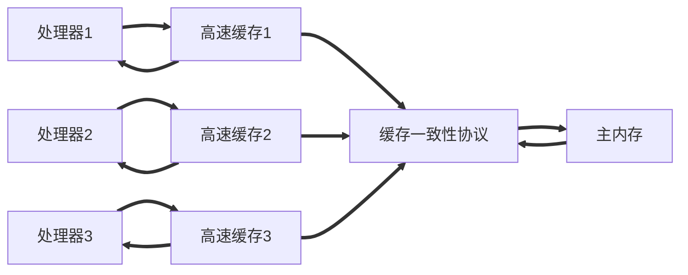
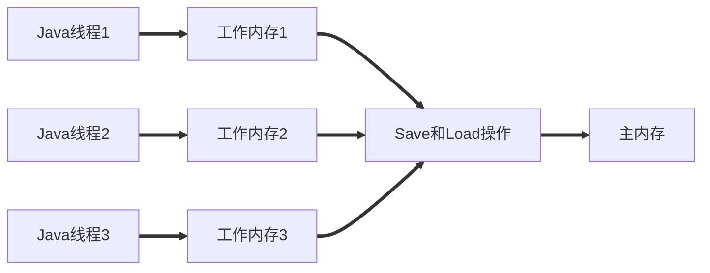

# 高效并发

先保证正确,在考虑高效.

先写出正确的并发代码,再考虑细/粗化锁操作.

## 伪共享

一个 cache 行同时只能一个线程操作，线程间还是交替执行。

为何多个变量会被放入一个缓存行？

- 程序的局部性原理

如何避免伪共享？

- 填充字节，`netty`框架就是采用了填充字节的方式，保证一个变量存在一个cache里，而不是两个cache，只用读一次cache。
- `sun.misc.contrebded注解`（`Java8`）

## 热部署

又是一个不懂的概念

- 修改`classloader`实现热部署
- `JVM`只能实现方法体的热部署
- 打破双亲委派，自定义`classloader`，要替换类时，就丢弃之前的类加载器。

## Java内存模型与线程

前往别把OS的内存模型和`JVM`的内存模型搞混了！

### 科普

衡量服务器性能的高低好坏：每秒事务处理数（Transactions Per Second，`TPS`）

高速缓存一定程度上解决了速度不匹配问题，但是又引入了缓存一致性的问题。

为了解决一致性的问题，需要各个处理器访问缓存时都遵循一些协议，在读写时要根据协议来进行操作。这类协议有：

- `MSI`
- `MESI`
- `MOSI`
- `Synapse`
- `Firefly`
- `Dragon Protocol`



处理器内部的运算单元能尽量被充分利用，处理器可能会对输入代码进行乱序执行（Out-Of-Order Execution）优化，处理器会在计算之后将乱序执行的结果重组，保证该结果与顺序执行的结果是一致的，但并不保证程序中各个语句计算的先后顺序与输入代码中的顺序一致

CPU现在多采用流水线执行的方式，会发生指令重排序的问题，目的是为了提高硬件资源的使用效率，但是有时候重排序会导致线程不安全（Java的`DCL`要使用volatile的原因，可以防止指令重排序。）

### Java内存模型

#### 概述

Java Memory Model（`JMM`），用以屏蔽掉各种硬件和操作系统的内存访问差异。以实现Java程序在各种平台下都能达到一致的内存访问效果。比`C/CPP`等使用硬件和OS自身的内存模型而言，编程人员无需考虑不同OS的不同内存模型，一套`JMM`可用于多种OS。

#### 主内存与工作内存

Java内存模型规定了所有的变量都存储在主内存中。每条线程都有自己的工作内存。线程的工作内存保存了被该线程使用到的变量的主内存副本拷贝，线程对变量的所有操作（读取，赋值等）都必须在工作内存中进行，不能直接读写主内存中的变量【分主内存，工作内存（每条线程有自己的工作内存），主内存数据赋值到工作内存后，线程才可对变量进行各种操作】

PS：`JVM`规范规定了volatile变量依旧有工作内存的拷贝，当由于他特殊的操作顺序规定，看起来如同直接在主存中读写访问一样。

<span style="color:red">都是双向箭头</span>



这里所讲的主内存、工作内存与第2章所讲的Java内存区域中的Java堆、栈、方法区等并不是同一个层次的对内存的划分，这两者基本上是没有任何关系的。如果两者一定要勉强对应起来，那么从变量、主内存、工作内存的定义来看，<span style="color:red">主内存主要对应于Java堆中的对象实例数据部分</span>，而<span style="color:red">工作内存则对应于虚拟机栈中的部分区域</span>。从更基础的层次上说，主内存直接对应于物理硬件的内存，而<span style="color:red">为了获取更好的运行速度，虚拟机（或者是硬件、操作系统本身的优化措施）可能会让工作内存优先存储于寄存器和高速缓存中，因为程序运行时主要访问的是工作内存。</span>

----

#### 内存间交互操作

> 主内存与工作内存直接具体的交互协议

- lock：作用于主内存的变量，把变量标识为线程独占状态。
- unlock：作用于主内存的变量，把处于锁定状态的变量释放出来。
- read：作用于主内存的变量，主内存 copy 到工作内存（副本）。
- load：作用于工作内存的变量，把read得到的变量值放入工作内存。
- use：作用于工作内存的变量，把工作内存的值传递给执行引擎。
- assign：作用于工作内存的变量，把从执行引擎接收到的值赋给工作内存的变量
- store：作用于工作内存的变量，把工作内存的变量的值传递到主内存。
- write：作用于主内存的变量，把store操作从工作内存得到的变量的值放入主内存的变量。

新变量只能在主内存中诞生。

如果对一个变量执行lock操作，那么会情况工作内存中此变量的值。

#### volatile的特殊规则

**轻量级同步机制，单例模式DCL**

- 此变量对所有线程都可见
  - 这个可见的意思是，A线程修改了值，这个值改变后会立即更新到主内存中，其他线程去主内存拿数据的时候可以拿到这个新的值。但是之前拿了值得线程是无法得知得。因为线程操作数据是先从主内存中把数据copy到线程内存中，拿的是副本。
- 禁止指令重排序优化

<span style="color:red">Java内存模型为volatile专门定义了一些特殊的访问规则！！！</span>

<u>volatile禁止了指令重排序，所以执行完操作后，一定是把变量写入主存当有其他线程需要读取时，它会去内存中读取新值。而普通的共享变量不能保证可见性，因为普通共享变量被修改之后，什么时候被写入主存是不确定的，当其他线程去读取时，此时内存中可能还是原来的旧值，因此无法保证可见性。</u>

- volatile的效率

  性能优于锁（synchronized或`java.util.concurrent`）

  volatile变量性能消耗与普通变量没啥区别，但写操作可能慢一些。因为它需要在本地代码中插入许多内存屏障指令来保证处理器不发生乱序执行。

---

#### 为什么说volatile并发不安全?

volatile只是保证你读取的时候一定是从主内存中拿数据.

但是在操作的时候,不保证这个值是与主内存中同步更新的.

且Java的一些操纵如:+ - * /不是原子性的,所以可能会出现并发问题.

请看下方的部分汇编代码

**附上汇编代码**

```java
javap -c 字节码指令

public static void increase():
	Code:
		Stack=2, Locals=0, Args_size=0
        0:	getstatic  #13;  //Field race:I
		3:  iconst_1
		4:  iadd
		5:  putstatic #13;  //Field race:I
		8:  return
    LineNumberTable:
		line 14: 0
        line 15: 8
```

使用字节码分析并发问题并不严谨,因为字节码指令也不一定是原子性的.但是这里用字节码足以说明问题了!

**再来看下synchronized关键字的实现**

<span style="color:red">synchronized 是用monitorenter字节码指令实现的!</span>

```java
javap -c .\Synchronized.class
Compiled from "Synchronized.java"
public class com.payphone.thread.Synchronized {
  static int i;

  public com.payphone.thread.Synchronized();
    Code:
       0: aload_0
       1: invokespecial #1                  // Method java/lang/Object."<init>":()V
       4: return

  public static void main(java.lang.String[]);
    Code:
       0: new           #2                  // class java/lang/Object
       3: dup
       4: invokespecial #1                  // Method java/lang/Object."<init>":()V
       7: astore_1
       8: aload_1
       9: dup
      10: astore_2
      11: monitorenter
      12: getstatic     #3                  // Field i:I
      15: bipush        50
      17: if_icmplt     31
      20: getstatic     #3                  // Field i:I
      23: iconst_1
      24: isub
      25: putstatic     #3                  // Field i:I
      28: goto          12
      31: aload_2
      32: monitorexit
      33: return
      34: astore_3
      35: aload_2
      36: monitorexit
      37: aload_3
      38: athrow
    Exception table:
       from    to  target type
          12    33    34   any
          34    37    34   any

  static {};
    Code:
       0: bipush        100
       2: putstatic     #3                  // Field i:I
       5: return
}
```

**到底什么时候使用volatile变量**

由于volatile变量只能保证可见性，在不符合以下两条规则的运算场景中，我们仍然要通过加锁（使用synchronized、java.util.concurrent中的锁或原子类）来保证原子性：·运算结果并不依赖变量的当前值，或者能够确保只有单一的线程修改变量的值。·变量不需要与其他的状态变量共同参与不变约束。

```java
volatile boolean shutdownRequested;

public void shutdown(){
    shutdownRequest = true;
}

public void doWork(){
    while(!shutdownRequested){
        // 代码业务逻辑
    }
}
```

#### 针对long和double型变量的特殊规则

Java内存模型要求lock、unlock、read、load、assign、use、store、write这八种操作都具有原子性，但是对于64位的数据类型（long和double），在模型中特别定义了一条宽松的规定：允许虚拟机将没有被volatile修饰的64位数据的读写操作划分为两次32位的操作来进行，即允许虚拟机实现自行选择是否要保证64位数据类型的load、store、read和write这四个操作的原子性，这就是所谓的“long和double的非原子性协定”（Non-Atomic Treatment of double and long Variables）。

#### Integer并发问题

以下代码会存在并发安全问题

我的理解是：ABC三个线程抢1000，A抢到了，A--操作，此时A持有的是999的锁，1000的锁被释放了【会被释放吗？】。BC争夺1000这把锁。

但是由于synchronized包裹的变量，有线程可见性的特点，所以其他线程有机会得到最新的那个引用，故只会存在部分数据被重复输出。

问题：工作线程操作完数据后，会有一个回写的操作，【不是或者说不仅仅是指令重排序的锅，给Integer加了volatile也会有线程安全问题】，回写过程中，发现不对劲会直接改为指向最新的那个应用吗？heap中是否存在一个句柄对象，其他工作线程都是copy这个句柄对象？

**到底是怎么样的？？**

```java
package com.payphone.thread;

import java.util.concurrent.TimeUnit;

/**
 * 线程锁的一些陷阱。
 * 此种写法 线程不安全。
 * 理由如下：
 * Integer是final修饰的,Integer中的值改变后，Integer的引用就变了。所以syn锁的并不是同一个对象！String也是这样。
 * 其他的包装类也是！final修饰的都要注意！
 * 这块问的细致的话，需要用到JMM。
 * <p>
 * 举例说明：
 * A B两个线程
 * A 拿到了 Integer = 100的那个锁（对象）。
 * B 没有拿到 Integer = 100的那个锁（对象）。
 * A 把Integer变成了99，此时Integer的引用变了！ A
 * B 想拿到Integer持有的引用，此时那个引用被改了，且无人拥有。（A拿的是100的引用，）
 */
public class ThreadTrap {
    public static void main(String[] args) {
        ThreadDemo threadDemo = new ThreadDemo();
        Thread th1 = new Thread(threadDemo, "窗口一");
        Thread th2 = new Thread(threadDemo, "窗口二");
        Thread th3 = new Thread(threadDemo, "窗口三");
        th1.start();
        th2.start();
        th3.start();
    }
}

class ThreadDemo implements Runnable {
    // 经典卖票程序
    private static Integer tickets = 1000;
    @Override
    public void run() {
        while (true) {
            synchronized (tickets) {
                try {
                    TimeUnit.MILLISECONDS.sleep(200);
                } catch (InterruptedException e) {
                    e.printStackTrace();
                }
                if (tickets <= 200) {
                    return;
                }
                System.out.println(Thread.currentThread().getName() + "：卖了一张，还剩" + --tickets);
            }
        }
    }
}
```


#### final修饰

而final关键字的可见性是指：被final修饰的字段在构造器中一旦被初始化完成，并且构造器没有把“this”的引用传递出去（this引用逃逸是一件很危险的事情，其他线程有可能通过这个引用访问到“初始化了一半”的对象），那么在其他线程中就能看见final字段的值。

---

### Java与线程

并发不一定要依赖多线程（如`PHP`中很常见的多进程并发），但是在Java里面谈论并发，基本上都与线程脱不开关系.

#### 线程的实现

主流的操作系统都提供了线程实现，Java语言则提供了在不同硬件和操作系统平台下对线程操作的统一处理.

实现线程主要有三种方式：

- 使用内核线程实现（`1：1`实现），
- 使用用户线程实现（`1：N`实现），
- 使用用户线程加轻量级进程混合实现（`N：M`实现）

### Java与协程

Java的线程大多数都是1-1模型,切换成本高!在当今的局势下,劣势很明显!以前可能是长连接,长时间使用,现在分布式,负载均衡,有些是短时间的连接,线程间的切换开销十分大!

## 线程安全与锁优化

**方法级别的锁,普通成员方法上加synchronized,锁的是this对象?静态方法,方法上加synchronized锁的是字节码对象!**

### Java语言中的线程安全

**可将Java语言中各种操作共享的数据分为以下五类：**

- 不可变
  - 只要一个不可变的对象被正确地构建出来（即没有发生this引用逃逸的情况），那其外部的可见状态永远都不会改变，永远都不会看到它在多个线程之中处于不一致的状态。“不可变”带来的安全性是最直接、最纯粹的。
- 绝对线程安全:
  - vector方法上加的是 synchronized 锁的是this对象
  - 静态方法上的synchronized 锁的是字节码对象
- 相对线程安全、
- 线程兼容和线程对立。


### 锁升级
锁的4中状态：无锁状态、偏向锁状态、轻量级锁状态、重量级锁状态（级别从低到高）

**`AQS`补**

#### 偏向锁：

> **为什么要引入偏向锁？**

因为经过`HotSpot`的作者大量的研究发现，大多数时候是不存在锁竞争的，常常是一个线程多次获得同一个锁，因此如果每次都要竞争锁会增大很多没有必要付出的代价，为了降低获取锁的代价，才引入的偏向锁。

> **偏向锁的升级**

线程访问代码并获取锁对象时，会先进行对比是不是偏向锁记录的对象，是的话就无需加锁，直接运行。如果不是，且原来的线程还存在，说明有竞争就会升级为轻量级锁。如果不存在竞争，就当前进程设置为偏向锁。

当线程1访问代码块并获取锁对象时，会在Java对象头和栈帧中记录偏向的锁的`threadID`，因为偏向锁不会主动释放锁，因此以后线程1再次获取锁的时候，需要比较当前线程的`threadID`和Java对象头中的`threadID`是否一致，如果一致（还是线程1获取锁对象），则无需使用CAS来加锁、解锁；如果不一致（其他线程，如线程2要竞争锁对象，而偏向锁不会主动释放因此还是存储的线程1的`threadID`），那么需要查看Java对象头中记录的线程1是否存活，如果没有存活，那么锁对象被重置为无锁状态，其它线程（线程2）可以竞争将其设置为偏向锁；如果存活，那么立刻查找该线程（线程1）的栈帧信息，如果还是需要继续持有这个锁对象，那么暂停当前线程1，撤销偏向锁，升级为轻量级锁，如果线程1 不再使用该锁对象，那么将锁对象状态设为无锁状态，重新偏向新的线程。

> **偏向锁的取消**

偏向锁是默认开启的，而且开始时间一般是比应用程序启动慢几秒，如果不想有这个延迟，那么可以使用`-XX:BiasedLockingStartUpDelay=0`；

如果不想要偏向锁，那么可以通过`-XX:-UseBiasedLocking = false`来设置；

#### 轻量级锁

> **为什么要引入轻量级锁？**

轻量级锁考虑的是竞争锁对象的线程不多，而且线程持有锁的时间也不长的情景。因为阻塞线程需要CPU从用户态转到内核态，代价较大，如果刚刚阻塞不久这个锁就被释放了，那这个代价就有点得不偿失了，因此这个时候就干脆不阻塞这个线程，让它自旋这等待锁释放。

> **轻量级锁什么时候升级为重量级锁？**

线程1获取轻量级锁时会先把锁对象的对象头MarkWord复制一份到线程1的栈帧中创建的用于存储锁记录的空间（称为DisplacedMarkWord），然后使用CAS把对象头中的内容替换为线程1存储的锁记录（DisplacedMarkWord）的地址；

如果在线程1复制对象头的同时（在线程1CAS之前），线程2也准备获取锁，复制了对象头到线程2的锁记录空间中，但是在线程2CAS的时候，发现线程1已经把对象头换了，线程2的CAS失败，那么线程2就尝试使用自旋锁来等待线程1释放锁。

但是如果自旋的时间太长也不行，因为自旋是要消耗CPU的，因此自旋的次数是有限制的，比如10次或者100次，如果自旋次数到了线程1还没有释放锁，或者线程1还在执行，线程2还在自旋等待，这时又有一个线程3过来竞争这个锁对象，那么这个时候轻量级锁就会膨胀为重量级锁。重量级锁把除了拥有锁的线程都阻塞，防止CPU空转。

**注意：**为了避免无用的自旋，轻量级锁一旦膨胀为重量级锁就不会再降级为轻量级锁了；偏向锁升级为轻量级锁也不能再降级为偏向锁。一句话就是锁可以升级不可以降级，但是偏向锁状态可以被重置为无锁状态。

> **这几种锁的优缺点（偏向锁、轻量级锁、重量级锁）**


### 锁粗化
按理来说，同步块的作用范围应该尽可能小，仅在共享数据的实际作用域中才进行同步，这样做的目的是为了使需要同步的操作数量尽可能缩小，缩短阻塞时间，如果存在锁竞争，那么等待锁的线程也能尽快拿到锁。 
但是加锁解锁也需要消耗资源，如果存在一系列的连续加锁解锁操作，可能会导致不必要的性能损耗。 
锁粗化就是将多个连续的加锁、解锁操作连接在一起，扩展成一个范围更大的锁，避免频繁的加锁解锁操作。

### 锁消除
Java虚拟机在JIT编译时(可以简单理解为当某段代码即将第一次被执行时进行编译，又称即时编译)，通过对运行上下文的扫描，经过逃逸分析，去除不可能存在共享资源竞争的锁，通过这种方式消除没有必要的锁，可以节省毫无意义的请求锁时间
