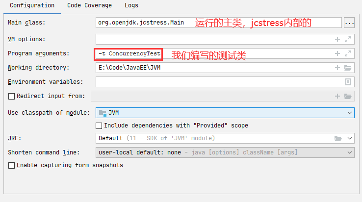
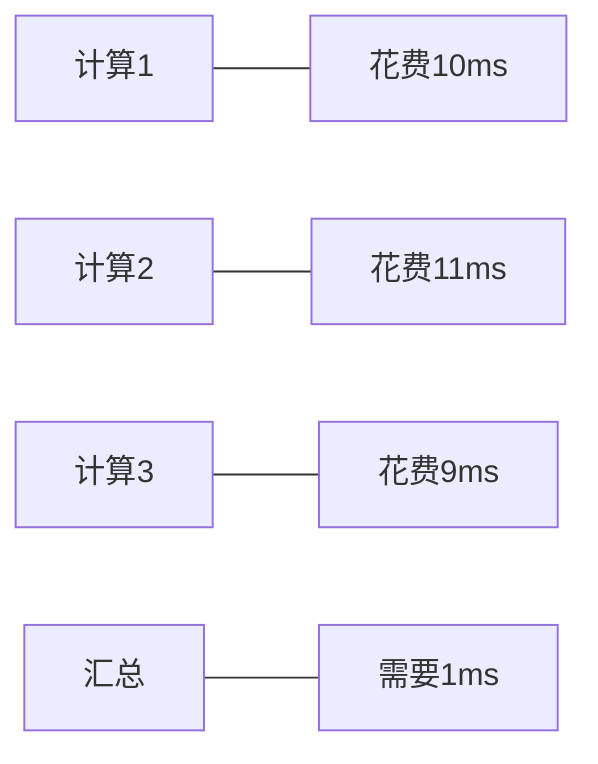

# Java多线程

<b>参考书籍：《实战 Java 高并发程序设计》、《Java 并发编程之美》、《Java 并发编程实战》、《Java 编程思想》、《Java 并发实现原理：JDK 源码剖析》</b>

<b>参考视频：[黑马程序员全面深入学习Java并发编程，JUC并发编程全套教程_哔哩哔哩_bilibili](https://www.bilibili.com/video/BV16J411h7Rd?from=search&seid=2063747193080093822&spm_id_from=333.337.0.0)</b>

先看完的书，再刷的视频，最终笔记以视频中的内容为主线。为了节省篇幅，代码书写可能不太规范。参考的几本书，除了《Java 并发编程实战》没看完，其他基本都看完了，都是并发编程上的优秀书籍，建议在学习的时候可以把上面的一本或几本书当参考书翻阅。

<b>推荐的阅读顺序</b>：《实战 Java 高并发程序设计》\=\=\>《Java 编程思想》\=\=\>《Java 并发实现原理：JDK 源码剖析》\=\=\>《Java 并发编程之美》\=\=\>《Java 并发编程实战》。

后续关于 JUC 源码部分的内容，会按照《Java 并发实现原理：JDK 源码剖析》、《Java 并发编程之美》、《Java 并发编程实战》中的内容继续调整。

- 线程的基本用法
- 线程池
- JUC
- 死锁 & 常见错误加锁
- JMM
- ThreadLocal
- <span style="color:red">JMH：测试并发程序的吞吐量。</span>
- <span style="color:red">Jcstress：测试并发产生的结果和预期是不是一样的。</span>

> JMH 基本用法

```xml
<dependency>
    <groupId>org.openjdk.jmh</groupId>
    <artifactId>jmh-core</artifactId>
    <version>1.23</version>
</dependency>
<dependency>
    <groupId>org.openjdk.jmh</groupId>
    <artifactId>jmh-generator-annprocess</artifactId>
    <version>1.23</version>
    <scope>provided</scope>
</dependency>
```

```java
package monitor;

import org.openjdk.jmh.annotations.*;
import org.openjdk.jmh.runner.Runner;
import org.openjdk.jmh.runner.RunnerException;
import org.openjdk.jmh.runner.options.Options;
import org.openjdk.jmh.runner.options.OptionsBuilder;

import java.util.concurrent.TimeUnit;

@Fork(1)
@BenchmarkMode(Mode.AverageTime)
@Warmup(iterations = 3)
@Measurement(iterations = 5)
@OutputTimeUnit(TimeUnit.NANOSECONDS)
public class WipeLock {
    public static void main(String[] args) throws RunnerException {
        Options opt = new OptionsBuilder()
                .include(WipeLock.class.getSimpleName())
                .forks(1)
                .build();
        new Runner(opt).run();
    }

    static int x = 0;

    @Benchmark
    public void a() throws Exception {
        x++;
    }

    @Benchmark
    public void b() throws Exception {
        Object o = new Object();
        synchronized (o) {
            x++;
        }
    }
}
```

> jcstress 基本用法

```xml
<!-- jcstress 核心包 -->
<dependency>
    <groupId>org.openjdk.jcstress</groupId>
    <artifactId>jcstress-core</artifactId>
    <version>0.3</version>
</dependency>
<!-- jcstress测试用例包 -->
<dependency>
    <groupId>org.openjdk.jcstress</groupId>
    <artifactId>jcstress-samples</artifactId>
    <version>0.3</version>
</dependency>
```

IDEA 配置运行的主类 <b>org.openjdk.jcstress.Main</b>

<div align="center"></div>

```java
import org.openjdk.jcstress.annotations.*;
import org.openjdk.jcstress.infra.results.I_Result;

@JCStressTes
// 检查感兴趣的结果。如果结果是 1 和 4 那么分类为 Expect.ACCEPTABLE
@Outcome(id = {"1", "4"}, expect = Expect.ACCEPTABLE, desc = "ok")
@Outcome(id = {"0"}, expect = Expect.ACCEPTABLE_INTERESTING, desc = "!!!!")
@State
public class ConcurrencyTest {
    int num = 2;
    @Actor
    public void actor1(I_Result r) {
        if (DCL.getInstance() == DCL.getInstance()) {
            r.r1 = 1;
        } else {
            r.r1 = 0;
        }
    }
    @Actor
    public void actor2(I_Result r) {
        num = 2;
    }
}
```

## 几个概念

### 同步和异步

#### 概念解析

同步方法：调用一旦开始，调用者必须等到方法调用完毕返回后，才能继续向下执行。

异步方法：调用更像一个消息传递，一旦开始，方法调用就会立即返回，调用者就可以继续后续的操作。而异步方法通常回在另一个线程中“真实”地执行，整个过程，不会阻碍调用者的工作。

> 从方法调用的角度：

- 需要等待结果返回，才能运行的就是同步
- 不需要等待结果返回，就能继续运行的就是异步。

<span style="color:green">多线程是异步的一种实现方式</span>

### 并发和并行

并发偏重于多个任务交替执行，而多个任务之间有可能还是串行的，而并行是真正意义上的“同时执行”

### 管程

管程在 Java 中的体现就是字节码指令 <b>Monitor（监视器）</b> ， 就是我们所说的<b>锁</b>。

- synchronized 包裹的代码块，在字节码中的体现是 <b>Monitor</b> 指令；其中字节码里面会出现两个 <b>monitorexit</b>，第二个 <b>monitorexit</b> 是为了保证出现异常时 synchronized 也可以释放锁
- synchrozied 使用在方法上，在字节码中的体现是 <b>ACC_SYNCHRONIZED</b>，标志表示方法为<b>同步方法</b>。

监视器是一种同步机制，保证同一时间，只有一个线程可以访问被保护的数据或代码。JVM 同步是基于进入和退出的，而进入和退出是使用管程对象实现的。synchronized 锁的是对象，锁住后会关联一个 <b>monitor</b> 对象。（对象会持有 monitor 对象，monitor 对象中会填入持有锁的线程 id）

### 临界区

临界区用来表示一种公共资源或者说共享数据，可以被多个线程使用。但是每一次，只能有一个线程使用它，一旦临界区资源被占用，其他线程要想使用这个资源就必须等待。

如：打印机一次只能让一个人使用。

### 阻塞和非阻塞

- 一个线程占用了临界区资源，那么其他所有需要这个资源的线程就必须在这个临界区中等待。等待会导致线程挂起，这种情况就是阻塞。
- 非阻塞的意思与之相反，它强调没有一个线程可以妨碍其他线程执行，所有的线程都会尝试不断前向执行。

### 死锁、饥饿、活锁

- 死锁：是多个线程彼此牵制都无法正常推进。
- 饥饿：是指某一个或者多个线程因为种种原因无法获得所需要的资源，导致一直无法执行。
- 活锁：是指资源不断地在两个线程间跳动，而没有一个线程可以同时拿到所有资源正常执行。

## 锁概述

### 乐观锁悲观锁

> <b>① 乐观锁：</b>乐观锁是相对悲观锁来说的，它认为数据在一般情况下不会造成冲突，所以在访问记录前不会加排它锁，而是在进行数据提交更新时，才会正式对数据冲突与否进行检测。如果冲突了就回滚。如果一致冲突就会一直回滚。乐观锁直到提交时才会锁定，所以不会产生任何死锁。
>
> <b>② 悲观锁：</b>悲观锁指对数据被外界修改持保守态度，认为数据很容易就会被其他线程修改，所以在数据被处理前先对数据进行加锁，并在整个数据处理过程中，使数据处于锁定状态。

### 公平锁与非公平锁

> <b>① 公平锁：</b>线程获取锁的顺序是按照线程请求锁的时间早晚来决定的，先来先得锁。公平锁需要维护一个有序的队列，开销较大。
>
> <b>② 非公平锁：</b>抢锁的线程可以在运行时闯入，不一定是先来先得。可能这边阻塞队列等待拿锁，另一边来了个新线程来抢锁。 JDK 非公平锁的实现是默认先把锁给来抢锁的线程，而非阻塞队列中的线程。（直观上，可以减少线程的挂起/CPU 空转，内核的切换）

### 独占锁与共享锁

><b>① 独占锁：</b>只能被单个线程持有。
>
><b>② 共享锁：</b>能被多个线程共同持有。典型的实现有 `ReentrantReadWriteLock` 中的读锁。

### 可重入锁

可重入锁就是递归锁：指的是同一线程外层函数获得锁之后，内层递归函数仍然能获取到该锁的代码，在同一线程在外层方法获取锁的时候，在进入内层方法会自动获取锁；也就是说：<b>线程可以进入任何一个它已经拥有的锁所同步的代码块</b>。

ReentrantLock / Synchronized 就是一个典型的可重入锁

> 示例

可重入锁就是，在一个 method1 方法中加入一把锁，方法 2 也加锁了，那么他们拥有的是同一把锁

```java
public synchronized void method1() {
    method2();
}
public synchronized void method2() {}
```

也就是说我们只需要进入 method1 后，那么它也能直接进入 method2 方法，因为他们所拥有的锁，是同一把。

> 作用

可重入锁的最大作用就是避免死锁

### 自旋锁

Java 中的线程是与操作系统中的线程一一对应的，所以当一个线程在获取锁（比如独占锁）失败后，会被切换到内核状态而被挂起。当该线程获取到锁时又需要将其切换到内核状态而唤醒该线程。<b>而从用户状态切换到内核状态的开销是比较大的，在一定程度上会影响并发性能</b>。

自旋锁则是，当前线程在获取锁时，如果发现锁已经被其他线程占有，它不马上阻塞自己，在不放弃 CPU 使用权的情况下，多次尝试获取（默认次数是 10，可以使用 -XX:PreBlockSpinsh 参数设置该值），很有可能在后面几次尝试中其他线程已经释放了锁。如果尝试指定的次数后仍没有获取到锁则当前线程才会被阻塞挂起。<b>由此看来自旋锁是使用 CPU 时间换取线程阻塞与调度的开销</b>，但是很有可能这些 CPU 时间白白浪费了。

## 并发级别

阻塞、无饥饿、无障碍、无锁、无等待

> <b>①阻塞：</b>一个线程是阻塞的，那么在其他线程释放资源之前，当前线程无法继续执行
>
> <b>②无饥饿：</b>在一定时间内所有线程可以得到执行 [ 个人看法 ]
>
> <b>③无障碍：</b>最弱的非阻塞调度。大家都可以进入临界区，一起修改共享数据。若数据改坏了，会立即对自己所做的修改进行回滚，确保数据安全。<b>当临界区中存在严重的冲突时，所有的线程可能都会不断地回滚自己的操作，而没有一个线程可以走出临界区</b>。阻塞是一种悲观策略，非阻塞调度是一种乐观策略。
>
> <b>④无锁：</b>所有的线程都能尝试对临界区进行访问，但是无锁的并发保证<b>必有一个线程能在有限步内完成操作离开临界区</b>。
>
> <b>⑤无等待：</b>所有的线程都必须在有限步内完成。典型的有 CopyOnWrite。可以多个线程同时读数据，这个就是无等待的。写数据时上锁，保证读写互斥，写写互斥。

## 定律

- Amdahl 定律：定义了串行系统并行化后的加速比的计算公式和理论上限
    - 加速比 = 优化前系统耗时 / 优化后系统耗时
- Gustafson 定律：处理器个数、串行化比例和加速比之间的关系

## JMM

### 什么是JMM

Java 的内存模型 Java Memory Model，简称 JMM，本身是一种抽象的概念，实际上并不存在，它描述的是一组规则或规范，通过这组规范<span style="color:red">定义了程序中各个变量（包括实例字段，静态字段和构成数组对象的元素）的访问方式</span>

JMM 关于同步的规定：

- ① 线程解锁前，必须把共享变量的值刷新回主内存
- ② 线程加锁前，必须读取主内存的最新值，到自己的工作内存（这块有一定的疑问，似乎确实是，加锁前读取主内存的最新值，解锁前把数据写回主内存即可，因为只会有一个线程去操作变量）
- ③ 加锁和解锁是同一把锁

### JMM三大特性

:orange:JMM 的三大特性，volatile 只保证了两个，即可见性和有序性，不满足原子性

- <b>① 可见性</b>：当一个线程修改了某一个共享变量的值时，其他线程是否能够立即知道这个修改。volatile 保证了可见性。
    - <b>举例：</b>4 核 CPU，每个核都有一个自己独立的缓存。这 4 个核共享一个变量。操作完数据后把数据放入自己核的缓存里，其他核不能及时得知修改。除非你把其他核的缓存也刷新了。
- <b>② 原子性</b>：原子性是指一个操作是不可中断的，一气呵成。
- <b>③ 有序性</b>：程序在执行时，可能会进行指令重排，重排后的指令与原指令的顺序未必一致。(高版本 jdk 似乎解决了 new Object() 时可能存在的指令重排序)

> 可见性验证代码

```java
public class TestVolatile {

    public static void main(String[] args) {
        ResourceClass resourceClass = new ResourceClass();
        new Thread(() -> {
            try {
                TimeUnit.SECONDS.sleep(3);
                resourceClass.addToSix();
                System.out.println("resourceClass.number=" + resourceClass.number);
            } catch (Exception e) {
            }
        }).start();
        // 如果resourceClass.number==60 则说明数据被刷回了主内存，且被 main 线程感知到了。
        while (resourceClass.number == 0) ;
        // 如果没有执行最后的这句sout 说明 number 的值没有被刷新回主内存，更新的值 main 线程未感知到。
        System.out.println("main thread is over");
    }
}

class ResourceClass {
    // 加了volatile保证了可见性。
    volatile int number = 0;
    public void addToSix() {
        number = 60;
    }
}
```

### 缓存一致性

为什么这里主线程中某个值被更改后，其它线程能马上知晓呢？其实这里是用到了总线嗅探技术。在说嗅探技术之前，首先谈谈缓存一致性的问题，就是当多个处理器运算任务都涉及到同一块主内存区域的时候，将可能导致各自的缓存数据不一。<span style="color:red">为了解决缓存一致性的问题，需要各个处理器访问缓存时都遵循一些协议，在读写时要根据协议进行操作，这类协议主要有 MSI、MESI 等协议。</span>

#### MESI

当 CPU 写数据时，如果发现操作的变量是共享变量（即在其它 CPU 中也存在该变量的副本）会发出信号通知其它 CPU 将该内存变量的缓存行设置为无效，因此当其它 CPU 读取这个变量的时，发现自己缓存该变量的缓存行是无效的，那么它就会从内存中重新读取。

:orange:简单说就是，对共享变量，每次都从内存中读取值，不用 CPU 缓存行中的值。

#### 总线嗅探

那么是如何发现数据是否失效呢？

这里是用到了总线嗅探技术，就是每个处理器通过嗅探在总线上传播的数据来检查自己缓存值是否过期了，当处理器发现自己的缓存行对应的内存地址被修改，就会将当前处理器的缓存行设置为无效状态，当处理器对这个数据进行修改操作的时候，会重新从内存中把数据读取到处理器缓存中.

#### 总线风暴

总线嗅探技术有哪些缺点？

由于 volatile 的 MESI 缓存一致性协议，需要不断的从主内存嗅探和 CAS 循环，无效的交互会导致总线带宽达到峰值。因此不要大量使用 volatile 关键字，至于什么时候使用 volatile、什么时候用锁以及 Syschonized 都是需要根据实际场景的。

### 那些指令不能重排序

HappenBefore 规则

- <b>① 程序顺序原则</b>：一个线程内保证语义的串行性.
- <b>② volatile 规则</b>：volatile 变量的写先于读发生，这保证了 volatile 变量的可见性.
- <b>③ 锁规则</b>：解锁（unlock）必然发生在随后的加锁（lock）前.
- <b>④ 传递性</b>：A 先于 B，B 先于 C，那么 A 必然先于 C
- <b>⑤ </b>线程的 start() 方法先于它的每一个动作，调用 start 方法，虚拟机创建完线程后再回调 run 方法（JDK 注释）
- <b>⑥ </b>线程的所有操作先于线程的终结【Thread.join()】
- <b>⑦ </b>线程的中断【interrupt()】先于被中断线程的代码
- <b>⑧ </b>对象的构造函数的执行、结束先于 finalize() 方法

## Java与线程

并发不一定要依赖多线程（如 `PHP` 中很常见的多进程并发），但是在 Java 里面谈论并发，基本上都与线程脱不开关系。

### 线程的实现

主流的操作系统都提供了线程实现，Java 语言则提供了在不同硬件和操作系统平台下对线程操作的统一处理。

Java 线程与内核线程的映射主要有以下三种方式：

- ① 使用内核线程实现（1：1 实现），
- ② 使用用户线程实现（1：N 实现），
- ③ 使用用户线程+轻量级进程 混合实现（N：M 实现）

### Java与协程

Java 的线程大多数都是 1 对 1 模型，切换成本高！劣势很明显。以前可能是长连接，长时间使用，现在有些应用采用了分布式、负载均衡等技术，很多都是短时间的连接，这样频繁的线程上下文切换操作开销十分大。

## 线程安全与锁优化

方法级别的锁：普通成员方法上加 synchronized，锁的是 this 对象，静态方法上加 synchronized 锁的是字节码对象! <b>注意：锁的都是对象。</b>

### 线程安全

可将 Java 语言中各种操作共享的数据分为以下五类：

- 不可变：只要一个不可变的对象被正确地构建出来（即没有发生 this 引用逃逸 <b>[ this引用逃逸 （ "this"escape）是指对象还没有构造完成，它的 this 引用就被发布出去了 ]</b> 的情况），那其外部的可见状态永远都不会改变，永远都不会看到它在多个线程之中处于不一致的状态。"不可变" 带来的安全性是最直接、最纯粹的。
- 绝对线程安全:
    - vector 方法上加的是 synchronized 锁的是 this 对象
    - 静态方法上的 synchronized 锁的是字节码对象
- 相对线程安全
- 线程兼容和线程对立


### 锁升级

锁的 4 种状态：无锁、偏向锁、轻量级锁、重量级锁（级别从低到高）

> 这几种锁的优缺点（偏向锁、轻量级锁、重量级锁）

| 锁状态                     | 优点                                                    | 缺点                                            | 适用场景                                                     |
| -------------------------- | ------------------------------------------------------- | ----------------------------------------------- | ------------------------------------------------------------ |
| 偏向锁 (高版本 JDK 已废弃) | 加锁解锁无需额外的消耗，和非同步方法时间相差纳秒级别    | 如果竞争的线程多，那么会带来额外的锁撤销和消耗  | 基本没有线程竞争锁的同步场景                                 |
| 轻量级锁                   | 竞争的线程不会阻塞，使用自旋，提高程序响应速度          | 如果一直不能获取锁，长时间的自旋会造成 CPU 消耗 | 适用于少量线程竞争锁对象，且线程持有锁的时间不长，不追求响应速度的场景 |
| 重量级锁                   | 线程竞争不适用 CPU 自旋，不会导致 CPU 空转消耗 CPU 资源 | 线程阻塞，响应时间长                            | 很多线程竞争锁，且锁持有的时间长，追求吞吐量的场景           |

吞吐量：指在一次性能测试过程中网络上传输的数据量的总和。

### 锁粗化

按理来说，同步块的作用范围应该尽可能小，仅在共享数据的实际作用域中才进行同步，这样做的目的是为了使需要同步的操作数量尽可能缩小，缩短阻塞时间，如果存在锁竞争，那么等待锁的线程也能尽快拿到锁。 但是加锁解锁也需要消耗资源，如果存在一系列的连续加锁解锁操作，可能会导致不必要的性能损耗。 <b>锁粗化就是将多个连续的加锁、解锁操作连接在一起，扩展成一个范围更大的锁，避免频繁的加锁解锁操作</b>。

### 锁消除

Java 虚拟机在 JIT 编译时（可以简单理解为当某段代码即将第一次被执行时进行编译，又称即时编译），通过对运行上下文的扫描，经过<b>逃逸分析</b>（查看变量是否逃出了自己的作用域），去除不可能存在共享资源竞争的锁，通过这种方式消除没有必要的锁，可以节省毫无意义的请求锁时间。

# 线程应用概述

## 异步调用

以调用方角度来讲，如果 

- 需要等待结果返回，才能继续运行就是同步 
- 不需要等待结果返回，就能继续运行就是异步

### 设计

多线程可以让方法执行变为异步的（即不要巴巴干等着）比如说读取磁盘文件时，假设读取操作花费了 5 秒钟，如果没有线程调度机制，这 5 秒 CPU 什么都做不了，其它代码都得暂停。

### 结论

- 比如在项目中，执行视频文件格式转换这类操作比较费的任务时，可以开一个新线程处理视频转换，避免阻塞主线程 
- tomcat 的异步 servlet 也是类似的目的，让用户线程处理耗时较长的操作，避免阻塞 tomcat 的工作线程
- UI 程序中，开线程进行其他操作，避免阻塞 UI 线程【PyQT 开新线程抓取视频流】

## 提高效率

充分利用多核 CPU 的优势，提高运行效率。想象下面的场景，执行 3 个计算，最后将计算结果汇总



- 如果是串行执行，那么总共花费的时间是 10 + 11 + 9 + 1 = 31ms 
- 但如果是四核 CPU，各个核心分别使用线程 1 执行计算 1，线程 2 执行计算 2，线程 3 执行计算 3，3 个线程并行，花费时间只取决于最长的那个线程运行的时间，即 11ms 最后加上汇总时间只会花费 12ms

<b>注意：</b>需要在多核 CPU 才能提高效率，单核仍然时是轮流执行

### 设计

> 多核 CPU 下总花费的时间会远低于 31 ms

```java
// 多核 CPU 多线程 提高效率。
public class ThreadApplication {
    public static volatile int flag1 = 0;
    public static volatile int flag2 = 0;
    public static volatile int flag3 = 0;

    public static void main(String[] args) throws InterruptedException {
        // 3个线程，3个操作。
        Thread th1 = new Thread(() -> {
            try {
                TimeUnit.MILLISECONDS.sleep(10);
                flag1 = 1;
            } catch (InterruptedException e) {

            }
        });

        Thread th2 = new Thread(() -> {
            try {
                TimeUnit.MILLISECONDS.sleep(11);
                flag2 = 1;
            } catch (InterruptedException e) {

            }
        });
        
        Thread th3 = new Thread(() -> {
            try {
                TimeUnit.MILLISECONDS.sleep(9);
                flag3 = 1;
            } catch (InterruptedException e) {

            }
        });
        long start = System.currentTimeMillis();
        th1.start();
        th2.start();
        th3.start();
        th1.join();
        th2.join();
        th3.join();

        while (flag1 + flag3 + flag2 == 3) {
            TimeUnit.MILLISECONDS.sleep(1);
            System.out.println(System.currentTimeMillis() - start);
            return;
        }
    }
}
```

CountDownLatch + ThreadPools 的写法

```java
package com.payphone.thread;

import java.util.concurrent.*;

// 多线程+多核CPU提高效率
public class MutilThreadAdvance {
    // 3 个线程并行执行 3个耗时的任务
    public static void main(String[] args) throws ExecutionException, InterruptedException {
        paralla();
        serial();
    }

    private static void serial() throws ExecutionException, InterruptedException {
        ExecutorService threadPools = Executors.newFixedThreadPool(1);
        CountDownLatch waitCalculate = new CountDownLatch(1);
        long start = System.currentTimeMillis();
        threadPools.submit(() -> {
            sleep(2);
            sleep(2);
            sleep(2);
            waitCalculate.countDown();
        });
        waitCalculate.await();
        long end = System.currentTimeMillis();
        System.out.println((end - start) / 1000);
        threadPools.shutdown();
    }

    private static void sleep(int time) {
        try {
            TimeUnit.SECONDS.sleep(time);
        } catch (Exception e) {
            throw new RuntimeException(e);
        }
    }

    private static void paralla() throws InterruptedException {
        ExecutorService threadPools = Executors.newFixedThreadPool(3);
        CountDownLatch countDownLatch = new CountDownLatch(3);
        long start = System.currentTimeMillis();
        threadPools.submit(() -> {
            sleep(2);
            countDownLatch.countDown();
        });
        threadPools.submit(() -> {
            sleep(2);
            countDownLatch.countDown();
        });
        threadPools.submit(() -> {
            sleep(2);
            countDownLatch.countDown();
        });
        countDownLatch.await();
        long end = System.currentTimeMillis();
        System.out.println((end - start) / 1000);
        threadPools.shutdown();
    }
}
```

### 结论

- 单核 CPU 下，多线程不能实际提高程序运行效率，只是为了能够在不同的任务之间切换，不同线程轮流使用 CPU，不至于一个线程总占用 CPU，别的线程没法干活。
- 多核 CPU 可以并行跑多个线程，但能否提高程序运行效率还是要分情况的。
    - 有些任务，经过精心设计，将任务拆分，并行执行，当然可以提高程序的运行效率。但不是所有计算任 务都能拆分（参考后文的【阿姆达尔定律】）。
    - 也不是所有任务都需要拆分，任务的目的如果不同，谈拆分和效率没啥意义。
- IO 操作不占用 CPU，只是我们一般拷贝文件使用的是【阻塞 IO】，这时相当于线程虽然不用 CPU，但需要一 直等待 IO 结束，没能充分利用线程。所以才有后面的【非阻塞 IO】和【异步 IO】优化。
