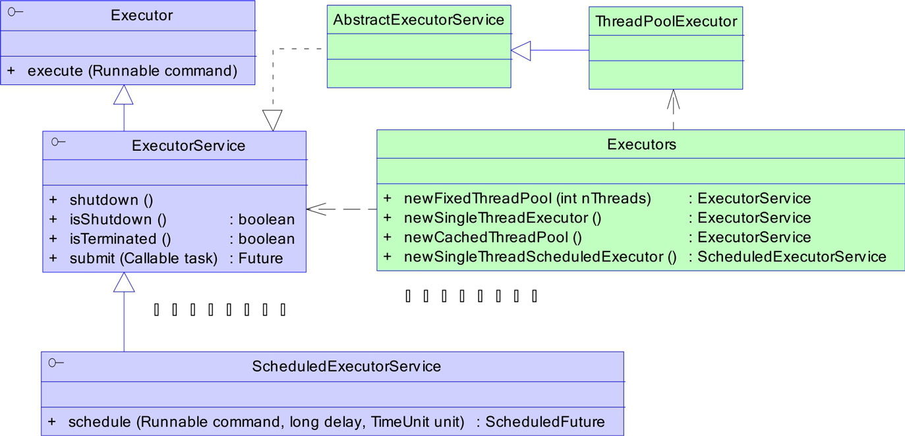
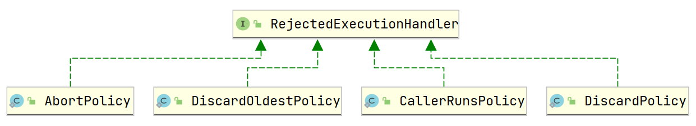

# 线程基础

基本 `API` 的使用和基本原理

## 创建线程

- 继承 Thread
- 实现 Runnable
- Callable & FutureTask [ Callable结合FutureTask使用 ]
    - 定义类 MyCallable 实现 Callable 接口
    - `FutureTask task = new FutureTask(new MyCallable())`
    - `new Thread(task).start()`

- 线程池
    - jdk 提供的线程池（自带的线程池它的阻塞队列大小太大，容易 OOM ）
    - 自定义线程池（一般用自定义线程池）

### 继承Thread

```java
package create_thread;

import lombok.extern.slf4j.Slf4j;

@Slf4j(topic = "c.CreateByThread")
public class CreateByThread {
    public static void main(String[] args) {
        Thread t1 = new Thread("t1") {
            @Override
            // run 方法内实现了要执行的任务
            public void run() {
                log.debug("run");
            }
        };
        t1.start();
    }
}
```

### Runnable

把【线程】和【任务】（要执行的代码）分开 

- Thread 代表线程 
- Runnable 可运行的任务（线程要执行的代码）

```java
@Slf4j(topic = "c.CreateByRunnable")
public class CreateByRunnable {
    public static void main(String[] args) {
        Runnable task = () -> {
            log.debug("run");
        };
        new Thread(task,"t1").start();
    }
}
```

### Runnable 和 Thread 的关系

<span style="color:red">分析 Thread 的源码，理清它与 Runnable 的关系</span>

```java
@Override
public void run() {
    // target 就是传入的 Runnable
    if (target != null) {
        target.run();
    }
}
```

**start 与 run：** `start` 是开启线程，启动线程后，`JVM` 会回调 run 方法

> 小结 

- 方法1 是把线程和任务合并在了一起，方法2 是把线程和任务分开了 
- 用 Runnable 更容易与线程池等高级 API 配合 
- 用 Runnable 让任务类脱离了 Thread 继承体系，更灵活

### FutureTask

`FutureTask` 能够接收 Callable 类型的参数，用来处理有返回结果的情况

```java
@Slf4j(topic = "c.CreateByFutureTask")
public class CreateByFutureTask {
    public static void main(String[] args) throws ExecutionException, InterruptedException {
        FutureTask<String> task = new FutureTask<String>(() -> {
            TimeUnit.SECONDS.sleep(2);
            return "Hello";
        });
        Thread th1 = new Thread(task);
        th1.start();
        // 任务完成前，会阻塞。不想阻塞当前主线程的会，就开个新线程（一般用线程池）等待数据，然后进行后续操作。
        String retVal = task.get();
        log.debug(retVal);
        log.debug("main over!");
    }
}
```

----

因为多数代码都比较简单，所以只写用的少的那部分。

> 线程代码编写示例

线程应该与资源分离：一般按下面两个步骤走

- 创建资源类，创建属性和操作方法
- 在资源类操作方法
    - 判断：判断是否符合条件
    - 干活：符合就干活
    - 通知：干完就通知，如 `notifyAll()`
- 创建多线程调用资源类的方法

```java
import java.util.concurrent.TimeUnit;

class Ticket {
    private int count = 100;

    public int getCount() {
        return count;
    }

    public void setCount(int count) {
        this.count = count;
    }

    public Ticket(int count) {
        this.count = count;
    }

    public Ticket() {

    }

    public synchronized void sale() {
        if (this.count > 0) {
            System.out.println("current Thread " + Thread.currentThread().getName() + " 还有" + (--count) + "张票");
            try {
                TimeUnit.MILLISECONDS.sleep(100);
            } catch (InterruptedException e) {
                e.printStackTrace();
            }
        }
    }
}

public class SaleTick {
    public static void main(String[] args) {
        Ticket ticket = new Ticket(1000);
        Thread th1 = new Thread(() -> {
            while (ticket.getCount() > 0)
                ticket.sale();
        }, "卖票窗口1");
        Thread th2 = new Thread(() -> {
            while (ticket.getCount() > 0)
                ticket.sale();
        }, "卖票窗口2");

        th1.start();
        th2.start();
    }
}
```

### 线程池

#### JDK Executor 框架



#### 线程池的几个重要参数

```java
public ThreadPoolExecutor(  int corePoolSize,
                    int maximumPoolSize,
                    long keepAliveTime,
                    TimeUnit unit,
                    BlockingQueue<Runnable> workQueue,
                    ThreadFactory threadFactory,
                    RejectedExecutionHandler handler) 
```

- `corePoolSize`  指定线程池中的核心线程的数量（核心线程，一直存在于线程池中）
- `maximumPoolSize` 指定最大线程数目 （救急线程，救急线程 = 最大线程 - 核心线程）
- `keepAliveTime`  救急线程空闲的最长时间，超过这个时间就会被回收
- `workQueue`  阻塞任务队列，被提交但是没有运行的任务
    - 直接提交的队列：`SynchronousQueue`，没有容量，每一个插入操作都要等待一个相应的删除操作。
    - 有界的任务队列：`ArrayBlockingQueue`
        - 等待队列满了，如果 `coreSize < maxSize` 则会创建救急线程进行处理。
        - 救急线程只是针对有界队列而言的
    - 无界的任务队列：`LinkedBlockingQueue`
    - 优先任务队列：`PriorityBlockingQueue` ，可以控制任务的执行先后顺序
- `threadFactory`  线程工程，用于创建线程
- `handler`  拒绝策略，当任务队列存不下任务时，执行拒绝策略
    - `AbortPolicy` 策略：直接抛出异常。如果提交任务端没有进行异常处理，那么系统可能会奔溃。我们可以自定义一个拒绝策略，通过日志记录好异常信息。
    - `CallerRunsPolicy` 策略：只要线程池未关闭，该策略直接在调用者线程中，运行当前被丢弃的任务。显然这样做不会真的丢弃任务，但是，任务提交线程的性能极有可能会急剧下降。
    - `DiscardOldestPolicy` 策略：丢弃即将被执行的任务（最老的一个请求），并尝试再次提交当前任务。
    - `DiscardPolicy` 策略：默默地丢弃无法处理的任务，不予任何处理

通过线程池的核心调度代码理解上面的逻辑

```java
public void execute(Runnable command) {
    if (command == null)
        throw new NullPointerException();
    // AtomicInteger
    int c = ctl.get();
    if (workerCountOf(c) < corePoolSize) { // 如果小于核心线程数，就创建新线程
        if (addWorker(command, true))
            return;
        c = ctl.get();
    }
    if (isRunning(c) && workQueue.offer(command)) {  // 否则就进入等待队列
        int recheck = ctl.get();
        if (! isRunning(recheck) && remove(command))
            reject(command);
        else if (workerCountOf(recheck) == 0)
            addWorker(null, false);
    }
    else if (!addWorker(command, false)) // 如果进入等待队列失败了，就看可不可以创建救急线程，如果救急线程也无法创建，则执行拒绝策略
        reject(command);
}


```

线程池的拒绝策略如下：



#### 线程池创建

具体用法后期线程池这章中会具体阐述。

`jdk` 提供好的线程池有如下几个：

- <span style="color:green">**newFixedThreadPool() 方法**</span>：返回一个固定线程数量的线程池。`线程池中的线程数量始终不变`。有新的任务提交时,`若有空闲线程，则立即执行`。`若没有，则任务被暂存在一个任务队列中`，待有线程空闲时，再处理任务队列中的任务。
    - 核心线程数 `corePoolSize` 和最大线程数 `maximumPoolSize` 保持一致。

----

- <span style="color:green">**newSingleThreadExecutor() 方法**</span>：返回一个`只有一个线程的线程池`。多余任务被提交到该线程池时会被保存在一个任务队列中，`待线程空闲，按先入先出的顺序执行队列中的任务`。
    - `corePoolSize = maximumPoolSize = 1`
    - 如果执行过程中出现异常，<span style="color:red">线程终止了，则会重新创建一个线程用于执行其他任务（至始至终都确保有线程执行任务）</span>

----

- <span style="color:green">**newCachedThreadPool() 方法**</span>：返回一个可根据实际情况调整线程数量的线程池。线程池的线程数量不确定，但若有空闲线程可以复用，则会优先使用可复用的线程。若所有线程均在工作，又有新的任务提交，则会创建新的线程处理任务。所有线程在当前任务执行完毕后，将返回线程池进行复用。
    - 核心线程数 `corePoolSize = 0`
    - 最大线程数 `Integer.MAX_VALUE` ( 最大线程数 - 核心线程数 = 救急线程数 )
    - 救急线程在终止前等待新任务的最长时间 `keepAliveTime=60秒`。

----

- <span style="color:green">**newSingleThreadScheduledExecutor() 方法**</span>：返回一个 `ScheduledExecutorService` 对象，线程池大小为1。定时器，如在某个固定的延时之后执行，或者周期性执行某个任务。

----

- <span style="color:green">**newScheduledThreadPool() 方法**</span>：返回一个`ScheduledExecutorService` 对象，但该线程池可以指定线程数量。

```java
import java.util.concurrent.*;

/**
 * 线程池可以复用线程、控制最大并发数、管理线程。
 * 线程池中有可以用的线程，就拿线程出来用，没有就先暂时阻塞任务，等待有线程了在执行那些任务。
 * 使用线程池在一定程度上可以减少上下文切换的开销。
 */
public class ThreadPoolDemo {

    public static void main(String[] args) throws InterruptedException {
        ScheduledThreadPool();
        // new 一个线程，传入实现Runnable接口的对象。调用thread对象的start方法，从而调用Runnable的run方法
        // 实现线程调用方法。我们把Runnable对象改了就可以实现线程复用？
    }

    /**
     * Executors.newFixedThreadPool(int i) ：创建一个拥有 i 个线程的线程池
     * 执行长期的任务，性能好很多
     * 创建一个定长线程池，可控制线程数最大并发数，超出的线程会在队列中等待
     */
    public static void FixedThreadPool() {
        ExecutorService fixedThreadPool = Executors.newFixedThreadPool(5);
        // 循环100次，让5个线程处理100个业务
        for (int i = 0; i < 100; i++) {
            final int ii = i;
            fixedThreadPool.execute(() -> {
                try {
                    System.out.println(Thread.currentThread().getName() + "\t 给用户" + ii + "办理业务");
                    TimeUnit.SECONDS.sleep((int) (Math.random() * 15));
                    System.out.println(Thread.currentThread().getName() + "\t 给用户" + ii + "办理业务结束");
                } catch (InterruptedException e) {
                    e.printStackTrace();
                }
            });
        }
        fixedThreadPool.shutdown();
        // 所有任务都提交完毕后，我们执行 shutdown
        // shutdown 执行后，线程池不会再接受新的任务，但是会把正在执行的任务和阻塞队列中的任务执行完毕

    }

    /**
     * Executors.newSingleThreadExecutor：创建一个只有1个线程的 单线程池
     * 一个任务一个任务执行的场景
     * 创建一个单线程化的线程池，它只会用唯一的工作线程来执行任务，保证所有任务按照指定顺序执行
     */
    public static void SingleThreadPool() {

    }

    /**
     * Executors.newCacheThreadPool(); 创建一个可扩容的线程池
     * 执行很多短期异步的小程序或者负载教轻的服务器
     * 创建一个可缓存线程池，如果线程长度超过处理需要，可灵活回收空闲线程，如无可回收，则新建新线程
     */
    public static void CacheThreadPool() {

    }

    /**
     * Executors.newScheduledThreadPool(int corePoolSize)：
     * 线程池支持定时以及周期性执行任务，创建一个corePoolSize为传入参数，最大线程数为整型的最大数的线程池
     */
    public static void ScheduledThreadPool() {
        ScheduledExecutorService scheduledThreadPool = Executors.newScheduledThreadPool(3);
        // 周期执行。
        ScheduledFuture<?> schedule1 = scheduledThreadPool.scheduleAtFixedRate(() -> {
            System.out.println(1);
        }, 10, 10, TimeUnit.SECONDS);

        // 只执行一次
        ScheduledFuture<?> schedule2 = scheduledThreadPool.schedule(() -> {
            System.out.println(2);
        }, 10, TimeUnit.SECONDS);
    }
}
```

#### 自定义线程池

Java 自带的线程池，但是一般不用。因为自带的线程池设置的阻塞队列的大小实在是太大了，容易出问题，一般都是自定义线程池。

自定义线程池的核心代码

```java
ThreadPoolExecutor threadPoolExecutor = new ThreadPoolExecutor(
    corePoolSize,
    maximumPoolSize,
    keepAliveTime,
    TimeUnit.SECONDS,
    new LinkedBlockingQueue<>(3),
    Executors.defaultThreadFactory(),
    new ThreadPoolExecutor.AbortPolicy()
);
```

自定义线程池 Demo

```java
import java.util.concurrent.Executors;
import java.util.concurrent.LinkedBlockingQueue;
import java.util.concurrent.ThreadPoolExecutor;
import java.util.concurrent.TimeUnit;

/**
 * 线程资源必须通过线程池提供，不允许在应用中自行显式创建线程
 * - 使用线程池的好处是减少在创建和销毁线程上所消耗的时间以及系统资源的开销，解决资源不足的问题，如果不使用线程池，有可能造成系统创建大量同类线程而导致消耗完内存或者“过度切换”的问题
 * 线程池不允许使用Executors去创建，而是通过 ThreadPoolExecutor 的方式，这样的处理方式让写的同学更加明确线程池的运行规则，规避资源耗尽的风险
 * - Executors返回的线程池对象弊端如下：
 * - FixedThreadPool和SingleThreadPool：
 * ---- 运行的请求队列长度为：Integer.MAX_VALUE，可能会堆积大量的请求，从而导致OOM
 * - CacheThreadPool和ScheduledThreadPool
 * ---- 运行的请求队列长度为：Integer.MAX_VALUE，可能会堆积大量的请求，从而导致OOM
 */
class DefineThreadPool {
    /**
     * 手写线程池
     * -从上面我们知道，因为默认的Executors创建的线程池，底层都是使用LinkBlockingQueue作为阻塞队列的，而LinkBlockingQueue虽然是有界的，但是它的界限是 Integer.MAX_VALUE 大概有20多亿，可以相当是无界的了，因此我们要使用ThreadPoolExecutor自己手动创建线程池，然后指定阻塞队列的大小
     * 下面我们创建了一个 核心线程数为2，最大线程数为5，并且阻塞队列数为3的线程池
     */

    public static void AbortPolicy() {
        final Integer corePoolSize = 2;
        final Integer maximumPoolSize = 5;
        final long keepAliveTime = 1L;

        ThreadPoolExecutor threadPoolExecutor = new ThreadPoolExecutor(
                corePoolSize,
                maximumPoolSize,
                keepAliveTime,
                TimeUnit.SECONDS,
                new LinkedBlockingQueue<>(3),
                Executors.defaultThreadFactory(),
                new ThreadPoolExecutor.AbortPolicy()
        );
        try {
            // maximumPoolSize +  LinkedBlockingQueue的大小 = 5+3 = 8； 运行的+阻塞的  最多8个任务。
            for (int i = 0; i < 15; i++) {
                final int tmp = i;
                threadPoolExecutor.execute(() -> {
                    System.out.println(Thread.currentThread().getName() + "\t 给用户:" + tmp + " 办理业务");
                });
            }
        } catch (Exception e) {
            e.printStackTrace();
        }
        threadPoolExecutor.shutdown();
    }

    public static void CallerRunsPolicy() {
        final Integer corePoolSize = 2;
        final Integer maximumPoolSize = 5;
        final long keepAliveTime = 1L;

        ThreadPoolExecutor threadPoolExecutor = new ThreadPoolExecutor(
                corePoolSize,
                maximumPoolSize,
                keepAliveTime,
                TimeUnit.SECONDS,
                new LinkedBlockingQueue<>(3),
                Executors.defaultThreadFactory(),
                new ThreadPoolExecutor.CallerRunsPolicy());
        try {
            // maximumPoolSize +  LinkedBlockingQueue的大小 = 5+3 = 8； 运行的+阻塞的  最多8个任务
            for (int i = 0; i < 150; i++) {
                final int tmp = i;
                // 我们发现，输出的结果里面出现了main线程，因为线程池出发了拒绝策略，把任务回退到main线程，然后main线程对任务进行处理
                threadPoolExecutor.execute(() -> {
                    System.out.println(Thread.currentThread().getName() + "\t 给用户:" + tmp + " 办理业务");
                });
            }
        } catch (Exception e) {
            e.printStackTrace();
        }
        threadPoolExecutor.shutdown();
    }

    // 直接丢弃任务，不报异常。
    public static void DiscardPolicy() {
        final Integer corePoolSize = 2;
        final Integer maximumPoolSize = 5;
        final long keepAliveTime = 1L;

        ThreadPoolExecutor threadPoolExecutor = new ThreadPoolExecutor(
                corePoolSize,
                maximumPoolSize,
                keepAliveTime,
                TimeUnit.SECONDS,
                new LinkedBlockingQueue<>(3),
                Executors.defaultThreadFactory(),
                new ThreadPoolExecutor.DiscardPolicy());
        try {
            // maximumPoolSize +  LinkedBlockingQueue的大小 = 5+3 = 8； 运行的+阻塞的  最多8个任务
            for (int i = 0; i < 150; i++) {
                final int tmp = i;
                // 我们发现，输出的结果里面出现了main线程，因为线程池出发了拒绝策略，把任务回退到main线程，然后main线程对任务进行处理
                threadPoolExecutor.execute(() -> {
                    System.out.println(Thread.currentThread().getName() + "\t 给用户:" + tmp + " 办理业务");
                });
            }
        } catch (Exception e) {
            e.printStackTrace();
        }
        threadPoolExecutor.shutdown();
    }

    /**
     * <div>线程池的合理参数</div>
     * 生产环境中如何配置 corePoolSize 和 maximumPoolSize <br>
     * 这个是根据具体业务来配置的，分为CPU密集型和IO密集型 <br>
     * - CPU密集型 <br>
     * CPU密集的意思是该任务需要大量的运算，而没有阻塞，CPU一直全速运行 <br>
     * CPU密集任务只有在真正的多核CPU上才可能得到加速（通过多线程） <br>
     * 而在单核CPU上，无论你开几个模拟的多线程该任务都不可能得到加速，因为CPU总的运算能力就那些 <br>
     * CPU密集型任务配置尽可能少的线程数量： <br>
     * 一般公式：CPU核数 + 1个线程数 <br>
     * - IO密集型 <br>
     * 由于IO密集型任务线程并不是一直在执行任务，则可能多的线程，如 CPU核数 * 2 <br>
     * IO密集型，即该任务需要大量的IO操作，即大量的阻塞 <br>
     * 在单线程上运行IO密集型的任务会导致浪费大量的CPU运算能力花费在等待上 <br>
     * 所以IO密集型任务中使用多线程可以大大的加速程序的运行，即使在单核CPU上，这种加速主要就是利用了被浪费掉的阻塞时间。 <br>
     * IO密集时，大部分线程都被阻塞，故需要多配置线程数： <br>
     * 参考公式：CPU核数 / (1 - 阻塞系数) 阻塞系数在0.8 ~ 0.9左右 <br>
     * 例如：8核CPU：8/ (1 - 0.9) = 80个线程数 <br>
     */
    public static void note() {

    }

    public static void main(String[] args) {
        DiscardPolicy();
    }
}
```

#### 线程池中的线程来自那？

线程池中的线程都是由 `ThreadFactory` 的子类创建的

```java
public interface ThreadFactory {

    /**
     * Constructs a new {@code Thread}.  Implementations may also initialize
     * priority, name, daemon status, {@code ThreadGroup}, etc.
     *
     * @param r a runnable to be executed by new thread instance
     * @return constructed thread, or {@code null} if the request to
     *         create a thread is rejected
     */
    // r - 由新线程实例执行的可运行对象 
    Thread newThread(Runnable r);
}
```

#### 扩展线程池

- `ThreadPoolExecutor` 是一个可扩展的线程池。提供了如下三个方法对线程池进行扩展
    - `beforeExecute`() 执行前
    - `afterExecute`()  执行后
    - `terminated`() 终止前

`ThreadPoolExecutor.Worker.runWorker()` 方法 【`JDK11`】

线程池中的工作线程就是 Worker 实例，`Worker.run` 方法会调用 `runWorker` 方法。其中 `runWorker` 内部实现了每一个工作线程的固有工作流程。

```java
final void runWorker(Worker w) {
    Thread wt = Thread.currentThread();
    Runnable task = w.firstTask;
    w.firstTask = null;
    w.unlock(); // allow interrupts
    boolean completedAbruptly = true;
    try {
        while (task != null || (task = getTask()) != null) {
            w.lock();
            // If pool is stopping, ensure thread is interrupted;
            // if not, ensure thread is not interrupted.  This
            // requires a recheck in second case to deal with
            // shutdownNow race while clearing interrupt
            if ((runStateAtLeast(ctl.get(), STOP) ||
                 (Thread.interrupted() &&
                  runStateAtLeast(ctl.get(), STOP))) &&
                !wt.isInterrupted())
                wt.interrupt();
            try {
                beforeExecute(wt, task); // 执行任务前
                try {
                    task.run();
                    afterExecute(task, null); // 执行任务后
                } catch (Throwable ex) {
                    afterExecute(task, ex);
                    throw ex;
                }
            } finally {
                task = null;
                w.completedTasks++;
                w.unlock();
            }
        }
        completedAbruptly = false;
    } finally {
        processWorkerExit(w, completedAbruptly);
    }
}
```

#### 捕捉异常信息

> 线程池可能会吃掉程序抛出的异常信息。

```java
package juc;

import java.util.concurrent.SynchronousQueue;
import java.util.concurrent.ThreadPoolExecutor;
import java.util.concurrent.TimeUnit;

public class DivTask implements Runnable {
    int a, b;

    public DivTask(int a, int b) {
        this.a = a;
        this.b = b;
    }

    @Override
    public void run() {
        double ret = a / b;
        System.out.println(ret);
    }

    public static void main(String[] args) {
        ThreadPoolExecutor pools = new ThreadPoolExecutor(0, Integer.MAX_VALUE, 60, TimeUnit.SECONDS, new SynchronousQueue<Runnable>());
        for (int i = 0; i < 5; i++) {
            pools.submit(new DivTask(100, i));
        }
        pools.shutdown();
    }
}
/*
100.0
25.0
50.0
33.0
除0异常被吃掉了。
*/
```

> 解决方式

- submit 一般结合 get 使用，获取到计算的结果，出现异常的话会进行抛出。
- 改为用 execute 执行。 

```java
import java.util.concurrent.*;

public class DivTask implements Runnable {
    int a, b;

    public DivTask(int a, int b) {
        this.a = a;
        this.b = b;
    }

    @Override
    public void run() {
        double ret = a / b;
        System.out.println(ret);
    }

    public static void main(String[] args) throws ExecutionException, InterruptedException {
        test2();
    }

    public static void test2() {
        ThreadPoolExecutor pools = new ThreadPoolExecutor(0, Integer.MAX_VALUE, 60, TimeUnit.SECONDS, new SynchronousQueue<Runnable>());
        for (int i = 0; i < 5; i++) {
            pools.execute(new DivTask(100, i));
        }
        pools.shutdown();
    }

    public static void test1() throws ExecutionException, InterruptedException {
        ThreadPoolExecutor pools = new ThreadPoolExecutor(0, Integer.MAX_VALUE, 60, TimeUnit.SECONDS, new SynchronousQueue<Runnable>());
        for (int i = 0; i < 5; i++) {
            Future<?> submit = pools.submit(new DivTask(100, i));
            submit.get();
        }
        pools.shutdown();
    }
}
```

#### <span style="color:red">线程池的实现</span>

<span style="color:red">**线程池的核心在于线程的复用，线程复用的方式如下：**</span>

- 当前线程执行完当前任务后，去阻塞队列中看有没有其他任务需要执行，有的话就继续拿任务执行。
- 没有任务需要执行的话，就阻塞当前线程。唤醒后重新从阻塞队列中拿任务进行执行？
- 具体如何操作的看源码实现。

### 对比总结

- 继承Thread
    - Java是单继承，继承Thread后就不能继承其他类了，有很强的局限性。
- 实现Runnable接口
    - 对比继承Thread来说更为灵活
- `FutureTask`
    - 对比Runnable来说，允许线程执行完后，给与一个返回值。
- 线程池
    - 线程复用。频繁的创建，销毁线程和消耗系统资源，线程池可解决该类问题。
    - 但是Java内置的线程池并不好用，因为自带的线程池设置的阻塞队列的大小实在是太大了，容易出问题，一般都是自定义线程池。

```java
public class CreateByThreadPool {

    public static void fixedThreadPool() {
        // 创建固定大小的线程池。允许最多执行2个任务，多余的任务会放入阻塞队列中。
        // 阻塞队列的大小为 Integer.MAX_VALUE
        ExecutorService executorService = Executors.newFixedThreadPool(2);
        executorService.execute(() -> {
            while (true) {
                System.out.println(Thread.currentThread().getName());
                try {
                    TimeUnit.SECONDS.sleep(1);
                } catch (InterruptedException e) {
                    e.printStackTrace();
                }
            }
        });

        executorService.execute(() -> {
            while (true) {
                System.out.println(Thread.currentThread().getName());
                try {
                    TimeUnit.SECONDS.sleep(1);
                } catch (InterruptedException e) {
                    e.printStackTrace();
                }
            }
        });
    }

    public static void cachedThreadPool() {
        ExecutorService executorService = Executors.newCachedThreadPool();
        executorService.execute(() -> {
            System.out.println(123);
        });
        executorService.shutdown();
    }

    public static void scheduledThreadPool() {
        ScheduledExecutorService scheduledThreadPool = Executors.newScheduledThreadPool(10);
        // 周期执行。
        ScheduledFuture<?> schedule1 = scheduledThreadPool.scheduleAtFixedRate(() -> {
            System.out.println(1);
        }, 10, 10, TimeUnit.SECONDS);
    }


    public static void main(String[] args) {
        scheduledThreadPool();
    }
}
```

## 查看进程线程

### windows

- 任务管理器可以查看进程和线程数，也可以用来杀死进程 
- tasklist 查看进程 
- taskkill 杀死进程

### linux

- ps -fe 查看所有进程 
- ps -fT -p  查看某个进程（PID）的所有线程 
- kill 杀死进程 top 按大写 H 切换是否显示线程 
- top -H -p  查看某个进程（PID）的所有线程

### Java

- jps 命令查看所有 Java 进程 
- jstack  查看某个 Java 进程（PID）的所有线程状态 
    - jstack 查看线程信息，不过只是抓一个快照，不能实时。
- jconsole 来查看某个 Java 进程中线程的运行情况（图形界面）
    - service iptables stop 停止防火墙

> jconsole 远程监控配置

- jconsole 远程监控配置

```shell
java -Djava.rmi.server.hostname=`ip地址` -Dcom.sun.management.jmxremote -
Dcom.sun.management.jmxremote.port=`连接端口` -Dcom.sun.management.jmxremote.ssl=是否安全连接 -
Dcom.sun.management.jmxremote.authenticate=是否认证 java类
```

- 修改 /etc/hosts 文件将 127.0.0.1 映射至主机名 

如果要认证访问，还需要做如下步骤 

- 复制 jmxremote.password 文件 
- 修改 jmxremote.password 和 jmxremote.access 文件的权限为 600 即文件所有者可读写 
- 连接时填入 controlRole（用户名），R&D（密码）

## 线程原理★

### 栈与栈帧

Java Virtual Machine Stacks （Java 虚拟机栈） 

我们都知道 JVM 中由堆、栈、方法区所组成，其中栈内存是给谁用的呢？其实就是线程，==每个线程启动后，虚拟机就会为其分配一块栈内存。 ==

- 每个栈由多个栈帧（Frame）组成，对应着每次方法调用时所占用的内存
- 每个线程只能有一个活动栈帧，对应着当前正在执行的那个方法

### 线程上下文切换（Thread Context Switch）

因为以下一些原因导致 cpu 不再执行当前的线程，转而执行另一个线程的代码 

- 线程的 cpu 时间片用完 
- 垃圾回收 
- 有更高优先级的线程需要运行 
- 线程自己调用了 sleep、yield、wait、join、park、synchronized、lock 等方法 

当 Context Switch 发生时，需要由操作系统保存当前线程的状态，并恢复另一个线程的状态，Java 中对应的概念 就是程序计数器（Program Counter Register），它的作用是记住下一条 jvm 指令的执行地址，是线程私有的 

- 状态包括程序计数器、虚拟机栈中每个栈帧的信息，如局部变量、操作数栈、返回地址等 
- Context Switch 频繁发生会影响性能

### 图解线程

𣏾以线程为单位分配相互独⽴, 每个 栈的栈内存相互独⽴。


## 线程API

### 常用汇总

> 常用 API

| 方法                                        | 说明                                                         | 注意                                                         |
| ------------------------------------------- | ------------------------------------------------------------ | ------------------------------------------------------------ |
| public void start()                         | 启动一个新线程；Java虚拟机回调run方法                        | start 方法只是让线程进入就绪，里面代码不一定立刻 运行（CPU 的时间片还没分给它）。每个线程对象的 start方法只能调用一次，如果调用了多次会出现 IllegalThreadStateException |
| public void run()                           | 线程启动后调用该方法                                         | 如果在构造 Thread 对象时传递了 Runnable 参数，则 线程启动后会调用 Runnable 中的 run 方法，否则默 认不执行任何操作。但可以创建 Thread 的子类对象， 来覆盖默认行为 |
| public void setName(String name)            | 给当前线程取名字                                             |                                                              |
| public void getName()                       | 获取当前线程的名字 线程存在默认名称：子线程是Thread-索引，主线程是main |                                                              |
| public static Thread currentThread()        | 获取当前线程对象，代码在哪个线程中执行                       |                                                              |
| public static void sleep(long time)         | 让当前线程休眠多少毫秒再继续执行 **Thread.sleep(0)** : 让操作系统立刻重新进行一次cpu竞争 |                                                              |
| public static native void yield()           | 提示线程调度器让出当前线程对CPU的使用                        | 主要是为了测试和调试                                         |
| public final int getPriority()              | 返回此线程的优先级                                           |                                                              |
| public final void setPriority(int priority) | 更改此线程的优先级                                           | java中规定线程优先级是1~10 的整数，较大的优先级 能提高该线程被 CPU 调度的机率 |
| public void interrupt()                     | 打断线程                                                     | 如果被打断线程正在 sleep，wait，join 会导致被打断 的线程抛出 InterruptedException，并清除 打断标 记 ；如果打断的正在运行的线程，则会设置 打断标 记 ；park 的线程被打断，也会设置 打断标记 |
| public static boolean interrupted()         | 判断当前线程是否被打断                                       | 清除打断标记                                                 |
| public boolean isInterrupted()              | 判断当前线程是否被打断，不清除打断标记                       | 不会清除 打断标记                                            |
| public final void join()                    | 等待这个线程结束                                             | x.join()  就是等待 x 线程执行结束。                          |
| public final void join(long millis)         | 等待这个线程死亡millis毫秒，0意味着永远等待                  |                                                              |
| public final native boolean isAlive()       | 线程是否存活（还没有运行完毕）                               |                                                              |
| public final void setDaemon(boolean on)     | 将此线程标记为守护线程或用户线程                             |                                                              |

### start与run

- 直接调用 run 是在主线程中执行了 run，没有启动新的线程 
- 使用 start 是启动新的线程，通过新的线程间接执行 run 中的代码

### sleep与yield

#### sleep 

- 调用 sleep 会让当前线程从 Running 进入 Timed Waiting 状态（阻塞） 
- 其它线程可以使用 interrupt 方法打断正在睡眠的线程，这时 sleep 方法会抛出 InterruptedException 
- 睡眠结束后的线程未必会立刻得到执行 
- 建议用 TimeUnit 的 sleep 代替 Thread 的 sleep 来获得更好的可读性 

#### yield

- 调用 yield 会让当前线程从 Running 进入 Runnable 就绪状态，然后调度执行其它线程
- 具体的实现依赖于操作系统的任务调度器
- **会放弃 CPU 资源，锁资源不会释放**

#### 线程优先级

- 线程优先级会提示（hint）调度器优先调度该线程，但它仅仅是一个提示，调度器可以忽略它 
- 如果 cpu 比较忙，那么优先级高的线程会获得更多的时间片，但 cpu 闲时，优先级几乎没作用

### join 方法详解

查阅 join 的源码可知 其原理为：调用者轮询检查线程 alive 状态，

```java
public final synchronized void join(long millis)
    throws InterruptedException {
    long base = System.currentTimeMillis();
    long now = 0;

    if (millis < 0) {
        throw new IllegalArgumentException("timeout value is negative");
    }

    if (millis == 0) {
        while (isAlive()) {
            wait(0);
        }
    } else {
        while (isAlive()) {
            long delay = millis - now;
            if (delay <= 0) {
                break;
            }
            wait(delay);
            now = System.currentTimeMillis() - base;
        }
    }
}
```

- join 方法是被 synchronized 修饰的，本质上是一个对象锁，其内部的 wait 方法调用也是释放锁的，但是**释放的是当前线程的对象锁，而不是外面的锁**
- t1 会强占 CPU 资源，直至线程执行结束，当调用某个线程的 join 方法后，该线程抢占到 CPU 资源，就不再释放，直到线程执行完毕

线程同步：

- join 实现线程同步，因为会阻塞等待另一个线程的结束，才能继续向下运行
    - 需要外部共享变量，不符合面向对象封装的思想
    - 必须等待线程结束，不能配合线程池使用
- Future 实现（同步）：get() 方法阻塞等待执行结果
    - main 线程接收结果
    - get 方法是让调用线程同步等待

### interrupt 方法详解

- **打断 sleep、wait、join  的线程  会清空打断状态，打断状态会为 false**（你打断了，打断状态本该为 true，清空后就为 false 了）
- **打断正常运行的线程，打断状态为 true**
- 两阶段终止模式
    - **在线程 T1 中优雅的终止线程 T2.**
- park
    - park 作用类似 sleep，打断 park 线程，不会清空打断状态（true）
    - 如果打断标记已经是 true, 则 park 会失效，
    - 可以使用 `Thread.interrupted()` 清除打断状态

#### 打断 sleep、wait、join  的线程

这几个方法都会让线程进入阻塞状态 打断 sleep、wait、join 的线程, 会清空打断状态，以 sleep 为例

```java
@Slf4j(topic = "c.InterruptSleep")
public class InterruptSleep {
    public static void main(String[] args) throws InterruptedException {
        Thread th1 = new Thread(() -> {
            try {
                log.debug("sleep");
                TimeUnit.SECONDS.sleep(40);
            } catch (InterruptedException e) {
                e.printStackTrace();
            }
        });
        th1.start();
        // 确保 th1 线程开始运行
        TimeUnit.SECONDS.sleep(1);
        log.debug("interrupt");
        th1.interrupt(); 
        log.debug("打断标记:{}", th1.isInterrupted()); // false  打断标记被置为了 false
    }
}
```

以wait 为例

```java
@Slf4j(topic = "c.InterruptSleep")
public class InterruptWait {
    static Object lock = new Object();

    public static void main(String[] args) throws InterruptedException {
        Thread th1 = new Thread(() -> {
            synchronized (lock) {
                try {
                    log.debug("wait");
                    lock.wait();
                } catch (InterruptedException e) {
                    e.printStackTrace();
                }
            }
        });

        th1.start();
        TimeUnit.SECONDS.sleep(1);
        th1.interrupt();
        log.debug(String.valueOf(th1.isInterrupted())); // false  打断标记被置为了 false
    }

}
```

#### 打断正常运行的线程

**打断正常运行的线程：不会清空打断状态（true）**

```java
@Slf4j(topic = "c.InterruptNormal")
public class InterruptNormal {
    static Object lock = new Object();

    public static void main(String[] args) throws InterruptedException {
        // 线程被打断后就不在运行
        Thread th1 = new Thread(() -> {
            while (!Thread.currentThread().isInterrupted()) ;
        });

        th1.start();
        TimeUnit.SECONDS.sleep(5);
        th1.interrupt();
        log.debug(String.valueOf(th1.isInterrupted())); // true
    }

}
```

#### 打断park

打断 park 线程, 不会清空打断状态；如果打断标记已经是 true, 则 park 会失效

#### 两阶段终止模式

> 模式示意图


> Coding

我们可以在任意时间打断线程，但是终止线程需要确定好何时终止。比如资源读取类线程，被打断了，我们不能立即终止线程，应该在资源读取完毕后，在根据打断标记决定是否终止。

```java
/**
 * 两阶段终止模式。日志监控 Demo
 */
@Slf4j(topic = "c.TwoPhaseTermination")
public class TwoPhaseTermination {
    public static void main(String[] args) throws InterruptedException {
        TwoPhaseTermination twoPhaseTermination = new TwoPhaseTermination();
        twoPhaseTermination.start();
        TimeUnit.SECONDS.sleep(10);
        twoPhaseTermination.stop();
    }

    private Thread monitor;

    public void stop() {
        monitor.interrupt();
    }

    public void start() {
        monitor = new Thread(() -> {
            log.debug("start logging~~");
            Thread current = Thread.currentThread();
            while (true) {
                if (current.isInterrupted()) {
                    log.debug("over！");
                    return;
                }
                try {
                    TimeUnit.SECONDS.sleep(2);
                    log.debug("start logging~~");
                } catch (InterruptedException e) {
                    // 睡眠过程中被打断。会走 exception。然后将打断标记置为  true。打断完一次 sleep 后再打断就是打断正常线程了。
                    current.interrupt();
                    log.debug("料理后事");
                    e.printStackTrace();
                }
            }
        });
        monitor.start();
    }
}
```


### 废弃方法

> 这些方法已过时，容易破坏同步代码块，造成线程死锁

| 方法                        | 功能                 |
| --------------------------- | -------------------- |
| public final void stop()    | 停止线程运行         |
| public final void suspend() | 挂起（暂停）线程运行 |
| public final void resume()  | 恢复线程运行         |

> suspend & resume

使用不当会造成死锁，且死锁后的线程状态还是Runnable！！这个才是最坑的，我觉得就是因为这个才被废弃的！！

`suspend挂起线程，不释放资源！！resume唤醒线程！！；需要获得监视器monitor，简单说就是要像sync加锁;且suspend 在导致线程暂停的同时，并不会去释放任何资源。`

`如果resume()方法操作意外地在suspend()方法前就执行了，那么被挂起的线程可能很难有机会被继续执行。而且！！对于被挂起的线程，从它的线程状态上看，居然还是Runnable，这会严重影响我们对系统当前状态的判断。`

> stop

暴力终止线程，会存在很多问题！

### 主线程与守护线程

默认情况下，Java 进程需要等待所有线程都运行结束，才会结束。有一种特殊的线程叫做守护线程，只要其它非守 护线程运行结束了，即使守护线程的代码没有执行完，也会强制结束。

- 垃圾回收器线程就是一种守护线程
- Tomcat 中的 Acceptor 和 Poller 线程都是守护线程，所以 Tomcat 接收到 shutdown 命令后，不会等 待它们处理完当前请求

## 线程的状态

### 五种状态

> 从 OS 层面来描述


- 【初始状态】仅是在语言层面创建了线程对象，还未与操作系统线程关联 
- 【可运行状态】（就绪状态）指该线程已经被创建（与操作系统线程关联），可以由 CPU 调度执行 
- 【运行状态】指获取了 CPU 时间片运行中的状态 
    - 当 CPU 时间片用完，会从【运行状态】转换至【可运行状态】，会导致线程的上下文切换 
- 【阻塞状态】 
    - 如果调用了阻塞 API，如 BIO 读写文件，这时该线程实际不会用到 CPU，会导致线程上下文切换，进入 【阻塞状态】 
    - 等 BIO 操作完毕，会由操作系统唤醒阻塞的线程，转换至【可运行状态】 
    - 与【可运行状态】的区别是，对【阻塞状态】的线程来说只要它们一直不唤醒，调度器就一直不会考虑 调度它们 
- 【终止状态】表示线程已经执行完毕，生命周期已经结束，不会再转换为其它状态

### 六种状态

> 这是从 Java API 层面来描述的 

根据 Thread.State 枚举，分为六种状态；

`PS：从NEW状态出发后，线程不能再回到NEW状态，同理，处于TERMINATED状态的线程也不能再回到RUNNABLE状态。`

```java
 public enum State {
	// 表示刚刚创建的线程，这种线程还没开始执行。等到线程的start()方法调用时，才表示线程开始执行
        NEW,
	// 线程所需的一切资源都已经准备好了
        RUNNABLE,
	// 线程阻塞，暂停执行
        BLOCKED,
	// WAITING会进入一个无时间限制的等待
        WAITING,
	// TIMED_WAITING会进行一个有时限的等待
        TIMED_WAITING,
	// 当线程执行完毕后，则进入TERMINATED状态，表示结束。
        TERMINATED;
}
```


- NEW 线程刚被创建，但是还没有调用 start() 方法 
- RUNNABLE 当调用了 start() 方法之后，注意，Java API 层面的 RUNNABLE 状态涵盖了 操作系统 层面的 【可运行状态】、【运行状态】和【阻塞状态】（**由于 BIO 导致的线程阻塞，在 Java 里无法区分，仍然认为 是可运行**） 
- **BLOCKED ， WAITING ， TIMED_WAITING 都是 Java API 层面对【阻塞状态】的细分**
    - Blocked(锁阻塞)：当一个线程试图获取一个对象锁，而该对象锁被其他的线程持有，则该线程进入 Blocked 状态；当该线程持有锁时，该线程将变成 Runnable 状态。Blocked的线程是进入了 EntryList 等待队列。
    - Waiting(无限等待)：一个线程在等待另一个线程执行一个（唤醒）动作时，该线程进入 Waiting 状态，进入这个状态后不能自动唤醒，必须等待另一个线程调用 notify 或者 notifyAll 方法才能唤醒。Waiting的线程是进入了 WaitSet 等待队列，WaitSet队列排队结束后，重新进入 EntryList 队列对锁进行竞争。
    - TIMED_WAITING ：有几个方法有超时参数，调用将进入 Timed Waiting 状态，这一状态将一直保持到超时期满或者接收到唤醒通知。带有超时参数的常用方法有 Thread.sleep 、Object.wait
- TERMINATED 当线程代码运行结束

## 重点回顾

### 终止线程

终止线程的方式如下：

`stop()：废弃。`

- Thread.stop()方法在结束线程时，会直接终止线程，并立即释放这个线程所持有的锁，而这些锁恰恰是用来维持对象一致性的。
- stop()方法过于暴力，强行把执行到一半的线程终止，可能会引起一些数据不一致的问题。
    - 如 数组新增元素，添加了，但是size还没++，就stop了，数据就有问题了！
- interrupt中断线程【只是设置一个中断的标记，非立即中断】
    - <span style="color:green">在一个线程中调用另一个线程的interrupt()方法，即会向那个线程发出信号——线程中断状态已被设置。我们可以通过判断这个标记确定线程需不需要被中断，至于何时中断就由我们自己写代码决定了！</span>优于stop。

### 线程中断

stop强行结束线程可能会引起数据不一致。如过我们把线程执行到一个安全点后再终止则可避免这种问题。线程中断就是这种思想。设置线程需要被中断的标记，具体何时中断由我们自己控制。==所以，严格来讲：线程中断并不会使线程立即退出，而是给线程发送一个通知，告知目标线程，有人希望你退出。==

Thread.sleep()方法由于中断而抛出异常，此时，它会清除中断标记，需要后置处理。

> API

- `public void Thread.interrupt() // 中断线程`
- `public boolean Thread.isInterrupted() // 判断线程是否被中断`
- `public static boolean Thread.interrupted() //  判断线程是否被中断，并清除当前中断状态`

`线程中断并不会使线程立即退出，而是给线程发送一个通知，告知目标线程，有人希望你退出啦！至于目标线程接到通知后如何处理，则完全由目标线程自行决定。这点很重要，如果中断后，线程立即无条件退出，我们就又会遇到stop()方法的老问题。`

> interrupt方法

一个实例方法。它通知目标线程中断，也就是设置中断标志位。`仅仅是设置一个标志位~`并不会导致线程停止，想要线程停止可对标志位进行判断，然后进行其他操作

```java
public class InterruptDemo {
    public static void testInterrupt() throws InterruptedException {
        Thread thread = new Thread(() -> {
            while (true)
                Thread.yield();
        });
        thread.start();
        Thread.sleep(2000);
        // thread.interrupt() 仅仅只是设置中断标志位
        thread.interrupt();
    }

    public static void main(String[] args) throws InterruptedException {
        // 死循环。
        testInterrupt();
    }
}
```

> Thread.isInterrupted()方法

一个静态方法。判断当前线程是被设置了中断状态。所以我们可以对设置了中断状态的线程进行需要的操作，`如：当前线程被设置了中断状态，那么在某个时刻，我们就让线程退出执行！`

```java
import java.util.concurrent.TimeUnit;

    public static void testIsInterrupted() throws InterruptedException {
        Thread thread = new Thread(() -> {
            int count = 0;
            while (true) {
                count = (int) (Math.random() * 100_000);
                System.out.println(count);
                if (Thread.currentThread().isInterrupted() && count > 99_997) {
                    System.out.println("break current thread");
                    break;
                }
                // 放弃cpu执行权限
                Thread.yield();
            }
        });
        thread.start();
        thread.interrupt();
    }

    public static void main(String[] args) throws InterruptedException {
        testIsInterrupted();
    }
}
```

>Thread.interrupted()方法

判断线程是否被中断，并清除当前中断状态

### 优雅退出

* stop方法可暴力终止线程，但是可能会使一些清理性工作无法完成！造成数据不完整！
* 而interrupt可以在run中进行逻辑判断，需要中断了，在抛出中断异常之前，把扫尾工作完成！
* ==推荐 interrupt + throw excetion的组合方式。检测到设置了中断标记，合理退出线程后抛出异常。==

## 小结

重点在于

- 线程创建 
- 线程重要 api，如 start，run，sleep，join，interrupt 等 
- 线程状态 
- 应用方面 
    - 异步调用：主线程执行期间，其它线程异步执行耗时操作 
    - 提高效率：并行计算，缩短运算时间 
    - 同步等待：join 
    - 统筹规划：合理使用线程，得到最优效果 
- 原理方面 
    - 线程运行流程：栈、栈帧、上下文切换、程序计数器 
    - Thread 两种创建方式 的源码 
- 模式方面 
    - 终止模式之两阶段终止