# 内存结构

## 程序计数器

<b>定义</b>：Program Counter Register 程序计数器（通过寄存器实现的，因为指令的读取非常频繁，程序计数器只是 Java 对物理硬件的屏蔽和抽象）

<b>作用</b>：记住下一条 JVM 指令的执行地址

<b>特点</b>：是线程私有的，每个线程都有专属于自己的程序计数器；不会存在内存溢出

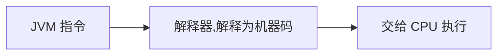

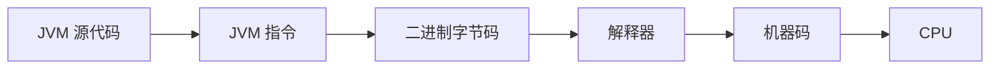

程序计数器，记住下一条指令的地址。

```java
0: getstatic #20 // PrintStream out = System.out;
3: astore_1 // --
4: aload_1 // out.println(1);
5: iconst_1 // --
6: invokevirtual #26 // --
9: aload_1 // out.println(2);
10: iconst_2 // --
11: invokevirtual #26 // --
14: aload_1 // out.println(3);
15: iconst_3 // --
16: invokevirtual #26 // --
19: aload_1 // out.println(4);
20: iconst_4 // --
21: invokevirtual #26 // --
24: aload_1 // out.println(5);
25: iconst_5 // --
26: invokevirtual #26 // --
29: return
```

- 线程私有
  - CPU 会为每个线程分配时间片，当当前线程的时间片使用完以后，CPU 就会去执行另一个线程中的代码
  - 程序计数器是每个线程所私有的，当另一个线程的时间片用完，又返回来执行当前线程的代码时，通过程序计数器可以知道应该执行哪一条指令
- <span style="color:orange">不会存在内存溢出</span>

> <b>注意</b>
>
> - Java 虚拟机规范中写的是：程序计数器记录的是正在执行的虚拟机字节码指令的地址；但如果正在执行的方法是 native 方法，则程序计数器的值 undefined (If that method is not native, the pc register contains the address of the Java Virtual Machine instruction currently being executed. If the method currently being executed by the thread is native, the value of the Java Virtual Machine's pc register is undefined.)
> - 程序计数器是唯一一个不会产生“内存溢出”的区域。
>
> goto 的本质就是改变的程序计数器的值（Java 中没有 goto，goto 是 Java 中的保留字）

## 虚拟机栈

<span style="color:green">Java Virtual Machine Stacks ( Java 虚拟机栈 )。虚拟机栈描述的是 Java 方法执行的线程内存模型：每个方法被执行的时候，Java 虚拟机都会同步创建一个栈帧（Stack Frame）用于存储变量表、操作数栈、动态链接、方法出口信息等。每个方法调用执行的过程都伴随着一个栈帧的入栈和出栈。</span>
栈 \=\=\=> 线程运行需要的内存空间，有多个线程的话就会有多个虚拟机栈。

```shell
stack=1, locals=3, args_size=1
    0: bipush        10
    2: istore_1
    3: bipush        20
    5: istore_2
    6: return
LineNumberTable:
    line 5: 0
    line 6: 3
    line 7: 6
LocalVariableTable: # 方法中的局部变量的值都存储在局部变量槽中。操作局部变量其实就是加载局部变量槽中的值，向局部变量槽中写入值。
		Start  Length  Slot  Name   Signature
				0       7     0  args   [LJava/lang/String;
				3       4     1     a   I
				6       1     2     b   I
```

- 每个线程运行需要的内存空间，称为虚拟机栈
- 每个栈由多个栈帧组成，对应着每次调用方法时所占用的内存
- 每个线程只能有一个活动栈帧，对应着当前正在执行的方法

### 问题辨析

> 垃圾回收是否涉及栈内存？

不需要。因为虚拟机栈中是由一个个的栈帧组成，在方法执行完毕后，对应的栈帧就会被弹出栈。所以无需通过垃圾回收机制去回收内存。

> 栈内存大小

- Linux/x64（64-bit）1024kb
- macOS（64-bit）1024kb
- Oracle Solaris/x64（64-bit）1024kb
- Windows The default value depends on virtual memory

> 栈内存的分配越大越好吗？

```shell
#-Xss 设置虚拟机栈的大小
-Xss1m
-Xss1024k
-Xss1048576
```

- 不是。因为物理内存是一定的，栈内存越大，可以支持更多的递归调用，但是可执行的线程数就会越少。
- 一个线程，它使用的是栈内存，一个线程用了 1MB 内存，总共的物理内存 500MB，理论上可以有 500 个线程同时运行。若线程占用变为 2MB ，则理论上只有 250 个线程可以同时运行。
- 不推荐设置过大的栈内存，一般推荐使用系统默认的栈内存大小

> 方法内的局部变量是否是线程安全的？

- 如果方法内局部变量没有逃离方法的作用范围，则是线程安全的
- 如果如果局部变量引用了对象，并逃离了方法的作用范围，则需要考虑线程安全问题

> PS：Linux/macOS 64bit 默认栈内存是 1024kb；Windows 是依赖于虚拟内存决定的。

### 栈内存溢出

- 栈帧过多导致栈内存溢出。
- 栈帧过大导致栈内存溢出。

> 场景演示

Exception in thread "main" Java.lang.StackOverflowError

```java
public class OutOfStack {
    private static int count = 0;

    public static void main(String[] args) {
        try {
            testStackOverFlowError();
        } catch (Throwable e) {
            e.printStackTrace();
        }finally {
            System.out.println(count);
        }
    }

    private static void testStackOverFlowError() {
        count++;
        testStackOverFlowError();
    }
}
```

如果类与类之间的循环引用。那么在将对象转为 JSON 的时候，会出现 StackOverFlowError。为什么？因为出现了循环引用，导致递归调用了某个方法，因此会出现 StackOverFlowError。对循环引用熟悉的，在字段上加上 `@JsonIgnore` 即可，可以忽略某个属性的转换。

### 线程运行诊断

> CPU 占用过高：Linux 环境下运行某些程序的时候，可能导致 CPU 的占用过高，这时需要定位占用 CPU 过高的线程

- top 命令，查看是哪个进程占用 CPU 过高<span style="color:green">（只能定位到进程，不能定位到线程）</span>
- `ps H -eo pid, tid (线程 id), %cpu | grep 刚才通过 top 查到的进程号` （通过 ps 命令进一步查看是哪个线程占用 CPU 过高）
  - `ps H -eo pid, tid, %cpu | grep 32655`  查看 32655 进程里面的线程
  - H 打印进程的进程数
  - eo 要输出那些感兴趣的内容


```shell
ps -eo pid,tid,%cpu

PID   TID  	%CPU
1     1    	0.1
8     8    	0.0
9     9    	0.3
43    43   	0.0
```

```shell
ps -eo pid,tid,%cpu | grep 9
PID   TID	 %CPU
9     9  	 0.1
```

`jstack 进程 id`

- jstack 进程 id 可以看到进程里线程的运行情况。
- 通过查看进程中线程的 nid，进一步定位到问题代码的源代码行号，来发现问题。
- 注意 jstack 查找出的线程 id 是 16 进制的**，**需要转换。

> 程序运行很长时间没有结果

死锁了。

## 本地方法栈

带 native 关键字的方法就是需要 Java 去调用本地的 C 或者 C++ 方法，因为 Java 有时候没法直接和操作系统底层交互，所以需要用到本地方法。

## 堆

Heap 堆：通过 new 关键字创建的对象都会被放在堆内存

> 特点
>
> - 所有线程共享，堆内存中的对象都需要考虑线程安全问题
> - 有垃圾回收机制

### 堆内存分配

Java 堆的内存可能是规整的，也可能不是规整的。按照堆内存是否规整，Java 堆内存分配方式有如下两种

- 规整的堆，一般用指针碰撞式的分配方式（就是移动指针，分配合适的内存区域）
- 不规整的堆，采用空闲列表法

> Java 堆内存的形式

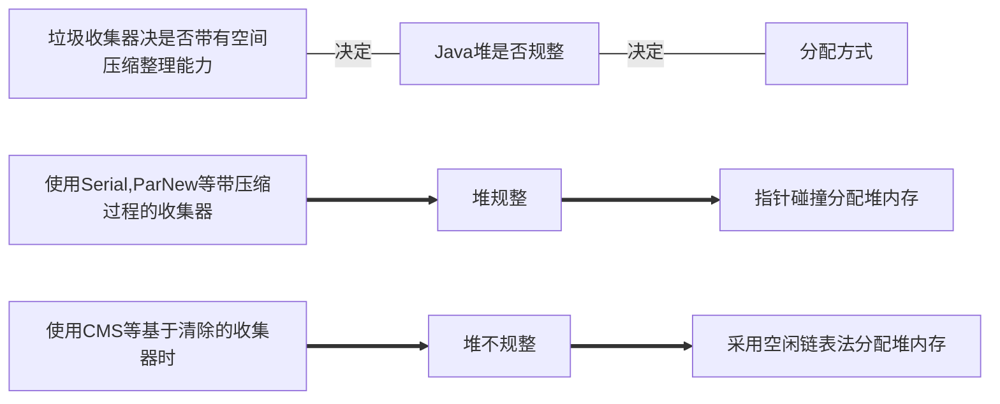

选择何种分配方式由 Java 堆是否规整决定。而 Java 堆是否规整又由所采用的垃圾收集器是否带有空间压缩整理（Compact）的能力决定。因此，<span style="color:orange">当使用 Serial、ParNew 等带压缩整理过程的收集器时，系统采用的分配算法是指针碰撞，既简单又高效</span>；<span style="color:red">而当使用 CMS 这种基于清除（Sweep）算法的收集器时，理论上就只能采用较为复杂的空闲列表来分配内存</span>。

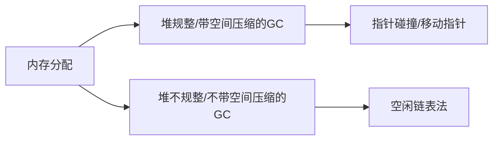

> 如何确保创建对象时分配内存的线程安全（<span style="color:red">并发下，内存的分配也是不安全的</span>）

除如何划分可用空间之外，还有另外一个需要考虑的问题：<span style="color:red">对象创建在虚拟机中是非常频繁的行为，即使仅仅修改一个指针所指向的位置，在并发情况下也并不是线程安全的</span>，可能出现正在给对象 A 分配内存，指针还没来得及修改，对象 B 又同时使用了原来的指针来分配内存的情况。

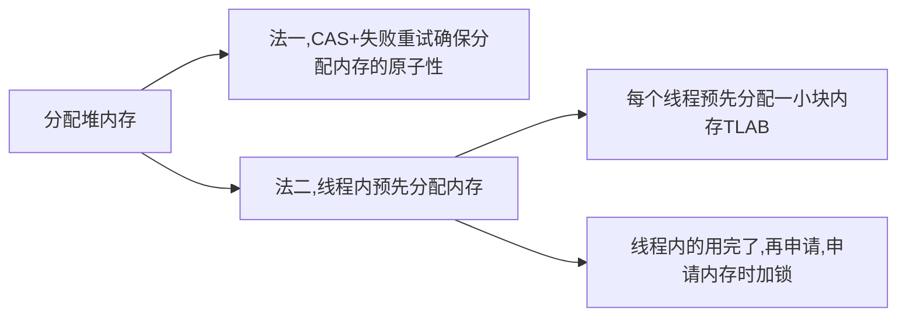

<span style="color:green">解决这个问题有两种可选方案</span>

- 一种是对分配内存空间的动作进行同步处理——实际上虚拟机是采用 CAS 配上失败重试的方式保证更新操作的原子性；
- 另外一种是把内存分配的动作按照线程划分在不同的空间之中进行，即每个线程在 Java 堆中预先分配一小块内存，称为本地线程分配缓冲（Thread Local Allocation Buffer，TLAB），哪个线程要分配内存，就在哪个线程的本地缓冲区中分配，只有本地缓冲区用完了，分配新的缓存区时才需要同步锁定。虚拟机是否使用 TLAB，可以通过 `-XX：+/-UseTLAB` 参数来设定。

### 堆内存溢出

> 场景演示

Java.lang.OutofMemoryError：Java heap space 堆内存溢出

```java
// VM option: -Xmx50m -Xms10m
public class OOM {
    public static void main(String[] args) {
        int i = 0;
        try {
            ArrayList<Object> list = new ArrayList<>();
            String a = "hello";
            while (true) {
                list.add(a);
                a = a + a;
                i++;
            }
        } catch (Throwable e) {
            e.printStackTrace();
            System.out.println(i);
        }
    }
}
```

### 堆内存诊断

> jps 工具

查看当前系统中有那些 Java 进程

> jmap 工具

查看堆内存占用情况

Java8：`jmap -heap 进程id`

Java11：`jhsdb jmap --heap --pid 15372`

可以看出 Java 11 默认的垃圾收集器是 G1 收集器

```shell
Attaching to process ID 15372, please wait...
Debugger attached successfully.
Server compiler detected.
JVM version is 11+28

using thread-local object allocation.
Garbage-First (G1) GC with 8 thread(s)

Heap Configuration:
   MinHeapFreeRatio         = 40
   MaxHeapFreeRatio         = 70
   MaxHeapSize              = 52428800 (50.0MB)
   NewSize                  = 1363144 (1.2999954223632812MB)
   MaxNewSize               = 31457280 (30.0MB)
   OldSize                  = 5452592 (5.1999969482421875MB)
   NewRatio                 = 2
   SurvivorRatio            = 8
   MetaspaceSize            = 21807104 (20.796875MB)
   CompressedClassSpaceSize = 1073741824 (1024.0MB)
   MaxMetaspaceSize         = 17592186044415 MB
   G1HeapRegionSize         = 1048576 (1.0MB)

Heap Usage:
G1 Heap:
   regions  = 50
   capacity = 52428800 (50.0MB)
   used     = 2097152 (2.0MB)
   free     = 50331648 (48.0MB)
   4.0% used
G1 Young Generation:
Eden Space:
   regions  = 2
   capacity = 5242880 (5.0MB)
   used     = 2097152 (2.0MB)
   free     = 3145728 (3.0MB)
   40.0% used
Survivor Space:
   regions  = 0
   capacity = 0 (0.0MB)
   used     = 0 (0.0MB)
   free     = 0 (0.0MB)
   0.0% used
G1 Old Generation:
   regions  = 0
   capacity = 5242880 (5.0MB)
   used     = 0 (0.0MB)
   free     = 5242880 (5.0MB)
   0.0% used
```

> jconsole 工具

图形界面的，多功能的监测工具，可以连续监测

> jvirsalvm 工具

<b>案例：</b>垃圾回收后，内存占用仍然很高。

jvirsalvm dump 出最大的 n 个对象。然后查看是那些对象占用的内存过大。

## 方法区

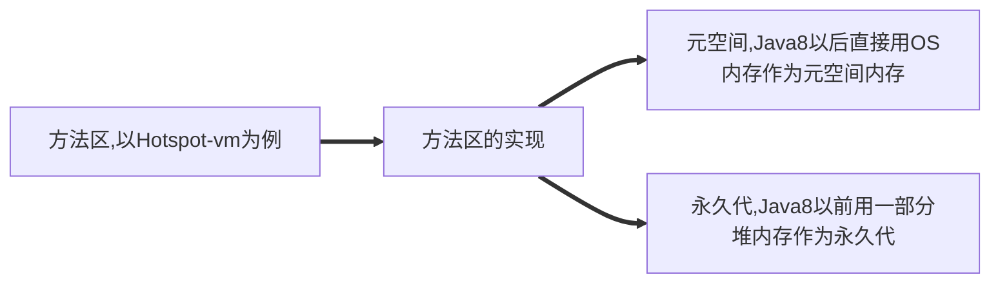

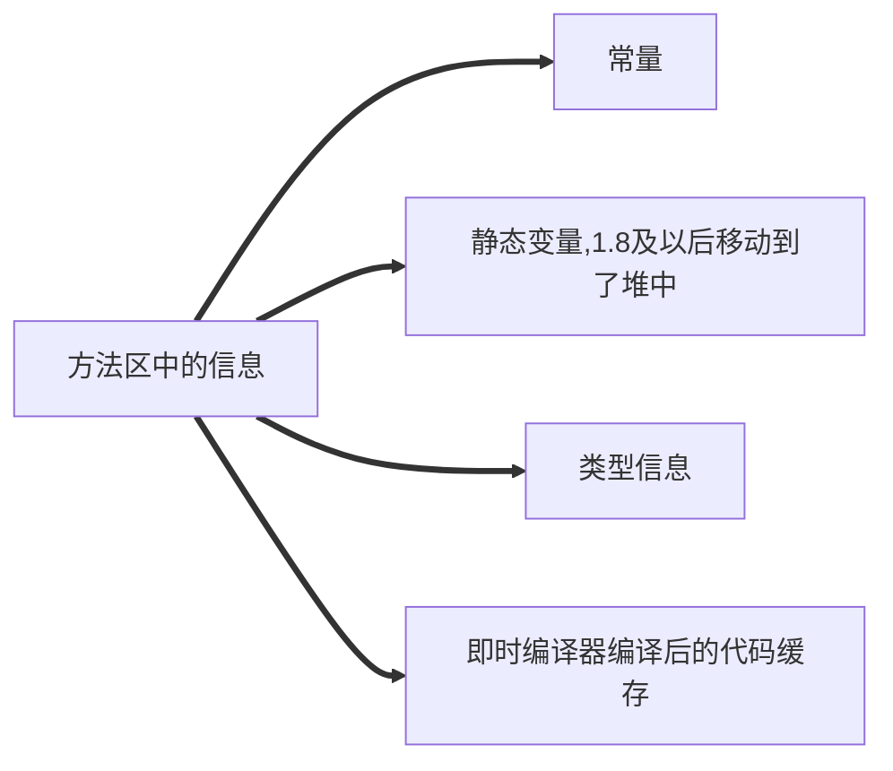

方法区是一种规范。而永久代，元空间这些说法，只是方法区的某种实现而已。以 Hotspot vm 为例，Java 8 以前，方法区用永久代（用的一部分堆内存作为永久代）实现的，Java 8 后，方法区用元空间（直接用 OS 的内存作为元空间的内存）实现的。方法区的结构如下：（JDK1.7 开始 StringTable 就放在了堆中，`String s1 = "abc"` 这样声明的字符串会放入字符串池中，`String s1 = new String("abcd")` 会在字符串池有一个 "abcd" 的字符串对象，堆中也有 1 个，2 个不同。）

<div align="center">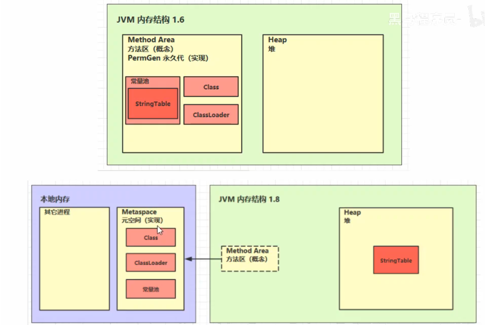</div>

### 内存溢出

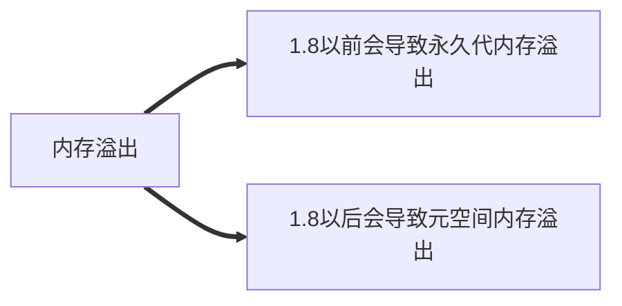

1.8 以前 `-XX:MaxPermSize=8m`

1.8 之后 `-XX:MaxMetaspaceSize=8m`

场景

- spring 使用 cjlib

- mybatis 使用 cjlib

需要 Java 8, Java 11 由于模块化的原因好像无法正常执行

```java
package Java.meta;

import jdk.internal.org.objectweb.asm.ClassWriter;
import jdk.internal.org.objectweb.asm.Opcodes;

// 演示元空间溢出
public class Demo1_8 extends ClassLoader { // 继承 ClassLoader 可以用来加载类的二进制字节码
    public static void main(String[] args) {
        int j = 0;
        Demo1_8 demo1_8 = new Demo1_8();
        try {
            for (int i = 0; i < 10000; i++, j++) {
                // ClassWriter 作用是生成类的二进制字节码
                ClassWriter cw = new ClassWriter(0);
                // 版本号 public 类名 包名 父类 接口
                cw.visit(Opcodes.V1_8,
                        Opcodes.ACC_PUBLIC,
                        "Class" + i,
                        null,
                        "Java/lang/Object",
                        null);
                // 返回 byte[]
                byte[] code = cw.toByteArray();
                // 执行了类的加载
                demo1_8.defineClass("Class" + i, code, 0, code.length);
            }
        } catch (Throwable e) {
            e.printStackTrace();
        } finally {
            System.out.println(j);
        }
    }
}
```

### 常量池

二进制字节码的组成：类的基本信息、常量池、类的方法定义（包含了虚拟机指令），常量池在哪里？

<b style="color:purple">自从在 JDK7 以后，就已经把运行时常量池和静态常量池转移到了堆内存中进行存储。</b>到了 JDK8，终于完全废弃了永久代的概念，改用与 JRockit、J9 一样在本地内存中实现的元空间（Meta-space）来代替，把 JDK7 中永久代还剩余的内容（主要是类型信息）全部移到元空间中。对于物理分区说运行时常量池和静态常量池就属于堆。(逻辑分区和物理实际存储的位置是不一样的)

<div align="center">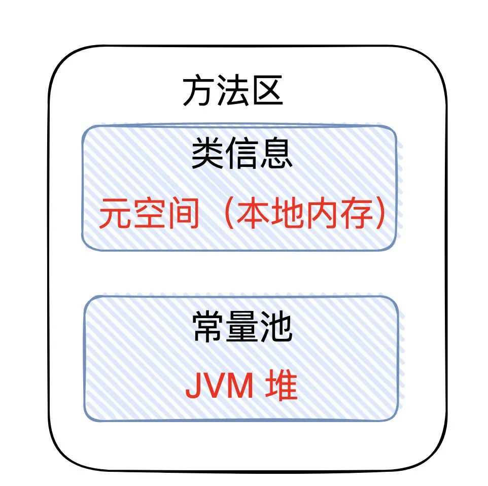</div>

<b>通过反编译来查看类的信息</b>

`Javap -v xxx.class` 显示反编译后的详细信息

```shell
Classfile /D:/Code/JavaEE/JVM/target/classes/jvm/s/HelloWorld.class // 类文件
  Last modified 2021年7月25日; size 545 bytes 
  MD5 checksum b4dbb0d80dc3884f9aea8ad2536afcdb // 签名
  Compiled from "HelloWorld.Java"
public class jvm.s.HelloWorld
  minor version: 0
  major version: 52
  flags: (0x0021) ACC_PUBLIC, ACC_SUPER
  this_class: #5                          // jvm/s/HelloWorld
  super_class: #6                         // Java/lang/Object
  interfaces: 0, fields: 0, methods: 2, attributes: 1
----------------
Constant pool: # 常量池  指令内容的详细信息存储在常量池中
----------------
   #1 = Methodref          #6.#20         // Java/lang/Object."<init>":()V
   #2 = Fieldref           #21.#22        // Java/lang/System.out:LJava/io/PrintStream;
   #3 = String             #23            // Hello world
   #4 = Methodref          #24.#25        // Java/io/PrintStream.println:(LJava/lang/String;)V
   #5 = Class              #26            // jvm/s/HelloWorld
   #6 = Class              #27            // Java/lang/Object
   #7 = Utf8               <init>
   #8 = Utf8               ()V
   #9 = Utf8               Code
  #10 = Utf8               LineNumberTable
  #11 = Utf8               LocalVariableTable
  #12 = Utf8               this
  #13 = Utf8               Ljvm/s/HelloWorld;
  #14 = Utf8               main
  #15 = Utf8               ([LJava/lang/String;)V
  #16 = Utf8               args
  #17 = Utf8               [LJava/lang/String;
  #18 = Utf8               SourceFile
  #19 = Utf8               HelloWorld.Java
  #20 = NameAndType        #7:#8          // "<init>":()V
  #21 = Class              #28            // Java/lang/System
  #22 = NameAndType        #29:#30        // out:LJava/io/PrintStream;
  #23 = Utf8               Hello world
  #24 = Class              #31            // Java/io/PrintStream
  #25 = NameAndType        #32:#33        // println:(LJava/lang/String;)V
  #26 = Utf8               jvm/s/HelloWorld
  #27 = Utf8               Java/lang/Object
  #28 = Utf8               Java/lang/System
  #29 = Utf8               out
  #30 = Utf8               LJava/io/PrintStream;
  #31 = Utf8               Java/io/PrintStream
  #32 = Utf8               println
  #33 = Utf8               (LJava/lang/String;)V
{
  public jvm.s.HelloWorld(); // 默认构造
    descriptor: ()V
    flags: (0x0001) ACC_PUBLIC
    Code:
      stack=1, locals=1, args_size=1
         0: aload_0
         1: invokespecial #1                  // Method Java/lang/Object."<init>":()V
         4: return
      LineNumberTable:
        line 4: 0
      LocalVariableTable:
        Start  Length  Slot  Name   Signature
            0       5     0  this   Ljvm/s/HelloWorld;

  public static void main(Java.lang.String[]);
    descriptor: ([LJava/lang/String;)V
    flags: (0x0009) ACC_PUBLIC, ACC_STATIC
    Code:
      stack=2, locals=1, args_size=1
         0: getstatic     #2                  // Field Java/lang/System.out:LJava/io/PrintStream; 获取静态变量 #2 用于查表翻译，查常量池表
         3: ldc           #3                  // String Hello world ==> 找到 #3 这个地址 加载 Hello world 这个参数
         5: invokevirtual #4                  // Method Java/io/PrintStream.println:(LJava/lang/String;)V  执行一次虚方法调用
         8: return
      LineNumberTable:
        line 6: 0
        line 7: 8
      LocalVariableTable:
        Start  Length  Slot  Name   Signature
            0       9     0  args   [LJava/lang/String;
}
SourceFile: "HelloWorld.Java"
```

### 运行时常量池

- 常量池（Constant pool）：就是一张表，虚拟机指令根据这张常量表找到要执行的类名、方法名、参数类型、字面量信息
- 运行时常量池，常量池是存储在 `*.class` 文件中的。<span style="color:orange">当该类被加载以后，它的常量池信息就会放入运行时常量池，并把里面的符号地址变为真实地址。</span>我们自己在看信息时，是根据 #1，#2 来找的，但是运行期间，会把 #1，#2 这些变成真正的内存地址。

### StringTable

StringTable 是一个 hash 表。长度是固定的。

> 开胃小菜

常量池中的信息，都会被加载到运行时常量池中，但这时 a、b、ab 仅是常量池中的符号，还没有成为 Java 字符串

```java
public class StringTable {
    public static void main(String[] args) {
        String s1 = "a";
        String s2 = "b";
        String s3 = "ab";
    }
}
```

```shell
0: ldc           #2                  // String a 我要到常量池的二号位置加载信息。
2: astore_1		 # 存入局部变量表 1 号这个位置
3: ldc           #3                  // String b
5: astore_2
6: ldc           #4                  // String ab
8: astore_3
9: return
```

当执行到 ldc #2 时，会把符号 a 变为 “a” 字符串对象，并放入串池中（先会到串池中找，没有就放入串池。串池中有，就用串池中的对象。）
当执行到 ldc #3 时，会把符号 b 变为 “b” 字符串对象，并放入串池中
当执行到 ldc #4 时，会把符号 ab 变为 “ab” 字符串对象，并放入串池中
最终 StringTable [“a”, “b”, “ab”]（hashtable 的结构不可扩容）

> 开胃小菜

```java
public class StringTable {
    public static void main(String[] args) {
        String s1 = "a";
        String s2 = "b";
        String s3 = "ab";
        String s4 = s1 + s2; // ldc #5
        System.out.println(s3 == s4); // new StringBuilder().append("a").append("b").toString() == new String("ab")  false
        String s5 = "a" + "b"; // Javac 在编译器的优化，都是常量，拼接的结果是确定的，是 ab。 直接从 StringTable 中找的 ab
        					   // ldc #5
    }
}
```

```java
stack=3, locals=6, args_size=1
		0: ldc           #3                  // String a
		2: astore_1
		3: ldc           #4                  // String b
		5: astore_2
		6: ldc           #5                  // String ab
		8: astore_3
		9: aload_1
		10: aload_2
		11: invokedynamic #6,  0              // InvokeDynamic #0:makeConcatWithConstants:(LJava/lang/String;LJava/lang/String;)LJava/lang/String;
		16: astore        4
		18: getstatic     #7                  // Field Java/lang/System.out:LJava/io/PrintStream;
		21: aload_3
		22: aload         4
		24: if_acmpne     31
		27: iconst_1
		28: goto          32
		31: iconst_0
		32: invokevirtual #8                  // Method Java/io/PrintStream.println:(Z)V
		35: ldc           #5                  // String ab
		37: astore        5
		39: return
```

> 测试字符串延迟加载

需要使用 IDEA 的 memory。memory 需要进行下配置。

<div align="center">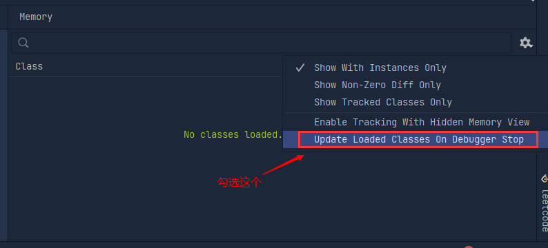</div>

<div align="center">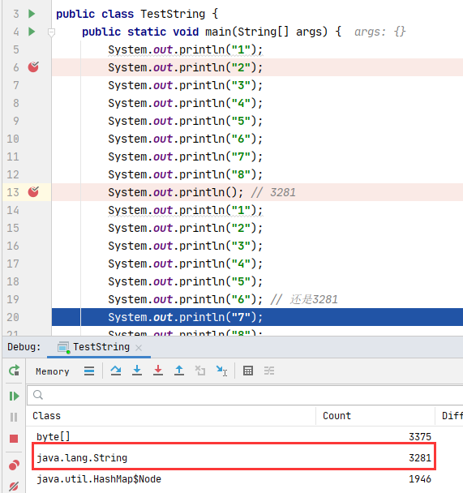</div>

### StringTable 的特性

- 常量池中的字符串仅是符号，第一次用到时才会转化为对象
- <span style="color:green">利用串池的机制，来避免重复创建字符串对象</span>
- 字符串变量拼接的原理是 StringBuilder（1.8）
- 字符串常量拼接的原理是编译器优化
- <span style="color:red">可以使用 intern 方法，主动将串池中还没有的字符串对象放入串池中</span>
  - 1.8 将这个字符串对象尝试放入串池，如果有则不会放入，如果没有则放入串池；<span style="color:red">不管放没放成功，最后会把串池中的对象返回。</span>
  - 1.6 将这个字符串对象尝试放入串池，如果有则不会放入，如果没有则会把此对象复制一份放入串池，然后返回串池中的对象。注意：此时无论调用 intern 方法成功与否，串池中的字符串对象和堆内存中的字符串对象都不是同一个对象
  - 举例：String ab = new String("ab"); ab.intern() 会尝试把 ab 这个字符串放入串池。
- <b>注意：无论是串池还是堆里面的字符串，都是对象</b>

> 面试题

```java
public class StringInterview {
    public static void main(String[] args) {
        String s1 = "a";
        String s2 = "b";
        String s3 = "a" + "b";
        String s4 = s1 + s2; // StringBuilder操作的 ab 对象
        String s5 = "ab";
        String s6 = s4.intern(); // jdk1.8 尝试把 s4放入 StringTable 发现有了，放入失败，返回StringTable中的 “ab”
        // 问
        System.out.println(s3 == s4); // false
        System.out.println(s3 == s5); // true
        System.out.println(s3 == s6); // true
        String x2 = new String("c") + new String("d"); // new String("cd")
        String x1 = "cd";
        x2.intern();  // cd 在常量池中，尝试把 x2 放入常量池中失败。
        System.out.println(x1 == x2); // false
        // 问，如果调换了【最后两行代码 (x1 和 x2 的赋值代码)】的位置呢? 那么结果就是 true 了。x2 将自己放入串池中，然后 x1=cd 就是从串池中拿对象了，拿到的是同一个对象。
        // 如果是 jdk1.6 呢? false。1.6 是复制一份放入，不是同一个对象
    }
}

// 补充内容
public class StringInterview {
    public static void main(String[] args) {
        String s1 = "a";
        String s2 = "b";
        String s3 = s1 + s2;
        s3.intern(); // 把 s3("ab") 放入了串池
        System.out.println(s3 == "ab"); // 串池中拿的 "ab"

        String x1 = "a";
        String x2 = "b";
        String x3 = x1 + x2;
        x3.intern(); // 把 x3（“ab”）放入串池失败，返回串池中的对象
        System.out.println(x3 == "ab"); // false
    }
}
```

### StringTable 的位置

<div align="center">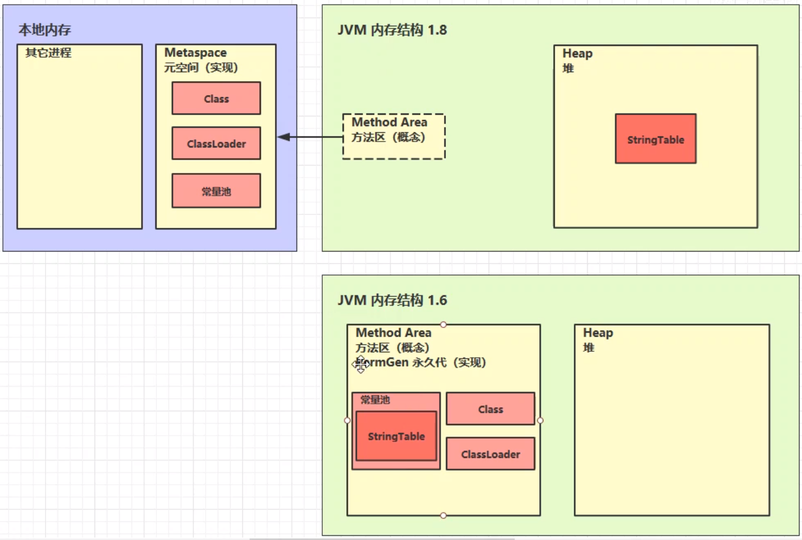</div>

> 验证代码

```java
/**
 * jdk8设置：-Xmx10m -XX:-UseGCOverheadLimit
 * jdk6设置：-XX:MaxPermSie=10m
 */
public class StringTableLocal {
    // Java 11 报异常：OutOfMemoryError: Java heap space 堆内存溢出了。说明 StringTable 在 heap 里面
    public static void main(String[] args) {
        ArrayList<String> table = new ArrayList<>();
        int i = 0;
        try {
            for (int j = 0; j < 260000000; j++) {
                String.valueOf(j).intern();
                i++;
            }
        } catch (Throwable e) {
            e.printStackTrace();
        } finally {
            System.out.println(i);
        }
    }
}
```

<b>Java.lang.OutOfMemoryError: GC overhead limit exceeded =\=\=\=> 超过 98% 的时间花在了 GC 上，但是回收了不到 2% 的 heap 内存，抛出此异常。</b>

### StringTable 垃圾回收

也会受到垃圾回收的管理。在内存紧张的时候，未被引用的字符串常量回被回收。

JVM 参数：`-Xmx10m -XX:+PrintStringTableStatistics -XX:+PrintGCDetails -verbose:gc`

### StringTable调优

因为 StringTable 是由 HashTable 实现的，所以可以<b>适当增加 HashTable 桶的个数</b>，来减少字符串放入串池所需要的时间

```shell
-XX:StringTableSize=xxxx
```

如果应用里有大量字符串并且存在很多重复的字符串，可以考虑使用 intern() 方法将字符串入池，而不是都存在 Eden 区中，这样字符串仅会占用较少的空间。

```java
import Java.io.BufferedReader;
import Java.io.FileInputStream;
import Java.io.IOException;
import Java.io.InputStreamReader;
import Java.util.ArrayList;
import Java.util.List;

/**
 * 演示 intern 减少内存占用 
 * -XX:StringTableSize=200000 -XX:+PrintStringTableStatistics 
 * -Xms500m -Xmx500m -XX:+PrintStringTableStatistics -XX:StringTableSize=200000
 */
public class StringTableBest2 {
    public static void main(String[] args) throws IOException {
        List<String> address = new ArrayList<>();
        System.in.read();
        // 重复放10次，这样就会有很多字符串
        for (int i = 0; i < 10; i++) {
            try (BufferedReader reader = new BufferedReader(new InputStreamReader(new FileInputStream("linux.words"), "utf-8"))) {
                String line = null;
                long start = System.nanoTime();
                while (true) {
                    line = reader.readLine();
                    if (line == null) {
                        break;
                    }
                    // 一个不调用intern，一个调用intern放入池中。
                    address.add(line.intern());
                }
                System.out.println("cost:" + (System.nanoTime() - start) / 1000000);
            }
        }
        System.in.read();
    }
}
```

使用 Java VisualVM 或 Jconsole 可以看当前程序虚拟机的内存占用。

```java
// 测试代码；加 intern 和 不加 intern
/**
 * 演示 intern 减少内存占用 * -XX:StringTableSize=200000 -XX:+PrintStringTableStatistics
 * -Xsx500m -Xmx500m -XX:+PrintStringTableStatistics -XX:StringTableSize=200000
 */
public class StringTableBest {
    public static void main(String[] args) throws IOException {
        List<String> address = new ArrayList<>();
        System.in.read();
        // 重复放10次，这样就会有很多字符串
        for (int i = 0; i < 10; i++) {
            long start = System.nanoTime();
            for (int line = 0; line < 500000; line++) {
                // 一个不调用intern，一个调用intern放入池中。
                address.add((line + "").intern()); // 使用 intern 内存占用更小。大概从300mb --> 210mb
            }
            System.out.println("cost:" + (System.nanoTime() - start) / 1000000);
        }
        System.in.read();
    }
}
```

## 直接内存

- 属于操作系统，常见于 NIO 操作时，<b>用于数据缓冲区</b>
- 分配回收成本较高，但读写性能高
- 不受 JVM 内存回收管理

### 文件读写

CPU 状态：从用户态\=\=\=\>内核态

数据的流向：磁盘文件\=\=\=\>系统缓冲区（系统内存）\=\=\=\>Java 缓冲区（Java 堆内存） 

<div align="center">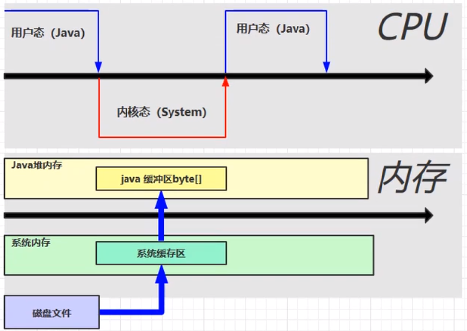</div>

<b>使用 DirectBuffer</b>

数据的流向：磁盘文件\=\=\=\>direct memory（OS 和 Java 代码都可以访问，少了一次数据的拷贝，速度更快）

<div align="center">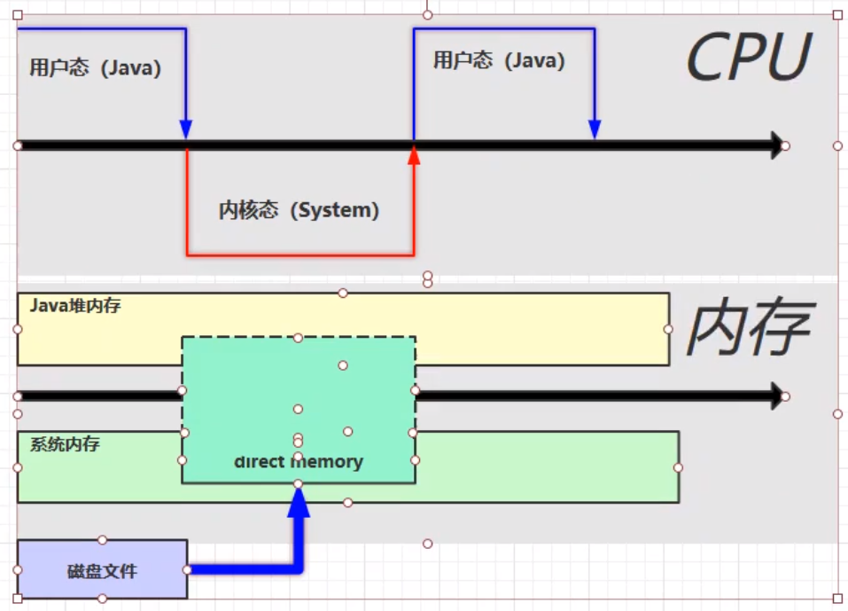</div>

<span style="color:orange">直接内存是操作系统和 Java 代码都可以访问的一块区域，无需将代码从系统内存复制到 Java 堆内存，因此提高了效率</span>

### 演示直接内存溢出

```java
// 演示直接内存溢出
public class Demo1_10 {
    static int _100Mb = 1024 * 1024 * 100;

    public static void main(String[] args) {
        List<ByteBuffer> list = new ArrayList<>();
        int i = 0;
        try {
            while (true) {
                ByteBuffer byteBuffer = ByteBuffer.allocateDirect(_100Mb);
                list.add(byteBuffer);
                i++;
            }
        } finally {
            System.out.println(i);
        }
        // 方法区是jvm规范，jdk6 中对方法区的实现称为永久代；jdk8 对方法区的实现称为元空间
    }
}
```

### 释放直接内存

ByteBuffer 的实现内部使用了 Cleaner（继承自虚引用）来检测 ByteBuffer。一旦 ByteBuffer 被垃圾回收，那么会由 ReferenceHandler 来调用 Cleaner 的 clean 方法调用 freeMemory 来释放内存，进而实现堆外内存的回收。

```java
import Java.io.IOException;
import Java.nio.ByteBuffer;

// 禁用显式回收对直接内存的影响
public class Demo1_26 {
    static int _1Gb = 1024 * 1024 * 1024;

    // -XX:+DisableExplicitGC 显式的
    public static void main(String[] args) throws IOException {
        ByteBuffer byteBuffer = ByteBuffer.allocateDirect(_1Gb);
        System.out.println("分配完毕...");
        System.in.read();
        System.out.println("开始释放...");
        byteBuffer = null;
        System.gc(); // 显式的垃圾回收，Full GC
        System.in.read();
    }
}
```

通过 unsafe 类显示回收内存，高版本 JDK 不支持 unsafe 类。

```java
import sun.misc.Unsafe;

import Java.io.IOException;
import Java.lang.reflect.Field;

// 直接内存分配的底层原理：Unsafe
public class Demo1_27 {
    static int _1Gb = 1024 * 1024 * 1024;

    public static void main(String[] args) throws IOException {
        Unsafe unsafe = getUnsafe();
        // 分配内存
        long base = unsafe.allocateMemory(_1Gb);
        unsafe.setMemory(base, _1Gb, (byte) 0);
        System.out.println("分配内存");
        System.in.read();

        // 释放内存
        unsafe.freeMemory(base);
        System.out.println("释放内存");
        System.in.read();
    }

    public static Unsafe getUnsafe() {
        try {
            Field f = Unsafe.class.getDeclaredField("theUnsafe");
            f.setAccessible(true);
            Unsafe unsafe = (Unsafe) f.get(null);
            return unsafe;
        } catch (NoSuchFieldException | IllegalAccessException e) {
            throw new RuntimeException(e);
        }
    }
}
```

### 释放原理

堆外内存不归 JVM GC 管。所以需要手动释放。释放的方式有两种。

- ByteBuffer 的实现内部使用了 Cleaner（虚引用）来检测 ByteBuffer。一旦 ByteBuffer 被垃圾回收，那么会由 ReferenceHandler 来调用 Cleaner 的 clean 方法调用 freeMemory 来释放内存，进而实现堆外内存的回收。
- 直接通过 unsafe 类进行堆外内存的申请和释放。
  - 申请内存：`unsafe.allocateMemory( );`
  - 释放内存：`unsafe.freeMemory( );`

> 源码分析

`ByteBuffer.allocateDirect( )`

```java
public static ByteBuffer allocateDirect(int capacity) {
    return new DirectByteBuffer(capacity);
}
```

`DirectByteBuffer( )`

```java
DirectByteBuffer(int cap) {
    super(-1, 0, cap, cap);
    boolean pa = VM.isDirectMemoryPageAligned();
    int ps = Bits.pageSize();
    long size = Math.max(1L, (long)cap + (long)(pa ? ps : 0));
    Bits.reserveMemory(size, cap);
    long base = 0L;

    try {
        // 完成对内存的分配
        base = UNSAFE.allocateMemory(size);
    } catch (OutOfMemoryError var9) {
        Bits.unreserveMemory(size, cap);
        throw var9;
    }

    UNSAFE.setMemory(base, size, (byte)0);
    if (pa && base % (long)ps != 0L) {
        this.address = base + (long)ps - (base & (long)(ps - 1));
    } else {
        this.address = base;
    }
	// 关联了一个回调任务对象。 Cleaner是虚引用类型。
    // 好像是 ByteBuffer 会和 Cleaner 关联，ByteBuffer 被 GC 后，就会触发 Cleaner 对象中的 clean 方法（垃圾回收时回调）
    // public class Cleaner extends PhantomReference<Object> {/* ... */}
    this.cleaner = Cleaner.create(this, new DirectByteBuffer.Deallocator(base, size, cap));
    this.att = null;
}
```

回调任务对象里有个 run 方法，进行内存释放。

```java
public void run() {
    if (this.address != 0L) {
        Buffer.UNSAFE.freeMemory(this.address);
        this.address = 0L;
        Bits.unreserveMemory(this.size, this.capacity);
    }
}
```

禁用显示的垃圾回收
- -XX:+DisableExplicitGC 关闭显式的垃圾回收，但是这样会影响直接内存的回收，这样就只
- System.gc() 就是显式的垃圾回收。触发的是 full gc。

直接内存的回收不是通过 JVM 的垃圾回收来释放的，而是通过 <b>unsafe.freeMemory</b>来手动释放

```java
//通过ByteBuffer申请1M的直接内存
ByteBuffer byteBuffer = ByteBuffer.allocateDirect(_1M);
```

申请直接内存，但 JVM 并不能回收直接内存中的内容，它是如何实现回收的呢？

<b>allocateDirect 的实现</b>

```java
public static ByteBuffer allocateDirect(int capacity) {
    return new DirectByteBuffer(capacity);
}
```

DirectByteBuffer 类

```java
DirectByteBuffer(int cap) {   // package-private
   
    super(-1, 0, cap, cap);
    boolean pa = VM.isDirectMemoryPageAligned();
    int ps = Bits.pageSize();
    long size = Math.max(1L, (long)cap + (pa ? ps : 0));
    Bits.reserveMemory(size, cap);

    long base = 0;
    try {
        base = unsafe.allocateMemory(size); //申请内存
    } catch (OutOfMemoryError x) {
        Bits.unreserveMemory(size, cap);
        throw x;
    }
    unsafe.setMemory(base, size, (byte) 0);
    if (pa && (base % ps != 0)) {
        // Round up to page boundary
        address = base + ps - (base & (ps - 1));
    } else {
        address = base;
    }
    cleaner = Cleaner.create(this, new Deallocator(base, size, cap)); // 通过虚引用，来实现直接内存的释放，this 为虚引用的实际对象
    att = null;
}
```

这里调用了一个 Cleaner 的 create 方法，且后台线程还会对虚引用的对象监测，如果虚引用的实际对象（这里是 DirectByteBuffer）被回收以后，就会调用 Cleaner 的 clean 方法，来清除直接内存中占用的内存

```java
public void clean() {
    if (remove(this)) {
        try {
            this.thunk.run(); //调用run方法
        } catch (final Throwable var2) {
            AccessController.doPrivileged(new PrivilegedAction<Void>() {
                public Void run() {
                    if (System.err != null) {
                        (new Error("Cleaner terminated abnormally", var2)).printStackTrace();
                    }

                    System.exit(1);
                    return null;
                }
            });
        }
    }
}
```

对应对象的 run 方法

```java
public void run() {
    if (address == 0) {
        // Paranoia
        return;
    }
    unsafe.freeMemory(address); //释放直接内存中占用的内存
    address = 0;
    Bits.unreserveMemory(size, capacity);
}
```

#### 直接内存的回收机制总结

- 使用了 Unsafe 类来完成直接内存的分配回收，回收需要主动调用 freeMemory 方法
- 来调用 Cleaner 的 clean 方法调用 freeMemory 来释放内存。

```java
static int _1Gb = 1024 * 1024 * 1024;

public static void main(String[] args) throws IOException {
    System.in.read();
    ByteBuffer byteBuffer = ByteBuffer.allocateDirect(_1Gb);
    System.out.println("收集内存"); 
    System.in.read(); // 不手动释放堆外内存
    System.out.println("会自己释放内存吗"); // JVM 结束后会自动回收内存。JVM 结束了，byteBuffer 也结束了，会自动清理堆外内存。
}
```

但是有时候，我们是 JVM 停止前就需要回收堆外内存，这时候就需要手动释放了（不要 System.gc()，虽然它会建议 JVM 进行 GC，但是进行的是 full gc。如果 JVM 听从了这个建议，进行了 full gc，这代价很大，会降低程序的性能）

```java
static int _1Gb = 1024 * 1024 * 1024;
// 不手动释放，直接内存不会释放
public static void main(String[] args) throws IOException {
    System.in.read();
    ByteBuffer byteBuffer = ByteBuffer.allocateDirect(_1Gb);
    System.out.println("收集内存结束");
    System.in.read();
    System.out.println("set byteBuffer null");
    // 不进行gc，byteBuffer 对象就不会被垃圾回收，也就不会触发它涉及到的堆外内存的回收了。
    // 并且 JVM 的 GC 只有在内存不够用的时候才会进行GC。所以还是用 unsafe 施放堆外内存更为合理
    byteBuffer = null;
    System.in.read();
    System.in.read();
}
```

## 对象

### 对象的创建


### 对象的内存布局

HotSpot VM 里，对象在堆内存中的存储布局可划分为三个部分：对象头（Header）、实例数据/对象体（Instance Data）、对齐填充（Padding）

<div align="center">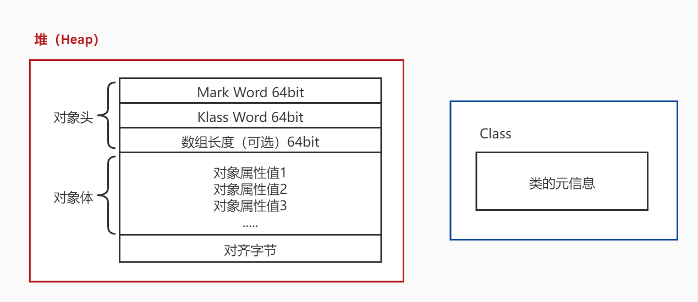</div>

对象各个数组的作用：

- 对象头中的 mark word，主要用于表示对象的线程锁状态，存放对象的哈希码、GC 分代年龄、锁状态等。
- Kclass wrod 是一个指向方法区中 Class 信息的指针。意味这该对象可随时知道自己是那个 Class 的实例。也是 Java 对象和 CPP 对象进行交互的媒介。
- 数组长度是可选的，只有当本对象是一个数组对象时才会有这个部分。
- 对象体是用于保存对象属性和值的主体部分，占用内存空间取决于对象的属性数量和类型。
- 对齐字是为了减少堆内存的碎片空间（不一定准确）。

一个 Object 对象占几个字节？

<span style="color:orange">Mark word 64bit = 8 byte，Klass Word 64bit=8byte；一共16个字节。</span>

> 对象头中一般包含两类信息

- 第一类：存储对象自身的运行时数据，如哈希码、GC 分代年龄、锁状态标志、线程持有的锁、偏向锁 ID、偏向时间戳等。（在 32 位 VM 和未开启指针压缩的 64 位 VM 中分别占用 32 比特和 64 比特）
- 第二类：类型指针，即对象指向它的类型元数据的指针（通过这个指针来确定该对象是哪个类的实例，但并不是所有对象都需要保存这个类型指针）

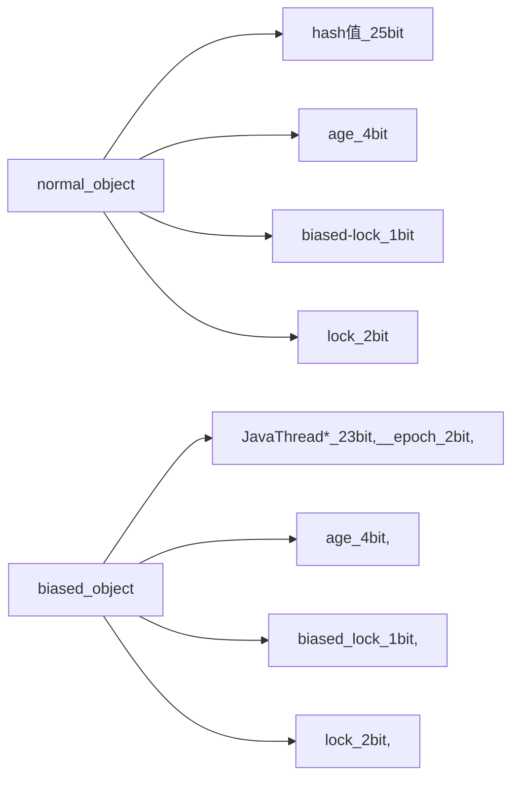

> 实例数据

对象真正存储的有效信息。

> 对齐填充

不是必要的，仅仅是起占位符的作用。HotSpot VM 的自动内存管理系统要求对象起始地址必须是 8 字节的整数倍。如果不是，则需要通过对齐填充来满足。

### 对象内存布局图

<div align="center">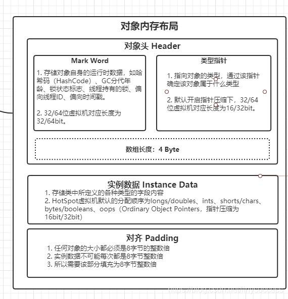</div>

### 对象的访问定位

对象创建了，自然要使用。我们创建了对象并用变量保存了它的引用，那么这个引用通过什么方式去定位对象呢？

- 句柄访问
- 直接指针访问

<div align="center">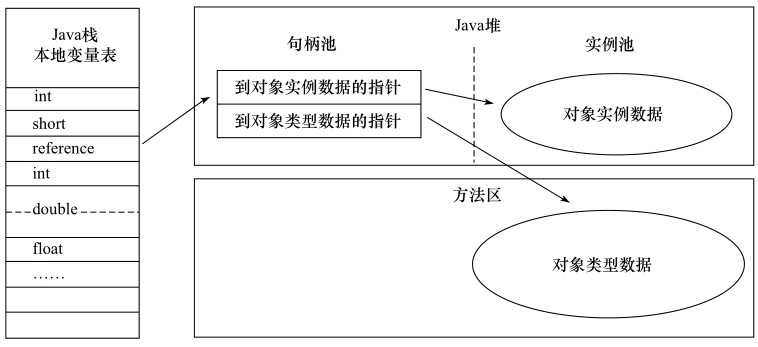</div></div>

<div align="center">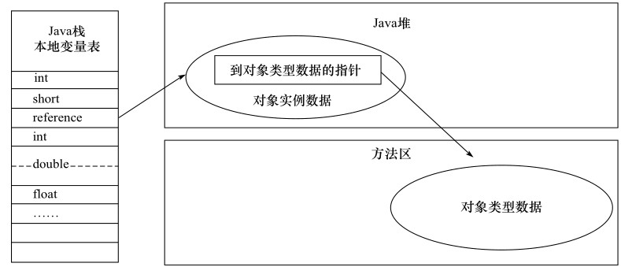</div></div>

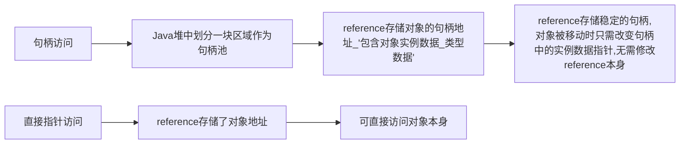

