# 垃圾回收&内存分配

为什么内存动态分配技术这么好了，我们还要去了解垃圾收集和内存分配？

当需要排查各种内存溢出、内存泄漏时，当 GC 成为系统达到更高并发量瓶颈时，需要对 GC 进行调控。<span style="color:orange">GC 更像一个抉择的过程，在吞吐量和延迟上进行抉择。</span>

> 概述

- ①如何判断对象可以回收
- ②垃圾回收算法
- ③分代垃圾回收
- ④垃圾回收器
- ⑤垃圾回收调优

<span style="color:red">老年代的 GC 叫 Full GC，新生代的 GC 叫 Minor GC</span>

> 需要思考的问题

- <span style="color:orange">那些内存需要回收</span>：JVM 中堆内存和方法区这两个区域需要回收。
- <span style="color:orange">什么时候可以回收</span>：内存空间不足时，需要进行回收。
- <span style="color:orange">如何回收</span>：垃圾回收算法，标记清除、标记整理、标记复制、增量算法 etc.

## GC概述

垃圾收集器是分代的，分为年轻代和老年代

| 年轻代                                            | 老年代                                                |      |
| ------------------------------------------------- | ----------------------------------------------------- | ---- |
| Serial，用的标记复制算法，会 STW                  | Serial Old，采用标记-整理算法                         |      |
| ParNew，Serial 的多线程版本，也是用的标记复制算法 | CMS，尽可能降低单次 GC 的时间，可能会有并发失败的问题 |      |
| Parallel Scavenge，关注吞吐率                     | Parallel Old                                          |      |

<b>CMS 流程</b>

- 1️⃣初次标记，标记 GCRoot 对象；STW
- 2️⃣并发标记，标记所有对象，和用户线程一起执行，可能会有浮动垃圾。
- 3️⃣重新标记，修正第二步，STW
- 4️⃣并发清理，用的标记清理算法，会有内存碎片，如果内存碎片过多导致并发失败，会退化为 SerialOld，造成 GC 时间过长。

<b>G1 垃圾收集器</b>

先前垃圾收集器堆内存的结构

<div align="center">

</div>

G1 垃圾收集器堆内存的结构

<div align="center"></div>

G1 垃圾收集器将堆内存分成一个一个的 Regions。一个 Regions 的大小在 $1MB \to 32MB$，大概有 2000 个 Regions。如果声明的对象超过了 Regions 的大小会有对应的策略

- 如果 $0.5Region<对象大小<1Region$ 对象就会被放入老年代。并且对象会被标记为 H（超大对象）。即大对象直接进入老年代。
- $>1Region$，会申请多个连续的 Region，然后存入，标记为 H。

Remember set 简单记为 Rset，每个 Region 都会有一个 Rset，Rset 用于存储那些 Region 引用了当前 Region。

Collection set 本次 GC 需要清理的 Region 集合。

Young GC 和 Old GC 都是使用的 G1。下图是 YGC 的一个回收过程，将 YGC 中存活的对象复制到其他区域（REcently Copied in Young Generation）。

<div align="center">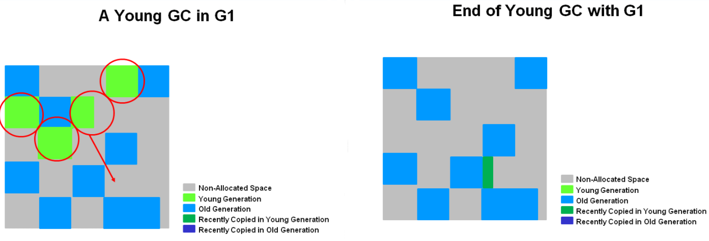</div>

没有单独针对 Old 区的 GC，在对 Old 区进行 GC 时，也会对 Young 进行 GC ==> MixGC。

MixGC 和 CMS 的步骤很类似

- 1️⃣初次标记，标记 GCRoot 对象和这些对象所在的 Region（GCRoot Region），会 STW
- 2️⃣RootRegion --> 扫描整个 Old 区的所有 Region，去看它们的 Rset 中是否有 RootRegion，有则标记好
- 3️⃣并发标记
- 4️⃣重新标记
- 5️⃣复制清理，只选取垃圾较多的 Region 回收最具价值的区域，不一定会回收所有区域，会 STW。由于不会回收所有区域，所以回收效率高。

## 如何判断对象可以回收

### 引用计数法

- <span style="color:red">判断方式</span>：给对象中添加一个引用计数器，每当有一个地方引用它时，计数器值就加 1；当引用失效时，计数器值就减 1；任何时刻计数器为 0 的对象就是不可能再被使用的。
- <span style="color:red">优点</span>：实现简单 + 高效；但是 JVM 不是这样做的。

- <span style="color:red">弊端：</span>循环引用时，两个对象的计数都为 1，导致两个对象都无法被释放。不过可以用 Recycler 算法解决，但是多线程环境下，引用计数变更也要进行昂贵的同步操作，性能较低，早期的语言会采用此算法。(需要配合大量额外处理才能保证正确的工作)

<div align="center">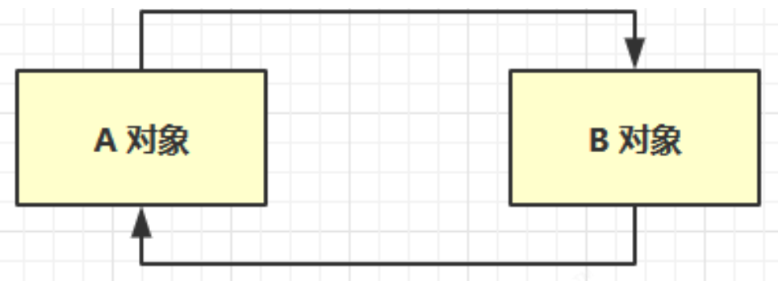</div>

案例，演示 Java 中的循环引用也可以被 GC 回收。

```java
public class ReferenceCountingGC {
    public Object instance = null;
    private static final int _1MB = 1024 * 1024;
    private byte[] bigSize = new byte[2 * _1MB];

    public static void main(String[] args) {
        ReferenceCountingGC objA = new ReferenceCountingGC();
        ReferenceCountingGC objB = new ReferenceCountingGC();
        objA.instance = null;
        objB.instance = null;
        System.GC();
    }
}
```

GC 日志如下：PSYoungGen = Parallel Scavenge = Eden+From；YoungGen = Eden+From+To

```shell
[GC (System.GC()) [PSYoungGen: 9302K->4936K(75776K)] 9302K->4944K(249344K), 0.0019684 secs] [Times: user=0.00 sys=0.00, real=0.00 secs] 
[Full GC (System.GC()) 
	[PSYoungGen: 4936K->0K(75776K)] 
	[ParOldGen: 8K->4700K(173568K)] 4944K->4700K(249344K), [Metaspace: 3188K->3188K(1056768K)], 0.0041073 secs] 
	[Times: user=0.00 sys=0.00, real=0.00 secs] 
Heap
 PSYoungGen      total 75776K, used 1951K [0x000000076b600000, 0x0000000770a80000, 0x00000007c0000000)
  eden space 65024K, 3% used [0x000000076b600000,0x000000076b7e7c68,0x000000076f580000)
  from space 10752K, 0% used [0x000000076f580000,0x000000076f580000,0x0000000770000000)
  to   space 10752K, 0% used [0x0000000770000000,0x0000000770000000,0x0000000770a80000)
 ParOldGen       total 173568K, used 4700K [0x00000006c2200000, 0x00000006ccb80000, 0x000000076b600000)
  object space 173568K, 2% used [0x00000006c2200000,0x00000006c2697138,0x00000006ccb80000)
 Metaspace       used 3212K, capacity 4496K, committed 4864K, reserved 1056768K
  class space    used 352K, capacity 388K, committed 512K, reserved 1048576K
```

### 可达性分析算法

<span style="color:blue">主流的商用程序语言（Java、C#）的内存管理用可达性分析算法判断的对象是否存活。</span>

- JVM 中的垃圾回收器通过<b>可达性分析</b>来探索所有存活的对象。
- <span style="color:orange">扫描堆中的对象，看是否能沿着以 GC Roots 对象为起点的引用链找到该对象，如果找不到，则表示可以回收。</span>

<div align="center"></div>

<b>那些对象可以作为 GC Roots？</b>

- 虚拟机栈（栈帧中的本地变量表）中引用的对象，如各个线程被调用的方法堆栈种使用到的参数、局部变量、临时变量等。毕竟我正在使用的对象你不能给我删除了。
- 方法区中类静态属性引用的对象，如 Java 类的引用类型静态变量。
- 方法区中常量引用的对象，如字符串常量池中的引用。
- 本地方法栈中 JNI（即一般说的 native 方法）引用的对象。
- Java 虚拟机内部的引用，如基本类型对应的 Class 对象，还有一些常驻的异常对象（NPE）、系统类加载器。
- 所有被同步锁（synchronized 关键字）持有的对象。
- 反映 Java 虚拟机内部情况的 JMXBean、JVMTI 中注册的回调、本地代码缓存等。
- 还有一些其他对象可以“临时性”加入 GC Roots（主要是可能存在跨代引用，要确保跨代引用也没有，才可以回收）。

<b>通过代码和工具查看那些对象可以作为 GC Root</b>

- Eclipse Memory Analyzer 工具，eclipse 官网的
- `jmap -dump:format=b,live,file=1.bin PID` live 表示在转储前会进行一次 GC。1.bin 是转出文件名。
- 有那些可以作为 GC roots 呢？
  - System Class
  - Native Stack
  - Thread：主线程的局部变量，主线程局部变量引用的对象
  - Busy Monitor

### 五种引用

一般谈引用指的是强软弱虚四大引用。

- 强引用（Strongly Reference）简单说就是 Object obj = new Object() 这种引用关系。只有所有 GC Roots 对象都不通过【强引用】引用该对象，该对象才能被垃圾回收 。
- 软引用（SoftReference）仅有软引用引用该对象时，在垃圾回收后，内存仍不足时会再次出发垃圾回收，回收软引用对象，可以配合引用队列来释放软引用自身。垃圾回收后，内存还不够，就会回收软引用，如果回收后内存还不够就会触发内存溢出异常。
- 弱引用（WeakReference） 仅有弱引用引用该对象时，在垃圾回收时，无论内存是否充足，都会回收弱引用对象，可以配合引用队列来释放弱引用自身。
- 虚引用（PhantomReference）必须配合引用队列使用，主要配合 ByteBuffer 使用（配合 NIO 使用），被引用对象回收时，会将虚引用入队， 由 Reference Handler 线程调用虚引用相关方法释放直接内存。
- 终结器引用（FinalReference） 无需手动编码，但其内部配合引用队列使用，在垃圾回收时，终结器引用入队（被引用对象暂时没有被回收），再由 Finalizer 线程通过终结器引用找到被引用对象并调用它的 finalize 方法，第二次 GC 时才能回收被引用对象。

实线箭头表示强引用。

<div align="center"></div>

#### 强引用

只有 GC Root 都不引用该对象时，才会回收强引用对象

- 如上图 B、C 对象都不引用 A1 对象时，A1 对象才会被回收

```java
// -Xmx20m -XX:+PrintGCDetails -verbose:GC
public static void strongRef() throws IOException {
    ArrayList<byte[]> bytes = new ArrayList<>();
    for (int i = 0; i < 5; i++) {
        byte[] b = new byte[4 * 1024 * 1024];
        bytes.add(b);
    }
    System.in.read();
}
// out of memory
```

####  软引用

没有其它强引用引用软引用，且内存不足时（GC 后内存还不足），会回收软引用所引用的对象

如上图如果 B 对象不再引用 A2 对象且内存不足时，软引用所引用的 A2 对象就会被回收

```java
public static void softRef() throws IOException {
    ArrayList<SoftReference<byte[]>> list = new ArrayList<>();
    for (int i = 0; i < 5; i++) {
        byte[] b = new byte[4 * 1024 * 1024];
        SoftReference<byte[]> soft = new SoftReference<byte[]>(b);
        list.add(soft);
    }
    System.out.println("循环结束" + list.size());
    list.stream().map(e->e.get()).forEach(System.out::println);
}
```

如果在垃圾回收时发现内存不足，在回收软引用所指向的对象时，<b>软引用本身不会被清理。如果想要清理软引用，需要使用引用队列</b>

> 软引用的 GC 日志

```shell
[B@677327b6
1
[B@14ae5a5
2
[B@7f31245a
3
# 进行了一次小范围的 GC，把 新生代从 1719k 的使用变为了 488k
[GC (Allocation Failure) [PSYoungGen: 1719K->488K(6144K)] 14007K->12920K(19968K), 0.0013064 secs] [Times: user=0.00 sys=0.00, real=0.00 secs] 
[B@6d6f6e28
4
# 进行了一次小范围的 GC，未回收到什么内存，后面触发了 Full GC
[GC (Allocation Failure) --[PSYoungGen: 4809K->4809K(6144K)] 17241K->17241K(19968K), 0.0019607 secs] [Times: user=0.00 sys=0.00, real=0.00 secs] 
# Full GC 不光回收新生代 还回收老年代
# PS：元空间用的本地内存 就是 OS 内存，不经过 JVM
# 这次 Full GC 失败了，于是触发了回收 softref 的 GC
[Full GC (Ergonomics) [PSYoungGen: 4809K->4592K(6144K)] [ParOldGen: 12432K->12406K(13824K)] 17241K->16998K(19968K), [Metaspace: 3273K->3273K(1056768K)], 0.0048990 secs] [Times: user=0.00 sys=0.00, real=0.01 secs] 
[GC (Allocation Failure) --[PSYoungGen: 4592K->4592K(6144K)] 16998K->17034K(19968K), 0.0007563 secs] [Times: user=0.00 sys=0.00, real=0.00 secs] 
# 回收 软引用，其实就是把前面4个软引用都回收了，然后放第五个软引用
[Full GC (Allocation Failure) [PSYoungGen: 4592K->0K(6144K)] [ParOldGen: 12442K->596K(8704K)] 17034K->596K(14848K), [Metaspace: 3273K->3273K(1056768K)], 0.0047863 secs] [Times: user=0.09 sys=0.00, real=0.01 secs] 
[B@135fbaa4
5
循环结束：5
[GC (Allocation Failure) [PSYoungGen: 5632K->320K(6144K)] 6228K->5020K(14848K), 0.0012147 secs] [Times: user=0.00 sys=0.00, real=0.00 secs] 
[Full GC (Ergonomics) [PSYoungGen: 320K->0K(6144K)] [ParOldGen: 4700K->4875K(13824K)] 5020K->4875K(19968K), [Metaspace: 3995K->3995K(1056768K)], 0.0079850 secs] [Times: user=0.00 sys=0.00, real=0.01 secs] 
null
null
null
null
[B@135fbaa4
Heap
 PSYoungGen      total 6144K, used 668K [0x00000000ff980000, 0x0000000100000000, 0x0000000100000000)
  eden space 5632K, 11% used [0x00000000ff980000,0x00000000ffa270f0,0x00000000fff00000)
  from space 512K, 0% used [0x00000000fff80000,0x00000000fff80000,0x0000000100000000)
  to   space 512K, 0% used [0x00000000fff00000,0x00000000fff00000,0x00000000fff80000)
 ParOldGen       total 13824K, used 4875K [0x00000000fec00000, 0x00000000ff980000, 0x00000000ff980000)
  object space 13824K, 35% used [0x00000000fec00000,0x00000000ff0c2e00,0x00000000ff980000)
 Metaspace       used 4183K, capacity 4716K, committed 4992K, reserved 1056768K
  class space    used 466K, capacity 532K, committed 640K, reserved 1048576K
```

清除软引用的大致思路为：查看引用队列中有无软引用，如果有，则将该软引用从存放它的集合中移除（这里为一个 list 集合）

```java
static int _4MB = 4 * 1024 * 1024;    
public static void soft() {
    //使用引用队列，用于移除引用为空的软引用对象
    ReferenceQueue<byte[]> queue = new ReferenceQueue<>();
    List<SoftReference<byte[]>> list = new ArrayList<>();
    for (int i = 0; i < 5; i++) {
        // 关联了软引用队列，当软引用所关联的 byte[] 被回收时，软引用自己会加入软引用队列中取去。
        SoftReference<byte[]> soft = new SoftReference<byte[]>(new byte[_4MB],queue);
        System.out.println(soft.get());
        list.add(soft);
        System.out.println(list.size());
    }
    // 从队列中获取无用的 软引用对象，并移除
    Reference<? extends byte[]> poll = queue.poll();
    while (poll != null) {
        list.remove(poll);
        poll = queue.poll();
    }

    System.out.println("循环结束：" + list.size());
    for (SoftReference<byte[]>reference:list){
        System.out.println(reference.get());
    }
}
```

#### 弱引用

只有弱引用引用该对象时，在垃圾回收时，无论内存是否充足，都会回收弱引用所引用的对象。如上图所示，如果 B 对象不再引用 A3 对象，则 A3 对象会被回收。

弱引用的使用和软引用类似，只是将 SoftReference 换为了 WeakReference

PS：大对象直接进入老年代

```java
package jvm.ref;
import java.lang.ref.Reference;
import java.lang.ref.ReferenceQueue;
import java.lang.ref.SoftReference;
import java.lang.ref.WeakReference;
import java.util.ArrayList;
import java.util.List;
// -Xmx20m -XX:+PrintGCDetails -verbose:GC
public class WeakReferenceDemo {    
    static int _4MB = 4 * 1024 * 1024;    
 
    public static void weak() {    
        ReferenceQueue<byte[]> queue = new ReferenceQueue<>();   
        List<WeakReference<byte[]>> list = new ArrayList<>();    
        for (int i = 0; i < 5; i++) {        
            // 关联了软引用队列，当软引用所关联的 byte[] 被回收时，软引用自己会加入软引用队列中取去。        
            WeakReference<byte[]> weak = new WeakReference<byte[]>(new byte[_4MB],queue);       
            System.out.println(weak.get());   
            list.add(weak);          
            System.out.println(list.size());    
        }        
        // 从队列中获取无用的软引用对象，并移除      
        Reference<? extends byte[]> poll = queue.poll();       
        while (poll != null) {          
            list.remove(poll);       
            poll = queue.poll();      
        }       
        System.out.println("循环结束：" + list.size());       
        for (WeakReference<byte[]>reference:list){     
            System.out.println(reference.get());    
        }   
    }    
    public static void main(String[] args) {
        weak();    
    }
}
```

#### 虚引用

直接内存不在 JVM 中，没有办法垃圾回收，因此使用虚引用关联。当 ByteBuffer 被回收时，虚引用直接进入引用队列，本地方法随即根据引用队列中的相关信息调用 unsafe 清除本地方法的内存。

当虚引用对象所引用的对象被回收以后，虚引用对象就会被放入引用队列中，调用虚引用的方法

- <b>虚引用的一个体现是释放直接内存所分配的内存</b>，当引用的对象 ByteBuffer 被垃圾回收以后，虚引用对象 Cleaner 就会被放入引用队列中，然后调用 Cleaner 的 clean 方法来释放直接内存。System.GC 也可以触发对堆外内存的释放。
- 如上图，B 对象不再引用 ByteBuffer 对象，ByteBuffer 就会被回收。但是直接内存中的内存还未被回收。这时需要将虚引用对象 Cleaner 放入引用队列中，然后调用它的 clean 方法来释放直接内存。

#### 终结器引用

所有的类都继承自 Object 类，Object 类有一个 finalize 方法。当对象重写了终结方法，并且没有强引用引用对象了，它就可以被当成垃圾进行回收。当对象被垃圾回收时，会先将终结器引用对象放入引用队列中，然后根据终结器引用对象找到它所引用的对象，然后调用该对象的 finalize 方法。调用以后，该对象就可以被垃圾回收了。

- 如上图，B 对象不再引用 A4 对象。这是终结器对象就会被放入引用队列中，引用队列会根据它，找到它所引用的对象。然后调用被引用对象的 finalize 方法。调用以后，该对象就可以被垃圾回收了。

#### 引用队列

- 软引用和弱引用<b>可以配合引用</b>队列
  - 在弱引用和虚引用所引用的对象被回收以后，会将这些引用放入引用队列中，方便一起回收这些软/弱引用对象
- 虚引用和终结器引用<b>必须配合</b>引用队列
  - 虚引用和终结器引用在使用时会关联一个引用队列

## 回收方法区

方法区 GC 的回收的条件严格，回收成果很低，性价比很低。方法区回收的内容如下

- <b>废弃的常量</b>：没有任何字符串对象应用常量池中的 xxx 常量，那么就可以回收这个常量了。
- <b>不再使用的类型</b>
    - 该类所有的实例都被回收了（不存在该类的实例，该类子类的实例）
    - 加载该类的类加载器已经被回收了
    - 该类对应的 java.lang.Class 对象没有在任何地方被引用（无法在任何地方可以通过反射访问该类的方法）

## 分代收集理论

### 分代假说

目前商用的虚拟机的 GC 都遵从了分代收集理论。

- 弱分代假说：绝大多数对象都是朝生夕死的。
- 强分代假说：熬过 GC 次数越多的对象，越不容易被回收。
- 跨代引用假说：跨代引用相对于同代引用来说占比非常小。

<b>基于弱分代假说和强分代假说假说，收集器将 Java 的堆划分成不同的区域（新生代和老年代），把容易死亡的对象放在一起，难以死亡的对象放在一起。这样 GC 时，重点关注容易死亡的那一群对象，用较低的成本回收较多的内存空间。</b>

但是，对象不是孤立的，对象之间会存在跨代引用，这样回收新生代的话还需要把老年代也扫描一遍，时间开销很大。基于跨代引用假说，我们可以把被引用的那一小部分老年代的对象用一个专门的数据结构（该结构被称为“记忆集”，Remembered Set）记录，这样只需要扫描这个数据结构中记录的对象即可，减小了时间上的开销。

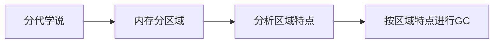

### GC收集名词

> 部分收集（Partial GC）：指目标不是完整收集整个 Java 堆的垃圾收集，其中又分为：
>
> - 新生代收集（Minor GC/Young GC）：指目标只是新生代的垃圾收集。
> - 老年代收集（Major GC/Old GC）：指目标只是老年代的垃圾收集。目前只有 CMS 收集器会有单独收集老年代的行为。另外请注意 “Major GC” 这个说法现在有点混淆，在不同资料上常有不同所指，读者需按上下文区分到底是指老年代的收集还是整堆收集。
> - 混合收集（Mixed GC）：指目标是收集整个新生代以及部分老年代的垃圾收集。目前只有 G1 收集器会有这种行为。整堆收集（Full GC）：收集整个 Java 堆和方法区的垃圾收集。

## 垃圾回收算法

垃圾回收简单来说就是：查找不再使用的对象，然后释放这些对象所关联的内存。然而，简单地记录空闲内存无法保证将来有足够的可用内存，有时候还需要进行内存整理来防止内存碎片。垃圾回收算法可以分为引用计数的垃圾回收和准确式的垃圾回收。主流的 Java 虚拟机使用的都是准确式垃圾回收。

### 标记-清除

适用于老年代，因为老年代需要标记的对象不多。

<b>定义</b>：标记清除算法顾名思义，分为标记和清除两个阶段。在虚拟机执行垃圾回收的过程中，<span style="color:orange">先采用标记算法确定可回收对象，</span>然后垃圾收集器根据标识，将那些未被标记的对象清除。

- 这里的腾出内存空间并不是将内存空间的字节清零，而是记录下这段内存的起始结束地址，下次分配内存的时候，会直接覆盖这段内存。
- 标记清除算法用的一般是深度优先遍历，而非广度优先，因为深度优先比广度优先更能压低内存使用量。
- 在清除阶段，垃圾收集器会遍历整个堆，回收没有打上标记的对象。具体操作是，从堆首地址开始，按顺序一个一个遍历对象的标志位，设置了标志位的说明是活动对象不进行回收，并且遍历完这个对象后取消标志位。
- 后面内存的分配基本可以遵循空闲链表法，合并连续内存块这些内容了。

<b>缺点</b>

- <b>①容易产生大量的内存碎片</b>，可能无法满足大对象的内存分配，一旦导致无法分配对象，那就会导致 JVM 启动 GC，一旦启动 GC，我们的应用程序就会暂停，这就导致应用的响应速度变慢。
- <b>②执行效率不太稳定。</b>如果 Java 堆中包含大量对象，而且其中大部分是需要被回收的，这时必须进行大量标记和清除的动作，导致标记和清除两个过程的执行效率都随对象数量增长而降低。
- <b>③违反局部性原理，</b>具有引用关系的对象之间通常很有可能存在连续访问的情况，考虑这个，把具有引用关系的对象安排在堆中较近的位置可以提高在高速缓存中读取到想利用的数据的概率。而内存碎片化，会把具有引用关系的对象安排在堆中较远的位置，增加访问开销。
- <b>④分配速度慢，</b>内存不是连续的，每次分配必须遍历空闲链表，这个查找开销较大，不过可以采用多个空闲链表的方式缓解。对内存块进行分级，xx 范围内的放一个链表，oo 范围内的放一个链表。
- <b>⑤与写时复制技术不兼容，</b>GC 的时候会给对象设置标志位，这种设置标志位的行为会频繁触发本不该发生的复制，压迫到内存空间。因为 Linux 的写时复制要求不线程对同一块内存区域进行写时，需要先把数据拷贝到其他内存区域然后再做修改。<b>标记的信息在对象头中，GC 线程和用户线程共享堆空间，修改时需要先拷贝数据然后修改，内存压力大，这样和 Copy-On-Write 节省物理内存的想法不兼容。</b>采用 bitmap 的方法就可以兼容 Copy-On-Write 了。不将标记信息放在对象头中，而是用一个 bitmap 进行标记，这样就不会来回拷贝对象了，而是来回拷贝 bitmap，并且 bitmap 非常小，拷贝的开销自然也就很小，复制的影响没那么大。使用 bitmap 清除标记位也更高效。

<div align="center">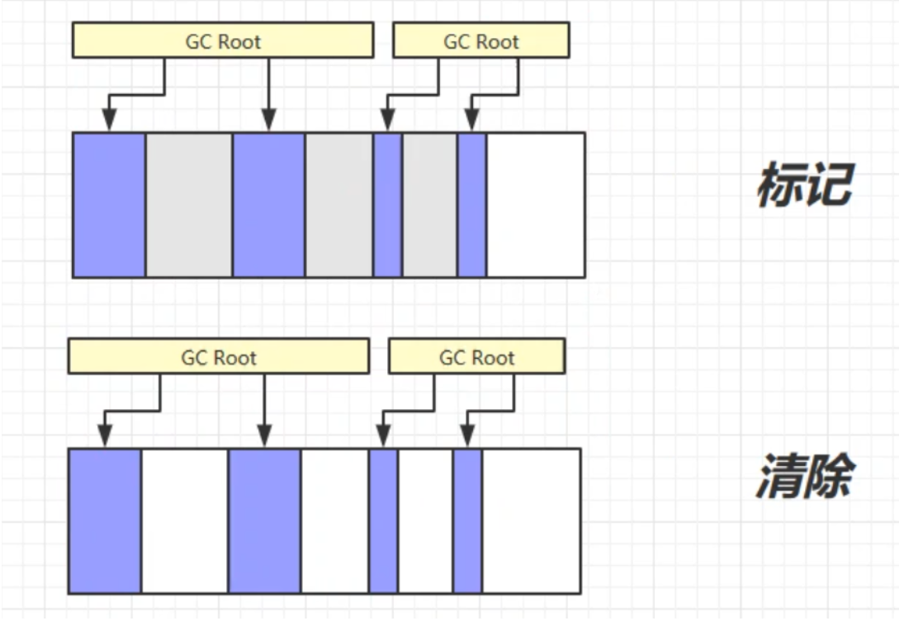</div>

###  标记-整理

存活对象都向内存空间一端移动，然后直接清理边界以外的内存。适用于老年代。

“标记-整理”会将不被 GC Root 引用的对象回收，清除其占用的内存空间。然后整理剩余的对象，可以有效避免因内存碎片而导致的问题，但是整理需要消耗一定的时间，所以效率较低。

<div align="center"></div>


标记整理的过程需要移动存活的对象，并更新所有引用这些对象的地方，这是一种很重的负担，而且这种对象移动操作必须全部暂停用户应用程序才能进行。

但是移动对象和不移动对象都有各自优缺点。

- 从垃圾收集的停顿时间来看，不移动对象停顿时间会更短
- 从程序的吞吐量来看，移动对象会更好。(移动对象的话，内存空间始终是一片规整的区域，内存分配只要移动指针即可，不需要维护一个空闲链表，开销很小)

<b>折中的做法：先不考虑内存碎片，采用“标记-清除”，当内存空间碎片化程度已经大到影响对象分配时，再采用标记-整理算法收集一次，以获得规整的内存空间（CMS 收集器面临空间碎片过多时采用的就是这种处理办法）。</b>

### 标记-复制

适用于新生代，因为老年代要复制的对象太多，划不来，而新生代每次存活下来的对象很少，复制的开销小。

将内存分为等大小的两个区域，FROM 和 TO（TO 中为空）。先将被 GC Root 引用的对象从 FROM 放入 TO 中，再回收未被 GC Root 引用的对象。然后交换 FROM 和 TO。这样也可以避免内存碎片的问题，但是会占用双倍的内存空间。

<b>优点</b>

- 与标记清除算法相比，时间开销小，吞吐量高。
- 可以实现高速的内存分配
- 不会发生碎片化
- 兼容缓存 cache

<b>缺点</b>

- 堆内存使用率偏低
- 不兼容保守式 GC 算法（保守式 GC 是指不用移动对象）
- 复制对象时可能需要递归调用，这个开销比迭代算法高，不过可以通过 Cheney 提出的 GC 算法，通过迭代的方式进行复制。

<b>实现简单，但是空间浪费太大。</b>

<div align="center"></div>

<div align="center">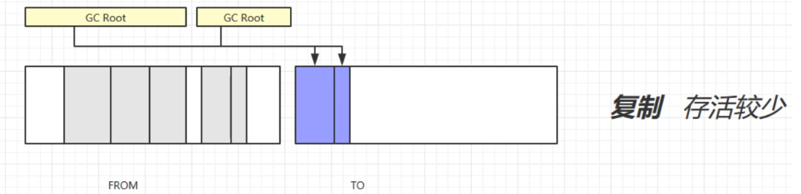</div>

<div align="center"></div>


<div align="center">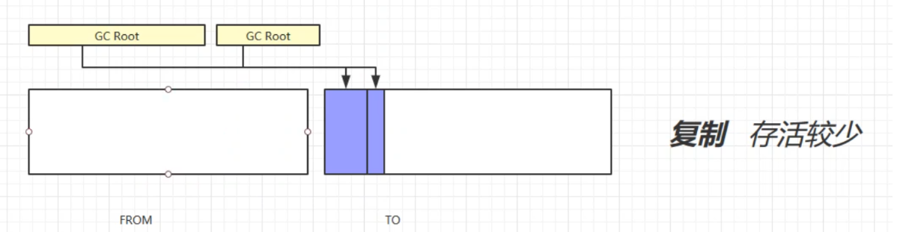


> 实际上, JVM 中的垃圾回收算法并没有采用对半分的策略，而是采用了 Appel 式回收。
>
> Appel 式回收
>
> - 把新时代分为一块较大的 Eden 空间和较小的 Survivor 空间。
> - 每次分配只是用 Eden 和其中一块 Survivor 空间上，然后直接清理掉 Eden 和已用过的那块 Survivor 空间。
> - 如果 Survivor 空间不足以容纳一次 Minor GC/Young GC（新生代收集） 之后存活的对象式，就需要依赖其他区域（如：老年代）进行分配担保。

### 增量

大部分的垃圾回收算法都有<b> STW 的问题----运行垃圾回收线程，暂停用户线程。</b>如果垃圾回收的时间很长，用户线程就需要等待很长的时间，会严重影响系统的稳定性和用户体验。

每次对所有的垃圾进行处理，会造成系统长时间的停顿。而增量算法的思想是垃圾收集线程每次只收集一小部分区域的内存空间，和用户线程交替执行，知道垃圾回收完毕。这样就可以减少每次系统停顿的时间了。但是缺点也很明显：频繁的切换上下文会影响系统的吞吐量。


## 分代回收

<div align="center">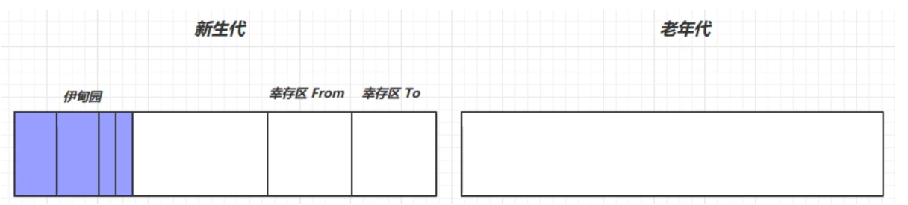</div>


- 对象首先分配在伊甸园区域
- 新生代空间不足时，触发 minor GC，伊甸园和 from 存活的对象使用复制算法复制到 to 中，存活的对象年龄 +1（最开始的年龄是 0）并且交换 from 和 to。
- minor GC 会引发 stop the world，暂停其他用户的线程，等垃圾回收结束，用户线程才恢复运行。
  - 因为 GC 的时候需要复制对象，为了避免对象的引用被改变导致的问题，所以要 STW。
- 当对象寿命超过阈值时，会晋升到老年代，最大寿命是 15。寿命是用 4bit 存的，所以最大是 15。CMS 似乎是 age>6 就放入老年代，其他的是 =15 才放入老年代。
- 当老年代空间不足，会尝试触发 minor GC（先尝试清理新时代看能不能挽救一下），如果之后空间仍不足，那么触发 Full GC（标记+清除或标记+整理），STW 时间更长，从新生代到老年代都进行清理。
- from 和 to 每次都要留一个空的，空间不足就触发 GC，还不足就会触发提前晋升老年代，老年代如果放不下先触发 Full GC 然后再尝试提前晋升，还不行就直接内存溢出？

### JVM参数

| 含义               | 参数                                                         |
| ------------------ | ------------------------------------------------------------ |
| 堆初始大小         | -Xms                                                         |
| 堆最大大小         | -Xmx 或 -XX:MaxHeapSize=size                                 |
| 新生代大小         | -Xmn 或 (-XX:NewSize=size <b>+</b> -XX:MaxNewSize=size ) -Xmn 是初始和最大同时指定 |
| 幸存区比例（动态） | -XX:InitialSurvivorRatio=ratio 和 -XX:+UseAdaptiveSizePolicy 初始化比例和调整策略 |
| 幸存区比例         | -XX:SurvivorRatio=ratio 默认是 8 比如新生代内存是 10m 则 8m 会划给伊甸园。剩下的 1m 给 from 1m 给 to |
| 晋升阈值           | -XX:MaxTenuringThreshold=threshold                           |
| 晋升详情           | -XX:+PrintTenuringDistribution                               |
| GC 详情            | -XX:+PrintGCDetails -verbose:gc                              |
| Full GC 前 MinorGC | -XX:+ScavengeBeforeFullGC  这样做的话，可以尽力避免 Full GC  |

###  GC分析

#### 大对象处理策略

当遇到一个较大的对象时，就算新生代的伊甸园为空，也无法容纳该对象时，老年代可以容纳，该对象直接晋升为老年代。

#### 线程内存溢出

某个线程的内存溢出了而抛异常（out of memory），不会让其他的线程结束运行

这是因为当一个线程抛出 OOM 异常后**，**它所占据的内存资源会全部被释放掉，从而不会影响其他线程的运行，进程依然正常。

#### GC日志分析

先看一个没有进行垃圾回收的 GC 日志。

```java
// 演示内存的分配策略
public class Demo2_1 {
    private static final int _512KB = 512 * 1024;
    private static final int _1MB = 1024 * 1024;
    private static final int _6MB = 6 * 1024 * 1024;
    private static final int _7MB = 7 * 1024 * 1024;
    private static final int _8MB = 8 * 1024 * 1024;
	// UseSerialGC 不会动态调整 Enden From To 的比例
    // -Xms20M -Xmx20M -Xmn10M -XX:+UseSerialGC -XX:+PrintGCDetails -verbose:GC -XX:-ScavengeBeforeFullGC
    public static void main(String[] args) throws InterruptedException {}
}
```

```shell
[0.004s][warning][GC] -XX:+PrintGCDetails is deprecated. Will use -Xlog:GC* instead.
[0.143s][info   ][GC] Using Serial
[0.143s][info   ][GC,heap,coops] Heap address: 0x00000000fec00000, size: 20 MB, Compressed Oops mode: 32-bit
[0.283s][info   ][GC,heap,exit ] Heap
[0.283s][info   ][GC,heap,exit ]  def new generation   total 9216K, used 2812K [0x00000000fec00000, 0x00000000ff600000, 0x00000000ff600000)
[0.283s][info   ][GC,heap,exit ]   eden space 8192K,  34% used [0x00000000fec00000, 0x00000000feebf290, 0x00000000ff400000)
[0.283s][info   ][GC,heap,exit ]   from space 1024K,   0% used [0x00000000ff400000, 0x00000000ff400000, 0x00000000ff500000)
[0.283s][info   ][GC,heap,exit ]   to   space 1024K,   0% used [0x00000000ff500000, 0x00000000ff500000, 0x00000000ff600000)
[0.283s][info   ][GC,heap,exit ]  tenured generation   total 10240K, used 0K [0x00000000ff600000, 0x0000000100000000, 0x0000000100000000)
[0.283s][info   ][GC,heap,exit ]    the space 10240K,   0% used [0x00000000ff600000, 0x00000000ff600000, 0x00000000ff600200, 0x0000000100000000)
[0.284s][info   ][GC,heap,exit ]  Metaspace       used 6369K, capacity 6443K, committed 6528K, reserved 1056768K
[0.284s][info   ][GC,heap,exit ]   class space    used 556K, capacity 570K, committed 640K, reserved 1048576K
```

- def new generation 新生代
    - total 9216K, used 2812K
    - eden space 8192K，from space 1024K，to   space 1024K
    - <b>加起来不止 9MB 哈？8MB 给了 eden ，from 和 to 分别 1MB，幸存区 To 这 1 MB 要始终空着，是不能用的，所以我们计算空间时就没计算这 1MB。</b>
    - Java 程序运行时需要加载一些类，运行一些对象，它们开始也是使用的 Eden 区域。
- tenured generation 老年代
    - total 10240K, used 0K 总大小 10MB，未使用任何空间。
- Metaspace 元空间

来看一个有垃圾回收的 GC 日志

```java
public class Demo2_1 {
    private static final int _512KB = 512 * 1024;
    private static final int _1MB = 1024 * 1024;
    private static final int _6MB = 6 * 1024 * 1024;
    private static final int _7MB = 7 * 1024 * 1024;
    private static final int _8MB = 8 * 1024 * 1024;

    // -Xms20M -Xmx20M -Xmn10M -XX:+UseSerialGC -XX:+PrintGCDetails -verbose:GC -XX:-ScavengeBeforeFullGC
    public static void main(String[] args) throws InterruptedException {
        ArrayList<byte[]> list = new ArrayList<>();
        list.add(new byte[_7MB]);
    }
}
```

```shell
[0.004s][warning][GC] -XX:+PrintGCDetails is deprecated. Will use -Xlog:GC* instead.
[0.010s][info   ][GC] Using Serial
[0.010s][info   ][GC,heap,coops] Heap address: 0x00000000fec00000, size: 20 MB, Compressed Oops mode: 32-bit
[0.171s][info   ][GC,start     ] GC(0) Pause Young (Allocation Failure) # Allocation Failure 表示，由于新生代空间不够，触发了 Minor GC
[0.173s][info   ][GC,heap      ] GC(0) DefNew: 2648K->1023K(9216K)
[0.173s][info   ][GC,heap      ] GC(0) Tenured: 0K->292K(10240K)
[0.173s][info   ][GC,metaspace ] GC(0) Metaspace: 6332K->6332K(1056768K)
[0.173s][info   ][GC           ] GC(0) Pause Young (Allocation Failure) 2M->1M(19M) 2.016ms
[0.173s][info   ][GC,cpu       ] GC(0) User=0.00s Sys=0.00s Real=0.00s
[0.177s][info   ][GC,heap,exit ] Heap
[0.177s][info   ][GC,heap,exit ]  def new generation   total 9216K, used 8574K [0x00000000fec00000, 0x00000000ff600000, 0x00000000ff600000)
[0.177s][info   ][GC,heap,exit ]   eden space 8192K,  92% used [0x00000000fec00000, 0x00000000ff35fb08, 0x00000000ff400000)
[0.177s][info   ][GC,heap,exit ]   from space 1024K,  99% used [0x00000000ff500000, 0x00000000ff5ffff8, 0x00000000ff600000)
[0.177s][info   ][GC,heap,exit ]   to   space 1024K,   0% used [0x00000000ff400000, 0x00000000ff400000, 0x00000000ff500000)
[0.177s][info   ][GC,heap,exit ]  tenured generation   total 10240K, used 292K [0x00000000ff600000, 0x0000000100000000, 0x0000000100000000)
[0.177s][info   ][GC,heap,exit ]    the space 10240K,   2% used [0x00000000ff600000, 0x00000000ff6490d8, 0x00000000ff649200, 0x0000000100000000)
[0.177s][info   ][GC,heap,exit ]  Metaspace       used 6503K, capacity 6603K, committed 6784K, reserved 1056768K
[0.177s][info   ][GC,heap,exit ]   class space    used 569K, capacity 602K, committed 640K, reserved 1048576K
```

- DefNew: 2648K->1023K(9216K)
    - DefNew 新生代的 GC，内存使用从 2648K 到 1023K，新生代一共 9216K。
- 查看上面的 GC 日志，我们发现，触发了一次垃圾回收。DefNew（新生代）的垃圾被回收了。
- <b>Allocation Failure：</b>表明本次引起 GC 的原因是因为在年轻代中没有足够的空间能够存储新的数据了。

```java
public class Demo2_1 {
    private static final int _512KB = 512 * 1024;
    private static final int _1MB = 1024 * 1024;
    private static final int _6MB = 6 * 1024 * 1024;
    private static final int _7MB = 7 * 1024 * 1024;
    private static final int _8MB = 8 * 1024 * 1024;

    // -Xms20M -Xmx20M -Xmn10M -XX:+UseSerialGC -XX:+PrintGCDetails -verbose:GC -XX:-ScavengeBeforeFullGC
    public static void main(String[] args) throws InterruptedException {
        ArrayList<byte[]> list = new ArrayList<>();
        list.add(new byte[_7MB]);
        list.add(new byte[_512KB]);
        list.add(new byte[_512KB]);
    }
}
```

```shell
[0.004s][warning][GC] -XX:+PrintGCDetails is deprecated. Will use -Xlog:GC* instead.
[0.009s][info   ][GC] Using Serial
[0.009s][info   ][GC,heap,coops] Heap address: 0x00000000fec00000, size: 20 MB, Compressed Oops mode: 32-bit
[0.158s][info   ][GC,start     ] GC(0) Pause Young (Allocation Failure)
[0.160s][info   ][GC,heap      ] GC(0) DefNew: 2648K->1024K(9216K)
[0.160s][info   ][GC,heap      ] GC(0) Tenured: 0K->285K(10240K)
[0.160s][info   ][GC,metaspace ] GC(0) Metaspace: 6339K->6339K(1056768K)
[0.160s][info   ][GC           ] GC(0) Pause Young (Allocation Failure) 2M->1M(19M) 2.511ms
[0.160s][info   ][GC,cpu       ] GC(0) User=0.00s Sys=0.00s Real=0.00s
[0.163s][info   ][GC,start     ] GC(1) Pause Young (Allocation Failure)
[0.169s][info   ][GC,heap      ] GC(1) DefNew: 9031K->526K(9216K)
[0.169s][info   ][GC,heap      ] GC(1) Tenured: 285K->8476K(10240K)
[0.169s][info   ][GC,metaspace ] GC(1) Metaspace: 6514K->6514K(1056768K)
[0.169s][info   ][GC           ] GC(1) Pause Young (Allocation Failure) 9M->8M(19M) 5.704ms
[0.169s][info   ][GC,cpu       ] GC(1) User=0.00s Sys=0.00s Real=0.00s
[0.169s][info   ][GC,heap,exit ] Heap
[0.169s][info   ][GC,heap,exit ]  def new generation   total 9216K, used 1364K [0x00000000fec00000, 0x00000000ff600000, 0x00000000ff600000)
[0.169s][info   ][GC,heap,exit ]   eden space 8192K,  10% used [0x00000000fec00000, 0x00000000fecd1890, 0x00000000ff400000)
[0.169s][info   ][GC,heap,exit ]   from space 1024K,  51% used [0x00000000ff400000, 0x00000000ff483b60, 0x00000000ff500000)
[0.169s][info   ][GC,heap,exit ]   to   space 1024K,   0% used [0x00000000ff500000, 0x00000000ff500000, 0x00000000ff600000)
[0.169s][info   ][GC,heap,exit ]  tenured generation   total 10240K, used 8476K [0x00000000ff600000, 0x0000000100000000, 0x0000000100000000)
[0.169s][info   ][GC,heap,exit ]    the space 10240K,  82% used [0x00000000ff600000, 0x00000000ffe47078, 0x00000000ffe47200, 0x0000000100000000)
[0.169s][info   ][GC,heap,exit ]  Metaspace       used 6546K, capacity 6603K, committed 6784K, reserved 1056768K
[0.169s][info   ][GC,heap,exit ]   class space    used 576K, capacity 602K, committed 640K, reserved 1048576K
```

<b>触发了两次垃圾回收，7MB 的大对象进入了老年代。一个线程内的 OutOfMemory 不会导致主线程结束。</b>

## HotSpot算法细节实现

前面介绍了对象存活判定算法和垃圾收集算法，Java 虚拟机实现这些算法时，必须对算法的执行效率有严格的考量，才能保证虚拟机高效运行。下面我们来看下 HotSpot 是如何保证算法的执行效率的。

### 根节点枚举

<span style="color:red">以可达性分析算法为例，介绍 JVM 如何高效的从 GC Roots 集合中找出引用链。</span>

Java 引用中的对象众多，逐个检查的话非常耗时。迄今为止，所有收集器在进行<span style="color:orange">根节点枚举</span>这一步骤时都必须暂停用户线程。现在可达性分析算法耗时最长的查找引用链的步骤已经可以做到与用户线程一起并发执行，但根节点枚举还是必须在一个能保障一致性的快照中才得以进行——确保不会出现分析过程中根节点集合的对象引用关系还在不断变化的情况，否则分析结果准确性就无法保证。

<span style="color:orange">HotSpot VM 是通过一个叫 OopMap 的数据结构来达到快速完成 GC Roots 枚举的。</span>

###  记忆集与卡表

在讨论分代收集理论的时候，采用了名为记忆集的数据结构来避免扫描整个老年代的。记忆集是一种用于记录从非收集区域指向收集区域的指针集合的抽象数据结构。如果我们不考虑效率和成本的话，最简单的实现可以用非收集区域中所有含跨代引用的对象数组来实现这个数据结构。

```java
// 记录全部含有跨代引用对象。成本较高。
Class RememberedSet{
    Object[]set[size];
}
```

为了节省成本，我们可以用更粗糙的方式来记录。

- <b>字长精度</b>：每个记录精确到一个机器字长 (就是处理器的寻址位数，如常见的 32 位或 64 位，这个精度决定了机器访问物理内存地址的指针长度)，该字包含跨代指针。
- <b>对象精度</b>：每个记录精确到一个对象，该对象里有字段含有跨代指针。
- <span style="color:orange"><b>卡精度</b>：每个记录精确到一块内存区域，该区域内有对象含有跨代指针。(一般用这个)</span>

卡表最简单的形式可以只是一个字节数组。字节数组中的每个元素代表一个区域。如：

```java
byte[]CARD_TABLE = new byte[this address >> 9] = 0;
```

字节数组 CARD_TABLE 的每一个元素都对应着其标识的内存区域中一块特定大小的内存块，通过上面代码可以看出 HotSpot 中使用的卡页是 $2^9$，即 512 字节。如果卡表标识内存区域的起始地址是 0x0000 的话，数组 CARD_TABLE 的第 0、1、2 号元素，分别对应了地址范围为 0x0000～0x01FF、0x0200～0x03FF、0x0400～0x05FF 的卡页内存块。

一个卡页的内存中通常包含不止一个对象，只要卡页内有一个（或更多）对象的字段存在着跨代指针，那就将对应卡表的数组元素的值标识为 1，称为这个元素变脏（Dirty），没有则标识为 0。在垃圾收集发生时，只要筛选出卡表中变脏的元素，就能轻易得出哪些卡页内存块中包含跨代指针，把它们加入 GC Roots 中一并扫描。

### 并发的可达性分析

可达性分析算法的理论全部基于一个可以保证一致性的快照。

> <b>三色标记</b>：把遍历对象图过程中遇到的对象，按照“是否访问过”这个条件标记成以下三种颜色
>
> - <b>白色：表示对象尚未被垃圾收集器访问过。</b>显然在可达性分析刚刚开始的阶段，所有的对象都是白色的，若在分析结束的阶段，仍然是白色的对象，即代表不可达。
> - <b>黑色：表示对象已经被垃圾收集器访问过，</b>且这个对象的所有引用都已经扫描过。黑色的对象代表已经扫描过，它是安全存活的，如果有其他对象引用指向了黑色对象，无须重新扫描一遍。黑色对象不可能直接（不经过灰色对象）指向某个白色对象。
> - <b>灰色：表示对象已经被垃圾收集器访问过，但这个对象上至少存在一个引用还没有被扫描过。</b>

## 垃圾收集器概述

### 标记清除、整理、复制

- 标记清除算法：先标记可达的对象，之后再次遍历将不可达的对象统一回收。这种方法效率不高，会产生大量不连续的碎片。
- 标记整理算法：先标记存活对象，然后让所有存活对象向一端移动，之后清理端边界以外的内存
- 标记复制算法：将可用内存按容量划分为大小相等的两块，每次只使用其中一块。当使用的这块空间用完了，就将存活对象复制到另一块，再把已使用过的内存空间一次清理掉。

### 分代收集理论

根据对象存活周期将内存划分为几块，不同块采用适当的收集算法。一般将堆分为新生代和老年代，对这两块采用不同的算法。

- 新生代使用：标记复制算法
- 老年代使用：标记清除或者标记整理算法

### Serial垃圾收集器

单线程串行收集器。垃圾回收的时候，必须暂停其他所有线程。新生代使用标记复制算法，老年代使用标记整理算法。简单高效。

### ParNew垃圾收集器

可以看作 Serial 垃圾收集器的多线程版本，新生代使用标记复制算法，老年代使用标记整理算法。

### Parallel Scavenge垃圾收集器

注重吞吐量，即 $\frac{CPU 运行代码时间}{CPU 耗时总时间}$（CPU 运行代码时间 + 垃圾回收时间）。新生代使用标记复制算法，老年代使用标记整理算法。

### CMS垃圾收集器

注重最短时间停顿。CMS 垃圾收集器为最早提出的并发收集器，垃圾收集线程与用户线程同时工作。采用标记清除算法。该收集器分为初始标记、并发标记、并发预清理、并发清除、并发重置这么几个步骤。

- 初始标记：暂停其他线程(stop the world)，标记与 GC roots 直接关联的对象。并发标记：可达性分析过程(程序不会停顿)。
- 并发预清理：查找执行并发标记阶段从年轻代晋升到老年代的对象，重新标记，暂停虚拟机（stop the world）扫描 CMS 堆中剩余对象。
- 并发清除：清理垃圾对象，(程序不会停顿)。
- 并发重置，重置 CMS 收集器的数据结构。

### G1垃圾收集器

和之前收集器不同，该垃圾收集器把堆划分成多个大小相等的独立区域（Region），新生代和老年代不再物理隔离。通过引入 Region 的概念，从而将原来的一整块内存空间划分成多个的小空间，使得每个小空间可以单独进行垃圾回收。

- 初始标记：标记与 GC roots 直接关联的对象。
- 并发标记：可达性分析。
- 最终标记，对并发标记过程中，用户线程修改的对象再次标记一下。
- 筛选回收：对各个 Region 的回收价值和成本进行排序，然后根据用户所期望的 GC 停顿时间制定回收计划并回收。

### **Minor GC**

Minor GC 指发生在新生代的垃圾收集，因为 Java 对象大多存活时间短，所以 Minor GC 非常频繁，一般回收速度也比较快。

### Full GC

Full GC 是清理整个堆空间—包括新生代和老年代。调用 System.gc()，老年代空间不足，空间分配担保失败，永生代空间不足会产生 Full GC。

## 垃圾收集器

### 概述

串行收集器：Serial、Serial Old

并行收集器：ParNew、Parallel Scavenge（吞吐量优先）、Parallel Old（Parallel Scavenge 的老年版）

注意：只有 Serial/ParNew 可以配合 CMS 使用。Parallel Scavenge 可以配合 Parallel Old 使用。

>①串行
>
>- 单线程
>- 适用于堆内存较小，适合个人电脑
>
>②吞吐量
>
>- 多线程
>- 适用于堆内存较大，需要多核 CPU 支持。（多线程，多个 CPU 才能真的提高效率）
>- 单位时间内，STW（stop the world，停掉其他所有工作线程）时间最短 0.2 + 0.2 = 0.4 总时间少，但是单次时间长。
>
>③响应时间优先
>
>- 多线程
>- 适用于堆内存较大，多核 CPU
>- <b>尽可能让单次 STW 时间变短</b>（尽量不影响其他线程运行） 0.1 + 0.1 + 0.1 + 0.1 + 0.1 = 0.5 总时间长，但是单次时间短。

### 相关概念

<b>并行收集</b>：指多条垃圾收集线程并行工作，但此时<b>用户线程仍处于等待状态</b>。

<b>并发收集</b>：指用户线程与垃圾收集线程<b>同时工作</b>（不一定是并行的可能会交替执行）。<b>用户程序在继续运行</b>，而垃圾收集程序运行在另一个 CPU 上

<b>吞吐量</b>：<b>CPU 用于运行用户代码的时间 CPU 总消耗时间的比值</b>（吞吐量 = 运行用户代码时间 / ( 运行用户代码时间 + 垃圾收集时间 )），也就是。例如：虚拟机共运行 100 分钟，垃圾收集器花掉 1 分钟，那么吞吐量就是 99%。

### 串行垃圾收集器

- <span style="color:blue">Serial 采用的复制算法。用于新生代。</span>
- <span style="color:blue">SerialOld 采用标记 - 整理算法。用于老年代。</span>
- <span style="color:blue">ParNew，Serial 的多线程并行版本，对比 Serial 来说，只是支持多线程并行收集。也是用的复制算法。</span>

<div align="center">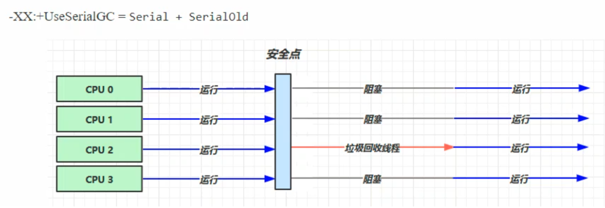</div>


- 触发垃圾回收的时候，要让线程在一个安全点停下来（垃圾回收的过程中对象的地址可能会发生改变，停下来可以确保安全的使用对象地址），因为是串行的，所以只有一个垃圾回收线程。且在该线程执行回收工作时，其他线程进入<b>阻塞</b>状态
  - <b>安全点</b>：让其他线程都在这个点停下来，以免垃圾回收时移动对象地址，使得其他线程找不到被移动的对象。

### 吞吐量优先垃圾收集器

单次执行 GC 的时间长点没事，但是总时间要少。
$$
\textbf{吞吐量} = \frac{\textbf{运行用户代码时间}}{\textbf{运行用户代码时间+运行垃圾收集时间}}
$$

<span style="color:red"><b>Parallel GC</b></span>：新生代垃圾回收器，采用标记复制算法。

<b>`-XX:+UseParallelGC ~ -XX:+UseParallelOldGC`  开启其中的一个，会把另一个也开启。即你开启了 ParallelGC 就会自动开启 ParallelOldGC。</b>

<b>`-XX:+UseAdaptiveSizePolicy` 采用自适应的大小调整策略，<span style="color:blue">自适应的调整新生代的大小（Eden 和  from、to 的比例）。</span></b>

<b>`-XX:GCTimeRatio=ratio`  调整吞吐量的目标 (垃圾回收时间和总时间的占比 1/(1+ratio)) ratio 默认99，一般是设置成 19。</b>

<b>`-XX:MaxGCPauseMillis=ms`  最大暂停毫秒数，默认 200ms。 吞吐量和停顿时间是冲突的。调整 ratio 一般会把堆变大，这样吞吐量就提升了，但是每次垃圾回收的时间就会变长。调整 ms 一般会把堆变小，垃圾回收的时间就变短，但是吞吐量会降低下来了。</b>

<b>`-XX:ParallelGCThreads=n` 控制垃圾回收的线程数。</b>

<div align="center">

垃圾回收器会开启多个垃圾回收线程进行 GC。垃圾回收线程和 CPU 核数相关。<b>Parallel GC 会根据我们的设定目标来尝试去调整堆的大小，来达到我们期望的目标。</b>

### 响应时间优先垃圾收集器

<b style="color:orange">CMS 收集器：Concurrent Mark Sweep，一种以获取最短回收停顿时间为目标的老年代收集器。</b>

- 多线程
- 堆内存较大，多核 CPU
- 尽可能让单次 STW 时间变短（尽量不影响其他线程运行）
- CMS 可以与 Serial/ParNew 配合工作。
    - CMS 回收老年代
    - Serial/ParNew 回收新生代

- 一般 CMS 配合 ParNewGC（用于新生代的垃圾收集器，基于复制算法实现的） 一起使用。CMS 有时可能会发生并发失败的问题，并发失败的话，CMS 会退化成 SerialOld。

<span style="color:orange"><b>特点</b>：基于标记-清除算法实现。并发收集、低停顿，但是会产生内存碎片。因为是并行的，在清理的时候会产生浮动垃圾，因此不能等待内存不足了在进行 GC ，不然这些浮动垃圾就没地方放了。并且 CMS 存在并发失败的问题，并发失败的话就会退化成 SerialOld。</span>

<b>应用场景</b>：适用于注重服务的响应速度，希望系统停顿时间最短，给用户带来更好的体验等场景下。如 Web 程序、B/S 服务

> CMS 的 JVM 参数

<b>`-XX:+UseConcMarkSweepGC ~ -XX:+UseParNewGC ~ SerialOld`  </b>

<b>`-XX:ParallelGCThreads=n ~ -XX:ConcGCThreads=threads`</b>   ParallelGCThreads 一般与 CPU 核心数一致 ConcGCThreads 一般设置为 ParallelGCThreads 的 1/4 

<b>`-XX:CMSInitiatingOccupancyFraction=percent`</b>  何时执行 CMS，内存占比为多少时进行 GC。默认为 60% 

<b>`-XX:+CMSScavengeBeforeRemark`</b> 有可能新生代的对象会引用老年代的对象，这样重新标记的时候必须扫描整个堆。可以开启这个，先对新生代做一个 GC，这样要扫描的对象就少了。

<div align="center"></div>


初始标记也要进行 STW，但是这个 STW 时间很短（只列举根对象）。

垃圾回收线程和用户线程可以并发执行，可以进一步减少 STW 时间，在垃圾回收的部分阶段是不用进行 STW 的。

> <b>CMS 收集器的运行过程分为下列4步：</b>

<b>初始标记</b>：只列举根对象，因此速度很快但是 <b>Stop The World 时间很短</b>，用户线程需要阻塞。

<b>并发标记</b>：进行 GC Roots Tracing 的过程，找出存活对象且用户线程可并发执行。

<b>重新标记</b>：为了修正并发标记期间因用户程序继续运行而导致标记产生变动的那一部分对象的标记记录。仍然存在 Stop The World 问题。

<b>并发清理</b>：对标记的对象进行清除回收。并发清理过程中也会产生新的垃圾，这种垃圾我们称之为浮动垃圾。这些浮动垃圾只有等到下次进行 GC 才能清理掉。这样会带来一个问题，在 GC 过程中会产生新的垃圾，就不能像其他垃圾收集器一样，等到堆内存不够了再进行 GC，使用 CMS 时需要预留一些空间来保留浮动垃圾。可以用 VM 参数 <b>`-XX:CMSInitiatingOccupancyFraction=percent`</b> 来设置。默认是 60% 左右。

CMS 收集器的内存回收过程是与用户线程一起<b>并发执行</b>的。CMS 用多个线程 GC，那么可用于其他计算的 CPU 资源就少了，吞吐量就下来了。

CMS 在内存碎片比较多的情况下 (基于标记清除算法)：如新生代空间不足，老年代碎片太多，空间也不足，CMS 就会退化为 SerialOld，做一次单线程的 GC，整理内存。退化为 SerialOld 的话 GC 时间会变长不少。

CMS 的问题：内存碎片过多，导致并发失败，进而退化为 SerialOld，造成 GC 时间过长。

## G1垃圾收集器

[Getting Started with the G1 Garbage Collector (oracle.com)](https://www.oracle.com/technetwork/tutorials/tutorials-1876574.html)

### G1简介

> <b>定义</b>：Garbage First

- 2004 论文发布 
- 2009 JDK 6u14 体验 
- 2012 JDK 7u4 官方支持 
- 2017 JDK 9 默认使用 G1，且废弃了 CMS
- 设计者是希望可以建立一款 “停顿时间模型” 的收集器，停顿时间模型的意思是能够支持指定在一个长度为 M 毫秒的时间片段内，消耗在 GC 上的时间大概率不超过 N 毫秒这样的目标。

> <span style="color:orange"><b>思想</b>：面向局部收集的设计思想和基于 Region 的内存布局形式。回收最具价值的区域。</span>

> <b>特点</b>

G1 收集器比较大的特点是，把堆分成了大小相等的若干块（默认情况下，一个堆被划分成 2000 多个分区），每个块都可以充当 Eden、Surivor 和 Old，可以动态调整每个分代的比例。并且，<span style="color:orange">它进行垃圾回收时不是回收全部的垃圾，而是选择价值最高的区域进行回收，可以有效减少系统的停顿时间</span>。

> <b>区域划分</b>

- 将连续的 Java 堆划分成多个大小相等的独立区域，每个 Region 都可以根据需要成为  Eden 区、Survivor 区。
- Region 中有一类特殊的 Humongous 区域，专门用来存储大对象。G1 认为，只要对象的大小超过了 Region 的一半，就是大对象。超过了整个 Region 容量的超级大对象，会被存放在 N 个连续的 Humongous Region（H 区也是 O 区，大对象直接进入老年代）。
- G1 的大多数行为都把 Humongous 作为老年代的一部分来看待。 

> <b>适用场景</b> 

- 同时注重吞吐量（Throughput）和低延迟（Low latency），默认的暂停目标是 200 ms 
- 超大堆内存，<span style="color:orange">会将堆划分为多个大小相等的 Region</span>，每个 Region 都可以独立的作为 eden、suriver 和老年代。内存不大时和 CMS 的回收效率差不多，超大内存时 G1 更胜一筹。
- 整体上是标记+整理算法，两个区域之间是复制算法 

><b>相关 JVM 参数</b>

<b>`-XX:+UseG1GC`</b>

<b>`-XX:G1HeapRegionSize=size`</b>

<b>`-XX:MaxGCPauseMillis=time`</b> 默认 200 ms，如果吞吐量要求更高，可以把这个值设置大一些。

### G1垃圾回收阶段

<div align="center"></div>


参考 Oracle JVM 工程师和深入理解 Java 虚拟机；

第一阶段：Young Collection，对新生代进行垃圾回收

第二阶段：Young Collection + Concurrent Mark，新生代进行垃圾回收 + 并发标记（老年代内存超过了一定的阈值，会触发第二阶段）

第三阶段： Minxed Collection，混合收集。

这三个阶段是一个循环的过程。

新生代伊甸园垃圾回收—–>内存不足，新生代回收 + 并发标记—–>回收新生代伊甸园、幸存区、老年代内存 ——> 新生代伊甸园垃圾回收(重新开始)

### Young Collection

<b>分区算法 Region</b>：分代是按对象的生命周期划分，分区则是将堆空间划分连续几个不同小区间，每一个小区间独立回收，可以控制一次回收多少个小区间，方便控制 GC 产生的停顿时间。每个区域都可以作为伊甸园，Surivier 区，老年代。图中的 <b>E 代表伊甸园</b>；<b>S 代表幸存区</b>；<b>O 代表老年代</b>。注意：这些区域不需要像旧的垃圾回收器那样是连续的。

<b>回收过程</b>：伊甸园逐渐被占满时，会触发 Young GC，在 GC 的过程中会发生 STW，不过时间比较短。

<div align="center"></div>


新生代的垃圾回收会把幸存的对象，用复制算法复制到 S 区。

<div align="center"></div>

幸存区的对象比较多时或幸存区的对象年龄超过阈值，达到了 GC 的条件，S 就触发垃圾回收，此时 S 区的一部分对象会晋升到老年代，不够年龄的会拷贝到另一个幸存取空间中去。

<div align="center"></div>


### Young Collection + CM

CM：并发标记

- 在 Young GC 时会进行 GC Root 的初始标记。
- 在老年代占用堆内存的比例达到阈值时，进行并发标记（不会 STW）, 并发标记是从根对象出发，顺着引用链标记其他的对象。阈值可以根据用户来进行设定，由下面的 JVM 参数决定：
- <b>`-XX:InitiatingHeapOccupancyPercent=percent`</b>（默认 45%）

<div align="center"></div>


### Mixed Collection

会对 E、S、O 进行<b>全面的回收</b>，优先回收价值最高的区域。

- 最终标记（Remark）会 STW（防止浮动垃圾，影响并发标记的结果）
- <b>拷贝</b>存活（Evacuation）会 STW（防止浮动垃圾，影响并发标记的结果）

-XX:MaxGCPauseMills:xxx 用于指定最长的停顿时间

<div align="center"></div>


新生代、伊甸园 (E) GC 后，幸存的对象会被复制到幸存区 (S) 中。另一些老年代 S 中不够年龄进不来 O 的也会被复制到 S 中。年龄够的会被复制到 O 中。老年代 GC 后一些幸存的对象会把 O 中的复制到 O 中。

> 为什么有的老年代被拷贝了，有的没拷贝？

因为指定了最大停顿时间，如果对所有老年代都进行回收，耗时可能过高。为了保证时间不超过设定的停顿时间，会<b>回收最有价值的老年代</b>（回收后，能够得到更多内存），如果要复制的对象不是很多，暂停时间可以达到，那么就会回收所有的老年代【都是为了达到暂停时间短这个目标】

### Full GC 概念辨析

<b>SerialGC</b>

- 新生代内存不足发生的垃圾收集 - minor GC 
- 老年代内存不足发生的垃圾收集 - Full GC 

<b>Parallel GC</b>

- 新生代内存不足发生的垃圾收集 - minor GC 

- 老年代内存不足发生的垃圾收集 - Full GC 

<b>CMS</b>

- 新生代内存不足发生的垃圾收集 - minor GC 
- 老年代内存不足，并不是直接触发 Full GC

<b>G1</b>

- 新生代内存不足发生的垃圾收集 - minor GC 
- 老年代内存不足
    - 垃圾回收的速度高于产生的速度，此时还是并发收集
    - 垃圾回收的速度低于产生的速度，会触发 Full GC，退化成串行的收集，STW 的时间会更长。CMS 并发失败也是会触发 Full GC。


G1 在老年代内存不足时（老年代所占内存超过阈值）

- 如果垃圾产生速度慢于垃圾回收速度，来得及打扫，不会触发 Full GC，还是并发地进行清理
- 如果垃圾产生速度快于垃圾回收速度，便会触发 Full GC

### Young Collection 跨代引用

新生代回收的跨代引用（老年代对象引用新生代对象）问题；根对象有一部分来自于老年代。<b>如果遍历老年代来查找根对象，那么效率会很低。JVM 采用的是卡表的技术。</b>

<div align="center">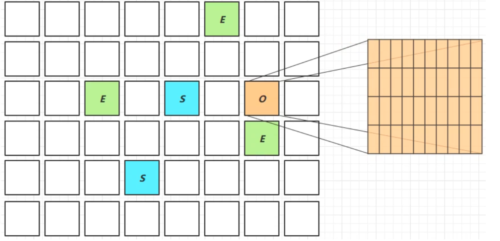</div>

> 卡表技术（CSet）

把老年代的对象进行细分，分成一个个的 card，每个 card 512k，如果有老年代中的对象引用了新生代的对象，那么对象所在的 card 就被标记为脏卡。这样找 GC Root 的时候，老年代找脏卡就行，减小搜索范围，提高查找效率。

> 脏卡（RSet）

- 卡表与 Remembered Set。新生代中会有 Remembered Set，记录外部对自己的引用，就是有那些脏卡。
  - 先通过 Remembered Set 知道有那些脏卡
  - 再遍历脏卡区，找到 GC Root
  - <span style="color:orange">缩小了遍历的范围，提高了检索速度。</span>
- 在引用变更时通过 post-write barried + dirty card queue
  - 通过写屏障，在对象引用发生变更时，去更新脏卡（异步操作，不会立即完成脏卡的更新，会把更新操作放在一个脏卡队列中，由一个线程完成脏卡的更新操作）
- concurrent refinement threads 更新 Remembered Set

<div align="center">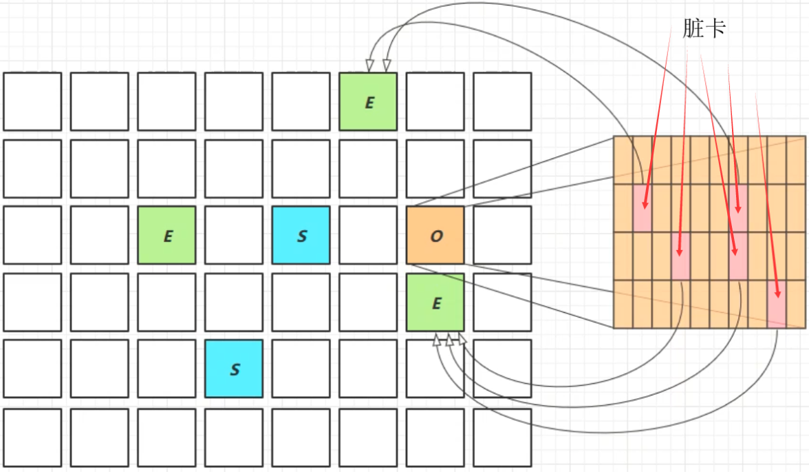</div>

### Remark

CMS 和 G1 都有并发标记 --> 重新标记，这里介绍下重新标记阶段。

> 并发标记阶段，对象的处理状态

- 黑色：已被处理，且有引用在引用他们，结束时会被保留，存活的对象

- 灰色：正在处理中的 

- 白色：还未处理的

<div align="center"></div>

> pre-write barrier + satb_mark_queue 写屏障技术

 在对象引用改变前，把这个对象加入队列，表示这个对象未被处理，队列的名称叫 satb_mark_queue 。将来 remark 阶段就可以配合这些对象进行进一步的判断。

<div align="center">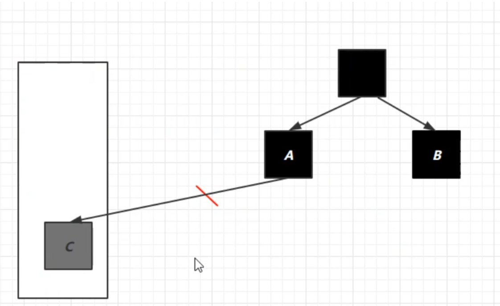</div>

### JDK 8u20 字符串去重

- <b>优点</b>：节省了大量内存

- <b>缺点</b>：导致略微多占用 CPU 时间，新生代回收时间略微增加

<b>`-XX:+UseStringDeduplication`</b>  开启字符串去重功能。

```java
String s1 = new String("hello"); // char[]{'h','e','l','l','o'}
String s2 = new String("hello"); // char[]{'h','e','l','l','o'}
```

我们可以手动用 intern 方法去重，而 G1 收集器可以这样做

- 将所有新分配的字符串（底层是 char[]）放入一个队列
- 当新生代回收时，G1 并发检查是否有重复的字符串
- 如果字符串的值一样，就让他们<b>引用同一个 char[]</b>
  - <span style="color:red">注意，是内部的 char 一样，而不是这两个对象一样。【这是一个疑问】</span>
- 注意，与 String.intern() 不一样
  - intern 关注的是字符串对象，让字符串对象本身不重复。
  - 字符串去重关注的是 char[]。
  - 在 JVM 内部，使用了不同的字符串表。

### JDK 8u40 并发标记类卸载

所有对象都经过并发标记后，就能知道哪些类不再被使用，当一个类加载器的所有类都不再使用，则卸载它加载的所有类。

注意：JDK 的类加载器是不会卸载的，只会我们自定义的类加载器。<b>`-XX:+ClassUnloadingWithConcurrentMark`</b> 默认启用。

### JDK 8u60 回收巨型对象

- 一个对象大于等于 region 的一半时，就称为巨型对象
- G1 不会对巨型对象进行拷贝
- 回收时被优先考虑
- G1 会跟踪老年代所有 incoming 引用，如果老年代 incoming 引用为 0 的巨型对象就可以在新生代垃圾回收时处理掉

<div align="center"></div>

### JDK 9 并发标记起始时间的调整

- 并发标记必须在堆空间占满前完成，否则退化为 FullGC 
- JDK9 之前需要使用 <b>`-XX:InitiatingHeapOccupancyPercent`</b> 
- JDK9 可以动态调整 
  - <b>`-XX:InitiatingHeapOccupancyPercent`</b> 用来设置初始值 
  - 进行数据采样并动态调整 
  - 总会添加一个安全的空档空间

### JDK 9 更高效的回收 

- 250+ 增强 
- 180+bug 修复 
- https://docs.oracle.com/en/java/javase/12/GCtuning

## G1收集器代码测试

### 垃圾收集

- 新生代垃圾收集（Young GC）

    - Young GC 后存活的对象会被复制/移动到一个或多个幸存者区域。如果满足老化阈值，则某些对象将提升到老一代区域。

    - This is a stop the world (STW) pause. Eden size and survivor size is calculated for the next young GC. Accounting information is kept to help calculate the size. Things like the pause time goal are taken into consideration.（会触发 STW，会统计信息帮助计算下一次 Young GC 需要的大小，方便动态调整 Eden 的大小。）

        This approach makes it very easy to resize regions, making them bigger or smaller as needed.

    - The young GC is done in parallel using multiple threads.

    - Live objects are copied to new survivor or old generation regions.

- 后台收集、并发周期（Young GC + CM 并发标记）

| Phase                | Description                                                  |
| -------------------- | ------------------------------------------------------------ |
| Initial Mark (STW)   | 进行 Young GC，标记 Survivor 区域，这些区域可能引用了 Old 中的对象。 |
| Root Region Scanning | 扫描 survivor 对 old 区的引用，必须在 Young GC 结束之前完成。 |
| Concurrent Marking   | 寻找堆中所有幸存的对象，程序在运行，就会发生这种查找，会被 Young GC 打断。 |
| Remark (STW)         | 使用一种叫开始时快照（SATB）的算法完成堆中幸存对象的标记，比 CMS 的要快很多。 |
| Cleanup (STW)        | - 执行幸存对象的统计和 regions 的释放<br>- 擦洗 Remembered Sets<br>- 重置空区域并将其返回到空闲列表.(并发) |
| Copying (STW)        | 复制对象到新的未使用的 regions. 可以在 Young GC Mixed GC 阶段进行。 |

- 混合式垃圾收集（Mixed GC）

- 必要时的 Full GC，即 G1 收集失败，退化为串行的 Full GC

#### Young GC

<div align="center">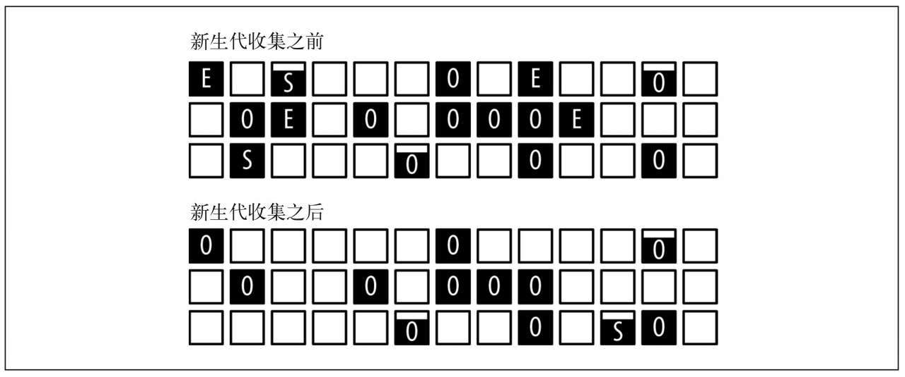</div>

Eden 空间耗尽会触发 G1 垃圾收集器进行新生代垃圾回收。上图中 Eden 的四个区域用完后触发了一次 Young GC。因为 Young GC 后有些对象会存活，因此至少会有一个分区被分配为 Surivivor 空间。上图中，Eden 发生 Young GC 后，一部分存活的对象被放到了 Surivivor，一部分对象晋升到了老年代。

下面是测试 G1 Young GC 的代码。

```java
/**
 * 演示 G1 的 Young GC。
 */
public class G1YoungGC {
    private static final int _512KB = 512 * 1024;
    private static final int _1MB = 1024 * 1024;
    private static final int _6MB = 6 * 1024 * 1024;
    private static final int _7MB = 7 * 1024 * 1024;
    private static final int _8MB = 8 * 1024 * 1024;

    // -Xms20M -Xmx20M -Xmn10M -XX:+PrintGCDetails -verbose:GC
    public static void main(String[] args) throws IOException {
        ArrayList<byte[]> list = new ArrayList<>();
        list.add(new byte[_512KB]);
        System.in.read();
    }
}
```

<div align="center">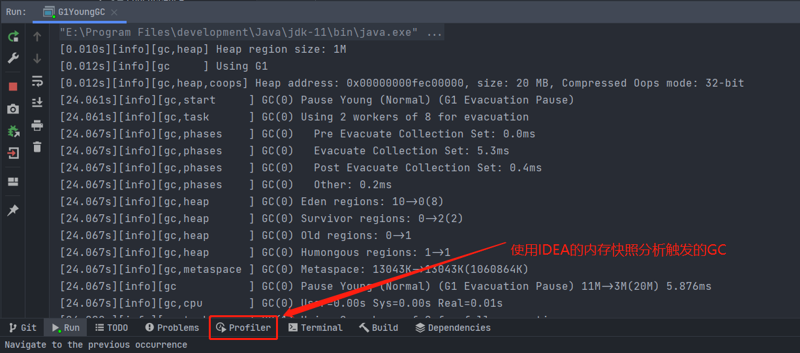</div>

从 GC 日志中我们可以看出，各个区域的大小在 GC 前后是不一样的。

- Eden regions 最开始是 10，在 GC 后变成了 8
- Survivor 最开始是 0，在 GC 后变成了 2
- Old regions 从 0->1，部分对象从新生代晋升到了老年代。
- Humongous regions 是 1，因为 byte 数组的大小是 $512 KB>= regions$ 的一半，直接被认定为大对象，放到 Humongous regions 区域中。我们将 byte 数组的大小修改为 256 KB，就不会出现 Humongous regions 了。

<div align="center">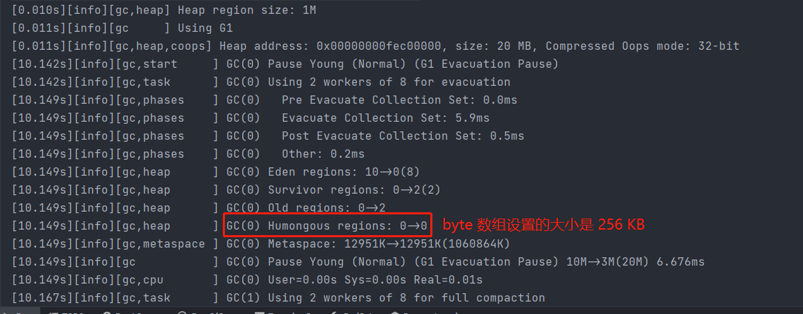</div>

#### Young GC + CM

Young GC + CM 阶段的垃圾收集情况。

<div align="center">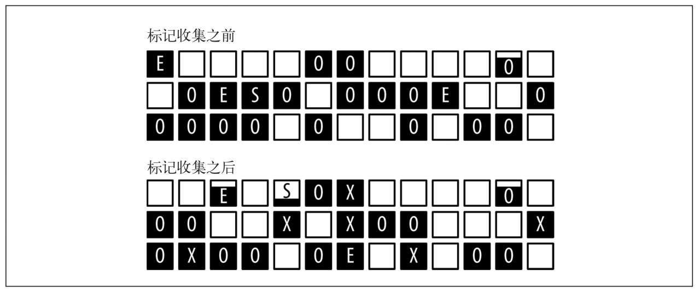</div>

新生代的空间占用情况发生了变化：在并发周期中，至少有一次（很可能是多次）新生代垃圾收集。因此，在将 Eden 空间中的分区标记为完全释放之前，新的 Eden 分区已经开始分配了。

其次，我们注意到一些分区现在被标记为 X。这些分区属于老年代（注意，它们依然还保持着数据），它们就是标记周期（marking cycle）找出的包含最多垃圾的分区。

最后，我们还要留意老年代（包括标记为 O 或者 X 的分区）的空间占用，在周期结束时实际可能更多。这是因为在标记周期中，新生代的垃圾收集会晋升对象到老年代。除此之外，标记周期中实际不会释放老年代中的任何对象：它仅仅锁定了那些垃圾最多的分区。这些分区中的垃圾数据会在之后的周期中被回收释放。

```java
/**
 * 演示 G1 Young GC + CM --> 并发标记阶段。
 */
public class G1YoungGCCM {
    private static final int _128KB = 128 * 1024;
    private static final int _256KB = 256 * 1024;
    private static final int _512KB = 512 * 1024;
    private static final int _1MB = 1024 * 1024;
    private static final int _2MB = 2 * 1024 * 1024;

    // -Xms20M -Xmx20M -Xmn10M -Xlog:GC -verbose:GC
    public static void main(String[] args) throws Exception {
        ArrayList<byte[]> list = new ArrayList<>();
        float totalMemory = 0;
        list.add(new byte[_256KB]);
        list.add(new byte[_256KB]);
        for (int i = 0; i < 10; i++) {
            list.add(new byte[_512KB]);
        }
        System.in.read();
    }
}
```

```shell
[0.009s][info   ][GC] Using G1
[0.173s][info   ][GC] GC(0) Pause Young (Concurrent Start) (G1 Humongous Allocation) 12M->10M(20M) 3.148ms
[0.173s][info   ][GC] GC(1) Concurrent Cycle
[0.174s][info   ][GC] GC(1) Pause Remark 12M->12M(20M) 0.727ms
[0.175s][info   ][GC] GC(1) Pause Cleanup 12M->12M(20M) 0.038ms
[0.175s][info   ][GC] GC(1) Concurrent Cycle 2.044ms
```

## 低延迟垃圾收集器

简单了解一下低延迟垃圾收集器即可。

衡量垃圾收集器的三个重要指标是：

- 内存占用
- 吞吐量
- 延迟

这三个指标同时都有卓越表现是极其困难甚至是不可能的，一般，一个优秀的垃圾收集器通常最多可以达成其中两项。在内存占用、吞吐量和低延迟这三项指标里，延迟的重要性日益重要。我们可以忍受收集器多占用一点内存。下图展示了目前的垃圾收集器并发和用户挂起的示意图。浅色表示用户线程需要挂起，神色表示可以并发执行。

<div align="center"></div>

CMS 和 G1 之前的全部垃圾收集器，其工作步骤都会产生 ”Stop The World“ 式的停顿；CMS 和 G1 分别使用增量更新和原始快照技术，实现了标记阶段的并发，不会因管理的堆内存变大，要标记的对象变多而导致停顿时间随之增长。但是对于标记阶段之后的处理，仍未得到妥善解决。CMS 使用<b>标记-清除</b>算法，虽然避免了整理阶段收集器带来的停顿，但是清除蒜贩不论如何优化改进，在设计原理上都避免不了空间碎片的产生，随着空间碎片不断的淤积，仍会产生 STW。G1 虽然可以按更小的粒度进行回收，从而抑制整理阶段出现时间过长的停顿，但也还是要暂停（STW）。

Shenandoah 和 ZGC 几乎整个过程都是并发的，只有<b>初始标记、最终标记这些阶段有短暂的停顿。</b>（停顿避免不了）

### Shenandoah 收集器

Shenandoah 与 G1 有着相似的堆内存布局，在初始标记、并发标记等许多阶段的处理思路上都高度一致，还直接共享了一部分实现代码。因而对 G1 的打磨改进和 Bug 修改会同时反映在 Shenandoah 上。Shenandoah 的一些新特性，也有部分会出现在 G1 收集器中，如在并发失败后作为“逃生门”的 Full GC，G1 就是由于合并了 Shenandoah 的代码才获得多线程 Full GC 的支持。但是 Oracle 官方明确拒绝 Shenandoah 并入 JDK，只有在 OpenJDK 中才有 Shenandoah。

Shenandoah 也是使用基于 Region 的堆内存布局，同样有着用于存放大对象的 Humongous Region，默认的回收策略也同样是优先处理回收价值最大的 Region。但在管理堆内存方面，它与 G1 至少有三个明显的不同之处

- 支持并发的整理算法，G1 的回收阶段是可以多线程并行的，但却不能与用户线程并发。
- Shenandoah 默认不使用分代收集的，换言之，不会有专门的新生代 Region 或者老年代 Region 的存在，没有实现分代，并不是说分代对 Shenandoah 没有价值，这更多是出于性价比的权衡，基于工作量上的考虑而将其放到优先级较低的位置上。
- Shenandoah 摒弃了在 G1 中耗费大量内存和计算资源去维护的记忆集，改用名为“连接矩阵”（Connection Matrix）的全局数据结构来记录跨 Region 的引用关系，降低了处理跨代指针时的记忆集维护消耗，也降低了伪共享问题的发生概率。连接矩阵可以简单理解为一张二维表格，如果 Region N 有对象指向 Region M，就在表格的 N 行 M 列中打上一个标记，如图所示，如果 Region 5 中的对象 Baz 引用了 Region 3 的 Foo，Foo 又引用了 Region 1 的 Bar，那连接矩阵中的 5 行 3 列、3 行 1 列就应该被打上标记。在回收时通过这张表格就可以得出哪些 Region 之间产生了跨代引用。

<div align="center">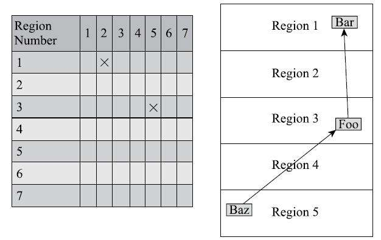</div>

Shenandoah 收集器的工作过程大致可以划分为以下九个阶段：

- <b>初始标记</b>（Initial Marking）：与 G1 一样，首先标记与 GC Roots 直接关联的对象，这个阶段仍是 “Stop The World” 的，但停顿时间与堆大小无关，只与 GCRoots 的数量相关。
- <b>并发标记</b>（Concurrent Marking）：与 G1 一样，遍历对象图，标记出全部可达的对象，这个阶段是与用户线程一起并发的，时间长短取决于堆中存活对象的数量以及对象图的结构复杂程度。
- <b>最终标记</b>（Final Marking）：与 G1 一样，处理剩余的 SATB 扫描，并在这个阶段统计出回收价值最高的 Region，将这些 Region 构成一组回收集（CollectionSet）。最终标记阶段也会有一小段短暂的停顿。
- <b>并发清理</b>（Concurrent Cleanup）：这个阶段用于清理那些整个区域内连一个存活对象都没有找到的 Region（这类 Region 被称为 Immediate GarbageRegion）。
- <b>并发回收</b>（Concurrent Evacuation）：并发回收阶段是 Shenandoah 与之前 HotSpot 中其他收集器的核心差异。在这个阶段，Shenandoah 要把回收集里面的存活对象先复制一份到其他未被使用的 Region 之中。复制对象这件事情如果将用户线程冻结起来再做那是相当简单的，但如果两者必须要同时并发进行的话，就变得复杂起来了。其困难点是在移动对象的同时，用户线程仍然可能不停对被移动的对象进行读写访问，移动对象是一次性的行为，但移动之后整个内存中所有指向该对象的引用都还是旧对象的地址，这是很难一瞬间全部改变过来的。对于并发回收阶段遇到的这些困难，Shenandoah 将会通过读屏障和被称为 “BrooksPointers” 的转发指针来解决。并发回收阶段运行的时间长短取决于回收集的大小。
- <b>初始引用更新</b>（Initial Update Reference）：并发回收阶段复制对象结束后，还需要把堆中所有指向旧对象的引用修正到复制后的新地址，这个操作称为引用更新。引用更新的初始化阶段实际上并未做什么具体的处理，设立这个阶段只是为了建立一个线程集合点，确保所有并发回收阶段中进行的收集器线程都已完成分配给它们的对象移动任务而已。初始引用更新时间很短，会产生一个非常短暂的停顿。
- <b>并发引用更新</b>（Concurrent Update Reference）：真正开始进行引用更新操作，这个阶段是与用户线程一起并发的，时间长短取决于内存中涉及的引用数量的多少。并发引用更新与并发标记不同，它不再需要沿着对象图来搜索，只需要按照内存物理地址的顺序，线性地搜索出引用类型，把旧值改为新值即可。
- <b>最终引用更新</b>（Final Update Reference）：解决了堆中的引用更新后，还要修正存在于 GC Roots 中的引用。这个阶段是 Shenandoah 的最后一次停顿，停顿时间只与 GC Roots 的数量相关。
- <b>并发清理</b>（Concurrent Cleanup）：经过并发回收和引用更新之后，整个回收集中所有的 Region 已再无存活对象，这些 Region 都变成 Immediate GarbageRegions 了，最后再调用一次并发清理过程来回收这些 Region 的内存空间，供以后新对象分配使用。

### ZGC 收集器

在 JDK11 中新加入的具有实验性质的低延迟垃圾收集器，由 Oracle 公司研发。也是希望在尽可能对吞吐量影响不太大的前提下，实现在任意堆内存大小下都可以把垃圾收集的停顿时间限制在十毫秒以内的低延迟。但是 ZGC 和 Shenandoah 的实现思路差异很大。

ZGC 收集器是一款基于 Region 内存布局的，（暂时）不设分代的，使用了读屏障、染色指针和内存多重映射等技术来实现可并发的标记-整理算法的，以低延迟为首要目标的一款垃圾收集器。

与 Shenandoah 和 G1 一样，ZGC 也采用基于 Region 的堆内存布局，但与它们不同的是，ZGC 的 Region（在一些官方资料中将它称为 Page 或者 ZPage）具有动态性——动态创建和销毁，以及动态的区域容量大小。在 x64 硬件平台下，ZGC 的 Region 可以具有大、中、小三类容量：$2MB,32MB,N*2MB$

ZGC 的核心问题也是在于并发整理算法的实现：Shenandoah 使用转发指针和读屏障来实现并发整理，ZGC 虽然同样用到了读屏障，但用的却是一条与 Shenandoah 完全不同，更加复杂精巧的解题思路，采用的染色指针技术。

这个我还是，，，先不看了，，，

## GC选择&日志

### GC选择

- 如果是数据分析、科学计算类的任务，目标是能尽快算出结果，那吞吐量就是主要关注点；
- 如果是SLA应用，那停顿时间直接影响服务质量，严重的甚至会导致事务超时，这样延迟就是主要关注点；
- 如果是客户端应用或者嵌入式应用，那垃圾收集的内存占用则是不可忽视的。
- 运行应用的基础设施如何？譬如硬件规格，要涉及的系统架构是 x86-32/64、SPARC 还是 ARM/Aarch64；
- 处理器的数量多少，分配内存的大小；
- 选择的操作系统是 Linux、Solaris 还是 Windows 等。
- 如果你虽然没有足够预算去使用商业解决方案，但能够掌控软硬件型号，使用较新的版本，同时又特别注重延迟，那 ZGC 很值得尝试。
- 如果你对还处于实验状态的收集器的稳定性有所顾虑，或者应用必须运行在 Windows 操作系统下，那 ZGC 就无缘了，试试 Shenandoah 吧。
- 如果你接手的是遗留系统，软硬件基础设施和 JDK 版本都比较落后，那就根据内存规模衡量一下，对于大概 4GB 到 6GB 以下的堆内存，CMS 一般能处理得比较好，而对于更大的堆内存，可重点考察一下 G1。

最终的 GC 选择还是要根据实际的测试结果来看的。

### GC日志

阅读分析虚拟机和垃圾收集器的日志是处理 Java 虚拟机内存问题必备的基础技能，垃圾收集器日志是一系列人为设定的规则，多少有点随开发者编码时的心情而定，没有任何的“业界标准”可言，换句话说，每个收集器的日志格式都可能不一样。除此以外还有一个麻烦，在 JDK9 以前，HotSpot 并没有提供统一的日志处理框架，虚拟机各个功能模块的日志开关分布在不同的参数上，日志级别、循环日志大小、输出格式、重定向等设置在不同功能上都要单独解决。直到 JDK9，这种混乱不堪的局面才终于消失，HotSpot 所有功能的日志都收归到了 “-Xlog” 参数上，这个参数的能力也相应被极大拓展了

查看 JVM GC 日志：

- Java9 之前用 -XX:+PrintGC

    ```shell
    [0.014s][info][GC] Using G1
    [0.169s][info][GC] GC(0) Pause Full (System.GC()) 8M->1M(10M) 4.870ms
    ```

- Java9 后使用 `-Xlog:GC`

查看详细的 GC 日志：

- Java9 之前用 -XX:+PrintGCDetails

    ```shell
    [0.014s][info][GC] Using G1
    [0.169s][info][GC] GC(0) Pause Full (System.GC()) 8M->1M(10M) 4.870ms
    ```

- Java9 后使用 `-Xlog:GC*`

查看GC前后的堆、方法区可用容量变化：

- JDK 9 之前使用-XX：+PrintHeapAtGC
- JDK 9 之后使用-Xlog：GC+heap=debug：

查看GC过程中用户线程并发时间以及停顿的时间

- JDK 9 之前使用 `-XX:+Print-GCApplicationConcurrentTime` 以及 `-XX:+PrintGCApplicationStoppedTime`
- JDK 9 之后使用 `-Xlog:safepoint`

查看收集器Ergonomics机制（自动设置堆空间各分代区域大小、收集目标等内容，从 Parallel 收集器开始支持）自动调节的相关信息。

- JDK 9 之前使用 `-XX:+PrintAdaptive-SizePolicy`
- JDK9 之后使用 `-Xlog:GC+ergo*=trace`：

查看熬过垃圾收集后存活对象的年龄分布信息

- JDK 9 前使用 `-XX:+PrintTenuring-Distribution`
- JDK 9 之后使用 `-Xlog:GC+age=trace`

GC 日志中的 PSYoungGen（PS 是指 Parallel Scavenge）为 Eden+FromSpace，而整个 YoungGeneration 为 Eden+FromSpace+ToSpace。

## 常见垃圾收集器整理

<div align="center">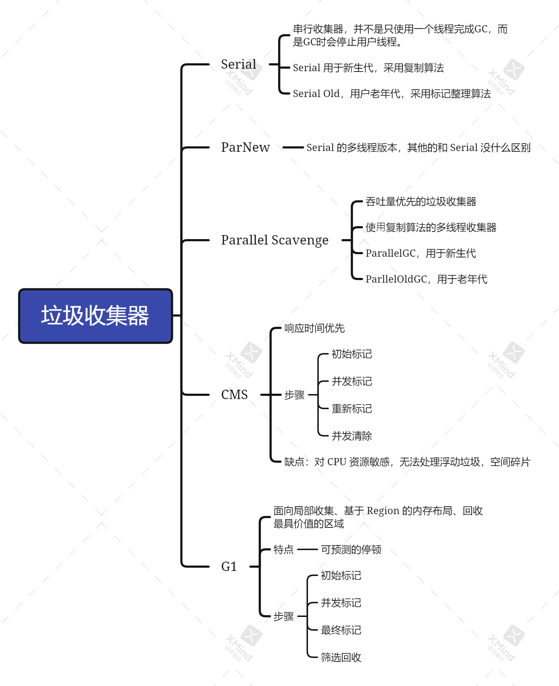</div>

# 堆&垃圾收集的设计

内容来自《深入浅出 Java 虚拟机设计与实现》

---

<b>Java 堆的设计需要满足以下三点：</b>

1️⃣快速的内存分配

2️⃣有效支持 Java 的高层语义，必须用高效合理的内存布局表示普通对象、数组、字符串等不同类型的对象，并对这些对象上的操作提供有效支持

3️⃣能够有效支持对无用存储单元的垃圾收集

这里主要讨论虚拟机堆存储子系统的设计和实现，包括堆的数据结构、堆存储子系统对 Java 语义的支持，垃圾收集器的设计与实现。

## 对象和垃圾

```java
class Main{
    static Object x = new Object(); // 记这个对象为 2
    
    public static void main(String[] args){
        x.toString();
        Object y = new Object(); // 记这个对象为 1
        y = null;
        return;
    }
}
```

上述代码，对象 y 置为 null 后，如果发生了垃圾收集，原先 y 指向的对象 1 会被清理掉。而对象 2，虽然代码里并未使用到这个对象，但是它不会被回收掉。因为变量 x 始终指向对象 2，垃圾收集器无法准确判断程序运行的将来该对象是否会被使用，因此垃圾收集器必须遵守保守策略，不回收对象 2。

以下代码是对上述说法的验证：

```java
package jvm.gc;

import java.io.IOException;
import java.util.ArrayList;
import java.util.concurrent.TimeUnit;

public class Main {

    private static final int _100_MB = 1024 * 1024 * 100;
    static byte[] x = new byte[_100_MB]; //100MB

    public static void test() throws IOException {
        x.toString();
        System.in.read();
        byte[] y = new byte[_100_MB];
        System.out.println("又分配了100MB");
        System.in.read();
        y = null;
        System.out.println("将 y 置为 null，进行 gc");
        // gc 后，会将原先 y 指向的 100MB 的对象进行回收，因为没有引用指向它了
        // x 所指向的对象在其他地方虽然没有被使用，但是 gc 出于保守策略，不会回收这个对象。
        System.gc(); 
        System.in.read();
    }

    public static void testArrayGC() throws IOException, InterruptedException {
        ArrayList<byte[]> list = new ArrayList<>();
        System.in.read();
        for (int i = 1; i < 100; i++) {
            if (i % 20 == 0) {
                for (int j = 0; j < 10; j++) {
                    // 测试，被持有的对象不会被gc，一旦没有变量指向该对象，该对象就会在 gc 的时候被回收
                    list.remove(0);
                }
                System.gc();
                TimeUnit.MILLISECONDS.sleep(5000);
            }
            TimeUnit.MILLISECONDS.sleep(500);
            list.add(new byte[1024 * 1024 * 5]);
        }
    }

    public static byte[] get() {
        return new byte[_100_MB];
    }

    public static void testUnReferenceGC() throws IOException {
        // 测试，没有变量指向对象的话，进行gc后，对象会被回收。
        System.in.read();
        get();
        System.in.read();
        System.gc();
        System.in.read();
    }

    public static void main(String[] args) throws IOException, InterruptedException {
        testUnReferenceGC();
    }
}
```

### 语法垃圾和语义垃圾

语法垃圾是指已经没有引用指向的对象，因此该对象已经无法被程序代码所访问。

语义垃圾是指在程序运行过程中，在某个程序点之后，程序运行过程肯定不会再用到的对象。

虚拟机对第一类垃圾的判断可以通过扫描程序中所有的声明变量完成，当扫描结束后，没有被扫描到的对象即可判定为垃圾。这个在语法层面就可以解决。因此这类垃圾被称为语法垃圾。第二类对象，虚拟机必须对程序进行全程序静态分析，从而确定哪些对象是程序运行过程中不会访问的，这和程序指向的语义相关，因此叫语义垃圾。

大部分的垃圾收集器只能完成对语法垃圾的收集。其根本原因是：①从计算理论角度看，语义垃圾是一个不可判定问题，即不存在一般的判定算法；②对 Java 来说，由于 Java 语言支持动态类加载，因此，一般很难静态判断对象的使用情况。因此，目前大部分的垃圾收集相关资源中提到的垃圾都是语法垃圾。

### 内存泄漏

内存泄漏是指程序中已动态分配的对象由于某种原型未被释放而造成内存的浪费。内存泄漏会导致程序可用的内存空间逐渐减少，最终崩溃。而且，内存泄漏在程序设计中非常常见且难以调试和定位问题，发生内存泄漏后程序也不会立即崩溃或产生其他可观察的行为，而是逐渐累积、逐步影响系统的响应效率。即便最终程序崩溃，程序的崩溃点往往和发生内存泄漏的点并不一致，所以也难以复现和定位。

<b style="color:orange">内存泄漏关心的是语义垃圾，即程序中不再使用的内存单元要及时回收，而 Java 垃圾收集器能够收集的是语法垃圾，即程序中不可访问的对象。</b>

## 堆

设计堆需要考虑的问题是：如何设计堆的数据结构设计，如何设计堆的分配接口。

### 堆数据结构设计

这里用最简单的方式进行设计，用一维数组表示 Java 堆，并采用一个编译期大小确定的固定堆（不设计成可伸缩的）。

```c
#define MAX_HEAP 65535
struct heap{
    unsigned cahr array[MAX_HEAP];
    int next;
};
struct heap heap
```

堆 heap 由带有 next 游标的无符号字符数组 array 构成，next 总是指向堆 array 中下一个可分配的存储位置，next 的初始值为 0。

### 堆分配接口

```c
unsigned cahr *Heap_alloc(int bytes){
    // 此处省略了堆边界的判断。
    unsigned cahr *ptr = heap.array+heap.next;
    heap.next += bytes;
    return ptr;
}
```

这里采用指针跳跃/碰撞算法进行内存分配。堆分配 N 个字节空间的请求，时间复杂度是 $O(1)$。在进行内存分配的时候也要注意多线程环境下的内存分配，需要加锁进行保护。而 Java 虚拟机的做法是，为线程预先分配一定的内存（这个步骤需要是线程安全的），然后需要使用内存时从先前分配给自己的内存中截取合适的内存空间，进而减少加锁的次数。

## 存储布局

存储布局要解决的问题是给分配的空间赋予一定的内在结构，以便高效支持 Java 的高层语义。按照 Java 中对象的类型，这里分布讨论普通对象、类对象和数组对象。

### 对象的存储布局

一个类对象应该包含字段这些信息。但是对象除了要存储类中所有的实例变量外，还必须支持其他的 Java 高层语义。如，Java 支持反射，需要能够从对象上得到其所属的类等信息，对象还必须支持管程，以便让多线程代码在对象上进行线程同步。为了支持这些语义，需要对对象布局进行扩展，最简单的办法就是给对象增加元信息。

- 对象的管程：monitor，指向对象的管程数据结构
- 对象的类信息：class，指向类数据结构，从而允许虚拟机从对象中获得所属类的相关信息，支持反射
- 对象的垃圾收集信息：gcInfo，

```c
struct object{
    // meta information
    struct monitor *monitor;
    struct class *class;
    void *gcInfo;
    // all instance fields, as above:
    // T_0 field_0
    // ...
    // T_n-1 field_n-1
}
```

解决了对象的存储布局后，另一个问题就是对象占多大内存了。Java 有各种各样的数据类型，此处为了方简化堆管理，long 和 double 采用 8 字节表示，用 4 字节表示其他类型。确定了这些内容后，就可以为对象分配内存了。

```c
struct object *Object_alloc(struct class *cls){
    struct object *obj;
    // 根据对象的头部大小sizeof(*obj) 和对象所占槽位数 objectSlots 计算得到实例对象将会占用的堆空间总的字节数
    int totalBytes = sizeof(*obj)+4*(cls->objectSlots);
    // 分配内存空间
    obj = Heap_alloc(totalBytes);
    // 对内存空间进行清零
    memset(obj, totalBytes, 0); // clear this memory
    // 设置对象的头部指针（记录原始的类型信息）
    obj->class = cls;
    return obj;
}
```

### 类的存储布局

类的存储布局和对象的一致，唯一需要考虑的就是，是否要给类加上垃圾收集的元信息。因为 Java 虚拟机规范并未规定是否要对已经加载的类进行卸载，如何卸载。有的虚拟机把类对象作为持久型数据，不需要进行垃圾收集；需要说明的是，将类对象进行垃圾收集并不增加垃圾收集的工作量和设计难度。

```c
struct class{
	// class object's header
    struct monitor *monitor;
    struct class *class;
    void *gcInfo;
    // read from class file
    char *name;
    char *sourceName;
    // ... // other fields
}
```

### 数组的存储布局

加入数组的长度即可。

### 总结

此处所写的对象内存布局仅仅是诸多方案中的一种。对于 monitor 元信息，由于并不是每个对象都要竞争所，因此也可以不涉及成每个对象/类的元信息，可以用一个全局的哈希表进行存储。而对于每个对象和其所属类的信息，由于 Java 在执行方法的时候，每个虚方法的调用都需要取对象所属的类，所以设计成每个对象的元学习更合适，虽然可以用全局的哈希表进行存取，但是空间开销更大，而且哈希表的查找时间比直接从对象元信息访问更慢。

## 垃圾收集

根结点标识技术；基于 Cheney 算法的复制收集技术；垃圾收集的触发机制；

### 根结点

Java 的对可以抽象成一个由对象和引用构成的有向图。Java 在堆上进行垃圾收集可以抽象成对有向图的遍历。查找出从根结点无法遍历到的对象，由垃圾收集器收集这些无法遍历到的对象。

### 复制收集

<b>Cheney 算法</b>

Cheney 算法是基于宽度优先遍历的复制收集算法，选择 Cheney 算法简单，易于实现；Cheney 算法不仅可以独立使用，可是复杂垃圾回收算法的重要基础。在分代收集中，对年轻代经常使用 Cheney 算法。

Java 堆内存数据结构的设计和垃圾收集算法的设计密切相关，为了支持 Cheney 算法，堆数据结构修改为：

```c
#define MAX_HEAP 65535
struct heap{
    unsigned char from[MAX_HEAP];
    unsigned char to[MAX_HEAP];
    int next; // 下一个可分配内存的起点。
};
```

堆 heap 被分成了两个大小相同的半堆 from 和 to；from 称为分配半堆，to 称为备用半堆。虚拟机进行堆内存分配和垃圾收集的基本过程是：

- 用户程序开始执行，对象分配现在分配半堆 from 中进行
- 分配半堆 from 可用空间逐渐减小，当分配半堆 from 没有空间供新对象分配时，程序暂停执行，垃圾收集器开始接手进行收集
- 垃圾收集器扫描所有的根结点，把从根节点出发所有可达的活跃对象从分配半堆 from 复制到闲置的备用半堆 to 中，复制完成后，清空原来的分配半堆 from。
- 半堆 from 和 to 角色互换，to 成为新的分配半堆，from 成为备用半堆。

Cheney 算法自动实现了堆空间的压缩。

<b>标记清除算法</b>

标记清除算法是原地算法，算法分为“标记”和“清除”两个阶段。

- 标记阶段，垃圾收集器从根结点出发，依次标记所有可达的活跃对象
- 标记阶段完成后，垃圾收集器开始进入清除阶段，把未标记的对象都回收掉。可能会有浮动垃圾。

为方便实现该算法，可设计如下堆数据结构

```c
#define MAX_HEAP 65535

struct freeList{
    struct freeList *next;
    int size; // bytes of the current free block
}

struct heap{
    unsigned char array[MAX_HEAP];
    struct freeList *start;
}
```

引入可空闲链表，释放了内存空间的内存块加入空闲链表，需要分配内存时从空闲链表中选出一块合适的内存空间，划分合适的内存大小出去。可以采用最简单的首次适配算法，遍历空闲链表遇到的第一个内存够用的空闲块时，就用该空闲块分配内存，多余的内存空间在重新加入空闲链表。如果没有合适的内存块，那么就进行 gc。

### 多线程垃圾回收

在单线程的场景下，用户线程同时也负责垃圾收集，垃圾收集器的实现会相对简单，在进行垃圾收集的过程，堆实际上处于冻结状态，所以根结点以及堆的存储布局不会发生变化。但是在多线程场景中，垃圾收集器的工作机制会明显不同。

- 存在独立的垃圾收集线程，和用法线程并发执行。
- 在垃圾收集线程执行过程中，用户线程可能正好在进行堆分配，或在改变根结点状态。

因此，在垃圾收集过程中，如果不对垃圾收集线程和用户线程进行仔细的同步，可能会出现竞态条件，导致垃圾收集线程错误回收活跃对象，继而使程序产生错误结果，甚至运行时崩溃。分析下列代码：

```java
class Test{
    public static void main(String[] args){
        new Thread(()->{
            // 刚创建好对象，还没给 obj 赋值，gc 线程就开始进行垃圾回收了，把 Object 对象回收了。
            Object obj = new Object();
        })
    }
}
```

其中一个解决办法是加锁，但是加锁开销太大了。虚拟机也可以采取一个更保守也更简单的方案，即在垃圾收集线程工作时，使所有的用户线程都暂停，进入挂起状态，这种技术称为全局暂停（Stop The World）。

全局暂停技术的关键点在：用户线程并不是在任意的执行点都可以被暂停。

```c
switch(opcode){
    case new:
		// get the class
        unsigned short index = readShortFromIns();
        struct class *cls = class->constant[index];
        Class_init(cls);
        struct object *obj = Object_new(cls);
        *ostack++ = obj; // 第八行
        break;
}
```

解释引擎对 Java 字节码指令 new 解释执行的过程中，如果恰好在执行第 8 行的赋值语句之前，用户线程 thd 被挂起，则垃圾收集线程会错误收集一个活跃的对象 obj。

虚拟机必须把类似上述例子中不能被挂起的操作序列作为原子操作，在执行这个原子操作序列过程中，线程不能被垃圾收集线程挂起。线程的执行必须到达 `*ostack++ = obj;` 语句之后，虚拟机挂起当前正在执行的用户线程才是安全的。在垃圾收集的相关资料中，类似这样的程序执行点被称为“安全点”。在实际的虚拟机实现中，为了节约内存（在安全点上要生成类型映射信息等各种数据结构）及方便实现，一般在选取安全点的时候会更保守，其选项只包括有限的积累，如循环的后向跳转点、方法执行入口、JNI 调用的入口点等。

### 垃圾收集触发

- 批量触发：设置一个临界点，当可用空间小于某个阈值时就进行 GC。
- 周期触发：定期时间触发 GC。

