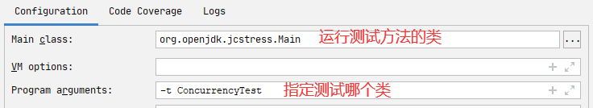
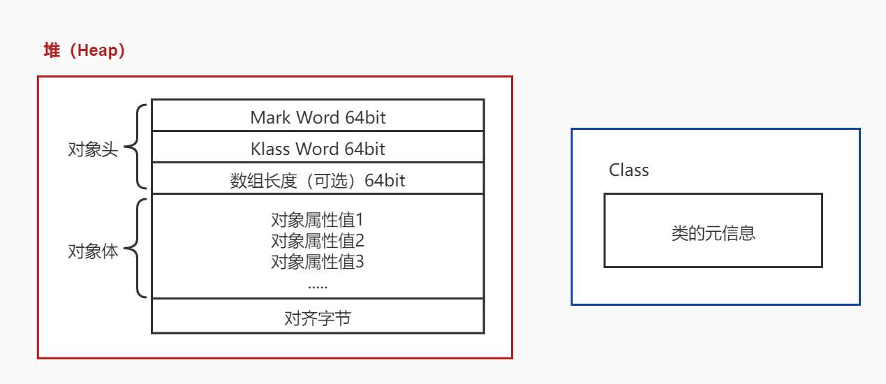

# 内存模型

## Java 内存模型

Java 内存模型是 Java Memory Model（JMM）的意思。 关于它的权威解释，<a href="https://download.oracle.com/otn-pub/jcp/memory_model-1.0-pfd-spec-oth-JSpec/memory_model-1_0-pfd-spec.pdf?AuthParam=1562811549_4d4994cbd5b59d964cd2907ea22ca08b">请参考此文档</a>

简单的说，JMM 定义了一套在多线程读写共享数据时（成员变量、数组）时，对数据的可见性、有序性、和原子性的规则和保障 

### 原子性

两个线程对初始值为 0 的静态变量一个做自增，一个做自减，各做 5000 次，结果是 0 吗？ 

### 问题分析

以上的结果可能是正数、负数、零。为什么呢？因为 Java 中对静态变量的自增，自减并不是原子操作。

例如对于 i++ 而言（i 为静态变量），实际会产生如下的 JVM 字节码指令：

```shell
getstatic i 	# 获取静态变量i的值
iconst_1 		 # 准备常量1
iadd 				# 加法
putstatic i  # 将修改后的值存入静态变量i
```

 而对应 i-- 也是类似： 

```shell
getstatic i 	# 获取静态变量i的值
iconst_1 		 # 准备常量1
isub 			  # 减法
putstatic i 	# 将修改后的值存入静态变量i
```

而 Java 的内存模型如下，完成静态变量的自增、自减时，主内存和线程内存之间会进行数据交互。

<div align="center"></div>

如果是单线程以上 8 行代码是顺序执行（不会交错）没有问题：

```java
// 假设i的初始值为0
getstatic i 		// 线程1-获取静态变量i的值 线程内i=0
iconst_1 			// 线程1-准备常量1
iadd 				// 线程1-自增 线程内i=1
putstatic i 		// 线程1-将修改后的值存入静态变量i 静态变量i=1
getstatic i 		// 线程1-获取静态变量i的值 线程内i=1
iconst_1 			// 线程1-准备常量1
isub 				// 线程1-自减 线程内i=0
putstatic i 		// 线程1-将修改后的值存入静态变量i 静态变量i=0
```

但多线程下这 8 行代码可能交错运行（为什么会交错？思考一下），出现负数的情况：

```java
// 假设i的初始值为0
getstatic i 		// 线程1-获取静态变量i的值 线程内i=0
getstatic i 		// 线程2-获取静态变量i的值 线程内i=0
iconst_1 			// 线程1-准备常量1
iadd 				// 线程1-自增 线程内i=1
putstatic i 		// 线程1-将修改后的值存入静态变量i 静态变量i=1
iconst_1 			// 线程2-准备常量1
isub 				// 线程2-自减 线程内i=-1
putstatic i 		// 线程2-将修改后的值存入静态变量i 静态变量i=-1
```

出现正数的情况：

```java
// 假设i的初始值为0
getstatic i 		// 线程1-获取静态变量i的值 线程内i=0
getstatic i 		// 线程2-获取静态变量i的值 线程内i=0
iconst_1 			// 线程1-准备常量1
iadd 				// 线程1-自增 线程内i=1
iconst_1 			// 线程2-准备常量1
isub 				// 线程2-自减 线程内i=-1
putstatic i 		// 线程2-将修改后的值存入静态变量i 静态变量i=-1
putstatic i 		// 线程1-将修改后的值存入静态变量i 静态变量i=1
```

### 解决方法

```java
synchronized( 对象 ) {
	//要作为原子操作代码
}
```

用 synchronized 解决并发问题：

```java
static int i = 0;
static Object obj = new Object();
public static void main(String[] args) throws InterruptedException {
	Thread t1 = new Thread(() -> {
		for (int j = 0; j < 5000; j++) {
			synchronized (obj) {
				i++;
			}
		}
	});
    Thread t2 = new Thread(() -> {
        for (int j = 0; j < 5000; j++) {
            synchronized (obj) {
                i--;
            }
    	}
    });
    t1.start();
    t2.start();
    t1.join();
    t2.join();
	System.out.println(i);
}
```

如何理解呢：你可以把 obj 想象成一个房间，线程 t1，t2 想象成两个人。 

当线程 t1 执行到 synchronized(obj) 时就好比 t1 进入了这个房间，并反手锁住了门，在门内执行 count++ 代码。 

这时候如果 t2 也运行到了 synchronized(obj) 时，它发现门被锁住了，只能在门外等待。 

当 t1 执行完 synchronized{} 块内的代码，这时候才会解开门上的锁，从 obj 房间出来。t2 线程这时才可以进入 obj 房间，反锁住门，执行它的 count-- 代码。 

> 注意：上例中 t1 和 t2 线程必须用 synchronized 锁住同一个 obj 对象，如果 t1 锁住的是 m1 对 象，t2 锁住的是 m2 对象，就好比两个人分别进入了两个不同的房间，没法起到同步的效果。

## 可见行

### 退不出的循环

先来看一个现象，main 线程对 run 变量的修改对于 t 线程不可见，导致了 t 线程无法停止：

```java
static boolean run = true;
public static void main(String[] args) throws InterruptedException {
    Thread t = new Thread(()->{
        while(run){ // 其实这里应该是直接被JIT优化成了 while(true) 的。加上 -Xint 禁用 JIT 就不会出现死循环了。
        // ....
        }
    });
    t.start();
    Thread.sleep(1000);
    run = false; // 线程t不会如预想的停下来
}
```

为什么呢？分析一下： 

初始状态， t 线程刚开始从主内存读取了 run 的值到工作内存。

<div align="center"></div>

因为 t 线程要频繁从主内存中读取 run 的值，JIT 编译器会将 run 的值缓存至自己工作内存中的高速缓存中，减少对主存中 run 的访问，提高效率（JIT 的优化）

<div align="center"></div>

1 秒之后，main 线程修改了 run 的值，并同步至主存，而 t 是从自己工作内存中的<span style="color:red">高速缓存中读取这个变量的值（这个高速缓存可以暂时理解为直接读的二进制的内容）</span>，结果永远是旧值。用 volatile 修饰 run 值可以避免 JIT 优化，线程可以停下来。

### 解决办法

> volatile（可变的，易变的）

它可以用来修饰成员变量和静态成员变量，它可以避免线程从自己的工作缓存中查找变量的值，必须到主存中获取它的值，线程操作 volatile 变量都是直接操作主存。

### 可见性

前面例子体现的实际就是可见性，它保证的是在多个线程之间，一个线程对 volatile 变量的修改对另一个线程是可见的。但是 volatile 并不能保证原子性。volatile 仅用在一个写线程，多个读线程的情况。

从字节码层面理解前面的例子：

```shell
getstatic run # 线程 t 获取 run true
getstatic run # 线程 t 获取 run true
getstatic run # 线程 t 获取 run true
getstatic run # 线程 t 获取 run true
putstatic run # 线程 main 修改 run 为 false， 仅此一次
getstatic run # 线程 t 获取 run false
```

比较一下之前我们讲线程安全时举的例子：两个线程一个 i++ 一个 i-- ，只能保证看到最新值，不能解决指令交错

```shell
getstatic i # 线程1-获取静态变量i的值 线程内i=0
getstatic i # 线程2-获取静态变量i的值 线程内i=0
iconst_1   # 线程1-准备常量1
iadd      # 线程1-自增 线程内i=1,我可以保证后面有人要拿这个变量时，拿到的是自增后的结果，但是 线程-2 在我自增前就拿到了数据，这个无法改变。
putstatic i # 线程1-将修改后的值存入静态变量i 静态变量i=1
iconst_1   # 线程2-准备常量1
isub      # 线程2-自减 线程内i=-1
putstatic i  # 线程2-将修改后的值存入静态变量i 静态变量i=-1
```

注意 synchronized 语句块既可以保证代码块的原子性，也同时保证代码块内变量的可见性。但缺点是 synchronized 是属于重量级操作，性能相对更低 

如果在前面示例的死循环中加入 System.out.println() 会发现即使不加 volatile 修饰符，线程 t 也能正确看到对 run 变量的修改了，想一想为什么？

```java
public class WhileTrue {
    static boolean run = true;

    public static void main(String[] args) throws InterruptedException {
        Thread t = new Thread(() -> {
            while (run) {
                System.out.println(1);
            }
        });
        t.start();
        Thread.sleep(1000);
        run = false; // 线程t不会如预想的停下来
    }
}
```

原因可能是 sout 方法是加锁的，循环中加入 sout 方法后，while 执行的次数有限，无法触发 JIT 的优化。

## 有序性

### 诡异的结果

```java
package jvm.concurrence;

public class Demo2 {
    int num = 0;
    boolean ready = false;

    // 线程1 执行此方法
    public void actor1(I_Result r) {
        if (ready) {
            r.r1 = num + num;
        } else {
            r.r1 = 1;
        }
    }

    // 线程2 执行此方法
    public void actor2(I_Result r) {
        num = 2;
        ready = true;
    }
}
```

I_Result 是一个对象，有一个属性 r1 用来保存结果，问，可能的结果有几种？ 

有同学这么分析 

情况 1：线程 1 先执行，这时 ready = false，所以进入 else 分支结果为 1 

情况 2：线程 2 先执行 num = 2，但没来得及执行 ready = true，线程1 执行，还是进入 else 分支，结果为 1 

情况 3：线程 2 执行到 ready = true，线程 1 执行，这回进入 if 分支，结果为 4（因为 num 已经执行过了）

<b>结果还可能是 0，原因是指令重排序</b>，是 JIT 编译器在运行时的一些优化，这个现象需要通过大量测试才能复现： 借助 Java 并发压测工具 jcstress https://wiki.openjdk.java.net/display/CodeTools/jcstress

创建 maven 项目，导入maven 依赖，并提供如下测试类。

```xml
<dependencies>
    <!-- jcstress 核心包 -->
    <dependency>
        <groupId>org.openjdk.jcstress</groupId>
        <artifactId>jcstress-core</artifactId>
        <version>0.3</version>
    </dependency>
    <!-- jcstress测试用例包 -->
    <dependency>
        <groupId>org.openjdk.jcstress</groupId>
        <artifactId>jcstress-samples</artifactId>
        <version>0.3</version>
    </dependency>
</dependencies>
```

```java
package jvm.concurrence;

import org.openjdk.jcstress.annotations.*;
import org.openjdk.jcstress.infra.results.I_Result;

@JCStressTest
// 检查感兴趣的结果。如果结果是 1 和 4 那么分类为 Expect.ACCEPTABLE
@Outcome(id = {"1", "4"}, expect = Expect.ACCEPTABLE, desc = "ok")
@Outcome(id = "0", expect = Expect.ACCEPTABLE_INTERESTING, desc = "!!!!")
@State
public class ConcurrencyTest {
    int num = 0;
    boolean ready = false;

    @Actor
    public void actor1(I_Result r) {
        if (ready) {
            r.r1 = num + num;
        } else {
            r.r1 = 1;
        }
    }

    @Actor
    public void actor2(I_Result r) {
        num = 2;
        ready = true;
    }
}
```

> maven 方式执行

```shell
mvn clean install
java -jar target/jcstress.jar
```

会输出我们感兴趣的结果，摘录其中一次结果：

```shell
*** INTERESTING tests
Some interesting behaviors observed. This is for the plain curiosity.
2 matching test results.
[OK] test.ConcurrencyTest
(JVM args: [-XX:-TieredCompilation])
Observed state Occurrences Expectation Interpretatio
```

可以看到，出现结果为 0 的情况有 638 次，虽然次数相对很少，但毕竟是出现了。

> IDEA 配置方式执行

配置程序的主类，`org.openjdk.jcstress.Main` 是 JCStress 自带的一个启动类；然后可以配置 `-t` 参数设置需要测试的类，当然 `-t` 后面也可以指定包名，表示执行指定包下的所有测试类。如果不指定 `-t` 参数，默认会扫描项目下所有包的类。

<div align="center"></div>

```shell
Observed state   Occurrences        Expectation  		Interpretation                                              
  0			       89,788   	ACCEPTABLE_INTERESTING  	!!!!                                                        
  1   					141,923,559			ACCEPTABLE  			ok                                                          
  4    					60,659,403			ACCEPTABLE  			ok 
```

0 这个结果出现了 89788 次。

加上 volatile 就不会受指令重排序的影响了。

### 解决办法

volatile 修饰的变量，可以禁用指令重排

> DCL

```java
public final class Singleton {
    private Singleton() { }
    private static Singleton INSTANCE = null;
    public static Singleton getInstance() {
        // 实例没创建，才会进入内部的 synchronized代码块
        if (INSTANCE == null) {
        	synchronized (Singleton.class) {
        		// 也许有其它线程已经创建实例，所以再判断一次
        		if (INSTANCE == null) {
        			INSTANCE = new Singleton();
        		}
        	}
        }
        return INSTANCE;
    }
}
```

以上的实现特点是： 

- 懒惰实例化 
- 首次使用 getInstance() 才使用 synchronized 加锁，后续使用时无需加锁 

但在多线程环境下，上面的代码是有问题的， INSTANCE = new Singleton() 对应的字节码为：

```shell
17: new           #3                  // class jvm/concurrence/DCL
20: dup
21: invokespecial #4                  // Method "<init>":()V
24: putstatic     #2                  // Field INSTANCE:Ljvm/concurrence/DCL;
```

21 和 24 的执行顺序是不确定的，也许 jvm 会优化为：先将引用地址赋值给 INSTANCE 变量，然后再执行构造方法，如果两个线程 t1，t2 按如下时间序列执行：

```shell
时间1 t1 线程执行到 INSTANCE = new Singleton();
时间2 t1 线程分配空间，为Singleton对象生成了引用地址（0 处）
时间3 t1 线程将引用地址赋值给 INSTANCE，这时 INSTANCE != null（7 处）
时间4 t2 线程进入getInstance() 方法，发现 INSTANCE != null（synchronized块外），直接
返回 INSTANCE
时间5 t1 线程执行Singleton的构造方法（4 处）
```

这时 t1 还未完全将构造方法执行完毕，如果在构造方法中要执行很多初始化操作，那么 t2 拿到的是将是一个未初始化完毕的单例 

对 INSTANCE 使用 volatile 修饰即可，可以禁用指令重排，但要注意在 JDK5 以上的版本的 volatile 才会真正有效

### happens-before

happens-before 规定了哪些写操作对其它线程的读操作可见，它是可见性与有序性的一套规则总结， 抛开以下 happens-before 规则，JMM 并不能保证一个线程对共享变量的写，对于其它线程对该共享变量的读可见（A 线程写了数据，B 线程不一定能读到这个被更改的值）

线程解锁 m 之前对变量的写，对于接下来对 m 加锁的其它线程对该变量的读可见。

```java
static int x;
static Object m = new Object();
new Thread(()->{
    synchronized(m) {
    	x = 10;
    }
},"t1").start();
new Thread(()->{
    synchronized(m) {
    	System.out.println(x);
    }
},"t2").start();
```

线程对 volatile 变量的写，对接下来其它线程对该变量的读可见

```java
volatile static int x;
new Thread(()->{
    x = 10;
},"t1").start();
new Thread(()->{
    System.out.println(x);
},"t2").start();
```

## 锁优化

[由 Java 15 废弃偏向锁，谈谈 Java Synchronized 的锁机制 - Yano_nankai - 博客园 (cnblogs.com)](https://www.cnblogs.com/510602159-Yano/p/14098797.html#:~:text=偏向锁是 HotSpot 虚拟机使用的一项优化技术，能够减少无竞争锁定时的开销。 偏向锁的目的是假定 monitor 一直由某个特定线程持有，直到另一个线程尝试获取它，这样就可以避免获取 monitor,时执行 cas 的原子操作。 monitor 首次锁定时偏向该线程，这样就可以避免同一对象的后续同步操作步骤需要原子指令。 从历史上看，偏向锁使得 JVM 的性能得到了显著改善。)

[Java对象结构与锁实现原理及MarkWord详解_阿珍爱上了阿强？的博客-CSDN博客_markword](https://blog.csdn.net/scdn_cp/article/details/86491792)

Java HotSpot 虚拟机中，每个对象都有对象头（包括 class 指针和 Mark Word）。Mark Word 平时存储这个对象的哈希码、分代年龄，当加锁时，这些信息就根据情况被替换为标记位、线程锁记录指针、重量级锁指针、线程 ID 等内容。回顾下对象的内存布局。

<div align="center"></div>

> Hotspot VM 中的源码注释如下：描绘了对象头的格式

```cpp
// The markOop describes the header of an object.
//
// Note that the mark is not a real oop but just a word.
// It is placed in the oop hierarchy for historical reasons.
//
// Bit-format of an object header (most significant first, big endian layout below):
//
//  32 bits:
//  --------
//             hash:25 ------------>| age:4    biased_lock:1 lock:2 (normal object)
//             JavaThread*:23 epoch:2 age:4    biased_lock:1 lock:2 (biased object)
//             size:32 ------------------------------------------>| (CMS free block)
//             PromotedObject*:29 ---------->| promo_bits:3 ----->| (CMS promoted object)
//
//  64 bits:
//  --------
//  unused:25 hash:31 -->| unused:1   age:4    biased_lock:1 lock:2 (normal object)
//  JavaThread*:54 epoch:2 unused:1   age:4    biased_lock:1 lock:2 (biased object)
//  PromotedObject*:61 --------------------->| promo_bits:3 ----->| (CMS promoted object)
//  size:64 ----------------------------------------------------->| (CMS free block)
//
//  unused:25 hash:31 -->| cms_free:1 age:4    biased_lock:1 lock:2 (COOPs && normal object)
//  JavaThread*:54 epoch:2 cms_free:1 age:4    biased_lock:1 lock:2 (COOPs && biased object)
//  narrowOop:32 unused:24 cms_free:1 unused:4 promo_bits:3 ----->| (COOPs && CMS promoted object)
//  unused:21 size:35 -->| cms_free:1 unused:7 ------------------>| (COOPs && CMS free block)
//
//  - hash contains the identity hash value: largest value is
//    31 bits, see os::random().  Also, 64-bit vm's require
//    a hash value no bigger than 32 bits because they will not
//    properly generate a mask larger than that: see library_call.cpp
//    and c1_CodePatterns_sparc.cpp.
//
//  - the biased lock pattern is used to bias a lock toward a given
//    thread. When this pattern is set in the low three bits, the lock
//    is either biased toward a given thread or "anonymously" biased,
//    indicating that it is possible for it to be biased. When the
//    lock is biased toward a given thread, locking and unlocking can
//    be performed by that thread without using atomic operations.
//    When a lock's bias is revoked, it reverts back to the normal
//    locking scheme described below.
//
//    Note that we are overloading the meaning of the "unlocked" state
//    of the header. Because we steal a bit from the age we can
//    guarantee that the bias pattern will never be seen for a truly
//    unlocked object.
//
//    Note also that the biased state contains the age bits normally
//    contained in the object header. Large increases in scavenge
//    times were seen when these bits were absent and an arbitrary age
//    assigned to all biased objects, because they tended to consume a
//    significant fraction of the eden semispaces and were not
//    promoted promptly, causing an increase in the amount of copying
//    performed. The runtime system aligns all JavaThread* pointers to
//    a very large value (currently 128 bytes (32bVM) or 256 bytes (64bVM))
//    to make room for the age bits & the epoch bits (used in support of
//    biased locking), and for the CMS "freeness" bit in the 64bVM (+COOPs).
//
//    [JavaThread* | epoch | age | 1 | 01]       lock is biased toward given thread
//    [0           | epoch | age | 1 | 01]       lock is anonymously biased
//
//  - the two lock bits are used to describe three states: locked/unlocked and monitor.
//
//    [ptr             | 00]  locked             ptr points to real header on stack
//    [header      | 0 | 01]  unlocked           regular object header
//    [ptr             | 10]  monitor            inflated lock (header is wapped out)
//    [ptr             | 11]  marked             used by markSweep to mark an object
//                                               not valid at any other time
//
//    We assume that stack/thread pointers have the lowest two bits cleared.
```

### 为什么要锁优化

线程在竞争锁的时候会发生线程的挂起和恢复，挂起和恢复操作都需要转入内核态中完成，这两种状态的转换比较费时，增大了并发的压力。而共享数据的竞争时间是非常短的，为这段时间挂起和恢复线程不值得。对于<span style="color:red">多核处理器</span>，我们可以让未竞争到数据的线程多等待一会（自旋）而非挂起。

自旋的等待时间有一定的限度，<span style="color:red">自旋的默认次数是十次</span>，可以使用参数 `-XX:PreBlockSpin` 来更改。而 JDK6 中引入了自适应的自旋，可以根据上一次在同一个锁上的自旋时间及锁的拥有者的状态来决定。<span style="color:orange">刚刚拿到过锁的，再进行自旋，可自旋的时间也更长。</span>

### 锁消除

对于不存在共享数据竞争的加锁代码，会进行锁消除。<span  style="color:red">锁消除的主要判断依据是逃逸分析（变量是否会逃出自己的作用域）</span>，如果可以判断，一段代码中，在堆上的所有数据都不会逃逸出去被其他线程访问到，那就可以把它当栈上的数据对待（认为是线程私有的，安全的，很自然的可以消除它上面的锁）

### 锁升级

Java 的锁有 4 种状态：无锁状态、偏向锁状态、轻量级锁状态、重量级锁状态（级别从低到高）

```cpp
//    [JavaThread* | epoch | age | 1 | 01]       lock is biased toward given thread 01，有线程id，偏向锁
//    [0           | epoch | age | 1 | 01]       lock is anonymously biased 匿名的偏向锁
//
//  - the two lock bits are used to describe three states: locked/unlocked and monitor.
//	  两个 bit 描述三种状态
//    [ptr             | 00]  locked             ptr points to real header on stack 轻量级锁
//    [header      | 0 | 01]  unlocked           regular object header 无锁
//    [ptr             | 10]  monitor            inflated lock (header is wapped out) 重量级锁
//    [ptr             | 11]  marked             used by markSweep to mark an object
//                                               not valid at any other time GC标记
```

```java
/*
64 bit 虚拟机 markword 格式
默认情况（未加锁）
	|-------------------------------------------------------------------|
	|  unused  |  hash  |  unused_gap  |  age  |  biased_lock  |  lock  |
	|    25    |   31   |       1      |   4   |       1       |    2   |
	|-------------------------------------------------------------------|
	
最后两位 代表锁状态：01 无锁、00 轻锁、10 重锁、11 marked or gc

轻锁情况下，锁指针指向加锁线程
    |-----------------------------------------------|
    |			lock pointer			|	lock	|
    |			     62					|	  2		|
    |-----------------------------------------------|

重锁情况下，锁指针指向 Monitor 地址。
    |-----------------------------------------------|
    |			lock pointer			|	lock	|
    |			     62					|	  2		|
    |-----------------------------------------------|
*/
```

<b>场景一：</b>线程 A 和线程 B 都要获取锁 lock（采用的 synchronized），但是线程 A 和 B 是串行执行的，A 先获取锁，然后释放锁，只会 B 才执行获取锁，无锁的竞争。此时线程 A 和 B 加的都是轻量级锁（JDK15 默认关闭偏向锁，因此不考虑偏向锁）。

<b>场景二：</b>线程 A 和 B 都要获取锁 lock（采用的 synchronized），但是线程 A 和 B 会同时竞争锁 lock，此时 A 和 B 加的锁都是重量级锁（有竞争时轻锁升级为重锁）。

<b>轻量级锁 hashCode 的处理：</b>未加锁前，调用 hashCode 方法后会生成对象的 hashCode 值并存入 markword 中。对象加锁后，前 62 位存储的就是指向线程的锁指针了（加锁线程），hashCode 不在 markword 中。hashCode 会被暂存到加锁线程中。解锁后，hashCode 的值会被恢复 markword 中（其他信息也会恢复）。

<b>重量级锁 hashCode 的处理：</b>markword 存储的 monitor 对象的内存地址，hashCode 这些信息也暂存在了 monitor 对象中。解锁后，markword 中始终存储 monitor 对象的内存地址，不会还原信息。

| 锁类型   | 出现时机                                                     |
| -------- | ------------------------------------------------------------ |
| 偏向锁   | 只有一个线程加🔒的情况下，此时一定没有竞争！没有竞争！<br>加锁后 markword 里存储此线程地址（操作系统线程） |
| 轻量级锁 | 有两（多）个线程都试图对此对象交替加🔒，没有发生竞争！<br/>加锁后 markword 里存储加锁线程地址（Java 线程） |
| 重量级锁 | 有两（多）个线程都试图对此对象交替加🔒，并且发生了竞争！<br>加锁后 markdown 里存储 monitor 地址 |

因为 JDK15 默认关闭了偏向锁，因此高版本的 JDK 需要使用 JVM 参数开启。

```shell
-XX:+UseBiasedLocking #+启用
```

#### 偏向锁

了解即可。

> 为什么要引入偏向锁？

因为经过 `HotSpot` 的作者大量的研究发现，大多数时候是不存在锁竞争的，常常是一个线程多次获得同一个锁，因此如果每次都要竞争锁会增大很多没有必要付出的代价，为了降低获取锁的代价，才引入的偏向锁。

> 偏向锁的升级

线程访问代码并获取锁对象时，会先进行对比是不是偏向锁记录的对象，是的话就无需加锁，直接运行。如果不是，且原来的线程还存在，说明有竞争就会升级为轻量级锁。如果不存在竞争，就当前线程设置为偏向锁。

当线程 1 访问代码块并获取锁对象时，会在 Java 对象头和栈帧中记录偏向的锁的 `threadID`，因为偏向锁不会主动释放锁，因此以后线程 1 再次获取锁的时候，需要比较当前线程的 `threadID` 和 Java 对象头中的 `threadID` 是否一致如果一致（还是线程 1 获取锁对象），则无需使用 CAS 来加锁、解锁；如果不一致（其他线程，如线程 2 要竞争锁对象，而偏向锁不会主动释放因此还是存储的线程 1 的 `threadID`），那么需要查看 Java 对象头中记录的线程 1 是否存活，如果没有存活，那么锁对象被重置为无锁状态，其它线程（线程 2）可以竞争将其设置为偏向锁；如果存活，那么立刻查找该线程（线程 1）的栈帧信息，如果还是需要继续持有这个锁对象，那么暂停当前线程 1，撤销偏向锁，升级为轻量级锁，如果线程 1 不再使用该锁对象，那么将锁对象状态设为无锁状态，重新偏向新的线程。

> 偏向锁的取消

偏向锁是默认开启的，而且开始时间一般是比应用程序启动慢几秒，如果不想有这个延迟，那么可以使用 `-XX:BiasedLockingStartUpDelay=0`；

如果不想要偏向锁，那么可以通过 `-XX:-UseBiasedLocking = false` 来设置；

JDK15 废弃了偏向锁，性能提升有限（还可能是维护太麻烦了）。

#### 轻量级锁

> 为什么要引入轻量级锁？

轻量级锁考虑的是竞争锁对象的线程不多，而且线程持有锁的时间也不长的情景。因为阻塞线程需要 CPU 从用户态转到内核态，代价较大，如果刚刚阻塞不久这个锁就被释放了，那这个代价就有点得不偿失了，<b>因此这个时候就干脆不阻塞这个线程，如果加锁失败了，再升级为重量级锁。</b>

> 轻量级锁源码分析

- 下载 JDK 源码，[openjdk/jdk: JDK main-line development https://openjdk.org/projects/jdk (github.com)](https://github.com/openjdk/jdk)
- 代码位置，jdk/src/hotspot/share/runtime/synchronized.cpp
- 加锁代码，`ObjectSynchronizer::enter`
- 解锁代码，`ObjectSynchronizer::exit`

- BasicLock 轻量级锁
- ObjectMonitor 重量级锁
- markWord
- useHeavyMonitors 开关，表示是否仅使用重量级锁
    - true，只有重量级锁
    - false，轻和重都有
    - -XX:-UseHeavyMonitors，表示轻和重都会存在

<b>enter 代码--加锁流程</b>

```cpp
void ObjectSynchronizer::enter(Handle obj, BasicLock* lock, JavaThread* current) {
  if (obj->klass()->is_value_based()) { // 与主题无关
    handle_sync_on_value_based_class(obj, current);
  }

  current->inc_held_monitor_count(); // 计数，与主题无关

  if (!useHeavyMonitors()) {
    if (LockingMode == LM_LIGHTWEIGHT) {
      // Fast-locking does not use the 'lock' argument.
      LockStack& lock_stack = current->lock_stack();
      if (lock_stack.can_push()) {
        markWord mark = obj()->mark_acquire();
        if (mark.is_neutral()) { // 是否是无锁状态，无锁就走 if 内部
          assert(!lock_stack.contains(obj()), "thread must not already hold the lock");
          // Try to swing into 'fast-locked' state.
          markWord locked_mark = mark.set_fast_locked();
          markWord old_mark = obj()->cas_set_mark(locked_mark, mark);
          if (old_mark == mark) {
            // Successfully fast-locked, push object to lock-stack and return.
            lock_stack.push(obj());
            return;
          }
        }
      }
      // All other paths fall-through to inflate-enter.
    } else if (LockingMode == LM_LEGACY) {
      markWord mark = obj->mark();
      if (mark.is_neutral()) {
        // Anticipate successful CAS -- the ST of the displaced mark must
        // be visible <= the ST performed by the CAS.
        lock->set_displaced_header(mark);
        if (mark == obj()->cas_set_mark(markWord::from_pointer(lock), mark)) {
          return;
        }
        // Fall through to inflate() ...
      } else if (mark.has_locker() &&
                 current->is_lock_owned((address) mark.locker())) {
        assert(lock != mark.locker(), "must not re-lock the same lock");
        assert(lock != (BasicLock*) obj->mark().value(), "don't relock with same BasicLock");
        lock->set_displaced_header(markWord::from_pointer(nullptr));
        return;
      }

      // The object header will never be displaced to this lock,
      // so it does not matter what the value is, except that it
      // must be non-zero to avoid looking like a re-entrant lock,
      // and must not look locked either.
      lock->set_displaced_header(markWord::unused_mark());
    }
  } else if (VerifyHeavyMonitors) {
    guarantee((obj->mark().value() & markWord::lock_mask_in_place) != markWord::locked_value, "must not be lightweight/stack-locked");
  }

  // An async deflation can race after the inflate() call and before
  // enter() can make the ObjectMonitor busy. enter() returns false if
  // we have lost the race to async deflation and we simply try again.
  while (true) {
    ObjectMonitor* monitor = inflate(current, obj(), inflate_cause_monitor_enter);
    if (monitor->enter(current)) {
      return;
    }
  }
}
```

<b>加锁流程</b>

1. 对象无锁

    - 备份 mark 到轻量级锁
    - 用 cas 将轻量级锁地址指针设置为新 mark 值
    - cas 成功，表示没有竞争，轻量级锁加锁成功 return
    - cas 失败，进入接下来的锁膨胀流程

2. 对象已经加了轻量级锁，并且是自己再次加锁

    ```java
    new Thread(()->{
        synchronized (obj){ // lock1[mark]
    		synchronized (obj){ // lock2[nullptr]
            	synchronized (obj){ // lock3[nullptr]
                	//...
                }
            }        
        }
    }).start();
    ```

3. 能继续执行到下面，意味着
    - 要么是因为 cas 竞争失败。
    - 要么是因为别人已经加过轻量级锁，而当前线程并非锁持有者。
    - 此时都会升级为重量级锁，进入重量级锁加锁流程。

<b>exit--解锁代码</b>

```cpp
void ObjectSynchronizer::exit(oop object, BasicLock* lock, JavaThread* current) {
  current->dec_held_monitor_count();

  if (!useHeavyMonitors()) {
    markWord mark = object->mark(); // 地址指针（轻 or 重）
    if (LockingMode == LM_LIGHTWEIGHT) {
      // Fast-locking does not use the 'lock' argument.
      if (mark.is_fast_locked()) {
        markWord unlocked_mark = mark.set_unlocked();
        markWord old_mark = object->cas_set_mark(unlocked_mark, mark);
        if (old_mark != mark) {
          // Another thread won the CAS, it must have inflated the monitor.
          // It can only have installed an anonymously locked monitor at this point.
          // Fetch that monitor, set owner correctly to this thread, and
          // exit it (allowing waiting threads to enter).
          assert(old_mark.has_monitor(), "must have monitor");
          ObjectMonitor* monitor = old_mark.monitor();
          assert(monitor->is_owner_anonymous(), "must be anonymous owner");
          monitor->set_owner_from_anonymous(current);
          monitor->exit(current);
        }
        LockStack& lock_stack = current->lock_stack();
        lock_stack.remove(object);
        return;
      }
    } else if (LockingMode == LM_LEGACY) {
      markWord dhw = lock->displaced_header(); // 原始 mark or nullptr
      if (dhw.value() == 0) { // == 0 说明是内层解锁（嵌套 sync）直接 return
        // If the displaced header is null, then this exit matches up with
        // a recursive enter. No real work to do here except for diagnostics.
        return;
      }
	  // 最外层的 sync 解锁。如果 mark 相等，说明没有发生锁膨胀
      if (mark == markWord::from_pointer(lock)) {
        // If the object is stack-locked by the current thread, try to
        // swing the displaced header from the BasicLock back to the mark.
        assert(dhw.is_neutral(), "invariant");
        // 还原 mark
        if (object->cas_set_mark(dhw, mark) == mark) {
          return;
        }
      }
    }
  } else if (VerifyHeavyMonitors) {
    guarantee((object->mark().value() & markWord::lock_mask_in_place) != markWord::locked_value, "must not be lightweight/stack-locked");
  }

  // We have to take the slow-path of possible inflation and then exit.
  // The ObjectMonitor* can't be async deflated until ownership is
  // dropped inside exit() and the ObjectMonitor* must be !is_busy().
  // 重量级锁解锁
  ObjectMonitor* monitor = inflate(current, object, inflate_cause_vm_internal);
  if (LockingMode == LM_LIGHTWEIGHT && monitor->is_owner_anonymous()) {
    // It must be owned by us. Pop lock object from lock stack.
    LockStack& lock_stack = current->lock_stack();
    oop popped = lock_stack.pop();
    assert(popped == object, "must be owned by this thread");
    monitor->set_owner_from_anonymous(current);
  }
  monitor->exit(current);
}
```

<b>解锁流程</b>

1. 内有 synchronized 锁对象直接解锁成功
2. 最外层 synchronized 锁对象解锁
    - 如果对象头中的地址已经被改为重量级锁地址，走重量级锁解锁流程
    - 尝试用 cas 还原原始 mark
        - 失败，走重量级锁解锁流程
        - 成功，轻量级锁解锁成功

#### 何时自旋

只要发生竞争，轻量级锁就会升级为重量级锁。升级（膨胀）成重量锁之后，未获得锁的线程，会进入 `_cxq` 链表（stack 结构），自旋尝试获取锁。

- 如果自旋期间，能获取锁，则避免阻塞
- 如果自旋若干次，仍不能获取锁，则进入阻塞，将来由持锁线程唤醒

综上所述，自旋是发生在轻量级锁升级成重量级锁之后，未能获取到锁的线程会自旋。

```cpp
int objectMonitor::Knob_SpinLimit = 5000;	// derived by an external tool -自旋次数上限
static int Knob_Bonus = 100;	// spin success bonus - 成功奖励
static int Knob_BonusB = 100;	// spin success bonus - 成功奖励
static int Knob_ Penalty = 200; // spin failure penalty - 失败惩罚
static int Knob_Poverty = 1000;	// 自旋次数下限
static int Knob_FixedSpin = 0;	// 固定自旋次数
static int Knob_PreSpin = 10;	// 20-100 likely better 预自旋次数
```

- 自旋的前提
    - 多处理器才会自旋。
- 自旋的两种方式
    - 固定自旋，JDK1.6 开始，只能自适应自旋了。
    - 自适应自旋
        - 预自旋自旋 11 次
            成功，直接返回
            失败，进入下面的完整自旋
        - 完整自旋用 _SpinDuration 记录自旋次数 5000
            每次自旋成功，下次 +100， 至少 1000
            每次自旋失败，下次 -200， 最少减到 0

#### 重量级锁

> 轻量级锁什么时候升级为重量级锁？

线程 1 获取轻量级锁时会先把锁对象的对象头 MarkWord 复制一份到线程 1 的栈帧中创建的用于存储锁记录的空间（称为 DisplacedMarkWord），然后使用 CAS 把对象头中的内容替换为线程 1 存储的锁记录（DisplacedMarkWord）的地址；

如果在线程 1 复制对象头的同时（在线程 1 CAS 之前），线程 2 也准备获取锁，复制了对象头到线程 2 的锁记录空间中，但是在线程 2 CAS 的时候，发现线程 1 已经把对象头换了，线程 2 的 CAS 失败，那么线程 2 就升级为重量级锁。

注意：轻量级锁一旦膨胀为重量级锁就不会再降级为轻量级锁了；偏向锁升级为轻量级锁也不能再降级为偏向锁。一句话就是锁可以升级不可以降级，但是偏向锁状态可以被重置为无锁状态。

升级（膨胀）成重量锁之后，未获得锁的线程，会进入 `_cxq` 链表（stack 结构），自旋尝试获取锁。

- 如果自旋期间，能获取锁，则避免阻塞
- 如果自旋若干次，仍不能获取锁，则进入阻塞，将来由持锁线程唤醒

<b>重量级锁，未获得锁的线程，会进入 `_cxq` 链表（stack 结构），自旋尝试获取锁。但是如果自旋的时间太长也不行，因为自旋是要消耗 CPU 的，因此自旋的次数必须有限制，比如 10 次或者 100 次。如果自旋次数到了线程 1 还没有释放锁；或者线程 1 还在执行，线程 2 还在自旋等待，这时又有一个线程 3 过来竞争这个锁对象。</b>

> 这几种锁的优缺点（偏向锁、轻量级锁、重量级锁）

| 锁状态   | 说明                                                         |
| -------- | ------------------------------------------------------------ |
| 偏向锁   | 加锁解锁无需额外的消耗，和非同步方法时间相差纳秒级别。<br>如果竞争线程多，那么会带来额外的锁撤销的消耗。 |
| 轻量级锁 | 竞争的线程不会阻塞，提高程序响应速度。<br>如果获取不到锁，会升级成重量级锁，不会有所谓的自旋。 |
| 重量级锁 | 线程阻塞，响应时间长，内部有自旋策略，暂时抢不到锁的会进入 `_cxq` 链表（stack 结构），尝试自旋获取锁，不会直接阻塞。 |

### 轻量级锁

<b>目的：</b>在没有多线程竞争的前提下，减少传统的重量级锁使用操作系统互斥量产生的性能消耗。

如果一个对象虽然有多线程访问，但多线程访问的时间是错开的（也就是没有竞争），那么可以使用轻量级锁来优化。这就好比。

学生（线程 A）用课本占座，上了半节课，出门了（CPU 时间到），回来一看，发现课本没变，说明没有竞争，继续上他的课。 如果这期间有其它学生（线程 B）来了，会告知（线程 A）有并发访问，线程 A 随即升级为重量级锁，进入重量级锁的流程。而重量级锁就不是那么用课本占座那么简单了，可以想象线程 A 走之前，把座位用一个铁栅栏围起来。

假设有两个方法同步块，利用同一个对象加锁

```java
static Object obj = new Object();
public static void method1() {
	synchronized( obj ) {
        // 同步块 A
        method2();
    }
}
public static void method2() {
    synchronized( obj ) {
    // 同步块 B
    }
}
```

<span style="color:red">每个线程都的栈帧都会包含一个锁记录的结构，内部可以存储锁定对象的 Mark Word。</span>

Mark Word 有 8 个字节，对 Mark Word 加锁后需要把旧的信息存起来。存到那里？就存到栈帧的锁记录结构中。解锁的时候，再把暂存的 Mark Word 信息给它恢复回去。

<div align="center"></div>
<div align="center">轻量级锁 CAS 操作之前堆栈于对象的状态</div>

<div align="center"></div>
<div align="center">轻量级锁 CAS 操作之后堆栈于对象的状态</div>


| 线程 1                                        | 对象 Mark Word                                | 线程 2                                      |
| --------------------------------------------- | --------------------------------------------- | ------------------------------------------- |
| 访问同步块 A ， 把 Mark 复制到线程 1 的锁记录 | 01（无锁）==【加锁时先考虑锁的状态】          | -                                           |
| CAS 修改 Mark 为线程 1 锁记录地址             | 01（无锁）                                    | -                                           |
| 成功（加锁）                                  | 00（轻量级锁）线程 1 锁记录地址               | -                                           |
| 执行同步块 A                                  | 00（轻量级锁）线程 1 锁记录地址               | -                                           |
| 访问同步块 B，把 Mark 复制到线程 1 的锁记录   | 00（轻量级锁）线程 1 锁记录地址               | -                                           |
| CAS 修改 Mark 为线程 1 锁记录地址             | 00（轻量级锁）线程 1 锁记录地址               | -                                           |
| 失败（发现是自己的锁）                        | 00（轻量级锁）线程 1 锁记录地址               | -                                           |
| 锁重入                                        | 00（轻量级锁）线程 1 锁记录地址               | -                                           |
| 执行同步块 B                                  | 00（轻量级锁）线程 1 锁记录地址               | -                                           |
| 同步块 B 执行完毕                             | 00（轻量级锁）线程 1 锁记录地址               | -                                           |
| 同步块 A 执行完毕                             | 00（轻量级锁）线程 1 锁记录地址               | -                                           |
| 成功（解锁）                                  | 01（无锁）                                    | -                                           |
| -                                             | 01（无锁）                                    | 访问同步块 A，把 Mark 复制到线程 2 的锁记录 |
| -                                             | 01（无锁）                                    | CAS 修改 Mark 为线程 2 锁记录地址           |
| -                                             | 00（轻量级锁）线程 2 锁记录地址  成功（加锁） |                                             |
| -                                             | ...                                           | ...                                         |

### 锁膨胀

如果在尝试加轻量级锁的过程中，CAS 操作无法成功，这时一种情况就是有其它线程为此对象加上了轻量级锁（有竞争），这时需要进行锁膨胀，将轻量级锁变为重量级锁。

```java
static Object obj = new Object();
public static void method1(){
    synchronized(obj){
        // 同步块
    }
}
```

重量锁指针的作用：为了将来线程解锁的时候，可以去唤醒阻塞中的线程。

| 线程 1                                           | 对象 Mark Word                  | 线程 2                           |
| ------------------------------------------------ | ------------------------------- | -------------------------------- |
| 访问同步块 A ， 把 Mark 复制到线程 1 的锁记录    | 01（无锁）                      | -                                |
| CAS 修改 Mark 为线程 1 锁记录地址                | 01（无锁）                      | -                                |
| 成功（加锁）                                     | 00（轻量级锁）线程 1 锁记录地址 | -                                |
| 执行同步块                                       | 00（轻量级锁）线程 1 锁记录地址 | -                                |
| 执行同步块                                       | 00（轻量级锁）线程 1 锁记录地址 | 访问同步块，把 Mark 复制到线程 2 |
| 执行同步块                                       | 00（轻量级锁）线程 1 锁记录地址 | CAS 修改 Mark 为线程 2 锁记录    |
| 执行同步块                                       | 00（轻量级锁）线程 1 锁记录地址 | 失败（发现别人已经占锁）         |
| 执行同步块                                       | 00（轻量级锁）线程 1 锁记录地址 | CAS 修改 Mark 为 重量锁          |
| 执行同步块                                       | 10（重量级锁）重量锁指针        | 阻塞中                           |
| 执行同步块                                       | 10（重量级锁）重量锁指针        | 阻塞中                           |
| 执行完毕                                         | 10（重量级锁）重量锁指针        | 阻塞中                           |
| 失败（解锁）【告诉线程现在不是轻锁，是重锁】     | 10（重量级锁）重量锁指针        | 阻塞中                           |
| 释放重量锁，唤起阻塞线程竞争【按重锁的方式解锁】 | 01（无锁）                      | 阻塞中                           |
| -                                                | 10（重量级锁）                  | 竞争重量锁                       |
| -                                                | 10（重量级锁）                  | 成功（加锁）                     |
| -                                                | ...                             | ...                              |

### 重量锁

重量级锁竞争的时候，还可以使用自旋来进行优化，如果当前线程自旋成功（即这时候持锁线程已经退 出了同步块，释放了锁），这时当前线程就可以避免阻塞。

在 Java 6 之后自旋锁是自适应的，<span style="color:orange">比如对象刚刚的一次自旋操作成功过，那么认为这次自旋成功的可能性会高，就多自旋几次；反之，就少自旋甚至不自旋，总之，比较智能。</span>

-  自旋会占用 CPU 时间，单核 CPU 自选就是浪费，多核 CPU 自旋才能发挥优势
-  Java 7 之后不能控制是否开启自旋功能

自旋重试成功的情况

| 线程1（CPU1 上）         | 对象 Mark              | 线程2（CPU2 上）                       |
| ------------------------ | ---------------------- | -------------------------------------- |
| -                        | 10（重量锁）           | -                                      |
| 访问同步块，获取 monitor | 10（重量锁）重量锁指针 | -                                      |
| 成功（加锁）             | 10（重量锁）重量锁指针 | -                                      |
| 执行同步块               | 10（重量锁）重量锁指针 | -                                      |
| 执行同步块               | 10（重量锁）重量锁指针 | 访问同步块，获取 monitor               |
| 执行同步块               | 10（重量锁）重量锁指针 | 自旋重试（先不直接阻塞，而是尝试自旋） |
| 执行完毕                 | 10（重量锁）重量锁指针 | 自旋重试                               |
| 成功（解锁）             | 01（无锁）             | 自旋重试                               |
| -                        | 10（重量锁）重量锁指针 | 成功（加锁）                           |
| -                        | 10（重量锁）重量锁指针 | 执行同步块                             |
| -                        | ...                    | ...                                    |

自旋重试失败的情况：尝试了几次自旋，自选失败就阻塞了。

| 线程1（CPU1 上）         | 对象 Mark              | 线程2（CPU2 上）         |
| ------------------------ | ---------------------- | ------------------------ |
| -                        | 10（重量锁）           | -                        |
| 访问同步块，获取 monitor | 10（重量锁）重量锁指针 | -                        |
| 成功（加锁）             | 10（重量锁）重量锁指针 | -                        |
| 执行同步块               | 10（重量锁）重量锁指针 | -                        |
| 执行同步块               | 10（重量锁）重量锁指针 | 访问同步块，获取 monitor |
| 执行同步块               | 10（重量锁）重量锁指针 | 自旋重试                 |
| 执行同步块               | 10（重量锁）重量锁指针 | 自旋重试                 |
| 执行同步块               | 10（重量锁）重量锁指针 | 自旋重试                 |
| 执行同步块               | 10（重量锁）重量锁指针 | 阻塞                     |
| -                        | ...                    | ...                      |

### 偏向锁

轻量级锁再没有竞争时（就自己这个线程抢资源），每次重入仍需要执行 CAS 操作。Java 6 引入了偏向锁来做进一步的优化：只有第一次使用 CAS 将线程 ID 设置到对象的 Mark Word头，之后发现这个线程 ID 是自己的就表示没有竞争，不用重新 CAS。

- 撤销偏向需要将持锁线程升级为轻量级锁，这个过程中所有线程需要暂停（STW） 
- 访问对象的 hashCode 也会撤销偏向锁 如果对象虽然被多个线程访问，但没有竞争，这时偏向了线程 T1 的对象仍有机会重新偏向 T2， 重偏向会重置对象的 Thread ID 
- 撤销偏向和重偏向都是批量进行的，以类为单位 
- 如果撤销偏向到达某个阈值，整个类的所有对象都会变为不可偏向的 
- 可以主动使用 `-XX:-UseBiasedLocking` 禁用偏向锁 （ `-XX:+UseBiasedLocking` 是开启偏向锁）
- <span style="color:red">PS：偏向锁要存储线程 ID，存储了线程 ID 后就无法存储对象哈希码了，所以如果对象头中已经存在了哈希码就无法开启偏向锁了。</span>

可以参考这篇论文：https://www.oracle.com/technetwork/java/biasedlocking-oopsla2006-wp149958.pdf

假设有两个方法同步块，利用同一个对象加锁

```java
static Object obj = new Object();
public static void method1() {
    synchronized( obj ) {
        // 同步块 A
        method2();
    }
}
public static void method2() {
    synchronized( obj ) {
        // 同步块 B
    }
}
```

| 线程 1                                      | 对象 Mark                      |
| ------------------------------------------- | ------------------------------ |
| 访问同步块 A，检查 Mark 中是否有线程 ID     | 101（无锁可偏向）              |
| 尝试加偏向锁                                | 101（无锁可偏向）对象 hashCode |
| 成功                                        | 101（无锁可偏向）线程 ID       |
| 执行同步块 A                                | 101（无锁可偏向）线程 ID       |
| 访问同步块 B，检查 Mark 中是否有线程 ID     | 101（无锁可偏向）线程 ID       |
| 是自己的线程 ID，锁是自己的，无需做更多操作 | 101（无锁可偏向）线程 ID       |
| 执行同步块 B                                | 101（无锁可偏向）线程 ID       |
| 执行完毕                                    | 101（无锁可偏向）对象 hashCode |

### 其他优化

<b>减少上锁时间</b>

同步代码块中尽量短

<b>减少锁的粒度</b>

 将一个锁拆分为多个锁提高并发度，例如：

- ConcurrentHashMap
- LongAdder 分为 base 和 cells 两部分。没有并发争用的时候或者是 cells 数组正在初始化的时候，会使用 CAS 来累加到 base，用并发争用，会初始化 cells 数组，数组有多少个 cell，就运行有多少线程并行修改，最后将数组重每个 cell 累加，再加上 base 就是最终的值。
- LinkedBlockingQueue 入队和出队使用不同的锁，相对于 LinkedBlockingArray 只有一个锁而言，效率更高。

<b>锁粗化</b>

多次循环进入同步块不如同步块内多次循环 

另外 JVM 可能会做如下优化，把多次 append 的加锁操作 粗化为一次（因为都是对同一个对象加锁，没必要重入多次）

```java
new StringBuffer().append("a").append("b").append("c")
```

<b>锁消除</b>

JVM 会进行代码的逃逸分析，例如某个加锁对象是方法内局部变量，不会被其它线程所访问到，这时候就会被即时编译器忽略掉所有同步操作。

<b>读写分离</b>

`CopyOnWriteArrayList ConyOnWriteSet`

参考： 

https://wiki.openjdk.java.net/display/HotSpot/Synchronization 

http://luojinping.com/2015/07/09/java锁优化/ 

https://www.infoq.cn/article/java-se-16-synchronized 

https://www.jianshu.com/p/9932047a89be 

https://www.cnblogs.com/sheeva/p/6366782.html 

https://stackoverflow.com/questions/46312817/does-java-ever-rebias-an-individual-lock