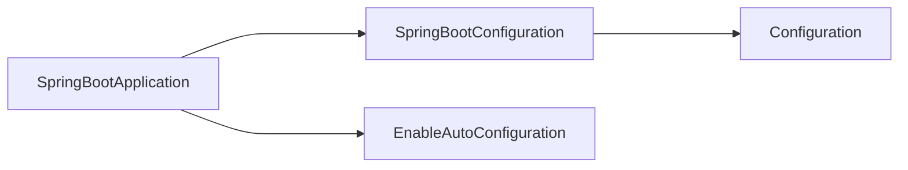

# Spring Boot 如何启动的

## 标准的 jar 包

Spring Boot 可以将应用打包成一个 jar，然后通过 `java -jar jar包名` 来启动程序。

我们先来看看，普通的 Java 项目是如何运行 Jar 包的。我们将一个普通的 Java 项目打成 Jar 包。

```java
// java 项目的代码如下
package com.company;

public class Main {

    public static void main(String[] args) {
        // write your code here
        System.out.println("Hello World");
    }
}
```

将该项目打包成 jar 包后。jar 包中会出现两个文件夹。一个是 com(存放 class 文件)，一个是 META-INF，存放了 jar 包的一些信息。

```
# META-INF 中的文件如下
Manifest-Version: 1.0
Main-Class: com.company.Main
```

Main-Class 指定了，我们通过 java -jar 命令运行 jar 包的时候，它运行那个类的。此处表明，我们执行 `java -jar jar包名` 是会执行 `com.company.Main` 这个类，即这个类是程序的入口。

## 命令打包成 jar

- 书写代码

- 将代码编译成 class 文件。

- 为 class 文件创建一个 `META-INF/MANIFEST.MF` 文件，文件中书写以下内容

    ```tex
    Manifest-Version: 1.0
    Main-Class: com.company.Main
    ```

- 执行命令进行打包 `jar -cvfm hello.jar META-INF/MANIFEST.MF com`


## Spring Boot 的 jar

下面我们再来看看 Spring Boot 的 Jar 是怎么样的。我们用 maven 将一个 SpringBoot 项目打包成 jar 包，然后执行。（maven->lifecycle->package）


我们将 jar 包解压看一下，看下 jar 包中都有些什么内容。发现里面也有 MANIFEST.MF 文件

```shell
Manifest-Version: 1.0
Created-By: Maven JAR Plugin 3.2.2
Build-Jdk-Spec: 11
Implementation-Title: demo
Implementation-Version: 0.0.1-SNAPSHOT
Main-Class: org.springframework.boot.loader.JarLauncher
Start-Class: com.example.demo.DemoApplication
Spring-Boot-Version: 2.6.4
Spring-Boot-Classes: BOOT-INF/classes/
Spring-Boot-Lib: BOOT-INF/lib/
Spring-Boot-Classpath-Index: BOOT-INF/classpath.idx
Spring-Boot-Layers-Index: BOOT-INF/layers.idx
```

我们查阅下 Spring Boot 官网，看下官网是如何解释 Spring Boot 中 jar 的文件组成的：


 `MANIFEST.MF` 中有 Main-Class 和 Start-Class 属性。Main-Class 填写一个固定的类，Start-Class 填写我们写的加了@SpringBootApplication注解的类。我们解压 jar 包，使用 java 命令运行 `org.springframework.boot.loader.JarLauncher`。


我们执行 `java org.springframework.boot.loader.JarLauncher` 发现，`com.example.demo.DemoApplication` 也启动了。可以推断，是 JarLauncher 加载了 DemoApplication 类。

我们大致跟踪下 JarLauncher 的调用过程发现最后执行的一个方法是

```java
// MainMethodRunner 类
public void run() throws Exception {
    Class<?> mainClass = Class.forName(this.mainClassName, false, Thread.currentThread().getContextClassLoader());
    Method mainMethod = mainClass.getDeclaredMethod("main", String[].class);
    mainMethod.setAccessible(true);
    mainMethod.invoke(null, new Object[] { this.args });
}
```

执行的应该是 DemoApplication 的main 方法。

# 自动配置

> 注解知识补充

注解上如果加了 @Inherited 表示这个注解是可以被继承的。被继承是什么意思呢？看下下面代码的输出就知道啥意思了。

```java
@Target(ElementType.TYPE)
@Retention(RetentionPolicy.RUNTIME)
@Documented
@Inherited
public @interface Demo {
}
@Demo
public class Father {}
public class Son extends Father {}

public class TestDemo {
    public static void main(String[] args) {
        Annotation[] annotations = Son.class.getAnnotations();
        Arrays.stream(annotations).forEach(System.out::println);
        // @com.example.anno.Demo()
    }
}
```

官网关于自动配置有这样一段话。

You need to opt-in to auto-configuration by adding the `@EnableAutoConfiguration` or `@SpringBootApplication` annotations to one of your `@Configuration` classes.

我们来仔细看下 @SpringBootApplication 注解：它是一个复合注解，由@SpringBootConfiguration、@EnableAutoConfiguration 组成。而 @SpringBootConfiguration 只是 @Configuration 的一个别名。

```java
@SpringBootApplication
public class DemoApplication {

    public static void main(String[] args) {
        SpringApplication.run(DemoApplication.class, args);
    }
}
```

```java
@SpringBootConfiguration
@EnableAutoConfiguration
@ComponentScan(
    excludeFilters = {@Filter(
    type = FilterType.CUSTOM,
    classes = {TypeExcludeFilter.class}
), @Filter(
    type = FilterType.CUSTOM,
    classes = {AutoConfigurationExcludeFilter.class}
)}
)
public @interface SpringBootApplication {
    // some code
}
```

```java
@Configuration
@Indexed
public @interface SpringBootConfiguration {
    @AliasFor(annotation = Configuration.class)
    boolean proxyBeanMethods() default true;
}
```

总结：

官方说 @EnableAutoConfiguration/@SpringBootApplication + @Configuration 才可以开启自动配置。我们发现 



@SpringBootApplication = @Configuration + @EnableAutoConfiguration

实际上 @SpringBootApplication = @Configuration + @EnableAutoConfiguration + @ComponentScan

我们在仔细看看 @SpringBootApplication 注解

```java
package org.springframework.boot.autoconfigure;
// 省略了一些内容
@SpringBootConfiguration
@EnableAutoConfiguration
@ComponentScan(excludeFilters = { @Filter(type = FilterType.CUSTOM, classes = TypeExcludeFilter.class),
		@Filter(type = FilterType.CUSTOM, classes = AutoConfigurationExcludeFilter.class) })
public @interface SpringBootApplication {

	@AliasFor(annotation = EnableAutoConfiguration.class)
	Class<?>[] exclude() default {};

	@AliasFor(annotation = EnableAutoConfiguration.class)
	String[] excludeName() default {};

	@AliasFor(annotation = ComponentScan.class, attribute = "basePackages")
	String[] scanBasePackages() default {};

	@AliasFor(annotation = ComponentScan.class, attribute = "basePackageClasses")
	Class<?>[] scanBasePackageClasses() default {};

	@AliasFor(annotation = ComponentScan.class, attribute = "nameGenerator")
	Class<? extends BeanNameGenerator> nameGenerator() default BeanNameGenerator.class;

	@AliasFor(annotation = Configuration.class)
	boolean proxyBeanMethods() default true;
}
```

我们可以注意到一个注解 @AliasFor，这个注解是 Spring 定义的，我们可以称它为别名。比如 exclude 属性其实就是注解 @EnableAutoConfiguration 的别名。比如：

```java
@SpringBootApplication(scanBasePackages = "com.example")
// 这个 scanBasePackages 相当于 ComponentScan(basePackages="com.example")
public class DemoApplication {
    public static void main(String[] args) {
        SpringApplication.run(DemoApplication.class, args);
    }
}
```

@SpringBootApplication 也可以加载非启动类上。

```java
@SpringBootApplication
@RestController
public class WebConfiguration {
    @GetMapping("index")
    public String index() {
        return "hello";
    }
}
public class DemoApplication {
    public static void main(String[] args) {
        SpringApplication.run(WebConfiguration.class, args);
    }
}
// 程序也是可以正常运行的。
```

我们也可以不用 @SpringBootApplication，使用 @EnableAutoConfiguration 注解也可以。我们可以推断出，SpringApplication#run 启动 SpringBoot 程序并不依赖于 @Configuration 注解。

```java
@RestController
@EnableAutoConfiguration
public class WebConfiguration {
    @GetMapping("index")
    public String index() {
        return "hello";
    }
}

public class DemoApplication {
    public static void main(String[] args) {
        SpringApplication.run(WebConfiguration.class, args);
    }
}
```


