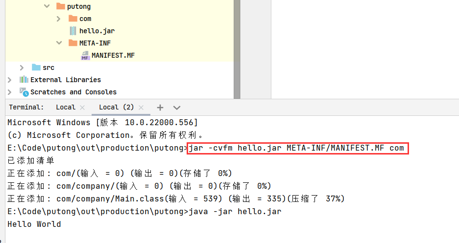
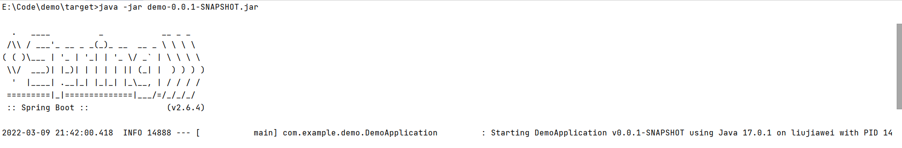
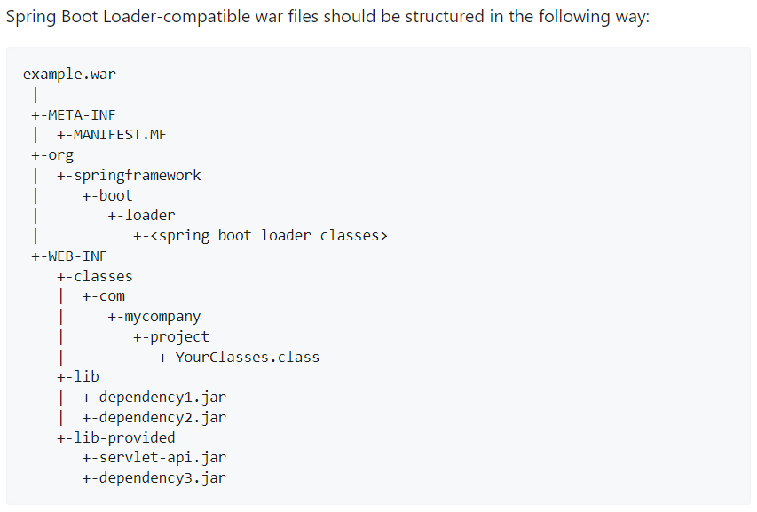
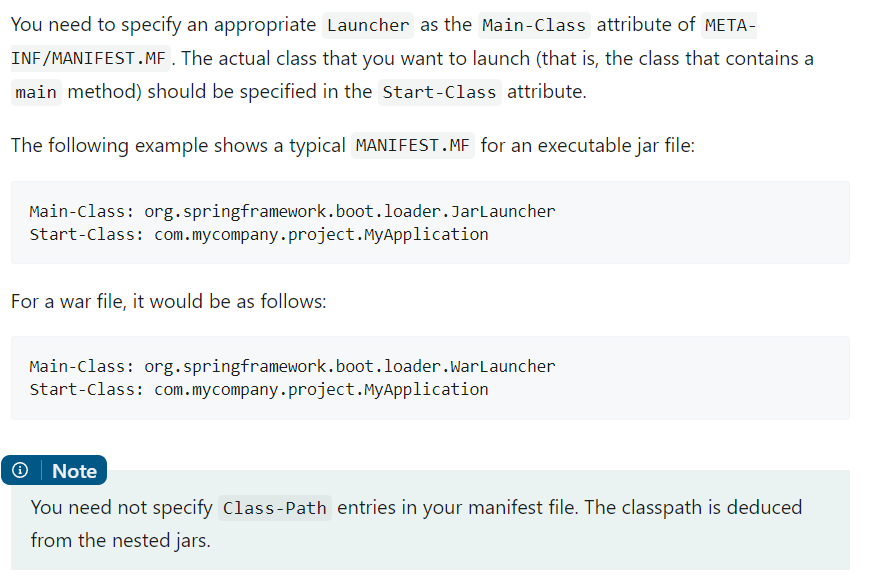
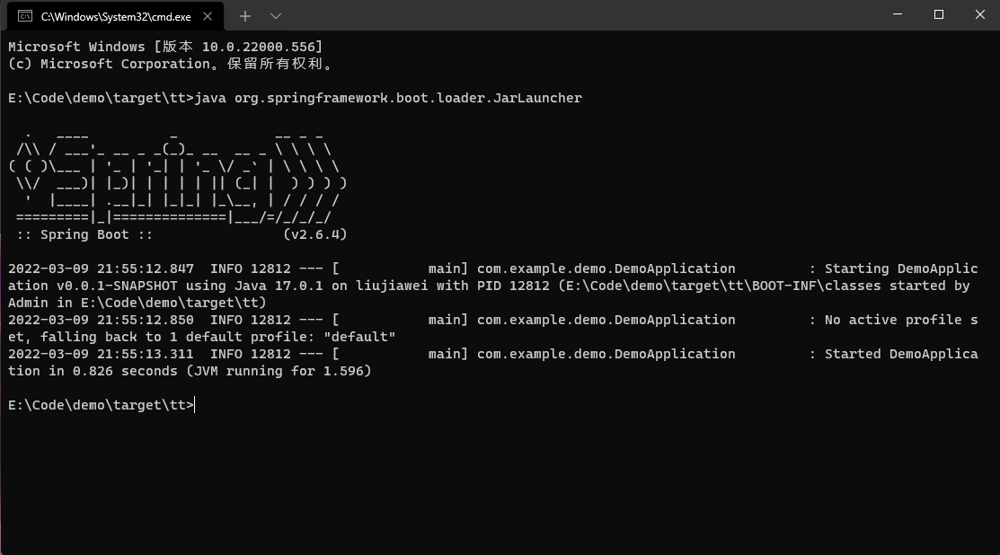
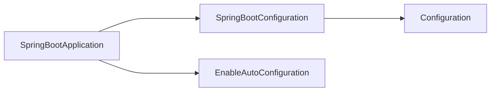
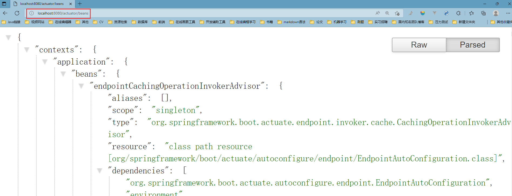
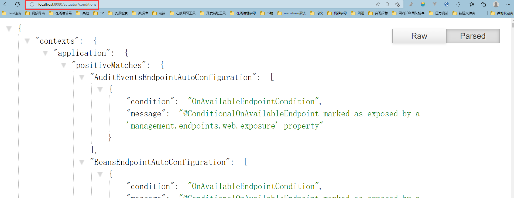
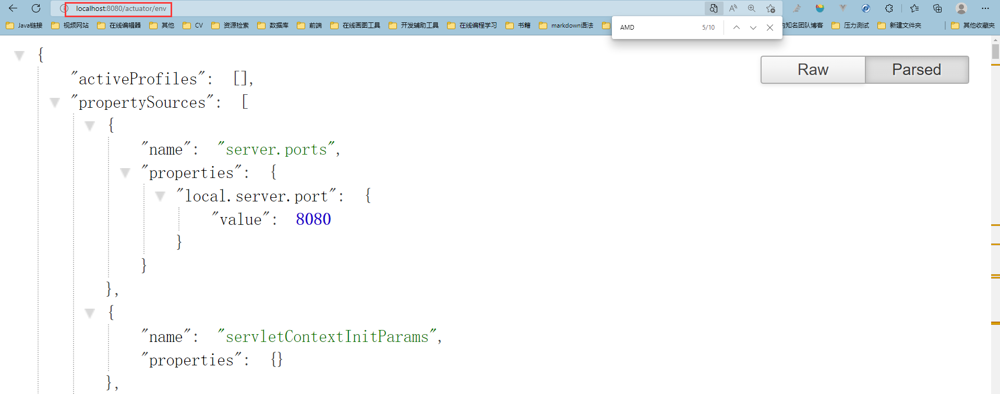

# Spring Boot

主要看小马哥的 Spring Boot

雷丰阳的作为补充：(https://www.bilibili.com/video/BV19K4y1L7MT?spm_id_from=333.788.b_765f64657363.1)

## Spring Boot 2.0介绍

- 编程语言：Java 8+、Kotlin
- 底层框架：Spring Framwork 5.0.x
- 全新特性：Web Flux， 对 Spring MVC 的补充。
  - 函数编程：Java 8 Lambda
  - 响应式编程：Reactive Streams
  - 异步编程：Servlet 3.1 或 Asyc NIO

## 学习内容

- Spring Boot 如何基于 Spring Framework 逐步<span style="color:red">走向自动装配。</span>
- SpringApplication 如何掌控 Spring 应用生命周期。
- Spring Boot 外部化配置与 Spring Environment 抽象之间是生命关系。
- Spring Web MVC 向 Spring Reactive WebFlux 过渡的真实价值和意义。

## 学习方式

- 场景分析，掌握技术选型
- 系统学习
- 重视规范，了解发展趋势
- 源码解读，理解设计思想
- 实战演练，巩固学习成果

## 学习收获

- Spring 全栈技术和实现原理
- Spring Boot 核心技术
- 微服务基础设施开发与生产实施经验

## 难精

- 组件自动装配：模式注解、@Enable 模块、条件装配、加载机制
- 外部化配置：Environment 抽象、生命周期、破坏性变更
- 嵌入式容器：Servlet Web 容器、Reactive Web 容器
- Spring Boot Starter：依赖管理、装配条件、装配顺序
- Production-Ready：健康检查、数据指标、@Endpoint 管控

## Spring Boot的特点

- 组件自动装配：规约大于配置，专注业务
- 外部化配置：一次构建、按需调配、到处运行
- 嵌入式容器：内置容器、无需部署、独立运行
- Spring Boot Starter：简化依赖，按需装配、自我包含
- Production-Ready：一站式运维、生态无缝整合

## Spring Boot与JavaEE规范

- Web：Servlet（JSR-315、JSR-340）
- SQL：JDBC（JSR-221）
- 数据校验：Bean Validation（JSR 303、JSR 349）
- 缓存：Java Caching API（JSR-107）
- WebSockets：Java API for WebSocket（JSR-356）
- Web Services：JAX-WS（JSR-224）
- Java 管理：JMX（JSR 3）
- 消息：JMS（JSR-914）

## 主干内容

- 核心特性
- Web 应用
- 数据相关
- 功能扩展
- 运维管理

## 快速入门案例

> 场景说明

- 定义用户模型，包括属性：用户 ID 和名称
- 客户端发送 POST 请求，创建用户（Web MVC）
- 客户端发送 GET 请求，获取所有用户（Web Flux）

NIO 的 reactor 是<span style="color:red">同步非阻塞</span>

Web Flux 的 reactor 是<span style="color:red">异步非阻塞</span>的一个实现

- Flux：0-n 的对象
- Mono：0-1 的对象

# 理解Spring Boot

Spring Boot 应用可以是 jar 可以是 war。jar 和 war 是如何启动的？如何指定那个类为引导类。

## 标准的 jar 包

Spring Boot 可以将应用打包成一个 jar，然后通过 `java -jar jar包名` 来启动程序。

我们先来看看，普通的 Java 项目是如何运行 Jar 包的。我们将一个普通的 Java 项目打成 Jar 包。

```java
// java 项目的代码如下
package com.company;

public class Main {

    public static void main(String[] args) {
        // write your code here
        System.out.println("Hello World");
    }
}
```

将该项目打包成 jar 包后。jar 包中会出现两个文件夹。一个是 com(存放 class 文件)，一个是 META-INF，存放了 jar 包的一些信息。(符合 java 的标准就可以用 java -jar 执行 jar 包，Java 官方文档规定，<span style="color:red">java -jar 命令引导的具体<b>启动类</b>必须配置在 MANIFEST.MF 资源的 Main-Class 属性中。</span>)

```
# META-INF 中的文件如下
Manifest-Version: 1.0
Main-Class: com.company.Main
```

Main-Class 指定了，我们通过 java -jar 命令运行 jar 包的时候，它运行那个类的。此处表明，我们执行 `java -jar jar包名`是会执行 `com.company.Main` 这个类，Main 类就是程序的入口。

## 命令打包成jar

- 书写代码

- 将代码编译成 class 文件。

- 为 class 文件创建一个 `META-INF/MANIFEST.MF` 文件，文件中书写以下内容

    ```tex
    Manifest-Version: 1.0
    Main-Class: com.company.Main
    ```

- 执行命令进行打包 `jar -cvfm hello.jar META-INF/MANIFEST.MF com`

<div align="center"></div>

## Spring Boot 的 jar

下面我们再来看看 Spring Boot 的 Jar 是怎么样的。我们用 maven 将一个 Spring Boot 项目打包成 jar 包，然后执行。（maven->lifecycle->package）

<div align="center"></div>

我们将 jar 包解压看一下，看下 jar 包中都有些什么内容。发现里面也有 MANIFEST.MF 文件

```shell
Manifest-Version: 1.0
Created-By: Maven JAR Plugin 3.2.2
Build-Jdk-Spec: 11
Implementation-Title: demo
Implementation-Version: 0.0.1-SNAPSHOT
Main-Class: org.springframework.boot.loader.JarLauncher
Start-Class: com.example.demo.DemoApplication
Spring-Boot-Version: 2.6.4
Spring-Boot-Classes: BOOT-INF/classes/
Spring-Boot-Lib: BOOT-INF/lib/
Spring-Boot-Classpath-Index: BOOT-INF/classpath.idx
Spring-Boot-Layers-Index: BOOT-INF/layers.idx
```

- BOOT-INF/classes：目录存放应用编译后的 class 文件
- BOOT-INF/lib：存放应用依赖的 jar 包
- META-INF/：存放应用相关元信息，如 MANIFEST.MF 文件。
- org/：存放 Spring Boot 相关的 class 文件
- <b>Main-Class：org.springframework.boot.loader.JarLauncher</b> 指定了这是 jar 运行
- <b>Main-Class：org.springframework.boot.loader.WarLauncher</b> 指定了这是 war 运行
- 这两个类是 jar / war 的启动器，都是 org.springframework.boot.loader 中的类。
- <b>Start-Class：com.example.demo.DemoApplication</b> Main-Class 运行后会加载 Start-Class 中的类

我们也可以查阅下 Spring Boot 官网，看下官网是如何解释 Spring Boot 中 jar 的文件组成的：

<div align="center"></div>

<div align="center"></div>

 MANIFEST.MF 中有 Main-Class 和 Start-Class 属性。Main-Class 填写一个固定的类，Start-Class 填写我们写的加了 @SpringBootApplication 注解的类。

我们解压 jar 包，使用 java 命令运行 `org.springframework.boot.loader.JarLauncher`。

<div align="center"></div>

我们执行 `java org.springframework.boot.loader.JarLauncher` 发现，`com.example.demo.DemoApplication` 也启动了。可以推断，是 JarLauncher 加载了 DemoApplication 类。

我们大致跟踪下 JarLauncher 的调用过程发现最后执行的一个方法是

```java
// MainMethodRunner 类
public void run() throws Exception {
    Class<?> mainClass = Class.forName(this.mainClassName, false, Thread.currentThread().getContextClassLoader());
    Method mainMethod = mainClass.getDeclaredMethod("main", String[].class);
    mainMethod.setAccessible(true);
    mainMethod.invoke(null, new Object[] { this.args });
}
```

执行的应该是 DemoApplication 的 main 方法。

# 核心特性

## Spring Boot三大特性

- 组件自动装配：Web MVC、Web Flux、JDBC 等
- 嵌入式 Web 容器：Tomcat、Jetty以及Undertow
- 生产准备特性：指标、健康检查、外部化配置等

## 组件自动装配

- 激活：@EnableAutoConfiguration
- 配置：/META-INF/spring.factories（这个目录是相对于 Classpath 而言，META-INF 元信息；spring.factories 工厂模式，key-value 键值对的配置信息）
- 实现：XXXAutoConfiguration

> 注解知识补充

注解上如果加了 @Inherited 表示这个注解是可以被继承的。被继承是什么意思呢？看下下面代码的输出就知道啥意思了。

```java
@Target(ElementType.TYPE)
@Retention(RetentionPolicy.RUNTIME)
@Documented
@Inherited
public @interface Demo {}

@Demo
public class Father {}
public class Son extends Father {}

public class TestDemo {
    public static void main(String[] args) {
        Annotation[] annotations = Son.class.getAnnotations();
        // 在 Father 上加上注解。Son 继承自 Father 且没有加上 @Demo 注解。但是我们仍可以在 Son 类上找到 @Demo 这个注解
        // 因为 @Demo 注解被标明为 @Inherited 可继承。
        Arrays.stream(annotations).forEach(System.out::println);
        // @com.example.anno.Demo()
    }
}
```

### quick start

> 新建一个Spring Boot项目，包含 Web 模块。

```java
// Spring Boot简介中的Demo
@RestController
@EnableAutoConfiguration
public class SpringbootApplication {

    public static void main(String[] args) {
        SpringApplication.run(SpringbootApplication.class, args);
    }

    @GetMapping("/hello")
    public String get() {
        return "Hello World Spring Boot";
    }

}
```

也可以用以下注解

```java
@SpringBootApplication
@RestController
public class SpringbootApplication {

    public static void main(String[] args) {
        SpringApplication.run(SpringbootApplication.class, args);
    }

    @GetMapping("/hello")
    public String get() {
        return "Hello World Spring Boot";
    }

}
```

官网关于自动配置有这样一段话。

`@SpringBootApplication` annotation can be used to enable those three features, that is:

- `@EnableAutoConfiguration：`enable [Spring Boot’s auto-configuration mechanism](https://docs.spring.io/spring-boot/docs/current/reference/html/using.html#using.auto-configuration)
- `@ComponentScan：`enable `@Component` scan on the package where the application is located (see [the best practices](https://docs.spring.io/spring-boot/docs/current/reference/html/using.html#using.structuring-your-code))
- `@SpringBootConfiguration：`enable registration of extra beans in the context or the import of additional configuration classes. An alternative to Spring’s standard `@Configuration` that aids [configuration detection](https://docs.spring.io/spring-boot/docs/current/reference/html/features.html#features.testing.spring-boot-applications.detecting-configuration) in your integration tests.

我们来仔细看下 @SpringBootApplication 注解：它是一个复合注解，由 @SpringBootConfiguration、@EnableAutoConfiguration 和 @ComponentScan 组成。而 @SpringBootConfiguration 只是 @Configuration 的一个别名。

```java
@SpringBootConfiguration
@EnableAutoConfiguration
@ComponentScan(
    excludeFilters = {@Filter(
    type = FilterType.CUSTOM,
    classes = {TypeExcludeFilter.class}
), @Filter(
    type = FilterType.CUSTOM,
    classes = {AutoConfigurationExcludeFilter.class}
)})
public @interface SpringBootApplication {
    // some code
}

@Configuration
@Indexed
public @interface SpringBootConfiguration {
    @AliasFor(annotation = Configuration.class)
    boolean proxyBeanMethods() default true;
}
```

总结：

官方说 @EnableAutoConfiguration/@SpringBootApplication + @Configuration 才可以开启自动配置。我们发现 



@SpringBootApplication = @Configuration + @EnableAutoConfiguration

实际上 @SpringBootApplication = @Configuration + @EnableAutoConfiguration + @ComponentScan

我们在仔细看看 @SpringBootApplication 注解

```java
package org.springframework.boot.autoconfigure;
// 省略了一些内容
@SpringBootConfiguration
@EnableAutoConfiguration
@ComponentScan(excludeFilters = { @Filter(type = FilterType.CUSTOM, classes = TypeExcludeFilter.class),
		@Filter(type = FilterType.CUSTOM, classes = AutoConfigurationExcludeFilter.class) })
public @interface SpringBootApplication {

	@AliasFor(annotation = EnableAutoConfiguration.class)
	Class<?>[] exclude() default {};

	@AliasFor(annotation = EnableAutoConfiguration.class)
	String[] excludeName() default {};

	@AliasFor(annotation = ComponentScan.class, attribute = "basePackages")
	String[] scanBasePackages() default {};

	@AliasFor(annotation = ComponentScan.class, attribute = "basePackageClasses")
	Class<?>[] scanBasePackageClasses() default {};

	@AliasFor(annotation = ComponentScan.class, attribute = "nameGenerator")
	Class<? extends BeanNameGenerator> nameGenerator() default BeanNameGenerator.class;

	@AliasFor(annotation = Configuration.class)
	boolean proxyBeanMethods() default true;
}
```

我们可以注意到一个注解 @AliasFor（@AliasFor 这种注解编程模型被 Spring 称为 Spring Annotation Programming Model），这个注解是 Spring 定义的，我们可以称它为别名。比如 exclude 属性其实就是注解 @EnableAutoConfiguration 的别名。比如：

```java
@SpringBootApplication(scanBasePackages = "com.example")
// 这个 scanBasePackages 上标注了 @AliasFor(annotation = ComponentScan.class, attribute = "basePackages")
// 相当于 scanBasePackages 是注解 ComponentScan(basePackages="com.example") 的别名，
// 为 scanBasePackages 赋值就是为 ComponentScan 注解赋值
public class DemoApplication {
    public static void main(String[] args) {
        SpringApplication.run(DemoApplication.class, args);
    }
}
```

@SpringBootApplication 也可以加载非启动类上。

```java
@SpringBootApplication
@RestController
public class WebConfiguration {
    @GetMapping("index")
    public String index() {
        return "hello";
    }
}

public class DemoApplication {
    public static void main(String[] args) {
        SpringApplication.run(WebConfiguration.class, args);
    }
}
// 程序也是可以正常运行的。
```

可以不用 @SpringBootApplication，使用 @EnableAutoConfiguration 注解也可以。我们可以推断出，SpringApplication#run 启动 Spring Boot 程序并不依赖于 @Configuration 注解。

```java
@RestController
@EnableAutoConfiguration
public class WebConfiguration {
    @GetMapping("index")
    public String index() {
        return "hello";
    }
}

public class DemoApplication {
    public static void main(String[] args) {
        SpringApplication.run(WebConfiguration.class, args);
    }
}
```

### spring.factories

```shell
# ConfigData Location Resolvers
# key-value形式，可以把key看成类名或接口名，value看出他的实现类
org.springframework.boot.context.config.ConfigDataLocationResolver=\
org.springframework.boot.context.config.ConfigTreeConfigDataLocationResolver,\
org.springframework.boot.context.config.StandardConfigDataLocationResolver
```

让我们看看 EnableAutoConfiguration 的配置信息

```shell
# Auto Configure
org.springframework.boot.autoconfigure.EnableAutoConfiguration=\
org.springframework.boot.autoconfigure.admin.SpringApplicationAdminJmxAutoConfiguration,\
...
org.springframework.boot.autoconfigure.webservices.WebServicesAutoConfiguration,\
org.springframework.boot.autoconfigure.webservices.client.WebServiceTemplateAutoConfiguration
```

### lite和full

Spring 的 Bean 有两种模式，一种是 lite 模式，一种是 full 模式。在 @Configuration 下声明的 @Bean 是 full 模式的。

- lite 模式：不用检查是否在容器，启动加载起来快（只注册组件，组件之中不存在依赖，就用 lite 模式）。Lite 模式的 `@Bean` 方法<b>不能声明 Bean 之间的依赖关系</b>。因此，这样的 `@Bean` 方法<b>不应该调用其他 @Bean 方法</b>。每个这样的方法实际上<b>只是一个特定 Bean 引用的工厂方法(factory-method)</b>，没有任何特殊的运行时语义。
- full 模式：存在组件依赖关系，会检查这个组件是否在容器中。并且在运行时会给该类生成一个 CGLIB 子类放进容器，有一定的性能、时间开销（这个开销在 Spring Boot 这种拥有大量配置类的情况下是不容忽视的）因为被代理了，所以 @Bean 方法<b>不可以是 private、不可以是 final</b>

1️⃣先看下 @Configuration 下 Bean 的 Full 模式

```java
@SpringBootApplication
public class Application {

    @Bean
    public Dog getDog2() {
        return new Dog();
    }

    public static void main(String[] args) {
        ConfigurableApplicationContext run = SpringApplication.run(Application.class, args);
        System.out.println(run.getBean(Application.class));
        System.out.println(run.getBean(Dog.class));
        // com.example.Spring Boot.Application$$EnhancerBySpringCGLIB$$2ffa75b9@69571912
		// com.example.Spring Boot.Dog@325f8af9
    }
}
```

可以看出，CGLIB 提示并非为 @Bean 对象提供的，而是为 @Configuration 类准备的。

2️⃣再看下非 @Configuration 下 Bean 的 lite 模式

```java
@EnableAutoConfiguration
//@SpringBootApplication
public class Application {

    public static void main(String[] args) {
        ConfigurableApplicationContext run = SpringApplication.run(Application.class, args);
        Application bean = run.getBean(Application.class);
        System.out.println(bean);
        // 是 Java 裸类型，没有经过 GCLIB 增强
        // com.example.Spring Boot.Application@589aab6b
    }
}
```

> @Configuration 中的 proxyBeanMethods

proxyBeanMethods 配置类是用来指定 @Bean 注解标注的方法是否使用代理。

- 默认是 true 使用代理；
- 如果设置为 false 则不使用代理。
- 下面的代码验证了是否使用了代理

1️⃣proxyBeanMethods = true

```java
public class Dog {
    public void say(){}
}
```

```java
@Configuration(proxyBeanMethods = true)
public class Config {
    @Bean
    public final Dog getDog() {
        return new Dog();
    }
}
```

```java
@SpringBootApplication
public class Application {

    public static void main(String[] args) {
        ConfigurableApplicationContext run = SpringApplication.run(Application.class, args);
        System.out.println(run.getBean("getDog"));
        // 正常输出 com.example.Spring Boot.Dog@100f70d6
    }
}
```

2️⃣proxyBeanMethods = false，其他代码一样

```java
@Configuration(proxyBeanMethods = false)
public class Config {
    @Bean
    public final Dog getDog() {
        return new Dog();
    }
}
```

报错 `org.springframework.beans.factory.parsing.BeanDefinitionParsingException: Configuration problem: @Bean method 'getDog' must not be private or final; change the method's modifiers to continue` <b>因为被代理了，会生成 @Configuration 类的 CGLIB 增强对象，所以该对象中的方法，即 @Bean 方法不可以是 private、不可以是 final。详细内容可以阅读下面这篇博客。</b>

[Spring的@Configuration配置类-Full和Lite模式_demon7552003的博客-CSDN博客_ full 和 lite](https://blog.csdn.net/demon7552003/article/details/107988310)

### 理解自动配置机制

Spring Boot 自动装配底层实现和 Spring Framework 注解 @Configuration 和 @Conditional 有关。如果在 @Configuration 类上标注 @ConditionalOnClass，当且仅当目标类存在于 Class Path 下时才予以自动装配。

Spring Boot 自动配置相关的核心模块位于 spring-boot-autoconfigure，里面提供了大量的内建自动装配 @Configuration 类，他们统一存放在 org.springframework.boot.autoconfigure 包或子包下。同时这些类的信息均配置在 META-INF/spring.factories 资源中，新版本 Spring Boot 可能有所变动。

```shell
# Initializers
org.springframework.context.ApplicationContextInitializer=\
org.springframework.boot.autoconfigure.SharedMetadataReaderFactoryContextInitializer,\
org.springframework.boot.autoconfigure.logging.ConditionEvaluationReportLoggingListener
...
```

> 自定义自动装配

[Core Features (spring.io)](https://docs.spring.io/spring-boot/docs/current/reference/html/features.html#features.developing-auto-configuration)

## 嵌入web容器

- Web Servlet：Tomcat、Jetty 和 Undertow
- Web Reactive：Netty Web Server

## 生产准备特性

什么叫生产准备特性？

> Spring Boot includes a number of additional features to help you monitor and manage your application when you push it to production. You can choose to manage and monitor your application by using HTTP endpoints or with JMX. Auditing, health, and metrics gathering can also be automatically applied to your application.
>
> Spring Boot 包括许多附加功能，可帮助您在将应用程序推送到生产环境时对其<b>进行监视和管理</b>。您可以选择使用 <b>HTTP Endpoints 或使用 JMX 来管理和监视应用程序</b>。审核、运行状况和指标收集也可以自动应用于应用程序。
>
> 简而言之：Spring Boot Actuator 用于监控和管理 Spring 应用，可通过 HTTPEndpoint 或 JMX Bean 与其交互。

- 指标：/actuator/metrics
- 健康检查：/actuator/health
- 外部化配置：/actuator/configprops 修改应用行为

### Spring Boot Actuator Endpoints

要使用 Actuator 需要手动引入依赖：

```xml
<dependencies>
    <dependency>
        <groupId>org.springframework.boot</groupId>
        <artifactId>spring-boot-starter-actuator</artifactId>
    </dependency>
</dependencies>
```

其中，常用的 Endpoints 如下：

| ID           | 描述                                                         |
| ------------ | ------------------------------------------------------------ |
| `beans`      | 显示当前 Spring 应用上下文的 Spring Bean 完整列表            |
| `conditions` | 显示当前应用所有配置类和自动装配类的条件评估结果（包含匹配的和非匹配的） |
| `env`        | 暴露 Spring ConfigurableEnvironment 中的 PropertySource 属性 |
| `health`     | 显示应用的健康信息                                           |
| `info`       | 显示任意的应用信息                                           |

仅有 health 和 info 为默认保留的 Web Endpoints。如果需要暴露其他的 Endpoints（即通过 web 访问查阅相关信息），则可以增加 `management.endpoints.web.exposure.include=*` 的配置属性到 application.properties 或启动参数中。

<div align="center">
    
    
    
</div>

### 理解外部化配置

内部化配置是在代码内部进行控制，如指定当前使用什么参数。而外部化配置是可以在外部指定配置参数的。相同的应用代码可以根据所处的环境，差别化的使用外部的配置来源。如中间件，中间件的功能性组件时可以配置化的，如端口、线程池规模、连接时间等。

既然是外部化配置，那么配置信息自然是来自外部的，如 Properties 文件，YAML 文件，环境变量或命令行参数等。

> Spring 中相关的处理有

- Bean 的 @Value 注入
- Spring Environment 读取
- @ConfigurationProperties 绑定到结构化对象
- @PropertySource

Spring Boot 的 application.properties 就是一个典型的外部化配置文件。里面的值可以通过命令行的方式进行覆盖。

# 走向自动装配

## 注解驱动发展史

### Spring Framework 1.x

在 Spring Framework 1.2.0 版本开始支持注解，在框架层面支持了 @ManagedResource 和 @Transactional 等注解。但被注解的 Bean 仍然需要使用 xml 进行装配。

### Spring Framework 2.x

Spring Framework 2.0 添加了新的注解，如 Bean 相关的 @Required、数据相关的 @Repository 以及 AOP 相关的 @Aspect，同时也提升了 XML 的扩展能力。

> Spring Framework 2.5，引入了一些骨架式的 Annotation

- 依赖注入 Annotation：@Autowired
- 依赖查找 Annotation：@Qualifier
- 组件声明 Annotation：@Component、@Service
- 支持 JSR-250：@Resource 注入，JSR-250 生命周期回调注解 @PostConstruct 和 @PreDestroy
- Spring MVC Annotation：@Controller、@RequestMapping 以及 @ModelAttribute 等

### Spring Framework 3.x

Spring Framework 3.0 提升了 Spring 模式注解的“派生”层次，并且引入了配置类注解 @Configuration 替换 XML 配置方式。但是 Spring Framework 3.0 没有引入替换 XML 元素 `<context:component-scan>` 的注解，而是采用过渡方案➡️@ImportResource 和 @Import。

@ImportResource 允许导入遗留的 XML 配置文件。

@Import 允许导入一个或多个类作为 Spring Bean，且这些类无需标注 Spring 模式注解，如 @Service。通常标注了 @ImportResource 和 @Import 的类需要再标注 @Configuration 注解。

3.0 还引入了 AnnotationConfigurationApplicationContext 来读取解析注解配置类，来替代原先的 ClassPathXmlApplicationContext。

> Spring Framework 3.0，引入的注解和类

- @ImportResource 和 @Import
- AnnotationConfigurationApplicationContext 
- @Bean 替代 xml 元素 bean
- @DependsOn 替代 xml 属性 `<bean dependso-n="">`
- @Lazy 替代 xml 属性 `<bean lazy-init="true|false">`
- @Primary 替代 xml 属性 `<bean primary="true|false">`

>Spring Framework 3.1，标志性注解

- @ComponentScan 替代 `<context:component-scan>`
- 抽象出了一套全新并统一的配置属性 API，包括配置属性存储接口 Environment，以及配置属性源抽象 PropertySources，这两个核心 API 奠定了 Spring Boot 外部化配置的基础。
- 增加了 “@Enable 模块驱动”的特性，将相同职责的功能组件以模块化的方式配置，简化了 Spring Bean 配置。典型的有 @EnableWebMvc。该注解被 @Configuration 标注后，RequestMappingHandlerMapping、RequestMappingHandlerAdapter 以及 HandlerExceptionResolver 等 Bean 会被装配。

> Spring Framework 3.x Web 提升

- 请求处理注解 @RequestHeader、@CookieValue 和 @RequestPart 使得 MVC @Controller 类不必直接使用 Servlet API。
- Spring Framework 3.0 还开辟了 REST 开发的开发路线。@PathVariable 便于 REST 动态路径的开发，
- @RequestBody 能够直接反序列化请求内容。
- @ResponseBody 可以将方法返回对象序列化为 REST 主体内容，
- @ResponseStatus 可以补充 HTTP 响应的状态信息

### Spring Framework 4.x

- 引入条件化注解 @Conditional，通过与自定义 Condition 实现配合，弥补了之前版本条计化装配的短板。

- 重新声明 @Profile，通过 @conditional 实现。

- Spring Boot 的所有 @ConditionalOn* 注解均基于 @Conditional 派生。

    ```java
    public abstract class SpringBootCondition implements Condition{
        // some code...
    }
    ```

- Java 8 @Repeatable 使注解可以重复标注在一个类上，Spring 的注解也因此可以重复标注。如，将 @PropertySource 提升为可重复标注的注解。

- Spring Framework 4.2 新增了时间监听注解 @EventListener，作为 ApplicationListener 接口编程的第二选择。

- Spring Framework 4.3 引入了 @ComponentScans（对 @ComponentScan 注解的提升）；引入 @GetMapping 作为 @RequestMapping 的派生注解；同时利用 @AliasFor 实现了不同注解直接的属性方法别名；

    ```java
    @Target(ElementType.METHOD)
    @Retention(RetentionPolicy.RUNTIME)
    @Documented
    @RequestMapping(method = RequestMethod.GET)
    public @interface GetMapping {
    
    	/**
    	 * Alias for {@link RequestMapping#name}.
    	 */
    	@AliasFor(annotation = RequestMapping.class)
    	String name() default "";
    
    	@AliasFor(annotation = RequestMapping.class)
    	String[] produces() default {};
    }
    ```

- @RestController、@RestControllerAdvice（@RestController AOP 拦截通知）、@CrossOrigin

### Spring Framework 5.x

- 5.0 引入了 @Indexed 注解，为 Spring 模式注解添加索引，提升应用启动性能。使用 @Indexed 需要引入依赖 [Core Technologies (spring.io)](https://docs.spring.io/spring-framework/docs/current/reference/html/core.html#beans-scanning-index)

- 5.2 在 @Configuration 中引入了 proxyBeanMethods。

    Specify whether @Bean methods should get proxied in order to enforce bean lifecycle behavior, e.g. to return shared singleton bean instances even in case of direct @Bean method calls in user code. This feature requires method interception, implemented through a runtime-generated CGLIB subclass which comes with limitations such as the configuration class and its methods not being allowed to declare final.

    The default is true, allowing for 'inter-bean references' via direct method calls within the configuration class as well as for external calls to this configuration's @Bean methods, e.g. from another configuration class. If this is not needed since each of this particular configuration's @Bean methods is self-contained and designed as a plain factory method for container use, switch this flag to false in order to avoid CGLIB subclass processing.

    Turning off bean method interception effectively processes @Bean methods individually like when declared on non-@Configuration classes, a.k.a. "@Bean Lite Mode" (see @Bean's javadoc). It is therefore behaviorally equivalent to removing the @Configuration stereotype.

### 如何得到注解上的注解

```java
@Target(value = {ElementType.TYPE})
@Retention(RetentionPolicy.RUNTIME)
@Inherited
@interface One {
}

@Target(ElementType.TYPE)
@Retention(RetentionPolicy.RUNTIME)
@One
@interface Two {}

@Two
class A {}

/**
 * 如何获取注解上的注解？
 * 1.检测方法上有那些注解。
 * 2.用注解.class.getAnnotations 来获取注解上的注解（注解本质上就是一个继承了 Annotation 的接口）
 */
public class TestAnnotation {
    /**
     * 需求：得到 @Two 上的 @One。
     */
    public static void main(String[] args) throws NoSuchMethodException {
        Two annotationsByType = A.class.getAnnotationsByType(Two.class)[0];
        Class<? extends Annotation> aClass = annotationsByType.annotationType();
        One annotation = aClass.getAnnotation(One.class);
        System.out.println(annotation == null); // false
    }
}
```

```java
public class TestAnnotation {
    @Two
    public void t() {}
    /**
     * 需求：解析注解，统计 @One 和 @Two 注解的数量。@Two 注解上的 @One 注解也算一次。
     */
    public static void main(String[] args) throws NoSuchMethodException {
        Method t = TestAnnotation.class.getMethod("t");
        Two annotation = t.getAnnotation(Two.class);
        One annotation1 = annotation.annotationType().getAnnotation(One.class);
        System.out.println(annotation1 == null); // false
    }
}
```

## Spring Framework手动配置

- 定义：一种用于声明在应用中扮演“组件”角色的注解
- 举例：@Component、@Service、@Configuration [标注这是一个配置]
- 装配：`<context:component=scan>` 或 @ComponentScan

### Spring @Enable模块装配

Spring Framework 3.1 开始支持 “@Enable 模块驱动”。所谓“模块”是具备相同领域的功能组件集合。组合所形成一个独立的单元。比如 Web MVC 模块、AspectJ 模块、Caching（缓存）模块、JMX（Java 管理扩展）模块、Async（异步处理）模块等。

- 定义：具备相同领域的功能组件集合，组合所形成一个独立的单元
- 举例：@EnableWevMvc、@EnableAutoConfiguration 等
- 实现：注解方式、编程方式

> @Enable 注解模块举例

| 框架实现         | @Enable注解模块                | 激活模块            |
| ---------------- | ------------------------------ | ------------------- |
| Spring Framework | @EnableMvc                     | Web MVC 模块        |
|                  | @EnableTransactionManagement   | 事务管理模块        |
|                  | @EnableCaching                 | Caching 模块        |
|                  | @EnableMBeanExport             | JMX 模块            |
|                  | @EnableAsnyc                   | 异步处理模块        |
|                  | EnableWebFlux                  | Web Flux 模块       |
|                  | @EnableAspectJAutoProxy        | AspectJ 代理模块    |
|                  |                                |                     |
| Spring Boot      | @EnableAutoConfiguration       | 自动装配模块        |
|                  | @EnableManagementContext       | Actuator 管理模块   |
|                  | @EnableConfigurationProperties | 配置属性绑定模块    |
|                  | @EnableOAuth2Sso               | OAuth2 单点登录模块 |
|                  |                                |                     |
| Spring Cloud     | @EnableEurekaServer            | Eureka 服务模块     |
|                  | @EnableConfigServer            | 配置服务模块        |
|                  | @EnableFeignClients            | Feign 客户端模块    |
|                  | @EnableZuulProxy               | 服务网关 Zuul 模块  |
|                  | @EnableCircuitBreaker          | 服务熔断模块        |

### Spring 条件装配

从 Spring Framework 3.1 开始，允许在 Bean 装配时增加前置条件判断。

- 定义：Bean 装配的前置判断
- 举例：@Profile、@Conditional
- 实现：注解方式、编程方式

> 条件注解举例

| Spring注解   | 场景说明       | 起始版本 |
| ------------ | -------------- | -------- |
| @Profile     | 配置化条件装配 | 3.1      |
| @Conditional | 编程条件装配   | 4.0      |

## Spring 模式注解装配

- 元注解
- Spring 模式注解
- Spring 组合注解
- Spring 注解属性别名和覆盖

### 元注解

元注解就是一个能声明在其他注解上的注解，如果一个注解标注在其他注解上，那么他就是元注解。

### 模式注解

模式注解是一种用于声明在应用中扮演“组件”角色的注解。如 Spring Framework 中的 `@Repository` 标注在任何类上，用于扮演仓储角色的模式注解。

`@Component` 作为一种由 Spring 容器托管的通用模式组件，任何被 `@Component` 标注的组件均为组件扫描的候选对象。类似地，凡是被 `@Component` 元标注（meta-annotated）的注解，如 `@Service`，当任何组件标注它时，也被视作组件扫描的候选对象。

#### 模式注解举例

| Spring Framework注解 | 场景说明           | 起始版本 |
| -------------------- | ------------------ | -------- |
| @Repository          | 数据仓储模式注解   | 2.0      |
| @Component           | 通用组件模式注解   | 2.5      |
| @Service             | 服务模式注解       | 2.5      |
| @Controller          | Web 控制器模式注解 | 2.5      |
| @Configuration       | 配置类模式注解     | 3.0      |

#### 装配方式

> `<context:component-scan>` 方式

```xml
<?xml version="1.0" encoding="UTF-8"?>
<beans xmlns="http://www.springframework.org/schema/beans"
       xmlns:xsi="http://www.w3.org/2001/XMLSchema-instance"
       xmlns:context="http://www.springframework.org/schema/context"
       xsi:schemaLocation="http://www.springframework.org/schema/beans http://www.springframework.org/schema/beans/spring-beans.xsd http://www.springframework.org/schema/context https://www.springframework.org/schema/context/spring-context.xsd">

    <!-- 激活注解驱动特性 -->
    <context:annotation-config/>
    <!-- 找寻被 @Component或者其他派生 Annotation标记的类，将它们注册为 Spring Bean -->
    <context:component-scan base-package="com.example.demo"/>
    
</beans>
```

> @ComponentScan 方式

```java
@ComponentScan(basePackages = "com.example.demo")
public class SpringConfig {}
```

#### 自定义模式注解

@Component “派生性”：@Component➡️@Repository➡️FirstLevelRepository

```java
@Target({ElementType.TYPE})
@Retention(RetentionPolicy.RUNTIME)
@Documented
@Repository(value = "firstLevelRepository")
public @interface FirstLevelRepository {
    String value() default "";
}
```

@Component “层次性”：@Component➡️@Repository➡️FirstLevelRepository➡️SecondLevelRepository

```java
@Target({ElementType.TYPE})
@Retention(RetentionPolicy.RUNTIME)
@Documented
@FirstLevelRepository(value = "secondLevelRepository")
public @interface SecondLevelRepository {}
```

@FirstLevelRepository 和 @SecondLevelRepository 作为 @Component 的派生注解，具备的语义和 @Component 一致，都会作为组件被注册到 Spring IoC 容器中。

#### Spring 注解派生原理

> @Component 的派生注解是如何被 Spring 探查到的呢？

是通过 ClassPathBeanDefinitionScanner 和 AnnotationTypeFilter 实现的。

ClassPathBeanDefinitionScanner 中的 scan 调用 doScan 扫描注解

```java
public int scan(String... basePackages) {
    int beanCountAtScanStart = this.registry.getBeanDefinitionCount();
    doScan(basePackages);
    // Register annotation config processors, if necessary.
    if (this.includeAnnotationConfig) {
        AnnotationConfigUtils.registerAnnotationConfigProcessors(this.registry);
    }
    return (this.registry.getBeanDefinitionCount() - beanCountAtScanStart);
}

protected Set<BeanDefinitionHolder> doScan(String... basePackages) {
    Assert.notEmpty(basePackages, "At least one base package must be specified");
    Set<BeanDefinitionHolder> beanDefinitions = new LinkedHashSet<>();
    for (String basePackage : basePackages) {
        // 找到候选的组件，是否是候选组件有 excludeFilters 和 includeFilters 字段决定。
        Set<BeanDefinition> candidates = findCandidateComponents(basePackage);
        // ... 封装成 bean 定义信息
    }
    return beanDefinitions;
}

private Set<BeanDefinition> scanCandidateComponents(String basePackage) {
    Set<BeanDefinition> candidates = new LinkedHashSet<>();
    // 省略了非常多代码
    try {
        MetadataReader metadataReader = getMetadataReaderFactory().getMetadataReader(resource);
        if (isCandidateComponent(metadataReader)) {}
    }
}

protected boolean isCandidateComponent(MetadataReader metadataReader) throws IOException {
    for (TypeFilter tf : this.excludeFilters) {
        if (tf.match(metadataReader, getMetadataReaderFactory())) {
            return false;
        }
    }
    for (TypeFilter tf : this.includeFilters) {
        if (tf.match(metadataReader, getMetadataReaderFactory())) {
            return isConditionMatch(metadataReader);
        }
    }
    return false;
}
```

#### 多层次@Component派生性

@SpringBootApplication

​	|--@SpringBootConfiguration

​		|--@Configuration

​			|--@Component

注：Spring 2.5 不支持多层次派生性，多层次派生性是从 4.0 开始支持的。

多层次派生的原理：AnnotationAttributesReadingVisitor#recursivelyCollectMetaAnnotations 方法。递归查找元注解。

```java
private void recursivelyCollectMetaAnnotations(Set<Annotation> visited, Annotation annotation) {
    Class<? extends Annotation> annotationType = annotation.annotationType();
    String annotationName = annotationType.getName();
    if (!AnnotationUtils.isInJavaLangAnnotationPackage(annotationName) && visited.add(annotation)) {
        try {
            // Only do attribute scanning for public annotations; we'd run into
            // IllegalAccessExceptions otherwise, and we don't want to mess with
            // accessibility in a SecurityManager environment.
            if (Modifier.isPublic(annotationType.getModifiers())) {
                this.attributesMap.add(annotationName,
                                       AnnotationUtils.getAnnotationAttributes(annotation, false, true));
            }
            for (Annotation metaMetaAnnotation : annotationType.getAnnotations()) {
                recursivelyCollectMetaAnnotations(visited, metaMetaAnnotation);
            }
        }
        catch (Throwable ex) {
            if (logger.isDebugEnabled()) {
                logger.debug("Failed to introspect meta-annotations on " + annotation + ": " + ex);
            }
        }
    }
}
```

## Spring@Enable模块装配

Spring 中 “@Enable 模块装配”中“模块”的含义：具备相同领域的功能组件集合。如 Web MVC 模块，AspectJ 代理模块。

### @Enable注解

### 实现方式

#### 注解驱动方式

```java
@Retention(RetentionPolicy.RUNTIME)
@Target(ElementType.TYPE)
@Documented
@Import(DelegatingWebMvcConfiguration.class)
public @interface EnableWebMvc {}
```

```java
public class WebMvcConfigurationSupport implements ApplicationContextAware, ServletContextAware {
	//...
}
```

#### 接口编程方式

```java
@Target(ElementType.TYPE)
@Retention(RetentionPolicy.RUNTIME)
@Documented
// 注意@Import注解，及CachingConfigurationSelector.class
@Import(CachingConfigurationSelector.class)
public @interface EnableCaching {

	/**
	 * Indicate whether subclass-based (CGLIB) proxies are to be created as opposed
	 * to standard Java interface-based proxies. The default is {@code false}. <strong>
	 * Applicable only if {@link #mode()} is set to {@link AdviceMode#PROXY}</strong>.
	 * <p>Note that setting this attribute to {@code true} will affect <em>all</em>
	 * Spring-managed beans requiring proxying, not just those marked with {@code @Cacheable}.
	 * For example, other beans marked with Spring's {@code @Transactional} annotation will
	 * be upgraded to subclass proxying at the same time. This approach has no negative
	 * impact in practice unless one is explicitly expecting one type of proxy vs another,
	 * e.g. in tests.
	 */
	boolean proxyTargetClass() default false;

	/**
	 * Indicate how caching advice should be applied.
	 * <p><b>The default is {@link AdviceMode#PROXY}.</b>
	 * Please note that proxy mode allows for interception of calls through the proxy
	 * only. Local calls within the same class cannot get intercepted that way;
	 * a caching annotation on such a method within a local call will be ignored
	 * since Spring's interceptor does not even kick in for such a runtime scenario.
	 * For a more advanced mode of interception, consider switching this to
	 * {@link AdviceMode#ASPECTJ}.
	 */
	AdviceMode mode() default AdviceMode.PROXY;

	/**
	 * Indicate the ordering of the execution of the caching advisor
	 * when multiple advices are applied at a specific joinpoint.
	 * <p>The default is {@link Ordered#LOWEST_PRECEDENCE}.
	 */
	int order() default Ordered.LOWEST_PRECEDENCE;

}
```

```java
public class CachingConfigurationSelector extends AdviceModeImportSelector<EnableCaching> {

	private static final String PROXY_JCACHE_CONFIGURATION_CLASS =
			"org.springframework.cache.jcache.config.ProxyJCacheConfiguration";

	private static final String CACHE_ASPECT_CONFIGURATION_CLASS_NAME =
			"org.springframework.cache.aspectj.AspectJCachingConfiguration";

	private static final String JCACHE_ASPECT_CONFIGURATION_CLASS_NAME =
			"org.springframework.cache.aspectj.AspectJJCacheConfiguration";


	private static final boolean jsr107Present;

	private static final boolean jcacheImplPresent;

	static {
		ClassLoader classLoader = CachingConfigurationSelector.class.getClassLoader();
		jsr107Present = ClassUtils.isPresent("javax.cache.Cache", classLoader);
		jcacheImplPresent = ClassUtils.isPresent(PROXY_JCACHE_CONFIGURATION_CLASS, classLoader);
	}


	/**
	 * Returns {@link ProxyCachingConfiguration} or {@code AspectJCachingConfiguration}
	 * for {@code PROXY} and {@code ASPECTJ} values of {@link EnableCaching#mode()},
	 * respectively. Potentially includes corresponding JCache configuration as well.
	 */
	@Override
	public String[] selectImports(AdviceMode adviceMode) {
		switch (adviceMode) {
			case PROXY:
				return getProxyImports();
			case ASPECTJ:
				return getAspectJImports();
			default:
				return null;
		}
	}

	/**
	 * Return the imports to use if the {@link AdviceMode} is set to {@link AdviceMode#PROXY}.
	 * <p>Take care of adding the necessary JSR-107 import if it is available.
	 */
	private String[] getProxyImports() {
		List<String> result = new ArrayList<>(3);
		result.add(AutoProxyRegistrar.class.getName());
		result.add(ProxyCachingConfiguration.class.getName());
		if (jsr107Present && jcacheImplPresent) {
			result.add(PROXY_JCACHE_CONFIGURATION_CLASS);
		}
		return StringUtils.toStringArray(result);
	}

	/**
	 * Return the imports to use if the {@link AdviceMode} is set to {@link AdviceMode#ASPECTJ}.
	 * <p>Take care of adding the necessary JSR-107 import if it is available.
	 */
	private String[] getAspectJImports() {
		List<String> result = new ArrayList<>(2);
		result.add(CACHE_ASPECT_CONFIGURATION_CLASS_NAME);
		if (jsr107Present && jcacheImplPresent) {
			result.add(JCACHE_ASPECT_CONFIGURATION_CLASS_NAME);
		}
		return StringUtils.toStringArray(result);
	}

}
```

```java
public interface ImportSelector {

	/**
	 * Select and return the names of which class(es) should be imported based on
	 * the {@link AnnotationMetadata} of the importing @{@link Configuration} class.
	 * @return the class names, or an empty array if none
	 */
	String[] selectImports(AnnotationMetadata importingClassMetadata);

	/**
	 * Return a predicate for excluding classes from the import candidates, to be
	 * transitively applied to all classes found through this selector's imports.
	 * <p>If this predicate returns {@code true} for a given fully-qualified
	 * class name, said class will not be considered as an imported configuration
	 * class, bypassing class file loading as well as metadata introspection.
	 * @return the filter predicate for fully-qualified candidate class names
	 * of transitively imported configuration classes, or {@code null} if none
	 * @since 5.2.4
	 */
	@Nullable
	default Predicate<String> getExclusionFilter() {
		return null;
	}

}
```

### 自定义@Enable模块

#### 基于注解驱动实现

@EnableHelloWorld

#### 基于接口驱动实现

@EnableServer

HelloWorldImportSelector➡️HelloWorldConfiguration➡️HelloWorld

- HelloWorldImportSelector 自定义一个类，实现 ImportSelector 接口
- HelloWorldConfiguration 是一个配置类，用于获取 Bean-HelloWorld
- HelloWorld 是一个字符串类
- 定义注解 EnableHelloWorld

>HelloWorldImportSelector类

实现 ImportSelector 接口。自定义 ImportSelector 可以在里面书写一些配置逻辑，满足则配置，不满足就不配置，写法灵活~

```java
/**
 * HelloWorld {@link org.springframework.context.annotation.ImportSelector} 实现
 */
public class HelloWorldImportSelector implements ImportSelector {
    @Override
    public String[] selectImports(AnnotationMetadata importingClassMetadata) {
//        return new String[]{"com.example.demo.config.HelloWorldConfig"};
        //getName 类全名
        return new String[]{HelloWorldConfig.class.getName()};

    }
}
```

>HelloWorldConfiguration配置类

```java
@Configuration
public class HelloWorldConfiguration {
    @Bean
    public String helloWorld() {
        return "Hello World";
    }
}
```

> EnableHelloWorld注解

```java
@Target(ElementType.TYPE)
@Retention(RetentionPolicy.RUNTIME)
@Documented
@Import(HelloWorldImportSelector.class)
public @interface EnableHelloWorld {
}
```

> 启动运行

```java
@EnableHelloWorld // 开启Enable注解，HelloWorldConfiguration中定义的Bean都可获取到~
@ComponentScan(basePackages = "com.example.demo.bootstrap")
public class EnableHelloWorldApplication {
    public static void main(String[] args) {
        ConfigurableApplicationContext context = new SpringApplicationBuilder(EnableHelloWorldApplication.class)
                .web(WebApplicationType.NONE)
                .run(args);
        String str = context.getBean("helloWorld", String.class);
        System.out.println(str);
        context.close();
    }
}
```

## Spring 条件配置

### 条件注解举例

| Spring注解   | 场景说明       | 起始版本 |
| ------------ | -------------- | -------- |
| @Profile     | 配置化条件装配 | 3.1      |
| @Conditional | 编程条件装配   | 4.0      |

### 实现方式

#### 配置方式

`@Profile`

Spring Framework 4.0 后 Profile 采用的 Condition 进行实现的。

#### 编程方式

`@Conditional`

```java
@Target({ ElementType.TYPE, ElementType.METHOD })
@Retention(RetentionPolicy.RUNTIME)
@Documented
@Conditional(OnClassCondition.class)
public @interface ConditionalOnClass {

	/**
	 * The classes that must be present. Since this annotation is parsed by loading class
	 * bytecode, it is safe to specify classes here that may ultimately not be on the
	 * classpath, only if this annotation is directly on the affected component and
	 * <b>not</b> if this annotation is used as a composed, meta-annotation. In order to
	 * use this annotation as a meta-annotation, only use the {@link #name} attribute.
	 * @return the classes that must be present
	 */
	Class<?>[] value() default {};

	/**
	 * The classes names that must be present.
	 * @return the class names that must be present.
	 */
	String[] name() default {};
}
```

```java
@FunctionalInterface
public interface Condition {

	/**
	 * Determine if the condition matches.
	 * @param context the condition context
	 * @param metadata the metadata of the {@link org.springframework.core.type.AnnotationMetadata class}
	 * or {@link org.springframework.core.type.MethodMetadata method} being checked
	 * @return {@code true} if the condition matches and the component can be registered,
	 * or {@code false} to veto the annotated component's registration
	 */
	boolean matches(ConditionContext context, AnnotatedTypeMetadata metadata);
}
```

### 自定义条件装配

#### 基于配置方式

计算服务，多整数求和

`@Prifile("Java7")：for 循环实现`

`@Prifile("Java8")：lambda 实现`

`启动类设置好 Prifiles 属性`

```java
public interface Calculate {
    Integer sum(Integer... val);
}

@Profile("Java7")
@Service
public class Java7Calculate implements Calculate {
    @Override
    public Integer sum(Integer... val) {
        System.out.println("==================Java7==================");
        int sum = 0;
        for (Integer integer : val) {
            sum += integer;
        }
        return sum;
    }
}

@Profile("Java8")
@Service
public class Java8Calculate implements Calculate {
    @Override
    public Integer sum(Integer... val) {
        System.out.println("==================Java8==================");
        return Stream.of(val).reduce(0, Integer::sum);
    }
}
```

```java
@ComponentScan(basePackages = "com.example.demo")
public class ProfileApplication {
    public static void main(String[] args) {
        ConfigurableApplicationContext context = new SpringApplicationBuilder(ProfileApplication.class)
                .web(WebApplicationType.NONE)
                .profiles("Java8")
                .run();
        Calculate bean = context.getBean(Calculate.class);
        System.out.println(bean.sum(1, 2, 3, 4, 5, 6, 7, 8, 9, 10));

    }
}
```

#### 基于编程方式

自定义注解 `@ConditionalOnProperty` 判断 Spring 应用上下文 xx 配置是否存在/匹配

Condition 实现类 `OnSystemPropertyCondition` 定义条件，符合条件则触发，不符合则不触发

```java
/**
 * Java系统属性判断
 */
@Retention(RetentionPolicy.RUNTIME)
@Target({ElementType.TYPE, ElementType.METHOD})
@Documented
@Conditional(OnSystemPropertyCondition.class)
public @interface ConditionalOnSystemProperty {
    // java系统属性名
    String name();

    // java系统属性值
    String value();
}
```

```java
public class OnSystemPropertyCondition implements Condition {

    @Override
    public boolean matches(ConditionContext context, AnnotatedTypeMetadata metadata) {
        // 获取元信息.获得ConditionalOnSystemProperty的原信息（name和value的值）
        Map<String, Object> annotationAttributes = metadata.getAnnotationAttributes(ConditionalOnSystemProperty.class.getName());
        assert annotationAttributes != null;
        String name = String.valueOf(annotationAttributes.get("name"));
        String value = String.valueOf(annotationAttributes.get("value"));
        return name.equals(value);
    }
}
```

```java
@SpringBootApplication(scanBasePackages = "com.example.demo")
public class ConditionalOnSystemPropertyApplication {

    // 条件满足产生类"hello",不满足则不产生。
    @Bean
    @ConditionalOnSystemProperty(name = "java", value = "java")
    public String hello() {
        return "hello";
    }

    public static void main(String[] args) {
        ConfigurableApplicationContext context = new SpringApplicationBuilder(EnableHelloWorldApplication.class)
                .web(WebApplicationType.NONE)
                .run(args);
        String str = context.getBean("hello", String.class);
        System.out.println(str);
        context.close();
    }
}
```

## Spring Boot自动装配

WebMvcAutoConfiguration

```java
@Configuration(proxyBeanMethods = false) // 模式注解。是Component的“派生”注解
@ConditionalOnWebApplication(type = Type.SERVLET) // 实际上是Spring 4的Condition注解实现的
@ConditionalOnClass({ Servlet.class, DispatcherServlet.class, WebMvcConfigurer.class })
@ConditionalOnMissingBean(WebMvcConfigurationSupport.class)
@AutoConfigureOrder(Ordered.HIGHEST_PRECEDENCE + 10)
@AutoConfigureAfter({ DispatcherServletAutoConfiguration.class, TaskExecutionAutoConfiguration.class,
		ValidationAutoConfiguration.class })
public class WebMvcAutoConfiguration {}
```

- 定义：基于约定大于配置的原则，实现 Spring 组件自动装配的目的。
- 装配：模式注解、@Enable 模块、条件装配、工厂加载机制
- 实现：激活自动装配、实现自动装配、配置自动装配的实现

### 底层装配技术

- Spring 模式注解装配
- Spring `@Enable` 模块装配
- Spring 条件装配
- Spring 工厂加载机制
    - 实现类：`SpringFactoriesLoader`
    - 配置资源：`META-INF/spring.factories`

### 自动装配举例

参考 `META-INF/spring.factories`

### 实现方法

1.激活自动装配：`@EnableAutoConfiguration`

2.实现自动装配：`XXXAutoConfiguration`

3.配置自动装配实现：`META-INF/spring.factories`

### 自定义自动装配

- 我们自定义的 HelloWorldAutoConfig，有条件判断注解，条件判断为 True
    - 条件判断：name == key
    - 模式注解：`@Configuration`
    - `@Enable` 模块：`@EnableHelloWorld` 会加载➡️`HelloWorldImportSelector`会加载➡️`HelloWorldConfig`➡️最终生成一个 bean

> 自定义自动装配流程如下：

- 自定义一个 `HelloWorldAutoConfiguration` 配置类。

- 在 `resources` 下新建 `META-INF` 目录，在 `META-INF` 目录下创建文件 `spring.factories`，在该目录下配置自动装配信息

    ```properties
    # Auto Configure
    org.springframework.boot.autoconfigure.EnableAutoConfiguration=\
    com.example.demo.config.HelloWorldAutoConfiguration
    ```

- 这样一个最简单的自动装配就完成啦！

- 如果想要更复杂的配置，可以加 Condition 判断，自定义的 @EnableXX 等等~

> 一个自定义自动装配的 Demo

配置类

```java
@Configuration
public class HelloWorldAutoConfiguration {
    @Bean
    public Object getObj() {
        return new Object();
    }
}
```

resource/META-INF/spring.factories

```properties
# Auto Configure
org.springframework.boot.autoconfigure.EnableAutoConfiguration=\
com.example.demo.config.HelloWorldAutoConfiguration
```

运行

```java
/**
 * {@link EnableAutoConfiguration}
 * 自动装配
 */
@EnableAutoConfiguration
public class EnableAutoConfigurationApplication {
    public static void main(String[] args) {
        ConfigurableApplicationContext context = new SpringApplicationBuilder(EnableAutoConfigurationApplication.class)
                .web(WebApplicationType.NONE)
                .run(args);
        System.out.println(context.getBean("getObj", Object.class));
        context.close();
    }
}
```

# Web应用

## 传统Servlet应用概述

- Servlet 组件：Servlet、Filter、Listener（传统的三大组件）
- Servlet 注册：Servlet 注解、Spring Bean、RegistrationBean（如何把 Servlet 注册进来）
  - 我们允许把 Servlet 注册成一个 Spring Bean 加载运行。
  - RegistrationBean
- 异步非阻塞：异步 Servlet、非阻塞 Servlet

```xml
<dependency>
    <groupId>org.springframework.boot</groupId>
    <artifactId>spring-boot-starter-web</artifactId>
</dependency>
```

## Servlet组件

### Servlet

实现

```java
@WebServlet(urlPatterns = {"/my/servlet"})
public class MyServlet extends HttpServlet {
    @Override
    protected void doGet(HttpServletRequest req, HttpServletResponse resp) throws ServletException, IOException {
        resp.getWriter().write("Hello");
    }
}
```

URL映射

```java
@WebServlet(urlPatterns = {"/my/servlet"})
```

注册

```java
@SpringBootApplication
@ServletComponentScan(basePackages = {"com.example.demo.web.servlet"})
public class SpringbootApplication {

    public static void main(String[] args) {
        SpringApplication.run(SpringbootApplication.class, args);
    }

}
```

### Filter

### Listener

## Servlet注册

### Servlet注释

> Servlet 注解方式配置

- @ServleComponentScan+
  - @WebServlet
  - @WebFilter
  - @WebListener

### Spring Bean

> Spring Bean 方式配置

- @Bean+
  - Servlet
  - Filter
  - Listener

### RegistrationBean

>RegistrationBean 方式配置

- ServletRegistrationBean
- FilterRegistrationBean
- ServletListenerRegistrationBean

## 异步非阻塞

### 异步Servlet

- javax.servlet.ServletRequest#startAsync()
- javax.servlet.AsyncContext

### 非阻塞Servlet

- javax.servlet.ServletInputStream#setReadListener
  - javax.servlet.ReadListener
- javax.servlet.ServletOutputStream#setWriteListener
  - javax.servlet.WriteListener

> 异步调用代码示例

```java
//  asyncSupported = true 设置为支持异步。默认是false！
@WebServlet(urlPatterns = {"/my/async"}, asyncSupported = true)
public class AsyncServlet extends HttpServlet {
    @Override
    protected void doGet(HttpServletRequest req, HttpServletResponse resp) {
        resp.setContentType("text/html");
        AsyncContext asyncContext = req.startAsync();
        asyncContext.start(() -> {
            try {
                PrintWriter writer = resp.getWriter();
                for (int i = 0; i < 100; i++) {
                    TimeUnit.SECONDS.sleep(1);
                    writer.write("Hello I am asyncContext");
                    writer.flush();
                }
                // 执行完毕后在告知 异步调用完成奥~
                asyncContext.complete();
            } catch (Exception e) {
                e.printStackTrace();
            }
        });
    }
}
```

## Spring Web MVC应用

- Web MVC 视图：模板引擎、内容协商、异常处理
- Web MVC REST：资源服务、资源跨域、服务发现
- Web MVC 核心：核心架构、处理流程、核心组件

### Web MVC视图

- ViewResolver

- View

> ViewResolver

```java
public interface ViewResolver {

	/**
	 * Resolve the given view by name.
	 * <p>Note: To allow for ViewResolver chaining, a ViewResolver should
	 * return {@code null} if a view with the given name is not defined in it.
	 * However, this is not required: Some ViewResolvers will always attempt
	 * to build View objects with the given name, unable to return {@code null}
	 * (rather throwing an exception when View creation failed).
	 * @param viewName name of the view to resolve
	 * @param locale the Locale in which to resolve the view.
	 * ViewResolvers that support internationalization should respect this.
	 * @return the View object, or {@code null} if not found
	 * (optional, to allow for ViewResolver chaining)
	 * @throws Exception if the view cannot be resolved
	 * (typically in case of problems creating an actual View object)
	 */
	@Nullable
	View resolveViewName(String viewName, Locale locale) throws Exception;

}
```

#### 模板引擎

- Thymeleaf
- Freemarker
- JSP

每种模板引擎对应不同的 Resolver 实现。如果有多种模板引擎怎么办？使用内容协商。

#### 内容协商

- ContentNegotiationConfigurer
- ContentNegotiationStrategy
- ContentNegotiationViewResolver

内容协商帮助你选择最合适的进行匹配。

#### 异常处理

- @ExceptionHandler
- HandlerExceptionResolver
  - ExceptionHandlerExceptionResolver
- BasicErrorController（Spring Boot）

### Web MVC REST

#### 资源服务

- @RequestMapping
  - @GetMapping
- @ResponseBody
- @RequestBody

#### 资源跨域

- CrossOrigin：[这个是注解驱动方式]
- WebMvcConfigurer#addCrosMappings [这个是接口编程方式]
- 传统解决方案
  - IFrame
  - JSONP

####  服务发现

- HATEOS

### Web MVC核心

#### 核心架构

#### 处理流程

#### 核心组件

- DispatcherServlet [前端控制器，本质也是一个 Servlet] -- 把请求转发到不同的 Controller 中去
- HandlerMapping [处理器映射器]
- HandlerAdapter [把方法转化为内部的实现]
- ViewResolver []
- ...

## Spring Web Flux应用

Spring 5 开始支持的新特性。对 Servlet 的补充。

- Reactor 基础：Java Lambda（实现的）、Mono（核心接口）、Flux（核心接口）
- Web Flux 核心：Web MVC 注解[兼容]、函数式声明、异步非阻塞
- 使用场景：Web Flux 优势和限制

提升系统吞吐量，吞吐量≠快

### Reactor基础

#### Java Lambda

#### Mono

#### Flux

### Web Flux核心

#### Web MVC核心

- `@Controller`
- `@RequestMapping`
- `@ResponseBody`
- `@RequestBody`
- ...

#### 函数式声明

- `RouterFunction` [通过路由的方式表达函数~]

#### 异步非阻塞

- Servlet 3.1+
- Netty Reactor

### 使用场景

#### 页面渲染

#### REST应用

#### 性能测试

[Results from Spring 5 Webflux Performance Tests - Ippon Technologies](https://blog.ippon.tech/spring-5-webflux-performance-tests/)

## Web Server应用

不喜欢用 tomcat，或不得不用 Jetty，这时候需要做一些切换。

- 切换 Web Server
- 自定义 Servlet Web Server
- 自定义 Reactive Web Server

### 切换Web Server

#### 切换其他Servlet容器

tomcat➡️jetty

```xml
<dependency>
    <groupId>org.springframework.boot</groupId>
    <artifactId>spring-boot-starter-web</artifactId>
    <exclusions>
        <exclusion>
            <groupId>org.springframework.boot</groupId>
            <artifactId>spring-boot-starter-tomcat</artifactId>
        </exclusion>
    </exclusions>
</dependency>
<!-- 切换为jetty -->
<dependency>
    <groupId>org.springframework.boot</groupId>
    <artifactId>spring-boot-starter-jetty</artifactId>
</dependency>
```

#### 替换Servlet容器

WebFlux

```xml
<dependency>
    <groupId>org.springframework.boot</groupId>
    <artifactId>spring-boot-starter-webflux</artifactId>
</dependency>
```

WebFlux 的优先级是低于传统 Servlet 容器的。所以我们需要注释掉传统的 web 容器！

```xml
<!-- 把这个注释掉 -->
<dependency>
    <groupId>org.springframework.boot</groupId>
    <artifactId>spring-boot-starter-web</artifactId>
</dependency>
```

这样我们写的 Servlet 的内容就失效了，需要注释掉。不然项目无法正常启动。

项目启动后可以看到

```shell
2021-05-02 18:19:29.823  INFO 13668 --- [  restartedMain] com.example.demo.SpringbootApplication   : No active profile set, falling back to default profiles: default
2021-05-02 18:19:29.870  INFO 13668 --- [  restartedMain] .e.DevToolsPropertyDefaultsPostProcessor : Devtools property defaults active! Set 'spring.devtools.add-properties' to 'false' to disable
2021-05-02 18:19:29.871  INFO 13668 --- [  restartedMain] .e.DevToolsPropertyDefaultsPostProcessor : For additional web related logging consider setting the 'logging.level.web' property to 'DEBUG'
2021-05-02 18:19:30.767  INFO 13668 --- [  restartedMain] o.s.b.d.a.OptionalLiveReloadServer       : LiveReload server is running on port 35729
2021-05-02 18:19:31.860  INFO 13668 --- [  restartedMain] o.s.b.web.embedded.netty.NettyWebServer  : Netty started on port 8080
2021-05-02 18:19:31.873  INFO 13668 --- [  restartedMain] com.example.demo.SpringbootApplication   : Started SpringbootApplication in 2.325 seconds (JVM running for 3.442)
```

### 自定义Servlet Web Server

WebServerFactoryCustomizer [SpringBoot 2.0新增]

```java
/**
 * Strategy interface for customizing {@link WebServerFactory web server factories}. Any
 * beans of this type will get a callback with the server factory before the server itself
 * is started, so you can set the port, address, error pages etc.
 * <p>
 * Beware: calls to this interface are usually made from a
 * {@link WebServerFactoryCustomizerBeanPostProcessor} which is a
 * {@link BeanPostProcessor} (so called very early in the ApplicationContext lifecycle).
 * It might be safer to lookup dependencies lazily in the enclosing BeanFactory rather
 * than injecting them with {@code @Autowired}.
 *
 * @param <T> the configurable web server factory
 * @author Phillip Webb
 * @author Dave Syer
 * @author Brian Clozel
 * @since 2.0.0
 * @see WebServerFactoryCustomizerBeanPostProcessor
 */
@FunctionalInterface
public interface WebServerFactoryCustomizer<T extends WebServerFactory> {

	/**
	 * Customize the specified {@link WebServerFactory}.
	 * @param factory the web server factory to customize
	 */
	void customize(T factory);
}
```

他有很多实现类。包括 Reactive 的、Tomcat 的、Netty 的

### 自定义 Reactive Web Server

ReactiveWebServerFactoryCustomizer

```java
public class ReactiveWebServerFactoryCustomizer
		implements WebServerFactoryCustomizer<ConfigurableReactiveWebServerFactory>, Ordered {

	private final ServerProperties serverProperties;

	public ReactiveWebServerFactoryCustomizer(ServerProperties serverProperties) {
		this.serverProperties = serverProperties;
	}

	@Override
	public int getOrder() {
		return 0;
	}

	@Override
	public void customize(ConfigurableReactiveWebServerFactory factory) {
		PropertyMapper map = PropertyMapper.get().alwaysApplyingWhenNonNull();
		map.from(this.serverProperties::getPort).to(factory::setPort);
		map.from(this.serverProperties::getAddress).to(factory::setAddress);
		map.from(this.serverProperties::getSsl).to(factory::setSsl);
		map.from(this.serverProperties::getCompression).to(factory::setCompression);
		map.from(this.serverProperties::getHttp2).to(factory::setHttp2);
		map.from(this.serverProperties.getShutdown()).to(factory::setShutdown);
	}

}
```

# 数据相关

## 关系型数据库

- JDBC：数据源，JdbcTemplate、自动装配 [关注这三个方面]
- JPA：实体映射关系、实体操作、自动装配
- 事务：Spring 事务抽象、JDBC 事务处理、自动装配

### JDBC

> 依赖

```xml
<dependency>
    <groupId>org.springframework.boot</groupId>
    <artifactId>spring-boot-starter-jdbc</artifactId>
    <version>2.4.2</version>
</dependency>
```

> 数据源

- javax.sql.DataSource

JdbcTemplate

> 自动装配

- DataSourceAutoConfiguration

### JPA

> 依赖

```xml
<dependency>
    <groupId>org.springframework.boot</groupId>
    <artifactId>spring-boot-starter-data-jpa</artifactId>
    <version>2.4.2</version>
</dependency>
```

> 实体映射关系

- @javax.persistence.OneToOne
- @javax.persistence.OneToMany

- @javax.persistence.ManyToOne
- @javax.persistence.ManyToMany

> 实体操作

javax.persistence.EntityManager

> 自动装配

HibernateJpaAutoConfiguration

```java
@Configuration(proxyBeanMethods = false)
@ConditionalOnClass({ LocalContainerEntityManagerFactoryBean.class, EntityManager.class, SessionImplementor.class })
@EnableConfigurationProperties(JpaProperties.class)
@AutoConfigureAfter({ DataSourceAutoConfiguration.class }) // 数据源配置完成后再执行
@Import(HibernateJpaConfiguration.class)
public class HibernateJpaAutoConfiguration {

}
```

### 事务（Transaction）

> 依赖

```xml
<dependency>
    <groupId>org.springframework</groupId>
    <artifactId>spring-tx</artifactId>
</dependency>
```

>Spring 事务抽象

PlatformTransactionManager

```java
public interface PlatformTransactionManager extends TransactionManager {
    TransactionStatus getTransaction(@Nullable TransactionDefinition var1) throws TransactionException;

    void commit(TransactionStatus var1) throws TransactionException;

    void rollback(TransactionStatus var1) throws TransactionException;
}
```

>JDBC 事务处理

- DataSourceTransactionManager

>自动装配

- TransactionAutoConfiguration

# 功能扩展

## Spring Boot应用

- SpringApplication：失败分析、应用特性、事件监听等。
- Spring Boot 配置：外部化配置、Profile、配置属性
- Spring Boot Starter：Starter 开发、最佳实践

### SpringApplication

```java
@SpringBootApplication
public class SpringbootApplication {

    public static void main(String[] args) {
        // 为什么要传两个参数，不传会出现什么问题。
        SpringApplication.run(SpringbootApplication.class, args);
    }

}
```


#### 失败分析

FailureAnalysisReporter

```java
@FunctionalInterface
public interface FailureAnalysisReporter {

	/**
	 * Reports the given {@code failureAnalysis} to the user.
	 * @param analysis the analysis
	 */
	void report(FailureAnalysis analysis);

}
```

#### 应用特性

`SpringApplication` Fluent API

```java
@SpringBootApplication
public class SpringbootApplication {

    public static void main(String[] args) {
//        SpringApplication.run(SpringbootApplication.class, args);
        new SpringApplicationBuilder(SpringbootApplication.class)
//                .web(WebApplicationType.NONE) 设置了这个 就不会以web应用启动了
                .properties("a=b")
                .run(args);
    }

}
```

### Spring Boot配置

外部化配置

- `ConfigurationProperty` [Since:2.0.0]

  ```java
  public final class ConfigurationProperty implements OriginProvider, Comparable<ConfigurationProperty> {
  
  	private final ConfigurationPropertyName name;
  
  	private final Object value;
  
      // 跟踪配置从哪里来
  	private final Origin origin;
  	// ...
  }
  ```
  
- @Profile [能力很弱，后续会调整成 Conditional]

- 配置属性

  - PropertySource [Spring的]

## Spring Boot Starter

# 运维管理

Spring Boot Actuator

- 通过端点管理各类 Web 和 JMX Endpoints
- 健康检查：Health、HealthIndicator
- 指标：内建 Metrics、自定义 Metrics

## Spring Boot Actuator

> 依赖

```xml
<dependency>
    <groupId>org.springframework.boot</groupId>
    <artifactId>spring-boot-starter-actuator</artifactId>
</dependency>
```

> 端点

- Web Endpoint
- JMX Endpoint

> 健康检查

- Health
- HealthIndicator

> 指标

# Web MVC核心

- 理解 Spring Web MVC架构
- 认识 Spring Web MVC
- 简化 Spring Web MVC

## 理解Web MVC架构

### 基础架构：Servlet

Web Browser 发送 HTTP 请求给 Web Server➡️Web Server 服务把请求转发到 Servlet 容器中。➡️Servlet 容器进行一系列操作。

### Servlet特点

- 请求/响应式（Request/Response）
- 屏蔽网络通讯的细节
- 完整的生命周期

### Servlet职责

- 处理请求
- 资源管理
- 视图渲染

### Web MVC架构

> 核心架构：前端控制器（Front Controller）

<div align="center"></div>

- 资源：[Core J2EE Patterns](http://www.corej2eepatterns.com/FrontController.htm)
- 实现：Spring Web MVC DispatcherServlet
  - [DispatcherServlet (Spring Framework)](https://docs.spring.io/spring-framework/docs/1.0.0/javadoc-api/org/springframework/web/servlet/DispatcherServlet.html)
  - [DispatcherServlet (Spring Framework 5.0.0.RELEASE API)](https://docs.spring.io/spring-framework/docs/5.0.0.RELEASE/javadoc-api/org/springframework/web/servlet/DispatcherServlet.html)

## 认识Web MVC

### 一般认识

Spring Framework时代的一般认识 

- 实现Controller

```java
@Controller
public class Hello{
    @RequestMapping("")
    public String index(){
        return "Hello";
    }
}
```

- 配置 Web MVC组件

```xml
<context:component-scan base-package="xxx.xx.web"/>
<bean class="org.springframework.web.servlet.mvc.method.annotation.RequestMappingHandlerMapping"/>
<bea class="org.springframework.web.servlet.mvc.method.annotation.RequestMappingHandlerAdapter"/>
<bean id="viewResolver" class="org.springframework.web.servlet.view.InternalResourceViewResolver">
	<property name="viewClass" value="org.springframework.web.servlet.view.JstlView"></property>
    <property name="prefix" value="/WEB-INF/views/"></property>
    <property name="suffix" value=".jsp"></property>
</bean>
```

- 部署 DispatcherServlet [在 web.xml 中配置]

```xml
<servlet>
    <servlet-name>app</servlet-name>
    <servlet-class>org.springframework.web.servlet.DispatcherServlet</servlet-class>
    <init-param>
        <param-name>contextConfigLocation</param-name>
        <param-value>/WEB-INF/app-context.xml</param-value>
    </init-param>
    <load-on-startup>1</load-on-startup>
</servlet>
<servlet-mapping>
    <servlet-name>app</servlet-name>
    <url-pattern>/</url-pattern>
</servlet-mapping>
```

- 使用可执行 Tomcat Maven 插件 [这个好像可以打包成 jar 包, 然后直接运行这个 jar 包]

```xml
<plugin>
    <groupId>org.apache.tomcat.maven</groupId>
    <artifactId>tomcat7-maven-plugin</artifactId>
    <version>2.2</version>
    <executions>
        <execution>
            <id>tomcat-run</id>
            <goals>
                <goal>exec-war-only</goal>
            </goals>
            <phase>package</phase>
            <configuration>
                <!-- ServletContext path-->
                <path>/</path>
            </configuration>
        </execution>
    </executions>
</plugin>
```

<b>小提示：</b>Spring Boot spring-boot-starter-parent 中的 spring-boot-dependencies 有定义各个包需要的版本！

`maven命令 [打包]：mvn -Dmaven.test.skpi -u clean package`

### 重新认识

Spring Framework 时代的重新认识。

- Web MVC 核心组件
- Web MVC 注解驱动
- Web MVC 自动装配

#### Web MVC核心组件

- 处理器管理
  - 映射：handlerMapping [ RequestMappingHandlerMapping ]，用于处理映射
  - 适配：HandlerAdapter
  - 执行：HandlerExecutionChain [ 处理器的执行链 ]
- 页面渲染
  - 视图解析器：ViewResolver
  - 国际化：LocaleResolver、LocaleContextResolver
  - 个性化：ThemeResolver
- 异常处理
  - 异常解析：HandlerExceptionResolver

| Bean type                                                    | Explanation                                                  |
| :----------------------------------------------------------- | :----------------------------------------------------------- |
| `HandlerMapping`                                             | 映射请求（Request）到处理器（Handler）加上器关联的拦截器（HandlerInterceptor）列表，其映射关系基于不同的 `HandlerMapping` 实现的一些标注细节。其中两种主要 `HandlerMapping` 实现，RequestMappingHandlerMapping支持标注 `@RequestMapping` 的方法，`SimpleUrlHandlerMapping` 维护精确的 URI 路径与处理器的映射。 |
| `HandlerAdapter`                                             | ‎帮助 `DispatcherServlet` 调用请求处理器（Handler），无需关注其中实际的调用细节。比如，调用注解实现的 `Controller` 需要解析其关联的注解。`HandlerAdapter` 的主要目的是为了屏蔽与 `DispatcherServlet` 之间的诸多细节。 |
| [`HandlerExceptionResolver`](https://docs.spring.io/spring-framework/docs/current/reference/html/web.html#mvc-exceptionhandlers) | 解析异常，可能策略是将异常处理映射到其他处理器（Handlers）、或到某个 HTML 错误页面，或者其他。 |
| [`ViewResolver`](https://docs.spring.io/spring-framework/docs/current/reference/html/web.html#mvc-viewresolver) | 从处理器（Handler）返回字符类型的逻辑视图名称解析出实际的 View 对象，该对象将渲染后的内容输出到 HTTP 响应中。 |
| [`LocaleResolver`](https://docs.spring.io/spring-framework/docs/current/reference/html/web.html#mvc-localeresolver), [LocaleContextResolver](https://docs.spring.io/spring-framework/docs/current/reference/html/web.html#mvc-timezone) | 从客户端解析出 Locale，为其实现国际化视图。                  |
| [`MultipartResolver`](https://docs.spring.io/spring-framework/docs/current/reference/html/web.html#mvc-multipart) | 解析多部分请求（如 Web 浏览器文件上传）的抽象实现。          |

Spring Web MVC 的运行流程参看 MVC 相关笔记。

#### Web MVC注解驱动

> 基本配置步骤：具体看我的MVC笔记奥

- 注解配置：@Configuration（Spring 范式注解）
- 组件激活：@EnableWebMvc（Spring 模块装配）
- 自定义组件：WebMvcConfigurer（Spring Bean）

> 常用注解

- 模型属性：@ModelAttribute
- 请求头：@RequestHeader
- Cookie：@CookieValue
- 校验参数：@Valid、@Validated
- 注解处理：@ExceptionHandler
- 切面通知：@ControllerAdvice
  - @Component 的专门化，用于声明 @ExceptionHandler、@InitBinder 或 @ModelAttribute 方法的类，以便在多个 @Controller 类之间共享。
  - 结合 @ModelAttribute 注解使用。具体看 MVC 相关笔记。
    - 印象中，@ModelAttribute 修饰的方法数据会放在 ModelAndView 里。

#### Web MVC自动装配

- Servlet 依赖 3.0+
- Servlet SPI：ServletContainerInitializer
- Spring 适配：SpringServletContainerInitializer
- Spring SPI：WebApplicationInitializer
- 编程驱动：AbstractDispatcherServletInitializer
- 注解驱动：AbstractAnnotationConfigDispatcherServletInitializer

Servlet 3.1 规范：Servlet 启动的时候，onStartup 方法会被回调。什么意思呢？看看 SPI 接口。

```java
public interface ServletContainerInitializer {
    // ServletContext：动态添加一些功能，如addServlet addJspFile
    void onStartup(Set<Class<?>> var1, ServletContext var2) throws ServletException;
}
```

SpringServletcontainerInitializer 实现了这个接口

```java
// 筛选器 实现了WebApplicationInitializer的类才会被调用onStartup方法
@HandlesTypes(WebApplicationInitializer.class) 
public class SpringServletContainerInitializer implements ServletContainerInitializer {

	@Override
	public void onStartup(@Nullable Set<Class<?>> webAppInitializerClasses, ServletContext servletContext)
			throws ServletException {

		List<WebApplicationInitializer> initializers = Collections.emptyList();

		if (webAppInitializerClasses != null) {
			initializers = new ArrayList<>(webAppInitializerClasses.size());
			for (Class<?> waiClass : webAppInitializerClasses) {
				// Be defensive: Some servlet containers provide us with invalid classes,
				// no matter what @HandlesTypes says...
				if (!waiClass.isInterface() && !Modifier.isAbstract(waiClass.getModifiers()) &&
						WebApplicationInitializer.class.isAssignableFrom(waiClass)) {
					try {
						initializers.add((WebApplicationInitializer)
								ReflectionUtils.accessibleConstructor(waiClass).newInstance());
					}
					catch (Throwable ex) {
						throw new ServletException("Failed to instantiate WebApplicationInitializer class", ex);
					}
				}
			}
		}

		if (initializers.isEmpty()) {
			servletContext.log("No Spring WebApplicationInitializer types detected on classpath");
			return;
		}

		servletContext.log(initializers.size() + " Spring WebApplicationInitializers detected on classpath");
		AnnotationAwareOrderComparator.sort(initializers);
		for (WebApplicationInitializer initializer : initializers) {
			initializer.onStartup(servletContext);
		}
	}

}
```

@HandlesTypes 的解释<a href="https://www.cnblogs.com/hello-shf/p/10926271.html">相关博客</a>

简单来说，当实现了 Servlet3.0 规范的容器（比如 tomcat7 及以上版本）启动时，通过 SPI 扩展机制自动扫描所有已添加的jar包下的META-INF/services/javax.servlet.ServletContainerInitializer 中指定的全路径的类，并实例化该类，然后回调 META-INF/services/javax.servlet.ServletContainerInitializer 文件中指定的 ServletContainerInitializer 的实现类的 onStartup 方法。 如果该类存在 @HandlesTypes 注解，并且在 @HandlesTypes 注解中指定了我们感兴趣的类，所有实现了这个类的 onStartup 方法将会被调用。

再直白一点来说，存在 web.xml 的时候，Servlet 容器会根据 web.xml 中的配置初始化我们的 jar 包（也可以说 web.xml 是我们的 jar 包和 Servlet 联系的中介）。而在 Servlet3.0 容器初始化时会调用 jar 包 META-INF/services/javax.servlet.ServletContainerInitializer 中指定的类的实现（javax.servlet.ServletContainerInitializer 中的实现替代了 web.xml 的作用，而所谓的在 @HandlesTypes 注解中指定的感兴趣的类，可以理解为具体实现了 web.xml 的功能，当然也可以有其他的用途）

##### Servlet SPI

配合 @HandlesType

##### Spring适配

SpringServletContainerInitializer

##### Spring SPI

基础接口：WebApplicationinitializer [直接实现裸接口]

编程驱动：AbstractDispatcherServletInitializer

注解驱动：AbstractAnnotationConfigDispatcherServletInitializer

##### 示例重构

```java
/**
 * DispatcherServlet配置类，配置扫描web（Controller类）包
 */
@ComponentScan(basePackages = "com.example.demo.controller")
public class DispatcherServletConfiguration {}
```

```java
public class DefaultAnnotationConfigDispatcherServletInitializer extends AbstractAnnotationConfigDispatcherServletInitializer {

    @Override
    protected Class<?>[] getRootConfigClasses() {
        return new Class[0];
    }

    @Override
    protected Class<?>[] getServletConfigClasses() {
        return new Class[]{DispatcherServletConfiguration.class};
    }

    @Override
    protected String[] getServletMappings() {
        return new String[0];
    }
}
```

## 简化Web MVC

Spring Boot 时代的简化

- 完全自动装配
- 装配条件
- 外部化配置

### 完全自动装配

- DispatcherServlet：DispatcherServletAutoConfiguration
- 替换 @EnableWebMvc：WebMvcAutoConfiguration
- Servlet 容器：ServletWebServerFactoryAutoConfiguration（通过 Spring Bean 的方式运行）

把这几个类的源码看一下。

#### 理解自动装配顺序性

绝对顺序：@AtuoConfigureOrder

相对顺序：@AutoConfigureAfter

### 装配条件

- Web 类型：Servlet
- API 依赖：Servlet、Spring Web MVC
- Bean 依赖：WebMvcConfigurationSupport

### 外部化配置

- Web MVC 配置：WebMvcProperties
- 资源配置：ResourceProperties

