# HTTP协议

## 基础知识

### 传输协议

传输协议定义了客户端和服务器端通信的数据格式；而 Hyper Text Transfer Protocol 超文本传输协议是一种请求/响应式的协议，定义了“发布和接收 HTML 页面的规则”。

客户端在与服务器端建立连接后，就可以向服务器端发送请求，称为 HTTP 请求，服务器端接收到请求后会做出响应，称为 HTTP 响应

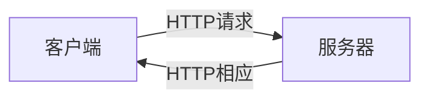

### HTTP 协议的特点

- 支持客户端（浏览器就是一种 Web 客户端）/服务器模式。
- 简单快速：客户端向服务器请求服务时，只需指定请求方式和路径。常用的请求方式有 GET、POST 等，每种方式规定了客户端与服务器联系的类型不同。由于 HTTP 简单，使得 HTTP 服务器的程序规模小，因而通信速度很快。
- 灵活：HTTP 允许传输任意类型的数据，正在传输的数据类型由 Content-Type 加以标记。
- 无状态：HTTP 是无状态协议。无状态是指协议对于事务处理没有记忆能力，每次请求之间相互独立，不能交互数据。如果后续处理需要前面的信息，则它必须重传，这样可能导致每次连接传送的数据量增大。

### HTTP 1.0 VS HTTP 1.1

<b style="color:purple">HTTP 1.0</b>

- HTTP 协议是基于请求/响应模型的，一次请求对应一次响应。
- 基于 HTTP 1.0 协议的客户端与服务器进行一次完整的通信需要经过建立连接、发送请求信息、回送响应信息、关闭连接 4 个步骤。<span style="color:purple">而客户端与服务器建立连接后，每次只能处理一个 HTTP 请求。后面出现新的请求-响应时会建立新的连接。</span>
- HTTP 是基于 TCP/IP 的高级协议，默认端口号是 80。

<b style="color:purple">HTTP 1.1</b>

- HTTP 1.1 支持持久连接，也就是说在一个 TCP 连接上可以传送多个 HTTP 请求和响应，从而减少了建立和关闭连接的消耗和延时。不过持久连接需要客户端和服务器端都支持才行，如果有一方不支持持久连接，完成一次请求后就关闭连接，那么另一方也会被迫关闭连接的。

可以思考下如何创建一个 HTTP 连接池复用 HTTP 连接。此处给一些思考：假定处理 A 信息的 HTTP 连接处理完后就存入一个集合中，如果下次还要向 A 发送数据那么就先看集合中是否存有连接到 A 的可用的 HTTP 连接，有的话就直接用集合中的而非重新建立连接。

### HTTPS 介绍

HTTP 协议是明文传输，不安全，不适合传输安全性要求高的文件，如密码。而 HTTPS 是对 HTTP 协议不安全的改进，HTTPS 全称叫安全套接字超文本传输协议，采用了基于 SSL(Secure Sockets Layer) 进行加密，安全性高！SSL 依靠证书来验证服务器的身份，并为浏览器和服务器之间的通信加密。

### SSL介绍

SSL 协议位于 [TCP/IP协议](https://baike.baidu.com/item/TCP%2FIP协议) 与各种[应用层](https://baike.baidu.com/item/应用层)协议之间，为[数据通讯](https://baike.baidu.com/item/数据通讯)提供安全支持。

SSL 协议可分为两层

- SSL 记录协议（SSL Record Protocol）：它建立在可靠的[传输协议](https://baike.baidu.com/item/传输协议)（如 TCP）之上，为高层协议提供[数据封装](https://baike.baidu.com/item/数据封装)、压缩、加密等基本功能的支持。 
- SSL [握手协议](https://baike.baidu.com/item/握手协议)（SSL Handshake Protocol）：它建立在 SSL 记录协议之上，用于在实际的数据传输开始前，通讯双方进行[身份认证](https://baike.baidu.com/item/身份认证)、协商[加密算法](https://baike.baidu.com/item/加密算法)、交换加密[密钥](https://baike.baidu.com/item/密钥)等。

### HTTP VS HTTPS

- HTTPS 相对于 HTTP 加入了 SSL 层；
- 需要到 ca 申请收费的证书，SSL 证书需要钱，功能越强大的证书费用越高，个人网站、小网站没有必要一般不会用；
- 安全但是耗时多，缓存不是很好，HTTPS 协议握手阶段比较费时，会使页面的加载时间延长近 50%，增加 10% 到 20% 的耗电；

## 请求消息数据格式

### 请求状态行

HTTP 协议请求消息的格式如下

- 请求方式 请求 url 请求协议/版本

- 例如 GET /login.html	HTTP/1.1

HTTP 协议有 8 种请求方式，GET、POST、HEAD、OPTIONS、DELETE、TRACE、PUT 和 CONNECT（保留到将来使用），而常用的有 2 种
- GET：请求参数在请求行中（在 url 后），<span style="color:red">请求的 url 长度有限制的，这种限制是浏览器施加的限制而非协议的限制；</span>不太安全。
- POST：请求参数在请求体中；请求的 url 长度没有限制的；相对安全。

### 请求消息头

请求头就是客户端浏览器告诉服务器一些信息，格式==>请求头名称 : 请求头值

常用请求头字段

| 字段                | 说明                                                         |
| ------------------- | ------------------------------------------------------------ |
| Accept              | 指出浏览器可以处理的 MIME 类型，如图片、文件等               |
| Accept-Charset      | 告诉服务器，客户端用的字符集                                 |
| Accept-Enchoding    | 指出客户端能够进行解码的方式                                 |
| Accept-Language     | 期待服务器端返回的文档的语言，如一个网站既有英文版又有中文版，<br>可以通过该字段指明要那种语言的文档 |
| Authorization       | 当客户端访问受口令保护的网页时，Web 服务器会发送 401响应状态码<br/>和 WWW-Authenticate 响应头，要求客户端使用 Authorization 请求头来应答 |
| Proxy-Authorization | 与 Authorization 类似，不过请求头是服务器端向代理服务器发送的验证消息 |
| Host                | 指定资源所在的主机名和端口号                                 |
| Referer             | 告诉服务器，当前请求从哪里来？可以防盗链，可以进行统计工作   |
| User-Agent          | 浏览器告诉服务器，我访问你使用的浏览器的版本信息；可以在服务器端获取<br>该头的信息，解决浏览器的兼容性问题 |

一个典型的请求头信息（Edge）。

```http
Accept: text/html,application/xhtml+xml,application/xml;q=0.9,image/webp,image/apng,*/*;q=0.8,application/signed-exchange;v=b3;q=0.9
Accept-Encoding: gzip, deflate, br
Accept-Language: zh-CN,zh;q=0.9,en;q=0.8,en-GB;q=0.7,en-US;q=0.6
Connection: keep-alive
Cookie: BAIDUID_BFESS=EEA2C123724C2623344ED:FG=1;
Host: www.baidu.com
sec-ch-ua: "Not_A Brand";v="99", "Microsoft Edge";v="109", "Chromium";v="109"
sec-ch-ua-mobile: ?0
sec-ch-ua-platform: "Windows"
Sec-Fetch-Dest: document
Sec-Fetch-Mode: navigate
Sec-Fetch-Site: none
Sec-Fetch-User: ?1
Upgrade-Insecure-Requests: 1
User-Agent: Mozilla/5.0 (Windows NT 10.0; Win64; x64) AppleWebKit/537.36 (KHTML, like Gecko) Chrome/109.0.0.0 Safari/537.36 Edg/109.0.1518.52
```

### 请求空行

空行，用于分割 POST 请求的请求头，和请求体的。

### 请求体(正文)

封装 POST 请求消息的请求参数的

字符格式

```http
请求方式 请求的url      协议版本
POST    /login.html	  HTTP/1.1
// 主机名称
Host: localhost
// 浏览器信息
User-Agent: Mozilla/5.0 (Windows NT 6.1; Win64; x64; rv:60.0) Gecko/20100101 Firefox/60.0
// 可接收的文件格式
Accept:text/html,application/xhtml+xml,application/xml;q=0.9,*/*;q=0.8
// 可接收的语言
Accept-Language: zh-CN,zh;q=0.8,zh-TW;q=0.7,zh-HK;q=0.5,en-US;q=0.3,en;q=0.2
Accept-Encoding: gzip, deflate
Referer: http://localhost/login.html
Connection: keep-alive
Upgrade-Insecure-Requests: 1
username=zhangsan	
```

## 响应消息数据格式

响应消息：服务器端发送给客户端的数据

### 响应状态行

HTTP 响应状态行位于响应消息的第 1 行，共包括 3 部分，协议/版本-响应状态码-状态码描述。如 HTTP/1.1   200   Ok。

响应状态码是服务器告诉客户端浏览器本次请求和响应的一个状态。状态代码由 3 位数字组成，表示请求是否被理解或被满足。 

- 1xx：服务器就收客户端消息，但没有接受完成，等待一段时间后，发送 1xx 状态码
- 2xx：成功。200（请求成功）
- 3xx：重定向。302 (重定向)，304 (访问缓存)
- 4xx：客户端错误。401（禁止访问），404（找不到请求资源）
- 5xx：服务器端错误。

<b>典型状态码代表</b>

* 404：请求路径没有对应的资源
* 405：请求方式没有对应的 doXxx 方法
* 500：服务器内部出现异常
* 302：重定向
* 304：访问缓存

### 响应消息头

在 HTTP 响应消息中，第 1 行为响应状态行，紧接着的是若干响应消息头，服务器端通过响应消息头向客户端传递附加信息，<b>包括服务程序名、被请求资源需要的认证方式、客户端请求资源的最后修改时间、重定向地址等信息。</b>

| 字段             | 说明                                                         |
| ---------------- | ------------------------------------------------------------ |
| Accept-Range     | 用于说明服务器是否接收客户端使用 Range 请求头字段请求资源    |
| Age              | 用于指出当前网页文档可以在客户端或代理服务器中缓存的有效时间，设置值为一一个<br/>以秒为单位的时间数 |
| Location         | 用于通知客户端获取请求文档的新地址，其值为一一个使用绝对路径的 URL 地址 |
| Retry-After      | 可以与 503 状态码配合使用，告诉客户端在什么时间可以重新发送请求。也可以与任何一个 3xx 状态码配合使用，告诉客户端处理重定向的最小延时时间。Retry- After 头字段的值可以是 GMT 格式的时间，也可是一个以秒为单位的时间数 |
| Connection       | 当前的连接状态                                               |
| Content-Encoding | 内容的编码格式                                               |
| Content-Type     | 内容的类型和字符集                                           |
| Date             | 一个通用首部，其中包含了报文创建的日期和时间。可用于判断请求到的数据是否是之前的缓存 |
| Server           | 服务器软件的产品名                                           |
| etag             | 用于向客户端传送代表实体内容特征的标记信息，这些标记信息称为实体标签，每个版本的资源的实体标签是不同的，通过实体标签可以判断在不同时间获得的同一资源路径下的实体内容是否相同 |


```http
accept-ranges: bytes
access-control-allow-origin: *
age: 12602121
cache-control: max-age=31536000
content-encoding: br
content-md5: Y0h9jFDkQTf4ts4qBEB/jw==
content-type: text/javascript; charset=utf-8
date: Mon, 16 Jan 2023 08:20:21 GMT
etag: "63487d8csfsfe2a04407f8f"
expires: Fri, 26 Aug 2022 11:45:00 GMT
last-modified: Wed, 17 Aug 2022 03:23:28 GMT
ohc-cache-hit: jjct64 [2]
ohc-file-size: 144135
ohc-global-saved-time: Tue, 23 Aug 2022 11:45:00 GMT
ohc-response-time: 1 0 0 0 0 0
ohc-upstream-trace: 182.106.158.64
server: JSP3/2.0.14
timing-allow-origin: *
x-bce-content-crc32: 3238666094
x-bce-debug-id: Zpe8d8i/Js1pjiyMUmaL9dp/Hvp6gJsfsjWgAJ+ZYw==
x-bce-request-id: ca25505d-b973-47e4-a41a-9ce38f993e6b
x-bce-restore-cache: -
x-bce-restore-tier: -
x-bce-storage-class: STANDARD
x-cache-status: HIT
```

# Tomcat

- web 相关概念
- web 服务器软件：Tomcat、Jetty
- Servlet 入门学习

## Web相关概念

<b>软件架构</b>

- C/S：客户端/服务器端；一般主要的计算由客户端自行完成，服务器用作数据交互，存储客户端计算出的数据结果。
- B/S**：**浏览器/服务器端：服务器承担主要的计算。

<b>资源分类</b>

- 静态资源：所有用户访问后，得到的结果都是一样的，称为静态资源。静态资源可以直接被浏览器解析『如：html，css，js』
- 动态资源：每个用户访问相同资源后，得到的结果可能不一样。称为动态资源。动态资源被访问后，需要先转换为静态资源，在返回给浏览器『如：servlet/jsp，php』

<b>网络通信三要素</b>

- IP：电子设备（计算机）在网络中的唯一标识。
- 端口：应用程序在计算机中的唯一标识，0~65536
- 传输协议：规定了数据传输的规则；基础协议，TCP『可靠传输协议，三次握手，速度稍慢』UDP『不可靠传输协议，速度快』

## Web服务器软件

- 服务器：安装了服务器软件的计算机。
- 服务器软件：接收用户的请求，处理请求，做出响应。
- web 服务器软件：接收用户的请求，处理请求，做出响应。
  - 在 web 服务器软件中，可以部署 web 项目，让用户通过浏览器来访问这些项目。
- 常见的 Java 相关的 web 服务器软件
  - webLogic：oracle 公司，大型的 JavaEE 服务器，支持所有的 JavaEE 规范，收费的。
  - webSphere：IBM 公司，大型的 JavaEE 服务器，支持所有的 JavaEE 规范，收费的。
  - JBOSS：JBOSS 公司的，大型的 JavaEE 服务器，支持所有的 JavaEE 规范，收费的。
  - Tomcat：Apache 基金组织，中小型的 JavaEE 服务器，仅仅支持少量的 JavaEE 规范 servlet/jsp。开源的，免费。
- JavaEE：Java 语言在企业级开发中使用的技术规范的总和，一共规定了 13 项大的规范。

## Tomcat

### 安装

- 下载：http://tomcat.apache.org/
- 安装：解压压缩包即可
- 卸载：删除目录就行了
- 启动：
  - bin/startup.bat，双击运行该文件即可。
  - 访问：浏览器输入，http://localhost:8080 回车访问本地的服务器。
  - http://ip:8080 访问其他 IP 地址的服务器。

<b>启动可能遇到的问题</b>

- 黑窗口一闪而过如何排除？

  - 在这种情况下，由于无法查看到错误信息，因此，无法对 Tomcat 进行诊断，分析其出错的原因。这时，可以先启动一个命令行窗口，在这个命令行窗口中进入 Tomcat 安装目录中的 bin 目录，然后在该窗口中执行 startup.bat 命令，就会看到错误信息显示在该窗口中。
  - 一般原因：没有正确配置 JAVA_HOME 环境变量，配置下 JAVA_HOME 即可。

- 启动报错？

  - 暴力：找到占用的端口号，并且找到对应的进程，杀死该进程『Windows 下用 netstat -ano 查找占用的网络端口』

  - 温柔：修改自身的端口号

    ```xml
    <!-- conf/server.xml -->
    <Connector port="8888" protocol="HTTP/1.1"
    		               connectionTimeout="20000"
    		               redirectPort="8445" />
    ```
    

一般会将 tomcat 的默认端口号修改为 80。80 端口号是 HTTP 协议的默认端口号。这样在访问时，就不用输入端口号了。

### 关闭

- 正常关闭：bin/shutdown.bat 或 ctrl+c
- 强制关闭：点击启动窗口的❌

### 目录结构

<div align="center">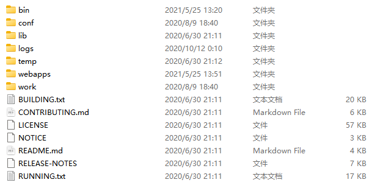</div>

从图可看出，Tomcat 安装目录中包含一系列的子目录，这些子目录分别用于存放不同功能的文件，接下来针对这些子目录进行简单介绍，具体如下。

- bin，存放可执行文件和脚本文件，windows 下的为 .bat 结尾，Linux 下的为 .sh 结尾。
- config，用于存放 Tomcat 的各种配置文件，如 web.xml、server.xml。
- lib，用于存放 Tomcat 服务器和所有 Web 应用程序需要访问的 JAR 文件。
- logs，存放 Tomcat 的日志文件。
- temp，用于存放 Tomcat 运行时产生的临时文件。
- webapps，Web 应用程序的主要发布目录，通常将要发布的应用程序放到这个目录下。
- work，Tomcat 的工作目录，JSP 编译生成的 Servlet 源文件和字节码文件放到这个目录下。

## IDEA搭建Tomcat

[idea 创建 JavaWeb 项目（主要 idea2022） - 腾讯云开发者社区-腾讯云 (tencent.com)](https://cloud.tencent.com/developer/article/2152435#:~:text=配置 Tomcat idea2022（启动界面如下） 第一步 文件 – 新建 –,– New – Project） 第二步 新建项目 – 填入项目名称（自取且不为中文）)

[IDEA+Maven+JavaWeb+tomcat项目搭建（图文并茂，详细）_花伦同学ko的博客-CSDN博客](https://blog.csdn.net/weixin_33446857/article/details/82143258)

- 创建一个普通 Java 项目

    <div align="center">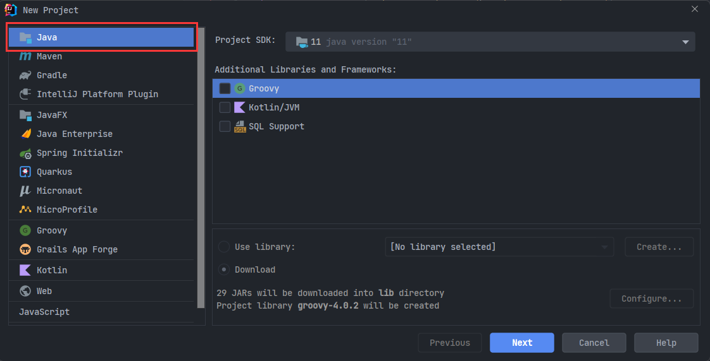</div>

- 选中项目，鼠标右击，选择 Add Frameworks Support，选择 Web Application(4.0)

- 创建完成后会出现 web 目录。

- 为项目添加 API 依赖

    <div align="center">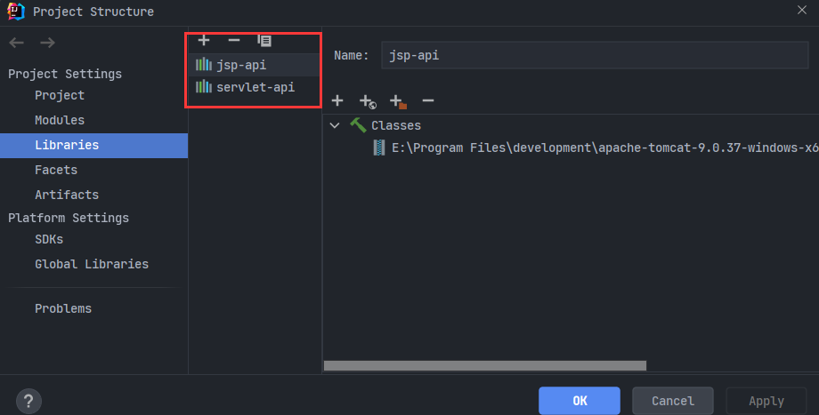</div>

- 为 IDEA 配置 Tomcat 服务器。

- 编写一个 Servlet，并将 Web 项目和 Tomcat 绑定在一起。

    <div align="center">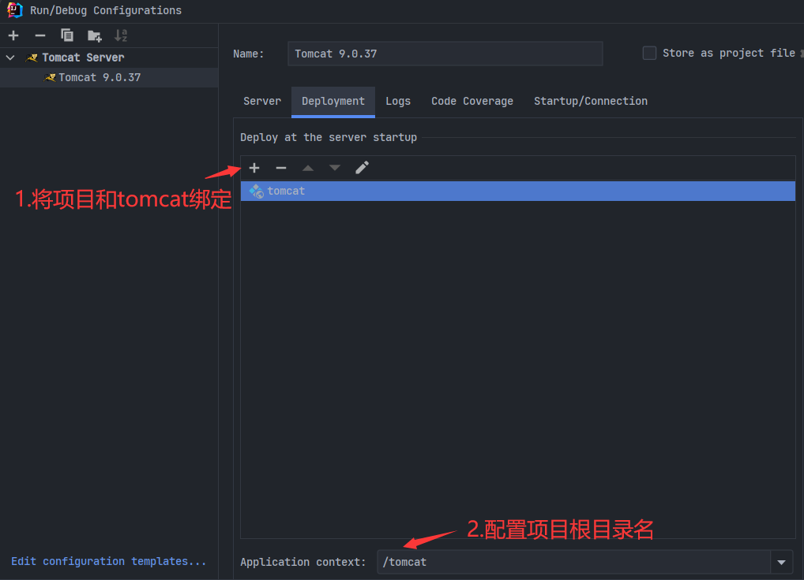</div>

- 启动 Tomcat，部署编写的程序。

    <div align="center">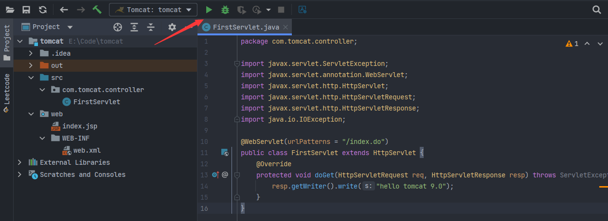</div>

## 项目部署

<b>Web 应用</b>

在 Web 服务器上运行的 Web 资源都是以 Web 应用形式呈现的，所谓 Web 应用就是多个 Web 资源的集合，Web 应用通常也称为 Web 应用程序或 Web 工程。Tomcat Web 应用的一般目录结构如下。

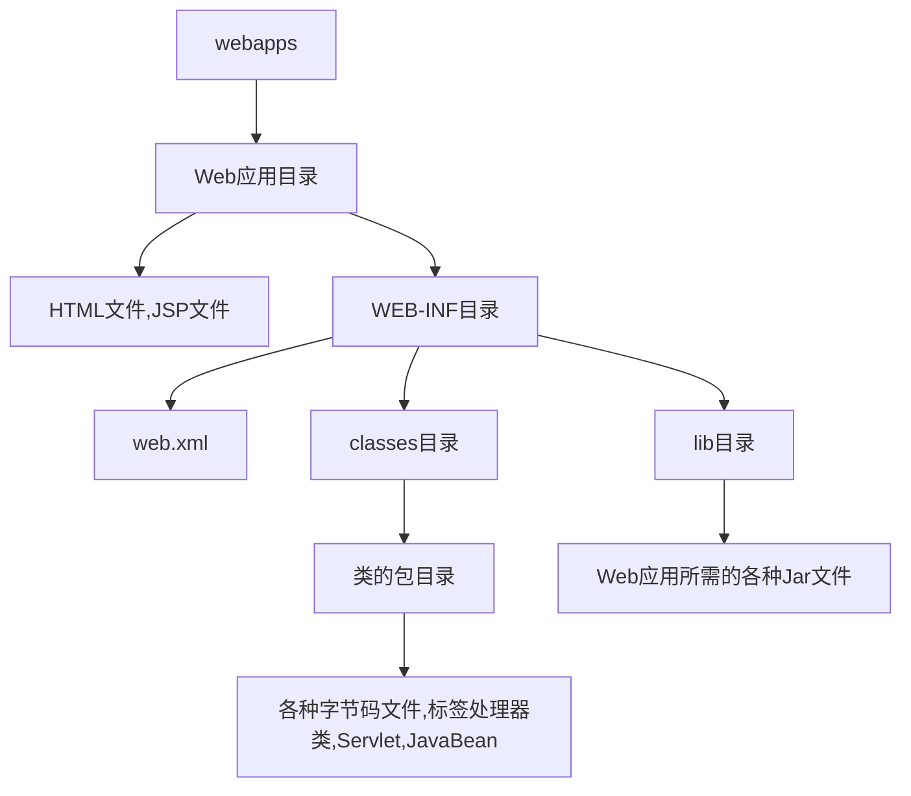

Tomcat \conf 目录下的 web.xml 文件可以修改默认的主页面配置。

```xml
<welcome-file-list>
    <!-- 修改主页面 -->
    <welcome-file>index.html</welcome-file>
    <welcome-file>index.htm</welcome-file>
    <welcome-file>index.jsp</welcome-file>
</welcome-file-list>
```

<b>部署方式</b>

- 1.将项目打成 war 包，然后将项目放到 webapps 目录下即可。
- 2.配置 conf/server.xml 文件。
- 3.在 conf\Catalina\localhost 创建任意名称的 xml 文件。在文件中编写 \<Context docBase="D:\hello" />
    - D:\hello 是项目的绝对路径。
    - 虚拟目录：xml 文件的名称。如 xml 名称为 demo，那么虚拟目录就是 `localhost:8080/demo`。

<b>webapps 部署方式</b>

- 直接将项目放到 webapps 目录下。
- /hello：项目的访问路径会被映射为虚拟目录。
- 简化部署：将项目打成一个 war 包，再将 war 包放置到 webapps 目录下。war 包会被自动解压。『war 包的压缩方式和 zip 的压缩方式一样』。

<b>conf/server.xml 部署方式</b>

- 在 \<Host\> 标签体中配置 \<Context docBase="D:\hello" path="/hehe" />。
- docBase：项目存放的路径。
- path：虚拟目录。

<b>conf\Catalina\localhost 配置方式</b>

- 在 conf\Catalina\localhost 创建任意名称的 xml 文件。在文件中编写 \<Context docBase="D:\hello" />。
- D:\hello 是项目的绝对路径。
- 虚拟目录：xml 文件的名称。如 xml 名称为 demo，那么虚拟目录就是 `localhost:8080/demo`。

> Web 项目的目录结构
>
> |-- 项目的根目录
>
> ​	|-- WEB-INF 目录：WEB-INF 下的文件无法通过 URL 直接访问
>
> ​		|-- web.xml：web 项目的核心配置文件
>
> ​		|-- classes 目录：放置字节码文件的目录
>
> ​		|-- lib 目录：放置依赖的 jar 包

> <b>URL 和 URI</b>
>
> - URL：统一资源定位符，用于定位这个资源在哪里。
> - URI：统一资源标识符，标识这个资源唯一。

<b>问题回顾</b>

- HTTP 1.1 协议的通信过程
- POST 和 GET 请求的不同（2 点以上）
    - GET 传递的参数显示在 URL 上，POST 不会。
    - GET 传递文件的长度有限（浏览器的限制，而非协议本身），POST 没有限制。

# Servlet

Servlet 是 server applet 的简写，是运行在服务器端的小程序。而 Tomcat 中的 Servlet 就是一个接口，定义了 Java 类被浏览器访问到（tomcat 识别）的规则。

JavaEE 组织定制规范，提供接口，其他厂商根据规范和接口进行实际的功能实现。

## 概述

Servlet 是使用 Java 语言编写的运行在服务器端的程序。狭义的 Servlet 是指 Java 语言实现的一个接口，广义的 Servlet 是指任何实现了这个 Servlet 接口的类，一般情况下认为是后者。

Servlet 由 Servlet 容器提供（如 Tomcat）。Servlet 容器将 Servlet 动态地加载到服务器上。与 HTTP 协议相关的 Servlet 使用 HTTP 请求和 HTTP 响应与客户端进行交互。因此，Servlet 容器支持所有 HTTP 协议的请求和响应，Servlet 应用程序的体系结构如图所示。

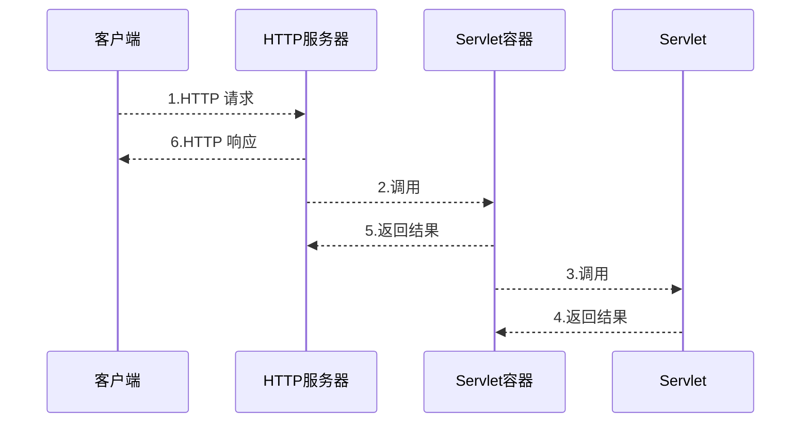

Servlet 的请求首先会被 HTTP 服务器（如 Apache）接收，HTTP 服务器只负责静态 HTML 页面的解析，对于 Servlet 的请求转交给 Servlet 容器，Servlet 容器会根据 web.xml 文件中的映射关系或注解中的信息，调用相应的 Servlet，Servlet 将处理的结果返回给 Servlet 容器，并通过 HTTP 服务器将响应传输给客户端。

## 接口及其实现类

Servlet 的类关系图如下所示。

<div align="center">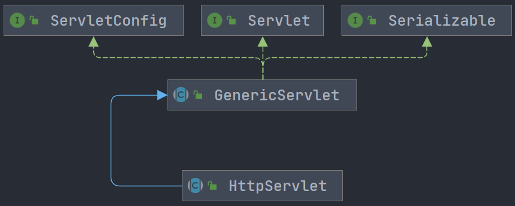</div>

下表为 Servlet 接口的抽象方法

| 方法声明                                                | 功能描述                                                     |
| ------------------------------------------------------- | ------------------------------------------------------------ |
| void init(ServletConfig var1)                           | 容器在创建好 Servlet 对象后，就会调用此方法。该方法接收一个 ServletConfig 类型的参数，Servlet 容器通过这个参数向 Servlet 传递初始化配置信息。 |
| ServletConfig getServletConfig()                        | 用于获取 Servlet 对象的配置信息，返回 Servlet 的 ServletConfig 对象。 |
| void service(ServletRequest var1, ServletResponse var2) | 负责响应用户的请求，当容器接收到客户端访问 Servlet 对象的请求时，就会调用此方法。容器会构造一个表示客户端请求信息的 ServletRequest 对象和一个用于响应客户端的 ServletResponse 对象作为参数传递给 service() 方法。在 service() 方法中，可以通过 ServletRequest 对象得到客户端的相关信息和请求信息，在对请求进行处理后，调用 ServletResponse 对象的方法设置响应信息。 |
| String getServletInfo()                                 | 返回一个字符串，其中包含关于 Servlet 的信息，例如，作者、版本和版权等信息。 |
| void destroy();                                         | 负责释放 Servlet 对象占用的资源。当服务器关闭或者 Servlet 对象被移除时，Servlet 对象会被销毁，容器会调用此方法。 |

Servlet 有两个子类，GenericServlet 和 HttpServlet。

- GenericServlet 为 Servlet 接口提供了部分实现，但是它并没有实现 HTTP 请求处理，包括 service 方法，也没有实现。
- HttpServlet 是 GenericServlet 的子类，它继承了 GenericServlet 的所有方法，并且为 HTTP 请求中的 POST、GET、PUT、DELETE 等类型提供了具体的操作方法。

<div align="center">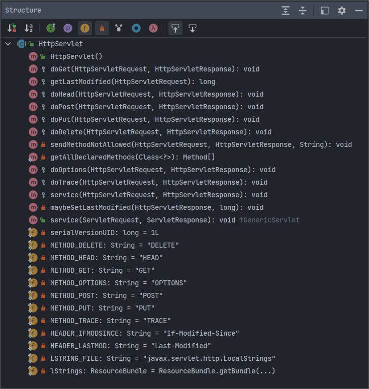</div>

<b>HttpServlet 具体的细节可直接查看源码，着重阅读 service 方法即可。</b>

## 运行Servlet

传统的方式是用 xml 的方式来配置，此处简单介绍下 xml 的配置方式，主要还是用注解方式进行配置。

### XML配置

使用 XML 配置文件来做请求方法和 Servlet 的映射。

```java
public class FirstServlet extends HttpServlet {
    @Override
    protected void doGet(HttpServletRequest req, HttpServletResponse resp) throws ServletException, IOException {
        resp.getWriter().write("hello tomcat 9.0");
    }
}
```

XML 配置文件

```xml
<!-- 在web.xml中配置：[xml解析，servlet-name一样的进行匹配！] -->
<servlet>
    <servlet-name>hello</servlet-name>
    <servlet-class>com.tomcat.controller.FirstServlet</servlet-class>
</servlet>

<servlet-mapping>
    <servlet-name>hello</servlet-name>
    <url-pattern>/hello</url-pattern>
</servlet-mapping>
```

注意：XML 和注解不能同时配置一个 Servlet，不过如果配置的 URL 不一样，那么就没事，是可以的。

### 注解方式

使用 @WebServlet 来做请求方法和 Servlet 的映射。

```java
import javax.servlet.ServletException;
import javax.servlet.annotation.WebServlet;
import javax.servlet.http.HttpServlet;
import javax.servlet.http.HttpServletRequest;
import javax.servlet.http.HttpServletResponse;
import java.io.IOException;

@WebServlet(urlPatterns = "/index.do")
public class FirstServlet extends HttpServlet {
    @Override
    protected void doGet(HttpServletRequest req, HttpServletResponse resp) throws ServletException, IOException {
        resp.getWriter().write("hello tomcat 9.0");
    }
}
```

## 执行原理

- 当服务器接受到客户端浏览器的请求后，会解析请求 URL 路径，获取访问的 Servlet 的资源路径
- 查找 web.xml 文件，是否有对应的 \<url-pattern\> 标签体内容
- 如果有，则在找到对应的 \<servlet-class\> 全类名
- tomcat 会将字节码文件加载进内存，并且创建其对象
- 调用该对象的 service 方法
- service 方法通过判断请求方法的类型（get、post）来调用对应的请求处理方法。

## 生命周期

Servlet 的生命周期如下图所示。

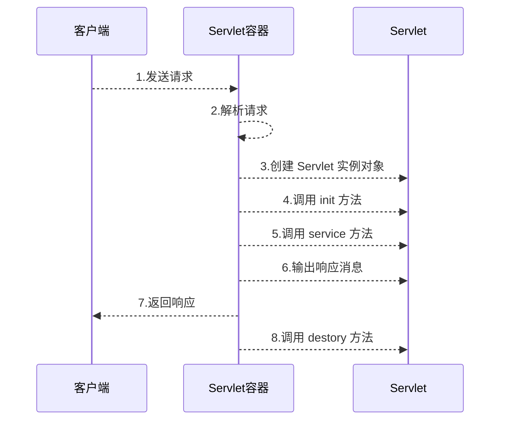

按照功能的不同，我们可以将 Servlet 的生命周期分为 3 个阶段，分别是初始化阶段、运行阶段和销毁阶段。

> <b>初始化阶段</b>

初始化阶段会执行 init 方法，且只执行一次，且 Servlet 在内存中只存在一个对象，是单实例的。

当客户端向 Servlet 容器发出 HTTP 请求要求访问 Servlet 时，Servlet 容器首先会解析请求，检查内存中是否已经有了该 Servlet 对象，如果有直接使用该 Servlet 对象，如果没有就创建 Servlet 实例对象，然后通过调用 init() 方法实现 Servlet 的初始化工作。需要注意的是，在 Servlet 的整个生命周期内，它的 init() 方法只被调用一次。

通过上面的描述可以知道，Servlet 是单例的。多个用户同时访问时，可能存在线程安全问题。所以尽量不要在 Servlet 中定义成员变量。即使定义了成员变量，也不要对修改值。

> <b>运行阶段</b>

对外提供服务，每次访问 Servlet 时，service 方法都会被调用一次。

Servlet 容器会为这个请求创建代表 HTTP 请求的 ServletRequest 对象和代表 HTTP 响应的 ServletResponse 对象，然后将它们作为参数传递给 Servlet 的 service() 方法。service() 方法从 ServletRequest 对象中获得客户请求信息并处理该请求，通过 ServletResponse 对象生成响应结果。在 Servlet 的整个生命周期内，对于 Servlet 的每一次访问请求，Servlet 容器都会调用一次 Servlet 的 service() 方法，并且创建新的 ServletRequest 和 ServletResponse 对象，也就是说，service() 方法在 Servlet 的整个生命周期中会被调用多次。

> <b>销毁阶段</b>

当服务器关闭或 Web 应用被移除出容器时，Servlet 随着 Web 应用的销毁而销毁。在销毁 Servlet 之前，Servlet 容器会调用 Servlet 的 destroy() 方法，以便让 Servlet 对象释放它所占用的资源。在 Servlet 的整个生命周期中，destroy() 方法也只被调用一次。需要注意的是，Servlet 对象一旦创建就会驻留在内存中等待客户端的访问，直到服务器关闭，或 Web 应用被移除出容器时，Servlet 对象才会销毁。

- Servlet 被销毁时执行。服务器关闭时，Servlet 被销毁。
- 只有服务器正常关闭时，才会执行 destroy 方法。
- destroy 方法在 Servlet 被销毁之前执行，一般用于释放资源。

> <b>测试生命周期</b>

```java
package com.tomcat.controller;

import javax.servlet.annotation.WebServlet;
import javax.servlet.http.HttpServlet;
import javax.servlet.http.HttpServletRequest;
import javax.servlet.http.HttpServletResponse;

@WebServlet(urlPatterns = "/life")
public class TestLifeCycle extends HttpServlet {
    @Override
    public void init() {
        System.out.println("executor init method");
    }

    @Override
    protected void service(HttpServletRequest req, HttpServletResponse resp) {
        System.out.println("executor service method");
    }

    @Override
    public void destroy() {
        System.out.println("executor destroy method");
    }

}
```

访问该 Servlet 两次，然后在 IDEA 控制台正常关闭 tomcat。

```cmd
http://localhost:8080/tomcat
executor init method
executor service method
executor service method
16-Jan-2023 23:17:46.035 信息 [Thread-3] org.apache.coyote.AbstractProtocol.pause 暂停ProtocolHandler["http-nio-8080"]
16-Jan-2023 23:17:47.620 信息 [Thread-3] org.apache.catalina.core.StandardService.stopInternal 正在停止服务[Catalina]
executor destroy method
16-Jan-2023 23:17:47.641 信息 [Thread-3] org.apache.coyote.AbstractProtocol.stop 正在停止ProtocolHandler ["http-nio-8080"]
16-Jan-2023 23:17:47.644 信息 [Thread-3] org.apache.coyote.AbstractProtocol.destroy 正在摧毁协议处理器 ["http-nio-8080"]
```

> <b>自动加载 Servlet</b>

有时候会希望某些 Servlet 程序可以在 Tomcat 启动时随即启动。例如，当启动一个 Web 项目时，首先需要对数据库信息进行初始化。这时，只需要使用 web.xml 文件中 \<load-on-startup\> 元素或者使用注解 @WebServlet，将初始化数据库的 Servlet 配置为随着 Web 应用启动而启动的 Servlet 即可。

```java
@WebServlet(urlPatterns = "/one", loadOnStartup = 1)
public class LoadOnStartupOne extends HttpServlet {
    @Override
    public void init() throws ServletException {
        System.out.println("one 1~");
    }
}

@WebServlet(urlPatterns = "/two", loadOnStartup = 10)
public class LoadOnStartupTwo extends HttpServlet {
    @Override
    public void init() throws ServletException {
        System.out.println("two 10~");
    }
}
```

- 值为负数或者没有设定值，首次请求这个 Servlet 时创建对象；
- 值为正整数或 0，Servlet 容器将在 Web 应用启动时加载并初始化 Servlet，<b>并且 loadOnStartup 的值越小，它对应的 Servlet 就越先被加载。</b>

```cmd
one 1~
16-Jan-2023 23:28:17.915 信息 [main] org.apache.catalina.startup.HostConfig.deployDescriptor 部署描述符[C:\Users\69546\.SmartTomcat\tomcat\tomcat\conf\Catalina\localhost\tomcat.xml]的部署已在[1,955]ms内完成
16-Jan-2023 23:28:17.919 信息 [main] org.apache.coyote.AbstractProtocol.start 开始协议处理句柄["http-nio-8080"]
16-Jan-2023 23:28:17.926 信息 [main] org.apache.catalina.startup.Catalina.start [2039]毫秒后服务器启动
http://localhost:8080/tomcat
two 10~
```

## 路径映射

### 多重URL映射

一个 Servlet 可以有多个 url 映射。切记，写 url 路径的时候前面的 `/` 不能省略！

```java
@WebServlet(urlPatterns = {"/url1", "/url2"})
public class UrlPattern extends HttpServlet {
    @Override
    protected void doPost(HttpServletRequest req, HttpServletResponse resp) throws ServletException, IOException {
        System.out.println("post~");
    }
}
```

xml 的多重路径映射。

```xml
<servlet>
    <servlet-name>urlPatterm</servlet-name>
    <servlet-class>com.tomcat.controller.UrlPattern</servlet-class>
</servlet>

<servlet-mapping>
    <servlet-name>urlPatterm</servlet-name>
    <url-pattern>/url3</url-pattern>
</servlet-mapping>

<servlet-mapping>
    <servlet-name>urlPatterm</servlet-name>
    <url-pattern>/url4</url-pattern>
</servlet-mapping>
```

可以同时对一个 Servlet 使用注解配置和 xml 配置。上面的例子 UrlPattern 有四个映射路径：url1~url4。

### 通配符映射

有时候会希望某个目录下的所有路径都可以访问同一个 Servlet，这时，可以在 Servlet 映射的路径中使用通配符 “*”。通配符的格式有两种，如下所示。

- `*.扩展名` 例如 `*.do` 匹配以 `*.do` 结尾的所有 URL 地址。
- 格式为 `/*`，例如 `/abc/*` 匹配以 `/abc` 开始的所有 URL 地址。
- 需要注意，这两种通配符的格式不能混合使用。如 `/abc/*.do` 是不合法的映射路径。

URL 的匹配也是优先进行精准匹配再进行通配符匹配。

如果某个 Servlet 的映射路径仅仅是一个正斜线（/），那么这个 Servlet 就是当前 Web 应用的缺省 Servlet。Servlet 服务器在接收到访问请求时，如果找不到匹配的 URL，就会将访问请求交给缺省 Servlet 处理，可以用于设置 404 页面。

```java
@WebServlet(urlPatterns = "/")
public class NotFound extends HttpServlet {
    @Override
    protected void service(HttpServletRequest req, HttpServletResponse resp) throws ServletException, IOException {
        resp.getWriter().write("404 not found~~");
    }
}
```

访问应用中没有的路径时就会在页面输出 404 not found~~。

## Servlet3.0

支持注解配置。可以不需要 web.xml 了。

- 创建 JavaEE 项目，选择 Servlet 的版本 3.0 以上，可以不创建 web.xml。

- 定义一个类，实现 Servlet 接口。

- 复写方法。

- 在类上使用 @WebServlet 注解，进行配置。

* @WebServlet("资源路径") 注意，name 是指类的名称不是资源路径。


```java
@Target({ElementType.TYPE})
@Retention(RetentionPolicy.RUNTIME)
@Documented
public @interface WebServlet {
		//相当于<Servlet-name>
    String name() default "";
    
		//代表 urlPatterns() 属性配置
    String[] value() default {};
    
		//相当于<url-pattern>
    String[] urlPatterns() default {};
    
		//相当于<load-on-startup>
    int loadOnStartup() default -1;

    WebInitParam[] initParams() default {};

    boolean asyncSupported() default false;

    String smallIcon() default "";

    String largeIcon() default "";

    String description() default "";

    String displayName() default "";
}
```

> <b>IDEA 与 tomcat 的相关配置</b>

- IDEA 会为每一个 tomcat 部署的项目单独建立一份配置文件。
- 工作空间项目和 tomcat 部署的 web 项目。
  - tomcat 真正访问的是 “tomcat 部署的 web 项目”，tomcat 部署的 web 项目对应着工作空间项目的 web 目录下的所有资源。
- WEB-INF 目录下的资源不能被浏览器直接访问。

# 请求/响应

Tomcat 用 Request 对象和 Response 对象来处理请求和响应，用于获取 HTTP 的请求消息，给浏览器发送响应。

如果是 JDK11+，那么可以用 HttpClient 发起 Http 请求进行代码测试，不必用浏览器进行测试。具体用法 HttpClient 的注释里写的非常清楚。

## 基本原理

- request 和 response 对象是由服务器创建的。
- request 对象是来获取请求消息，而 response 对象是来设置响应消息

request 对象继承体系结构如下图所示，其中 org.apache.catalina.connector.RequestFacade 类是 tomcat 对 HttpServletRequest 的具体实现。

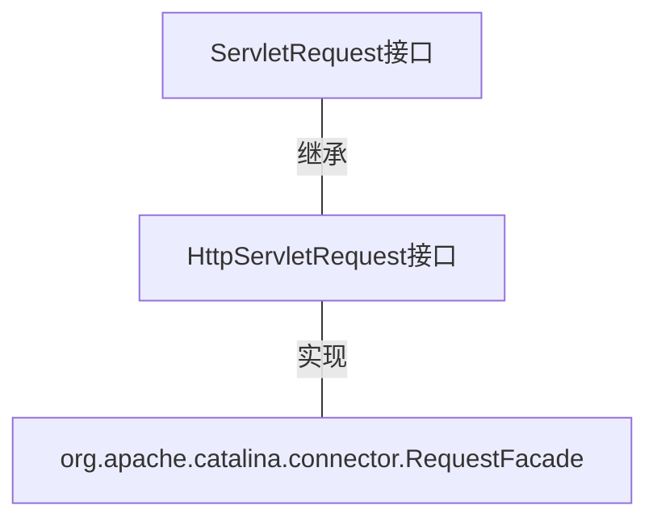

response 对象继承体系结构，其中 org.apache.catalina.connector.ResponseFacade 类是 Tomcat 对 HttpServletResponse 的具体实现。

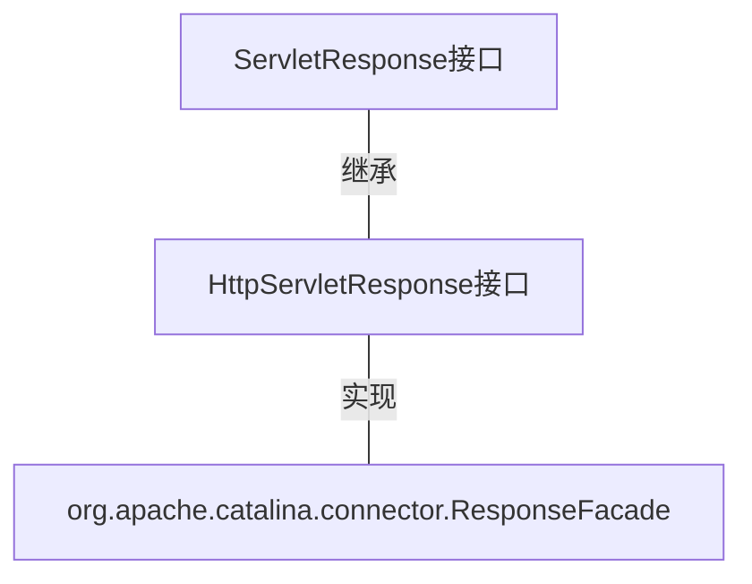

<b>浏览器访问 Servlet 的交互过程如下图所示。</b>

<div align="center">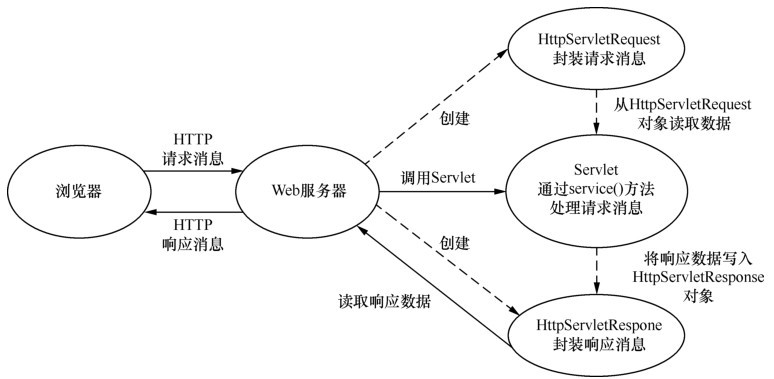</div>

在 Web 服务器运行阶段，每个 Servlet 都只会创建一个实例对象。然而，每次 HTTP 请求，Web 服务器都会调用所请求 Servlet 实例的 service(HttpServletRequest request,HttpServletResponse response) 方法，重新创建一个 request 对象和一个 response 对象。即一次请求响应对应一个 request 和 response 对象。

## Request

由 web 容器自动创建。每次 web 服务器接收到 HTTP 请求时，会自动创建 request 对象。web 服务器处理 HTTP 请求，向客户端发送 HTTP 响应后，会自动销毁请求对象。保存在对象中的数据也就消失了。

<b>总结</b>

- 服务器接收到 HTTP 请求时创建 request 对象
- 服务器发送 HTTP 响应结束后销毁 request 对象
- request 对象仅存活于一次请求转发，请求转发结束后，对象也就销毁了

### HttpServletRequest对象

在 Servlet API 中，定义了一个 HttpServletRequest 接口，它继承自 ServletRequest 接口，专门用来封装 HTTP 请求消息。HTTP 请求消息分为请求行、请求消息头和请求消息体 3 部分，在 HttpServletRequest 接口中也定义了获取请求行、请求头和请求消息体的相关方法。

> <b>获取请求行数据</b>

- GET /day14/demo1?name=zhangsan HTTP/1.1
- 方法

| 方法名                                                  | 功能描述              | 举例                                         |
| ------------------------------------------------------- | --------------------- | -------------------------------------------- |
| String getMethod()                                      | 获取请求方式          | GET                                          |
| String getContextPath()                                 | 获取虚拟目录          | /day14                                       |
| String getServletPath()                                 | 获取 Servlet 路径     | /demo1                                       |
| String getQueryString()                                 | 获取 get 方式请求参数 | name=zhangsan                                |
| String getRequestURI()<br/>StringBuffer getRequestURL() | 获取请求 URI          | /day14/demo1<br>http://localhost/day14/demo1 |
| String getProtocol()                                    | 获取协议及版本        | HTTP/1.1                                     |
| String getRemoteAddr()                                  | 获取客户机的 IP 地址  |                                              |

- URL：统一资源定位符 [ 不单单定义资源，还定义了如何找资源]：http://localhost/day14/demo1
- URI：统一资源标识符 [ 定位资源  ]：/day14/demo1	

> <b>获取请求头数据</b>

| 方法                                   | 功能描述                                                     |
| -------------------------------------- | ------------------------------------------------------------ |
| String getHeader(String name)          | 通过请求头的名称获取请求头的值。                             |
| Enumeration getHeaders(String name)    | 返回一个 Enumeration 集合对象，该集合对象由请求消息中出现的某个指定名称的所有头字段值组成。在多数情况下，一个头字段名在请求消息中只出现一次，但有时候可能会出现多次。 |
| Enumeration\<String\> getHeaderNames() | 获取所有的请求头名称。                                       |
| String getContentType()                | 获取 Content-Type 字段的值。                                 |
| int getContentLength()                 | 获取 Content-Length 字段的值。                               |
| String getCharacterEncoding()          | 获取请求消息的实体部分的字符集编码，通常是从 Content-Type 头字段中进行提取。 |

> <b>获取请求体数据</b>

- 请求体：只有 POST 请求方式，才有请求体，在请求体中封装了 POST 请求的请求参数

| 方法                                | 功能描述                             |
| ----------------------------------- | ------------------------------------ |
| BufferedReader getReader()          | 获取字符输入流，只能操作字符数据     |
| ServletInputStream getInputStream() | 获取字节输入流，可以操作所有类型数据 |

> <b>其他功能</b>

| 方法                                      | 功能描述                                                     | 举例                          |
| ----------------------------------------- | ------------------------------------------------------------ | ----------------------------- |
| String getParameter(String name)          | 根据参数名称获取参数值                                       |                               |
| String[] getParameterValues(String name)  | 根据参数名称获取参数值的数组                                 | hobby=xx&hobby=game『复选框』 |
| Enumeration\<String\> getParameterNames() | 获取所有请求的参数名称                                       |                               |
| Map<String,String[]> getParameterMap()    | 获取所有参数的 map 集合，请求消息中所有参数名和值都返回 map 对象中返回。 |                               |

### 获取请求参数

| 方法                                      | 功能描述                                                     | 举例                          |
| ----------------------------------------- | ------------------------------------------------------------ | ----------------------------- |
| String getParameter(String name)          | 根据参数名称获取参数值                                       |                               |
| String[] getParameterValues(String name)  | 根据参数名称获取参数值的数组                                 | hobby=xx&hobby=game『复选框』 |
| Enumeration\<String\> getParameterNames() | 获取所有请求的参数名称                                       |                               |
| Map<String,String[]> getParameterMap()    | 获取所有参数的 map 集合，请求消息中所有参数名和值都返回 map 对象中返回。 |                               |

分别用 Servlet 的 GET 请求方式和 POST 请求方式获取客户端传递过来的参数。

```java
@WebServlet(urlPatterns = "/param")
public class RequestParam extends HttpServlet {
    @Override
    protected void doGet(HttpServletRequest req, HttpServletResponse resp) throws ServletException, IOException {
        String username = req.getParameter("username");
        resp.getWriter().write("post========>" + username);
    }

    @Override
    protected void doPost(HttpServletRequest req, HttpServletResponse resp) throws ServletException, IOException {
        String username = req.getParameter("username");
        resp.getWriter().write("post========>" + username);
    }
}
```

用 HttpClient 发起请求。发起 Post 请求的时候需要设置 Content-Type 为表单类型，然后为 Post 设置表单参数。

```java
package com.tomcat.controller.request;

import java.net.URI;
import java.net.http.HttpClient;
import java.net.http.HttpRequest;
import java.net.http.HttpResponse;
import java.time.Duration;
import java.util.concurrent.ExecutorService;
import java.util.concurrent.Executors;

public class TestRequestParam {
    public static void main(String[] args) {
        testRequestParam();
    }

    public static void testRequestParam() {
        HttpRequest get = HttpRequest.newBuilder()
                .header("Content-Type", "text/html;charset=UTF-8")
                .version(HttpClient.Version.HTTP_1_1)
                .uri(URI.create("http://localhost:8080/tomcat/param?username=payphone"))
                .timeout(Duration.ofMillis(2000))
                .GET()
                .build();

        HttpRequest post = HttpRequest.newBuilder()
                // 设置表单形式提交参数。
                .header("Content-Type", "application/x-www-form-urlencoded")
                .version(HttpClient.Version.HTTP_1_1)
                .uri(URI.create("http://localhost:8080/tomcat/param"))
                .timeout(Duration.ofMillis(2000))
                // POST 亲求中的表单参数
                .POST(HttpRequest.BodyPublishers.ofString("username=payphone"))
                .build();
        try {
            HttpResponse<String> getMessage = client.send(get, HttpResponse.BodyHandlers.ofString());
            HttpResponse<String> postMessage = client.send(post, HttpResponse.BodyHandlers.ofString());
            showExecutorResult(getMessage);
            showExecutorResult(postMessage);
        } catch (Exception e) {
            throw new RuntimeException(e);
        } finally {
            threadPool.shutdown();
        }

    }


    private static void showExecutorResult(HttpResponse<String> message) {
        System.out.println("状态码==============>" + message.statusCode());
        System.out.println("响应体==============>" + message.body());
    }

    private static ExecutorService threadPool = Executors.newFixedThreadPool(10);
    private static final HttpClient client = HttpClient
            .newBuilder()
            .version(HttpClient.Version.HTTP_1_1)
            .connectTimeout(Duration.ofMillis(2000))
            .followRedirects(HttpClient.Redirect.NEVER)
            .executor(threadPool)
            .build();
}
```

> <b>表单路径写法</b>

login.html 中 form 表单的 action 路径的写法

虚拟目录+Servlet 的资源路径

如：/blog/login.do===>项目名为 blog 的 login.do  Servlet

### 解决请求乱码

此处的中文乱码特指 request 请求乱码，不包括 response 响应乱码。

- Get 方式：Tomcat 8 已经将 get 方式乱码问题解决了
- Post 方式：在获取参数前，设置 request 的编码 request.setCharacterEncoding("utf-8");

```java
public void setCharacterEncoding(String env) throws UnsupportedEncodingException;
```

### 传递数据

域对象：一个有作用范围的对象，在其作用范围内可以共享数据。

request 域：代表一次请求的范围，一般用于请求转发的多个资源中共享数据。

| 方法                                      | 说明             |
| ----------------------------------------- | ---------------- |
| void setAttribute(String name,Object obj) | 存储数据         |
| Object getAttitude(String name)           | 通过键获取值     |
| void removeAttribute(String name)         | 通过键移除键值对 |

我们可以使用上述方法在 request 域中填充数据，然后模板引擎中获取 request 域的数据。

```java
@WebServlet(urlPatterns = "/data")
public class RequestSaveData extends HttpServlet {

    @Override
    protected void doPost(HttpServletRequest req, HttpServletResponse resp) throws ServletException, IOException {
        req.setAttribute("name", "123");
    }
}
```

JSP 基本不用了，就不给 JSP 读取数据的示例了。

### 防盗链

通过 request#getHeader 获取 referer 信息，禁止非指定站点的请求来访问资源。

```java
@WebServlet(urlPatterns = "/referer")
public class RequestReferer extends HttpServlet {
    @Override
    protected void doGet(HttpServletRequest req, HttpServletResponse resp) throws ServletException, IOException {

        String referer = req.getHeader("referer");
        System.out.println("referer========>" + referer);
        if (referer == null || referer.contains("127.0.0.1") || referer.contains("localhost")) {
            resp.getWriter().write("禁止localhost的请求");
        }
        resp.getWriter().write("ok");
    }
}
```

### 请求转发

请求转发，一种在服务器内部的资源跳转方式，注意看示例代码中的注释。

- 通过 request 对象获取请求转发器对象：RequestDispatcher#getRequestDispatcher(String path)
- 使用 RequestDispatcher 对象来进行转发：forward(ServletRequest request, ServletResponse response)

<b>特点</b>

- 浏览器地址栏路径不发生变化
- 只能转发到当前服务器内部资源中。
- 转发是一次请求

转发地址的写法：request.getRequestDispatcher("/requestDemo9").forward(request,response);

编写两个 Servlet，一个用于转发请求，一个是转发后到达的 Servlet

```java
@WebServlet(urlPatterns = "/forward")
public class RequestFroward extends HttpServlet {
    @Override
    protected void doPost(HttpServletRequest req, HttpServletResponse resp) throws ServletException, IOException {
        req.setAttribute("forward", "来自forward的数据");
        // 写相对于项目的根目录的地址即可。会自动拼接成
        // localhost:8080/tomcat/data 这个地址
        req.getRequestDispatcher("/data").forward(req, resp);
    }
}

@WebServlet(urlPatterns = "/data")
public class RequestSaveData extends HttpServlet {

    @Override
    protected void doPost(HttpServletRequest req, HttpServletResponse resp) throws ServletException, IOException {
        Object forward = req.getAttribute("forward");
        resp.setContentType("text/html;charset=UTF-8");
        resp.getWriter().write(forward.toString());
    }
}
```

使用 HttpClient 进行代码测试，需要设置 HttpClient 允许重定向。

```java
package com.tomcat.controller.request;

import java.net.URI;
import java.net.http.HttpClient;
import java.net.http.HttpRequest;
import java.net.http.HttpResponse;
import java.time.Duration;
import java.util.concurrent.ExecutorService;
import java.util.concurrent.Executors;

public class TestRequestParam {
    public static void main(String[] args) {
        testForward();
    }

    public static void testForward() {
        HttpRequest build = HttpRequest.newBuilder()
                .version(HttpClient.Version.HTTP_1_1)
                .uri(URI.create("http://localhost:8080/tomcat/forward"))
                .POST(HttpRequest.BodyPublishers.ofString(""))
                .build();
        try {
            showExecutorResult(client.send(build, HttpResponse.BodyHandlers.ofString()));
        } catch (Exception e) {
            throw new RuntimeException(e);
        } finally {
            threadPool.shutdown();
        }
    }

    private static void showExecutorResult(HttpResponse<String> message) {
        System.out.println("状态码==============>" + message.statusCode());
        System.out.println("响应体==============>" + message.body());
    }

    private static ExecutorService threadPool = Executors.newFixedThreadPool(10);

    private static final HttpClient client = HttpClient
            .newBuilder()
            .version(HttpClient.Version.HTTP_1_1)
            .connectTimeout(Duration.ofMillis(2000))
        	// 允许重定向。
            .followRedirects(HttpClient.Redirect.ALWAYS)
            .executor(threadPool)
            .build();
}
```

### 上传文件

可以用 request 获取 io 流来上传文件

```java
ServletInputStream is = request.getInputStream();
```

完成一次请求后会自动地销毁。

### 获取ServletContext

```java
ServletContext context = request.getServletContext();
```

ServletContext 官方叫 Servlet 上下文。服务器会为每一个工程创建一个对象，这个对象就是 ServletContext 对象。这个对象全局唯一，而且工程内部的所有 Servlet 都共享这个对象。所以叫全局应用程序共享对象。

## Response

response 对象由 web 容器创建。web 容器接收到 HTTP 请求，自动创建响应对象，web 容器完成 HTTP 响应，客户端接收完响应后自动销毁对象。前面也用到了 Response 对象的一些 API，如 getWriter。

<b>总结</b>

- 服务器接收到 HTTP 请求自动创建
- 服务器向客户端完成 HTTP 响应，客户端接收完响应后自动销毁。

response 是用来设置响应消息

### 设置状态码

- 格式：HTTP/1.1 200 OK
- 设置状态码：setStatus(int sc);
- 设置错误码：setError(int sc); 如 404，500 等，这些也是状态码。不常用。

### 设置响应消息头

常见的 API 如下表所示。

| 方法                                                         | 功能描述                                                     |
| ------------------------------------------------------------ | ------------------------------------------------------------ |
| void addHeader(String name, String value)<br>void setHeader(String name, String value) | 这两个方法都是用来设置 HTTP 协议的响应头字段，其中，参数 name 用于指定响应头字段的名称，参数 value 用于指定响应头字段的值。<br>不同的是，addHeader() 方法可以增加同名的响应头字段，而 setHeader() 方法则会覆盖同名的头字段。 |
| void addIntHeader(String name, int value)<br>void setIntHeader(String name, int value) | 这两个方法专门用于设置包含整数值的响应头。避免了使用 addHeader() 与 setHeader() 方法时，需要将int类型的设置值转换为 String 类型的麻烦。 |
| void setContentLength(int len)                               | 该访法用于设置响应消息的实体内容的大小，单位为字节。对于 HTTP 协议来说，这个方法就是设置 Content-L ength 响应头字段的值。 |
| void setContentType(String type)                             | 该方法用于设置 Servlet 输出内容的 MIME 类型，常用于下载文件。 |
| void setLocale(Locale loc)                                   | 该方法用于设置响应消息的本地化信息。对 HTTP 来说，就是设置 Content-Language 响应头字段和 Content-Type 头字段中的字符集编码部分。需要注意的是，如果 HTTP 消息没有设置 Content-Type 头字段，setLocale() 方法设置的字符集编码不会出现在 HTTP 消息的响应头中，如果调用 setCharacterEncoding() 或 setContentType() 方法指定了响应内容的字符集编码，setL ocale() 方法将不再具有指定字符集编码的功能 |
| void setCharacterEncoding(String charset)                    | 该方法用于设置输出内容使用的字符编码，会覆盖 setContentType 和 setLocale 方法所设置的字符编码表。 |

常用的 API 就 setCharacterEncoding，用于解决 Response 乱码。

```java
resp.setContentType("text/html;charset=UTF-8");
```

### 发送响应体消息

- 获取输出流

  - 字符输出流：PrintWriter getWriter()
  - 字节输出流：ServletOutputStream getOutputStream()

  ```java
  PrintWriter writer = resp.getWriter();
  ServletOutputStream os = resp.getOutputStream();
  ```

- 使用输出流，将数据输出到客户端。虽然是使用流将数据传递给浏览器，但是 response 输出流不手动刷新也可以把数据写出到浏览器。

response 获取的流在一次响应后会自动关闭流，销毁对象。

编写一个 Servlet 用于向浏览器输出信息。

```java
@WebServlet(urlPatterns = "/msg")
public class ResponseSend extends HttpServlet {
    @Override
    protected void doGet(HttpServletRequest req, HttpServletResponse resp) throws ServletException, IOException {
        resp.getWriter().write("Hello I am response msg");
    }
}
```

使用 HttpClient 发送请求并接受响应体。

```java
package com.tomcat.controller.response;

import java.net.URI;
import java.net.http.HttpClient;
import java.net.http.HttpRequest;
import java.net.http.HttpResponse;
import java.time.Duration;
import java.util.concurrent.ExecutorService;
import java.util.concurrent.Executors;

public class TestResponseSend {
    public static void main(String[] args) {
        testSend();
    }

    public static void testSend() {
        HttpRequest msg = HttpRequest.newBuilder()
                .header("Content-Type", "text/html;charset=UTF-8")
                .version(HttpClient.Version.HTTP_1_1)
                .uri(URI.create("http://localhost:8080/tomcat/msg"))
                .timeout(Duration.ofMillis(2000))
                .GET()
                .build();
        try {
            HttpResponse<String> send = client.send(msg, HttpResponse.BodyHandlers.ofString());
            showExecutorResult(send);
        } catch (Exception e) {
            throw new RuntimeException(e);
        } finally {
            threadPool.shutdown();
        }
		/*
		状态码==============>200
		响应体==============>Hello I am response msg
		*/
    }

    private static void showExecutorResult(HttpResponse<String> message) {
        System.out.println("状态码==============>" + message.statusCode());
        System.out.println("响应体==============>" + message.body());
    }

    private static ExecutorService threadPool = Executors.newFixedThreadPool(10);

    private static final HttpClient client = HttpClient
            .newBuilder()
            .version(HttpClient.Version.HTTP_1_1)
            .connectTimeout(Duration.ofMillis(2000))
            .followRedirects(HttpClient.Redirect.NEVER)
            .executor(threadPool)
            .build();
}
```


### 响应乱码

乱码问题

response 流是我们获取出来的，不是 new 出来的。如果是 new 出来的，编码是和当前操作系统一致的。但是现在的流是 tomcat 提供的，和 tomcat 中配置的编码是一样的。tomcat 默认是 IOS-8859-1。

```java
// 在获取流对象之前设置编码，让流以这个编码进行。即设置缓冲区编码为UTF-8编码形式
response.setCharacterEncoding("utf-8");
// 告诉浏览器，服务器发送的消息体数据的编码，建议浏览器使用该编码进行解码。『这个建议了，浏览器就会照做』
response.setHeader("content-type","text/html;character=utf-8");
// 其实写了上面那句，就不用写response.setCharacterEncoding("utf-8");了
```

简单设置编码的写法，是在获取流之前设置

```java
response.setContentType("text/html;charset=utf-8");
```

> 最终的解决乱码的方式

```java
// 解决乱码的代码
response.setContentType("text/html;charset=utf-8");
response.getWriter().write("你好");
```

### 重定向

重定向是资源跳转的方式，可以用于服务器与服务器之间。浏览器的 URL 会改变。

告诉浏览器重定向：状态码 302

告诉浏览器资源的路径：响应头   ("location","资源的路径")

```java
response.setStatus(302);
response.setHeader("location","/blog/responseDemo.do");
```

简单的重定向

```java
response.sendRedirect("/blog/xx.do")
```

## 转发和重定向

在学习 request 和 response 的时候简单介绍了下转发和重定向，此处再详细介绍下。

当一个 Web 资源收到客户端的请求后，如果希望服务器通知另外一个资源去处理请求，这时，可以使用 sendRedirect() 方法实现请求重定向，也可以通过 RequestDispatcher 接口的实例对象来实现转发。

- 转发是同一个 Web 应用内的操作，可以用 request 域来传递数据；
- 重定向可以在同一个 Web 应用内也可以在不同 Web 应用内进行跳转，不可以用 request 域传递数据，不过可以考虑用 cookie 来传递数据。

### 请求转发

ServletRequest 接口中定义了一个获取 RequestDispatcher 对象的方法，RequestDispatcher 内有两个方法。

| 方法                                                         | 功能描述                                                     |
| ------------------------------------------------------------ | ------------------------------------------------------------ |
| void forward(ServletRequest request, ServletResponse response) | 该方法用于将请求从一一个 Servlet 传递给另外的一个 Web 资源。在 Servlet 中，可以对请求做一个初步处理，然后通过调用这个方法，将请求传递给其他资源进行响应。需要注意的是，该方法必须在响应提交给客户端之前被调用，否则将抛出 llegalStateException 异常 |
| void include(ServletRequest request, ServletResponse response) | 该方法用于将其他的资源作为当前响应内容包含进来               |

forward() 方法可以实现请求转发，include() 方法可以实现请求包含。

> <b>forward() 请求转发</b>

<div align="center">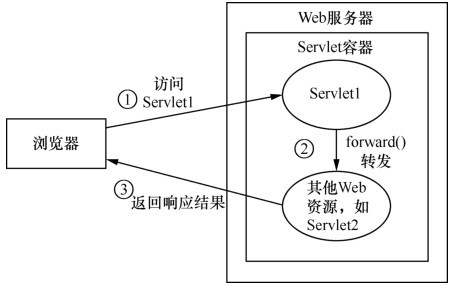</div>

```java
@WebServlet(urlPatterns = "/forward")
public class RequestFroward extends HttpServlet {
    @Override
    protected void doPost(HttpServletRequest req, HttpServletResponse resp) throws ServletException, IOException {
        req.setAttribute("forward", "来自forward的数据");
        // 写相对于项目的根目录的地址即可。会自动拼接成
        // localhost:8080/tomcat/data 这个地址
        req.getRequestDispatcher("/data").forward(req, resp);
    }
}
```

> <b>include 请求包含，简单说就是 Response 包含了当前 Servlet 的响应消息，也包含了 include 目标资源的响应消息</b>

请求包含指的是使用 include() 方法将 Servlet 请求转发给其他 Web 资源进行处理，与请求转发不同的是，当我们访问 Servlet 时，在响应消息中，既包含了当前 Servlet 的响应消息，也包含了 include 目标 Web 资源所作出的响应消息。

<div align="center">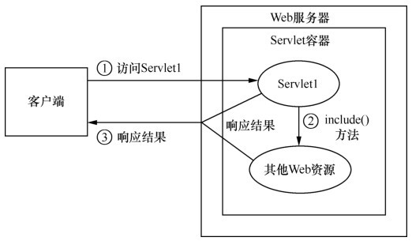</div>

编写两个 Servlet，IncludeOne 和 IncludeTwo，让 IncludeOne 调用 include，且目标路径是 IncludeTwo，然后访问 IncludeOne。

```java
@WebServlet(urlPatterns = "/include1")
public class IncludeOne extends HttpServlet {
    @Override
    protected void doGet(HttpServletRequest req, HttpServletResponse resp) throws ServletException, IOException {
        resp.setContentType("text/html;charset=UTF-8");
        resp.getWriter().println("<b>这是include1添加的内容</b>");
        // 这样就获取到了 include2 设置的响应消息。
        req.getRequestDispatcher("/include2").include(req, resp);
    }
}

@WebServlet(urlPatterns = "/include2")
public class IncludeTwo extends HttpServlet {
    @Override
    protected void doGet(HttpServletRequest req, HttpServletResponse resp) throws ServletException, IOException {
        resp.getWriter().println("<b>这是include2添加的内容</b>");
    }
}
// 这是include1添加的内容 这是include2添加的内容。
```

### 请求重定向

请求重定向是资源跳转的方式，可以用于服务器与服务器之间。浏览器的 URL 会改变。设置重定向的方式用两种。

<b>第一种</b>

- 告诉浏览器要进行重定向：设置状态码为 302
- 告诉浏览器资源的路径：响应头   ("location","资源的路径")

```java
response.setStatus(302);
response.setHeader("location","/blog/responseDemo.do");
```

<b>第二种</b>

其实就是第一种的简写

```java
response.sendRedirect("/blog/xx.do")
```

### 区别

- 重定向的特点：redirect
  - 地址栏发生变化
  - 重定向可以访问其他站点(服务器)的资源
  - 重定向是两次请求。不能使用 request 对象来共享数据
- 转发的特点：forward
  - 转发地址栏路径不变
  - 转发只能访问当前服务器下的资源
  - 转发是一次请求，可以使用 request 对象来共享数据

## BeanUtils工具类

- setProperty()
- getProperty()
- populate(Object obj , Map map)：将 map 集合的键值对信息，封装到对应的 JavaBean 对象中

自行看文档

# ServletConfig

在 Servlet 运行期间，经常需要一些辅助信息，例如，文件使用的编码。这些信息可以在 web.xml 文件中使用一个或多个 \<init-param\> 元素进行配置，也可以用注解 @WebServlet 中的 initParams 属性来配置。<b>注意 init-param 是配置在 Servlet 上的，因此只有该 Servlet 可以访问这些参数。</b>

这些相关的配置信息会封装到一个 ServletConfig 对象中，ServletConfig 中定义了一系列获取配置信息的方法。而 Servlet 可以通过调用 init(ServletConfig config) 方法将 ServletConfig 对象传递给 Servlet。

ServletConfig 常用方法如下表。

| 方法                                           | 功能描述                                                    |
| ---------------------------------------------- | ----------------------------------------------------------- |
| String getServletName();                       | 根据初始化参数名返回对应的初始化参数值                      |
| ServletContext getServletContext();            | 返回一个 Enumeration 对象，其中包含了所有的初始化参数名     |
| String getInitParameter(String var1);          | 返回 Servlet 的名字，即 web.xml 中 \<servlet-name> 元素的值 |
| Enumeration\<String\> getInitParameterNames(); | 返回 Servlet 的名字，即 web.xml 中 \<servlet-name> 元素的值 |

```java
@WebServlet(initParams = {
        @WebInitParam(name = "username", value = "kkx"),
        @WebInitParam(name = "charset", value = "utf8"),
}, loadOnStartup = 1, urlPatterns = "/")
public class Config extends HttpServlet {
    @Override
    public void init() throws ServletException {
        System.out.println("Config init");
    }

    @Override
    protected void service(HttpServletRequest req, HttpServletResponse resp) throws ServletException, IOException {
        System.out.println(getInitParameter("username")); // kkx
        System.out.println("Config");
    }
}
```

# 会话技术

会话是指浏览器和服务器之间的多次请求和响应。浏览器第一次给服务器资源发送请求，会话建立，直到有一方断开『浏览器关闭了，服务器关掉了』为止。会话技术有两种，分别是 Cookie 和 Session。

客户端会话技术：Cookie

服务器端会话技术：Session

## 会话跟踪

<span style="color:orange">在用户访问的一个会话内，web 服务器保存客户的信息，称为会话跟踪。会话跟踪的方式有四种。</span>

<b>重写 URL</b>

- 就是 URL 地址后面附加参数 
- `<a href="xxx/xx/xxx?name=zs">`
- 其缺点为：URL 地址过长，不同浏览器对 URL 传递参数的限制，安全性差『参数明码传输』，编程繁杂。

<b>隐藏表单字段</b>

- 将会话数据放在隐藏域表单元素。简而言之就是 form 表单传递数据。
- 其缺点为：安全性差，可以通过查看网页源代码发现保存的会话信息；编程复杂，如果要保存的数据很多，就很麻烦；无法在超链接模式下工作。

<b>Cookie</b>

- web 服务器保存在客户端的小的文本文件。存储了许多 key，value 对。
- Cookie 由服务器创建，存储在客户端中。
- <span style="color:red">PS：高版本 tomcat 中 Cookie 不能存储空格</span>
- 缺点：
  - 存储方式单一，只能存储 String 类型『Cookie(String name,String name)』
  - 存储位置限制，若存储的 Cookie 过多，每次请求都发送 Cookie，网络数据量过大，影响 Web 应用性能。
  - Cookie 大小受浏览器限制
  - Cookie 存储在客户端，若客户端禁用 Cookie 则无效。

<b>HTTPSession 对象 API</b>

## Cookie

Cookie 是一种会话技术，它用于将会话过程中的数据保存到用户的浏览器中，从而使浏览器和服务器可以更好地进行数据交互。『浏览器发送数据时携带 Cookie，从而实现与服务器进行“有状态”的交互』

### 基本使用

| 方法                                                   | 说明                                                         |
| ------------------------------------------------------ | ------------------------------------------------------------ |
| Cookie(String name, String value)                      | 构造方法，创建 Cookie                                        |
| void response.addCookie(Cookie cookie)                 | 向 response 中添加 Cookie                                    |
| Cookie[]  request.getCookies()                         | 在 request 中获取 Cookie                                     |
| void setMaxAge(int seconds)<br>int getMaxAge()         | 设置 Cookie 在浏览器端的持久化时间<br>获取 Cookie 在浏览器端保持有效的秒数 |
| void setPath(String uri)<br/>String getPath()          | 设置 Cookie 的有效目录路径<br>获取 Cookie 的有效目录路径     |
| void setDomain(String pattern)<br/>String getDomain()  | 设置 Cookie 的有效域（域名）<br/>获取 Cookie 的有效域        |
| void setVersion(int v)<br>int getVersion()             | 设置 Cookie 采用的协议版本<br/>获取 Cookie 采用的协议版本    |
| void setComment(String purpose)<br>String getComment() | 设置 Cookie 项的注解部分<br/>获取 Cookie 项的注解部分        |
| void setSecure(boolean flag)<br>boolean getSecure()    | 设置 Cookie 项是否只能使用安全的协议传送<br/>获取 Cookie 项是否只能使用安全的协议传送 |

使用起来也比较简单，就不记录用法了，后面要用直接看源码注释即可。

Cookie 可以用来存储用户上次的登录时间；可以存储用户的登录凭证用于无密码登录；可以实现不登录将商品添加进购物车等功能。

### 生命周期

默认，关闭浏览器就消失了，但是可进行设置『持久化存储』

- setMaxAge(int seconds) == cookie.setMaxAge(60 * 60 * 24 * 30); //一个月
- 正数：将 Cookie 数据写到硬盘的文件中。持久化存储。并指定 cookie 存活时间，时间到后，cookie 文件自动失效
- 负数：默认值
- 零：删除 cookie 信息

### 易错点

> 高版本 tomcat 的 cookie 不能有空格

一次可不可以发送多个 cookie？可以

>cookie 能不能存中文？

- 在 tomcat 8 之前 cookie 中不能直接存储中文数据。
  - 需要将中文数据转码---一般采用 URL 编码(%E3)
- 在 tomcat 8 之后，cookie 支持中文数据。特殊字符还是不支持，建议使用 URL 编码存储，URL 解码解析

> cookie 共享问题？

- 假设在一个 tomcat 服务器中，部署了多个 web 项目，那么在这些 web 项目中 cookie 能不能共享？
  - 默认情况下 cookie 不能共享
- setPath(String path)：设置 cookie 的获取范围。默认情况下，设置当前的虚拟目录
  - 如果要共享，则可以将 path 设置为"/"
  - setPath("/") //当前服务器的根目录
  - setPath("/day") //day 项目才可以访问

> 不同的 tomcat 服务器间 cookie 共享问题？

```java
public void setDomain(String domain) {
    this.domain = domain.toLowerCase(Locale.ENGLISH); // IE allegedly needs this
}
```

- setDomain(String path)：如果设置域名相同，那么多个服务器之间 cookie 可以共享
-  setDomain(".baidu.com")：tieba.baidu.com 和 news.baidu.com 中 cookie 可以共享 『这里应该是设置的一级二级域名相同，则可共享 cookie』
  - .baidu.com 是一级域名 『此处应该是 com 是一级域名，baidu 是二级域名』
  - tieba 是二级域名 『tieba 和 news 是三级域名』

- 域名的划分
    - mail.cctv.com
    - com 是顶级域名
    - cctv 是二域名
    - mail 是三级域名
    - 『参考教材：谢希仁《计算机网络》（第六版）』

## Session

Session是一种将会话数据保存到服务器端的技术。在一次会话的多次请求间共享数据，将数据保存在服务器端的对象中。

### 基本使用

- 获取 HttpSession 对象：HttpSession session = request.getSession();
- 使用 HttpSession 对象：
  - Object getAttribute(String name)  
  - void setAttribute(String name, Object value)
  - void removeAttribute(String name)
- 原理：Session 的实现是依赖于 Cookie 的。session 对象创建后，它的 sessionID 会自动选择 Cookie 作为存储地。

<b>Session 常用方法如下表所示。</b>

| 方法                                         | 功能描述                                                     |
| -------------------------------------------- | ------------------------------------------------------------ |
| String getId()                               | 用于返回与当前 HttpSession 对象关联的会话标识号。            |
| long getCreationTime()                       | 返回 Session 创建的时间，这个时间是创建 Session 的时间与 1970 年 1 月 1 日 00:00:00 之间时间差的毫秒表示形式。 |
| long getLastAccessedTime()                   | 返回客户端最后一次发送与 Session 相关请求的时间，这个时间是发送请求的时间与 1970 年 1 月 1 日 00:00:00 之间时间差的毫秒表示形式。 |
| void setMaxInactiveInterval(int interval)    | 用于设置当前 HttpSession 对象可空闲的以秒为单位的最长时间，也就是修改当前会话的默认超时间隔。 |
| boolean isNew()                              | 判断当前 HttpSession 对象是否是新创建的。                    |
| void invalidate()                            | 用于强制使 Session 对象无效。                                |
| ServletContext getServletContext()           | 用于返回当前 HttpSession 对象所属于的 Web 应用程序对象，即代表当前 Web 应用程序的 ServletContext 对象。 |
| void setAttribute(String name, Object value) | 用于将一个对象与一个名称关联后存储到当前的 HttpSession 对象中。 |
| String getAttribute()                        | 用于从当前 HttpSession 对象中返回指定名称的属性对象。        |
| void removeAttribute(String name)            | 用于从当前 HttpSession 对象中删除指定名称的属性。            |

API 的使用也比较简单，就不一一罗列了，只列举部分应用场景。

### 超时管理

当客户端第 1 次访问某个能开启会话功能的资源时，Web 服务器就会创建一个与该客户端对应的 HttpSession 对象。在一定时间内，如果某个客户端一直没有请求访问，那么，Web 服务器就会认为该客户端已经结束请求，并且将与该客户端会话所对应的 HttpSession 对象变成垃圾对象，等待垃圾收集器将其从内存中彻底清除。反之，如果浏览器超时后，再次向服务器发出请求访问，那么， Web 服务器则会创建一个新的 HttpSession 对象，并为其分配一个新的 ID 属性。

<b>session 默认失效时间 30 分钟『可以在 tomcat 的 web.xml 配置文件中配置』</b>

```xml
<session-config>
    <session-timeout>30</session-timeout>
</session-config>
```

每次访问页面时，都会重置 Session 的失效时间，即 10 分钟内没有访问会话，第 10 分钟重新访问会话，那么 Session 的有效时间还是 30 分钟。

也可以使用 invalidate 方法强制使会话失效。

### 易错点

> 当客户端关闭后，服务器不关闭，两次获取 session 是否为同一个？

- 默认情况下<b>不是</b>。
- 如果需要相同，则可以创建 Cookie，键为 JSESSIONID，设置最大存活时间，让 Cookie 持久化保存。

```java
HttpSession session = request.getSession();
Cookie c = new Cookie("JSESSIONID",session.getId());
c.setMaxAge(60*60);
response.addCookie(c);
/*
浏览器禁用 Cookie 时，如何使用 Session?
代码与上面一样，我们手动设置 Session 写入 Cookie中。
浏览器没用禁用 Cookie 时，会自动把 Session 的 Id 写入 Cookie的 。
*/
```

> 客户端不关闭，服务器关闭后，两次获取的 session 是同一个吗？

- 不是同一个，但是要确保数据不丢失。『tomcat 自动完成以下工作』
  - session 的钝化：在服务器正常关闭之前，将 session 对象系列化到硬盘上
  - session 的活化：在服务器启动后，将 session 文件转化为内存中的 session 对象即可。

> session 什么时候被销毁？

- 服务器关闭

- session 对象调用 invalidate() 

- session 默认失效时间 30 分钟『tomcat 的 web.xml 配置文件中』

  ```xml
  <session-config>
      <session-timeout>30</session-timeout>
  </session-config>
  ```

## 对比

- session 用于存储一次会话的多次请求的数据，存在服务器端

- session 可以存储任意类型，任意大小的数据

- session 与 Cookie 的区别：
  - session 存储数据在服务器端，Cookie 在客户端
  - session 没有数据大小限制，Cookie 有
  - session 数据安全，Cookie 相对于不安全

<b>就 Servlet 规范本身，Servlet 可以再三个不同的作用域存储数据，分别是</b>

- Request 对象
- Session 对象
- getServletContext() 方法返回的 servletContext 对象

1️⃣首先从作用范围来说

- Request 保存的键值仅在下一个 request 对象中可以得到。
- Session 它是一个会话范围，相当于一个局部变量，从 Session 第一次创建直到关闭，数据都一直保存，每一个客户都有一个 Session，所以它可以被客户一直访问，只要 Session 没有关闭、超时。
- ServletContext 它代表了 Servlet 环境的上下文，相当于一个全局变量。只要 web 应用启动了，这个对象就一直都有效的存在，范围最大，存储的数据可以被该应用的所有用户使用，只要服务器不关闭，数据就会一直都存在。

2️⃣优缺点

- request：
    - 好处：用完就仍，不会导致资源占用的无限增长。
    - 弊处：数据只能被下一个对象获取，所以在写程序时会因为无法共享数据导致每次要用都从数据库中取，多做操作，自然会对性能有一些影响。
- session：
    - 好处：是一个局部变量，可以保存用户的信息并直接取出，不用每次都去数据库抓，少做操作，极大的方便了程序的编写。
    - 弊处：每个客户都有一个 session，只能自己使用，不同 session 可能保存大量重复数据； 可能耗费大量服务器内存； 另外 session 构建在 cookie 和 url 重写的基础上，所以用 session 实现会话跟踪，会用掉一点点服务器带宽和客户端保持联络， 当然 session 越多，耗费的带宽越多，理论上也会对性能造成影响。 集群的 session 同步是个问题。
- servletContext：
    - 好处：不用每次都去数据库抓，少做操作。 存储的数据所有客户都可以用。 可减少重复在内存中存储数据造成的开销。

# Filter

Servlet 规范中有两个高级特性：Filter 和 Listener。Filter 用于对 request、response 对象进行修改，Listener 用于对 context、session、request 事件进行监听。这里先介绍 Filter。

<b style="color:orange">当访问服务器的资源时，过滤器可以将请求拦截下来，完成一些特殊的功能。</b>

Filter 的典型应用场景有

- 登录校验
- 过滤敏感词
- 设置统一编码

## Filter入门

Filter 被称作过滤器，其基本功能就是对 Servlet 容器调用 Servlet 的过程进行拦截，从而在 Servlet 进行响应处理前后实现一些特殊功能。

- xml 配置
- 注解配置

```java
// 访问所有资源之前都会执行该过滤器。都会被这个过滤器拦截下来
@WebFilter("/*")
public class FilterDemo implements Filter {
    public void destroy() {}

    public void doFilter(ServletRequest req, ServletResponse resp, FilterChain chain) throws ServletException, IOException {
        System.out.println("hello");
        // 放行
        chain.doFilter(req, resp);
    }

    public void init(FilterConfig config) throws ServletException {}
}
```

## xml&注解配置

```xml
<filter>
    <filter-name>demo1</filter-name>
    <filter-class>cn.itcast.web.filter.FilterDemo1</filter-class>
    <!-- 初始化参数配置 -->
    <init-param>
    	<param-name>key</param-name>
        <param-value>xxxx</param-value>
    </init-param>
    <init-param>
        <param-name>key</param-name>
        <param-value>xxxx</param-value>
    </init-param>
</filter>
<filter-mapping>
    <filter-name>demo1</filter-name>
    <!-- 拦截路径 -->
    <url-pattern>/*</url-pattern>
</filter-mapping>
```

```java
/***
 * 在web.xml中，filter执行顺序跟<filter-mapping>的顺序有关，先声明的先执行
 * 使用注解配置的话，filter的执行顺序跟名称的字母顺序有关，例如AFilter会比BFilter先执行
 * 如果既有在web.xml中声明的Filter，也有通过注解配置的Filter，那么会优先执行web.xml中配置的Filter
 */
@WebFilter(filterName = "LoginFilter", urlPatterns = {"/*"}, initParams = {
        @WebInitParam(name = "username", value = "root"),
        @WebInitParam(name = "password", value = "root")
})
public class LoginFilter implements Filter {
    private ArrayList<String> address = new ArrayList();

    public void destroy() {}

    // 防止url非法访问 不能直接通过url访问
    public void doFilter(ServletRequest req, ServletResponse resp, FilterChain chain) throws ServletException, IOException {
        System.out.println("LLL");
        String localName = req.getLocalName();
        HttpServletRequest request = (HttpServletRequest) req;
        HttpServletResponse response = (HttpServletResponse) resp;
        StringBuffer requestURL = request.getRequestURL();
        HttpSession session = request.getSession();
        if (session.getAttribute("user") == null) {
            // 统一资源定位符  http://localhost:8080/tomcat/
            String requestURI = request.getRequestURI();
            if (canPass(requestURI)) {
                chain.doFilter(req, resp);
            } else {
                System.out.println("*********************");
                request.getRequestDispatcher("/index.html").forward(request, response);
            }
        } else {
            chain.doFilter(req, resp);
        }
    }

    // 能否通过 包含才能通过
    private boolean canPass(String adr) {
        for (String str : address) 
            if (adr.contains(str)) return true;
        return false;
    }

    public void init(FilterConfig config) throws ServletException {
        String username = config.getInitParameter("username");
        String password = config.getInitParameter("password");
        address.add("login");
        address.add("index");
        address.add("demo");
    }
}
```

## 过滤器执行流程

- 执行过滤器

- 执行放行后的资源

- 回来执行过滤器放行代码下边的代码

- 执行的顺序可以理解为一个压栈的过程。

  - 定义的顺序 F3，F2，F1
  - 初始化的时候，F3，F2，F1 依次入栈
  - 然后依次出栈执行初始化过程，所以 init 的输出顺序是 1 2 3。初始化好后的又入栈到 doFilter 这个栈中。 1 2 3『栈顶』
  - 栈顶元素再一次执行 doFilter 方法。 顺序为  3  2  1.
  - destroy 方法也是如此记忆。顺序为 1 2 3.

  ```xml
  <filter>
      <filter-name>xml3</filter-name>
      <filter-class>com.lg.controller.XMLFilter3</filter-class>
  </filter>
  <filter-mapping>
      <filter-name>xml3</filter-name>
      <url-pattern>/*</url-pattern>
  </filter-mapping>
  <filter>
      <filter-name>xml2</filter-name>
      <filter-class>com.lg.controller.XMLFilter2</filter-class>
  </filter>
  <filter-mapping>
      <filter-name>xml2</filter-name>
      <url-pattern>/*</url-pattern>
  </filter-mapping>
  <filter>
      <filter-name>xml1</filter-name>
      <filter-class>com.lg.controller.XMLFilter1</filter-class>
  </filter>
  <filter-mapping>
      <filter-name>xml1</filter-name>
      <url-pattern>/*</url-pattern>
  </filter-mapping>
  
  init Filter1
  init Filter2
  init Filter3
  
  doFilter3
  doFilter2
  doFilter1
  
  F1 destroy
  F2 destroy
  F3 destroy
  ```

  注解的配置方式有个 bug。

## 生命周期方法

- init：在服务器启动后，会创建 Filter 对象，然后调用 init 方法。只执行一次，一般是<b>用于加载资源</b>。
- doFilter：每一次请求被拦截资源时会执行，可执行多次。
- destroy：在服务器关闭后，Filter 对象被销毁。如果服务器是正常关闭，则会执行 destroy 方法。只执行一次。<b>一般用于释放资源</b>。

Filter 和 Servlet 一样也可以预先设置一些参数，然后供当前 Filter 读取使用。Servlet 对应的是 ServletConfig 类，而 Filter 对应的是 FilterConfig 类。用法是类似的，作用域范围也是一样的，都是只有当前 Filter 可以访问。

## 配置详解

Filter 拦截路径的常见配置如下表所示。

| 方式         | 举例       | 说明                                          |
| ------------ | ---------- | --------------------------------------------- |
| 具体资源路径 | /index.jsp | 只有访问 index.jsp 资源时，过滤器才会被执行   |
| 拦截目录     | /user/*    | 访问 /user 下的所有资源时，过滤器都会被执行   |
| 后缀名拦截   | *.jsp      | 访问所有后缀名为 jsp 资源时，过滤器都会被执行 |
| 拦截所有资源 | /*         | 访问所有资源时，过滤器都会被执行              |

Filter 中有一个元素可以指定过，当资源被特定的方式访问时才会进行拦截。xml 中是通过 `filter-mapping` 中的 `dispatcher` 来指定；注解配置则是使用 @WebFilter 中的 dispatcherTypes 属性来指定。

注解配置示例 @WebFilter(value = "/index.jsp",dispatcherTypes = DispatcherType.REQUEST)

- REQUEST：默认值，浏览器直接请求资源
- FORWARD：转发访问资源
- INCLUDE：包含访问资源
- ERROR：错误跳转资源
- @WebFilter(value = "/index.jsp",dispatcherTypes = DispatcherType.FORWARD)
- 当 xx 转发到 index.jsp 时，会被过滤器拦截

<b>REQUEST</b>

当用户直接访问页面时，Web 容器将会调用过滤器。如果目标资源是通过 Request Dispatcher 的 include() 或 forward() 方法访问的，那么该过滤器将不会被调用。

<b>INCLUDE</b>

如果目标资源是通过 RequestDispatcher 的 include() 方法访问的，那么该过滤器将被调用。除此之外，该过滤器不会被调用。

<b>FORWARD</b>

如果目标资源是通过 RequestDispatcher 的 forward() 方法访问的，那么该过滤器将被调用。除此之外，该过滤器不会被调用。

<b>ERROR</b>

如果目标资源是通过声明式异常处理机制调用的，那么该过滤器将被调用。除此之外，过滤器不会被调用。

## 过滤器链

在一个 Web 应用程序中可以注册多个 Filter 程序，每个 Filter 程序都可以针对某一个 URL 进行拦截。如果多个 Filter 程序都对同一个 URL 进行拦截，那么这些 Filter 就会组成一个 Filter 链（也叫过滤器链）。

过滤器链的执行顺序：如果有两个过滤器 Filter1 和 Filter2

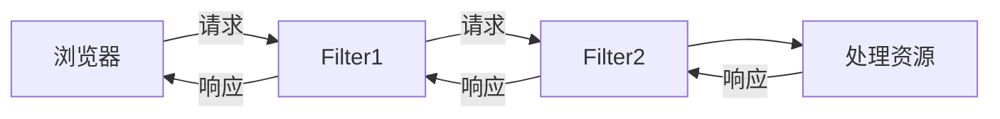

过滤器先后顺序问题
- 注解配置：按照类名的字符串比较规则比较，值小的先执行；如：AFilter 和 BFilter，AFilter 就先执行了。『字典顺序小的先执行』
- web.xml 配置：`<filter-mapping>` 谁定义在上边，谁先执行

## 过滤器案例

### 登录

防止用户直接通过 url 进行页面访问！

- 获取请求资源路径
- 判断路径是否为登录相关。是则放行，否则跳转至登录页面
- 注意，过滤器也会拦截静态资源，对静态资源要进行放行

```java
public void doFilter(ServletRequest req, ServletResponse resp, FilterChain chain) throws ServletException, IOException {
    //0.强制转换
    HttpServletRequest request = (HttpServletRequest) req;

    //1.获取资源请求路径
    String uri = request.getRequestURI();
    //2.判断是否包含登录相关资源路径,
    //要注意排除掉 css/js/图片/验证码等资源
    if(uri.contains("/login.jsp") ||
       uri.contains("/loginServlet") ||
       uri.contains("/css/") ||
       uri.contains("/js/") ||
       uri.contains("/fonts/") ||
       uri.contains("/checkCodeServlet")  
      ){
        //包含，用户就是想登录。放行
        chain.doFilter(req, resp);
    }else{
        //不包含，需要验证用户是否登录
        //3.从获取session中获取user
        Object user = request.getSession().getAttribute("user");
        if(user != null){
            //登录了。放行
            chain.doFilter(req, resp);
        }else{
            //没有登录。跳转登录页面
            request.setAttribute("login_msg","您尚未登录，请登录");      request.getRequestDispatcher("/login.jsp").forward(request,resp);
        }
    }
```


### 过滤敏感词

需要对 request 的获取方法进行增强！

```java
// 敏感词汇过滤器
@WebFilter("/*")
public class SensitiveWordsFilter implements Filter {

    public void doFilter(ServletRequest req, ServletResponse resp, FilterChain chain) {
        //1.创建代理对象，增强getParameter方法
        ServletRequest proxy_req = (ServletRequest) Proxy.newProxyInstance(req.getClass().getClassLoader(), 
                                                                           req.getClass().getInterfaces(), 
                                                                           new InvocationHandler() {
            @Override
            public Object invoke(Object proxy, Method method, Object[] args) throws Throwable {
                //增强getParameter方法
                //判断是否是getParameter方法
                if(method.getName().equals("getParameter")){
                    //增强返回值
                    //获取返回值
                    String value = (String) method.invoke(req,args);
                    if(value != null){
                        for (String str : list) {
                            if(value.contains(str)){
                                value = value.replaceAll(str,"***");
                            }
                        }
                    }
                    return  value;
                }
                //判断方法名是否是 getParameterMap
                //判断方法名是否是 getParameterValue
                return method.invoke(req,args);
            }
        });

        //2.放行
        chain.doFilter(proxy_req, resp);
    }
    private List<String> list = new ArrayList<String>();//敏感词汇集合
    
    public void init(FilterConfig config) throws ServletException {
        try{
            //1.获取文件真实路径
            ServletContext servletContext = config.getServletContext();
            String realPath = servletContext.getRealPath("/WEB-INF/classes/敏感词汇.txt");
            //2.读取文件
            BufferedReader br = new BufferedReader(new FileReader(realPath));
            //3.将文件的每一行数据添加到list中
            String line = null;
            while((line = br.readLine())!=null){
                list.add(line);
            }

            br.close();
            System.out.println(list);

        }catch (Exception e){
            e.printStackTrace();
        }
    }
}
```

### 统一编码

在其他 Servlet 获取数据之前和响应数据之前设置编码格式即可。

```java
@WebFilter(urlPatterns = "/*")
public class CharsetFilter implements Filter {
    @Override
    public void doFilter(ServletRequest request, ServletResponse response, FilterChain chain) throws IOException, ServletException {
        request.setCharacterEncoding("UTF-8");
        response.setContentType("text/html;charset=UTF-8");
        chain.doFilter(request, response);
    }
}
```


## 增强对象的功能

### 装饰模式

pass

### 代理模式

代理模式可分为静态代理和动态代理

基本概念
- 真实对象：被代理的对象
- 代理对象
- 代理模式：代理对象代理真实对象，达到增强真实对象功能的目的。

> 实现方式

1.静态代理：有一个类文件描述代理模式

2.动态代理：在内存中形成代理类

> 动态代理实现步骤

- 代理对象和真实对象实现相同的接口
- 代理对象 = Proxy.netProxyInstance();

- 使用代理对象调用方法『实现了相同接口，有相同的方法设定』
- 增强方法
- 增强返回值，如：return "name"，增强后 return “name”+“：price”;
- 增强参数，对参数进行修改，如：售价打折。

```java
public interface ISale {
    public String sale(double money);
    public void show();
}

public class Lenovo implements ISale {
    @Override
    public String sale(double money) {
        System.out.println("花了"+money+"买了一台电脑");
        return "Lenovo";
    }

    @Override
    public void show() {
        System.out.println("展示电脑");
    }
}

public class ProxyDemo {

    public static void main(String[] args) {
        Lenovo lenovo = new Lenovo();
        /**
         * 1.类加载器
         * 2.接口数组，保证代理对象和真实对象实现相同的接口
         * 3.处理器
         */
        Class<Lenovo> lc = Lenovo.class;
        ISale o = (ISale) Proxy.newProxyInstance(lc.getClassLoader(), lc.getInterfaces(), new InvocationHandler() {
            /**
             * 代理逻辑方法
             * @param proxy 代理对象 其实指的就是o
             * @param method 代理对象调用的方法，被封装为的对象
             * @param args
             * @return
             * @throws Throwable
             */
            @Override
            public Object invoke(Object proxy, Method method, Object[] args) throws Throwable {
                Object obj = method.invoke(lenovo, args);
                if("sale".equals(method.getName())){
                    // 调用真实对象的方法 obj是执行方法后的返回值
                    System.out.println("该方法执行了");
                }
                return obj;
            }
        });
        String sale = o.sale(1000);
        o.show();
        System.out.println(sale);
    }
}
```

# Listener

Listener，JavaWeb 三大组件之一，常用于监听某些事件并对该类事件做出响应。好好理解下这种设计思想，在诸多框架中也提供了类似的功能。

## Servlet事件监听

监听器在监听的过程中会涉及几个重要组成部分，具体如下。

- 事件：一件事情；如用户的一个操作，如单击一个按钮、调用一个方法、创建一个对象等。
- 事件源：产生事件的对象。
- 监听器：负责监听发生在事件源上的事件。
- 事件处理器：监听器的成员方法，当事件发生的时候会触发对应的处理器（成员方法）。

Web 应用程序中经常会使用监听器，这些监听器被称为 Servlet 事件监听器。Servlet 事件监听器就是一个实现了特定接口的 Java 程序，专门用于监听 Web 应用程序中 ServletContext、HttpSession 和 ServletRequest 等域对象的创建和销毁过程，监听这些域对象属性的修改以及感知绑定到 HttpSession 域中某个对象的状态。

<b>Servlet 规范中共有 8 种监听器，具体如下表所示。</b>

| 类型                            | 描述                                                         |
| ------------------------------- | ------------------------------------------------------------ |
| ServletContextListener          | 用于监听 ServletContext 对象的创建与销毁过程                 |
| HttpSessionListener             | 用于监听 ServletContext 对象的创建与销毁过程                 |
| ServletRequestListener          | 用于监听 ServletRequest 对象的创建与销毁过程                 |
| ServletContextAttributeListener | 用于监听 ServletContext 对象中的属性变更                     |
| HttpSessionAttributeListener    | 用于监听 HttpSession 对象中的属性变更                        |
| ServletRequestAttributeListener | 用于监听 ServletRequest 对象中的属性变更                     |
| HtpSessionBindingListener       | 用于监听 JavaBean 对象绑定到 HttpSession 对象和从 HttpSession 对象解绑的事件 |
| HttpSessionActivationListener   | 用于监听 HttpSession 中对象活化和钝化的过程                  |

<b>HttpSessionActivationListener 涉及到了活化和钝化的概念。</b>

- HttpSession 对象从内存中转移至硬盘的过程称为钝化。具体的，当服务器正常关闭时，还存活着的 session (在设置时间内没有销毁) 会随着服务器的关闭被以文件 (“SESSIONS.ser”) 的形式存储在 tomcat 的 work 目录下，这个过程叫做 Session 的钝化。
- HttpSession 对象从持久化的状态变为运行状态的过程被称为活化。具体的，当服务器再次正常开启，服务器会找到之前的 “SESSIONS.ser” 文件，从中恢复之前保存起来的 Session 对象，这个过程叫做 Session 的活化。

[(28条消息) session 对象的绑定、解绑和钝化、活化_thedevilisme888的博客-CSDN博客](https://blog.csdn.net/thedevilisme888/article/details/116549861?spm=1001.2101.3001.6650.2&utm_medium=distribute.pc_relevant.none-task-blog-2~default~BlogCommendFromBaidu~Rate-2-116549861-blog-102151762.pc_relevant_recovery_v2&depth_1-utm_source=distribute.pc_relevant.none-task-blog-2~default~BlogCommendFromBaidu~Rate-2-116549861-blog-102151762.pc_relevant_recovery_v2&utm_relevant_index=3)

<b>API 的用法也比较简单，就是实际的应用场景复杂。</b>

```java
@WebListener
public class ListenerHttpSession implements HttpSessionListener {
    @Override
    public void sessionCreated(HttpSessionEvent se) {
        System.out.printf("=======>Session 活化 %s%n", se.getSession());
        HttpSessionListener.super.sessionCreated(se);
    }

    @Override
    public void sessionDestroyed(HttpSessionEvent se) {
        System.out.printf("=======>Session 钝化 %s%n", se.getSession());
        HttpSessionListener.super.sessionDestroyed(se);
    }
}
```

## ServletContextListener

> 监听 ServletContext 对象的创建和销毁。

```java
// 对象创建后调用该方法
default void contextInitialized(ServletContextEvent sce) {}
// 对象销毁前，调用该方法
default void contextDestroyed(ServletContextEvent sce) {}
```

> 步骤

定义一个类，实现 ServletContextListener 接口

覆写方法

配置：web.xml 配置或注解配置

web.xml 配置方式

```xml
<listener>
	<listener-class>实现类的全路径</listener-class>
</listener>
<!-- 指定初始化参数 -->
<context-param>
	<param-name>key</param-name>
    <param-value>value</param-value>
</context-param>
<context-param>
    <param-name>123</param-name>
    <param-value>234</param-value>
</context-param>
```

注解配置方式

```java
@WebListener
public class ListenerDemo implements ServletContextListener{
    //xxx
}
```


> 作用

用来加载资源文件

```java
public void contextInitialized(ServletContextEvent sce) {
	servletContext.getInitParameter("");
}
```

动态添加 Servlet 感觉有点鸡肋（Servlet 3.0+）。不，不鸡肋！Spring MVC 动态添加自己定义的 Servlet 正是采用监听器来完成的！

```java
@WebListener(value = "listener1")
public class Listener implements ServletContextListener {

    public Listener() {}

    // -------------------------------------------------------
    // ServletContextListener implementation
    // -------------------------------------------------------
    public void contextInitialized(ServletContextEvent sce) {
        // 这个动态注册感觉优点鸡肋
        ServletContext servletContext = sce.getServletContext();
        ServletRegistration.Dynamic d = servletContext.addServlet("d", Servlet.class);
        d.addMapping("/servlet");
    }

    public void contextDestroyed(ServletContextEvent sce) {}
}
```

# ServletContext

ServletContext 是一个接口，官方叫 Servlet 上下文。当 Servlet 容器启动时，会为每个 Web 应用创建一个唯一的 ServletContext 对象代表当前 Web 应用，该对象不仅封装了当前 Web 应用的所有信息，而且实现了多个 Servlet 之间数据的共享。

## 获取对象

- 通过 request 对象获取  request.getServletContext();
- 通过 HttpServlet 获取  this.getServletContext();

## 共享数据

在 Web 应用的 XML 中配置初始化参数，供整个应用的 Servlet 共享。

```xml
<?xml version="1.0" encoding="UTF-8"?>
<web-app xmlns="http://xmlns.jcp.org/xml/ns/javaee"
         xmlns:xsi="http://www.w3.org/2001/XMLSchema-instance"
         xsi:schemaLocation="http://xmlns.jcp.org/xml/ns/javaee http://xmlns.jcp.org/xml/ns/javaee/web-app_4_0.xsd"
         version="4.0">
    <context-param>
        <param-name>hello</param-name>
        <param-value>hello-value</param-value>
    </context-param>
</web-app>
```

```java
@WebServlet(urlPatterns = "/context")
public class TestServletContext extends HttpServlet {
    @Override
    protected void doGet(HttpServletRequest req, HttpServletResponse resp) throws ServletException, IOException {
        ServletContext servletContext = getServletContext();
        // hello-value
        String hello = servletContext.getInitParameter("hello");
        resp.getWriter().write(hello);
    }
}
```

一个 Web 应用中的所有 Servlet 共享同一个 ServletContext 对象，因此，ServletContext 对象的域属性可以被该 Web 应用中的所有 Servlet 访问。在 ServletContext 接口中定义了分别用于增加、删除、设置 ServletContext 域属性的 4 个方法

| 方法说明                                   | 功能描述                                                     |
| ------------------------------------------ | ------------------------------------------------------------ |
| Enumeration getAttributeNames()            | 返回一个 Enumeration 对象，该对象包含了所有存放在 ServletContext 中的所有域属性名 |
| Object getAttribute(String name)           | 根据参数指定的属性名返回一个与之匹配的域属性值               |
| void removeAttribute(String name)          | 根据参数指定的域属性名，从 ServletContext 中删除匹配的域属性 |
| void setAttribute(String name, Object obj) | 设置 ServletContext 的域属性，其中 name 是域属性名，obj 是域属性值 |

测试部分 API。编写两个 Servlet 一个用于 setAttribute 一个用于 getAttribute。用 HttpClient 发起 HTTP 请求进行测试。

<b>Servlet 代码</b>

```java
@WebServlet(urlPatterns = "/setContext")
public class SetServletContextAttribute extends HttpServlet {
    @Override
    protected void doGet(HttpServletRequest req, HttpServletResponse resp) throws ServletException, IOException {
        ServletContext context = getServletContext();
        context.setAttribute("context-name", "TestServletContext put name");
    }
}

@WebServlet(urlPatterns = "/getContext")
public class GetServletContextAttribute extends HttpServlet {
    @Override
    protected void doGet(HttpServletRequest req, HttpServletResponse resp) throws ServletException, IOException {
        ServletContext context = getServletContext();
        Object attribute = context.getAttribute("context-name");
        resp.getWriter().write(attribute.toString());
    }
}
```

<b>HttpClient 测试代码，先发起 set 请求在 get 属性</b>

```java
package com.tomcat.controller.context;

import java.net.URI;
import java.net.http.HttpClient;
import java.net.http.HttpRequest;
import java.net.http.HttpResponse;
import java.time.Duration;
import java.util.concurrent.ExecutorService;
import java.util.concurrent.Executors;

public class TestContext {
    public static void main(String[] args) {
        testMethod();
    }

    public static void testMethod() {
        HttpRequest setContext = HttpRequest.newBuilder()
                .header("Content-Type", "text/html;charset=UTF-8")
                .version(HttpClient.Version.HTTP_1_1)
                .uri(URI.create("http://localhost:8080/tomcat/setContext"))
                .timeout(Duration.ofMillis(2000))
                .GET()
                .build();

        HttpRequest getContext = HttpRequest.newBuilder()
                .header("Content-Type", "text/html;charset=UTF-8")
                .version(HttpClient.Version.HTTP_1_1)
                .uri(URI.create("http://localhost:8080/tomcat/getContext"))
                .timeout(Duration.ofMillis(2000))
                .GET()
                .build();

        try {
            client.send(setContext, HttpResponse.BodyHandlers.ofString());
            HttpResponse<String> send = client.send(getContext, HttpResponse.BodyHandlers.ofString());
            showExecutorResult(send);
        } catch (Exception e) {
            throw new RuntimeException(e);
        } finally {
            threadPool.shutdown();
        }

    }


    private static void showExecutorResult(HttpResponse<String> message) {
        System.out.println("状态码==============>" + message.statusCode());
        System.out.println("响应体==============>" + message.body());
    }

    private static ExecutorService threadPool = Executors.newFixedThreadPool(10);

    private static final HttpClient client = HttpClient
            .newBuilder()
            .version(HttpClient.Version.HTTP_1_1)
            .connectTimeout(Duration.ofMillis(2000))
            .followRedirects(HttpClient.Redirect.NEVER)
            .executor(threadPool)
            .build();

}
```

## 读取资源文件

我们可以用 ServletContext 来读取 Web 应用下的资源文件。如配置文件、图片等。为此，在 ServletContext 接口中定义了一些读取 Web 资源的方法，这些方法是依靠 Servlet 容器来实现的。Servlet 容器根据资源文件相对于 Web 应用的路径，返回关联资源文件的 IO 流、资源文件在文件系统的绝对路径等。

| 方法                                         | 功能描述                                                     |
| -------------------------------------------- | ------------------------------------------------------------ |
| Set getResourcePaths(String path)            | 返回一个 Set 集合，集合中包含资源目录中子目录和文件的路径名称。参数 path 必须以正斜线 `/` 开始，指定匹配资源的部分路径。 |
| String getRealPath(String path)              | 返回资源文件在服务器文件系统上的真实路径（文件的绝对路径）。参数 path 代表资源文件的虚拟路径，它应该以正斜线 `/` 开始，`/` 表示当前 Web 应用的根目录，如果 Servlet 容器不能将虚拟路径转换为文件系统的真实路径，则返回 null。 |
| URL getResource(String path)                 | 返回映射到某个资源文件的 URL 对象。参数 path 必须以正斜线 `/` 开始，`/` 表示当前 Web 应用的根目录。 |
| InputStream getResourceAsStream(String path) | 返回映射到某个资源文件的 InputStream 输入流对象。参数 path 传递规则和 getResource() 方法完全一致。 |

<b>Servlet 代码</b>

```java
@WebServlet(urlPatterns = "/resource")
public class ReadResource extends HttpServlet {
    @Override
    protected void service(HttpServletRequest req, HttpServletResponse resp) throws ServletException, IOException {
        ServletContext context = req.getServletContext();
        URL resource = context.getResource("/testFile.txt");
        String realPath = context.getRealPath("/testFile.txt");
        // 获取当前 Web 应用根目录下的所有文件，不会递归获取文件！
        Set<String> resourcePaths = context.getResourcePaths("/"); 
        InputStream resourceAsStream = context.getResourceAsStream("/testFile.txt");

        StringBuilder builder = new StringBuilder();
        builder.append("URL=====>").append(resource).append("\n")
                .append("realPath=====>").append(realPath).append("\n")
                .append("resourcePaths=====>").append(Arrays.toString(resourcePaths.toArray())).append("\n")
                .append("resourceAsStream=====>").append(new String(resourceAsStream.readAllBytes())).append("\n");
        resp.setContentType("text/html;charset=UTF-8");
        resp.getWriter().write(builder.toString());
    }
}
```

<b>测试代码</b>

```java
package com.tomcat.controller.context;

import java.net.URI;
import java.net.http.HttpClient;
import java.net.http.HttpRequest;
import java.net.http.HttpResponse;
import java.time.Duration;
import java.util.concurrent.ExecutorService;
import java.util.concurrent.Executors;

public class TestContext {
    public static void main(String[] args) {
        testContextReadSource();
    }

    // 测试方法。
    public static void testContextReadSource() {
        HttpRequest request = HttpRequest.newBuilder()
                .header("Content-Type", "text/html;charset=UTF-8")
                .version(HttpClient.Version.HTTP_1_1)
                .uri(URI.create("http://localhost:8080/tomcat/resource"))
                .timeout(Duration.ofMillis(2000))
                .GET().build();
        try {
            HttpResponse<String> resp = client.send(request, HttpResponse.BodyHandlers.ofString());
            showExecutorResult(resp);
        } catch (Exception e) {
            throw new RuntimeException(e);
        } finally {
            threadPool.shutdown();
        }
    }

    private static void showExecutorResult(HttpResponse<String> message) {
        System.out.println("状态码==============>" + message.statusCode());
        System.out.println("响应体==============>" + message.body());
    }

    private static ExecutorService threadPool = Executors.newFixedThreadPool(10);

    private static final HttpClient client = HttpClient
            .newBuilder()
            .version(HttpClient.Version.HTTP_1_1)
            .connectTimeout(Duration.ofMillis(2000))
            .followRedirects(HttpClient.Redirect.NEVER)
            .executor(threadPool)
            .build();
}
/*
状态码==============>200
响应体==============>URL=====>file:/E:/Code/tomcat/web/testFile.txt
realPath=====>E:\Code\tomcat\web\testFile.txt
resourcePaths=====>[/index.jsp, /WEB-INF/, /testFile.txt]
resourceAsStream=====>这是一个测试 ServletContext 读取资源的文件。
*/
```

## 添加组件

ServletContext 类还提供了几个方法用于向容器中动态添加 Servlet、Filter、Listener 这三大组件。不过不能在上下文初始好后添加这些组件。因此，可以通过配置 loadOnStartup=正数，在容器启动，但是没有初始化好上下文（ServletContext）的时间将 Servlet 添加进去。

```java
@WebServlet(urlPatterns = "/add", loadOnStartup = 0)
public class AddComponent extends HttpServlet {
    @Override
    public void init() throws ServletException {
        ServletContext context = getServletContext();
        context.addServlet("dym", new HttpServlet() {
            @Override
            protected void doGet(HttpServletRequest req, HttpServletResponse resp) throws ServletException, IOException {
                resp.setContentType("text/html;charset=UTF-8");
                resp.getWriter().write("动态添加的 Servlet");
            }
        }).addMapping("/dym");
    }
}
```

Spring MVC 也是借用了这个特点来向容器中添加自定义的 Servlet、Filter、Listener 的。

## 文件的下载

需求：完成文件下载功能，需要注意的是，任何文件都要是下载，不能让它被浏览器解析！

进行文件下载时需要指定文件的 MIME 类型。

- MIME 类型：在互联网通信过程中定义的一种文件数据类型
- 格式：大类型/小类型   text/html  image/jpeg

```java
public class DownLoadUtils {

    public static String getFileName(String agent, String filename) throws UnsupportedEncodingException {
        if (agent.contains("MSIE")) {
            // IE浏览器
            filename = URLEncoder.encode(filename, "utf-8");
            filename = filename.replace("+", " ");
        } else if (agent.contains("Firefox")) {
            // 火狐浏览器
            BASE64Encoder base64Encoder = new BASE64Encoder();
            filename = "=?utf-8?B?" + base64Encoder.encode(filename.getBytes("utf-8")) + "?=";
        } else {
            // 其它浏览器
            filename = URLEncoder.encode(filename, "utf-8");
        }
        return filename;
    }
}

@WebServlet("/downloadServlet")
public class DownloadServlet extends HttpServlet {
    protected void doPost(HttpServletRequest request, HttpServletResponse response) throws ServletException, IOException {
        //1.获取请求参数，文件名称
        String filename = request.getParameter("filename");
        //2.使用字节输入流加载文件进内存
        //2.1找到文件服务器路径
        ServletContext servletContext = this.getServletContext();
        String realPath = servletContext.getRealPath("/img/" + filename);
        //2.2用字节流关联
        FileInputStream fis = new FileInputStream(realPath);

        //3.设置response的响应头
        //3.1设置响应头类型：content-type
        String mimeType = servletContext.getMimeType(filename);//获取文件的mime类型
        response.setHeader("content-type",mimeType);
        //3.2设置响应头打开方式:content-disposition

        //解决中文文件名问题
        //1.获取user-agent请求头、
        String agent = request.getHeader("user-agent");
        //2.使用工具类方法编码文件名即可
        filename = DownLoadUtils.getFileName(agent, filename);

        response.setHeader("content-disposition","attachment;filename="+filename);
        //4.将输入流的数据写出到输出流中
        ServletOutputStream sos = response.getOutputStream();
        byte[] buff = new byte[1024 * 8];
        int len = 0;
        while((len = fis.read(buff)) != -1){
            sos.write(buff,0,len);
        }
        fis.close();
    }

    protected void doGet(HttpServletRequest request, HttpServletResponse response) throws ServletException, IOException {
        this.doPost(request,response);
    }
}
```

<b>中文乱码解决思路</b>

- 获取客户端使用的浏览器版本信息
- 根据不同的版本信息，设置 filename 的编码方式不同

```java
public class DownLoadUtils {

    public static String getFileName(String agent, String filename) throws UnsupportedEncodingException {
        if (agent.contains("MSIE")) {
            // IE浏览器
            filename = URLEncoder.encode(filename, "utf-8");
            filename = filename.replace("+", " ");
        } else if (agent.contains("Firefox")) {
            // 火狐浏览器
            BASE64Encoder base64Encoder = new BASE64Encoder();
            filename = "=?utf-8?B?" + base64Encoder.encode(filename.getBytes("utf-8")) + "?=";
        } else {
            // 其它浏览器
            filename = URLEncoder.encode(filename, "utf-8");
        }
        return filename;
    }
}
```

# 验证机制

## 验证机制

<b>令牌机制：</b>为了防止客户端重复提交同样的数据（如订单成功提交后，返回再次提交，显然很不合理）。

<b>验证码机制：</b>防止有人恶意适用机器人暴力攻击。

## 令牌机制

令牌是一次性的，用过一次就废弃了，再用需要生成新的令牌。

> 原理

在页面加载时，一个 token 放在 session 中，另一个用 form 提交传递到后台。后台接收到两个 token 进行对比，相同则是第一次提交，token 在使用完毕后需要清除。

> 使用方式

使用方式有很多种。

1）方式一，页面（jsp 页面）生成 token，然后将 token 存入 session，在传递数据到服务器的时候，将生成的 token 一起传入。

服务器接收到页面请求的时候，从 session 中拿出 token，将它和前端页面传递过来的 token 进行比对，相同则进行数据的相关操作（如：新增数据），不同则提示，操作非法。

```java
 // 判断是否是重复提交:
String token1 = (String)request.getSession().getAttribute("token");
String token2 = request.getParameter("token");
// 清空session中的令牌:
request.getSession().removeAttribute("token");
if(!token2.equals(token1)){
    request.setAttribute("msg", "亲！您已经提交过！请不要重复提交了!");
    request.getRequestDispatcher("/jsp/msg.jsp").forward(request, response);
    return;
}
```

```jsp
<h1>添加商品的页面</h1>
<%
String token = UUIDUtils.getUUID();
session.setAttribute("token", token);
%>
<form action="${ pageContext.request.contextPath }/ProductAddServlet" method="post">
    <input type="hidden" name="token" value="${ token }"/>
</form>
```

## 验证码机制

用别人的库。

# MVC&三层架构

## MVC

1️⃣M：Model，模型，用来表示数据和处理业务，对应组件是 JavaBea（JavaBean 可重用组件）。如查询数据库，封装对象

2️⃣V：View，视图，用户看到并与之交互的界面。对应组件是 JSP 或 HTML 

3️⃣C：Controller，控制器，接受用户的输入并调用模型和视图去完成用户的请求。不做具体业务操作，只是中转。对应组件 Servlet

MVC 是 Web 开发中的通用的设计模式，而三层架构是 JavaWeb/JavaEE 开发特有的！

- 获取用户的输入
- 调用模型
- 将数据交给视图进行展示

请求资源时经过控制器，控制器去调用模型进行业务操作，操纵后模型把数据返回给控制器。控制器再把数据给试图去展示。

## 三层架构

- DAL 层（数据访问层）：该层所做事务直接操作数据库，针对数据的增添，删除，修改，更新，查找等，每层之间是一种垂直的关系。
- BLL 层（业务层）：针对具体问题的操作，也可以说是对数据层的操作，对数据业务逻辑的处理；
- UI 层（表现层）：表现层就是展现给用户的界面，即用户在使用一个系统的时候的所见所得；

1. 界面层(表示层)：用户看的得界面。用户可以通过界面上的组件和服务器进行交互
2. 业务逻辑层：处理业务逻辑的。
3. 数据访问层：操作数据存储文件。

- `cn.demo.dao`：这个包中存放的是数据层的相关类，对应着 JavaWeb 三层架构中的数据层；
- `cn.demo.domain`：这个包中存放的是 JavaBean 类；
- `cn.demo.service`：这个包中存放的是与业务相关的类，对应着 JavaWeb 三层架构中的业务层；
- `cn.demo.web`：这个包中存放的是用来处理请求的 Servlet，对应着 JavaWeb 三层架构的 web 层。

注意，MVC 是 MVC，三层架构是三层架构，不是同一个东西。

# JDBC

JDBC 的全称是 Java 数据库连接（Java Database Connectivity），它是一套用于执行 SQL 语句的 Java API。应用程序可通过这套 API 连接到关系型数据库，并使用 SQL 语句来完成对数据库中数据的查询、更新、新增和删除的操作。

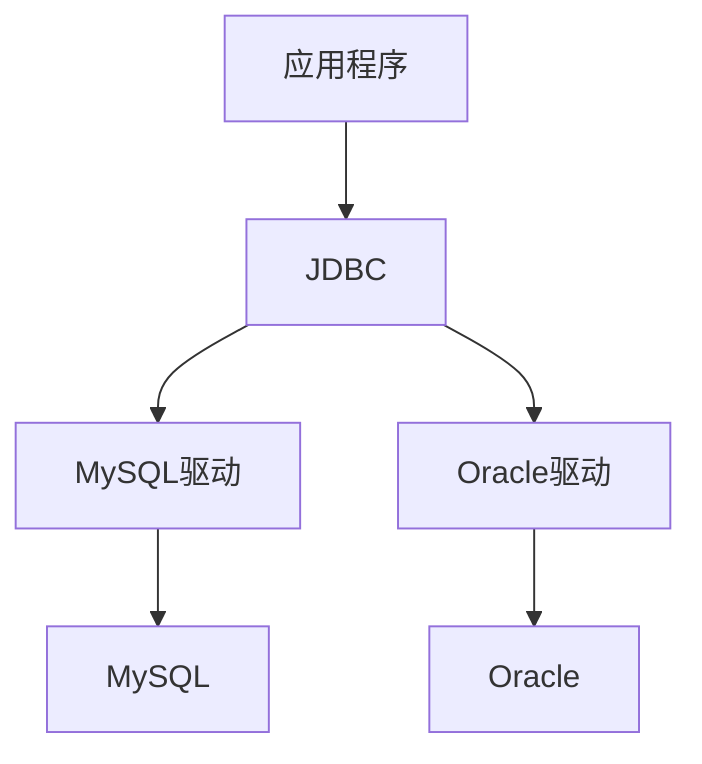

JDBC 在应用程序与数据库之间起到了一个桥梁作用。当应用程序使用 JDBC 访问特定的数据库时，需要通过不同数据库驱动与不同的数据库进行连接，连接后即可对该数据库进行相应的操作。

JDBC 操作不同的数据库，但是操作数据库的 API 都是一样的！

## JDBC常用API

> <b>Driver 接口</b>

Driver 接口是所有 JDBC 驱动程序必须实现的接口，该接口专门提供给数据库厂商使用。在编写 JDBC 程序时，必须要把所使用的数据库驱动程序或类库加载到项目的 classpath 中。

> <b>DriverManager 类</b>

DriverManager 类用于加载 JDBC 驱动并且创建与数据库的连接。在 DriverManager 类中，定义了两个比较重要的静态方法。

| 方法                                               | 功能描述                                                     |
| -------------------------------------------------- | ------------------------------------------------------------ |
| registerDriver(Driver driver)                      | 该方法用于向 DriverManager 中注册给定的 JDBC 驱动程序        |
| getConnection(String url, String user, String pwd) | 该方法用于建立和数据库的连接，并返回表示连接的 Connection 对象 |

> <b>Connection 接口</b>

Connection 接口代表 Java 程序和数据库的连接，只有获得该连接对象后才能访问数据库，并操作数据表。在 Connection 接口中，定义了一系列方法，其常用方法如下表。

| 方法                         | 功能描述                                                     |
| ---------------------------- | ------------------------------------------------------------ |
| getMetaData()                | 该方法用于返回表示数据库的元数据的 DatabaseMetaData 对象     |
| createStatement()            | 用于创建一个 Statement 对象并将 SQL 语句发送到数据库         |
| prepareStatement(String sql) | 用于创建一个 PreparedStatement 对象并将参数化的 SQL 语句发送到数据库 |
| prepareCall(String sql)      | 用于创建一个 CallableStatement 对象来调用数据库的存储过程    |

> <b>Statement 接口</b>

Statement 接口用于执行静态的 SQL 语句，并返回一个结果对象，该接口的对象通过 Connection 实例的 createStatement() 方法获得。利用该对象把静态的 SQL 语句发送到数据库编译执行，然后返回数据库的处理结果。在 Statement 接口中，提供了 3 个常用的执行 SQL 语句的方法。但是 Statement 接口操作这些 SQL 语句会过于繁琐，并且存在安全方面的问题。

| 方法                      | 功能描述                                                     |
| ------------------------- | ------------------------------------------------------------ |
| execute(String sql)       | 用于执行各种 SQL 语句，该方法返回一个 boolean 类型的值，如果为 true，表示所执行的 SQL 语句有查询结果，可通过 Statement 的 getResultSet() 方法获得查询结果 |
| executeUpdate(String sql) | 用于执行 SQL 中的 INSERT、UPDATE 和 DELETE 语句。该方法返回一个 int 类型的值，表示数据库中受该 SQL 语句影响的记录条数 |
| executeQuery(String sql)  | 用于执行 SQL 中的 SEL ECT 语句，该方法返回一个表示查询结果的 ResultSet 对象 |

> <b>PreparedStatement 接口</b>

PreparedStatement是Statement的子接口，用于执行预编译的SQL语句。该接口扩展了带有参数SQL语句的执行操作，应用该接口中的SQL语句可以使用占位符“?”来代替其参数，然后通过setXxx()方法为SQL语句的参数赋值。在PreparedStatement接口中，提供了一些常用方法。

| 方法                                                         | 功能描述                                                     |
| ------------------------------------------------------------ | ------------------------------------------------------------ |
| executeUpdate()                                              | 在此 PreparedStatement 对象中执行 SQL 语句，该语句必须是一个 DML 语句或者是无返回内容的 SQL 语句，比如 DDL 语句 |
| executeQuery()                                               | 在此 PreparedStatement 对象中执行 SQL 查询，该方法返回的是 ResultSet 对象 |
| setInt(int parameterIndex, int x)                            | 将指定参数设置为给定的 int 值                                |
| setFloat(int parameterIndex, float x)                        | 将指定参数设置为给定的 float 值                              |
| setString(int parameterIndex, int x)                         | 将指定参数设置为给定的 String 值                             |
| setDate(int parameterIndex, Date x)                          | 将指定参数设置为给定的 Date 值                               |
| addBatch()                                                   | 将一组参数添加到此 PreparedStatement 对象的批处理命令中      |
| setCharacterStream(int parameterIndex, java.io.Reader reader, int length) | 将指定的输入流写入数据库的文本字段                           |
| setBinaryStream(int parameterIndex, java.io.InputStream x, int length) | 将二进制的输入流数据写入到二进制字段中                       |

setDate() 方法可以设置日期内容，但参数 Date 的类型是 java.sql.Date，而不是 java.util.Date。

> <b>ResultSet 接口</b>

ResultSet 接口用于保存 JDBC 执行查询时返回的结果集，该结果集封装在一个逻辑表格中。在 ResultSet 接口内部有一个指向表格数据行的游标（或指针），ResultSet 对象初始化时，游标在表格的第 1 行之前，调用  next() 方法可将游标移动到下一行。如果下一行没有数据，则返回 false。在应用程序中经常使用 next() 方法作为 WHILE 循环的条件来迭代 ResultSet 结果集。

| 方法                         | 功能描述                                                     |
| ---------------------------- | ------------------------------------------------------------ |
| getString(int columnIndex)   | 用于获取指定字段的 String 类型的值，参数 columnIndex 代表字段的索引 |
| getString(String columnName) | 用于获取指定字段的 String 类型的值，参数 columnName 代表字段的名称 |
| getInt(int columnIndex)      | 用于获取指定字段的 int 类型的值，参数 columnIndex 代表字段的索引 |
| getInt(String columnName)    | 用于获取指定字段的 int 类型的值，参数 columnName 代表字段的名称 |
| getDate(int columnIndex)     | 用于获取指定字段的 Date 类型的值，参数 columnIndex 代表字段的索引 |
| getDate(String columnName)   | 用于获取指定字段的 Date 类型的值，参数 columnName 代表字段的名称 |
| next()                       | 将游标从当前位置向下移一行                                   |
| absolute(int row)            | 将游标移动到此 ResultSet 对象的指定行                        |
| afterLast()                  | 将游标移动到此 ResultSet 对象的末尾，即最后一行之后          |
| beforeFirst()                | 将游标移动到此 ResultSet 对象的开头，即第 1 行之前           |
| previous()                   | 将游标移动到此 ResultSet 对象的上一行                        |
| last()                       | 将游标移动到此 ResultSet 对象的最后一行                      |

字段的索引是从 1 开始编号。

## 数据库查询

- 下载 mysql 驱动，[Maven Repository: mysql » mysql-connector-java » 8.0.12 (mvnrepository.com)](https://mvnrepository.com/artifact/mysql/mysql-connector-java/8.0.12)
- 将 mysql 驱动加入到 web 项目中。
- 编写代码
    - 注册驱动，MySQL8.x 不必手动注册驱动了
    - 通过 DriverManager 获取数据库连接。
    - 创建 Statement
    - 执行 SQL
    - 遍历结果集

```java
package com.tomcat.controller.db;

import java.sql.*;

public class ConnectedDB {
    public static void main(String[] args) {
        String url = "jdbc:mysql://localhost:3306/comments?tb_user&serverTimezone=UTC&useSSL=false";
        String username = "root";
        String password = "root";
        Connection connection = null;
        Statement statement = null;
        ResultSet resultSet = null;
        try {
            // mysql 8.x 可以不自己注册驱动，内部会处理好。
            // DriverManager.registerDriver(new com.mysql.cj.jdbc.Driver());
            // Class.forName("com.mysql.cj.jdbc.Driver");
            connection = DriverManager.getConnection(url, username, password);
            statement = connection.createStatement();
            resultSet = statement.executeQuery("select * from tb_user");
            while (resultSet.next()) {
                String nick_name = resultSet.getString("nick_name");
                System.out.println(nick_name);
            }
        } catch (Exception e) {
            e.printStackTrace();
        } finally {
            assert resultSet != null;
            close(connection, statement, resultSet);
        }
    }

    private static void close(Connection connection, Statement statement, ResultSet resultSet) {
        try {
            if (resultSet != null) resultSet.close();
        } catch (SQLException e) {
            e.printStackTrace();
        }
        try {
            if (statement != null) statement.close();
        } catch (SQLException e) {
            e.printStackTrace();
        }
        try {
            if (connection != null) connection.close();
        } catch (SQLException e) {
            e.printStackTrace();
        }
    }
}
```

Statement 会有 SQL 注入的问题，用原生 JDBC 做数据库查询的话还是用 PrepareStatement，可以预防 SQL 注入。

```java
public static void testPrepareStatement() {
    String url = "jdbc:mysql://localhost:3306/comments?tb_user&serverTimezone=UTC&useSSL=false";
    String username = "root";
    String password = "root";
    Connection connection = null;
    PreparedStatement prepareStatement = null;
    ResultSet resultSet = null;
    try {
        connection = DriverManager.getConnection(url, username, password);
        prepareStatement = connection.prepareStatement("select * from tb_user where id>?");
        prepareStatement.setInt(1, 1000);
        resultSet = prepareStatement.executeQuery();
        while (resultSet.next()) {
            String nick_name = resultSet.getString("id");
            System.out.println(nick_name);
        }
    } catch (Exception e) {
        e.printStackTrace();
    } finally {
        assert resultSet != null;
        close(connection, statement, resultSet);
    }
}
```

# Ajax和JSON

## Ajax

概念：Asynchronous JavaScript And XML 异步的 JavaScript 和 xml。『这里说的同步异步与线程关系不大』

### 原生JavaScript实现

原生 JavaScript 实现方式快速入门 

```html
<script>
    let button = document.getElementById("ss");
    button.onclick = function() {
        console.log(123)
        // 发送异步请求 考虑了浏览器兼容 1.创建核心对象
        let xmlhttp;
        if (window.XMLHttpRequest) {
            xmlhttp = new XMLHttpRequest();
        } else {
            xmlhttp = new ActiveXObject("Microsoft.XMLHTTP"); // IE的ajax用法
        }
        // 2.发送请求
        /**
		*  请求方式：GET POST
		*  get：参数拼接在URL上
		*  post：参数在send方法中定义
		*/
        xmlhttp.open("GET", "demo.json", true);
        xmlhttp.onreadystatechange = function() {
            if(xmlhttp.readyState==4 && xmlhttp.status==200){
                console.log(xmlhttp.responseText);
            }
        }
        // 发送请求
        xmlhttp.send();
    }
</script>
```

---

```js
let request = new XMLHttpRequest(); // 创建XMLHttpRequest对象

//ajax是异步的，设置回调函数
request.onreadystatechange = function () { // 状态发生变化时，函数被回调
    if (request.readyState === 4) { // 成功完成
        // 判断响应状态码
        if (request.status === 200) {
            // 成功，通过responseText拿到响应的文本:
            return success(request.responseText);
        } else {
            // 失败，根据响应码判断失败原因:
            return fail(request.status);
        }
    } else {
        // HTTP请求还在继续...
    }
}

// 发送请求:
request.open('GET', '/api/categories');
request.setRequestHeader("Content-Type", "application/json")  //设置请求头
request.send();	//到这一步，请求才正式发出
```

### JQuery实现

> $.ajax实现方式

- 语法：$.ajax({键值对})，具体参数查 API
- 语法：`$.get(url, [data], [callback], [type])`
- 语法：`$.post(url, [data], [callback], [type])`
  - `url`：请求路径
  - `data`：请求参数
  - `callback`：回调函数
  - `type`：响应结果的类型

```js
// $.ajax方式
$("#button2").click(function(){
    $.ajax({
        url:"demo.json",
        type:"GET",
        data:{"name":"liujiawei"},
        timeout:10000,
        success:function(data){
            console.log(data);
        },
        error:function(){
        },
        dataType:"json"
    });
});

// $.get方式
$.get("demo.json", {
    "name": "1233"
}, function(data) {
    console.log(data);
}, "json");

// $.post方式
$.post("demo.json", {
    "name": "1233"
}, function(data) {
    console.log(data);
}, "json");
```

## JSON

> JSON 是 JS 对象的字符串表示法，它使用文本表示一个 JS 对象信息，本质是一个字符串。

### JSON的基本用法

- 对象表示为键值对
- 数据由逗号分隔
- 花括号保存对象
- 方括号保存数组


<b>JSON 与 JS 对象互转</b>

JSON 字符串转为 JS 对象，使用 JSON.parse()

```js
let obj = JSON.parse('{"a","hello"}');
// 控制台的输出结果是 {a:'hello',b:'world'}
```

`JS` 对象转换为 `JSON` 字符串用 `JSON.stringify()`

```js
let json = JSON.stringifu({a:'hello',b:'world'}); 
// 控制台的输出结果是 '{"a":"hello","b":"world"}
```


代码案例

```js
// 1.常规JSON字符串
let json1 = {
     "name": "liujiawei",
     "age": 18
};
// 控制台输出 object
console.log(typeof(json1));
// 控制台输出{name: "liujiawei", age: 18}
console.log(json1);

let json3 = '{"name":"liujiawei","age":18}';
// 控制台输出 string
console.log(typeof(json3));
// 控制台输出{"name":"liujiawei","age":18}
console.log(json3);

//2.带数组
let json4 = {
    "name": "liujiawei",
    "age": 18,
    "array": [1, 2, 3, 4, 5]
};
console.log(json4.array[0]);
console.log(json4 === eval(json4)); // true

//3.复合
let json5 = {
    "name": "liujiawei",
    "age": 18,
    "array": [1, 2, 3, 4, 5],
    "data": {
        "key1": "value1",
        "key2": "value2",
        "key3": "value3"
    }
}
console.log(json5.data.key1);

// JSON数据的遍历
let person = {"name": "张三",age: 23,'gender': true};

let ps = [
    {"name": "张三","age": 23,"gender": true},
    {"name": "李四","age": 24,"gender": true},
    {"name": "王五","age": 25,"gender": false}
];
console.log("**************")
for (let key in person) {
    // string
    console.log(typeof(key));
    // 相当于 person["name"] 
    // 不过person.key是不行的. 相当于person."name"
    console.log(person[key]);
}
console.log("**************")
for (let i = 0, len = ps.length; i < len; i++) {
    let temp = ps[i];
    for (let t in temp) {
        console.log(temp[t])
    }
}
console.log("**************")
// 如果是不规则的数据呢？递归遍历
let datas = {
    "name": "菜是原罪",
    "age": 18,
    "friends": [
        {"name": "小红","age": 18},
        {"name": "小黑","age": 23},
        {"name": "小蓝","age": 30,"otherPeople": {"name": "bzd","address": "北京","age": 33}},
    ]
};

// 递归,如果是对象 就继续递归遍历,如果不是对象,则遍历到头
function travel(data, obj) {
    // 建立一个对象,用来判断遍历是否需要结束
    if (obj == null) obj = new Object();
    // 如果当前遍历到的是对象,则继续递归
    if (typeof(data) == typeof(obj)) {
        for (let i in data) {
            if (typeof(i) != typeof(obj)) console.log(i)
            travel(data[i], obj);
        }
    } 
    // 如果不是对象,则说明递归到头,输出内容,结束递归.
    else {
        console.log(data);
    }
}

travel(datas);
```

### JSON的转换

JS 对象与 json 格式数据之间的转换

```javascript
var obj = JSON.parse('{"a","hello"}');
// 控制台的输出结果是 {a:'hello',b:'world'}
var json = JSON.stringifu({a:'hello',b:'world'}); 
// 控制台的输出结果是 '{"a":"hello","b":"world"}
```

### JSON与Java对象

<b>JSON 解析器</b>

- 常见的解析器：Jsonlib，Gson，fastjson，jackson『spring 默认用 jackson』

<b>JSON 转为 Java 对象</b>

- 导入 jackson 的相关 jar 包
- 创建 Jackson 核心对象 ObjectMapper
- 调用 ObjectMapper 的相关方法进行转换
  - readValue (json 字符串数据，Class)

<b>Java 对象转换 JSON</b>

- 导入 jackson 的相关 jar 包

- 创建 Jackson 核心对象 ObjectMapper

- 调用 ObjectMapper 的相关方法进行转换

  - writeValue(参数1，obj)

    ```
    参数1：
    File：将obj对象转换为JSON字符串，并保存到指定的文件中
    Writer：将obj对象转换为JSON字符串，并将json数据填充到字符输出流中
    OutputStream：将obj对象转换为JSON字符串，并将json数据填充到字节输出流
    ```

  - writeValueAsString(obj)：将对象转为 json 字符串

<b>注解</b>

- @JsonIgnore：排除属性。
- @JsonFormat：属性值得格式化
  - eg：@JsonFormat(pattern = "yyyy-MM-dd")

<b>复杂 Java 对象转换</b>

- List：数组
- Map：对象格式一致

```java
import com.fasterxml.jackson.core.JsonProcessingException;
import com.fasterxml.jackson.databind.ObjectMapper;
import org.junit.Before;
import org.junit.Test;
import proxy.Person;

import java.io.File;
import java.io.IOException;
import java.util.ArrayList;
import java.util.HashMap;
import java.util.Map;

public class JsonDemo {
    private ObjectMapper obj = null;

    @Before
    public void init() {
        obj = new ObjectMapper();
    }

    @Test
     // 简单对象转JSON
    public void ObjectToJSON() throws JsonProcessingException {
        //String name, String age, String sex, int weight, String birthday
        Person person = new Person("刘家伟", "18", "nan", 88, "1997-11-11");
        String s = obj.writeValueAsString(person);
        System.out.println(s);
    }

    // map转JSON
    @Test
    public void MapToJSON() throws JsonProcessingException {
        Map<String,String> map = new HashMap<String,String>();
        map.put("name","tom");
        map.put("friend","jerry");
        System.out.println(obj.writeValueAsString(map));
    }

    // 复杂map转json
    @Test
    public void ComplexMapToJSON() throws JsonProcessingException {
        Map<String,Person> map = new HashMap<String,Person>();
        map.put("name",new Person("1", "18", "nan", 88, "1997-11-11"));
        map.put("friend",new Person("2", "18", "nan", 88, "1997-11-11"));
        System.out.println(obj.writeValueAsString(map));
    }

    // list转json [{},{},{}]
    @Test
    public void listToJSON() throws JsonProcessingException {
        Person p1 = new Person("1", "18", "nan", 88, "1997-11-11");
        Person p2 = new Person("2", "18", "nan", 88, "1997-11-11");
        Person p3 = new Person("3", "18", "nan", 88, "1997-11-11");
        ArrayList<Person> list = new ArrayList<>();
        list.add(p1);
        list.add(p2);
        list.add(p3);
        System.out.println(obj.writeValueAsString(list));
    }

   // 写入文本中
    @Test
    public void writeToFile() throws IOException {
        Person p1 = new Person("1", "18", "nan", 88, "1997-11-11");
        Person p2 = new Person("2", "18", "nan", 88, "1997-11-11");
        Person p3 = new Person("3", "18", "nan", 88, "1997-11-11");
        ArrayList<Person> list = new ArrayList<>();
        list.add(p1);
        list.add(p2);
        list.add(p3);
        obj.writeValue(new File("demo.json"),list);
    }

    // json转对象
    @Test
    public void jsonToObject() throws JsonProcessingException {
        String str = "{\"name\":\"1\",\"age\":\"18\",\"sex\":\"nan\",\"weight\":88,\"birthday\":\"1997-11-11\"}";
        Person person = obj.readValue(str, Person.class);
        System.out.println(person.toString());
    }
}
```

# Axios

一款非常强大的 ajax 工具。写法总体来说我感觉比 jquery 舒服一点。

## 安装

- 使用 npm 安装

`npm install axios`

- 使用 bower

`bower install axios`

- 使用 cdn

`<script src="https://unpkg.com/axios/dist/axios.min.js"></script>`

## Get请求

```js
// 为给定 ID 的 user 创建请求
axios.get('/user?ID=12345')
  .then(function (response) {
    console.log(response);
  })
  .catch(function (error) {
    console.log(error);
  });

// 可选，上面的请求可以这样做
axios.get('/user', {
    params: {
      ID: 12345
    }
  })
  .then(function (response) {
    console.log(response);
  })
  .catch(function (error) {
    console.log(error);
  });
```

## Post请求

```js
axios.post('/user', {
    firstName: 'Fred',
    lastName: 'Flintstone'
  })
  .then(function (response) {
    console.log(response);
  })
  .catch(function (error) {
    console.log(error);
  });
```

## 多个并发请求

```js
function getUserAccount() {
  return axios.get('/user/12345');
}

function getUserPermissions() {
  return axios.get('/user/12345/permissions');
}

axios.all([getUserAccount(), getUserPermissions()])
  .then(axios.spread(function (acct, perms) {
    // 两个请求现在都执行完成
  }));
```

## 详细用法

<a href="https://www.kancloud.cn/yunye/axios/234845">中文文档</a>