# 基本原理

Spring MVC 是 Spring 提供的一个实现了 Web MVC 设计模式的轻量级 Web 框架。

> <b>Spring MVC 的优点有</b>
>
> - 是 Spring 框架的一部分，可以方便地利用 Spring 所提供的其他功能。
> - 灵活性强，易于与其他框架集成。
> - 提供了一个前端控制器 DispatcherServlet，使开发人员无须额外开发控制器对象。
> - 可自动绑定用户输入，并能正确的转换数据类型。不用自己显示的获取参数了。
> - 内置了常见的校验器，可以校验用户输入。如果校验不能通过，那么就会重定向到输入表单。
> - 支持国际化。可以根据用户区域显示多国语言
> - 支持多种视图技术。它支持 JSP、Velocity 和 FreeMarker 等视图技术。

笔记大部分内容源自于雷丰阳 17 年的 SpringMVC 视频。视频中采用的 XML 的配置方式，本笔记则是参考官方文档，采用的 JavaConfig 风格的配置。

## 大致运行流程

 * 客户端点击链接发送 xxx 请求。
 * 来到 Tomcat 服务器。
 * SpringMVC 的前端控制器收到所有请求。
 * 来看请求地址和 @RequestMapping 标注的那个匹配，查找到底使用那个类的那个方法来处理请求。
 * 前端控制器找到了目标处理器类和目标方法，利用 Handler 执行目标方法。
 * 方法执行完成后会有一个返回值，SpringMVC 认为这个返回值就是要去的页面地址。
 * 拿到方法返回值后；用视图解析器进行拼串得到完整的页面地址。
 * 拿到页面地址值，前端控制器帮我们转发到页面。

<div align="center"></div>

## 工作流程

<div align="center">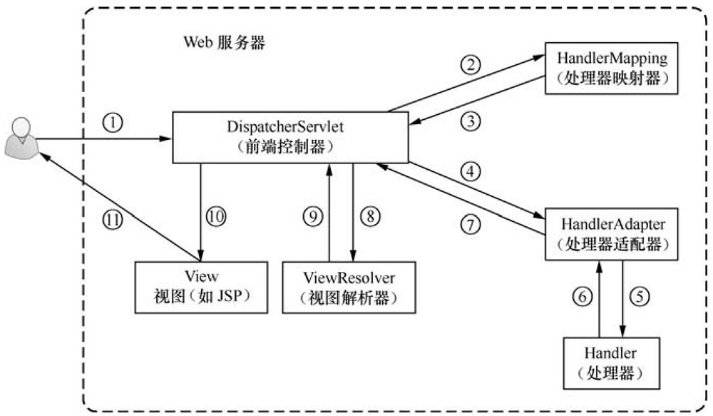</div>

按照图中所标注的序号，Spring MVC 程序的完整执行流程如下

1️⃣用户通过浏览器向服务器发送请求，请求会被 SpringMVC 的前端控制器 DispatcherServlet 所拦截

2️⃣DispatcherServlet 拦截到请求后，会调用 HandlerMapping 处理器映射器

3️⃣处理器映射器根据请求 URL 找到具体的处理器，生成处理器对象及处理器拦截器（如果有则生成）一并返回给 DispatcherServlet

4️⃣DispatcherServlet 会通过返回信息选择合适的 HandlerAdapter（处理器适配器）

5️⃣HandlerAdapter 会调用并执行 Handler（处理器），这里的处理器指的就是程序中编写的 Controller 类，也被称之为后端控制器

6️⃣Controller 执行完成后，会返回一个 ModelAndView 对象，该对象中会包含视图名或包含模型和视图名

7️⃣HandlerAdapter 将 ModelAndView 对象返回给 DispatcherServlet

8️⃣DispatcherServlet 会根据 ModelAndView 对象选择一个合适的 ViewReslover（视图解析器）

9️⃣ViewReslover 解析后，会向 DispatcherServlet 中返回具体的 View（视图）

🔟DispatcherServlet 对 View 进行渲染（即将模型数据填充至视图中）

1️⃣视图渲染结果会返回给客户端浏览器显示。

在上述执行过程中，DispatcherServlet、HandlerMapping、HandlerAdapter 和 ViewResolver 对象的工作是在框架内部执行的，开发人员并不需要关心这些对象内部的实现过程，只需要配置前端控制器（DispatcherServlet），完成 Controller 中的业务处理，并在视图中（View）中展示相应信息即可。

## 无法访问静态资源

无法访问静态资源和前端控制器的拦截规则有关。

### Tomcat的拦截规则

<div align="center">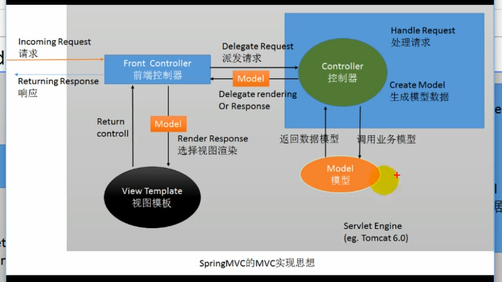</div>

在使用 Tomcat 的基本 api 进行开发时，资源的拦截规则，默认用的是 Tomcat 中 web.xml 中的配置。

```xml
<!-- The mapping for the default servlet -->
<!-- 这里是静态资源的拦截。Tomcat的DefaultServlet拦截发现是静态资源后，就回去找对应的静态资源并返回 -->
<servlet-mapping>
    <servlet-name>default</servlet-name>
    <url-pattern>/</url-pattern>
</servlet-mapping>

<!-- 这里是jsp的拦截，找到对应的jsp后就放回 -->
<servlet-mapping>
    <servlet-name>jsp</servlet-name>
    <url-pattern>*.jsp</url-pattern>
    <url-pattern>*.jspx</url-pattern>
</servlet-mapping>
```

### 前端控制器的拦截规则

前端控制器的拦截规则相当于继承自 Tomcat 的那个 web.xml 的配置，并重写了拦截方式。相关内容 Spring MVC 文档中有说明。

[官方文档的说明](https://docs.spring.io/spring-framework/docs/current/reference/html/web.html#mvc)

 *  <b style="color:orange">DefaultServlet 是 Tomcat 处理静态资源的</b>
     *  除 JSP 和 Servlet，其他的都是静态资源；index.html 也是静态资源；如果静态资源让 Tomcat 来处理的话，Tomcat 就会在服务器下找到这个资源并返回。
     *  所以 DefaultServlet 有效的情况下，index.html 才有用
 *  <b style="color:orange">Tomcat 有配置拦截规则，前端控制器也有，前端控制器相当于子类，重写了拦截规则！</b>
     *  相当于前端控制器的 / 把 Tomcat 的 DefaultServlet 禁用掉了。请求的资源被前端控制器拦截了！
     *  请求来到前端控制器，前端控制器看那个方法的 RequestMapping 的路径是这个。最后发现没有方法的 RequestMapping 路径是 index.html；没有！所有无法访问！找资源的方式都错了！！静态资源访问就无效了！！
 *  <b style="color:orange">为什么 JSP 又能访问？</b>
     *  因为我们没有覆盖 Tomcat 服务器中的 JspServlet 的配置，即 Jsp 的请求不由前端控制器处理，由 Tomcat 自己处理。
     *  如果我们把拦截方式改成 `/*` 那么 *.jsp 的请求也会经过前端控制器，也有从 RequestMapping 中找对应的方法，
 *  <b style="color:orange">配置说明</b>
     *  / 相当于把 Tomcat 中的大 web.xml 的 DefaultServlet 重写了（静态资源拦截那个）
     *  /* 直接是拦截所有请求。所以我们写  / ,写 / 也是为了迎合 rest 风格的 url 地址
     *  Spring MVC 是先经过前端控制器的，看有没有配对的，没有就报错。

## MVC 配置

如何使用 JavaConfig 来做 MVC  的配置？重点关注这个类 WebMvcConfigurer 即可，其他的直接查阅官方文档。

[Spring/Spring-Web at main · csliujw/Spring (github.com)](https://github.com/csliujw/Spring/tree/main/Spring-Web)

# 常用注解

## 常用注解归纳

- @Controller：用于指示 Spring 类的实例是一个控制器
- @RequestMapping：指定该控制器可以处理那些 url 请求。
- @PathVarible：获取请求路径中占位符的值
- @RequestParam：MVC 获取请求参数；默认情况下是前端参数的名称要和后端接受参数的字段名称一致，不一致的话可以用 @RequestParam 做映射。
- @RequestHeader：获取请求头信息。
- @CookieValue：获取 Cookie 中的值。
- @SessionAttribute：获取 Session。
- @ModelAttribute：目前没在用过。

## @Controller

org.springframework.stereotype.Controller 注解类型用于指示 Spring 类的实例是一个控制器，其注解形式为 @Controller。该注解在使用时不需要再实现 Controller 接口，只需要将 @Controller 注解加入到控制器类上，然后通过 Spring 的扫描机制找到标注了该注解的控制器即可。

## @RequestMapping

### 基本概念

> <b style="color:orange">@RequestMapping 的使用</b>

Spring MVC 使用 @RequestMapping 注解指定该控制器可以处理那些 url 请求。在控制器的类定义及方法定义处都可标注该注解。

* 类定义处：提供初步的请求映射信息。相对于 WEB 应用的根目录。
* 方法处：提供进一步的细分映射信息。相当于类定义处的 URL。
* 举例 WEB 根路径为 localhost:8080/SpringMVC/
   * 类定义处路径为 /user
   * 方法定义处路径为  /add
   * 则该方法的访问路径为  localhost:8080/SpringMVC/user/add
   * 这个 / 是可以省略的，但是加上比较好
* DispatcherServlet 截断请求后，就通过控制器上 @RequestMapping 提供的映射信息确定请求所对应的处理方法。

 * 映射
    * 请求参数
    * 请求方法
    * 请求头

### 注解属性&使用

@RequestMapping 的属性如下表

<div align="center">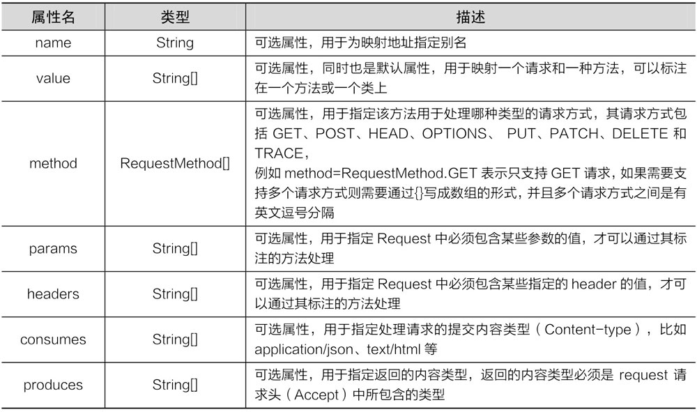</div>

> <b style="color:orange">@RequestMapping--method 属性</b>

<b>method 属性用于指定那些请求方式是有效的。默认是所有请求都有效！</b>

```java
public enum RequestMethod {
	GET, HEAD, POST, PUT, PATCH, DELETE, OPTIONS, TRACE
}
```

<b>示例代码</b>

```java
@RestController
@RequestMapping("/method")
public class RequestMappingController {

    @RequestMapping(path = {"/get"}, method = RequestMethod.GET)
    public String t1() {
        return "GET Method";
    }

    // 方法类型对不上会报错 405 方法不对应！
    @RequestMapping(path = {"/post"}, method = RequestMethod.POST)
    public String t2() {
        return "POST Method";
    }

    @RequestMapping(path = {"/get&post"}, method = {RequestMethod.POST, RequestMethod.GET})
    public String t3(Model model, HttpServletRequest request) {
        return "support GET and POST; current  method is " + request.getMethod();
    }

    @RequestMapping(path = {"/all"}, method = {RequestMethod.POST, RequestMethod.GET})
    public String t4(HttpServletRequest request) {
        return request.getMethod();
    }
}
```

> <b style="color:orange">@RequestMapping--params 属性</b>

<b>用于设置请求要带什么参数过来、不能带什么参数过来、参数的值可以是什么、参数的值不能是什么。</b>

- params={"username"} 参数中必须要有 username！！
- params={"!username"} 参数中不能有 username！！
- params={"username!=123"} 参数的值不能为 123！！
- params={"username=va"} 参数的值必须为 va！！
- params={"user","pwd"} 要有 user 和 pwd 两个参数！！
- <b style="color:red">不能用 {"age>19"} 这种比较大小的写法！</b>

示例代码

```java
@RestController
@RequestMapping("/params")
public class RequestMappingParamsController {

    // 必须携带username这个参数
    // get请求，路径为 http://localhost:8080/SpringMVC01_war_exploded/params/need1?username
    @RequestMapping(path = "/need1", params = {"username"})
    public String t1() {
        return "username is ok";
    }

    // 不能带username这个参数
    @RequestMapping(path = "/need2", params = {"!username"})
    public String t2() {
        return "Not username params";
    }

    // 不能带username这个参数
    @RequestMapping(path = "/need3", params = {"username!=123"})
    public String t3() {
        return "username can't equals 123";
    }

    // username要为3 注意是一个 ”=“ 具体用法不记得就看源码注释！
    @RequestMapping(path = "/need4", params = {"username=123"})
    public String t4() {
        return "username equals 123";
    }
}
```

> <b style="color:orange">@RequestMapping--headers 属性</b>

<b>规定只有携带 xx 请求头的才可进行访问</b>，也可以写简单的表达式，并且请求头中的任意字段都可规定！

```java
@RestController
public class RequestMappingHeaderController {

    /**
     * User-Agent: Mozilla/5.0 (Windows NT 10.0; Win64; x64; rv:84.0) Gecko/20100101 Firefox/84.0
     * User-Agent: Mozilla/5.0 (Windows NT 10.0; Win64; x64) AppleWebKit/537.36 (KHTML, like Gecko) Chrome/88.0.4324.96 Safari/537.36 Edg/88.0.705.53
     * @return
     */
    // 这样就只有火狐浏览器可以访问了
    @RequestMapping(path = {"/header1"}, headers = {"User-Agent=Mozilla/5.0 (Windows NT 10.0; Win64; x64; rv:84.0) Gecko/20100101 Firefox/84.0"})
    public String t1() {
        return "firefox is ok";
    }
}
```

> <b style="color:orange">@RequestMapping 中的 consumes 和 produces</b>

- consumes：只接受内容类型是哪种的请求，规定请求头中的 Content-Type
- produces：告诉浏览器返回的内容类型是说明，给响应头中加上 Content-Type
    - text/html;charset=utf-8

### 组合注解

在 Spring 框架的 4.3 版本中，引入了组合注解，来帮助简化常用的 HTTP 方法的映射。

| 注解           | 说明                                                         |
| -------------- | ------------------------------------------------------------ |
| @GetMapping    | 匹配 GET 方式的请求。<br>是 @RequestMapping(method = RequestMethod.GET) 的缩写 |
| @PostMapping   | 匹配 POST 方式的请求...                                      |
| @PutMapping    | 匹配 PUT 方式的请求...                                       |
| @DeleteMapping | 匹配 DELETE 方式的请求...                                    |
| @PatchMapping  | 匹配 PATCH 方式的请求...                                     |

## @PathVariable

<b>获取请求路径占位符中的值</b>

- @PathVariable 获取请求路径中占位符的值
- 占位符的名称和方法中的参数名称一致，就不用在注解里设置占位符的名称
- 占位符的名称和方法中的参数名称不一致，就要在注解里设置占位符的名称

```java
@RestController
public class PathVariableController {

    // {id}是占位符
    @RequestMapping("/user/{id}")
    // @PathVariable 获取请求路径中占位符的值
    public String pathVariableTest(@PathVariable("id") String id) {
        return id;
    }

    // 占位符的名称和方法中的参数名称一致就不用在注解里设置别名
    @RequestMapping("/user/info/{id}")
    public String pathVariableTest2(@PathVariable String id) {
        return id;
    }

    // 占位符的名称和方法中的参数名称不一致就要在注解里设置
    @RequestMapping("/user/infos/{id}")
    public String pathVariableTest3(@PathVariable("id") String ids) {
        return ids;
    }
}
```

## URL风格

### ant

<b>ant 风格的 URL 地址可以写模糊的通配符</b>

 * `？` 能替代任意一个字符
 * `*` 能替代任意多个字符，和一层路径
 * `<b>` 能替代多层路径

```java
@RestController
@RequestMapping("/ant")
public class AntController {

    @RequestMapping("/antTest01")
    public String antTest1() {
        return "antTest01";
    }

    // antTest01 antTest02 antTest03 都是走这个方法
    // antTest011就不行了，antTest0?中的问号只能匹配一个字符
    // 有精确的肯定优先匹配精确的
    @RequestMapping("/antTest0?")
    public String antTest2() {
        return "antTest?";
    }

    // 先匹配精确一点的antTest0? 在匹配模糊一点的antTest0*
    @RequestMapping("/antTest0*")
    public String antTest3() {
        return "antTest0*";
    }

    // * 匹配一层路径
    @RequestMapping("/a/*/antTest01")
    public String antTest4() {
        return "一层路径";
    }

    // <b> 匹配多层路径
    @RequestMapping("/a/<b>/antTest01")
    public String antTest5() {
        return "两层路径";
    }
}
```

### Rest

Rest--->Representational State Transfer。（资源）表现层状态转化。是目前最流行的一种互联网软件架构。Rest 风格就是把请求参数变成请求路径的一种风格【一种新的软件架构是图风格】

- 资源（Resource）：网络上的一个实体，或者说是网络上的一个具体信息。
    - URI：统一资源标识符
    - URL：统一资源定位符
- 表现层（Representation）：把资源具体呈现出来的形式，叫做它的表现层。如文本可用 txt 格式表现，也可用 html 格式、xml 格式、JSON 格式表现。
- 状态转化（State Transfer）：HTTP 协议是无状态的，所有状态都保存在服务器端。所谓的表现层状态转化就是 HTTP 协议里面，四个表示操作方式的动词：GET、POST、PUT、DELETE。
    - GET：获取资源
    - POST：新建资源
    - PUT：更新资源
    - DELETE：删除资源

#### 简单举例

- /book/1 	：GET请求 表示查询 1 号图书
- /book        ：POST请求 表示添加 1 号图书
- /book/1     ：PUT请求 表示更新 1号图书
- /book/1     ：DELETE 表示删除 1 号图书

<b style="color:orange">Rest 推荐：>url 地址这么起名； /资源名/资源标识符</b>

<span style="color:red">问题：从页面上只能发起两种请求：GET、POST，其他请求没法使用。</span>

别慌，Spring 提供了对 Rest 风格的支持。

<b>1）</b>Spring MVC 中有一个 Filter，他可以把普通的请求，转化为规定形式的请求。配置 Filter。这个 Filter 叫做，`HiddenHttpMethodFilter`, 它的 url-pattern 写 `/*`

<b>2）</b>如何发起其他形式的请求？

- 按照以下要求：
- 创建 POST 类型的表单;
- 表单项中携带一个 `_method` 的参数，`_method`  的值就是所要的请求形式。

```html
<form action="book/1" method="post">
    <input name="_method" value="delete">
    <input type="submit" value="删除">
</form>
```

为什么那个 Filter 可以实现这个功能？？请看源码！

```java
private String methodParam = DEFAULT_METHOD_PARAM;
@Override
protected void doFilterInternal(HttpServletRequest request, HttpServletResponse response, FilterChain filterChain)
    throws ServletException, IOException {

    HttpServletRequest requestToUse = request;
    // 请求方式是POST 且获取的表单参数_method 有值
    if ("POST".equals(request.getMethod()) && request.getAttribute(WebUtils.ERROR_EXCEPTION_ATTRIBUTE) == null) {
        String paramValue = request.getParameter(this.methodParam); // methodParam 的值应该是 _method
        if (StringUtils.hasLength(paramValue)) {
            String method = paramValue.toUpperCase(Locale.ENGLISH);
            if (ALLOWED_METHODS.contains(method)) {
                // 创建了一个新的request对象
                // 重写了request.getMethod()  获取到的是重写的值
                requestToUse = new HttpMethodRequestWrapper(request, method);
            }
        }
    }
    filterChain.doFilter(requestToUse, response);
}
```

#### 高版本Tomcat

高版本 Tomcat 只支持 get，pos，header 请求，不支持其他的，执行其他的会报错。如何解决？

```jsp
<%@ page contentType="text/html;charset=UTF-8" language="java" isErrorPage="true" %>
<html>
<head>
    <title>Title</title>
</head>
<body>
	给jsp添加isErrorPage属性并设置为true
</body>
</html>
```

## @RequestParam

MVC 获取请求参数默认情况下是前端参数的名称要和后端接受参数的字段名称一致，不一致的话可以用 @RequestParam 做映射。

```java
// GET http://localhost:8080/param?username=123
@RestController
public class HelloController {
    @GetMapping("/param")
    public String repeatMessage(@RequestParam("username") String name) {
        return name + name; //123123
    }
}
```

如果前端没有传入该参数后端会报错，但是可以设置该注解的 required 属性为 false，表明可携带这个参数，也可不携带，避免报错。

```java
@RestController
public class HelloController {
    @GetMapping("/param")
    public String repeatMessage(@RequestParam(value = "username", required = false) String name) {
        return name == null ? "not args" : name + name;
    }
}
```

也可以设置默认值。没有获取到参数的话就用默认值。

```java
@GetMapping("/param")
public String repeatMessage(@RequestParam(value = "username", defaultValue = "not args") String name) {
    return name;
}
```

## @RequestHeader

可以用它获取请求头的信息。

```java
@GetMapping("/header")
public String repeatHeader(@RequestHeader("User-Agent") String userAgent) {
    return userAgent;
}
```

和 @RequestParam 一样，如果没有对应的参数可以获取会报错，也可以设置 required=false 和默认值。

## @Cookie

可以获取 Cookie 中的值。

```java
@GetMapping("/jid")
public String getJSESSIONID(@CookieValue("JSESSIONID") String jid) {
    return jid;
}
```

和前面两个注解一样，也有 required 属性和 defaultValue。

# 数据绑定

- 数据绑定流程
- @RequestParam
- @RequestHeader
- @CookieValue：获取某个 cookie 的值
- POJO 自动赋值。字段名一致即可。
- 使用 Servlet 原生 API。（session 推荐使用原生 API）
- 重定向和转发

> <b>数据绑定介绍</b>

在执行程序时，Spring MVC 会根据客户端请求参数的不同，<span style="color:orange">将请求消息中的信息以一定的方式转换并绑定到控制器类的方法参数中。</span>这种将请求消息数据与后台方法参数建立连接的过程就是 Spring MVC 中的数据绑定。

在数据绑定过程中，Spring MVC 框架会通过数据绑定组件（DataBinder）将请求参数串的内容进行类型转换，然后将转换后的值赋给控制器类中方法的形参，这样后台方法就可以正确绑定并获取客户端请求携带的参数了。整个数据绑定的过程如图所示。

<div align="center">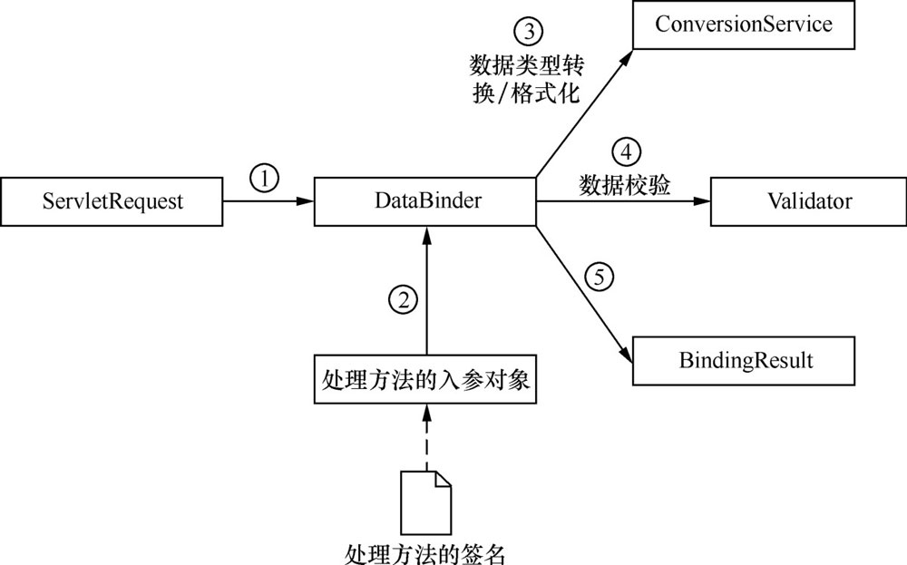</div>

1️⃣Spring MVC 将 ServletRequest 对象传递给 DataBinder。

2️⃣将处理方法的入参对象传递给 DataBinder。比如是 IndexController 中的 index 方法响应请求，则把 index 中的入参对象传递给 DataBinder。

3️⃣DataBinder 负责将请求带过来的参数和对象进行绑定。通过调用 ConversionService 组件进行数据类型转换、数据格式化等工作，并将 ServletRequest 对象中的消息填充到参数对象中。

4️⃣调用 Validator 组件对已经绑定了请求消息数据的参数对象进行数据合法性校验。

5️⃣校验完成后会生成数据绑定结果 BindingResult 对象，Spring MVC 会将 BindingResult 对象中的内容赋给处理方法的相应参数。

## 简单数据绑定

### 绑定默认数据类型

当前端请求的参数比较简单时，可以在后台方法的形参中直接使用 Spring MVC 提供的默认参数类型进行数据绑定。

- HttpServletRequest：通过 request 对象获取请求信息。
- HttpServletResponse：通过 response 处理响应信息。
- HttpSession：通过 session 对象得到 session 中存储的对象。
- Model/ModelMap：Model 是一个接口，ModelMap 是一个接口实现，作用是将 model 数据填充到 request 域。

```java
@RestController
// 测试 HttpServletRequest 绑定
public class FirstController {

    @GetMapping("/request")
    public String request(HttpServletRequest request) {
        return request.getParameter("id");
    }
}

// 发起请求：http://localhost:8080/request?id=4
```

### 绑定简单数据类型

int、String、double 等数据类型。

```java
@GetMapping("/ints")
public String ints(int id){
    return String.valueOf(id);
}
```

前端请求中参数名和后台控制器类方法中的形参名不一样，这就会导致后台无法正确绑定并接收到前端请求的参数。此时，需要使用 Spring MVC 提供的 @RequestParam 注解来进行间接数据绑定。

```java
@GetMapping("/param")
// 将前端传过来的 id
public int param(@RequestParam(name = "id") int idd) {
    return idd;
}
// 请求地址：http://localhost:8080/param?id=4
```

### 绑定POJO类型

POJO 类型的数据绑定就是将所有关联的请求参数封装在一个 POJO 中，然后在方法中直接使用该 POJO 作为形参来完成数据绑定。

```java
static class User {
    public String name;
    public String address;

    public String getName() {
        return name;
    }

    public void setName(String name) {
        this.name = name;
    }

    public String getAddress() {
        return address;
    }

    public void setAddress(String address) {
        this.address = address;
    }
}

@GetMapping("/user/info")
// POJO 对象属性的赋值是通过调用 setter getter 方法来赋值的
// 将 setter getter 方法注释后，发现对象赋值失败
public User userInformation(User user) {
    return user;
}
// http://localhost:8080/user/info?name=123&address=123
```

<span style="color:red">注意：</span>返回对象类型的 POJO 要引入 JSON 库，此处用的 jackson。如果是创建的 SpringBoot 项目，会自动引，无需手动配置，用默认的即可。

```xml
<dependency>
    <groupId>com.fasterxml.jackson.core</groupId>
    <artifactId>jackson-databind</artifactId>
    <version>2.11.4</version>
</dependency>
```

### 绑定包装POJO

使用简单 POJO 类型已经可以完成多数的数据绑定，但有时客户端请求中传递的参数会比较复杂，可能会存在某个 POJO 是另一个 POJO 中的属性。

```java
static class User {
    public String name;
    public String address;

    public String getName() {
        return name;
    }

    public void setName(String name) {
        this.name = name;
    }

    public String getAddress() {
        return address;
    }

    public void setAddress(String address) {
        this.address = address;
    }
}

@GetMapping("/user/info")
public User userInformation(User user) {
    return user;
}

static class Order {
    public User user;
    public String orderName;

    public User getUser() {
        return user;
    }

    public void setUser(User user) {
        this.user = user;
    }

    public String getOrderName() {
        return orderName;
    }

    public void setOrderName(String orderName) {
        this.orderName = orderName;
    }
}

@GetMapping("/order")
public Order orderInformation(Order order) {
    return order;
}

// localhost:8080/order?orderName=123&user.address=xx&user.name=kk
```

### 自定义数据绑定

如果有些特殊类型的参数是无法在后台进行直接转换的，例如日期数据就需要开发者自定义转换器（Converter）或格式化（Formatter）来进行数据绑定。

Formatter 与 Converter 的作用相同，只是 Formatter 的源类型必须是一个 String 类型，而 Converter 可以是任意类型。

以自定义日期转换为例：我们可以自定义一个 Converter 类来进行日期转换。

1️⃣实现 Converter 接口（org.springframework.core.convert.converter.Converter）

2️⃣编写转换代码

3️⃣将转换器注册到 IOC 容器

```java
// 实现 Converter 接口
public class DataConverter implements Converter<String, Date> {
    private String pattern = "yyyy-MM-dd HH:mm:ss";

    @Override
    public Date convert(String source) {
        SimpleDateFormat sdf = new SimpleDateFormat(pattern);
        try {
            return sdf.parse(source);
        } catch (Exception e) {
            throw new IllegalArgumentException("无效日期格式");
        }
    }
}
```

```java
// 注册到 IOC 容器中
@Configuration
public class WebConfig implements WebMvcConfigurer {
    public void addFormatters(FormatterRegistry registry) {
        registry.addConverter(new DataConverter());
    }
}
```

```java
// 测试
@GetMapping("/date")
public String time(Date date) {
    System.out.println(date);
    return "ok";
}

// localhost:8080/date?date=2017-04-12 2015:55:55
```

## 复杂数据绑定

如绑定数组、集合等。

### 绑定数组

写法也很简单

```java
@GetMapping("/array")
public String array(int[] ids) {
    Arrays.stream(ids).forEach(System.out::print);
    return Arrays.stream(ids).toArray().toString();
}
// http://localhost:8080/array?ids=1,2,3,4,5
```

### 绑定集合

如果需要批量修改信息的时候，就需要使用到集合了。

注意：在使用集合数据绑定时，后台方法中不支持直接使用集合形参进行数据绑定，所以需要使用包装 POJO 作为形参，然后在包装 POJO 中包装一个集合属性。

```java
static class UserVO {
    public List<User> user;

    public List<User> getUser() {
        return user;
    }

    public void setUser(List<User> user) {
        this.user = user;
    }
}

@GetMapping("/list")
public List<User> list(UserVO vo) {
    return vo.getUser();
}
```

### 绑定Map

数据绑定时也可以直接用 Map 进行绑定，前端参数的 key 作为 map 的 key，value 作为 map 的 value。

```java
@GetMapping("/map")
public String getMessageFromMap(@RequestParam Map<String, Object> maps) {
    System.out.println("=====================");
    maps.forEach((key, value) -> System.out.println(key + "==" + value));
    System.out.println("=====================");
    return "get maps message";
}
```

## 注解获取请求参数

<b style="color:orange">以下注解都是加载方法的参数上的。</b>

### RequestParam

<b>@RequestParam("user") String username 相当于：</b>

```java
String username  = request.getPamrameter("user")
// 浏览器传过来一个名为user的形式参数，把user的值存入username的变量中。
```

RequestParam 注解的几个重要的值：

* value：指定要获取的参数的 key（value 和 name 互为别名。）
* required：这个参数是否必须的
* defaultValue：参数默认值

<span style="color:red">PS：注意区分 RequestParam 与 PathVarible。</span>

- RequestParam 是获取浏览器传过来的参数，是拿❓后面的值！！
- PathVarible 是取的地址中的值！！

### RequestHeader 

<b>@RequestHeader 获取请求头中某个 key 的值。</b>

request.getHeader("User-Agent")

```java
@RequestHeader("User-Agent") String MyUserAgent 
// 写在方法参数上等同于 
String MyUserAgent = request.getHeader("User-Agent")
```

RequestHeader 注解的几个重要的值

- value
- required
- defaultValue

### CookieValue

<b>@CookieValue：获取某个 cookie 的值</b>

以前获取某个 cookie

```java
Cookie[] cookies = request.getCookies();
for (Cookie c: cookies){
	if(c.getName().euqals("JSESSIONID")){
		String ret = c.getValue()
 	}
}
```

现在获取某个 cookie

```java
public String index(@CookieValue("JSESSIONID") String jid){
    // pass
}
```

CookieValue 注解几个重要的值

* value
* required
* defaultValue

### SessionAttribute

以前获取 Session

```java
request.getSession.getAttribute("user");
```

现在获取 Session

```java
public String getSession(@SessionAttribute("user") String user) {}
```

<b>Session  还是用原生 API 获取的好。</b>

```java
@ResponseBody
@RequestMapping("/params/pojo")
public User pojo(User user) {
    // 引入json库后，会自动帮我们把user对象转成json格式字符串返回
    return user;
}
```

## Servlet原生API

Servlet 里怎么用，MVC 里就怎么用。

```java
@RestController
public class ServletAPI {
    @GetMapping("/api")
    public String api(HttpServletRequest request, HttpSession session) {
        session.setAttribute("JSESSIONID", "123123");
        request.setAttribute("request", "requestValue");
        return "111";
    }
}
```

Spring MVC 可以直接在参数上写的原生 API

- HttpServletRequest
- HttpServletResponse
- HttpSession
- java.security.Principal
- Locale
- InputStream：ServletInputStream inputStream = request.getInputStream();
- OutputStream：ServletOutputStream outputStream = response.getOutputStream();
- Reader：BufferedReader reader = request.getReader();

如果涉及到原生的过滤器，Servlet 对象的注入，请参考官方文档

## JSON数据转换

Spring 提供了一个 HttpMessageConverter\<T\> 接口来完成 HTTP 请求和响应直接的转换策略。该接口主要用于将请求信息中的数据转换为一个类型为 T 的对象。

MappingJackson2HttpMessageConverter 是 HttpMessageConverter 的子类，也是 Spring MVC 默认处理 JSON 格式请求响应的实现类。

- @RequestBody：用于将前端请求体中的 JSON 格式数据绑定到形参上。
- @ResponseBody：用于直接返回 User 对象（当返回 POJO 对象时，会默认转换为 JSON 格式数据进行响应）

```java
public class JSONController {

    @PostMapping("/json")                                                                                                                                                                                                                                                                                                                                                                                                                                                                                                                                                                                                                                                                                                                                                                                                                                                           
    public FirstController.User getJson(@RequestBody FirstController.User user) {
        user.setName(user.name+"-after");
        return user;
    }
}
```

## 解决提交数据乱码

提交数据可能乱码

### 请求乱码

请求乱码分为 GET 请求乱码和 POST 请求乱码。

<b>GET 请求乱码</b>

在 server.xml 的 8080 端口处添加 URIEncoding="UTF-8"。Tomcat8 以后的版本默认增加并设置为 utf-8，不用修改。

<b>POST 请求乱码</b>

JavaWeb 中我们是在第一次获取请求参数之前设置，`request.setCharacterEncoding("UTF-8")` 来解决 POST 请求乱码的。Spring MVC 参数不是我们手动用 request 来获取的，又该如何设置？

可以自己写一个 filter 进行过滤：Spring MVC 有这个 filter `CharacterEncodingFilter` <span style="color:red">解决请求乱码</span>

```java
public class CharacterEncodingFilter extends OncePerRequestFilter {

	@Nullable
	private String encoding;
	private boolean forceRequestEncoding = false;
	private boolean forceResponseEncoding = false;
	// some code...
	@Override
	protected void doFilterInternal(
			HttpServletRequest request, HttpServletResponse response, FilterChain filterChain)
			throws ServletException, IOException {

		String encoding = getEncoding();
        // encoding 不为空 xxxx，就设置字符编码集。
		if (encoding != null) {
			if (isForceRequestEncoding() || request.getCharacterEncoding() == null) {
				request.setCharacterEncoding(encoding);
			}
			if (isForceResponseEncoding()) {
				response.setCharacterEncoding(encoding);
			}
		}
		filterChain.doFilter(request, response);
	}

}
```

<b>注意！！字符编码 Filter 要在其他 Filter 之前！！为什么？因为其他 Filter 可能也要获取中文参数进行一些操作，我们要先设置参数以什么编码形式来接受，让设置生效，之后的操作才有效！！</b>

### 响应乱码

response.setContentType("text/html;charset=utf-8")

在 Spring MVC 中解决响应乱码的话，可以这样

- 方式一，在 @RequestMapping 中加上，<b>produces="text/html;charset=utf-8"</b>

- 方式二，配置 HttpMessageConverter，配置代码如下


```java
// 防止响应乱码。响应数据的编码格式这里默认是IOS-8859
public void configureMessageConverters(List<HttpMessageConverter<?>> converters) {
    // response，响应数据使用UTF_8格式
    converters.add(new StringHttpMessageConverter(StandardCharsets.UTF_8));
}
```

### 实例配置

<b>Spring IOC 那块的配置</b>

```java
@Configuration
@ComponentScan(basePackages = "cn.payphone", excludeFilters = {
        @ComponentScan.Filter(type = FilterType.ANNOTATION, classes = {Controller.class})
})
public class RootConfig {}
```

<b>Spring MVC IOC 的配置</b>

```java
@EnableWebMvc // 开启mvc的高级配置
@Configuration
@ComponentScan(basePackages = "cn.payphone", includeFilters = {
        @ComponentScan.Filter(type = FilterType.ANNOTATION, classes = {Controller.class})
}, useDefaultFilters = false)
public class WebConfig implements WebMvcConfigurer {

    @Override
    public void configureViewResolvers(ViewResolverRegistry registry) {
        // 这样  视图解析器会自动拼串
        registry.jsp("/WEB-INF/views/", ".jsp");
    }
}
```

<b>容器相关配置</b>

```java
public class MyWebServletInitializer extends AbstractAnnotationConfigDispatcherServletInitializer {
    @Override
    protected Class<?>[] getRootConfigClasses() {
        return new Class[]{RootConfig.class};
    }

    @Override
    protected Class<?>[] getServletConfigClasses() {
        return new Class[]{WebConfig.class};
    }

    /**
     * 拦截规则
     * / 拦截所有请求 不拦截jsp页面
     * /* 拦截所有请求 会拦截jsp页面
     * 处理*.jsp请求时Tomcat处理的
     *
     * @return
     */
    @Override
    protected String[] getServletMappings() {
        return new String[]{"/"};
    }

    @Override
    protected Filter[] getServletFilters() {
        // 验证字符编码过滤器生效，试验后，真的有效了
        // CharacterEncodingFilter characterEncodingFilter = new CharacterEncodingFilter("ISO-8859-1", true);
        // 解决请求乱码
        CharacterEncodingFilter characterEncodingFilter = new CharacterEncodingFilter("UTF-8", true);
        characterEncodingFilter.setForceRequestEncoding(true);
        characterEncodingFilter.setForceResponseEncoding(true);
        return new Filter[]{characterEncodingFilter};
    }
}
```

### 总结

* 使用 SpringMVC 前端控制器，写完就直接写字符编码过滤器
* Tomcat 一装上，上手就是 server.xml 的 8080 处添加 URIEncoding=”UTF-8“

## 重定向和转发

redirect 重定向 `return "redirect:redirect_url"`

forward 请求转发 `return "forward:forward_url"`

#  数据输出

数据输出即把数据携带给页面。前面直接通过响应的方式把数据响应给了浏览器。但是如果使用的是模板引擎一类的，需要我们携带数据给页面。

## Map、Model、ModelMap

可以在方法处传入 Map、Model 或者 ModelMap，这些参数都会存放在 request 域中。可以在页面获取。

经过验证 Map、Model  都是接口，ModelMap 是具体的实现类

ModelMap extends java.util.LinkedHashMap

获得 Map、Model、ModelMap 形参的 class 发现他是 org.springframework.validation.support.BindingAwareModelMap 类型。

<b>类之间的简化后的 UML 关系如图</b>

<div align="center">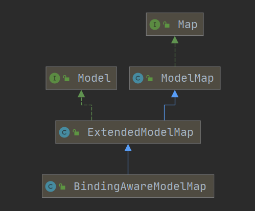</div>

```java
@Controller
@RequestMapping("/carry")
public class CarryController {

    @RequestMapping("/map")
    public String Map(Map<String, Object> map) {
        map.put("name", "payphone");
        // class org.springframework.validation.support.BindingAwareModelMap
        System.out.println(map.getClass());
        return "carry";
    }

    @RequestMapping("/model")
    public String Model(Model model) {
        model.addAttribute("name", "payphone model");
        // class org.springframework.validation.support.BindingAwareModelMap
        System.out.println(model.getClass());
        return "carry";
    }

    @RequestMapping("/modelMap")
    public String ModelMap(ModelMap map) {
        map.addAttribute("name", "Model Map vale");
        // class org.springframework.validation.support.BindingAwareModelMap
        System.out.println(map.getClass());
        return "carry";
    }
}
```

无论是传入 Map 还是 Model 还是 ModelMap 最终的数据类型都是 BindingAwareModelMap。相当于 BindingAwareModelMap 中保存的东西都会被放在请求域中。

## ModelAndView

1）方法的返回值可以变为 ModelAndView 类型

即包含视图信息（页面地址）也包含模型数据（给页面），而且数据是放在请求域中。

```java
public ModelAndView handle(){
    // 最后会跳转到 /WEB-INF/views/success.jsp页面。
    // 我设置了视图解析器，会给success拼前缀和后缀。
    // 带前缀的地址: redirect:/xx
   	// 			   forward:/xx 这些就不会被拼串，具体可以看视图解析那块的源码，看下就知道了。
    // 他是先看有没有 前缀，有就用对应前缀的View对象，没用就采用拼串的View对象。
	ModelAndViewmv = new ModelAndView("success");
	mv.addObject("msg","你好哦")
	return mv；
}
```

## 数据暂存Session域

使用一个注解 @SessionAttributes(只能标在类上)

@SessionAttributes(value="msg")：

- 给 BindingAwareModelMap 中保存的数据,同时给 session 中放一份。
- value 指定保存数据时要给 session 中存放的数据的 key。

@SessionAttributes(value={"msg"},types={String.class}})

- value={“msg”} 只要保存的是这种 key 的数据，给 Session 中放一份。
- types={String.class} 只要保存的是这种类型的数据，给 Session 中也放一份。
- 所以会存两大份！！用 value 指定的比较多，因为可以精确指定。
- <b>但是不推荐用 @SessionAttributes，还是用原生 API 吧。注解的话可能会引发异常，且移除 session 麻烦。</b>

## ModelAttribute方法

ModelAttribute 方法入参标注该注解后，入参的对象就会放到数据模型中。

参数：取出刚才保存的数据

方法位置：这个方法就会提取于目标方法先运行。

​	可以在这里提前查出数据库中图书的信息。

​	将这个图书信息保存起来（方便下一个方法还能使用）

​	参数 Map 就是 BindAwareMap

```java
/*
* ModelAttribute方法先执行，把数据存在数据模型域中。
* @ModelAttribute("user") User user先拿到模型域中的值，然后才用浏览器传* 过来的值进行数据更新
*/
@ResponseBody
@RequestMapping("/get")
public User get(@ModelAttribute("user") User user) {
    return user;
}

@ModelAttribute
public void ModelAttribute(Model model) {
    User user = new User();
    user.setAddress("address");
    user.setAge(18);
    user.setName("ljw");
    model.addAttribute("user", user);
}
```

<b>ModelAttribute 图解</b>

<div align="center">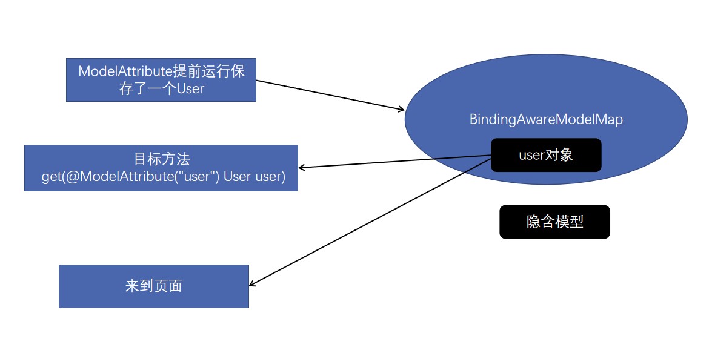</div>

# 静态资源放行

Spring MVC 的工作机制是：来自浏览器的所有访问都会被前端控制器（DispatcherServlet）捕获，然后前端控制器把请求转交给处理器映射（HandlerMapping），HandlerMapping 为请求分配对应的控制器（Controller）进行请求处理。

默认情况下，DispatcherServlet 将捕获 Web 容器所有请求，包括静态资源请求。

浏览器访问服务器的一个页面，实际上是包含了很多次请求的。除了请求页面本身，页面上的图片，js 等静态资源也是通过请求资源在服务器上的相对地址实现的。<span style="color:orange">但是在 Spring MVC 中，对静态资源的请求也会被前端控制器捕获，并转交给处理器映射处理。由于我们的代码中不会有对应的控制器处理请求，因此请求无法被相应，导致网页无法加载静态资源。</span>

<b>那么，如何解决静态资源放行的问题呢？</b>

- 修改 Spring MVC 前端控制器拦截范围，不让 DispatcherServlet 拦截所有请求，比如所有的非静态资源以 .do 结尾，DispatcherServlet 只拦截 .do 结尾的请求。
- 由 Spring MVC 框架自己处理静态资源
- 由一个 Servlet 处理所有请求，将非静态资源交由 DispatcherServlet 处理，静态资源交由默认的 Servlet 处理。

## 修改前端控制器

```java
public class MyWebApplicationInitializer implements WebApplicationInitializer {

    @Override
    public void onStartup(ServletContext servletContext) {

        // Load Spring web application configuration
        AnnotationConfigWebApplicationContext context = new AnnotationConfigWebApplicationContext();
        context.register(AppConfig.class);

        // Create and register the DispatcherServlet
        DispatcherServlet servlet = new DispatcherServlet(context);
        ServletRegistration.Dynamic registration = servletContext.addServlet("app", servlet);
        registration.setLoadOnStartup(1);
        // 限定前端控制器拦截的请求路径。
        registration.addMapping("/app/*");
    }
}
```

## MVC自行处理静态资源🤓

将 /public 和类路径下的 static 目录都映射到 /resources 开头的路径下。推荐这种做法。

```java
@Configuration
@EnableWebMvc
public class WebConfig implements WebMvcConfigurer {

    @Override
    public void addResourceHandlers(ResourceHandlerRegistry registry) {
        registry.addResourceHandler("/resources/**")
                .addResourceLocations("/public", "classpath:/static/")
                .setCacheControl(CacheControl.maxAge(Duration.ofDays(365)));
    }
}
```

## Default Servlet

DefaultServletHttpRequestHandler，它会像一个检查员，对进入 DispatcherServlet 的 URL 进行筛查，如果发现是静态资源请求，就将该请求转由 Web 服务器默认的 Servlet 处理，如果不是静态资源请求，才由 DispatcherServlet 继续处理。

```java
@Configuration
@EnableWebMvc
public class WebConfig implements WebMvcConfigurer {

    @Override
    public void configureDefaultServletHandling(DefaultServletHandlerConfigurer configurer) {
        configurer.enable();
    }
}
```

# 前端控制器详解

<b>Spring MVC 源码如何看？</b>

- Spring  MVC  所有的请求都会被前端控制器拦截到，所以看 Spring MVC 怎么处理请求的，就看前端控制器的处理流程，如何处理请求的。
- 只要是 finally 块的，一般就是清东西。
- try 起来的一般是重要的代码。
- debug 时根据 IDE 的调用栈来查看都调用了那些方法。 

## 梳理流程

<b>文字描述</b>

请求一进来，应该是来到 HttpServlet 的 doPost 或 doGet 方法。

我们根据官网的描述知道，前端控制器 DispatcherServlet 是负责请求转发的，所以我们从它开始入手。

<b>1）我们发现 DispatcherServlet 的继承关系如图所示</b>

<div align="center">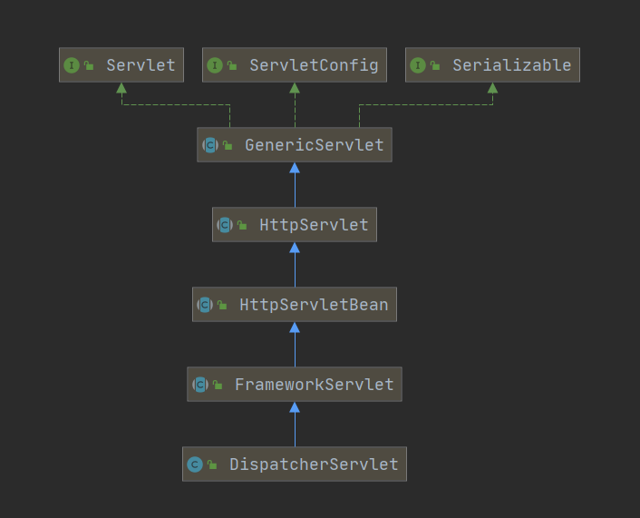</div>

<b>2）我们知道 Servlet 中是调用 service 方法来处理各种请求的，于是我们去找这些类重写的 service 方法</b>

- HttpServletBean 未重写 Service 方法，接下来看他的子类 FrameworkServlet。
- FrameworkServlet 重写了 service 方法！！！

```java
@Override
protected void service(HttpServletRequest request, HttpServletResponse response)
    throws ServletException, IOException {

    HttpMethod httpMethod = HttpMethod.resolve(request.getMethod());
    if (httpMethod == HttpMethod.PATCH || httpMethod == null) {
        // 内部执行了 processRequest 方法。见名知意，这个是处理请求的
        // 我们继续看该类的 processRequest 方法！！
        processRequest(request, response);
    }
    else {
        super.service(request, response);
    }
}
```

<b>3）FrameworkServlet 的 service 方法内部执行了 processRequest 方法。见名知意，这个是处理请求的，我们继续看该类的 processRequest 方法！</b>

```java
protected final void processRequest(HttpServletRequest request, HttpServletResponse response)
    throws ServletException, IOException {
    // do something
    try {
        // 被 try 进来的说明是非常重要的方法，从方法的命名也看出，这是处理请求的！！
        // 但是我们发现，doService 在 FrameworkServlet中是一个抽象类，
        // 所以要去看它子类的对应实现！！！
        doService(request, response);
    }
    catch (ServletException | IOException ex) {
        failureCause = ex;
        throw ex;
    }
    catch (Throwable ex) {
        failureCause = ex;
        throw new NestedServletException("Request processing failed", ex);
    }

    finally {
		// do something
    }
}
```

<b>4）被 try 进来的说明是非常重要的方法，从方法的命名也看出，这是处理请求的！！但是我们发现，doService 在 FrameworkServlet 中是一个抽象类，所以要去看它子类的对应实现！！！即看 DispatcherServlet！！</b>

```java
@Override
protected void doService(HttpServletRequest request, HttpServletResponse response) throws Exception {
    logRequest(request);
	// do something
    try {
        // 这个方法，被try进来说明很重要！！
        doDispatch(request, response);
    }
    finally {
        // do something
    }
}
```

于是我们继续点进该类的 doDispatcher 方法一探究竟！

```java
// 源码注释上写，处理对处理程序的实际调度！！我们就对 doDispatch 方法进行 debug!
protected void doDispatch(HttpServletRequest request, HttpServletResponse response) throws Exception {
	// doing something
}
```

源码注释上写，处理对处理程序的实际调度！！而且，该类中调用了类中的很多方法，再根据这些被调用方法的名字，我们猜测 doDispatch 就是调度的核心方法，于是我们对它进行 debug！！！

<b>图示总结</b>

梳理完流程后，发现执行流程大概是这样的。

<div align="center">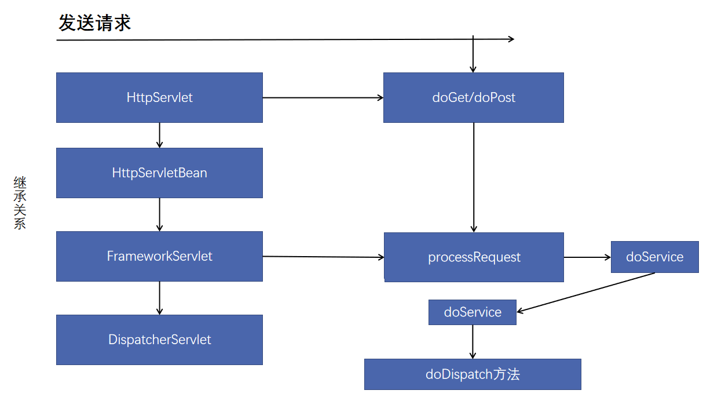</div>

<b>文字概述</b>

1）先看了类与类之间的继承关系，顺着继承关系找 doXX 方法的重写

2）<b>HttpServletBean</b> 并未重写 <b>doPost/doGet</b> 这些方法，HttpServletBeand 的子类 FrameworkServlet 实现了相应的方法。

3）<b>FrameworkServlet</b> 相应的方法内部调用的是 <b>processRequest</b>;

4）<b>processRequest</b> 内部调用了 <b>doService</b> 方法，而该方法在 FrameworkServlet 中并未实现，但从 FrameworkServlet 的子类 DispatcherServlet 找到了对应的实现。

5）<b>DispatcherServlet</b> 中的 Service 方法调用了 doDispatch 方法

6）<b>doDispatch</b> 方法内部调用了 DispatcherServlet 中的很多方法

7）<b>doDispatch</b> 调用的方法中，我们根据单词意思和方法上的注释推断出这个方法就是我们要找的入口！于是对其进行 debug！

## 阅读源码

###  分析思路

<b>看每个方法的大致功能</b>

1）WebAsyncUtils.getAsyncManager(request); 异步管理

2）checkMultipart(request); 文件上传相关

3）getHandler(processedRequest);  获得对应请求的处理器

4）getHandlerAdapter(mappedHandler.getHandler()); 获得处理器对应的适配器（适配器执行方法哦！）

5）mv = ha.handle(processedRequest, response, mappedHandler.getHandler()); 执行 @RequestMapping 标记的方法！！

6）processDispatchResult(processedRequest, response, mappedHandler, mv, dispatchException);  页面放行！

<b>大致的阅读路线</b>

<b>==></b> 查看 DispatcherServlet类中的 doDispatch()方法中每个方法的功能

​	<b>|==></b> getHandler /  getHandlerAdapter方法

​	<b>|==></b> getHandlerAdapter方法负责执行打了@RequestMapping的方法。

<b>==></b> 看getHandler()细节；怎么根据当前请求就能找到那个类能来处理。

​	<b>|==></b>  mappedHandler = getHandler(processedRequest);// mappedHandler的类型是HandlerExecutionChain

​	<b>|==></b> 看了getHandler的源码，知道如何根据当前请求就能找到那个类能来处理了。

<b>==></b> 看完getHandler() 细节 接下来就是看 getHandlerAdapter() 的细节了。

​	<b>|==></b> 因为getHandler只是拿到要处理的请求，真正的处理还是交由对应的适配器来做！

​	<b>|==></b> 所以接下来是看如何找到目标处理器类的适配器！！<span style="color:red"><b>【补适配器模式！！】</b></span>

​	<b>|==></b> 最后发现适配器的查找也是遍历。

<b>==></b> 看完如何找到 getHandlerAdapter() 后就看适配器如何执行方法了！mv = ha.handle()

​	<b>|==></b> handle() 方法中调用了 handleInternal() 方法

​	<b>|==></b> handleInternal() 方法 中的这句代码 mav = invokeHandlerMethod(request, response, handlerMethod); 执行方法，返回执行后需要跳转的视图。

### 源码调试

doDispatch 方法是 MVC 的核心处理方法。

#### doDispatch方法

DispatcherServlet 收到请求，调用 doDispatch 方法进行处理

- getHandler()，根据当前请求在 HandlerMapping 中找到这个请求映射信息，获取到目标处理器类。
- getHandlerAdapter()，根据当前处理器类获取到能执行这个处理器方法的适配器（HandlerAdapter）。
- 使用刚才获取到的适配器 AnnotationMethodHandlerAdapter 执行目标方法。
- 目标方法执行后会返回一个 ModelAndView 对象。
- 根据 ModelAndView 的信息转发到具体的页面，并可以在请求域中取出 ModelAndView 中的模型数据。

```java
protected void doDispatch(HttpServletRequest request, HttpServletResponse response) throws Exception {
   HttpServletRequest processedRequest = request;
   HandlerExecutionChain mappedHandler = null;
   boolean multipartRequestParsed = false;
   // 异步管理器，如果有异步怎么办
   WebAsyncManager asyncManager = WebAsyncUtils.getAsyncManager(request);

   try {
      ModelAndView mv = null;
      Exception dispatchException = null;

      try {
         // 检查是否多部件 和文件上传有关
         processedRequest = checkMultipart(request);
         multipartRequestParsed = (processedRequest != request);

         // Determine handler for the current request.
         // 根据当前请求地址决定哪个类能处理
         mappedHandler = getHandler(processedRequest);
         // 如果没有找到那个处理器可以处理这个请求，就404 报异常。
         if (mappedHandler == null) {
            noHandlerFound(processedRequest, response);
            return;
         }
         // 找到了的话，mappedHandler 里的 handler 属性就会封装我们对应的 Controller。
         // 决定当前请求要用那个处理器的适配器。SpringMVC 不是直接反射调用对应 Controller 的方法，而是用一个处理器进行执行。此处的作用1是拿到能执行这个类的所以方法的适配器（反射工具）
         HandlerAdapter ha = getHandlerAdapter(mappedHandler.getHandler());

         // Process last-modified header, if supported by the handler.
         String method = request.getMethod();
         boolean isGet = "GET".equals(method);
         if (isGet || "HEAD".equals(method)) {
            long lastModified = ha.getLastModified(request, mappedHandler.getHandler());
            if (new ServletWebRequest(request, response).checkNotModified(lastModified) && isGet) {
               return;
            }
         }

         if (!mappedHandler.applyPreHandle(processedRequest, response)) {
            return;
         }

         // Actually invoke the handler.
         // 用适配器执行方法；将目标方法执行完成后的返回值作为视图名，设置保存到 ModelAndView 中。
         // 无论目标方法怎么写，最终适配器执行完成以后都会将执行后的信息封装成ModelAndView
         mv = ha.handle(processedRequest, response, mappedHandler.getHandler());

         if (asyncManager.isConcurrentHandlingStarted()) {
            return;
         }
         // 如果没有视图名，设置一个默认的视图名（方法没有返回值的时候）
         applyDefaultViewName(processedRequest, mv);
         mappedHandler.applyPostHandle(processedRequest, response, mv);
      }
      catch (Exception ex) {
         dispatchException = ex;
      }
      catch (Throwable err) {
         // As of 4.3, we're processing Errors thrown from handler methods as well,
         // making them available for @ExceptionHandler methods and other scenarios.
         dispatchException = new NestedServletException("Handler dispatch failed", err);
      }
      // 转发到目标页面。根据方法最终执行完成后封装的 ModelAndView 转发到对应页面，而且 ModelAndView 中的数据可以从请求域中获取。
      processDispatchResult(processedRequest, response, mappedHandler, mv, dispatchException);
   }
   catch (Exception ex) {
      triggerAfterCompletion(processedRequest, response, mappedHandler, ex);
   }
   catch (Throwable err) {
      triggerAfterCompletion(processedRequest, response, mappedHandler,
            new NestedServletException("Handler processing failed", err));
   }
   finally {
      if (asyncManager.isConcurrentHandlingStarted()) {
         // Instead of postHandle and afterCompletion
         if (mappedHandler != null) {
            mappedHandler.applyAfterConcurrentHandlingStarted(processedRequest, response);
         }
      }
      else {
         // Clean up any resources used by a multipart request.
         if (multipartRequestParsed) {
            cleanupMultipart(processedRequest);
         }
      }
   }
}
```

<b style="color:orange">文字总结</b>

1）所以有请求都要经过 DispathcherServlet，DispathcherServlet 收到请求

2）调用 doDispatch() 方法进行处理

- getHandler()  根据当前请求地址找到能处理这个请求的目标处理器类（处理器）
- <span style="color:red">getHandlerAdapter()  根据 2 当前处理器类获取到能执行这个处理器方法的适配器。</span>
- <span style="color:red">使用刚才获取到的适配器（AnnotationMethodHandlerAdapter）执行目标方法。</span>
- <span style="color:red">目标方法执行后返回一个 ModelAndView 对象。</span>
- <span style="color:red">根据 ModelAndView 的信息转发到具体的页面，并可以在请求域中取出 ModelAndView 中的模型数据。</span>

#### getHandler方法

1）读了 doDispatch() 方法，大致猜了每个方法的作用。现在来细看 getHandler() 方法的细节。

<b>getHandler  是如何找到那个类可以处理请求的。</b>

```java
// mappedHandler的类型是HandlerExecutionChain
mappedHandler = getHandler(processedRequest);
```

getHandler 源码

```java
protected HandlerExecutionChain getHandler(HttpServletRequest request) throws Exception {
   if (this.handlerMappings != null) {
      // HandlerMapping：处理器映射；他里面保存了每一个处理器能处理那些请求的映射信息。【标了注解】
      for (HandlerMapping mapping : this.handlerMappings) {
         HandlerExecutionChain handler = mapping.getHandler(request);
         if (handler != null) {
            return handler;
         }
      }
   }
   return null;
}
```

debug 发现，有三种类别的 handlerMappings（Spring 5.x），使用的是 RequestMappingHandlerMapping@6585（因为我们是打的 RequestMapping 这个注解）

<div align="center">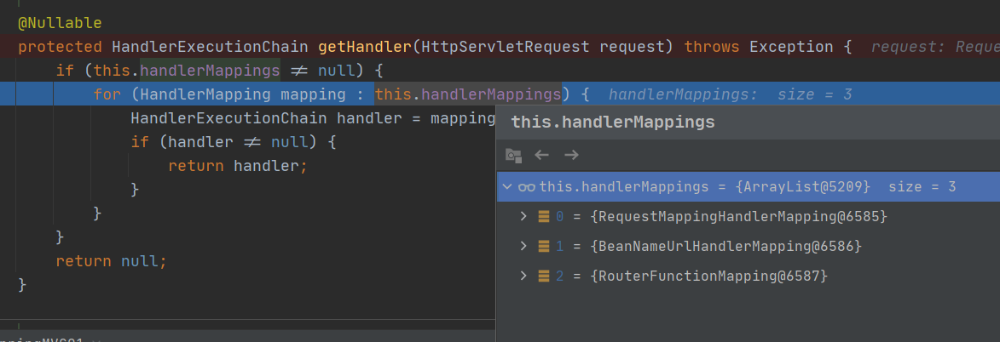</div>

最后返回的 handler 的值是被打上注解，要执行的方法的：<span style="color:red">全类名#方法名</span>

<div align="center">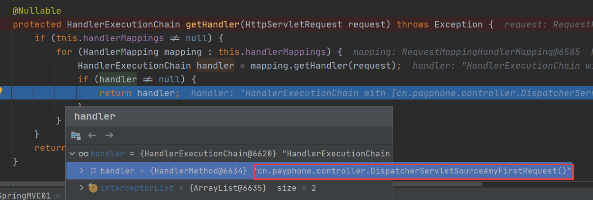</div>

我们再回过头来看看 this.handlerMappings 中 RequestMappingHandlerMapping 的成员变量

mappingRegistry：ioc 容器启动创建 Controller 对象的时候扫描每个处理器都能处理什么请求，保存在 mappingRegistry 属性的 registry 中。下一次请求过来，就来看那个 handlerMapping 中有这个请求的映射信息就好了。

<div align="center">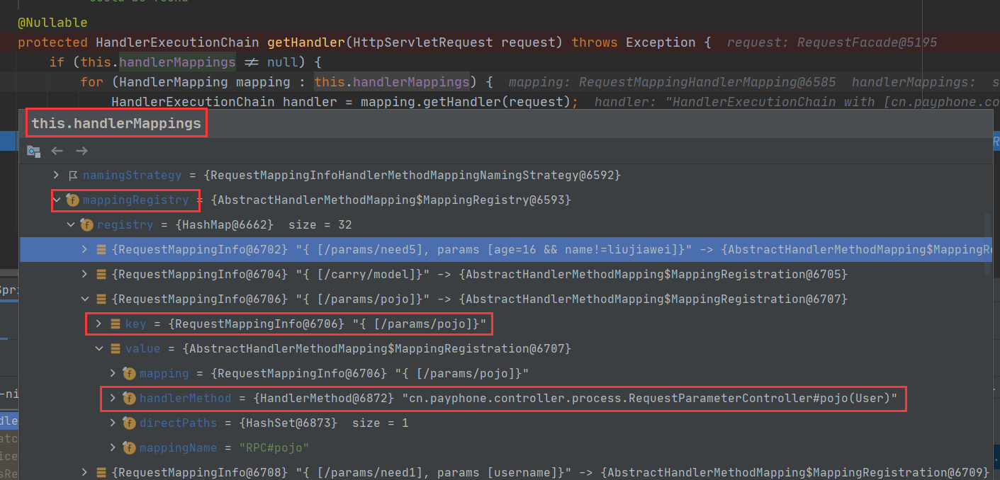</div>

#### getHandlerAdapter方法

2）细看 getHandler() 方法的细节，接下来看 getHandlerAdapter() 方法的细节。

getHandler() 方法找到处理对象，getHandlerAdapter() 用来执行要处理的对象！

```java
// 方法源码如下：
protected HandlerAdapter getHandlerAdapter(Object handler) throws ServletException {
   if (this.handlerAdapters != null) {
      // 找适配器，又是遍历适配器，看那个合适。
      for (HandlerAdapter adapter : this.handlerAdapters) {
          // 如果支持这个处理器就返回，不支持就继续找，没找到就抛异常。
          //RequestMappingHandlerAdapter的supports总是返回true
         if (adapter.supports(handler)) {
            return adapter;
         }
      }
   }
   throw new ServletException("No adapter for handler [" + handler +
         "]: The DispatcherServlet configuration needs to include a HandlerAdapter that supports this handler");
}
```

<b>下面我们看看 this.handlerAdapters 里有多少适配器：有四个！四种类型的适配器！</b>

这四个适配器中那个有用？我们猜测是注解那个有用。<b>RequestMappingHandlerAdapter</b>，因为我们打的是 RequestMapping 注解！

<b>RequestMappingHandlerAdapter 能解析注解方法的适配器；处理器类中只要有标了注解的这些方法就能用。</b>

<div align="center">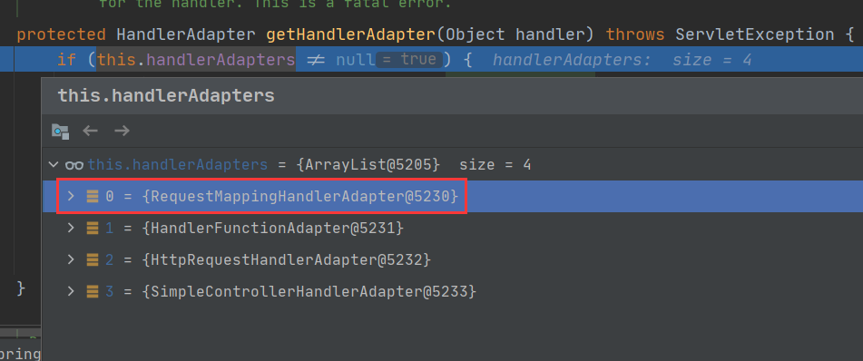</div>

#### handle方法

```java
@Override
@Nullable
public final ModelAndView handle(HttpServletRequest request, HttpServletResponse response, Object handler)
      throws Exception {
   return handleInternal(request, response, (HandlerMethod) handler);
}

@Override
protected ModelAndView handleInternal(HttpServletRequest request,
                                      HttpServletResponse response, 
                                      HandlerMethod handlerMethod) throws Exception {

    ModelAndView mav;
    checkRequest(request);

    // Execute invokeHandlerMethod in synchronized block if required.
    if (this.synchronizeOnSession) {
        HttpSession session = request.getSession(false);
        if (session != null) {
            Object mutex = WebUtils.getSessionMutex(session);
            synchronized (mutex) {
                // 执行方法！！并得到执行方法后需要返回的视图页面！
                mav = invokeHandlerMethod(request, response, handlerMethod);
            }
        }
        else {
            // No HttpSession available -> no mutex necessary
            mav = invokeHandlerMethod(request, response, handlerMethod);
        }
    }
    else {
        // No synchronization on session demanded at all...
        mav = invokeHandlerMethod(request, response, handlerMethod);
    }

    if (!response.containsHeader(HEADER_CACHE_CONTROL)) {
        if (getSessionAttributesHandler(handlerMethod).hasSessionAttributes()) {
            applyCacheSeconds(response, this.cacheSecondsForSessionAttributeHandlers);
        }
        else {
            prepareResponse(response);
        }
    }

    return mav;
}
```

## 九大组件

### 组件介绍

DispatcherServet 中有几个引用类型的属性；SpringMVC 的九大组件。

SpringMVC 在工作的时候，关键位置都是由这些组件完成的；

共同点：九大组件全部都是接口；接口就是规范；提供了非常强大的扩展性；

```java
// 文件上传解析器 
@Nullable
private MultipartResolver multipartResolver;

// 区域信息解析器. 和国际化有关
@Nullable
private LocaleResolver localeResolver;

// 主题解析器；强大的主题效果更换
@Nullable
private ThemeResolver themeResolver;

// Handler映射信息.HandlerMapping 
@Nullable
private List<HandlerMapping> handlerMappings;

// Handler的适配器.
@Nullable
private List<HandlerAdapter> handlerAdapters;

// SpringMVC强大的异常解析功能；异常解析器.
@Nullable
private List<HandlerExceptionResolver> handlerExceptionResolvers;

// RequestToViewNameTranslator used by this servlet. 
@Nullable
private RequestToViewNameTranslator viewNameTranslator;

// FlashMap+Manager：SpringMVC中运行重定向携带数据的功能 
@Nullable
private FlashMapManager flashMapManager;

// 视图解析器
@Nullable
private List<ViewResolver> viewResolvers;
```

<b>九大组件初始化的地方</b>

```java
@Override
protected void onRefresh(ApplicationContext context) {
   initStrategies(context);
}

/**
 * Initialize the strategy objects that this servlet uses.
 * <p>May be overridden in subclasses in order to initialize further strategy objects.
 */
protected void initStrategies(ApplicationContext context) {
   initMultipartResolver(context);
   initLocaleResolver(context);
   initThemeResolver(context);
   initHandlerMappings(context);
   initHandlerAdapters(context);
   initHandlerExceptionResolvers(context);
   initRequestToViewNameTranslator(context);
   initViewResolvers(context);
   initFlashMapManager(context);
}
```

### 组件的初始化

- 有些组件在容器中是使用类型找的，有些组件是使用id找的。
- 就是去容器中找这个组件，如果没有就用默认的配置。
- 这是教怎么看各大组件的，具体的流程自己去看。

```java
private void initHandlerMappings(ApplicationContext context) {
   this.handlerMappings = null;
   // 探查所有的HandlerMapping
   if (this.detectAllHandlerMappings) {
      // Find all HandlerMappings in the ApplicationContext, including ancestor contexts.
      Map<String, HandlerMapping> matchingBeans =
            BeanFactoryUtils.beansOfTypeIncludingAncestors(context, HandlerMapping.class, true, false);
      if (!matchingBeans.isEmpty()) {
         this.handlerMappings = new ArrayList<>(matchingBeans.values());
         // We keep HandlerMappings in sorted order.
         AnnotationAwareOrderComparator.sort(this.handlerMappings);
      }
   }
   else {
      try {
         HandlerMapping hm = context.getBean(HANDLER_MAPPING_BEAN_NAME, HandlerMapping.class);
         this.handlerMappings = Collections.singletonList(hm);
      }
      catch (NoSuchBeanDefinitionException ex) {
         // Ignore, we'll add a default HandlerMapping later.
      }
   }

   // Ensure we have at least one HandlerMapping, by registering
   // a default HandlerMapping if no other mappings are found.
   if (this.handlerMappings == null) {
      this.handlerMappings = getDefaultStrategies(context, HandlerMapping.class);
      if (logger.isTraceEnabled()) {
         logger.trace("No HandlerMappings declared for servlet '" + getServletName() +
               "': using default strategies from DispatcherServlet.properties");
      }
   }

   for (HandlerMapping mapping : this.handlerMappings) {
      if (mapping.usesPathPatterns()) {
         this.parseRequestPath = true;
         break;
      }
   }
}
```

## 阅读总结

1）运行流程挑简单的。

2）确定方法每个参数的值

- 标注解：保存注解的信息；最终得到这个注解应该对应解析的值。
- 没标注解：
    - 看是否是原生 API
    - 看是否是 Model 或者是 Map，xxx
    - 都不是，看是否是简单类型；paramName
    - 给 attrName 赋值；attrName（参数标了 @ModelAttribute("") 就是指定的，没标就是“”）
    - 确定自定义类型参数
        - attrName 使用参数的类型首字母小写；或者使用之前 @ModelAttribute("") 的值
        - 先看隐含模型中每个这个 attrName 作为 key 对应的值；如果有就从隐含模型中获取并赋值
        - 看是否是 @SessionAttributes(value="haha")；标注的属性，如果是就从 session 中拿；如果拿不到就会抛异常。
        - 不是 @SessionAttributes 标注的，就利用反射创建一个对象
    - 拿到之前创建好的对象，使用数据绑定器（WebDataBinder）将请求中的每个数据绑定到这个对象中。

视图解析器只是为了得到视图对象；视图对象才能真正的<span style="color:red">转发（将模型数据全部放在请求域中）或者重定向到页面</span>视图对象才能真正的<span style="color:red">渲染视图</span>。

# 视图解析器

Spring MVC 中的视图解析器是负责解析视图的。我们可以配置一个视图解析器，设置视图前缀和后缀简化开发。

## 视图解析的应用

> <b style="color:orange">转发 forward</b>

1）地址栏不发生变化，显示的是上一个页面的地址。在服务器端进行的跳转，

2）请求次数：只有一次。

3）根目录：http://localhost:8080/项目地址/转发地址

4） 请求域中数据会不丢失（request 请求域的生命周期是一次转发！）

```java
request.getRequestDispatcher("/地址").forward(request, response);
```

> <b style="color:orange">重定向 redireect</b>

1）地址栏发生变化，显示新的地址；浏览器端进行的跳转。

2）请求次数：2 次

3）可重定向到其他项目或其他网址

4）请求域中的数据会丢失，因为是 2 次请求。request 请求域的生命周期只是一次请求内有效！

### 转发 forward

```java
@Controller
class DemoController{
    @RequestMapping("/forward")
    public String forward(){
        // 转发到项目的hello.jsp 
        // eg 项目根目录是 localhost:8080/demo
        // 则该亲求会转发到 localhost:8080/demo/hello.jsp
			return "forward:/hello.jsp" 
    }
}
```

> <b>详细解释</b>

- forward：转发到一个页面
- /hello.jsp 转发当前项目下的 hello
- 一定要加 /  如果不加 / 就是相对路径。容易出问题。
- forward:/hello.jsp <span style="color:red">不会有给你拼串，有前缀的转发，不会经由我们配置的视图解析器拼串。看看源码的流程就知道</span>
    - 先判断路径中是否含前缀，含有就用对应前缀的方式进行操作。
    - 没有就用我们的配置的视图解析器进行操作。

forward 可以转发到页面，也可以转发到一个请求上。 forward:/hello 转发到 hello 请求

### 重定向 redirect

```java
@Controller
class DemoController{
    @RequestMapping("/redirect")
    public String forward(){
        // 转发到项目的hello.jsp 
        // eg 项目根目录是 localhost:8080/demo
        // 则该亲求会转发到 localhost:8080/demo/hello.jsp
		return "redirect:/hello.jsp" 
    }
}
```

<b>redirect 重定向【重定向的地址由浏览器进行解析】</b>

- 有前缀的转发和重定向不会有视图解析器的拼串操作。
- 原生的 servlet 重定向需要加上项目名才能重定向。
- springmvc 无需写项目名，会为我们自动拼接上项目名。
- returen "redirect:/hello.jsp";

## 视图解析器原理

<b>==></b> 先根据当前请求，找到那个类能处理。

​	`mappedHandler = getHandler(processedRequest);`

<b>==></b> 找到适配器

​	`HandlerAdapter ha = getHandlerAdapter(mappedHandler.getHandler());`

<b>==></b>  目标方法执行，执行完会有一个返回值，返回值会被包装成一个 ModelAndView，ModelAndView 对象中包含视图名。

​	`mv = ha.handle(processedRequest, response, mappedHandler.getHandler());`

<b>==></b> 来到页面

​	`processDispatchResult(processedRequest, response, mappedHandler, mv, dispatchException);`

<b>==></b> 调用 processDispatchResult 里的 render 进行渲染

<b>==></b> 如何根据方法的返回值得到 View 对象

<b>==></b> 由 View 对象进行视图的相关操作

### 流程解析

><b>先根据当前请求，找到那个类能处理</b>

```java
mappedHandler = getHandler(processedRequest);
```

> <b>找到可处理当前请求的适配器</b>

```java
HandlerAdapter ha = getHandlerAdapter(mappedHandler.getHandler());
```

> <b>执行目标方法</b>

```java
mv = ha.handle(processedRequest, response, mappedHandler.getHandler());
```

执行完目标方法后，其返回值会被包装成一个 ModelAndView，而 ModelAndView 对象中包含视图名。

<div align="center">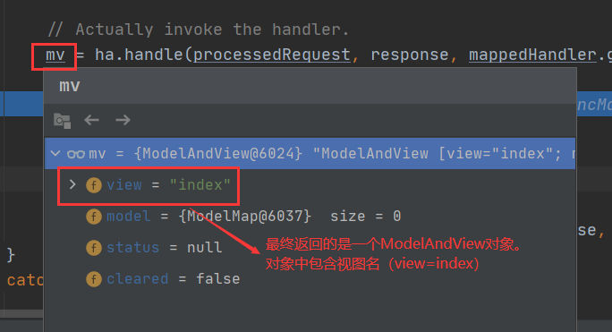</div>

> <b>来到页面</b>

```java
processDispatchResult(processedRequest, response, mappedHandler, mv, dispatchException);
```

视图渲染流程；将域中的数据在页面展示；我们可以认为，页面的功能就是用来渲染模型数据的。

看 processDispatchResult 源码发现里面是调用 render(mv,request,response) 进行渲染的

```java
private void processDispatchResult(HttpServletRequest request, HttpServletResponse response,
                                   @Nullable HandlerExecutionChain mappedHandler, @Nullable ModelAndView mv,
                                   @Nullable Exception exception) throws Exception {

    boolean errorView = false;

    if (exception != null) {
        if (exception instanceof ModelAndViewDefiningException) {
            logger.debug("ModelAndViewDefiningException encountered", exception);
            mv = ((ModelAndViewDefiningException) exception).getModelAndView();
        }
        else {
            Object handler = (mappedHandler != null ? mappedHandler.getHandler() : null);
            mv = processHandlerException(request, response, handler, exception);
            errorView = (mv != null);
        }
    }

    // Did the handler return a view to render?
    if (mv != null && !mv.wasCleared()) {
        render(mv, request, response);
        if (errorView) {
            WebUtils.clearErrorRequestAttributes(request);
        }
    }
    else {
        if (logger.isTraceEnabled()) {
            logger.trace("No view rendering, null ModelAndView returned.");
        }
    }

    if (WebAsyncUtils.getAsyncManager(request).isConcurrentHandlingStarted()) {
        // Concurrent handling started during a forward
        return;
    }

    if (mappedHandler != null) {
        // Exception (if any) is already handled..
        mappedHandler.triggerAfterCompletion(request, response, null);
    }
}
```

> <b>调用 processDispatchResult 里的 render 进行渲染</b>

发现内部有个 View 类型的变量。

其中 `view = resolveViewName(viewName, mv.getModelInternal(), locale, request);` 的作用是根据视图名（即目标方法的返回值）得到 View 对象

- viewName 视图的名称
- mv.getModelInternal() 隐含模型中的数据

```java
protected void render(ModelAndView mv, HttpServletRequest request, HttpServletResponse response) throws Exception {
    // Determine locale for request and apply it to the response.
    Locale locale =
        (this.localeResolver != null ? this.localeResolver.resolveLocale(request) : request.getLocale());
    response.setLocale(locale);

    View view;
    String viewName = mv.getViewName();
    if (viewName != null) {
        // We need to resolve the view name.
        view = resolveViewName(viewName, mv.getModelInternal(), locale, request);
        if (view == null) {
            throw new ServletException("Could not resolve view with name '" + mv.getViewName() +
                                       "' in servlet with name '" + getServletName() + "'");
        }
    }
    else {
        // No need to lookup: the ModelAndView object contains the actual View object.
        view = mv.getView();
        if (view == null) {
            throw new ServletException("ModelAndView [" + mv + "] neither contains a view name nor a " +
                                       "View object in servlet with name '" + getServletName() + "'");
        }
    }

    // Delegate to the View object for rendering.
    if (logger.isTraceEnabled()) {
        logger.trace("Rendering view [" + view + "] ");
    }
    try {
        if (mv.getStatus() != null) {
            response.setStatus(mv.getStatus().value());
        }
        view.render(mv.getModelInternal(), request, response);
    }
    catch (Exception ex) {
        if (logger.isDebugEnabled()) {
            logger.debug("Error rendering view [" + view + "]", ex);
        }
        throw ex;
    }
}
```

> <b>如何根据方法的返回值得到 View 对象？</b>

查看 resolveViewName 的源码，发现是视图解析器更具视图名得到视图对象，并返回。

- viewName 视图的名称
- mv.getModelInternal() 隐含模型中的数据

this.viewResolvers 中的数据如图：

<div align="center">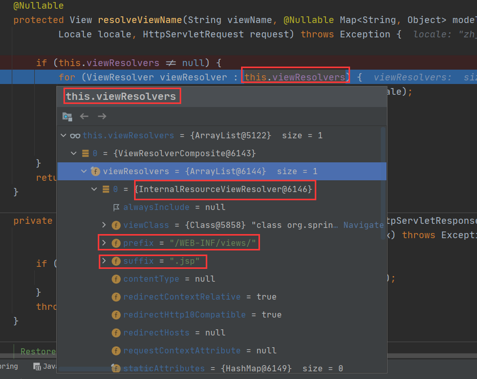</div>

我们配了视图解析器就用，没配就用默认的。想知道怎么初始化视图解析器的话，取看 initViewResolvers 方法

- 找到的话，就用我们配置的。
- 没找到的话，就用默认的。

```java
@Nullable
protected View resolveViewName(String viewName, @Nullable Map<String, Object> model,Locale locale, HttpServletRequest request) throws Exception {

    if (this.viewResolvers != null) {
        // 遍历所有的ViewResolver
        for (ViewResolver viewResolver : this.viewResolvers) {
            View view = viewResolver.resolveViewName(viewName, locale);
            if (view != null) {
                return view;
            }
        }
    }
    return null;
}
```

><b>如何得到 View 对象，即 resolveViewName 如何实现的？</b>

先从缓存中拿，没有就创建。

根据方法的返回值创建出视图对象

view = createView(viewName, locale);

```java
@Override
@Nullable
public View resolveViewName(String viewName, Locale locale) throws Exception {
    if (!isCache()) {
        return createView(viewName, locale);
    }
    else {
        Object cacheKey = getCacheKey(viewName, locale);
        View view = this.viewAccessCache.get(cacheKey);
        if (view == null) {
            synchronized (this.viewCreationCache) {
                view = this.viewCreationCache.get(cacheKey);
                if (view == null) {
                    // Ask the subclass to create the View object.
                    // 根据方法的返回值创建出视图对象
                    view = createView(viewName, locale);
                    if (view == null && this.cacheUnresolved) {
                        view = UNRESOLVED_VIEW;
                    }
                    if (view != null && this.cacheFilter.filter(view, viewName, locale)) {
                        this.viewAccessCache.put(cacheKey, view);
                        this.viewCreationCache.put(cacheKey, view);
                    }
                }
            }
        }
        else {
            if (logger.isTraceEnabled()) {
                logger.trace(formatKey(cacheKey) + "served from cache");
            }
        }
        return (view != UNRESOLVED_VIEW ? view : null);
    }
}
```

> <b>创建 View 对象的方法 createView</b>

```java
@Override
protected View createView(String viewName, Locale locale) throws Exception {
   // If this resolver is not supposed to handle the given view,
   // return null to pass on to the next resolver in the chain.
   if (!canHandle(viewName, locale)) {
      return null;
   }

   // Check for special "redirect:" prefix.
   if (viewName.startsWith(REDIRECT_URL_PREFIX)) {
      String redirectUrl = viewName.substring(REDIRECT_URL_PREFIX.length());
      RedirectView view = new RedirectView(redirectUrl,
            isRedirectContextRelative(), isRedirectHttp10Compatible());
      String[] hosts = getRedirectHosts();
      if (hosts != null) {
         view.setHosts(hosts);
      }
      return applyLifecycleMethods(REDIRECT_URL_PREFIX, view);
   }

   // Check for special "forward:" prefix.
   if (viewName.startsWith(FORWARD_URL_PREFIX)) {
      String forwardUrl = viewName.substring(FORWARD_URL_PREFIX.length());
      // 
      InternalResourceView view = new InternalResourceView(forwardUrl);
      return applyLifecycleMethods(FORWARD_URL_PREFIX, view);
   }

   // 如果没有前缀  就用父类默认创建一个view对象
   return super.createView(viewName, locale);
}
```

返回 View 对象；

视图解析器得到 View 对象的流程就是，所有配置的视图解析器都来尝试根据视图名（返回值）得到 View（视图对象）；如果能得到就返回，得不到就换下一个视图解析器；

调用 View 对象的 render 方法

```java
@Override
public void render(Map<String, ?> model, HttpServletRequest request, HttpServletResponse response) throws Exception {
    if (logger.isTraceEnabled()) {
        logger.trace("Rendering view with name '" + this.beanName + "' with model " + model +
                     " and static attributes " + this.staticAttributes);
    }

    Map<String, Object> mergedModel = createMergedOutputModel(model, request, response);
    prepareResponse(request, response);
    renderMergedOutputModel(mergedModel, getRequestToExpose(request), response);
}
```

```java
@Override
protected void renderMergedOutputModel(
    Map<String, Object> model, HttpServletRequest request, HttpServletResponse response) throws Exception {

    // Expose the model object as request attributes.
    // 将模型中的数据放在请求域中
    exposeModelAsRequestAttributes(model, request);

    // Expose helpers as request attributes, if any.
    exposeHelpers(request);

    // Determine the path for the request dispatcher.
    // 拿到要转发的路径
    String dispatcherPath = prepareForRendering(request, response);

    // Obtain a RequestDispatcher for the target resource (typically a JSP).
    RequestDispatcher rd = getRequestDispatcher(request, dispatcherPath);
    if (rd == null) {
        throw new ServletException("Could not get RequestDispatcher for [" + getUrl() +
                                   "]: Check that the corresponding file exists within your web application archive!");
    }

    // If already included or response already committed, perform include, else forward.
    if (useInclude(request, response)) {
        response.setContentType(getContentType());
        if (logger.isDebugEnabled()) {
            logger.debug("Including resource [" + getUrl() + "] in InternalResourceView '" + getBeanName() + "'");
        }
        rd.include(request, response);
    }

    else {
        // Note: The forwarded resource is supposed to determine the content type itself.
        if (logger.isDebugEnabled()) {
            logger.debug("Forwarding to resource [" + getUrl() + "] in InternalResourceView '" + getBeanName() + "'");
        }
        rd.forward(request, response);
    }
}
```

将隐含模型中的数据合并到 request 请求域中

```java
protected void exposeModelAsRequestAttributes(Map<String, Object> model, HttpServletRequest request) throws Exception {
    for (Map.Entry<String, Object> entry : model.entrySet()) {
        String modelName = entry.getKey();
        Object modelValue = entry.getValue();
        if (modelValue != null) {
            request.setAttribute(modelName, modelValue);
            if (logger.isDebugEnabled()) {
                logger.debug("Added model object '" + modelName + "' of type [" + modelValue.getClass().getName() +
                             "] to request in view with name '" + getBeanName() + "'");
            }
        }
        else {
            request.removeAttribute(modelName);
            if (logger.isDebugEnabled()) {
                logger.debug("Removed model object '" + modelName +
                             "' from request in view with name '" + getBeanName() + "'");
            }
        }
    }
}
```

一句话：视图解析器只是为了得到视图对象；视图对象才能真正的转发（将模型数据全部放在请求域中）或者重定向要页面，视图对象才能真正的<span style="color:red">渲染视图</span>

### 流程图

<div align="center">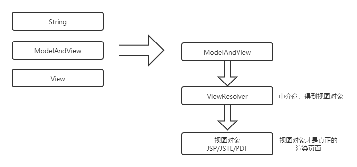</div>

视图对象才是真正的渲染页面，ViewResolver 只是一个中介商，用于得到视图对象

## 自定义视图解析器

> 自定义视图和视图解析器的步骤

1）编写自定义的视图解析器，和视图实现类

2）视图解析器必须在 IOC 容器中。

```java
@Controller
public class MyViewResovlerController{
    
    @RequeestMapping("/handleplus")
    public String handleplus(){
        return "meinv:/gaoqing"
    }
}
```

> 使用自定义视图进行页面跳转/转发

```java
package org.example.view;

import org.springframework.web.servlet.View;

import javax.servlet.http.HttpServletRequest;
import javax.servlet.http.HttpServletResponse;
import java.util.Map;
// 自定义视图，定义视图的返回数据类型
public class MyView implements View {
    @Override
    public String getContentType() {
        // 返回的数据类型
        return "text/html";
    }

    @Override
    public void render(Map<String, ?> model, HttpServletRequest request, HttpServletResponse response) throws Exception {
        System.out.println("之前存的数据" + model);
        // 过滤器替我们设置好了编码格式
        response.setContentType("text/html");
        response.getWriter().write("精彩内容 马上出现！哈哈哈！");
    }
}
```

> 自定义视图解析器

```java
package org.example.view;

import org.springframework.core.Ordered;
import org.springframework.web.servlet.View;
import org.springframework.web.servlet.ViewResolver;

import java.util.Locale;

public class MyViewResolver implements ViewResolver, Ordered {

    @Override
    public View resolveViewName(String viewName, Locale locale) throws Exception {
        // 根据视图名返回视图对象
        if (viewName.startsWith("meinv")) {
            return new MyView();
        } else {
            // 不能处理返回null即可
            return null;
        }
    }

    @Override
    public int getOrder() {
        // 解析器的获取优先级。数字越小优先级越高
        return 0;
    }
}
```

> 将自定义的视图解析器加入 IOC 容器中

```java
@Configuration
@EnableWebMvc
@ComponentScan(basePackages = "org.example", includeFilters = {
        @ComponentScan.Filter(type = FilterType.ANNOTATION, classes = Controller.class)
}, useDefaultFilters = false)
public class WebConfig implements WebMvcConfigurer {
    /**
     * 视图解析器 加入IOC容器中
     * @param registry
     */
    public void configureViewResolvers(ViewResolverRegistry registry) {
        // 注册一个视图解析器
        registry.viewResolver(new MyViewResolver());
        registry.jsp("/WEB-INF/views/", ".jsp");
    }

    @Override
    public void configureDefaultServletHandling(DefaultServletHandlerConfigurer configurer) {
        // DefaultServletHandling 不拦截静态资源
        configurer.enable();
    }

    @Override
    public void addFormatters(FormatterRegistry registry) {
        MyStringToPersonConverter myStringToPersonConverter = new MyStringToPersonConverter();
        registry.addConverter(myStringToPersonConverter);
    }
}
```

## 国际化

没记，有空再补。

一定要过 Spring MVC 的视图解析流程，人家会创建一个 jstlView 帮你快速国际化。

转发、重定向导致国际化失败的原因如下：

通过阅读源码可知转发和重定向缺少了国际化 local 这个参数，即不会进行国际化！

```java
@Override
protected View createView(String viewName, Locale locale) throws Exception {
   // If this resolver is not supposed to handle the given view,
   // return null to pass on to the next resolver in the chain.
   if (!canHandle(viewName, locale)) {
      return null;
   }

   // Check for special "redirect:" prefix.
   if (viewName.startsWith(REDIRECT_URL_PREFIX)) {
      String redirectUrl = viewName.substring(REDIRECT_URL_PREFIX.length());
      RedirectView view = new RedirectView(redirectUrl,
            isRedirectContextRelative(), isRedirectHttp10Compatible());
      String[] hosts = getRedirectHosts();
      if (hosts != null) {
         view.setHosts(hosts);
      }
      return applyLifecycleMethods(REDIRECT_URL_PREFIX, view);
   }

   // Check for special "forward:" prefix.
   if (viewName.startsWith(FORWARD_URL_PREFIX)) {
      String forwardUrl = viewName.substring(FORWARD_URL_PREFIX.length());
      // 
      InternalResourceView view = new InternalResourceView(forwardUrl);
      return applyLifecycleMethods(FORWARD_URL_PREFIX, view);
   }

   // 如果没有前缀  就用父类默认创建一个view对象
   return super.createView(viewName, locale);
}
```

# CRUD

做一个符合 Rest 风格的 CRUD

- C：Create 创建

- R：Retrieve 查询

- U：Update 更新

- D：Delete 删除

增删改查的 URL 地址； /资源名/资源标识

- /emp/1	GET	查询

- /emp/1	PUT	更新

- /emp/1	DELETE	删除

- /emp		POST	新增

修改数据需要注意的地方：可以在修改前用 @ModelAttribute 标注的方法先把数据查出来。这个感觉可以不看，因为有 MyBatis 的动态 SQL。

## 静态资源放行

Spring MVC allows for mapping the `DispatcherServlet` to `/` (thus overriding the mapping of the container’s default Servlet), while still allowing static resource requests to be handled by the container’s default Servlet. It configures a `DefaultServletHttpRequestHandler` with a URL mapping of `/<b>` and the lowest priority relative to other URL mappings.

This handler forwards all requests to the default Servlet. Therefore, it must remain last in the order of all other URL `HandlerMappings`. That is the case if you use ``. Alternatively, if you set up your own customized `HandlerMapping` instance, be sure to set its `order` property to a value lower than that of the `DefaultServletHttpRequestHandler`, which is `Integer.MAX_VALUE`.

The following example shows how to enable the feature by using the default setup:

```java
@Configuration
@EnableWebMvc
public class WebConfig implements WebMvcConfigurer {

    @Override
    public void configureDefaultServletHandling(DefaultServletHandlerConfigurer configurer) {
        // 这样就不会拦截静态资源了
        // SpringMVC 前端控制器的拦截路径配置是：/
        configurer.enable();
    }
}
```

## Rest 风格设置

### 如何设置？

<a href="https://docs.spring.io/spring-framework/docs/current/reference/html/web.html#mvc-ann-initbinder">HTTP Method Conversion</a>

Add this filter to your web.xml, and a POST with a hidden `method` parameter is converted into the corresponding HTTP method request.

官网给的例子，用的 Spring 的表单。

```html
<form:form method="delete">
    <p class="submit"><input type="submit" value="Delete Pet"/></p>
</form:form>
```

如果是单纯的 html 怎么办？去看看这个过滤器的源码：

```java
public class HiddenHttpMethodFilter extends OncePerRequestFilter {

	private static final List<String> ALLOWED_METHODS =
			Collections.unmodifiableList(Arrays.asList(HttpMethod.PUT.name(),
					HttpMethod.DELETE.name(), HttpMethod.PATCH.name()));

	// 表单需要携带_method参数，_method的值是请求的
	public static final String DEFAULT_METHOD_PARAM = "_method";
	private String methodParam = DEFAULT_METHOD_PARAM;
	/**
	 * Set the parameter name to look for HTTP methods.
	 * @see #DEFAULT_METHOD_PARAM
	 */
	public void setMethodParam(String methodParam) {
		Assert.hasText(methodParam, "'methodParam' must not be empty");
		this.methodParam = methodParam;
	}

	@Override
	protected void doFilterInternal(HttpServletRequest request, HttpServletResponse response, FilterChain filterChain)
			throws ServletException, IOException {
		HttpServletRequest requestToUse = request;
		// 要是POST方式提交 大小写有关系吗？ debug测一测
		if ("POST".equals(request.getMethod()) && request.getAttribute(WebUtils.ERROR_EXCEPTION_ATTRIBUTE) == null) {
			String paramValue = request.getParameter(this.methodParam);
			if (StringUtils.hasLength(paramValue)) {
				String method = paramValue.toUpperCase(Locale.ENGLISH);
				if (ALLOWED_METHODS.contains(method)) {
					requestToUse = new HttpMethodRequestWrapper(request, method);
				}
			}
		}
		filterChain.doFilter(requestToUse, response);
	}
	/**
	 * Simple {@link HttpServletRequest} wrapper that returns the supplied method for
	 * {@link HttpServletRequest#getMethod()}.
	 */
	private static class HttpMethodRequestWrapper extends HttpServletRequestWrapper {

		private final String method;
		public HttpMethodRequestWrapper(HttpServletRequest request, String method) {
			super(request);
			this.method = method;
		}

		@Override
		public String getMethod() { return this.method; }
	}
}
```

### 配置代码

<b>JavaConfig</b>

```java
package cn.payphone.config;

import org.springframework.context.annotation.Configuration;
import org.springframework.web.filter.CharacterEncodingFilter;
import org.springframework.web.filter.HiddenHttpMethodFilter;
import org.springframework.web.servlet.support.AbstractAnnotationConfigDispatcherServletInitializer;

import javax.servlet.Filter;

@Configuration
public class MyWebServletInitializer extends AbstractAnnotationConfigDispatcherServletInitializer {
    @Override
    protected Class<?>[] getRootConfigClasses() {
        return new Class[]{RootConfig.class};
    }

    @Override
    protected Class<?>[] getServletConfigClasses() {
        return new Class[]{WebConfig.class};
    }

    /**
     * @return
     */
    @Override
    protected String[] getServletMappings() {
        return new String[]{"/"};
    }

    @Override
    protected Filter[] getServletFilters() {
        // CharacterEncodingFilter characterEncodingFilter = new CharacterEncodingFilter("ISO-8859-1", true);
        CharacterEncodingFilter characterEncodingFilter = new CharacterEncodingFilter("UTF-8", true);
        characterEncodingFilter.setForceRequestEncoding(true);
        characterEncodingFilter.setForceResponseEncoding(true);
        // 设置rest风格
        HiddenHttpMethodFilter hiddenHttpMethodFilter = new HiddenHttpMethodFilter();
        return new Filter[]{characterEncodingFilter, hiddenHttpMethodFilter};
    }
}
```

<b>Controller 代码</b>

```java
package cn.payphone.controller;

import org.springframework.stereotype.Controller;
import org.springframework.web.bind.annotation.*;

@Controller
@RequestMapping("/rest")
public class RestDemo {

    @GetMapping("/")
    public String index() {
        return "rest";
    }

    @DeleteMapping("/delete/{id}")
    @ResponseBody
    public String delete(@PathVariable String id) {
        return id + " delete";
    }

    @PutMapping("/put")
    @ResponseBody
    public String put() {
        return "put success";
    }
}
```

<b>html 代码</b>

```html
<%@ page contentType="text/html;charset=UTF-8" language="java" %>
<html>
<head>
    <title>Title</title>
</head>
<body>
<form method="post" action="${pageContext.request.contextPath}/rest/delete/1">
    <input hidden="hidden" type="text" name="_method" value="delete">
    <input type="submit" value="DELETE">
</form>
<hr/>
<hr/>
<form method="post" action="${pageContext.request.contextPath}/rest/put">
    <input hidden="hidden" type="text" name="_method" value="put">
    <input type="submit" value="PUT">
</form>
</body>
</html>
```

# 数据绑定和校验

SpringMVC 封装自定义类型对象的时候，页面提交的都是字符串，会牵扯到以下操作：

1）数据绑定期间的数据类型转换。

- String --> Integer
- String --> Boolean

2）数据绑定期间的数据格式化问题。

- birth=2017-12-15 -->Date 2017/12/15  2017.12.15

3）数据校验

- 我们提交的数据必须是合法的
- 前端校验：JS+正则表达式（防君子不防小人）
- 后端校验：重要数据也是必须进行后端校验

那么这些工作都是如何完成的？使用的是以下两个组件完成的

- 数据绑定器：WebDataBinder，负责数据绑定工作；

- ConversionService 组件负责数据类型的转换以及格式化。

## 数据绑定

### 数据绑定流程

Spring MVC 通过反射机制对目标处理方法进行解析（获取目标方法参数名称，参数类型等，然后将前端传递过来的参数与方法的形参做匹配），将请求消息绑定到处理方法的入参中。数据绑定的核心部件是 DataBinder，运行机制如下

<div align="center">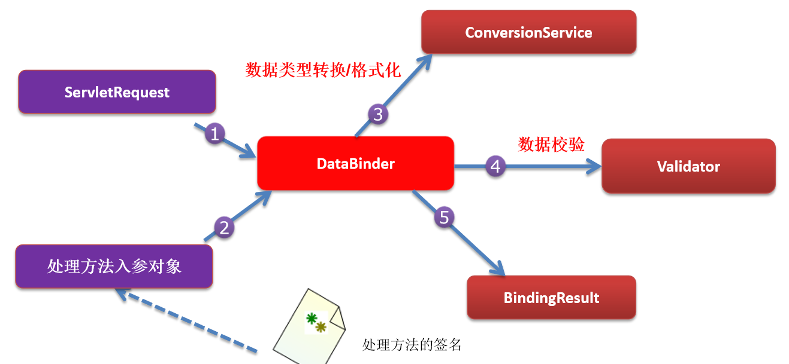</div>

### 自定义数据类型转换

ConversionService 接口

有三种方式

- <span style="color:red">Converter<S,T> 将S类型对象转为T类型对象</span><span style="color:green">（基本只用这种方式）</span>
- ConverterFactory：将相同系列多个“同质”Converter 封装在一起。
- GenericConverter：会根据源类对象及目标类对象所在的宿主类中的上下文信息进行类型转换。

<b>步骤</b>

ConversionService：是一个接口，它里面有 Converter（转换器）进行工作

1）实现 Converter 接口，写一个自定义的类型转换器

2）Converter 是 ConversionService 中的组件；

- 你的 Converter 得放进 ConversionService 中。
- 将 WebDataBinder 中的 ConversionService 设置成我们这个加了自定义类型转换器的 ConversionService

3）配置出 ConversionService；告诉 SpringMVC 别用默认的 ConversionService，用我们自己定义的。

```java
@Configuration
@EnableWebMvc
public class WebConfig implements WebMvcConfigurer {

    @Override
    public void addFormatters(FormatterRegistry registry) {
        DateTimeFormatterRegistrar registrar = new DateTimeFormatterRegistrar();
        registrar.setUseIsoFormat(true);
        registrar.registerFormatters(registry);
    }
}
```

<b>总结三步</b>

1）实现 Converter 接口，做一个自定义类型的转换器。

- 自定义一个类实现这个接口

2）将这个 Converter 配置在 ConversionService 中。

- 注解版本的 2 和 3 是一起的。

3）告诉 SpringMVC 使用我们的 ConversionService。

4）debug 发现有很多 String-->其他类型的转换器，要那个？只有一个是从 String 到 Person，所以用它。

> <b>Java 代码示例</b>

```java
// 自定义转换器示例
import org.springframework.core.convert.converter.Converter;

public class MyStringToPersonConverter implements Converter<String, Person> {
    @Override
    public Person convert(String source) {
        Person person = new Person();
        System.out.println("提交过来的字符串是" + source);
        if (source.contains("-")) {
            String[] split = source.split("-");
            person.setName(split[0]);
            person.setAge(Integer.valueOf(split[1]));
        }
        return person;
    }
}
```

```java
// 配置代码示例
@Configuration
@EnableWebMvc
@ComponentScan(basePackages = "org.example", includeFilters = {
        @ComponentScan.Filter(type = FilterType.ANNOTATION, classes = Controller.class)
}, useDefaultFilters = false)
public class WebConfig implements WebMvcConfigurer {
    
    // 添加我们自己实现的转换器
    @Override
    public void addFormatters(FormatterRegistry registry) {
        MyStringToPersonConverter conv = new MyStringToPersonConverter();
        registry.addConverter(conv);
    }

     // 视图解析器
    public void configureViewResolvers(ViewResolverRegistry registry) {
        // 注册一个视图解析器
        registry.viewResolver(new MyViewResolver());
        registry.jsp("/WEB-INF/views/", ".jsp");
    }

    @Override
    public void configureDefaultServletHandling(DefaultServletHandlerConfigurer configurer) {
        // DefaultServletHandling 不拦截静态资源
        configurer.enable();
    }
}

```

### 日期/数字格式化

1）日期格式化：@DateTimeFormat 注解，可以用在字段上，方法形参上。传递过来的日期格式必须是指定的格式。而 jackson 的 @JsonFormat 也可以进行格式转换，而且可以指定时区。

2）数字格式化：@NumberFormat 注解，可以用在字段上，方法形参上。

```java
@RequestMapping("/date")
@ResponseBody
// birth=2019-11-11才行
public String date(@DateTimeFormat(pattern = "yyyy-MM-dd") Date birth) {
    return birth.toString();
}

@RequestMapping("/number")
@ResponseBody
// 这样 提交工资的时候可以用逗号隔开了 #,# 逗号分隔开来！！
public String number(@NumberFormat(pattern = "#,###,###.##") Double number) {
    return number.toString();
}
```

## EnableWebMvc解析

use the @EnableWebMvc annotation to enable MVC configuration。使用 EnableWebMvc 注解开启 mvc 配置。相当于 xml 中的 `<mvc:annotation-driven/>`

点进 EnableWebMvc 的源码，最后发现注册了一堆东西。

<mvc:annotation-driven /> 会自动注册

- RequestMappingHandlerMapping
- RequestMappingHandlerAdapter 
- ExceptionHandlerExceptionResolver

既然 EnableWebMvc 是注解版的 <mvc:annotation-driven />，那么作用应该一样吧。

还将提供以下支持：

- 支持使用 ConversionService 实例对表单参数进行类型转换

- 支持使用 @NumberFormat annotation、@DateTimeFormat 注解完成数据类型的格式化 

- 支持使用 @Valid 注解对 JavaBean 实例进行 JSR 303 验证  

- 支持使用 @RequestBody 和 @ResponseBody 注解 

<b>既没有配置 <mvc:default-servlet-handler/> 也没有配置 <mvc:annotation-driven/></b>

<div align="center"></div>

<b>配置了 <mvc:default-servlet-handler/>  但没有配置 <mvc:annotation-driven/></b>

<div align="center">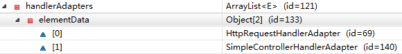</div>

<b>既配置了 <mvc:default-servlet-handler/>  又配置 <mvc:annotation-driven/></b>

<div align="center">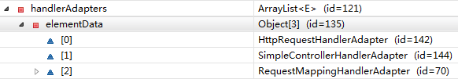</div>

## 数据校验

只做前端校验不安全！！他们可以直接绕过前端验证！！重要数据一定要加上后端验证。

### 准备

Spring MVC：可以用 JSR303 来做数据校验

JDBC：规范---实现（各个厂商的驱动包）

JSR303：规范---Hibernate Validator（第三方校验框架）

需要如下 jar 包（有几个带 el 的 jar 不导入：因为 Tomcat 中有；如果 Tomcat 的版本是 7.0 以下，则需要导入）

- hibernate-validator-5.0.0.CR2.jar
- hibernate-validator-annotation-processor-5.0.0.CR2.jar
- classmate-0.8.0.jar
- jboss-logging-3.1.1.GA.jar
- validation-api-1.1.0.CR1.jar

实际上我就用了一个（Spring5.x）

```xml
<dependency>
    <groupId>org.hibernate.validator</groupId>
    <artifactId>hibernate-validator</artifactId>
    <version>6.1.5.Final</version>
</dependency>
```

### 校验

给 JavaBean 的属性添加上校验注解。

在 Spring MVC 封装对象的时候，告诉 SpringMVC 这个 JavaBean 需要校验。

如何知道校验结果：

- 给需要校验的 JavaBean 后面紧跟一个 BindingResult。这个 BindingResult 就是封装前一个 Bean 的校验结果。
- <form:error path="lastName"> 显示 lastName 自带的错误（提交数据的表单好像也的是 Spring MVC 带的标签库）

```java
@NotEmpty
@Lenght(min=6,max=18)
private String lastName

@Email
private String email
    
public String add(@Valid Employee employee,BindingResut result){
    boolean hasErrors = result.hasErrors()
    //do something
}
```

用原生表单怎么办？使用 result 获取相关信息即可。

```java
@Controller
@RequestMapping("/validation")
public class Validation {

    @RequestMapping("/val")
    @ResponseBody
    public String validation(@Valid User user, BindingResult result) {
        boolean b = result.hasErrors();
        List<ObjectError> allErrors = result.getAllErrors();
        StringBuffer buffer = new StringBuffer();
        for (ObjectError err : allErrors) {
            buffer.append(err.getDefaultMessage());
        }
        return buffer.toString();
    }
}
```

自定义错误信息（国际化的好麻烦，也用不到，不记了）

```java
@NotEmpty(message="不能为空")
@Lenght(min=6,max=18)
private String lastName
```

# Ajax/下载/上传

## Ajax

返回数据是 JSON 就行。导入对应的 JSON 包，Spring MVC 默认用的 jackson，我们导入这个就好了。如果想要忽略某个字段的 JSON 输出，那么给这个字段加上注解 @JsonIgnore 即可。

> @ResponseBody

@ResponseBody 注解会将请求的数据放在响应体中，如果是对象，会自动将对象转为 json；也可以定制响应体！自行百度哦！

```java
@ResponseBody // 可以把对象转为json数据，返回给浏览器。
@RequestMapping("/")
public String body(Employee ee){
    return ee;
} 
```

> @RequestBody

- 获取请求体

- 接受 JSON 数据，封装为对象。注意，如果设置了 @RequestBody，前端传过来的又不是 JSON 数据会报错！数据类型一定要相符合！

```java
@ResponseBody
@RequestMapping("/1")
public String test1(@RequestBody String str){
    return str;
}

@ResponseBody
@RequestMapping("/2")
public String test2(@RequestBody Person person){
    return person
}
```

可以用 Postman 来发送 json 数据。[Postman 发送 Json 类型请求_syrdbt的博客-CSDN博客_postman发送json数据](https://blog.csdn.net/qq_38737992/article/details/102293884#:~:text=如何使用 发送json数据 postman (1) 打开 postman 客户端%2C并新建链接 通过点击图中的“%2B”%2C来新建一个链接,(5) 点击send%2C会在下方显示回复 数据 postman 如何 发送json数据 postman 地址)

> HttpEntity：Http 实体

- 如果参数位置写 HttpEtity\<String\> 比 @RequestBody 更强，可以拿到请求头。

```java
// some annotation
public String test3(HttpEntity<String> str){
    return str;
}
```

## 下载

### Serlvet 3.0

```java
public class DownServlet extends HttpServlet {
    public void doGet(HttpServletRequest request, HttpServletResponse response)
            throws ServletException, IOException {
        //客户端传递的需要下载的文件名
        String file = request.getParameter("file"); 
        //默认认为文件在当前项目的根目录
        String path = request.getServletContext().getRealPath("")+"/"+file; 
        FileInputStream fis = new FileInputStream(path);
        response.setCharacterEncoding("utf-8");
        response.setHeader("Content-Disposition", "attachment; filename="+file);
        ServletOutputStream out = response.getOutputStream();
        byte[] bt = new byte[1024];
        int length = 0;
        while((length=fis.read(bt))!=-1){
            out.write(bt,0,length);
        }
        out.close();
    }
}
```

### MVC下载

不如原生 api 好用。

[博客地址](https://www.cnblogs.com/wyq178/p/6921164.html)

## 上传

### Servlet 3.0

> 表单设置

```html
<form action="up" method="post"  enctype="multipart/form-data">
    <input type="file" name="myfile">
    <input type="submit" value="上传文件">
</form>
```

> <b>Servlet 3.0 文件上传的写法</b>

```java
@WebServlet("/up")
@MultipartConfig  
//使用MultipartConfig注解标注改servlet能够接受文件上传的请求
public class UploadServlet extends HttpServlet {
    @Override
    protected void doPost(HttpServletRequest req, HttpServletResponse resp)
            throws ServletException, IOException {
        Part part = req.getPart("myfile");
        // 现在的api可以直接获取 文件名 后缀什么的了，不用截断了
        String disposition = part.getHeader("Content-Disposition");
        String suffix = disposition.substring(disposition.lastIndexOf("."),disposition.length()-1);
        // 随机的生存一个32的字符串
        String filename = UUID.randomUUID()+suffix;
        // 获取上传的文件名
        InputStream is = part.getInputStream();
        // 动态获取服务器的路径
        String serverpath = req.getServletContext().getRealPath("upload");
        FileOutputStream fos = new FileOutputStream(serverpath+"/"+filename);
        byte[] bty = new byte[1024];
        int length =0;
        while((length=is.read(bty))!=-1){
            fos.write(bty,0,length);
        }
        fos.close();
        is.close();
    }
}
```

### MVC上传

[博客地址](https://www.cnblogs.com/wyq178/p/6921164.html)

配置文件上传组件。

- 单文件：单个对象
- 多文件：数组

# 过滤器和拦截器

## 过滤器

### 过滤器介绍

Servlet 中的过滤器 Filter 是实现了 javax.servlet.Filter 接口的服务器端程序，主要的用途是过滤字符编码、做一些业务逻辑判断等。

其工作原理是，只要我们在 web.xml 文件配置好或用注解配置好要拦截的客户端请求，它都会帮我们拦截到相应的请求，此时就可以对请求或响应做统一的设置，简化操作。如：统一设置编码，逻辑判断，权限访问判断等。Filter 是随 web 应用的启动而启动的，只初始化一次，以后就可以拦截相关的请求，只有当 web 应用停止或重新部署的时候才能销毁。

Spring 的 web 包中提供有很多过滤器，这些过滤器位于 org.springframework.web.filter。

过滤器放在 web 资源之前，可以在请求抵达它所应用的 web 资源 (可以是一个 Servlet、一个 Jsp 页面，甚至是一个 HTML 页面)之前截获进入的请求，并且在它返回到客户之前截获输出请求。

过滤器：用来拦截请求，处于客户端与被请求资源之间，目的是重用代码。

过滤链：在 web.xml 中哪个过滤器先配置，哪个就先调用。在 filter 中也可以配置一些初始化参数。

### 配置过滤器

配置过滤器的常见方式有如下几种

- 继承 AbstractAnnotationConfigDispatcherServletInitializer 类，重写 getServletFilters 方法，在里面注册过滤器。
- 使用 SpringBoot 提供的 FilterRegistrationBean 并结合 @Configuration+@Bean 注册 Filter
- 其他方式后面查阅文档时再做补充。

>继承 AbstractAnnotationConfigDispatcherServletInitializer 类，重写 getServletFilters 方法

该方法过于麻烦，且现在都是 Spring Boot 项目，不做介绍。

>使用 SpringBoot 提供的 FilterRegistrationBean 注册 Filter

```java
@Configuration
@SuppressWarnings("all")
public class FilterConfig {

    @Bean
    public FilterRegistrationBean registrationBean() {
        FilterRegistrationBean filterRegistrationBean = new FilterRegistrationBean(new MyFilter());
        filterRegistrationBean.addUrlPatterns("/filter/*");
        return filterRegistrationBean;
    }
}

// 定义 Filter
public class MyFilter implements Filter {
    @Override
    public void doFilter(ServletRequest servletRequest, ServletResponse servletResponse, FilterChain filterChain) throws IOException, ServletException {
        System.out.println("doFilter...........");
        // 记得放行
        filterChain.doFilter(servletRequest, servletResponse);
    }
}
```

## 拦截器

[拦截器中不能注入Java bean？ - 江南大才子 - 博客园 (cnblogs.com)](https://www.cnblogs.com/wffzk/p/15524407.html)

### 拦截器介绍

> <b>自定义拦截器流程</b>

1️⃣实现 HandlerInterceptor 接口或继承 HandlerInterceptor 的实现类 HandlerInterceptorAdapter。

2️⃣配置到 IOC 容器中。(WebConfig 中配置？)

- 拦截什么请求？默认是拦截所有。

3️⃣拦截器的执行顺序是什么？

- preHandle ：目标方法运行之前，返回值为 true 表示继续执行后面的拦截器，false 表示不再执行后面的拦截器。

- postHandle：目标方法运行之后，解析视图之前执行，可以通过此方法对请求域中的模型和视图做出进一步的修改（方法出错的话，不会执行。）

- afterCompletion：该方法会在整个请求完成，即视图渲染结束之后执行。可以通过此方法实现一些资源清理、记录日志信息等工作。（报错的视图，afterCompletion 也会执行）


<b style="color:orange">正常运行流程</b>

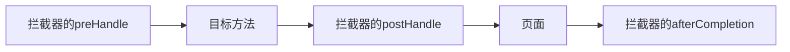

```shell
MyFirstInterceptor...preHandle...
test01
MyFirstInterceptor...postHandle...
success.jsp
MyFirstInterceptor...afterCompletion...
```

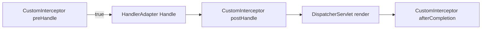

<span style="color:green">多个拦截器：</span>流程和 filter 的流程一样

- 拦截器的 preHandle：是按照<span style="color:red">顺序</span>执行的
- 拦截器的 postHandle：是按照<span style="color:red">逆序</span>执行的
- 拦截器的 afterCompletion：是按照<span style="color:red">逆序</span>执行的

<span style="color:green">出现异常：</span>已经放行了的拦截器的 afterCompletion 总会执行（因为有报错页面），未放行的无法执行！postHandle，在方法报错时是不会执行的。

> <b>什么时候用过滤器什么时候用拦截器</b>

如果过滤请求非常复杂，需要用 IOC 容器中的对象，那么用拦截器。因为过滤器是 JavaWeb 的，要想从 IOC 容器中拿对象比较麻烦。

### 配置拦截器

> 示例代码

```java
// 自定义拦截器
public class MyInterceptors implements HandlerInterceptor {
    public boolean preHandle(HttpServletRequest request, HttpServletResponse response, Object handler)
            throws Exception {
        System.out.println("MyInterceptors preHandle");
        return true;
    }

    public void postHandle(HttpServletRequest request, HttpServletResponse response, Object handler,
                           @Nullable ModelAndView modelAndView) throws Exception {
        System.out.println("MyInterceptors postHandle");
    }

    public void afterCompletion(HttpServletRequest request, HttpServletResponse response, Object handler,
                                @Nullable Exception ex) throws Exception {
        System.out.println("MyInterceptors afterCompletion");

    }
}

@Configuration
public class WebConfig implements WebMvcConfigurer {
    public void addFormatters(FormatterRegistry registry) {
        registry.addConverter(new DataConverter());
    }
	// 把拦截器注入容器
    public void addInterceptors(InterceptorRegistry registry) {
        registry.addInterceptor(new MyInterceptors());
    }
}
```

> 如何在拦截器中获取 IoC 容器？

让拦截器实现 ApplicationContextAware 接口，然后通过 @Component 注册。在配置类中，采用 @Autowired 注入拦截器，然后注册到 Spring MVC 的容器中。

```java
@Component
public class MyInterceptor implements HandlerInterceptor, ApplicationContextAware {
    ApplicationContext applicationContext;

    @Override
    public boolean preHandle(HttpServletRequest request, HttpServletResponse response, Object handler) throws Exception {
        System.out.println("preHandler===>");
        return HandlerInterceptor.super.preHandle(request, response, handler);
    }

    @Override
    public void postHandle(HttpServletRequest request, HttpServletResponse response, Object handler, ModelAndView modelAndView) throws Exception {
        System.out.println("postHandler===>");

        System.out.println("===========>" + applicationContext);
        HandlerInterceptor.super.postHandle(request, response, handler, modelAndView);
    }


    @Override
    public void setApplicationContext(ApplicationContext applicationContext) throws BeansException {
        this.applicationContext = applicationContext;
    }
}
/*
preHandler===>
preHandler===>
postHandler===>
===========>org.springframework.boot.web.servlet.context.AnnotationConfigServletWebServerApplicationContext@42463763, started on Sat Jan 14 19:00:26 CST 2023
*/
```

配置类

```java
@Configuration
public class WebConfig implements WebMvcConfigurer {

    @Autowired
    private MyInterceptor myInterceptor;

    // 把拦截器注入容器
    public void addInterceptors(InterceptorRegistry registry) {
        registry.addInterceptor(myInterceptor).addPathPatterns("/filter/header");
    }
}
```

## 过滤器VS拦截器

> <b>对比</b>

<b>使用范围不同：</b>过滤器依赖于 servlet 容器，而拦截器是 Spring 容器内提供的。

<b>实现原理不同：</b>过滤器是基于函数回调；拦截器是基于 Java 的反射机制的。

<b>触发时机不同：</b>过滤器是请求进入 tomcat 容器后，进入 servlet 之前进行预处理的；请求结束返回也是，是在 servlet 处理完后，返回给前端之前。而拦截器是紧挨着，在方法调用之前和方法调用之后执行。

<b>拦截的请求范围不同：</b>过滤器则可以对几乎所有的请求起作用；拦截器只能对 action 请求起作用。

<b>注入 Bean 情况不同：</b>拦截器先于 ApplicationContext 加载，所以拦截器无法注入 Spring 容器管理的 bean。拦截器使用 @Component 加载，然后在配置类中用 @Autowired 注入拦截器，将拦截器注册到 InterceptorRegistration 集合中。

<b>控制执行顺序不同：</b>过滤器用 @Order 注解控制执行顺序，通过 @Order 控制过滤器的级别，值越小级别越高越先执行；拦截器默认的执行顺序，就是它的注册顺序，也可以通过 Order 手动设置控制，值越小越先执行。

注意：拦截器有前置处理和后置处理，前置处理越线，后置处理就越后。

> <b>执行时机图</b>

<div align="center">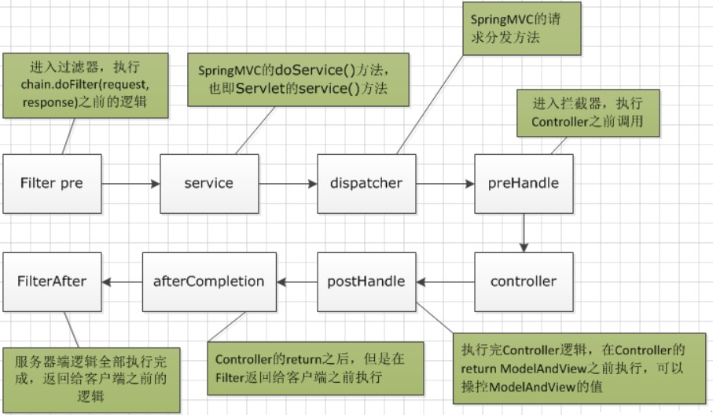</div>

> <b>使用时机</b>

- 如果某些功能需要其他组件配合，那么就使用拦截器。
- 其他情况可以写 Filter。

# 跨域处理

## 跨域配置

### 基本跨域配置

如果只是局部的某些类或方法需要跨域配置，那么在对应的类或注解上加上注解 <b>@CrossOrigin</b> 即可。

官方示例

```java
@RestController
@RequestMapping("/account")
public class AccountController {

    @CrossOrigin
    @GetMapping("/{id}")
    public Account retrieve(@PathVariable Long id) {
        // ...
    }

    @DeleteMapping("/{id}")
    public void remove(@PathVariable Long id) {
        // ...
    }
}

//=========================================================
@CrossOrigin(origins = "https://domain2.com", maxAge = 3600)
@RestController
@RequestMapping("/account")
public class AccountController {

    @GetMapping("/{id}")
    public Account retrieve(@PathVariable Long id) {
        // ...
    }

    @DeleteMapping("/{id}")
    public void remove(@PathVariable Long id) {
        // ...
    }
}

//=========================================================
@CrossOrigin(maxAge = 3600)
@RestController
@RequestMapping("/account")
public class AccountController {

    @CrossOrigin("https://domain2.com")
    @GetMapping("/{id}")
    public Account retrieve(@PathVariable Long id) {
        // ...
    }

    @DeleteMapping("/{id}")
    public void remove(@PathVariable Long id) {
        // ...
    }
}
```

### 全局跨域配置

官方示例代码

```java
@Configuration
@EnableWebMvc
public class WebConfig implements WebMvcConfigurer {

    @Override
    public void addCorsMappings(CorsRegistry registry) {

        registry.addMapping("/api/<b>")
            .allowedOrigins("https://domain2.com")
            .allowedMethods("PUT", "DELETE")
            .allowedHeaders("header1", "header2", "header3")
            .exposedHeaders("header1", "header2")
            .allowCredentials(true).maxAge(3600);
        // Add more mappings...
    }
}
```

个人示例代码

```java
import org.springframework.context.annotation.Configuration;
import org.springframework.web.servlet.config.annotation.CorsRegistry;
import org.springframework.web.servlet.config.annotation.WebMvcConfigurer;

@Configuration
public class CrossConfig implements WebMvcConfigurer {
    @Override
    public void addCorsMappings(CorsRegistry registry) {
        registry.addMapping("/<b>")
                .allowedOrigins("*")
                .allowedMethods("GET", "HEAD", "POST", "PUT", "DELETE", "OPTIONS")
                .allowCredentials(true)
                .maxAge(3600)
                .allowedHeaders("*");
    }
}
```

 ‎若要从源中了解更多信息或进行高级自定义，请检查后面的代码

- <b>CorsConfiguration</b>

- <b>CorsProcessor</b>

- <b>DefaultCorsProcessor</b>

- <b>AbstractHandlerMapping</b>

## 跨域过滤器

[官方文档](https://docs.spring.io/spring-framework/docs/current/reference/html/web.html#mvc-cors-filter)

# 异常处理

只要是方法出现异常了，Spring MVC 就会通过 <span style="color:red">HandlerExceptionResolver 的实现类</span>来处理程序的异常，包括 Handler 映射、数据绑定以及目标方法执行时发生的异常。

前端控制器中有九个成员变量，而异常处理解析器就是其中一个。

```java
/* List of HandlerExceptionResolvers used by this servlet. */
@Nullable
private List<HandlerExceptionResolver> handlerExceptionResolvers;
```

我们去看下 DispatcherServlet 如何初始化 <span style="color:red">HandlerExceptionResolver</span>

```java
private void initHandlerExceptionResolvers(ApplicationContext context) {
    this.handlerExceptionResolvers = null;

    if (this.detectAllHandlerExceptionResolvers) {
        
        Map<String, HandlerExceptionResolver> matchingBeans = BeanFactoryUtils
            .beansOfTypeIncludingAncestors(context, HandlerExceptionResolver.class, true, false);
        if (!matchingBeans.isEmpty()) {
            this.handlerExceptionResolvers = new ArrayList<>(matchingBeans.values());
            AnnotationAwareOrderComparator.sort(this.handlerExceptionResolvers);
        }
    }
    else {
        try {
            HandlerExceptionResolver her =
                context.getBean(HANDLER_EXCEPTION_RESOLVER_BEAN_NAME, HandlerExceptionResolver.class);
            this.handlerExceptionResolvers = Collections.singletonList(her);
        }
        catch (NoSuchBeanDefinitionException ex) {
            // Ignore, no HandlerExceptionResolver is fine too.
        }
    }

	// 如果没有则使用默认设置。
    if (this.handlerExceptionResolvers == null) {
        this.handlerExceptionResolvers = getDefaultStrategies(context, HandlerExceptionResolver.class);
        if (logger.isTraceEnabled()) {
            logger.trace("No HandlerExceptionResolvers declared in servlet '" + getServletName() +"': using default strategies from DispatcherServlet.properties");
        }
    }
}
```

默认的配置属性，在 spring-webmvc jar 包中的 org.springframework.web.servlet 中，对应的文件名是 DispatcherServlet.properties，该文件中对应的内容是

```properties
# 异常处理解析的默认配置
org.springframework.web.servlet.HandlerExceptionResolver=\
org.springframework.web.servlet.mvc.method.annotation.ExceptionHandlerExceptionResolver,\
org.springframework.web.servlet.mvc.annotation.ResponseStatusExceptionResolver,\
org.springframework.web.servlet.mvc.support.DefaultHandlerExceptionResolver
```

页面渲染之前有异常会先处理异常。如果异常解析器都不能处理就直接抛出去 (throw ex)。

<b>那么，默认的那三个异常处理解析器可以处理什么异常呢？有何使用环境？</b>

- ExceptionHandlerExceptionResolver：@ExceptionHandler，标注在方法上，当该类发生异常时优先用类中 @ExceptionHandler 标识的方法进行异常处理，如果无法处理（比如异常类型不匹配，不兼容）则会继续找上一级的异常处理器进行处理。

- ResponseStatusExceptionResolver：@ResponseStatus

- DefaultHandlerExceptionResolver：判断是否 Spring MVC 自带的异常

## 异常解析器

><b>ExceptionHandlerExceptionResolver</b>

ExceptionHandlerExceptionResolver 异常解析器需要配合 @ExceptionHandler 注解一起使用。发生异常时，优先使用 @ExceptionHandler 标注的方法进行处理，如果无法处理（比如异常类型不匹配，不兼容）则会继续找上一级的异常处理器进行处理。

标注 @ExceptionHandler 注解方法调用的优先级问题：例如发生的是 NullPointerException，但是声明的异常有 RuntimeException 和 Exception，此候会根据异常的最近继承关系找到继承深度最浅的那个 @ExceptionHandler 注解方法，即标记了 RuntimeException 的方法

ExceptionHandlerMethodResolver 内部若找不到 @ExceptionHandler 注解的话，会找 @ControllerAdvice 中的 @ExceptionHandler 注解方法。

<b>示例代码</b>

如果要要携带异常信息的话，不能给参数位置写 Model（不能把异常信息存储到 Model 中）

```java
/*
* 告诉 SpringMVC 这个方法专门处理这个类发生的异常。
* 	value = {NullPointerException.class}
* 	专门处理空指针异常。
* 	如果图省事，那么直接Exception即可
* 
* 1.给方法随便写一个Exception，用来接受发生的异常。
* 2.如果要要携带异常信息的话，不能给参数位置写Model（不能把异常信息存储到Model中）
* 3.我们返回ModelAndView即可
* 4.如果有多个@ExceptionHandler都能处理这个异常，精确优先。
*/
@ExceptionHandler(value = {NullPointerException.class})
public ModelAndView handleException01(Exception e){
    
    ModelAndView view = new ModelAndView("myerror");
    view.addObject("ex",exception);
    // 视图解析器拼串 来到我们自己定义的错误页面：myerror页面
    return view;
}
```

<b>每个类都有异常，分散的写很鸡肋，不合理。我们可以把所有的异常都集中起来！</b>

集中处理所有异常的类需要加入到 IOC 容器中才可被识别，用注解 @ControllerAdvice 标识该类为一个处理异常的类。异常的处理流程的话也是本类的异常处理方法优先，本类处理不了了，再用全局异常处理。

```java
@ControllerAdvice // 这是一个专门处理异常的
public class MyExceptionHandle{
    
    @ExceptionHandler(value = {NullPointerException.class})
    public ModelAndView handleException01(Exception e){
        ModelAndView view = new ModelAndView("myerror1");
        view.addObject("ex",exception);
        // 视图解析器拼串 来到我们自己定义的错误页面：myerror页面
        return view;
    }
    
    @ExceptionHandler(value = {ArithmeticException.class})
    public ModelAndView handleException01(Exception e){
        ModelAndView view = new ModelAndView("myerror2");
        view.addObject("ex",exception);
        // 视图解析器拼串 来到我们自己定义的错误页面：myerror页面
        return view;
    }
}
```

> <b>ResponseStatusExceptionResolver</b>

ResponseStatusExceptionResolver 异常解析器需要配合注解 @ResponseStatus 一起使用；而该注解是加在类上的。

自定义一个异常类，并在类上加上注解

```java
@ResponseStatus(reason = "用户名或密码错误", value = HttpStatus.NON_AUTHORITATIVE_INFORMATION)
public class UserLoginFail extends RuntimeException {}
```

测试 Controller

```java
@RestController
public class TestController {

    @GetMapping("/login")
    public String login(String username) {
        if (!"admin".equals(username)) {
            throw new UserLoginFail();
        }
        return "success";
    }
}
// 发起 http 请求，如果 username 的值不是 admin 会报错。这样可以不编写错误页面。。。
```

若在处理器方法中抛出了上述异常：若 ExceptionHandlerExceptionResolver 不解析述异常。由于触发的异常 UnauthorizedException 带有 @ResponseStatus 注解。因此会被 ResponseStatusExceptionResolver 解析到。最后响应 HttpStatus.UNAUTHORIZED 代码给客户端。HttpStatus.UNAUTHORIZED 代表响应码 401，无权限。 关于其他的响应码请参考 HttpStatus 枚举类型源码。

> <b>DefaultHandlerExceptionResolver</b>

如果自己配置的无法处理异常，那么最后就会用 DefaultHandlerExceptionResolver 对那些异常进行处理，也可以对一些特殊的异常进行处理，比如 NoSuchRequestHandlingMethodException、HttpRequestMethodNotSupportedException、HttpMediaTypeNotSupportedException、HttpMediaTypeNotAcceptableException 等。

><b>SimpleMappingExceptionResolver</b>

如果希望对所有异常进行统一处理，可以使用 SimpleMappingExceptionResolver，它将异常类名映射为视图名，即发生异常时使用对应的视图报告异常。可以用 @Bean 的方式注入 SimpleMappingExceptionResolver。

## not found异常

<span style="color:red">如何自定义 404 异常？有如下三种方式！</span>

> <b>方法一，根据 SpringMVC 的精确匹配优先的规则</b>

```java
@Controller
public class NotFound {
	// 如果最后来带这个页面，说明是404错误！
    @RequestMapping("*")
    public String notFound() {
        return "404";
    }
}
```

> <b>方法二，重写前端控制器的 noHandlerFound 方法</b>

404 即前端控制器没找到可以处理改请求的方法，通过查看源码可知

```java
protected void doDispatch(HttpServletRequest request, HttpServletResponse response) throws Exception {
    HttpServletRequest processedRequest = request;
    HandlerExecutionChain mappedHandler = null;
    boolean multipartRequestParsed = false;

    WebAsyncManager asyncManager = WebAsyncUtils.getAsyncManager(request);

    try {
        ModelAndView mv = null;
        Exception dispatchException = null;
        try {
            processedRequest = checkMultipart(request);
            multipartRequestParsed = (processedRequest != request);

            // Determine handler for the current request.
            mappedHandler = getHandler(processedRequest);
            if (mappedHandler == null) {
                // 没有处理当前request请求的话，执行moHandlerFound方法
                noHandlerFound(processedRequest, response);
                return;
            }
        }
        // ............
    }
}

// 找不到request对应的处理方法时执行
protected void noHandlerFound(HttpServletRequest request, HttpServletResponse response) throws Exception {
    if (pageNotFoundLogger.isWarnEnabled()) {
        pageNotFoundLogger.warn("No mapping for " + request.getMethod() + " " + getRequestUri(request));
    }
    if (this.throwExceptionIfNoHandlerFound) {
        throw new NoHandlerFoundException(request.getMethod(), getRequestUri(request),
                                          new ServletServerHttpRequest(request).getHeaders());
    }
    else {
        response.sendError(HttpServletResponse.SC_NOT_FOUND);
    }
}
```

我们重写改方法，找不到时，直接重定向到 404 页面即可。那么到底如何重写呢？搜博客发现都是一些 xml 配置文件的写法，没什么 JavaConfig 的写法。下面给出 JavaConfig 的写法

```java
@Configuration
public class MyWebServletInitializer extends AbstractAnnotationConfigDispatcherServletInitializer {
    @Override
    protected Class<?>[] getRootConfigClasses() {
        return new Class[]{RootConfig.class};
    }

    @Override
    protected Class<?>[] getServletConfigClasses() {
        return new Class[]{WebConfig.class};
    }

    @Override
    protected String[] getServletMappings() {
        return new String[]{"/"};
    }

    @Override
    protected Filter[] getServletFilters() {
        // CharacterEncodingFilter characterEncodingFilter = new CharacterEncodingFilter("ISO-8859-1", true);
        CharacterEncodingFilter characterEncodingFilter = new CharacterEncodingFilter("UTF-8", true);
        characterEncodingFilter.setForceRequestEncoding(true);
        characterEncodingFilter.setForceResponseEncoding(true);
        // 设置rest风格
        HiddenHttpMethodFilter hiddenHttpMethodFilter = new HiddenHttpMethodFilter();
        return new Filter[]{characterEncodingFilter, hiddenHttpMethodFilter};
    }
	
    // 我看源码发现 
    // AbstractAnnotationConfigDispatcherServletInitializer的父类
    // AbstractDispatcherServletInitializer的createDispatcherServlet
    // 里创建的前端控制器，我们重写这个方法，把里面的 new DispatcherServlet(...)
    // 换成我们自己的 new MyDispatcherServlet(...);
    // 在自己的 MyDispatcherServlet 里，重写 noHandlerFound 方法
    @Override
    protected FrameworkServlet createDispatcherServlet(WebApplicationContext servletAppContext) {
        System.out.println("MyDispatcherServlet start222");
        return new MyDispatcherServlet(servletAppContext);
    }
}

class MyDispatcherServlet extends DispatcherServlet {
    public MyDispatcherServlet(WebApplicationContext webApplicationContext) {
        super(webApplicationContext);
        setDispatchOptionsRequest(true);
        System.out.println("MyDispatcherServlet start111");
    }

    @Override
    protected void noHandlerFound(HttpServletRequest request, HttpServletResponse response) throws Exception {
        response.sendRedirect(request.getContextPath() + "/error.jsp");
    }
}
```

> <b>方法三，利用 web 容器提供的 error-page</b>

还记得之前提到的 web 容器会提供一个 404 的默认界面吗？其实我们完全可以替换成我们自己的界面，那么看起来这种方法应该是最简单的了。只需要在 web.xml 文件中写上如下代码就可以了

```xml
<error-page>
    <error-code>404</error-code>
    <location>/resource/view/404.htm</location>
</error-page>
```

不过值得注意的是，这里配置的的 location 其实会被当成一个请求来访问。

那么我们的 DispatcherServlet 会拦截这个请求而造成无法访问，此时的结果是用户界面一片空白。

所以这里的 404.htm 其实是一个静态资源，我们需要用访问静态资源的方式去访问。

而在我的 Spring MVC 里，resource 目录下的文件都是不会被拦截的

> <b>小结</b>

- 最方便：那肯定是第三种了，我们只需要提供一个静态页面即可

- 最快捷：第一种肯定最慢，因为它会发起 2 个请求。第二种和第三种应该差不多

- 最灵活：从灵活性上来看，第三种肯定是最缺乏的，但是其实对于 404 来说并不是需要经常变化的，不过也保不准可能可以允许用户自定义 404 界面等，这里一、二两种方式则提供了灵活性。

- 通用性：第三种应该是最通用了，而一、二 两种则要依赖 Spring MVC

# 扫尾

## 运行流程

<div align="center">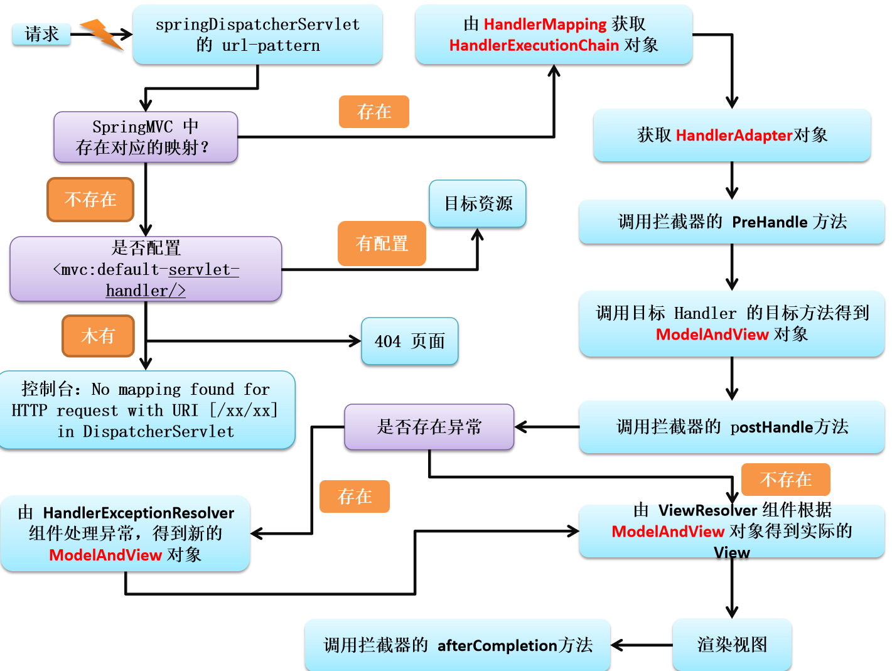</div>

<b style="color:orange">1、所有请求，前端前端控制器（DispatcherServlet）收到请求，调用 doDispatch 进行处理</b>

<b style="color:orange">2、根据 HandlerMapping 中保存的请求映射信息找到，处理当前请求的，处理器执行链（包含拦截器）</b>

<b style="color:orange">3、根据当前处理器找到他的 HandlerAdapter（适配器）</b>

<b style="color:orange">4、拦截器的 preHandle 先执行</b>

<b style="color:orange">5、适配器执行目标方法，并返回 ModelAndView</b>

- ModelAttribute 注解标注的方法提前运行
- 执行目标方法的时候（确定目标方法用的参数）
    - 有注解
    - 没注解
        - 看是否是 Model、Map 以及其他的
        - 如果是自定义类型
            - 从隐含模型中看有没有，如果有就从隐含模型中拿
            - 如果没有，再看是否 SessionAttributes 标注的属性，如果是从 Session 中拿，如果拿不到会抛异常。
            - 都不是 1，就利用反射创建对象。

<b style="color:orange">6、拦截器的 postHandle 执行</b>

<b style="color:orange">7、处理结果；（页面渲染流程）</b>

- <b style="color:orange">如果有异常使用异常解析器处理异常；处理完后还会返回 ModelAndView</b>
- <b style="color:orange">调用 render 进行页面渲染</b>
    - 视图解析器根据视图名得到视图对象；
    - 视图对象调用 render 方法；
- <b style="color:orange">执行拦截器的 afterCompletion</b>

<span style="color:red">知道加粗部分的即可。</span>

## Spring与MVC

### 概述

Spring 和 SpringMVC 整合的目的：分工明确

SpringMVC 的配置文件就来配置和网站转发逻辑以及网站功能有关的（视图解析器，文件上传解析器，支持 ajax，xxx）；

Spring 的配置文件来配置和业务有关的（事务控制，数据源，xxx）；

### 整合

> <b>方式一</b>

- spring.xml 配置了 Spring 相关的信息
- springmvc.xml 配置了 mvc 相关的信息
- 在 springmvc.xml 文件中引入spring.xml

这种配置方式只会启动一个 IOC 容器。

> <b>方式二</b>

springmvc 和 spring 分容器，各司其职。

- spring 管理业务逻辑组件； 

- springmvc 管理控制器组件； 如：Controller，ControllerAdvice

如果扫多了会出现类被创建两次。spring 容器中把所有类创建了一次，springmvc 容器中把类创建了一次。

在 Spring 的环境下使用 SpringMVC。

Spring 的 IOC 容器不应该扫描 SpringMVC 中的 bean, 对应的 SpringMVC 的 IOC 容器不应该扫描 Spring 中的 bean

<div align="center">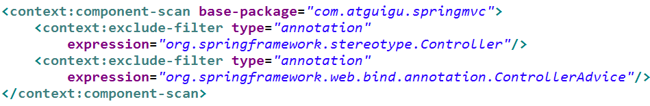</div>

<div align="center"></div>

在 Spring MVC 配置文件中引用业务层的 Bean

多个 Spring IOC 容器之间可以设置为父子关系，以实现良好的解耦。

Spring MVC WEB 层容器可作为 “业务层” Spring 容器的子容器：即 WEB 层容器可以引用业务层容器的 Bean，而业务层容器却访问不到 WEB 层容器的 Bean

Spring 容器是作为父容器的，SpringMVC 容器是作为子容器的。子容器的 Controller 要用父容器的 Service 没问题。但是如果父容器要拿子容器的，就不行！！

<div align="center">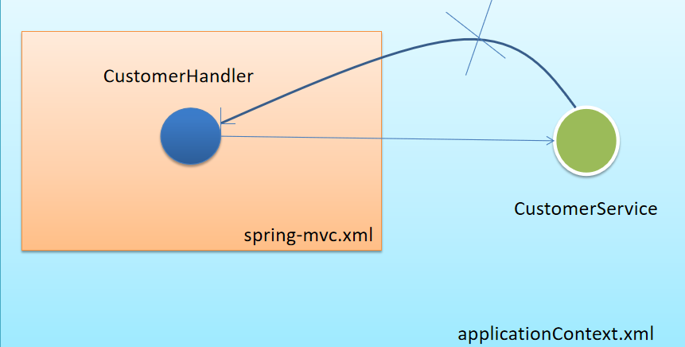</div>

## SpringMVC的组件解析

### SpringMVC的执行流程

<div align="center"></div>

①用户发送请求至前端控制器 DispatcherServlet。

②DispatcherServlet 收到请求调用 HandlerMapping 处理器映射器。

③处理器映射器找到具体的处理器(可以根据 xml 配置、注解进行查找)，生成处理器对象及处理器拦截器(如果有则生成)一并返回给 DispatcherServlet。

④DispatcherServlet 调用 HandlerAdapter 处理器适配器。

⑤HandlerAdapter 经过适配调用具体的处理器 (Controller，也叫后端控制器)。

⑥Controller 执行完成返回 ModelAndView。

⑦HandlerAdapter 将 controller 执行结果 ModelAndView 返回给 DispatcherServlet。

⑧DispatcherServlet 将 ModelAndView 传给 ViewReslover 视图解析器。

⑨ViewReslover 解析后返回具体 View。

⑩DispatcherServlet 根据 View 进行渲染视图（即将模型数据填充至视图中）。DispatcherServlet 响应用户。

### SpringMVC组件解析

<b>前端控制器：DispatcherServlet</b>

用户请求到达前端控制器，它就相当于 MVC 模式中的 C，DispatcherServlet 是整个流程控制的中心，由它调用其它组件处理用户的请求，DispatcherServlet 的存在降低了组件之间的耦合性。

<b>处理器映射器：HandlerMapping</b>

HandlerMapping 负责根据用户请求找到 Handler 即处理器，SpringMVC 提供了不同的映射器实现不同的映射方式，例如：配置文件方式，实现接口方式，注解方式等。

<b>处理器适配器：HandlerAdapter</b>

通过 HandlerAdapter 对处理器进行执行，这是适配器模式的应用，通过扩展适配器可以对更多类型的处理器进行执行。

<b>处理器：Handler</b>

它就是我们开发中要编写的具体业务控制器。由 DispatcherServlet 把用户请求转发到 Handler。由 Handler 对具体的用户请求进行处理。

<b>视图解析器：View Resolver</b>

View Resolver 负责将处理结果生成 View 视图，View Resolver 首先根据逻辑视图名解析成物理视图名，即具体的页面地址，再生成 View 视图对象，最后对 View 进行渲染将处理结果通过页面展示给用户。

<b>视图：View</b>

SpringMVC 框架提供了很多的 View 视图类型的支持，包括：jstlView、freemarkerView、pdfView 等。最常用的视图就是 jsp。一般情况下需要通过页面标签或页面模版技术将模型数据通过页面展示给用户，需要由程序员根据业务需求开发具体的页面

### SpringMVC注解解析

> @RequestMapping

- 作用：用于建立请求 URL 和处理请求方法之间的对应关系
- 位置：
  - 类上，请求 URL 的第一级访问目录。此处不写的话，就相当于应用的根目录
  - 方法上，请求 URL 的第二级访问目录，与类上的使用 @ReqquestMapping 标注的一级目录一起组成访问虚拟路径
- 属性：
  - value：用于指定请求的 URL。它和 path 属性的作用是一样的
  - method：用于指定请求的方式
  - params：用于指定限制请求参数的条件。它支持简单的表达式。要求请求参数的 key 和 value 必须和配置的一模一样
- 例如：
  - params = {"accountName"}，表示请求参数必须有 accountName
  - params = {"moeny!100"}，表示请求参数中 money 不能是 100

> 组件扫描

SpringMVC 基于 Spring 容器，所以在进行 SpringMVC 操作时，需要将 Controller 存储到 Spring 容器中，如果使用 @Controller 注解标注的话，就需要使用 <context:component-scan base-package="com.itheima.controller"/> 进行组件扫描。

### SpringMVC的XML配置解析

SpringMVC 有默认组件配置，默认组件都是 DispatcherServlet.properties 配置文件中配置的，该配置文件地址 org/springframework/web/servlet/DispatcherServlet.properties，该文件中配置了默认的视图解析器，如下：

```properties
org.springframework.web.servlet.ViewResolver=org.springframework.web.servlet.view.InternalResourceViewResolver
```

翻看该解析器源码，可以看到该解析器的默认设置，如下：

```properties
REDIRECT_URL_PREFIX = "redirect:"  --重定向前缀
FORWARD_URL_PREFIX = "forward:"    --转发前缀（默认值）
prefix = "";     --视图名称前缀
suffix = "";     --视图名称后缀
```

视图解析器，我们可以通过属性注入的方式修改视图的的前后缀

```xml
<!--配置内部资源视图解析器-->
<bean class="org.springframework.web.servlet.view.InternalResourceViewResolver">
  <property name="prefix" value="/WEB-INF/views/"></property>
  <property name="suffix" value=".jsp"></property>
</bean>
```

### 知识要点

<b>SpringMVC 的相关组件</b> 

前端控制器：DispatcherServlet

处理器映射器：HandlerMapping

处理器适配器：HandlerAdapter

处理器：Handler

视图解析器：View Resolver

视图：View

<b>SpringMVC 的注解和配置</b> 

请求映射注解：@RequestMapping

视图解析器配置：

REDIRECT_URL_PREFIX = "redirect:"  

FORWARD_URL_PREFIX = "forward:"    

prefix = "";     

suffix = "";     

## 乱码处理

[参考博客](https://blog.csdn.net/c17315377559/article/details/101940087?utm_medium=distribute.pc_relevant.none-task-blog-BlogCommendFromMachineLearnPai2-1.control&depth_1-utm_source=distribute.pc_relevant.none-task-blog-BlogCommendFromMachineLearnPai2-1.control)  博客中用的 xml 方式进行处理的，我采用的 JavaConfig 方式处理的。

### post请求乱码

> <b>在 web.xml 中配置过滤器</b>

这种方式适用于 POST 中文乱码处理。在 web.xml 中配置过滤器，这是 SpringMVC 为我们写好的类，可以，通过指定编码格式，从而有效控制 POST 请求乱码，但是处理不了 Get 请求方式的乱码。

```xml
<filter>
    <filter-name>characterEncodingFilter</filter-name>
    <filter-class>org.springframework.web.filter.CharacterEncodingFilter</filter-class>
    <init-param>
        <param-name>encoding</param-name>
        <param-value>utf-8</param-value>
    </init-param>
</filter>
```

> <b>JavaConfig 的配置方式解决 POST 请求乱码</b>

```java
import org.springframework.context.annotation.Configuration;
import org.springframework.web.filter.CharacterEncodingFilter;
import org.springframework.web.filter.HiddenHttpMethodFilter;
import org.springframework.web.servlet.support.AbstractAnnotationConfigDispatcherServletInitializer;

import javax.servlet.Filter;

@Configuration
public class MyWebServletInitializer extends AbstractAnnotationConfigDispatcherServletInitializer {
    @Override
    protected Class<?>[] getRootConfigClasses() {
        return new Class[]{RootConfig.class};
    }

    @Override
    protected Class<?>[] getServletConfigClasses() {
        return new Class[]{WebConfig.class};
    }

    @Override
    protected String[] getServletMappings() {
        return new String[]{"/"};
    }

    @Override
    protected Filter[] getServletFilters() {
        // 看了下源码，CharacterEncodingFilter extends OncePerRequestFilter
        // 在RequestFilter请求之前进行了编码设置
        CharacterEncodingFilter characterEncodingFilter = new CharacterEncodingFilter("UTF-8", true);
        characterEncodingFilter.setForceRequestEncoding(true);
        characterEncodingFilter.setForceResponseEncoding(true);
        // 设置rest风格 HiddenHttpMethodFilter也是请求之前进行
        HiddenHttpMethodFilter hiddenHttpMethodFilter = new HiddenHttpMethodFilter();
        return new Filter[]{characterEncodingFilter, hiddenHttpMethodFilter};
    }
}
```

> <b>解决 Get 和 Post 请求乱码一劳永逸的办法</b>

在<b>~\apache-Tomcat-7.0.90\conf\server.xml 中处理</b>

打开 server.xml，大约在 65 行左右的位置

```xml
<Connector connectionTimeout="20000" port="8080" protocol="HTTP/1.1" redirectPort="8443"/>
```

在 Connector 中加上 <b>URIEncoding="UTF-8"</b>

```xml
<Connector URIEncoding="UTF-8" connectionTimeout="20000" port="8080" protocol="HTTP/1.1" redirectPort="8443"/>
```

此种方式可以处理，Get 与 Post 请求方式的乱码。配完之后，便不需要在考虑中文乱码的问题

### 响应乱码

> 方式一，在 @RequestMapping 中加上，<b>produces="text/html;charset=utf-8"</b>

```java
@ResponseBody
/**
	   produces = "text/plain"
	   produces = {"text/plain", "application/*"}
	   produces = MediaType.TEXT_PLAIN_VALUE
	   produces = "text/plain;charset=UTF-8"
*/
@RequestMapping(value="/test01.action",produces="text/html;charset=utf-8")
public String test03() throws Exception {
    return "我爱你中国";
}
```

通过，此种方式设置响应编码格式为 utf-8。但是，此种方式，意味着，如果需要向页面返回中文，则就需要书写，过于麻烦。所以，请看第二种方式。

><b>方式二、在 Springmvc.xml 配置文件中书写</b>

```xml
<mvc:annotation-driven>
    <mvc:message-converters>
        <!-- 处理响应中文内容乱码 -->
        <bean class="org.springframework.http.converter.StringHttpMessageConverter">
            <property name="defaultCharset" value="UTF-8" />
            <property name="supportedMediaTypes">
                <list>
                    <value>text/html</value>
                    <value>application/json</value>
                </list>
            </property>
        </bean>
    </mvc:message-converters>
</mvc:annotation-driven>  
```

将上述配置，放入到 Springmvc.xml 配置文件中，便可以对相应乱码进行全站处理。

我更喜欢 JavaConfig 的配置方式

```java
@EnableWebMvc // 开启mvc的高级配置
@Configuration
@ComponentScan(basePackages = "cn.payphone", includeFilters = {
        @ComponentScan.Filter(type = FilterType.ANNOTATION, classes = {Controller.class})
}, useDefaultFilters = false)
public class WebConfig implements WebMvcConfigurer {

    public void configureViewResolvers(ViewResolverRegistry registry) {
        // 这样  视图解析器会自动拼串
        registry.jsp("/WEB-INF/views/", ".jsp");
    }

    // 防止响应乱码。响应数据的编码格式这里默认是IOS-8859
    public void configureMessageConverters(List<HttpMessageConverter<?>> converters) {
        converters.add(new StringHttpMessageConverter(StandardCharsets.UTF_8));
    }d
}
```

在源码中查看默认的编码格式  默认是 ISO_8859_1

```java
public class StringHttpMessageConverter extends AbstractHttpMessageConverter<String> {

	private static final MediaType APPLICATION_PLUS_JSON = new MediaType("application", "*+json");

    // 默认是ISO_8859_1
	public static final Charset DEFAULT_CHARSET = StandardCharsets.ISO_8859_1;

	@Nullable
	private volatile List<Charset> availableCharsets;

	private boolean writeAcceptCharset = false;

	public StringHttpMessageConverter() {
		this(DEFAULT_CHARSET);
	}
}
```
