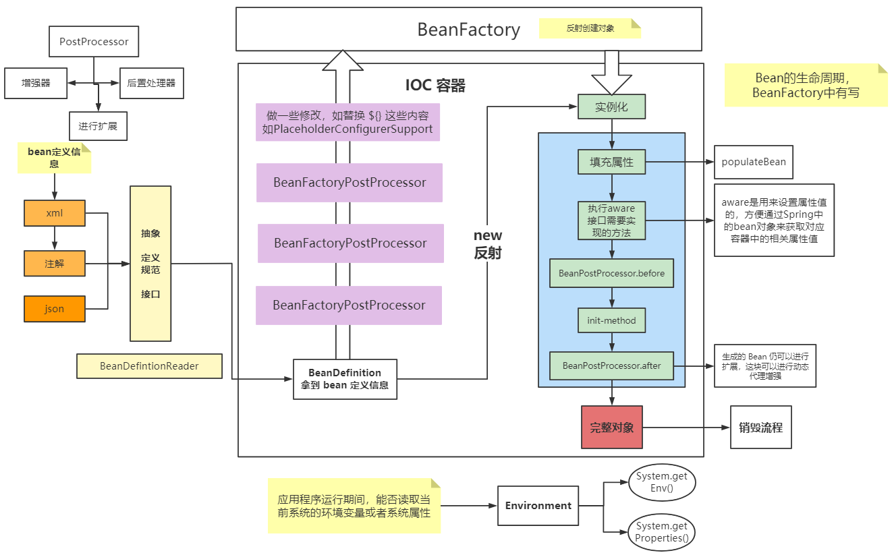

# 快速入门

- 如何高效学习源码
  - 看看源码注释
  - 不要一开始就看源码细节，死扣某个方法，先看脉络在看细节
  - 猜猜方法的作用和流程再验证
  - 见名知意
- `IOC` 源码
- Spring 启动流程
- Spring 加载配置文件
- 掌握核心接口 `BeanDefinitionReader`
- 核心接口 `BeanFactory`
- Spring refresh 方法
- `BeanPostProcessor` 接口的作用及实现
- `BeanFactoryPostProcessor` 接口的作用及实现

- Spring Bean 为何实现 Aware 接口
- Spring Bean 实例化过程
- Spring Bean 的初始化做什么的
- `FactoryBean` 接口
- Spring Bean 生命周期
- Spring Environment 接口的作用
- 循环依赖及其解决

## `gradle` 搭建环境

`https://blog.csdn.net/u013469325/article/details/106575704?utm_medium=distribute.pc_relevant.none-task-blog-2~default~baidujs_title~default-0.control&spm=1001.2101.3001.4242`

我是按官方的 import-to-idea 来的，就是下 jar 包太慢了，其他还好。

## 快速开始

> 创建一个对象（粗粒度）

加载 \==\>  解析 \==\>  创建实例 \==\> 使用 \==\>  销毁

> Spring IOC

容器 \==\>  存放 \==\>  bean \==\> 数据结构 \==\>  List/Set/Map 用哪个？

我猜是 Map，查找速度快。 key-value 形式。并发场景下用 `ConcurrentHashMap`。

> 如何创建对象

new、反射、工厂模式、作用域。

应该用的是反射，解析配置文件，根据配置文件的类全名进行创建对象。

> 配置文件

配置文件中定义的是 bean 的定义信息。

<div align="center"></div>

## refresh

```java
@Override
public void refresh() throws BeansException, IllegalStateException {
    synchronized (this.startupShutdownMonitor) {
        // Prepare this context for refreshing.
        /**
        * 做容器刷新前的准备工作。
        * 1. 设置容器的启动时间
        * 2. 设置活跃状态为 true
        * 3. 设置关闭状态为 false
        * 4. 获取 Environment 对象，并加载当前系统的属性值到 Environment 对象中
        * 5. 准备监听器和事件的集合对象，默认为空的集合。
        */
        prepareRefresh();

        // Tell the subclass to refresh the internal bean factory.
        /* 创建容器对象：DefaultListableBeanFactory,加载 xml 配置文件的属性值到当前工厂中，最重要的是 BeanDefinition。*/
        ConfigurableListableBeanFactory beanFactory = obtainFreshBeanFactory();

        // Prepare the bean factory for use in this context.
        // beanFactory 的准备工作，对各种属性进行填充。
        prepareBeanFactory(beanFactory);

        try {
            // Allows post-processing of the bean factory in context subclasses.
            // 子类覆盖方法做额外的处理，此处我们自己一般不做任何扩展工作，但是可以查看 web 中的代码，是有具体实现的
            postProcessBeanFactory(beanFactory);

            // Invoke factory processors registered as beans in the context.
            // 调用各种 beanFactory 处理器
            invokeBeanFactoryPostProcessors(beanFactory);

            // Register bean processors that intercept bean creation.
            registerBeanPostProcessors(beanFactory);

            // Initialize message source for this context.
            initMessageSource();

            // Initialize event multicaster for this context.
            initApplicationEventMulticaster();

            // Initialize other special beans in specific context subclasses.
            onRefresh();

            // Check for listener beans and register them.
            registerListeners();

            // Instantiate all remaining (non-lazy-init) singletons.
            finishBeanFactoryInitialization(beanFactory);

            // Last step: publish corresponding event.
            finishRefresh();
        } catch (BeansException ex) {
            if (logger.isWarnEnabled()) {
                logger.warn("Exception encountered during context initialization - " +
                            "cancelling refresh attempt: " + ex);
            }

            // Destroy already created singletons to avoid dangling resources.
            destroyBeans();

            // Reset 'active' flag.
            cancelRefresh(ex);

            // Propagate exception to caller.
            throw ex;
        } finally {
            // Reset common introspection caches in Spring's core, since we
            // might not ever need metadata for singleton beans anymore...
            resetCommonCaches();
        }
    }
}

/**
* Prepare this context for refreshing, setting its startup date and
* active flag as well as performing any initialization of property sources.
*/
protected void prepareRefresh() {
    // Switch to active.
    this.startupDate = System.currentTimeMillis();
    // 容器关闭标志位
    this.closed.set(false);
    // 容器激活标志位
    this.active.set(true);

    // 记录日志
    if (logger.isDebugEnabled()) {
        if (logger.isTraceEnabled()) {
            logger.trace("Refreshing " + this);
        } else {
            logger.debug("Refreshing " + getDisplayName());
        }
    }

    // Initialize any placeholder property sources in the context environment.
    // 留给子类覆盖，初始化属性资源
    initPropertySources();

    // Validate that all properties marked as required are resolvable:
    // see ConfigurablePropertyResolver#setRequiredProperties
    // 创建并获取环境对象，验证需要的属性文件是否都已经放入环境中。
    getEnvironment().validateRequiredProperties();

    // Store pre-refresh ApplicationListeners...
    // 判断刷新前的应用程序监听器集合是否为空，如果为空，则将监听器添加到此集合中。
    if (this.earlyApplicationListeners == null) {
        this.earlyApplicationListeners = new LinkedHashSet<>(this.applicationListeners);
    } else {
        // Reset local application listeners to pre-refresh state.
        // 如果不等于空，则清空集合元素对象
        this.applicationListeners.clear();
        this.applicationListeners.addAll(this.earlyApplicationListeners);
    }

    // Allow for the collection of early ApplicationEvents,
    // to be published once the multicaster is available...
    // 创建刷新前的监听事件集合
    this.earlyApplicationEvents = new LinkedHashSet<>();
}
```

# Spring学习内容

- Java 语言特性：反射、动态代理、枚举、泛型、注解、ARM、Lambda
- 设计模式的思想与实现：OOP、IOC、DDD、TDD、GoF23
- Java API 的封装与简化：JDBC、事务、Transaction、Servlet、JPA、JMX、Bean Validation
- JSR 规范的适配与实现
- 三方框架的整合

## 整体内容

- 框架总览
    - 特性总览
    - 版本设计
    - 模块化设计
    - 技术整合
    - 编程模型：
        - OOP、
        - AOP、
        - 面向元编程（进行元数据处理）
            - 配置元信息（配置信息影响程序的运行状态）
            - 注解
            - 属性配置
        - 面向模块编程（Spring @Enable* 注解）
        - 面向函数编程（Lambda、Reactive）
- IOC 容器
    - Spring IoC 容器
    - 依赖查找
    - 依赖注入
    - 依赖来源
    - Spring IoC 容器生命周期
- Bean
    - Bean 实例
    - Bean 作用域
    - Bean 生命周期
- 元信息
    - 注解
    - 配置元信息
    - 外部化属性
- 基础设施
    - 资源管理
    - 类型转换
    - 数据绑定
    - 校验
    - 国际化
    - 事件
    - 泛型处理

## Spring 编程模型

# IOC 容器

IOC  容器的设计钟，有两个主要的容器系列

- 一个是实现  BeanFactory 接口的简单容器系列，只实现了容器的基本功能
- 一个是 ApplicationContext 应用上下文，增加了许多面向框架的特性，对应用环境做了许多适配。

## IOC 容器初始化概述

IOC 容器的初始化是通过 `refresh()` 方法启动的

```java
public ClassPathXmlApplicationContext(
    String[] configLocations, boolean refresh, @Nullable ApplicationContext parent)
    throws BeansException {

    super(parent);
    setConfigLocations(configLocations);
    if (refresh) {
        refresh();
    }
}
```

IOC 的启动过程包含三大部分

- BeanDefinition 的 Resource 定位：BeanDefinition 的资源定位，由 ResourceLoader 通过统一的 Resource 接口完成
- BeanDefinition 的载入：把用户定义好的 Bean 表示成 IOC 容器内部的数据结构，这个内部的数据结构就是 BeanDefinition。
    - BeanDefinition 是 POJO 对象在 IOC 容器中的抽象。
- 向 IOC 容器注册 BeanDefinition：通过调用 BeanDefinitionRegistry 接口实现。
    - 会将 BeanDefinition 注册到一个 HashMap 中。
- Bean 定义的载入和依赖注入是两个独立的过程。依赖注入一般发生在应用第一次通过 getBean 向容器索取 Bean 的时候。也可以通过配置修改为初始化的时候就完成依赖注入。

## BeanDefinition 的  Resource 定位


