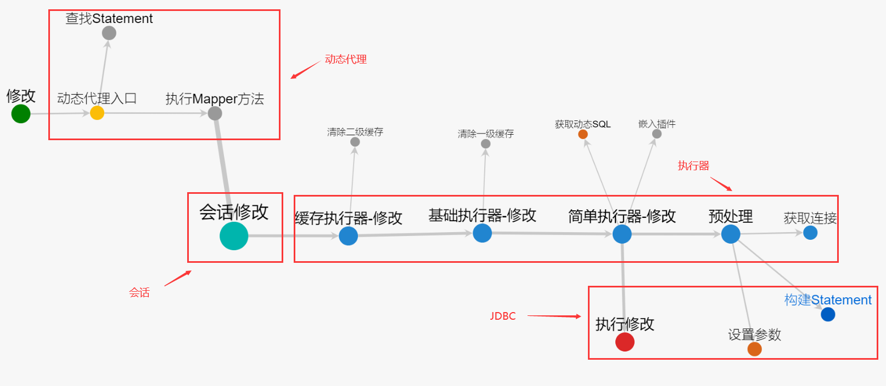
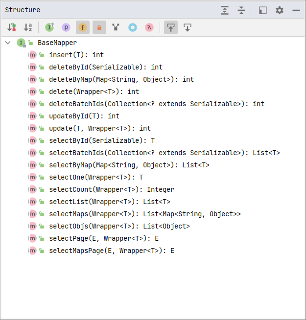
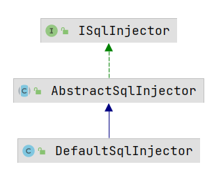
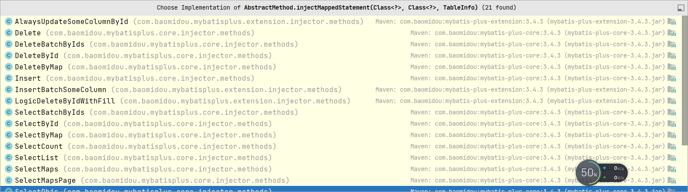
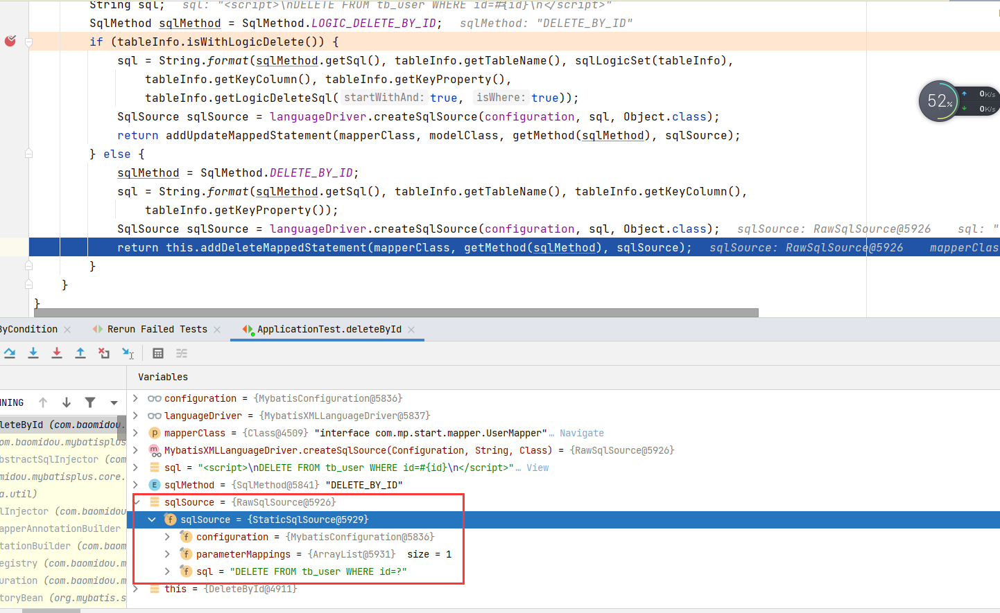

# MyBatis-Plus 基础

## 简介

MyBatis-Plus（简称 MP）是一个 MyBatis 的增强工具，在 MyBatis 的基础上只做增强不做改变，为简化开发、提高效率而生（向 JPA 看起？）

官网：https://mp.baomidou.com/

> MyBatis-Plus 架构图

[(2条消息) Mybatis-plus 实践与架构原理图解_骏马逸动，心随你动的博客-CSDN博客_mybatis-plus原理](https://blog.csdn.net/a1036645146/article/details/105449641)

<div align="center"></div>

MyBatis-Plus 在 MyBatis 的 xml 和注解注入之后，通过反射分析实体，将通用的 CRUD 方法注入；在注入前会进行判断，如果有一样的方法注入了就不会再注入。

> MyBatis vs JPA

MyBatis 的优势

- SQL 语句可以自由控制，更灵活，性能比 JPA 略高；但是新版的 JPA SQL 语句也很灵活了。
- SQL 与代码分离，易于阅读和维护
- 提供 XML 标签，支持编写动态 SQL 语句

JPA 的优势

- JPA 一致性比较好
- 提供了很多 CRUD 方法，开发效率高
- 对象化程度更高

MyBatis 的劣势

- 简单 CRUD 还得些 SQL 语句
- XML 中有大量的 SQL 要维护
- MyBatis 自身功能很有限，但支持 Plugin

> MyBatis-Plus 特性

<div align="center"></div>

- <b>损耗小：</b>启动即会自动注入基本 CURD，性能基本无损耗，直接面向对象操作
- <b>强大的 CRUD 操作：</b>内置通用 Mapper、通用 Service，仅仅通过少量配置即可实现单表大部分 CRUD 操作，更有强大的条件构造器，满足各类使用需求
- <b>支持 Lambda 形式调用：</b>通过 Lambda 表达式，方便的编写各类查询条件，无需再担心字段写错
- <b>支持主键自动生成：</b>支持多达 4 种主键策略（内含分布式唯一 ID 生成器 - Sequence），可自由配置，完美解决主键问题
- <b>支持 ActiveRecord 模式：</b>支持 ActiveRecord 形式调用，实体类只需继承 Model 类即可进行强大的 CRUD 操作
- <b>支持自定义全局通用操作：</b>支持全局通用方法注入（ Write once, use anywhere ）
- <b>内置代码生成器：</b>采用代码或者 Maven 插件可快速生成 Mapper 、 Model 、 Service 、 Controller 层代码，支持模板引擎，更有超多自定义配置等您来使用
- <b>内置分页插件：</b>基于 MyBatis 物理分页，开发者无需关心具体操作，配置好插件之后，写分页等同于普通 List 查询
- <b>分页插件支持多种数据库：</b>支持 MySQL、MariaDB、Oracle、DB2、H2、HSQL、SQLite、Postgre、SQLServer 等多种数据库
- <b>内置性能分析插件：</b>可输出 SQL 语句以及其执行时间，建议开发测试时启用该功能，能快速揪出慢查询
- <b>内置全局拦截插件：</b>提供全表 delete 、 update 操作智能分析阻断，也可自定义拦截规则，预防误操作

## 快速开始

### 创建表

```mysql
create database mybatis_plus;
use mybatis_plus;

CREATE TABLE `tb_user` (
    `id` bigint(20) NOT NULL AUTO_INCREMENT COMMENT '主键ID',
    `user_name` varchar(20) NOT NULL COMMENT '用户名',
    `password` varchar(20) NOT NULL COMMENT '密码',
    `name` varchar(30) DEFAULT NULL COMMENT '姓名',
    `age` int(11) DEFAULT NULL COMMENT '年龄',
    `email` varchar(50) DEFAULT NULL COMMENT '邮箱',
     PRIMARY KEY (`id`)
) ENGINE=InnoDB AUTO_INCREMENT=1 DEFAULT CHARSET=utf8;

-- 插入测试数据
INSERT INTO `tb_user` (`id`, `user_name`, `password`, `name`, `age`, `email`) VALUES
('1', 'zhangsan', '123456', '张三', '18', 'test1@itcast.cn');
INSERT INTO `tb_user` (`id`, `user_name`, `password`, `name`, `age`, `email`) VALUES
('2', 'lisi', '123456', '李四', '20', 'test2@itcast.cn');
INSERT INTO `tb_user` (`id`, `user_name`, `password`, `name`, `age`, `email`) VALUES
('3', 'wangwu', '123456', '王五', '28', 'test3@itcast.cn');
INSERT INTO `tb_user` (`id`, `user_name`, `password`, `name`, `age`, `email`) VALUES
('4', 'zhaoliu', '123456', '赵六', '21', 'test4@itcast.cn');
INSERT INTO `tb_user` (`id`, `user_name`, `password`, `name`, `age`, `email`) VALUES
('5', 'sunqi', '123456', '孙七', '24', 'test5@itcast.cn');
```

### 导入依赖

```xml
<?xml version="1.0" encoding="UTF-8"?>
<project xmlns="http://maven.apache.org/POM/4.0.0" xmlns:xsi="http://www.w3.org/2001/XMLSchema-instance"
         xsi:schemaLocation="http://maven.apache.org/POM/4.0.0 https://maven.apache.org/xsd/maven-4.0.0.xsd">
    <modelVersion>4.0.0</modelVersion>
    <parent>
        <groupId>org.springframework.boot</groupId>
        <artifactId>spring-boot-starter-parent</artifactId>
        <version>2.4.2</version>
        <relativePath/> <!-- lookup parent from repository -->
    </parent>
    <groupId>com.example</groupId>
    <artifactId>demo</artifactId>
    <version>0.0.1-SNAPSHOT</version>
    <name>springboot</name>
    <description>Demo project for Spring Boot</description>
    <properties>
        <java.version>8</java.version>
    </properties>
    <dependencies>
        <!-- MyBatis-Plus -->
        <dependency>
            <groupId>com.baomidou</groupId>
            <artifactId>mybatis-plus-boot-starter</artifactId>
            <version>3.4.3</version>
        </dependency>
        <dependency>
            <groupId>mysql</groupId>
            <artifactId>mysql-connector-java</artifactId>
        </dependency>
        <dependency>
            <groupId>org.projectlombok</groupId>
            <artifactId>lombok</artifactId>
        </dependency>
        
        <dependency>
            <groupId>org.springframework.boot</groupId>
            <artifactId>spring-boot-devtools</artifactId>
            <scope>runtime</scope>
            <optional>true</optional>
        </dependency>
        <dependency>
            <groupId>org.springframework.boot</groupId>
            <artifactId>spring-boot-configuration-processor</artifactId>
            <optional>true</optional>
        </dependency>
        <dependency>
            <groupId>org.springframework.boot</groupId>
            <artifactId>spring-boot-starter</artifactId>
        </dependency>
        <dependency>
            <groupId>org.springframework.boot</groupId>
            <artifactId>spring-boot-starter-test</artifactId>
            <scope>test</scope>
        </dependency>
        <dependency>
            <groupId>org.slf4j</groupId>
            <artifactId>slf4j-log4j12</artifactId>
        </dependency>
    </dependencies>
    <build>
        <plugins>
            <plugin>
                <groupId>org.springframework.boot</groupId>
                <artifactId>spring-boot-maven-plugin</artifactId>
            </plugin>
        </plugins>
    </build>
</project>
```

### 创建 Boot + 整合

```yml
spring:
  datasource:
    driver-class-name: com.mysql.cj.jdbc.Driver
    url: jdbc:mysql://localhost:3306/mp?serverTimezone=UTC
    username: root
    password: root

mybatis-plus:
  configuration:
    log-impl: org.apache.ibatis.logging.stdout.StdOutImpl 
    # 打印SQL语句到控制台
```

其他整合方式查阅官网。

### 测试代码

```java
@Mapper
public interface UserMapper extends BaseMapper<User> {}

@Data
@AllArgsConstructor
@NoArgsConstructor
@TableName("tb_user")
public class User {
    private Integer id;
    private String userName;
    private String password;
    private String name;
    private Integer age;
    private String email;
}

@SpringBootApplication
@RestController
public class MPApplication {

    public static void main(String[] args) {
        SpringApplication.run(MPApplication.class, args);
    }

    @Autowired
    UserMapper userMapper;

    @GetMapping("/all")
    public List<User> queryAll() {
        return userMapper.selectList(null);
    }
}
```

单元测试的方式进行代码测试

```java
@SpringBootTest
public class ApplicationTest {
    @Autowired
    UserMapper mapper;

    @Test
    public void first() {
        mapper.selectList(null).forEach(System.out::println);
    }
}
```

注意：MyBatis-Plus 中，如果数据库表中有下划线字段会默认采用驼峰转换。如数据中的字段为 `user_name`，Java 代码中为 `userName` 是可以自动对应上的。

### 常用注解

- @TableName -- 做类名和表名的映射，如果表名和类名不一致可以使用该注解。
- @TableId -- 表示这是主键，MP 默认是找名字为 id 的作为数据库主键，如果没有名为 id 的字段就会找不到主键，此时可以用 @TableId 标识某个字段为主键。
- @TableField -- 普通列，数据库中和类中的名字不一样，此时可以用 @TableField 进行映射，但是只有普通列才有效果！TableField 还可以用于排除某些字段 `@TableField(select=false)` 表示查询时不查询该注解修饰的字段。

> 修改数据库字段 age 为 ages，id 为 user_id

```java
@Data
@AllArgsConstructor
@NoArgsConstructor
@TableName("tb_user") // User 对应数据库表 tb_user
public class User {
    @TableId
    private Integer userId;
    private String userName;
    private String password;
    private String name;
    @TableField("ages")
    private Integer age;
    private String email;
    // @TableField(exist = false)
    // private String remark;
}
```

```java
import com.mp.mapper.UserMapper;
import com.mp.pojo.User;
import org.junit.jupiter.api.Test;
import org.springframework.beans.factory.annotation.Autowired;
import org.springframework.boot.test.context.SpringBootTest;

import java.util.List;

@SpringBootTest
public class MPApplicationTest {
    @Autowired
    UserMapper userMapper;

    @Test
    void testSelect() {
        List<User> users = userMapper.selectList(null);
        users.stream().forEach(System.out::println);
    }

    @Test
    void testInsert() {
        // id 为空的话，mp 会用雪花算法生成 id 进行填充。
        User user = new User(null, "Jack", "123", "Jack", 12, "hello@qq");
        userMapper.insert(user);
        System.out.println(user);
    }
}
```

### 排除非表字段

一共有三种方式

- 为字段加上 `transient` 关键字
- 用 `static` 修饰字段
- 为字段加上注解 `@TableField(exist=false)`，表示它不是数据库中的字段

在 User 中添加一个数据库中不存在的字段，不加任何处理进行数据库查询时报错，用上述方案解决时就不再报错了。

## 查询方法

通过继承 BaseMapper 就可以获取到各种各样的单表操作，接下来详细讲解这些操作。

<div align="center"></div>


没啥好记的，现查现用。只记录一个分页查询

### select 基本方法

> <b>按 id 查询 / 按 id 批量查询 / 按 map 中的条件等值查询</b>

```java
@Test
void testId() {
    User user = userMapper.selectById(1);
    log.info("user {}", user);
}

@Test
void testIds() {
    List<User> users = userMapper.selectBatchIds(Arrays.asList(1, 2, 3, 4));
    users.forEach(System.out::println);
}


@Test
void testQueryByMapCondition() {
    Map<String, Object> queryMap = new HashMap<>();
    // queryMap.put("ages", "12"); // 虽然 ages 是 int 类型，但是 map 中可以存 String
    queryMap.put("ages", 12);
    List<User> users = userMapper.selectByMap(queryMap);
    users.forEach(System.out::println);
}
```

> <b>根据 Wrapper 封装条件进行查询</b>

所有的 Wrapper 普通类都继承自 AbstractWrapper。（抽象类和接口的区别，抽象类中可以预先定义一些具体的方法复用；虽然 Java8 的接口也可以有具体的方法了，这点感觉模糊了抽象类和接口的边界）

```java
@Test
void testWrapperCondition() {
    QueryWrapper<User> query = new QueryWrapper<>();
    // query.like("user_name", "z"); // %z%
    // query.likeLeft("user_name", "z"); // %z
    query.likeRight("user_name", "z"); // z%
    List<Map<String, Object>> maps = userMapper.selectMaps(query);
    System.out.println(maps.size());
}

@Test
void testWrapperCondition2() {
    QueryWrapper<User> query = new QueryWrapper<>();
    // select * from tb_user where (user_id between 1,3 and user_name like "z%");
    query.between("user_id", 1, 3).likeRight("user_name", "z");
    List<Map<String, Object>> maps = userMapper.selectMaps(query);
    System.out.println(maps.size());
}

@Test
void testWrapperCondition3() {
    QueryWrapper<User> query = new QueryWrapper<>();
    // select * from tb_user where (user_id between 1,3 or user_name like "z%");
    query.between("user_id", 1, 3).or().likeRight("user_name", "z");
    List<Map<String, Object>> maps = userMapper.selectMaps(query);
    System.out.println(maps.size());
}

@Test
void testWrapperCondition4() {
    QueryWrapper<User> query = new QueryWrapper<>();
    // apply 可以用于 where 中执行某些自定义的 sql 片段，如下面这种
    // 用 {0} 防止 sql 注入
    query.apply("ages-1 = {0}", 11);
    // 还可以用于执行某些函数 apply("date_format(dateColumn,'%Y-%m-%d') = {0}", "2008-08-08")
    List<Map<String, Object>> maps = userMapper.selectMaps(query);
    System.out.println(maps.size());
}

@Test
void testWrapperInSql() {
    // inSql -- 子查询
    QueryWrapper<User> query = new QueryWrapper<>();
    query.inSql("ages", "select ages from tb_user where ages>11");
    List<Map<String, Object>> maps = userMapper.selectMaps(query);
    System.out.println(maps.size());
}

@Test
void testWrapperAnd() {
    // select * from tb_user where user_name like 'z%' or (ages<17 and user_name like 'l%');
    QueryWrapper<User> query = new QueryWrapper<>();
    query.likeRight("user_name", "z")
        .or(w -> w.lt("ages", 17).likeRight("user_name", "l"));
    System.out.println(query.getTargetSql());
    List<User> users = userMapper.selectList(query);
    users.forEach(System.out::println);
}

@Test
void testWrapperAnd2() {
    // select * from tb_user where (ages<17 and user_id > 0) or user_name like 'l%';
    QueryWrapper<User> query = new QueryWrapper<>();
    query.nested(w -> w.lt("ages", 17).gt("user_id", 0))
        .or().likeRight("user_name", "l");
    System.out.println(query.getTargetSql());
    List<User> users = userMapper.selectList(query);
    users.forEach(System.out::println);
}
```

> <b>一些需要注意的 Wrapper 中的方法</b>

- nested，nested 内的查询条件会多套一个 `()`，`nested(i -> i.eq("name", "李白").ne("status", "活着")) ---> (name = '李白' and status <> '活着')`
- apply，用于 where 中执行一些 sql 片段，可以执行诸如 where age-1 = 10 这种语句，和 `"date_format(dateColumn,'%Y-%m-%d') = {0}"` 这种语句
- last，无视优化规则直接拼接到 sql 的最后，有 sql 注入风险

### selectPage

需要注册一个分页插件到 IOC 容器中

```java
@SpringBootApplication
public class ApplicationContext {
    public static void main(String[] args) {
        ConfigurableApplicationContext run = SpringApplication.run(ApplicationContext.class);
    }

    @Bean // 注册分页插件
    public MybatisPlusInterceptor mybatisPlusInterceptor() {
        MybatisPlusInterceptor plus = new MybatisPlusInterceptor();
        plus.addInnerInterceptor(new PaginationInnerInterceptor(DbType.MYSQL));
        return plus;
    }
}
```

分页代码

```java
@Test
public void selectPage() {
    Page<User> page = new Page<>();
    page.setCurrent(1); // 设置起始页
    page.setSize(2); // 每页查询的数据量
    mapper.selectPage(page, null); // 查询条件为 null
}
```

### 不列出所有字段

使用 select 限定出现那些字段，不出现那些字段。

```java
@Test
void testSelectSomeField() {
    QueryWrapper<User> queryWrapper = new QueryWrapper<>();
    // SELECT user_id,user_name FROM tb_user
    // 这种方式字段一多久很麻烦。
    queryWrapper.select("user_id,user_name"); // 此处要传数据库的字段名
    userMapper.selectList(queryWrapper).forEach(System.out::println);
}
```

指定哪些字段不出出现，但是这种方式 select 过滤的字段不包括主键！

```java
@Test
void testSelectSomeField2() {
    QueryWrapper<User> queryWrapper = new QueryWrapper<>();
    // 不查询 user_name 字段
    queryWrapper.select(User.class, fields -> !fields.getColumn().equals("user_name"));
    userMapper.selectList(queryWrapper).forEach(System.out::println);
}
```

### 带 condition 的查询

```java
// 条件为 true 才进行 sql 拼接
like(boolean condition, R column, Object val);
```

### 以实体为查询条件

以实体为查询条件默认是等值查询，但是可以在实体字段上加上注解进行修改。

```java
@Test
void testSelectByEntity() {
    User user = new User();
    user.setUserId(1);
    // SELECT user_id,user_name,password,name,ages AS age,email FROM tb_user WHERE user_id=?
    QueryWrapper<User> queryWrapper = new QueryWrapper<>(user);
    userMapper.selectList(queryWrapper).forEach(System.out::println);
}
```

```java
// 参照 SqlCondition 写的小于
@TableField(value = "ages", condition = "%s&lt;#{%s}")
private Integer age;

@Test
void testSelectByEntity() {
    User user = new User();
    user.setAge(15);
    // SELECT user_id,user_name,password,name,ages AS age,email FROM tb_user WHERE ages<?
    QueryWrapper<User> queryWrapper = new QueryWrapper<>(user);
    userMapper.selectList(queryWrapper).forEach(System.out::println);
}
```

### allEq

```java
queryWrapper.allEq(params, false); // 为 null 的等值查询会被忽略
```

### lambda 条件构造器

可以防止误写字段，普通的 QueryWrapper 需要自己写字段的名称，可能会误写，而 lambda 可以使用类的方法来确定字段名。

- LambdaQueryWrapper 通过 lambda 的方式构造查询条件
- LambdaQueryChainWrapper 直接链式调用完成查询，QueryChainWrapper 也是可以链式调用完成查询

```java
package com.mp;


import com.baomidou.mybatisplus.core.conditions.query.LambdaQueryWrapper;
import com.baomidou.mybatisplus.core.conditions.query.QueryWrapper;
import com.baomidou.mybatisplus.core.conditions.update.UpdateWrapper;
import com.baomidou.mybatisplus.core.toolkit.Wrappers;
import com.baomidou.mybatisplus.extension.conditions.query.LambdaQueryChainWrapper;
import com.mp.mapper.UserMapper;
import com.mp.pojo.User;
import lombok.extern.slf4j.Slf4j;
import org.junit.jupiter.api.Test;
import org.springframework.beans.factory.annotation.Autowired;
import org.springframework.boot.test.context.SpringBootTest;

@SpringBootTest
@Slf4j
public class MPApplicationTestLambda {
    @Autowired
    UserMapper userMapper;

    UpdateWrapper<User> update = new UpdateWrapper<>();

    User user = new User();

    @Test
    public void testLambdaQuery() {
        // lambda 条件构造器的创建方式
        LambdaQueryWrapper<User> lambda = new QueryWrapper<User>().lambda();
        LambdaQueryWrapper<User> userLambdaQueryWrapper = new LambdaQueryWrapper<>();
        LambdaQueryWrapper<User> userLambdaQueryWrapper1 = Wrappers.lambdaQuery();
        lambda.like(User::getName, "J").select(User::getUserId, User::getAge);
        userMapper.selectList(lambda).forEach(System.out::println);
    }


    @Test
    public void testLambdaChain() {
        new LambdaQueryChainWrapper<User>(userMapper)
                .eq(User::getUserId, 1)
                .select(User::getAge, User::getName)
                .list()
                .forEach(System.out::println);

    }
}
```


## 更新及删除

### 更新方法

常用的更新方法如下

- updateById -- 实体中不为 null 的字段值会进行更新
- update(Entity, Wrapper) -- Entity 为需要 set 的内容，Wrapper 为 set 的条件；也可以 Entity 为 null，Wrapper 中设置好 set 条件和需要 set 的内容。
- LambdaUpdateChainWrapper -- 直接链式调用完成更新

updateById -- 实体中不为 null 的字段值会进行更新

```java
@SpringBootTest
@Slf4j
public class MPApplicationTestUpdate {
    @Autowired
    UserMapper userMapper;

    UpdateWrapper<User> update = new UpdateWrapper<>();
    
    User user = new User();
    
    @Test
    public void testUpdate() {
        // UPDATE tb_user SET ages=? WHERE user_id=?
        // 记录中不为 null 的字段值会进行更新
        user.setUserId(1);
        user.setAge(26);
        int rows = userMapper.updateById(user);
        log.info("受影响的记录数 {}", rows);
    }
}
```

update(Entity, Wrapper) -- Entity 为需要 set 的内容，Wrapper 为 set 的条件；也可以 Entity 为 null，Wrapper 中设置好 set 条件和需要 set 的内容。

```java
@SpringBootTest
@Slf4j
public class MPApplicationTestUpdate {
    @Autowired
    UserMapper userMapper;

    UpdateWrapper<User> update = new UpdateWrapper<>();

    User user = new User();
    
    @Test
    public void testUpdateByWrapper1() {
        // 只设置 set 的条件
        UpdateWrapper<User> set = update.eq("user_id", 1);
        user.setAge(10);
        // UPDATE tb_user SET ages=? WHERE (user_id = ?)
        int rows = userMapper.update(user, set);
        log.info("受影响的记录数 {}", rows);
    }

    @Test
    public void testUpdateByWrapper2() {
        UpdateWrapper<User> set = update.eq("user_id", 1).set("ages", 100);
        // UPDATE tb_user SET ages=? WHERE (user_id = ?)
        int rows = userMapper.update(null, set);
        log.info("受影响的记录数 {}", rows);
        
        // 也可以用 lambda 表达式的 Wrapper
        LambdaUpdateWrapper<User> lambda = new LambdaUpdateWrapper<>();
        lambda.eq(User::getUserId, 1).set(User::getAge, 10);
        rows = userMapper.update(null, lambda);
        log.info("受影响的记录数 {}", rows);
    }
}
```

LambdaUpdateChainWrapper -- 直接链式调用完成更新

```java
@Test
public void testLambdaChainWrapper() {
    boolean update = new LambdaUpdateChainWrapper<User>(userMapper)
        .eq(User::getUserId, 1)
        .set(User::getAge, 10)
        .update();
    log.info("操作结果 {}", update);
}
```

### 删除方法

- deleteById -- 根据 id 删除
- deleteByMap -- 根据 map 中的条件删除，默认为等值连接
- deleteBatchIds -- 根据 id 批量删除
- delete( Wrapper\<T\> ) -- 根据 Wrapper 中的条件删除

## 自定义 SQL

执行自定义 SQL 查询有两种方式，一种是使用注解/XML，一种是使用 SqlRunner。

### 自定义注解/XML

可以使用注解自定义，也可以使用 XML

```java
import com.baomidou.mybatisplus.core.conditions.Wrapper;
import com.baomidou.mybatisplus.core.mapper.BaseMapper;
import com.baomidou.mybatisplus.core.toolkit.Constants;
import com.mp.pojo.User;
import org.apache.ibatis.annotations.Mapper;
import org.apache.ibatis.annotations.Param;
import org.apache.ibatis.annotations.Select;

import java.util.List;

// 使用注解自定义
@Mapper
public interface UserMapper extends BaseMapper<User> {

    @Select("select user_id,user_name from tb_user ${ew.customSqlSegment}")
    List<User> selectByDefaultCondition(@Param(Constants.WRAPPER) Wrapper<User> wrapper);
}
```

修改 yml 配置

```yaml
spring:
  datasource:
    driver-class-name: com.mysql.cj.jdbc.Driver
    url: jdbc:mysql://localhost:3306/mybatis_plus?serverTimezone=UTC
    username: root
    password: root

mybatis-plus:
  configuration:
    log-impl: org.apache.ibatis.logging.stdout.StdOutImpl
  mapper-locations: classpath:com/mapper/*.xml # 增加这句配置，指定 xml 文件的位置
```

使用 XML 自定义 SQL

```xml
<?xml version="1.0" encoding="UTF-8" ?>
<!DOCTYPE mapper
        PUBLIC "-//mybatis.org//DTD Mapper 3.0//EN"
        "http://mybatis.org/dtd/mybatis-3-mapper.dtd">
<mapper namespace="com.mp.mapper.UserMapper">
    <select id="selectByDefaultCondition" resultType="com.mp.pojo.User">
        select *
        <!-- 不用加 where，mp 会自动加上去的 -->
        from tb_user ${ew.customSqlSegment}
    </select>
</mapper>
```

<b style="color:orange">如果需要 xml 文件和接口文件存储在一个路径下，则需要为 maven 配置下面这个属性</b>

```xml
<build>
    <resources>
        <resource>
            <directory>src/main/java</directory>
            <includes>
                <include>**/*.xml</include>
            </includes>
            <filtering>true</filtering>
        </resource>
    </resources>
</build>
```

测试代码

```java
@Test
void testXML() {
    QueryWrapper<User> query = new QueryWrapper<User>().eq("user_id", 1);
    // 传入的对象 query 不能为 null！
    userMapper.selectByDefaultCondition(query).forEach(System.out::println);
}

@Test
void testXML2() {
    // 没有设置条件那就是查询所有数据了。
    QueryWrapper<User> query = new QueryWrapper<User>();
    userMapper.selectByDefaultCondition(query).forEach(System.out::println);
}
```

### SqlRunner

配置文件，启用 SqlRunner

```properties
mybatis-plus.global-config.enable-sql-runner=true
```

执行代码

```java
private void updateUserRating(Player one, boolean win) {
    int rating = win ? 5 : -5;
    // SqlRunner 无需手动注入
    SqlRunner.db().update("update user set rating = rating + {0},count=count+1 where id = {1}", rating, one.getId());
}

private void testDefineSql() {
    // 执行自定义sql
    Object o = SqlRunner.db().selectObj("explain select count(*) from tb_user");
    System.out.println(o);
}
```

## 分页查询

- MyBatis 分页
- MP 分页插件实现物理分页

### 基本的分页查询

注册分页查询插件

```java
import com.baomidou.mybatisplus.annotation.DbType;
import com.baomidou.mybatisplus.extension.plugins.MybatisPlusInterceptor;
import com.baomidou.mybatisplus.extension.plugins.inner.PaginationInnerInterceptor;
import org.springframework.context.annotation.Bean;
import org.springframework.context.annotation.Configuration;

@Configuration
public class MPConfig {
    @Bean
    public MybatisPlusInterceptor mybatisPlusInterceptor() {
        MybatisPlusInterceptor interceptor = new MybatisPlusInterceptor();
        interceptor.addInnerInterceptor(new PaginationInnerInterceptor(DbType.H2));
        return interceptor;
    }
}
```

使用 Page 测试分页查询（可以通过设置 searchCount 为 false，不查询总记录数，如果需要 count 的话可以用 Redis 缓存或 explain 得到模糊的 count）

```java
@Test
void testPage() {
    QueryWrapper<User> queryWrapper = new QueryWrapper<>();
    
    // 页数默认从1开始，大于1才会重设 current page 的值
    Page<User> page = new Page<>(1, 3);
    userMapper.selectPage(page, queryWrapper);
    System.out.println(page.getPages());
    System.out.println(page.getCurrent());
    System.out.println(page.getRecords().size());
}

@Test
void testPageIgnoreTotalPage() {
    QueryWrapper<User> queryWrapper = new QueryWrapper<>();
    // searchCount 设置为 false，不查询总记录数
    Page<User> page = new Page<>(0, 3, false);
    userMapper.selectPage(page, queryWrapper);
    System.out.println(page.getPages());
    System.out.println(page.getCurrent());
    System.out.println(page.getRecords().size());
}
```

### 基于 XML 的分页查询

接口中定义方法

```java
List<User> selectByPage(IPage<User> page, Integer ages);
```

XML 中编写 sql

```xml
<select id="selectByPage" resultType="com.mp.pojo.User">
    select *
    from mybatis_plus.tb_user
    where ages &lt; #{ages}
</select>
```

测试代码，依旧是不查询总页数

```java
@Test
void testPageIgnoreTotalPageXML() {
    // searchCount 设置为 false，不查询总记录数
    Page<User> page = new Page<>(1, 3, false);
    userMapper.selectByPage(page, 20);
    System.out.println(page.getPages());
    System.out.println(page.getCurrent());
    System.out.println(page.getRecords().size());
}
```

## ActiveRecord 模式

AR，活动记录，一种领域模型模式，一个模型类对应关系型数据库中的一个表，模型类的一个实例对应表中的一行记录。通过实体对象直接对表进行增删改查操作。

### 体验 AR 模式

- 实体类只需继承 Model 类即可进行强大的 CRUD 操作
- 需要项目中已注入对应实体的 BaseMapper

```java
@Data
@AllArgsConstructor
@NoArgsConstructor
@TableName("tb_user")
@EqualsAndHashCode(callSuper = true)
public class User extends Model<User> {
    @TableId
    private Integer userId;
    private String userName;
    private String password;
    private String name;
    @TableField(value = "ages", condition = "%s&lt;#{%s}")
    private Integer age;
    private String email;
    @TableField(exist = false)
    private String remark;
}
```

```java
@Mapper
public interface UserMapper extends BaseMapper<User> {}
```

```java
package com.mp;

import com.baomidou.mybatisplus.core.conditions.update.LambdaUpdateWrapper;
import com.baomidou.mybatisplus.core.conditions.update.UpdateWrapper;
import com.baomidou.mybatisplus.extension.conditions.update.LambdaUpdateChainWrapper;
import com.mp.mapper.UserMapper;
import com.mp.pojo.User;
import lombok.extern.slf4j.Slf4j;
import org.junit.jupiter.api.Test;
import org.springframework.beans.factory.annotation.Autowired;
import org.springframework.boot.test.context.SpringBootTest;

@SpringBootTest
@Slf4j
public class MPApplicationTestUpdate {

    @Test
    public void testInsertAR() {
        User user = new User(null, "ar", "arpassward", "ar", 12, "qq", null);
        user.insert();
    }

    @Test
    public void testUpdateAR() {
        User user = new User();
        user.setUserId(-352837630);
        user.setUserName("modify_ar");
        user.updateById();
    }

    @Test
    public void testSelectAR() {
        User user = new User();
        user.setUserId(1);
        System.out.println(user.selectById());
    }
}
```

需要注意下 insertOrUpdate 方法，如果没有设置主键字段值默认是插入数据，如果有设置主键字段的值，则是先查询，如果不存在则插入，如果存在则进行更新。

AR 模式的 delete 方法的逻辑如下，删除不存在的数据也认为是成功。而非 AR 模式刪除则是返回删除的记录数。

```java
public static boolean retBool(Integer result) {
    return null != result && result >= 1;
}
```

## 主键策略

### 基本介绍

MP 支持多种主键策略，默认的策略是基于雪花算法的自增 id。自 3.3.0 开始,默认使用雪花算法+UUID (不含中划线)

```java
@Getter
public enum IdType {
    /**
     * 数据库ID自增
     * <p>该类型请确保数据库设置了 ID自增 否则无效</p>
     */
    AUTO(0),
    /**
     * 该类型为未设置主键类型(注解里等于跟随全局,全局里约等于 INPUT)
     * 如果全局 id 策略默认是雪花算法，就用雪花算法生成 id
     */
    NONE(1),
    /**
     * 用户输入ID
     * <p>该类型可以通过自己注册自动填充插件进行填充</p>
     */
    INPUT(2),

    /* 以下2种类型、只有当插入对象ID 为空，才自动填充。 */
    /**
     * 分配ID (主键类型为number或string）,
     * 默认实现类 {@link com.baomidou.mybatisplus.core.incrementer.DefaultIdentifierGenerator}(雪花算法)
     *
     * @since 3.3.0
     */
    ASSIGN_ID(3),
    /**
     * 分配UUID (主键类型为 string)
     * 默认实现类 {@link com.baomidou.mybatisplus.core.incrementer.DefaultIdentifierGenerator}(UUID.replace("-",""))
     */
    ASSIGN_UUID(4);

    private final int key;

    IdType(int key) {
        this.key = key;
    }
}
```

@TableId 默认的主键类型是 IdType.NONE

```java
public @interface TableId {

    /**
     * 字段名（该值可无）
     */
    String value() default "";

    /**
     * 主键类型
     * {@link IdType}
     */
    IdType type() default IdType.NONE;
}
```

### 设置方式

设置主键策略

```java
@TableId(type = IdType.AUTO)
private Integer userId;
```

也可以通过配置文件修改默认的 id-type

```yml
mybatis-plus:
  configuration:
    log-impl: org.apache.ibatis.logging.stdout.StdOutImpl
  global-config:
    enable-sql-runner: true
    db-config:
      id-type: auto # 修改 id-type 类型为 数据库自增
  mapper-locations: classpath:com/mapper/*.xml
```

## 通用 Service

- 通用 Service 和通用 Mapper 之间的关系
- 基本方法
- 批量操作方法 / 链式调用方法

### 通用 Service 与 Mapper

> Service CRUD 接口

- 通用 Service CRUD 封装 IService 接口，进一步封装 CRUD 采用 『get 查询单行 remove 删除 list 查询集合 page 分页』前缀命名方式区分 Mapper 层避免混淆
- 泛型 T 为任意实体对象
- 建议如果存在自定义通用 Service 方法的可能，就创建自己的 IBaseService 继承 Mybatis-Plus 提供的基类
    对象 Wrapper 为条件构造器

> Mapper CRUD 接口

- 通用 CRUD 封装 BaseMapper 接口，为 Mybatis-Plus 启动时自动解析实体表关系映射转换为 Mybatis 内部对象注入容器
- 泛型 T 为任意实体对象
- 参数 Serializable 为任意类型主键 Mybatis-Plus 不推荐使用复合主键约定每一张表都有自己的唯一 id 主键
    对象 Wrapper 为条件构造器

### 基本方法

- 定义 UserMapper
- 定义 service 层代码
    - UserService 接口继承接口 IService\<T\>，此处 T 为需要操作的对象 User
    - UserServiceImpl 继承 ServiceImpl\<UserMapper, User> 并实现 UserService 接口。有点适配器模式的味道了。
- 然后就可以使用 MP 通用 service 中提供的许多方法了，比 BaseMapper 更为丰富。

service 接口

```java
public interface UserService extends IService<User> {}
```

service 实现类

```java
@Service
public class UserServiceImpl extends ServiceImpl<UserMapper, User> implements UserService {}
```

测试代码

```java
@SpringBootTest
@Slf4j
public class MPApplicationTestService {
    @Autowired
    UserService userService;

    @Test
    public void testGetOne() {
        User one = userService.getOne(new LambdaUpdateWrapper<User>().eq(User::getUserId, 1));
        log.info("user info：{}", one);
    }
}
```

### 批量操作/链式调用

用法和前面学习的都差不多。

```java
@SpringBootTest
@Slf4j
public class MPApplicationTestService {
    @Autowired
    UserService userService;

    @Test
    public void testBatch() {
        List<User> users = userService
            .list(new LambdaUpdateWrapper<User>()
                  .like(User::getUserName, "l"));
        users.forEach(System.out::println);
    }
}
```

## SQL 注入原理

### 基本原理

MP 在启动后会将 BaseMapper 中的一系列的方法注册到 meppedStatements 中，那么究竟是如何注入的？流程又是怎么样的？

在 MP 中，ISqlInjector 负责 SQL 的注入工作，它是一个接口，AbstractSqlInjector 是它的实现类，实现关系如下

<div align="center"></div>

在 AbstractSqlInjector 中，主要是由 inspectInject() 方法进行注入的

```java
@Override
public void inspectInject(MapperBuilderAssistant builderAssistant, Class<?> mapperClass) {
    Class<?> modelClass = extractModelClass(mapperClass);
    if (modelClass != null) {
        String className = mapperClass.toString();
        Set<String> mapperRegistryCache = GlobalConfigUtils.getMapperRegistryCache(builderAssistant.getConfiguration());
        if (!mapperRegistryCache.contains(className)) {
            List<AbstractMethod> methodList = this.getMethodList(mapperClass);
            if (CollectionUtils.isNotEmpty(methodList)) {
                TableInfo tableInfo = TableInfoHelper.initTableInfo(builderAssistant, modelClass);
                // 循环注入自定义方法 inject 注入
                methodList.forEach(m -> m.inject(builderAssistant, mapperClass, modelClass, tableInfo));
            } else {
                logger.debug(mapperClass.toString() + ", No effective injection method was found.");
            }
            mapperRegistryCache.add(className);
        }
    }
}

public void inject(MapperBuilderAssistant builderAssistant, Class<?> mapperClass, Class<?> modelClass, TableInfo tableInfo) {
    this.configuration = builderAssistant.getConfiguration();
    this.builderAssistant = builderAssistant;
    this.languageDriver = configuration.getDefaultScriptingLanguageInstance();
    /* 注入自定义方法 */
    injectMappedStatement(mapperClass, modelClass, tableInfo);
}
```

在实现方法中，`methodList.forEach(m -> m.inject(builderAssistant, mapperClass, modelClass, tableInfo));` 是关键，循环遍历方法，进行注入。 最终调用抽象方法 injectMappedStatement 进行真正的注入；该抽象方法的实现如下：

<div align="center"></div>

### 典例

以 DeleteById 为例

```java
public class DeleteById extends AbstractMethod {

    @Override
    public MappedStatement injectMappedStatement(Class<?> mapperClass, Class<?> modelClass, TableInfo tableInfo) {
        String sql;
        SqlMethod sqlMethod = SqlMethod.LOGIC_DELETE_BY_ID;
        if (tableInfo.isWithLogicDelete()) { // 是否是逻辑删除
            sql = String.format(sqlMethod.getSql(), tableInfo.getTableName(), sqlLogicSet(tableInfo),
                tableInfo.getKeyColumn(), tableInfo.getKeyProperty(),
                tableInfo.getLogicDeleteSql(true, true));
            SqlSource sqlSource = languageDriver.createSqlSource(configuration, sql, Object.class);
            return addUpdateMappedStatement(mapperClass, modelClass, getMethod(sqlMethod), sqlSource);
        } else { // 物理删除
            sqlMethod = SqlMethod.DELETE_BY_ID;
            sql = String.format(sqlMethod.getSql(), tableInfo.getTableName(), tableInfo.getKeyColumn(),
                tableInfo.getKeyProperty());
            SqlSource sqlSource = languageDriver.createSqlSource(configuration, sql, Object.class);
            return this.addDeleteMappedStatement(mapperClass, getMethod(sqlMethod), sqlSource);
        }
    }
}
```

<div align="center"></div>

## 配置

MP 中有大量配置，相当一部分是 MyBatis 的原生配置，另一部分是 MP 的配置。[使用配置 | MyBatis-Plus (baomidou.com)](https://mp.baomidou.com/config/#基本配置)

### 基本配置

#### configLocation

- 类型：`String`
- 默认值：`null`

MyBatis 配置文件位置，如果有单独的 MyBatis 配置，需要将其路径配置到 configLocation 中。 MyBatis Configuration 的具体内容可以参考 MyBatis 官方文档

```properties
mybatis-plus.config-location = classpath:mybatis-config.xml
```

#### mapperLocations

MyBatis Mapper 所对应的 XML 文件位置，如果在 Mapper 中有自定义方法（XML 中有自定义实现），需要进行该配置，告诉 Mapper 所对应的 XML 文件位置。

```properties
mybatis-plus.mapper-locations = classpath*:mybatis/*.xml
```

<b>Maven 多模块项目的扫描路径需以 classpath*: 开头 （即加载多个 jar 包下的 XML 文件）</b>

#### typeAliasesPackage

MyBaits 别名包扫描路径，通过该属性可以给包中的类注册别名，注册后在 Mapper 对应的 XML 文件中可以直接使 用类名，而不用使用全限定的类名（即 XML 中调用的时候不用包含包名）。

```properties
mybatis-plus.type-aliases-package = cn.itcast.mp.pojo
```

### 进阶配置

本部分（Configuration）的配置大都为 MyBatis 原生支持的配置，可以通过 MyBatis XML 配置文件的形式进行配置。

#### mapUnderscoreToCamelCase

- 类型：boolean 
- 默认值：true，原生的 MyBatis 的默认值则是 false

是否开启自动驼峰命名规则（camel case）映射，即从经典数据库列名 A_COLUMN（下划线命名） 到经典 Java 属性名 aColumn（驼峰命名） 的类似映射。

>此属性在 MyBatis 中原默认值为 false，在 MyBatis-Plus 中，此属性也将用于生成最终的 SQL 的 select body 如果数据库命名符合规则无需使用 @TableField 注解指定数据库字段名

```properties
#关闭自动驼峰映射，该参数不能和mybatis-plus.config-location同时存在
mybatis-plus.configuration.map-underscore-to-camel-case=false
```

注意 config-location 和 configuration 不能同时定义。

#### cacheEnabled

- 类型： boolean 
- 默认值： true

全局地开启或关闭配置文件中的所有映射器已经配置的任何缓存，默认为 true。

```properties
mybatis-plus.configuration.cache-enabled=false
```

### DB 策略配置

#### idType

- 类型：com.baomidou.mybatisplus.annotation.IdType 
- 默认值：ID_WORKER

全局默认主键类型，设置后，即可省略实体对象中的 @TableId(type = IdType.AUTO) 配置。

#### tablePrefix

- 类型： String 
- 默认值： null

表名前缀，全局配置后可省略 @TableName() 配置。

####  insertStrategy

- 类型：`com.baomidou.mybatisplus.annotation.FieldStrategy`
- 默认值：`NOT_NULL`，不为空的才会加入到 SQL 语句中

字段验证策略之 insert，在 insert 的时候的字段验证策略

#### updateStrategy

- 类型：`com.baomidou.mybatisplus.annotation.FieldStrategy`
- 默认值：`NOT_NULL`，不为空的才会加入到 SQL 语句中

字段验证策略之 update，在 update 的时候的字段验证策略

#### whereStrategy

- 类型：`com.baomidou.mybatisplus.annotation.FieldStrategy`
- 默认值：`NOT_NULL`，不为空的才会加入到 SQL 语句中

字段验证策略之 select，在 select 的时候的字段验证策略既 wrapper 根据内部 entity 生成的 where 条件

# MyBatis-Plus 高级

主要学习以下内容

- 逻辑删除、自动填充、乐观锁插件
- 性能分析插件、多租户 SQL 解析器
- 动态表名 SQL 解析器、SQL 注入器

准备工作，为先前的表添加字段 deleted 表示是否逻辑删除。并在 User 中添加下列代码

```java
@TableLogic // 加上逻辑删除限定
@TableField(select = false) // 表示不查询该字段
private Integer deleted;
```

在 yml 配文件中配置逻辑删除全局配置

```yml
mybatis-plus:
  global-config:
    db-config:
      logic-delete-field: flag # 全局逻辑删除的实体字段名(since 3.3.0,配置后可以忽略不配置@TablLogic)
      logic-delete-value: 1 # 逻辑已删除值(默认为 1)
      logic-not-delete-value: 0 # 逻辑未删除值(默认为 0)
```

低版本的 MyBatis-Plus（3.1.1 以下版本）需要通过注入 Bean 的方式进行配置，注入 LogicSqlInjector() 对象。

## 逻辑删除

通过一个字段标识数据是否被删除。本例中添加的逻辑删除标识字段为 delete，0 表示未删除，1 表示已删除。

```java
@SpringBootTest
@Slf4j
public class MPApplicationTestLogic {
    @Autowired
    UserService userService;

    @Test
    void testLogicDelete() {
        // 逻辑删除 SQL 语句：UPDATE tb_user SET deleted=1 WHERE user_id=? AND deleted=0
        userService.removeById(1);
    }
    
    @Test
    void testSelect() {
        // 只会查询逻辑未删除的
        userService.list().forEach(System.out::println);
    }

    @Test
    void testUpdate() {
        // 只会更新逻辑未删除的
        boolean update = userService.update(new LambdaUpdateWrapper<User>().set(User::getAge, 12));
        log.info("更新结果 {}", update);
    }
}
```

## 自动填充

例如有些业务需要在修改、新增时插入当前时间，这时候就可以用 MP 提供的自动填充功能了。指定 xx 字段在执行 update 语句是触发自动填充，指定 oo 字段在执行新增的时候触发自动填充功能。

MP 的主键策略是否也是通过这种方式实现的？

### 基本使用

创建新表 tb_u

```mysql
create database mybatis_plus;
use mybatis_plus;

CREATE TABLE `tb_u` (
    `id` bigint(20) NOT NULL AUTO_INCREMENT COMMENT '主键ID',
    `user_name` varchar(20) NOT NULL COMMENT '用户名',
    `age` int(11) DEFAULT NULL COMMENT '年龄',
    `create_time` DATETIME DEFAULT NULL comment '创建时间',
    `update_time` DATETIME DEFAULT NULL comment '修改时间',
     PRIMARY KEY (`id`)
) ENGINE=InnoDB AUTO_INCREMENT=1 DEFAULT CHARSET=utf8;

-- 插入测试数据
INSERT INTO `tb_u` (`id`, `user_name`, `age`) VALUES ('1', 'zhangsan', '18');
INSERT INTO `tb_u` (`id`, `user_name`, `age`) VALUES ('2', 'lisi', '20');
INSERT INTO `tb_u` (`id`, `user_name`, `age`) VALUES ('3', 'wangwu', '28');
```

配置文件

```yaml
spring:
  datasource:
    driver-class-name: com.mysql.cj.jdbc.Driver
    url: jdbc:mysql://localhost:3306/mybatis_plus?serverTimezone=UTC
    username: root
    password: root

mybatis-plus:
  configuration:
    log-impl: org.apache.ibatis.logging.stdout.StdOutImpl
  global-config:
    enable-sql-runner: true
    db-config:
      id-type: auto # 配置主键策略为数据库自增
      logic-delete-value: 1
      logic-not-delete-value: 0
  mapper-locations: classpath:com/mapper/*.xml
```

创建 POJO 类 U

```java
@Data
@TableName("tb_u")
public class U {
    private Integer id;
    private String userName;
    private Integer age;
    @TableField(fill = FieldFill.INSERT)
    private LocalDateTime createTime;
    @TableField(fill = FieldFill.UPDATE)
    private LocalDateTime updateTime;
}
```

创建 UMapper

```java
@Mapper
public interface UMapper extends BaseMapper<U> {}
```

自定义字段填充的处理类，此处命名为 FieldHandler

```java
package com.mp.config;

import com.baomidou.mybatisplus.core.handlers.MetaObjectHandler;
import org.apache.ibatis.reflection.MetaObject;
import org.springframework.stereotype.Component;

import java.time.LocalDateTime;

@Component
public class FieldHandler implements MetaObjectHandler {
    @Override
    public void insertFill(MetaObject metaObject) {
        // this.strictInsertFill(metaObject, "createTime", LocalDateTime.class, LocalDateTime.now()); // 起始版本 3.3.0(推荐使用)
        // 或者
        this.strictInsertFill(metaObject, "createTime", () -> LocalDateTime.now(), LocalDateTime.class); // 起始版本 3.3.3(推荐)
    }

    @Override
    public void updateFill(MetaObject metaObject) {
        // this.strictUpdateFill(metaObject, "updateTime", LocalDateTime.class, LocalDateTime.now()); // 起始版本 3.3.0(推荐)
        // 或者
        this.strictUpdateFill(metaObject, "updateTime", () -> LocalDateTime.now(), LocalDateTime.class); // 起始版本 3.3.3(推荐)

    }
}
```

测试代码

```java
@SpringBootTest
public class TestField {
    @Autowired
    UMapper uMapper;

    @Test
    void testInsert() {
        U u = new U();
        u.setAge(12);
        u.setUserName("payphone");
        System.out.println(uMapper.insert(u));
    }

    @Test
    void testUpdate() {
        U u = new U();
        u.setAge(13);
        System.out.println(uMapper.update(u, new LambdaUpdateWrapper<U>().eq(U::getUserName, "payphone")));
    }
}
```

### 代码优化

有的时候自动填充的值需要进行一系列操作才能获取到，开销比较大；如果不包含对应的字段，那么不进行属性填充，从而优化性能。经过测试，涉及到 @TableField(fill = FieldFill.UPDATE) 的确实都会触发 updateFill 方法。

```java
@Component
@Slf4j
public class FieldHandler implements MetaObjectHandler {
    @Override
    public void insertFill(MetaObject metaObject) {
        // 没有该字段就不执行后面的方法
        if (!metaObject.hasGetter("createTime")) {
            return;
        }
        this.strictInsertFill(metaObject, "createTime", () -> LocalDateTime.now(), LocalDateTime.class); // 起始版本 3.3.3(推荐)
    }

    @Override
    public void updateFill(MetaObject metaObject) {
        // 没有该字段就不执行后面的方法
        if (!metaObject.hasGetter("updateTime")) {
            return;
        }
        this.strictUpdateFill(metaObject, "updateTime", () -> LocalDateTime.now(), LocalDateTime.class); // 起始版本 3.3.3(推荐)
    }
}
```

自己设置了时间的话就用自己的，没有采用 FieldHandler 里的。

```java
@Component
@Slf4j
public class FieldHandler implements MetaObjectHandler {
    @Override
    public void insertFill(MetaObject metaObject) {
        this.strictInsertFill(metaObject, "createTime", () -> LocalDateTime.now(), LocalDateTime.class); // 起始版本 3.3.3(推荐)
    }

    @Override
    public void updateFill(MetaObject metaObject) {
        // 没有该字段就不执行后面的方法
        if (!metaObject.hasGetter("updateTime")) {
            return;
        }
        log.info("执行 updateFill");
        Object updateTime = getFieldValByName("updateTime", metaObject);
        // 为 null 才进行自动填充
        if (updateTime == null) {
            this.strictUpdateFill(metaObject, "updateTime", () -> LocalDateTime.now(), LocalDateTime.class); // 起始版本 3.3.3(推荐)
        }
    }

}
```

## 乐观锁插件

当要更新一条记录的时候，希望这条记录没有被别人更新。常见的乐观锁实现方式

- 取出记录时，获取当前 version
- 更新时，带上这个 version
- 执行更新时， set version = newVersion where version = oldVersion
- 如果 version 不对，就更新失败

> 配置乐观锁插件

```java
@Bean
public MybatisPlusInterceptor mybatisPlusInterceptor() {
    MybatisPlusInterceptor interceptor = new MybatisPlusInterceptor();
    interceptor.addInnerInterceptor(new OptimisticLockerInnerInterceptor());
    return interceptor;
}
```

> 修改类字段，在 类 U 和对应的数据库表添加 version 字段，默认值为 0

在实体类的字段上加上 `@Version` 注解

```java
@Version
private Integer version;
```

> 注意

- 支持的数据类型只有：int,Integer,long,Long,Date,Timestamp,LocalDateTime
- 整数类型下 `newVersion = oldVersion + 1`
- `newVersion` 会回写到 `entity` 中
- 仅支持 `updateById(id)` 与 `update(entity, wrapper)` 方法
- <b>在 `update(entity, wrapper)` 方法下, `wrapper` 不能复用！`wrapper` 用完就丢弃！</b>

> 测试代码

```java
@SpringBootTest
public class TestVersion {
    @Autowired
    UMapper uMapper;

    @Test
    void testUpdate() {
        // 假定这个 version 是数据库中查询出来的
        int version = 0;
        U u = new U();
        u.setId(1);
        u.setAge(25);
        u.setVersion(version);
        // 更新时会自动把 version+1
        uMapper.updateById(u);
    }
}
/*
==>  Preparing: UPDATE tb_u SET age=?, update_time=?, version=? WHERE id=? AND version=?
==> Parameters: 25(Integer), 2023-01-07T17:01:37.653529900(LocalDateTime), 1(Integer), 1(Integer), 0(Integer)
<==    Updates: 1
*/
```

Wrapper 复用出现错误

```java
@Test
void testWrapperError() {
    // 假定这个 version 是数据库中查询出来的
    int version = 0;
    U u = new U();
    u.setAge(26);
    u.setVersion(version);
    LambdaUpdateWrapper<U> lambdaUpdate = new LambdaUpdateWrapper<U>().eq(U::getId, 1);
    uMapper.update(u, lambdaUpdate); // 正常执行

    u.setAge(28);
    u.setVersion(version + 1);
    uMapper.update(u, lambdaUpdate); // 执行不会成功
}
/*
==>  Preparing: UPDATE tb_u SET age=?, update_time=?, version=? WHERE (id = ? AND version = ?)
==> Parameters: 26(Integer), 2023-01-07T17:04:42.741826300(LocalDateTime), 2(Integer), 1(Integer), 1(Integer)
<==    Updates: 1

==>  Preparing: UPDATE tb_u SET age=?, update_time=?, version=? WHERE (id = ? AND version = ? AND version = ?)
==> Parameters: 28(Integer), 2023-01-07T17:04:42.741826300(LocalDateTime), 3(Integer), 1(Integer), 1(Integer), 2(Integer)
<==    Updates: 0
*/
```

## 性能分析插件

MyBatis-Plus 3.2.0 以上的版本已经移除了性能分析插件。可以使用其他三方库，如 p6spy。

[执行SQL分析打印 | MyBatis-Plus (baomidou.com)](https://baomidou.com/pages/833fab/)

## 多租户 SQL 解析器

### 多租户的概念

多租户：一种软件架构技术，实现如何在多用户环境下（面向企业的用户）共用相同的系统，并且可确保各用户间数据的隔离性。一般有三种数据隔离方案。

- 独立数据库，一个租户一个数据库。用户数据隔离级别最高。
- 共享数据库，独立 schema，数据是逻辑数据隔离，但是数据恢复比较困难，会涉及到其他租户的数据。
- 共享数据库，共享 schema。在表中增加多租户的 id，通过 id 来区分不同租户。共享级别最高，隔离级别最低。

### 多租户实现

多租户属于 SQL 解析部分，依赖 MP 分页插件，需要在 MP 分页插件中设置解析器。因为拦截时机的问题，因此作者把多租户的实现涉及在了这里使用。

[多租户插件 | MyBatis-Plus (baomidou.com)](https://baomidou.com/pages/aef2f2/#tenantlineinnerinterceptor)

## 动态表名 SQL 解析器

[动态表名插件 | MyBatis-Plus (baomidou.com)](https://baomidou.com/pages/2a45ff/)

## SQL 注入器

后面在补，学不下去了。


