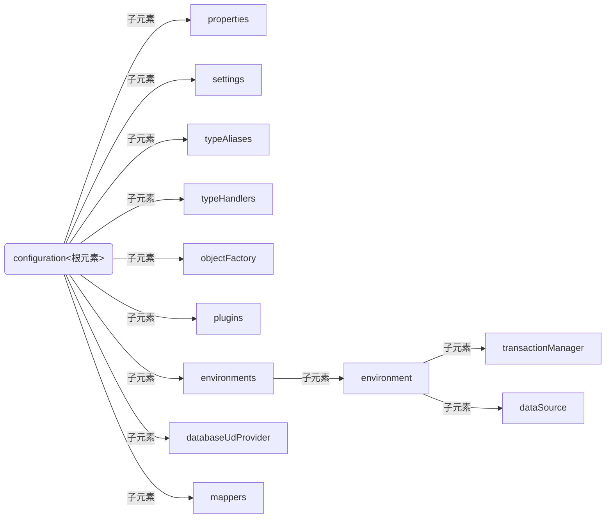
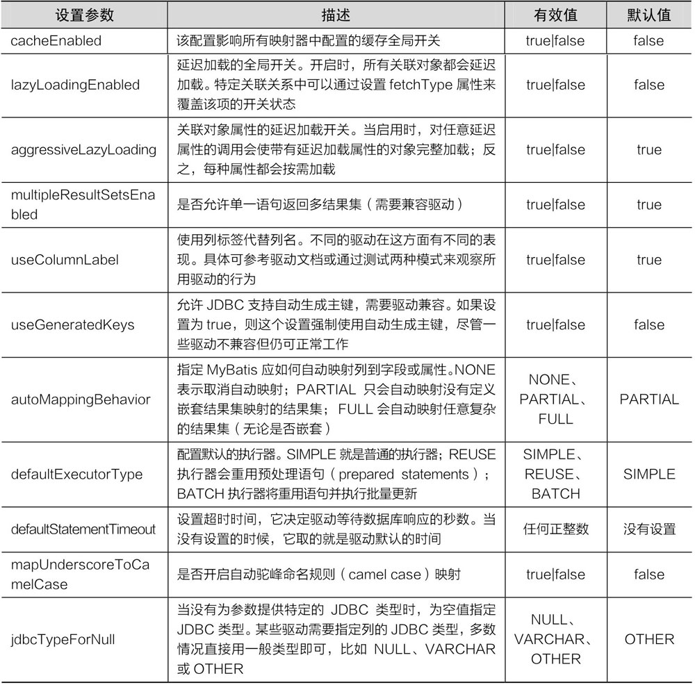
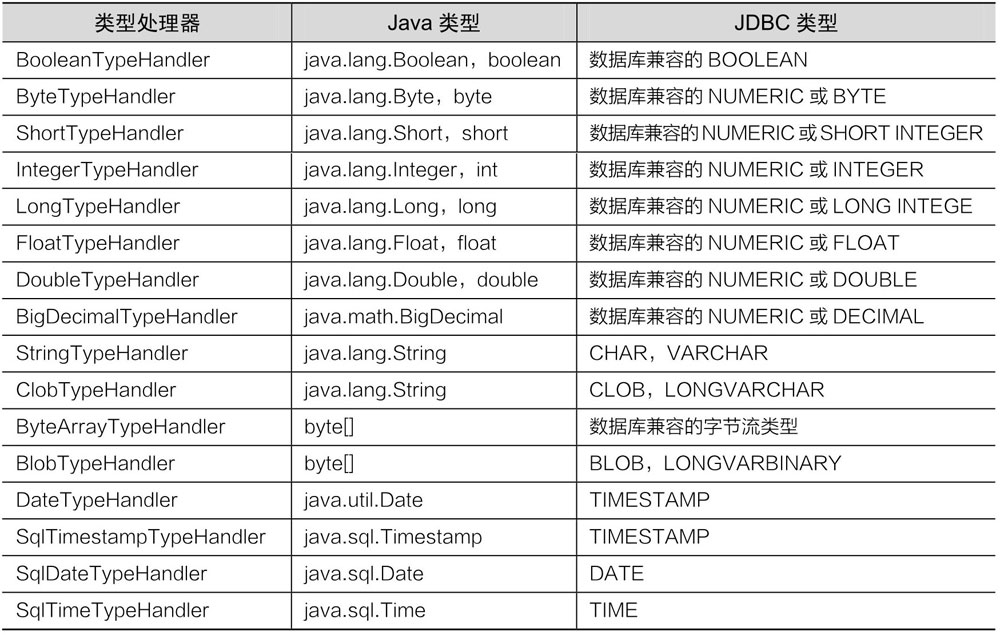
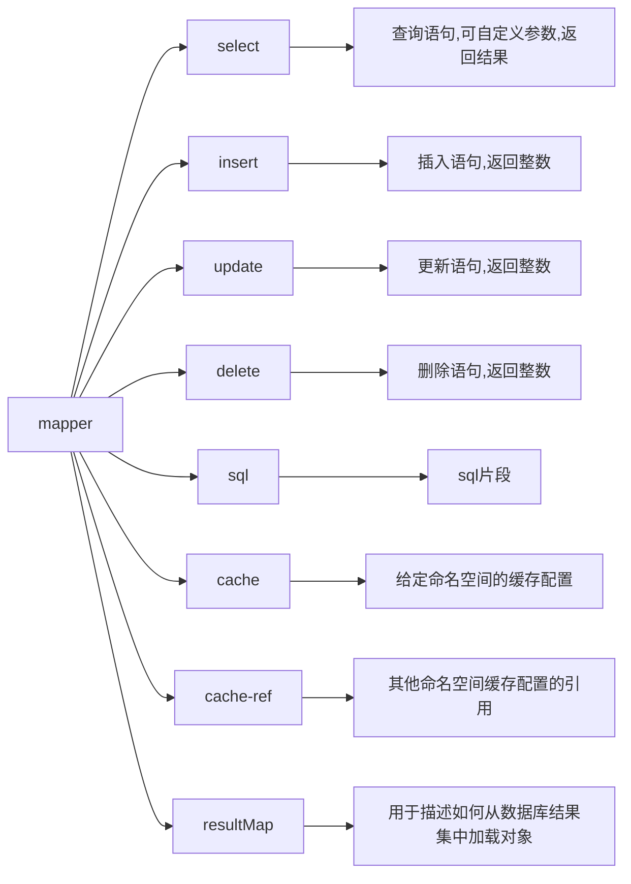

# 概述

MyBatis 框架，ORM（Object/Relational Mapping，即对象关系映射）框架。ORM 框架描述乐 Java 对象与数据库表之间的映射关系，可以自动将 Java 应用程序中的对象持久化到关系型数据库的表中。

PS：MyBatis 3.4x 版本，把它内部需要的三方 jar 都整合在一起了。

常见的 ORM 框架有：Hibernate、MyBatis、Spring JPA。

- Hibernate：全自动的 ORM 框架，无需编写 SQL 语句，不支持存储过程，开发效率高，但是不能通过优化 SQL 来提高性能。
- MyBatis 半自动化的 ORM 框架，需要写 SQL，支持存储过程。对可以通过优化 SQL 来提高性能，适合一些复杂的和需要优化性能的项目。

## 解决的问题

MyBatis 减少了样板代码，简化了持久层的开发。

## 基本原理


MyBatis 框架在操作数据库时，大体经过了 8 个步骤

- （1）读取 MyBatis 配置文件 mybatis-config.xml。mybatis-config.xml 是 MyBatis 的全局配置文件，配置了 MyBatis 的运行环境等信息，其中主要内容是获取数据库连接。
- （2）加载映射文件 Mapper.xml。Mapper.xml 文件是 SQL 映射文件，该文件中配置了操作数据库的 SQL 语句，需要在 mybatis-config.xml 中加载才能执行。mybatis-config.xml 可以加载多个配置文件，每个配置文件对应数据库中的一张表。
- （3）构建会话工厂。通过 MyBatis 的环境等配置信息构建会话工厂 SqlSessionFactory。
- （4）创建 SqlSession 对象。由会话工厂创建 SqlSession 对象，该对象中包含了执行 SQL 的所有方法。
- （5）MyBatis 底层定义了一个 Executor 接口来操作数据库，它会根据 SqlSession 传递的参数<span style="color:orange">动态生成需要执行的 SQL 语句</span>，同时负责查询缓存的维护。
- （6）在 Executor 接口的执行方法中，包含一个 MappedStatement 类型的参数，该参数是对映射信息的封装，用于存储要映射的 SQL 语句的 id、参数等。Mapper.xml 文件中一个 SQL 对应一个 MappedStatement 对象，SQL 的 id 即是 MappedStatement 的 id。
- （7）输入参数映射。在执行方法时，MappedStatement 对象会对用户执行 SQL 语句的输入参数进行定义（可以定义为 Map、List 类型、基本类型和 POJO 类型），Executor 执行器会通过 MappedStatement 对象在执行 SQL 前，将输入的 Java 对象映射到 SQL 语句中。这里对输入参数的映射过程就类似于 JDBC 编程中对 preparedStatement 对象设置参数的过程。
- （8）输出结果映射。在数据库中执行完 SQL 语句后，MappedStatement 对象会对 SQL 执行输出的结果进行定义（可以定义为 Map 和 List 类型、基本类型、POJO 类型）, Executor 执行器会通过 MappedStatement 对象在执行 SQL 语句后，将输出结果映射至 Java 对象中。这种将输出结果映射到 Java 对象的过程就类似于 JDBC 编程中对结果的解析处理过程。

## 快捷键基础

> win10 快捷键

- Alt + Tab 选择活动窗口

> IDEA 快捷键

- ctrl + Tab 切换窗口
- ctrl + E 最近编辑的窗口 
- Alt + 1 显示/隐藏侧边栏
- ctrl + F4 关闭当前窗口
- Alt + Insert 插入代码【如：生成 set/get 方法】
- Alt + Shift + R 重命名
- Ctrl + Shift + F10 运行代码
- Ctrl + W 关闭侧边栏

# 设计模式

相对路径 `src/java/main/文件名.xml`

读配置文件 ① 用类加载器，读类路径下的；② 用 `Servlet Context` 对象的 `getRealPath`

创建工程 `MyBatis` 用了构建者模式。告诉需求，根据需求创建我们想要的。

```java
build.build(in) // in 形式下创建的工厂，多了几个类，操作看起来麻烦了，但是组合更加灵活的。
```

生成 `SqlSession` 用了工厂模式

创建 `Dao` 接口实现类用了代理模式

在看 `MyBatis` 源码的时候，通过一些类的名称大概知道了 `MyBatis` 用到了什么技术。`MyBatis` 解析的时候应该用到了词法分析，分析字符串。在动态生成代理类的时候用到了字节码增强技术。

# 基础篇

## 表结构

- clazz 表
- users 表

```sql
create table mybatis.clazz
(
    id   int auto_increment primary key,
    name varchar(60) default 'one' null
);

create table mybatis.users
(
    id       int auto_increment primary key,
    name     varchar(60)      not null,
    sex      char default '1' null,
    clazz_id int  default 1   null -- 和 clazz 表的 id 对应，是逻辑外键关系
);
```

## 基本环境搭建

### 工程环境

Maven 工程使用 `MyBatis` 的时候，配置文件需要放在 `resrouces` 目录下，否则无法找到。

整合 Druid 的时候，需要的是数据源，需要我们手动 new 出 Druid 的数据源。

- 基本配置文件
- mapper 文件
- 日志文件

maven 的 pom 文件

```xml
<?xml version="1.0" encoding="UTF-8"?>
<project xmlns="http://maven.apache.org/POM/4.0.0"
         xmlns:xsi="http://www.w3.org/2001/XMLSchema-instance"
         xsi:schemaLocation="http://maven.apache.org/POM/4.0.0 http://maven.apache.org/xsd/maven-4.0.0.xsd">
    <modelVersion>4.0.0</modelVersion>

    <groupId>cn.payphone</groupId>
    <artifactId>LearnMyBatis</artifactId>
    <version>1.0-SNAPSHOT</version>

    <properties>
        <maven.compiler.source>11</maven.compiler.source>
        <maven.compiler.target>11</maven.compiler.target>
    </properties>

    <dependencies>
        <dependency>
            <groupId>org.mybatis</groupId>
            <artifactId>mybatis</artifactId>
            <version>3.5.6</version>
        </dependency>

        <dependency>
            <groupId>mysql</groupId>
            <artifactId>mysql-connector-java</artifactId>
            <version>8.0.21</version>
        </dependency>
        
        <dependency>
            <groupId>org.junit.jupiter</groupId>
            <artifactId>junit-jupiter-api</artifactId>
            <version>5.1.1</version>
            <scope>test</scope>
        </dependency>

        <dependency>
            <groupId>log4j</groupId>
            <artifactId>log4j</artifactId>
            <version>1.2.17</version>
        </dependency>
    </dependencies>

</project>
```

`SqlConfig` 配置文件

```xml
<?xml version="1.0" encoding="UTF-8"?>
<!DOCTYPE configuration
        PUBLIC "-//mybatis.org//DTD Config 3.0//EN"
        "http://mybatis.org/dtd/mybatis-3-config.dtd">
<configuration>
    <!--配置包别名【resultType】-->
    <typeAliases>
        <package name="com.bbxx.pojo"/>
    </typeAliases>
    <!-- 配置 mybatis 的环境 -->
    <environments default="mysql">
        <!-- 配置 mysql 的环境 -->
        <environment id="mysql">
            <!-- 配置事务的类型 -->
            <transactionManager type="JDBC"></transactionManager>
            <!-- 配置连接数据库的信息：用的是数据源(连接池) 如果用的是三方数据源，如阿里的druid-->
            <!-- <dataSource type="xx.xx.DruidPoolConfig">这个DruidPoolConfig是我们自己new出来的 -->
            <dataSource type="POOLED">
                <property name="driver" value="com.mysql.cj.jdbc.Driver"/>
                <property name="url" value="jdbc:mysql://localhost:3306/mybatis?serverTimezone=UTC"/>
                <property name="username" value="root"/>
                <property name="password" value="root"/>
            </dataSource>
        </environment>
    </environments>
    <!-- 告知 mybatis 映射配置的位置 -->
    <!-- com/bbxx/dao/UserDao.xml是mavenresouce目录下的哦！ -->
    <mappers>
        <mapper resource="com/bbxx/dao/UserDao.xml"/>
        <!-- 如果是用的注解SQL，则采用,因为注解方式不用Mapper文件！ -->
        <mapper class="com.bbxx.dao.IUserDao"/>
    </mappers>
</configuration>
```

mapper 文件示例

```xml
<?xml version="1.0" encoding="UTF-8" ?>
<!DOCTYPE mapper
        PUBLIC "-//mybatis.org//DTD Mapper 3.0//EN"
        "http://mybatis.org/dtd/mybatis-3-mapper.dtd">
<!-- namespace是接口的类全名 resultType是返回类型的类全民，可通过配置简写 -->
<mapper namespace="cn.mapper.UserMapper">
    <select id="selectAll" resultType="cn.pojo.User">
        select * from users
    </select>
</mapper>
```

执行 SQL 的代码

```java
public class HelloMyBatis {
    public static void main(String[] args) throws IOException {
        String resourcePath = "MyBatisConfig.xml";
        InputStream in = Resources.getResourceAsStream(resourcePath);
        // 创建 SqlSessionFactory 工厂
        SqlSessionFactory sqlSessionFactory = new SqlSessionFactoryBuilder().build(in);
        SqlSession sqlSession = sqlSessionFactory.openSession();
		
        // 根据唯一空间标识符，调用方法对应的 SQL 语句
        List<User> objects = sqlSession.selectList("cn.mapper.UserMapper.selectAll",User.class);
        // 如果方法名是唯一的，则可以省略前缀 cn.mapper.UserMapper
        List<User> selectAll = sqlSession.selectList("selectAll", User.class);

        selectAll.forEach(System.out::println);
        
        // 直接拿到UserMapper 接口对应的动态代理对象，然后调用方法
        UserMapper mapper = sqlSession.getMapper(UserMapper.class);
        List<User> users = mapper.selectAll();
        users.forEach(System.out::println);
    }
}

public class User {
    private int id;
    private String name;
    private String sex;
	//... some code
}

// mapper 
public interface UserMapper {
    List<User> selectAll();
}
```


### 集成Druid

集成 Druid 只需要在前面的基础上修改一点东西即可。

- 新建一个类，继承自 UnpooledDataSourceFactory 类（MyBatis 官方文档的示例）

```java
public class DataSourceDruid extends UnpooledDataSourceFactory {

    @Override
    public DataSource getDataSource() {
        DruidDataSource druidDataSource = new DruidDataSource();
        // Druid的配置信息。看的源码知道的，可以通过这种方式进行配置。
        druidDataSource.setUrl("jdbc:mysql://localhost:3306/mybatis?serverTimezone=UTC");
        druidDataSource.setUsername("root");
        druidDataSource.setPassword("root");
        druidDataSource.setDriverClassName("com.mysql.cj.jdbc.Driver");
        return druidDataSource;
    }
}
```

- SqlConfig 文件进行一小部分修改

```xml
<?xml version="1.0" encoding="UTF-8"?>
<!DOCTYPE configuration
        PUBLIC "-//mybatis.org//DTD Config 3.0//EN"
        "http://mybatis.org/dtd/mybatis-3-config.dtd">
<configuration>
    <typeAliases>
        <package name="com.bbxx.pojo"/>
    </typeAliases>
    <!-- 配置 mybatis 的环境 -->
    <environments default="mysql">
        <!-- 配置 mysql 的环境 -->
        <environment id="mysql">
            <!-- 配置事务的类型 -->
            <transactionManager type="JDBC"></transactionManager>
            <!-- 配置连接数据库的信息：用的是Druid数据源(连接池) 这个类是我们自己定义的，且重写了getDataSource方法！-->
            <dataSource type="com.bbxx.utils.DataSourceDruid">
                <property name="driver" value="com.mysql.cj.jdbc.Driver"/>
                <property name="url" value="jdbc:mysql://localhost:3306/mybatis?serverTimezone=UTC"/>
                <property name="username" value="root"/>
                <property name="password" value="root"/>
            </dataSource>
        </environment>
    </environments>
    <!-- 告知 mybatis 映射配置的位置 -->
    <mappers>
        <mapper resource="com/bbxx/dao/UserDao.xml"/>
    </mappers>
</configuration>
```

- pom 文件中添加

```xml
<dependency>
    <groupId>com.alibaba</groupId>
    <artifactId>druid</artifactId>
    <version>1.2.5</version>
</dependency>
```

### 日志相关

log4j 的日志放在 resources 下。

<b>`log4j`日志配置</b>

```properties
#log4j基本配置
log4j.rootLogger=DEBUG,console,file
#设置输出控制台信息
log4j.appender.console=org.apache.log4j.ConsoleAppender
log4j.appender.console.Target = System.out
log4j.appender.console.Threshold=DEBUG     #控制台只会打印INFO级别及以上的日志信息
log4j.appender.console.layout = org.apache.log4j.PatternLayout
log4j.appender.console.layout.ConversionPattern=%c-%m%n
#设置输出文件信息
log4j.appender.file = org.apache.log4j.RollingFileAppender
log4j.appender.file.File=log/mybatis.log     #日志文件路径，在应用下的log/mybatis.log文件中
log4j.appender.file.Append=true   #追加
log4j.appender.file.MaxFileSize=100mb    #达到100m后产生一个新文件
log4j.appender.file.Threshold=ERROR      #只会写ERROR级别及以上的日志信息
log4j.appender.file.layout=org.apache.log4j.PatternLayout     #布局器
log4j.appender.file.layout.ConversionPattern=%c-%m%n   #布局器格式
```

<b>`log4j`仅打印`SQL`语句</b>

```properties
# 全局日志配置
log4j.rootLogger=ERROR, stdout
# MyBatis 日志配置  com.bbxx.dao是包名。
log4j.logger.com.bbxx.dao=TRACE
# 控制台输出
log4j.appender.stdout=org.apache.log4j.ConsoleAppender
log4j.appender.stdout.layout=org.apache.log4j.PatternLayout
log4j.appender.stdout.layout.ConversionPattern=%5p [%t] - %m%n
```

### Mapper映射文件

<a href="https://mybatis.org/mybatis-3/zh/configuration.html#mappers">官方链接</a>

Mapper 映射文件放在 maven 工程 resource 下 com/daily/mapper 也是 resource 的子目录

> 1、用文件路径引入

```xml
<mappers>
    <mapper resource="com/daily/mapper/UserMapper.xml" />
    <mapper resource="com/daily/mapper/ProductMapper.xml" />
    <mapper resource="com/daily/mapper/BlogMapper.xml" />
</mappers>
```

> 2、用包名引入

这种引入方式相当于批量引入一个包下的所有映射器。此种方式要求 xml 和接口名称一致。

```xml
<mappers>
    <package name="com.daily.mapper"/>
</mappers>
```

> 3、用类注册引入

```xml
<mappers>
    <mapper class="com.daily.mapper.UserMapper" />
    <mapper class="com.daily.mapper.ProductMapper" />
    <mapper class="com.daily.mapper.BlogMapper" />
</mappers>
```

> 4、使用 URL 方式引入

```xml
<mappers>
    <mapper url="xml文件访问URL" />
</mappers>
```

maven 项目下，所有的非 `*.java` 文件都要放在 resources 目录下。resources 是项目的资源根目录！

如：src/main/java 目录下的包和类都是以 classes 为根目录进行发布。resources 下的资源也是以 classes 为根目录。


mybatis 多对多是由两个一对一组成的，如：user 一对多 role，role 一对多 user，这样 user 和 role 就是多对多关系了。 数据库的多对多需要一个中间表来描述两表的多对多关系。

<a href="https://github.com/csliujw/MyBatis-Study">项目地址</a>

## 简单的CURD

POJO 代码

```java
public class User {
    private int id;
    private String name;
    private String sex;

    public User(){}
    public User(String name,String sex){
        this.name = name;
        this.sex = sex;
    }
    // 省略 set get toString
}
```

Mapper 接口

```java
package cn.mapper;

import cn.pojo.User;

import java.util.List;

public interface UserMapper {
    List<User> selectAll();

    List<User> findByName(String name);

    boolean insert(User user);

    boolean update(User user);

    boolean deleteById(int id);

    long findTotal();
}
```

```xml
<?xml version="1.0" encoding="UTF-8" ?>
<!DOCTYPE mapper
        PUBLIC "-//mybatis.org//DTD Mapper 3.0//EN"
        "http://mybatis.org/dtd/mybatis-3-mapper.dtd">
<mapper namespace="cn.mapper.UserMapper">
	<!-- 如果配置了别名，那么 resultType 就不用写全名了 -->
    <select id="selectAll" resultType="cn.pojo.User">
        select * from users
    </select>

    <select id="findByName" resultType="cn.pojo.User">
        select * from users
        where name like concat("%", #{name}, "%")
    </select>

    <!--    拿到自增的主键 id-->
    <!--
            让MyBatis自动地将自增id赋值给传入地 User 对象的id属性。
            useGeneratedKeys="true";原生jdbc获取自增主键的方法：
            keyProperty="",将刚才自增的id封装给哪个属性。
 	-->
    <insert id="insert"  useGeneratedKeys="true" keyProperty="id">
        insert into users(name, sex)
        values (#{name}, #{sex} )
    </insert>

    <!-- parameterType默认可以不写！mybatis会自动判断的 -->
    <update id="update" parameterType="User">
        update users
        set name=#{name},
            sex=#{sex}
        where id = #{id}
    </update>

    <delete id="deleteById" parameterType="int">
        delete
        from users
        where id = #{value}
    </delete>

    <select id="findTotal" resultType="java.lang.Long">
        select count(*)
        from users
    </select>

</mapper>
```

测试代码

```java
public class CRUDTest {
    String resourcePath = "MyBatisConfig.xml";
    SqlSession sqlSession;
    UserMapper userDao;

    @BeforeEach
    public void init() throws IOException {
        InputStream in = Resources.getResourceAsStream(resourcePath);
        SqlSessionFactory sqlSessionFactory = new SqlSessionFactoryBuilder().build(in);
        sqlSession = sqlSessionFactory.openSession(true); // 設置自動提交事務
        userDao = sqlSession.getMapper(UserMapper.class);
    }

    @Test
    void selectAll() {
        List<User> users = userDao.selectAll();
        Assertions.assertNotEquals(users.size(), 0);
    }

    @Test
    void findByName() {
        List<User> byName = userDao.findByName("1");
        byName.forEach(System.out::println);
    }

    @Test
    void insert() {
        User cqq1 = new User("cqq", "0");
        boolean cqq = userDao.insert(cqq1);
        System.out.println(cqq1.getId());
        Assertions.assertTrue(cqq);
    }

    @Test
    void update() {
        User cqq1 = new User("cqq", "1");
        cqq1.setId(9);
        boolean cqq = userDao.update(cqq1);
        Assertions.assertTrue(cqq);
    }


    @Test
    void deleteById() {
        boolean b = userDao.deleteById(9);
        Assertions.assertTrue(b);
    }

    @Test
    void findTotal() {
        long total = userDao.findTotal();
        Assertions.assertNotEquals(total,0);
    }

}
```

## 核心配置

- 核心对象的作用
- 配置文件中各个元素的作用
- 映射文件中常用元素的作用

### 核心对象

在使用 MyBatis 框架时，主要涉及两个核心对象：SqlSessionFactory 和 SqlSession。

#### SqlSessionFactory

可以认为 SqlSessionFactory 与数据库一一对应，一个 SqlSessionFactory 对应一个数据库实例。它的主要作用是创建 SqlSession。

<span style="color:orange">SqlSessionFactory 的创建：SqlSessionFactoryBuilder 通过 xml 配置文件创建出一个具体的 SqlSessionFactory。</span>

```java
InputStream in = Resources.getResourceAsStream("配置文件路径");
SqlSessionFactory sf = new SqlSessionFactoryBuilder().build(in);
```

SqlSessionFactory 对象是线程安全的，它一旦被创建，在整个应用执行期间都会存在。如果我们多次地创建同一个数据库的SqlSessionFactory，那么此数据库的资源将很容易被耗尽。为了解决此问题，通常每一个数据库都会只对应一个 SqlSessionFactory，所以在构建 SqlSessionFactory 实例时，建议使用单列模式。

#### SqlSession

可以将 SqlSession 当作是一个 JDBC 连接，可以用来执行 SQL 语句，里面封装了一些常用的操作数据库的方法，如查询、修改、删除等操作。

> DefaultSqlSession

SqlSession 是 MyBatis 中的一个接口，它的子类 DefaultSqlSession 存在线程安全问题。而 SqlSessionManager 和 SqlSessionTemplate 是线程安全的。

> SqlSessionManager 和 SqlSessionTemplate

SqlSessionManager 和 SqlSessionTemplate  是怎么保证 SqlSession 线程安全的呢？避免多个线程并发使用同一个 DefaultSqlSession 实例即可。

SqlSessionManager 内部通过维护一个 ThreadLocal 变量，记录一个与当前线程绑定的 SqlSession。当通过 SqlSessionFactory 创建 SqlSession 时就从这个 ThreadLocal 里取。

```java
public class SqlSessionManager implements SqlSessionFactory, SqlSession {

  private final SqlSessionFactory sqlSessionFactory;
  private final SqlSession sqlSessionProxy;
  // ThreadLocal 用来记录一个与当前线程绑定的 SqlSession
  private final ThreadLocal<SqlSession> localSqlSession = new ThreadLocal<>();

  private SqlSessionManager(SqlSessionFactory sqlSessionFactory) {
    this.sqlSessionFactory = sqlSessionFactory;
    // 对 sqlSessionFactory 对象进行代理，所有的操作都是由代理对象完成
    this.sqlSessionProxy = (SqlSession) Proxy.newProxyInstance(
        SqlSessionFactory.class.getClassLoader(),
        new Class[]{SqlSession.class},
        new SqlSessionInterceptor()); // 仔细看下 SqlSessionInterceptor 中的方法可以发现，是从 localSqlSession 中获取 Session
  }

  @Override
  public SqlSession openSession(Connection connection) {
    return sqlSessionFactory.openSession(connection);
  }

  private class SqlSessionInterceptor implements InvocationHandler {
	// some code

    @Override
    public Object invoke(Object proxy, Method method, Object[] args) throws Throwable {
      final SqlSession sqlSession = SqlSessionManager.this.localSqlSession.get();
      if (sqlSession != null) {
        try {
          return method.invoke(sqlSession, args);
        } catch (Throwable t) {
          throw ExceptionUtil.unwrapThrowable(t);
        }
      } else {
        try (SqlSession autoSqlSession = openSession()) {
          try {
            final Object result = method.invoke(autoSqlSession, args);
            autoSqlSession.commit();
            return result;
          } catch (Throwable t) {
            autoSqlSession.rollback();
            throw ExceptionUtil.unwrapThrowable(t);
          }
        }
      }
    }
  }

}
```

SqlSessionTemplate  又是怎么保证线程安全的呢？和 SqlSessionManager 的做法类似。详细内容可参考这篇博客[Spring+MyBatis源码解析之SqlSessionTemplate_henry_2016的博客-CSDN博客](https://blog.csdn.net/qq_33996921/article/details/106301832?utm_medium=distribute.pc_relevant.none-task-blog-2~default~baidujs_title~default-0-106301832-blog-82746187.pc_relevant_priorsearch_v1&spm=1001.2101.3001.4242.1&utm_relevant_index=3)

```java
public SqlSessionTemplate(SqlSessionFactory sqlSessionFactory, ExecutorType executorType,
                          PersistenceExceptionTranslator exceptionTranslator) {

    notNull(sqlSessionFactory, "Property 'sqlSessionFactory' is required");
    notNull(executorType, "Property 'executorType' is required");

    this.sqlSessionFactory = sqlSessionFactory;
    this.executorType = executorType;
    this.exceptionTranslator = exceptionTranslator;
    // 对 SqlSessionFactory 进行代理。
    this.sqlSessionProxy = (SqlSession) newProxyInstance(SqlSessionFactory.class.getClassLoader(),
                                                         new Class[] { SqlSession.class }, new SqlSessionInterceptor());
}

private class SqlSessionInterceptor implements InvocationHandler {
    @Override
    public Object invoke(Object proxy, Method method, Object[] args) throws Throwable {
        // 保证每次请求都是生成一个新的 sqlSession。（如果 ThreadLocal 中有，会返回 ThreadLocal 中的）
        SqlSession sqlSession = getSqlSession(SqlSessionTemplate.this.sqlSessionFactory,
                                              SqlSessionTemplate.this.executorType, SqlSessionTemplate.this.exceptionTranslator);
        try {
            Object result = method.invoke(sqlSession, args);
			//...
            return result;
        } catch (Throwable t) {
		   //...
        } finally {
		   // ...
        }
    }
}

/*
SqlSessionUtils#getSqlSession
TransactionSynchronizationManager获取当前线程threadLocal是否有SqlSessionHolder，
如果有就从SqlSessionHolder取出当前SqlSession，
如果当前线程threadLocal没有SqlSessionHolder，就从sessionFactory中创建一个SqlSession，
最后注册会话到当前线程threadLocal中。
*/
public static SqlSession getSqlSession(SqlSessionFactory sessionFactory, ExecutorType executorType,
                                       PersistenceExceptionTranslator exceptionTranslator) {

    notNull(sessionFactory, NO_SQL_SESSION_FACTORY_SPECIFIED);
    notNull(executorType, NO_EXECUTOR_TYPE_SPECIFIED);

    SqlSessionHolder holder = (SqlSessionHolder) TransactionSynchronizationManager.getResource(sessionFactory);

    SqlSession session = sessionHolder(executorType, holder);
    if (session != null) {
        return session;
    }

    LOGGER.debug(() -> "Creating a new SqlSession");
    session = sessionFactory.openSession(executorType);

    registerSessionHolder(sessionFactory, executorType, exceptionTranslator, session);

    return session;
}
```

> SqlSessionManager 的获取

```java
InputStream in = Resources.getResourceAsStream(resourcePath);
SqlSessionFactory sqlSessionFactory = new SqlSessionFactoryBuilder().build(in);
SqlSessionManager sqlSessionManager = SqlSessionManager.newInstance(sqlSessionFactory);
```

SqlSessionTemplate 是 mybatis-spring 整合包中的。

#### SqlSession中的方法

SqlSession 对象中包含了很多方法，部分方法如下。

```java
public interface SqlSession extends Closeable {
    // statement 表示的是 <select> 元素的id
    // 使用该方法后，会返回执行 SQL 语句查询结果的一条泛型对象
    <T> T selectOne(String statement);
	
    // parameter 是查询所需的参数。
    <T> T selectOne(String statement, Object parameter);

    <E> List<E> selectList(String statement);

    <E> List<E> selectList(String statement, Object parameter);

    // 返回一个和 SqlSession 绑定的 Mapper 接口的代理对象。
    <T> T getMapper(Class<T> type);
}
```

### 配置文件

#### 主要元素



#### properties

\<properties\> 是一个配置属性的元素，该元素通常用于将内部的配置外在化，即通过外部的配置来动态地替换内部定义的属性。例如，数据库的连接等属性，就可以通过典型的 Java 属性文件中的配置来替换，具体方式如下。

```properties
# properties
jdbc.driver=com.mysql.jdbc.Driver
jdbc.url=jdbc:mysql://localhost:3306/xx
jdbc.username=root
jdbc.password=root
```

在 MyBatis 配置文件 mybatis-config.xml 中配置 \<properties... /\> 属性

```xml
<properties resource="db.properties" />
```

修改配置文件中数据库连接的信息，具体如下。

```xml
<dataSource type="POOLED">
	<property name="driver" value="${jdbc.driver}" />
	<property name="name" value="${jdbc.name}" />
	<property name="password" value="${jdbc.password}" />
	<property name="url" value="${jdbc.url}" />
</dataSource>
```

完成上述配置后，dataSource 中连接数据库的 4 个属性（driver、url、username 和 password）值将会由 db.properties 文件中对应的值来动态替换。这样就为配置提供了诸多灵活的选择。

#### settings

\<settings\> 元素主要用于改变 MyBatis 运行时的行为，例如开启二级缓存、开启延迟加载等。



#### typeAliases

\<typeAliases\> 元素用于为配置文件中的 Java 类型设置一个简短的别名。别名的设置与 XML 配置相关，可以避免写全类名。

```xml
<typeAliases>
    <!-- 为某个类配置别名 -->
	<typeAlias alias="user" type="xx.it.po.User"/>
</typeAliases>
```

使用自动扫描包来配置别名，这样会使用 Bean 的首字母小写的非限定类名来作为它的别名。如 xx.it.po.User 类对应的别名就是 user。如果类有注解的话，则别名为其注解的值。

```xml
<typeAliases>
    <!-- 使用自动扫描包来配置别名 -->
	<oackage  name="xx.it.po"/>
</typeAliases>
```

```java
@Alias(value="user")
public class User{}
```

#### typeHandler

typeHandler（类型处理器）将预处理语句中传入的参数从 javaType（Java 类型）转换为 jdbcType（JDBC 类型），或者从数据库取出结果时将 jdbcType 转换为 javaType。

MyBatis 提供的一些默认的类型处理器。如果需要定义类型处理器可以通过实现 TypeHandler 接口或者继承 BaseTypeHandle 类来定义



注册类型处理器

```xml
<typeHandlers>
    <!-- 注册一个包中所有的 typeHandler -->
	<package name="cn.it.type" />
</typeHandlers>
```

#### objectFactory

每次 MyBatis 创建<span style="color:orange">结果对象</span>的新实例时，它都会使用一个对象工厂（ObjectFactory）实例来完成实例化工作。 默认的对象工厂需要做的仅仅是实例化目标类，要么通过默认无参构造方法，要么通过存在的参数映射来调用带有参数的构造方法。 如果想覆盖对象工厂的默认行为，可以通过创建自己的对象工厂来实现。<span style="color:red">(了解即可)</span>

```java
// ExampleObjectFactory.java
public class ExampleObjectFactory extends DefaultObjectFactory {
  public Object create(Class type) {
    return super.create(type);
  }
  public Object create(Class type, List<Class> constructorArgTypes, List<Object> constructorArgs) {
    return super.create(type, constructorArgTypes, constructorArgs);
  }
  public void setProperties(Properties properties) {
    super.setProperties(properties);
  }
  public <T> boolean isCollection(Class<T> type) {
    return Collection.class.isAssignableFrom(type);
  }
}
```

```xml
<!-- mybatis-config.xml -->
<objectFactory type="org.mybatis.example.ExampleObjectFactory">
  <property name="someProperty" value="100"/>
</objectFactory>
```

#### plugins

MyBatis 允许在已映射语句执行过程中的某一点进行拦截调用，这种拦截调用是通过插件来实现的。\<plugins\> 元素的作用就是配置用户所开发的插件。

MyBatis 允许使用插件来拦截的方法调用有：

- Executor (update, query, flushStatements, commit, rollback, getTransaction, close, isClosed)
- ParameterHandler (getParameterObject, setParameters)
- ResultSetHandler (handleResultSets, handleOutputParameters)
- StatementHandler (prepare, parameterize, batch, update, query)

编写插件时，只需实现 Interceptor 接口，并指定想要拦截的方法签名即可。

```java
// ExamplePlugin.java
@Intercepts({@Signature(
    type= Executor.class,
    method = "update",
    args = {MappedStatement.class,Object.class})})
public class ExamplePlugin implements Interceptor {
    private Properties properties = new Properties();
    public Object intercept(Invocation invocation) throws Throwable {
        // implement pre processing if need
        Object returnObject = invocation.proceed();
        // implement post processing if need
        return returnObject;
    }
    public void setProperties(Properties properties) {
        this.properties = properties;
    }
}
```

```xml
<!-- mybatis-config.xml -->
<plugins>
    <plugin interceptor="org.mybatis.example.ExamplePlugin">
        <property name="someProperty" value="100"/>
    </plugin>
</plugins>
```

#### environments

可以通过 \<environments\> 元素配置多种数据源，即配置多种数据库。

```xml
<environments default="development">
    <environment id="development">
        <!-- 使用 JDBC 事务管理 -->
        <transactionManager type="JDBC" />
        <!-- 配置数据源 -->
        <dataSource type="POOLED">
            <property name="driver" value="${driver}"/>
            <property name="url" value="${url}"/>
            <property name="username" value="${username}"/>
            <property name="password" value="${password}"/>
        </dataSource>
    </environment>
</environments>
```

- transactionManager，元素用于配置事务管理，它的 type 属性用于指定事务管理的方式，即使用哪种事务管理器
    - JDBC：直接使用了 JDBC 的提交和回滚设置，它依赖于从数据源得到的连接来管理事务的作用域。
    - MANAGED：从来不提交或回滚一个连接，而是让容器来管理事务的整个生命周期。在默认情况下，它会关闭连接，但一些容器并不希望这样，为此可以将 closeConnection 属性设置为 false 来阻止它默认的关闭行为。
    - Spring + MyBatis 的组合无须配置 MyBatis 的事务管理器，会使用 Spring 自带的管理器来实现事务管理。
- dataSource 元素用于配置数据源，它的 type 属性用于指定使用哪种数据源，如果使用的是外部的数据源，type 属性的值就是 dataSource 的类全名。

#### mappers

mappers 元素用于指定 MyBatis 映射文件的位置

使用类路径引入

```xml
<mappers>
	<mapper resource="cn/xx/xx/A.xml" />
</mappers>
```

使用本地文件路径引入

```xml
<mappers>
	<mapper url="file:///D:/cn/xx/xx/A.xml" />
</mappers>
```

使用接口类引入

```xml
<mappers>
	<mapper class="cn.xx.xx.AMapper" />
</mappers>
```

使用包名引入

```xml
<mappers>
	<mapper name="cn.xx.xx.dao" />
</mappers>
```

### 映射文件



> 简单介绍下 resultMp。

resultMap 元素表示结果映射集，是 MyBatis 中最重要也是最强大的元素。它的主要作用是定义映射规则、级联的更新以及定义类型转化器等。

```xml
<!--resultMap的元素结构 -->
<resultMap type="" id="">
    <constructor>  <!-- 类在实例化时，用来注入结果到构造方法中-->
        <idArg/>   <!-- ID参数；标记结果作为ID-->
        <arg/>      <!-- 注入到构造方法的一个普通结果-->
    </constructor>
    <id/>           <!-- 用于表示哪个列是主键-->
    <result/>       <!-- 注入到字段或JavaBean属性的普通结果-->
    <association property="" />  <!-- 用于一对一关联 -->
    <collection property="" />   <!-- 用于一对多关联 -->
    <discriminator javaType="">  <!-- 使用结果值来决定使用哪个结果映射-->
        <case value="" />        <!-- 基于某些值的结果映射 -->
    </discriminator>
</resultMap>
```

- resultMap 元素的 type 属性表示需要映射的 POJO，id 属性是 resultMap 的唯一标识。
- 子元素 constructor 用于配置构造方法（当一个 POJO 中未定义无参的构造方法时，就可以使用 constructor 元素进行配置）。
- 子元素 id 用于表示哪个列是主键，而 result 用于表示 POJO 和数据表中普通列的映射关系。
- \<association\> 和 \<collection\> 用于处理多表时的关联关系，
- <discriminator\> 元素主要用于处理一个单独的数据库查询返回很多不同数据类型结果集的情况。

默认情况下，MyBatis 程序在运行时会自动地将查询到的数据与需要返回的对象的属性进行匹配赋值（<span style="color:orange">需要表中的列名与对象的属性名称完全一致</span>）。然而实际开发时，数据表中的列和需要返回的对象的属性可能不会完全一致，这种情况下 MyBatis 是不会自动赋值的。此时，就可以使用 \<resultMap\> 元素进行处理。

xml 示例文件

```xml
<mapper namespace="com.xx.mapper.UserMapper">
    <resultMap type="com.xx.po.User" id="resultMap">
        <id property="id" column="t_id"/>
        <result property="name" column="t_name"/>
        <result property="age" column="t_age"/>
    </resultMap>
    <select id="findAllUser" resultMap="resultMap">
        select * from t_user
    </select>
</mapper>
```

## 参数取值

### 基本用法

> #{} 和 ${}；#{} 等同于占位符 "?"，\${} 相当于字符串拼接

#{} 表示一个占位符号。通过 #{} 可以实现 preparedStatement 向占位符中设置值，自动进行 Java 类型和 jdbc 类型转换，

#{} 可以有效防止 sql 注入。#{} 可以接收简单类型值或  pojo 属性值。 如果 parameterType 传输单个简单类型值，#{} 括号中可以是 value 或其它名称。

\${} 表示拼接 sql 串。通过 \${} 可以将 parameterType 传入的内容拼接在 sql 中且不进行 jdbc 类型转换，\${} 可以接收简单类型值或 pojo 属性值，如果 parameterType 传输单个简单类型值，\${} 括号中只能是 value。

从源码上理解

```java
class A{
    @Override
    public String handleToken(String content) {
      Object parameter = context.getBindings().get("_parameter");
      if (parameter == null) {
        context.getBindings().put("value", null);
      } else if (SimpleTypeRegistry.isSimpleType(parameter.getClass())) {
        context.getBindings().put("value", parameter);
      }
      Object value = OgnlCache.getValue(content, context.getBindings());
      String srtValue = (value == null ? "" : String.valueOf(value)); // issue #274 return "" instead of "null"
      checkInjection(srtValue);
      return srtValue;
    }
}
```

读取的 key 的名字就是 ”value”，所以我们在绑定参数时就只能叫 value 的名字

> 只有一个形式参数时

```java
public User getOne(int id);
```

```xml
<select id="getOne" resultType="cn.pojo.User">
    select *
    from users
    where id = #{随便写什么}<!-- 随便写什么，最好见名知意 -->
</select>
```

> 有多个形参时：可以用注解取别名，方便拿对应的参数；也可以不取别名，按框架的规则进行取数据

```java
// 有多个形参
public User getTwo(String name, String sex);

// 有多个形参，直接用注解为它取别名
public User getTwoAnnotation(@Param("findName") String name, @Param("findSex") String sex);
```

```xml
<!--
     直接用 name，sex 作为 #{} 的话，会报错。
     Caused by: org.apache.ibatis.binding.BindingException:
     Parameter 'id' not found
     Available parameters are [arg0, arg1, param1, param2]
-->
<select id="getTwo" resultType="cn.pojo.User">
    select *
    from users
    where name = #{arg0} and sex=#{arg1}
    <!-- 或者是 #{param1}, #{param2} -->
</select>

<!-- 也可以用注解指定别名 -->
<select id="getTwoAnnotation" resultType="cn.pojo.User">
    select *
    from users
    where name = #{findName} and sex = #{findSex}
</select>
```

> 总结

- 要么写 #{arg0} #{arg1} 要么写 #{param1} #{param2}，具体的方式可能会随 MyBatis 版本的变化产生变动。
- 只有一个形参的话写什么都行 #{asf} #{haha} 都行
- 原因：只要传入了多个参数；MyBatis 会自动的将这些参数封装在一个 map 中；封装的时候使用的 key 就是参数的索引和参数的第几个表示

```java
Map<String,Object> map = new HashMap<>();
map.put("1","传入的值1");
map.put("2","传入的值2");
```

> 如果我们不想这样做，想指定 key，那么我们如何指定封装时使用的 key？

使用注解 `@Param` 指定 map 的 key 的值！具体看看源码。

```java
// 有多个形参，直接用注解为它取别名
public User getTwoAnnotation(@Param("findName") String name, @Param("findSex") String sex);
```

```xml
<select id="getTwoAnnotation" resultType="cn.pojo.User">
    select *
    from users
    where name = #{findName} and sex = #{findSex}
    <!-- name 和 findName 是一组映射关系，sex 和 findSex 又是一组映射关系 -->
</select>
```

### 用法小结

1）单个参数

- 基本类型：取值用 #{随便写}
- 传入 POJO：取值用 #{POJO 字段名称}，是使用 OGNL 表达式语言来实现的

2）多个参数：

- public Employee getXXX(Integer id, String name)，取值：#{参数名}是无效了
- 可以用：0，1（参数索引）或 param1,param2（第几个参数paramN）来取值，#{arg0},#{arg1} / #{param1},#{param2}
- 原因：只要传入了多个参数；MyBatis 会自动的将这些参数封装在一个 map 中；封装时使用的 key 就是参数的索引和参数的第几个表示

```java
Map<String,Object> map = new HashMap<>()
map.put("1","传入的值1");
map.put("2","传入的值2");
// #{1},就是取出 map 中 key=1 的 value
```

3）@Param,为参数指定 key；命名参数；推荐这种做法。我们可以使用 @Param 注解告诉 MyBatis，封装参数 map 的时候别乱来，使用我们指定的 key

4）传入了Map：将多个要使用的参数封装起来，取值 #{key}

5）扩展：多个参数；自动封装 map

```java
public XX method(@Param("id")Integer id, String empName,Employee employee);
Integer id ==> #{id}
String empName ==> #{param2}
Employee employee（取出它的email）==> #{param3.email}
```

无论传入什么参数都要能正确的取出值；

- #{key/属性名}
- id=#{id, JdbcType=INT}
    - javaType、jdbcType、mode、numericScale、resultMap、typeHandler
    - 只有jdbcType才可能需要被指定；
    - 默认不指定  jdbcType 的话：mysql 没问题；oracle 没问题；但是万一传入的数据是 null，mysql 插入 null 没问题；oracle 不知道 null 到底是什么类型！会出问题！

mybatis 的取值方式可分为两类：

- <span style="color:red">#{属性名}：是参数预编译的方式，参数的位置都是用？替代，参数后来都是预编译设置进去的，安全，不会有 sql 注入问题。</span>
- ${属性名}：不是参数预编译，而是直接和 sql 语句进行拼串，不安全
    - eg：id=1 or 1 = 1 and empname=
    - 传入一个1 or 1=1 or

### 源码分析

MapperMethod 类

```java
public Object execute(SqlSession sqlSession, Object[] args) {
    Object result;
    switch (command.getType()) {
        case INSERT: {
            Object param = method.convertArgsToSqlCommandParam(args);
            result = rowCountResult(sqlSession.insert(command.getName(), param));
            break;
        }
        case UPDATE: {
            Object param = method.convertArgsToSqlCommandParam(args);
            result = rowCountResult(sqlSession.update(command.getName(), param));
            break;
        }
        case DELETE: {
            Object param = method.convertArgsToSqlCommandParam(args);
            result = rowCountResult(sqlSession.delete(command.getName(), param));
            break;
        }
        case SELECT:
            if (method.returnsVoid() && method.hasResultHandler()) {
                executeWithResultHandler(sqlSession, args);
                result = null;
            } else if (method.returnsMany()) {
                result = executeForMany(sqlSession, args);
            } else if (method.returnsMap()) {
                result = executeForMap(sqlSession, args);
            } else if (method.returnsCursor()) {
                result = executeForCursor(sqlSession, args);
            } else {
                // 单条结果的查询方法 走这里。
                // converArgsToSqlCommandParam 做 sql 语句的参数映射
                // 将 args 中的内容封装为一个 map。
                // 跟进 converXX 方法进去看一下。
                Object param = method.convertArgsToSqlCommandParam(args);
                result = sqlSession.selectOne(command.getName(), param);
                if (method.returnsOptional()
                    && (result == null || !method.getReturnType().equals(result.getClass()))) {
                    result = Optional.ofNullable(result);
                }
            }
            break;
        case FLUSH:
            result = sqlSession.flushStatements();
            break;
        default:
            throw new BindingException("Unknown execution method for: " + command.getName());
    }
    if (result == null && method.getReturnType().isPrimitive() && !method.returnsVoid()) {
        throw new BindingException("Mapper method '" + command.getName()
                                   + " attempted to return null from a method with a primitive return type (" + method.getReturnType() + ").");
    }
    return result;
}
```

继续看 method.convertArgsToSqlCommandParam(args);【MapperMethod 类中】

```java
public Object convertArgsToSqlCommandParam(Object[] args) {
    return paramNameResolver.getNamedParams(args);
}
```

点进去，进入了 ParamNameResolver 类

```java
public Object getNamedParams(Object[] args) {
    // names存放的是key-value
    //			  key的取值是0，1，2的取值
    //			  value如果没有用注解的话，就是0，1，2的取值，如果用了注解，就是注解中的值。
    final int paramCount = names.size();
    if (args == null || paramCount == 0) {
        return null;
    } else if (!hasParamAnnotation && paramCount == 1) { // 只有一个参数且没有加注解，则直接返回这个参数的值。
        return args[names.firstKey()];
    } else {
        final Map<String, Object> param = new ParamMap<Object>();
        int i = 0;
        for (Map.Entry<Integer, String> entry : names.entrySet()) {
            // 封装成 map，names 中的内容是 args0, args1
            param.put(entry.getValue(), args[entry.getKey()]);
            // add generic param names (param1, param2, ...)
            // GENERIC_NAME_PREFIX = "param";
            final String genericParamName = GENERIC_NAME_PREFIX + String.valueOf(i + 1);
            // 再尝试将 param1 作为 key，args[x] 作为 value 存入 map
            // ensure not to overwrite parameter named with @Param
            if (!names.containsValue(genericParamName)) {
                param.put(genericParamName, args[entry.getKey()]);
            }
            i++;
        }
        return param;
    }
}
```

# 中级篇

## 返回值为map

> 常规情况

```java
public Map<String, Object> getByIdReturnMap(int id);
// key是列名，value是字段对应的值。
id	name	email
1	a		afsdf
2	b		afsf
// 此处 id 就是列名，1，2 就是 value
// 这个如果查询出的是多条数据，value 应该会是一个集合。
```

```xml
<!-- pamramater一般可以不写。 -->
<select id="getByIdReturnMap" resultType="java.util.Map">
    select *
    from users
    where id = #{id}
</select>
```

> POJO 情况

```java
// key	 就是这个记录的主键
// value 就是这条记录封装好的对象
// 把查询记录的id的值作为key封装这个map（注解@MapKey）
@MapKey("id")
public Map<String, User> getAllUser();
```

```xml
<!-- 查询多个返回一个map，查询多个情况下，集合里面写元素类型 不过 IDEA 中安装的 MyBatis 插件居然会报错，说返回值类型不正确 -->
<select id="getAllUser" resultType="User">
    select * from users
</select>
```

## 自定义结果集

当 JavaBean 中的字段名和数据库表中的列名并非完全一致，且驼峰规则无效时，可以使用自定义 ResultType，将数据库中的字段和 JavaBean 中的进行一一对应。

type：指定为哪个 JavaBean 自定义封装规则；全类名。

id：唯一标识符，让别名在后面引用

```xml
<resultMap type="com.xx.xx.Cat" id="mycat">
    <!--
        column="id"：指定哪一列是主键列（数据库中的字段名）
        property=""：指定cat的哪个属性封装id这一列数据（JavaBean 中的字段名）
	-->
    <!-- 主键列 -->
	<id property="pojoid" column="id">
    <!-- 普通列 -->
    <result property="" column=""></result>
</resultMap>
    
<!-- resultMap="mycat"：查出数据封装结果的时候，使用mycat自定义的规则。-->
<select id="getAllCat" resultMap="mycat">
	select * from cat where id=#{id} 
</select>
```

## 按需加载

```xml
<settings>
    <!-- 开启延迟加载开关 -->
	<setting name="lazyLoadingEnable" value="true"></setting>
    <!-- 开启属性按需加载 -->
    <setting name="aggressiveLazyLoading" value="true"></setting>
</settings>

<!-- Mapper xml文件中按需加载的写法 -->
<!-- fetchType	可选的。有效值为 lazy 和 eager。 指定属性后，将在映射中忽略全局配置参数 lazyLoadingEnabled，使用属性的值 -->
<association xx fetchType="eager"></association>
```

## 动态SQL

动态 SQL 是 MyBatis 的强大特性之一，MyBatis 3 采用 OGNL 表达式来实现的动态 SQL。

| 元素                        | 说明                                                         |
| --------------------------- | ------------------------------------------------------------ |
| <if>                        | 判断语句，用于单条件分支判断                                 |
| <choose>(<when><otherwise>) | 相当于 Java 中得 switch...case...default 语句，<br>用于多分支判断 |
| <where>、<trim>、<set>      | 辅助元素，处理 SQL 拼接和特殊字符问题                        |
| <foreach>                   | 循环语句，常用于 in 语句等列举条件中                         |
| <bind>                      | 从 OGBL 表达式中创建一个变量，将其绑定到上下文，<br/>常用于模糊查询得 sql 中。 |

### 标签学习

> if 标签

用于实现某些简单的条件选择。

```xml
<select id="xxx" resultType='User'>
	select * from t_user where 1=1
    <if test="name!=null and name!=''">
    	and name like concat('%d',#{name},'%')
    </if>
    <if test="jobs!=null and jobs!=''">
    	and jobs=#{jobs}
    </if>
</select>
```

>\<choose\> (\<when\> \<otherwise\>)

有时候，我们不想使用所有的条件，而只是想从多个条件中选择一个使用。针对这种情况，MyBatis 提供了 choose 元素，它有点像 Java 中的 switch 语句。

举例：查询条件为，传入了 “title” 就按 “title” 查找，传入了 “author” 就按 “author” 查找的情形。若两者都没有传入，就返回标记为 featured 的 BLOG

```xml
<select id="findActiveBlogLike" resultType="Blog">
    SELECT * FROM BLOG WHERE state = ‘ACTIVE’
    <choose>
        <when test="title != null">
            AND title like #{title}
        </when>
        <when test="author != null and author.name != null">
            AND author_name like #{author.name}
        </when>
        <otherwise>
            AND featured = 1
        </otherwise>
    </choose>
</select>
```

> where 标签

where 标签可以帮我们去除掉前面的 and

```xml
<select id="findActiveBlogLike" resultType="Blog">
    SELECT * FROM BLOG
    <where>
        <if test="state != null">
            state = #{state}
        </if>
        <if test="title != null">
            AND title like #{title}
        </if>
        <if test="author != null and author.name != null">
            AND author_name like #{author.name}
        </if>
    </where>
</select>
```

> trim 标签

```xml
<!--
	prefix=""	前缀：为我们下面的sql整体添加一个前缀
	prefixOverrides	取出整体字符串前面多余的字符
	suffix	为整体添加一个后缀
	suffixOverrides	后面哪个多了可以去掉
-->
<trim prefix="where" prefixOverrides="and">
	<if test="id!=null">
    	id > #{id} and
    </if>
    <!--
		有些字符是xml的标记，所以需要转义
	-->
    <if test="name != null &amp;&amp; !name.equals(&quot;&quot;)">
    	teacherName like #{name} and
    </if>
    <if test="birth != null">
    	birth_date &lt; #{birth} and
    </if>
</trim>
```

> foreach

foreach 元素的功能非常强大，它允许你指定一个集合，声明可以在元素体内使用的集合项（item）和索引（index）变量。它也允许你指定开头与结尾的字符串以及集合项迭代之间的分隔符。这个元素也不会错误地添加多余的分隔符！

<b>提示：</b>我们可以将任何可迭代对象（如 List、Set 等）、Map 对象或者数组对象作为集合参数传递给 foreach。

- <span style="color:orange">当使用可迭代对象或者数组时，index 是当前迭代的序号，item 的值是本次迭代获取到的元素。</span>
- <span style="color:orange">当使用 Map 对象（或者 Map.Entry 对象的集合）时，index 是键，item 是值。</span>
- collection：配置的 list 是传递过来的参数类型（首字母小写），可以是一个 array、list（或 collection）、Map 集合的键、POJO 包装类中数组或集合类型的属性名等
- open 和 close：配置的是以什么符号将这些集合元素包装起来。
- separator：配置的是各个元素的间隔符。

```xml
select xxxxx where id in
<!--
	collection	指定要遍历的集合的key
	close		以什么结束
	open		以什么开始
	index		索引
		如果遍历的是一个list，index指定的变量保存了当前索引
		如果遍历的是一个map，index 指定的变量就是保存了当前遍历元素的key
	item		变量名
	separator	每次遍历元素的分隔符
	(#{id_item},#{id_item},#{id_item})
	这里collection可以用ids 是因为 用了@Param("ids")为key重新命名了。没有这个的话，List类型默认用的key是list
-->
<foreach collection="ids" item="id_item" index="id_index" separator="," open="(" close=")">
    #{id_item}
</foreach>
```

> 抽取 sql 片段

```xml
<sql id="selectSql">
	select xxx sfaf
</sql>
<select id="xx" xx>
	<include refid="selectSql"></include>
    where id=#{id}
</select>

<!-- 传递参数 -->
<sql id="userColumns"> ${alias}.id,${alias}.username,${alias}.password </sql>
<select id="selectUsers" resultType="map">
    select
    <include refid="userColumns"><property name="alias" value="t1"/></include>,
    <include refid="userColumns"><property name="alias" value="t2"/></include>
    from some_table t1
    cross join some_table t2
</select>
```

### 完整示例

#### Java代码

```java
public interface IUserDao {

    // 删除 -- 测试事务
    Integer delete(Integer id);

    // 查询所有 -- 查看事务是否成功提交
    List<UserVO> findAll();

    // 条件查询 -- 动态 SQL 之 if
    List<UserVO> findCondition(UserVO vo);

    // 条件查询 -- 动态 SQL 之 where
    List<UserVO> findCondition2(UserVO vo);

    // 新增 -- 动态SQL 之 set
    boolean update(UserVO vo);

    // 循环新增 -- 动态 SQL 之 foreach
    Long insertBatch(List<UserVO> vos);

    // 循环删除 -- 动态 SQL之 foreach 数组
    Long deleteBatch(Integer[] ids);

    // 循环删除 -- 动态 SQL 之 foreach 集合
    Long deleteBatch(List<Integer> lists);
}
```

#### xml文件

```xml
<?xml version="1.0" encoding="UTF-8"?>
<!DOCTYPE mapper
        PUBLIC "-//mybatis.org//DTD Mapper 3.0//EN"
        "http://mybatis.org/dtd/mybatis-3-mapper.dtd">
<mapper namespace="com.bbxx.dao.IUserDao">
    <!-- 配置查询所有操作 -->
    <select id="findAll" resultType="UserVO">
        select *
        from users
    </select>

    <!--动态SQL if-->
    <select id="findCondition" resultType="UserVO">
        select * from users where 1 = 1
        <if test="id!=null">
            and id=#{id}
        </if>
        <if test="username!=null">
            and username like concat("%",#{username},"%")
        </if>
        <if test="birthday!=null">
            and birthday=#{birthday}
        </if>
    </select>
    
    <!--动态SQL where 去除前面多余的and-->
    <select id="findCondition2" resultType="UserVO">
        select * from users
        <where>
            <if test="id!=null">
                and id=#{id}
            </if>
            <if test="username!=null">
                and username like concat("%",#{username},"%")
            </if>
            <if test="birthday!=null">
                and birthday=#{birthday}
            </if>
        </where>
    </select>
    
    <!--测试事务-->
    <delete id="delete">
        delete
        from users
        where id = #{value}
    </delete>

    <!--动态SQL测试set 去除后面多余的逗号-->
    <update id="update" parameterType="UserVO">
        update users
        <set>
            <if test="username!=null">username=#{username},</if>
            <if test="birthday!=null">,birthday=#{birthday}</if>
        </set>
        where id=#{id}
    </update>

    <!-- 循环新增 ==> 动态SQL 之 foreach 使用ArrayList集合，collection中写的是参数的类型！这里是list集合 -->
    <insert id="insertBatch" parameterType="UserVO">
        insert into users(username,birthday,address)
        values
        <foreach collection="list" item="data" separator=",">
            (#{data.username},#{data.birthday},#{data.address})
        </foreach>
    </insert>

    <!--
    循环删除 ==> 动态SQL 之 动态SQL之 foreach 数组
    Map的话，查文档得知 index是key item是value
    -->
    <insert id="deleteBatch">
        delete from users where id in
        <foreach collection="array" item="data" open="(" separator="," close=")">
            #{data}
        </foreach>
    </insert>
</mapper>
```

#### 单元测试代码

```java
public class Demo {
    InputStream in = null;
    SqlSessionFactoryBuilder builder = null;
    SqlSessionFactory factory = null;
    SqlSession sqlSession = null;
    IUserDao mapper = null;

    @Before
    public void init() throws IOException {
        in = Resources.getResourceAsStream("SqlConfig.xml");
        builder = new SqlSessionFactoryBuilder();
        factory = builder.build(in);
        sqlSession = factory.openSession();
        mapper = sqlSession.getMapper(IUserDao.class);
    }

    @Test
    public void findAll() {
        List<UserVO> all = mapper.findAll();
    }

    // 测试事务
    @Test
    public void affairs() {
        sqlSession.commit(false);
        Integer delete = mapper.delete(5);
        System.out.println(delete);
        sqlSession.commit();// 提交事务后数据才会真的删除。 // 对比数据库中的信息查看即可。
    }

    // 测试动态SQL ==> if
    @Test
    public void testIf() {
        // 查出四条数据
        List<UserVO> condition = mapper.findCondition(new UserVO(null, null, null));
        // 查出三条数据
        List<UserVO> o = mapper.findCondition(new UserVO(null, "o", null));
    }

    // 测试where，会去掉前面多余的and
    @Test
    public void testWhere() {
        // 查出四条数据
        List<UserVO> condition = mapper.findCondition2(new UserVO(null, null, null));
        // 查出三条数据
        List<UserVO> o = mapper.findCondition2(new UserVO(null, "o", null));
    }

    // 测试set，会去掉末尾多余的 逗号(,)
    @Test
    public void testSet() {
        boolean kkx = mapper.update(new UserVO(2, "kkx", null));
        sqlSession.commit();
    }

    // 批量新增
    @Test
    public void testForeach1() {
        ArrayList<UserVO> userVOS = new ArrayList<>();
        userVOS.add(new UserVO(null, "001", "1988-11-11"));
        userVOS.add(new UserVO(null, "002", "1988-02-01"));
        userVOS.add(new UserVO(null, "003", "1999-11-11"));
        userVOS.add(new UserVO(null, "004", "1995-02-21"));
        Long aLong = mapper.insertBatch(userVOS);
        System.out.println(aLong);
        sqlSession.commit();
        findAll();
    }

    // 循环删除
    @Test
    public void testForeach2() {
        Integer[] ids = {10, 11, 12, 13};
        Long aLong = mapper.deleteBatch(ids);
        System.out.println(aLong);
        sqlSession.commit();
    }

    @After
    public void destroy() throws IOException {
        sqlSession.close();
        in.close();
    }
}
```

## 关联查询

关联查询是 MyBatis 针对多表操作提供的关联映射，通过关联映射就可以很好地处理对象与对象之间的关联关系。

在关系型数据库中，多表之间存在着三种关联关系，分别为一对一、一对多和多对多。

- 一对一：在任意一方引入对方主键作为外键。
- 一对多：在“多”的一方，添加“一”的一方的主键作为外键。
- 多对多：产生中间关系表，引入两张表的主键作为外键，两个主键成为联合主键或使用新的字段作为主键。

```java
class A{
    B b; // 一对一关系
}

class A{
    List<B> b;// 一对多关系
}

// 多对多关系
class A{
    List<B> b;
}
class B{
    List<A> a;
}
```

### 一对一查询

resultMap 元素中，包含了一个 association 子元素，通过该元素可以处理一对一关联关系的。

<b>association</b>：只是表示对象

```sql
# 准备数据库表信息
USE mybatis;
# 创建一个名称为tb_idcard的表
CREATE TABLE  tb_idcard(
                           id INT PRIMARY KEY AUTO_INCREMENT,
                           CODE VARCHAR(18)
);
# 插入两条数据
INSERT INTO tb_idcard(CODE) VALUES('152221198711020624');
INSERT INTO tb_idcard(CODE) VALUES('152201199008150317');
# 创建一个名称为tb_person的表
CREATE TABLE  tb_person(
                           id INT PRIMARY KEY AUTO_INCREMENT,
                           name VARCHAR(32),
                           age INT,
                           sex VARCHAR(8),
                           card_id INT UNIQUE,
                           FOREIGN KEY(card_id) REFERENCES tb_idcard(id)
);
# 插入两条数据
INSERT INTO tb_person(name, age, sex, card_id) VALUES('Rose',29, '女',1);
INSERT INTO tb_person(name, age, sex, card_id) VALUES('tom',27, '男',2);
```

POJO 代码

```java
public class IdCard {
    private Integer id;
    private String code;
	// some code
}

public class Person {
    private Integer id;
    private String name;
    private Integer age;
    private String sex;
    private IdCard card;
	// some code
}
```

Mapper 代码

```java
import cn.pojo.IdCard;

public interface IdCardMapper {
    IdCard findCardById(int id);
}

import cn.pojo.Person;

public interface PersonMapper {
    Person findPersonById(int id);
}
```

xml 文件

```xml
<mapper namespace="cn.mapper.IdCardMapper">

    <select id="findCardById" resultType="cn.pojo.IdCard">
        select *
        from mybatis.tb_idcard
        where id = #{id}
    </select>
</mapper>


<mapper namespace="cn.mapper.PersonMapper">
    <select id="findPersonById" resultMap="findPersonByIdResult">
        select *
        from mybatis.tb_person
        where id = #{id}
    </select>

    <resultMap id="findPersonByIdResult" type="Person">
        <id column="id" property="id"/>
        <result column="name" property="name"/>
        <result column="age" property="age"/>
        <result column="sex" property="sex"/>
        <association property="card" column="card_id" javaType="IdCard" select="cn.mapper.IdCardMapper.findCardById"/>
    </resultMap>
</mapper>
```

测试代码

```java
package quickstart;

public class TestAssociation {
    String resourcePath = "MyBatisConfig.xml";
    SqlSession sqlSession;
    PersonMapper dao;

    @BeforeEach
    public void init() throws IOException {
        InputStream in = Resources.getResourceAsStream(resourcePath);
        SqlSessionFactory sqlSessionFactory = new SqlSessionFactoryBuilder().build(in);
        sqlSession = sqlSessionFactory.openSession(true); // 設置自動提交事務
        dao = sqlSession.getMapper(PersonMapper.class);
    }

    @Test
    public void f1() {
        Person personById = dao.findPersonById(1);
        System.out.println(personById);
    }
}
```

使用嵌套查询的方式比较简单，但是 MyBatis 嵌套查询的方式要执行多条 SQL 语句，这对于大型数据集合和列表展示不是很好，因为这样可能会导致成百上千条关联的 SQL 语句被执行，从而极大地消耗数据库性能并且会降低查询效率。这并不是开发人员所期望的。为此，我们可以使用 MyBatis 提供的嵌套结果方式，来进行关联查询。

```xml
<select id="findPersonById2" resultMap="findPersonByIdResult2">
    select p.*, idcard.code
    from mybatis.tb_person as p,
    mybatis.tb_idcard as idcard
    where p.card_id = idcard.id
    and p.id = #{id}
</select>
<resultMap id="findPersonByIdResult2" type="Person">
    <id column="id" property="id"/>
    <result column="name" property="name"/>
    <result column="age" property="age"/>
    <result column="sex" property="sex"/>
    <association property="card" column="card_id" javaType="IdCard">
        <id property="id" column="card_id"/>
        <result property="code" column="code"/>
    </association>
</resultMap>
```

### 一对多查询

<b>collection</b>

collection：定义集合元素的封装

property：指定哪个属性是集合属性

javaType：指定对象类型

ofType：指定集合里面元素的类型

```xml
<!-- 这个property应该是用注解标记了，使用keys作为property -->
<collection property="keys" ofType="com.xx.Key">
	<id></id>
    <result></result>
</collection>
```

一对多查询案例

```java
public class Clazz {
    int id;
    String name;
    List<User> student;
}

public class User {
    private int id;
    private String name;
    private String sex;
    private String classId;
    private Clazz clazz;
}
// 省略setter getter
public interface AssociationQuery {

    public Clazz queryClazzById(int clazzId);
}

```

xml 文件

```xml
<?xml version="1.0" encoding="UTF-8" ?>
<!DOCTYPE mapper
        PUBLIC "-//mybatis.org//DTD Mapper 3.0//EN"
        "http://mybatis.org/dtd/mybatis-3-mapper.dtd">
<mapper namespace="cn.mapper.AssociationQuery">
	<!-- resultMap 的 key 和 value 一定要一一对应！-->
    <select id="queryClazzById" resultType="cn.pojo.Clazz" resultMap="queryClazzByIdMap">
        select c.id as c_id, c.name as c_name, u.id, u.name, u.clazz_id, u.sex
        from clazz as c, users as u
        where u.clazz_id = #{clazzId} and c.id = #{clazzId};
    </select>

    <resultMap id="queryClazzByIdMap" type="clazz">
        <id property="id" column="c_id"/>
        <result property="name" column="c_name"/>
        <collection property="student" ofType="User">
            <id property="id" column="id"/>
            <result property="name" column="name"/>
            <result property="classId" column="clazz_id"/>
            <result property="sex" column="sex"/>
        </collection>
    </resultMap>
</mapper>
```

测试代码

```java
public class AssociationQueryTest {
    String resourcePath = "MyBatisConfig.xml";
    SqlSession sqlSession;
    AssociationQuery dao;

    @BeforeEach
    public void init() throws IOException {
        InputStream in = Resources.getResourceAsStream(resourcePath);
        SqlSessionFactory sqlSessionFactory = new SqlSessionFactoryBuilder().build(in);
        sqlSession = sqlSessionFactory.openSession(true); // 設置自動提交事務
        dao = sqlSession.getMapper(AssociationQuery.class);
    }

    @Test
    public void t1() {
        Clazz clazz = dao.queryClazzById(1);
        System.out.println(clazz);
    }
}
```

JavaType 和 OfType：`JavaType `和 `ofType` 都是用来指定对象类型的，但是 `JavaType` 是用来指定 `pojo` 中属性的类型，而 `ofType` 指定的是映射到 list 集合属性中 `pojo` 的类型。

### 分步查询

```xml
<select id="getXX" resultMap="mykey02">
	select * from key where id=#{id}
</select>
<!--
	告诉 mybatis 自己去调用一个查询
	select：指定一个查询sql的唯一标识；mybatis自动调用指定的sql将查询出的lock封装起来
			public Lock getLockByIdSimple(Integer id); 需要传入锁子id
	column：指定将哪一列的数据传递过去。
			getLockByIdSimple(Integer id)不是需要一个查询条件 id吗，column就是把指定列的数据传递过去。
-->
<resultMap type="com.xx.key" id="mykey02">
    <id></id>
    <result></result>
    <association property="lock" select="getLockByIdSimple" column="lockid"></association>
</resultMap>
```

分布查询，两个查询都会执行，即便没有用到第二个查询的数据。这样严重浪费了数据库的性能。我们可以采用按需加载，需要的时候再去查询：全局开启按需加载策略！

## 缓存机制

暂时存储一些数据；加快系统的查询速度

MyBatis 缓存机制：Map；能保存查询出的一些数据；

- 一级缓存：线程级别的缓存；本地缓存；SqlSession 级别的缓存，当调用 `SqlSession` 的修改，添加，删除，`commit()，close()`等方法时，就会清空一级缓存。
- 二级缓存：全局范围的缓存；除过当前线程；SqlSession 能用外其他也可以用。二级缓存是 `mapper` 映射级别的缓存，多个 `SqlSession` 去操作同一个 `Mapper` 映射的 `sql` 语句，多个 `SqlSession` 可以共用二级缓存，二级缓存是跨 `SqlSession` 的

### 一级缓存失效

一级缓存是 `SqlSession` 级别的缓存，只要 `SqlSession` 没有 flush 或 close，它就存在！

```xml
<mapper namespace="com.itheima.dao.IUserDao">
    <!-- 根据 id 查询 -->
    <select id="findById" resultType="UsEr" parameterType="int" useCache="true">
        select * from user where id = #{uid}
    </select>
</mapper>
```

请自行编码验证！

看下 MyBatis 缓存部分的源码就知道，这个缓存机制真的很弱鸡。

一级缓存是 SqlSession 级别的缓存

1）不同的 sqlSession，使用不同的一级缓存

​	只有在同一个 sqlSession 期间查询到的数据会保存在这个 sqlSession 的缓存中。

​	下次使用这个 sqlSession 查询会从缓存中拿

2）同一个方法，不同的参数，由于可能之前没查询过，所以还有发新的 sql；

3）在这个 sqlSession 期间执行任何一次增删改操作，增删改都会把缓存清空。（不管你改的是不是我的数据，我都清空）

4）手动清空缓存 openSession.clearCache()

MyBatis 缓存是在 Cache 类 - org.apache.ibatis.cache - PerpetualCache变量中

```java
public class PerpetualCache implements Cache {

  private final String id;
	
  // 所谓的缓存其实就是一个Map
  private Map<Object, Object> cache = new HashMap<Object, Object>();

  // some method
}
```

### 二级缓存失效

全局作用域缓存

二级缓存默认不开启，需要手动配置

MyBatis 提供二级缓存的接口及其实现，缓存实现要求 POJO 实现 Serializable 接口

## 深入理解

`MyBatis` 可自己写 `Dao` 实现类也可不写实现类。推荐不写实现类。不写实现类采用的是基于代理的 CRUD 操作。

`MyBatis` 用到了 `OGNL` 表达式

- `Object Graphic Navigation Language`
  	对象	图	导航	   语言
- 它是通过对象的取值方法来获取数据。在写法上把 get 给省略了。
- 比如：我们获取用户的名称
  - 类中的写法：`user.getUsername();`
  - `OGNL` 表达式写法：`user.username`
  - `mybatis `中为什么能直接写 `username`，而不用 user. 呢？因为在 `parameterType` 中已经提供了属性所属的类，所以此时不需要写对象名

## 连接池及事务控制

### 连接池介绍

相当于实现分配好很多数据库连接在容器中，需要用时从容器中拿连接，不需要用时把连接归还到容器中，可避免频繁的打开关闭，节约资源（打开关闭连接很消耗资源）。

优点：减少获取连接所消耗的时间

缺点：初始化连接时速度慢

### 连接池

<b>提供三种方式</b>

- 配置的位置，主配置文件（我命名为`SqlConfig.xml`）中的 `dataSource` 标签，type 表示采用何种连接。
- type 取值
  - POOLED： 采用传统的 `javax.sql.DataSource` 规范中的连接池，`mybatis` 中有针对规范的实现。我们可以用其他连接池替代，如 `Druid`，`type="我们的druid"`，因为 `druid` 是遵循规范的，所以把类全名加上就行了。
  - `UNPOOLED`：采用传统的获取连接的方式，虽然也实现 `Javax.sql.DataSource`接口，但是并没有使用池化的思想。
  - `JNDI`：采用服务器提供的 `JNDI` 技术实现，来获取 `DataSource` 对象，不同的服务器所能拿到 `DataSource` 是不一样。注意：如果不是 web 或者 `maven` 的 `war` 工程，是不能使用的。使用 `tomcat` 服务器的话，采用连接池就是 `dbcp` 连接池。

### 事务

事务的四大特性 ACID

不考虑隔离性会产生的3个问题

解决办法：四种隔离级别

它是通过 `sqlsession` 对象的 commit 方法和 rollback 方法实现事务的提交和回滚

## 多表操作

如果 POJO 字段的名称和数据库的名称不对应则采用

```xml
<resultMap type="类型 如xx类" id="标识符">
	<id column="数据库字段名" property="代码中的字段名"></id> // 主键
    <result column="数据库字段名" property="代码中的字段名"></result> // 普通字段
</resultMap>
```

如果是一对一采用

```xml
<resultMap type="类型 如xx类" id="标识符">
	<id column="数据库字段名" property="代码中的字段名"></id> // 主键
    <result column="数据库字段名" property="代码中的字段名"></result> // 普通字段
    <association property="代码字段名" javaType="POJO属性的类型">
        <id column="数据库字段名" property="代码中的字段名"></id> 
    	<result column="数据库字段名" property="代码中的字段名"></result>
    </association>
</resultMap>
```

如果是一对多采用

```xml
<resultMap type="类型 如xx类" id="标识符">
	<id column="数据库字段名" property="代码中的字段名"></id> // 主键
    <result column="数据库字段名" property="代码中的字段名"></result> // 普通字段
    <collection property="代码字段名" ofType="指定的是映射到list集合属性中pojo的类型。">
        <id column="数据库字段名" property="代码中的字段名"></id> 
    	<result column="数据库字段名" property="代码中的字段名"></result>
    </collection>
</resultMap>
```


## 延迟加载

### 一对一的延迟加载

举例：用户和账户之间是 一个用户对应多个账户。一个账户对应一个用户。所以账户和用户是一对一的关系。

我们对用户信息进行懒加载。

- `proerty` 是 `Java `字段的名称
- `javaType` 是查询出来的数据类型
- select 是要调用的查询方法，通过这个查询方法把懒数据查询出来
- column 是查询的条件，即 where xx = column 的值。这个 column 取自 `resultMap`。

```xml
<association property="user" javaType="User" select="com.bbxx.dao.lazy.IUserDao.findOne" column="uid"></association>
```

<b>具体代码</b>

```java
public interface IAccountDao {
    // 懒加载案例，只查账号不查用户信息 一对一
    List<Account> findAll();
}

public interface IUserDao {
    // User是一对一查询 懒加载中的那个懒数据
    User findOne(Integer id);
}
```

```xml
<mapper namespace="com.bbxx.dao.lazy.IAccountDao">
	<resultMap id="accountMap" type="Account">
        <id column="id" property="id"/>
        <result column="uid" property="uid"/>
        <result column="money" property="money"/>
        <association property="user" javaType="User" select="com.bbxx.dao.lazy.IUserDao.findOne" column="uid">
        </association>
    </resultMap>

    <select id="findAll" resultMap="accountMap">
        select *
        from account
    </select>
</mapper>

<mapper namespace="com.bbxx.dao.lazy.IUserDao">
    <resultMap id="userMap" type="User">
        <id column="id" property="id"/>
        <result column="username" property="username"/>
        <result column="address" property="address"/>
        <result column="sex" property="sex"/>
        <result column="birthday" property="birthday"/>
    </resultMap>

    <select id="findOne" resultMap="userMap">
        select * from user where id = #{uid}
    </select>
</mapper>
```

### 一对多延迟加载

用户和账户是一对多查询。我们对“多”进行懒加载，要用时在查询

对多的查询采用

- `proerty` 是数据对应的 `Java` 字段的名称
- `ofType` 是查询出来集合中存储的数据类型
- `select` 是要调用的查询方法，通过这个查询方法把懒数据查询出来
- `column` 是查询的条件，即 `where xx = column` 的值。这个 `column` 取自 `resultMap`

```xml
<collection property="accounts" ofType="Account" select="com.bbxx.dao.lazy.IAccountDao.findById" column="id">
</collection>
```
<b>具体代码</b>

```java
public interface IUserDao {
    // 懒加载 一对多查询 查询每个用户的所有账户信息
    List<User> findAll();
}

public interface IAccountDao {
	// 懒加载  对“多”的懒加载
    List<Account> findById(Integer id);
}
```

IUserDao 的 mapper 文件

```xml
<mapper namespace="com.bbxx.dao.lazy.IUserDao">
    <resultMap id="userMap" type="User">
        <id column="id" property="id"/>
        <result column="username" property="username"/>
        <result column="address" property="address"/>
        <result column="sex" property="sex"/>
        <result column="birthday" property="birthday"/>
        <collection property="accounts" ofType="Account" select="com.bbxx.dao.lazy.IAccountDao.findById" column="id">

        </collection>
    </resultMap>

    <select id="findAll" resultMap="userMap">
        select * from user
    </select>
</mapper>

IAccountDao的mapper文件
<mapper namespace="com.bbxx.dao.lazy.IAccountDao">
<!--  一对一的查询  -->
    <resultMap id="accountMap" type="Account">
        <id column="id" property="id"/>
        <result column="uid" property="uid"/>
        <result column="money" property="money"/>
    </resultMap>

    <select id="findById" resultMap="accountMap">
        select * from account where uid = #{id}
    </select>
</mapper>
```

# 高级篇

## MyBatis生成Mapper

测试语句 `select * from users where id=4`

方法代码 `List<UserVO> findByCondition(UserVO vo);`

MapperRegister 类的 getMapper 方法

```java
public <T> T getMapper(Class<T> type, SqlSession sqlSession) {
    // 从hashmap中看是否有此类型的，有就可以创建，无就抛出异常。
    final MapperProxyFactory<T> mapperProxyFactory = (MapperProxyFactory<T>) knownMappers.get(type);
    if (mapperProxyFactory == null) {
        throw new BindingException("Type " + type + " is not known to the MapperRegistry.");
    }
    try {
        // 通过sqlSession创建代理对象
        return mapperProxyFactory.newInstance(sqlSession);
    } catch (Exception e) {
        throw new BindingException("Error getting mapper instance. Cause: " + e, e);
    }
}
```

继续看 `mapperProxyFactory.newInstance(sqlSession);` 位于 MapperProxyFactory 类中

```java
public T newInstance(SqlSession sqlSession) {
    final MapperProxy<T> mapperProxy = new MapperProxy<T>(sqlSession, mapperInterface, methodCache);
    return newInstance(mapperProxy);
}
```

点进 `new MapperProxy<T>(sqlSession, mapperInterface, methodCache)` 一看

```java
public class MapperProxy<T> implements InvocationHandler, Serializable {

  private static final long serialVersionUID = -6424540398559729838L;
  private final SqlSession sqlSession;
  private final Class<T> mapperInterface;
  private final Map<Method, MapperMethod> methodCache;

  public MapperProxy(SqlSession sqlSession, Class<T> mapperInterface, Map<Method, MapperMethod> methodCache) {
    this.sqlSession = sqlSession;
    this.mapperInterface = mapperInterface;
    this.methodCache = methodCache;
  }
    // 当我们执行代理对象.method的时候会执行到这个方法
    public Object invoke(Object proxy, Method method, Object[] args) throws Throwable {
        try {
            if (Object.class.equals(method.getDeclaringClass())) {
                return method.invoke(this, args);
            } else if (isDefaultMethod(method)) {
                return invokeDefaultMethod(proxy, method, args);
            }
        } catch (Throwable t) {
            throw ExceptionUtil.unwrapThrowable(t);
        }
        // 查看缓存有没有，没有就添加，再从缓存中拿数据。
        final MapperMethod mapperMethod = cachedMapperMethod(method);
        // 这里 执行的sql语句。
        return mapperMethod.execute(sqlSession, args);
    }
  // ...
}
```

点击 mapperMethod.excute 方法一看。(MapperMethod 方法中的)

```java
public Object execute(SqlSession sqlSession, Object[] args) {
    Object result;
    switch (command.getType()) {
        case INSERT: {
            Object param = method.convertArgsToSqlCommandParam(args);
            result = rowCountResult(sqlSession.insert(command.getName(), param));
            break;
        }
        case UPDATE: {
            Object param = method.convertArgsToSqlCommandParam(args);
            result = rowCountResult(sqlSession.update(command.getName(), param));
            break;
        }
        case DELETE: {
            Object param = method.convertArgsToSqlCommandParam(args);
            result = rowCountResult(sqlSession.delete(command.getName(), param));
            break;
        }
        case SELECT:
            // 方法返回值，结果集处理器。结果可能是单条记录或多条记录。
            if (method.returnsVoid() && method.hasResultHandler()) {
                executeWithResultHandler(sqlSession, args);
                result = null;
            // 判断多条记录是 根据返回值来的？当前sql之能查询到一条数据，
            // returnsMany=True，应该是按返回值的类型来的。
            } else if (method.returnsMany()) {
                // 执行此方法
                result = executeForMany(sqlSession, args);
            } else if (method.returnsMap()) {
                result = executeForMap(sqlSession, args);
            } else if (method.returnsCursor()) {
                result = executeForCursor(sqlSession, args);
            } else {
                Object param = method.convertArgsToSqlCommandParam(args);
                result = sqlSession.selectOne(command.getName(), param);
            }
            break;
        case FLUSH:
            result = sqlSession.flushStatements();
            break;
        default:
            throw new BindingException("Unknown execution method for: " + command.getName());
    }
    if (result == null && method.getReturnType().isPrimitive() && !method.returnsVoid()) {
        throw new BindingException("Mapper method '" + command.getName() 
                                   + " attempted to return null from a method with a primitive return type (" + method.getReturnType() + ").");
    }
    return result;
}
```

看 `executeForMany` 方法

```java
private <E> Object executeForMany(SqlSession sqlSession, Object[] args) {
    List<E> result;
    Object param = method.convertArgsToSqlCommandParam(args);
    if (method.hasRowBounds()) {
        RowBounds rowBounds = method.extractRowBounds(args);
        result = sqlSession.<E>selectList(command.getName(), param, rowBounds);
    } else {
        result = sqlSession.<E>selectList(command.getName(), param);
    }
    // issue #510 Collections & arrays support
    if (!method.getReturnType().isAssignableFrom(result.getClass())) {
        if (method.getReturnType().isArray()) {
            return convertToArray(result);
        } else {
            return convertToDeclaredCollection(sqlSession.getConfiguration(), result);
        }
    }
    return result;
}
```

点进 `selectList` 方法

```java
public <E> List<E> selectList(String statement, Object parameter, RowBounds rowBounds) {
    try {
        // 这段看不懂，没事
        MappedStatement ms = configuration.getMappedStatement(statement);
        // 这个是关键
        return executor.query(ms, wrapCollection(parameter), rowBounds, Executor.NO_RESULT_HANDLER);
    } catch (Exception e) {
        throw ExceptionFactory.wrapException("Error querying database.  Cause: " + e, e);
    } finally {
        ErrorContext.instance().reset();
    }
}
```

点进 `query` 方法

```java
public <E> List<E> query(MappedStatement ms, Object parameterObject, RowBounds rowBounds, ResultHandler resultHandler) throws SQLException {
    // 获得解析后的SQL语句
    BoundSql boundSql = ms.getBoundSql(parameterObject);
    CacheKey key = createCacheKey(ms, parameterObject, rowBounds, boundSql);
    return query(ms, parameterObject, rowBounds, resultHandler, key, boundSql);
}
```