# 一、概述

不太适合入门用~我看到雷丰阳的SpringMVC视频，17年的。但是我用的是JavaConfig风格的配置。没用视频中的xml配置。

# 二、基本原理

## 2.1 运行流程

 * 1）客户端点击链接发送 xxx/ 请求
 * 2）来到tomcat服务器
 * 3）SpringMVC的前端控制器收到所有请求
 * 4）来看请求地址和@RequestMapping标注的那个匹配，来找到到底使用那个类的那个方法来处理请求。
 * 5）前端控制器找到了目标处理器类和目标方法，直接利用 返回执行目标方法
 * 6）方法执行完成后会有一个返回值，SpringMVC认为这个返回值就是要去的页面地址
 * 7）拿到方法返回值后；用视图解析器进行拼串得到完整的页面地址
 * 8）拿到页面地址值，前端控制器帮我们转发到页面。

## 2.2 RequestMapping基本概念

- @RequestMapping注解：
     - 告诉spring mvc这个方法用来处理什么请求。。
     - 这个/是可以省略的，即使省略了，也是默认从当前项目开始。
     - 加上/比较好

## 2.3 前端控制器的拦截规则

### 2.3.1 tomcat的拦截规则

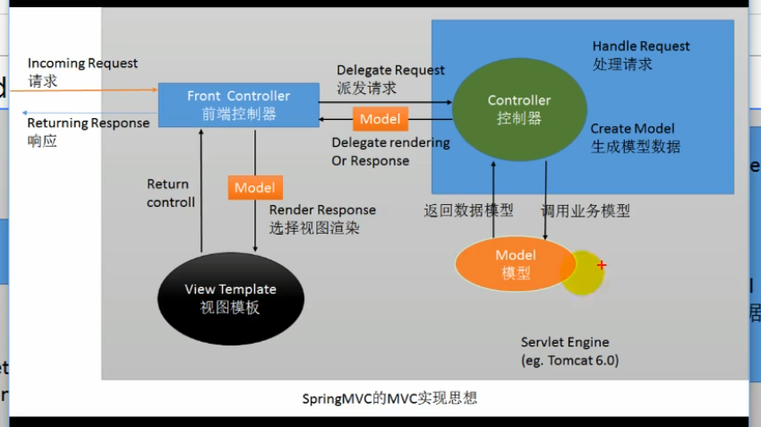

在使用tomcat的基本api进行开发时，资源的拦截规则，默认用的是tomcat中web.xml中的配置。

```xml
<!-- The mapping for the default servlet -->
<!-- 这里是静态资源的拦截。tomcat的DefaultServlet拦截发现是静态资源后，就回去找对应的静态资源并返回 -->
<servlet-mapping>
    <servlet-name>default</servlet-name>
    <url-pattern>/</url-pattern>
</servlet-mapping>

<!-- 这里是jsp的拦截，找到对应的jsp后就放回 -->
<servlet-mapping>
    <servlet-name>jsp</servlet-name>
    <url-pattern>*.jsp</url-pattern>
    <url-pattern>*.jspx</url-pattern>
</servlet-mapping>
```

### 2.3.2 前端控制器的拦截规则

前端控制器的拦截规则相当于继承自tomcat的那个web.xml的配置，并重写了拦截方式。相关内容SpringMVC文档中有说明。

[官方文档的说明](https://docs.spring.io/spring-framework/docs/current/reference/html/web.html#mvc)

 *  <span style="color:green">**DefaultServlet是tomcat处理静态资源的**</span>
     *  除jsp和servlet，其他的都是静态资源；index.html也是静态资源；如果静态资源让tomcat来处理的话，tomcat就会在服务器下找到这个资源并返回。
     *  所以DefaultServlet有效的情况下，index.html才有用
 *  <span style="color:green">**tomcat有配置拦截规则，前端控制器也有，前端控制器相当于子类，重写了拦截规则！**</span>
     *  相当于前端控制器的 / 把tomcat的DefaultServlet禁用掉了。请求的资源被前端控制器拦截了！
     *  请求来到前端控制器，前端控制器看那个方法的RequestMapping的路径是这个。最后发现没有那个方法的RequestMapping路径是index.html；没有！所有无法访问！找资源的方式都错了！！静态资源访问就无效了！！
 *  <span style="color:green">**为什么jsp又能访问？**</span>
     *  因为我们没有覆盖tomcat服务器中的JspServlet的配置，即Jsp的请求不由前端控制器处理，由tomcat自己处理。
     *  如果我们把拦截方式改成 `/*`那么*.Jsp的请求也会经过前端控制器，也有从RequestMapping中找对应的方法，
 *  <span style="color:green">**配置说明**</span>
     *  / 相当于把tomcat中的大web.xml的DefaultServlet重写了（静态资源拦截那个）
     *  /* 直接是拦截所有请求。所以我们写  / ,写 / 也是为了迎合rest风格的url地址
     *  springmvc是先经过前端控制器的，看有没有配对的，没有就报错。

# 三、常用注解

## 3.1 常用注解归纳

- @Controller
- @RequestMapping
- @PathVarible
- @SessionAttribute
- @ModelAttribute

## 3.2 @RequestMapping

> <span style="color:green">**@RequestMapping的使用**</span>

Spring MVC使用@RequestMapping注解为控制器指定可以处理那些url请求。

 * 在控制器的类定义及方法定义处都可标准
    * 类定义处：提供初步的请求映射信息。相对于WEB应用的根目录
    * 方法处：提供进一步的细分映射信息。相当于类定义处的URL。
    * 举例 WEB根路径为 localhost:8080/SpringMVC/
       * 类定义处路径为 /user
       * 方法定义处路径为  /add
       * 则该方法的访问路径为  localhost:8080/SpringMVC/user/add
    * DispatcherServlet 截断请求后，就通过控制器上@RequestMapping提供的映射信息确定请求所对应的处理方法。
 * 映射
    * 请求参数
    * 请求方法
    * 请求头

> <span style="color:green">**@RequestMapping--method**</span>

**指定那些请求方式是有效的。默认是所有请求都有效！**

```java
public enum RequestMethod {
	GET, HEAD, POST, PUT, PATCH, DELETE, OPTIONS, TRACE
}
```

**示例代码**

```java
@RestController
@RequestMapping("/method")
public class RequestMappingController {

    @RequestMapping(path = {"/get"}, method = RequestMethod.GET)
    public String t1() {
        return "GET Method";
    }

    // 方法类型对不上会报错 405 方法不对应！
    @RequestMapping(path = {"/post"}, method = RequestMethod.POST)
    public String t2() {
        return "POST Method";
    }

    @RequestMapping(path = {"/get&post"}, method = {RequestMethod.POST, RequestMethod.GET})
    public String t3(Model model, HttpServletRequest request) {
        String method = request.getMethod();
        return "support GET and POST; current  method is " + method;
    }

    @RequestMapping(path = {"/all"}, method = {RequestMethod.POST, RequestMethod.GET})
    public String t4(HttpServletRequest request) {
        String method = request.getMethod();
        return method;
    }
}
```

----

> <span style="color:green">**@RequestMapping--params**</span>

**用于设置请求要带什么参数过来、不能带什么参数过来、参数的值可以是什么、参数的值不能是什么。**

- params={"username"} 参数中必须要有username！！
- params={"!username"} 参数中不能有username！！
- params={"username!=123"} 参数的值不能为123！！
- params={"username=va"} 参数的值必须为va！！
- params={"user","pwd"} 要有user和pwd两个参数！！
- **<span style="color:red">不能用</span>{"age>19"}这种比较大小的写法！！！！**

示例代码

```java
package cn.payphone.controller;

import org.springframework.ui.Model;
import org.springframework.web.bind.annotation.RequestMapping;
import org.springframework.web.bind.annotation.RestController;

@RestController
@RequestMapping("/params")
public class RequestMappingParamsController {

    // 必须携带username这个参数
    // get请求，路径为 http://localhost:8080/SpringMVC01_war_exploded/params/need1?username
    @RequestMapping(path = "/need1", params = {"username"})
    public String t1() {
        return "username is ok";
    }

    // 不能带username这个参数
    @RequestMapping(path = "/need2", params = {"!username"})
    public String t2() {
        return "Not username params";
    }

    // 不能带username这个参数
    @RequestMapping(path = "/need3", params = {"username!=123"})
    public String t3() {
        return "username can't equals 123";
    }

    // username要为3 注意是一个 ”=“ 具体用法不记得就看源码注释！
    @RequestMapping(path = "/need4", params = {"username=123"})
    public String t4() {
        return "username equals 123";
    }
}
```

----

> <span style="color:green">**@RequestMapping--headers**</span>

**规定请求头**，也可以写简单的表达式

请求头中的任意字段都可规定！

```java
@RestController
public class RequestMappingHeaderController {

    /**
     * User-Agent: Mozilla/5.0 (Windows NT 10.0; Win64; x64; rv:84.0) Gecko/20100101 Firefox/84.0
     * User-Agent: Mozilla/5.0 (Windows NT 10.0; Win64; x64) AppleWebKit/537.36 (KHTML, like Gecko) Chrome/88.0.4324.96 Safari/537.36 Edg/88.0.705.53
     * @return
     */
    // 这样就只有火狐浏览器可以访问了
    @RequestMapping(path = {"/header1"}, headers = {"User-Agent=Mozilla/5.0 (Windows NT 10.0; Win64; x64; rv:84.0) Gecko/20100101 Firefox/84.0"})
    public String t1() {
        return "firefox is ok";
    }
}
```

----

> <span style="color:green">**@RequestMapping 中的 consumes和produces**</span>

- consumes：只接受内容类型是哪种的请求，规定请求头中的Content-Type
- produces：告诉浏览器返回的内容类型是说明，给响应头中加上Content-Type
    - text/html;charset=utf-8

----

## 3.2 ant风格的URL

**URL地址可以写模糊的通配符**

 * `？` 能替代任意一个字符
 * `*`能替代任意多个字符，和一层路径
 * `**` 能替代多层路径

```java
package cn.payphone.controller;

import org.springframework.web.bind.annotation.RequestMapping;
import org.springframework.web.bind.annotation.RestController;

/**
 * 模糊匹配功能
 * URL地址可以写模糊的通配符
 * ？ 能替代任意一个字符
 * * 能替代任意多个字符，和一层路径
 * ** 能替代多层路径
 */
@RestController
@RequestMapping("/ant")
public class AntController {

    @RequestMapping("/antTest01")
    public String antTest1() {
        return "antTest01";
    }

    // antTest01 antTest02 antTest03 都是走这个方法
    // antTest011就不行了，antTest0?中的问号只能匹配一个字符
    // 有精确的肯定优先匹配精确的
    @RequestMapping("/antTest0?")
    public String antTest2() {
        return "antTest?";
    }

    // 先匹配精确一点的antTest0? 在匹配模糊一点的antTest0*
    @RequestMapping("/antTest0*")
    public String antTest3() {
        return "antTest0*";
    }

    // * 匹配一层路径
    @RequestMapping("/a/*/antTest01")
    public String antTest4() {
        return "一层路径";
    }

    // ** 匹配多层路径
    @RequestMapping("/a/**/antTest01")
    public String antTest5() {
        return "两层路径";
    }
}
```

----

## 3.3 @PathVariable

**获取请求路径占位符中的值**

- @PathVariable 获取请求路径中占位符的值
- 占位符的名称和方法中的参数名称一致，就不用在注解里设置占位符的名称
- 占位符的名称和方法中的参数名称不一致，就要在注解里设置占位符的名称

```java
package cn.payphone.controller;

import org.springframework.web.bind.annotation.PathVariable;
import org.springframework.web.bind.annotation.RequestMapping;
import org.springframework.web.bind.annotation.RestController;

@RestController
public class PathVariableController {

    // {id}是占位符
    @RequestMapping("/user/{id}")
    // @PathVariable 获取请求路径中占位符的值
    public String pathVariableTest(@PathVariable("id") String id) {
        return id;
    }

    // 占位符的名称和方法中的参数名称一致就不用在注解里设置别名
    @RequestMapping("/user/info/{id}")
    public String pathVariableTest2(@PathVariable String id) {
        return id;
    }

    // 占位符的名称和方法中的参数名称不一致就要在注解里设置
    @RequestMapping("/user/infos/{id}")
    public String pathVariableTest3(@PathVariable("id") String ids) {
        return ids;
    }
}
```

----

## 3.4 Rest风格

### 3.4.1 概述

Rest--->Representational State Transfer。（资源）表现层状态转化。是目前最流行的一种互联网软件架构。【前段时间提出了一种新的软件架构，是图的】

- 资源（Resource）：网络上的一个实体，或者说是网络上的一个具体信息。
    - URI：统一资源标识符
    - URL：统一资源定位符
- 表现层（Representation）：把资源具体呈现出来的形式，叫做它的表现层。如文本可用txt格式表现，也可用html格式、xml格式、json格式表现。。
- 状态转化（State Transfer）：HTTP协议是无状态的，所有状态都保存在服务器端。所谓的表现层状态转化就是HTTP协议里面，四个表示操作方式的动词：GET、POST、PUT、DELETE。
    - GET：获取资源
    - POST：新建资源
    - PUT：更新资源
    - DELETE：删除资源

### 3.4.2 简单举例

- /book/1 	：GET请求 表示查询1号图书
- /book        ：POST请求 表示添加1号图书
- /book/1     ：PUT请求 表示更新1号图书
- /book/1     ：DELETE 表示删除1号图书

Rest推荐：<span style="color:green">**url地址这么起名； /资源名/资源标识符**</span>

<span style="color:red">问题：从页面上只能发起两种请求：GET、POST，其他请求没法使用。</span>

别慌，Spring提供了对Rest风格的支持。

**1）**SpringMVC中有一个Filter，他可以把普通的请求，转化为规定形式的请求。配置Filter。这个Filter叫做，`HiddenHttpMethodFilter`,它的url-pattern写`/*`

**2）**如何发起其他形式的请求？

- 按照以下要求：

- 创建post类型的表单;

- 表单项中携带一个`_method`的参数，`_method`的值就是所要的请求形式。

- ```html
    <form action="book/1" method="post">
        <input name="_method" value="delete">
        <input type="submit" value="删除">
    </form>
    ```

为什么那个Filter可以实现这个功能？？请看源码！

```java
private String methodParam = DEFAULT_METHOD_PARAM;
@Override
protected void doFilterInternal(HttpServletRequest request, HttpServletResponse response, FilterChain filterChain)
    throws ServletException, IOException {

    HttpServletRequest requestToUse = request;
    // 请求方式是POST 且获取的表单参数_method 有值
    if ("POST".equals(request.getMethod()) && request.getAttribute(WebUtils.ERROR_EXCEPTION_ATTRIBUTE) == null) {
        String paramValue = request.getParameter(this.methodParam);
        if (StringUtils.hasLength(paramValue)) {
            String method = paramValue.toUpperCase(Locale.ENGLISH);
            if (ALLOWED_METHODS.contains(method)) {
                // 创建了一个新的request对象
                // 重写了request.getMethod()  获取到的是重写的值
                requestToUse = new HttpMethodRequestWrapper(request, method);
            }
        }
    }
    filterChain.doFilter(requestToUse, response);
}
```

### 3.4.3 高版本tomcat

高版本tomcat只支持get，pos，header请求，不支持其他的，执行其他的会报错。如何解决？

```jsp
<%@ page contentType="text/html;charset=UTF-8" language="java" isErrorPage="true" %>
<html>
<head>
    <title>Title</title>
</head>
<body>
	给jsp添加isErrorPage属性并设置为true
</body>
</html>
```


----

# 四、请求处理

## 4.1 概述

SpringMVC获取请求带来的各种信息

- 入参名称与请求参数名称一致，自动赋值
- @RequestParam
- @RequestHeader
- @CookieValue：获取某个cookie的值
- POJO自动赋值。字段名一致即可。
- 使用Servlet原生API。（session推荐使用原生API）

## 4.2 注解获取请求参数

<span style="color:green">**以下注解都是加载方法的参数上的。**</span>

### 4.2.1 RequestParam

**@RequestParam("user") String username 相当于：**

```java
String username  = request.getPamrameter("user")
// 浏览器传过来一个名为user的形式参数，把user的值存入username的变量中。
```

RequestParam注解的几个重要的值：

* value：指定要获取的参数的key（value和name互为别名。）
* required：这个参数是否必须的
* defaultValue：参数默认值

<span style="color:red">**PS：注意区分RequestParam与PathVarible。**</span>

- RequestParam是获取浏览器传过来的参数，是拿❓后面的值！！
- PathVarible是取的地址中的值！！

### 4.2.2 RequestHeader 

**@RequestHeader 获取请求头中某个key的值。**

request.getHeader("User-Agent")

```java
@RequestHeader("User-Agent") String MyUserAgent 写在方法参数上
等同于 String MyUserAgent = request.getHeader("User-Agent")
```

RequestHeader注解的几个重要的值

- value
- required
- defaultValue

### 4.2.3 CookieValue

**@CookieValue：获取某个cookie的值**

以前获取某个cookie

```java
Cookie[] cookies = request.getCookies();
for (Cookie c: cookies){
	if(c.getName().euqals("JSESSIONID")){
		String ret = c.getValue()
 	}
}
```

现在获取某个cookie

```java
public String index(@CookieValue("JSESSIONID") String jid){
    // pass
}
```

CookieValue注解几个重要的值

* value
* required
* defaultValue

### 4.2.4 SessionAttribute

以前获取Session

```java
request.getSession.getAttribute("user");
```

现在获取Session

```java
public String getSession(@SessionAttribute("user") String user) {
      // pass
}
```

**Session还是用原生API获取的好。**

## 4.3 POJO自动赋值

<span style="color:red">**注意**</span>：返回对象类型的POJO要引入json库，我用的jackson。

```xml
<dependencies>
    <dependency>
        <groupId>org.springframework</groupId>
        <artifactId>spring-webmvc</artifactId>
        <version>5.3.3</version>
    </dependency>
    <dependency>
        <groupId>javax.servlet.jsp</groupId>
        <artifactId>jsp-api</artifactId>
        <version>2.0</version>
    </dependency>
    <dependency>
        <groupId>javax.servlet</groupId>
        <artifactId>javax.servlet-api</artifactId>
        <version>3.0.1</version>
    </dependency>
    <dependency>
        <!-- https://mvnrepository.com/artifact/org.codehaus.jackson/jackson-core-asl -->
        <groupId>com.fasterxml.jackson.core</groupId>
        <artifactId>jackson-databind</artifactId>
        <version>2.11.4</version>
    </dependency>
</dependencies>
```

```java
@ResponseBody
@RequestMapping("/params/pojo")
public User pojo(User user) {
    // 引入json库后，会自动帮我们把user对象转成json格式字符串返回
    return user;
}
```

## 4.4 Servlet原生API

## 4.5 解决提交数据乱码

提交数据可能乱码

### 4.5.1 请求乱码

**GET请求乱码：**改server.xml 在8080端口处 URIEncoding="UTF-8"

**POST 请求乱码：**

- 在第一次获取请求参数之前设置，`request.setCharacterEncoding("UTF-8")`

- 可以自己写一个filter进行过滤：springmvc有这个filter `CharacterEncodingFilter` <span style="color:red">解决请求乱码</span>  

    ```java
    class CharacterEncodingFilter extends OncePerRequestFilter{
        // 见名知意
    }
    ```

- **注意！！字符编码Filter要在其他Filter之前！！！为什么！！因为我们要先设置，让设置生效，之后的操作才有效！！**

### 4.5.2 响应乱码

response.setContentType("text/html;charset=utf-8")

在SpringMVC中解决响应乱码的话，可以这样

- 方式一，在@RequestMapping中加上，**produces="text/html;charset=utf-8"**

- 方式二，配置HttpMessageConverter，配置代码如下：

    ```java
    // 防止响应乱码。响应数据的编码格式这里默认是IOS-8859
    public void configureMessageConverters(List<HttpMessageConverter<?>> converters) {
        // response，响应数据使用UTF_8格式
        converters.add(new StringHttpMessageConverter(StandardCharsets.UTF_8));
    }
    ```

### 4.5.3 总结

* 使用SpringMVC前端控制器 写完就直接写字符编码过滤器
* Tomcat一装上，上手就是server.xml的8080处添加URIEncoding=”UTF-8“

### 4.5.3 实例配置

**Spring IOC那块的配置**

```java
@Configuration
@ComponentScan(basePackages = "cn.payphone", excludeFilters = {
        @ComponentScan.Filter(type = FilterType.ANNOTATION, classes = {Controller.class})
})
public class RootConfig {
}
```

**SpringMVC IOC的配置**

```java
@EnableWebMvc // 开启mvc的高级配置
@Configuration
@ComponentScan(basePackages = "cn.payphone", includeFilters = {
        @ComponentScan.Filter(type = FilterType.ANNOTATION, classes = {Controller.class})
}, useDefaultFilters = false)
public class WebConfig implements WebMvcConfigurer {

    @Override
    public void configureViewResolvers(ViewResolverRegistry registry) {
        // 这样  视图解析器会自动拼串
        registry.jsp("/WEB-INF/views/", ".jsp");
    }
}
```

**容器相关配置**

```java
public class MyWebServletInitializer extends AbstractAnnotationConfigDispatcherServletInitializer {
    @Override
    protected Class<?>[] getRootConfigClasses() {
        return new Class[]{RootConfig.class};
    }

    @Override
    protected Class<?>[] getServletConfigClasses() {
        return new Class[]{WebConfig.class};
    }

    /**
     * 拦截规则
     * / 拦截所有请求 不拦截jsp页面
     * /* 拦截所有请求 会拦截jsp页面
     * 处理*.jsp请求时tomcat处理的
     *
     * @return
     */
    @Override
    protected String[] getServletMappings() {
        return new String[]{"/"};
    }

    @Override
    protected Filter[] getServletFilters() {
        // 验证字符编码过滤器生效，试验后，真的有效了
        // CharacterEncodingFilter characterEncodingFilter = new CharacterEncodingFilter("ISO-8859-1", true);
        // 解决请求乱码
        CharacterEncodingFilter characterEncodingFilter = new CharacterEncodingFilter("UTF-8", true);
        characterEncodingFilter.setForceRequestEncoding(true);
        characterEncodingFilter.setForceResponseEncoding(true);
        return new Filter[]{characterEncodingFilter};
    }
}
```

#  五、数据输出

数据输出即把数据携带给页面。前面直接通过响应的方式把数据响应给了浏览器。但是如果使用的是模板引擎一类的，需要我们携带数据给页面。

## 5.1 Map、Model、ModelMap

1）可以在方法处传入Map、或Model或者ModelMap

- 这些参数都会存放在域中。可以在页面获取。（request域）

2）经过验证

- Map<String,String>
- Model
- ModelMap

Map、Model都是接口，ModelMap是具体的实现类

ModelMap extends java.util.LinkedHashMap

获得Map、Model、ModelMap形参的getClass()发现他是org.springframework.validation.support.BindingAwareModelMap类型。

**类之间的简化后的UML关系如图**

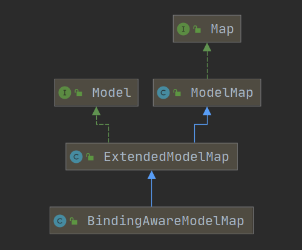

----

```java
@Controller
@RequestMapping("/carry")
public class CarryController {

    @RequestMapping("/map")
    public String Map(Map<String, Object> map) {
        map.put("name", "liujiawe");
        // class org.springframework.validation.support.BindingAwareModelMap
        System.out.println(map.getClass());
        return "carry";
    }

    @RequestMapping("/model")
    public String Model(Model model) {
        model.addAttribute("name", "liujiawei model");
        // class org.springframework.validation.support.BindingAwareModelMap
        System.out.println(model.getClass());
        return "carry";
    }

    @RequestMapping("/modelMap")
    public String ModelMap(ModelMap map) {
        map.addAttribute("name", "Model Map vale");
        // class org.springframework.validation.support.BindingAwareModelMap
        System.out.println(map.getClass());
        return "carry";
    }
}
// 最后发现，
// 无论是传入Map还是Model还是ModelMap 最终的数据类型都是 BindingAwareModelMap
```

## 5.2 ModelAndView

1）方法的返回值可以变为ModelAndView类型

即包含视图信息（页面地址）也包含模型数据（给页面），而且数据是放在请求域中。

```java
public ModelAndView handle(){
    // 最后会跳转到 /WEB-INF/views/success.jsp页面。
    // 我设置了视图解析器，会给success拼前缀和后缀。
    // 带前缀的地址：redirect:/xx
   	// 			  forward:/xx 这些就不会被拼串，具体可以看视图解析那块的源码，看下就知道了。
    // 他是先看有没有 前缀，有就用对应前缀的View对象，最后没用，采用拼串的View对象。
	ModelAndViewmv = new ModelAndView("success");
	mv.addObject("msg","你好哦")
	return mv；
}
```

## 5.3 数据暂存Session域

使用一个注解 @SessionAttributes(只能标在类上)

@SessionAttributes(value="msg")：

- 给BindingAwareModelMap中保存的数据,同时给session中放一份。
- value指定保存数据时要给session中存放的数据的key。

@SessionAttributes(value={"msg"},types={String.class}})

- value={“msg”} 只要保存的是这种key的数据，给Session中放一份。
- types={String.class} 只要保存的是这种类型的数据，给Session中也放一份。
- 所以会存两大份！！用value指定的比较多，因为可以精确指定。
- **但是我们不推荐用@SessionAttributes，还是用原生API吧。注解的话可能会引发异常，且移除session麻烦。**

## 5.4 ModelAttribute方法

ModelAttribute 方法入参标注该注解后，入参的对象就会放到数据模型中。

参数：取出刚才保存的数据

方法位置：这个方法就会提取于目标方法先运行。

​	可以在这里提前查出数据库中图书的信息。

​	将这个图书信息保存起来（方便下一个方法还能使用）

​	参数Map就是BindAwareMap

```java
/**
* ModelAttribute方法先执行，把数据存在数据模型域中。
* @ModelAttribute("user") User user先拿到模型域中的值，然后才用浏览器传* 过来的值进行数据更新
*/
@ResponseBody
@RequestMapping("/get")
public User get(@ModelAttribute("user") User user) {
    return user;
}

@ModelAttribute
public void ModelAttribute(Model model) {
    User user = new User();
    user.setAddress("address");
    user.setAge(18);
    user.setName("ljw");
    model.addAttribute("user", user);
}
```

**ModelAttribute图解**


# 六、前端控制器源码

## 6.1 如何看SpringMVC源码

**SpringMVC源码如何看？**

- SpringMVC所有的请求都会被前端控制器拦截到，所以看SpringMVC怎么处理请求的，就看前端控制器的处理流程，如何处理请求的。
- 只要是finally块的，一般就是清东西。
- try起来的一般是重要的代码。 

## 6.2 梳理流程

### 6.2.1 文字分析

**文字描述：**

请求一进来，应该是来到HttpServlet的doPost或doGet方法。

我们根据官网的描述知道，前端控制器DispatcherServlet是负责请求转发的，所以我们从它开始入手。

**1）我们发现DispatcherServlet的继承关系如图所示：**

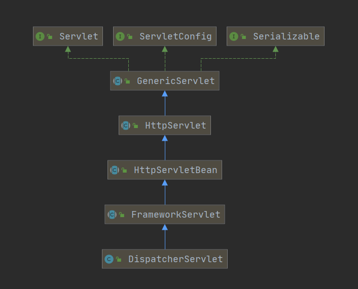

**2）我们知道Servlet的方法是从Service方法开始的，于是我们去找这些类重写的Service方法**

- HttpServletBean未重写Service方法，接下来看他的子类FrameworkServlet。
- FrameworkServlet重写了service方法！！！

```java
@Override
protected void service(HttpServletRequest request, HttpServletResponse response)
    throws ServletException, IOException {

    HttpMethod httpMethod = HttpMethod.resolve(request.getMethod());
    if (httpMethod == HttpMethod.PATCH || httpMethod == null) {
        // 内部执行了processRequest方法。见名知意，这个是处理请求的，我们继续看该类的processRequest方法！！
        processRequest(request, response);
    }
    else {
        super.service(request, response);
    }
}
```

**3）FrameworkServlet的service方法内部执行了processRequest方法。见名知意，这个是处理请求的，我们继续看该类的processRequest方法！！**

```java
protected final void processRequest(HttpServletRequest request, HttpServletResponse response)
    throws ServletException, IOException {
    // do something
    try {
        // 被try进来的说明是非常重要的方法，从方法的命名也看出，这是处理请求的！！但是我们发现，doService在FrameworkServlet中是一个抽象类，所以要去看它子类的对应实现！！！
        doService(request, response);
    }
    catch (ServletException | IOException ex) {
        failureCause = ex;
        throw ex;
    }
    catch (Throwable ex) {
        failureCause = ex;
        throw new NestedServletException("Request processing failed", ex);
    }

    finally {
		// do something
    }
}
```

**4）被try进来的说明是非常重要的方法，从方法的命名也看出，这是处理请求的！！但是我们发现，doService在FrameworkServlet中是一个抽象类，所以要去看它子类的对应实现！！！即看DispatcherServlet！！**

```java
@Override
protected void doService(HttpServletRequest request, HttpServletResponse response) throws Exception {
    logRequest(request);
	// do something
    try {
        // 这个方法，被try进来说明很重要！！
        doDispatch(request, response);
    }
    finally {
        // do something
    }
}
```

于是我们继续点进该类（）的doDispatcher方法一探究竟！

```java
// 源码注释上写，处理对处理程序的实际调度！！我们就对doDispatch方法进行debug!
protected void doDispatch(HttpServletRequest request, HttpServletResponse response) throws Exception {
	// doing something
}
```

源码注释上写，处理对处理程序的实际调度！！而且，该类中调用了类中的很多方法，再根据这些被调用方法的名字，我们猜测doDispatch就是调度的核心方法，于是我们对它进行debug！！！

### 6.2.2 总结

**图示总结**

梳理完流程后，发现执行流程大概是这样的。

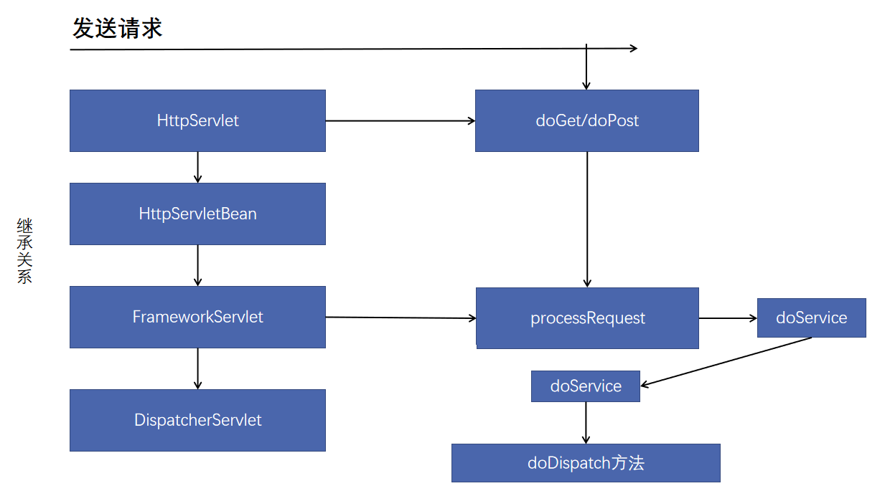

**文字概述**

1）先看了类与类之间的继承关系，顺着继承关系找doXX方法的重写

2）**HttpServletBean**并未重写**doPost/doGet**这些方法，**HttpServletBeand**的子类**FrameworkServlet**实现了相应的方法。

3）**FrameworkServlet**相应的方法内部调用的是**processRequest**;

4）**processRequest**;内部调用了**doService**方法，而该方法在**FrameworkServlet**中并未实现，但从**FrameworkServlet**的子类**DispatcherServlet**找到了对应的实现。

5）**DispatcherServlet**中的**Service**方法调用了**doDispatch**;方法

6）**doDispatch**;方法内部调用了**DispatcherServlet**中的很多方法

7）**doDispatch**调用的方法中，我们根据单词意思和方法上的注释推断出这个方法就是我们要找的入口！于是对其进行**debug**！！

## 6.2 阅读源码

###  6.2.1 走马观花

<span style="color:green">**看每个方法的大致功能**</span>

1）WebAsyncUtils.getAsyncManager(request); 异步管理

2）checkMultipart(request); 文件上传相关

3）getHandler(processedRequest);  获得对应请求的处理器

4）getHandlerAdapter(mappedHandler.getHandler()); 获得处理器对应的适配器（适配器执行方法哦！）

5）mv = ha.handle(processedRequest, response, mappedHandler.getHandler()); 执行@RequestMapping标记的方法！！

6）processDispatchResult(processedRequest, response, mappedHandler, mv, dispatchException);  页面放行！

<span style="color:green">**大致的阅读路线**</span>

**==>** 查看 DispatcherServlet类中的 doDispatch()方法中每个方法的功能

​	**|==>** getHandler /  getHandlerAdapter方法

​	**|==>** getHandlerAdapter方法负责执行打了@RequestMapping的方法。

**==>** 看getHandler()细节；怎么根据当前请求就能找到那个类能来处理。

​	**|==>**  mappedHandler = getHandler(processedRequest);// mappedHandler的类型是HandlerExecutionChain

​	**|==>** 看了getHandler的源码，知道如何根据当前请求就能找到那个类能来处理了。

**==>** 看完getHandler() 细节 接下来就是看 getHandlerAdapter() 的细节了。

​	**|==>** 因为getHandler只是拿到要处理的请求，真正的处理还是交由对应的适配器来做！

​	**|==>** 所以接下来是看如何找到目标处理器类的适配器！！<span style="color:red">**【补适配器模式！！】**</span>

​	**|==>** 最后发现适配器的查找也是遍历。

**==>** 看完如何找到 getHandlerAdapter() 后就看适配器如何执行方法了！mv = ha.handle()

​	**|==>** handle() 方法中调用了 handleInternal() 方法

​	**|==>** handleInternal() 方法 中的这句代码 mav = invokeHandlerMethod(request, response, handlerMethod); 执行方法，返回执行后需要跳转的视图。

-----

<span style="color:green">**源码阅读笔记**</span>

```java
protected void doDispatch(HttpServletRequest request, HttpServletResponse response) throws Exception {
   HttpServletRequest processedRequest = request;
   HandlerExecutionChain mappedHandler = null;
   boolean multipartRequestParsed = false;
   // 异步管理器，如果有异步怎么办
   WebAsyncManager asyncManager = WebAsyncUtils.getAsyncManager(request);

   try {
      ModelAndView mv = null;
      Exception dispatchException = null;

      try {
         // 检查是否多部件 和文件上传有关
         processedRequest = checkMultipart(request);
         multipartRequestParsed = (processedRequest != request);

         // Determine handler for the current request.
         // 根据当前请求地址决定哪个类能处理
         mappedHandler = getHandler(processedRequest);
         // 如果没有找到那个处理器可以处理这个请求，就404 报异常。
         if (mappedHandler == null) {
            noHandlerFound(processedRequest, response);
            return;
         }
         // 找到了的话，mappedHandler里的handler属性就会封装我们对应的Controller。
         // Determine handler adapter for the current request.
         // 决定当前请求要用那个处理器的适配器。SpringMVC不是直接反射调用对应Controller的方法，而是用一个处理器进行执行。此处的作用1是拿到能执行这个类的所以方法的适配器（反射工具）
         HandlerAdapter ha = getHandlerAdapter(mappedHandler.getHandler());

         // Process last-modified header, if supported by the handler.
         String method = request.getMethod();
         boolean isGet = "GET".equals(method);
         if (isGet || "HEAD".equals(method)) {
            long lastModified = ha.getLastModified(request, mappedHandler.getHandler());
            if (new ServletWebRequest(request, response).checkNotModified(lastModified) && isGet) {
               return;
            }
         }

         if (!mappedHandler.applyPreHandle(processedRequest, response)) {
            return;
         }

         // Actually invoke the handler.
         // 用适配器执行方法；将目标方法执行完成后的返回值作为视图名，设置保存到ModelAndView中。
         // 无论目标方法怎么写，最终适配器执行完成以后都会将执行后的信息封装成ModelAndView
         mv = ha.handle(processedRequest, response, mappedHandler.getHandler());

         if (asyncManager.isConcurrentHandlingStarted()) {
            return;
         }
         // 如果没有视图名，设置一个默认的视图名（方法没有返回值的时候）
         applyDefaultViewName(processedRequest, mv);
         mappedHandler.applyPostHandle(processedRequest, response, mv);
      }
      catch (Exception ex) {
         dispatchException = ex;
      }
      catch (Throwable err) {
         // As of 4.3, we're processing Errors thrown from handler methods as well,
         // making them available for @ExceptionHandler methods and other scenarios.
         dispatchException = new NestedServletException("Handler dispatch failed", err);
      }
      // 转发到目标页面。根据方法最终执行完成后封装的ModelAndView 转发到对应页面，而且ModelAndView中的数据可以从请求域中获取。
      processDispatchResult(processedRequest, response, mappedHandler, mv, dispatchException);
   }
   catch (Exception ex) {
      triggerAfterCompletion(processedRequest, response, mappedHandler, ex);
   }
   catch (Throwable err) {
      triggerAfterCompletion(processedRequest, response, mappedHandler,
            new NestedServletException("Handler processing failed", err));
   }
   finally {
      if (asyncManager.isConcurrentHandlingStarted()) {
         // Instead of postHandle and afterCompletion
         if (mappedHandler != null) {
            mappedHandler.applyAfterConcurrentHandlingStarted(processedRequest, response);
         }
      }
      else {
         // Clean up any resources used by a multipart request.
         if (multipartRequestParsed) {
            cleanupMultipart(processedRequest);
         }
      }
   }
}
```

<span style="color:green">**文字总结**</span>

1）所以有请求都要经过DispathcherServlet，DispathcherServlet收到请求

2）调用doDispatch() 方法进行处理

- getHandler()  根据当前请求地址找到能处理这个请求的目标处理器类（处理器）
- <span style="color:red">getHandlerAdapter()  根据2当前处理器类获取到能执行这个处理器方法的适配器。</span>
- <span style="color:red">使用刚才获取到的适配器（AnnotationMethodHandlerAdapter）执行目标方法。</span>
- <span style="color:red">目标方法执行后返回一个ModelAndView对象。</span>
- <span style="color:red">根据ModelAndView的信息转发到具体的页面，并可以在请求域中取出ModelAndView中的模型数据。</span>

### 6.2.2 细致阅读

#### 6.2.2.1 getHandler方法

1）读了doDispatch（）方法，大致猜了每个方法的作用。现在来细看getHandler（）方法的细节。

-----------------------------------

**getHandler是如何找到那个类可以处理请求的。**

```java
// mappedHandler的类型是HandlerExecutionChain
mappedHandler = getHandler(processedRequest);
```

getHandler源码

```java
protected HandlerExecutionChain getHandler(HttpServletRequest request) throws Exception {
   if (this.handlerMappings != null) {
      // HandlerMapping：处理器映射；他里面保存了每一个处理器能处理那些请求的映射信息。【标了注解】
      for (HandlerMapping mapping : this.handlerMappings) {
         HandlerExecutionChain handler = mapping.getHandler(request);
         if (handler != null) {
            return handler;
         }
      }
   }
   return null;
}
```

debug发现，有三种类别的handlerMappings（Spring 5.x），使用的是RequestMappingHandlerMapping@6585（因为我们是打的RequestMapping这个注解！）

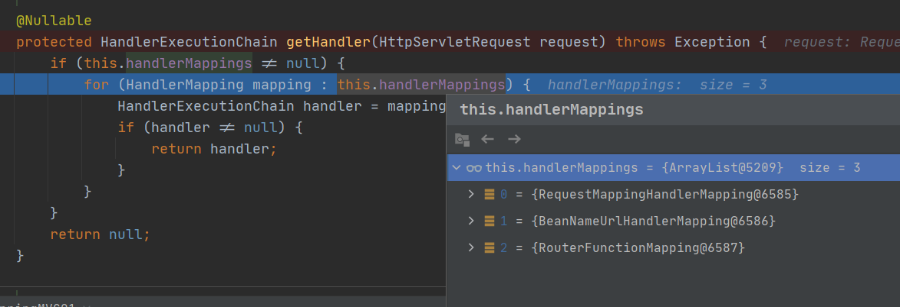

最后返回的handler的值是 被打上注解，要执行的方法的：<span style="color:red">**全类名#方法名**</span>

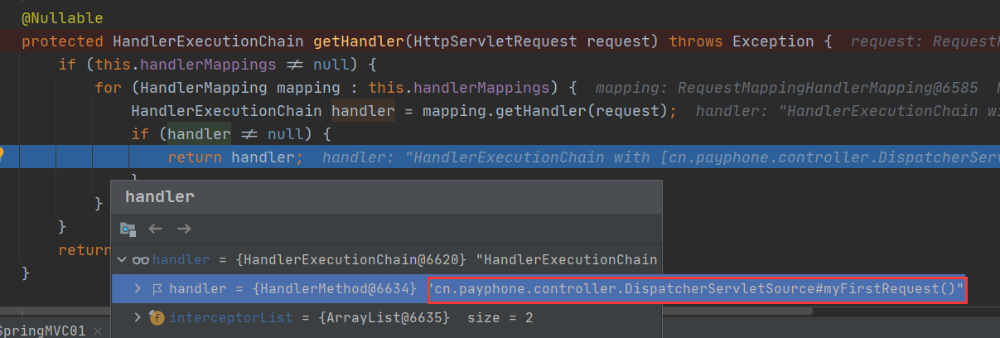

**我们再回过头来看看this.handlerMappings中RequestMappingHandlerMapping的成员变量：**

mappingRegistry：ioc容器启动创建Controller对象的时候扫描每个处理器都能处理什么请求，保存在mappingRegistry属性的registry中。下一次请求过来，就来看那个handlerMapping中有这个请求的映射信息就好了。

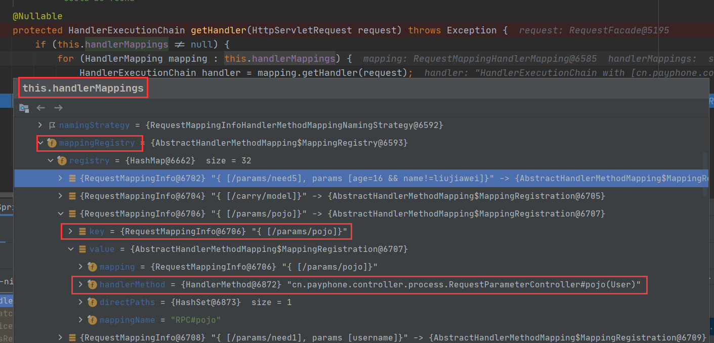

#### 6.2.2.2 getHandlerAdapter方法

2）细看 getHandler() 方法的细节，接下来看getHandlerAdapter() 方法的细节。

--------

getHandler() 方法找到处理对象，getHandlerAdapter() 用来执行要处理的对象！

```java
// 方法源码如下：
protected HandlerAdapter getHandlerAdapter(Object handler) throws ServletException {
   if (this.handlerAdapters != null) {
      // 找适配器，又是遍历适配器，看那个合适。
      for (HandlerAdapter adapter : this.handlerAdapters) {
          // 如果支持这个处理器就返回，不支持就继续找，没找到就抛异常。
          //RequestMappingHandlerAdapter的supports总是返回true
         if (adapter.supports(handler)) {
            return adapter;
         }
      }
   }
   throw new ServletException("No adapter for handler [" + handler +
         "]: The DispatcherServlet configuration needs to include a HandlerAdapter that supports this handler");
}
```

**下面我们看看this.handlerAdapters里有多少适配器：有四个！四种类型的适配器！**

这四个适配器中那个有用？我们猜测是注解那个有用。**RequestMappingHandlerAdapter**，因为我们打的是RequestMapping注解！

**RequestMappingHandlerAdapter能解析注解方法的适配器；处理器类中只要有标了注解的这些方法就能用。**

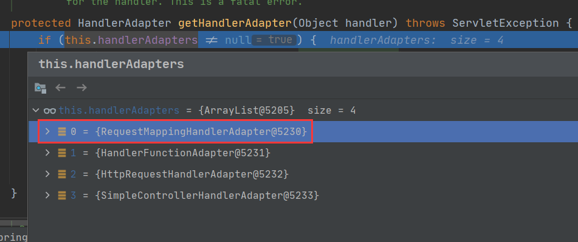

#### 6.2.2.3 handle方法

```java
@Override
@Nullable
public final ModelAndView handle(HttpServletRequest request, HttpServletResponse response, Object handler)
      throws Exception {
   return handleInternal(request, response, (HandlerMethod) handler);
}

@Override
protected ModelAndView handleInternal(HttpServletRequest request,
                                      HttpServletResponse response, HandlerMethod handlerMethod) throws Exception {

    ModelAndView mav;
    checkRequest(request);

    // Execute invokeHandlerMethod in synchronized block if required.
    if (this.synchronizeOnSession) {
        HttpSession session = request.getSession(false);
        if (session != null) {
            Object mutex = WebUtils.getSessionMutex(session);
            synchronized (mutex) {
                // 执行方法！！并得到执行方法后需要返回的视图页面！
                mav = invokeHandlerMethod(request, response, handlerMethod);
            }
        }
        else {
            // No HttpSession available -> no mutex necessary
            mav = invokeHandlerMethod(request, response, handlerMethod);
        }
    }
    else {
        // No synchronization on session demanded at all...
        mav = invokeHandlerMethod(request, response, handlerMethod);
    }

    if (!response.containsHeader(HEADER_CACHE_CONTROL)) {
        if (getSessionAttributesHandler(handlerMethod).hasSessionAttributes()) {
            applyCacheSeconds(response, this.cacheSecondsForSessionAttributeHandlers);
        }
        else {
            prepareResponse(response);
        }
    }

    return mav;
}
```

## 6.3 阅读总结

1）运行流程挑简单的。

2）确定方法每个参数的值

- 标注解：保存注解的信息；最终得到这个注解应该对应解析的值。
- 没标注解：
    - 看是否是原生API
    - 看是否是Model或者是Map，xxx
    - 都不是，看是否是简单类型；paramName
    - 给attrName赋值；attrName（参数标了@ModelAttribute("") 就是指定的，没标就是“”）
    - 确定自定义类型参数
        - attrName使用参数的类型首字母小写；或者使用之前@ModelAttribute("") 的值
        - 先看隐含模型中每个这个attrName作为key对应的值；如果有就从隐含模型中获取并赋值
        - 看是否是@SessionAttributes(value="haha")；标注的属性，如果是就从session中拿；如果拿不到就会抛异常。
        - 不是@SessionAttributes标注的，就利用反射创建一个对象
    - 拿到之前创建好的对象，使用数据绑定器（WebDataBinder）将请求中的每个数据绑定到这个对象中。

视图解析器只是为了得到视图对象；视图对象才能真正的<span style="color:red">转发（将模型数据全部放在请求域中）或者重定向到页面</span>视图对象才能真正的<span style="color:red">渲染视图</span>。

# 七、九大组件

## 7.1 组件概述

DispatcherServet中有几个引用类型的属性；SpringMVC的九大组件。

SpringMVC在工作的时候，关键位置都是由这些组件完成的；

共同点：九大组件全部都是接口；接口就是规范；提供了非常强大的扩展性；

SpringMVC的九大组件工作原理：大佬级别。

```java
/** 文件上传解析器 **/
@Nullable
private MultipartResolver multipartResolver;

/** 区域信息解析器. 和国际化有关*/
@Nullable
private LocaleResolver localeResolver;

/** 主题解析器；强大的主题效果更换 */
@Nullable
private ThemeResolver themeResolver;

/** Handler映射信息.HandlerMapping */
@Nullable
private List<HandlerMapping> handlerMappings;

/** Handler的适配器. */
@Nullable
private List<HandlerAdapter> handlerAdapters;

/** SpringMVC强大的异常解析功能；异常解析器. */
@Nullable
private List<HandlerExceptionResolver> handlerExceptionResolvers;

/** RequestToViewNameTranslator used by this servlet. */
@Nullable
private RequestToViewNameTranslator viewNameTranslator;

/** FlashMap+Manager：SpringMVC中运行重定向携带数据的功能  */
@Nullable
private FlashMapManager flashMapManager;

/** 视图解析器 */
@Nullable
private List<ViewResolver> viewResolvers;
```

**九大组件初始化的地方**

```java
@Override
protected void onRefresh(ApplicationContext context) {
   initStrategies(context);
}

/**
 * Initialize the strategy objects that this servlet uses.
 * <p>May be overridden in subclasses in order to initialize further strategy objects.
 */
protected void initStrategies(ApplicationContext context) {
   initMultipartResolver(context);
   initLocaleResolver(context);
   initThemeResolver(context);
   initHandlerMappings(context);
   initHandlerAdapters(context);
   initHandlerExceptionResolvers(context);
   initRequestToViewNameTranslator(context);
   initViewResolvers(context);
   initFlashMapManager(context);
}
```

----

**组件的初始化：**

- 有些组件在容器中是使用类型找的，有些组件是使用id找的。
- 就是去容器中找这个组件，如果没有就用默认的配置。
- 这是教怎么看各大组件的，具体的流程自己去看。

----

```java
private void initHandlerMappings(ApplicationContext context) {
   this.handlerMappings = null;
   // 探查所有的HandlerMapping
   if (this.detectAllHandlerMappings) {
      // Find all HandlerMappings in the ApplicationContext, including ancestor contexts.
      Map<String, HandlerMapping> matchingBeans =
            BeanFactoryUtils.beansOfTypeIncludingAncestors(context, HandlerMapping.class, true, false);
      if (!matchingBeans.isEmpty()) {
         this.handlerMappings = new ArrayList<>(matchingBeans.values());
         // We keep HandlerMappings in sorted order.
         AnnotationAwareOrderComparator.sort(this.handlerMappings);
      }
   }
   else {
      try {
         HandlerMapping hm = context.getBean(HANDLER_MAPPING_BEAN_NAME, HandlerMapping.class);
         this.handlerMappings = Collections.singletonList(hm);
      }
      catch (NoSuchBeanDefinitionException ex) {
         // Ignore, we'll add a default HandlerMapping later.
      }
   }

   // Ensure we have at least one HandlerMapping, by registering
   // a default HandlerMapping if no other mappings are found.
   if (this.handlerMappings == null) {
      this.handlerMappings = getDefaultStrategies(context, HandlerMapping.class);
      if (logger.isTraceEnabled()) {
         logger.trace("No HandlerMappings declared for servlet '" + getServletName() +
               "': using default strategies from DispatcherServlet.properties");
      }
   }

   for (HandlerMapping mapping : this.handlerMappings) {
      if (mapping.usesPathPatterns()) {
         this.parseRequestPath = true;
         break;
      }
   }
}
```

# 八、视图解析

## 8.1 视图解析的应用

### 8.1.1 概述

> <span style="color:green">**转发 forward**</span>

1）地址栏不发生变化，显示的是上一个页面的地址。在服务器端进行的跳转，

2）请求次数：只有一次。

3）根目录：http://localhost:8080/项目地址/转发地址

4） 请求域中数据会不丢失（request请求域的生命周期是一次转发！）

**API：**

```java
request.getRequestDispatcher("/地址").forward(request, response);
```

> <span style="color:green">**重定向 redireect**</span>

1）地址栏发生变化，显示新的地址；浏览器端进行的跳转。

2）请求次数：2次

3）可重定向到其他项目或其他网址

4）请求域中的数据会丢失，因为是2次请求。request请求域的生命周期只是一次请求内有效！

### 8.1.2 转发 forward

> **废话少说上代码**

```java
@Controller
class DemoController{
    @RequestMapping("/forward")
    public String forward(){
        // 转发到项目的hello.jsp 
        // eg 项目根目录是 localhost:8080/demo
        // 则该亲求会转发到 localhost:8080/demo/hello.jsp
		return "forward:/hello.jsp" 
    }
}
```

> **详细解释**

- forward：转发到一个页面
- /hello.jsp 转发当前项目下的hello
- 一定要加 /  如果不加 / 就是相对路径。容易出问题。
- forward:/hello.jsp <span style="color:red">不会有给你拼串，有前缀的转发，不会经由我们配置的视图解析器拼串。看看源码的流程就知道</span>
    - 先判断路径中是否含前缀，含有就用对应前缀的方式进行操作。
    - 没有就用我们的配置的视图解析器进行操作。

forward可以转发到页面，也可以转发到一个请求上。 forward:/hello 转发到hello请求

### 8.1.3 重定向 redirect

> **废话少说上代码**

```java
@Controller
class DemoController{
    @RequestMapping("/redirect")
    public String forward(){
        // 转发到项目的hello.jsp 
        // eg 项目根目录是 localhost:8080/demo
        // 则该亲求会转发到 localhost:8080/demo/hello.jsp
		return "redirect:/hello.jsp" 
    }
}
```

> **详细解释**

**redirect重定向【重定向的地址由浏览器进行解析】**

- 有前缀的转发和重定向不会有视图解析器的拼串操作。
- 原生的servlet重定向需要加上项目名才能重定向。
- springmvc无需写项目名，会为我们自动拼接上项目名。
- returen "redirect:/hello.jsp";

## 8.2 视图解析器原理

### 8.2.1 概述

**==>** 先根据当前请求，找到那个类能处理。

​	`mappedHandler = getHandler(processedRequest);`

**==>** 找到适配器

​	`HandlerAdapter ha = getHandlerAdapter(mappedHandler.getHandler());`

**==>**  目标方法执行，执行完会有一个返回值，返回值会被包装成一个ModelAndView，ModelAndView对象中包含视图名。

​	`mv = ha.handle(processedRequest, response, mappedHandler.getHandler());`

**==>** 来到页面

​	`processDispatchResult(processedRequest, response, mappedHandler, mv, dispatchException);`

**==>** 调用processDispatchResult里的render进行渲染

**==>** 如何根据方法的返回值得到View对象

**==>** 由View对象进行视图的相关操作

### 8.2.2 流程解析

><span  style="color:green">**先根据当前请求，找到那个类能处理**</span>

```java
mappedHandler = getHandler(processedRequest);
```

> <span  style="color:green">**找到可处理当前请求的适配器**</span>

```java
HandlerAdapter ha = getHandlerAdapter(mappedHandler.getHandler());
```

> <span  style="color:green">**执行目标方法**</span>

```java
mv = ha.handle(processedRequest, response, mappedHandler.getHandler());
```

执行完目标方法后，其返回值会被包装成一个ModelAndView，而ModelAndView对象中包含视图名。如图：


> <span  style="color:green">**来到页面**</span>

```java
processDispatchResult(processedRequest, response, mappedHandler, mv, dispatchException);
```

视图渲染流程；将域中的数据在页面展示；我们可以认为，页面的功能就是用来渲染模型数据的。

看processDispatchResult源码发现里面是调用render(mv,request,response)进行渲染的

```java
private void processDispatchResult(HttpServletRequest request, HttpServletResponse response,
                                   @Nullable HandlerExecutionChain mappedHandler, @Nullable ModelAndView mv,
                                   @Nullable Exception exception) throws Exception {

    boolean errorView = false;

    if (exception != null) {
        if (exception instanceof ModelAndViewDefiningException) {
            logger.debug("ModelAndViewDefiningException encountered", exception);
            mv = ((ModelAndViewDefiningException) exception).getModelAndView();
        }
        else {
            Object handler = (mappedHandler != null ? mappedHandler.getHandler() : null);
            mv = processHandlerException(request, response, handler, exception);
            errorView = (mv != null);
        }
    }

    // Did the handler return a view to render?
    if (mv != null && !mv.wasCleared()) {
        render(mv, request, response);
        if (errorView) {
            WebUtils.clearErrorRequestAttributes(request);
        }
    }
    else {
        if (logger.isTraceEnabled()) {
            logger.trace("No view rendering, null ModelAndView returned.");
        }
    }

    if (WebAsyncUtils.getAsyncManager(request).isConcurrentHandlingStarted()) {
        // Concurrent handling started during a forward
        return;
    }

    if (mappedHandler != null) {
        // Exception (if any) is already handled..
        mappedHandler.triggerAfterCompletion(request, response, null);
    }
}
```

> <span  style="color:green">调用processDispatchResult里的render进行渲染</span>

发现内部有个View类型的变量。

其中`view = resolveViewName(viewName, mv.getModelInternal(), locale, request);`的作用是根据视图名（即目标方法的返回值）得到View对象

- viewName  视图的名称
- mv.getModelInternal() 隐含模型中的数据

```java
protected void render(ModelAndView mv, HttpServletRequest request, HttpServletResponse response) throws Exception {
    // Determine locale for request and apply it to the response.
    Locale locale =
        (this.localeResolver != null ? this.localeResolver.resolveLocale(request) : request.getLocale());
    response.setLocale(locale);

    View view;
    String viewName = mv.getViewName();
    if (viewName != null) {
        // We need to resolve the view name.
        view = resolveViewName(viewName, mv.getModelInternal(), locale, request);
        if (view == null) {
            throw new ServletException("Could not resolve view with name '" + mv.getViewName() +
                                       "' in servlet with name '" + getServletName() + "'");
        }
    }
    else {
        // No need to lookup: the ModelAndView object contains the actual View object.
        view = mv.getView();
        if (view == null) {
            throw new ServletException("ModelAndView [" + mv + "] neither contains a view name nor a " +
                                       "View object in servlet with name '" + getServletName() + "'");
        }
    }

    // Delegate to the View object for rendering.
    if (logger.isTraceEnabled()) {
        logger.trace("Rendering view [" + view + "] ");
    }
    try {
        if (mv.getStatus() != null) {
            response.setStatus(mv.getStatus().value());
        }
        view.render(mv.getModelInternal(), request, response);
    }
    catch (Exception ex) {
        if (logger.isDebugEnabled()) {
            logger.debug("Error rendering view [" + view + "]", ex);
        }
        throw ex;
    }
}
```

> <span  style="color:green">**如何根据方法的返回值得到View对象？**</span>

查看resolveViewName的源码，发现是视图解析器更具视图名得到视图对象，并返回。

- viewName  视图的名称
- mv.getModelInternal() 隐含模型中的数据

this.viewResolvers中的数据如图：

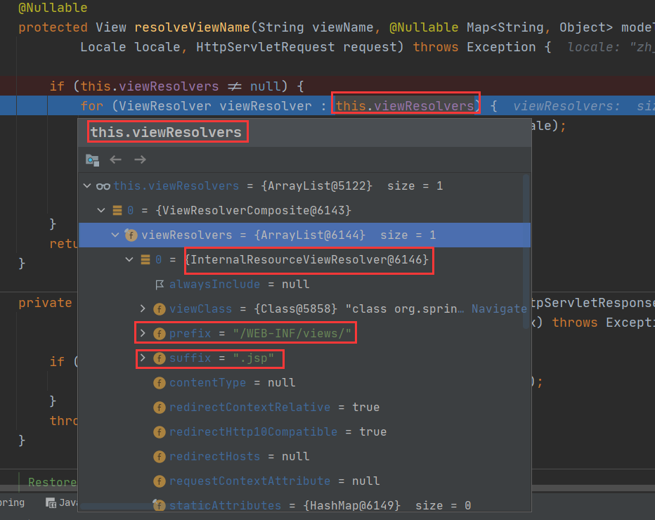

我们配了视图解析器就用，没配就用默认的。

想知道怎么初始化视图解析器的话，取看initViewResolvers方法

- 找到的话，就用我们配置的。
- 没找到的话，就用默认的。

```java
@Nullable
protected View resolveViewName(String viewName, @Nullable Map<String, Object> model,Locale locale, HttpServletRequest request) throws Exception {

    if (this.viewResolvers != null) {
        // 遍历所有的ViewResolver
        for (ViewResolver viewResolver : this.viewResolvers) {
            View view = viewResolver.resolveViewName(viewName, locale);
            if (view != null) {
                return view;
            }
        }
    }
    return null;
}
```

><span  style="color:green">**如何得到View对象，即resolveViewName如何实现的？**</span>

先从缓存中拿，没有就创建。

根据方法的返回值创建出视图对象

view = createView(viewName, locale);

```java
@Override
@Nullable
public View resolveViewName(String viewName, Locale locale) throws Exception {
    if (!isCache()) {
        return createView(viewName, locale);
    }
    else {
        Object cacheKey = getCacheKey(viewName, locale);
        View view = this.viewAccessCache.get(cacheKey);
        if (view == null) {
            synchronized (this.viewCreationCache) {
                view = this.viewCreationCache.get(cacheKey);
                if (view == null) {
                    // Ask the subclass to create the View object.
                    // 根据方法的返回值创建出视图对象
                    view = createView(viewName, locale);
                    if (view == null && this.cacheUnresolved) {
                        view = UNRESOLVED_VIEW;
                    }
                    if (view != null && this.cacheFilter.filter(view, viewName, locale)) {
                        this.viewAccessCache.put(cacheKey, view);
                        this.viewCreationCache.put(cacheKey, view);
                    }
                }
            }
        }
        else {
            if (logger.isTraceEnabled()) {
                logger.trace(formatKey(cacheKey) + "served from cache");
            }
        }
        return (view != UNRESOLVED_VIEW ? view : null);
    }
}
```

> <span  style="color:green">**创建View对象的方法createView**</span>

```java
@Override
protected View createView(String viewName, Locale locale) throws Exception {
   // If this resolver is not supposed to handle the given view,
   // return null to pass on to the next resolver in the chain.
   if (!canHandle(viewName, locale)) {
      return null;
   }

   // Check for special "redirect:" prefix.
   if (viewName.startsWith(REDIRECT_URL_PREFIX)) {
      String redirectUrl = viewName.substring(REDIRECT_URL_PREFIX.length());
      RedirectView view = new RedirectView(redirectUrl,
            isRedirectContextRelative(), isRedirectHttp10Compatible());
      String[] hosts = getRedirectHosts();
      if (hosts != null) {
         view.setHosts(hosts);
      }
      return applyLifecycleMethods(REDIRECT_URL_PREFIX, view);
   }

   // Check for special "forward:" prefix.
   if (viewName.startsWith(FORWARD_URL_PREFIX)) {
      String forwardUrl = viewName.substring(FORWARD_URL_PREFIX.length());
      // 
      InternalResourceView view = new InternalResourceView(forwardUrl);
      return applyLifecycleMethods(FORWARD_URL_PREFIX, view);
   }

   // 如果没有前缀  就用父类默认创建一个view对象
   return super.createView(viewName, locale);
}
```

返回View对象；

视图解析器得到View对象的流程就是，所有配置的视图解析器都来尝试根据视图名（返回值）得到View（视图对象）；如果能得到就返回，得不到就换下一个视图解析器；

调用View对象的render方法

```java
@Override
public void render(Map<String, ?> model, HttpServletRequest request, HttpServletResponse response) throws Exception {
    if (logger.isTraceEnabled()) {
        logger.trace("Rendering view with name '" + this.beanName + "' with model " + model +
                     " and static attributes " + this.staticAttributes);
    }

    Map<String, Object> mergedModel = createMergedOutputModel(model, request, response);
    prepareResponse(request, response);
    renderMergedOutputModel(mergedModel, getRequestToExpose(request), response);
}
```

```java
@Override
protected void renderMergedOutputModel(
    Map<String, Object> model, HttpServletRequest request, HttpServletResponse response) throws Exception {

    // Expose the model object as request attributes.
    // 将模型中的数据放在请求域中
    exposeModelAsRequestAttributes(model, request);

    // Expose helpers as request attributes, if any.
    exposeHelpers(request);

    // Determine the path for the request dispatcher.
    // 拿到要转发的路径
    String dispatcherPath = prepareForRendering(request, response);

    // Obtain a RequestDispatcher for the target resource (typically a JSP).
    RequestDispatcher rd = getRequestDispatcher(request, dispatcherPath);
    if (rd == null) {
        throw new ServletException("Could not get RequestDispatcher for [" + getUrl() +
                                   "]: Check that the corresponding file exists within your web application archive!");
    }

    // If already included or response already committed, perform include, else forward.
    if (useInclude(request, response)) {
        response.setContentType(getContentType());
        if (logger.isDebugEnabled()) {
            logger.debug("Including resource [" + getUrl() + "] in InternalResourceView '" + getBeanName() + "'");
        }
        rd.include(request, response);
    }

    else {
        // Note: The forwarded resource is supposed to determine the content type itself.
        if (logger.isDebugEnabled()) {
            logger.debug("Forwarding to resource [" + getUrl() + "] in InternalResourceView '" + getBeanName() + "'");
        }
        rd.forward(request, response);
    }
}
```

将隐含模型中的数据合并到request请求域中

```java
protected void exposeModelAsRequestAttributes(Map<String, Object> model, HttpServletRequest request) throws Exception {
    for (Map.Entry<String, Object> entry : model.entrySet()) {
        String modelName = entry.getKey();
        Object modelValue = entry.getValue();
        if (modelValue != null) {
            request.setAttribute(modelName, modelValue);
            if (logger.isDebugEnabled()) {
                logger.debug("Added model object '" + modelName + "' of type [" + modelValue.getClass().getName() +
                             "] to request in view with name '" + getBeanName() + "'");
            }
        }
        else {
            request.removeAttribute(modelName);
            if (logger.isDebugEnabled()) {
                logger.debug("Removed model object '" + modelName +
                             "' from request in view with name '" + getBeanName() + "'");
            }
        }
    }
}
```

一句话：视图解析器只是为了得到视图对象；视图对象才能真正的转发（将模型数据全部放在请求域中）或者重定向要页面，视图对象才能真正的<span style="color:red">渲染视图</span>

### 8.2.3 流程图


视图对象才是真正的渲染页面

ViewResolver只是一个中介商，用于得到视图对象

----

## 8.3 国际化

没记，有空再补。

一定要过SpringMVC的视图解析流程，人家会创建一个jstlView帮你快速国际化。

转发、重定向导致国际化失败的原因如下·：

通过阅读源码可知转发和重定向缺少了国际化local这个参数，即不会进行国际化！

```java
@Override
protected View createView(String viewName, Locale locale) throws Exception {
   // If this resolver is not supposed to handle the given view,
   // return null to pass on to the next resolver in the chain.
   if (!canHandle(viewName, locale)) {
      return null;
   }

   // Check for special "redirect:" prefix.
   if (viewName.startsWith(REDIRECT_URL_PREFIX)) {
      String redirectUrl = viewName.substring(REDIRECT_URL_PREFIX.length());
      RedirectView view = new RedirectView(redirectUrl,
            isRedirectContextRelative(), isRedirectHttp10Compatible());
      String[] hosts = getRedirectHosts();
      if (hosts != null) {
         view.setHosts(hosts);
      }
      return applyLifecycleMethods(REDIRECT_URL_PREFIX, view);
   }

   // Check for special "forward:" prefix.
   if (viewName.startsWith(FORWARD_URL_PREFIX)) {
      String forwardUrl = viewName.substring(FORWARD_URL_PREFIX.length());
      // 
      InternalResourceView view = new InternalResourceView(forwardUrl);
      return applyLifecycleMethods(FORWARD_URL_PREFIX, view);
   }

   // 如果没有前缀  就用父类默认创建一个view对象
   return super.createView(viewName, locale);
}1
```

## 8.4 自定义视图解析器

### 8.4.1 步骤

> 自定义视图和视图解析器的步骤

1）编写自定义的视图解析器，和视图实现类

2）视图解析器必须在IOC容器中。

```java
@Controller
public class MyViewResovlerController{
    
    @RequeestMapping("/handleplus")
    public String handleplus(){
        return "meinv:/gaoqing"
    }
}
```

> 使用自定义视图进行页面跳转/转发

```java
package org.example.view;

import org.springframework.web.servlet.View;

import javax.servlet.http.HttpServletRequest;
import javax.servlet.http.HttpServletResponse;
import java.util.Map;
// 自定义视图，定义视图的返回数据类型
public class MyView implements View {
    @Override
    public String getContentType() {
        // 返回的数据类型
        return "text/html";
    }

    @Override
    public void render(Map<String, ?> model, HttpServletRequest request, HttpServletResponse response) throws Exception {
        System.out.println("之前存的数据" + model);
        // 过滤器替我们设置好了编码格式
        response.setContentType("text/html");
        response.getWriter().write("精彩内容 马上出现！哈哈哈！");
    }
}
```

> 自定义视图解析器

```java
package org.example.view;

import org.springframework.core.Ordered;
import org.springframework.web.servlet.View;
import org.springframework.web.servlet.ViewResolver;

import java.util.Locale;

public class MyViewResolver implements ViewResolver, Ordered {

    @Override
    public View resolveViewName(String viewName, Locale locale) throws Exception {
        // 根据视图名返回视图对象
        if (viewName.startsWith("meinv")) {
            return new MyView();
        } else {
            // 不能处理返回null即可
            return null;
        }
    }

    @Override
    public int getOrder() {
        // 解析器的获取优先级。数字越小优先级越高
        return 0;
    }
}
```

> 将自定义的视图解析器加入IOC容器中

```java

@Configuration
@EnableWebMvc
@ComponentScan(basePackages = "org.example", includeFilters = {
        @ComponentScan.Filter(type = FilterType.ANNOTATION, classes = Controller.class)
}, useDefaultFilters = false)
public class WebConfig implements WebMvcConfigurer {
    /**
     * 视图解析器 加入IOC容器中
     * @param registry
     */
    public void configureViewResolvers(ViewResolverRegistry registry) {
        // 注册一个视图解析器
        registry.viewResolver(new MyViewResolver());
        registry.jsp("/WEB-INF/views/", ".jsp");
    }

    @Override
    public void configureDefaultServletHandling(DefaultServletHandlerConfigurer configurer) {
        // DefaultServletHandling 不拦截静态资源
        configurer.enable();
    }

    @Override
    public void addFormatters(FormatterRegistry registry) {
        MyStringToPersonConverter myStringToPersonConverter = new MyStringToPersonConverter();
        registry.addConverter(myStringToPersonConverter);
    }
}
```

# 九、CRUD案例

修改数据需要注意的地方：

1）可以在修改前 用@ModelAttribute标注的方法先把数据查出来。这个感觉可以不看，因为有MyBatis的动态SQL！！

## 9.1 概述

做一个符合Rest风格的CRUD

C：Create 创建

R：Retrieve 查询

U：Update 更新

D：Delete 删除

增删改查的URL地址； /资源名/资源标识

/emp/1	GET	查询

/emp/1	PUT	更新

/emp/1	DELETE	删除

/emp		POST	新增

## 9.2 静态资源放行

Spring MVC allows for mapping the `DispatcherServlet` to `/` (thus overriding the mapping of the container’s default Servlet), while still allowing static resource requests to be handled by the container’s default Servlet. It configures a `DefaultServletHttpRequestHandler` with a URL mapping of `/**` and the lowest priority relative to other URL mappings.

This handler forwards all requests to the default Servlet. Therefore, it must remain last in the order of all other URL `HandlerMappings`. That is the case if you use ``. Alternatively, if you set up your own customized `HandlerMapping` instance, be sure to set its `order` property to a value lower than that of the `DefaultServletHttpRequestHandler`, which is `Integer.MAX_VALUE`.

The following example shows how to enable the feature by using the default setup:

```java
@Configuration
@EnableWebMvc
public class WebConfig implements WebMvcConfigurer {

    @Override
    public void configureDefaultServletHandling(DefaultServletHandlerConfigurer configurer) {
        // 这样就不会拦截静态资源了
        // SpringMVC 前端控制器的拦截路径配置是：/
        configurer.enable();
    }
}
```

## 9.3 Rest风格设置

### 9.3.1 如何设置？

<a href="https://docs.spring.io/spring-framework/docs/current/reference/html/web.html#mvc-ann-initbinder">**HTTP Method Conversion**</a>

Add this filter to your web.xml, and a POST with a hidden `method` parameter is converted into the corresponding HTTP method request.

官网给的例子：用的Spring的表单。

```html
<form:form method="delete">
    <p class="submit"><input type="submit" value="Delete Pet"/></p>
</form:form>
```

如果是单纯的html怎么办？

去看看这个过滤器的源码：

```java
public class HiddenHttpMethodFilter extends OncePerRequestFilter {

	private static final List<String> ALLOWED_METHODS =
			Collections.unmodifiableList(Arrays.asList(HttpMethod.PUT.name(),
					HttpMethod.DELETE.name(), HttpMethod.PATCH.name()));

	// 表单需要携带_method参数，_method的值是请求的
	public static final String DEFAULT_METHOD_PARAM = "_method";

	private String methodParam = DEFAULT_METHOD_PARAM;


	/**
	 * Set the parameter name to look for HTTP methods.
	 * @see #DEFAULT_METHOD_PARAM
	 */
	public void setMethodParam(String methodParam) {
		Assert.hasText(methodParam, "'methodParam' must not be empty");
		this.methodParam = methodParam;
	}

	@Override
	protected void doFilterInternal(HttpServletRequest request, HttpServletResponse response, FilterChain filterChain)
			throws ServletException, IOException {

		HttpServletRequest requestToUse = request;
		// 要是POST方式提交 大小写有关系吗？ debug测一测
		if ("POST".equals(request.getMethod()) && request.getAttribute(WebUtils.ERROR_EXCEPTION_ATTRIBUTE) == null) {
			String paramValue = request.getParameter(this.methodParam);
			if (StringUtils.hasLength(paramValue)) {
				String method = paramValue.toUpperCase(Locale.ENGLISH);
				if (ALLOWED_METHODS.contains(method)) {
					requestToUse = new HttpMethodRequestWrapper(request, method);
				}
			}
		}

		filterChain.doFilter(requestToUse, response);
	}


	/**
	 * Simple {@link HttpServletRequest} wrapper that returns the supplied method for
	 * {@link HttpServletRequest#getMethod()}.
	 */
	private static class HttpMethodRequestWrapper extends HttpServletRequestWrapper {

		private final String method;

		public HttpMethodRequestWrapper(HttpServletRequest request, String method) {
			super(request);
			this.method = method;
		}

		@Override
		public String getMethod() {
			return this.method;
		}
	}

}
```

### 9.3.2 配置代码

**JavaConfig**

```java
package cn.payphone.config;

import org.springframework.context.annotation.Configuration;
import org.springframework.web.filter.CharacterEncodingFilter;
import org.springframework.web.filter.HiddenHttpMethodFilter;
import org.springframework.web.servlet.support.AbstractAnnotationConfigDispatcherServletInitializer;

import javax.servlet.Filter;

@Configuration
public class MyWebServletInitializer extends AbstractAnnotationConfigDispatcherServletInitializer {
    @Override
    protected Class<?>[] getRootConfigClasses() {
        return new Class[]{RootConfig.class};
    }

    @Override
    protected Class<?>[] getServletConfigClasses() {
        return new Class[]{WebConfig.class};
    }

    /**
     * @return
     */
    @Override
    protected String[] getServletMappings() {
        return new String[]{"/"};
    }

    @Override
    protected Filter[] getServletFilters() {
        // CharacterEncodingFilter characterEncodingFilter = new CharacterEncodingFilter("ISO-8859-1", true);
        CharacterEncodingFilter characterEncodingFilter = new CharacterEncodingFilter("UTF-8", true);
        characterEncodingFilter.setForceRequestEncoding(true);
        characterEncodingFilter.setForceResponseEncoding(true);
        // 设置rest风格
        HiddenHttpMethodFilter hiddenHttpMethodFilter = new HiddenHttpMethodFilter();
        return new Filter[]{characterEncodingFilter, hiddenHttpMethodFilter};
    }
}
```

**Controller代码**

```java
package cn.payphone.controller;

import org.springframework.stereotype.Controller;
import org.springframework.web.bind.annotation.*;

@Controller
@RequestMapping("/rest")
public class RestDemo {

    @GetMapping("/")
    public String index() {
        return "rest";
    }

    @DeleteMapping("/delete/{id}")
    @ResponseBody
    public String delete(@PathVariable String id) {
        return id + " delete";
    }

    @PutMapping("/put")
    @ResponseBody
    public String put() {
        return "put success";
    }
}
```

**html代码**

```html
<%@ page contentType="text/html;charset=UTF-8" language="java" %>
<html>
<head>
    <title>Title</title>
</head>
<body>
<form method="post" action="${pageContext.request.contextPath}/rest/delete/1">
    <input hidden="hidden" type="text" name="_method" value="delete">
    <input type="submit" value="DELETE">
</form>
<hr/>
<hr/>
<form method="post" action="${pageContext.request.contextPath}/rest/put">
    <input hidden="hidden" type="text" name="_method" value="put">
    <input type="submit" value="PUT">
</form>
</body>
</html>
```

# 十、数据转换/格式化/校验

## 10.1 概述

SpringMVC封装自定义类型对象的时候

1）页面提交的都是字符串。

牵扯到以下操作：

1）数据绑定期间的数据类型转换。

- String --> Integer
- String --> Boolean

2）数据绑定期间的数据格式化问题。

- birth=2017-12-15 -->Date 2017/12/15  2017.12.15

3）数据校验

- 我们提交的数据必须是合法的
- 前端校验：JS+正则表达式（防君子不防小人）
- 后端校验：重要数据也是必须进行后端校验

---

数据绑定器

WebDataBinder：数据绑定器负责数据绑定工作；

ConversionService组件负责数据类型的转换以及格式化。

## 10.2 数据绑定流程

Spring MVC 通过反射机制对目标处理方法进行解析，将请求消息绑定到处理方法的入参中。数据绑定的核心部件是 DataBinder，运行机制如下：

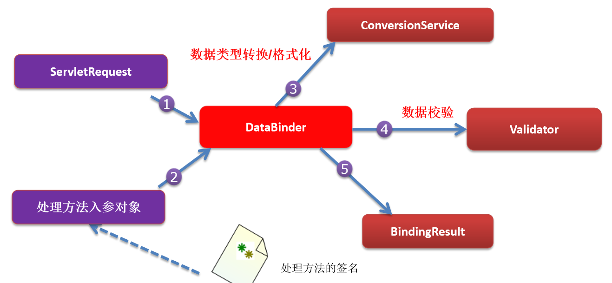

## 10.3 自定义数据类型转换

ConversionService接口

有三种方式

- <span style="color:red">**Converter<S,T> 将S类型对象转为T类型对象**</span><span style="color:green">**（基本只用这种方式）**</span>
- ConverterFactory：将相同系列多个“同质”Converter封装在一起。
- GenericConverter：会根据源类对象及目标类对象所在的宿主类中的上下文信息进行类型转换。

---

**步骤**

ConversionService：是一个接口，它里面有Converter（转换器）进行工作

1）实现Converter接口，写一个自定义的类型转换器

2）Converter是ConversionService中的组件；

- 你的Converter得放进ConversionService中。
- 将WebDataBinder中的ConversionService设置成我们这个加了自定义类型转换器的ConversionService

3）配置出ConversionService；告诉SpringMVC别用默认的ConversionService，用我们自己定义的。

```java
@Configuration
@EnableWebMvc
public class WebConfig implements WebMvcConfigurer {

    @Override
    public void addFormatters(FormatterRegistry registry) {
        DateTimeFormatterRegistrar registrar = new DateTimeFormatterRegistrar();
        registrar.setUseIsoFormat(true);
        registrar.registerFormatters(registry);
    }
}
```

总结三步：

1）实现Converter接口，做一个自定义类型的转换器。

- 自定义一个类实现这个接口

2）将这个Converter配置在ConversionService中。

- 注解版本的 2 和 3 是一起的。

3）告诉SpringMVC使用我们的ConversionService。

4）debug发现有很多String-->其他类型  的转换器，要那个？只有一个是从String到Person，所以用它。

> **Java代码示例**

```java
// 自定义转换器示例
import org.springframework.core.convert.converter.Converter;

public class MyStringToPersonConverter implements Converter<String, Person> {
    @Override
    public Person convert(String source) {
        Person person = new Person();
        System.out.println("提交过来的字符串是" + source);
        if (source.contains("-")) {
            String[] split = source.split("-");
            person.setName(split[0]);
            person.setAge(Integer.valueOf(split[1]));
        }
        return person;
    }
}
```

---

```java
// 配置代码示例
@Configuration
@EnableWebMvc
@ComponentScan(basePackages = "org.example", includeFilters = {
        @ComponentScan.Filter(type = FilterType.ANNOTATION, classes = Controller.class)
}, useDefaultFilters = false)
public class WebConfig implements WebMvcConfigurer {
    
    // 添加我们自己实现的转换器
    @Override
    public void addFormatters(FormatterRegistry registry) {
        MyStringToPersonConverter conv = new MyStringToPersonConverter();
        registry.addConverter(conv);
    }

     // 视图解析器
    public void configureViewResolvers(ViewResolverRegistry registry) {
        // 注册一个视图解析器
        registry.viewResolver(new MyViewResolver());
        registry.jsp("/WEB-INF/views/", ".jsp");
    }

    @Override
    public void configureDefaultServletHandling(DefaultServletHandlerConfigurer configurer) {
        // DefaultServletHandling 不拦截静态资源
        configurer.enable();
    }
}

```

## 10.4 EnableWebMvc解析

use the `@EnableWebMvc` annotation to enable MVC configuration。

使用EnableWebMvc注解开启mvc配置。相当于xml中的

```xml
<mvc:annotation-driven/>
```

点进EnableWebMvc的源码，最后发现注册了一堆东西。

`<mvc:annotation-driven />` 会自动注册

- RequestMappingHandlerMapping 、
- RequestMappingHandlerAdapter 
- ExceptionHandlerExceptionResolver

既然EnableWebMvc是注解版的`<mvc:annotation-driven />` ，那么作用应该一样吧。

还将提供以下支持：

- 支持使用 ConversionService 实例对表单参数进行类型转换

- 支持使用 @NumberFormat annotation、@DateTimeFormat 注解完成数据类型的格式化 

- 支持使用 @Valid 注解对 JavaBean 实例进行 JSR 303 验证  

- 支持使用 @RequestBody 和 @ResponseBody 注解 

---

**既没有配置 <mvc:default-servlet-handler/> 也没有配置 <mvc:annotation-driven/>**

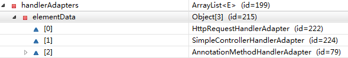

**配置了 <mvc:default-servlet-handler/>  但没有配置 <mvc:annotation-driven/>**

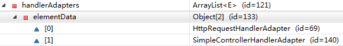

**既配置了 <mvc:default-servlet-handler/>  又配置 <mvc:annotation-driven/>**

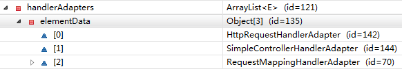

## 10.5 格式化

1）日期格式化

@DateFormat注解，可以用在字段上，方法形参上。

2）数字格式化

@NumberFormat注解，可以用在字段上，方法形参上。

```java
@RequestMapping("/date")
@ResponseBody
// birth=2019-11-11才行
public String date(@DateTimeFormat(pattern = "yyyy-MM-dd") Date birth) {
    return birth.toString();
}

@RequestMapping("/number")
@ResponseBody
// 这样 提交工资的时候可以用逗号隔开了 #,# 逗号分隔开来！！
public String number(@NumberFormat(pattern = "#,###,###.##") Double number) {
    return number.toString();
}
```

## 10.6 数据校验

### 10.6.1 概述

只做前端校验不安全！！他们可以直接绕过前端验证！！重要数据一定要加上后端验证。

### 10.6.2 准备

SpringMVC：可以用JSR303来做数据校验

JDBC：规范---实现（各个厂商的驱动包）

JSR303：规范---Hibernate Validator（第三方校验框架）

需要如下jar包（有几个带el的jar不导入：因为tomcat中有；如果tomcat的版本是7.0以下，则需要导入）

- hibernate-validator-5.0.0.CR2.jar
- hibernate-validator-annotation-processor-5.0.0.CR2.jar
- classmate-0.8.0.jar
- jboss-logging-3.1.1.GA.jar
- validation-api-1.1.0.CR1.jar

实际上我就用了一个（Spring5.x）

```xml
<dependency>
    <groupId>org.hibernate.validator</groupId>
    <artifactId>hibernate-validator</artifactId>
    <version>6.1.5.Final</version>
</dependency>
```

### 10.6.3 校验

给JavaBean的属性添加上校验注解。

在SpringMVC封装对象的时候，告诉SpringMVC这个JavaBean需要校验。

如何知道校验结果：

- 给需要校验的JavaBean后面紧跟一个BindingResult。这个BindingResult就是封装前一个Bean的校验结果。
- <form:error path="lastName"> 显示lastName自带的错误（提交数据的表单好像也的是SpringMVC带的标签库）

```java
@NotEmpty
@Lenght(min=6,max=18)
private String lastName

@Email
private String email
    
public String add(@Valid Employee employee,BindingResut result){
    boolean hasErrors = result.hasErrors()
    //do something
}
```

---

用原生表单怎么办？

result获取相关信息即可。

```java
@Controller
@RequestMapping("/validation")
public class Validation {

    @RequestMapping("/val")
    @ResponseBody
    public String validation(@Valid User user, BindingResult result) {
        boolean b = result.hasErrors();
        List<ObjectError> allErrors = result.getAllErrors();
        StringBuffer buffer = new StringBuffer();
        for (ObjectError err : allErrors) {
            buffer.append(err.getDefaultMessage());
        }
        return buffer.toString();
    }
}
```

----

自定义错误信息（国际化的好麻烦，也用不到，不记了）

```java
@NotEmpty(message="不能为空")
@Lenght(min=6,max=18)
private String lastName
```

# 十一、ajax/下载/上传

## 11.1 ajax

返回数据是json就ok。

导入对应的json包，SpringMVC默认用的jackson！我们导入这个就好啦！

如果想要忽略某个字段的json输出，那么给这个字段加上注解`@JsonIgnore`即可。

----

@ResponseBody：将请求的数据放在响应体；也可以定制响应体！自行百度哦！

```java
@ResponseBody // 可以把对象转为json数据，返回给浏览器。
@RequestMapping("/")
public String body(Employee ee){
    return ee;
} 
```

---

@RequestBody：

- 获取请求体

- 接受json数据，封装为对象。

```java
@ResponseBody
@RequestMapping("/1")
public String test1(@RequestBody String str){
    return str;
}

@ResponseBody
@RequestMapping("/2")
public String test2(@RequestBody Person person){
    return person
}
```

HttpEntity：Http实体

- 如果参数位置写HttpEtity<String> 比@RequestBody更强，可以拿到请求头

```java
// some annotation
public String test3(HttpEntity<String> str){
    return str;
}
```

## 11.2 下载

### 11.2.1 Serlvet 3.0

```java
public class DownServlet extends HttpServlet {
    public void doGet(HttpServletRequest request, HttpServletResponse response)
            throws ServletException, IOException {
        //客户端传递的需要下载的文件名
        String file = request.getParameter("file"); 
        //默认认为文件在当前项目的根目录
        String path = request.getServletContext().getRealPath("")+"/"+file; 
        FileInputStream fis = new FileInputStream(path);
        response.setCharacterEncoding("utf-8");
        response.setHeader("Content-Disposition", "attachment; filename="+file);
        ServletOutputStream out = response.getOutputStream();
        byte[] bt = new byte[1024];
        int length = 0;
        while((length=fis.read(bt))!=-1){
            out.write(bt,0,length);
        }
        out.close();
    }
}
```

### 11.2.2 SpringMVC下载

还不如原生api好用。

[博客地址](https://www.cnblogs.com/wyq178/p/6921164.html)

## 11.3 上传

### 11.3.1 Servlet 3.0

> 表单设置

```html
<form action="up" method="post"  enctype="multipart/form-data">
    <input type="file" name="myfile">
    <input type="submit" value="上传文件">
</form>
```

> **Servlet 3.0 文件上传的写法**

```java
@WebServlet("/up")
@MultipartConfig  
//使用MultipartConfig注解标注改servlet能够接受文件上传的请求
public class UploadServlet extends HttpServlet {
    @Override
    protected void doPost(HttpServletRequest req, HttpServletResponse resp)
            throws ServletException, IOException {
        Part part = req.getPart("myfile");
        // 现在的api可以直接获取 文件名 后缀什么的了，不用截断了
        String disposition = part.getHeader("Content-Disposition");
        String suffix = disposition.substring(disposition.lastIndexOf("."),disposition.length()-1);
          //随机的生存一个32的字符串
        String filename = UUID.randomUUID()+suffix;
          //获取上传的文件名
        InputStream is = part.getInputStream();
        //动态获取服务器的路径
        String serverpath = req.getServletContext().getRealPath("upload");
        FileOutputStream fos = new FileOutputStream(serverpath+"/"+filename);
        byte[] bty = new byte[1024];
        int length =0;
        while((length=is.read(bty))!=-1){
            fos.write(bty,0,length);
        }
        fos.close();
        is.close();
    }
}
```

### 11.3.2 SpringMVC上传

[博客地址](https://www.cnblogs.com/wyq178/p/6921164.html)

配置文件上传组件。

- 单文件：单个对象
- 多文件：数组

# 十二、拦截器/跨域

## 12.1 拦截器

> 自定义拦截器流程

1）实现HandlerInterceptor接口。

2）配置到IOC容器中。(WebConfig中配置？)

- 拦截什么请求？默认是拦截所有。

3）拦截器的执行顺序是什么？

- preHandle ：目标方法运行之前

- postHandle：目标方法运行之后（方法出错的话，不会执行。）

- afterCompletion：页面来到之后（来到页面就行，不管什么页面，报错页面也是页面。只要放行了，afterCompletion就会执行）

- <span style="color:green">**正常运行流程：**</span>拦截器的preHandle----目标方法----拦截器的postHandle---页面---拦截器的afterCompletion

    ```shell
    MyFirstInterceptor...preHandle...
    test01
    MyFirstInterceptor...postHandle...
    success.jsp
    MyFirstInterceptor...afterCompletion...
    ```

> 运行流程

<span style="color:green">**正常运行流程：**</span>拦截器的preHandle----目标方法----拦截器的postHandle---页面---拦截器的afterCompletion

<span style="color:green">**多个拦截器：**</span>

流程：和filter的流程一样

拦截器的preHandle：是按照<span style="color:red">顺序</span>执行的

拦截器的postHandle：是按照<span style="color:red">逆序</span>执行的

拦截器的afterCompletion：是按照<span style="color:red">逆序</span>执行的

<span style="color:green">**出现异常：**</span>

已经放行了的拦截器的afterCompletion总会执行（因为有报错页面），未放行的无法执行！postHandle，在方法报错时是不会执行的。

> 什么时候用过滤器什么时候用拦截器

如果过滤请求非常复杂，需要用ioc容器中的对象，那么用拦截器。

过滤器是javaweb的，要想从ioc容器中拿对象很麻烦。

## 12.2 跨域

### 12.2.1 基本跨域配置

如果只是局部的某些类或方法需要跨域配置，那么在对应的类或注解上加上注解`@CrossOrigin`即可。

官方示例

```java
@RestController
@RequestMapping("/account")
public class AccountController {

    @CrossOrigin
    @GetMapping("/{id}")
    public Account retrieve(@PathVariable Long id) {
        // ...
    }

    @DeleteMapping("/{id}")
    public void remove(@PathVariable Long id) {
        // ...
    }
}

//=========================================================
@CrossOrigin(origins = "https://domain2.com", maxAge = 3600)
@RestController
@RequestMapping("/account")
public class AccountController {

    @GetMapping("/{id}")
    public Account retrieve(@PathVariable Long id) {
        // ...
    }

    @DeleteMapping("/{id}")
    public void remove(@PathVariable Long id) {
        // ...
    }
}

//=========================================================
@CrossOrigin(maxAge = 3600)
@RestController
@RequestMapping("/account")
public class AccountController {

    @CrossOrigin("https://domain2.com")
    @GetMapping("/{id}")
    public Account retrieve(@PathVariable Long id) {
        // ...
    }

    @DeleteMapping("/{id}")
    public void remove(@PathVariable Long id) {
        // ...
    }
}
```

### 12.2.2 全局跨域配置

官方示例代码

```java

@Configuration
@EnableWebMvc
public class WebConfig implements WebMvcConfigurer {

    @Override
    public void addCorsMappings(CorsRegistry registry) {

        registry.addMapping("/api/**")
            .allowedOrigins("https://domain2.com")
            .allowedMethods("PUT", "DELETE")
            .allowedHeaders("header1", "header2", "header3")
            .exposedHeaders("header1", "header2")
            .allowCredentials(true).maxAge(3600);

        // Add more mappings...
    }
}
```

个人示例代码

```java
import org.springframework.context.annotation.Configuration;
import org.springframework.web.servlet.config.annotation.CorsRegistry;
import org.springframework.web.servlet.config.annotation.WebMvcConfigurer;

@Configuration
public class CrossConfig implements WebMvcConfigurer {
    @Override
    public void addCorsMappings(CorsRegistry registry) {
        registry.addMapping("/**")
                .allowedOrigins("*")
                .allowedMethods("GET", "HEAD", "POST", "PUT", "DELETE", "OPTIONS")
                .allowCredentials(true)
                .maxAge(3600)
                .allowedHeaders("*");
    }
}
```

 ‎若要从源中了解更多信息或进行高级自定义，请检查后面的代码：

- `CorsConfiguration`

- `CorsProcessor`

- `DefaultCorsProcessor`

- `AbstractHandlerMapping`

## 12.3 跨域过滤器

[官方文档](https://docs.spring.io/spring-framework/docs/current/reference/html/web.html#mvc-cors-filter)

# 十三、异常处理

## 13.1 概述

Spring MVC通过<span style="color:red">HandlerExceptionResolver</span>处理程序的异常，包括Handler映射、数据绑定以及目标方法执行时发生的异常。

SpringMVC提供的 HandlerExceptionResolver的实现类

前端控制器中有九个成员变量（即SpringMVC的九大组件，其中异常处理解析器就是其中一个）

```java
/** List of HandlerExceptionResolvers used by this servlet. */
@Nullable
private List<HandlerExceptionResolver> handlerExceptionResolvers;
```

我们去看下DispatcherServlet如何初始化<span style="color:red">HandlerExceptionResolver</span>

HandlerExceptionResolver

DispatcherServlet  默认装配的 HandlerExceptionResolver ：

```java
private void initHandlerExceptionResolvers(ApplicationContext context) {
    this.handlerExceptionResolvers = null;

    if (this.detectAllHandlerExceptionResolvers) {
        
        Map<String, HandlerExceptionResolver> matchingBeans = BeanFactoryUtils
            .beansOfTypeIncludingAncestors(context, HandlerExceptionResolver.class, true, false);
        if (!matchingBeans.isEmpty()) {
            this.handlerExceptionResolvers = new ArrayList<>(matchingBeans.values());
            AnnotationAwareOrderComparator.sort(this.handlerExceptionResolvers);
        }
    }
    else {
        try {
            HandlerExceptionResolver her =
                context.getBean(HANDLER_EXCEPTION_RESOLVER_BEAN_NAME, HandlerExceptionResolver.class);
            this.handlerExceptionResolvers = Collections.singletonList(her);
        }
        catch (NoSuchBeanDefinitionException ex) {
            // Ignore, no HandlerExceptionResolver is fine too.
        }
    }

	// 如果没有则使用默认设置。
    if (this.handlerExceptionResolvers == null) {
        this.handlerExceptionResolvers = getDefaultStrategies(context, HandlerExceptionResolver.class);
        if (logger.isTraceEnabled()) {
            logger.trace("No HandlerExceptionResolvers declared in servlet '" + getServletName() +"': using default strategies from DispatcherServlet.properties");
        }
    }
}
```

默认的配置属性，在spring-webmvc jar包中的 org.springframework.web.servlet中，对应的文件名是`DispatcherServlet.properties`，该文件中对应的内容是：

```properties
# 异常处理解析的默认配置
org.springframework.web.servlet.HandlerExceptionResolver=org.springframework.web.servlet.mvc.method.annotation.ExceptionHandlerExceptionResolver,\
	org.springframework.web.servlet.mvc.annotation.ResponseStatusExceptionResolver,\
	org.springframework.web.servlet.mvc.support.DefaultHandlerExceptionResolver
```

页面渲染之前有异常会先处理异常。

如果异常解析器都不能处理就直接抛出去。

**那么，默认的那三个异常处理解析器可以处理什么异常呢？有何使用环境？**

ExceptionHandlerExceptionResolver：@ExceptionHandler

ResponseStatusExceptionResolver：@ResponseStatus

DefaultHandlerExceptionResolver：判断是否SpringMVC自带的异常

----

## 13.2 异常解析器

>**ExceptionHandlerExceptionResolver**

主要处理 Handler 中用 @ExceptionHandler 注解定义的方法。
@ExceptionHandler 注解定义的方法优先级问题：例如发生的是NullPointerException，但是声明的异常有 RuntimeException 和 Exception，此候会根据异常的最近继承关系找到继承深度最浅的那个 @ExceptionHandler 注解方法，即标记了 RuntimeException 的方法
ExceptionHandlerMethodResolver 内部若找不到@ExceptionHandler 注解的话，会找 @ControllerAdvice 中的@ExceptionHandler 注解方法

**示例代码：**

```java
// some function
/*
* 告诉SpringMVC这个方法专门处理这个类发生的异常。
* 	value = {NullPointerException.class}
* 	专门处理空指针异常。
* 	如果图省事，那么直接Exception即可
* 
* 1.给方法随便写一个Exception，用来接受发生的异常。
* 2.如果要要携带异常信息的话，不能给参数位置写Model（不能把异常信息存储到Model中）
* 3.我们返回ModelAndView即可
* 4.如果有多个@ExceptionHandler都能处理这个异常，精确优先。
*/
@ExceptionHandler(value = {NullPointerException.class})
public ModelAndView handleException01(Exception e){
    
    ModelAndView view = new ModelAndView("myerror");
    view.addObject("ex",exception);
    // 视图解析器拼串 来到我们自己定义的错误页面：myerror页面
    return view;
}
```

**每个类都有异常，分散的写很鸡肋，不合理。我们可以把所有的异常都集中起来！**

1、集中处理所有异常的类需要加入到IOC容器中才可被识别。

```java
@ControllerAdvice // 这是一个专门处理异常的
public class MyExceptionHandle{
    
    @ExceptionHandler(value = {NullPointerException.class})
    public ModelAndView handleException01(Exception e){

        ModelAndView view = new ModelAndView("myerror1");
        view.addObject("ex",exception);
        // 视图解析器拼串 来到我们自己定义的错误页面：myerror页面
        return view;
    }
    
    @ExceptionHandler(value = {ArithmeticException.class})
    public ModelAndView handleException01(Exception e){

        ModelAndView view = new ModelAndView("myerror2");
        view.addObject("ex",exception);
        // 视图解析器拼串 来到我们自己定义的错误页面：myerror页面
        return view;
    }
}
```

> **ResponseStatusExceptionResolver** 

这个注解是加在类上的。

```java
@ResponseStatusExceptionResolver 
public class XX xxOO{}

public class XXController{
    public String me(){
        //xxx
        throw new XX();
    }
}
```

在异常及异常父类中找到 @ResponseStatus 注解，然后使用这个注解的属性进行处理。
定义一个 @ResponseStatus 注解修饰的异常类
若在处理器方法中抛出了上述异常：若ExceptionHandlerExceptionResolver 不解析述异常。由于触发的异常 UnauthorizedException 带有@ResponseStatus 注解。因此会被ResponseStatusExceptionResolver 解析到。最后响应HttpStatus.UNAUTHORIZED 代码给客户端。HttpStatus.UNAUTHORIZED 代表响应码401，无权限。 关于其他的响应码请参考 HttpStatus 枚举类型源码。

> **DefaultHandlerExceptionResolver**

对一些特殊的异常进行处理，比如NoSuchRequestHandlingMethodException、HttpRequestMethodNotSupportedException、HttpMediaTypeNotSupportedException、HttpMediaTypeNotAcceptableException等。

>**SimpleMappingExceptionResolver**

如果希望对所有异常进行统一处理，可以使用 SimpleMappingExceptionResolver，它将异常类名映射为视图名，即发生异常时使用对应的视图报告异常

## 13.3 not found异常

<span style="color:red">**如何自定义404异常？有如下三种方式！**</span>

> **方法一，根据SpringMVC的精确匹配优先的规则**

```java
@Controller
public class NotFound {
	// 如果最后来带这个页面，说明是404错误！
    @RequestMapping("*")
    public String notFound() {
        return "404";
    }
}
```

> **方法二，重写前端控制器的noHandlerFound方法**

404即前端控制器没找到可以处理改请求的方法，通过查看源码可知：

```java
protected void doDispatch(HttpServletRequest request, HttpServletResponse response) throws Exception {
    HttpServletRequest processedRequest = request;
    HandlerExecutionChain mappedHandler = null;
    boolean multipartRequestParsed = false;

    WebAsyncManager asyncManager = WebAsyncUtils.getAsyncManager(request);

    try {
        ModelAndView mv = null;
        Exception dispatchException = null;

        try {
            processedRequest = checkMultipart(request);
            multipartRequestParsed = (processedRequest != request);

            // Determine handler for the current request.
            mappedHandler = getHandler(processedRequest);
            if (mappedHandler == null) {
                // 没有处理当前request请求的话，执行moHandlerFound方法
                noHandlerFound(processedRequest, response);
                return;
            }
        }
        // ............
    }
}
// 找不到request对应的处理方法时执行
protected void noHandlerFound(HttpServletRequest request, HttpServletResponse response) throws Exception {
    if (pageNotFoundLogger.isWarnEnabled()) {
        pageNotFoundLogger.warn("No mapping for " + request.getMethod() + " " + getRequestUri(request));
    }
    if (this.throwExceptionIfNoHandlerFound) {
        throw new NoHandlerFoundException(request.getMethod(), getRequestUri(request),
                                          new ServletServerHttpRequest(request).getHeaders());
    }
    else {
        response.sendError(HttpServletResponse.SC_NOT_FOUND);
    }
}
```

我们重写改方法，找不到时，直接重定向到404页面即可。那么到底如何重写呢？搜博客发现都是一些xml配置文件的写法，没什么JavaConfig的写法。下面给出JavaConfig的写法

```java
@Configuration
public class MyWebServletInitializer extends AbstractAnnotationConfigDispatcherServletInitializer {
    @Override
    protected Class<?>[] getRootConfigClasses() {
        return new Class[]{RootConfig.class};
    }

    @Override
    protected Class<?>[] getServletConfigClasses() {
        return new Class[]{WebConfig.class};
    }

    /**
     * @return
     */
    @Override
    protected String[] getServletMappings() {
        return new String[]{"/"};
    }

    @Override
    protected Filter[] getServletFilters() {
        // CharacterEncodingFilter characterEncodingFilter = new CharacterEncodingFilter("ISO-8859-1", true);
        CharacterEncodingFilter characterEncodingFilter = new CharacterEncodingFilter("UTF-8", true);
        characterEncodingFilter.setForceRequestEncoding(true);
        characterEncodingFilter.setForceResponseEncoding(true);
        // 设置rest风格
        HiddenHttpMethodFilter hiddenHttpMethodFilter = new HiddenHttpMethodFilter();
        return new Filter[]{characterEncodingFilter, hiddenHttpMethodFilter};
    }
	
    // 我看源码发现 
    // AbstractAnnotationConfigDispatcherServletInitializer的父类
    // AbstractDispatcherServletInitializer的createDispatcherServlet
    // 里创建的前端控制器，我们重写这个方法，把里面的new DispatcherServlet(...)
    // 换成我们自己的new MyDispatcherServlet(...);
    // 在自己的MyDispatcherServlet里，重写noHandlerFound方法
    @Override
    protected FrameworkServlet createDispatcherServlet(WebApplicationContext servletAppContext) {
        System.out.println("MyDispatcherServlet start222");
        return new MyDispatcherServlet(servletAppContext);
    }
}

class MyDispatcherServlet extends DispatcherServlet {
    public MyDispatcherServlet(WebApplicationContext webApplicationContext) {
        super(webApplicationContext);
        setDispatchOptionsRequest(true);
        System.out.println("MyDispatcherServlet start111");
    }

    @Override
    protected void noHandlerFound(HttpServletRequest request, HttpServletResponse response) throws Exception {
        response.sendRedirect(request.getContextPath() + "/error.jsp");
    }
}
```

> **方法三，利用web容器提供的error-page**

还记得之前提到的web容器会提供一个404的默认界面吗？

其实我们完全可以替换成我们自己的界面，那么看起来这种方法应该是最简单的了。

只需要在web.xml文件中写上如下代码就可以了：

```xml
<error-page>
    <error-code>404</error-code>
    <location>/resource/view/404.htm</location>
</error-page>
```

不过值得注意的是，这里配置的的location其实会被当成一个请求来访问。

那么我们的DispatcherServlet会拦截这个请求而造成无法访问，此时的结果是用户界面一片空白。

所以这里的404.htm其实是一个静态资源，我们需要用访问静态资源的方式去访问。

而在我的Spring MVC里，resource目录下的文件都是不会被拦截的

> **小结**

- 最方便：那肯定是第三种了，我们只需要提供一个静态页面即可

- 最快捷：第一种肯定最慢，因为它会发起2个请求。第二种和第三种应该差不多

- 最灵活：从灵活性上来看，第三种肯定是最缺乏的，但是其实对于404来说并不是需要经常变化的，不过也保不准可能可以允许用户自定义404界面等，这里一、二两种方式则提供了灵活性。

- 通用性：第三种应该是最通用了，而一、二 两种则要依赖Spring MVC

# 十四、扫尾

## 14.1 运行流程

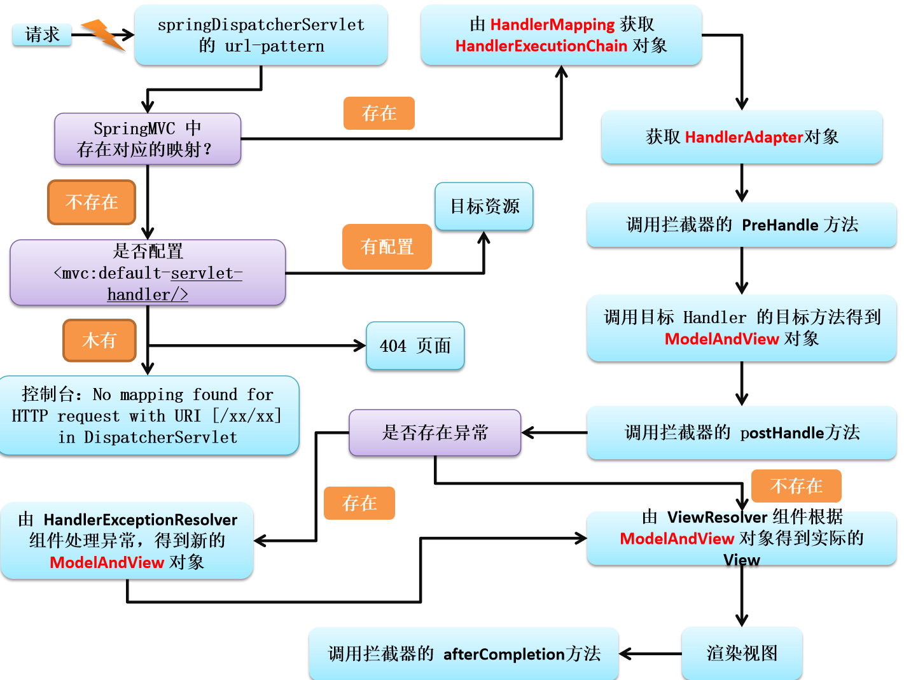

<span style="color:green">**1、所有请求，前端前端控制器（DispatcherServlet）收到请求，调用doDispatch进行处理**</span>

<span style="color:green">**2、根据HandlerMapping中保存的请求映射信息找到，处理当前请求的，处理器执行链（包含拦截器）**</span>

<span style="color:green">**3、根据当前处理器找到他的HandlerAdapter（适配器）**</span>

<span style="color:green">**4、拦截器的preHandle先执行**</span>

<span style="color:green">**5、适配器执行目标方法，并返回ModelAndView**</span>

- ModelAttribute注解标注的方法提前运行
- 执行目标方法的时候（确定目标方法用的参数）
    - 有注解
    - 没注解
        - 看是否是Model、Map以及其他的
        - 如果是自定义类型
            - 从隐含模型中看有没有，如果有就从隐含模型中拿
            - 如果没有，再看是否SessionAttributes标注的属性，如果是从Session中拿，如果拿不到会抛异常。
            - 都不是1，就利用反射创建对象。

<span style="color:green">**6、拦截器的postHandle执行**</span>

<span style="color:green">**7、处理结果；（页面渲染流程）**</span>

- <span style="color:green">**如果有异常使用异常解析器处理异常；处理完后还会返回ModelAndView**</span>
- <span style="color:green">**调用render进行页面渲染**</span>
    - 视图解析器根据视图名得到视图对象；
    - 视图对象调用render方法；
- <span style="color:green">**执行拦截器的afterCompletion**</span>

<span style="color:red">知道加粗部分的即可。</span>

## 14.2 Spring与MVC

### 14.2.1 概述

Spring和SpringMVC整合的目的：分工明确

SpringMVC的配置文件就来配置和网站转发逻辑以及网站功能有关的（视图解析器，文件上传解析器，支持ajax，xxx）；

Spring的配置文件来配置和业务有关的（事务控制，数据源，xxx）；

### 14.2.2 整合

> <span style="color:green">**方式一：**</span>

- spring.xml 配置了Spring相关的信息
- springmvc.xml 配置了mvc相关的信息
- 在springmvc.xml文件中引入spring.xml

这种配置方式只会启动一个IOC容器。

> <span style="color:green">**方式二：**</span>

springmvc和spring分容器，各司其职。

- spring管理业务逻辑组件； 

- springmvc管理控制器组件； 如：Controller，ControllerAdvice

如果扫多了会出现类被创建两次。spring容器中把所有类创建了一次，springmvc容器中把类创建了一次。

在 Spring 的环境下使用 SpringMVC。

Spring 的 IOC 容器不应该扫描 SpringMVC 中的 bean, 对应的 SpringMVC 的 IOC 容器不应该扫描 Spring 中的 bean

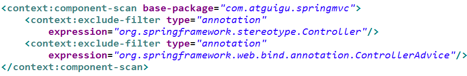

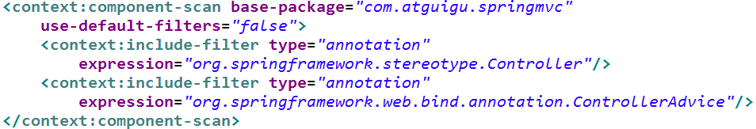

在 Spring MVC 配置文件中引用业务层的 Bean

多个 Spring IOC 容器之间可以设置为父子关系，以实现良好的解耦。
Spring MVC WEB 层容器可作为 “业务层” Spring 容器的子容器：即 WEB 层容器可以引用业务层容器的 Bean，而业务层容器却访问不到 WEB 层容器的 Bean

Spring容器是作为父容器的，SpringMVC容器是作为子容器的。子容器的Controller要用父容器的Service没问题。但是如果父容器要拿子容器的，就不行！！


# 十五、乱码处理

[参考博客](https://blog.csdn.net/c17315377559/article/details/101940087?utm_medium=distribute.pc_relevant.none-task-blog-BlogCommendFromMachineLearnPai2-1.control&depth_1-utm_source=distribute.pc_relevant.none-task-blog-BlogCommendFromMachineLearnPai2-1.control)  博客中用的xml方式进行处理的，我采用的JavaConfig方式处理的。

##  15.1 请求乱码

### 15.1.1 post请求乱码

> **在web.xml中配置过滤器**

这种方式适用于**Post**中文乱码处理。在web.xml中配置过滤器，这是Springmvc为我们写好的类，可以，通过指定编码格式，从而有效控制Post请求乱码，但是处理不了Get请求方式的乱码。

```xml
<filter>
    <filter-name>characterEncodingFilter</filter-name>
    <filter-class>org.springframework.web.filter.CharacterEncodingFilter</filter-class>
    <init-param>
        <param-name>encoding</param-name>
        <param-value>utf-8</param-value>
    </init-param>
</filter>
```

> **JavaConfig的配置方式解决POST请求乱码**

```java
import org.springframework.context.annotation.Configuration;
import org.springframework.web.filter.CharacterEncodingFilter;
import org.springframework.web.filter.HiddenHttpMethodFilter;
import org.springframework.web.servlet.support.AbstractAnnotationConfigDispatcherServletInitializer;

import javax.servlet.Filter;

@Configuration
public class MyWebServletInitializer extends AbstractAnnotationConfigDispatcherServletInitializer {
    @Override
    protected Class<?>[] getRootConfigClasses() {
        return new Class[]{RootConfig.class};
    }

    @Override
    protected Class<?>[] getServletConfigClasses() {
        return new Class[]{WebConfig.class};
    }

    /**
     * @return
     */
    @Override
    protected String[] getServletMappings() {
        return new String[]{"/"};
    }

    @Override
    protected Filter[] getServletFilters() {
        // 看了下源码，CharacterEncodingFilter extends OncePerRequestFilter
        // 在RequestFilter请求之前进行了编码设置
        CharacterEncodingFilter characterEncodingFilter = new CharacterEncodingFilter("UTF-8", true);
        characterEncodingFilter.setForceRequestEncoding(true);
        characterEncodingFilter.setForceResponseEncoding(true);
        // 设置rest风格 HiddenHttpMethodFilter也是请求之前进行
        HiddenHttpMethodFilter hiddenHttpMethodFilter = new HiddenHttpMethodFilter();
        return new Filter[]{characterEncodingFilter, hiddenHttpMethodFilter};
    }
}
```

> **解决Get和Post请求乱码一劳永逸的办法**

在**~\apache-tomcat-7.0.90\conf\server.xml中处理**

打开server.xml，大约在65行左右的位置

```xml
<Connector connectionTimeout="20000" port="8080" protocol="HTTP/1.1" redirectPort="8443"/>
```

在Connector中加上**URIEncoding="UTF-8"**

```xml
<Connector URIEncoding="UTF-8" connectionTimeout="20000" port="8080" protocol="HTTP/1.1" redirectPort="8443"/>
```

此种方式可以处理，Get与Post请求方式的乱码。配完之后，便不需要在考虑中文乱码的问题

## 15.2 响应乱码

> 方式一，在@RequestMapping中加上，**produces="text/html;charset=utf-8"**

```java
@ResponseBody
/**
	   produces = "text/plain"
	   produces = {"text/plain", "application/*"}
	   produces = MediaType.TEXT_PLAIN_VALUE
	   produces = "text/plain;charset=UTF-8"
*/
@RequestMapping(value="/test01.action",produces="text/html;charset=utf-8")
public String test03() throws Exception {
    return "我爱你中国";
}
```

通过，此种方式设置响应编码格式为**utf-8。**但是，此种方式，意味着，如果需要向页面返回中文，则就需要书写，过于麻烦。所以，请看第二种方式。

>**方式二、在Springmvc.xml配置文件中书写**

```xml
<mvc:annotation-driven>
    <mvc:message-converters>
        <!-- 处理响应中文内容乱码 -->
        <bean class="org.springframework.http.converter.StringHttpMessageConverter">
            <property name="defaultCharset" value="UTF-8" />
            <property name="supportedMediaTypes">
                <list>
                    <value>text/html</value>
                    <value>application/json</value>
                </list>
            </property>
        </bean>
    </mvc:message-converters>
</mvc:annotation-driven>  
```

将上述配置，放入到Springmvc,xml配置文件中，便可以对相应乱码进行全站处理。

我更喜欢JavaConfig的配置方式

```java
@EnableWebMvc // 开启mvc的高级配置
@Configuration
@ComponentScan(basePackages = "cn.payphone", includeFilters = {
        @ComponentScan.Filter(type = FilterType.ANNOTATION, classes = {Controller.class})
}, useDefaultFilters = false)
public class WebConfig implements WebMvcConfigurer {

    public void configureViewResolvers(ViewResolverRegistry registry) {
        // 这样  视图解析器会自动拼串
        registry.jsp("/WEB-INF/views/", ".jsp");
    }

    // 防止响应乱码。响应数据的编码格式这里默认是IOS-8859
    public void configureMessageConverters(List<HttpMessageConverter<?>> converters) {
        converters.add(new StringHttpMessageConverter(StandardCharsets.UTF_8));
    }
}
```

在源码中查看默认的编码格式  默认是ISO_8859_1

```java
public class StringHttpMessageConverter extends AbstractHttpMessageConverter<String> {

	private static final MediaType APPLICATION_PLUS_JSON = new MediaType("application", "*+json");

	/**
	 * The default charset used by the converter.
	 */
    // 默认是ISO_8859_1
	public static final Charset DEFAULT_CHARSET = StandardCharsets.ISO_8859_1;

	@Nullable
	private volatile List<Charset> availableCharsets;

	private boolean writeAcceptCharset = false;

	/**
	 * A default constructor that uses {@code "ISO-8859-1"} as the default charset.
	 * @see #StringHttpMessageConverter(Charset)
	 */
	public StringHttpMessageConverter() {
		this(DEFAULT_CHARSET);
	}
}
```

----

# 开始看书

看透SpringMVC

## 第一章

