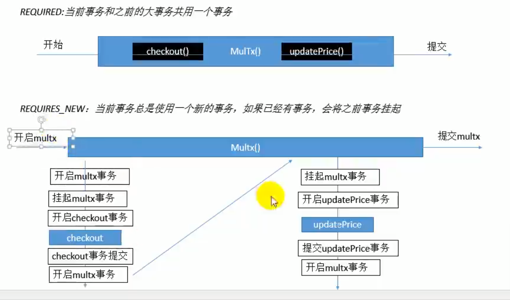
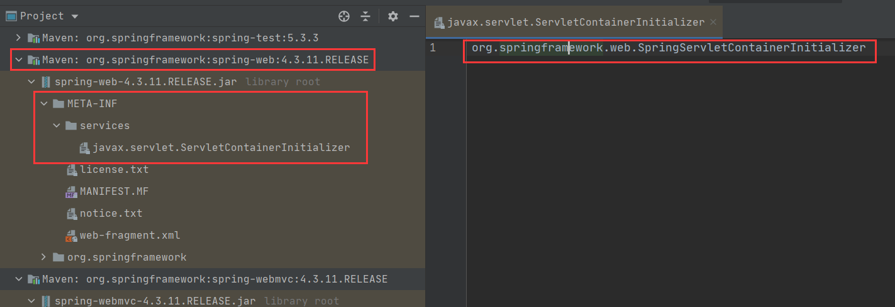

# 概述

[(1条消息) Spring源码_从头再来_f的博客-CSDN博客](https://blog.csdn.net/weixin_42128429/category_11339692.html)

## 学习内容

> 容器

- AnnotationConfigApplicationContext
- 组件添加
- 组件赋值
- 组件注入
- AOP
- 声明式事务

> 扩展原理

- BeanFactoryPostProcessor
- BeanDefinitionRegistryPostProcessor
- ApplicationListener
- Spring 容器创建过程

> web

- Servlet 3.0 请求
- 异步请求

<a href="https://docs.spring.io/spring-framework/docs/current/spring-framework-reference/core.html#beans-factory-extension">如何扩展 Spring 的功能</a>

> 配置文件注意点

- 配置文件需要放在源码文件夹，这样合并的时候才会出现在 bin 目录下

- 目录层级关系

   src|

  ​      |com 类所在的包名

  conf 配置文件所在的文件夹，与 src 目录同级别

## maven报错

这个报错了，怎么办？

```xml
<plugin>
    <artifactId>maven-project-info-reports-plugin</artifactId>
    <version>3.0.0</version>
</plugin>
```

引入这个依赖就行！

```xml
<dependency>
    <groupId>org.apache.maven.plugins</groupId>
    <artifactId>maven-project-info-reports-plugin</artifactId>
    <version>3.0.0</version>
    <type>maven-plugin</type>
</dependency>
```

## Spring的优点

1️⃣非入侵式框架。可以使应用程序代码对框架的依赖最小化（其实也小不到哪里去）

2️⃣方便解耦，简化开发。Spring就是一个大工厂，可以将所有对象的创建和依赖关系的维护工作都交给Spring容器管理，大大地降低了组件之间的耦合性。

3️⃣支持 AOP。Spring 提供了对 AOP 的支持，它允许将一些通用任务，如安全、事务、日志等进行集中式处理，从而提高了程序的复用性。

4️⃣支持声明式事务处理。只需要通过配置就可以完成对事务的管理，而无须手动编程。

5️⃣方便集成各种优秀框架。Spring 内部提供了对各种优秀框架（如Struts、Hibernate、MyBatis、Quartz 等）的直接支持。

6️⃣降低 Java EE API 的使用难度。Spring 对 Java EE 开发中非常难用的一些 API（如 JDBC、JavaMail 等），都提供了封装，使这些 API 应用难度大大降低。

7️⃣提供了对 JUnit 的支持，方便程序测试。

# Spring核心容器

Spring 框架的主要功能是通过其核心容器来实现的，而 Spring 框架提供了两种核心容器，分别为 BeanFactory 和 ApplicationContext。

## BeanFactory

BeanFactory 是基础类型的 IoC 容器。简单说，BeanFactory 就是一个管理 Bean 的工厂，它主要负责初始化各种 Bean，并调用它们的生命周期方法。

## ApplicationContext

ApplicationContext 是 BeanFactory 的子接口，也被称为应用上下文，是另一种常用的 Spring 核心容器。ApplicationContext 里不仅包含了 BeanFactory 的所有功能，还添加了对国际化、资源访问、事件传播等方面的支持。

## 依赖注入

依赖注入（Dependency Injection，简称 DI）与控制反转（IoC）的含义相同，只不过这两个称呼是从两个角度描述的同一个概念。

<b>控制反转：</b>不再是自己实例化对象，而是交给 Spring 容器来创建对象，控制权发生了反转。

<b>依赖注入：</b>A 类和 B 类，如果 A 要用到 B，就是 A 依赖了 B。Spring 的 IOC 容器会为 A 初始化这个 B 对象，即注入这个依赖。

> Spring 的依赖注入的方式有如下两种

1️⃣setter 方法注入

2️⃣构造方法注入：<a href="https://blog.csdn.net/weixin_42128429/article/details/121395148">一篇优质博客</a>

- 如果有多个构造方法，默认会使用无参构造方法进行初始化。
- 如果有多个构造方法，但是没有无参数的，那么会报错。
- 报错了，怎么办？为某个构造方法加上 Autowired，就会使用那个构造方法进行初始化。
- 如果需要根据不同的情况来实例化对象怎么办？请看下面的多构造实例化代码

3️⃣注解注入

setter 注入（需要加上 Autowired 注解）和构造方法注入（无需加注解）

```java
@Component
public class User {
    public UserP p;

    public UserPTwo t;

    public User(UserPTwo t) {
        this.t = t;
    }

    @Autowired
    public void setP(UserP p){
        this.p = p;
    }
}

@Component
class UserP {}

@Component
class UserPTwo {}
```

测试代码

```java
import org.junit.Assert;
import org.junit.Test;
import org.junit.runner.RunWith;
import org.springframework.beans.factory.annotation.Autowired;
import org.springframework.test.context.ContextConfiguration;
import org.springframework.test.context.junit4.SpringJUnit4ClassRunner;

@RunWith(SpringJUnit4ClassRunner.class)
@ContextConfiguration(classes = SpringConfig.class)
public class Hello {
    @Autowired
    User user;

    @Test
    public void f1() {
        Assert.assertNotNull(user);
        System.out.println(user.t);
        System.out.println(user.p);
    }
}
```

不想使用单元测试的写法

```java
@ComponentScan(basePackages = "cn.study")
public class SpringConfig {
    public static void main(String[] args) {
        AnnotationConfigApplicationContext context = new AnnotationConfigApplicationContext(SpringConfig.class);
        User bean = context.getBean(User.class);
        System.out.println(bean);
    }
}
```

多构造方法指定某个构造方法进行实例化

```java
@Component
@Scope(value = "prototype")
public class User {
    public UserP p;
    public UserPTwo t;
    public Object o;
    public User() {}

    public User(UserPTwo t) {
        this.t = t;
    }

    public User(UserP p) {
        this.p = p;
    }
}

@ComponentScan(basePackages = "cn.study")
public class SpringConfig {
    public static void main(String[] args) {
        AnnotationConfigApplicationContext context = new AnnotationConfigApplicationContext(SpringConfig.class);
        User bean = context.getBean(User.class, new UserP());
        System.out.println(bean.p);

        User beant = context.getBean(User.class, new UserPTwo());
        System.out.println(beant.t);
    }
}
```

## Bean

[(1条消息) Spring源码学习（十）--推断构造方法_从头再来_f的博客-CSDN博客_spring推断构造方法](https://blog.csdn.net/weixin_42128429/article/details/121395148)

### 实例化

在 Spring 中，要想使用容器中的 Bean，需要实例化 Bean。实例化 Bean 有三种方式，分别为<span style="color:orange">构造器实例化、静态工厂方式实例化和实例工厂方式实例化</span>

### 构造器

默认是使用无参构造方法。如果既有无参又有有参，默认使用无参。可以通过 @Autowire 指定使用某个构造方法。

```java
@Component
@Scope(value = "prototype")
public class User {
    public UserP p;
    public UserPTwo t;
    public Object o;

    public User() {}
	
    // @Autowired 指定使用这个构造方法初始化
    @Autowired
    public User(UserPTwo t) {
        this.t = t;
    }
}

@RunWith(SpringJUnit4ClassRunner.class)
@ContextConfiguration(classes = SpringConfig.class)
public class Hello {
    @Autowired
    User user;

    @Test
    public void f1() {
        Assert.assertNotNull(user);
        System.out.println(user.t);
    }
}
```

### 静态工厂方法

静态工厂是实例化 Bean 的另一种方式。该方式要求开发者创建一个静态工厂的方法来创建 Bean 的实例。

```java
@Configuration
public class StaticFactoryMethod {

    @Bean("staticFactoryUser")
    public static User createUser() {
        return new User();
    }
}
```

### 实例工厂

```java
@Configuration
public class InstanceFactory {

    @Bean("instanceFactoryUser")
    public User createBean() {
        return new User();
    }
}
```

测试代码

```java
@RunWith(SpringJUnit4ClassRunner.class)
@ContextConfiguration(classes = SpringConfig.class)
public class Hello {

    @Autowired
    @Qualifier("staticFactoryUser")
    User staticUser;

    @Autowired
    @Qualifier("instanceFactoryUser")
    User instanceUser;

    @Test
    public void f1() {
        Assert.assertNotNull(staticUser);
        Assert.assertNotNull(instanceUser);
    }
}
```

### 作用域

通过 Spring 容器创建一个 Bean 的实例时，不仅可以完成 Bean 的实例化，还可以为 Bean 指定特定的作用域。Spring 中为 Bean 的实例定义了 7 种作用域。

| 作用域名称        | 说明                                                         |
| ----------------- | ------------------------------------------------------------ |
| singleton（单例） | 使用 singleton 定义的 Bean 在 Spring 容器中将只有一个实例，即单例模型。 |
| prototype（原型） | 每次通过 Spring 容器获取的 prototype 定义的 Bean 时，容器都将创建一个新的 Bean 实例。 |
| request           | 在一次 HTTP 请求中，容器会返回一个 Bean 实例，不同的 HTTP 请求会产生不同的 Bean，且仅在当前 HTTP request 内有效。 |
| session           | 在一次 HTTP Session 中，容器会返回同一个 Bean 实例，且仅在当前 HTTP Session 内有效。 |
| globalSession     | 在一次 HTTP Session 中，容器会返回一个 Bean 实例，仅在使用 portlet 上下文时有效。 |
| application       | 为每个 ServletContext 对象创建一个实例。仅在 Web 相关的 ApplicationContext 中生效。 |
| websocket         | 为每个 websocket 对象创建一个实例。仅在 Web 相关的 ApplicationContext 中生效。 |

### 生命周期

<span style="color:red">Spring 会管理 singleton 作用域的生命周期，不会管理 prototype 作用域的 Bean。在 singleton 作用域下，Spring 能够精确地知道该 Bean 何时被创建，何时初始化完成以及何时被销毁。</span>

<div align="center"><b>Spring 流程图</b></div>
<div align="center">
    
</div>

### 装配方式

Spring 提供了基于 XML 的配置、基于注解的配置和自动装配等。主要讲解基于注解的配置。

Spring 中定义了一系列的注解，常用的注解如下：

- @Component：可以使用此注解描述 Spring 中的 Bean，但它是一个泛化的概念，仅仅表示一个组件（Bean），并且可以作用在任何层次。使用时只需将该注解标注在相应类上即可。
- @Repository：用于将数据访问层（DAO 层）的类标识为 Spring 中的 Bean，其功能与 @Component 相同。
- @Service：通常作用在业务层（Service 层），用于将业务层的类标识为 Spring 中的 Bean，其功能与 @Component 相同。
- @Controller：通常作用在控制层（如 Spring MVC 的 Controller），用于将控制层的类标识为 Spring 中的 Bean，其功能与 @Component相同。
- @Autowired：用于对 Bean 的属性变量、属性的 setter 方法及构造方法进行标注，配合对应的注解处理器完成 Bean 的自动配置工作。<span style="color:orange">默认按照 Bean 的类型进行装配。如果按类型匹配发现有多个，且没有指定优先选那个，会报错。</span>
- @Resource：其作用与 Autowired 一样。其区别在于 @Autowired 默认按照 Bean 类型装配，而 @Resource 默认按照 Bean 实例名称进行装配。@Resource 中有两个重要属性：name 和 type。
    - Spring 将 name 属性解析为 Bean 实例名称，type 属性解析为 Bean 实例类型。
    - 如果指定 name 属性，则按实例名称进行装配；如果指定 type 属性，则按 Bean 类型进行装配；
    - 如果都不指定，则先按 Bean 实例名称装配，如果不能匹配，再按照 Bean 类型进行装配；如果都无法匹配，则抛出 NoSuchBeanDefinitionException 异常。
- @Qualifier：与 @Autowired 注解配合使用，会将默认的按 Bean 类型装配修改为按 Bean 的实例名称装配，Bean 的实例名称由 @Qualifier 注解的参数指定。

# 组件注解

## 导包

导入 spring-context 包后，其他一些包也会自动导入哦~ 即核心容器所依赖的所有环境也会被导入。

```xml
<!-- https://mvnrepository.com/artifact/org.springframework/spring-context -->
<dependency>
    <groupId>org.springframework</groupId>
    <artifactId>spring-context</artifactId>
    <version>5.3.3</version>
</dependency>
```

## xml写法

POJO 对象

```java
package org.example.pojo;

public class Person {
    private String name;
    private Integer age;

    public Person() {}

    public Person(String name) {
        this.name = name;
    }
	// 省略 setter getter
}

```

获取 bean

```java
package org.example;

import org.example.pojo.Person;
import org.springframework.context.support.ClassPathXmlApplicationContext;

public class BeanXMLTest {
    public static void main(String[] args) {
        ClassPathXmlApplicationContext context = new ClassPathXmlApplicationContext("bean.xml");
        Person person = (Person) context.getBean("person");
        Person person2 = (Person)context.getBean("person2");
        System.out.println(person2);
        context.close();
    }
}
```

- `xml` 配置文件。在 maven 的 `resrouce` 目录下。resource 目录下的资源最后会变成项目根目录下的文件。所以是直接 `Classxxx("bean.xml")`
- `JavaSE` 的项目和 `JavaEE` 项目最后的输出路径好像都是 classes，但是 `JavaEE` 里写的路径是 `classpath`！

## 用注解配置类

@Configuration 可以替代 XML，进行类的配置。典型的应用有三方 jar 包，我们需要把它交给 Spring 容器进行管理，于是用 @Configuration 的方式把这个类注入到 Spring 中。

JavaConfig 配置类

```java
package org.example.configuration;

import org.example.pojo.Person;
import org.springframework.context.annotation.Bean;
import org.springframework.context.annotation.Configuration;

@Configuration
public class MainConfiguration {
    // 给容器中注册一个Bean  默认是以方法名为bean的名称，如果不想要方法名可以这样 @Bean("person") 或 @Bean({"person1","person2"})
    // 具体看看源码注释 一目了然。
    // value 与 name之间 是别名关系
    @Bean("person3")
    public Person person() {
        return new Person();
    }
}
```

测试代码

```java
public class BeanXMLTest {
    public static void main(String[] args) {
        AnnotationConfigApplicationContext context2 = new AnnotationConfigApplicationContext(MainConfiguration.class);
        Person person21 = (Person) context2.getBean( "person3");
        System.out.println(person21);
    }
}

// =============================================================================
public class BeanXMLTest {
    public static void main(String[] args) {
        AnnotationConfigApplicationContext context2 = new AnnotationConfigApplicationContext(MainConfiguration.class);
        String[] beanNamesForType = context2.getBeanNamesForType(Person.class);
        String[] beanDefinitionNames = context2.getBeanDefinitionNames();
        for (int i = 0; i < beanDefinitionNames.length; i++) {
            System.out.println(beanDefinitionNames[i]);
        }
        System.out.println("===========");
        for (int i = 0; i < beanNamesForType.length; i++) {
            // 同一个类的多个别名只会输出其中一个。
            System.out.println(beanNamesForType[i]);
        }
    }
}
```

## 包扫描

用到的注解有 @Configuration、@ComponentScan，如果是 JDK8，它被设置成了重复注解，可以重复用。

xml 的配置方式

```xml
<!-- 配置包扫描 , 只要标注了@Controller、@Service、@Repository、@Component的都会被自动的扫描加入容器中-->
<context:component-scan base-package="org.example" />
```

注解方式，按指定类型排除

```java
// excludeFilters指定排除那些  用@Filter指定排除那些
// includeFilters指定包含那些  用@Filter指定包含那些
// 要让includeFilters生效需要设置@ComponentScan的useDefaultFilters=false，默认过滤器会导入所有的。
// MainConfiguration的配置对象不会被排除的
@Configuration
@ComponentScan(basePackages = "org.example", excludeFilters = {
        @ComponentScan.Filter(type = FilterType.ANNOTATION, 
                              classes = {Controller.class, Service.class})
})
public class MainConfiguration {
    // 给容器中注册一个Bean
    @Bean(name = {"person1", "person2", "person3"})
    public Person person() {
        return new Person();
    }

    @Bean
    public Person person007() {
        return new Person();
    }
}
```

注解方式，按指定规则包含

```java
// IncludeConfiguration的配置对象是也会包含的。
@Configuration
@ComponentScan(basePackages = "org.example", includeFilters = {
        @ComponentScan.Filter(type = FilterType.ASSIGNABLE_TYPE, 
                              classes = DemoService.class)
}, useDefaultFilters = false)
public class IncludeConfiguration {
    // 给容器中注册一个Bean
    @Bean(name = {"person1", "person2", "person3"})
    public Person person() {
        return new Person();
    }

    @Bean
    public Person person007() {
        return new Person();
    }
}
```

```java
public class ScanTest {

    @Test
    public void test1() {
        AnnotationConfigApplicationContext anno = new AnnotationConfigApplicationContext(MainConfiguration.class);
        String[] beanDefinitionNames = anno.getBeanDefinitionNames();
        for (int i = 0; i < beanDefinitionNames.length; i++) {
            System.out.println(beanDefinitionNames[i]);
        }
    }

    @Test
    public void test2() {
        AnnotationConfigApplicationContext anno = new AnnotationConfigApplicationContext(IncludeConfiguration.class);
        String[] beanDefinitionNames = anno.getBeanDefinitionNames();
        for (int i = 0; i < beanDefinitionNames.length; i++) {
            System.out.println(beanDefinitionNames[i]);
        }
    }
}
```

## @Filter自定义过滤规则

自定义过滤规则的代码

```java
package org.example.configuration;

import org.springframework.context.annotation.ComponentScan;
import org.springframework.context.annotation.Configuration;
import org.springframework.context.annotation.FilterType;
import org.springframework.core.io.Resource;
import org.springframework.core.type.AnnotationMetadata;
import org.springframework.core.type.ClassMetadata;
import org.springframework.core.type.classreading.MetadataReader;
import org.springframework.core.type.classreading.MetadataReaderFactory;
import org.springframework.core.type.filter.TypeFilter;

import java.io.IOException;

@Configuration
@ComponentScan(basePackages = "org.example", includeFilters = {
        @ComponentScan.Filter(type = FilterType.CUSTOM, classes = {DefineFilter.class})
}, useDefaultFilters = false)
public class DefineFilterConfiguration {}

class DefineFilter implements TypeFilter {
    // 自定义匹配规则
    @Override
    public boolean match(MetadataReader metadataReader, MetadataReaderFactory metadataReaderFactory) throws IOException {
        AnnotationMetadata annotationMetadata = metadataReader.getAnnotationMetadata();
        // 获得当前正在扫描的类信息
        ClassMetadata classMetadata = metadataReader.getClassMetadata();
        // 获得当前类资源（类路径）
        Resource resource = metadataReader.getResource();
        // 类名
        String className = classMetadata.getClassName();
        System.out.println("---->" + className);
        if (className.contains("Dao")) {
            return true;
        }
        return false;
    }
}
```

测试代码

```java
package org.example;

import org.example.configuration.DefineFilterConfiguration;
import org.example.configuration.IncludeConfiguration;
import org.example.configuration.MainConfiguration;
import org.junit.Test;
import org.springframework.context.annotation.AnnotationConfigApplicationContext;

public class ScanTest {

    @Test
    public void test3() {
        AnnotationConfigApplicationContext anno = new AnnotationConfigApplicationContext(DefineFilterConfiguration.class);
        String[] beanDefinitionNames = anno.getBeanDefinitionNames();
        for (int i = 0; i < beanDefinitionNames.length; i++) {
            System.out.println(beanDefinitionNames[i]);
        }
    }
}
```

## Spring单元测试

引入依赖，需要的 JUnit 的版本有点高

[Spring测试官方文档](https://docs.spring.io/spring-framework/docs/current/reference/html/testing.html)

```xml
<dependency>
    <groupId>org.springframework</groupId>
    <artifactId>spring-context</artifactId>
    <version>5.3.3</version>
</dependency>

<dependency>
    <groupId>junit</groupId>
    <artifactId>junit</artifactId>
    <version>4.13.1</version>
    <scope>test</scope>
</dependency>

<dependency>
    <groupId>org.springframework</groupId>
    <artifactId>spring-test</artifactId>
    <version>5.3.3</version>
    <scope>test</scope>
</dependency>
```

编写测试代码 (注入的测试类就不贴代码了)

```java
@ContextConfiguration(classes = ScopeConfiguration.class)
@RunWith(SpringJUnit4ClassRunner.class)
public class ScopeConfigurationTest {

    @Autowired
    Person person1;

    @Autowired
    Person person2;

    @Autowired
    Person person3;

    @Test
    public void test1() {
        System.out.println(person1 == person2);
        System.out.println(person1 == person3);
    }
}
```

## Bean作用域范围

- singleton 单例
- prototype 多例
- request 
- session
- global-session

## 懒加载

- @Lazy，针对单实例容器启动时不创建对象，第一次获取 bean 时再进行初始化。
- 验证代码如下

```java
@Configuration
public class LazyConfiguration {
    @Scope("prototype")
    @Bean
    @Lazy public Person person() {
        System.out.println("Create Person");
        return new Person();
    }

    @Bean
    public Person getP() {
        System.out.println("Create getP");
        return new Person();
    }
}
```

## @Conditional按条件注入

符合条件的 Bean 才会被注册到 IoC 容器中。

> @Conditional

```java
@Target({ElementType.TYPE, ElementType.METHOD}) // 方法
@Retention(RetentionPolicy.RUNTIME)
@Documented
public @interface Conditional {

	/**
	 * All {@link Condition} classes that must {@linkplain Condition#matches match}
	 * in order for the component to be registered.
	 */
	Class<? extends Condition>[] value();
}

// 再看Class<? exntends Condition>[] 中的Condition
@FunctionalInterface
public interface Condition {
	/**
	 * Determine if the condition matches.
	 * @param context the condition context
	 * @param metadata the metadata of the {@link org.springframework.core.type.AnnotationMetadata class}
	 * or {@link org.springframework.core.type.MethodMetadata method} being checked
	 * @return {@code true} if the condition matches and the component can be registered,
	 * or {@code false} to veto the annotated component's registration
	 */
	boolean matches(ConditionContext context, AnnotatedTypeMetadata metadata);

}
// 由此可看出，Conditional传入的是Condition数组
```

> 按条件进行注入

```java
package cn.study.ioc;

import cn.study.ioc.pojo.Person;
import org.springframework.beans.factory.support.BeanDefinitionRegistry;
import org.springframework.context.annotation.*;
import org.springframework.core.type.AnnotatedTypeMetadata;

import java.util.Arrays;

@Configuration
public class BeanConditionInject {
    @Bean("linux")
    @Conditional(value = {LinuxCondition.class})
    public Person getLinux() {
        return new Person("linux");
    }

    @Bean("windows")
    @Conditional(value = {WindowsCondition.class})
    public Person getWindows() {
        return new Person("windows");
    }

    // 包含指定的Bean才注入此obj对象
    @Bean("obj")
    @Conditional(value = {OtherCondition.class})
    public Object getObj() {
        return new Object();
    }

    public static void main(String[] args) {
        AnnotationConfigApplicationContext context = new AnnotationConfigApplicationContext(BeanConditionInject.class);
        Arrays.stream(context.getBeanNamesForType(Person.class)).forEach(System.out::println);
        System.out.println("=========================");
        Arrays.stream(context.getBeanDefinitionNames()).forEach(System.out::println);

    }
}

class LinuxCondition implements Condition {

    /**
     * @param context  判断能使用的上下文环境
     * @param metadata 当前标注了Condtion注解的标注信息
     */
    @Override
    public boolean matches(ConditionContext context, AnnotatedTypeMetadata metadata) {
        String property = context.getEnvironment().getProperty("os.name");
        if (property != null && property.contains("linux"))
            return true;
        return false;
    }
}

class WindowsCondition implements Condition {

    @Override
    public boolean matches(ConditionContext context, AnnotatedTypeMetadata metadata) {
        String property = context.getEnvironment().getProperty("os.name");
        if (property != null && property.contains("Window"))
            return true;
        return false;
    }
}

// 包含 名为 windows 的 bean才 注入
class OtherCondition implements Condition {

    @Override
    public boolean matches(ConditionContext context, AnnotatedTypeMetadata metadata) {
        context.getBeanFactory();
        context.getClassLoader();
        context.getEnvironment();
        BeanDefinitionRegistry registry = context.getRegistry();
        boolean windows = registry.containsBeanDefinition("windows");
        if (windows)
            return true;
        return false;
    }
}
```

## @Import导入另一组件

> 容器注入组件

- 包扫描 + 组件标注注解（@Controller / @Service / @Repository / @Component），局限于我们自己写的类
- @Bean [导入的第三方包里面的组件]，xml 的 bean 配置方式也可以做到。 
- @Import [快速给容器中导入一个组件]，xml 也有对应的引入方式。
  - @ImportSelector [导入的选择器，返回需要导入的组件的全类名数组]
  - @ImportBeanDefinitionRegistrar [也是一个接口]
- 使用 Spring 提供的 FactoryBean
  - 默认获取到的是工厂 bean 调用 getObject 创建的对象
  - 要获取工厂 Bean 本身，我们需要给 id 前面加一个& 如：&ColorFactoryBean
  - 这个的特点或者是优势到底是什么？为什么会提供这种方法？

import 注解的具体定义及注释

```java
public @interface Import {

	/**
	 * {@link Configuration @Configuration}, {@link ImportSelector},
	 * {@link ImportBeanDefinitionRegistrar}, or regular component classes to import.
	 */
	Class<?>[] value();
}
```

### Import的基本用法

将没有使用 @Component 注解的普通 class 加入到 Spring 容器, 由 Spring 管理。

```java
@Configuration
@Import(Color.class) // 导入 Color
public class BeanImport {
    public static void main(String[] args) {
        ApplicationContext context = new AnnotationConfigApplicationContext(BeanImport.class);
        Arrays.stream(context.getBeanDefinitionNames()).forEach(System.out::println);
    }
}

class Color {
    @Bean
    public Person getColor() {
        return new Person("color");
    }
}
/*
...
beanImport
cn.study.ioc.Color
getColor
*/
```

### Import的高级用法一

ImportSelector，最重要的是 selectImports 方法。

selectImports 方法的返回值是一个字符串数组，如果在配置类中，通过 @Import 注解，导入了该类，那么 selectImports 返回的字符串数组中的类名就会被 Spring 容器 new 出来，然后再把这些对象放到工厂当中去。

```java
public interface ImportSelector {

	// 选择并返回需要导入的类的名称
	String[] selectImports(AnnotationMetadata importingClassMetadata);

	// 返回排除的类，是一个类过滤器
	@Nullable
	default Predicate<String> getExclusionFilter() {
		return null;
	}
}
```

```java
package cn.study.ioc;

import org.springframework.context.annotation.AnnotationConfigApplicationContext;
import org.springframework.context.annotation.Configuration;
import org.springframework.context.annotation.Import;
import org.springframework.context.annotation.ImportSelector;
import org.springframework.core.type.AnnotationMetadata;

import java.util.Arrays;
import java.util.Set;

/**
 * 测试 ImportSelect 接口的功能
 */
@Configuration
@Import(MyImportSelector.class)
public class BeanImportSelector {
    public static void main(String[] args) {
        AnnotationConfigApplicationContext context = new AnnotationConfigApplicationContext(BeanImportSelector.class);
        Arrays.stream(context.getBeanDefinitionNames()).forEach(System.out::println);
    }
}

class MyImportSelector implements ImportSelector {

    /***
     * @param importingClassMetadata 当前标注@Import注解的类的所有注解信息，可以用它获取到Import注解和其他注解的信息
     * @return 要导入到组件的全类名
     */
    @Override
    public String[] selectImports(AnnotationMetadata importingClassMetadata) {
        Set<String> annotationTypes = importingClassMetadata.getAnnotationTypes();
        annotationTypes.stream().forEach(System.out::println);
        System.out.println("==============");
        return new String[]{Person.class.getName(), B.class.getName(), C.class.getName()};
    }
}
```

### Import的高级用法二

ImportBeanDefinitionRegistrar 接口，这个接口的功能比 ImportSelector 接口要更为强大，可以拿到所有 bean 的定义信息（BeanDefinitionRegistry）。

```java
public interface ImportBeanDefinitionRegistrar {

	default void registerBeanDefinitions(AnnotationMetadata importingClassMetadata, BeanDefinitionRegistry registry,
			BeanNameGenerator importBeanNameGenerator) {
		registerBeanDefinitions(importingClassMetadata, registry);
	}

    /**
    通过调这个方法，给容器自己添加一些组件
    AnnotationMetadata 是当前类的注解信息
    BeanDefinitionRegistry Bean定义的注册类，通过它给容器注册Bean
    */
	default void registerBeanDefinitions(AnnotationMetadata importingClassMetadata, BeanDefinitionRegistry registry) {
	}
}
```

我们可以通过 ImportBeanDefinitionRegistart 接口实现这个功能：如果存在 xxbean，就把 oobean 注册进去。

```java
import org.springframework.beans.factory.support.BeanDefinitionRegistry;
import org.springframework.beans.factory.support.RootBeanDefinition;
import org.springframework.context.annotation.*;
import org.springframework.core.type.AnnotationMetadata;

@Configuration
@Import({ImportBeanDefinitionDemo.class})
public class BeanImportBeanDefinitionRegistrar {
    @Bean("red")
    public Red red() {
        return new Red();
    }

    public static void main(String[] args) {
        AnnotationConfigApplicationContext context = new AnnotationConfigApplicationContext(BeanImportBeanDefinitionRegistrar.class);
        System.out.println(context.containsBean("red")); // true
        System.out.println(context.containsBean("rain")); // true
    }
}

class ImportBeanDefinitionDemo implements ImportBeanDefinitionRegistrar {
    /***
     * @param importingClassMetadata
     * @param registry 拿到所有 bean 的注册信息。
     * 如果存在名为 red 的 bean 定义信息，就把 rain 也注册进去。和 Condition 的功能类似
     */
    @Override
    public void registerBeanDefinitions(AnnotationMetadata importingClassMetadata, BeanDefinitionRegistry registry) {
        boolean red = registry.containsBeanDefinition("red");
        if (red) {
            RootBeanDefinition rootBeanDefinition = new RootBeanDefinition(Rain.class);
            registry.registerBeanDefinition("rain", rootBeanDefinition);
        }
    }
}

class Red {}
class Rain {}
```

## FactoryBean创建

使用 Spring 提供的 FactoryBean

- 默认获取到的是工厂 bean 调用 getObject 创建的对象
- 要获取工厂 Bean 本身，我们需要给 id 前面加一个& 如：&ColorFactoryBean
- 这个的特点或者是优势到底是什么？为什么会提供这种方法？

代码

```java
import org.springframework.beans.factory.FactoryBean;
import org.springframework.context.annotation.AnnotationConfigApplicationContext;

public class BeanFactoryBean implements FactoryBean<Person> {
    @Override
    public Person getObject() throws Exception {
        return new Person();
    }

    @Override
    public Class<?> getObjectType() {
        return Person.class;
    }

    /**
     * @return true 单实例 容器中只保存一份
     * false 多实例 每次调用创建新对象
     */
    @Override
    public boolean isSingleton() {
        return false;
    }

    public static void main(String[] args) {
        AnnotationConfigApplicationContext context = new AnnotationConfigApplicationContext(BeanFactoryBean.class);
        Person p1 = (Person) context.getBean("beanFactoryBean");
        Person p2 = (Person) context.getBean("beanFactoryBean");

        System.out.println(p1.getClass()); // xx.Person
        System.out.println(p1 == p2); // false

        // 加上&符号 获取的是工厂对象 而非getObject返回的Bean
        BeanFactoryBean bean2 = (BeanFactoryBean) context.getBean("&beanFactoryBean");
        // 也可以直接按类型查找 Bean
        BeanFactoryBean bean1 = context.getBean(BeanFactoryBean.class);

        System.out.println(bean1 == bean2); // true
    }
}
```

解释，请看源码

```java
public interface BeanFactory {

	/**
	 * Used to dereference a {@link FactoryBean} instance and distinguish it from
	 * beans <i>created</i> by the FactoryBean. For example, if the bean named
	 * {@code myJndiObject} is a FactoryBean, getting {@code &myJndiObject}
	 * will return the factory, not the instance returned by the factory.
	 */
	String FACTORY_BEAN_PREFIX = "&";
}
```

# 生命周期

## Bean指定初始化和销毁方法

- @Bean(initMethod = "init", destroyMethod = "destroy")

- 原本在 xml 中的配置方式

```xml
<?xml version="1.0" encoding="UTF-8"?>
<beans xmlns="http://www.springframework.org/schema/beans"
       xmlns:xsi="http://www.w3.org/2001/XMLSchema-instance"
       xmlns:context="http://www.springframework.org/schema/context"
       xsi:schemaLocation="http://www.springframework.org/schema/beans http://www.springframework.org/schema/beans/spring-beans.xsd http://www.springframework.org/schema/context https://www.springframework.org/schema/context/spring-context.xsd">
    <bean id="demo" class="org.example.pojo.Person" init-method="toString" destroy-method="toString"></bean>
    <!-- 配置包扫描 -->
    <context:component-scan base-package="org.example"></context:component-scan>
</beans>
```

使用 JavaConfig

```java
import org.springframework.context.annotation.*;

@Configuration
public class BeanLifeCycle {
    // 可以在自定义数据源，用init和destroy进行数据源的初始化和关闭
    @Scope("prototype")
    @Bean(initMethod = "init", destroyMethod = "destroy")
    public Car car() {
        return new Car();
    }

    public static void main(String[] args) {
        AnnotationConfigApplicationContext annotationConfigApplicationContext = new AnnotationConfigApplicationContext(BeanLifeCycle.class);
         Object car = annotationConfigApplicationContext.getBean("car");
        // annotationConfigApplicationContext.close();
        // 多实例的bean在获取时才创建对象
    }
}

class Car {
    public Car() {
        System.out.println("Car constructor...");
    }

    public void init() {
        System.out.println("car ... init");
    }

    public void destroy() {
        System.out.println("car ... destroy");
    }
}
```

## Bean实现接口自定义初始化和销毁

通过实现接口，自定义初始化和销毁的逻辑

```java
import org.springframework.beans.factory.DisposableBean;
import org.springframework.beans.factory.InitializingBean;
import org.springframework.context.annotation.*;

@Configuration
public class BeanLifeCycle {
    @Scope("prototype")
    @Bean
    public Car2 car() {
        return new Car2();
    }

    public static void main(String[] args) {
        AnnotationConfigApplicationContext context = new AnnotationConfigApplicationContext(BeanLifeCycle.class);
        Object car = context.getBean("car");
        context.close();
        // 多实例的bean在获取时才创建对象
    }
}

class Car2 implements InitializingBean, DisposableBean {

    @Override
    public void destroy() throws Exception {
        System.out.println("destroy");
    }

    @Override
    public void afterPropertiesSet() throws Exception {
        System.out.println("init");
    }
}
```

## JS250规范定义的注解

- @PostConstruct，在 bean 创建完成并属性赋值完成，来执行初始化方法
- @PreDestroy，在容器销毁 bean 之前通知我们进行清理操作
- 这几个注解是 Java 提供的，需要提供 J2EE 的依赖。

```xml
<dependency>
    <groupId>jakarta.annotation</groupId>
    <artifactId>jakarta.annotation-api</artifactId>
    <version>1.3.5</version>
    <scope>compile</scope>
</dependency>
```

```java
import org.springframework.beans.factory.DisposableBean;
import org.springframework.beans.factory.InitializingBean;
import org.springframework.context.annotation.*;

import javax.annotation.PostConstruct;W
import javax.annotation.PreDestroy;
import java.util.Arrays;

@Configuration
public class BeanLifeCycle {
    @Bean
    public Car3 car3() {
        return new Car3();
    }

    public static void main(String[] args) {
        AnnotationConfigApplicationContext context = new AnnotationConfigApplicationContext(BeanLifeCycle.class);
        Object car = context.getBean("car3");
        context.close();
        // 多实例的bean在获取时才创建对象
    }
}

class Car3 {
    public Car3() {
        System.out.println("car3 construct");
    }

    @PostConstruct
    public void init() {
        System.out.println("car3 postConstruct");
    }

    @PreDestroy
    public void destroy() {
        System.out.println("car3 preDestroy");
    }
}
```

## Bean后置处理器

参照官方文档

- interface BeanPostProcessor：bean 的后置处理器；在 bean 初始化前后进行一些处理工作
  - postProcessBeforeInitialization：初始化之前工作
  - postProcessAfterInitialization：初始化之后工作

### 用法

源码注释如下

```java
public interface BeanPostProcessor {

	/**
	 * Apply this {@code BeanPostProcessor} to the given new bean instance <i>before</i> any bean
	 * initialization callbacks (like InitializingBean's {@code afterPropertiesSet} 
	 * or a custom init-method). The bean will already be populated with property values.
	 * The returned bean instance may be a wrapper around the original.
	 * <p>The default implementation returns the given {@code bean} as-is.
	 * @param bean the new bean instance
	 * @param beanName the name of the bean
	 * @return the bean instance to use, either the original or a wrapped one;
	 * if {@code null}, no subsequent BeanPostProcessors will be invoked
	 * @throws org.springframework.beans.BeansException in case of errors
	 * @see org.springframework.beans.factory.InitializingBean#afterPropertiesSet
	 */
	@Nullable
	default Object postProcessBeforeInitialization(Object bean, String beanName) throws BeansException {
		return bean;
	}

	/**
	 * Apply this {@code BeanPostProcessor} to the given new bean instance <i>after</i> any bean
	 * initialization callbacks (like InitializingBean's {@code afterPropertiesSet}
	 * or a custom init-method). The bean will already be populated with property values.
	 * The returned bean instance may be a wrapper around the original.
	 * <p>In case of a FactoryBean, this callback will be invoked for both the FactoryBean
	 * instance and the objects created by the FactoryBean (as of Spring 2.0). The
	 * post-processor can decide whether to apply to either the FactoryBean or created
	 * objects or both through corresponding {@code bean instanceof FactoryBean} checks.
	 * <p>This callback will also be invoked after a short-circuiting triggered by a
	 * {@link InstantiationAwareBeanPostProcessor#postProcessBeforeInstantiation} method,
	 * in contrast to all other {@code BeanPostProcessor} callbacks.
	 * <p>The default implementation returns the given {@code bean} as-is.
	 * @param bean the new bean instance
	 * @param beanName the name of the bean
	 * @return the bean instance to use, either the original or a wrapped one;
	 * if {@code null}, no subsequent BeanPostProcessors will be invoked
	 * @throws org.springframework.beans.BeansException in case of errors
	 * @see org.springframework.beans.factory.InitializingBean#afterPropertiesSet
	 * @see org.springframework.beans.factory.FactoryBean
	 */
	@Nullable
	default Object postProcessAfterInitialization(Object bean, String beanName) throws BeansException {
		return bean;
	}
}
```

我测试了一下，`@Configuration 的 @Bean 注解注册的 Bean，用下面实现接口的方式无效`

```java
package cn.study.ioc.lifecycle;

import org.springframework.beans.BeansException;
import org.springframework.beans.factory.config.BeanPostProcessor;
import org.springframework.context.annotation.AnnotationConfigApplicationContext;
import org.springframework.context.annotation.ComponentScan;
import org.springframework.context.annotation.Configuration;
import org.springframework.lang.Nullable;
import org.springframework.stereotype.Component;

@Configuration
@ComponentScan(basePackages = "cn.study.ioc.lifecycle")
public class BeanBeanPostProcessor {

    public static void main(String[] args) {
        AnnotationConfigApplicationContext context = new AnnotationConfigApplicationContext(BeanBeanPostProcessor.class);
        Demo bean = context.getBean(Demo.class);
        System.out.println("before close");
        context.close();
        System.out.println("after close");
    }
}

@Component
class Demo implements BeanPostProcessor {
    public Demo() {
        System.out.println("construct");
    }

    @Nullable
    public Object postProcessBeforeInitialization(Object bean, String beanName) throws BeansException {
        System.out.println("demo post process before");
        return bean;
    }

    public Object postProcessAfterInitialization(Object bean, String beanName) throws BeansException {
        System.out.println("demo post process after");
        return bean;
    }
}
/*
construct
demo post process before
demo post process after
before close
after close
*/
```

### 原理

原理那两个视频没看，记得补 `P16&17`

遍历得到容器中所有的 BeanPostProcessor；挨个执行 beforeInitialization

一旦返回 null，跳出 for 循环，不会执行后面的 BeanPostProcess.postProcessors

 BeanPostProcessor 的大致执行流程

```java
populateBean(beanName, mbd, instanceWrapper); 给 bean 进行属性赋值
    initializeBean{
    applyBeanPostProcessorsBeforeInitialization //for 循环得到全部 beanPost
        invokeInitMethods(beanName, wrappedBean, mbd); //初始化方法
    applyBeanPostProcessorsAfterInitialization //for 循环得到全部 beanPost
}
```

# 属性赋值

## @Value

Value 的用法，请看源码注释。这个注解还可作用于字段上。

```java
@Target({ElementType.FIELD, ElementType.METHOD, ElementType.PARAMETER, ElementType.ANNOTATION_TYPE})
@Retention(RetentionPolicy.RUNTIME)
@Documented
public @interface Value {

	/**
	 * The actual value expression such as <code>#{systemProperties.myProp}</code>
	 * or property placeholder such as <code>${my.app.myProp}</code>.
	 */
	String value();
}
```

使用 @Value 赋值

- 基本数值
- 可以写 SpEL；#{}
- 可以写 ${}; 取出配置文件中的值（在运行环境变量里面的值）；<b>properties 配置文件，放在 resource 目录下！！</b>
- pojo 对象

```java
import org.springframework.beans.factory.annotation.Value;

public class Person {
    // 使用@Value赋值
    // 1 基本数值
    // 2 可以写SpEL， #{}，取出配置文件中的值
    @Value("张三")
    private String name;
    @Value("#{20-5}")
    private Integer age;

    public Person() {}

    public Person(String name) {
        this.name = name;
    }
	// 省略 setter getter
}
```

JavaConfig

```java
package org.example.configuration.assign;

import org.example.pojo.Person;
import org.springframework.context.annotation.AnnotationConfigApplicationContext;
import org.springframework.context.annotation.Bean;
import org.springframework.context.annotation.Configuration;

@Configuration
public class ValueConfig {
    @Bean
    public Person person() {
        return new Person();
    }

    public static void main(String[] args) {
        AnnotationConfigApplicationContext context = new AnnotationConfigApplicationContext(ValueConfig.class);
        Person person = context.getBean(Person.class);
        System.out.println(person);
    }
}
// output  Person{name='张三', age=15} 赋值成功
```


## @propertySource

properties 配置文件，在 resource 根目录下

```properties
person.name=zhangsan
```

为什么是在根目录下？请看该注解的注释！！

```java
@Target(ElementType.TYPE)
@Retention(RetentionPolicy.RUNTIME)
@Documented
@Repeatable(PropertySources.class)
Given a file app.properties containing the key/value pair testbean.name=myTestBean, the following @Configuration class uses @PropertySource to contribute app.properties to the Environment's set of PropertySources.
/**
   @Configuration
   @PropertySource("classpath:/com/myco/app.properties")
   public class AppConfig {

       @Autowired
       Environment env;

       @Bean
       public TestBean testBean() {
           TestBean testBean = new TestBean();
           testBean.setName(env.getProperty("testbean.name"));
           return testBean;
       }
   }
**/
public @interface PropertySource {

	String name() default "";

	String[] value();

	boolean ignoreResourceNotFound() default false;

	String encoding() default "";

	Class<? extends PropertySourceFactory> factory() default PropertySourceFactory.class;
}
```

pojo

```java
package org.example.pojo;

import org.springframework.beans.factory.annotation.Value;

public class Person {
    // 使用@Value赋值
    // 1 基本数值
    // 2 可以写SpEL， #{}，取出配置文件中的值
    @Value("${person.name}")
    private String name;

    @Value("#{20-5}")
    private Integer age;

    @Override
    public String toString() {
        return "Person{" +
                "name='" + name + '\'' +
                ", age=" + age +
                '}';
    }
}
```

JavaConfig

```java
package org.example.configuration.assign;

import org.example.pojo.Person;
import org.springframework.context.annotation.AnnotationConfigApplicationContext;
import org.springframework.context.annotation.Bean;
import org.springframework.context.annotation.Configuration;
import org.springframework.context.annotation.PropertySource;

@Configuration
// 使用@PropertySource读取外部配置文件中的k/v保存到运行的环境中
@PropertySource(value = {"classpath:/person.properties"})
public class PropertySourceConfig {

    @Bean
    public Person person() {
        return new Person();
    }

    public static void main(String[] args) {
        AnnotationConfigApplicationContext context = new AnnotationConfigApplicationContext(PropertySourceConfig.class);
        ConfigurableEnvironment environment = context.getEnvironment();
        System.out.println(environment.getProperty("person.name"));
        Person person = context.getBean(Person.class, "person");
        System.out.println(person);
    }
}
// Person{name='kkx', age=15}
```

# 自动装配

## 自动装配概述

<b>Spring 利用依赖注入（DI），完成对 IOC 容器中各个组件的依赖关系赋值；</b>

1️⃣@AutoWired：自动注入【Spring 定义的】

* 默认按照类型去容器中找对应的组件 applicationContext.getBean(BookService.class)，找到就赋值
* 如果找到相同类型的组件，再将属性的名称作为组件的 id 去容器中查找 applicationContext.getBean("bookDao")

2️⃣@Qualifier("bookDao")：使用该注解来指定需要装配的组件的 id，而不是使用属性名

3️⃣自动装配默认一定要将属性赋值好，没有就会报错，可通过在 Autowire 的注解中将 required=false 来使该配置设置为非必需

4️⃣@Primary：让 Spring 进行自动装配的时候，默认使用首选的 bean, 也可以继续使用 @Qualifier 来指定需要装配的 bean

<b>Spring 还支持使用 @Resource（JSR250）和 @Inject（JSR330）【Java 规范】</b>

 * @Resource：可以和 @Autowired 一样实现自动装配功能；默认是按照组件名称进行装配的；没有能支持 @Primary 的功能以及 @Autowired(required=false) 的功能
 * @Inject（需要导入依赖）：导入 javax.inject 的包，和 Autowired 的功能一样，没有 required=false 的功能

## @Autowired

<span style="color:red">先按类型来，找到就赋值；如果找到相同类型的组件，再将属性名作为组件的 id 去容器中查找。</span>

<span style="color:red">以前常见的一个错误，如果是按接口注入，找到了很多相同类型的组件，且属性名查找失败，则会提示 NoUniqueBeanDefinitionException</span>

- @Autowired
- @Autowired(required=false) 能装配上就装，不能就不装

```java
@Configuration
@ComponentScan(basePackages = "org.example")
public class AutowiredConfig {

    public static void main(String[] args) {
        AnnotationConfigApplicationContext context = new AnnotationConfigApplicationContext(AutowiredConfig.class);
        Book book = context.getBean(Book.class, "book");
        System.out.println("book's person name is " + book.person);
    }
}

@Service
class Book {
    @Autowired
    public Person person;
}
```

## @Qualifier

与 @Autowired 结合，指定装配什么名称的 Bean

## @Primary

首选的，主要的注解；让 Spring 进行自动装配时，默认使用首选的 Bean

```java
@Configuration
@ComponentScan(basePackages = "org.example")
public class AutowiredConfig {

    @Bean("p1")
    public Person person() {
        return new Person("1");
    }

    @Bean("p2")
    @Primary // 首选装配这个bean
    public Person person2() {
        return new Person("2");
    }

    public static void main(String[] args) {
        AnnotationConfigApplicationContext context = new AnnotationConfigApplicationContext(AutowiredConfig.class);
        Books book = context.getBean(Books.class, "book");
        System.out.println("book's person name is " + book.person);
    }
}

@Service("book")
class Books {
    @Autowired(required = false)
    public Person person;
}
```

## JSR250-@Resource

@Resource 是 Java 规范。

@Resource(name="p1")

## JSR330-@Inject

@Inject 是 Java 规范

@Inject Autowired 的功能一样，没有 required=false 的功能，支持 @Primary，但是没有 required=false 的功能

<b>@Autowired 还是 JSR</b>

JSR 是会被其他 IOC 框架支持的，使用 JSR 的，脱离了 Spring，换其他 IOC 框架也可。

## 自动装配功能原理

AutowiredAnnotationBeanPostProcessor 解析完成自动装配功能

- AutowiredAnnotationBeanProcessor 类

```java
public class AutowiredAnnotationBeanPostProcessor implements SmartInstantiationAwareBeanPostProcessor,
		MergedBeanDefinitionPostProcessor, PriorityOrdered, BeanFactoryAware {
  	public AutowiredAnnotationBeanPostProcessor() {
		this.autowiredAnnotationTypes.add(Autowired.class);
		this.autowiredAnnotationTypes.add(Value.class);
		try {
			this.autowiredAnnotationTypes.add((Class<? extends Annotation>)
					ClassUtils.forName("javax.inject.Inject", AutowiredAnnotationBeanPostProcessor.class.getClassLoader()));
			logger.trace("JSR-330 'javax.inject.Inject' annotation found and supported for autowiring");
		}
		catch (ClassNotFoundException ex) {
			// JSR-330 API not available - simply skip.
		}
	}
}
```

## 方法、构造器位置

### 方法

<b>@Autowired：构造器，参数，方法，属性</b>

1️⃣<b>标注在方法位置：</b>标注在方法，Spring 容器创建当前对象，就会调用方法，完成赋值。方法使用的参数，自定义类型的值从 IOC 容器中获取，@Bean 标注的方法创建对象的时侯，方法参数的值默认从 IOC 容器中获取，默认不写 Autowired，效果是一样的。

2️⃣<b>标注在构造器位置：</b>默认加在 IOC 容器中的组件，容器启动会调用无参构造器创建对象，再进行初始化赋值等操作。标注在构造器上可以默认调用该方法，方法中用的参数同样从 IOC 容器中获取，如果容器只有一个有参构造器，这个有参构造器的 Autowired 可以省略，参数位置的组件还是可以自动从容器中获取

3️⃣<b>标注在参数位置：</b>从 IOC 容器中获取参数组件的值

### 构造器

@Component 注解。

默认在加载 IOC 容器中的组件，容器启动会调用无参构造器创建对象，再进行初始化赋值等操作。

如果当前类只有一个有参构造器，那么 Autowired 是可以省略的。@Bean 注入，若只有一个有参构造则也是可以省略的。

```java
@Component
public class Boss{
    private Car car;
    
    public Boss(@Autowired Car car){
        this.car = car;
    }
}

// 等价于
@Component
public class Boss{
    private Car car;
    
    public Boss(Car car){
        this.car = car;
    }
}
```

P23 Spring 注解驱动

## Aware注入Spring底层原理

### 概述

自定义组件想要使用 Spring 容器底层的一些组件时（如：ApplicationContext，BeanFactory，xxx），只需要让自定义组件实现 xxxAware 接口。在创建对象的时候，会调用xxxAware 接口中规定的方法注入相关组件。

```java
import org.springframework.beans.BeansException;
import org.springframework.context.ApplicationContext;
import org.springframework.context.ApplicationContextAware;
import org.springframework.context.annotation.AnnotationConfigApplicationContext;
import org.springframework.context.annotation.Bean;
import org.springframework.context.annotation.Configuration;

import javax.annotation.PostConstruct;
import javax.annotation.PreDestroy;

@Configuration
public class AwareConfig {

    @Bean
    public Dog dog() {
        return new Dog();
    }

    public static void main(String[] args) {
        AnnotationConfigApplicationContext context = new AnnotationConfigApplicationContext(AwareConfig.class);
        Dog bean = context.getBean(Dog.class);
        context.close();
    }
}

class Dog implements ApplicationContextAware {

    private ApplicationContext context;

    // 在 dog 对象创建后，这个方法会被调用，为 Dog 对象注入 context 组件。当然，你直接使用 @Autowired 
    @Override
    public void setApplicationContext(ApplicationContext context) throws BeansException {
        this.context = context;
        System.out.println("context hashcode is " + context);
    }

    public Dog() {
        System.out.println("class dog construct");
    }

    @PostConstruct
    public void init() {
        System.out.println("class dog post construct");
    }

    @PreDestroy
    public void destroy() {
        System.out.println("class dog destroy construct");
    }
}
```

### 常用的Aware接口

1️⃣ApplicationContextAware 设置 ApplicationContext 对象

2️⃣BeanNameAware 设置 BeanName

3️⃣EmbeddedValueResolverAware 解析字符用

- 字符串解析，如解析 `#{} ${}`，表达式解析？【占位符解析】
- `${}`取出环境变量中的值。`#{}` Spring 的表达式语言

4️⃣使用 xxxProcessor 进行处理的，每个 xxxAware 都有对应的 xxxProcessor

- 利用后置处理器，判断这个 Bean。是这个 Aware 接口，然后把组件传过来。

```java
package cn.study.ioc.aware;

import org.springframework.beans.BeansException;
import org.springframework.beans.factory.BeanNameAware;
import org.springframework.context.ApplicationContext;
import org.springframework.context.ApplicationContextAware;
import org.springframework.context.EmbeddedValueResolverAware;
import org.springframework.context.annotation.AnnotationConfigApplicationContext;
import org.springframework.context.annotation.Bean;
import org.springframework.context.annotation.Configuration;
import org.springframework.util.StringValueResolver;

@Configuration
public class AwareCommonConfig {

    @Bean
    public AwareCommonDemo get() {
        return new AwareCommonDemo();
    }

    public static void main(String[] args) {
        AnnotationConfigApplicationContext context = new AnnotationConfigApplicationContext(AwareCommonConfig.class);
        AwareCommonDemo bean = context.getBean(AwareCommonDemo.class);
        System.out.println(bean);
    }
    /*
    setBeanName is get
    setEmbeddedValueResolver is os.name is Windows 10 Spring EL 7
    setApplicationContext org.springframework.context.annotation.AnnotationConfigApplicationContext@60c6f5b, started on Sat May 28 21:34:02 CST 2022
    cn.study.ioc.aware.AwareCommonDemo@2657d4dd
    */
}

class AwareCommonDemo implements ApplicationContextAware, BeanNameAware, EmbeddedValueResolverAware {
    private ApplicationContext context;

    @Override
    public void setBeanName(String name) {
        // 设置bean的名字
        System.out.println("setBeanName is " + name);
    }

    @Override
    public void setApplicationContext(ApplicationContext context) throws BeansException {
        this.context = context;
        System.out.println("setApplicationContext " + context);
    }

    @Override
    public void setEmbeddedValueResolver(StringValueResolver resolver) {
        String s = resolver.resolveStringValue("os.name is ${os.name} Spring EL #{12-5}");
        System.out.println("setEmbeddedValueResolver is " + s);
    }
}
```

## Profile注解

### 概述

可根据当前环境，动态激活和切换一系列组件的功能。环境被激活了，才可用。如何激活？【使用命令参数 】

- 开发环境
- 测试环境
- 生产环境

如不同环境的数据库不一样。可用数据源切换达成。

- 写在方法上，在指定环境中方法注入的 Bean 才生效
- 写在类上，在指定环境中，该类的相关信息和配置信息才生效

```java
@Target({ElementType.TYPE, ElementType.METHOD})
@Retention(RetentionPolicy.RUNTIME)
@Documented
@Conditional(ProfileCondition.class)
public @interface Profile {

	// The set of profiles for which the annotated component should be registered.
	String[] value();
}
```

### 数据源切换

- 添加 C3P0 数据源

```xml
<dependency>
    <groupId>c3p0</groupId>
    <artifactId>c3p0</artifactId>
    <version>0.9.1.2</version>
</dependency>
```

- 注册数据源

```java
package org.example.configuration.automatically;

import com.mchange.v2.c3p0.ComboPooledDataSource;
import org.springframework.beans.factory.annotation.Value;
import org.springframework.context.EmbeddedValueResolverAware;
import org.springframework.context.annotation.*;
import org.springframework.util.StringValueResolver;

import javax.sql.DataSource;
import java.beans.PropertyVetoException;
import java.util.stream.Stream;

@Configuration
public class ProfileConfig {

    public static void test1() {
        AnnotationConfigApplicationContext context = new AnnotationConfigApplicationContext(ProfileDemo.class);
        String[] beanNamesForType = context.getBeanNamesForType(DataSource.class);
        Stream.of(beanNamesForType).forEach(System.out::println);
    }

    public static void main(String[] args) {
        test1();
    }
}

@PropertySource("classpath:/dbconfig.properties")
class ProfileDemo implements EmbeddedValueResolverAware {

    private StringValueResolver resolver;

    @Value("${db.user}")
    private String user;
    @Value("${db.password}")
    private String password;
    @Value("${db.driverClass}")
    private String driverClass;

    @Profile("test")
    @Bean("testDataSource")
    public DataSource dataSourceTest() throws PropertyVetoException {
        ComboPooledDataSource dataSource = new ComboPooledDataSource();
        dataSource.setUser(user);
        dataSource.setPassword(password);
        dataSource.setDriverClass(driverClass);
        dataSource.setJdbcUrl("jdbc:mysql://localhost:3306/mybatis?serverTimezone=UTC");
        return dataSource;
    }

    @Profile("dev")
    @Bean("devDataSource")
    public DataSource dataSourceDev() throws PropertyVetoException {
        ComboPooledDataSource dataSource = new ComboPooledDataSource();
        dataSource.setUser(user);
        dataSource.setPassword(password);
        String driverClassString = resolver.resolveStringValue("${db.driverClass}");
        dataSource.setDriverClass(driverClassString);
        dataSource.setJdbcUrl("jdbc:mysql://localhost:3306/mybatis05?serverTimezone=UTC");
        return dataSource;
    }

    @Profile("prod")
    @Bean("prodDataSource")
    public DataSource dataSourceProd() throws PropertyVetoException {
        ComboPooledDataSource dataSource = new ComboPooledDataSource();
        dataSource.setUser(user);
        dataSource.setPassword(password);
        dataSource.setDriverClass(driverClass);
        dataSource.setJdbcUrl("jdbc:mysql://localhost:3306/mysql_book?serverTimezone=UTC");
        return dataSource;
    }

    @Override
    public void setEmbeddedValueResolver(StringValueResolver resolver) {
        this.resolver = resolver;
    }
}
```

<b>激活环境后 bean 才有效。如何激活？</b>

- 1、使用命令行动态参数：在虚拟机参数位置加载 `-Dspring.profiles.active=test`

    - IDEA是在 `VM options` 里面写参数 `-Dspring.profiles.active=test`
    - `Eclipse `是在 `VM arguments` 里面写参数

- 2、使用代码：

    - 以前我使用注解用的是有参构造器

        ```java
        public AnnotationConfigApplicationContext(Class<?>... componentClasses) {
            this();
            register(componentClasses);
            refresh();
        }
        ```

    - 要用代码的方式的话，就不能有有参构造器。<b>比起有参，它在注册前多了一个设置环境的步骤！！</b>

        ```java
        package org.example.configuration.automatically;
        
        import com.mchange.v2.c3p0.ComboPooledDataSource;
        import org.springframework.beans.factory.annotation.Value;
        import org.springframework.context.EmbeddedValueResolverAware;
        import org.springframework.context.annotation.*;
        import org.springframework.util.StringValueResolver;
        
        import javax.sql.DataSource;
        import java.beans.PropertyVetoException;
        import java.util.stream.Stream;
        
        public class ProfileConfig {
        
            public static void main(String[] args) {
                AnnotationConfigApplicationContext context = new AnnotationConfigApplicationContext();
                context.getEnvironment().setActiveProfiles("test", "prod");
                context.register(ProfileDemo.class);
                context.refresh();
                String[] beanNamesForType = context.getBeanNamesForType(DataSource.class);
                Stream.of(beanNamesForType).forEach(System.out::println);
            }
        }
        
        @PropertySource("classpath:/dbconfig.properties")
        @Configuration
        class ProfileDemo implements EmbeddedValueResolverAware {
        
            private StringValueResolver resolver;
        
            @Value("${db.user}")
            private String user;
            @Value("${db.password}")
            private String password;
            @Value("${db.driverClass}")
            private String driverClass;
        
            @Profile("test")
            @Bean("testDataSource")
            public DataSource dataSourceTest() throws PropertyVetoException {
                ComboPooledDataSource dataSource = new ComboPooledDataSource();
                dataSource.setUser(user);
                dataSource.setPassword(password);
                dataSource.setDriverClass(driverClass);
                dataSource.setJdbcUrl("jdbc:mysql://localhost:3306/mybatis?serverTimezone=UTC");
                return dataSource;
            }
        
            @Profile("dev")
            @Bean("devDataSource")
            public DataSource dataSourceDev() throws PropertyVetoException {
                ComboPooledDataSource dataSource = new ComboPooledDataSource();
                dataSource.setUser(user);
                dataSource.setPassword(password);
                String driverClassString = resolver.resolveStringValue("${db.driverClass}");
                dataSource.setDriverClass(driverClassString);
                dataSource.setJdbcUrl("jdbc:mysql://localhost:3306/mybatis05?serverTimezone=UTC");
                return dataSource;
            }
        
            @Profile("prod")
            @Bean("prodDataSource")
            public DataSource dataSourceProd() throws PropertyVetoException {
                ComboPooledDataSource dataSource = new ComboPooledDataSource();
                dataSource.setUser(user);
                dataSource.setPassword(password);
                dataSource.setDriverClass(driverClass);
                dataSource.setJdbcUrl("jdbc:mysql://localhost:3306/mysql_book?serverTimezone=UTC");
                return dataSource;
            }
        
            @Override
            public void setEmbeddedValueResolver(StringValueResolver resolver) {
                this.resolver = resolver;
            }
        }
        ```


# 带泛型的DI

父类类型 com.xxx.xxx.BaseService

带泛型的父类类型 com.xxx.xxx.BaseService<com.xx.Book>

Spring 可以用带泛型的父类类型来确定这个子类的类型

obj.getClass.getGeneriSuperclass()

泛型依赖注入，注入一个组件的时候，他的泛型也是参考标准。

# IOC小结

## 容器

- AnnotationConfigApplicationContext
- 组件添加
    - @ComponentScan
    - @Bean、@Configuration
    - @Component
    - @Service
    - @Controller
    - @Repository
    - @Conditional★
    - @Primary
    - @Lazy
    - @Scope 
    - @Import★
    - ImportSelector
    - 工厂模式
- 组件赋值
    - @Value [ ${} 读 properties 文件  #{} 表达式语言 ]
    - @Autowired
        - @Qualifier
        - 其他方式 [ @Resource (JSR250)  @Inject (JSR330, 需要导入  javax.inject) ]
    - @PropertySource
    - @PropertySources
    - @Prifile
        - Environment
        - -Dspring.profiles.active=test
- 组件注入
    - 方法参数 
    - 构造器注入
    - ApplicationContextAware --> ApplicationContextAwareProcessor
    - xxxAware
- AOP
- 声明式事务

## 扩展原理

- BeanFactoryPostProcessor
- BeanDefinitionRegistryPostProcessor
- ApplicationListener
- Spring 容器创建过程

## 其他

IOC 是一个容器，棒我们管理所有的组件

1️⃣依赖注入：@Autowired 自动赋值

2️⃣某个组件要使用 Spring 提供的更多（IOC、AOP）必须加入到容器中

3️⃣容器启动。创建所有单实例 Bean

4️⃣@Autowired 自动装配的时候，是从容器中找这些符合要求的 bean。

5️⃣ioc.getBean("bookServlet")；也是从容器中找到这个 bean

6️⃣容器中包含了所有的 bean

7️⃣探索，单实例的 bean 都保存到了哪个 map 中了。【源码-扩展】

8️⃣源码调试思路：从 HelloWorld 开始；给 HelloWorld 每一个关键步骤打上断点，进去看里面都做了些什么工作。怎么知道哪些方法都是干什么的？

​	-  翻译方法名称，猜猜是做什么的

​	-  放行这个方法，看控制台

​	-  看方法注释

9️⃣创建 Java 对象做了那些事？

​	- 实例化：在堆空间中申请一块空间，对象的属性值都是默认的。

​	- 初始化：填充属性，调用初始化方法。

# AOP

AOP 的全称是 Aspect-Oriented Programming，即面向切面编程（也称面向方面编程）。它是面向对象编程（OOP）的一种补充。

在传统的业务处理代码中，通常都会进行事务处理、日志记录等操作。虽然使用 OOP 可以通过组合或者继承的方式来达到代码的重用，但如果要实现某个功能（如日志记录），同样的代码仍然会分散到各个方法中。这样，如果想要关闭某个功能，或者对其进行修改，就必须要修改所有的相关方法。增加了开发人员的工作量，提高了代码的出错率。

AOP 采取横向抽取机制，将分散在各个方法中的重复代码提取出来，然后在程序编译或运行时，再将这些提取出来的代码应用到需要执行的地方。

<b>PS：AOP 是横向抽取机制，OOP 是父子关系的纵向的重用。</b>

<div align="center"></div>

## 概述

AOP：面向切面编程

OOP：面向对象编程

面向切面编程：基于 OOP 基础之上新的编程思想；

指在程序运行期间，<span style="color:red">将某段代码</span><span style="color:green">动态的切入</span>到<span style="color:red">指定方法</span>的<span style="color:red">指定位置</span>进行运行的这种编程方式，面向切面编程；

> 使用场景

==>日志记录

==>事务控制

## AOP术语

Aspect、Joinpoint、Pointcut、Advice、TargetObject、Proxy 和 Weaving。

1️⃣<b>Aspect（切面）</b>：在实际应用中，切面<span style="color:orange">通常是指封装的用于横向插入系统功能（如事务、日志等）的类。</span>

2️⃣Joinpoint（连接点）：在程序执行过程中的某个阶段点，它实际上是对象的一个操作，例如方法的调用或异常的抛出。<span style="color:orange">在 Spring AOP 中，连接点就是指方法的调用。</span>

3️⃣<b>Pointcut（切入点）</b>：是指切面与程序流程的交叉点，即那些需要处理的连接点，<span style="color:orange">通常在程序中，切入点指的是类或者方法名，如某个通知要应用到所有以 add 开头的方法中，那么所有满足这一规则的方法都是切入点。</span>

4️⃣<b>Advice（通知/增强处理）</b>：AOP 框架在特定的切入点执行的增强处理，即在定义好的切入点处所要执行的程序代码。<span style="color:orange">可以将其理解为切面类中的方法，它是切面的具体实现。</span>

5️⃣Target Object（目标对象）：是指所有被通知的对象，也称为<span style="color:orange">被增强对象</span>。如果 AOP 框架采用的是动态的 AOP 实现，那么该对象就是一个被代理对象。

6️⃣Proxy（代理）：将通知应用到目标对象之后，被动态创建的对象。

7️⃣Weaving（织入）：将切面代码插入到目标对象上，从而<span style="color:orange">生成代理对象的过程</span>

> 几种通知

```java
try{
    @Before
    method.invoke(obj,args);
    @AfterReturning
}catch(e){
    @AftreThrowing
}finally{
    @After
}
/*
通知注解
@Before：在目标方法之前运行				前置通知
@After：在目标方法结束之后				后置通知
@AfterReturning：在目标方法正常返回之后		返回通知
@AftreThrowing：在目标方法抛出异常之后运行	异常通知
@Around：环绕							环绕通知
*/
```

<span style="color:red">通知只是告知执行的时机</span>，那到底在那些方法上进行增强呢？<span style="color:red">用切入点表达式告知对那些方法进行增强</span>。

> 重要概念图

<div align="center"></div>

## 动态代理

Spring 中的 AOP 是基于代理实现的，可以是 JDK 动态代理，也可以是 CGLIB 代理。

### JDK动态代理

JDK 动态代理是通过 java.lang.reflect.Proxy 类来实现的，我们可以调用 Proxy 类的 newProxyInstance() 方法来创建代理对象。对于使用业务接口的类，Spring 默认会使用 JDK 动态代理来实现 AOP。

JDK 动态代理示例：

切面代码

```java
public class MyAspect {
    public void checkPermissions() {
        System.out.println("检查权限");
    }

    public void log(){
        System.out.println("记录日志");
    }
}
```

接口及实现类

```java
public interface UserDao {
    void addUser();
    void deleteUser();
}

public class UserDaoImpl implements UserDao {
    @Override
    public void addUser() {
        System.out.println("add");
    }

    @Override
    public void deleteUser() {
        System.out.println("delete");
    }

    public static void main(String[] args) {
        JdkProxy jdkProxy = new JdkProxy();
        UserDao dao = (UserDao) jdkProxy.createProxy(new UserDaoImpl());
        dao.addUser();
    }
}
```

动态代理

```java
public class JdkProxy implements InvocationHandler {

    // 目标类接口
    private UserDao userDao;

    public Object createProxy(UserDao userDao) {
        this.userDao = userDao;
        ClassLoader classLoader = JdkProxy.class.getClassLoader();
        Class<?>[] interfaces = userDao.getClass().getInterfaces();
        // 当前类的类加载器
        return Proxy.newProxyInstance(classLoader, interfaces, this);
    }

    /**
     * 所有动态代理类的方法调用，都会交由 invoke 方法处理
     * @param proxy  被代理后的对象 class com.sun.proxy.$Proxy0 假定原来是 A 对象，然后由 $Proxy0 代理对象 A。
     * @param method 将要被执行的方法信息
     * @param args   执行方法时需要的参数
     */
    @Override
    public Object invoke(Object proxy, Method method, Object[] args) throws Throwable {
        MyAspect aspect = new MyAspect();
        System.out.println("proxy "+proxy.getClass());
        aspect.checkPermissions();
        Object invoke = method.invoke(userDao, args);
        aspect.log();
        return invoke;
    }
}
```

### CGLIB代理

CGLIB（Code Generation Library）是一个高性能开源的代码生成包，它采用非常底层的字节码技术，对指定的目标类生成一个子类，并对子类进行增强。Spring 的核心包中已经集成了 CGLIB 所需要的包，如果是单独使用 CGLIB 则需要导入相关的依赖包。

<span style="color:orange">CGLIB 无需使用接口，比 JDK 动态代理方便一些。</span>

```java
public class UserDao {
    public void addUser() {
        System.out.println("add");
    }

    public void deleteUser() {
        System.out.println("delete");
    }
}

public class CGLIBProxy implements MethodInterceptor {

    public Object createProxy() {
        Enhancer enhancer = new Enhancer();
        enhancer.setSuperclass(UserDao.class);
        // 添加回调函数
        enhancer.setCallback(this);
        // 返回创建的代理类
        return enhancer.create();
    }

    @Override
    /**
     * proxy        CGLib 根据指定父类生成的代理对象
     * method       拦截的方法
     * args         拦截方法的参数
     * methodProxy  方法的代理对象，用于执行父类的方法
     */
    public Object intercept(Object proxy, Method method, Object[] args, MethodProxy methodProxy) throws Throwable {
        MyAspect aspect = new MyAspect();
        aspect.checkPermissions();
        Object retVal = methodProxy.invokeSuper(proxy, args);
        aspect.log();
        return retVal;
    }
}

```

## 基于代理类的AOP实现

Spring 中的 AOP 代理默认就是使用 JDK 动态代理的方式来实现的。在 Spring 中，使用 ProxyFactoryBean 是创建 AOP 代理的最基本方式。

ProxyFactoryBean 是 FactoryBean 接口的实现类，FactoryBean 负责实例化一个 Bean，而 ProxyFactoryBean 负责为其他 Bean 创建代理实例。在 Spring 中，使用 ProxyFactoryBean 是创建 AOP 代理的基本方式。

<div align="center"><b>ProxyFactoryBean 的常用属性</b></div>

| 属性名称         | 描述                                                      |
| ---------------- | --------------------------------------------------------- |
| target           | 代理的目标对象                                            |
| proxyInterfaces  | 代理类要实现的接口                                        |
| proxyTargetClass | 是否对类代理而不是接口，设置为 true 时使用 cglib 动态代理 |
| interceptorNames | 需要织入目标的 Advice                                     |
| singleton        | 返回的代理是否为单实例，默认为 true                       |
| optimize         | 设置为 true 时，强制使用 cglib                            |

ProxyFactoryBean 使用示例：

1️⃣定义接口

```java
public interface UserDao {
    void addUser();
    void deleteUser();
}
```

2️⃣接口实现类

```java
@Service
public class UserDaoImpl implements UserDao {
    @Override
    public void addUser() {
        System.out.println("add");
    }

    @Override
    public void deleteUser() {
        System.out.println("delete");
    }
}
```

3️⃣AOP 通知

```java
import org.springframework.aop.MethodBeforeAdvice;
import org.springframework.stereotype.Component;

import java.lang.reflect.Method;


@Component("beforeAop")
public class BeforeAOP implements MethodBeforeAdvice {
    @Override
    public void before(Method method, Object[] args, Object target) throws Throwable {
        System.out.println("执行了前置通知");
    }
}

```

4️⃣测试代码

```java
import org.springframework.aop.framework.ProxyFactoryBean;
import org.springframework.context.annotation.AnnotationConfigApplicationContext;

public class Test {

    public static void main(String[] args) {

        AnnotationConfigApplicationContext ac = new AnnotationConfigApplicationContext("cn.study.aop");

        // 使用Spring 的 AOP，
        // 配置好 ProxyFactoryBean，给 ProxyFactoryBean 设置一个bean id
        // 通过 ac.getBean, 可以获得 ProxyFactoryBean代 理的对象，不是 ProxyFactoryBean
        // 这个bean id 虽然代表 ProxyFactoryBean 对象，直接 getBean 获取的是 
        // ProxyFactoryBean.getObject()返回的对象，即代理对象
        //ac.getBean(&bean id),才能取得 ProxyFactoryBean 对象

        ProxyFactoryBean proxyFactoryBean = new ProxyFactoryBean();

        proxyFactoryBean.setBeanFactory(ac.getBeanFactory());
        // aop拦截处理类
        proxyFactoryBean.setInterceptorNames("beforeAop");

        // 代理的接口
        proxyFactoryBean.setInterfaces(UserDao.class);

        // 被代理对象
        proxyFactoryBean.setTarget(ac.getBean(UserDaoImpl.class));

        // 放入bean工厂，实际开发是在config下使用注解，设置多个proxyFactoryBean代理，设置不同bean id
        ac.getBeanFactory().registerSingleton("myProxy", proxyFactoryBean);

        UserDao servInterProxy = ac.getBean("myProxy", UserDao.class);
        servInterProxy.addUser();
        // 获取直接的ProxyFactoryBean对象，加&
        System.out.println(ac.getBean("&myProxy"));
    }
}
```

## AspectJ开发

> <b>如何使用注解 AOP</b>

点进 `@EnableAspectJAutoProxy` 注解里，会发现文档注释里给了很详细的用法！！！

<div align="center"><b>AspectJ </b>注解</div>

| 注解            | 描述                                                         |
| --------------- | ------------------------------------------------------------ |
| @Aspect         | 定义切面                                                     |
| @Pointcut       | 定义切入点表达式                                             |
| @Before         | 定义前置通知                                                 |
| @AfterReturning | 定义后置通知，returning 属性用于表示 Advice 方法中可定义与此同名的形参，<br>该形参可用于访问目标方法的返回值。（简单说就是方法的返回值） |
| @Around         | 定义环绕通知                                                 |
| @AfterThrowing  | 定义异常通知，returning 属性用于表示 Advice 方法中可定义与此同名的形参，<br/>该形参可用于访问目标方法的抛出的异常。 |
| @After          | 定义最终 final 通知                                          |
| @DeclareParents | 定义引介通知                                                 |

> <b>三步走</b>

- 在业务逻辑组件和切面类都加入到容器中，告诉 Spring 哪个是切面类（<span style="color:green">@Aspect 注解标注</span>）
- 在切面类上的每一个通知方法上标注通知注解，告诉 Spring 何时何地运行（<span  style="color:green">切入点表达式</span>）
    - @After("public int com.cc.ClassName.method(int,int)")
- 开启基于注解的 `aop` 模式：`@EnableAspectJAutoProxy`

> 基本 Demo

配置环境

```xml
<!-- aop需要再额外导入 切面包 -->
<dependency>
    <groupId>org.springframework</groupId>
    <artifactId>spring-aspects</artifactId>
    <version>5.3.3</version>
</dependency>
```

JavaConfig

```java
/**
 * AOP[动态代理]
 * 指程序运行期间动态的将某段代码切入到指定位置进行运行的编程方式
 * 1、导入AOP模块：Spring AOP（spring-aspects）
 * 2、定义一个业务逻辑类（MathCalculator），在业务逻辑运行的时候将日志进行打印（方法运行之前，方法运行之后，方法出现异常，xxx）。
 * 3、定义一个日志切面类（logAspects），切面里面的方法需要动态感知    MathCalculator.div运行到了哪里，然后执行。
 * --------通知方法：
 * -----------前置通知(@Before)：logStart 在目标方法（div） 运行之前运行
 * -----------后置通知(@After)：logEbd 在目标方法（div） 运行结束之后运行
 * -----------返回通知(@AfterReturning)：logReturn 在目标方法（div） 正常返回之后
 * -----------异常通知(@AfterThrowing)：logException 在目标方法（div） 出现异常以后运行
 * -----------环绕通知(@Around)：动态代理，手动推进目标方法运行（joinPoint.procced()）
 * 4、给切面类的目标方法标准何时何地运行(通知注解)
 * 5、将切面类和业务逻辑类（目标方法所在类）都加入到容器中
 * 6、必须告诉Spring，那个类是切面类（给切面类加注解）
 * 7、给配置类中加 @EnableAspectJAutoProxy [开启基于注解的AOP模式]
 * 在Spring中 EnableXxx都是开启某项功能的。
 */
@EnableAspectJAutoProxy
@Configuration
public class MainConfigOfAOP {

    @Bean
    public MathCalculator calculator() {
        return new MathCalculator();
    }

    @Bean
    public LogAspects logAspects() {
        return new LogAspects();
    }

    public static void main(String[] args) {
        AnnotationConfigApplicationContext context = new AnnotationConfigApplicationContext(MainConfigOfAOP.class);
        MathCalculator bean = context.getBean(MathCalculator.class);
        bean.div(2, 3);
    }
}

// 用AOP做个日志
class MathCalculator {
    public int div(int i, int j) {
        System.out.println("div method");
        int s = 2 / 0;
        return i / j;
    }
}

@Aspect
//告诉Spring容器 当前类是一个切面类
class LogAspects {
    // 抽取公共的表达式 需要使用 execution
    @Pointcut("execution(public int org.example.configuration.aop.MathCalculator.*(..))")
    public void pointCut() {}

    // 指定只切入某个方法 @Before("public int org.example.configuration.aop.MathCalculator.div(int,int)")
    // 指定切入该类的所有方法..任意多参数 @Before("public int org.example.configuration.aop.MathCalculator.*(..)")
    @Before("pointCut()")
    // JoinPoint一定要出现在参数列表的第一位
    public void logStart(JoinPoint joinPoint) {
        Signature signature = joinPoint.getSignature();
        Object[] args = joinPoint.getArgs();
        System.out.println("log Start 的方法签名是" + signature + " 参数列表是：" + Arrays.asList(args));
    }

    @After("pointCut()")
    public void logEnd() {
        System.out.println("log End");
    }

    @AfterReturning(value = "pointCut()", returning = "res")
    public void logReturn(Object res) {
        System.out.println("log Return, 运行结果是" + res);
    }

    @AfterThrowing(value = "pointCut()", throwing = "exc")
    public void logException(JoinPoint joinPoint, Exception exc) {
        System.out.println("log Exception, 方法签名是" + joinPoint.getSignature().getName() + ",异常是：" + exc);
    }
}
```

AOP 创建的是代理对象不是创建原有的 Object 对象，而是创建它的代理对象 ObjectProxy。IOC 中有代理对象，但是没有原对象！

## 通知方法的执行顺序

正常执行：@Before（前置通知）---- @After（后置通知）---- @AfterReturning（正常返回）

异常执行：@Before（前置通知）---- @After（后置通知）---- @AfterThrowing（方法异常）

## 其他细节

> JoinPoint 获取目标方法的信息

> throwing return 接收返回值

`@AfterReturning` 注解上赋值

> 告诉 Spring 哪个参数是用来接受异常

```java
// JoinPoint在第一位！ Exception用最大的异常来接收！
public static void sfasf(JoinPoint join, Exception ex){
    // do somethings
}
```

> 环绕通知

其实就是动态代理的一次简单封装

```java
/*
@Around：环绕
try{
	// 前置通知
	method.invoke(obj,args);
	// 返回通知
}cache(e){
	// 异常通知
}finally{
	// 后置通知
}
// 四合一就是环绕通知！
*/
```

环绕通知和其他通知共同作用的情况下：

环绕通知先运行，且环绕通知把异常处理了，其他方法就感受不到异常了！为了能让外界知道这个异常，这个异常一定要抛出去！`throw new RuntimeException()`

要是写动态代理的话，可以用环绕通知。

执行顺序总结：（前置的执行顺序可能不一样，无所谓）

```java
[普通前置]
{
    try{
        环绕前置
        环绕执行
        环绕返回
    }catch(){
        环绕出现异常
    }finally{
        环绕后置
    }
}
[普通后置]
[普通方法返回/方法异常]
```

多切面运行的话，可以用 @Order 注解改变切面顺序！

```java
@Aspect
@Component
@Order(1)//使用Order改变切面顺序
```


## AOP源码解析

### 概述

原理：看给容器中注册了什么组件，这个组件什么时候工作，组件工作时的功能。

- 1）`@EnableAspectJAutoProxy`

- 2）`AspectJAutoProxyRegistrar`
- 3）`AnnotationAspectJA`
- 4）`AnnotationAwareAspect`

### @EnableAspectJAutoProxy注解

加了这个注解才有 AOP，先研究这个。

@EnableAspectJAutoProxy 源码

```java
@Target(ElementType.TYPE)
@Retention(RetentionPolicy.RUNTIME)
@Documented
@Import(AspectJAutoProxyRegistrar.class)
public @interface EnableAspectJAutoProxy {

	/**
	 * Indicate whether subclass-based (CGLIB) proxies are to be created as opposed
	 * to standard Java interface-based proxies. The default is {@code false}.
	 */
	boolean proxyTargetClass() default false;

	/**
	 * Indicate that the proxy should be exposed by the AOP framework as a {@code ThreadLocal}
	 * for retrieval via the {@link org.springframework.aop.framework.AopContext} class.
	 * Off by default, i.e. no guarantees that {@code AopContext} access will work.
	 * @since 4.3.1
	 */
	boolean exposeProxy() default false;

}
```

然后去看 AspectJAutoProxyRegistrar 的源码，对注册 bean 哪里 debug 运行看一下

```java
package org.springframework.context.annotation;

/**
 * Registers an {@link org.springframework.aop.aspectj.annotation.AnnotationAwareAspectJAutoProxyCreator
 * AnnotationAwareAspectJAutoProxyCreator} against the current {@link BeanDefinitionRegistry}
 * as appropriate based on a given @{@link EnableAspectJAutoProxy} annotation.
 */
class AspectJAutoProxyRegistrar implements ImportBeanDefinitionRegistrar {

	/**
	 * Register, escalate, and configure the AspectJ auto proxy creator based on the value
	 * of the @{@link EnableAspectJAutoProxy#proxyTargetClass()} attribute on the importing
	 * {@code @Configuration} class.
	 */
	@Override
	public void registerBeanDefinitions(
			AnnotationMetadata importingClassMetadata, BeanDefinitionRegistry registry) {

		// 注册这样一个组件，如果需要的话。我们点进去看一下。
		AopConfigUtils.registerAspectJAnnotationAutoProxyCreatorIfNecessary(registry);

		AnnotationAttributes enableAspectJAutoProxy =
				AnnotationConfigUtils.attributesFor(importingClassMetadata, EnableAspectJAutoProxy.class);
		if (enableAspectJAutoProxy != null) {
			if (enableAspectJAutoProxy.getBoolean("proxyTargetClass")) {
				AopConfigUtils.forceAutoProxyCreatorToUseClassProxying(registry);
			}
			if (enableAspectJAutoProxy.getBoolean("exposeProxy")) {
				AopConfigUtils.forceAutoProxyCreatorToExposeProxy(registry);
			}
		}
	}

}
```

# 事务控制

Spring 事务管理有 3 个核心接口：

1️⃣PlatformTransactionManager：Spring 提供的平台事务管理器，主要用于管理事务。

2️⃣TransactionDefinition：定义了事务规则，并提供了获取事务相关信息的方法。

3️⃣TransactionStatus：描述了某一时间点上事务的状态信息。

## 事务管理核心接口

### PlatformTransactionManager

该接口中提供了 3 个事务操作的方法，getTRansaction 获取事务状态信息；commit 提交事务信息；rollback 回滚事务。

PlatformTransactionManager 的几个实现类如下

```java
org.springframework.jdbc.datasource.DataSourceTransactionManager
    ：用于配置JDBC数据源的事务管理器
org.springframework.orm.hibernate4.HibernateTransactionManager
    ：用于配置Hibernate的事务管理器
org.springframework.transaction.jta.JtaTransactionManager
    ：用于配置全局事务管理器
```

当底层采用不同的持久层技术时，系统需使用不同的 PlatformTransactionManager实现类。

### TransactionDefinition

接口中定义了如下方法

```java
public interface TransactionDefinition {
    
    // 获取事务的传播行为
	default int getPropagationBehavior() {
		return PROPAGATION_REQUIRED;
	}

    // 获取事务的隔离级别
	default int getIsolationLevel() {
		return ISOLATION_DEFAULT;
	}

    // 获取事务的超时时间
	default int getTimeout() {
		return TIMEOUT_DEFAULT;
	}

    // 获取事务是否只读
	default boolean isReadOnly() {
		return false;
	}

	// 获取事务对象名称
	default String getName() {
		return null;
	}

	static TransactionDefinition withDefaults() {
		return StaticTransactionDefinition.INSTANCE;
	}
}
```

上述方法中，事务的传播行为是指在同一个方法中，不同操作前后所使用的事务。传播行为有很多种

```java

	/**
	 * Support a current transaction; create a new one if none exists.
	 * Analogous to the EJB transaction attribute of the same name.
	 * <p>This is typically the default setting of a transaction definition,
	 * and typically defines a transaction synchronization scope.
	 */
	int PROPAGATION_REQUIRED = 0;

	/**
	 * Support a current transaction; execute non-transactionally if none exists.
	 * Analogous to the EJB transaction attribute of the same name.
	 * <p><b>NOTE:</b> For transaction managers with transaction synchronization,
	 * {@code PROPAGATION_SUPPORTS} is slightly different from no transaction
	 * at all, as it defines a transaction scope that synchronization might apply to.
	 * As a consequence, the same resources (a JDBC {@code Connection}, a
	 * Hibernate {@code Session}, etc) will be shared for the entire specified
	 * scope. Note that the exact behavior depends on the actual synchronization
	 * configuration of the transaction manager!
	 * <p>In general, use {@code PROPAGATION_SUPPORTS} with care! In particular, do
	 * not rely on {@code PROPAGATION_REQUIRED} or {@code PROPAGATION_REQUIRES_NEW}
	 * <i>within</i> a {@code PROPAGATION_SUPPORTS} scope (which may lead to
	 * synchronization conflicts at runtime). If such nesting is unavoidable, make sure
	 * to configure your transaction manager appropriately (typically switching to
	 * "synchronization on actual transaction").
	 * @see org.springframework.transaction.support.AbstractPlatformTransactionManager#setTransactionSynchronization
	 * @see org.springframework.transaction.support.AbstractPlatformTransactionManager#SYNCHRONIZATION_ON_ACTUAL_TRANSACTION
	 */
	int PROPAGATION_SUPPORTS = 1;

	/**
	 * Support a current transaction; throw an exception if no current transaction
	 * exists. Analogous to the EJB transaction attribute of the same name.
	 * <p>Note that transaction synchronization within a {@code PROPAGATION_MANDATORY}
	 * scope will always be driven by the surrounding transaction.
	 */
	int PROPAGATION_MANDATORY = 2;

	/**
	 * Create a new transaction, suspending the current transaction if one exists.
	 * Analogous to the EJB transaction attribute of the same name.
	 * <p><b>NOTE:</b> Actual transaction suspension will not work out-of-the-box
	 * on all transaction managers. This in particular applies to
	 * {@link org.springframework.transaction.jta.JtaTransactionManager},
	 * which requires the {@code javax.transaction.TransactionManager} to be
	 * made available it to it (which is server-specific in standard Java EE).
	 * <p>A {@code PROPAGATION_REQUIRES_NEW} scope always defines its own
	 * transaction synchronizations. Existing synchronizations will be suspended
	 * and resumed appropriately.
	 * @see org.springframework.transaction.jta.JtaTransactionManager#setTransactionManager
	 */
	int PROPAGATION_REQUIRES_NEW = 3;

	/**
	 * Do not support a current transaction; rather always execute non-transactionally.
	 * Analogous to the EJB transaction attribute of the same name.
	 * <p><b>NOTE:</b> Actual transaction suspension will not work out-of-the-box
	 * on all transaction managers. This in particular applies to
	 * {@link org.springframework.transaction.jta.JtaTransactionManager},
	 * which requires the {@code javax.transaction.TransactionManager} to be
	 * made available it to it (which is server-specific in standard Java EE).
	 * <p>Note that transaction synchronization is <i>not</i> available within a
	 * {@code PROPAGATION_NOT_SUPPORTED} scope. Existing synchronizations
	 * will be suspended and resumed appropriately.
	 * @see org.springframework.transaction.jta.JtaTransactionManager#setTransactionManager
	 */
	int PROPAGATION_NOT_SUPPORTED = 4;

	/**
	 * Do not support a current transaction; throw an exception if a current transaction
	 * exists. Analogous to the EJB transaction attribute of the same name.
	 * <p>Note that transaction synchronization is <i>not</i> available within a
	 * {@code PROPAGATION_NEVER} scope.
	 */
	int PROPAGATION_NEVER = 5;

	/**
	 * Execute within a nested transaction if a current transaction exists,
	 * behave like {@link #PROPAGATION_REQUIRED} otherwise. There is no
	 * analogous feature in EJB.
	 * <p><b>NOTE:</b> Actual creation of a nested transaction will only work on
	 * specific transaction managers. Out of the box, this only applies to the JDBC
	 * {@link org.springframework.jdbc.datasource.DataSourceTransactionManager}
	 * when working on a JDBC 3.0 driver. Some JTA providers might support
	 * nested transactions as well.
	 * @see org.springframework.jdbc.datasource.DataSourceTransactionManager
	 */
	int PROPAGATION_NESTED = 6;


	/**
	 * Use the default isolation level of the underlying datastore.
	 * All other levels correspond to the JDBC isolation levels.
	 * @see java.sql.Connection
	 */
	int ISOLATION_DEFAULT = -1;

	/**
	 * Indicates that dirty reads, non-repeatable reads and phantom reads
	 * can occur.
	 * <p>This level allows a row changed by one transaction to be read by another
	 * transaction before any changes in that row have been committed (a "dirty read").
	 * If any of the changes are rolled back, the second transaction will have
	 * retrieved an invalid row.
	 * @see java.sql.Connection#TRANSACTION_READ_UNCOMMITTED
	 */
	int ISOLATION_READ_UNCOMMITTED = 1;  // same as java.sql.Connection.TRANSACTION_READ_UNCOMMITTED;

	/**
	 * Indicates that dirty reads are prevented; non-repeatable reads and
	 * phantom reads can occur.
	 * <p>This level only prohibits a transaction from reading a row
	 * with uncommitted changes in it.
	 * @see java.sql.Connection#TRANSACTION_READ_COMMITTED
	 */
	int ISOLATION_READ_COMMITTED = 2;  // same as java.sql.Connection.TRANSACTION_READ_COMMITTED;

	/**
	 * Indicates that dirty reads and non-repeatable reads are prevented;
	 * phantom reads can occur.
	 * <p>This level prohibits a transaction from reading a row with uncommitted changes
	 * in it, and it also prohibits the situation where one transaction reads a row,
	 * a second transaction alters the row, and the first transaction re-reads the row,
	 * getting different values the second time (a "non-repeatable read").
	 * @see java.sql.Connection#TRANSACTION_REPEATABLE_READ
	 */
	int ISOLATION_REPEATABLE_READ = 4;  // same as java.sql.Connection.TRANSACTION_REPEATABLE_READ;

	/**
	 * Indicates that dirty reads, non-repeatable reads and phantom reads
	 * are prevented.
	 * <p>This level includes the prohibitions in {@link #ISOLATION_REPEATABLE_READ}
	 * and further prohibits the situation where one transaction reads all rows that
	 * satisfy a {@code WHERE} condition, a second transaction inserts a row
	 * that satisfies that {@code WHERE} condition, and the first transaction
	 * re-reads for the same condition, retrieving the additional "phantom" row
	 * in the second read.
	 * @see java.sql.Connection#TRANSACTION_SERIALIZABLE
	 */
	int ISOLATION_SERIALIZABLE = 8;  // same as java.sql.Connection.TRANSACTION_SERIALIZABLE;
```


| 属性名称                            | 值   | 描述                                                         |
| ----------------------------------- | ---- | ------------------------------------------------------------ |
| <b>PROPAGATION_REQUIRED（默认）</b> | 0    | 当前方法在运行的时候，如果没有事务，则会创建一个新的事务；如果有事务则直接用。 |
| PROPAGATION_SUPPORTS                | 1    | 当前方法在运行的时候，有事务就用，没有就不用，不会创建新的事务 |
| PROPAGATION_MANDATORY               | 2    | 如果当前方法没有事务会抛出异常，                             |
| PROPAGATION_REQUIRES_NEW            | 3    | 要求方法在一个新的事务环境中执行。如果改方法已经处于一个事务中，则会暂停当前事务，然后启动新的事务执行该方法。 |
| PROPAGATION_NOT_SUPPORTED           | 4    | 不支持事务，总是以非事务的状态执行。如果有事务，会先暂停事务，然后执行该方法。 |
| PROPAGATION_NEVER                   | 5    | 不支持当前事务。如果方法处于事务环境中，会抛出异常。         |
| PROPAGATION_NESTED                  | 6    | 即使当前执行的方法处于事务环境中，依旧会启动一个新的事务，并且方法在嵌套的事务里执行；如果不在事务环境中，也会启动一个新事务，然后执行方法。（有无事务都会创建新事务，然后在新事务中执行方法） |


### TransactionStatus

描述了某一时间点上事务的状态信息。接口中的方法如下：

```java
void flush();  // 刷新事务
boolean hasSavepoint(); // 获取是否存在保存点
boolean isCompleted(); // 获取事务是否完成
boolean isNewTransaction(); // 获取是否是新事务。
boolean isRollbackOnly(); // 获取是否回滚
void setRollbackOnly(); // 设置事务回滚。
```


## 声明式事务概述

告诉 Spring 哪个方法是事务即可，Spring 会自动进行事务控制。

## 编程式事务概述

```java
// 用过滤器控制事务！妙啊！
TransactionFilter{
    try{
        // 获取连接
        // 设置非自动提交
        chain.doFilter();
        // 提交
    }catch(Exception e){
        // 回滚
    }finally{
        // 提交
    }
}
```

事务管理代码的固定模式作为一种横切关注点，可以通过 AOP 方法模块化，进而借助 Spring AOP 框架实现声明式事务管理。

自己要写这个切面还是很麻烦；且这个切面已经有了；（事务切面，事务管理）

## 事务控制

> Spring 支持的事务控制

<div align="center"></div>

```java
package com.atguigu.service;

import java.io.FileInputStream;
import java.io.FileNotFoundException;

import org.springframework.beans.factory.annotation.Autowired;
import org.springframework.stereotype.Service;
import org.springframework.transaction.annotation.Isolation;
import org.springframework.transaction.annotation.Propagation;
import org.springframework.transaction.annotation.Transactional;

import com.atguigu.dao.BookDao;

@Service
public class BookService {
	
	@Autowired
	BookDao bookDao;
	
//	@Autowired
//	BookService bookService;
	
	/**
	 * 事务细节：
	 * isolation-Isolation：事务的隔离级别;
	 * 
	 * noRollbackFor-Class[]：哪些异常事务可以不回滚
	 * noRollbackForClassName-String[]（String全类名）:
	 * 
	 * rollbackFor-Class[]:哪些异常事务需要回滚；
	 * rollbackForClassName-String[]:
	 * 
	 * 异常分类：
	 * 		运行时异常（非检查异常）：可以不用处理；默认都回滚；
	 * 		编译时异常（检查异常）：要么try-catch，要么在方法上声明throws
	 * 				默认不回滚；
	 * 
	 * 事务的回滚：默认发生运行时异常都 回滚，发生编译时异常不会回滚；
	 * noRollbackFor:哪些异常事务可以不回滚;（可以让原来默认回滚的异常给他不回滚）
	 * 	noRollbackFor={ArithmeticException.class,NullPointerException.class}
	 * noRollbackForClassName
	 * 
	 * rollbackFor：原本不回滚（原本编译时异常是不回滚的）的异常指定让其回滚；
	 * 
	 * readOnly-boolean：设置事务为只读事务：
	 * 		可以进行事务优化；
	 * 		readOnly=true：加快查询速度；不用管事务那一堆操作了。
	 * 
	 * timeout-int（秒为单位）：超时：事务超出指定执行时长后自动终止并回滚
	 * @throws FileNotFoundException 
	 * 
	 * 
	 * propagation-Propagation：事务的传播行为;
	 * 	传播行为（事务的传播+事务的行为）；
	 * 		如果有多个事务进行嵌套运行，子事务是否要和大事务共用一个事务；
	 * 传播行为:
	 * AService{
	 * 		tx_a(){
	 * 			//a的一些方法
	 * 			tx_b(){
	 * 			}
	 * 			tx_c(){
	 * 			}
	 * 		}
	 * }
	 */
	@Transactional(propagation=Propagation.REQUIRES_NEW)
	public void checkout(String username,String isbn){
		//1、减库存
		bookDao.updateStock(isbn);
		
		int price = bookDao.getPrice(isbn);
//		try {
//			Thread.sleep(3000);
//		} catch (InterruptedException e) {
//			e.printStackTrace();
//		}
		//2、减余额
		bookDao.updateBalance(username, price);
		
		//int i = 10/0;
		//new FileInputStream("D://hahahahha.aa");
	}
	
	@Transactional(propagation=Propagation.REQUIRES_NEW)
	public void updatePrice(String isbn,int price){
		bookDao.updatePrice(isbn, price);
	}
	
	/**
	 * 根据业务的特性；进行调整
	 * isolation=Isolation.READ_UNCOMMITTED:读出脏数据
	 * 
	 * 		READ_COMMITTED；实际上业务逻辑中用的最多的也是这个；
	 * 		REPEATABLEP_READ；
	 * @param isbn
	 * @return
	 */
	@Transactional(readOnly=true)
	public int getPrice(String isbn){
		return bookDao.getPrice(isbn);
	}
	
	@Transactional
	public void mulTx(){
		
		//ioc.getBean("BookSerice");
		checkout("Tom", "ISBN-001");
		
		updatePrice("ISBN-002", 998);
		
		int i=10/0;
	}
}

//===============================
@Service
public class MulService {
	
	@Autowired
	private BookService bookService;
	
	@Transactional
	public void mulTx(){
		//都是可以设置的；
		//传播行为来设置这个事务方法是不是和之前的大事务共享一个事务（使用同一条连接）；
		//REQUIRED  
		bookService.checkout("Tom", "ISBN-001");
		
		//REQUIRED   REQUIRES_NEW
		bookService.updatePrice("ISBN-002", 998);
		
		//int i = 10/0;
	}
}
```

## 事务隔离级别

事务的隔离级别有四种：读未提交、读已提交、可重复的、串行化。

<span style="color:red">数据库事务并发问题有如下三种：</span>
1️⃣<b>脏读</b>：读到了未提交的数据
2️⃣<b>不可重复读</b>：两次读取数据不一样（第一次读到了原来的数据；接下来数据更新了；第二次又读了这个数据，数据不一样了，因为更新了）
3️⃣<b>幻读</b>：多读了，或少读了数据

事务的隔离级别是需要根据业务的特性进行调整

```java
@Transactional(isolation+Isolation.READ_UNCOMMITTED)
```

> 嵌套事务

<div align="center"></div>

本类方法的嵌套调用是一个事务

# 扩展原理

## BeanFactoryPostProcessor

### 概述

BeanPostProcessor：bean 后置处理器，bean 创建对象初始话前后进行拦截工作的。

BeanFactoryPostProcessor：beanFactory 的后置处理器，可以在 `beanFactory` 初始化后进行一些操作

- 在 BeanFactory 标准初始化之后调用；所有的 bean 定义已经保存加载到 beanFactory 中，<b>但是 bean 的实例还未创建。</b>

- BeanFactoryPostProcessor 的源码注释

    ```
    Modify the application context's internal bean factory after its standard
    initialization. All bean definitions will have been loaded, but no beans
    will have been instantiated yet.
    ```

- 在 bean factory 标准初始化后执行。所有的 bean 的定义信息已经加载了，但是 bean 没有初始化！

### 原理

1️⃣IOC 容器创建对象

2️⃣invokeBeanFactoryPostProcessor（beanFactory）

- 如何找到所有的 BeanFactoryPostProcessor 并执行他们的方法？
    - 直接在 BeanFactory 中找到所有类型是 BeanFactoryPostProcessor 的组件，并执行他们的方法
    - 在初始化创建其他组件前面执行

3️⃣学到的一种写法，用接口表示排序规则，获取类时，查看它是否实现了 xxx 接口，以此判断执行顺序。

## BeanDefinitionegistryPostProcessor

### 概述

BeanDefinitionegistryPostProcessor 是 BeanFactoryPostProcessor 的子接口

```java
public interface BeanDefinitionRegistryPostProcessor extends BeanFactoryPostProcessor {

	/**
	 * Modify the application context's internal bean definition registry after its
	 * standard initialization. All regular bean definitions will have been loaded,
	 * but no beans will have been instantiated yet. This allows for adding further
	 * bean definitions before the next post-processing phase kicks in.
	 * @param registry the bean definition registry used by the application context
	 * @throws org.springframework.beans.BeansException in case of errors
	 */
	void postProcessBeanstDefinitionRegistry(BeanDefinitionRegistry registry) throws BeansException;
}
```

postProcessBeanstDefinitionRegistry() 在所有 bean 定义信息将要被加载，bean 实例还未创建的时候执行。

先给结论：

- BeanDefinitionRegistryPostProcessor() 优于 BeanFactoryPostProcessor 执行。
- 我们可以利用 BeanDefinitionRegistryPostProcessor()` 给容器中再额外添加一些组件。
- 可以在如下代码的两个方法中打断点，看看执行流程。

验证代码如下

```java
package org.example.configuration.ext;

import org.springframework.beans.BeansException;
import org.springframework.beans.factory.config.ConfigurableListableBeanFactory;
import org.springframework.beans.factory.support.BeanDefinitionRegistry;
import org.springframework.beans.factory.support.BeanDefinitionRegistryPostProcessor;
import org.springframework.beans.factory.support.RootBeanDefinition;
import org.springframework.context.annotation.AnnotationConfigApplicationContext;
import org.springframework.context.annotation.Bean;
import org.springframework.context.annotation.Configuration;

@Configuration
public class BeanDefinitionRegistryPostProcessorConfig {

    @Bean
    public MyBeanDefinitionRegistryPostProcessor get() {
        return new MyBeanDefinitionRegistryPostProcessor();
    }

    public static void main(String[] args) {
        /**
         * 这个测试流程如下：
         *  postProcessBeanDefinitionRegistry 获取到的注册的bean数目为 7，有注册一个后 为 8
         *  postProcessBeanFactory 获取到的注册的bean数目  为 8.
         *  这说明了  Registry先执行于Factory
         */
        AnnotationConfigApplicationContext context = new AnnotationConfigApplicationContext(BeanDefinitionRegistryPostProcessorConfig.class);
        context.close();
    }
}

class MyBeanDefinitionRegistryPostProcessor implements BeanDefinitionRegistryPostProcessor {

    @Override
    public void postProcessBeanDefinitionRegistry(BeanDefinitionRegistry registry) throws BeansException {
        System.out.println(String.format("postProcessBeanDefinitionRegistry拥有的类数量为 %d", registry.getBeanDefinitionCount()));
        // 可在这里进行bean的注册
        RootBeanDefinition beanDefinition = new RootBeanDefinition(Blue.class);
        registry.registerBeanDefinition("blue", beanDefinition);
        System.out.println(String.format("postProcessBeanDefinitionRegistry又注册了一个bean %s", "blue"));
    }

    @Override
    public void postProcessBeanFactory(ConfigurableListableBeanFactory beanFactory) throws BeansException {
        System.out.println(String.format("postProcessBeanFactory拥有的bean数量 %d", beanFactory.getBeanDefinitionCount()));
    }
}
```

### 原理

1️⃣IOC 创建对象

2️⃣refresh()-->invokeBeanFactoryPostProcssors(beanFactory)

3️⃣从容器中获取所有的 BeanDefinitionRegistryPostProcessor 组件

- 依次触发所有的 postProessBeanDefinitionRegistry() 方法
- 再来触发 postProcessBeanFactory() 方法【该方法位于 BeanFactoryPostProcessor 类里】

4️⃣再来从容器中找到 BeanFactoryPostProcessor 组件，然后依次触发 postProcessBeanFactory() 方法

## ApplicationListener

### 概述

监听容器中发布的事件。事件驱动模型开发。

- 容器关闭事件

- 容器刷新事件

- 容器开始事件

- 容器停止事件

要想实现事件监听机制，我们需要这样做：

我们要写一个类实现如下监听器接口 public interface ApplicationListener\<E extends ApplicationEvent\> extends EventListener {}

这个接口，它所带的泛型就是我们要监听的事件。即它会监听 ApplicationEvent 及下面的子事件。

然后重写接口中的 onApplicationEvent() 方法即可

<b>容器事件监听步骤</b>

1️⃣写一个监听器来监听某个事件（ApplicationEvent 及其子类）

2️⃣把监听器加入到容器

3️⃣只要容器中有相关事件的发布，我们就能监听到这个事件

- ContextRefreshedEvent：容器刷新完成（所有 bean 都完全创建）会发布这个事件。
- ContextClosedEvent：关闭容器会发布这个事件。
- 我们也可以自定义事件！

4️⃣发布一个事件

```java
package org.example.configuration.ext;

import org.springframework.context.ApplicationEvent;
import org.springframework.context.ApplicationListener;
import org.springframework.context.annotation.AnnotationConfigApplicationContext;
import org.springframework.context.annotation.Bean;
import org.springframework.context.annotation.Configuration;
// 代码中含义Spring自己定义的一些事件的发布，也有我们自定义事件的发布。
@Configuration
public class ApplicationEventConfig {

    @Bean
    public MyApplicationEvent event() {
        return new MyApplicationEvent();
    }

    public static void main(String[] args) {
        AnnotationConfigApplicationContext context = new AnnotationConfigApplicationContext(ApplicationEventConfig.class);
        // 自定义事件发布
        context.publishEvent(new ApplicationEvent(new String("123")) {
        });
        context.close();
    }

}

// Spring中的事件的发布
class MyApplicationEvent implements ApplicationListener<ApplicationEvent> {
    // 当容器中发布此事件以后，方法触发
    @Override
    public void onApplicationEvent(ApplicationEvent event) {
        System.out.println(String.format("收到事件 %s", event));
    }
}
```

<b>自己发布事件</b>

1️⃣写一个监听器来监听这个事件（ApplicationEvent 及其子类）。

2️⃣把监听器加入到容器。

3️⃣只要容器中有相关事件的发布，我们就能监听到这个事件。

## SmartInitializingSingleton

## Spring容器的创建过程

# 源码总结

# Servlet3.0

## Servlet的运行时插件能力

<b>概述</b>

Shared libraries（共享库） / `runtimes pluggability`（运行时插件能力）

1）`Servlet `容器启动会扫描，当前应用里面每一个 jar 包的 `ServletContainerInitServletContainerIntiializer` 的实现

2）提供 `ServletContainerInitializer` 的实现类；

- 必须绑定在，`META-INF/services/javax.servlet.ServletContainerInitializer `文件中
    - maven 项目中，META-INF/services 这个目录是以 resources 为根目录的。即目录全名为：`resources/META-INF/services`
    - `javax.servlet.ServletContainerInitializer` 是一个没有后缀的文件哦！
- 文件的内容就是 `ServletContainerInitServletContainerIntiializer` 实现类的全类名

<b>总结</b>

容器在启动应用的时候，会扫描当前应用每一个 jar 包里面 `META-INF/services/javax.servlet.ServletContainerInitializer` 指定的实现类，启动并运行这个实现类的方法；传入感兴趣的类型。`SpringMVC` 也是通过这种原理来实现的。

<b>代码示例</b>

maven工厂，`JavaWeb` 项目，工程目录结构如下：

<div align="center"></div>

```java
import javax.servlet.ServletContainerInitializer;
import javax.servlet.ServletContext;
import javax.servlet.ServletException;
import javax.servlet.annotation.HandlesTypes;
import java.util.Set;

// 容器启动的时候会将@HandlesTypes指定的这个类型下面的子类（实现类）传递过来
// 写一个感兴趣的类型.
@HandlesTypes(value = {Hello.class})
public class MyServletContainerInitializer implements ServletContainerInitializer {
    /**
     * @param c   感兴趣的类型的所有子类型
     * @param ctx 代表当前web应用的ServletContext：一个web应用一个ServletContext
     * 使用 ServletContext注册web组件（Servlet、Filter、Listener）
     * @throws ServletException
     */
    @Override
    public void onStartup(Set<Class<?>> c, ServletContext ctx) throws ServletException {
        System.out.println("感兴趣的类型");
        for (Class<?> clazz : c) {
            // 会输出  class lg.Demo
            System.out.println(clazz);
        }
    }
}

interface Hello {}

class Demo implements Hello {
    public Demo() {
        System.out.println("Demo");
    }
}
```

## 用上述代码注册JavaWeb三大组件

PS：Servlet，Filter，XxxListener 的实现类要是 public 修饰的！！！不然会失败！！

例子：你直接 `class Servlet xxx` 这样注册组件，添加范围路径访问的话，浏览器会显示 `no this function`！

> ServletContainerInitializer 实现类

```java
import javax.servlet.*;
import javax.servlet.annotation.HandlesTypes;
import javax.servlet.http.HttpServlet;
import javax.servlet.http.HttpServletRequest;
import javax.servlet.http.HttpServletResponse;
import java.io.IOException;
import java.util.EnumSet;
import java.util.Set;

// 容器启动的时候会将@HandlesTypes指定的这个类型下面的子类（实现类）传递过来
// 写一个感兴趣的类型.
@HandlesTypes(value = {Hello.class})
public class MyServletContainerInitializer implements ServletContainerInitializer {
    /**
     * @param c   感兴趣的类型的所有子类型
     * @param ctx 代表当前web应用的ServletContext：一个web应用一个ServletContext
     * @throws ServletException
     */
    @Override
    public void onStartup(Set<Class<?>> c, ServletContext ctx) throws ServletException {
        System.out.println("感兴趣的类型");
        for (Class<?> clazz : c) {
            System.out.println(clazz);
        }
        // 注册 Servlet 組件
        ServletRegistration.Dynamic userServlet = ctx.addServlet("userServlet", UserServlet.class);
        // 配置Servlet的映射信息
        userServlet.addMapping("/userServlet");

        ServletRegistration.Dynamic demo = ctx.addServlet("demo", Demos.class);
        demo.addMapping("/demo");
        // 注冊监听器
        ctx.addListener("lg.UserListener");
        FilterRegistration.Dynamic userFilter = ctx.addFilter("userFilter", UserFilter.class);
        // userFilter.addMappingForServletNames(); // 专门拦截xxx Servlet
        userFilter.addMappingForUrlPatterns(EnumSet.of(DispatcherType.REQUEST), true, "/*"); // 按路径拦截
    }
}

interface Hello {}

class Demo implements Hello {
    public Demo() {
        System.out.println("Demo");
    }
}
// 这是演示错误的servlet。正确的需要public 修饰！！
class Demos extends HttpServlet {
    @Override
    protected void doGet(HttpServletRequest req, HttpServletResponse resp) throws ServletException, IOException {
        resp.getWriter().write("!@#");
    }
}
```

> Servlet 实现类

```java
import javax.servlet.ServletException;
import javax.servlet.http.HttpServlet;
import javax.servlet.http.HttpServletRequest;
import javax.servlet.http.HttpServletResponse;
import java.io.IOException;

public class UserServlet extends HttpServlet implements Hello {
    @Override
    protected void doGet(HttpServletRequest req, HttpServletResponse resp) throws ServletException, IOException {
        resp.getWriter().write("UserServlet");
    }
}
```

> Filter 实现类

```java
import javax.servlet.*;
import java.io.IOException;

public class UserFilter implements Filter {

    @Override
    public void init(FilterConfig filterConfig) throws ServletException {
        System.out.println("UserFilter init");
    }

    @Override
    public void doFilter(ServletRequest request, ServletResponse response, FilterChain chain) throws IOException, ServletException {
        System.out.println("UserFilter doFilter");
        chain.doFilter(request, response);
    }

    @Override
    public void destroy() {
        System.out.println("UserFilter destroy");
    }
}
```

> ServletContextListener 实现类

```java
import javax.servlet.ServletContextEvent;
import javax.servlet.ServletContextListener;

public class UserListener implements ServletContextListener, Hello {

    @Override
    public void contextInitialized(ServletContextEvent sce) {
        System.out.println("UserListener init");
    }

    @Override
    public void contextDestroyed(ServletContextEvent sce) {
        System.out.println("UserListener destroy");
    }
}
```

# SpringMVC

## 概述

SpringMVC 文件中指定了 SpringServletContainerInitializer

<div align="center"></div>

用监听器启动 Spring 的配置（配置 ContextLoaderListener 加载 Spring 的配置启动 Spring 容器）

启动 SpringMVC 的配置（配置 DispatcherServlet 启动 SpringMVC，配好映射）

看一下 SpringServletContainerInitializer 的源码：

```java
@HandlesTypes(WebApplicationInitializer.class) // 对WebApplicationInitializer及其子类感兴趣
public class SpringServletContainerInitializer implements ServletContainerInitializer {

	@Override
	public void onStartup(Set<Class<?>> webAppInitializerClasses, ServletContext servletContext) throws ServletException {

		List<WebApplicationInitializer> initializers = new LinkedList<WebApplicationInitializer>();

		if (webAppInitializerClasses != null) {
            // 拿到感兴趣的类型集合，挨个遍历
			for (Class<?> waiClass : webAppInitializerClasses) {
				// Be defensive: Some servlet containers provide us with invalid classes,
                //【防止抽象类，接口啥的吧】
				// no matter what @HandlesTypes says...
				if (!waiClass.isInterface() && !Modifier.isAbstract(waiClass.getModifiers()) &&
						WebApplicationInitializer.class.isAssignableFrom(waiClass)) {
					try {
						initializers.add((WebApplicationInitializer) waiClass.newInstance());
					}
					catch (Throwable ex) {
						throw new ServletException("Failed to instantiate WebApplicationInitializer class", ex);
					}
				}
			}
		}

		if (initializers.isEmpty()) {
			servletContext.log("No Spring WebApplicationInitializer types detected on classpath");
			return;
		}

		servletContext.log(initializers.size() + " Spring WebApplicationInitializers detected on classpath");
		AnnotationAwareOrderComparator.sort(initializers);
		for (WebApplicationInitializer initializer : initializers) {
			initializer.onStartup(servletContext);
		}
	}

}
```

<b>梳理一下：</b>

1️⃣web 容器在启动的时候，会扫描每个 jar 包下的 META-INFO/services/javax.servlet.ServletContainerInitializer

2️⃣加载这个文件指定的类 SpringServletContainerInitializer

3️⃣Spring 应用一启动就会加载感兴趣的 WebAppleicationInitializer 下的所有组件

4️⃣并且为这些组件创建对象（组件不是接口，不是抽象类，从源码里看的哦），下面让我看看 WebAppleicationInitializer 的子类。

```java
public abstract class AbstractContextLoaderInitializer{}
// 作用是createRootApplicationContext() 创建根容器
```

```java
public abstract class AbstractContextLoaderInitializer{}
```

```java
public abstract class AbstractDispatcherServletInitializer{} 
// 看registerDispatcherServlet方法里的代码
// 创建一个web的ioc容器：createServletApplicationContext
// 创建一个DispatcherServlet：createDispatcherServlet
// 然后根据ServletContext的api，把创建的Servlet添加到web容器中/ 将创建的DispatcherServlet添加到Servletcontext中
```

```java
// 注解方式的配置的DispatcherServlet初始化器
public abstract class AbstractAnnotationConfigDispatcherServletInitializer{
    // 创建根容器：createRootApplicationContext
    protected WebApplicationContext createRootApplicationContext() {
        // 获得配置类
        Class<?>[] configClasses = getRootConfigClasses();
        if (!ObjectUtils.isEmpty(configClasses)) {
            AnnotationConfigWebApplicationContext rootAppContext = new AnnotationConfigWebApplicationContext();
            // 把配置类注册到根容器中
            rootAppContext.register(configClasses);
            return rootAppContext;
        }
        else {
            return null;
        }
    }
    // 创建Web的ioc容器
    protected WebApplicationContext createServletApplicationContext() {
        AnnotationConfigWebApplicationContext servletAppContext = new AnnotationConfigWebApplicationContext();
        Class<?>[] configClasses = getServletConfigClasses();
        if (!ObjectUtils.isEmpty(configClasses)) {
            servletAppContext.register(configClasses);
        }
        return servletAppContext;
    }
}
```

<b>总结</b>

以注解方式来启动 SpringMVC；

- 继承 AbstractAnnotationConfigDispatcherServletInitializer；
- 实现抽象方法指定 DispatcherServlet 的配置信息。

## 基本整合

[SpringMVC文档](https://docs.spring.io/spring-framework/docs/current/reference/html/web.html#mvc-servlet-context-hierarchy)

> <b>简单介绍</b>

- org.example.config
    - AppConfig.java ==> 配置 controller 的扫描
    - MyWebApplicationInitializer ==> Web 容器启动的时候创建对象；调用方法来初始化容器前端控制器
    - RootConfig ==> 根容器的配置。也就是 Spring 的，如配置 datasource，service，middle-tier
- controller
    - HelloController.java
- service
    - HelloService.java

### 配置文件代码

> <b>AppConfig 代码</b>

```java
package org.example.config;

import org.springframework.context.annotation.ComponentScan;
import org.springframework.context.annotation.FilterType;
import org.springframework.stereotype.Controller;

// Spring容器不扫描 controller
// useDefaultFilters = false 禁用默认的过滤规则，默认是扫描所有的。
@ComponentScan(basePackages = "org.example", includeFilters = {
        @ComponentScan.Filter(type = FilterType.ANNOTATION, classes = Controller.class)
},useDefaultFilters = false)
public class AppConfig {
}
```

><b>MyWebApplicationInitializer 代码</b>

```java
package org.example.config;

import org.springframework.web.servlet.support.AbstractAnnotationConfigDispatcherServletInitializer;

// Web容器启动的时候创建对象；调用方法来初始化容器前端控制器
public class MyWebApplicationInitializer extends AbstractAnnotationConfigDispatcherServletInitializer {
    // 获取根容器的配置类; （以前是利用Spring的配置文件的方式，创建出一个父容器）
    protected Class<?>[] getRootConfigClasses() {

        return new Class[]{RootConfig.class};
    }

    // 获取web容器的配置类，相当于SpringMVC配置文件。
    protected Class<?>[] getServletConfigClasses() {
        return new Class[]{AppConfig.class};
    }

    // 获取DispatcherServlet的映射信息
    protected String[] getServletMappings() {
        // /    拦截所有资源，包括静态文件，但是不包括*.jsp
        // /*    拦截所有资源，包括静态文件和*.jsp；jsp页面是tomcat的jsp引擎解析的。
        return new String[]{"/"};
    }
}
```

> <b>RootConfig 代码</b>

```java
package org.example.config;

import org.springframework.context.annotation.ComponentScan;
import org.springframework.context.annotation.FilterType;
import org.springframework.stereotype.Controller;

/**
 * 这个是 Root WebApplicationContext；根容器的配置。也就是Spring的
 * 如datasource、services、middle-tier
 */
@ComponentScan(basePackages = "org.example", excludeFilters = {
        // 排除所有的Controller
        @ComponentScan.Filter(type = FilterType.ANNOTATION, classes = {Controller.class})
})
public class RootConfig {
}
```

### 其他代码

> <b>HelloService 代码</b>

```java
package org.example.service;

import org.springframework.stereotype.Service;

@Service
public class HelloService {
    public String sayHello(String name) {
        return "Hello " + name;
    }
}
```

> <b>HelloController 代码</b>

```java
package org.example.controller;

import org.example.service.HelloService;
import org.springframework.beans.factory.annotation.Autowired;
import org.springframework.stereotype.Controller;
import org.springframework.web.bind.annotation.RequestMapping;
import org.springframework.web.bind.annotation.ResponseBody;

@Controller
public class HelloController {

    @Autowired
    HelloService helloService;

    @ResponseBody
    @RequestMapping("/hello")
    public String hello() {
        String tomcat = helloService.sayHello("tomcat");
        return tomcat;
    }
}
```

## mvc定制整合

### 概述

> <b>xml 配置方式</b>

```xml
<!-- 将SpringMVC处理不了的请求交给tomcat；专门针对静态资源的，用这个配置，静态资源就可以访问了。 -->
<mvc:default-servlet-handler />
<!-- SpringMVC的高级功能开启 -->
<mvc:annotation-drivern />
<!-- 拦截器 -->
<mvc:interceptors></mvc:interceptors>
<mvc:view-controller path="" />
```

> <b>注解配置方式</b>

[SpringMVC 注解配置官方文档](https://docs.spring.io/spring-framework/docs/current/reference/html/web.html#mvc-config)

1️⃣@EnableWebMvc：开启 SpringMVC 定制配置功能；相当于 xml 中的 <mvc:annotation-drivern />

2️⃣配置组件（视图解析器、视图映射、静态资源映射、拦截器...）

3️⃣实现 WebMvcConfigurer 类，但是这个类的所有方法都要实现，有时候我们用不了这么多方法！怎么办？？SpringMVC 在这里用了一个设计模式，有一个实现了 WebMvcConfigurer 的抽象子类 WebMvcConfigurerAdapter，这个子类实现了它的所有方法，不过都是空方法！我们可以继承这个类哦！

具体代码看 github 吧。不贴代码了。

> <b>SpringMVC maven 目录结构说明</b>

1）java 目录放的 java 文件；最后都是输出到 classes 文件夹下

2）resources 放的资源文件；最后也是输出到 classes 文件夹下

3）webapp 是 web 目录；WEB-INF 目录下的最后是输出到 WEB-INF。static 与 webapp 的 WEB-INF 同级，那么它也会与最终输出文件的 WEB-INF 同级。

<div align="center"></div>

<div align="center"></div>

# 异步请求

## 原生异步请求

Servlet 3.0 异步请求

### 概述

<div align="center"></div>

### 代码

```java
package org.example;

import javax.servlet.AsyncContext;
import javax.servlet.ServletException;
import javax.servlet.annotation.WebServlet;
import javax.servlet.http.HttpServlet;
import javax.servlet.http.HttpServletRequest;
import javax.servlet.http.HttpServletResponse;
import java.io.IOException;
import java.io.PrintWriter;
import java.util.concurrent.TimeUnit;

@WebServlet(urlPatterns = "/async", asyncSupported = true)
public class AsyncController extends HttpServlet {

    @Override
    protected void doGet(HttpServletRequest req, HttpServletResponse resp) throws ServletException, IOException {
         // 不设置响应类型就无法异步
        resp.setContentType("text/html");
        
        // 1. 支持异步处理 asyncSupported = true
        // 2. 开启异步模式
        AsyncContext asyncContext = req.startAsync(req, resp);
        asyncContext.start(() -> {
            try {
                PrintWriter writer = asyncContext.getResponse().getWriter();
                for (int i = 0; i < 10; i++) {
                    TimeUnit.SECONDS.sleep(1);
                    writer.write("123"); writer.flush();
                }
            } catch (IOException | InterruptedException e) {
                e.printStackTrace();
            } finally {
                asyncContext.complete();
            }
        });
    }
}
```

## MVC异步请求

### 返回 Callable

```java
@Controller
public class AsyncController {

    @ResponseBody
    @RequestMapping("/async")
    /**
     * 1、控制器返回Callable
     * 2、Spring异步处理，将Callable 提交道TaskExecutor 使用一个隔离的线程进行执行。
     * 3、DispatcherServlet和所有的Filter退出web容器的线程，但是response 保持打开状态。
     * 4、Callable返回结果，SpringMVC将重新发送请求。
     * 5、根据Callable返回的结果。SpringMVC继续进行视图渲染流程等。（从收请求 -> 视图渲染）
     *
     * 控制台输出 验证了上述的说法
     * preHandle
     * 主线程开始是...http-nio-8080-exec-2 ==> 1611740780382
     * 主线程结束是...http-nio-8080-exec-2 ==> 1611740780382
     * ===============DispatcherServlet及所有的Filter退出线程===============
     *
     * ===============等待Callable执行完成===============
     * 副线程是...MvcAsync1 ==> 1611740780394
     * 副线程是...MvcAsync1 ==> 1611740782395
     *
     * ===============Callable执行完成后又发送了一次请求===============
     * preHandle
     * postHandle
     * afterCompletion
     *
     * -----------------------------
     * 异步请求拦截器：
     *      - 原生api：AsyncListener
     *      - SpringMVC；实现AsyncHandlerInterceptor
     */
    public Callable<String> async() {
        System.out.println(String.format("主线程开始是...%s ==> %s", Thread.currentThread().getName(), System.currentTimeMillis()));
        Callable<String> callable = () -> {
            System.out.println(String.format("副线程是...%s ==> %s", Thread.currentThread().getName(), System.currentTimeMillis()));
            TimeUnit.SECONDS.sleep(2);
            System.out.println(String.format("副线程是...%s ==> %s", Thread.currentThread().getName(), System.currentTimeMillis()));
            return "Callable<String> async";
        };
        System.out.println(String.format("主线程结束是...%s ==> %s", Thread.currentThread().getName(), System.currentTimeMillis()));
        return callable;
    }
}
```

### 真实场景用法

```java
package org.example.controller;

import org.springframework.stereotype.Controller;
import org.springframework.web.bind.annotation.RequestMapping;
import org.springframework.web.bind.annotation.ResponseBody;
import org.springframework.web.context.request.async.DeferredResult;

import java.util.Queue;
import java.util.UUID;
import java.util.concurrent.ConcurrentLinkedDeque;

@Controller
public class GroundTrueAsyncController {

    @RequestMapping("/createOrder")
    @ResponseBody
    public DeferredResult<Object> createOrder() {
        // 假设我们是指定了3秒内要完成，没完成就抛出错误 create fail
        // 他需要有人设置值才算成功         deferredResult.setResult("value")
        DeferredResult<Object> deferredResult = new DeferredResult<>(10000L, "create fail");
        DeferredResultQueue.save(deferredResult);
        return deferredResult;
    }

    @RequestMapping("/create")
    @ResponseBody
    public String create() {
        // 生成订单id
        String s = UUID.randomUUID().toString();
        DeferredResult<Object> deferredResult = DeferredResultQueue.get();
        // 存入订单id
        deferredResult.setResult(s);
        return "success==>" + s;
    }
}

class DeferredResultQueue {
    private static Queue<DeferredResult<Object>> queue = new ConcurrentLinkedDeque<>();

    public static void save(DeferredResult<Object> deferredResult) {
        queue.add(deferredResult);
    }

    public static DeferredResult<Object> get() {
        return queue.poll();
    }
}
```

# Spring5新特性

## 新功能

- 代码基于 Java8，运行时兼容 Java 9，把不建议的代码、库删除了。
- 自带通用日志封装
  - Spring 5 移除了 Log4jConfigListener，官方建议使用 Log4j2
  - Spring 5 框架整合 Log4j2
- 核心容器
  - 支持 @Nullable 注解
    - 可以使用在方法、属性、参数上
    - 方法：返回值可以为空
    - 属性：属性可以为空
    - 参数值：参数值可以为空

## Spring WebFlux

Spring 5 新功能，用于 web 开发，与 Spring MVC 类似，但是 WebFlux 是一种响应式编程框架。

WeblFlux 时一种异步非阻塞框架，Servlet 3.1 开始支持的。核心是基于 Reactor 相关的 API 实现的。

不扩充硬件资源的情况下，可以提升系统的吞吐量和伸缩性（秒杀系统用 WebFlux 试试）。

WebFlux 使用函数式编程实现路由请求。（观察者模式，数据发生变化就通知）

### 概述

响应式流规范可以总结为 4 个接口：Publisher、Subscriber、Subscription 和 Processor。Publisher 负责生成数据，并将数据发送给 Subscription（每个 Subscriber 对应一个 Subscription）。Publisher 接口声明了一个方法subscribe()，Subscriber 可以通过该方法向 Publisher 发起订阅。

1️⃣命令式编程，假定有一批数据需要处理，每个数据都需要经过若干步骤才能完成。使用命令式编程模型，每行代码执行一个步骤，按部就班，并且肯定在同一个线程中进行。每一步在执行完成之前都会阻止执行线程执行下一步。

```java
String name = "xxx";
String cap = name.toUpperCase();
String out = "DFS "+ cap;
System.out.println(out);
```

2️⃣响应式编程，看起来依然保持着按步骤执行的模型，但实际是数据会流经处理管线。在处理管线的每一步，都对数据进行了某种形式的加工，但是我们不能判断数据会在哪个线程上执行操作。它们既可能在同一个线程，也可能在不同的线程。

```java
Mono.just("Craig")
    .map(n->n.toUpperCase())
    .map(cn->"DFS "+cn)
    .subscribe(System.out::println);
```

有点 Stream 流的并行编程的意思。

Reactor 有两个核心的类，Mono 和 Flux，这两个类实现了接口 Publisher，提供了丰富的操作接口。两者都实现了反应式流的 Publisher 接口。Flux 代表具有零个、一个或者多个（可能是无限个）数据项的管道。Mono 是一种特殊的反应式类型，针对数据项不超过一个的场景，它进行了优化。

```java
Mono.just("Craig")
    .map(n->n.toUpperCase())
    .map(cn->"DFS "+cn)
    .subscribe(System.out::println);
```

在这个例子中，有 3 个 Mono。just() 操作创建了第一个Mono。map 创建了第二个 Mono，map 创建了第三个 Mono。最后，对第三个 Mono 上的 subscribe() 方法调用时，会接收数据并将数据打印出来。
