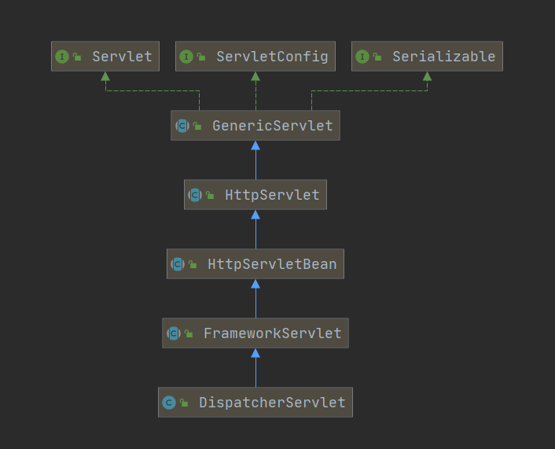
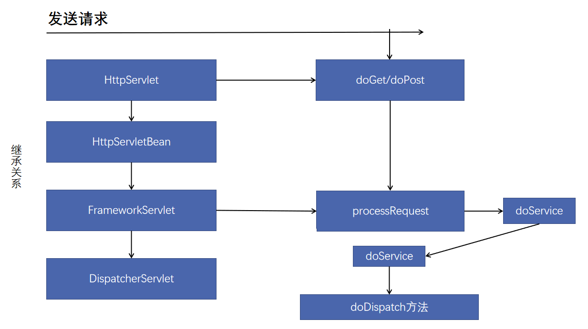
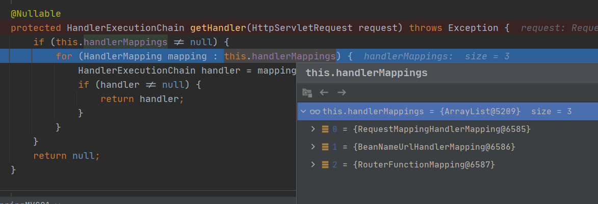
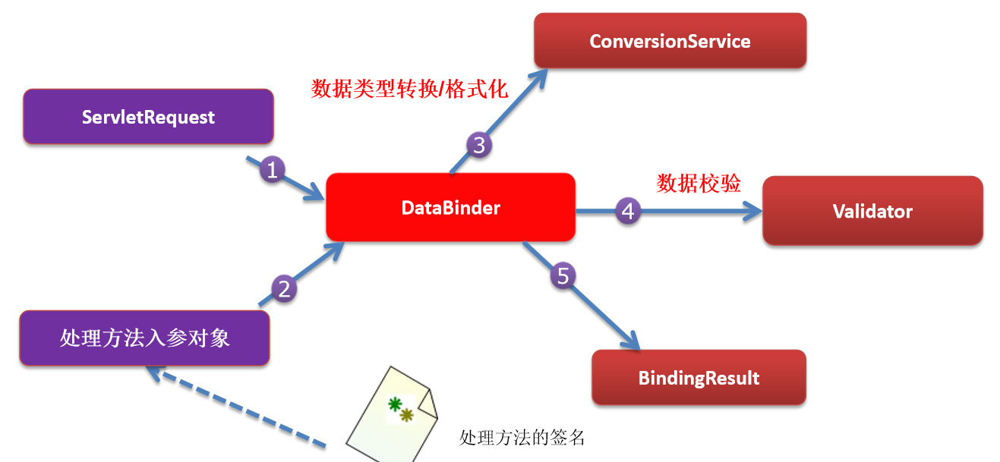
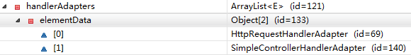

# 一、SpringMVC---概述

不太适合如门用哦！

我看到雷丰阳的SpringMVC视频，17年的。但是我用的是JavaConfig风格的配置。没用视频中的xml配置。

# 二、SpringMVC---基本原理

## 2.1 运行流程

 * 1）客户端点击链接发送 xxx/ 请求
 * 2）来到tomcat服务器
 * 3）SpringMVC的前端控制器收到所有请求
 * 4）来看请求地址和@RequestMapping标注的那个匹配，来找到到底使用那个类的那个方法来处理请求。
 * 5）前端控制器找到了目标处理器类和目标方法，直接利用 返回执行目标方法
 * 6）方法执行完成后会有一个返回值，SpringMVC认为这个返回值就是要去的页面地址
 * 7）拿到方法返回值后；用视图解析器进行拼串得到完整的页面地址
 * 8）拿到页面地址值，前端控制器帮我们转发到页面。

## 2.2 RequestMapping基本概念

- @RequestMapping注解：
     - 告诉spring mvc这个方法用来处理什么请求。。
     - 这个/是可以省略的，即使省略了，也是默认从当前项目开始。
     - 加上/比较好

## 2.3 前端控制器的拦截规则

### 2.3.1 tomcat的拦截规则


在使用tomcat的基本api进行开发时，资源的拦截规则，默认用的是tomcat中web.xml中的配置。

```xml
<!-- The mapping for the default servlet -->
<!-- 这里是静态资源的拦截。tomcat的DefaultServlet拦截发现是静态资源后，就回去找对应的静态资源并返回 -->
<servlet-mapping>
    <servlet-name>default</servlet-name>
    <url-pattern>/</url-pattern>
</servlet-mapping>

<!-- 这里是jsp的拦截，找到对应的jsp后就放回 -->
<servlet-mapping>
    <servlet-name>jsp</servlet-name>
    <url-pattern>*.jsp</url-pattern>
    <url-pattern>*.jspx</url-pattern>
</servlet-mapping>
```

### 2.3.2 前端控制器的拦截规则

前端控制器的拦截规则相当于继承自tomcat的那个web.xml的配置，并重写了拦截方式。

 *  <span style="color:green">**DefaultServlet是tomcat处理静态资源的**</span>
     *  除jsp和servlet，其他的都是静态资源；index.html也是静态资源；如果静态资源让tomcat来处理的话，tomcat就会在服务器下找到这个资源并返回。
     *  所以DefaultServlet有效的情况下，index.html才有用
 *  <span style="color:green">**tomcat有配置拦截规则，前端控制器也有，前端控制器相当于子类，重写了拦截规则！**</span>
     *  相当于前端控制器的 / 把tomcat的DefaultServlet禁用掉了。请求的资源被前端控制器拦截了！
     *  请求来到前端控制器，前端控制器看那个方法的RequestMapping的路径是这个。最后发现没有那个方法的RequestMapping路径是index.html；没有！所有无法访问！找资源的方式都错了！！静态资源访问就无效了！！
 *  <span style="color:green">**为什么jsp又能访问？**</span>
     *  因为我们没有覆盖tomcat服务器中的JspServlet的配置，即Jsp的请求不由前端控制器处理，由tomcat自己处理。
     *  如果我们把拦截方式改成 `/*`那么*.Jsp的请求也会经过前端控制器，也有从RequestMapping中找对应的方法，
 *  <span style="color:green">**配置说明**</span>
     *  / 相当于把tomcat中的大web.xml的DefaultServlet重写了（静态资源拦截那个）
     *  /* 直接是拦截所有请求。所以我们写  / ,写 / 也是为了迎合rest风格的url地址
     *  springmvc是先经过前端控制器的，看有没有配对的，没有就报错。

# 三、SpringMVC---常用注解

## 3.1 常用注解归纳

- @Controller
- @RequestMapping
- @PathVarible
- @SessionAttribute
- @ModelAttribute

## 3.2 @RequestMapping

> <span style="color:green">**@RequestMapping的使用**</span>

Spring MVC使用@RequestMapping注解为控制器指定可以处理那些url请求。

 * 在控制器的类定义及方法定义处都可标准
    * 类定义处：提供初步的请求映射信息。相对于WEB应用的根目录
    * 方法处：提供进一步的细分映射信息。相当于类定义处的URL。
    * 举例 WEB根路径为 localhost:8080/SpringMVC/
       * 类定义处路径为 /user
       * 方法定义处路径为  /add
       * 则该方法的访问路径为  localhost:8080/SpringMVC/user/add
    * DispatcherServlet 截断请求后，就通过控制器上@RequestMapping提供的映射信息确定请求所对应的处理方法。
 * 映射
    * 请求参数
    * 请求方法
    * 请求头

> <span style="color:green">**@RequestMapping--method**</span>

**指定那些请求方式是有效的。默认是所有请求都有效！**

```java
public enum RequestMethod {
	GET, HEAD, POST, PUT, PATCH, DELETE, OPTIONS, TRACE
}
```

**示例代码**

```java
@RestController
@RequestMapping("/method")
public class RequestMappingController {

    @RequestMapping(path = {"/get"}, method = RequestMethod.GET)
    public String t1() {
        return "GET Method";
    }

    // 方法类型对不上会报错 405 方法不对应！
    @RequestMapping(path = {"/post"}, method = RequestMethod.POST)
    public String t2() {
        return "POST Method";
    }

    @RequestMapping(path = {"/get&post"}, method = {RequestMethod.POST, RequestMethod.GET})
    public String t3(Model model, HttpServletRequest request) {
        String method = request.getMethod();
        return "support GET and POST; current  method is " + method;
    }

    @RequestMapping(path = {"/all"}, method = {RequestMethod.POST, RequestMethod.GET})
    public String t4(HttpServletRequest request) {
        String method = request.getMethod();
        return method;
    }
}
```

----

> <span style="color:green">**@RequestMapping--params**</span>

**用于设置请求要带什么参数过来、不能带什么参数过来、参数的值可以是什么、参数的值不能是什么。**

- params={"username"} 参数中必须要有username！！
- params={"!username"} 参数中不能有username！！
- params={"username!=123"} 参数的值不能为123！！
- params={"username=va"} 参数的值必须为va！！
- params={"user","pwd"} 要有user和pwd两个参数！！
- **<span style="color:red">不能用</span>{"age>19"}这种比较大小的写法！！！！**

示例代码

```java
package cn.payphone.controller;

import org.springframework.ui.Model;
import org.springframework.web.bind.annotation.RequestMapping;
import org.springframework.web.bind.annotation.RestController;

@RestController
@RequestMapping("/params")
public class RequestMappingParamsController {

    // 必须携带username这个参数
    // get请求，路径为 http://localhost:8080/SpringMVC01_war_exploded/params/need1?username
    @RequestMapping(path = "/need1", params = {"username"})
    public String t1() {
        return "username is ok";
    }

    // 不能带username这个参数
    @RequestMapping(path = "/need2", params = {"!username"})
    public String t2() {
        return "Not username params";
    }

    // 不能带username这个参数
    @RequestMapping(path = "/need3", params = {"username!=123"})
    public String t3() {
        return "username can't equals 123";
    }

    // username要为3 注意是一个 ”=“ 具体用法不记得就看源码注释！
    @RequestMapping(path = "/need4", params = {"username=123"})
    public String t4() {
        return "username equals 123";
    }
}
```

----

> <span style="color:green">**@RequestMapping--headers**</span>

**规定请求头**，也可以写简单的表达式

请求头中的任意字段都可规定！

```java
@RestController
public class RequestMappingHeaderController {

    /**
     * User-Agent: Mozilla/5.0 (Windows NT 10.0; Win64; x64; rv:84.0) Gecko/20100101 Firefox/84.0
     * User-Agent: Mozilla/5.0 (Windows NT 10.0; Win64; x64) AppleWebKit/537.36 (KHTML, like Gecko) Chrome/88.0.4324.96 Safari/537.36 Edg/88.0.705.53
     * @return
     */
    // 这样就只有火狐浏览器可以访问了
    @RequestMapping(path = {"/header1"}, headers = {"User-Agent=Mozilla/5.0 (Windows NT 10.0; Win64; x64; rv:84.0) Gecko/20100101 Firefox/84.0"})
    public String t1() {
        return "firefox is ok";
    }
}
```

----

> <span style="color:green">**@RequestMapping 中的 consumes和produces**</span>

- consumes：只接受内容类型是哪种的请求，规定请求头中的Content-Type
- produces：告诉浏览器返回的内容类型是说明，给响应头中加上Content-Type
    - text/html;charset=utf-8

----

## 3.2 ant风格的URL

**URL地址可以写模糊的通配符**

 * ？ 能替代任意一个字符
 * * 能替代任意多个字符，和一层路径
 * ** 能替代多层路径

```java
package cn.payphone.controller;

import org.springframework.web.bind.annotation.RequestMapping;
import org.springframework.web.bind.annotation.RestController;

/**
 * 模糊匹配功能
 * URL地址可以写模糊的通配符
 * ？ 能替代任意一个字符
 * * 能替代任意多个字符，和一层路径
 * ** 能替代多层路径
 */
@RestController
@RequestMapping("/ant")
public class AntController {

    @RequestMapping("/antTest01")
    public String antTest1() {
        return "antTest01";
    }

    // antTest01 antTest02 antTest03 都是走这个方法
    // antTest011就不行了，antTest0?中的问号只能匹配一个字符
    // 有精确的肯定优先匹配精确的
    @RequestMapping("/antTest0?")
    public String antTest2() {
        return "antTest?";
    }

    // 先匹配精确一点的antTest0? 在匹配模糊一点的antTest0*
    @RequestMapping("/antTest0*")
    public String antTest3() {
        return "antTest0*";
    }

    // * 匹配一层路径
    @RequestMapping("/a/*/antTest01")
    public String antTest4() {
        return "一层路径";
    }

    // ** 匹配多层路径
    @RequestMapping("/a/**/antTest01")
    public String antTest5() {
        return "两层路径";
    }
}
```

----

## 3.3 @PathVariable

**获取请求路径占位符中的值**

- @PathVariable 获取请求路径中占位符的值
- 占位符的名称和方法中的参数名称一致，就不用在注解里设置占位符的名称
- 占位符的名称和方法中的参数名称不一致，就要在注解里设置占位符的名称

```java
package cn.payphone.controller;

import org.springframework.web.bind.annotation.PathVariable;
import org.springframework.web.bind.annotation.RequestMapping;
import org.springframework.web.bind.annotation.RestController;

@RestController
public class PathVariableController {

    // {id}是占位符
    @RequestMapping("/user/{id}")
    // @PathVariable 获取请求路径中占位符的值
    public String pathVariableTest(@PathVariable("id") String id) {
        return id;
    }

    // 占位符的名称和方法中的参数名称一致就不用在注解里设置别名
    @RequestMapping("/user/info/{id}")
    public String pathVariableTest2(@PathVariable String id) {
        return id;
    }

    // 占位符的名称和方法中的参数名称不一致就要在注解里设置
    @RequestMapping("/user/infos/{id}")
    public String pathVariableTest3(@PathVariable("id") String ids) {
        return ids;
    }
}
```

----

## 3.4 Rest风格

### 3.4.1 概述

Rest--->Representational State Transfer。（资源）表现层状态转化。是目前最流行的一种互联网软件架构。【前段时间提出了一种新的软件架构，是图的】

- 资源（Resource）：网络上的一个实体，或者说是网络上的一个具体信息。
    - URI：统一资源标识符
    - URL：统一资源定位符
- 表现层（Representation）：把资源具体呈现出来的形式，叫做它的表现层。如文本可用txt格式表现，也可用html格式、xml格式、json格式表现。。
- 状态转化（State Transfer）：HTTP协议是无状态的，所有状态都保存在服务器端。所谓的表现层状态转化就是HTTP协议里面，四个表示操作方式的动词：GET、POST、PUT、DELETE。
    - GET：获取资源
    - POST：新建资源
    - PUT：更新资源
    - DELETE：删除资源

### 3.4.2 简单举例

- /book/1 	：GET请求 表示查询1号图书
- /book        ：POST请求 表示添加1号图书
- /book/1     ：PUT请求 表示更新1号图书
- /book/1     ：DELETE 表示删除1号图书

Rest推荐；

<span style="color:green">**url地址这么起名； /资源名/资源标识符**</span>

问题：从页面上只能发起两种请求：GET、POST，其他请求没法使用。

别慌，Spring提供了对Rest风格的支持。

- 1）SpringMVC中有一个Filter，他可以把普通的请求，转化为规定形式的请求。配置Filter。这个Filter叫做，`HiddenHttpMethodFilter`,它的url-pattern写`/*`

- 2）如何发起其他形式的请求？

    - 按照以下要求：

    - 创建post类型的表单

    - 表单项中携带一个`_method`的参数，`_method`的值就是所要的请求形式。

    - ```html
        <form action="book/1" method="post">
            <input name="_method" value="delete">
            <input type="submit" value="删除">
        </form>
        ```

为什么那个Filter可以实现这个功能？？请看源码！

```java
private String methodParam = DEFAULT_METHOD_PARAM;
@Override
protected void doFilterInternal(HttpServletRequest request, HttpServletResponse response, FilterChain filterChain)
    throws ServletException, IOException {

    HttpServletRequest requestToUse = request;
    // 请求方式是POST 且获取的表单参数_method 有值
    if ("POST".equals(request.getMethod()) && request.getAttribute(WebUtils.ERROR_EXCEPTION_ATTRIBUTE) == null) {
        String paramValue = request.getParameter(this.methodParam);
        if (StringUtils.hasLength(paramValue)) {
            String method = paramValue.toUpperCase(Locale.ENGLISH);
            if (ALLOWED_METHODS.contains(method)) {
                // 创建了一个新的request对象
                // 重写了request.getMethod()  获取到的是重写的值
                requestToUse = new HttpMethodRequestWrapper(request, method);
            }
        }
    }
    filterChain.doFilter(requestToUse, response);
}
```

----

# 四、SpringMVC---请求处理

## 4.1 概述

SpringMVC获取请求带来的各种信息

- 入参名称与请求参数名称一致，自动赋值
- @RequestParam
- @RequestHeader
- @CookieValue：获取某个cookie的值
- POJO自动赋值。字段名一致即可。
- 使用Servlet原生API。（session推荐使用原生API）

## 4.2 注解获取请求参数

<span style="color:green">**以下注解都是加载方法的参数上的。**</span>

### 4.2.1 RequestParam

**@RequestParam("user") String username 相当于：**

```java
String username  = request.getPamrameter("user")
// 浏览器传过来一个名为user的形式参数，把user的值存入username的变量中。
```

RequestParam注解的几个重要的值：

* value：指定要获取的参数的key（value和name互为别名。）
* required：这个参数是否必须的
* defaultValue：参数默认值

<span style="color:red">**PS：注意区分RequestParam与PathVarible。**</span>

- RequestParam是获取浏览器传过来的参数，是拿❓后面的值！！
- PathVarible是取的地址中的值！！

### 4.2.2 RequestHeader 

**@RequestHeader 获取请求头中某个key的值。**

request.getHeader("User-Agent")

```java
@RequestHeader("User-Agent") String MyUserAgent 写在方法参数上
等同于 String MyUserAgent = request.getHeader("User-Agent")
```

RequestHeader注解的几个重要的值

- value
- required
- defaultValue

### 4.2.3 CookieValue

**@CookieValue：获取某个cookie的值**

以前获取某个cookie

```java
Cookie[] cookies = request.getCookies();
for (Cookie c: cookies){
	if(c.getName().euqals("JSESSIONID")){
		String ret = c.getValue()
 	}
}
```

现在获取某个cookie

```java
public String index(@CookieValue("JSESSIONID") String jid){
    // pass
}
```

CookieValue注解几个重要的值

* value
* required
* defaultValue

### 4.2.4 SessionAttribute

以前获取Session

```java
request.getSession.getAttribute("user");
```

现在获取Session

```java
public String getSession(@SessionAttribute("user") String user) {
      // pass
}
```

Session还是用原生API获取的好。

## 4.3 POJO自动赋值

<span style="color:red">**注意**</span>

返回对象类型的POJO要映入json库，我用的jackson。

```xml
<dependencies>
    <dependency>
        <groupId>org.springframework</groupId>
        <artifactId>spring-webmvc</artifactId>
        <version>5.3.3</version>
    </dependency>
    <dependency>
        <groupId>javax.servlet.jsp</groupId>
        <artifactId>jsp-api</artifactId>
        <version>2.0</version>
    </dependency>
    <dependency>
        <groupId>javax.servlet</groupId>
        <artifactId>javax.servlet-api</artifactId>
        <version>3.0.1</version>
    </dependency>
    <dependency>
        <!-- https://mvnrepository.com/artifact/org.codehaus.jackson/jackson-core-asl -->
        <groupId>com.fasterxml.jackson.core</groupId>
        <artifactId>jackson-databind</artifactId>
        <version>2.11.4</version>
    </dependency>
</dependencies>
```

```java
@ResponseBody
@RequestMapping("/params/pojo")
public User pojo(User user) {
    return user;
}
```

## 4.4 Servlet原生API

## 4.5 解决提交数据乱码

提交数据可能乱码

### 4.5.1 请求乱码

GET请求：改server.xml 在8080端口处 URIEncoding="UTF-8"

POST 请求：

- 在第一次获取请求参数之前设置，request.setCharacterEncoding("UTF-8")
- 可以自己写一个filter进行过滤：springmvc有这个filter `CharacterEncodingFilter`

印象中可以修改tomcat的默认配置的编码来解决一个乱码问题。具体解决那个忘了。高版本tomcat好像默认是UTF-8的编码格式。

### 4.5.2 响应乱码

response.setContentType("text/html;charset=utf-8")
* 使用SpringMVC前端控制器 写完就直接写字符编码过滤器
* Tomcat一装上，上手就是server.xml的8080处添加URIEncoding=”UTF-8“
* 注意！！字符编码Filter要在其他Filter之前！！！为什么！！因为我们要先设置，让设置生效，之后的操作才有效！！

### 4.5.3 实例配置

Java Config方式的配置！！

**Spring IOC那块的配置**

```java
@Configuration
@ComponentScan(basePackages = "cn.payphone", excludeFilters = {
        @ComponentScan.Filter(type = FilterType.ANNOTATION, classes = {Controller.class})
})
public class RootConfig {
}
```

**SpringMVC IOC的配置**

```java
@EnableWebMvc // 开启mvc的高级配置
@Configuration
@ComponentScan(basePackages = "cn.payphone", includeFilters = {
        @ComponentScan.Filter(type = FilterType.ANNOTATION, classes = {Controller.class})
}, useDefaultFilters = false)
public class WebConfig implements WebMvcConfigurer {

    @Override
    public void configureViewResolvers(ViewResolverRegistry registry) {
        // 这样  视图解析器会自动拼串
        registry.jsp("/WEB-INF/views/", ".jsp");
    }

}
```

**容器相关配置**

```java
public class MyWebServletInitializer extends AbstractAnnotationConfigDispatcherServletInitializer {
    @Override
    protected Class<?>[] getRootConfigClasses() {
        return new Class[]{RootConfig.class};
    }

    @Override
    protected Class<?>[] getServletConfigClasses() {
        return new Class[]{WebConfig.class};
    }

    /**
     * 拦截规则
     * / 拦截所有请求 不拦截jsp页面
     * /* 拦截所有请求 会拦截jsp页面
     * 处理*.jsp请求时tomcat处理的
     *
     * @return
     */
    @Override
    protected String[] getServletMappings() {
        return new String[]{"/"};
    }

    @Override
    protected Filter[] getServletFilters() {
        // 验证字符编码过滤器生效，试验后，真的有效了
        // CharacterEncodingFilter characterEncodingFilter = new CharacterEncodingFilter("ISO-8859-1", true);
        CharacterEncodingFilter characterEncodingFilter = new CharacterEncodingFilter("UTF-8", true);
        characterEncodingFilter.setForceRequestEncoding(true);
        characterEncodingFilter.setForceResponseEncoding(true);
        return new Filter[]{characterEncodingFilter};
    }
}
```


#  五、SpringMVC---数据输出

把数据携带给页面。

前面直接通过响应的方式把数据响应给了浏览器。

但是如果使用的是模板引擎一类的，需要我们携带数据给页面。

## 5.1 Map、Model、ModelMap

1）可以在方法处传入Map、或Model或者ModelMap

- 这些参数都会存放在域中。可以在页面获取。（request域）

2）经过验证

- Map<String,String>
- Model
- ModelMap

Map、Model都是接口，ModelMap是具体的实现类

ModelMap extends java.util.LinkedHashMap

获得Map、Model、ModelMap形参的getClass()发现他是org.springframework.validation.support.BindingAwareModelMap类型。

**类之间的简化后的UML关系如图**


----

```java
@Controller
@RequestMapping("/carry")
public class CarryController {

    @RequestMapping("/map")
    public String Map(Map<String, Object> map) {
        map.put("name", "liujiawe");
        // class org.springframework.validation.support.BindingAwareModelMap
        System.out.println(map.getClass());
        return "carry";
    }

    @RequestMapping("/model")
    public String Model(Model model) {
        model.addAttribute("name", "liujiawei model");
        // class org.springframework.validation.support.BindingAwareModelMap
        System.out.println(model.getClass());
        return "carry";
    }

    @RequestMapping("/modelMap")
    public String ModelMap(ModelMap map) {
        map.addAttribute("name", "Model Map vale");
        // class org.springframework.validation.support.BindingAwareModelMap
        System.out.println(map.getClass());
        return "carry";
    }
}
```

## 5.2 ModelAndView

1）方法的返回值可以变为ModelAndView类型

即包含视图信息（页面地址）也包含模型数据（给页面），而且数据是放在请求域中。

```java
public ModelAndView handle(){
    // 最后会跳转到 /WEB-INF/views/success.jsp页面。
    // 我设置了视图解析器，会给success拼前缀和后缀。
    // 带前缀的地址：redirect:/xx
   	// 			  forward:/xx 这些就不会被拼串，具体可以看视图解析那块的源码，看下就知道了。
    // 他是先看有没有 前缀，有就用对应前缀的View对象，最后没用，采用拼串的View对象。
	ModelAndViewmv = new ModelAndView("success");
	mv.addObject("msg","你好哦")
	return mv；
}
```

## 5.3 数据暂存Session域

使用一个注解 @SessionAttributes(只能标在类上)

@SessionAttributes(value="msg")：

- 给BindingAwareModelMap中保存的数据,同时给session中放一份。
- value指定保存数据时要给session中存放的数据的key。

@SessionAttributes(value={"msg"},types={String.class}})

- value={“msg”} 只要保存的是这种key的数据，给Session中放一份。
- types={String.class} 只要保存的是这种类型的数据，给Session中也放一份。
- 所以会存两大份！！用value指定的比较多，因为可以精确指定。
- 但是我们不推荐用@SessionAttributes，还是用原生API吧。注解的话可能会引发异常，且移除session麻烦。

## 5.4 ModelAttribute方法

ModelAttribute 方法入参标注该注解后，入参的对象就会放到数据模型中。

参数：取出刚才保存的数据

方法位置：这个方法就会提取于目标方法先运行。

​	可以在这里提前查出数据库中图书的信息。

​	将这个图书信息保存起来（方便下一个方法还能使用）

​	参数Map就是BindAwareMap

```java
/**
* ModelAttribute方法先执行，把数据存在数据模型域中。
* @ModelAttribute("user") User user先拿到模型域中的值，然后才用浏览器传* 过来的值进行数据更新
*/
@ResponseBody
@RequestMapping("/get")
public User get(@ModelAttribute("user") User user) {
    return user;
}

@ModelAttribute
public void ModelAttribute(Model model) {
    User user = new User();
    user.setAddress("address");
    user.setAge(18);
    user.setName("ljw");
    model.addAttribute("user", user);
}
```

**ModelAttribute图解**


# 六、SpringMVC---前端控制器源码

## 6.1 如何看SpringMVC源码

**SpringMVC源码如何看？**

- SpringMVC所有的请求都会被前端控制器拦截到，所以看SpringMVC怎么处理请求的，就看前端控制器的处理流程，如何处理请求的。
- 只要是finally块的，一般就是清东西。
- try起来的一般是重要的代码。 

## 6.2 梳理流程

### 6.2.1 文字分析

**文字描述：**

请求一进来，应该是来到HttpServlet的doPost或doGet方法。

我们根据官网的描述知道，前端控制器DispatcherServlet是负责请求转发的，所以我们从它开始入手。

1）我们发现DispatcherServlet的继承关系如图所示：



2）我们知道Servlet的方法是从Service方法开始的，于是我们去找这些类重写的Service方法

- HttpServletBean未重写Service方法，接下来看他的子类FrameworkServlet。
- FrameworkServlet重写了service方法！！！

```java
@Override
protected void service(HttpServletRequest request, HttpServletResponse response)
    throws ServletException, IOException {

    HttpMethod httpMethod = HttpMethod.resolve(request.getMethod());
    if (httpMethod == HttpMethod.PATCH || httpMethod == null) {
        // 内部执行了processRequest方法。见名知意，这个是处理请求的，我们继续看该类的processRequest方法！！
        processRequest(request, response);
    }
    else {
        super.service(request, response);
    }
}
```

3）FrameworkServlet的service方法内部执行了processRequest方法。见名知意，这个是处理请求的，我们继续看该类的processRequest方法！！

```java
protected final void processRequest(HttpServletRequest request, HttpServletResponse response)
    throws ServletException, IOException {
    // do something
    try {
        // 被try进来的说明是非常重要的方法，从方法的命名也看出，这是处理请求的！！但是我们发现，doService在FrameworkServlet中是一个抽象类，所以要去看它子类的对应实现！！！
        doService(request, response);
    }
    catch (ServletException | IOException ex) {
        failureCause = ex;
        throw ex;
    }
    catch (Throwable ex) {
        failureCause = ex;
        throw new NestedServletException("Request processing failed", ex);
    }

    finally {
		// do something
    }
}
```

4）被try进来的说明是非常重要的方法，从方法的命名也看出，这是处理请求的！！但是我们发现，doService在FrameworkServlet中是一个抽象类，所以要去看它子类的对应实现！！！即看DispatcherServlet！！

```java
@Override
protected void doService(HttpServletRequest request, HttpServletResponse response) throws Exception {
    logRequest(request);
	// do something
    try {
        // 这个方法，被try进来说明很重要！！
        doDispatch(request, response);
    }
    finally {
        // do something
    }
}
```

于是我们继续点进该类（）的doDispatcher方法一探究竟！

```java
// 源码注释上写，处理对处理程序的实际调度！！我们就对doDispatch方法进行debug!
protected void doDispatch(HttpServletRequest request, HttpServletResponse response) throws Exception {
	// doing something
}
```

源码注释上写，处理对处理程序的实际调度！！而且，该类中调用了类中的很多方法，再根据这些被调用方法的名字，我们猜测doDispatch就是调度的核心方法，于是我们对它进行debug！！！

### 6.2.2 总结

**图示总结**

梳理完流程后，发现执行流程大概是这样的。



**文字概述**

1）先看了类与类之间的继承关系，顺着继承关系找doXX方法的重写

2）**HttpServletBean**并未重写**doPost/doGet**这些方法，**HttpServletBeand**的子类**FrameworkServlet**实现了相应的方法。

3）**FrameworkServlet**相应的方法内部调用的是**processRequest**;

4）**processRequest**;内部调用了**doService**方法，而该方法在**FrameworkServlet**中并未实现，但从**FrameworkServlet**的子类**DispatcherServlet**找到了对应的实现。

5）**DispatcherServlet**中的**Service**方法调用了**doDispatch**;方法

6）**doDispatch**;方法内部调用了**DispatcherServlet**中的很多方法

7）**doDispatch**调用的方法中，我们根据单词意思和方法上的注释推断出这个方法就是我们要找的入口！于是对其进行**debug**！！

## 6.2 阅读源码

###  6.2.1 走马观花

<span style="color:green">**看每个方法的大致功能**</span>

1）WebAsyncUtils.getAsyncManager(request); 异步管理

2）checkMultipart(request); 文件上传相关

3）getHandler(processedRequest);  获得对应请求的处理器

4）getHandlerAdapter(mappedHandler.getHandler()); 获得处理器对应的适配器（适配器执行方法哦！）

5）mv = ha.handle(processedRequest, response, mappedHandler.getHandler()); 执行@RequestMapping标记的方法！！

6）processDispatchResult(processedRequest, response, mappedHandler, mv, dispatchException);  页面放行！

<span style="color:green">**大致的阅读路线**</span>

==> 查看 DispatcherServlet类中的 doDispatch()方法中每个方法的功能

​	==> getHandler /  getHandlerAdapter方法

​	==> getHandlerAdapter方法负责执行打了@RequestMapping的方法。

==> 看getHandler()细节；怎么根据当前请求就能找到那个类能来处理。

​	==>  mappedHandler = getHandler(processedRequest);// mappedHandler的类型是HandlerExecutionChain

​	==>看了getHandler的源码，知道如何根据当前请求就能找到那个类能来处理了。

==> 看完getHandler() 细节 接下来就是看 getHandlerAdapter() 的细节了。

​	==> 因为getHandler只是拿到要处理的请求，真正的处理还是交由对应的适配器来做！

​	==> 所以接下来是看如何找到目标处理器类的适配器！！<span style="color:red">**【补适配器模式！！】**</span>

​	==> 最后发现适配器的查找也是遍历。

==> 看完如何找到 getHandlerAdapter() 后就看适配器如何执行方法了！mv = ha.handle()

​	==> handle() 方法中调用了 handleInternal() 方法

​	==> handleInternal() 方法 中的这句代码 mav = invokeHandlerMethod(request, response, handlerMethod); 执行方法，返回执行后需要跳转的视图。

-----

<span style="color:green">**源码阅读笔记**</span>

```java
protected void doDispatch(HttpServletRequest request, HttpServletResponse response) throws Exception {
   HttpServletRequest processedRequest = request;
   HandlerExecutionChain mappedHandler = null;
   boolean multipartRequestParsed = false;
   // 异步管理器，如果有异步怎么办
   WebAsyncManager asyncManager = WebAsyncUtils.getAsyncManager(request);

   try {
      ModelAndView mv = null;
      Exception dispatchException = null;

      try {
         // 检查是否多部件 和文件上传有关
         processedRequest = checkMultipart(request);
         multipartRequestParsed = (processedRequest != request);

         // Determine handler for the current request.
         // 根据当前请求地址决定哪个类能处理
         mappedHandler = getHandler(processedRequest);
         // 如果没有找到那个处理器可以处理这个请求，就404 报异常。
         if (mappedHandler == null) {
            noHandlerFound(processedRequest, response);
            return;
         }
         // 找到了的话，mappedHandler里的handler属性就会封装我们对应的Controller。
         // Determine handler adapter for the current request.
         // 决定当前请求要用那个处理器的适配器。SpringMVC不是直接反射调用对应Controller的方法，而是用一个处理器进行执行。此处的作用1是拿到能执行这个类的所以方法的适配器（反射工具）
         HandlerAdapter ha = getHandlerAdapter(mappedHandler.getHandler());

         // Process last-modified header, if supported by the handler.
         String method = request.getMethod();
         boolean isGet = "GET".equals(method);
         if (isGet || "HEAD".equals(method)) {
            long lastModified = ha.getLastModified(request, mappedHandler.getHandler());
            if (new ServletWebRequest(request, response).checkNotModified(lastModified) && isGet) {
               return;
            }
         }

         if (!mappedHandler.applyPreHandle(processedRequest, response)) {
            return;
         }

         // Actually invoke the handler.
         // 用适配器执行方法；将目标方法执行完成后的返回值作为视图名，设置保存到ModelAndView中。
         // 无论目标方法怎么写，最终适配器执行完成以后都会将执行后的信息封装成ModelAndView
         mv = ha.handle(processedRequest, response, mappedHandler.getHandler());

         if (asyncManager.isConcurrentHandlingStarted()) {
            return;
         }
         // 如果没有视图名，设置一个默认的视图名（方法没有返回值的时候）
         applyDefaultViewName(processedRequest, mv);
         mappedHandler.applyPostHandle(processedRequest, response, mv);
      }
      catch (Exception ex) {
         dispatchException = ex;
      }
      catch (Throwable err) {
         // As of 4.3, we're processing Errors thrown from handler methods as well,
         // making them available for @ExceptionHandler methods and other scenarios.
         dispatchException = new NestedServletException("Handler dispatch failed", err);
      }
      // 转发到目标页面。根据方法最终执行完成后封装的ModelAndView 转发到对应页面，而且ModelAndView中的数据可以从请求域中获取。
      processDispatchResult(processedRequest, response, mappedHandler, mv, dispatchException);
   }
   catch (Exception ex) {
      triggerAfterCompletion(processedRequest, response, mappedHandler, ex);
   }
   catch (Throwable err) {
      triggerAfterCompletion(processedRequest, response, mappedHandler,
            new NestedServletException("Handler processing failed", err));
   }
   finally {
      if (asyncManager.isConcurrentHandlingStarted()) {
         // Instead of postHandle and afterCompletion
         if (mappedHandler != null) {
            mappedHandler.applyAfterConcurrentHandlingStarted(processedRequest, response);
         }
      }
      else {
         // Clean up any resources used by a multipart request.
         if (multipartRequestParsed) {
            cleanupMultipart(processedRequest);
         }
      }
   }
}
```

<span style="color:green">**文字总结**</span>

1）所以有请求都要经过DispathcherServlet，DispathcherServlet收到请求

2）调用doDispatch() 方法进行处理

- getHandler()  根据当前请求地址找到能处理这个请求的目标处理器类（处理器）
- <span style="color:red">getHandlerAdapter()  根据2当前处理器类获取到能执行这个处理器方法的适配器。</span>
- <span style="color:red">使用刚才获取到的适配器（AnnotationMethodHandlerAdapter）执行目标方法。</span>
- <span style="color:red">目标方法执行后返回一个ModelAndView对象。</span>
- <span style="color:red">根据ModelAndView的信息转发到具体的页面，并可以在请求域中取出ModelAndView中的模型数据。</span>

### 6.2.2 细致阅读

#### 6.2.2.1 getHandler方法

1）读了doDispatch（）方法，大致猜了每个方法的作用。现在来细看getHandler（）方法的细节。

-----------------------------------

**getHandler是如何找到那个类可以处理请求的。**

```java
// mappedHandler的类型是HandlerExecutionChain
mappedHandler = getHandler(processedRequest);
```

getHandler源码

```java
protected HandlerExecutionChain getHandler(HttpServletRequest request) throws Exception {
   if (this.handlerMappings != null) {
      // HandlerMapping：处理器映射；他里面保存了每一个处理器能处理那些请求的映射信息。【标了注解】
      for (HandlerMapping mapping : this.handlerMappings) {
         HandlerExecutionChain handler = mapping.getHandler(request);
         if (handler != null) {
            return handler;
         }
      }
   }
   return null;
}
```

debug发现，有三种类别的handlerMappings（Spring 5.x），使用的是RequestMappingHandlerMapping@6585（因为我们是打的RequestMapping这个注解！）



最后返回的handler的值是 被打上注解，要执行的方法的：<span style="color:red">**全类名#方法名**</span>


**我们再回过头来看看this.handlerMappings中RequestMappingHandlerMapping的成员变量：**

mappingRegistry：ioc容器启动创建Controller对象的时候扫描每个处理器都能处理什么请求，保存在mappingRegistry属性的registry中。下一次请求过来，就来看那个handlerMapping中有这个请求的映射信息就好了。


#### 6.2.2.2 getHandlerAdapter方法

2）细看 getHandler() 方法的细节，接下来看getHandlerAdapter() 方法的细节。

--------

getHandler() 方法找到处理对象，getHandlerAdapter() 用来执行要处理的对象！

```java
// 方法源码如下：
protected HandlerAdapter getHandlerAdapter(Object handler) throws ServletException {
   if (this.handlerAdapters != null) {
      // 找适配器，又是遍历适配器，看那个合适。
      for (HandlerAdapter adapter : this.handlerAdapters) {
          // 如果支持这个处理器就返回，不支持就继续找，没找到就抛异常。
          //RequestMappingHandlerAdapter的supports总是返回true
         if (adapter.supports(handler)) {
            return adapter;
         }
      }
   }
   throw new ServletException("No adapter for handler [" + handler +
         "]: The DispatcherServlet configuration needs to include a HandlerAdapter that supports this handler");
}
```

**下面我们看看this.handlerAdapters里有多少适配器：有四个！四种类型的适配器！**

这四个适配器中那个有用？我们猜测是注解那个有用。**RequestMappingHandlerAdapter**，因为我们打的是RequestMapping注解！

**RequestMappingHandlerAdapter能解析注解方法的适配器；处理器类中只要有标了注解的这些方法就能用。**


#### 6.2.2.3 handle方法

```java
@Override
@Nullable
public final ModelAndView handle(HttpServletRequest request, HttpServletResponse response, Object handler)
      throws Exception {
   return handleInternal(request, response, (HandlerMethod) handler);
}

@Override
protected ModelAndView handleInternal(HttpServletRequest request,
                                      HttpServletResponse response, HandlerMethod handlerMethod) throws Exception {

    ModelAndView mav;
    checkRequest(request);

    // Execute invokeHandlerMethod in synchronized block if required.
    if (this.synchronizeOnSession) {
        HttpSession session = request.getSession(false);
        if (session != null) {
            Object mutex = WebUtils.getSessionMutex(session);
            synchronized (mutex) {
                // 执行方法！！并得到执行方法后需要返回的视图页面！
                mav = invokeHandlerMethod(request, response, handlerMethod);
            }
        }
        else {
            // No HttpSession available -> no mutex necessary
            mav = invokeHandlerMethod(request, response, handlerMethod);
        }
    }
    else {
        // No synchronization on session demanded at all...
        mav = invokeHandlerMethod(request, response, handlerMethod);
    }

    if (!response.containsHeader(HEADER_CACHE_CONTROL)) {
        if (getSessionAttributesHandler(handlerMethod).hasSessionAttributes()) {
            applyCacheSeconds(response, this.cacheSecondsForSessionAttributeHandlers);
        }
        else {
            prepareResponse(response);
        }
    }

    return mav;
}
```

## 6.3 阅读总结

1）运行流程挑简单的。

2）确定方法每个参数的值

- 标注解：保存注解的信息；最终得到这个注解应该对应解析的值。
- 没标注解：
    - 看是否是原生API
    - 看是否是Model或者是Map，xxx
    - 都不是，看是否是简单类型；paramName
    - 给attrName赋值；attrName（参数标了@ModelAttribute("") 就是指定的，没标就是“”）
    - 确定自定义类型参数
        - attrName使用参数的类型首字母小写；或者使用之前@ModelAttribute("") 的值
        - 先看隐含模型中每个这个attrName作为key对应的值；如果有就从隐含模型中获取并赋值
        - 看是否是@SessionAttributes(value="haha")；标注的属性，如果是就从session中拿；如果拿不到就会抛异常。
        - 不是@SessionAttributes标注的，就利用反射创建一个对象
    - 拿到之前创建好的对象，使用数据绑定器（WebDataBinder）将请求中的每个数据绑定到这个对象中。

# 七、SpringMVC---九大组件

## 7.1 组件概述

DispatcherServet中有几个引用类型的属性；SpringMVC的九大组件。

SpringMVC在工作的时候，关键位置都是由这些组件完成的；

共同点：九大组件全部都是接口；接口就是规范；提供了非常强大的扩展性；

SpringMVC的九大组件工作原理：大佬级别。

```java
/** 文件上传解析器 **/
@Nullable
private MultipartResolver multipartResolver;

/** 区域信息解析器. 和国际化有关*/
@Nullable
private LocaleResolver localeResolver;

/** 主题解析器；强大的主题效果更换 */
@Nullable
private ThemeResolver themeResolver;

/** Handler映射信息.HandlerMapping */
@Nullable
private List<HandlerMapping> handlerMappings;

/** Handler的适配器. */
@Nullable
private List<HandlerAdapter> handlerAdapters;

/** SpringMVC强大的异常解析功能；异常解析器. */
@Nullable
private List<HandlerExceptionResolver> handlerExceptionResolvers;

/** RequestToViewNameTranslator used by this servlet. */
@Nullable
private RequestToViewNameTranslator viewNameTranslator;

/** FlashMap+Manager：SpringMVC中运行重定向携带数据的功能  */
@Nullable
private FlashMapManager flashMapManager;

/** 视图解析器 */
@Nullable
private List<ViewResolver> viewResolvers;
```

**九大组件初始化的地方**

```java
@Override
protected void onRefresh(ApplicationContext context) {
   initStrategies(context);
}

/**
 * Initialize the strategy objects that this servlet uses.
 * <p>May be overridden in subclasses in order to initialize further strategy objects.
 */
protected void initStrategies(ApplicationContext context) {
   initMultipartResolver(context);
   initLocaleResolver(context);
   initThemeResolver(context);
   initHandlerMappings(context);
   initHandlerAdapters(context);
   initHandlerExceptionResolvers(context);
   initRequestToViewNameTranslator(context);
   initViewResolvers(context);
   initFlashMapManager(context);
}
```

----

组件的初始化：

- 有些组件在容器中是使用类型找的，有些组件是使用id找的。
- 就是去容器中找这个组件，如果没有就用默认的配置。
- 这是教怎么看各大组件的，具体的流程自己去看。

----

```java
private void initHandlerMappings(ApplicationContext context) {
   this.handlerMappings = null;
   // 探查所有的HandlerMapping
   if (this.detectAllHandlerMappings) {
      // Find all HandlerMappings in the ApplicationContext, including ancestor contexts.
      Map<String, HandlerMapping> matchingBeans =
            BeanFactoryUtils.beansOfTypeIncludingAncestors(context, HandlerMapping.class, true, false);
      if (!matchingBeans.isEmpty()) {
         this.handlerMappings = new ArrayList<>(matchingBeans.values());
         // We keep HandlerMappings in sorted order.
         AnnotationAwareOrderComparator.sort(this.handlerMappings);
      }
   }
   else {
      try {
         HandlerMapping hm = context.getBean(HANDLER_MAPPING_BEAN_NAME, HandlerMapping.class);
         this.handlerMappings = Collections.singletonList(hm);
      }
      catch (NoSuchBeanDefinitionException ex) {
         // Ignore, we'll add a default HandlerMapping later.
      }
   }

   // Ensure we have at least one HandlerMapping, by registering
   // a default HandlerMapping if no other mappings are found.
   if (this.handlerMappings == null) {
      this.handlerMappings = getDefaultStrategies(context, HandlerMapping.class);
      if (logger.isTraceEnabled()) {
         logger.trace("No HandlerMappings declared for servlet '" + getServletName() +
               "': using default strategies from DispatcherServlet.properties");
      }
   }

   for (HandlerMapping mapping : this.handlerMappings) {
      if (mapping.usesPathPatterns()) {
         this.parseRequestPath = true;
         break;
      }
   }
}
```

# 八、视图解析

## 8.1 视图解析的应用

### 8.1.1 概述

<span style="color:green">**转发 forward**</span>

1）地址栏不发生变化，显示的是上一个页面的地址。在服务器端进行的跳转，

2）请求次数：只有一次。

3）根目录：http://localhost:8080/项目地址/转发地址

4） 请求域中数据会不丢失（request请求域的生命周期是一次转发！）

**API：**

```java
request.getRequestDispatcher("/地址").forward(request, response);
```

<span style="color:green">**重定向 redireect**</span>

1）地址栏发生变化，显示新的地址；浏览器端进行的跳转。

2）请求次数：2次

3）可重定向到其他项目或其他网址

4）请求域中的数据会丢失，因为是2次请求。request请求域的生命周期只是一次请求内有效！

### 8.1.2 转发 forward

> **废话少说上代码**

```java
@Controller
class DemoController{
    @RequestMapping("/forward")
    public String forward(){
        // 转发到项目的hello.jsp 
        // eg 项目根目录是 localhost:8080/demo
        // 则该亲求会转发到 localhost:8080/demo/hello.jsp
		return "forward:/hello.jsp" 
    }
}
```

> **详细解释**

- forward：转发到一个页面
- /hello.jsp 转发当前项目下的hello
- 一定要加 /  如果不加 / 就是相对路径。容易出问题。
- forward:/hello.jsp <span style="color:red">不会有给你拼串，有前缀的转发，不会经由我们配置的视图解析器拼串。看看源码的流程就知道</span>
    - 先判断路径中是否含前缀，含有就用对应前缀的方式进行操作。
    - 没有就用我们的配置的视图解析器进行操作。

forward可以转发到页面，也可以转发到一个请求上。 forward:/hello 转发到hello请求

### 8.1.3 重定向 redirect

> **废话少说上代码**

```java
@Controller
class DemoController{
    @RequestMapping("/redirect")
    public String forward(){
        // 转发到项目的hello.jsp 
        // eg 项目根目录是 localhost:8080/demo
        // 则该亲求会转发到 localhost:8080/demo/hello.jsp
		return "redirect:/hello.jsp" 
    }
}
```

> **详细解释**

**redirect重定向【重定向的地址由浏览器进行解析】**

- 有前缀的转发和重定向不会有视图解析器的拼串操作。
- 原生的servlet重定向需要加上项目名才能重定向。
- springmvc无需写项目名，会为我们自动拼接上项目名。
- returen "redirect:/hello.jsp";

## 8.2 视图解析器原理

### 8.2.1 概述

==> 先根据当前请求，找到那个类能处理。

​	`mappedHandler = getHandler(processedRequest);`

==> 找到适配器

​	`HandlerAdapter ha = getHandlerAdapter(mappedHandler.getHandler());`

==>  目标方法执行，执行完会有一个返回值，返回值会被包装成一个ModelAndView，ModelAndView对象中包含视图名。

​	`mv = ha.handle(processedRequest, response, mappedHandler.getHandler());`

==> 来到页面

​	`processDispatchResult(processedRequest, response, mappedHandler, mv, dispatchException);`

==> 调用processDispatchResult里的render进行渲染

==> 如何根据方法的返回值得到View对象

==> 由View对象进行视图的相关操作


### 8.2.2 流程解析

><span  style="color:green">**先根据当前请求，找到那个类能处理**</span>

```java
mappedHandler = getHandler(processedRequest);
```

> <span  style="color:green">**找到可处理当前请求的适配器**</span>

```java
HandlerAdapter ha = getHandlerAdapter(mappedHandler.getHandler());
```

> <span  style="color:green">**执行目标方法**</span>

```java
mv = ha.handle(processedRequest, response, mappedHandler.getHandler());
```

执行完目标方法后，其返回值会被包装成一个ModelAndView，而ModelAndView对象中包含视图名。如图：


> <span  style="color:green">**来到页面**</span>

```java
processDispatchResult(processedRequest, response, mappedHandler, mv, dispatchException);
```

视图渲染流程；将域中的数据在页面展示；我们可以认为，页面的功能就是用来渲染模型数据的。

看processDispatchResult源码发现里面是调用render(mv,request,response)进行渲染的

```java
private void processDispatchResult(HttpServletRequest request, HttpServletResponse response,
                                   @Nullable HandlerExecutionChain mappedHandler, @Nullable ModelAndView mv,
                                   @Nullable Exception exception) throws Exception {

    boolean errorView = false;

    if (exception != null) {
        if (exception instanceof ModelAndViewDefiningException) {
            logger.debug("ModelAndViewDefiningException encountered", exception);
            mv = ((ModelAndViewDefiningException) exception).getModelAndView();
        }
        else {
            Object handler = (mappedHandler != null ? mappedHandler.getHandler() : null);
            mv = processHandlerException(request, response, handler, exception);
            errorView = (mv != null);
        }
    }

    // Did the handler return a view to render?
    if (mv != null && !mv.wasCleared()) {
        render(mv, request, response);
        if (errorView) {
            WebUtils.clearErrorRequestAttributes(request);
        }
    }
    else {
        if (logger.isTraceEnabled()) {
            logger.trace("No view rendering, null ModelAndView returned.");
        }
    }

    if (WebAsyncUtils.getAsyncManager(request).isConcurrentHandlingStarted()) {
        // Concurrent handling started during a forward
        return;
    }

    if (mappedHandler != null) {
        // Exception (if any) is already handled..
        mappedHandler.triggerAfterCompletion(request, response, null);
    }
}
```

> <span  style="color:green">**调用processDispatchResult里的render进行渲染**</span>

发现内部有个View类型的变量。

其中`view = resolveViewName(viewName, mv.getModelInternal(), locale, request);`的作用是根据视图名（即目标方法的返回值）得到View对象

- viewName  视图的名称
- mv.getModelInternal() 隐含模型中的数据

```java
protected void render(ModelAndView mv, HttpServletRequest request, HttpServletResponse response) throws Exception {
    // Determine locale for request and apply it to the response.
    Locale locale =
        (this.localeResolver != null ? this.localeResolver.resolveLocale(request) : request.getLocale());
    response.setLocale(locale);

    View view;
    String viewName = mv.getViewName();
    if (viewName != null) {
        // We need to resolve the view name.
        view = resolveViewName(viewName, mv.getModelInternal(), locale, request);
        if (view == null) {
            throw new ServletException("Could not resolve view with name '" + mv.getViewName() +
                                       "' in servlet with name '" + getServletName() + "'");
        }
    }
    else {
        // No need to lookup: the ModelAndView object contains the actual View object.
        view = mv.getView();
        if (view == null) {
            throw new ServletException("ModelAndView [" + mv + "] neither contains a view name nor a " +
                                       "View object in servlet with name '" + getServletName() + "'");
        }
    }

    // Delegate to the View object for rendering.
    if (logger.isTraceEnabled()) {
        logger.trace("Rendering view [" + view + "] ");
    }
    try {
        if (mv.getStatus() != null) {
            response.setStatus(mv.getStatus().value());
        }
        view.render(mv.getModelInternal(), request, response);
    }
    catch (Exception ex) {
        if (logger.isDebugEnabled()) {
            logger.debug("Error rendering view [" + view + "]", ex);
        }
        throw ex;
    }
}
```

> <span  style="color:green">**如何根据方法的返回值得到View对象？**</span>

查看resolveViewName的源码，发现是视图解析器更具视图名得到视图对象，并返回。

- viewName  视图的名称
- mv.getModelInternal() 隐含模型中的数据

this.viewResolvers中的数据如图：


我们配了视图解析器就用，没配就用默认的。

想知道怎么初始化视图解析器的话，取看initViewResolvers方法

- 找到的话，就用我们配置的。
- 没找到的话，就用默认的。

```java
@Nullable
protected View resolveViewName(String viewName, @Nullable Map<String, Object> model,
                               Locale locale, HttpServletRequest request) throws Exception {

    if (this.viewResolvers != null) {
        // 遍历所有的ViewResolver
        for (ViewResolver viewResolver : this.viewResolvers) {
            View view = viewResolver.resolveViewName(viewName, locale);
            if (view != null) {
                return view;
            }
        }
    }
    return null;
}
```

><span  style="color:green">**如何得到View对象，即resolveViewName如何实现的？**</span>

先从缓存中拿，没有就创建。

根据方法的返回值创建出视图对象

view = createView(viewName, locale);

```java
@Override
@Nullable
public View resolveViewName(String viewName, Locale locale) throws Exception {
    if (!isCache()) {
        return createView(viewName, locale);
    }
    else {
        Object cacheKey = getCacheKey(viewName, locale);
        View view = this.viewAccessCache.get(cacheKey);
        if (view == null) {
            synchronized (this.viewCreationCache) {
                view = this.viewCreationCache.get(cacheKey);
                if (view == null) {
                    // Ask the subclass to create the View object.
                    // 根据方法的返回值创建出视图对象
                    view = createView(viewName, locale);
                    if (view == null && this.cacheUnresolved) {
                        view = UNRESOLVED_VIEW;
                    }
                    if (view != null && this.cacheFilter.filter(view, viewName, locale)) {
                        this.viewAccessCache.put(cacheKey, view);
                        this.viewCreationCache.put(cacheKey, view);
                    }
                }
            }
        }
        else {
            if (logger.isTraceEnabled()) {
                logger.trace(formatKey(cacheKey) + "served from cache");
            }
        }
        return (view != UNRESOLVED_VIEW ? view : null);
    }
}
```

> <span  style="color:green">**创建View对象的方法createView**</span>

```java
@Override
protected View createView(String viewName, Locale locale) throws Exception {
   // If this resolver is not supposed to handle the given view,
   // return null to pass on to the next resolver in the chain.
   if (!canHandle(viewName, locale)) {
      return null;
   }

   // Check for special "redirect:" prefix.
   if (viewName.startsWith(REDIRECT_URL_PREFIX)) {
      String redirectUrl = viewName.substring(REDIRECT_URL_PREFIX.length());
      RedirectView view = new RedirectView(redirectUrl,
            isRedirectContextRelative(), isRedirectHttp10Compatible());
      String[] hosts = getRedirectHosts();
      if (hosts != null) {
         view.setHosts(hosts);
      }
      return applyLifecycleMethods(REDIRECT_URL_PREFIX, view);
   }

   // Check for special "forward:" prefix.
   if (viewName.startsWith(FORWARD_URL_PREFIX)) {
      String forwardUrl = viewName.substring(FORWARD_URL_PREFIX.length());
      // 
      InternalResourceView view = new InternalResourceView(forwardUrl);
      return applyLifecycleMethods(FORWARD_URL_PREFIX, view);
   }

   // 如果没有前缀  就用父类默认创建一个view对象
   return super.createView(viewName, locale);
}
```

返回View对象；

视图解析器得到View对象的流程就是，所有配置的视图解析器都来尝试根据视图名（返回值）得到View（视图对象）；如果能得到就返回，得不到就换下一个视图解析器；

调用View对象的render方法

```java
@Override
public void render(Map<String, ?> model, HttpServletRequest request, HttpServletResponse response) throws Exception {
    if (logger.isTraceEnabled()) {
        logger.trace("Rendering view with name '" + this.beanName + "' with model " + model +
                     " and static attributes " + this.staticAttributes);
    }

    Map<String, Object> mergedModel = createMergedOutputModel(model, request, response);
    prepareResponse(request, response);
    renderMergedOutputModel(mergedModel, getRequestToExpose(request), response);
}
```

```java
@Override
protected void renderMergedOutputModel(
    Map<String, Object> model, HttpServletRequest request, HttpServletResponse response) throws Exception {

    // Expose the model object as request attributes.
    // 将模型中的数据放在请求域中
    exposeModelAsRequestAttributes(model, request);

    // Expose helpers as request attributes, if any.
    exposeHelpers(request);

    // Determine the path for the request dispatcher.
    // 拿到要转发的路径
    String dispatcherPath = prepareForRendering(request, response);

    // Obtain a RequestDispatcher for the target resource (typically a JSP).
    RequestDispatcher rd = getRequestDispatcher(request, dispatcherPath);
    if (rd == null) {
        throw new ServletException("Could not get RequestDispatcher for [" + getUrl() +
                                   "]: Check that the corresponding file exists within your web application archive!");
    }

    // If already included or response already committed, perform include, else forward.
    if (useInclude(request, response)) {
        response.setContentType(getContentType());
        if (logger.isDebugEnabled()) {
            logger.debug("Including resource [" + getUrl() + "] in InternalResourceView '" + getBeanName() + "'");
        }
        rd.include(request, response);
    }

    else {
        // Note: The forwarded resource is supposed to determine the content type itself.
        if (logger.isDebugEnabled()) {
            logger.debug("Forwarding to resource [" + getUrl() + "] in InternalResourceView '" + getBeanName() + "'");
        }
        rd.forward(request, response);
    }
}
```

将隐含模型中的数据合并到request请求域中

```java
protected void exposeModelAsRequestAttributes(Map<String, Object> model, HttpServletRequest request) throws Exception {
    for (Map.Entry<String, Object> entry : model.entrySet()) {
        String modelName = entry.getKey();
        Object modelValue = entry.getValue();
        if (modelValue != null) {
            request.setAttribute(modelName, modelValue);
            if (logger.isDebugEnabled()) {
                logger.debug("Added model object '" + modelName + "' of type [" + modelValue.getClass().getName() +
                             "] to request in view with name '" + getBeanName() + "'");
            }
        }
        else {
            request.removeAttribute(modelName);
            if (logger.isDebugEnabled()) {
                logger.debug("Removed model object '" + modelName +
                             "' from request in view with name '" + getBeanName() + "'");
            }
        }
    }
}
```

一句话：视图解析器只是为了得到视图对象；视图对象才能真正的转发（将模型数据全部放在请求域中）或者重定向要页面，视图对象才能真正的<span style="color:red">渲染视图</span>

### 8.2.3 流程图


视图对象才是真正的渲染页面

ViewResolver只是一个中介商，用于得到视图对象

----

## 8.3 国际化

没记，有空再补。

一定要过SpringMVC的视图解析流程，人家会创建一个jstlView帮你快速国际化。

转发、重定向导致国际化失败的原因如下·：

通过阅读源码可知转发和重定向缺少了国际化local这个参数，即不会进行国际化！

```java
@Override
protected View createView(String viewName, Locale locale) throws Exception {
   // If this resolver is not supposed to handle the given view,
   // return null to pass on to the next resolver in the chain.
   if (!canHandle(viewName, locale)) {
      return null;
   }

   // Check for special "redirect:" prefix.
   if (viewName.startsWith(REDIRECT_URL_PREFIX)) {
      String redirectUrl = viewName.substring(REDIRECT_URL_PREFIX.length());
      RedirectView view = new RedirectView(redirectUrl,
            isRedirectContextRelative(), isRedirectHttp10Compatible());
      String[] hosts = getRedirectHosts();
      if (hosts != null) {
         view.setHosts(hosts);
      }
      return applyLifecycleMethods(REDIRECT_URL_PREFIX, view);
   }

   // Check for special "forward:" prefix.
   if (viewName.startsWith(FORWARD_URL_PREFIX)) {
      String forwardUrl = viewName.substring(FORWARD_URL_PREFIX.length());
      // 
      InternalResourceView view = new InternalResourceView(forwardUrl);
      return applyLifecycleMethods(FORWARD_URL_PREFIX, view);
   }

   // 如果没有前缀  就用父类默认创建一个view对象
   return super.createView(viewName, locale);
}1
```

## 8.4 自定义视图解析器

### 8.4.1 步骤

自定义视图和视图解析器的步骤

1）编写自定义的视图解析器，和视图实现类

2）视图解析器必须在IOC容器中。

```java
@Controller
public class MyViewResovlerController{
    
    @RequeestMapping("/handleplus")
    public String handleplus(){
        return "meinv:/gaoqing"
    }
}
```

自定义视图解析器

```java
I
```

# 九、CRUD案例

修改数据需要注意的地方：

1）可以在修改前 用@ModelAttribute标注的方法先把数据查出来。

## 9.1 概述

做一个符合Rest风格的CRUD

C：Create 创建

R：Retrieve 查询

U：Update 更新

D：Delete 删除

增删改查的URL地址； /资源名/资源标识

/emp/1	GET	查询

/emp/1	PUT	更新

/emp/1	DELETE	删除

/emp		POST	新增

## 9.2 静态资源放行

Spring MVC allows for mapping the `DispatcherServlet` to `/` (thus overriding the mapping of the container’s default Servlet), while still allowing static resource requests to be handled by the container’s default Servlet. It configures a `DefaultServletHttpRequestHandler` with a URL mapping of `/**` and the lowest priority relative to other URL mappings.

This handler forwards all requests to the default Servlet. Therefore, it must remain last in the order of all other URL `HandlerMappings`. That is the case if you use ``. Alternatively, if you set up your own customized `HandlerMapping` instance, be sure to set its `order` property to a value lower than that of the `DefaultServletHttpRequestHandler`, which is `Integer.MAX_VALUE`.

The following example shows how to enable the feature by using the default setup:

```java
@Configuration
@EnableWebMvc
public class WebConfig implements WebMvcConfigurer {

    @Override
    public void configureDefaultServletHandling(DefaultServletHandlerConfigurer configurer) {
        // 这样就不会拦截静态资源了
        // SpringMVC 前端控制器的拦截路径配置是：/
        configurer.enable();
    }
}
```

# 十、数据转换/格式化/校验

## 10.1 概述

SpringMVC封装自定义类型对象的时候

1）页面提交的都是字符串。

牵扯到以下操作：

1）数据绑定期间的数据类型转换。

- String --> Integer
- String --> Boolean

2）数据绑定期间的数据格式化问题。

- birth=2017-12-15 -->Date 2017/12/15  2017.12.15

3）数据校验

- 我们提交的数据必须是合法的
- 前端校验：JS+正则表达式（防君子不防小人）
- 后端校验：重要数据也是必须进行后端校验

---

数据绑定器

WebDataBinder：数据绑定器负责数据绑定工作；

ConversionService组件负责数据类型的转换以及格式化。

## 10.2 数据绑定流程

Spring MVC 通过反射机制对目标处理方法进行解析，将请求消息绑定到处理方法的入参中。数据绑定的核心部件是 DataBinder，运行机制如下：



## 10.3 自定义数据类型转换

ConversionService接口

有三种方式

- Converter<S,T> 将S类型对象转为T类型对象
- ConverterFactory：将相同系列多个“同质”Converter封装在一起。
- GenericConverter：会根据源类对象及目标类对象所在的宿主类中的上下文信息进行类型转换。

基本只用第一种方式

---

**步骤**

ConversionService：是一个接口，它里面有Converter（转换器）进行工作

1）实现Converter接口，写一个自定义的类型转换器

2）Converter是ConversionService中的组件；

- 你的Converter得放进ConversionService中。
- 将WebDataBinder中的ConversionService设置成我们这个加了自定义类型转换器的ConversionService

3）配置出ConversionService；告诉SpringMVC别用默认的ConversionService，用我们自己定义的。

```java
@Configuration
@EnableWebMvc
public class WebConfig implements WebMvcConfigurer {

    @Override
    public void addFormatters(FormatterRegistry registry) {
        DateTimeFormatterRegistrar registrar = new DateTimeFormatterRegistrar();
        registrar.setUseIsoFormat(true);
        registrar.registerFormatters(registry);
    }
}
```

总结三步：

1）实现Converter接口，做一个自定义类型的转换器。

- 自定义一个类实现这个接口

2）将这个Converter配置在ConversionService中。

- 注解版本的 2 和 3 是一起的。

3）告诉SpringMVC使用我们的ConversionService。

4）debug发现有很多String-->其他类型  的转换器，要那个？只有一个是从String到Person，所以用它。

> **Java代码示例**

```java
// 自定义转换器示例
import org.springframework.core.convert.converter.Converter;

public class MyStringToPersonConverter implements Converter<String, Person> {
    @Override
    public Person convert(String source) {
        Person person = new Person();
        System.out.println("提交过来的字符串是" + source);
        if (source.contains("-")) {
            String[] split = source.split("-");
            person.setName(split[0]);
            person.setAge(Integer.valueOf(split[1]));
        }
        return person;
    }

    @Override
    public <U> Converter<String, U> andThen(Converter<? super Person, ? extends U> after) {
        return null;
    }
}
```

---

```java
// 配置代码示例
@Configuration
@EnableWebMvc
@ComponentScan(basePackages = "org.example", includeFilters = {
        @ComponentScan.Filter(type = FilterType.ANNOTATION, classes = Controller.class)
}, useDefaultFilters = false)
public class WebConfig implements WebMvcConfigurer {
    
    // 添加我们自己实现的转换器
    @Override
    public void addFormatters(FormatterRegistry registry) {
        MyStringToPersonConverter conv = new MyStringToPersonConverter();
        registry.addConverter(conv);
    }

     // 视图解析器
    public void configureViewResolvers(ViewResolverRegistry registry) {
        // 注册一个视图解析器
        registry.viewResolver(new MyViewResolver());
        registry.jsp("/WEB-INF/views/", ".jsp");
    }

    @Override
    public void configureDefaultServletHandling(DefaultServletHandlerConfigurer configurer) {
        // DefaultServletHandling 不拦截静态资源
        configurer.enable();
    }
}

```


## 10.4 EnableWebMvc解析

use the `@EnableWebMvc` annotation to enable MVC configuration。

使用EnableWebMvc注解开启mvc配置。相当于xml中的

```xml
<mvc:annotation-driven/>
```

点进EnableWebMvc的源码，最后发现注册了一堆东西。

`<mvc:annotation-driven />` 会自动注册

- RequestMappingHandlerMapping 、
- RequestMappingHandlerAdapter 
- ExceptionHandlerExceptionResolver

既然EnableWebMvc是注解版的`<mvc:annotation-driven />` ，那么作用应该一样吧。

还将提供以下支持：

- 支持使用 ConversionService 实例对表单参数进行类型转换

- 支持使用 @NumberFormat annotation、@DateTimeFormat 注解完成数据类型的格式化 

- 支持使用 @Valid 注解对 JavaBean 实例进行 JSR 303 验证  

- 支持使用 @RequestBody 和 @ResponseBody 注解 

---

既没有配置 <mvc:default-servlet-handler/> 也没有配置 <mvc:annotation-driven/>


配置了 <mvc:default-servlet-handler/>  但没有配置 <mvc:annotation-driven/>



既配置了 <mvc:default-servlet-handler/>  又配置 <mvc:annotation-driven/>


## 10.5 格式化

1）日期格式化

@DateFormat注解，可以用在字段上，方法形参上。

2）数字格式化

@NumberFormat注解，可以用在字段上，方法形参上。

```java
@RequestMapping("/date")
@ResponseBody
// birth=2019-11-11才行
public String date(@DateTimeFormat(pattern = "yyyy-MM-dd") Date birth) {
    return birth.toString();
}

@RequestMapping("/number")
@ResponseBody
// 这样 提交工资的时候可以用逗号隔开了 #,# 逗号分隔开来！！
public String number(@NumberFormat(pattern = "#,###,###.##") Double number) {
    return number.toString();
}
```

## 10.6 数据校验

### 10.6.1 概述

只做前端校验不安全！！他们可以直接绕过前端验证！！重要数据一定要加上后端验证。

### 10.6.2 准备

SpringMVC：可以用JSR303来做数据校验

JDBC：规范---实现（各个厂商的驱动包）

JSR303：规范---Hibernate Validator（第三方校验框架）

需要如下jar包（有几个带el的jar不导入：因为tomcat中有；如果tomcat的版本是7.0以下，则需要导入）

- hibernate-validator-5.0.0.CR2.jar
- hibernate-validator-annotation-processor-5.0.0.CR2.jar
- classmate-0.8.0.jar
- jboss-logging-3.1.1.GA.jar
- validation-api-1.1.0.CR1.jar

### 10.6.3 校验

给JavaBean的属性添加上校验注解。

在SpringMVC封装对象的时候，告诉SpringMVC这个JavaBean需要校验。

如何知道校验结果：

- 给需要校验的JavaBean后面紧跟一个BindingResult。这个BindingResult就是封装前一个Bean的校验结果。
- <form:error path="lastName"> 显示lastName自带的错误（提交数据的表单好像也的是SpringMVC带的标签库）

```java
@NotEmpty
@Lenght(min=6,max=18)
private String lastName

@Email
private String email
    
public String add(@Valid Employee employee,BindingResut result){
    boolean hasErrors = result.hasErrors()
    //do something
}
```

---

用原生表单怎么办？

result获取相关信息即可。

----

自定义错误信息（国际化的好麻烦，也用不到，不记了）

```java
@NotEmpty(message="不能为空")
@Lenght(min=6,max=18)
private String lastName
```


# 十一、ajax、上传、拦截器

## 11.1 ajax

返回数据是json就ok。

导入对应的json包，SpringMVC默认用的jackson！我们导入这个就好啦！

如果想要忽略某个字段的json输出，那么给这个字段加上注解`@JsonIgnore`即可。

---

如果浏览器发送给服务器的是json数据，那么需要设置

平时我们是用表单提交的，所以没问题。

# 九、跨域访问


## 可跨域访问

- 配置类

```java
package com.baobaoxuxu.config;

/**
 * @author payphone
 * @date 2020/7/8 17:13
 * @Description 项目跨域配置。
 */

import org.springframework.context.annotation.Configuration;
import org.springframework.web.servlet.config.annotation.CorsRegistry;
import org.springframework.web.servlet.config.annotation.WebMvcConfigurer;

@Configuration
public class CrossConfig implements WebMvcConfigurer {
    @Override
    public void addCorsMappings(CorsRegistry registry) {
        registry.addMapping("/**")
                .allowedOrigins("*")
                .allowedMethods("GET", "HEAD", "POST", "PUT", "DELETE", "OPTIONS")
                .allowCredentials(true)
                .maxAge(3600)
                .allowedHeaders("*");
    }
}
```

- 在每个Controller类上，加上类级别的注解@CrossOrigin
- PS：我不知道是不是两个要一起用，还是任意一个就可以 - -。当时浏览器有缓存，浏览器控制台一直报跨域的错误。后面就没深究了~~~

# 源码阅读 待整理

-----------------


让我们看看createView方法

```java
@Override
protected View createView(String viewName, Locale locale) throws Exception {
   // If this resolver is not supposed to handle the given view,
   // return null to pass on to the next resolver in the chain.
   if (!canHandle(viewName, locale)) {
      return null;
   }

   // Check for special "redirect:" prefix.
   // 如果是redirect前缀 则xxx
   if (viewName.startsWith(REDIRECT_URL_PREFIX)) {
      String redirectUrl = viewName.substring(REDIRECT_URL_PREFIX.length());
      RedirectView view = new RedirectView(redirectUrl,
            isRedirectContextRelative(), isRedirectHttp10Compatible());
      String[] hosts = getRedirectHosts();
      if (hosts != null) {
         view.setHosts(hosts);
      }
      return applyLifecycleMethods(REDIRECT_URL_PREFIX, view);
   }

   // Check for special "forward:" prefix.
   if (viewName.startsWith(FORWARD_URL_PREFIX)) {
      String forwardUrl = viewName.substring(FORWARD_URL_PREFIX.length());
      InternalResourceView view = new InternalResourceView(forwardUrl);
      return applyLifecycleMethods(FORWARD_URL_PREFIX, view);
   }

   // Else fall back to superclass implementation: calling loadView.
   return super.createView(viewName, locale);
}
```

返回View对象。

1）视图解析器得到View对象的流程就是，所有配置的视图解析器都来尝试根据视图名（返回值）得到View对象；如果能得到就返回，得不到就换下一个视图解析器。

2）调用View对象的render方法。


一句话：

视图解析器只是为了得到视图对象；视图对象才能真正的<span style="color:red">转发（将模型数据全部放在请求域中）或者重定向到页面</span>视图对象才能真正的<span style="color:red">渲染视图</span>。

给你三天，写一个可以执行任意方法的反射工具类。？？

```
mv = ha.handle(processedRequest, response, mappedHandler.getHandler());
```

debug进去看 进入到handle方法

```
@Override
public ModelAndView handle(HttpServletRequest request, HttpServletResponse response, Object handler)
      throws Exception {

   Class<?> clazz = ClassUtils.getUserClass(handler);
   Boolean annotatedWithSessionAttributes = this.sessionAnnotatedClassesCache.get(clazz);
   if (annotatedWithSessionAttributes == null) {
      // 用注解工具找这个类有没有SessionAttributes注解
      annotatedWithSessionAttributes = (AnnotationUtils.findAnnotation(clazz, SessionAttributes.class) != null);
      this.sessionAnnotatedClassesCache.put(clazz, annotatedWithSessionAttributes);
   }

   if (annotatedWithSessionAttributes) {
      checkAndPrepare(request, response, this.cacheSecondsForSessionAttributeHandlers, true);
   }
   else {
      checkAndPrepare(request, response, true);
   }

   // Execute invokeHandlerMethod in synchronized block if required.
   if (this.synchronizeOnSession) {
      HttpSession session = request.getSession(false);
      if (session != null) {
         Object mutex = WebUtils.getSessionMutex(session);
         synchronized (mutex) {
            return invokeHandlerMethod(request, response, handler);
         }
      }
   }
   // 再点击这个去看
   return invokeHandlerMethod(request, response, handler);
}
```

\---------------

```
protected ModelAndView invokeHandlerMethod(HttpServletRequest request, HttpServletResponse response, Object handler)
      throws Exception {
   // 拿到方法解析器
   ServletHandlerMethodResolver methodResolver = getMethodResolver(handler);
   // 方法解析器根据当前请求地址找到这个请求用什么方法执行
   Method handlerMethod = methodResolver.resolveHandlerMethod(request);
   // 创建一个方法执行器（做什么都整一个xx器）   
ServletHandlerMethodInvoker methodInvoker = new ServletHandlerMethodInvoker(methodResolver);
   // 包装原生的request、response
   ServletWebRequest webRequest = new ServletWebRequest(request, response);
   // 创建了一个BindingAwareModelMap 隐含模型【源码重点内容！！】
   ExtendedModelMap implicitModel = new BindingAwareModelMap();
   // 这是真正执行目标方法的。目标方法利用反射执行期间确定参数值，提前执行modelattribute等所有的操作都在这个方法中。
   Object result = methodInvoker.invokeHandlerMethod(handlerMethod, handler, webRequest, implicitModel);
   ModelAndView mav =
         methodInvoker.getModelAndView(handlerMethod, handler.getClass(), result, implicitModel, webRequest);
   methodInvoker.updateModelAttributes(handler, (mav != null ? mav.getModel() : null), implicitModel, webRequest);
   return mav;
}
```

ModelAttribute标注的方法提前运行

**164.17、【源码】-ModelAttribute标注的方法提前运行并且把执行P164 - 01:33**

方法执行细节

```
public final Object invokeHandlerMethod(Method handlerMethod, Object handler,
      NativeWebRequest webRequest, ExtendedModelMap implicitModel) throws Exception {
   // 找到我们要执行的目标方法
   Method handlerMethodToInvoke = BridgeMethodResolver.findBridgedMethod(handlerMethod);
   try {
      boolean debug = logger.isDebugEnabled();
      // 获取真正的SessionAttribute注解的名字。我们类上没加什么SessionAttribute，所以没什么关系。
      // 如果加了的话，就遍历每一个，把key对应的value查询出来（retrieve查询），塞在隐含模型中。
      for (String attrName : this.methodResolver.getActualSessionAttributeNames()) {
         // 
         Object attrValue = this.sessionAttributeStore.retrieveAttribute(webRequest, attrName);
         if (attrValue != null) {
            // 如果我们标了SessionAttribute，那么这些数据值会被放在隐含模型中
            implicitModel.addAttribute(attrName, attrValue);
         }
      }
      for (Method attributeMethod : this.methodResolver.getModelAttributeMethods()) {
         Method attributeMethodToInvoke = BridgeMethodResolver.findBridgedMethod(attributeMethod);
         Object[] args = resolveHandlerArguments(attributeMethodToInvoke, handler, webRequest, implicitModel);
         if (debug) {
            logger.debug("Invoking model attribute method: " + attributeMethodToInvoke);
         }
         String attrName = AnnotationUtils.findAnnotation(attributeMethod, ModelAttribute.class).value();
         if (!"".equals(attrName) && implicitModel.containsAttribute(attrName)) {
            continue;
         }
         ReflectionUtils.makeAccessible(attributeMethodToInvoke);
         Object attrValue = attributeMethodToInvoke.invoke(handler, args);
         if ("".equals(attrName)) {
            Class<?> resolvedType = GenericTypeResolver.resolveReturnType(attributeMethodToInvoke, handler.getClass());
            attrName = Conventions.getVariableNameForReturnType(attributeMethodToInvoke, resolvedType, attrValue);
         }
         if (!implicitModel.containsAttribute(attrName)) {
            implicitModel.addAttribute(attrName, attrValue);
         }
      }
      Object[] args = resolveHandlerArguments(handlerMethodToInvoke, handler, webRequest, implicitModel);
      if (debug) {
         logger.debug("Invoking request handler method: " + handlerMethodToInvoke);
      }
      ReflectionUtils.makeAccessible(handlerMethodToInvoke);
      return handlerMethodToInvoke.invoke(handler, args);
   }
   catch (IllegalStateException ex) {
      // Internal assertion failed (e.g. invalid signature):
      // throw exception with full handler method context...
      throw new HandlerMethodInvocationException(handlerMethodToInvoke, ex);
   }
   catch (InvocationTargetException ex) {
      // User-defined @ModelAttribute/@InitBinder/@RequestMapping method threw an exception...
      ReflectionUtils.rethrowException(ex.getTargetException());
      return null;
   }
}
```

**SpringMVC Day03**

**视图解析的应用**

**return "forward:/hello.jsp"//  转发到页面地址。**

- **forward：转发到一个页面**
- **/hello.jsp 转发当前项目下的hello**
- **一定要加/  如果不加/就是相对路径。容易出问题。**
- **forward:/hello.jsp 不会有给你拼串，有前缀的转发，不会由我们配置的视图解析器拼串。**

**forward可以转发到页面，也可以转发到一个请求上。 forward:/hello 转发到hello请求**

**redirect重定向【重定向的地址由浏览器进行解析】**

- 有前缀的转发和重定向不会有视图解析器的拼串操作。
- 原生的servlet重定向需要加上项目名才能重定向。
- springmvc无需写项目名，会为我们自动拼接上项目名。
- returen "redirect:/hello.jsp";

**SpringMVC视图解析器原理**

- 1、方法执行后的返回值会作为页面地址参考，转发或者重定向到页面
- 2、视图解析器可能会进行页面地址的拼串

\--------------------------

1）任何方法的返回值，最终都会被包装成ModelAndView对象。

2）处理页面的方法 processDispatchResult() 

视图渲染流程：将域中的数据在页面展示；页面就是用来渲染模型数据的。

3）调用render(mv, reuqest, response);渲染页面

4）View 与 ViewResolver；

- ViewResolver的作用是根据视图名（方法的返回值）得到View对象。

5）怎么根据方法的返回值（视图名）得到View对象？

想知道怎么初始化视图解析器的话，取看initViewResolvers方法

- 找到的话，就用我们配置的。
- 没找到的话，就用默认的。

```
@Nullable
protected View resolveViewName(String viewName, @Nullable Map<String, Object> model,
      Locale locale, HttpServletRequest request) throws Exception {

   if (this.viewResolvers != null) {
      for (ViewResolver viewResolver : this.viewResolvers) {
         // 根据视图名，得到view对象。 点进对应的方法去看
         View view = viewResolver.resolveViewName(viewName, locale);
         if (view != null) {
            return view;
         }
      }
   }
   return null;
}
```


