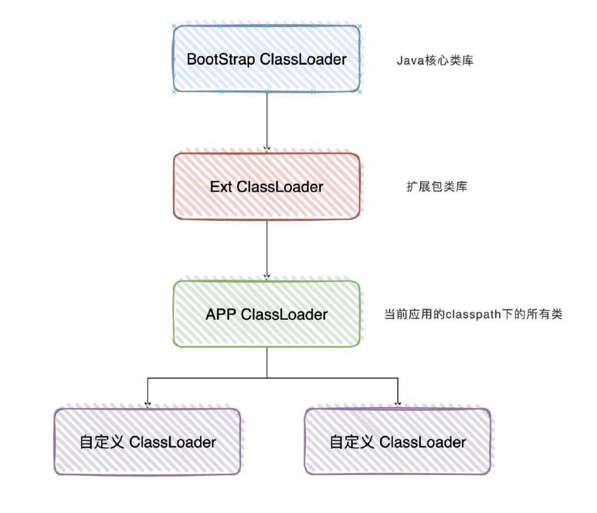
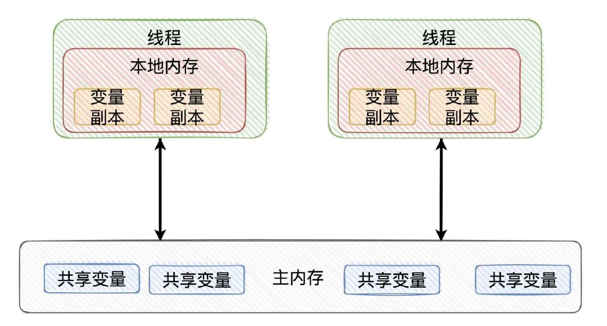
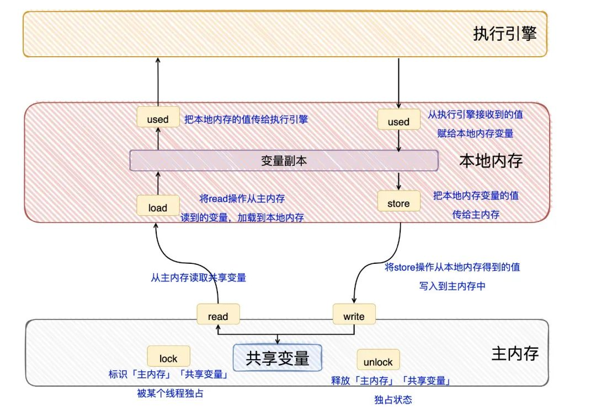
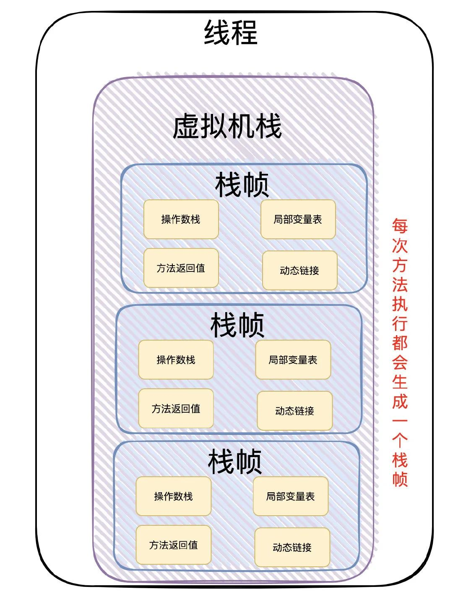
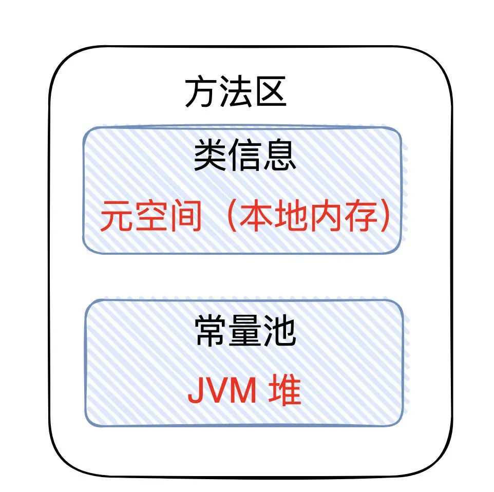

# 第三部分 加强

## 第一章 枚举

### 1.1 枚举的使用Demo

下面看一段骚气的代码

```java
public String judge(String str){
    if("AAA".equals(str)){
        return "AAA";
    }else if("BBB".equals(str)){
        return "BBB";
    }else if("CCC".equals(str)){
        return "CCC";
    }else if("DDD".equals(str)){
        return "DDD";
    }
}
```

- 条件一多 就要改源码【扩展性弱】，有没有解决办法
- 代码看起来不优雅，有没有解决办法

**枚举！**

> **第一版，用枚举替代if else**

```java
// 直接用枚举
enum RoleOperation1 {
    ADMIN_POWER,
    NORMAL_POWER,
    SUPER_POWER
}

// 因为有返回值 所以这样定义
enum RoleOperation2 {
    ADMIN_POWER() {
        @Override
        public String toString() {
            return "Admin power";
        }
    },
    NORMAL_POWER() {
        @Override
        public String toString() {
            return "Normal power";
        }
    },
    SUPER_POWER() {
        @Override
        public String toString() {
            return "Super power";
        }
    }
}

// 因为有统一的方法，所以用接口定义规则
interface Operation {
    String op();
}

//  漂亮的枚举代码，虽然看起来长，复杂，但是拓展性特别强！
// 下面就是见证奇迹的时刻，优雅地用枚举替代if else。
public enum RoleOperation implements Operation {
    ADMIN_POWER() {
        @Override
        public String op() {
            return "Admin power";
        }
    },
    NORMAL_POWER() {
        @Override
        public String op() {
            return "Normal power";
        }
    },
    SUPER_POWER() {
        @Override
        public String op() {
            return "Super power";
        }
    }
}
```

```java
public class Demo1 {
    // 如此优雅的代码！！
    // 还有用工厂模式 策略模式的。感觉都不如枚举来的优雅。
    public String judge(String role) {
        return RoleOperation.valueOf(role).op();
    }
}
```

### 1.2 枚举的常用方法

| values()    | 以数组形式返回枚举类型的所有成员 |
| ----------- | -------------------------------- |
| valueOf()   | 将普通字符串转换为枚举实例       |
| compareTo() | 比较两个枚举成员在定义时的顺序   |
| ordinal()   | 获取枚举成员的索引位置           |

```java
package org.example.enumeration;

import org.junit.jupiter.api.Test;

// 枚举中一些常用方法
public class SomeFunc {
    @Test
    public void func1() {
        Color[] values = Color.values();
        for (Color c : values) {
            System.out.println(c);
        }
    }

    @Test
    public void func2() {
        //  将普通字符串实例转换为枚举
        Color blue = Color.valueOf("BLUE");
        System.out.println(blue);
    }

    @Test
    public void func3() {
        System.out.println(Color.BLUE.ordinal());
    }


    /**
     *     public final int compareTo(E o) {
     *         Enum<?> other = (Enum<?>)o;
     *         Enum<E> self = this;
     *         if (self.getClass() != other.getClass() && // optimization
     *             self.getDeclaringClass() != other.getDeclaringClass())
     *             throw new ClassCastException();
     *         return self.ordinal - other.ordinal;
     *     }
     */
    @Test
    public void func4() {
        // RED 和 BLUE比较， RED小于BLUE 返回负数 ；equals返回0；大于返回 正数
        System.out.println(Color.RED.compareTo(Color.BLUE)); // -1
        System.out.println(Color.RED.compareTo(Color.GREEN));// -2
    }

    @Test
    public void func() {
        System.out.println(Color.RED);
        // output RED
    }

}

enum Color {
    RED, BLUE, GREEN
}
```

## 第二章 比较对象

**Comparator和Comparable**

Comparable接口/ Comparator接口

- Comparator  函数式接口 jdk1.8引入
- Comparable 普通接口

## 第三章 单元测试

### 3.1 单元测试的优点

保证的程序代码的正确性【语法上了逻辑上】。

### 3.2单元测试的使用

@Test

- @Before 无论 Test 是否出现异常，都会执行 【初始化资源】
- @After 无论 Test 是否出现异常，都会执行 【销毁资源】

```java
public class JunitDemo {
    private OutputStream outputStream;

    @Before
    public void init() throws FileNotFoundException {
        System.out.println("IO 流初始化完毕了");
        outputStream = new FileOutputStream("junit.txt");
    }

    @Test
    /**
     * 单元测试判断数据的正确性
     * 一般用Assert里面的方法
     */
    public void fn1(){
        // 断言不为null  不是null则成功
        Assert.assertNotNull(outputStream);
    }

    @After
    public void destory() throws IOException {
        System.out.println("IO 流关闭了");
        outputStream.close();
    }
}
```

### 3.3 单元测试原理

## 第四章 反射

### 4.1 反射概述

反射可以把类的各个组成部分封装为其他对象。

反射，Java的高级特性，流行的框架基本都是基于反射的思想写成的。

Java反射机制是在程序的运行过程中，对于任何一个类，都能够知道它的所有属性和方法；对于任意一个对象，都能够知道它的所有属性和方法，**<span style="color:green">这种动态获取信息以及动态调用对象方法的功能称为Java语言的反射机制。</span>**

Java反射机制主要提供了以下这几个功能：

- 在运行时判断任意一个对象所属的类
- 在运行时构造任意一个类的对象
- 在运行时判断任意一个类所有的成员变量和方法
- 在运行时调用任意一个对象的方法

### 4.2 反射的基本操作

#### 4.2.1 获取成员变量

- `File[] getFileds()` // **获得所有公有字段，包括继承的**
- `Filed getFiled(String name)` // 获取指定name的
- `Filed[] getDeclaredFileds() `// 获取该类自己声明的，包括私有
- `Filed[] getDeclaredFileds(String name)` // 获取指定名称的

#### 4.2.2 获取构造方法

- `Constructor<?>[] getConstructors()` // 获得所有公有构造器

- `Constructor<?> getConstructor(Class<?>...parameterTypes)` //获得指定参数的公有构造器
- `Constructor<?>[]getDeclaredConstructors()`// 获得所有私有构造器
- `Constructor<T>[]getDeclaredConstructors()`//  得指定参数的构造器【包括public~~~private 】

#### 4.2.3 获取成员方法

- `Method[] getMethods()` // **获得所有public修饰的方法，包括继承的**

- `Method getMethod(String name, Class<?>... parameterTypes)` // 获得指定名称和参数类型的public修饰的方法
- `Method[] getDeclaredMethods()` //获得所有的私有方法
- `Method getDeclaredMethod(String name, Class<?>... parameterTypes)` // 获得指定名称和参数类型的方法

#### 4.2.4 获取类名

- `String getName()` // 获得类全名`com.bbxx.junits.Son`

#### 4.2.5 几个重要的类

> **Class类**

每定义一个`java` `class` 实体都会产生一个Class对象。我们编写一个类，编译完成后，在生成的 `.class`文件中，就会产生一个Class对象，这个Class对象用于表示这个类的类型信息。Class中没有公共构造器，即Class对象不能被实例化。

> **Field类**

Field类提供类或接口中单独字段的信息，以及对单独字段的动态访问。

> **Method类**

```java
invoke(Object obj, Object... args)
```

> **`ClassLoader`类**

**<span style="color:green">ClassLoader类加载器！类加载器用来把类（class）装载进JVM的。ClassLoader使用的双亲委派模型来搜索加载类的，这个模型也就是双亲委派模型。</span>**

**`ClassLoader`的类继承图如下：**


### 4.3 动态代理

#### 4.3.1 作用

运行时，动态创建一组指定的接口的实现类对象！（在运行时，创建实现了指定的一组接口的对象）

动态代理对比其他方法增强方式


#### 4.3.2 基本Demo

```java
interface A{    
}
interface B{
}
Object o = 方法(new Class[]{ A.class, B.class })
o 它实现了A和B两个接口！
```

```java
Object proxyObject = Proxy.newProxyInstance(ClassLoader classLoader, Class[] interfaces, InvocationHandler h);
```

- 方法的作用：动态创建实现了interfaces数组中所有指定接口的实现类对象！
- `ClassLoader`：类加载器！
  - 它是用来加载器的，把.class文件加载到内存，形成Class对象！
- `Class[ ] interfaces`：指定要实现的接口们。
- `InvocationHandler`：代理对象的所有方法（个别不执行，一般`nativate`方法不会执行，但是`hashCode`却会执行，好奇怪）都会调用`InvocationHadnler`的`invoke()`方法
- 动态代理的作用
  - 最终是学习`AOP`（面向切面编程），它与装饰者模式有点相似，它比装饰者模式更灵活（潜在含义，动态代理更难！）

**动态代理基本Demo**

```java
interface IBase {
    public void say();

    public void sleep();

    public String getName();
}
```

```java
public class Person implements IBase {
    public void say() {
        System.out.println("hello");
    }

    public void sleep() {
        System.out.println("sleep");
    }

    public String getName() {
        return "getName";
    }
}
```

```java
public class ProxyDemo1 {
    public static void main(String[] args) {

        Person person = new Person();
        // 获得类加载器
        ClassLoader classLoader = person.getClass().getClassLoader();
        // 获得被代理对象实现的接口
        Class[] interfaces = person.getClass().getInterfaces();
        // 实例化一个处理器 用于增强方法用的
        InvocationHandler h = new InvocationHandler() {
            @Override
            public Object invoke(Object proxy, Method method, Object[] args) throws Throwable {
                method.invoke(person, args);
                return null;
            }
        };
        IBase p = (IBase) Proxy.newProxyInstance(classLoader, interfaces, h);
        // 获得代理类的名称 com.sun.proxy.$Proxy0
        System.out.println(p.getClass().getName());
        p.say();
    }
}
```

#### 4.3.3 invoke解释

```java
public Object invoke(Object proxy, Method method, Object[] args)
```

**这个invoke什么时候被调用？**

- 在调用代理对象所实现接口中的方法时被调用！

**参数解释**

- `Object proxy`：当前对象，即代理对象！在调用谁的方法！
- `Method method`：当前被调用的方法（目标方法）
- `Object [ ] args`：实参
- 返回的是方法的返回值。


----

```java
public class ProxyDemo2 {
    public static void main(String[] args) {
        Person person = new Person();
        ClassLoader classLoader = person.getClass().getClassLoader();
        Class[] interfaces = person.getClass().getInterfaces();
        System.out.println(interfaces.length);
        InvocationHandler h = new InvocationHandler() {
            @Override
            public Object invoke(Object proxy, Method method, Object[] args) throws Throwable {
                Object retVal = method.invoke(person, args);
                 // 这个返回了，方法才有返回值 
                return retVal; 
            }
        };
        IBase p = (IBase) Proxy.newProxyInstance(classLoader, interfaces, h);
        p.say();
        // invoke返回null的话，这里的输出就是null
        System.out.println(p.getName());
    }
}
```

### 4.4 模拟`AOP`

`Spring AOP`，感受一下什么叫增强内容可变！

- `ProxyFactory` 代理工厂
- `IBeforeAdvice` 前置通知接口【方法执行前调用前置】
- `IAfterAdvice` 后置通知接口【方法执行后调用后置】
- `IWaiter` 服务员类接口
- `ManWaiterImple` 具体的服务员类【对他进行增强】

## 第五章 注解

**注解也叫元数据**。是一种代码级别的说明，JDK1.5 引入的特性，与类，接口，枚举是在同一层次。**可声明在包，类，字段，方法，局部变量，方法参数等的前面**，对这些元素进行说明。

**作用分类：**

1.代码分析，通过代码里标识的元数据对代码进行分析【结合反射技术】

2.编译检查，通过代码里标识的元数据让编译器能够实现机泵的编译检查【Override】

3.编写文档，通过代码里标识的元数据生成文档【生成文档doc文档】

### 5.1 内置注解

- `Override`：检测被标注的是否继承自父类
- `Deprecated`：表示方法过时
- `SuppressWarnings`：压制警告
  - 一般传递参数all

### 5.2 自定义注解

> **元注解`public @interface annotationName{}`**

反编译发现，本质就是一个接口。

```java
import java.lang.annotation.Annotation;

public interface Annotation extends Annotation {
}
```

#### 5.2.1 属性的返回值

基本数据类型、String、枚举、注解、及以上类型的数组

#### 5.2.2 赋值问题

设置默认值`String sex() default "1";`

使用注解，数组类型的赋值 `str={xx,xx,xx}`，若数组中只有一个，大括号可省略。回忆Spring中注解

```
* 基本数据类型
		* String
		* 枚举
		* 注解
		* 以上类型的数组
```

### 5.3 元注解

> **用于描述注解的注解**

`@Target`：描述注解的位置

- `ElementType`取值
  - TYPE：可以作用于类上
  - METHOD：可以作用于方法上
  - FIELD：可以作用于成员变量上

`@Retention`：描述注解是被保留的阶段

`@Retention(RetentionPolicy.RUNTIME)`：当前被描述的注解，会保留到class字节码文件中，并被`JVM`读取到

`@Documented`：描述注解是否被抽取到api文档中

`@Inherited`：描述注解是否被子类继承

### 5.4 注解的解析

```java
@Target(ElementType.TYPE)
@Retention(RetentionPolicy.RUNTIME)
public @interface Pro {
    String className();
    String methodName();
}

@Pro(className = "com.bbxx.Demo1",methodName = "show1")
public class RefelectDemo {
    public static void main(String[] args) throws ClassNotFoundException, NoSuchMethodException, InvocationTargetException, IllegalAccessException, InstantiationException {
        /**
         * 解析注解
         */
        Class<RefelectDemo> refelectDemoClass = RefelectDemo.class;
        Pro annotation = refelectDemoClass.getAnnotation(Pro.class);
        String s = annotation.className();
        String s1 = annotation.methodName();
        Class<?> aClass = Class.forName(s);
        Object o = aClass.newInstance();
        Method declaredMethod = aClass.getDeclaredMethod(s1);
        declaredMethod.setAccessible(true);
        declaredMethod.invoke(o);
    }
}
```

## 第六章 类加载器

### 6.1 分类

`ClassLoad`分类

- 引导 类加载器----->负责加载类库 rt中的jar 【最高，Bootstrap】
- 扩展 类加载器----->负责加载扩展jar包  ext下的都是扩展jar
- 系统 类加载器----->应用下的类，包含开发人员写的类和三方jar包【最低】

`ClassLoad`有个双亲委派模型，会先问父   类加载器/上级类加载器，向上级委托，没有就自己加载，没找到就抛出`ClassNotFound`。永远不会出现类库中的类被系统加载器加载，应用下的类被引导加载。

委托父加载器加载，父可以加载就让父加载。父无法加载时再自己加载。

- 可避免类的重复加载，父类加载器已经加载了该类时，就没必要子`ClassLoader`再加载一次了/
- 考虑到安全因素，`java`核心`api`中定义类型不会被随意替换。

### 6.2 类加载的顺序

```java
class MyApp{
    public static void main(String[]args){ // 系统加载
        // 也由系统加载
        A a = new A(); 
        // 也由系统加载 （从系统开始匹配，最终会委托上去， ...由引导加载）
        String s = new String();
    }
}

class String{ // 引导加载， String类，类库中的
    private Integer i;// 直接引导加载，毕竟无法委托了！
}
```

其实还得分线程，每个线程都有一个当前的类加载器来负责加载类。

### 6.3 流程

基础阶段 **了解**，中级阶段 **熟悉**，高级阶段，**不清楚**。

继承`ClassLoader`类完成自定义类加载器。自定义类加载器一般是为了加载网络上的类，class在网络中传输，为了安全，那么class需要加密，需要自定义类加载器来加载（对class做解密工作）

`ClassLoader`加载类都是通过`loadClass()`方法来完成的。`loadClass()`方法的工作流程如下：

- 调用==findLoadedClass()==方法查看该类是否已经被加载过了，如果该类没有加载过，那么这个方法返回null。
- 判断`findLoadedClass()`返回的是否为null,如果不是null那么直接返回，可避免同一个类被加载两次。
- 如果`findLoadedClass()`返回的是null, 那么就启动代理模式（委托机制），即调用上级的`loadClass()`方法，获取上级的方法是`getParent()`，当然上级可能还有上级，这个动作就一直向上走；（==双亲委派机制==，tomcat破坏了双亲委派模型）
- 如果`getParent().loadClass()`返回的不是null，这说明上级加载成功了，那么就加载结果；
- 如果上级返回的是null，说明需要自己出手，`loadClass()`方法会调用本类的`findClass()`方法来加载类
- 这说明我们只需要重写`ClassLoader`的`findClass()`方法，这就可以了！如果重写了`loadClass()`方法覆盖了代理模式！

我们要自定义一个类加载器，只需要继承`ClassLoader`类。然后重写它的`findClass()`方法即可。在`findClass()`中我们需要完成如下的工作！

- 找到class文件，把它加载到一个byte[]中
- 调用`defineClass()`方法，把byte[]传递给这个方法即可

### 6.4 自定义类加载器

>**文件类加载器**

```java
public class MyClassLoader extends ClassLoader {
    private String directory;

    public MyClassLoader(String _directory, ClassLoader paraent) {
        super(paraent);
        this.directory = _directory;
    }

    protected Class<?> findClass(String name) throws ClassNotFoundException {
        try {
            // 把类名转为目录
            String file = directory + File.separator + name.replace(".", File.separator) + ".class";
            // 构建输入流
            InputStream fis = new FileInputStream(file);
            ByteArrayOutputStream baos = new ByteArrayOutputStream();
            byte[] buf = new byte[1024];
            int len = -1;
            while ((len = fis.read(buf)) != -1) {
                baos.write(buf, 0, len);
            }
            byte[] byteArray = baos.toByteArray();
            fis.close();
            baos.close();

            return defineClass(name, byteArray, 0, byteArray.length);
        } catch (Exception e) {
            e.printStackTrace();
        }
    }
}
```

热部署，越过双亲委派，就是不用`loadClass` 用`findClass`

> **复杂例子**

```java
package org.example.classloader;

import java.io.File;
import java.io.FileInputStream;
import java.lang.reflect.Method;

/**
 * 类加载器学习
 * 注意maven中的单元测试只能写在 test下面！
 * 字节码文件请自己生成一个 然后调用对应的方法哦！！
 */
public class ClassLoaderDemo extends ClassLoader {

    // 类加载器的地盘，指明加载那个地方的class文件
    private String classpath;

    public ClassLoaderDemo() {
    }

    public ClassLoaderDemo(String classpath) {
        this.classpath = classpath;
    }

    public static void main(String[] args) throws Exception {
        ClassLoaderDemo classLoaderDemo = new ClassLoaderDemo();
        classLoaderDemo.fun2();
    }

    // 执行字节码的非静态方法
    public void fun1() throws Exception {
        ClassLoaderDemo classLoaderDemo = new ClassLoaderDemo("D:\\");
        Class<?> clazz = classLoaderDemo.loadClass("org.example.classloader.ClassLoaderTest");
        // loaderSay是一个非静态方法，需要一个实例调用
        Method loaderSay = clazz.getMethod("loaderSay");
        ClassLoaderTest o = (ClassLoaderTest) clazz.newInstance();
        // 非静态方法需要一个实例进行调用
        loaderSay.invoke(o);
    }


    // 执行字节码的静态方法
    public void fun2() throws Exception {
        ClassLoaderDemo classLoaderDemo = new ClassLoaderDemo("D:\\");
        Class<?> clazz = classLoaderDemo.loadClass("org.example.classloader.ClassLoaderTest");
        // loaderSay是一个非静态方法，需要一个实例调用
        Method loaderSay = clazz.getMethod("loaderStaticFunction");
        // 静态方法不用实例
        String result = (String) loaderSay.invoke(null);
        System.out.println(result);
    }


    // 重写这个方法即可
    @Override
    public Class<?> findClass(String name) throws ClassNotFoundException {
        try {
            // 自定义的方法，通过类名找到class文件，把文件加载到一个字节数组中
            byte[] datas = getClassData(name);
            if (datas == null) {
                throw new ClassNotFoundException("类没有找到：" + name);
            }
            return this.defineClass(name, datas, 0, datas.length);

        } catch (ClassNotFoundException e) {
            e.printStackTrace();
            throw new ClassNotFoundException("类找不到:" + name);
        }
    }

    private byte[] getClassData(String name) {
        // 把名字换成文件夹的名字
        name = name.replace(".", "\\") + ".class";
        File classFile = new File(classpath, name);
        System.out.println(classFile.getAbsoluteFile());
        return readClassData(classFile);
    }

    private byte[] readClassData(File classFile) {
        if (!classFile.exists()) return null;
        byte[] bytes = null;
        try {
            FileInputStream fis = new FileInputStream(classFile);
            bytes = fis.readAllBytes();
        } catch (Exception e) {
            e.printStackTrace();
        }
        return bytes;
    }
}
```

### 6.5 Tomcat类加载器

tomcat提供了两种类加载器。

**第一种 服务器类加载器**

- ${CATALINA-HOME}\lib\，tomcat类加载器，它负责加载下面的类

**第二种 应用类加载器**

- ${CONTEXT}\WEB-INF\lib  
- ${CONTEXT}\WEB-INF\classes

**总结**

tomcat破坏了双亲委派模型

引导

扩展

系统

服务器类加载器：先自己动手，然后再去委托

应用类加载器：先自己动手，然后再去委托


## 第七章 并发

### 7.1 注意

> **不要调用Thread类或Runnable对象的run方法**。直接调用run方法会在同一个线程中执行----不会启动新的线程。调用`Thread.start()`方法会创建一个执行run方法的新线程。

> **线程的六种状态**

- New：新建
- Runnable：可运行【可能在运行 或 准备运行】
- Blocked：【阻塞】
- Waiting：【等待】
- Timed waiting：【具有指定等待时间的等待线程的线程状态。一个线程处于定时等待状态，这是由于调用了以下方法中的一种，具有指定的正等待时间】
- Terminated：【终止】

```java
//Thread内部的枚举类
public enum State {
    NEW,
    RUNNABLE,
    BLOCKED,
    WAITING,
    TIMED_WAITING,
    TERMINATED;
}
```

- **lock和unlock，unlock要放在finally中，确保锁可以被释放。**

- **可重入锁，获得锁的方法（代码）可以调用持有相同锁的方法**

> **`ReentrantLock()`**

- 公平锁和非公平锁。
- 公平锁倾向于选择等待时间长的线程，这种策略可能严重影响性能。
- 一般选择非公平锁。

> <span style="color:green">**Condition，用`ReentrantLock()`的实例对象获得Condition对象**</span>

- `await()` 将该线程放在这个条件的等待集中，<span style="color:green">**并放弃锁！**</span>
- `singalAll()` 激活等待这个条件的所有线程，把他们从等待集中移出，让他们重新成为可运行的线程！
- `singal()` 从该条件的等待集中随机选取一个从等待集中移出，让他们重新成为可运行的线程！
- <span style="color:green">**用if做条件判断不合适，存在虚假唤醒的问题，用while。【`JDK`注释中有说明】**</span>

> **synchronized**

> **线程就是一个单独的资源类，没有任何附属的操作。**

> **线程局部变量 `ThreadLocal`**

- `ThreadLocal.withInitial()`为函数式编程提供的方法

**Unsafe类啊！**

## 第八章 网络编程

采用windows的`telent`工具作为客户端进行发起连接。

### 8.1 入门

> **Client**

```java
/**
 * 测试服务器连接
 */
public class SocketTest {

    public static void fun1() {
        // jdk 7 try catch用法
        try (var socket = new Socket("time-a.nist.gov", 13)) {
            var scanner = new Scanner(socket.getInputStream());
            while (scanner.hasNextLine()) {
                System.out.println(scanner.nextLine() + "==");
            }
        } catch (Exception e) {
            e.printStackTrace();
        }
    }

    public static void fun2() throws UnknownHostException, UnsupportedEncodingException {
        String host = "www.bilibili.com";
        InetAddress[] localhosts = InetAddress.getAllByName(host);
        for (InetAddress tmp : localhosts) {
            System.out.println(tmp.getHostAddress());
            System.out.println(tmp);
        }
    }

    public static void fun3() throws IOException {
        Socket socket = new Socket();
        socket.connect(new InetSocketAddress("time-a.nist.gov", 13), 10000);
        Scanner scanner = new Scanner(socket.getInputStream());
        // Scanner类不是很熟悉
        while (scanner.hasNextLine()) {
            System.out.println(scanner.nextLine());
        }
    }

    public static void main(String[] args) throws IOException {
        fun3();
    }
}
```

> **Server**

```java
public class EchoServer {
    /**
     * 服务器端的 inputStream 和 outPutStream
     * inPutStream 输入流，输入到Server
     * outPutStream 输出流，输出到client
     *
     * @param args
     * @throws IOException
     */
    public static void main(String[] args) throws IOException {
        ServerSocket serverSocket = new ServerSocket(8189);
        Socket accept = serverSocket.accept();
        // 控制台读入数据
        Scanner in = new Scanner(accept.getInputStream(), StandardCharsets.UTF_8);
        // 输出 IO流还是不熟悉 类的组合太复杂了
        // PrintWriter out = new PrintWriter(new OutputStreamWriter(accept.getOutputStream(), StandardCharsets.UTF_8), true);
        OutputStreamWriter out = new OutputStreamWriter(accept.getOutputStream(), StandardCharsets.UTF_8);
        out.write("connected");
        out.flush();

        boolean done = false;
        while (!done && in.hasNextLine()) {
            // 控制台输入数据
            String line = in.nextLine();
            // 输出到客户端
            out.write("Echo:" + line);
            out.flush();
            if ("BYE".equals(line.trim())) done = true;
        }
    }
}
```

---

## 第九章 Servlet3.0

- 注解
- 文件上传
- 异步处理 需要 `asyncSupported=true`，有过滤器的话，过滤器也要设置`asyncSupported = true`

使用型特性就是在保护你的Java职业生涯。

### 9.1 注解替代`xml`

```java
@WebServlet("/index.do")
public class IndexServlet extends HttpServlet {
    protected void doPost(HttpServletRequest request, HttpServletResponse response) throws ServletException, IOException {

    }

    protected void doGet(HttpServletRequest request, HttpServletResponse response) throws ServletException, IOException {
        request.setAttribute("data", fakeData());
        request.getRequestDispatcher("/demo.jsp").forward(request, response);
    }

    public ArrayList<User> fakeData() {
        ArrayList<User> users = new ArrayList<>();
        users.addAll(Arrays.asList(
                new User("111", "111"),
                new User("222", "222"),
                new User("333", "333")));
        users.forEach(System.out::println);
        return users;
    }
}
```

### 9.2 异步响应

异步响应如果不设置编码格式 可能会导致异步失败（有乱码，异步可能会失败；主要是告诉它响应文本是什么。）测试了一下，的确是设置好响应文本即可。

异步响应如果过滤器这些东西没有设置为异步状态，也会导致异步失败

```text
 * 类型 异常报告
 * 消息 当前链的筛选器或servlet不支持异步操作。
 * 描述 服务器遇到一个意外的情况，阻止它完成请求
 
 错误的原因就是过滤器没有设置  asyncSupported = true
```

**代码案例**

```java
@WebServlet(urlPatterns = "/async", asyncSupported = true)
public class AsyncServlet extends HttpServlet {
    protected void doPost(HttpServletRequest request, HttpServletResponse response) throws ServletException, IOException {
        doGet(request, response);
    }

    private char[] getOutPutChar(String str) {
        return str == null ? "   2020年 10月24日，祝各位程序员节日快乐！ 2020-1024=996，想不到吧！".toCharArray() : null;
    }

    protected void doGet(HttpServletRequest request, HttpServletResponse response) throws ServletException, IOException {
        // 不加设置响应的类型的话，就无法异步。
        response.setContentType("text/html");
        AsyncContext asyncContext = request.startAsync(request, response);
        threadOutPut(asyncContext, response, getOutPutChar(null));
    }

    /**
     * @param asyncContext
     * @param response
     * @param outputStr    需要输出给浏览器的数据
     */
    private void threadOutPut(AsyncContext asyncContext, HttpServletResponse response, char[] outputStr) {
        asyncContext.start(() -> {
            try {
                PrintWriter print = response.getWriter();
                TimeUnit.MILLISECONDS.sleep(600);
                for (char c : outputStr) {
                    TimeUnit.MILLISECONDS.sleep(180);
                    print.print(c); print.flush();
                }
                asyncContext.complete();
            } catch (Exception e) {
                e.printStackTrace();
            } finally {
                asyncContext.complete();
            }
        });
    }
}
```

### 9.3 文件上传

> **几个重要的API**

```java
- request.getPart("file_name") // 获得文件对象Part
- part.getName() // 获得文件上传时的 name <input name="xx"> 中的name
- part.getSize() // 获得文件的大小
- part.getSubmittedFileName() // 获得提交的文件的名字。上传的是 demo.txt 那么得到的就是 demo.txt
- part.getInputStream(); // 获得文件输入流。

获取文件输入流后，在用输出流 存入磁盘。
```

**文件上传的简单Demo**

文件上传用绝对路径【公司】

```java
@WebServlet("/upload")
@MultipartConfig // 表示它支持文件上传
public class FileUpload extends HttpServlet {
    @Override
    protected void doPost(HttpServletRequest request, HttpServletResponse response) throws ServletException, IOException {
        Part part = request.getPart("file_name");
        System.out.println(part.getName());
        System.out.println(part.getSize());
        System.out.println(part.getSubmittedFileName());
        InputStream inputStream = part.getInputStream();
        // new FileOutputStream("filename") 这样是无法定位位置的，不能正常存储？
        //D:\citespace.projects.txt
        FileOutputStream fos = new FileOutputStream("D://" + part.getSubmittedFileName());
        // citespace.projects.txt
        // FileOutputStream fos = new FileOutputStream(part.getSubmittedFileName());
        byte[] bys = new byte[1024];
        int len = 0;
        while ((len = inputStream.read(bys)) != -1) {
            fos.write(bys, 0, len);
        }
        inputStream.close();
        fos.close();
    }
}
```

```html
<html>
<head>
    <title>Title</title>
</head>
<body>
    enctype 说明有文件要提交过去
<form action="/Tomcat/upload" method="post" enctype="multipart/form-data">
    <input type="file" name="file_name">
    <input type="submit">
</form>
</body>
</html>
```

## 第十章 双亲委派

### 基本概念

class文件通过**类加载器**装载至JVM中的。为了防止内存中存放在多份同样的字节码，使用了双亲委派机制（它不会自己去尝试加载类，而是把请求委托给父加载器去完成，依次向上，避免重复加载字节码）

JDK中的本地方法类一般由根加载器（Bootstrap loader）装载；JDK中内部实现的扩展类一般由扩展加载器（ExtClassLoader）实现装载；而程序中的类文件则由系统加载器（AppClassLoader）实现装载。



### 打破双亲委派机制

只要加载类的时候，不是从 App ClassLoader --> Ext ClassLoader --> BootStrap ClassLoader 这个顺序查找，就是打破了双亲委派机制。

加载class核心的方法在LoaderClass类的loadClass方法上（双亲委派机制的核心实现），只要我们定义个 ClassLoader，重写 loadClass 方法（不按照往上开始寻找类加载器），那就算是打破双亲委派机制了。

> **Tomcat打破双亲委派机制**

我们部署传统javaweb项目是，把war包放到tomcat的webapp下，这意味着一个tomcat可以运行多个web应用程序；

----

假设有两个Web应用程序，它们都有一个类，叫做User，并且它们的类全限定名都一样，如都是 `com.yyy.User`，但是他们的具体实现是不一样的。那么tomcat如何保证它们是不会冲突的？**tomcat为每个Web应用创建一个类加载实例（WebAppClassLoader），该加载器重写了 loadClass 方法，优先加载当前应用目录下的嘞，如果当前找不到了，才一层一层往上找**，这样就做到了Web应用层级的隔离。

----

并不是Web应用程序下的所有依赖都需要隔离的，比如 Redis 就可以 Web 应用之间共享（有需要的话），因为如果版本相同，没必要每个Web应用程序都独自加载一份。具体做法是：Tomcat 在 WebAppClassLoader 上加了个父类加载器 （Shared ClassLoader），**如果 WebAppClassLoader 自身没有加载到某个类，就委托 SharedClassLoader 去加载（把需要应用程序之间需要共享的类放到一个共享目录下，Share ClassLoader 读共享目录的类即可**）。

为了隔绝Web应用程序与Tomcat本身的类，又有类加载器（CatalinaClassLoader）来装载 Tomcat 本身的依赖。如果 Tomcat 本身的依赖和 Web 应用还需要共享，那么还有类加载器（CommonClassLoader）来装载而达到共享。各个类加载器的加载目录可以到 Tomcat 的 catalina.properties 配置文件上查看。

----

> Tomcat的类加载结构图


> JDBC破坏了双亲委派？

JDBC定义了接口，具体实现类由各个厂商进行实现。

类加载的规则如下：如果一个类由类加载器A加载，那么这个类的依赖类也是由相同的类加载器加载。

使用JDBC的时候，是使用 DriverManager 进而获取 Connection，DriverManager 在 java.sql 包下，显然是由 BootStrap 类加载器进行装载。当我们使用 DriverManager.getConnection() 时，得到的一定是厂商实现的类，**但 BootStrap ClassLoader 无法加载到各个厂商实现的类**，因为这些实现类没在 java 包中。DriverManager 的解决方案时 在 DriverManager 初始化的时候， 得到**线程上下文加载器**，去获取 Connection 的时候，是使用线程上下文加载器去加载 Connection 的，**而这里的线程上下文加载器实际上还是 App ClassLoader**，所以在获取 Connection 的时候，还是先找 Ext ClassLoader 和 BootStrap ClassLoader，只不过这两加载器肯定加载不到的，最终会由App ClassLoader进行加载！

有人觉得本应由 BootStrao ClassLoader 进行加载的 却改成 线程上下文加载器加载 就觉得破坏了。

有人觉得虽然改成了线程上下文加载器 但是依旧遵守 依次往上找父类加载器进行加载，都找不到时才由自己加载，认为**原则**上时没变的。

不重要好吧！理解为什么重要！

### 小结

**前置知识**：JDK中默认类加载器有三个：AppClassLoader、Ext ClassLoader、BootStrap ClassLoader。AppClassLoader的父加载器为Ext ClassLoader、Ext ClassLoader的父加载器为BootStrap ClassLoader。这里的父子关系并不是通过继承实现的，而是组合。

**什么是双亲委派机制**：加载器在加载过程中，先把类交由父类加载器进行加载，父类加载器没找到才由自身加载。

**双亲委派机制目的**：为了防止内存中存在多份同样的字节码（安全）

**类加载规则**：如果一个类由类加载器A加载，那么这个类的依赖类也是由「相同的类加载器」加载。

**如何打破双亲委派机制**：自定义ClassLoader，重写loadClass方法（只要不依次往上交给父加载器进行加载，就算是打破双亲委派机制）

**打破双亲委派机制案例**：Tomcat

1. 为了Web应用程序类之间隔离，为每个应用程序创建WebAppClassLoader类加载器
2. 为了Web应用程序类之间共享，把ShareClassLoader作为WebAppClassLoader的父类加载器，如果WebAppClassLoader加载器找不到，则尝试用ShareClassLoader进行加载
3. 为了Tomcat本身与Web应用程序类隔离，用CatalinaClassLoader类加载器进行隔离，CatalinaClassLoader加载Tomcat本身的类
4. 为了Tomcat与Web应用程序类共享，用CommonClassLoader作为CatalinaClassLoader和ShareClassLoader的父类加载器
5. ShareClassLoader、CatalinaClassLoader、CommonClassLoader的目录可以在Tomcat的catalina.properties进行配置

**线程上下文加载器**：由于类加载的规则，很可能导致父加载器加载时依赖子加载器的类，导致无法加载成功（BootStrap ClassLoader无法加载第三方库的类），所以存在「线程上下文加载器」来进行加载。

## 第十一章 Java内存模型

> Java内存模型概述

Java的内存模型 Java Memory Model，简称JMM，本身是一种抽象的概念，实际上并不存在，它描述的是一组规则或规范，通过这组规范定义了程序中各个变量（包括实例字段，静态字段和构成数组对象的元素）的访问方式

JMM关于同步的规定：

- 线程解锁前，必须把共享变量的值刷新回主内存
- 线程加锁前，必须读取主内存的最新值，到自己的工作内存
- 加锁和解锁是同一把锁

>Java内存模型三大特性

JMM的三大特性，volatile只保证了两个，即可见性和有序性，不满足原子性

- 可见性
- 原子性
- 有序性

### 为什么需要内存模型

#### 背景

多核计算机，每个核心都会有高速缓存。高速缓存的为了解决CPU与内存（主存）直接的速度差异，L1，L2缓存一般是【每个核心独占】一份的。L3缓存一般是多核共享的。

为了让CPU提高运算效率，处理器可能会对代码进行【乱序执行】，即指令重排序，可以会议下计算机组成原理的流水线执行。

计算机中的一些操作往往是非原子性的，如 i++ 在执行的时候需要多个指令才能完成 i++ 这个操作。在单线程下，是不会存在什么问题的，因为单线程意味着无法并发。且在单线程下，编译器 /runtime/ 处理器 必须遵守 as-if-serial 语义，即它们不会对数据**依赖关系的操作**做重排序

> 缓存数据不一致

多个线程同时修改 【共享变量】，CPU核心下的高速缓存是 【不共享】的，多个 cache 与内存直接的数据同部如何进行的？

- 锁总线，锁数据传输
- 缓存一致性协议（如MESI协议，M（Modified）E（Exclusive）S（Share）I（Invalid））
- 锁总线开销太大了，一般是用缓存一致性协议，没办法的时候才会用锁总线。

#### MESI协议

MESI协议，M（Modified）E（Exclusive）S（Share）I（Invalid）

缓存一致性协议锁的是==缓存行==进行加锁。**缓存行是高速缓存存储的最小单位。**

> MESI原理（计组那块的知识）

当每个 CPU 读取共享变量之前，会先识别数据的对象状态（修改、共享、独占、无效）。

==独占==：说明 CPU 将要得到的变量数据是最新的，没有被其他 CPU 同时读取。

==共享==：说明 CPU 将要得到的变量数据还是最新的，有其他 CPU 在读取，但是还没被修改。

==修改==：说明当前 CPU 正在修改该变量的值，同时会向其他 CPU 发送该数据状态为 invalid（无效）的通知，得到其他 CPU 响应后（其他 CPU 将数据状态从共享（share）变成invilid（无效）），会当前 CPU 将高速缓存的数据写到主存，并把自己的状态从 modify 变成 exclusive。如果 CPU 发现数据是 invilid 则需要从主存重新读取最新的数据。

MESI 协议做的就是判判断**对象状态**， 根据对象状态来采取不同的策略。在某个 CPU 在对数据进行修改时，需要**同步**通知其他 CPU ，表示这个数据被我修改了，你们不能用了。**对比锁总线，MESI协议的“锁粒度”更小，性能更高**。

> CPU 优化

同步，意味着等待，什么都做不了，浪费 CPU 资源。解决方案是把 同步 变成 异步。修改时同步告诉其他 CPU ，而现在则把最新修改的值写到 store buffer 中，并通知其他 CPU 记得要修改状态，随后 CPU 就直接返回做其他事了。等收到其他 CPU 发过来的响应消息，再将数据更新到高速缓存中。

其他 CPU 接收到 invalid 通知时，也会把接收到的消息放入 invalid queue 中，只要写到 invalid queue 就会直接返回告诉修改数据的 CPU 已将状态置为 invalid。

异步的问题在于：现在 CPU 修改为 A 值，写到 store buffer 了，CPU 可以做其他事，如果该 CPU 又 接收指令需要修改 A 值，但上一次修改的值 还在 store buffer 中，未修改至高速缓存。 所以 CPU 在读取的时候，需要去 store buffer 看看存不存在，存在则直接取，不存在才读主存的数据。

> CPU 乱序执行

如果是不同核心的CPU读它们共享的高速缓存，还是可能出现读旧值的问题。CPU1 修改了A值，把修改后值写到 store buffer 并通知CPU2 对该值 进行 invalid 操作，而 CPU2 可能还没收到 invalid 通知，就去做其他操作了，导致 CPU2 读到的还是旧值。这称之为 CPU 乱序执行。为了解决乱序问题，引出了**内存屏障**

> 内存屏障

内存屏障实际上是为了解决**异步优化**导致 **CPU乱序执行/缓存不及时可见** 的问题，解决方案就是把**异步优化禁用**了。

内存屏障可分为：

- 写屏障
- 读屏障
- 读写屏障

屏障：操作数据时，往数据插入一条“特殊的指令”。只要遇见这条指令，那前面的操作都得【完成】。

==写屏障==：CPU当发现写屏障指令时，会把该指令**之前**存在于 store Buffer 所有写指令**刷入高速缓存**。通过这种方式就**可以让CPU修改的数据可以马上暴露给其他 CPU**，达到写操作可见性的效果。

==读屏障==：CPU 当发现读屏障指令时，会把该指令之前存在于 invalid queue 所有的指令都处理掉，通过这种方式就**可以确保当前CPU的缓存状态是准确的**，达到读操作一定是读取最新的效果。

深入Linux内核架构一书中，读、写屏障的解释：

- ==读屏障==：是读访问内存屏障。它保证 在屏障之后发出的任何读取操作执行之前，屏障之前发出的所有读取操作都已经完成。（**屏障内的所有操作完成了！然后才会执行屏障后的操作！**）
- ==写屏障==：是写访问内存屏障。它保证 在屏障之后发出的任何写操作执行之前，屏障之前发出的所有写操作都已经完成。
- 编译器在屏障之前发出的读写请求完 成之前，不会处理屏障之后的任何读写请求

#### Java内存模型

由于不同 CPU 架构的缓存体系不一样，缓存一致性协议不一样、重排序的策略不一样、所提供的内存屏障指令也有差异，为了简化 Java 开发人员的工作，==Java 封装了一套规范：Java内存模型==

Java内存模型希望屏蔽各种硬件和操作系统的访问差异，保证了Java程序在各种平台下对内存的访问都能得到一致的效果。目的是解决多线程存在的原子性、可见性（缓存一致性）以及有序性的问题。

#### 小结

- 并发问题产生的三大根源是「可见性」「有序性」「原子性」

- 可见性：CPU架构下存在高速缓存，每个核心下的L1/L2高速缓存不共享（不可见）

- 有序性：主要有三部分可能导致打破（编译器和处理器可以在不改变「单线程」程序语义的情况下，可以对代码语句顺序进行调整重新排序

- - 编译器优化导致重排序（编译器重排）
    - 指令集并行重排序（CPU原生重排）
    - 内存系统重排序（CPU架构下很可能有store buffer /invalid queue 缓冲区，这种「异步」很可能会导致指令重排）

- 原子性：Java的一条语句往往需要多条 CPU 指令完成(i++)，由于操作系统的线程切换很可能导致 i++ 操作未完成，其他线程“中途”操作了共享变量  i ，导致最终结果并非我们所期待的。

- 在CPU层级下，为了解决「缓存一致性」问题，有相关的“锁”来保证，比如“总线锁”和“缓存锁”。

- - 总线锁是锁总线，对共享变量的修改在相同的时刻只允许一个CPU操作。
    - 缓存锁是锁缓存行(cache line)，其中比较出名的是MESI协议，对缓存行标记状态，通过“同步通知”的方式，来实现(缓存行)数据的可见性和有序性
    - 但“同步通知”会影响性能，所以会有内存缓冲区(store buffer/invalid queue)来实现「异步」进而提高CPU的工作效率
    - 引入了内存缓冲区后，又会存在「可见性」和「有序性」的问题，平日大多数情况下是可以享受「异步」带来的好处的，但少数情况下，需要强「可见性」和「有序性」，只能"禁用"缓存的优化。
    - “禁用”缓存优化在CPU层面下有「内存屏障」，读屏障/写屏障/全能屏障，本质上是插入一条"屏障指令"，使得缓冲区(store buffer/invalid queue)在屏障指令之前的操作均已被处理，进而达到 读写 在CPU层面上是可见和有序的。

- 不同的CPU实现的架构不一样，Java为了屏蔽硬件和操作系统访问内存的各种差异，提出了「Java内存模型」的规范，保证了Java程序在各种平台下对内存的访问都能得到一致效果。

### 从源码到执行

> 流程概述

编译--->加载--->解释--->执行

- 编译：将源码文件编译成JVM可解释的class文件。会对程序做语法分析、语义分析、注解处理等操作，最后才生成字节码文件。
  - 典型的处理有：泛型擦出，Java的泛型擦出就是在 编译 阶段执行的。
- 加载：将编译后的class文件加载到JVM中。
  - 加载步骤：装载--->连接--->初始化

#### 加载

> 装载

- **装载时机**：为了节省内存的开销，不会一次把所有的类都装载到JVM，而是等到 有需要 的时候才进行装载。（如new 反射）
- **装载发生**：class文件是通过 类加载器 加载到 JVM中，为防止内存中出现多分相同的字节码，使用了双亲委派机制（不会自己去尝试加载这个类，而是把请求委托给父加载器去完成，依次向上）
- **装载规则**：JDK中的本地犯法类一般由根加载器（Bootstrao loader）装载，JDK中内部实现的扩展类一般由扩展加载器（ExtClassLoader）实现装载，而程序中的类文件则由系统加载器（AppClassLoader）实现装载。

查找并加载类的二进制数据，在JVM堆中创建一个java.lang.Class类的对象，并将类相关的信息存储在JVM方法区中。

装载后，class文件就装载到了JVM中，并创建出了对应的Class对象和类信息，并这Class对象和类信息存储到了方法区中。

> 连接

对class的信息进行验证、为类变量分配内存空间并对其赋默认值。

连接的细化步骤为：验证--->准备--->解析

- 验证：验证类是否符合 Java 规范 和 JVM 规范。
- 准备：为类的静态变量分配内存，初始化为系统的初始值。
- 解析：将**符号引用**转为直接引用的过程。（什么是符号引用？）

通过连接，对class信息做了校验并分配了内存空间和默认值。

> 初始化

为类的静态变量赋予正确的初始值。

过程：收集 class 的静态变量、静态代码块、静态方法至clinit() 方法，随后从上往下开始执行（clinit()方法？）

如果 **实例化对象** 则会调用方法对实例变量进行初始化，并执行对应的构造方法内的代码。（==这块感觉写到有问题，查查资料==）

#### 解释

初始化完成后，执行某个类的方法时，会找到对应方法的字节码信息。然后交由解释器去将这些字节码信息解释成系统可以识别的指令。

字节码变成机器码的方式

- 解释器
- JIT

JVM对热点代码做编译，非热点代码直接进行解释。运行频繁的数据会被解释为热点代码。

热点代码使用热点探测来检测是否为热点代码。热点探测一般两种方式：

- 计数器 
- 抽样

HotSpot使用的是 计数器 的方式进行探测，为每个方法准备了两类计数器：方法调用计数器和回边计数器。这两个计数器都有一个确定的阈值，当计数器超过阈值溢出了，就会触发JIT编译。即时编译器把热点方法的指令码保存起来，下次执行的时候就无需重复的进行解释，直接执行缓存的机器语言。

**执行次数大于100万次的代码会被编译成热点代码**

#### 执行

操作系统把解释器解析出来的指令码，调用系统的硬件执行最终的程序指令。

#### 小结

- Java跨平台因为有JVM屏蔽了底层操作系统

- Java源码到执行的过程，从JVM的角度看可以总结为四个步骤：编译->加载->解释->执行

- - 「编译」经过 语法分析、语义分析、注解处理 最后才生成会class文件
    - 「加载」又可以细分步骤为：装载->连接->初始化。装载则把class文件装载至JVM，连接则校验class信息、分配内存空间及赋默认值，初始化则为变量赋值为正确的初始值。连接里又可以细化为：验证、准备、解析
    - 「解释」则是把字节码转换成操作系统可识别的执行指令，在JVM中会有字节码解释器和即时编译器。在解释时会对代码进行分析，查看是否为「热点代码」，如果为「热点代码」则触发JIT编译，下次执行时就无需重复进行解释，提高解释速度
    - 「执行」调用系统的硬件执行最终的程序指令

  

### Java内存模型

ava内存模型希望屏蔽各种硬件和操作系统的访问差异，保证了Java程序在各种平台下对内存的访问都能得到一致的效果。目的是解决多线程存在的原子性、可见性（缓存一致性）以及有序性的问题。==Java 内存模型时一种规范，JVM会实现这种规范。==

> 主要内容概述

- Java 内存模型的抽象结构
- happen-before 规则
- 对 volatile 内存语义的探讨

> Java 内存模型的抽象结构

Java 内存模型定义了：Java 线程对内存数据进行交互的规范。

线程之间的 共享变量 存储在 主内存 中，每个线程都有自己私有的 本地内存，本地内存 存储了该线程以 读\写 共享变量的副本。

本地内存是 Java 内存模型的抽象概念，并不是真实存在的。



Java 内存模型规定了：线程对变量的所有操作都必须在 **本地内存** 进行，**不能直接读写主内存** 的变量。

Java内存模型定义了 8 种 操作来完成 变量如何从主内存到本地内存，以及变量如何从本地内存到主内存。分别是 read/load/use/assign/store/writer/lock/unlock操作。



> happen-before

happen-before也是一套规则。目的是阐述“操作之间”的内存“可见性”。在happen-before规则下，我们写的代码只要前一个操作的结果对后续操作是可见的，是不会发生重排序的。

> volatile

- 有序性
- 可见性

在volatile前后加了内存屏障，使得编译器和CPU无法进行重排序，并且写 volatile 变量对其他线程可见。

在汇编层面，是通过 lock 前缀指令来实现的（**实现什么？没讲清楚，黄俊说的是实现的内存屏障？**），而不是各种 fence 指令（因为大部分平台都支持 lock 指令，而 fence 指令 是 x86 平台的）

```cpp
// 内存屏障的实现
#ifdef AMD64
  __asm__ volatile ("movq 0(%%rsp), %0" : "=r" (local_dummy) : : "memory");
#else
  __asm__ volatile ("movl 0(%%esp),%0" : "=r" (local_dummy) : : "memory");
#endif // AMD64
```

lock指令能保证：禁止 CPU 和 编译器 的重排序（保证了有序性）、保证 CPU 写核心的指令可以立即生效且其他核心的缓存数据失效（保证了可见性）

## 第十二章 JVM内存结构

### 概述

JVM的内存结构，往往指的就是 JVM 定义的 运行时数据区域。

==JVM内存结构分为5块：==方法区、堆、程序计数器、虚拟机栈、本地方法栈。=


### 程序计数器

一块较小的内存空间，当前线程所执行字节码的行号指示器，字节码解释器工作时就是通过改变这个计数器的值来选取下一条需要执行的字节码指令。程序计数器时程序控制流的指示器，分支、循环、跳转、异常处理、线程回复等基础功能都依赖于程序计数器完成。

可以理解为计算机组成原理中的程序计数器。指向下一条需要执行的指令。**如果线程正在执行的是一个 Java 方法，这个计数器记录的是正在执行的虚拟机字节码指令的地址**；**如果正在执行的是本地方法，这个计数器值则应为空。**

每个线程都需要一个独立的程序计数器，各条线程之间计数器互不影响，独立存储。程序计数器这块区域为线程私有，是线程安全的。

### 虚拟机栈

描述的是 Java 方法执行的线程内存模型。每一条 Java 虚拟机线程都有自己私有的 Java 虚拟机栈，这个栈与线程同时创建，**每次方法调用都会创建一个 栈帧**。

==每个栈帧会包含几块内容：局部变量表、操作时栈、动态连接和返回地址==

Java 虚拟机栈的作用与传统语言中的栈非常类似，用于存储局部变量与一些尚未算好的结果。



### 本地方法栈

与虚拟机栈所发挥的作用是非常相似的，其区别只是虚拟机栈为虚拟机执行 Java 方法（也就是字节码）服务，而本地方法栈则是为虚拟机使用到本地方法服务。

==HotSpot VM 直接把虚拟机栈和本地方法栈合二为一了。==

### 方法区

> **Java虚拟机规范中的解释：**

方法区是可供各个线程共享的运行时内存区域。**存储了每一个类的结构信息，如：运行时常量池、字段和方法数据、构造函数和普通方法的字节码内容，还包括一些在类、实例、接口初始化时用到的特殊方法。**虚拟机可以自行选在在不在方法区实现垃圾回收算法。

> **HotSpot虚拟机**

在HotSpot虚拟机，会常常提到 **永久代** 这个词。==HotSpot虚拟在 JDK8前 用 **永久代**实现了**方法区**==，而很多其他厂商的虚拟机其实是没有永久代的概念的。Java 虚拟机把方法区描述为堆的一个逻辑部分，但是它有一个别名叫作“非堆”，目的是为了与 Java 堆区分开来。

采用 **永久代** 实现 **方法区** 这种设计导致了 Java 应用 更容易遇到内存溢出的问题（永久代有 -XX:MaxPermSize 的上限，即使不设置也有默认大小，而J9 和 JRockit 只要没有触碰到进程可用内存的上限，如32位系统位4GB，就不会出现问题。）在JDK6 的时候 HotSpot 开发团队就有放弃永久代，逐步改为本地内存来实现方法区的计划了。

方法区主要用来存放已被虚拟机加载的“类相关信息”：包括类信息、常量池。

- 类信息：类的版本、字段、方法、接口和父类等信息
- 常量池：静态常量池 和 运行时常量池（这块不熟悉）

常量池：

- 静态常量池：存储的是 **字面量** 以及 **符号引用** 等信息，静态常量池也包括了我们说的 **字符串常量池**
- 运行时常量池：存储的是 **类加载** 时生成的 **直接引用** 等信息

但自从在 **JDK7** 以后，就已经把 **运行时常量池** 和 **静态常量池** 转移到了 **堆** 内存中进行存储。**到了JDK 8，终于完全废弃了永久代的概念，改用与 JRockit、J9 一样在本地内存中实现的元空间（Meta-space）来代替，把 JDK 7 中永久代还剩余的内容（主要是类型信息）全部移到元空间中。**对于 **物理分区** 来说 **运行时常量池** 和 **静态常量池** 就属于堆。==（逻辑分区和物理实际存储的位置是不一样的）==

元空间存储不在虚拟机中，而是使用本地内存，JVM 不会再出现方法区的内存溢出，以往永久代经常因为内存不够用导致OOM异常。



> **小结**

HotSpot VM：HotSpot VM JDK7 以前永久代实现的方法区。JDK7 以前常量池在永久代（方法区）中，永久代容易OOM，JDK7 把常量池从 永久代（方法区） 移动到了 JVM 堆中。 ==JDK8开始，不在用永久代实现方法区了，而是用元空间实现方法区，永久代中剩余的内容（主要是类型信息）被移到了元空间。==

### 堆

Java堆是被所有线程共享的一块内存区域，在虚拟机启动时创建。此内存区域的唯一目的就是存放对象实例，Java世界里“几乎”所有的对象实例都在这里分配内存。

堆涉及到了垃圾回收。以往的垃圾回收多数是基于“经典分代”来设计，需要新生代、老年代收集器搭配才能工作；HotSpot里面也出现了不采用分代设计的新垃圾收集器。现在以传统的 分代 思想介绍下堆的划分。

**堆**被划分为新时代和老年代，新时代又被进一步划分为Eden和Survivor区，Surivivor由From Survivor和To Survivor组成。


**一般情况下 Eden：from：to = 8：1：1**

### 小结

**JVM内存结构组成**：JVM内存结构又称为「运行时数据区域」。主要有五部分组成：虚拟机栈、本地方法栈、程序计数器、方法区和堆。其中方法区和堆是线程共享的。虚拟机栈、本地方法栈以及程序计数器是线程隔离的。


