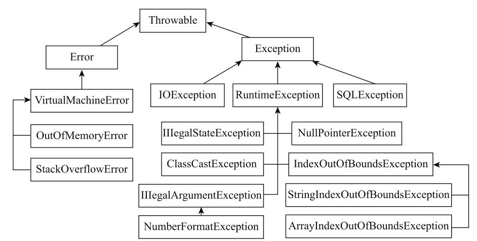
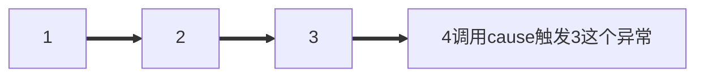

# 常用工具及命令

- `javac - java compiler java编译器`
- `javadoc - 抽取Java 文档`
    - 只能为 public protected 成员进行文档注释。
    - 常见使用方法如下：
    - `@see` 引用其他类。`@see classname / @see full-qualified-classname`
    - `@version` 版本号
    - `@author` 作者
    - `@since` 代码的最早使用版本
    - `@param` 修饰参数
    - `@return` 返回值
    - `@throws` 抛出的异常
    - `@description` 表示方法废弃。已经被 `@Deprecated` 注解替代了

# 位运算补充

## 计算方式 

| 运算符 |    运算    |          规则          |     示例     |   结果    |
| :----: | :--------: | :--------------------: | :----------: | :-------: |
|   &    |   按位与   |       同为1则为1       |     1&1      |     1     |
|   \|   |   按位或   |     有一个为1则为1     |    1 \| 0    |     1     |
|   ~    |    取反    | 全部取反（包括符号位） |  ~1000 0001  | 0111 1110 |
|   ^    |  按位异或  |    不同为1，相同为0    |     1^1      |     0     |
|   <<   |    左移    |        末尾补0         | 1001 0011<<2 | 1000 1100 |
|   >>   |    右移    |     最高位补符号位     | 1110 0010>>2 | 1111 1000 |
|  >>>   | 无符号右移 |       最高位补0        | 1111 0000>>2 | 0011 1100 |

```java
public class OpBin {
    /**
     * 位运算相关操作
     */
    public static void main(String[] args) {
        /**
         * & | ^ ~ >> << >>>
         */
        // & 同为1才为1
        int n1 = 10;
        System.out.println((n1 & (n1 - 1))); // 10 = 8+2 = 0000 1010  n1 & (n1 - 1) 可以去掉最右边的一个1 10-->8
        // | 有一个1就是1
        int n2 = 1;
        // n1 |= n2 把 n1 和 n2 bit 为1的都放到 n1 上，且只放一次。 10 = 0000 1010  1 = 0000 0001
        // 10 | 1 = 0000 1011
        // 11 | 1 = 0000 1011 只放一次。
        System.out.println(n1 |= n2);

        // ^ 不同为1，相同为0 n1^n1 = 0; 0^n2 = n2
        System.out.println(n1^n2^n1);
        // ~ 取反
        // n1 = 11 = 0000 1011
        System.out.println(n1);
        // 1111 0100 ==>这是负数的补码 ； 补码取反加1变成原码 1000 1011 + 1 = -(8+2+1+1) = -12
        System.out.println(~n1);

        // << >> 左移 右移动
        System.out.println(n1>>1);
        System.out.println(n1<<1);
        // >>> 无符号右移动。（最高位补0）
        int n3 = -10;
        System.out.println(n3>>>2);
        int n4 = Integer.MAX_VALUE;
        
        System.out.println(Integer.toBinaryString(n4)); // 1111111111111111111111111111111
        System.out.println(Integer.toBinaryString(n4<<31)); // 10000000000000000000000000000000
        System.out.println(n4<<31); // -2147483648
        System.out.println(Integer.toBinaryString(n4<<33)); // 11111111111111111111111111111110
        System.out.println(n4<<33); // -2
    }
}
```

## 算法相关

- n & (n-1) 去掉最右边的1
- n & 1判断奇偶 n & 1 == 1 为奇数；n & 1 == 0 为偶数。
- n1 \^ n2 \^ n1 = n2

# 第二部分 基础

## 第一章 面向对象概述

面向对象编程（Object-Oriented Programming OOP）是一种编程思维方式和编码架构。它将现实世界的事物抽象为一个一个的类。

面向对象编程有三大特点：

- 封装：合理暴露类中的内容；合理封装类中的内容（即限定使用条件）
- 继承：利用现成的数据进行“克隆”，再根据情况进行添加和修改。
- 多态：把一个对象看成是它所属的基类，而不是把它当成具体类；从而做到一种形式多种表现。

### 抽象

所有编程语言都提供抽象机制；汇编语言是对底层机器的轻微抽象。接着出现的 “命令式” 语言（如 FORTRAN，BASIC 和 C）是对汇编语言的抽象。而面向对象程序设计是对现实世界事物的抽象。

- **万物皆对象**。你可以将对象想象成一种特殊的变量。它用属性、有行为，可以在你对其 “发出请求” 时执行本身的操作。
- 每个对象都有自己的存储空间，可容纳其他对象。
- 每个对象都有一种类型。
- 同一类所有对象都能接收相同的消息。

### 接口

在 “问题空间”（问题实际存在的地方）的元素与 “方案空间”（对实际问题进行建模的地方，如计算机）的元素之间建立理想的 “一对一” 的映射关系；即定义规则。具体的规则实现由子类（接口的实现类）负责。 

- 一个对象检查所有排版布局的目 录；
- 一个或一组可以识别不同打印机型号的对象展示通用的打印界面；
- 第三个对象组合 上述两个服务来完成任务。

每个对象都提供了一组紧密的服务。在良好的面向对象设计中，每个对象功能单一且高效。这样的程序设计可以提高我们代码的复用性，方便别人阅读和理解我们的代码，也方便使用。

### 封装

<span style="color:blue">公开必要的内容，并隐藏内部实现的细节。这样可以有效地避免该工具类被错误的使用和更改，从而减少程序出错的可能。Java 中通过设定权限修饰符，来控制内容的访问。</span>

- 让应用程序员不要触摸他们不应该触摸的部分。
- 使类库的创建者（研发程序员）在不影响后者使用的情况下完善更新工具库。例如，我们开发了一个功能简单的工具类，后来发现可以通过优化代码来提高执行速度。假如工具类的接口和实现部分明确分开并受到保护，那我们就可以轻松地完成改造

Java 有三个显式关键字来设置类中的访问权限：public（公开），private（私有） 和 protected（受保护）。这些访问修饰符决定了谁能使用它们修饰的方法、变量或类。

- public（公开）表示任何人都可以访问和使用该元素； 
- private（私有）除了类本身和类内部的方法，外界无法直接访问该元素。private 是类和调用者之间的屏障。任何试图访问私有成员的行为都会报编译时错误； 
- protected（受保护）类似于 private，区别是子类可以访问 protected 的成员，但不能访问 private 成员；
- default（默认）如果你不使用前面的三者，默认就是 default 访问权限。default 被称为包访问，因为该权限下的资源可以被同一包（库组件）中其他类的成员访问。

### 复用

组合大于继承。

### 继承

利用现成的数据进行“克隆”，再根据情况进行添加和修改。子类克隆父类。父类发生了变化，那么子类也会产生相应的变化。

### 多态

<span style="color:blue">把一个对象看成是它所属的基类，而不是把它当成具体类。</span>通过这种方式，我们可以编写出不局限于特定类型的代码。在上个 “形状” 的例子中，“方法”（method）操纵的是通用 “形状”，而不关心它们是 “圆”、“正方形”、 “三角形” 还是某种尚未定义的形状。所有的形状都可以被绘制、擦除和移动，因此 “方 法” 向其中的任何代表 “形状” 的对象发送消息都不必担心对象如何处理信息。

这样的代码不会受添加的新类型影响，这种能力改善了我们的设计，且减少了软件的维护代价。

### 集合

通常，我们并不知道解决某个具体问题需要的对象数量和持续时间（使用多久），以及对象的存储方式。那么我们如何知悉程序在运行时需要分配的内存空间呢？

“集合” 这种类型的对象可以存储任意类型、数量的其他对象。它能根据需要自动 扩容。

### 异常处理

“异常”（Exception） 是一个从出错点 “抛出”（thrown）后能被特定类型的异常处理程序捕获 (catch) 的一个对象。它不会干扰程序的正常运行，仅当程序出错的时候才被执行。这让我们的编码更简单：不用再反复检查错误了。另外，异常不像方法返回的错误值和方法设置用来表示发生错误的标志位那样可以被忽略。异常的发生是不会被忽略的，它终究会在某一时刻被处理。

“异常机制” 提供了一种可靠地从错误状况中恢复的方法，使得我们可以编写出更健壮的程序。有时我们只要处理好抛出的异常情况并恢复程序的运行即可，无需退出。

### 快速回顾

> 什么叫面向对象

- 什么叫面向对象：把相关的数据和方法组织为一个整体来看待，从更高的层次来进行系统建模，更贴近事物的自然运行模式【来自百度】
- 当需要实现一个功能时，不关心具体的步骤，而是找一个已经具有该功能的人，来替我们做事。
- 面向对象的基本特征：继承，封装，多态

> 类、对象

- 类：描述相同事物的共同特征的抽象
- 对象：具体存在的实例，是真实地。 实例==对象。
- 代码层面，必须现有类，才能创建出对象。

> 定义类的格式

```java
修饰符 class 类名{
	//1.成员变量（Field 描述类和对象的属性信息）

	//2.成员方法（Method：描述类或者对象的行为信息）

	//3.构造器（Constructor：初始化一个类的对象并返回引用）

	//4.代码块

	//5.内部类
}
```

> 构造器

- 作用：初始化一个类的对象并返回。
- 构造器初始化对象的格式：<span style="color:blue">类名 对象名称 = new 构造器()</span>

> this关键字的作用

- this 代表当前对象的引用。
- this 关键字可以用在实例方法和构造器中。
- this 用在方法中，谁调用这个方法，this就代表谁。
- this 用在构造器，代表构造器正在初始化那个对象的引用。

> 封装的作用：

- 可以提高安全性
- 可以实现代码组件化

> 封装的规范：

- 建议成员变量都私有
- 提供成套的 getter+setter 方法暴露成员变量的取值和赋值

**小结：**封装的核心思想=\=\>合理隐藏，合理暴露。

> static关键字（重点）

Java通过成员变量是否有 static 修饰来区分是类的还是属于对象的。

static \=\=\>静态\=\=\> 修饰的成员（方法和成员变量）属于类本身。

- 有 static，静态成员变量：属于类本身。
- 无 static，实例成员变量：属于每个实例对象，必须用类的对象来访问。

成员方法也类似：

- 静态方法
- 实例方法

static 修饰，属于类本身，随类的加载而加载，因为只有一份所以可以被类和类的对象共享。

### 类与类之间的关系

- **依赖（user-a）**：一个类使用了另一个类的方法，A调用了B的方法，B出bug了，A也可能出bug，软件工程中称之为耦合。
- **聚合（has-a）**：一个对象将一个或者多个其它对象作为自己的成员
- **继承（is-a）**：一个子类继承父类，那么子类会拥有父类的<span style="color:red">非 private 修饰的方法、变量。</span>

### 类和对象

- 类：是一组相关 <u>*属性和行为的集合*</u> 。可以看成是一类事物的模板，使用事物的属性特征和行为特征来描述该类事物。现实中，描述一类事物：
  - 属性：就是该事物的状态信息。 
  - 行为：就是该事物能够做什么。
  - 举例：小猫。
  - 属性：名字、体重、年龄、颜色。  
  - 行为：走、跑、叫。
- **什么是对象** 
  - 对象：是一类事物的具体体现。对象是类的一个实例，必然具备该类事物的属性 和行为。
  - 现实中，一类事物的一个实例：一只小猫。
  - 属性：tom、5kg、2 years、yellow。   
  - 行为：溜墙根走、蹦跶的跑、喵喵叫。 

> 类与对象的关系 ：类是对一类事物的描述，是抽象的。 对象是一类事物的实例，是具体的。 类是对象的模板，对象是类的实体。

### 一个对象的内存图

- 方法区中存放 class 信息。class 中的成员方法一直在方法区中。
    - 方法区的实现有两种：
        - jdk 1.8 以前（不包括1.8）用永久代实现
        - jdk 1.8 及 1.8 以后用元空间实现
    - 1.8及其以后，方法区中的常量池和静态变量都移动到了 JVM 堆中。具体看 openJDK 的描述 [JEP 122: Remove the Permanent Generation (java.net)](http://openjdk.java.net/jeps/122)
- 堆中拿到成员方法的地址，通过地址对方法进行调用【回忆组成原理】。
- 堆将方法区中的成员变量拿到堆中（相当于copy一份），对其进行初始化值得操作。【不同对象的成员变量是独立的（非静态成员变量）】
- main 方法中的变量指向堆中的对象，并对对象进行赋值操作。
- stack--栈，FIFO

### 成员变量和局部变量

- 定义的位置不一样【重点】
    - 局部变量：在方法的内部
    - 成员变量：在方法的外部，直接写在类当中
- 作用范围不一样【重点】
    - 局部变量：只有方法当中才可以使用，出了方法就不能再用
    - 成员变量：整个类全都可以通用。
- 默认值不一样【重点】
    - 局部变量：没有默认值，如果要想使用，必须手动进行赋值
    - 成员变量：如果没有赋值，会有默认值，规则和数组一样
- 内存的位置不一样（了解）
    - 局部变量：位于栈内存
    - 成员变量：位于堆内存
- 生命周期不一样（了解）[ 通常是这样，但是不绝对 ]
    - 局部变量：随着方法进栈而诞生，随着方法出栈而消失
    - 成员变量：随着对象创建而诞生，随着对象被垃圾回收而消失

```java
public class Demo01VariableDifference {
 
    String name; // 成员变量

    public void methodA() {
        int num = 20; // 局部变量
        System.out.println(num);
        System.out.println(name);
    }

    public void methodB(int param) { // 方法的参数就是局部变量
        // 参数在方法调用的时候，必然会被赋值的。
        System.out.println(param);

        int age; // 局部变量
        System.out.println(age); // 没赋值不能用

        System.out.println(num); // 错误写法！
        System.out.println(name);
    }

}
```

> 变量的初始化顺序

```java
public Class Counter{
    int i;
    public Counter(){
        i=7;
        //在调用构造方法为 i 赋值为 7之前，i 就已经被初始化为 0 了。
        // 即，自动初始化发生在构造器被调用之前。
    }
}
```

## 第二章 万物皆对象

这个，不好说。

### 原反补

正数的原反补都一样。

负数的，以 -1 为例。

```shell
1000 0001 # -1 的源码
1111 1110 + 1 = 1111 1111 # -1 的补码，源码符号位不变，其余取反再+1 
1000 0000 + 1 # -1 补码 变 源码
0000 1111
```

### 位运算

> 异或

异或：^，相同为 0，不同为 1

```shell
10 ^ 10 = 0 # 相同为0，那就全为0了
10 ^ 1 = 11 # 0000 1010 ^  0000 0001 = 0000 1011
```

> 与运算

都为 1 才为 1 ；可以用来判断奇、偶。

```shell
10 & 1 # 0000 1010 & 0000 0001 = 0000 0000
```

> 或运算

有一个为 1 就为 1

### 移位运算

操作二进制的位。只能用于处理整数类型。如果移动 char、byte 或 short，则会在移动发生之前将其提升为 int。仅使用右值的 5 个低阶位。可以防止移动超过 int 范围的位数。若对 long 值进行处理，最后得到的结果也是 long。

```java
// 操作 byte，提升为 int，数值越界
byte n6 = 127;
// 4161536
System.out.println(n6<<15);
```

> 左移

会覆盖符号位；低位补 0。 

```java
int n = Integer.MAX_VALUE;
// 01111111111111111111111111
// 1111 1100
// 1000 0011 + 1 = 1000 0100  ==> -4
System.out.println(n << 2);
```

> 右移

<span style="color:blue">右移运算有正负之分。高位补符号位。</span>

- 若值为正，则高位插入 0
- 若值为负数，则高位插入 1

```java
int n = -1;
// 1111 1111 (-1的补码)  ---> 高位补1 ---> 1111 1111
System.out.println(n >> 2);
```

但是 Java 也提供了一种不分正负的右移位运算符（>>>）。

```java
int n = 20;
System.out.println(n >>> 10); // 不分正负的右移位运算。
```

### 类型转换

强制类型转换。

```java
public class TypeCast {
    public static void main(String[] args) {
        // 常见类型转换
        // char byte short 在计算的时候会提升为int。
        char n1 = 0;
        // n1 = n1+2; 报错。
        n1+=2; // 会有默认的隐式类型转换
    }
}
```

### 静态导入

`import static xxx`

```java
import static java.lang.Math.*;
public class StaticImport {
    public static void main(String[] args) {
        System.out.println(max(10, -50));
    }
}
```

### API 的使用

`API(Application Programming Interface)`，应用程序编程接口。

> `API`使用步骤 

- 打开帮助文档。
- 点击显示，找到索引，看到输入框。
- 你要找谁？在输入框里输入，然后回车。
- 看包。java.lang下的类不需要导包，其他需要。
- 看类的解释和说明。
- 学习构造方法。

## 第三章 初始化和清理

### 构造器

Java 通过构造器完成对象的初始化过程。如果一个类有构造器，那么 Java 会在用户使用对象之前（即对象刚创建完成）自动调用对象的构造器方法，从而保证初始化。

问题在于编译器必须知道构造器方法名称，从而调用，且要避免和类中已有元素命名冲突。Java 的采用的做法是让构造器名称和类名保持一致，且构造方法没有返回值。

```java
class Demo{
   public static void main(String[]args){
       new Demo();
   }
}
```

在 Java 中，对象的创建与初始化是统一的概念，二者不可分割。

### 方法重载

相同的词表示不同的含义。

```java
public int sum(int a,int b){
    return a+b;
}

public void sum(int a,int b,int c){
    return a+b+c;
}
```

#### 区分重载方法

每个被重载的方法必须有独一无二的参数列表；也可以根据参数列表中的参数顺序来区分不同的方法

- 按数量区分
- 数量相同可按参数类型顺序区分

#### 重载与基本类型

- 基本类型可以自动从较小的类型转型为较大的类型。
    - 常量传入 f(char) f(short) f(int) 最后打印 f(int) f(int) f(int)
    - char 传入 f(char) f(long) f(float) 最后打印 f(char) f(long) f(float) 
    - byte 传入 f(short) f(int) f(long)最后打印 f(short) f(int) f(long)
    - 常量会默认找 int，非常量如 char，short变量会默认找匹配的，没有匹配的就向上找一级，如 byte 找 byte，没找到 byte 有 short 就用 short。
    - byte -128~127
    - short -32768~32767 
    - int -2^31^~2^31^-1 4字节
    - long 8字节
    - char 0~127
- 如果传入的参数类型大于方法期望接收的参数类型，你必须首先**做向下转型**，否则编译器会报错。

```java
public class Overloading {
    void f(char c) {
        System.out.println("char");
    }

    void f(short c) {
        System.out.println("short");
    }

    public static void main(String[] args) {
        Overloading overloading = new Overloading();
        byte b = 1;
        overloading.f(b);
    }
}
```

#### 返回值的重载

为什么只能通过方法名和参数列表，不能通过方法名和返回值区分方法呢?

```java
void f(){} // 直觉上，我们很容易就可以区分出这两个方法
int f() {return 1;}
// 编译器也可以通过
int x = f() // 来分辨到底使用那个
```

<span style="color:blue">有时候我们可以调用一个方法且忽略返回值。因为我们不在乎返回值，只是想利用方法做些事。所以，如果直接调用 f()，Java 编译器就不知道你想调用哪个方法，到底是调用有返回值的还是无返回值的呢？读者也不明所以。因为我们不能根据返回值类型区分重载的方法。</span>

### 无参构造器

一个无参构造器就是不接收参数的构造器，如果你创建一个类，类中没有构造器，那么编译器就会自动为你创建一个无参构造器。

```java
class Bird {}
public class DefaultConstructor {
    public static void main(String[] args) {
    	Bird bird = new Bird(); // 有默认的构造器
    }
}
```

一旦你显式地定义了构造器（无论有参还是无参），编译器就不会自动为你创建无参构造器。

```java
class Bird2 {
    Bird2(int i) {}
    Bird2(double d) {}
}
public class NoSynthesis {
    public static void main(String[] args) {
        //- Bird2 b = new Bird2(); // No default
        Bird2 b2 = new Bird2(1);
        Bird2 b3 = new Bird2(1.0);
    }
}
```

如果调用了 new Bird2() ，编译器会提示找不到匹配的构造器。

### this 关键字

- [x] 通过谁调用的方法谁就是 this。（this其实是隐式传递过去的参数）
- [x] this 参数的传递是隐式传递的。在字节码中有所体现。

- this 只能在方法内部使用，且不能在静态方法中使用。为什么？看JVM。
    - 静态随类的加载而加载，所以静态先出现，而对象后出现（对象要等类加载完毕了，才可以 new 出来）。
    - 我出现了，但是你没出现，我就不能使用你（使用未出现的）
- 类加载机制！静态的使用不必对类进行实例化。this 指的是当前对象的引用。

#### this关键字的一些作用

- 在构造器中调用构造器

```java
public class Flower{
	private int price;
	private String name;
	public Flower(int price){
		this.price = price;
	}
	public Flower(String name){
		this(12);
        this.name = name;
	}
}  
```

> PS：this 只能调用一个构造器；this 调用的构造器要放在最前面  

- 向其他方法传递当前对象
- this.成员变量 表明指的是成员变量，避免参数列表中的参数和要赋值的变量重复

```java
public class ThisDemo {
    private int x;

    public void set(int x) {
        x = x; // 左边的x不是成员变量x。用 this.x = x;可以解决
    }

    public static void main(String[] args) {
        ThisDemo thisDemo = new ThisDemo();
        thisDemo.set(1);
        System.out.println(thisDemo.x); // 0
    }
}
```

### static 关键字

#### static 的含义

- static 方法中不会存在 this。你不能在静态方法中调用非静态方法（反之可以， 静态不能直接访问非静态。）
    - 因为内存中是【先】有静态内容，【后】有非静态内容
    - 因为 this 代表当前对象，通过谁调用的方法就是当前对象。但是静态与对象无关。静态是【类名称.静态方法】
    - `new Object().staticMethod();  // 最终会翻译成ClassName.staticMethod();`

- 静态方法是为类而创建的，不需要任何对象。这也是静态方法的主要目的（static 修饰的成员方法是静态方法，静态方法不属于对象，而是属于类。）
- 静态方法看起来就像全局方法一样，但是 Java 中不允许全局方法，一个类中的静态方法可以访问其他静态方法和静态属性。
- <span style="color:blue">一些人认为静态方法不是面向对象的，因为它们的确具有全局方法的语义。使用静态方法，因为不存在 this，所以你没有向一个对象发送消息。如果你发现代码中出现了大量的 static 方法，就该重新考虑自己的设计了。</span>

#### static 的作用

- **可实现数据共享。static修饰的内容不再属于对象自己，而是属于类的，所以凡是本类的对象，都共享同一份。**
- 什么时候用 static：只想为某特定域分配单一存储空间，而不去考虑究竟要创建多少对象，甚至更本不用创建对象；不希望某个方法、成员变量与类的任何对象关联起来。

#### 静态代码块

> 格式

```java
public class ClassName{
	static{
		静态代码块执行。
	}
}
// 特点：当第一次用到本类时，静态代码块执行唯一的一次【静态代码块只执行一次】
// 用到类就行。就是只是类名称.staticMethod()调用也是用到了类，static会被执行。
```

- [x] 静态代码块的注意事项

- 静态代码块的执行顺序与定义的顺序有关。先定义的先执行。
- 静态代码块的执行顺序优于静态方法，构造方法！【先有静态，再有堆中的对象。静态总是优于非静态。】

#### 静态的加载时机

静态随类的加载而加载（静态内部类是类，加载遵从类的加载机制，所以静态内部类不会随外部类的加载而加载，而是在使用的时候才会加载 [ 惰性加载 ]）。

> 类加载概述

`.class` 文件中的信息最终都需要加载到虚拟机中之后才会被运行和使用。

虚拟机把描述类的数据从 Class 文件加载到内存，并对数据进行校验、转换解析和初始化，最终形成可以被虚拟机直接使用的 Java 类型，这就是虚拟机的类加载机制。

类从被加载到虚拟机内存中开始，到卸载出内存为止，它的整个生命周期包括：加载（Loading）、验证（Verification）、准备（Preparation）、解析（Resolution）、初始化（Initialization）、使用（Using）和卸载（Unloading）7个阶段。其中验证、准备、解析3个部分统称为连接（Linking），这7个阶段的发生顺序如图所示：

- 遇到 new、getstatic、putstatic 或 invokestatic 这4条字节码指令时，如果类没有进行过初始化，则需要先触发其初始化。生成这4条指令的最常见的 Java 代码场景是：
    - 使用 new 关键字实例化对象的时候、
    - 读取或设置一个类的静态字段（被 final 修饰、已在编译期把结果放入常量池的静态字段除外）的时候，
    - 以及调用一个类的静态方法的时候。

> 初始化

类的初始化阶段是类加载过程的最后一个步骤。进行准备阶段时，变量已经赋过一次系统要求的初始零值，而在初始化阶段则会按照所写的代码去初始化类变量和其他资源；即执行类构造器`<clinit>` 方法。

`clinit` 方法是 Java 编译器自动生成的；收集类中所有类变量的赋值动作和静态语句块（`static{}` 块）中的语句，将这些语句合并成一个`clinit`方法，编译器收集的顺序是按语句在源文件中出现的顺序收集的。

#### 静态工具类Arrays

> 常用方法如下：

```java
@Test
public void test1(){
    Integer []array = {1,23,4,5};
    String str = Arrays.toString(array); // 转成String 可以是基本类型 如int
    Arrays.sort(array); // 排序 ascending 升序 可以是基本类型 如int
    Arrays.sort(array, Collections.reverseOrder()); // 反转，变成了降序。注意这个方法要用引用类型
    System.out.println(array[0]);
}
```

- 自定义类型的排序，那么这个定义的类需要有**Comparable或者Comparator接口支持**。
- <span style="color:red">拓展看下Comparable和Comparator的区别和应用</span>
    - Comparator 是一个函数式接口，为了配合 lambda 使用的。
    - Comparable 是一个比较器接口。


#### 静态工具类 Math

```java
@Test
public void test1(){
    int abs = Math.abs(-5);
    double ceil = Math.ceil(12.3); // 向上取整 13
    double floor = Math.floor(12.4); // 向下取整 12
    long round = Math.round(12.6); // 13 四舍五入
}
```

### 垃圾回收

Java 中有垃圾回收器回收无用对象占用的内存。但 Java 中，对象并非总是被垃圾回收

- 对象可能不被垃圾回收
- 垃圾回收不等同于C++中的析构

<span style="color:blue">不必要时，不进行GC。</span>只要程序没有濒临内存用完的那一刻，对象占用的空间就总也得不到释放。如果程序执行结束，而垃圾回收器一直没有释放你创建的任何对象的内存，则当程序退出时，那些资源会全部交还给操作系统。因为垃圾回收本身也有开销，这种策略可以减少不必要的 GC 开支。

#### 垃圾回收器工作

在堆上分配对象的代价十分高昂，你可能自然会觉得 Java 中所有对象（基本类型除外）在堆上分配的方式也十分高昂。然而，垃圾回收器能很明显地提高对象的创建速度。这听起来很奇怪——存储空间的释放影响了存储空间的分配，但这确实是某些 Java 虚拟机的工作方式。这也意味着，Java 从堆空间分配的速度可以和其他语言在栈上分配空间的速度相媲美。

### 成员初始化

Java 会尽量保证所有变量在使用前都能得到恰当的初始化。对于方法的局部变量，未初始化就使用的话，在编译时会提示错误。

```java
public class MemberVar {
    public static void main(String[] args) {
        int i;
        i++; // 会报错
    }
}
```

### 构造器初始化

我们可以使用构造器初始化成员变量。但是，自动初始化仍会进行，且会在构造器被调用之前发生。

```java
public class Counter {
    int i; // 在构造器调用之前会发生默认初始化，初始化为0。

    Counter() {
        i++; // 默认初始化完成之后，才会调用构造器初始化
    }

    public static void main(String[] args) {
        Counter counter = new Counter();
        System.out.println(counter.i);
    }
}
```

因此，编译器不会强制我们一定要在构造器某个地方或在使用它们之前进行元素的初始化。

#### 初始化的顺序

在类的内部，变量定义的先后顺序决定了初始化的顺序。即使变量定义散布于方法定义之间，它们仍旧会在任何方法（包括构造器）被调用之前得到初始化。简而言之，构造方法做 new 对象的最后的初始化。

PS：static final 修饰的变量初始化的时机有所不同（Hotspot VM）

```java
public class InitSequerence {
    Windows w1 = new Windows("w1");

    public InitSequerence() {
        Windows w2 = new Windows("w2");
    }

    Windows w3 = new Windows("w3");

    public static void main(String[] args) {
        new InitSequerence();
    }

    static class Windows {
        public Windows(String name) {
            System.out.println(name);
        }
    }
}
// w1 w3 w2 先执行成员变量的初始化，在调用构造器
```

#### 静态数据的初始化

静态初始化只有在必要的时候才会进行。

- 静态成员变量的初始化，会在非静态成员变量之前。（先静态在非静态）
- 静态内部类的初始化，只有在使用到静态内部类/类中的变量，方法时才会初始化。即：<span style="color:red">静态内部类用到时才会加载。（类的懒加载）</span>

> 看代码说结果

```java
package tij.chapter6;

import static java.lang.System.out;

class Bowl {
    Bowl(int marker) {
        out.println("Bowl(" + marker + ")");
    }

    void f1(int marker) {
        out.println("f1(" + marker + ")");
    }
}

class Table {
    static Bowl bowl1 = new Bowl(1);

    Table() {
        out.println("Table()");
        bowl2.f1(1);
    }

    void f2(int marker) {
        out.println("f2(" + marker + ")");
    }

    static Bowl bowl2 = new Bowl(2);
}

class Cupboard {
    Bowl bowl3 = new Bowl(3);
    static Bowl bowl4 = new Bowl(4);

    Cupboard() {
        out.println("Cupboard()");
        bowl4.f1(2);
    }

    void f3(int marker) {
        out.println("f3(" + marker + ")");
    }

    static Bowl bowl5 = new Bowl(5);
}

public class StaticInitialization {
    public static void main(String[] args) {
        out.println("Creating new Cupboard() in main");
        new Cupboard();
        out.println("Creating new Cupboard() in main");
        new Cupboard();
        table.f2(1);
        cupboard.f3(1);
    }

    static Table table = new Table(); // 先执行这个的初始化
    /**
     * Bowl(1)
     * Bowl(2)
     * Table()
     * f1(1)
     */
    static Cupboard cupboard = new Cupboard();
    /**
     * Bowl(4)
     * Bowl(5)
     * Bowl(3)
     * Cupboard()
     * f1(2)
     */
    /**
     * Creating new Cupboard() in main
     * Bowl(3)
     * Cupboard()
     * f1(2)
     * Creating new Cupboard() in main
     * Bowl(3)
     * Cupboard()
     * f1(2)
     * f2(1)
     * f3(1)
     */
}
```

概括下创建对象的过程，假设有个名为 Dog 的类

- 1、即使没有显示地使用 static 关键字，构造器实际上也是静态方法。
- 2、加载完 Dog.class 后，有关静态初始化的所有动作都会执行。静态只会在首次加载 Class 对象时初始化一次。
- 3、用 new Dog() 创建对象时，首先会在堆上为 Dog 分配足够的空间
- 4、分配的存储空间首先会被清零，即将 Dog 对象中所有的基本数据类型设置为默认值，引用类型被设置为 null
- 5、执行所有出现在字段定义出的初始化动作
- 6、执行构造器

#### 显示的静态初始化

```java
public class Spoon {
    static int i;

    static {
        i = 10;
    }

    public static void main(String[] args) {
        System.out.println(Spoon.i);
    }
}
```

#### 非静态实例初始化

- 也是按代码的顺序进行初始化的。且均在构造方法之后。<span style="color:red">构造方法最后初始化</span>

```java
public class UnStaticInit {

    public UnStaticInit() {
        System.out.println("unStaticInit");
    }

    Test t1;

    {
        t1 = new Test("用于初始化成员变量的代码块");
    }

    {
        Test test = new Test("单纯的代码块");
    }


    public static void main(String[] args) {
        new UnStaticInit().t1.say();
    }
}

class Test {
    public Test(String msg) {
        System.out.println(msg);
    }

    public void say() {
        System.out.println("hello");
    }
}

/**
用于初始化成员变量的代码块
单纯的代码块
unStaticInit
hello
*/
```

#### 数组的初始化

数组：存放相同类型数据的容器

```java
int[] a = {};
int[] a1 = {1,2,3};
System.out.println(a.length);// 这种是被允许的。
```

非基本类型的数组（存放对象的数组）

```java
Integer[] ac = new Integer[100];
// 花括号括起来的列表初始化数组
Integer[] a = {1,2,3}; //
Integer[] b = new Integer[]{1,2,3};
```

#### 可变参数列表

本质就是一个数组，可以像操作数组一样，操作这个变量。

```java
public static void test1(String... arg) {
    // arg 实际上是一个数组。jdk 5 的语法糖
    System.out.println(arg);
    System.out.println(arg.length);
}

public static void main(String[] args) {
    System.out.println(Spoon.i);
    test1("1", "2", "3");
    test1(new String[]{"1", "2"});
}
```

有了可变成参数，就不用显式地编写数组语法了，可以直接传递多个数据对象了。<span style="color:red">且如果传递的是数组的话，该方法会把它们当作可变长参数列表来接受。</span>

> 可变长参数与重载

```java

public class OverloadingVarargs {
    static void f(Character... args) {
        System.out.println("first");
    }

    static void f(Integer... args) {
        System.out.println("second");
    }

    static void f(Long... args) {
        System.out.println("third");
    }

    public static void main(String[] args) {
        f('a', 'b', 'c'); // first
        f(1, 2); // second
        f(1);// second
        f(1L);// third
    }
}
```

在每种情况下，编译器都会使用自动装箱来匹配重载的方法，然后调用最明确匹配的方法。<span style="color:red">但是如果调用不含参数的 f() 编译器就无法知道应该调用那个方法。</span>（包装类会出现这种情况）

```java
public class OverloadingVarargs2 {
    static void f(float i, Character... args) {
        System.out.println("first");
    }

    static void f(Character... args) {
        System.out.println("second");
    }

    public static void main(String[] args) {
        f(1, 'a'); // 正常执行
        f('a', 'b'); // error
    }
}
//java: 对f的引用不明确
// OverloadingVarargs2 中的方法 f(float,java.lang.Character...) 和
// OverloadingVarargs2 中的方法 f(java.lang.Character...) 都匹配
```

非包装类

```java
public class OverloadingVarargs2 {
    static void f(float i, int... args) {
        System.out.println("first");
    }

    static void f(int... args) {
        System.out.println("second");
    }

    public static void main(String[] args) {
        f(1.0f, 'a');
        f('a', 'b');
    }
}
// 正常执行
```

### 匿名对象

没有名字的对象。好处是用一次后就可以被销毁了，节省内存空间。缺点是只能使用一次。安卓中常用。

### 枚举对象

- 枚举对象可以更加清楚的表明程序的意义。
- 打印枚举对象时，会自动调用 `toString()` 方法；枚举的 `values()` 方法 ，会按照 enum 常量的声明顺序，产生由这些常量值构成的数组。
- 简而言之：enum 修饰的类，隐式的继承了 Enum 对象，枚举对象中的枚举实例，本质上是一个对象，最后所有的实例会组成一个数组；values 方法可以拿到这个数组。
    - 代码中 sout value 会自动调用 `toString` 方法，`value.ordinal()` 可以得到它在数组中的顺序（索引）。


```java
public enum SpicinessEnum {
    NOT, MILD, MEDIUM, HOT, FLAMING
}

class SimpleUseEnum {
    public static void main(String[] args) {
        for (SpicinessEnum value : SpicinessEnum.values()) {
            System.out.println(value + ":" + value.ordinal());
        }
    }
}
/*
NOT:0
MILD:1
MEDIUM:2
HOT:3
FLAMING:4
*/
```

### 访问控制符

把变动的事物与保持不变的事物区分开来。

Java 有四种访问权限：`public` `protected` `包访问权限` `private`

- `public` 公有的，任何类都可以访问
- `protected` 受保护的，子类和同一包下的都可以访问
- `包访问权限 default` 只能同一个类，或同一个包下的进行访问。不同包的，即便是子类也不能访问！
- `private` 私有的，仅在自己类内部可以访问

## 第四章 封装

写了一段代码，过段时间再看这些代码，可能会发现更好的实现方式，这时可以考虑重构这些代码，使之更加可读、易懂，更易维护。将数据和方法包装进类中并把具体实现隐藏起来称为封装。

### 包的概念

包含一组类，代码的命名空间；包本质上其实就是一个文件夹，用来防止文件重名的。如果需要使用一些额外的包，那么需要设置 CLASSPATH 属性。如果两个包包含相同的名字，会发生冲突，此时只能通过写类全名解决。`java.util.Vertor v = new java.util.Vertor()`

- [x] 使用包的注意事项
    - [x] 当创建一个包时，包名就隐含了目录结构。这个包必须位于包名指定的目录中，该目录必须在以 CLASSPATH 开始的目录中可以查询到。
    - [x] 如果查找不到，运行时会报错，找不到特定的类。

### 访问权限修饰符

Java 有四种访问权限：`public` `protected` `包访问权限(不提供访问权限修饰符则默认为包访问权限)` `private`；可用于修饰类，成员变量，方法。

- `public` 公有的，任何类都可以访问
- `protected` 受保护的，子类和同一包下的都可以访问
    - 有时父类希望自己的特定成员只能被继承类范围，不能被其他类访问，可以使用 protected。
- `包访问权限 default` 只能同一个类，或同一个包下的进行访问。不同包的，即便是子类也不能访问！
- `private` 私有的，仅在自己类内部可以访问
    - 任何可以肯定只能在本类中使用的方法，都可以被声明为 private。
    - 可以用 private 控制对象的创建（单例模式）

> 包访问权限  VS  Public 构造器

```java
package a.b;
class PublicConstructor{
    public PublicConstructor(){}
}
```

无法从 a.b 以外的目录访问到 public 构造器，因为类是 default 权限的，无法在包以外的权限或非子类中使用它

### 接口和实现

<span style="color:blue">访问控制为类库的使用划定了界限。public 供普通开发人员正常使用。private 修饰的不对外开放。普通开发人员通过统一的方式使用类库开发者提供的接口，具体的实现被隐藏在了 private 中。一旦类库需要做出一些变动，类库开发者只需要修改 private 中的内容，提供的 public 接口不会有变动，不会对普通开发者使用类库产生影响。</span>

在创建类时可以考虑：public 成员放在类开头，接着是 protected，包访问权限，最后是 private。

### 类访问权限

访问权限修饰符也可以用于修饰类。修饰符要位于 class 前面。

```java
public class Demo{}
```

修饰类的范围权限存在一些额外的限制

- [x] 每个编译单元（文件）中只能有一个 public 类。
    - [ ] 即，只能有一个 public 修饰的类，若干个包访问权限的类。
    - [ ] 若有多个 public 修饰的会报错
- [x] public 类的名称必须与含该编译单元的文件名相同（包括大小写）
    - [ ] eg：public class DDD 的文件名也要是 DDD.java
- [x] 类（外部类）权限修饰只能是 public 或 default；不能是 private 或 protected。
- [x] 可以使用 private 修饰构造器，使构造器只能在类内部使用，从而限制对象的创建。

```java
public class Soup1 {
    private Soup1() {
    }

    public static Soup1 getInstance() {
        return new Soup1();
    }
}
```

## 第五章 复用

Java 通过类来解决代码复用。

- [x] 组合：<span style="color:red">把一个对象作为另一个类的成员对象。</span>
- [x] 继承：extends 关键字

组合与继承的语法、行为上有很多相似的地方，都是基于现有类型构造新的类型。

### 组合语法

把对象引用放在一个新的类里。

```java
public class WaterSource {
    private ArrayList<String> list;
}
```

在初始化对象时，为避免不必要的开销一般会进行延迟初始化，即，在需要使用这个对象的时候才进行初始化。

```java
public class Bath {
    // s4 暂时用不到，等需要使用时在进行初始化。
    private String s1 = "s1", s2, s3, s4;

    public Bath() {
        s2 = "s2";
        s3 = "s3";
    }

    @Override
    public String toString() {
        if (s4 == null) {
            s4 = "s4";
        }
        return "Bath{" +
                "s1='" + s1 + '\'' +
                ", s2='" + s2 + '\'' +
                ", s3='" + s3 + '\'' +
                ", s4='" + s4 + '\'' +
                '}';
    }
}
```

### 继承语法

Java 中所有的对象都会隐式的继承 Object 类。

- [x] 继承主要解决的问题是：**共性抽取**；可以提高代码复用；可以进行方法增强；且继承是多态的前提，没有继承就没有多态
- 关键字 extends
- 可以获得基类中所有（非 private 修饰的）字段和方法
- 不可获得父类的构造器
- 父类也称为基类、超类
- 子类也称为：派生类
- 在继承关系中：“子类就是一个父类”。也就是说，子类可以被当成父类看待
- 例如父类是员工，子类是讲师，那么讲师就是一个员工。 关系 is-a。
- 父类是更为抽象的，子类是更为具体的。

----

继承是 is a；组合是 hava a；Java的继承是单继承。

引入：

​	子类继承父类，子类就得到了父类的属性和行为

​	但是并非所有的父类的属性和行为等子类都可继承

子类不能继承父类的东西

​	【无争议的观点】子类不能继承父类的构造器

​	【有争议的观点】子类能否继承父类的私有成员？

​	【有争议的观点】子类能否继承父类的静态成员？

#### 初始化父类

当我们创建子类对象的时候，也会（隐式）创建出一个父类对象，因为子类需要使用（或者说继承了）父类的成员变量、方法。因此我们必须正确初始化父类对象。有且只有一种方式可以正确初始化父类对象，就是调用父类的构造方法（子类的构造会默认调用父类的无参构造）。

会先调用父类的构造

```java
public class Cartoon extends Drawing {
    public Cartoon() {
        System.out.println("Cartoon constructor");
    }

    public static void main(String[] args) {
        Cartoon cartoon = new Cartoon();
    }
}

class Art {
    Art() {
        System.out.println("Art constructor");
    }
}

class Drawing extends Art {
    Drawing() {
        System.out.println("Drawing constructor");
    }
}
/**
Art constructor
Drawing constructor
Cartoon constructor
*/
```

如果带构造代码块呢？那么会先执行构造代码块，再执行构造方法；这样父类就初始化完毕了，子类就可以开始初始化了（子类在初始化的时候可能会用到父类的变量）

```java
public class Cartoon extends Drawing {
    {
        System.out.println("Cartoon code1");
    }
    public Cartoon() {
        System.out.println("Cartoon constructor");
    }

    public static void main(String[] args) {
        Cartoon cartoon = new Cartoon();
    }
}

class Art {
    {
        System.out.println("art code1");
    }
    Art() {
        System.out.println("Art constructor");
    }
}

class Drawing extends Art {
    {
        System.out.println("Drawing code1");
    }
    Drawing() {
        System.out.println("Drawing constructor");
    }
}
/**
art code1
Art constructor
Drawing code1
Drawing constructor
Cartoon code1
Cartoon constructor
*/
```

如果带静态代码块呢？先依次初始化爷爷-->父亲-->女儿的静态，然后才是构造代码块，构造方法

```java
public class Cartoon extends Drawing {
    static {
        System.out.println("static Cartoon");
    }
    public Cartoon() {
        System.out.println("Cartoon constructor");
    }

    public static void main(String[] args) {
        Cartoon cartoon = new Cartoon();
    }
}

class Art {
    static {
        System.out.println("static Art");
    }
    Art() {
        System.out.println("Art constructor");
    }
}

class Drawing extends Art {
    static {
        System.out.println("static Drawing");
    }
    Drawing() {
        System.out.println("Drawing constructor");
    }
}
/**
static Art
static Drawing
static Cartoon
Art constructor
Drawing constructor
Cartoon constructor
**/
```

#### 带参数的构造

父类只有显示构造方法的话，必须手动调用父类的构造方法。

```java
class Art {
    Art(int i) {
        System.out.println("Art的有参构造 只是意思一下");
    }
}

class Drawing extends Art {
    Drawing() {
        super(1); // 显示调用构造
        System.out.println("Drawing constructor");
    }
}
```

#### 成员变量的访问特点

```java
public class DemoExtends extends Fu{
    int a = 100;
    @Test
    public void test1(){
        //运行时看左边。这里就是看Fu类。没有就一级一级向上找。
        Fu de = new DemoExtends();
        System.out.println(de.a); // 10
    }
}
class Fu{
    int a = 10;
}
```

> **区分子类方法中重名的三种变量**

```java
局部变量 直接写
本类的成员变量 this.变量名
父类的成员变量 super.成员变量
```

#### 构造方法的访问特点

子类构造方法中默认隐含有一个super()调用，所以一定是先调用父类构造

只有**子类构造方法才能调用父类构造方法**且只能调用一个构造方法！

```java
// 这是错误的，因为只能调用一个父类的构造。
public Zi(){
	super();
	super(5);
}
// 调用普通方法没问题
public Zi(){
    super.method();
    super.qq();
}
```

this 调用构造也是只能调用一个，不能循环调用

```java
public Zi(int x){
    this();
    System.out.println("int x");
}
```

this不能循环调用【循环引用？Spring循环依赖？】

```java
// 这样是错误的！
public Zi(){
    this(2);
    System.out.println("我是无参");
}

public Zi(int x){
    this();
    System.out.println("int x");
}
```

super 和 this 不能同时显式调用.

```java
// 报错 因为 super or this都需要放在第一行！
public Zi(){
    super();
    this(2);
    System.out.println("我是无参");
}

// 没问题， 父类的构造也是会执行的。
public Zi(){
    this(2);
    System.out.println("我是无参");
}
```

### 重写和重载

- 重写：在继承关系中，**方法名称一样，参数列表【也一样】**。覆盖、覆写 === 【返回值有协变的特点！】
- 重载：方法名称一样，参数列表【不一样】；方法重载时，尽量加上`@Overried`注解，可以帮我们检测是否正确重写了。

> **方法覆盖重写的特点**：创建的是子类对象，则优先用子类方法

- 方法覆盖重写的注意事项

  - 必须保证父子类之间方法名相同，参数列表也相同

  - 子类方法的返回值必须【小于等于】父类方法的返回值范围。这种叫协变返回类型。

  - 简而言之，参数必须要一样，且返回类型必须要兼容。

  
  ```java
  // 子类的返回类型小于等于父类
  public class Zi extends Fu{
      @Override
      public String method(){
          return "123";
      }
  }
  class Fu{
      public Object method(){
          return null;
      }
  }
  // 为什么？ 是因为向上转型安全，向下转型不安全吗？
  ```
  
  - 不管父类使用了那种参数，覆盖此方法的子类也一定要使用相同的参数。而不论父类声明的返回类型是什么，**子类必须要声明返回一样的类型或该类型的子类**（<span style="color:red">协变对象</span>）。要记得，子类对象得保证能够执行父类得一切。
  
- 子类方法的权限必须【大于等于】父类方法的权限修饰符

  -   public > protected > (default) > private
  - PS : (default)不是关键字default，而是什么都不写，留空！

- 方法重写的应用场景

  - **设计原则**：对于已经投入使用的类，尽量不要进行修改。推荐定义一个新的类，来重复利用其中共性内容，并且添加改动新内容。

### 向上转型

继承最重要的方面不是为新类（子类）提供方法，而是，所有给父类发送的消息，父类可以处理，那么发送给子类，子类也可以处理。（即：多态）

#### 组合和继承

判断使用组合还是继承，最清晰的方式就是，问一问自己是否需要把新类向上转型为基类，如果必须向上转型，那么继承是必要的；反之，则需要进一步考虑是否该采用继承。

### 组合与继承

> 组合与继承都允许在新的类中放置子对象，组合是显式的这样做，而继承是隐式地做。二者的区别在哪里，如何做出选择？

- 组合技术通常用于想在新类中使用类的功能而非它的结构这种情况（即我们想在新类中包含一个已有类的功能时，使用组合，而非继承。）
- 如果需要子类向父类向上转型，那么继承是必需的，如果不是，那么要考虑好是不是真的要用继承。（少用继承）

### final 关键字

- [x] final：这是不能被改变的。防止改变有两个原因：设计或效率。
- [x] final 可以使用在三个地方：数据、方法和类。

- final 修饰变量：
    - 得到一个永远不改变的编译时常量；
    - 在一个运行时被初始化的值，而你不希望它被改变。
    - final 修饰引用只能确保引用的执行不被改变，但是对象内部的数据可以改变
- final 修饰方法：
    - 锁定方法，以防任何继承类修改它的含义。
    - JVM 对 final 修饰的方法可能会有优化，消除方法调用的开销。类似于 CPP 的内联函数
- final 修饰类：
    - final 类禁止继承。
- 类中所有的 private 方法都隐式地指定为 final 的。由于无法取用 private 方法，所以也就无法覆盖它。

#### final 数据

- [x] 一个永不改变的编译时常量
- [x] 一个在运行时初始化就不会改变的值

一个被 static 和 final 同时修饰的属性只会占用一段不能改变的存储空间。

- [x] fina 修饰基本数据类型，使数值恒定不变；final 修饰对象，使对象引用恒定不变，但对象中的内容是可修改的。

```java
public class FinalData {
    final int a = 10;
    final int[] arr = new int[10];

    public static void main(String[] args) {
        FinalData finalData = new FinalData();
        finalData.arr[0] = 1;
    }
}
```

> final修饰局部变量

```java
final int num = 3; // 可以
final int num;
num = 3; //可以

public void say(){
    final int num = 3;
    final int num2;java
    num2 = 3;
}
```

- **正确写法：只要保证有唯一一次赋值即可**
- **对于基本类型，不可变就是变量中的数据不可变**
- **对于引用类型，不可以就是变量中的地址值不可变**

> final修饰成员变量

**对于成员变量来说，如果使用final关键字修饰，那么这个变量也照样是不可变**

- 由于成员变量具有默认值，所以**用了 final 之后必须手动赋值，不会再给默认值！**最迟要在构造器中完成 final 变量的赋值操作。
- **对于 final 成员变量，要么直接赋值，要用使用构造方法赋值，二者择其一。**

> final static

final static 修饰的变量初始化。

#### final 参数

在参数列表中，将参数声明为 final 意味这在方法中不能改变参数指向的对象或基本变量。（<span style="color:red">只能读取，不能修改</span>）

```java
public class FinalArguments {
    void with(final int a){
        a = 10; // 报错
    }
    void with(final Object obj){
        obj = new Object();// 报错
    }
}
```

#### 使用 final 方法的原因

- 给方法上锁，防止子类通过覆写改变方法的行为
- 出于效率，final 修饰的方法可能会被转为内联函数。可以消除方法调用的开销。
    - 但是如果一个方法很大代码膨胀，也许就看不到内嵌带来的性能提升，因为内嵌调用带来的性能提高被花费在方法里的时间抵消了。（内存页面置换的开销吗?）
    - 较高版本的 JVM 可以优化去掉这些效率反而降低的内嵌调用方法。
- final 可以有效关闭动态绑定，让编译器为 final 方法生成更高效的代码，但是一般不会为了这个而使用 final。

final 修饰的方法是最终方法，不能覆盖重写（override）

```java
public final void method(){}
```

注意：对于类和方法来说，abstract 关键字和 final 关键字不能被同时使用，因为矛盾。因为子类是一定要覆盖重写抽象方法的！而 final 又意味着无法被重写。

#### final 和 private

类中所有的 private 方法都隐式地指定为 final 的。由于无法访问 private 方法，所以也就无法覆盖它。可以给 private 方法添加 final 修饰，但是并不能给方法带来额外的含义。

#### final 类

final 修饰的类无法被继承。将一个类修饰为 final 的动机是：

- 类的设计永远不需要改动
- 或处于安全考虑，不希望它有子类

```java
// 无法被继承
public final class FinalDemo {
    
}
```

由于 final 类禁止继承，类中所有的方法都被隐式指定为 final，所以没办法覆写他们。可以在 final 类中的方法加上 final 修饰符，但不会增加任何意义。

<span style="color:red">谨慎的将一个类设置为 final，因为我们很难预见一个类是否会被复用，如何被复用。</span>

### 完整的初始化过程

### 类初始化和加载

类的初始化（类，不是对象）：类的代码在首次使用时加载，比如创建了一个对象、调用了类的 static 属性或方法（构造器也是一个 static 方法）。static 的初始化会按照定义的顺序进行。

#### 继承和初始化

看代码说结果。

```java
// reuse/Beetle.java
// The full process of initialization
class Insect {
    private int i = 9;
    protected int j;

    Insect() {
        System.out.println("i = " + i + ", j = " + j);
        j = 39;
    }

    private static int x1 = printInit("static Insect.x1 initialized");

    static int printInit(String s) {
        System.out.println(s);
        return 47;
    }
}

public class Beetle extends Insect {
    private int k = printInit("Beetle.k.initialized");

    public Beetle() {
        System.out.println("k = " + k);
        System.out.println("j = " + j);
    }

    private static int x2 = printInit("static Beetle.x2 initialized");

    public static void main(String[] args) {
        System.out.println("Beetle constructor");
        Beetle b = new Beetle();
    }
}
/*
输出：
static Insect.x1 initialized
static Beetle.x2 initialized
Beetle constructor
i = 9, j = 0
Beetle.k initialized
k = 47
j = 39
*/
```

当执行 java Beetle，首先会试图访问 Beetle 类的 main() 方法（一个静态方法）， 加载器启动并找出 Beetle 类的编译代码（在名为 Beetle.class 的文件中）。在加载过程中，编译器注意到有一个基类，于是继续加载基类。不论是否创建了基类的对象，基类都会被加载。（可以尝试把创建基类对象的代码注释掉证明这点。）

如果基类还存在自身的基类，那么第二个基类也将被加载，以此类推。接下来，根基类（例子中根基类是 Insect）的 static 的初始化开始执行，接着是派生类，以此类推。这点很重要，因为派生类（子类）中 static 的初始化可能依赖基类（父类）成员是否被正确地初始化。 

至此，必要的类都加载完毕，对象可以被创建了。首先，对象中的所有基本类型变量都被置为默认值，对象引用被设为 null —— 这是通过将对象内存设为二进制零值一举生成的。接着会调用基类的构造器。本例中是自动调用的，也可以使用 super 调用指定的基类构造器（在 Beetle 构造器中的第一步操作）。基类构造器和派生类构造器一样以相同的顺序经历相同的过程。当基类构造器完成后，实例变量按文本顺序初始化。最终，构造器的剩余部分被执行。

## 第六章 抽象

若父类中的方法不能确定如何进行{}方法体实现，那么这就应该是一个抽象方法。

### 抽象概述

- 抽象方法：就是加上 abstract 关键字，然后去掉大括号，直接分号结束
- 抽象类：抽象方法所在的类，必须是抽象类才行！在 class 之前写上abstract即可
- 抽象类**可以没有**一个抽象方法
- 子类继承了抽象类，如果没有给父类所有（抽象类）的抽象方法方法体，那么子类也必须声明为抽象类

### 如何使用抽象类和抽象方法

- 不能直接创建(new)抽象类对象。

- 必须用一个子类来继承抽象父类。

- **子类必须覆盖重写抽象父类当中所有的抽象方法。**
  - 子类重写时，去掉抽象方法的 abstract 关键字，然后补上方法体。

- 创建子类对象进行使用。

- **PS：Please attention**

  - 抽象类可以自己写构造函数
  - 如果抽象类只有"有参构造"，那么子类的构造函数一定要显示调用这个有参构造！（子类要用父类的数据、方法，必须确保父类可以正常初始化）

```java
public abstract class Animal {
    public Animal(int x){ // 父类只有有参构造
        System.out.println(x);
    }
    public void say(){
        System.out.println("hello");
    }
    public abstract void walk();
}

public class Cat extends Animal {
    public Cat(int x) {
        super(x); // 子类必须调用这个有参构造
    }
    public Cat() {
        super(1); // 子类必须调用这个有参构造
    }
    public void walk() {
        System.out.println(":walk");
    }
    @Test
    public void test1(){
        new Cat();
    }
}
```

- 抽象类可以实例化，但是不能直接实例化。只能在子类被实例化的过程中，间接实例化。因为实例化子类的时候抽象类也会被实例化。【用的是extends关键字。父类的super会被隐式调用】

  <a href="https://zhuanlan.zhihu.com/p/95406830">建议看这篇博文</a>

### 为什么抽象类不能被实例化

- [x] 语法规定
- [x] 内存考虑：new 申请内存，而抽象类没有具体的成员（变量、方法），没法准确分配内存
- [x] 现实逻辑：抽象是从现实实物的抽离
- [x] 设计层面：为了实现[多态](https://www.zhihu.com/search?q=多态&search_source=Entity&hybrid_search_source=Entity&hybrid_search_extra={"sourceType"%3A"article"%2C"sourceId"%3A95406830})，当某些类只希望作为父类使用，不希望被实例化。

## 第七章 多态

<a hre="https://zhuanlan.zhihu.com/p/112471659">Java动态绑定如何实现的？</a>简而言之，虚拟机从对象内存中的第一个指针“特殊结构指针”开始，可以找到实际对象的类型数据和Class实例，这样虚拟机就可以知道 base 引用的实际对象是谁了。

能够改善代码的组织结构和可读性，还能够创造可扩展的程序；可以消除类型之间的耦合关系。

多态（动态绑定、后期绑定或运行时绑定）：**在运行时根据对象的类型进行绑定**。当一种语言实现了后期绑定，就必须具有某种机制在运行时能判断对象的类型，从而调用恰当的方法。也就是说，**编译器仍然不知道对象的类型， 但是方法调用机制能找到正确的方法体并调用。**每种语言的后期绑定机制都不同，但是 可以想到，对象中一定存在某种类型信息。 

Java 中除了 static 和 final 方法（<span style="color:red">private 方法也是隐式的 final</span>）外，其他所有方法都是后期绑定。这意味着通常情况下，我们不需要判断后期绑定是否会发生-----它自动发生。

> **extends继承或implements实现是多态性的前提！**

```java
// 多态写法，父类引用指向子类对象
Fu obj = new Zi();
obj.method();
obj.methodFu();
```

> 访问规则

- 变量：编译看左边，运行还看左边
- 成员方法：编译看左边，运行看右边
- 静态方法：编译看左边，运行还看左边

### 转型

向上转型，把一个对象视为它的自己的类型或者是他的父类类型（向上转型）。那为什么要故意向上转型呢？向上转型是为了编写只与基类打交道的代码，这样的代码扩展性更强。代码示例如下：即便需要喂养再多的动物，也只需要编写一个 feed 方法。

```java
public class PloyDemo {
    public static void feed(Animal animal) {
        animal.eat();
    }
    public static void main(String[] args) {
        feed(new Dog());
        feed(new Cat());
    }
}
class Animal {
    void eat() {System.out.println("animal eat");}
}
class Dog extends Animal {
    void eat() {System.out.println("dog eat");}
}
class Cat extends Animal {
    void eat() {System.out.println("cat eat");}
}
```

向上转型一定是安全的，正确的。弊端在于，对象一旦向上转型为父类，就无法调用子类原本持有的内容。向下转型是不安全的，使用时一定要保证他本来是猫才能向下转型变成猫，可以用 instanceof 进行类型判断

```java
if( animal instanceof Dog){
	syso("是狗");
}
// 一般先判断是否是该类，是 才进行向下转型！
```

### 方法绑定

将一个方法调用和一个方法主体关联起来称作绑定。若绑定发生在程序运行前（如果有的话，由编译器和链接器实现），叫做前期绑定。而feed方法只知道又一个animal引用，又如何得知是调用那个方法呢？

解决方法就是后期绑定，意味着在运行时根据对象的类型进行绑定。后期绑定也称为动态绑定或运行时绑定。当一种语言实现了后期绑定，就必须具有某种机制在运行时能判断对象的类型，从而调用恰当的方法。也就是说，编译器仍然不知道对象的类型，但是方法调用机制能找到正确的方法体并调用。每种语言的后期绑定机制都不同，但是可以想到，对象中一定存在某种类型信息（**JVM中，是Java对象可以找到对应的kclass对象，kclass对象中记录了实际的对象）**。

<span style="color:red">Java 中除了 static 和 final 方法（private 方法也是隐式的 final）外，其他所有方法都是后期绑定。</span>

final 可以有效地”关闭“动态绑定，或者说告诉编译器不需要对其进行动态绑定。这可以让编译器为 final 方法生成更高效的代码。然而，大部分情况下这样做不会对程序的整体性能带来什么改变，因此最好是为了设计使用 final，而不是为了提升性能而使用。

### 陷阱: 重写私有方法

```java
public class PrivateOverride {
    private void f() {
        System.out.println("private f()");
    }

    public static void main(String[] args) {
        PrivateOverride po = new Derived();
        po.f();
    }
}

class Derived extends PrivateOverride {
    public void f() {
        System.out.println("public f()");
    }
}
// private f()
```

你可能期望输出是 public f()，然而 private 方法可以当作是 final 的，对于派生类来说是隐蔽的。因此，这里 Derived 的 f() 是一个全新的方法；因为基类版本的 f() 屏蔽了 Derived ，因此它都不算是重写方法。

### 陷阱: 属性与静态方法

只有普通的方法调用可以是多态的。例如，如果你直接访问一个属性，该访问会在编译时解析.

> 属性没有多态

```java
public class FieldAccess {
    public static void main(String[] args) {
        Super sup = new Sub(); // Upcast
        System.out.println("sup.field = " + sup.field +
                ", sup.getField() = " + sup.getField());
        Sub sub = new Sub();
        System.out.println("sub.field = " + sub.field +
                ", sub.getField() = " + sub.getField()
                + ", sub.getSuperField() = " + sub.getSuperField());
    }
}
class Super {
    public int field = 0;
    public int getField() {return field;}
}
class Sub extends Super {
    public int field = 1;
    public int getField() {return field;}
    public int getSuperField() {return super.field;}
}
/**
sup.field = 0, sup.getField() = 1
sub.field = 1, sub.getField() = 1, sub.getSuperField() = 0
*/
```

> 静态方法没有多态

如果一个方法是静态 (static) 的，它的行为就不具有多态性：

```java
public class StaticPolymorphism {
    public static void main(String[] args) {
        StaticSuper sup = new StaticSub(); // Upcast
        System.out.println(StaticSuper.staticGet());
        System.out.println(sup.staticGet());
        System.out.println(sup.dynamicGet());
    }
}
class StaticSuper {
    public static String staticGet() {
        return "Base staticGet()";
    }
    public String dynamicGet() {
        return "Base dynamicGet()";
    }
}
class StaticSub extends StaticSuper {
    public static String staticGet() {
		return "Derived staticGet()";
    }
    public String dynamicGet() {
        return "Derived dynamicGet()";
    }
}
/**
Base staticGet()
Base staticGet()
Derived dynamicGet()
*/
```

静态的方法只与类关联，与单个的对象无关。

### 构造器和多态

通常，构造器不同于其他类型的方法。在涉及多态时也是如此。尽管构造器不具有多态性（事实上人们会把它看作是隐式声明的静态方法）那么，在构造器中调用了正在构造的对象的动态绑定方法，会发生什么?

调用 RoundGlyph 构造器时，会先初始化 Glyph 的构造器，而 Glyph 构造器会调用 draw() 方法，由于多态，最终调用的是 RoundGlyph 的 draw() , 此时 radius 还未初始化，是默认值0，所以 radius 第一次打印的值是0。

```java
class Glyph {
    void draw() {
        System.out.println("Glyph.draw()");
    }
    Glyph() {
        System.out.println("Glyph() before draw()");
        draw(); // 由于多态，实际调用的是子类的 draw 方法
        System.out.println("Glyph() after draw()");
    }
}
class RoundGlyph extends Glyph {
    private int radius = 1;
    RoundGlyph(int r) {
        radius = r;
        System.out.println("RoundGlyph.RoundGlyph(), radius = " + radius);
    }
    @Override
    void draw() {
        System.out.println("RoundGlyph.draw(), radius = " + radius);
    }
}
public class PolyConstructors {
    public static void main(String[] args) {
        new RoundGlyph(5);
    }
}


/**
Glyph() before draw()
RoundGlyph.draw(), radius = 0
Glyph() after draw()
RoundGlyph.RoundGlyph(), radius = 5
*/
```

- [x] 初始化的实际过程是：
- 在所有事发生前，分配给对象的存储空间会被初始化为二进制 0。 
- 如前所述调用基类构造器。此时调用重写后的 draw() 方法（是的，在调用 RoundGraph 构造器之前调用），由步骤 1 可知，radius 的值为 0。 
- 按声明顺序初始化成员。 
- 最终调用派生类的构造器。

改编题1

```java
class Glyph {
    int d = 10;

    void draw() {
        System.out.println("Glyph.draw()");
    }

    Glyph() {
        System.out.println("Glyph() before draw()");
        draw();
        System.out.println("Glyph() after draw()");
    }
}

class RoundGlyph extends Glyph {
    private int radius = super.d;

    RoundGlyph(int r) {
        radius = r;
        System.out.println("RoundGlyph.RoundGlyph(), radius = " + radius);
    }

    @Override
    void draw() {
        System.out.println("RoundGlyph.draw(), radius = " + radius);
    }
}

public class PolyConstructors {
    public static void main(String[] args) {
        new RoundGlyph(5);
    }
}
/*
Glyph() before draw()
RoundGlyph.draw(), radius = 0
Glyph() after draw()
RoundGlyph.RoundGlyph(), radius = 5
*/
```

改编题2

```java
class Glyph {
    int d = 10;

    void draw() {
        System.out.println("Glyph.draw()");
    }

    Glyph() {
        System.out.println("Glyph() before draw()");
        draw();
        System.out.println("Glyph() after draw()");
    }
}

class RoundGlyph extends Glyph {
    private int radius = super.d;

    RoundGlyph(int r) {
//        radius = r;
        System.out.println("RoundGlyph.RoundGlyph(), radius = " + radius);
    }

    @Override
    void draw() {
        System.out.println("RoundGlyph.draw(), radius = " + radius);
    }
}

public class PolyConstructors {
    public static void main(String[] args) {
        new RoundGlyph(5);
    }
}
/*
Glyph() before draw()
RoundGlyph.draw(), radius = 0
Glyph() after draw()
RoundGlyph.RoundGlyph(), radius = 10
*/
```

<span style="color:red">**警示**</span>

编写构造器有一条良好规范：做尽量少的事让对象进入良好状态。可能的话，尽量不要调用类中的任何方法。在基类（父类）的构造器中能安全调用的只有基类（父类）的 final 方法（这也适用于可被看作是 final 的 private 方法）。这些方法不能被重写，因此不会产生意想不到的结果。你可能无法永远遵循这条规范，但应该朝着它努力。

### 协变返回类型

Java 5 中引入了协变返回类型，子类重写父类的方法，返回值可以是更具体的类型。即方法的返回值类型可以是父类返回值类型的子类，子类重写方法，返回值类型可以`缩窄`。重写方法时，子类不能降低父类的权限。例如：父类是 public，子类重写的权限不能低于 public。

```java
class Grain {
    @Override
    public String toString() {
        return "Grain";
    }
}

class Wheat extends Grain {
    @Override
    public String toString() {
        return "Wheat";
    }
}

class Mill {
    Grain process() {
        return new Grain();
    }
}

class WheatMill extends Mill {
    @Override
    Wheat process() {
        return new Wheat();
    }
}

public class CovariantReturn {
    public static void main(String[] args) {
        Mill m = new Mill();
        Grain g = m.process();
        System.out.println(g);
        m = new WheatMill();
        g = m.process();
        System.out.println(g);
    }
}
```

### RTTI

RTTI：运行时类型识别。在运行时检查类型的行为称为 RTTI。在 Java 中，每次转型都会被检查！所以即使只是进行一次普通的加括号形式的类型转换，在运行时，会检查类型转换是否正确。如果不正确，会抛出 ClassCastException 异常。

### <span style="color:red">易错点</span>

只有普通方法的调用可以是多态的。成员变量、静态变量、静态方法、私有方法、final修饰的方法都是没有的。

## 第八章 接口

接口和抽象类提供了一种将接口与实现分离的更加结构化的方法。

这种机制在编程语言中不常见，例如 C++ 只对这种概念有间接的支持。而在 Java 中存在这些关键字，说明这些思想很重要，Java 为它们提供了直接支持。 

抽象类，一种介于普通类和接口之间的折中手段。尽管我们的第一 想法往往是创建接口，但是对于构建具有属性和未实现方法的类来说，抽象类也是重要且必要的工具。我们不可能总是使用纯粹的接口。

### 基本使用

在任何版本的Java中，接口都能定义抽象方法。格式：public abstract 返回值类型 方法名称(参数列表);

**注意事项：**

- 接口当中的抽象方法，修饰符必须是两个固定的关键字：public abstract
- 这两个关键字修饰符，可以选择性地省略。
- 方法的三要素，可以随意定义。
- **如果接口的实现类没有覆盖重写接口中所有的抽象方法，那么这个类必须是抽象类！**
- 接口中的成员变量默认是，且只能 `public static final` 修饰的，无方法体的方法默认是且只能是 `public abstract` 修饰的；


```java
// 这是一个抽象方法
public abstract void methodAbs1(); // public abstract 修饰

// 这也是抽象方法
abstract void methodAbs2(); // public abstract 修饰，缺少的会默认补全

// 这也是抽象方法
public void methodAbs3(); // public abstract 修饰，缺少的会默认补全

// 这也是抽象方法
void methodAbs4(); // public abstract 修饰，缺少的会默认补全
```

Java 8开始，接口中允许定义默认方法【**接口当中的默认方法，可以解决接口升级问题。**】

```java
// 接口当中的默认方法，可以解决接口升级问题。
public default void say(){
	syso("hello");
}

// 具体解释：接口中的default可以不用被重写。如果我们要扩充接口，但是又不想更改其他已经实现接口的类，可采用default。
```

Java 8开始，接口中允许定义静态方法

```java
public static 返回值类型 方法名称（参数列表）{

}

public interface MyInterface {
    public default void say(){
        System.out.println("hello");
    }

    public default void walk(){
        System.out.println("hello");
    }

    public static void eat(){
        System.out.println("eat");
    }
}

可直接通过【接口名.staticMethod】调用！且只能用接口名调用！不能用实现类调用！
```

**Java 9开始**，接口中允许定义私有方法

普通私有方法，解决多个默认方法之间重复代码问题

```java
private 返回值类型 方法名称(参数列表) {
    方法体
}
```

静态私有方法，解决多个静态方法之间重复代码问题

```java
private static 返回值类型 方法名称(参数列表) {
    方法体
}
```

**接口中可定义常量,且可省略public static final，默认就是他！**【接口中的常量必须赋值！因为有final修饰！】

```java
public static final int num = 10;
接口名.num调用！
```

### 抽象类和方法

抽象方法机制：方法是不完整的，只有声明没有方法体。`abstract void f();`

如果一个类包含一个或多个抽象方法，那么类本身也必须被限定为抽象的，否则编译器会报错。<span style="color:blue">抽象类中可以没有抽象方法，这么做的意义在于，可以避免这个类被直接实例化，只能通过子类继承父类实例化。</span>

```java
abstract class Basic {
    void implemented() {
        System.out.println("hello");
    }
}

public class AttemptToUseBasic {
    public static void main(String[] args) {
        new Basic(); // 报错，抽象类无法直接实例化
    }
}
```

#### 修饰符

接口只允许 public 方法，如果不加访问修饰符的话，接口的方法不是 firednly（default） 而是 public。但是，抽象类中是允许所有修饰符的。

```java
abstract class AbstractAccess {
    private void m1(){} // 普通方法，四种修饰符都可
    protected void m2(){};
    protected abstract void m2a(); // abstract 可以是 default protected public 修饰
    void m3(){}
    abstract void m3a(); // 默认是 default 权限（代码验证）
    public void m4(){}
    public abstract void m4a();
}
```

### 接口创建

使用 interface 关键字创建接口。

```java
public interface PureInterface {
    int m1(); // 相当于 public abstract int m1();
    void m2();
    double m3();
}
```

我们不用为接口的方法添加 `public abstract` 修饰符，因为默认就是 `public abstract` 修饰的，且接口中的抽象方法只能是 `public abstract` 修饰。


Java 8 之前，接口中无法提供任何实现，只能描述类应该像什么，做什么，但不能描述怎么做。而在 Java 8 中，接口稍微有些变化， **Java 8 允许接口包含默认方法和静态方法**

接口同样可以包含属性，这些属性被隐式指明为 static 和 final。使用 implements 关键字使一个类遵循某个特定接口（或一组接口），它表示：接 口只是外形，现在我要说明它是如何工作的。

```java
interface Concept{
    void idea1();
    void idea2();
    // 相当于 static final int a = 10; 
    int a = 10; // 如果不为 a 赋值的话，会报错，因为是 final 修饰的。
}

class Implementation implements Concept {
    @Override
    public void idea1() {
    	System.out.println("idea1");
    }
    @Override
    public void idea2() {
    	System.out.println("idea2");
    }
}
```

#### 默认方法

Java 8 为关键字 default 增加了一个新的用途，在接口中使用 default 创建方法体。注意，default 方法不能直接通过`接口名.方法名`调用。

```java
interface InterfaceWithDefault {
    void firstMethod();
    void secondMethod();
    default void newMethod() {
        System.out.println("newMethod");
    }
}

public class Implementation2 implements InterfaceWithDefault {
    @Override
    public void firstMethod() {
        System.out.println("firstMethod");
    }
    @Override
    public void secondMethod() {
        System.out.println("secondMethod");
    }
    public static void main(String[] args) {
        InterfaceWithDefault i = new Implementation2();
        i.firstMethod();
        i.secondMethod();
        i.newMethod();
        // InterfaceWithDefault.newMethod(); 报错。default 方法不是静态方法
    }
}
```

#### 多继承

Java的接口允许多继承

```java
interface Bob1{}
interface Bob2{}

class Bob implements Bob1,Bob2{}
```

在引入 default 方法的 Java8 中，如果两个接口中存在一模一样的 default 方法会怎么样？

```java
interface Bob1{
    default void say(){
        System.out.println("Bob1::say");
    }
}

interface Bob2{
    default void say(){
        System.out.println("Bob2::say");
    }
}
// 会报错，无法判断是继承Bob1的say还是Bob2的say
// InterfaceMutilExtends inherits unrelated defaults for say() 
// from types Bob1 and Bob2
public class InterfaceExtends implements Bob1,Bob2{

}
```

重定义say方法即可。使用 super 关键字选择 基类实现中的一种。`接口名.super.方法名`，调用接口中的 default 方法。

```java
interface Bob1{
    default void say(){
        System.out.println("Bob1::say");
    }
}

interface Bob2{
    default void say(){
        System.out.println("Bob2::say");
    }
}
// 即便只是 implements Bob1,Bob1.super.say的接口名前缀也不能省略。
public class InterfaceExtends implements Bob1,Bob2{

    @Override
    public void say() {
        Bob1.super.say();
    }

    public static void main(String[] args) {
        new InterfaceExtends().say(); // Bob1::say
    }
}

```

如果方法的名称相同，但是方法签名不一样，编译器是可以进行区分的，不会报错。

```java
interface Sam1 {
    default void samm() {
        System.out.println("Sam1::sam");
    }
}

interface Sam2 {
    default void samm(int i) {
        System.out.println("Sam2::sam");
    }
}

public class Sam implements Sam1, Sam2 {

    public void print(){
        Sam1.super.samm();
        Sam2.super.samm(2);
    }
    public static void main(String[] args) {
        Sam sam = new Sam();
        sam.print();
    }
}
```

#### 接口中的静态方法

Java 8 允许在接口中添加静态方法。这么做能恰当地把工具功能置于接口中，从而 操作接口，或者成为通用的工具。

Java 8 接口版本的模板方法。

```java
interface Operations{
    void execute();
    static void runOps(Operations... ops){
        for(Operations op: ops){
            op.execute();
        }
    }
    static void show(String msg){
        System.out.println(msg);
    }
}

class Bing implements Operations{
    @Override
    public void execute(){
        Operations.show("Bing");
    }
}

class Crack implements Operations{
    @Override
    public void execute(){
        Operations.show("Crack");
    }
}

public class Machine{
    public static void main(String[] args){
        Operations.runOps(new Bing(),new Crack());
    }
}

//Bing
//Crack
```

#### default 与 static 带来的改进

default 方法可以让接口的升级变得更为简单，只需添加 default 方法，无需修改那些实现了该接口的类。
static 允许把静态方法放在更合适的地方。

### 抽象类和接口

在 Java 8 引入 default 方法之后，选择用抽象类还是用接口变得更加令人困惑。下表做了明确的区分。

| 特性               | 接口                                                       | 抽象类                                   |
| ------------------ | ---------------------------------------------------------- | ---------------------------------------- |
| 组合               | 新类可以组合多个接口                                       | 值能继承单一抽象类                       |
| 状态               | 不能包含属性（除了静态属性，不支持对象状态）               | 可以包含属性，非抽象方法可能引用这些属性 |
| 默认方法和抽象方法 | 不需要在子类中实现默认方法。默认方法可以引用其他接口的方法 | 必须在子类中实现抽象方法                 |
| 构造器             | 没有构造器                                                 | 可以有构造器                             |
| 可见性             | 隐式 public                                                | 可以是 protected 或友元                  |

抽象类仍然是一个类，在创建新类时只能继承它一个。而创建类的过程中可以实现多个接口。 

有一条实际经验：尽可能地抽象。我们更倾向使用接口而不是抽象类。只有当必 要时才使用抽象类。除非必须使用，否则不要用接口和抽象类。大多数时候，普通类就可以了，如果不行的话，再移动到接口或抽象类中。

### 完全解耦/设计模式

当方法的形参数类型是一个类而非接口时，它就只能作用于那个类或其子类。如果使用接口，则可以放宽这种限制，凡是实现了该接口的类都可被该方法操纵。

#### 策略模式

实质上，利用的还是多态。定义一个父类/接口。子类继承父类/实现接口，然后创建了一个能够根据所传递的参数对象的不同而具有不同行为的方法。\====> 策略模式

```java
public class Processor {
    public Object process(Object input) {
        return input;
    }
}

class StringUpper extends Processor {
    // 返回值是协变类型。 返回值可以是 父类对应方法 返回值的子类
    @Override
    public String process(Object input) {
        return ((String) input).toUpperCase();
    }
}

class StringLower extends Processor {
    @Override
    public String process(Object input) {
        return ((String) input).toLowerCase();
    }
}

class Apply {
    public static void apply(Processor processor, Object s) {
        System.out.println(processor.process(s));
    }
}

class Main {
    public static void main(String[] args) {
        Apply.apply(new StringLower(), "AfsfSfs");
        Apply.apply(new StringUpper(), "AfsfSfs");
    }
}
```

#### 适配器模式

利用多态。适用于<span style="color:green">将一个类的接口变换成客户端所期待的另一种接口，从而使原本因接口不匹配而无法在一起工作的两个类能够在一起工作</span>。

```java
// 中间类。
class FilterAdapter implements Processor{ 
    // 实现 Processor 接口，这样就可以被向上转型为 Processor 了。
    Filter filter;// filter 需要可以用 Processor 的 processor 方法
    public FilterAdapter(Filter filter){
        this.filter = filter;
    }
    // 中间类，做个function -> function 的转换
    public Waveform process(Object input){
        return filter.process((Waveform)input);
    }
}
```

都可以统一使用 Processor 接口进行调用。可以在不修改原有代码的基础上，把 Filter 这个对象传入到原有代码中使用。

### 多接口组合

一个类可以实现多个接口，且可分别向上转型为他实现的接口。

```java
interface CanFight {
	void fight();
}
interface CanSwim {
	void swim();
}
class Hero implements CanFight,CanSwin{
    public void fight(){}
    public void void swim(){}
}
// Hero 可以转型为CanFight，CanSwin
```

#### 组合类和接口

类 Hero 结合了具体类 ActionCharacter 和接口 CanFight、CanSwim 和 CanFly。当通过这种方式结合具体类和接口时，需要将具体类放在前面，后面跟着接口（否则编译器会报错）。

CanFight 和 ActionCharacter 有相同的方法签名，但是 Hero 继承了 ActionCharacter  又实现了 CanFight ，并未重写 fight 方法，这样是允许的。因为 ActionCharacter  类中又 fight 的具体实现。

```java
interface CanFight {
    void fight();
}

interface CanSwim {
    void swim();
}

interface CanFly {
    void fly();
}

class ActionCharacter {
    public void fight() {
    }
}

public class Hero extends ActionCharacter implements CanFight, CanSwim, CanFly {
    @Override
    public void swim() {
    }
    
    @Override
    public void fly() {
    }
}
```

### 使用继承扩展接口

#### 多重继承

接口继承接口，增加方法。

```java
interface A{}
interface B{}
interface C extends A,B{
}

interface Monster{}

interface DangerousMonster extends Monster{}

interface Lethal{}

class DragonZilla implements DangerousMonster{}

// 接口多重继承
interface Vampire extends DangerousMonster, Lethal {}
```

#### 组合接口时名字冲突

当实现多个接口时可能会存在一个小陷阱。在前面的例子中，CanFight 和 ActionCharacter 具有完全相同的 fight() 方法。完全相同的方法没有问题，但是如果 它们的签名或返回类型不同会怎么样呢？

```java
interface I1 {
    void f();
}

interface I2 {
    int f(int i);
}

interface I3 {
    int f();
}

class C {
    public int f() {return 1;}
}

class C2 implements I1, I2 { // I1 I2 方法的参数不一样。
    public void f() {} // I1 的
    public int f(int i) {return 0;} // I2 的
}

class C3 extends C implements I2 { // C 和 I2 的参数不一样
    public int f(int i) {return 1;} // I2 的方法
}

class C4 extends C implements I3 {
    public int f() {return 1;} // 正常运行 
    // 不重写这个方法也行，因为 C 中有 int f() 的具体实现
}

// 方法的返回类型不同
//- class C5 extends C implements I1 {}
//- interface I4 extends I1, I3 {}

class C5 extends C implements I1 {} // 报错  C 和 I1 都有 f() 方法，只是返回值不一样，会冲突。
interface I4 extends I1, I3 {} // 报错 I1 和 I3 都有 void f() 方法，无法正确区分是哪个接口的方法，所以报错。
```

当打算组合接口时，在不同的接口中使用相同的方法名通常会造成代码可读性的混 乱，尽量避免这种情况。

### 注意事项

- 接口中不能有构造方法，不能有静态代码块
- 一个类的直接父类只有一个，但是可同时实现多个接口
- **如果实现类所实现的多个接口中，存在重复的默认方法，那么实现类一定要对冲突的默认方法进行覆盖重写。**
- **一个类如果直接父类当中的方法和接口中的默认方法产生了冲突，优先用父类当中的方法！**

### 适配接口

接口最吸引人的原因之一是相同的接口可以有多个实现。在简单情况下体现在一 个方法接受接口作为参数，该接口的实现和传递对象则取决于方法的使用者。 因此，接口的一种常见用法是前面提到的策略设计模式。编写一个方法执行某些操 作并接受一个指定的接口作为参数。可以说：“只要对象遵循接口，就可以调用方法” ， 这使得方法更加灵活，通用，并更具可复用性。

Scanner 的参数要求为 Readable 接口，我们自定义一个随机读取 char 的类，实现这个接口，就可以适配 Sacnner 类了。

```java
public class AdapterInterface {
    public static void main(String[] args) {
        Scanner scanner = new Scanner(new ReadChar());
        while (scanner.hasNext()) {
            System.out.println(scanner.next());
        }
    }
}

class ReadChar implements Readable {
    private static final char[] array = {'a', 'b', 'c', 'd', 'e', 'f', 'g', 'h', 'i', 'j'};
    private static int count = 0;

    public ReadChar() {
        count = 10;
    }

    public ReadChar(int count) {
        this.count = count;
    }

    @Override
    public int read(CharBuffer cb) throws IOException {
        if (count-- == 0) return -1;
        Random random = new Random();
        for (int i = 0; i < array.length; i++) {
            cb.append(array[Math.abs(random.nextInt()) % array.length]);
        }
        cb.append(" "); // scanner 按空格分割字符的？
        // 随机生成 char 序列
        return array.length;
    }
}
```

### 接口字段

**因为接口中的字段都自动是 static 和 final 的**，所以接口就成为了创建一组常量的 方便的工具。在 Java 5 之前，这是产生与 C 或 C++ 中的 enum (枚举类型) 具有相同 效果的唯一方式。所以你可能在 Java 5 之前的代码中看到：

```java
public interface Months {
    int
    JANUARY = 1, FEBRUARY = 2, MARCH = 3,
    APRIL = 4, MAY = 5, JUNE = 6, JULY = 7,
    AUGUST = 8, SEPTEMBER = 9, OCTOBER = 10,
    NOVEMBER = 11, DECEMBER = 12;
}
```

#### 初始化接口字段

接口中定义的字段不能是 “空 final”，但是可以用非常量表达式初始化。

```java
public interface RandVals {
    Random RAND = new Random(47);
    int RANDOM_INT = RAND.nextInt(10);
    long RANDOM_LONG = RAND.nextLong() * 10;
    float RANDOM_FLOAT = RAND.nextLong() * 10;
    double RANDOM_DOUBLE = RAND.nextDouble() * 10;
}
```

因为字段是 static 的，所以它们在类第一次被加载时初始化，这发生在任何字段 首次被访问时。下面是个简单的测试：

```java
public class TestRandVals {
    public static void main(String[] args) {
        System.out.println(RandVals.RANDOM_INT);
        System.out.println(RandVals.RANDOM_LONG);
        System.out.println(RandVals.RANDOM_FLOAT);
        System.out.println(RandVals.RANDOM_DOUBLE);
    }
}
/*
8
-32032247016559954
-8.5939291E18
5.779976127815049
*/
```

这些字段不是接口的一部分，它们的值被存储在接口的静态存储区域中。

### 嵌套接口

接口可以嵌套在类或其他接口中。

```java
package tij.chapter9;

class A {
    interface B {
        void f();
    }

    public class BImp implements B {
        @Override
        public void f() {
        }
    }

    public class BImp2 implements B {
        @Override
        public void f() {
        }
    }

    public interface C {
        void f();
    }

    class CImp implements C {
        @Override
        public void f() {
        }
    }

    private class CImp2 implements C {
        @Override
        public void f() {
        }
    }

    private interface D {
        void f();
    }

    private class DImp implements D {
        @Override
        public void f() {
        }
    }

    public class DImp2 implements D {
        @Override
        public void f() {
        }
    }

    public D getD() {
        return new DImp2();
    }

    private D dRef;

    public void receiveD(D d) {
        dRef = d;
        dRef.f();
    }
}

interface E {
    interface G {
        void f();
    }

    // Redundant "public"
    public interface H {
        void f();
    }

    void g();
// Cannot be private within an interface
//- private interface I {}
}

public class NestingInterfaces {
    public class BImp implements A.B {
        @Override
        public void f() {
        }
    }

    class CImp implements A.C {
        @Override
        public void f() {
        }
    }

    // Cannot implements a private interface except
// within that interface's defining class:
//- class DImp implements A.D {
//- public void f() {}
//- }
    class EImp implements E {
        @Override
        public void g() {
        }
    }

    class EGImp implements E.G {
        @Override
        public void f() {
        }
    }

    class EImp2 implements E {
        @Override
        public void g() {
        }

        class EG implements E.G {
            @Override
            public void f() {
            }
        }
    }

    public static void main(String[] args) {
        A a = new A();
        // Can't access to A.D:
//        A.D ad = a.getD(); A.D 是私有的，无法这样访问，所以无法正常得到值。
        // Doesn't return anything but A.D:
        //- A.DImp2 di2 = a.getD();
        // cannot access a member of the interface:
        //- a.getD().f();
        // Only another A can do anything with getD():
        A a2 = new A();
        a2.receiveD(a.getD());
    }
}
```

用 IDE 阅读代码，然后看下面的文字描述：简而言之，限定接口的使用权限，更好的封装。要暴露接口的话，只能类内部中定义方法进行暴露。

private 嵌套接口有什么好处呢？你可能猜测它只是被用来实现一个 private 内部类，就像 DImp。然而 A.DImp2 展示了它可以被实现为 public 类，**但是 A.DImp2 只能被自己使用（因为外部类也无法实现D接口，就不能通过多态使用A.DImp2了）**，你无法说它实现了 private 接口 D，所以实现 private 接口是一种可以强制该接口中的方法定义不会添加任何类型信息（即 **不可以向上转型**）的方式。

getD() 方法产生了一个与 private 接口有关的窘境。它是一个 public 方法却返回 了对 private 接口的引用。能对这个返回值做些什么呢？main() 方法里进行了一些使用返回值的尝试但都失败了。返回值必须交给有权使用它的对象，本例中另一个 A 通 过 receiveD() 方法接受了它。

接口 E 说明了接口之间也能嵌套。然而，作用于接口的规则——尤其是，接口中的元素必须是 public 的——在此都会被严格执行，所以嵌套在另一个接口中的接口自动就是 public 的，不能指明为 private。

类 NestingInterfaces 展示了嵌套接口的不同实现方式。尤其是当实现某个接口 时，并不需要实现嵌套在其内部的接口。同时，private 接口不能在定义它的类之外被实现。 

### 接口与工厂

接口是多实现的途径，而生成符合某个接口的对象的典型方式是**工厂方法设计模式**。不同于直接调用构造器，只需调用工厂对象中的创建方法就能生成对象的实现——理论上，通过这种方式可以将接口与实现的代码完全分离，使得可以透明地将某个实现替换为另一个实现。

```java
// 定义接口
interface Service {
    void method1();
    void method2();
}
// 定义工厂
interface ServiceFactory {
	Service getService();
}

// 具体实现类
class Service1 implements Service {
    Service1() {} // Package access
    @Override
    public void method1() {
    	System.out.println("Service1 method1");
    }
    
    @Override
    public void method2() {
    	System.out.println("Service1 method2");
    }
}

// Service1工厂
class Service1Factory implements ServiceFactory {
    @Override
    public Service getService() {
    	return new Service1();
    }
}

// 具体实现类
class Service2 implements Service {
    Service2() {} // Package access
    @Override
    public void method1() {
    	System.out.println("Service2 method1");
    }
    
    @Override
    public void method2() {
    	System.out.println("Service2 method2");
    }
}

// Service2工厂
class Service2Factory implements ServiceFactory {
    @Override
    public Service getService() {
    	return new Service2();
    }
}

// 总工厂
public class Factories {
    public static void serviceConsumer(ServiceFactory fact) {
        Service s = fact.getService();
        s.method1();
        s.method2();
	}
    public static void main(String[] args) {
        serviceConsumer(new Service1Factory());
        // Services are completely interchangeable:
        serviceConsumer(new Service2Factory());
    }
}

// 输出 
// Service1 method1
// Service1 method2
// Service2 method1
// Service2 method2
```

如果没有工厂方法，代码就必须在某处指定将要创建的 Service 的确切类型，从而 调用恰当的构造器。 为什么要添加额外的间接层呢？一个常见的原因是创建框架。

### 总结

认为接口是好的选择，从而使用接口不用具体类，这具有诱惑性。几乎任何时候， 创建类都可以替代为创建一个接口和工厂。 

很多人都掉进了这个陷阱，只要有可能就创建接口和工厂。这种逻辑看起来像是可 能会使用不同的实现，所以总是添加这种抽象性。这变成了一种过早的设计优化。 

任何抽象性都应该是由真正的需求驱动的。当有必要时才应该使用接口进行重构， 而不是到处添加额外的间接层，从而带来额外的复杂性。这种复杂性非常显著，如果你 让某人去处理这种复杂性，只是因为你意识到 “以防万一” 而添加新接口，而没有其他具有说服力的原因——好吧，如果我碰上了这种设计，就会质疑此人所作的所有其他设 计了。 

恰当的原则是优先使用类而不是接口。从类开始，如果使用接口的必要性变得很明确，那么就重构。接口是一个伟大的工具，但它们容易被滥用。

## 第九章 内部类 

一个定义在另一个类中的类，叫作内部类。内部类是一个独立的实体，无法被覆盖。

内部类是一种非常有用的特性，因为它允许你把一些逻辑相关的类组织在一起，并控制位于内部的类的可见性。在最初，内部类看起来就像是一种代码隐藏机制：将类置于其他类的内部。但，内部类远不止如此，它了解外部类，并能与之通信，而且你用内部类写出的代码更加优雅而清晰。

**注意：**内部类的使用应该是设计阶段考虑的问题

**内部类分为：**成员内部类和匿名内部类

### 创建内部类

把类的定义放在外部类里面。

```java
public class CreateInnerClass {
    class InnerClass { // 内部类
        public void innerSay() {
            System.out.println("I am inner class");
        }
    }

    public void say() {
        new InnerClass().innerSay();
    }
}
```

获得内部类引用的常用方式是，通过外部类的一个方法，得到内部类的引用。

```java
public class CreateInnerClass {
    class InnerClass {
        public void innerSay() {
            System.out.println("I am inner class");
        }
    }

    public void say() {
        new InnerClass().innerSay();
    }

    public InnerClass getInnerClass() {
        return new InnerClass();
    }
}

class Main {
    public static void main(String[] args) {
        CreateInnerClass.InnerClass innerClass = new CreateInnerClass().getInnerClass();
        CreateInnerClass.InnerClass innerClass1 = new CreateInnerClass().new InnerClass();
    }
}
```

如果要在外部类以外的任何类中访问，那么语法同上：

`CreateInnerClass.InnerClass innerClass = new CreateInnerClass().getInnerClass();`

### 链接外部类

当生成一个内部类的对象时，此对象与制造它的外部对象（enclosing object）之间就有了一种联系，所以**它能访问其外部对象的所有成员**，而不需要任何特殊条件。此外，**内部类还拥有其外部类的所有元素的访问权**。

内部类自动拥有对其外部类所有成员的访问权。这是如何做到的呢？当某个外部类的对象创建了一个内部类对象时，此内部类对象必定会秘密地**捕获一个指向那个外部类对象的引用**。然后，使用外部类对象的引用来访问外部类的成员。

内部类的对象只能在与其外部类的对象相关联的情况下才能被创建（就像你应该看到的，内部类是非 static 类时）。构建内部类对象时，需要一个指向其外部类对象的引用，如果编译器访问不到这个引用就会报错。

```java
interface Selector {
    boolean end();

    Object current();

    void next();
}

public class Sequence {
    private Object[] items;
    private int next = 0;

    public Sequence(int size) {
        items = new Object[size];
    }

    public void add(Object x) {
        if (next < items.length)
            items[next++] = x;
    }

    private class SequenceSelector implements Selector {
        private int i = 0;
        // 拿到外部类的引用
        // Sequence that = Sequence.this;

        @Override
        public boolean end() {
            return i == items.length;
        }

        @Override
        public Object current() {
            return items[i];
        }

        @Override
        public void next() {
            if (i < items.length) i++;
        }
    }

    public Selector selector() {
        return new SequenceSelector();
    }

    public static void main(String[] args) {
        Sequence sequence = new Sequence(10);
        for (int i = 0; i < 10; i++) {
            sequence.add(Integer.toString(i));
        }
        Selector selector = sequence.selector();
        while (!selector.end()) {
            System.out.print(selector.current() + " ");
            selector.next();
        }
    }
}
// 0 1 2 3 4 5 6 7 8 9
```

### 使用.this 和 .new

使用 `外部类名.this` 生成对外部类对象的引用。

```java
public class DotThis {
    void f() {
        System.out.println("DotThis.f()");
    }

    public class Inner {
        public DotThis outer() {
            // 得到的是 DotThis 对象的引用
            return DotThis.this; 
        }
    }

    public Inner inner() {
        return new Inner();
    }

    public static void main(String[] args) {
        DotThis dt = new DotThis();
        DotThis.Inner dti = dt.inner();
        dti.outer().f();
    }
}
```

创建某个内部类对象：必须使用外部类的对象来创建该内部类对象。在拥有外部类对象之前是不可能创建内部类对象的。这是因为内部类对象会暗暗地连接到建它的外部类对象上。但是，如果你创建的是嵌套类（静态内部类），那么它就不需要对外部类对象的引用。

```java
public class DotNew {
    public class Inner {}
    public static void main(String[] args) {
        DotNew dn = new DotNew();
        DotNew.Inner dni = dn.new Inner();
    }
}
```

通过反编译查看字节码可知：

```java
public void test1() {
    Fu de = new DemoExtends();
    System.out.println(de.a); // 10
}

public static void main(String[] args) {
    new DemoExtends().test1();
}
```

```shell
  public void test1();
    descriptor: ()V
    flags: (0x0001) ACC_PUBLIC
    Code:
      stack=2, locals=2, args_size=1 # 隐式传递了一个参数，这个参数为 this。
         0: new           #3                  // class com/miaosha/bootconcurrent/DemoExtends
         3: dup
         4: invokespecial #4                  // Method "<init>":()V
         7: astore_1
         8: getstatic     #5                  // Field java/lang/System.out:Ljava/io/PrintStream;
        11: aload_1
        12: getfield      #6                  // Field com/miaosha/bootconcurrent/Fu.a:I
        15: invokevirtual #7                  // Method java/io/PrintStream.println:(I)V
        18: return
      LineNumberTable:
        line 7: 0
        line 8: 8
        line 9: 18

  public static void main(java.lang.String[]);
    descriptor: ([Ljava/lang/String;)V
    flags: (0x0009) ACC_PUBLIC, ACC_STATIC
    Code:
      stack=2, locals=1, args_size=1
         0: new           #3                  // class com/miaosha/bootconcurrent/DemoExtends
         3: dup
         4: invokespecial #4                  // Method "<init>":()V
         7: invokevirtual #8                  // Method test1:()V
        10: return
      LineNumberTable:
        line 12: 0
        line 13: 10
}
```

### 内部类与向上转型

内部类实现接口，外部类返回内部类的实例对象，然后其他类通过接口引用拿到了内部类的对象。这样可以隐藏实现细节（内部类的实现），并调用相关方法。

```java
interface Contents {
    void values();
}

public class Parcel {
    private class PContents implements Contents {
        @Override
        public void values() {
            System.out.println("1231312");
        }
    }

    public Contents createContents() {
        return new PContents();
    }

    public static void main(String[] args) {
        // 如果是在其他类中调用改方法得到对象，都无法向下转型，因为类是私有的。
        Contents con = new Parcel().createContents();
        con.values();
    }
}
```

private 内部类给类的设计者提供了一种途径，通过这种方式可以完全阻止任何依赖于（具体）类型的编码，并且完全隐藏了实现的细节。都是使用接口所提供的方法，没有任何·特殊的方法·。

### 内部类方法和作用域

我们可以在一个方法里面或者在任意的作用域内定义内部类。

- 可以创建并返回对其的引用。 
- 要解决一个复杂的问题，想创建一个类来辅助你的解决方案，但是又不希望这 个类是公共可用的

涉及的内容主要是

- 一个定义在方法中的类。 
- 一个定义在作用域内的类，此作用域在方法的内部。
-  一个实现了接口的匿名类。
-  一个匿名类，它扩展了没有默认构造器的类。
- 一个匿名类，它执行字段初始化。
- 一个匿名类，它通过实例初始化实现构造（匿名内部类不可能有构造器）。

可以在任意作用域内定义一个内部类

```java
public class LocalInnerClass {
    public Contents getLocalInnerClass() {
        class Local implements Contents {
            @Override
            public void values() {
                System.out.println("local values");
            }
        }
        return new Local();
    }

    public static void main(String[] args) {
        LocalInnerClass obj = new LocalInnerClass();
        obj.getLocalInnerClass().values();
    }
}

```

<span style="color:blue">局部内部类访问所在方法的局部变量，那么这个局部变量必须是 final 修饰的</span>

```java
/*这样写是可以的。因为保证了num确实是不变的，final关键字是可以省略的【java8开始】。如果class前面加了一句num = 29，那就不对了，因为num改变了。*/
/*
为什么要这样做？
	这是害怕类还在，局部变量缺消失了，导致局部内部类无法访问局部变量！
*/
@Test
public void test(){
    int num = 10;
    class inner{
        public void innerSay(){
            System.out.println("inner to say hello"+num);
        }
    }
    inner n = new inner();
    n.innerSay();
}
```

```java
/*
原因：
    1.new出来的对象在堆内存中
    2.局部变量是跟着方法走的，在栈内存中
    3.方法运行结束后，立刻出栈，局部变量就会立刻消失
    4.但是new出来的对象会在堆中持续存在，直到垃圾回收消失。
*/
public Object test() {
    int num = 10;
    class inner {
        public void innerSay() {
            System.out.println("inner to say hello" + num);
        }
    }
    return n;
}

@Test
public void demo() {
    Object test = test();
}
```

> 局部内部类的使用场景

匿名内部类的缺点在于，无法自定义构造函数。请看以下代码，如果我们希望在创建对象的时候，给对象设置一个name并打印。使用匿名内部类无法完成这种需求，因为它只有隐式的构造函数。而创建一个可接受name并打印的显示的构造函数可以完成此需求。

**当隐式的构造函数不能满足我们的需求，需要显示的构造函数时，使用局部内部类而非匿名内部类！**

```java
// 当隐式的构造函数不能满足我们的需求，需要显示的构造函数时，使用局部内部类而非匿名内部类！
// 如果不考虑构造函数的问题，两者的功能是一样的。
interface Counter{
    int next();
}
public class LocalInnerClass {
    private int count = 0;
    // 局部内部类实现
    Counter getCounter(final String name){
        class LocalCounter implements Counter{
            public LocalCounter(){ System.out.println("LocalCounter"); }
            @Override
            public int next() {
                System.out.println(name);
                return count++;
            }
        }
        return new LocalCounter();
    }

    // 匿名内部类实现
    Counter getCounter2(final String name){
        return new Counter() {
            //只有一个默认的构造器。不能自行定义
            @Override
            public int next() {
                System.out.println(name);
                return count++;
            }
        };
    }

    public static void main(String[] args) {
        LocalInnerClass in = new LocalInnerClass();
        Counter lucy = in.getCounter("lucy");
        Counter lucy2 = in.getCounter2("lucy2");
        for (int i = 0; i <5 ; i++) {
            System.out.println(lucy.next());
        }
        for(int i = 0; i<5; i++){
            System.out.println(lucy2.next());
        }
    }
}
```

### 匿名内部类

“创建一个继承自 Contents 的匿名类的对象。” 通过 new 表达式返回的引用被自动向上转型为对 Contents 的引用。

```java
public interface Contents {
	int value();
}

public class AnonymityClass {

    public Contents contents() {
        /*
        “创建一个继承自 Contents 的匿名类的对象。” 通过 new
		表达式返回的引用被自动向上转型为对 Contents 的引用
        */
        return new Contents() {
            @Override
            public void values() {
                System.out.println(123);
            }
        };
    }

    public static void main(String[] args) {
        AnonymityClass anonymityClass = new AnonymityClass();
        anonymityClass.contents().values();
    }
}
```

上述的语法是下面代码的简化形式

```java
public class AnonymityClass {

    public Contents contents() {
        class C implements Contents {
            @Override
            public void values() {
                System.out.println(123);
            }
        }
        C c = new C();
        return c;
    }

    public static void main(String[] args) {
        AnonymityClass anonymityClass = new AnonymityClass();
        anonymityClass.contents().values();
    }
}
```

<span style="color:red">**如果父类需要的是一个有参构造器，那么把参数传递过去。**</span>

```java
class Objects {
    public Objects(int value) {
        System.out.println(value);
    }

    public void say(String msg) {
        System.out.println(msg);
    }
}

public class AnonymityClassWithParam {

    public Objects objs() {
        // 尽管 Objects 只是一个具有具体实现的普通类，
        //但它还是被导出类当作公共 “接口” 来使用。
        return new Objects(3) {
            @Override
            public void say(String msg) {
                System.out.println("=====" + msg);
            }
        };
    }

    public static void main(String[] args) {
        AnonymityClassWithParam clazz = new AnonymityClassWithParam();
        clazz.objs().say("hello");
    }
}
```

**[1]** 将合适的参数传递给基类的构造器。
**[2]** 在匿名内部类末尾的分号，并不是用来标记此内部类结束的。实际上，它标记 的是表达式的结束，只不过这个表达式正巧包含了匿名内部类罢了。因此，这与 别的地方使用的分号是一致的。
**[3]** 匿名内部类，要使用一个在其外部定义的对象，那么编译器会要求其参数引用是 final 的。

如果想在匿名内部类中做一些类似构造器的行为，该怎么办呢？在匿名类中不可能有命名构造器（因为它根本没名字！），但通过实例初始化，就能够达到为匿名内部类创建一个构造器的效果，就像这样：

```java
abstract class Base {
    Base(int i) {
        System.out.println("Base constructor, i = " + i);
    }

    public abstract void f();
}

public class AnonymousConstructor {
    public static Base getBase(int i) {
        return new Base(i) {
            {
                System.out.println("Inside instance initializer");
            }

            @Override
            public void f() {
                System.out.println("In anonymous f()");
            }
        };
    }

    public static void main(String[] args) {
        Base base = getBase(47);
        base.f();
    }
}

//在此例中，不要求变量一定是 final 的。因为被传递给匿名类的基类的构造器，
//它并不会在匿名类内部被直接使用
```

#### 局部-匿名辨析

用局部内部类和匿名内部类，具有相同的行为和能力。<span style="color:red">**那什么时候使用局部内部类？**</span>

- 我们需要一个已命名的构造器，或者需要重载构造器，而匿名内部类只能使用实例初始化。
- 需要不止一个该内部类的对象。 内部类标识符由于编译后每个类都会产生一个 .class 文件，其中包含了如何创建该类型的对象的全部信息（此信息产生一个 “meta-class”，叫做 Class 

### 嵌套类

**如果不需要内部类对象与其外部类对象之间有联系，那么可以将内部类声明为 static，这通常称为嵌套类。**普通内部类（非静态的）隐式地保存了一个引用，指向创建它的外部类对象，静态内部类则不是。

- 要创建嵌套类的对象，并不需要其外部类的对象。 
- 不能从嵌套类的对象中访问非静态的外部类对象。

嵌套类与普通的内部类还有一个区别：普通的内部类不能有 static 数据和 static 字段，也不能包含嵌套类。，但是嵌套类可以包含所有这些东西：

```java
public class StaticClass {
    static class Inner {
        private static int count = 10;
        public static int say(){ return 1; }
    }

    public static void main(String[] args) {
        System.out.printf("%d", Inner.say());
    }
}
```

接口中可以定义静态内部类：放到接口中的任何类都**自动地是 public 和 static 的**。

```java
interface InterfaceStaticClass {
    class Demo {
        private static int a = 10;
    }
}

class DemoSon extends InterfaceStaticClass.Demo { // 不是 final 哦
}
```

### 为什么需要内部类

每个内部类都能独立地继承自一个（接口的）实现，所以无论外部类是否已经继承了某个（接口的）实现，对于内部类都没有影响。

如果没有内部类提供的、可以继承多个具体的或抽象的类的能力，一些设计与编程问题就很难解决。从这个角度看，内部类使得多重继承的解决方案变得完整。接口解决了部分问题，而<span style="color:red">**内部类有效地实现了 “多重继承”**</span>。也就是说，内部类允许继承多个非接口类型（类或抽象类）。

**个人认为允许多重继承的意思是**：内部类对某个类进行重写再调用它的方法。让一个类可以同时使用两个类的特性。【继承一个类，内部类继承其他类，对必要方法进行重写！可以一个类为载体，内部使用多个内部类，从而实现多继承！】

如果不需要解决 “多重继承” 的问题，那么自然可以用别的方式编码，而不需要使 用内部类。但如果使用内部类，还可以获得其他一些特性：

- 内部类可以有多个实例，每个实例都有自己的状态信息，并且与其外部类对象的 信息相互独立。 
- 在单个外部类中，可以让多个内部类以不同的方式实现同一个接口，或继承同一个类。
- 创建内部类对象的时刻并不依赖于外部类对象的创建 
- 内部类并没有令人迷惑的 “is-a” 关系，它就是一个独立的实体。

#### 闭包与回调

​		闭包（closure）是一个可调用的对象，它记录了一些信息，这些信息来自于创建 它的作用域。通过这个定义，可以看出内部类是面向对象的闭包，因为它不仅包含外部 类对象（创建内部类的作用域）的信息，还自动拥有一个指向此外部类对象的引用，在 此作用域内，内部类有权操作所有的成员，包括 private 成员。

​		在 Java 8 之前，内部类是实现闭包的唯一方式。在 Java 8 中，我们可以使用 lambda 表达式来实现闭包行为，并且语法更加优雅和简洁。

> 一个回调的示意代码：

```java
class Caller {
    private Incrementable callbackReference;

    Caller(Incrementable cbh) {
        callbackReference = cbh;
    }

    void go() {
        callbackReference.increment();
    }
}
```

回调的价值在于它的灵活性-可以在运行时动态地决定需要调用什么方法。例如，在 图形界面实现 GUI 功能的时候，到处都用到回调。

#### 内部类与控制框架

模板方法包含算法的基本结构，并且会调 用一个或多个可覆盖的方法，以完成算法的动作。设计模式总是将变化的事物与保持不变的事物分离开，在这个模式中，模板方法是保持不变的事物，而可覆盖的方法就是变化的事物。

GUI 的事件就是用内部类实现的。

### 继承内部类

因为**内部类的构造器必须连接到指向其外部类对象的引用**，所以在继承内部类的时候，要确保内部类仍然可以拿到外部类的引用。因此，必须使用特殊的语法来明确说清它们之间的关联。

```java
class WithInner {
    void withInnerSay() {
        System.out.println("WithInner say");
    }

    class Inner {
        void say(){
            WithInner.this.withInnerSay();
        }
    }
}

class InheritInner extends WithInner.Inner {
    // 这样才提供了必要的引用，程序才能编译通过。
    InheritInner(WithInner wi) {
        wi.super(); // 调用外部类的构造方法。确保 Inner 可以拿到外部类的引用
    }

    public static void main(String[] args) {
        InheritInner inheritInner = new InheritInner(new WithInner());
        inheritInner.say();
    }
}
```

### 内部类可以被覆盖吗？

不可以。代码验证如下：这两个内部类是完全独立的两个实体，各自在自己的命名空间内。

```java
class Egg {
    private Yolk y;

    protected class Yolk {
        public Yolk() {
            System.out.println("Egg.Yolk()");
        }
    }

    Egg() {
        System.out.println("New Egg()");
        y = new Yolk();
    }
}

public class BigEgg extends Egg {
    public class Yolk {
        public Yolk() {
            System.out.println("BigEgg.Yolk()");
        }
    }

    public static void main(String[] args) {
        new BigEgg();
    }
}
/* Output:
New Egg()
Egg.Yolk()
*/
```

既然创建了 BigEgg 的对象，那么所使用的应该是 “覆盖后” 的 Yolk 版本，但从输 出中可以看到实际情况并不是这样的。 这个例子说明，当继承了某个外部类的时候，内部类并没有发生什么特别神奇的变 化。**这两个内部类是完全独立的两个实体，各自在自己的命名空间内。**

### 局部内部类

局部内部类不能有访问说明符，因为它不是外部类的一部分；但是它可以访问当前代码块内的常量，以及此外部类的所有成员。

定义一个类的时候，权限修饰符规则

- **外部类： public or default**
- **成员内部类： public protected default private**
- **局部内部类： 什么都不能写！**

```java
// 当隐式的构造函数不能满足我们的需求，需要显示的构造函数时，使用局部内部类而非匿名内部类！
// 如果不考虑构造函数的问题，两者的功能是一样的。
interface Counter{
    int next();
}
public class LocalInnerClass {
    private int count = 0;
    // 局部内部类实现
    Counter getCounter(final String name){
        class LocalCounter implements Counter{
            public LocalCounter(){ System.out.println("LocalCounter"); }
            @Override
            public int next() {
                System.out.println(name);
                return count++;
            }
        }
        return new LocalCounter();
    }

    // 匿名内部类实现
    Counter getCounter2(final String name){
        return new Counter() {
            //只有一个默认的构造器。不能自行定义
            @Override
            public int next() {
                System.out.println(name);
                return count++;
            }
        };
    }

    public static void main(String[] args) {
        LocalInnerClass in = new LocalInnerClass();
        Counter lucy = in.getCounter("lucy");
        Counter lucy2 = in.getCounter2("lucy2");
        for (int i = 0; i <5 ; i++) {
            System.out.println(lucy.next());
        }
        for(int i = 0; i<5; i++){
            System.out.println(lucy2.next());
        }
    }
}
```

### 局部内部类 VS 匿名内部类

我们分别使用局部内部类和匿名内部类实现某个功能（如 Counter 类的 next 方法），它们具有相同的行为和能力，既然局部内部类的名字在方法外是不可见。

那什么时候使用局部内部类，什么时候使用匿名内部类呢？

- 如果我们需要 一个已命名的构造器，或者需要重载构造器，我们需要使用局部内部类。因为匿名内部类只能使用实例初始化。 
- 如果我们需要多个内部类对象，那么只能使用局部内部类。

### 内部类标识符

Java 代码编译后，每个类都会产生一个 .class 文件，其中包含了如何创建该类型的对象 的全部信息（此信息产生一个 “meta-class”，叫做 Class 对象）。

内部类也必须生成一个 .class 文件以包含它们的 Class 对象信息。 

这些类文件的命名有严格的规则：`外部类的名字，加上 “$” ，再加上内部类的名字`。例 如，LocalInnerClass.java 生成的 .class 文件包括：

```java
Counter.class
LocalInnerClass$1.class // 匿名内部类，编译器会简单地产生一个数字作为其标识符
LocalInnerClass$LocalCounter.class // 内部类LocalCounter; 内部类的内部类以此类推
LocalInnerClass.class
```

如果内部类是匿名的，编译器会简单地产生一个数字作为其标识符。如果内部类是 嵌套在别的内部类之中，只需直接将它们的名字加在其外部类标识符与 “$” 的后面。

## 第十章 Object & 日期

### Object

- `toString()方法`
- `equals()方法`
  - 注意，当需要比较对象时，覆写equals方法，以便于比较对象的大小。
  - 当需要使用Arrays工具类进行大小比较时，需要继承Comparable。

### 日期相关

- Calendar采用了枚举，见名知意。可避免不必要的错误。不常用，不学。
- 日期类都采用单例模式？保证所有时间的一致？
- 不要求掌握的一些

```java
@Test
public void fn1(){
    final Calendar instance = Calendar.getInstance();
    DateFormat dateInstance = DateFormat.getDateInstance(DateFormat.FULL);
    System.out.println(dateInstance.format(new Date())); // 地理位置的判断？输出的中文？
}

@Testjava
public void fn2(){
    // G表示公元  字母大小写不能错，不知道为什么，无责任猜测，解析了字符串，提取的ascill码？
    SimpleDateFormat sdf = new SimpleDateFormat("Gyyyy MM dd"); // 日期格式
    System.out.println(sdf.format(new Date()));
}
```

Java8 提供的日期类 **都是final修饰的**
- Instant——它代表的是时间戳
- LocalDate——不包含具体时间的日期，比如2014-01-14。它可以用来存储生日，周年纪念日，入职日期等。
- LocalTime——它代表的是不含日期的时间
- LocalDateTime——它包含了日期及时间，不过还是没有偏移信息或者说时区。
- ZonedDateTime——这是一个包含时区的完整的日期时间，偏移量是以UTC/格林威治时间为基准的

Date仅仅含日期。不包含具体时间，有time的才有具体的时间（精确到时分秒）

```java
public void fn3(){
    //无时区
    LocalDate now = LocalDate.now();
    System.out.println(now); // 2020-02-06

    int year = now.getYear();
    int month = now.getMonthValue();
    Month monthE = now.getMonth();
    int day = now.getDayOfMonth();
    System.out.println("year:"+year+" month:"+month+" day:"+day);

    int dayOfYear = now.getDayOfYear();
    System.out.println("2020年的第"+dayOfYear+"天");
}

@Test
public void fn4(){
    LocalDateTime now = LocalDateTime.now();
    System.out.println(now);
    LocalDateTime now2 = now.plusDays(10);
    System.out.println(now2);

    LocalDateTime plus = now.plus(1, ChronoUnit.YEARS);java
    System.out.println(plus);
}
```

- 要用再查API
- System类

```java
@Test
public void fn5(){
    Properties properties = System.getProperties(); // 获取System的properties对象
    Enumeration<?> enumeration = properties.propertyNames();// 获得所有的key
    while(enumeration.hasMoreElements()){ //是否还有元素
        // 安全的强转
        Object c= enumeration.nextElement();
        if(c instanceof String){
            System.out.println("key:"+(String)c+" ---value:"+System.getProperty((String)c));
        }

        Object cc = null;
        if((cc = enumeration.nextElement()) instanceof String){
            System.out.println("key:"+(String)cc+" ---javavalue:"+System.getProperty((String)cc));
        }
    }
}
**回忆迭代器的元素遍历，回忆为什么迭代器遍历元素时可以进行元素移除的操作不会发生异常！**
```

- arraycopy的使用

```java
@Test
public void fn6(){
    int[] fromArray = {1,2,3,4,5,4};
    int[] toArray = {50,60,70,80,90};
    /**
    * @param      src      源数组
    * @param      srcPos   源数组的其实位置 
    * @param      dest     目标数组
    * @param      destPos  目标数组的开始位置
    * @param      length   拷贝的长度
    */
    System.arraycopy(fromArray,1,toArray,2,2);
    for (int i = 0; i <toArray.length ; i++) {
        System.out.println(toArray[i]);
    }
}
```

## 第十一章 日期专题

## 第十二章 集合

java.util 库提供了一套相当完整的集合类（collection classes）来解决非固定长度数据的问题，其中基本的类型有 List 、Set 、Queue 和 Map。

### 基本概念

Java 集合类库采用 “持有对象”（holding objects）的思想，并将其分为两个不同的概念，表示为类库的基本接口：

- **集合（Collection）：**一个独立元素的序列，这些元素都服从一条或多条规则。List 必须以插入的顺序保存元素，Set 不能包含重复元素，Queue 按照排队规则来确定对象产生的顺序
  - HashSet、TreeSet、LinkedHashSet，仅保存每个相同项中的一个。
  - `HashSet` 存储元素的方法复杂，检索元素快
  - `TreeSet` 按比较结果升序保存对象
  - `LinkedHashSet` 按照被添加的先后顺序保存对象
- **映射（Map）：**一组成对的 “键值对” 对象，允许使用键来查找值。
  - `HashMap` 不按插入顺序存储元素
  - `TreeMap` 通过比较结果的升序来保存键
  - `LinkedHashMap` 在保持 HashMap 查找速度的同时按键的插入顺序保存键。

> 代码示例：

for 循环添加元素并打印。

```java
import java.util.ArrayList;
import java.util.Collection;

public class SimpleCollection {
    public static void main(String[] args) {
        Collection<Integer> elements = new ArrayList<>();
        for (int i = 0; i < 5; i++) {
            elements.add(i);
        }
        for (Integer i : elements) {
            System.out.println(i);
        }
    }
}
```

### 添加元素

- Arrays 类和 Collections 类。
- Arrays.asList() 接受一个数组或可变长参数，并将其转换为 List 对象。
- Collections.addAll() 方法接受一个 Collection 对象，数组 或 可变长参数，将其中的元素添加到 Collection 中。

```java
public class AddElements {
    public static void main(String[] args) {
        Collection<Integer> elements = new ArrayList<>(Arrays.asList(1, 2, 3, 4, 5, 6));
        ArrayList<Integer> elements2 = new ArrayList<>();
        // 运行速度更快
        Collections.addAll(elements2, 1, 2, 3, 4, 5, 6);

        List<Integer> list = Arrays.asList(1, 2, 3, 4, 5, 6);
        list.set(1, 100);
//        list.add(100); 报错，asList 产生的集合大小是不可变的，会抛出 Unsupported Operation
    }
}
```

也可以直接使用 Arrays.asList() 的输出作为一个 List ，但是这里的底层实现是 数组，没法调整大小。如果尝试在这个 List 上调用 add() 或 remove()，由于这两个 方法会尝试修改数组大小，所以会在运行时得到 “Unsupported Operation（不支持的操作）” 错误

### 集合打印

Java 集合的 toString 方法被重写过，直接打印集合就可以看到里面的元素。

```java
import java.util.ArrayList;
import java.util.HashMap;

public class PrintCollection {
    public static void main(String[] args) {
        // Java 10 的自动类型推断
        var list = new ArrayList<>();
        list.add("Cat");
        list.add("Dog");
        list.add("Fish");
        System.out.println(list);

        var map = new HashMap<String,String>();
        map.put("Dog","dog");
        map.put("Cat","Cat");

        System.out.println(map);
    }
}
// [Cat, Dog, Fish]
// {Cat=Cat, Dog=dog}
```

### 列表 List

- ArrayList：随机访问快，在中间插入、删除元素较慢。动态数组实现的。
- LinkedList：随机访问慢，在 List 中间进行的插入和删除操作代价低一些，比 ArrayList 功能更多，链表实现。

> List 常用 API

- `contains()` 对象是否在列表中
- `indexOf()` 第一次出现的下标号，返回 -1 表示未找到
- `lastIndexOf()`  最后一次出现的下标号，返回 -1 表示未找到
- `subList(5，8)` 列表切片。左闭右开，从索引5开始，切片到索引8，不包括索引8这个位置的元素。
- `listA.containsAll(listB)` listA中是否包含listB中的所有元素，与顺序无关。
- `Collections.sort(list)` 对集合进行排序
- `Collections.shuffle(list)` 打乱集合
- `listA.retainAll(listB)` 取A∩B，所产生的结果行为依赖于 equals() 方法
- `listA.set(1,xx)` 将索引1处的替换为 xx
- `listA.addAll(newList)` 将新列表插入到 原始列表的中间位置
- isEmpty() 判空和 clear()清除元素
- `listA.toArray()`  将任意的 Collection 转换为数组,Object类型。
- `listA.toArray(new Type[0])`  将目标类型的数 组传递给这个重载版本，会生成一个指定类型的数组。如果参数数组太小而无法容纳 List 中的所有元素，则 toArray() 会 创建一个具有合适尺寸的新数组。

### 迭代器 iterators

<span style="color:red">**能够将遍历序列的操作与该序列的底层结构分离，统一了对集合的访问方式。**</span>

Java 的 Iterator 只能单向 移动。这个 Iterator 只能用来：

- 使用 iterator() 方法要求集合返回一个 Iterator。Iterator 将准备好返回序列 中的第一个元素。
- 使用 next() 方法获得序列中的下一个元素。
- 使用 hasNext() 方法检查序列中是否还有元素。
- 使用 remove() 方法将迭代器最近返回的那个元素删除。

#### Iterator

```java
public class IteratorDemo {
    public static void main(String[] args) {
        ArrayList<Integer> list = new ArrayList<>(Arrays.asList(1, 2, 3, 4, 5, 6));
        Iterator<Integer> iterator = list.iterator();
        while (iterator.hasNext()){
            Integer next = iterator.next();// 拿到元素
            System.out.println(next);
            iterator.remove(); // 删除由 next() 生成的最后一个元素
        }
        System.out.println(list.size());
    }
}
```

#### Iterable

所有的 Collection 都继承自 Iterable 接口，且 Iterable 接口有生成迭代器的方法 `Iterator<T> iterator();`。

#### ListIterator

一个更强大的 Iterator 子类型。

- Iterator只能向前移动，而 Listiterator 可以双向移动。

```java
public class ListIteratorDemo {
    public static void main(String[] args) {
        ArrayList<Integer> list = new ArrayList<>(Arrays.asList(1, 2, 3, 4, 5, 6));
        ListIterator<Integer> iterator = list.listIterator();
        while (iterator.hasNext()) {
            System.out.print(iterator.next() + "\t");
        }
        System.out.println();
        while (iterator.hasPrevious()) {
            System.out.print(iterator.previous() + "\t");
        }
    }
}
```

### 链表 LinkedList

它在 List 中间执行 插入和删除操作时比 ArrayList 更高效，随机访问方面效率比 ArrayList 低。

LinkedList 还添加了一些方法，使其可以被用作**栈、队列或双端队列（deque）**

-  getFirst() 和 element() 是相同的，它们都返回列表的头部（第一个元素）而并 不删除它，如果 List 为空，则抛出 NoSuchElementException 异常。peek() 方法与这两个方法只是稍有差异，它在列表为空时返回 null 。 
- removeFirst() 和 remove() 也是相同的，它们删除并返回列表的头部元素，并 在列表为空时抛出 NoSuchElementException 异常。poll() 稍有差异，它在列 表为空时返回 null 。
- addFirst() 在列表的开头插入一个元素。 
- offer() 与 add() 和 addLast() 相同。它们都在列表的尾部（末尾）添加一个元 素。 
- removeLast() 删除并返回列表的最后一个元素。

### 栈 Stack

堆栈是 “后进先出”（LIFO）集合。

Java 1.0 的 Stack 类设计的很糟糕。它使用继承 Vector 来实现 Stack 而不是组合。Java 1.6 提供了一个新的类 ArrayDeque，但是把它作为 栈，ArrauDeque 这个命名不是很合适。

```java
class Stack<T> {
    ArrayDeque<T> deque = new ArrayDeque<T>();

    public void push(T element) {
        deque.push(element);
    }

    public T peek() {
        return deque.peek();
    }

    public T pop() {
        return deque.pop();
    }

    public int size() {
        return deque.size();
    }

    public boolean isEmpty() {
        return deque.isEmpty();
    }
}
```

如果只需要栈的行为，那么使用继承是不合适的，因为这将产生一个具有 ArrayDeque 的其它所有方法的类（Java 1.0 设计者在创建 java.util.Stack 时，就犯了这个错误）。使用组合，可以选择要公开的方法以及如何命名它们。

### 集合 Set

有如下几种常用的 Set

- TreeSet：用 TreeMap 实现的，底层数据结构是**红黑树**。会按顺序存储结果。需要比较器。
- HashSet：用 HashMap 实现的，底层数据结构是**散列表**
- LinkedHashSet：继承自 HashSet

Set 不保存重复的元素。

```java
public class SetOfInteger {
    public static void main(String[] args) {
        Random rand = new Random(47);
        Set<Integer> intset = new HashSet<>();
        for (int i = 0; i < 10000; i++)
            intset.add(rand.nextInt(30));
        System.out.println(intset);
    }
}
// [0, 1, 2, 3, 4, 5, 6, 7, 8, 9, 10, 11, 12, 13, 14, 15, 16, 17, 18, 19, 20, 21, 22, 23, 24, 25, 26, 27, 28, 29]
```

验证 TreeSet 是有序的

```java
@Test
public void fn4(){
    /**
     * 内部使用的红黑树，我也不知道红黑树是啥
     * 二叉排序树 --> AVL --> 红黑树
     * 应该都满足，中序遍历结果是有序的！
    */
    TreeSet<Integer> set = new TreeSet<>();
    for (int i = 0; i <100 ; i++) {
        set.add((int)(Math.random()*100));
    }
    System.out.println(set.size());
    for(int i : set){
        System.out.println(i);
    }
}
```

用 TreeSet 对添加的对象进行排序，需要 Comparator 比较器 或 对象实现 Comparable 接口。

```java
package com.bbxx.list;

import java.util.Objects;
import java.util.TreeSet;
/**
 * 类大小比较
 * 依据年龄 姓名进行比较
 */
public class Student implements Comparable {

    public static void main(String[] args) {
        TreeSet<Student> set = new TreeSet<Student>();
        for (int i = 0; i <10 ; i++) {
            set.add(new Student(i+5,i+"s"));
        }
        set.add(new Student(6,null));
        for(Student ss : set){
            System.out.println(ss);
        }
        /**
         * 总结
         * TreeSet采用的红黑树。其应该是符合二叉排序树的性质。中序遍历是有序的。
         * 中序遍历为从小到大的顺序。所以是从小到大来输出。
         *
         * comparable的compareTo方法返回值的解释。
         * 返回正数表示大于。返回0等于，返回负数表示小于!
         *
         * 查看TreeSet add的源码试试 发现 看不懂！
         * 采取代码测试
         */
        Student obj1 = new Student(6, "kkx");
        Student obj2 = new Student(6, "kkx1");
        Student obj3 = new Student(7, "kkx3");
        Student obj4 = new Student(8, "kkx1");
        // -1 如果是表示小于那么set集合的输出顺序是obj1在前
        System.out.println(obj1.compareTo(obj2));
        set.clear();
        set.add(obj1);
        set.add(obj2);
        //测试结果表明 的确是小于。
        for(Student ss : set){
            System.out.println(ss);
        }
        /**
         * 总结：
         *  comparable的compareTo方法返回值的解释。
         *   返回正数表示大于。返回0等于，返回负数表示小于!
         *   obj1.compareTo(obj2) 比较1 和 2的大小。返回正数则 obj1大
         */
    }
    //方便操作
    public int age;
    public String name;

    public Student(){}
    public Student(int age,String name){
        this.age = age;
        this.name = name;
    }
    @Override
    public String toString() {
        return "Student{" +
                "age=" + age +
                ", name='" + name + '\'' +
                '}';
    }

    @Override
    public boolean equals(Object o) {
        if (this == o) return true;
        if (o == null || getClass() != o.getClass()) return false;
        Student student = (Student) o;
        return age == student.age &&
                Objects.equals(name, student.name);
    }

    @Override
    public int hashCode() {
        return Objects.hash(age, name);
    }

    @Override
    public int compareTo(Object o) {
        Object obj;
        // 不属于该类
        if (!((obj = o) instanceof Student)) {
            System.out.println("对象错误");
            return -1;
        }
        o = (Student) o;
        if (this.equals(o)) return 0;
        // 优先通过年龄判断
        if (this.age > ((Student) o).age) return 1;
        // 其次通过姓名判断
        if (this.age == ((Student) o).age) {
            if(this.name==null && ((Student) o).name==null) return 0;
            if(this.name == null && ((Student) o).name!=null) return -1;
            int len = this.name.compareTo(((Student) o).name);
            if (len == 0) return 0;
            else if (len > 0) return 1;
        }
        return -1;
    }
}
```

其他的 API 自行查文档。

### 映射 Map

将对象映射到其他对象。

Map 可以返回由其键组成的 Set ，由其值组成的 Collection ，或者其键值对的 Set 。

> **常用的有 `HashMap`和`TreeMap`**

`HashMap`相关

- 基本原理：`Java1.8`后是 红黑树+散列表。最开始是散列表的拉链法，链长度超过八是链转为红黑树。
- `HashMap` 的 key 可以存入null，`HashTable` 的 key 不可为 null。

基本操作：

```java
public void fn1(){
    // map的存储 遍历  指定泛型，安全
    Map map = new HashMap<Integer,String>();
    map.put(1,"AA");
    map.put(12,"BB");
    map.put(13,"CC");
    map.put(1,"DD");

    // map的基本遍历有两种方式
    // 先获取所有的key  @return a set view of the keys contained in this map
    Set set = map.keySet();
    Iterator iterator = set.iterator();
    while(iterator.hasNext()){
        System.out.println(map.get(iterator.next()));
    }
    System.out.println("*************华丽的分割线*************");

    // @return a set view of the mappings contained in this map
    // 记不清就点进去看他的返回值回忆具体操作
    Set set1 = map.entrySet();
    Iterator iterator1 = set1.iterator();
    while(iterator1.hasNext()){
        // Map.Entry<Integer, String> 内部接口
        Map.Entry<Integer, String> next = (Map.Entry<Integer, String>)iterator1.next();
        System.out.println(next.getKey()+"=="+next.getValue());
    }
}
```

**`HashMap`对象的key、value值均可为null。且`HashMap`是线程不安全的**

**`HahTable`对象的key、value值均不可为null。且`HashTable`是线程安全的**，put方法用synchronized锁了！好多方法也用synchronized锁了。如remove这些方法！

```java
public void fn1(){
    Hashtable<Integer, String> table = new Hashtable<>();
    // Make sure the value is not null
    // 测试时 发现 key也不能为null，key为null时，没有对应的处理策略
    table.put(null,"ss");

    // map的存储 遍历  指定泛型，安全
    HashMap map = new HashMap<Integer,String>();
    map.put(1,"AA");
    map.put(12,"BB");
    map.put(13,"CC");
    map.put(1,"DD");
    // 如果key为null时有处理策略的 return (key == null) ? 0 : (h = key.hashCode()) ^ (h >>> 16);
    map.put(null,null);
```

`TreeMap`基本内容

```java
public void fn2(){
    // 盲猜 TreeMap的key有二叉排序树的性质 中序遍历为从小到大 内部采用的红黑树。
    // 暂时用二叉排的性质去理解。
    // String 内部的排序 比较的时ASCII码值 Unicode包含ASCII的所有码值
    TreeMap<String, String> map = new TreeMap<String, String>();
    map.put("AA","AA");
    map.put("BB","BB");
    map.put("B123B","CC");
    map.put("23BB","DD");
    Set<Map.Entry<String, String>> entries = map.entrySet();
    Iterator<Map.Entry<String, String>> iterator = entries.iterator();
    while(iterator.hasNext()){
        Map.Entry<String, String> next = iterator.next();
        // 有时候不用泛型 代码返回值就是舒服
   System.out.println(next.getKey()+":"+next.getValue());
    }
}
```

Properties集合

> `HashTable`的子类。常用于存储一些配置信息。回忆`properties`文件，好像是的。还有一个properties流？果不其然，有load方法传入的对象是输入流！

-----

```java
public void fn3(){
    Properties properties = new Properties();
    // 仅仅可以为String，应该是专门为配置文件所产生的一个map
    properties.setProperty("name","kkx");
    properties.setProperty("age","18");
    properties.setProperty("sex","xxx");
    Set<Map.Entry<Object, Object>> entries = properties.entrySet();
    Iterator<Map.Entry<Object, Object>> iterator = entries.iterator();
    while(iterator.hasNext()){
        Map.Entry<Object, Object> next = iterator.next();
        System.out.println(next.getKey()+":"+next.getValue());
    }
    Runtime runtime = Runtime.getRuntime();java
}
```

### 队列 Queue

“先进先出”（FIFO）

#### LinkedList

LinkedList 实现了 Queue 接口，并且提供了一些方法以支持队列行为。

- peek 拿到队首元素，不会移除
- remove 移除队首元素
- offer 元素入队

#### 优先队列 PriorityQueue

优先级队列声明下一个弹出的元素是最需要的元素（具有最高的优先级）Java 1.5 提供。默认的排序使用队列中对象的自然顺序，可以通过提供自己的 Comparator 来修改这个顺序。

> 优先队列的默认排序。小顶堆，堆顶的元素是最小值

```java
public class PriorityQueueDemo {
    public static void main(String[] args) {
        PriorityQueue<Integer> queue = new PriorityQueue<>();
        Random random = new Random(47);
        for (int i = 0; i < 10; i++) {
            queue.offer(random.nextInt(i + 10));
        }
        print(queue);
    }

    public static void print(PriorityQueue<Integer> queue) {
        while (!queue.isEmpty()) {
            System.out.printf("%d \t", queue.poll());
        }

    }
}
```

> 修改默认的排序 `Collections.reverseOrder()`

```java
public class PriorityQueueDemo {
    public static void main(String[] args) {
        PriorityQueue<Integer> queue = new PriorityQueue<>(Collections.reverseOrder());
        Random random = new Random(47);
        for (int i = 0; i < 10; i++) {
            queue.offer(random.nextInt(i + 10));
        }
        print(queue);
    }

    public static void print(PriorityQueue<Integer> queue) {
        while (!queue.isEmpty()) {
            System.out.printf("%d \t", queue.poll());
        }

    }
}
```

Integer ，String 和 Character 可以与 PriorityQueue 一起使用，因为这些类已经内置了自然排序。如果想在 PriorityQueue 中使用自己的类，则必须包含额外的功能以产生自然排序，或者必须提供自己的 Comparator。

### 集合与迭代器

如果要自行实现一个可迭代的集合有如下几种选择：

- 实现  Collection 接口，但是这就必须实现它的所有方法了。是不是太臃肿了？
- 继承自 AbstractCollection，AbstractCollection 实现了一个默认的 Collection，这样就不必手动实现这么多方法了，只需要实现个别集合未实现的方法。但是使用了  extends，会导致，后面无法再继承。
- 实现 Iterable 接口，只需要自行实现一个 iterator 方法，且耦合度很小。（推荐）

### for-in 和迭代器

for-in 语法主要用于数组，但它也适用于任何 Collection 对象。

Java 5 引入了一个 Iterable 的接口，该接口包含一个能够生 成 Iterator 的 iterator() 方法。for-in 使用此 Iterable 接口来遍历序列。因此，如 果创建了任何实现了 Iterable 的类，都可以将它用于 for-in 语句中。**Collection 接口就继承了 Iterable 接口**。

```java
public interface Collection<E> extends Iterable<E> {
	// some code
}
```

for-in 语句适用于数组或其它任何 Iterable ，但这并不意味着数组肯定也是个 Iterable ，也不会发生任何自动装箱。

```java
import java.util.Arrays;

public class ArrayIsNotIterable {
    static <T> void test(Iterable<T> ib) {
        for (T t : ib)
            System.out.print(t + " ");
    }

    public static void main(String[] args) {
        test(Arrays.asList(1, 2, 3));
        String[] strings = {"A", "B", "C"};
        // An array works in for-in, but it's not Iterable:
        //- test(strings);
        // You must explicitly convert it to an Iterable:
        // test(strings);  错误
        test(Arrays.asList(strings));
    }
}
```

尝试将数组作为一个 Iterable 参数传递会导致失败。这说明不存在任何从数组到 Iterable 的自动转换; 必须手工执行这种转换。

#### 适配器方法

如果现在有一个 Iterable 类，你想要添加一种或多种在 for-in 语句中使用这个类 的方法，应该怎么做？

- 如果 直接继承这个类，并重写 iterator() 方法，则只能替换现有的方法。
- 书中的做法是 定义了一个方法，这个方法会返回一个迭代器的对象。
- 感觉也不太像适配器模式。（适配器模式是）

```java
public class IteratorAdaptor {
    public static void main(String[] args) {
        ReversibleArrayList<String> ral = new ReversibleArrayList<String>(
                Arrays.asList("To be or not to be".split(" ")));
        // Grabs the ordinary iterator via iterator():
        for (String s : ral)
            System.out.print(s + " ");
        System.out.println();
        // Hand it the Iterable of your choice
        for (String s : ral.reversed())
            System.out.print(s + " ");
    }
}

class ReversibleArrayList<T> extends ArrayList<T> {
    ReversibleArrayList(Collection<T> c) {
        super(c);
    }

    public Iterable<T> reversed() {
        return new Iterable<T>() {
            public Iterator<T> iterator() {
                return new Iterator<T>() {
                    int current = size() - 1;

                    public boolean hasNext() {
                        return current > -1;
                    }

                    public T next() {
                        return get(current--);
                    }

                    public void remove() { // Not implemented
                        throw new UnsupportedOperationException();
                    }
                };
            }
        };
    }
}
```

### 集合工具类

集合工具类 Collections：排序、复制、翻转等操作

数据工具类 Arrays：排序、复制、翻转等操作，Arrays.sort(数组)

排序默认是字典顺序，从小到大。

> **Collections**

```java
Collections.max(list);
Collections.min(list);
Collections.binarySearch(list,find_value);
Collections.shuffle(list); // 洗牌，打乱数据的顺序
Collections.reverse(list); // 反转
Collections.swap(list,2,3);// 2  3 位置的数据交换
Collections.replaceAll(list,"a","A"); // 所有小写a替换成大写A
Collections.fill(list,"h"); // 全部填充为h
```

> **Arrays**

```java
// 与Collections没什么区别
```

### 比较器

用户自定义对象需要排序的话就需要比较器了~

自定义比较器：

- Comparable：内部比较器，需要修改被比较的对象Person
- Comparator：外部比较器，不需要修改被比较的对象Person

```java
// 内部比较器
/*
返回值
    1  正数 当前对象大 [降序，怎么理解，，，]
    0  一样大
    -1 负数 当前对象小，传入的对象大
    
    这样记忆吧。假设当前对象位置是0。
    当前对象大，返回1，新对象就在1了，降序，就是大-->小
    当前对象小，返回-1，那么新对象就插在-1处，就是：小-->大
*/
```

思路：将比较的对象（Person）实现Comparable接口，重写compareTo方法，在该方法内写比较的逻辑。重点返回值是：-1，0，1

```java
// 外部比较器，无侵入性，传给集合
// 这种没必要记，写个demo测一下就可以了~~~
public class myxx implements Comparator{
    public int compare(Object o1,Object o2){
        // 强转
        return s1.age - s2.age;
    }
}
```

## 第十三章 函数式编程

传递的是行为，而不仅仅是数据。

### 代码对比

- 传统形式编码
- Java 8 方法引用
- Lambda 表达式

### Lambda 表达式

- Lambda 表达式产生函数，而不是类。在 JVM（Java Virtual Machine，Java 虚拟机）上，一切都是一个类。而 Java 努力让 Lambda 表达式看起来像函数。
- 语法尽可能少，易于编写和使用。

> **lambda 语法**

- 参数
- ->
- -> 之后的内容都是方法体

**[1]** 当只用一个参数，可以不需要括号 ()。然而，这是一个特例。
**[2]** 正常情况使用括号 () 包裹参数。为了保持一致性，也可以使用括号 () 包裹 单个参数，虽然这种情况并不常见。
**[3]** 如果没有参数，则必须使用括号 () 表示空参数列表。
**[4]** 对于多个参数，将参数列表放在括号 () 中。单行表达式的结果会自动成为 Lambda 表达式的返回值，在单行表达式中使用 return 关键字是非法的。
**[5]** 如果在 Lambda 表达式中确实需要多行，则必须将这些行放在花括号中。在这种情况下，就需要使用 return。

```java
public class LambdaExpressions {
    static Body bod = h -> h + "No Parent!";
    static Body bod2 = (h) -> h + "More details!";
    static Description desc = () -> "Short info";
    static Multi mult = (h1, h2) -> h1 + h2;
    static Description moreLines = () -> {
        System.out.println("moreLines()");
        return "from moreLines";
    };

    public static void main(String[] args) {
        System.out.println(bod.detailed("Oh!"));
        System.out.println(bod2.detailed("Hi!"));
        System.out.println(desc.brief());
        System.out.println(mult.twoArg("Pi! ", 3.14159));
        System.out.println(moreLines.brief());
    }
}

interface Description {
    String brief();
}

interface Body {
    String detailed(String head);
}

interface Multi {
    String twoArg(String head, Double d);
}
```

### 递归

递归函数是一个自我调用的函数。可以编写递归的 Lambda 表达式，<span style="color:red">但需要注意： 递归方法必须是实例变量或静态变量，否则会出现编译时错误。</span>

> 阶乘递归

```java
public class RecursiveFactorial {
    static IntCall fact;

    public static void main(String[] args) {
        fact = n -> n == 0 ? 1 : n * fact.call(n - 1);
        for (int i = 0; i <= 10; i++)
            System.out.println(fact.call(i));
    }
}

interface IntCall {
    int call(int arg);
}
```

> 斐波那契递归

```java
public class RecursiveFibonacci {
    static IntCall1 fib;

    public static void main(String[] args) {
        // 三元 if else、
        // n==0 就返回0，不等于0就 n == 1 ? 1 : fib.call(n - 1) + fib.call(n - 2)
        fib = n -> n == 0 ? 0 : n == 1 ? 1 : fib.call(n - 1) + fib.call(n - 2);
        System.out.println(fib.call(16));
    }
}

interface IntCall1 {
    int call(int args);
}
```

### 方法引用

Java8 方法引用指向的是方法。方法应用的语法是，类名或对象名，后面跟 :: ，然后跟方法名称。如：`Math::abs`

方法引用的赋值，要求函数的签名（参数类型和返回类型）相符合。 可以将一个方法的行为赋给另一个方法。让两个方法可以完成相同的功能。

```java
package tij.chapter12;

public class MethodReferences {
    static void hello(String name) { // [3]
        System.out.println("Hello, " + name);
    }

    static class Description {
        String about;

        Description(String desc) {
            about = desc;
        }

        void help(String msg) { // [4]
            System.out.println(about + " " + msg);
        }
    }

    static class Helper {
        static void assist(String msg) { // [5]
            System.out.println(msg);
        }
    }

    public static void main(String[] args) {
        Describe d = new Describe(); // 外部类的非静态方法
        Callable c = d::show; // [6]
        c.call("call()"); // [7]
        c = MethodReferences::hello; // [8]  本类的静态方法
        c.call("Bob");
        c = new Description("valuable")::help; // [9] 静态内部类的非静态方法
        c.call("information");
        c = Helper::assist; // [10]
        c.call("Help!");
    }
}

interface Callable { // [1]
    void call(String s);
}

class Describe {
    void show(String msg) { // [2]
        System.out.println(msg);
    }
}
```

**[1]** lambda要求接口中只有一个方法，且建议用  `@FunctionalInterface` 修饰。 
**[2]** show() 的签名（参数类型和返回类型）符合 Callable 的 call() 的签名。 
**[3]** hello() 也符合 call() 的签名。 
**[4]** help() 也符合，它是静态内部类中的非静态方法。 
**[5]** assist() 是静态内部类中的静态方法。 
**[6]** 我们将 Describe 对象的方法引用赋值给 Callable ，它没有 show() 方法，而是 call() 方法。但是，Java 似乎接受用这个看似奇怪的赋值，因为方法引用符合 Callable 的 call() 方法的签名。 
**[7]** 我们现在可以通过调用 call() 来调用 show()，因为 Java 将 call() 映射到 show()。 
**[8]** 这是一个静态方法引用。 
**[9]** 这是 [6] 的另一个版本：对已实例化对象的方法的引用，有时称为绑定方法引 用。 
**[10]** 最后，获取静态内部类中静态方法的引用与 [8] 中通过外部类引用相似。

#### Runnable 接口

lambda + 方法引用 Demo

```java
class Go {
    public static void go() {
        System.out.println("方法引用");
    }
}

public class RunnableMethodReference {
    public static void main(String[] args) {
        new Thread(new Runnable() {
            @Override
            public void run() {
                System.out.println("匿名内部类");
            }
        }).start();

        new Thread(() -> System.out.println("lambda表达式")).start();

        new Thread(Go::go).start();
    }
}
// 匿名内部类
// lambda表达式
// 方法引用
```

#### 未绑定的方法引用

未绑定的方法引用就是，类的非静态方法，且这个方法没有与任何实例对象关联起来。**使用未绑定的引用时， 我们必须先提供对象。**具体请看代码：

```java
class X {
    String f() {
        return "X::f()";
    }
}

interface MakeString {
    String make();
}

interface TransformX {
    String transform(X x); // 未绑定方法引用，多了一个参数
}

public class UnboundMethodReference {
    public static void main(String[] args) {
        // MakeString ms = X::f; // [1]  会报错。
        TransformX sp = X::f; // 将对象X的方法f的引用赋值给 TransformX
        X x = new X();
        System.out.println(sp.transform(x)); // [2] 使用未绑定方法引用时，需要一个对象来调用方法。
        System.out.println(x.f()); // 同等效果
    }
}
```

在 [1]，我们尝试把 X 的 f() 方法引用赋值给 MakeString。结果即使 make() 与 f() 具有相同的签名，编译也会报 “invalid method reference”（无效方法引用）错误。这是因为实际上还有另一个隐藏的参数：this。我们不能在没有 X 对象的前提下调用实例方法 f()。因此，X :: f 表示未绑定的方法引用，因为它尚未 “绑定” 到对象。

<span style="color:blue">为了解决这个问题，我们需要将方法和对象绑定起来，所以我们的接口还需要一个额外的参数，如TransformX所示。如果将 X :: f 赋值给 TransformX，在 Java 中是允许的。使用未绑定的引用时，函数式方法的签名（接口中的单个方法）不再与方法引用的签名完全匹配。原因是：你需要一个对象来调用方 法。</span>

拿到未绑定的方法引用，并且调用它的 transform() 方法，将一个 X 类的对象传递给它，最后使得 x.f() 以某种方式被调用。 Java 知道它必须拿到第一个参数，该参数实际就是 this，然后调用方法作用在它之上。<span style="color:blue">如果方法有更多参数，只要遵循第一个参数去的是 this 即可，我测试了几个方法，字节码中的 this 参数始终都是第一个。</span>

PS：方法引用只是把方法的引用赋值给了其他方法。我们赋值给接口，利用多态，让 **接口.方法** 可以调用赋值给他的那个方法，但是这个方法的调用需要一个对象！

**关于隐藏参数This的问题**

This的传递在代码层面看不出来，在字节码上有所体现。

```java
public class ShowThisByByteCode {
    public void say(){
        System.out.println("Hello");
    }

    public static void main(String[] args) {
        new ShowThisByByteCode().say();
    }
}

// javac -g:vars ShowThisByByteCode.java
// javap -v ShowThisByByteCode.class  或者 javap -l ShowThisByByteCode.class 只看局部变量表 l-->小写L
```

```shell
public void say();
    descriptor: ()V
    flags: (0x0001) ACC_PUBLIC
    Code:
        stack=2, locals=1, args_size=1
            0: getstatic     #7                 
            ntStream;
            3: ldc           #13                 
            5: invokevirtual #15                
            8: return
        LocalVariableTable:
        	Start  Length  Slot  Name   Signature
        	0       9     0  this   Lenhance/base/ShowThisByByteCode;
```

> 多个参数的 Demo

```java
package tij.chapter12;

class This {
    void two(int i, double d) {
    }

    void three(int i, double d, String s) {
    }

    void four(int i, double d, String s, char c) {
    }
}

interface TwoArgs {
    void call2(This athis, int i, double d);
}

interface ThreeArgs {
    void call3(This athis, int i, double d, String s);
}

interface FourArgs {
    void call4(This athis, int i, double d, String s, char c);
}

public class MultiUnbound {
    public static void main(String[] args) {
        TwoArgs twoargs = This::two;
        ThreeArgs threeargs = This::three;
        FourArgs fourargs = This::four;
        This athis = new This();
        twoargs.call2(athis, 11, 3.14);
        threeargs.call3(athis, 11, 3.14, "Three");
        fourargs.call4(athis, 11, 3.14, "Four", 'Z');
    }
}
```

#### 构造方法引用

我们也可以捕获对某个构造器的引用，之后通过该引用来调用对应的构造器。

```java
class Dog {
    String name;
    int age = -1; // For "unknown"

    Dog() { name = "stray"; }

    Dog(String nm) { name = nm; }

    Dog(String nm, int yrs) {
        name = nm;age = yrs;
    }

    @Override
    public String toString() {
        return "Dog{" +"name='" + name + '\'' +", age=" + age +'}';
    }
}

interface MakeNoArgs {
    Dog make();
}

interface Make1Arg {
    Dog make(String nm);
}

interface Make2Args {
    Dog make(String nm, int age);
}

public class CtorReference {
    public static void main(String[] args) {
        MakeNoArgs mna = Dog::new; // [1]  构造函数引用赋值过去
        Make1Arg m1a = Dog::new; // [2] 构造函数引用赋值过去
        Make2Args m2a = Dog::new; // [3] 构造函数引用赋值过去
        Dog dn = mna.make(); // 调用make，make调用构造函数实例化对象
        Dog d1 = m1a.make("Comet");
        Dog d2 = m2a.make("Ralph", 4);
        System.out.println(dn);
        System.out.println(d1);
        System.out.println(d2);
    }
}
// Dog{name='stray', age=-1}
// Dog{name='Comet', age=-1}
// Dog{name='Ralph', age=4}
```

Dog 有三个构造函数，函数式接口内的 make() 方法反映了构造函数参数列表 （make() 方法名称可以不同）。 

注意我们如何对 [1]，[2] 和 [3] 中的每一个使用 Dog :: new。这三个构造函数只有一个相同名称：:: new，但在每种情况下赋值给不同的接口，编译器可以根据接口中的方法推断出使用哪个构造函数。 **编译器知道调用函数式方法（本例中为 make()）就相当于调用构造函数。**

### 函数式接口

Java 8 引入了 java.util.function 包。它包含一组接口，这些接口是 Lambda 表达式和方法引用的目标类型。每个接口都只包含一个抽象方法。在编写接口时，可以使用 @FunctionalInterface 注解强制执行此 “函数式方法” 模式。

如果将方法引用或 Lambda 表达式赋值给函数式接口（类型需要匹配），Java 会适配你的赋值到目标接口。编译器会在后台把方法引用或 Lambda 表达式包装进实现目标接口的类的实例中。

> 个人理解

函数式接口就是，你把这个接口当成形式参数传递过去，你在方法里用了这个接口的方法，你需要使用这个方法就需要去实现；实现可以用匿名内部类或者函数式。

#### 函数式接口的命名准则

- 如果<span style="color:red">**只处理对象而非基本类型**</span>，名称则为 Function，Consumer，Predicate 等。 参数类型通过泛型添加。
- 如果<span style="color:red">**接收的参数是基本类型**</span>，则由名称的第一部分表示，如 LongConsumer， DoubleFunction，IntPredicate 等，但返回基本类型的 Supplier 接口例外。
- 如果<span style="color:red">**返回值为基本类型**</span>，则用 To 表示，如 ToLongFunction  和 IntToLongFunction。
- 如果<span style="color:red">**返回值类型与参数类型一致**</span>，则是一个运算符：单个参数使用 UnaryOperator， 两个参数使用 BinaryOperator。
- 如果<span style="color:red">**接收两个参数且返回值为布尔值**</span>，则是一个谓词（Predicate）。
- 如果<span style="color:red">**接收的两个参数类型不同**</span>，则名称中有一个 Bi，如 BiPredicate。

#### 四大函数式接口

- 消费型接口：void Consumer<T> 
  - 对类型为T的对象应用操作，包含方法
  - void accept(T t)
- 供给型接口：T Supplier<T>
  - 返回类型为T的对象，包含方法
  - T get()
- 函数（功能）型接口：R Function<T,R> 转换数据的作用
  - 对类型为T的对象应用操作，并返回结果。结果是R类型的对象。包含方法
  - R apply(T t)
  - 也有指定类型的apply方法，如 `applyAsInt`，as 后面就是指定的返回类型。
- 断定型接口：boolean Predicate<T>
  - 确定类型为T的对象是否满足某约束，并返回boolean值。包含方法
  - boolean test(T t)

##### 供给型接口 Supplier\<T\>

> 该方法不需要参数，它会按照某种实现逻辑（由Lambda表达式实现）返回一个数据

`Supplier<T>`接口也被称为生产型接口，如果我们指定了接口的泛型式是什么类型，那么接口中的get（）方法就会产生什么类型的数据供我们使用！

- `Supplier<T>`：包含一个无参的方法
- `T get（）`：获得结果
- 该方法不需要参数，它会按照某种实现逻辑（由Lambda表达式实现）返回一个数据
- `Supplier<T>`接口也被称为生产型接口，如果我们指定了接口的泛型式是什么类型，那么接口中的get（）方法就会产生什么类型的数据供我们使用！
- 简单说来，他就是一个容器，用来存Lambda表达式生成的数据的。可用get方法得到这个生成的数据

```java
public class Student {
    private int age;
    public Student(){}
    public Student(int age){
        this.age = age;
    }
}

public class SupplierDemo {
    public static void main(String[] args) {
        String string = getString(() -> "lqx");// 生成String
        Integer integer = getInteger(() -> 20 + 50);// 生成int
        System.out.println(string);
        System.out.println(integer);
    }

    // 生成Supplier示例
    private static void fn2(){
        Supplier<Student> s1 = Student::new; // 生成 对象放进去
        Student student = s1.get(); // 获得这个对象
        System.out.println(student.toString());
    }

    // 返回integer
    private static Integer getInteger(Supplier<Integer> sup){
        return sup.get();

    }
    // 返回String
    private static String getString(Supplier<String> sup){
        return sup.get();
    }
}
```

##### 消费型接口 Consumer\<T\>

> 只需要消费对象，无需返回值。

- Consumer\<T\>：包含两个方法
- void accept(T t)：对给的的参数执行此操作
- default Consumer\<T\>andThen(Consumer after)：返回一个组合的Consumer，依次执行此操作，然后执行after操作
- Consumer\<T\>接口也被称为消费型接口，它消费数据的数据类型由泛型指定
- **大概意思就是，你定义消费规则。然后调用它的消费方法，他会按这个消费规则进行消费**

```java
public class ConsumerDemo {
    public static void main(String[] args) {
        happy(10.0, new Consumer<Double>() {
            @Override
            public void accept(Double t) {
                System.err.println("I get the money = " + t);
            }
        });
        // 函数式接口写法
        happy(23.2, money -> System.out.println("I get the money = " + money));
    }

    // 本质con就是一个对象，我们需要传入一个对象，可以用匿名内部类实现或者lambda表达式
    public static void happy(double money, Consumer<Double> con) {
        con.accept(money);
    }
}
```

##### 断定型接口 Predicate\<T\>

> 就是判断是否符合要求

- Predicate 接口是一个谓词型接口，其实，这个就是一个类似于 bool 类型的判断的接口。

- Predicate常用的四个方法

  - ```java
    boolean test(T t) //对给定参数进行逻辑判断，判断表达式由Lambda实现。
    ```

  - ```java
    default Predicate<T>negate(); //返回一个逻辑的否定， 对应逻辑非
    ```

  - ```java
    default Predicate<T>and(Predicate other) //返回一个组合逻辑判断，对应短路与
    ```

  - ```java
    default Predicate<T>or(Predicate other) //返回一个组合判断，对应短路或
    ```

- **Predicate常用于判断参数是否满足xx条件**

```java
public class PredicateDemo {
    public static void main(String[] args) {

        List<Integer> list = Arrays.asList(12, 234, 56, 31, 23, 54, 34);
        // 匿名内部类
        filterNumber(list, new Predicate<Integer>() {

            @Override
            public boolean test(Integer t) {
                return t % 2 == 0;
            }

        });

        // lambda写法 我们只用到了predicate的test方法
        filterNumber(list, s -> s % 2 == 0);
    }

    // 根据给定规则 过滤数据，方法时Predicate中的抽象方法
    public static List<Integer> filterNumber(List<Integer> list, Predicate<Integer> predicate) {
        List<Integer> arrayList = new ArrayList<>();
        for (Integer number : list) {
            if (predicate.test(number)) {
                arrayList.add(number);
            }
        }
        return arrayList;
    }
}
```

##### 转换接口 Function\<T,R\>

- Function 接口是一个功能型接口，是一个转换数据的作用。

- Function 接口实现 `apply` 方法来做转换。

- 常用方法

  - R apply（T t）将此函数应用于给定的参数
  - default\<V\> Function andThen(Function after) ：返回一个组合函数，首先将函数应用于输入，然后将after函数应用于结果


```java
public class FunctionDemo {

    public static void main(String[] args) {
        convert("132", Integer::parseInt);
        convert("132", Integer::parseInt);

        // 直接使用 String是传入数据的类型，Integer是apply处理后返回的数据类型
        Function<String,Integer> fn = (s)->Integer.parseInt(s)*10;
        Integer apply = fn.apply("10");
        System.out.println(apply);

    }
    // 要求 把一个字符串转换为int类型并乘以10输出
    private static void convert(String s, Function<String,Integer> fun){
        Integer apply = fun.apply(s);
        System.out.println(apply*10);
    }
}
```

Function 接口的所有变种

```java
import java.util.function.*;
class Foo {}

class Bar {
    Foo f;
    Bar(Foo f) { this.f = f;}
}

class IBaz {
    int i;
    IBaz(int i) { this.i = i; }
}

class LBaz {
    long l;

    LBaz(long l) {
        this.l = l;
    }
}

class DBaz {
    double d;

    DBaz(double d) {
        this.d = d;
    }
}

public class FunctionVariants {
    static Function<Foo, Bar> f1 = f -> new Bar(f);
    static IntFunction<IBaz> f2 = i -> new IBaz(i);
    static LongFunction<LBaz> f3 = l -> new LBaz(l);
    static DoubleFunction<DBaz> f4 = d -> new DBaz(d); // 参数是 Double 类型，返回值是 DBaz 类型。
    static ToIntFunction<IBaz> f5 = ib -> ib.i;
    static ToLongFunction<LBaz> f6 = lb -> lb.l;
    static ToDoubleFunction<DBaz> f7 = db -> db.d;
    static IntToLongFunction f8 = i -> i;
    static IntToDoubleFunction f9 = i -> i;
    static LongToIntFunction f10 = l -> (int) l;
    static LongToDoubleFunction f11 = l -> l;
    static DoubleToIntFunction f12 = d -> (int) d;
    static DoubleToLongFunction f13 = d -> (long) d;

    public static void main(String[] args) {
        Bar b = f1.apply(new Foo());
        IBaz ib = f2.apply(11);
        LBaz lb = f3.apply(11);
        DBaz db = f4.apply(11);
        int i = f5.applyAsInt(ib);
        long l = f6.applyAsLong(lb);
        double d = f7.applyAsDouble(db);
        l = f8.applyAsLong(12);
        d = f9.applyAsDouble(12);
        i = f10.applyAsInt(12);
        d = f11.applyAsDouble(12);
        i = f12.applyAsInt(13.0);
        l = f13.applyAsLong(13.0);
    }
}
```

#### 常见案例

##### apply 运算

```java
class Foo {
}

class Bar {
    Foo f;

    Bar(Foo f) {
        this.f = f;
    }
}

class IBaz {
    int i;

    IBaz(int i) {
        this.i = i;
    }
}

class LBaz {
    long l;

    LBaz(long l) {
        this.l = l;
    }
}

class DBaz {
    double d;

    DBaz(double d) {
        this.d = d;
    }
}

public class FunctionVariants {
    static Function<Foo, Bar> f1 = f -> new Bar(f);
    static IntFunction<IBaz> f2 = i -> new IBaz(i);
    static LongFunction<LBaz> f3 = l -> new LBaz(l);
    static DoubleFunction<DBaz> f4 = d -> new DBaz(d);
    static ToIntFunction<IBaz> f5 = ib -> ib.i;
    static ToLongFunction<LBaz> f6 = lb -> lb.l;
    static ToDoubleFunction<DBaz> f7 = db -> db.d;
    static IntToLongFunction f8 = i -> i;
    static IntToDoubleFunction f9 = i -> i;
    static LongToIntFunction f10 = l -> (int) l;
    static LongToDoubleFunction f11 = l -> l;
    static DoubleToIntFunction f12 = d -> (int) d;
    static DoubleToLongFunction f13 = d -> (long) d;

    public static void main(String[] args) {
        Bar b = f1.apply(new Foo());
        IBaz ib = f2.apply(11);
        LBaz lb = f3.apply(11);
        DBaz db = f4.apply(11);
        int i = f5.applyAsInt(ib);
        long l = f6.applyAsLong(lb);
        double d = f7.applyAsDouble(db);
        l = f8.applyAsLong(12);
        d = f9.applyAsDouble(12);
        i = f10.applyAsInt(12);
        d = f11.applyAsDouble(12);
        i = f12.applyAsInt(13.0);
        l = f13.applyAsLong(13.0);
    }
}
```

##### Consumer 消费对象

消费对象。案例：消费两个类型的对象，A和B。使用 BiConsumer

```java
class A {
    {
        System.out.println("消费了A");
    }
}

class B {
    {
        System.out.println("消费了B");
    }
}

public class BiConsumerDemo {
    static void acceptDemo(A a, B b) {
        System.out.println("acceptDemo");
    }

    public static void lambdaDemo() {
        BiConsumer<A, B> bic = (t1, t2) -> {
            System.out.println("lambdaDemo");
        };
        bic.accept(new A(), new B());
    }


    public static void main(String[] args) {
        // 1. lambda 实现方法
        lambdaDemo();
        // 2. 方法引用赋值
        BiConsumer<A, B> bic = BiConsumerDemo::acceptDemo;
        // 赋值后使用
        bic.accept(new A(), new B());
    }
}
// 消费了A
// 消费了B
// lambdaDemo
// 消费了A
// 消费了B
// acceptDemo
```

##### Supplier 提供对象

```java
class AA {
}

class BB {
}

class CC {
}

public class ClassFunctionals {
    static AA f1() {
        return new AA();
    }
 
    static CC f5(AA aa) {
        return new CC();
    }

    static CC f6(AA aa, BB bb) {
        return new CC();
    }

    static AA f9(AA aa) {
        return new AA();
    }
    static AA f10(AA aa1, AA aa2) {
        return new AA();
    }

    public static void main(String[] args) {
        Supplier<AA> s = ClassFunctionals::f1; // 提供对象
        s.get();
       
        Function<AA, CC> f = ClassFunctionals::f5; // 接收一个参数 返回结果
        CC cc = f.apply(new AA());
        
        BiFunction<AA, BB, CC> bif = ClassFunctionals::f6; // 接收两个参数 返回结果
        cc = bif.apply(new AA(), new BB());
        
        UnaryOperator<AA> uo = ClassFunctionals::f9;
        AA aa = uo.apply(new AA());
        
        BinaryOperator<AA> bo = ClassFunctionals::f10; // Operator 返回的类型和参数是一致的。
        aa = bo.apply(new AA(), new AA());
    }
}
```

##### 各式各样

```java
class AA {
}

class BB {
}

class CC {
}

public class ClassFunctionals {
    static AA f1() {
        return new AA();
    }

    static int f2(AA aa1, AA aa2) {
        return 1;
    }

    static void f3(AA aa) {
    }

    static void f4(AA aa, BB bb) {
    }

    static CC f5(AA aa) {
        return new CC();
    }

    static CC f6(AA aa, BB bb) {
        return new CC();
    }

    static boolean f7(AA aa) {
        return true;
    }

    static boolean f8(AA aa, BB bb) {
        return true;
    }

    static AA f9(AA aa) {
        return new AA();
    }

    static AA f10(AA aa1, AA aa2) {
        return new AA();
    }

    public static void main(String[] args) {
        Supplier<AA> s = ClassFunctionals::f1; // 提供对象
        s.get();
        Comparator<AA> c = ClassFunctionals::f2; // 比较接口
        c.compare(new AA(), new AA());
        Consumer<AA> cons = ClassFunctionals::f3;
        cons.accept(new AA());
        BiConsumer<AA, BB> bicons = ClassFunctionals::f4;
        bicons.accept(new AA(), new BB());
        Function<AA, CC> f = ClassFunctionals::f5; // 接收一个参数 返回结果
        CC cc = f.apply(new AA());
        BiFunction<AA, BB, CC> bif = ClassFunctionals::f6; // 接收两个参数 返回结果
        cc = bif.apply(new AA(), new BB());
        Predicate<AA> p = ClassFunctionals::f7; // 一个对象的 布尔判断
        boolean result = p.test(new AA());
        BiPredicate<AA, BB> bip = ClassFunctionals::f8; // Bi 两个对象参数的 布尔判断
        result = bip.test(new AA(), new BB());
        UnaryOperator<AA> uo = ClassFunctionals::f9;
        AA aa = uo.apply(new AA());
        BinaryOperator<AA> bo = ClassFunctionals::f10; // Operator 返回的类型和参数是一致的。
        aa = bo.apply(new AA(), new AA());
    }
}
```

#### 多参数函数式接口

自行实现一个含有四个接收参数的，一个返回值的函数式接口

```java
@FunctionalInterface
interface FourSum<T, Y, U, I, R> {
    R apply(T t, Y y, U u, I i);
}

public class MutilParamInterface {
    public static void main(String[] args) {
        // 1. 方法引用
        // 2. lambda 表达式
        FourSum<Integer, Integer, Integer, Integer, Long> f = (x1, x2, x3, x4) -> {
            return (long) (x1 + x2 + x3 + x4);
        };
        System.out.println(f.apply(1, 2, 3, 4));
    }
}
```

#### 缺少基本类型的函数

```java
// 单纯记忆用法。
public class Something {
    public static void main(String[] args) {
        IntToDoubleFunction fid2 = i -> i;
        System.out.println(fid2.applyAsDouble(10));
    }
}
// 缺少的话，只能自己定义了
import java.util.function.Function;

class FunctionWithWarp{
    public static void main(String[]args){
        Function<Integer,Double> fid = i->(double)i;
        System.out.println(fid.apply(10));
    }
}
```

为什么会缺少基本类型的函数式接口?

<span style="color:blue">用基本类型的唯一原因是可以避免传递参数和返回结果过程中的自动装箱和自动拆箱，进而提升性能。 似乎是考虑到使用频率，某些函数类型并没有预定义。 当然，如果因为缺少针对基本类型的函数式接口造成了性能问题，你可以轻松编写自己的接口（参考 Java 源代码）——尽管这里出现性能瓶颈的可能性不大。</span>

### 高阶函数

一个消费或产生函数的函数。

#### 产生函数的函数

A函数返回了一个B函数\=\=\>高阶函数。(A函数，返回了一个对象，因为 lambda 看起来是函数，但是，实际上是一个对象。)

```java
interface FP extends Function<String, String> {
}

public class ProduceFunction {
    static FP product() {
        // 产生了一个函数，（实际上是一个对象，假装是函数）。
        return s -> s.toLowerCase();
    }

    public static void main(String[] args) {
        FP f = product();
        System.out.println(f.apply("helloASDF"));
    }
}
```

这里，produce() 是高阶函数。 

**[1]** 使用继承，可以轻松地为专用接口创建别名。 
**[2]** 使用 Lambda 表达式，可以轻松地在方法中创建和返回一个函数。

#### 消费函数的函数

先看下消费函数。要消费一个函数，消费函数需要在参数列表正确地描述函数类型。代码示例：

```java
public class ConsumeFunction {
    // 传了一个函数。执行这个函数的功能。并将执行结果返回。
    static Two consume(Function<One, Two> onetwo) {
        // 开始使用
        return onetwo.apply(new One());
    }

    public static void main(String[] args) {
        Two two = consume(one -> new Two());
    }
}
```

> 根据所接受的函数生成一个新函数

先看下 addThen 的源码

```java
    /**
     * Returns a composed function that first applies this function to
     * its input, and then applies the {@code after} function to the result.
     * If evaluation of either function throws an exception, it is relayed to
     * the caller of the composed function.
     *
     * @param <V> the type of output of the {@code after} function, and of the
     *           composed function
     * @param after the function to apply after this function is applied
     * @return a composed function that first applies this function and then
     * applies the {@code after} function
     * @throws NullPointerException if after is null
     *
     * @see #compose(Function)
     */
default <V> Function<T, V> andThen(Function<? super R, ? extends V> after) {
    Objects.requireNonNull(after);
    // 先消费 t 在消费 t 产生的函数
    // 简而言之，addThen 里的方法，最后执行。Function 方法中的 apply 的结果作为 addThen 中 after的 input。
    return (T t) -> after.apply(apply(t));
}
```

```java
public class TransformFunction {
    static Function<I, O> transform(Function<I, O> in) {
        return in.andThen(o -> {
            System.out.println(o);
            return o;
        });
    }

    public static void main(String[] args) {
        Function<I, O> f2 = transform(i -> {
            System.out.println(i);
            return new O();
        });
        // 消费了两次嘛。先消费了 I。然后消费了 f2 产生的新对象 O。
        O o = f2.apply(new I());
    }
}

class I {
    @Override
    public String toString() {
        return "I";
    }
}

class O {
    @Override
    public String toString() {
        return "O";
    }
}
```

这里使用到了 Function 接口中名为 andThen() 的默认方法，该方法专门用于操作 函数。顾名思义，在调用 in 函数之后调用 andThen()（还有个 compose() 方法，它在 in 函数之前应用新函数）。要附加一个 andThen() 函数，我们只需将该函数作为参数传递。transform() 产生的是一个新函数，它将 in 的动作与 andThen() 参数的动作结合起来。

### 闭包

闭包能够将一个方法作为一个变量去存储，这个方法有能力去访问所在类的自由变量。

> 闭包的特性：

**封闭性：**外界无法访问闭包内部的数据，如果在闭包内声明变量，外界是无法访问的，除非闭包主动向外界提供访问接口； 

**持久性：**一般的函数，调用完毕之后，系统自动注销函数，而对于闭包来说，在外部函数被调用之后，闭包结构依然保存在。

#### lambda表达式内的变量

被 Lambda 表达式引用的局部变量必须是 final 或者是等同 final 效果的。即，如果这个变量需要被 return 出去，那么必须是 final 修饰的！

> 验证代码

```java
IntSupplier makeFun(int x) {
    int i = 0;
    // 报错。
    return () -> x++ + i++;
}

// 实际上代码等同于这样
IntSupplier makeFun(final int x) {
    final int i = 0;
    // 报错。
    return () -> x++ + i++;
}
```

如果使用 final 修饰 x 和 i，就不能再递增它们的值了。

> 等同 final 效果

做等同 final 效果，Java 8 出现的，表示虽然没有明确地声明变量是 final 的，**但是因变量值没被改变过而实际有了 final 同等的效果**。如果局部变量的初始值永远不会改变，那么它实际上就是 final 的。 

如果 x 和 i 的值在方法中的其他位置发生改变（但不在返回的函数内部），则编译器仍将视其为错误。每个递增操作则会分别产生错误消息。代码示例：

```java
public class Closure5 {
    IntSupplier makeFun(int x) {
        int i = 0;
        i++;
        x++;
        // 报错
        return () -> x + i;
    }
}
```

通过在闭包中使用 final 关键字提前修饰变量 x 和 i ，我们解决了 Closure5.java 中的问题。代码示例：

```java
public class Closure6 {
    IntSupplier makeFun(int x) {
        int i = 0;
        i++;
        x++;
        // 不是 返回 i 和 x了，不会存在被其他函数引用 makeFun 方法中的变量。
        final int iFinal = i;
        final int xFinal = x;
        return () -> xFinal + iFinal;
    }
}
```

把 int 改成 Integer 试试

```java
public class Closure7 {
    IntSupplier makeFun(int x) {
        Integer i = 0;
        i = i + 1;
        // 报错，识别到 i 的应用被改了。
        return () -> x + i;
    }
    
    public static void main(String[] args) {
        Integer i = 0;
        i += 1;
        // class java.lang.Integer 
        System.out.println(i.getClass()); 
    }
}
```

List 测试：应用于对象引用的 final 关键字仅表示不会重新赋值引用。 它并不代表你不能修改对象本身。

```java
public class Closure8 {
    Supplier<List<Integer>> makeFun() {
        final List<Integer> ai = new ArrayList<>();
        // final 只是禁止改引用，而不是不准再内存中添加值。
        ai.add(1);
        return () -> ai;
    }

    public static void main(String[] args) {
        Closure8 c7 = new Closure8();
        List<Integer>
                l1 = c7.makeFun().get(),
                l2 = c7.makeFun().get();
        System.out.println(l1);
        System.out.println(l2);
        l1.add(42);
        l2.add(96);
        System.out.println(l1);
        System.out.println(l2);
    }
}
/*
[1]
[1]
[1, 42]
[1, 96]
*/
```

> 小结

如果它是对象中的字段，那么它拥有独立的生存周期，并且不需要任何特殊的捕获，以便稍后在调用 Lambda 时存在。如果是方法内部的，则会隐式声明为 final。

#### 内部类作为闭包

与 lambda 表达式类似，变量 x 和 i 必须被明确声明为 final。在 Java 8 中，内部类的规则放宽，包括等同 final 效果。【为什么要这样，它使用函数作用域之外的变量，闭包是为了解决当你调用函数时，可以知道，它对那些 “外部” 变量引用了什么】

```java
public class AnonymousClosure {
    IntSupplier makeFun(int x) {
        int i = 0;
        // 同样规则的应用:
        // i++; // 非等同 final 效果
        // x++; // 同上
        return new IntSupplier() {
            public int getAsInt() {
                return x + i;
            }
        };
    }
}
```

### 函数组合 ★

多个函数组合成新函数。

#### 常见函数组合示例

- `andThen(arg)` ：先执行原始操作，再执行参数（arg）操作；
- `compose(arg)` ：先执行参数操作，再执行原始操作
- `and(argument)`：对原始谓词和参数谓词执行短路逻辑与（AND）计算 
- `or(argument)` ：对原始谓词和参数谓词执行逻辑或（OR）计算
- `negate()` ：所得谓词为该谓词的逻辑取反

#### 代码示例

compose 和 andThen

```java
// 返回一个组合函数，该函数首先将{@code before}函数应用于其输入，然后将该函数应用于结果。如果任意一个函数的求值抛出异常，则将其转发给组合函数的调用者。
// before，before 先执行
default <V> Function<V, R> compose(Function<? super V, ? extends T> before) {
    Objects.requireNonNull(before);
    // 从代码的运行流程就看的出
    return (V v) -> apply(before.apply(v));
}

// 返回一个组合函数，该函数首先将此函数应用于其输入，然后将{@code after}函数应用于结果。如果任意一个函数的求值抛出异常，则将其转发给组合函数的调用者。
// after，after 后执行
default <V> Function<T, V> andThen(Function<? super R, ? extends V> after) {
    Objects.requireNonNull(after);
    return (T t) -> after.apply(apply(t));
}
```

**`一句话：f1.compose(f2).addThen(f3)，f2先执行，再执行f1，最后添加f3（即f3最后执行）`**

```java
public class FunctionComposition {
    static Function<String, String> f1 = s -> {
        System.out.println(s);
        return s.replace('A', '_');
    },
            f2 = s -> s.substring(3),
            f3 = s -> s.toLowerCase(),
    // 这个啥意思？
    f4 = f1.compose(f2).andThen(f3);

    public static void main(String[] args) {
        // 当 f1 获得字符串时，它已经被 f2 剥离了前三个字符。这是因为 compose（f2）表
        //示 f2 的调用发生在 f1 之前。
        f4.apply("GO AFTER ALL AMBULANCES");
    }
}

// AFTER ALL AMBULANCES
```

negate、and、or

```java
public class PredicateComposition {
    static Predicate<String>
            p1 = s -> s.contains("bar"),
            p2 = s -> s.length() < 5,
            p3 = s -> s.contains("foo"),
            // （不包含 bar且长度小于5）或者（它包含 foo。）
            p4 = p1.negate().and(p2).or(p3);

    public static void main(String[] args) {
        // 如果字符串中不包含 bar 且长度小于 5，或者它包含 foo ，则结果为 true。
        Stream.of("bar", "foobar", "foobaz", "fongopuckey")
                .filter(p4)
                .forEach(System.out::println);
    }
}
// foobar
// foobaz
```

### 柯里化和部分求值

柯里化：将一个多参数的函数，转换为一系列单参数函数。

#### 柯里化两参数

- 在函数接口声明中，第二个参数是另一个函数
- 柯里化的目的是能够通过提供单个参数来创建一个新函数，所以现在有了一个 “带参函数” 和剩下的 “自由函数”

```java
public class CurryingAndPartials {
    // 未柯里化:
    static String uncurried(String a, String b) {
        return a + b;
    }

    public static void main(String[] args) {
        // 柯里化的函数: 柯里化两参数
        Function<String, Function<String, String>> sum = a -> b -> a + b;

        System.out.println(uncurried("Hi", "Ho"));

        // 使用 柯里化函数
        Function<String, String> hi = sum.apply("Hi");
        System.out.println(hi.apply("Ho"));

        // 部分应用
        Function<String, String> sumHi = sum.apply("Hup");
        System.out.println(sumHi.apply("Ho")); // 每次只传入一个参数，然后多次操作
        System.out.println(sumHi.apply("Hey"));
    }
}
```

#### 柯里化三参数

- 对于每一级的箭头级联（Arrow-cascading），你都会在类型声明周围包裹另一个 Function。

```java
public class Curry3Args {
    public static void main(String[] args) {
        Function<String,
                Function<String,
                        Function<String, String>>> sum =
                a -> b -> c -> a + b + c;
        Function<String,
                Function<String, String>> hi =
                sum.apply("Hi ");
        Function<String, String> ho =
                hi.apply("Ho ");
        System.out.println(ho.apply("Hup"));
    }
}
// Hi Ho Hup
```

- 基本类型和装箱时的柯里化

```java
import java.util.function.IntFunction;
import java.util.function.IntUnaryOperator;

public class CurriedIntAdd {
    public static void main(String[] args) {
        // 基本类型 和 装箱 时，选择合适的 函数式接口
        IntFunction<IntUnaryOperator>
                curriedIntAdd = a -> b -> a + b;
        IntUnaryOperator add4 = curriedIntAdd.apply(4);
        System.out.println(add4.applyAsInt(5));
    }
}
```

### 小结

Lambda 表达式和方法引用并没有将 Java 转换成函数式语言，而是提供了对函数式编程的支持。编写代码可以更简洁明了，易于理解。

- lambda 表达式
- 方法引用：将一个方法复制给 函数式接口，只要函数的形参保持一致即可；未绑定的方法引用除外，因为它需要一个 this对象 来执行方法，要多一个参数 this。
- 高阶函数：产生函数的函数
- 闭包：lambda、匿名内部类变量作用域的范围
- 函数组合，多个函数组合起来使用 `f1.compose(f2).andThen(f3)` **调用顺序**：`f2-->f1-->f3`
- 柯里化：将多个参数的函数，变为多个单参数的函数

> Lambda 表达式的注意事项

- 使用lambda必须要有接口，并且接口中有且仅有一个抽象方法

- 必须有上下文环境，才能推导出Lambda对于的接口
  - 根据局部变量的赋值得知Lambda对应的接口：Runnable r = () -> System.out.println("Lambda表达式")；
  - 根据调用方法的参数得知Lambda对应的接口：new Thread( () - >System.out.println("Lambda表达式") ).start();

```java
public interface Inter {
    void eat();
}

public class InterDemo {
    public static void main(String[] args) {
        useInter(() -> System.out.println("hello world"));
        // 直接写没用上下文环境 直接生成本地变量是Runnable
        Runnable runnable = () -> {
            while(true)
                System.out.println("hello world 2");
        };
        new Thread(runnable).start();
    }

    public static void useInter(Inter i) {
        i.eat();
    }
}
```

> Lambda表达式和局部内部类的区别

- 匿名内部类调用方法的形参可以是：类，抽象类，接口
- Lambda调用方法的形参必须是接口
- 匿名内部类编译时会生成一个单独的class文件。lambda表达式不会，它对应的字节码会在运行时动态生成。

## 第十四章 流式编程

### 为什么使用流

- 集合优化了对象的存储，而流则是关于一组对象的处理。
- 流（Streams）是与任何特定存储机制无关的元素序列——实际上，我们说流是 “没有存储” 的。
- 取代了在集合中迭代元素的做法，使用流即可从管道中提取元素并对其操作。这些管道通常被串联在一起形成一整套的管线，来对流进行操作。
- 把焦点从集合转到了流上。
- 程序短小，容易理解。
- **流是懒加载的**。它只在**绝对必要时才计算**。可以将流看作 “延迟列表”。由于计算延迟，流使我们能够表示非常大（甚至无限）的序列，而**不需要考虑内存问题**。

代码举例：随机展示 5 至 20 之间不重复的整数并进行排序

```java
public class Randoms {
    public static void main(String[] args) {
        new Random(47)
                .ints(5, 20)
                .distinct()
                .limit(7)
                .sorted()
                .forEach(System.out::println);
    }
}
```

```shell
// 可能的输出结果
6
10
13
16
17
18
19
```

- ints() 方法产生一个流
- distinct() 使流中的整数不重复
- limit() 方法获取前 7 个元素
- sorted() 排序
- forEach() 遍历输出

> **声明式编程：**声明了要做什么， 而不是指明（每一步）如何做

```java
// 命令式编程
public class ImperativeRandoms {
    public static void main(String[] args) {
        Random rand = new Random(47);
        SortedSet<Integer> rints = new TreeSet<>();
        while (rints.size() < 7) {
            int r = rand.nextInt(20);
            if (r < 5) continue;
            rints.add(r);
        }
        System.out.println(rints);
    }
}
```

Randoms 是声明式编程，ImperativeRandoms 是命令式编程。必须研究代码才能搞清楚 ImperativeRandoms.java 程序在做什么。而在 Randoms.java 中，代码会直接告诉你它在做什么，语义清晰。

### 流支持

要扩展流的话，有巨大的挑战：需要扩充现有接口，这样会破坏每一个实现接口的类。

最终的处理方式：Java 8 在接口中添加被 default（默认）修饰的方法。通过这种方案，设计者们可以将流式（stream）方法平滑地嵌入到现有类中。

#### 流操作类型

- 创建流
- 修改流元素（中间操作）
- 消费流元素（终端操作）通常意味着收集流元素（通常是汇入一个集合）。

### 流创建

> 创建流的几种方式：非 kye：value的集合可以直接调用stream方法生成流，而key，value形式的需要间接生成流

- Collection 体系的集合可以使用默认方法 stream() 生成流
  - default Stream\<E\>() stream()
- Map 体系的集合间接生成流
- 数组可以通过 Stream 接口的静态方法 of(T ...value) 生成流

```java
@Test
public void fn1() {
    // Collection 直接生成流
    ArrayList<String> arr = new ArrayList<String>();
    Stream<String> arrStream = arr.stream();

    HashSet<String> set = new HashSet<>();
    Stream<String> setStream = set.stream();

    // Map 体系间接的生成流
    HashMap<String, Integer> map = new HashMap<>();
    Stream<Map.Entry<String, Integer>> mapStream = map.entrySet().stream();
    mapStream.filter(s -> s.getKey().length() > 2).forEach(System.out::println);

    // 数组变为 Stream 流
    String[] str = {"12313", "asda"};
    Stream<String> strSteam1 = Stream.of(str);
    Stream<String> strSteam2 = Stream.of("123", "!231", "!!");
}
```

通过 Stream.of() 将一组元素转化成为流

```java
public class StreamOf {
    public static void main(String[] args) {
        Stream.of(new Bubble(1), new Bubble(2), new Bubble(3))
                .forEach(System.out::println);
    }
}

class Bubble {
    int i;

    public Bubble(int i) {
        this.i = i;
    }

    @Override
    public String toString() {
        return "Bubble(" + i + ')';
    }
}
```

每个集合都可以通过调用 stream() 方法来产生一个流

- map  `<R> Stream<R> map(Function<? super T, ? extends R> mapper);` 会产生一个新流。
- `mapToInt()` `mapToInt() 方法将一个对象流（object stream）转换成为包含整型数字的 IntStream`，可以避免自动装箱拆箱，提高性能。

```java
public class CollectionToStream {
    public static void main(String[] args) {
        List<Bubble> bubbles = Arrays.asList(new Bubble(1), new Bubble(2), new Bubble(3));
        int sum = bubbles.stream().mapToInt(b -> b.i).sum();
        System.out.println(sum);

        Set<String> w = new HashSet<>(Arrays.asList("It's a wonderful day for pie!".split(" ")));
        w.stream().map(x -> x + " ").forEach(System.out::print);
        System.out.println();
        Map<String, Double> m = new HashMap<>();
        m.put("pi", 3.14159);
        m.put("e", 2.718);
        m.put("phi", 1.618);
		// Set<Map.Entry<String, Double>> entries = m.entrySet();
        m.entrySet().stream()
                .map(e -> e.getKey() + ": " + e.getValue())
                .forEach(System.out::println);
    }
}
/*
    6
    a pie! It's for wonderful day 
    phi: 1.618
    e: 2.718
    pi: 3.14159
*/
```

#### 随机数流

> 生成随机数

- boxed() 流操作将会自动地把基本类型包装成为对应的装箱类型，从而使得 show() 能够接受流。

```java
// IntStream 中的 boxed 方法
Stream<Integer> boxed();
```

```java
public class RandomGenerators {
    public static <T> void show(Stream<T> stream) {
        stream
                .limit(4) // 取前四个元素
                .forEach(System.out::println);
        System.out.println("++++++++");
    }

    public static void main(String[] args) {
        Random rand = new Random(47);
        show(rand.ints().boxed());
        show(rand.longs().boxed());
        show(rand.doubles().boxed());
        // 控制上限和下限：
        show(rand.ints(10, 20).boxed());
        show(rand.longs(50, 100).boxed());
        show(rand.doubles(20, 30).boxed());
        // 控制流大小：
        show(rand.ints(2).boxed()); // 生成2个元素
        show(rand.longs(2).boxed());
        show(rand.doubles(2).boxed());
        // 控制流的大小和界限 产生三个元素
        show(rand.ints(3, 3, 9).boxed()); // 3个元素 范围 3<=x<=9
        show(rand.longs(3, 12, 22).boxed()); // 3个元素 范围 12<=x<=22
        show(rand.doubles(3, 11.5, 12.3).boxed());
    }
}
```

> 使用 Random 为 String 对象集合创建 Supplier

- collect() 操作，它根据参数来结合所有的流元素
-  Collectors.joining() 作为 collect() 的参数时，将得到一个 String 类型的结果，该结果是流中的所有元素被 joining() 的参数隔开
- Stream.generate() 的用法，它可以把任意 Supplier 用于生成 T 类型的流

```java
package tij.chapter13;

import java.io.IOException;
import java.nio.file.Files;
import java.nio.file.Paths;
import java.util.ArrayList;
import java.util.List;
import java.util.Random;
import java.util.function.Supplier;
import java.util.stream.Collectors;
import java.util.stream.Stream;

public class RandomWords implements Supplier<String> {
    List<String> words = new ArrayList<>();
    Random rand = new Random(47);

    RandomWords(String fname) throws IOException {
        List<String> lines = Files.readAllLines(Paths.get(fname));
        // 略过第一行
        for (String line : lines.subList(1, lines.size())) {
            for (String word : line.split("[ .?,]+"))
                words.add(word.toLowerCase());
        }
    }

    public String get() {
        return words.get(rand.nextInt(words.size()));
    }

    @Override
    public String toString() {
        return words.stream()
                .collect(Collectors.joining(" "));
    }

    public static void main(String[] args) throws Exception {
        System.out.println(
                Stream.generate(new RandomWords("Cheese.dat"))
                        .limit(10)
                        .collect(Collectors.joining(" ")));
    }
}
/*
txt 数据
Not much of a cheese shop really, is it?
Finest in the district, sir.
And what leads you to that conclusion?
Well, it's so clean.
It's certainly uncontaminated by cheese.
*/
```

#### int 类型的范围

IntStream 类提供了 range() 方法用于生成整型序列的流。编写循环时，这个方法会更加便利。

```java
public class Ranges {
    public static void main(String[] args) {
        int result = 0;
        for (int i = 0; i < 50; i++) { // 1. 传统 for 循环 
            result += i;
        }

        System.out.println(result);
        result = 0;
        for (int i : IntStream.range(0, 50).toArray()) { // 2. 流对象变为数组
            result += i;
        }
        System.out.println(result);

        System.out.println(IntStream.range(0, 50).sum()); // 全程使用流
    }
}
// 1225
// 1225
// 1225
```

> 自定义一个 repeat 循环执行任务

```java
public class Repeat {
    public static void repeat(int n, Runnable action) {
        IntStream.range(0, n).forEach(i -> action.run());
    }

    static void hi() {
        System.out.println("hi");
    }

    public static void main(String[] args) {
        repeat(3, () -> System.out.println("Loop"));
        repeat(2, Repeat::hi);
    }
}
//Loop
//Loop
//Loop
//hi
//hi
```

#### generate() 无限流

> 来看下 generate 需要的参数类型

```java
public static<T> Stream<T> generate(Supplier<T> s) {} // 需要一个 Supplier
```

----

```java
public class Generator implements Supplier<String> {
    Random rand = new Random(47);
    char[] letters = "ABCDEFGHIJKLMNOPQRSTUVWXYZ".toCharArray();

    @Override // Supplier 的方法，用来提供数据
    public String get() {
        return "" + letters[rand.nextInt(letters.length)];
    }

    public static void main(String[] args) {
        String word = Stream.generate(new Generator())
                .limit(30)
                .collect(Collectors.joining());
        System.out.println(word);
    }
}
// YNZBRNYGCFOWZNTCQRGSEGZMMJMROE
```

#### iterate() 无限流

- skip 丢弃元素
- limit 限制取几个元素

```java
public class Fibonacci {
    int x = 1;

    Stream<Integer> numbers() {
        return Stream.iterate(0, i -> {
            int result = x + i;
            x = i; // x 是成员变量。 fibonacci f3 = f2 + f1 嘛，所以需要 利用一个变量 x 追踪另外一个元素
            return result;
        });
    }

    public static void main(String[] args) {
        new Fibonacci().numbers()
                .skip(20) // 过滤前 20 个
                .limit(10) // 然后取 10 个
                .forEach(System.out::println);
        Stream.iterate(1, x -> x * 10)
            .limit(3)
            .forEach(System.out::println); // 1 10 100
    }
}
```

#### 流的建造者模式

在建造者模式（Builder design pattern）中，首先创建一个 builder 对象，然后将创建流所需的多个信息传递给它，最后 builder 对象执行” 创建 “流的操作。Stream 库提供了这样的 Builder。

```java
public class FileToWordsBuilder {
    Stream.Builder<String> builder = Stream.builder(); // 1.创建 builder 对象

    public FileToWordsBuilder(String filePath) throws Exception {
        Files.lines(Paths.get(filePath))
                .skip(1) // 略过开头的注释行
                .forEach(line -> {
                    for (String w : line.split("[ .?,]+"))
                        builder.add(w); // 2.builder 对象中添加单词
                });
    }

    Stream<String> stream() { // 只要不调用这个方法，就可以一直向 builder 对象中添加单词。
        return builder.build();
    }

    public static void main(String[] args) throws Exception {
        new FileToWordsBuilder("E:\\Code\\JavaSE\\tik\\src\\main\\java\\tij\\chapter13\\Cheese.dat")
                .stream()
                .limit(7)
                .map(w -> w + " ")
                .forEach(System.out::print);
    }
}
```

#### Arrays.stream

将数组转换为流

```java
public class ArrayStreams {
    public static void main(String[] args) {
        Arrays.stream(new int[]{1, 2, 3, 4, 5, 6, 7, 8, 9, 10}).forEach(System.out::print);
        System.out.println();
        // 从索引2开始 一直到索引5，但是不包括5
        Arrays.stream(new int[]{1, 2, 3, 4, 5, 6, 7, 8, 9, 10}, 2, 5).forEach(System.out::print);
    }
}
// 12345678910
// 345
```

#### 正则表达式

Java 8 在 java.util.regex.Pattern 中增加了一个新的方法 splitAsStream()。这个方法可以根据传入的公式将字符序列转化为流。但是有一个限制，输入只能是 CharSequence，因此不能将流作为 splitAsStream() 的参数。

```java
package tij.chapter13;

import java.nio.file.Files;
import java.nio.file.Paths;
import java.util.regex.Pattern;
import java.util.stream.Collectors;
import java.util.stream.Stream;

public class FileToWordsRegexp {
    private String all;

    public FileToWordsRegexp(String filePath) throws Exception {
        all = Files.lines(Paths.get(filePath))
                .skip(1) // First (comment) line
                .collect(Collectors.joining(" "));
    }

    public Stream<String> stream() {
        return Pattern
                .compile("[ .,?]+").splitAsStream(all);
    }

    public static void
    main(String[] args) throws Exception {
        FileToWordsRegexp fw = new FileToWordsRegexp("Cheese.dat");
        fw.stream()
                .limit(7)
                .map(w -> w + " ")
                .forEach(System.out::print);
        fw.stream()
                .skip(7)
                .limit(2)
                .map(w -> w + " ")
                .forEach(System.out::print);
    }
}
```

在构造器中我们读取了文件中的所有内容（跳过第一行注释，并将其转化成为单行 字符串）。现在，当你调用 stream() 的时候，可以像往常一样获取一个流，但这回你可以多次调用 stream() ，每次从已存储的字符串中创建一个新的流。这里有个限制，整 个文件必须存储在内存中；在大多数情况下这并不是什么问题，但是这丢掉了流操作非常重要的优点： 

- “不需要把流存储起来。” 当然，流确实需要一些内部存储，但存储的只是序列的一小部分，和存储整个序列不同。 
- 它们是懒加载的，调用时才计算。

### 中间操作

中间操作用于从一个流中获取对象，并将对象作为另一个流从后端输出，以连接到其他操作。

#### 中间流操作

- **`filter`**：过滤，满足条件的保留，不满足的不保留。传入的是Predicate

- **`limit`**：取前xx个元素

- **`skip`**：跳过前xx个元素

- **`concat`**：`concat(Steam a,Stream b)` 合并a，b两个流

- **`distinct`**：基于`hashCode（）`和`equals（）`的去重

- **`sorted`**：**按照指的规则排序，无参数按照自然排序，有参数按照指的排序规则**
  - `sorted(Comparator<? super T> comparator)`

- **`mapToInt`**：将 xx 转为 `intStream`
  - `IntStream mapToInt(ToIntFunction<? super T> mapper);`

- **`forEach`**：遍历元素
  - 属于终结方法

  - `void forEach(Consumer<? super T> action);`

- **`count`**：返回元素总和
  - 属于终结方法

#### 跟踪和调试

peek() 操作的目的是帮助调试。它允许你无修改地查看流中的元素。**[ 具体看代码 ]**

```java
public class Peeking {
    public static void main(String[] args) {
        Arrays.stream(new int[]{1, 2, 5, 8, 25, 2, 5, 2, 5, 5, 2, 5, 582, 6, 146, 41})
                .skip(1)
                .limit(5)
                .map(w -> w % 2) // 执行完 map 后，用 peek 输出看下结果
                .peek(e -> System.out.print("first peek:" + e + "\t"))
                .map(w -> w * 5) // 执行完 map 后，用 peek 输出看下结果
                .peek(e -> System.out.print("second peek:" + e + "\t"))
                .forEach(e -> System.out.println("final value:" + e));
    }
}
/*
逐个元素进行输出。map -- peek -- map -- peek -- forEach
first peek:0	second peek:0	final value:0
first peek:1	second peek:5	final value:5
first peek:0	second peek:0	final value:0
first peek:1	second peek:5	final value:5
first peek:0	second peek:0	final value:0
*/
```

#### 流元素排序

传入一个 Comparator 参数

- 代码中直接调用的方法，反转 “自然排序”。
- 也可以把 Lambda 函数作为参数传递给 sorted()。

```java
public class SortedComparator {
    public static void main(String[] args) throws Exception {
        Arrays.stream(new String[]{"!@!#", "A", "B", "s", "ASFASF"})
                .limit(10)
            	//你定义了比较器，这里可以定义排序规则，正序还是反序
                .sorted(Comparator.reverseOrder())
                .forEach(System.out::print);
    }
}
```

#### 移除元素

- distinct()：在 Randoms.java 类中的 distinct() 可用于消除流中的重复元素。 相比创建一个 Set 集合来消除重复，该方法的工作量要少得多。 
- filter(Predicate)：过滤操作，保留如下元素：若元素传递给过滤函数产生的结 果为 true。

```java
package tij.chapter13;

import java.util.stream.LongStream;
import static java.util.stream.LongStream.*;

public class Prime {
    public static Boolean isPrime(long n) {
        return rangeClosed(2, (long) Math.sqrt(n))
                .noneMatch(i -> n % i == 0);
    }

    public LongStream numbers() {
        return iterate(2, i -> i + 1)
                .filter(Prime::isPrime);
    }

    public static void main(String[] args) {
        new Prime().numbers()
                .limit(10)
                .forEach(n -> System.out.format("%d ", n));
        System.out.println();
        new Prime().numbers()
                .skip(90)
                .limit(10)
                .forEach(n -> System.out.format("%d ", n));
    }
}
// 2 3 5 7 11 13 17 19 23 29
// 467 479 487 491 499 503 509 521 523 541
```

rangeClosed() 包含了上限值。如果不能整除，即余数不等于 0，则 noneMatch() 操作返回 true，如果出现任何等于 0 的结果则返回 false。noneMatch() 操作一旦有 失败就会退出。

#### 映射函数

**map\=\=>映射**  将A数据映射为B数据。比如 String 映射为 Integer

- map(Function)：将函数操作应用在输入流的元素中，并将返回值传递到输出流中。 
- mapToInt(ToIntFunction)：操作同上，但结果是 IntStream。 
- mapToLong(ToLongFunction)：操作同上，但结果是 LongStream。 
- mapToDouble(ToDoubleFunction)：操作同上，但结果是 DoubleStream。

> 使用 map() 映射多种函数到一个字符串流中

```java
public class FunctionMap {
    static String[] elements = {"12", "", "23", "45"};

    static Stream<String> testStream() {
        return Arrays.stream(elements);
    }

    static void test(String desc, Function<String, String> func) {
        System.out.println(" ---( " + desc + " )---");
        testStream()
                .map(func)
                .forEach(System.out::println);
    }

    public static void main(String[] args) {
        test("add brackets", s -> "[" + s + "]");
        test("Increment", s -> {
            try {
                return Integer.parseInt(s) + 1 + "";
            } catch (NumberFormatException e) {
                return s;
            }
        });
        test("Replace", s -> s.replace("2", "9"));
        test("Take last digit", s -> s.length() > 0 ? s.charAt(s.length() - 1) + " " : s);
    }
}
```

```shell
 ---( add brackets )---
[12]
[]
[23]
[45]
 ---( Increment )---
13

24
46
 ---( Replace )---
19

93
45
 ---( Take last digit )---
2 

3 
5 
```

> 使用 map 将 A 类型映射为 B类型

```java
package tij.chapter13;

import java.util.stream.Stream;

class Numbered {
    final int n;

    Numbered(int n) {
        this.n = n;
    }

    @Override
    public String toString() {
        return "Numbered(" + n + ")";
    }
}

public class FunctionMap2 {
    public static void main(String[] args) {
        Stream.of(1, 5, 7, 9, 11, 13)
                // 将 int 映射为 Numbered 类型
                .map(Numbered::new)
                .forEach(System.out::println);
    }
}
/*
Numbered(1)
Numbered(5)
Numbered(7)
Numbered(9)
Numbered(11)
Numbered(13)
*/
```

#### 在 map 中组合流

map，mapToInt 生成的都是 Stream 流。而不是元素。我们用 map，想要产生一个元素流，而实际却产生了一个元素流的流。（大概就是 Stream(Stream)，套娃）

flatMap() 做了两件事：将产生流的函数应用在每个元素上（与 map() 所做的相同），然后将每个流都扁平化为元素，因而最终产生的仅仅是元素。

- flatMap(Function)：当 Function 产生流时使用。 
- flatMapToInt(Function)：当 Function 产生 IntStream 时使用。 
- flatMapToLong(Function)：当 Function 产生 LongStream 时使用。 
- flatMapToDouble(Function)：当 Function 产生 DoubleStream 时使用。

> map 与 flatMap 的区别

```java
public class StreamOfStreams {
    public static void main(String[] args) {
        // 我希望把 Stream 中的元素 1 2 3 4 5 6 都映射成 "Gonzo", "Fozz" 后输出。但是 i -> Stream.of("Gonzo", "Fozz")
        // 将每个元素映射成了 Stream 流。最后结果就是 Stream(Stream)
        // forEach 打印 Stream 中的每个元素，即打印了一个Stream 中的 Stream
        Stream.of(1, 2)
                .map(i -> Stream.of("AA", "BB").map(e -> e + i))
                .forEach(System.out::print);
        System.out.println("\n==================\n");
        // 有没有什么办法，可以实现打印的是元素呢？
        // 使用 flatMap, 进行 map 后，map后的结果展平为元素
        Stream.of(1, 2)
                .flatMap(i -> Stream.of("AA", "BB").map(e -> e + i))
                .forEach(System.out::print);
    }
}
/*
java.util.stream.ReferencePipeline$3@150c158java.util.stream.ReferencePipeline$3@4524411f
==================

AA1BB1AA2BB2
*/
```

> 功能需求：从一个整数流开始，然后使用每一个整数去创建更多的随机数。

- `concat()` 以参数顺序组合两个流
- `IntStream.concat（x,IntStream.of(-1)）`随机 Integer 流的末尾添加一个 -1 作为标记。

```java
public class StreamOfRandoms {
    static Random random = new Random(45);

    public static void main(String[] args) {
        IntStream.range(1, 6)
                .flatMap(i -> new Random(i).ints(0, 100).limit(3))
                .forEach(e -> System.out.format("%d\t", e));

        Stream.of(1, 2, 3, 4, 5)
                .flatMapToInt(i -> IntStream.concat(new Random(i).ints(0, 100).limit(3), IntStream.of(-1)))
                .forEach(e -> System.out.format("%d\t", e));
    }
}
/*
85	88	47	8	72	40	34	60	10	62	52	3	87	92	74	
85	88	47	-1	8	72	40	-1	34	60	10	-1	62	52	3	-1	87	92	74	-1	
*/
```

### Optional  类

在流中，我们如何表示这是一个空流？

- 在流中防止 null
- 使用 Optional 

Optional ：可作为流元素的持有者，即使查看的元素不存在也能友好地提示我们。

#### Optional 对象

将对象的结果，包装在 Optional 中

- findFirst() 返回一个包含第一个元素的 Optional 对象，如果流为空则返回 Optional.empty 
- findAny() 返回包含任意元素的 Optional 对象，如果流为空则返回 Optional.empty 
- max() 和 min() 返回一个包含最大值或者最小值的 Optional 对象，如果流为空则返回 Optional.empty

> Optional 判空的示意代码

- `Stream.<String>empty()` 创建空流 
- `Stream<String> s = Stream.empty()` 创建空流

```java
public class OptionalsFromEmptyStreams {
    public static void main(String[] args) {
        System.out.println(Stream.<String>empty()
                .findFirst());
        System.out.println(Stream.<String>empty()
                .findAny());
        System.out.println(Stream.<String>empty()
                .max(String.CASE_INSENSITIVE_ORDER));
        System.out.println(Stream.<String>empty()
                .min(String.CASE_INSENSITIVE_ORDER));
        System.out.println(Stream.<String>empty()
                .reduce((s1, s2) -> s1 + s2));
        System.out.println(IntStream.empty()
                .average());
    }
}
```

流为空时，会获得一个 Optional.empty 对象，而不是抛出异常。Optional 拥有 `toString()` 方法可以用于展示有用信息。

> Optional 的两个基本用法

```java
public class OptionalBasics {
    static void test(Optional<String> optString) {
        if (optString.isPresent()) // 检查元素是否存在
            System.out.println(optString.get());
        else
            System.out.println("Nothing inside!");
    }

    public static void main(String[] args) {
        test(Stream.of("Epithets").findFirst());
        test(Stream.<String>empty().findFirst());
    }
}
/*
Epithets
Nothing inside!
*/
```

Option 感觉没啥用，后期再说。

### 终止操作

获取流的最终结果，终端操作后无法再继续向后传递流。

#### 常见方法汇总

> **匹配与查找**

| 方法名                       | 描述                     |
| ---------------------------- | ------------------------ |
| `allMatch(Predicate p)`      | 检查是否匹配所有元素     |
| `anyMatch(Predicate p)`      | 检查是否至少匹配一个元素 |
| `noneMatch(Predicate p)`     | 检查是否没有匹配所有元素 |
| `findFirst` 返回Optional容器 | 返回第一个元素           |
| `findAny`                    | 返回流中的任意元素       |
| `count`                      | 返回流中元素总个数       |
| `max(Comparator c)`          | 返回流中最大值           |
| `min(Comparator c)`          | 返回流中最小值           |
| `forEach(Consumer c)`        | 内部迭代                 |

> **归约操作**：根据指定的计算模型将 Stream 中的值计算得到一个最终结果

| 方法名                               | 描述                                                         |
| ------------------------------------ | ------------------------------------------------------------ |
| `reduce(T identity, BinaryOperator)` | 将流中的元素反复结合起来，得到一个值。返回 T。会使用 identity 作为其组合的初始值。 |
| `reduce(BinaryOperator b)`           | 将流中的元素反复结合起来，得到一个值。返回Optional\<T\>      |

> **收集操作**：如收集List，Set，Map

| 方法                   | 描述                                                         |
| ---------------------- | ------------------------------------------------------------ |
| `collect(Collector c)` | 将流转为其他形式。接收一个 Collector 接口的实现，用于给 Stream 中元素做汇总的方法 |

Collector接口中方法的实现决定了如何对流执行收集操作。

Collectors实现类提供了很多静态方法，可以方便地创建常见收集器实例。

| 方法           | 返回类型             | 作用                                      |
| -------------- | -------------------- | ----------------------------------------- |
| toList         | List<T>              | 把流中元素收集到List                      |
| toSet          | Set<T>               | 把流中元素收集到Set                       |
| toCollection   | Collection<T>        | 把流中元素收集到创建的集合                |
| counting       | Long                 | 计算流中元素的个数                        |
| summingInt     | Integer              | 对流中元素的整数属性求和                  |
| averagingInt   | Double               | 计算流中元素Integer属性的平均值           |
| summarizingInt | IntSummaryStatistics | 收集流中的Integer属性的统计值。如平均值！ |

#### 数组

- toArray()：将流转换成适当类型的数组。
- toArray(generator)：在特殊情况下，生成自定义类型的数组。

```java
public class RandInts {
    public static void main(String[] args) {
        int[] ints = new Random(47).ints(0, 1000).limit(100).toArray();
        Arrays.stream(ints);
    }
}
```

#### 循环

- forEach(Consumer) 常见如 System.out::println 作为 Consumer 函数。无序操作，仅在引入并行流时才有意义。
  - parallel()：可实现多处理器并行操作。实 现原理为将流分割为多个（通常数目为 CPU 核心数）并在不同处理器上分别执行操作。
- forEachOrdered(Consumer)：保证 forEach 按照原始流顺序操作。

```java
public class ForEach {
    static final int SZ = 8;

    public static void main(String[] args) {
        int[] ints = new Random(47).ints(0, 1000).limit(SZ).toArray();
        Arrays.stream(ints).forEach(n -> System.out.format("%d \t", n));
        System.out.println();
        Arrays.stream(ints).parallel().forEach(n -> System.out.format("%d \t", n));
        System.out.println();
        Arrays.stream(ints).parallel().forEachOrdered(n -> System.out.format("%d \t", n));
    }
}
```

```shell
258 	555 	693 	861 	961 	429 	868 	200 	
429 	961 	868 	200 	861 	555 	693 	258 	
258 	555 	693 	861 	961 	429 	868 	200 
```

#### 集合

- collect(Collector)：使用 Collector 收集流元素到结果集合中。
- collect(Supplier, BiConsumer, BiConsumer)：同上，第一个参数 Supplier 创建了一个新的结果集合，第二个参数 BiConsumer 将下一个元素收集到结果集 合中，第三个参数BiConsumer 用于将两个结果集合合并起来。

```java
import java.util.ArrayList;
import java.util.Arrays;
import java.util.TreeSet;
import java.util.stream.Collectors;

public class CollectOpDemo {
    @Test
    public void collect() {
        var collect = Arrays.asList("AA", "BB", "CC", "DD")
                .stream()
                .collect(Collectors.toCollection(TreeSet::new));

        var collect1 = Arrays.asList("AA", "BB", "CC", "DD")
                .stream()
                .collect(Collectors.toMap(String::toString, String::toString));
        var collect2 = Arrays.asList("AA", "BB", "CC", "DD")
                .stream()
                .collect(ArrayList::new, ArrayList::add, ArrayList::addAll);
    }
}
```


#### 组合

- reduce(BinaryOperator)：使用 BinaryOperator 来组合所有流中的元素。因为流可能为空，其返回值为 Optional。 
- reduce(identity, BinaryOperator)：功能同上，但是使用 identity 作为其组合的初始值。因此如果流为空，identity 就是结果。
- reduce(identity, BiFunction, BinaryOperator)：更复杂的使用形式（暂不介绍），这里把它包含在内，因为它可以提高效率。通常，我们可以显式地组合 map() 和 reduce() 来更简单的表达它。

```java
class Frobnitz {
    int size;

    Frobnitz(int sz) {
        size = sz;
    }

    @Override
    public String toString() {
        return "Frobnitz(" + size + ")";
    }

    // Generator:
    static Random rand = new Random(47);
    static final int BOUND = 100;

    static Frobnitz supply() {
        return new Frobnitz(rand.nextInt(BOUND));
    }
}

public class Reduce {
    public static void main(String[] args) {
        Stream.generate(Frobnitz::supply)
                .limit(10)
                .peek(System.out::println)
            // 当 fr0 的 size 值小于 50 的时候，将 fr0 作为结果，否则将序列中的下一个元素即 fr1 作为结果
                .reduce((fr0, fr1) -> fr0.size < 50 ? fr0 : fr1)
                .ifPresent(System.out::println);
    }
    @Test
    public void reduce() {
        Integer reduce = Arrays.asList(1, 2, 3)
                .stream()
                .reduce(100, (x, y) -> x += y);
        // reduce = 106。
    }
}
/*
Frobnitz(58)
Frobnitz(55)
Frobnitz(93)
Frobnitz(61)
Frobnitz(61)
Frobnitz(29)
Frobnitz(68)
Frobnitz(0)
Frobnitz(22)
Frobnitz(7)
Frobnitz(29)
*/
```

#### 匹配

- allMatch(Predicate) ：如果流的每个元素提供给 Predicate 都返回 true ，结果返回为 true。在第一个 false 时，则停止执行计算。
- anyMatch(Predicate)：如果流的任意一个元素提供给 Predicate 返回 true，结果返回为 true。在第一个 true 是停止执行计算。
- noneMatch(Predicate)：如果流的每个元素提供给 Predicate 都返回 false 时，结果返回为 true。在第一个 true 时停止执行计算。

```java
public class MatchStream {
    @Test
    public void match() {
        boolean r1 = IntStream.range(1, 10)
                .peek(System.out::print)
                .allMatch(i -> i > 0);
        boolean r2 = IntStream.range(1, 10)
                .peek(System.out::print)
                .anyMatch(i -> i > 5);
        boolean r3 = IntStream.range(1, 10)
                .peek(System.out::print)
                .noneMatch(i -> i < 0);
        System.out.format("%b,%b,%b", r1, r2, r3);
        // true,true,true
    }
}
```

#### 查找

- findFirst()：返回第一个流元素的 Optional，如果流为空返回 Optional.empty。
- findAny()：返回含有任意流元素的 Optional，如果流为空返回 Optional.empty。

```java
import java.util.Random;

public class FindStream {
    @Test
    public void find() {
        Random random = new Random();
        System.out.println(random.ints(0, 20).limit(10).findFirst().getAsInt());
        System.out.println(random.ints(0, 20).limit(10).parallel().findFirst().getAsInt());
        System.out.println(random.ints(0, 20).limit(10).findAny().getAsInt());
        System.out.println(random.ints(0, 20).limit(10).parallel().findAny().getAsInt());
    }
    }
    /*
    * 7
    * 8
    * 16
    * 14
    * */
}
```

无论流是否为并行化，findFirst() 总是会选择流中的第一个元素。对于非并行流， findAny() 会选择流中的第一个元素（虽然从方法名上来看是选择任意元素）。在这个例子中，用 parallel() 将流并行化，演示 findAny() 不会只选择流的第一个元素。

**如果需要选择最后一个元素，可以使用 reduce。**

```java
@Test
public void parallel() {
    OptionalInt last = IntStream.range(10, 20)
        .reduce((n1, n2) -> n2); // 每次都把后面的那个值作为结果返回
    System.out.println(last.orElse(-1));
    // Non-numeric object:
    Optional<String> lastobj =
        Stream.of("one", "two", "three")
        .reduce((n1, n2) -> n2);
    System.out.println(
        lastobj.orElse("Nothing there!"));
}
// 19
// three
```

#### 统计

- count()：流中的元素个数。 
- max(Comparator)：根据 Comparator 的比较规则，查找最大的元素。 
- min(Comparator)：根据 Comparator 的比较规则，查找最小的元素。 
- min() 和 max() 的返回类型为 Optional，可以使用 orElse() 来解包

```java
import java.util.stream.Stream;
import static java.lang.System.*;

public class Statistics {
    @Test
    public void countMaxMin() {
        // 使用 orElse 解包 Optional
        out.println(Stream.of(1, 2, 3, 4, 5, 6, 7)
                .count());
        out.println(Stream.of(1, 2, 3, 4, 5, 6, 7) 
                .max((a, b) -> a - b).orElse(Integer.MIN_VALUE));
        out.println(Stream.of(1, 2, 3, 4, 5, 6, 7)
                .min((a, b) -> a - b).orElse(Integer.MAX_VALUE));
    }
}
// 7 7 1
```

#### 数字流信息

- average() ：求取流元素平均值。 
- max() 和 min()：数值流操作无需 Comparator。 
- sum()：对所有流元素进行求和。 
- summaryStatistics()：生成可能有用的数据。目前并不太清楚这个方法存在的必要性，因为我们可以用更直接的方法获得需要的数据。

```java
public class NumericStreamInfo {
    public static void main(String[] args) {
        System.out.println(IntStream.range(1, 10).limit(9).average().getAsDouble());
        System.out.println(IntStream.range(1, 10).limit(9).max().getAsInt());
        System.out.println(IntStream.range(1, 10).limit(9).min().getAsInt());
        System.out.println(IntStream.range(1, 10).limit(9).sum());
        System.out.println(IntStream.range(1, 10).limit(9).summaryStatistics());
    }
}
/*
5.0
9
1
45
IntSummaryStatistics{count=9, sum=45, min=1, average=5.000000, max=9}
*/
```


## 第十五章 容器深入研究

学习散列机制，如何编写 `hashCode` 和 `equals`，容器为什么会有不同版本的实现，如何进行选择；学习通用工具类和特殊类。

### 容器分类

Java SE5 添加了

- Queue接口
  - `PriorityQueue`
- `ConcurrentMap` 接口及其实现 `ConcurrentHashMap`，并发编程部分的，用于多线程机制。
- `CopyOnWriteArrayList` 和 `CopyOnWriteSet`，用于多线程 
- `EnumSet` 和 `EnumMap`，为使用 `enum` 而设计的 Set 和 Map 的特殊实现。
- `Collections` 类中的多个便利方法

### 剖析 ArrayList

> 常用方法

```java
public boolean add(E e) //添加元素到末尾
public boolean isEmpty() //判断是否为空
public int size() //获取长度
public E get(int index) //访问指定位置的元素
public int indexOf(Object o) //查找元素， 如果找到，返回索引位置，否则返回-1
public int lastIndexOf(Object o) //从后往前找
public boolean contains(Object o) //是否包含指定元素，依据是equals方法的返回值
public E remove(int index) //删除指定位置的元素， 返回值为被删对象
//删除指定对象，只删除第一个相同的对象，返回值表示是否删除了元素
//如果o为null，则删除值为null的元素
public boolean remove(Object o);
public void clear() //删除所有元素
//在指定位置插入元素，index为0表示插入最前面，index为ArrayList的长度表示插到最后面
public void add(int index, E element)
public E set(int index, E element) //修改指定位置的元素内容
```

#### 基本原理

动态数组：数组+扩容+modCount

ArrayList 内部有一个 Object 类型的数组 elementData，size 变量记录 elementData 中有多数元素。

#### 方法源码

> add 方法

新增时会先判断容量够不够，不够就扩容。需要扩容的话会调用 grow 方法，容量会扩充为原来的 1.5 倍。如果扩容 1.5 倍还是小于 minCapacity 则直接扩容到 minCapacity。（minCapacity 是 add 元素后所需的最小容量）

```java
// ①
public boolean add(E e) {
    // 确保容量够。
    ensureCapacityInternal(size + 1); 
    elementData[size++] = e;
    return true;
}

// ②
private void ensureCapacityInternal(int minCapacity) {
    ensureExplicitCapacity(calculateCapacity(elementData, minCapacity));
}

// 确保容量够
private void ensureExplicitCapacity(int minCapacity) {
    modCount++; // 表示内部的修改次数

    // overflow-conscious code
    if (minCapacity - elementData.length > 0)
        grow(minCapacity);
}


// 计算容量
private static int calculateCapacity(Object[] elementData, int minCapacity) {
    // 如果是空数组的话，则至少分配 DEFAULT_CAPACITY 大小的空间
    if (elementData == DEFAULTCAPACITY_EMPTY_ELEMENTDATA) {
        return Math.max(DEFAULT_CAPACITY, minCapacity);
    }
    return minCapacity;
}

// 数组扩容
private void grow(int minCapacity) {
    // overflow-conscious code
    int oldCapacity = elementData.length;
    int newCapacity = oldCapacity + (oldCapacity >> 1);
    if (newCapacity - minCapacity < 0)
        newCapacity = minCapacity;
    // 若扩展 1.5 倍还是小于 minCapacity 则直接扩容为 minCapacity
    if (newCapacity - MAX_ARRAY_SIZE > 0)
        newCapacity = hugeCapacity(minCapacity);
    // minCapacity is usually close to size, so this is a win:
    elementData = Arrays.copyOf(elementData, newCapacity);
}
```

> remove 方法

```java
public E remove(int index) {
    rangeCheck(index);

    modCount++;
    E oldValue = elementData(index);

    int numMoved = size - index - 1;
    if (numMoved > 0)
        System.arraycopy(elementData, index+1, elementData, index,
                         numMoved);
    elementData[--size] = null; // clear to let GC do its work

    return oldValue;
}
```

> 迭代器

ArrayList 实现了 Iterable 接口。关于迭代器，容易错误使用。使用增强 for 对 ArrayList 边遍历边删除元素会出现并发修改异常。

```java
public static void main(String[] args) {
    ArrayList<Integer> list = new ArrayList();
    list.add(1);
    list.add(1);
    list.add(1);
    list.add(1);
    for (Integer integer : list) {
        System.out.println(integer);
        list.remove(integer);
    }
}
/*
Exception in thread "main" java.util.ConcurrentModificationException
	at java.util.ArrayList$Itr.checkForComodification(ArrayList.java:911)
	at java.util.ArrayList$Itr.next(ArrayList.java:861)
	at tij.chapter20.Demo_.main(Demo_.java:12)
*/
```

因为增强 for 循环（foreach 循环）本质上是隐式的 iterator，由于在删除和添加的时候会导致 modCount 发生变化，但是没有重新设置 expectedModCount，使用 list.remove() 后遍历执行 iterator.next() 时，方法检验 modCount 的值和的 expectedModCount 值，如果不相等，就会报ConcurrentModificationException。

解决办法是使用迭代器进行删除。

```java
public static void main(String[] args) {
    ArrayList<Integer> list = new ArrayList();
    list.add(1);
    list.add(1);
    list.add(1);
    list.add(1);
    Iterator<Integer> iterator = list.iterator();
    while (iterator.hasNext()) {
        iterator.next();
        iterator.remove();
    }
}
```

迭代器的 remove 方法代码如下：

```java
public void remove() {
    if (lastRet < 0)
        throw new IllegalStateException();
    checkForComodification();

    try {
        ArrayList.this.remove(lastRet);
        cursor = lastRet;
        lastRet = -1;
        expectedModCount = modCount; // 维护两者相等
    } catch (IndexOutOfBoundsException ex) {
        throw new ConcurrentModificationException();
    }
}
```

#### 特点总结

- 可以随机访问，按照索引位置进行访问效率很高，用算法描述中的术语，效率是O(1)，简单说就是可以一步到位。
- 除非数组已排序，否则按照内容查找元素效率比较低，具体是 O(N), N为数组内容长度，也就是说，性能与数组长度成正比。
- 添加元素的效率还可以，重新分配和复制数组的开销被平摊了，具体来说，添加N个元素的效率为 O(N)。
- 插入和删除元素的效率比较低，因为需要移动元素，具体为 O(N)。

### 剖析 LinkedList

#### 基本原理

内部由双链表实现，实现了 List、Deque、Queue 接口，链表节点的定义如下：

```java
private static class Node<E> {
    E item;
    Node<E> next;
    Node<E> prev;

    Node(Node<E> prev, E element, Node<E> next) {
        this.item = element;
        this.next = next;
        this.prev = prev;
    }
}
```

LinkedList 内部组成是下面三个变量

```java
transient int size = 0;
transient Node<E> first; // 指向头节点
transient Node<E> last;  // 指向尾节点
```

> 常用方法

```java
public interface Queue<E> extends Collection<E> {

    // 尾部添加元素
    boolean add(E e);
    boolean offer(E e);
    
    // 删除头部元素，返回元素并删除
    E remove(); // 队空时抛出异常
    E poll(); // 队空返回 null
    
    // 查看头部元素，不删除
    E element(); // 队空时抛出异常
    E peek(); // 队空返回 null
}

public interface Deque<E> extends Queue<E> {
    void push(E e); // 元素入栈，栈满抛出异常
    E pop(); // 出栈，栈空抛出异常
    E peek(); // 查看栈顶元素，栈空返回 null
}
```

#### 方法源码

> add 方法

```java
public boolean add(E e) {
    linkLast(e);
    return true;
}
// e element 元素，数据值
void linkLast(E e) {
    final Node<E> l = last;
    // 创建一个 待插入的节点
    final Node<E> newNode = new Node<>(l, e, null);
    // 尾插入，尾指针指向尾节点
    last = newNode;
    // 空链表的话，则头尾指针指向同一元素
    if (l == null)
        first = newNode;
    else // 否则尾插入
        l.next = newNode;
    size++;
    modCount++;
}
```

> get(int index) 按索引访问

```java
public E get(int index) {
    checkElementIndex(index); // 检测元素是否越界，越界则直接抛出异常
    return node(index).item;
}

Node<E> node(int index) {
    // assert isElementIndex(index);
	// 计算下 index 在链表的前半部分还是后半部分，算个查找的小优化。
    if (index < (size >> 1)) {
        Node<E> x = first;
        for (int i = 0; i < index; i++)
            x = x.next;
        return x;
    } else {
        Node<E> x = last;
        for (int i = size - 1; i > index; i--)
            x = x.prev;
        return x;
    }
}
```

> indexOf(Object o) 按内容查找

```java
public int indexOf(Object o) {
    int index = 0;
    if (o == null) { // 如果要查找的是 null 就从第一个开始找
        for (Node<E> x = first; x != null; x = x.next) {
            if (x.item == null)
                return index;
            index++;
        }
    } else { // 如果不是 null 则用 equals 比较对象
        for (Node<E> x = first; x != null; x = x.next) {
            if (o.equals(x.item))
                return index;
            index++;
        }
    }
    return -1;
}
```

> add(int index, E element)

```java
public void add(int index, E element) {
    checkPositionIndex(index); // 检查索引是否合法

    if (index == size)
        linkLast(element); // 是最后一个？则直接尾插
    else
        linkBefore(element, node(index)); // 在 index 这个位置插入节点
    	// 查找到 index 处的节点，拿到 index 的前驱节点。在index 的前驱 和 index 直接插入新节点
}
```

> remove(int index)

```java
public E remove(int index) {
    checkElementIndex(index);
    return unlink(node(index));
}
// 双链表元素的删除
E unlink(Node<E> x) {
    // assert x != null;
    final E element = x.item;
    final Node<E> next = x.next;
    final Node<E> prev = x.prev;

    if (prev == null) {
        first = next;
    } else {
        prev.next = next;
        x.prev = null;
    }

    if (next == null) {
        last = prev;
    } else {
        next.prev = prev;
        x.next = null;
    }

    x.item = null;
    size--;
    modCount++;
    return element;
}
```

#### 特点总结

- 按需分配空间，不需要预先分配很多空间。
- 不可以随机访问，按照索引位置访问效率比较低，必须从头或尾顺着链接找，效率为 O(N/2)。
- 不管列表是否已排序，只要是按照内容查找元素，效率都比较低，必须逐个比较，效率为 O(N)。
- 在两端添加、删除元素的效率很高，为 O(1)。
- 在中间插入、删除元素，要先定位，效率比较低，为 O(N)，但修改本身的效率很高，效率为 O(1)。
- 如果列表长度未知，添加、删除操作比较多，尤其经常从两端进行操作，而按照索引位置访问相对比较少，则 LinkedList 是比较理想的选择。

### 剖析 ArrayDeque

实现了 Deque 接口，且 ArrayDeque 效率很高。

#### 基本原理

采用循环数组实现。主要的几个实例变量如下

```java
private transient E[] elements; // 存储元素
private transient int head; // 头指针
private transient int tail; // 尾指针
```

> 循环数组

普通数组，第一个元素为 `arr[0]` 最后一个元素为 `arr[arr.length-1]`。循环数组逻辑上是循环的。首尾相连。head 指向数组头部，tail 指向数组尾。默认分配一个长度为 16 的数组。

#### 方法源码

> 默认构造函数

```java
public ArrayDeque() {
    elements = new Object[16];
}
```

> 有参构造

```java
public ArrayDeque(int numElements) {
    allocateElements(numElements);
}
```

不是简单地分配给定的长度，而是调用了allocateElements。它主要就是在计算应该分配的数组的长度，计算逻辑如下：

- 如果 numElements 小于8，就是 8。
- 在 numElements 大于等于8的情况下，分配的实际长度是严格大于 numElements 并且为 2 的整数次幂的最小数。比如，如果 numElements 为 10，则实际分配 16，如果 num-Elements 为 32，则为 64。

2 的幂次数操作高效。

> add(E e)

```java
public boolean add(E e) {
    addLast(e);
    return true;
}
```

> addLast

```java
public void addLast(E e) {
    if (e == null)
        throw new NullPointerException();
    elements[tail] = e; // 将元素添加到 tail 处
    if ( (tail = (tail + 1) & (elements.length - 1)) == head)
        doubleCapacity(); // 如果队列满了就扩容。tail 的下一个位置是 
    					 //（tail+1）& （elements.length+1） 
    					 // 假设长度为8  8 &（8-1） = 0，可以正确到达下一个位置
}
```

```java
private void doubleCapacity() { // 将数组扩容为两倍。按循环数组的逻辑头部，一个一个赋值元素直到全部赋值完毕。
    assert head == tail; 
    int p = head;
    int n = elements.length;
    int r = n - p; // number of elements to the right of p
    int newCapacity = n << 1;
    if (newCapacity < 0)
        throw new IllegalStateException("Sorry, deque too big");
    Object[] a = new Object[newCapacity];
    System.arraycopy(elements, p, a, 0, r);
    System.arraycopy(elements, 0, a, r, p);
    elements = a;
    head = 0;
    tail = n;
}
```

> addFirst

- head 指向前一个位置，然后给对应位置赋值。

```java
public void addFirst(E e) {
    if (e == null)
        throw new NullPointerException();
    elements[head = (head - 1) & (elements.length - 1)] = e;
    if (head == tail)
        doubleCapacity();
}
```

> removeFirst

- 将原来的位置设置为 null，help gc
- 将 head 设置为下一个位置

```java
public E removeFirst() {
    E x = pollFirst();
    if (x == null)
        throw new NoSuchElementException();
    return x;
}

public E pollFirst() {
    int h = head;
    @SuppressWarnings("unchecked")
    E result = (E) elements[h];
    // Element is null if deque empty
    if (result == null)
        return null;
    elements[h] = null;     // Must null out slot
    head = (h + 1) & (elements.length - 1);
    return result;
}
```

> size

```java
public int size() {
    return (tail - head) & (elements.length - 1);
}
```

> contains

从 head 开始变量，为 null 时停止遍历

```java
public boolean contains(Object o) {
    if (o == null)
        return false;
    int mask = elements.length - 1;
    int i = head;
    Object x;
    while ( (x = elements[i]) != null) {
        if (o.equals(x))
            return true;
        i = (i + 1) & mask;
    }
    return false;
}
```

> toArray

```java
public Object[] toArray() {
    return copyElements(new Object[size()]);
}
private <T> T[] copyElements(T[] a) {
    if (head < tail) {
        System.arraycopy(elements, head, a, 0, size());
    } else if (head > tail) {
        int headPortionLen = elements.length - head;
        System.arraycopy(elements, head, a, 0, headPortionLen);
        System.arraycopy(elements, 0, a, headPortionLen, tail);
    }
    return a;
}
```

#### 特点总结

- 在两端添加、删除元素的效率很高，动态扩展需要的内存分配以及数组复制开销可以被平摊，具体来说，添加N个元素的效率为O(N)。
- 根据元素内容查找和删除的效率比较低，为O(N)。
- 与ArrayList和LinkedList不同，没有索引位置的概念，不能根据索引位置进行操作。
- ArrayDeque和LinkedList都实现了Deque接口，应该用哪一个呢？如果只需要Deque接口，从两端进行操作，一般而言，ArrayDeque效率更高一些，应该被优先使用；如果同时需要根据索引位置进行操作，或者经常需要在中间进行插入和删除，则应该选LinkedList

### Map 接口概述

常用方法

```java
public interface Map<K,V> {
    int size();

    boolean isEmpty();

    boolean containsKey(Object key);

    boolean containsValue(Object value);

    V get(Object key); // 根据 key 获得 value

    V put(K key, V value); // 保存 key value 有则覆盖

    V remove(Object key); // 根据 key 删除key-value

    void putAll(Map<? extends K, ? extends V> m); // 保存 map 中所有的 key-value 到 map 中

    void clear(); // 清空

    Set<K> keySet(); // 获得所有 key

    Collection<V> values(); // 获得所有 value

    Set<Map.Entry<K, V>> entrySet(); // 获取 map 中的所有 key-value 对

    interface Entry<K,V> { // 嵌套接口，表示一条键值对
        K getKey();

        V getValue();
        V setValue(V value);

        boolean equals(Object o);

        int hashCode();


        public static <K extends Comparable<? super K>, V> Comparator<Entry<K,V>> comparingByKey() {
            return (Comparator<Map.Entry<K, V>> & Serializable)
                    (c1, c2) -> c1.getKey().compareTo(c2.getKey());
        }

      
        public static <K, V extends Comparable<? super V>> Comparator<Map.Entry<K,V>> comparingByValue() {
            return (Comparator<Map.Entry<K, V>> & Serializable)
                    (c1, c2) -> c1.getValue().compareTo(c2.getValue());
        }

       
        public static <K, V> Comparator<Map.Entry<K, V>> comparingByKey(Comparator<? super K> cmp) {
            Objects.requireNonNull(cmp);
            return (Comparator<Map.Entry<K, V>> & Serializable)
                    (c1, c2) -> cmp.compare(c1.getKey(), c2.getKey());
        }

       
        public static <K, V> Comparator<Map.Entry<K, V>> comparingByValue(Comparator<? super V> cmp) {
            Objects.requireNonNull(cmp);
            return (Comparator<Map.Entry<K, V>> & Serializable)
                    (c1, c2) -> cmp.compare(c1.getValue(), c2.getValue());
        }
    }

   
    boolean equals(Object o);

    
    int hashCode();

    
    default V getOrDefault(Object key, V defaultValue) {
        V v;
        return (((v = get(key)) != null) || containsKey(key))
                ? v
                : defaultValue;
    }

   
    default void forEach(BiConsumer<? super K, ? super V> action) {
        Objects.requireNonNull(action);
        for (Map.Entry<K, V> entry : entrySet()) {
            K k;
            V v;
            try {
                k = entry.getKey();
                v = entry.getValue();
            } catch(IllegalStateException ise) {
                // this usually means the entry is no longer in the map.
                throw new ConcurrentModificationException(ise);
            }
            action.accept(k, v);
        }
    }

    default void replaceAll(BiFunction<? super K, ? super V, ? extends V> function) {
        Objects.requireNonNull(function);
        for (Map.Entry<K, V> entry : entrySet()) {
            K k;
            V v;
            try {
                k = entry.getKey();
                v = entry.getValue();
            } catch(IllegalStateException ise) {
                // this usually means the entry is no longer in the map.
                throw new ConcurrentModificationException(ise);
            }

            // ise thrown from function is not a cme.
            v = function.apply(k, v);

            try {
                entry.setValue(v);
            } catch(IllegalStateException ise) {
                // this usually means the entry is no longer in the map.
                throw new ConcurrentModificationException(ise);
            }
        }
    }

    default V putIfAbsent(K key, V value) {
        V v = get(key);
        if (v == null) {
            v = put(key, value);
        }

        return v;
    }

   
    default boolean remove(Object key, Object value) {
        Object curValue = get(key);
        if (!Objects.equals(curValue, value) ||
                (curValue == null && !containsKey(key))) {
            return false;
        }
        remove(key);
        return true;
    }

  
    default boolean replace(K key, V oldValue, V newValue) {
        Object curValue = get(key);
        if (!Objects.equals(curValue, oldValue) ||
                (curValue == null && !containsKey(key))) {
            return false;
        }
        put(key, newValue);
        return true;
    }

    
    default V replace(K key, V value) {
        V curValue;
        if (((curValue = get(key)) != null) || containsKey(key)) {
            curValue = put(key, value);
        }
        return curValue;
    }

   
    default V computeIfAbsent(K key,
                              Function<? super K, ? extends V> mappingFunction) {
        Objects.requireNonNull(mappingFunction);
        V v;
        if ((v = get(key)) == null) {
            V newValue;
            if ((newValue = mappingFunction.apply(key)) != null) {
                put(key, newValue);
                return newValue;
            }
        }

        return v;
    }

    
    default V computeIfPresent(K key,
                               BiFunction<? super K, ? super V, ? extends V> remappingFunction) {
        Objects.requireNonNull(remappingFunction);
        V oldValue;
        if ((oldValue = get(key)) != null) {
            V newValue = remappingFunction.apply(key, oldValue);
            if (newValue != null) {
                put(key, newValue);
                return newValue;
            } else {
                remove(key);
                return null;
            }
        } else {
            return null;
        }
    }


    default V compute(K key,
                      BiFunction<? super K, ? super V, ? extends V> remappingFunction) {
        Objects.requireNonNull(remappingFunction);
        V oldValue = get(key);

        V newValue = remappingFunction.apply(key, oldValue);
        if (newValue == null) {
            // delete mapping
            if (oldValue != null || containsKey(key)) {
                // something to remove
                remove(key);
                return null;
            } else {
                // nothing to do. Leave things as they were.
                return null;
            }
        } else {
            // add or replace old mapping
            put(key, newValue);
            return newValue;
        }
    }

    default V merge(K key, V value,
                    BiFunction<? super V, ? super V, ? extends V> remappingFunction) {
        Objects.requireNonNull(remappingFunction);
        Objects.requireNonNull(value);
        V oldValue = get(key);
        V newValue = (oldValue == null) ? value :
                remappingFunction.apply(oldValue, value);
        if(newValue == null) {
            remove(key);
        } else {
            put(key, newValue);
        }
        return newValue;
    }
}
```

### 剖析 HashMap

#### 基本原理

JDK 1.7 数组+链表（散列表）

JDK 1.8 数组+链表+红黑树（链表长度>=8 会树化）

> HashMap 内部几个比较重要的实例变量如下

```java
transient Node<K,V>[] table = (Node<K,V>[])EMPTY_TABLE; // 数组 数组中的每个元素指向一个单链表，链表中的每个节点表示一个键值对
transient int size;
int threshold;
final float loadFactor;
```

```java
static class Node<K,V> implements Map.Entry<K,V> {
    final int hash;
    final K key;
    V value;
    Node<K,V> next; // 指向下一个节点

    Node(int hash, K key, V value, Node<K,V> next) {
        this.hash = hash;
        this.key = key;
        this.value = value;
        this.next = next;
    }

    public final K getKey()        { return key; }
    public final V getValue()      { return value; }
    public final String toString() { return key + "=" + value; }

    public final int hashCode() {
        return Objects.hashCode(key) ^ Objects.hashCode(value);
    }

    public final V setValue(V newValue) {
        V oldValue = value;
        value = newValue;
        return oldValue;
    }

    public final boolean equals(Object o) {
        if (o == this)
            return true;
        if (o instanceof Map.Entry) {
            Map.Entry<?,?> e = (Map.Entry<?,?>)o;
            if (Objects.equals(key, e.getKey()) &&
                Objects.equals(value, e.getValue()))
                return true;
        }
        return false;
    }
}
```

一开始 table 是 null，添加第一个元素之后，默认分配大小为 16，装载因子（loadFactor）为 0.75，threshold = 12

#### 方法源码

> 放入元素的源码逻辑

```java
public V put(K key, V value) {
    // hash(key) 计算 hash 值
    return putVal(hash(key), key, value, false, true);
}
final V putVal(int hash, K key, V value, boolean onlyIfAbsent,
               boolean evict) {
    Node<K,V>[] tab; Node<K,V> p; int n, i;
    // 散列表的table 为 null 或者 散列表长度不够了。
    if ((tab = table) == null || (n = tab.length) == 0)
        n = (tab = resize()).length;
    // 散列表中没有这个 key，就加入这个 key value 进去。
    // hash & (n-1) 等同于求模运算 hash % (n-1)
    if ((p = tab[i = (n - 1) & hash]) == null)
        tab[i] = newNode(hash, key, value, null);
    else { // 如果存在这个散列值
        Node<K,V> e; K k;
        if (p.hash == hash && // 查看 hash 值是否相等，
            // 如果 hash 值相等则看 key 是否相同
            ((k = p.key) == key || (key != null && key.equals(k))))
            // 如果发现 hash 和 key 都相同的话，则把原先的节点对象赋值给 e
            e = p;
        else if (p instanceof TreeNode)
            e = ((TreeNode<K,V>)p).putTreeVal(this, tab, hash, key, value);
        else {
            for (int binCount = 0; ; ++binCount) {
                if ((e = p.next) == null) {
                    p.next = newNode(hash, key, value, null);
                    if (binCount >= TREEIFY_THRESHOLD - 1) // -1 for 1st
                        treeifyBin(tab, hash);
                    break;
                }
                if (e.hash == hash &&
                    ((k = e.key) == key || (key != null && key.equals(k))))
                    break;
                p = e;
            }
        }
        if (e != null) { // existing mapping for key
            V oldValue = e.value;
            // 如果可以覆盖 火鹤 旧值为 null
            if (!onlyIfAbsent || oldValue == null)
                e.value = value; // 则将之前的 value 进行覆盖。
            afterNodeAccess(e);
            return oldValue; // 并返回旧值
        }
    }
    ++modCount;
    // 大小超过了就进行 resize
    if (++size > threshold)
        resize();
    afterNodeInsertion(evict);
    return null;
}
```

> 获取元素

```java
public V get(Object key) {
    Node<K,V> e;
    return (e = getNode(hash(key), key)) == null ? null : e.value;
}

// 查找是否有这个结点。
final Node<K,V> getNode(int hash, Object key) {
    Node<K,V>[] tab; Node<K,V> first, e; int n; K k;
    // 如果 table 中有这个元素的话，
    if ((tab = table) != null && (n = tab.length) > 0 &&
        (first = tab[(n - 1) & hash]) != null) { // 此处的判断说明，table 中有这个元素。
        // 开始查找。看第一个元素的 hash 值和 key 是否一样
        if (first.hash == hash && // always check first node
            ((k = first.key) == key || (key != null && key.equals(k))))
            return first;
        // hash 值一样，但是 key 不一样则说明发生了 hash 冲突，查看节点的下一个链表。
        if ((e = first.next) != null) {
            if (first instanceof TreeNode) // 链表过长，HashMap 会 treeify
                return ((TreeNode<K,V>)first).getTreeNode(hash, key);
            do {
                if (e.hash == hash &&
                    ((k = e.key) == key || (key != null && key.equals(k))))
                    return e;
            } while ((e = e.next) != null);
        }
    }
    return null;
}
```

> 扩容策略

扩容为原来的两倍，再旧 table 中的一个一个放进新 table。

```java
final Node<K,V>[] resize() {
    Node<K,V>[] oldTab = table; // 保存旧的 table
    int oldCap = (oldTab == null) ? 0 : oldTab.length; // 保存原先散列表的大小
    int oldThr = threshold;
    int newCap, newThr = 0;
    if (oldCap > 0) {
        if (oldCap >= MAXIMUM_CAPACITY) {
            threshold = Integer.MAX_VALUE;
            return oldTab;
        }
        // 新容量为原先容量的 2 倍
        else if ((newCap = oldCap << 1) < MAXIMUM_CAPACITY &&
                 oldCap >= DEFAULT_INITIAL_CAPACITY)
            newThr = oldThr << 1; // double threshold
    }
    else if (oldThr > 0) // initial capacity was placed in threshold
        newCap = oldThr;
    else {               // zero initial threshold signifies using defaults
        newCap = DEFAULT_INITIAL_CAPACITY;
        newThr = (int)(DEFAULT_LOAD_FACTOR * DEFAULT_INITIAL_CAPACITY);
    }
    if (newThr == 0) {
        float ft = (float)newCap * loadFactor; // 新容量 * 装载因子
        newThr = (newCap < MAXIMUM_CAPACITY && ft < (float)MAXIMUM_CAPACITY ?
                  (int)ft : Integer.MAX_VALUE);
    }
    threshold = newThr; // 更新数组最大容量（放入元素的最大容量 length * loadFactor）
    @SuppressWarnings({"rawtypes","unchecked"})
    Node<K,V>[] newTab = (Node<K,V>[])new Node[newCap];
    table = newTab;
    if (oldTab != null) {
        for (int j = 0; j < oldCap; ++j) {
            Node<K,V> e;
            if ((e = oldTab[j]) != null) { // 取出旧 tab 中的数据
                oldTab[j] = null;
                if (e.next == null) // 可能散列冲突，所有要检查 next
                    newTab[e.hash & (newCap - 1)] = e;
                else if (e instanceof TreeNode)
                    ((TreeNode<K,V>)e).split(this, newTab, j, oldCap);
                else { // preserve order
                    Node<K,V> loHead = null, loTail = null;
                    Node<K,V> hiHead = null, hiTail = null;
                    Node<K,V> next;
                    do {
                        next = e.next;
                        if ((e.hash & oldCap) == 0) {
                            if (loTail == null)
                                loHead = e;
                            else
                                loTail.next = e;
                            loTail = e;
                        }
                        else {
                            if (hiTail == null)
                                hiHead = e;
                            else
                                hiTail.next = e;
                            hiTail = e;
                        }
                    } while ((e = next) != null);
                    if (loTail != null) {
                        loTail.next = null;
                        newTab[j] = loHead;
                    }
                    if (hiTail != null) {
                        hiTail.next = null;
                        newTab[j + oldCap] = hiHead;
                    }
                }
            }
        }
    }
    return newTab;
}
```

> 根据键值对删除

```java
public V remove(Object key) {
    Node<K,V> e;
    return (e = removeNode(hash(key), key, null, false, true)) == null ?
        null : e.value;
}

final Node<K,V> removeNode(int hash, Object key, Object value,
                           boolean matchValue, boolean movable) {
    Node<K,V>[] tab; Node<K,V> p; int n, index;
    // 如果元素的 hash 值是在表中的话。
    if ((tab = table) != null && (n = tab.length) > 0 &&
        (p = tab[index = (n - 1) & hash]) != null) {
        Node<K,V> node = null, e; K k; V v;
        // 判断第一个节点是不是
        if (p.hash == hash &&
            ((k = p.key) == key || (key != null && key.equals(k))))
            node = p;
        else if ((e = p.next) != null) { // 如果树化了，就按树查找
            if (p instanceof TreeNode)
                node = ((TreeNode<K,V>)p).getTreeNode(hash, key);
            else { // 没有则按链表查找
                do {
                    if (e.hash == hash &&
                        ((k = e.key) == key ||
                         (key != null && key.equals(k)))) {
                        node = e;
                        break;
                    }
                    p = e;
                } while ((e = e.next) != null);
            }
        }
        // 找到节点了的话
        if (node != null && (!matchValue || (v = node.value) == value ||
                             (value != null && value.equals(v)))) {
            if (node instanceof TreeNode)
                // 如果是树化后的则按树的逻辑移除节点
                ((TreeNode<K,V>)node).removeTreeNode(this, tab, movable);
            else if (node == p)
                // 如果 hash 表的第一个节点就是要找的，则直接把next赋值即可
                tab[index] = node.next;
            else
                p.next = node.next;
            ++modCount;
            --size;
            afterNodeRemoval(node);
            return node;
        }
    }
    return null;
}
```

#### 特点总结

查找效率高

### 剖析 HashSet

#### 基本原理

HashSet 由 HashMap 实现。

#### 特点总结

- 无重复元素
- 可高效添加、删除、判断元素是否存在，时间复杂度都为 O(1)
- 无序

### 剖析 TreeMap

#### 基本原理

由红黑树实现。

### 剖析 TreeSet

#### 基本原理

由 TreeMap 实现。

## 第十六章 异常

### 异常的概念

#### 基本概念

Java 的基本理念是 “结构不佳的代码不能运行”。

异常往往能降低错误处理代码的复杂度。如果不使用异常，那么就必须检查特定的错误，并在程序中的许多地方去处理它。这样非常麻烦。

异常处理机制可以告诉我们

- 异常类型信息告诉我们什么被抛出了
- 异常堆栈跟踪告诉我们在哪里抛出了
- 异常信息回答了为什么被抛出

#### 受检异与未受检

- 未受检异常表示编程的逻辑错误，编程时应该检查以避免这些错误，比如空指针异常，如果真的出现了这些异常，程序退出也是正常的，程序员应该检查程序代码的bug而不是想办法处理这种异常。
- 受检异常表示程序本身没问题，但由于I/O、网络、数据库等其他不可预测的错误导致的异常，调用者应该进行适当处理。

Java中对受检异常和未受检异常的区分是没有太大意义的，可以统一使用未受检异常来代替。

### 基本异常

> 异常参数

我们用 new 在堆上创建异常对象。`throw new NullPointException("t= null")`  用 new 创建异常后，将异常对象的引用传给了 throw，throw 将异常抛了出去。

```java
if(t==null)
    throw new NullPointerException();
```

> throw 与 return 的对比

throw 关键字可以与 return 关键字进行对比。return 代表正常退出，throw 代表异常退出；return 的返回位置是确定的，就是上一级调用者，而 throw 后执行哪行代码则经常是不确定的，由异常处理机制动态确定。

### 异常继承体系

> Java 异常继承体系图



`Throwable` 是所有异常类的父类；`Exception` 是 `Throwable` 的子类；我们经常使用的一些异常就是继承自 `Exception`。

> `Throwable` 的直接子类有两个：`Error` 和 `Exception`。

- `Error` 表示系统错误或资源耗尽，由 Java 系统自己使用，应用程序不应抛出和处理。
    - 虚拟机错误（`VirtualMacheError`）
    - 内存溢出错误（`OutOfMemory-Error`）
    - 栈溢出错误（`StackOverflowError`）
- Exception 表示应用程序错误
    - `IOException`（输入输出 I/O 异常）
    - `RuntimeException`（运行时异常）
    - `SQLException`（数据库 SQL 异常）

`RuntimeException` 比较特殊，`RuntimeException` 和其他异常类似，也是运行时产生的，<span style="color:red">它表示的实际含义是未受检异常</span>（unchecked exception），Exception 的其他子类和 Exception 自身则是受检异常（checked exception）, Error 及其子类也是未受检异常。    

<span style="color:red">**受检（checked）和未受检（unchecked）的区别在于Java如何处理这两种异常。对于受检异常，Java会强制要求程序员进行处理，否则会有编译错误，而对于未受检异常则没有这个要求。**</span>

> `Throwable` 常见方法

```java
public Throwable();
public Throwable(String message);
public Throwable(String message, Throwable cause);
public Throwable(Throwable cause);

Throwable initCause(Throwable cause);
```

- message 表示异常消息
- <span style="color:red">**cause 触发该异常的其他异常（常用于追踪异常链）**</span>

异常可以形成一个异常链，上层的异常由底层异常触发，cause表示底层异常。



`Throwable` 的某些子类没有带 cause 参数的构造方法，可以通过 `fillInStackTrace()` 来设置，这个方法最多只能被调用一次。`fillInStackTrace` 会将异常栈信息保存下来。

```java
void printStackTrace(); // 打印异常栈信息到标准错误输出流
void printStackTrace(PrintStream s); // 打印异常栈信息到指定的流
void printStackTrace(PrintWriter s);  // 打印异常栈信息到指定的流
String getMessage(); // 获取设置的异常 message
Throwable getCause() // 获取异常的 cause
```

### 捕获异常

捕获异常的语法有 try、catch、throw、finally、try-with-resources 和 throws

#### try-catch 语句

小的异常放前面，大的放后面。因为一旦捕获到异常，就不会在执行下面的捕获机制。

在使用 try-catch 语句时，要注意子类异常要写在父类异常前面。<span style="color:red">try-catch 捕获异常时，异常处理系统会按照代码的书写顺序找出 “最近” 的处理程序。 找到匹配的处理程序之后，它就认为异常将得到处理，然后就不再继续查找</span>。你把一个模糊不清的父类异常放在前面，语义清晰的子类异常放在后面，这样捕获到的异常内容也是模糊的。

```java
try {
// Code that might generate exceptions
} catch(Type1 id1) {
// Handle exceptions of Type1
} catch(Type2 id2) {
// Handle exceptions of Type2
} catch(Type3 id3) {
// Handle exceptions of Type3
}
/*
每个 catch 子句（异常处理程序）看起来就像是接收且仅接收一个特殊类型的参数的方法。
*/
```

#### Java 7 的 try-catch

写法更加便捷

```java
try{
    
}catch( ExceptionA | ExceptionB e){
    e.printStackTrace();
}
```

#### 终止与恢复

异常处理理论上有两种基本模型。

> 终止模型，Java 和 C++ 支持的模型

- 在这种模型中，将假设错误非常严重，以至于程序无法返回到异常发生的地 方继续执行。一旦异常被抛出，就表明错误已无法挽回，也不能回来继续执行。 

> 另一种称为恢复模型

- 意思是异常处理程序的工作是修正错误，然后重新尝试调用 出问题的方法，并认为第二次能成功。对于恢复模型，通常希望异常被处理之后能继续 执行程序。

如果想要用 Java 实现类似恢复的行为，那么在遇见错误时就不能抛出异常， 而是调用方法来修正该错误。或者，把 try 块放在 while 循环里，这样就不断地进入 try 块，直到得到满意的结果。 

在过去，使用支持恢复模型异常处理的操作系统的程序员们最终还是转向使用类似 “终止模型” 的代码，并且忽略恢复行为。虽然恢复模型开始显得很吸引人，但不是很实用。主要原因可能是它会导致耦合：恢复性的处理程序需要了解异常抛出的地点，需要包含依赖于抛出位置的非通用性代码。增加了代码编写和维护的困难，对于异常可能会从许多地方抛出的大型程序来说，更是如此。

### 自定义异常

Java 异常体系不可能预见你将报告的所有错误， 所以有时候需要创建自己的异常类。而，要自己定义异常类，必须从已有的异常类继承，最好是选择意思相近的异常类继承 （不过这样的异常并不容易找）。建立新的异常类型最简单的方法就是让编译器为你产生无参构造器，几乎不用写多少代码：

> 自定义异常案例

对异常来说，最重要的就是类名，程序抛出异常的时候，根据异常的类名知道是什么错误就足够了。<span style="color:green">**我们也不需要为异常提供有参构造器，切记！对异常最重要的部分是类名！**</span>

```java
public class SimpleException extends Exception {
}

class InheritingExceptions {
    public void f() throws SimpleException {
        throw new SimpleException();
    }

    public static void main(String[] args) {
        InheritingExceptions exception = new InheritingExceptions();
        try {
            exception.f();
        } catch (SimpleException e) {
            e.printStackTrace();
        }
    }
}
/*
tij.chapter15.SimpleException
	at tij.chapter15.InheritingExceptions.f(SimpleException.java:8)
	at tij.chapter15.InheritingExceptions.main(SimpleException.java:14)
*/
```

当然，我们也可以为异常类创建一个接收字符串参数的构造器

```java
public class MyException extends Exception {
    MyException() {
    }

    MyException(String msg) {
        super(msg); // 调用父类的构造器
    }
}

class TestMyException {
    public void f() throws MyException {
        throw new MyException("This is MyException");
    }

    public static void main(String[] args) {
        TestMyException exc = new TestMyException();
        try {
            exc.f();
        } catch (MyException e) {
            e.printStackTrace(System.out);
        }
    }
}
/**
tij.chapter15.MyException: This is MyException
	at tij.chapter15.TestMyException.f(MyException.java:14)
	at tij.chapter15.TestMyException.main(MyException.java:20)
**/
```

上面的代码，我们调用了 Throwable 类中的 printStackTrace() 方法。它打印了“从方法调用处直到异常抛出处” 的方法调用序列。这里，信息被传递到了 System.err，并自动地被捕获和显示在输出中。如果调用默认的 `e.printStackTrace();` 方法，信息就会被输出到标准错误流。

#### 异常与记录日志

异常也可以结合 Java 自带的异常记录日志工具。 `java.util.logging` 工具。一般来说，会配合第三方日志框架使用，不会使用 Java 自带的。

P528页

### 异常声明

Java 鼓励人们把方法可能会抛出的异常告知使用此方法的客户端程序员。这是种优雅的做法，它使调用者能确切知道写什么样的代码可以捕获所有潜在的异常。如果提供了源代码，可以在源代码中查找 throw 语句来获知相关信 息，但是 API 接口通常并不与源代码一起发布。为了预防这样的问题，Java 提供了相应的语法（并强制使用这个语法），使你可以以便捷友好的方式告知客户端程序员某个方法可能会抛出的异常类型，然后客户端程序员就可以进行相应的处理。这就是异常说明，它属于方法声明的一部分，紧跟在形式参数列表之后。

```java
void f() throws TooBig,TooSmall,DivZero{}
```

代码必须与异常说明保持一致。如果方法里的代码产生了异常却没有进行处理，编 译器会发现这个问题并提醒你：要么处理这个异常，要么就在异常说明中表明此方法将 产生异常。通过这种自顶向下强制执行的异常说明机制，Java 在编译时就可以保证一 定水平的异常正确性。

不过还是有个能 “作弊” 的地方：可以声明方法将抛出异常，实际上却不抛出。编译器相信了这个声明，并强制此方法的用户像真的抛出异常那样使用这个方法。这样做的好处是，为异常先占个位子，以后就可以抛出这种异常而不用修改已有的代码。在定义抽象基类和接口时这种能力很重要，这样派生类或接口实现就能够抛出这些预先声明 的异常。 这种在编译时被强制检查的异常称为被检查的异常。

<span style="color:green">可以通过 RuntimeException 将被检查异常替换为不检查异常。</span>

### 捕获所有异常

#### 捕获所有异常

直接 catch(Exception e) 即可捕获所有异常。因为 Exception 是其他具体异常的父类。

- `String getMessage()` 获取详细信息
- `String getLocalizedMessage()` 用本地语言表示的详细信息
- `void printStackTrace()`  打印 `Throwable` 和 `Throwable` 的调用栈轨迹。
- `void printStackTrace(PrintStream)` 允许选择要输出的流
- `void printStackTrace(java.io.PrintWrite)` 允许选择要输出的流
- `Throwable fillInStackTrace()` 在 `Throwable` 对象的内部记录栈帧的当前状态。在程序重新抛出错误或异常时很有用。

#### 多重捕获

如果有一组具有相同基类的异常，你想使用同一方式进行捕获，那你直接 catch 它 们的基类型。但是，如果这些异常没有共同的基类型，在 Java 7 之前，你必须为每一个异常类型编写一个 catch：

```java
class EBase1 extends Exception {}
class Except1 extends EBase1 {}
class EBase2 extends Exception {}
class Except2 extends EBase2 {}
class EBase3 extends Exception {}
class Except3 extends EBase3 {}
class EBase4 extends Exception {}
class Except4 extends EBase4 {}

public class SameHandler {
    void x() throws Except1, Except2, Except3, Except4 {}
    void process() {}
    void f() {
        try {
            x();
        } catch(Except1 e) {
            process();
        } catch(Except2 e) {
            process();
        } catch(Except3 e) {
            process();
        } catch(Except4 e) {
            process();
        }
    }
}
```

Java 7 引入了多重捕获机制，可以使用 “或”操作符将不同类型的异常组合起来，只需要一行 catch 语句，书写更简洁。

```java
public class MultiCatch2 {
    void x() throws Except1, Except2, Except3, Except4 {}
    void process1() {}
    void process2() {}
    void f() {
        try {
            x();
        } catch (Except1 | Except2 e) {
            process1();
        } catch (Except3 | Except4 e) {
            process2();
        }
    }
}
```

#### 栈轨迹

printStackTrace() 方法所提供的信息可以通过 getStackTrace() 方法来直接访问，这 个方法将返回一个由栈轨迹中的元素所构成的数组，其中每一个元素都表示栈中的一 桢。元素 0 是栈顶元素，并且是调用序列中的最后一个方法调用（这个 Throwable 被 创建和抛出之处）。数组中的最后一个元素和栈底是调用序列中的第一个方法调用。下 面的程序是一个简单的演示示例

```java
package tij.chapter15;

public class WhoCalled {
    static void f() {
        try {
            throw new Exception();
        } catch (Exception e) {
            for (StackTraceElement ste : e.getStackTrace()) {
                System.out.println(ste.getMethodName());
            }
        }
    }

    static void g() {
        f();
    }

    static void h() {
        g();
    }

    public static void main(String[] args) {
        f();
        System.out.println("***********");
        g();
        System.out.println("***********");
        h();
    }
}
/*
f
main
*********** // 第一次出异常前调用了 f 和 main 方法
f
g
main
*********** // 第二次出异常前调用了 f g main
f
g
h
main // 第三次出异常前调用了 f g h main 因为是栈所以是先进后出。
*/
```

#### 重新抛出异常

- 为什么要重新抛出呢？因为当前代码不能够完全处理该异常，需要调用者进一步处理。
- 为什么要抛出一个新的异常呢？当然是因为当前异常不太合适。不合适可能是信息不够，需要补充一些新信息；还可能是细节太多，不便于调用者理解和使用，如果调用者对细节感兴趣，还可以继续通过 `getCause()` 获取到原始异常。

在 catch 块内处理完后，可以重新抛出异常，异常可以是原来的，也可以是新建的。可以使用  throw 在方法内重新抛出异常。

```java
try{
    // some code
}catch( NullPointException e ){
    // log 
    throw new NewException("空指针异常",e);
}catch( Exception e){
    e.printStackTrace();
    throw e; // 抛出了原始的异常。
}
```

重新抛出异常会把异常抛给上一级环境中的异常处理程序，同一个 try 块的后续 catch 子句将被忽略。并且，异常对象的所有信息都会被保存，所以高一级环境中捕获此异常的处理程序可以从这个异常对象中得到所有信息。

如果只是把当前异常对象重新抛出，那么 `printStackTrace()` 方法显示的将是原来异常抛出点的调用栈信息，而并非重新抛出点的信息。要想更新这个信息，可以调用 `fillInStackTrace()` 方法，这将返回一个 `Throwable` 对象，它是通过把当前调用栈信息填 入原来那个异常对象而建立的。

```java
try{
    
}catch(Exception e){
    throw (Exception)e.fillInStackTrace();
}
```

#### 精准的重新抛出异常

在 Java 7 之前，如果捕捉到一个异常，重新抛出的异常类型只能与原异常完全相同。这导致代码不精确，Java 7 修复了这个问题。所以在 Java 7 之前，这无法编译：

```java
class BaseException extends Exception {
}

class DerivedException extends BaseException {
}

public class PreciseRethrow {
    void catcher() throws DerivedException {
        try {
            throw new DerivedException();
        } catch (BaseException e) {
            throw e;
        }
    }
}
```

#### 异常链（自定义类库要用）

**想要在捕获一个异常后抛出另一个异常，并且希望把原始异常的信息保存下 来，这被称为异常链。**在 `JDK1.4` 以前，程序员必须自己编写代码来保存原始异常的信息。现在所有 `Throwable` 的子类在构造器中都可以接受一个 `cause`（因由）对象作为参数。这个 cause 就用来表示原始异常，这样通过<span style="color:red">**把原始异常传递给新的异常，使得即使在当前位置创建并抛出了新的异常，也能通过这个异常链追踪到异常最初发生的位置。**</span>

在 `Throwable` 的子类中，只有三种基本的异常类提供了带 `cause` 参数的构造器。它们是 `Error`（用于 Java 虚拟机报告系统错误）、`Exception` 以及 `RuntimeException`。如果要把其他类型的异常链接起来，应该使用 `initCause()` 方法而不是构造 器。

```java
DynamicFieldsException dfe = new DynamicFieldsException();
dfe.initCause(new NullPointerException()); // 由 NullPointerException 造成的异常，记录这个原因，形成异常链 
throw dfe;
```

### finally

#### finally 用来做什么

finally 内的代码不管有无异常发生，都会执行。一般用于释放资源，如 socket 连接、数据库连接、文件流等。

**请注意：**无论异常是否被抛出，finally 子句总能被执行。这也为解决 Java 不允许我们回到异常抛出点这一问题，提供了一个思路。<span style="color:green">如果将 try 块放在循环里，就可以设置一种在程序执行前一定会遇到的异常状况。</span>还可以加入一个 static 类型的计数器或者别的装置，使循环在结束以前能尝试一定的次数。这将使程序的健壮性更上一个台阶。

#### 在 return 中使用 finally

因为 finally 子句总是会执行，所以可以从一个方法内的多个点返回，仍然能保证重要的清理工作会执行：

```java
public class MultipleReturns {
    public static void f(int i) {
        System.out.println("Initialization that requires cleanup");
        try {
            System.out.println("Point 1");
            if (i == 1) return;
            System.out.println("Point 2");
            if (i == 2) return;
            System.out.println("Point 3");
            if (i == 3) return;
            System.out.println("End");
            return;
        } finally {
            System.out.println("Performing cleanup");
        }
    }

    public static void main(String[] args) {
        for (int i = 1; i <= 4; i++)
            f(i);
    }
}
/*
Initialization that requires cleanup
Point 1
Performing cleanup
Initialization that requires cleanup
Point 1
Point 2
Performing cleanup
Initialization that requires cleanup
Point 1
Point 2
Point 3
Performing cleanup
Initialization that requires cleanup
Point 1
Point 2
Point 3
End
Performing cleanup
*/
```

从输出中可以看出，从何处返回无关紧要，finally 子句永远会执行。

> **finally 的语法细节**

- 如果在 try 或者 catch 语句内有 return 语句，则 return 语句在 finally 语句执行结束后才执行，但 finally 并不能改变返回值

<span style="color:red">这段代码最后得到的返回值是0。实际执行过程是：在执行到 `try` 内的 `return retVal`；语句前，会先将返回值 `retVal` 保存在一个临时变量中，然后才执行 `finally` 语句，最后`try` 再返回那个临时变量，`finally` 中对 `retVal` 的修改不会被返回。</span>

```java
public static int test(){
    int retVal = 0;
    try{
        return retVal;
    }finally{
        retVal = 2;
    }
}
```

<span style="color:green">**字节码验证猜想：**</span>走一遍字节码流程，发现返回的是0。`return retVal` 和 `retVal` 用的不是同一个局部变量表中的值。

```shell
stack=1, locals=3, args_size=0
    0: 	iconst_0 	# 将 int 类型数值 0 推至栈顶
    1: 	istore_0 	# 将栈顶 int 类型数值 0 存入局部变量表的 0 号索引
    2: 	iload_0 	# 拿到本地变量表的 0 号索引的值 0 推送至栈顶
    3: 	istore_1 	# 将栈顶 int 类型数值 0 存入局部变量表的 1 号索引
    4: 	iconst_2 	# 将常量 2 压入栈顶
    5: 	istore_0 	# 弹出操作数栈栈顶元素 2，存入局部变量表的 0 号索引
    6: 	iload_1 	# 拿到本地变量表的 1 号索引的值 0，放到栈顶。 此时
    7: 	ireturn 	# 弹出操作数栈栈顶元素 0 返回
    8: 	astore_2 	# 将栈顶引用类型数值存入局部变量表的 2 号索引
    9: 	iconst_2
    10: istore_0
    11: aload_2
    12: athrow
```

<span style="color:red">如果在 finally 中也有 return 语句，try 和 catch 内的 return 会丢失，实际会返回 finally 中的返回值。finally 中有 return 不仅会覆盖 try 和 catch 内的返回值，还会掩盖 try 和 catch 内的异常，就像异常没有发生一样，比如：</span>

```java
package base;

public class Finally {
    public static void main(String[] args) {
        System.out.println(test());
    }

    public static int test() {
        try {
            int i = 1;
        } catch (Exception e) {
            return 0;
        } finally {
            return 100;
        }
    }
}
/*
100
*/
```

#### 异常丢失

Java 的异常实现也有瑕疵。异常作为程序出错的标志，决不应该被忽略，但如果用某些特殊的方式使用 finally 子句，就会发生异常丢失！

- 如果 finally 中的代码出现异常，try，catch 中的异常将会被忽略。
- 如果 finally 中会执行 return，try，catch 中的异常也不会有任何输出。

finally 中抛出了异常，则原异常也会被掩盖；finally 中执行 return 语句，try-catch 中的异常会被掩盖；看下面的代码：

```java
package base;

public class Finally {
    public static void main(String[] args) {
        test2();
        test3();
    }

    public static void test2() {
        try {
            int i = 1 / 0;
        } finally {
            // 除 0 异常会被吞掉
            throw new RuntimeException("Hello World"); 
        }
    }

    public static void test3() {
        try {
           	int i = 1 / 0;
            throw new RuntimeException();
        } catch (Exception e) {
            throw new RuntimeException();
        } finally {
            // try 和 catch 里面的异常会被吞掉。因此，test3 执行时，不会发生异常。
            return;
        }
    }
}
/*
Exception in thread "main" java.lang.RuntimeException: Hello World
	at base.Finally.test2(Finally.java:24)
	at base.Finally.main(Finally.java:6)
*/
```

`finally` 中抛出了 `RuntimeException`，则原异常 `ArithmeticException` 就丢失了。一般，为避免混淆，应该<span style="color:red">避免</span>在 `finally` 中使用 `return` 语句或者抛出异常，如果调用的其他代码可能抛出异常，则应该捕获异常并进行处理。

### 异常限制

### try-with-resources

Java 7 开始提供的自动关闭资源的语法。这种语法仅针对实现了`java.lang.AutoCloseable` 接口的对象

```java
public class AutoCloseableDemo {
    public static void main(String[] args) {
        try (AutoCloseable r = new FileInputStream("sf")) {
            
        } catch (Exception e) {
            e.printStackTrace();
        }
    }
}
```

语句执行完 try 后会自动调用 close 方法。反编译的代码如下：

```java
public class AutoCloseableDemo {
    public AutoCloseableDemo() {
    }

    public static void main(String[] args) {
        try {
            AutoCloseable r = new FileInputStream("sf");
            r.close();
        } catch (Exception var2) {
            var2.printStackTrace();
        }
    }
}
```

Java 5 中的 `Closeable` 已经被修改，修改之后的接口继承了 `AutoCloseable` 接口。所以实现了 `Closeable` 接口的对象，都支持了 `try-with-resources` 特性。

> 自定义 `AutoCloseable`

```java
public class Reporter implements AutoCloseable {
    String name;

    Reporter(String name) {
        this.name = name;
    }

    @Override
    public void close() { // 子类复写父类的方法，可以不抛出原有异常。
        System.out.println("Closing " + name);
    }

    public static void main(String[] args) {
        try (Reporter r = new Reporter("Hello");) {

        }
    }
}
// Closing Hello
```

如果对象（比如 Reporter 对象）没有被正确的创建，那么也不会为 Reporter 对象调用 close 方法。

### 其他

#### 如何使用异常

- <span style="color:red">**真正出现异常的时候，应该抛出异常，而不是返回特殊值**</span>
- <span style="color:red">**只有在我们知道如何处理的情况下才捕获异常**</span>

```java
static void checkBoundsBeginEnd(int begin, int end, int length) {
    if (begin < 0 || begin > end || end > length) {
        throw new StringIndexOutOfBoundsException(
            "begin " + begin + ", end " + end + ", length " + length);
    }
}
```

对用户，如果用户输入不对，可以提示用户具体哪里输入不对，如果是编程错误，可以提示用户系统错误、建议联系客服，如果是第三方连接问题，可以提示用户稍后重试。

如果自己知道怎么处理异常，就进行处理；如果可以通过程序自动解决，就自动解决；如果异常可以被自己解决，就不需要再向上报告。

如果自己不能完全解决，就应该向上报告。如果自己有额外信息可以提供，有助于分析和解决问题，就应该提供，可以以原异常为cause重新抛出一个异常。

```java
try{
    
}catch(SomeException e){
    throw new RuntimeException(e);
}
```

#### 把被检查异常转为不检查异常

当在一个普通方法里调用别的方法时发现：我们不知道该如何处理这个异常，但是又不能把它吞掉或打印一些无用的信息。我们可以使用异常链，将一个被检测的异常传递给 `RuntimeException` 的构造器，把它包装进 `RuntimeException` 里。这样可以让异常自己沿着调用栈向上冒泡，同时还可以用 `getCause()` 捕获并处理特定的异常。

```java
package base;

import java.io.FileNotFoundException;
import java.io.IOException;

class WarpCheckedException {
    void throwRuntimeException(int type) {
        try {
            switch (type) {
                case 0:
                    throw new FileNotFoundException();
                case 1:
                    throw new IOException();
                case 2:
                    throw new RuntimeException("Where am I?");
                default:
                    return;
            }
        } catch (IOException | RuntimeException e) {
            // 转为 未检查异常(即上层方法不必非得捕获)
            throw new RuntimeException(e);
        }
    }
}

public class TurnOffChecking {
    public static void main(String[] args) {
        WarpCheckedException warp = new WarpCheckedException();
        warp.throwRuntimeException(3);
        for (int i = 0; i < 4; i++) {
            try {
                if (i < 3) {
                    warp.throwRuntimeException(i);
                } else {
                    throw new SomeOtherException();
                }
            } catch (SomeOtherException e) {
                e.printStackTrace();
            } catch (RuntimeException et) {
                try {
                    throw et.getCause(); // 捕捉 RuntimeException 的原因。原因可能是 catch 中的任意一个或多个
                } catch (FileNotFoundException e) {
                    System.out.println("FileNotFound " + e);
                } catch (IOException e) {
                    System.out.println("IOException " + e);
                } catch (Throwable e) {
                    System.out.println("Throwable " + e);
                }
            }
        }
    }
}

class SomeOtherException extends Exception {
}
/*
FileNotFound java.io.FileNotFoundException
IOException java.io.IOException
Throwable java.lang.RuntimeException: Where am I?
base.SomeOtherException
	at base.TurnOffChecking.main(TurnOffChecking.java:35)
*/
```

### 异常指南

- 尽可能使用 try-with-resource
- 知道如何处理的情况下才捕获异常
- 解决问题并且重新调用产生异常的方法
- 进行少许修补，然后绕过异常发生的地方继续执行
- 用别的数据进行计算，以代替方法预计会返回的值
- 把当前运行环境下能做的事情尽量做完，然后把相同的异常重抛到更高层
- 把当前运行环境下能做的事情尽量做完，然后把不同的异常抛到更高层
- 终止程序
- 进行简化。(如果你的异常模式使问题变得太复杂，那用起来会非常痛苦也很烦人
- 让类库和程序更安全
- 异常处理消耗性能
    - try-catch 块影响 JVM 的优化
    - 异常对象实例需要保存栈快照等信息，开销较大

## 代码校验

**记住这句话：**你永远不能保证你的代码是正确的，你只能证明它是错的。代码通过编译只是没有语法错误，不代表没有逻辑错误。

### JUnit

最初的 JUnit 发布于 2000 年，大概是基于 Java 1.0，因此不能使用 Java 的反射工具。因此，用旧的 JUnit 编写单元测试是一项相当繁忙和冗长的工作。后来 JUnit 通过反射和注解得到了极大的改进，大大简化了编写单元测试代码的过程。在 Java8 中，还增加了对 lambdas 表达式的支持。此处采用 JUnit5 进行测试。

在 JUnit 最简单的使用中，使用 @Test 注解标记表示测试的每个方法。JUnit 将这些方法标识为单独的测试，可以一次只运行一个单独的测试。

- @BeforeAll：在任何其他测试操作之前运行一次的方法，必须是静态方法。
- @AfterAll：所有其他测试操作之后只运行一次，必须是静态方法。
- @BeforeEach：通常用于创建和初始化公共对象的方法，并在每次测试前运 行。也可以使用测试类的构造方法初始化需要的内容。
- @AfterEach：如果你必须在每次测试后执行清理（如果修改了需要恢复的静态文件，关闭 IO、Socket 连接等）可以使用 @AfterEach 注解。
- @Test：将方法标注为测试方法。在方法内部，可以执行任何所需的操作并使用 JUnit 断言方法（以 “assert” 开头）验证测试的正确性。

```java
import org.junit.jupiter.api.*;
import java.util.ArrayList;
import java.util.Arrays;
import java.util.List;
import static org.junit.jupiter.api.Assertions.assertArrayEquals;
import static org.junit.jupiter.api.Assertions.assertEquals;

public class CountedList extends ArrayList<String> {
    private static int counter = 0;
    private int id = counter++;

    public CountedList() {
        System.out.println("CountedList #" + id);
    }

    public int getId() {
        return id;
    }
}

class CountedListTest {
    private CountedList list;

    @BeforeAll
    static void beforeAllMsg() {
        System.out.println(">>> Starting CountedListTest");
    }

    @AfterAll
    static void afterAllMsg() {
        System.out.println(">>> Finished CountedListTest");
    }

    @BeforeEach
    public void initialize() {
        list = new CountedList();
        System.out.println("Set up for " + list.getId());
        for (int i = 0; i < 3; i++)
            list.add(Integer.toString(i));
    }

    @AfterEach
    public void cleanup() {
        System.out.println("Cleaning up " + list.getId());
    }

    @Test
    public void insert() {
        System.out.println("Running testInsert()");
        assertEquals(list.size(), 3);
        list.add(1, "Insert");
        assertEquals(list.size(), 4);
        assertEquals(list.get(1), "Insert");
    }

    @Test
    public void replace() {
        System.out.println("Running testReplace()");
        assertEquals(list.size(), 3);
        list.set(1, "Replace");
        assertEquals(list.size(), 3);
        assertEquals(list.get(1), "Replace");
    }

    // A helper method to simplify the code. As
    // long as it's not annotated with @Test, it will
    // not be automatically executed by JUnit.
    private void compare(List<String> lst, String[] strs) {
        assertArrayEquals(lst.toArray(new String[0]), strs);
    }

    @Test
    public void order() {
        System.out.println("Running testOrder()");
        compare(list, new String[]{"0", "1", "2"});
    }

    @Test
    public void remove() {
        System.out.println("Running testRemove()");
        assertEquals(list.size(), 3);
        list.remove(1);
        assertEquals(list.size(), 2);
        compare(list, new String[]{"0", "2"});
    }

    @Test
    public void addAll() {
        System.out.println("Running testAddAll()");
        list.addAll(Arrays.asList(new String[]{"An", "African", "Swallow"}));
        assertEquals(list.size(), 6);
        compare(list, new String[]{"0", "1", "2", "An", "African", "Swallow"});
    }
}
```

#### 测试覆盖率

测试覆盖率，同样也称为代码覆盖率，度量代码的测试百分比。百分比越高，测试的覆盖率越大。

100% 的测试覆盖率并不意味着是对测试有效性的良好测量。有可能只需要 65% 的覆盖率就可测试完我们需要的内容。 如果非要进行 100% 的覆盖，我们会浪费大量时间来生成剩余的代码，花费大量的时间在项目里添加代码。

**当分析一个未知的代码库时，测试覆盖率作为一个粗略的度量是有用的。**如果覆盖率工具报告的值特别低（比如，少于百分之 40），则说明覆盖不够充分。然而，一个非常高的值也同样值得怀疑，这表明对编程领域了解不足的人迫使团队做出了武断的决定。 覆盖工具的最佳用途是发现代码库中未测试的部分。但是，不要依赖覆盖率来得到测试 质量的任何信息。

### 前置条件

前置条件的概念来自于契约式设计 (Design By Contract, DbC), 利用断言机制实现。我们从 Java 的断言机制开始来介绍 DBC，最后使用谷歌的 Guava 库作为前置条件。

#### 断言

断言通过验证在程序执行期间满足某些条件，从而增加了程序的健壮性。如，判断数字是否处于某个范围。

#### Java 断言语法

断言语句的两种形式。
assert boolean-expression； 
assert boolean-expression: information-expression;
“我断言这个布尔表达式会产生 true”,否则，将抛出 AssertionError 异常。

AssertionError 是 Throwable 的派生类，因此不需要异常说明。

第一种断言形式的异常不会生成包含布尔表达式的任何信息。

```java
public class Assert1 {
    public static void main(String[] args) {
        assert false;
    }
}
// 如果直接运行程序不会有任何信息。需要在运行的时候添加虚拟机参数。
// -ea -ea 表示为 -enableassertion。添加开启断言的虚拟机参数后，就会执行断言语句
```

```java
public class Assert2 {
    public static void main(String[] args) {
        assert false : "Here's a message saying what happened";
    }
}
// 运行时添加 -ea 参数
/*
Exception in thread "main" java.lang.AssertionError: Here's a message saying what happened
	at tij.chapter16.Assert2.main(Assert2.java:5)
*/
```

information-expression 可以产生任何类型的对象，通常我们会构造一个包含对象值的复杂字符串，字符串里面会给出断言的失败一些信息。

### 契约式设计

契约式设计 (DbC) 是 Eiffel 语言的发明者 Bertrand Meyer 提出的一个概念，通过 确保对象遵循某些规则来帮助创建健壮的程序。

- 应该明确指定行为，就好像它是一个契约一样。
- 通过实现某些运行时检查来保证这种行为，他将这些检查称为前置条件、后置条件和不变项。

### 结对编程

结对编程是指两个程序员一起编程的实践活动。通常来说，一个人 “驱动”（敲击键盘，输入代码），另一人（观察者或指引者）重审和分析代码，同时也要思考策略。这 产生了一种实时的代码重审。通常程序员会定期地互换角色。 

结对编程有很多好处，但最显著的是分享知识和防止阻塞。最佳传递信息的方式之 一就是一起解决问题，我已经在很多次研讨会使用了结对编程，都取得了很好的效果 （同时，研讨会上的众人可以通过这种方式互相了解对方）。而且两个人一起工作时，可以更容易地推进开发的进展，而只有一个程序员的话，可能被轻易地卡住。结对编程的程序员通常可以从工作中感到更高的满足感。有时很难向管理人员们推行结对编程，因 为他们可能觉得两个程序员解决同一个问题的效率比他们分开解决不同问题的效率低。 尽管短期内是这样，但是结对编程能带来更高的代码质量；除了结对编程的其他益处， 如果你眼光长远的话，这会产生更高的生产力。

。。。。。这个还是后面再看~。买了实体书，我再看这部分的内容。这个翻译一言难尽啊。

## 第十七章 文件、IO

Java 的 IO 编程方式在 Java7 上终于简化了~。这些新的 IO 操作位于 java.nio.file 包下。

### 文件

不介绍传统的 I/O 方式。Java 的 I/O 都用 `NIO` 重写了。本部分内容涉及到的是 `java.nio.file` 下的类库。文件操作包含的两个基本组件如下：

- 文件或目录的路径
- 文件本身

#### 文件和目录路径

一个 **Path** 对象表示一个文件或者目录的路径，是一个跨操作系统（OS）和文件系统的抽象，目的是在构造路径时不必关注底层操作系统，代码可以在不进行修改的情况下运行在不同的操作系统上。**java.nio.file.Paths** 类包含一个重载方法 **static get()**，该方法接受一系列 **String** 字符串或一个统一资源标识符 (URI) 作为参数，并且进行转换返回一个 **Path** 对象；

> 基本用法

很奇怪的一件事，我 `PathInfo.java` 所在的目录为 `D:\JavaSE\src\chapter17\PathInfo.java` 但是我代码得到的绝对路径是 `D:\JavaSE\PathInfo.java` 有点不解。但是用 `Files.readAllBytes( path )` 是可以正常读取到文件的。

不使用 IDEA 进行了一下测试，应该是开发工具编译的问题。

```java
public class PathInfo {
    static void show(String id, Object p) {
        System.out.println(id + ": " + p);
    }

    public void show(Path path) {
        System.out.println(path);
        System.out.println("是否存在===>" + Files.exists(path));
        // 有没有被隐藏什么的。
        System.out.println("常规文件===>" + Files.isRegularFile(path));
        System.out.println("是否是目录===>" + Files.isDirectory(path));
        System.out.println("是否是绝对路径===>" + path.isAbsolute());
        System.out.println("文件名===>" + path.getFileName());
        System.out.println("父级目录===>" + path.getParent());
        System.out.println("根目录===>" + path.getRoot());
    }

    @Test
    public void osName() {
        System.out.println(System.getProperty("os.name"));
    }

    @Test
    public void test1() throws IOException {
        Path path = Paths.get("C:", "path", "to", "nowhere", "NoFile.txt");
        show(path);
    }

    @Test
    public void test2() {
        // 相对路径
        Path path = Paths.get("PathInfo.java");
        path = path.toAbsolutePath();
        show(path);
    }

    @Test
    public void test3() throws IOException {
        Path path = Paths.get("PathInfo.java");
        path = path.toRealPath();
        show(path);
    }

    @Test
    public void test4() {
        Path path = Paths.get("PathInfo.java");
        URI uri = path.toUri();
        System.out.println(uri); // 统一资源定位符
        Path puri = Paths.get(uri);
        System.out.println(Files.exists(puri));
        File file = path.toAbsolutePath().toFile(); //表示目录或者文件本身
    }

}
```

#### 选取路径部分片段

**Path** 对象可以非常容易地生成路径的某一部分：

- `getNameCount()` 获取路径片段的数目
- `getName(index)` 获取对应所以的路径name
- <span style="color:green">**即使路径以 .java 结尾，使用  endsWith() 方法也会返回 false。这是因为使用 endsWith() 比较的是整个路径部分，而不会包含文件路径的后缀。**</span>

```java

import org.junit.Test;

import java.nio.file.Path;
import java.nio.file.Paths;

public class PathsOfPaths {

    @Test
    public void test1() {
        Path path = Paths.get("PathsOfPaths.java").toAbsolutePath();
        // Code/Java/JavaSE/PathsOfPaths.java
        for (int i = 0; i < path.getNameCount(); i++) {
            // 会输出 Code  Java JavaSE PathsOfPaths.java
            System.out.println(path.getName(i));
        }
        System.out.println("=================================");
        System.out.println("ends with '.java' " + path.endsWith(".java")); // false
        /**
         * Code
         * Java
         * JavaSE
         * PathsOfPaths.java
         * =================================
         * ends with '.java' false
         */
    }

    @Test
    public void test2() {
        Path path = Paths.get("PathsOfPaths.java").toAbsolutePath();
        // Path 内部实现了迭代器，迭代器迭代的是 路径的name
        for (Path tmp : path) {
            System.out.print(tmp + ": ");
            System.out.print(path.startsWith(tmp) + " : ");
            System.out.println(path.endsWith(tmp));
        }
        System.out.println("Starts with " + path.getRoot() + " " + path.startsWith(path.getRoot()));
        /**
         * Code: false : false
         * Java: false : false
         * JavaSE: false : false
         * PathsOfPaths.java: false : true
         * Starts with D:\ true
         */
    }
}
```

#### 路径分析

**Files** 工具类包含一系列完整的方法用于获得 **Path** 相关的信息。

```java
public class PathAnalysis {
    static void say(String id, Object result) {
        System.out.print(id + ": ");
        System.out.println(result);
    }

    public static void main(String[] args) throws IOException {
        System.out.println(System.getProperty("os.name"));
        Path p = Paths.get("D:", "content.txt").toAbsolutePath();
        say("Exists", Files.exists(p));
        say("Directory", Files.isDirectory(p));
        say("Executable", Files.isExecutable(p));
        say("Readable", Files.isReadable(p));
        say("RegularFile", Files.isRegularFile(p));
        say("Writable", Files.isWritable(p));
        say("notExists", Files.notExists(p));
        say("Hidden", Files.isHidden(p));
        say("size", Files.size(p));
        say("FileStore", Files.getFileStore(p));
        say("LastModified: ", Files.getLastModifiedTime(p));
        say("Owner", Files.getOwner(p));
        say("ContentType", Files.probeContentType(p));
        say("SymbolicLink", Files.isSymbolicLink(p));
        if (Files.isSymbolicLink(p)) {
            say("SymbolicLink", Files.readSymbolicLink(p));
        }
        // 在调用最后一个测试方法 getPosixFilePermissions() 之前我们需要确认一下当
        //前文件系统是否支持 Posix 接口，否则会抛出运行时异常。
        if (FileSystems.getDefault().supportedFileAttributeViews().contains("posix")) {
            say("PosixFilePermissions", Files.getPosixFilePermissions(p));
        }
    }
}
```

output

```shell
Windows 10
Exists: true
Directory: false
Executable: true
Readable: true
RegularFile: true
Writable: true
notExists: false
Hidden: false
size: 16
FileStore: 软件 (D:)
LastModified: : 2021-09-20T11:48:10.078413Z
Owner: DESKTOP-VE0BHE6\liujiawei (User)
ContentType: text/plain
SymbolicLink: false
```

#### Paths 的增减修改

能通过对 **Path** 对象增加或者删除一部分来构造一个新的 **Path** 对象

- `relativize()` 移除 Path 的根路径。大白话就是求两个路径的直接的相对路径
- `resolve()` 添加 Path 的尾路径 (不一定是 “可发现” 的名称)。大白话就是拼接路径。

```java
public class AddAndSubtractPaths {
    static Path base = Paths.get("..").toAbsolutePath().normalize();

    static void show(int id, Path result) {
        if (result.isAbsolute()) {
            // 构造此路径和给定路径之间的相对路径
            // relativize 相对化。构造 result - base = 相对路径
            System.out.println("(" + id + ") r " + base.relativize(result));
        } else {
            System.out.println("(" + id + ") " + result);
        }
    }

    public static void main(String[] args) {
        System.out.println(base);
        Path path = Paths.get("AddAndSubtractPaths.java").toAbsolutePath();
        show(1, path);
        // resolve 感觉就是路径拼接
        Path strings = path.getParent()
                .getParent()
                .resolve("strings")
                .resolve("..")
                .resolve(path.getParent().getFileName());
        // E:\Code\strings\..\SQL
        System.out.println(strings);
        // normalize  去除路径中多余的元素。就是把 .. 解释为返回上一级目录
        System.out.println(strings.normalize());
        show(2, strings);
        System.out.println(path.resolveSibling("strings"));
    }
}
```

#### 遍历并删除

> 删除目录树

删除目录树的方法实现依赖于 `Files.walkFileTreee(Path path，FileVisitor visitor)`

其中操作的定义取决于 `FileVisitor` 的四个抽象方法

- `preVisitDirectory`  在访问目录中条目之前的目录上运行
- `visitFile` 运行目录中的每一个文件
- `visitFileFailed` 调用无法访问的文件
- `postVisitDirectory` 在访问目录中条目之后再目录上运行

```java
import java.io.IOError;
import java.io.IOException;
import java.nio.file.FileVisitResult;
import java.nio.file.Files;
import java.nio.file.Path;
import java.nio.file.SimpleFileVisitor;
import java.nio.file.attribute.BasicFileAttributes;

public class RmDir {
    public static void rmdir(Path dir) throws Exception {
        Path path = Files.walkFileTree(dir, new SimpleFileVisitor<Path>() {
            @Override
            public FileVisitResult visitFile(Path file, BasicFileAttributes attrs) throws IOException {
                Files.delete(file);
                return FileVisitResult.CONTINUE;
            }

            @Override
            public FileVisitResult postVisitDirectory(Path dir, IOException exc) throws IOException {
                Files.delete(dir);
                return FileVisitResult.CONTINUE;
            }
        });
    }
}
```

#### 文件系统

查找文件系统相关的其他信息。也就是一些 `API` 的使用，用到在查。

```java
public class FileSystemDemo {
    static void show(String id, Object o) {
        System.out.println(id + ": " + o);
    }

    public static void main(String[] args) {
        FileSystem fsys = FileSystems.getDefault();
        for (FileStore fs : fsys.getFileStores()) {
            show("File Store", fs);
        }
        System.out.println("===============================");
        for (Path rd : fsys.getRootDirectories()) {
            show("Root Directory", rd);
        }
        System.out.println("===============================");
        show("Separator", fsys.getSeparator());
        System.out.println("===============================");
        // 返回此文件系统的UserPrincipalLookupService(可选操作)。由此产生的查找服务可用于查找用户或组名。
        show("UserPrincipalLookupService", fsys.getUserPrincipalLookupService());
        System.out.println("===============================");
        show("isOpen", fsys.isOpen());
        show("isReadOnly", fsys.isReadOnly());
        show("FileSystemProvider", fsys.provider());
        Set<String> strings = fsys.supportedFileAttributeViews();
        strings.forEach(System.out::print);
    }
}
```

#### 路径监听

监听目录的变动。下面的代码为监听目录是否发生了删除事件。

```java
public class PathWatcher {
    static Path test = Paths.get("D:", "Delete");

    // 删除后缀为 txt 的文本
    static void delTxtFiles() {
        try {
            Files.walk(test)
                    .filter(f -> f.toString().endsWith(".txt"))
                    .forEach(f -> {
                        try {
//                            System.out.println("deleting " + f);
                            Files.delete(f);
                        } catch (IOException e) {
                            throw new RuntimeException(e);
                        }
                    });
        } catch (Exception e) {
            throw new RuntimeException(e);
        }
    }

    public static void main(String[] args) throws IOException, InterruptedException {
        WatchService watcher = FileSystems.getDefault().newWatchService();
        // 注册监听删除事件
        // 只会监视给定的目录，而不是下面的所有内容。
        test.register(watcher, StandardWatchEventKinds.ENTRY_DELETE);
        Executors.newSingleThreadScheduledExecutor().schedule(PathWatcher::delTxtFiles, 250, TimeUnit.MILLISECONDS);
        WatchKey take = null;
        while ((take = watcher.take()) != null) {
            for (WatchEvent evt : take.pollEvents()) {
                System.out.println("evt.context() " + evt.context() + "\n evt.count():" + evt.count() + "\n evt.kind() " + evt.kind());
            }
        }
    }
}
```

上面的代码只会监听给定的目录，而不是下面的所有内容。如果需要监听整个树目录，必须在每个子目录上放置一个 `Watchservice`

```java
package chapter17;

import java.io.IOException;
import java.nio.file.*;
import java.util.concurrent.Executors;

import static java.nio.file.StandardWatchEventKinds.ENTRY_DELETE;

public class TreeWatcher {
    public static void main(String[] args) throws IOException {
        Files.walk(Paths.get("D:", "Delete"))
                .filter(Files::isDirectory)
                .forEach(TreeWatcher::walkDir); // 为每个文件注册删除监听事件
        PathWatcher.delTxtFiles();
    }

    static void walkDir(Path dir) {
        try {
            WatchService watcher = FileSystems.getDefault().newWatchService();
            dir.register(watcher, ENTRY_DELETE);
            Executors.newSingleThreadScheduledExecutor().submit(() -> {
                try {
                    WatchKey key = watcher.take();
                    for (WatchEvent evt : key.pollEvents()) {
                        System.out.println("evt.context() "
                                + evt.context()
                                + "\n evt.count():"
                                + evt.count()
                                + "\n evt.kind() "
                                + evt.kind());
                    }
                } catch (Exception e) {
                    e.printStackTrace();
                    return;
                }
            });
        } catch (IOException e) {
            e.printStackTrace();
        }
    }
}
/*
evt.context() 1.txt
 evt.count():1
 evt.kind() ENTRY_DELETE
evt.context() 2.txt
 evt.count():1
 evt.kind() ENTRY_DELETE
*/
```

#### 文件查找

在 `FileSystem` 对象上调用 `getPathMatcher` 获得一个 `PathMatcher` 然后传入感兴趣的模式：`glob` 或 `regex`

- `PathMatcher pathMatcher = FileSystems.getDefault().getPathMatcher("glob:**/*.{xls,txt}");`
- `Files.walk(Path)` 遍历文件，调用 `pathMatcher` 对象进行筛选

> 使用 glob 查找 `txt` 或 `md` 结尾的所有 Path 

```java
import java.io.IOException;
import java.nio.file.*;

public class Find {
    public static void main(String[] args) throws IOException {
        Path delete = Paths.get("D:", "Delete");
        // 查找 xls 结尾的 或 txt 结尾的
        // ** 表示查找 D:/Delete/ 下的所有目录
        PathMatcher pathMatcher = FileSystems.getDefault().getPathMatcher("glob:**/*.{xls,txt}");
        Files.walk(delete)
                .filter(pathMatcher::matches)
                .forEach(System.out::println);
        System.out.println("================");

        // 只打印文件名，不包括目录
        Files.walk(delete)
                .filter(Files::isRegularFile) // 只查找文件
                .filter(pathMatcher::matches)
                .map(Path::getFileName) // map 将原有的名称 映射为 FileName
                .forEach(System.out::println);
    }
}
```

#### 文件读写

小文件的高效读写。`java.nio.file.Files` 类

> 读取指定文件中的内容

```java
import java.io.IOException;
import java.nio.file.Files;
import java.nio.file.Paths;
import java.util.List;

public class ListOfLines {
    public static void main(String[] args) throws IOException {
        List<String> lines = Files.readAllLines(Paths.get("D:", "test.txt"));
        lines.stream().forEach(System.out::println);
    }
}
```

> 文件中写入内容

- `Files.write( Path, 可迭代的对象)` 

```java
public class Writing {
    public static void main(String[] args) throws IOException {
        byte[] out = "Hello World Java".getBytes(StandardCharsets.UTF_8);
        Files.write(Paths.get("D:", "copy.txt"), out);

        ArrayList<String> list = new ArrayList<>();
        list.add("!23");
        list.add("!23");
        list.add("!23");
        Files.write(Paths.get("D:", "copy2.txt"), list);
    }
}
```

> 文件太大，无法一次读取怎么办

- 文件太大，如果一次读完整个文件，可能会耗尽内存。
- 可能只需要在操作文件的中途获得结果即可，读取整个文件会浪费时间。
- 使用 `Files.lines()`

```java
import java.io.IOException;
import java.nio.file.Files;
import java.nio.file.Paths;

public class ReadLineStream {
    public static void main(String[] args) throws IOException {
        // 跳过前两行，选择下一行进行打印
        Files.lines(Paths.get("D:\\Code\\Java\\JavaSE\\src\\chapter17\\Find.java"))
                .skip(2)
                .findFirst()
                .ifPresent(System.out::println);
    }
}
```

想在 Stream 中读写的话，遍历的时候调用输出流的写方法即可。

```java
import java.io.IOException;
import java.io.PrintWriter;
import java.nio.file.Files;
import java.nio.file.Paths;
import java.util.stream.Stream;

public class StreamInAndOut {
    public static void main(String[] args) {
        try (Stream<String> lines = Files.lines(Paths.get("D:\\Code\\Java\\JavaSE\\src\\chapter17\\FileSystemDemoCopy.java"));
             PrintWriter out = new PrintWriter("StreamInAndOut.txt");
        ) {
            lines.map(String::toUpperCase)
                    .forEachOrdered(out::println);
        } catch (IOException e) {
            throw new RuntimeException(e);
        }
    }
}
```

### 标准 IO

我们可以把标准 IO 流控制台读入数据该为从文本读入数据；输出到控制台改为输出到文本文档。

> 为什么需要标准 IO 流?

程序的所有输入都可以来自于标准输入，其所有输出都可以流向标准输出，并且其所有错误信息均可以发送到标准错误。标准 I/O 的意义在于程序之间可以很容易地连接起来，一个程序的标准输出可以作为另一个程序的标准输入。这是一个非常强大的工具。

#### 从标准输入流中读取

- <span style="color:green">**`System.out` 已经预先包装成了 `PrintStream` 对象。**</span>
- <span style="color:green">**标准错误流 `System.err` 也预先包装为 `PrintStream` 对象**</span>
- <span style="color:green">**但是标准输入流 `System.in` 是原生的没有经过包装的 `InputStream`。**</span>

> 一次一行读取输入

```java
import java.io.BufferedReader;
import java.io.IOException;
import java.io.InputStreamReader;

public class StanderIO {
    public static void main(String[] args) throws IOException {
        BufferedReader reader = new BufferedReader(new InputStreamReader(System.in));
        String str = null;
        while (!"".equals(str = reader.readLine())) {
            System.out.println(str);
        }
    }
}
```

> 使用 `BufferReader` 读取控制台数据（ACM 模式），比 Scanner 快很多

```java
public class StanderIO {
    /**
     * 控制台输入
     * 2 3    要输入 2行3列 的数据
     * 1 2 5   输入的数据示例
     * 5 6 8
     */
    public static void main(String[] args) throws IOException {
        BufferedReader reader = new BufferedReader(new InputStreamReader(System.in));
        String dataInfo = reader.readLine();
        String[] info = dataInfo.split(" ");
        int row = Integer.parseInt(info[0]);
        int col = Integer.parseInt(info[1]);
        ArrayList<Integer> list = new ArrayList<>();
        for (int i = 0; i < row; i++) {
            String[] tmp = reader.readLine().split(" ");
            for (int j = 0; j < col; j++) {
                list.add(tmp[j].charAt(0) - '0');
            }
        }
        list.forEach(System.out::println);
    }
}
```

#### 将 System.out 转为 PrintWriter

`System.out` 是一个 `PrintStream`，而 `PrintStream` 是一个 `OutputStream`。`PrintWriter` 有一个把 `OutputStream` 作为参数的构造器。因此，我们可以使用这个构造器把 `System.out` 转换成 `PrintWriter` 。

```java
import java.io.PrintWriter;

public class ChangeSystemOut {
    public static void main(String[] args) {
        PrintWriter out = new PrintWriter(System.out, true);
        out.println("Hello World Java");
    }
}
```

#### 重定向标准 I/O

可把输出内容重定向到文件中供后续查看。

- `setIn (InputStream）`
- `setOut (PrintStream)`
- `setErr (PrintStream)`

```java
new ProcessBuilder("cmd", "/c", "cls").inheritIO().start().waitFor(); // 清除 cmd 中的数据
```

I/O 重 定 向 操 作 的 是 字 节 流 而 不 是 字 符 流， 因 此 使 用 `InputStream`  `OutputStream`，而不是 Reader 和 Writer。

```java
public class Redirecting {
    public static void main(String[] args) {
        PrintStream console = System.out;
        try (
                BufferedInputStream in = new BufferedInputStream(
                        new FileInputStream("D:\\Code\\Java\\JavaSE\\src\\stander_io\\Redirecting.java"));
                PrintStream out = new PrintStream(
                        new BufferedOutputStream(
                                new FileOutputStream("Redirecting.txt")))
        ) {
            System.setIn(in);
            System.setOut(out);
            System.setErr(out);
            new BufferedReader(
                    new InputStreamReader(System.in))
                    .lines()
                    .forEach(System.out::println);
        } catch (IOException e) {
            throw new RuntimeException(e);
        } finally {
            System.setOut(console);
        }
    }
}
```

#### 执行控制

在 Java 内部直接执行操作系统的程序。运行程序并将输出结果发送到控制台。

```java


import java.io.BufferedReader;
import java.io.Closeable;
import java.io.File;
import java.io.InputStreamReader;

public class Main {

    public static void main(String[] args) throws Exception {
        String result = execCmd("java -version", null);
        System.out.println(result);
    }

    /**
     * 执行系统命令, 返回执行结果
     *
     * @param cmd 需要执行的命令
     * @param dir 执行命令的子进程的工作目录, null 表示和当前主进程工作目录相同
     */
    public static String execCmd(String cmd, File dir) throws Exception {
        StringBuilder result = new StringBuilder();

        Process process = null;
        BufferedReader bufrIn = null;
        BufferedReader bufrError = null;

        try {
            // 执行命令, 返回一个子进程对象（命令在子进程中执行）
            process = Runtime.getRuntime().exec(cmd, null, dir);

            // 方法阻塞, 等待命令执行完成（成功会返回0）
            process.waitFor();

            // 获取命令执行结果, 有两个结果: 正常的输出 和 错误的输出（PS: 子进程的输出就是主进程的输入）
            bufrIn = new BufferedReader(new InputStreamReader(process.getInputStream(), "UTF-8"));
            bufrError = new BufferedReader(new InputStreamReader(process.getErrorStream(), "UTF-8"));

            // 读取输出
            String line = null;
            while ((line = bufrIn.readLine()) != null) {
                result.append(line).append('\n');
            }
            while ((line = bufrError.readLine()) != null) {
                result.append(line).append('\n');
            }

        } finally {
            closeStream(bufrIn);
            closeStream(bufrError);

            // 销毁子进程
            if (process != null) {
                process.destroy();
            }
        }

        // 返回执行结果
        return result.toString();
    }

    private static void closeStream(Closeable stream) {
        if (stream != null) {
            try {
                stream.close();
            } catch (Exception e) {
                // nothing
            }
        }
    }
}
```

### NIO

 `NIO`（同步非阻塞）。原有的 IO 流也被 `NIO` 重写了，即使我们不显式地使用 `NIO` 方式来编写代码，也能带来性能和速度的提高（文件读写，网络读写）。

在遇到性能瓶颈（例如内存映射文件）或创建自己的 I/O 库时，我们需要去理解 `NIO`。

#### `NIO` 三大核心

- Channel(通道)，运输数据的载体。
- Buffer(缓冲区)，存储数据的地方。
- Selector（多路复用器），用于检查多个Channel的状态变更情况。

#### ByteBuffer

`ByteBuffer`（字节缓冲区，保存原始字节的缓冲区）直接与 Channel （通道）交互。通过初始化一个存储空间，再使用一些方法向里面**填充\获取**字节或原始数据类型。我们无法在里面直接存放对象和 String 类似的数据。也正是它只能**填充\获取**字节和原始数据类型，使得它与大多数操作系统的映射更加高效。

老 I/O 中的三个类分别被更新成了 `FileChannel`（文件通道）

- `FileInputStream`
- `FileOutputStream`
- `RandomAccessFile`

**Reader** 和 **Writer** 字符模式的类是不产生通道的。但 `java.nio.channels.Channels` 类具有从通道中生成 **Reader** 和 **Writer** 的实用方法。

>练习

- `ByteBuffer.wrap("Some text ".getBytes())`，将一个字节数组包装为 `ByteBuffer` 对象（使用的 Heap 内存）。
    - Heap 内存分配效率高，但是读写效率低
    - 直接内存 内存分配效率低，但是读写效率高
- `FileChannel`
    - 操作 **ByteBuffer** 来用于读写
        - 直接调用 put() 方法将一个或多个字节放入 **ByteBuffer**
        - 或调用 wrap() 方法包装现有字节数组到 **ByteBuffer**。执行此操作时，不会复制底层数组，而是将其用作生成的 **ByteBuffer** 存储。这样产生的 **ByteBuffer** 是数组 “支持” 的。
    - 并独占式访问和锁定文件区域
- `RandomAccessFile`
    - 可指定模式，只读、只写、或可读可写。
    - 对于只读访问，必须使用静态 allocate() 方法显式地分配 `ByteBuffer`。
    - `NIO` 的目标是快速移动大量数据，因此 `ByteBuffer` 的大小应该很重要，需要方法测试以找到最佳的大小。
    - `allocateDirect()` 可以生成与操作系统具备更高耦合度的“直接”缓冲区，速度可能更快，但分配内存的开销大。

```java
package stander_io;

import java.io.FileInputStream;
import java.io.FileOutputStream;
import java.io.IOException;
import java.io.RandomAccessFile;
import java.nio.ByteBuffer;
import java.nio.channels.FileChannel;

public class GetChannel {
    private static String name = "data.txt";
    private static final int B_SIZE = 1024;

    public static void writer() {
        try (FileChannel fc = new FileOutputStream(name).getChannel()) {
            fc.write(ByteBuffer.wrap("Some text".getBytes())); // ByteBuffer.wrap 包装现有字节数组到 ByteBuffer
        } catch (IOException e) {
            throw new RuntimeException(e);
        }
    }

    public static void append() {
        try (FileChannel fc = new RandomAccessFile(name, "rw").getChannel()) {
            // 移动到文件末尾
            fc.position(fc.size());
            fc.write(ByteBuffer.wrap("Some more".getBytes()));
        } catch (IOException e) {
            throw new RuntimeException(e);
        }
    }

    public static void read() {
        try (FileChannel fc = new FileInputStream(name).getChannel()) {
            ByteBuffer allocate = ByteBuffer.allocate(B_SIZE);
            fc.read(allocate); // 读取字节到 allocate
            allocate.flip(); // 准备写 {切换到写模式}
            while (allocate.hasRemaining()) {
                System.out.write(allocate.get());
            }
        } catch (IOException e) {
            throw new RuntimeException(e);
        }
        System.out.flush();
    }

    public static void main(String[] args) {
        writer();
        append();
        read();
    }
}
/*
Some textSome more
*/
```

> Channel 之间复制数据

- 第一个 **FileChannel** 用于读取；
- 第二个 **FileChannel** 用于写入。

```java
import java.io.FileInputStream;
import java.io.FileOutputStream;
import java.io.IOException;
import java.nio.ByteBuffer;
import java.nio.channels.FileChannel;
/*
javac ChannelCopy.java
java ChannelCopy ChannelCopy.java test.txt    args 会接收到参数 ChannelCopy.java 和 test.txt
*/
public class ChannelCopy {
    private static final int B_SIZE = 1024;

    public static void main(String[] args) {
        if (args.length != 2) {
            System.out.println(
                    "arguments: sourcefile destfile");
            System.exit(1);
        }
        try (
                FileChannel in = new FileInputStream(
                        args[0]).getChannel();
                FileChannel out = new FileOutputStream(
                        args[1]).getChannel()
        ) {
            ByteBuffer buffer = ByteBuffer.allocate(B_SIZE);
            while (in.read(buffer) != -1) {
                buffer.flip(); // 准备写入
                out.write(buffer);
                buffer.clear(); // 准备读取
            }
        } catch (IOException e) {
            throw new RuntimeException(e);
        }
    }
}
```

- `transferTo()` 和 `transferFrom()` 简化了通道之间复制数据的操作，允许直接连接 A 通道到 B 通道

```java
import java.io.FileInputStream;
import java.io.FileOutputStream;
import java.io.IOException;
import java.nio.channels.FileChannel;

public class TransferTo {
    public static void main(String[] args) {
        if (args.length != 2) {
            System.out.println(
                    "arguments: sourcefile destfile");
            System.exit(1);
        }
        try (
                FileChannel in = new FileInputStream(
                        args[0]).getChannel();
                FileChannel out = new FileOutputStream(
                        args[1]).getChannel()
        ) {
            // 从 in 到 out
            in.transferTo(0, in.size(), out);
            // Or:
            // out.transferFrom(in, 0, in.size());
        } catch (IOException e) {
            throw new RuntimeException(e);
        }
    }
}
```

#### 内存映射文件

内存映射文件能让你创建和修改那些因为太大而无法放入内存的文件。有了内存映射文件，我们可以认为文件已经全部读进了内存，然后把它当成一个非常大的数组来访问。这种解决办法能大大简化修改文件的代码： 

- `tdat.getChannel().map(FileChannel.MapMode.READ_WRITE, 0, length)`

```java

import java.io.RandomAccessFile;
import java.nio.MappedByteBuffer;
import java.nio.channels.FileChannel;

public class LargeMappedFiles {
    static int length = 0x8000000; // 128 MB

    public static void
    main(String[] args) throws Exception {
        try (RandomAccessFile tdat = new RandomAccessFile("test.dat", "rw")) {
            MappedByteBuffer out = tdat.getChannel()
                    .map(FileChannel.MapMode.READ_WRITE, 0, length);
            long start = System.currentTimeMillis();
            for (int i = 0; i < length; i++) {
                // 创建长度为 128MB 的文件
                out.put((byte) 'x');
            }
            long end = System.currentTimeMillis();
            System.out.println(end - start);
            start = System.currentTimeMillis();
            System.out.println("Finished writing");
            for (int i = length / 2; i < length / 2 + 6; i++) {
                System.out.print((char) out.get(i));
            }
            end = System.currentTimeMillis();
            System.out.println(end - start);
        }
    }
}
```

#### 性能

虽然旧的 I/O 流的性能通过使用 **NIO** 实现得到了改进，但是映射文件访问往往要快得多。

```java
package stander_io;

import java.io.*;
import java.nio.IntBuffer;
import java.nio.channels.FileChannel;
import java.util.Arrays;

public class MappedIO {
    private static int numOfInts = 4_000_000;
    private static int numOfUbuffInts = 100_000;

    private abstract static class Tester {
        private String name;

        Tester(String name) {
            this.name = name;
        }

        public void runTest() {
            System.out.print(name + ": ");
            long start = System.nanoTime();
            test();
            double duration = System.nanoTime() - start;
            System.out.format("%.3f%n", duration / 1.0e9);
        }

        public abstract void test();

        private static Tester[] tests = {
                new Tester("Stream Write") {
                    @Override
                    public void test() {
                        try (
                                DataOutputStream dos =
                                        new DataOutputStream(
                                                new BufferedOutputStream(
                                                        new FileOutputStream(
                                                                new File("temp.tmp"))))
                        ) {
                            for (int i = 0; i < numOfInts; i++)
                                dos.writeInt(i);
                        } catch (IOException e) {
                            throw new RuntimeException(e);
                        }
                    }
                },
                new Tester("Mapped Write") {
                    @Override
                    public void test() {
                        try (
                                FileChannel fc =
                                        new RandomAccessFile("temp.tmp", "rw").getChannel()
                        ) {
                            IntBuffer ib =
                                    fc.map(FileChannel.MapMode.READ_WRITE, 0, fc.size()).asIntBuffer();
                            for (int i = 0; i < numOfInts; i++)
                                ib.put(i);
                        } catch (IOException e) {
                            throw new RuntimeException(e);
                        }
                    }
                },
                new Tester("Stream Read") {
                    @Override
                    public void test() {
                        try (
                                DataInputStream dis =
                                        new DataInputStream(
                                                new BufferedInputStream(
                                                        new FileInputStream("temp.tmp")))
                        ) {
                            for (int i = 0; i < numOfInts; i++)
                                dis.readInt();
                        } catch (IOException e) {
                            throw new RuntimeException(e);
                        }
                    }
                },
                new Tester("Mapped Read") {
                    @Override
                    public void test() {
                        try (
                                FileChannel fc = new FileInputStream(
                                        new File("temp.tmp")).getChannel()
                        ) {
                            IntBuffer ib =
                                    fc.map(FileChannel.MapMode.READ_ONLY, 0, fc.size()).asIntBuffer();
                            while (ib.hasRemaining())
                                ib.get();
                        } catch (IOException e) {
                            throw new RuntimeException(e);
                        }
                    }
                },
                new Tester("Stream Read/Write") {
                    @Override
                    public void test() {
                        try (
                                RandomAccessFile raf =
                                        new RandomAccessFile(
                                                new File("temp.tmp"), "rw")
                        ) {
                            raf.writeInt(1);
                            for (int i = 0; i < numOfUbuffInts; i++) {
                                raf.seek(raf.length() - 4);
                                raf.writeInt(raf.readInt());
                            }
                        } catch (IOException e) {
                            throw new RuntimeException(e);
                        }
                    }
                },
                new Tester("Mapped Read/Write") {
                    @Override
                    public void test() {
                        try (
                                FileChannel fc = new RandomAccessFile(
                                        new File("temp.tmp"), "rw").getChannel()
                        ) {
                            IntBuffer ib =
                                    fc.map(FileChannel.MapMode.READ_WRITE, 0, fc.size()).asIntBuffer();
                            ib.put(0);
                            for (int i = 1; i < numOfUbuffInts; i++)
                                ib.put(ib.get(i - 1));
                        } catch (IOException e) {
                            throw new RuntimeException(e);
                        }
                    }
                }
        };

        public static void main(String[] args) {
            Arrays.stream(tests).forEach(Tester::runTest);
        }
    }
}
/*
Stream Write: 0.219
Mapped Write: 0.057
Stream Read: 0.059
Mapped Read: 0.007
Stream Read/Write: 2.614
Mapped Read/Write: 0.004
*/
```

#### 文件锁定

`JDK 1.4` 引入了文件加锁机制，它允许我们同步访问某个作为共享资源的文件。争用同一文件的两个线程可能位于不同的 `JVM` 中；或者一个可能是 `Java` 线程，另一个可能是操作系统中的本机线程。所以 Java 的文件锁设置的是对其他操作系统进程可见（ `Java` 文件锁定直接映射到本机操作系统锁定工具。）

- `tryLock()` 是非阻塞的。它试图获取锁，若不能获取则从方法调用返回。
- `lock()` 会阻塞，直到获得锁，或者调用 `lock()` 的线程中断，或者调用 `lock()` 方法的通道关闭。
- `tryLock(long position, long size, boolean shared)`
- `lock(long position, long size, boolean shared)`
- 锁定文件的一部分，锁住（position~position+size） 区域。第三个参数指定是否共享此锁。
- 零参数锁定方法适应文件大小的变化，有参数的无法适应，始终是锁住（position~position+size） 区域

```java
import java.io.FileOutputStream;
import java.io.IOException;
import java.nio.channels.FileLock;
import java.util.concurrent.TimeUnit;

public class FileLocking {
    public static void main(String[] args) {
        try (
                FileOutputStream fos = new FileOutputStream("file.txt");
                FileLock fl = fos.getChannel().tryLock()
        ) {
            if (fl != null) {
                System.out.println("Locked File");
                TimeUnit.MILLISECONDS.sleep(100);
                fl.release();
                System.out.println("Released Lock");
            }
        } catch (IOException | InterruptedException e) {
            throw new RuntimeException(e);
        }
    }
}
```

> 映射文件的部分锁定

```java
package stander_io;

import java.io.IOException;
import java.io.RandomAccessFile;
import java.nio.ByteBuffer;
import java.nio.MappedByteBuffer;
import java.nio.channels.FileChannel;
import java.nio.channels.FileLock;

public class LockingMappedFiles {
    static final int LENGTH = 0x8FFFFFF; // 128 MB
    static FileChannel fc;

    public static void main(String[] args) throws Exception {
        fc = new RandomAccessFile("test.dat", "rw").getChannel();
        MappedByteBuffer out = fc.map(FileChannel.MapMode.READ_WRITE, 0, LENGTH);
        for (int i = 0; i < LENGTH; i++)
            out.put((byte) 'x');
        new LockAndModify(out, 0, 0 + LENGTH / 3);
        new LockAndModify(out, LENGTH / 2, LENGTH / 2 + LENGTH / 4);
    }

    private static class LockAndModify extends Thread {
        private ByteBuffer buff;
        private int start, end;

        LockAndModify(ByteBuffer mbb, int start, int end) {
            this.start = start;
            this.end = end;
            mbb.limit(end);
            mbb.position(start);
            buff = mbb.slice();
            start();
        }

        @Override
        public void run() {
            try {
                // Exclusive lock with no overlap:
                // 文件通道上获取锁
                FileLock fl = fc.lock(start, end, false);
                System.out.println(
                        "Locked: " + start + " to " + end);
                // Perform modification:
                while (buff.position() < buff.limit() - 1)
                    buff.put((byte) (buff.get() + 1));
                fl.release();
                System.out.println(
                        "Released: " + start + " to " + end);
            } catch (IOException e) {
                throw new RuntimeException(e);
            }
        }
    }
}
```

**LockAndModify** 线程类设置缓冲区并创建要修改的 slice()，在 run() 中，锁在文件通道上获取（<span style="color:red">不能在缓冲区上获取锁—只能在通道上获取锁</span>）。lock() 的调用非常类似于获取对象上的线程锁 —— 现在有了一个 “临界区”，可以对文件的这部分进行独占访问。当 JVM 退出或关闭获取锁的通道时，锁会自动释放，但是你也可以显式地调用**FileLock** 对象上的 release()

### 流式 IO

IO流可大致分为字节流和字符流。字节是按字节进行输入输出的，适用于各种文件。字符流是按字符进行输入输出的，适用于文本文件。

> **IO流文件的创建读取，采用相对路径是以当前项目为基准的！**

- 输入流：其他地方向内存中输入。 	xx--->内存
- 输出流：从内存中输出到其他地方。 内存--->其他

#### 字节流

无论何种文件，都是以二进制（字节）的形式存储在计算机中。可操作 Computer 中的任何文件。

**字节流通常以`InputStream`或`OutputStream`结尾**

> 文件的输入（读取文件）

```java
public void fn1() throws IOException {
    // 通过类加载器获得classpath下的文件（就是src目录下的文件）
    InputStream in1 = this.getClass().getClassLoader().getResourceAsStream("test.txt");
    InputStream in2 = new FileInputStream("E:\\xx\\JavaDay08( IO )\\src\\test.txt");
    // 断言是否为空 不为空 说明找到了文件
    Assert.assertNotNull(in2);
    int b = 0;
    while ((b = in1.read()) != -1) {
        System.out.print((char)b);
    }
}
```

- 关于文件的路径问题
    - 对于File类构造方法，他需要的传入的是一个“路径名字符串”，而并不是一个单纯的文件名，对吧兄弟。
    - 对于jvm来说，在classloader加载时候，你所以存放的d.txt也会随classloader进行加载，因此他们属于同级目录。
    - 如果楼主真心想采用d.txt来读取的话。可以使用classloader加载原理来读取。
    - 此方法需要注意，静态方法（通过当前的classloader加载的类来获取当前d.txt被加载的路径）


> 文件的输出（写入）

```java
@Test
public void fn2() throws IOException {
    // 只写文件是默认创建在与src同级目录。就是a.txt的目录和src同级
    FileOutputStream fos1 = new FileOutputStream("a.txt");
    // 写绝对路径的话
    FileOutputStream fos2 = new FileOutputStream("E://a.txt");
    String str = "!23";
    // 直接写一个字节数组
    fos1.write(str.getBytes());
    // 一个一个字节写
    byte[] bytes = str.getBytes();
    for (int i = 0; i < bytes.length; i++) {
        fos2.write(bytes[i]);
    }
}
```

```java
// 追加写入
@Test
public void fn3() throws Exception{
    // public FileOutputStream(String name, boolean append) append = true 追加写入
    FileOutputStream fio = new FileOutputStream("aaaa.txt", true);
    fio.write("liujiawei".getBytes());
}
```

> 文件的复制

- 获取输入流，将内容读入内存
- 获取输出流，将读入的内容写到磁盘

```java
@Test
public void fn4() throws Exception{
    // 1. 创建输入流 准备读入文件
    FileInputStream fis = new FileInputStream("E://note.docx");
    // 2. 创建输出流 准备写文件到外存
    FileOutputStream fos = new FileOutputStream("copyNote.docx");
    // 3. 逐步将读到的文件 写到外存
    int b = 0;
    while((b = fis.read())!=-1){
        fos.write(b);
    }
    fis.close();
    fos.close();
}

@Test
public void fn5() throws IOException {
    // 加强版，依次读一串。
    FileInputStream fis = new FileInputStream("E://note.docx");
    FileOutputStream fos = new FileOutputStream("copy2Note.docx");
    byte[] bytes = new byte[1024];
    int read = fis.read(bytes);
    while((read = fis.read(bytes))!=-1){
        fos.write(bytes,0,bytes.length);
    }
    fis.close();
    fos.close();
}
```

#### 字节缓冲流

```java
@Test
public void fn6() throws Exception {
    // 字节缓冲流 看源码可以知道 bf默认有一个8192的字节数组。
    // bis读取时一次读取8192字节
    // bos 写入时 write(len) 写入指定长度的数据。 bis的buff字节数组用volatile修饰了，应该是给当前线程的xx
    // 查看资源用的，bos写入时好获得要写入的字节数组
    BufferedInputStream bis = new BufferedInputStream(new FileInputStream("E://note.docx"));
    BufferedOutputStream bos = new BufferedOutputStream(new FileOutputStream("note3.docx"));
    int len = 0;
    while((len = bis.read())!=-1){
        bos.write(len);
    }
}
```

#### 字符流

- 为什么出现字符流？有些数据是好几个字节组成一个字符，一个一个字节读，输出的数据可能不对！文件的复制时，由于是连续的操作，所以没出现问题！（同时，一个一个字节的读取，写入，频繁的进行系统调用，在申请调用上太费时了。）

- 小例子

```java
@Test
public void fn7() throws Exception{
    Properties properties = System.getProperties();
    Enumeration<?> enumeration = properties.propertyNames();
    while (enumeration.hasMoreElements()){
        String o = (String) enumeration.nextElement();
        System.out.println(o);
    }
    //得到当前系统的默认编码格式 得到的是UTF-8
    System.out.println(System.getProperty("file.encoding"));

}

@Test
public void fn8() throws UnsupportedEncodingException {
    String str = "详细信息显示";
    //using the platform's default charset
    byte[] bytes = str.getBytes();
    byte[] bytess = str.getBytes("GBK");
    // U8
    for (int i = 0; i <bytes.length ; i++) {
        System.out.print(bytes[i]);
    }
    System.out.println("\r\n"+"*****************");
    // GBK
    for (int i = 0; i <bytess.length ; i++) {
        System.out.print(bytess[i]);
    }
}
```

**字符流 = 字节流 + 编码表**

用字节流复制文本文件时，文本文件的中文没有问题。原因是最终底层操作会自动进行字节拼接成中文，如何识别中文呢？

汉字在存储时，无论时那种编码存储，第一个字节都是负数！

```java
// 代码验证
public void fn9() throws Exception{
    FileInputStream fis = new FileInputStream("E:\\Eclipse_javaee_workspace\\JavaSE\\JavaDay08( IO )\\src\\test.txt");
    int fisRead = fis.read();
    fis.close();
    System.out.println((char)fisRead+":"+fisRead); // 乱码 ä:228

    System.out.println("**************");

    InputStreamReader reader = new InputStreamReader(new FileInputStream("E:\\Eclipse_javaee_workspace\\JavaSE\\JavaDay08( IO )\\src\\test.txt"));
    int readerRead = reader.read();
    System.out.println((char)readerRead+":"+readerRead);// 不乱码 中:20013

    reader.close();
    int i = 20013; //
    System.out.println((char)i);// 输出“中”
}
```

- 汉字的码值很大！字节流的返回值在-1到255直接，无法正确识别大的数值。

> 字符流的输出（写入文本文件）

```java
public void fn1() throws IOException {
    OutputStreamWriter osw = new OutputStreamWriter(new FileOutputStream("charTest.txt"));
    osw.write(97);
    /**
     * @param  cbuf  Buffer of characters
     * @param  off   Offset from which to start writing characters
     * @param  len   Number of characters to write 写入的数据的数目 写len个
     * 其他的大同小异 不赘述
    */
    char[] ch = {'a','b','c','d','e','f','h','h','1','2'};
    osw.write(ch,5,2);
    osw.flush();
}
```

```java
@Test
public void fn9() throws Exception{

    String absolutePath = new File(".").getAbsolutePath();
    System.out.println(absolutePath);//
    /**
     * E:\Eclipse_javaee_workspace\JavaSE\JavaDay08(IO)\. 打印当前文件的路径。
     * 如果用 new FileInputStream("test.txt") 他是从    E:\Eclipse_javaee_workspace\JavaSE\JavaDay08(IO)\.这里找！
     * 而test.txt实际在E:\Eclipse_javaee_workspace\JavaSE\JavaDay08(IO)\src\test.txt
     * 路径不一致，所以找部分指定文件！
    */
    FileInputStream fis = new FileInputStream("E:\\Eclipse_javaee_workspace\\JavaSE\\JavaDay08(IO)\\src\\test.txt");
    int fisRead = fis.read();
    fis.close();
    System.out.println((char)fisRead+":"+fisRead); // 乱码 ä:228

    System.out.println("**************");

    InputStreamReader reader = new InputStreamReader(new FileInputStream("E:\\Eclipse_javaee_workspace\\JavaSE\\JavaDay08(IO)\\src\\test.txt"));
    int readerRead = reader.read();
    System.out.println((char)readerRead+":"+readerRead);// 不乱码 中:20013
}
```

**获取src下的文件请用类加载器进行加载！**

> 字符流的输入（读取到内存）

```java
public void fn3() throws IOException{
    FileReader r = new FileReader("charTest.txt");
    int read = r.read();
    System.out.println(read);
}
```

#### 字符缓冲流

> **与字节缓冲流类似，也是用到了装饰模式，且内部有一个8192大小的数组（不过是char数组）**

```java
@Test
public void fn4() throws Exception {
    // 读文本到内存中
    BufferedWriter bw = new BufferedWriter(new FileWriter("bw.txt"));
    bw.write("hwllo woafasdfs");
    bw.newLine();
    bw.write("asfhashfasfhoihasff");
    bw.newLine();
    bw.flush();
    BufferedReader br = new BufferedReader(new FileReader("bw.txt"));
    System.out.println(br.readLine());
    bw.close();
    br.close();
}
```

### File类

#### 概述

> `java.io.File` 类是文件和目录路径名的抽象表示，主要用于文件和目录的创建、查找和删除等操作。 

**注意：**

**一个点 . 表示当前目录**

**两个点  .. 表示上一级目录**

```java
File fil = new File(".");
System.out.println(fil.isDirectory() + ":"+fil.getAbsolutePath());
File file = new File("..");
System.out.println(file.isDirectory()+":"+file.getAbsolutePath());
```

- 要求
  - 梳理File的基本操作
  - 遍历指定目录的所有文件（单级）
  - 遍历指定目录的所有文件（多级）
  - 复制单级目录文件
  - 复制多级目录文件
  - `JDK7`的异常处理
- File的基本操作

```java
/**
* File概述 及其基本操作
* Java文件类以抽象的方式代表文件名和目录路径名。该类主要用于文件和目录的创建、文件的查找和文件的删除等。
* File对象代表磁盘中实际存在的文件和目录。OS中文件和目录似乎是一个性质。Linux中将目录看作一种特殊的文件
*      回忆FCB 及其处理策略（OS）
*      回忆文件的存储方式（OS）
*/
public void fn1() throws IOException {
    // 与IO流一致，默认为相对路径。
    File file= new File("file.txt");
    if(!file.exists()) file.createNewFile();
    
    // E:\Eclipse_javaee_workspace\JavaSE\JavaDay08( IO )\file.txt
    System.out.println(file.getAbsolutePath()); 
    System.out.println(file.isAbsolute()); // false
    System.out.println(file.isDirectory()); // false
    System.out.println(file.isFile());  // true
    System.out.println(file.toString());// file.txt
}
```

- 遍历指定目录的所有文件（单级别目录）

```java
/**
 * 遍历单级文件夹下的所有文件
 */
public void fn3() {
    File file = new File("");
    // E:\Eclipse_javaee_workspace\JavaSE\JavaDay08( IO )
    System.out.println(file.getAbsolutePath());
    System.out.println(file.isDirectory());// false
    File file2 = new File(".");
    // E:\Eclipse_javaee_workspace\JavaSE\JavaDay08( IO )\.
    System.out.println(file2.getAbsolutePath());
    System.out.println(file2.isDirectory());// true
    System.out.println("**************************");
    String[] list = file2.list();
    for (String str : list) {
        System.out.println(str);
    }
}
```

- 遍历指定目录的所有文件（多级）

```java
/**
* 遍历指定文件夹下的所有文件。仅输出文件名称+文件绝对路径
* 递归
* 遇到目录就继续访问
* 遇到文件就打印输出
* 递归的判断条件是是否为目录
*/
@Test
public void fn4() {
    // 获得单曲目录 即项目名的目录 xxx\JavaSE\JavaDay08( IO )\.
    File file = new File(".");
    getAllFile(file);
}

public void getAllFile(File file) {
    if(file == null) return;
    File[] files = file.listFiles();
    if(files == null) return;
    for (File tempFile : files) {
        // 不存在传入null
        if (tempFile.isDirectory()) {
            getAllFile(tempFile);
        } else {
            System.out.println("fileName = " + tempFile.getName());
        }
    }
}
```

- 复制单级目录文件
  - 找到源文件
  - 找到目的地，目的地不存在则创建

```java
public void fn5() {
    File file = new File(".");
    File dest = new File("E:\\copyTemp");
    if(!dest.exists()) dest.mkdirs();
    File[] files = file.listFiles();
    for (File tempFile : files) {
        if (!tempFile.isDirectory()) {
            // 执行复制操作
            copyFile(new File(file,tempFile.getName()), new File(dest, tempFile.getName()));
        }
    }
}

/**
 * @param src  源文件
 * @param dest 目的文件
 */
public void copyFile(File src, File dest) {
    try (BufferedInputStream bis = new BufferedInputStream(new FileInputStream(src));
         BufferedOutputStream bos = new BufferedOutputStream(new FileOutputStream(dest));) {
        int b = 0;
        while ((b = bis.read()) != -1) {
            bos.write(b);
            bos.flush();
        }
        bis.close();
        bos.close();
    } catch (Exception e) {
        e.printStackTrace();
    }
}
```

- 复制多级目录
  - 递归遍历源文件夹
  - 当遇到文件时则进行复制
  - 遇到文件夹时则继续遍历

```java
/**
* 1.遍历源文件。
*      遍历过程中，如果遇到的是文件夹，则在dest创建对应的文件夹
*      遇到的是文件，则在dest创建对应的文件。
*      注意路径的保存
*/
public void fn7() throws Exception {
    File file = new File(".");
    File file1 = new File("E://copy2");
    if(!file1.exists()) file1.mkdirs();
    copy(file,file1);
}

public void copy(File src, File dest) throws Exception {
    File[] files = src.listFiles();
    if (files == null) return;
    for (File temp : files) {
        String curName = temp.getName();
        if (temp.isDirectory()) {
            // 如果是目录 则创建 创建后递归遍历
            File file = copyDirectory(dest, curName);
            copy(new File(src,curName),file);
        } else {
            // 是文件则复制文件，该层递归结束
            copyFile(new File(src, curName), new File(dest, curName));
        }
    }
}

private File copyDirectory(File dest, String curName) {
    File file = new File(dest, curName);
    if(!file.exists()) file.mkdir();
    return file;
}
```

- `jdk7`的异常处理

```java
public void copyFile(File src, File dest) {
    try (BufferedInputStream bis = new BufferedInputStream(new FileInputStream(src));
         BufferedOutputStream bos = new BufferedOutputStream(new FileOutputStream(dest));) {
        int b = 0;
        while ((b = bis.read()) != -1) {
            bos.write(b);
            bos.flush();
        }
        bis.close();
        bos.close();
    } catch (Exception e) {
        e.printStackTrace();
    }
}
```

### 其他流对象

#### 对象序列化

- 用于将不常用的又不能销毁的对象存入文本，要用时在从文本读取。可以节约内存？
- 类想要被序列化需要实现**`Serializable`**接口
- 类的个别字段不想被序列化的话使用 **transient** 关键字
- 若因为类进行了更改导致反序列化失败，如何解决？
  - 定义一个`private static final long serialVersionUID = -6849794470754660L;`进行是否是同一个类的判断
  - 无责任猜测：应该是计算了类的信息指纹，用信息指纹的比较来判断是否是同一个类。【密码学】

```java
@Test
public void fn1() throws IOException, ClassNotFoundException {
    // 测试序列化流的基本方法
    ObjectOutputStream oos = new ObjectOutputStream(new FileOutputStream("objectDemo.txt"));
    oos.writeObject(new Student("hello1",52));
    oos.writeObject(new Student("hello2",52));
    oos.writeObject(new Student("hello3",52));
    oos.flush();
    oos.close();

    // 读取序列化对象
    ObjectInputStream ois = new ObjectInputStream(new FileInputStream("objectDemo.txt"));
    Student o = (Student) ois.readObject();
    System.out.println(o.toString());
    ois.close();
}

// 如果对象被更改了，能否再次正确读出？ 无法正确读出！！
// 怎么办？ 使用private static final long serialVersionUID = -6849794470754660L; 标识是否是同一个对象
// 不仅识别了，多余的方法还可以调用
@Test
public void fn2() throws IOException, ClassNotFoundException {
    ObjectInputStream ois = new ObjectInputStream(new FileInputStream("objectDemo.txt"));
    Student o = (Student) ois.readObject();
    Object o1 = ois.readObject();
    Object o2 = ois.readObject();java
        // 应该报错吧
        Object o3 = ois.readObject();
    o.say();
    System.out.println(o.toString());
    ois.close();
}

class Student implements java.io.Serializable {
    private static final long serialVersionUID = -6849794470754660L;
    // 不想被序列化的字段用transient
    private transient String name;
    private int age;
    private int weight = 10;
    public String getName() {
        return name;
    }

    public void setName(String name) {
        this.name = name;
    }

    public int getAge() {
        return age;
    }

    public void setAge(int age) {
        this.age = age;
    }

    public Student(){

    }

    public Student(String name, int age) {
        this.name = name;
        this.age = age;
    }

    public void say(){
        System.out.println("我是多余的方法！");
    }

    @Override
    public String toString() {
        return "Student{" +
                "name='" + name + '\'' +
                ", age=" + age +
                '}';
    }
}
```

#### Properties与IO流的结合

- 用于配置文件，防止硬编码

```java
/**
 * Properties与IO流的结合使用
 *  之前看他的方法 发现有传入IO对象的方法
 */
public class PropertiesDemo {
    @Test
    public void fn1() throws IOException {
        // 存入数据！  想一想数据库连接池的配置文件，就是这么个意思。防止硬编码。
        // 我真是个小天才
        Properties p = new Properties();
        p.setProperty("name","xiaoming");
        p.setProperty("jdbc","xxx");
        p.store(new FileOutputStream("PropertiesDemo.properties"),"无备注");

        p.load(new FileInputStream("PropertiesDemo.properties"));
        String name = p.getProperty("name");
        System.out.println(name);
    }
}
```

## 第十八章 字符串

### 概述

> **字符串：程序中凡是所有的双引号字符串都是 String 类的对象【就算没有new，也照样是】**

#### 字符串的特点

- 字符串的内容永不可变。【常量池？】
- 因字符串不可变，故字符串可共享使用【不可变，不会出现线程安全问题】
- 字符串效果相当于 char[] 字符数组，但底层原理是 byte[] 字节数组。（翻了下 String 源码，确实是 byte 数组）
- String str = "Hello" 也是字符串对象

#### 字符串常量池

- **字符串常量池**：程序中直接写上双引号的字符串，就在字符串常量池中。从jdk1.7开始，字符串常量在堆中。【方便gc】
- 对于基本类型来说， == 是进行数值比较
- 对应用类型来说，==是进行【地址值】的比较

就算不 new 字符串直接双引号也是一个对象。故 String str1 是一个对象。

字符串常量池中的对象保持的其实是 byte 数组的地址值。

而直接 new 出来的，是不在常量池中的。【具体过程看图。用 new String(char型数组) 有一个中转过程】char[] --> byte[] --> 字符串对象，字符串对象再指向byte数组

**总结：双引号直接写的在常量池中，new的不在池中。**

```java
public static void main(String[] args) {
    String str1 = "abc";
    String str2 = "abc";

    char[] charArray = {'a', 'b', 'c'};
    String str3 = new String(charArray);

    System.out.println(str1 == str2);// true
    System.out.println(str1 == str3);// false
    System.out.println(str2 == str3);// false

    String str4 = new String("abc");
    String str5 = new String("abc");
    System.out.println(str1 == str4); // false
    System.out.println(str4 == str5); // false
}
```

### 字符串常用API

#### 字符串的比较

> **== 是进行对象的地址值比较。如果确实需要比较字符串的内容，可以使用如下的方法**

```java
public static void testEqual(){
    String str1 = new String("11");
    String str2 = new String("11");

    String str3 = "11";
    System.out.println(str1.equals(str2)); // true
    System.out.println(str1.equals(str3)); // true
    System.out.println(str1.equals("11")); // true
}

String 对equals进行了重写！
```

> **注意事项**

- 如果比较双方一个常量一个变量，推荐把常量写在前面。【避免NullPointerException】
- **equalsIgnoreCase**忽略大小写进行比较。

#### 字符串获取相关方法

```java
- length
- concat(String str) 拼接会产生新的字符串
- charAt(int index)
- indexOf(String str) 查找首次出现的位置，没有返回-1

public static void testGetStr(){
    String str1 = "abc";
    String str2 = "df";
    System.out.println(str1.length()); // 3
    System.out.println(str1.charAt(0)); // a
    System.out.println(str1.concat(str2)); // abcdf
    System.out.println(str1.indexOf("ab")); // 0
    System.out.println(str2.indexOf('d')); // 0
}
```

- concat的测试

```java
public void testConcat(){
    String str1 = "abc";
    String str2 = "df";
    String concat = str1.concat(str2);
    String concat2 = "abcdf";
    String concat3 = "abcdf";
    System.out.println(concat == concat2); // false
    System.out.println(concat2 == concat3);// true
}
concat内部返回的字符串是使用的new。故会有上述结果！
```

#### 字符串截取、转换、分割

> **截取指定索引的数据**

```java
@Test
public void testSubstring(){
    String str1 = "abcefghig";
	// beginIndex
    System.out.println(str1.substring(1));
    // beginIndex, endIndex 左闭右开
    System.out.println(str1.substring(1,str1.length()));
    // false
    System.out.println(str1.substring(1) == str1.substring(1,str1.length()));
}
查看源码可知 返回的是new String
```

> **字符串转换字符数组，字节数组**

```java
@Test
public void testConvert(){
    String str = "hello world";
    char[] chars = str.toCharArray(); // 转化为字符数组
    byte[] bytes = str.getBytes(); // 转化为字节数组
    String replace = str.replace("o", "liu"); // 把所有的o替换成liu
    System.out.println(replace); //hellliu wliurld
}
```

> **分割**

```java
@Test
public void testSplit() {
    String str = "aa,bb,cc";
    String[] split = str.split(","); // 里面是正则表达式
    for (String s : split ) {
        System.out.println(s);// aa bb cc
    }
}

@Test
public void testSplit2() {
    String str = "aa.b.cc";
    String[] split = str.split("\\."); //用.作为划分
    for (String s : split ) {
        System.out.println(s);// aa bb cc
    }
}
```

### 特性,不可变

String 对象是不可变的。，String 类中每一个看起来会修改 String 值的方法，实际上都是创建了一个全新的 String 对象。而最初的 String 对象则丝毫未动。

### +的重载与优化

String 对象是不可变的，你可以给一个 String 对象添加任意多的别名。因为 String 是只读的，所以指向它的任何引用都不可能修改它的值，因此，也就不会影响到其他引用。

操作符 + 可以用来连接 String

```java
public class Concatenation {
    public static void main(String[] args) {
        String mango = "mango";
        String s = "abc" + mango + "def" + 47;
        System.out.println(s);
    }
}

```

假设这段代码是这样工作的：String 可能有一个 append() 方法，它会生成一个新的 String 对象，以包含 “abc” 与 mango 连接后的字符串。该对象会再创建另一个新的 String 对象，然后与 “def” 相连，生成另一个新的对象，依此类推。

为了拼接一个字符串，生成这么多对象很不明智。实际上该段代码的工作流程可以通过查看其字节码的内容来了解。

```shell
# Java 8 和 Java 11 的字节码
# -------- Java 8的 字节码 --------
# 编译器使用的 StringBuilder 来拼接的字符
Stack=2, Locals=3, Args_size=1
0: ldc #2; //String mango
2: astore_1
3: new #3; //class StringBuilder
6: dup
7: invokespecial #4; //StringBuilder."<init>":()
10: ldc #5; //String abc
12: invokevirtual #6; //StringBuilder.append:(String)
15: aload_1
16: invokevirtual #6; //StringBuilder.append:(String)
19: ldc #7; //String def
21: invokevirtual #6; //StringBuilder.append:(String)
24: bipush 47
26: invokevirtual #8; //StringBuilder.append:(I)
29: invokevirtual #9; //StringBuilder.toString:()
32: astore_2
33: getstatic #10; //Field System.out:PrintStream;
36: aload_2
37: invokevirtual #11; //PrintStream.println:(String)
40: return

# -------- Java 17的 字节码 --------
# 直接使用方法 makeConcatWithConstants 来拼接
# makeConcatWithConstants 可以高效的拼接字符串。
# makeConcatWithConstants 方法位于 StringConcatFactory 类中
stack=2, locals=3, args_size=1
0: ldc           #7                  // String mango
2: astore_1
3: aload_1
4: invokedynamic #9,  0              // InvokeDynamic #0:makeConcatWithConstants:(Ljava/lang/String;)Ljava/lang/String;
9: astore_2
10: getstatic     #13                 // Field java/lang/System.out:Ljava/io/PrintStream;
13: aload_2
14: invokevirtual #19                 // Method java/io/PrintStream.println:(Ljava/lang/String;)V
17: return
```

不可变性会降低效率，但是编译器会为其做一定的优化。将对 String 的操作改为对 `StringBuilder` 类的操作。高版本 Java 将字符串的拼接优化为使用`makeConcatWithConstants` 方法进行优化。

```java
public class WhitherStringBuilder {
    public String implicit(String[] fields) {
        String result = "";
        for (String field : fields) {
            result += field;
        }
        return result;
    }

    public String explicit(String[] fields) {
        StringBuilder result = new StringBuilder();
        for (String field : fields) {
            result.append(field);
        }
        return result.toString();
    }
}
```

运行 `javap -c WhitherStringBuilder`

- `implicit` 的字节码

从第 16 行到第 48 行构成了一个循环体。第 16 行：对堆栈中的操作数进行“大于或等于的整数比较运算”，循环结束时跳转到第 51 行。第 48 行：重新回到循环体正则表达式的起始位置（第 12 行）。注意：`StringBuilder` 是在循环内构造的，这意味着每进行一次循环，会创建一个新的 `StringBuilder` 对象。

```shell
public java.lang.String implicit(java.lang.String[]);
0: ldc #2 // String
2: astore_2
3: aload_1
4: astore_3
5: aload_3
6: arraylength
7: istore 4
9: iconst_0
10: istore 5
12: iload 5
14: iload 4
16: if_icmpge 51
19: aload_3
20: iload 5
22: aaload
23: astore 6
25: new #3 // StringBuilder
28: dup
29: invokespecial #4 // StringBuilder."<init>"
32: aload_2
33: invokevirtual #5 // StringBuilder.append:(String)
36: aload 6
38: invokevirtual #5 // StringBuilder.append:(String;)
41: invokevirtual #6 // StringBuilder.toString:()
44: astore_2
45: iinc 5, 1
48: goto 12
51: aload_2
52: areturn
```

- explicit 的字节码

循 环 部 分 的 代 码 更 简 短、 更 简 单， 而 且 它 只 生 成 了 一 个 `StringBuilder` 对象。显式地创建 `StringBuilder` 还允许你预先为其指定大小。如果你已经知道最终字符串的大概长度，那预先指定 `StringBuilder` 的大小可以避免频繁地重新分配缓冲。

```java
public java.lang.String explicit(java.lang.String[]);
0: new #3 // StringBuilder
3: dup
4: invokespecial #4 // StringBuilder."<init>"
7: astore_2
8: aload_1
9: astore_3
10: aload_3
11: arraylength
12: istore 4
14: iconst_0
15: istore 5
17: iload 5
19: iload 4
21: if_icmpge 43
24: aload_3
25: iload 5
27: aaload
28: astore 6
30: aload_2
31: aload 6
33: invokevirtual #5 // StringBuilder.append:(String)
36: pop
37: iinc 5, 1
40: goto 17
43: aload_2
44: invokevirtual #6 // StringBuilder.toString:()
47: areturn
```

对循环题，建议还是自己建一个 `StringBuilder`，性能更高。如果字符串的操作比简单，可以信赖编译器直接用 String。而高版本 Java 不用担心该类字符串拼接的优化问题。

> 示例

```java
package chapter17;

import java.util.Random;
import java.util.stream.Collectors;

public class UsingStringBuilder {
    public static String string1() {
        Random rand = new Random(47);
        StringBuilder result = new StringBuilder("[");
        for (int i = 0; i < 25; i++) {
            result.append(rand.nextInt(100));
            result.append(", ");
        }
        result.delete(result.length() - 2, result.length());
        result.append("]");
        return result.toString();
    }

    public static String string2() {
        String result = new Random(47).ints(25, 0, 100).mapToObj(Integer::toString)
                .collect(Collectors.joining(", ")); // 加入 ， 进行区分
        return "[" + result + "]";
    }

    public static void main(String[] args) {
        System.out.println(string1());
        System.out.println(string2());
    }
}
```

> 注意！

append(a + ": " + c)，会为创建一个新的 `StringBuilder` 对象处理括号内的字符串操作。如果拿不准该用哪种方式，随时可以用 `javap` 来分析你的程序。

### String中的意外递归

编译器发现一个 `String` 对象后面跟着一个 “+”，而 “+” 后面的对象不是 `String`，编译器试着将 `this` 转换成一个 `String`。它怎么转换呢？正是通过调用 `this` 上 `toString()` 方法，于是就发生了递归调用。

```java
import java.util.stream.Stream;

public class InfiniteRecursion {
    @Override
    public String toString() {
        return " InfiniteRecursion address: " + this + "\n";
    }
	// 应该是
	@Override
    public String toString() {
        return " InfiniteRecursion address: " + super.toString() + "\n";
    }
    public static void main(String[] args) {
        Stream.generate(InfiniteRecursion::new)
            .limit(10)
            .forEach(System.out::println);
    }
}
```

打印对象的内存地址，应该调用 `Object.toString() / super.toString()` 方法

### 常用方法

|          方法          |                     参数                      |                             作用                             |
| :--------------------: | :-------------------------------------------: | :----------------------------------------------------------: |
|   `regionMatches()`    |                起始偏移量&长度                |                  比较指定区域的内容是否相等                  |
|      `matches()`       |                  正则表达式                   |                     是否与正则表达式匹配                     |
| `join()（Java8 引入）` |            分隔符，待拼字符序列。             |          用分隔符拼接字符片段， 产生一个新的 String          |
|       `intern()`       |                                               | 主动将串池中还没有的字符串对象放入串池中，如果已经有了，则放入失败；<span style="color:green">成功或失败都会返回串池中的对象</span> |
|       `format()`       | 要格式化的字符串，要替 换到格式化字符串的参数 |        要格式化的字符串，要替 换到格式化字符串的参数         |

当需要改变字符串的内容时，String 类的方法都会返回一个 新的 String 对象。同时，如果内容不改变，String 方法只是返回原始对象的一个引用而已。这样可以节约存储空间，避免额外的开销。

> intern() 测试

结合虚拟机的 StringTable 来看。

```java
public class StringInterview {
    public static void main(String[] args) {
        String s1 = "a";
        String s2 = "b";
        String s3 = "a" + "b";
        String s4 = s1 + s2; // StringBuilder操作的 ab 对象
        String s5 = "ab";
        String s6 = s4.intern(); // jdk1.8 尝试把s4放入 StringTable 发现有了，放入失败，返回StringTable中的 “ab”
        // 问
        System.out.println(s3 == s4); // false
        System.out.println(s3 == s5); // true
        System.out.println(s3 == s6); // true
        String x2 = new String("c") + new String("d");
        String x1 = "cd";
        x2.intern();  // cd 在常量池中，尝试把x2放入常量池中失败。
        // 问，如果调换了【最后两行代码】的位置呢，如果是jdk1.6呢
        System.out.println(x1 == x2); // false
    }
}
```

> join() 测试

```java
@Test
public void join() {
    String join = String.join(",", "Hello", "Golang");
    System.out.println(join);
}
/*
Hello,Golang // JDK 代码里有注释如何使用的。
*/
```

> format() 测试

在 Java 中，所有的格式化功能都是由 `java.util.Formatter` 类处理的。

```java
@Test
public void format() {
    // Hello tomcat. I am XX
    // %n 是换行的意思，和\n类似
    System.out.println(String.format("Hello %s. I am XX", "tomcat"));
}

// 内部用的是 Formatter 这个类
public static String format(String format, Object... args) {
    return new Formatter().format(format, args).toString();
}
```

### 正则表达式

正则表达式是一种强大而灵活的文本处理工具。使用正则表达式，我们能够以编程的方式，构造复杂的文本模式，并对输入 String 进行搜索。一旦找到了匹配这些模式的部分，你就能随心所欲地对它们进行处理。

```java
public class IntegerMatch {
    // 在正则表达式中，用括号将表达式进行分组，用竖线 | 表示或操作。
    public static void main(String[] args) {
        System.out.println("-1234".matches("-?\\d+"));
        System.out.println("5678".matches("-?\\d+"));
        System.out.println("+911".matches("-?\\d+"));
        // \\+ 转义
        System.out.println("+911".matches("(-|\\+)?\\d+"));
    }
}
/*
true
true
false
true
*/
```

split 方法 + 正则表达式

```java
import java.util.Arrays;

public class Splitting {
    public static String knights =
            "Then, when you have found the shrubbery, " +
                    "you must cut down the mightiest tree in the " +
                    "forest...with... a herring!";
    public static void split(String regex) {
        System.out.println(
                Arrays.toString(knights.split(regex)));
    }
    // \\W，它的意思是一个非单词字符（如果 W 小写，\\w，则表示一个单词字符）。
    // +表示一个或多个
    public static void main(String[] args) {
        split(" "); // Doesn't have to contain regex chars
        split("\\W+"); // 用非字母进行分割
        split("n\\W+"); // '用n+非字母进行分割
    }
}
/*
Arrays.toString 方法，在拼接的时候是 .append(", "),会加一个空格
[Then,, when, you, have, found, the, shrubbery,, you, must, cut, down, the, mightiest, tree, in, the, forest...with..., a, herring!]
[Then, when, you, have, found, the, shrubbery, you, must, cut, down, the, mightiest, tree, in, the, forest, with, a, herring]
[The, whe, you have found the shrubbery, you must cut dow, the mightiest tree i, the forest...with... a herring!]
 */
```

```java
public class Replacing {
    static String s = Splitting.knights;
    public static void main(String[] args) {
        // f开头的单词替换为located
        System.out.println(s.replaceFirst("f\\w+", "located"));
        System.out.println(s.replaceAll("shrubbery|tree|herring","banana"));
    }
}
/*
Then, when you have located the shrubbery, you must cut down the mightiest tree in the forest...with... a herring!
Then, when you have found the banana, you must cut down the mightiest banana in the forest...with... a banana!
*/
```

#### 常见表达式


边界匹配符


```java
public class Rudolph {
    public static void main(String[] args) {
        for(String pattern : new String[]{
                "Rudolph",
                "[rR]udolph",
                "[rR][aeiou][a-z]ol.*",
                "R.*" })
            System.out.println("Rudolph".matches(pattern));
    }
}
```

后面再慢慢补吧。

> 正则表达式实现模板引擎

```java
import java.util.HashMap;
import java.util.Map;
import java.util.regex.Matcher;
import java.util.regex.Pattern;

public class Template {
    private static Pattern templatePattern = Pattern.compile("\\{(\\w+)\\}");

    public static String templateEngine(String template, Map<String, String> params) {
        StringBuffer buffer = new StringBuffer();
        Matcher matcher = templatePattern.matcher(template);
        while (matcher.find()) {
            String key = matcher.group(1);
            Object value = params.get(key);
            matcher.appendReplacement(buffer, value != null ?
                    Matcher.quoteReplacement(value.toString()) : "");
        }
        matcher.appendTail(buffer);
        return buffer.toString();
    }

    public static void templateDemo() {
        String template = "Hi {name}, your code is {code}.";
        Map<String, String> params = new HashMap();
        params.put("name", "老马");
        params.put("code", "6789");
        System.out.println(templateEngine(template, params));
    }

    public static void main(String[] args) {
        templateDemo();
    }
}
```

### Scanner

`Scanner` 的构造器可以接收任意类型的输入对象，包括 `File`、`InputStream`、`String` 或者像此例中的 `Readable` 实现类。`Readable` 是 `Java SE5` 中新加入的一个接口，表示 “具有 read() 方法的某种东西”。上一个例子中的 `BufferedReader` 也归于这一类。 有了 `Scanner`，所有的输入、分词、以及解析的操作都隐藏在不同类型的 `next` 方 法中。普通的 `next()` 方法返回下一个 `String`。所有的基本类型（除 `char` 之外）都有 对应的 `next` 方法，包括 `BigDecimal` 和 `BigInteger`。所有的 `next` 方法，只有在找到 一个完整的分词之后才会返回。`Scanner` 还有相应的 `hasNext` 方法，用以判断下一个输 入分词是否是所需的类型，如果是则返回 true。

可以在对着书看看~

### StringTokenizer 类

基本废弃，正则表达式和 Scanner 类更好用。

```java
class StringTokenizerDemo {

    public static void main(String[] args) {
        String input = "But I'm not dead yet! I feel     happy! \n sasf";
        StringTokenizer token = new StringTokenizer(input); // 以空格 \n \t 来分割字符
        while (token.hasMoreElements()) {
            System.out.println(token.nextToken());
        }

        Scanner scanner = new Scanner(System.in);
        while (!scanner.hasNext("#")) {
            System.out.println(scanner.next());
        }
    }
}
```

## 第十九章 类型信息

### RTTI 概述

`RTTI`（RunTime Type Information，运行时类型信息）能够在程序运行时发现和使用类型信息。

 Java 是如何在运行时识别对象和类信息的？

- “传统的” RTTI：假定我们在编译时已经知道了所有的类型； 
- <span style="color:green">“反射”机制：允许我们在运行时发现和使用类的信息。</span>

`RTTI` 在 Java 中的形式

- 传统的类型转换
- 代表对象的类型的 Class 对象
- 关键字 `instanceof`

使用 RTTI，我们可以查询某个类型引用所指向对象的确切类型，然后选择或者剔除特例。

### Class 对象

要理解 RTTI 在 Java 中的工作原理，首先必须知道类型信息在运行时是如何表示 的。这项工作是由称为 Class 对象的特殊对象完成的，它包含了与类有关的信息。实 际上，Class 对象就是用来创建该类所有 “常规” 对象的。Java 使用 Class 对象来实现 RTTI，即便是类型转换这样的操作都是用 Class 对象实现的。不仅如此，Class 类还 提供了很多使用 RTTI 的其它方式。

类是程序的一部分，每个类都有一个 Class 对象。换言之，每当我们编写并且编译 了一个新类，就会产生一个 Class 对象（更恰当的说，是被保存在一个同名的 .class 文件中）。为了生成这个类的对象，Java 虚拟机 (JVM) 先会调用 “类加载器” 子系统把这个类加载到内存中。

类加载器子系统可能包含一条类加载器链，但有且只有一个原生类加载器，它是 JVM 实现的一部分。原生类加载器加载的是” 可信类”（包括 Java API 类）。它们通常是从本地盘加载的。在这条链中，通常不需要添加额外的类加载器，但是如果你有特殊需求（例如以某种特殊的方式加载类，以支持 Web 服务器应用，或者通过网络下载类）， 也可以挂载额外的类加载器。

所有的类都是第一次使用时动态加载到 JVM 中的，当程序创建第一个对类的静态成员的引用时（或者是使用类中的静态变量时），就会加载这个类。

其实构造器也是类的静态方法，虽然构造器前面并没有 static 关键字。所以，使用 new 操作符创建类的新对象，这个操作也算作对类的静态成员引用。

因此，Java 程序在它开始运行之前并没有被完全加载，很多部分是在需要时才会加载。这一点与许多传统编程语言不同，动态加载使得 Java 具有一些静态加载语言（如 C++）很难或者根本不可能实现的特性。

类加载器首先会检查这个类的 Class 对象是否已经加载，如果尚未加载，默认的类加载器就会根据类名查找 .class 文件（如果有附加的类加载器，这时候可能就会在数据库中或者通过其它方式获得字节码）。这个类的字节码被加载后，JVM 会对其进行验证，确保它没有损坏，并且不包含不良的 Java 代码 (这是 Java 安全防范的一种措施)。

一旦某个类的 Class 对象被载入内存，它就可以用来创建这个类的所有对象。下面的程序可以证明这点：

```java
// 检查加载器的工作方式
class Cookie {
    static { System.out.println("Loading Cookie"); }
}
class Gum {
    static { System.out.println("Loading Gum"); }
}
class Candy {
    static { System.out.println("Loading Candy"); }
}
public class SweetShop {
    public static void main(String[] args) {
        System.out.println("inside main");
        new Candy();
        // new Gum(); // 如果去除这行注释，那么 Class.forName 就不会执行类加载的，也不会调用 Gum 类中的静态代码块了。
        System.out.println("After creating Candy");
        try {
            Class.forName("tij.chapter19.Gum"); // 类全名
        } catch(ClassNotFoundException e) {
            System.out.println("Couldn't find Gum");
        }
        System.out.println("After Class.forName(\"Gum\")");
        new Cookie();
        System.out.println("After creating Cookie");
    }
}
/*
inside main
Loading Candy
After creating Candy
Loading Gum
After Class.forName("Gum")
Loading Cookie
After creating Cookie
*/
```

上面的代码中，Candy、Gum 和 Cookie 这几个类都有一个 static{...} 静态初始化块，这些静态初始化块在类第一次被加载的时候就会执行。也就是说，静态初始化块会打印出相应的信息，告诉我们这些类分别是什么时候被加载了。而在主方法里边，创建对象的代码都放在了 print() 语句之间，以帮助我们判断类加载的时间点。 从输出中可以看到，Class 对象仅在需要的时候才会被加载，static 初始化是在类加载时进行的。

#### Class类

所有 Class 对象都属于 Class 类，而且它跟其他普通对象一样，我们可以通过 `Class.forName` 方法获得 Class 对象的引用 (这也是类加载器的工作)。forName() 是 Class 类的一个静态方法，我们可以使用 forName() 根据目标类的类全名（String）得到该类的 Class 对象。forName() 执行的作用是如果 Gum 类的字节码对象没有被加载就加载它的字节码对象，而在加载字节码对象的过程中，Gum 的 static 初始化块被执行了。如果 Class.forName() 找不到要加载的类，它就会抛出异常 ClassNotFoundException。

如果存在一个实例对象了，可以通过实例对象`.getClass()` 来获得 Class 对象的引用。

Class 类中包含了很多方法，部分方法的使用如下

```java
interface HasBatteries {}
interface Waterproof {}
interface Shoots {}

class Toy {
    // 注释下面的无参数构造器会引起 NoSuchMethodError 错误
    Toy() {}
    Toy(int i) {}
}

class FancyToy extends Toy implements HasBatteries, Waterproof, Shoots {
    FancyToy() { super(1);}
}

public class ToyTest {
    static void printInfo(Class cc) {
        System.out.println("Class name: " + cc.getName() + " is interface? [" + cc.isInterface() + "]");
        System.out.println("Simple name: " + cc.getSimpleName());
        System.out.println("Canonical name : " + cc.getCanonicalName());
    }

    public static void main(String[] args) {
        Class c = null;
        try {
            c = Class.forName("tij.chapter19.FancyToy");
        } catch (ClassNotFoundException e) {
            System.out.println("Can't find FancyToy");
            System.exit(1);
        }
        printInfo(c);
        for (Class face : c.getInterfaces())
            printInfo(face);
        Class up = c.getSuperclass();
        Object obj = null;
        try {
            // Requires no-arg constructor:
            obj = up.newInstance();
        } catch (InstantiationException e) {
            System.out.println("Cannot instantiate");
            System.exit(1);
        } catch (IllegalAccessException e) {
            System.out.println("Cannot access");
            System.exit(1);
        }
        printInfo(obj.getClass());
    }
}
/*
Class name: tij.chapter19.FancyToy is interface? [false]
Simple name: FancyToy
Canonical name : tij.chapter19.FancyToy
Class name: tij.chapter19.HasBatteries is interface? [true]
Simple name: HasBatteries
Canonical name : tij.chapter19.HasBatteries
Class name: tij.chapter19.Waterproof is interface? [true]
Simple name: Waterproof
Canonical name : tij.chapter19.Waterproof
Class name: tij.chapter19.Shoots is interface? [true]
Simple name: Shoots
Canonical name : tij.chapter19.Shoots
Class name: tij.chapter19.Toy is interface? [false]
Simple name: Toy
Canonical name : tij.chapter19.Toy
*/
```

- getName() 来产生完整类名
- getSimpleName() 产生不带包名的类名
- getCanonicalName() 也是产生完整类名（除内部类和数组外，对大部分类产生的结果与 getName() 相同）
- isInterface() 用于判断某个 Class 对象代表的是否为一个接口。
- Class对象.getInterfaces() 方法返回该 Class对象实现的接口名称组成的数组
-  newInstance() 来创建对象

#### 类字面量

Java 还提供了另一种方法来生成类对象的引用：类字面常量。

类字面量的使用语法：XXx.class。这种凡是简单，安全，受编译时检查。并且它根除了对 forName() 方法的调用，所以效率更高。

类字面常量不仅可以应用于普通类，也可以应用于接口、数组以及基本数据类型。 另外，对于基本数据类型的包装类，还有一个标准字段 TYPE。TYPE 字段是一个引用，指向对应的基本数据类型的 Class 对象，不过建议使用 .class 的形式，与普通类保持一致。如下所示

```java
boolean.class
Boolean.TYPE
char.class
Character.TYPE
byte.class
Byte.TYPE
short.class
Short.TYPE
int.class
Integer.TYPE
long.class
Long.TYPE
float.class
Float.TYPE
double.class
Double.TYPE
void.class
Void.TYPE
```

当使用 .class 来创建对 Class 对象的引用时，不会自动地初始化该 Class 对象。

```java
class D {
    static final int a = 10;
    static {
        System.out.println("INIT");
    }
}

class TEST {
    public static void main(String[] args) {
        System.out.println(D.class);
    }
}
// 不会执行 static 代码块
```

类的加载实际上会经历下面三个步骤

1. 加载，这是由类加载器执行的。该步骤将查找字节码（通常在 classpath 所指定的 路径中查找，但这并非是必须的），并从这些字节码中创建一个 Class 对象。 
2. 链接。在链接阶段将验证类中的字节码，为 static 字段分配存储空间，并且如果 需要的话，将解析这个类创建的对其他类的所有引用。 
3. 初始化。如果该类具有超类，则先初始化超类，执行 static 初始化器和 static 初始化块。

直到第一次引用一个 static 方法（构造器隐式地是 static）或者非常量的 static 字段（使用 staic final 修饰的常量不会触发类的初始化，注意是类的初始化，且要是常量！），才会进行类初始化。

```java
class D{
    static final int a = 10;
    static {
        System.out.println("INIT");
    }
}
class TEST{
    public static void main(String[] args) {
        System.out.println(D.a);
    }
}
// 不会触发 static 的执行。（static 代码块会被组合成一个类方法 cinit<>）并未触发 D 的类加载
/*
添加虚拟机参数，查看 D 类是否加载了。-XX:+TraceClassLoading
测试后发现，并未触发 D字节码对象的加载。
因为常量在编译阶段会存入到调用这个常量的方法所在的类的常量池中，
所以在上述例子中常量 a 在运行时存在 D 类的常量池中和 D 类没有任何关系，所以 D 并不会被初始化，理所当然也不会执行 D 类的静态代码块。
*/
```

```java
class Initable {
    static final int STATIC_FINAL = 47;
    static final int STATIC_FINAL2 = ClassInitialization.rand.nextInt(1000);
    static { System.out.println("Initializing Initable"); }
}

class Initable2 {
    static int staticNonFinal = 147;
    static { System.out.println("Initializing Initable2"); }
}

class Initable3 {
    static int staticNonFinal = 74;
    static { System.out.println("Initializing Initable3"); }
}

public class ClassInitialization {
    public static Random rand = new Random(47);

    public static void main(String[] args) throws Exception {
        Class initable = Initable.class; // 不会触发类的初始化
        System.out.println("After creating Initable ref");
        // Does not trigger initialization:
        System.out.println(Initable.STATIC_FINAL);
        // Does trigger initialization:
        System.out.println(Initable.STATIC_FINAL2);
        // Does trigger initialization:
        System.out.println(Initable2.staticNonFinal);
        Class initable3 = Class.forName("tij.chapter19.Initable3");
        System.out.println("After creating Initable3 ref");
        System.out.println(Initable3.staticNonFinal);
    }
}
/*
After creating Initable ref
47
Initializing Initable
258
Initializing Initable2
147
Initializing Initable3
After creating Initable3 ref
74
*/
```

初始化有效地实现了尽可能的 “惰性”，从对 initable 引用的创建中可以看到，

- 仅使用 .class 语法来获得对类对象的引用不会引发初始化
- Class.forName() 来产生 Class 引用会立即就进行初始化
- static final 值是 “编译期常量”（如 Initable.staticFinal），那么这个值不需要对 Initable 类进行初始化就可以被读取
- 但是，如果只是将一个字段设置成为 static 和 final，还不足以确保这种行为。例如，对 Initable.staticFinal2 的访问将强制进行类的初始化，因为它不是一个编译期常量。
- 如果一个 static 字段不是 final 的，那么在对它访问时，总是要求在它被读取之前，要先进行链接（为这个字段分配存储空间）和初始化（初始化该存储空间）

#### 泛化的 Class 引用

Class 引用总是指向某个 Class 对象，而 Class 对象可以用于产生类的实例，并且包含可作用于这些实例的所有方法代码。它还包含该类的 static 成员，因此 Class 引用表明了它所指向对象的确切类型，而该对象便是 Class 类的一个对象。

Java 引入泛型语法 之后，我们可以使用泛型对 Class 引用所指向的 Class 对象的类型进行限定。在下面的实例中，两种语法都是正确的

```java
public class GenericClassReferences {
    public static void main(String[] args) {
        Class intClass = int.class;
        Class<Integer> genericIntClass = int.class;
        genericIntClass = Integer.class; // 同一个东西
        intClass = double.class;
//         genericIntClass = double.class; // 非法
    }
}
// 通过泛型，我们可以明确限定类引用只能指向声明的类型。
```

再看下面这行代码

```java
Class<Number> geenericNumberClass = int.class; // 可以吗？不可以
```

看起来似乎是可以的，因为 Integer 继承自 Number。但事实却是不行，为什么？因为泛型不支持协变类型。如果希望他可以实现某种类似与多态的机制，需要使用泛型边界。

为了在使用 Class 引用时放松限制，我们可以使用通配符，它是 Java 泛型中的一部分。通配符就是 ?，表示 “任何事物”。因此，我们可以在上例的普通 Class 引用中添加通配符

```java
public class WildcardClassReferences {
    public static void main(String[] args) {
        Class<?> intClass = int.class;
        intClass = double.class;
    }
}
```

使用 Class 比单纯使用 Class 要好，虽然它们在效果上是等价的，并且单纯使用 Class 不会产生编译器警告信息。但是 Class\<?\> 的语义更清晰。它表明我们并非是碰巧或者由于疏忽才使用了一个非具体的类引用，而是特意为之。

为了创建一个限定指向某种类型或其子类的 Class 引用，我们需要将通配符与 extends 关键字配合使用，创建一个范围限定。

```java
public class BoundedClassReferences {
    public static void main(String[] args) {
        List<? extends Number> a1 = new ArrayList<Integer>();
        List<? extends Number> a2 = new ArrayList<Double>();
        Class<? extends Number> bounded = int.class;
        bounded = double.class;
        bounded = Number.class;
        // Or anything else derived from Number.
    }
}
```

向 Class 引用添加泛型语法的原因只是为了提供编译期类型检查，可以提前检查出错误。

```java
import java.util.function.Supplier;
import java.util.stream.Stream;

class CountedInteger {
    private static long counter;
    private final long id = counter++;

    @Override
    public String toString() {
        return Long.toString(id);
    }
}

public class DynamicSupplier<T> implements Supplier<T> {
    private Class<T> type;

    public DynamicSupplier(Class<T> type) {
        this.type = type;
    }

    public T get() {
        try {
            return type.newInstance();
        } catch (InstantiationException |
                IllegalAccessException e) {
            throw new RuntimeException(e);
        }
    }

    public static void main(String[] args) {
        Stream.generate(
                        new DynamicSupplier<>(CountedInteger.class))
                .skip(10)
                .limit(5)
                .forEach(System.out::println);
    }
}
```

当你将泛型语法用于 Class 对象时，newInstance() 将返回该对象的确切类型

```java
class FancyToy extends Toy implements HasBatteries, Waterproof, Shoots {
    FancyToy() {
        super(1);
    }
}
public class GenericToyTest {
    public static void main(String[] args) throws Exception {
        Class<FancyToy> ftClass = FancyToy.class;
        // Produces exact type:
        FancyToy fancyToy = ftClass.newInstance();
        Class<? super FancyToy> up = ftClass.getSuperclass();
        // This won't compile: 很奇怪的语法
        // Class<Toy> up2 = ftClass.getSuperclass();
        // Only produces Object:
        Object obj = up.newInstance();
    }
}
```

虽然 getSuperClass() 方法返回的是父类 Toy（不是接口），并且编译器在编译期就知道它是什么类型了（在本例中就是 Toy.class），但是指明确切类型却无法通过编译，返回值含糊不清。正是由于这种含糊性， up.newInstance 的返回值不是精确类型，而只是 Object。

#### cast() 方法

Java 中还有用于 Class 引用的转型语法，即 cast() 方法

```java
class Building {}
class House extends Building {}

public class ClassCasts {
    public static void main(String[] args) {
        Building b = new House();
        Class<House> houseType = House.class;
        House h = houseType.cast(b);
        h = (House)b; // ... 或者这样做.
    }
}
```

cast() 方法接受参数对象，并将其类型转换为 Class 引用的类型。与直接括号强转相比，多了很多多余的工作，但是 cast() 在无法使用普通类型转换的情况下还是很有用的。如果我们保存了 Class 引用，并希望以后通过这个引用来执行转型，就需要用到 cast()。

### 类型转换检测

目前，我们知道，RTTI（运行时类型识别） 类型包括

- 传统的类型转换，如 “(Shape)”，由 RTTI 确保转换的正确性，如果执行了一个 错误的类型转换，就会抛出一个 ClassCastException 异常。
- 代表对象类型的 Class 对象. 通过查询 Class 对象可以获取运行时所需的信息.

在 C++ 中，经典的类型转换 “(Shape)” 并不使用 RTTI。它只是简单地告诉编译器将这个对象作为新的类型对待. 而 Java 会进行类型检查，这种类型转换一般被称作 “类型安全的向下转型”。之所以称作 “向下转型”，是因为传统上类继承图是这么画的。 将 Circle 转换为 Shape 是一次向上转型, 将 Shape 转换为 Circle 是一次向下转型。 但是, 因为我们知道 Circle 肯定是一个 Shape，所以编译器允许我们自由地做向上转型的赋值操作，且不需要任何显式的转型操作。当你给编译器一个 Shape 的时候，编 译器并不知道它到底是什么类型的 Shape——它可能是 Shape，也可能是 Shape 的子类型，例如 Circle、Square、Triangle 或某种其他的类型。在编译期，编译器只能知道它是 Shape。因此，你需要使用显式地进行类型转换，以告知编译器你想转换的特定类型， 否则编译器就不允许你执行向下转型赋值。（编译器将会检查向下转型是否合理，因此它不允许向下转型到实际不是待转型类型的子类类型上）。

RTTI 在 Java 中还有第三种形式，那就是关键字 instanceof。它返回一个布尔值， 告诉我们对象是不是某个特定类型的实例，可以用提问的方式使用它，就像这个样子：

```java
if(x instanceof Dog)
	((Dog)x).bark();
```

在将 x 的类型转换为 Dog 之前，通过 instanceof 先检查 x 是否是 Dog 类型的对象再向下转型前，避免 ClassCastException 异常。instanceof 有一个严格的限制：只可以将它与命名类型进行比较，而不能与 Class 对象作比较。

#### 使用类字面量


### 类加载器前置知识概述

**类加载的时机**

类从被加载到虚拟机内存中开始，到卸载出内存为止，整个生命周期包括：

加载，验证，准备，解析，初始化，使用和卸载 七个阶段

####  加载

加载是类加载过程的一个阶段，加载阶段需要完成以下三件事情

- 通过一个类的全限定名来获取定义此类的二进制字节流
- 将这个字节流所代表的静态存储结构转化为方法区的运行时数据结构
- 在内存中生成一个代表这个类的java.lang.Class对象，作为方法区，这个类的各种数据的访问入口。

任何类被使用时，系统都会为之建立一个java.lang.Class对象

#### 连接

- 验证阶段：用于检测被加载的类是否有正确的内部结构【符合JVM规范】。【不是必要阶段，可省略】

- 准备阶段：负责为类的类变量分配内存，设置默认初始化值。

  - 这时候进行的内存分配仅包含类变量（被static修饰的变量），不包括实例变量，实例变量将会在对象实例化时随对象一起分配在Java堆中。

  - 这里的初始值“通常情况”下时数据类型的零值

  - ```java
    public staatic int value = 123
    value在准备阶段过后 初始值为0，而非123
    ```

- 解析阶段：将常量池内的符号引用替换为直接引用

  - 符号引用（Symbolic References）：符号引用以一组符号来描述所引用的目标，符号引用可以是任何形式的字面量，只要使用时能无歧义的定位到目标即可。与虚拟机的内存布局无关
  - 直接引用（Direct References）：直接引用可以是直接指向目标的指针、相对偏移量或是一个能间接定位到目标的句柄。与虚拟机的内存布局有关。如果有直接引用了，那么目标一定在内存中！

#### 初始化

类加载过程的最后一步。到了初始化阶段，才开始执行类中定义的Java程序代码（或者是是字节码）

**对类变量进行初始化**

**类的初始化步骤**

- 假如类还未被加载和连接，则程序先加载并连接该类
- 假如该类的直接父类还未被初始化，则先初始化其直接父类
- 假如父类中有初始化语句，则系统依次执行这些初始化语句

**类的初始化时机**【视频中的】

- 创建类的实例
- 调用类的类方法
- 访问类或接口的类的变量，或者为该类变量赋值
- 使用反射方式来强制创建某个类或接口对应的java.lang.Class对象
- 初始化某个类的子类
- 直接使用java.exe命令运行某个主类

### 类加载器

#### 类加载器作用

- 负责将.class文件加载到内存中，并为之生成对应的 `java.lang.Class` 对象

#### JVM的类加载机制

- 全盘负责：当一个类加载器负责加载某个Class时，该Class所依赖和引用的其他Class也将由该类加载器负责载入，除非显示使用另一个类加载器来载入
- 父类委托：当一个类加载器负责某个Class时，先让父类加载器试图加载该Class，只有在父类加载器无法加载该类时才尝试从自己的类路径中加载该类
- 缓存机制：保证所有加载过的Class都会被缓存，当程序需要使用某个Class对象时，类加载器先从缓存区中搜索该Class，只有当缓存中不存在该Class对象时，系统才会读取该类对应的二进制数据，并将其转换成Class对象，存储到缓存区。

#### ClassLoader

- 负责加载类的对象

#### 运行时的内置类加载器

- **Bootstrap class loader**：它是虚拟机的内置类加载器，通常表示为null，并且没用父
- **Platform class loader**：平台类加载器可以看到所有平台类，平台类包括由平台类加载器或其祖先定义的 `JavaSE` 平台 `API`，其实现类和 `JDK` 特定的运行时类
- **System class loader**：也被称为应用程序类加载器，与平台类加载器不同，系统类加载器通常定义应用程序类路径，模块路径和 `JDK` 特定工具上的类
- 类加载器的继承关系：`System` 的父加载器为 `Platform`，而 `Platform` 的父加载器为 `Bootstrap`

```java
@Test
public void fn1(){
    // 获得系统加载
    ClassLoader c = ClassLoader.getSystemClassLoader();
    System.out.println(c);//sun.misc.Launcher$AppClassLoader@18b4aac2

    //获得父类加载
    ClassLoader c2 = c.getParent();
    System.out.println(c2);//sun.misc.Launcher$ExtClassLoader@4a574795

    //获得父类加载
    ClassLoader c3 = c2.getParent();
    System.out.println(c3);// null
}
```

### 反射

#### 反射概述

Java的反射机制是指在运行时去获取一个类的变量和方法信息，然后通过获取到的信息来创建对象，从而调用方法的一种机制。由于这种动态性，可以极大的增强程序的灵活性，程序不用在编译期就完成确定，在运行期仍然可以扩展。

`java.lang.reflect` 库中包含类 `Field`、`Method` 和 `Constructor`（每一个都实现了 Member 接口）。这些类型的对象由 `JVM` 在运行时创建， 以表示未知类中的对应成员。然后，可以使用 `Constructor` 创建新对象，`get()` 和 `set()` 方法读取和修改与 `Field` 对象关联的字段，`invoke()` 方法调用与 `Method` 对象关联的 方法。此外，还可以调用便利方法 `getFields()`、`getMethods()`、`getConstructors()` 等，以返回表示字段、方法和构造函数的对象数组。

#### 获取Class类的对象

要使用反射，先要获取该类的字节码文件对象

- 使用类的class属性获取Class对象
- 调用对象的getClass()方法，该方法是Object类中的方法，所有Java对象都可以调用该方法
- 使用Class类中的静态方法forName(String className) 传入的是完整包名路径

```java
@Test
public void getClazz() throws ClassNotFoundException {
    // 最方便
    Class<Student> c1 = Student.class;
    Class<Student> c2 = Student.class;
    System.out.println(c1 == c2); //true

    Student s = new Student();
    Class<? extends Student> c3 = s.getClass();
    System.out.println(c2 == c3); //true

    // 灵活 可以把xx写在配置文件中
    Class<?>  c4 = Class.forName("com.bbxx.demo1.Student");
    System.out.println(c3 == c4); //true
}
```

#### 获取构造方法

- **自行查看api【暴力访问时需要setAccessible（true）】**

```java
@Test
public void getConstructors() throws Exception {
    Class<Student> c1 = Student.class;
    // 获得指定的构造方法
    Constructor<Student> con1 = c1.getConstructor(String.class,String.class,int.class);
    // 创建对象
    Student student = con1.newInstance("xxx", "swx", 15);
    System.out.println(student);

    // 获得所有非私有构造方法
    Constructor<?>[] con2 = c1.getConstructors();
    for(Constructor c: con2 ){
        System.out.println(c.getParameterTypes().length);
    }

    // 暴力反射
    Constructor<Student> c3 = c1.getDeclaredConstructor(String.class);
    // 取消访问检查
    c3.setAccessible(true);
    Student s3 = c3.newInstance("xx");
    System.out.println(s3.getName());
}
```

#### 获取成员变量

|        方法名称         |               方法说明                |
| :---------------------: | :-----------------------------------: |
|     `getFields（）`     |   获得所有公共字段（public修饰的）    |
| `getDeclaredFields（）` | 获得所有字段（包括protected private） |
| `age.set(student,18);`  |    为student对象的age字段设置值18     |

```java
@Test
public void getFiled() throws Exception {
    Class<Student> stu = Student.class;
    // 获得所有公有字段。public修饰的
    Field[] fields = stu.getFields();
    for (Field f: fields) {
        System.out.println(f.getName());
    }
    System.out.println("**********");
    // 获得所有字段 包括 protected private
    Field[] declaredFields = stu.getDeclaredFields();
    for (Field f: declaredFields) {
        System.out.println(f.getName());
    }
    System.out.println("**********");
    // 给student对象的age字段赋值为18
    Student student = stu.newInstance();
    Field age = stu.getDeclaredField("age");
    age.setAccessible(true);
    age.set(student,18);
    System.out.println(student.getAge());
}
```

#### 获取成员方法

| 方法名                                                       | 说明                                        |
| :----------------------------------------------------------- | :------------------------------------------ |
| `Method[] getMethods()`                                      | 返回所有公共成员方法对象的数组，包 括继承的 |
| `Method[] getDeclaredMethods()`                              | 返回所有成员方法对象的数组，不包括 继承的   |
| `Method getMethod(String name, Class<?>... parameterTypes)`  | 返回单个公共成员方法对象                    |
| `Method getDeclaredMethod(String name, Class<?>... parameterTypes)` | 返回单个成员方法对象                        |

#### 反射越过泛型检查

```java
@Test
public void refelectDemo() throws Exception {
    ArrayList<Integer> list = new ArrayList<Integer>();
    // list.add("123"); 抱错，有泛型检查
    Class<? extends ArrayList> clazz = list.getClass();
    // 是Object.class
    Method add = clazz.getMethod("add", Object.class);
    add.invoke(list,"asdf");
    System.out.println(list.get(0));
}
```

### 动态代理

一个对象封装真实对象，代替其提供其他或不同的操作。当我们希望将额外的操作与 “真实对象” 做分离时，可以考虑使用代理模式

> 常规的代理模式

```java
/**
 * 静态代理。
 * 基本上，GoF 23 种设计模式都是基于多态的
 */
interface Interface {
    void doingSomething();

    void somethingElse();
}

class RealObj implements Interface {

    @Override
    public void doingSomething() {
        System.out.println("RealObj doingSomething");
    }

    @Override
    public void somethingElse() {
        System.out.println("RealObj somethingElse");
    }
}

class SimpleProxyObj implements Interface {
    public static void main(String[] args) {
        SimpleProxyObj proxy = new SimpleProxyObj(new RealObj());
        proxy.doingSomething();
        proxy.somethingElse();
    }

    private Interface realObj;

    public SimpleProxyObj() {

    }

    public SimpleProxyObj(Interface realObj) {
        this.realObj = realObj;
    }

    @Override
    public void doingSomething() {
        realObj.doingSomething();
        System.out.println("Proxy Object doingSomething");
    }

    @Override
    public void somethingElse() {
        realObj.somethingElse();
        System.out.println("Proxy Object somethingElse");
    }
}
```

> Java 的动态代理

仅动态创建代理对象而且动态处理对代理方法的调用。在动态代理上进行的所有调用都被重定向到单个调用处理程序，该处理程序负责 发现调用的内容并决定如何处理。

动态代理重写上述 example

```java
class DynamicProxyHandler implements InvocationHandler {
    private Interface realObject;

    public DynamicProxyHandler() {
    }

    public DynamicProxyHandler(Interface realObject) {
        this.realObject = realObject;
    }

    @Override
    public Object invoke(Object proxy, Method method, Object[] args) throws Throwable {
        System.out.println("proxy: " + proxy.getClass() + "\nmethod:" + method + "\nargs:" + args);
        return method.invoke(realObject, args);
    }
}

public class SimpleDynamicProxy {

    public static void main(String[] args) {
        RealObj realObj = new RealObj();

        /**
         * 三个参数，都是接口的
         */
        Interface anInterface = (Interface) Proxy.newProxyInstance(Interface.class.getClassLoader(),
                new Class[]{Interface.class},
                new DynamicProxyHandler(realObj));
        anInterface.doingSomething();
    }
}
```

> 动态代理模拟 AOP

- AOP：面向切面编程
  - `beforeAdvice` 前置通知
  - `afterAdvice` 后置通知

- 代码结构
  - `beforeAdvice` 为一个接口
  - `afterAdvice` 为一个接口
  - 具体通知实现这些接口，完成具体的功能

```java
public class DynamicalProxyAOP {

    // 真实对象
    private CommonInterface realObject;

    private DynamicalProxyAOP() {
    }

    public DynamicalProxyAOP(CommonInterface realObject) {
        this.realObject = realObject;
    }

    public static void main(String[] args) {
        DynamicalProxyAOP dynamicalProxyAOP = new DynamicalProxyAOP(new RealObject());
        dynamicalProxyAOP.invoke();
    }

    public void invoke() {
        CommonInterface common = (CommonInterface) Proxy.newProxyInstance(CommonInterface.class.getClassLoader(),
                realObject.getClass().getInterfaces(),
                new ProxyHandler<CommonInterface>(realObject,
                        new AfterAdvice() {
                            @Override
                            public void execute(Object... o) {
                                System.out.println("after advice with args");
                            }

                            @Override
                            public void execute() {
                                System.out.println("after advice");
                            }
                        },
                        new BeforeAdvice() {
                            @Override
                            public void execute() {
                                System.out.println("before advice");
                            }

                            @Override
                            public void execute(Object... o) {
                                System.out.println("before advice with args");
                            }
                        })
        );
        common.doingSomething();
    }
}

class ProxyHandler<T> implements InvocationHandler {
    // 前置通知
    private BeforeAdvice beforeAdvice;
    // 后置通知
    private AfterAdvice afterAdvice;
    private T realObject;

    public ProxyHandler(T realObject) {
        this(realObject, null, null);
    }

    public ProxyHandler(T realObject, AfterAdvice afterAdvice, BeforeAdvice beforeAdvice) {
        this.realObject = realObject;
        this.beforeAdvice = beforeAdvice;
        this.afterAdvice = afterAdvice;
    }

    @Override
    public Object invoke(Object proxy, Method method, Object[] args) throws Throwable {
        if (beforeAdvice != null && args != null) {
            beforeAdvice.execute(args);
        } else if (beforeAdvice != null) {
            beforeAdvice.execute();
        }
        Object invoke = method.invoke(realObject, args);
        if (afterAdvice != null && args != null) {
            afterAdvice.execute();
        } else if (afterAdvice != null) {
            afterAdvice.execute(args);
        }
        return invoke;
    }
}
```

可用策略模式改进 Advice

### 总结

`RTTI` 允许通过匿名类的引用来获取类型信息。在学会使 用多态调用方法之前，使用 switch + RTTI 的组合很容易获取到类型信息，实现功能，但是这样损失了多态机制在代码开发和维护过程中的重要价值。面向对象编程语言是想让我们尽可能地使用多态 机制，只在非用不可的时候才使用 `RTTI`。

<span style="color:green">`RTTI` 有时候也能解决效率问题。假设你的代码运用了多态，但是为了实现多态，导致其中某个对象的效率非常低。这时候，你就可以挑出那个类，使用 `RTTI` 为它编写一段特别的代码以提高效率。然而必须注意的是，不要太早地关注程序的效率问题。</span>

## 第二十章 泛型

### 引入泛型

通过继承或接口的方式实现通用代码对程序的约束还是太强了，我们希望有更简单的方式编写更通用的代码，使代码可以应用于多种类型（可以更好的支持 Java 容器了）。因此 `Java5` 引入了泛型机制。

Java 的泛型受 C++ 的影响。泛型在编程语言中出现的最初目的是希望类或方法能够具备最广泛的表达能力，但 Java 的泛型并未完全实现这些。优点和局限性都很明显。对比 C++ 的泛型机制，我们可以很明显的感受到 Java 泛型的局限性。Java 语言的泛型只在程序源码中存在，编译后的字节码泛型全部被替换为原来的裸类型，并在相应的地方插入了强制类型转换字节码，这种设计使得 Java 的泛型在使用效果和运行效率上都低于 C# 的具现化泛型。

> 泛型的优点

- 更好的安全性（编译时的类型检查）
- 更好的可读性，有明确的类型信息（相对于中途的直接类型转换而言）

### 简单泛型

泛型的主要目的是用来指定容器要持有什么类型的对象，并且由编译器来保证类型的正确性。

> 泛型的基本使用（一）

- 我们也可以用 Object 接收对象，然后 get 得到结果，对结果进行强制类型转换。但是这样做不安全，一旦传入的类型和强转的不一致，代码在运行时就会报错。而泛型可以在编译时就进行类型检查，更为安全。
- **总结：**泛型，告诉编译器想要使用什么类型，然后编译器帮助你处理一切的细节。

```java
public class Hold2<T> {
    private T a;

    public Hold2(T a) {
        this.a = a;
    }

    public T get() {
        return a;
    }

    public static void main(String[] args) {
        String string = new String("123");
        Hold2<String> hold = new Hold2<>(string);
        System.out.println(hold.get());
    }
}
```

> 泛型的基本使用（二）

实现一个元组（元组不可变，所以定义为 final）

```java
public class TwoTuple<A, B> {
    final A a;
    final B b;

    TwoTuple(A a, B b) {
        this.a = a;
        this.b = b;
    }

    public static void main(String[] args) {
        TwoTuple<String, Integer> two = new TwoTuple<>("Hello", 18);
        System.out.println(two.a);
        System.out.println(two.b);
    }
}
```

### 泛型接口&方法

泛型接口的用法和泛型类的用法是一致的，不再赘述。

#### 泛型方法

- <span style="color:red">泛型方法和泛型类是独立的。普通类（非泛型类）中也可以有泛型方法！</span>
- 如果泛型方法可以替代整个类泛型化，那么就应该只使用泛型方法，因为泛型方法可以使事情更加清晰。
- 对于 static 修饰的方法而言，无法访问泛型类的参数类型，所以 static 方法需要使用泛型能力，就必须使其成为泛型方法（<span style="color:red">必须使用泛型方法的情形</span>）。
- 如果泛型方法中，传入了基本类型参数，那么会进行自动装箱拆箱，因为泛型最后会被擦除为对象（默认擦除为 Object 对象），而基本类型无法强转为对象（不支持基本数据类型的泛型使得它在这方面效率偏低）。

```java
public class GenericMethods {
    public <T> void f(T t) {
        System.out.println(t.getClass().getName());
    }

    public static void main(String[] args) {
        GenericMethods g = new GenericMethods();
        g.f(1);
        g.f("1");
    }
}
/*
java.lang.Integer
java.lang.String
*/
```

#### 显示指定泛型类型

```java
void p(Map<String,Integer> map){
	// 集合中用的比较多
}
```

#### 可变参数与泛型方法

- 泛型方法与可变参数列表能够很好地共存。
- 结合泛型和可变长参数，我们可以定义方法专门用来生产这种类型的集合。

```java
public class GenericVarargs {
    public static <T> List<T> makeList(T... args) {
        ArrayList<T> ts = new ArrayList<>();
        for (T arg : args) {
            ts.add(arg);
        }
        return ts;
    }

    public static void main(String[] args) {
        List<Integer> list = makeList(1, 2, 3, 4, 5, 6, 7);
        list.forEach(System.out::println);
    }
}
```

### 匿名内部类

匿名内部类中使用泛型

```java
public class Customer {
    public static List generator(){
        return new List<Integer>() {
            // some method
        }
    }
}
```

### 构建复杂模型

```java
class PointA {
    int x, y;
}

class PointB {
    int x, y;
}

public class Customer<A, B> {
    public A a;
    public B b;

    Customer(A a, B b) {
        this.a = a;
        this.b = b;
    }

    public static void main(String[] args) {
        Customer<PointA, PointB> c = new Customer<>(new PointA(), new PointB());
        System.out.println(c.a);
        System.out.println(c.b);
    }
}
```

### 泛型擦除

#### 泛型擦除示例

> 看代码说结果

看起来 `c1` 和 `c2` 是不一样的，但程序会认为它们是相同的类型，为什么呢？究其原因是泛型擦除惹的祸。

```java
public class ErasedTypeEquivalence {
    public static void main(String[] args) {
        Class c1 = new ArrayList<String>().getClass();
        Class c2 = new ArrayList<Integer>().getClass();
        System.out.println(c1 == c2); // true
        System.out.println(c1); // class java.util.ArrayList
        System.out.println(c2); // class java.util.ArrayList
    }
}
```

> 代码补充

- 根据 `JDK` 文档的描述：`Class.getTypeParameters()` 将返回一个 `TypeVariable` 对象数组，表示有泛型声明所声明的参数类型。
- 实际上，我们观察输出结果发现，只有用作参数占位符的标识符。
- <span style="color:red">在泛型内部，我们无法获得任何有关泛型参数类型的信息。</span>

```java
import java.util.ArrayList;
import java.util.Arrays;
import java.util.HashMap;

class Frob {
}

class Fnorkle {
}

class Quark<Q> {
}

public class LostInformation {
    public static void main(String[] args) {
        ArrayList<Frob> list = new ArrayList<>();
        HashMap<Frob, Fnorkle> map = new HashMap<>();
        Quark<Frob> quark = new Quark<>();
        System.out.println(Arrays.toString(list.getClass().getTypeParameters()));
        System.out.println(Arrays.toString(map.getClass().getTypeParameters()));
        System.out.println(Arrays.toString(quark.getClass().getTypeParameters()));
    }
}
/*
[E]
[K, V]
[Q]
*/
```

Java 泛型是使用擦除实现的。这意味着当你在使用泛型时，任何具体的类型信息都被擦除了，你唯一知道的就是你在使用一个对象。因此，List 和 List 在运行时实际上是相同的类型。它们都被擦除成原生类型 List。

上面代码的反编译结果如下：

```java
public class LostInformation
{

    public LostInformation()
    {
    }

    public static void main(String args[])
    {
        ArrayList list = new ArrayList();
        HashMap map = new HashMap();
        Quark quark = new Quark();
        System.out.println(Arrays.toString(list.getClass().getTypeParameters()));
        System.out.println(Arrays.toString(map.getClass().getTypeParameters()));
        System.out.println(Arrays.toString(quark.getClass().getTypeParameters()));
    }
}
```

#### C++的方式

以下代码在 C++ 中可以正常运行。

Manipulator 类存储了一个 T 类型的对象。manipulate() 方法会调用 obj 上的 f() 方法。它是如何知道类型参数 T 中存在 f() 方法的呢？C++ 编译器会在你实例化模版时进行检查，所以在 Manipulator 实例化的那一刻，它看到 HasF 中含有一个方法 f()。如果情况并非如此，你就会得到一个编译期错误，保持类型安全。


将语法换成 Java 的，发现无法通过编译。

```java
public class HasF {
    public void f() {
        System.out.println("HasF.f()");
    }
}
// T 这种会被擦除为 Object 对象，所以无法调用 f() 方法，要想调用 f() 方法，我们得告诉编译器 T 应该只擦除至 HasF 这个对象。
class Manipulator<T> {
    private T obj;

    public Manipulator(T obj) {
        this.obj = obj;
    }

    public void manipulate() {
        obj.f();
    }

    public static void main(String[] args) {
        Manipulator<HasF> hasFManipulator = new Manipulator<>(new HasF());
        hasFManipulator.manipulate();
    }
}
```

因为擦除，Java 编译器无法将 manipulate() 方法必须能调用 obj 的 f() 方法这一需求映射到 HasF 具有 f() 方法这个事实上。<span style="color:red">为了调用 f()，我们必须协助泛型类，给定泛型类一个边界，以此告诉编译器只能接受遵循这个边界的类型。</span>

```java
public class HasF {
    public void f() {
        System.out.println("HasF.f()");
    }
}

class Manipulator<T extends HasF> {
    private T obj;

    public Manipulator(T obj) {
        this.obj = obj;
    }

    public void manipulate() {
        obj.f();
    }

    public static void main(String[] args) {
        Manipulator<HasF> hasFManipulator = new Manipulator<>(new HasF());
        hasFManipulator.manipulate();
    }
}
```

泛型参数类型会把泛型擦除到它的第一个边界。上述代码泛型为`<T extends HasF>` 会被擦除到 `HasF`，这样是为了兼容之前没有使用泛型的代码。为什么说是为了兼容呢？

- 看 `ArrayList`，是一个泛型类，如果没有泛型擦除，那么之前的不支持泛型且使用了 `ArrayList` 的代码就得更改。

> 什么时候使用泛型呢？

- 希望代码能够跨多个类工作时。
- 某个类有一个返回 T 的方法。

#### 迁移兼容性

泛型擦除这是 Java 的一个折中选择。泛型擦除降低了泛型的泛化性。泛型在 Java 中仍旧是有用的，不过不如它们本来设想的那么有用。

在基于擦除的实现中，泛型类型被当作第二类类型处理，即不能在某些重要的上下文使用泛型类型。<span style="color:red">泛型类型只有在静态类型检测期间才出现，在此之后，程序中的所有泛型类型都将被擦除，替换为它们的非泛型上界。例如，`List<T>` 这样的类型注解会被擦除为 List，普通的类型变量在未指定边界的情况下会被擦除为 Object。</span>

- `List<T>` 被擦除为 List
- List<普通类型> 如 `List<Integer>` 将被擦除为 Object

<span style="color:red">擦除的核心动机是你可以在泛化的客户端上使用非泛型的类库。</span>

例如，假设一个应用使用了两个类库 X 和 Y，Y 使用了类库 Z。随着 Java 5 的出 现，这个应用和这些类库的创建者最终可能希望迁移到泛型上。但是当进行迁移时，它们有着不同的动机和限制。为了实现迁移兼容性，不管是否使用了泛型，都要求可以正常运行。因此，它们不能探测其他类库是否使用了泛型。故，某个特定的类库使用了泛型这样的证据必须被” 擦除 “。

#### 擦除的问题

泛型不能用于显式地引用运行时类型的操作中，例如转型、 `instanceof` 操作和 `new` 表达式。因为所有关于参数的类型信息都丢失了，当你在编写泛型代码时，必须时刻提醒自己，你只是看起来拥有有关参数的类型信息而已。

```java
// 泛型语法也在强烈暗示整个类中所有 T 出现的地方都被替换，
class Foo<T> {
	T var;
}
// 当你在编写这个类的代码时，必须提醒自己：“这只是一个 Object!“。
Foo<Cat> f = new Foo<>();
```

#### 边界处的动作

`ArrayList<T>` 中的泛型 T 虽然会被擦除，但是编译器会确保 `ArrayList<T>` 中存放的对象是 T 类型的。因此，即使擦除了方法或类中实际类型的信息， 编译器仍可以确保方法或类中使用的类型的内部一致性。

类型信息被擦除了，那么我们在哪里校验放入 List 中的数据是不是正确的，取数据时又该在什么时候进行类型转换呢？这类问题就是边界：即对象进入和离开方法的地点。这些也就是编译器在编译期执行类型检查并插入转型代码的地点。<span style="color:red">【该数据符不符合我之前擦除的泛型的类型，编译器会擦除泛型，也会在必要的地点生成对应类型检查转型字节码】</span>

> 观察下面类型强转代码的字节码

```java
public class SimpleHolder {
    private Object obj;
    public void set(Object obj) { this.obj = obj; }
    public Object get() { return obj; }
    public static void main(String[] args) {
        SimpleHolder holder = new SimpleHolder();
        holder.set("item");
        String o = (String) holder.get(); // 利用的 checkcast 进行强转的。
    }
}
```

```shell
public void set(java.lang.Object);
    0: aload_0
    1: aload_1
    2: putfield      #2                  // Field obj: Object
    5: return

public java.lang.Object get();
    0: aload_0
    1: getfield      #2                  // Field obj: Object
    4: areturn

public static void main(java.lang.String[]);
    0: new           #3                  // class tij/chapter20/SimpleHolder
    3: dup
    4: invokespecial #4                  // Method "<init>":()V
    7: astore_1
    8: aload_1
    9: ldc           #5                  // String item
    11: invokevirtual #6                  // Method set:(Object;)V
    14: aload_1
    15: invokevirtual #7                  // Method get:()Object
    18: checkcast     #8                  // class java/lang/String 调用get 方法后，执行 checkcast 类型检查
    21: astore_2
    22: return
```

> 加入泛型后的代码，注意观察字节码

- 传递给 set 的数据在编译期会进行类型检查（语法分析，分析语法是否正确）
- get 获得的数据是  Object ，在执行了 get 方法后会执行 `checkcast`，检验类型转换。

```java
public class GenericHolder<T> {
    private T obj;
    public void set(T obj) { this.obj = obj; }
    public T get() { return obj; }
    public static void main(String[] args) {
        GenericHolder<String> holder = new GenericHolder();
        holder.set("item");
        String o = holder.get(); // 自动进行 checkcast 操作
    }
}
```

```shell
public void set(T);
    0: aload_0
    1: aload_1
    2: putfield      #2                  // Field obj: Object;
    5: return

public T get();
    0: aload_0
    1: getfield      #2                  // Field obj: Object;
    4: areturn

public static void main(java.lang.String[]);
    0: new           #3                  // class GenericHolder
    3: dup
    4: invokespecial #4                  // Method "<init>":()V
    7: astore_1
    8: aload_1
    9: ldc           #5                  // String item
    11: invokevirtual #6                  // Method set:(Object;)V
    14: aload_1
    15: invokevirtual #7                  // Method get:() Object;
    18: checkcast     #8                  // class java/lang/String
    21: astore_2
    22: return
```

### 擦除的补偿

#### 别样的类型检测

因为擦除，我们将失去执行泛型代码中某些操作的能力。无法在运行时知道确切类型，但是我们可以通过其他手段来进行弥补！

> 用 `isInstance` 替代 `instanceof`

- `instanceof` 是用来检测对象的类型信息的，但是因为泛型擦除 `instanceof` 无效
- 可用 `isInstance` 替代

```java
class Building {
}

class House extends Building {
}

public class ClassTypeCapture<T> {
    Class<T> kind;

    public ClassTypeCapture(Class<T> kind) {
        this.kind = kind;
    }

    public boolean f(Object arg) {
        return kind.isInstance(arg); // 用 isInstance 替代 instanceof
    }

    public static void main(String[] args) {
        ClassTypeCapture<House> b = new ClassTypeCapture<>(House.class);
        System.out.println(b.f(new Building()));
        System.out.println(b.f(new House()));
    }
}
/*
false
true
*/
```

#### 创建类型实例

试图在通过 new T() 是行不通的，一是由于擦除，如`List<T>` 被擦除为 List；二是编译器无法验证 T 是否具有默认（无参）构造函数。但是在 C++ 中，此操作是安全的（在编译时检查）

> Java 中的解决方案是传入一个工厂对象，并使用该对象创建新实例。最便利的工厂对象就是 Class 对象，因此，如果使用类型标记，则可以使用 `newInstance()` 创建该类型的新对象：

```java
class ClassAsFactory<T> implements Supplier<T> {
    Class<T> kind;

    ClassAsFactory(Class<T> kind) {
        this.kind = kind;
    }

    @Override
    public T get() {
        try {
            return kind.newInstance();
        } catch (InstantiationException |
                IllegalAccessException e) {
            throw new RuntimeException(e);
        }
    }
}

class Employee {
    @Override
    public String toString() {
        return "Employee";
    }
}

public class InstantiateGenericType {
    public static void main(String[] args) {
        // 成功
        ClassAsFactory<Employee> fe = new ClassAsFactory<>(Employee.class);
        System.out.println(fe.get());
        ClassAsFactory<Integer> fi = new ClassAsFactory<>(Integer.class);
        try {
            // 失败，因为 Integer 没有无参构造。且这种错误在运行时才能捕获，不推荐！
            System.out.println(fi.get());
        } catch (Exception e) {
            System.out.println(e.getMessage());
        }
    }
}
```

> 建议使用显式工厂（Supplier）并限制其类型，以便只有实现该工厂的类可以这样创建对象

> 还可以使用模板方法，定义一个创建对象的模板

```java
abstract class GenericWithCreate<T> {
    final T element;

    GenericWithCreate() {
		// element = new T(); 报错
        element = create();
    }
    abstract T create();
}

class X {}
// 泛型给了一个具体的类型
class XCreator extends GenericWithCreate<X> {
    @Override
    X create() { return new X(); }
    void f() { System.out.println(element.getClass().getSimpleName()); }
}

public class CreatorGeneric {
    public static void main(String[] args) {
        XCreator xc = new XCreator();
        xc.f();
    }
}
```

#### 泛型数组

- `return (T[]) Array.newInstance(componentType, length);`，为了创建一个泛型数组，居然还要传入一个 Class 对象，似乎不是很合理。
- 直接创建一个 Object 类型的数组，在获取元素的时候，进行强转（<span style="color:red">推荐</span>）

> 无法创建泛型数组。通用解决方案是在创建泛型数组的时候使用 `ArrayList`。但是，有时候我们仍然会创建泛型类型的数组。可以通过使编译器满意的方式定义对数组的通用引用。

```java
class Generic<T> {
    T t;

    Generic(T t) { this.t = t; }

    @Override
    public String toString() {
        return "Generic{t=" + t.getClass() + "}";
    }
}

public class ArrayOfGenericReference {
    static Generic<Integer>[] gia;

    public static void main(String[] args) {
        gia = new Generic[10];
        gia[0] = new Generic<>(10);
        // Generic{t=class java.lang.Integer}
        System.out.println(gia[0]);
    }
}
```

- 创建一个 Object 数组，然后强制类型转换

```java
@SuppressWarnings("all") // 压制警告
class Generic2<T> {
    private T[] array;

    public void f1() {
        // 创建一个 Object 数组，然后强制类型转换
        array = (T[]) new Object[20];
    }
}
```

- 创建一个 Object 数组，在必要的时候才进行类型转换，<span style="color:red">**强烈推荐**</span>

```java
@SuppressWarnings("all") // 压制警告
class Generic2<T> {
    private Object[] array;

    public void f1() {
        // 创建一个 Object 数组，然后强制类型转换
        array = new Object[20];
    }
	
    // 获取元素时才进行前置类型转换
    public T get(int index) {
        return (T) array[index];
    }
}
```

### 边界

边界允许我们对泛型使用的参数类型施加约束，且我们可以在绑定的类型中调用方法！

不使用边界的话，由于擦除会删除类型信息，因此唯一可用于无限制泛型参数的方法就是那些 Object 可用的方法。但是！如果我们将该参数类型限制为某类型的子集，则可以调用该子集中的方法。泛型中的 extends 关键字可以进行这种约束。

#### 使用 extends 限定边界

<span style="color:red">限定类型后，如果类型使用错误，编译器会提示。指定边界后，类型擦除时就不会转换为 Object 了，而是会转换为它的边界类型。</span>

```java
public class NumberPair<U extends Number, V extends Number> {
    U first;
    V send;

    public NumberPair(U first, V send) {
        this.first = first;
        this.send = send;
    }

    public double sum() {
        return first.doubleValue() + send.doubleValue();
    }

    public static void main(String[] args) {
        NumberPair<Integer, Integer> numberPair = new NumberPair(1, 2);
        System.out.println(numberPair.sum());
    }
}
```

```java
interface HasColor {
    java.awt.Color getColor();
}

class Coord {
    public int x, y;
}

public class WithColorCoord<T extends Coord & HasColor> {
    T item;

    java.awt.Color color() {
        return item.getColor();
    }

    int getX() {
        return item.x;
    }
}
```

反编译结果

```java
public class WithColorCoord{

    public WithColorCoord(){
    }

    Color color(){
        return ((HasColor)item).getColor();
    }

    int getX(){
        return item.x;
    }

    public static void main(String args1[]){
    }

    Coord item;
}
```

### 通配符

多态允许父类持有子类类型的引用。在泛型中呢？

```java
class Fruit {
}

class Apple extends Fruit {
}

public class NoCovariantGenerics {
    // 报错，不能把一个涉及 Apple 的泛型 赋值给涉及 Fruit 的泛型
    // 我们讨论的时集合类型，而不是集合持有对象的类型！泛型没有内建的协变类型
    List<Fruit> flist = new ArrayList<Apple>();
}
```

如果我们想在两个类型之间建立某种向上转型的关系，需要使用通配符。

- <span style="color:red">`<?>` 指定了没有限制的泛型类型，只能读不能写。</span>
- `<? extends Parent>`  指定了泛型类型的上界。集合里面所有的类都要是他的子类；
    - 可以向里面添加数据吗？不可以！因为这里只指定了集合里面的所有类都是他的子类，但是不知道具体是那个类型的子类，添加后可能会导致不安全的转型操作，所以不能添加。
    - 可以向拿数据出来吗？可以！拿出来的数据都可以安全的转型为 Parent 类。

- `<? super Child>`  指定了泛型类型的下界，集合里面所有的类都是 Child 的父类
    - 可以向里面添加数据吗？可以，可以添加 Child 的子类，它可以安全的转型为集合中限定的下界 Child
    - 不能往外面拿，拿到的数据，只能转型为 Object，因为集合中的数据是 Child 的父类类型，无法确定到底是那个父类类型

- 上述说的不能拿，意思是拿出来的数据没有具体的类型，只能用 Object 接收的意思。

> ? 只能拿，不能写

```java
public class Demo_ {
    public static void main(String[] args) {
        ArrayList<?> arrayList = new ArrayList();
        arrayList.add(1);
    }
}
```

```java
public static void main(String[] args) {
    ArrayList<Integer> list1 = new ArrayList<>();
    // 协变, 可以正常转化, 表示list2是继承 Number的类型
    ArrayList<? extends Number> list2 = list1;

    // 无法正常添加
    // ? extends Number 被限制为 是继承 Number的任意类型,
    // 可能是 Integer,也可能是Float,也可能是其他继承自Number的类,
    // 所以无法将一个确定的类型添加进这个列表,除了 null之外
    list2.add(new Integer(1));
    // 可以添加
    list2.add(null);

    // 逆变
    ArrayList<Number> list3 = new ArrayList<>();
    ArrayList<? super Number> list4 = list3;
    list4.add(new Integer(1));
}
```

> 上界通配符

```java
public void print(List<? extends Fruit> list) {
    ...
}
```

那么你的集合里面可能装的是 Apple，Orange，Fruit

```java
Fruit
list ->    Apple
           Orange
```

- 不能写：你可能传进去的是个`List<Apple>`,那你还能往里面随便丢个`Orange`进去吗？
- 可以读：你取出来的都只能被当成`Fruit`，无论你取出来的是`Apple`还是`Orange`，**根据向上转型**，你都可以把它当成是`Fruit`，但你无法确定它具体是哪一种类型，所以被取出来的只能当做Fruit处理

> 下界通配符

```java
public void add(List<? super Fruit> list){
    ...
}
```

那么你的集合里面可能装的是 Apple，Orange，Fruit

```shell
Fruit
list ->    Food
           Obejct
```

- 可以写：那么无论你传进去的是`List<Fruit>`，还是`List<Food>`，我扔个`Apple`进去总没问题吧
- 不能读：我无法确定我取出来的到底是什么，同时我也**无法进行转型**，假如你传进来的是个`List<Food>`，我总不能强转成`Fruit`吧

[Java 泛型中的通配符 - 知乎 (zhihu.com)](https://zhuanlan.zhihu.com/p/105602087)

何时使用上限有界通配符以及何时使用下限有界通配符？官方文档中提供了一些准则.

- "in"类型： “in”类型变量向代码**提供**数据。 如`copy（src，dest）` src参数提供要复制的数据，因此它是“in”类型变量的参数。
- "out"类型: “out”类型变量保存**接收**数据以供其他地方使用.如复制示例中，`copy（src，dest）`，dest 参数接收数据，因此它是“out”参数。

> 准则

- "in" 类型使用上边界通配符 `? extends`.
- "out" 类型使用下边界通配符 `? super`.
- 如果即需要提供数据(in), 又需要接收数据(out), 就不要使用通配符.

```java
class Fruits {
}

class Apples extends Fruits {
}

public class NoCovariantGenerics {

    public static void main(String[] args) {
        // 提供数据用 extends
        // 是 Number 的子类就可以加入集合
        List<? extends Number> list = Arrays.asList(new Integer(1), new Float(2));

        // 接收数据用 super
        List<? super Fruits> list2 = new ArrayList<>();
        list2.add(new Apples());
        list2.add(new Fruits());
    }
}
```

通配符都可以用类型参数的形式来替代，通配符能做的，用类型参数都能做

通配符形式可以减少类型参数，形式上更简单，可读性更好，能用通配符就用通配符

通配符和类型参数往往配合使用

### 泛型上界和下界

**泛型中上界和下界的定义**

上界 `<? extends Fruit>`

下界`<? super Fruit>`

**上界和下界的特点**

上界的 list 只能 get，不能 add（确切地说不能 add 出除 null 之外的对象，包括 Object ）

下界的 list 只能 add，不能 get

> Thinking In Java 中的代码示例：

```java
import java.util.ArrayList;
import java.util.List;

class Fruit {}
class Apple extends Fruit {}
class Jonathan extends Apple {}
class Orange extends Fruit {}
public class CovariantArrays {

  public static void main(String[] args) {
    //上界
    List flistTop = new ArrayList();
    flistTop.add(null);
    //add Fruit对象会报错
    //flist.add(new Fruit());
    Fruit fruit1 = flistTop.get(0);

    //下界
    List flistBottem = new ArrayList();
    flistBottem.add(new Apple());
    flistBottem.add(new Jonathan());
    //get Apple对象会报错
    //Apple apple = flistBottem.get(0);
  }
}
```

**这些特点的原因**

上界 ，表示所有继承Fruit的子类，但是具体是哪个子类，无法确定，所以调用add的时候，要add什么类型，谁也不知道。但是get的时候，不管是什么子类，不管追溯多少辈，肯定有个父类是Fruit，所以，我都可以用最大的父类Fruit接着，也就是把所有的子类向上转型为Fruit。

下界 ，表示Apple的所有父类，包括Fruit，一直可以追溯到老祖宗Object 。那么当我add的时候，我不能add Apple的父类，因为不能确定List里面存放的到底是哪个父类。但是我可以add Apple及其子类。因为不管我的子类是什么类型，它都可以向上转型为Apple及其所有的父类甚至转型为Object 。但是当我get的时候，Apple的父类这么多，我用什么接着呢，除了Object，其他的都接不住。

所以，归根结底可以用一句话表示，那就是编译器可以支持向上转型，但不支持向下转型。具体来讲，我可以把Apple对象赋值给Fruit的引用，但是如果把Fruit对象赋值给Apple的引用就必须得用cast

### 特殊情况

```java
public class Demo {
    public static void main(String[] args) {
        // 这个不是泛型，而且可以通过编译。
        Test t = new Test<String>();
        t.name(123);
    }
}

class Test<T> {
    public T name(T t) {
        return t;
    }
}

// 反编译的结果
public class Demo {
    public Demo() {
    }

    public static void main(String[] args) {
        Test t = new Test();
        t.name(123);
    }
}
```

## 第二十一章 数组工具类

就一些常见 API。

## 第二十二章 枚举

### 枚举的优点

`JDK 5` 开始提供的枚举，在这之前都是通过定义静态常量来实现类似的功能。

> 枚举的优点

- 定义枚举的语法更为简洁。
- 枚举更为安全，一个枚举类型的变量，它的值要么为null，要么为枚举值之一，不可能为其他值。
- 枚举类型自带很多便利方法（如 `values`、`valueOf`、`toString` 等），易于使用。

比如，我们需要创建一个整数常量集，但是这些值并不会将自身限制在这个常量集的范围内，因此使用它们更有风险，而且更难使用。而枚举可以完美解决这个问题。

### 枚举语法

> 创建枚举并使用

- 创建 `enum`  时，编译器会自动添加一些有用的特性
  - 创建 `toString()` 方法，方便的显示某个 `enum` 实例的名称
  - 创建 `ordinal()` 方法表示某个特定 `enum` 常量的声明顺序
  - `static values()` 方法按照 `enum` 常量的声明顺序，生成这些常量值构成的数组

```java
//创建了一个名为 Spiciness 的枚举类型
// PS: 枚举实例为常量
public enum Spiciness {
    NOT, MIL, MEDIUM, HOT, FLAMING
}

class SimpleEnumUse {
    public static void main(String[] args) {
        Spiciness hot = Spiciness.HOT;
        System.out.println(hot); // HOT
        System.out.println("=====================");
        for (Spiciness value : Spiciness.values()) {
            System.out.println(value + ",ordinal " + value.ordinal());
        }
    }
}
```

`enum` 看起来像是一种新的数据类型，但是 `enum` 只是告诉编译器要执行一些内容。本质上， `enum` 就是一个类，可以有自己的方法。实际上  `enum` 类都继承自 `Enum` 类。

<span style="color:red">`enum` 中的元素都是唯一的</span>

> 在 switch 中使用枚举

- switch 中使用数字/变量也可达成这样的效果，但是代码不直观。
- 定义一个常量类也可，但是不安全，无法保证传入的值会限制在这些常量范围内。

```java
public class Burrito {
    Spiciness degree;

    public Burrito(Spiciness degree) {
        this.degree = degree;
    }

    public void describe() {
        System.out.println("This burrito is ");
        switch (degree) {
            case NOT:
                System.out.println("not spicy at all");
                break;
            case MEDIUM:
                System.out.println("a little hot");
                break;
            default:
                System.out.println("too hot");
        }
    }

    public static void main(String[] args) {
        Burrito plain = new Burrito(Spiciness.NOT);
        Burrito greenChile = new Burrito(Spiciness.MEDIUM);
        plain.describe();
        greenChile.describe();
    }
}
```

### 基本枚举特性

```java
enum Shrubbery {
    GROUND, CRAWLING, HANGING
}

public class EnumClass {
    public static void main(String[] args) {
        for (Shrubbery s : Shrubbery.values()) {
            System.out.println(s + " ordinal: " + s.ordinal());
            System.out.print(s.compareTo(Shrubbery.CRAWLING) + " ");
            System.out.print(s.equals(Shrubbery.CRAWLING) + " ");
            System.out.println(s == Shrubbery.CRAWLING);
            System.out.println(s.getDeclaringClass()); // 获得其所属的 enum 类
            System.out.println(s.name());
            System.out.println("********************");
        }
        // Produce an enum value from a String name:
        for (String s : "HANGING CRAWLING GROUND".split(" ")) {
            Shrubbery shrub = Enum.valueOf(Shrubbery.class, s);
            System.out.println(shrub);
        }
    }
}
```

### 添加方法

#### 为枚举添加方法

除了不能继承自一个 `enum` 之外，我们基本上可以将 `enum` 看作一个常规的类，`enum` 中也可以添加方法。

如果我们希望每个枚举实例可以返回对自身信息的消息描述的话，我们可以自定义一个方法来返回描述信息。

```java
/**
 * 带有详细信息的枚举
 */
public enum OzWitch {
    WEST("This is WEST"),
    NORTH("This is NORTH"),
    EAST("This is EAST");

    private String desc;

    private OzWitch(String desc) {
        this.desc = desc;
    }

    public String getDesc() {
        return desc;
    }

    public static void main(String[] args) {
        for (OzWitch value : OzWitch.values()) {
            System.out.println(value + ":" + value.getDesc());
        }
    }
}
/*
WEST:This is WEST
NORTH:This is NORTH
EAST:This is EAST
*/
```

> 注意：

- 必须在 `enum` 实例序列的最后添加一个分号
- Java 要求你必须先定义 `enum` 实例。如果在定义 `enum` 实例之前定义了任何 方法或属性，那么在编译时就会得到错误信息

#### 覆盖方法

覆盖枚举的方法和覆盖普通类的方法一样。

### switch 中的 enum

不必 类名.值 来使用，直接使用枚举的值即可。

```java
enum Signal {
    GREEN, YELLOW, RED
}

public class TrafficLight {
    Signal color = Signal.RED;

    public void change() {
        // 在 switch 中我们不需要 Signal.RED 这样使用枚举
        // 直接 RED 访问即可
        switch (color) {
            case RED:
                color = Signal.GREEN;
                break;
            case GREEN:
                color = Signal.YELLOW;
                break;
            case YELLOW:
                color = Signal.RED;
                break;
        }
    }

    @Override
    public String toString() {
        return "The traffic light is " + color;
    }

    public static void main(String[] args) {
        TrafficLight t = new TrafficLight();
        for (int i = 0; i < 7; i++) {
            System.out.println(t);
            t.change();
        }
    }
}
```

### values 方法

 `enum` 类都继承自 `Enum` 类，而 `Enum` 类并没有 values 方法。那 values 方法来自那里？

- <span style="color:red">values() 是由编译器添加的 static 方法。</span>可以看出，在创建 Explore 的过 程中，编译器还为其添加了 `valueOf()` 方法。`Enum` 类不是已经有 `valueOf()` 方法了吗？为什么还要再添加一个？
- 因为 `Enum` 中的 `valueOf()` 方法需要两个参数，而这个新增的方法只需一个参数。

```java
import java.lang.reflect.Method;
import java.lang.reflect.Type;
import java.util.Set;
import java.util.TreeSet;

enum Explore {
    HERE, THERE
}

public class Reflection {
    public static Set<String> analyze(Class<?> enumClass) {
        System.out.println("_____ Analyzing " + enumClass + " _____");
        System.out.println("Interfaces:");
        for (Type t : enumClass.getGenericInterfaces()) {
            System.out.println(t);
        }
        System.out.println("Base: " + enumClass.getSuperclass());
        System.out.println("Methods: ");
        Set<String> methods = new TreeSet<>();
        for (Method m : enumClass.getMethods()) {
            methods.add(m.getName());
        }
        System.out.println(methods);
        return methods;
    }

    public static void main(String[] args) {
        Set<String> exploreMethods = analyze(Explore.class);
        Set<String> enumMethods = analyze(Enum.class);
        System.out.println("Explore.containsAll(Enum)? " + exploreMethods.containsAll(enumMethods));
        System.out.print("Explore.removeAll(Enum): ");
        exploreMethods.removeAll(enumMethods);
        System.out.println(exploreMethods);
    }
}
```

```shell
_____ Analyzing class tij.chapter22.Explore _____
Interfaces:
Base: class java.lang.Enum
Methods: 
[compareTo, equals, getClass, getDeclaringClass, hashCode, name, notify, notifyAll, ordinal, toString, valueOf, values, wait]
_____ Analyzing class java.lang.Enum _____
Interfaces:
java.lang.Comparable<E>
interface java.io.Serializable
Base: class java.lang.Object
Methods: 
[compareTo, equals, getClass, getDeclaringClass, hashCode, name, notify, notifyAll, ordinal, toString, valueOf, wait]
Explore.containsAll(Enum)? true
Explore.removeAll(Enum): [values]
// 摘自 Think in Java
final class Explore extends java.lang.Enum<Explore> {
    public static final Explore HERE;
    public static final Explore THERE;
    public static Explore[] values();
    public static Explore valueOf(java.lang.String);
    static {};
}
```

编译器会将枚举类 Explore 标记为 final 类，所以 Explore 无法被继承。

由于泛型擦除，反编译无法得到枚举的完整信息，展示出来的 Explore 的父类只是原始的 `Enum` 实际上应该是 `Enum<Explore>`

### 枚举的实现

枚举类型实际上会被Java编译器转换为一个对应的类，这个类继承了`Java API` 中的`java.lang.Enum` 类。`Enum` 类有 `name`和 `ordinal` 两个实例变量，在构造方法中需要传递，`name()`、`toString()`、`ordinal()`、`compareTo()`、`equals()` 方法都是由 `Enum` 类根据其实例变量 `name` 和 `ordinal` 实现的。`values` 和 `valueOf` 方法是编译器给每个枚举类型自动添加的。

> 枚举类反编译后的代码

- 构造器是私有的，不能在外部创建新的实例。
- 三个枚举值实际上是三个静态常量（static final）
- values方法是编译器添加的，内部有一个values数组保持所有枚举值
- `valueOf()` 方法，如 `valueOf("ONE")` 可以得到 `Demo.ONE`

```java
public final class Demo extends Enum {
	// 我们定义的枚举类型
    public static final Demo ONE;
    public static final Demo TWO;
    public static final Demo THREE;
    private static final Demo $VALUES[];
	
    // 静态初始化数组
    static {
        ONE = new Demo("ONE", 0);
        TWO = new Demo("TWO", 1);
        THREE = new Demo("THREE", 2);
        $VALUES = (new Demo[]{
                ONE, TWO, THREE
        });
    }
    
    // foreach 遍历 枚举.values() 时调用的就是此数组
    public static Demo[] values() {
        return (Demo[]) $VALUES.clone();
    }

    public static Demo valueOf(String name) {
        return (Demo) Enum.valueOf(tij / chapter22 / Demo, name);
    }

    // 初始化枚举中的变量。
    private Demo(String s, int i) {
        super(s, i);
    }

    public static void main(String args[]) {
        System.out.println();
    }
}
```

### 扩展枚举中的元素

我们希望用枚举表示食物，且食物又分为很多的大类，我们希望对每个大类的食物也进行分组。如何实现？

- 定义一个接口。
- 接口中的枚举实现该接口

```java
/**
 * enum 来表示不同类别的食物，同时还
 * 希望每个 enum 元素仍然保持 Food 类型
 */
public interface Food {
    enum Appetizer implements Food {
        SALAD, SOUP, SPRING_ROLLS
    }

    enum Fruit implements Food {
        APPLE, BANANA, ORANGE
    }

    public static void main(String[] args) {
        Food food = Appetizer.SALAD;
        System.out.println(food);
        food = Fruit.APPLE;
        System.out.println(food);
    }
}
```

枚举实现接口，这样枚举类就成了接口的子类了。

> 枚举的枚举

```java
enum Appetizer implements Food {
    SALAD, SOUP, SPRING_ROLLS;

    enum D {
        a, ab
    }
}
```

### 枚举常量的方法

我们可以为枚举常量添加方法。正如前面所说的，枚举常量本质上就是该枚举类的一个实例对象。我们可以为枚举类定义一个或多个 abstract 方法，然后为每个 `enum` 实例对象实现该抽象方法。

> 枚举体现多态

```java
public enum ConstantSpecificMethod {
    CLASSPATH {
        @Override
        String getInfo() {
            return System.getProperty("CLASSPATH");
        }
    },
    VERSION {
        @Override
        String getInfo() {
            return System.getProperty("java.version");
        }
    };

    abstract String getInfo();

    public static void main(String[] args) {
        for (ConstantSpecificMethod value : ConstantSpecificMethod.values()) {
            System.out.println(value + ", getInfo=" + value.getInfo());
        }
    }
}
/*
CLASSPATH, getInfo=null
VERSION, getInfo=1.8.0_301
*/
```

#### 职责/责任 链模式

通过常量相关的方法，我们可以很容易地实现一个简单的职责链。

我们以一个邮局的模型为例。邮局需要以尽可能通用的方式来处理每一封邮件，并且要不断尝试处理邮件，直到该邮件最终被确定为一封死信。其中的每一次尝试可以看作为一个策略（也是一个设计模式），而完整的处理方式列表就是一个职责链。

## 第二十三章 注解

注解就是给程序添加一些信息，用字符@开头，这些信息用于修饰它后面紧挨着的其他代码元素，比如类、接口、字段、方法、方法中的参数、构造方法等。注解可以被编译器、程序运行时和其他工具使用，<span style="color:green">**用于增强或修改程序行为，减轻编写 “样板” 代码的负担。**</span>

> 注解的优点（主要）

- 使用 `annotation API` 为自己的注解构造处理工具
- 增强或修改程序行为
- <span style="color:red">减轻编写 “样板” 代码的负担</span>（定义注解并使用，编写注解解析工具，实现某类通用功能）

> 常见注解

- `@Override：` 表示当前的方法定义将覆盖基类的方法。如果你不小心拼写错误，或 者方法签名被错误拼写的时候，编译器就会发出错误提示。
- `@Deprecated： `如果使用该注解的元素被调用，编译器就会发出警告信息。
  - Java 9 开始 `@Deprecated` 多了两个属性：`since` 和 `forRemoval`
  - `since` 表示从哪个版本开始过时的
  - `forRemoval` 表示未来是否会删除
- `@SuppressWarnings： `压制编译器警告信息
  - `@SuppressWarnings({"deprecation","unused"})`
- `@SafeVarags： `在 Java 7 中加入用于禁止对具有泛型 varargs 参数的方法或构 造函数的调用方发出警告。
- `@FunctionalInterface：` Java 8 中加入用于表示类型声明为函数式接口。

<span style="color:red">每当创建涉及重复工作的类或接口时，你通常可以使用注解来自动化和简化流程。</span>

### 基本语法

> 使用注解

```java
@Deprecated
public class TemplateMethod {
}
```

> 定义注解

注解的定义看起来很像接口，实际上，定义的注解和接口一样，也会被编译成 calssk 文件

```java
import java.lang.annotation.ElementType;
import java.lang.annotation.Retention;
import java.lang.annotation.RetentionPolicy;
import java.lang.annotation.Target;

@Target(ElementType.METHOD)
@Retention(RetentionPolicy.RUNTIME)
public @interface Test {
}
```

- 注解的定义也需要一些元注解
- `@Target`  定义注解可以用在那里 【 类、方法、字段 】
  - `@Target(ElementType.METHOD)`，`ElementType` 是一个注解，包含如下几种类型
  - TYPE：表示类、接口（包括注解），或者枚举声明；
  - FIELD：字段，包括枚举常量
  - METHOD：方法；
  - PARAMETER：方法中的参数
  - CONSTRUCTOR：构造方法；
  - LOCAL_VARIABLE：本地变量
  - MODULE：模块（Java 9引入的）
- `@Retention`  定义注解在那里可用 【源码（source）、class 文件、运行时（RUNTIME）】
  - `@Retention(RetentionPolicy.SOURCE)`
  - SOURCE：只在源代码中保留，编译器将代码编译为字节码文件后就会丢掉。
  - CLASS：保留到字节码文件中，但Java虚拟机将class文件加载到内存时不一定会在内存中保留。
  - <span style="color:red">RUNTIME：一直保留到运行时。一般选这个</span>
  - <span style="color:red">如果没有声明@Retention，则默认为CLASS。</span>

`@Override` 和 `@SuppressWarnings` 都是给编译器用的，所以 `@Retention` 都是`RetentionPolicy.SOURCE`。

> 小细节

当只有一个参数，且名称为value时，提供参数值时可以省略"value="，即可以简写为

```java
@SupressWarnings(value={"deprecation","unused"})
@SupressWarnings({"deprecation","unused"})
```

注解元素可用的类型如下：

- 所有基本类型（int、float、boolean）
- String
- Class
- enum
- Annotation
- 以上类型的数组

### 元注解

| 注解        | 解释                                         |
| ----------- | -------------------------------------------- |
| @Target     | 表示注解可以用于哪些地方（方法、字段）       |
| @Target     | 表示注解信息保存的时长。                     |
| @Documented | 表示注解信息保存的时长。                     |
| @Documented | 表示注解信息保存的时长。                     |
| @Documented | 允许一个注解可以被使用一次或者多次（Java 8） |

多数时候我们需要定义自己的注解，并编写自己的处理器来处理他们。

### 解析注解

#### 查看注解信息

Annotation是一个接口，它表示注解，具体定义为

```java
package java.lang.annotation;

public interface Annotation {

    boolean equals(Object obj);

    int hashCode();

    String toString();
	// 返回真正的注解类型
    Class<? extends Annotation> annotationType();
}
```

#### 常用方法

| 方法名                                                       | 解释                                           |
| ------------------------------------------------------------ | ---------------------------------------------- |
| `public Annotation[] getAnnotations()`                       | 获取所有的注解                                 |
| `public Annotation[] getDeclaredAnnotations()`               | 获取所有本元素上直接声明的注解，忽略 inherited |
| `public <A extends Annotation> A getAnnotation(Class<A> annotationClass)` | 获取指定类型的注解，没有则返回 null            |
| `public boolean isAnnotationPresent(xx)`                     | 判断是否有指定类型的注解                       |

#### DI 容器

> 定义的注解

 `@Component` - DI 注解

`@Singleton` - DI 注解，表示是单例的

```java
import java.lang.annotation.ElementType;
import java.lang.annotation.Retention;
import java.lang.annotation.RetentionPolicy;
import java.lang.annotation.Target;

@Retention(RetentionPolicy.RUNTIME)
@Target(ElementType.FIELD)
public @interface Component {
}

import java.lang.annotation.ElementType;
import java.lang.annotation.Retention;
import java.lang.annotation.RetentionPolicy;
import java.lang.annotation.Target;

@Retention(RetentionPolicy.RUNTIME)
@Target(ElementType.TYPE)
public @interface Singleton {

}
```

> 需要注入的对象

```java
public class ServiceA {
    @Component
    ServiceB b;

    public void callB() {
        b.action();
    }

    public ServiceB getB() {
        return b;
    }
}

@Singleton
public class ServiceB {
    public void action() {
        System.out.println("I am B");
    }
}
```

> DI 工具类

```java
package tij.chapter23.format;

import java.lang.reflect.Field;
import java.util.Map;
import java.util.concurrent.ConcurrentHashMap;

public class SimpleContainer {
    private static Map<Class<?>, Object> instances = new ConcurrentHashMap<>();

    private static <T> T createInstance(Class<T> cls) throws InstantiationException, IllegalAccessException {
        T obj = cls.newInstance();
        Field[] fileds = cls.getDeclaredFields();
        for (Field filed : fileds) {
            if (filed.isAnnotationPresent(Component.class)) {
                if (!filed.isAccessible()) {
                    filed.setAccessible(true);
                }
                Class<?> filedCls = filed.getType();
                filed.set(obj, getInstance(filedCls));
            }
        }
        return obj;
    }

    public static <T> T getInstance(Class<T> cls) {
        try {
            boolean singleton = cls.isAnnotationPresent(Singleton.class);
            if (!singleton) {
                return createInstance(cls);
            }
            Object obj = instances.get(cls);
            if (obj != null) {
                return (T) obj;
            }
            synchronized (cls) {
                obj = instances.get(cls);
                if (obj == null) {
                    obj = createInstance(cls);
                    instances.put(cls, obj);
                }
            }
            return (T) obj;
        } catch (Exception e) {
            throw new RuntimeException(e);
        }
    }
}
```

> 测试代码

```java
public class ContainerDemo {

    public static void usingSimpleContainer() {
        ServiceA a = SimpleContainer.getInstance(ServiceA.class);
        a.callB();

        ServiceB b = SimpleContainer.getInstance(ServiceB.class);

        if (b == a.getB()) {
            System.out.println("SimpleContainer2: same instances");
        }
    }

    public static void main(String[] args) {
        usingSimpleContainer();
    }
}
```

### 默认限制

注解的元素要么有默认值，要么就在使用注解时提供元素的值。且注解中的元素默认值不可为 `null`，所以注解中要是想表示缺失状态需要定义特殊值。

```java
@Target(ElementType.METHOD)
@Retention(RetentionPolicy.RUNTIME)
public @interface SimulatingNull {
    int id() default -1;
    String description() default "";
}
```

### 注解创建数据库表

创建几个注解，通过解析注解完成数据库表的创建。

- `@DBTable` 数据库表名注解
- `@Constraints` 字段限制注解
- `@SQLString` 字段类型注解
- `@SQLInteger` 字段类型注解
- Member `JavaBean`，需要生成它的 `SQL` 语句
- `TableCreator` 创建表

```java
@Target(ElementType.TYPE)
@Retention(RetentionPolicy.RUNTIME)
/**
 * 定义数据库表名
 */
public @interface DBTable {
    String name() default "";
}

/**
 * 字段限制
 */
@Target(ElementType.FIELD)
@Retention(RetentionPolicy.RUNTIME)
public @interface Constraints {
    boolean primaryKey() default false;

    boolean allowNull() default false;

    boolean unique() default false;
}

/**
 * 字段限制
 */
@Target(ElementType.FIELD)
@Retention(RetentionPolicy.RUNTIME)
public @interface Constraints {
    boolean primaryKey() default false;

    boolean allowNull() default false;

    boolean unique() default false;
}

@Target(ElementType.FIELD)
@Retention(RetentionPolicy.RUNTIME)
public @interface SQLString {
    // varchar长度限制
    int value() default 0;

    String name() default "";

    Constraints constraints() default @Constraints;
}
```

```java
@DBTable(name = "member")
public class Member {
    // value 为唯一一个需要赋值的元素，你就不需要使用
    //名—值对的语法，你只需要在括号中给出 value 元素的值即可
    @SQLString(100)
    String firstName;

    @SQLString(100)
    String lastName;
    @SQLInteger
    Integer age;
    @SQLString(value = 30, constraints = @Constraints(primaryKey = true))
    String reference;

    public String getFirstName() {
        return firstName;
    }

    public void setFirstName(String firstName) {
        this.firstName = firstName;
    }

    public String getLastName() {
        return lastName;
    }

    public void setLastName(String lastName) {
        this.lastName = lastName;
    }

    public Integer getAge() {
        return age;
    }

    public void setAge(Integer age) {
        this.age = age;
    }

    public String getReference() {
        return reference;
    }

    public void setReference(String reference) {
        this.reference = reference;
    }
}
```

```java
public class TableCreator {
    public static void main(String[] args) throws ClassNotFoundException {
        if (args.length < 1) {
            System.out.println("arguments: annotated classes");
            System.exit(0);
        }

        for (String className : args) {
            Class<?> cl = Class.forName(className);
            DBTable dbTable = cl.getAnnotation(DBTable.class);
            if (dbTable == null) {
                System.out.println("No DBTable annotations in class " + className);
                continue;
            }
            String tableName = dbTable.name();
            // 名字为空则使用类名
            if (tableName.length() < 1)
                tableName = cl.getName().toUpperCase();
            List<String> columnDefs = new ArrayList<>();
            for (Field field : cl.getDeclaredFields()) {
                String columnName = null;
                Annotation[] anns =
                        field.getDeclaredAnnotations();
                if (anns.length < 1)
                    continue;
                if (anns[0] instanceof SQLInteger) {
                    SQLInteger sInt = (SQLInteger) anns[0];
                    if (sInt.name().length() < 1)
                        columnName = field.getName().toUpperCase();
                    else
                        columnName = sInt.name();
                    columnDefs.add(columnName + " INT" +
                            getConstraints(sInt.constraints()));
                }
                if (anns[0] instanceof SQLString) {

                    SQLString sString = (SQLString) anns[0];
                    if (sString.name().length() < 1)
                        columnName = field.getName().toUpperCase();
                    else
                        columnName = sString.name();
                    columnDefs.add(columnName + " VARCHAR(" +
                            sString.value() + ")" +
                            getConstraints(sString.constraints()));
                }
                StringBuilder createCommand = new StringBuilder(
                        "CREATE TABLE " + tableName + "(");
                for (String columnDef : columnDefs)
                    createCommand.append(
                            "\n " + columnDef + ",");
                String tableCreate = createCommand.substring(
                        0, createCommand.length() - 1) + ");";
                System.out.println("Table Creation SQL for " +
                        className + " is:\n" + tableCreate);
            }
        }
    }

    private static String getConstraints(Constraints con) {
        String constraints = "";
        if (!con.allowNull())
            constraints += " NOT NULL";
        if (con.primaryKey())
            constraints += " PRIMARY KEY";
        if (con.unique())
            constraints += " UNIQUE";
        return constraints;
    }
}
```

## 第二十四章 并发编程

> **进程与线程的概念，看操作系统课本！看以前做的笔记，画的思维导图。**

- 多线程的实现方式

  - 继承Thread类
  - 实现Runnable接口

- 线程调度模型

  - 分时调度模型：所有线程轮流使用CPU使用权，平均分配每个线程占用CPU的时间（RR）
  - 抢占式调度模型：优先让优先级高的线程使用CPU，优先级相同则随机选取一个。优先级高的线程获取CPU的时间更多。
  - 我记得操作系统里有一个调度模型：**找书看一下 “多级反馈队列”** **汤子瀛 P94**

- 线程优先级的设置

  - `getPriority()`获得此线程的优先级
  - `setPriority()`更改此线程的优先级
  - 优先级高，仅仅代表获取`cpu`的几率高！回忆OS防止进程饥饿！

- 线程控制

  - `sleep(long millis)`：使当前正在执行的线程暂停`millis`毫秒
  - join()：等待这个线程死亡。`A.join(),`只有A这个线程执行完毕后，后面的代码/线程才会执行
  - **`setDaemon(boolean on)`：将线程标记为守护线程，当运行的线程为守护线程是，Java虚拟机将退出【其他线程执行完毕后，如果剩下的都是守护线程，则`jvm`不会等待守护线程执行完，会直接退出！】**

- 线程同步

  - 回忆OS的`pv`操作！
  - 线程同步案例
  - 线程同步的关键字synchronized锁，volatile保证数据可见但是不保证数据的准确性【回忆os磁盘的延迟写，cache的写回法什么的】

- 线程安全类 

  - `StringBuffer`【字符串的拼接，编译器会自动优化！我测试过！】
  - Vector
  - `Hashtable`===键值都不能为null。【Properties也是线程安全的】

- Lock锁 `jdk5`提供

  - `ReentrantLock()`

- `ThreadLocal`===Java线程本地存储

### 线程的运行

方式一：继承Thread类

- 为什么要重写run方法？
  - 因为run方法是用来封装被线程执行的代码
- run方法和start方法的区别
  - run封装线程执行的代码，直接调用，相当于普通方法调用
  - start，启动线程，然后由`jvm`调用此线程的run方法

```java
public class ThreadDemo {
    public static void main(String[] args) {
        // 线程抢夺CPU权限，交替执行。回忆CPU是如何分配的？ FIFS SJF RR
        MyThread myThread1 = new MyThread();
        MyThread myThread2 = new MyThread();
        myThread1.start();
        myThread2.start();
    }
}
class MyThread extends Thread{
    @Override
    public void run() {
        for (int i = 0; i <100 ; i++) {
            System.out.println(this.getName()+":"+i);
        }
    }
}
```

方式二：实现Runnable接口

- 相比于继承Thread，实现Runnable接口的优势
  - 避免了Java单继承的局限性【多继承可以用内部类实现】
  - 适合多个相同程序的代码去处理同一个资源。【Thread用静态定义资源也可以】，把线程和程序的代码，数据，进行了有效分类，较好体现了面向对象的设计思想！
    - 数据，代码分离体现在哪里？？？

### 线程的控制

#### join()

```java
public static void fn1(){
    MyThread m1 = new MyThread();
    MyThread m2 = new MyThread();
    MyThread m3 = new MyThread();
    m1.setName("AA");
    m2.setName("BB");
    m3.setName("CC");
    m1.start();
    m2.start();
    m3.start();
}
public static void fn2() throws InterruptedException {
    MyThread m1 = new MyThread();
    MyThread m2 = new MyThread();
    MyThread m3 = new MyThread();
    m1.setName("AA");
    m2.setName("BB");
    m3.setName("CC");
    m1.start();
    m1.join();
    System.out.println("hello  world");
    m2.start();
    m3.start();
}
    
class MyThread extends Thread {
    @Override
    public void run() {
        for (int i = 0; i < 10; i++) {
            try {
                Thread.sleep(5);
                System.out.println(this.getName() + ":" + this.getPriority());
            } catch (InterruptedException e) {
                e.printStackTrace();
            }
        }
    }
}
```

#### daemon()

> 设置当前线程为守护线程！当只剩守护线程时，jvm会退出，不会等待守护线程执行完毕

```java
// 非守护线程全部执行后 守护线程不一定能执行完毕，可能会被jvm直接终止
public static void fn1() {
    MyThread m1 = new MyThread();// for 10
    MyThread2 m2 = new MyThread2();// for 100
    MyThread2 m3 = new MyThread2();// for 100
    m1.setName("大哥");
    m2.setName("守护大哥一号");
    m3.setName("守护大哥二号");
    m2.setDaemon(true);
    m3.setDaemon(true);
    m1.start();
    m2.start();
    m3.start();
}
```

### 线程的同步

#### 使用synchronized

- synchronize（）中的应该就是充当信号量的。

```java
public static void main(String[] args) {
    SaleTicket sale = new SaleTicket();
    Thread t1 = new Thread(sale, "窗口一");
    Thread t2 = new Thread(sale, "窗口二");
    Thread t3 = new Thread(sale, "窗口三");
    t1.start();
    t2.start();
    t3.start();
}

public class SaleTicket implements Runnable {
    private int ticket = 100;
    private Object o = new Object();

    @Override
    public void run() {
        /**
         * OS中所谓的管程
         * OS中pv操作心得：pv中包裹的不影响同步的代码尽可能地少，多了影响程序性能。
         * java多线程应该也是如此！
         * */
        synchronized (o){
            while (ticket > 0) {
                try {
                    Thread.sleep(50);
                } catch (InterruptedException e) {
                    e.printStackTrace();
                }
                System.out.println("出售了一张，还有" + (--ticket) + "张");
            }
        }
    }
}
```

#### 同步代码块与同步方法

```java
public synchronized void run() {} // 同步方法！ 看视频！
```

同步方法默认用this或者当前类class对象作为锁；
同步代码块可以选择以什么来加锁，比同步方法要更细颗粒度，我们可以选择只同步会发生同步问题的部分代码而不是整个方法；
同步方法使用关键字 synchronized修饰方法，而同步代码块主要是修饰需要进行同步的代码，用 synchronized（object）{代码内容}进行修饰；

### Lock锁

```java
public class SaleTicket implements Runnable {
    private int ticket = 100;
    private Lock lock = new ReentrantLock();

    @Override
    public void run() {
        // PV 细想-
        lock.lock();
        while (ticket > 0) {
            lock.lock();
            System.out.println("出售了一张，还有" + (--ticket) + "张");

        }
        lock.unlock();
    }
}
```

### 生产者 消费者

> **生产者生产，消费者消费。有同步有互斥。**

- empty 告诉生产者还可以放多少
- full 告诉消费者还可以拿多少
- 同时只能一个拿或一个放
- 不能拿/放则等待 用wait()
- 有东西了，可以拿了就notify() == 【应该是随机唤醒一个等待的线程，可以指定唤醒某个吗？】

## 第二十五章 设计模式

设计模式：解决特定类问题的一种方法。<span style="color:red">将易变的事物与不变的事物分开。</span>设计模式的目标是隔离代码中的更改。例如：迭代器允许你编写通用代码，该代码对序列中的所有元素执行操作，而不考虑序列的构建方式。

### 单例模式

只允许有一个实例对象。

当 Resource 对象加载的时候，静态初始化块将被调用。由 于 `JVM` 的工作方式，这种静态初始化是线程安全的，即 单例模式的线程安全性由 `JVM` 保证

```java
interface Resource {
    int getValue();

    void setValue(int x);
}

public class Singleton {
    private static class ResourceHolder {
        private static Resource resource = new ResourceImpl(47);
    }

    public static Resource getResource() {
        return ResourceHolder.resource;
    }

    private static final class ResourceImpl implements Resource {
        private int i;

        private ResourceImpl(int i) {
            this.i = i;
        }

        public synchronized int getValue() {
            return i;
        }

        public synchronized void setValue(int x) {
            i = x;
        }
    }
}
```

### 模式分类

“设计模式” 一书讨论了 23 种不同的模式，分为以下三种类别

- <span style="color:green">**创建型：**</span>如何创建对象。这通常涉及隔离对象创建的细节，这样你的代码就不依赖于具体的对象的类型，因此在添加新类型的对象时不会更改。单例模式（Singleton） 被归类为创作模式
- <span style="color:green">**构建型：**</span>设计对象以满足特定的项目约束。它们处理对象与其他对象连接的方式，以确保系统中的更改不需要更改这些连接
- <span style="color:green">**行为型：**</span>处理程序中特定类型的操作的对象。这些封装要执行的过程，例如解释语言、实现请求、遍历序列 (如在迭代器中) 或实现算法。（观察者、访问者模式）

### 构建应用程序框架

重用现有类中的大部分代码，并根据需要覆盖一个或多个方法来定制应用程序。

## 第二十六章 网络编程

### 网络编程入门

- 网络编程
  - 在网络通信写一下，实现网络互连的不同计算机上，进行数据交换。
- 网络编程三要素
  - IP地址。为计算机指定标识（即IP地址）
  - 端口。用于区分一台计算机的不同程序。如：A程序网络通信就用xx端口。
  - 协议。网络通信需要遵从的通信规则【常见协议有 UDP协议和TCP协议】

### IP地址

`IP地址分为 IPv4和IPv6`

- IPv4 地址4字节 4*8=32位
- IPv6 地址128位地址长度，每16字节一组，分成8组十六进制数

`常见命令【windows】`

- ipconfig
- ping IP地址

#### InetAddress

> **IP地址的获取和操作，InetAddress表示Internet协议（IP）地址**

- getHostName() 获得主机名称
- getHostAddress() 返回文本显示中的IP地址字符串

```java
@Test
public void fn1() throws UnknownHostException {
    // 通过计算机名称得到InetAddress对象
    InetAddress byAddress = InetAddress.getByName("DESKTOP-R0ENAIP");
    // 获得主机地址
    String hostAddress = byAddress.getHostAddress();
    System.out.println(hostAddress);
    // 获得主机名称
    String hostName = byAddress.getHostName();
    System.out.println(hostName);
}
```

### 端口

- 端口：设备上应用程序的唯一标识
- 端口号：用两个字节表示的整数。范围是0到65535.其中0到1023被用于一些知名的网络服务和应用。普通程序建议使用1024以上的端口号，防止端口被占用启动失败！

### 协议（UDP）

> **协议：计算机网络中，连接和通信的规则称之为网络通信协议**

####  `UDP`协议

- 用户数据报协议（User Datagram Protocol）
- `UDP`是无连接通信协议。数据传输时发送端和接收端不建立逻辑。回忆计组和计网的相关内容。发送和接受都不确认对面有没有人。`UDP`协议资源消耗小，通信效率高，常用于音频，视频和普通数据的传输！
- `UDP`是无连接性，不保证数据的完整性。传输重要数据不建议使用`UDP`.

#### UDP通信原理

UDP协议是一种不可靠的网络协议，它在通信的两端各建立一个Socket对象，但是这两个Socket只是发送，接收数据的对象因此对于基于UDP协议的通信双方而已，没有所谓的客户端，服务器的概念。

#### UDP发送，接收数据的步骤

> **先有接收端，再有发送端！**

**发送数据的步骤**

- 创建发送端的套接字对象（DatagramSocket）
- 创建数据，并把数据打包
- 调用DatagramSocket对象的发送方法
- 关闭发送端

```java
@Test
public void fn1() throws IOException {
    DatagramSocket ds = new DatagramSocket();
    byte[] bytes = "你好，我是xxx".getBytes();
    InetAddress byName = InetAddress.getByName("DESKTOP-R0ENAIP");
    DatagramPacket dp = new DatagramPacket(bytes,0,bytes.length,byName,8888);
    dp.setData(bytes,0,bytes.length);
    ds.send(dp);
    ds.close();
}
```

**接收数据的步骤**

- 创建接收端的Socket对象（DatagramSocke）
- 创建一个数据包，用于接收数据
- 调用DatagramSocke的方法接收数据
- 解析数据包，把数据在控制台显示

```java
public static void main(String[] args) throws Exception {
    DatagramSocket ds = new DatagramSocket();
    byte[] bytes = "你好，我是xxx".getBytes();
    InetAddress byName = InetAddress.getByName("DESKTOP-R0ENAIP");
    DatagramPacket dp = new DatagramPacket(bytes,0,bytes.length,byName,8888);
    dp.setData(bytes,0,bytes.length);
    ds.send(dp);
    ds.close();
}
```

PS : 不记得具体的xx，就点进源码去看构造方法上面的注释！！

### 协议（TCP）

#### TCP通信原理

TCP协议是一种可靠的网络协议，它在通信的两端各建立一个Socket对象，从而在通信的两端形成网络虚拟链路，一旦建立了虚拟的网络链路，两端的程序就可以通过虚拟链路进行通信！

> **Java对基于TCP协议的网络提供了良好的封装，使用Socket对象来代表两端的通信端口，并通过Socket产生IO流进行网络通信**

#### TCP发送数据

- 创建客户端的Socket对象（Socket）

  - ```java
    Socket socket = new Socket("192.168.1.106",8888);
    ```

- 获取输出流，写数据

  - ```java
    OutputStream os = socket.getOutputStream();
    os.write("TCP我来了".getBytes());
    ```

- 释放资源

  - ```java
    socket.close();
    ```

#### TCP接收数据

- 创建服务器端的Socket对象**（ServerSocket）**
  - `ServerSocket(int port)`  指定端口即可
- 监听客户端连接，返回一个Socket对象
  - `Socket.accept();`
- 获取输入流，读数据，把数据显示在控制台
  - `InputStream getInputStream()`
- 释放资源
  - `void close()`
- TCP读数据的方法是阻塞式的
- 解决办法：自定义结束标记；使用`shutdownOutput（）`方法【推荐】

**第一版代码**

```java
public class ClientDemo {
    public static void main(String[] args) throws IOException {
        // 发送数据 内存向外 输出流
        Socket socket = new Socket("192.168.1.106",8888);
        OutputStream os = socket.getOutputStream();
        os.write("TCP我来了".getBytes());
        socket.close();
        // 有用有三次握手的确认，所以需要客户端 服务器端都开启才行
    }
}

public class ServerDemo {
    public static void main(String[] args) throws IOException {
        ServerSocket s = new ServerSocket(8888);
        Socket accept = s.accept();
        // 可以用xx流一次读一行！
        InputStream is = accept.getInputStream();
        byte[] bytes = new byte[4096];
        int read = is.read(bytes, 0, bytes.length);
        System.out.println(new String(bytes, 0, read));
        accept.close();
        s.close();
    }
}
```

**第二版代码**

```java
public class ClientDemo {
    public static void main(String[] args) throws IOException {
        // 发送数据 内存向外 输出流
        Socket socket = new Socket("192.168.1.106",8888);
        OutputStream os = socket.getOutputStream();
        os.write("TCP我来了".getBytes());
        socket.close();
        // 有用有三次握手的确认，所以需要客户端 服务器端都开启才行
    }
}

public class ServerDemo {
    public static void main(String[] args) throws IOException {
        ServerSocket s = new ServerSocket(8888);
        Socket accept = s.accept();
        // 构造方法中要传入一个Reader对象,带Reader后缀的都继承了Reader
        BufferedReader br = new BufferedReader(new InputStreamReader(accept.getInputStream()));
        String line;
        while((line=br.readLine())!=null){
            System.out.println(line);
        }
        accept.close();
        s.close();
    }
}
```

### 上传文件到服务器

- 客户端，读取文件，并逐一发送数据
- 服务器端，接收数据
- 由于网络传输，服务器端是一直在等待客户端的数据的，所以会一直等。当客户端数据传输完毕后，给出停止标记！

```java
// 客户端代码
public class ClientDemo {
    public static void main(String[] args) throws IOException {
        Socket socket = new Socket("192.168.1.106", 9999);
        OutputStream outputStream = socket.getOutputStream();
        FileInputStream fis = new FileInputStream("demo5.txt");
        byte[] bytes = new byte[2048];
        int len = 0;
        while ((len = fis.read(bytes, 0, bytes.length)) != -1) {
            outputStream.write(bytes, 0, len);
            outputStream.flush();
        }
        // 停止自身的Output 这个写了，对方才知道 不要一直获取了，可以跳槽while循环
        socket.shutdownOutput();

        System.out.println("文件上传完毕了！要通知服务器关闭了！");
        byte[] b = new byte[1024];
        int read = socket.getInputStream().read(b, 0, b.length);
        System.out.println(new String(b, 0, read));

        fis.close();
        outputStream.close();
        socket.close();
    }
}

// 服务器端代码
public class ServerDemo {
    public static void main(String[] args) throws IOException {
        ServerSocket server = new ServerSocket(9999);
        Socket accept = server.accept();
        InputStream inputStream = accept.getInputStream();
        FileOutputStream fos = new FileOutputStream("Server.txt");
        byte[] bytes = new byte[2048];
        int len;
        while ((len = inputStream.read(bytes, 0, bytes.length)) != -1) {
            fos.write(bytes, 0, len);
            fos.flush();
        }
        accept.shutdownInput();// 停止input
        System.out.println("文件接收完毕");
        accept.getOutputStream().write("完成了".getBytes());

        fos.close();
        inputStream.close();
        accept.close();
        server.close();
    }
}
```

### 模拟Tomcat

```java
package com.bbxx.tomcat;

import java.io.*;
import java.net.ServerSocket;
import java.net.Socket;
import java.net.URL;
import java.util.Enumeration;
import java.util.HashMap;
import java.util.Map;
import java.util.Properties;

/**
 * 请求相应html文件
 */
public class BSDemo3 {
    // 定义类路径
    private static String WEB_ROOT;
    // 定义默认的读取端口
    private static String URL = "404.html";
    // 默认端口
    private static int PORT = 8888;
    // 读取类信息
    private static InputStream INPUTSTREAM = null;
    // 读完WebContent下的静态文件
    private static File FILE_STATIC = null;
    // 状态码
    private static int CODE = 404;

    // 初始化信息
    static {
        WEB_ROOT = BSDemo3.class.getClassLoader().getResource("").getPath() + "WebContent";
        try {
            INPUTSTREAM = new FileInputStream(WEB_ROOT + "//web.properties");
            System.out.println(WEB_ROOT);
            FILE_STATIC = new File(WEB_ROOT);
        } catch (Exception e) {
            e.printStackTrace();
        }
    }

    public static void main(String[] args) throws Exception {
        ServerSocket serverSocket = new ServerSocket(PORT);
        Socket accept = serverSocket.accept();
        URL = getURL(accept);
        setCodeForStatic(URL);
        publicResponse(accept.getOutputStream(),CODE);
        FileResponse(accept.getOutputStream());
    }


    /**
     * 获得请求的URL;
     * 请求路径在这里 GET /4654 HTTP/1.1
     * @param socket
     * @return
     */
    public static String getURL(Socket socket) throws IOException {
        BufferedReader bufferedReader = new BufferedReader(new InputStreamReader(socket.getInputStream()));
        String str = null;
        while ((str = bufferedReader.readLine()) != null) {
            if (str.contains("GET")) {
                str = str.replace("GET", "").replace("HTTP/1.1", "").trim();
                break;
            }
        }
        return str;
    }

    /**
     * @param outputStream
     * @param code         状态码
     */
    public static void publicResponse(OutputStream outputStream, int code) {
        String codeStr = null;
        if (code == 200) codeStr = code + " OK";
        if (code == 404) codeStr = code + " Not Found";
        try {
            outputStream.write(("HTTP/1.1 " + codeStr + "OK\n").getBytes());
            outputStream.write("Content-Type:text/html;charset=utf-8".getBytes());
            outputStream.write("Server:Apache-Coyote/1.1\n".getBytes());
            outputStream.write("\n\n".getBytes());
        } catch (Exception e) {
            System.err.println("公共请求头输出失败！");
            e.printStackTrace();
        }
    }

    /**
     * 将文件传输到浏览器
     * @param outputStream
     */
    public static void FileResponse(OutputStream outputStream) {
        try (BufferedReader bf = new BufferedReader
                (new InputStreamReader
                        (new FileInputStream(WEB_ROOT + File.separator + URL)));) {
            String content = null;
            while ((content = bf.readLine()) != null) {
                outputStream.write(content.getBytes());
            }
            bf.close();
        } catch (IOException e) {
            e.printStackTrace();
        }
    }

    /**
     * 根据URL设置相应码
     * @param url
     * @return
     */
    public static void setCodeForStatic(String url) {
        try {
            Map<String, String> map = getURLMapStatic();
            String s = map.get(url);
            if (s == null) CODE = 404;
            else CODE = 200;
        } catch (IOException e) {
            e.printStackTrace();
        }
    }

    /**
     * 获得所有的静态URL， key是文件名称，value是绝对路径
     *
     * @return
     */
    public static Map<String, String> getURLMapStatic() throws IOException {
        HashMap<String, String> URLMap = new HashMap<>();

        File[] files = FILE_STATIC.listFiles();
        for (File f : files) {
            if (f.getName().contains("html")) {
                URLMap.put(f.getName(), f.getAbsolutePath());
                System.out.println(f.getAbsolutePath());
            }
        }
        return URLMap;
    }

    /**
     * 获得所有动态URL(Java代码),key是名称，value是包全名
     */
    public static Map<String, String> getURLMapDymical() {
        HashMap<String, String> URLMap = new HashMap<>();
        return URLMap;
    }


    /**
     * 加载配置文件中的动态web文件信息 key是名称，value是类全名
     *
     * @param in
     * @return
     * @throws IOException
     */
    public static Properties getProperties(InputStream in) throws IOException {
        Properties properties = new Properties();
        properties.load(in);
        return properties;
    }
}
```

### Netty 入门

[netty的基本介绍 - KyleInJava - 博客园 (cnblogs.com)](https://www.cnblogs.com/kyleinjava/articles/10396859.html)

## 第二十七章 JDBC

### C3P0

在 src 下放配置文件 `c3p0-config.xml`

```xml
<c3p0-config>
    <default-config>
        <property name="driverClass">com.mysql.jdbc.Driver</property>
        <property name="jdbcUrl">jdbc:mysql://localhost:3306/jdbc_demo</property>
        <property name="user">root</property>
        <property name="password">root</property>

        <property name="initialPoolSize">5</property>
        <property name="maxPoolSize">10</property>
        <property name="maxStatements">0</property>
    </default-config>
</c3p0-config>
```

用 C3P0 获取数据库连接

```java
import com.mchange.v2.c3p0.ComboPooledDataSource;

import java.sql.Connection;
import java.sql.PreparedStatement;
import java.sql.ResultSet;
import java.sql.SQLException;

/*
 */
public class C3P0Demo {
    private static ComboPooledDataSource dataSource = new ComboPooledDataSource();

    public static void main(String[] args) throws SQLException {
        Connection connection = dataSource.getConnection();
        PreparedStatement preparedStatement = connection.prepareStatement("select * from student");
        ResultSet resultSet = preparedStatement.executeQuery();
        while (resultSet.next()){
            System.err.println(resultSet.getString(1));
        }
    }
}
```

### 使用 Druid

配置文件 druid.properties

```properties
driverClassName=com.mysql.jdbc.Driver
url=jdbc:mysql:///jdbc_demo
username=root
password=root
initialSize=5
maxActive=10
maxWait=3000
```

用 Druid 获取数据库连接

```java
import com.alibaba.druid.pool.DruidDataSourceFactory;

import javax.sql.DataSource;
import java.io.InputStream;
import java.sql.Connection;
import java.sql.PreparedStatement;
import java.sql.ResultSet;
import java.util.Properties;

/**
 *
 */
public class DruidDemo {

    public static void main(String[] args) throws Exception {
        Properties properties = new Properties();
        InputStream is = DruidDemo.class.getClassLoader().getResourceAsStream("druid.properties");
        properties.load(is);
        DataSource dataSource = DruidDataSourceFactory.createDataSource(properties);
        Connection connection = dataSource.getConnection();
        PreparedStatement preparedStatement = connection.prepareStatement("select * from student");
        ResultSet resultSet = preparedStatement.executeQuery();
        while (resultSet.next()) {
            System.out.println(resultSet.getString(1));
        }
        if (resultSet == null) resultSet.close();
        if (preparedStatement == null) preparedStatement.close();
        if (connection == null) connection.close();

    }
}
```

### Spring JDBC

```java
import com.alibaba.druid.pool.DruidDataSourceFactory;
import com.bbxx.nature.Student;
import org.junit.Assert;
import org.junit.Test;
import org.springframework.jdbc.core.BeanPropertyRowMapper;
import org.springframework.jdbc.core.JdbcTemplate;
import org.springframework.jdbc.core.RowMapper;

import javax.sql.DataSource;
import java.io.IOException;
import java.io.InputStream;
import java.sql.ResultSet;
import java.sql.SQLException;
import java.util.List;
import java.util.Map;
import java.util.Properties;

/**
 * Spring的jdbc模板操作
 * 需要依赖一个数据源
 */
public class SprintJDBCTemplate {
    public static JdbcTemplate jdbcTemplate = new JdbcTemplate(DataSourceUtils.getDataSource());

    @Test
    public void updateDemo() {
        int update = jdbcTemplate.update("update student set name='xxx' where id=4");
        Assert.assertEquals(1, update);
    }

    @Test
    public void insertDemo() {
        int update = jdbcTemplate.update("insert into student(name,phone,address) values(?,?,?)", "liuj", "11112312", "aor you kou");
        Assert.assertEquals(1, update);
    }

    @Test
    public void deleteDemo() {
        int liuj = jdbcTemplate.update("delete from student where name=?", "liuj");
        Assert.assertEquals(1, liuj);
    }

    @Test
    /**
     * 只能是单个数据。封装为map集合。key为字段名，value为字段值
     */
    public void querySingleForMap() {
        Map<String, Object> map = jdbcTemplate.queryForMap("select * from student where id=?", 4);
        System.out.println(map.keySet().size());
    }

    @Test
    /**
     * 多条结果集
     * 每天结果都封装为map
     */
    public void queryListMap() {
        List<Map<String, Object>> maps = jdbcTemplate.queryForList("select * from student");
        maps.stream().forEach(System.out::println);
    }


    @Test
    public void queryList() {
        List<Student> query = jdbcTemplate.query("select * from student", new RowMapper<Student>() {
            @Override
            public Student mapRow(ResultSet resultSet, int i) throws SQLException {
                Student student = new Student();
                student.setId(resultSet.getInt("id"));
                student.setAddress(resultSet.getString("address"));
                student.setPhone(resultSet.getString("phone"));
                student.setName(resultSet.getString("name"));
                return student;
            }
        });
        /**
         * 函数式编程
         */
        List<Student> query1 = jdbcTemplate.query("select * from student", (resultSet,i)->{
            Student student = new Student();
            student.setId(resultSet.getInt("id"));
            student.setName(resultSet.getString("name"));
            student.setPhone(resultSet.getString("phone"));
            student.setAddress(resultSet.getString("address"));
            return student;
        });

        query1.stream().forEach(s->{
            System.out.println(s.getName()+s.getPhone());
        });
    }

    @Test
    /**
     * String sql, RowMapper<T> rowMapper
     * 也可以传这个BeanPropertyRowMapper 用反射进行映射。
     */
    public void queryList2(){
        List<Student> query = jdbcTemplate.query("select * from student", new BeanPropertyRowMapper<Student>(Student.class));
        query.stream().forEach(s->{
            System.out.println(s.getName());
        });
    }

    @Test
    public void queryForObject(){
        Integer integer = jdbcTemplate.queryForObject("select count(1) from student", int.class);
        System.out.println(integer);
    }
}

class DataSourceUtils {
    private static DataSource dataSource = null;
    private static Properties properties = null;

    static {
        properties = new Properties();
        InputStream is = DataSourceUtils.class.getClassLoader().getResourceAsStream("druid.properties");
        try {
            properties.load(is);
            dataSource = DruidDataSourceFactory.createDataSource(properties);
            if (is != null) is.close();
        } catch (Exception e) {
            e.printStackTrace();
        }
    }

    public static DataSource getDataSource() {
        if (dataSource == null) {
            DataSource dataSource = null;
            try {
                dataSource = DruidDataSourceFactory.createDataSource(properties);
            } catch (Exception e) {
                e.printStackTrace();
            }
            return dataSource;
        }
        return dataSource;
    }
}
```

