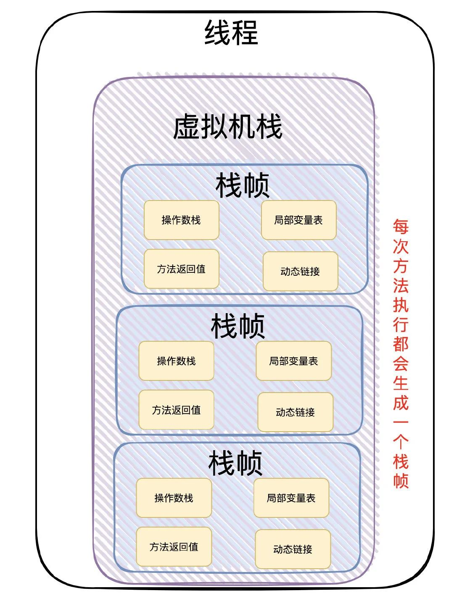

# 常用工具及命令

- `javac - java compiler java编译器`
- `javadoc - 抽取Java 文档`
  - 只能为 public protected 成员进行文档注释。
  - 常见使用方法如下：
  - `@see` 引用其他类。`@see classname / @see full-qualified-classname`
  - `@version` 版本号
  - `@author` 作者
  - `@since` 代码的最早使用版本
  - `@param` 修饰参数
  - `@return` 返回值
  - `@throws` 抛出的异常
  - `@description` 表示方法废弃。已经被 `@Deprecated` 注解替代了

Think in Java 阅读中，不断补充更新迭代笔记。

# 第一部分 入门

## 第二章 开发环境

### 2.1 Java虚拟机

- JVM：Java虚拟机。Java代码是运行在虚拟机上的。
- 跨平台：代码运行在虚拟机上，不同版的OS（linux，windows，mac）对应不同的虚拟机。虚拟机本身不具备跨平台功能，每个OS下都有不同版本的虚拟机。【可理解为，各个OS下的虚拟机都是采用一套编码指令集，JVM是面向操作系统的，它负责把Class字节码解释成系统所能识别的指令并执行，同时也负责程序运行时内存的管理】

### 2.2 JRE和JDK

- JRE (Java Runtime Environment):Java程序的运行时环境，包含JVM和运行时所需要的核心类库
- JDK(Java Development Kit):是Java程序开发的工具包，包含JRE和开发人员使用的工具。
- 运行Java程序有jre就行，开发Java程序需要JDK。
- Windows会把%CC% CC当作变量进行翻译

## 第三章 入门程序

### 3.1 程序开发步骤说明

- 编写、编译、运行
- Java源程序-->Java字节码文件-->JVM运行
- Javac.exe 编译器 处理后 Java文件变成字节码文件
- Java.exe 解释器 解释字节码的内容

## 第四章 常量

- 常量；在程序运行期间固定不变的量。
- 常量的分类
    - 字符串常量：凡是用双引号引起来的部分叫字符串常量。“asdfas”，可以是空串
    - 整数常量：直接写上数字的，没有小数点。
    - 浮点数常量：直接写上数字的，有小数点。
    - 字符常量：用单引号引起来的 ‘A’，不能是空字符‘’。
    - 布尔常量：只有两种取值。true，false
    - 空常量：null，代表没有任何数据。不能直接用来打印。syso(null)是错的。

## 第五章 变量&数据类型

### 5.1 数据类型

#### 5.1.1 基本数据类型

- 整数
    - byte  1个字节
    - short 2个字节
    - int   4个字节
    - long  8个字节
- 浮点数
    - float     4个字节
    - double    8个字节
- 字符型
    - char      2个字节
- 布尔型
    - boolean   1个字节

>**Java中默认类型：整型是int，浮点类型是double**
>想要精确的数字不推荐用double，用BigDemical吧。

#### 5.1.2 引用数据类型

> **字符串，数组，类，接口，Lambda**

注意事项：

- 字符串不是基本数据类型
- 浮点数可能是一个近似值
- 数据范围与字节数不一定相关。如float数据范围比long更大，但float是4字节，long是8字节
- 浮点数默认是double，如果一定要用float，需要加上一个后缀F(推荐大写)
- 如果是整数，默认为int，如果一定要用long，需要加上一个后缀L(推荐大写)

### 5.2 变量

- 变量：程序运行期间，内容可以发生改变的量
- 编译原理，左值与右值

### 5.3 强制数据类型转换 ▲

- 强制类型转换一般不推荐使用，因为可能发生精度损失
- byte，short，char这三种数据类型可发生数学运算。
- byte，short，char在运算时都会被首先提升为int类型，然后再计算。

```java
byte num1 = 40;
byte num2 = 50;
//byte + byte --> int + int
int result = num1 + num2;
//如果用 byte接收 需要强转
byte result = (byte)(num1 + num2);
short同理
```

### 5.4 ASCII码表

```shell
0 -- 48
A -- 65
a -- 97
```

### 5.5 数字和字符的对照关系表（编码表）

```java
ASCII码表：American Standard Code for Information Interchange
Unicode码表：万国码。也是数字和符号对照关系，开头0-127部分和ASCII完全一样，但是从128开始包含更多字符。
```

### 5.6 易错点

byte short char 这些在计算的时候，会有类型提升，提升为 int 进行计算。

```java
public static void main(String[] args) {
    byte a = 8;
    byte b = 127;
    b = a+b; // 会报错，提示你要进行强制类型转换。因为计算的时候，a和b会被提升为int类型，然后再进行计算，得到的结果也是int的，要把int类型的赋值给byte类型的变量需要进行强制类型转换。
}
```

包装类型的比较

```java
public class Demo {
    public static void main(String[] args) {
        Integer b = new Integer(47);
        Integer a = new Integer(47);
        System.out.println(a == b);  // false 因为 a b 是不同的对象。
        Integer c = Integer.valueOf(47);
        Integer d = Integer.valueOf(47);
        System.out.println(c == d); // true 因为 valueOf 创建对象是会先从 IntegerCache 缓存中找，有就返回缓存中的对象。
        							// IntegerCache 是静态内部类。静态内部类在你使用的时候才会进行加载。注意：是说的静态内部类。
    }
}
```

静态内部类加载时机的测试。遇到new、getstatic、putstatic或invokestatic 这四条字节码指令执行的时候，如果类没有进行过初始化，则需要先触发其初始化。

```java
public class Demo {
    // VM参数 -XX:+TraceClassLoading
    public static void main(String[] args) {
        int a = 0x2f;
        System.out.printf("", TestClassLoading.d); // 调用静态内部类，控制台输出，它被加载了。不用静态内部类，它就不加载。
    }

    static class TestClassLoading {
        static int d =10;
        {
            System.out.println("d");
        }
    }
}
```

## 第六章 常用运算

- 一元运算符：只需要一个数据就可以进行操作的运算符。

    - 取反
    - 自增
    - etc

- 二元运算符：需要两个数据才可以进行操作的运算符。

    - 加法
    - 减法
    - 赋值

- 三元运算符：需要三个数据才可以进行的运算符。

    - 变量名称 = 条件判断?表达式A : 表达式B;
    - int max = a > b ? a : b;

- 拓展

    - 对于byte/short/char三种类型来说，如果右侧赋值的数值没有超过范围，那么java编译器会自动隐含地为我们补上一个(byte)(short)(char).

    ```
    short = 5 + 8;(都要是常量才行)
    等同于
    short = 13; // 编译优化
    先计算出的结果在进行赋值的
    称为编译器的常量优化。
    ```

## 第七章 基本语法

### 7.1 switch语句的使用

> 基本语法

```java
public class Demo {
    public static void main(String[] args) {
        int a = 5;
        switch (a) {
            case 1:
                System.out.println(1);
            case 2:
                System.out.println(2);
            default:
                System.out.println("over!");
        }
    }
}
```

- 多个case后面的数值不可以重复
- switch后面小括号中只能是下列数据类型
    - 基本数据类型 byte/short/char/int
    - 引用数据类型 String字符串、enum枚举

> switch 中可以用 String 的原理

```java
public class TestSwitch {
    public static void main(String[] args) {
        String str = "dd";
        switch (str) {
            case "dd":
                System.out.println("odk");
                break;
            case "cc":
            default:
                System.out.println("over!");
        }
    }
}
// 反编译后的代码
public class TestSwitch {
    public TestSwitch() {
    }

    public static void main(String[] args) {
        String str = "dd";
        byte var3 = -1;
        switch(str.hashCode()) {
        case 3168:
            if (str.equals("cc")) {
                var3 = 1;
            }
            break;
        case 3200:
            if (str.equals("dd")) {
                var3 = 0;
            }
        }

        switch(var3) {
        case 0:
            System.out.println("odk");
            break;
        case 1:
        default:
            System.out.println("over!");
        }

    }
}
```

### 7.2 循环

- for循环

```java
for( 一 ; 二 ; 四 ){
    三
}

for(初始化表达1 ; 布尔表达式2 ; 步进表达式4){
    循环体3
}
流程 1 2 3 4 --> 2 3 4 --> 2 3 4 -->直到2不满足为止。
初始化语句只会执行一次。
```

- 增强for循环 foreach

```java
for(float x : f){
    System.out.println(x);
}
将每一个f的元素赋值给x
```

- do-while

```java
do {
    // doing something
} while (condtion);
```

- break & continue

break 跳出一层循环，continue 开启下一次循环。IDEA 点击关键字可以看到下一步会执行到那里。

### 7.3 方法重载与重写

- 方法调用的三种格式

```java
1.单独调用：方法名称(参数)
2.打印调用：System.out.println(方法名称(参数))
3.赋值调用：数据类型 变量名称 = 方法名称(参数)
```

- 方法重载 Overload ▲

    - ==方法重载== ：指在同一个类中，允许存在一个以上的同名方法，只要它们的参数列表不同即可，与修饰符和返回值类型无关。
    - 参数列表：个数不同，数据类型不同，顺序不同。
    - 重载方法调用：JVM通过方法的参数列表，调用不同的方法。

    ```java
    以下参数顺序不一样也是重载！
    public static void test(int a, short b){
    
    }
    public static void test(short b,int a){
    
    }
    ```

    - 实际上，println就是一个被重载的函数

- 方法重写 Overrider 

    - 子类中出现和父类中一模一样的方法(包括返回值类型,方法名,参数列表）
    - 1.重写的方法必须要和父类一模一样(包括返回值类型,方法名,参数列表)
    - 2.重写的方法可以使用@Override注解来标识

#### 7.3.1 重载的注意事项▲

```java
public static void f1(short i){
    System.out.println("f1(short)");
}
public static void f1(byte i){
    System.out.println("f1(byte)");
}
public static void f1(int i){
    System.out.println("f1(int)");
}
public static void main(String[] args) {
    short i = 5;
    byte ii = 6;
    int iii = 7;
    f1(1);  // f1(int)
    f1(1);	// f1(int)
    f1(1);	// f1(int)
    System.out.println("==========华丽的分割线==========");
    f1(i);	// f1(short)
    f1(ii);	// f1(byte)
    f1(iii);// f1(int)
}
```

### 7.4 数组

#### 7.4.1 数组得初始化

- 动态初始化 -- 指定数组长度

```java
int [] array = new int[300];
```

- 静态初始化 -- 指定数组内容

```
int [] array = new int[]{1,2,3,4,5,6}; // 标准格式
int [] array = {1,2,3,4,5,6}; // 省略格式
静态初始化不能拆分成
int [] array;
array = {1,2,34};
这样是错误得
```

- 总结

```
动态初始化有默认值的过程，
整型 默认为 0
浮点 默认为 0.0
字符 默认为 '\u0000'
布尔 默认为 false
引用 默认为 null

静态初始化也有，不过系统自动马上将默认值替换为了大括号当中的具体数值。
```

#### 7.4.2 数组作为参数，返回值

```java
public static void cals(int[] arr){
    xxxx
}

public static int[] calculate(int a,int b){
    int [] array = {a,b};
    return array;
}

数组作为参数，作为返回值其实都是数组的地址值
```

### 7.5 Java内存划分

- 1.栈（stack）：存放的都是方法中的局部变量。方法的运行一定要在栈中运行
    - 局部变量：方法的参数，或者方法{}内部的变量
    - 作用域：一旦超出作用域，立刻从栈内存当中消失
- 2.堆（heap）：凡是new出来的东西都在堆中
    - 堆里面的数据都有默认值。默认值同上
- 3.方法区（method area）：存储.class相关信息，包含方法的信息。
- 4.本地方法栈（native method stack）：与操作系统相关
- 5.寄存器（register）：与CPU相关

----

Java 的垃圾回收，对于提高对象的创建速度，具有明显的效果。Java从堆空间分配空间的速度，可以和其他语义从堆栈上分配空间的速度相媲美。在某些 Java VM 中，堆的实现截然不同，但是堆内存的分配可以看做：有一个堆指针，简单移动到尚未分配的区域，通过这种方式分配对象内存，其效率比得上 C++ 在栈上分配空间的效率。当然，在实际簿记工作方面，还有少量额外的开销，但是比不上查找可用空间的开销。（**Java GC 会清理出可用的空间，堆指针在空用空间中移动，这样就完成了内存的分配。而 C++ 需要遍历查找可用的内存，这个查找开销较大。这样一对比，会发现，Java 分配对象的速度并不比 C++慢**）

Java 的 GC 工作的时候，一面回收内存空间，一面使堆中的对象紧凑排列。

-----

Java 的优化技术\=\=\=>JIT（Just-In-Time）：这种技术可以把重新全部或部分翻译成本地机器码，提升程序速度。当要装载某个类时，编译器会先找到其 `.class` 文件，然后将该类的字节码转入内存。此时有两种方式可供选择：

- 一、让即时编译器编译所有代码，但是这种做法有两个缺陷：①这种加载动作散落在整个程序的生命周期内，累加起来要花很多时间，②会增加可执行代码的长度（字节码要比 JIT 展开后的本地机器码小很多），这将导致页面调度，从而降低程序速度。
- 二、惰性评估，只在必要的时候编译代码。

### 7.6 常见异常

> ArrayIndexOfBoundsException

> NullPointException

> OutOfMemmory

# 第二部分 基础

类的初始化过程？？

## 第一章 面向对象概述

类：描述相同事物的共同特征的抽象

对象：具体存在的实例，是真实地。 实例==对象。

代码层面，必须现有类，才能创建出对象。

定义类的格式：

五大成分（自己总结的！！）如果不是五大成分，那么他就不是正确的。

修饰符 class 类名{

​	//1.成员变量（Field 描述类和对象的属性信息）

​	//2.成员方法（Method：描述类或者对象的行为信息）

​	//3.构造器（Constructor：初始化一个类的对象并返回引用）

​	//4.代码块

​	//5.内部类

}

构造器的复习：

​	作用：初始化一个类的对象并返回。

​	格式：

​		修饰符 类名（形参）{

​		}

​	构造器初始化对象的格式

​	类名 对象名称 = new 构造器()

---

this关键字的作用：

​	this代表当前对象的引用

​	this关键字可以用在实例方法和构造器中

​	this用在方法中，谁调用这个方法，this就代表谁。

​	this用在构造器，代表构造器正在初始化那个对象的引用

插件一键生成无参 有参 toString

----

封装的作用：

​	1.可以提高安全性

​	2.可以实现代码组件化

封装的规范：

​	1.建议成员变量都私有

​	2.提供成套的getter+setter方法暴露成员变量的取值和赋值

`小结：`封装的核心思想，，合理隐藏，合理暴露。

----

static关键字（重点）

Java通过成员变量是否有static修饰来区分是类的还是属于对象的。

static == 静态 == 修饰的成员（方法和成员变量）属于类本身。

有static，静态成员变量：属于类本身。

无static，实例成员变量：属于每个实例对象，必须用类的对象来访问。

成员方法也类似：

1、静态方法

2、实例方法

static修饰，属于类本身，与类加载一次，因为只有一份所以可以被类和类的对象共享。

----

成员变量的分类和访问内存图


### 类与类之间的关系

- **依赖（user-a）**：一个类使用了另一个类的方法，A调用了B的方法，B出bug了，A也可能出bug，软件工程中称之为耦合。
- **聚合（has-a）**：一个对象将一个或者多个其它对象作为自己的成员
- **继承（is-a）**：

### 面向对象

> 当需要实现一个功能时，不关心具体的步骤，而是找一个已经具有该功能的人，来替我们做事。

> 什么叫面向对象：把相关的数据和方法组织为一个整体来看待，从更高的层次来进行系统建模，更贴近事物的自然运行模式【来自百度】

> 面向对象的基本特征：继承，封装，多态

### 类和对象

- 类：是一组相关 <u>*属性和行为的集合*</u> 。可以看成是一类事物的模板，使用事物的属性特征和行为特征来描述该 类事物。现实中，描述一类事物：
  - 属性：就是该事物的状态信息。 
  - 行为：就是该事物能够做什么。
  - 举例：小猫。
  - 属性：名字、体重、年龄、颜色。  
  - 行为：走、跑、叫。
- **什么是对象** 
  - 对象：是一类事物的具体体现。对象是类的一个实例（对象并不是找个女朋友），必然具备该类事物的属性 和行为。
  - 现实中，一类事物的一个实例：一只小猫。
  - 属性：tom、5kg、2 years、yellow。   
  - 行为：溜墙根走、蹦跶的跑、喵喵叫。 

> 类与对象的关系 ：类是对一类事物的描述，是抽象的。 对象是一类事物的实例，是具体的。 类是对象的模板，对象是类的实体。

### 一个对象的内存图

方法区中存放class信息。
class中的成员方法一直在方法区中。
堆中拿到成员方法的地址，通过地址对方法进行调用【回忆组成原理】。
堆将方法区中的成员变量拿到堆中（相当于copy一份），对其进行初始化值得操作。【不同对象的成员变量是独立的（非静态成员变量）】
main方法中得变量指向堆中的对象，并对对象进行赋值操作。
stack--栈，FIFO

### 成员变量和局部变量

```java
/*
局部变量和成员变量
1. 定义的位置不一样【重点】
局部变量：在方法的内部
成员变量：在方法的外部，直接写在类当中

2. 作用范围不一样【重点】
局部变量：只有方法当中才可以使用，出了方法就不能再用
成员变量：整个类全都可以通用。

3. 默认值不一样【重点】
局部变量：没有默认值，如果要想使用，必须手动进行赋值
成员变量：如果没有赋值，会有默认值，规则和数组一样

4. 内存的位置不一样（了解）
局部变量：位于栈内存
成员变量：位于堆内存

5. 生命周期不一样（了解）[通常是这样，但是不绝对]
局部变量：随着方法进栈而诞生，随着方法出栈而消失
成员变量：随着对象创建而诞生，随着对象被垃圾回收而消失
*/
public class Demo01VariableDifference {
 
    String name; // 成员变量

    public void methodA() {
        int num = 20; // 局部变量
        System.out.println(num);
        System.out.println(name);
    }

    public void methodB(int param) { // 方法的参数就是局部变量
        // 参数在方法调用的时候，必然会被赋值的。
        System.out.println(param);

        int age; // 局部变量
        System.out.println(age); // 没赋值不能用

        System.out.println(num); // 错误写法！
        System.out.println(name);
    }

}
```

> 变量的初始化顺序

```java
public Class Counter{
    int i;
    public Counter(){
        i=7;//在 调用构造方法 为 i 赋值为 7之前，i 就已经被初始化为 0 了。即，自动初始化发生在构造器被调用之前。
    }
}
```

### 访问修饰符

> **private/protect/public/默认访问**

#### private访问属性

> **只有本类中可以随意访问，其他类都不行。**

###  this关键字

#### this关键字的一些概念

> **通过谁调用的方法谁就是this。**

> **this只能在方法内部使用，且不能在静态方法中使用。为什么？看JVM。**

> **类加载机制！静态的使用不必对类进行实例化。this指的是当前对象的引用。**

#### this关键字的一些作用

- 在构造器中调用构造器

```java
public class Flower{
	private int price;
	private String name;
	public Flower(int price){
		this.price = price;
	}
	public Flower(String name){
		this(12);
        this.name = name;
	}
}

PS:
this只能调用一个构造器
this调用的构造器要放在最前面    
```

### 构造器初始化

#### 初始化顺序

在类的内部，变量定义的先后顺序决定了初始化的顺序。即使变量定义散布于方法定义之间，它们仍旧会在任何方法（包括构造器）被调用之前得到初始化。

```java
public class InitSequerence {
    Windows w1 = new Windows("w1");

    public InitSequerence() {
        Windows w2 = new Windows("w2");
    }

    Windows w3 = new Windows("w3");

    public static void main(String[] args) {
        new InitSequerence();
    }

    static class Windows {
        public Windows(String name) {
            System.out.println(name);
        }
    }
}
// w1 w3 w2 先执行成员变量的初始化，在调用构造器
```

#### 静态数据的初始化

静态初始化只有在必要的时候才会进行。

- 静态成员变量的初始化，会在非静态成员变量之前。
- 静态内部类的初始化，只有在使用到静态内部类/类中的变量，方法时才会初始化。即：静态内部类用到时才会加载。

#### 非静态实例初始化

- 也是按代码的顺序进行初始化的。且均在

```java
public class UnStaticInit {

    public UnStaticInit() {
        System.out.println("unStaticInit");
    }

    Test t1;

    {
        t1 = new Test("用于初始化成员变量的代码块");
    }

    {
        Test test = new Test("单纯的代码块");
    }


    public static void main(String[] args) {
        new UnStaticInit().t1.say();
    }
}

class Test {
    public Test(String msg) {
        System.out.println(msg);
    }

    public void say() {
        System.out.println("hello");
    }
}

/**
用于初始化成员变量的代码块
单纯的代码块
unStaticInit
hello
*/
```

#### 数组的初始化

```java
int[] a = {};
System.out.println(a.length);// 这种是被允许的。
```


### 匿名对象

### 枚举对象

- 枚举对象可以更加清楚的表明程序的意义。

- 打印枚举对象时，会自动调用 `toString()` 方法，枚举的 `values()` 方法 ，用来按照 enum 常量的声明顺序，产生由这些常量值构成的数组。

```java
public enum SpicinessEnum {
    NOT, MILD, MEDIUM, HOT, FLAMING
}

class SimpleUseEnum {
    public static void main(String[] args) {
        for (SpicinessEnum value : SpicinessEnum.values()) {
            System.out.println(value + ":" + value.ordinal());
        }
    }
}
/*
NOT:0
MILD:1
MEDIUM:2
HOT:3
FLAMING:4
*/
```

### 访问控制符

把变动的事物与保持不变的事物区分开来。

Java 有四种访问权限：`public` `protected` 包访问权限 `private`

- `public` 公有的，任何类都可以访问
- `protected` 受保护的，子类和同一包下的都可以访问
- `包访问权限 default` 只能同一个类，或同一个包下的进行访问。不同包的，即便是子类也不能访问！
- `private` 私有的，仅在自己类内部可以访问

## 第二章 API

### 概述

`API(Application Programming Interface)`，应用程序编程接口。

### `API`使用步骤 

- 1.打开帮助文档。
- 2.点击显示，找到索引，看到输入框。
- 3.你要找谁？在输入框里输入，然后回车。
- 4.看包。java.lang下的类不需要导包，其他需要。
- 5.看类的解释和说明。
- 6.学习构造方法。

## 第三章 字符串

### 概述

> **字符串：程序中凡是所有的双引号字符串都是String类的对象【就算没有new，也照样是】**

#### 字符串的特点

- 字符串的内容永不可变。【常量池？】
- 因字符串不可变，故字符串可共享使用【不可变，不会出现线程安全问题】
- 字符串效果相当于char[]字符数组，但底层原理是byte[]字节数组
- String str = "Hello" 也是字符串对象

#### 字符串常量池

> **字符串常量池**：程序中直接写上双引号的字符串，就在字符串常量池中。从jdk1.7开始，字符串常量在堆中。【方便gc嘛？】

> 对于基本类型来说， == 是进行数值比较

> 对应用类型来说，==是进行【地址值】的比较

就算不new 字符串直接双引号也是一个对象。故String str1 是一个对象。

字符串常量池中的对象保持的其实是byte数组的地址值。

而直接new出来的，是不在常量池中的。【具体过程看图。用new String(char型数组)有一个中转过程】
    char[] --> byte[] --> 字符串对象
    字符串对象再指向byte数组

**总结：双引号直接写的在常量池中，new的不在池中。**

```java
public static void main(String[] args) {
    String str1 = "abc";
    String str2 = "abc";

    char[] charArray = {'a', 'b', 'c'};
    String str3 = new String(charArray);

    System.out.println(str1 == str2);// true
    System.out.println(str1 == str3);// false
    System.out.println(str2 == str3);// false

    String str4 = new String("abc");
    String str5 = new String("abc");
    System.out.println(str1 == str4); // false
    System.out.println(str4 == str5); // false
}
```

### 字符串常用API

#### 字符串的比较▲

> **== 是进行对象的地址值比较。如果确实需要比较字符串的内容，可以使用如下的方法**

```java
public static void testEqual(){
    String str1 = new String("11");
    String str2 = new String("11");

    String str3 = "11";
    System.out.println(str1.equals(str2)); // true
    System.out.println(str1.equals(str3)); // true
    System.out.println(str1.equals("11")); // true
}

String 对equals进行了重写！
```

> **注意事项**

- 如果比较双方一个常量一个变量，推荐把常量写在前面。【避免NullPointerException】
- **equalsIgnoreCase**忽略大小写进行比较。

#### 字符串获取相关方法

- ```java
  - length
  - concat(String str) 拼接会产生新的字符串
  - charAt(int index)
  - indexOf(String str) 查找首次出现的位置，没有返回-1
  
  public static void testGetStr(){
      String str1 = "abc";
      String str2 = "df";
      System.out.println(str1.length()); // 3
      System.out.println(str1.charAt(0)); // a
      System.out.println(str1.concat(str2)); // abcdf
      System.out.println(str1.indexOf("ab")); // 0
      System.out.println(str2.indexOf('d')); // 0
  }
  ```

- concat的测试▲

  ```java
  public void testConcat(){
      String str1 = "abc";
      String str2 = "df";
      String concat = str1.concat(str2);
      String concat2 = "abcdf";
      String concat3 = "abcdf";
      System.out.println(concat == concat2); // false
      System.out.println(concat2 == concat3);// true
  }
  concat内部返回的字符串是使用的new。故会有上述结果！
  ```

#### 字符串截取、转换、分割

> **截取指定索引的数据**

```java
@Test
public void testSubstring(){
    String str1 = "abcefghig";
	// beginIndex
    System.out.println(str1.substring(1));
    // beginIndex, endIndex 左闭右开
    System.out.println(str1.substring(1,str1.length()));
    // false
    System.out.println(str1.substring(1) == str1.substring(1,str1.length()));
}
查看源码可知 返回的是new String
```

> **字符串转换字符数组，字节数组**

```java
@Test
public void testConvert(){
    String str = "hello world";
    char[] chars = str.toCharArray(); // 转化为字符数组
    byte[] bytes = str.getBytes(); // 转化为字节数组
    String replace = str.replace("o", "liu"); // 把所有的o替换成liu
    System.out.println(replace); //hellliu wliurld
}
```

> **分割**

```java
@Test
public void testSplit() {
    String str = "aa,bb,cc";
    String[] split = str.split(","); // 里面是正则表达式
    for (String s : split ) {
        System.out.println(s);// aa bb cc
    }
}

@Test
public void testSplit2() {
    String str = "aa.b.cc";
    String[] split = str.split("\\."); //用.作为划分
    for (String s : split ) {
        System.out.println(s);// aa bb cc
    }
}
```

## 第四章 静态关键字

> **可实现数据共享。static修饰的内容不再属于对象自己，而是属于类的，所以凡是本类的对象，都共享同一份。**

什么时候用 static：只想为某特定域分配单一存储空间，而不去考虑究竟要创建多少对象，甚至更本不用创建对象；不希望某个方法、成员变量与类的任何对象关联起来。

### 静态概述

- static修饰的成员方法是静态方法，静态方法不属于对象，而是属于类。

- PS： 静态不能直接访问非静态。

  - 因为内存中是【先】有静态内容，【后】有非静态内容

- PS：静态中不能使用this。

  - 因为this代表当前对象，通过谁调用的方法就是当前对象。但是静态与对象无关。静态是【类名称.静态方法】

  - ```java
    new Object().staticMethod(); 最终会翻译成ClassName.staticMethod();
    ```

### 静态代码块

> 格式

```java
public class ClassName{
	static{
		静态代码块执行。
	}
}
// 特点：当第一次用到本类时，静态代码块执行唯一的一次【静态代码块只执行一次】
// 用到类就行。就是只是类名称.staticMethod()调用也是用到了类，static会被执行。
```

#### 静态代码块的注意事项

- 静态代码块的执行顺序与定义的顺序有关。先定义的先执行。
- 静态代码块的执行顺序优于静态方法，构造方法！【先有静态，再有堆中的对象。静态总是优于非静态。】

#### 静态工具类Arrays

> 常用方法如下：

```java
@Test
public void test1(){
    Integer []array = {1,23,4,5};
    String str = Arrays.toString(array); // 转成String 可以是基本类型 如int
    Arrays.sort(array); // 排序 ascending 升序 可以是基本类型 如int
    Arrays.sort(array, Collections.reverseOrder()); // 反转，变成了降序。注意这个方法要用引用类型
    System.out.println(array[0]);
}
```

- 自定义类型的排序，那么这个定义的类需要有**Comparable或者Comparator接口支持**。

- <span style="color:red">拓展看下Comparable和Comparator的区别和应用</span>

  ```java
  // 挖坑
  ```

#### 静态工具类Math

```java
@Test
public void test1(){
    int abs = Math.abs(-5);
    double ceil = Math.ceil(12.3); // 向上取整 13
    double floor = Math.floor(12.4); // 向下取整 12
    long round = Math.round(12.6); // 13 四舍五入
}
```

## 第五章 继承

> 继承是多态的前提，没有继承就没有多态！

> 继承主要解决的问题是：**共性抽取**

```
父类也称为基类、超类
子类也称为：派生类
在继承关系中：“子类就是一个父类”。也就是说，子类可以被当成父类看待
例如父类是员工，子类是讲师，那么讲师就是一个员工。 关系 is-a。
父类是抽象的，子类是具体的。
```

被继承的类：父类/超类

继承父类的类：子类

继承的作用？

- 提高代码复用
- 功能增强

继承的特点：

- 子类继承了一个父类，子类可以直机得到父类的属性和方法。（私有的好像无法得到？）

----

继承是 is a

组合是 hava a

----


----

`继承后子类不能继承的成员★★`

引入：

​	子类继承父类，子类就得到了父类的属性和行为

​	但是并非所有的父类的属性和行为等子类都可继承

子类不能继承父类的东西

​	【无争议的观点】子类不能继承父类的构造器

​	【有争议的观点】子类能否继承父类的私有成员？

​	【有争议的观点】子类能否继承父类的静态成员？

### 继承中成员变量的访问特点

> 目前关系数据库有六种范式：第一范式（1NF）、第二范式（2NF）、第三范式（3NF）、巴斯-科德范式（BCNF）、第四范式(4NF）和第五范式（5NF，又称完美范式）。

```java
public class DemoExtends extends Fu{
    int a = 100;
    @Test
    public void test1(){
        //运行时看左边。这里就是看Fu类。没有就一级一级向上找。
        Fu de = new DemoExtends();
        System.out.println(de.a); // 10
    }
}
class Fu{
    int a = 10;
}
```

> **区分子类方法中重名的三种变量**

```java
局部变量 直接写
本类的成员变量 this.变量名
父类的成员变量 super.成员变量
```

### 重写和重载

- 重写：在继承关系中，**方法名称一样，参数列表【也一样】**。覆盖、覆写 === 【没说返回值！】
- 重载：方法名称一样，参数列表【不一样】

> **方法覆盖重写的特点**：创建的是子类对象，则优先用子类方法

- 方法覆盖重写的注意事项

  - 1，必须保证父子类之间方法名相同，参数列表也相同

  - 2，子类方法的返回值必须【小于等于】父类方法的返回值范围。

  - 简而言之，参数必须要一样，且返回类型必须要兼容。

    ```java
    // 子类的返回类型小于等于父类
    public class Zi extends Fu{
        @Override
        public String method(){
            return "123";
        }
    }
    class Fu{
        public Object method(){
            return null;
        }
    }
    // 为什么？ 是因为向上转型安全，向下转型不安全吗？ 百度的，不确定!
    ```
  
- 不管父类使用了那种参数，覆盖此方法的子类也一定要使用相同的参数。而不论父类声明的返回类型是声明，**子类必须要声明返回一样的类型或该类型的子类**。要记得，子类对象得保证能够执行父类得一切。
  
- 3，子类方法的权限必须【大于等于】父类方法的权限修饰符
  
  ```java
    public > protected > (default) > private
    PS : (default)不是关键字default，而是什么都不写，留空！
  ```
  
- 方法重写的应用场景

  - **设计原则**：

    > 对于已经投入使用的类，尽量不要进行修改。推荐定义一个新的类，来重复利用其中共性内容，并且添加改动新内容。

### 继承中构造方法的访问特点

子类构造方法中默认隐含有一个super()调用，所以一定是先调用父类构造

只有**子类构造方法才能调用父类构造方法**且只能调用一个构造方法！

```java
// 这是错误的，因为只能调用一个父类的构造。
public Zi(){
	super();
	super(5);
}
// 调用普通方法没问题
public Zi(){
    super.method();
    super.qq();
}
```

this调用构造也是只能调用一个，不能循环调用

```
public Zi(int x){
    this();
    System.out.println("int x");
}
```

this不能循环调用【循环引用？Spring循环依赖？】

```java
// 这样是错误的！
public Zi(){
    this(2);
    System.out.println("我是无参");
}

public Zi(int x){
    this();
    System.out.println("int x");
}
```

super和this不能同时显式调用.

```java
// 报错 因为 super or this都需要放在第一行！
public Zi(){
    super();
    this(2);
    System.out.println("我是无参");
}

// 没问题， 父类的构造也是会执行的。
public Zi(){
    this(2);
    System.out.println("我是无参");
}
```

### 继承中 this和super的内存图

### 初始化顺序

先初始化父类，在初始化子类

```java
// 父类初始化的顺序
public class SuperInit {
    public static void main(String[] args) {
        new Cartoon();
    }
}

class Art {
    public Art() {
        System.out.println("Art");
    }
}

class Drawing extends Art {
    public Drawing() {
        System.out.println("Drawing");
    }
}

class Cartoon extends Drawing {
    public Cartoon() {
        System.out.println("Cartoon");
    }
}
/*
Art
Drawing
Cartoon
*/
```

### 组合与继承

> 组合与继承都允许在新的类中放置子对象，组合是显式的这样做，而继承是隐式地做。二者的区别在哪里，如何做出选择？

- 组合技术通常用于想在新类中使用类的功能而非它的结构这种情况（多态）。
- 如果需要子类向父类 向上转型，那么继承是必需的，如果不是，那么要考虑好是不是真的要用继承。（少用继承）

### 完整的初始化过程

```java
// reuse/Beetle.java
// The full process of initialization
class Insect {
    private int i = 9;
    protected int j;

    Insect() {
        System.out.println("i = " + i + ", j = " + j);
        j = 39;
    }

    private static int x1 = printInit("static Insect.x1 initialized");

    static int printInit(String s) {
        System.out.println(s);
        return 47;
    }
}

public class Beetle extends Insect {
    private int k = printInit("Beetle.k.initialized");

    public Beetle() {
        System.out.println("k = " + k);
        System.out.println("j = " + j);
    }

    private static int x2 = printInit("static Beetle.x2 initialized");

    public static void main(String[] args) {
        System.out.println("Beetle constructor");
        Beetle b = new Beetle();
    }
}
/*
输出：
static Insect.x1 initialized
static Beetle.x2 initialized
Beetle constructor
i = 9, j = 0
Beetle.k initialized
k = 47
j = 39
*/
```

​		当执行 java Beetle，首先会试图访问 Beetle 类的 main() 方法（一个静态方法）， 加载器启动并找出 Beetle 类的编译代码（在名为 Beetle.class 的文件中）。在加载过 程中，编译器注意到有一个基类，于是继续加载基类。不论是否创建了基类的对象，基 类都会被加载。（可以尝试把创建基类对象的代码注释掉证明这点。）

​		如果基类还存在自身的基类，那么第二个基类也将被加载，以此类推。接下来，根 基类（例子中根基类是 Insect）的 static 的初始化开始执行，接着是派生类，以此类 推。这点很重要，因为派生类中 static 的初始化可能依赖基类成员是否被正确地初始 化。 

​		至此，必要的类都加载完毕，对象可以被创建了。首先，对象中的所有基本类型变 量都被置为默认值，对象引用被设为 null —— 这是通过将对象内存设为二进制零值一 举生成的。接着会调用基类的构造器。本例中是自动调用的，但是你也可以使用 super 调用指定的基类构造器（在 Beetle 构造器中的第一步操作）。基类构造器和派生类构 造器一样以相同的顺序经历相同的过程。当基类构造器完成后，实例变量按文本顺序初 始化。最终，构造器的剩余部分被执行。

## 第六章 抽象

> **若父类中的方法不能确定如何进行{}方法体实现，那么这就应该是一个抽象方法。**

### 抽象概述

- 抽象方法：就是加上abstract关键字，然后去掉大括号，直接分号结束
- 抽象类：抽象方法所在的类，必须是抽象类才行！在class之前写上abstract即可
- 抽象类**可以没有**一个抽象方法
- 子类继承了抽象类，如果有未给父类（抽象类）的抽象方法方法体，那么子类也必须声明为抽象类

### 如何使用抽象类和抽象方法

- 不能直接创建new抽象类对象。

- 必须用一个子类来继承抽象父类。

- **子类必须覆盖重写抽象父类当中所有的抽象方法。**

  - 子类重写时，去掉抽象方法的abstract关键字，然后补上方法体。

- 创建子类对象进行使用。

- **PS：Please attention**

  - 抽象类可以自己写构造函数

  - 如果抽象类只有 有参构造，那么子类的构造函数一定要显示调用这个有参构造！

    ```java
    public abstract class Animal {
        public Animal(int x){
            System.out.println(x);
        }
    
        public void say(){
            System.out.println("hello");
        }
    
        public abstract void walk();
    }
    
    public class Cat extends Animal {
    
        public Cat(int x) {
            super(x);
        }
    
        public Cat() {
            super(1);
        }
    
        @Override
        public void walk() {
            System.out.println(":walk");
        }
    
        @Test
        public void test1(){
            new Cat();
        }
    }
    ```
    
  - 抽象类可以实例化，但是不能直接实例化。只能在子类被实例化的过程中，间接实例化。因为实例化子类的时候抽象类也会被实例化。【用的是extends关键字。父类的super会被隐式调用】
  
    <a href="https://zhuanlan.zhihu.com/p/95406830">建议看这篇博文</a>

## 第七章 多态

能够改善代码的组织结构和可读性，还能够创造可扩展的程序；可以消除类型之间的耦合关系。

多态（动态绑定、后期绑定或运行时绑定）：**在运行时根据对象的类型进行绑定**。当一种语言实现了后期绑定，就必须具有某种机制在运行时 能判断对象的类型，从而调用恰当的方法。也就是说，**编译器仍然不知道对象的类型， 但是方法调用机制能找到正确的方法体并调用。**每种语言的后期绑定机制都不同，但是 可以想到，对象中一定存在某种类型信息。 

Java 中除了 static 和 final 方法（private 方法也是隐式的 final）外，其他所有方法都是后期绑定。这意味着通常情况下，我们不需要判断后期绑定是否会发生-----它 自动发生。

---


> **extends继承或implements实现是多态性的前提！**

```java
多态写法，父类引用指向子类对象
Fu obj = new Zi();
obj.method();
obj.methodFu();
```

### 访问成员变量的两种方式

- 直接通过对象名称访问成员变量：看等号左边是谁，优先使用谁，没有则向上找
- 间接通过成员方法访问
- 老毕在讲到多态执行问题时，结合下面的例子，给我们总结了一套口诀：“成员变量，静态方法看左边；非静态方法：编译看左边，运行看右边。”意思是：当父类变量引用子类对象时（Fu f = new Zi();），在这个引用变量f指向的对象中，他的成员变量和静态方法与父类是一致的，他的非静态方法，在编译时是与父类一致的，运行时却与子类一致（发生了复写）。
- 简而言之
  - **成员变量：编译看左边，运行还看左边**
  - **成员方法：编译看左边，运行看右边**

### 多态的好处

```java
Employee one = new Teacher();
Employee two = new Assistant();
```

**无论右边new的时候换成那个子类对象，等号左边调用方法都不会变化！**

### 对象的向上\下转型

- 向上转型一定是安全的，没有问题的，正确的。弊端在于，对象一旦向上转型为父类，就无法调用子类原本持有的内容。

- 向下转型是不安全的，使用时一定要保证他本来是猫才能向下转型变成猫

- instanceof进行类型判断

  ```java
  if( animal instanceof Dog){
  	syso("是狗");
  }
  一般先判断是否是该类，是才进行向下转型！
  ```

### 构造器内调用多态方法

在构造器中调用了正在构造的对象 的动态绑定方法，会发生什么?

调用 RoundGlyph 构造器时，会先初始化 Glyph 的构造器，而 Glyph 构造器会调用 draw() 方法，由于多态，最终调用的是 RoundGlyph 的 draw() , 此时 radius 还未初始化，是默认值0，所以 radius 第一次打印的值是0。

```java
class Glyph {
    void draw() {
        System.out.println("Glyph.draw()");
    }

    Glyph() {
        System.out.println("Glyph() before draw()");
        draw();
        System.out.println("Glyph() after draw()");
    }
}

class RoundGlyph extends Glyph {
    private int radius = 1;

    RoundGlyph(int r) {
        radius = r;
        System.out.println("RoundGlyph.RoundGlyph(), radius = " + radius);
    }

    @Override
    void draw() {
        System.out.println("RoundGlyph.draw(), radius = " + radius);
    }
}

public class PolyConstructors {
    public static void main(String[] args) {
        new RoundGlyph(5);
    }
}
/**
Glyph() before draw()
RoundGlyph.draw(), radius = 0
Glyph() after draw()
RoundGlyph.RoundGlyph(), radius = 5
*/
```

### 协变返回类型

Java 5 中引入了协变返回类型，子类重写父类的方法，方法的返回值类型可以变为父类返回值类型的子类。即子类重写方法，返回值类型可以`缩窄`

重写方法时，子类不能降低父类的权限。例如：父类是 public，但子类重写的权限不能低于 public。

```java
class Grain {
    @Override
    public String toString() {
        return "Grain";
    }
}

class Wheat extends Grain {
    @Override
    public String toString() {
        return "Wheat";
    }
}

class Mill {
    Grain process() {
        return new Grain();
    }
}

class WheatMill extends Mill {
    @Override
    Wheat process() {
        return new Wheat();
    }
}

public class CovariantReturn {
    public static void main(String[] args) {
        Mill m = new Mill();
        Grain g = m.process();
        System.out.println(g);
        m = new WheatMill();
        g = m.process();
        System.out.println(g);
    }
}
```

### RTTI

RTTI：运行时类型识别。在运行时检查类型的行为称为 RTTI。在 Java 中，每次转型都会被检查！所以即使只是进行一次普通的加括号形式的类型转换，在运行时这个转换仍会被检查，以确保它的确是希望的那种类型。如果不是，就会 得到 ClassCastException

### 易错点

只有普通方法的调用可以是多态的。成员变量是没有的。


## 第八章 接口

- 接口是什么？

  - **一种公共的规范标准。【定义规范】【多个类的公共规范】**
  - 结构是一种引用数据类型，最重要的内容就是其中的：抽象方法

- 接口的语法

  - 接口中定义的方法**默认使用public abstract修饰**‘

    ```java
    public interface Name{
    }
    ```

  - 接口可以包含成员变量，成员变量会被隐式的添加 static final 关键字。通过 `接口名.变量` 可以访问。

  - 接口中的方法都是 public abstract 修饰的。

  - 如果是**Java 7**那么接口中可以包含有：常量；抽象方法

  - 如果是**Java 8**还可以额外包含有

    - 默认方法 public default 返回值类型 方法名称( 参数列表 ){  方法体 }
    - 静态方法

  - 如果是**Java 9**还可以额外包含有

    - 私有方法

- 为什么使用接口?

  - 为了能够向上转型为多个父类（代码更加灵活）
  - 防止客户端程序员创建该类的对象，确保这仅仅是建立一个接口。

### 基本使用

> 在任何版本的Java中，接口都能定义抽象方法。格式：public abstract 返回值类型 方法名称(参数列表);

- 注意事项：
  - 接口当中的抽象方法，修饰符必须是两个固定的关键字：public abstract
  - 这两个关键字修饰符，可以选择性地省略。
  - 方法的三要素，可以随意定义。
  - **如果接口的实现类没有覆盖重写接口中所有的抽象方法，那么这个类必须是抽象类！**
  - 接口中的成员变量默认是，且只能 `public static final` 修饰的，无方法体的方法默认是且只能是 `public abstract` 修饰的；
  
  

```java
// 这是一个抽象方法
public abstract void methodAbs1(); // public abstract 修饰

// 这也是抽象方法
abstract void methodAbs2(); // public abstract 修饰，缺少的会默认补全

// 这也是抽象方法
public void methodAbs3(); // public abstract 修饰，缺少的会默认补全

// 这也是抽象方法
void methodAbs4(); // public abstract 修饰，缺少的会默认补全
```

Java 8开始，接口中允许定义默认方法【**接口当中的默认方法，可以解决接口升级问题。**】

```java
// 接口当中的默认方法，可以解决接口升级问题。
public default void say(){
	syso("hello");
}

// 具体解释：接口中的default可以不用被重写。如果我们要扩充接口，但是又不想更改其他已经实现接口的类，可采用default。
```

Java 8开始，接口中允许定义静态方法

```java
public static 返回值类型 方法名称（参数列表）{

}

public interface MyInterface {
    public default void say(){
        System.out.println("hello");
    }

    public default void walk(){
        System.out.println("hello");
    }

    public static void eat(){
        System.out.println("eat");
    }
}

可直接通过【接口名.staticMethod】调用！且只能用接口名调用！不能用实现类调用！
```

**Java 9开始**，接口中允许定义私有方法

普通私有方法，解决多个默认方法之间重复代码问题

```java
private 返回值类型 方法名称(参数列表) {
    方法体
}
```

静态私有方法，解决多个静态方法之间重复代码问题

```java
private static 返回值类型 方法名称(参数列表) {
    方法体
}
```

**接口中可定义常量,且可省略public static final，默认就是他！**【接口中的常量必须赋值！因为有final修饰！】

```java
public static final int num = 10;
接口名.num调用！
```

### 注意事项

- 接口中不能有构造方法，不能有静态代码块
- 一个类的直接父类只有一个，但是可同时实现多个接口
- **如果实现类所实现的多个接口中，存在重复的默认方法，那么实现类一定要对冲突的默认方法进行覆盖重写。**
- **一个类如果直接父类当中的方法和接口中的默认方法产生了冲突，优先用父类当中的方法！**

### 设计模式

#### 策略模式

实质上，利用的还是多态。定义一个父类/接口。子类继承父类/实现接口，然后创建了一个能够根据所传递的参数对象的不同而具有不同行为的方法。\====>策略模式

```java
public class Processor {
    public Object process(Object input) {
        return input;
    }
}

class StringUpper extends Processor {
    // 返回值是协变类型。 返回值可以是 父类对应方法 返回值的子类
    @Override
    public String process(Object input) {
        return ((String) input).toUpperCase();
    }
}

class StringLower extends Processor {
    @Override
    public String process(Object input) {
        return ((String) input).toLowerCase();
    }
}

class Apply {
    public static void apply(Processor processor, Object s) {
        System.out.println(processor.process(s));
    }
}

class Main {
    public static void main(String[] args) {
        Apply.apply(new StringLower(), "AfsfSfs");
        Apply.apply(new StringUpper(), "AfsfSfs");
    }
}
```

#### 适配器模式

利用的也是多态。适用于"将一个类的接口变换成客户端所期待的另一种接口，从而使原本因接口不匹配而无法在一起工作的两个类能够在一起工作"

```java
// 中间类。
class FilterAdapter implements Processor{ // 实现 Processor 接口，这样就可以被向上转型为 Processor 了。
    Filter filter;// filter 需要可以用 Processor 的 processor 方法
    public FilterAdapter(Filter filter){
        this.filter = filter;
    }
    
    public Waveform process(Object input){
        return filter.process((Waveform)input);
    }
}
```

最后不论是上面的 StringUpper 类 还是 Filter 类，都可以统一使用 Processor 接口进行调用。可以完满的，在不修改原有代码的基础上，把 Filter 这个对象传入到原有代码中使用。

### 多重继承

接口允许多重继承

### 组合接口时名字冲突

```java
interface I1 {
    void f();
}

interface I2 {
    int f(int i);
}

interface I3 {
    int f();
}

class C {
    public int f() {return 1;}
}

class C2 implements I1, I2 { // I1 I2 方法的参数不一样。
    public void f() {} // I1 的
    public int f(int i) {return 0;} // I2 的
}

class C3 extends C implements I2 { // C 和 I2 的参数不一样
    public int f(int i) {return 1;} // I2 的方法
}

class C4 extends C implements I3 {
    public int f() {return 1;} // 正常运行
}

class C5 extends C implements I1 {} // 报错

interface I4 extends I1, I3 {} // 报错
```

### 适配接口

Scanner 的参数要求为 Readable 接口，我们自定义一个随机读取char的类，实现这个接口，就可以适配 Sacnner 类了。

```java
public class AdapterInterface {
    public static void main(String[] args) {
        Scanner scanner = new Scanner(new ReadChar());
        while (scanner.hasNext()) {
            System.out.println(scanner.next());
        }
    }
}

class ReadChar implements Readable {
    private static final char[] array = {'a', 'b', 'c', 'd', 'e', 'f', 'g', 'h', 'i', 'j'};
    private static int count = 0;

    public ReadChar() {
        count = 10;
    }

    public ReadChar(int count) {
        this.count = count;
    }

    @Override
    public int read(CharBuffer cb) throws IOException {
        if (count-- == 0) return -1;
        Random random = new Random();
        for (int i = 0; i < array.length; i++) {
            cb.append(array[Math.abs(random.nextInt()) % array.length]);
        }
        cb.append(" "); // scanner 按空格分割字符的？
        // 随机生成 char 序列
        return array.length;
    }
}
```

### 嵌套接口

```java
package tij.chapter9;

class A {
    interface B {
        void f();
    }

    public class BImp implements B {
        @Override
        public void f() {
        }
    }

    public class BImp2 implements B {
        @Override
        public void f() {
        }
    }

    public interface C {
        void f();
    }

    class CImp implements C {
        @Override
        public void f() {
        }
    }

    private class CImp2 implements C {
        @Override
        public void f() {
        }
    }

    private interface D {
        void f();
    }

    private class DImp implements D {
        @Override
        public void f() {
        }
    }

    public class DImp2 implements D {
        @Override
        public void f() {
        }
    }

    public D getD() {
        return new DImp2();
    }

    private D dRef;

    public void receiveD(D d) {
        dRef = d;
        dRef.f();
    }
}

interface E {
    interface G {
        void f();
    }

    // Redundant "public"
    public interface H {
        void f();
    }

    void g();
// Cannot be private within an interface
//- private interface I {}
}

public class NestingInterfaces {
    public class BImp implements A.B {
        @Override
        public void f() {
        }
    }

    class CImp implements A.C {
        @Override
        public void f() {
        }
    }

    // Cannot implements a private interface except
// within that interface's defining class:
//- class DImp implements A.D {
//- public void f() {}
//- }
    class EImp implements E {
        @Override
        public void g() {
        }
    }

    class EGImp implements E.G {
        @Override
        public void f() {
        }
    }

    class EImp2 implements E {
        @Override
        public void g() {
        }

        class EG implements E.G {
            @Override
            public void f() {
            }
        }
    }

    public static void main(String[] args) {
        A a = new A();
        // Can't access to A.D:
//        A.D ad = a.getD(); A.D 是私有的，无法这样访问，所以无法正常得到值。
        // Doesn't return anything but A.D:
        //- A.DImp2 di2 = a.getD();
        // cannot access a member of the interface:
        //- a.getD().f();
        // Only another A can do anything with getD():
        A a2 = new A();
        a2.receiveD(a.getD());
    }
}
```

用IDE 阅读代码，然后看下面的文字描述：简而言之，限定接口的使用权限，更好的封装。要暴露接口的话，只能类内部中定义方法进行暴露。

private 嵌套接口有什么好处呢？你可能猜测它只是被 用来实现一个 private 内部类，就像 DImp。然而 A.DImp2 展示了它可以被实现为 public 类，**但是 A.DImp2 只能被自己使用（因为外部类也无法实现D接口，就不能通过多态使用A.DImp2了）**，你无法说它实现了 private 接口 D，所 以实现 private 接口是一种可以强制该接口中的方法定义不会添加任何类型信息（即 **不可以向上转型**）的方式。

getD() 方法产生了一个与 private 接口有关的窘境。它是一个 public 方法却返回 了对 private 接口的引用。能对这个返回值做些什么呢？main() 方法里进行了一些使 用返回值的尝试但都失败了。返回值必须交给有权使用它的对象，本例中另一个 A 通 过 receiveD() 方法接受了它。

接口 E 说明了接口之间也能嵌套。然而，作用于接口的规则——尤其是，接口中 的元素必须是 public 的——在此都会被严格执行，所以嵌套在另一个接口中的接口自 动就是 public 的，不能指明为 private。

### 接口与工厂

接口是多实现的途径，而生成符合某个接口的对象的典型方式是**工厂方法设计模式**。不同于直接调用构造器，只需调用工厂对象中的创建方法就能生成对象的实现—— 理论上，通过这种方式可以将接口与实现的代码完全分离，使得可以透明地将某个实现。

```java
// 定义接口
interface Service {
    void method1();
    void method2();
}
// 定义工厂
interface ServiceFactory {
	Service getService();
}

// 具体实现类
class Service1 implements Service {
    Service1() {} // Package access
    @Override
    public void method1() {
    	System.out.println("Service1 method1");
    }
    
    @Override
    public void method2() {
    	System.out.println("Service1 method2");
    }
}

// Service1工厂
class Service1Factory implements ServiceFactory {
    @Override
    public Service getService() {
    	return new Service1();
    }
}

// 具体实现类
class Service2 implements Service {
    Service2() {} // Package access
    @Override
    public void method1() {
    	System.out.println("Service2 method1");
    }
    
    @Override
    public void method2() {
    	System.out.println("Service2 method2");
    }
}

// Service2工厂
class Service2Factory implements ServiceFactory {
    @Override
    public Service getService() {
    	return new Service2();
    }
}

// 总工厂
public class Factories {
    public static void serviceConsumer(ServiceFactory fact) {
        Service s = fact.getService();
        s.method1();
        s.method2();
	}
    public static void main(String[] args) {
        serviceConsumer(new Service1Factory());
        // Services are completely interchangeable:
        serviceConsumer(new Service2Factory());
    }
}

// 输出 
// Service1 method1
// Service1 method2
// Service2 method1
// Service2 method2
```

如果没有工厂方法，代码就必须在某处指定将要创建的 Service 的确切类型，从而 调用恰当的构造器。 为什么要添加额外的间接层呢？一个常见的原因是创建框架。

### 总结

> **在Java 9+版本中，接口的内容可以有：**

1. - 成员变量其实是常量，格式：
     [public] [static] [final] 数据类型 常量名称 = 数据值;
      注意：
     常量必须进行赋值，而且一旦赋值不能改变。
     常量名称完全大写，用下划线进行分隔。

2. - 接口中最重要的就是抽象方法，格式：
     [public] [abstract] 返回值类型 方法名称(参数列表);
      注意：实现类必须覆盖重写接口所有的抽象方法，除非实现类是抽象类。

3. - 从Java 8开始，接口里允许定义默认方法，格式：
     [public] default 返回值类型 方法名称(参数列表) { 方法体 }
      注意：默认方法也可以被覆盖重写

4. - 从Java 8开始，接口里允许定义静态方法，格式：
     [public] static 返回值类型 方法名称(参数列表) { 方法体 }
      注意：应该通过接口名称进行调用，不能通过实现类对象调用接口静态方法

5. - 从Java 9开始，接口里允许定义私有很乏，格式：
     普通私有方法：private 返回值类型 方法名称(参数列表) { 方法体 }
      静态私有方法：private static 返回值类型 方法名称(参数列表) { 方法体 }
      注意：private的方法只有接口自己才能调用，不能被实现类或别人使用。

## 第九章 final

- final 修饰变量：
  - 得到一个永远不改变的编译时常量；
  - 在一个运行时被初始化的值，而你不希望它被改变。
  - final 修饰引用只能确保引用的执行不被改变，但是对象内部的数据可以改变
- final 修饰方法：
  - 锁定方法，以防任何继承类修改它的含义。
  - JVM对 final 修饰的方法可能会有优化，消除方法调用的开销。类似于 CPP 的内联函数
- final 修饰类：
  - final 类禁止继承。
- 类中所有的 private 方法都隐式地指定为 final 的。由于无法取用 private 方法，所以也就无法覆盖它。

### final修饰类

final修饰的类是没有子孙的，但是有父亲（太监类）

```java
// 无法被继承
public final class FinalDemo {
    
}
```

### final修饰方法

final修饰的方法是最终方法，不能覆盖重写（override）

```
public final void method(){

}
```

注意：对于类和方法来说，abstract关键字和final关键字不能被同时使用，因为矛盾。

- 因为子类是一定要覆盖重写抽象方法的！

### final修饰局部变量

```java
final int num = 3; // 可以
final int num;
num = 3; //可以

public void say(){
    final int num = 3;
    final int num2;java
    num2 = 3;
}
```

- **正确写法：只要保证有唯一一次赋值即可**
- **对于基本类型，不可变局势变量中的数据不可变**
- **对于引用类型，不可以就是变量中的地址值不可变**

### final修饰成员变量

> **对于成员变量来说，如果使用final关键字修饰，那么这个变量也照样是不可变**

- 由于成员变量具有默认值，所以**用了final之后必须手动赋值，不会再给默认值！**
- **对于final成员变量，要么直接赋值，要用使用构造方法赋值，二者择其一。**

### PS 权限修饰符

**default 只能同一个类，或同一个包下的进行访问。不同包的，即便是子类也不能访问！**

## 第十章 内部类 

### 概述

内部类是一种非常有用的特性，因为它允许你把一些逻辑相关的类组织在一起，并 控制位于内部的类的可见性。在最初，内部类看起来就像是一种代码隐藏机制：将类置于其他类的内部。但，内部类远不止如此，它了解外部类，并能与之通信，而且你用内部类写出的代码更加优雅而清晰。

**注意：**内部类的使用应该是设计阶段考虑的问题

**内部类分为：**成员内部类和匿名内部类

### 创建内部类

把类的定义置于外部类的里面。

```java
public class CreateInnerClass {
    class InnerClass {
        public void innerSay() {
            System.out.println("I am inner class");
        }
    }

    public void say() {
        new InnerClass().innerSay();
    }
}
```

常用的方式是，通过外部类的一个方法，得到内部类的引用。

```java
public class CreateInnerClass {
    class InnerClass {
        public void innerSay() {
            System.out.println("I am inner class");
        }
    }

    public void say() {
        new InnerClass().innerSay();
    }

    public InnerClass getInnerClass() {
        return new InnerClass();
    }
}

class Main {
    public static void main(String[] args) {
        CreateInnerClass.InnerClass innerClass = new CreateInnerClass().getInnerClass();
    }
}
```

如果要在外部类以外的任何类中访问，那么语法同上：

`CreateInnerClass.InnerClass innerClass = new CreateInnerClass().getInnerClass();`

### 链接外部类

当生成一个内部类的对象时，此对象与制 造它的外部对象（enclosing object）之间就有了一种联系，所以**它能访问其外部对象的所有成员**，而不需要任何特殊条件。此外，**内部类还拥有其外部类的所有元素的访问权**。

以内部类自动拥有对其外部类所有成员的访问权。这是如何做到的呢？当某个外 部类的对象创建了一个内部类对象时，此内部类对象必定会秘密地捕获一个指向那个外部类对象的引用。然后，在你访问此外部类的成员时，就是用那个引用来选择外部类 的成员。

内部类的对象 只能在与其外部类的对象相关联的情况下才能被创建（就像你应该看到的，内部类是非 static 类时）。构建内部类对象时，需要一个指向其外部类对象的引用，如果编译器访 问不到这个引用就会报错。

### 使用.this 和 .new

```java
public class DotThis {
    void f() {
        System.out.println("DotThis.f()");
    }

    public class Inner {
        public DotThis outer() {
            // 得到的是 DotThis 对象的引用
            return DotThis.this; 
        }
    }

    public Inner inner() {
        return new Inner();
    }

    public static void main(String[] args) {
        DotThis dt = new DotThis();
        DotThis.Inner dti = dt.inner();
        dti.outer().f();
    }
}
```

创建某个内部类对象：必须使用外部类的对象来创建该内部类对象。在拥有外部类对象之前是不可能创建内部类对象的。这是因为内部类对象会暗暗 地连接到建它的外部类对象上。但是，如果你创建的是嵌套类（静态内部类），那么它 就不需要对外部类对象的引用。

```java
public class DotNew {
    public class Inner {}
    public static void main(String[] args) {
        DotNew dn = new DotNew();
        DotNew.Inner dni = dn.new Inner();
    }
}
```

### 内部类与向上转型

内部类实现接口，外部类返回内部类的实例对象，然后其他类通过接口引用拿到了内部类的对象。这样可以隐藏内部类的实现，并调用相关方法。

```java
interface Contents {
    void values();
}

public class Parcel {
    private class PContents implements Contents {
        @Override
        public void values() {
            System.out.println("1231312");
        }
    }

    public Contents createContents() {
        return new PContents();
    }

    public static void main(String[] args) {
        Contents con = new Parcel().createContents();
        con.values();
    }
}
```

private 内部类给类的设计者提供了一种途径，通过这种方式可以完全阻止任何依赖于类型的编码，并且完全隐藏了实现的细节。

### 内部类方法和作用域

> 可以在任意一个方法内部定义内部类。

- 可以创建并返回对其的引用。 
- 要解决一个复杂的问题，想创建一个类来辅助你的解决方案，但是又不希望这 个类是公共可用的

> 涉及的内容主要是：

- 一个定义在方法中的类。 
- 一个定义在作用域内的类，此作用域在方法的内部。
-  一个实现了接口的匿名类。
-  一个匿名类，它扩展了没有默认构造器的类。
- 一个匿名类，它执行字段初始化。
- 一个匿名类，它通过实例初始化实现构造（匿名内部类不可能有构造器）。

#### 局部内部类

> 语法如下：

```java
public class LocalInnerClass {
    public Contents getLocalInnerClass() {
        class Local implements Contents {
            @Override
            public void values() {
                System.out.println("local values");
            }
        }
        return new Local();
    }

    public static void main(String[] args) {
        LocalInnerClass obj = new LocalInnerClass();
        obj.getLocalInnerClass().values();
    }
}

```

> 局部内部类访问所在方法的局部变量，那么这个局部变量必须是【有效final的】（内容感觉有点问题，要再斟酌下）

```java
/*这样写是可以的。因为保证了num确实是不变的，final关键字是可以省略的【java8开始】。如果class前面加了一句num = 29，那就不对了，因为num改变了。*/
/*
为什么要这样做？
	这是害怕类还在，局部变量缺消失了，导致局部内部类无法访问局部变量！
*/
@Test
public void test(){
    int num = 10;
    class inner{
        public void innerSay(){
            System.out.println("inner to say hello"+num);
        }
    }
    inner n = new inner();
    n.innerSay();
}
```

```java
/*
原因：
    1.new出来的对象在堆内存中
    2.局部变量是跟着方法走的，在栈内存中
    3.方法运行结束后，立刻出栈，局部变量就会立刻消失
    4.但是new出来的对象会在堆中持续存在，直到垃圾回收消失。
*/
public Object test() {
    int num = 10;
    class inner {
        public void innerSay() {
            System.out.println("inner to say hello" + num);
        }
    }
    return n;
}

@Test
public void demo() {
    Object test = test();
}
```

> 局部内部类的使用场景

```java
// 当隐式的构造函数不能满足我们的需求，需要显示的构造函数时，使用局部内部类而非匿名内部类！
// 如果不考虑构造函数的问题，两者的功能是一样的。
interface Counter{
    int next();
}
public class LocalInnerClass {
    private int count = 0;
    // 局部内部类实现
    Counter getCounter(final String name){
        class LocalCounter implements Counter{
            public LocalCounter(){ System.out.println("LocalCounter"); }
            @Override
            public int next() {
                System.out.println(name);
                return count++;
            }
        }
        return new LocalCounter();
    }

    // 匿名内部类实现
    Counter getCounter2(final String name){
        return new Counter() {
            //只有一个默认的构造器。不能自行定义
            @Override
            public int next() {
                System.out.println(name);
                return count++;
            }
        };
    }

    public static void main(String[] args) {
        LocalInnerClass in = new LocalInnerClass();
        Counter lucy = in.getCounter("lucy");
        Counter lucy2 = in.getCounter2("lucy2");
        for (int i = 0; i <5 ; i++) {
            System.out.println(lucy.next());
        }
        for(int i = 0; i<5; i++){
            System.out.println(lucy2.next());
        }
    }
}
```

#### 匿名内部类

“创建一个继承自 Contents 的匿名类的对象。” 通过 new 表达式返回的引用被自动向上转型为对 Contents 的引用。

```java
public class AnonymityClass {

    public Contents contents() {
        return new Contents() {
            @Override
            public void values() {
                System.out.println(123);
            }
        };
    }

    public static void main(String[] args) {
        AnonymityClass anonymityClass = new AnonymityClass();
        anonymityClass.contents().values();
    }
}
```

如果父类需要的是一个有参构造器，那么把参数传递过去。

```java
class Objects {
    public Objects(int value) {
        System.out.println(value);
    }

    public void say(String msg) {
        System.out.println(msg);
    }
}

public class AnonymityClassWithParam {

    public Objects objs() {
        return new Objects(3) {
            @Override
            public void say(String msg) {
                System.out.println("=====" + msg);
            }
        };
    }

    public static void main(String[] args) {
        AnonymityClassWithParam clazz = new AnonymityClassWithParam();
        clazz.objs().say("hello");
    }
}
```

 **[1]** 将合适的参数传递给基类的构造器。

**[2]** 在匿名内部类末尾的分号，并不是用来标记此内部类结束的。实际上，它标记 的是表达式的结束，只不过这个表达式正巧包含了匿名内部类罢了。因此，这与 别的地方使用的分号是一致的。

**[3]** 匿名内部类，要使用一个在其外部定义的对象，那么编译 器会要求其参数引用是 final 的。

如果想在匿名内部类中做一些类似构造器的行为，该怎么办呢？在匿名类中不可能有命名构造器（因为它根本没名 字！），但通过实例初始化，就能够达到为匿名内部类创建一个构造器的效果，就像这样：

```java
abstract class Base {
    Base(int i) {
        System.out.println("Base constructor, i = " + i);
    }

    public abstract void f();
}

public class AnonymousConstructor {
    public static Base getBase(int i) {
        return new Base(i) {
            {
                System.out.println(
                        "Inside instance initializer");
            }

            @Override
            public void f() {
                System.out.println("In anonymous f()");
            }
        };
    }

    public static void main(String[] args) {
        Base base = getBase(47);

        base.f();
    }
}

//在此例中，不要求变量一定是 final 的。因为被传递给匿名类的基类的构造器，它并不会在匿名类内部被直接使用
```

#### 局部-匿名辨析

用局部内部类和匿名内部类，具有相同的行为和能力。<span style="color:red">**那什么时候使用局部内部类？**</span>

- 我们需要 一个已命名的构造器，或者需要重载构造器，而匿名内部类只能使用实例初始化。
- 需要不止一个该内部 类的对象。 内部类标识符 由于编译后每个类都会产生一个 .class 文件，其中包含了如何创建该类型的对象 的全部信息（此信息产生一个 “meta-class”，叫做 Class 

### 嵌套类

如果不需要内部类对象与其外部类对象之间有联系，那么可以将内部类声明为 static，这通常称为嵌套类。普通内部类（非静态的）隐式地保存了一个引用，指向创建它的外部类对象，静态内部类则不是。

- 要创建嵌套类的对象，并不需要其外部类的对象。 
- 不能从嵌套类的对象中访问非静态的外部类对象

嵌套类与普通的内部类还有一个区别：普通的内部类不能有 static 数据和 static 字段，也不能包含嵌套类。，但是嵌套类可以包含所有这些东西：

```java
public class StaticClass {
    static class Inner {
        private static int count = 10;
        public static int say(){ return 1; }
    }

    public static void main(String[] args) {
        System.out.printf("%d", Inner.say());
    }
}
```

接口中可以定义静态内部类：放到接口中的任何类都**自动地是 public 和 static 的**。

```java
interface InterfaceStaticClass {
    class Demo {
        private static int a = 10;
    }
}

class DemoSon extends InterfaceStaticClass.Demo { // 不是 final 哦
    
}
```

### 为什么需要内部类

每个内部类都能独立地继承自一个（接口的）实现，所以无论外部类是否已 经继承了某个（接口的）实现，对于内部类都没有影响。

如果没有内部类提供的、可以继承多个具体的或抽象的类的能力，一些设计与编程问题就很难解决。从这个角度看，内部类使得多重继承的解决方案变得完整。接口解决了部分问题，而<span style="color:red">**内部类有效地实现了 “多重继承”**</span>。也就是说，内部类允许继承多个非接口类型（类或抽象类）。

**个人认为允许多重继承的意思是**：内部类对某个类进行重写再调用它的方法。让一个类可以同时使用两个类的特性。【继承一个类，内部类继承其他类，对必要方法进行重写！可以一个类为载体，内部使用多个内部类，从而实现多继承！】

如果不需要解决 “多重继承” 的问题，那么自然可以用别的方式编码，而不需要使 用内部类。但如果使用内部类，还可以获得其他一些特性：

- 内部类可以有多个实例，每个实例都有自己的状态信息，并且与其外部类对象的 信息相互独立。 
- 在单个外部类中，可以让多个内部类以不同的方式实现同一个接口，或继承同一个类。
- 创建内部类对象的时刻并不依赖于外部类对象的创建 
- 内部类并没有令人迷惑的 “is-a” 关系，它就是一个独立的实体。

#### 闭包与回调

​		闭包（closure）是一个可调用的对象，它记录了一些信息，这些信息来自于创建 它的作用域。通过这个定义，可以看出内部类是面向对象的闭包，因为它不仅包含外部 类对象（创建内部类的作用域）的信息，还自动拥有一个指向此外部类对象的引用，在 此作用域内，内部类有权操作所有的成员，包括 private 成员。

​		在 Java 8 之前，内部类是实现闭包的唯一方式。在 Java 8 中，我们可以使用 lambda 表达式来实现闭包行为，并且语法更加优雅和简洁。

----

> 一个回调的示意代码：

```java
class Caller {
    private Incrementable callbackReference;

    Caller(Incrementable cbh) {
        callbackReference = cbh;
    }

    void go() {
        callbackReference.increment();
    }
}
```

回调的价值在于它的灵活性-可以在运行时动态地决定需要调用什么方法。例如，在 图形界面实现 GUI 功能的时候，到处都用到回调。

### 内部类与控制框架

> 模板方法

模板方法包含算法的基本结构，并且会调 用一个或多个可覆盖的方法，以完成算法的动作。设计模式总是将变化的事物与保持不变的事物分离开，在这个模式中，模板方法是保持不变的事物，而可覆盖的方法就是变 化的事物。

GUI 的事件就是用内部类实习的。

### 继承内部类

因为**内部类的构造器必须连接到指向其外部类对象的引用**，所以在继承内部类的时候，事情会变得有点复杂。问题在于，那个指向外部类对象的 “秘密的” 引用必须被初 始化，而在派生类中不再存在可连接的默认对象。要解决这个问题，必须使用特殊的语 法来明确说清它们之间的关联：

```java
class WithInner {
    class Inner {
    }
}

class InheritInner extends WithInner.Inner {
    // 这样才提供了必要的引用，程序才能编译通过。
    InheritInner(WithInner wi) {
        wi.super();
    }

    public static void main(String[] args) {
        WithInner withInner = new WithInner();
        InheritInner inheritInner = new InheritInner(withInner);
    }
}
```

### 内部类可以被覆盖吗？

不可以。代码验证如下：

```java
class Egg {
    private Yolk y;

    protected class Yolk {
        public Yolk() {
            System.out.println("Egg.Yolk()");
        }
    }

    Egg() {
        System.out.println("New Egg()");
        y = new Yolk();
    }
}

public class BigEgg extends Egg {
    public class Yolk {
        public Yolk() {
            System.out.println("BigEgg.Yolk()");
        }
    }

    public static void main(String[] args) {
        new BigEgg();
    }
}
/* Output:
New Egg()
Egg.Yolk()
*/
```

既然创建了 BigEgg 的对象，那么所使用的应该是 “覆盖后” 的 Yolk 版本，但从输 出中可以看到实际情况并不是这样的。 这个例子说明，当继承了某个外部类的时候，内部类并没有发生什么特别神奇的变 化。这两个内部类是完全独立的两个实体，各自在自己的命名空间内。

### 内部类标识符

内部类的标识符：`外部类的名字，加上 “$” ，再加上内部类的名字`

```java
Counter.class
LocalInnerClass$1.class // 匿名内部类，编译器会简单地产生一个数字作为其标识符
LocalInnerClass$LocalCounter.class // 内部类LocalCounter; 内部类的内部类以此类推
LocalInnerClass.class
```


### 如何使用成员部类

> 内用外，随便访问；外用内，需要内部类对象。

外部类定义一个方法，通过这个方法获取内部类的实例对象

```java
public InClass getInClass(){
    return new InClass();
}
```

直接new出内部类

```java
OutClass.InClass inClass = new OutClass().new InClass();
```

内部类 外部类的成员变量

```java
public class Outer{
	int num = 10;
	
	public class Inner(){
		int num = 20;
		
		public void method(){
			int num = 30;
			syso(num);// 内部类方法局部变量
			syso(this.num);// 内部类成员变量
			syso(Outer.this.num);//外部类成员变量 区分重名
		}	
	}
}
```

### 如何使用局部内部类

```java
@Test
public void test(){
    class inner{
        public void innerSay(){
            System.out.println("inner to say hello");
        }
    }
    inner n = new inner();
    n.innerSay();
}
```

> **局部内部类访问所在方法的局部变量，那么这个局部变量必须是【有效final的】**

```java
/*这样写是可以的。因为保证了num确实是不变的，final关键字是可以省略的【java8开始】。如果class前面加了一句num = 29，那就不对了，因为num改变了。*/
/*
为什么要这样做？
	这是害怕类还在，局部变量缺消失了，导致局部内部类无法访问局部变量！
*/
@Test
public void test(){
    int num = 10;
    class inner{
        public void innerSay(){
            System.out.println("inner to say hello"+num);
        }
    }
    inner n = new inner();
    n.innerSay();
}
```

```java
/*
原因：
    1.new出来的对象在堆内存中
    2.局部变量是跟着方法走的，在栈内存中
    3.方法运行结束后，立刻出栈，局部变量就会立刻消失
    4.但是new出来的对象会在堆中持续存在，直到垃圾回收消失。
*/
public Object test() {
    int num = 10;
    class inner {
        public void innerSay() {
            System.out.println("inner to say hello" + num);
        }
    }
    return n;
}

@Test
public void demo() {
    Object test = test();
}
```

- 局部内部类的使用场景

```java
// 当隐式的构造函数不能满足我们的需求，需要显示的构造函数时，使用局部内部类而非匿名内部类！
// 如果不考虑构造函数的问题，两者的功能是一样的。
interface Counter{
    int next();
}
public class LocalInnerClass {
    private int count = 0;
    // 局部内部类实现
    Counter getCounter(final String name){
        class LocalCounter implements Counter{
            public LocalCounter(){ System.out.println("LocalCounter"); }
            @Override
            public int next() {
                System.out.println(name);
                return count++;
            }
        }
        return new LocalCounter();
    }

    // 匿名内部类实现
    Counter getCounter2(final String name){
        return new Counter() {
            //只有一个默认的构造器。不能自行定义
            @Override
            public int next() {
                System.out.println(name);
                return count++;
            }
        };
    }

    public static void main(String[] args) {
        LocalInnerClass in = new LocalInnerClass();
        Counter lucy = in.getCounter("lucy");
        Counter lucy2 = in.getCounter2("lucy2");
        for (int i = 0; i <5 ; i++) {
            System.out.println(lucy.next());
        }
        for(int i = 0; i<5; i++){
            System.out.println(lucy2.next());
        }
    }
}
```

定义一个类的时候，权限修饰符规则

- **外部类： public or default**
- **成员内部类： public protected default private**
- **局部内部类： 什么都不能写！**

### 匿名内部类

> **类只需要使用一次，那么可省略其定义！改而使用【匿名内部类】**

```java
MyInterface some = new MyInterface(){
	@Override
	public void method(){
		syso();
	}
}
```

```java
//具体例子
interface MyInterface{
    public abstract void say();
}

public class DemoInnerPart {
    public Object testObject(){
        return new Object(){
            @Override
            public String toString(){
                System.out.println("Override toString");
            }
        };
    }
    public MyInterface testObject2(){
        return new MyInterface() {
            @Override
            public void say() {
                System.out.println("say hello!");
            }
        };
    }
}
```


- **匿名内部类的注意事项**
  - 匿名内部类在创建对象的时候，只能使用唯一一次。
  - 如果希望多次创建对象，而且类的内容一样的话，那么必须使用单独定义的实现类！
- **匿名内部类的使用场景**

  - 情况一： 接口、抽象类使用：相当于不用特意去写一个类去实现这个接口的方法，直接在实例化的时候就写好这个方法（接口、抽象类不能实例化，所以采用匿名内部类的方式来写）
  - 情况二：当接口作为参数放在方法体里的时候，用new 接口()的方式来实例独享，则匿名内部类必须要实现这两个方法。
- **为什么需要内部类**

> 一般来说，内部类继承自某个类或实现某个接口，内部类的代码操作创建它的外围类的对象。所以可以认为内部类提供了某种进入其外围类的窗口。

> 内部类最吸引人的原因是，每个内部类都能独立地继承自一个（接口的）实现，所以无论外围类是否已经继承了某个（接口的）实现，对于内部类都没有影响。内部类允许继承多个非接口类型（类或抽象类）

> 个人认为允许多重继承的意思是，内部类对某个类进行重写再调用它的方法。让一个类可以同时使用两个类的特性。【继承一个类，内部类继承其他类，对必要方法进行重写！可以一个类为载体，内部使用多个内部类，从而实现多继承！】

#### 10.5 内部类的继承

**外部类继承另一个外部类的内部类**

```java
class WithInner{
    class Inner{}
}
public class ExtendInnerClass extends WithInner.Inner{
    // public ExtendInnerClass(){} won't compile  写这个构造会导致编译不成功
    public ExtendInnerClass(WithInner w){
        w.super();
    }
    
    public static void main(String[] agrs){
        WithInner wi = new WithInner();
        ExtendInnerClass c = new ExtendInnerClass(wi);
    }
}
```

**内部类的覆盖**

```java
class WithInner2{
    public class Inner{
        public void say(){ System.out.println("I am say1"); }

        public void walk(){ System.out.println("I am walk"); }
    }
}

public class ExtendInnerClass2 extends WithInner2{
    public class Inner2 extends WithInner2.Inner{
        @Override
        public void say(){ System.out.println("I am say2"); }
    }

    public static void main(String[] args) {
        ExtendInnerClass2 class2 = new ExtendInnerClass2();
        Inner inner2 = new ExtendInnerClass2().new Inner2();
        inner2.say();   // I am say2
        inner2.walk(); // I am walk
    }
}

```

## 第十一章 Object & 日期

### 11.1 Object

- `toString()方法`
- `equals()方法`
  - 注意，当需要比较对象时，覆写equals方法，以便于比较对象的大小。
  - 当需要使用Arrays工具类进行大小比较时，需要继承Comparable。

### 11.2 日期相关

```
Calendar采用了枚举，见名知意。可避免不必要的错误。似乎不常用，不学
```

- 日期类都采用单例模式？保证所有时间的一致？
- 不要求掌握的一些

```java
@Test
public void fn1(){
    final Calendar instance = Calendar.getInstance();
    DateFormat dateInstance = DateFormat.getDateInstance(DateFormat.FULL);
    System.out.println(dateInstance.format(new Date())); // 地理位置的判断？输出的中文？
}

@Testjava
public void fn2(){
    // G表示公元  字母大小写不能错，不知道为什么，无责任猜测，解析了字符串，提取的ascill码？
    SimpleDateFormat sdf = new SimpleDateFormat("Gyyyy MM dd"); // 日期格式
    System.out.println(sdf.format(new Date()));
}
```

- Java8 提供的日期类 **都是final修饰的**

```
Instant——它代表的是时间戳

LocalDate——不包含具体时间的日期，比如2014-01-14。它可以用来存储生日，周年纪念日，入职日期等。

LocalTime——它代表的是不含日期的时间

LocalDateTime——它包含了日期及时间，不过还是没有偏移信息或者说时区。

ZonedDateTime——这是一个包含时区的完整的日期时间，偏移量是以UTC/格林威治时间为基准的
```

- Date仅仅含日期。不包含具体时间，有time的才有具体的时间（精确到时分秒）

```java
public void fn3(){
    //无时区
    LocalDate now = LocalDate.now();
    System.out.println(now); // 2020-02-06

    int year = now.getYear();
    int month = now.getMonthValue();
    Month monthE = now.getMonth();
    int day = now.getDayOfMonth();
    System.out.println("year:"+year+" month:"+month+" day:"+day);

    int dayOfYear = now.getDayOfYear();
    System.out.println("2020年的第"+dayOfYear+"天");
}

@Test
public void fn4(){
    LocalDateTime now = LocalDateTime.now();
    System.out.println(now);
    LocalDateTime now2 = now.plusDays(10);
    System.out.println(now2);

    LocalDateTime plus = now.plus(1, ChronoUnit.YEARS);java
    System.out.println(plus);
}
```

- 要用再查API
- System类

```java
@Test
public void fn5(){
    Properties properties = System.getProperties(); // 获取System的properties对象
    Enumeration<?> enumeration = properties.propertyNames();// 获得所有的key
    while(enumeration.hasMoreElements()){ //是否还有元素
        // 安全的强转
        Object c= enumeration.nextElement();
        if(c instanceof String){
            System.out.println("key:"+(String)c+" ---value:"+System.getProperty((String)c));
        }

        Object cc = null;
        if((cc = enumeration.nextElement()) instanceof String){
            System.out.println("key:"+(String)cc+" ---javavalue:"+System.getProperty((String)cc));
        }
    }
}
**回忆迭代器的元素遍历，回忆为什么迭代器遍历元素时可以进行元素移除的操作不会发生异常！**
```

- arraycopy的使用

```java
@Test
public void fn6(){
    int[] fromArray = {1,2,3,4,5,4};
    int[] toArray = {50,60,70,80,90};
    /**
    * @param      src      源数组
    * @param      srcPos   源数组的其实位置 
    * @param      dest     目标数组
    * @param      destPos  目标数组的开始位置
    * @param      length   拷贝的长度
    */
    System.arraycopy(fromArray,1,toArray,2,2);
    for (int i = 0; i <toArray.length ; i++) {
        System.out.println(toArray[i]);
    }
}
```

## 第十二章 集合

java.util 库提供了一套相当完整的集合类（collection classes）来解决非固定长度数据的问题，其中基本的类型有 List 、Set 、Queue 和 Map。

### 基本概念

Java 集合类库采用 “持有对象”（holding objects）的思想，并将其分为两个不同的 概念，表示为类库的基本接口：

- **集合（Collection）：**一个独立元素的序列，这些元素都服从一条或多条规则。List 必须以插入的顺序保存元素，Set 不能包含重复元素，Queue 按照排队规则来确 定对象产生的顺序
  - HashSet、TreeSet、LinkedHashSet，仅保存每个相同项中的一个。
  - `HashSet` 存储元素的方法复杂，检索元素快
  - `TreeSet` 按比较结果升序保存对象
  - `LinkedHashSet` 按照被添加的先后顺序保存对象
- **映射（Map）：**一组成对的 “键值对” 对象，允许使用键来查找值。
  - `HashMap` 不按插入顺序存储元素
  - `TreeMap` 通过比较结果的升序来保存键
  - `LinkedHashMap` 在保持 HashMap 查找速度的同时按键的插入顺序保存键。

> 代码示例：

for 循环添加元素并打印。

```java
import java.util.ArrayList;
import java.util.Collection;

public class SimpleCollection {
    public static void main(String[] args) {
        Collection<Integer> elements = new ArrayList<>();
        for (int i = 0; i < 5; i++) {
            elements.add(i);
        }
        for (Integer i : elements) {
            System.out.println(i);
        }
    }
}
```

### 添加元素

- Arrays 类和 Collections 类。
- Arrays.asList() 接受一个数组或可变长参数，并将其转换为 List 对象。
- Collections.addAll() 方法接受一个 Collection 对象，数组 或 可变长参数，将其中的元素添加到 Collection 中。

```java
public class AddElements {
    public static void main(String[] args) {
        Collection<Integer> elements = new ArrayList<>(Arrays.asList(1, 2, 3, 4, 5, 6));
        ArrayList<Integer> elements2 = new ArrayList<>();
        // 运行速度更快
        Collections.addAll(elements2, 1, 2, 3, 4, 5, 6);

        List<Integer> list = Arrays.asList(1, 2, 3, 4, 5, 6);
        list.set(1, 100);
//        list.add(100); 报错，asList 产生的集合大小是不可变的，会抛出 Unsupported Operation
    }
}
```

### 列表 List

- ArrayList：随机访问快，在中间插入、删除元素较慢。动态数组实现的。
- LinkedList：随机访问慢，在 List 中间进行的插入和删除操作代价低一些，比 ArrayList 功能更多，链表实现。

> List 常用 API

- `contains()` 对象是否在列表中
- `indexOf()` 第一次出现的下标号，返回 -1 表示未找到
- `lastIndexOf()`  最后一次出现的下标号，返回 -1 表示未找到
- `subList(5，8)` 列表切片。左闭右开，从索引5开始，切片到索引8，不包括索引8这个位置的元素。
- `listA.containsAll(listB)` listA中是否包含listB中的所有元素，与顺序无关。
- `Collections.sort(list)` 对集合进行排序
- `Collections.shuffle(list)` 打乱集合
- `listA.retainAll(listB)` 取A∩B，所产生的结果行为依赖于 equals() 方法
- `listA.set(1,xx)` 将索引1处的替换为 xx
- `listA.addAll(newList)` 将新列表插入到 原始列表的中间位置
- isEmpty() 判空和 clear()清除元素
- `listA.toArray()`  将任意的 Collection 转换为数组,Object类型。
- `listA.toArray(new Type[0])`  将目标类型的数 组传递给这个重载版本，会生成一个指定类型的数组。如果参数数组太小而无法容纳 List 中的所有元素，则 toArray() 会 创建一个具有合适尺寸的新数组。

### 迭代器 iterators

<span style="color:red">**能够将遍历序列的操作与该序列的底层结构分离，统一了对集合的访问方式。**</span>

Java 的 Iterator 只能单向 移动。这个 Iterator 只能用来：

- 使用 iterator() 方法要求集合返回一个 Iterator。Iterator 将准备好返回序列 中的第一个元素。
- 使用 next() 方法获得序列中的下一个元素。
- 使用 hasNext() 方法检查序列中是否还有元素。
- 使用 remove() 方法将迭代器最近返回的那个元素删除。

#### Iterator

```java
public class IteratorDemo {
    public static void main(String[] args) {
        ArrayList<Integer> list = new ArrayList<>(Arrays.asList(1, 2, 3, 4, 5, 6));
        Iterator<Integer> iterator = list.iterator();
        while (iterator.hasNext()){
            Integer next = iterator.next();// 拿到元素
            System.out.println(next);
            iterator.remove(); // 删除由 next() 生成的最后一个元素
        }
        System.out.println(list.size());
    }
}
```

#### Iterable

所有的 Collection 都继承自 Iterable 接口，且 Iterable 接口有生成迭代器的方法 `Iterator<T> iterator();`。

#### ListIterator

一个更强大的 Iterator 子类型。

- Iterator只能向前移动，而 Listiterator 可以双向移动。

```java
public class ListIteratorDemo {
    public static void main(String[] args) {
        ArrayList<Integer> list = new ArrayList<>(Arrays.asList(1, 2, 3, 4, 5, 6));
        ListIterator<Integer> iterator = list.listIterator();
        while (iterator.hasNext()) {
            System.out.print(iterator.next() + "\t");
        }
        System.out.println();
        while (iterator.hasPrevious()) {
            System.out.print(iterator.previous() + "\t");
        }
    }
}
```

### 链表 LinkedList

它在 List 中间执行 插入和删除操作时比 ArrayList 更高效，随机访问方面效率比 ArrayList 低。

LinkedList 还添加了一些方法，使其可以被用作**栈、队列或双端队列（deque）**

-  getFirst() 和 element() 是相同的，它们都返回列表的头部（第一个元素）而并 不删除它，如果 List 为空，则抛出 NoSuchElementException 异常。peek() 方法与这两个方法只是稍有差异，它在列表为空时返回 null 。 
- removeFirst() 和 remove() 也是相同的，它们删除并返回列表的头部元素，并 在列表为空时抛出 NoSuchElementException 异常。poll() 稍有差异，它在列 表为空时返回 null 。
- addFirst() 在列表的开头插入一个元素。 
- offer() 与 add() 和 addLast() 相同。它们都在列表的尾部（末尾）添加一个元 素。 
- removeLast() 删除并返回列表的最后一个元素。

### 栈 Stack

堆栈是 “后进先出”（LIFO）集合。

Java 1.0 的 Stack 类设计的很糟糕。它使用继承 Vector 来实现 Stack 而不是组合。Java 1.6 提供了一个新的类 ArrayDeque，但是把它作为 栈，ArrauDeque 这个命名不是很合适。

```java
class Stack<T> {
    ArrayDeque<T> deque = new ArrayDeque<T>();

    public void push(T element) {
        deque.push(element);
    }

    public T peek() {
        return deque.peek();
    }

    public T pop() {
        return deque.pop();
    }

    public int size() {
        return deque.size();
    }

    public boolean isEmpty() {
        return deque.isEmpty();
    }
}
```

如果只需要栈的行为，那么使用继承是不合适的，因为这将产生一个具有 ArrayDeque 的其它所有方法的类（Java 1.0 设计者在创建 java.util.Stack 时，就犯了这个错误）。使用组合，可以选择要公开的方法以及如何命名它们。

### 集合 Set

有如下几种常用的 Set

- TreeSet：用 TreeMap 实现的，底层数据结构是**红黑树**。会按顺序存储结果。需要比较器。
- HashSet：用 HashMap 实现的，底层数据结构是**散列表**
- LinkedHashSet：继承自 HashSet

Set 不保存重复的元素。

```java
public class SetOfInteger {
    public static void main(String[] args) {
        Random rand = new Random(47);
        Set<Integer> intset = new HashSet<>();
        for (int i = 0; i < 10000; i++)
            intset.add(rand.nextInt(30));
        System.out.println(intset);
    }
}
// [0, 1, 2, 3, 4, 5, 6, 7, 8, 9, 10, 11, 12, 13, 14, 15, 16, 17, 18, 19, 20, 21, 22, 23, 24, 25, 26, 27, 28, 29]
```

验证 TreeSet 是有序的

```java
@Test
public void fn4(){
    /**
     * 内部使用的红黑树，我也不知道红黑树是啥
     * 二叉排序树 --> AVL --> 红黑树
     * 应该都满足，中序遍历结果是有序的！
    */
    TreeSet<Integer> set = new TreeSet<>();
    for (int i = 0; i <100 ; i++) {
        set.add((int)(Math.random()*100));
    }
    System.out.println(set.size());
    for(int i : set){
        System.out.println(i);
    }
}
```

用 TreeSet 对添加的对象进行排序，需要 Comparator 比较器 或 对象实现 Comparable 接口。

```java
package com.bbxx.list;

import java.util.Objects;
import java.util.TreeSet;
/**
 * 类大小比较
 * 依据年龄 姓名进行比较
 */
public class Student implements Comparable {

    public static void main(String[] args) {
        TreeSet<Student> set = new TreeSet<Student>();
        for (int i = 0; i <10 ; i++) {
            set.add(new Student(i+5,i+"s"));
        }
        set.add(new Student(6,null));
        for(Student ss : set){
            System.out.println(ss);
        }
        /**
         * 总结
         * TreeSet采用的红黑树。其应该是符合二叉排序树的性质。中序遍历是有序的。
         * 中序遍历为从小到大的顺序。所以是从小到大来输出。
         *
         * comparable的compareTo方法返回值的解释。
         * 返回正数表示大于。返回0等于，返回负数表示小于!
         *
         * 查看TreeSet add的源码试试 发现 看不懂！
         * 采取代码测试
         */
        Student obj1 = new Student(6, "kkx");
        Student obj2 = new Student(6, "kkx1");
        Student obj3 = new Student(7, "kkx3");
        Student obj4 = new Student(8, "kkx1");
        // -1 如果是表示小于那么set集合的输出顺序是obj1在前
        System.out.println(obj1.compareTo(obj2));
        set.clear();
        set.add(obj1);
        set.add(obj2);
        //测试结果表明 的确是小于。
        for(Student ss : set){
            System.out.println(ss);
        }
        /**
         * 总结：
         *  comparable的compareTo方法返回值的解释。
         *   返回正数表示大于。返回0等于，返回负数表示小于!
         *   obj1.compareTo(obj2) 比较1 和 2的大小。返回正数则 obj1大
         */
    }
    //方便操作
    public int age;
    public String name;

    public Student(){}
    public Student(int age,String name){
        this.age = age;
        this.name = name;
    }
    @Override
    public String toString() {
        return "Student{" +
                "age=" + age +
                ", name='" + name + '\'' +
                '}';
    }

    @Override
    public boolean equals(Object o) {
        if (this == o) return true;
        if (o == null || getClass() != o.getClass()) return false;
        Student student = (Student) o;
        return age == student.age &&
                Objects.equals(name, student.name);
    }

    @Override
    public int hashCode() {
        return Objects.hash(age, name);
    }

    @Override
    public int compareTo(Object o) {
        Object obj;
        // 不属于该类
        if (!((obj = o) instanceof Student)) {
            System.out.println("对象错误");
            return -1;
        }
        o = (Student) o;
        if (this.equals(o)) return 0;
        // 优先通过年龄判断
        if (this.age > ((Student) o).age) return 1;
        // 其次通过姓名判断
        if (this.age == ((Student) o).age) {
            if(this.name==null && ((Student) o).name==null) return 0;
            if(this.name == null && ((Student) o).name!=null) return -1;
            int len = this.name.compareTo(((Student) o).name);
            if (len == 0) return 0;
            else if (len > 0) return 1;
        }
        return -1;
    }
}
```

其他的 API 自行查文档。

### 映射 Map

将对象映射到其他对象。

Map 可以返回由其键组成的 Set ，由其值组成的 Collection ，或者其键值对的 Set 。

> **常用的有 `HashMap`和`TreeMap`**

`HashMap`相关

- 基本原理：`Java1.8`后是 红黑树+散列表。最开始是散列表的拉链法，链长度超过八是链转为红黑树。
- `HashMap` 的 key 可以存入null，`HashTable` 的 key 不可为 null。

基本操作：

```java
public void fn1(){
    // map的存储 遍历  指定泛型，安全
    Map map = new HashMap<Integer,String>();
    map.put(1,"AA");
    map.put(12,"BB");
    map.put(13,"CC");
    map.put(1,"DD");

    // map的基本遍历有两种方式
    // 先获取所有的key  @return a set view of the keys contained in this map
    Set set = map.keySet();
    Iterator iterator = set.iterator();
    while(iterator.hasNext()){
        System.out.println(map.get(iterator.next()));
    }
    System.out.println("*************华丽的分割线*************");

    // @return a set view of the mappings contained in this map
    // 记不清就点进去看他的返回值回忆具体操作
    Set set1 = map.entrySet();
    Iterator iterator1 = set1.iterator();
    while(iterator1.hasNext()){
        // Map.Entry<Integer, String> 内部接口
        Map.Entry<Integer, String> next = (Map.Entry<Integer, String>)iterator1.next();
        System.out.println(next.getKey()+"=="+next.getValue());
    }
}
```

**`HashMap`对象的key、value值均可为null。且`HashMap`是线程不安全的**

**`HahTable`对象的key、value值均不可为null。且`HashTable`是线程安全的**，put方法用synchronized锁了！好多方法也用synchronized锁了。如remove这些方法！

```java
public void fn1(){
    Hashtable<Integer, String> table = new Hashtable<>();
    // Make sure the value is not null
    // 测试时 发现 key也不能为null，key为null时，没有对应的处理策略
    table.put(null,"ss");

    // map的存储 遍历  指定泛型，安全
    HashMap map = new HashMap<Integer,String>();
    map.put(1,"AA");
    map.put(12,"BB");
    map.put(13,"CC");
    map.put(1,"DD");
    // 如果key为null时有处理策略的 return (key == null) ? 0 : (h = key.hashCode()) ^ (h >>> 16);
    map.put(null,null);
```

`TreeMap`基本内容

```java
public void fn2(){
    // 盲猜 TreeMap的key有二叉排序树的性质 中序遍历为从小到大 内部采用的红黑树。
    // 暂时用二叉排的性质去理解。
    // String 内部的排序 比较的时ASCII码值 Unicode包含ASCII的所有码值
    TreeMap<String, String> map = new TreeMap<String, String>();
    map.put("AA","AA");
    map.put("BB","BB");
    map.put("B123B","CC");
    map.put("23BB","DD");
    Set<Map.Entry<String, String>> entries = map.entrySet();
    Iterator<Map.Entry<String, String>> iterator = entries.iterator();
    while(iterator.hasNext()){
        Map.Entry<String, String> next = iterator.next();
        // 有时候不用泛型 代码返回值就是舒服
   System.out.println(next.getKey()+":"+next.getValue());
    }
}
```

Properties集合

> `HashTable`的子类。常用于存储一些配置信息。回忆`properties`文件，好像是的。还有一个properties流？果不其然，有load方法传入的对象是输入流！

-----

```java
public void fn3(){
    Properties properties = new Properties();
    // 仅仅可以为String，应该是专门为配置文件所产生的一个map
    properties.setProperty("name","kkx");
    properties.setProperty("age","18");
    properties.setProperty("sex","xxx");
    Set<Map.Entry<Object, Object>> entries = properties.entrySet();
    Iterator<Map.Entry<Object, Object>> iterator = entries.iterator();
    while(iterator.hasNext()){
        Map.Entry<Object, Object> next = iterator.next();
        System.out.println(next.getKey()+":"+next.getValue());
    }
    Runtime runtime = Runtime.getRuntime();java
}
```

### 队列 Queue

“先进先出”（FIFO）

#### LinkedList

LinkedList 实现了 Queue 接口，并且提供了一些方法以支持队列行为。

- peek 拿到队首元素，不会移除
- remove 移除队首元素
- offer 元素入队

#### 优先队列 PriorityQueue

优先级队列声明下一个弹出的元素是最需要的元素（具有最高的优先级）Java 1.5 提供。默认的排序使用队列中对象的自然顺序，可以通过提供自己的 Comparator 来修改这个顺序。

> 优先队列的默认排序。小顶堆，堆顶的元素是最小值

```java
public class PriorityQueueDemo {
    public static void main(String[] args) {
        PriorityQueue<Integer> queue = new PriorityQueue<>();
        Random random = new Random(47);
        for (int i = 0; i < 10; i++) {
            queue.offer(random.nextInt(i + 10));
        }
        print(queue);
    }

    public static void print(PriorityQueue<Integer> queue) {
        while (!queue.isEmpty()) {
            System.out.printf("%d \t", queue.poll());
        }

    }
}
```

> 修改默认的排序 `Collections.reverseOrder()`

```java
public class PriorityQueueDemo {
    public static void main(String[] args) {
        PriorityQueue<Integer> queue = new PriorityQueue<>(Collections.reverseOrder());
        Random random = new Random(47);
        for (int i = 0; i < 10; i++) {
            queue.offer(random.nextInt(i + 10));
        }
        print(queue);
    }

    public static void print(PriorityQueue<Integer> queue) {
        while (!queue.isEmpty()) {
            System.out.printf("%d \t", queue.poll());
        }

    }
}
```

Integer ，String 和 Character 可以与 PriorityQueue 一起使用，因为这些类已经内置了自然排序。如果想在 PriorityQueue 中使用自己的类，则必须包含额外的功能以产生自然排序，或者必须提供自己的 Comparator。

### 集合与迭代器

如果要自行实现一个可迭代的集合有如下几种选择：

- 实现  Collection 接口，但是这就必须实现它的所有方法了。是不是太臃肿了？
- 继承自 AbstractCollection，AbstractCollection 实现了一个默认的 Collection，这样就不必手动实现这么多方法了，只需要实现个别集合未实现的方法。但是使用了  extends，会导致，后面无法再继承。
- 实现 Iterable 接口，只需要自行实现一个 iterator 方法，且耦合度很小。（推荐）

### for-in 和迭代器

for-in 语法主要用于数组，但它也适用于任何 Collection 对象。

Java 5 引入了一个 Iterable 的接口，该接口包含一个能够生 成 Iterator 的 iterator() 方法。for-in 使用此 Iterable 接口来遍历序列。因此，如 果创建了任何实现了 Iterable 的类，都可以将它用于 for-in 语句中。**Collection 接口就继承了 Iterable 接口**。

```java
public interface Collection<E> extends Iterable<E> {
	// some code
}
```

for-in 语句适用于数组或其它任何 Iterable ，但这并不意味着数组肯定也是个 Iterable ，也不会发生任何自动装箱。

```java
import java.util.Arrays;

public class ArrayIsNotIterable {
    static <T> void test(Iterable<T> ib) {
        for (T t : ib)
            System.out.print(t + " ");
    }

    public static void main(String[] args) {
        test(Arrays.asList(1, 2, 3));
        String[] strings = {"A", "B", "C"};
        // An array works in for-in, but it's not Iterable:
        //- test(strings);
        // You must explicitly convert it to an Iterable:
        // test(strings);  错误
        test(Arrays.asList(strings));
    }
}
```

尝试将数组作为一个 Iterable 参数传递会导致失败。这说明不存在任何从数组到 Iterable 的自动转换; 必须手工执行这种转换。

#### 适配器方法

如果现在有一个 Iterable 类，你想要添加一种或多种在 for-in 语句中使用这个类 的方法，应该怎么做？

- 如果 直接继承这个类，并重写 iterator() 方法，则只能替换现有的方法。
- 书中的做法是 定义了一个方法，这个方法会返回一个迭代器的对象。
- 感觉也不太像适配器模式。（适配器模式是）

```java
public class IteratorAdaptor {
    public static void main(String[] args) {
        ReversibleArrayList<String> ral = new ReversibleArrayList<String>(
                Arrays.asList("To be or not to be".split(" ")));
        // Grabs the ordinary iterator via iterator():
        for (String s : ral)
            System.out.print(s + " ");
        System.out.println();
        // Hand it the Iterable of your choice
        for (String s : ral.reversed())
            System.out.print(s + " ");
    }
}

class ReversibleArrayList<T> extends ArrayList<T> {
    ReversibleArrayList(Collection<T> c) {
        super(c);
    }

    public Iterable<T> reversed() {
        return new Iterable<T>() {
            public Iterator<T> iterator() {
                return new Iterator<T>() {
                    int current = size() - 1;

                    public boolean hasNext() {
                        return current > -1;
                    }

                    public T next() {
                        return get(current--);
                    }

                    public void remove() { // Not implemented
                        throw new UnsupportedOperationException();
                    }
                };
            }
        };
    }
}
```

### 集合工具类

集合工具类 Collections：排序、复制、翻转等操作

数据工具类 Arrays：排序、复制、翻转等操作，Arrays.sort(数组)

排序默认是字典顺序，从小到大。

> **Collections**

```java
Collections.max(list);
Collections.min(list);
Collections.binarySearch(list,find_value);
Collections.shuffle(list); // 洗牌，打乱数据的顺序
Collections.reverse(list); // 反转
Collections.swap(list,2,3);// 2  3 位置的数据交换
Collections.replaceAll(list,"a","A"); // 所有小写a替换成大写A
Collections.fill(list,"h"); // 全部填充为h
```

> **Arrays**

```java
// 与Collections没什么区别
```

### 比较器

用户自定义对象需要排序的话就需要比较器了~

自定义比较器：

- Comparable：内部比较器，需要修改被比较的对象Person
- Comparator：外部比较器，不需要修改被比较的对象Person

```java
// 内部比较器
/*
返回值
    1  正数 当前对象大 [降序，怎么理解，，，]
    0  一样大
    -1 负数 当前对象小，传入的对象大
    
    这样记忆吧。假设当前对象位置是0。
    当前对象大，返回1，新对象就在1了，降序，就是大-->小
    当前对象小，返回-1，那么新对象就插在-1处，就是：小-->大
*/
```

思路：将比较的对象（Person）实现Comparable接口，重写compareTo方法，在该方法内写比较的逻辑。重点返回值是：-1，0，1

```java
// 外部比较器，无侵入性，传给集合
// 这种没必要记，写个demo测一下就可以了~~~
public class myxx implements Comparator{
    public int compare(Object o1,Object o2){
        // 强转
        return s1.age - s2.age;
    }
}
```

## 第十三章 函数式编程

传递的是行为，而不仅仅是数据。

### 代码对比

- 传统形式编码
- Java 8 方法引用
- Lambda 表达式

### Lambda 表达式

- Lambda 表达式产生函数，而不是类。在 JVM（Java Virtual Machine，Java 虚 拟机）上，一切都是一个类。
- 语法尽可能少，易于编写和使用。

> **lambda 语法**

- 参数
- ->
- -> 之后的内容都是方法体

[1] 当只用一个参数，可以不需要括号 ()。然而，这是一个特例。

[2] 正常情况使用括号 () 包裹参数。为了保持一致性，也可以使用括号 () 包裹 单个参数，虽然这种情况并不常见。

[3] 如果没有参数，则必须使用括号 () 表示空参数列表

[4] 对于多个参数，将参数列表放在括号 () 中。单行表达式的结果自动成为 Lambda 表达式的返回值，在单行表达式中使用 return 关键字是非法的。

[5] 如果在 Lambda 表达式中确实需要多行，则必须将这些行放在花括号中。在这 种情况下，就需要使用 return。

```java
package tij.chapter12;

public class LambdaExpressions {
    static Body bod = h -> h + "No Parent!";
    static Body bod2 = (h) -> h + "More details!";
    static Description desc = () -> "Short info";
    static Multi mult = (h1, h2) -> h1 + h2;
    static Description moreLines = () -> {
        System.out.println("moreLines()");
        return "from moreLines";
    };

    public static void main(String[] args) {
        System.out.println(bod.detailed("Oh!"));
        System.out.println(bod2.detailed("Hi!"));
        System.out.println(desc.brief());
        System.out.println(mult.twoArg("Pi! ", 3.14159));
        System.out.println(moreLines.brief());
    }
}

interface Description {
    String brief();
}

interface Body {
    String detailed(String head);
}

interface Multi {
    String twoArg(String head, Double d);
}
```

### 递归

递归函数是一个自我调用的函数。可以编写递归的 Lambda 表达式，但需要注意： 递归方法必须是实例变量或静态变量，否则会出现编译时错误。

> 阶乘递归

```java
public class RecursiveFactorial {
    static IntCall fact;

    public static void main(String[] args) {
        fact = n -> n == 0 ? 1 : n * fact.call(n - 1);
        for (int i = 0; i <= 10; i++)
            System.out.println(fact.call(i));
    }
}

interface IntCall {
    int call(int arg);
}
```

> 斐波那契递归

```java
public class RecursiveFibonacci {
    static IntCall1 fib;

    public static void main(String[] args) {
        // 三元 if else、
        // n==0 就返回0，不等于0就 n == 1 ? 1 : fib.call(n - 1) + fib.call(n - 2)
        fib = n -> n == 0 ? 0 : n == 1 ? 1 : fib.call(n - 1) + fib.call(n - 2);
        System.out.println(fib.call(16));
    }
}

interface IntCall1 {
    int call(int args);
}
```

### 方法引用

类名或对象名，后面跟 :: ，然后 跟方法名称。`Math::abs`

方法引用的赋值，要求函数的签名（参数类型和返回类型）想符合。 

```java
package tij.chapter12;

public class MethodReferences {
    static void hello(String name) { // [3]
        System.out.println("Hello, " + name);
    }

    static class Description {
        String about;

        Description(String desc) {
            about = desc;
        }

        void help(String msg) { // [4]
            System.out.println(about + " " + msg);
        }
    }

    static class Helper {
        static void assist(String msg) { // [5]
            System.out.println(msg);
        }
    }

    public static void main(String[] args) {
        Describe d = new Describe(); // 外部类的非静态方法
        Callable c = d::show; // [6]
        c.call("call()"); // [7]
        c = MethodReferences::hello; // [8]  本类的静态方法
        c.call("Bob");
        c = new Description("valuable")::help; // [9] 静态内部类的非静态方法
        c.call("information");
        c = Helper::assist; // [10]
        c.call("Help!");
    }
}

interface Callable { // [1]
    void call(String s);
}

class Describe {
    void show(String msg) { // [2]
        System.out.println(msg);
    }
}
```

[1] lambda要求接口中只有一个方法，且建议用  `@FunctionalInterface` 修饰。 

[2] show() 的签名（参数类型和返回类型）符合 Callable 的 call() 的签名。 

[3] hello() 也符合 call() 的签名。 

[4] help() 也符合，它是静态内部类中的非静态方法。 

[5] assist() 是静态内部类中的静态方法。 

[6] 我们将 Describe 对象的方法引用赋值给 Callable ，它没有 show() 方法，而是 call() 方法。但是，Java 似乎接受用这个看似奇怪的赋值，因为方法引用符合 Callable 的 call() 方法的签名。 

[7] 我们现在可以通过调用 call() 来调用 show()，因为 Java 将 call() 映射到 show()。 

[8] 这是一个静态方法引用。 

[9] 这是 [6] 的另一个版本：对已实例化对象的方法的引用，有时称为绑定方法引 用。 

[10] 最后，获取静态内部类中静态方法的引用与 [8] 中通过外部类引用相似。

#### Runnable 接口

lambda + 方法引用 Demo

```java
class Go {
    public static void go() {
        System.out.println("方法引用");
    }
}

public class RunnableMethodReference {
    public static void main(String[] args) {
        new Thread(new Runnable() {
            @Override
            public void run() {
                System.out.println("匿名内部类");
            }
        }).start();

        new Thread(() -> System.out.println("lambda表达式")).start();

        new Thread(Go::go).start();
    }
}
// 匿名内部类
// lambda表达式
// 方法引用
```

#### 未绑定的方法引用

未绑定的方法引用就是，类的非静态方法，且这个方法没有与任何实例对象关联起来。**使用未绑定的引用时， 我们必须先提供对象。**具体请看代码：

```java
class X {
    String f() {
        return "X::f()";
    }
}

interface MakeString {
    String make();
}

interface TransformX {
    String transform(X x); // 未绑定方法引用，多了一个参数
}

public class UnboundMethodReference {
    public static void main(String[] args) {
        // MakeString ms = X::f; // [1]  会报错。
        TransformX sp = X::f; // 将对象X的方法f的引用赋值给 TransformX
        X x = new X();
        System.out.println(sp.transform(x)); // [2] 使用未绑定方法引用时，需要一个对象来调用方法。
        System.out.println(x.f()); // 同等效果
    }
}
```

​		在 [1]，我们尝试把 X 的 f() 方法引用赋值给 MakeString。结果即使 make() 与 f() 具有相同的签名，编译也 会报 “invalid method reference”（无效方法引用）错误。这是因为实际上还有另一个隐 藏的参数：this。你不能在没有 X 对象的前提下调用 f()。因此，X :: f 表示未绑定的方法引用，因为它尚未 “绑定” 到对象。

​		要解决这个问题，我们需要一个 X 对象，所以我们的接口实际上需要一个额外的 参数，如上例中的 TransformX。如果将 X :: f 赋值给 TransformX，在 Java 中是 允许的。我们必须做第二个心理调整——使用未绑定的引用时，函数式方法的签名（接 口中的单个方法）不再与方法引用的签名完全匹配。原因是：你需要一个对象来调用方 法。

​		拿到未绑定的方法引用，并且调用它的 transform() 方法，将一个 X 类的对象传递给它，最后使得 x.f() 以某种方式被调用。 Java 知道它必须拿到第一个参数，该参数实际就是 this，然后调用方法作用在它之上。

PS：方法引用只是把方法的引用赋值给了其他方法。我们赋值给接口，利用多态，让 **接口.方法** 可以调用赋值给他的那个方法，但是这个方法的调用需要一个对象！

> 多个参数的 Demo

```java
package tij.chapter12;

class This {
    void two(int i, double d) {
    }

    void three(int i, double d, String s) {
    }

    void four(int i, double d, String s, char c) {
    }
}

interface TwoArgs {
    void call2(This athis, int i, double d);
}

interface ThreeArgs {
    void call3(This athis, int i, double d, String s);
}

interface FourArgs {
    void call4(
            This athis, int i, double d, String s, char c);
}

public class MultiUnbound {
    public static void main(String[] args) {
        TwoArgs twoargs = This::two;
        ThreeArgs threeargs = This::three;
        FourArgs fourargs = This::four;
        This athis = new This();
        twoargs.call2(athis, 11, 3.14);
        threeargs.call3(athis, 11, 3.14, "Three");
        fourargs.call4(athis, 11, 3.14, "Four", 'Z');
    }
}
```

#### 构造函数引用

```java
package tij.chapter12;

class Dog {
    String name;
    int age = -1; // For "unknown"

    Dog() {
        name = "stray";
    }

    Dog(String nm) {
        name = nm;
    }

    Dog(String nm, int yrs) {
        name = nm;
        age = yrs;
    }

    @Override
    public String toString() {
        return "Dog{" +
                "name='" + name + '\'' +
                ", age=" + age +
                '}';
    }
}

interface MakeNoArgs {
    Dog make();
}

interface Make1Arg {
    Dog make(String nm);
}

interface Make2Args {
    Dog make(String nm, int age);
}


public class CtorReference {
    public static void main(String[] args) {
        MakeNoArgs mna = Dog::new; // [1]  构造函数引用赋值过去
        Make1Arg m1a = Dog::new; // [2] 构造函数引用赋值过去
        Make2Args m2a = Dog::new; // [3] 构造函数引用赋值过去
        Dog dn = mna.make(); // 调用make，make调用构造函数实例化对象
        Dog d1 = m1a.make("Comet");
        Dog d2 = m2a.make("Ralph", 4);
        System.out.println(dn);
        System.out.println(d1);
        System.out.println(d2);
    }
}
// Dog{name='stray', age=-1}
// Dog{name='Comet', age=-1}
// Dog{name='Ralph', age=4}
```

Dog 有三个构造函数，函数式接口内的 make() 方法反映了构造函数参数列表 （make() 方法名称可以不同）。 

注意我们如何对 [1]，[2] 和 [3] 中的每一个使用 Dog :: new。这三个构造函数只 有一个相同名称：:: new，但在每种情况下赋值给不同的接口，编译器可以从中知道具 体使用哪个构造函数。 **编译器知道调用函数式方法（本例中为 make()）就相当于调用构造函数。**

### 函数式接口

Java 8 引入了 java.util.function 包。它包含一组接口，这 些接口是 Lambda 表达式和方法引用的目标类型。在编写接口时，可以使用 @FunctionalInterface 注解强制执行此 “函数式方法” 模式。

如果将方法引用或 Lambda 表达式赋值给函数式接口（类型需要匹配），Java 会适配你的赋值到目标接口。编译器会在后台把方法引用或 Lambda 表达式包装进实现目标接口的类 的实例中。

> 个人理解

函数式接口就是，你把这个接口当成形式参数传递过去，你在方法里用了这个接口的方法，你需要使用这个方法就需要去实现；实现可以用匿名内部类或者函数式。

#### 函数式接口的命名准则

- 如果<span style="color:red">**只处理对象而非基本类型**</span>，名称则为 Function，Consumer，Predicate 等。 参数类型通过泛型添加。
- 如果<span style="color:red">**接收的参数是基本类型**</span>，则由名称的第一部分表示，如 LongConsumer， DoubleFunction，IntPredicate 等，但返回基本类型的 Supplier 接口例外。
- 如果<span style="color:red">**返回值为基本类型**</span>，则用 To 表示，如 ToLongFunction  和 IntToLongFunction。
- 如果<span style="color:red">**返回值类型与参数类型一致**</span>，则是一个运算符：单个参数使用 UnaryOperator， 两个参数使用 BinaryOperator。
- 如果<span style="color:red">**接收两个参数且返回值为布尔值**</span>，则是一个谓词（Predicate）。
- 如果<span style="color:red">**接收的两个参数类型不同**</span>，则名称中有一个 Bi。

#### 四大函数式接口

- 消费型接口：void Consumer<T> 
  - 对类型为T的对象应用操作，包含方法
  - void accept(T t)
- 供给型接口：T Supplier<T>
  - 返回类型为T的对象，包含方法
  - T get()
- 函数型接口：R Function<T,R>
  - 对类型为T的对象应用操作，并返回结果。结果是R类型的对象。包含方法
  - R apply(T t)
  - 也有指定类型的apply方法，如 `applyAsInt`，as 后面就是指定的返回类型。
- 断定型接口：boolean Predicate<T>
  - 确定类型为T的对象是否满足某约束，并返回boolean值。包含方法
  - boolean test(T t)

##### 消费型接口：Consumer

> 只需要消费对象，无需返回值。

```java
public class ConsumerDemo {
    public static void main(String[] args) {
        happy(10.0, new Consumer<Double>() {
            @Override
            public void accept(Double t) {
                System.err.println("I get the money = " + t);
            }
        });
        // 函数式接口写法
        happy(23.2, money -> System.out.println("I get the money = " + money));
        
    }

    // 本质con就是一个对象，我们需要传入一个对象，可以用匿名内部类实现或者lambda表达式
    public static void happy(double money, Consumer<Double> con) {
        con.accept(money);
    }
}
```

##### 断定型接口 Predicate

> 就是判断是否符合要求

```java
public class PredicateDemo {
    public static void main(String[] args) {

        List<Integer> list = Arrays.asList(12, 234, 56, 31, 23, 54, 34);
        // 匿名内部类
        filterNumber(list, new Predicate<Integer>() {

            @Override
            public boolean test(Integer t) {
                return t % 2 == 0;
            }

        });

        // lambda写法 我们只用到了predicate的test方法
        filterNumber(list, s -> s % 2 == 0);
    }

    // 根据给定规则 过滤数据，方法时Predicate中的抽象方法
    public static List<Integer> filterNumber(List<Integer> list, Predicate<Integer> predicate) {
        List<Integer> arrayList = new ArrayList<>();
        for (Integer number : list) {
            if (predicate.test(number)) {
                arrayList.add(number);
            }
        }
        return arrayList;
    }
}
```

#### 常见案例

##### apply 运算

```java
class Foo {
}

class Bar {
    Foo f;

    Bar(Foo f) {
        this.f = f;
    }
}

class IBaz {
    int i;

    IBaz(int i) {
        this.i = i;
    }
}

class LBaz {
    long l;

    LBaz(long l) {
        this.l = l;
    }
}

class DBaz {
    double d;

    DBaz(double d) {
        this.d = d;
    }
}

public class FunctionVariants {
    static Function<Foo, Bar> f1 = f -> new Bar(f);
    static IntFunction<IBaz> f2 = i -> new IBaz(i);
    static LongFunction<LBaz> f3 = l -> new LBaz(l);
    static DoubleFunction<DBaz> f4 = d -> new DBaz(d);
    static ToIntFunction<IBaz> f5 = ib -> ib.i;
    static ToLongFunction<LBaz> f6 = lb -> lb.l;
    static ToDoubleFunction<DBaz> f7 = db -> db.d;
    static IntToLongFunction f8 = i -> i;
    static IntToDoubleFunction f9 = i -> i;
    static LongToIntFunction f10 = l -> (int) l;
    static LongToDoubleFunction f11 = l -> l;
    static DoubleToIntFunction f12 = d -> (int) d;
    static DoubleToLongFunction f13 = d -> (long) d;

    public static void main(String[] args) {
        Bar b = f1.apply(new Foo());
        IBaz ib = f2.apply(11);
        LBaz lb = f3.apply(11);
        DBaz db = f4.apply(11);
        int i = f5.applyAsInt(ib);
        long l = f6.applyAsLong(lb);
        double d = f7.applyAsDouble(db);
        l = f8.applyAsLong(12);
        d = f9.applyAsDouble(12);
        i = f10.applyAsInt(12);
        d = f11.applyAsDouble(12);
        i = f12.applyAsInt(13.0);
        l = f13.applyAsLong(13.0);
    }
}
```

##### Consumer 消费对象

消费对象。案例：消费两个类型的对象，A和B。使用 BiConsumer

```java
class A {
    {
        System.out.println("消费了A");
    }
}

class B {
    {
        System.out.println("消费了B");
    }
}

public class BiConsumerDemo {
    static void acceptDemo(A a, B b) {
        System.out.println("acceptDemo");
    }

    public static void lambdaDemo() {
        BiConsumer<A, B> bic = (t1, t2) -> {
            System.out.println("lambdaDemo");
        };
        bic.accept(new A(), new B());
    }


    public static void main(String[] args) {
        // 1. lambda 实现方法
        lambdaDemo();
        // 2. 方法引用赋值
        BiConsumer<A, B> bic = BiConsumerDemo::acceptDemo;
        // 赋值后使用
        bic.accept(new A(), new B());
    }
}
// 消费了A
// 消费了B
// lambdaDemo
// 消费了A
// 消费了B
// acceptDemo
```

##### Supplier 提供对象

```java
class AA {
}

class BB {
}

class CC {
}

public class ClassFunctionals {
    static AA f1() {
        return new AA();
    }
 
    static CC f5(AA aa) {
        return new CC();
    }

    static CC f6(AA aa, BB bb) {
        return new CC();
    }

    static AA f9(AA aa) {
        return new AA();
    }
    static AA f10(AA aa1, AA aa2) {
        return new AA();
    }

    public static void main(String[] args) {
        Supplier<AA> s = ClassFunctionals::f1; // 提供对象
        s.get();
       
        Function<AA, CC> f = ClassFunctionals::f5; // 接收一个参数 返回结果
        CC cc = f.apply(new AA());
        
        BiFunction<AA, BB, CC> bif = ClassFunctionals::f6; // 接收两个参数 返回结果
        cc = bif.apply(new AA(), new BB());
        
        UnaryOperator<AA> uo = ClassFunctionals::f9;
        AA aa = uo.apply(new AA());
        
        BinaryOperator<AA> bo = ClassFunctionals::f10; // Operator 返回的类型和参数是一致的。
        aa = bo.apply(new AA(), new AA());
    }
}
```

##### 各式各样

```java
class AA {
}

class BB {
}

class CC {
}

public class ClassFunctionals {
    static AA f1() {
        return new AA();
    }

    static int f2(AA aa1, AA aa2) {
        return 1;
    }

    static void f3(AA aa) {
    }

    static void f4(AA aa, BB bb) {
    }

    static CC f5(AA aa) {
        return new CC();
    }

    static CC f6(AA aa, BB bb) {
        return new CC();
    }

    static boolean f7(AA aa) {
        return true;
    }

    static boolean f8(AA aa, BB bb) {
        return true;
    }

    static AA f9(AA aa) {
        return new AA();
    }

    static AA f10(AA aa1, AA aa2) {
        return new AA();
    }

    public static void main(String[] args) {
        Supplier<AA> s = ClassFunctionals::f1; // 提供对象
        s.get();
        Comparator<AA> c = ClassFunctionals::f2; // 比较接口
        c.compare(new AA(), new AA());
        Consumer<AA> cons = ClassFunctionals::f3;
        cons.accept(new AA());
        BiConsumer<AA, BB> bicons = ClassFunctionals::f4;
        bicons.accept(new AA(), new BB());
        Function<AA, CC> f = ClassFunctionals::f5; // 接收一个参数 返回结果
        CC cc = f.apply(new AA());
        BiFunction<AA, BB, CC> bif = ClassFunctionals::f6; // 接收两个参数 返回结果
        cc = bif.apply(new AA(), new BB());
        Predicate<AA> p = ClassFunctionals::f7; // 一个对象的 布尔判断
        boolean result = p.test(new AA());
        BiPredicate<AA, BB> bip = ClassFunctionals::f8; // Bi 两个对象参数的 布尔判断
        result = bip.test(new AA(), new BB());
        UnaryOperator<AA> uo = ClassFunctionals::f9;
        AA aa = uo.apply(new AA());
        BinaryOperator<AA> bo = ClassFunctionals::f10; // Operator 返回的类型和参数是一致的。
        aa = bo.apply(new AA(), new AA());
    }
}
```

#### 多参数函数式接口

自行实现一个含有四个接收参数的，一个返回值的函数式接口

```java
@FunctionalInterface
interface FourSum<T, Y, U, I, R> {
    R apply(T t, Y y, U u, I i);
}

public class MutilParamInterface {
    public static void main(String[] args) {
        // 1. 方法引用
        // 2. lambda 表达式
        FourSum<Integer, Integer, Integer, Integer, Long> f = (x1, x2, x3, x4) -> {
            return (long) (x1 + x2 + x3 + x4);
        };
        System.out.println(f.apply(1, 2, 3, 4));
    }
}
```

#### 缺少基本类型的函数

```java
// 单纯记忆用法。
public class Something {
    public static void main(String[] args) {
        IntToDoubleFunction fid2 = i -> i;
        System.out.println(fid2.applyAsDouble(10));
    }
}
```

为什么会缺少基本类型的函数式接口?

用基本类型的唯一原因是可以避免传递参数和返回结果过程中的自动装箱和自动拆箱，进而提升性能。 似乎是考虑到使用频率，某些函数类型并没有预定义。 当然，如果因为缺少针对基本类型的函数式接口造成了性能问题，你可以轻松编写 自己的接口（参考 Java 源代码）——尽管这里出现性能瓶颈的可能性不大。

### 高阶函数

一个消费或产生函数的函数。

#### 产生函数的函数

```java
interface FP extends Function<String, String> {
}

public class ProduceFunction {
    static FP product() {
        // 产生了一个函数，（实际上是一个对象，假装是函数）。
        return s -> s.toLowerCase();
    }

    public static void main(String[] args) {
        FP f = product();
        System.out.println(f.apply("helloASDF"));
    }
}
```

这里，produce() 是高阶函数。 

[1] 使用继承，可以轻松地为专用接口创建别名。 

[2] 使用 Lambda 表达式，可以轻松地在方法中创建和返回一个函数。

#### 消费函数的函数

> 先看下消费函数

要消费一个函数，消费函数需要在参数列表正确地描述函数类型。代码示例：

```java
public class ConsumeFunction {
    // 传了一个函数。
    static Two consume(Function<One, Two> onetwo) {
        // 开始使用
        return onetwo.apply(new One());
    }

    public static void main(String[] args) {
        Two two = consume(one -> new Two());
    }
}
```

> 基于消费函数生成新函数

先看下 addThen 的源码

```java
default <V> Function<T, V> andThen(Function<? super R, ? extends V> after) {
    Objects.requireNonNull(after);
    // 先消费 t 在消费 t 产生的函数
    return (T t) -> after.apply(apply(t));
}
```

```java
public class TransformFunction {
    static Function<I, O> transform(Function<I, O> in) {
        return in.andThen(o -> {
            System.out.println(o);
            return o;
        });
    }

    public static void main(String[] args) {
        Function<I, O> f2 = transform(i -> {
            System.out.println(i);
            return new O();
        });
        // 消费了两次嘛。先消费了 I。然后消费了 f2 产生的新对象 O。
        O o = f2.apply(new I());
    }
}

class I {
    @Override
    public String toString() {
        return "I";
    }
}

class O {
    @Override
    public String toString() {
        return "O";
    }
}
```

这里使用到了 Function 接口中名为 andThen() 的默认方法，该方法专门用于操作 函数。顾名思义，在调用 in 函数之后调用 andThen()（还有个 compose() 方法，它在 in 函数之前应用新函数）。要附加一个 andThen() 函数，我们只需将该函数作为参数传 递。transform() 产生的是一个新函数，它将 in 的动作与 andThen() 参数的动作结合 起来。

### 闭包

闭包能够将一个方法作为一个变量去存储，这个方法有能力去访问所在类的自由变量。

> 闭包的特性：

**封闭性：**外界无法访问闭包内部的数据，如果在闭包内声明变量，外界是无法访问的，除非闭包主动向外界提供访问接口； 

**持久性：**一般的函数，调用完毕之后，系统自动注销函数，而对于闭包来说，在外部函数被调用之后，闭包结构依然保存在。

PS：有一说一，我看不懂闭包这块。

#### lambda表达式内的变量

被 Lambda 表达式引用的局部变量必须是 final 或者是等同 final 效果的。

> 验证代码

```java
IntSupplier makeFun(int x) {
    int i = 0;
    // 报错。
    return () -> x++ + i++;
}

// 实际上代码等同于这样
IntSupplier makeFun(final int x) {
    final int i = 0;
    // 报错。
    return () -> x++ + i++;
}
```

如果使用 final 修饰 x 和 i，就不能再递增它们的值了。

> 等同 final 效果

做等同 final 效果，Java 8 出现的，表示虽然没有明确地声明变量是 final 的，但是因变量值没被改变过而实际有了 final 同等的效果。如果局部变量的初始值永远不会改变，那么它实际上就是 final 的。 

如果 x 和 i 的值在方法中的其他位置发生改变（但不在返回的函数内部），则编译 器仍将视其为错误。每个递增操作则会分别产生错误消息。代码示例：

```java
public class Closure5 {
    IntSupplier makeFun(int x) {
        int i = 0;
        i++;
        x++;
        // 报错
        return () -> x + i;
    }
}
```

通过在闭包中使用 final 关键字提前修饰变量 x 和 i ，我们解决了 Closure5.java 中的问题。代码示例：

```java
public class Closure6 {
    IntSupplier makeFun(int x) {
        int i = 0;
        i++;
        x++;
        // 不是 返回 i 和 x了，不会存在被其他函数引用 makeFun 方法中的变量。
        final int iFinal = i;
        final int xFinal = x;
        return () -> xFinal + iFinal;
    }
}
```

把 int 改成 Integer 试试

```java
public class Closure7 {
    IntSupplier makeFun(int x) {
        Integer i = 0;
        i = i + 1;
        // 报错，识别到 i 的应用被改了。
        return () -> x + i;
    }
    
    public static void main(String[] args) {
        Integer i = 0;
        i += 1;
        // class java.lang.Integer 
        System.out.println(i.getClass()); 
    }
}
```

List 测试：应用于对象引用的 final 关键字仅表示不会重新赋值引用。 它并不代表你不能修改对象本身。

```java
public class Closure8 {
    Supplier<List<Integer>> makeFun() {
        final List<Integer> ai = new ArrayList<>();
        // final 只是禁止改引用，而不是不准再内存中添加值。
        ai.add(1);
        return () -> ai;
    }

    public static void main(String[] args) {
        Closure8 c7 = new Closure8();
        List<Integer>
                l1 = c7.makeFun().get(),
                l2 = c7.makeFun().get();
        System.out.println(l1);
        System.out.println(l2);
        l1.add(42);
        l2.add(96);
        System.out.println(l1);
        System.out.println(l2);
    }
}
/*
[1]
[1]
[1, 42]
[1, 96]
*/
```

> 小结

如果它是对象中的字段，那么它拥有独立的生存周期，并且不需要任何特殊的捕获，以便稍后在调用 Lambda 时存在。如果是方法内部的，则会隐式声明为 final。

#### 作为闭包的内部类

与 lambda 表达式类似，变量 x 和 i 必须被明确声明为 final。在 Java 8 中，内部类的规则放宽，包括等 同 final 效果。【为什么要这样，它使用函数作用域之外的变量，闭包是为了解决当你调用函数时，可以知道，它对那些 “外部” 变量引用了什么】

```java
public class AnonymousClosure {
    IntSupplier makeFun(int x) {
        int i = 0;
        // 同样规则的应用:
        // i++; // 非等同 final 效果
        // x++; // 同上
        return new IntSupplier() {
            public int getAsInt() {
                return x + i;
            }
        };
    }
}
```

### 函数组合 ★

多个函数组合成新函数。

#### 常见函数组合示例

- `andThen(arg)` 根据参数执行原始操作 `before.andThen(after)`
- `compose(arg)` 根据参数执行原始操作 `after.compose(before)`
- `and(argument)` 短路逻辑与原始谓词和参数谓词 
- `or(argument)` 短路逻辑或原始谓词和参数谓词
- `negate()` 该谓词的逻辑否谓词

#### 代码示例

compose 和 andThen

```java
// 返回一个组合函数，该函数首先将{@code before}函数应用于其输入，然后将该函数应用于结果。如果任意一个函数的求值抛出异常，则将其转发给组合函数的调用者。
// before，before 先执行
default <V> Function<V, R> compose(Function<? super V, ? extends T> before) {
    Objects.requireNonNull(before);
    // 从代码的运行流程就看的出
    return (V v) -> apply(before.apply(v));
}

// 返回一个组合函数，该函数首先将此函数应用于其输入，然后将{@code after}函数应用于结果。如果任意一个函数的求值抛出异常，则将其转发给组合函数的调用者。
// after，after 后执行
default <V> Function<T, V> andThen(Function<? super R, ? extends V> after) {
    Objects.requireNonNull(after);
    return (T t) -> after.apply(apply(t));
}
```

**`一句话：f1.compose(f2).addThen(f3)，f2先执行，再执行f1，最后添加f3（即f3最后执行）`**

```java
public class FunctionComposition {
    static Function<String, String> f1 = s -> {
        System.out.println(s);
        return s.replace('A', '_');
    },
            f2 = s -> s.substring(3),
            f3 = s -> s.toLowerCase(),
    // 这个啥意思？
    f4 = f1.compose(f2).andThen(f3);

    public static void main(String[] args) {
        // 当 f1 获得字符串时，它已经被 f2 剥离了前三个字符。这是因为 compose（f2）表
        //示 f2 的调用发生在 f1 之前。
        f4.apply("GO AFTER ALL AMBULANCES");
    }
}

// AFTER ALL AMBULANCES
```

negate、and、or

```java
public class PredicateComposition {
    static Predicate<String>
            p1 = s -> s.contains("bar"),
            p2 = s -> s.length() < 5,
            p3 = s -> s.contains("foo"),
            // （不包含 bar且长度小于5）或者（它包含 foo。）
            p4 = p1.negate().and(p2).or(p3);

    public static void main(String[] args) {
        // 如果字符串中不包含 bar 且长度小于 5，或者它包含 foo ，则结果为 true。

        Stream.of("bar", "foobar", "foobaz", "fongopuckey")
                .filter(p4)
                .forEach(System.out::println);
    }
}
// foobar
// foobaz
```

### 柯里化和部分求值

柯里化：将一个多参数的函数，转换为一系列单参数函数。

#### 柯里化两参数

- 在函数接口声明中，第二个参数是另一个函数
- 柯里化的目的是能够通过提供单个参数来创建一个新函数，所以现在有了一个 “带参函数” 和剩下的 “自由函数”

```java
public class CurryingAndPartials {
    // 未柯里化:
    static String uncurried(String a, String b) {
        return a + b;
    }

    public static void main(String[] args) {
        // 柯里化的函数: 柯里化两参数
        Function<String, Function<String, String>> sum = a -> b -> a + b;

        System.out.println(uncurried("Hi", "Ho"));

        // 使用 柯里化函数
        Function<String, String> hi = sum.apply("Hi");
        System.out.println(hi.apply("Ho"));

        // 部分应用
        Function<String, String> sumHi = sum.apply("Hup");
        System.out.println(sumHi.apply("Ho")); // 每次只传入一个参数，然后多次操作
        System.out.println(sumHi.apply("Hey"));
    }
}
```

#### 柯里化三参数

- 对于每一级的箭头级联（Arrow-cascading），你都会在类型声明周围包裹另一个 Function。

```java
public class Curry3Args {
    public static void main(String[] args) {
        Function<String,
                Function<String,
                        Function<String, String>>> sum =
                a -> b -> c -> a + b + c;
        Function<String,
                Function<String, String>> hi =
                sum.apply("Hi ");
        Function<String, String> ho =
                hi.apply("Ho ");
        System.out.println(ho.apply("Hup"));
    }
}
```

- 基本类型和装箱时的柯里化

```java
import java.util.function.IntFunction;
import java.util.function.IntUnaryOperator;

public class CurriedIntAdd {
    public static void main(String[] args) {
        // 基本类型 和 装箱 时，选择合适的 函数式接口
        IntFunction<IntUnaryOperator>
                curriedIntAdd = a -> b -> a + b;
        IntUnaryOperator add4 = curriedIntAdd.apply(4);
        System.out.println(add4.applyAsInt(5));
    }
}
```

### 小结

Lambda 表达式和方法引用并没有将 Java 转换成函数式语言，而是提供了对函数式编程的支持。编写代码可以更简洁明了，易于理解。

- lambda 表达式
- 方法引用：将一个方法复制给 函数式接口，只要函数的形参保持一致即可；未绑定的方法引用除外，因为它需要一个 this对象 来执行方法，要多一个参数 this。
- 高阶函数：产生函数的函数
- 闭包：lambda、匿名内部类变量作用域的范围
- 函数组合，多个函数组合起来使用 `f1.compose(f2).andThen(f3)` **调用顺序**：`f2-->f1-->f3`
- 柯里化：将多个参数的函数，变为多个单参数的函数

## 第十四章 流式编程

### 为什么使用流

- 集合优化了对象的存储，而流则是关于一组对象的处理。
- 流（Streams）是与任何特定存储机制无关的元素序列——实际上，我们说流是 “没 有存储” 的。
- 取代了在集合中迭代元素的做法，使用流即可从管道中提取元素并对其操作。这些 管道通常被串联在一起形成一整套的管线，来对流进行操作。
- 把焦点从集合转到了流上
- 程序短小，容易理解
- **流是懒加载的**。它只在**绝对必要时才计算**。可以将流看作 “延迟列表”。由于计算延迟，流使我们能够表示非常大（甚至无限）的序列，而**不需要考虑内存问题**。

代码举例：随机展示 5 至 20 之间不重复的整数并进行排序

```java
public class Randoms {
    public static void main(String[] args) {
        new Random(47)
                .ints(5, 20)
                .distinct()
                .limit(7)
                .sorted()
                .forEach(System.out::println);
    }
}
```

```shell
// 可能的输出结果
6
10
13
16
17
18
19
```

- ints() 方法产生一个流
- distinct() 使流中的整数不重复
- limit() 方法获取前 7 个元素
- sorted() 排序
- forEach() 遍历输出

> **声明式编程：**声明了要做什么， 而不是指明（每一步）如何做

```java
// 命令式编程
public class ImperativeRandoms {
    public static void main(String[] args) {
        Random rand = new Random(47);
        SortedSet<Integer> rints = new TreeSet<>();
        while (rints.size() < 7) {
            int r = rand.nextInt(20);
            if (r < 5) continue;
            rints.add(r);
        }
        System.out.println(rints);
    }
}
```

Randoms 是声明式编程，ImperativeRandoms 是命令式编程。必须研究代码才能搞清楚 ImperativeRandoms.java 程序在做什么。而在 Randoms.java 中，代码会直接告诉你它在做什么，语义清晰。

### 流支持

要扩展流的话，有巨大的挑战：需要扩充现有接口，这样会破坏每一个实现接口的类。

最终的处理方式：Java 8 在接口中添加被 default（默认）修饰的方法。通过这种方案，设计者们可以将流式（stream）方法平滑地嵌入到现有类中。

#### 流操作类型

- 创建流
- 修改流元素（中间操作）
- 消费流元素（终端操作）通常意味着收集流元素（通常是汇入一个集合）。

### 流创建

通过 Stream.of() 将一组元素转化成为流

```java
public class StreamOf {
    public static void main(String[] args) {
        Stream.of(new Bubble(1), new Bubble(2), new Bubble(3))
                .forEach(System.out::println);
    }
}

class Bubble {
    int i;

    public Bubble(int i) {
        this.i = i;
    }

    @Override
    public String toString() {
        return "Bubble(" + i + ')';
    }
}
```

每个集合都可以通过调用 stream() 方法来产生一个流

- map  `<R> Stream<R> map(Function<? super T, ? extends R> mapper);` 会产生一个新流。
  - mapToInt() `mapToInt() 方法将一个对象流（object stream）转换成为包含整型数字的 IntStream`
  - 

```java
public class CollectionToStream {
    public static void main(String[] args) {
        List<Bubble> bubbles = Arrays.asList(new Bubble(1), new Bubble(2), new Bubble(3));
        int sum = bubbles.stream().mapToInt(b -> b.i).sum();
        System.out.println(sum);

        Set<String> w = new HashSet<>(Arrays.asList("It's a wonderful day for pie!".split(" ")));
        w.stream().map(x -> x + " ").forEach(System.out::print);
        System.out.println();
        Map<String, Double> m = new HashMap<>();
        m.put("pi", 3.14159);
        m.put("e", 2.718);
        m.put("phi", 1.618);
		// Set<Map.Entry<String, Double>> entries = m.entrySet();
        m.entrySet().stream()
                .map(e -> e.getKey() + ": " + e.getValue())
                .forEach(System.out::println);
    }
}
/*
    6
    a pie! It's for wonderful day 
    phi: 1.618
    e: 2.718
    pi: 3.14159
*/
```

#### 随机数流

这块没看懂

> 生成随机数

- boxed() 流操作将会自动地把基 本类型包装成为对应的装箱类型，从而使得 show() 能够接受流。

```java
// IntStream 中的 boxed 方法
Stream<Integer> boxed();
```

```java
public class RandomGenerators {
    public static <T> void show(Stream<T> stream) {
        stream
                .limit(4)
                .forEach(System.out::println);
        System.out.println("++++++++");
    }

    public static void main(String[] args) {
        Random rand = new Random(47);
        show(rand.ints().boxed());
        show(rand.longs().boxed());
        show(rand.doubles().boxed());
        // 控制上限和下限：
        show(rand.ints(10, 20).boxed());
        show(rand.longs(50, 100).boxed());
        show(rand.doubles(20, 30).boxed());
        // 控制流大小：
        show(rand.ints(2).boxed());
        show(rand.longs(2).boxed());
        show(rand.doubles(2).boxed());
        // 控制流的大小和界限 产生三个元素
        show(rand.ints(3, 3, 9).boxed());
        show(rand.longs(3, 12, 22).boxed());
        show(rand.doubles(3, 11.5, 12.3).boxed());
    }
}
```

> 使用 Random 为 String 对象集合创建 Supplier

- collect() 操作，它根据参数来结合 所有的流元素
-  Collectors.joining() 作为 collect() 的参数时，将得到一个 String 类型的结果，该结果是流中的所有元素被 joining() 的参数隔开
- Stream.generate() 的用法，它可以把任意 Supplier 用于生成 T 类型的流

```java
package tij.chapter13;

import java.io.IOException;
import java.nio.file.Files;
import java.nio.file.Paths;
import java.util.ArrayList;
import java.util.List;
import java.util.Random;
import java.util.function.Supplier;
import java.util.stream.Collectors;
import java.util.stream.Stream;

public class RandomWords implements Supplier<String> {
    List<String> words = new ArrayList<>();
    Random rand = new Random(47);

    RandomWords(String fname) throws IOException {
        List<String> lines = Files.readAllLines(Paths.get(fname));
        // 略过第一行
        for (String line : lines.subList(1, lines.size())) {
            for (String word : line.split("[ .?,]+"))
                words.add(word.toLowerCase());
        }
    }

    public String get() {
        return words.get(rand.nextInt(words.size()));
    }

    @Override
    public String toString() {
        return words.stream()
                .collect(Collectors.joining(" "));
    }

    public static void main(String[] args) throws Exception {
        System.out.println(
                Stream.generate(new RandomWords("Cheese.dat"))
                        .limit(10)
                        .collect(Collectors.joining(" ")));
    }
}
/*
txt 数据
Not much of a cheese shop really, is it?
Finest in the district, sir.
And what leads you to that conclusion?
Well, it's so clean.
It's certainly uncontaminated by cheese.
*/
```

#### int 类型的范围

IntStream 类提供了 range() 方法用于生成整型序列的流。编写循环时，这个方法会更加便利。

```java
public class Ranges {
    public static void main(String[] args) {
        int result = 0;
        for (int i = 0; i < 50; i++) { // 1. 传统 for 循环 
            result += i;
        }

        System.out.println(result);
        result = 0;
        for (int i : IntStream.range(0, 50).toArray()) { // 2. 流对象变为数组
            result += i;
        }
        System.out.println(result);

        System.out.println(IntStream.range(0, 50).sum()); // 全程使用流
    }
}
// 1225
// 1225
// 1225
```

> 自定义一个 repeat 循环执行任务

```java
public class Repeat {
    public static void repeat(int n, Runnable action) {
        IntStream.range(0, n).forEach(i -> action.run());
    }

    static void hi() {
        System.out.println("hi");
    }

    public static void main(String[] args) {
        repeat(3, () -> System.out.println("Loop"));
        repeat(2, Repeat::hi);
    }
}
//Loop
//Loop
//Loop
//hi
//hi
```

#### generate() 无限流

> 来看下 generate 需要的参数类型

```java
public static<T> Stream<T> generate(Supplier<T> s) {} // 需要一个 Supplier
```

----

```java
public class Generator implements Supplier<String> {
    Random rand = new Random(47);
    char[] letters = "ABCDEFGHIJKLMNOPQRSTUVWXYZ".toCharArray();

    @Override // Supplier 的方法，用来提供数据
    public String get() {
        return "" + letters[rand.nextInt(letters.length)];
    }

    public static void main(String[] args) {
        String word = Stream.generate(new Generator())
                .limit(30)
                .collect(Collectors.joining());
        System.out.println(word);
    }
}
// YNZBRNYGCFOWZNTCQRGSEGZMMJMROE
```

#### iterate() 无限流

- skip 丢弃元素
- limit 限制取几个元素

```java
public class Fibonacci {
    int x = 1;

    Stream<Integer> numbers() {
        return Stream.iterate(0, i -> {
            int result = x + i;
            x = i; // x 是成员变量。 fibonacci f3 = f2 + f1 嘛，所以需要 利用一个变量 x 追踪另外一个元素
            return result;
        });
    }

    public static void main(String[] args) {
        new Fibonacci().numbers()
                .skip(20) // 过滤前 20 个
                .limit(10) // 然后取 10 个
                .forEach(System.out::println);
    }
}
```

#### 流的建造者模式

在建造者模式（Builder design pattern）中，首先创建一个 builder 对象，然后将创建流所需的多个信息传递给它，最后 builder 对象执行” 创建 “流的操作。Stream 库提供了这样的 Builder。

```java
public class FileToWordsBuilder {
    Stream.Builder<String> builder = Stream.builder(); // 1.创建 builder 对象

    public FileToWordsBuilder(String filePath) throws Exception {
        Files.lines(Paths.get(filePath))
                .skip(1) // 略过开头的注释行
                .forEach(line -> {
                    for (String w : line.split("[ .?,]+"))
                        builder.add(w); // 2.builder 对象中添加单词
                });
    }

    Stream<String> stream() { // 只要不调用这个方法，就可以一直向 builder 对象中添加单词。
        return builder.build();
    }

    public static void main(String[] args) throws Exception {
        new FileToWordsBuilder("E:\\Code\\JavaSE\\tik\\src\\main\\java\\tij\\chapter13\\Cheese.dat")
                .stream()
                .limit(7)
                .map(w -> w + " ")
                .forEach(System.out::print);
    }
}
```

#### Arrays.stream

将数组转换为流

```java
public class ArrayStreams {
    public static void main(String[] args) {
        Arrays.stream(new int[]{1, 2, 3, 4, 5, 6, 7, 8, 9, 10}).forEach(System.out::print);
        System.out.println();
        // 从索引2开始 一直到索引5，但是不包括5
        Arrays.stream(new int[]{1, 2, 3, 4, 5, 6, 7, 8, 9, 10}, 2, 5).forEach(System.out::print);
    }
}
// 12345678910
// 345
```

#### 正则表达式

Java 8 在 java.util.regex.Pattern 中增加了一个新的方法 splitAsStream()。这个方法可以根据传入的公式将字符序列转化为流。但是有一个限制，输入只能是 CharSequence，因此不能将流作为 splitAsStream() 的参数。

```java
package tij.chapter13;

import java.nio.file.Files;
import java.nio.file.Paths;
import java.util.regex.Pattern;
import java.util.stream.Collectors;
import java.util.stream.Stream;

public class FileToWordsRegexp {
    private String all;

    public FileToWordsRegexp(String filePath) throws Exception {
        all = Files.lines(Paths.get(filePath))
                .skip(1) // First (comment) line
                .collect(Collectors.joining(" "));
    }

    public Stream<String> stream() {
        return Pattern
                .compile("[ .,?]+").splitAsStream(all);
    }

    public static void
    main(String[] args) throws Exception {
        FileToWordsRegexp fw = new FileToWordsRegexp("Cheese.dat");
        fw.stream()
                .limit(7)
                .map(w -> w + " ")
                .forEach(System.out::print);
        fw.stream()
                .skip(7)
                .limit(2)
                .map(w -> w + " ")
                .forEach(System.out::print);
    }
}
```

在构造器中我们读取了文件中的所有内容（跳过第一行注释，并将其转化成为单行 字符串）。现在，当你调用 stream() 的时候，可以像往常一样获取一个流，但这回你可 以多次调用 stream() ，每次从已存储的字符串中创建一个新的流。这里有个限制，整 个文件必须存储在内存中；在大多数情况下这并不是什么问题，但是这丢掉了流操作非 常重要的优势： 

1. “不需要把流存储起来。” 当然，流确实需要一些内部存储，但存储的只是序列的 一小部分，和存储整个序列不同。 
2. 它们是懒加载计算的。

### 中间操作

中间操作用于从一个流中获取对象，并将对象作为另一个流从后端输出，以连接到 其他操作。

#### 跟踪和调试

peek() 操作的目的是帮助调试。它允许你无修改地查看流中的元素。**[ 具体看代码 ]**

```java
public class Peeking {
    public static void main(String[] args) {
        Arrays.stream(new int[]{1, 2, 5, 8, 25, 2, 5, 2, 5, 5, 2, 5, 582, 6, 146, 41})
                .skip(1)
                .limit(5)
                .map(w -> w % 2) // 执行完 map 后，用 peek 输出看下结果
                .peek(e -> System.out.println(e))
                .map(w -> w * 5) // 执行完 map 后，用 peek 输出看下结果
                .peek(e -> System.out.println(e))
                .forEach(System.out::print);
    }
}
```

#### 流元素排序

传入一个 Comparator 参数

- 代码中直接调用的方法，反转 “自然排序”。
- 也可以把 Lambda 函数作为参数传递给 sorted()。

```java
public class SortedComparator {
    public static void main(String[] args) throws Exception {
        Arrays.stream(new String[]{"!@!#", "A", "B", "s", "ASFASF"})
                .limit(10)
                .sorted(Comparator.reverseOrder())
                .forEach(System.out::print);
    }
}
```

#### 移除元素

- distinct()：在 Randoms.java 类中的 distinct() 可用于消除流中的重复元素。 相比创建一个 Set 集合来消除重复，该方法的工作量要少得多。 
- filter(Predicate)：过滤操作，保留如下元素：若元素传递给过滤函数产生的结 果为 true。

```java
package tij.chapter13;

import java.util.stream.LongStream;

import static java.util.stream.LongStream.*;

public class Prime {
    public static Boolean isPrime(long n) {
        return rangeClosed(2, (long) Math.sqrt(n))
                .noneMatch(i -> n % i == 0);
    }

    public LongStream numbers() {
        return iterate(2, i -> i + 1)
                .filter(Prime::isPrime);
    }

    public static void main(String[] args) {
        new Prime().numbers()
                .limit(10)
                .forEach(n -> System.out.format("%d ", n));
        System.out.println();
        new Prime().numbers()
                .skip(90)
                .limit(10)
                .forEach(n -> System.out.format("%d ", n));
    }
}
// 2 3 5 7 11 13 17 19 23 29
// 467 479 487 491 499 503 509 521 523 541
```

rangeClosed() 包含了上限值。如果不能整除，即余数不等于 0，则 noneMatch() 操作返回 true，如果出现任何等于 0 的结果则返回 false。noneMatch() 操作一旦有 失败就会退出。

# P484

## 第十三章 异常

## 第十四章 注解

## 第十五章 IO流

> IO流可大致分为字节流和字符流。字节是按字节进行输入输出的，适用于各种文件。字符流是按字符进行输入输出的，适用于文本文件。

> **IO流文件的创建读取，采用相对路径是以当前项目为基准的！**

- 输入流：其他地方向内存中输入。 	xx--->内存
- 输出流：从内存中输出到其他地方。 内存--->其他

### 15.1 字节流

无论何种文件，都是以二进制（字节）的形式存储在计算机中。可操作Computer中的任何文件。

**字节流通常以`InputStream`或`OutputStream`结尾**

#### 15.1.1 文件的输入（读取文件）

```java
public void fn1() throws IOException {
    // 通过类加载器获得classpath下的文件（就是src目录下的文件）
    InputStream in1 = this.getClass().getClassLoader().getResourceAsStream("test.txt");
    InputStream in2 = new FileInputStream("E:\\xx\\JavaDay08( IO )\\src\\test.txt");
    // 断言是否为空 不为空 说明找到了文件
    Assert.assertNotNull(in2);
    int b = 0;
    while ((b = in1.read()) != -1) {
        System.out.print((char)b);
    }
}
```

- 关于文件的路径问题

```
1、对于File类构造方法，他需要的传入的是一个“路径名字符串”，而并不是一个单纯的文件名，对吧兄弟。

2、对于jvm来说，在classloader加载时候，你所以存放的d.txt也会随classloader进行加载，因此他们属于同级目录。

3、如果楼主真心想采用d.txt来读取的话。可以使用classloader加载原理来读取。

此方法需要注意，静态方法（通过当前的classloader加载的类来获取当前d.txt被加载的路径）
```

#### 15.1.2 文件的输出（写入）

```java
@Test
public void fn2() throws IOException {
    // 只写文件是默认创建在与src同级目录。就是a.txt的目录和src同级
    FileOutputStream fos1 = new FileOutputStream("a.txt");
    // 写绝对路径的话
    FileOutputStream fos2 = new FileOutputStream("E://a.txt");
    String str = "!23";
    // 直接写一个字节数组
    fos1.write(str.getBytes());
    // 一个一个字节写
    byte[] bytes = str.getBytes();
    for (int i = 0; i < bytes.length; i++) {
        fos2.write(bytes[i]);
    }
}
```

```java
// 追加写入
@Test
public void fn3() throws Exception{
    // public FileOutputStream(String name, boolean append) append = true 追加写入
    FileOutputStream fio = new FileOutputStream("aaaa.txt", true);
    fio.write("liujiawei".getBytes());
}
```

#### 15.1.3 文件的复制

- 获取输入流，将内容读入内存
- 获取输出流，将读入的内容写到磁盘

```java
@Test
public void fn4() throws Exception{
    // 1. 创建输入流 准备读入文件
    FileInputStream fis = new FileInputStream("E://note.docx");
    // 2. 创建输出流 准备写文件到外存
    FileOutputStream fos = new FileOutputStream("copyNote.docx");
    // 3. 逐步将读到的文件 写到外存
    int b = 0;
    while((b = fis.read())!=-1){
        fos.write(b);
    }
    fis.close();
    fos.close();
}

@Test
public void fn5() throws IOException {
    // 加强版，依次读一串。
    FileInputStream fis = new FileInputStream("E://note.docx");
    FileOutputStream fos = new FileOutputStream("copy2Note.docx");
    byte[] bytes = new byte[1024];
    int read = fis.read(bytes);
    while((read = fis.read(bytes))!=-1){
        fos.write(bytes,0,bytes.length);
    }
    fis.close();
    fos.close();
}
```

#### 15.1.4 字节缓冲流

```java
@Test
public void fn6() throws Exception {
    // 字节缓冲流 看源码可以知道 bf默认有一个8192的字节数组。
    // bis读取时一次读取8192字节
    // bos 写入时 write(len) 写入指定长度的数据。 bis的buff字节数组用volatile修饰了，应该是给当前线程的xx
    // 查看资源用的，bos写入时好获得要写入的字节数组
    BufferedInputStream bis = new BufferedInputStream(new FileInputStream("E://note.docx"));
    BufferedOutputStream bos = new BufferedOutputStream(new FileOutputStream("note3.docx"));
    int len = 0;
    while((len = bis.read())!=-1){
        bos.write(len);
    }
}
```

### 15.2 字符流

- 为什么出现字符流？

> 有些是好几个字节组成一个字符，一个一个字节读，输出的数据可能不对！文件的复制时，由于是连续的操作，所以没出现问题！（同时，一个一个字节的读取，写入，频繁的进行系统调用，在申请调用上太费时了。）

- 小例子

```java
@Test
public void fn7() throws Exception{
    Properties properties = System.getProperties();
    Enumeration<?> enumeration = properties.propertyNames();
    while (enumeration.hasMoreElements()){
        String o = (String) enumeration.nextElement();
        System.out.println(o);
    }
    //得到当前系统的默认编码格式 得到的是UTF-8
    System.out.println(System.getProperty("file.encoding"));

}

@Test
public void fn8() throws UnsupportedEncodingException {
    String str = "详细信息显示";
    //using the platform's default charset
    byte[] bytes = str.getBytes();
    byte[] bytess = str.getBytes("GBK");
    // U8
    for (int i = 0; i <bytes.length ; i++) {
        System.out.print(bytes[i]);
    }
    System.out.println("\r\n"+"*****************");
    // GBK
    for (int i = 0; i <bytess.length ; i++) {
        System.out.print(bytess[i]);
    }
}
```

> **字符流 = 字节流 + 编码表**

> 用字节流复制文本文件时，文本文件的中文没有问题。原因是最终底层操作会自动进行字节拼接成中文，如何识别中文呢？

> 汉字在存储时，无论时那种编码存储，第一个字节都是负数！

```java
// 代码验证
public void fn9() throws Exception{
    FileInputStream fis = new FileInputStream("E:\\Eclipse_javaee_workspace\\JavaSE\\JavaDay08( IO )\\src\\test.txt");
    int fisRead = fis.read();
    fis.close();
    System.out.println((char)fisRead+":"+fisRead); // 乱码 ä:228

    System.out.println("**************");

    InputStreamReader reader = new InputStreamReader(new FileInputStream("E:\\Eclipse_javaee_workspace\\JavaSE\\JavaDay08( IO )\\src\\test.txt"));
    int readerRead = reader.read();
    System.out.println((char)readerRead+":"+readerRead);// 不乱码 中:20013

    reader.close();
    int i = 20013; //
    System.out.println((char)i);// 输出“中”
}
```

- 汉字的码值很大！字节流的返回值在-1到255直接，无法正确识别大的数值。

#### 15.2.1 字符流的输出（写入文本文件）

```java
public void fn1() throws IOException {
    OutputStreamWriter osw = new OutputStreamWriter(new FileOutputStream("charTest.txt"));
    osw.write(97);
    /**
     * @param  cbuf  Buffer of characters
     * @param  off   Offset from which to start writing characters
     * @param  len   Number of characters to write 写入的数据的数目 写len个
     * 其他的大同小异 不赘述
    */
    char[] ch = {'a','b','c','d','e','f','h','h','1','2'};
    osw.write(ch,5,2);
    osw.flush();
}
```

```java
@Test
public void fn9() throws Exception{

    String absolutePath = new File(".").getAbsolutePath();
    System.out.println(absolutePath);//
    /**
     * E:\Eclipse_javaee_workspace\JavaSE\JavaDay08(IO)\. 打印当前文件的路径。
     * 如果用 new FileInputStream("test.txt") 他是从    E:\Eclipse_javaee_workspace\JavaSE\JavaDay08(IO)\.这里找！
     * 而test.txt实际在E:\Eclipse_javaee_workspace\JavaSE\JavaDay08(IO)\src\test.txt
     * 路径不一致，所以找部分指定文件！
    */
    FileInputStream fis = new FileInputStream("E:\\Eclipse_javaee_workspace\\JavaSE\\JavaDay08(IO)\\src\\test.txt");
    int fisRead = fis.read();
    fis.close();
    System.out.println((char)fisRead+":"+fisRead); // 乱码 ä:228

    System.out.println("**************");

    InputStreamReader reader = new InputStreamReader(new FileInputStream("E:\\Eclipse_javaee_workspace\\JavaSE\\JavaDay08(IO)\\src\\test.txt"));
    int readerRead = reader.read();
    System.out.println((char)readerRead+":"+readerRead);// 不乱码 中:20013
}
```

> **获取src下的文件请用类加载器进行加载！**

#### 15.2.2 字符流的输入（读取到内存）

```java
public void fn3() throws IOException{
    FileReader r = new FileReader("charTest.txt");
    int read = r.read();
    System.out.println(read);
}
```

#### 15.3 字符缓冲流的使用

> **与字节缓冲流类似，也是用到了装饰模式，且内部有一个8192大小的数组（不过是char数组）**

```java
@Test
public void fn4() throws Exception {
    // 读文本到内存中
    BufferedWriter bw = new BufferedWriter(new FileWriter("bw.txt"));
    bw.write("hwllo woafasdfs");
    bw.newLine();
    bw.write("asfhashfasfhoihasff");
    bw.newLine();
    bw.flush();
    BufferedReader br = new BufferedReader(new FileReader("bw.txt"));
    System.out.println(br.readLine());
    bw.close();
    br.close();
}
```

### 15.3 File类概述

#### 15.3.1 概述

> `java.io.File` 类是文件和目录路径名的抽象表示，主要用于文件和目录的创建、查找和删除等操作。 

**注意：**

**一个点 . 表示当前目录**

**两个点  .. 表示上一级目录**

```java
File fil = new File(".");
System.out.println(fil.isDirectory() + ":"+fil.getAbsolutePath());
File file = new File("..");
System.out.println(file.isDirectory()+":"+file.getAbsolutePath());
```

- 要求
  - 梳理File的基本操作
  - 遍历指定目录的所有文件（单级）
  - 遍历指定目录的所有文件（多级）
  - 复制单级目录文件
  - 复制多级目录文件
  - `JDK7`的异常处理
- File的基本操作

```java
/**
* File概述 及其基本操作
* Java文件类以抽象的方式代表文件名和目录路径名。该类主要用于文件和目录的创建、文件的查找和文件的删除等。
* File对象代表磁盘中实际存在的文件和目录。OS中文件和目录似乎是一个性质。Linux中将目录看作一种特殊的文件
*      回忆FCB 及其处理策略（OS）
*      回忆文件的存储方式（OS）
*/
public void fn1() throws IOException {
    // 与IO流一致，默认为相对路径。
    File file= new File("file.txt");
    if(!file.exists()) file.createNewFile();
    
    // E:\Eclipse_javaee_workspace\JavaSE\JavaDay08( IO )\file.txt
    System.out.println(file.getAbsolutePath()); 
    System.out.println(file.isAbsolute()); // false
    System.out.println(file.isDirectory()); // false
    System.out.println(file.isFile());  // true
    System.out.println(file.toString());// file.txt
}
```

- 遍历指定目录的所有文件（单级别目录）

```java
/**
 * 遍历单级文件夹下的所有文件
 */
public void fn3() {
    File file = new File("");
    // E:\Eclipse_javaee_workspace\JavaSE\JavaDay08( IO )
    System.out.println(file.getAbsolutePath());
    System.out.println(file.isDirectory());// false
    File file2 = new File(".");
    // E:\Eclipse_javaee_workspace\JavaSE\JavaDay08( IO )\.
    System.out.println(file2.getAbsolutePath());
    System.out.println(file2.isDirectory());// true
    System.out.println("**************************");
    String[] list = file2.list();
    for (String str : list) {
        System.out.println(str);
    }
}
```

- 遍历指定目录的所有文件（多级）

```java
/**
* 遍历指定文件夹下的所有文件。仅输出文件名称+文件绝对路径
* 递归
* 遇到目录就继续访问
* 遇到文件就打印输出
* 递归的判断条件是是否为目录
*/
@Test
public void fn4() {
    // 获得单曲目录 即项目名的目录 xxx\JavaSE\JavaDay08( IO )\.
    File file = new File(".");
    getAllFile(file);
}

public void getAllFile(File file) {
    if(file == null) return;
    File[] files = file.listFiles();
    if(files == null) return;
    for (File tempFile : files) {
        // 不存在传入null
        if (tempFile.isDirectory()) {
            getAllFile(tempFile);
        } else {
            System.out.println("fileName = " + tempFile.getName());
        }
    }
}
```

- 复制单级目录文件
  - 找到源文件
  - 找到目的地，目的地不存在则创建

```java
public void fn5() {
    File file = new File(".");
    File dest = new File("E:\\copyTemp");
    if(!dest.exists()) dest.mkdirs();
    File[] files = file.listFiles();
    for (File tempFile : files) {
        if (!tempFile.isDirectory()) {
            // 执行复制操作
            copyFile(new File(file,tempFile.getName()), new File(dest, tempFile.getName()));
        }
    }
}

/**
 * @param src  源文件
 * @param dest 目的文件
 */
public void copyFile(File src, File dest) {
    try (BufferedInputStream bis = new BufferedInputStream(new FileInputStream(src));
         BufferedOutputStream bos = new BufferedOutputStream(new FileOutputStream(dest));) {
        int b = 0;
        while ((b = bis.read()) != -1) {
            bos.write(b);
            bos.flush();
        }
        bis.close();
        bos.close();
    } catch (Exception e) {
        e.printStackTrace();
    }
}
```

- 复制多级目录
  - 递归遍历源文件夹
  - 当遇到文件时则进行复制
  - 遇到文件夹时则继续遍历

```java
/**
* 1.遍历源文件。
*      遍历过程中，如果遇到的是文件夹，则在dest创建对应的文件夹
*      遇到的是文件，则在dest创建对应的文件。
*      注意路径的保存
*/
public void fn7() throws Exception {
    File file = new File(".");
    File file1 = new File("E://copy2");
    if(!file1.exists()) file1.mkdirs();
    copy(file,file1);
}

public void copy(File src, File dest) throws Exception {
    File[] files = src.listFiles();
    if (files == null) return;
    for (File temp : files) {
        String curName = temp.getName();
        if (temp.isDirectory()) {
            // 如果是目录 则创建 创建后递归遍历
            File file = copyDirectory(dest, curName);
            copy(new File(src,curName),file);
        } else {
            // 是文件则复制文件，该层递归结束
            copyFile(new File(src, curName), new File(dest, curName));
        }
    }
}

private File copyDirectory(File dest, String curName) {
    File file = new File(dest, curName);
    if(!file.exists()) file.mkdir();
    return file;
}
```

- `jdk7`的异常处理

```java
public void copyFile(File src, File dest) {
    try (BufferedInputStream bis = new BufferedInputStream(new FileInputStream(src));
         BufferedOutputStream bos = new BufferedOutputStream(new FileOutputStream(dest));) {
        int b = 0;
        while ((b = bis.read()) != -1) {
            bos.write(b);
            bos.flush();
        }
        bis.close();
        bos.close();
    } catch (Exception e) {
        e.printStackTrace();
    }
}
```

### 15.4 标准输入输出流

#### 15.4.1 标准输入流

```java
InputStream in = System.in;

/**
* 模拟Scanner读入一个char 读入String
* @throws IOException
*/
public static void fn3() throws IOException {
    // 只能安全键盘录入字节
    InputStream in = System.in;
    // 转换流 装饰模式
    InputStreamReader isr = new InputStreamReader(in);
    // -1 到 0xFFFF
    int read = isr.read();
    // 可以安全地读入一个中文
    System.out.println((char)read);
    // 读一个串地话，自己设置char数组
}
```

#### 15.4.2 标准输出流

> **客户端的输入内容，直接写入文本？？！！重定向牛批**

```java
PrintStream out = System.out;

/**
* 标准输入流的重定向
* 从键盘输入 打印到文本中
*/
public static void fn2() throws FileNotFoundException {
    PrintStream printStream = new PrintStream("target.txt");
    System.setOut(printStream);
    String str = "999";
    while(!str.equals("exit")){
        Scanner sc = new Scanner(System.in);
        str = sc.next();
        System.out.println(str);
    }
}
```

### 15.4 打印流====用于写入数字，写入对象哈希值什么的

#### 15.4.1 字节打印流

```java
PrintStream
@Test
public void fn6() throws FileNotFoundException {
    PrintStream ps = new PrintStream(new FileOutputStream("xxx.txt"),true);
    ps.println(99);
    ps.close();
}
```

#### 15.4.2 字符打印流

```java
PrintWriter
/**
* 字符打印流
*/
@Test
public void fn4() throws IOException {
    PrintWriter printWriter = new PrintWriter(new FileWriter("a.x"));
    printWriter.write(99);
    printWriter.close();
    // 不刷新看一看
}

@Test
public void fn5() throws IOException {
    // true 调用 print println时自动刷新 而且写入的时99 不进行转型（char）99 也可以写入对象？
    PrintWriter printWriter = new PrintWriter(new FileWriter("a.txt"),true);
    // 写入数字
    printWriter.println(99);
    // 写入对象的哈希值
    printWriter.println(new Object());
}
```

### 15.5 其他流对象

#### 15.5.1 对象序列化

- 用于将不常用的又不能销毁的对象存入文本，要用时在从文本读取。可以节约内存？
- 类想要被序列化需要实现**`Serializable`**接口
- 类的个别字段不想被序列化的话使用**transient**关键字
- 若因为类进行了更改导致反序列化失败，如何解决？
  - 定义一个`private static final long serialVersionUID = -6849794470754660L;`进行是否是同一个类的判断
  - 无责任猜测：应该是计算了类的信息指纹，用信息指纹的比较来判断是否是同一个类。【密码学】

```java
@Test
public void fn1() throws IOException, ClassNotFoundException {
    // 测试序列化流的基本方法
    ObjectOutputStream oos = new ObjectOutputStream(new FileOutputStream("objectDemo.txt"));
    oos.writeObject(new Student("hello1",52));
    oos.writeObject(new Student("hello2",52));
    oos.writeObject(new Student("hello3",52));
    oos.flush();
    oos.close();

    // 读取序列化对象
    ObjectInputStream ois = new ObjectInputStream(new FileInputStream("objectDemo.txt"));
    Student o = (Student) ois.readObject();
    System.out.println(o.toString());
    ois.close();
}

// 如果对象被更改了，能否再次正确读出？ 无法正确读出！！
// 怎么办？ 使用private static final long serialVersionUID = -6849794470754660L; 标识是否是同一个对象
// 不仅识别了，多余的方法还可以调用
@Test
public void fn2() throws IOException, ClassNotFoundException {
    ObjectInputStream ois = new ObjectInputStream(new FileInputStream("objectDemo.txt"));
    Student o = (Student) ois.readObject();
    Object o1 = ois.readObject();
    Object o2 = ois.readObject();java
        // 应该报错吧
        Object o3 = ois.readObject();
    o.say();
    System.out.println(o.toString());
    ois.close();
}

class Student implements java.io.Serializable {
    private static final long serialVersionUID = -6849794470754660L;
    // 不想被序列化的字段用transient
    private transient String name;
    private int age;
    private int weight = 10;
    public String getName() {
        return name;
    }

    public void setName(String name) {
        this.name = name;
    }

    public int getAge() {
        return age;
    }

    public void setAge(int age) {
        this.age = age;
    }

    public Student(){

    }

    public Student(String name, int age) {
        this.name = name;
        this.age = age;
    }

    public void say(){
        System.out.println("我是多余的方法！");
    }

    @Override
    public String toString() {
        return "Student{" +
                "name='" + name + '\'' +
                ", age=" + age +
                '}';
    }
}
```

#### 15.5.2 Properties与IO流的结合

- 用于配置文件，防止硬编码

```java
/**
 * Properties与IO流的结合使用
 *  之前看他的方法 发现有传入IO对象的方法
 */
public class PropertiesDemo {
    @Test
    public void fn1() throws IOException {
        // 存入数据！  想一想数据库连接池的配置文件，就是这么个意思。防止硬编码。
        // 我真是个小天才
        Properties p = new Properties();
        p.setProperty("name","xiaoming");
        p.setProperty("jdbc","xxx");
        p.store(new FileOutputStream("PropertiesDemo.properties"),"无备注");

        p.load(new FileInputStream("PropertiesDemo.properties"));
        String name = p.getProperty("name");
        System.out.println(name);
    }
}
```

## 第十六章 线程

> **进程与线程的概念，看操作系统课本！看以前做的笔记，画的思维导图。**

- 多线程的实现方式

  - 继承Thread类
  - 实现Runnable接口

- 线程调度模型

  - 分时调度模型：所有线程轮流使用CPU使用权，平均分配每个线程占用CPU的时间（RR）
  - 抢占式调度模型：优先让优先级高的线程使用CPU，优先级相同则随机选取一个。优先级高的线程获取CPU的时间更多。
  - 我记得操作系统里有一个调度模型：**找书看一下 “多级反馈队列”** **汤子瀛 P94**

- 线程优先级的设置

  - `getPriority()`获得此线程的优先级
  - `setPriority()`更改此线程的优先级
  - 优先级高，仅仅代表获取`cpu`的几率高！回忆OS防止进程饥饿！

- 线程控制

  - `sleep(long millis)`：使当前正在执行的线程暂停`millis`毫秒
  - join()：等待这个线程死亡。`A.join(),`只有A这个线程执行完毕后，后面的代码/线程才会执行
  - **`setDaemon(boolean on)`：将线程标记为守护线程，当运行的线程为守护线程是，Java虚拟机将退出【其他线程执行完毕后，如果剩下的都是守护线程，则`jvm`不会等待守护线程执行完，会直接退出！】**

- 线程同步

  - 回忆OS的`pv`操作！
  - 线程同步案例
  - 线程同步的关键字synchronized锁，volatile保证数据可见但是不保证数据的准确性【回忆os磁盘的延迟写，cache的写回法什么的】

- 线程安全类 

  - `StringBuffer`【字符串的拼接，编译器会自动优化！我测试过！】
  - Vector
  - `Hashtable`===键值都不能为null。【Properties也是线程安全的】

- Lock锁 `jdk5`提供

  - `ReentrantLock()`

- `ThreadLocal`===Java线程本地存储

### 16.1 线程的运行

方式一：继承Thread类

- 为什么要重写run方法？
  - 因为run方法是用来封装被线程执行的代码
- run方法和start方法的区别
  - run封装线程执行的代码，直接调用，相当于普通方法调用
  - start，启动线程，然后由`jvm`调用此线程的run方法

```java
public class ThreadDemo {
    public static void main(String[] args) {
        // 线程抢夺CPU权限，交替执行。回忆CPU是如何分配的？ FIFS SJF RR
        MyThread myThread1 = new MyThread();
        MyThread myThread2 = new MyThread();
        myThread1.start();
        myThread2.start();
    }
}
class MyThread extends Thread{
    @Override
    public void run() {
        for (int i = 0; i <100 ; i++) {
            System.out.println(this.getName()+":"+i);
        }
    }
}
```

方式二：实现Runnable接口

- 相比于继承Thread，实现Runnable接口的优势
  - 避免了Java单继承的局限性【多继承可以用内部类实现】
  - 适合多个相同程序的代码去处理同一个资源。【Thread用静态定义资源也可以】，把线程和程序的代码，数据，进行了有效分类，较好体现了面向对象的设计思想！
    - 数据，代码分离体现在哪里？？？

### 16.2 线程的控制

#### 16.2.1 join()

```java
public static void fn1(){
    MyThread m1 = new MyThread();
    MyThread m2 = new MyThread();
    MyThread m3 = new MyThread();
    m1.setName("AA");
    m2.setName("BB");
    m3.setName("CC");
    m1.start();
    m2.start();
    m3.start();
}
public static void fn2() throws InterruptedException {
    MyThread m1 = new MyThread();
    MyThread m2 = new MyThread();
    MyThread m3 = new MyThread();
    m1.setName("AA");
    m2.setName("BB");
    m3.setName("CC");
    m1.start();
    m1.join();
    System.out.println("hello  world");
    m2.start();
    m3.start();
}
    
class MyThread extends Thread {
    @Override
    public void run() {
        for (int i = 0; i < 10; i++) {
            try {
                Thread.sleep(5);
                System.out.println(this.getName() + ":" + this.getPriority());
            } catch (InterruptedException e) {
                e.printStackTrace();
            }
        }
    }
}
```

#### 16.2.2 daemon()

> 设置当前线程为守护线程！当只剩守护线程时，jvm会退出，不会等待守护线程执行完毕

```java
// 非守护线程全部执行后 守护线程不一定能执行完毕，可能会被jvm直接终止
public static void fn1() {
    MyThread m1 = new MyThread();// for 10
    MyThread2 m2 = new MyThread2();// for 100
    MyThread2 m3 = new MyThread2();// for 100
    m1.setName("大哥");
    m2.setName("守护大哥一号");
    m3.setName("守护大哥二号");
    m2.setDaemon(true);
    m3.setDaemon(true);
    m1.start();
    m2.start();
    m3.start();
}
```

### 16.3 线程的同步

#### 16.3.1 使用synchronized

- synchronize（）中的应该就是充当信号量的。

```java
public static void main(String[] args) {
    SaleTicket sale = new SaleTicket();
    Thread t1 = new Thread(sale, "窗口一");
    Thread t2 = new Thread(sale, "窗口二");
    Thread t3 = new Thread(sale, "窗口三");
    t1.start();
    t2.start();
    t3.start();
}

public class SaleTicket implements Runnable {
    private int ticket = 100;
    private Object o = new Object();

    @Override
    public void run() {
        /**
         * OS中所谓的管程
         * OS中pv操作心得：pv中包裹的不影响同步的代码尽可能地少，多了影响程序性能。
         * java多线程应该也是如此！
         * */
        synchronized (o){
            while (ticket > 0) {
                try {
                    Thread.sleep(50);
                } catch (InterruptedException e) {
                    e.printStackTrace();
                }
                System.out.println("出售了一张，还有" + (--ticket) + "张");
            }
        }
    }
}
```

#### 16.3.2 同步代码块与同步方法

```java
public synchronized void run() {} // 同步方法！ 看视频！
```

同步方法默认用this或者当前类class对象作为锁；
同步代码块可以选择以什么来加锁，比同步方法要更细颗粒度，我们可以选择只同步会发生同步问题的部分代码而不是整个方法；
同步方法使用关键字 synchronized修饰方法，而同步代码块主要是修饰需要进行同步的代码，用 synchronized（object）{代码内容}进行修饰；

----

### 16.4 Lock锁

```java
public class SaleTicket implements Runnable {
    private int ticket = 100;
    private Lock lock = new ReentrantLock();

    @Override
    public void run() {
        // PV 细想-
        lock.lock();
        while (ticket > 0) {
            lock.lock();
            System.out.println("出售了一张，还有" + (--ticket) + "张");

        }
        lock.unlock();
    }
}
```

### 16.5 生产者 消费者

> **生产者生产，消费者消费。有同步有互斥。**

- empty 告诉生产者还可以放多少
- full 告诉消费者还可以拿多少
- 同时只能一个拿或一个放
- 不能拿/放则等待 用wait()
- 有东西了，可以拿了就notify() == 【应该是随机唤醒一个等待的线程，可以指定唤醒某个吗？】

## 第十七章 网络编程

### 17.1 网络编程入门

- 网络编程
  - 在网络通信写一下，实现网络互连的不同计算机上，进行数据交换。
- 网络编程三要素
  - IP地址。为计算机指定标识（即IP地址）
  - 端口。用于区分一台计算机的不同程序。如：A程序网络通信就用xx端口。
  - 协议。网络通信需要遵从的通信规则【常见协议有 UDP协议和TCP协议】

### 17.2 IP地址

`IP地址分为 IPv4和IPv6`

- IPv4 地址4字节 4*8=32位
- IPv6 地址128位地址长度，每16字节一组，分成8组十六进制数

`常见命令【windows】`

- ipconfig
- ping IP地址

#### 17.2.1 InetAddress

> **IP地址的获取和操作，InetAddress表示Internet协议（IP）地址**

- getHostName() 获得主机名称
- getHostAddress() 返回文本显示中的IP地址字符串

```java
@Test
public void fn1() throws UnknownHostException {
    // 通过计算机名称得到InetAddress对象
    InetAddress byAddress = InetAddress.getByName("DESKTOP-R0ENAIP");
    // 获得主机地址
    String hostAddress = byAddress.getHostAddress();
    System.out.println(hostAddress);
    // 获得主机名称
    String hostName = byAddress.getHostName();
    System.out.println(hostName);
}
```

### 17.3 端口

- 端口：设备上应用程序的唯一标识
- 端口号：用两个字节表示的整数。范围是0到65535.其中0到1023被用于一些知名的网络服务和应用。普通程序建议使用1024以上的端口号，防止端口被占用启动失败！

### 17.4 协议（`UDP`）

> **协议：计算机网络中，连接和通信的规则称之为网络通信协议**

#### 17.4.1 `UDP`协议

- 用户数据报协议（User Datagram Protocol）
- `UDP`是无连接通信协议。数据传输时发送端和接收端不建立逻辑。回忆计组和计网的相关内容。发送和接受都不确认对面有没有人。`UDP`协议资源消耗小，通信效率高，常用于音频，视频和普通数据的传输！
- `UDP`是无连接性，不保证数据的完整性。传输重要数据不建议使用`UDP`.

#### 17.4.2 UDP通信原理

UDP协议是一种不可靠的网络协议，它在通信的两端各建立一个Socket对象，但是这两个Socket只是发送，接收数据的对象因此对于基于UDP协议的通信双方而已，没有所谓的客户端，服务器的概念。

#### 17.4.3 UDP发送，接收数据的步骤

> **先有接收端，再有发送端！**

**发送数据的步骤**

- 创建发送端的套接字对象（DatagramSocket）
- 创建数据，并把数据打包
- 调用DatagramSocket对象的发送方法
- 关闭发送端

```java
@Test
public void fn1() throws IOException {
    DatagramSocket ds = new DatagramSocket();
    byte[] bytes = "你好，我是xxx".getBytes();
    InetAddress byName = InetAddress.getByName("DESKTOP-R0ENAIP");
    DatagramPacket dp = new DatagramPacket(bytes,0,bytes.length,byName,8888);
    dp.setData(bytes,0,bytes.length);
    ds.send(dp);
    ds.close();
}
```

**接收数据的步骤**

- 创建接收端的Socket对象（DatagramSocke）
- 创建一个数据包，用于接收数据
- 调用DatagramSocke的方法接收数据
- 解析数据包，把数据在控制台显示

```java
public static void main(String[] args) throws Exception {
    DatagramSocket ds = new DatagramSocket();
    byte[] bytes = "你好，我是xxx".getBytes();
    InetAddress byName = InetAddress.getByName("DESKTOP-R0ENAIP");
    DatagramPacket dp = new DatagramPacket(bytes,0,bytes.length,byName,8888);
    dp.setData(bytes,0,bytes.length);
    ds.send(dp);
    ds.close();
}
```

PS : 不记得具体的xx，就点进源码去看构造方法上面的注释！！

### 17.5 协议（TCP）

#### 17.5.1 TCP通信原理

TCP协议是一种可靠的网络协议，它在通信的两端各建立一个Socket对象，从而在通信的两端形成网络虚拟链路，一旦建立了虚拟的网络链路，两端的程序就可以通过虚拟链路进行通信！

> **Java对基于TCP协议的网络提供了良好的封装，使用Socket对象来代表两端的通信端口，并通过Socket产生IO流进行网络通信**

#### 17.5.2 TCP发送数据

- 创建客户端的Socket对象（Socket）

  - ```java
    Socket socket = new Socket("192.168.1.106",8888);
    ```

- 获取输出流，写数据

  - ```java
    OutputStream os = socket.getOutputStream();
    os.write("TCP我来了".getBytes());
    ```

- 释放资源

  - ```java
    socket.close();
    ```

#### 17.5.3 TCP接收数据

- 创建服务器端的Socket对象**（ServerSocket）**
  - `ServerSocket(int port)`  指定端口即可
- 监听客户端连接，返回一个Socket对象
  - `Socket.accept();`
- 获取输入流，读数据，把数据显示在控制台
  - `InputStream getInputStream()`
- 释放资源
  - `void close()`
- TCP读数据的方法是阻塞式的
- 解决办法：自定义结束标记；使用`shutdownOutput（）`方法【推荐】

**第一版代码**

```java
public class ClientDemo {
    public static void main(String[] args) throws IOException {
        // 发送数据 内存向外 输出流
        Socket socket = new Socket("192.168.1.106",8888);
        OutputStream os = socket.getOutputStream();
        os.write("TCP我来了".getBytes());
        socket.close();
        // 有用有三次握手的确认，所以需要客户端 服务器端都开启才行
    }
}

public class ServerDemo {
    public static void main(String[] args) throws IOException {
        ServerSocket s = new ServerSocket(8888);
        Socket accept = s.accept();
        // 可以用xx流一次读一行！
        InputStream is = accept.getInputStream();
        byte[] bytes = new byte[4096];
        int read = is.read(bytes, 0, bytes.length);
        System.out.println(new String(bytes, 0, read));
        accept.close();
        s.close();
    }
}
```

**第二版代码**

```java
public class ClientDemo {
    public static void main(String[] args) throws IOException {
        // 发送数据 内存向外 输出流
        Socket socket = new Socket("192.168.1.106",8888);
        OutputStream os = socket.getOutputStream();
        os.write("TCP我来了".getBytes());
        socket.close();
        // 有用有三次握手的确认，所以需要客户端 服务器端都开启才行
    }
}

public class ServerDemo {
    public static void main(String[] args) throws IOException {
        ServerSocket s = new ServerSocket(8888);
        Socket accept = s.accept();
        // 构造方法中要传入一个Reader对象,带Reader后缀的都继承了Reader
        BufferedReader br = new BufferedReader(new InputStreamReader(accept.getInputStream()));
        String line;
        while((line=br.readLine())!=null){
            System.out.println(line);
        }
        accept.close();
        s.close();
    }
}
```

### 17.6 上传文件到服务器

- 客户端，读取文件，并逐一发送数据
- 服务器端，接收数据
- 由于网络传输，服务器端是一直在等待客户端的数据的，所以会一直等。当客户端数据传输完毕后，给出停止标记！

```java
// 客户端代码
public class ClientDemo {
    public static void main(String[] args) throws IOException {
        Socket socket = new Socket("192.168.1.106", 9999);
        OutputStream outputStream = socket.getOutputStream();
        FileInputStream fis = new FileInputStream("demo5.txt");
        byte[] bytes = new byte[2048];
        int len = 0;
        while ((len = fis.read(bytes, 0, bytes.length)) != -1) {
            outputStream.write(bytes, 0, len);
            outputStream.flush();
        }
        // 停止自身的Output 这个写了，对方才知道 不要一直获取了，可以跳槽while循环
        socket.shutdownOutput();

        System.out.println("文件上传完毕了！要通知服务器关闭了！");
        byte[] b = new byte[1024];
        int read = socket.getInputStream().read(b, 0, b.length);
        System.out.println(new String(b, 0, read));

        fis.close();
        outputStream.close();
        socket.close();
    }
}

// 服务器端代码
public class ServerDemo {
    public static void main(String[] args) throws IOException {
        ServerSocket server = new ServerSocket(9999);
        Socket accept = server.accept();
        InputStream inputStream = accept.getInputStream();
        FileOutputStream fos = new FileOutputStream("Server.txt");
        byte[] bytes = new byte[2048];
        int len;
        while ((len = inputStream.read(bytes, 0, bytes.length)) != -1) {
            fos.write(bytes, 0, len);
            fos.flush();
        }
        accept.shutdownInput();// 停止input
        System.out.println("文件接收完毕");
        accept.getOutputStream().write("完成了".getBytes());

        fos.close();
        inputStream.close();
        accept.close();
        server.close();
    }
}
```

### 模拟Tomcat

```java
package com.bbxx.tomcat;

import java.io.*;
import java.net.ServerSocket;
import java.net.Socket;
import java.net.URL;
import java.util.Enumeration;
import java.util.HashMap;
import java.util.Map;
import java.util.Properties;

/**
 * 请求相应html文件
 */
public class BSDemo3 {
    // 定义类路径
    private static String WEB_ROOT;
    // 定义默认的读取端口
    private static String URL = "404.html";
    // 默认端口
    private static int PORT = 8888;
    // 读取类信息
    private static InputStream INPUTSTREAM = null;
    // 读完WebContent下的静态文件
    private static File FILE_STATIC = null;
    // 状态码
    private static int CODE = 404;

    // 初始化信息
    static {
        WEB_ROOT = BSDemo3.class.getClassLoader().getResource("").getPath() + "WebContent";
        try {
            INPUTSTREAM = new FileInputStream(WEB_ROOT + "//web.properties");
            System.out.println(WEB_ROOT);
            FILE_STATIC = new File(WEB_ROOT);
        } catch (Exception e) {
            e.printStackTrace();
        }
    }

    public static void main(String[] args) throws Exception {
        ServerSocket serverSocket = new ServerSocket(PORT);
        Socket accept = serverSocket.accept();
        URL = getURL(accept);
        setCodeForStatic(URL);
        publicResponse(accept.getOutputStream(),CODE);
        FileResponse(accept.getOutputStream());
    }


    /**
     * 获得请求的URL;
     * 请求路径在这里 GET /4654 HTTP/1.1
     * @param socket
     * @return
     */
    public static String getURL(Socket socket) throws IOException {
        BufferedReader bufferedReader = new BufferedReader(new InputStreamReader(socket.getInputStream()));
        String str = null;
        while ((str = bufferedReader.readLine()) != null) {
            if (str.contains("GET")) {
                str = str.replace("GET", "").replace("HTTP/1.1", "").trim();
                break;
            }
        }
        return str;
    }

    /**
     * @param outputStream
     * @param code         状态码
     */
    public static void publicResponse(OutputStream outputStream, int code) {
        String codeStr = null;
        if (code == 200) codeStr = code + " OK";
        if (code == 404) codeStr = code + " Not Found";
        try {
            outputStream.write(("HTTP/1.1 " + codeStr + "OK\n").getBytes());
            outputStream.write("Content-Type:text/html;charset=utf-8".getBytes());
            outputStream.write("Server:Apache-Coyote/1.1\n".getBytes());
            outputStream.write("\n\n".getBytes());
        } catch (Exception e) {
            System.err.println("公共请求头输出失败！");
            e.printStackTrace();
        }
    }

    /**
     * 将文件传输到浏览器
     * @param outputStream
     */
    public static void FileResponse(OutputStream outputStream) {
        try (BufferedReader bf = new BufferedReader
                (new InputStreamReader
                        (new FileInputStream(WEB_ROOT + File.separator + URL)));) {
            String content = null;
            while ((content = bf.readLine()) != null) {
                outputStream.write(content.getBytes());
            }
            bf.close();
        } catch (IOException e) {
            e.printStackTrace();
        }
    }

    /**
     * 根据URL设置相应码
     * @param url
     * @return
     */
    public static void setCodeForStatic(String url) {
        try {
            Map<String, String> map = getURLMapStatic();
            String s = map.get(url);
            if (s == null) CODE = 404;
            else CODE = 200;
        } catch (IOException e) {
            e.printStackTrace();
        }
    }

    /**
     * 获得所有的静态URL， key是文件名称，value是绝对路径
     *
     * @return
     */
    public static Map<String, String> getURLMapStatic() throws IOException {
        HashMap<String, String> URLMap = new HashMap<>();

        File[] files = FILE_STATIC.listFiles();
        for (File f : files) {
            if (f.getName().contains("html")) {
                URLMap.put(f.getName(), f.getAbsolutePath());
                System.out.println(f.getAbsolutePath());
            }
        }
        return URLMap;
    }

    /**
     * 获得所有动态URL(Java代码),key是名称，value是包全名
     */
    public static Map<String, String> getURLMapDymical() {
        HashMap<String, String> URLMap = new HashMap<>();
        return URLMap;
    }


    /**
     * 加载配置文件中的动态web文件信息 key是名称，value是类全名
     *
     * @param in
     * @return
     * @throws IOException
     */
    public static Properties getProperties(InputStream in) throws IOException {
        Properties properties = new Properties();
        properties.load(in);
        return properties;
    }
}
```

## 第十八章 反射

### 18.0 类加载器前置知识概述

**类加载的时机**

类从被加载到虚拟机内存中开始，到卸载出内存为止，整个生命周期包括：

加载，验证，准备，解析，初始化，使用和卸载 七个阶段

####  **18.0.1 加载**

加载是类加载过程的一个阶段，加载阶段需要完成以下三件事情

- 通过一个类的全限定名来获取定义此类的二进制字节流
- 将这个字节流所代表的静态存储结构转化为方法区的运行时数据结构
- 在内存中生成一个代表这个类的java.lang.Class对象，作为方法区，这个类的各种数据的访问入口。

任何类被使用时，系统都会为之建立一个java.lang.Class对象

#### **18.0.2 连接**

- 验证阶段：用于检测被加载的类是否有正确的内部结构【符合JVM规范】。【不是必要阶段，可省略】

- 准备阶段：负责为类的类变量分配内存，设置默认初始化值。

  - 这时候进行的内存分配仅包含类变量（被static修饰的变量），不包括实例变量，实例变量将会在对象实例化时随对象一起分配在Java堆中。

  - 这里的初始值“通常情况”下时数据类型的零值

  - ```java
    public staatic int value = 123
    value在准备阶段过后 初始值为0，而非123
    ```

- 解析阶段：将常量池内的符号引用替换为直接引用

  - 符号引用（Symbolic References）：符号引用以一组符号来描述所引用的目标，符号引用可以是任何形式的字面量，只要使用时能无歧义的定位到目标即可。与虚拟机的内存布局无关
  - 直接引用（Direct References）：直接引用可以是直接指向目标的指针、相对偏移量或是一个能间接定位到目标的句柄。与虚拟机的内存布局有关。如果有直接引用了，那么目标一定在内存中！

#### 18.0.3 初始化

类加载过程的最后一步。到了初始化阶段，才开始执行类中定义的Java程序代码（或者是是字节码）

**对类变量进行初始化**

**类的初始化步骤**

- 假如类还未被加载和连接，则程序先加载并连接该类
- 假如该类的直接父类还未被初始化，则先初始化其直接父类
- 假如父类中有初始化语句，则系统依次执行这些初始化语句

**类的初始化时机**【视频中的】

- 创建类的实例
- 调用类的类方法
- 访问类或接口的类的变量，或者为该类变量赋值
- 使用反射方式来强制创建某个类或接口对应的java.lang.Class对象
- 初始化某个类的子类
- 直接使用java.exe命令运行某个主类

### 18.1 类加载器

#### **18.1.1 类加载器作用**

- 负责将.class文件加载到内存中，并为之生成对应的java.lang.Class对象

#### **18.1.2 JVM的类加载机制**

- 全盘负责：当一个类加载器负责加载某个Class时，该Class所依赖和引用的其他Class也将由该类加载器负责载入，除非显示使用另一个类加载器来载入
- 父类委托：当一个类加载器负责某个Class时，先让父类加载器试图加载该Class，只有在父类加载器无法加载该类时才尝试从自己的类路径中加载该类
- 缓存机制：保证所有加载过的Class都会被缓存，当程序需要使用某个Class对象时，类加载器先从缓存区中搜索该Class，只有当缓存中不存在该Class对象时，系统才会读取该类对应的二进制数据，并将其转换成Class对象，存储到缓存区。

#### **18.1.3 ClassLoader：**

- 负责加载类的对象

#### **18.1.4 Java运行时的内置类加载器**

- **Bootstrap class loader**：它是虚拟机的内置类加载器，通常表示为null，并且没用父
- **Platform class loader**：平台类加载器可以看到所有平台类，平台类包括由平台类加载器或其祖先定义的JavaSE平台API，其实现类和JDK特定的运行时类
- **System class loader**：也被称为应用程序类加载器，与平台类加载器不同，系统类加载器通常定义应用程序类路径，模块路径和JDK特定工具上的类
- 类加载器的继承关系：System的父加载器为Platform，而Platform的父加载器为Bootstrap

```java
@Test
public void fn1(){
    // 获得系统加载
    ClassLoader c = ClassLoader.getSystemClassLoader();
    System.out.println(c);//sun.misc.Launcher$AppClassLoader@18b4aac2

    //获得父类加载
    ClassLoader c2 = c.getParent();
    System.out.println(c2);//sun.misc.Launcher$ExtClassLoader@4a574795

    //获得父类加载
    ClassLoader c3 = c2.getParent();
    System.out.println(c3);// null
}
```

### 18.2 反射概述

​		Java的反射机制是指在运行时去获取一个类的变量和方法信息，然后通过获取到的信息来创建对象，从而调用方法的一种机制。由于这种动态性，可以极大的增强程序的灵活性，程序不用在编译期就完成确定，在运行期仍然可以扩展。

### 18.3 反射操作

#### 18.3.1 获取Class类的对象

要使用反射，先要获取该类的字节码文件对象

- 使用类的class属性获取Class对象
- 调用对象的getClass()方法，该方法是Object类中的方法，所有Java对象都可以调用该方法
- 使用Class类中的静态方法forName(String className) 传入的是完整包名路径

```java
@Test
public void getClazz() throws ClassNotFoundException {
    // 最方便
    Class<Student> c1 = Student.class;
    Class<Student> c2 = Student.class;
    System.out.println(c1 == c2); //true

    Student s = new Student();
    Class<? extends Student> c3 = s.getClass();
    System.out.println(c2 == c3); //true

    // 灵活 可以把xx写在配置文件中
    Class<?>  c4 = Class.forName("com.bbxx.demo1.Student");
    System.out.println(c3 == c4); //true
}
```

#### 18.3.2 获取构造方法

- **自行查看api【暴力访问时需要setAccessible（true）】**

```java
@Test
public void getConstructors() throws Exception {
    Class<Student> c1 = Student.class;
    // 获得指定的构造方法
    Constructor<Student> con1 = c1.getConstructor(String.class,String.class,int.class);
    // 创建对象
    Student student = con1.newInstance("xxx", "swx", 15);
    System.out.println(student);

    // 获得所有非私有构造方法
    Constructor<?>[] con2 = c1.getConstructors();
    for(Constructor c: con2 ){
        System.out.println(c.getParameterTypes().length);
    }

    // 暴力反射
    Constructor<Student> c3 = c1.getDeclaredConstructor(String.class);
    // 取消访问检查
    c3.setAccessible(true);
    Student s3 = c3.newInstance("xx");
    System.out.println(s3.getName());
}
```

#### 18.3.3  获取成员变量

|        方法名称         |               方法说明                |
| :---------------------: | :-----------------------------------: |
|     `getFields（）`     |   获得所有公共字段（public修饰的）    |
| `getDeclaredFields（）` | 获得所有字段（包括protected private） |
| `age.set(student,18);`  |    为student对象的age字段设置值18     |

```java
@Test
public void getFiled() throws Exception {
    Class<Student> stu = Student.class;
    // 获得所有公有字段。public修饰的
    Field[] fields = stu.getFields();
    for (Field f: fields) {
        System.out.println(f.getName());
    }
    System.out.println("**********");
    // 获得所有字段 包括 protected private
    Field[] declaredFields = stu.getDeclaredFields();
    for (Field f: declaredFields) {
        System.out.println(f.getName());
    }
    System.out.println("**********");
    // 给student对象的age字段赋值为18
    Student student = stu.newInstance();
    Field age = stu.getDeclaredField("age");
    age.setAccessible(true);
    age.set(student,18);
    System.out.println(student.getAge());
}
```

#### 18.3.4 获取成员方法

| 方法名                                                       | 说明                                        |
| :----------------------------------------------------------- | :------------------------------------------ |
| `Method[] getMethods()`                                      | 返回所有公共成员方法对象的数组，包 括继承的 |
| `Method[] getDeclaredMethods()`                              | 返回所有成员方法对象的数组，不包括 继承的   |
| `Method getMethod(String name, Class<?>... parameterTypes)`  | 返回单个公共成员方法对象                    |
| `Method getDeclaredMethod(String name, Class<?>... parameterTypes)` | 返回单个成员方法对象                        |

#### 18.3.5 反射越过泛型检查

```java
@Test
public void refelectDemo() throws Exception {
    ArrayList<Integer> list = new ArrayList<Integer>();
    // list.add("123"); 抱错，有泛型检查
    Class<? extends ArrayList> clazz = list.getClass();
    // 是Object.class
    Method add = clazz.getMethod("add", Object.class);
    add.invoke(list,"asdf");
    System.out.println(list.get(0));
}
```


## 第十九章 函数式编程

### 19.1 体验Lambda表达式

### 19.2 Lambda表达式的标准格式

- Lambda表达式的代码分析
  - () 里面没用内容，可以看成是方法形式参数为空！
  - **->** 用箭头指向后面要做的事情！
  - { } 包含一段代码，称之为代码块，可以看成是方法体中的内容！

- Lambda表达式的格式
  - 格式：（形式参数）-> （代码）。
  - 形式参数：如果有多个参数，参数之间用逗号隔开；如果没用参数，留空即可。
  - **->** ：由英文中画线和大于符号组成，固定写法，代表指向动作。
  - 代码块：是我们具体要做的事情，也就是以前我们写法的方法体内容。

### 19.3 Lambda表达式的练习

- 使用前提

  - 有一个接口
  - 接口中有且仅有一个抽象方法

- 练习一

  - 定义一个接口Eatable，里面定义一个抽象方法：void eat（）；
  - 定义一个测试类，测试类中提供两个方法
    - 一个是useEatable（Eatable e）
    - 一个是主方法，在主方法中调用useEatable

  ```java
  public interface Eatable {
      void eat();
  }
  
  public class EatableImpl implements Eatable{
      public void eat(){
          System.out.println("eat eat eat");
      }
  }
  
  public class EatableDemo {
      public static void main(String[] args) {
          // 常规方式
          EatableImpl eatable = new EatableImpl();
          useEatable(eatable);
          // 匿名内部类写法
          useEatable(new Eatable() {
              @Override
              public void eat() {
                  System.out.println("eat eat eat");
              }
          });
          /**
           * 记忆方法
           *  因为只有一个抽象方法，所以不用写方法名称！
           *  （）没用参数就空着，有就写！
           *  ->{}指向要执行的代码块
           */
          useEatable(() -> {
              System.out.println("xxxx");
          });
  
      }
      public static void useEatable(Eatable e) {
          e.eat();
      }
  }
  ```

- 练习二

  - 定义一个接口Flyable，里面定义一个抽象方法：void fly（String s）；
  - 定义一个测试类，测试类中提供两个方法
    - 一个是`useFlyable（Flyable f）`
    - 一个是主方法，在主方法中调用useFlyable

```java
public interface Flyable {
    void fly(String str);
}

public class FlyableImpl implements Flyable {
    public void fly(String str){
        System.out.println("fly fly fly");
    }
}

public class FlyableDemo {
    public static void main(String[] args) {
        useFlyable((String str) -> {
            System.out.println(s);
            System.out.println("Fly");
        },"123");
        /**
         * 输出
         * 风和日丽，晴空万里123
         * Fly
         */
    }
	// 风和日丽，晴空万里被赋值给了lambda表达式中的String str。两个参数的情形也是一样的 
    public static void useFlyable(Flyable e,String s) {
        e.fly("风和日丽，晴空万里");
    }
}
```

### 19.4 Lambda表达式的省略模式

**（）中的数据类型可以省略！但是有多个参数的情况下，不能只省略一个！要省略就都省略！**

```java
// （）中的数据类型可以省略！
useFlyable((s) -> {
    System.out.println(s);
    System.out.println("Fly");
},"123");
```

**（）中如果参数只有一个，那么小括号可以省略**

```java
useFlyable(s -> {
    System.out.println(s);
},"123");
```

**如果代码块的语句只有一条，可以省略大括号和分号**

```java
useFlyable(s -> System.out.println(s) ,"123");
```

如果有return，renturn也要省略掉

```java
userAddable((x,y) -> x+y);
```

### 19.5 Lambda 表达式的注意事项

- 使用lambda必须要有接口，并且接口中有且仅有一个抽象方法

- 必须有上下文环境，才能推导出Lambda对于的接口
  - 根据局部变量的赋值得知Lambda对应的接口：Runnable r = () -> System.out.println("Lambda表达式")；
  - 根据调用方法的参数得知Lambda对应的接口：new Thread( () - >System.out.println("Lambda表达式") ).start();

```java
public interface Inter {
    void eat();
}

public class InterDemo {
    public static void main(String[] args) {
        useInter(() -> System.out.println("hello world"));
        // 直接写没用上下文环境 直接生成本地变量是Runnable
        Runnable runnable = () -> {
            while(true)
                System.out.println("hello world 2");
        };
        new Thread(runnable).start();
    }

    public static void useInter(Inter i) {
        i.eat();
    }
}
```

### 19.6 Lambda表达式和你们内部类的区别

- 匿名内部类调用方法的形参可以是：类，抽象类，接口
- Lambda调用方法的形参必须是接口
- 匿名内部类编译时会生成一个单独的class文件。lambda表达式不会，它对应的字节码会在运行时动态生成。

## 第二十章 接口组成更新

#### **概述：接口的组成**

- 常量

  - ```
    public static final
    ```

- 抽象方法

  - ```
    public abstract
    ```

- 默认方法（jdk 8）

  - ```
     public default void walk(){ System.out.println("hello"); }
    ```

  -  **default可以不被重写。方便在不影响已有接口的情况下更新接口**

- 静态方法（jdk 8）

- 私有方法（jdk 9）

### 20.1 方法引用

在使用Lambda表达式的时候，我们实际上传递进去的代码就是一种解决方案：拿参数做操作

若在Lambda中所指的的操作方案，已经有地方存在相同的方案，这时候是没用必要再写重复逻辑的。

那如何使用已经存在的方案？

使用方法引用来使用已经存在的方案！

- 方法引用符号

```java
public interface Animal {
    void say(Object o);
}

public interface Printable {
    void printString(String s);
}

public class PrintableDemo {
    public static void main(String[] args) {
        // 常规写法
        userPrintable(s -> System.out.println(s));
        // 方法引用符 ，：：   其实方法应用是直接把参数传给了这个方法【print】
        userPrintable(System.out::print);
        // 可推导的就是可省略的
        useAnimal(System.out::print);
    }

    // 我要打印数据
    private static void userPrintable(Printable p) {
        p.printString("hehahhh");
    }

    private static void useAnimal(Animal a){
        a.say(new Object());
    }
}
```

- ##### 静态方法引用
  
  - 格式：类名：：静态方法
  
  - 示例：Integer::parseInt（）
  
- 练习
  - 定义一个接口（Converter），定义抽象方法int convert(String s)
  - 定义测试类

```java
public interface Convert {
    int convert(String s);
}

public class ConvertDemo {
    public static void main(String[] args) {
        useConver(Integer::parseInt,"105");
    }
	// lambda表达式被类方法替代的时候，它的形式参数全部传递给静态方法作为参数！
    public static void useConver(Convert c,String str){
        int convert = c.convert(str);
        System.out.println(convert*10);
    }
}
```

- **特定对象的实例方法引用**

  - 格式：对象：：成员方法
  - 示例：“HelloWorld”.toUpperCase

- ##### 类的任意对象的实例方法引用

  - 格式：类名：：成员方法

  - 示例：String::substring

  - 格式：类名：：成员方法
  - 示例：String::substring

- ##### 构造器引用

  - 格式：**类名::new** ，

  - 示例： () -> new ArrayList<String>() 等价于 ArrayList<String>::new，代码示例：

  - ```java
    Supplier<List<String>> supplier1= () -> new  ArrayList<String>();
    ```

### 20.1 函数式接口

有且仅有一个抽象方法的接口

```java
@FunctionalInterface
public interface MyInterface {
    void say();
    default void saa(){
        System.out.println("hello");
    }
}

// 可以不写注解，但是写注解可以检测到是否只有一个抽象方法，安全些。
// 如果接口时函数式接口，编译通过！
// 建议加上这个注解
```

#### 20.1.1 函数式接口作为返回值

**return 推到式就可以了**

#### 20.1.2 常用的函数式接口

- `Java8`在`java.util.function`包下预定义了大量的函数式接口

- **Supplier接口**

  - Supplier<T>：包含一个无参的方法
  - T get（）：获得结果
  - 该方法不需要参数，它会按照某种实现逻辑（由Lambda表达式实现）返回一个数据
  - Supplier<T>接口也被称为生产型接口，如果我们指定了接口的泛型式是什么类型，那么接口中的get（）方法就会产生什么类型的数据供我们使用！
  - **简单说来，他就是一个容易，用来存Lambda表达式生成的数据的。可用get方法得到这个生成的数据**

  ```java
  public class Student {
      private int age;
      public Student(){}
      public Student(int age){
          this.age = age;
      }
  }
  
  public class SupplierDemo {
      public static void main(String[] args) {
          String string = getString(() -> "lqx");// 生成String
          Integer integer = getInteger(() -> 20 + 50);// 生成int
          System.out.println(string);
          System.out.println(integer);
      }
  
      // 生成Supplier示例
      private static void fn2(){
          Supplier<Student> s1 = Student::new; // 生成 对象放进去
          Student student = s1.get(); // 获得这个对象
          System.out.println(student.toString());
      }
  
      // 返回integer
      private static Integer getInteger(Supplier<Integer> sup){
          return sup.get();
  
      }
      // 返回String
      private static String getString(Supplier<String> sup){
          return sup.get();
      }
  }
  
  ```

- **Consumer接口**

  - Consumer<T>：包含两个方法
  - void accept(T t)：对给的的参数执行此操作
  - default Consumer<T>andThen(Consumer after)：返回一个组合的Consumer，依次执行此操作，然后执行after操作
  - Consumer<T>接口也被称为消费型接口，它消费数据的数据类型由泛型指定
  - **大概意思就是，你定义消费规则。然后调用它的消费方法，他会按这个消费规则进行消费**

```java
public class ConsumerDemo {
    public static void main(String[] args) {
        Consumer<Integer> c = x -> {
            for (int i = 0; i < x; i++) {
                System.out.println(i);
            }
        };
        c.accept(10);
    }
}
```

- **Predicate接口**

  - Predicate 接口是一个谓词型接口，其实，这个就是一个类似于 bool 类型的判断的接口。

  - Predicate常用的四个方法

    - ```java
      boolean test(T t) 对给定参数进行逻辑判断，判断表达式由Lambda实现。
      ```

    - ```java
      default Predicate<T>negate(); 返回一个逻辑的否定， 对应逻辑非
      ```

    - ```java
      default Predicate<T>and(Predicate other) 返回一个组合逻辑判断，对应短路与
      ```

    - ```java
      default Predicate<T>or(Predicate other) 返回一个组合判断，对应短路或
      ```

  - **Predicate常用于判断参数是否满足xx条件**

```java
public class PredicateDemo {
    @Test
    public void fn1() {
        Predicate<String> pre = (s) ->  s .equals("hello") ;
        System.out.println(pre.test("ss"));
        System.out.println(pre.negate().test("hello"));
    }

    @Test
    public void fn2(){
        Predicate<String> pre1 = (s) ->  s .equals("hello") ;
        Predicate<String> pre2 = (s) ->  s .equals("hello") ;
        // test(参数) 这个参数是赋值给s的 pre1 和 pre2 是否都等于hello
        System.out.println(pre1.and(pre2).test("hello"));
    }

    @Test
    public void fn3(){
        Predicate<String> pre1 = (s) ->  s .equals("hello") ;
        Predicate<String> pre2 = (s) ->  s .equals("123") ;
        // 把hello 赋值给s pre1 和 pre2 是否满足他们的比较关系
        System.out.println(pre1.or(pre2).test("hello"));
    }
}

// 用lambda筛选数据
@Test
public void fn4() {
    String[] strArray = {"理解,30", "wul123i,20","wui,20"};
    ArrayList<String> strings = myFilter(strArray, s -> s.split(",")[0].length() >= 2, s -> Integer.parseInt(s.split(",")[1]) > 23);
    System.out.println("ss");
    for(String s : strings){
        System.out.println(s);
    }
}

public static ArrayList<String> myFilter(String[] strArray, Predicate<String> pre1, Predicate<String> pre2) {
    ArrayList<String> list = new ArrayList<>();
    for (String s : strArray) {
        if (pre1.and(pre2).test(s)) {
            list.add(s);
            System.out.println("asfs");
        }
    }
    return list;
}
```

- **Function接口**
  - Function 接口是一个功能型接口，是一个转换数据的作用。
  - Function 接口实现 `apply` 方法来做转换。

  - 常用方法
    - R apply（T t）将此函数应用于给定的参数
    - default<V> Function andThen(Function after) ：返回一个组合函数，首先将函数应用于输入，然后将after函数应用于结果

  ```java
  public class FunctionDemo {
  
      public static void main(String[] args) {
          convert("132", Integer::parseInt);
          convert("132", Integer::parseInt);
  
  
          // 直接使用 String是传入数据的类型，Integer是apply处理后返回的数据类型
          Function<String,Integer> fn = (s)->Integer.parseInt(s)*10;
          Integer apply = fn.apply("10");
          System.out.println(apply);
  
      }
      // 要求 把一个字符串转换为int类型并乘以10输出
      private static void convert(String s, Function<String,Integer> fun){
          Integer apply = fun.apply(s);
          System.out.println(apply*10);
      }
  }
  ```

### 20.3 体验Stream流

 ```java
public class StreamDemo {
    @Test
    public void fn1() {
        ArrayList<String> list = new ArrayList<>();
        list.add("张三");
        list.add("李三");
        list.add("兆三");
        list.add("科学三");
        list.add("学习三");
        // stream 筛选出符合条件的数据进行输出
        list.stream().filter((ss) -> ss.length() == 3).forEach(ss -> System.out.println(ss));
    }
}
 ```

### 20.4 Stream流的简单Demo

**Stream流的使用**

- 生成流

  - 通过数据源（集合，数组等）生成流
  - `list.stream();`

- 中间操作

  - 一个流后面可以跟0个或多个中间操作，其主要是打开流，然后返回一个新的流，交给下一个操作使用
  - `filter()`

- 终结操作

  - **一个流只能有一个终结操作，当这个操作执行后流会被关闭**【forEach是void，无返回值的意思】

  - ```java
    public class StreamDemo {
        @Test
        public void fn1() {
            ArrayList<String> list = new ArrayList<>();
            list.add("张三");
            list.add("李三");
            list.add("兆三");
            list.add("科学三");
            list.add("学习三");
            // stream 筛选出符合条件的数据进行输出
            list.stream().filter((ss) -> ss.length() == 3).forEach(ss -> System.out.println(ss));
            Stream<String> stringStream = list.stream().filter((ss) -> ss.length() == 3);
            Assert.assertNotNull(stringStream);// 通过测试，不为空
            stringStream.forEach(System.out::print);
            Assert.assertNotNull(stringStream);// 通过测试，不为空
        }
        
        @Test
        public void fn4() {
            ArrayList<String> arr = new ArrayList<>();
            arr.add("1111");
            arr.add("2222");
            arr.add("3333");
            arr.add("4444");
            arr.add("5555");
            arr.add("6666");
            arr.add("7777");
            Stream<String> limit = arr.stream().limit(5);
            Stream<String> skip = arr.stream().skip(3);
            Stream<String> concat = Stream.concat(limit, skip);
            // stream has already been operated upon or closed
            // concat.forEach(System.out::println);
            System.out.println("***********");
            concat.distinct().forEach(System.out::println);
        }
    }
    ```

### 20.5 Stream流的生成方式

#### **20.5.1 Stream流的常见生成方式**

- Collection体系的集合可以使用默认方法stream（）生成流
  - default Stream<E>() stream()
- Map体系的集合间接生成流
- 数组可以通过Stream接口的静态方法of(T ...value)生成流

```java
@Test
public void fn1() {
    // Collection的 直接生成流
    ArrayList<String> arr = new ArrayList<String>();
    Stream<String> arrStream = arr.stream();

    HashSet<String> set = new HashSet<>();
    Stream<String> setStream = set.stream();

    // Map体系间接的生成流
    HashMap<String, Integer> map = new HashMap<>();
    Stream<Map.Entry<String, Integer>> mapStream = map.entrySet().stream();
    mapStream.filter(s -> s.getKey().length() > 2).forEach(System.out::println);

    // 数组变为Stream流
    String[] str = {"12313", "asda"};
    Stream<String> strSteam1 = Stream.of(str);
    Stream<String> strSteam2 = Stream.of("123", "!231", "!!");
}
```

#### 20.5.2 中间流操作

- **filter**：过滤，满足条件的保留，不满足的不保留。传入的是Predicate

- **limit**：取前xx个元素

- **skip**：跳过前xx个元素

- **concat**：`concat(Steam a,Stream b)` 合并a，b两个流

- **distinct**：基于`hashCode（）`和`equals（）`去重

- **sorted**：**按照指的规则排序，无参数按照自然排序，有参数按照指的排序规则**

  - ```java
    sorted(Comparator<? super T> comparator)
    ```

- **mapToInt**：将xx转为intStream

  - ```java
    IntStream mapToInt(ToIntFunction<? super T> mapper);
    ```

- **forEach**：遍历元素

  - 属于终结方法

  - ```java
    void forEach(Consumer<? super T> action);
    ```

- **count**：返回元素总和
  
  - 属于终结方法

```java
// filter操作
@Test
public void fn2(){
    ArrayList<Object> arr = new ArrayList<Object>();
    arr.add(new Object());
    arr.add(new Object());
    arr.add("!@#123");
    //  Stream<T> filter(Predicate<? super T> predicate);
    // 进行布尔判断，为真就保存？
    arr.stream().filter(s->(s instanceof String)).forEach(System.out::println);
}
```

```java
// limit和skip操作
@Test
    public void fn3(){
        ArrayList<String> arr = new ArrayList<>();
        arr.add("qeasfsa");
        arr.add("456");
        arr.add("789");
        arr.add("/45662*");
        arr.add("/asfg*");
        arr.add("/阿斯弗*");
        arr.add("/撒法发*");
        // limit 取前三个元素
        arr.stream().limit(3).forEach(System.out::println);
        // skip 跳过前3个元素
        arr.stream().skip(3).forEach(System.out::println);
        System.out.println("**********");
        // 跳过两个，剩下的前三个输出
        arr.stream().skip(2).limit(3).forEach(System.out::println);
    }
```

```java
// concat 和 distinct
@Test
public void fn4() {
    ArrayList<String> arr = new ArrayList<>();
    arr.add("1111");
    arr.add("2222");
    arr.add("3333");
    arr.add("4444");
    arr.add("5555");
    arr.add("6666");
    arr.add("7777");java
        Stream<String> limit = arr.stream().limit(5);
    Stream<String> skip = arr.stream().skip(3);
    Stream<String> concat = Stream.concat(limit, skip);
    // stream has already been operated upon or closed
    // concat.forEach(System.out::println);
    System.out.println("***********");
    concat.distinct().forEach(System.out::println);
}
```

```java
// sorted
@Test
public void fn5() {
    ArrayList<String> arr = new ArrayList<>();
    arr.add("1111");
    arr.add("22122");
    arr.add("3332333");
    arr.add("4123444");
    arr.add("a5555");
    arr.add("6dsf666");
    arr.add("7ds777");
    //在测试一次
    // arr.stream().sorted().forEach(System.out::println);

    // 默认从小到大排序。返回正数代表大！
    arr.stream().sorted((s1, s2) -> s1.length() - s2.length()).forEach(System.out::println);
    System.out.println("***");
    // 反过来就是从大到小
    arr.stream().sorted((s1,s2)-> s2.length()-s1.length()).forEach(System.out::println);
}
```

```java
// mapToInt
@Test
public void fn6(){
    ArrayList<String> list = new ArrayList<>();
    list.add("123");
    list.add("12");
    list.add("32");
    list.add("45");
    IntStream intStream = list.stream().mapToInt(Integer::parseInt);
    int sum = intStream.sum();
    intStream.forEach(System.out::println);
    System.out.println(sum);
}
```

#### 20.5.3 Stream流的收集操作

对数据使用Stream流的方式进行操作后，把流中的数据收集到集合中

- R collect（Collector c）
- 参数是一个Collector接口
- 常用方法

```java
@Test
public void fn8() {
    ArrayList<String> list = new ArrayList<>();
    list.add("123");
    list.add("12");
    list.add("32");
    list.add("45");
    // 收集到List中
    Stream<String> stream = list.stream().filter(s -> s.length() > 3);
    List<String> collect = stream.collect(Collectors.toList());

    // 收集到Set中
    HashSet<String> set = new HashSet<>();
    set.add("!2312313");
    set.add("!13");
    set.add("!453");
    set.add("!231");
    set.add("!412");
    Stream<String> Setstream = set.stream().filter(s -> s.length() > 5);
    Setstream.collect(Collectors.toSet());

    // 收集到Map中
    // 定义一个字符串数组，每一个字符串数据由姓名数据和年龄数据组合而成
    String[] arra = {"xx,18", "ljw,20", "lh,23"};
    // 得到年龄大于等于20的
    Stream<String> age = Stream.of(arra).filter(s -> Integer.parseInt(s.split(",")[1]) > 19);
    // 姓名作为key 年龄作为value
    // age.collect(key,value);
    // 年龄大于等于20的被封装成了map
    Map<String, String> collect1 = age.collect(Collectors.toMap(s -> s.split(",")[0], s -> s.split(",")[1]));
    Stream<Map.Entry<String, String>> stream1 = collect1.entrySet().stream();
    stream1.forEach( s -> System.out.println(s.getKey() + ":" + s.getValue()) );
}
```

## 第二十一章 JDBC

### C3P0

在 src 下放配置文件 `c3p0-config.xml`

```xml
<c3p0-config>
    <default-config>
        <property name="driverClass">com.mysql.jdbc.Driver</property>
        <property name="jdbcUrl">jdbc:mysql://localhost:3306/jdbc_demo</property>
        <property name="user">root</property>
        <property name="password">root</property>

        <property name="initialPoolSize">5</property>
        <property name="maxPoolSize">10</property>
        <property name="maxStatements">0</property>
    </default-config>
</c3p0-config>
```

用 C3P0 获取数据库连接

```java
import com.mchange.v2.c3p0.ComboPooledDataSource;

import java.sql.Connection;
import java.sql.PreparedStatement;
import java.sql.ResultSet;
import java.sql.SQLException;

/*
 */
public class C3P0Demo {
    private static ComboPooledDataSource dataSource = new ComboPooledDataSource();

    public static void main(String[] args) throws SQLException {
        Connection connection = dataSource.getConnection();
        PreparedStatement preparedStatement = connection.prepareStatement("select * from student");
        ResultSet resultSet = preparedStatement.executeQuery();
        while (resultSet.next()){
            System.err.println(resultSet.getString(1));
        }
    }
}
```

### 使用 Druid

配置文件 druid.properties

```properties
driverClassName=com.mysql.jdbc.Driver
url=jdbc:mysql:///jdbc_demo
username=root
password=root
initialSize=5
maxActive=10
maxWait=3000
```

用 Druid 获取数据库连接

```java
import com.alibaba.druid.pool.DruidDataSourceFactory;

import javax.sql.DataSource;
import java.io.InputStream;
import java.sql.Connection;
import java.sql.PreparedStatement;
import java.sql.ResultSet;
import java.util.Properties;

/**
 *
 */
public class DruidDemo {

    public static void main(String[] args) throws Exception {
        Properties properties = new Properties();
        InputStream is = DruidDemo.class.getClassLoader().getResourceAsStream("druid.properties");
        properties.load(is);
        DataSource dataSource = DruidDataSourceFactory.createDataSource(properties);
        Connection connection = dataSource.getConnection();
        PreparedStatement preparedStatement = connection.prepareStatement("select * from student");
        ResultSet resultSet = preparedStatement.executeQuery();
        while (resultSet.next()) {
            System.out.println(resultSet.getString(1));
        }
        if (resultSet == null) resultSet.close();
        if (preparedStatement == null) preparedStatement.close();
        if (connection == null) connection.close();

    }
}
```

### Spring JDBC

```java
import com.alibaba.druid.pool.DruidDataSourceFactory;
import com.bbxx.nature.Student;
import org.junit.Assert;
import org.junit.Test;
import org.springframework.jdbc.core.BeanPropertyRowMapper;
import org.springframework.jdbc.core.JdbcTemplate;
import org.springframework.jdbc.core.RowMapper;

import javax.sql.DataSource;
import java.io.IOException;
import java.io.InputStream;
import java.sql.ResultSet;
import java.sql.SQLException;
import java.util.List;
import java.util.Map;
import java.util.Properties;

/**
 * Spring的jdbc模板操作
 * 需要依赖一个数据源
 */
public class SprintJDBCTemplate {
    public static JdbcTemplate jdbcTemplate = new JdbcTemplate(DataSourceUtils.getDataSource());

    @Test
    public void updateDemo() {
        int update = jdbcTemplate.update("update student set name='xxx' where id=4");
        Assert.assertEquals(1, update);
    }

    @Test
    public void insertDemo() {
        int update = jdbcTemplate.update("insert into student(name,phone,address) values(?,?,?)", "liuj", "11112312", "aor you kou");
        Assert.assertEquals(1, update);
    }

    @Test
    public void deleteDemo() {
        int liuj = jdbcTemplate.update("delete from student where name=?", "liuj");
        Assert.assertEquals(1, liuj);
    }

    @Test
    /**
     * 只能是单个数据。封装为map集合。key为字段名，value为字段值
     */
    public void querySingleForMap() {
        Map<String, Object> map = jdbcTemplate.queryForMap("select * from student where id=?", 4);
        System.out.println(map.keySet().size());
    }

    @Test
    /**
     * 多条结果集
     * 每天结果都封装为map
     */
    public void queryListMap() {
        List<Map<String, Object>> maps = jdbcTemplate.queryForList("select * from student");
        maps.stream().forEach(System.out::println);
    }


    @Test
    public void queryList() {
        List<Student> query = jdbcTemplate.query("select * from student", new RowMapper<Student>() {
            @Override
            public Student mapRow(ResultSet resultSet, int i) throws SQLException {
                Student student = new Student();
                student.setId(resultSet.getInt("id"));
                student.setAddress(resultSet.getString("address"));
                student.setPhone(resultSet.getString("phone"));
                student.setName(resultSet.getString("name"));
                return student;
            }
        });
        /**
         * 函数式编程
         */
        List<Student> query1 = jdbcTemplate.query("select * from student", (resultSet,i)->{
            Student student = new Student();
            student.setId(resultSet.getInt("id"));
            student.setName(resultSet.getString("name"));
            student.setPhone(resultSet.getString("phone"));
            student.setAddress(resultSet.getString("address"));
            return student;
        });

        query1.stream().forEach(s->{
            System.out.println(s.getName()+s.getPhone());
        });
    }

    @Test
    /**
     * String sql, RowMapper<T> rowMapper
     * 也可以传这个BeanPropertyRowMapper 用反射进行映射。
     */
    public void queryList2(){
        List<Student> query = jdbcTemplate.query("select * from student", new BeanPropertyRowMapper<Student>(Student.class));
        query.stream().forEach(s->{
            System.out.println(s.getName());
        });
    }

    @Test
    public void queryForObject(){
        Integer integer = jdbcTemplate.queryForObject("select count(1) from student", int.class);
        System.out.println(integer);
    }
}

class DataSourceUtils {
    private static DataSource dataSource = null;
    private static Properties properties = null;

    static {
        properties = new Properties();
        InputStream is = DataSourceUtils.class.getClassLoader().getResourceAsStream("druid.properties");
        try {
            properties.load(is);
            dataSource = DruidDataSourceFactory.createDataSource(properties);
            if (is != null) is.close();
        } catch (Exception e) {
            e.printStackTrace();
        }
    }

    public static DataSource getDataSource() {
        if (dataSource == null) {
            DataSource dataSource = null;
            try {
                dataSource = DruidDataSourceFactory.createDataSource(properties);
            } catch (Exception e) {
                e.printStackTrace();
            }
            return dataSource;
        }
        return dataSource;
    }

}
```

## 第二十二章 泛型

### 特殊情况★★★

```java
public class Demo {
    public static void main(String[] args) {
        // 这个不是泛型，而且可以通过编译。且反编译后的结果是
        Test t = new Test<String>();
        t.name(123);
    }
}

class Test<T> {
    public T name(T t) {
        return t;
    }
}

// 反编译的结果
public class Demo {
    public Demo() {
    }

    public static void main(String[] args) {
        Test t = new Test();
        t.name(123);
    }
}
```


# 第三部分 加强

## 第一章 枚举

### 1.1 枚举的使用Demo

下面看一段骚气的代码

```java
public String judge(String str){
    if("AAA".equals(str)){
        return "AAA";
    }else if("BBB".equals(str)){
        return "BBB";
    }else if("CCC".equals(str)){
        return "CCC";
    }else if("DDD".equals(str)){
        return "DDD";
    }
}
```

- 条件一多 就要该源码【扩展性弱】，有没有解决办法
- 代码看起来不优雅，有没有解决办法

**枚举！**

> **第一版，用枚举替代if else**

```java
// 直接用枚举
enum RoleOperation1 {
    ADMIN_POWER,
    NORMAL_POWER,
    SUPER_POWER
}

// 因为有返回值 所以这样定义
enum RoleOperation2 {
    ADMIN_POWER() {
        @Override
        public String toString() {
            return "Admin power";
        }
    },
    NORMAL_POWER() {
        @Override
        public String toString() {
            return "Normal power";
        }
    },
    SUPER_POWER() {
        @Override
        public String toString() {
            return "Super power";
        }
    }
}

// 因为有统一的方法，所以用接口定义规则
interface Operation {
    String op();
}

//  漂亮的枚举代码，虽然看起来长，复杂，但是拓展性特别强！
// 下面就是见证奇迹的时刻，优雅地用枚举替代if else。
public enum RoleOperation implements Operation {
    ADMIN_POWER() {
        @Override
        public String op() {
            return "Admin power";
        }
    },
    NORMAL_POWER() {
        @Override
        public String op() {
            return "Normal power";
        }
    },
    SUPER_POWER() {
        @Override
        public String op() {
            return "Super power";
        }
    }
}
```

```java
public class Demo1 {
    // 如此优雅的代码！！
    // 还有用工厂模式 策略模式的。感觉都不如枚举来的优雅。
    public String judge(String role) {
        return RoleOperation.valueOf(role).op();
    }
}
```

### 1.2 枚举的常用方法

| values()    | 以数组形式返回枚举类型的所有成员 |
| ----------- | -------------------------------- |
| valueOf()   | 将普通字符串转换为枚举实例       |
| compareTo() | 比较两个枚举成员在定义时的顺序   |
| ordinal()   | 获取枚举成员的索引位置           |

```java
package org.example.enumeration;

import org.junit.jupiter.api.Test;

// 枚举中一些常用方法
public class SomeFunc {
    @Test
    public void func1() {
        Color[] values = Color.values();
        for (Color c : values) {
            System.out.println(c);
        }
    }

    @Test
    public void func2() {
        //  将普通字符串实例转换为枚举
        Color blue = Color.valueOf("BLUE");
        System.out.println(blue);
    }

    @Test
    public void func3() {
        System.out.println(Color.BLUE.ordinal());
    }


    /**
     *     public final int compareTo(E o) {
     *         Enum<?> other = (Enum<?>)o;
     *         Enum<E> self = this;
     *         if (self.getClass() != other.getClass() && // optimization
     *             self.getDeclaringClass() != other.getDeclaringClass())
     *             throw new ClassCastException();
     *         return self.ordinal - other.ordinal;
     *     }
     */
    @Test
    public void func4() {
        // RED 和 BLUE比较， RED小于BLUE 返回负数 ；equals返回0；大于返回 正数
        System.out.println(Color.RED.compareTo(Color.BLUE)); // -1
        System.out.println(Color.RED.compareTo(Color.GREEN));// -2
    }

    @Test
    public void func() {
        System.out.println(Color.RED);
        // output RED
    }

}

enum Color {
    RED, BLUE, GREEN
}
```

## 第二章 比较对象

**Comparator和Comparable**

Comparable接口/ Comparator接口

- Comparator  函数式接口 jdk1.8引入
- Comparable 普通接口

## 第三章 单元测试

### 3.1 单元测试的优点

保证的程序代码的正确性【语法上了逻辑上】。

### 3.2单元测试的使用

@Test

- @Before 无论Test是否出现异常，都会执行 【初始化资源】
- @After 无论Test是否出现异常，都会执行 【销毁资源】

```java
public class JunitDemo {
    private OutputStream outputStream;

    @Before
    public void init() throws FileNotFoundException {
        System.out.println("IO 流初始化完毕了");
        outputStream = new FileOutputStream("junit.txt");
    }

    @Test
    /**
     * 单元测试判断数据的正确性
     * 一般用Assert里面的方法
     */
    public void fn1(){
        // 断言不为null  不是null则成功
        Assert.assertNotNull(outputStream);
    }

    @After
    public void destory() throws IOException {
        System.out.println("IO 流关闭了");
        outputStream.close();
    }
}
```

### 3.3 单元测试原理

## 第四章 反射

### 4.1 反射概述

反射可以把类的各个组成部分封装为其他对象。

反射，Java的高级特性，流行的框架基本都是基于反射的思想写成的。

Java反射机制是在程序的运行过程中，对于任何一个类，都能够知道它的所有属性和方法；对于任意一个对象，都能够知道它的所有属性和方法，**<span style="color:green">这种动态获取信息以及动态调用对象方法的功能称为Java语言的反射机制。</span>**

Java反射机制主要提供了以下这几个功能：

- 在运行时判断任意一个对象所属的类
- 在运行时构造任意一个类的对象
- 在运行时判断任意一个类所有的成员变量和方法
- 在运行时调用任意一个对象的方法

### 4.2 反射的基本操作

#### 4.2.1 获取成员变量

- `File[] getFileds()` // **获得所有公有字段，包括继承的**
- `Filed getFiled(String name)` // 获取指定name的
- `Filed[] getDeclaredFileds() `// 获取该类自己声明的，包括私有
- `Filed[] getDeclaredFileds(String name)` // 获取指定名称的

#### 4.2.2 获取构造方法

- `Constructor<?>[] getConstructors()` // 获得所有公有构造器

- `Constructor<?> getConstructor(Class<?>...parameterTypes)` //获得指定参数的公有构造器
- `Constructor<?>[]getDeclaredConstructors()`// 获得所有私有构造器
- `Constructor<T>[]getDeclaredConstructors()`//  得指定参数的构造器【包括public~~~private 】

#### 4.2.3 获取成员方法

- `Method[] getMethods()` // **获得所有public修饰的方法，包括继承的**

- `Method getMethod(String name, Class<?>... parameterTypes)` // 获得指定名称和参数类型的public修饰的方法
- `Method[] getDeclaredMethods()` //获得所有的私有方法
- `Method getDeclaredMethod(String name, Class<?>... parameterTypes)` // 获得指定名称和参数类型的方法

#### 4.2.4 获取类名

- `String getName()` // 获得类全名`com.bbxx.junits.Son`

#### 4.2.5 几个重要的类

> **Class类**

每定义一个`java` `class` 实体都会产生一个Class对象。我们编写一个类，编译完成后，在生成的 `.class`文件中，就会产生一个Class对象，这个Class对象用于表示这个类的类型信息。Class中没有公共构造器，即Class对象不能被实例化。

> **Field类**

Field类提供类或接口中单独字段的信息，以及对单独字段的动态访问。

> **Method类**

```java
invoke(Object obj, Object... args)
```

> **`ClassLoader`类**

**<span style="color:green">ClassLoader类加载器！类加载器用来把类（class）装载进JVM的。ClassLoader使用的双亲委派模型来搜索加载类的，这个模型也就是双亲委派模型。</span>**

**`ClassLoader`的类继承图如下：**


### 4.3 动态代理

#### 4.3.1 作用

运行时，动态创建一组指定的接口的实现类对象！（在运行时，创建实现了指定的一组接口的对象）

动态代理对比其他方法增强方式


#### 4.3.2 基本Demo

```java
interface A{    
}
interface B{
}
Object o = 方法(new Class[]{ A.class, B.class })
o 它实现了A和B两个接口！
```

```java
Object proxyObject = Proxy.newProxyInstance(ClassLoader classLoader, Class[] interfaces, InvocationHandler h);
```

- 方法的作用：动态创建实现了interfaces数组中所有指定接口的实现类对象！
- `ClassLoader`：类加载器！
    - 它是用来加载器的，把.class文件加载到内存，形成Class对象！
- `Class[ ] interfaces`：指定要实现的接口们。
- `InvocationHandler`：代理对象的所有方法（个别不执行，一般`nativate`方法不会执行，但是`hashCode`却会执行，好奇怪）都会调用`InvocationHadnler`的`invoke()`方法
- 动态代理的作用
    - 最终是学习`AOP`（面向切面编程），它与装饰者模式有点相似，它比装饰者模式更灵活（潜在含义，动态代理更难！）

**动态代理基本Demo**

```java
interface IBase {
    public void say();

    public void sleep();

    public String getName();
}
```

```java
public class Person implements IBase {
    public void say() {
        System.out.println("hello");
    }

    public void sleep() {
        System.out.println("sleep");
    }

    public String getName() {
        return "getName";
    }
}
```

```java
public class ProxyDemo1 {
    public static void main(String[] args) {

        Person person = new Person();
        // 获得类加载器
        ClassLoader classLoader = person.getClass().getClassLoader();
        // 获得被代理对象实现的接口
        Class[] interfaces = person.getClass().getInterfaces();
        // 实例化一个处理器 用于增强方法用的
        InvocationHandler h = new InvocationHandler() {
            @Override
            public Object invoke(Object proxy, Method method, Object[] args) throws Throwable {
                method.invoke(person, args);
                return null;
            }
        };
        IBase p = (IBase) Proxy.newProxyInstance(classLoader, interfaces, h);
        // 获得代理类的名称 com.sun.proxy.$Proxy0
        System.out.println(p.getClass().getName());
        p.say();
    }
}
```

#### 4.3.3 invoke解释

```java
public Object invoke(Object proxy, Method method, Object[] args)
```

**这个invoke什么时候被调用？**

- 在调用代理对象所实现接口中的方法时被调用！

**参数解释**

- `Object proxy`：当前对象，即代理对象！在调用谁的方法！
- `Method method`：当前被调用的方法（目标方法）
- `Object [ ] args`：实参
- 返回的是方法的返回值。


----

```java
public class ProxyDemo2 {
    public static void main(String[] args) {
        Person person = new Person();
        ClassLoader classLoader = person.getClass().getClassLoader();
        Class[] interfaces = person.getClass().getInterfaces();
        System.out.println(interfaces.length);
        InvocationHandler h = new InvocationHandler() {
            @Override
            public Object invoke(Object proxy, Method method, Object[] args) throws Throwable {
                Object retVal = method.invoke(person, args);
                 // 这个返回了，方法才有返回值 
                return retVal; 
            }
        };
        IBase p = (IBase) Proxy.newProxyInstance(classLoader, interfaces, h);
        p.say();
        // invoke返回null的话，这里的输出就是null
        System.out.println(p.getName());
    }
}
```

### 4.4 模拟`AOP`

`Spring AOP`，感受一下什么叫增强内容可变！

- `ProxyFactory` 代理工厂
- `IBeforeAdvice` 前置通知接口【方法执行前调用前置】
- `IAfterAdvice` 后置通知接口【方法执行后调用后置】
- `IWaiter` 服务员类接口
- `ManWaiterImple` 具体的服务员类【对他进行增强】

## 第五章 注解

**注解也叫元数据**。是一种代码级别的说明，JDK1.5引入的特性，与类，接口，枚举是在同一层次。**可声明在包，类，字段，方法，局部变量，方法参数等的前面**，对这些元素进行说明。

**作用分类：**

1.代码分析，通过代码里标识的元数据对代码进行分析【结合反射技术】

2.编译检查，通过代码里标识的元数据让编译器能够实现机泵的编译检查【Override】

3.编写文档，通过代码里标识的元数据生成文档【生成文档doc文档】

### 5.1 内置注解

- `Override`：检测被标注的是否继承自父类
- `Deprecated`：表示方法过时
- `SuppressWarnings`：压制警告
    - 一般传递参数all

### 5.2 自定义注解

> **元注解`public @interface annotationName{}`**

反编译发现，本质就是一个接口。

```java
import java.lang.annotation.Annotation;

public interface Annotation extends Annotation {
}
```

#### 5.2.1 属性的返回值

**基本数据类型	String	枚举	注解	以上类型的数组**

#### 5.2.2 赋值问题

设置默认值`String sex() default "1";`

使用注解，数组类型的赋值 `str={xx,xx,xx}`，若数组中只有一个，大括号可省略。回忆Spring中注解

```
* 基本数据类型
		* String
		* 枚举
		* 注解
		* 以上类型的数组
```

### 5.3 元注解

> **用于描述注解的注解**

`@Target`：描述注解的位置

- `ElementType`取值
    - TYPE：可以作用于类上
    - METHOD：可以作用于方法上
    - FIELD：可以作用于成员变量上

`@Retention`：描述注解是被保留的阶段

`@Retention(RetentionPolicy.RUNTIME)`：当前被描述的注解，会保留到class字节码文件中，并被`JVM`读取到

`@Documented`：描述注解是否被抽取到api文档中

`@Inherited`：描述注解是否被子类继承

### 5.4 注解的解析

```java
@Target(ElementType.TYPE)
@Retention(RetentionPolicy.RUNTIME)
public @interface Pro {
    String className();
    String methodName();
}

@Pro(className = "com.bbxx.Demo1",methodName = "show1")
public class RefelectDemo {
    public static void main(String[] args) throws ClassNotFoundException, NoSuchMethodException, InvocationTargetException, IllegalAccessException, InstantiationException {
        /**
         * 解析注解
         */
        Class<RefelectDemo> refelectDemoClass = RefelectDemo.class;
        Pro annotation = refelectDemoClass.getAnnotation(Pro.class);
        String s = annotation.className();
        String s1 = annotation.methodName();
        Class<?> aClass = Class.forName(s);
        Object o = aClass.newInstance();
        Method declaredMethod = aClass.getDeclaredMethod(s1);
        declaredMethod.setAccessible(true);
        declaredMethod.invoke(o);
    }
}
```

## 第六章 类加载器

### 6.1 分类

`ClassLoad`分类

- 引导 类加载器----->负责加载类库 rt中的jar 【最高，Bootstrap】
- 扩展 类加载器----->负责加载扩展jar包  ext下的都是扩展jar
- 系统 类加载器----->应用下的类，包含开发人员写的类和三方jar包【最低】

`ClassLoad`有个双亲委派模型，会先问父   类加载器/上级类加载器，向上级委托，没有就自己加载，没找到就抛出`ClassNotFound`。永远不会出现类库中的类被系统加载器加载，应用下的类 被引导加载。

委托父加载器加载，父可以加载就让父加载。父无法加载时再自己加载。

- 可避免类的重复加载，父类加载器已经加载了该类时，就没必要子`ClassLoader`再加载一次了/
- 考虑到安全因素，`java`核心`api`中定义类型不会被随意替换。

### 6.2 类加载的顺序

```java
class MyApp{
    public static void main(String[]args){ // 系统加载
        // 也由系统加载
        A a = new A(); 
        // 也由系统加载 （从系统开始匹配，最终会委托上去， ...由引导加载）
        String s = new String();
    }
}

class String{ // 引导加载， String类，类库中的
    private Integer i;// 直接引导加载，毕竟无法委托了！
}
```

其实还得分线程，每个线程都有一个当前的类加载器来负责加载类。

### 6.3 流程

基础阶段 **了解**，中级阶段 **熟悉**，高级阶段，**不清楚**。

继承`ClassLoader`类完成自定义类加载器。自定义类加载器一般是为了加载网络上的类，class在网络中传输，为了安全，那么class需要加密，需要自定义类加载器来加载（对class做解密工作）

`ClassLoader`加载类都是通过==`loadClass()`==方法来完成的。`loadClass()`方法的工作流程如下：

- 调用==`findLoadedClass()`==方法查看该类是否已经被加载过了，如果该类没有加载过，那么这个方法返回null。
- 判断`findLoadedClass()`返回的是否为null,如果不是null那么直接返回，可避免同一个类被加载两次。
- 如果`findLoadedClass()`返回的是null, 那么就启动代理模式（委托机制），即调用上级的`loadClass()`方法，获取上级的方法是`getParent()`，当然上级可能还有上级，这个动作就一直向上走；（==双亲委派机制==，tomcat破坏了双亲委派模型）
- 如果`getParent().loadClass()`返回的不是null，这说明上级加载成功了，那么就加载结果；
- 如果上级返回的是null，说明需要自己出手，`loadClass()`方法会调用本类的`findClass()`方法来加载类
- 这说明我们只需要重写`ClassLoader`的`findClass()`方法，这就可以了！如果重写了`loadClass()`方法覆盖了代理模式！

我们要自定义一个类加载器，只需要继承`ClassLoader`类。然后重写它的`findClass()`方法即可。在`findClass()`中我们需要完成如下的工作！

- 找到class文件，把它加载到一个byte[]中
- 调用`defineClass()`方法，把byte[]传递给这个方法即可

### 6.4 自定义类加载器

>**文件类加载器**

```java
public class MyClassLoader extends ClassLoader {
    private String directory;

    public MyClassLoader(String _directory, ClassLoader paraent) {
        super(paraent);
        this.directory = _directory;
    }

    protected Class<?> findClass(String name) throws ClassNotFoundException {
        try {
            // 把类名转为目录
            String file = directory + File.separator + name.replace(".", File.separator) + ".class";
            // 构建输入流
            InputStream fis = new FileInputStream(file);
            ByteArrayOutputStream baos = new ByteArrayOutputStream();
            byte[] buf = new byte[1024];
            int len = -1;
            while ((len = fis.read(buf)) != -1) {
                baos.write(buf, 0, len);
            }
            byte[] byteArray = baos.toByteArray();
            fis.close();
            baos.close();

            return defineClass(name, byteArray, 0, byteArray.length);
        } catch (Exception e) {
            e.printStackTrace();
        }
    }
}
```

热部署，越过双亲委派，就是不用`loadClass` 用`findClass`

> **复杂例子**

```java
package org.example.classloader;

import java.io.File;
import java.io.FileInputStream;
import java.lang.reflect.Method;

/**
 * 类加载器学习
 * 注意maven中的单元测试只能写在 test下面！
 * 字节码文件请自己生成一个 然后调用对应的方法哦！！
 */
public class ClassLoaderDemo extends ClassLoader {

    // 类加载器的地盘，指明加载那个地方的class文件
    private String classpath;

    public ClassLoaderDemo() {
    }

    public ClassLoaderDemo(String classpath) {
        this.classpath = classpath;
    }

    public static void main(String[] args) throws Exception {
        ClassLoaderDemo classLoaderDemo = new ClassLoaderDemo();
        classLoaderDemo.fun2();
    }

    // 执行字节码的非静态方法
    public void fun1() throws Exception {
        ClassLoaderDemo classLoaderDemo = new ClassLoaderDemo("D:\\");
        Class<?> clazz = classLoaderDemo.loadClass("org.example.classloader.ClassLoaderTest");
        // loaderSay是一个非静态方法，需要一个实例调用
        Method loaderSay = clazz.getMethod("loaderSay");
        ClassLoaderTest o = (ClassLoaderTest) clazz.newInstance();
        // 非静态方法需要一个实例进行调用
        loaderSay.invoke(o);
    }


    // 执行字节码的静态方法
    public void fun2() throws Exception {
        ClassLoaderDemo classLoaderDemo = new ClassLoaderDemo("D:\\");
        Class<?> clazz = classLoaderDemo.loadClass("org.example.classloader.ClassLoaderTest");
        // loaderSay是一个非静态方法，需要一个实例调用
        Method loaderSay = clazz.getMethod("loaderStaticFunction");
        // 静态方法不用实例
        String result = (String) loaderSay.invoke(null);
        System.out.println(result);
    }


    // 重写这个方法即可
    @Override
    public Class<?> findClass(String name) throws ClassNotFoundException {
        try {
            // 自定义的方法，通过类名找到class文件，把文件加载到一个字节数组中
            byte[] datas = getClassData(name);
            if (datas == null) {
                throw new ClassNotFoundException("类没有找到：" + name);
            }
            return this.defineClass(name, datas, 0, datas.length);

        } catch (ClassNotFoundException e) {
            e.printStackTrace();
            throw new ClassNotFoundException("类找不到:" + name);
        }
    }

    private byte[] getClassData(String name) {
        // 把名字换成文件夹的名字
        name = name.replace(".", "\\") + ".class";
        File classFile = new File(classpath, name);
        System.out.println(classFile.getAbsoluteFile());
        return readClassData(classFile);
    }

    private byte[] readClassData(File classFile) {
        if (!classFile.exists()) return null;
        byte[] bytes = null;
        try {
            FileInputStream fis = new FileInputStream(classFile);
            bytes = fis.readAllBytes();
        } catch (Exception e) {
            e.printStackTrace();
        }
        return bytes;
    }
}
```

### 6.5 Tomcat类加载器

tomcat提供了两种类加载器。

**第一种 服务器类加载器**

- ${CATALINA-HOME}\lib\，tomcat类加载器，它负责加载下面的类

**第二种 应用类加载器**

- ${CONTEXT}\WEB-INF\lib  
- ${CONTEXT}\WEB-INF\classes

**总结**

tomcat破坏了双亲委派模型

引导

扩展

系统

服务器类加载器：先自己动手，然后再去委托

应用类加载器：先自己动手，然后再去委托


## 第七章 并发

### 7.1 注意

> **不要调用Thread类或Runnable对象的run方法**。直接调用run方法会在同一个线程中执行----不会启动新的线程。调用`Thread.start()`方法会创建一个执行run方法的新线程。

> **线程的六种状态**

- New：新建
- Runnable：可运行【可能在运行 或 准备运行】
- Blocked：【阻塞】
- Waiting：【等待】
- Timed waiting：【具有指定等待时间的等待线程的线程状态。一个线程处于定时等待状态，这是由于调用了以下方法中的一种，具有指定的正等待时间】
- Terminated：【终止】

```java
//Thread内部的枚举类
public enum State {
    NEW,
    RUNNABLE,
    BLOCKED,
    WAITING,
    TIMED_WAITING,
    TERMINATED;
}
```

> **lock和unlock，unlock要放在finally中，确保锁可以被释放。**

> **可重入锁，获得锁的方法（代码）可以调用持有相同锁的方法**

> **`ReentrantLock()`**

- 公平锁和非公平锁。
- 公平锁倾向于选择等待时间长的线程，这种策略可能严重影响性能。
- 一般选择非公平锁。

> <span style="color:green">**Condition，用`ReentrantLock()`的实例对象获得Condition对象**</span>

- `await()` 将该线程放在这个条件的等待集中，<span style="color:green">**并放弃锁！**</span>
- `singalAll()` 激活等待这个条件的所有线程，把他们从等待集中移出，让他们重新成为可运行的线程！
- `singal()` 从该条件的等待集中随机选取一个从等待集中移出，让他们重新成为可运行的线程！
- <span style="color:green">**用if做条件判断不合适，存在虚假唤醒的问题，用while。【`JDK`注释中有说明】**</span>

> **synchronized**

> **线程就是一个单独的资源类，没有任何附属的操作。**

> **线程局部变量 `ThreadLocal`**

- `ThreadLocal.withInitial()`为函数式编程提供的方法

**Unsafe类啊！**

## 第八章 网络编程

采用windows的`telent`工具作为客户端进行发起连接。

### 8.1 入门

> **Client**

```java
/**
 * 测试服务器连接
 */
public class SocketTest {

    public static void fun1() {
        // jdk 7 try catch用法
        try (var socket = new Socket("time-a.nist.gov", 13)) {
            var scanner = new Scanner(socket.getInputStream());
            while (scanner.hasNextLine()) {
                System.out.println(scanner.nextLine() + "==");
            }
        } catch (Exception e) {
            e.printStackTrace();
        }
    }

    public static void fun2() throws UnknownHostException, UnsupportedEncodingException {
        String host = "www.bilibili.com";
        InetAddress[] localhosts = InetAddress.getAllByName(host);
        for (InetAddress tmp : localhosts) {
            System.out.println(tmp.getHostAddress());
            System.out.println(tmp);
        }
    }

    public static void fun3() throws IOException {
        Socket socket = new Socket();
        socket.connect(new InetSocketAddress("time-a.nist.gov", 13), 10000);
        Scanner scanner = new Scanner(socket.getInputStream());
        // Scanner类不是很熟悉
        while (scanner.hasNextLine()) {
            System.out.println(scanner.nextLine());
        }
    }

    public static void main(String[] args) throws IOException {
        fun3();
    }
}
```

> **Server**

```java
public class EchoServer {
    /**
     * 服务器端的 inputStream 和 outPutStream
     * inPutStream 输入流，输入到Server
     * outPutStream 输出流，输出到client
     *
     * @param args
     * @throws IOException
     */
    public static void main(String[] args) throws IOException {
        ServerSocket serverSocket = new ServerSocket(8189);
        Socket accept = serverSocket.accept();
        // 控制台读入数据
        Scanner in = new Scanner(accept.getInputStream(), StandardCharsets.UTF_8);
        // 输出 IO流还是不熟悉 类的组合太复杂了
        // PrintWriter out = new PrintWriter(new OutputStreamWriter(accept.getOutputStream(), StandardCharsets.UTF_8), true);
        OutputStreamWriter out = new OutputStreamWriter(accept.getOutputStream(), StandardCharsets.UTF_8);
        out.write("connected");
        out.flush();

        boolean done = false;
        while (!done && in.hasNextLine()) {
            // 控制台输入数据
            String line = in.nextLine();
            // 输出到客户端
            out.write("Echo:" + line);
            out.flush();
            if ("BYE".equals(line.trim())) done = true;
        }
    }
}
```

---

## 第九章 Servlet3.0

- 注解
- 文件上传
- 异步处理 需要 `asyncSupported=true`，有过滤器的话，过滤器也要设置`asyncSupported = true`

使用型特性就是在保护你的Java职业生涯。

### 9.1 注解替代`xml`

```java
@WebServlet("/index.do")
public class IndexServlet extends HttpServlet {
    protected void doPost(HttpServletRequest request, HttpServletResponse response) throws ServletException, IOException {

    }

    protected void doGet(HttpServletRequest request, HttpServletResponse response) throws ServletException, IOException {
        request.setAttribute("data", fakeData());
        request.getRequestDispatcher("/demo.jsp").forward(request, response);
    }

    public ArrayList<User> fakeData() {
        ArrayList<User> users = new ArrayList<>();
        users.addAll(Arrays.asList(
                new User("111", "111"),
                new User("222", "222"),
                new User("333", "333")));
        users.forEach(System.out::println);
        return users;
    }
}
```

### 9.2 异步响应

异步响应如果不设置编码格式 可能会导致异步失败（有乱码，异步可能会失败；主要是告诉它响应文本是什么。）测试了一下，的确是设置好响应文本即可。

异步响应如果过滤器这些东西没有设置为异步状态，也会导致异步失败

```text
 * 类型 异常报告
 * 消息 当前链的筛选器或servlet不支持异步操作。
 * 描述 服务器遇到一个意外的情况，阻止它完成请求
 
 错误的原因就是过滤器没有设置  asyncSupported = true
```

**代码案例**

```java
@WebServlet(urlPatterns = "/async", asyncSupported = true)
public class AsyncServlet extends HttpServlet {
    protected void doPost(HttpServletRequest request, HttpServletResponse response) throws ServletException, IOException {
        doGet(request, response);
    }

    private char[] getOutPutChar(String str) {
        return str == null ? "   2020年 10月24日，祝各位程序员节日快乐！ 2020-1024=996，想不到吧！".toCharArray() : null;
    }

    protected void doGet(HttpServletRequest request, HttpServletResponse response) throws ServletException, IOException {
        // 不加设置响应的类型的话，就无法异步。
        response.setContentType("text/html");
        AsyncContext asyncContext = request.startAsync(request, response);
        threadOutPut(asyncContext, response, getOutPutChar(null));
    }

    /**
     * @param asyncContext
     * @param response
     * @param outputStr    需要输出给浏览器的数据
     */
    private void threadOutPut(AsyncContext asyncContext, HttpServletResponse response, char[] outputStr) {
        asyncContext.start(() -> {
            try {
                PrintWriter print = response.getWriter();
                TimeUnit.MILLISECONDS.sleep(600);
                for (char c : outputStr) {
                    TimeUnit.MILLISECONDS.sleep(180);
                    print.print(c); print.flush();
                }
                asyncContext.complete();
            } catch (Exception e) {
                e.printStackTrace();
            } finally {
                asyncContext.complete();
            }
        });
    }
}
```

### 9.3 文件上传

> **几个重要的API**

```java
- request.getPart("file_name") // 获得文件对象Part
- part.getName() // 获得文件上传时的 name <input name="xx"> 中的name
- part.getSize() // 获得文件的大小
- part.getSubmittedFileName() // 获得提交的文件的名字。上传的是 demo.txt 那么得到的就是 demo.txt
- part.getInputStream(); // 获得文件输入流。

获取文件输入流后，在用输出流 存入磁盘。
```

**文件上传的简单Demo**

文件上传用绝对路径【公司】

```java
@WebServlet("/upload")
@MultipartConfig // 表示它支持文件上传
public class FileUpload extends HttpServlet {
    @Override
    protected void doPost(HttpServletRequest request, HttpServletResponse response) throws ServletException, IOException {
        Part part = request.getPart("file_name");
        System.out.println(part.getName());
        System.out.println(part.getSize());
        System.out.println(part.getSubmittedFileName());
        InputStream inputStream = part.getInputStream();
        // new FileOutputStream("filename") 这样是无法定位位置的，不能正常存储？
        //D:\citespace.projects.txt
        FileOutputStream fos = new FileOutputStream("D://" + part.getSubmittedFileName());
        // citespace.projects.txt
        // FileOutputStream fos = new FileOutputStream(part.getSubmittedFileName());
        byte[] bys = new byte[1024];
        int len = 0;
        while ((len = inputStream.read(bys)) != -1) {
            fos.write(bys, 0, len);
        }
        inputStream.close();
        fos.close();
    }
}
```

```html
<html>
<head>
    <title>Title</title>
</head>
<body>
    enctype 说明有文件要提交过去
<form action="/Tomcat/upload" method="post" enctype="multipart/form-data">
    <input type="file" name="file_name">
    <input type="submit">
</form>
</body>
</html>
```

## 第十章 双亲委派

### 基本概念

class文件通过**类加载器**装载至JVM中的。为了防止内存中存放在多份同样的字节码，使用了双亲委派机制（它不会自己去尝试加载类，而是把请求委托给父加载器去完成，依次向上，避免重复加载字节码）

JDK中的本地方法类一般由根加载器（Bootstrap loader）装载；JDK中内部实现的扩展类一般由扩展加载器（ExtClassLoader）实现装载；而程序中的类文件则由系统加载器（AppClassLoader）实现装载。


### 打破双亲委派机制

只要加载类的时候，不是从 App ClassLoader --> Ext ClassLoader --> BootStrap ClassLoader 这个顺序查找，就是打破了双亲委派机制。

加载class核心的方法在LoaderClass类的loadClass方法上（双亲委派机制的核心实现），只要我们定义个 ClassLoader，重写 loadClass 方法（不按照往上开始寻找类加载器），那就算是打破双亲委派机制了。

> **Tomcat打破双亲委派机制**

我们部署传统javaweb项目是，把war包放到tomcat的webapp下，这意味着一个tomcat可以运行多个web应用程序；

----

假设有两个Web应用程序，它们都有一个类，叫做User，并且它们的类全限定名都一样，如都是 `com.yyy.User`，但是他们的具体实现是不一样的。那么tomcat如何保证它们是不会冲突的？**tomcat为每个Web应用创建一个类加载实例（WebAppClassLoader），该加载器重写了 loadClass 方法，优先加载当前应用目录下的嘞，如果当前找不到了，才一层一层往上找**，这样就做到了Web应用层级的隔离。

----

并不是Web应用程序下的所有依赖都需要隔离的，比如 Redis 就可以 Web 应用之间共享（有需要的话），因为如果版本相同，没必要每个Web应用程序都独自加载一份。具体做法是：Tomcat 在 WebAppClassLoader 上加了个父类加载器 （Shared ClassLoader），**如果 WebAppClassLoader 自身没有加载到某个类，就委托 SharedClassLoader 去加载（把需要应用程序之间需要共享的类放到一个共享目录下，Share ClassLoader 读共享目录的类即可**）。

为了隔绝Web应用程序与Tomcat本身的类，又有类加载器（CatalinaClassLoader）来装载 Tomcat 本身的依赖。如果 Tomcat 本身的依赖和 Web 应用还需要共享，那么还有类加载器（CommonClassLoader）来装载而达到共享。各个类加载器的加载目录可以到 Tomcat 的 catalina.properties 配置文件上查看。

----

> Tomcat的类加载结构图


> JDBC破坏了双亲委派？

JDBC定义了接口，具体实现类由各个厂商进行实现。

类加载的规则如下：如果一个类由类加载器A加载，那么这个类的依赖类也是由相同的类加载器加载。

使用JDBC的时候，是使用 DriverManager 进而获取 Connection，DriverManager 在 java.sql 包下，显然是由 BootStrap 类加载器进行装载。当我们使用 DriverManager.getConnection() 时，得到的一定是厂商实现的类，**但 BootStrap ClassLoader 无法加载到各个厂商实现的类**，因为这些实现类没在 java 包中。DriverManager 的解决方案时 在 DriverManager 初始化的时候， 得到**线程上下文加载器**，去获取 Connection 的时候，是使用线程上下文加载器去加载 Connection 的，**而这里的线程上下文加载器实际上还是 App ClassLoader**，所以在获取 Connection 的时候，还是先找 Ext ClassLoader 和 BootStrap ClassLoader，只不过这两加载器肯定加载不到的，最终会由App ClassLoader进行加载！

有人觉得本应由 BootStrao ClassLoader 进行加载的 却改成 线程上下文加载器加载 就觉得破坏了。

有人觉得虽然改成了线程上下文加载器 但是依旧遵守 依次往上找父类加载器进行加载，都找不到时才由自己加载，认为**原则**上时没变的。

不重要好吧！理解为什么重要！

### 小结

**前置知识**：JDK中默认类加载器有三个：AppClassLoader、Ext ClassLoader、BootStrap ClassLoader。AppClassLoader的父加载器为Ext ClassLoader、Ext ClassLoader的父加载器为BootStrap ClassLoader。这里的父子关系并不是通过继承实现的，而是组合。

**什么是双亲委派机制**：加载器在加载过程中，先把类交由父类加载器进行加载，父类加载器没找到才由自身加载。

**双亲委派机制目的**：为了防止内存中存在多份同样的字节码（安全）

**类加载规则**：如果一个类由类加载器A加载，那么这个类的依赖类也是由「相同的类加载器」加载。

**如何打破双亲委派机制**：自定义ClassLoader，重写loadClass方法（只要不依次往上交给父加载器进行加载，就算是打破双亲委派机制）

**打破双亲委派机制案例**：Tomcat

1. 为了Web应用程序类之间隔离，为每个应用程序创建WebAppClassLoader类加载器
2. 为了Web应用程序类之间共享，把ShareClassLoader作为WebAppClassLoader的父类加载器，如果WebAppClassLoader加载器找不到，则尝试用ShareClassLoader进行加载
3. 为了Tomcat本身与Web应用程序类隔离，用CatalinaClassLoader类加载器进行隔离，CatalinaClassLoader加载Tomcat本身的类
4. 为了Tomcat与Web应用程序类共享，用CommonClassLoader作为CatalinaClassLoader和ShareClassLoader的父类加载器
5. ShareClassLoader、CatalinaClassLoader、CommonClassLoader的目录可以在Tomcat的catalina.properties进行配置

**线程上下文加载器**：由于类加载的规则，很可能导致父加载器加载时依赖子加载器的类，导致无法加载成功（BootStrap ClassLoader无法加载第三方库的类），所以存在「线程上下文加载器」来进行加载。

## 第十一章 Java内存模型

> Java内存模型概述

Java的内存模型 Java Memory Model，简称JMM，本身是一种抽象的概念，实际上并不存在，它描述的是一组规则或规范，通过这组规范定义了程序中各个变量（包括实例字段，静态字段和构成数组对象的元素）的访问方式

JMM关于同步的规定：

- 线程解锁前，必须把共享变量的值刷新回主内存
- 线程加锁前，必须读取主内存的最新值，到自己的工作内存
- 加锁和解锁是同一把锁

>Java内存模型三大特性

JMM的三大特性，volatile只保证了两个，即可见性和有序性，不满足原子性

- 可见性
- 原子性
- 有序性

### 为什么需要内存模型

#### 背景

多核计算机，每个核心都会有高速缓存。高速缓存的为了解决CPU与内存（主存）直接的速度差异，L1，L2缓存一般是【每个核心独占】一份的。L3缓存一般是多核共享的。

为了让CPU提高运算效率，处理器可能会对代码进行【乱序执行】，即指令重排序，可以会议下计算机组成原理的流水线执行。

计算机中的一些操作往往是非原子性的，如 i++ 在执行的时候需要多个指令才能完成 i++ 这个操作。在单线程下，是不会存在什么问题的，因为单线程意味着无法并发。且在单线程下，编译器 /runtime/ 处理器 必须遵守 as-if-serial 语义，即它们不会对数据**依赖关系的操作**做重排序

> 缓存数据不一致

多个线程同时修改 【共享变量】，CPU核心下的高速缓存是 【不共享】的，多个 cache 与内存直接的数据同部如何进行的？

- 锁总线，锁数据传输
- 缓存一致性协议（如MESI协议，M（Modified）E（Exclusive）S（Share）I（Invalid））
- 锁总线开销太大了，一般是用缓存一致性协议，没办法的时候才会用锁总线。

#### MESI协议

MESI协议，M（Modified）E（Exclusive）S（Share）I（Invalid）

缓存一致性协议锁的是==缓存行==进行加锁。**缓存行是高速缓存存储的最小单位。**

> MESI原理（计组那块的知识）

当每个 CPU 读取共享变量之前，会先识别数据的对象状态（修改、共享、独占、无效）。

==独占==：说明 CPU 将要得到的变量数据是最新的，没有被其他 CPU 同时读取。

==共享==：说明 CPU 将要得到的变量数据还是最新的，有其他 CPU 在读取，但是还没被修改。

==修改==：说明当前 CPU 正在修改该变量的值，同时会向其他 CPU 发送该数据状态为 invalid（无效）的通知，得到其他 CPU 响应后（其他 CPU 将数据状态从共享（share）变成invilid（无效）），会当前 CPU 将高速缓存的数据写到主存，并把自己的状态从 modify 变成 exclusive。如果 CPU 发现数据是 invilid 则需要从主存重新读取最新的数据。

MESI 协议做的就是判判断**对象状态**， 根据对象状态来采取不同的策略。在某个 CPU 在对数据进行修改时，需要**同步**通知其他 CPU ，表示这个数据被我修改了，你们不能用了。**对比锁总线，MESI协议的“锁粒度”更小，性能更高**。

> CPU 优化

同步，意味着等待，什么都做不了，浪费 CPU 资源。解决方案是把 同步 变成 异步。修改时同步告诉其他 CPU ，而现在则把最新修改的值写到 store buffer 中，并通知其他 CPU 记得要修改状态，随后 CPU 就直接返回做其他事了。等收到其他 CPU 发过来的响应消息，再将数据更新到高速缓存中。

其他 CPU 接收到 invalid 通知时，也会把接收到的消息放入 invalid queue 中，只要写到 invalid queue 就会直接返回告诉修改数据的 CPU 已将状态置为 invalid。

异步的问题在于：现在 CPU 修改为 A 值，写到 store buffer 了，CPU 可以做其他事，如果该 CPU 又 接收指令需要修改 A 值，但上一次修改的值 还在 store buffer 中，未修改至高速缓存。 所以 CPU 在读取的时候，需要去 store buffer 看看存不存在，存在则直接取，不存在才读主存的数据。

> CPU 乱序执行

如果是不同核心的CPU读它们共享的高速缓存，还是可能出现读旧值的问题。CPU1 修改了A值，把修改后值写到 store buffer 并通知CPU2 对该值 进行 invalid 操作，而 CPU2 可能还没收到 invalid 通知，就去做其他操作了，导致 CPU2 读到的还是旧值。这称之为 CPU 乱序执行。为了解决乱序问题，引出了**内存屏障**

> 内存屏障

内存屏障实际上是为了解决**异步优化**导致 **CPU乱序执行/缓存不及时可见** 的问题，解决方案就是把**异步优化禁用**了。

内存屏障可分为：

- 写屏障
- 读屏障
- 读写屏障

屏障：操作数据时，往数据插入一条“特殊的指令”。只要遇见这条指令，那前面的操作都得【完成】。

==写屏障==：CPU当发现写屏障指令时，会把该指令**之前**存在于 store Buffer 所有写指令**刷入高速缓存**。通过这种方式就**可以让CPU修改的数据可以马上暴露给其他 CPU**，达到写操作可见性的效果。

==读屏障==：CPU 当发现读屏障指令时，会把该指令之前存在于 invalid queue 所有的指令都处理掉，通过这种方式就**可以确保当前CPU的缓存状态是准确的**，达到读操作一定是读取最新的效果。

深入Linux内核架构一书中，读、写屏障的解释：

- ==读屏障==：是读访问内存屏障。它保证 在屏障之后发出的任何读取操作执行之前，屏障之前发出的所有读取操作都已经完成。（**屏障内的所有操作完成了！然后才会执行屏障后的操作！**）
- ==写屏障==：是写访问内存屏障。它保证 在屏障之后发出的任何写操作执行之前，屏障之前发出的所有写操作都已经完成。
- 编译器在屏障之前发出的读写请求完 成之前，不会处理屏障之后的任何读写请求

#### Java内存模型

由于不同 CPU 架构的缓存体系不一样，缓存一致性协议不一样、重排序的策略不一样、所提供的内存屏障指令也有差异，为了简化 Java 开发人员的工作，==Java 封装了一套规范：Java内存模型==

Java内存模型希望屏蔽各种硬件和操作系统的访问差异，保证了Java程序在各种平台下对内存的访问都能得到一致的效果。目的是解决多线程存在的原子性、可见性（缓存一致性）以及有序性的问题。

#### 小结

- 并发问题产生的三大根源是「可见性」「有序性」「原子性」

- 可见性：CPU架构下存在高速缓存，每个核心下的L1/L2高速缓存不共享（不可见）

- 有序性：主要有三部分可能导致打破（编译器和处理器可以在不改变「单线程」程序语义的情况下，可以对代码语句顺序进行调整重新排序

- - 编译器优化导致重排序（编译器重排）
    - 指令集并行重排序（CPU原生重排）
    - 内存系统重排序（CPU架构下很可能有store buffer /invalid queue 缓冲区，这种「异步」很可能会导致指令重排）

- 原子性：Java的一条语句往往需要多条 CPU 指令完成(i++)，由于操作系统的线程切换很可能导致 i++ 操作未完成，其他线程“中途”操作了共享变量  i ，导致最终结果并非我们所期待的。

- 在CPU层级下，为了解决「缓存一致性」问题，有相关的“锁”来保证，比如“总线锁”和“缓存锁”。

- - 总线锁是锁总线，对共享变量的修改在相同的时刻只允许一个CPU操作。
    - 缓存锁是锁缓存行(cache line)，其中比较出名的是MESI协议，对缓存行标记状态，通过“同步通知”的方式，来实现(缓存行)数据的可见性和有序性
    - 但“同步通知”会影响性能，所以会有内存缓冲区(store buffer/invalid queue)来实现「异步」进而提高CPU的工作效率
    - 引入了内存缓冲区后，又会存在「可见性」和「有序性」的问题，平日大多数情况下是可以享受「异步」带来的好处的，但少数情况下，需要强「可见性」和「有序性」，只能"禁用"缓存的优化。
    - “禁用”缓存优化在CPU层面下有「内存屏障」，读屏障/写屏障/全能屏障，本质上是插入一条"屏障指令"，使得缓冲区(store buffer/invalid queue)在屏障指令之前的操作均已被处理，进而达到 读写 在CPU层面上是可见和有序的。

- 不同的CPU实现的架构不一样，Java为了屏蔽硬件和操作系统访问内存的各种差异，提出了「Java内存模型」的规范，保证了Java程序在各种平台下对内存的访问都能得到一致效果。

### 从源码到执行

> 流程概述

编译--->加载--->解释--->执行

- 编译：将源码文件编译成JVM可解释的class文件。会对程序做语法分析、语义分析、注解处理等操作，最后才生成字节码文件。
    - 典型的处理有：泛型擦出，Java的泛型擦出就是在 编译 阶段执行的。
- 加载：将编译后的class文件加载到JVM中。
    - 加载步骤：装载--->连接--->初始化

#### 加载

> 装载

- **装载时机**：为了节省内存的开销，不会一次把所有的类都装载到JVM，而是等到 有需要 的时候才进行装载。（如new 反射）
- **装载发生**：class文件是通过 类加载器 加载到 JVM中，为防止内存中出现多分相同的字节码，使用了双亲委派机制（不会自己去尝试加载这个类，而是把请求委托给父加载器去完成，依次向上）
- **装载规则**：JDK中的本地犯法类一般由根加载器（Bootstrao loader）装载，JDK中内部实现的扩展类一般由扩展加载器（ExtClassLoader）实现装载，而程序中的类文件则由系统加载器（AppClassLoader）实现装载。

查找并加载类的二进制数据，在JVM堆中创建一个java.lang.Class类的对象，并将类相关的信息存储在JVM方法区中。

装载后，class文件就装载到了JVM中，并创建出了对应的Class对象和类信息，并这Class对象和类信息存储到了方法区中。

> 连接

对class的信息进行验证、为类变量分配内存空间并对其赋默认值。

连接的细化步骤为：验证--->准备--->解析

- 验证：验证类是否符合 Java 规范 和 JVM 规范。
- 准备：为类的静态变量分配内存，初始化为系统的初始值。
- 解析：将**符号引用**转为直接引用的过程。（什么是符号引用？）

通过连接，对class信息做了校验并分配了内存空间和默认值。

> 初始化

为类的静态变量赋予正确的初始值。

过程：收集 class 的静态变量、静态代码块、静态方法至clinit() 方法，随后从上往下开始执行（clinit()方法？）

如果 **实例化对象** 则会调用方法对实例变量进行初始化，并执行对应的构造方法内的代码。（==这块感觉写到有问题，查查资料==）

#### 解释

初始化完成后，执行某个类的方法时，会找到对应方法的字节码信息。然后交由解释器去将这些字节码信息解释成系统可以识别的指令。

字节码变成机器码的方式

- 解释器
- JIT

JVM对热点代码做编译，非热点代码直接进行解释。运行频繁的数据会被解释为热点代码。

热点代码使用热点探测来检测是否为热点代码。热点探测一般两种方式：

- 计数器 
- 抽样

HotSpot使用的是 计数器 的方式进行探测，为每个方法准备了两类计数器：方法调用计数器和回边计数器。这两个计数器都有一个确定的阈值，当计数器超过阈值溢出了，就会触发JIT编译。即时编译器把热点方法的指令码保存起来，下次执行的时候就无需重复的进行解释，直接执行缓存的机器语言。

**执行次数大于100万次的代码会被编译成热点代码**

#### 执行

操作系统把解释器解析出来的指令码，调用系统的硬件执行最终的程序指令。

#### 小结

- Java跨平台因为有JVM屏蔽了底层操作系统

- Java源码到执行的过程，从JVM的角度看可以总结为四个步骤：编译->加载->解释->执行

- - 「编译」经过 语法分析、语义分析、注解处理 最后才生成会class文件
    - 「加载」又可以细分步骤为：装载->连接->初始化。装载则把class文件装载至JVM，连接则校验class信息、分配内存空间及赋默认值，初始化则为变量赋值为正确的初始值。连接里又可以细化为：验证、准备、解析
    - 「解释」则是把字节码转换成操作系统可识别的执行指令，在JVM中会有字节码解释器和即时编译器。在解释时会对代码进行分析，查看是否为「热点代码」，如果为「热点代码」则触发JIT编译，下次执行时就无需重复进行解释，提高解释速度
    - 「执行」调用系统的硬件执行最终的程序指令

  

### Java内存模型

ava内存模型希望屏蔽各种硬件和操作系统的访问差异，保证了Java程序在各种平台下对内存的访问都能得到一致的效果。目的是解决多线程存在的原子性、可见性（缓存一致性）以及有序性的问题。==Java 内存模型时一种规范，JVM会实现这种规范。==

> 主要内容概述

- Java 内存模型的抽象结构
- happen-before 规则
- 对 volatile 内存语义的探讨

> Java 内存模型的抽象结构

Java 内存模型定义了：Java 线程对内存数据进行交互的规范。

线程之间的 共享变量 存储在 主内存 中，每个线程都有自己私有的 本地内存，本地内存 存储了该线程以 读\写 共享变量的副本。

本地内存是 Java 内存模型的抽象概念，并不是真实存在的。


Java 内存模型规定了：线程对变量的所有操作都必须在 **本地内存** 进行，**不能直接读写主内存** 的变量。

Java内存模型定义了 8 种 操作来完成 变量如何从主内存到本地内存，以及变量如何从本地内存到主内存。分别是 read/load/use/assign/store/writer/lock/unlock操作。


> happen-before

happen-before也是一套规则。目的是阐述“操作之间”的内存“可见性”。在happen-before规则下，我们写的代码只要前一个操作的结果对后续操作是可见的，是不会发生重排序的。

> volatile

- 有序性
- 可见性

在volatile前后加了内存屏障，使得编译器和CPU无法进行重排序，并且写 volatile 变量对其他线程可见。

在汇编层面，是通过 lock 前缀指令来实现的（**实现什么？没讲清楚，黄俊说的是实现的内存屏障？**），而不是各种 fence 指令（因为大部分平台都支持 lock 指令，而 fence 指令 是 x86 平台的）

```cpp
// 内存屏障的实现
#ifdef AMD64
  __asm__ volatile ("movq 0(%%rsp), %0" : "=r" (local_dummy) : : "memory");
#else
  __asm__ volatile ("movl 0(%%esp),%0" : "=r" (local_dummy) : : "memory");
#endif // AMD64
```

lock指令能保证：禁止 CPU 和 编译器 的重排序（保证了有序性）、保证 CPU 写核心的指令可以立即生效且其他核心的缓存数据失效（保证了可见性）

## 第十二章 JVM内存结构

### 概述

JVM的内存结构，往往指的就是 JVM 定义的 运行时数据区域。

==JVM内存结构分为5块：==方法区、堆、程序计数器、虚拟机栈、本地方法栈。=


### 程序计数器

一块较小的内存空间，当前线程所执行字节码的行号指示器，字节码解释器工作时就是通过改变这个计数器的值来选取下一条需要执行的字节码指令。程序计数器时程序控制流的指示器，分支、循环、跳转、异常处理、线程回复等基础功能都依赖于程序计数器完成。

可以理解为计算机组成原理中的程序计数器。指向下一条需要执行的指令。**如果线程正在执行的是一个 Java 方法，这个计数器记录的是正在执行的虚拟机字节码指令的地址**；**如果正在执行的是本地方法，这个计数器值则应为空。**

每个线程都需要一个独立的程序计数器，各条线程之间计数器互不影响，独立存储。程序计数器这块区域为线程私有，是线程安全的。

### 虚拟机栈

描述的是 Java 方法执行的线程内存模型。每一条 Java 虚拟机线程都有自己私有的 Java 虚拟机栈，这个栈与线程同时创建，**每次方法调用都会创建一个 栈帧**。

==每个栈帧会包含几块内容：局部变量表、操作时栈、动态连接和返回地址==

Java 虚拟机栈的作用与传统语言中的栈非常类似，用于存储局部变量与一些尚未算好的结果。



### 本地方法栈

与虚拟机栈所发挥的作用是非常相似的，其区别只是虚拟机栈为虚拟机执行 Java 方法（也就是字节码）服务，而本地方法栈则是为虚拟机使用到本地方法服务。

==HotSpot VM 直接把虚拟机栈和本地方法栈合二为一了。==

### 方法区

> **Java虚拟机规范中的解释：**

方法区是可供各个线程共享的运行时内存区域。**存储了每一个类的结构信息，如：运行时常量池、字段和方法数据、构造函数和普通方法的字节码内容，还包括一些在类、实例、接口初始化时用到的特殊方法。**虚拟机可以自行选在在不在方法区实现垃圾回收算法。

> **HotSpot虚拟机**

在HotSpot虚拟机，会常常提到 **永久代** 这个词。==HotSpot虚拟在 JDK8前 用 **永久代**实现了**方法区**==，而很多其他厂商的虚拟机其实是没有永久代的概念的。Java 虚拟机把方法区描述为堆的一个逻辑部分，但是它有一个别名叫作“非堆”，目的是为了与 Java 堆区分开来。

采用 **永久代** 实现 **方法区** 这种设计导致了 Java 应用 更容易遇到内存溢出的问题（永久代有 -XX:MaxPermSize 的上限，即使不设置也有默认大小，而J9 和 JRockit 只要没有触碰到进程可用内存的上限，如32位系统位4GB，就不会出现问题。）在JDK6 的时候 HotSpot 开发团队就有放弃永久代，逐步改为本地内存来实现方法区的计划了。

方法区主要用来存放已被虚拟机加载的“类相关信息”：包括类信息、常量池。

- 类信息：类的版本、字段、方法、接口和父类等信息
- 常量池：静态常量池 和 运行时常量池（这块不熟悉）

常量池：

- 静态常量池：存储的是 **字面量** 以及 **符号引用** 等信息，静态常量池也包括了我们说的 **字符串常量池**
- 运行时常量池：存储的是 **类加载** 时生成的 **直接引用** 等信息

但自从在 **JDK7** 以后，就已经把 **运行时常量池** 和 **静态常量池** 转移到了 **堆** 内存中进行存储。**到了JDK 8，终于完全废弃了永久代的概念，改用与 JRockit、J9 一样在本地内存中实现的元空间（Meta-space）来代替，把 JDK 7 中永久代还剩余的内容（主要是类型信息）全部移到元空间中。**对于 **物理分区** 来说 **运行时常量池** 和 **静态常量池** 就属于堆。==（逻辑分区和物理实际存储的位置是不一样的）==

元空间存储不在虚拟机中，而是使用本地内存，JVM 不会再出现方法区的内存溢出，以往永久代经常因为内存不够用导致OOM异常。


> **小结**

HotSpot VM：HotSpot VM JDK7 以前永久代实现的方法区。JDK7 以前常量池在永久代（方法区）中，永久代容易OOM，JDK7 把常量池从 永久代（方法区） 移动到了 JVM 堆中。 ==JDK8开始，不在用永久代实现方法区了，而是用元空间实现方法区，永久代中剩余的内容（主要是类型信息）被移到了元空间。==

### 堆

Java堆是被所有线程共享的一块内存区域，在虚拟机启动时创建。此内存区域的唯一目的就是存放对象实例，Java世界里“几乎”所有的对象实例都在这里分配内存。

堆涉及到了垃圾回收。以往的垃圾回收多数是基于“经典分代”来设计，需要新生代、老年代收集器搭配才能工作；HotSpot里面也出现了不采用分代设计的新垃圾收集器。现在以传统的 分代 思想介绍下堆的划分。

**堆**被划分为新时代和老年代，新时代又被进一步划分为Eden和Survivor区，Surivivor由From Survivor和To Survivor组成。


**一般情况下 Eden：from：to = 8：1：1**

### 小结

**JVM内存结构组成**：JVM内存结构又称为「运行时数据区域」。主要有五部分组成：虚拟机栈、本地方法栈、程序计数器、方法区和堆。其中方法区和堆是线程共享的。虚拟机栈、本地方法栈以及程序计数器是线程隔离的。

# 第四部分 源码阅读

- 修改idea配置
    - Build，Execution，Deployment --> Debugger --> Stepping 的Do not step into the classes不要勾选

- 把jdk的源码，解压，然后放在项目的目录下，不要放在src下就行，非项目目录也可以，然后idea源码关联改成我们解压后的那些文件，这样就可以修改源码注释了。

----

<span style="color:red">**JDK8核心源码目录说明**</span>

- java.applet：applet所必须的类
- java.awt：创建用户界面和绘制图形图像的所有类
- java.beans：包含与开发javabeans有关的类

- <span style="color:red">**java.lang：**</span>Java基础类【类装载（Class等）】、反射、字符串、线程类
- java.math：主要是BigInteger、BigDecimal这两个的源码
- java.net：网络应用出现提供类（阻塞式）
- <span style="color:red">**java.nio：**</span>多路的、无阻塞的I/O
- java.rmi：远程方法调用相关
- java.security：安全框架类和接口
- java.sql：操作数据库，闲得无聊可以看看
- <span style="color:red">**java.util：**</span>重要的有：集合、JUC（Atomic、Lock、concurrent）、Stream（函数式操作）、工具类
- java.text：处理文本、日期、数字和消息的类和接口（常见DataFormat、SimpleDataFormat）
- java.time：日期时间工具库
- javax.java：java扩展包，为了保持版本兼容，但有了更好的解决方案。如swing
- launcher：和底层交互的c代码
- org：其他企业组织提供的java类库，大部分不是oracle公司提供的。如w3c提供的对xml解析类和接口
- com.sun：hotspot虚拟机中java.* 和javax.*的实现类，其他jdk中没有，这些类可能不向后兼容。

Java native方法是用c c++实现的，无法查看到代码~要看的话去下open jdk的源码

<span style="color:red">**用open jdk的源码。**</span>

- corba：不流行的多语言、分布式通讯接口
- hotspot：Java虚拟机
- hotspot-cpu：CPU相关代码（汇编器、模版解释器、部分runtime函数）
- hotspot-os：操作系统相关代码
- hotspot-os_cpu：操作系统+CPU的代码
- hotspot-share：平台无关的通用代码
- jaxp：xml处理
- jaxws：一组XML web services的Java API
- <span style="color:green">**jdk**</span>：Java开发工具包（share\class Java的实现 share\native目录里的是C++的实现）
- langtools：Java语言工具
- nashorn：JVM上的JavaScript运行时

---

https://mp.weixin.qq.com/s/2yke6e-bfEYGtTHxH-31HQ


