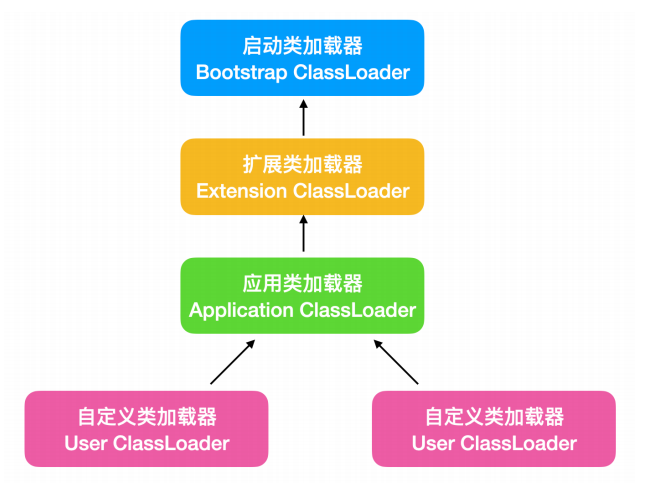

# 枚举

## 枚举的使用Demo

下面看一段骚气的代码

```java
public String judge(String str){
    if("AAA".equals(str)){
        return "AAA";
    }else if("BBB".equals(str)){
        return "BBB";
    }else if("CCC".equals(str)){
        return "CCC";
    }else if("DDD".equals(str)){
        return "DDD";
    }
}
```

- 条件一多 就要该源码【扩展性弱】，有没有解决办法
- 代码看起来不优雅，有没有解决办法

**枚举！**

> **第一版，用枚举替代if else**

```java
// 直接用枚举
enum RoleOperation1 {
    ADMIN_POWER,
    NORMAL_POWER,
    SUPER_POWER
}

// 因为有返回值 所以这样定义
enum RoleOperation2 {
    ADMIN_POWER() {
        @Override
        public String toString() {
            return "Admin power";
        }
    },
    NORMAL_POWER() {
        @Override
        public String toString() {
            return "Normal power";
        }
    },
    SUPER_POWER() {
        @Override
        public String toString() {
            return "Super power";
        }
    }
}

// 因为有统一的方法，所以用接口定义规则
interface Operation {
    String op();
}

//  漂亮的枚举代码，虽然看起来长，复杂，但是拓展性特别强！
// 下面就是见证奇迹的时刻，优雅地用枚举替代if else。
public enum RoleOperation implements Operation {
    ADMIN_POWER() {
        @Override
        public String op() {
            return "Admin power";
        }
    },
    NORMAL_POWER() {
        @Override
        public String op() {
            return "Normal power";
        }
    },
    SUPER_POWER() {
        @Override
        public String op() {
            return "Super power";
        }
    }
}
```

```java
public class Demo1 {
    // 如此优雅的代码！！
    // 还有用工厂模式 策略模式的。感觉都不如枚举来的优雅。
    public String judge(String role) {
        return RoleOperation.valueOf(role).op();
    }
}
```

## 枚举的常用方法

| values()    | 以数组形式返回枚举类型的所有成员 |
| ----------- | -------------------------------- |
| valueOf()   | 将普通字符串转换为枚举实例       |
| compareTo() | 比较两个枚举成员在定义时的顺序   |
| ordinal()   | 获取枚举成员的索引位置           |

```java
package org.example.enumeration;

import org.junit.jupiter.api.Test;

// 枚举中一些常用方法
public class SomeFunc {
    @Test
    public void func1() {
        Color[] values = Color.values();
        for (Color c : values) {
            System.out.println(c);
        }
    }

    @Test
    public void func2() {
        //  将普通字符串实例转换为枚举
        Color blue = Color.valueOf("BLUE");
        System.out.println(blue);
    }

    @Test
    public void func3() {
        System.out.println(Color.BLUE.ordinal());
    }


    /**
     *     public final int compareTo(E o) {
     *         Enum<?> other = (Enum<?>)o;
     *         Enum<E> self = this;
     *         if (self.getClass() != other.getClass() && // optimization
     *             self.getDeclaringClass() != other.getDeclaringClass())
     *             throw new ClassCastException();
     *         return self.ordinal - other.ordinal;
     *     }
     */
    @Test
    public void func4() {
        // RED 和 BLUE比较， RED小于BLUE 返回负数 ；equals返回0；大于返回 正数
        System.out.println(Color.RED.compareTo(Color.BLUE)); // -1
        System.out.println(Color.RED.compareTo(Color.GREEN));// -2
    }

    @Test
    public void func() {
        System.out.println(Color.RED);
        // output RED
    }

}

enum Color {
    RED, BLUE, GREEN
}
```

# 比较对象

## Comparator和Comparable

Comparable接口/ Comparator接口

- Comparator  函数式接口 jdk1.8引入
- Comparable 普通接口


# 一、单元测试

## 1.1 单元测试的优点

保证的程序代码的正确性【语法上了逻辑上】。

## 1.2 单元测试的使用【`junit`】

@Test0

- @Before 无论Test是否出现异常，都会执行 【初始化资源】
- @After 无论Test是否出现异常，都会执行 【销毁资源】

```java
public class JunitDemo {
    private OutputStream outputStream;

    @Before
    public void init() throws FileNotFoundException {
        System.out.println("IO 流初始化完毕了");
        outputStream = new FileOutputStream("junit.txt");
    }

    @Test
    /**
     * 单元测试判断数据的正确性
     * 一般用Assert里面的方法
     */
    public void fn1(){
        // 断言不为null  不是null则成功
        Assert.assertNotNull(outputStream);
    }

    @After
    public void destory() throws IOException {
        System.out.println("IO 流关闭了");
        outputStream.close();
    }
}
```

## 1.3 单元测试是如何运行的


# 二、反射

## 2.1 反射概述

反射可以把类的各个组成部分封装为其他对象。

反射，Java的高级特性，流行的框架基本都是基于反射的思想写成的。

Java反射机制是在程序的运行过程中，对于任何一个类，都能够知道它的所有属性和方法；对于任意一个对象，都能够知道它的所有属性和方法，**<span style="color:green">这种动态获取信息以及动态调用对象方法的功能称为Java语言的反射机制。</span>**

Java反射机制主要提供了以下这几个功能：

- 在运行时判断任意一个对象所属的类
- 在运行时构造任意一个类的对象
- 在运行时判断任意一个类所有的成员变量和方法
- 在运行时调用任意一个对象的方法

## 2.2 反射的基本操作

### 2.2.1 获取成员变量

- `File[] getFileds()` // **获得所有公有字段，包括继承的**
- `Filed getFiled(String name)` // 获取指定name的
- `Filed[] getDeclaredFileds() `// 获取该类自己声明的，包括私有
- `Filed[] getDeclaredFileds(String name)` // 获取指定名称的

### 2.2.2 获取构造方法

- `Constructor<?>[] getConstructors()` // 获得所有公有构造器

- `Constructor<?> getConstructor(Class<?>...parameterTypes)` //获得指定参数的公有构造器
- `Constructor<?>[]getDeclaredConstructors()`// 获得所有私有构造器
- `Constructor<T>[]getDeclaredConstructors()`//  得指定参数的构造器【包括public~~~private 】

### 2.2.3 获取成员方法

- `Method[] getMethods()` // **获得所有public修饰的方法，包括继承的**

- `Method getMethod(String name, Class<?>... parameterTypes)` // 获得指定名称和参数类型的public修饰的方法
- `Method[] getDeclaredMethods()` //获得所有的私有方法
- `Method getDeclaredMethod(String name, Class<?>... parameterTypes)` // 获得指定名称和参数类型的方法

### 2.2.4 获取类名

- `String getName()` // 获得类全名`com.bbxx.junits.Son`

### 2.2.5 几个重要的类


####  2.2.5.1 Class类

每定义一个`java` `class` 实体都会产生一个Class对象。我们编写一个类，编译完成后，在生成的 `.class`文件中，就会产生一个Class对象，这个Class对象用于表示这个类的类型信息。Class中没有公共构造器，即Class对象不能被实例化。

#### 2.2.5.2 Field类

Field类提供类或接口中单独字段的信息，以及对单独字段的动态访问。

#### 2.2.5.3 Method类

```java
invoke(Object obj, Object... args)
```

#### 2.2.5.4 `ClassLoader`类

**<span style="color:green">ClassLoader类加载器！类加载器用来把类（class）装载进JVM的。ClassLoader使用的双亲委派模型来搜索加载类的，这个模型也就是双亲委派模型。</span>**

**`ClassLoader`的类继承图如下：**



## 2.3 动态代理

### 2.3.1 作用

运行时，动态创建一组指定的接口的实现类对象！（在运行时，创建实现了指定的一组接口的对象）

动态代理对比其他方法增强方式


### 2.3.2 基本Demo

```java
interface A{    
}
interface B{
}
Object o = 方法(new Class[]{ A.class, B.class })
o 它实现了A和B两个接口！
```

```java
Object proxyObject = Proxy.newProxyInstance(ClassLoader classLoader, Class[] interfaces, InvocationHandler h);
```

- 方法的作用：动态创建实现了interfaces数组中所有指定接口的实现类对象！
- `ClassLoader`：类加载器！
  - 它是用来加载器的，把.class文件加载到内存，形成Class对象！
- `Class[ ] interfaces`：指定要实现的接口们。
- `InvocationHandler`：代理对象的所有方法（个别不执行，一般`nativate`方法不会执行，但是`hashCode`却会执行，好奇怪）都会调用`InvocationHadnler`的`invoke()`方法
- 动态代理的作用
  - 最终是学习`AOP`（面向切面编程），它与装饰者模式有点相似，它比装饰者模式更灵活（潜在含义，动态代理更难！）

**动态代理基本Demo**

```java
interface IBase {
    public void say();

    public void sleep();

    public String getName();
}
```

```java
public class Person implements IBase {
    public void say() {
        System.out.println("hello");
    }

    public void sleep() {
        System.out.println("sleep");
    }

    public String getName() {
        return "getName";
    }
}
```

```java
public class ProxyDemo1 {
    public static void main(String[] args) {

        Person person = new Person();
        // 获得类加载器
        ClassLoader classLoader = person.getClass().getClassLoader();
        // 获得被代理对象实现的接口
        Class[] interfaces = person.getClass().getInterfaces();
        // 实例化一个处理器 用于增强方法用的
        InvocationHandler h = new InvocationHandler() {
            @Override
            public Object invoke(Object proxy, Method method, Object[] args) throws Throwable {
                method.invoke(person, args);
                return null;
            }
        };
        IBase p = (IBase) Proxy.newProxyInstance(classLoader, interfaces, h);
        // 获得代理类的名称 com.sun.proxy.$Proxy0
        System.out.println(p.getClass().getName());
        p.say();
    }
}
```


### 2.3.3 invoke解释

```java
public Object invoke(Object proxy, Method method, Object[] args)
```

**这个invoke什么时候被调用？**

- 在调用代理对象所实现接口中的方法时被调用！

**参数解释**

- `Object proxy`：当前对象，即代理对象！在调用谁的方法！
- `Method method`：当前被调用的方法（目标方法）
- `Object [ ] args`：实参
- 返回的是方法的返回值。


**Demo**

```java
public class ProxyDemo2 {
    public static void main(String[] args) {
        Person person = new Person();
        ClassLoader classLoader = person.getClass().getClassLoader();
        Class[] interfaces = person.getClass().getInterfaces();
        System.out.println(interfaces.length);
        InvocationHandler h = new InvocationHandler() {
            @Override
            public Object invoke(Object proxy, Method method, Object[] args) throws Throwable {
                Object retVal = method.invoke(person, args);
                 // 这个返回了，方法才有返回值 
                return retVal; 
            }
        };
        IBase p = (IBase) Proxy.newProxyInstance(classLoader, interfaces, h);
        p.say();
        // invoke返回null的话，这里的输出就是null
        System.out.println(p.getName());
    }
}
```

## 2.4 简单模拟`Spring AOP`

`Spring AOP`，感受一下什么叫增强内容可变！

- `ProxyFactory` 代理工厂
- `IBeforeAdvice` 前置通知接口【方法执行前调用前置】
- `IAfterAdvice` 后置通知接口【方法执行后调用后置】
- `IWaiter` 服务员类接口
- `ManWaiterImple` 具体的服务员类【对他进行增强】

# 三、注解

**注解也叫元数据**。是一种代码级别的说明，JDK1.5引入的特性，与类，接口，枚举是在同一层次。**可声明在包，类，字段，方法，局部变量，方法参数等的前面**，对这些元素进行说明。

**作用分类：**

1.代码分析，通过代码里标识的元数据对代码进行分析【结合反射技术】

2.编译检查，通过代码里标识的元数据让编译器能够实现机泵的编译检查【Override】

3.编写文档，通过代码里标识的元数据生成文档【生成文档doc文档】

## 3.1 内置注解

- `Override`：检测被标注的是否继承自父类
- `Deprecated`：表示方法过时
- `SuppressWarnings`：压制警告
  - 一般传递参数all

## 3.2 自定义注解

> **元注解`public @interface annotationName{}`**

反编译发现，本质就是一个接口。

```java
import java.lang.annotation.Annotation;

public interface Annotation extends Annotation {
}
```

### 3.2.1 注解的属性

#### 3.2.1.1 属性的返回值

- 基本数据类型
- String
- 枚举
- 注解
- 以上类型的数组

#### 3.2.1.2 赋值问题

- 设置默认值`String sex() default "1";`
- 使用注解，数组类型的赋值 `str={xx,xx,xx}`，若数组中只有一个，大括号可省略。回忆Spring中注解

				* 基本数据类型
				* String
				* 枚举
				* 注解
				* 以上类型的数组
## 3.3 元注解

用于描述注解的注解

- `@Target`：描述注解的位置
  - `ElementType`取值
    - TYPE：可以作用于类上
    - METHOD：可以作用于方法上
    - FIELD：可以作用于成员变量上
- `@Retention`：描述注解是被保留的阶段
  - `@Retention(RetentionPolicy.RUNTIME)`：当前被描述的注解，会保留到class字节码文件中，并被`JVM`读取到
- `@Documented`：描述注解是否被抽取到api文档中
- `@Inherited`：描述注解是否被子类继承

## 3.4 注解的解析

```java
@Target(ElementType.TYPE)
@Retention(RetentionPolicy.RUNTIME)
public @interface Pro {
    String className();
    String methodName();
}

@Pro(className = "com.bbxx.Demo1",methodName = "show1")
public class RefelectDemo {
    public static void main(String[] args) throws ClassNotFoundException, NoSuchMethodException, InvocationTargetException, IllegalAccessException, InstantiationException {
        /**
         * 解析注解
         */
        Class<RefelectDemo> refelectDemoClass = RefelectDemo.class;
        Pro annotation = refelectDemoClass.getAnnotation(Pro.class);
        String s = annotation.className();
        String s1 = annotation.methodName();
        Class<?> aClass = Class.forName(s);
        Object o = aClass.newInstance();
        Method declaredMethod = aClass.getDeclaredMethod(s1);
        declaredMethod.setAccessible(true);
        declaredMethod.invoke(o);
    }
}
```

# 四、类加载器

## 分类

`ClassLoad`分类

- 引导 类加载器----->负责加载类库 rt中的jar 【最高，Bootstrap】
- 扩展 类加载器----->负责加载扩展jar包  ext下的都是扩展jar
- 系统 类加载器----->应用下的类，包含开发人员写的类和三方jar包【最低】

`ClassLoad`有个双亲委派模型，会先问父   类加载器/上级类加载器，向上级委托，没有就自己加载，没找到就抛出`ClassNotFound`。永远不会出现类库中的类被系统加载器加载，应用下的类 被引导加载。

委托父加载器加载，父可以加载就让父加载。父无法加载时再自己加载。

- 可避免类的重复加载，父类加载器已经加载了该类时，就没必要子`ClassLoader`再加载一次了/
- 考虑到安全因素，`java`核心`api`中定义类型不会被随意替换。

## 类加载的顺序

```java
class MyApp{
    public static void main(String[]args){ // 系统加载
        // 也由系统加载
        A a = new A(); 
        // 也由系统加载 （从系统开始匹配，最终会委托上去， ...由引导加载）
        String s = new String();
    }
}

class String{ // 引导加载， String类，类库中的
    private Integer i;// 直接引导加载，毕竟无法委托了！
}
```

其实还得分线程，每个线程都有一个当前的类加载器来负责加载类。

## 流程

基础阶段 **了解**，中级阶段 **熟悉**，高级阶段，**不清楚**。

继承`ClassLoader`类完成自定义类加载器。自定义类加载器一般是为了加载网络上的类，class在网络中传输，为了安全，那么class需要加密，需要自定义类加载器来加载（对class做解密工作）

`ClassLoader`加载类都是通过==`loadClass()`==方法来完成的。`loadClass()`方法的工作流程如下：

- 调用==`findLoadedClass()`==方法查看该类是否已经被加载过了，如果该类没有加载过，那么这个方法返回null。
- 判断`findLoadedClass()`返回的是否为null,如果不是null那么直接返回，可避免同一个类被加载两次。
- 如果`findLoadedClass()`返回的是null, 那么就启动代理模式（委托机制），即调用上级的`loadClass()`方法，获取上级的方法是`getParent()`，当然上级可能还有上级，这个动作就一直向上走；（==双亲委派机制==，tomcat破坏了双亲委派模型）
- 如果`getParent().loadClass()`返回的不是null，这说明上级加载成功了，那么就加载结果；
- 如果上级返回的是null，说明需要自己出手，`loadClass()`方法会调用本类的`findClass()`方法来加载类
- 这说明我们只需要重写`ClassLoader`的`findClass()`方法，这就可以了！如果重写了`loadClass()`方法覆盖了代理模式！

我们要自定义一个类加载器，只需要继承`ClassLoader`类。然后重写它的`findClass()`方法即可。在`findClass()`中我们需要完成如下的工作！

- 找到class文件，把它加载到一个byte[]中
- 调用`defineClass()`方法，把byte[]传递给这个方法即可

## 自定义类加载器Demo

```java
package org.example.classloader;

import java.io.File;
import java.io.FileInputStream;
import java.lang.reflect.Method;

/**
 * 类加载器学习
 */
// 注意maven中的单元测试只能写在 test下面！
// 字节码文件请自己生成一个 然后调用对应的方法哦！！
public class ClassLoaderDemo extends ClassLoader {

    // 类加载器的地盘，指明加载那个地方的class文件
    private String classpath;

    public ClassLoaderDemo() {
    }

    public ClassLoaderDemo(String classpath) {
        this.classpath = classpath;
    }

    public static void main(String[] args) throws Exception {
        ClassLoaderDemo classLoaderDemo = new ClassLoaderDemo();
        classLoaderDemo.fun2();
    }

    // 执行字节码的非静态方法
    public void fun1() throws Exception {
        ClassLoaderDemo classLoaderDemo = new ClassLoaderDemo("D:\\");
        Class<?> clazz = classLoaderDemo.loadClass("org.example.classloader.ClassLoaderTest");
        // loaderSay是一个非静态方法，需要一个实例调用
        Method loaderSay = clazz.getMethod("loaderSay");
        ClassLoaderTest o = (ClassLoaderTest) clazz.newInstance();
        // 非静态方法需要一个实例进行调用
        loaderSay.invoke(o);
    }


    // 执行字节码的静态方法
    public void fun2() throws Exception {
        ClassLoaderDemo classLoaderDemo = new ClassLoaderDemo("D:\\");
        Class<?> clazz = classLoaderDemo.loadClass("org.example.classloader.ClassLoaderTest");
        // loaderSay是一个非静态方法，需要一个实例调用
        Method loaderSay = clazz.getMethod("loaderStaticFunction");
        // 静态方法不用实例
        String result = (String) loaderSay.invoke(null);
        System.out.println(result);
    }


    // 重写这个方法即可
    @Override
    public Class<?> findClass(String name) throws ClassNotFoundException {
        try {
            // 自定义的方法，通过类名找到class文件，把文件加载到一个字节数组中
            byte[] datas = getClassData(name);
            if (datas == null) {
                throw new ClassNotFoundException("类没有找到：" + name);
            }
            return this.defineClass(name, datas, 0, datas.length);

        } catch (ClassNotFoundException e) {
            e.printStackTrace();
            throw new ClassNotFoundException("类找不到:" + name);
        }
    }

    private byte[] getClassData(String name) {
        // 把名字换成文件夹的名字
        name = name.replace(".", "\\") + ".class";
        File classFile = new File(classpath, name);
        System.out.println(classFile.getAbsoluteFile());
        return readClassData(classFile);
    }

    private byte[] readClassData(File classFile) {
        if (!classFile.exists()) return null;
        byte[] bytes = null;
        try {
            FileInputStream fis = new FileInputStream(classFile);
            bytes = fis.readAllBytes();
        } catch (Exception e) {
            e.printStackTrace();
        }
        return bytes;
    }
}
```

## Tomcat类加载器

tomcat提供了两种类加载器。

**第一种 服务器类加载器**

- ${CATALINA-HOME}\lib\，tomcat类加载器，它负责加载下面的类

**第二种 应用类加载器**

- ${CONTEXT}\WEB-INF\lib  
- ${CONTEXT}\WEB-INF\classes

**总结**

tomcat破坏了双亲委派模型

引导

扩展

系统

服务器类加载器：先自己动手，然后再去委托

应用类加载器：先自己动手，然后再去委托


## 自定义类加载器 Other Video

>**文件类加载器**

```java
public class MyClassLoader extends ClassLoader {
    private String directory;

    public MyClassLoader(String _directory, ClassLoader paraent) {
        super(paraent);
        this.directory = _directory;
    }

    protected Class<?> findClass(String name) throws ClassNotFoundException {
        try {
            // 把类名转为目录
            String file = directory + File.separator + name.replace(".", File.separator) + ".class";
            // 构建输入流
            InputStream fis = new FileInputStream(file);
            ByteArrayOutputStream baos = new ByteArrayOutputStream();
            byte[] buf = new byte[1024];
            int len = -1;
            while ((len = fis.read(buf)) != -1) {
                baos.write(buf, 0, len);
            }
            byte[] byteArray = baos.toByteArray();
            fis.close();
            baos.close();

            return defineClass(name, byteArray, 0, byteArray.length);
        } catch (Exception e) {
            e.printStackTrace();
        }
    }
}
```

热部署，越过双亲委派，就是不用`loadClass` 用`findClass`

# 五、并发（Core Java）

## 5.1 注意

> **不要调用Thread类或Runnable对象的run方法**。直接调用run方法会在同一个线程中执行----不会启动新的线程。调用`Thread.start()`方法会创建一个执行run方法的新线程。

> **线程的六种状态**

- New：新建
- Runnable：可运行【可能在运行 或 准备运行】
- Blocked：【阻塞】
- Waiting：【等待】
- Timed waiting：【具有指定等待时间的等待线程的线程状态。一个线程处于定时等待状态，这是由于调用了以下方法中的一种，具有指定的正等待时间】
- Terminated：【终止】

```java
//Thread内部的枚举类
public enum State {
    NEW,
    RUNNABLE,
    BLOCKED,
    WAITING,
    TIMED_WAITING,
    TERMINATED;
}
```

> **lock和unlock，unlock要放在finally中，确保锁可以被释放。**

> **可重入锁，获得锁的方法（代码）可以调用持有相同锁的方法**

> **`ReentrantLock()`**

- 公平锁和非公平锁。
- 公平锁倾向于选择等待时间长的线程，这种策略可能严重影响性能。
- 一般选择非公平锁。

> <span style="color:green">**Condition，用`ReentrantLock()`的实例对象获得Condition对象**</span>

- `await()` 将该线程放在这个条件的等待集中，<span style="color:green">**并放弃锁！**</span>
- `singalAll()` 激活等待这个条件的所有线程，把他们从等待集中移出，让他们重新成为可运行的线程！
- `singal()` 从该条件的等待集中随机选取一个从等待集中移出，让他们重新成为可运行的线程！
- <span style="color:green">**用if做条件判断不合适，存在虚假唤醒的问题，用while。【`JDK`注释中有说明】**</span>

> **synchronized**

> **线程就是一个单独的资源类，没有任何附属的操作。**

> **线程局部变量 `ThreadLocal`**

- `ThreadLocal.withInitial()`为函数式编程提供的方法

**Unsafe类啊！**


# 六 、`Servlet3.0`

- 注解
- 文件上传
- 异步处理 需要 `asyncSupported=true`，有过滤器的话，过滤器也要设置`asyncSupported = true`

使用型特性就是在保护你的Java职业生涯。

## 注解替代`xml`

```java

@WebServlet("/index.do")
public class IndexServlet extends HttpServlet {
    protected void doPost(HttpServletRequest request, HttpServletResponse response) throws ServletException, IOException {

    }

    protected void doGet(HttpServletRequest request, HttpServletResponse response) throws ServletException, IOException {
        request.setAttribute("data", fakeData());
        request.getRequestDispatcher("/demo.jsp").forward(request, response);
    }

    public ArrayList<User> fakeData() {
        ArrayList<User> users = new ArrayList<>();
        users.addAll(Arrays.asList(
                new User("111", "111"),
                new User("222", "222"),
                new User("333", "333")));
        users.forEach(System.out::println);
        return users;
    }
}
```

## 异步响应

- 异步响应如果不设置编码格式 可能会导致异步失败（有乱码，异步可能会失败；主要是告诉它响应文本是什么。）测试了一下，的确是设置好响应文本即可。

- 异步响应如果过滤器这些东西没有设置为异步状态，也会导致异步失败

  ```text
   * 类型 异常报告
   * 消息 当前链的筛选器或servlet不支持异步操作。
   * 描述 服务器遇到一个意外的情况，阻止它完成请求
   
   错误的原因就是过滤器没有设置  asyncSupported = true
  ```

**代码案例**

```java
@WebServlet(urlPatterns = "/async", asyncSupported = true)
public class AsyncServlet extends HttpServlet {
    protected void doPost(HttpServletRequest request, HttpServletResponse response) throws ServletException, IOException {
        doGet(request, response);
    }

    private char[] getOutPutChar(String str) {
        return str == null ? "   2020年 10月24日，祝各位程序员节日快乐！ 2020-1024=996，想不到吧！".toCharArray() : null;
    }

    protected void doGet(HttpServletRequest request, HttpServletResponse response) throws ServletException, IOException {
        // 不加设置响应的类型的话，就无法异步。
        response.setContentType("text/html");
        AsyncContext asyncContext = request.startAsync(request, response);
        threadOutPut(asyncContext, response, getOutPutChar(null));
    }

    /**
     * @param asyncContext
     * @param response
     * @param outputStr    需要输出给浏览器的数据
     */
    private void threadOutPut(AsyncContext asyncContext, HttpServletResponse response, char[] outputStr) {
        asyncContext.start(() -> {
            try {
                PrintWriter print = response.getWriter();
                TimeUnit.MILLISECONDS.sleep(600);
                for (char c : outputStr) {
                    TimeUnit.MILLISECONDS.sleep(180);
                    print.print(c); print.flush();
                }
                asyncContext.complete();
            } catch (Exception e) {
                e.printStackTrace();
            } finally {
                asyncContext.complete();
            }
        });
    }
}
```

## 文件上传

### 几个重要的API

```java
- request.getPart("file_name") // 获得文件对象Part
- part.getName() // 获得文件上传时的 name <input name="xx"> 中的name
- part.getSize() // 获得文件的大小
- part.getSubmittedFileName() // 获得提交的文件的名字。上传的是 demo.txt 那么得到的就是 demo.txt
- part.getInputStream(); // 获得文件输入流。

获取文件输入流后，在用输出流 存入磁盘。
```

**文件上传的简单Demo**

==文件上传用绝对路径【公司】==

```java
@WebServlet("/upload")
@MultipartConfig // 表示它支持文件上传
public class FileUpload extends HttpServlet {
    @Override
    protected void doPost(HttpServletRequest request, HttpServletResponse response) throws ServletException, IOException {
        Part part = request.getPart("file_name");
        System.out.println(part.getName());
        System.out.println(part.getSize());
        System.out.println(part.getSubmittedFileName());
        InputStream inputStream = part.getInputStream();
        // new FileOutputStream("filename") 这样是无法定位位置的，不能正常存储？
        //D:\citespace.projects.txt
        FileOutputStream fos = new FileOutputStream("D://" + part.getSubmittedFileName());
        // citespace.projects.txt
        // FileOutputStream fos = new FileOutputStream(part.getSubmittedFileName());
        byte[] bys = new byte[1024];
        int len = 0;
        while ((len = inputStream.read(bys)) != -1) {
            fos.write(bys, 0, len);
        }
        inputStream.close();
        fos.close();
    }
}
```

```html
<html>
<head>
    <title>Title</title>
</head>
<body>
    enctype 说明有文件要提交过去
<form action="/Tomcat/upload" method="post" enctype="multipart/form-data">
    <input type="file" name="file_name">
    <input type="submit">
</form>
</body>
</html>
```


